# 🧠 The Complete JVM Architecture Guide

> A from-scratch, interview-ready guide to how the Java Virtual Machine actually works — how your `.java` becomes running code, how classes get loaded, where memory lives, how garbage collection reclaims it, and how to profile and debug real production problems.
>
> Read it top to bottom and you'll be able to confidently answer "What happens when you run `java MyApp`?" in any FAANG interview — and actually debug a memory leak or a hung thread when it happens at work.

---

## 📑 Table of Contents

1. [The 30-Second Mental Model](#1-the-30-second-mental-model)
2. [JDK vs JRE vs JVM — Untangling the Acronyms](#2-jdk-vs-jre-vs-jvm--untangling-the-acronyms)
3. [The Three Faces of "JVM" (Spec, Implementation, Instance)](#3-the-three-faces-of-jvm-spec-implementation-instance)
4. [From `.java` to Running Code — The Compilation Pipeline](#4-from-java-to-running-code--the-compilation-pipeline)
5. [The Big Picture — Full JVM Architecture Diagram](#5-the-big-picture--full-jvm-architecture-diagram)
6. [The ClassLoader Subsystem](#6-the-classloader-subsystem)
    - [6.1 What a ClassLoader Does](#61-what-a-classloader-does)
    - [6.2 The Three Built-in ClassLoaders](#62-the-three-built-in-classloaders)
    - [6.3 The Three Principles: Delegation, Visibility, Uniqueness](#63-the-three-principles-delegation-visibility-uniqueness)
    - [6.4 The Three Phases: Loading → Linking → Initialization](#64-the-three-phases-loading--linking--initialization)
    - [6.5 Custom ClassLoaders](#65-custom-classloaders)
    - [6.6 `Class.forName()` vs `ClassLoader.loadClass()`](#66-classforname-vs-classloaderloadclass)
    - [6.7 `NoClassDefFoundError` vs `ClassNotFoundException`](#67-noclassdeffounderror-vs-classnotfoundexception)
7. [Runtime Data Areas — Where Everything Lives](#7-runtime-data-areas--where-everything-lives)
8. [The Execution Engine — Interpreter, JIT & Beyond](#8-the-execution-engine--interpreter-jit--beyond)
9. [GraalVM — The Polyglot, Native-Image JVM](#9-graalvm--the-polyglot-native-image-jvm)
    - [9.1 What GraalVM Is](#91-what-graalvm-is)
    - [9.2 GraalVM Architecture](#92-graalvm-architecture)
    - [9.3 JIT Mode vs Native Image (AOT)](#93-jit-mode-vs-native-image-aot)
    - [9.4 How Native Image Works — Closed-World & Reachability](#94-how-native-image-works--closed-world--reachability)
    - [9.5 Benefits & Trade-offs](#95-benefits--trade-offs)
    - [9.6 GraalVM vs the Traditional HotSpot JVM](#96-graalvm-vs-the-traditional-hotspot-jvm)
    - [9.7 Polyglot: One Runtime, Many Languages](#97-polyglot-one-runtime-many-languages)
    - [9.8 GraalVM on AWS Lambda — Killing the Cold Start](#98-graalvm-on-aws-lambda--killing-the-cold-start)
    - [9.9 Spring Boot 3 + Native Image — The Cold-Start Cure](#99-spring-boot-3--native-image--the-cold-start-cure)
10. [Garbage Collection — Deep Dive](#10-garbage-collection--deep-dive)
    - [10.1 The Core Algorithm: Mark, Sweep, Compact](#101-the-core-algorithm-mark-sweep-compact)
    - [10.2 The Generational Hypothesis](#102-the-generational-hypothesis)
    - [10.3 The Object Lifecycle: Eden → Survivor → Tenured](#103-the-object-lifecycle-eden--survivor--tenured)
    - [10.4 When Is an Object Eligible for GC?](#104-when-is-an-object-eligible-for-gc)
    - [10.5 Island of Isolation](#105-island-of-isolation)
    - [10.6 The Garbage Collectors (Serial → ZGC)](#106-the-garbage-collectors-serial--zgc)
    - [10.7 Tuning Flags Cheat Sheet](#107-tuning-flags-cheat-sheet)
11. [JVM Profiling — Finding the Bottleneck](#11-jvm-profiling--finding-the-bottleneck)
12. [Thread Dump Analysis — Debugging Hangs & Deadlocks](#12-thread-dump-analysis--debugging-hangs--deadlocks)
13. [❓ FAANG Interview Questions (70+)](#13--faang-interview-questions-70)
14. [⚡ Quick-Revision Cheat Sheet](#14--quick-revision-cheat-sheet)

---

## 1. The 30-Second Mental Model

Before the details, lock in the big idea.

> **The JVM is a "computer inside your computer."** Your real CPU only understands the machine code of your OS (x86, ARM, …). Java code is compiled instead into a universal "imaginary CPU" language called **bytecode**. The JVM is a program that pretends to be that imaginary CPU — it reads bytecode and translates it into your real machine's instructions, on the fly.

That single layer of indirection is the magic behind **"Write Once, Run Anywhere."** You ship one `.class` file, and the *JVM* (a different one for Windows, Mac, Linux, ARM) deals with the messy hardware differences.

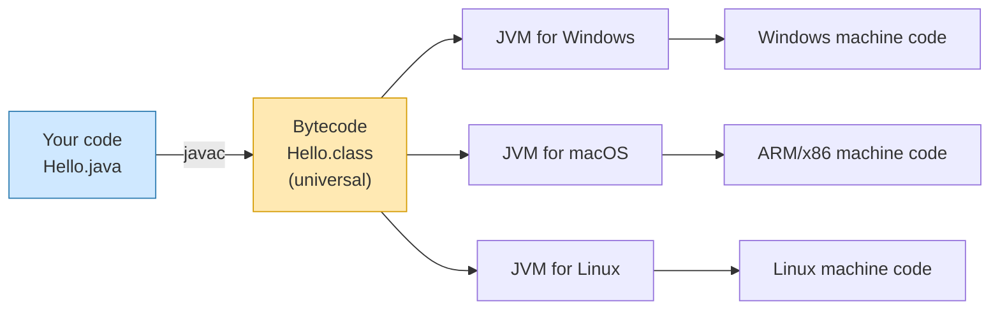

**Analogy — the universal travel adapter.** You buy *one* phone charger (your `.class` file). To use it in different countries you don't buy a new charger — you slot in a country-specific *adapter* (the JVM for that OS). The charger never changes; the adapter absorbs the differences in the wall socket.

---

## 2. JDK vs JRE vs JVM — Untangling the Acronyms

These three are nested like Russian dolls, and mixing them up is the single most common beginner confusion. Here's the containment relationship:

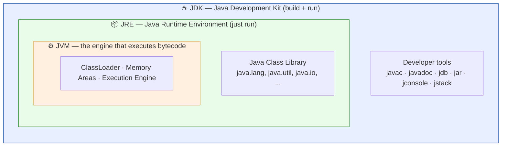

| Term | What it is | What it contains | You need it to… |
|------|-----------|------------------|-----------------|
| **JVM** | The abstract engine that executes bytecode | ClassLoader subsystem, runtime memory areas, execution engine (interpreter + JIT), GC | …actually *run* bytecode (it's the innermost piece) |
| **JRE** | The package required to **run** a Java program | A JVM **implementation** + the Java Class Library (standard APIs) | …run an existing `.jar`/`.class` on your machine |
| **JDK** | A superset of the JRE for **developers** | Everything in the JRE **+** `javac`, `javadoc`, `jar`, `jdb`, profiling/monitoring tools | …compile and develop Java applications |

**Key facts to remember:**

- The **JVM** is just a *specification* plus *implementations* of it (more on this next). Oracle's reference implementation is called **HotSpot**.
- The **JRE = JVM + libraries.** A JVM with no class library can't do much — even `System.out.println` lives in the library.
- The **JDK = JRE + tools.** If you can run `javac`, you have a JDK.
- Since Java 11, Oracle stopped shipping a standalone JRE; you typically get a full JDK (from Oracle or the open-source **OpenJDK** project) and can build a trimmed runtime with `jlink`.

**Analogy — a professional kitchen.**
- The **JVM** is the *oven* — the thing that actually cooks (executes).
- The **JRE** is the oven *plus a fully stocked pantry* (the standard libraries) — enough to cook any recipe handed to you.
- The **JDK** adds the *recipe-writing desk, knives, and measuring tools* (`javac` & friends) — everything a chef needs to *create* dishes, not just heat them up.

---

## 3. The Three Faces of "JVM" (Spec, Implementation, Instance)

When people say "JVM" they could mean one of three very different things. Interviewers love this distinction.

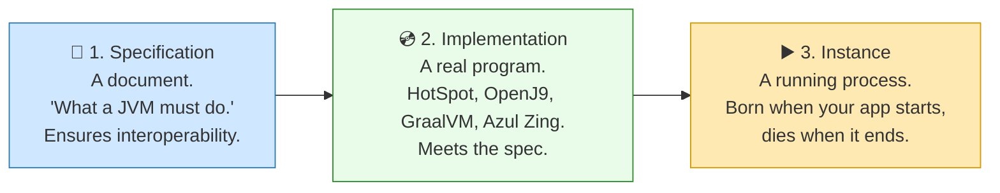

1. **The Specification** — a formal document published by Oracle describing exactly what any JVM must do. A single spec means every conformant JVM behaves identically, so your bytecode runs the same everywhere.
2. **An Implementation** — an actual program meeting that spec. Examples: Oracle/OpenJDK **HotSpot**, Eclipse **OpenJ9**, **GraalVM**, Azul **Zing**. Different vendors, same contract.
3. **An Instance** — a live, running JVM **process** hosting *one* application.

**The lifetime of a JVM instance:** A runtime instance has one mission in life — run a single Java application. When the app starts, an instance is **born**; when the app exits, the instance **dies**.

> 💡 Run three Java programs at once on the same machine with the same JVM, and you get **three independent JVM instances** — three separate processes, three separate heaps, fully isolated from one another.

**Analogy.** The specification is the *blueprint of a car model*. An implementation is *a factory that builds cars to that blueprint* (Toyota vs Honda both build to "sedan spec"). An instance is *the specific car in your driveway with the engine running*.

---

## 4. From `.java` to Running Code — The Compilation Pipeline

Here is the full journey of a Java program, from text you type to instructions your CPU runs.

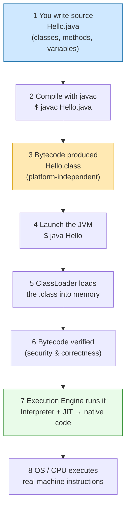

Step by step:

1. **Write** your code in a `.java` file — classes, methods, variables, objects.
2. **Compile** with `javac`. This is *ahead-of-time* compilation, but only down to bytecode — not native code.
3. The compiler emits a **`.class` file** containing **bytecode** (also called "byte code"). Bytecode is the instruction set of the imaginary JVM "CPU."
4. You run `java Hello`, which **starts a JVM instance**.
5. The **ClassLoader** subsystem reads the `.class` file into memory.
6. The bytecode is **verified** — the JVM checks it isn't malformed or malicious (no illegal casts, no stack overflows from bad bytecode, etc.).
7. The **Execution Engine** runs the bytecode — first *interpreting* it line by line, then *JIT-compiling* hot paths into native machine code for speed.
8. The OS/CPU executes the resulting native instructions.

> 📌 At its core the JVM has exactly **two jobs**: (1) **load** a class file (bytecode), and (2) **run** that bytecode. Everything else — class loading, memory management, JIT, GC — is in service of those two jobs.

> **Why two compilation stages?** `javac` makes Java *portable* (one bytecode for all platforms). The JIT inside the JVM makes it *fast* (native code tuned to the actual CPU it's running on, with runtime profiling info that an ahead-of-time compiler could never have). You get portability *and* near-native speed.

<details>
<summary>📄 <strong>See it end-to-end (sample code & commands)</strong></summary>

```java
// Hello.java
public class Hello {
    public static void main(String[] args) {
        System.out.println("Hello, JVM!");
    }
}
```

```bash
# 1. Compile source → bytecode
$ javac Hello.java          # produces Hello.class

# 2. Peek at the bytecode the JVM will actually run
$ javap -c Hello
#   public static void main(java.lang.String[]);
#     0: getstatic     #2  // Field java/lang/System.out:Ljava/io/PrintStream;
#     3: ldc           #3  // String Hello, JVM!
#     5: invokevirtual #4  // Method java/io/PrintStream.println:(Ljava/lang/String;)V
#     8: return

# 3. Run it — this starts a fresh JVM instance
$ java Hello
Hello, JVM!
```

Notice the bytecode (`getstatic`, `ldc`, `invokevirtual`) — these are the "imaginary CPU" instructions, identical on every platform. The JVM turns them into real machine code at runtime.
</details>

---

## 5. The Big Picture — Full JVM Architecture Diagram

Everything inside a running JVM falls into **three subsystems**. Keep this diagram in your head; the rest of the guide just zooms into each box.

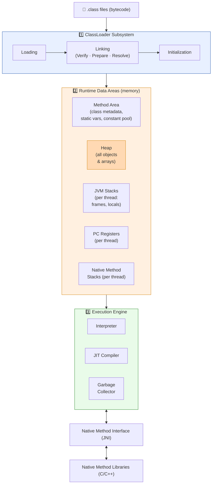

| Subsystem | Responsibility | Covered in |
|-----------|----------------|------------|
| **ClassLoader** | Find, load, link, and initialize classes | [§6](#6-the-classloader-subsystem) |
| **Runtime Data Areas** | Hold all the data a running program needs (classes, objects, stacks) | [§7](#7-runtime-data-areas--where-everything-lives) |
| **Execution Engine** | Execute bytecode (interpret + JIT) and reclaim memory (GC) | [§8](#8-the-execution-engine--interpreter-jit--beyond), [§10](#10-garbage-collection--deep-dive) |

The **JNI** (Java Native Interface) and native libraries sit alongside — they let Java call into C/C++ code (e.g. OS-level operations the JVM itself uses).

---

## 6. The ClassLoader Subsystem

### 6.1 What a ClassLoader Does

A **ClassLoader** is the part of the JRE that **dynamically loads classes into the JVM at runtime**. It doesn't load every class up front — it loads each class **lazily, on first use**. When your code first references `Customer`, the ClassLoader springs into action, finds `Customer.class` (on disk, on the network, inside a JAR, or anywhere else), and brings it into memory.

> **Analogy — a librarian fetching books on demand.** You don't haul the entire library home at once. When you *ask* for a specific book (reference a class), the librarian (ClassLoader) walks to the right shelf and brings only that book. If a chapter cites another book, the librarian fetches *that* one too — exactly when needed, never before.

The source can be the local filesystem, a network URL, a database, or an encrypted blob — which is what makes things like hot-deploy, plugins, and app servers possible.

### 6.2 The Three Built-in ClassLoaders

Java ships with three default loaders, arranged in a **parent-child hierarchy**. Each has a fixed, predefined location it loads from.

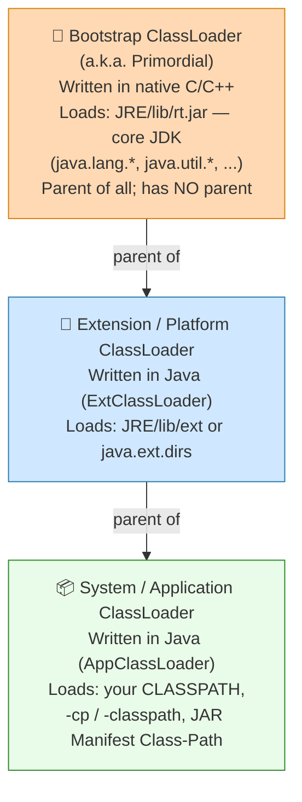

| ClassLoader | Loads from | Written in | Notes |
|-------------|-----------|-----------|-------|
| **Bootstrap** (Primordial) | `JRE/lib/rt.jar` (core JDK classes) | Native (C/C++) | The root. Has **no parent**. `String.class.getClassLoader()` returns `null` because `String` is loaded here. |
| **Extension** (Platform, since Java 9) | `JRE/lib/ext` or dirs in `java.ext.dirs` | Java — `sun.misc.Launcher$ExtClassLoader` | Child of Bootstrap. |
| **System / Application** | `CLASSPATH` env var, `-cp`/`-classpath`, JAR Manifest `Class-Path` | Java — `sun.misc.Launcher$AppClassLoader` | Child of Extension. Loads **your** application classes. |

> 🔎 **Every loader except Bootstrap is a subclass of `java.lang.ClassLoader`.** Bootstrap is native because *something* has to load `java.lang.ClassLoader` itself — a chicken-and-egg problem solved by writing the first loader in C.

<details>
<summary>📄 <strong>Code: who loaded what?</strong></summary>

```java
public class WhoLoadedMe {
    public static void main(String[] args) {
        // App classes → Application ClassLoader
        System.out.println("This class : " + WhoLoadedMe.class.getClassLoader());

        // Core JDK classes → Bootstrap (returns null, it's native)
        System.out.println("String     : " + String.class.getClassLoader());

        // Walk the hierarchy upward
        ClassLoader cl = WhoLoadedMe.class.getClassLoader();
        while (cl != null) {
            System.out.println("Loader: " + cl);
            cl = cl.getParent();
        }
        System.out.println("Loader: Bootstrap (null)");
    }
}
/* Typical output (Java 8):
   This class : sun.misc.Launcher$AppClassLoader@18b4aac2
   String     : null
   Loader: sun.misc.Launcher$AppClassLoader@18b4aac2
   Loader: sun.misc.Launcher$ExtClassLoader@1b6d3586
   Loader: Bootstrap (null)
*/
```
</details>

### 6.3 The Three Principles: Delegation, Visibility, Uniqueness

ClassLoaders operate on three rules. Understanding **delegation** is the single most-asked ClassLoader interview topic.

#### 🔼 Delegation Principle

When asked to load a class, a loader **does not load it itself first** — it **delegates upward to its parent**, all the way to Bootstrap. Only if every ancestor *fails* to find the class does the original loader try to load it. This is the **parent-delegation model**.

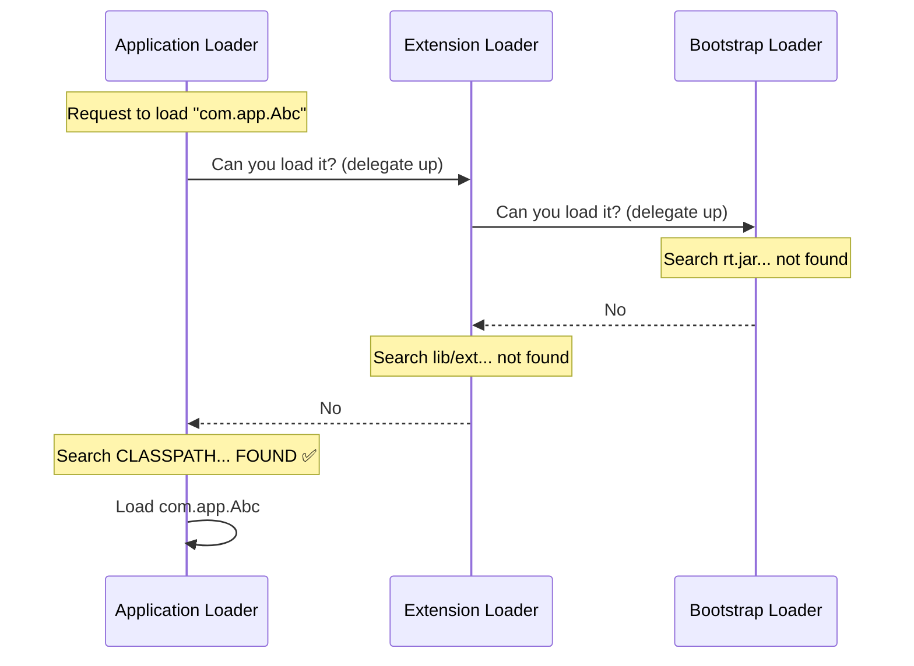

**Walkthrough** for an app class `Abc.class`:
1. Request hits the **Application** loader → it delegates **up** to Extension.
2. Extension delegates **up** to Bootstrap.
3. Bootstrap looks in `rt.jar` — not there → returns to Extension.
4. Extension looks in `jre/lib/ext` — not there → returns to Application.
5. Application finds `Abc` on the CLASSPATH and loads it. ✅

> **Why delegate upward?** *Security and consistency.* It guarantees core classes are **always** loaded by the trusted Bootstrap loader. You cannot write a malicious `java.lang.String` on your classpath and have it hijack the real one — the request always reaches Bootstrap *first*, which loads the genuine `String` from `rt.jar`. Delegation is the JVM's defense against class spoofing.

#### 👁️ Visibility Principle

A **child can see classes loaded by its parent**, but a **parent cannot see classes loaded by a child.** (Children inherit the parent's "vision"; parents are oblivious to their children's work.)

#### 🔒 Uniqueness Principle

A class loaded by a parent should **not** be reloaded by a child. Delegation enforces this automatically — by always asking the parent first, the same class is never loaded twice in the same hierarchy. The pair `(fully-qualified-name, ClassLoader)` is the true identity of a class in the JVM.

> ⚠️ **Consequence:** the *same* `.class` loaded by *two different* loaders becomes **two distinct types** at runtime. Casting between them throws `ClassCastException` even though the source is identical. This is exactly how app servers isolate two web apps that both bundle, say, different versions of the same library.

<details>
<summary>📄 <strong>Code: visibility principle in action</strong></summary>

```java
public class ClassLoaderTest {
    public static void main(String[] args) {
        try {
            // 1. This class was loaded by the Application (System) loader
            System.out.println("Loaded by: "
                + ClassLoaderTest.class.getClassLoader());

            // 2. Now try to force-load it via the PARENT (Extension) loader.
            //    Parent can't see what the child loaded → ClassNotFoundException
            Class.forName("ClassLoaderTest", true,
                ClassLoaderTest.class.getClassLoader().getParent());
        } catch (ClassNotFoundException ex) {
            System.out.println("FAILED as expected: parent can't see child's class");
            ex.printStackTrace();
        }
    }
}
/* Output:
   Loaded by: sun.misc.Launcher$AppClassLoader@601bb1
   FAILED as expected: parent can't see child's class
   java.lang.ClassNotFoundException: ClassLoaderTest
       at java.net.URLClassLoader$1.run(...)
       ...
   Because the Extension (parent) loader looks only in jre/lib/ext,
   it never finds an application class on the CLASSPATH.
*/
```
</details>

### 6.4 The Three Phases: Loading → Linking → Initialization

Getting a class "ready to use" is not one step but three, and **Linking** itself has three sub-steps.

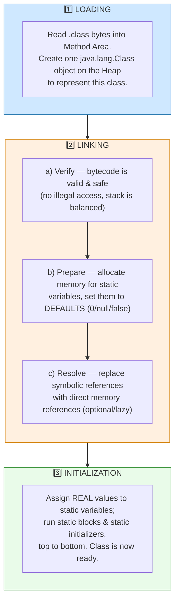

**1. Loading.** The loader reads the `.class` file and stores its binary data (fully-qualified name, parent/superclass info, methods, fields, whether it's a class/interface/enum) in the **Method Area**. Immediately after, the JVM creates **one `java.lang.Class` object on the Heap** to represent this class. That object is your gateway to **reflection** (`getMethods()`, `getFields()`, etc.).

> 🔑 **Exactly one `Class` object per loaded class**, no matter how many times you use it. `Class.forName("Student")` always hands you that same singleton object.

**2. Linking** — three sub-steps:
- **Verify:** the **Bytecode Verifier** confirms the code is well-formed and won't violate JVM safety (e.g. no operand-stack overflows, no illegal type conversions). A `VerifyError` is thrown if it fails. This is why Java can safely run untrusted bytecode.
- **Prepare:** memory is allocated for **static** variables and they're set to **default values** (`0`, `0.0`, `false`, `null`) — *not* their assigned values yet.
- **Resolve:** symbolic references in the constant pool (e.g. "the class named `String`") are replaced with **direct references** (actual pointers). Often done lazily, on first use.

**3. Initialization.** Static variables get their **real, programmer-assigned values**, and **`static {}` blocks run**, top to bottom. This is the moment a class truly comes alive.

<details>
<summary>📄 <strong>Code: Prepare vs Initialize — the default-then-real two-step</strong></summary>

```java
public class Counter {
    static int count = 42;          // Prepare: count = 0;  Initialize: count = 42
    static { System.out.println("static block runs during INITIALIZATION"); }

    public static void main(String[] args) {
        System.out.println(count);  // 42
    }
}
/* Lifecycle of `count`:
   Loading        → Counter.class read into Method Area
   Linking→Prepare→ count allocated, set to default 0
   Linking→Resolve→ symbolic refs resolved
   Initialization → count set to 42, static block executes
*/
```
</details>

### 6.5 Custom ClassLoaders

Sometimes the three built-in loaders aren't enough — you need to load a class from somewhere unusual, or load the *same* class multiple times as distinct types. The default loaders refuse to reload a class already in the Method Area, so to get fresh/repeated loading or special sources, you write your own.

**Two steps to a custom loader:**
1. **Extend** `java.lang.ClassLoader`.
2. **Override** `findClass()` (preferred) — or `loadClass()` if you need to bypass delegation — to fetch the bytes and call `defineClass()`.

**Real-world use cases (this is the "why" interviewers want):**
- **App servers (Tomcat, JBoss):** each web app gets its own loader, so two apps can bundle conflicting library versions without clashing — and an app can be **hot-redeployed** by throwing away its loader and creating a new one.
- **Plugin frameworks / OSGi:** load and *unload* modules at runtime.
- **Scripting & bean builders:** define classes generated on the fly (e.g. Jython, Groovy).
- **Encrypted bytecode:** decrypt class bytes before defining them, protecting IP.
- **Load-time bytecode weaving:** AOP frameworks (AspectJ) and instrumentation agents rewrite bytecode as it loads.

<details>
<summary>📄 <strong>Code: a minimal custom ClassLoader</strong></summary>

```java
import java.nio.file.*;

// Loads classes from an arbitrary directory on disk.
public class FileSystemClassLoader extends ClassLoader {
    private final String baseDir;

    public FileSystemClassLoader(String baseDir, ClassLoader parent) {
        super(parent);              // keep delegation intact!
        this.baseDir = baseDir;
    }

    @Override
    protected Class<?> findClass(String name) throws ClassNotFoundException {
        try {
            // com.app.Foo -> com/app/Foo.class
            String path = baseDir + "/" + name.replace('.', '/') + ".class";
            byte[] bytes = Files.readAllBytes(Paths.get(path));
            // turn raw bytes into a Class object
            return defineClass(name, bytes, 0, bytes.length);
        } catch (Exception e) {
            throw new ClassNotFoundException(name, e);
        }
    }
}
```

> ✅ **Best practice:** override `findClass()`, not `loadClass()`. The default `loadClass()` already implements parent-delegation correctly and calls `findClass()` only when the parents fail — so you get security for free.
</details>

### 6.6 `Class.forName()` vs `ClassLoader.loadClass()`

Both load a class dynamically, but they differ in **initialization** and **which loader is used** — a classic gotcha (think: why JDBC drivers historically used `Class.forName`).

| | `Class.forName("X")` | `ClassLoader.loadClass("X")` |
|---|---|---|
| **Initializes the class?** | **Yes** by default — runs static blocks immediately | **No** — only loads & links; statics run lazily on first real use |
| **Which loader?** | The **caller's** loader | The **specific loader** you invoked it on |
| **Overload control** | `Class.forName(name, initialize, loader)` lets you choose | You pick the loader directly |
| **Classic use** | JDBC: `Class.forName("...OracleDriver")` to trigger the driver's static registration block | Frameworks needing a specific loader, deferred init |

> 💡 The reason old JDBC code wrote `Class.forName("oracle.jdbc.driver.OracleDriver")` is precisely the **initialization side effect** — the driver registers itself with `DriverManager` inside a `static {}` block, which only `forName` (not `loadClass`) triggers.

<details>
<summary>📄 <strong>Code: proving the initialization difference</strong></summary>

```java
public class TestClass {
    static { System.out.println("Static Initializer Called!!"); }
}

public class ClassLoadingExample {
    public static void main(String[] args) throws Exception {
        System.out.println("Before forName");
        Class.forName("TestClass");                 // initializes → static block FIRES
        System.out.println("After forName");
        ClassLoader.getSystemClassLoader().loadClass("TestClass"); // already loaded, no init
        System.out.println("After loadClass");
    }
}
/* Output:
   Before forName
   Static Initializer Called!!     <-- only forName triggered it
   After forName
   After loadClass
*/
```
</details>

### 6.7 `NoClassDefFoundError` vs `ClassNotFoundException`

Two errors that *sound* identical but mean very different things. Knowing the difference instantly signals seniority.

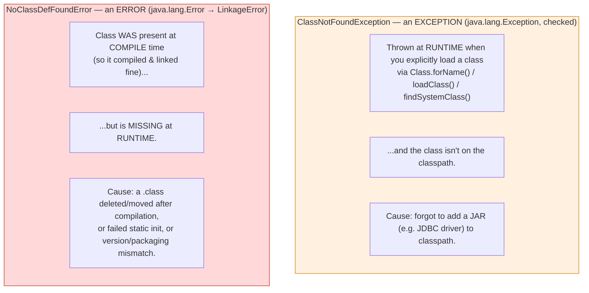

| | `ClassNotFoundException` | `NoClassDefFoundError` |
|---|---|---|
| **Type** | `java.lang.Exception` (checked) — you must handle it | `java.lang.Error` → `LinkageError` (unchecked) |
| **When** | Explicit dynamic load (`Class.forName`, `loadClass`) and class not on classpath | Class existed at **compile** time but absent at **run** time |
| **Thrown by** | The application itself, via the loading methods | The **JVM runtime system** |
| **Typical cause** | Missing JAR on classpath (e.g. DB driver not added) | A `.class` removed/moved after build, packaging error, or an exception in a `static` initializer |

**Memory hook:** *Exception = "I went looking for it on purpose and couldn't find it."* *Error = "It was here when we built; now the JVM can't find it and gives up."*

<details>
<summary>📄 <strong>Code: reproducing both</strong></summary>

```java
// --- ClassNotFoundException ---
public class CnfeDemo {
    public static void main(String[] args) {
        try {
            Class.forName("oracle.jdbc.driver.OracleDriver"); // driver JAR not on classpath
        } catch (ClassNotFoundException e) {
            e.printStackTrace(); // java.lang.ClassNotFoundException: oracle.jdbc.driver.OracleDriver
        }
    }
}

// --- NoClassDefFoundError ---
class A {}
public class B {
    public static void main(String[] args) {
        A a = new A();  // compiles fine -> A.class & B.class both produced
    }
}
/* Now DELETE A.class and run B:
   $ rm A.class && java B
   Exception in thread "main" java.lang.NoClassDefFoundError: A
       at B.main(B.java)
   Caused by: java.lang.ClassNotFoundException: A   <-- note: NCDFE is often CAUSED BY a CNFE underneath
*/
```
</details>

---

## 7. Runtime Data Areas — Where Everything Lives

Once classes are loaded, the JVM needs memory to hold class metadata, objects, and the per-thread bookkeeping for executing code. The spec defines **five** runtime data areas.

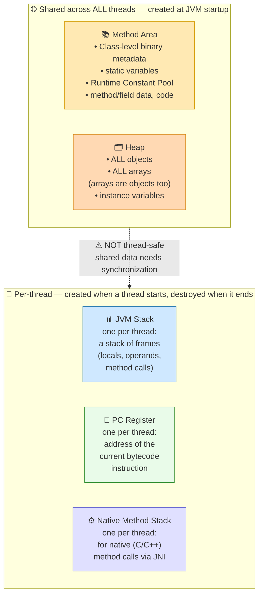

| Area | One per… | Stores | Thread-safe? | Error on exhaustion |
|------|----------|--------|--------------|---------------------|
| **Method Area** | JVM (shared) | Class metadata, **static** variables, runtime constant pool, method bytecode | No (shared) | `OutOfMemoryError: Metaspace` |
| **Heap** | JVM (shared) | **All objects & arrays**, instance variables | No (shared) | `OutOfMemoryError: Java heap space` |
| **JVM Stack** | Thread | **Frames**: local variables, partial results, method-call linkage | Yes (private) | `StackOverflowError` |
| **PC Register** | Thread | Address of the currently executing instruction | Yes (private) | — |
| **Native Method Stack** | Thread | State for native (JNI) method calls | Yes (private) | `StackOverflowError` |

**Two things to internalize:**

1. **Method Area + Heap are shared and created once at startup.** Because they're shared by every thread, they are **not thread-safe** — that's why you synchronize access to shared objects and static fields.
2. **Stack + PC + Native Stack are per-thread.** Each thread gets its own, so local variables are inherently thread-safe. This is the structural reason locals never need synchronization but instance/static fields do.

> **Analogy — an office building.**
> - The **Heap** is the big shared warehouse where all the *stuff* (objects) is stored — anyone can reach it, so you need rules (locks) to avoid collisions.
> - The **Method Area** is the building's *blueprints-and-rules room* — the definition of every department (class), the company-wide notice board (static vars), shared.
> - Each employee (**thread**) has their own *personal desk* (**Stack**) with a to-do list of nested tasks (frames) and a *finger on the current line* of their checklist (**PC register**). No one else touches your desk.

### Object vs Reference: Heap vs Stack

This trips up many people. When you write `Student s = new Student();`:
- The **object** (the actual `Student` data) lives on the **Heap**.
- The **reference** `s` (a pointer to that object) lives in the current **frame on the Stack**.

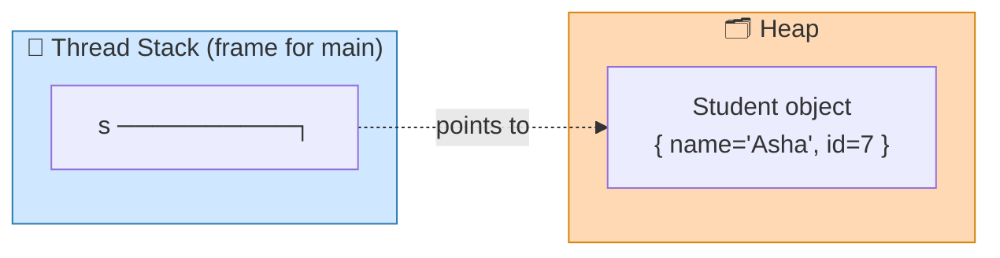

When `main` returns, the frame (and `s`) vanish instantly. The *object* lingers on the heap until the **garbage collector** decides nothing points to it anymore.

### Inspecting & Sizing JVM Memory

The `java.lang.Runtime` class (a **singleton** in `java.lang`) exposes live memory stats:

<details>
<summary>📄 <strong>Code: reading memory at runtime + key flags</strong></summary>

```java
public class MemPeek {
    public static void main(String[] args) {
        Runtime rt = Runtime.getRuntime();   // singleton
        long mb = 1024 * 1024;
        System.out.println("Max heap   (-Xmx): " + rt.maxMemory()   / mb + " MB");
        System.out.println("Total heap        : " + rt.totalMemory() / mb + " MB");
        System.out.println("Free heap         : " + rt.freeMemory()  / mb + " MB");
        System.out.println("Used heap         : " +
            (rt.totalMemory() - rt.freeMemory()) / mb + " MB");
    }
}
```

```bash
# Common sizing flags
-Xms256m        # initial (minimum) heap size
-Xmx1024m       # maximum heap size
-Xss512k        # size of each thread's stack
-Xmn256m        # size of the Young Generation
# (Java 8+) Metaspace replaced PermGen — it grows in native memory:
-XX:MetaspaceSize=128m
-XX:MaxMetaspaceSize=512m
```
</details>

### Heap & Native Memory Layout (annotated)

This is the canonical picture of how the runtime data area is carved up, and which flag controls each region:

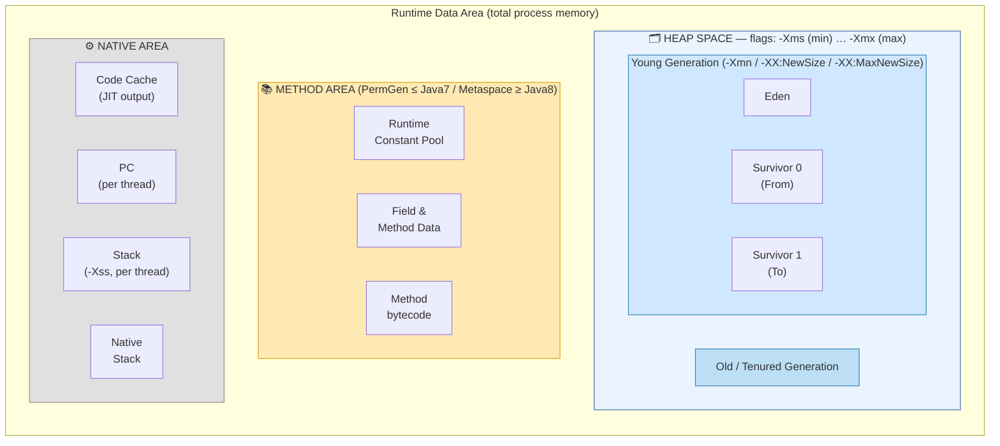

> **PermGen vs Metaspace (must-know for modern Java):** Up to **Java 7**, class metadata and the interned-String pool lived in a fixed-size **Permanent Generation (PermGen)** *inside the heap* — and overflowing it caused the infamous `OutOfMemoryError: PermGen space`. From **Java 8**, PermGen was **removed**; class metadata moved to **Metaspace**, which lives in **native memory** and auto-grows by default. (The interned-String pool moved to the regular heap back in Java 7.) So on Java 8+ you'll see `OutOfMemoryError: Metaspace`, not PermGen.

---

## 8. The Execution Engine — Interpreter, JIT & Beyond

The Execution Engine is what actually **runs** the loaded, verified bytecode. It has three collaborators:

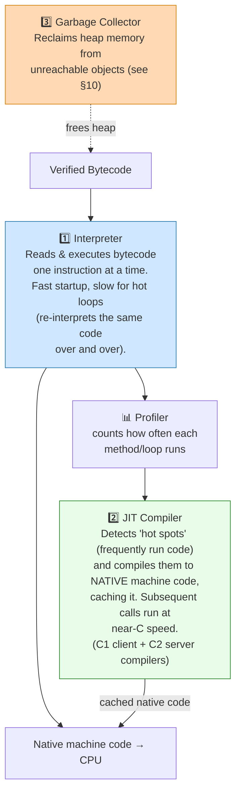

**1. The Interpreter.** Reads bytecode and executes it line by line. It starts **instantly** (no compile step), but it's slow when the same code runs repeatedly — it re-decodes the same instructions every iteration.

**2. The JIT (Just-In-Time) Compiler.** The JVM watches which methods/loops run often ("hot spots" — hence Oracle's **HotSpot** JVM). Once a method crosses a threshold, the JIT compiles that bytecode straight to **native machine code** and caches it in the **Code Cache**. From then on, that method runs at near-native speed. Because compilation happens *at runtime*, the JIT can use live profiling data (which branches actually fire, which types actually appear) to optimize better than a static ahead-of-time compiler — techniques like inlining, loop unrolling, escape analysis, and dead-code elimination.

> HotSpot ships **two** JIT compilers: **C1** (client — fast compile, lighter optimization) and **C2** (server — slower compile, aggressive optimization). Modern JVMs use **tiered compilation**, starting with C1 for quick wins and promoting the hottest code to C2.

**Analogy — interpreter vs JIT = live translator vs pre-translated book.** An **interpreter** is a translator standing next to you, translating each sentence aloud as you read — great if you only read a page once, exhausting if you re-read the same chapter 10,000 times. The **JIT** notices you keep re-reading that chapter, so it *prints a polished translated copy* once; every future read is instant.

**3. The Garbage Collector.** The execution engine's memory janitor — it runs as a daemon thread, finds heap objects nothing references anymore, and reclaims their space. That's the whole next section.

> **The interpreter/JIT split is why Java "warms up."** A freshly started JVM is slower (interpreting) and speeds up as the JIT kicks in. This is why benchmarks discard early iterations and why latency-sensitive services do "warm-up" requests before taking real traffic.

---

## 9. GraalVM — The Polyglot, Native-Image JVM

We just saw that the classic JVM trades **startup speed** for **peak speed**: it begins by interpreting, then the JIT warms up. That trade-off is fine for a server that runs for days — but terrible for a function that spins up, handles one request, and dies (hello, AWS Lambda). **[GraalVM](https://www.graalvm.org/)** is a high-performance JDK distribution from Oracle Labs that attacks exactly this problem, plus adds polyglot execution. It's the most important evolution of the Java runtime in the last decade, and an increasingly common interview topic.

### 9.1 What GraalVM Is

GraalVM is three things bundled together:

1. **A drop-in JDK** — run your existing Java apps unchanged, but with a smarter JIT.
2. **The Graal JIT compiler** — a modern, aggressively-optimizing compiler **written in Java** that can replace HotSpot's C2 compiler and often produces faster code.
3. **Native Image** — an **ahead-of-time (AOT)** compiler that turns your whole Java application into a **standalone native executable** with *no JVM needed at runtime*. This is the headline feature.

> **The one-sentence pitch:** GraalVM lets you either keep running on the JVM with a better JIT, or compile your app down to a tiny, instantly-starting native binary that behaves like a Go or Rust executable — no warm-up, minimal memory.

**Analogy — meal prep vs cooking to order.** The traditional JVM is a restaurant that *cooks every dish to order* (JIT compiling at runtime): the first few orders are slow while the kitchen warms up, but a busy kitchen running all night gets blazing fast. **Native Image** is *meal prep*: you cook everything ahead of time (AOT), vacuum-seal it, and at "runtime" you just reheat — ready in seconds, no warm-up, but you had to decide the entire menu in advance (the *closed-world assumption*, more on that below).

### 9.2 GraalVM Architecture

At the heart of GraalVM is a component called **Truffle** + the **Graal compiler**, sitting on a shared runtime called **SubstrateVM** (for native images).

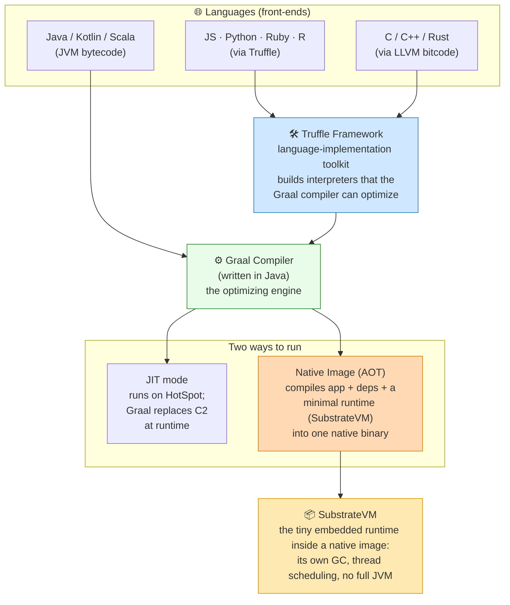

The pieces, in plain terms:

- **Graal compiler** — the optimizing compiler. In JIT mode it plugs into HotSpot via the **JVMCI** (JVM Compiler Interface) and replaces C2. In AOT mode it does the heavy lifting for Native Image.
- **Truffle** — a framework for *building language interpreters* that Graal can then optimize to near-native speed. This is how GraalVM runs JavaScript, Python, Ruby, R, and even LLVM languages, all on one runtime.
- **SubstrateVM** — a stripped-down runtime (its own garbage collector, thread support, etc.) that gets **baked into** each native image so the binary can run without an installed JVM.

### 9.3 JIT Mode vs Native Image (AOT)

These are the two ways to use GraalVM, and the distinction is the crux of every GraalVM discussion.

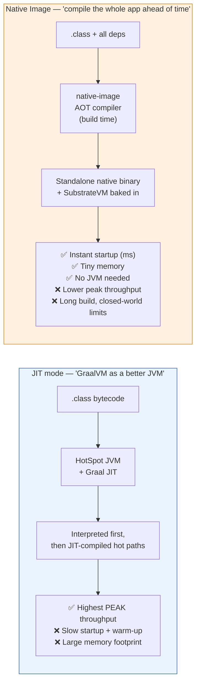

| Aspect | JIT mode (HotSpot + Graal) | Native Image (AOT) |
|--------|---------------------------|--------------------|
| **When compiled** | At runtime, lazily, as code gets hot | Ahead of time, at *build* time |
| **Startup time** | Slow (JVM boot + class loading + warm-up) | **Milliseconds** — code is already native |
| **Peak throughput** | **Highest** (JIT uses live profiling) | Slightly lower (no runtime profile feedback by default) |
| **Memory footprint** | Large (whole JVM + metadata) | **Small** (only what the app reaches) |
| **Binary** | Needs a JVM installed | Self-contained executable |
| **Reflection / dynamic loading** | Fully supported | Must be **declared** at build time (closed world) |
| **Best for** | Long-running servers, peak-perf batch | Serverless, CLIs, containers, microservices |

> 🔑 **The mental model:** JIT mode optimizes for a process that lives a *long* time (amortize warm-up over millions of requests). Native Image optimizes for a process that must be *fast right now* and may be *short-lived* — which is precisely the serverless/Lambda profile.

### 9.4 How Native Image Works — Closed-World & Reachability

`native-image` performs a **static, whole-program analysis** at build time. Starting from your `main()`, it computes the **reachable** set of classes, methods, and fields — *points-to analysis* — and **bakes only those** into the binary. Anything unreachable is discarded (this is why binaries are small).

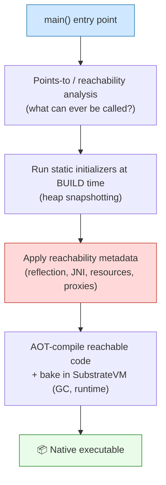

This requires the **Closed-World Assumption**: *everything the program will ever do must be known at build time.* That's a powerful constraint with one big consequence — Java's **dynamic features break unless declared**:

- **Reflection**, **dynamic proxies**, **JNI**, **resources loaded by name**, and **serialization** can't be discovered by static analysis, because the class names might come from config or strings at runtime.
- You must list them in **reachability metadata** (JSON config files like `reflect-config.json`), or use the GraalVM **tracing agent** to auto-generate that config by running your tests/app on a normal JVM first.

> ⚠️ This is the #1 practical gotcha. The good news: modern frameworks (Spring Boot 3, Quarkus, Micronaut) generate this metadata **for you** at build time, so most app developers never hand-write a `reflect-config.json`. Quarkus and Micronaut were *designed* around AOT from the start; Spring Boot 3 added first-class support (next sections).

<details>
<summary>📄 <strong>Build & run a native image</strong></summary>

```bash
# Install GraalVM + the native-image tool
$ gu install native-image          # 'gu' = GraalVM updater (older releases)
                                    # newer GraalVM ships native-image included

# 1) Compile Java to bytecode as usual
$ javac Hello.java

# 2) AOT-compile the whole app into a native binary
$ native-image Hello               # produces an executable named 'hello'

# 3) Run it — no JVM, starts in milliseconds
$ ./hello
Hello, JVM!

# Auto-generate reachability metadata for reflection/JNI/resources
# by tracing a normal JVM run first:
$ java -agentlib:native-image-agent=config-output-dir=META-INF/native-image \
       -jar app.jar          # exercise all code paths, then build the image
```
</details>

### 9.5 Benefits & Trade-offs

**Benefits of GraalVM Native Image**
- **Near-instant startup** — milliseconds instead of seconds. No JVM boot, no class loading, no JIT warm-up.
- **Low memory footprint** — often 2–5× less RAM; only reachable code is included.
- **Small, self-contained binary** — no JRE to ship; ideal for slim containers (`FROM scratch`/distroless).
- **Better security surface** — dead code removed; no bytecode to tamper with at runtime.
- **Predictable performance from request #1** — no warm-up curve, so p99 is stable immediately.

**Trade-offs / costs**
- **Lower peak throughput** for long-running, compute-heavy workloads (no runtime profile-guided optimization unless you enable **PGO**).
- **Long build times** (the static analysis is expensive — minutes, not seconds).
- **Closed-world friction** — reflection/proxies/resources need metadata; some libraries aren't AOT-friendly.
- **Different debugging/observability** — standard JVM tools (most of §11–§12) don't attach the same way; you use native debuggers and JFR-for-native.

> 🧭 **When to choose what:** Long-lived, throughput-bound server doing heavy computation → **JIT (HotSpot/Graal)**. Short-lived, scale-to-zero, latency-on-startup-sensitive workloads — serverless functions, CLI tools, microservices that autoscale rapidly → **Native Image**. **Profile-Guided Optimization (PGO)** can recover much of the peak-throughput gap for native images if needed.

### 9.6 GraalVM vs the Traditional HotSpot JVM

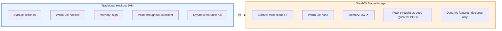

| Dimension | HotSpot JVM | GraalVM JIT | GraalVM Native Image |
|-----------|-------------|-------------|----------------------|
| **Compilation** | C1/C2 JIT at runtime | Graal JIT at runtime | AOT at build time |
| **Startup** | Seconds | Seconds | **Milliseconds** |
| **Warm-up needed** | Yes | Yes | **No** |
| **Peak performance** | Excellent | Often **better** than C2 (esp. modern code, streams) | Good; great with PGO |
| **Memory footprint** | High | High | **Low** |
| **Reflection/dynamic** | Full | Full | Declared via metadata |
| **Ships a JVM?** | Yes | Yes | **No** — standalone binary |
| **Ideal workload** | Long-running servers | Long-running servers wanting more peak speed | Serverless, CLI, fast-autoscaling microservices |

The key insight: GraalVM isn't strictly "better" than HotSpot — it's a **different point on the trade-off curve**. HotSpot wins for marathon runners; Native Image wins for sprinters.

### 9.7 Polyglot: One Runtime, Many Languages

Beyond Java performance, GraalVM can run **JavaScript, Python, Ruby, R, and LLVM-based languages (C/C++/Rust)** on the *same* runtime, and let them **interoperate with zero-overhead calls** — a Java method can call a JS function that calls a Python function, sharing objects directly. This is powered by **Truffle** (the interpreter framework) plus the Graal compiler optimizing those interpreters.

<details>
<summary>📄 <strong>Java calling JavaScript via the Polyglot API</strong></summary>

```java
import org.graalvm.polyglot.*;

public class Polyglot {
    public static void main(String[] args) {
        try (Context ctx = Context.create()) {
            // Run JavaScript from Java, get the result back as a Java value
            Value sum = ctx.eval("js", "[1,2,3,4].reduce((a,b) => a+b, 0)");
            System.out.println("JS computed: " + sum.asInt());   // JS computed: 10
        }
    }
}
```
</details>

> Real use: data-science teams embedding Python/R inside JVM services without a separate process or network hop; running a JavaScript rules engine inside a Java backend.

### 9.8 GraalVM on AWS Lambda — Killing the Cold Start

This is the marquee use case and a hot interview topic, so let's be concrete about *the problem* and *why GraalVM solves it*.

**The Java cold-start problem on Lambda.** AWS Lambda is **scale-to-zero**: when no instance is warm, an incoming request triggers a **cold start** — AWS provisions a new execution environment and boots your runtime. For a traditional JVM function this means: start the JVM → load classes → initialize the framework (Spring context!) → *then* serve the request, all while the user waits. For a Spring app this can be **3–6+ seconds** of cold-start latency. Worse, the JIT hasn't warmed up, so even after starting, the first requests are slow.

```mermaid
flowchart TB
    subgraph TRAD["❄️ Traditional JVM Lambda — slow cold start"]
        direction LR
        T1["Request hits<br/>cold function"] --> T2["AWS provisions<br/>environment"] --> T3["Boot JVM<br/>(~1s)"] --> T4["Load classes +<br/>init Spring context<br/>(2–5s)"] --> T5["JIT cold —<br/>first requests slow"] --> T6["😴 3–6s+ before<br/>first response"]
    end
    subgraph NATIVE["⚡ GraalVM Native Image Lambda — no cold-start penalty"]
        direction LR
        N1["Request hits<br/>cold function"] --> N2["AWS provisions<br/>environment"] --> N3["Launch native binary<br/>(framework already<br/>initialized at build time)"] --> N4["🚀 ~50–200ms to<br/>first response"]
    end
    style TRAD fill:#ffe0e0,stroke:#c0392b
    style NATIVE fill:#e0f5e0,stroke:#2a8a2a
```

**Why Native Image is the fix:**
- **No JVM boot** — the binary *is* the runtime (SubstrateVM is baked in).
- **No class loading at startup** — reachable classes are already compiled in.
- **Framework initialization happens at BUILD time** — GraalVM runs static initializers during the build and *snapshots the heap into the executable*, so the Spring context is effectively pre-built. The function launches with work already done.
- **No JIT warm-up** — code is native from request #1, so latency is flat and predictable (great for p99).

The result: cold starts drop from **seconds to tens/low-hundreds of milliseconds**, memory shrinks (cheaper Lambda billing, which is priced on memory × time), and autoscaling spikes no longer cause latency cliffs.

**Practical AWS notes:**
- Deploy a native image as a **Lambda custom runtime** (`provided.al2023`) by packaging the binary with a `bootstrap` file, or as a **container image** Lambda.
- Build for Lambda's architecture (x86-64 or `arm64`/Graviton — Graviton is cheaper and well-supported).
- Build *inside* an Amazon Linux container so the binary links against the right libc — a common pitfall is building on macOS and getting a binary that won't run on Lambda.
- **Lambda SnapStart** is AWS's *alternative* mitigation that snapshots a warmed JVM; Native Image and SnapStart solve the same problem differently — Native Image gives the smallest footprint and is framework-agnostic, while SnapStart keeps you on the standard JVM. Know both exist.

### 9.9 Spring Boot 3 + Native Image — The Cold-Start Cure

> **Using [GraalVM Native Image](https://www.graalvm.org/) with Spring Boot 3 is the most effective way to eliminate the notorious Java cold-start problem on AWS Lambda.** It combines Spring's productivity with native binaries that start in milliseconds — you keep writing idiomatic Spring code, and the build produces a sprinter-fast executable.

Historically Spring + Lambda was the *worst* offender for cold starts because Spring leans heavily on reflection, classpath scanning, and dynamic proxies at startup — exactly the dynamic features that fight the closed-world model. **Spring Boot 3 (built on Spring Framework 6) changed this** with **first-class GraalVM support via Spring AOT**:

- **Spring AOT engine** runs at *build time*: it analyzes your bean definitions, configuration, and proxies, and **generates the GraalVM reachability metadata** (`reflect-config.json`, proxy config, resource config) *for you*. No hand-written JSON.
- It **pre-computes the application context** — bean wiring decisions that Spring normally makes by reflection at startup are resolved ahead of time and turned into generated code.
- The **`spring-boot-starter-parent` + the GraalVM/Native Build Tools plugin** wire it all up: `mvn -Pnative native:compile` (or `./gradlew nativeCompile`) produces the executable.

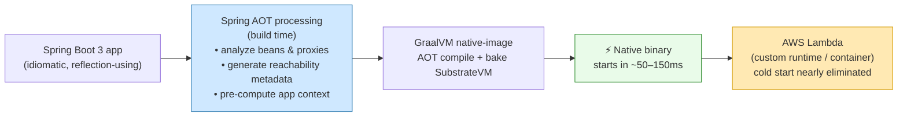

The payoff for a typical Spring Boot REST function: cold start from **~4 seconds (JVM) → ~100 ms (native)**, and memory from **~256–512 MB → ~64–128 MB** — directly cutting both latency *and* Lambda cost.

<details>
<summary>📄 <strong>Building a Spring Boot 3 native image for Lambda</strong></summary>

```bash
# Maven: the Spring Boot 3 'native' profile runs Spring AOT + GraalVM native-image
$ ./mvnw -Pnative native:compile
#   → target/<app-name>   (a standalone native executable)

# Gradle equivalent
$ ./gradlew nativeCompile

# Build a container image directly (Buildpacks, no local GraalVM needed)
$ ./mvnw -Pnative spring-boot:build-image
```

```xml
<!-- pom.xml essentials for Spring Boot 3 native -->
<parent>
    <groupId>org.springframework.boot</groupId>
    <artifactId>spring-boot-starter-parent</artifactId>
    <version>3.x.x</version>
</parent>
<build>
  <plugins>
    <!-- GraalVM Native Build Tools: drives native-image + Spring AOT -->
    <plugin>
      <groupId>org.graalvm.buildtools</groupId>
      <artifactId>native-maven-plugin</artifactId>
    </plugin>
  </plugins>
</build>
```

```bash
# Package for Lambda's custom runtime (provided.al2023):
#   - rename the binary to 'bootstrap'
#   - zip it, upload as the function code
$ cp target/my-func bootstrap && zip function.zip bootstrap
# (Build inside an Amazon Linux container so libc matches Lambda's runtime!)
```

> 💡 If you'd rather not adopt GraalVM, **AWS SnapStart** is the JVM-based alternative — it snapshots an initialized JVM and restores it on cold start, cutting Spring cold starts substantially while keeping the standard runtime and full dynamic-feature support. Native Image gives lower memory + smaller binaries; SnapStart gives easier compatibility. Frameworks **Quarkus** and **Micronaut** are also excellent native-first choices purpose-built for serverless.
</details>

---

## 10. Garbage Collection — Deep Dive

In C/C++ you `malloc` and must `free`. Forget to free → memory leak; free too early → crash. **Java automates this.** You only create objects; a background **Garbage Collector (GC)** daemon thread reclaims the memory of objects you no longer use. This frees you to focus on business logic — but to write fast, leak-free Java you must understand *how* it works.

> **Definition:** *Garbage collection is the process of finding heap objects that are no longer reachable by any live part of the program, and reclaiming their memory.* An object is "in use" if some live thread still holds a reference (pointer) to it; otherwise it's garbage.

A few ground rules to anchor everything:

- Objects are **always** created on the **heap**, regardless of scope. (Local variables that *reference* them sit on the stack; static variables live in the Method Area.)
- You **cannot force** GC. `System.gc()` / `Runtime.gc()` are merely *requests* — the JVM decides. Treat calling them as a code smell.
- Before reclaiming an object, the GC calls its `finalize()` **at most once** (deprecated since Java 9 — don't rely on it).
- If the heap can't fit a new object even after GC, you get **`java.lang.OutOfMemoryError: Java heap space`**.
- An object kept alive by an *unintended* reference (often a `static` collection or a `ThreadLocal` in a thread pool) is a **memory leak** — the GC can't collect it because, technically, it's still reachable.

### 10.1 The Core Algorithm: Mark, Sweep, Compact

Most collectors are built on a **Mark-Sweep-Compact** foundation.

**Step 1 — Mark.** Starting from "GC roots" (live thread stacks, static fields, JNI refs), the collector walks every reachable object and **marks** it as live. Anything not reached is garbage. (This scan is the expensive part — it must visit every live object.)

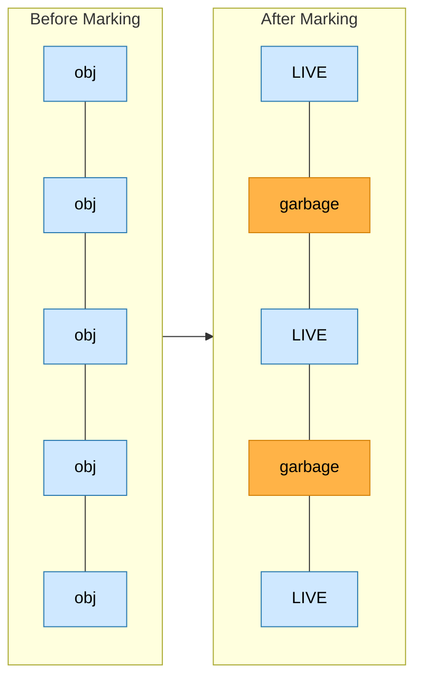

**Step 2 — Sweep (Normal Deletion).** Reclaim the unmarked (garbage) objects, leaving the live ones in place. The memory allocator now tracks a list of free gaps. Problem: this leaves **fragmentation** — free space scattered in small holes, so a large new object may not fit even though total free memory is plenty.

**Step 3 — Compact (Deletion with Compacting).** To beat fragmentation, the collector **slides live objects together** at one end, leaving one big contiguous free block. New allocations become trivially fast (just bump a pointer).

```mermaid
flowchart TB
    SWEEP["After Sweep only:<br/>[LIVE][gap][LIVE][gap][gap][LIVE]  ← fragmented free space"]
    COMPACT["After Compact:<br/>[LIVE][LIVE][LIVE][........ one big free block ........]"]
    SWEEP -->|slide live objects together| COMPACT
    style SWEEP fill:#fff0e0,stroke:#d4820a
    style COMPACT fill:#e9fbe9,stroke:#2a8a2a
```

> **Analogy — tidying a bookshelf.** *Mark*: put a sticky note on every book you still read. *Sweep*: remove the unmarked books, leaving gaps. *Compact*: push all remaining books to the left so there's one clean empty stretch for new books — no more awkward single-book gaps.

### 10.2 The Generational Hypothesis

Marking and compacting *all* objects every time is wasteful. The key insight from decades of measurement:

> **The Weak Generational Hypothesis: most objects die young.** The vast majority of objects become garbage almost immediately (think temporary objects in a loop), while a small fraction live a long time (caches, config, long-lived sessions).

If most objects die young, then *focus collection effort on the young area* and rarely touch the long-lived ones. So the heap is split into **generations**:

```mermaid
flowchart LR
    subgraph H["Heap"]
        direction LR
        subgraph YG["Young Generation (small, collected often & fast = 'Minor GC')"]
            E["Eden<br/>(new objects<br/>born here)"]
            SV0["Survivor S0"]
            SV1["Survivor S1"]
        end
        OG["Old / Tenured Generation<br/>(large, collected rarely = 'Major GC')<br/>long-lived survivors"]
    end
    PG["Metaspace (≥Java8) / PermGen (≤Java7)<br/>class metadata — NOT part of the object heap"]
    E --> SV0 --> SV1 --> OG
    style YG fill:#cfe8ff,stroke:#2a7ab0
    style OG fill:#ffd9b3,stroke:#d4820a
    style PG fill:#ffe9b3,stroke:#d49a00
```

- **Young Generation** = `Eden` + two `Survivor` spaces (S0, S1). New objects start here. Collecting it is a **Minor GC** — frequent but fast, because it's small and most of it is dead.
- **Old / Tenured Generation** holds objects that have survived long enough to be "promoted." Collecting it is a **Major GC** (or **Full GC**) — slower, rarer.
- **PermGen (≤Java 7) / Metaspace (≥Java 8)** holds class metadata. Classes *can* be unloaded if no longer needed; it's collected during a full GC.

### 10.3 The Object Lifecycle: Eden → Survivor → Tenured

Here's the actual journey of an object through the young generation, step by step. This walkthrough is a frequent whiteboard question.

```mermaid
flowchart TB
    A["1 New objects allocated in EDEN.<br/>Both survivor spaces start empty."]
    B["2 Eden fills up → triggers a MINOR GC<br/>(a 'Stop-The-World' pause)."]
    C["3 Live objects in Eden copied to S0.<br/>Dead objects deleted. Eden cleared."]
    D["4 Next Minor GC: live objects from Eden AND S0<br/>copied to S1, their age incremented.<br/>Eden + S0 cleared. (Survivor roles SWAP each cycle.)"]
    E["5 Each surviving cycle increments an object's AGE."]
    F["6 When age ≥ tenuring threshold (default ~15),<br/>object is PROMOTED to the Old Generation."]
    G["7 Old gen eventually fills → MAJOR / FULL GC<br/>(slower, longer pause)."]
    A --> B --> C --> D --> E --> F --> G
    style A fill:#cfe8ff,stroke:#2a7ab0
    style F fill:#ffd9b3,stroke:#d4820a
    style G fill:#ffd9d9,stroke:#c0392b
```

Key mechanics:
- **One survivor space is always empty.** Each Minor GC copies all live objects into the *empty* survivor space (plus survivors from the other one), then clears Eden and the just-emptied survivor. The two survivors **swap "from/to" roles** every cycle. This copying *automatically compacts* the young gen — no separate compaction step needed there.
- **Aging:** every time an object survives a Minor GC, its age counter +1. Cross the **tenuring threshold** → **promotion** to Old gen.
- **Stop-The-World (STW):** Both Minor and Major GCs pause **all** application threads while they run. Minor GCs are short; Major/Full GCs can be long — *minimizing Full GC pauses is the central goal of GC tuning,* especially for low-latency services.

> **Analogy — a company's probation-to-permanent pipeline.** New hires start in an open desk pool (**Eden**). Each review cycle, those who "survive" move to a shared bullpen (**Survivor**), and their tenure counter ticks up. After enough successful cycles they get a permanent office (**Old gen**) and are rarely re-evaluated. Most new hires (objects) don't make it past the first cycle — exactly the generational hypothesis.

### 10.4 When Is an Object Eligible for GC?

An object becomes collectable when it's no longer **reachable** from any GC root. Concretely:

- All references to it are set to **`null`** (`obj = null;`).
- It's no longer reachable from any **live thread** or **static** reference.
- It was created inside a block/method and the reference **went out of scope** when control left.
- Its **parent** was nulled — if a container object is collected, the objects only it referenced become eligible too.
- It's only reachable via **weak references** (e.g. keys in a `WeakHashMap`).

> ⚠️ **Cyclic references do NOT keep objects alive.** Reachability, not reference-counting, is what matters. If A↔B reference each other but nothing else references either, *both* are garbage.

<details>
<summary>📄 <strong>Code: making objects eligible</strong></summary>

```java
StringBuilder sb = new StringBuilder("temp");
sb = null;                       // (1) explicit null → old object eligible

void demo() {
    Person p = new Person();     // (3) p goes out of scope when demo() returns → eligible
}

Map<Key, Val> cache = new WeakHashMap<>();
cache.put(new Key(), new Val()); // (5) key only weakly held → eligible at next GC

Department d = new Department(new Employee()); // employee reachable only via d
d = null;                        // (4) nulling d makes BOTH d and its Employee eligible
```
</details>

### 10.5 Island of Isolation

A subtle but classic interview trap that proves reachability ≠ reference-counting.

> An **Island of Isolation** is a group of objects that reference *each other* but are not referenced by any live (reachable) object in the application. The whole group is garbage — even though, internally, every object "has a reference."

```mermaid
flowchart LR
    ROOT["GC Roots<br/>(stack, statics)"]
    subgraph ISLAND["🏝️ Island of Isolation — unreachable, all collectable"]
        O1["Object 1"] -->|refs| O2["Object 2"]
        O2 -->|refs| O1
    end
    ROOT -. "no reference reaches the island" .-> ISLAND
    style ISLAND fill:#ffd9d9,stroke:#c0392b
    style ROOT fill:#e9fbe9,stroke:#2a8a2a
```

<details>
<summary>📄 <strong>Code: two objects forming an island</strong></summary>

```java
public class Island {
    Island ref;   // each object can point to another

    public static void main(String[] args) {
        Island t1 = new Island();
        Island t2 = new Island();
        t1.ref = t2;     // t1 → t2
        t2.ref = t1;     // t2 → t1  (cycle)

        t1 = null;       // t2.ref still reaches the first object...
        t2 = null;       // ...but NOW nothing external reaches either.
                         // The pair is an Island of Isolation → both eligible.
        System.gc();     // (request) → finalize() fires for BOTH
    }
    @Override protected void finalize() {
        System.out.println("Finalize called");
    }
}
/* Output: "Finalize called" printed TWICE — both isolated objects are collected,
   despite each still holding a reference to the other. Cycles don't save you. */
```
</details>

### 10.6 The Garbage Collectors (Serial → ZGC)

Java offers several collectors, each a different trade-off between **throughput** (total work done) and **responsiveness** (short pause times). Pick based on your app's goal.

```mermaid
flowchart LR
    SER["Serial GC<br/>1 thread, STW<br/>small heaps, single CPU"]
    PAR["Parallel GC<br/>(Throughput)<br/>N threads, STW<br/>batch jobs"]
    CMS["CMS<br/>(deprecated)<br/>mostly concurrent<br/>low pause, old gen"]
    G1["G1 GC<br/>region-based<br/>balanced, default ≥Java9"]
    Z["ZGC / Shenandoah<br/>concurrent, <1–10ms pauses<br/>huge heaps (TB)"]
    SER --> PAR --> CMS --> G1 --> Z
    style SER fill:#e0e0e0,stroke:#888
    style PAR fill:#cfe8ff,stroke:#2a7ab0
    style CMS fill:#fff0e0,stroke:#d4820a
    style G1 fill:#e9fbe9,stroke:#2a8a2a
    style Z fill:#ffd9b3,stroke:#d4820a
```

| Collector | Flag | How it works | Best for | Trade-off |
|-----------|------|--------------|----------|-----------|
| **Serial** | `-XX:+UseSerialGC` | Single thread; STW for both minor & major; mark-compact in old gen | Small heaps, single-CPU, many JVMs on one box (minimal interference) | Simple; pauses scale with heap |
| **Parallel** (Throughput) | `-XX:+UseParallelGC` / `-XX:+UseParallelOldGC` | Multiple threads for young (and old, with the `Old` variant); STW | **Throughput**-oriented batch work where long pauses are OK (reports, billing) | Maximizes work done; pauses can be long |
| **CMS** (Concurrent Mark-Sweep) | `-XX:+UseConcMarkSweepGC` | Does most old-gen collection **concurrently** with app threads; only brief pauses; *doesn't compact* (can fragment) | Low-pause apps (web servers, UIs) — pre-Java-9 era | **Deprecated** (removed in Java 14); fragmentation risk; a failed concurrent cycle falls back to a long Full GC |
| **G1** (Garbage-First) | `-XX:+UseG1GC` | Splits heap into many equal **regions**; collects regions with the most garbage first; concurrent + incrementally compacting; targets a **pause-time goal** | General-purpose, large heaps; **default since Java 9** | Balanced throughput *and* pause; the modern default |
| **ZGC / Shenandoah** | `-XX:+UseZGC` / `-XX:+UseShenandoahGC` | Almost fully **concurrent**, pauses typically **sub-10ms** regardless of heap size | Very large heaps (up to TB) needing ultra-low latency | Slightly more CPU/memory overhead |

> 🧭 **Rule of thumb:** *Throughput & batch?* → Parallel. *Balanced general service (modern default)?* → G1. *Strict low latency / huge heap?* → ZGC or Shenandoah. *Tiny app / constrained box?* → Serial.
>
> ⚠️ Never combine `-XX:+UseParallelGC` with `-XX:+UseConcMarkSweepGC` — they conflict; results are undefined.

**The 1990s/2000s naming you'll still hear:** "Throughput collector" = Parallel; "Concurrent low-pause collector" = CMS; "Train/Incremental" = an old, now-removed experiment (`-XX:+UseTrainGC`).

### 10.7 Tuning Flags Cheat Sheet

GC tuning is empirical — *profile first*, change one thing, measure. Useful levers:

<details>
<summary>📄 <strong>Common GC & heap flags</strong></summary>

```bash
# --- Sizing ---
-Xms<size>                 # initial heap (set = -Xmx in prod to avoid resize pauses)
-Xmx<size>                 # max heap; ideal -Xms:-Xmx ratio ~1:1 for servers
-Xmn<size>                 # young gen size
-XX:NewRatio=3             # old:young = 3:1
-XX:SurvivorRatio=8        # eden:survivor = 8:1
-XX:NewSize / -XX:MaxNewSize  # fix young gen lower/upper bounds
-XX:MaxMetaspaceSize=512m  # cap Metaspace (Java 8+)

# --- Collector selection ---
-XX:+UseSerialGC | -XX:+UseParallelGC | -XX:+UseG1GC | -XX:+UseZGC
-XX:ParallelGCThreads=<n>  # worker threads for STW phases
-XX:MaxGCPauseMillis=200   # G1/ZGC pause-time GOAL

# --- Promotion / tenuring ---
-XX:MaxTenuringThreshold=15  # survivals before promotion to old gen

# --- Observability (always-on, low overhead) ---
-Xlog:gc*:file=gc.log:time,uptime,level,tags   # unified GC logging (Java 9+)
-XX:+HeapDumpOnOutOfMemoryError                # auto heap dump on OOM
-XX:HeapDumpPath=/var/log/app/heapdump.hprof
```

**Tuning intuition:** many short-lived objects → enlarge **Eden** (fewer Minor GCs). Frequent Full GCs → investigate what's being promoted (maybe a leak, or young gen too small forcing premature promotion). Always enable **GC logs** and **heap-dump-on-OOM** in production from day one.
</details>

---

## 11. JVM Profiling — Finding the Bottleneck

**Profiling** = measuring a running JVM to discover *where* it spends time (CPU), *where* it spends memory (heap), and *why* it stalls (locks, GC, I/O). You profile to answer questions like "Why is p99 latency 2 seconds?", "Why does memory climb until OOM?", "Which method burns 40% of CPU?" — with **data**, not guesses.

> **Golden rule:** *Measure, don't guess.* Developers are notoriously wrong about where the hot spot is. Profile first; optimize the proven bottleneck; re-measure.

### What you can profile

```mermaid
flowchart TB
    APP["Running JVM"]
    CPU["🔥 CPU profiling<br/>Which methods consume CPU?<br/>→ flame graphs, hot methods"]
    MEM["🧠 Memory / heap profiling<br/>What's allocating? What's retained?<br/>→ leaks, dominators, allocation hot spots"]
    ALLOC["📈 Allocation profiling<br/>Allocation rate &amp; churn<br/>→ GC pressure"]
    LOCK["🔒 Lock / thread profiling<br/>Contention, blocked threads<br/>→ concurrency bottlenecks"]
    GCP["♻️ GC analysis<br/>Pause times, frequency, throughput<br/>→ tuning targets"]
    APP --> CPU & MEM & ALLOC & LOCK & GCP
    style APP fill:#cfe8ff,stroke:#2a7ab0
```

### Two ways to profile

- **Sampling profilers** periodically snapshot the stack of every thread (e.g. every 10ms). Low overhead, safe in production, statistically accurate for finding *hot* methods. Can miss very short, frequent calls.
- **Instrumentation profilers** inject counters/timers into methods for exact call counts and timings. Precise but **heavy** — overhead can distort results and slow the app. Use in dev/staging, not hot production paths.

### The toolbox

| Tool | Type | What it's great for |
|------|------|---------------------|
| **JDK Flight Recorder (JFR)** + **JDK Mission Control (JMC)** | Sampling, built into the JDK | **Production-grade**, ~1% overhead. Records CPU, allocation, GC, locks, I/O into a `.jfr` file you analyze later. The default modern choice. |
| **VisualVM** | Sampling + light instrumentation, free | Live CPU/heap/thread monitoring, heap dumps, the **Visual GC** plugin (watch Eden/Survivor/Old fill in real time). Great for dev. |
| **async-profiler** | Low-overhead sampling (Linux) | **Flame graphs** for CPU & allocations with almost no bias; reads hardware perf counters. Industry favorite for CPU hot spots. |
| **`jstat`** | CLI, sampling | Quick live GC/heap stats without a GUI: `jstat -gcutil <pid> 1000`. |
| **`jmap`** | CLI | Capture a **heap dump** (`jmap -dump:live,format=b,file=heap.hprof <pid>`) or histogram (`jmap -histo <pid>`). |
| **`jcmd`** | CLI, Swiss-army knife | Start/stop JFR, trigger GC, dumps: `jcmd <pid> JFR.start duration=60s filename=rec.jfr`. |
| **Eclipse MAT** (Memory Analyzer Tool) | Heap-dump analyzer | Find leaks via **dominator tree** + "leak suspects" report; analyze `.hprof` files. |
| **Commercial APMs** (YourKit, JProfiler, Datadog, New Relic) | Mixed | Always-on production monitoring, distributed tracing, dashboards. |

### How to profile, step by step

```mermaid
flowchart LR
    A["1 Define the symptom<br/>(high CPU? rising memory?<br/>slow p99? long GC?)"] -->
    B["2 Reproduce under<br/>realistic load"] -->
    C["3 Attach profiler /<br/>start a JFR recording"] -->
    D["4 Collect: flame graph,<br/>heap dump, GC log"] -->
    E["5 Analyze: find the<br/>dominant hot spot"] -->
    F["6 Fix ONE thing"] -->
    G["7 Re-measure to confirm<br/>(and check no regression)"]
    style A fill:#cfe8ff,stroke:#2a7ab0
    style E fill:#ffe9b3,stroke:#d49a00
    style G fill:#e9fbe9,stroke:#2a8a2a
```

<details>
<summary>📄 <strong>Hands-on: capture a JFR recording and a heap dump</strong></summary>

```bash
# Find the Java process id
$ jcmd -l            # or: jps -l

# --- CPU / allocation / GC profiling with JFR (low overhead, prod-safe) ---
# Start a 60-second recording on a running JVM:
$ jcmd <pid> JFR.start name=diag duration=60s filename=/tmp/diag.jfr settings=profile
# ...let it run under load, then open /tmp/diag.jfr in JDK Mission Control (JMC)

# Or enable JFR at startup:
$ java -XX:+FlightRecorder \
       -XX:StartFlightRecording=duration=120s,filename=startup.jfr \
       -jar app.jar

# --- Live GC stats every 1s (column = % utilization of each region) ---
$ jstat -gcutil <pid> 1000
#  S0    S1     E      O      M     CCS    YGC   YGCT    FGC  FGCT    GCT
#  0.00 31.2  68.9   42.1   95.8  90.1    220   3.451     4  0.612   4.063

# --- Heap dump for memory-leak analysis (open in Eclipse MAT) ---
$ jmap -dump:live,format=b,file=/tmp/heap.hprof <pid>

# --- Quick class histogram: what's filling the heap right now? ---
$ jmap -histo:live <pid> | head -20

# --- CPU flame graph with async-profiler (Linux) ---
$ ./profiler.sh -d 30 -f /tmp/flame.html <pid>   # open flame.html in a browser
```
</details>

### Real-world profiling use cases

1. **"Memory climbs until OOM every few days" (slow leak).** Take two heap dumps hours apart, open in **Eclipse MAT**, compare histograms and run **Leak Suspects**. Classic culprits: an ever-growing `static` `HashMap` cache with no eviction, listeners never deregistered, or `ThreadLocal`s never cleaned in a thread pool. The **dominator tree** points straight at the object retaining everything.

2. **"One endpoint pegs a CPU core at 100%."** Run **async-profiler** for 30s under load and read the **flame graph** — the widest frame is your hot method. A frequent finding: accidental `O(n²)` work, regex recompilation in a loop, or excessive JSON (de)serialization.

3. **"p99 latency spikes periodically."** Enable **GC logs** (`-Xlog:gc*`) and check whether spikes align with **Full GC** pauses. If so, the fix is GC tuning or switching to G1/ZGC — not the application code.

4. **"Throughput is low but CPU is idle."** Profile **locks/threads** (JFR's lock events or a thread dump) — you're probably blocked on contention or I/O, not compute. The flame graph will show threads parked in `BLOCKED`/`WAITING`.

5. **"App is slow only right after deploy."** That's **JIT warm-up** — confirm with JFR compilation events; mitigate with warm-up traffic or tiered-compilation tuning.

---

## 12. Thread Dump Analysis — Debugging Hangs & Deadlocks

A **thread dump** is an instantaneous snapshot of **every thread** in the JVM and exactly what each is doing — its **state** and full **stack trace** — at that moment. Where a *heap* dump answers "what's in memory?", a *thread* dump answers **"what is each thread stuck on right now?"** It's your #1 tool for hangs, deadlocks, and "the app is frozen but not crashed."

### Thread states you'll see

```mermaid
stateDiagram-v2
    [*] --> NEW
    NEW --> RUNNABLE: start()
    RUNNABLE --> BLOCKED: waiting for a monitor lock
    BLOCKED --> RUNNABLE: lock acquired
    RUNNABLE --> WAITING: wait() / join() / park()
    WAITING --> RUNNABLE: notify() / unpark()
    RUNNABLE --> TIMED_WAITING: sleep(t) / wait(t)
    TIMED_WAITING --> RUNNABLE: timeout / notify
    RUNNABLE --> TERMINATED: run() ends
    TERMINATED --> [*]
```

| State | Meaning | What it often signals |
|-------|---------|-----------------------|
| `RUNNABLE` | Executing or ready to | Many RUNNABLE in the *same* method → a CPU hot spot |
| `BLOCKED` | Waiting to acquire a `synchronized` monitor | **Lock contention**; many threads BLOCKED on one lock = bottleneck |
| `WAITING` | Waiting indefinitely (`wait()`, `join()`, `LockSupport.park()`) | Waiting on a condition / another thread |
| `TIMED_WAITING` | Waiting with a timeout (`sleep`, `wait(t)`, pool keep-alive) | Often normal (idle pool threads) |
| `TERMINATED` | Finished | — |

### How to capture a thread dump

<details>
<summary>📄 <strong>Capturing thread dumps (several ways)</strong></summary>

```bash
# 1) jstack — the standard CLI way
$ jstack <pid> > threaddump.txt
$ jstack -l <pid> > threaddump.txt   # -l also lists lock/ownable-synchronizer info

# 2) jcmd (equivalent, preferred on modern JDKs)
$ jcmd <pid> Thread.print > threaddump.txt

# 3) Signal the JVM directly (prints to its stdout/console)
$ kill -3 <pid>          # SIGQUIT on Linux/macOS — does NOT kill the process

# 4) Programmatically inside the app
#    jstack via Ctrl-\ in the foreground terminal also works

# BEST PRACTICE: take 3–5 dumps a few seconds apart.
# A thread stuck in the SAME frame across all snapshots is truly hung;
# one that moves is just busy.
$ for i in 1 2 3 4 5; do jstack <pid> > dump_$i.txt; sleep 5; done
```
</details>

### Reading a deadlock

The best part: the JVM **detects and reports deadlocks for you** at the bottom of the dump. Here's the anatomy:

<details>
<summary>📄 <strong>Sample thread dump showing a deadlock</strong></summary>

```text
"Thread-A" #12 prio=5 os_prio=0 tid=0x00007f... nid=0x2b03 waiting for monitor entry
   java.lang.Thread.State: BLOCKED (on object monitor)
        at com.app.Service.transfer(Service.java:42)
        - waiting to lock <0x000000076ab2> (a com.app.Account)   # wants lock B
        - locked <0x000000076ab1> (a com.app.Account)            # already holds lock A
        ...

"Thread-B" #13 prio=5 os_prio=0 tid=0x00007f... nid=0x2b04 waiting for monitor entry
   java.lang.Thread.State: BLOCKED (on object monitor)
        at com.app.Service.transfer(Service.java:42)
        - waiting to lock <0x000000076ab1> (a com.app.Account)   # wants lock A
        - locked <0x000000076ab2> (a com.app.Account)            # already holds lock B
        ...

Found one Java-level deadlock:
=============================
"Thread-A":  waiting to lock monitor 0x... (object 0x...76ab2),
             which is held by "Thread-B"
"Thread-B":  waiting to lock monitor 0x... (object 0x...76ab1),
             which is held by "Thread-A"
```

**Diagnosis:** Thread-A holds Account-A and wants Account-B; Thread-B holds Account-B and wants Account-A. Each waits forever for the other — a textbook circular wait. **Fix:** always acquire multiple locks in a **consistent global order** (e.g. by account id), or use a single coarse lock, or `tryLock` with timeout/back-off.
</details>

### Tools that make it easier

- **fastThread.io** / **IBM TMDA (Thread and Monitor Dump Analyzer)** / **Samurai** — upload dumps and get visual summaries: thread-state breakdowns, identical-stack groupings, detected deadlocks, lock-chain graphs.
- **VisualVM / JMC** — capture and view live thread states with a click; flag deadlocks automatically.
- **`jstack` + grep** — quick triage: `grep 'java.lang.Thread.State' dump.txt | sort | uniq -c` to see the state distribution at a glance.

### Real-world thread-dump use cases

1. **"The whole app froze — no errors, no CPU usage."** Classic **deadlock**. Take a dump; the JVM's own *"Found one Java-level deadlock"* section names the threads and the two locks. Fix the lock ordering.

2. **"Requests pile up; throughput collapses but CPU is low."** Take 3–5 dumps. If dozens of threads sit `BLOCKED` on the **same monitor**, you've found lock contention on a hot `synchronized` block — narrow the critical section or switch to a concurrent data structure / `ReadWriteLock`.

3. **"A thread pool is exhausted."** Dumps show all pool threads `WAITING`/`BLOCKED` (e.g. on a slow DB call or an external HTTP call with no timeout). Root cause: missing timeouts or an undersized pool. Add timeouts, size pools to the downstream capacity.

4. **"CPU is pinned at 100% but I don't know where."** Cross-reference: find the OS thread eating CPU (`top -H -p <pid>`), convert its TID to hex, and match the `nid=0x...` in the thread dump to see the exact stack burning CPU.

5. **"Intermittent slowness."** Periodically auto-capture dumps (cron + `jstack`) and diff them — threads stuck in the *same* frame across dumps reveal the chronic offender; moving threads are just doing work.

> **Heap dump vs thread dump — don't confuse them.** A **heap dump** (`jmap`) is a snapshot of all **objects in memory** → use for *memory leaks / OOM*. A **thread dump** (`jstack`) is a snapshot of all **threads and their stacks** → use for *hangs, deadlocks, high CPU, contention*. Different problems, different tools.

---

## 13. ❓ FAANG Interview Questions (70+)

Grouped by topic. Click any question to reveal a crisp, interview-ready answer. Aim to *explain*, not recite.

### 🔹 Fundamentals: JVM, JRE, JDK

<details>
<summary><strong>Q1. What is the JVM and why does it make Java platform-independent?</strong></summary>

The JVM is an abstract computing machine that executes **bytecode**. `javac` compiles Java to one universal bytecode; a platform-specific JVM then translates that bytecode into the local OS/CPU's native instructions. Because the *bytecode* is identical everywhere and only the *JVM* differs per platform, the same `.class` runs anywhere a JVM exists — "Write Once, Run Anywhere."
</details>

<details>
<summary><strong>Q2. Difference between JDK, JRE, and JVM?</strong></summary>

They nest: **JDK ⊃ JRE ⊃ JVM.** The **JVM** executes bytecode. The **JRE** = JVM + the standard class libraries (enough to *run* a program). The **JDK** = JRE + developer tools like `javac`, `javadoc`, `jar`, `jstack` (enough to *build* programs).
</details>

<details>
<summary><strong>Q3. What are the three meanings of "JVM"?</strong></summary>

(1) The **specification** — a document defining what a JVM must do. (2) An **implementation** — a real program meeting it (HotSpot, OpenJ9, GraalVM). (3) An **instance** — a running process executing one application. Start three apps → three instances.
</details>

<details>
<summary><strong>Q4. What is the lifetime of a JVM instance?</strong></summary>

It's born when an application starts and dies when the application ends. Each instance runs exactly one application, fully isolated from other instances (separate heaps, separate processes).
</details>

<details>
<summary><strong>Q5. Is Java compiled or interpreted?</strong></summary>

Both. `javac` *compiles* source to bytecode ahead of time; the JVM then *interprets* that bytecode and *JIT-compiles* hot paths to native code at runtime. So it's "compiled to bytecode, then interpreted + JIT-compiled."
</details>

<details>
<summary><strong>Q6. What are the two core responsibilities of the JVM?</strong></summary>

Loading a class file (bytecode) and running that bytecode. Everything else — class loading, memory management, JIT, GC — supports those two jobs.
</details>

<details>
<summary><strong>Q7. What is bytecode and why use it instead of native code directly?</strong></summary>

Bytecode is the instruction set of the abstract JVM, stored in `.class` files. Using it decouples the language from hardware (portability) and lets the JVM optimize at runtime with live profiling info (the JIT often beats static native compilation for long-running apps).
</details>

<details>
<summary><strong>Q8. Name some JVM implementations besides HotSpot.</strong></summary>

Eclipse **OpenJ9** (low memory footprint, fast startup), **GraalVM** (polyglot, ahead-of-time native images), Azul **Zing/Prime** (pauseless C4 collector), Amazon **Corretto** (an OpenJDK build).
</details>

### 🔹 ClassLoaders

<details>
<summary><strong>Q9. What is a ClassLoader?</strong></summary>

A component of the JRE that **dynamically loads classes into the JVM at runtime**, lazily on first use, from disk, network, JARs, or any source. It finds the `.class`, reads its bytes, and defines a `Class` object.
</details>

<details>
<summary><strong>Q10. Name the three built-in ClassLoaders and what each loads.</strong></summary>

**Bootstrap** (native, loads core JDK from `rt.jar`), **Extension/Platform** (loads `jre/lib/ext`), **Application/System** (loads your CLASSPATH). They form a parent→child chain in that order.
</details>

<details>
<summary><strong>Q11. Explain the parent-delegation model and why it exists.</strong></summary>

When asked to load a class, a loader first **delegates to its parent**, recursively up to Bootstrap; it loads the class itself only if all ancestors fail. This guarantees core classes are always loaded by the trusted Bootstrap loader — you can't spoof `java.lang.String` — and ensures a class is loaded only once (security + consistency).
</details>

<details>
<summary><strong>Q12. What are the visibility and uniqueness principles?</strong></summary>

**Visibility:** a child loader can see classes loaded by its parent, but not vice versa. **Uniqueness:** a class loaded by a parent is never reloaded by a child — enforced automatically by delegation.
</details>

<details>
<summary><strong>Q13. Why does `String.class.getClassLoader()` return null?</strong></summary>

`String` is loaded by the **Bootstrap** loader, which is written in native C/C++, not Java. There's no Java `ClassLoader` object to return, so the API returns `null`.
</details>

<details>
<summary><strong>Q14. Can the same class be loaded twice? What happens?</strong></summary>

Yes — by two *different* loaders. A class's runtime identity is `(fully-qualified-name, ClassLoader)`. The same `.class` loaded by two loaders yields **two distinct types**; casting between them throws `ClassCastException`. App servers exploit this to isolate web apps with conflicting library versions.
</details>

<details>
<summary><strong>Q15. What are the three phases of class loading?</strong></summary>

**Loading** (read bytes into Method Area, create the `Class` object), **Linking** (Verify → Prepare → Resolve), and **Initialization** (assign real static values, run `static {}` blocks).
</details>

<details>
<summary><strong>Q16. In Linking, what's the difference between Prepare and Resolve?</strong></summary>

**Prepare** allocates static variables and sets them to **default** values (0/null/false). **Resolve** replaces symbolic references in the constant pool with direct memory references (often lazily).
</details>

<details>
<summary><strong>Q17. When exactly do static blocks run?</strong></summary>

During **Initialization** — the last phase — not during Loading or Prepare. They run top-to-bottom when the class is first actively used (or via `Class.forName` with init).
</details>

<details>
<summary><strong>Q18. How do you write a custom ClassLoader and when would you?</strong></summary>

Extend `java.lang.ClassLoader` and override `findClass()` (call `defineClass()` on the bytes). Use cases: app-server app isolation & hot redeploy, plugin/OSGi systems, scripting languages, encrypted bytecode, load-time bytecode weaving (AOP/agents).
</details>

<details>
<summary><strong>Q19. Should you override `loadClass()` or `findClass()`? Why?</strong></summary>

Override **`findClass()`**. The default `loadClass()` already implements correct parent-delegation and calls `findClass()` only when parents fail — overriding `findClass()` keeps delegation (and its security) intact. Override `loadClass()` only if you deliberately need to break delegation.
</details>

<details>
<summary><strong>Q20. `Class.forName()` vs `ClassLoader.loadClass()`?</strong></summary>

`Class.forName()` **initializes** the class (runs static blocks) by default and uses the caller's loader. `loadClass()` only loads & links (no init until first use) and lets you specify the loader. JDBC used `Class.forName` precisely to trigger the driver's static self-registration.
</details>

<details>
<summary><strong>Q21. `ClassNotFoundException` vs `NoClassDefFoundError`?</strong></summary>

`ClassNotFoundException` is a **checked Exception** thrown at runtime when you *explicitly* load a missing class (`Class.forName`/`loadClass`) — usually a missing JAR on the classpath. `NoClassDefFoundError` is an **Error** (LinkageError) thrown by the JVM when a class present at *compile* time is absent at *run* time — e.g. a `.class` deleted after build or a failed static initializer.
</details>

<details>
<summary><strong>Q22. How does J2EE/app-server class loading differ from a plain app?</strong></summary>

App servers use **multiple, often non-delegating** loaders: each WAR/EJB gets its own loader so apps are isolated and can ship different versions of the same library. This also enables **hot deploy** — discard a web app's loader and create a fresh one to reload classes.
</details>

### 🔹 Memory / Runtime Data Areas

<details>
<summary><strong>Q23. List the JVM runtime data areas and which are shared.</strong></summary>

**Method Area** and **Heap** are *shared* across all threads (created at startup). **JVM Stack**, **PC Register**, and **Native Method Stack** are *per-thread*.
</details>

<details>
<summary><strong>Q24. What's stored in the Heap vs the Stack?</strong></summary>

The **Heap** holds all objects and arrays (and their instance fields). Each thread's **Stack** holds frames with local variables, operands, and the *references* to heap objects. `Student s = new Student()` → object on heap, `s` (a pointer) on the stack.
</details>

<details>
<summary><strong>Q25. Why are local variables thread-safe but instance/static fields aren't?</strong></summary>

Each thread has its **own private stack**, so locals can't be shared — inherently safe. Objects (heap) and statics (Method Area) are **shared** across threads, so concurrent access needs synchronization.
</details>

<details>
<summary><strong>Q26. What lives in the Method Area?</strong></summary>

Class-level binary metadata, the **runtime constant pool**, static variables, and method bytecode. In Java ≤7 it was **PermGen** (inside heap); in Java 8+ it's **Metaspace** (native memory).
</details>

<details>
<summary><strong>Q27. PermGen vs Metaspace — what changed in Java 8?</strong></summary>

PermGen was a fixed-size region inside the heap (overflow → `OutOfMemoryError: PermGen space`). Java 8 removed it and moved class metadata to **Metaspace** in **native memory**, which auto-grows (cap with `-XX:MaxMetaspaceSize`). The interned-String pool had already moved to the heap in Java 7.
</details>

<details>
<summary><strong>Q28. What causes `StackOverflowError` vs `OutOfMemoryError`?</strong></summary>

`StackOverflowError`: a thread's stack is exhausted — usually deep/infinite recursion. `OutOfMemoryError: Java heap space`: the heap can't fit a new object even after GC — too-small heap or a memory leak. (Also `OutOfMemoryError: Metaspace` for class-metadata exhaustion.)
</details>

<details>
<summary><strong>Q29. What is a stack frame?</strong></summary>

A frame is pushed onto a thread's stack for each method call. It holds that method's local variable array, operand stack, and a reference to the runtime constant pool. It's popped when the method returns.
</details>

<details>
<summary><strong>Q30. How do you inspect JVM memory programmatically?</strong></summary>

Via the `Runtime` singleton: `Runtime.getRuntime().maxMemory()/totalMemory()/freeMemory()`. Set sizes with `-Xms`, `-Xmx`, `-Xss`, `-Xmn`.
</details>

<details>
<summary><strong>Q31. What do -Xms, -Xmx, -Xss, -Xmn control?</strong></summary>

`-Xms` initial heap, `-Xmx` max heap, `-Xss` per-thread stack size, `-Xmn` young-generation size. In servers, setting `-Xms = -Xmx` avoids resize pauses.
</details>

### 🔹 Garbage Collection

<details>
<summary><strong>Q32. What is garbage collection and what makes an object collectable?</strong></summary>

GC automatically reclaims heap memory of objects that are no longer **reachable** from any GC root (live thread stacks, statics, JNI refs). If nothing live can reach an object, its memory can be freed.
</details>

<details>
<summary><strong>Q33. Explain Mark-Sweep-Compact.</strong></summary>

**Mark**: traverse from GC roots, mark all reachable objects. **Sweep**: delete unmarked (garbage) objects, leaving free gaps. **Compact**: slide live objects together to remove fragmentation, yielding one contiguous free block for fast allocation.
</details>

<details>
<summary><strong>Q34. What is the weak generational hypothesis and how does the heap reflect it?</strong></summary>

"Most objects die young." So the heap is split into a small **Young Gen** (Eden + 2 Survivors), collected often and cheaply (**Minor GC**), and a large **Old Gen**, collected rarely (**Major/Full GC**). Effort concentrates where most garbage is.
</details>

<details>
<summary><strong>Q35. Walk through an object's journey from Eden to Old Gen.</strong></summary>

Allocated in **Eden** → Minor GC copies survivors to a **Survivor** space and increments their age, clearing Eden → survivors bounce between S0/S1 each cycle (one is always empty) → when age ≥ tenuring threshold (~15), the object is **promoted** to **Old Gen** → Old Gen eventually triggers a **Major/Full GC**.
</details>

<details>
<summary><strong>Q36. Why are there two survivor spaces and why is one always empty?</strong></summary>

It enables **copying collection**: each Minor GC copies all live objects into the empty survivor (the "to" space), then clears Eden and the old survivor. This compacts the young gen for free and avoids fragmentation. The "from"/"to" roles swap every cycle.
</details>

<details>
<summary><strong>Q37. Minor GC vs Major GC vs Full GC?</strong></summary>

**Minor GC** collects the young gen (frequent, short). **Major GC** collects the old gen. **Full GC** collects the entire heap (young + old + metadata) — slowest. All are typically Stop-The-World; minimizing Full GCs is the main tuning goal.
</details>

<details>
<summary><strong>Q38. What is a "Stop-The-World" event?</strong></summary>

A pause where all application threads are halted so the GC can work safely. Minor GCs are always STW but short; Full GCs are STW and can be long — the source of latency spikes.
</details>

<details>
<summary><strong>Q39. Can you force garbage collection?</strong></summary>

No. `System.gc()` and `Runtime.gc()` are only *requests*; the JVM may ignore them. Relying on them is an anti-pattern.
</details>

<details>
<summary><strong>Q40. Do cyclic references prevent garbage collection?</strong></summary>

No. The JVM uses **reachability**, not reference counting. If a cycle (A↔B) isn't reachable from any GC root, the whole cycle is collected.
</details>

<details>
<summary><strong>Q41. What is an Island of Isolation?</strong></summary>

A group of objects that reference each other but are unreachable from any live object. Despite internal references, the whole island is garbage and gets collected — a direct consequence of reachability-based GC.
</details>

<details>
<summary><strong>Q42. What is a memory leak in Java if GC is automatic?</strong></summary>

An object that's no longer *needed* but is still *reachable* via an unintended reference, so GC can't collect it. Common sources: ever-growing `static` collections/caches, unremoved listeners, and `ThreadLocal`s not cleaned in pooled threads.
</details>

<details>
<summary><strong>Q43. Compare Serial, Parallel, CMS, and G1 collectors.</strong></summary>

**Serial**: single-threaded, STW — small heaps/single CPU. **Parallel** (throughput): multi-threaded STW — batch jobs where pauses are OK. **CMS**: mostly concurrent, low-pause old-gen, no compaction (fragments), now deprecated/removed. **G1**: region-based, concurrent, incrementally compacting, honors a pause-time goal — the default since Java 9.
</details>

<details>
<summary><strong>Q44. When would you choose ZGC or Shenandoah?</strong></summary>

For **ultra-low latency** on **very large heaps** (up to TB) — they do almost all work concurrently with sub-10ms pauses regardless of heap size, at a modest CPU/memory cost. Ideal for big, latency-sensitive services.
</details>

<details>
<summary><strong>Q45. How do you tune for throughput vs responsiveness?</strong></summary>

**Throughput** (max work, pauses OK): Parallel GC, larger heap. **Responsiveness** (short pauses): G1/ZGC/Shenandoah, a pause-time goal (`-XX:MaxGCPauseMillis`), avoid Full GC. Always profile and tune empirically.
</details>

<details>
<summary><strong>Q46. What does `finalize()` do and why avoid it?</strong></summary>

The GC calls `finalize()` at most once before reclaiming an object, for cleanup. It's unreliable (no guarantee it runs, or when), hurts GC performance, and is **deprecated since Java 9**. Use `try-with-resources`/`AutoCloseable` or `java.lang.ref.Cleaner` instead.
</details>

<details>
<summary><strong>Q47. Strong vs weak vs soft vs phantom references?</strong></summary>

**Strong**: normal refs; never collected while reachable. **Soft**: collected only under memory pressure (good for caches). **Weak**: collected at the next GC if only weakly reachable (e.g. `WeakHashMap`). **Phantom**: for post-mortem cleanup via a `ReferenceQueue`, never returns the object.
</details>

<details>
<summary><strong>Q48. What is the tenuring threshold?</strong></summary>

The number of Minor-GC survivals an object must reach before promotion from young to old gen (default max ~15, tunable via `-XX:MaxTenuringThreshold`). The JVM may adapt it based on survivor-space occupancy.
</details>

### 🔹 Execution Engine / JIT

<details>
<summary><strong>Q49. Interpreter vs JIT compiler?</strong></summary>

The **interpreter** executes bytecode instruction-by-instruction (instant startup, slow for repeated code). The **JIT** compiles hot methods to cached native code for near-native speed, using runtime profiling. HotSpot combines both via **tiered compilation**.
</details>

<details>
<summary><strong>Q50. What is HotSpot and what are C1/C2?</strong></summary>

HotSpot is Oracle/OpenJDK's JVM, named for detecting "hot spots." **C1** (client) compiles fast with lighter optimization; **C2** (server) compiles slower with aggressive optimization. Tiered compilation starts with C1 and promotes the hottest code to C2.
</details>

<details>
<summary><strong>Q51. Why does a Java app get faster after running for a while ("warm-up")?</strong></summary>

Initially code is interpreted; as the JIT identifies and compiles hot methods to native code, performance improves. This is why benchmarks discard early iterations and latency-sensitive services warm up before taking traffic.
</details>

<details>
<summary><strong>Q52. Name some JIT optimizations.</strong></summary>

Method **inlining**, **loop unrolling**, **escape analysis** (stack-allocate or scalar-replace non-escaping objects), dead-code elimination, branch prediction from profiles, and lock elision/coarsening.
</details>

### 🔹 GraalVM & Native Image

<details>
<summary><strong>Q53. What is GraalVM and what are its three core capabilities?</strong></summary>

A high-performance JDK from Oracle Labs that is (1) a **drop-in JDK** with the **Graal JIT** (a modern compiler written in Java that can replace HotSpot's C2), (2) **Native Image**, an AOT compiler producing standalone native executables with no JVM at runtime, and (3) a **polyglot runtime** (via Truffle) for JS, Python, Ruby, R, and LLVM languages.
</details>

<details>
<summary><strong>Q54. JIT mode vs Native Image — what's the trade-off?</strong></summary>

**JIT mode** runs on HotSpot with the Graal compiler: highest peak throughput but slow startup, warm-up, and large memory. **Native Image (AOT)** compiles the whole app ahead of time: millisecond startup, no warm-up, tiny memory — at the cost of lower peak throughput and the closed-world constraint. JIT suits long-running servers; Native Image suits serverless/CLI/fast-autoscaling.
</details>

<details>
<summary><strong>Q55. What is the Closed-World Assumption and why does it matter?</strong></summary>

Native Image requires that *everything the program can do is known at build time* so its static reachability analysis can include only reachable code. The consequence: dynamic features — **reflection, dynamic proxies, JNI, resource-by-name, serialization** — must be declared in **reachability metadata** (or captured via the tracing agent), or they fail at runtime.
</details>

<details>
<summary><strong>Q56. How does Native Image achieve millisecond startup?</strong></summary>

It AOT-compiles reachable code to native instructions, **runs static initializers at build time and snapshots the heap into the binary**, and bakes in a minimal runtime (**SubstrateVM** — its own GC/threads). So there's no JVM boot, no class loading, and no JIT warm-up at runtime — the process launches with initialization already done.
</details>

<details>
<summary><strong>Q57. What are Truffle and SubstrateVM?</strong></summary>

**Truffle** is a framework for building language interpreters that the Graal compiler can optimize to near-native speed — it's how GraalVM runs polyglot languages with interop. **SubstrateVM** is the stripped-down runtime (GC, threading, etc.) embedded inside each native image so it runs without an installed JVM.
</details>

<details>
<summary><strong>Q58. Why is Java slow to cold-start on AWS Lambda, and how does GraalVM fix it?</strong></summary>

Lambda scales to zero; a cold request must provision an environment, **boot the JVM, load classes, and initialize the framework** (e.g. the Spring context) before serving — often 3–6s, plus cold JIT. Native Image removes all of that: no JVM boot, classes pre-compiled, framework init done at build time, native from request #1 — dropping cold starts to tens/low-hundreds of milliseconds.
</details>

<details>
<summary><strong>Q59. Why is Spring Boot 3 + GraalVM Native Image the most effective cure for the Lambda cold-start problem?</strong></summary>

Spring Boot 3 (on Spring Framework 6) added **Spring AOT**, which at build time analyzes beans/proxies, **generates the GraalVM reachability metadata automatically**, and pre-computes the application context. You keep writing idiomatic Spring, but the build yields a native binary that starts in ~100ms instead of ~4s and uses far less memory — eliminating the cold start while cutting Lambda cost (priced on memory × time).
</details>

<details>
<summary><strong>Q60. How do you deploy a native image to AWS Lambda, and what are the pitfalls?</strong></summary>

Package the binary as a **custom runtime** (`provided.al2023`) by naming it `bootstrap` and zipping it, or as a **container image**. Pitfalls: **build inside an Amazon Linux container** so libc matches (don't build on macOS), target the right architecture (x86-64 or arm64/Graviton), and ensure all reflection metadata is present. **AWS SnapStart** is the JVM-based alternative if you don't want to go native.
</details>

<details>
<summary><strong>Q61. When would you NOT use Native Image?</strong></summary>

For long-running, compute-heavy servers where **peak throughput** matters most (the JIT's runtime profiling wins, unless you add PGO), when you depend on libraries that aren't AOT-friendly, or when you need standard JVM tooling/observability and fast iterative builds (native builds take minutes). Mitigations: Profile-Guided Optimization, or SnapStart to keep the JVM.
</details>

<details>
<summary><strong>Q62. GraalVM Native Image vs AWS SnapStart — how do they differ?</strong></summary>

Both attack cold starts. **Native Image** AOT-compiles to a JVM-free binary → smallest memory, fastest start, but closed-world constraints. **SnapStart** keeps the standard JVM but **snapshots an already-initialized JVM** and restores it on cold start → easier compatibility (full reflection/dynamic support), larger footprint than native. Choose native for footprint/portability, SnapStart for drop-in JVM compatibility.
</details>

### 🔹 Profiling & Thread Dumps

<details>
<summary><strong>Q63. What is profiling and what can you profile?</strong></summary>

Measuring a running JVM to find bottlenecks: CPU hot spots, memory allocation/retention, GC behavior, and lock/thread contention. The goal is data-driven optimization — measure, don't guess.
</details>

<details>
<summary><strong>Q64. Sampling vs instrumentation profilers?</strong></summary>

**Sampling** periodically snapshots stacks — low overhead, production-safe, statistically finds hot methods. **Instrumentation** injects timers/counters — precise call counts but heavy overhead that can distort results; best in dev/staging.
</details>

<details>
<summary><strong>Q65. Which tools would you use to profile a production JVM?</strong></summary>

**JDK Flight Recorder (JFR)** + **Mission Control** (~1% overhead, prod-safe), **async-profiler** (flame graphs), `jstat`/`jcmd` for quick stats, and an APM (Datadog/New Relic) for always-on monitoring. Avoid heavy instrumentation in production hot paths.
</details>

<details>
<summary><strong>Q66. How do you diagnose a memory leak?</strong></summary>

Enable `-XX:+HeapDumpOnOutOfMemoryError`, capture heap dumps (`jmap`) over time, open in **Eclipse MAT**, and use the **dominator tree** / **Leak Suspects** to find what's retaining memory. Look for growing static caches, unremoved listeners, or dirty `ThreadLocal`s.
</details>

<details>
<summary><strong>Q67. What is a thread dump and how do you capture one?</strong></summary>

A snapshot of every thread's state and stack trace at an instant. Capture with `jstack <pid>`, `jcmd <pid> Thread.print`, or `kill -3 <pid>` (SIGQUIT, doesn't kill the process). Take several a few seconds apart to distinguish hung from busy threads.
</details>

<details>
<summary><strong>Q68. How do you detect a deadlock from a thread dump?</strong></summary>

The JVM auto-prints a **"Found one Java-level deadlock"** section listing the threads and the monitors they each hold and wait for — a circular wait. Threads show state `BLOCKED` with "waiting to lock" / "locked" lines. Fix with consistent global lock ordering or `tryLock` with timeout.
</details>

<details>
<summary><strong>Q69. Throughput is low but CPU is idle — how do you debug?</strong></summary>

Take thread dumps. If many threads are `BLOCKED` on one monitor → lock contention; if `WAITING`/`TIMED_WAITING` on I/O → slow downstream calls or missing timeouts / undersized pools. The bottleneck is blocking, not compute.
</details>

<details>
<summary><strong>Q70. Heap dump vs thread dump — when to use which?</strong></summary>

**Heap dump** (`jmap`) = objects in memory → diagnose **memory leaks/OOM**. **Thread dump** (`jstack`) = threads & stacks → diagnose **hangs, deadlocks, high CPU, contention**.
</details>

<details>
<summary><strong>Q71. How do you map a high-CPU OS thread to Java code?</strong></summary>

Use `top -H -p <pid>` to find the busy OS thread's ID, convert it to hex, then match the `nid=0x...` field in a `jstack` dump to locate the exact Java stack consuming CPU.
</details>

<details>
<summary><strong>Q72. What's your overall approach to a "the app is slow" ticket?</strong></summary>

Define the symptom (CPU? memory? latency? GC?), reproduce under realistic load, attach the right tool (JFR/async-profiler for CPU, MAT for memory, GC logs for pauses, thread dumps for hangs), find the dominant bottleneck, fix **one** thing, then re-measure to confirm and check for regressions.
</details>

---

## 14. ⚡ Quick-Revision Cheat Sheet

**The stack of acronyms**
`JDK ⊃ JRE ⊃ JVM`. JVM runs bytecode · JRE = JVM + libs · JDK = JRE + tools (`javac`).

**Three faces of JVM:** Specification (doc) → Implementation (HotSpot/OpenJ9/GraalVM) → Instance (running process, one per app).

**Pipeline:** `.java` → `javac` → `.class` (bytecode) → ClassLoader → Verify → Execution Engine (Interpreter + JIT) → native code.

**Three subsystems:** ① ClassLoader · ② Runtime Data Areas · ③ Execution Engine.

**ClassLoaders (parent → child):** Bootstrap (native, `rt.jar`) → Extension/Platform (`lib/ext`) → Application (CLASSPATH). Identity = `(name, loader)`.

**Three principles:** Delegation (ask parent first → security) · Visibility (child sees parent, not reverse) · Uniqueness (load once).

**Three load phases:** Loading → Linking (Verify · Prepare=defaults · Resolve) → Initialization (real statics + `static{}`).

**`Class.forName` initializes** (runs static blocks); **`loadClass` doesn't**.

**`ClassNotFoundException`** = checked Exception, explicit dynamic load fails (missing JAR). **`NoClassDefFoundError`** = Error, present at compile time but gone at runtime.

**Runtime data areas:** *Shared* → Method Area (class meta, statics, constant pool) + Heap (objects/arrays). *Per-thread* → Stack (frames/locals), PC Register, Native Stack. Shared = not thread-safe; per-thread = safe.

**PermGen (≤Java7, in heap) → Metaspace (≥Java8, native memory, auto-grows).**

**Errors:** `StackOverflowError` (deep recursion) · `OutOfMemoryError: Java heap space` (heap full / leak) · `: Metaspace` (class meta).

**GC algorithm:** Mark → Sweep → Compact. **Reachability**, not reference counting (cycles & islands are collected).

**Generations:** Young (Eden + S0 + S1) → Minor GC (frequent/fast); Old/Tenured → Major/Full GC (rare/slow). Most objects die young.

**Object journey:** Eden → Survivor (age++, S0↔S1 swap, one always empty) → promote at age ~15 → Old Gen.

**Eligible for GC when:** nulled, out of scope, parent nulled, only weakly reachable, or in an island of isolation.

**Collectors:** Serial (1 thread) · Parallel (throughput/batch) · CMS (low-pause, deprecated) · **G1 (default ≥Java9, balanced)** · ZGC/Shenandoah (sub-10ms, huge heaps). All GC is Stop-The-World; minimize Full GC.

**Execution engine:** Interpreter (instant, slow loops) + JIT (C1 client / C2 server, tiered) → "warm-up" effect.

**GraalVM:** = better JIT (Graal, written in Java) **+** Native Image (AOT) **+** polyglot (Truffle). **JIT mode** = highest peak throughput, slow start. **Native Image** = AOT compile whole app → standalone binary (SubstrateVM baked in), **ms startup, no warm-up, tiny memory**, but **closed-world** (reflection/proxies/JNI need metadata) and lower peak throughput.

**GraalVM on Lambda:** kills the Java **cold start** — no JVM boot, no class load, framework init done at build time. **Spring Boot 3 + Native Image** = the most effective cold-start cure (Spring AOT auto-generates reachability metadata + pre-computes the context): ~4s → ~100ms. Alternative = **AWS SnapStart** (snapshots a warmed JVM, keeps full dynamic features).

**Key flags:** `-Xms`/`-Xmx` (heap), `-Xss` (stack), `-Xmn` (young), `-XX:+UseG1GC`, `-XX:MaxGCPauseMillis`, `-XX:+HeapDumpOnOutOfMemoryError`, `-Xlog:gc*`. Native build: `native-image`, `mvn -Pnative native:compile`.

**Profiling (measure, don't guess):** JFR + Mission Control (prod-safe, ~1%), async-profiler (flame graphs), `jstat`/`jcmd`/`jmap`, Eclipse MAT (heap dumps → dominator tree / leak suspects). Sampling = safe; instrumentation = precise but heavy.

**Thread dumps:** `jstack <pid>` / `jcmd <pid> Thread.print` / `kill -3`. States: RUNNABLE · BLOCKED (lock contention) · WAITING · TIMED_WAITING. JVM auto-reports deadlocks. Take 3–5 dumps to tell hung from busy.

**Heap dump = memory problems (OOM/leak); Thread dump = hangs/deadlocks/high CPU.**

---

### ✅ You've got this

If you can sketch the three-subsystem diagram, explain parent-delegation, trace an object Eden→Survivor→Tenured, name the difference between `NoClassDefFoundError` and `ClassNotFoundException`, and say which tool you'd reach for given a symptom (heap dump vs thread dump vs flame graph) — you can confidently handle JVM internals in any interview *and* debug the real thing in production.

*Happy hacking. 🚀*
