# 🗂️ The Complete Java Collections Framework Guide

> **From zero to interview-ready.** This guide is built so that by the time you reach the end, you can not only *use* collections confidently in real code, but also *explain how they work internally* — the kind of depth FAANG interviewers love to probe.

---

## 🧭 How to read this guide

1. **The big picture** — what collections are and why they exist (mental model + analogy).
2. **The map of the land** — the hierarchy of interfaces.
3. **The workhorses** — List, Set, Queue, Map and their implementations, one family at a time.
4. **The deep dives** — how `HashMap` and `ConcurrentHashMap` *actually* work under the hood.
5. **The supporting cast** — sorting, iterators, Java 8+ features, concurrency.
6. **Mastery** — best practices, a decision cheat-sheet, and 55+ FAANG interview questions.

---

## 📑 Table of Contents

1. [What Is a Collection? (The Mental Model)](#1-what-is-a-collection-the-mental-model)
2. [The Collections Framework: Architecture & Hierarchy](#2-the-collections-framework-architecture--hierarchy)
3. [`Collection` vs `Collections` (the classic trap)](#3-collection-vs-collections-the-classic-trap)
4. [The `List` Family](#4-the-list-family)
   - [4.1 ArrayList — the dynamic array](#41-arraylist--the-dynamic-array)
   - [4.2 LinkedList — the chain of nodes](#42-linkedlist--the-chain-of-nodes)
   - [4.3 Vector & Stack — the legacy pair](#43-vector--stack--the-legacy-pair)
   - [4.4 CopyOnWriteArrayList — the snapshot list](#44-copyonwritearraylist--the-snapshot-list)
5. [The `Set` Family](#5-the-set-family)
   - [5.1 HashSet](#51-hashset)
   - [5.2 LinkedHashSet](#52-linkedhashset)
   - [5.3 TreeSet](#53-treeset)
6. [The `Queue` & `Deque` Family](#6-the-queue--deque-family)
   - [6.1 PriorityQueue](#61-priorityqueue)
   - [6.2 ArrayDeque](#62-arraydeque)
   - [6.3 BlockingQueue](#63-blockingqueue)
7. [The `Map` Family](#7-the-map-family)
   - [7.1 HashMap](#71-hashmap)
   - [7.2 LinkedHashMap](#72-linkedhashmap)
   - [7.3 TreeMap](#73-treemap)
   - [7.4 Hashtable (legacy)](#74-hashtable-legacy)
8. [🔬 Deep Dive: How HashMap Works Internally](#8--deep-dive-how-hashmap-works-internally)
9. [🔬 Deep Dive: HashMap vs ConcurrentHashMap](#9--deep-dive-hashmap-vs-concurrenthashmap)
10. [The `hashCode()` & `equals()` Contract](#10-the-hashcode--equals-contract)
11. [Sorting: Comparable vs Comparator](#11-sorting-comparable-vs-comparator)
12. [Iterators: Fail-Fast vs Fail-Safe](#12-iterators-fail-fast-vs-fail-safe)
13. [Java 8+ Collection Superpowers](#13-java-8-collection-superpowers)
14. [Concurrent Collections Overview](#14-concurrent-collections-overview)
15. [Performance Cheat-Sheet & Big-O Tables](#15-performance-cheat-sheet--big-o-tables)
16. [Best Practices & Common Pitfalls](#16-best-practices--common-pitfalls)
17. [Decision Guide: "Which Collection Do I Use?"](#17-decision-guide-which-collection-do-i-use)
18. [🎯 55+ FAANG Interview Questions (Collapsible)](#18--55-faang-interview-questions)
19. [⚡ Quick Revision Sheet](#19--quick-revision-sheet)

---

## 1. What Is a Collection? (The Mental Model)

A **collection** is simply an object that holds a group of other objects, called *elements*, and treats them as a single unit.

Before the Collections Framework existed (pre-Java 1.2), developers juggled raw arrays, `Vector`, and `Hashtable` — each with inconsistent method names and no shared design. The **Java Collections Framework (JCF)** unified all of this into one coherent architecture.

### 🏠 The "Storage Room" analogy

Think of collections as different kinds of **storage furniture** in a house:

| Furniture | Collection | Why |
|-----------|-----------|-----|
| 📚 **Bookshelf** (numbered slots, can have duplicate copies) | `List` | Ordered, indexed, allows duplicates |
| 🎟️ **Bag of unique raffle tickets** (no two the same) | `Set` | No duplicates, no guaranteed order |
| 🧾 **Queue at a coffee shop** (first come, first served) | `Queue` | Order of processing matters |
| 🗄️ **Filing cabinet with labeled folders** | `Map` | Look things up by a key (label) |

Once you internalize *which piece of furniture fits your data*, choosing the right collection becomes intuitive.

### What the framework gives you

The JCF is built from three pillars:

- **Interfaces** — the abstract contracts: `List`, `Set`, `Queue`, `Map`, etc. They define *what* a collection can do.
- **Implementations** — the concrete classes: `ArrayList`, `HashSet`, `HashMap`, etc. They define *how* it's done.
- **Algorithms** — reusable utility methods for searching, sorting, shuffling, etc. (mostly in the `Collections` utility class).

**The benefits this delivers:**

- Reduces programming effort — ready-made, battle-tested data structures.
- Increases performance — implementations are highly optimized.
- Promotes interoperability — unrelated APIs can exchange data using common interface types.
- Reduces the effort to learn and design new APIs — everything follows the same conventions.
- Fosters reuse — write to interfaces, swap implementations freely.

---

## 2. The Collections Framework: Architecture & Hierarchy

Everything in the framework descends from one of **two roots**:

- **`Iterable` → `Collection`** — for "groups of single elements" (List, Set, Queue).
- **`Map`** — a separate root for "key → value" pairs. ⚠️ **`Map` is NOT a `Collection`** (a very common interview gotcha).

### 🌳 The hierarchy diagram

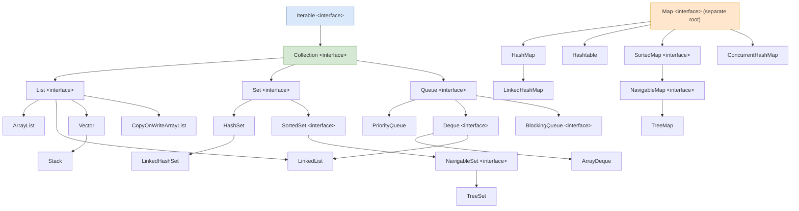

### The text view (great for memorizing)

```
Iterable (interface)
└── Collection (interface)
    ├── List (interface)        → ordered, indexed, duplicates allowed
    │   ├── ArrayList
    │   ├── LinkedList          (also a Deque)
    │   ├── Vector → Stack      (legacy, synchronized)
    │   └── CopyOnWriteArrayList (concurrent)
    ├── Set (interface)         → no duplicates
    │   ├── HashSet → LinkedHashSet
    │   └── SortedSet → NavigableSet → TreeSet
    └── Queue (interface)       → holds elements before processing
        ├── PriorityQueue
        ├── Deque → ArrayDeque, LinkedList
        └── BlockingQueue (concurrent)

Map (interface)                 → key → value (NOT a Collection!)
├── HashMap → LinkedHashMap
├── Hashtable (legacy)
├── SortedMap → NavigableMap → TreeMap
└── ConcurrentHashMap (concurrent)
```

> 🧠 **Remember:** `List`, `Set`, and `Queue` all share the `Collection` contract (you can call `add`, `remove`, `iterator`, `size` on them). `Map` lives off to the side with its own `put`/`get` vocabulary.

### The `Collection` interface contract

Every `Collection` promises these behaviors:

<details>
<summary>📦 <b>Sample code: the Collection interface (simplified)</b></summary>

```java
public interface Collection<E> extends Iterable<E> {
    // Basic operations
    boolean add(E e);
    boolean remove(Object o);
    boolean contains(Object o);

    // Bulk operations
    boolean addAll(Collection<? extends E> c);
    boolean removeAll(Collection<?> c);
    boolean retainAll(Collection<?> c);
    void    clear();

    // Informational operations
    int     size();
    boolean isEmpty();

    // Iteration
    Iterator<E> iterator();

    // Conversion
    Object[] toArray();
}
```

Because `Collection extends Iterable`, **every** collection can be used in an enhanced for-loop:

```java
for (String s : anyCollection) { ... }
```
</details>

---

## 3. `Collection` vs `Collections` (the classic trap)

These two are constantly confused — and interviewers know it.

| | `Collection` | `Collections` |
|---|---|---|
| **What it is** | An **interface** | A **utility class** (final, all-static methods) |
| **Package** | `java.util` | `java.util` |
| **Role** | Root of the hierarchy; defines behavior | Helper methods that *operate on* collections |
| **Examples** | `add()`, `remove()`, `size()` | `Collections.sort()`, `Collections.max()`, `Collections.unmodifiableList()`, `Collections.synchronizedList()` |

<details>
<summary>📦 <b>Sample code: using the Collections utility class</b></summary>

```java
List<Integer> nums = new ArrayList<>(List.of(5, 1, 4, 2, 3));

Collections.sort(nums);                  // [1, 2, 3, 4, 5]
Collections.reverse(nums);               // [5, 4, 3, 2, 1]
Collections.shuffle(nums);               // random order
int max = Collections.max(nums);         // 5
int min = Collections.min(nums);         // 1

// Make a list read-only
List<Integer> readOnly = Collections.unmodifiableList(nums);

// Wrap a list to be thread-safe
List<Integer> synced = Collections.synchronizedList(new ArrayList<>());
```
</details>

> 🎯 **One-liner answer:** *"`Collection` is the interface at the top of the hierarchy; `Collections` is a utility class full of static helper methods."*

---

## 4. The `List` Family

A **`List`** is an **ordered** collection (a *sequence*). It allows **duplicates** and gives you **positional (index) access** — `get(i)`, `add(i, e)`, `remove(i)`.

> 🏠 **Analogy:** A `List` is a **numbered bookshelf**. Slot 0, slot 1, slot 2… You can put the same book in two slots, and you reach any slot by its number.

<details>
<summary>📦 <b>Sample code: List basics</b></summary>

```java
List<String> names = new ArrayList<>();
names.add("Alice");
names.add("Bob");
names.add("Charlie");
names.add(1, "David");          // insert at index 1
System.out.println(names);      // [Alice, David, Bob, Charlie]

System.out.println(names.get(2));        // Bob
System.out.println(names.indexOf("Bob")); // 2
names.set(0, "Amy");            // replace index 0
names.remove("Bob");            // remove by value
```
</details>

### 4.1 ArrayList — the dynamic array

`ArrayList` is a **resizable array**. Internally it holds an `Object[]`. When it fills up, it allocates a bigger array (typically **1.5×** the old size) and copies everything over.

<details>
<summary>📦 <b>Sample code: ArrayList in action</b></summary>

```java
List<String> fruits = new ArrayList<>();
fruits.add("Apple");
fruits.add("Banana");
fruits.add("Cherry");

// O(1) random access by index
String second = fruits.get(1);          // "Banana"

fruits.add(1, "Blueberry");             // O(n) — shifts elements right
fruits.remove("Cherry");                // remove by value
fruits.set(0, "Apricot");               // replace at index 0

System.out.println(fruits);             // [Apricot, Blueberry, Banana]
System.out.println(fruits.contains("Banana")); // true (O(n) search)

// Pre-size to avoid repeated resizing when count is known
List<Integer> big = new ArrayList<>(10_000);
```
</details>

**How resizing works:**

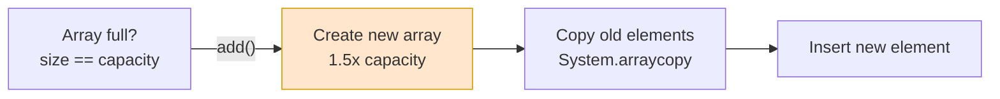

**Strengths & weaknesses:**

- ✅ **O(1) random access** — `get(i)` is a direct array index lookup.
- ✅ Cache-friendly (contiguous memory), low per-element overhead.
- ⚠️ **O(n) insert/remove in the middle** — everything after the index must shift.
- ⚠️ Adding at the end is *amortized* O(1), but occasionally O(n) when it resizes.

> 💡 **Pro tip:** If you know the size up front, pre-size it: `new ArrayList<>(10_000)` to avoid repeated resizing.

### 4.2 LinkedList — the chain of nodes

`LinkedList` is a **doubly-linked list**. Each node holds the element plus pointers to the previous and next nodes. It implements both `List` **and** `Deque`.

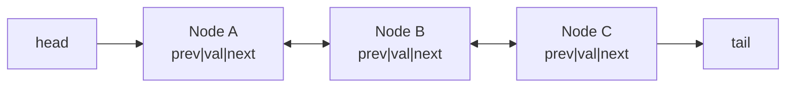

<details>
<summary>📦 <b>Sample code: LinkedList with Deque operations</b></summary>

```java
LinkedList<String> tasks = new LinkedList<>();
tasks.add("Task 2");
tasks.addFirst("Task 1");      // O(1) — add at the head
tasks.addLast("Task 3");       // O(1) — add at the tail

System.out.println(tasks);     // [Task 1, Task 2, Task 3]

String first = tasks.removeFirst(); // "Task 1"  (O(1))
String last  = tasks.removeLast();  // "Task 3"  (O(1))
System.out.println(tasks.peekFirst()); // "Task 2"

// Usable as a Deque/Queue too
Deque<String> deque = tasks;
deque.offerLast("Task 4");
```
</details>

- ✅ **O(1) insert/remove** at the ends (or at a known node).
- ⚠️ **O(n) random access** — to reach index `i`, you must walk the chain.
- ⚠️ Higher memory overhead (two pointers per element) and poor cache locality.

> 🎯 **Interview reality check:** In practice, `ArrayList` wins almost always. Even for queue-like usage, `ArrayDeque` usually beats `LinkedList`. `LinkedList` shines mainly when you frequently add/remove at *both ends* and rarely random-access.

### 4.3 Vector & Stack — the legacy pair

`Vector` is essentially a **synchronized `ArrayList`** from Java 1.0. Every method is `synchronized`, which makes it thread-safe but slow. `Stack` extends `Vector` to provide LIFO `push`/`pop`.

> ⚠️ **Avoid both in new code.** For a thread-safe list use `CopyOnWriteArrayList` or `Collections.synchronizedList()`. For a stack, use `ArrayDeque` (`push`/`pop`).

<details>
<summary>📦 <b>Sample code: Vector & Stack (and their modern replacements)</b></summary>

```java
// Legacy Vector — every method is synchronized
Vector<Integer> vector = new Vector<>();
vector.add(1);
vector.add(2);
System.out.println(vector.get(0));   // 1

// Legacy Stack (LIFO)
Stack<Integer> stack = new Stack<>();
stack.push(10);
stack.push(20);
System.out.println(stack.pop());     // 20
System.out.println(stack.peek());    // 10

// ✅ Modern replacement for Stack → ArrayDeque
Deque<Integer> modernStack = new ArrayDeque<>();
modernStack.push(10);
modernStack.push(20);
System.out.println(modernStack.pop()); // 20
```
</details>

### 4.4 CopyOnWriteArrayList — the snapshot list

A **thread-safe** `List` where every mutation (`add`, `set`, `remove`) creates a **fresh copy** of the underlying array. Reads never lock and never block.

- ✅ Excellent when **reads vastly outnumber writes** (e.g., a list of event listeners).
- ⚠️ Every write copies the whole array — expensive for write-heavy workloads.
- ✅ Iterators operate on an immutable snapshot, so they never throw `ConcurrentModificationException`.

<details>
<summary>📦 <b>Sample code: CopyOnWriteArrayList safe iteration</b></summary>

```java
CopyOnWriteArrayList<String> listeners = new CopyOnWriteArrayList<>();
listeners.add("EmailListener");
listeners.add("SmsListener");

// Safe to modify while iterating — the iterator sees an immutable snapshot
for (String listener : listeners) {
    System.out.println("Notifying: " + listener);
    listeners.add("AuditListener");   // no ConcurrentModificationException!
}

// The new element exists, but wasn't seen by the loop above
System.out.println(listeners.size()); // 4
```
</details>

### ArrayList vs LinkedList — side by side

| Operation | ArrayList | LinkedList |
|-----------|-----------|------------|
| `get(index)` | **O(1)** | O(n) |
| `add(end)` | Amortized O(1) | O(1) |
| `add(index)` / `remove(index)` | O(n) | O(n) to find + O(1) to unlink |
| `add/remove` at head | O(n) | **O(1)** |
| Memory per element | Low | High (2 pointers) |
| Cache locality | Excellent | Poor |
| Implements | `List`, `RandomAccess` | `List`, `Deque` |

**When to use which:**

- Use **ArrayList** when you read/access by index often and mostly append at the end.
- Use **LinkedList** when you constantly add/remove at the beginning or need `Deque`/queue behavior (though `ArrayDeque` is often better).

---

## 5. The `Set` Family

A **`Set`** models the mathematical idea of a set: **no duplicate elements**. Adding an element that's already present is simply ignored.

> 🏠 **Analogy:** A `Set` is a **bag of unique raffle tickets**. Try to drop in a duplicate ticket and it just bounces out — the bag already has it.

<details>
<summary>📦 <b>Sample code: Set basics</b></summary>

```java
Set<Integer> numbers = new HashSet<>();
numbers.add(1);
numbers.add(2);
numbers.add(3);
numbers.add(1);                 // ignored — 1 already present
System.out.println(numbers.size()); // 3
System.out.println(numbers.contains(2)); // true
```
</details>

The three siblings differ only in **ordering and backing structure**:

### 5.1 HashSet

Backed by a `HashMap`. **No ordering guarantee.** Offers average **O(1)** add/contains/remove.

> 🔍 **How it works internally:** `HashSet` literally stores your elements as the *keys* of an internal `HashMap`, with a shared dummy `PRESENT` object as every value. So `hashSet.add(x)` is really `map.put(x, PRESENT)`. All the HashMap mechanics (hashing, buckets, treeify) apply.

<details>
<summary>📦 <b>Sample code: HashSet for fast uniqueness checks</b></summary>

```java
Set<String> visited = new HashSet<>();

System.out.println(visited.add("page1")); // true  — newly added
System.out.println(visited.add("page2")); // true
System.out.println(visited.add("page1")); // false — duplicate ignored

System.out.println(visited.contains("page1")); // true (O(1))
visited.remove("page2");
System.out.println(visited.size());        // 1

// Classic use: dedupe a list
List<Integer> withDupes = List.of(1, 2, 2, 3, 3, 3);
Set<Integer> unique = new HashSet<>(withDupes); // {1, 2, 3}
```
</details>

### 5.2 LinkedHashSet

A `HashSet` that also threads a **doubly-linked list** through its entries, so iteration follows **insertion order**. Slightly more memory, predictable iteration.

<details>
<summary>📦 <b>Sample code: LinkedHashSet preserves insertion order</b></summary>

```java
Set<String> hashSet = new HashSet<>();
hashSet.add("Charlie"); hashSet.add("Alice"); hashSet.add("Bob");
System.out.println(hashSet);   // order NOT guaranteed, e.g. [Bob, Alice, Charlie]

Set<String> linkedHashSet = new LinkedHashSet<>();
linkedHashSet.add("Charlie"); linkedHashSet.add("Alice"); linkedHashSet.add("Bob");
System.out.println(linkedHashSet); // [Charlie, Alice, Bob] — insertion order kept

linkedHashSet.add("Charlie");  // duplicate ignored, order unchanged
```
</details>

### 5.3 TreeSet

Backed by a **red-black tree** (`TreeMap` internally). Keeps elements in **sorted order** (natural ordering or a `Comparator`). Operations are **O(log n)**. Implements `NavigableSet`, so you get `first()`, `last()`, `ceiling()`, `floor()`, `headSet()`, `tailSet()`.

<details>
<summary>📦 <b>Sample code: TreeSet navigation</b></summary>

```java
TreeSet<Integer> ts = new TreeSet<>(List.of(10, 20, 30, 40, 50));

System.out.println(ts.first());      // 10
System.out.println(ts.last());       // 50
System.out.println(ts.ceiling(25));  // 30  (smallest >= 25)
System.out.println(ts.floor(25));    // 20  (largest <= 25)
System.out.println(ts.headSet(30));  // [10, 20]  (< 30)
System.out.println(ts.tailSet(30));  // [30, 40, 50] (>= 30)
```
</details>

### Set comparison

| Feature | HashSet | LinkedHashSet | TreeSet |
|---------|---------|---------------|---------|
| Ordering | None | Insertion order | Sorted |
| Backing structure | HashMap | HashMap + linked list | Red-black tree |
| add/remove/contains | O(1) | O(1) | O(log n) |
| `null` allowed? | One null | One null | ❌ No (throws NPE) |
| Use when | Speed, no order needed | Need insertion order | Need sorted order / range queries |

---

## 6. The `Queue` & `Deque` Family

A **`Queue`** holds elements before processing, usually **FIFO** (First-In-First-Out). A **`Deque`** ("deck" — double-ended queue) allows adding/removing from **both ends**.

> 🏠 **Analogy:** A `Queue` is the **line at a coffee shop** — first person in line is served first. A `Deque` is a line where people can join or leave from either end.

### Queue method pairs (know these!)

`Queue` offers two flavors of each operation — one that **throws** on failure, one that returns a **special value**:

| Action | Throws exception | Returns special value |
|--------|------------------|------------------------|
| Insert | `add(e)` | `offer(e)` → false |
| Remove | `remove()` | `poll()` → null |
| Examine | `element()` | `peek()` → null |

> 🎯 Prefer `offer`/`poll`/`peek` in production — they fail gracefully instead of throwing.

### 6.1 PriorityQueue

Not FIFO! Elements come out in **priority order** (natural ordering or a `Comparator`). Backed by a **binary heap** (array-based). `peek()` always returns the smallest element (for a min-heap).

<details>
<summary>📦 <b>Sample code: PriorityQueue (min-heap and max-heap)</b></summary>

```java
// Min-heap (default): smallest comes out first
PriorityQueue<Integer> minHeap = new PriorityQueue<>();
minHeap.offer(5); minHeap.offer(1); minHeap.offer(3);
System.out.println(minHeap.poll()); // 1
System.out.println(minHeap.poll()); // 3

// Max-heap: largest comes out first
PriorityQueue<Integer> maxHeap = new PriorityQueue<>(Comparator.reverseOrder());
maxHeap.offer(5); maxHeap.offer(1); maxHeap.offer(3);
System.out.println(maxHeap.poll()); // 5
```

- `offer`/`poll`: **O(log n)**, `peek`: **O(1)**.
- ⚠️ Iterating a PriorityQueue does **not** give sorted order — only `poll()` does.
</details>

### 6.2 ArrayDeque

A resizable-array implementation of `Deque`. **The modern default for both stacks and queues.** Faster than `LinkedList` (better cache locality, no node objects) and faster than `Stack` (no synchronization).

<details>
<summary>📦 <b>Sample code: ArrayDeque as stack and queue</b></summary>

```java
// As a STACK (LIFO)
Deque<Integer> stack = new ArrayDeque<>();
stack.push(1); stack.push(2); stack.push(3);
System.out.println(stack.pop()); // 3

// As a QUEUE (FIFO)
Deque<Integer> queue = new ArrayDeque<>();
queue.offer(1); queue.offer(2); queue.offer(3);
System.out.println(queue.poll()); // 1
```

> ⚠️ `ArrayDeque` does **not** allow `null` elements (null is used as an internal sentinel).
</details>

### 6.3 BlockingQueue

A **thread-safe** queue used heavily in producer-consumer designs. `put()` **blocks** if the queue is full; `take()` **blocks** if it's empty — letting threads coordinate without busy-waiting.

Implementations: `ArrayBlockingQueue` (bounded), `LinkedBlockingQueue`, `PriorityBlockingQueue`, `SynchronousQueue`, `DelayQueue`.

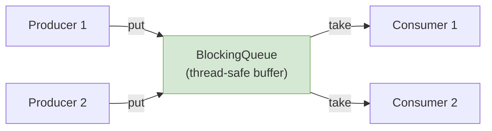

<details>
<summary>📦 <b>Sample code: producer-consumer with BlockingQueue</b></summary>

```java
BlockingQueue<String> queue = new LinkedBlockingQueue<>(10);

// Producer thread
new Thread(() -> {
    try { queue.put("Task"); }      // blocks if full
    catch (InterruptedException e) { Thread.currentThread().interrupt(); }
}).start();

// Consumer thread
new Thread(() -> {
    try { String task = queue.take(); } // blocks if empty
    catch (InterruptedException e) { Thread.currentThread().interrupt(); }
}).start();
```
</details>

---

## 7. The `Map` Family

A **`Map`** stores **key → value** pairs. Keys are unique; each key maps to exactly one value. **`Map` is not a `Collection`** — it has its own `put`/`get` interface.

> 🏠 **Analogy:** A `Map` is a **filing cabinet**. Each folder has a unique **label** (key); inside is the **content** (value). You don't flip through every folder — you jump straight to the label you want.

<details>
<summary>📦 <b>Sample code: Map basics & iteration</b></summary>

```java
Map<String, Integer> ages = new HashMap<>();
ages.put("Alice", 25);
ages.put("Bob", 30);
ages.put("Bob", 31);             // overwrites — keys are unique
System.out.println(ages.get("Bob"));            // 31
System.out.println(ages.getOrDefault("Eve", 0)); // 0 (not present)

// Iterate entries
for (Map.Entry<String, Integer> e : ages.entrySet()) {
    System.out.println(e.getKey() + " -> " + e.getValue());
}
```
</details>

### 7.1 HashMap

The **general-purpose** map. **No ordering.** Average **O(1)** get/put. Allows **one null key** and multiple null values. (Covered in depth in [Section 8](#8--deep-dive-how-hashmap-works-internally).)

<details>
<summary>📦 <b>Sample code: HashMap core operations</b></summary>

```java
Map<String, Integer> scores = new HashMap<>();
scores.put("Alice", 90);
scores.put("Bob", 85);
scores.put("Alice", 95);                  // overwrites → Alice = 95

System.out.println(scores.get("Alice"));        // 95
System.out.println(scores.getOrDefault("Eve", 0)); // 0 (absent)
System.out.println(scores.containsKey("Bob"));   // true

scores.putIfAbsent("Bob", 100);           // ignored — Bob exists
scores.remove("Bob");

// Iterate entries (no guaranteed order)
scores.forEach((name, score) -> System.out.println(name + " = " + score));

// One null key is allowed
scores.put(null, 0);
```
</details>

### 7.2 LinkedHashMap

A `HashMap` that maintains **insertion order** (or **access order** if constructed with `accessOrder = true`). The access-order mode makes it perfect for building an **LRU cache**.

<details>
<summary>📦 <b>Sample code: LRU cache with LinkedHashMap</b></summary>

```java
class LRUCache<K, V> extends LinkedHashMap<K, V> {
    private final int capacity;
    LRUCache(int capacity) {
        super(capacity, 0.75f, true);   // true = access-order
        this.capacity = capacity;
    }
    @Override
    protected boolean removeEldestEntry(Map.Entry<K, V> eldest) {
        return size() > capacity;       // evict oldest when over capacity
    }
}

LRUCache<Integer, String> cache = new LRUCache<>(2);
cache.put(1, "a"); cache.put(2, "b");
cache.get(1);          // touch 1 → now 2 is the eldest
cache.put(3, "c");     // evicts 2
System.out.println(cache.keySet()); // [1, 3]
```
</details>

### 7.3 TreeMap

A `Map` backed by a **red-black tree**, keeping keys **sorted**. Operations are **O(log n)**. Implements `NavigableMap` with `firstKey()`, `lastKey()`, `ceilingKey()`, `floorKey()`, `headMap()`, `tailMap()`, `subMap()`. ⚠️ Does **not** allow a null key.

<details>
<summary>📦 <b>Sample code: TreeMap sorted keys & navigation</b></summary>

```java
TreeMap<String, Integer> ages = new TreeMap<>();
ages.put("Charlie", 35);
ages.put("Alice", 25);
ages.put("Bob", 30);

// Keys are always iterated in sorted order
System.out.println(ages);          // {Alice=25, Bob=30, Charlie=35}
System.out.println(ages.firstKey()); // "Alice"
System.out.println(ages.lastKey());  // "Charlie"

// Navigation queries
System.out.println(ages.ceilingKey("Ben")); // "Bob"   (smallest key >= "Ben")
System.out.println(ages.floorKey("Ben"));    // "Alice" (largest key <= "Ben")
System.out.println(ages.headMap("Bob"));      // {Alice=25}  (keys < "Bob")
System.out.println(ages.tailMap("Bob"));      // {Bob=30, Charlie=35} (>= "Bob")
```
</details>

### 7.4 Hashtable (legacy)

The original synchronized map from Java 1.0. Every method is `synchronized` (coarse, slow). **No null keys or values.** Superseded by `ConcurrentHashMap` for concurrency. Avoid in new code.

<details>
<summary>📦 <b>Sample code: Hashtable (and why to prefer ConcurrentHashMap)</b></summary>

```java
// Legacy Hashtable — every method synchronized on the whole table
Hashtable<String, Integer> table = new Hashtable<>();
table.put("A", 1);
table.put("B", 2);
System.out.println(table.get("A"));   // 1

// table.put(null, 3);   // ❌ throws NullPointerException (no null keys)
// table.put("C", null); // ❌ throws NullPointerException (no null values)

// ✅ Modern thread-safe replacement: ConcurrentHashMap (per-bucket locking)
Map<String, Integer> concurrent = new ConcurrentHashMap<>();
concurrent.put("A", 1);
concurrent.merge("A", 1, Integer::sum); // atomic update → A = 2
```
</details>

### Map comparison

| Feature | HashMap | LinkedHashMap | TreeMap | Hashtable | ConcurrentHashMap |
|---------|---------|---------------|---------|-----------|-------------------|
| Ordering | None | Insertion/access | Sorted by key | None | None |
| Thread-safe | ❌ | ❌ | ❌ | ✅ (coarse) | ✅ (fine-grained) |
| Null key | 1 allowed | 1 allowed | ❌ | ❌ | ❌ |
| Null values | ✅ | ✅ | ✅ | ❌ | ❌ |
| get/put | O(1) | O(1) | O(log n) | O(1) | O(1) |
| Use when | General | Need order / LRU | Sorted keys | (legacy) | Concurrent access |

---

## 8. 🔬 Deep Dive: How HashMap Works Internally

This is the single most-asked Java collections interview topic. Let's build the full mental model, layer by layer.

### First, what is "hashing"?

**Hashing**, in its simplest form, is a way of assigning an integer code to an object by applying a formula to its contents. The one rule that matters: *equal objects must always produce the same hash code.* Every Java object inherits `hashCode()` from `Object` (the default derives a number from the object's identity), and hash-based collections lean on it heavily — which is why overriding it correctly (with `equals()`) is essential for any key class.

### The core idea

A `HashMap` is just an **array of entry objects** (the *buckets*). To store a key, we compute a number (the *hash*) from it, turn that into an array index, and drop the entry into that bucket. To look it up, we compute the *same* index and jump straight there — no scanning. That direct jump is why average-case get/put/remove are **O(1)**.

> 🏠 **Analogy:** A library with **16 shelves** (0–15). To shelve a book, run its title through a formula that gives a shelf number; to find it, run the same formula and walk straight there. If two books land on the same shelf (a *collision*), they line up and you check titles one by one.

### 💥 The HashMap instance: what lives on the heap

Before tracing operations, it helps to picture a complete `HashMap` object in memory. Beyond the bucket array itself, a HashMap carries a handful of bookkeeping fields:

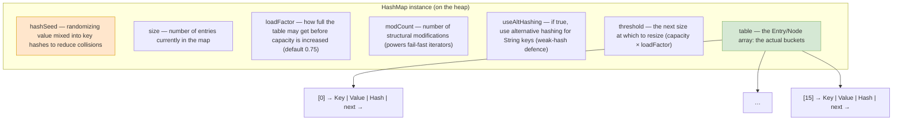

| Field | What it holds |
|-------|---------------|
| `table` | The `Entry<K,V>[]` (Java 8: `Node<K,V>[]`) array — the buckets. Each slot points to a linked list (or tree) of entries. |
| `size` | The number of key-value entries in the map. |
| `loadFactor` | How full the table is allowed to get (default **0.75**) before it grows. |
| `threshold` | The next size at which to resize, `= capacity × loadFactor`. |
| `modCount` | How many times the map was *structurally* modified — used by fail-fast iterators to detect concurrent modification. |
| `hashSeed` / `useAltHashing` | Older-JDK fields for alternative String hashing to blunt collision attacks. |

> 📌 **Default sizing:** a fresh `new HashMap<>()` has **initial capacity 16** (so 16 buckets) and **load factor 0.75**, giving an initial `threshold` of 12.

### 💥 The bucket array: an array of linked lists

The `table` is best pictured as an **array of linked lists** (the "buckets" or "bins"). Each slot either is `null` (empty bucket) or points to the head of a chain of `Entry` nodes:

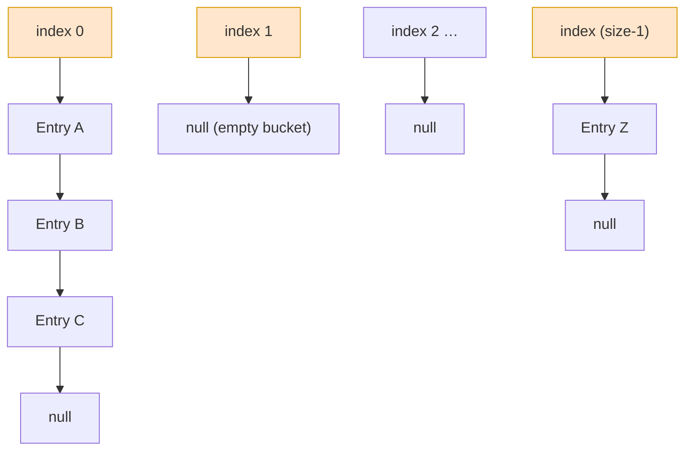

Each entry is a `Node` (called `Entry` before Java 8) holding one key-value pair, the cached hash, and a `next` reference. Empty buckets hold `null`; populated buckets hold a (possibly one-element) linked list.

<details>
<summary>📦 <b>Sample code: the internal Node structure</b></summary>

```java
// The backing array — each index is a "bucket".
// Length is ALWAYS a power of two. Lazily allocated on first put().
transient Node<K,V>[] table;

static class Node<K,V> implements Map.Entry<K,V> {
    final int hash;     // cached hash of the key (so we never recompute it)
    final K key;        // the key  (final — must not change while stored!)
    V value;            // the value
    Node<K,V> next;     // next node in the SAME bucket → forms a linked list
}
```
</details>

The four fields, and why each exists:

- **`hash`** — the key's (spread) hash, computed *once* at insertion and cached. This is a deliberate optimization: when scanning a bucket, the map compares these cheap `int`s first and only calls the more expensive `equals()` when the hashes match.
- **`key`** — the key itself, used for the definitive equality check via `equals()`.
- **`value`** — the associated data.
- **`next`** — points to the next entry in the same bucket; a chain ends when `next == null`.

> 💡 The array is **lazily allocated** — even after `new HashMap<>()`, the 16-slot array isn't created in memory until your first `put()`.

### 🏗️ The real implementation: constants, fields & node types

It's worth seeing how the actual JDK ties all of this together. The snippet below is a faithful, trimmed-down view of `java.util.HashMap` (Java 8+) — the tuning constants you keep hearing about, the instance fields from the heap diagram, and the two node types a bucket can hold.

<details>
<summary>📦 <b>Framework code: the structure of HashMap (constants, fields, Node, TreeNode)</b></summary>

```java
public class HashMap<K,V> extends AbstractMap<K,V> implements Map<K,V>, ... {

    // ───── Tuning constants ─────
    static final int   DEFAULT_INITIAL_CAPACITY = 1 << 4; // 16 (must be power of 2)
    static final int   MAXIMUM_CAPACITY         = 1 << 30; // upper bound on table size
    static final float DEFAULT_LOAD_FACTOR      = 0.75f;   // space/time trade-off
    static final int   TREEIFY_THRESHOLD        = 8;  // list → tree when a bin exceeds this
    static final int   UNTREEIFY_THRESHOLD      = 6;  // tree → list when a bin drops below this
    static final int   MIN_TREEIFY_CAPACITY     = 64; // table must be this big to treeify
                                                      // (otherwise it resizes instead)

    // ───── Instance fields (the "heap" picture) ─────
    transient Node<K,V>[] table;    // the buckets; length is always a power of 2
    transient int size;            // number of key-value mappings
    transient int modCount;        // structural-modification count → fail-fast iterators
    int threshold;                 // next size to resize at  = capacity * loadFactor
    final float loadFactor;        // default 0.75

    // ───── A normal bucket entry: a linked-list node ─────
    static class Node<K,V> implements Map.Entry<K,V> {
        final int hash;       // cached, spread hash of the key
        final K key;
        V value;
        Node<K,V> next;       // next entry in the same bucket
    }

    // ───── A treeified bucket entry: a red-black tree node ─────
    // (extends LinkedHashMap.Entry, which itself extends Node)
    static final class TreeNode<K,V> extends LinkedHashMap.Entry<K,V> {
        TreeNode<K,V> parent;   // tree links
        TreeNode<K,V> left;
        TreeNode<K,V> right;
        TreeNode<K,V> prev;     // needed when deleting
        boolean red;            // red/black colour bit for balancing
        // inherits hash, key, value, next from Node
    }
}
```
</details>

A few things to notice that tie the whole section together:

- The capacity constant is written `1 << 4` (not `16`) precisely *because* the table length must be a power of two — the codebase enforces it structurally.
- `TREEIFY_THRESHOLD = 8`, `UNTREEIFY_THRESHOLD = 6`, and `MIN_TREEIFY_CAPACITY = 64` are the exact knobs behind treeification (Step 4½).
- `threshold` and `loadFactor` are the two fields that drive resizing (Step 5); `modCount` is what makes iterators fail-fast (see [Section 12](#12-iterators-fail-fast-vs-fail-safe)).
- A bucket slot is typed `Node<K,V>`, but the object stored there may *actually* be a `TreeNode` once the bin is treeified — `TreeNode` extends `Node` (via `LinkedHashMap.Entry`), so the same array holds both shapes.

### 💥 Step 1 — How a key becomes a bucket index

<details open>
<summary><b>Step 1 — in one line:</b> hash the key, spread its bits, then mask it down to a slot in the array.</summary>

<br>

`put(key, value)` derives the bucket index in three moves:

**1.1 — Get the hash code.** Call `key.hashCode()`. A `null` key uses hash `0`, so it always lives in **bucket 0** (HashMap allows exactly one null key).

**1.2 — "Spread" (re-hash) the bits.** This defends against poorly-written `hashCode()` methods that cluster values in their high bits:

```java
static int hash(Object key) {            // Java 8
    int h;
    return (key == null) ? 0 : (h = key.hashCode()) ^ (h >>> 16);
}
```

The final index uses only the *low* bits of the hash, so two keys differing only in high bits would otherwise collide. XOR-ing the top 16 bits down folds their influence into the low bits, spreading entries more evenly. (Java 7 used a longer mixing function — `h ^= (h >>> 20) ^ (h >>> 12); return h ^ (h >>> 7) ^ (h >>> 4);` — same goal.)

**1.3 — Mask to an index** with a single bitwise AND — a cheap stand-in for modulo:

```java
static int indexFor(int h, int length) {
    return h & (length - 1);   // equivalent to  h % length, but far faster
}
```

The AND guarantees the result can never exceed `length - 1`, so it always lands inside the array.

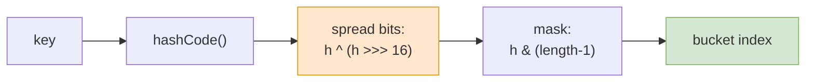

**1.4 — Why the capacity must be a power of 2.** `h & (length - 1)` only distributes evenly when `length` is a power of two, because of the binary pattern of `length - 1`:

- `length = 16` → mask `15 = 0…0`**`1111`**: the AND can produce **any** value 0–15, so all buckets are reachable.
- `length = 17` → mask `16 = 0…`**`10000`**: `h & 16` can only ever be `0` or `16` — every key crams into just **two** buckets.

Real hashes against `length = 16` (mask `1111`):

| Hash `H` | Binary (low bits) | `H & 15` | Bucket |
|----------|-------------------|----------|--------|
| 952      | …0111**1000**     | 1000     | 8 |
| 1576     | …0010**1000**     | 1000     | 8 |
| 12356146 | …0001**0010**     | 0010     | 2 |
| 59843    | …0000**0011**     | 0011     | 3 |

This is why a HashMap rounds a requested capacity *up* to the next power of two (ask for 37, it quietly uses 64) — transparently, with no action needed from you.

</details>

### 💥 Step 2 — Collisions: when two keys want the same bucket

<details open>
<summary><b>Step 2 — in one line:</b> different keys can land in the same bucket; HashMap chains them into a linked list, new entry first.</summary>

<br>

Because the bucket array is finite (16 slots by default) but keys are unlimited, two **unequal** keys will sometimes compute the **same** bucket index. This is a **collision** — and it's normal, expected, and unavoidable. The art of HashMap is handling collisions gracefully so they barely cost anything.

**2.1 — Two kinds of collision.** People lump two distinct situations under "collision":

1. **Index collision (the common one):** two keys have *different* hash codes, but after masking (`h & (length-1)`) they map to the *same* slot. Example with `length = 16`: hash `952` and hash `1576` both mask to bucket **8** (see the table above), even though the keys are completely unrelated.
2. **Hash collision (rarer):** two *unequal* keys genuinely produce the *same* hash code. The pigeonhole principle guarantees this is possible — there are far more distinct objects than there are `int` values.

In **both** cases the entries end up in the same bucket, and HashMap resolves it the same way: **separate chaining**. Each bucket holds a *linked list*, and colliding entries are linked together through the `next` pointer.

**2.2 — How chaining looks.** Suppose three keys collide into bucket 5. The bucket simply holds a chain:

```
bucket[5] → Node(hash=101, "Alice", "Engineer")
              → Node(hash=205, "Bob",   "Student")
                → Node(hash=101, "Amy",  "Doctor")
                  → null
```

Note that `"Alice"` and `"Amy"` even share the same hash (101) here — a true hash collision — while `"Bob"` only shares the *bucket*. All three coexist peacefully in the chain. When you `get("Amy")`, the map walks `Alice → Bob → Amy`, comparing hash-then-`equals()` at each step until it matches.

**2.3 — Worked example: head-insertion (Java 7 style).** The original HashMap inserted each new colliding entry at the **head** of the bucket's list — an O(1) operation that needs no traversal. Picture bucket 0 already holding one entry, `Key16` (hash 16):

```
① bucket[0] holds one entry:

   [0] → Key16 | Value16 | 16 | next=null


② put a NEW entry (Key32, Value32, hash 32) that also maps to bucket[0]:

   [0] → Key32 | Value32 | 32 | next ──►  Key16 | Value16 | 16 | null
         └─────────── new head ───────────┘
```

The new value `Key32` is placed at the **beginning** of the list, and its `next` points to the previous head. Reading top-to-bottom, the most-recently-added entry is encountered first.

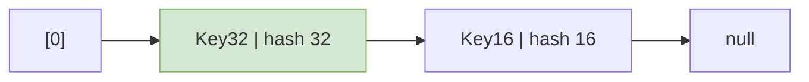

> 📌 **Java 7 vs Java 8 — head vs tail:** Java 7 used **head insertion** (shown above): cheap, but it could reverse a bucket's order during a multi-threaded resize and create an infinite loop. Java 8 switched to **tail insertion** — appending at the end — partly to behave more predictably, and partly because it must *count* the chain length to decide when to convert the bucket into a tree (treeification, Step 4½). Functionally both store the same entries; only the ordering and the resize behaviour differ.

**2.4 — Why collisions matter for performance.** The cost of `get`/`put` on a bucket is proportional to the length of its chain. A few collisions are harmless; a *flood* of them into one bucket is what turns O(1) into O(n). HashMap fights this on two fronts: it **resizes** to spread entries across more buckets (Step 5), and since Java 8 it **treeifies** an over-long bucket into a balanced tree (Step 4½). The root cause of pathological collisions, though, is almost always a poor `hashCode()` — see "Why a good `hashCode()` matters" below.

</details>

### 💥 Step 3 — Inserting with `put()`

<details open>
<summary><b>Step 3 — in one line:</b> find the bucket; if the key exists overwrite its value, otherwise add a new node and maybe resize.</summary>

<br>

**3.1 — The logic, step by step:**

1. **Null key?** Store the value in `table[0]` (hash of null is 0).
2. **Hash & index** the key (Step 1).
3. **Empty bucket?** Drop a new `Node` straight in.
4. **Occupied bucket?** Walk the chain. For each entry, compare the cached `hash`; only on a hash match call `key.equals(existingKey)`.
   - **Key already present** → *update*: overwrite the value, return the old value, leave `size` unchanged. This is how HashMap keeps keys unique — re-putting a key replaces its value rather than duplicating the key.
   - **Key not found** (chain exhausted) → *insert*: add a new node.
5. **Grow if needed:** after an insert, if `size > threshold`, resize.

**3.2 — The flow at a glance:**

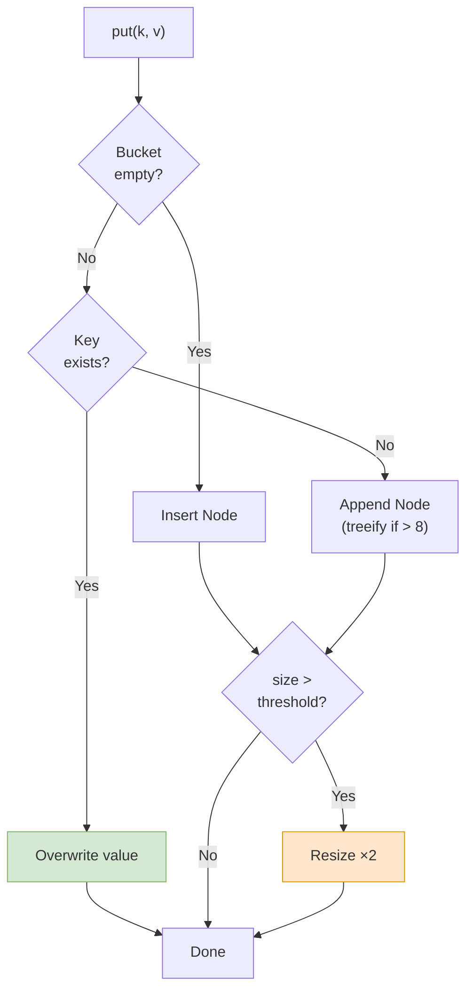

**3.3 — The key optimization.** The cached-hash-before-`equals()` check is central — a hash mismatch skips `equals()` entirely. Even so, a bucket of N colliding keys still costs up to **N** comparisons in the worst case, which is exactly what treeification fixes.

<details>
<summary>📦 <b>Sample code: the essence of put() (simplified from the JDK)</b></summary>

```java
public V put(K key, V value) {
    int hash = hash(key);                 // step 1: spread the hash
    int i = (table.length - 1) & hash;    // step 1: bucket index

    // Walk the bucket's chain looking for an equal key
    for (Node<K,V> e = table[i]; e != null; e = e.next) {
        // Cheap hash check first, THEN the real equals() check
        if (e.hash == hash && (e.key == key || key.equals(e.key))) {
            V old = e.value;
            e.value = value;              // key exists → overwrite value
            return old;                   // return the previous value
        }
    }
    addEntry(hash, key, value, i);        // new key → add a Node to the bucket
    if (++size > threshold) resize();     // grow if we crossed the threshold
    return null;
}
```
</details>

</details>

### 💥 Step 4 — Reading and deleting with `get()` / `remove()`

<details open>
<summary><b>Step 4 — in one line:</b> retrieval reuses the same hash-then-equals matching; remove additionally unlinks the node.</summary>

<br>

**4.1 — The lookup logic.** The elegance of HashMap is that retrieval reuses the **exact same** key-matching logic as insertion:

1. Compute the spread hash (or 0 for a null key).
2. Mask it to a bucket index.
3. Walk that bucket's chain (or tree), comparing the cached `hash` first, then `equals()`. Return the value of the first match.
4. Chain exhausted with no match → return `null`.

**4.2 — Deletion.** `remove(key)` follows the identical recipe, then **unlinks** the matching node — its predecessor's `next` is pointed past it. If no match is found, nothing changes.

**4.3 — Cost.** Each operation touches just one bucket, so cost is at most **N** comparisons for N entries in that bucket — kept small by resizing and bounded to O(log N) by treeification.

> ⚠️ A `null` return is ambiguous — the key may be **absent** *or* explicitly **mapped to `null`** (HashMap allows null values). Use `containsKey()` to distinguish the two cases.

<details>
<summary>📦 <b>Sample code: the essence of get()</b></summary>

```java
public V get(Object key) {
    int hash = hash(key);
    for (Node<K,V> e = table[(table.length - 1) & hash]; e != null; e = e.next) {
        if (e.hash == hash && (e.key == key || (key != null && key.equals(e.key))))
            return e.value;               // hash match, then equals() match
    }
    return null;                          // not found (or key mapped to null)
}
```
</details>

</details>

### 🌲 Step 4½ — Treeification (the big Java 8 improvement)

<details open>
<summary><b>Treeification — in one line:</b> an over-long bucket converts from a linked list into a red-black tree so its worst case is O(log n), not O(n).</summary>

<br>

In Java 7 a bucket was *always* a linked list, so a bad `hashCode()` funneling every key into one bucket degraded lookups to **O(n)** — a linear scan through a giant list. Java 8 fixed this by letting a `Node` be promoted to a **`TreeNode`**, which carries the fields of a **red-black tree** (`parent`, `left`, `right`, and a red/black colour flag). A red-black tree is a *self-balancing* binary search tree: its height stays O(log n) regardless of insertion order.

**The switch is governed by three constants:**

1. Chain length grows **> `TREEIFY_THRESHOLD = 8`** *and* table capacity is **≥ `MIN_TREEIFY_CAPACITY = 64`** → the bucket becomes a red-black tree, lifting worst-case lookup to **O(log n)**.
2. If the table is still smaller than 64 slots → the map prefers to **resize** (which redistributes and shortens chains) instead of treeifying.
3. If a tree later shrinks **below `UNTREEIFY_THRESHOLD = 6`** → it reverts to a plain linked list.

So most buckets remain short lists; only the rare over-full bucket becomes a tree.

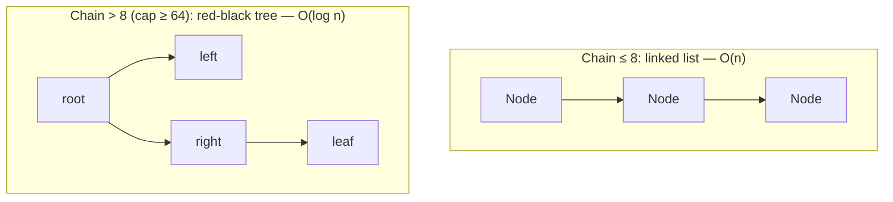

> 💡 **Why 8 and 6, not the same number?** The gap creates *hysteresis* — it prevents a bucket hovering at the boundary from thrashing back and forth between list and tree on every add/remove. The trade-off is memory: a `TreeNode` holds several extra references, so a treeified bucket costs more space. Treeification is a rare safety net, not the common case.

</details>

### 💥 Step 5 — Resizing (rehashing) to stay fast

<details open>
<summary><b>Step 5 — in one line:</b> when the map gets too full it doubles its array and redistributes every entry, keeping chains short.</summary>

<br>

If the map only ever appended to its 16 buckets, those buckets would grow into long lists and performance would collapse. To prevent that, HashMap **grows its array**.

**5.1 — The two values it tracks:**

- **`size`** — number of entries (updated on every add/remove).
- **`threshold`** — `capacity × loadFactor` (16 × 0.75 = **12**), recomputed after each resize.

**5.2 — What happens.** Before adding an entry, `put()` checks `size > threshold`. If so, it **doubles** the capacity (16 → 32 → 64 …), allocates a fresh array, and **redistributes every existing entry** into the new buckets. Because the index formula `hash & (length - 1)` depends on `length`, doubling changes which bucket each key maps to — entries that shared a bucket may now split apart, while entries whose keys share the *same* hash always stay together.

**5.3 — The payoff.** Shorter chains, faster operations. A bucket holding a 5-element chain before a resize might hold just 2 afterward — roughly halving a `get()` on that bucket.

> 💡 **Why 0.75?** A *lower* load factor resizes sooner (fewer collisions, but more memory and more frequent resizes); a *higher* one packs denser (less memory, but longer chains). 0.75 is the empirically tuned sweet spot.
>
> 💡 **Sizing tip:** resizing rebuilds the whole array and all its chains/trees. With the default 16, resizes fire at the 12th, 24th, 48th, 96th… insert. For ~1000 entries, build with `new HashMap<>(1334)` (≈ 1000 / 0.75) to skip them — but don't over-size and waste memory. (HashMap only ever *grows*; it never shrinks back down.)

</details>

### ⚡ Why a good `hashCode()` matters (performance)

The whole O(1) promise rests on one assumption: keys spread **evenly** across the buckets. Array capacity is irrelevant if the hash funnels most keys into a few buckets — you get a **skewed** map where some buckets hold one giant chain and the rest sit empty, and every operation on those crowded buckets walks the long chain, degrading toward **O(n)** (or O(log n) once Java 8 treeifies).

How much does this matter? A well-known experiment inserts 2 million entries into a HashMap:

- A `hashCode()` that **always returns a constant** (every key collides into one bucket) → **45+ minutes**.
- A **well-distributed** `hashCode()` → about **46 seconds**.
- The **ideal** hash (just return the key's int value) → roughly **2 seconds**.

Same data, same array size — the *only* variable is hash quality. This is exactly why `String` and `Integer` make great keys: both have well-distributing, cached hash codes (and an `Integer`'s hash *is* its own value). When designing a custom key, aim for a `hashCode()` that scatters keys across as many buckets as possible.

### 🔒 Why keys should be immutable

The entry's `hash` is computed and cached **at insertion time**. If you mutate a key so its `hashCode()` changes, the map can't know — the old hash is still stored, and the entry still physically sits in its *original* bucket. A later lookup recomputes the hash from the *current* state and hunts elsewhere:

- **Case 1 — wrong bucket:** the new hash maps to a different bucket; the map searches there, finds nothing, returns `null`. Value lost.
- **Case 2 — right bucket, wrong match:** by luck the new hash lands in the same bucket, so the map walks the chain — but the *stored* (old) hash no longer equals the *recomputed* (new) hash, so the entry still isn't found.

Either way the entry becomes unreachable: silent data loss and a memory leak.

<details>
<summary>📦 <b>Sample code: a mutable key "loses" its value</b></summary>

```java
Map<List<Integer>, String> map = new HashMap<>();
List<Integer> key = new ArrayList<>(List.of(1));
map.put(key, "value");

key.add(2);                       // mutated → hashCode() changed!
System.out.println(map.get(key)); // null — looked in the wrong bucket
```

Put two pairs in a map, then mutate the *first* key: a lookup with the modified key returns `null`, while the untouched key still resolves — the first value is "lost" inside the map even though it's still physically stored.
</details>

This is why **immutable** types like `String` and `Integer` are ideal keys. A custom key class should be immutable — or at the very least, never mutate the fields used by its `hashCode()`/`equals()` while it lives in a map.

### ⚠️ Why HashMap breaks under multithreading

`HashMap` is **not synchronized**, and the resize mechanism is exactly why that's dangerous:

- **Writer + reader is unsafe.** If a `put()` triggers a resize while another thread `get()`s, the reader may compute the *old* index and miss an entry that's just been relocated to a new bucket.
- **Concurrent puts can corrupt the structure.** Two threads resizing at the same time can splice a bucket's list into a **cycle**, so a later `get()` on that bucket follows `next` pointers forever — an **infinite loop** pinning a CPU core at 100%.

Java 8 reworked resize to preserve node order and largely eliminate the infinite-loop cycle, but HashMap is still **not** thread-safe — concurrent writes can lose updates and leave inconsistent state. Your thread-safe options:

- **`Hashtable`** (legacy) — every method `synchronized`, so safe but slow: only one thread touches the map at a time, even for reads.
- **`ConcurrentHashMap`** (modern) — locks only at the *bucket* level and reads lock-free, so many threads operate concurrently as long as they aren't touching the same bucket or resizing.

**Takeaway:** never share a plain `HashMap` across threads for writes — reach for `ConcurrentHashMap`, covered in depth in [Section 9](#9--deep-dive-hashmap-vs-concurrenthashmap).

---

## 9. 🔬 Deep Dive: HashMap vs ConcurrentHashMap

> The classic FAANG question: *"What's the difference between HashMap and ConcurrentHashMap?"* The shallow answer — "one is thread-safe, one isn't" — gets you a follow-up. The real value is explaining **how** CHM achieves thread-safety so efficiently.

### Definition first

- **`HashMap`** — fast, not thread-safe. Best for single-threaded or read-only-shared use.
- **`ConcurrentHashMap` (CHM)** — thread-safe, built for high-concurrency access **without locking the entire map**.

### How CHM achieves thread-safety (the evolution)

- **Java 7:** the map was split into **segments** (default 16). Each segment had its own lock, so up to 16 threads could write concurrently. This was "segment-level locking."
- **Java 8+:** segments were dropped. CHM now locks at the **individual bucket (bin) level** and uses **CAS** for lock-free inserts into empty buckets — much finer-grained, higher concurrency.

### 💥 CHM's internal data structure

<details>
<summary>📦 <b>Sample code: CHM Node (note the volatile fields)</b></summary>

```java
transient volatile Node<K,V>[] table;   // volatile → visible across threads

static class Node<K,V> implements Map.Entry<K,V> {
    final int hash;
    final K key;
    volatile V value;        // volatile → readers always see latest value
    volatile Node<K,V> next; // volatile → safe traversal during concurrent writes
}
```

The `volatile` keyword is the secret to **lock-free reads**: it guarantees that once a writer updates a value, every reader sees the new value immediately — no lock required.
</details>

Like `HashMap`, a long bucket chain (> 8, table ≥ 64) becomes a **red-black tree** (`TreeBin`) for O(log n) lookups.

### 💥 Insert (`put`) — fine-grained locking + CAS

```mermaid
flowchart TD
    P["put(key, value)"] --> IDX["Compute hash &amp; bucket index"]
    IDX --> EMPTY{"Bucket empty?"}
    EMPTY -->|Yes| CAS["CAS insert<br/>(lock-free, atomic)"]
    CAS -->|CAS failed<br/>(another thread won)| RETRY["Retry"]
    RETRY --> EMPTY
    EMPTY -->|No| LOCK["Lock ONLY this bucket<br/>(synchronized on head node)"]
    LOCK --> TRAV["Traverse chain/tree, update or append"]
    TRAV --> UNLOCK["Release bucket lock"]
    style CAS fill:#d5e8d4,stroke:#82b366
    style LOCK fill:#ffe6cc,stroke:#d79b00
```

- **Empty bucket?** Insert with **CAS (Compare-And-Swap)** — an atomic CPU instruction, no lock at all.
- **Bucket has entries?** Lock **only that one bucket** (synchronize on its head node). Other threads can freely write to *other* buckets at the same time.

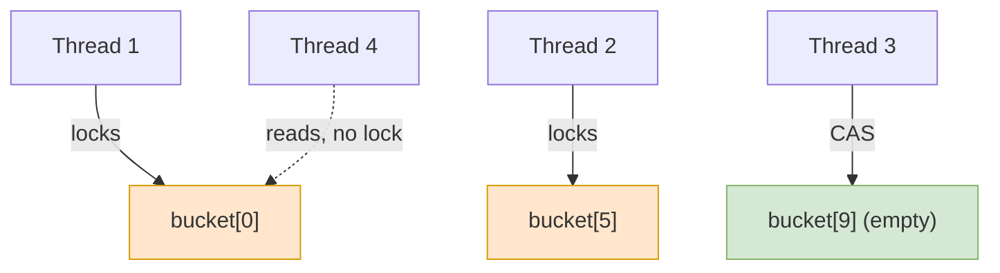

### 💥 Read (`get`) — completely lock-free

Reads acquire **no locks**. Thanks to `volatile` fields, a reader always sees the latest committed value. This is why CHM scales beautifully for read-heavy workloads.

### 💥 Resize — cooperative & non-blocking

When CHM needs to grow, it doesn't lock the whole map. Instead:
- Capacity doubles and a `nextTable` is created.
- **Multiple threads cooperate** to migrate buckets from the old table to the new one (each thread grabs a range of buckets to transfer).
- The old table stays readable during migration, so reads/writes continue. **No global lock.**

### Special techniques CHM uses

- **CAS operations** — lock-free inserts into empty buckets; great under low contention.
- **Fine-grained (per-bucket) locking** — only one bucket is locked during a write; parallel writes to different buckets proceed freely.
- **Volatile fields** — latest values visible without locking.
- **Tree bins** — long chains become red-black trees (O(log n)).
- **Cooperative resizing** — threads help transfer buckets, avoiding a blocking global resize.
- **Weakly consistent iterators** — iterating never throws `ConcurrentModificationException`; it reflects *some* state during traversal but may miss concurrent updates.

### ⚠️ Bulk operations are NOT atomic in CHM

This is a subtle, high-signal interview point.

An **atomic** operation completes as a single indivisible step — no other thread can observe a partial result. **Bulk operations** affect many entries at once: `putAll(map)`, `clear()`.

- In a `HashMap` (single-threaded), `putAll`/`clear` are effectively atomic *from your program's view* — nobody else is touching the map.
- In a `ConcurrentHashMap`, they are **not atomic**:

<details>
<summary>📦 <b>Sample code: partial visibility during putAll</b></summary>

```java
ConcurrentHashMap<String, String> cmap = new ConcurrentHashMap<>();
cmap.put("A", "1");

// Thread 1:
cmap.putAll(Map.of("B", "2", "C", "3"));

// Thread 2 (running concurrently):
cmap.get("B");   // might return "2"...
cmap.get("C");   // ...while this still returns null!
```

Thread 2 may see **B inserted but C not yet** — the bulk update is *partially visible*, hence **not atomic**.
</details>

**Why?** Because of CHM's design strengths:
- **Fine-grained locking:** each key in `putAll` may land in a different bucket, locked separately and at different times. There's no single lock spanning the whole operation.
- Other threads reading concurrently can therefore observe **partial updates**.

**How to get atomic bulk behavior:** either guard the operation with **external synchronization** (a `synchronized` block over a shared lock used by all accessors), or **design for eventual consistency** so partial visibility is acceptable.

### Side-by-side summary

| Aspect | HashMap | ConcurrentHashMap |
|--------|---------|-------------------|
| Thread-safe | ❌ No | ✅ Yes |
| Locking strategy | None | Per-bucket lock + CAS |
| Reads | Not safe concurrently | **Lock-free** |
| Writes | Not safe concurrently | Concurrent (different buckets) |
| Null keys/values | 1 null key, null values OK | ❌ None allowed |
| Iterator | Fail-fast (CME) | Weakly consistent (no CME) |
| Bulk ops atomic? | Effectively yes (single-thread) | ❌ No |
| Best for | Single-threaded / read-only sharing | Shared, concurrent access |

> 🎯 **Why does CHM forbid null keys/values?** Because in a concurrent map, `get(key) == null` is ambiguous — does the key not exist, or does it map to null? In a single-threaded `HashMap` you can disambiguate with `containsKey`, but with concurrent updates that check would race. CHM removes the ambiguity by banning null.

---

## 10. The `hashCode()` & `equals()` Contract

Both `equals()` and `hashCode()` are declared in `java.lang.Object`, so *every* Java object has them. Hash-based collections (`HashMap`, `HashSet`, `LinkedHashMap`, …) lean on them for *every* insert and lookup. Get them wrong and your objects silently "vanish" inside maps and sets.

### What each method does

- **`equals()`** — compares two objects for *logical* equality.
- **`hashCode()`** — produces an integer code for an object.

In a lookup they work as a team: `hashCode()` narrows the search from the whole map down to **one bucket**, then `equals()` confirms the **exact key** within that bucket.

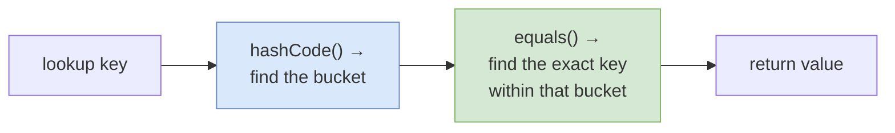

The catch is that the **default** implementations from `Object` compare *identity*, not content — `equals()` is literally `return (this == obj);`, true only when both references point to the same object. So two `Person` objects with identical fields are "unequal" by default, which is useless for map keys. That's why you must override them.

### The contract (memorize this)

1. **Consistency:** `hashCode()` returns the same value on repeated calls to the same object (within one execution).
2. **Equality implies equal hashes:** if `a.equals(b)` is `true`, then `a.hashCode() == b.hashCode()` **must** hold.
3. **The reverse is NOT required:** two *unequal* objects may share a hash code — that's just a collision, and it's allowed.

> ⚠️ **The #1 bug:** overriding `equals()` but forgetting `hashCode()`. Two "equal" objects then produce different hashes, land in different buckets, and the map can't find them. **Always override both together.**

### How to override `equals()` — the 5-step recipe

1. **Identity check** — `if (obj == this) return true;` (fast path).
2. **Null & type check** — return false if `obj` is null or a different class.
3. **Cast** the argument to your type.
4. **Compare fields**, starting with cheap numeric ones, using short-circuit `&&` so a first mismatch bails out early.
5. If your class has a **unique business key** (e.g. an `id`), comparing just that field is enough — no need to compare every field.

<details>
<summary>📦 <b>Sample code: overriding equals() and hashCode() together</b></summary>

```java
public class Person {
    private final int    id;
    private final String firstName;
    private final String lastName;

    @Override
    public boolean equals(Object obj) {
        if (obj == this) return true;                          // 1. identity
        if (obj == null || obj.getClass() != this.getClass())  // 2. null & type
            return false;
        Person other = (Person) obj;                           // 3. cast
        return id == other.id                                  // 4. numeric first
            && Objects.equals(firstName, other.firstName)
            && Objects.equals(lastName,  other.lastName);
    }

    @Override
    public int hashCode() {                                    // same fields as equals()
        final int prime = 31;
        int result = 1;
        result = prime * result + id;
        result = prime * result + (firstName == null ? 0 : firstName.hashCode());
        result = prime * result + (lastName  == null ? 0 : lastName.hashCode());
        return result;
    }
}
```
</details>

### How to override `hashCode()`

The golden rule: **use exactly the same fields you used in `equals()`** — otherwise the contract breaks. The classic hand-written form multiplies a running result by a small prime (commonly **31**) and folds each field in. In modern Java you rarely write that by hand — `Objects.hash(...)` does it for you:

<details>
<summary>📦 <b>Sample code: the modern, concise version</b></summary>

```java
@Override
public boolean equals(Object o) {
    if (this == o) return true;
    if (o == null || getClass() != o.getClass()) return false;
    Person p = (Person) o;
    return id == p.id;                       // unique business key alone is enough
}

@Override
public int hashCode() {
    return Objects.hash(id);                 // must match the fields in equals()
}
```

> 💡 Why **31**? It's an odd prime, and `31 * i` optimizes to `(i << 5) - i` — a cheap shift-and-subtract while still spreading hashes well.
</details>

### Common mistakes to avoid

- **Overloading instead of overriding.** Writing `public boolean equals(Person obj)` (note the type) *overloads* — collections still call `equals(Object)` and ignore yours. The **`@Override`** annotation makes the compiler catch this. Add it to `hashCode()` too, so a wrong return type (`long` instead of `int`) is flagged.
- **Overriding `equals()` but not `hashCode()`** — see "the #1 bug" above.
- **Keeping `equals()` and `compareTo()` inconsistent.** A `TreeSet`/`TreeMap` orders with `compareTo()`, not `equals()`. If they disagree, a sorted set can end up holding "duplicates," breaking the `Set` contract.

### Tips & best practices

- **Prefer a unique business key.** If `id` uniquely identifies a `Person`, compare only `id` rather than every field.
- **Use immutable (`final`) fields.** A key whose hash changes after insertion gets lost in the wrong bucket — immutable keys are far safer.
- **`getClass()` vs `instanceof`.** `instanceof` can break the *symmetry* rule across a parent/child hierarchy (`parent.equals(child)` true but `child.equals(parent)` false). `getClass()` avoids this. (Note: objects of the same logical class but loaded by *different* class loaders won't be equal under `getClass()`.)
- **Always annotate both with `@Override`** to catch subtle signature mistakes at compile time.

---

## 11. Sorting: Comparable vs Comparator

Two interfaces, two purposes — a guaranteed interview question.

| | `Comparable<T>` | `Comparator<T>` |
|---|---|---|
| Package | `java.lang` | `java.util` |
| Method | `compareTo(T o)` | `compare(T a, T b)` |
| Defines | The **natural ordering** (one, built into the class) | **External / custom** orderings (many possible) |
| Where it lives | Inside the class being sorted | In a separate class/lambda |
| Analogy | "How this type sorts *by default*" | "A custom rule I bring along to sort differently" |

> 🏠 **Analogy:** `Comparable` is a person's *default* way of lining up (say, by height). `Comparator` is a coach who shows up with a clipboard saying "today, line up by jersey number instead."

<details>
<summary>📦 <b>Sample code: Comparable (natural ordering)</b></summary>

```java
class Person implements Comparable<Person> {
    String name; int age;
    Person(String name, int age) { this.name = name; this.age = age; }

    @Override
    public int compareTo(Person other) {
        return this.name.compareTo(other.name);  // natural order = by name
    }
}

List<Person> people = new ArrayList<>(/* ... */);
Collections.sort(people);   // uses compareTo → sorts by name
```
</details>

<details>
<summary>📦 <b>Sample code: Comparator (custom & chained orderings)</b></summary>

```java
List<Person> people = new ArrayList<>(/* ... */);

// Sort by age (lambda)
people.sort((a, b) -> Integer.compare(a.age, b.age));

// Modern, readable Comparator API
people.sort(Comparator.comparingInt(p -> p.age));

// Multi-level: by age, then name; descending variant too
people.sort(
    Comparator.comparingInt((Person p) -> p.age)
              .thenComparing(p -> p.name)
);
people.sort(Comparator.comparingInt((Person p) -> p.age).reversed());
```

> ⚠️ **Don't sort by subtraction** like `a.age - b.age` for ints that can be large/negative — it can **overflow**. Use `Integer.compare(a, b)`.
</details>

> 🎯 **Mnemonic:** **Compar*able*** = "I am *able* to compare *myself*" (internal). **Compar*ator*** = "an external *operator* that compares two things" (external).

---

## 12. Iterators: Fail-Fast vs Fail-Safe

What happens if you modify a collection *while* iterating it?

### Fail-fast iterators

- Used by most `java.util` collections: `ArrayList`, `HashMap`, `HashSet`, …
- They track a `modCount` (modification counter). If the collection is structurally modified during iteration (except via the iterator's own `remove()`), the next `next()` throws **`ConcurrentModificationException`** immediately.
- They operate on the **original** collection.
- ⚠️ "Fail-fast" is a **best-effort safety net**, not a guarantee — don't rely on it for correctness.

<details>
<summary>📦 <b>Sample code: triggering — and fixing — ConcurrentModificationException</b></summary>

```java
List<String> list = new ArrayList<>(List.of("a", "b", "c"));

// ❌ Throws ConcurrentModificationException
for (String s : list) {
    if (s.equals("b")) list.remove(s);
}

// ✅ Fix 1: use the iterator's own remove()
Iterator<String> it = list.iterator();
while (it.hasNext()) {
    if (it.next().equals("b")) it.remove();
}

// ✅ Fix 2 (Java 8+): removeIf
list.removeIf(s -> s.equals("b"));
```
</details>

### Fail-safe iterators

- Used by concurrent collections: `ConcurrentHashMap`, `CopyOnWriteArrayList`, …
- They iterate over a **snapshot/copy** of the data (or a weakly-consistent view), so concurrent modification never throws.
- ⚠️ Trade-off: the iterator may **not reflect** the most recent changes, and (for COW collections) uses extra memory.

| | Fail-fast | Fail-safe |
|---|---|---|
| On concurrent modification | Throws `ConcurrentModificationException` | No exception |
| Works on | Original collection | Copy / snapshot |
| Examples | ArrayList, HashMap, HashSet | ConcurrentHashMap, CopyOnWriteArrayList |
| Sees latest data? | Yes (until it throws) | Maybe not (snapshot) |
| Memory | Low | Higher (copy) |

---

## 13. Java 8+ Collection Superpowers

Java 8 added methods that make collection code dramatically cleaner.

### New default methods on collections & maps

<details>
<summary>📦 <b>Sample code: the essential Java 8 map/collection methods</b></summary>

```java
Map<String, Integer> map = new HashMap<>();

// getOrDefault — no more null checks
int v = map.getOrDefault("x", 0);

// putIfAbsent — only inserts if missing
map.putIfAbsent("a", 1);

// computeIfAbsent — perfect for building multi-maps
Map<String, List<String>> groups = new HashMap<>();
groups.computeIfAbsent("fruits", k -> new ArrayList<>()).add("apple");

// merge — elegant frequency counting
Map<String, Integer> freq = new HashMap<>();
for (String word : List.of("a", "b", "a")) {
    freq.merge(word, 1, Integer::sum);   // {a=2, b=1}
}

// compute / computeIfPresent
map.computeIfPresent("a", (k, val) -> val + 10);

// forEach
map.forEach((k, val) -> System.out.println(k + "=" + val));

// On collections:
List<Integer> nums = new ArrayList<>(List.of(1, 2, 3, 4));
nums.removeIf(n -> n % 2 == 0);          // remove evens → [1, 3]
nums.replaceAll(n -> n * 10);            // [10, 30]
```
</details>

### The Stream API — declarative data processing

Streams let you express *what* you want, not *how* to loop.

<details>
<summary>📦 <b>Sample code: Stream pipelines</b></summary>

```java
List<String> names = List.of("Alice", "Bob", "Charlie", "Dave");

// filter + map + collect
List<String> result = names.stream()
    .filter(n -> n.length() > 3)
    .map(String::toUpperCase)
    .collect(Collectors.toList());        // [ALICE, CHARLIE, DAVE]

// numeric reduction
double avgLen = names.stream()
    .mapToInt(String::length)
    .average()
    .orElse(0);
```
</details>

### Collectors — powerful grouping & partitioning

<details>
<summary>📦 <b>Sample code: groupingBy, counting, partitioningBy, joining</b></summary>

```java
record Person(String name, int age, String country) {}
List<Person> people = /* ... */ List.of();

// Group by country
Map<String, List<Person>> byCountry = people.stream()
    .collect(Collectors.groupingBy(Person::country));

// Count per country
Map<String, Long> countByCountry = people.stream()
    .collect(Collectors.groupingBy(Person::country, Collectors.counting()));

// Partition: adults vs minors
Map<Boolean, List<Person>> partitioned = people.stream()
    .collect(Collectors.partitioningBy(p -> p.age() >= 18));

// Join names into a string
String joined = people.stream()
    .map(Person::name)
    .collect(Collectors.joining(", "));
```
</details>

### Immutable factory methods (Java 9+)

```java
List<String> list = List.of("a", "b", "c");        // immutable
Set<Integer>  set  = Set.of(1, 2, 3);              // immutable
Map<String,Integer> map = Map.of("a", 1, "b", 2);  // immutable
```
⚠️ These are **truly immutable** — calling `add()`/`put()` throws `UnsupportedOperationException`. They also reject null elements.

---

## 14. Concurrent Collections Overview

When multiple threads share a collection, plain `HashMap`/`ArrayList` are unsafe. Your options, from oldest to best:

| Need | ❌ Legacy / weak | ✅ Modern choice |
|------|------------------|------------------|
| Thread-safe map | `Hashtable`, `Collections.synchronizedMap` | **`ConcurrentHashMap`** |
| Thread-safe list (read-heavy) | `Vector`, `Collections.synchronizedList` | **`CopyOnWriteArrayList`** |
| Producer-consumer queue | manual `wait`/`notify` | **`BlockingQueue`** (`LinkedBlockingQueue`, `ArrayBlockingQueue`) |
| Thread-safe sorted map | — | **`ConcurrentSkipListMap`** |
| Non-blocking queue | — | **`ConcurrentLinkedQueue`** |

> 🎯 **Key insight:** `Collections.synchronizedMap(new HashMap<>())` wraps every method in a *single* lock — only one thread touches the map at a time. `ConcurrentHashMap` locks per-bucket, so many threads work in parallel. CHM is almost always the better choice.

---

## 15. Performance Cheat-Sheet & Big-O Tables

### Lists

| Operation | ArrayList | LinkedList | CopyOnWriteArrayList |
|-----------|-----------|------------|----------------------|
| `get(i)` | **O(1)** | O(n) | O(1) |
| `add(end)` | O(1) amortized | O(1) | O(n) (copies array) |
| `add(i)` / `remove(i)` | O(n) | O(n) find + O(1) unlink | O(n) |
| add/remove at head | O(n) | **O(1)** | O(n) |
| Thread-safe | ❌ | ❌ | ✅ |

### Sets

| Operation | HashSet | LinkedHashSet | TreeSet |
|-----------|---------|---------------|---------|
| add / remove / contains | **O(1)** | O(1) | O(log n) |
| Ordering | none | insertion | sorted |

### Maps

| Operation | HashMap | LinkedHashMap | TreeMap | ConcurrentHashMap |
|-----------|---------|---------------|---------|-------------------|
| get / put / remove | **O(1)** avg | O(1) | O(log n) | O(1) avg |
| Worst case lookup | O(log n)* | O(log n)* | O(log n) | O(log n)* |
| Ordering | none | insertion/access | sorted | none |

\* *Worst case is O(log n) since Java 8 thanks to treeification (was O(n) before).*

### Queues

| Operation | ArrayDeque | PriorityQueue | LinkedBlockingQueue |
|-----------|------------|---------------|----------------------|
| offer / poll | **O(1)** | O(log n) | O(1) |
| peek | O(1) | O(1) | O(1) |
| Thread-safe | ❌ | ❌ | ✅ |

---

## 16. Best Practices & Common Pitfalls

**Program to interfaces, not implementations.**
```java
List<String> names = new ArrayList<>();   // ✅ flexible — can swap impl later
ArrayList<String> names = new ArrayList<>(); // ❌ less flexible
```

**Always use generics** for type safety — never raw types like `List list = new ArrayList()`.

**Override `equals()` and `hashCode()` together** for any object used as a `HashMap` key or `HashSet` element. Use immutable fields.

**Pre-size collections** when the size is known: `new ArrayList<>(10_000)`, `new HashMap<>(1334)` — avoids costly resizing/rehashing.

**Mind null handling:** `TreeMap`, `TreeSet`, `Hashtable`, and `ConcurrentHashMap` reject null keys (CHM rejects null values too). `HashMap` allows one null key.

**Prefer modern classes:** `ArrayDeque` over `Stack`; `ConcurrentHashMap` over `Hashtable`; `ArrayList`/`CopyOnWriteArrayList` over `Vector`.

**Use immutable collections** (`List.of`, `Set.of`, `Map.of`, or `Collections.unmodifiableList`) for constants and defensive copies.

**Common pitfalls to avoid:**
- Removing from a collection inside a for-each loop → `ConcurrentModificationException`. Use `Iterator.remove()` or `removeIf()`.
- Mutating an object *after* using it as a `HashMap` key (changes its hash → entry becomes unreachable).
- Assuming `HashMap`/`HashSet` preserve order — they don't.
- Using `LinkedList` as a default list — `ArrayList` is almost always faster.
- Sorting ints with `a - b` (overflow) — use `Integer.compare`.

---

## 17. Decision Guide: "Which Collection Do I Use?"

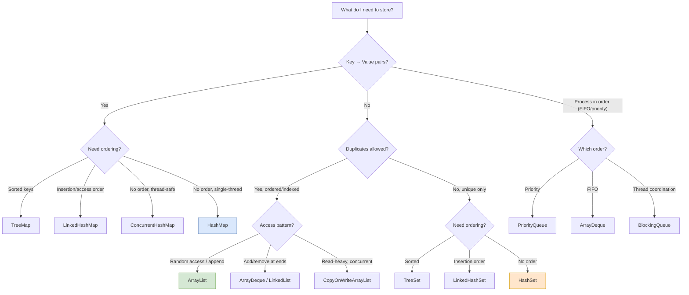

**Quick verbal rules:**
- Key-value pairs → **Map** (HashMap default, TreeMap for sorted, LinkedHashMap for order, ConcurrentHashMap for threads).
- Ordered with duplicates, index access → **ArrayList**.
- Unique elements → **Set** (HashSet default, TreeSet sorted, LinkedHashSet ordered).
- Process in order → **Queue/Deque** (ArrayDeque FIFO/stack, PriorityQueue priority, BlockingQueue for threads).

---

## 18. 🎯 55+ FAANG Interview Questions

> **How to use this section:** Read each question and try to answer *out loud* before expanding. The answers are written the way you'd actually say them in an interview — concise, then deep. Grouped by theme.

### 🟦 Fundamentals & Hierarchy

<details>
<summary><b>Q1. What is the Java Collections Framework and why does it exist?</b></summary>

It's a unified architecture (since Java 1.2) for representing and manipulating groups of objects. It has three parts: **interfaces** (List, Set, Queue, Map), **implementations** (ArrayList, HashSet, HashMap…), and **algorithms** (sort, search, shuffle in the `Collections` class). Before it, developers used inconsistent classes like `Vector` and `Hashtable`. The framework reduces coding effort, boosts performance with optimized implementations, and lets unrelated APIs interoperate through common interface types.
</details>

<details>
<summary><b>Q2. What's the difference between `Collection` and `Collections`?</b></summary>

`Collection` (singular) is the **root interface** of the hierarchy defining behaviors like `add`, `remove`, `size`. `Collections` (plural) is a **utility class** with static helper methods like `sort()`, `max()`, `unmodifiableList()`, and `synchronizedMap()`. One is a contract; the other is a toolbox.
</details>

<details>
<summary><b>Q3. Is `Map` part of the `Collection` hierarchy?</b></summary>

**No.** `Map` is a separate root interface. It doesn't extend `Collection` because it stores key-value *pairs*, not single elements, so the `Collection` methods (`add(E)`, `iterator()`) don't fit cleanly. However, you can *view* a map as collections via `keySet()`, `values()`, and `entrySet()`.
</details>

<details>
<summary><b>Q4. Explain the Collection hierarchy.</b></summary>

`Iterable` → `Collection` → splits into `List` (ordered, duplicates), `Set` (unique), and `Queue` (processing order). `Set` further has `SortedSet`/`NavigableSet` (TreeSet). `Queue` has `Deque` (ArrayDeque, LinkedList). Separately, `Map` → `SortedMap`/`NavigableMap` (TreeMap), with implementations HashMap, LinkedHashMap, Hashtable, ConcurrentHashMap.
</details>

<details>
<summary><b>Q5. What are the benefits of the Collections Framework?</b></summary>

Reduced programming effort (ready-made structures), higher performance (optimized implementations), API interoperability (common interface types), a shorter learning curve (consistent conventions), and easier reuse (program to interfaces, swap implementations).
</details>

### 🟩 List

<details>
<summary><b>Q6. ArrayList vs LinkedList — when do you use each?</b></summary>

`ArrayList` is a resizable array: **O(1) random access**, cache-friendly, but O(n) inserts/removes in the middle. `LinkedList` is a doubly-linked list: **O(1) add/remove at ends**, but O(n) random access and higher memory overhead. Use ArrayList for index-heavy, append-mostly workloads (the common case); use LinkedList when you frequently add/remove at the head or need Deque behavior — though `ArrayDeque` usually beats it.
</details>

<details>
<summary><b>Q7. How does ArrayList grow internally?</b></summary>

It starts with a default capacity (10 on first add). When full, it creates a new array of **~1.5× the size** (`oldCapacity + (oldCapacity >> 1)`), copies elements via `System.arraycopy`, and discards the old one. That occasional copy makes appends *amortized* O(1).
</details>

<details>
<summary><b>Q8. Why is ArrayList random access O(1) but LinkedList O(n)?</b></summary>

ArrayList stores elements contiguously, so `get(i)` is a direct offset calculation. LinkedList has no index — to reach position `i` you must traverse node-by-node from the nearest end, which is O(n).
</details>

<details>
<summary><b>Q9. What is `CopyOnWriteArrayList` and when is it useful?</b></summary>

A thread-safe `List` where every mutation creates a fresh copy of the backing array, so reads never lock or block. Ideal when reads vastly outnumber writes (e.g., event listener lists). Its iterators work on an immutable snapshot, so they never throw `ConcurrentModificationException`. Downside: each write copies the whole array — bad for write-heavy use.
</details>

<details>
<summary><b>Q10. Why avoid `Vector` and `Stack` today?</b></summary>

`Vector` synchronizes every method with a coarse lock — thread-safe but slow, and usually you don't need per-method locking. `Stack` extends Vector and inherits that overhead. Prefer `ArrayList` (or `CopyOnWriteArrayList`/`synchronizedList` if you truly need safety), and `ArrayDeque` for stack behavior.
</details>

<details>
<summary><b>Q11. How do you make an ArrayList thread-safe?</b></summary>

Wrap it: `Collections.synchronizedList(new ArrayList<>())` (single lock per method — remember to synchronize manually while iterating), or use `CopyOnWriteArrayList` for read-heavy scenarios.
</details>

### 🟧 Set

<details>
<summary><b>Q12. Difference between HashSet, LinkedHashSet, and TreeSet?</b></summary>

All store unique elements. `HashSet` has no ordering and O(1) ops (backed by HashMap). `LinkedHashSet` preserves insertion order via a linked list, still O(1). `TreeSet` keeps elements sorted (red-black tree), O(log n), and supports navigation methods like `ceiling`/`floor`.
</details>

<details>
<summary><b>Q13. How does HashSet work internally?</b></summary>

It's backed by a `HashMap`. Each element you add becomes a **key** in that map, mapped to a shared dummy value (`PRESENT`). So `set.add(x)` is `map.put(x, PRESENT)`, and uniqueness is enforced by HashMap's key uniqueness — using `hashCode()` for the bucket and `equals()` for collision checks.

`PRESENT` is a single shared dummy object reused as the value for all entries, since a `Set` only cares about keys, not values.

```java
private static final Object PRESENT = new Object();

public boolean add(E e) {
    return map.put(e, PRESENT) == null;
}
```

If `map.put()` returns `null`, the element was absent and is added successfully; otherwise, the element already exists and `add()` returns `false`.

</details>

<details>
<summary><b>Q14. Can a TreeSet contain null?</b></summary>

No. TreeSet must compare elements to order them; comparing null throws `NullPointerException`. (A HashSet allows a single null because it doesn't order elements.)
</details>

<details>
<summary><b>Q15. How would you find the k-th smallest unique element efficiently?</b></summary>

A `TreeSet` keeps unique elements sorted; you can iterate to the k-th, or use navigation. For streaming top-k, a bounded `PriorityQueue` (heap) of size k is the classic O(n log k) approach.
</details>

### 🟪 Map (general)

<details>
<summary><b>Q16. How does HashMap work internally?</b></summary>

It's an array of buckets. On `put`, it computes `key.hashCode()`, spreads the bits (`h ^ (h >>> 16)`), and derives the index via `(n-1) & hash`. Collisions in a bucket are chained as a linked list, which **treeifies into a red-black tree** if the chain exceeds 8 (and table ≥ 64). When size exceeds `capacity × loadFactor` (0.75), it doubles capacity and rehashes. Average get/put is O(1).
</details>

<details>
<summary><b>Q17. Why is HashMap's default load factor 0.75?</b></summary>

It's the empirically chosen balance between space and time. Lower load factor means fewer collisions but more wasted memory and more frequent resizing; higher means denser tables and more collisions. 0.75 minimizes the combined cost for typical usage.
</details>

<details>
<summary><b>Q18. Why must HashMap capacity be a power of 2?</b></summary>

Because the index is computed as `(n - 1) & hash`. When `n` is a power of 2, `n - 1` is a mask of all 1-bits, so the AND behaves like a fast `hash % n` and distributes entries evenly across buckets. Non-power-of-2 sizes would skew the distribution.
</details>

<details>
<summary><b>Q19. What is treeification and what triggers it?</b></summary>

Since Java 8, when a single bucket's chain length exceeds `TREEIFY_THRESHOLD = 8` **and** the table capacity is at least 64, that bucket converts from a linked list to a **red-black tree**, improving worst-case lookup from O(n) to O(log n). If it shrinks below 6 (`UNTREEIFY_THRESHOLD`), it reverts to a list. If the table is smaller than 64, it resizes instead of treeifying.
</details>

<details>
<summary><b>Q20. What happens on a hash collision?</b></summary>

When two different keys produce the same bucket index, a **hash collision** occurs. `HashMap` does not overwrite the existing entry; instead, it stores multiple entries in the same bucket. In **Java 8+**, collisions are handled using a **linked list**, and new entries are appended at the **tail (end)** of the list, preserving insertion order within that bucket. In **Java 7 and earlier**, new entries were inserted at the **head (beginning)** of the list.

This behavior was changed in Java 8 because head insertion during **resize/rehashing** could reverse the order of nodes and, under concurrent modification, potentially create an **infinite loop**. Appending at the tail preserves the bucket order and avoids these issues.
In Java 7, if two threads resized the same bucket concurrently, node pointers could become corrupted and form a cycle such as A → B → A. Since HashMap.get() traverses nodes until it reaches null, it would loop forever on a cyclic list, causing 100% CPU utilization. Java 8 fixed this by appending nodes at the tail and redesigning the resize algorithm.

During lookup, `HashMap` computes the bucket index and traverses the linked list (or tree) in that bucket. For each node, it first compares the cached `hash` value, and if the hashes match, it calls `equals()` to check whether the keys are actually equal. If a matching key is found, its value is returned; otherwise, traversal continues.

If the number of nodes in a bucket exceeds **8** and the table capacity is at least **64**, the linked list is converted into a **Red-Black Tree**, reducing lookup time from **O(n)** to **O(log n)**.

Example bucket after collisions in Java 8+:

```text
Before inserting D:

A → B → C → null

After inserting D:

A → B → C → D → null
```

Collisions never lose data; they only increase the cost of searching within that bucket.

</details>

<details>
<summary><b>Q21. Difference between HashMap and Hashtable?</b></summary>

`HashMap` is non-synchronized, allows one null key and null values, and is fast. `Hashtable` is synchronized (coarse lock, legacy from Java 1.0), allows no null keys/values, and is slower. For thread safety use `ConcurrentHashMap` instead of Hashtable.
</details>

<details>
<summary><b>Q22. What changed in HashMap between Java 7 and Java 8?</b></summary>

Java 8 added treeification (buckets become red-black trees past the threshold), improving worst-case from O(n) to O(log n). It also changed resize to preserve relative node order, eliminating the Java 7 race that could create a circular linked list and infinite loop during concurrent resize.
</details>

<details>
<summary><b>Q23. Can HashMap have a null key? How is it stored?</b></summary>

Yes, exactly one null key. Its hash is defined as 0, so it always goes to bucket 0. Lookups for null short-circuit the hash computation. (TreeMap and Hashtable forbid null keys; ConcurrentHashMap forbids null keys and values.)
</details>

<details>
<summary><b>Q24. What's the difference between `HashMap` and `LinkedHashMap`?</b></summary>

LinkedHashMap is a HashMap that also maintains a doubly-linked list across entries, giving predictable **insertion-order** (or **access-order**) iteration. The order costs a little memory but makes it ideal for caches and ordered output.
</details>

<details>
<summary><b>Q21. How do you build an LRU Cache in Java?</b></summary>

An **LRU (Least Recently Used) Cache** evicts the entry that has not been accessed for the longest time when the cache reaches its maximum capacity.
There are two common approaches:
1. **Extend `LinkedHashMap`** – Simple, elegant, and suitable for single-threaded use cases.
2. **Use Caffeine** – Production-ready, highly optimized, and thread-safe.

Note: In interviews, an implementation using HashMap and LinkedList is also expected which requires full code implementation without Collections framework. It's not covered here.

---

### 1. Using `LinkedHashMap`

`LinkedHashMap` internally maintains a **HashMap + Doubly Linked List**.

By passing `accessOrder=true` to the constructor, every `get()` and `put()` operation moves the accessed entry to the **tail** of the linked list, making it the **Most Recently Used (MRU)** entry.

The **Least Recently Used (LRU)** entry is always at the **head** and can be automatically removed by overriding `removeEldestEntry()`.

### Internal Ordering

```text
Head (LRU)                            Tail (MRU)

1=A  ⇄  2=B  ⇄  3=C
```

After:

```java
cache.get(1);
```

```text
Head (LRU)                            Tail (MRU)

2=B  ⇄  3=C  ⇄  1=A
```

Inserting another element removes the eldest entry automatically.

<details>
<summary><b>LinkedHashMap Implementation</b></summary>

```java
import java.util.LinkedHashMap;
import java.util.Map;

public class LRUCache<K, V> extends LinkedHashMap<K, V> {

    private final int capacity;

    public LRUCache(int capacity) {
        super(capacity, 0.75f, true);
        this.capacity = capacity;
    }

    @Override
    protected boolean removeEldestEntry(Map.Entry<K, V> eldest) {
        return size() > capacity;
    }

    public static void main(String[] args) {
        LRUCache<Integer, String> cache = new LRUCache<>(3);

        cache.put(1, "A");
        cache.put(2, "B");
        cache.put(3, "C");

        cache.get(1);

        cache.put(4, "D");

        System.out.println(cache);
    }
}
```

Output:

```text
{3=C, 1=A, 4=D}
```

</details>

---

### 2. Using 'Caffeine'
For production systems, most teams prefer **Caffeine** because it provides:
- Thread safety
- Near-optimal performance
- Automatic eviction
- Expiration policies
- Statistics
- Asynchronous loading
- Spring Boot integration

Unlike `LinkedHashMap`, Caffeine uses advanced algorithms (W-TinyLFU) to achieve better cache hit rates under heavy workloads.

<details>
<summary><b>Caffeine Implementation</b></summary>

### Maven Dependency

```xml
<dependency>
    <groupId>com.github.ben-manes.caffeine</groupId>
    <artifactId>caffeine</artifactId>
    <version>3.2.2</version>
</dependency>
```

### Simple Cache

```java
import com.github.benmanes.caffeine.cache.Cache;
import com.github.benmanes.caffeine.cache.Caffeine;

public class Main {
    public static void main(String[] args) {
        Cache<Integer, String> cache =
                Caffeine.newBuilder()
                        .maximumSize(3)
                        .build();

        cache.put(1, "A");
        cache.put(2, "B");
        cache.put(3, "C");

        cache.getIfPresent(1);

        cache.put(4, "D");

        System.out.println(cache.asMap());
    }
}
```

### Loading Cache

```java
import com.github.benmanes.caffeine.cache.LoadingCache;

LoadingCache<Integer, String> cache =
        Caffeine.newBuilder()
                .maximumSize(100)
                .build(key -> "Value-" + key);

System.out.println(cache.get(10));
```

### Expiration Policy

```java
Cache<Integer, String> cache =
        Caffeine.newBuilder()
                .maximumSize(100)
                .expireAfterWrite(10, TimeUnit.MINUTES)
                .build();
```

</details>

---

## Complexity Analysis

| Operation | LinkedHashMap | Caffeine |
|-----------|---------------|----------|
| `get()` | O(1) | O(1) |
| `put()` | O(1) | O(1) |
| Eviction | O(1) | O(1) |
| Thread Safe | ❌ No | ✅ Yes |

---

### Interview Recommendation

- Use **LinkedHashMap** when asked to implement an LRU cache in an interview.
- Use **Caffeine** in production applications because it provides better concurrency, eviction policies, and cache hit rates.

</details>

<details>
<summary><b>Q26. When would you use a TreeMap over a HashMap?</b></summary>

When you need keys kept **sorted** or need range/navigation queries — `firstKey`, `lastKey`, `ceilingKey`, `floorKey`, `headMap`, `tailMap`, `subMap`. TreeMap is O(log n) vs HashMap's O(1), so only pay that cost when ordering matters.
</details>

<details>
<summary><b>Q27. What are `computeIfAbsent` and `merge` used for?</b></summary>

`computeIfAbsent(key, k -> new ArrayList<>())` is the clean way to build multi-maps (insert a container only if missing). `merge(key, 1, Integer::sum)` is the elegant way to count frequencies — it inserts 1 if absent, or applies the function to combine with the existing value.
</details>

### 🔴 hashCode & equals

<details>
<summary><b>Q28. Why are `hashCode()` and `equals()` important in HashMap?</b></summary>

`hashCode()` selects the bucket; `equals()` distinguishes keys within that bucket on collision. Without correct implementations, keys can't be located reliably. They must obey the contract: equal objects must have equal hash codes.
</details>

<details>
<summary><b>Q29. What's the contract between equals and hashCode?</b></summary>

If `a.equals(b)` is true, then `a.hashCode() == b.hashCode()` must be true. The converse isn't required — unequal objects may share a hash (a collision). `hashCode` must also be consistent across calls. Violating "equal ⇒ same hash" breaks HashMap/HashSet.
</details>

<details>
<summary><b>Q30. What happens if you override equals but not hashCode?</b></summary>

Two logically equal objects may produce different hash codes, so they map to different buckets. A HashMap/HashSet then treats them as different keys — you can insert a key and fail to find it with an equal one. Always override both together.
</details>

<details>
<summary><b>Q31. What if you mutate a key after putting it in a HashMap?</b></summary>

If the mutation changes the fields used by `hashCode()`, the key's hash changes, but it's still physically in the old bucket. Lookups now compute the new bucket and miss it — the entry becomes effectively unreachable (a memory leak / lost data). Use immutable keys.
</details>

<details>
<summary><b>Q32. Why are String and Integer good HashMap keys?</b></summary>

They're immutable (hash can't change after insertion), and they have well-distributed, cached `hashCode()` implementations. Immutability guarantees the entry stays findable; good distribution minimizes collisions.
</details>

### 🟫 ConcurrentHashMap & Concurrency

<details>
<summary><b>Q33. HashMap vs ConcurrentHashMap?</b></summary>

HashMap isn't thread-safe; concurrent writes can corrupt it or lose data. ConcurrentHashMap is thread-safe via **per-bucket locking + CAS** for empty buckets, with **lock-free reads** (volatile fields). It forbids null keys/values, uses weakly-consistent iterators (no `ConcurrentModificationException`), and scales far better than a globally-locked map.
</details>

<details>
<summary><b>Q34. How does ConcurrentHashMap achieve thread safety without locking the whole map?</b></summary>

In Java 8+, it locks at the individual **bucket (bin)** level (synchronizing on the bucket's head node) and uses **CAS** to insert into empty buckets without any lock. Threads writing to different buckets proceed in parallel; reads take no locks at all. Resizing is cooperative — threads help migrate buckets.
</details>

<details>
<summary><b>Q35. What is CAS and how does CHM use it?</b></summary>

Compare-And-Swap is an atomic CPU instruction: "set this field to X only if it currently equals Y." CHM uses it to insert a node into an empty bucket without locking — if another thread wins the race, CAS fails and the thread retries. It's fast under low contention.
</details>

<details>
<summary><b>Q36. How did ConcurrentHashMap change from Java 7 to Java 8?</b></summary>

Java 7 used **segment-level locking** — the map was divided into ~16 segments, each with its own lock, allowing ~16 concurrent writers. Java 8 removed segments and switched to **per-bucket locking + CAS**, giving much finer granularity and higher concurrency, plus treeification of long bins.
</details>

<details>
<summary><b>Q37. Why are reads lock-free in ConcurrentHashMap?</b></summary>

The `value` and `next` fields of each node are `volatile`, and the table reference is volatile. Volatile guarantees visibility — once a writer commits a change, readers see it immediately. So `get()` can traverse safely without acquiring any lock.
</details>

<details>
<summary><b>Q38. Why doesn't ConcurrentHashMap allow null keys or values?</b></summary>

In a concurrent context, `get(key) == null` would be ambiguous: is the key absent, or mapped to null? You can't safely disambiguate with `containsKey` because another thread could change things between calls. Banning null removes the ambiguity entirely.
</details>

<details>
<summary><b>Q39. Are bulk operations like putAll/clear atomic in ConcurrentHashMap?</b></summary>

No. Because of fine-grained per-bucket locking, keys in a `putAll` go into different buckets locked at different times. A concurrent reader can observe a **partial** result (some keys inserted, others not). For atomic bulk updates you need external synchronization, or you design for eventual consistency.
</details>

<details>
<summary><b>Q40. How does ConcurrentHashMap resize without blocking everyone?</b></summary>

It doubles capacity and creates a `nextTable`. Multiple threads **cooperatively** transfer ranges of buckets from the old table to the new one; the old table remains readable during migration. There's no global lock, so reads and writes continue throughout.
</details>

<details>
<summary><b>Q41. `ConcurrentHashMap` vs `Collections.synchronizedMap()`?</b></summary>

`synchronizedMap` wraps a map so every method holds a **single** lock — only one thread accesses the map at a time, and you must manually synchronize during iteration. `ConcurrentHashMap` locks per bucket and reads lock-free, giving far higher throughput. CHM also offers atomic methods like `putIfAbsent`, `compute`, `merge`.
</details>

<details>
<summary><b>Q42. What is a BlockingQueue and where is it used?</b></summary>

A thread-safe queue where `put()` blocks if full and `take()` blocks if empty, so producers and consumers coordinate without busy-waiting. It's the backbone of producer-consumer and thread-pool designs. Implementations: `ArrayBlockingQueue` (bounded), `LinkedBlockingQueue`, `PriorityBlockingQueue`, `SynchronousQueue`, `DelayQueue`.
</details>

<details>
<summary><b>Q43. What is `ConcurrentSkipListMap`?</b></summary>

A thread-safe, **sorted** map (the concurrent analog of TreeMap), backed by a skip list. It offers O(log n) operations with concurrency and no global lock — use it when you need sorted keys *and* thread safety.
</details>

### 🟨 Iterators, Sorting & Misc

<details>
<summary><b>Q44. Fail-fast vs fail-safe iterators?</b></summary>

**Fail-fast** (ArrayList, HashMap) track a `modCount` and throw `ConcurrentModificationException` if the collection is structurally modified during iteration (outside the iterator). **Fail-safe** (ConcurrentHashMap, CopyOnWriteArrayList) iterate over a snapshot/weakly-consistent view, so they never throw but may not reflect the latest changes.
</details>

<details>
<summary><b>Q45. How do you remove elements while iterating safely?</b></summary>

Use the iterator's own `remove()` method, or `Collection.removeIf(predicate)` (Java 8+). Removing via the collection's `remove()` inside a for-each loop triggers `ConcurrentModificationException`.
</details>

<details>
<summary><b>Q46. Comparable vs Comparator?</b></summary>

`Comparable` (`compareTo`, in `java.lang`) defines a type's single **natural ordering**, implemented inside the class. `Comparator` (`compare`, in `java.util`) defines **external, custom** orderings — you can have many, written as separate classes or lambdas. Use Comparable for the default order, Comparator for alternative/multi-field sorting.
</details>

<details>
<summary><b>Q47. How do you sort a list of custom objects by multiple fields?</b></summary>

Use chained Comparators: `Comparator.comparing(Person::getLastName).thenComparing(Person::getFirstName)`. Add `.reversed()` for descending. This is cleaner and less error-prone than hand-written compare logic.
</details>

<details>
<summary><b>Q48. Why shouldn't you compare integers with subtraction in a Comparator?</b></summary>

`a - b` can **overflow** for large or negative values, producing a wrong sign and incorrect ordering. Use `Integer.compare(a, b)`, which is overflow-safe.
</details>

<details>
<summary><b>Q49. What new methods did Java 8 add to collections?</b></summary>

On collections: `removeIf`, `replaceAll`, `forEach`. On maps: `getOrDefault`, `putIfAbsent`, `compute`, `computeIfAbsent`, `computeIfPresent`, `merge`, `forEach`. Plus the entire Stream API and `Collectors` for declarative processing.
</details>

<details>
<summary><b>Q50. Difference between `Iterator` and `ListIterator`?</b></summary>

`Iterator` traverses forward only and supports `remove()`. `ListIterator` (List-only) traverses **both directions** (`hasPrevious`/`previous`), and can `add()` and `set()` elements as well as report indices. Use ListIterator when you need bidirectional traversal or in-place modification of a list.
</details>

<details>
<summary><b>Q51. How do you create an immutable collection?</b></summary>

Java 9+: `List.of(...)`, `Set.of(...)`, `Map.of(...)` — truly immutable, reject nulls. Pre-9: `Collections.unmodifiableList(list)` (a read-only *view*; the backing list can still change). For deep immutability, also make the contained elements immutable.
</details>

<details>
<summary><b>Q52. PriorityQueue vs a regular FIFO queue?</b></summary>

A `PriorityQueue` orders elements by priority (natural order or Comparator) using a binary heap, so `poll()` always returns the highest-priority element — not FIFO. A `LinkedList`/`ArrayDeque` queue is strict FIFO (insertion order). Note: iterating a PriorityQueue is *not* in sorted order; only repeated `poll()` is.
</details>

<details>
<summary><b>Q53. What is `ArrayDeque` and why prefer it over Stack/LinkedList?</b></summary>

`ArrayDeque` is a resizable-array double-ended queue. As a stack it beats `Stack` (no synchronization overhead); as a queue/deque it beats `LinkedList` (better cache locality, no per-node objects). It's the modern default for both stack and queue needs. (It rejects null elements.)
</details>

<details>
<summary><b>Q54. How does HashSet detect duplicates?</b></summary>

On `add`, it delegates to the internal HashMap's `put`. The map computes the element's bucket via `hashCode()`, and if an entry is already there, uses `equals()` to check equality. If equal, it's a duplicate and the add is ignored (returns false).
</details>

<details>
<summary><b>Q55. What's the difference between `peek()`, `poll()`, and `remove()` on a Queue?</b></summary>

`peek()` returns the head without removing (null if empty). `poll()` removes and returns the head (null if empty). `remove()` removes and returns the head but **throws** `NoSuchElementException` if empty. The peek/poll/offer family fails gracefully; the element/remove/add family throws.
</details>

<details>
<summary><b>Q56. How would you count word frequencies in a large text?</b></summary>

Use a `HashMap<String, Integer>` with `map.merge(word, 1, Integer::sum)` per word — O(n) overall. For multithreaded counting, use a `ConcurrentHashMap` with `merge` (which is atomic per key). For sorted output by count, stream the entries and sort by value.
</details>

<details>
<summary><b>Q57. What happens if two threads call `put` on a plain HashMap simultaneously?</b></summary>

It's a data race: updates can be lost, the bucket structure can be corrupted, and in Java 7 a concurrent resize could create a circular chain causing an infinite loop on a later `get`. The behavior is undefined — always use `ConcurrentHashMap` for shared writes.
</details>

<details>
<summary><b>Q58. How do you choose between HashMap, TreeMap, and LinkedHashMap?</b></summary>

HashMap for general-purpose O(1) access with no ordering. LinkedHashMap when you need insertion/access order (or an LRU cache). TreeMap when you need keys sorted or range/navigation queries (at O(log n) cost).
</details>

---

## 19. ⚡ Quick Revision Sheet

**Hierarchy:** `Iterable → Collection → {List, Set, Queue}`; `Map` is separate.

**Pick by need:**
- Ordered + duplicates + index → **ArrayList**
- Frequent ends ops / stack / queue → **ArrayDeque**
- Unique, fast → **HashSet** · Unique, sorted → **TreeSet** · Unique, ordered → **LinkedHashSet**
- Key-value, fast → **HashMap** · sorted keys → **TreeMap** · ordered/LRU → **LinkedHashMap** · concurrent → **ConcurrentHashMap**
- Priority processing → **PriorityQueue** · producer-consumer → **BlockingQueue**

**HashMap internals:** array of buckets → `hash = h ^ (h >>> 16)`, `index = (n-1) & hash` → chain on collision → treeify at chain > 8 & table ≥ 64 → resize at size > capacity × 0.75 (doubles).

**ConcurrentHashMap:** per-bucket lock + CAS for empty buckets, lock-free reads (volatile), cooperative resize, no nulls, weakly-consistent iterators, bulk ops not atomic.

**equals/hashCode contract:** equal ⇒ same hashCode (not vice-versa); override both; use immutable keys.

**Comparable vs Comparator:** `compareTo` (natural, internal, `java.lang`) vs `compare` (custom, external, `java.util`).

**Iterators:** fail-fast (CME, original collection) vs fail-safe (snapshot, no CME).

**Big-O:** ArrayList get O(1) · LinkedList get O(n) · HashMap get/put O(1) · TreeMap O(log n) · PriorityQueue offer/poll O(log n).

**Java 8+:** `getOrDefault`, `putIfAbsent`, `computeIfAbsent`, `merge`, `removeIf`, `forEach`, Streams, Collectors (`groupingBy`, `partitioningBy`, `counting`, `joining`).

---

*Master the internals, practice the questions out loud, and you'll walk into any Java collections interview with real confidence. Good luck! 🚀*

</content>
</invoke>
