# Java Garbage Collection — The Complete, Confidence-Building Guide

> From "what even *is* garbage?" to "I can defend my GC tuning choices in a FAANG interview."
>
> This guide is written to be read **top to bottom once** and then used as a **revision + interview** reference. Every concept is paired with an analogy, a diagram, and runnable code. Take your time with the diagrams — they're where the real understanding clicks.

---

## Table of Contents

1. [Why Garbage Collection Exists (The Big Picture)](#1-why-garbage-collection-exists)
2. [The Master Analogy: The Restaurant Kitchen](#2-the-master-analogy-the-restaurant-kitchen)
3. [JVM Memory Architecture (Where Objects Live)](#3-jvm-memory-architecture)
4. [The Generational Heap & The Weak Generational Hypothesis](#4-the-generational-heap)
5. [The Object Lifecycle: Birth to Death](#5-the-object-lifecycle)
6. [How GC Decides What's Garbage: Reachability & GC Roots](#6-reachability-and-gc-roots)
7. [The Core Algorithm: Mark → Sweep → Compact](#7-mark-sweep-compact)
8. [Minor GC, Major GC, Full GC & Mixed GC](#8-minor-major-full-mixed-gc)
9. [Stop-The-World: The Pause Everyone Fears](#9-stop-the-world)
10. [How an Object Becomes Eligible for GC](#10-how-an-object-becomes-eligible)
11. [The Evolution of Java's Garbage Collectors (Timeline)](#11-evolution-timeline)
12. [Deep Dive: Every Garbage Collector Explained](#12-deep-dive-collectors)
    - [12.1 Serial GC](#serial-gc)
    - [12.2 Parallel GC](#parallel-gc)
    - [12.3 CMS (Concurrent Mark Sweep)](#cms)
    - [12.4 G1 (Garbage First)](#g1)
    - [12.5 ZGC](#zgc)
    - [12.6 Shenandoah](#shenandoah)
    - [12.7 Epsilon (No-Op)](#epsilon)
13. [Choosing the Right Collector (Decision Guide)](#13-choosing-collector)
14. [Reference Types: Strong, Soft, Weak, Phantom](#14-reference-types)
15. [Memory Leaks in a "No-Leak" Language](#15-memory-leaks)
16. [OutOfMemoryError: Causes & Fixes](#16-outofmemoryerror)
17. [Triggering & Requesting GC (System.gc and friends)](#17-triggering-gc)
18. [JVM Flags & GC Tuning Cookbook](#18-tuning-cookbook)
19. [Monitoring, Logging & Profiling GC](#19-monitoring)
20. [Best Practices Summary](#20-best-practices)
21. [Quick-Revision Cheat Sheet](#21-cheat-sheet)
22. [50+ FAANG Interview Questions (Collapsible)](#22-interview-questions)

---

<a name="1-why-garbage-collection-exists"></a>
## 1. Why Garbage Collection Exists (The Big Picture)

Every program needs **memory** to store the objects it creates. The question that defines a programming language's personality is: **who is responsible for giving memory back when it's no longer needed?**

There are two philosophies:

| Approach | Who frees memory? | Languages | Risk |
|----------|-------------------|-----------|------|
| **Manual** | The programmer (`malloc`/`free`, `new`/`delete`) | C, C++ | Forget to free → **leak**. Free too early → **dangling pointer / crash**. Free twice → **corruption**. |
| **Automatic** | The runtime (Garbage Collector) | Java, C#, Go, Python | Less control, occasional pauses — but dramatically safer. |

Java chose **automatic memory management**. The Garbage Collector (GC) is a process living inside the **JVM** that automatically finds objects your program can no longer use and reclaims their memory.

**The promise of GC:** You call `new` to create objects. You *never* call anything to destroy them. The JVM watches which objects are still reachable and quietly recycles the rest.

This eliminates an entire category of catastrophic bugs:

- **Memory leaks** from forgetting to free (mostly — see [§15](#15-memory-leaks), Java can still leak logically).
- **Dangling pointers** — using memory after it's freed.
- **Double frees** — freeing the same memory twice.

The trade-off: you give up fine-grained control, and occasionally the GC pauses your application to do its work. Understanding GC is largely about **minimizing and controlling those pauses**.

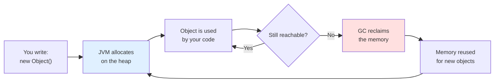

> **Key insight to carry through this whole guide:** GC is not magic and it's not free. It's a background bookkeeper that trades a little CPU and occasional pauses for enormous safety and developer productivity. Every collector you'll learn is just a different strategy for making that trade.

---

<a name="2-the-master-analogy-the-restaurant-kitchen"></a>
## 2. The Master Analogy: The Restaurant Kitchen

We'll reuse **one analogy** across the whole guide so concepts stack on top of each other instead of resetting. Meet **The Kitchen**.

Imagine a busy restaurant kitchen:

- **The countertop space = the Heap.** Limited area where the chef works with ingredients.
- **Ingredients & prepared dishes = Objects.** Created constantly as orders come in.
- **The chef = your application threads.** Doing the actual cooking (running your code).
- **The busser/cleanup crew = the Garbage Collector.** Clears plates and scraps nobody needs anymore.
- **A plate someone is still eating from = a reachable object.** Can't be cleared.
- **A plate pushed to the edge, abandoned = an unreachable object.** Fair game for cleanup.
- **The whole kitchen freezing so the crew can mop = Stop-The-World pause.**

As you read on, map each new term back to the kitchen:

| GC Concept | Kitchen Equivalent |
|------------|-------------------|
| Eden space | The prep station where new ingredients land |
| Survivor space | The "still in use" holding shelf |
| Old/Tenured generation | The walk-in fridge for long-term items |
| Minor GC | Quick wipe of the prep station |
| Full GC | Closing the kitchen to deep-clean everything |
| GC Roots | The orders currently being cooked (the reason anything is "in use") |
| Stop-The-World | Chef freezes mid-chop while crew cleans |
| Memory leak | A plate someone *claims* they'll finish but never does — it sits forever |

---

<a name="3-jvm-memory-architecture"></a>
## 3. JVM Memory Architecture (Where Objects Live)

Before GC makes sense, you must know **where** memory lives. The JVM divides its runtime memory into several regions. GC primarily cares about the **Heap**, but you should know the neighbors.

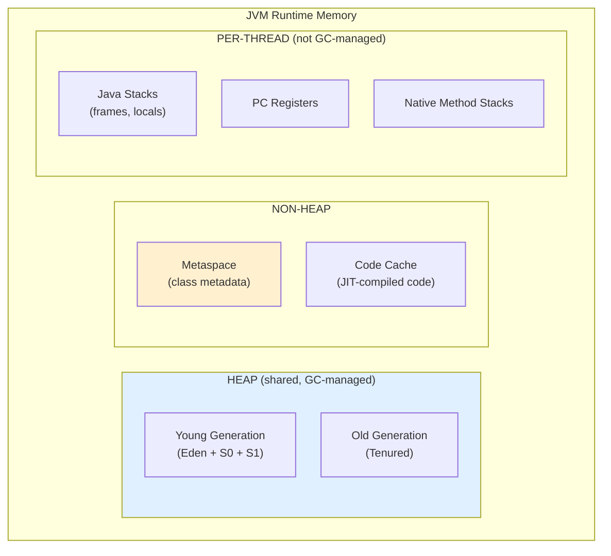

**The Heap** is where *all objects* and arrays live. It's shared across all threads and it's the **only region the garbage collector manages**. When people say "GC," they almost always mean heap management.

**Metaspace** (Java 8+, replaced the old "PermGen") stores **class metadata** — the blueprints of your classes, method bytecode info, etc. Crucially, it lives in **native memory** (outside the heap), and it grows automatically. Before Java 8, this was the fixed-size **PermGen**, a notorious source of `OutOfMemoryError: PermGen space` when you loaded too many classes.

**The Stack** is *per-thread*. Each method call pushes a **stack frame** holding local variables and the references to objects. Here's the subtle, critical point:

> The **object** lives on the heap. The **reference** (the variable pointing to it) often lives on the stack. GC collects objects on the heap; the stack references are some of the "roots" that keep heap objects alive.

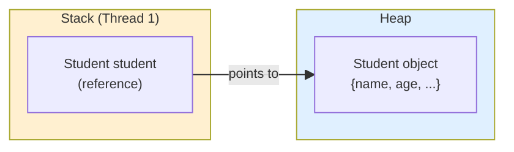

**Code Cache** stores native machine code produced by the JIT compiler. Not your concern for GC, but good to recognize the name.

<details>
<summary><b>Sample code: proving the stack-vs-heap distinction</b></summary>

```java
public class StackHeapDemo {
    public static void main(String[] args) {
        // 'sb' is a REFERENCE on the stack.
        // The actual StringBuilder OBJECT is on the heap.
        StringBuilder sb = new StringBuilder("hello");

        modify(sb);                 // we pass the reference (a copy of the pointer)
        System.out.println(sb);     // prints "hello world" — same heap object mutated

        sb = null;                  // reference cleared; heap object now unreachable
        // The StringBuilder object is now eligible for GC.
    }

    static void modify(StringBuilder local) {
        // 'local' is a NEW reference on THIS method's stack frame,
        // but it points to the SAME heap object as 'sb'.
        local.append(" world");
    }
}
```

When `main` exits, its stack frame is destroyed and any references it held vanish — which is exactly why objects become collectable when a method returns.

</details>

---

<a name="4-the-generational-heap"></a>
## 4. The Generational Heap & The Weak Generational Hypothesis

Here's the single most important idea in practical GC. Decades of research found one consistent pattern across nearly all programs:

> **The Weak Generational Hypothesis: most objects die young.**

Think about it from the kitchen: the overwhelming majority of things created during a dinner rush are temporary — chopped garnish, a mixing bowl used once, a ticket for one order. A few things (the stockpot, the seasoned cast-iron pan) live all night.

In code: a typical request creates dozens of short-lived objects (temporary strings, DTOs, loop variables) that are garbage within milliseconds. A few objects (caches, connection pools, session data) live for hours.

Java exploits this by **splitting the heap by age**, so it can clean the "young, mostly-dead" area frequently and cheaply, and rarely touch the "old, mostly-alive" area.

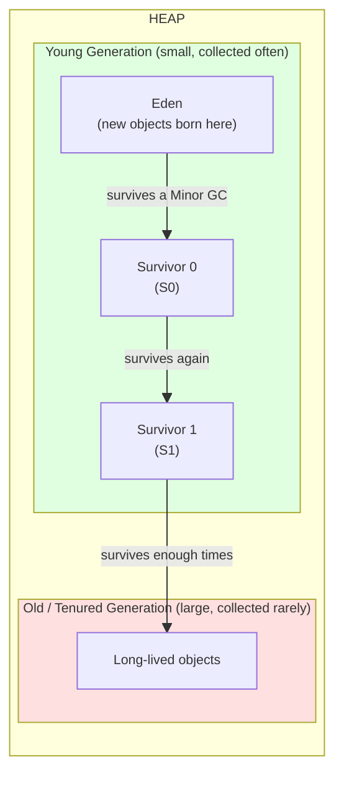

**Young Generation** is subdivided into three spaces:

- **Eden** — where brand-new objects are allocated. Most objects live and die here without ever leaving.
- **Survivor 0 (S0)** and **Survivor 1 (S1)** — two equal-sized "holding pens." Objects that survive an Eden cleanup are moved here. At any moment, **one survivor space is always empty** (it's the destination for the next copy).

**Old / Tenured Generation** holds objects that have survived several young-gen collections — they've proven they're long-lived, so we stop bothering them frequently.

**Promotion** is the act of moving an object from Young to Old. It happens when an object's "age" (the number of GC cycles it has survived) crosses the **tenuring threshold** (`-XX:MaxTenuringThreshold`, often around 15).

### Why two survivor spaces?

This is a classic interview question. The two survivor spaces enable **copying collection without fragmentation**. During a Minor GC, all live objects from Eden **and** the currently-occupied survivor space are copied into the *other* (empty) survivor space. Then Eden and the just-vacated survivor are wiped clean in one stroke. Because survivors flip roles each cycle (the empty one becomes the target, the full one becomes empty), you always have a clean, contiguous destination — so no holes form. This is the **"copying collector"** strategy, and it's why young-gen GC is so fast: dead objects cost *nothing* to collect (you only copy the live ones, then erase everything else wholesale).

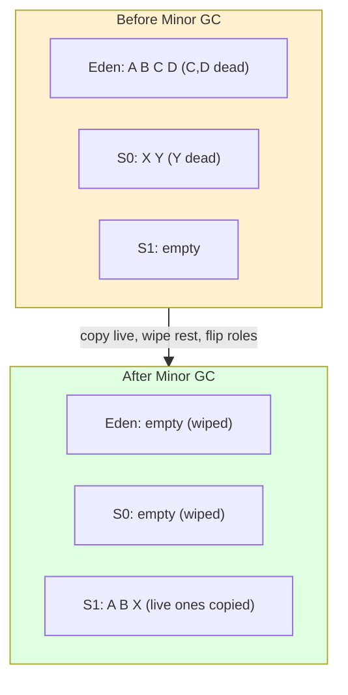

---

<a name="5-the-object-lifecycle"></a>
## 5. The Object Lifecycle: Birth to Death

Let's trace a single object's journey through its entire life. This ties the whole memory model together.

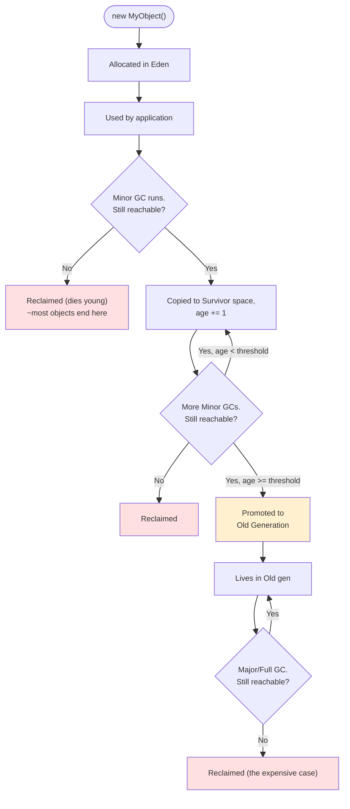

In kitchen terms: a garnish (object) is prepped at the station (Eden), used, and most of the time tossed in the first quick wipe (Minor GC). A few items prove useful repeatedly, get moved to the holding shelf (Survivor), and the truly long-lived ones eventually go into the walk-in fridge (Old gen), which only gets cleaned during a deep-clean (Full GC).

**Why this design is fast:** The young generation, where churn is highest, is collected with a cheap copying algorithm. The old generation, where objects rarely die, is collected infrequently. You spend your GC effort exactly where the garbage is.

---

<a name="6-reachability-and-gc-roots"></a>
## 6. How GC Decides What's Garbage: Reachability & GC Roots

A common misconception is that Java uses **reference counting** (tracking how many references point to each object). It does **not** — reference counting can't handle **circular references** (two dead objects pointing at each other would each have count ≥ 1 and never be collected).

Instead, Java uses **reachability analysis** (a "tracing" collector). The rule is beautifully simple:

> An object is **alive** if it can be reached by following references starting from a **GC Root**. Everything else is **garbage** — even if objects reference each other in a cycle, if the whole cycle is unreachable from any root, the entire cycle is collected.

**GC Roots** are the "anchor points" the JVM knows are definitely in use:

- **Local variables** and parameters in currently-executing methods (on the thread stacks).
- **Active threads** themselves.
- **Static fields** of loaded classes.
- **JNI references** (objects referenced from native code).
- Synchronization monitors (objects used as locks).

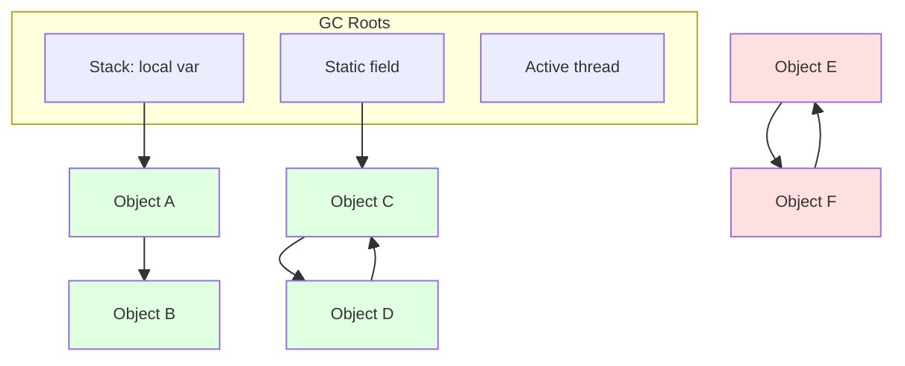

In the diagram above: **A, B, C, D are alive** (reachable from a root). **E and F are garbage** — even though they reference each other (a cycle), nothing from a root reaches them, so both are collected. This is exactly the case where reference counting would fail and tracing succeeds.

> **Interview soundbite:** "Java's GC is a *tracing* collector based on reachability from GC roots, not reference counting. That's why it correctly collects circular references."

---

<a name="7-mark-sweep-compact"></a>
## 7. The Core Algorithm: Mark → Sweep → Compact

Almost every Java collector is built on three fundamental phases. Understand these and you understand 90% of GC.

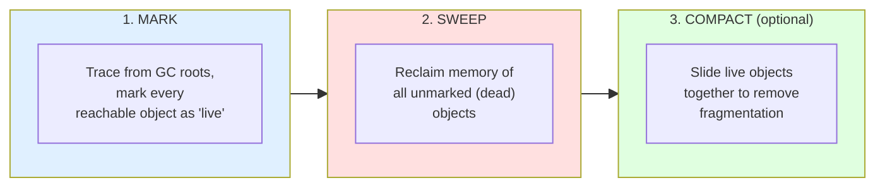

**Phase 1 — Mark.** Starting from the GC roots, the collector walks the entire object graph and flags every object it can reach as "live." (Kitchen: the head chef points at every plate currently in use.) This is the most time-consuming phase because it must traverse all live objects.

**Phase 2 — Sweep.** The collector scans the heap and frees the memory of every object that *wasn't* marked. (Kitchen: the busser clears every plate the chef *didn't* point at.)

**Phase 3 — Compact (optional but important).** After sweeping, free memory is scattered in small gaps between surviving objects — **fragmentation**. Compaction slides the live objects together into one contiguous block, leaving one large free region. This makes future allocation fast (just bump a pointer) and prevents the situation where you have "enough" total free memory but no single chunk big enough for a new object.

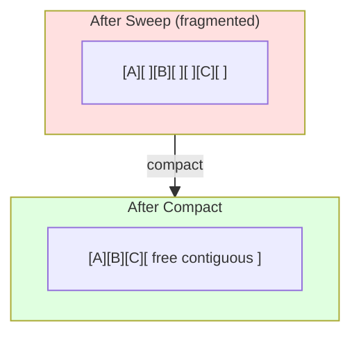

**The trade-off:** Compaction is expensive (you must move objects *and* update every reference pointing to them), but it keeps allocation fast and avoids fragmentation. CMS famously *skipped* compaction to reduce pauses — and paid for it with fragmentation that eventually forced slow Full GCs. Modern collectors (G1, ZGC, Shenandoah) do compaction, but they do it **concurrently** (while your app runs) to hide the cost.

<details>
<summary><b>Sample code: visualizing mark-sweep with a reference graph</b></summary>

```java
public class MarkSweepConcept {
    static Object root;  // a GC root (static field)

    public static void main(String[] args) {
        Node a = new Node("A");
        Node b = new Node("B");
        Node c = new Node("C");

        root = a;     // root -> A
        a.next = b;   // A -> B  (B reachable)
        // C is created but never linked to root => unreachable => garbage

        // Reachable from root: A, B
        // Unreachable: C  -> MARK phase won't mark it -> SWEEP reclaims it

        b.next = a;   // A <-> B cycle, but BOTH still reachable from root, so alive
        c = null;     // remove last reference to C

        System.gc();  // suggest GC (see §17 for caveats)
    }

    static class Node {
        String name;
        Node next;
        Node(String name) { this.name = name; }
    }
}
```

</details>

---

<a name="8-minor-major-full-mixed-gc"></a>
## 8. Minor GC, Major GC, Full GC & Mixed GC

These four terms confuse everyone. Here's the clean breakdown.

| Type | What it cleans | Frequency | Speed | Pause |
|------|----------------|-----------|-------|-------|
| **Minor GC** | Young generation only (Eden + Survivors) | Often | Fast | Short STW |
| **Major GC** | Old generation | Rare | Slow | Long STW (usually) |
| **Full GC** | Entire heap (Young + Old) + often Metaspace | Rarest | Slowest | Longest STW |
| **Mixed GC** | All of Young + *some* Old regions (G1 only) | Periodic | Medium | Bounded |

**Minor GC** fires when **Eden fills up**. It's the quick station-wipe — fast because most young objects are already dead and the copying algorithm only touches survivors. Even healthy, well-tuned apps run Minor GCs constantly; that's normal and good.

**Major GC** targets the **Old generation**. It's triggered when the old gen gets full (or close to a threshold). Because long-lived objects are mostly still alive, there's more to mark and the algorithm is heavier.

**Full GC** is the deep-clean: it collects the *entire* heap and typically Metaspace too. This is the one that causes the dreaded multi-second pauses in poorly-tuned apps. Frequent Full GCs are a red flag — usually a sign of an undersized heap, a memory leak, or promotion pressure.

**Mixed GC** is specific to **G1**. Instead of "young vs full," G1 does collections that include *all* young regions plus a *selected subset* of old regions (the ones with the most garbage — hence "Garbage First"). This spreads old-gen cleanup across many small collections, avoiding one giant Full GC.

> **Note on terminology sloppiness:** In practice, "Major GC" and "Full GC" are often used interchangeably, and the exact behavior depends on the collector. In an interview, define your terms: "By Full GC I mean a stop-the-world collection of the entire heap." That precision signals seniority.

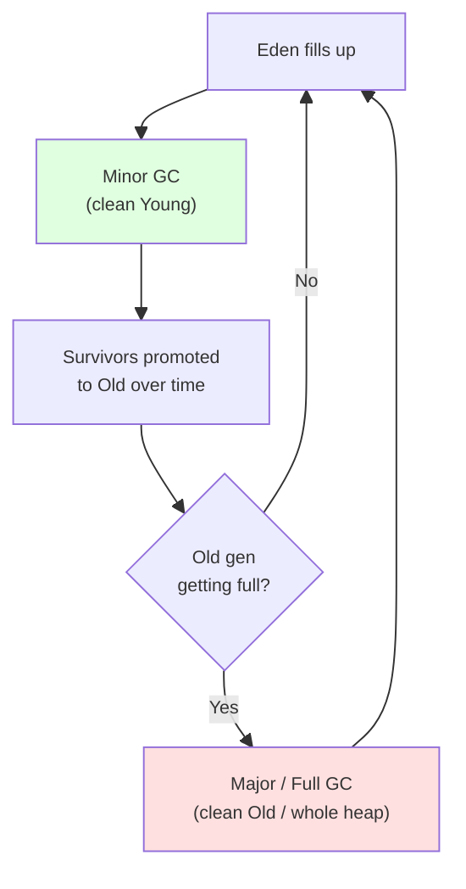

---

<a name="9-stop-the-world"></a>
## 9. Stop-The-World: The Pause Everyone Fears

To safely move objects and update references, the GC sometimes needs the object graph to **stop changing**. So it pauses *all* application threads. This is a **Stop-The-World (STW)** pause.

In the kitchen: to mop the floor properly, the cleanup crew sometimes makes the chef freeze mid-chop. A quick mop (Minor GC) is barely noticeable. Deep-cleaning the entire kitchen (Full GC) means the chef stands frozen for a long, awkward while — and customers (users) wait.

**Why STW is unavoidable (partially):** If the app kept mutating references while the GC traced reachability, the GC could miss objects or free live ones. Some coordination is mandatory. The history of GC innovation is essentially **"how do we make the STW pauses shorter and rarer?"**

- **Old collectors (Serial, Parallel):** Long STW for the whole collection.
- **CMS, G1:** Do the *marking* concurrently (app runs alongside), keeping only short STW phases.
- **ZGC, Shenandoah:** Do almost *everything* — including compaction — concurrently, keeping STW pauses under ~1–10ms regardless of heap size.

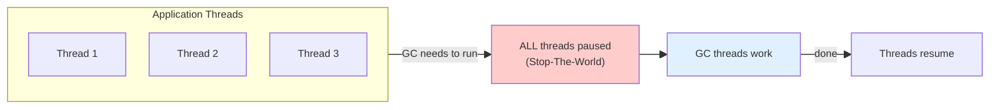

> **The latency lesson:** STW pause time, not total GC time, is what users feel. A 100ms request that randomly takes 2 seconds because of a Full GC ruins your p99 latency. This is why low-latency collectors exist.

---

<a name="10-how-an-object-becomes-eligible"></a>
## 10. How an Object Becomes Eligible for GC

An object becomes collectable the moment it's **unreachable** from all GC roots. Here are the concrete ways that happens in real code.

**1. Nulling the reference:**

```java
Student s = new Student();
s = null;   // the Student object is now unreachable -> eligible for GC
```

**2. Reassigning the reference to something else:**

```java
Student a = new Student();  // object #1
Student b = new Student();  // object #2
a = b;                      // object #1 now has no references -> eligible for GC
```

**3. Object created without storing a reference (anonymous):**

```java
register(new Student());        // if register() doesn't store it, eligible right after
new StringBuilder("temp").toString();  // the StringBuilder is eligible immediately after
```

**4. Reference goes out of scope (method returns):**

```java
void process() {
    Student local = new Student();  // lives on this stack frame
    // ... use local ...
}   // method returns -> 'local' gone -> Student eligible for GC
```

**5. "Island of isolation" — a cluster that only references itself:**

```java
class Node { Node ref; }

Node a = new Node();
Node b = new Node();
a.ref = b;
b.ref = a;   // a <-> b reference each other
a = null;
b = null;    // Now a and b form an island: they reference each other
             // but NOTHING from a root reaches them -> BOTH eligible for GC
```

This last one is the killer demonstration of why tracing beats reference counting (each object still has 1 incoming reference, yet both are correctly collected).

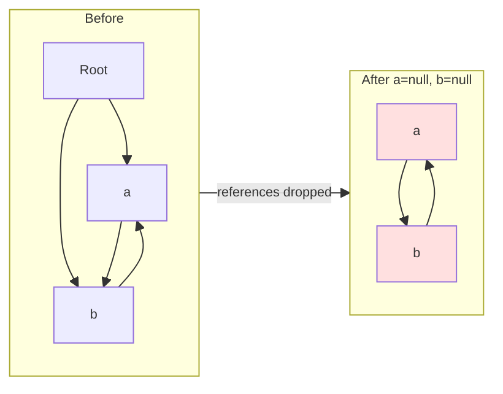

<details>
<summary><b>Sample code: demonstrating eligibility & finalize (and why not to use it)</b></summary>

```java
public class EligibilityDemo {
    public static void main(String[] args) {
        for (int i = 0; i < 3; i++) {
            // Each iteration creates an object with NO stored reference after the line.
            // It becomes eligible for GC at the end of each iteration.
            new TempResource(i);
        }
        System.gc();  // suggest collection so we *might* see finalize() run
        // NOTE: finalize() is DEPRECATED (Java 9+) and unreliable.
        // Use try-with-resources / AutoCloseable for real cleanup.
    }

    static class TempResource {
        int id;
        TempResource(int id) { this.id = id; }

        @Override
        @SuppressWarnings("removal")
        protected void finalize() {
            System.out.println("Finalizing resource " + id);
            // DO NOT rely on this. It may run late, or never.
        }
    }
}
```

</details>

---

<a name="11-evolution-timeline"></a>
## 11. The Evolution of Java's Garbage Collectors (Timeline)

GC didn't appear fully-formed. Each collector was invented to fix the previous one's biggest pain. Understanding *why* each arrived is far more memorable than memorizing names — and it's a favorite interview thread.

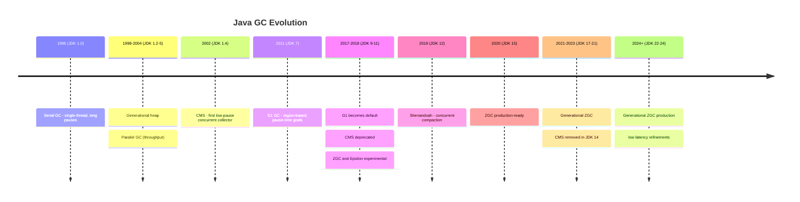

The story arc, in one breath: **Serial** (one thread, simple, slow) → **Parallel** (many threads, maximize throughput, still long pauses) → **CMS** (do marking concurrently to cut pauses, but suffers fragmentation) → **G1** (regions + pause-time goals, the modern default) → **ZGC / Shenandoah** (concurrent *everything*, sub-millisecond pauses even on huge heaps).

The driving forces across this evolution were: more CPU cores (parallelism), bigger heaps (gigabytes → terabytes), and stricter latency demands (web/trading/cloud).

**Defaults by era (worth memorizing):**

- Java 8 and earlier → **Parallel GC** (the "throughput collector").
- Java 9 onward → **G1 GC**.

---

<a name="12-deep-dive-collectors"></a>
## 12. Deep Dive: Every Garbage Collector Explained

For each collector: the idea, how it works, when to use it, the flag to enable it, and its Achilles' heel.

<a name="serial-gc"></a>
### 12.1 Serial GC — "One person cleans the whole kitchen"

**Idea:** A single GC thread does all the work, fully stopping the world. Simple, no coordination overhead.

**How it works:** Mark-sweep-compact on the old gen, copying collection on the young gen — all single-threaded, all STW.

**When to use:** Small heaps (< ~100MB), single-core / container with one CPU, simple CLI tools, embedded apps. It's also a common default in tiny containers where parallelism brings no benefit.

**Weakness:** Pauses scale badly with heap size — useless for large, multi-core servers.

```bash
java -XX:+UseSerialGC -jar app.jar
```

<a name="parallel-gc"></a>
### 12.2 Parallel GC — "A whole crew cleans, but the chef still freezes"

**Idea:** Use *multiple* threads to do GC faster. Optimizes for **throughput** (maximizing the % of time spent running app code, not GC), accepting longer-but-rarer pauses.

**How it works:** Same generational mark-sweep-compact, but the work is split across many threads. Still fully stop-the-world — it just gets the STW work done faster by parallelizing it.

**When to use:** Batch jobs, data processing, analytics — anything where **total job completion time** matters more than individual pause length. If you don't care that one pause is 500ms as long as the overall throughput is highest, this is your collector.

**Weakness:** Pauses can be long (hundreds of ms to seconds on big heaps). Bad for interactive/latency-sensitive systems.

```bash
java -XX:+UseParallelGC -XX:ParallelGCThreads=8 -jar app.jar
```

<a name="cms"></a>
### 12.3 CMS (Concurrent Mark Sweep) — "Clean while the chef keeps cooking" *(deprecated/removed)*

**Idea:** The first serious attempt to cut pauses by doing the **marking concurrently** with the application — the app keeps running during most of the GC.

**How it works:** Four main phases — *Initial Mark* (short STW), *Concurrent Mark* (app runs), *Remark* (short STW, catches changes), *Concurrent Sweep* (app runs). The two STW phases are brief; the heavy lifting overlaps with your app.

**Weakness (why it's gone):** It **does not compact** the old generation. Over time the old gen fragments, and when a large object won't fit in any free gap, CMS falls back to a single-threaded **Full GC** — the very long pause it was trying to avoid. It also burns extra CPU and suffers "concurrent mode failure" under pressure. **Deprecated in Java 9, removed in Java 14.** G1 replaced it.

```bash
# Historical only — removed in Java 14+
java -XX:+UseConcMarkSweepGC -XX:CMSInitiatingOccupancyFraction=75 -jar app.jar
```

<a name="g1"></a>
### 12.4 G1 (Garbage First) — "Clean the dirtiest tables first" *(the modern default)*

**Idea:** Divide the heap into many equal-sized **regions** (1–32MB each) and collect the regions with the **most garbage first** — hence "Garbage First." Meet a user-specified **pause-time goal** by collecting only as many regions as fit in that budget.

**How it works:** Regions are dynamically labeled Eden, Survivor, or Old (they're not fixed contiguous areas anymore). G1 runs a concurrent marking cycle to know each region's garbage density, then performs **evacuation** — copying live objects out of selected regions into fresh ones, which compacts *and* frees in one move. Collections include all young regions plus a chosen subset of old regions (**Mixed GC**), spreading old-gen work over many small, bounded pauses instead of one giant Full GC.

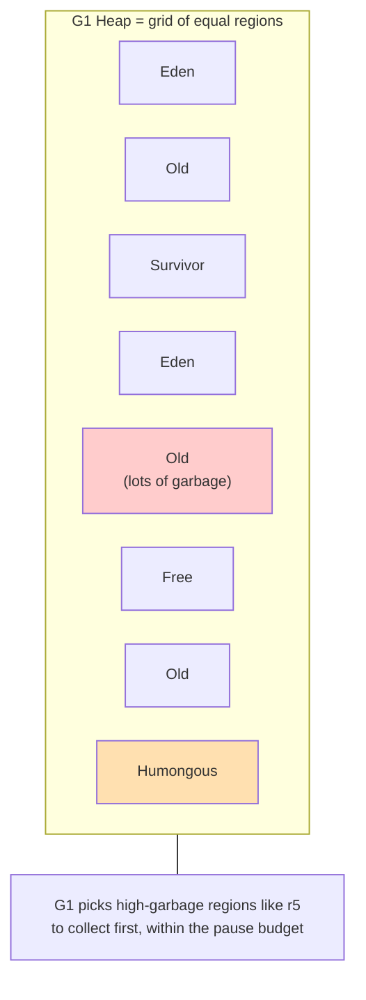

**Bonus detail (interview gold):** Objects larger than half a region are **"humongous"** and are allocated directly into special humongous regions in the old gen, bypassing the young gen. Lots of humongous allocations can hurt G1.

**When to use:** The default for most server apps with heaps from ~4GB up to tens of GB needing **predictable, moderate pauses** (typically < 200ms). If you have no special requirements, use G1.

**Weakness:** Higher metadata overhead (remembered sets) and not as low-latency as ZGC/Shenandoah on very large heaps.

```bash
java -XX:+UseG1GC -XX:MaxGCPauseMillis=200 -XX:G1HeapRegionSize=16m -jar app.jar
```

<a name="zgc"></a>
### 12.5 ZGC — "An invisible cleanup crew for a warehouse-sized kitchen"

**Idea:** Achieve pause times of **under ~1ms** that **stay flat regardless of heap size** — whether the heap is 100MB or 16TB. Designed for ultra-low-latency, huge-heap workloads.

**How it works:** ZGC does virtually all work — including **compaction/relocation** — *concurrently* while your app runs. Its two signature techniques:

- **Colored pointers:** ZGC stores GC state (marked, relocated, etc.) directly inside unused bits of 64-bit object pointers, rather than in separate metadata. This lets it track object state extremely efficiently.
- **Load barriers:** A tiny check injected whenever your code loads a reference. If the object has been moved, the barrier transparently fixes the pointer to the new location ("self-healing"). This is what lets ZGC relocate objects *while the app is running* without breaking anything.

**When to use:** Latency-critical systems (trading, real-time bidding, large interactive services) and **very large heaps** (multi-GB to TB) where any long pause is unacceptable. **Generational ZGC** (Java 21+) adds young/old separation for better efficiency and is the recommended mode.

**Weakness:** Higher CPU and native-memory overhead than G1; throughput slightly lower. Requires 64-bit.

```bash
# Java 21+ recommended:
java -XX:+UseZGC -XX:+ZGenerational -jar app.jar
```

<a name="shenandoah"></a>
### 12.6 Shenandoah — "Concurrent compaction, the other low-pause champion"

**Idea:** Like ZGC, target consistently low pauses (typically < 10ms) independent of heap size — but using a different mechanism.

**How it works:** Shenandoah does **concurrent compaction** using **Brooks forwarding pointers** — each object carries an extra pointer that either points to itself or to its new location after being moved, so references can be redirected while the app runs. It uses **SATB (Snapshot-At-The-Beginning)** marking to stay consistent during concurrent work. Unlike ZGC, it does *not* use colored pointers.

**When to use:** Low-latency needs, similar niche to ZGC. Often slightly better throughput than ZGC for CPU-bound work; sometimes marginally higher pauses in extreme cases. Originated at Red Hat / OpenJDK 12.

```bash
java -XX:+UseShenandoahGC -XX:ShenandoahGCHeuristics=adaptive -jar app.jar
```

<a name="epsilon"></a>
### 12.7 Epsilon — "The crew that never shows up" *(no-op)*

**Idea:** A garbage collector that **allocates but never collects.** When the heap fills, the app simply dies with `OutOfMemoryError`.

**Why on earth?** Three legitimate uses: (1) **Performance testing** — isolate GC overhead by removing it entirely to measure your code's raw allocation cost; (2) **Extremely short-lived jobs** that finish before they'd ever need a collection (why pay for GC machinery?); (3) **Memory-pressure testing** — verify your app's allocation footprint and fail fast if it exceeds expectations.

```bash
java -XX:+UnlockExperimentalVMOptions -XX:+UseEpsilonGC -jar app.jar
```

---

### Collector comparison at a glance

| Collector | Threads | Concurrent? | Compacts? | Pause profile | Best for | Flag |
|-----------|---------|-------------|-----------|---------------|----------|------|
| **Serial** | 1 | No | Yes | Long, scales with heap | Tiny heaps, single core | `-XX:+UseSerialGC` |
| **Parallel** | Many | No | Yes | Long but rarer; max throughput | Batch/throughput jobs | `-XX:+UseParallelGC` |
| **CMS** *(removed)* | Many | Mark only | **No** | Short marks, risky Full GC | (Historical) | `-XX:+UseConcMarkSweepGC` |
| **G1** | Many | Mark + evac | Yes (incremental) | Predictable, < ~200ms | **General default**, 4GB–tens of GB | `-XX:+UseG1GC` |
| **ZGC** | Many | Almost everything | Yes (concurrent) | < ~1ms, heap-independent | Ultra-low latency, huge heaps | `-XX:+UseZGC -XX:+ZGenerational` |
| **Shenandoah** | Many | Almost everything | Yes (concurrent) | < ~10ms, heap-independent | Low latency | `-XX:+UseShenandoahGC` |
| **Epsilon** | — | — | No | None (no collection) | Testing, ephemeral jobs | `-XX:+UseEpsilonGC` |

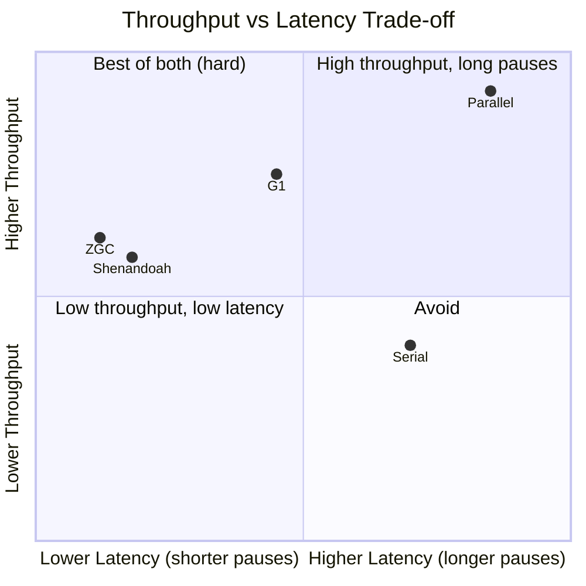

---

<a name="13-choosing-collector"></a>
## 13. Choosing the Right Collector (Decision Guide)

There's no "best" collector — only the best fit for **your** latency/throughput/heap profile. Use this flow:

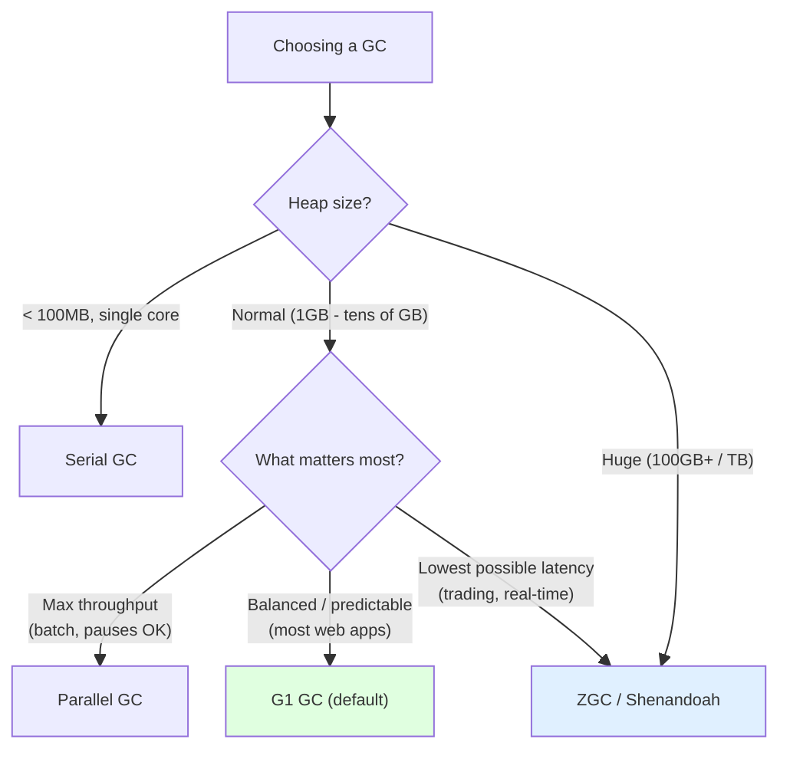

**Rules of thumb:**

- **Start with G1.** It's the default and the right answer for the vast majority of services. Don't switch without a measured reason.
- Choose **Parallel** when you have a batch/throughput job and don't care about individual pause length (you want the job *done fastest* overall).
- Choose **ZGC** (or Shenandoah) when you have strict latency SLOs (e.g., p99 < 10ms) and/or a very large heap where G1's pauses grow uncomfortable.
- Choose **Serial** for tiny apps, CLIs, and small single-CPU containers — the simplicity wins.
- Choose **Epsilon** only for benchmarking and ephemeral throwaway jobs.

**Real-world mapping:**

- **E-commerce site during a sale** → G1. Tons of short-lived cart/request objects in Eden, long-lived user sessions in old gen; G1's balanced, predictable pauses keep the site responsive.
- **Stock trading platform** → ZGC. Sub-millisecond pauses mean trades aren't delayed even with a massive heap.
- **Nightly analytics / ETL batch** → Parallel GC. Throughput is king; an occasional long pause is fine because no user is waiting.

---

<a name="14-reference-types"></a>
## 14. Reference Types: Strong, Soft, Weak, Phantom

Java lets you control *how strongly* you hold onto an object — which directly controls when GC may reclaim it. This is essential for caches and an advanced interview favorite.

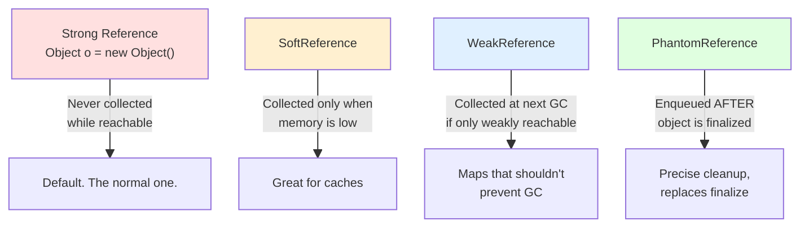

**Strong reference** — the everyday `Object o = new Object()`. As long as a strong reference chain from a GC root exists, the object is **never** collected. This is what 99% of your code uses.

**Soft reference** — "keep this *unless* you really need the memory." The GC will only reclaim softly-reachable objects when the heap is under pressure (before throwing `OutOfMemoryError`). Perfect for **memory-sensitive caches**: keep cached data around while there's room, drop it when memory runs short.

**Weak reference** — "keep this only while someone *else* strongly references it." A weakly-reachable object is collected at the **very next GC**. The classic use is `WeakHashMap`, where entries vanish once their keys are no longer strongly referenced elsewhere — preventing the map itself from causing a leak.

**Phantom reference** — the most exotic. You can never retrieve the object through it (`get()` always returns `null`). Its sole purpose: get notified (via a `ReferenceQueue`) *after* the object has been reclaimed, enabling precise, deterministic cleanup of native resources — a safer replacement for the broken `finalize()`.

**Reachability strength, strongest to weakest:** Strongly reachable → Softly reachable → Weakly reachable → Phantom reachable → Unreachable (collected).

<details>
<summary><b>Sample code: SoftReference cache and WeakHashMap</b></summary>

```java
import java.lang.ref.SoftReference;
import java.lang.ref.WeakReference;
import java.util.WeakHashMap;

public class ReferenceTypesDemo {
    public static void main(String[] args) {
        // SOFT: survives until memory pressure -> ideal cache
        SoftReference<byte[]> cache = new SoftReference<>(new byte[10_000_000]);
        byte[] data = cache.get();        // may be non-null...
        // ...but under memory pressure the JVM may clear it: cache.get() == null

        // WEAK: cleared at the next GC once no strong refs remain
        Object key = new Object();
        WeakReference<Object> weak = new WeakReference<>(key);
        System.out.println(weak.get());   // not null (key strongly held)
        key = null;                       // drop the strong ref
        System.gc();
        // weak.get() is now likely null

        // WeakHashMap: entries auto-removed when keys become unreferenced
        WeakHashMap<Object, String> map = new WeakHashMap<>();
        Object k = new Object();
        map.put(k, "value");
        k = null;                          // key now only weakly reachable via the map
        System.gc();                       // entry becomes eligible for removal
    }
}
```

</details>

> **Interview soundbite:** "Use `SoftReference` for caches that should yield under memory pressure, `WeakReference` (or `WeakHashMap`) for associations that must not prevent collection, and `PhantomReference` for deterministic post-mortem cleanup instead of `finalize()`."

---

<a name="15-memory-leaks"></a>
## 15. Memory Leaks in a "No-Leak" Language

GC frees *unreachable* objects. But if your code keeps an object **reachable** when it's logically dead, GC can't help — that's a **Java memory leak**. The object is technically reachable (so GC spares it) but useless to you (so it's wasted memory that grows forever).

Kitchen analogy: a customer who *says* they'll finish their plate but never does. The busser can't clear it (it's "in use"), so it sits forever, slowly filling the counter until the kitchen seizes up.

**The classic leak sources (memorize these — they're asked constantly):**

1. **Static collections that only grow.** A `static List`/`Map` you keep adding to and never remove from. Statics are GC roots, so everything inside stays alive forever.
2. **Unremoved listeners / callbacks.** You register a listener but never deregister it; the publisher holds it strongly forever.
3. **Unclosed resources.** Streams, connections, sessions not closed — both a resource leak and often a memory leak.
4. **`ThreadLocal` in thread pools.** Pooled threads live forever, so a `ThreadLocal` value never gets cleared → leak. Always `remove()` it.
5. **Keys with broken `equals`/`hashCode` in a `HashMap`,** or caches without eviction (use bounded caches / `SoftReference` / a real cache library).
6. **Inner classes holding an implicit outer reference** longer than needed.

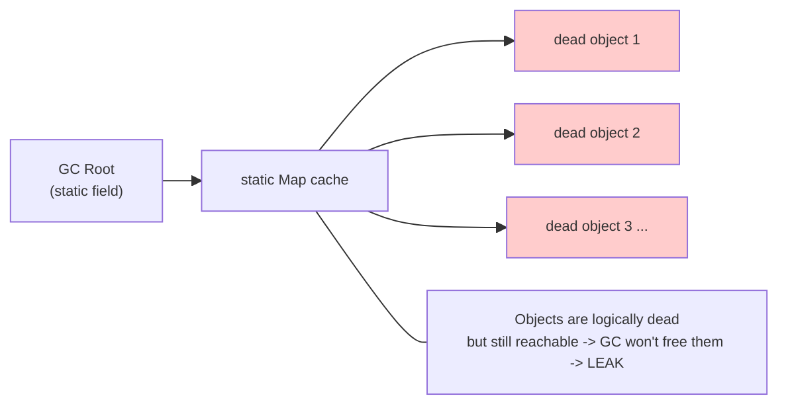

<details>
<summary><b>Sample code: a textbook leak and its fix</b></summary>

```java
import java.util.*;

public class LeakDemo {
    // LEAK: static, unbounded, never cleared. Lives for the whole JVM lifetime.
    private static final List<byte[]> LEAK = new ArrayList<>();

    public static void leakForever() {
        while (true) {
            LEAK.add(new byte[1_000_000]); // 1MB each, never removed
            // Heap fills -> eventually OutOfMemoryError, even though GC runs constantly
        }
    }

    // FIX 1: bound the collection / evict old entries
    private static final int MAX = 100;
    public static void bounded(byte[] item) {
        if (LEAK.size() >= MAX) LEAK.remove(0);
        LEAK.add(item);
    }

    // FIX 2: ThreadLocal leak in a pool — always remove()
    private static final ThreadLocal<byte[]> TL = new ThreadLocal<>();
    public static void useThreadLocal() {
        try {
            TL.set(new byte[1_000_000]);
            // ... work ...
        } finally {
            TL.remove();  // critical in pooled threads, else the value leaks
        }
    }
}
```

</details>

**How to find a leak:** Watch the heap over time — if it trends upward and Full GCs reclaim less and less, you have a leak. Take a **heap dump** (`jmap -dump` or on `OutOfMemoryError` with `-XX:+HeapDumpOnOutOfMemoryError`) and analyze it in **Eclipse MAT** or **VisualVM**, looking for the "dominator tree" — the objects retaining the most memory and the GC-root path keeping them alive.

---

<a name="16-outofmemoryerror"></a>
## 16. OutOfMemoryError: Causes & Fixes

`OutOfMemoryError` (OOM) is thrown when the JVM cannot allocate memory **and** GC can't free enough to satisfy the request. It's like trying to pour 2 liters into a 1-liter bottle — it simply won't fit.

It comes in several flavors — knowing which one you got tells you where to look:

| Message | Meaning | Typical fix |
|---------|---------|-------------|
| `Java heap space` | Heap is full of live objects | Increase `-Xmx`, fix a leak, or reduce allocation |
| `GC overhead limit exceeded` | GC runs constantly (>98% time) reclaiming <2% | Same as above — usually a leak or undersized heap |
| `Metaspace` | Too many classes loaded | Increase `-XX:MaxMetaspaceSize`; check classloader leaks |
| `Unable to create new native thread` | OS thread limit / native memory | Reduce thread count, fix thread leaks |
| `Requested array size exceeds VM limit` | Allocating a huge array | Fix the code creating the giant array |
| `Direct buffer memory` | Off-heap NIO buffers exhausted | Tune `-XX:MaxDirectMemorySize`, release buffers |

**The three root causes**, in order of likelihood:

1. **Memory leak** — logically-dead objects kept reachable (see [§15](#15-memory-leaks)). The heap climbs forever. *Fix the code, not the flag.*
2. **Heap genuinely too small** for the workload. *Increase `-Xmx`.*
3. **A single huge allocation** (loading a 5GB file into memory, an enormous list/array). *Stream it instead.*

> **Critical interview point:** When you see OOM, the *wrong* reflex is to immediately bump `-Xmx`. First ask: "Is this a leak or a legitimate need?" Raising the heap on a leaking app just delays the inevitable crash and makes the eventual heap dump bigger. Diagnose first.

```bash
# Capture a heap dump automatically when OOM strikes — invaluable for diagnosis
java -XX:+HeapDumpOnOutOfMemoryError -XX:HeapDumpPath=/tmp/heapdump.hprof -jar app.jar
```

---

<a name="17-triggering-gc"></a>
## 17. Triggering & Requesting GC (System.gc and friends)

**You cannot force GC.** You can only *suggest* it.

- `System.gc()` — politely **requests** a (usually Full) GC. The JVM is free to ignore it.
- `Runtime.getRuntime().gc()` — identical effect; `System.gc()` just delegates here.
- `-XX:+DisableExplicitGC` — a flag that makes the JVM **ignore** all `System.gc()` calls. Commonly set in production to stop libraries from triggering expensive Full GCs.

**Why calling `System.gc()` is almost always a mistake:**

- It typically triggers a **Full GC** — the most expensive, longest STW pause — on demand, often at the worst moment.
- It disrupts the JVM's carefully-tuned, adaptive GC scheduling.
- It doesn't even guarantee collection, so you can't rely on it for correctness.

**Events that *actually* trigger GC (automatically, by the JVM):**

- **Eden fills up** → Minor GC.
- **Old generation crosses its occupancy threshold** → Major/Mixed/Full GC depending on collector.
- **Metaspace fills** → GC (and possible class unloading).
- **Explicit `System.gc()`** → suggestion only.
- Some collectors run **periodic/proactive** collections to keep memory healthy.

> **Interview soundbite:** "`System.gc()` is a request, not a command. In production I'd rather let the JVM's adaptive heuristics decide, and I'd often set `-XX:+DisableExplicitGC` to neutralize misbehaving libraries. The only legit uses are benchmarking and certain deterministic test scenarios."

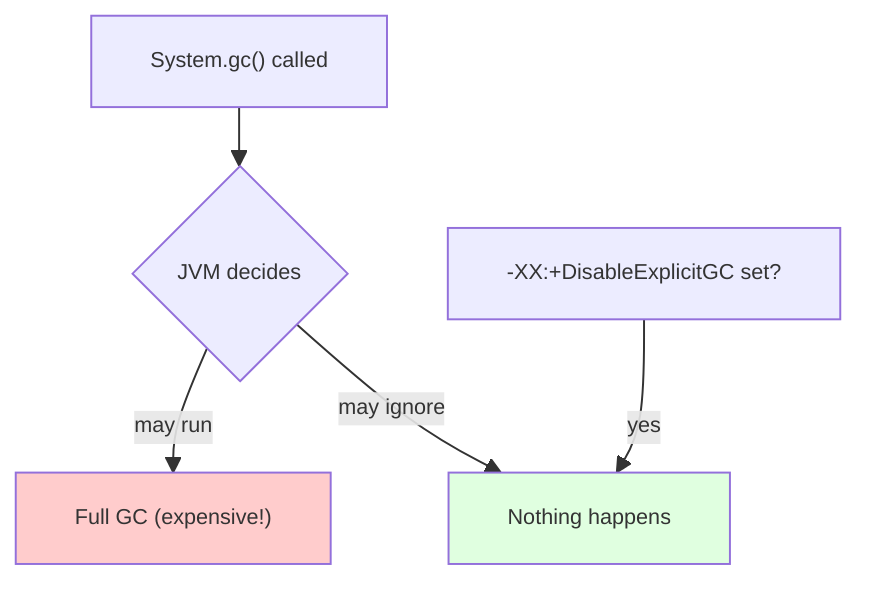

---

<a name="18-tuning-cookbook"></a>
## 18. JVM Flags & GC Tuning Cookbook

The golden rule of tuning: **measure first, change one thing, measure again.** Never tune blind.

### The essential heap flags

| Flag | Meaning | Example |
|------|---------|---------|
| `-Xms` | Initial heap size | `-Xms2g` |
| `-Xmx` | Maximum heap size | `-Xmx4g` |
| `-Xmn` | Young generation size | `-Xmn1g` |
| `-XX:MaxMetaspaceSize` | Cap Metaspace | `-XX:MaxMetaspaceSize=256m` |
| `-XX:MaxGCPauseMillis` | Target pause goal (G1/ZGC) | `-XX:MaxGCPauseMillis=200` |
| `-XX:ParallelGCThreads` | GC worker threads | `-XX:ParallelGCThreads=8` |
| `-XX:MaxTenuringThreshold` | Age before promotion | `-XX:MaxTenuringThreshold=15` |

**Set `-Xms` equal to `-Xmx` in production.** This avoids the cost and pauses of the heap resizing up and down at runtime; the JVM grabs the full heap upfront and stays there.

```bash
# Typical production baseline (G1)
java -Xms4g -Xmx4g \
     -XX:+UseG1GC \
     -XX:MaxGCPauseMillis=200 \
     -XX:+HeapDumpOnOutOfMemoryError \
     -Xlog:gc*:file=gc.log:time,uptime:filecount=5,filesize=10m \
     -jar app.jar
```

<details>
<summary><b>Tuned G1 configuration with explanations</b></summary>

```bash
-XX:+UseG1GC                              # use G1
-XX:MaxGCPauseMillis=200                  # aim for <=200ms pauses (G1 trades region count to hit this)
-XX:G1HeapRegionSize=16m                  # region size; larger for big-object workloads
-XX:G1NewSizePercent=20                   # min young gen as % of heap
-XX:G1MaxNewSizePercent=40                # max young gen as % of heap
-XX:InitiatingHeapOccupancyPercent=45     # start concurrent marking when old gen hits 45%
```

</details>

<details>
<summary><b>Tuned ZGC and Shenandoah configurations</b></summary>

```bash
# Generational ZGC (Java 21+) — ultra-low latency
-XX:+UseZGC
-XX:+ZGenerational
-XX:+AlwaysPreTouch        # commit heap pages upfront -> avoids allocation-time latency spikes
-XX:+UseNUMA               # locality on multi-socket machines

# Shenandoah — concurrent compaction
-XX:+UseShenandoahGC
-XX:ShenandoahGCHeuristics=adaptive   # adaptive works well for most apps
-XX:+AlwaysPreTouch
-XX:+UseNUMA
```

</details>

**Tuning priorities, in order:**

1. **Right-size the heap.** Most "GC problems" are actually heap-sizing problems. Too small → constant Full GCs. Too large → long pauses and wasted RAM.
2. **Pick the right collector** for your latency/throughput goal (see [§13](#13-choosing-collector)).
3. **Set a realistic pause goal** (`MaxGCPauseMillis`) — don't demand 5ms from G1 on a 50GB heap; switch to ZGC instead.
4. **Reduce allocation in hot paths** — the cheapest GC is the one that never has to run.
5. Only then fiddle with region sizes, thread counts, and tenuring thresholds — and always with before/after metrics.

---

<a name="19-monitoring"></a>
## 19. Monitoring, Logging & Profiling GC

You can't tune what you can't see. Always run production with GC logging on — it's nearly free and priceless when things go wrong.

**Enable unified GC logging (Java 9+):**

```bash
-Xlog:gc*:file=gc.log:time,uptime,level,tags:filecount=10,filesize=10m
```

(Pre-Java 9 used `-XX:+PrintGCDetails -XX:+PrintGCDateStamps -Xloggc:gc.log`.)

**Tools you should know:**

| Tool | What it's for |
|------|---------------|
| **GC logs** (`-Xlog:gc*`) | Ground truth: pause times, frequencies, before/after heap sizes |
| **jstat** | Live, command-line GC stats (`jstat -gcutil <pid> 1000`) |
| **VisualVM** | Visual heap/GC monitoring, heap dumps, basic profiling (free) |
| **jmap** | Capture heap dumps (`jmap -dump:live,format=b,file=heap.hprof <pid>`) |
| **Eclipse MAT** | Deep heap-dump analysis; finds leaks via dominator tree |
| **JFR (Java Flight Recorder)** | Low-overhead production profiling, built into the JDK |
| **GCeasy / GCViewer** | Upload a GC log → get visual analysis and recommendations |

**What healthy GC looks like:** frequent but short Minor GCs, infrequent Major/Mixed GCs, Full GCs that are rare-to-nonexistent, and a heap that returns to a stable baseline after each old-gen collection (a "sawtooth" that doesn't drift upward).

**What a leak looks like:** the post-GC heap baseline **creeps upward over time** — each Full GC reclaims less, until OOM.

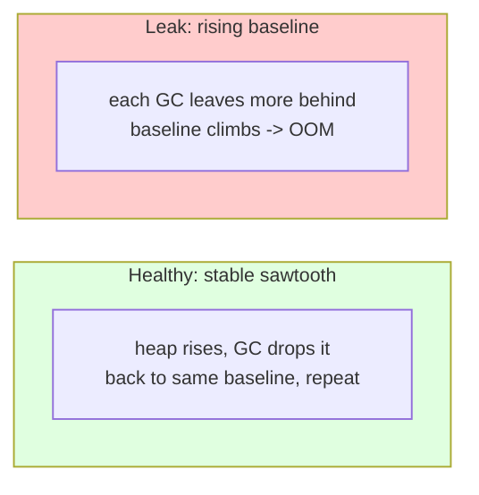

<details>
<summary><b>Sample code: reading GC stats programmatically</b></summary>

```java
import java.lang.management.GarbageCollectorMXBean;
import java.lang.management.ManagementFactory;

public class GcStats {
    public static void main(String[] args) {
        for (GarbageCollectorMXBean gc :
                ManagementFactory.getGarbageCollectorMXBeans()) {
            System.out.printf("Collector: %s | collections: %d | total time: %d ms%n",
                gc.getName(), gc.getCollectionCount(), gc.getCollectionTime());
        }
        // Also useful:
        Runtime rt = Runtime.getRuntime();
        long used = rt.totalMemory() - rt.freeMemory();
        System.out.printf("Heap used: %d MB / max %d MB%n",
            used / (1024 * 1024), rt.maxMemory() / (1024 * 1024));
    }
}
```

</details>

---

<a name="20-best-practices"></a>
## 20. Best Practices Summary

A consolidated checklist you can apply immediately and recite in interviews.

**Write GC-friendly code:**

- **Minimize object creation in hot paths.** Reuse objects; prefer `BigDecimal.valueOf(x)` over `new BigDecimal(x)`; use primitives over boxed types in tight loops.
- **Scope objects tightly.** Let references die naturally when a method returns rather than holding them in long-lived fields.
- **Use bounded caches** with eviction (or `SoftReference` / a real cache library). Never an unbounded `static` map.
- **Always remove `ThreadLocal` values** in pooled-thread environments (`finally { tl.remove(); }`).
- **Deregister listeners/callbacks** you registered.
- **Use `try-with-resources`** for anything `AutoCloseable`; never rely on `finalize()` (deprecated since Java 9).
- **Prefer `StringBuilder`** over `+` in loops to avoid creating throwaway `String` objects.

**Operate the JVM well:**

- **Start with G1** unless you have a measured reason to switch.
- **Set `-Xms` = `-Xmx`** in production to avoid resize pauses.
- **Always enable GC logging** and heap-dump-on-OOM.
- **Don't call `System.gc()`** in application code; consider `-XX:+DisableExplicitGC`.
- **Measure before and after** any tuning change — one variable at a time.
- **Right-size the heap first;** most GC pain is a sizing problem, not an algorithm problem.
- **Reach for ZGC/Shenandoah** only when you have real low-latency SLOs or very large heaps.

---

<a name="21-cheat-sheet"></a>
## 21. Quick-Revision Cheat Sheet

Everything compressed for the night before an interview.

**Core concepts**

- GC = automatic reclamation of **unreachable** heap objects. Tracing-based (reachability from **GC roots**), *not* reference counting → handles cycles.
- GC roots: stack locals, active threads, static fields, JNI refs.
- Algorithm: **Mark** (find live) → **Sweep** (free dead) → **Compact** (defragment).

**Heap layout**

- **Young gen** = Eden + S0 + S1. New objects → Eden. Survivors copied between S0/S1. Fast copying collection.
- **Old/Tenured** = long-lived objects (promoted after surviving ~`MaxTenuringThreshold` cycles).
- **Metaspace** (Java 8+, native memory) = class metadata, replaced **PermGen**.
- Foundation: **weak generational hypothesis** — *most objects die young.*

**GC types**

- **Minor GC** = young only, frequent, fast. **Major/Full GC** = old/whole heap, rare, slow. **Mixed GC** = G1's young + some old.
- **Stop-The-World** = all app threads paused; minimizing STW is the whole game.

**Collectors**

- **Serial** (1 thread, tiny heaps) · **Parallel** (throughput, batch) · **CMS** (concurrent mark, no compaction, *removed* JDK 14) · **G1** (regions, pause goals, **default since Java 9**) · **ZGC** (<1ms, colored pointers + load barriers, huge heaps) · **Shenandoah** (<10ms, Brooks pointers, concurrent compaction) · **Epsilon** (no-op, testing).
- Defaults: ≤ Java 8 → Parallel; Java 9+ → G1.

**References**: Strong (never collected) > Soft (collected under memory pressure, caches) > Weak (collected next GC, `WeakHashMap`) > Phantom (post-mortem cleanup).

**Eligible for GC when**: reference nulled, reassigned, out of scope, or part of an unreachable island.

**Key flags**: `-Xms` `-Xmx` (= each other in prod), `-XX:+UseG1GC`, `-XX:MaxGCPauseMillis`, `-XX:+HeapDumpOnOutOfMemoryError`, `-Xlog:gc*`. `System.gc()` = suggestion only.

**OOM flavors**: heap space, GC overhead limit, Metaspace, native thread, direct buffer. Diagnose (leak vs. undersized) before bumping `-Xmx`.

**Leaks**: unbounded statics, un-removed listeners, `ThreadLocal` in pools, unclosed resources, unbounded caches.

---

<a name="22-interview-questions"></a>
## 22. 50+ FAANG Interview Questions (Collapsible)

Click any question to reveal a model answer. These range from warm-up to staff-level. Practice answering *out loud* before peeking — that's what builds real interview confidence.

### Fundamentals

<details>
<summary><b>Q1. What is Garbage Collection and why does Java have it?</b></summary>

GC is the JVM's automatic process for reclaiming heap memory occupied by objects that are no longer reachable by the program. Java has it to eliminate manual memory management (`malloc`/`free`), which removes whole classes of bugs — memory leaks from forgetting to free, dangling pointers from freeing too early, and double-frees. The trade-off is reduced control and occasional GC pauses, but the gain in safety and productivity is enormous.
</details>

<details>
<summary><b>Q2. Does Java use reference counting? Why or why not?</b></summary>

No. Java uses **tracing GC based on reachability** from GC roots. Reference counting fails on **circular references** — two dead objects pointing at each other each keep a count ≥ 1 and would never be collected. Tracing correctly identifies that an unreachable cycle is garbage because nothing from a root reaches it. Reference counting also adds overhead on every reference assignment.
</details>

<details>
<summary><b>Q3. What are GC roots?</b></summary>

The starting anchor points the JVM knows are definitely live: local variables and parameters on active thread stacks, active threads themselves, static fields of loaded classes, JNI references from native code, and synchronization monitors. GC traces reachability outward from these roots; anything not reachable is collectable.
</details>

<details>
<summary><b>Q4. Explain the Mark-Sweep-Compact algorithm.</b></summary>

**Mark**: starting from GC roots, traverse the object graph and flag every reachable object as live. **Sweep**: reclaim the memory of all unmarked (dead) objects. **Compact** (optional): slide surviving objects together to eliminate fragmentation, leaving one large contiguous free block so future allocation is a fast pointer-bump and large objects can fit.
</details>

<details>
<summary><b>Q5. What is the weak generational hypothesis and why does it matter?</b></summary>

It's the empirical observation that **most objects die young** — the vast majority of allocations become garbage shortly after creation. It matters because it justifies the **generational heap**: split memory into young (collected frequently and cheaply with copying) and old (collected rarely). You concentrate GC effort where the garbage actually is, making collection far more efficient.
</details>

<details>
<summary><b>Q6. Describe the structure of the heap.</b></summary>

The heap splits into the **Young Generation** (Eden + two Survivor spaces S0/S1) and the **Old/Tenured Generation**. New objects go to Eden; survivors of a Minor GC are copied to a Survivor space; objects that survive enough cycles are promoted to Old. Class metadata lives in **Metaspace** (native memory, Java 8+), which replaced the fixed-size PermGen.
</details>

<details>
<summary><b>Q7. Why are there two survivor spaces?</b></summary>

To enable copying collection without fragmentation. During Minor GC, live objects from Eden and the occupied survivor space are copied into the *empty* survivor space; then Eden and the old survivor are wiped wholesale. The two spaces flip roles each cycle so there's always a clean contiguous destination. Dead objects cost nothing to collect — you only copy the live ones.
</details>

<details>
<summary><b>Q8. What's the difference between stack and heap memory?</b></summary>

The **heap** is shared across threads and holds all objects/arrays; it's GC-managed. The **stack** is per-thread and holds method frames with local variables and *references*. The object lives on the heap; the reference pointing to it often lives on the stack. When a method returns, its frame (and its references) disappear, which is a common reason objects become eligible for GC.
</details>

### Generations & GC events

<details>
<summary><b>Q9. Minor GC vs Major GC vs Full GC vs Mixed GC?</b></summary>

**Minor GC** collects only the young generation — frequent and fast. **Major GC** collects the old generation — rarer and slower. **Full GC** collects the entire heap (young + old) plus often Metaspace — rarest and slowest, longest pause. **Mixed GC** is G1-specific: it collects all young regions plus a selected subset of old regions, spreading old-gen work across many bounded pauses instead of one giant Full GC.
</details>

<details>
<summary><b>Q10. What triggers a Minor GC?</b></summary>

Eden filling up. When a new allocation doesn't fit in Eden, the JVM runs a Minor GC: live objects are copied to a survivor space (or promoted), and Eden is cleared.
</details>

<details>
<summary><b>Q11. What is object promotion / tenuring?</b></summary>

Promotion is moving an object from the Young to the Old generation. Each object has an "age" = the number of Minor GCs it has survived. When that age crosses the **tenuring threshold** (`-XX:MaxTenuringThreshold`, often ~15), it's promoted to Old. Objects can also be promoted early if a survivor space fills (premature promotion), which can hurt performance.
</details>

<details>
<summary><b>Q12. What is a Stop-The-World pause?</b></summary>

A pause where the JVM halts *all* application threads so the GC can work on a stable object graph (e.g., to move objects and update references safely). Even concurrent collectors need brief STW phases. STW pause length — not total GC time — is what users feel, so minimizing it is the central goal of modern collectors.
</details>

<details>
<summary><b>Q13. Why can't GC be fully concurrent with zero pauses?</b></summary>

Because some operations need a consistent snapshot of the object graph — if references mutated freely during marking or relocation, the GC could free live objects or miss objects. Collectors like ZGC/Shenandoah push almost everything concurrent (using load/store barriers and forwarding pointers), but still need tiny STW phases for things like root scanning. The pauses get sub-millisecond, not literally zero.
</details>

### How objects become garbage

<details>
<summary><b>Q14. List the ways an object becomes eligible for GC.</b></summary>

Nulling its reference; reassigning the reference to another object; the reference going out of scope (method returns); creating an object without storing a reference (anonymous); and forming an "island of isolation" where objects reference only each other but nothing reachable from a root references them.
</details>

<details>
<summary><b>Q15. What is an island of isolation?</b></summary>

A group of objects that reference each other but have no incoming reference from any GC root. Despite having non-zero incoming references *within the group*, the whole cluster is unreachable, so the tracing GC collects all of it. This is the textbook case proving why tracing beats reference counting.
</details>

<details>
<summary><b>Q16. If object A references B and you set A = null, is B collected?</b></summary>

It depends on whether anything else still references B. If A was the only path keeping B reachable, then nulling A makes both A and B unreachable and eligible. If B is also referenced elsewhere (another variable, a collection, a static field), B remains alive.
</details>

<details>
<summary><b>Q17. Can you force garbage collection in Java?</b></summary>

No. `System.gc()` and `Runtime.getRuntime().gc()` only *request* GC; the JVM may ignore them. `-XX:+DisableExplicitGC` makes the JVM ignore them entirely. You can't guarantee an object is collected at a specific time, which is also why you can't rely on `finalize()` for timely cleanup.
</details>

### `finalize`, references, cleanup

<details>
<summary><b>Q18. Why is finalize() discouraged/deprecated?</b></summary>

`finalize()` is unreliable: there's no guarantee it runs, when it runs, or that it runs at all before JVM exit. It can resurrect objects, delays collection (finalizable objects need two GC cycles), and can cause performance and security issues. It's deprecated since Java 9. Use `try-with-resources`/`AutoCloseable` for deterministic cleanup, or `Cleaner`/`PhantomReference` for native-resource cleanup.
</details>

<details>
<summary><b>Q19. Explain Strong, Soft, Weak, and Phantom references.</b></summary>

**Strong**: the default; object never collected while strongly reachable. **Soft**: collected only under memory pressure — ideal for caches. **Weak**: collected at the next GC once no strong refs remain — used by `WeakHashMap`. **Phantom**: `get()` always returns null; used to receive notification *after* an object is reclaimed for precise cleanup, a safer alternative to `finalize()`. Reachability order: strong > soft > weak > phantom.
</details>

<details>
<summary><b>Q20. When would you use a WeakHashMap?</b></summary>

When you want map entries to disappear automatically once their keys are no longer strongly referenced elsewhere — e.g., metadata/caches keyed by objects you don't own. It prevents the map itself from being the reason objects can't be collected, avoiding a leak.
</details>

<details>
<summary><b>Q21. SoftReference vs WeakReference for a cache?</b></summary>

`SoftReference` is usually better for a memory-sensitive cache: entries survive until the JVM needs memory, maximizing cache hits while still preventing OOM. `WeakReference` is too aggressive for caching — entries vanish at the very next GC even if memory is plentiful. Weak refs suit "association" use cases (`WeakHashMap`), not retention-oriented caches.
</details>

### Collectors

<details>
<summary><b>Q22. Name the major Java garbage collectors and their one-line purpose.</b></summary>

**Serial** (single-thread, tiny heaps), **Parallel** (multi-thread, max throughput), **CMS** (concurrent mark, low pause — now removed), **G1** (region-based, predictable pauses, default), **ZGC** (sub-ms pauses, huge heaps), **Shenandoah** (concurrent compaction, low pause), **Epsilon** (no-op, for testing).
</details>

<details>
<summary><b>Q23. What is the default GC in modern Java, and what was it before?</b></summary>

**G1** is the default since **Java 9**. Before that (Java 8 and earlier), **Parallel GC** was the default for server-class machines.
</details>

<details>
<summary><b>Q24. How does G1 work and why "Garbage First"?</b></summary>

G1 divides the heap into many equal-sized regions (1–32MB) dynamically labeled Eden/Survivor/Old. A concurrent marking cycle measures each region's garbage density; G1 then collects the regions with the **most garbage first** (highest reclaim-per-effort) within a user-defined pause budget (`MaxGCPauseMillis`). Collection evacuates live objects to fresh regions, achieving compaction and freeing in one step. This gives predictable, bounded pauses without a single huge Full GC.
</details>

<details>
<summary><b>Q25. What are "humongous" objects in G1?</b></summary>

Objects larger than half a G1 region. They're allocated directly into special contiguous "humongous regions" in the old generation, bypassing the young generation. Frequent humongous allocations can fragment the heap and trigger more expensive collections, so it's something to watch when tuning G1.
</details>

<details>
<summary><b>Q26. Why was CMS deprecated and removed?</b></summary>

CMS does not compact the old generation, so it suffers **fragmentation** over time. When a large object can't fit in any free gap, CMS falls back to a single-threaded **Full GC** — the long pause it was designed to avoid. It also has high CPU overhead and "concurrent mode failure" under pressure. G1 provides comparable low pauses *with* compaction, so CMS was deprecated in Java 9 and removed in Java 14.
</details>

<details>
<summary><b>Q27. How does ZGC achieve sub-millisecond pauses?</b></summary>

It performs nearly all work — including object relocation/compaction — **concurrently** with the application. Two key mechanisms: **colored pointers** (GC state stored in unused bits of 64-bit pointers, avoiding separate metadata) and **load barriers** (a tiny check on every reference load that transparently corrects the pointer if the object was moved — "self-healing"). Because the heavy work is concurrent, pause time is independent of heap size, even up to terabytes.
</details>

<details>
<summary><b>Q28. ZGC vs Shenandoah — how do they differ?</b></summary>

Both target very low, heap-size-independent pauses via concurrent compaction. **ZGC** uses colored pointers + load barriers. **Shenandoah** uses **Brooks forwarding pointers** (an extra header word pointing to the object's current location) + SATB marking, no colored pointers. In practice they're similar; Shenandoah often gives slightly better throughput on CPU-bound work, ZGC sometimes achieves slightly lower pauses on extreme heaps. ZGC is generational since Java 21.
</details>

<details>
<summary><b>Q29. What is Generational ZGC and why does it matter?</b></summary>

Introduced in Java 21, it adds young/old generation separation to ZGC. Original ZGC was single-generation, so it couldn't exploit the weak generational hypothesis and did more work than necessary on short-lived objects. Generational ZGC collects the young generation more frequently and cheaply, improving throughput and memory efficiency while keeping ZGC's ultra-low pauses. It's the recommended ZGC mode.
</details>

<details>
<summary><b>Q30. When would you choose Parallel GC over G1?</b></summary>

For **throughput-oriented batch workloads** where total job completion time matters more than individual pause length — e.g., nightly ETL, data crunching, analytics. Parallel GC maximizes the fraction of time spent in application code and tolerates longer-but-rarer pauses, which is fine when no user is waiting on a response.
</details>

<details>
<summary><b>Q31. What is Epsilon GC and when is it useful?</b></summary>

A "no-op" collector that allocates but never reclaims; the app OOMs when the heap fills. Useful for performance testing (isolating GC overhead from your code's raw allocation cost), extremely short-lived jobs that finish before needing collection, and memory-footprint/regression testing where you want to fail fast if allocation exceeds expectations.
</details>

<details>
<summary><b>Q32. Which collector for a 2TB heap with a 5ms p99 latency SLO?</b></summary>

ZGC (ideally Generational ZGC) or Shenandoah. Their pause times stay flat regardless of heap size, so a multi-terabyte heap still gets sub-10ms pauses. G1 and Parallel would produce unacceptably long pauses at that scale.
</details>

### Tuning, OOM & leaks

<details>
<summary><b>Q33. What is OutOfMemoryError and what are its common forms?</b></summary>

OOM is thrown when the JVM can't allocate memory and GC can't free enough. Common forms: `Java heap space` (heap full of live objects), `GC overhead limit exceeded` (GC running >98% of time reclaiming <2%), `Metaspace` (too many classes), `Unable to create new native thread`, `Requested array size exceeds VM limit`, and `Direct buffer memory` (off-heap NIO).
</details>

<details>
<summary><b>Q34. You get OutOfMemoryError in production. What's your process?</b></summary>

Don't reflexively bump `-Xmx`. First determine **leak vs. legitimate need**: inspect GC logs / heap trend — a steadily climbing post-GC baseline indicates a leak. Capture a heap dump (`-XX:+HeapDumpOnOutOfMemoryError`), analyze in Eclipse MAT via the dominator tree to find what's retaining memory and the GC-root path holding it. If it's a leak, fix the code; if the workload genuinely needs more, increase the heap or optimize allocation. Raising heap on a leak only delays the crash.
</details>

<details>
<summary><b>Q35. Can you have a memory leak in Java? Give examples.</b></summary>

Yes — a *logical* leak where objects stay **reachable** but are no longer needed, so GC can't reclaim them. Classic sources: unbounded `static` collections, listeners/callbacks never deregistered, `ThreadLocal` values not removed in pooled threads, unclosed resources, unbounded caches, and inner classes holding implicit outer references too long.
</details>

<details>
<summary><b>Q36. Why is a ThreadLocal dangerous in a thread pool?</b></summary>

Pooled threads are long-lived and reused, so a value set in a `ThreadLocal` is never garbage-collected for the life of the thread unless you explicitly `remove()` it. Over time this leaks memory (and can leak data across unrelated tasks). Always clear it in a `finally` block.
</details>

<details>
<summary><b>Q37. What does -Xms and -Xmx do, and why set them equal in production?</b></summary>

`-Xms` sets the initial heap size; `-Xmx` sets the maximum. Setting them equal makes the JVM grab the full heap upfront, avoiding the runtime cost and pauses of repeatedly growing/shrinking the heap, and giving more predictable behavior. It also surfaces sizing problems immediately rather than after gradual growth.
</details>

<details>
<summary><b>Q38. What is -XX:MaxGCPauseMillis and what are its limits?</b></summary>

It's a *soft goal* for maximum pause time (G1, ZGC). G1 tries to hit it by collecting fewer regions per pause, trading throughput for shorter pauses. It's not a guarantee — demanding an unrealistic goal (e.g., 5ms on a huge G1 heap) just hurts throughput without meeting the target; at that point you should switch to ZGC/Shenandoah instead.
</details>

<details>
<summary><b>Q39. How do you make an application allocate less / be GC-friendly?</b></summary>

Reuse objects in hot paths; prefer primitives over boxed types; use `StringBuilder` instead of string concatenation in loops; use `valueOf` factory methods (`Integer.valueOf`, `BigDecimal.valueOf`) to leverage caching; avoid unnecessary intermediate collections/streams in tight loops; use object pools for expensive objects; and size collections appropriately to avoid resize churn. The cheapest GC is one that never has to run.
</details>

<details>
<summary><b>Q40. How do you monitor GC in production?</b></summary>

Enable unified GC logging (`-Xlog:gc*` with rotation). Use `jstat -gcutil` for live stats, VisualVM/JFR for visual monitoring and low-overhead profiling, `jmap` for heap dumps, Eclipse MAT for leak analysis, and tools like GCeasy/GCViewer to analyze logs. Watch pause times, frequencies, and whether the post-GC heap baseline is stable (healthy) or climbing (leak).
</details>

<details>
<summary><b>Q41. What's a healthy GC pattern vs. an unhealthy one?</b></summary>

Healthy: frequent short Minor GCs, infrequent Major/Mixed GCs, rare-or-no Full GCs, and a "sawtooth" heap that returns to the same baseline after each old-gen collection. Unhealthy: rising post-GC baseline (leak), frequent Full GCs (undersized heap / promotion pressure), or "GC overhead limit exceeded" (GC thrashing).
</details>

### Deeper / staff-level

<details>
<summary><b>Q42. What are write barriers / load barriers in GC?</b></summary>

Barriers are small snippets of code the JVM injects around reference operations to help concurrent GC. A **write barrier** records when the app modifies a reference (e.g., to maintain G1's remembered sets or SATB marking), so the GC knows about changes made during concurrent marking. A **load barrier** (ZGC) runs when a reference is *read*, transparently fixing the pointer if the object has been relocated. Barriers add small per-operation overhead in exchange for enabling concurrent collection.
</details>

<details>
<summary><b>Q43. What are remembered sets and the card table?</b></summary>

They track **cross-generational references** (e.g., an old-gen object pointing to a young-gen object) so a Minor GC doesn't have to scan the entire old generation to find roots into the young gen. The **card table** divides the old gen into "cards"; a write barrier marks a card dirty when an old object's reference is updated. **Remembered sets** (used by G1 per region) record which other regions point into a given region. This makes young/region collection efficient.
</details>

<details>
<summary><b>Q44. What is SATB (Snapshot-At-The-Beginning) marking?</b></summary>

A concurrent-marking technique (used by G1 and Shenandoah) that logically takes a snapshot of the reachable graph at the start of marking. A write barrier ensures that any reference about to be overwritten during concurrent marking is still marked, so objects live at the snapshot moment aren't missed even if the app mutates references mid-cycle. It guarantees correctness but can retain some objects that died during the cycle ("floating garbage"), collected next cycle.
</details>

<details>
<summary><b>Q45. What is floating garbage?</b></summary>

Objects that become unreachable *during* a concurrent GC cycle but aren't collected in that cycle because the collector already decided (via its snapshot) to treat them as live. They're collected in the next cycle. It's a normal trade-off of concurrent collectors — a bit of extra retained memory in exchange for not pausing the app.
</details>

<details>
<summary><b>Q46. Explain TLAB (Thread-Local Allocation Buffer).</b></summary>

To avoid threads contending on a shared allocation pointer in Eden, each thread gets its own private chunk of Eden — a **TLAB**. Allocations within a TLAB are a fast, lock-free pointer bump. When a thread's TLAB fills, it grabs a new one (a synchronized operation, but rare). TLABs are why object allocation in Java is extremely cheap — often just a few machine instructions.
</details>

<details>
<summary><b>Q47. Why is allocation in Java often faster than in C with malloc?</b></summary>

Because of **bump-pointer allocation** into a contiguous, compacted Eden via TLABs: allocating is just incrementing a pointer (and the compacting collector keeps Eden contiguous). `malloc` must search a free list for a suitable hole and manage fragmentation. The cost in Java is shifted to collection time, but the allocation itself is near-trivial.
</details>

<details>
<summary><b>Q48. What is escape analysis and scalar replacement?</b></summary>

**Escape analysis** is a JIT optimization that determines whether an object "escapes" the method/thread that created it. If it doesn't escape, the JVM can apply **scalar replacement** — break the object into its individual fields held in registers/stack, avoiding heap allocation entirely (effectively "stack allocation"). This means some `new` calls create *zero* GC pressure. It's why micro-benchmarks can show objects "not being allocated."
</details>

<details>
<summary><b>Q49. What replaced PermGen and why?</b></summary>

**Metaspace** (Java 8). PermGen was a fixed-size heap region for class metadata and was a frequent source of `OutOfMemoryError: PermGen space`, especially in app servers that load/unload many classes. Metaspace moves class metadata to **native memory** and grows automatically (capped by `-XX:MaxMetaspaceSize`), reducing those errors and simplifying tuning.
</details>

<details>
<summary><b>Q50. What is a concurrent mode failure?</b></summary>

A CMS-era failure: CMS tries to finish collecting the old gen concurrently before it fills, but if the app allocates/promotes faster than CMS can collect, the old gen fills first. CMS then falls back to a stop-the-world, single-threaded Full GC — a long pause. It signals CMS couldn't keep up, often due to fragmentation or an undersized old gen. G1's equivalent stress is "to-space exhausted."
</details>

<details>
<summary><b>Q51. How does GC interact with very large heaps (100GB+)?</b></summary>

Stop-the-world collectors (Serial, Parallel) become unusable because pause time scales with live-set size. Even G1's pauses can grow uncomfortable. Large heaps demand **concurrent, region-based collectors with concurrent compaction** — ZGC or Shenandoah — whose pauses are decoupled from heap size. You also watch native memory overhead, NUMA locality (`-XX:+UseNUMA`), and page commit latency (`-XX:+AlwaysPreTouch`).
</details>

<details>
<summary><b>Q52. Does GC compact the young generation?</b></summary>

The young generation uses a **copying collector**, which inherently compacts: live objects are copied contiguously into the survivor space (or old gen), and the source space is wiped. So young-gen collection is naturally fragmentation-free without a separate compaction phase. Compaction is the concern mainly for the old generation (where CMS's lack of it caused problems).
</details>

<details>
<summary><b>Q53. What's the difference between throughput and latency in GC terms?</b></summary>

**Throughput** = the percentage of total time spent running application code rather than GC (e.g., 98% throughput = 2% in GC). **Latency** = the length of individual GC pauses that interrupt the app. They trade off: Parallel GC maximizes throughput but has long pauses; ZGC minimizes latency but spends more CPU on barriers, slightly lowering throughput. You choose based on whether your app is batch (throughput) or interactive/real-time (latency).
</details>

<details>
<summary><b>Q54. How would you diagnose intermittent latency spikes you suspect are GC-related?</b></summary>

Correlate the spikes with GC logs (`-Xlog:gc*` with timestamps) — look for Full GCs or long Mixed/Major pauses aligning with the latency spikes. Check p99/p999 vs. GC pause distribution. If GC is the cause, identify whether it's promotion pressure (tune young gen / allocation rate), a Full GC fallback (heap sizing / fragmentation), or the wrong collector for the SLO (switch to ZGC/Shenandoah). Use JFR for low-overhead correlation in production.
</details>

<details>
<summary><b>Q55. Can garbage collection cause a deadlock or affect correctness?</b></summary>

GC itself doesn't cause application deadlocks, and it preserves correctness (it never frees reachable objects). But GC can *expose* timing issues and degrade systems: long STW pauses can cause cluster heartbeat timeouts (a node wrongly marked dead), client timeouts, or cascading failures. Relying on `finalize()` for ordering/cleanup *can* cause correctness bugs. So GC affects reliability and latency, not memory correctness.
</details>

<details>
<summary><b>Q56. What happens during JVM startup regarding the heap, and how does -XX:+AlwaysPreTouch help?</b></summary>

By default the JVM reserves heap address space but commits physical pages lazily as memory is first used, which causes latency spikes the first time each page is touched. `-XX:+AlwaysPreTouch` forces the JVM to touch (commit) all heap pages at startup, trading a longer startup for steady, spike-free runtime allocation. It's commonly paired with low-latency collectors like ZGC in latency-sensitive deployments.
</details>

<details>
<summary><b>Q57. How do virtual threads (Project Loom) interact with GC?</b></summary>

Virtual threads make it cheap to have millions of threads, each producing high volumes of short-lived objects (stack frames are heap-stored as "stack chunks"). This shifts allocation patterns toward enormous young-generation churn, which favors generational collectors that handle short-lived objects efficiently — Generational ZGC and G1 are tuned with these patterns in mind. The GC must handle the unique allocation/parking patterns of virtual threads without choking on the volume.
</details>

---

### Closing note

If you can comfortably answer Q1–Q41 you're solid for most interviews; Q42–Q57 are the differentiators that signal depth at the senior/staff level. The single best way to use this section: **explain the diagrams in [§4](#4-the-generational-heap), [§7](#7-mark-sweep-compact), and [§12](#12-deep-dive-collectors) out loud, from memory.** If you can narrate those, you understand GC.

> Good luck — and may your heap always be clean. 🧹


