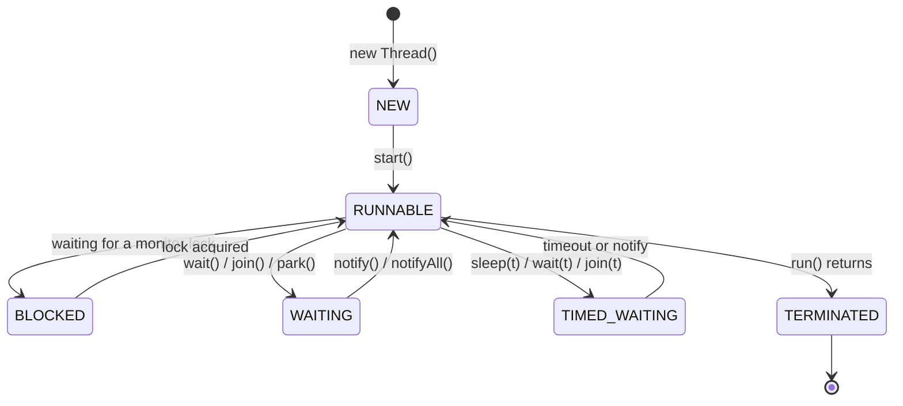
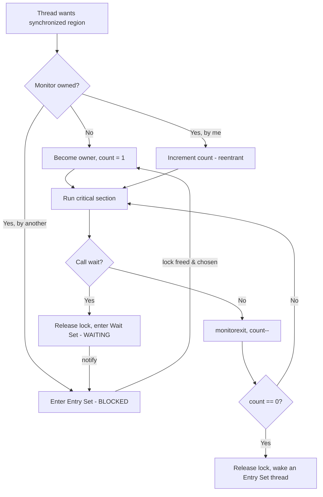
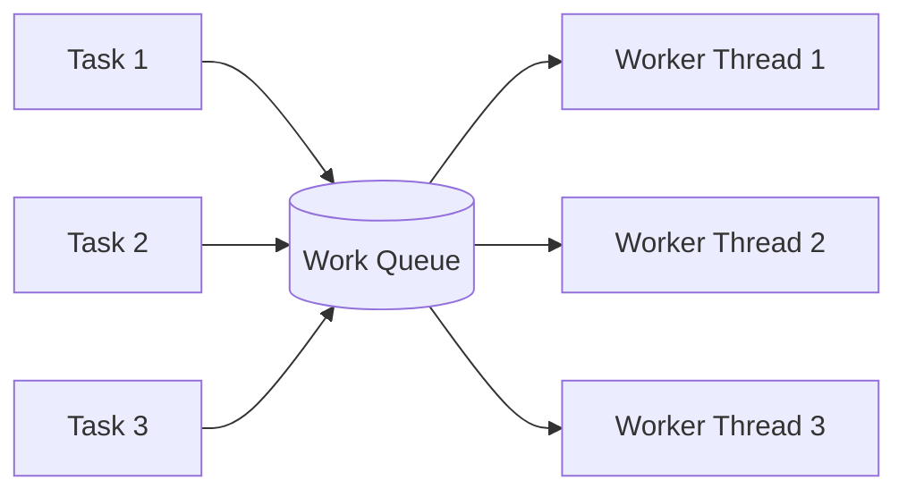
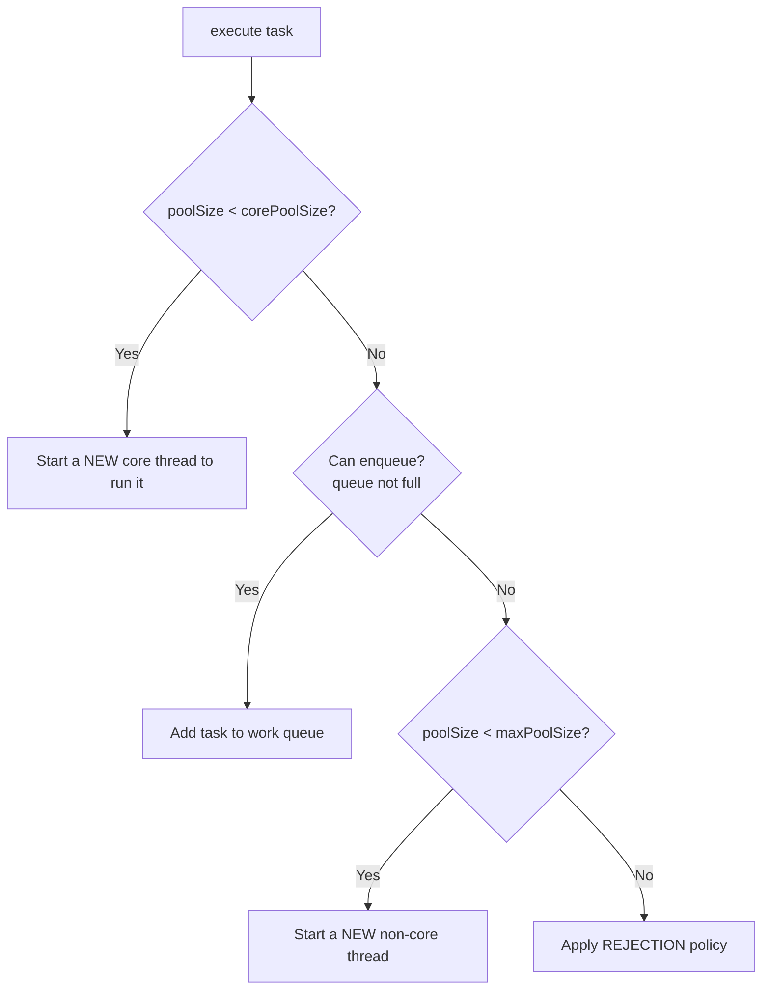
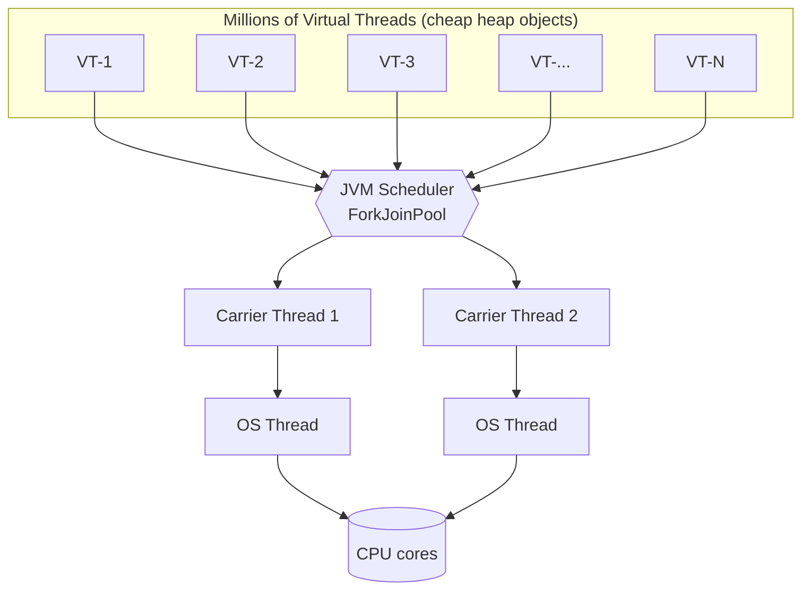
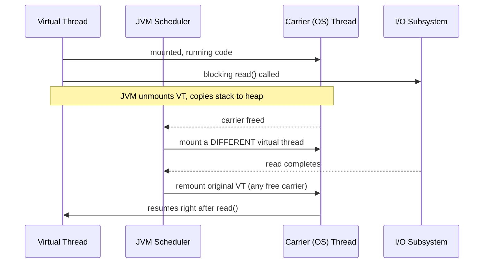

# Java Multithreading: A Complete, Confidence-Building Guide

> **Goal:** Take you from "what is a thread?" to comfortably answering FAANG concurrency interview questions. Every concept is explained with a plain-language idea first, then a runnable example, then the gotchas interviewers love to probe.

This guide reorganizes and expands the classic "Multithreading in Java" curriculum into a clear learning path. Read it top to bottom once; then use the **Cheat Sheet** and **Interview Questions** at the end to revise.

---

## 📑 Table of Contents

**Part 1 — Foundations**
- [1. What Is Multithreading?](#1-what-is-multithreading)
- [2. Why Multithreading? Benefits & Challenges](#2-why-multithreading-benefits--challenges)
- [3. Concurrency vs. Parallelism](#3-concurrency-vs-parallelism)
- [4. How the JVM Manages Threads](#4-how-the-jvm-manages-threads)
- [5. The Thread Lifecycle](#5-the-thread-lifecycle)

**Part 2 — Creating & Controlling Threads**
- [6. Four Ways to Create a Thread](#6-four-ways-to-create-a-thread)
- [7. Essential Thread Methods](#7-essential-thread-methods)

**Part 3 — The Core Problem & Synchronization**
- [8. Race Conditions](#8-race-conditions)
- [9. The `synchronized` Keyword & Intrinsic Locks](#9-the-synchronized-keyword--intrinsic-locks)
- [10. Object Locks vs. Class Locks](#10-object-locks-vs-class-locks)
- [11. Synchronized Methods vs. Blocks](#11-synchronized-methods-vs-blocks)
- [12. Thread Communication: `wait()` / `notify()`](#12-thread-communication-wait--notify)
- [13. Deadlock, Livelock & Starvation](#13-deadlock-livelock--starvation)

**Part 4 — Advanced Synchronization Tools**
- [14. ReentrantLock & ReadWriteLock](#14-reentrantlock--readwritelock)
- [15. CyclicBarrier](#15-cyclicbarrier)
- [16. Semaphore](#16-semaphore)
- [17. CountDownLatch](#17-countdownlatch)
- [18. Comparison of Synchronization Primitives](#18-comparison-of-synchronization-primitives)
- [19. `volatile` & Atomic Variables](#19-volatile--atomic-variables)

**Part 5 — High-Level Concurrency**
- [20. Thread Pools & the Executor Framework](#20-thread-pools--the-executor-framework)
- [21. Callable, Future & CompletableFuture](#21-callable-future--completablefuture)
- [22. Virtual Threads (Project Loom)](#22-virtual-threads-project-loom)

**Part 6 — Classic Coding Problems (worked solutions)**
- [23. Print Even & Odd Numbers with Two Threads](#23-print-even--odd-numbers-with-two-threads)
- [24. Print in Sequence with Three Threads (Zero-Even-Odd style)](#24-print-in-sequence-with-three-threads-zero-even-odd-style)
- [25. Producer-Consumer with BlockingQueue](#25-producer-consumer-with-blockingqueue)
- [26. Run Tasks Concurrently with the Executor Framework](#26-run-tasks-concurrently-with-the-executor-framework)
- [27. Parallel Sum with Callable & Future](#27-parallel-sum-with-callable--future)
- [28. Fan-out HTTP Calls with Virtual Threads](#28-fan-out-http-calls-with-virtual-threads)
- [29. Thread-Safe Singleton](#29-thread-safe-singleton)

**Part 7 — Mastery**
- [30. Best Practices](#30-best-practices)
- [31. Common Pitfalls & Anti-Patterns](#31-common-pitfalls--anti-patterns)
- [32. FAANG Interview Questions](#32-faang-interview-questions)
- [33. FAQs](#33-faqs)
- [34. Quick Revision Cheat Sheet](#34-quick-revision-cheat-sheet)

---

# Part 1 — Foundations

## 1. What Is Multithreading?

A **thread** is the smallest unit of execution within a program. **Multithreading** means a single program runs multiple threads concurrently, so it can do several things at once.

**The intuition:** Think of a video streaming app. One thread decodes the video frames, another decodes audio, and a third keeps them in sync — all at the same time, so playback feels smooth. If all of this ran on one thread sequentially, the experience would stutter.

A quick distinction you'll need constantly:

```
Process  = a running program with its OWN memory space.
Thread   = a unit of execution INSIDE a process.

One process can have many threads. They SHARE the heap
(objects), but each thread has its OWN stack and program counter.
```

```
        PROCESS (shared heap)
   ┌───────────────────────────────┐
   │   Heap:  [obj A] [obj B] ...   │  ← shared by all threads
   ├───────────────┬───────────────┤
   │   Thread 1    │   Thread 2    │
   │  ┌─────────┐  │  ┌─────────┐  │
   │  │ stack   │  │  │ stack   │  │  ← each thread private
   │  │ PC      │  │  │ PC      │  │
   │  └─────────┘  │  └─────────┘  │
   └───────────────┴───────────────┘
```

That shared heap is the whole story of concurrency: it's what makes threads powerful (cheap data sharing) **and** what makes them dangerous (uncoordinated access corrupts data).

Java builds multithreading into the language via the `java.lang.Thread` class and the rich `java.util.concurrent` package.

---

## 2. Why Multithreading? Benefits & Challenges

**Why bother?** Imagine a web server that handled requests one at a time. User #2 would wait for user #1 to finish completely. Multithreading lets the server handle many requests simultaneously, slashing latency.

### Benefits

| Benefit | What it means | Example |
|---|---|---|
| **Responsiveness** | The app stays interactive while doing slow work in the background | A download manager updates its progress bar without freezing the UI |
| **Resource sharing** | Threads share memory, so cooperating on data is cheap | Several threads each process a slice of one big dataset |
| **Parallelism** | Use all CPU cores at once | A video editor renders different segments simultaneously |
| **Throughput** | Do more total work per unit time | A server serves thousands of concurrent users |

### Challenges (the price you pay)

| Challenge | What goes wrong |
|---|---|
| **Concurrency bugs** | Unsynchronized access to shared data → race conditions, corrupted state |
| **Deadlocks** | Two threads each wait forever for a lock the other holds |
| **Overhead** | Threads cost memory and CPU; creating too many exhausts resources |
| **Hard to reason about** | Bugs are non-deterministic and may appear only under load |

The rest of this guide is essentially a toolbox for keeping the benefits while taming the challenges.

---

## 3. Concurrency vs. Parallelism

These two words get used interchangeably, but interviewers love the distinction:

- **Concurrency** = *dealing with* many things at once. It's a **structure** — tasks have overlapping lifetimes. Achievable even on a single CPU core by rapidly switching between tasks (time-slicing).
- **Parallelism** = *doing* many things at once. It's about **execution** — tasks literally run at the same instant on multiple cores.

```
CONCURRENCY (1 core, interleaved)        PARALLELISM (2 cores, simultaneous)
Core: A B A B A B A B                    Core 1: A A A A
                                         Core 2: B B B B
```

You can have concurrency without parallelism (one core juggling tasks) and parallelism is one way to *implement* concurrency. **Concurrency is about design; parallelism is about hardware.**

---

## 4. How the JVM Manages Threads

The JVM hides most of the messy details of thread management. Four things worth knowing:

- **Thread lifecycle:** Threads move through well-defined states (NEW → RUNNABLE → … → TERMINATED). The JVM manages the transitions.
- **Thread scheduling:** Java delegates to the OS scheduler, which uses **preemptive multitasking** — it allocates CPU slices based on priority and fairness. Important caveat: **thread priority in Java is only a hint.** Don't write code whose correctness depends on priority or execution order.
- **Garbage collection:** Modern collectors (G1GC, ZGC) run largely concurrently with your threads to minimize pauses.
- **Thread safety of the JVM itself:** The JVM uses intrinsic locks internally (e.g., during class loading and static initialization), and gives you those same primitives for your own code.

---

## 5. The Thread Lifecycle

Every Java thread is, at any moment, in exactly one of six states (`Thread.State`):



| State | Meaning |
|---|---|
| **NEW** | Created but `start()` not yet called |
| **RUNNABLE** | Eligible to run (running or ready, waiting for CPU). Java merges "ready" and "running" here |
| **BLOCKED** | Waiting to acquire a monitor lock held by another thread |
| **WAITING** | Waiting indefinitely for another thread (`wait()`, `join()`) |
| **TIMED_WAITING** | Waiting for a bounded time (`sleep(t)`, `wait(t)`) |
| **TERMINATED** | `run()` has finished (normally or via exception) |

### 5.1 The analogy: an employee's workday

Think of a thread as an employee:

- **NEW** — hired but hasn't shown up yet (object created, `start()` not called).
- **RUNNABLE** — at their desk, either actively working *or* ready to work but waiting for the manager (CPU scheduler) to give them a turn. Java deliberately doesn't distinguish "running right now" from "ready to run" — both are RUNNABLE.
- **BLOCKED** — standing outside a meeting room (a `synchronized` section) whose door is locked because a colleague is inside. They wait for the **lock** on the room.
- **WAITING** — they've been told "wait here until I call you" with no deadline (`wait()`, `join()`, `LockSupport.park()`). They do nothing until explicitly signaled.
- **TIMED_WAITING** — same, but with an alarm clock: "wait, but no longer than 5 minutes" (`sleep(t)`, `wait(t)`, `join(t)`).
- **TERMINATED** — left for the day; the work (`run()`) is done and they can't come back.

### 5.2 Architecture: where the state lives and who changes it

A Java thread is more than the state enum — it's a stack of moving parts:

```
   Java Thread object (heap)        ── your Runnable, name, priority, state ──┐
        │                                                                     │
        ▼  start()                                                            │
   JVM thread (native)              ── maps 1:1 to an OS thread (platform)    │
        │                                                                     │
        ▼                                                                     │
   OS thread + kernel scheduler     ── decides which RUNNABLE thread gets a   │
        │                              CPU core, and for how long (time slice)│
        ▼                                                                     │
   CPU core                         ── actually executes instructions ────────┘
```

The crucial insight for interviews: **the JVM tracks the `Thread.State` enum, but it's the OS kernel scheduler that decides which RUNNABLE thread actually occupies a CPU core at any instant.** Java has no "RUNNING" state precisely because, from the JVM's point of view, "ready to run" and "currently on a core" are indistinguishable — that decision belongs to the OS. State transitions are driven by a mix of your code (`start()`, `wait()`, `sleep()`), other threads (`notify()`, releasing a lock, finishing a `join`ed task), and the scheduler.

### 5.3 The transitions in detail

| Transition | Triggered by |
|---|---|
| NEW → RUNNABLE | You call `start()` (which creates the native thread and schedules it). Calling `run()` directly does **not** transition state — it just runs on the current thread |
| RUNNABLE ↔ "on CPU" | The OS scheduler, via preemptive time-slicing. Not visible as a separate Java state |
| RUNNABLE → BLOCKED | Thread hits a `synchronized` boundary whose monitor is held by another thread |
| BLOCKED → RUNNABLE | The holder releases the monitor and this thread wins it |
| RUNNABLE → WAITING | `Object.wait()`, `Thread.join()`, or `LockSupport.park()` with no timeout |
| WAITING → RUNNABLE | `notify()`/`notifyAll()`, the joined thread terminates, or `unpark()` |
| RUNNABLE → TIMED_WAITING | `Thread.sleep(t)`, `wait(t)`, `join(t)`, `parkNanos`/`parkUntil` |
| TIMED_WAITING → RUNNABLE | The timeout elapses, or it's signaled early |
| RUNNABLE → TERMINATED | `run()` returns normally or throws an uncaught exception |

### 5.4 Subtleties interviewers probe

- **No RUNNING state.** As above — RUNNABLE covers both ready and executing. A common trap question.
- **BLOCKED vs. WAITING.** BLOCKED means "I want a *monitor lock* someone else holds" (only ever caused by `synchronized`). WAITING means "I'm parked until *signaled*" (`wait`, `join`, `park`). A thread waiting on a `ReentrantLock` shows as WAITING (it uses `LockSupport.park`), **not** BLOCKED — a subtle but real distinction, since only intrinsic-lock contention produces BLOCKED.
- **`sleep()` does not change lock ownership.** A sleeping thread is TIMED_WAITING but **still holds any locks it acquired** — a classic cause of others being stuck BLOCKED.
- **Terminated is final.** You can't restart a thread; calling `start()` on a TERMINATED (or already-started) thread throws `IllegalThreadStateException`.
- **Inspecting state at runtime:** `thread.getState()` returns the enum; thread dumps (`jstack`) show these states and are how you diagnose "why is everything stuck?" in production.

<details>
<summary><b>Example: observing thread states programmatically</b></summary>

```java
public class ThreadStateDemo {
    public static void main(String[] args) throws InterruptedException {
        Object lock = new Object();

        Thread t = new Thread(() -> {
            synchronized (lock) {
                try { lock.wait(); }                 // -> WAITING
                catch (InterruptedException e) { Thread.currentThread().interrupt(); }
            }
        });

        System.out.println(t.getState());            // NEW
        t.start();
        Thread.sleep(100);
        System.out.println(t.getState());            // WAITING (parked in wait())

        synchronized (lock) { lock.notify(); }        // wake it
        Thread.sleep(100);
        System.out.println(t.getState());            // TERMINATED
    }
}
```

`getState()` is for monitoring/debugging only — never build program logic around polling it (it's inherently racy).

</details>

---

# Part 2 — Creating & Controlling Threads

## 6. Four Ways to Create a Thread

There are four common ways to define and run a task on a thread. Understanding the trade-offs is a classic warm-up question.

### (a) Implement `Runnable` (the preferred way)

`Runnable` separates *what to do* (the task) from *how it runs* (the thread). Because Java only allows single inheritance, implementing an interface keeps your class free to extend something else.

<details>
<summary><b>Example: print numbers in a separate thread (Runnable)</b></summary>

```java
public class RunnableExample {
    public static void main(String[] args) {
        Runnable task = new Runnable() {
            @Override
            public void run() {
                for (int i = 1; i <= 5; i++) {
                    System.out.println("Worker: " + i);
                    sleepHalfSecond();
                }
            }
        };

        Thread worker = new Thread(task);
        worker.start();   // spawns a NEW thread that runs task.run()

        for (int i = 1; i <= 5; i++) {
            System.out.println("Main: " + i);
            sleepHalfSecond();
        }
    }

    private static void sleepHalfSecond() {
        try { Thread.sleep(500); }
        catch (InterruptedException e) { Thread.currentThread().interrupt(); }
    }
}
```

The `Main:` and `Worker:` lines interleave because both threads run concurrently.

</details>

### (b) Extend `Thread` directly

You can subclass `Thread` and override `run()`. It's self-contained for small tasks, but it **couples the task to the thread** and **uses up your one shot at inheritance**.

<details>
<summary><b>Example: matrix multiplication by extending Thread</b></summary>

```java
public class MatrixMultiplicationThread extends Thread {
    private final int[][] a, b;
    private final int[][] result;

    public MatrixMultiplicationThread(int[][] a, int[][] b) {
        this.a = a;
        this.b = b;
        this.result = new int[a.length][b[0].length];
    }

    @Override
    public void run() {
        for (int i = 0; i < a.length; i++)
            for (int j = 0; j < b[0].length; j++)
                for (int k = 0; k < b.length; k++)
                    result[i][j] += a[i][k] * b[k][j];
        System.out.println("Matrix multiplication completed.");
    }

    public static void main(String[] args) {
        int[][] a = {{1, 2}, {3, 4}};
        int[][] b = {{5, 6}, {7, 8}};
        new MatrixMultiplicationThread(a, b).start();
        System.out.println("Main thread is free to do other work.");
    }
}
```

</details>

### (c) Lambda + `Runnable` (Java 8+, concise)

Since `Runnable` is a functional interface, a lambda removes all the boilerplate. Best for short tasks.

<details>
<summary><b>Example: matrix multiplication with a lambda</b></summary>

```java
public class LambdaMatrixMultiplication {
    public static void main(String[] args) {
        int[][] a = {{1, 2}, {3, 4}};
        int[][] b = {{5, 6}, {7, 8}};
        int[][] result = new int[a.length][b[0].length];

        Runnable task = () -> {
            for (int i = 0; i < a.length; i++)
                for (int j = 0; j < b[0].length; j++)
                    for (int k = 0; k < b.length; k++)
                        result[i][j] += a[i][k] * b[k][j];
            System.out.println("Matrix multiplication completed.");
        };

        new Thread(task).start();
        System.out.println("Main thread is free to do other work.");
    }
}
```

</details>

### (d) `Callable` + `ExecutorService` (when you need a result)

`Runnable` can't return a value or throw checked exceptions. `Callable<T>` can. Submit it to an executor and get a `Future<T>` back (covered in §21).

### Which one should you use?

| Approach | Pros | Cons | Use when |
|---|---|---|---|
| `Runnable` | Decoupled, reusable, can extend another class | Slightly more verbose | **Default choice** |
| Extend `Thread` | Self-contained | Can't extend anything else; couples task to thread | Tiny throwaway tasks |
| Lambda `Runnable` | Minimal boilerplate | Hard to read when logic grows | Short, simple tasks |
| `Callable` + Executor | Returns values, throws checked exceptions, integrates with pools | Needs the executor framework | You need a result or use a pool |

**Bottom line:** In real code you rarely create raw `Thread`s at all — you submit `Runnable`/`Callable` tasks to a thread pool (§20).

---

## 7. Essential Thread Methods

A few methods you must be able to explain:

| Method | What it does | Key gotcha |
|---|---|---|
| `start()` | Spawns a new thread that runs `run()` | Calling `run()` directly does NOT create a thread — it runs on the caller. Calling `start()` twice throws `IllegalThreadStateException` |
| `join()` | Caller waits for this thread to finish | Used to collect results / order shutdown |
| `sleep(ms)` | Pauses the current thread for a time | Does **not** release any locks held |
| `interrupt()` | Requests the thread to stop | Cooperative — sets a flag / triggers `InterruptedException`; doesn't force-kill |
| `setDaemon(true)` | Marks thread as background | JVM exits when only daemon threads remain; must be set **before** `start()` |
| `yield()` | Hints the scheduler to let others run | Just a hint; often a no-op |

**On interruption:** never silently swallow `InterruptedException`. Either let it propagate, or restore the flag:

```java
try {
    Thread.sleep(1000);
} catch (InterruptedException e) {
    Thread.currentThread().interrupt();   // restore the interrupt status
}
```

---

# Part 3 — The Core Problem & Synchronization

## 8. Race Conditions

A **race condition** happens when two or more threads access shared data at the same time, and the final result depends on the unpredictable *order* in which they run. The program becomes non-deterministic — different runs give different answers.

### The classic example: an unsynchronized counter

<details>
<summary><b>Example: two threads incrementing a shared counter (BROKEN)</b></summary>

```java
public class RaceConditionExample {
    private static int counter = 0;

    public static void main(String[] args) throws InterruptedException {
        Runnable task = () -> {
            for (int i = 0; i < 1000; i++) counter++;
        };

        Thread t1 = new Thread(task);
        Thread t2 = new Thread(task);
        t1.start();
        t2.start();
        t1.join();
        t2.join();

        // Expected 2000... but you'll often see less!
        System.out.println("Final Counter Value: " + counter);
    }
}
```

Run it repeatedly and you'll see values like `1873`, `1991`, `2000` — inconsistent.

</details>

### Why it breaks

`counter++` looks atomic but is actually **three** machine operations:

```
1. READ  counter        (load current value)
2. ADD   1              (compute new value)
3. WRITE counter        (store it back)
```

Two threads can interleave disastrously:

```
Thread A: read counter -> 10
Thread B: read counter -> 10      (before A writes!)
Thread A: 10 + 1 = 11, write 11
Thread B: 10 + 1 = 11, write 11   ← lost update! Should be 12
```

Three ingredients cause race conditions: **shared state**, **no synchronization**, and **arbitrary interleaving** by the scheduler. Remove any one and the bug disappears — synchronization removes the second.

> Memorize the three hazards of concurrency: **atomicity** (operations can be interrupted mid-way), **visibility** (one thread may not see another's writes), and **ordering** (the compiler/CPU may reorder operations). Almost every fix addresses one of these.

---

## 9. The `synchronized` Keyword & Intrinsic Locks

`synchronized` is the cornerstone of Java thread safety. It guarantees that **only one thread at a time** can execute a given critical section — and it also guarantees **visibility** (changes made by one thread become visible to the next thread that acquires the lock).

### Intrinsic locks (monitor locks)

**Every Java object has a built-in lock**, called its *intrinsic lock* or *monitor*. When a thread enters a `synchronized` block/method, it **acquires** that object's lock; when it leaves, it **releases** it. While held, no other thread can enter any synchronized region guarded by the same lock.

```java
synchronized (someObject) {
    // Only one thread at a time can be in here (per someObject).
}
```

What happens step by step:

1. **Acquire:** thread tries to grab the lock. If another thread holds it, this thread becomes `BLOCKED`.
2. **Execute:** once it has the lock, it runs the critical section.
3. **Release:** on exit (normal or via exception), the lock is released and a waiting thread can proceed.

### Fixing the counter

<details>
<summary><b>Example: a correctly synchronized counter</b></summary>

```java
public class SharedCounter {
    private int counter = 0;

    public synchronized void increment() { counter++; }
    public synchronized int getCounter() { return counter; }

    public static void main(String[] args) throws InterruptedException {
        SharedCounter c = new SharedCounter();
        Runnable task = () -> { for (int i = 0; i < 1000; i++) c.increment(); };

        Thread t1 = new Thread(task);
        Thread t2 = new Thread(task);
        t1.start(); t2.start();
        t1.join();  t2.join();

        System.out.println("Final Counter Value: " + c.getCounter()); // always 2000
    }
}
```

Both `increment()` and `getCounter()` are synchronized on the same object, so increments can't interleave and reads always see the latest value.

</details>

**Two important properties:**

- `synchronized` is **reentrant** — a thread that already holds a lock can re-acquire it (e.g., one synchronized method calling another on the same object) without deadlocking itself.
- Don't lock on `this` or on shared constants like `String`/`Integer` in library code; prefer a `private final Object lock = new Object();` so external code can't accidentally acquire your lock.

---

## 10. Object Locks vs. Class Locks

There are two scopes of intrinsic lock, and they are **independent** of each other:

| | Object lock | Class lock |
|---|---|---|
| Tied to | A specific **instance** (`this`) | The **`Class` object** (`Foo.class`) |
| Acquired by | `synchronized` instance method / `synchronized(this)` | `static synchronized` method / `synchronized(Foo.class)` |
| Scope | One instance | All instances of the class |

```java
public class Example {
    public synchronized void instanceMethod() {
        // locks on 'this' (the instance)
    }
    public static synchronized void staticMethod() {
        // locks on Example.class (the class)
    }
    public void block() {
        synchronized (this)          { /* instance lock */ }
        synchronized (Example.class) { /* class lock     */ }
    }
}
```

**Key insight:** because they're different locks, one thread can run a synchronized *instance* method while another runs a synchronized *static* method **at the same time** — they don't block each other. This trips up many candidates.

### 10.1 The analogy: bathroom keys

Imagine an office building.

- **Object lock = the key to one specific bathroom.** Each instance of your class is its own bathroom with its own key. If two people want the *same* bathroom (the same object), they take turns. But two people can use *two different* bathrooms (two different instances) simultaneously — different keys, no waiting.
- **Class lock = the master key to the entire floor's facilities.** There's exactly one master key per class (per `Class` object), shared by everyone, regardless of which bathroom (instance) they came from. Static synchronized methods all compete for this single master key.

Because the bathroom key and the master key are *different physical keys*, holding one says nothing about the other — which is exactly why an instance-synchronized method and a static-synchronized method don't block each other.

### 10.2 Architecture: how the monitor actually works

Every Java object has, in its header, an association with a **monitor** — the low-level construct that backs intrinsic locking. A monitor conceptually holds three things:

```
        OBJECT  (its header references a Monitor)
          │
          ▼
   ┌──────────────────────────────────────────────┐
   │  MONITOR                                       │
   │  • owner         → the thread holding the lock │
   │  • recursion cnt → reentrancy depth            │
   │  • Entry Set     → threads BLOCKED waiting      │
   │                    to ACQUIRE the lock          │
   │  • Wait Set      → threads WAITING after        │
   │                    calling wait()               │
   └──────────────────────────────────────────────┘
```

When you enter `synchronized(obj)`, the JVM executes a `monitorenter` bytecode: if the monitor is unowned, the current thread becomes owner and the recursion count goes to 1; if the *same* thread re-enters, the count just increments (that's **reentrancy**); if a *different* thread owns it, the entrant goes into the **Entry Set** (state BLOCKED). Exiting runs `monitorexit`, decrementing the count; at zero the lock is released and one Entry-Set thread is unblocked.

The **Wait Set** is separate: when the owner calls `obj.wait()`, it releases the lock and moves into the Wait Set (state WAITING); `notify()` moves one thread from the Wait Set back to the Entry Set to re-compete for the lock. This is why §12's `wait`/`notify` only works while holding the monitor — it physically manipulates these monitor structures.



### 10.3 Performance deep dive: lock states & escalation

Intrinsic locks aren't a single heavyweight mechanism — the HotSpot JVM optimizes them through escalating tiers, recorded in the object header's "mark word":

1. **Biased locking** (historical; deprecated/removed in modern JDKs) — if only one thread ever locks an object, the lock is "biased" to it and re-entry is almost free.
2. **Thin / lightweight lock** — under low contention, the JVM uses a fast CAS on the mark word instead of a real OS mutex. No kernel involvement.
3. **Fat / heavyweight lock** — under real contention, the lock "inflates" to a full OS-level monitor (mutex + wait queues), where BLOCKED threads actually park in the kernel.

The practical takeaway: uncontended `synchronized` is cheap (just a CAS); the cost appears under contention when the lock inflates and threads start parking/waking via the OS. This is *why* "keep critical sections small" matters — you want to minimize the window where contention (and inflation) can happen.

### 10.4 Subtleties & gotchas

- **Reentrancy is per-thread, per-monitor.** A thread holding `this`'s lock can call another `synchronized` method on the same object freely (count increments). Without reentrancy, a class calling its own synchronized methods would self-deadlock.
- **Static and instance locks are orthogonal.** Synchronizing a `static` method does **not** protect instance fields, and vice versa. If a field is `static`, guard it with the *class* lock; if it's an instance field, guard it with the *instance* lock. Mixing them is a real bug source.
- **Locking on the wrong object.** `synchronized(this)` in a class whose instances callers can see, or locking on a `String` literal / boxed `Integer` (which may be interned/cached and shared JVM-wide), lets unrelated code contend for or deadlock your lock. Use a `private final Object lock = new Object();`.
- **Changing the lock reference.** Never synchronize on a field you reassign — each thread may lock a different object and mutual exclusion silently breaks. Lock objects must be `final`.

<details>
<summary><b>Example: why instance and class locks don't interfere</b></summary>

```java
public class Counter {
    private int instanceCount;
    private static int classCount;

    public synchronized void incInstance() {        // locks on 'this'
        instanceCount++;
    }

    public static synchronized void incClass() {    // locks on Counter.class
        classCount++;
    }
}
```

Two threads calling `incInstance()` **on the same object** serialize (same instance lock). Two threads calling it on **different objects** run in parallel (different instance locks). A thread in `incInstance()` and another in `incClass()` run fully in parallel — different locks entirely. The mistake candidates make: assuming `static synchronized` somehow also guards instance state. It does not.

</details>

---

## 11. Synchronized Methods vs. Blocks

You can synchronize an entire method or just a block inside it.

**Synchronized method** — locks the whole method body:
```java
public synchronized void doWork() { /* entire method is the critical section */ }
```
Simple, but if only a few lines need protection, you're holding the lock longer than necessary, increasing contention.

**Synchronized block** — locks only the critical part:
```java
public void doWork() {
    // ... non-critical setup runs without the lock ...
    synchronized (lock) {
        // only the truly shared part
    }
    // ... more lock-free work ...
}
```
Finer-grained, better performance under contention. **Prefer blocks** that wrap the minimum necessary code.

### A bank transfer (and a deadlock warning)

<details>
<summary><b>Example: bank account transfer with synchronized blocks</b></summary>

```java
public class BankAccount {
    private int balance;

    public BankAccount(int initialBalance) { this.balance = initialBalance; }

    public void transfer(BankAccount target, int amount) {
        synchronized (this) {
            if (this.balance >= amount) {
                this.balance -= amount;
                synchronized (target) {     // nested lock — deadlock risk!
                    target.balance += amount;
                }
            }
        }
    }

    public int getBalance() { return balance; }
}
```

This works, but acquiring two locks (`this` then `target`) is a **deadlock trap**: if thread 1 transfers A→B while thread 2 transfers B→A, each can grab its first lock and wait forever for the second. The fix (next section) is to always acquire locks in a **consistent global order**.

</details>

---

## 12. Thread Communication: `wait()` / `notify()`

Sometimes a thread needs to **wait for a condition** that another thread will make true (e.g., a consumer waiting for an item to appear). That's what `wait()`, `notify()`, and `notifyAll()` are for. They live on `Object` (since every object has a monitor) and are deeply tied to intrinsic locks.

### The rules (interviewers test these precisely)

- All three **must** be called while holding the object's monitor (inside a `synchronized` block on that object), or you get `IllegalMonitorStateException`.
- `wait()` **releases the lock** and parks the thread. This is crucial — it lets another thread enter the synchronized region and change the condition.
- `notify()` wakes **one** waiting thread; `notifyAll()` wakes **all**. The notifying thread keeps the lock until it exits the synchronized block; only then can a woken thread re-acquire it and proceed.
- **Always call `wait()` inside a `while` loop**, never an `if` — to guard against *spurious wakeups* and the condition having changed before the woken thread reacquires the lock.

```java
synchronized (lock) {
    while (!conditionIsTrue) {   // while, NOT if
        lock.wait();
    }
    // safe to proceed: condition is true AND we hold the lock
}
```

### Producer–Consumer with `wait`/`notify`

This is *the* canonical coordination example.

<details>
<summary><b>Example: producer-consumer using wait() / notify()</b></summary>

```java
import java.util.LinkedList;
import java.util.Queue;

public class ProducerConsumer {
    private final Queue<Integer> buffer = new LinkedList<>();
    private static final int MAX_SIZE = 5;

    public void produce() throws InterruptedException {
        int value = 0;
        while (true) {
            synchronized (this) {
                while (buffer.size() == MAX_SIZE) {
                    wait();                  // buffer full -> release lock & wait
                }
                buffer.add(value);
                System.out.println("Produced: " + value);
                value++;
                notify();                    // wake a waiting consumer
            }
            Thread.sleep(500);
        }
    }

    public void consume() throws InterruptedException {
        while (true) {
            synchronized (this) {
                while (buffer.isEmpty()) {
                    wait();                  // buffer empty -> release lock & wait
                }
                int value = buffer.poll();
                System.out.println("Consumed: " + value);
                notify();                    // wake a waiting producer
            }
            Thread.sleep(500);
        }
    }

    public static void main(String[] args) {
        ProducerConsumer pc = new ProducerConsumer();
        new Thread(() -> { try { pc.produce(); } catch (InterruptedException e) { Thread.currentThread().interrupt(); } }).start();
        new Thread(() -> { try { pc.consume(); } catch (InterruptedException e) { Thread.currentThread().interrupt(); } }).start();
    }
}
```

The producer waits when the buffer is full; the consumer waits when it's empty; each `notify()`s the other after changing the buffer. In production you'd use a `BlockingQueue` (§20) instead of hand-writing this — but interviewers want to see you *can* write it.

</details>

---

## 13. Deadlock, Livelock & Starvation

Three liveness failures you must be able to name and fix:

**Deadlock** — threads wait on each other in a cycle, forever.
```
Thread 1: holds Lock A, wants Lock B
Thread 2: holds Lock B, wants Lock A   → neither can proceed
```
The four Coffman conditions (all must hold for deadlock): mutual exclusion, hold-and-wait, no preemption, circular wait. Break any one to prevent deadlock.

*Fixes:* acquire locks in a **consistent global order**; use `tryLock()` with a timeout; keep critical sections small; avoid calling unknown code while holding a lock.

**Livelock** — threads aren't blocked, but keep reacting to each other and make no progress (like two people repeatedly stepping aside in a hallway). *Fix:* add randomized backoff.

**Starvation** — a thread never gets the CPU or a lock because others monopolize it (e.g., unfair locking, or always-higher-priority threads). *Fix:* fair locks, avoid priority abuse.

---

# Part 4 — Advanced Synchronization Tools

`synchronized` is great but limited: you can't try-and-give-up, you can't time out, you can't interrupt a waiting thread, and there's only one implicit wait-set per lock. The `java.util.concurrent` package fixes all of that.

## 14. ReentrantLock & ReadWriteLock

### ReentrantLock — `synchronized` with superpowers

`ReentrantLock` is an explicit lock you `lock()` and `unlock()` yourself. It adds:

- **`tryLock()`** — attempt to acquire without blocking; returns `false` if unavailable (great for deadlock avoidance).
- **`tryLock(timeout)`** — wait only so long.
- **`lockInterruptibly()`** — a waiting thread can be interrupted.
- **Fairness** — `new ReentrantLock(true)` hands out the lock in FIFO order (prevents starvation, slightly slower).
- **Multiple `Condition`s** — separate wait-sets (e.g., `notFull` and `notEmpty`) on one lock.

| Feature | `synchronized` | `ReentrantLock` |
|---|---|---|
| Fairness | Not configurable | Configurable |
| Interruptible acquisition | No | Yes (`lockInterruptibly`) |
| Try-lock (non-blocking) | No | Yes |
| Timed lock | No | Yes |
| Condition variables | One implicit | Many explicit |
| Auto-release | Yes (block exit) | **No — you must `unlock()` in `finally`** |

<details>
<summary><b>Example: bank account with ReentrantLock</b></summary>

```java
import java.util.concurrent.locks.Lock;
import java.util.concurrent.locks.ReentrantLock;

public class BankAccount {
    private int balance;
    private final Lock lock = new ReentrantLock();

    public BankAccount(int initialBalance) { this.balance = initialBalance; }

    public void deposit(int amount) {
        lock.lock();
        try {
            balance += amount;
            System.out.println(Thread.currentThread().getName() + " deposited " + amount);
        } finally {
            lock.unlock();             // ALWAYS unlock in finally
        }
    }

    public void withdraw(int amount) {
        lock.lock();
        try {
            if (balance >= amount) {
                balance -= amount;
                System.out.println(Thread.currentThread().getName() + " withdrew " + amount);
            } else {
                System.out.println(Thread.currentThread().getName() + " insufficient balance.");
            }
        } finally {
            lock.unlock();
        }
    }

    public int getBalance() { return balance; }
}
```

The `try/finally` is non-negotiable: if the body throws, the `finally` still releases the lock, preventing a permanent lock leak.

</details>

### ReadWriteLock — many readers OR one writer

`ReentrantReadWriteLock` splits the lock in two: a **read lock** (shared — many threads can hold it at once) and a **write lock** (exclusive). Readers don't block each other; a writer blocks everyone.

**Use it when reads vastly outnumber writes** — caches, configuration that's read constantly but updated rarely, resource-state monitoring. For read-heavy data this dramatically reduces contention compared to a plain lock.

> Related: `StampedLock` (Java 8) adds an *optimistic read* mode that doesn't even take a lock on the happy path — you read, then validate a stamp. Very fast, but it's **not reentrant**, a common gotcha.

---

## 15. CyclicBarrier

A `CyclicBarrier` makes a fixed number of threads **wait for each other** at a common point; once all have arrived, they all proceed together. It's *cyclic* because it resets and can be reused for the next round.

**Use case:** split a computation into phases where every thread must finish phase 1 before anyone starts phase 2 (parallel simulations, multi-stage data processing).

<details>
<summary><b>Example: threads sync at a barrier before proceeding</b></summary>

```java
import java.util.concurrent.BrokenBarrierException;
import java.util.concurrent.CyclicBarrier;

public class CyclicBarrierExample {
    public static void main(String[] args) {
        int numWorkers = 3;
        CyclicBarrier barrier = new CyclicBarrier(numWorkers,
            () -> System.out.println("All threads reached the barrier. Proceeding..."));

        Runnable task = () -> {
            try {
                System.out.println(Thread.currentThread().getName() + " working...");
                Thread.sleep((long) (Math.random() * 1000));
                System.out.println(Thread.currentThread().getName() + " reached the barrier.");
                barrier.await();    // wait until all 3 arrive
            } catch (InterruptedException | BrokenBarrierException e) {
                Thread.currentThread().interrupt();
            }
        };

        for (int i = 0; i < numWorkers; i++) new Thread(task).start();
    }
}
```

The optional barrier action (the lambda) runs once, on the last thread to arrive, before any are released.

</details>

---

## 16. Semaphore

A `Semaphore` maintains a set of **permits**. A thread calls `acquire()` to take one (blocking if none are free) and `release()` to give it back. It limits how many threads can access a resource **concurrently** — perfect for a connection pool, a rate limiter, or any capped resource.

<details>
<summary><b>Example: limit concurrent access to 2 printers</b></summary>

```java
import java.util.concurrent.Semaphore;

public class PrintingQueue {
    private final Semaphore semaphore;

    public PrintingQueue(int availablePrinters) {
        this.semaphore = new Semaphore(availablePrinters);
    }

    public void printJob(String document) {
        try {
            semaphore.acquire();    // take a permit (waits if all are in use)
            System.out.println(Thread.currentThread().getName() + " printing: " + document);
            Thread.sleep((long) (Math.random() * 1000));
            System.out.println(Thread.currentThread().getName() + " finished.");
        } catch (InterruptedException e) {
            Thread.currentThread().interrupt();
        } finally {
            semaphore.release();    // return the permit
        }
    }

    public static void main(String[] args) {
        PrintingQueue queue = new PrintingQueue(2);   // only 2 at a time
        for (int i = 0; i < 5; i++) {
            new Thread(() -> queue.printJob("doc"), "Thread-" + i).start();
        }
    }
}
```

Even with 5 threads, at most 2 print simultaneously. A `Semaphore(1)` behaves like a lock (a "binary semaphore"), though it differs in that any thread can release it.

</details>

---

## 17. CountDownLatch

A `CountDownLatch` lets one or more threads **wait until a set of operations completes**. It starts at a count N; each finishing task calls `countDown()`; threads blocked on `await()` are released when the count hits zero. **It's one-shot** — you can't reset it.

**Use case:** "wait until all N services have initialized before the system starts serving traffic."

<details>
<summary><b>Example: wait for 3 init tasks before starting</b></summary>

```java
import java.util.concurrent.CountDownLatch;

public class SystemInitialization {
    public static void main(String[] args) throws InterruptedException {
        int numTasks = 3;
        CountDownLatch latch = new CountDownLatch(numTasks);

        Runnable initTask = () -> {
            try {
                System.out.println(Thread.currentThread().getName() + " initializing...");
                Thread.sleep((long) (Math.random() * 1000));
                System.out.println(Thread.currentThread().getName() + " done.");
            } catch (InterruptedException e) {
                Thread.currentThread().interrupt();
            } finally {
                latch.countDown();    // signal completion (always, even on failure)
            }
        };

        for (int i = 0; i < numTasks; i++) new Thread(initTask).start();

        latch.await();    // main waits here until count == 0
        System.out.println("All tasks complete. System starting...");
    }
}
```

</details>

### CountDownLatch vs. CyclicBarrier (a favorite comparison)

| | CountDownLatch | CyclicBarrier |
|---|---|---|
| Reusable? | No (one-shot) | Yes (resets) |
| Who waits? | One/more threads wait for **events** to complete | The participating threads wait for **each other** |
| Count changes via | `countDown()` from any thread | Threads calling `await()` |
| Mental model | "Wait for N things to finish" | "Everyone meet here, then go" |

---

## 18. Comparison of Synchronization Primitives

| Primitive | Key feature | Best use case |
|---|---|---|
| `synchronized` | Simple mutual exclusion + visibility | Basic critical sections |
| `ReentrantLock` | Explicit lock: tryLock, timeout, fairness, conditions | Fine-grained control, deadlock avoidance |
| `ReadWriteLock` | Shared reads, exclusive writes | High read-to-write ratio (caches) |
| `CyclicBarrier` | Threads wait for each other; reusable | Coordinating computation phases |
| `Semaphore` | N permits limit concurrency | Pools of limited resources |
| `CountDownLatch` | Wait for N events; one-shot | Startup / "wait for completion" |
| `volatile` | Visibility + ordering (no atomicity) | Flags, safe publication |
| Atomics | Lock-free atomic updates (CAS) | Counters, lock-free algorithms |

---

## 19. `volatile` & Atomic Variables

These weren't in the original article but are **essential interview territory** — they directly address the *visibility* and *atomicity* hazards.

### `volatile` — visibility, not atomicity

Without synchronization, a thread may cache a variable and never see another thread's update. `volatile` forces every read/write to go to main memory, so updates are immediately visible — and it prevents reordering across the access.

```java
private volatile boolean running = true;

public void stop()  { running = false; }            // instantly visible to all
public void loop()  { while (running) { /* work */ } } // actually sees the change
```

**Critical limitation:** `volatile` does **NOT** make `count++` safe — that's still a non-atomic read-modify-write. Use `volatile` for **flags** and **safely publishing a reference**, not for compound updates.

### Atomic variables — lock-free, atomic

`java.util.concurrent.atomic` (`AtomicInteger`, `AtomicLong`, `AtomicReference`, …) gives thread-safe single-variable updates **without locks**, using a CPU instruction called **Compare-And-Swap (CAS)**.

```java
AtomicInteger counter = new AtomicInteger(0);
counter.incrementAndGet();        // atomic ++
counter.compareAndSet(5, 6);      // set to 6 only if currently 5
```

CAS means "if the value is still X, set it to Y; otherwise tell me it failed (and I'll retry)." This is how the counter from §8 can be made safe without `synchronized`:

```java
// Instead of synchronized increment:
private final AtomicInteger counter = new AtomicInteger();
public void increment() { counter.incrementAndGet(); }
```

**Two nuances worth knowing:**
- **ABA problem:** CAS only checks the value, not whether it changed and changed back (A→B→A). Fix with `AtomicStampedReference` (adds a version stamp).
- **`LongAdder` vs `AtomicLong`:** under heavy contention, `LongAdder` spreads writes across multiple internal cells and sums on read, giving much higher throughput for hot counters.

---

# Part 5 — High-Level Concurrency

## 20. Thread Pools & the Executor Framework

Creating a `new Thread()` per task doesn't scale: thread creation is expensive, and unbounded threads exhaust memory. The **Executor Framework** (Java 5+, in `java.util.concurrent`) decouples *submitting* a task from *how/when* it runs. You hand tasks to a pool; the pool reuses a fixed set of worker threads.



Why pools win: **performance** (reuse threads, no repeated creation), **resource control** (cap concurrent threads), **simpler error handling**, and **scalability** for many short tasks.

### 20.1 The analogy: a taxi dispatch service

Creating a `new Thread()` per task is like **building a brand-new car for every passenger and scrapping it at the destination** — absurdly wasteful. A thread pool is a **taxi company**:

- A fixed fleet of cars (worker threads) is kept running.
- Passengers (tasks) call in and wait in a **dispatch queue** (the work queue).
- A free driver picks up the next passenger, completes the trip, then returns to pick up another — the **car is reused**, not rebuilt.
- If all cars are busy and the waiting line is full, the dispatcher applies a **policy**: turn the passenger away, make the *caller* drive themselves, or bump someone from the queue (the rejection policies).

This captures the whole framework: a bounded fleet + a queue + a rejection policy = predictable resource usage under any load.

### 20.2 Architecture: the Executor framework's layers

The framework is a small hierarchy of interfaces, which is worth knowing by name:

```
Executor                  ── execute(Runnable): the bare "run this" contract
   │
   ▼
ExecutorService           ── adds lifecycle (shutdown) + submit()/invokeAll()
   │                          returning Futures
   ▼
ScheduledExecutorService  ── adds schedule()/scheduleAtFixedRate() for delays
   │
   ▼
ThreadPoolExecutor        ── the concrete workhorse: core/max threads,
ScheduledThreadPoolExecutor   work queue, thread factory, rejection handler
ForkJoinPool              ── work-stealing pool for recursive/parallel tasks
```

`Executors` (the utility class) is just a set of **factory methods** that pre-configure a `ThreadPoolExecutor` for you. Understanding that `newFixedThreadPool(n)` is literally `new ThreadPoolExecutor(n, n, 0L, MILLISECONDS, new LinkedBlockingQueue<>())` is what lets you reason about its (dangerous, unbounded-queue) behavior.

### 20.3 Deep dive: how ThreadPoolExecutor processes a task

When you call `execute(task)`, the executor follows a strict decision sequence. This is the single most-asked thread-pool interview topic:



In words: **(1)** below core size → always spin up a new core thread (even if others are idle); **(2)** at/above core size → try to **queue** the task; **(3)** queue full and below max size → create a temporary non-core thread; **(4)** queue full and at max size → **reject**. A subtle consequence: with an **unbounded queue** (the default `newFixedThreadPool`), step 2 never fails, so the pool **never grows past core size and never rejects** — it just queues forever until memory runs out. That's the production trap.

The worker threads themselves run a simple loop internally: take a task from the queue (blocking if empty), run it, repeat. Idle non-core threads above `corePoolSize` are reaped after `keepAliveTime`. This loop is why a single uncaught exception matters — it can terminate a worker (the pool replaces it, but the task's failure is swallowed unless you handle it).

### 20.4 The five constructor parameters (know each cold)

```java
new ThreadPoolExecutor(
    corePoolSize,      // threads kept alive even when idle
    maximumPoolSize,   // hard ceiling on worker threads
    keepAliveTime,     // how long idle non-core threads survive
    unit,
    workQueue,         // where tasks wait: bounded vs unbounded changes everything
    threadFactory,     // names threads, sets daemon/priority — vital for debugging
    rejectionHandler   // what to do when saturated
);
```

The **work queue** choice is architectural:
- `LinkedBlockingQueue` (unbounded) → pool stays at core size, risk of OOM.
- `ArrayBlockingQueue` (bounded) → enables growth to max + back-pressure via rejection. **Preferred for production.**
- `SynchronousQueue` (zero capacity, hand-off) → every task needs an immediately-available thread; used by `newCachedThreadPool`, which is why it grows threads without bound.

The **rejection policies** (`RejectedExecutionHandler`):
- `AbortPolicy` (default) — throws `RejectedExecutionException`.
- `CallerRunsPolicy` — runs the task on the *submitting* thread; naturally throttles producers (back-pressure) since they can't submit more while busy.
- `DiscardPolicy` — silently drops the new task.
- `DiscardOldestPolicy` — drops the oldest queued task and retries.

### The four built-in pool types

| Factory method | Behavior | Use case |
|---|---|---|
| `newFixedThreadPool(n)` | Exactly `n` threads; extra tasks queue up | Predictable, steady workloads |
| `newCachedThreadPool()` | Creates threads on demand, reuses idle ones, reaps after 60s idle | Many short-lived async tasks |
| `newScheduledThreadPool(n)` | Runs tasks after a delay or periodically | Heartbeats, periodic cleanup, cron-like jobs |
| `newSingleThreadExecutor()` | One thread, tasks run sequentially in order | Logging, event handling, ordered tasks |

<details>
<summary><b>Example: fixed thread pool running 6 tasks on 3 threads</b></summary>

```java
import java.util.concurrent.ExecutorService;
import java.util.concurrent.Executors;

public class FixedThreadPoolExample {
    public static void main(String[] args) {
        ExecutorService executor = Executors.newFixedThreadPool(3);

        Runnable task = () -> {
            System.out.println(Thread.currentThread().getName() + " executing a task.");
            try { Thread.sleep(1000); }
            catch (InterruptedException e) { Thread.currentThread().interrupt(); }
        };

        for (int i = 1; i <= 6; i++) executor.execute(task);

        executor.shutdown();    // no new tasks; lets running ones finish
    }
}
```

Only 3 tasks run at once; the other 3 wait in the queue until a worker is free.

</details>

<details>
<summary><b>Example: scheduled pool for periodic execution</b></summary>

```java
import java.util.concurrent.Executors;
import java.util.concurrent.ScheduledExecutorService;
import java.util.concurrent.TimeUnit;

public class ScheduledThreadPoolExample {
    public static void main(String[] args) {
        ScheduledExecutorService scheduler = Executors.newScheduledThreadPool(2);

        Runnable task = () ->
            System.out.println(Thread.currentThread().getName() + " running scheduled task.");

        scheduler.schedule(task, 3, TimeUnit.SECONDS);                 // once, after 3s
        scheduler.scheduleAtFixedRate(task, 1, 2, TimeUnit.SECONDS);   // every 2s after 1s
    }
}
```

</details>

### Production tip: build your own `ThreadPoolExecutor`

The convenience factories hide a dangerous detail: `newFixedThreadPool` uses an **unbounded queue** (tasks pile up → OutOfMemoryError under load), and `newCachedThreadPool` allows an **unbounded thread count**. In serious systems, construct the pool explicitly so you control the queue bound and what happens when it's full:

```java
ThreadPoolExecutor pool = new ThreadPoolExecutor(
    4,                                   // core threads
    8,                                   // max threads
    60, TimeUnit.SECONDS,                // idle keep-alive
    new ArrayBlockingQueue<>(100),       // BOUNDED queue → back-pressure
    new ThreadPoolExecutor.CallerRunsPolicy()  // rejection policy when full
);
```

How it decides to grow: use core threads → if busy, queue the task → if queue full, add threads up to max → if still full, apply the **rejection policy** (`AbortPolicy` default/throws, `CallerRunsPolicy`, `DiscardPolicy`, `DiscardOldestPolicy`).

### Sizing the pool

- **CPU-bound tasks:** ≈ number of CPU cores (sometimes cores + 1).
- **I/O-bound tasks:** more threads, since they spend time waiting — roughly `cores × (1 + waitTime/computeTime)`. (Or use virtual threads — §22.)

### Always handle exceptions and shut down

An uncaught exception in a task can silently kill a worker thread. Wrap task bodies in try/catch, and always `shutdown()` (or `shutdownNow()`) when done.

<details>
<summary><b>Example: graceful shutdown</b></summary>

```java
executor.shutdown();    // stop accepting new tasks
try {
    if (!executor.awaitTermination(30, TimeUnit.SECONDS)) {
        executor.shutdownNow();   // force-cancel remaining tasks
    }
} catch (InterruptedException e) {
    executor.shutdownNow();
    Thread.currentThread().interrupt();
}
```

</details>

---

## 21. Callable, Future & CompletableFuture

This is one of the two most important sections for interviews (along with virtual threads). Take your time here — async result-handling comes up constantly.

### 21.1 The analogy: ordering food

Think of the three abstractions as ways of getting a meal:

- **`Runnable` = drop off laundry.** You hand over a task and walk away. You get nothing back, and you can't easily tell when it's done.
- **`Callable` + `Future` = a restaurant buzzer.** You order (submit a `Callable`), and you're handed a buzzer (`Future`). You can do other things, but to actually *eat* you must walk back to the counter and **wait there** until the buzzer goes off — `future.get()` blocks you at the counter. If you want to combine two dishes from two restaurants, you stand at each counter in turn.
- **`CompletableFuture` = food delivery with instructions.** You order and say *"when it arrives, reheat it, plate it, and text me; if the kitchen fails, send a backup order."* You never stand and wait — you describe the whole pipeline up front (`thenApply`, `thenCompose`, `exceptionally`) and it runs itself as each stage completes. Two orders from two kitchens can be told to *"combine into one plate when both arrive"* (`thenCombine`).

The leap from `Future` to `CompletableFuture` is the leap from **pull** (you block and ask "is it done yet?") to **push** (you register what should happen and the result flows through your pipeline).

### 21.2 Runnable vs. Callable

`execute(Runnable)` is fire-and-forget: `run()` returns `void` and can't throw checked exceptions. When you need a **result** or want to throw checked exceptions, use `Callable<T>`, whose `call()` returns a `T`.

| | `Runnable` | `Callable<T>` |
|---|---|---|
| Method | `void run()` | `T call() throws Exception` |
| Returns a value? | No | Yes (`T`) |
| Can throw checked exceptions? | No | Yes |
| Submit via | `execute()` or `submit()` | `submit()` |
| You get back | `void` / `Future<?>` | `Future<T>` |

### 21.3 Future — the result you'll pick up later

When you `submit()` a `Callable` (or `Runnable`) to an `ExecutorService`, you immediately get a `Future<T>` — a *handle* to a result that may not exist yet. The task runs on a pool thread; you continue on yours.

`Future`'s core methods:

| Method | What it does |
|---|---|
| `get()` | **Blocks** until the result is ready, then returns it (or throws `ExecutionException` wrapping the task's exception) |
| `get(timeout, unit)` | Blocks up to a limit, then throws `TimeoutException` |
| `cancel(mayInterruptIfRunning)` | Attempts to cancel; interrupts the running thread if `true` |
| `isDone()` | Non-blocking check — has it finished (normally, exceptionally, or cancelled)? |
| `isCancelled()` | Was it cancelled before completing? |

<details>
<summary><b>Example: Callable + Future (basic)</b></summary>

```java
import java.util.concurrent.*;

public class FutureExample {
    public static void main(String[] args) throws Exception {
        ExecutorService executor = Executors.newFixedThreadPool(2);

        Callable<Integer> task = () -> {
            Thread.sleep(500);          // simulate slow work
            return 6 * 7;
        };

        Future<Integer> future = executor.submit(task);
        System.out.println("Doing other work while the task runs...");

        Integer result = future.get();   // blocks here until the result is ready
        System.out.println("Result: " + result);   // 42

        executor.shutdown();
    }
}
```

</details>

<details>
<summary><b>Example: timeouts, cancellation & exception handling with Future</b></summary>

```java
import java.util.concurrent.*;

public class FutureControlExample {
    public static void main(String[] args) {
        ExecutorService executor = Executors.newSingleThreadExecutor();

        Future<Integer> future = executor.submit(() -> {
            Thread.sleep(2000);
            return 100;
        });

        try {
            // Only willing to wait 1 second:
            Integer value = future.get(1, TimeUnit.SECONDS);
            System.out.println("Got: " + value);
        } catch (TimeoutException e) {
            System.out.println("Too slow — cancelling.");
            future.cancel(true);             // interrupt the running task
        } catch (ExecutionException e) {
            // The task threw — the real cause is wrapped here:
            System.out.println("Task failed: " + e.getCause());
        } catch (InterruptedException e) {
            Thread.currentThread().interrupt();
        } finally {
            executor.shutdownNow();
        }
    }
}
```

Three things interviewers probe: `get()` **wraps** the task's exception in `ExecutionException` (call `getCause()`), `get(timeout)` throws `TimeoutException` but does **not** cancel the task for you, and `cancel(true)` only helps if the task responds to interruption.

</details>

**The fundamental limitation of `Future`:** the only way to consume the result is `get()`, which **blocks** the calling thread. You can't say "when this finishes, do X" without parking a thread on `get()`. You also can't easily chain two async steps or combine results without writing clumsy blocking glue. That's exactly what `CompletableFuture` fixes.

### 21.4 CompletableFuture — composable, non-blocking pipelines

`CompletableFuture<T>` (Java 8+) implements `Future<T>` but adds a fluent API to **declare a pipeline of stages** that run automatically as each prior stage completes — no blocking `get()` in the middle. It's Java's answer to building reactive-style async workflows with plain methods.

Two ways a `CompletableFuture` gets its value:
- **You start async work:** `supplyAsync(supplier)` (returns a value) or `runAsync(runnable)` (no value). These run on the **common ForkJoinPool** by default, or an executor you pass.
- **You complete it manually:** `new CompletableFuture<>()` then later `cf.complete(value)` — useful for bridging callback-based APIs into the `CompletableFuture` world.

#### The method families (know these cold)

| Family | Signature shape | What it's for | Returns |
|---|---|---|---|
| `thenApply` | `fn: T -> U` | **Transform** the result synchronously | `CF<U>` |
| `thenCompose` | `fn: T -> CF<U>` | **Chain** another async call (flat-map; avoids `CF<CF<U>>`) | `CF<U>` |
| `thenAccept` | `consumer: T -> void` | **Consume** the result, return nothing | `CF<Void>` |
| `thenRun` | `Runnable` | Run an action, ignoring the value | `CF<Void>` |
| `thenCombine` | `(other, (T,U)->V)` | **Join two independent** futures into one result | `CF<V>` |
| `allOf` / `anyOf` | `CF...` | Wait for **all** / **any** of many futures | `CF<Void>` / `CF<Object>` |
| `exceptionally` | `fn: Throwable -> T` | **Recover** from a failure with a fallback value | `CF<T>` |
| `handle` | `(T, Throwable) -> U` | Handle **both** success and failure in one place | `CF<U>` |
| `whenComplete` | `(T, Throwable) -> void` | Side-effect (logging) without changing the result | `CF<T>` |

**`thenApply` vs `thenCompose` is the #1 confusion.** Use `thenApply` when your function returns a plain value (`User -> String`). Use `thenCompose` when your function itself returns a `CompletableFuture` (`User -> CompletableFuture<Orders>`) — otherwise you'd get a nested `CompletableFuture<CompletableFuture<Orders>>`. It's exactly `map` vs `flatMap`.

**The `…Async` suffix:** every method has an `…Async` variant (`thenApplyAsync`, etc.). Without `Async`, the callback runs on **whatever thread completed the previous stage** (could be a pool thread, could be your thread). With `…Async`, it's submitted to the common pool (or an executor you pass). Use `…Async` (with your own executor) when a stage does blocking work, so you don't tie up the completing thread.

<details>
<summary><b>Example: a realistic CompletableFuture pipeline</b></summary>

```java
import java.util.concurrent.CompletableFuture;

public class CompletableFuturePipeline {
    public static void main(String[] args) {
        CompletableFuture<Void> pipeline = CompletableFuture
            .supplyAsync(() -> fetchUserId())              // 1. start async work -> 7
            .thenApply(id -> "user-" + id)                 // 2. transform (sync map) -> "user-7"
            .thenCompose(name -> loadProfileAsync(name))   // 3. chain another async call (flatMap)
            .thenAccept(profile -> System.out.println("Loaded: " + profile))  // 4. consume
            .exceptionally(ex -> {                         // 5. recover from any failure above
                System.err.println("Failed: " + ex.getMessage());
                return null;
            });

        pipeline.join();   // block ONCE at the very end (in main, for the demo)
    }

    static int fetchUserId() { return 7; }

    static CompletableFuture<String> loadProfileAsync(String name) {
        return CompletableFuture.supplyAsync(() -> name + " (profile)");
    }
}
```

Notice there's no blocking *inside* the pipeline — each stage fires when the previous one completes. The single `join()` at the end exists only because `main` would otherwise exit before the async work runs.

</details>

<details>
<summary><b>Example: combining independent calls (thenCombine & allOf)</b></summary>

```java
import java.util.concurrent.CompletableFuture;
import java.util.List;

public class CombineExample {
    public static void main(String[] args) {
        // thenCombine: join TWO independent async results
        CompletableFuture<Integer> price = CompletableFuture.supplyAsync(() -> 100);
        CompletableFuture<Integer> tax   = CompletableFuture.supplyAsync(() -> 18);
        CompletableFuture<Integer> total = price.thenCombine(tax, Integer::sum);
        System.out.println("Total: " + total.join());     // 118

        // allOf: wait for MANY futures, then gather results
        var f1 = CompletableFuture.supplyAsync(() -> "A");
        var f2 = CompletableFuture.supplyAsync(() -> "B");
        var f3 = CompletableFuture.supplyAsync(() -> "C");

        CompletableFuture<Void> all = CompletableFuture.allOf(f1, f2, f3);
        all.join();   // completes when ALL three are done
        // allOf returns CF<Void>, so collect each result after it completes:
        List<String> results = List.of(f1.join(), f2.join(), f3.join());
        System.out.println(results);                       // [A, B, C]
    }
}
```

`thenCombine` is for a fixed, small number of futures; `allOf` scales to a list. A common idiom is `allOf(...).thenApply(v -> futures.stream().map(CompletableFuture::join).toList())`.

</details>

<details>
<summary><b>Example: error handling — exceptionally vs handle vs whenComplete</b></summary>

```java
import java.util.concurrent.CompletableFuture;

public class ErrorHandlingExample {
    public static void main(String[] args) {
        // exceptionally: provide a fallback ONLY on failure
        CompletableFuture.supplyAsync(() -> { throw new RuntimeException("boom"); })
            .exceptionally(ex -> "fallback")
            .thenAccept(System.out::println);              // prints "fallback"

        // handle: see BOTH outcomes; can transform either way
        CompletableFuture.<Integer>supplyAsync(() -> 10)
            .handle((result, ex) -> ex != null ? -1 : result * 2)
            .thenAccept(System.out::println);              // prints 20

        // whenComplete: observe the outcome (e.g., logging) WITHOUT changing it
        CompletableFuture.supplyAsync(() -> "data")
            .whenComplete((result, ex) -> {
                if (ex != null) System.err.println("error: " + ex);
                else            System.out.println("got: " + result);
            });

        try { Thread.sleep(200); } catch (InterruptedException e) { Thread.currentThread().interrupt(); }
    }
}
```

Rule of thumb: `exceptionally` = recover with a fallback value; `handle` = deal with success *and* failure and produce a new result; `whenComplete` = side-effect only (it re-throws the original exception downstream).

</details>

#### Architecture: how CompletableFuture executes

A `CompletableFuture` is a **node in a dependency graph**. Each stage you add (`thenApply`, etc.) registers a *dependent* on the previous stage. When a stage completes, it fires its dependents — handing the value forward. There's no central scheduler polling for completion; completion *pushes* the chain forward.

```
supplyAsync ──done──▶ thenApply ──done──▶ thenCompose ──done──▶ thenAccept
   (pool)              (transform)          (async call)          (consume)
        \                                                        /
         └──────────────── exceptionally (catches any failure) ─┘
```

The default executor is the **common ForkJoinPool** (`ForkJoinPool.commonPool()`), sized to roughly `cores - 1`. **This is a critical gotcha:** if you run *blocking* work (DB/HTTP calls) on the common pool, you can starve it — every other `parallelStream()` and `CompletableFuture` in the JVM shares it. For blocking stages, always pass **your own executor**: `supplyAsync(task, myExecutor)` and `thenApplyAsync(fn, myExecutor)`.

---

## 22. Virtual Threads (Project Loom)

Introduced in **Java 21** (JEP 444, after years of incubation as Project Loom), virtual threads are the biggest change to Java concurrency in two decades. This is essential, high-frequency interview material.

### 22.1 The analogy: waiters in a restaurant

Imagine a restaurant where each table needs a waiter for its whole visit.

- **Platform threads = one dedicated waiter per table.** A waiter takes your order, then *stands at your table doing nothing* while the kitchen cooks. If you have 1,000 tables, you need 1,000 waiters — most of them just standing around waiting. Hire too many and the payroll (memory) and the chaos of everyone crowding the kitchen (context switching) sink you. This is the platform-thread ceiling: threads spend most of their life **blocked on I/O**, yet each one holds an expensive OS thread hostage the whole time.

- **Virtual threads = a small, smart waitstaff that never stands idle.** When a waiter takes your order and the kitchen starts cooking, the waiter **immediately goes to serve another table** instead of standing around. When your food is ready, *any* free waiter picks it up and brings it. A handful of real waiters (carrier threads) can serve thousands of tables (virtual threads), because no waiter ever wastes time waiting.

The magic: **the "waiting" (blocked) virtual thread costs almost nothing** — it's just a small object on the heap, parked until its I/O completes. The expensive resource (the OS thread / waiter) is only used while actually *doing CPU work*, never while waiting.

### 22.2 The problem they solve

A traditional **platform thread** is a thin wrapper over an **OS thread** (1:1 mapping). Two costs follow:

1. **Memory:** each platform thread reserves a large stack (commonly ~1 MB). 10,000 threads ≈ 10 GB of stacks — you run out of memory long before you run out of useful work.
2. **Context-switching:** the OS scheduler switches between threads in the kernel, which is relatively expensive and doesn't scale to hundreds of thousands of threads.

So the JVM realistically handles only a few thousand platform threads. For a server handling tens of thousands of concurrent, mostly-*waiting* connections, this is a hard wall. Historically the workaround was **asynchronous / reactive programming** (callbacks, `CompletableFuture` chains, reactive streams) — which scales, but shatters simple sequential code into hard-to-read, hard-to-debug fragments (the "callback hell" / "colored functions" problem). Virtual threads let you **keep the simple blocking style and still scale**.

### 22.3 Architecture: how virtual threads actually work

A virtual thread is a `Thread` (same API) whose execution is managed by the **JVM**, not the OS. The JVM keeps a small pool of **carrier threads** (platform threads, by default a `ForkJoinPool` sized to the number of CPU cores). Virtual threads are **mounted** onto carriers to run, and **unmounted** when they block.



**The mount/unmount cycle — the heart of it:**

```
1. VT-1 mounted on Carrier-A, runs your code.
2. VT-1 calls a blocking op (e.g., socket read, Thread.sleep).
3. JVM UNMOUNTS VT-1: its stack is copied off the carrier and parked on the heap.
4. Carrier-A is now free → JVM MOUNTS VT-2 and runs it.
5. When VT-1's I/O completes, it becomes runnable again.
6. JVM MOUNTS VT-1 on ANY free carrier (maybe Carrier-B) to continue
   right after the blocking call — as if it never stopped.
```

The key insight: **the carrier thread is never blocked by a blocked virtual thread.** When you write `socket.read()` on a virtual thread, the JDK's I/O libraries have been rewritten to, under the hood, register interest in the I/O and *unmount* the virtual thread instead of blocking the OS thread. Your code *looks* synchronous and blocking; the runtime makes it non-blocking underneath. This is sometimes called "continuations" — the JVM captures the virtual thread's stack as a resumable continuation.



### 22.4 Creating virtual threads

There are three idiomatic ways:

<details>
<summary><b>Example: the three ways to create virtual threads</b></summary>

```java
import java.util.concurrent.Executors;

public class VirtualThreadsExample {
    public static void main(String[] args) throws InterruptedException {
        // 1) Start one directly (fluent builder):
        Thread vThread = Thread.ofVirtual().start(() ->
            System.out.println("Running in: " + Thread.currentThread()));
        vThread.join();

        // 2) Build (unstarted) with a name, start later:
        Thread named = Thread.ofVirtual().name("worker-1").unstarted(() ->
            System.out.println("hi from " + Thread.currentThread().getName()));
        named.start();
        named.join();

        // 3) RECOMMENDED: one virtual thread PER TASK via an executor.
        try (var executor = Executors.newVirtualThreadPerTaskExecutor()) {
            for (int i = 0; i < 10_000; i++) {     // ten thousand — no problem!
                int id = i;
                executor.submit(() -> {
                    Thread.sleep(500);             // blocking is cheap here
                    return id;
                });
            }
        } // try-with-resources closes the executor and waits for all tasks
    }
}
```

Note `Thread.currentThread()` prints something like `VirtualThread[#23]/runnable@ForkJoinPool-1-worker-3` — the part after `@` is the *carrier* it's currently mounted on.

</details>

### 22.5 Virtual vs. platform threads

| Feature | Platform thread | Virtual thread |
|---|---|---|
| Backed by | A dedicated OS thread (1:1) | A heap object, multiplexed onto carriers (M:N) |
| Creation cost | High (syscall, OS bookkeeping) | Very low (just an object) |
| Memory | ~1 MB reserved stack | ~hundreds of bytes to KBs, grows/shrinks |
| Blocking I/O | Blocks the underlying OS thread | Unmounts; the carrier is freed for others |
| Scheduling | OS kernel scheduler (preemptive) | JVM scheduler (cooperative, at blocking points) |
| How many feasible? | Thousands | Millions |
| Pooling | Pool them (creation is expensive) | **Don't pool** — create one per task |
| Best for | CPU-bound work | High-concurrency I/O-bound work |

> **Memory benchmark intuition (illustrative):** at ~10,000 concurrent tasks, platform threads need on the order of gigabytes of stack memory, while virtual threads need megabytes. At ~1,000,000 concurrent tasks, platform threads simply can't exist, while virtual threads remain feasible. The exact numbers depend on stack usage, but the order-of-magnitude difference is the whole point.

### 22.6 Scheduling: OS vs. JVM

- **Platform threads** are scheduled **preemptively** by the OS kernel: the OS can interrupt a thread at almost any instruction to run another. Heavyweight, but fair even for CPU hogs.
- **Virtual threads** are scheduled **cooperatively** by the JVM: a virtual thread yields its carrier at **blocking points** (I/O, `sleep`, lock waits). This is why virtual threads are perfect for I/O-bound work (lots of yield points) but **don't speed up CPU-bound work** — a virtual thread running a tight compute loop has no blocking points to yield at, so it just occupies a carrier exactly like a platform thread would. You're still bounded by core count for raw computation.

### 22.7 When to use — and when not to

**Use virtual threads for:** high-concurrency, **I/O-bound** workloads — web/microservice request handlers, fan-out calls to other services or databases, chat and real-time systems, web scraping, file processing. The win is being able to write straightforward `thread-per-request` blocking code that scales to tens of thousands of concurrent requests.

**Don't use them for:**
- **CPU-bound work** — you're limited by cores; use a sized `ThreadPoolExecutor` or `ForkJoinPool`/`parallelStream()` instead.
- **Low-concurrency apps** — if you only ever have a handful of threads, platform threads are simpler and there's no benefit.

### 22.8 Pitfalls & limitations (interviewers love these)

- **Don't pool virtual threads.** Pools exist because platform threads are expensive to create; virtual threads are cheap, so pooling adds contention for no benefit. Use `newVirtualThreadPerTaskExecutor()` (a *new* thread per task), not a fixed pool.
- **Pinning.** If a virtual thread blocks *while inside a `synchronized` block/method*, or during a native (JNI) call, it can be **pinned** to its carrier — it can't unmount, so the carrier is blocked, defeating the purpose. The fix is to prefer `ReentrantLock` over `synchronized` around blocking I/O in hot paths. (JDK 21 had this limitation; later versions, e.g. JDK 24's JEP 491, largely removed `synchronized` pinning — but knowing the concept matters.)
- **`ThreadLocal` at scale.** Each virtual thread has its own `ThreadLocal` copies. With millions of threads, heavy `ThreadLocal` caching wastes a lot of memory and defeats the usual "reuse across pooled threads" benefit. Prefer `ScopedValue` (a Loom companion feature) where possible.
- **Not faster, just more scalable.** Virtual threads don't make any single task run faster — they let you have *many more* concurrent tasks. Don't expect lower latency for one request; expect higher throughput under massive concurrency.
- **GC and observability.** Millions of threads mean millions of stacks on the heap → more GC pressure and harder debugging/thread-dump reading. Good tooling and monitoring matter.

---

# Part 6 — Classic Coding Problems (worked solutions)

These are the exact patterns interviewers ask you to code on a whiteboard. Each one is complete and runnable. Study the *coordination mechanism* in each — that's what's being tested.

## 23. Print Even & Odd Numbers with Two Threads

**Problem:** Two threads print numbers 1..N in order — one thread prints only odd numbers, the other only even — so the output is `1 2 3 4 5 …` with the work split between them.

**Idea:** Share a counter and a monitor. Each thread, when it holds the lock, checks whether the current number is "its turn." If yes, it prints and advances; if no, it `wait()`s. After printing it `notifyAll()`s the other thread.

<details>
<summary><b>Solution — wait()/notify() with a turn check</b></summary>

```java
public class PrintOddEven {
    private int number = 1;
    private final int max;
    private final Object lock = new Object();

    public PrintOddEven(int max) { this.max = max; }

    // printOdd = true  -> this thread prints odd numbers
    // printOdd = false -> this thread prints even numbers
    private void print(boolean printOdd) {
        synchronized (lock) {
            while (number <= max) {
                boolean isOdd = (number % 2 == 1);
                if (isOdd == printOdd) {
                    System.out.println(Thread.currentThread().getName() + " -> " + number);
                    number++;
                    lock.notifyAll();        // wake the other thread
                } else {
                    try {
                        lock.wait();         // not my turn: release lock and wait
                    } catch (InterruptedException e) {
                        Thread.currentThread().interrupt();
                        return;
                    }
                }
            }
            lock.notifyAll();                // release the partner so it can exit
        }
    }

    public static void main(String[] args) throws InterruptedException {
        PrintOddEven p = new PrintOddEven(10);
        Thread odd  = new Thread(() -> p.print(true),  "ODD");
        Thread even = new Thread(() -> p.print(false), "EVEN");
        odd.start();
        even.start();
        odd.join();
        even.join();
    }
}
```

**Output:** `ODD -> 1`, `EVEN -> 2`, `ODD -> 3`, `EVEN -> 4`, … up to 10. The `while` loop (not `if`) is essential so a spuriously-woken thread re-checks whose turn it is.

</details>

<details>
<summary><b>Alternative — two Semaphores ping-ponging permits</b></summary>

```java
import java.util.concurrent.Semaphore;

public class PrintOddEvenSemaphore {
    public static void main(String[] args) {
        int max = 10;
        Semaphore oddTurn  = new Semaphore(1);   // odd starts (1 permit)
        Semaphore evenTurn = new Semaphore(0);   // even waits (0 permits)

        Runnable oddTask = () -> {
            for (int i = 1; i <= max; i += 2) {
                try { oddTurn.acquire(); } catch (InterruptedException e) { Thread.currentThread().interrupt(); return; }
                System.out.println("ODD  -> " + i);
                evenTurn.release();              // hand the turn to even
            }
        };
        Runnable evenTask = () -> {
            for (int i = 2; i <= max; i += 2) {
                try { evenTurn.acquire(); } catch (InterruptedException e) { Thread.currentThread().interrupt(); return; }
                System.out.println("EVEN -> " + i);
                oddTurn.release();               // hand the turn back to odd
            }
        };

        new Thread(oddTask).start();
        new Thread(evenTask).start();
    }
}
```

This version makes the hand-off explicit: each thread acquires its own permit, prints, then releases the *other* thread's permit. Often considered cleaner than `wait`/`notify`.

</details>

---

## 24. Print in Sequence with Three Threads (Zero-Even-Odd style)

**Problem (a LeetCode-favorite):** Three threads cooperate to print `0102030405…`. One thread prints `0` before every number, one prints the odd numbers, one prints the even numbers.

**Idea:** Three semaphores act as turn tokens. `zero` starts with a permit; after printing `0` it releases either `odd` or `even` depending on the next value; those release `zero` again.

<details>
<summary><b>Solution — three Semaphores as turn tokens</b></summary>

```java
import java.util.concurrent.Semaphore;
import java.util.function.IntConsumer;

public class ZeroEvenOdd {
    private final int n;
    private final Semaphore zero = new Semaphore(1);   // print 0 first
    private final Semaphore even = new Semaphore(0);
    private final Semaphore odd  = new Semaphore(0);

    public ZeroEvenOdd(int n) { this.n = n; }

    public void zero(IntConsumer printNumber) throws InterruptedException {
        for (int i = 1; i <= n; i++) {
            zero.acquire();
            printNumber.accept(0);
            if (i % 2 == 1) odd.release();   // next is odd
            else            even.release();  // next is even
        }
    }

    public void odd(IntConsumer printNumber) throws InterruptedException {
        for (int i = 1; i <= n; i += 2) {
            odd.acquire();
            printNumber.accept(i);
            zero.release();
        }
    }

    public void even(IntConsumer printNumber) throws InterruptedException {
        for (int i = 2; i <= n; i += 2) {
            even.acquire();
            printNumber.accept(i);
            zero.release();
        }
    }

    public static void main(String[] args) {
        ZeroEvenOdd zeo = new ZeroEvenOdd(5);
        IntConsumer print = x -> System.out.print(x);

        new Thread(() -> safe(() -> zeo.zero(print))).start();
        new Thread(() -> safe(() -> zeo.odd(print))).start();
        new Thread(() -> safe(() -> zeo.even(print))).start();
        // Output: 0102030405
    }

    private static void safe(RunnableEx r) {
        try { r.run(); } catch (InterruptedException e) { Thread.currentThread().interrupt(); }
    }
    interface RunnableEx { void run() throws InterruptedException; }
}
```

Semaphores shine for "strict ordering between N threads" problems — each permit is literally a baton being passed.

</details>

---

## 25. Producer-Consumer with BlockingQueue

**Problem:** Multiple producers generate items; multiple consumers process them; bound the buffer so producers slow down when consumers fall behind.

**Idea:** Don't hand-write `wait`/`notify` — use a `BlockingQueue`. `put()` blocks when full (natural back-pressure), `take()` blocks when empty. Use a "poison pill" to signal shutdown.

<details>
<summary><b>Solution — BlockingQueue with poison-pill shutdown</b></summary>

```java
import java.util.concurrent.*;

public class ProducerConsumerBlockingQueue {
    private static final Integer POISON_PILL = Integer.MIN_VALUE;

    public static void main(String[] args) throws InterruptedException {
        BlockingQueue<Integer> queue = new LinkedBlockingQueue<>(10);  // bounded buffer

        Runnable producer = () -> {
            try {
                for (int i = 1; i <= 20; i++) {
                    queue.put(i);                       // blocks if the queue is full
                    System.out.println("Produced: " + i);
                }
                queue.put(POISON_PILL);                 // tell the consumer to stop
            } catch (InterruptedException e) { Thread.currentThread().interrupt(); }
        };

        Runnable consumer = () -> {
            try {
                while (true) {
                    Integer item = queue.take();        // blocks if the queue is empty
                    if (item.equals(POISON_PILL)) break;
                    System.out.println("   Consumed: " + item);
                    Thread.sleep(100);                  // simulate processing
                }
            } catch (InterruptedException e) { Thread.currentThread().interrupt(); }
        };

        Thread p = new Thread(producer);
        Thread c = new Thread(consumer);
        p.start(); c.start();
        p.join();  c.join();
        System.out.println("Done.");
    }
}
```

Compare this to the `wait`/`notify` version in §12 — same behavior, a fraction of the code and far less room for bugs. **This is what you'd actually ship.**

</details>

---

## 26. Run Tasks Concurrently with the Executor Framework

**Problem:** Run a batch of independent tasks across a fixed pool of worker threads and shut down cleanly.

<details>
<summary><b>Solution — fixed pool + graceful shutdown</b></summary>

```java
import java.util.concurrent.*;

public class ExecutorBatchExample {
    public static void main(String[] args) throws InterruptedException {
        ExecutorService executor = Executors.newFixedThreadPool(4);

        for (int i = 1; i <= 10; i++) {
            final int taskId = i;
            executor.execute(() -> {
                String worker = Thread.currentThread().getName();
                System.out.println("Task " + taskId + " started on " + worker);
                try { Thread.sleep(300); }
                catch (InterruptedException e) { Thread.currentThread().interrupt(); }
                System.out.println("Task " + taskId + " finished on " + worker);
            });
        }

        executor.shutdown();                                   // stop accepting new tasks
        if (!executor.awaitTermination(1, TimeUnit.MINUTES)) { // wait for in-flight tasks
            executor.shutdownNow();                            // force-cancel if it overruns
        }
        System.out.println("All tasks complete.");
    }
}
```

Ten tasks share four threads; you'll see worker names like `pool-1-thread-1..4` reused across tasks. The `shutdown()` → `awaitTermination()` → `shutdownNow()` pattern is the correct, leak-free way to close a pool.

</details>

<details>
<summary><b>Bonus — submit a batch and collect results with invokeAll</b></summary>

```java
import java.util.*;
import java.util.concurrent.*;

public class InvokeAllExample {
    public static void main(String[] args) throws Exception {
        ExecutorService executor = Executors.newFixedThreadPool(3);

        List<Callable<Integer>> tasks = new ArrayList<>();
        for (int i = 1; i <= 5; i++) {
            final int x = i;
            tasks.add(() -> x * x);            // each task returns its square
        }

        List<Future<Integer>> results = executor.invokeAll(tasks);  // runs all, waits for all
        for (Future<Integer> f : results) {
            System.out.println("Result: " + f.get());               // 1, 4, 9, 16, 25
        }
        executor.shutdown();
    }
}
```

`invokeAll` submits every task, blocks until all finish, and returns their `Future`s in order.

</details>

---

## 27. Parallel Sum with Callable & Future

**Problem:** Sum a large array by splitting it into chunks, computing each chunk on its own thread, and combining the partial results.

<details>
<summary><b>Solution — split into Callables, combine Futures</b></summary>

```java
import java.util.*;
import java.util.concurrent.*;

public class ParallelSum {
    public static void main(String[] args) throws Exception {
        int[] data = new int[1_000_000];
        Arrays.fill(data, 1);                          // sum should be 1,000,000

        int threads = 4;
        ExecutorService executor = Executors.newFixedThreadPool(threads);
        int chunk = data.length / threads;
        List<Future<Long>> futures = new ArrayList<>();

        for (int t = 0; t < threads; t++) {
            final int start = t * chunk;
            final int end = (t == threads - 1) ? data.length : start + chunk;
            futures.add(executor.submit(() -> {        // Callable<Long>
                long partial = 0;
                for (int i = start; i < end; i++) partial += data[i];
                return partial;
            }));
        }

        long total = 0;
        for (Future<Long> f : futures) total += f.get();   // combine partial sums
        System.out.println("Total: " + total);             // 1000000

        executor.shutdown();
    }
}
```

This is the map-reduce pattern in miniature: divide the work, compute partials in parallel via `Callable`/`Future`, then reduce. (For pure divide-and-conquer, `ForkJoinPool` / `parallelStream()` automate the splitting.)

</details>

---

## 28. Fan-out HTTP Calls with Virtual Threads

**Problem:** Make many independent blocking calls (e.g., fetch 1,000 URLs) concurrently without drowning in OS threads.

**Idea:** Give each task its own virtual thread. Blocking is cheap — the JVM unmounts a blocked virtual thread and reuses its carrier — so a thread-per-task model scales to thousands of concurrent I/O calls with simple, readable code.

<details>
<summary><b>Solution — newVirtualThreadPerTaskExecutor (Java 21+)</b></summary>

```java
import java.util.*;
import java.util.concurrent.*;

public class VirtualThreadFanOut {
    public static void main(String[] args) throws Exception {
        List<String> urls = List.of(
            "https://example.com/a",
            "https://example.com/b",
            "https://example.com/c"
            // ... imagine 1,000 of these
        );

        // One virtual thread per task — cheap even at thousands of tasks.
        try (var executor = Executors.newVirtualThreadPerTaskExecutor()) {
            List<Future<Integer>> futures = new ArrayList<>();
            for (String url : urls) {
                futures.add(executor.submit(() -> fetchLength(url)));  // blocking call is fine
            }
            int total = 0;
            for (Future<Integer> f : futures) total += f.get();
            System.out.println("Total bytes fetched: " + total);
        } // try-with-resources closes the executor and waits for all tasks
    }

    // Simulates a blocking I/O call (replace with a real HttpClient request).
    static int fetchLength(String url) throws InterruptedException {
        Thread.sleep(200);          // pretend network latency
        return url.length();
    }
}
```

The same code with a fixed platform-thread pool would either cap your concurrency or exhaust memory at high thread counts. With virtual threads you simply create one per task. **Don't pool virtual threads** — creating them is the cheap part.

</details>

<details>
<summary><b>Structured concurrency variant (preview) — all-or-nothing fan-out</b></summary>

```java
import java.util.concurrent.StructuredTaskScope;

public class StructuredFanOut {
    record Page(String url, int length) {}

    static Page load(String url) throws InterruptedException {
        Thread.sleep(200);
        return new Page(url, url.length());
    }

    public static void main(String[] args) throws Exception {
        try (var scope = new StructuredTaskScope.ShutdownOnFailure()) {
            var a = scope.fork(() -> load("https://example.com/a"));
            var b = scope.fork(() -> load("https://example.com/b"));

            scope.join();              // wait for both
            scope.throwIfFailed();     // if either failed, cancel the other & throw

            System.out.println(a.get());
            System.out.println(b.get());
        }
    }
}
```

Structured concurrency ties related subtasks into one unit: if one fails, the siblings are cancelled automatically — no leaked threads. (Preview/incubating in recent JDKs.)

</details>

---

## 29. Thread-Safe Singleton

**Problem:** Create a single shared instance, lazily, that's safe under concurrent access.

<details>
<summary><b>Solution — static holder idiom (recommended)</b></summary>

```java
public class Config {
    private Config() { /* expensive init */ }

    private static class Holder {
        private static final Config INSTANCE = new Config();
    }

    public static Config getInstance() {
        return Holder.INSTANCE;     // class is loaded & initialized lazily, thread-safely
    }
}
```

The JVM guarantees a class is initialized exactly once, in a thread-safe way, on first use. `Holder` isn't loaded until `getInstance()` is first called — so it's lazy *and* needs no synchronization. This is the cleanest correct answer.

</details>

<details>
<summary><b>Alternative — double-checked locking (know why volatile is required)</b></summary>

```java
public class Config {
    private static volatile Config instance;   // volatile is ESSENTIAL
    private Config() {}

    public static Config getInstance() {
        if (instance == null) {                 // first check (no lock)
            synchronized (Config.class) {
                if (instance == null) {         // second check (with lock)
                    instance = new Config();
                }
            }
        }
        return instance;
    }
}
```

Without `volatile`, another thread could see a non-null but *partially constructed* object, because the allocation and constructor can be reordered. `volatile` forbids that reordering. The static-holder idiom avoids this subtlety entirely — prefer it unless asked specifically about DCL.

</details>

---

# Part 7 — Mastery

## 30. Best Practices

A distilled checklist:

1. **Prefer high-level tools.** Use `java.util.concurrent` (executors, concurrent collections, synchronizers) instead of hand-rolling `wait`/`notify` and raw locks.
2. **Minimize shared mutable state.** The less you share, the fewer bugs. Favor immutability and confinement.
3. **Keep critical sections small.** Hold locks for the shortest time possible.
4. **Always unlock in `finally`.** For explicit locks, `lock()` then `try { } finally { unlock(); }`.
5. **Acquire multiple locks in a consistent global order** to prevent deadlock.
6. **Use `while`, not `if`, around `wait()`.** Guards against spurious wakeups.
7. **Bound your queues and pools.** Avoid `newFixedThreadPool`'s unbounded queue in production.
8. **Size pools to the workload:** cores for CPU-bound, more for I/O-bound.
9. **Never swallow `InterruptedException`** — propagate it or restore the interrupt flag.
10. **Always shut executors down** (`shutdown()` + `awaitTermination()`).
11. **Use atomics for simple counters**, locks/`synchronized` for compound invariants.
12. **Use `volatile` for visibility flags**, not for compound updates.

---

## 31. Common Pitfalls & Anti-Patterns

- **`count++` on a `volatile`** — still racy; volatile ≠ atomic. Use an atomic or a lock.
- **`if` instead of `while` around `wait()`** — breaks on spurious wakeups / stolen signals.
- **Forgetting `unlock()` in `finally`** — a thrown exception leaks the lock permanently.
- **Calling `run()` instead of `start()`** — no new thread is created.
- **Locking on a mutable or shared object** (e.g., a `String` literal, a boxed `Integer`) — other code may lock on the same instance.
- **Inconsistent lock ordering** — the #1 cause of deadlock.
- **Unbounded thread pools / queues** — silent memory blow-up under load.
- **Sharing non-thread-safe objects** like `SimpleDateFormat` — use `DateTimeFormatter` (immutable) or a `ThreadLocal`.
- **Check-then-act on concurrent maps** — use `computeIfAbsent`/`putIfAbsent`/`merge` instead of `if (!map.containsKey(k)) map.put(...)`.
- **Swallowing `InterruptedException`** — destroys cancellation.
- **Relying on thread priority** for correctness — it's only a hint.

---

## 32. FAANG Interview Questions

Try to answer before expanding each one.

### Fundamentals

<details>
<summary><b>Q1: Process vs. thread? Concurrency vs. parallelism?</b></summary>

A process has its own memory space; threads live inside a process and share its heap but each has its own stack and program counter — making threads cheaper to create/switch and able to share data directly (which is also the source of bugs). Concurrency is structuring a program so tasks have overlapping lifetimes (possible on one core via time-slicing); parallelism is literally executing tasks simultaneously on multiple cores. Concurrency is about design, parallelism about hardware.

</details>

<details>
<summary><b>Q2: Runnable vs. Thread vs. Callable — when to use each?</b></summary>

Implement `Runnable` by default: it decouples the task from the thread and leaves your class free to extend something else. Extend `Thread` only for tiny self-contained tasks (and it uses your one inheritance slot). Use a lambda `Runnable` for short tasks. Use `Callable<T>` when you need to return a value or throw a checked exception — submit it to an `ExecutorService` and get a `Future<T>`.

</details>

<details>
<summary><b>Q3: What's the difference between start() and run()?</b></summary>

`start()` asks the JVM for a new thread, which then executes `run()`. Calling `run()` directly just runs it as a normal method on the current thread — no new thread. Calling `start()` twice throws `IllegalThreadStateException`.

</details>

<details>
<summary><b>Q4: Explain the thread lifecycle states.</b></summary>

NEW (created, not started), RUNNABLE (eligible to run / running — Java merges ready and running), BLOCKED (waiting to acquire a monitor lock), WAITING (waiting indefinitely via `wait()`/`join()`), TIMED_WAITING (bounded wait via `sleep(t)`/`wait(t)`), and TERMINATED (run finished). Note BLOCKED (lock) differs from WAITING (signal).

</details>

### Synchronization

<details>
<summary><b>Q5: What is a race condition and how do you fix it?</b></summary>

It's when multiple threads access shared data concurrently and the result depends on their interleaving, making the program non-deterministic — the canonical case is `counter++`, which is a non-atomic read-modify-write that can lose updates. Fix by making access mutually exclusive (`synchronized`, `ReentrantLock`) or by using an atomic type (`AtomicInteger.incrementAndGet()`).

</details>

<details>
<summary><b>Q6: How does the synchronized keyword work? What's an intrinsic lock?</b></summary>

Every Java object has an intrinsic lock (monitor). Entering a `synchronized` method/block acquires that object's lock; exiting releases it. While held, no other thread can enter any region guarded by the same lock — giving mutual exclusion plus visibility (changes are flushed/visible at unlock→lock). It's reentrant (a thread can re-acquire a lock it already holds).

</details>

<details>
<summary><b>Q7: Object lock vs. class lock — can they run concurrently?</b></summary>

An object lock is tied to an instance (`synchronized` instance method / `synchronized(this)`); a class lock is tied to the `Class` object (`static synchronized` / `synchronized(Foo.class)`). They're independent, so a synchronized instance method and a synchronized static method can run at the same time — they use different locks.

</details>

<details>
<summary><b>Q8: Why must wait()/notify() be inside synchronized, and why a while loop?</b></summary>

They operate on the object's monitor, so the caller must hold that monitor (else `IllegalMonitorStateException`). `wait()` releases the lock and parks the thread, letting another thread change the condition; on wake it reacquires the lock. You re-check the condition in a `while` loop because of spurious wakeups and because the condition may have changed between the `notify` and reacquiring the lock — an `if` would proceed on a stale assumption.

</details>

<details>
<summary><b>Q9: synchronized vs. ReentrantLock?</b></summary>

Both give reentrant mutual exclusion. `synchronized` is simpler and auto-releases on block exit/exception. `ReentrantLock` adds `tryLock()`, timed and interruptible acquisition, optional fairness, and multiple `Condition` wait-sets — but you must `unlock()` in a `finally`. Use `synchronized` by default; reach for `ReentrantLock` when you need those extra capabilities.

</details>

<details>
<summary><b>Q10: What does volatile guarantee — and not guarantee?</b></summary>

It guarantees visibility (writes are immediately seen by other threads) and ordering (no reordering across the access / establishes happens-before). It does NOT guarantee atomicity — `count++` on a volatile is still racy. Use it for flags and safe publication of references, not compound updates.

</details>

### Coordination & design

<details>
<summary><b>Q11: CountDownLatch vs. CyclicBarrier vs. Semaphore?</b></summary>

`CountDownLatch`: one-shot; threads `await()` until a count reaches zero via `countDown()` — "wait for N events to finish." `CyclicBarrier`: reusable; N threads `await()` each other and all proceed together — "everyone meet here, then go." `Semaphore`: maintains N permits to cap concurrent access to a resource — "at most N at a time." Latch isn't reusable; barrier is; semaphore is about concurrency limits.

</details>

<details>
<summary><b>Q12: Design a producer-consumer system.</b></summary>

Use a `BlockingQueue` (e.g., bounded `LinkedBlockingQueue`): producers `put()` (blocks when full → back-pressure), consumers `take()` (blocks when empty). The queue handles all the wait/notify internally. For shutdown, use a poison-pill sentinel or `poll(timeout)` plus a stop flag. Mention bounding the queue to cap memory. If asked to do it manually, show the `wait()`/`notify()` version with `while` guards (§12).

</details>

<details>
<summary><b>Q13: How do you size and configure a thread pool for production?</b></summary>

Construct `ThreadPoolExecutor` explicitly (not the convenience factories) so you control: core/max pool size, keep-alive, a BOUNDED work queue (back-pressure), thread factory (naming, daemon), and a rejection policy (e.g., `CallerRunsPolicy`). Size ≈ cores for CPU-bound, more for I/O-bound (scaled by wait/compute ratio). Avoid `newFixedThreadPool` (unbounded queue → OOM) and `newCachedThreadPool` (unbounded threads). Monitor queue depth and active count; always `shutdown()` cleanly.

</details>

### Advanced / staff-level

<details>
<summary><b>Q14: When would you choose virtual threads over a thread pool?</b></summary>

For high-concurrency, I/O-bound workloads (many mostly-blocked tasks — request handlers, fan-out calls), because blocking is cheap: the JVM unmounts a blocked virtual thread and reuses its carrier. They let you keep simple blocking code instead of reactive pipelines. They don't help CPU-bound work (still bounded by cores — use a sized pool). Don't pool them, avoid `ThreadLocal` caches at scale, and watch for pinning under `synchronized`.

</details>

<details>
<summary><b>Q15: How do you detect and fix a deadlock in production?</b></summary>

Take a thread dump (`jstack <pid>` or `jcmd <pid> Thread.print`); the JVM reports "Found one Java-level deadlock" with the cycle of threads and the locks each holds/wants. Identify the lock-ordering cycle and fix by enforcing a consistent global lock order, shrinking critical sections, or switching to `tryLock()` with timeout + backoff. Prevent recurrence with ordering conventions; use JFR/async-profiler to find contention hot spots.

</details>

<details>
<summary><b>Q16: A shared counter is a hot spot under heavy contention. Options?</b></summary>

`synchronized`/`AtomicLong` (CAS) is fine at low contention but suffers CAS retries and cache-line bouncing when hot. Switch to `LongAdder`, which stripes the value across cells and sums on read — far higher write throughput when reads are infrequent. The read/write ratio is the deciding factor; if you rarely read, striping wins.

</details>

<details>
<summary><b>Q17 (coding): Print odd and even numbers 1..N using two alternating threads.</b></summary>

Use a shared monitor and a turn flag; each thread prints when it's its turn, then notifies the other and waits:

```java
class OddEven {
    private int n = 1;
    private final int max;
    private final Object lock = new Object();
    OddEven(int max) { this.max = max; }

    void run(boolean printOdd) {
        synchronized (lock) {
            while (n <= max) {
                if ((n % 2 == 1) == printOdd) {
                    System.out.println(Thread.currentThread().getName() + ": " + n++);
                    lock.notifyAll();
                } else {
                    try { lock.wait(); }
                    catch (InterruptedException e) { Thread.currentThread().interrupt(); return; }
                }
            }
            lock.notifyAll();   // release the partner at the end
        }
    }

    public static void main(String[] args) {
        OddEven oe = new OddEven(10);
        new Thread(() -> oe.run(true),  "Odd").start();
        new Thread(() -> oe.run(false), "Even").start();
    }
}
```

O(N) prints; each step is a guarded hand-off. Two `Semaphore`s ping-ponging permits also work.

</details>

### Future & CompletableFuture (deep dive)

<details>
<summary><b>Q18: Runnable vs. Callable vs. Future — how do they relate?</b></summary>

`Runnable.run()` returns `void` and can't throw checked exceptions — fire-and-forget. `Callable<T>.call()` returns a `T` and can throw checked exceptions — use it when you need a result. When you submit either to an `ExecutorService`, you get back a `Future<T>`, a handle to the eventual result. `Future` lets you block for the value (`get()`), poll (`isDone()`), bound the wait (`get(timeout)`), or cancel (`cancel()`). So: `Callable` produces the value, `Future` is how you retrieve it later.

</details>

<details>
<summary><b>Q19: What are the limitations of Future, and how does CompletableFuture address them?</b></summary>

`Future` has three big limits: (1) the only way to read the result is `get()`, which **blocks** the calling thread — there's no "call me back when done"; (2) you can't **chain** dependent async steps without nesting blocking calls; (3) you can't easily **combine** multiple futures or handle exceptions functionally. `CompletableFuture` fixes all three: it's *completion-driven* (register callbacks via `thenApply`/`thenAccept` that fire when the result is ready — no blocking), *composable* (`thenCompose` chains, `thenCombine`/`allOf` join), and has built-in error handling (`exceptionally`, `handle`). It moves you from a pull model to a push model.

</details>

<details>
<summary><b>Q20: thenApply vs. thenCompose vs. thenCombine — when do you use each?</b></summary>

`thenApply(fn)` transforms the result with a function that returns a **plain value** (`T -> U`) — it's `map`. `thenCompose(fn)` chains a function that itself returns **another `CompletableFuture`** (`T -> CF<U>`) — it's `flatMap`, and it flattens what would otherwise be a `CF<CF<U>>`. `thenCombine(other, biFn)` waits for **two independent** futures and merges their results (`(T,U) -> V`). Rule: transforming a value → `thenApply`; calling another async service that returns a future → `thenCompose`; joining two parallel calls → `thenCombine`.

</details>

<details>
<summary><b>Q21: What's the difference between thenApply and thenApplyAsync? Which thread runs the callback?</b></summary>

Without `Async`, the callback runs on **whichever thread completed the previous stage** — possibly a pool thread, possibly the thread that called `complete()`, possibly your own thread if the prior stage was already done. With `thenApplyAsync`, the callback is submitted to the **common ForkJoinPool** (or an `Executor` you pass). Use the `…Async` form with your **own executor** when the stage does blocking or long-running work, so you don't hijack the completing thread or starve the common pool. For cheap, non-blocking transforms the plain form is fine.

</details>

<details>
<summary><b>Q22: Why is running blocking work on CompletableFuture.supplyAsync() dangerous by default?</b></summary>

Because the default executor is the **common ForkJoinPool**, sized to about `cores - 1` and **shared across the entire JVM** (every `parallelStream()` and default `CompletableFuture`). If you run blocking I/O on it, those few threads sit blocked, starving all other parallel work — throughput collapses. The fix is to always pass a **dedicated `Executor`** for blocking stages: `supplyAsync(task, myIoExecutor)` and the `…Async(fn, myIoExecutor)` variants. (Or run the blocking calls on virtual threads.)

</details>

<details>
<summary><b>Q23: exceptionally vs. handle vs. whenComplete?</b></summary>

`exceptionally(fn)` runs **only on failure** and supplies a fallback value (`Throwable -> T`). `handle(biFn)` runs on **both** success and failure (`(T, Throwable) -> U`) and produces a new result — good for unified handling. `whenComplete(biConsumer)` is a **side-effect** callback (`(T, Throwable) -> void`) that observes the outcome (e.g., logging, metrics) without altering it — it passes the original result/exception downstream unchanged. Use `exceptionally` to recover, `handle` to transform either outcome, `whenComplete` to peek.

</details>

<details>
<summary><b>Q24 (coding/design): Call 3 services in parallel and combine results, with a timeout and fallback.</b></summary>

Kick off each call with `supplyAsync(task, executor)` (a dedicated executor, not the common pool). Combine independent results with `thenCombine` (for two) or `allOf(...).thenApply(v -> join each)` (for many). Bound the whole thing with `orTimeout(2, SECONDS)` (Java 9+) or `completeOnTimeout(fallback, ...)`, and attach `exceptionally`/`handle` for fallbacks. Sketch:

```java
var a = CompletableFuture.supplyAsync(this::callA, ex);
var b = CompletableFuture.supplyAsync(this::callB, ex);
var c = CompletableFuture.supplyAsync(this::callC, ex);
CompletableFuture.allOf(a, b, c)
    .orTimeout(2, TimeUnit.SECONDS)
    .thenApply(v -> merge(a.join(), b.join(), c.join()))
    .exceptionally(t -> degradedResult());
```

Talk about: running on a sized executor, not blocking inside stages, partial-failure strategy (fail-fast via `allOf` vs. best-effort by handling each future's exception individually), and that `join()` after `allOf` won't block since all are done.

</details>

### Virtual Threads (deep dive)

<details>
<summary><b>Q25: What is a virtual thread and how is it different from a platform thread?</b></summary>

A platform thread is a thin 1:1 wrapper over an OS thread — heavyweight (~1 MB stack, kernel-scheduled), so you can have only thousands. A virtual thread is a lightweight thread managed by the **JVM**: many virtual threads are multiplexed (M:N) onto a small pool of **carrier** platform threads. It's cheap (hundreds of bytes to KBs, grows as needed), so millions can exist. Crucially, when a virtual thread blocks on I/O, the JVM **unmounts** it and frees the carrier to run another virtual thread — so blocking no longer wastes an OS thread.

</details>

<details>
<summary><b>Q26: Walk me through what happens when a virtual thread does a blocking I/O call.</b></summary>

The JDK's I/O and concurrency libraries were rewritten to be Loom-aware. When the virtual thread calls a blocking operation, instead of blocking the OS thread, the runtime: (1) registers interest in the I/O completion, (2) **unmounts** the virtual thread — captures its stack as a continuation parked on the heap, (3) frees the carrier thread to run other virtual threads. When the I/O completes, the virtual thread becomes runnable and the scheduler **remounts** it on any free carrier, resuming execution right after the blocking call. Your code looks synchronous; the runtime makes it non-blocking underneath.

</details>

<details>
<summary><b>Q27: Do virtual threads make my program faster?</b></summary>

Not for a single task — a virtual thread runs your code at the same speed as a platform thread. What they improve is **scalability/throughput under high concurrency**: you can have orders of magnitude more concurrent tasks because blocked ones cost almost nothing. For CPU-bound work they give **no** speedup (you're still bounded by cores, and there are no blocking points to yield at). The win is "handle 50,000 concurrent connections with simple blocking code," not "compute this matrix faster."

</details>

<details>
<summary><b>Q28: Why shouldn't you pool virtual threads?</b></summary>

Thread pools exist to amortize the **high cost of creating platform threads**. Virtual threads are cheap to create, so a pool adds no benefit — and a fixed-size pool actively *caps* the concurrency that virtual threads are designed to unlock, reintroducing the very bottleneck you wanted to remove. The idiom is one virtual thread **per task** via `Executors.newVirtualThreadPerTaskExecutor()`, which creates a fresh virtual thread for each submitted task.

</details>

<details>
<summary><b>Q29: What is "pinning" and how do you avoid it?</b></summary>

Pinning is when a virtual thread **can't be unmounted** from its carrier, so a blocking call ties up the underlying OS thread — defeating the scalability benefit. The classic causes are blocking **inside a `synchronized` block/method** and blocking during a **native (JNI)** call. The mitigation is to replace `synchronized` with `ReentrantLock` around blocking I/O in hot paths. (In JDK 21 this was a real limitation; JDK 24's JEP 491 removed most `synchronized`-related pinning — but you should still understand the concept and recognize JNI as a remaining case.)

</details>

<details>
<summary><b>Q30: Virtual threads vs. reactive/async programming — when would you still choose reactive?</b></summary>

Virtual threads let you achieve reactive-level scalability for I/O-bound work while keeping **simple, debuggable, blocking, sequential** code — readable stack traces, normal try/catch, no "function coloring." For most request/response and fan-out services they're the simpler choice. Reactive (Project Reactor, RxJava) still has an edge when you need rich **stream composition and backpressure operators** (windowing, throttling, merging event streams) or you're already on a fully reactive stack. Rule of thumb: choose virtual threads for high-concurrency I/O with simple control flow; choose reactive for complex streaming/backpressure semantics.

</details>

<details>
<summary><b>Q31: How does the JVM schedule virtual threads, and why does that limit CPU-bound use?</b></summary>

Virtual threads are scheduled **cooperatively** by a JVM scheduler (a `ForkJoinPool` of carriers): a virtual thread yields its carrier at **blocking points** — I/O, `sleep`, lock waits. Platform threads, by contrast, are **preemptively** scheduled by the OS kernel, which can interrupt at almost any instruction. Because a CPU-bound virtual thread running a tight loop has **no blocking points to yield at**, it monopolizes its carrier exactly like a platform thread — so virtual threads give no advantage for pure computation. They shine only where there's lots of waiting (I/O) to overlap.

</details>

<details>
<summary><b>Q32: ThreadLocal with virtual threads — what's the concern, and the alternative?</b></summary>

Each virtual thread gets its own `ThreadLocal` values. With pooled platform threads, `ThreadLocal` is a useful per-thread cache reused across many tasks; but with **millions** of virtual threads (one per task), per-thread copies can consume huge memory and provide no reuse benefit. The Loom-era alternative is **`ScopedValue`** (immutable, bounded to a dynamic scope, shared efficiently across child tasks), which is cheaper and safer for passing context (like a request ID) down a call tree.

</details>

### Thread Lifecycle & Scheduling (deep dive)

<details>
<summary><b>Q33: Why is there no RUNNING state in Java's Thread.State?</b></summary>

Java collapses "ready to run" and "currently executing on a core" into a single **RUNNABLE** state. The reason is architectural: deciding which RUNNABLE thread actually occupies a CPU core at any instant is the **OS kernel scheduler's** job, not the JVM's. From the JVM's vantage point, a thread that's eligible to run and one that's mid-instruction on a core are indistinguishable — so exposing a separate RUNNING state would be misleading and unreliable. The six states are NEW, RUNNABLE, BLOCKED, WAITING, TIMED_WAITING, TERMINATED.

</details>

<details>
<summary><b>Q34: A thread is stuck. How do you tell if it's BLOCKED vs WAITING, and what does each mean?</b></summary>

Take a thread dump (`jstack`) or call `getState()`. **BLOCKED** means the thread is trying to acquire an **intrinsic monitor lock** (entering a `synchronized` region) that another thread holds — it's sitting in the monitor's Entry Set. **WAITING** means it's parked until **signaled** — via `Object.wait()`, `Thread.join()`, or `LockSupport.park()` (which is what `ReentrantLock` uses). Key distinction: only `synchronized` contention produces BLOCKED; a thread waiting on a `ReentrantLock` shows as WAITING, not BLOCKED. The dump also names the lock/monitor, which is how you find deadlocks and contention.

</details>

<details>
<summary><b>Q35: Does a sleeping thread release the locks it holds? Why does that matter?</b></summary>

No. `Thread.sleep(t)` puts the thread in TIMED_WAITING but it **retains every monitor lock it already holds**. This matters because a thread that sleeps inside a `synchronized` block keeps other threads BLOCKED on that monitor for the whole sleep — a common cause of mysterious stalls. Contrast with `Object.wait(t)`, which *does* release the monitor while waiting. So "sleep holds locks, wait releases them" is the one-liner.

</details>

<details>
<summary><b>Q36: Explain preemptive scheduling and why thread priority is unreliable in Java.</b></summary>

Java threads are scheduled **preemptively** by the OS: the kernel allocates CPU time slices and can interrupt a thread to run another, based on priority and fairness. `Thread.setPriority(1..10)` is only a **hint** mapped onto the OS's own priority scheme, and the mapping varies by platform — some OSes largely ignore it. So you must never write code whose **correctness** depends on priority or execution order; at best it's a soft tuning knob. Relying on it for synchronization is a classic anti-pattern.

</details>

<details>
<summary><b>Q37: Walk through the state transitions for a thread that does some work, waits for a signal, then finishes.</b></summary>

NEW (after `new Thread()`) → RUNNABLE (after `start()`; the JVM creates the native thread and the OS schedules it) → it runs, then calls `obj.wait()` inside a `synchronized` block → WAITING (it releases the monitor and parks in the Wait Set) → another thread calls `notify()`/`notifyAll()` → it moves to the Entry Set and, once it reacquires the lock, returns to RUNNABLE → it finishes `run()` → TERMINATED. If instead it had been contending for a held lock, it would have passed through BLOCKED; if it had called `sleep(t)` or `wait(t)`, through TIMED_WAITING. A TERMINATED thread can't be restarted (`start()` throws `IllegalThreadStateException`).

</details>

### Intrinsic Locks & Monitors (deep dive)

<details>
<summary><b>Q38: Describe the internal structure of a Java monitor.</b></summary>

Every object can act as a monitor backing its intrinsic lock. A monitor conceptually has: an **owner** (the thread currently holding the lock), a **recursion/entry count** (for reentrancy), an **Entry Set** (threads BLOCKED waiting to *acquire* the lock), and a **Wait Set** (threads that called `wait()` and are parked until notified). `monitorenter` makes an unowned monitor owned (count 1) or increments the count for the same thread or blocks others into the Entry Set; `monitorexit` decrements and releases at zero. `wait()` moves the owner into the Wait Set (releasing the lock); `notify()` moves one Wait-Set thread to the Entry Set to re-compete.

</details>

<details>
<summary><b>Q39: What does it mean that intrinsic locks are reentrant, and why is reentrancy necessary?</b></summary>

Reentrant means a thread that already holds a monitor can acquire it again without blocking — the JVM just increments the recursion count, decrementing on each exit and releasing at zero. It's necessary because synchronized methods frequently call **other** synchronized methods on the same object (directly or via inheritance). Without reentrancy, such a self-call would block on a lock the thread itself holds — an instant self-deadlock. Reentrancy makes composition of synchronized code safe.

</details>

<details>
<summary><b>Q40: How does the JVM optimize synchronized? Explain lock escalation.</b></summary>

HotSpot doesn't always use a heavyweight OS mutex. It escalates through tiers recorded in the object header's mark word: **biased locking** (historical/now removed — near-free re-entry when only one thread ever locks the object), **thin/lightweight locking** (a fast CAS on the mark word under low contention, no kernel involvement), and **heavyweight/inflated locking** (a real OS monitor with kernel wait queues) once genuine contention appears. The takeaway: **uncontended `synchronized` is cheap** (a CAS); cost shows up under contention when the lock inflates and threads park/wake via the OS — which is exactly why you keep critical sections short.

</details>

<details>
<summary><b>Q41: Why is synchronizing on a String literal or boxed Integer dangerous? What should you lock on?</b></summary>

String literals are **interned** (a single shared instance JVM-wide) and small `Integer`s are **cached** by autoboxing, so `synchronized("lock")` or `synchronized(Integer.valueOf(1))` may acquire an object that *completely unrelated* code elsewhere also locks on — causing surprise contention or deadlock that's nearly impossible to trace. Likewise, locking on `this` exposes your lock to any caller holding your object. The fix: lock on a dedicated `private final Object lock = new Object();` that nothing else can reference. It must be `final` so the reference can't change underneath you.

</details>

<details>
<summary><b>Q42: If a static field is shared across threads, which lock protects it — instance or class? What's the bug if you get it wrong?</b></summary>

A `static` field is shared by **all instances**, so it must be guarded by the **class lock** (`static synchronized` or `synchronized(Foo.class)`). If you guard it with an *instance* lock (`synchronized(this)`), two threads operating on two different instances acquire two different locks and both touch the same static field concurrently — a race condition despite the code "looking synchronized." The mirror bug is guarding instance state with the class lock, which needlessly serializes all instances. Match the lock's scope to the data's scope.

</details>

### Executor Framework (deep dive)

<details>
<summary><b>Q43: Walk through exactly how ThreadPoolExecutor decides what to do with a submitted task.</b></summary>

In order: **(1)** if running threads < `corePoolSize`, start a new core thread for the task (even if other threads are idle); **(2)** otherwise try to add the task to the **work queue**; **(3)** if the queue is full and threads < `maximumPoolSize`, start a new (non-core) thread; **(4)** if the queue is full and threads are at max, invoke the **rejection policy**. A critical corollary: with an **unbounded** queue, step 2 always succeeds, so the pool never exceeds core size and never rejects — it just queues until OOM. That's why `newFixedThreadPool` is risky under overload.

</details>

<details>
<summary><b>Q44: Why are newFixedThreadPool and newCachedThreadPool considered dangerous in production?</b></summary>

`newFixedThreadPool(n)` uses an **unbounded `LinkedBlockingQueue`**: if tasks arrive faster than they're processed, the queue grows without limit → `OutOfMemoryError`, with no back-pressure signal. `newCachedThreadPool()` uses a `SynchronousQueue` with effectively unbounded `maximumPoolSize`: under a burst it creates a new thread per task, potentially **thousands of threads**, exhausting memory/CPU. Both hide the failure mode. The remedy is to construct `ThreadPoolExecutor` directly with a **bounded queue** and an explicit **rejection policy**, so overload produces controlled back-pressure instead of a crash.

</details>

<details>
<summary><b>Q45: Explain the work queue choices and how each changes pool behavior.</b></summary>

`LinkedBlockingQueue` (unbounded by default) → the pool stays at core size and never rejects, risking OOM. `ArrayBlockingQueue` (bounded) → enables growth to `maximumPoolSize` once the queue fills, then rejection/back-pressure — the production-friendly choice. `SynchronousQueue` (zero capacity — a direct hand-off) → every task demands an immediately available thread, forcing the pool to create threads on demand (this is how `newCachedThreadPool` works) or reject. `PriorityBlockingQueue` → tasks are dequeued by priority rather than FIFO. The queue is the single biggest lever on pool behavior.

</details>

<details>
<summary><b>Q46: Compare the four rejection policies. When would you use CallerRunsPolicy?</b></summary>

`AbortPolicy` (default) throws `RejectedExecutionException` — fail fast and let the caller decide. `DiscardPolicy` silently drops the new task — only acceptable when losing work is fine. `DiscardOldestPolicy` evicts the oldest queued task and retries — useful when newer data supersedes older. `CallerRunsPolicy` runs the task on the **submitting thread**, which is elegant **back-pressure**: while the producer is busy executing the task itself, it can't submit more, naturally slowing the input rate to what the pool can handle. Use `CallerRunsPolicy` when you want to throttle producers and never drop work.

</details>

<details>
<summary><b>Q47: What's the difference between shutdown() and shutdownNow(), and how do you shut a pool down cleanly?</b></summary>

`shutdown()` is graceful: it stops accepting new tasks but lets already-submitted ones finish. `shutdownNow()` attempts to stop everything: it tries to **interrupt** running tasks and returns the list of tasks that never started. Tasks must respond to interruption for `shutdownNow()` to be effective. The clean idiom is: call `shutdown()`, then `awaitTermination(timeout)`; if it returns `false` (didn't finish in time), call `shutdownNow()`, await again briefly, and restore the interrupt flag if interrupted. Always shut pools down — non-daemon worker threads otherwise keep the JVM alive.

</details>

---

## 33. FAQs

<details>
<summary><b>Is HashMap safe for concurrent reads if nobody writes?</b></summary>

Yes — a `HashMap` that's fully built and then only read (after safe publication) is fine for concurrent reads. The danger is reading while another thread writes, which can corrupt internal structure (in Java 7 it could even infinite-loop on resize). If any thread writes, use `ConcurrentHashMap`.

</details>

<details>
<summary><b>sleep() vs. wait()?</b></summary>

`sleep()` is a static `Thread` method that pauses the current thread and does NOT release locks. `wait()` is an `Object` method, must be called holding that object's monitor, RELEASES the lock, and resumes on `notify`/`notifyAll` or timeout. `sleep` is about timing; `wait` is about coordination.

</details>

<details>
<summary><b>What does Thread.interrupt() actually do?</b></summary>

It sets the thread's interrupt flag. Blocking methods (`sleep`, `wait`, `join`, `BlockingQueue.take`) respond by throwing `InterruptedException` and clearing the flag. In non-blocking loops you check `Thread.currentThread().isInterrupted()` yourself. Interruption is cooperative — a request to stop, not a forced kill. Never swallow `InterruptedException`; propagate it or restore the flag.

</details>

<details>
<summary><b>What is a daemon thread?</b></summary>

A background thread (`setDaemon(true)` before `start()`) that doesn't keep the JVM alive — once only daemon threads remain, the JVM exits. Good for housekeeping (monitoring, GC helpers). Don't use daemons for work that must complete, since they can be killed at shutdown.

</details>

<details>
<summary><b>Why is ConcurrentHashMap better than Collections.synchronizedMap?</b></summary>

`synchronizedMap` wraps every method in one global lock, serializing all access. `ConcurrentHashMap` lets reads proceed largely lock-free and locks only the individual bucket being written (Java 8+), so many threads can read and write different buckets concurrently — far higher throughput. Note its `size()` is approximate under concurrent updates, and it disallows null keys/values.

</details>

<details>
<summary><b>What is the happens-before relationship?</b></summary>

It's the Java Memory Model's rule for when one thread's writes are guaranteed visible to another's reads. Key edges: program order within a thread; an unlock happens-before a later lock of the same monitor; a volatile write happens-before a later read of it; `Thread.start()` happens-before the thread's actions; a thread's actions happen-before another's return from `join()`; and it's transitive. No happens-before relationship + a write = a data race with undefined results.

</details>

---

## 34. Quick Revision Cheat Sheet

**Three hazards:** atomicity, visibility, ordering. Every tool fixes one or more.

**Thread basics:** `Runnable`/`Callable` (latter returns a value). `start()` ≠ `run()`. States: NEW, RUNNABLE, BLOCKED, WAITING, TIMED_WAITING, TERMINATED. Priority is only a hint.

**Race condition:** shared state + no sync + interleaving. `count++` is read-modify-write (not atomic).

**synchronized:** intrinsic/monitor lock per object; mutual exclusion + visibility; reentrant. Object lock (instance) vs class lock (`static`/`.class`) are independent. Prefer blocks over whole methods; lock on a private final object.

**wait/notify:** on `Object`, must hold the monitor; `wait()` releases the lock; always loop with `while`; prefer `notifyAll()`. Producer-consumer is the canonical example.

**Liveness failures:** deadlock (circular lock wait → consistent ordering / tryLock), livelock (→ backoff), starvation (→ fairness).

**Locks:** `ReentrantLock` (tryLock, timeout, interruptible, fairness, multiple `Condition`s — unlock in `finally`); `ReadWriteLock` (many readers / one writer — read-heavy data); `StampedLock` (optimistic reads, not reentrant).

**Synchronizers:** `CountDownLatch` (wait for N events, one-shot), `CyclicBarrier` (threads wait for each other, reusable), `Semaphore` (N permits → cap concurrency).

**volatile:** visibility + ordering, NOT atomicity. Flags & safe publication. **Atomics:** CAS-based lock-free updates; `AtomicInteger/Long/Reference`; `LongAdder` for hot counters; ABA → `AtomicStampedReference`.

**Executors:** decouple submit from run. Fixed / Cached / Scheduled / SingleThread pools. In prod, build `ThreadPoolExecutor` with a BOUNDED queue + rejection policy. Size: CPU≈cores, I/O more. `Callable`→`Future.get()` (blocks); `CompletableFuture` for async pipelines (`thenApply`/`thenCompose`/`thenCombine`). Always `shutdown()`.

**Virtual threads (21+):** JVM-managed, ~1 KB, millions possible; unmount on blocking I/O. For I/O-bound, not CPU-bound. Don't pool; beware pinning under `synchronized`; mind GC.

**If you remember one thing:** *Shared mutable state + a write + no coordination = bug. Use the highest-level tool that fits, and keep critical sections small.*

---

*This guide covers every topic from the source article (fundamentals, JVM scheduling, thread creation, race conditions, synchronized/intrinsic locks, object vs class locks, wait/notify, producer-consumer, ReentrantLock, ReadWriteLock, CyclicBarrier, Semaphore, CountDownLatch, thread pools/executors, and virtual threads) and adds the visibility/atomics, happens-before, CompletableFuture, deadlock-handling, and interview material that rounds it out for FAANG prep.*
