# Docker Study Guide

> A structured, beginner-friendly study guide for learning Docker and containers.
> Built from video-tutorial transcripts and enriched with material from
> *Learn Docker in a Month of Lunches* (Elton Stoneman, Manning, 2020), chapters 1–6.
>
> **How to read this guide:** Each topic is self-contained. Read top-to-bottom the
> first time. "Key terms" boxes and "In a nutshell" recaps
> are there for quick revision later.

---

## Table of Contents

- [1. Introduction to Docker and Containers](#1-introduction-to-docker-and-containers)
  - [1.1 What this topic covers](#11-what-this-topic-covers)
  - [1.2 Why use containers? Deploying without them](#12-why-use-containers-deploying-without-them)
  - [1.3 How containers solve these problems](#13-how-containers-solve-these-problems)
  - [1.4 What *is* a container, really?](#14-what-is-a-container-really)
  - [1.5 Containers vs Virtual Machines](#15-containers-vs-virtual-machines)
  - [1.6 The Docker build, share, run workflow](#16-the-docker-build-share-run-workflow)
  - [1.7 The components of a Docker system](#17-the-components-of-a-docker-system)
  - [1.8 How the components interact (common scenarios)](#18-how-the-components-interact-common-scenarios)
  - [1.9 First commands you'll actually run (from the book)](#19-first-commands-youll-actually-run-from-the-book)
  - [1.10 Key terms glossary](#110-key-terms-glossary)
- [2. Running Containers with Docker](#2-running-containers-with-docker)
  - [2.1 What this topic covers](#21-what-this-topic-covers)
  - [2.2 Running your first container (`docker run`)](#22-running-your-first-container-docker-run)
  - [2.3 The container lifecycle](#23-the-container-lifecycle)
  - [2.4 Managing containers and images with the CLI](#24-managing-containers-and-images-with-the-cli)
  - [2.5 Reading logs (`docker logs`)](#25-reading-logs-docker-logs)
  - [2.6 Running commands inside a container (`docker exec`)](#26-running-commands-inside-a-container-docker-exec)
  - [2.7 Building a custom image (`docker build`)](#27-building-a-custom-image-docker-build)
  - [2.8 Getting help from the CLI (`--help`)](#28-getting-help-from-the-cli---help)
  - [2.9 Command reference (Topic 2)](#29-command-reference-topic-2)
- [3. Introduction to Docker Images](#3-introduction-to-docker-images)
  - [3.1 What this topic covers](#31-what-this-topic-covers)
  - [3.2 What is a Docker image? (the anatomy)](#32-what-is-a-docker-image-the-anatomy)
  - [3.3 Container registries](#33-container-registries)
  - [3.4 Browsing Docker Hub](#34-browsing-docker-hub)
  - [3.5 Authenticating and pulling with the CLI](#35-authenticating-and-pulling-with-the-cli)
  - [3.6 The image reference (name anatomy)](#36-the-image-reference-name-anatomy)
  - [3.7 Managing images with the CLI](#37-managing-images-with-the-cli)
  - [3.8 Tagging and pushing an image to Docker Hub](#38-tagging-and-pushing-an-image-to-docker-hub)
  - [3.9 Dockerfiles in depth](#39-dockerfiles-in-depth)
  - [3.10 Images vs containers (the key distinction)](#310-images-vs-containers-the-key-distinction)
  - [3.11 Command reference (Topic 3)](#311-command-reference-topic-3)
- [4. Images Deep Dive](#4-images-deep-dive)
  - [4.1 What this topic covers](#41-what-this-topic-covers)
  - [4.2 Layered architecture in practice (`docker history`)](#42-layered-architecture-in-practice-docker-history)
  - [4.3 Build context and the Docker daemon](#43-build-context-and-the-docker-daemon)
  - [4.4 The `.dockerignore` file](#44-the-dockerignore-file)
  - [4.5 Environment variables](#45-environment-variables)
  - [4.6 `CMD` vs `ENTRYPOINT`](#46-cmd-vs-entrypoint)
  - [4.7 Distroless images](#47-distroless-images)
  - [4.8 Multi-stage builds](#48-multi-stage-builds)
  - [4.9 Optimizing image size and build time](#49-optimizing-image-size-and-build-time)
  - [4.10 Command & instruction reference (Topic 4)](#410-command--instruction-reference-topic-4)
- [5. Volumes and Data Persistence](#5-volumes-and-data-persistence)
  - [5.1 What this topic covers](#51-what-this-topic-covers)
  - [5.2 Why container data isn't permanent](#52-why-container-data-isnt-permanent)
  - [5.3 What volumes are (and their benefits)](#53-what-volumes-are-and-their-benefits)
  - [5.4 Types of volume](#54-types-of-volume)
  - [5.5 Bind mounts (dev-time hot reloading)](#55-bind-mounts-dev-time-hot-reloading)
  - [5.6 Named volumes (sharing & persisting data)](#56-named-volumes-sharing--persisting-data)
  - [5.7 Managing volumes with the CLI](#57-managing-volumes-with-the-cli)
  - [5.8 The container filesystem & best practices (from the book)](#58-the-container-filesystem--best-practices-from-the-book)
  - [5.9 Command reference (Topic 5)](#59-command-reference-topic-5)
- [6. Resource Management, Restart Policies & Networking](#6-resource-management-restart-policies--networking)
  - [6.1 What this topic covers](#61-what-this-topic-covers)
  - [6.2 CPU limits](#62-cpu-limits)
  - [6.3 Memory limits](#63-memory-limits)
  - [6.4 Restart policies](#64-restart-policies)
  - [6.5 Docker networking](#65-docker-networking)
  - [6.6 Command reference (Topic 6)](#66-command-reference-topic-6)
- [7. Docker Compose](#7-docker-compose)
  - [7.1 What this topic covers](#71-what-this-topic-covers)
  - [7.2 Why Compose? The problem it solves](#72-why-compose-the-problem-it-solves)
  - [7.3 Anatomy of a Compose file](#73-anatomy-of-a-compose-file)
  - [7.4 Your first service (`compose up` / `down`)](#74-your-first-service-compose-up--down)
  - [7.5 Environment variables in Compose](#75-environment-variables-in-compose)
  - [7.6 Volumes and bind mounts in Compose](#76-volumes-and-bind-mounts-in-compose)
  - [7.7 Networks and the project name](#77-networks-and-the-project-name)
  - [7.8 Building images & multi-service apps](#78-building-images--multi-service-apps)
  - [7.9 Service dependencies (`depends_on`)](#79-service-dependencies-depends_on)
  - [7.10 Hot reloading: bind mounts vs `watch`](#710-hot-reloading-bind-mounts-vs-watch)
  - [7.11 The Compose CLI](#711-the-compose-cli)
  - [7.12 What Compose is (and isn't) for](#712-what-compose-is-and-isnt-for)
  - [7.13 Command reference (Topic 7)](#713-command-reference-topic-7)
- [Quick Revision Notes](#quick-revision-notes)
  - [QR.1 Containers & the Docker system](#qr1-containers--the-docker-system)
  - [QR.2 Running & managing containers](#qr2-running--managing-containers)
  - [QR.3 Images, registries & Dockerfiles](#qr3-images-registries--dockerfiles)
  - [QR.4 Images deep dive (context, env, multi-stage)](#qr4-images-deep-dive-context-env-multi-stage)
  - [QR.5 Volumes & data persistence](#qr5-volumes--data-persistence)
  - [QR.6 Resources, restart policies & networking](#qr6-resources-restart-policies--networking)
  - [QR.7 Docker Compose](#qr7-docker-compose)
  - [QR.8 Most-used commands cheat sheet](#qr8-most-used-commands-cheat-sheet)
- [Interview Questions (FAANG-style)](#interview-questions-faang-style)
  - [IQ.A Containers, images & architecture](#iqa-containers-images--architecture)
  - [IQ.B Running containers & lifecycle](#iqb-running-containers--lifecycle)
  - [IQ.C Images, layers & Dockerfiles](#iqc-images-layers--dockerfiles)
  - [IQ.D Multi-stage, optimization & security](#iqd-multi-stage-optimization--security)
  - [IQ.E Volumes & persistence](#iqe-volumes--persistence)
  - [IQ.F Resources, restart & networking](#iqf-resources-restart--networking)
  - [IQ.G Docker Compose](#iqg-docker-compose)

---

# 1. Introduction to Docker and Containers

## 1.1 What this topic covers

This topic is a high-level overview of **containers** and the **motivation** for using them. By the end you should be able to answer, in your own words:

1. **Why** would we use containers in the first place? (What pain do they remove?)
2. How does deploying an application **look with and without** containers?
3. What are the **main benefits** of containers?
4. How do containers **compare to virtual machines (VMs)** — differences, and when to use each? (Note: they are *not* mutually exclusive.)
5. What are the **main Docker components** that get installed and run, what is each one **responsible for**, and how do they **interact** when you run common operations?

> **Important framing:** Docker is "a platform for running applications in lightweight units called containers." Containers now appear everywhere — from serverless functions in the cloud to enterprise planning. The good news is Docker is a *simple* technology to learn, and everything here works the same on Windows, Mac, and Linux (including Arm chips like a Raspberry Pi).

---

## 1.2 Why use containers? Deploying without them

To appreciate what Docker does *for* us, it helps to first see how we built and deployed applications **without** containers. We'll use a very simple **Node.js** application as the running example.

### 1.2.1 The "clean machine" problem

Imagine you start with a brand-new, clean machine and want to run one small Node.js app. The minimum steps are:

```text
Clean machine
   │
   ▼
1. Install the OS-level dependencies that Node.js itself needs
   │
   ▼
2. Install Node.js (the runtime that executes your JavaScript)
   │
   ▼
3. Read package.json + package-lock.json → install the app's dependencies
   │
   ▼
4. Run the application
```

This is already **four steps from a clean machine — and that's the *simplified* version.** In reality each step hides more steps:

- You may need a **specific version** of Node.js.
- If you write **TypeScript**, you add a **transpilation** step (compile TS → JS).
- And remember: **Node.js is an interpreted language**, so there's no separate build/compile step. For **compiled languages such as Go or Java, you *must* build the code beforehand**, which introduces *its own* additional steps into the process.

### 1.2.2 Multiple versions and multiple apps

Now the difficulty multiplies:

- **Different runtime versions:** App A needs Node 18, App B needs features from Node 22. How do you run **both on the same machine** and manage those competing versions?
- **Different applications side by side:** Real servers don't run one app. You might have Node.js apps, **Java** apps, **Ruby** apps, **Go** apps — each with *its own* set of upstream dependencies.
- **Conflicting dependencies:** What happens when those dependency sets **conflict** with each other? Managing the machines becomes, in the words of the transcript, *"a living hell"* — because you're installing and hand-configuring everything individually.

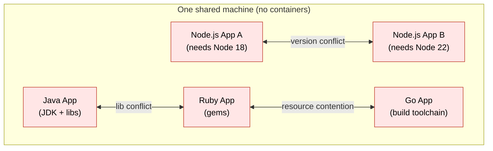

### 1.2.3 The "throw it over the wall" cycle

Traditionally this also created an **organizational** problem (the old, pre-DevOps world):

1. **Developers** write scripts to deploy the app.
2. They **"throw it over the wall"** to the **Operations** team.
3. Ops says: *"this doesn't work on the machines we've configured — adjust the script (or let's adjust the config)."*
4. This loop repeats for **days or even weeks** until the install finally works and the app deploys.

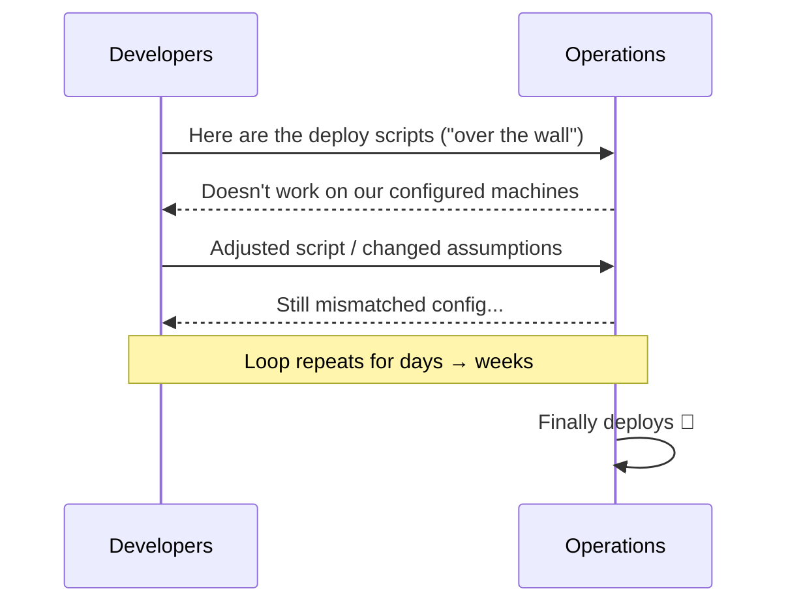

> **Book context — why this matters at scale.** In *Learn Docker in a Month of Lunches*, the author describes a real project where, before Docker, handovers took **two weeks**: new developers had to install specific versions of half a dozen tools, and administrators had to install half a dozen *completely different* tools. After moving to Docker, the entire handover was **a single README file** — the only requirement to build, deploy, and manage the app in *any* environment was Docker itself. Developers grabbed the source and ran **one command**; administrators used the **same tools** to manage production. That centralization of the toolchain is the core operational win.

---

## 1.3 How containers solve these problems

Containers **encapsulate all the dependencies and configuration** needed to run an application — in *any* language. From the outside they all present a **clean, stable, unified interface**: they look the same and are run the same way, regardless of what's inside.

### 1.3.1 The six core benefits

| # | Benefit | What it means |
|---|---------|---------------|
| 1 | **Simplified setup** | No more hunting for mutually compatible versions. The container *encapsulates* every dependency the app needs. |
| 2 | **Portability** | Take a container from one machine with a container runtime and run it on another machine with a runtime — with **virtually zero** extra configuration. Running an image from a registry is exactly this: pull and run, no prior setup. |
| 3 | **Consistent environments** | All dependencies are well-defined inside an **image**. No matter how many containers you create from that image, they look **exactly the same**, because they follow the same set of instructions. |
| 4 | **Isolation** | Fine control over which **networks** containers run in, and strong separation between the container's network space and the host machine. |
| 5 | **Efficiency** | Containers **don't require a guest OS**, so you get efficiency gains over VMs — you can run **more containers on the same hardware** without consuming as much. |
| 6 | **Better resource control** | Set fine-grained **CPU and memory limits**. A container that uses too much memory can be **killed** before it threatens other apps; one using too much CPU can be **throttled**. |
| 7 | **Easily scalable** | Because every container is created from the same **stable image**, **horizontal scaling** (running many identical copies) is straightforward. |

> **Mnemonic:** *"Same image in → same container out."* Consistency is the property that makes most of the other benefits possible.

### 1.3.2 Dev and Ops tasks with containers

With containers, the dev/ops handoff collapses dramatically. (The split below is conceptual — in many modern **DevOps** teams, developers and operators sit together and deploy *together*; containers are precisely what makes that practical.)

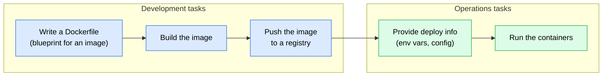

The key point: on the **operations side** you mostly just supply **configuration** (environment variables, deploy info). You **don't install app-specific software** on the host machines, because the container **already encapsulates everything it needs**. This is a big reason containers became so ubiquitous.

### 1.3.3 Where containers fit in the real world (from the book)

The book frames five scenarios where organizations succeed with Docker. They're worth knowing because they map to real work you may be doing:

1. **Migrating apps to the cloud.** The old choices were **IaaS** (a VM per component — portable across clouds but high running cost) or **PaaS** (managed services — cheaper to run but a hard migration and lock-in to one cloud). Docker offers a **third option without the compromise**: move each part of the app into a container and run the whole thing on a managed container service (e.g. AKS, Amazon ECS) or your own cluster — you get the **cost benefits of PaaS with the portability of IaaS**.
2. **Modernizing legacy apps.** Monoliths run fine in a single container. Because containers communicate over their **own virtual network**, you can then peel features out into their own containers one at a time — evolving a monolith into a distributed app **in stages**, without an 18-month rewrite.
3. **Building new cloud-native apps.** The CNCF describes cloud-native as deploying applications **as microservices, packaging each part into its own container, and dynamically orchestrating those containers** to optimize resource use. Each component owns its data and exposes an API; the whole app is defined in a Docker Compose file.
4. **Technical innovation (serverless and more).** Under the hood, cloud **serverless** platforms use Docker to package and run function code. Other innovations — machine learning, IoT, blockchain — benefit from Docker's consistent packaging (TensorFlow and Hyperledger publish to Docker Hub; Docker partnered with Arm for Edge/IoT).
5. **Digital transformation with DevOps.** When the whole team works with **Dockerfiles** and **Compose files**, developers and operators finally speak the **same language with the same tools** — the technical underpinning that makes a DevOps culture change stick.

---

## 1.4 What *is* a container, really?

### 1.4.1 The "box" mental model

A Docker container is the same idea as a physical shipping container: **think of a box with an application inside it.** Inside that box, the application appears to have a whole computer to itself:

- its own **machine name (hostname)**,
- its own **IP address**,
- its own **disk / filesystem** (Windows containers also get their own Windows Registry).

Those resources are all **virtual** — the hostname, IP address, and filesystem are **created and managed by Docker**. They're logical objects joined together to form the environment the app runs in. That environment *is* the "box."

The application inside the box **can't see anything outside the box.** But the box runs on a real computer, and that computer can run **many** other boxes at the same time. Each box has its own separate, Docker-managed environment, **but they all share the same CPU, memory, and operating system** of the host.


*Figure 1.A — Two containers (`container1`, `container2`) on one host. Each app gets its own hostname, IP address, and disk, but they share the host's Docker layer, operating system, CPU, and memory. (From the book, fig. 2.3.)*

The same idea drawn as a Mermaid diagram:

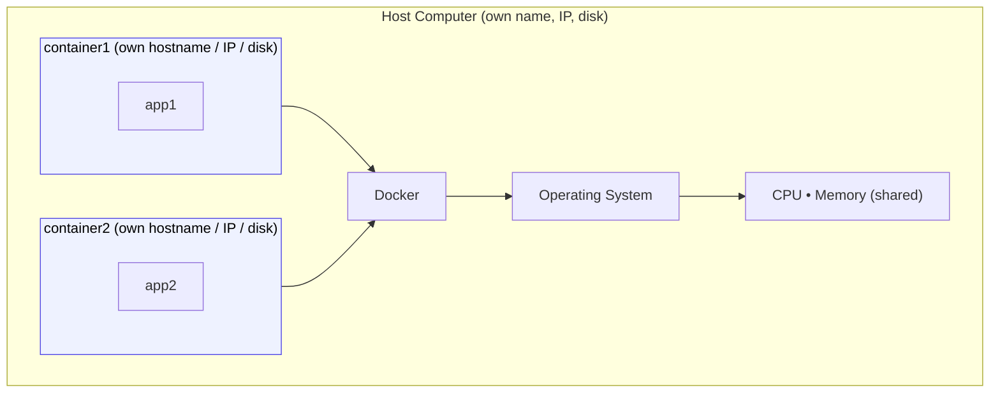

### 1.4.2 The two conflicting problems: isolation vs density

Why is the box model so important? Because it resolves **two goals that normally fight each other**:

- **Density** — running as **many** applications as possible on a computer, to fully use its processor and memory.
- **Isolation** — keeping apps **separated** so they don't interfere (different Java/.NET versions, incompatible libraries, or one app starving the others of CPU).

Historically you could have one or the other, not both:

- Pursue **density** by piling apps onto one machine → they collide (version/library conflicts, resource starvation).
- Pursue **isolation** with **virtual machines** → each VM carries a full guest OS, so you can only fit a few per host, killing density.

**Containers give you both.** Each container shares the host OS (so it's extremely lightweight and you get density), while each app sits in its own box (so you get isolation). The book notes you can typically run **five to ten times as many** containers as VMs on the same hardware. That combination — density *and* isolation — is Docker's signature efficiency win.

---

## 1.5 Containers vs Virtual Machines

Containers and VMs both give you "a box to run your app in," but they're built differently. Crucially, **they are not mutually exclusive** — many systems use VMs for some parts and containers for others.

### 1.5.1 How virtualization is structured

Virtualization stacks up like this, bottom to top:

1. **Hardware** — CPU, memory (a physical computer / datacenter).
2. **Host operating system** — the base OS.
3. **Hypervisor** — the key piece of software/hardware that lets multiple VMs run side by side. It **translates** instructions from the VMs into instructions the host OS understands, **allocates resources**, and **enforces isolation** between VMs.
4. **Virtual machines** — each VM has **its own guest operating system**.

So with virtualization there are **two operating systems**: the **host OS** *and* a **guest OS inside each VM**. (If you've launched an EC2 instance on AWS from an AMI, that AMI ships with its own base OS — usually a Linux distribution.)


*Figure 1.B — Two VMs (`vm1`, `vm2`). Each contains a full guest operating system on top of a hypervisor and the host OS. That extra OS layer is what makes VMs heavy. (From the book, fig. 2.4.)*

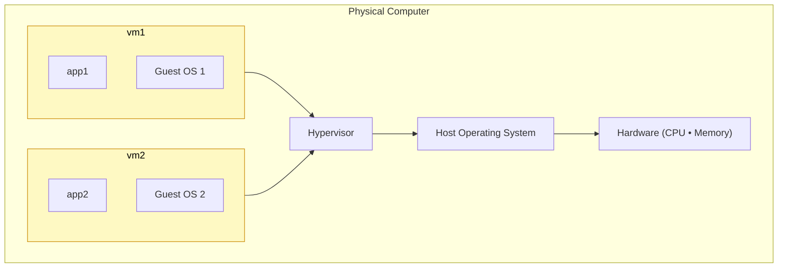

### 1.5.2 How containers are structured

The bottom of the stack is **the same** — hardware and a host OS. The difference is at the top:

- Instead of a **hypervisor**, there's a **container engine** that manages the containers.
- Instead of packaging an **entire OS** inside each unit, a container packages **just the code and its dependencies**. There is **no extra OS running inside the container** — which is exactly why containers are **faster and leaner**.

The trade-off: containers run *inside* the container engine, directly on top of the host OS, so **virtualization provides stronger isolation** than containers do. However, containers still let you **configure many isolation rules**, so isolation isn't something you give up entirely.

### 1.5.3 Side-by-side feature comparison

| Feature | Virtual Machines | Containers |
|---------|------------------|------------|
| **Isolation** | **Stronger** — each VM has its own OS, fully isolated from the others. | **Process-level** — containers share the host OS **kernel** but run isolated from each other, managed by the container engine. |
| **Size / overhead** | **Larger footprint** — must carry an OS and virtual hardware. | **Lightweight** — minimal overhead; shares the host kernel. |
| **Portability** | **Less portable** — can be tied to a specific hypervisor or OS configuration. | **Fully portable** — should be platform-agnostic and look identical from the outside on any machine. (If a container isn't platform-agnostic, it isn't well designed.) |
| **Startup** | Slower (a whole OS boots). | Fast (no guest OS to boot). |
| **Density on same hardware** | Lower. | Higher — typically 5–10× more. |

### 1.5.4 When to use each

**Choose virtual machines when:**

- You need **stronger isolation** between environments.
- You're dealing with **legacy applications** that can't easily be containerized.
- You want to **replicate a complete system environment** for testing or development.

**Choose containers when:**

- You're building **cloud-native** applications.
- You're leveraging **microservices**.
- You need to **scale quickly and efficiently**.
- **Portability across environments** is a top priority.

> **Takeaway:** These technologies aren't rivals to pick between once and forever. For some parts of a system VMs are the right call; for others, containers. Know the strengths and weaknesses of each so you can make the right decision per component.

---

## 1.6 The Docker build, share, run workflow

Before looking at components, internalize the core Docker loop the book calls **build, share, run**:

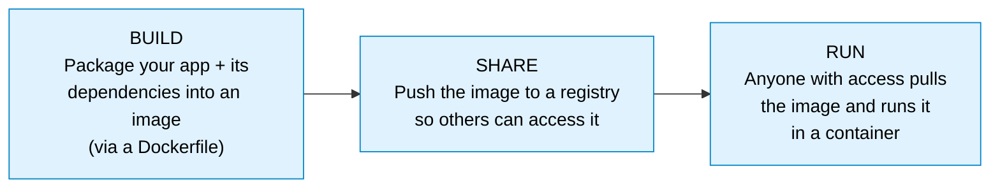

This workflow is **identical no matter how complex the app is.** Whether it's a one-line script or a multi-component Java application with config files and libraries, the steps are the same — and because images run on **any** machine that supports Docker, the app is completely **portable**. That uniformity is why so many projects (Elasticsearch, SQL Server, the Ghost blog engine, and many more) now ship as Docker images you start with a single `docker container run`.

---

## 1.7 The components of a Docker system

Let's answer: **what are the different parts in a Docker-based system?**

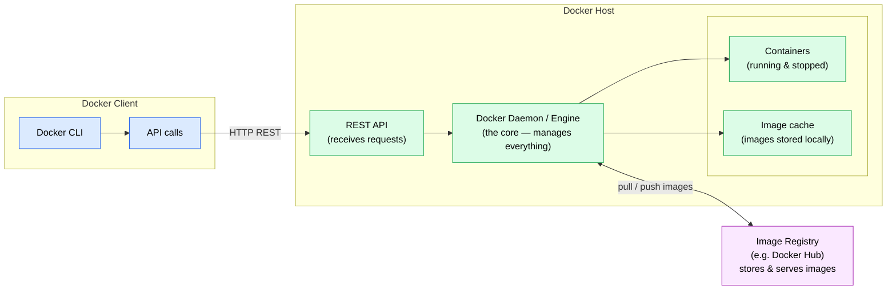

*Figure 1.C — The parts of a Docker-based system: a **Docker Client** that issues commands, a **Docker Host** that does the work (REST API → daemon → containers + image cache), and an external **Image Registry** that stores images.*

The book draws the same architecture from the host's point of view, emphasizing that **the only way to interact with the engine is through the API**, and the CLI is just one client of that API:


*Figure 1.D — The Docker CLI sends commands to the **Docker API** (a standard HTTP REST API). The **Docker Engine** runs in the background, manages containers, and reuses/downloads images via the local **image cache**. (From the book, fig. 2.8.)*

### 1.7.1 Docker Client vs Docker Host

This distinction matters a lot:

- The **Docker Client** is usually the **Docker CLI** (you can also issue raw API calls). It **issues commands** to the Docker Host.
- The **Docker Host** is **where the action happens**. It exposes a **REST API** to receive requests, runs the **Docker daemon**, and holds the **containers** and the **image cache**.

When you install Docker Desktop (or Docker on Linux), **both the CLI and the Host run locally on your machine** — but they are still **two different parts** of the system. The Host could just as easily run **somewhere else** (in the cloud or on a remote machine), with your local CLI **connecting to that remote Host**. This is exactly how you manage containers across build servers, test, and production: point your CLI at a remote API. Because the Docker API is the **same on every operating system**, you can use the CLI on a Windows laptop to manage containers on a Raspberry Pi or a Linux server in the cloud.

> The CLI is not the only API client. Because the Docker API has a **published specification**, graphical dashboards exist too — e.g. **Universal Control Plane (UCP)** (commercial) and **Portainer** (open source). Both run as containers themselves.

### 1.7.2 The Docker daemon / engine

The **Docker daemon** is the **core** of the Host — the Docker **Engine** — and is responsible for **managing all the containers** (both running and stopped). Per the book, the Engine:

- looks after the **local image cache**, downloading images when needed and **reusing** them when already present;
- works with the **operating system** to create containers, virtual networks, and other Docker resources;
- runs as a **background process that is always running** (like a Linux daemon or a Windows service).

The Engine exposes everything through the **Docker API** — a standard HTTP-based REST API. By default the API is reachable only from the **local computer**, but you can configure it to be reachable from other machines on your network.

### 1.7.3 The image registry

Images have to come from somewhere — most often an **image registry**. The most common is **Docker Hub**.

- A registry is a place to **store images** and make them **available to download** so containers can be created from them.
- Docker Hub is the largest/most famous registry, but **not the only one** — there are both **public and private** registries.
- You'll also hear the term **container registry**. For our purposes, **"image registry" and "container registry" are synonyms** — both just mean "the place where images are stored and downloaded from." (Strictly speaking, a *container* is created and runs on the Host, while the registry stores *images* — but don't get hung up on the terminology.)

### 1.7.4 What's under the hood (containerd & OCI)

You don't need the low-level internals to use Docker, but two facts are worth knowing (from the book):

- The Docker Engine uses a component called **containerd** to actually manage containers, and containerd in turn uses **operating-system features** to create the virtual environment that *is* the container.
- **containerd** is an open-source component overseen by the **Cloud Native Computing Foundation (CNCF)**, and the specification for running containers is open and public — the **Open Container Initiative (OCI)**. This is why investing in containers doesn't lock you into a single vendor: Docker is the most popular and easiest container platform, but it's not the only one.

---

## 1.8 How the components interact (common scenarios)

### 1.8.1 Scenario A — running a container from an image

What happens when you run `docker run <image>`:

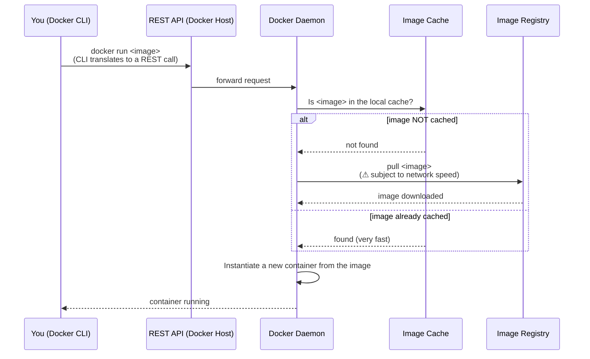

Step by step:

1. You enter `docker run` plus the image name in the **CLI**.
2. The CLI **translates** this into a **REST API call** sent to the Docker Host (you never see this happen).
3. The Host checks the **local image cache**: *is this image already here?*
4. **If not cached**, Docker reaches out to the **image registry** and **downloads (pulls)** it. This step is **subject to network constraints** — a slow network or a large image makes it slower. **If already cached**, this is **very fast**.
5. The Host **instantiates a new container** from the image.

> **Mental model (OOP analogy):** an **image is a blueprint** and a **container is an instance** of it. If you know object-oriented programming, the **image is like a class definition** and each **container is an object/instance** of that class. One image → many identical containers.

### 1.8.2 Scenario B — building and pushing an image

Building an image and publishing it takes **two commands** — `docker build` then `docker push`:

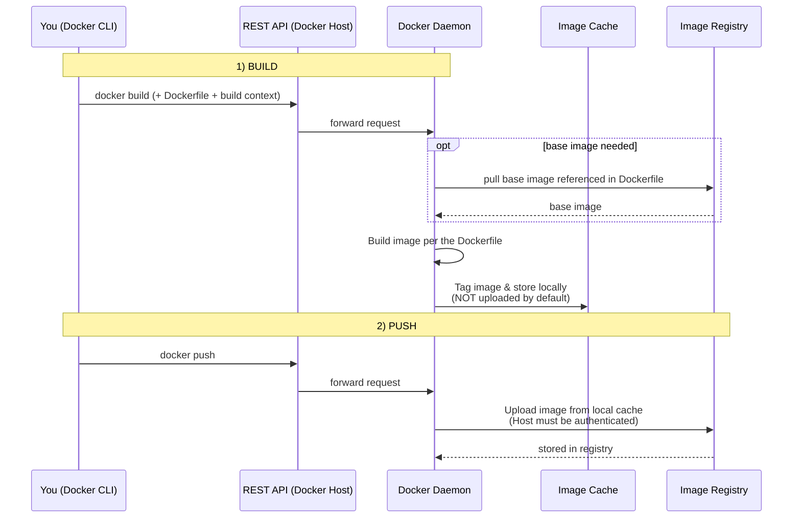

Step by step:

1. **`docker build`** — you issue the command (with the right configuration). The CLI turns it into a REST call and sends it — **along with the Dockerfile and the build context** — to the Host.
2. The **daemon builds the image** according to the **Dockerfile**. During the build it may need to **reach out to the registry to download any base images** the Dockerfile references.
3. Once built, the image is **tagged** (per the options you passed) and **stored locally**. **It is NOT uploaded to the registry by default.**
4. **`docker push`** — a second CLI command (again translated to a REST call) that tells the Host: *upload this image from the local cache to the registry.*

> **Authentication rule of thumb:**
> - To **push/publish** to a registry, the Host **must be authenticated** — always.
> - To **pull** from a **public** registry (e.g. Docker Hub public images), **no authentication needed**.
> - To **pull** from a **private** registry, the Host **must be authenticated**.

---

## 1.9 First commands you'll actually run (from the book)

This section enriches the conceptual overview with the very first hands-on commands from the book, so the abstractions above become concrete. (Output is trimmed; yours will differ slightly because IDs and versions change.)

### 1.9.1 Hello World

```bash
docker container run diamol/ch02-hello-diamol
```

What happens, mapping directly onto Scenario A:

- The first time, Docker can't find the image locally (`unable to find image locally`), so it **pulls** it from Docker Hub, then **starts a container** from it.
- The container prints a greeting and details about the computer it *thinks* it's on — a **machine name** (e.g. `e5943557213b`), an **OS** (e.g. `Linux 4.9.125-linuxkit x86_64`), and a **network address** (e.g. `172.17.0.2`).
- Run the **exact same command again** and Docker **skips the download** (image is cached) and goes straight to running — but the **machine name and IP differ**, because it's a brand-new container. This is the build/share/run idea in miniature: the image is `diamol/ch02-hello-diamol` (the prefix `diamol` = *Docker In A Month Of Lunches*).

### 1.9.2 Connecting to a container like a remote machine

```bash
docker container run --interactive --tty diamol/base
```

- `--interactive` sets up a connection to the container; `--tty` connects you to a **terminal session inside** it. You land at a command prompt *inside* the container — just like SSH-ing into a remote Linux box (or RDP into Windows).
- Inside, commands like `hostname` and `date` show the container's own environment. The container shares your computer's OS, which is why you get a Linux shell on Linux and a Windows command line on Windows.

### 1.9.3 Hosting a website (detached + published ports)

```bash
docker container run --detach --publish 8088:80 diamol/ch02-hello-diamol-web
```

This is the **main** Docker use case — long-running server apps (websites, APIs, databases). Two new flags:

- `--detach` — start the container in the **background** (like a Linux daemon / Windows service) and return you to the prompt; it just prints the container ID.
- `--publish 8088:80` — **publish a port**: traffic hitting the **host on port 8088** is forwarded **into the container on port 80**.

Why publishing is needed: containers **aren't exposed to the outside world by default.** Each has its own IP, but that IP belongs to a **virtual network Docker manages** — it's not on your physical network. When you install Docker, it injects itself into your computer's networking layer, so it can **intercept** traffic on a host port and **route it into** the container.


*Figure 1.E — Docker listens on the host's physical network (e.g. `192.168.2.150`) on the published port and forwards into the container, which has its own Docker-managed virtual IP (e.g. `172.0.5.1`). Other computers can't reach the container's IP directly, but they can reach it through the published port. (From the book, fig. 2.6.)*

After this, browsing to `http://localhost:8088` returns a page **served from the container**.

### 1.9.4 The everyday container commands

These are the commands you'll use constantly — and a major point of the book's exercises is that **to Docker, all containers look the same**. Docker adds a **consistent management layer** over every app, so a 10-year-old Java app, a 15-year-old .NET app, and a brand-new Go app on a Raspberry Pi are all managed with the *same* commands:

| Command | What it does |
|---------|--------------|
| `docker container run` | Start an app in a new container. |
| `docker container ls` | List **running** containers. Add `--all` to include **stopped/exited** ones. |
| `docker container top <id>` | List the processes running inside a container. |
| `docker container logs <id>` | Show log entries the container has collected (from the app's output). |
| `docker container inspect <id>` | Show all low-level details (virtual filesystem paths, command, network) as JSON. |
| `docker container stats <id>` | Live view of CPU, memory, network, and disk usage. |
| `docker container rm <id>` | Remove a container (add `--force` to remove a running one). |

> **Two facts that surprise beginners:**
> 1. A container runs **only while the application inside it is running.** When the app process ends, the container goes to the **`Exited`** state. Exited containers use **no CPU or memory**.
> 2. Exited containers **don't disappear** — they still exist (and still take disk space for their filesystem), so you can restart them, read their logs, or copy files out. Docker won't remove them unless you explicitly tell it to.
>
> Handy cleanup (use with caution — no confirmation prompt):
> ```bash
> docker container rm --force $(docker container ls --all --quiet)
> ```
> The `$(...)` runs the inner command (list all container IDs) and feeds the result to the outer command; it works on Linux, Mac, and Windows PowerShell.

---

## 1.10 Key terms glossary

| Term | Definition |
|------|------------|
| **Container** | A lightweight "box" running one application with its own virtual hostname, IP, and filesystem, sharing the host OS kernel, CPU, and memory. |
| **Image** | The packaged, read-only **blueprint** of a container: the app's code plus all dependencies and instructions to start it. One image → many identical containers. |
| **Dockerfile** | The text file of instructions that serves as the **blueprint for building an image**. |
| **Build context** | The set of files sent to the Docker Host along with the Dockerfile during `docker build`. |
| **Docker Client / CLI** | The tool that issues commands; translates them into REST API calls to the Host. |
| **Docker Host** | Where the work happens: exposes the REST API, runs the daemon, holds containers and the image cache. Can be local or remote. |
| **Docker daemon / Engine** | The always-on background core that manages containers, networks, and the image cache. |
| **Docker API** | The standard HTTP REST API; the only way to interact with the Engine. |
| **Image cache** | Local store of downloaded/built images on the Host, so they can be reused. |
| **Image / container registry** | External store for images (e.g. Docker Hub); push to publish, pull to download. The two terms are used interchangeably. |
| **Pull / Push** | Download an image from a registry / upload an image to a registry. |
| **Hypervisor** | The VM equivalent of a container engine: runs VMs side by side, translates guest-OS instructions, allocates resources, isolates VMs. |
| **Guest OS** | The full operating system inside each VM — the heavyweight layer containers don't need. |
| **Publishing a port** | Telling Docker to forward traffic from a host port into a container port (`--publish host:container`). |
| **Detached container** | A container started in the background (`--detach`). |
| **containerd** | The CNCF-overseen component the Docker Engine uses to actually manage containers. |
| **OCI (Open Container Initiative)** | The open, public specification for running containers — why containers aren't vendor-locked. |

---

*Source for enrichment, figures, and example commands: Elton Stoneman, "Learn Docker in a Month of Lunches" (Manning, 2020), chapters 1–2. Figures 1.A, 1.B, 1.D, 1.E are extracted from the book (figs. 2.3, 2.4, 2.8, 2.6 respectively). Conceptual content follows the video transcript, enriched with the book.*

---

# 2. Running Containers with Docker

## 2.1 What this topic covers

This topic is hands-on: how to actually **run and manage containers** with the Docker CLI. By the end you should understand: what happens when you run a container, the **container lifecycle** (the states a container moves through and the commands that transition between them), the **essential CLI commands** for managing containers and images, the difference between **short-lived and long-lived** containers, how to **read logs**, **run commands/shells inside** a container, **build a custom image** from a simple Dockerfile, and how to **get help** from within the CLI itself.

> **Mindset for this topic:** Don't try to memorize every command. The goal is a working mental model — recognize what each command does and how the pieces fit. You'll repeat all of these many times.

---

## 2.2 Running your first container (`docker run`)

The flow starts at **Docker Hub**, where most images you'll use live. A good first image is **nginx** — a web server — because you get instant visual feedback in a browser.

On Docker Hub, searching for `nginx` and filtering by category shows three trust tiers worth recognizing: **Docker Official Image**, **Verified Publisher**, and **Sponsored OSS**. The nginx image carries the **Docker Official Image** badge.

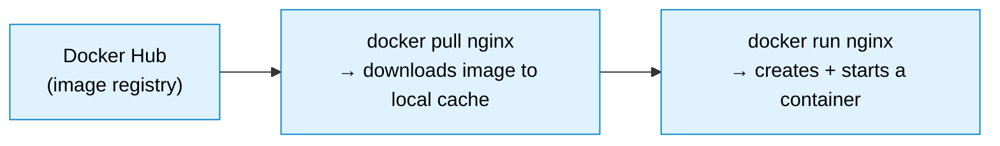

**Pull, then run:**

```bash
docker pull nginx          # download the image (defaults to the :latest tag)
docker run nginx           # create + start a container from it
```

Key observations from running it:

- `docker run nginx` (no flags) **attaches to the container's logs** and the terminal **stays busy** — nginx is a **long-running** process (a web server waiting for connections), so the shell doesn't return. Press **Ctrl+C** to stop it and get your terminal back.
- `docker ps` (in another terminal) shows the running container.

### 2.2.1 Detached mode (`-d`) and flag ordering

To run in the background and free up your terminal, use **detached mode** with `-d`:

<details>
<summary><code>&gt;_</code> `-d` returns the prompt immediately and `docker ps` confirms the container is `Up` — with a random name (`vibrant_morse`) since we didn't set one.</summary>

```bash
docker run -d nginx        # prints the container's long hash, returns immediately
docker ps                  # shows the running container (+ a random friendly name)
```
```text
CONTAINER ID   IMAGE   COMMAND                  STATUS         PORTS     NAMES
9f3c1a2b4d5e   nginx   "/docker-entrypoint.…"   Up 5 seconds   80/tcp    vibrant_morse
```

</details>

> **Critical rule — flags go BEFORE the image name.** In `docker run [FLAGS] IMAGE [args]`, anything **after** the image name is interpreted differently (as the command/arguments for the container), so flags like `-d`, `-p`, and `--name` must come **before** the image.

Docker auto-assigns a **random friendly name** (e.g. `vibrant_morse`) to each container. Names matter because we refer to containers by name far more naturally than by hash — `docker kill web_server` reads better than quoting a long ID to a teammate, and names work in any command that takes a container ID.

### 2.2.2 Publishing ports (`-p`) and naming (`--name`)

To reach nginx over HTTP, **map a host port to the container port**, and give the container a memorable name:

```bash
docker run -d -p 8080:80 --name web_server nginx
```

- `-p 8080:80` maps **host port 8080 → container port 80** over TCP. An HTTP request to `localhost:8080` is forwarded into the container's port 80.
- `--name web_server` sets a fixed name instead of the random one.

Verify it's serving:

<details>
<summary><code>&gt;_</code> the `-p 8080:80` mapping forwards `localhost:8080` into the container, so `curl` gets nginx's welcome page back — proof the published port works.</summary>

```bash
curl http://localhost:8080      # returns nginx's HTML
# or open http://localhost:8080 in a browser → nginx welcome page
```
```text
<title>Welcome to nginx!</title>
```

</details>

> **Book tie-in (Topic 1, §1.9.3):** this is exactly the `--detach`/`--publish` behavior from the book — containers aren't exposed to the outside world by default; publishing a port tells Docker to listen on the host port and route traffic into the container's virtual network.

### 2.2.3 Stopping a container — `stop` vs `kill`

```bash
docker stop web_server      # graceful: sends a stop signal, allows wrap-up
docker kill web_server      # forceful: sends SIGKILL immediately
```

| Command | Signal | Behavior | Risk |
|---------|--------|----------|------|
| `docker stop` | graceful stop signal (then SIGKILL after a grace period) | Gives the container time to finish work and persist in-memory data to disk. If it doesn't exit within the timeout, Docker force-terminates it. | Low — **preferred** |
| `docker kill` | SIGKILL | Stops immediately, no wrap-up time. | May **lose in-memory data** that wasn't persisted |

> **Rule of thumb:** prefer `docker stop` (graceful). Use `docker kill` only when you specifically need an immediate hard stop. After stopping, `docker ps` returns empty (no running containers).

---

## 2.3 The container lifecycle

Every container moves through a small set of states. Knowing them — and the command that triggers each transition — is the backbone of working with Docker.


*Figure 2.A — The full container lifecycle. `docker run` = `docker create` + `docker start`. While **running**, you can `docker logs / inspect / exec`. A container reaches **stopped** via `docker pause`→`unpause` (keeps memory), `docker stop` (graceful, clears memory), `docker kill` (SIGKILL), or PID 1 exiting (code 0 = no error, non-zero = error) — assuming no restart policy. A **stopped** container still exists (visible with `docker ps -a`; `logs`/`inspect` still work) and can be restarted with `docker start` or deleted with `docker rm` to reach **removed**.*

Walking through the diagram:

- **`docker run` = `docker create` + `docker start`.** Behind the scenes, `run` first **creates** a container from the image, then **starts** it. You can also use the two halves independently: `docker create` makes a container without starting it; `docker start <id>` starts an already-created (or stopped) container.
- **Image + tag.** `docker run nginx` is really `docker run nginx:latest` — if you omit the tag, it **defaults to `latest`**.
- **Running state.** While running, you can interact: `docker logs`, `docker inspect`, `docker exec`.
- **Pause / unpause.** `docker pause <id>` **freezes** the container but **keeps its memory contents** (it's not truly stopped). `docker unpause <id>` returns it to running.
- **Stop / kill.** `docker stop` clears memory after a graceful wrap-up; `docker kill` sends **SIGKILL** (risking in-memory data loss).
- **Natural exit of PID 1.** A container runs only as long as its **main process (PID 1)** runs. That process can exit on its own with an **exit code**: **`0` = success** (the job/script finished cleanly — Docker considers this "did its job and exited"), **non-zero = error**. Exit codes matter for **restart policies** (e.g. "restart the container if it exits with an error") — covered later. Here we assume **no restart policy**.
- **Stopped state.** Stopped/killed/exited containers **still exist** — invisible to `docker ps` but visible to **`docker ps -a`**. You can still read their logs and inspect them; their filesystem still takes disk space.
- **Restart.** `docker start <id>` brings a stopped container **back to running**.
- **Remove.** `docker rm <id>` **completely deletes** the container and its contents, freeing resources — after this you can no longer see its logs or inspect it.
- **Initial/download phase.** Before any of this, if the image isn't present locally, Docker **downloads it** from the registry first.

> **The one thing to remember:** containers live in three big phases — **Running → Stopped → Removed** (plus the initial download and the optional Paused detour). Keep this map in mind and container management becomes intuitive.

---

## 2.4 Managing containers and images with the CLI

### 2.4.1 Listing images and containers

```bash
docker images       # list images stored LOCALLY (not Docker Hub) — pulled via pull or run
docker ps           # list RUNNING containers only
docker ps -a        # list ALL containers (running + stopped)
```

### 2.4.2 Short-lived vs long-lived containers

The image's **main process** determines whether a container stays up:

<details>
<summary><code>&gt;_</code> ubuntu's `bash` has nothing to keep it alive, so it exits `(0)` at once — a short-lived container — whereas nginx stays `Up`.</summary>

```bash
docker pull ubuntu          # defaults to ubuntu:latest
docker run ubuntu           # starts, runs default command (bash), immediately EXITS (code 0)
docker ps -a                # see its final state
```
```text
CONTAINER ID   IMAGE     COMMAND       STATUS                     NAMES
a1b2c3d4e5f6   ubuntu    "/bin/bash"   Exited (0) 3 seconds ago   keen_banzai
```

</details>

- **Ubuntu** exits almost instantly: its default command (`bash`) has nothing to keep it alive with no terminal attached, so PID 1 finishes and the container exits with **code 0** — a **short-lived** container. `docker ps -a` shows it as `Exited (0)`.
- **nginx** stays up: it's a web server waiting for connections — a **long-lived** container.

> `docker run` **auto-pulls** the image if it's not found locally. If the image is already cached (and the `latest` tag hasn't changed upstream), startup is near-instant because Docker reuses the cached image.

### 2.4.3 Every `run` creates a NEW container

Running the same `docker run nginx` command three times creates **three separate containers** from the same image — because `run` is always `create` + `start`. To reuse an **existing** stopped container instead of making a new one, start it by ID/name:

```bash
docker start <container_id>     # reuse an existing (stopped) container
```

`docker start` assumes the container **already exists**. Pointing it at a non-existent ID returns a "no such container" error.

### 2.4.4 Stopping and removing

```bash
docker stop <id>                # graceful stop (needs ID/name; you can pass several)
docker rm <id>                  # remove a stopped container, frees resources
docker rm <id1> <id2>           # remove multiple at once
docker image rm <image_id>      # remove a local image
```

> Why clean up? Every container you run consumes disk; many running containers also consume CPU and RAM. Removing unneeded containers is good hygiene. (Removing an image means a future `run` must re-download it from the registry if the tag/hash is gone locally.)

### 2.4.5 Filtering `docker ps`

When you have many containers, filter instead of eyeballing or `grep`-ing:

<details>
<summary><code>&gt;_</code> `--filter` narrows the list to just the matching container — cleaner and more expressive than piping to `grep`.</summary>

```bash
docker ps --filter "name=web_server"     # only containers whose name matches
docker ps -a | grep web_server           # the grep alternative (less expressive)
```
```text
CONTAINER ID   IMAGE   STATUS         NAMES
e53085ff0cc4   nginx   Up 2 minutes   web_server
```

</details>

### 2.4.6 Bulk operations with `-q` (quiet)

`docker ps -q` prints **only container IDs** — perfect for feeding into other commands via a sub-shell:

<details>
<summary><code>&gt;_</code> `-q` prints only IDs, which the `$(...)` sub-shell feeds straight into `stop`/`rm` to act on many containers at once. Use with care — no confirmation prompt.</summary>

```bash
docker ps -q                       # just the IDs, one per line
docker stop $(docker ps -q)        # stop ALL running containers
docker rm  $(docker ps -aq)        # remove ALL containers (running + stopped need -a)
```
```text
9f3c1a2b4d5e
e53085ff0cc4
```

</details>

---

## 2.5 Reading logs (`docker logs`)

To see the output of a running container:

<details>
<summary><code>&gt;_</code> `docker logs` shows the container's output; with `-f` each new `curl`/browser request appears as a fresh `GET /` line in real time.</summary>

```bash
docker logs web_server          # print logs collected so far (ID or name works)
docker logs -f web_server       # follow/stream logs live (like tail -f)
```
```text
... start worker processes
172.17.0.1 - - [07/Jun/2026:10:22:31] "GET / HTTP/1.1" 200 615
```

</details>

With `-f` (follow), the command waits and prints new entries as they arrive. For nginx, each HTTP request you make (e.g. `curl http://localhost`) appears as a new `GET /` log line in real time.

> In plain Docker, `docker logs` gives you everything you need. With orchestrators (Kubernetes) or monitoring tools, you'd use those tools' own logging constructs instead.

---

## 2.6 Running commands inside a container (`docker exec`)

`docker exec` runs a command **inside** an already-running container. The most common use is getting an interactive shell:

```bash
docker exec -it web_server sh           # interactive shell (-i interactive, -t TTY)
docker exec -it web_server /bin/bash    # bash, if the image has it
```

Inside the shell you're typically **root**, and the prompt's hostname matches the container ID. You can run normal shell commands:

<details>
<summary><code>&gt;_</code> `exec -it ... sh` drops you inside the running container as root; you can browse its filesystem and confirm nginx serves `index.html` from `/usr/share/nginx/html`.</summary>

```bash
echo "Hello World"
ls
# nginx serves its files from here:
ls /usr/share/nginx/html
cat /usr/share/nginx/html/index.html    # same HTML returned at localhost
```
```text
# hostname → e53085ff0cc4   (matches the container ID)
# ls /usr/share/nginx/html → index.html  50x.html
```

</details>

> `-it` is two flags: **`-i`** keeps STDIN open (interactive) and **`-t`** allocates a pseudo-TTY (terminal). Together they give you a usable interactive session — the same combo as `docker run -it` in Topic 1 (§1.9.2).

---

## 2.7 Building a custom image (`docker build`)

`docker build` creates your own image from a **Dockerfile** — a recipe describing how to build the image. A minimal example:

```dockerfile
# Dockerfile
FROM ubuntu:latest
CMD echo "hello from my first Docker image"
```

- **`FROM ubuntu:latest`** — the **starting point**: begin from a clean Ubuntu image.
- **`CMD echo ...`** — the command the container runs when started.

> The file **must be named `Dockerfile`** so that `docker build` picks it up automatically.

Build and run it:

<details>
<summary><code>&gt;_</code> the build produces an untagged image (`<none>`), so you run it by image ID — and it prints the message from the `CMD` instruction.</summary>

```bash
docker build .                 # "." is the build CONTEXT (current directory)
docker images                  # the new image appears — but with NO repository/tag
docker run <image_id>          # run it by image ID → prints the echo message
```
```text
# build  → writing image sha256:8d2c...  done
# images → REPOSITORY   TAG       IMAGE ID       SIZE
#          <none>       <none>    8d2c1f3a9b4e   78.1MB
# run    → hello from my first Docker image
```

</details>

Because we didn't tag it, the image shows `<none>` for repository and tag, so you run it by **image ID**. (Tagging is covered later.) The power here: a Dockerfile can contain as many instructions and customizations as you need.

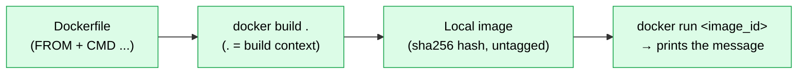

---

## 2.8 Getting help from the CLI (`--help`)

`--help` is one of the most useful — and most overlooked — parts of the Docker CLI. It surfaces commands, flags, syntax, and aliases without searching the web.

<details>
<summary><code>&gt;_</code> `--help` prints the exact syntax (note `[OPTIONS]` come before `IMAGE`) plus every flag and its alias — faster and more reliable than guessing or searching the web.</summary>

```bash
docker --help                  # overview of common commands (run, exec, ps, build, pull, images, ...)
docker run --help              # all flags for `run`, plus syntax and aliases
docker images --help           # help for any specific command
```
```text
Usage:  docker run [OPTIONS] IMAGE [COMMAND] [ARG...]
  -d, --detach            Run container in background and print container ID
  -e, --env list          Set environment variables
  -p, --publish list      Publish a container's port(s) to the host
```

</details>

What `--help` shows you:

- The **list of common/most-used commands** (and a fuller command list further down).
- For a specific command, the **full syntax** — e.g. `docker run [OPTIONS] IMAGE [COMMAND]` — reinforcing that **options come before the image**.
- Every **flag** and its **alias** (e.g. `--detach` ≡ `-d`, `--all` ≡ `-a`), and hints like `--env` for setting environment variables (explored later when building/running your own images).

> **Habit to build:** when unsure about a command or what flags exist, append `--help` first. It's faster and more authoritative than guessing.

---

## 2.9 Command reference (Topic 2)

| Command | Purpose |
|---------|---------|
| `docker pull <image>` | Download an image from a registry to the local cache. |
| `docker run [FLAGS] <image>` | Create **and** start a new container (auto-pulls if needed). |
| `docker run -d ...` | Detached mode — run in the background. |
| `docker run -p 8080:80 ...` | Publish host port 8080 → container port 80. |
| `docker run --name web ...` | Give the container a fixed name. |
| `docker create <image>` | Create a container without starting it. |
| `docker start <id>` | Start an existing (created/stopped) container. |
| `docker stop <id>` | Graceful stop (preferred). |
| `docker kill <id>` | Forceful stop (SIGKILL). |
| `docker pause` / `docker unpause <id>` | Freeze / resume a container, keeping memory. |
| `docker rm <id> [...]` | Remove stopped container(s). |
| `docker ps` / `docker ps -a` | List running / all containers. |
| `docker ps -q` / `-aq` | List container IDs only (for scripting). |
| `docker ps --filter "name=..."` | Filter the container list. |
| `docker images` | List local images. |
| `docker image rm <id>` | Remove a local image. |
| `docker logs [-f] <id>` | Show / follow container logs. |
| `docker exec -it <id> sh` | Run an interactive shell inside a container. |
| `docker build .` | Build an image from a Dockerfile in the current directory. |
| `docker <cmd> --help` | Show help, syntax, flags, and aliases. |

---

# 3. Introduction to Docker Images

## 3.1 What this topic covers

A closer look at **images** — the thing containers are built from. By the end you should understand: what a Docker image *is* and what it contains; **container registries** (their purpose, the options, and how to choose); how to **browse Docker Hub** (images and tags); how to **manage images with the CLI** and **push** your own; how **Dockerfiles** work in more depth (structure, benefits, the layered architecture, the build cache); and — crucially — the **difference between images and containers**.

---

## 3.2 What is a Docker image? (the anatomy)

Think of a Docker image as the **DNA / blueprint** of a container. Every container created from an image starts with the **exact same shape**. (Once you `exec` in and change things at runtime, that *one* container diverges — but at startup, all containers from the same image are identical.)

Formally: an image is a **self-contained, read-only template that encapsulates everything needed to run your application.** If it doesn't encapsulate everything needed, the image design should be revisited — that's the whole intent.

A typical image is built up in layers, bottom to top:

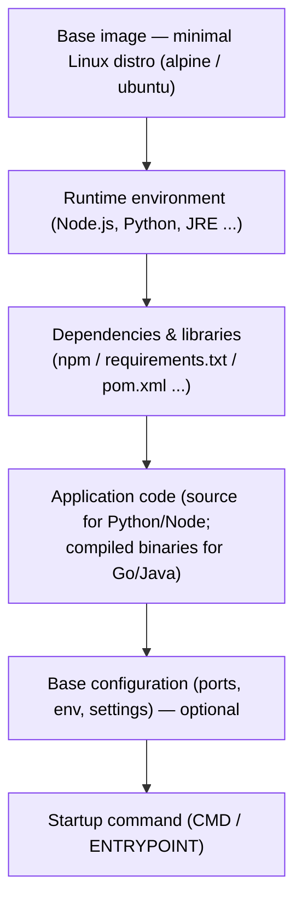

### 3.2.1 The layers inside an image

- **Base layer / base image** — usually a **minimal Linux distribution**. You'll very often see **`alpine`** (tiny) or a fuller **`ubuntu`**.
- **Runtime environment** — e.g. the Node.js, Python, or Java runtime your app needs.
- **Dependencies & libraries** — the app-specific packages: for Node it's your `npm` packages (e.g. Express vs NestJS pull different sets); for Python it's the installed versions from `requirements.txt`; for Java/Maven it's what's in `pom.xml`.
- **Application code** — the **source code** for interpreted languages (Python, Node.js), or the **compiled binaries** for compiled ones (Go, Java).
- **Base configuration (optional)** — settings you want shipped with the image. Config is trickier to bake in because it often **varies per environment**, so it's a judgment call — valid when there's a use case.
- **Startup command** — what runs when the container starts.

So an image is a **snapshot of your application and its complete runtime environment.**

### 3.2.2 Two ways to create an image (and why Dockerfile wins)

1. **Snapshot a running container.** You can start a container, `exec` in, install deps, modify files, then take a snapshot to create an image. This *works*, but it's **not recommended** — you'd have to manually replicate those steps every time you want to change the image's state.
2. **Dockerfile + `docker build`** *(the default, recommended way).* A Dockerfile is a repeatable recipe. This is **the real power of Docker**: build images that perfectly match your app's requirements, publish them to a registry, and pull them in every environment.

Images can be **sourced from multiple locations** — Docker Hub (the biggest public registry) and **private registries** for proprietary images you don't want publicly accessible.

---

## 3.3 Container registries

A registry is where images are **stored** so they can be shared beyond your own machine. Your laptop is not a good place to keep images others need — to share with teammates or ship to production, images must live in a registry.

### 3.3.1 Why registries exist (the benefits)

- **Collaboration** — share images with teammates, clients, or the wider community (e.g. publish to Docker Hub).
- **Versioning** — track versions of an image as your app evolves, so you can roll back or deploy a newer version. Versioning happens via **tags** (covered next).
- **Security** — **private registries** give a secure home for sensitive/proprietary images. Don't store private images in public registries; a good private registry offers comprehensive, granular access controls.
- **Automation** — wire the registry into your **CI/CD pipeline** to automatically push new image versions and pull them for deployment.

### 3.3.2 Types of registry and how to choose

| Type | Description | Examples |
|------|-------------|----------|
| **Public** | Open to everyone; huge collection from many sources. | **Docker Hub** |
| **Private** | For proprietary/sensitive images; should offer granular access control. | Azure Container Registry (ACR), AWS Elastic Container Registry (ECR), Google Artifact/Container Registry, Harbor, Docker Hub (private repos) |

Selection dimensions worth knowing (no need to memorize — registry choice is an occasional, strategic decision; most of the time you work within an already-chosen one):

- **Hosting type** — *public* (ideal for open source), *private* (essential for sensitive/proprietary code), *self-hosted* (max control/flexibility but you manage the infrastructure, which can be resource-intensive), *cloud-hosted* (convenient, scalable, integrates with cloud services — e.g. AWS ECR integrates strongly with other AWS services, though it can be used outside AWS too).
- **Security features** — basic auth is enough for low-sensitivity/public images; sensitive data or compliance needs point you to registries with **RBAC** (role-based access control), image **scanning**, and **signing**.
- **Integrations** — limited integration suits standalone/simple workflows; extensive API/CI-CD/webhook integration is typical for enterprise.
- **Cost model** — free tiers (Docker Hub is generous for public repos, limited free private repos); **usage-based** vs **fixed subscription** (reserve capacity for predictable cost); **open-source** solutions are free *to use* but require you to self-host (infrastructure + maintenance cost).

---

## 3.4 Browsing Docker Hub

On `hub.docker.com`, searching for an image (e.g. `ubuntu`, `nginx`, `node`) lets you filter by the three trust tiers — **Docker Official Image**, **Verified Publisher**, **Sponsored OSS** — and view image details plus the **Tags** tab.

### 3.4.1 Tags, aliases, and digests

In the **Tags** tab you'll find many tags — and several different tags often **point to the same underlying image**. You can confirm this by comparing **digests (hashes)**: if two tags show the **same digest**, they're the same image under different names (aliases). This is common — e.g. Ubuntu's major-version aliases and codename releases (`jammy`, `noble`, etc.) frequently resolve to the same image. Image **size** also varies by tag: smaller variants (e.g. `slim`, `alpine`) bundle fewer dependencies.

> Example from `node`: `lts-slim` (~68 MB) is a slimmed-down long-term-support image; the plain `lts` is ~6× larger; **`lts-alpine`** (~45 MB) is even smaller **and** reported zero known vulnerabilities. Image size depends mostly on **how many dependencies are installed** and the **base image** — smaller is usually better, as long as it still has the tooling your app needs.

### 3.4.2 Pin your versions (and keep them updated)

Always try to **pin the version** of images you depend on:

- The **`latest`** tag is a **moving target** — its underlying image changes as new images are published. Relying on `latest` risks suddenly pulling a new major release with **breaking changes**.
- **Pinning** (e.g. `nginx:1.27.0`) gives **stability**: you always get the same image.
- **Caveat:** don't pin once and forget. New **vulnerabilities** are discovered over time and fixed in newer versions, so **update your pinned version regularly** to stay patched. Pinning gives stability; periodic updates keep you secure.

---

## 3.5 Authenticating and pulling with the CLI

You only need to **log in** to push/publish images (and to pull from private registries). **Pulling public images needs no login.**

<details>
<summary><code>&gt;_</code> `latest` and `24.04` share an image ID (same image, two tags), while `22.04` is a distinct image — confirming a tag is just a label on an underlying image.</summary>

```bash
docker login --username <your-docker-id>   # authenticate (Hub is the default registry)
docker search ubuntu                        # search Hub from the CLI (results are image NAMES, not tags)
docker pull ubuntu                          # pull (defaults to :latest)
docker pull ubuntu:24.04                    # pull a specific tag
docker pull ubuntu:22.04                    # different content → different image ID & size
docker images                               # compare the pulled tags
```
```text
# login  → Login Succeeded
# images → REPOSITORY   TAG       IMAGE ID       SIZE
#          ubuntu       latest    a1b2c3d4e5f6   78.1MB   ← same ID as 24.04
#          ubuntu       24.04     a1b2c3d4e5f6   78.1MB
#          ubuntu       22.04     9f8e7d6c5b4a   77.9MB   ← different ID
```

</details>

> **Auth tip — use a Personal Access Token, not your password.** In Docker Hub → profile → **Security**, create an access token (you can scope it, e.g. read-only) and paste it as the password at the `docker login` prompt. Nothing echoes as you paste (by design); a valid token returns **"Login Succeeded"**, and the token's "last used" timestamp updates in the Hub UI. It's the Docker **Engine** that pushes/pulls; you authenticate through the **CLI**.

> Note: `docker pull ubuntu` and `docker pull ubuntu:24.04` may show the **same image ID** if `latest` currently aliases `24.04`; `22.04` will have a **different ID and size**. Caching locally speeds up later `docker run` calls.

---

## 3.6 The image reference (name anatomy)

A full image name is properly called an **image reference**, and it has **four parts**. Docker fills in defaults for the parts you omit.


*Figure 3.A — `docker.io/diamol/golang:latest`: the **registry domain** (default `docker.io` = Docker Hub), the **account/owner** (user or organization), the **repository** (application name; one repo holds many versions), and the **tag** (version/variant; default `latest`). (From the book, fig. 5.1.)*

So `diamol/golang` is shorthand for `docker.io/diamol/golang:latest`. To target your **own** registry, include its domain first (e.g. `r.sixeyed.com/diamol/golang`) so Docker knows not to use Docker Hub.

> **`latest` is a misleading name** — the image tagged `latest` may not actually be the most recent version. When you push your own images, **always tag them with explicit versions.**

---

## 3.7 Managing images with the CLI

<details>
<summary><code>&gt;_</code> the totals show real disk usage after layer sharing — three "75 MB" images don't cost 3×75 MB because they share base layers (`RECLAIMABLE` is the duplicate-free overlap).</summary>

```bash
docker images                       # list local images (with size)
docker image ls 'w*'                # list images whose name starts with "w"
docker image rm <image_id>          # remove an image (alias: docker rmi)
docker rmi -f <image_id>            # force-remove (untags) when referenced by multiple repos/tags
docker rmi $(docker images -q)      # remove all local images (by ID)
docker pull --all-tags hello-world  # pull every tag of an image
docker image history <image>        # show each layer and the instruction that built it
docker system df                    # show real disk usage (accounts for SHARED layers)
```
```text
# docker system df
TYPE     TOTAL   ACTIVE   SIZE      RECLAIMABLE
Images   3       2        364MB     163MB (44%)     ← shared layers ≠ sum of sizes
```

</details>

A few behaviors to note:

- Removing an image that's **referenced by multiple tags/repos** is refused unless you add **`-f`** (force), which **untags** it.
- `docker pull --all-tags <image>` fetches **all** tags (only do this for small images like `hello-world` — big images have many tags).
- The **`SIZE`** in `docker images` is the **logical** size (what it would use *alone*). Because layers are **shared** between images, real disk usage is lower — `docker system df` shows the true figure. (See §3.9.2 for why.)

---

## 3.8 Tagging and pushing an image to Docker Hub

This is the **share** step of build → share → run, and it's a core part of the real-world workflow.

<details>
<summary><code>&gt;_</code> `tag` adds a registry-ready name pointing at the same image, and `push` uploads it — afterwards the repo shows up under your account on Docker Hub.</summary>

```bash
# 1) Build & tag locally
docker build -t simple_hello_world .

# 2) Re-tag for your registry account (format: <account>/<repo>:<version>)
docker tag simple_hello_world:latest <your-id>/simple_hello_world:v0.0.1

# 3) Push to Docker Hub (must be logged in)
docker push <your-id>/simple_hello_world:v0.0.1
```
```text
# push → The push refers to repository [docker.io/<your-id>/simple_hello_world]
#        v0.0.1: digest: sha256:1a2b...  size: 1357
```

</details>

- `docker tag` creates **another reference** to the **same image ID** — that's why the new tag shares the image ID with the original.
- The **`<account>/<repo>:<version>`** format is what makes the image pushable: it tells Docker *where* it belongs. After pushing, the image appears under **Repositories** in Docker Hub.
- **Docker Hub repos are public by default** (you get one free private repo). You can delete a repo from its settings (takes a few minutes).


> **Best practice:** do this from a **CI/CD pipeline**, not your laptop — but the workflow is the same either way: write a Dockerfile, build, tag, push.

---

## 3.9 Dockerfiles in depth

### 3.9.1 Structure and benefits

A Dockerfile **programmatically defines the steps to create an image**. It starts with a **`FROM`** instruction (mandatory, at the top) specifying the **base image**, followed by instructions executed **top to bottom**. Each instruction has its own syntax and may take a variable number of arguments.

```dockerfile
FROM <base-image>        # mandatory, must be first
<INSTRUCTION> <args>     # executed in order, top → bottom
<INSTRUCTION> <args>
...
```

Benefits of using Dockerfiles:

- **Custom images** that perfectly match your requirements.
- **Reproducibility** — anyone with the Dockerfile recreates the **exact same image**, killing the "works on my machine" problem.
- **Automation** — all instructions run one after another, reducing human error (forgotten steps, wrong params, wrong order).
- **Transparency / documentation** — a clear Dockerfile documents how the image is built (base image, dependencies, config, user, working dir). If it's confusing, revisit it.
- **Optimization** — full control over the build lets you improve **security** (e.g. switch to an `alpine` base), **image size**, and **build time** (by ordering instructions to leverage the cache).

> **Tip:** install a Dockerfile extension in your IDE (e.g. Microsoft's Docker extension for VS Code) for syntax help and autocompletion — it'll immediately flag a missing `FROM`.

### 3.9.2 The layered architecture: a Docker image is a stack of layers

*(Book §3.4)* A Docker image is **a logical collection of layers**, and there's a **one-to-one relationship between Dockerfile instructions and layers** — each instruction produces one layer. You can see this directly:

<details>
<summary><code>&gt;_</code> each line is one layer mapped to its Dockerfile instruction — your instructions sit on top (tiny), and the bulk of the size comes from the base-image layers below.</summary>

```bash
docker image history web-ping     # one line per layer, with the instruction that built it
```
```text
IMAGE          CREATED BY                                      SIZE
47eeeb7cd600   CMD ["node" "/web-ping/app.js"]                 0B
<missing>      COPY file:a7ca... in /web-ping/                  2.4kB
<missing>      WORKDIR /web-ping                                0B
...            (lower lines come from the node base image)     75MB
```

</details>

The layers themselves are the files **physically stored in the Docker Engine's cache**, and the crucial property is that **layers are read-only and shared across images and containers**. If you have many images built `FROM` the same base, they all **reuse the same physical base layers** rather than each carrying their own copy.


*Figure 3.B — `web-ping` and `other-node-app` are both built `FROM` the `node` image, so the OS and Node.js **runtime layers are stored once and shared** across all three images. The `app.js` layer on top is only a few KB. (From the book, fig. 3.8.)*

This sharing has two consequences worth remembering:

- **Logical size ≠ real size.** The `SIZE` column in `docker image ls` is each image's *logical* size — what it would use *alone*. Three 75 MB Node images look like 225 MB, but because they share base layers, the real usage is much less. **`docker system df`** shows the true figure (in the book's example, ~202 MB instead of 364 MB — a 45% saving). The more images that share base layers, the bigger the saving.
- **Read-only = safe sharing.** Because a shared layer can't be edited, a change in one image can never cascade into others. To "change" a layer you build a *new* one.

### 3.9.3 The build cache and instruction ordering

*(Book §3.5)* Because each instruction is a layer, **if an instruction and its inputs are unchanged since the last build, Docker reuses the cached layer instead of re-running it.**

How Docker decides: it computes a **hash** (a digital fingerprint) from the **instruction text plus the contents of any files it copies**. If that hash matches an existing layer, it's a **cache hit** (reuse). If not, Docker runs the instruction — and that **breaks the cache**.

The key rule about cache breaking:

> **Once the cache is broken at one instruction, every instruction after it re-runs too** — even unchanged ones — because Docker treats the layers as a fixed sequence.

So in the nginx/`web-ping` example, editing `app.js` invalidates the `COPY` layer; the `CMD` that follows then re-runs as well, even though it didn't change.

**Optimization: order instructions from least- to most-frequently-changed.** Put stable instructions (base image, runtime, dependency installs) near the **top**, and volatile ones (copying your app code) near the **bottom**. The goal is for a typical rebuild to hit the cache for everything except the final instruction(s) — saving build time, disk, and network bandwidth when sharing images.

Two concrete tweaks from the book's optimized Dockerfile:

- **Move `CMD` up.** `CMD` can sit anywhere after `FROM` with the same effect, and it rarely changes — so move it near the top instead of leaving it last.
- **Combine `ENV` instructions.** A single `ENV` can set multiple variables, so collapse several `ENV` lines into one (fewer layers).

```dockerfile
FROM diamol/node
CMD ["node", "/web-ping/app.js"]          # stable → near the top
ENV TARGET="blog.sixeyed.com" \           # one ENV sets several vars
    METHOD="HEAD" \
    INTERVAL="3000"
WORKDIR /web-ping
COPY app.js .                             # most likely to change → last
```

### 3.9.4 Worked example: automating the nginx customization

This Dockerfile reproduces, as a repeatable recipe, the manual nginx customization done earlier (install vim, replace `index.html`, fix ownership):

```dockerfile
FROM nginx:1.27.0

# Install a shell dependency (note: -y to auto-confirm — builds are non-interactive)
RUN apt-get update && apt-get install -y vim

# Copy our page from the build context into nginx's web root
# nginx serves from /usr/share/nginx/html
COPY index.html /usr/share/nginx/html/index.html

# Fix ownership so the nginx user can serve the file (avoids 403 Forbidden)
RUN chown nginx:nginx /usr/share/nginx/html/index.html
```

```bash
docker build -t web_server_image .                  # "." = build context (current dir)
docker run -d -p 80:80 web_server_image             # the tag is the IMAGE name, not the container name
docker exec -it <container_id> sh                   # vim is now available inside
```

Lessons this example teaches:

- **Non-interactive builds:** `apt-get install` would hang waiting for a "yes" prompt; automated builds allow no user input, so add **`-y`**.
- **`COPY <src> <dest>`** copies a file from the **build context** (the directory passed as `.` to `docker build`) into the image. In CI/CD the context is usually a checked-out repo rather than your local folder.
- **File ownership matters:** a file copied from your machine may be owned by the wrong user, causing nginx to return **403 Forbidden**. `chown nginx:nginx ...` fixes it. (When you ran the same commands *inside* a running container earlier, the user was already correct — hence no `chown` was needed then.)
- **Re-using the same tag:** rebuilding with the same tag **moves** the tag to the new image; the old image loses its tag/repository (shows `<none>`). Unchanged leading instructions come from the **cache** (you'll see "CACHED" in the build output).

---

## 3.10 Images vs containers (the key distinction)

This is the single most common point of confusion for Docker beginners.

- An **image** is the **blueprint** (read-only template).
- A **container** is an **instance** created from that blueprint **at a specific point in time**, using the image's contents **as they were at creation**.

What follows from this:

1. **One image → many containers.** You can run any number of containers from the same image (e.g. three `blue` nginx containers on ports 3000/3001/3002), and they're all identical instances.
2. **Containers are frozen to their creation-time image.** If you later rebuild the image and **move the tag** to new content, **existing containers keep running the old content** — even across `docker stop` / `docker restart`. They're instances of the *old* image; stopping/restarting doesn't update them.
3. **The Docker way is replace, not update.** Rather than trying to update a running container's code, you **destroy and recreate**:
   ```bash
   docker stop blue2 && docker rm blue2
   docker run -d -p 3002:80 --name blue2 web_server_image:blue   # now serves new content
   ```
4. **Tags are how versioning works.** Build new content under a **new tag** (e.g. `:green`) to advance your code while keeping older versions reachable for creating containers:
   ```bash
   docker build -t web_server_image:green .
   docker run -d -p 3003:80 --name green web_server_image:green
   ```
5. **Old images remain usable by ID.** After a tag is moved, the old image still exists (shown by **image ID**, with `<none>` repo/tag) and you *can* still run containers from that ID — though referring to images by raw ID isn't good practice:
   ```bash
   docker run -d -p 3004:80 --name blue3 <old_image_id>   # still serves the old content
   ```

The behavior is easy to see by `curl`-ing the old container after rebuilding the `:blue` tag:

<details>
<summary><code>&gt;_</code> rebuilding moved the <code>:blue</code> tag to new content, but already-running containers keep serving what they were created with — proving containers are frozen to their creation-time image; you must recreate them to get the update.</summary>

```text
# after editing the page and rebuilding web_server_image:blue ...
curl localhost:3000   → Welcome to the blue nginx          (old container, old content)
curl localhost:3002   → Welcome to the UPDATED blue nginx  (recreated container, new content)
```

</details>

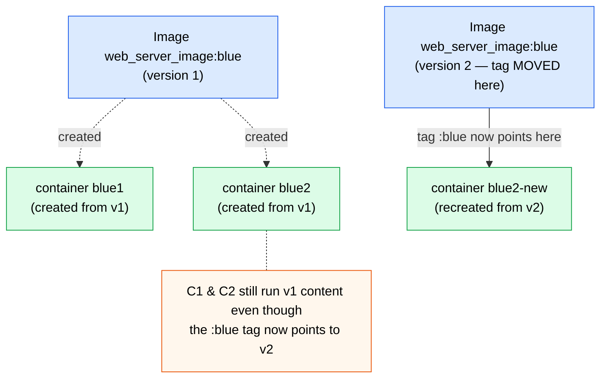

> **Cleanup shortcut:** `docker rm -f <id>` removes a container **and** forces its exit in one step (no need to `stop` then `rm`). `docker rm -f $(docker ps -aq)` clears all containers; `docker rmi $(docker images -q)` clears all images.

---

## 3.11 Command reference (Topic 3)

| Command | Purpose |
|---------|---------|
| `docker login --username <id>` | Authenticate to a registry (needed to push / pull private). |
| `docker search <term>` | Search Docker Hub from the CLI (returns image names). |
| `docker pull <image>[:tag]` | Download an image (defaults to `:latest`). |
| `docker pull --all-tags <image>` | Download every tag of an image. |
| `docker images` / `docker image ls 'w*'` | List local images / filter by name pattern. |
| `docker image history <image>` | Show each layer and the instruction that created it. |
| `docker system df` | Show real disk usage, accounting for shared layers. |
| `docker rmi [-f] <image>` | Remove (force-untag) a local image. |
| `docker build -t <name>[:tag] .` | Build an image from a Dockerfile (`.` = context). |
| `docker tag <src> <account>/<repo>:<ver>` | Add a registry-ready reference to an image. |
| `docker push <account>/<repo>:<ver>` | Upload an image to a registry. |
| `docker rm -f <id>` | Force-remove a container (stop + remove). |

Dockerfile instructions seen so far: `FROM` (base image, mandatory first), `RUN` (execute a command at build time → new layer), `COPY <src> <dest>` (copy from build context into the image), `CMD` (default startup command).

---

*Source for enrichment, figures, and examples in this topic: Elton Stoneman, "Learn Docker in a Month of Lunches" (Manning, 2020), chapters 3 and 5. Figures 3.A and 3.B are extracted from the book (figs. 5.1 and 3.8). Conceptual content follows the video transcript, enriched with the book.*

---

# 4. Images Deep Dive

## 4.1 What this topic covers

A deeper look at images: how Dockerfile instructions map to **layers** (seen in practice), the **build context** and how it relates to the Docker daemon, the **`.dockerignore`** file, passing **environment variables** three ways, the **`CMD` vs `ENTRYPOINT`** distinction, **distroless** images, **multi-stage builds**, and concrete strategies to **optimize image size and build time**.

> This topic builds directly on Topic 3. The fundamentals of "each instruction is a layer" and "the build cache" were introduced in §3.9.2–§3.9.3; here we *use* them in the terminal and apply them to real optimization. Where a concept was already defined, we reference it rather than repeat it.

---

## 4.2 Layered architecture in practice (`docker history`)

Topic 3 established that **each Dockerfile instruction creates a layer** and that layers are **cached and shared** (§3.9.2). You can inspect those layers for any image:

<details>
<summary><code>&gt;_</code> your own layers add only a few MB on top; the 700+ MB bulk comes from the base image's base — so the size lever is the base image, not your Dockerfile.</summary>

```bash
docker build -t express-app .
docker history express-app          # one line per layer, bottom = base image, top = your instructions
```
```text
IMAGE          CREATED BY                                 SIZE
<your top>     CMD ["node" "src/index.js"]                0B
<missing>      COPY . . # buildkit                         3.1MB   ← your instructions (~3 MB)
<missing>      RUN npm ci                                  ...
<missing>      /bin/sh -c #(nop) ... node base layers      ...
<missing>      /bin/sh -c set -eux; ... base's base         770MB   ← dominates the size
```

</details>

Reading the output bottom-to-top: the **top lines** correspond to *your* Dockerfile instructions, while the **lower lines** come from the **base image** (and the base image *it* was built on — base images chain). Some intermediary layers show as `<missing>` because Docker discards the intermediate images after the build; the layers themselves remain.

Two practical insights this reveals:

- **The `SIZE` column shows what each layer contributes.** In a typical Node app, *your* instructions might add only ~3 MB, while two layers from the **base image's base** add 700+ MB. So if you want a smaller image, the lever is the **base image** (§4.9.1), not your own instructions.
- **The cache is per-layer and order-dependent.** If the chain of instructions up to some point is unchanged, Docker **reuses every layer up to there**; the first change "breaks" the cache for everything after it. (Mechanism detailed in §3.9.3; we exploit it in §4.9.2.)

---

## 4.3 Build context and the Docker daemon

When you run `docker build -t name .`, the trailing **`.`** is the **build context**: *all files and subdirectories in that directory* that the build might need. Crucially:

> The CLI only **triggers** the build — the actual build runs on the **Docker daemon (host)**. So the CLI **uploads the entire context to the daemon** first. Locally the CLI and daemon are the same machine, but the daemon could be remote, which is exactly why the context must be sent.

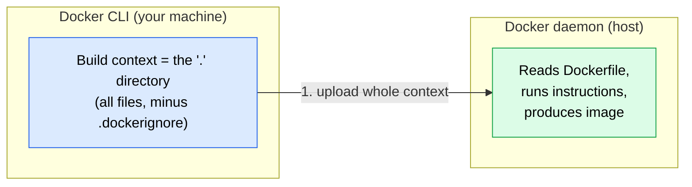

Why this matters: if the context contains heavy directories (a multi-hundred-MB `node_modules`, a Python venv, a large data file), **all of it is uploaded** — the build output shows `transferring context` taking real time, and `COPY . .` then copies that bulk into the image. The build log's first lines (`transferring context`, `load .dockerignore`) reveal what's being sent.

Two ways to keep the context small:

1. **Copy narrowly** — e.g. `COPY index.js index.js` instead of `COPY . .`. Docker is smart enough not to transfer files the Dockerfile doesn't use, but narrow copies are explicit. (Not always practical for real projects with nested folders.)
2. **Use `.dockerignore`** (next section) — the scalable solution.

---

## 4.4 The `.dockerignore` file

`.dockerignore` lists paths, files, directories, and glob patterns to **exclude from the build context** — so they're never uploaded to the daemon or copied by `COPY . .`. It's the same idea as `.gitignore`, and it's in virtually every real Docker project.

```dockerignore
# .dockerignore
some-large-file          # exclude a specific heavy file
**/*.test.js             # exclude all test files, recursively, in any folder
node_modules             # exclude deps (they're reinstalled by npm ci in the image)
.env*                    # exclude ALL env files (.env, .env.prod, .env.dev, env/.env ...)
```

What it buys you:

- **Smaller, faster context uploads** (the large file isn't sent even though `COPY . .` is present).
- **Cleaner images** — exclude test files, local `node_modules`, build artifacts, and editor cruft from the final image. (You can verify exclusions by running an interactive shell in the image and listing the copied tree — see §4.6 for `docker run -it ... sh`, which *overrides* the default `CMD`.)
- **Security** — never bake `.env` files into an image. They often hold **API keys/secrets**; anyone who pulls the image could read the filesystem and extract them. Excluding them (and passing config at runtime instead, §4.5) avoids that.

> Because `node_modules` is recreated by `npm ci`/`npm install` during the build, copying it from your machine is both wasteful (hundreds of MB) and risky (host-built binaries may not match the container OS). Always ignore it.

---

## 4.5 Environment variables

Containers are commonly configured via **environment variables**. There are three ways to set them, from "baked-in default" to "fully external."

### 4.5.1 Defaults with `ENV` in the Dockerfile

`ENV` sets a variable that's available at **runtime** inside the container — a good place for **defaults**:

```dockerfile
ENV PORT=3000
ENV APP_NAME="My Awesome Application"   # quote values containing spaces
```

The app reads them the usual way for its language — in Node.js, `process.env.PORT`. The variable name in code must match the `ENV` name. Values set here are **defaults**, not fixed — they can be overridden (below).

### 4.5.2 Overriding at runtime with `-e`

Pass `-e` / `--env` on `docker run` to override a Dockerfile default **without rebuilding the image**:

<details>
<summary><code>&gt;_</code> the runtime `-e PORT=8080` overrides the Dockerfile's `ENV PORT=3000` default — the log shows the app picked up 8080, no rebuild needed.</summary>

```bash
docker run -e PORT=5001 -d -p 5001:5001 --name express_5001 express
docker run -e PORT=8080 -e APP_NAME="On Port 8080" -d -p 8080:8080 --name express_8080 express
docker logs express_8080      # confirm the override took effect
```
```text
Server listening on port: 8080
```

</details>

- Repeat `-e KEY=VALUE` for multiple variables.
- Remember the **flag-ordering rule** (§2.2.1): all flags come **before** the image name.
- `docker logs <name>` confirms the value the app actually picked up.

> **Tip:** `docker run --help` is the fastest way to recall that `-e` / `--env` exists and its syntax — exactly the §2.8 habit.

### 4.5.3 `.env` files with `--env-file`

As the number of variables grows, the `docker run` line gets unwieldy. An **`.env` file** groups them and keeps commands readable — and lets you switch environments cleanly:

```bash
# .env.prod          # .env.dev
# PORT=9000          # PORT=3000
# APP_NAME=My Prod App   # APP_NAME=My Dev App

docker run --env-file .env.prod -d -p 9000:9000 --name express_prod express
docker run --env-file .env.dev  -d -p 3000:3000 --name express_dev  express
```

Notes:

- In an `.env` file you **don't** wrap values in quotes (unlike inline `-e` where spaces force quoting).
- **Add `.env*` to `.dockerignore`** (§4.4) — env files shouldn't be baked into the image, mainly for security, and because there's no single "right" file to bundle when you have per-environment configs. Passing `--env-file` at runtime sidesteps both issues.
- `.env` files don't affect the image, so you don't rebuild when they change.

---

## 4.6 `CMD` vs `ENTRYPOINT`

Both define what runs when a container starts, but they behave differently when you pass arguments to `docker run`.

| | `CMD` | `ENTRYPOINT` |
|---|-------|--------------|
| Purpose | Default command **and/or** default arguments | The command that **always** runs |
| Args after the image name (`docker run img <args>`) | **Replace** the `CMD` entirely | Are **appended** to the entrypoint |
| Override at runtime | Just pass a new command after the image | Requires the **`--entrypoint`** flag |

**`CMD` alone** — the default is used, but any command you pass *replaces* it:

```dockerfile
FROM alpine:3.20
CMD echo "hello from CMD in Dockerfile"
```
```bash
docker run cmd-example                       # → hello from CMD in Dockerfile
docker run cmd-example echo "from terminal"  # → from terminal   (CMD replaced)
docker run cmd-example sh -c "apk add curl && curl google.com"  # arbitrary override
```

**`ENTRYPOINT` alone** — always runs; extra args are *appended*:

```dockerfile
FROM alpine:3.20
ENTRYPOINT echo "hello from ENTRYPOINT"
```
```bash
docker run entrypoint-example "extra"        # → hello from ENTRYPOINT extra  (appended)
docker run --entrypoint echo entrypoint-example "hi"   # override needs --entrypoint
```

**Combined (the common, powerful pattern)** — `ENTRYPOINT` is the fixed command, `CMD` supplies **default arguments** that callers can override:

```dockerfile
FROM alpine:3.20
ENTRYPOINT ["echo"]
CMD ["default message"]
```
```bash
docker run combo                  # → default message      (ENTRYPOINT echo + CMD default)
docker run combo "custom message" # → custom message       (CMD replaced, ENTRYPOINT stays)
```

> **Bottom line:** the executed command is **ENTRYPOINT + CMD**. `ENTRYPOINT` stays stable (override only with `--entrypoint`); `CMD` is the easily-overridden default arguments. Use the combo when you want a fixed program with user-tunable flags. (This is also why `docker run -it  sh` drops you into a shell — `sh` replaces the image's `CMD`.)

---

## 4.7 Distroless images

**Distroless** images are minimal images that contain **only your app's runtime dependencies** — no OS distribution, no shell, no package manager, no extra binaries (unless strictly needed at runtime). Compared to even `alpine`, they strip out the shell and utilities.

**Advantages**

- **Security** — far fewer components means a **smaller attack surface** and fewer potential vulnerabilities; easier to audit and verify.
- **Size** — smaller images mean **faster pulls** and less storage.
- **Performance** — fewer components to load can mean quicker startup and lower resource use.

**Challenges**

- **Harder to debug** — there's **no shell** to `exec` into, so the usual "poke around inside the container" troubleshooting doesn't work.
- **Dependency management** — without OS utilities, you must ensure every required library/binary is included by the build.
- **Build complexity** — Dockerfiles become more involved (you generally can't install dependencies in a distroless image because there's **no `npm`/`apt`** — this is the prime motivation for multi-stage builds, §4.8).
- **Learning curve** — a mindset shift; traditional habits don't transfer directly.

> Example registry: `gcr.io/distroless/nodejs22`. Note that distroless Node sets `node` as the default **entrypoint**, so you only pass the script file (e.g. `CMD ["src/index.js"]`). Trying `docker exec -it <c> sh` on a distroless container fails — by design, which is exactly the security benefit.

---

## 4.8 Multi-stage builds

### 4.8.1 Why multi-stage? (build vs run)

So far each Dockerfile had a **single `FROM`**. A **multi-stage** Dockerfile has **multiple `FROM` instructions**, splitting the build into stages — typically a **build stage** (heavy base image with all the build tools) and a **run stage** (small, lean, often distroless image with just the runtime). The result: **smaller, faster, more secure** final images.

The book frames the deeper motivation as *"who needs a build server when you have a Dockerfile?"* — because `RUN` executes commands during the build, you can package the **entire build toolchain** into an image. New team members and CI servers need **only Docker**; there's no tool-version drift, and onboarding drops from a day to minutes.

### 4.8.2 How it works: stages and `COPY --from`

Each stage starts with `FROM`, can be **named with `AS`**, runs **independently** (its own base image, its own cache), and can **copy files from earlier stages** with **`COPY --from=<stage>`**. Only the **final stage** becomes the image — anything from earlier stages must be **explicitly copied** into it. If any stage's command fails, the whole build fails.

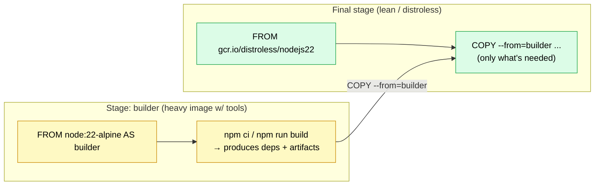

> Stages start in parallel, but when the final stage hits a `COPY --from=builder`, Docker **waits** for the builder stage to finish before copying. You can have **three or more** stages, and a later stage can copy from **several** earlier ones (used in §4.9.4).

### 4.8.3 Worked example: Node.js + distroless

A distroless base has no `npm`, so you **can't install dependencies in it directly** — that's the problem multi-stage solves. Install deps in a full image, then copy them into the distroless image:

```dockerfile
# Stage 1: build (has npm)
FROM node:22-alpine AS build
WORKDIR /app
COPY package.json package-lock.json ./
RUN npm ci

# Stage 2: run (distroless, no shell/npm)
FROM gcr.io/distroless/nodejs22
WORKDIR /app
COPY --from=build /app/node_modules ./node_modules    # bring deps over
COPY src ./src                                          # app source from context
CMD ["src/index.js"]                                    # node is the default entrypoint
```

<details>
<summary><code>&gt;_</code> the build installs deps in the full Node stage, then copies them into the shell-less distroless image — so the app runs, but `exec ... sh` fails, which is the security win.</summary>

```bash
docker build -t express-multistage .
docker run --rm -d -p 3000:3000 --name express-3000 express-multistage
docker exec -it express-3000 sh        # FAILS — no shell (distroless), as expected/secure
```
```text
OCI runtime exec failed: exec failed: unable to start container process:
exec: "sh": executable file not found in $PATH
```

</details>

### 4.8.4 Patterns from the book: Java, Node.js, Go

The same multi-stage skeleton adapts to any stack — the *differences are captured in the Dockerfile*, while the build/run process stays identical (`docker image build`). Key contrast: **compiled** languages copy only the compiled artifact into the final stage (source stays behind); **interpreted** languages copy the runtime + source.

**Java (Maven)** — compiled; final image gets only the JAR:

```dockerfile
FROM diamol/maven AS builder
WORKDIR /usr/src/iotd
COPY pom.xml .
RUN mvn -B dependency:go-offline     # separate step → cached unless pom.xml changes
COPY . .
RUN mvn package                      # → produces the JAR

FROM diamol/openjdk                  # runtime only, no Maven
WORKDIR /app
COPY --from=builder /usr/src/iotd/target/iotd-service-0.1.0.jar .
EXPOSE 80
ENTRYPOINT ["java", "-jar", "/app/iotd-service-0.1.0.jar"]
```

**Node.js (npm)** — interpreted; final image needs runtime **and** source:

```dockerfile
FROM diamol/node AS builder
WORKDIR /src
COPY src/package.json .
RUN npm install

FROM diamol/node
EXPOSE 80
CMD ["node", "server.js"]
WORKDIR /app
COPY --from=builder /src/node_modules/ /app/node_modules/
COPY src/ .
```

**Go** — compiles to a native binary; final image can be tiny (`diamol/base`):

```dockerfile
FROM diamol/golang AS builder
COPY main.go .
RUN go build -o /server

FROM diamol/base
CMD ["/web/server"]
WORKDIR web
COPY index.html .
COPY --from=builder /server .
RUN chmod +x server                  # Linux binaries must be marked executable
```

> The book's Go example is the dramatic case: the Go **toolset** image is ~774 MB, but the final **application** image is ~25 MB — because only the compiled binary is copied into a minimal base. That's the size payoff of isolating tools in earlier stages.

---

## 4.9 Optimizing image size and build time

Four practical levers. (Avoid premature optimization — but smaller, faster builds genuinely help your CI/CD feedback loop, so apply these where they remove real friction.)

### 4.9.1 Choose a smaller base image

The base image usually dominates the size (§4.2). Switching tags can cut the image dramatically with no other changes:

| Base image | Approx. size of the example image |
|---|---|
| `node:22` (full) | ~1.1 GB |
| `node:22-slim` | ~1/4 of full |
| `node:22-alpine` | ~1/6 of full (minimal distro, typically fewer CVEs) |

Smaller bases also build faster when uncached, because there's **less to download** over the network. Caveat: a smaller base may **lack dependencies** your app needs — choose the one that gives you what you need with the least bulk, not the absolute smallest. (If `alpine` needs 1–2 extra packages, great; if it needs 30, a larger base may be cleaner.)

### 4.9.2 Order instructions for the cache

Mechanism in §3.9.3. The rule: **put what changes least at the top, what changes most at the bottom.** Concretely, copy dependency manifests and install **before** copying source code:

```dockerfile
# GOOD — deps installed before source is copied
WORKDIR /app
COPY package.json package-lock.json ./
RUN npm ci                 # cached unless package files change
COPY . .                   # source changes don't bust the npm ci layer
```

```dockerfile
# NOT GOOD — copying source first
WORKDIR /app
COPY . .                   # any source edit changes this layer...
RUN npm ci                 # ...so deps reinstall on every code change
```

In the "not good" version, editing one source file invalidates the `COPY . .` layer, which **breaks the cache** and forces `npm ci` to re-run every build. Reordering makes typical rebuilds reuse the cached install — same image size, much faster builds. (Ordering affects **build time only**, not size or security.)

### 4.9.3 Install only production dependencies

Dev dependencies (test frameworks, TypeScript, type packages) are needed to **build/test**, not to **run**. Excluding them shrinks the image and the attack surface:

```dockerfile
RUN npm ci --only=production    # skips devDependencies
```

In the example this cut ~50 MB and sped up the install. Caveat: if you have a **build step** that needs dev dependencies (e.g. TypeScript transpilation), you can't use `--only=production` in the same stage that builds — that's a job for **multi-stage builds** (install full deps + build in one stage; install only production deps in another).

### 4.9.4 Putting it together: an optimized multi-stage Dockerfile

Combine all four levers — a **build** stage (full deps + compile), a separate **deps** stage (production deps only), and a lean **distroless** final stage that copies the compiled output from `build` and the runtime deps from `deps`:

```dockerfile
# 1) Build stage — full deps + compile/transpile
FROM node:22-alpine AS build
WORKDIR /app
COPY package.json package-lock.json ./
RUN npm ci                          # all deps (incl. dev) for the build
COPY src ./src
COPY tsconfig.json ./
RUN npm run build                   # → produces dist/

# 2) Dependencies stage — production deps only
FROM node:22-alpine AS deps
WORKDIR /app
COPY package.json package-lock.json ./
RUN npm ci --only=production        # runtime deps only

# 3) Final stage — distroless, lean & secure
FROM gcr.io/distroless/nodejs22
WORKDIR /app
COPY --from=deps  /app/node_modules ./node_modules   # runtime deps
COPY --from=build /app/dist ./dist                   # compiled app
CMD ["dist/index.js"]
```

Docker runs `build` and `deps` (which start from the same base and share cache), then assembles the final image from just the two `COPY --from` results — yielding a small, secure image that contains the compiled app plus only its runtime dependencies. Don't forget to **map ports** when running it (`-p 3000:3000`).

---

## 4.10 Command & instruction reference (Topic 4)

| Item | Purpose |
|------|---------|
| `docker history <image>` | Show each layer and its size/instruction. |
| `docker build -t name -f Dockerfile.custom .` | Build using a non-default Dockerfile name (`-f`); `.` = context. |
| `.dockerignore` | Exclude paths/globs from the build context (e.g. `node_modules`, `.env*`, `**/*.test.js`). |
| `docker run -e KEY=VALUE ...` | Set/override an env var at runtime (repeatable). |
| `docker run --env-file .env.prod ...` | Load env vars from a file. |
| `docker run -it <image> sh` | Shell into a container (overrides `CMD`); fails on distroless. |
| `docker run --entrypoint <cmd> <image>` | Override the image's `ENTRYPOINT`. |
| `COPY --from=<stage> <src> <dest>` | Copy files from an earlier build stage. |
| `npm ci --only=production` | Install runtime deps only (skip devDependencies). |

Dockerfile instructions in this topic: `FROM ... AS <stage>` (named build stage), `RUN` (execute at build time → layer), `COPY` / `COPY --from` (copy from context or a stage), `WORKDIR`, `ENV` (default env var), `EXPOSE` (document a port), `CMD` (default command/args, overridable), `ENTRYPOINT` (fixed command, args appended).

---

*Source for enrichment and the Java/Node/Go multi-stage examples: Elton Stoneman, "Learn Docker in a Month of Lunches" (Manning, 2020), chapter 4 ("Packaging applications from source code into Docker Images"). Conceptual content follows the video transcript, enriched with the book.*

---

# 5. Volumes and Data Persistence

## 5.1 What this topic covers

How data persistence works in Docker: the **default behavior** without volumes, what **volumes** are and when you need them, the difference between **bind mounts** and **named volumes**, and how to **manage volumes with the CLI**.

---

## 5.2 Why container data isn't permanent

A container's filesystem lives and dies with the container. Data written **inside** a running container survives a **stop/start**, but is **lost on removal**.

<details>
<summary><code>&gt;_</code> the file survives stop/start (same container) but vanishes once the container is removed and recreated — data lives and dies with the container's writeable layer.</summary>

```bash
docker run -d --name web_server nginx:1.27.0
docker exec -it web_server sh
  # echo "hello" > /tmp/hello.txt   ; cat /tmp/hello.txt   → hello
docker stop web_server && docker start web_server
docker exec web_server cat /tmp/hello.txt        # still there → survives restart
docker stop web_server && docker rm web_server   # remove the container
docker run -d --name web_server nginx:1.27.0     # a brand-new container
docker exec web_server cat /tmp/hello.txt        # gone — different container, fresh filesystem
```
```text
# after stop/start:  hello                         ← survives a restart
# after rm + new run: cat: /tmp/hello.txt: No such file or directory   ← lost
```

</details>

The key facts (the book frames these precisely):

- **Each container has its own independent filesystem**, built from the image's **read-only layers** plus a **single writeable layer** unique to that container. Two containers from the same image start identical but diverge as each writes to its own writeable layer.
- The **writeable layer shares the container's lifecycle** — remove the container and the writeable layer (and any changes) are **gone forever**. The image is never modified.
- This matters in production because **upgrades = remove old containers, run new ones** from the updated image. Transient data (e.g. a local cache) being wiped is fine; a **database** losing all its data is a disaster.

> So: container data is **restricted to the container's lifecycle** by default. Fine for **stateless** workloads — not for anything that must outlive the container or be **shared** between containers. That's what volumes solve.

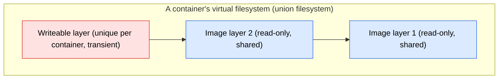

> *(Book tip:* `docker cp <container>:/path ./local` copies files out of even a stopped container — handy for grabbing data before removal.)

---

## 5.3 What volumes are (and their benefits)

A **volume** is a unit of storage managed by Docker, **separate from any container's filesystem** — think of it as a *USB stick for containers*. You attach it to a container where it appears as a directory; the container reads/writes there, but the data actually lives in the volume, with its **own lifecycle**.

Benefits:

- **Data persistence** — data survives even if the container is **stopped or removed**.
- **Sharing** — multiple containers can mount the **same volume** to share data.
- **Backup & recovery** — because data is decoupled from the container, it's still there if the container goes down.
- **Flexibility** — separating data from the application runtime makes managing and deploying containers easier.

---

## 5.4 Types of volume

| Type | What it is | Primary use case |
|------|-----------|------------------|
| **Bind mount** | Directly links a **file/directory on the host** into the container | Dev-time workflows (e.g. live source with hot reloading) |
| **Named volume** | A Docker-managed volume you **create, name, and reuse** across containers | **Persisting** data (databases, shared website content) |
| *Anonymous volume* | Auto-created by Docker with a random ID, no reusable name | Rarely used — temporary data; hard to manage, so we skip it |

> A note on creating volumes from the book: besides creating named volumes via the CLI, an image can declare **`VOLUME <dir>`** in its Dockerfile, which auto-creates a volume when a container starts. The `VOLUME` instruction and the `-v` run flag are **separate features** — `VOLUME` gives a random-ID volume if you don't specify one with `-v`, which persists data but is hard to find later. Prefer **named volumes** (§5.6) for anything you care about.

---

## 5.5 Bind mounts (dev-time hot reloading)

A bind mount maps a **host directory** into the container with `-v <host-path>:<container-path>`. The container, instead of using the files copied in at build time, **reads the live files on your machine** — so a dev server with **hot reloading** picks up your edits instantly, with **no rebuild**.

```bash
# Dockerfile.dev runs the dev server (CMD npm start) instead of a production build
docker build -t react-app:dev -f Dockerfile.dev .

docker run -d --rm -p 3000:3000 \
  -v "$(pwd)/public":/app/public \
  -v "$(pwd)/src":/app/src \
  react-app:dev
```

How it works:

- **Left of the `:`** is the **host path**; **right of the `:`** is the **mount point in the container** (here the image's `WORKDIR` is `/app`, so source mounts at `/app/src`).
- When the container looks at `/app/src`, it's actually seeing **your local `src/`**. Edit a file → the running dev server detects the change and recompiles.
- **No `docker build` is re-run** — the bind mount just redirects those paths to the host filesystem. (Without the mount, the container only has the copy made by `COPY` at build time, so edits don't show up.)
- The startup command **must support hot reloading** (e.g. `npm start`) for auto-refresh to happen.

> Why use a Dockerfile for dev at all? It captures the *entire* setup (right Node version, install steps, etc.) so a new contributor spins up a container instead of installing a toolchain — consistency across environments, plus live editing.

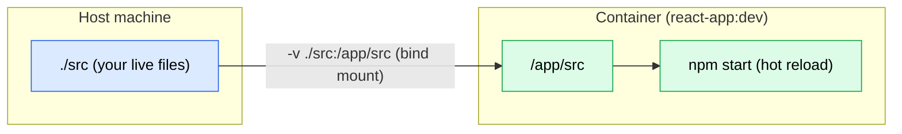

---

## 5.6 Named volumes (sharing & persisting data)

A **named volume** is created and managed independently of containers; mount it into one or more containers, and the data **survives** even when those containers are deleted. This is the default way to persist data outside the container lifecycle — e.g. a **database's** data files.

```bash
docker volume create website-data        # create an (initially empty) named volume

# Mount it into a container — note: left of ':' is the VOLUME NAME, not a host path
docker run -d -p 3000:80 --name website-main \
  -v website-data:/usr/share/nginx/html \
  nginx:1.27.0
```

**Sharing across containers** — mount the *same* volume into several containers and they all see the same data; a write from any one is reflected in all:

<details>
<summary><code>&gt;_</code> a write made inside `website-main` is immediately visible from `readonly-1` — both mount the same volume, so the data is shared, not copied per container.</summary>

```bash
docker run -d -p 3001:80 --name readonly-1 -v website-data:/usr/share/nginx/html nginx:1.27.0
docker run -d -p 3002:80 --name readonly-2 -v website-data:/usr/share/nginx/html nginx:1.27.0

# change the shared content from ANY container...
docker exec -it website-main sh -c 'echo "Hello World" > /usr/share/nginx/html/index.html'
docker exec readonly-1 cat /usr/share/nginx/html/index.html   # → Hello World (instantly shared)
```
```text
Hello World
```

</details>

The change isn't coming from any container's local files — it lives in the **volume**, which every container mounts at that path. Editing from any container (the names "readonly" here are just labels — all mounts are writeable) updates them all.

> **Why this enables horizontal scaling:** because all containers share one volume, you can run many identical containers behind a load balancer, all serving the **same** content; update the volume once and every container reflects it. Same idea underpins shared-data scenarios for stateful services.

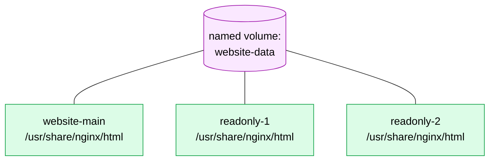

> **Bind mount vs named volume — the one-line distinction:** in `-v LEFT:RIGHT`, if `LEFT` is a **host path** it's a **bind mount** (host files surfaced into the container); if `LEFT` is a **volume name** it's a **named volume** (Docker-managed storage). Bind mounts shine for dev; named volumes for persistence.

---

## 5.7 Managing volumes with the CLI

<details>
<summary><code>&gt;_</code> `inspect` reveals where the data physically lives (`Mountpoint`), and `rm` is refused while any container — even a stopped one — still references the volume.</summary>

```bash
docker volume create <name>              # create a volume
docker volume ls                         # list volumes (default driver = local)
docker volume inspect <name>             # details: created time, mount point, driver, labels
docker volume rm <name>                  # remove a volume (fails if in use by a container)
```
```text
# docker volume inspect website-data
[ { "Name": "website-data", "Driver": "local",
    "Mountpoint": "/var/lib/docker/volumes/website-data/_data" } ]

# docker volume rm website-data   (while a container uses it)
Error response from daemon: remove website-data: volume is in use - [<container-id>]
```

</details>

Key behaviors:

- **A volume can't be removed while a container references it** — even a **stopped** container still holds the mount. You must `docker rm` the container(s) first, *then* remove the volume.
- **`inspect`** shows the **mount point** (where data is stored). On Linux that's a real host path under `/var/lib/docker/...`; on **macOS/Windows**, Docker runs in a VM, so that path isn't directly visible on your machine.

**Filtering and bulk cleanup** (mirrors the image/container patterns):

```bash
docker volume ls --filter name=website-data        # filter by name
docker volume ls --filter dangling=true            # volumes not used by any container
docker volume ls --filter dangling=true -q         # just the names...
docker volume rm $(docker volume ls --filter dangling=true -q)   # ...remove all dangling volumes
```

> `docker volume ls --help` shows the available `--filter` and `--format` options. For broader cleanup there's also `docker system prune`; the `dangling=true` filter is the precise, lower-level way to remove only unused volumes.

---

## 5.8 The container filesystem & best practices (from the book)

The book consolidates the storage model: every container sees a **single disk**, which Docker assembles from multiple sources into what it calls the **union filesystem**. The sources are the **image layers**, the container's **writeable layer**, plus any **volumes** and **bind mounts** — but there's always exactly **one writeable layer**.

Best-practice guidance for *which* storage to use:

- **Writeable layer** — short-term, container-scoped data only (e.g. a disk cache). Lost when the container is removed.
- **Local bind mounts** — surface host files into the container; great for **dev** (live source) and **read-only config**.
- **Volumes** — persistent, container-independent storage for **stateful** data (databases); survives upgrades.

Two important limitations to remember:

- **Mounting onto a non-empty directory replaces it.** If the mount target already has files from the image, the mount source **replaces** the target — the image's original files in that directory are **not** merged/visible.
- **Distributed storage caveats.** Bind mounts backed by network/distributed storage may not support every filesystem feature the app expects, and have very different performance — a disk-heavy app can slow drastically when every write goes over the network. You often won't know until you test.

---

## 5.9 Command reference (Topic 5)

| Command | Purpose |
|---------|---------|
| `docker run -v <host-path>:<container-path> ...` | **Bind mount** a host directory into a container. |
| `docker run -v <volume-name>:<container-path> ...` | Mount a **named volume** into a container. |
| `docker volume create <name>` | Create a named volume. |
| `docker volume ls [--filter name=… \| dangling=true] [-q]` | List / filter volumes. |
| `docker volume inspect <name>` | Show a volume's details (mount point, driver, labels). |
| `docker volume rm <name>` | Remove a volume (must not be in use). |
| `docker volume rm $(docker volume ls --filter dangling=true -q)` | Remove all unused (dangling) volumes. |
| `docker cp <container>:/path ./local` | Copy files out of a container (even when stopped). |

Dockerfile instruction: `VOLUME <dir>` — declares a volume that's auto-created when a container starts (separate from the `-v` run flag).

---

*Source for enrichment in this topic: Elton Stoneman, "Learn Docker in a Month of Lunches" (Manning, 2020), chapter 6 ("Using Docker volumes for persistent storage"). Conceptual content follows the video transcript, enriched with the book.*

---

# 6. Resource Management, Restart Policies & Networking

## 6.1 What this topic covers

Three advanced operational topics: setting **resource limits** (CPU and memory) so one container can't starve the host, **restart policies** that keep containers running, and **Docker networking** — the default networks, user-defined networks with DNS, and how containers communicate.

> By default Docker imposes **no** CPU or memory limits. A buggy or malicious container can consume all the host's resources and take down everything else. Limits are how you protect the host and the other containers.

---

## 6.2 CPU limits

`docker run --help | grep -i cpu` shows several CPU options. The main ones are `--cpus` (hard limit), `--cpu-shares` (relative weight), `--cpu-period`/`--cpu-quota`, and `--cpuset-cpus`.

> **`--cpuset-cpus` pins a container to specific CPU cores** (e.g. `--cpuset-cpus=0`). It's mainly useful here to *simulate scarcity* — forcing multiple containers onto the **same** core so the other limits become observable. On a many-core host with spare capacity, relative limits don't visibly kick in. Use `docker stats` to watch live CPU/memory usage throughout.

### 6.2.1 Hard limits: `--cpus`

`--cpus` sets an absolute ceiling on how much CPU the container may use (a decimal number of cores):

```bash
docker run -d --rm --name cpu_decimals --cpus 0.5 busybox \
  sh -c 'while true; do :; done'        # a tight loop that burns CPU
docker stats                            # CPU% oscillates around 50%
```

- `--cpus 0.5` → throttled to ~50% of a single core; `--cpus 1.5` → up to 150% (1.5 cores) *if the workload can use it*. A single busy loop maxes at one core (100%), since it's one process; more processes could push past 100%.
- The container isn't *always* using that much — it's a **ceiling**; exceed it and Docker throttles it.

### 6.2.2 Relative weights: `--cpu-shares`

When you can't predict the host's core count, use **relative weights**. `--cpu-shares` matters **only when CPU is scarce** — if there's enough for everyone, Docker doesn't bother dividing it.

```bash
# Force both onto the same core to create scarcity, then weight them
docker run -d --rm --name cpu_low  --cpuset-cpus=0 --cpu-shares 512  busybox sh -c 'while true; do :; done'
docker run -d --rm --name cpu_high --cpuset-cpus=0 --cpu-shares 2048 busybox sh -c 'while true; do :; done'
docker stats        # high ≈ 80%, low ≈ 20%  (2048 : 512 = 4 : 1)
```

Docker sums the shares (2048 + 512) and allocates **proportionally** — so the 2048-share container gets ~80% and the 512-share one ~20% of the contested core.

### 6.2.3 Period & quota (and why `--cpus` is simpler)

`--cpu-period` (default 100,000 µs) and `--cpu-quota` let you express the limit as "quota per period":

```bash
docker run -d --rm --name cpu_quota --cpu-period 100000 --cpu-quota 75000 busybox sh -c 'while true; do :; done'
docker stats        # ~75% CPU
```

> This is **equivalent to `--cpus 0.75`** and rarely used directly — prefer `--cpus` for clarity.

**Choosing:** a **hard limit** (`--cpus`) when you know how much CPU the container needs; a **soft/relative weight** (`--cpu-shares`) when you just want critical containers to get priority *under contention*.

---

## 6.3 Memory limits

`docker run --help | grep -i memory` — the main options are `--memory`, `--memory-reservation`, and `--memory-swap`.

### 6.3.1 `--memory` (hard limit & OOM)

`--memory` caps the container's RAM. Exceed it (with no swap) and the container is **killed with an Out-Of-Memory (OOM)** signal:

```bash
docker run -d --name mongo --memory 20m mongodb/mongodb-community-server:7.0-ubuntu2204
docker ps                       # gone — MongoDB needs more than 20 MiB
docker inspect mongo            # State.OOMKilled = true, exit code 1
```

> Sizes use **mebibytes** (`m` = MiB), close enough to MB for practical sizing. Setting a hard memory limit is **best practice** — it stops a leaking container from consuming all host RAM and triggering the host to kill *other* processes.

### 6.3.2 `--memory-reservation` (soft limit)

A **soft limit** — Docker tries to keep at least this much available to the container, but doesn't kill it for exceeding it (as long as the host has memory). Pair a soft floor with a hard ceiling:

```bash
docker run -d --rm --name mongo \
  --memory-reservation 100m \
  --memory 200m \
  mongodb/mongodb-community-server:7.0-ubuntu2204
docker stats        # sits near its real usage, under the 200m ceiling
```

- **Reservation** = "please ensure this much is available" (soft, not reserved exclusively).
- **`--memory`** = "if it goes beyond this, something's wrong — kill it." A realistic setup uses reservation near observed usage and the hard limit comfortably above.

### 6.3.3 `--memory-swap`

`--memory-swap` sets **total = memory + swap**, and can only be used with `--memory`. Swap is disk space used when RAM runs out:

```bash
docker run -d --rm --memory 20m --memory-swap 200m busybox ...   # ~180 MiB of swap allowed
```

With `--memory 20m --memory-swap 200m`, the container has 20 MiB RAM plus up to ~180 MiB of swap-to-disk — so a workload that OOM-killed at `--memory 20m` alone can now run. **Caveat:** swap is **disk**, far slower than RAM, so it hurts performance; use it only when host memory is genuinely tight.

---

## 6.4 Restart policies

Restart policies tell Docker to automatically restart a container when it stops or crashes. Set with `--restart`:

| Policy | Behavior |
|--------|----------|
| `no` (default) | Never restart. Container exits → stays exited. |
| `on-failure` | Restart **only** if it exits with a **non-zero** (error) code. |
| `on-failure:N` | Same, but at most **N** attempts (e.g. `on-failure:3`). |
| `always` | Always restart, regardless of exit code. **Won't** restart if you `docker stop` it manually — but **will** after the Docker daemon restarts. |
| `unless-stopped` | Like `always`, but if you manually stop it, it stays stopped **even after the daemon restarts**. |

```bash
docker run -d --name r1 --restart on-failure          busybox sh -c 'sleep 3; exit 1'
docker run -d --name r2 --restart on-failure:3        busybox sh -c 'sleep 3; exit 1'
docker run -d --name r3 --restart always              busybox sh -c 'sleep 3; exit 0'
docker run -d --name r4 --restart unless-stopped      busybox sh -c 'sleep 3; exit 0'
docker inspect r2 | grep -i restartcount              # see how many times it retried
```

Things to know:

- **`docker inspect`** exposes `RestartCount` and the configured `RestartPolicy` (under `HostConfig`).
- **`on-failure`** is great for transient startup races — e.g. an app that fails because its database isn't ready yet will likely succeed on a retry. Without an attempt limit, though, a genuinely broken container loops forever — so cap it with `:N`.
- **`always`** restarts with an **exponential backoff** (the "restarting" gap grows each time), so a perpetually-failing container spends longer and longer between attempts.
- **`always` vs `unless-stopped`** differ only in one case: after a **manual stop** + **daemon restart**, `always` brings the container back, `unless-stopped` does not.

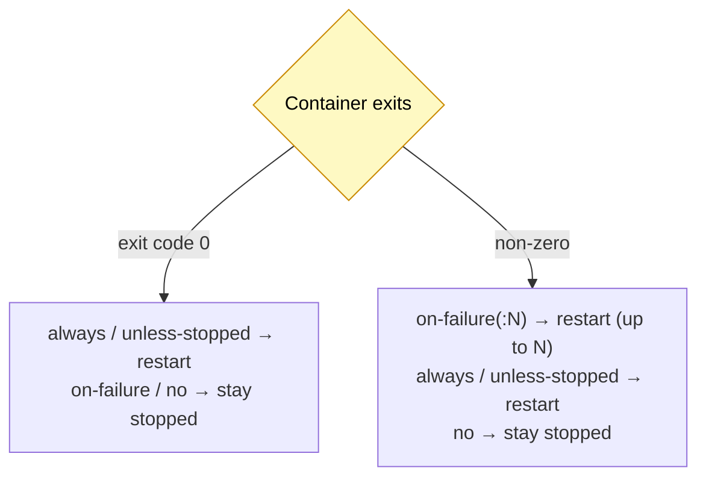

---

## 6.5 Docker networking

Networking is what lets containers talk — to **each other** and to the **outside world** — while keeping the isolation that makes containers safe. It's easy to ignore when you only run one container locally, but it's the foundation for any real multi-container app (a web app talking to a database, an API talking to a cache, and so on).

### 6.5.1 The big picture

Three ideas carry almost everything in this section:

1. **Every container gets its own virtual IP address**, assigned by Docker, on each network it joins.
2. **Containers on the *same* network can reach each other; containers on *different* networks can't** (that's the isolation).
3. **IP addresses change** when a container is recreated, so reaching a container by its **IP is fragile**. Reaching it by **name** is stable — but name resolution only works on a **user-defined** network (the headline lesson of this section).

A useful analogy: a Docker **network is like a private office Wi-Fi**. Devices (containers) joined to the same Wi-Fi can talk to each other; devices on a *different* Wi-Fi can't. The router hands out IP addresses, and there's a phone-book (DNS) so you can call a device by name instead of memorizing its number.

```mermaid
flowchart TB
    subgraph HOST["Docker Host"]
        subgraph N1["network: frontend-net (bridge)"]
            C1["web<br/>172.18.0.2"]
            C2["api<br/>172.18.0.3"]
        end
        subgraph N2["network: backend-net (bridge)"]
            C3["api<br/>172.19.0.2"]
            C4["db<br/>172.19.0.3"]
        end
    end
    C1 <-->|"same net ✓"| C2
    C3 <-->|"same net ✓"| C4
    C1 -. "different net ✗" .- C4
    classDef f fill:#dbeafe,stroke:#2563eb,color:#000;
    classDef b fill:#dcfce7,stroke:#16a34a,color:#000;
    class C1,C2 f;
    class C3,C4 b;
```

*Notice `api` appears in both networks — a single container can be attached to multiple networks (each gives it its own IP), which is how you let one component bridge an otherwise-isolated frontend and backend.*

### 6.5.2 Network drivers

A **driver** decides what *kind* of network gets created:

| Driver | What it does | When to use |
|--------|--------------|-------------|
| **bridge** | A private virtual network on the host. Containers on it talk to each other; host/outside can't reach them unless you publish ports. | The default and most common — especially **user-defined** bridge networks. |
| **host** | Removes isolation: the container shares the host's network stack directly (no separate IP). | Rare — when you need maximum network performance and accept less isolation. Limited support on macOS/Windows. |
| **none** | No networking at all. | Rare — a fully isolated container. |
| **overlay** | Spans **multiple hosts** so containers on different machines share a network. | Multi-host clusters (e.g. Docker Swarm). |
| **macvlan** | Gives the container its own **MAC address**, so it looks like a physical device on the LAN. | Integrating containers into an existing physical network. |

> In day-to-day work you'll use **bridge** ~99% of the time (usually a *user-defined* bridge), and occasionally **host**. The other three are for specialized cases.

### 6.5.3 The default bridge network (and its limitation)

When you install Docker you automatically get **three** networks. List them:

<details>
<summary><code>&gt;_</code> Show command &amp; output</summary>

```bash
docker network ls
```
```text
NETWORK ID     NAME      DRIVER    SCOPE
b1f4a2c3d4e5   bridge    bridge    local
9a8b7c6d5e4f   host      host      local
0f1e2d3c4b5a   none      null      local
```

</details>

Those map exactly to the drivers above: the **default `bridge`**, the **`host`** network, and the **`none`** network. **A container with no `--network` flag joins the default `bridge`.**

```bash
docker run -d --name web_server nginx:1.27.0
docker network inspect bridge
```

The interesting parts of the (trimmed) output — the container is attached, with an IP, but **`DNSNames` is null**:

```text
"Containers": {
    "3f2a...": {
        "Name": "web_server",
        "IPv4Address": "172.17.0.2/16",
        "DNSNames": null              <-- no name resolution here
    }
}
```

Now the **key limitation**. Start a second container on the same default bridge and try to reach `web_server` two ways — **by IP (works)** and **by name (fails)**:

<details>
<summary><code>&gt;_</code> Show command &amp; output</summary>

```bash
docker run -it ubuntu:24.04 bash
  apt update && apt install -y curl       # ubuntu has no curl by default
  curl 172.17.0.2          # ✓ returns the nginx welcome page (by IP)
  curl web_server          # ✗ fails
```
```text
curl: (6) Could not resolve host: web_server
```

</details>

Why does this matter? Because IP addresses are **not stable**. If `web_server` is removed and recreated, it may come back as `172.17.0.5`, and every hard-coded `172.17.0.2` breaks. Docker's **automatic DNS service discovery** — reaching a container by its **name** — is **NOT enabled on the default bridge**. The fix is a **user-defined network**.

```mermaid
flowchart LR
    subgraph DEF["default bridge (no DNS)"]
        U["ubuntu (client)"]
        W["web_server<br/>172.17.0.2"]
    end
    U -->|"curl 172.17.0.2 ✓"| W
    U -. "curl web_server ✗<br/>(could not resolve host)" .- W
    classDef d fill:#fee2e2,stroke:#dc2626,color:#000;
    class U,W d;
```

### 6.5.4 User-defined networks & DNS service discovery

Create your **own** bridge network and you get **automatic name resolution** — the single biggest reason to use one.

**Step 1 — create and inspect the network:**

<details>
<summary><code>&gt;_</code> Show command &amp; output</summary>

```bash
docker network create app-net
docker network inspect app-net
```
```text
[
  {
    "Name": "app-net",
    "Driver": "bridge",
    "IPAM": { "Config": [ { "Subnet": "172.18.0.0/16", "Gateway": "172.18.0.1" } ] },
    "Containers": {}                  <-- empty for now
  }
]
```

</details>

The network gets a **subnet** like `172.18.0.0/16` (~65,000 addresses). `.0.1` is reserved for the **gateway**, so the first container usually becomes `.0.2`.

**Step 2 — attach containers.** There are two ways:

```bash
# Method A — connect an EXISTING container to the network
docker run -d --name web_server nginx:1.27.0     # starts on the default bridge
docker network connect app-net web_server        # now on BOTH bridge AND app-net

# Method B — attach at run time with --network (joins ONLY app-net, not the default bridge)
docker run -it --network app-net --name client alpine:3.20 sh
```

**Step 3 — reach the container by name.** From the `client` container on `app-net`:

<details>
<summary><code>&gt;_</code> Show command &amp; output</summary>

```sh
apk add curl            # alpine uses apk; installs curl + deps
curl web_server         # ✓ resolves by NAME — DNS discovery works here!
```
```text
<!DOCTYPE html>
<html>
<head><title>Welcome to nginx!</title></head>
...
```

</details>

Inspecting a container on a user-defined network now shows real **`DNSNames`** (its name plus a short ID), which is what makes name-based access work regardless of IP changes:

<details>
<summary><code>&gt;_</code> Show command &amp; output</summary>

```bash
docker inspect web_server --format '{{json .NetworkSettings.Networks}}'
```
```text
{
  "bridge":   { "IPAddress": "172.17.0.2", "DNSNames": null },
  "app-net":  { "IPAddress": "172.18.0.2", "DNSNames": ["web_server","3f2a"] }
}
```

</details>
*Same container, **two networks, two IPs** — and only `app-net` has DNS names.*

On a user-defined network, `docker inspect` shows the container's **`DNSNames`** (its name plus a short ID), which is what makes name-based access work regardless of IP changes. A container can be **attached to multiple networks** (each gives it a distinct IP), letting you both **isolate** and **bridge** different parts of an app.

The diagram below shows the end state of Steps 1–3: `web_server` sits on **both** the default `bridge` and `app-net`, while `client` is on `app-net` only — and on `app-net` the `client → web_server` call resolves **by name**.

```mermaid
flowchart TB
    subgraph HOST["Docker Host"]
        subgraph BR["default bridge (no DNS)"]
            WB["web_server<br/>172.17.0.2"]
        end
        subgraph AN["app-net (user-defined • DNS enabled)"]
            WA["web_server<br/>172.18.0.2 • DNSNames: web_server"]
            CL["client (alpine)<br/>172.18.0.3"]
        end
    end
    CL -->|"curl web_server → resolves by NAME ✓"| WA
    WB -. "same container, two networks / two IPs" .- WA
    classDef br fill:#fee2e2,stroke:#dc2626,color:#000;
    classDef an fill:#dcfce7,stroke:#16a34a,color:#000;
    class WB br;
    class WA,CL an;
```

**What the instructor achieved here (in a nutshell):** they created a user-defined bridge network (`app-net`), attached containers to it (one via `docker network connect`, one via `--network` at run time), and then reached the nginx container **by its name** (`curl web_server`) instead of a brittle IP. The `docker inspect` output proved that only `app-net` populates `DNSNames`, which is why name resolution works there but not on the default bridge. The takeaway: **user-defined networks give automatic, IP-independent DNS service discovery**, so containers keep finding each other even after they're recreated with new IPs.

**Why it works — Docker's built-in DNS service (from the book):**

> When an app in a container looks up a name, Docker's built-in **DNS service** resolves it. If the name is a **container name** on the same network, Docker returns that container's **current** IP — so it keeps working even after the container is replaced and its IP changes. If the name isn't a container, Docker forwards the request to the host's normal DNS (your network or the public internet). If a service runs as **several containers**, the lookup returns **multiple IPs**, and Docker returns them in a **different order each time** as a basic form of **load-balancing**.

You can watch this happen with `nslookup` inside a container:

```sh
# inside a container on the network, with N replicas of "api" running:
nslookup web_server      # → one IP (single container)
nslookup api             # → multiple IPs (one per replica), order varies each call
```

```mermaid
flowchart TB
    APP["App in a container<br/>looks up a name"]
    DNS{"Docker built-in<br/>DNS service"}
    APP --> DNS
    DNS -->|"name is a container<br/>on this network"| C["return its CURRENT IP<br/>(survives container replacement)"]
    DNS -->|"name is NOT a container"| EXT["forward to host DNS<br/>(LAN / public internet)"]
    DNS -->|"service has N replicas"| LB["return N IPs,<br/>shuffled each time → basic load-balancing"]
    classDef q fill:#fef9c3,stroke:#ca8a04,color:#000;
    class DNS q;
```

### 6.5.5 Worked example: a web app + database on a user-defined network

This is the everyday payoff: put related containers on one user-defined network and let them find each other **by name**. Here a small app container talks to a Postgres database using the **hostname `database`** — never an IP.

<details>
<summary><code>&gt;_</code> Show command &amp; output</summary>

```bash
# 1) Create a private network for the app
docker network create shop-net

# 2) Start the database; its container name "database" becomes its hostname on shop-net
docker run -d --network shop-net --name database \
  -e POSTGRES_PASSWORD=secret \
  postgres:16

# 3) Start a client on the same network and reach the DB BY NAME
docker run -it --network shop-net --name app alpine:3.20 sh
  apk add postgresql-client
  # host is "database" — the container name, resolved by Docker DNS:
  psql -h database -U postgres -c "SELECT 'connected!' AS status;"
```
```text
  status
------------
 connected!
(1 row)
```

</details>

The magic line is `-h database`: the app connects to the **name**, Docker's DNS resolves it to the database container's current IP, and it works. Now the robustness test — destroy and recreate the database (it gets a new IP), and the app **still** connects by the same name:

```bash
docker rm -f database
docker run -d --network shop-net --name database -e POSTGRES_PASSWORD=secret postgres:16
# back in the app container: psql -h database ...  → still works, new IP and all
```

```mermaid
flowchart LR
    subgraph SN["shop-net (user-defined bridge, DNS enabled)"]
        APP["app<br/>(alpine + psql)"]
        DB["database<br/>(postgres:16)"]
    end
    APP -->|"psql -h database<br/>name → current IP"| DB
    classDef s fill:#dcfce7,stroke:#16a34a,color:#000;
    class APP,DB s;
```

> This is exactly why tools like Docker Compose put every service on a shared user-defined network and let you reference services by name — no IP bookkeeping, survives restarts.

### 6.5.6 The host network

`--network host` removes the isolation entirely — the container **shares the host's network stack** and has **no separate IP**:

<details>
<summary><code>&gt;_</code> Show command &amp; output</summary>

```bash
docker run -d --network host nginx:1.27.0
docker inspect <id> --format '{{json .NetworkSettings.Networks}}'
```
```text
{ "host": { "IPAddress": "", ... } }     <-- no container IP; it uses the host's
```

</details>

On Linux, the container's port 80 is now literally the host's port 80 (`curl http://localhost` hits nginx directly — no `-p` needed). Two important caveats:

- **Limited on macOS/Windows.** There Docker runs inside a VM, so `localhost` on your machine isn't the container's network — host networking doesn't behave like it does on Linux.
- **Port clashes.** Because the container uses host ports directly, **two containers can't bind the same port.** A second nginx on the host network exits immediately:

```bash
docker run -d --network host nginx:1.27.0      # first one: fine
docker run -d --network host nginx:1.27.0      # second one: exits with error
docker ps -a            # second shows "Exited (1)"
docker logs <id>        # → bind() to 0.0.0.0:80 failed (98: Address already in use)
```

Treat host networking as a **last resort**. A user-defined bridge network plus published ports (next) almost always does the job with better isolation.

### 6.5.7 Publishing ports from a bridge network

The usual way to expose a container to the outside world is to **keep it on a bridge network** (isolated) **and publish a port** with `-p <host-port>:<container-port>`. Docker listens on the host port and forwards traffic into the container:

```bash
docker network create app-net
docker run -d --network app-net -p 80:80 --name web nginx:1.27.0
curl http://localhost                 # ✓ host:80 → container:80
```

You can map **several host ports** to the same container port, and use a **different** host port from the container's:

<details>
<summary><code>&gt;_</code> Show command &amp; output</summary>

```bash
docker run -d --network app-net -p 8080:80 --name web2 nginx:1.27.0
curl http://localhost:8080            # ✓ host:8080 → container:80
docker ps
```
```text
CONTAINER ID   IMAGE          PORTS                  NAMES
a1b2c3d4e5f6   nginx:1.27.0   0.0.0.0:80->80/tcp     web
f6e5d4c3b2a1   nginx:1.27.0   0.0.0.0:8080->80/tcp   web2
```

</details>

```mermaid
flowchart LR
    OUT["Browser / curl<br/>on the host"]
    subgraph HOST["Docker Host"]
        P["host port 8080"]
        subgraph NET["app-net (bridge, isolated)"]
            C["web2 container<br/>listening on :80"]
        end
    end
    OUT -->|"http://localhost:8080"| P -->|"-p 8080:80 forwards in"| C
    classDef o fill:#dbeafe,stroke:#2563eb,color:#000;
    classDef c fill:#dcfce7,stroke:#16a34a,color:#000;
    class OUT,P o;
    class C c;
```

This gives you the best of both worlds: containers stay **isolated** on their private network and talk to each other by name, while **only the ports you choose** are reachable from outside.

### 6.5.8 Mental model recap

| You want to… | Use |
|--------------|-----|
| Containers to talk to each other **by name**, with isolation | **User-defined bridge** network (`docker network create`) |
| Reach a container **from outside the host** | Publish a port: `-p host:container` |
| One container to bridge two isolated groups | Attach it to **multiple networks** |
| Maximum network performance, accept no isolation (Linux) | `--network host` |
| A fully isolated, network-less container | `--network none` |
| Don't bother — just experimenting with one container | Default **bridge** (but no name resolution) |

> **Golden rule:** prefer a **user-defined bridge network** + **published ports**. You almost never need the default bridge (no DNS) or host networking (no isolation) in real apps.

---

## 6.6 Command reference (Topic 6)

| Command / flag | Purpose |
|----------------|---------|
| `docker stats` | Live CPU / memory / net / disk usage per container. |
| `--cpus <n>` | Hard CPU limit (decimal cores). |
| `--cpu-shares <n>` | Relative CPU weight (applies under contention). |
| `--cpu-period` / `--cpu-quota` | Express CPU limit as quota-per-period (≈ `--cpus`). |
| `--cpuset-cpus <ids>` | Pin container to specific CPU cores. |
| `--memory <size>` | Hard memory limit (OOM-kill if exceeded). |
| `--memory-reservation <size>` | Soft memory limit (floor). |
| `--memory-swap <size>` | Total memory + swap limit. |
| `--restart no\|on-failure[:N]\|always\|unless-stopped` | Restart policy. |
| `docker network ls` | List networks (defaults: bridge, host, none). |
| `docker network create <name>` | Create a (bridge) network with DNS discovery. |
| `docker network inspect <name>` | Show network details, containers, subnet, IPs. |
| `docker network connect <net> <container>` | Attach a running container to a network. |
| `docker run --network <name> ...` | Run a container on a specific network. |
| `docker run --network host ...` | Share the host's network (no isolation). |
| `docker run -p <host>:<container> ...` | Publish a port from a bridge network. |
| `docker network rm <name>` | Remove a network. |

---

*Resource limits and restart policies follow the video transcript (not covered in the reference book). The networking DNS / service-discovery explanation is enriched from Elton Stoneman, "Learn Docker in a Month of Lunches" (Manning, 2020), chapter 7 ("How Docker plugs containers together").*

---

# 7. Docker Compose

## 7.1 What this topic covers

**Docker Compose** (often just "Compose") for defining and running multi-container apps with a single declarative file: why it exists, the anatomy of a `compose.yaml` file, managing the app lifecycle (`up`/`down`), environment variables, volumes, networks, building images, service dependencies, hot reloading, and the Compose CLI.

> A note on the command name: older installs use the standalone **`docker-compose`** (with a hyphen); modern Docker ships the **`docker compose`** plugin (a space, no hyphen). Behavior is identical — use whichever your install provides. This guide writes `docker compose`.

---

## 7.2 Why Compose? The problem it solves

So far the most complex setup we built was one backend + one database, started with a sequence of `docker run` commands. Real apps grow fast. Picture a frontend, a reverse proxy, **two** backend microservices, each with its **own** cache and database — that's **8 containers**, plus the networks and volumes wiring them together.

```mermaid
flowchart TB
    RP["reverse proxy"]
    FE["frontend"]
    B1["backend-1"]
    B2["backend-2"]
    C1["cache-1"]; D1["db-1"]
    C2["cache-2"]; D2["db-2"]
    RP --> FE --> B1 & B2
    B1 --> C1 & D1
    B2 --> C2 & D2
    classDef s fill:#dbeafe,stroke:#2563eb,color:#000;
    class RP,FE,B1,B2,C1,D1,C2,D2 s;
```

Managing that by hand with plain Docker is painful and error-prone:

- **Manual start/link is fragile** — one wrong `--network` or env var and, say, backend-2 talks to the wrong database.
- **Start order matters** — a backend must start *after* its cache and database, or its requests fail.
- **Consistency across environments** is hard — local shell scripts don't reliably reproduce on another machine, causing integration bugs.
- **Networks & volumes** (3 networks, 4 volumes here) must each be created and wired to the right containers.
- **Scattered config** — environment variables spread across many files conflict and drift.

**Compose** replaces all those imperative commands with **one declarative file** describing the *desired state*. You list the services, networks, and volumes; Compose figures out what Docker resources are needed and calls the Docker API to create them — in the right order.

> The book frames it well: a Compose file is *"effectively a deployment guide for your application"* — but unlike a Word doc that goes stale, it's **actionable** (you actually run the app from it, so it can't drift out of date).

**Common use cases:** local development (spin up the whole architecture with one command), testing/staging and **CI/CD** (`docker compose up -d` → run tests → `docker compose down`), and simple **single-host** production deployments (for anything bigger, reach for Kubernetes or Swarm).

---

## 7.3 Anatomy of a Compose file

Compose uses **YAML** (indentation matters — it defines structure). The file is named **`compose.yaml`** (the modern preferred name; the older `docker-compose.yml` still works). Its top-level keys mirror the `docker run` options you already know:

```yaml
services:                 # the components (containers) of your app
  web:
    image: nginx:1.27.0
    ports:
      - "8080:80"         # host:container  (same as -p)
    networks:
      - app-net
    depends_on:
      - db                # start db first
  db:
    image: mongo
    volumes:
      - mongo-data:/data/db
    networks:
      - app-net

networks:                 # networks Compose will create
  app-net:

volumes:                  # named volumes Compose will create
  mongo-data:
```

The three main top-level statements (from the book):

- **`services`** — the components that make up the app. Compose uses "service" rather than "container" because a service can run at scale across **several** containers from the same image.
- **`networks`** — the networks the service containers plug into.
- **`volumes`** — named volumes for persistent storage.

Under each service, the properties map closely to `docker run`: `image`, `ports`, `networks`, `environment`, `volumes`, etc. Importantly, **the service name becomes the container's DNS name** on the network — so `web` can reach `db` simply at the hostname `db` (this is the user-defined-network DNS from §6.5.4 in action).

> A `web` service like the one above is equivalent to: `docker run -p 8080:80 --name web --network app-net nginx:1.27.0`.

---

## 7.4 Your first service (`compose up` / `down`)

Put a `compose.yaml` next to your project (not inside a subfolder). Minimal database service:

```yaml
services:
  db:
    image: mongodb/mongodb-community-server:7.0-ubuntu2204
    ports:
      - "27017:27017"
```

<details>
<summary><code>&gt;_</code> Show command &amp; output</summary>

```bash
docker compose up            # create + start everything; streams logs (not detached)
```
```text
[+] Running 2/2
 ✔ Network compose_default  Created
 ✔ Container compose-db-1    Created
compose-db-1  | ... MongoDB starting ...
```

</details>

Key observations:

- Compose **auto-creates a default network** (`compose_default`) and names the container **`<project>-<service>-<number>`** (here `compose-db-1`, where the project defaults to the folder name).
- Without `-d` it **streams logs** in the foreground; press Ctrl+C to stop. Add `-d` to run detached.
- `docker ps` shows `compose-db-1`; `docker network ls` shows `compose_default`.

Stop and clean up:

<details>
<summary><code>&gt;_</code> Show command &amp; output</summary>

```bash
docker compose down          # stops & removes containers AND networks (NOT volumes)
```
```text
[+] Running 2/2
 ✔ Container compose-db-1    Removed
 ✔ Network compose_default  Removed
```

</details>

---

## 7.5 Environment variables in Compose

Two ways to supply env vars to a service — inline or from files:

```yaml
services:
  db:
    image: mongodb/mongodb-community-server:7.0-ubuntu2204
    environment:                       # 1) inline (gets committed with the file!)
      - MONGODB_INITDB_ROOT_USERNAME=root
      - MONGODB_INITDB_ROOT_PASSWORD=root_password
    env_file:                          # 2) from file(s) — keep secrets out of git
      - .env.db-root-creds
      - .env.db-key-value-creds
```

- **`environment:`** lists values directly in the Compose file. Since Compose files are usually committed to source control, **don't put secrets here.**
- **`env_file:`** loads variables from one or more `.env` files (which you `.gitignore`), so sensitive values like credentials stay out of the repo. `env_file` accepts a **list**, so you can split config across files (e.g. root creds vs app creds).
- You can **combine** both keys on the same service — e.g. inline non-secret values like `MONGODB_HOST=db` and `PORT=3000`, plus secrets via `env_file`.

```text
# .env.db-root-creds   (git-ignored)
MONGODB_INITDB_ROOT_USERNAME=root
MONGODB_INITDB_ROOT_PASSWORD=root_password
```

---

## 7.6 Volumes and bind mounts in Compose

Compose supports both **bind mounts** (host path → container) and **named volumes**, with a short and a long syntax.

```yaml
services:
  db:
    image: mongodb/mongodb-community-server:7.0-ubuntu2204
    volumes:
      # short syntax — like -v on docker run
      - ./db-config/mongo-init.js:/docker-entrypoint-initdb.d/mongo-init.js:ro
      # long syntax — more readable, explicit type
      - type: bind
        source: ./db-config/mongo-init.js
        target: /docker-entrypoint-initdb.d/mongo-init.js
        read_only: true
      # a named volume for persistent data
      - type: volume
        source: mongo-data
        target: /data/db

volumes:
  mongo-data:              # named volume declared at top level
```

- **Short syntax** mirrors `docker run -v host:container[:ro]` — the trailing `:ro` marks it read-only.
- **Long syntax** spells out `type: bind | volume`, `source`, `target`, `read_only` — easier to read and tells you the mount type at a glance.
- A common pattern (shown above) is bind-mounting an init script into `/docker-entrypoint-initdb.d/` so the database runs it on first startup — and a named volume at `/data/db` so the data **persists** across `down`/`up`.

> **Important:** named volumes and networks are only **created if at least one service uses them**. Declaring `mongo-data:` at the top level but never referencing it means Compose won't create it.

---

## 7.7 Networks and the project name

Declare networks at the top level and attach services to them; Compose creates them **on first use**:

```yaml
services:
  db:
    image: mongo
    networks: [key-value-net]

networks:
  key-value-net:
```

By default every resource is prefixed with the **project name** (the folder name) — e.g. `compose_key-value-net`, `compose_mongo-data`. Override it with a top-level `name:`:

```yaml
name: key-value-app          # sets the project name → prefixes all resources

services:
  # ...
```

Now resources become `key-value-app_key-value-net`, `key-value-app_mongo-data`, etc.:

```bash
docker network ls            # → key-value-app_key-value-net
docker volume ls             # → key-value-app_mongo-data
```

> **Gotcha:** if you rename the project (or a service) **after** bringing it up, Compose loses track of the old resources — run `docker compose down` *before* renaming, or you'll have to clean up the old-prefixed resources manually (`docker volume rm <old_prefix>_<name>`).

---

## 7.8 Building images & multi-service apps

A service can **build its own image** from a Dockerfile instead of pulling one:

```yaml
services:
  backend:
    build:
      context: ./backend          # build context folder
      dockerfile: Dockerfile.dev  # optional — only if not the default "Dockerfile"
    ports:
      - "3000:3000"
    env_file:
      - .env.db-key-value-creds
    environment:
      - MONGODB_HOST=db            # reach the db service by its name (Compose DNS)
      - PORT=3000
    networks: [key-value-net]
    depends_on: [db]

  db:
    image: mongodb/mongodb-community-server:7.0-ubuntu2204
    networks: [key-value-net]
```

```bash
docker compose up --build        # force a rebuild of built images before starting
```

- **`build:`** replaces `image:` for services you build locally; `context` is the build folder, `dockerfile` overrides the default filename.
- **`--build`** tells Compose to run `docker build` before starting (otherwise it reuses an existing image).
- Because both services share `key-value-net`, the backend connects to the database using the hostname **`db`** (the service name) — no IPs.
- Compose **streams the logs of all services together**, color-coded per service. Handy, but interleaved — expect mixed output.

---

## 7.9 Service dependencies (`depends_on`)

`depends_on` declares startup order so a service waits for its dependencies:

```yaml
services:
  backend:
    build: { context: ./backend }
    depends_on:
      - db
      - cache          # a service can depend on several others
  db:
    image: mongo
  cache:
    image: redis
```

`depends_on` makes Compose start `db` and `cache` **before** `backend`.

> **Caveat (important):** `depends_on` waits for the container to **start**, not for the app inside to be **ready**. A database container can be "up" while still initializing. For true readiness you add a **health check** (`healthcheck:` with `condition: service_healthy`) or build retry logic into the app — which is exactly where a restart policy like `on-failure` (§6.4) helps a backend survive a not-yet-ready database.

---

## 7.10 Hot reloading: bind mounts vs `watch`

For live code reloading in development, Compose offers a native **`develop.watch`** mechanism (preferred) as an alternative to a bind mount:

```yaml
services:
  backend:
    build: { context: ./backend }
    develop:
      watch:
        - action: sync                 # sync changed files into the container
          path: ./backend/src          # host path to watch
          target: /app/src             # where to sync inside the container
          ignore:
            - node_modules
```

Run with the watch flag:

```bash
docker compose up --watch        # enables file watching/syncing
```

Now editing a file under `./backend/src` syncs into the container, and a dev tool like **nodemon** picks it up and reloads — giving instant feedback.

> **Why `watch` over a bind mount here?** A `-v ./backend/src:/app/src` bind mount works in principle, but in practice it can interact poorly with file-watchers like nodemon (missed change events). The native `develop.watch` sync avoids those incompatibilities. (Bind mounts remain great for other dev scenarios, §5.5.)

---

## 7.11 The Compose CLI

The Compose CLI mirrors many Docker CLI verbs, but operates on **services by name** and is **scoped to the current project** — so you don't need container names, and you only see *this* project's resources. `--help` lists everything.

```bash
docker compose up -d                 # create + start all services (detached)
docker compose up -d db              # start just one service (+ its dependencies)
docker compose ps                    # list THIS project's services (not all containers)
docker compose ps -a                 # include stopped ones
docker compose logs backend          # logs for a service (no container name needed)
docker compose stop backend          # stop one service
docker compose start backend         # start one service
docker compose stop                  # stop all services in the project
docker compose stats                 # live resource usage for the project
docker compose down                  # stop + remove containers and networks
docker compose down -v               # ALSO remove named volumes
docker compose down --remove-orphans # clean up containers from renamed/removed services
```

What makes the Compose CLI nicer than raw Docker here:

- **`docker compose ps`** shows only the services in the current project — a targeted view, versus `docker ps` listing *every* container on the machine. If you also `docker run` an unrelated nginx in the same folder, it shows in `docker ps` but **not** in `docker compose ps`.
- **Reference services by name** (`docker compose logs backend`) — no need to discover the generated container name.
- **`up <service>` respects dependencies** — `docker compose up -d backend` will also bring up `db` if `backend` `depends_on` it. Remove the dependency and `up backend` starts the backend alone (which then errors if it truly needs the db).
- **`down -v`** is how you remove the named volumes (they're kept by default).

---

## 7.12 What Compose is (and isn't) for

From the book — know the boundaries:

- Compose applies your desired-state file to a **single machine** running Docker. It compares live resources to the file and creates/replaces what's needed when you run `docker compose up`.
- **It is not a full orchestrator.** Unlike Kubernetes or Docker Swarm, Compose **does not keep running** to maintain desired state. If a container fails or you remove it, Compose won't restart it until you run `docker compose up` again. (Container-level `restart:` policies still apply, but there's no cluster-level healing, load balancing, or failover.)
- It's still a fine **starting point for production** on a single host — you get consistent artifacts (Dockerfiles + Compose files) and consistent tooling, even without HA. For scale/resilience, graduate to Kubernetes or Swarm.

```mermaid
flowchart LR
    DEV["Local dev<br/>compose up --watch"] --> CI["CI/CD<br/>compose up -d → test → down"]
    CI --> PROD["Single-host prod<br/>(simple apps)"]
    PROD -.->|"need HA / scale / failover"| ORCH["Kubernetes / Swarm"]
    classDef a fill:#dbeafe,stroke:#2563eb,color:#000;
    classDef b fill:#fef9c3,stroke:#ca8a04,color:#000;
    class DEV,CI,PROD a;
    class ORCH b;
```

---

## 7.13 Command reference (Topic 7)

| Command | Purpose |
|---------|---------|
| `docker compose up [-d]` | Create + start all services (detached with `-d`). |
| `docker compose up --build` | Rebuild built images before starting. |
| `docker compose up --watch` | Start with file watching/sync (hot reload). |
| `docker compose up -d <service>` | Start one service (and its dependencies). |
| `docker compose ps [-a]` | List this project's services (running / all). |
| `docker compose logs <service>` | Show a service's logs. |
| `docker compose stop` / `start [<service>]` | Stop / start all or one service. |
| `docker compose stats` | Live resource usage for the project. |
| `docker compose down [-v] [--remove-orphans]` | Remove containers + networks (`-v` also volumes). |
| `docker compose <cmd> --help` | Help for any subcommand. |

Key `compose.yaml` keys: `services`, `image` / `build` (`context`, `dockerfile`), `ports`, `environment`, `env_file`, `volumes` (short & long `type: bind|volume` syntax), `networks`, `depends_on`, `develop.watch` (`action`, `path`, `target`, `ignore`), top-level `name`, `networks`, `volumes`.

---

*Source for enrichment in this topic: Elton Stoneman, "Learn Docker in a Month of Lunches" (Manning, 2020), chapter 7 ("Running multi-container apps with Docker Compose"). Conceptual content follows the video transcript, enriched with the book.*

---

# Quick Revision Notes

> Condensed, exam-style recap of the whole guide — skim this the day before an interview or assessment. Each block maps to a topic above.

## QR.1 Containers & the Docker system

- **Container** = a lightweight "box" running one app with its **own virtual hostname, IP, and filesystem**, sharing the **host OS kernel, CPU, and memory**. Solves **density + isolation** at once.
- **Without containers:** installing runtimes/deps by hand doesn't scale — version conflicts, "works on my machine", slow dev→ops handoff. Containers **encapsulate** the app + all dependencies → portable, consistent, isolated, efficient, resource-controlled, scalable.
- **Containers vs VMs:** VMs carry a **full guest OS** (stronger isolation, heavier, ~minutes to boot); containers **share the host kernel** (lighter, seconds to start, 5–10× denser). Complementary, not rivals.
- **Image vs container:** image = **read-only blueprint**; container = a **running instance** frozen to the image at creation time. One image → many containers.
- **Docker system:** **Client/CLI** → (REST API) → **Docker Host** (daemon/engine + containers + image cache) → **Registry** (Docker Hub). The CLI only sends API requests; the daemon does the work. Under the hood: **containerd** + the open **OCI** spec.
- **build → share → run** is the core workflow, identical regardless of app complexity.

## QR.2 Running & managing containers

- `docker run` = `docker create` + `docker start`. **Flags go before the image name.**
- **Lifecycle:** created → running → (paused) → stopped → removed. `pause` keeps memory; `stop` is graceful (SIGTERM→SIGKILL), `kill` is immediate SIGKILL.
- A container lives **only while its PID 1 runs**; exit `0` = success, non-zero = error. Stopped containers still exist (`docker ps -a`) until `rm`.
- Essentials: `ps`/`ps -a`, `logs [-f]`, `exec -it <c> sh`, `inspect`, `stats`, `rm -f`. `-q` + `$(...)` for bulk ops.
- **Long-lived** (nginx) vs **short-lived** (a script that exits) containers.

## QR.3 Images, registries & Dockerfiles

- **Image anatomy (layers):** base OS → runtime → dependencies → app code → config → startup command.
- **Registry** = where images live (Docker Hub default). Public vs private; **push needs auth**, pulling public images doesn't.
- **Image reference:** `registry/account/repository:tag` (defaults: `docker.io`, `latest`). **Pin versions**; `latest` is a moving target — and **update pins** for security patches.
- **Tags are labels** on an image ID; `docker tag` adds a name, `docker push` uploads it.
- **Dockerfile = repeatable recipe.** Every instruction → one **read-only layer**; layers are **shared** across images. `docker history` shows them.
- **Build cache:** unchanged instruction + inputs → reuse layer; first change **breaks the cache** for everything after. Order **least-changing first**.

## QR.4 Images deep dive (context, env, multi-stage)

- **Build context** = the `.` dir uploaded to the daemon. Keep it small with **`.dockerignore`** (`node_modules`, `.env*`, tests).
- **Env vars:** `ENV` (Dockerfile default) → `-e KEY=VAL` (runtime override) → `--env-file` (group/secrets). Never bake `.env` into images.
- **CMD vs ENTRYPOINT:** executed command = **ENTRYPOINT + CMD**. CMD args are *replaced* by `docker run` args; ENTRYPOINT args are *appended* (override only with `--entrypoint`).
- **Distroless** = runtime only, no shell/package manager → smaller + far more secure, but no `exec sh` to debug.
- **Multi-stage builds:** multiple `FROM`s; `COPY --from=<stage>` carries artifacts into a lean final image. Compiled langs copy only the binary/JAR; interpreted langs copy runtime + source.
- **Optimization levers:** smaller base image, cache-friendly ordering, `--only=production` deps, multi-stage to drop build tools.

## QR.5 Volumes & data persistence

- Container data lives in a **writeable layer** tied to the container's life — survives stop/start, **lost on `rm`**.
- **Bind mount** (`-v /host:/container`): surfaces **host files** into the container — great for **dev hot-reload**.
- **Named volume** (`-v name:/container`): **Docker-managed**, persists beyond containers, **shareable** across containers — for **databases / stateful** data.
- Manage: `docker volume create|ls|inspect|rm`; can't remove a volume in use (even by a stopped container). Filter `dangling=true` for cleanup.
- **Union filesystem** = image layers + writeable layer + volumes/mounts. Mounting onto a non-empty dir **replaces** it.

## QR.6 Resources, restart policies & networking

- **CPU:** `--cpus` (hard limit), `--cpu-shares` (relative weight, only under contention), `--cpuset-cpus` (pin cores).
- **Memory:** `--memory` (hard limit → **OOM-kill**), `--memory-reservation` (soft floor), `--memory-swap` (= memory + swap; slow disk-backed).
- **Restart policies:** `no` | `on-failure[:N]` | `always` | `unless-stopped`. `always` vs `unless-stopped` differ only after a manual stop + daemon restart. `always` uses exponential backoff.
- **Networking:** every container gets an **IP per network**; same network = can talk, different = isolated. **Default bridge = no name resolution**; **user-defined bridge = automatic DNS by container name** (Docker's built-in DNS). `host` network removes isolation; **publish ports** (`-p`) to expose a bridged container.

## QR.7 Docker Compose

- Declarative **`compose.yaml`** describes the desired state of a multi-container app: `services`, `networks`, `volumes`.
- **Service name = DNS hostname** on the shared network. Properties map to `docker run` (`image`/`build`, `ports`, `environment`/`env_file`, `volumes`, `depends_on`).
- Lifecycle: `up [-d]`, `down [-v]`, `ps`, `logs <svc>`, `stop`/`start <svc>`, `--build`, `--watch`.
- `depends_on` controls **start order**, not readiness (use healthchecks for that).
- Compose applies to **one host** and **doesn't self-heal** — not a full orchestrator like Kubernetes/Swarm.

## QR.8 Most-used commands cheat sheet

| Area | Commands |
|------|----------|
| Run/manage | `run -d -p -e --name`, `ps [-a]`, `stop`/`start`/`rm [-f]`, `logs [-f]`, `exec -it <c> sh`, `stats`, `inspect` |
| Images | `pull`, `images`, `build -t`, `tag`, `push`, `history`, `rmi`, `system df` |
| Volumes | `volume create|ls|inspect|rm`, `-v name:/path`, `-v /host:/path` |
| Networks | `network create|ls|inspect|connect|rm`, `--network`, `-p host:container` |
| Limits | `--cpus`, `--cpu-shares`, `--memory`, `--memory-reservation`, `--restart` |
| Compose | `compose up [-d] [--build] [--watch]`, `down [-v]`, `ps`, `logs`, `stop`/`start` |

---

# Interview Questions (FAANG-style)

> Frequently-asked Docker interview questions, grouped by theme. Click a question to expand the answer. Answers are written to be **interview-ready** (the "what", the "why", and the trade-offs) — not just transcript recall.

## IQ.A Containers, images & architecture

<details>
<summary><strong>1. What is a container, and how is it different from a virtual machine?</strong></summary>

A **container** is an isolated process (or group of processes) on a host, packaged with its own filesystem, network namespace, and resource limits, but **sharing the host operating system's kernel**. A **virtual machine** runs a **full guest OS** on top of a hypervisor, which virtualizes hardware.

Consequences of that difference:
- **Weight & speed:** containers have no guest OS to boot, so they start in **milliseconds–seconds** and use far less memory/disk; VMs boot a whole OS (seconds–minutes) and carry GBs of OS overhead.
- **Density:** you can typically run **5–10× more** containers than VMs on the same hardware.
- **Isolation:** VMs give **stronger** isolation (separate kernels), which is why they're preferred for hostile multi-tenant workloads or strict compliance; containers share the kernel and rely on namespaces/cgroups, which is lighter but a slightly larger attack surface.
- **Portability:** a container image runs identically anywhere a compatible container runtime exists.

**Interview tip:** they're **complementary** — it's common to run containers *inside* VMs (e.g. cloud Kubernetes nodes) to combine VM isolation with container density.
</details>

<details>
<summary><strong>2. Explain the difference between an image and a container.</strong></summary>

An **image** is an immutable, read-only **template** — a stack of layers containing the app, its dependencies, and metadata (env vars, the default command, exposed ports). A **container** is a **running (or stopped) instance** of an image, with a thin **writeable layer** on top.

Key points to land:
- **One image → many containers**, all starting identical and diverging only in their writeable layers.
- A container is **frozen to the image content at creation time** — rebuilding the image and moving the tag does **not** update existing containers; you destroy and recreate them.
- Analogy: image is the **class**, container is the **object/instance**.
</details>

<details>
<summary><strong>3. Walk me through what happens when you run <code>docker run nginx</code>.</strong></summary>

1. The **CLI** turns the command into a REST API call to the **Docker daemon**.
2. The daemon checks the **local image cache** for `nginx:latest`.
3. **Cache miss** → it **pulls** the image (and its layers) from the registry (Docker Hub by default); cache hit → skip download.
4. The daemon **creates** a container: sets up its writeable layer, virtual network interface (IP), and hostname.
5. It **starts** the container's main process (PID 1) — here, nginx.
6. Because nginx is long-running, the container stays **Up**; if it were a script that exits, the container would go to **Exited**.

**Bonus:** mention that `docker run` = `docker create` + `docker start`, and that the daemon (via containerd) uses kernel features (namespaces, cgroups) to build the isolated environment.
</details>

<details>
<summary><strong>4. What are the main components of Docker's architecture?</strong></summary>

- **Docker Client (CLI):** what you type; sends commands to the daemon over a REST API.
- **Docker daemon / Engine (`dockerd`):** the always-on server that builds images, runs containers, and manages networks/volumes/the image cache. The client and daemon can be on **different machines**.
- **containerd / runc:** lower-level runtime the daemon delegates to for actually creating containers via OS primitives.
- **Images & the local cache:** read-only layers stored on the host.
- **Registry:** remote store for images (Docker Hub, ECR, GCR, Harbor…).

The **only** way to interact with the engine is the **API** — the CLI, Docker Desktop, and dashboards like Portainer are all clients of it. This is why you can point a local CLI at a remote daemon.
</details>

<details>
<summary><strong>5. What Linux primitives make containers possible (namespaces & cgroups)?</strong></summary>

Containers aren't a single kernel feature — they're an assembly of several:
- **Namespaces** provide **isolation** by giving a process its own view of a resource: `pid` (own process tree, so the container's app is PID 1), `net` (own interfaces/IP/ports), `mnt` (own filesystem mounts), `uts` (own hostname), `ipc`, and `user` (map container root to an unprivileged host user).
- **cgroups (control groups)** provide **resource limiting/accounting** — capping CPU, memory, and I/O (this is what `--cpus`/`--memory` configure).
- **Union/overlay filesystem** (e.g. overlayfs) stacks the read-only image layers plus the writeable layer into one view.
- **Capabilities & seccomp/AppArmor** drop privileges and restrict syscalls.

**Interview value:** this shows a container is "just a process" with a restricted view — which is *why* it's lighter than a VM (no second kernel) and why isolation is weaker than a VM (shared kernel).
</details>

<details>
<summary><strong>6. What are the benefits of containerization? Give concrete examples.</strong></summary>

- **Consistency / "works everywhere":** the same image runs identically on a laptop, CI, and prod — no environment drift.
- **Isolation:** apps with conflicting dependency versions (Node 18 vs 22, two Java versions) coexist on one host.
- **Density & efficiency:** no per-app guest OS, so far more workloads per machine than VMs.
- **Fast startup & scaling:** containers start in seconds, enabling rapid horizontal scaling and quick rollbacks.
- **Portability:** move between clouds/on-prem since only a runtime is required.
- **Faster delivery / DevOps:** dev and ops share Dockerfiles/Compose files — fewer handoff failures.

**Tie it to a story:** onboarding can drop from days to "install Docker + one command," because the toolchain is baked into images.
</details>

<details>
<summary><strong>7. Is Docker the same as a container? What are containerd, runc, and the OCI?</strong></summary>

No — Docker is a **platform/toolchain** around containers, not the container standard itself.
- **OCI (Open Container Initiative)** defines open specs for image format and runtime, so images and runtimes are interoperable across vendors.
- **runc** is the low-level OCI runtime that actually creates a container from a bundle using kernel primitives.
- **containerd** is the higher-level runtime/daemon that manages image pull, storage, and the lifecycle, calling runc to start containers. It's a CNCF project used by Docker *and* Kubernetes.
- **dockerd (Docker Engine)** sits above containerd and adds the build system, networking, volumes, and the REST API.

**Takeaway:** you can run OCI containers without Docker (e.g. Kubernetes uses containerd directly), which is why investing in containers isn't vendor lock-in.
</details>

<details>
<summary><strong>8. Why do containers run a single main process, and how do you run multiple processes?</strong></summary>

A container's lifecycle is tied to its **PID 1** (the process started by `ENTRYPOINT`/`CMD`); when PID 1 exits, the container stops. The idiomatic model is **one concern per container** — easier to scale, log, update, and reason about.

If you genuinely need multiple processes in one container, options are:
- A lightweight **init/process manager** (e.g. `tini`, `supervisord`) as PID 1 to supervise children and reap zombies.
- A startup **shell script** that launches and waits on processes.

But the preferred answer is usually: **don't** — split into multiple containers orchestrated together (Compose/Kubernetes). Also mention `--init` to get a proper init for correct signal handling/zombie reaping even for single-process containers.
</details>

## IQ.B Running containers & lifecycle

<details>
<summary><strong>9. Describe the container lifecycle and the commands that drive transitions.</strong></summary>

States: **created → running → (paused) → stopped → removed**.

- `docker create` makes a container without starting it; `docker start` runs it; `docker run` does both.
- `docker pause`/`unpause` freeze/resume a running container **keeping its memory**.
- `docker stop` = graceful (**SIGTERM**, then **SIGKILL** after a grace period); `docker kill` = immediate **SIGKILL** (may lose in-memory data).
- A container also stops when its **PID 1 exits** (code 0 = success, non-zero = error).
- Stopped containers **still exist** (visible with `docker ps -a`; logs/inspect still work) until `docker rm`.

**Why it matters:** prefer `stop` so apps flush state to disk; exit codes drive restart policies.
</details>

<details>
<summary><strong>10. <code>docker stop</code> vs <code>docker kill</code> — when would you use each?</strong></summary>

- **`docker stop`** sends **SIGTERM**, letting the app finish in-flight work, close connections, and flush data, then **SIGKILL** if it doesn't exit within the timeout (default ~10s). **Default choice.**
- **`docker kill`** sends **SIGKILL** immediately — no cleanup. Use it only when a container is unresponsive or you explicitly need an instant hard stop.

**Practical angle:** databases and stateful apps should always be stopped gracefully; relying on `kill` risks corruption or lost in-memory data.
</details>

<details>
<summary><strong>11. Why does my container exit immediately after starting?</strong></summary>

Because a container lives **only as long as its PID 1 runs**. Common causes:
- The **main process exits right away** — e.g. `docker run ubuntu` runs `bash` with no TTY/input, so it finishes instantly (Exited 0). A container needs a **foreground, long-running** process.
- The app **crashes on startup** (bad config, missing dependency, can't bind a port) — check `docker logs` and the **exit code** via `docker ps -a` / `docker inspect`.
- The process **daemonizes / forks to background**, so PID 1 returns — run the app in the **foreground** instead.
- An **interactive** program with no `-it` gets no stdin and exits.

**Fixes:** run a foreground process, add `-it` for interactive tools, read `docker logs`, and for debugging start with `--entrypoint sh` to poke around. Distinguish **task** containers (run and exit 0) from **service** containers (stay up).
</details>

<details>
<summary><strong>12. How do you debug a running (or crashing) container?</strong></summary>

A toolkit, roughly in order:
- **`docker logs -f <c>`** — the app's stdout/stderr; the first place to look.
- **`docker exec -it <c> sh|bash`** — get a shell inside to inspect files, env, processes, connectivity.
- **`docker inspect <c>`** — full JSON: mounts, networks, env, restart count, and `State` (incl. `ExitCode`, `OOMKilled`).
- **`docker stats <c>`** — live CPU/memory to spot resource issues.
- **`docker top <c>`** / **`docker port <c>`** / **`docker diff <c>`** — processes, port mappings, filesystem changes.
- For a **crash-looping** container, check `docker ps -a` for the exit code, read `docker logs`, or override the entrypoint to get a shell: `docker run -it --entrypoint sh <image>`.
- For **distroless/no-shell** images, attach an ephemeral debug container sharing the namespaces: `docker debug` / `kubectl debug` style, or temporarily build a debug variant.

**Interview value:** shows you reason from logs → state → live metrics, not guesswork.
</details>

<details>
<summary><strong>13. What's the difference between <code>docker create</code>, <code>start</code>, <code>run</code>, and <code>restart</code>?</strong></summary>

- **`docker create`** — make a container (writeable layer, config) from an image **without** starting it; returns an ID. Useful to pre-stage or to set everything up then start later.
- **`docker start`** — start an **existing** (created or stopped) container, reusing its ID and writeable-layer data.
- **`docker run`** — `create` + `start` in one step; the everyday command. Always makes a **new** container.
- **`docker restart`** — `stop` then `start` the **same** container (optionally `-t` timeout).

**Common gotcha:** running `docker run` three times makes **three** containers; to reuse one, `docker start <id>`.
</details>

<details>
<summary><strong>14. How do you copy files between the host and a container, and inspect changes?</strong></summary>

- **`docker cp <container>:/path ./local`** (and the reverse) copies files in/out — and works even on a **stopped** container, handy for grabbing logs or generated data before removal.
- **`docker diff <container>`** lists filesystem changes vs the image: `A` (added), `C` (changed), `D` (deleted) — useful to see what an app wrote at runtime.
- **`docker exec <c> cat /path`** or a shell for ad-hoc inspection; **`docker logs`** for stdout/stderr.

**Interview value:** shows you can extract artifacts and understand the writeable-layer model without volumes.
</details>

## IQ.C Images, layers & Dockerfiles

<details>
<summary><strong>15. What are image layers, and why do they matter?</strong></summary>

Each **Dockerfile instruction produces one read-only layer**; an image is the ordered stack of those layers, and the running container adds a thin writeable layer on top.

Why they matter:
- **Sharing/efficiency:** identical layers are **stored once** and reused across images and containers (e.g. many apps sharing a Node base). `docker image ls` shows *logical* size; `docker system df` shows the real, de-duplicated usage.
- **Build cache:** unchanged instruction + identical inputs → Docker **reuses** the cached layer, making rebuilds fast.
- **Immutability:** because layers are read-only, a change can't cascade into other images — to "change" a layer you build a new one.
</details>

<details>
<summary><strong>16. How does the Docker build cache work, and how do you optimize a Dockerfile for it?</strong></summary>

Docker hashes each instruction (its text **plus** the contents of any files it copies). A matching hash → **cache hit** (reuse the layer). A miss → run the instruction and **break the cache for every instruction after it** (layers are a fixed sequence).

**Optimization rules:**
- Order instructions **least-likely-to-change first** (base image, dependency install) and **most-likely-to-change last** (copying app source).
- Copy dependency manifests and install **before** copying source: `COPY package*.json ./` → `RUN npm ci` → `COPY . .`. Then editing source doesn't reinstall dependencies.
- Combine related commands to reduce layers; keep `CMD` (rarely changes) high.

**Impact:** ordering affects **build time only**, not final image size or security — but faster builds matter for CI/CD feedback loops.
</details>

<details>
<summary><strong>17. <code>CMD</code> vs <code>ENTRYPOINT</code>?</strong></summary>

Both set what runs at container start, but:
- **`CMD`** provides a **default** command/args that are **entirely replaced** by anything you put after the image name in `docker run`.
- **`ENTRYPOINT`** sets a **fixed** command; `docker run` args are **appended** to it (override only via `--entrypoint`).
- **Combined**, `ENTRYPOINT` is the executable and `CMD` supplies **default arguments** the user can override — the effective command is `ENTRYPOINT + CMD`.

**Example:** `ENTRYPOINT ["ping"]` + `CMD ["localhost"]` → `docker run img google.com` runs `ping google.com`. Prefer **exec form** (`["cmd","arg"]`) over shell form to get proper signal handling.
</details>

<details>
<summary><strong>18. What is the build context and the role of <code>.dockerignore</code>?</strong></summary>

The **build context** is the directory you pass to `docker build` (the `.`). The CLI **uploads the entire context to the daemon** before building (the daemon may be remote), and `COPY`/`ADD` can only see files within it.

**`.dockerignore`** excludes paths from the context (like `.gitignore`):
- **Faster builds** — don't ship `node_modules`, build artifacts, `.git`.
- **Smaller/cleaner images** — avoid copying tests or local junk.
- **Security** — keep secrets/`.env*` out of the image.

A bloated context (e.g. a multi-GB folder) slows every build, so this is a real-world best practice.
</details>

<details>
<summary><strong>19. <code>COPY</code> vs <code>ADD</code> — which should you use?</strong></summary>

Both copy files from the build context into the image, but **`ADD` does extra magic**:
- `ADD` can **auto-extract a local tar archive** into the destination, and can **fetch a remote URL**.
- `COPY` only copies local files/dirs — nothing else.

**Best practice:** prefer **`COPY`** for predictability and clarity. Use `ADD` only when you specifically want tar auto-extraction. Don't use `ADD <url>` to download things (it bloats layers and can't be cached/verified well) — use `RUN curl ... && ...` (or better, a multi-stage fetch) instead.
</details>

<details>
<summary><strong>20. What's the difference between an image tag and a digest? Why is <code>latest</code> risky?</strong></summary>

- A **tag** (e.g. `nginx:1.27`) is a **mutable, human-friendly label** that points at an image; it can be re-pointed to a new image later.
- A **digest** (e.g. `nginx@sha256:...`) is an **immutable content hash** — it always refers to the exact same image bytes.

**`latest` is risky** because it's just a conventional tag with **no guarantee** of being newest, and it **moves** as new images are pushed — so two builds days apart can pull different images, causing "works on my machine" drift. **Pin** an explicit version tag (and pin base images in `FROM`), or pin by **digest** for full reproducibility in CI/CD — while still updating periodically for security patches.
</details>

<details>
<summary><strong>21. Are deleted files / secrets really gone if a later layer removes them?</strong></summary>

**No.** Image layers are additive and immutable. If one `RUN` adds a secret (or a large file) and a *later* `RUN` deletes it, the file still exists in the **earlier layer** — anyone can `docker history` / unpack the image and recover it. The delete only hides it in the final merged view.

Fixes:
- Don't introduce secrets into layers at all — use **build secrets** (`RUN --mount=type=secret`), build args carefully, or inject config **at runtime** (env/volumes).
- To actually shrink, do the add-and-remove **within a single `RUN`** (so nothing persists), or use **multi-stage builds** to copy only the final artifact into a clean image.

**Interview value:** demonstrates real understanding of layer immutability and image security.
</details>

<details>
<summary><strong>22. What do <code>EXPOSE</code>, <code>WORKDIR</code>, <code>ARG</code>, and <code>ENV</code> do — and how do <code>ARG</code> vs <code>ENV</code> differ?</strong></summary>

- **`WORKDIR /app`** — sets the working directory for subsequent instructions and the running container (creates it if needed).
- **`EXPOSE 80`** — **documentation/metadata** only; it does **not** publish the port. You still need `-p`/`ports:` to make it reachable.
- **`ARG`** — a **build-time** variable (`docker build --build-arg KEY=val`); **not** available in the running container.
- **`ENV`** — sets an environment variable available **at build time and at runtime** inside the container.

**Gotcha:** don't pass secrets via `ARG`/`ENV` — `ARG` values can appear in image history, and `ENV` persists in the image. Use runtime injection or build secrets instead.
</details>

<details>
<summary><strong>23. How do you free up disk space used by Docker?</strong></summary>

Docker accumulates stopped containers, unused images/layers, dangling volumes, build cache, and networks. Clean up with:
- **`docker system df`** — see what's using space.
- **`docker container prune`**, **`docker image prune`** (`-a` for all unused, not just dangling), **`docker volume prune`**, **`docker network prune`** — targeted cleanup.
- **`docker system prune`** — remove all unused containers/networks/images/build cache at once; add **`-a --volumes`** to also drop unused images and volumes (**careful — volumes hold data**).
- **`docker builder prune`** — clear BuildKit cache.

**Interview value:** practical ops hygiene; mention that `prune` with `--volumes` can delete data, so be deliberate in production.
</details>

## IQ.D Multi-stage, optimization & security

<details>
<summary><strong>24. What are multi-stage builds and why are they important?</strong></summary>

A **multi-stage Dockerfile** has multiple `FROM` instructions; each `FROM` starts a new **stage** (optionally named `AS build`). Later stages copy only what they need from earlier ones with **`COPY --from=<stage>`**, and **only the final stage** becomes the image.

Why they're important:
- **Tiny, secure final images** — build tools (compilers, JDK, npm, dev deps) stay in earlier stages and never ship. The book's Go example: ~774 MB toolchain image → **~25 MB** final image.
- **Build anywhere with only Docker** — no toolchain on the host/CI; consistent, reproducible builds.
- **Pattern:** *build stage* (heavy, compiles/installs) → *final stage* (lean runtime, often distroless) that copies the compiled artifact/deps.
</details>

<details>
<summary><strong>25. How do you reduce Docker image size and improve security?</strong></summary>

- **Smaller base image:** `alpine`/`slim`/**distroless** instead of full OS images (often 5–6× smaller, fewer CVEs).
- **Multi-stage builds:** keep build tools out of the runtime image.
- **Install only runtime deps:** e.g. `npm ci --only=production`; remove caches in the same layer.
- **Cache-friendly ordering & fewer layers:** combine `RUN`s, copy manifests before source.
- **Don't bake secrets** into layers (they persist even if later "deleted"); pass config at runtime.
- **Run as non-root**, pin base image versions, and **scan** images (e.g. `docker scout`, Trivy).
- **Distroless** removes the shell/package manager → much smaller attack surface (trade-off: harder to debug, no `exec sh`).
</details>

<details>
<summary><strong>26. Why (and how) should containers run as a non-root user?</strong></summary>

By default a container's process runs as **root inside the container**, which maps to a powerful UID on the host. If an attacker escapes the process or exploits a kernel/namespace bug, root-in-container is far more dangerous than an unprivileged user.

How to drop root:
- In the Dockerfile, create and switch to a user: `RUN adduser -D app && ...` then `USER app` (do privileged install steps before `USER`).
- Many official images ship a non-root user already (e.g. `node`, `nginx-unprivileged`).
- At runtime: `docker run --user 1000:1000 ...`, plus hardening like `--read-only`, `--cap-drop ALL`, `--security-opt no-new-privileges`.

**Interview value:** "least privilege" is a top container-security principle and a frequent follow-up.
</details>

<details>
<summary><strong>27. How do you scan images for vulnerabilities and keep them secure over time?</strong></summary>

- **Scan** images with tools like **Docker Scout**, **Trivy**, **Grype**, or registry-integrated scanners — they compare installed package versions against CVE databases.
- **Minimize** what's in the image (small/distroless base, only runtime deps) → fewer packages → fewer CVEs.
- **Pin and update**: pin base/tooling versions for reproducibility, but **rebuild regularly** to pick up patched base images (vulnerabilities are found continuously).
- **Sign/verify** images (e.g. Docker Content Trust / cosign) so you only run trusted artifacts.
- **Integrate scanning into CI/CD** and fail builds on high-severity findings.

**Key nuance:** pinning gives stability but you must pair it with periodic updates, or you slowly accumulate known vulnerabilities.
</details>

<details>
<summary><strong>28. What is BuildKit and why is it the modern default?</strong></summary>

**BuildKit** is Docker's modern build engine (default in recent Docker). Versus the legacy builder it offers:
- **Parallelism** — independent build stages/steps run concurrently.
- **Better caching** — fine-grained, content-addressed cache; cache can be imported/exported (great for CI).
- **Build secrets & SSH mounts** — `RUN --mount=type=secret` / `type=ssh` so credentials are used during build **without** baking into layers.
- **`--mount=type=cache`** — persistent caches for package managers (npm, apt, Go) across builds.
- **Multi-platform builds** via `docker buildx` (e.g. build `linux/amd64` and `linux/arm64` together).

**Takeaway:** faster, more secure builds — and the right answer to "how do I use a secret at build time safely?"
</details>

<details>
<summary><strong>29. How do you build images that run on multiple architectures (amd64 / arm64)?</strong></summary>

Use **`docker buildx`** (BuildKit) to produce a **multi-arch image / manifest list**:
```bash
docker buildx build --platform linux/amd64,linux/arm64 -t me/app:1.0 --push .
```
This builds each architecture (natively or via QEMU emulation) and pushes a single **manifest list** so `docker pull me/app:1.0` automatically fetches the variant matching the host (Intel server vs Apple Silicon vs Raspberry Pi).

Why it matters: teams now mix **Arm (Apple Silicon, AWS Graviton)** and **Intel**; a multi-arch image "just works" everywhere. Mention writing Dockerfiles that don't hard-code arch-specific binaries.
</details>

<details>
<summary><strong>30. How do you minimize the number and size of layers — and does layer count still matter?</strong></summary>

- **Combine related `RUN` steps** with `&&` and clean up **in the same layer** (e.g. `apt-get update && apt-get install -y x && rm -rf /var/lib/apt/lists/*`) so the cleanup actually reduces size (a separate cleanup layer wouldn't).
- **Copy only what you need** (specific paths, plus `.dockerignore`) instead of `COPY . .`.
- **Multi-stage** to leave build artifacts/tools behind.
- **Choose a smaller base** (alpine/slim/distroless).

Nuance: with modern overlay storage, a few extra layers aren't a big deal for *runtime*, but each layer adds metadata and can break cache reuse; the bigger wins are **total size** and **cache-friendly ordering**, not chasing the absolute minimum layer count.
</details>

## IQ.E Volumes & persistence

<details>
<summary><strong>31. Why is container data not persistent by default, and how do volumes solve it?</strong></summary>

A container's changes live in its **writeable layer**, which shares the **container's lifecycle** — removing the container deletes that layer and its data. (Data survives stop/start but not `rm`.) That's fine for **stateless** apps but disastrous for databases.

**Volumes** are storage managed **independently** of containers (a "USB stick for containers"). Mounted into a container as a directory, the data actually lives in the volume, which **persists across container removal** and can be **shared** between containers. They also decouple data from the runtime for backup and upgrades.
</details>

<details>
<summary><strong>32. Bind mount vs named volume — what's the difference and when do you use each?</strong></summary>

In `-v LEFT:RIGHT`:
- **LEFT is a host path → bind mount:** surfaces real host files into the container. Tight coupling to the host layout; ideal for **development** (live source + hot reload) and read-only config.
- **LEFT is a name → named volume:** **Docker-managed** storage under Docker's control, portable across hosts/drivers, easy to back up; ideal for **production stateful** data (databases) and **sharing** between containers.

**Gotchas:** mounting onto a **non-empty** directory **hides/replaces** the image's files there; named volumes can't be removed while any (even stopped) container uses them.
</details>

<details>
<summary><strong>33. How do you back up and restore a Docker volume?</strong></summary>

Volumes are just directories Docker manages, so you back them up by mounting the volume into a throwaway container and tarring it:
```bash
# Backup volume "dbdata" → backup.tar.gz in the current host dir
docker run --rm -v dbdata:/data -v "$(pwd)":/backup alpine \
  tar czf /backup/backup.tar.gz -C /data .

# Restore into a (new) volume
docker run --rm -v dbdata:/data -v "$(pwd)":/backup alpine \
  sh -c "cd /data && tar xzf /backup/backup.tar.gz"
```
Key idea: attach the volume to a small utility container and operate on the files. For databases, prefer a **DB-native dump** (e.g. `pg_dump`) for a consistent snapshot rather than copying live files.
</details>

<details>
<summary><strong>34. Can multiple containers share one volume, and what about concurrent writes?</strong></summary>

Yes — mount the **same named volume** into several containers and they all see the same files (the basis for sharing config/content and a simple form of horizontal scaling). But **Docker provides no write coordination**: if two containers write the same files concurrently, you can corrupt data unless the application/filesystem handles locking.

Practical guidance:
- Read-heavy sharing (e.g. static content served by many replicas) is fine — mount **read-only** (`-v vol:/path:ro`) for safety.
- For shared **writes**, use software designed for it (a database with its own concurrency control) rather than many app containers writing the same files.
- Across **multiple hosts**, local volumes don't span machines — you need a **volume driver** for networked/distributed storage (NFS, cloud block/file storage), which also has different performance characteristics.
</details>

<details>
<summary><strong>35. <code>VOLUME</code> instruction vs the <code>-v</code> flag — what's the difference?</strong></summary>

- **`VOLUME /data` in a Dockerfile** declares that a path should be backed by a volume. When you run the image **without** specifying a mount for that path, Docker auto-creates an **anonymous** volume (random ID) so writes persist — but it's hard to find/manage later, and anonymous volumes pile up.
- **`-v` (or `--mount`) at run time** lets *you* choose a **named volume** or a **bind mount** and the exact mapping — explicit and manageable.

**Best practice:** prefer creating/naming volumes yourself with `-v name:/path` (or Compose `volumes:`) for anything you care about; be aware that images with a `VOLUME` instruction can silently spawn anonymous volumes.
</details>

<details>
<summary><strong>36. <code>-v</code> (short syntax) vs <code>--mount</code> (long syntax) — which to use?</strong></summary>

Both attach storage; they differ in ergonomics and safety:
- **`-v src:dst[:opts]`** — terse; for bind mounts it will **auto-create** a missing host path (a source of subtle bugs), and the meaning of `src` (volume name vs host path) is positional.
- **`--mount type=volume|bind,source=...,target=...,readonly`** — explicit key/value form; **fails** if a bind source doesn't exist (safer), and is self-documenting.

**Guidance:** `--mount` is recommended for clarity (especially in scripts/Compose long syntax); `-v` is fine for quick interactive use. Both support read-only via `:ro` / `readonly`.
</details>

## IQ.F Resources, restart & networking

<details>
<summary><strong>37. How do you limit a container's CPU and memory, and what happens at the limits?</strong></summary>

- **CPU:** `--cpus N` = hard ceiling in cores (throttled above it); `--cpu-shares` = **relative** weight that only matters **under contention**; `--cpuset-cpus` pins to specific cores.
- **Memory:** `--memory` = **hard limit** — exceed it (no swap) and the container is **OOM-killed** (exit 1, `OOMKilled=true`); `--memory-reservation` = **soft** floor; `--memory-swap` = memory + swap total (disk-backed, slow).

**Why:** Docker imposes **no limits by default**, so one runaway container can starve the host and take down everything else. Hard limits protect the host; reservations express priority. Watch with `docker stats`.
</details>

<details>
<summary><strong>38. Explain Docker's restart policies.</strong></summary>

Set via `--restart`:
- **`no`** (default) — never restart.
- **`on-failure[:N]`** — restart only on **non-zero** exit, optionally capped at N attempts (great for transient startup races, e.g. DB not ready yet).
- **`always`** — restart regardless of exit code; **won't** restart after a manual `docker stop`, **but will** after the daemon restarts.
- **`unless-stopped`** — like `always`, but a manually stopped container stays stopped even across daemon restarts.

`always`/`on-failure` use an **exponential backoff** between retries. Note these are container-level — not the cluster-level self-healing you get from Kubernetes/Swarm.
</details>

<details>
<summary><strong>39. Default bridge vs user-defined bridge network — what's the practical difference?</strong></summary>

Both isolate containers on a private network with their own IPs, but:
- **Default bridge:** containers can reach each other **only by IP** — **no automatic DNS**. IPs change on recreation, so this is fragile.
- **User-defined bridge:** Docker enables **automatic DNS service discovery** — containers reach each other **by container/service name**, which stays stable across recreations.

So in any real multi-container app you **create a user-defined network**. Mention: a container can join **multiple networks**; expose to the outside with **`-p host:container`**; `--network host` removes isolation (Linux-mainly, port clashes); Docker's built-in DNS returns multiple IPs for scaled services as basic load-balancing.
</details>

<details>
<summary><strong>40. Explain port publishing: <code>-p 8080:80</code> vs <code>EXPOSE</code> vs <code>-P</code>.</strong></summary>

- **`-p 8080:80`** (publish) tells Docker to listen on **host** port 8080 and forward into the **container's** port 80. Format is `host:container`; you can bind a specific host IP (`-p 127.0.0.1:8080:80`) or pick a random host port.
- **`EXPOSE 80`** in the Dockerfile is **metadata only** — it documents which port the app uses and is what `-P` reads. It does **not** open anything by itself.
- **`-P`** (capital) publishes **all `EXPOSE`d ports** to **random** high host ports.

**Common gotcha:** "I `EXPOSE`d the port but can't reach it" — `EXPOSE` ≠ publish; you still need `-p`/`-P` (or Compose `ports:`). Containers on the same user-defined network reach each other on the container port **without** publishing at all.
</details>

<details>
<summary><strong>41. When would you use the <code>host</code> and <code>none</code> network drivers? Trade-offs?</strong></summary>

- **`host`** removes network isolation — the container shares the host's network stack (no separate IP, no NAT). **Pros:** lowest latency/highest throughput, no port mapping. **Cons:** no isolation, **port clashes** with the host and other host-net containers, and it behaves differently / is limited on **macOS & Windows** (Docker runs in a VM there). Use for performance-critical or network-tooling containers on Linux.
- **`none`** disables networking entirely — the container has only loopback. Use for fully isolated, compute-only or security-sensitive workloads that must not touch the network.

**Default recommendation:** a **user-defined bridge** + published ports covers almost all cases with proper isolation; reach for `host`/`none` only for specific needs.
</details>

<details>
<summary><strong>42. How would you decide between hard CPU/memory limits and relative shares for a set of containers?</strong></summary>

- Use a **hard limit** (`--cpus`, `--memory`) when a container has a **known, bounded** requirement or you must **protect the host** from a runaway/leaky app (memory hard limits cause an OOM-kill rather than crashing the whole box).
- Use **relative weight** (`--cpu-shares`) when you can't predict exact needs but want to express **priority under contention** — e.g. a critical API should out-prioritize a batch job only when CPU is scarce; when there's spare CPU, both run freely.
- Often **combine**: a hard memory limit for safety + CPU shares for priority. Always set **memory limits in production** so one container can't take down neighbors; monitor with `docker stats` and tune.

**Interview value:** shows judgment, not just flag recall — tie it to protecting multi-tenant hosts.
</details>

<details>
<summary><strong>43. What is a health check and how does it differ from a restart policy?</strong></summary>

A **health check** (`HEALTHCHECK` in the Dockerfile or `healthcheck:` in Compose) runs a command periodically to report whether the **app inside** is actually working (e.g. `curl -f http://localhost/health`). It sets the container's status to `healthy`/`unhealthy` — visible in `docker ps` and usable by `depends_on: condition: service_healthy`.

A **restart policy** (`--restart`) reacts to the **process exiting/crashing**, not to it being unhealthy-but-alive (e.g. a deadlocked server still "running"). They're complementary: health checks **detect** liveness/readiness; restart policies (and orchestrators) **act** on failures. In plain Docker, an `unhealthy` status alone won't restart a container — that's where orchestrators (Swarm/Kubernetes) add automated replacement.
</details>

## IQ.G Docker Compose

<details>
<summary><strong>44. What problem does Docker Compose solve, and what are its limits?</strong></summary>

**Problem:** running a multi-container app with raw `docker run` means many fragile, order-sensitive commands plus manual networks/volumes/env wiring that's hard to reproduce. **Compose** replaces that with a single declarative **`compose.yaml`** describing the desired state; `docker compose up` creates everything (containers, networks, volumes) in the right order. The file is version-controlled, self-documenting, and consistent across environments — great for **dev, CI/CD, and simple single-host prod**.

**Limits:** Compose targets **one host** and is **not** a full orchestrator — it doesn't continuously reconcile/self-heal, load-balance, or fail over. If a container dies, Compose won't replace it until you re-run `up`. For HA/scale, use **Kubernetes or Docker Swarm**.
</details>

<details>
<summary><strong>45. In Compose, how do services talk to each other, and what does <code>depends_on</code> guarantee?</strong></summary>

Compose puts services on a shared **user-defined network**, and each **service name becomes its DNS hostname** — so `backend` reaches the DB at host `db` (the service name), no IPs needed (same DNS discovery as §6.5.4).

**`depends_on`** controls **start order** (start `db` before `backend`) — but it only waits for the dependency's **container to start**, **not** for the app inside to be **ready**. For real readiness use a **`healthcheck`** with `condition: service_healthy`, or build **retry logic** into the app (and an `on-failure` restart policy as a safety net).
</details>

<details>
<summary><strong>46. How do you handle configuration, secrets, and per-environment differences in Compose?</strong></summary>

- **`environment:`** for inline, non-sensitive values (committed with the file).
- **`env_file:`** to load `.env` files (git-ignored) — keep **secrets** out of source control and out of images; you can list **multiple** files and split by concern.
- **Per-environment** configs via separate env files (`.env.dev`, `.env.prod`) or **override files** (`compose.override.yaml`).
- For real secrets in production, prefer Docker/orchestrator **secrets** over plain env vars.
- Remember to add `.env*` to **`.dockerignore`** so they're never baked into an image.
</details>

<details>
<summary><strong>47. <code>docker compose down</code> vs <code>stop</code> — and what about volumes/data?</strong></summary>

- **`docker compose stop`** stops the containers but **keeps** them, the network, and volumes — `start` resumes quickly.
- **`docker compose down`** **removes** the containers and the project's default network (and by default **keeps named volumes**).
- **`docker compose down -v`** also removes the project's **volumes** — so your database data is **deleted**. This is the classic "why did my data disappear?" trap.

Other useful flags: `--remove-orphans` (drop containers from services no longer in the file), `--rmi` (also remove images). **Rule:** use `down` to tear down, but never `-v` unless you intend to wipe data.
</details>

<details>
<summary><strong>48. How do you scale a service in Compose, and what are the limits?</strong></summary>

```bash
docker compose up -d --scale web=3
```
This runs **3 replicas** of `web`, all on the shared network; Docker's DNS returns all replica IPs for the service name, giving rudimentary round-robin **load-balancing**.

Limits/gotchas:
- You **can't publish a fixed host port** (`-p 8080:80`) for multiple replicas — they'd clash; use a **reverse proxy / load balancer** in front, or a range.
- Compose scaling is **single-host** and **not self-healing** — it won't reschedule replicas if the host dies.
- For real horizontal scale, rolling updates, and failover, use **Kubernetes or Docker Swarm**, where scaling and a built-in load balancer are first-class.
</details>

<details>
<summary><strong>49. How does Compose handle images you build vs images you pull, and project isolation?</strong></summary>

- A service uses **`image:`** to pull a prebuilt image, or **`build:`** (with `context`/`dockerfile`) to build locally; `docker compose up --build` forces a rebuild.
- Compose namespaces everything by **project name** (default = the directory name, override with `-p`/`name:`). Containers, the default network, and volumes are prefixed by it — so the **same compose file run in two folders creates two isolated stacks**.
- This is why service-name DNS only resolves **within** a project's network, and why `down` only affects that project's resources.

**Interview value:** explains how Compose keeps multiple apps (or multiple environments of one app) from colliding on one host.
</details>

<details>
<summary><strong>50. When do you outgrow Docker Compose, and what comes next?</strong></summary>

Compose is ideal for **local dev, CI, and simple single-host deployments**, but you outgrow it when you need:
- **Multiple hosts / a cluster** — Compose runs on one machine.
- **Self-healing & rescheduling** — Compose won't replace a container if the host dies; orchestrators continuously reconcile desired vs actual state.
- **Rolling updates, autoscaling, and built-in load balancing/service discovery across nodes.**
- **Advanced scheduling, secrets/config management, and high availability.**

Next steps: **Docker Swarm** (simplest path — reuses Compose-style files via stacks) or **Kubernetes** (the industry standard, far more powerful and complex). Note that everything you learned — images, Dockerfiles, volumes, networking concepts — **carries over**, since these orchestrators run the same OCI containers.
</details>

---

*Quick Revision Notes and Interview Questions are synthesized from the whole guide (transcripts + book) plus standard Docker interview material; answers are written to be self-contained and interview-ready.*

---

*More topics will be appended below as they are added.*
