# Kubernetes Architecture — Study Guide

## Table of Contents

1. [Kubernetes Architecture](#1-kubernetes-architecture)
   - 1.1 [The Big Picture: What Is a Kubernetes Cluster?](#11-the-big-picture-what-is-a-kubernetes-cluster)
   - 1.2 [Key Vocabulary Up Front](#12-key-vocabulary-up-front)
   - 1.3 [The Overall Architecture (Diagram)](#13-the-overall-architecture-diagram)
   - 1.4 [The Control Plane (Master Node)](#14-the-control-plane-master-node)
   - 1.5 [The Data Plane (Worker Nodes)](#15-the-data-plane-worker-nodes)
   - 1.6 [How Communication Flows](#16-how-communication-flows)
   - 1.7 [Nodes, VMs, and the Underlying Infrastructure](#17-nodes-vms-and-the-underlying-infrastructure)
   - 1.8 [Summary Tables](#18-summary-tables)
   - 1.9 [Glossary of Key Terms](#19-glossary-of-key-terms)
2. [Running Containers in Kubernetes](#2-running-containers-in-kubernetes)
   - 2.1 [Pods: The Smallest Unit](#21-pods-the-smallest-unit)
   - 2.2 [The Pod Lifecycle](#22-the-pod-lifecycle)
   - 2.3 [Handling Container Errors & Restart Policies](#23-handling-container-errors--restart-policies)
   - 2.4 [Creating & Managing Pods with kubectl](#24-creating--managing-pods-with-kubectl)
   - 2.5 [Inspecting Pods & Communication](#25-inspecting-pods--communication)
   - 2.6 [Exposing Pods via a Service](#26-exposing-pods-via-a-service)
   - 2.7 [Full Cycle: Dockerfile → Image → Pod](#27-full-cycle-dockerfile--image--pod)
3. [Object Management & YAML Manifests](#3-object-management--yaml-manifests)
   - 3.1 [The Three Approaches](#31-the-three-approaches)
   - 3.2 [Pros & Cons](#32-pros--cons)
   - 3.3 [Anatomy of a Manifest (YAML)](#33-anatomy-of-a-manifest-yaml)
   - 3.4 [Service Manifest Example](#34-service-manifest-example)
   - 3.5 [Generating Manifests with `--dry-run`](#35-generating-manifests-with---dry-run)
   - 3.6 [Why `replace` Fails — and `apply` Wins](#36-why-replace-fails--and-apply-wins)
   - 3.7 [Migrating from `create` to `apply`](#37-migrating-from-create-to-apply)
   - 3.8 [Multiple Objects in One File](#38-multiple-objects-in-one-file)
   - 3.9 [Common Commands Recap](#39-common-commands-recap)
4. [ReplicaSets and Deployments](#4-replicasets-and-deployments)
   - 4.1 [ReplicaSets: Keeping Pods Alive](#41-replicasets-keeping-pods-alive)
   - 4.2 [How a ReplicaSet Works (Reconciliation)](#42-how-a-replicaset-works-reconciliation)
   - 4.3 [ReplicaSet Gotchas & Limitations](#43-replicaset-gotchas--limitations)
   - 4.4 [Deployments: Why They Exist](#44-deployments-why-they-exist)
   - 4.5 [The Rolling Update Strategy](#45-the-rolling-update-strategy)
   - 4.6 [Creating & Inspecting a Deployment](#46-creating--inspecting-a-deployment)
   - 4.7 [Rollouts, History & Revisions](#47-rollouts-history--revisions)
   - 4.8 [Scaling Deployments](#48-scaling-deployments)
   - 4.9 [Debugging a Failed Rollout](#49-debugging-a-failed-rollout)
5. [Services Deep Dive](#5-services-deep-dive)
   - 5.1 [Why Services Exist](#51-why-services-exist)
   - 5.2 [The Four Service Types](#52-the-four-service-types)
   - 5.3 [ClusterIP (Internal Communication)](#53-clusterip-internal-communication)
   - 5.4 [DNS & Name Stability](#54-dns--name-stability)
   - 5.5 [NodePort (External Access)](#55-nodeport-external-access)
   - 5.6 [ExternalName](#56-externalname)
6. [Resource Management](#6-resource-management)
   - 6.1 [Labels & Selectors](#61-labels--selectors)
   - 6.2 [Filtering with kubectl](#62-filtering-with-kubectl)
   - 6.3 [Annotations](#63-annotations)
   - 6.4 [Namespaces](#64-namespaces)
   - 6.5 [Working with Namespaces (kubectl)](#65-working-with-namespaces-kubectl)
   - 6.6 [Cross-Namespace Communication](#66-cross-namespace-communication)
   - 6.7 [Resource Quotas, Requests & Limits](#67-resource-quotas-requests--limits)
   - 6.8 [The Rollout-Quota Trap](#68-the-rollout-quota-trap)
   - 6.9 [Health Probes](#69-health-probes)
7. [Persistence and Storage](#7-persistence-and-storage)
   - 7.1 [Volumes Overview](#71-volumes-overview)
   - 7.2 [emptyDir (Ephemeral)](#72-emptydir-ephemeral)
   - 7.3 [Local Volumes](#73-local-volumes)
   - 7.4 [PersistentVolumes & PersistentVolumeClaims](#74-persistentvolumes--persistentvolumeclaims)
   - 7.5 [Working with a Local PV/PVC](#75-working-with-a-local-pvpvc)
   - 7.6 [Reclaim Policies in Action](#76-reclaim-policies-in-action)
   - 7.7 [Dynamic Provisioning](#77-dynamic-provisioning)
   - 7.8 [StatefulSets](#78-statefulsets)
   - 7.9 [Headless Services](#79-headless-services)
8. [Configuration Management](#8-configuration-management)
   - 8.1 [ConfigMaps: Concepts](#81-configmaps-concepts)
   - 8.2 [ConfigMaps as Environment Variables](#82-configmaps-as-environment-variables)
   - 8.3 [ConfigMaps as Mounted Volumes](#83-configmaps-as-mounted-volumes)
   - 8.4 [Secrets: Concepts](#84-secrets-concepts)
   - 8.5 [Creating & Using Secrets](#85-creating--using-secrets)
   - 8.6 [Secrets as Mounted Volumes](#86-secrets-as-mounted-volumes)
9. [Security Fundamentals](#9-security-fundamentals)
   - 9.1 [Security Overview & Common Risks](#91-security-overview--common-risks)
   - 9.2 [RBAC: Concepts](#92-rbac-concepts)
   - 9.3 [The Kubernetes API Structure](#93-the-kubernetes-api-structure)
   - 9.4 [Authentication: Users via X.509 Certificates](#94-authentication-users-via-x509-certificates)
   - 9.5 [Roles & RoleBindings in Practice](#95-roles--rolebindings-in-practice)
   - 9.6 [ClusterRoles & Subresources](#96-clusterroles--subresources)
   - 9.7 [Service Accounts](#97-service-accounts)
   - 9.8 [Network Policies](#98-network-policies)
   - 9.9 [Pod Security Standards](#99-pod-security-standards)
10. [Kustomize](#10-kustomize)
    - 10.1 [What Kustomize Is (and vs. Helm)](#101-what-kustomize-is-and-vs-helm)
    - 10.2 [Your First Kustomization](#102-your-first-kustomization)
    - 10.3 [Bases & Overlays](#103-bases--overlays)
    - 10.4 [Common Transformations](#104-common-transformations)
    - 10.5 [ConfigMap & Secret Generators](#105-configmap--secret-generators)
    - 10.6 [Patches](#106-patches)
    - 10.7 [JSON 6902 Patches & Targeting](#107-json-6902-patches--targeting)
11. [Kubernetes Ingress](#11-kubernetes-ingress)
    - 11.1 [Why Ingress? (and vs. Service/LoadBalancer)](#111-why-ingress-and-vs-serviceloadbalancer)
    - 11.2 [Ingress Resource vs. Ingress Controller](#112-ingress-resource-vs-ingress-controller)
    - 11.3 [Anatomy of an Ingress (Host & Path Routing)](#113-anatomy-of-an-ingress-host--path-routing)
    - 11.4 [TLS Termination](#114-tls-termination)
    - 11.5 [Controller Annotations](#115-controller-annotations)
    - 11.6 [Creating & Inspecting an Ingress (kubectl)](#116-creating--inspecting-an-ingress-kubectl)
12. [Quick Revision Notes](#12-quick-revision-notes)
13. [FAANG Interview Questions & Answers](#13-faang-interview-questions--answers)
    - 13.1 [Architecture & Core Concepts](#131-architecture--core-concepts)
    - 13.2 [Pods & Workloads](#132-pods--workloads)
    - 13.3 [Controllers: ReplicaSets, Deployments, StatefulSets](#133-controllers-replicasets-deployments-statefulsets)
    - 13.4 [Services & Networking](#134-services--networking)
    - 13.5 [Storage](#135-storage)
    - 13.6 [Configuration & Resource Management](#136-configuration--resource-management)
    - 13.7 [Security](#137-security)
    - 13.8 [Operations, Tooling & Scenarios](#138-operations-tooling--scenarios)

---

## 1. Kubernetes Architecture

### 1.1 The Big Picture: What Is a Kubernetes Cluster?

Whenever we talk about Kubernetes, we talk about a **Kubernetes cluster**. The cluster is the whole unit
of deployment, and it is composed of two logical halves:

- **Control plane** — the "brains" of Kubernetes.
- **Data plane** — where our actual workloads run.

Alongside these, we constantly encounter the term **node** — one of the most important concepts in the
Kubernetes world. A node is a machine in the cluster, and Kubernetes makes a clear distinction between
two kinds:

- **Master node** — the brains of Kubernetes. This is where the Kubernetes components themselves run; it
  hosts the control plane.
- **Worker node** — where *our* workloads run: our pods and our containers.

> 🧠 **The crucial mental model — distinguish two categories of software running in the cluster:**
> 1. **The Kubernetes system itself** — the Kubernetes programs and processes that *must* run inside the
>    cluster so that Kubernetes can deliver its functionality (these live on the master node / control
>    plane).
> 2. **Our applications** — the programs and applications we ourselves want to run *on* Kubernetes (these
>    live on worker nodes / data plane).
>
> Keeping these two separate in your head is the single most useful habit: when you hear a component
> name, first ask "is this Kubernetes' own software, or my application?"

**A quick placement rule.** Whenever you hear **etcd store**, **scheduler**, **API server**, **controller
manager**, or **cloud controller manager**, your first thought should be: *this is a control-plane
component, deployed inside the master node (or one of the master nodes).*

**Resiliency & high availability.** It is good practice to have **more than one master node**. The reason
is direct: if that single node goes down, the entire Kubernetes system is effectively down — so we run
multiple master nodes for **resiliency** and **high availability**. Likewise, a cluster can have **many**
worker nodes *and* **many** master nodes. In practice, you usually find **more worker nodes than master
nodes**, simply because there is normally far more application software running than Kubernetes system
software.

---

### 1.2 Key Vocabulary Up Front

- **Pod** — smallest deployable unit; wraps one or more containers.
- **Replica set** — object that ensures a **desired number of pods** is always running.
- **Desired state vs. actual state** — you declare what you *want* (e.g., "4 pods"); K8s continuously
  reconciles **actual** to match **desired**. This loop is the heart of how Kubernetes operates.
- **Mandatory vs. optional** — some components must exist for a worker node to function; many
  higher-level objects are optional conveniences.

---

### 1.3 The Overall Architecture (Diagram)

A developer interacts with the cluster; the control plane (master node) sits on one side, the data plane
(worker nodes) on the other.

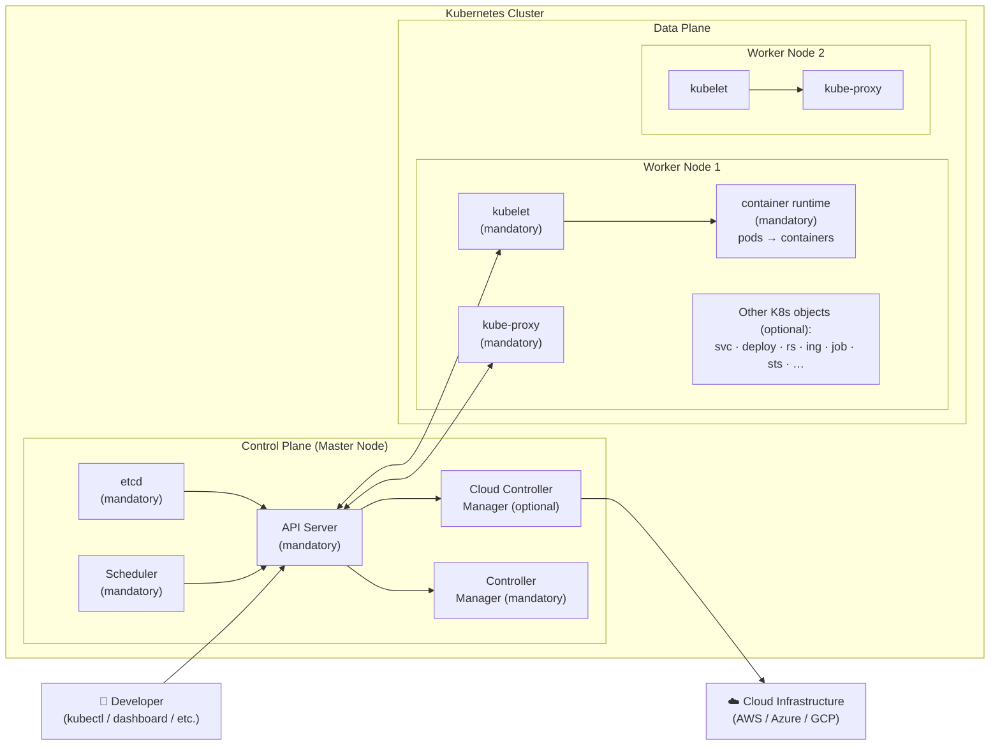

> **Legend — Mandatory vs. Optional**
> - 🟩 **Mandatory** (control plane): API Server, etcd, Scheduler, Controller Manager.
>   **Mandatory** (worker node): kubelet, container runtime, kube-proxy.
> - 🟧 **Optional**: Cloud Controller Manager, and all the higher-level objects
>   (services, deployments, replica sets, ingresses, jobs, stateful sets, …).

#### What lives where (quick locator)

- **etcd, scheduler, API server, controller manager, cloud controller manager** → *control plane*, inside
  a **master node**.
- **kubelet, container runtime, kube-proxy** → *worker node* (data plane); **mandatory**.
- **services, deployments, replica sets, ingresses, jobs, stateful sets** → higher-level **objects** in
  the data plane; **optional**.

---

### 1.4 The Control Plane (Master Node)

Control plane components are **Kubernetes system software** — they are the programs that run and make
sure the cluster is working as expected. The goal of this subsection is to understand the **individual
role** of each component and **how they come together** to deliver Kubernetes' functionality.

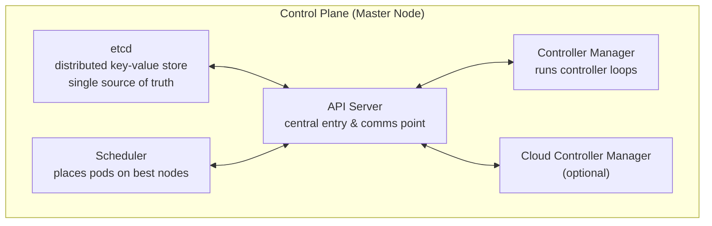

#### 1.4.1 API Server

- **Exposes the Kubernetes API** and is the **main entry point** for *all* the tasks we run with
  Kubernetes. Whenever we wish to **create pods, update pods, get all running pods**, or perform **any
  other operation**, we communicate with the API server.
- This is usually **abstracted** behind the `kubectl` CLI. `kubectl` takes very human-friendly,
  intuitive commands and **translates them into API calls — HTTP calls** — that are then sent to the API
  server. You *could* write something to make HTTP calls directly to the API server, but in practice
  `kubectl` is the normal entry point and takes care of the translation for you.
- The API server is the **central communication point** of the whole cluster — there are a lot of arrows
  flying around it. It talks to the **storage (etcd)** to read and write data, to the **scheduler**, to
  the **controller manager**, to the **cloud controller manager**, and it communicates **both ways** with
  the **kubelet** and **kube-proxy** on the worker nodes.

#### 1.4.2 Scheduler (kube-scheduler)

- The scheduler has a very important job: it is responsible for **placing pods on the most suitable
  nodes**. There are a variety of factors taken into consideration when scheduling pods on worker nodes,
  and a key one is **resource availability**.
- Beyond resources, we can also **inform our own constraints** — define certain rules that the scheduler
  should follow when choosing the nodes for our pods.
- Because this is a fairly complex task, there is an **entire dedicated process** — the **kube-scheduler**
  — running to take care of it.

  > **Worked example:** Suppose we want a pod that needs **2 GB of RAM**. Worker Node 1 has only **1.5 GB**
  > of RAM available, while Worker Node 2 has **4 GB** available. The scheduler looks at the available
  > resources and places the pod on **Node 2**.

#### 1.4.3 Controller Manager

- The controller manager is responsible for running **controller processes** that handle routine tasks.
  Think of a **controller** as basically just a **loop that does one single thing at a time**: it
  continuously checks whether the **actual state** of the cluster matches its **desired state**, and if
  there is any difference, that controller process takes action to bring the cluster back to its desired
  state. The data it checks against lives in the **etcd store**.
- Concrete examples of controllers bundled in the controller manager:
  - **Node controller** — makes sure the nodes are healthy, registered with Kubernetes, and running
    correctly.
  - **Replica set controller** — takes care of the replica sets inside our nodes and makes sure they have
    the **correct number of replicas**.
  - **Job controller** — takes care of jobs we create within the worker nodes and makes sure they are
    being executed correctly.
- As a quick reminder of the term used above: a **replica set** is a Kubernetes object where we specify
  how many pods we want running, and the replica set ensures we always have that desired number of pods
  running.

> **"How does this actually happen behind the scenes?"** When you wonder how a replica set *knows* a pod
> was deleted and that it needs to create a new one, the answer is that there is a **controller** behind
> the scenes looking at the data stored in **etcd**, continuously checking whether the cluster's state
> matches its desired state. If there's a difference, that specific controller process — part of the
> controller manager — takes action to restore the desired state.

##### Interdependency example (controller ↔ scheduler)

There is already some **interdependency** between these components. Suppose we want **4 pods** but only
**3** are actually running on the cluster:

1. The **replica set controller** identifies that it needs a new pod and says *"I need a new pod — please
   create one."*
2. The **scheduler** then comes into play, because it is responsible for **scheduling that new pod** onto
   one of the worker nodes, given all the constraints in place in our cluster.

So there is a clear dependency here: the controller decides *that* a pod is needed, and the scheduler
decides *where* it goes.

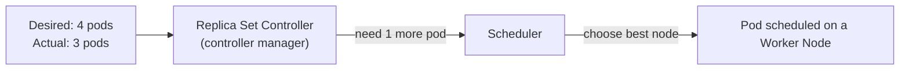

#### 1.4.4 etcd Store

- etcd is a **distributed key-value store** that stores **all the cluster data**. It includes **both** the
  **configuration** of the cluster **and** its **state** — if you think *cluster state or data*, think
  *etcd*.
- It is the **single source of truth** for the cluster state. The **API server** is the component used to
  **write data to** and **read data from** etcd, whenever we need to either update the state of the
  cluster or read what the current state is.

> 🔑 **Memory hook:** *cluster state or data → think etcd.*

#### 1.4.5 Cloud Controller Manager (optional)

- This is a **very common** component in current cluster configurations, though it is **optional**. What
  it does is **enable Kubernetes to interact with the underlying cloud infrastructure**, handling tasks
  such as managing **cloud-based load balancers**, the **persistent storage** that will happen many times
  *outside* of the Kubernetes cluster using cloud-native solutions (such as **AWS S3, EBS, or EFS**), as
  well as **node management** of the underlying VMs.
- Why this matters: it is important to remember that **Kubernetes is software, not hardware**. There is
  an underlying infrastructure needed — actual computers / VMs where the Kubernetes cluster runs. Since
  these VMs are most of the time run in cloud infrastructure, it is great to have the cloud controller
  manager taking care of managing the underlying VMs and nodes so they work as expected (see Section
  1.7).

---

### 1.5 The Data Plane (Worker Nodes)

Worker nodes are **where our applications run** — where containers actually execute. Three components are
**mandatory**.

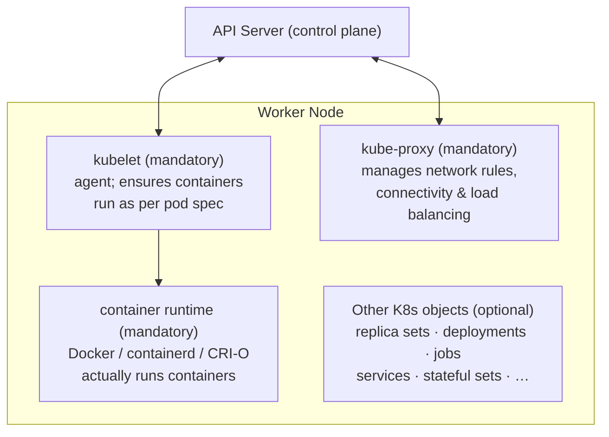

#### 1.5.1 kubelet (mandatory)

The kubelet is an **agent that runs on each worker node**, and it **communicates continuously with the
control plane via the API server**. Its job is to **ensure that the containers are running in the pods
as defined in the pod's specification**. When we define which containers we want to run within a pod, it
is the kubelet's responsibility to ensure those containers are running exactly as the specification
describes.

#### 1.5.2 Container Runtime (mandatory)

The container runtime is responsible for **actually running the containers** on each worker node. The
most common / familiar one is **Docker**, but there are also other options such as **containerd** and
**CRI-O**. In short, the container runtime is the software that provides the runtime for the containers
to run.

#### 1.5.3 kube-proxy (mandatory)

kube-proxy is responsible for **managing the network rules** on each of our worker nodes. It maintains
the **network connectivity and the load balancing for services**, ensuring that whatever requests come
in via these services are **routed to the appropriate pods**. Keep kube-proxy in mind whenever services
are discussed — it is the component that ultimately enforces service networking.

#### 1.5.4 Other Kubernetes Objects (optional)

Beyond the three mandatory components, a worker node hosts many other Kubernetes objects that provide a
lot of functionality. Examples include **replica sets, deployments, jobs, services, stateful sets**, and
more. They are **all optional** — which means you *can* run a cluster with only single pods (no services,
no deployments). However, you will **hardly ever** come across a real Kubernetes cluster that doesn't
have at least one or several of these objects.

> **Key insight — these higher-level objects are abstractions that rely on the mandatory components.** A
> **service**, at the end of the day, uses **kube-proxy** — it is kube-proxy that actually routes the
> requests and ensures the service's rules are followed. A **deployment**, at the end of the day, runs
> **pods**, and those pods run inside the **container runtime**. These higher-level objects normally have
> **controllers on the control-plane side** (within the controller manager) responsible for monitoring
> their state and ensuring the **actual state matches the desired state**.

---

### 1.6 How Communication Flows

Understanding how communication takes place is what ties the whole architecture together.

1. Whenever a **developer** wants to interact with the Kubernetes cluster, they normally use the
   **`kubectl` CLI** — by far the most widely used tool — though they might also use the **Kubernetes
   dashboard**.
2. These tools automatically talk to the **API server**. So the **entry point** of our cluster for
   communication purposes is the API server.
3. The **API server** in turn communicates with both the **kubelet** and the **kube-proxy** on the worker
   nodes — and these components communicate **back** with the API server. There are lots of arrows flying
   around here, which is exactly why the API server is the **central communication point**.
4. The API server also talks to the **storage (etcd)** to read/write cluster data, to the **scheduler**,
   to the **cloud controller manager**, and to the **controller manager**.

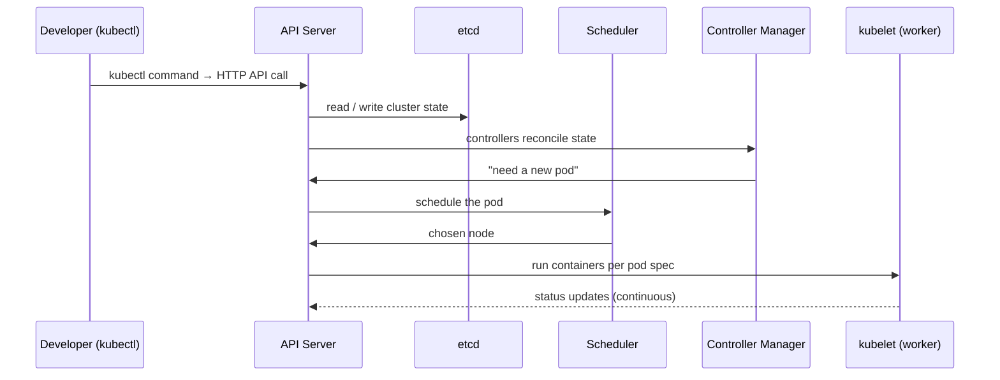

> **One-line summary:** *The API server is the central communication hub; everything else talks through
> it.*

---

### 1.7 Nodes, VMs, and the Underlying Infrastructure

An important distinction to internalize: **Kubernetes is software, not hardware.** There is always an
underlying infrastructure — actual **computers** — where the cluster runs.

- Normally, **nodes map to individual VMs**. We run nodes in different VMs so that if one virtual machine
  goes down, then **only one node goes down**, not the entire cluster.
- However, you **can** also run an entire Kubernetes cluster on a **single machine**. The best example is
  when we run Kubernetes **locally** — unless you have a fleet of VMs you're somehow using (which is
  hardly ever the case for local work), you're running the cluster on your personal computer / laptop,
  which is a single machine. And yet, when you create a cluster with **minikube**, you can still specify
  that you want **more than one node**.
- So **nodes are *not* synonymous with VMs**, and they are **not** a strict 1-to-1 map to VMs.

**Best practices.** It is best practice to run nodes in **different VMs**, and — most importantly — to
keep the **master node(s) individual / separate from the worker nodes**. As you might imagine, all these
VMs are most of the time run in **cloud infrastructure**, which is exactly why it's great to have the
**cloud controller manager** taking care of managing the underlying VMs and nodes so they work as
expected.

---

### 1.8 Summary Tables

#### 1.8.1 Control Plane vs. Data Plane

| Aspect | Control Plane (Master Node) | Data Plane (Worker Nodes) |
|---|---|---|
| Role | The "brains" of Kubernetes | Where workloads (pods/containers) run |
| Runs | Kubernetes **system** software | **Our** applications |
| Core components | API server, etcd, scheduler, controller manager, (cloud controller manager) | kubelet, container runtime, kube-proxy, (+ optional objects) |
| Typical count | Usually fewer; multiple for HA | Usually more (more app software than system software) |
| Best practice | Keep separate from worker nodes | Run across multiple VMs |

#### 1.8.2 Control Plane Components

| Component | Mandatory? | What it does |
|---|---|---|
| **API Server** | ✅ Yes | Exposes the Kubernetes API; central entry & communication point; reads/writes etcd |
| **etcd** | ✅ Yes | Distributed key-value store; single source of truth for cluster config + state |
| **Scheduler** | ✅ Yes | Places pods on the most suitable nodes (resource availability + constraints) |
| **Controller Manager** | ✅ Yes | Runs controller loops (node, replica set, job, …) reconciling desired vs. actual state |
| **Cloud Controller Manager** | 🟧 Optional | Integrates with cloud infra: load balancers, persistent storage (S3/EBS/EFS), node management |

#### 1.8.3 Worker Node Components

| Component | Mandatory? | What it does |
|---|---|---|
| **kubelet** | ✅ Yes | Agent on each node; talks to API server; ensures containers run per pod spec |
| **Container runtime** | ✅ Yes | Actually runs containers (Docker, containerd, CRI-O) |
| **kube-proxy** | ✅ Yes | Manages network rules; connectivity + load balancing for services → routes to pods |
| **Other objects** (svc, deploy, rs, ing, job, sts, …) | 🟧 Optional | Higher-level functionality; rely on the mandatory components underneath |

#### 1.8.4 Controllers (inside the Controller Manager)

| Controller | Watches / ensures |
|---|---|
| **Node controller** | Nodes are healthy, registered, and running correctly |
| **Replica set controller** | The correct number of pod replicas is running |
| **Job controller** | Jobs are executed correctly |

---

### 1.9 Glossary of Key Terms

- **Kubernetes cluster** — the complete deployment, composed of a control plane and a data plane.
- **Control plane** — the brains of Kubernetes; hosts the system components; runs on the master node(s).
- **Data plane** — the set of worker nodes where application workloads actually run.
- **Node** — a machine (often a VM) in the cluster; either a master node or a worker node.
- **Master node** — hosts the control plane components; should be kept separate from worker nodes;
  ideally more than one for high availability.
- **Worker node** — runs pods and containers; must run kubelet, container runtime, and kube-proxy.
- **API server** — exposes the Kubernetes API; the main entry point and central communication hub.
- **etcd** — distributed key-value store; single source of truth for cluster configuration and state.
- **Scheduler (kube-scheduler)** — places pods on the most suitable nodes based on resources and
  constraints.
- **Controller manager** — runs controller loops that reconcile actual state with desired state.
- **Controller** — a loop performing one task, continuously comparing actual vs. desired state and
  acting on differences.
- **Cloud controller manager** — optional component integrating Kubernetes with cloud infrastructure.
- **kubelet** — node agent ensuring containers run as defined in the pod specification.
- **Container runtime** — software that runs containers (Docker, containerd, CRI-O).
- **kube-proxy** — manages node network rules; provides service connectivity and load balancing.
- **Pod** — smallest deployable unit; wraps one or more containers.
- **Replica set** — object that ensures a specified (desired) number of pods is always running.
- **Desired state / actual state** — the declared target vs. the real situation; Kubernetes reconciles
  the two.
- **kubectl** — the most widely used CLI; translates human-friendly commands into API calls.
- **minikube** — a tool to run Kubernetes locally (single machine), optionally with multiple nodes.
- **High availability (HA)** — running redundant components (e.g., multiple master nodes) so the cluster
  survives a node failure.

---

## 2. Running Containers in Kubernetes

### 2.1 Pods: The Smallest Unit

A **pod** is the smallest, simplest unit you can create to run containers. **You cannot run a container
by itself — it must be wrapped in a pod.** A pod represents **a single instance of a running process**.

- A pod can hold **one or more containers**. Use multiple only for **supporting processes** (init / data
  loading, or a logging/monitoring **sidecar**) that must run alongside the main container — **never two
  main applications** in one pod (use one pod each).
- Containers in a pod **share storage and network**. They communicate via **`localhost`** (must listen on
  **non-overlapping ports**) and can **read/write the same volumes** (each volume mount can be marked
  **read-only** or not — your choice).
- Pods provide higher-level config than raw containers: **ports, environment variables, volumes, security
  settings, resource requests & limits**.
- **By default, all pods can talk to each other** — even **across namespaces** — unless you add
  restrictions.
- Each container can have **health probes** so it is restarted, or stops receiving traffic, if unhealthy.
- Volumes can be the pod's **ephemeral storage** (a shared directory) or **persistent volumes** for
  durable data.

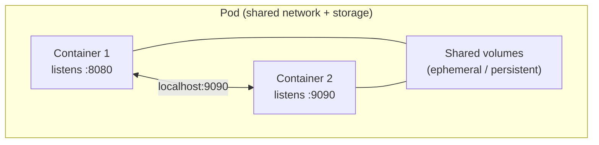

### 2.2 The Pod Lifecycle

When someone (a developer, a replica set, a deployment, …) sends a request **via the Kubernetes API** to
create a pod, it moves through these **phases**:

| Phase | Meaning |
|---|---|
| **Pending** | One or more containers not ready yet — pod awaits **scheduling onto a node** (stays pending if resources are short) and/or images are downloading (you'll see the **`ContainerCreating`** status). |
| **Running** | All containers created; **at least one** is running, starting, or restarting. (Even if 4 of 5 containers stopped, the pod is still "Running".) |
| **Succeeded** | **All** containers terminated **successfully** and are **not** to be restarted. |
| **Failed** | **All** containers terminated and **at least one** failed (non-zero exit). |
| **Unknown** | The state can't be obtained — usually a **communication problem** with the node / kubelet. |

> **Succeeded / Failed** apply to pods whose work is meant to **end** (e.g., a batch job). A web server is
> meant to stay **Running** indefinitely. To replace such a pod, Kubernetes typically **deletes and
> recreates** it (with the new image) rather than updating containers in place — you'll see it
> **Terminating**.

### 2.3 Handling Container Errors & Restart Policies

If a container crashes, behavior depends on the pod's **`restartPolicy`**:

- **`Always`** — restart whenever the container exits.
- **`OnFailure`** — restart only on a **crash** (non-zero exit code).
- **`Never`** — don't restart; leave it **Failed** / **Succeeded**.

When a restart applies, Kubernetes tracks restart counts and applies **exponential backoff** — each
repeated crash waits longer before the next restart (seconds → minutes, **capped at ~5 minutes**). The
status shown is **`CrashLoopBackOff`** (the system is waiting before retrying). Once the container stays
healthy with **no recent restarts**, Kubernetes **resets the backoff count** — a later crash is restarted
quickly again.

**Debugging commands:** `kubectl describe pod <name>` (state + **events**), `kubectl logs <name>` (fatal
errors causing exits). Append **`--watch`** to logs/events to **stream updates** instead of re-running.

### 2.4 Creating & Managing Pods with kubectl

First confirm the cluster and the **context** (which cluster `kubectl` talks to):

```bash
kubectl version                       # expect a server response
kubectl config current-context        # should be: minikube
kubectl config set-context minikube   # switch if it isn't
```

> The **context** matters so you only spin up/delete things in the intended cluster (not a remote one).

Create and inspect a pod with **`run`** (tip: `kubectl run --help` shows flags + examples):

```bash
kubectl run nginx --image=nginx:1.27.0   # name=nginx, image+tag pinned
kubectl get pods                         # READY, STATUS=Running, RESTARTS=0, AGE
kubectl delete pod alpine                # delete by resource + name (add --force to skip grace period)
```

<details>
<summary><code>&gt;_</code> <b>Terminal — sample output</b> (click to expand)</summary>

```text
$ kubectl get pods
NAME    READY   STATUS    RESTARTS   AGE
nginx   1/1     Running   0          30s
```

</details>

> **Reading it:** `1/1` ready, `Running`, `0` restarts (no errors), ~30s old → the pod came up cleanly.
> Always **pin the tag** (`nginx:1.27.0`) so everyone runs the same image. Command shape:
> `kubectl run <pod-name> --image=<image>:<tag>`.

### 2.5 Inspecting Pods & Communication

```bash
kubectl get pods                  # high-level summary only
kubectl describe pod nginx        # namespace, service account, node, start time, IP,
                                  # status, image, conditions, and EVENTS (great for debugging)
kubectl logs nginx                # container logs (curl hits, init logs, fatal errors)
kubectl logs <pod> --container <c>   # required when a pod has >1 container
```

<details>
<summary><code>&gt;_</code> <b>Terminal — sample output</b> (click to expand)</summary>

```text
$ kubectl describe pod nginx        # (relevant lines only)
Namespace:    default
Node:         minikube/192.168.49.2
Status:       Running
IP:           10.244.0.4            # ← private cluster IP (used below)
Containers:
  nginx:
    Image:    nginx:1.27.0
Events:
  Type    Reason     Message
  Normal  Scheduled  Successfully assigned default/nginx to minikube
  Normal  Pulled     Container image "nginx:1.27.0" already present
  Normal  Started    Started container nginx
```

</details>

> **Summary:** `describe` is your debugging workhorse — the **IP** and the **Events** at the bottom show
> exactly what happened (scheduled → image pulled → started).

Key networking facts demonstrated:

- A pod's **IP is private** — reachable **only from inside the cluster**. Curling it from your host
  **hangs and fails**.
- To test from inside, run an interactive helper pod and curl the IP:

  ```bash
  kubectl run alpine -i --tty --image=alpine:3.20 -- sh   # interactive shell
  apk update && apk add curl                              # install curl inside
  curl 10.244.0.4                                         # the nginx pod's IP from describe
  ```

<details>
<summary><code>&gt;_</code> <b>Terminal — sample output</b> (click to expand)</summary>

```text
# curl 10.244.0.4   →  works from inside the cluster
<title>Welcome to nginx!</title>          # (truncated HTML)
# curl nginx        →  curl: (6) Could not resolve host: nginx
```

</details>

  > **Summary:** the private pod IP is reachable **from inside** the cluster, but the pod **name** is not
  > — DNS by name needs a Service (2.6).

- **Name resolution does *not* work by default** — `curl nginx` fails ("can't resolve host"). Unlike
  Docker user-defined networks, pods can't reach each other by name out of the box. (Services fix this —
  see 2.6.)
- A pod that runs a shell and exits will show **RESTARTS** incrementing (the `exit` triggers a restart
  under the default policy).

### 2.6 Exposing Pods via a Service

A pod's IP **changes whenever it's recreated**, so relying on it is fragile. A **service** gives a
**stable IP and a DNS name**. The `expose` command can target pods, deployments, or replica sets:

```bash
kubectl expose pod nginx --type=NodePort --port=80
kubectl get service                         # shows the nginx service + its stable ClusterIP
# from inside the cluster (alpine helper pod):
curl <service-ClusterIP>                    # works
curl nginx                                  # also works — resolves by service NAME
```

<details>
<summary><code>&gt;_</code> <b>Terminal — sample output</b> (click to expand)</summary>

```text
$ kubectl get service
NAME    TYPE       CLUSTER-IP      EXTERNAL-IP   PORT(S)        AGE
nginx   NodePort   10.96.171.214   <none>        80:30007/TCP   5s
```

</details>

> **Summary:** the service has a **stable ClusterIP** (`10.96.171.214`) plus a node port (`30007`); pods
> behind it are now reachable by this IP **and** by the name `nginx` — both survive pod restarts.

Demonstrated stability: deleting the nginx pod makes the curl fail ("can't connect"); **recreating** the
pod (which gets a **new pod IP**, e.g. `.3` → `.6`) lets the **same ClusterIP and name** route again. So a
NodePort service gives **both** a stable **ClusterIP** and a usable **name** across pod restarts.

> Cleanup: `kubectl delete service nginx` (leaves the default `kubernetes` service); deleting pods may
> take a few seconds due to the grace period. Services are covered in depth later — this is just their
> role.

### 2.7 Full Cycle: Dockerfile → Image → Pod

The end-to-end flow — code → image → push → run in K8s — using a simple Express (npm) app with one root
endpoint and a `Dockerfile`:

```bash
# 1. Build & tag (run inside the app/color-api directory; '.' = build context)
docker build -t lm-academy/color-api:1.0.0 .
docker images lm-academy/color-api            # confirm repo + tag

# 2. Log in to Docker Hub (prefer a Personal Access Token over a password)
docker login                                  # paste PAT when prompted → "Login Succeeded"

# 3. Push
docker push lm-academy/color-api:1.0.0        # verify under Repositories → Tags

# 4. Run it as a pod, just like any other image
kubectl run color-api --image=lm-academy/color-api:1.0.0
kubectl logs color-api                        # app listening on port 80
kubectl describe pod color-api                # grab the pod IP
# from the alpine helper pod:
curl <color-api-pod-IP>                        # returns the app's HTML
```

> Create the **Docker Hub PAT** under Account Settings → Security → Personal access tokens (read/write/
> delete). The **tag must match** what you reference in `kubectl run`. Cleanup with
> `kubectl delete pod <name> --force=true` (force only in safe/dev environments — production needs a
> graceful shutdown period).

---

## 3. Object Management & YAML Manifests

How we *tell* Kubernetes what to run. So far we've created objects with one-off `kubectl` commands, but
that's rarely how real projects operate. Kubernetes offers **three approaches** to managing objects,
increasing in complexity (and power) as you go: imperative with `kubectl`, imperative with config files,
and declarative with config files. The latter two — built on **YAML manifests** — are what you'll use
~99% of the time, so this section focuses on writing those manifests and understanding when each approach
fits. We'll also see *why* the declarative `apply` workflow ultimately wins over imperative `replace`.

### 3.1 The Three Approaches

| # | Approach | Core commands | One-liner |
|---|---|---|---|
| 1 | **Imperative — kubectl** | `kubectl run`, `delete`, `expose` | Type commands directly; no files |
| 2 | **Imperative — config files** | `kubectl create -f`, `delete -f`, `replace -f` | Same intent, but stored in a file |
| 3 | **Declarative — config files** | `kubectl apply -f` | Describe desired state; K8s figures out *how* |

> **Imperative vs. declarative:** imperative = *"do this exact action"* (create/replace this object).
> Declarative = *"make reality match this file"* — Kubernetes computes the diff and applies only what's
> needed. Approaches 1 and 2 are imperative; approach 3 is declarative.
>
> **Learning curve increases left → right.** In real projects, approaches **2 and 3 are used ~99% of
> the time**; #1 is for quick experiments.

The **read-only commands are identical across all three approaches**: `kubectl get`, `describe`, `logs`,
etc. They always reflect the **live** state of the cluster. (`delete` is imperative but is the
recommended way to remove objects in every approach.)

### 3.2 Pros & Cons

**1. Imperative with kubectl**
- ➕ Lowest learning curve; single step; command words clearly communicate the change.
- ➖ No reusable template for recreating objects (must memorize/save the command); no change review or
  audit trail; **no record** of what existed — only what is *currently live*.

**2. Imperative with config files**
- ➕ Files can be **committed, reviewed, audited**; provide a **template** for new objects; simpler than
  declarative (you explicitly say what to do).
- ➖ Better for **single files** than directories; requires knowing each object's **schema**;
  **does not persist changes made outside the file** (e.g., a `replace` wipes annotations a third-party
  system added) — can cause tricky failures.

**3. Declarative with config files (`apply`)**
- ➕ **Persists updates made to live objects** even if not in the file (via complex merge/patch logic
  abstracted by `apply`); best for **directories / many files**; auto-detects which operations are
  needed to reach the desired state.
- ➖ **Highest learning curve**; partial-update failures are harder to debug; the **live state may not be
  fully reflected** in the files (so recreating an object from files alone may miss fields).

### 3.3 Anatomy of a Manifest (YAML)

A **manifest** (= **configuration file**, synonyms) defines the **desired state** of an object using
**YAML**. Most objects have **four top-level fields** (some, like *namespaces*, omit `spec`):

```yaml
apiVersion: v1          # API group + version (e.g. v1 = core group; also apps/v1, .../v1beta1)
kind: Pod               # exact object type — MUST be supported by the apiVersion (else error)
metadata:               # identifies the object
  name: nginx-pod
  labels:               # used to identify/group objects
    app: nginx
  annotations:          # non-identifying info / config; third-party systems & K8s add data here
    description: nginx pod for learning purposes
spec:                   # the actual config — shape depends on apiVersion + kind
  containers:           # REQUIRED for a Pod; a list of objects
    - image: nginx:1.27.0
      name: nginx-container
      ports:
        - containerPort: 80
```

- **`apiVersion`** — API group + version used to create the object.
- **`kind`** — the exact resource; must be supported by the `apiVersion`.
- **`metadata`** — uniquely identifies the object (`name`, `namespace`, `labels`, `annotations`).
  Kubernetes also adds system info here.
- **`spec`** — the core configuration; its required keys **vary by `apiVersion` + `kind`** (e.g., Pods
  require `containers`; Services do not). **Always check the docs / use an IDE plugin** rather than
  memorizing.

### 3.4 Service Manifest Example

A **Service has no `containers`** — it routes traffic. It needs **type**, **ports**, and a **selector**:

```yaml
apiVersion: v1
kind: Service
metadata:
  name: nginx-svc
  labels:
    app: nginx
spec:
  type: NodePort
  ports:
    - port: 80
      protocol: TCP
      targetPort: 80      # port traffic is redirected to on the pod
  selector:
    app: nginx            # routes to ANY pod with this label (acts as a basic load balancer)
```

> **Selector = the key idea.** With the imperative `kubectl expose pod nginx-pod ...`, K8s knew the
> target pod. In a file, *you* must tell the Service which pods to route to — via the **`selector`**,
> which matches pod **labels**. Ten pods labeled `app: nginx` → the Service load-balances across all of
> them.

### 3.5 Generating Manifests with `--dry-run`

Don't know how a file should look? Generate it from an imperative command — runs entirely in `kubectl`
(`client`), never hits the server:

```bash
kubectl run color-api --image=lm-academy/color-api:1.0.0 --dry-run=client -o yaml
kubectl expose pod nginx-pod --type=NodePort --port=80 --dry-run=client -o yaml
```

<details>
<summary><code>&gt;_</code> <b>Terminal — sample output</b> (click to expand)</summary>

```text
$ kubectl run color-api --image=lm-academy/color-api:1.0.0 --dry-run=client -o yaml
apiVersion: v1
kind: Pod
metadata:
  labels:
    run: color-api
  name: color-api
spec:
  containers:
  - image: lm-academy/color-api:1.0.0
    name: color-api
```

</details>

> **Summary:** `--dry-run=client -o yaml` prints a ready-to-edit manifest **without** touching the
> cluster — a quick way to scaffold files (the `expose` variant correctly fills in the service
> `selector`). Trim to the fields you need, save, then `kubectl create -f`.

### 3.6 Why `replace` Fails — and `apply` Wins

The file you write is **not** what Kubernetes stores. Behind the scenes K8s adds many fields
(`creationTimestamp`, `uid`, `resourceVersion`, `namespace`, `imagePullPolicy`, `volumeMounts`,
`serviceAccountName`, `nodeName`, …). Inspect the live version with:

```bash
kubectl get pod nginx-pod -o yaml
```

<details>
<summary><code>&gt;_</code> <b>Terminal — sample output</b> (click to expand)</summary>

```text
$ kubectl replace -f nginx-pod.yaml          # after changing only the image
The Pod "nginx-pod" is invalid:
  spec.containers[0].volumeMounts: ... (and other K8s-added fields set to null)
  Forbidden: pod updates may not change fields other than `spec.containers[*].image` ...
```

</details>

> **Summary:** even a valid image change is rejected, because `replace` blanks the fields K8s added but
> your file omits — hence you'd have to delete + recreate. `apply` avoids this (see below).

- **`kubectl replace -f`** replaces the *entire* object with your file. Fields K8s added but you didn't
  specify get nulled — triggering errors like *"pod updates may not change fields other than ...
  spec.containers[*].image"*. Even a **valid** change (e.g., swapping the image) fails, forcing a
  **delete + recreate**.
- **`kubectl apply -f`** computes a **patch/merge** — it identifies that *only* the image field changed
  and updates just that, without deleting the object. This is exactly where declarative management
  shines.

### 3.7 Migrating from `create` to `apply`

If you started with `kubectl create -f`, you don't need to delete and recreate to go declarative. Just
run `kubectl apply -f`. The first apply emits a warning and **auto-patches** the missing
`last-applied-configuration` annotation (the one `apply` uses to track diffs). From then on, keep using
`apply`. (You could also have used `kubectl create --save-config` up front to add it.)

### 3.8 Multiple Objects in One File

Separate objects in a single manifest with a `---` separator:

```yaml
# nginx.yaml — pod + service together
apiVersion: v1
kind: Pod
# ... pod spec ...
---
apiVersion: v1
kind: Service
# ... service spec ...
```

```bash
kubectl apply -f nginx.yaml   # creates/updates both at once
kubectl delete -f nginx-pod.yaml -f nginx-svc.yaml   # delete multiple files in one command
```

- **One file (`---`)**: handy when objects share a **lifecycle** (created/destroyed together) — e.g.,
  bundling an app's pods, services, ingresses.
- **Separate files / a folder** (`kubectl apply -f ./`): better when files get long, and lets you
  **target updates** to a single object instead of applying everything.
- `apply` matches objects by **name** (re-applying identical config = "unchanged"); `create` issues an
  explicit *create* and **errors if the name already exists**.

### 3.9 Common Commands Recap

```bash
# Imperative — kubectl
kubectl run nginx-pod --image=nginx:1.27.0
kubectl expose pod nginx-pod --type=NodePort --port=80
kubectl delete pod nginx-pod

# Imperative — config files
kubectl create -f nginx-pod.yaml
kubectl replace -f nginx-pod.yaml          # recommended way to update (full replace)
kubectl delete -f nginx-pod.yaml

# Declarative — config files
kubectl apply -f nginx.yaml                # create or update to match desired state
kubectl apply -f ./                        # apply a whole directory

# Read-only (same in all approaches)
kubectl get pods | kubectl describe pod nginx-pod | kubectl logs <pod>
kubectl get pod nginx-pod -o yaml          # see the live, K8s-managed config
```

---

## 4. ReplicaSets and Deployments

Running individual pods means **manual intervention** whenever one dies — and no way to update many pods
safely. These two objects **manage pods for us**. A **ReplicaSet** continuously keeps a stable number of
identical pods running, recreating any that disappear (the foundation for high availability). A
**Deployment** sits one level higher, managing ReplicaSets to add what they lack: **rolling updates,
rollback, and revision history**. In practice you almost always use Deployments — they create and manage
ReplicaSets the same way ReplicaSets create and manage pods. This section builds up from ReplicaSets and
their limitations to Deployments, rollouts, scaling, and debugging failed rollouts.

### 4.1 ReplicaSets: Keeping Pods Alive

Running pods individually means **manual intervention** when one dies or turns unhealthy. A **ReplicaSet**
fixes this: it keeps a **stable number of identical pods** running at all times — the foundation for
**high availability and fault tolerance**. It identifies its pods via **selectors** and continuously
checks that the running count matches the desired count.

```yaml
apiVersion: apps/v1
kind: ReplicaSet
metadata:
  name: nginx-replicaset
spec:
  replicas: 3                  # desired number of pods — the source of truth
  selector:
    matchLabels:               # which pods this RS monitors
      app: nginx
  template:                    # blueprint for NEW pods (a pod's metadata + spec)
    metadata:
      labels:
        app: nginx             # MUST match the selector, or the RS won't track its own pods
    spec:
      containers:
        - name: nginx
          image: nginx:1.27.0
```

> ⚠️ **The labels in `template.metadata.labels` must match `selector.matchLabels`** — otherwise the
> ReplicaSet won't recognize the pods it creates and will keep spawning more.

> ReplicaSets are **hardly ever used directly** — they're normally created **automatically by
> Deployments** (4.4). But understanding them matters: they're what actually keeps pods running.

### 4.2 How a ReplicaSet Works (Reconciliation)

1. Reads **`replicas`** + **`template`**, counts pods matching the selector.
2. If fewer than desired, creates pods from the **template**.
3. **Continuously monitors** them. If a pod is deleted (e.g., 3 → 2), it detects the mismatch and
   **recreates** from the template back to the desired count.
4. This loop runs for the **entire life** of the ReplicaSet — `replicas` is the **source of truth** for
   how many pods run concurrently.

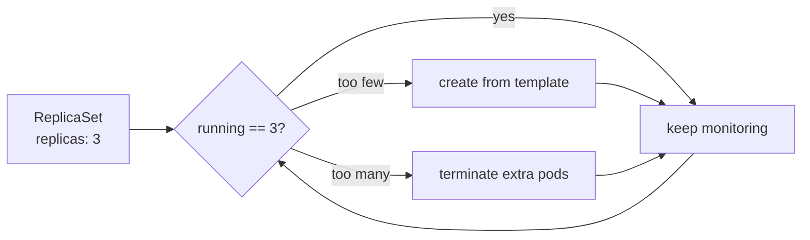

### 4.3 ReplicaSet Gotchas & Limitations

- **Template changes do NOT update existing pods.** Editing the image and re-applying configures the RS
  (and its template), but **running pods keep the old image** — enough pods already satisfy the selector,
  so none are recreated. Only when a pod is **deleted** does the RS create a replacement **with the new
  template**. So rolling out updates with a bare ReplicaSet is **manual** with no revert/history support.
- **It adopts any matching pod.** Create a standalone pod whose labels match the selector and the RS counts
  it — if that pushes the total **above `replicas`**, the RS **terminates** a pod (often the new one) to
  get back to desired. Any image counts, as long as labels match — so **define selectors carefully**.
- **It picks up pre-existing matching pods.** If a matching pod already runs when you create the RS
  (desired 3, 1 already there), the RS creates **only the 2 missing** ones. Keeping a standalone pod
  alongside an RS is **discouraged** (two configs to maintain) — delete the standalone pod and the RS
  recreates one from its template.

> Verify with `kubectl get rs` (or `replicaset`) and `kubectl get pods`. Watch live changes by appending
> **`--watch`**. This lack of update automation is exactly **why Deployments exist**.

### 4.4 Deployments: Why They Exist

ReplicaSets guarantee a pod count but offer **nothing** for updating, reverting, or auditing changes. A
**Deployment** is a higher-level abstraction that **manages ReplicaSets** (just as a ReplicaSet manages
pods) and adds:

- **Rolling updates** — gradually replace old pods with new ones, **no downtime**.
- **Rollback** — revert to a previous version if an update breaks.
- **Declarative updates** — config files give an **audit trail** of changes over time.
- **History & revision control** — Kubernetes (not git) tracks revisions; view or revert to any.
- **Controlled, gradual rollout** — limit risk via update controls.

```yaml
apiVersion: apps/v1
kind: Deployment
metadata:
  name: nginx-deployment
  labels:
    app: nginx               # labels on the Deployment object itself
spec:
  replicas: 5
  selector:
    matchLabels:
      app: nginx
  template:                  # same shape as a ReplicaSet template
    metadata:
      labels:
        app: nginx
    spec:
      containers:
        - name: nginx
          image: nginx:1.27.0
          ports:
            - containerPort: 80
  strategy:
    type: RollingUpdate      # default; other option: Recreate
```

> Same `apiVersion: apps/v1`, `replicas`, `selector`, `template` as a ReplicaSet — the **new part is
> `strategy`**.

### 4.5 The Rolling Update Strategy

When the **template changes**, the Deployment triggers an automatic rollout:

1. Creates a **second (new) ReplicaSet** with the new template (starts with 0 pods).
2. **Gradually shifts pods**: spin up a new-RS pod → once healthy, remove an old-RS pod → repeat.
3. Continues until the **old RS is empty**, then **deletes** the old ReplicaSet.

This makes switching between configurations **seamless** and enables **revision history** and
**rollback**. Two `strategy.type` options: **`RollingUpdate`** (default, gradual) or **`Recreate`**
(kill all, then recreate). Rolling update is configurable via **`maxUnavailable`** (how many pods may be
down) and **`maxSurge`** (how many extra pods over desired) — the surge is what lets new pods come up
**before** old ones are terminated (unlike a bare ReplicaSet, which would just kill the "extra" pod).

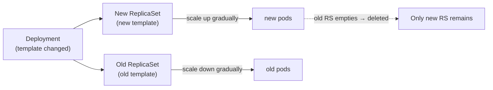

### 4.6 Creating & Inspecting a Deployment

```bash
kubectl apply -f nginx-deployment.yaml
kubectl get deploy                      # READY / UP-TO-DATE / AVAILABLE (e.g. 5/5/5)
kubectl describe deploy nginx-deployment   # selector, RollingUpdate strategy, maxUnavailable/maxSurge, events
kubectl get rs                          # the ReplicaSet K8s auto-created
kubectl get pods                        # the 5 pods
kubectl get pod <name> -o yaml          # note labels
```

<details>
<summary><code>&gt;_</code> <b>Terminal — sample output</b> (click to expand)</summary>

```text
$ kubectl get deploy
NAME               READY   UP-TO-DATE   AVAILABLE   AGE
nginx-deployment   5/5     5            5           20s

$ kubectl get rs
NAME                          DESIRED   CURRENT   READY   AGE
nginx-deployment-7d9c8f5b6c   5         5         5       20s     # name = deploy + pod-template-hash
```

</details>

> **Summary:** the Deployment auto-created a **ReplicaSet** (note the `pod-template-hash` suffix) and all
> 5 pods are ready/up-to-date/available — you never created the RS yourself.

> Each pod gets a **`pod-template-hash`** label — a hash of the **template contents**. Change the template
> → new hash → new ReplicaSet. This is how a Deployment **links pods to ReplicaSets** and manages updates
> automatically.

**Applying an update** (e.g., image `1.27.0` → `1.27.0-alpine`):

```bash
kubectl diff -f nginx-deployment.yaml   # preview changes (generation bump + image change)
kubectl apply -f nginx-deployment.yaml  # triggers rolling update
kubectl get pods --watch                # watch old pods terminate as new ones start
kubectl get rs --watch                  # watch new RS scale up while old RS scales down
```

`kubectl describe deploy nginx-deployment` shows the **events**: scaled new RS up, scaled old RS down, in
single steps until complete.

### 4.7 Rollouts, History & Revisions

```bash
kubectl rollout history deployment/nginx-deployment        # list revisions (slash optional)
kubectl rollout history deployment/nginx-deployment --revision=2 -o yaml   # details of a revision
kubectl rollout undo deployment nginx-deployment           # revert to previous revision
kubectl rollout status deployment/nginx-deployment         # is the rollout done?
kubectl rollout pause / resume / restart deployment/...    # pause stops auto-rollout; resume re-enables
```

<details>
<summary><code>&gt;_</code> <b>Terminal — sample output</b> (click to expand)</summary>

```text
$ kubectl rollout history deployment/nginx-deployment
REVISION  CHANGE-CAUSE
1         <none>
2         update nginx to tag 1.27.0-alpine
```

</details>

> **Summary:** each rollout is a numbered **revision**; the `CHANGE-CAUSE` column is `<none>` unless you
> set the `kubernetes.io/change-cause` annotation (below). Use the revision number with `undo
> --to-revision=N`.

> **Revision numbering is confusing on purpose:** `undo` doesn't restore "revision 1" in place — the old
> template is **re-applied as a new, higher revision number**. So reverting from rev 2 back to the rev-1
> template makes it appear as **rev 3**. A revision's YAML shows both a `revision` and a
> `revisionHistory` annotation.

**Recording the change cause** (otherwise shown as `<none>`):

- In the file — add under `metadata.annotations`:
  `kubernetes.io/change-cause: "update nginx to tag 1.27.0-alpine"`.
- Imperatively (e.g., from a CI/CD pipeline, *not* written to the file):
  `kubectl annotate deployment/nginx-deployment kubernetes.io/change-cause="update nginx to 1.27.1-alpine"`
  — confirm with `kubectl describe deployment nginx-deployment`.

### 4.8 Scaling Deployments

```bash
kubectl scale deployment nginx-deployment --replicas=3
```

> ⚠️ **`scale` is imperative and temporary** — it's **not** reflected in your file. The next
> `kubectl apply` reverts replicas to the file's value (and bumps the generation). `kubectl diff` will warn
> you of this. **Don't rely on `scale` for long-term state** — edit the file and `apply` instead. It
> leaves **no rollout history** entry.
>
> ✅ **The one good use:** quickly **restart pods** by scaling to `0` then back to the desired count —
> useful when pods go unhealthy despite valid config.

### 4.9 Debugging a Failed Rollout

Apply a **bad image tag** (e.g., a typo) and the rollout **gets stuck** — but thanks to RollingUpdate, the
**old pods keep serving** (no downtime). Symptoms: `get deploy` shows fewer available than desired;
`get pods` shows **`ImagePullBackOff`**.

```bash
kubectl get pods                                  # spot ImagePullBackOff
kubectl describe pod <name>                        # EVENTS reveal "failed to pull / manifest not found"
kubectl rollout status deployment/nginx-deployment # "waiting... 3 of 5 updated" → stuck
```

<details>
<summary><code>&gt;_</code> <b>Terminal — sample output</b> (click to expand)</summary>

```text
$ kubectl get pods
NAME                                READY   STATUS             RESTARTS   AGE
nginx-deployment-5f8...-abcde       1/1     Running            0          10m   # old pods still serving
nginx-deployment-6c2...-xyz12       0/1     ImagePullBackOff   0          1m    # new (broken) pod

$ kubectl rollout status deployment/nginx-deployment
Waiting for deployment "nginx-deployment" rollout to finish: 3 of 5 updated...   # stuck
```

</details>

> **Summary:** the rollout **stalls** on the bad image while the **old pods keep serving** (no downtime).
> `describe pod` events pinpoint the cause; fix the tag and `apply`, or `rollout undo` to revert.

> `describe deploy` is **vague** here; **`describe pod` events** give the real cause. `ImagePullBackOff` /
> "manifest not found" → first check the **image name + tag** (typo? missing username/repo?).

**Two ways out:**

- **Temporary:** `kubectl rollout undo deployment nginx-deployment` reverts to the last working revision.
  But the bad config is **still in the file**, so re-applying gets stuck again.
- **Permanent (correct fix):** edit the file to fix the tag, `kubectl diff` to confirm, then
  `kubectl apply -f`. The **generation increases monotonically** on every change.

> Cleanup: `kubectl delete -f nginx-deployment.yaml` removes the Deployment **and** its ReplicaSets and
> pods. This safety net — old version stays up while a broken rollout stalls — is the core value of the
> RollingUpdate strategy.

---

## 5. Services Deep Dive

Pods are **ephemeral** — they come and go, and their IPs change every time they're recreated. Anything
talking directly to a pod's IP breaks the moment that pod is replaced. A **Service** solves this by
abstracting pod details behind **stable connectivity**: it exposes an app running as one or more pods via
a **stable IP** and an **internal DNS name**, routing traffic only to healthy, matching pods. This
section covers why services exist, the **four service types** (ClusterIP, NodePort, LoadBalancer,
ExternalName) and when to use each, and digs into ClusterIP, DNS resolution via CoreDNS, NodePort
external access, and ExternalName.

### 5.1 Why Services Exist

Pods are **ephemeral** — they can be terminated and recreated anytime, and their **internal IP changes**
each time. If a frontend pod talks **directly** to pod IPs, communication **breaks** when a target pod is
recreated.

A Service sits **in front of the pods**: clients talk to the **Service**, which routes to **healthy
pods** matched by **labels**. Recreated pods (with new IPs) are picked up automatically; dead pods stop
receiving traffic.

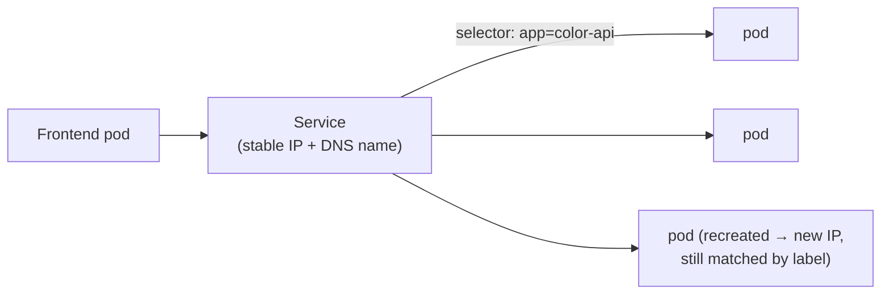

Key manifest fields: **`metadata.name`** (becomes the internal DNS name), **`spec.selector`** (labels
used to match pods), **`spec.ports`** (port to route to / expose).

### 5.2 The Four Service Types

| Type | Scope | What it does | Use case |
|---|---|---|---|
| **ClusterIP** *(default)* | Internal only | Stable internal IP; reachable **only inside** the cluster | Internal microservice-to-microservice comms (often paired with **Ingress** for HTTP/S external access) |
| **NodePort** | External | Exposes a static port on **each node's IP** (`<nodeIP>:<nodePort>`); range **30000–32767** (auto-picked if unset) | Dev/testing; rarely production |
| **LoadBalancer** | External | Provisions a **cloud provider's load balancer** with a single external IP | Production (requires a supported cloud provider) |
| **ExternalName** | Outbound | Maps the service to an **external DNS name** (CNAME) — the reverse direction | Give cluster apps a stable name for an **external** service |

> If you omit `type`, it defaults to **ClusterIP**. **LoadBalancer** is covered later with cloud
> providers; **headless** services come with StatefulSets.

### 5.3 ClusterIP (Internal Communication)

```yaml
apiVersion: v1
kind: Service
metadata:
  name: color-api-cluster-ip
  labels:
    app: color-api
spec:
  type: ClusterIP            # explicit is clearer (this is also the default)
  selector:
    app: color-api           # must match the pods' labels
  ports:
    - port: 80
      protocol: TCP          # optional
```

```bash
kubectl apply -f color-api-cluster-ip.yaml
kubectl get svc                              # shows the stable ClusterIP
kubectl describe svc color-api-cluster-ip    # name, labels, IP, and Endpoints (the pods' private IPs)
```

<details>
<summary><code>&gt;_</code> <b>Terminal — sample output</b> (click to expand)</summary>

```text
$ kubectl get svc
NAME                   TYPE        CLUSTER-IP     EXTERNAL-IP   PORT(S)   AGE
color-api-cluster-ip   ClusterIP   10.96.45.120   <none>        80/TCP    8s

$ kubectl describe svc color-api-cluster-ip      # (relevant line)
Endpoints:   10.244.0.17:80,10.244.0.18:80,10.244.0.19:80   # the live healthy pod IPs
```

</details>

> **Summary:** the service has a stable internal `CLUSTER-IP`; its **Endpoints** are the current pod IPs
> it load-balances across — this list updates automatically as pods come and go.

- **Load balancing:** a traffic generator hitting the ClusterIP gets responses from **different pods**
  (different hostnames) — the service distributes load.
- **Resilience:** delete a target pod and traffic **continues** to healthy pods with no interruption; the
  recreated pod (new IP) is automatically added. The `Endpoints` list updates to the new pod IPs.
- **Decoupled from Deployments:** deleting/recreating the Deployment doesn't require touching the Service
  — it just tracks **any** pods matching its selector (Deployment, ReplicaSet, or standalone pod).
- **Not reachable from outside the cluster** — internal use only.

### 5.4 DNS & Name Stability

Inside the cluster you can reach a service by its **name** (e.g., `curl color-api-cluster-ip`) instead of
its IP. This works via **CoreDNS**, running as pods in the **`kube-system`** namespace:

```bash
kubectl get pods -n kube-system               # find the coredns pod
kubectl logs -n kube-system <coredns-pod> -f  # see a DNS resolution per request
```

> **The name is more stable than the ClusterIP.** Deleting and recreating a Service gives it a **new
> ClusterIP**, but the **name stays the same** (unless you change it yourself). **Prefer the service name**
> for communication whenever DNS is available (nearly always).

### 5.5 NodePort (External Access)

Same as ClusterIP **plus** a node-level port. A NodePort service **also** gets a ClusterIP and a DNS name;
on top of that it's reachable at `<nodeIP>:<nodePort>`.

```yaml
apiVersion: v1
kind: Service
metadata:
  name: color-api-nodeport
  labels:
    app: color-api
spec:
  type: NodePort
  selector:
    app: color-api
  ports:
    - port: 80
      nodePort: 30007         # the static external port (30000–32767)
```

- **Security note:** NodePort exposes pods to **external traffic** — usually undesirable cluster-wide, so
  **ClusterIP is the default choice**; expose only pods that genuinely need it. Rarely used in production
  (favor LoadBalancer / Ingress).
- **Mac / Windows (minikube):** you **can't** hit `<nodeIP>:30007` directly (Docker networking) — it
  hangs. Run a tunnel: `minikube service color-api-nodeport --url`, which maps a **localhost port** to
  the node port (the URL's port differs from 30007). The terminal must stay open.
- **Linux:** you **can** hit `<nodeIP>:30007` directly. `kubectl get nodes -o wide` shows the node's
  **internal IP**. The NodePort is exposed on **every node**, and traffic entering one node's IP may be
  routed to a pod on **another** node (the scheduler spreads pods; nothing pins traffic to the entry
  node).

<details>
<summary><code>&gt;_</code> <b>Terminal — sample output</b> (click to expand)</summary>

```text
$ kubectl get nodes -o wide
NAME       STATUS   ROLES           INTERNAL-IP    ...
minikube   Ready    control-plane   192.168.49.2   ...     # → curl 192.168.49.2:30007 (Linux)
```

</details>

> **Summary:** `-o wide` reveals each node's **internal IP**; combined with the `nodePort` (30007) that's
> the `<nodeIP>:<nodePort>` address external clients use (directly on Linux, via `minikube service` on
> Mac/Win).

> ⚠️ "Internal IP" here = internal to the **VM/machine**, *not* the Kubernetes cluster — it's not reachable
> from outside the machine without an external IP.

### 5.6 ExternalName

Maps a service to an **external DNS name** via a **CNAME** — clients use a stable internal name and get
redirected outside the cluster.

```yaml
apiVersion: v1
kind: Service
metadata:
  name: my-external-svc
spec:
  type: ExternalName
  externalName: google.com    # DNS name only — no http:// or https://
```

```bash
kubectl exec -it <pod> -- sh    # from inside a pod
curl my-external-svc            # resolves via CNAME to google.com
```

> No selector or ports — it only provides name resolution. HTTP/HTTPS quirks (e.g., a 404 from the
> external host) are expected without extra config; the point is the **stable internal name → external
> DNS** redirection. Cleanup whole folders with `kubectl delete -f ./ --force`.

---

## 6. Resource Management

As a cluster grows, you need ways to keep resources **organized, isolated, constrained, and healthy**.
This section covers the toolkit for exactly that: **labels & selectors** (identify and group objects, and
the basis for how controllers and services find their pods), **annotations** (attach non-identifying
metadata and tool config), **namespaces** (logically partition the cluster for teams/environments),
**resource quotas, requests & limits** (stop one workload from starving the rest), and **health probes**
(let Kubernetes detect and auto-remediate unhealthy containers). Together these are the levers for
running a safe, multi-tenant, production-grade cluster.

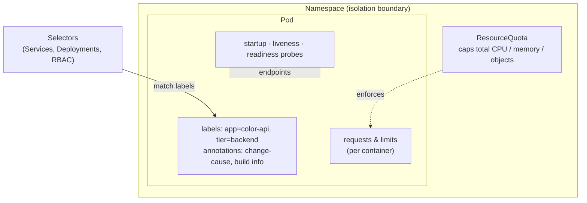

### 6.1 Labels & Selectors

**Labels** are key-value pairs attached to most objects (pods, nodes, services, deployments, …) to
**identify and group** them. Unlike `name` (unique per namespace), **labels need not be unique** — many
pods can share `app: color-api`.

**Selectors** filter objects by their labels. Two kinds:

**Equality-based** (older, still valid) — match exact key-value pairs (`=`, `!=`):

```yaml
selector:
  matchLabels:
    app: color-api
    tier: backend        # matches pods with BOTH labels
```

**Set-based** — match against a *set* of values with operators **`In`, `NotIn`, `Exists`, `DoesNotExist`**
(`Exists`/`DoesNotExist` ignore the value, just check the key):

```yaml
selector:
  matchExpressions:
    - {key: tier,    operator: In,    values: [frontend, backend]}
    - {key: release, operator: NotIn, values: [canary]}   # all non-canary pods
    - {key: managed, operator: Exists}                    # any pod that HAS a 'managed' label
```

> **`NotIn` beats `In` for exclusions** — to exclude just canary releases without enumerating every
> other release (stable, pre-release, test, dev…), use `NotIn: [canary]`. Each `matchExpressions` entry
> has a **key**, an **operator**, and (for In/NotIn) a **values** list.

### 6.2 Filtering with kubectl

```bash
kubectl get pods -L app -L tier              # -L (capital): add label COLUMNS to output
kubectl get pod -l app=color-api             # -l (lowercase): FILTER by label (equality)
kubectl get pod -l 'tier=frontend,app=color-api'   # comma = AND
kubectl get pod -l 'tier in (frontend)'      # set-based
kubectl get pod -l 'tier notin (frontend)'   # exclude frontend
```

<details>
<summary><code>&gt;_</code> <b>Terminal — sample output</b> (click to expand)</summary>

```text
$ kubectl get pods -L app -L tier
NAME            READY   STATUS    AGE   APP         TIER
color-backend   1/1     Running   1m    color-api   backend
color-frontend  1/1     Running   1m    color-api   frontend
```

</details>

> **Summary:** `-L` adds label **columns** (read-only view); `-l` **filters** the result set. Here only
> the backend pod would survive `-l tier=backend`.

> ⚠️ **Selector overlap danger:** a Deployment whose selector matches a standalone pod will **adopt or
> fight over** it. A neat trick to avoid this: gate the Deployment with `matchExpressions: [{key: managed,
> operator: Exists}]` so it only manages pods carrying a `managed` label, even if other labels match.
> Keep Deployment selectors **simple** — complex set-based logic makes scope hard to reason about and
> invites overlap. (Set-based selectors shine more for **node placement**.)

### 6.3 Annotations

Also key-value pairs, but for **non-identifying metadata / configuration** — used by tools and the K8s
system, **not** for selection. Common uses: tool-specific config (e.g., **nginx ingress controller**
annotations for SSL redirect, path rewrites, custom load balancing), build/version info (timestamps,
version numbers, git commit hash), and runtime config for operators/controllers.

> **Structure:** an optional **prefix** (a valid DNS subdomain, e.g. `kubernetes.io/`) + a **name**
> (< 63 chars). Automated systems **must** use a prefix; omitting the prefix marks it as a private/user
> annotation. (You've already seen `kubernetes.io/change-cause` in 4.7.)

### 6.4 Namespaces

Namespaces give **logical isolation** of resources within one **physical cluster** — no need for separate
clusters. Without them, everything shares "one big house": a runaway service consuming all CPU/memory can
**kill unrelated pods**, even across environments (e.g., take down the production payment backend).

Kubernetes ships with **four** namespaces:

| Namespace | Purpose |
|---|---|
| **default** | Where resources go when no namespace is specified |
| **kube-system** | Kubernetes system components (API server, scheduler, kube-proxy, CoreDNS, etcd, …) |
| **kube-public** | Publicly readable resources, accessible to any user |
| **kube-node-lease** | Node lease objects — kubelet reports node health/availability |

**Use cases:** multi-tenant clusters (per team), environment separation (dev/staging/prod), per-namespace
**policies & quotas**, and **RBAC** security (e.g., stricter permissions for prod).

**Best practices:** don't over-create them (only when there's a solid isolation case); pair with **RBAC**;
add **resource quotas** to stop one namespace monopolizing the cluster; pick a **meaningful dimension**
(team / app / environment) others can understand.

```yaml
apiVersion: v1
kind: Namespace        # simplest object — no spec section
metadata:
  name: dev
```

### 6.5 Working with Namespaces (kubectl)

```bash
kubectl get namespace                          # list all namespaces
kubectl get pods -n kube-system                # -n / --namespace targets a namespace
kubectl apply -f pod.yaml                       # pod's metadata.namespace decides where it lands
kubectl get pods --all-namespaces              # or -A: find which namespace a pod is in
# Set a default namespace for all commands (avoids repeating -n):
kubectl config current-context
kubectl config set-context --current --namespace=dev
kubectl config view                            # check current-context → its namespace
```

<details>
<summary><code>&gt;_</code> <b>Terminal — sample output</b> (click to expand)</summary>

```text
$ kubectl get namespace
NAME              STATUS   AGE
default           Active   2d
kube-system       Active   2d
kube-public       Active   2d
kube-node-lease   Active   2d
dev               Active   5s     # the one we created
```

</details>

> **Summary:** the four built-in namespaces are always present; `dev` is ours. Resources land in
> `default` unless you set `-n`/`metadata.namespace` or change the context's default namespace.

> ⚠️ **Two dangers:**
> 1. After `set-context --namespace`, **every** command runs there — forgetting this and running a
>    destructive `delete` against the wrong namespace (e.g., prod) is catastrophic. Always confirm with
>    `kubectl config view`.
> 2. **Deleting a namespace deletes everything inside it** — all its pods/resources are gone forever.
>    Guard namespace management with RBAC.

### 6.6 Cross-Namespace Communication

A service name resolves **only within the same namespace**. To reach a service in **another** namespace,
use its **Fully Qualified Domain Name (FQDN)**:

```
<service-name>.<namespace>.svc.cluster.local
```

```yaml
# A pod in 'default' hitting color-api-service in 'dev':
args: ["color-api-service.dev.svc.cluster.local/api", "1"]
```

> Set `metadata.namespace` on each resource (service, pod) to place it. Services use `port` (the port the
> service listens on) and `targetPort` (the pod port traffic is forwarded to). Note: `kubectl apply -f ./`
> won't order a namespace before resources that need it — apply the namespace first if you hit a "namespace
> not found" error.

### 6.7 Resource Quotas, Requests & Limits

Two sides of one coin for **fair resource distribution** and preventing **resource starvation**:

- **ResourceQuota** — a **namespace-level** policy setting **hard limits** on aggregate CPU, memory, and
  object counts for everything in that namespace.
- **Requests & limits** — set per **container** (inside a pod). **Request** = minimum guaranteed after
  scheduling; **limit** = maximum the container may use.

```yaml
apiVersion: v1
kind: ResourceQuota
metadata:
  name: dev-quota
  namespace: dev
spec:
  hard:
    requests.cpu: "1"          # 1 core = 1000 millicores (1000m)
    requests.memory: 1Gi
    limits.cpu: "2"
    limits.memory: 2Gi
---
# container-level (inside a pod spec):
resources:
  requests: {cpu: 200m, memory: 256Mi}
  limits:   {cpu: 500m, memory: 512Mi}
```

**Scheduling math:** Kubernetes sums the requests/limits of all pods in the namespace. A new pod is
**scheduled only if the totals stay within the quota**; otherwise it stays **Pending** (for a Deployment,
the error surfaces at the **ReplicaSet** level as `forbidden: exceeded quota`). CPU uses **millicores**
(`500m` = 0.5 core); pick the unit (`m` vs decimal) for readability.

> **If a namespace has a ResourceQuota, every pod MUST declare requests & limits**, or scheduling fails.
> You **can** set quotas above physical capacity (minikube defaults to ~2 vCPUs) — K8s won't stop you, but
> pods will contend for real resources if they all use their limits. Base values on real data (stress
> testing + buffer); don't set them blindly. Inspect with `kubectl describe resourcequota dev-quota -n dev`
> (shows used vs hard) and `kubectl get resourcequota -A`.

<details>
<summary><code>&gt;_</code> <b>Terminal — sample output</b> (click to expand)</summary>

```text
$ kubectl describe resourcequota dev-quota -n dev
Resource         Used   Hard
--------         ----   ----
limits.cpu       500m   2
limits.memory    512Mi  2Gi
requests.cpu     200m   1
requests.memory  256Mi  1Gi
```

</details>

> **Summary:** the **Used vs Hard** columns show how much of each capped resource the namespace has
> consumed — when a new pod's request would push `Used` past `Hard`, it's rejected (`exceeded quota`).

### 6.8 The Rollout-Quota Trap

A common gotcha: a Deployment near its quota **can't roll out an update**, because RollingUpdate **creates
extra pods** (surge) before terminating old ones — and those extras **exceed the quota**.

- Symptom: rollout stalls; `kubectl rollout status` shows e.g. "1 of 4 updated"; the new **ReplicaSet**
  shows desired > available. `kubectl describe rs <new-rs> -n dev` reveals `forbidden: exceeded quota`.
- Fixes: delete unused resources to free quota · **rightsize** requests/limits · or **raise the quota**
  (edit + `kubectl apply`). After freeing room, `kubectl rollout restart` avoids waiting for backoff.
- Same applies to **scaling** — `kubectl scale --replicas=10` only creates as many pods as the quota
  allows; the rest stay unscheduled.

### 6.9 Health Probes

**Probes** are periodic health checks **Kubernetes runs for you** (no custom loop needed) to manage a
container's lifecycle. Three types:

| Probe | When it runs | On failure |
|---|---|---|
| **Startup** | Once, until the container has started | Container is **killed and restarted** |
| **Liveness** | Continuously, for the container's life | Container is **restarted** (recovers from deadlock/stuck-but-running) |
| **Readiness** | Continuously, for the container's life | Container is **removed from Service endpoints** (stops receiving traffic) — not restarted |

> The startup probe runs **first**; only once it passes do liveness/readiness begin. A failing **readiness**
> probe is why Services don't route to pods that aren't ready yet (avoiding hung/erroring requests).

**Lifecycle (each probe):** execute → pass? keep looping after a `periodSeconds` delay. On failure, retry
until **`failureThreshold`** is exceeded, then take the probe's action (restart, or drop from endpoints).

**Probe types:** `httpGet`, `grpc`, or an `exec` command. Example (startup, hitting an always-OK `/up`):

```yaml
containers:
  - name: color-api
    image: lm-academy/color-api:1.2.1
    ports:
      - containerPort: 80
    resources:
      limits: {cpu: 500m, memory: 512Mi}
    startupProbe:
      httpGet: {path: /up, port: 80}
      failureThreshold: 2          # fails after 2 × periodSeconds
      periodSeconds: 3
    livenessProbe:
      httpGet: {path: /health, port: 80}
      failureThreshold: 3
      periodSeconds: 10
    readinessProbe:
      httpGet: {path: /ready, port: 80}
      failureThreshold: 2
      periodSeconds: 5
```

**Observed behavior in practice:**

- **Startup fail** (app delays 60s): probe fails → container restarts repeatedly → eventually
  `CrashLoopBackOff`. `describe pod` shows *"Startup probe failed: connection refused"*; restart count
  climbs and the container is never Ready. *(Tip: use a dedicated `/up` endpoint for startup, distinct from
  `/health`, so liveness and startup can fail independently.)*
- **Liveness fail:** container becomes Ready, then ~`failureThreshold × periodSeconds` later is
  **restarted**, repeatedly — recovers a stuck-but-running container.
- **Readiness fail** (50% chance per pod here): unhealthy pods show **0/1 Ready** with
  *"Readiness probe failed: HTTP 503"*. They **stay running but get no traffic** — the Service's
  `Endpoints` list contains only the healthy pods (verify with `kubectl describe svc <name>` +
  `kubectl get pod -o wide`). The traffic generator only ever hits healthy pods.

<details>
<summary><code>&gt;_</code> <b>Terminal — sample output</b> (click to expand)</summary>

```text
$ kubectl get pods               # readiness failing on some pods
NAME                  READY   STATUS    RESTARTS   AGE
color-api-xxxx-aaaaa   1/1     Running   0          2m   # ready → in Service Endpoints
color-api-xxxx-bbbbb   0/1     Running   0          2m   # NOT ready (503) → removed from Endpoints
color-api-xxxx-ccccc   0/1     Running   0          2m   # still Running, just no traffic
```

</details>

> **Summary:** `READY 0/1` with `STATUS Running` = the container is up but **failing readiness**, so the
> Service stops routing to it (without restarting it) — exactly what readiness probes are for.

> This is a strong reason to **always define probes** — Kubernetes auto-remediates (restart) or protects
> users (drop from endpoints) so unhealthy pods don't degrade the service. `kubectl scale --replicas=0`
> then back up is a quick way to recreate pods without delete/apply.

---

## 7. Persistence and Storage

Containers have **no persistent storage** by themselves — anything written inside a container is lost
when it's gone. Whenever you need data to **survive** a restart, or to **share** data between containers,
think **volumes**. This section moves from the simplest, shortest-lived option to fully durable, managed
storage: **emptyDir** (ephemeral, pod-scoped), **local** volumes (node-bound), the **PersistentVolume /
PersistentVolumeClaim** model (with access modes, reclaim policies, and static vs. dynamic provisioning),
**dynamic provisioning** via StorageClasses, and finally **StatefulSets** with **headless services** for
stateful apps that need stable identity and stable storage.

### 7.1 Volumes Overview

From a container's view, a **volume is just a directory** (possibly with data). What differs by volume
**type** is *how that directory comes to be* and *what backs it* (local SSD, AWS EBS/EFS, cloud storage,
ConfigMaps, …). Custom backends are possible via **CSI** (Container Storage Interface) drivers.

**Two-step usage:** declare volumes in `spec.volumes`, then mount them into containers via
`spec.containers[].volumeMounts`. The volume (or its PV/PVC, or ConfigMap) must exist beforehand.

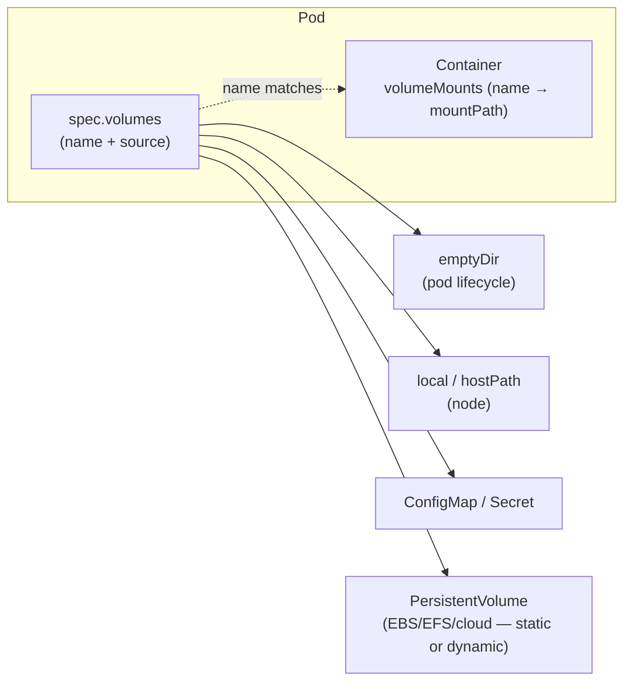

**Common types at a glance:** `emptyDir` (ephemeral, pod-scoped scratch/shared data) · `local` (durable
node storage; supersedes the discouraged, less-secure `hostPath`; needs node affinity; a PV) ·
`PersistentVolume` (general, many backends, static **or** dynamic) · `ConfigMap` & `Secret` (inject
config / sensitive data without hard-coding — covered later).

### 7.2 emptyDir (Ephemeral)

Pod-level, **ephemeral** storage: created when the pod is assigned to a node, **shared by all containers
in that pod** (they can mount it at *different* paths), and **deleted permanently when the pod is
removed**. Survives **container** restarts but **not** pod deletion. Never use for persistent data.

```yaml
spec:
  containers:
    - name: empty-dir-writer
      image: busybox:1.36.1
      command: ["sh", "-c", "sleep 3600"]
      volumeMounts:
        - {name: temporary-storage, mountPath: /usr/share/temp}
    - name: empty-dir-reader
      image: busybox:1.36.1
      command: ["sh", "-c", "sleep 3600"]
      volumeMounts:
        - {name: temporary-storage, mountPath: /tmp, readOnly: true}   # reader can't write
  volumes:
    - name: temporary-storage
      emptyDir: {}             # optional: medium: Memory (counts against memory limits), sizeLimit: 512Mi
```

> The `volumeMounts[].name` **must match** a `volumes[].name`. `readOnly: true` makes a mount read-only
> (writes fail with "Read-only file system"). `medium: Memory` uses RAM (fast, but consumes the
> container's memory limits) instead of disk (the default). Use case: a sidecar reading logs another
> container writes. **Multi-container exec** requires `-c <container>`.

### 7.3 Local Volumes

**Persistent**, node-level storage — data outlives the pod but is **tied to the node's lifecycle** (node
gone/replaced → data gone). It's a **PersistentVolume**, requires a **PersistentVolumeClaim**, and
**mandatorily** needs **node affinity** so pods land on the node that actually holds the directory.
Supports **static provisioning only**.

> Neither `emptyDir` nor `local` is recommended for production persistent data — use them only when losing
> the data is acceptable (temp/shared scratch, node-local caches, local dev).

### 7.4 PersistentVolumes & PersistentVolumeClaims

Pods **can't use a PV directly** — they go through a **PersistentVolumeClaim (PVC)**, which **reserves**
a PV. The PV↔PVC relationship is strictly **1:1**: a bound PV can't serve another claim, and any excess
capacity (10Gi PV, 1Gi claim → 9Gi wasted) is unusable by others (matters for **static** provisioning).

**Access modes:**

| Mode | Meaning |
|---|---|
| **ReadWriteOnce (RWO)** | Mounted read-write by a **single node** (any number of pods *on that node*) |
| **ReadOnlyMany (ROX)** | Mounted read-only by **many nodes** |
| **ReadWriteMany (RWX)** | Mounted read-write by **many nodes** |
| **ReadWriteOncePod** | Mounted read-write by a **single pod** |

**Reclaim policies** (what happens to the PV when its claim is deleted): **Retain** (keep PV + data;
default for **manually created** PVs; becomes `Released` and not auto-reusable) · **Delete** (remove PV;
default for **dynamically provisioned** PVs) · **Recycle** (deprecated).

**Static vs dynamic:**

- **Static** — create PVs first; a PVC does a **best-effort match** on access mode + size + storage class.
  No match → PVC stays **Pending**.
- **Dynamic** — create the PVC first; if the backend supports the request, the PV is **created
  automatically** to fulfill it. A pod can mix PVCs backed by either kind.

### 7.5 Working with a Local PV/PVC

```yaml
apiVersion: v1
kind: PersistentVolume
metadata:
  name: local-volume
spec:
  capacity: {storage: 1Gi}
  volumeMode: Filesystem          # default; alternative: Block
  accessModes: [ReadWriteOnce]
  persistentVolumeReclaimPolicy: Retain
  storageClassName: local-storage
  local:
    path: /mnt/disks/local-one    # MUST already exist on the node
  nodeAffinity:                   # MANDATORY for local volumes
    required:
      nodeSelectorTerms:
        - matchExpressions:
            - {key: kubernetes.io/hostname, operator: In, values: [minikube]}
---
apiVersion: v1
kind: PersistentVolumeClaim
metadata:
  name: local-volume-claim
spec:
  accessModes: [ReadWriteOnce]
  storageClassName: local-storage
  resources:
    requests: {storage: 1Gi}      # must be ≤ PV capacity, or PVC stays Pending
```

Mount the **claim** in a pod (note: `persistentVolumeClaim`, not `emptyDir`):

```yaml
spec:
  containers:
    - name: local-volume
      image: busybox:1.36.1
      command: ["sh", "-c", "sleep 3600"]
      volumeMounts:
        - {name: local-volume, mountPath: /mnt/local}
  volumes:
    - name: local-volume
      persistentVolumeClaim: {claimName: local-volume-claim}
```

```bash
kubectl get pv ; kubectl get pvc          # status: Available → Bound
kubectl describe pv local-volume
# the node directory must exist first, else pod is stuck ContainerCreating ("path does not exist"):
minikube ssh
  sudo mkdir -p /mnt/disks/local-one && sudo chmod 777 /mnt/disks/local-one
```

<details>
<summary><code>&gt;_</code> <b>Terminal — sample output</b> (click to expand)</summary>

```text
$ kubectl get pv
NAME           CAPACITY   ACCESS MODES   RECLAIM POLICY   STATUS   CLAIM                     STORAGECLASS
local-volume   1Gi        RWO            Retain           Bound    default/local-volume-claim local-storage

$ kubectl get pvc
NAME                 STATUS   VOLUME         CAPACITY   ACCESS MODES   STORAGECLASS
local-volume-claim   Bound    local-volume   1Gi        RWO            local-storage
```

</details>

> **Summary:** once the PVC matches a PV, both flip from `Available`/`Pending` to **`Bound`** (1:1) and
> the PV's `CLAIM` column names its owner. A size/class mismatch would leave the PVC **`Pending`**.

> Get the hostname label from `kubectl describe node minikube` (`kubernetes.io/hostname`). A PVC
> requesting **more than** any PV offers stays **Pending** (the error misleadingly says "storage class
> not found"). Editing a bound PVC's request is **forbidden** — delete and recreate. Data written via one
> pod is visible to other pods using the same claim and persists across pod delete/recreate (unlike
> `emptyDir`). Changing the size needs a full `delete -f` then re-apply.

### 7.6 Reclaim Policies in Action

With **Retain**: deleting the PVC moves the PV to **`Released`** — **not** reusable by new claims even if
criteria match (a new PVC stays **Pending**); an admin must clean up manually. Deleting the PV does
**not** delete the underlying node files — they remain in `/mnt/disks/local-one` and can be recovered.

With **Delete** (dynamic default): deleting the PVC deletes the PV **and** the backing storage/files.
Change this by setting `reclaimPolicy: Retain` on the **StorageClass**.

> ⚠️ You **must delete the PVC before the PV** can be deleted — otherwise the PV is stuck `Terminating`,
> waiting on its claim.

### 7.7 Dynamic Provisioning

Minikube ships a default **StorageClass** named `standard` (a `hostpath` provisioner) — `hostPath` is
discouraged generally, but it's the one backend that gives minikube **dynamic** provisioning for
learning.

```bash
kubectl get storageclass                          # 'standard (default)'
kubectl describe storageclass standard            # provisioner + default annotation
```

<details>
<summary><code>&gt;_</code> <b>Terminal — sample output</b> (click to expand)</summary>

```text
$ kubectl get storageclass
NAME                 PROVISIONER                RECLAIMPOLICY   ...
standard (default)   k8s.io/minikube-hostpath   Delete          ...
```

</details>

> **Summary:** the `(default)` marker means a PVC with **no** `storageClassName` uses this class; its
> **PROVISIONER** is what dynamically creates the PV, and **RECLAIMPOLICY Delete** means the PV is removed
> when its PVC is deleted.

A PVC that **omits** `storageClassName` (or sets it to `standard`) is fulfilled **automatically** — the PV
is created and **Bound** without any manual PV:

```yaml
apiVersion: v1
kind: PersistentVolumeClaim
metadata: {name: dynamic-pv-example}
spec:
  accessModes: [ReadWriteOnce]
  resources: {requests: {storage: 1Gi}}
  # no storageClassName → uses the default 'standard'
```

> The `standard` class default reclaim policy is **Delete**, so deleting the PVC removes the PV and its
> `/tmp/hostpath-provisioner/...` files. The "default" marker (from a StorageClass annotation) means a
> PVC with no class uses it; prefer naming the class **explicitly** (`standard`) so a change of default
> doesn't surprise you.

### 7.8 StatefulSets

For stateful apps needing **stable identity** and **stable storage**. A StatefulSet provides:

- **Stable, unique network identity & name** per pod: `<statefulset-name>-<ordinal>` (e.g. `demo-ss-0`,
  `demo-ss-1`) — **not** the random suffix Deployments use.
- **Stable persistent storage** per pod across restarts (same PVC re-attached on recreate).
- **Ordered** creation/scaling (0, 1, 2… each healthy before the next) and **reverse-ordered** deletion
  (highest ordinal first).
- A **`volumeClaimTemplate`** that auto-creates one **PVC per replica** (data is **not** shared between
  replicas; PVCs are **not** auto-deleted when pods/the set are removed).

```yaml
apiVersion: apps/v1
kind: StatefulSet
metadata: {name: demo-stateful-set}
spec:
  serviceName: busybox            # the (usually headless) service
  replicas: 2
  selector:
    matchLabels: {app: busybox}
  template:
    metadata:
      labels: {app: busybox}
    spec:
      containers:
        - name: busybox
          image: busybox:1.36.1
          command: ["sh", "-c", "sleep 3600"]
          volumeMounts:
            - {name: local-volume, mountPath: /mnt/local}
  volumeClaimTemplates:           # NOTE: no spec.volumes needed — K8s creates PVCs from this
    - metadata: {name: local-volume}   # name must match the volumeMount name
      spec:
        accessModes: [ReadWriteOnce]
        storageClassName: local-storage   # use 'standard' for dynamic provisioning
        resources: {requests: {storage: 128Mi}}
```

> With a StatefulSet you **omit** `spec.volumes` — the `volumeClaimTemplate` is used to create PVCs named
> `<template-name>-<statefulset-name>-<ordinal>`, and that stable ordinal is what re-binds a recreated pod
> (e.g. `demo-ss-0`) to its **same** PVC and data. PVCs/PVs survive StatefulSet deletion (by design) and
> must be cleaned up manually. Ordering of PV↔PVC binding is **not** guaranteed to follow pod order — only
> pod create/delete order is. Switching static → dynamic provisioning is just changing the
> `storageClassName` to `standard`.

<details>
<summary><code>&gt;_</code> <b>Terminal — sample output</b> (click to expand)</summary>

```text
$ kubectl get pods                       # stable, ordered names (not random suffixes)
NAME                READY   STATUS    AGE
demo-stateful-set-0   1/1     Running   40s   # created first
demo-stateful-set-1   1/1     Running   25s   # created only after -0 was ready

$ kubectl get pvc                        # one PVC per replica, deterministically named
NAME                              STATUS   VOLUME   ...
local-volume-demo-stateful-set-0   Bound    pvc-...
local-volume-demo-stateful-set-1   Bound    pvc-...
```

</details>

> **Summary:** pods get **stable ordinal names** (created in order, each ready before the next), and each
> has its **own PVC** named `<template>-<set>-<ordinal>` — so a recreated `…-0` re-binds to the same data.

### 7.9 Headless Services

A **headless service** gives StatefulSet pods a **stable DNS identity** so you can address **specific
pods** (impossible with the load-balancing ClusterIP/NodePort). Create one by setting
**`clusterIP: None`**:

```yaml
apiVersion: v1
kind: Service
metadata: {name: color-svc}
spec:
  clusterIP: None               # makes it headless — no cluster IP, no load balancing
  selector: {app: color-api}
  ports:
    - {port: 80, targetPort: 80}
```

Address individual pods (same namespace, then FQDN for cross-namespace):

```
<pod-name>.<service-name>                                   # e.g. color-ss-0.color-svc
<pod-name>.<service-name>.<namespace>.svc.cluster.local     # cross-namespace
```

<details>
<summary><code>&gt;_</code> <b>Terminal — sample output</b> (click to expand)</summary>

```text
$ kubectl get svc color-svc
NAME        TYPE        CLUSTER-IP   EXTERNAL-IP   PORT(S)   AGE
color-svc   ClusterIP   None         <none>        80/TCP    10s     # CLUSTER-IP = None → headless
```

</details>

> **Summary:** `CLUSTER-IP None` confirms it's **headless** — no virtual IP / load balancing; instead DNS
> returns the individual pod IPs so you can target a **specific** pod by name (`color-ss-0.color-svc`).

> The StatefulSet's `serviceName` **must match** this service's name. `describe svc` shows the pod
> **Endpoints** but **no ClusterIP**. Each `curl color-ss-0.color-svc` hits **that exact pod** — ideal
> for databases where data lives on a specific pod. *(Known intermittent quirks: short names sometimes
> fail to resolve where the FQDN works; create the **service before** the StatefulSet so pods register
> correctly — if not, delete and recreate service-first.)*

---

## 8. Configuration Management

Hard-coding configuration into application code or pod definitions is a poor practice — it couples
config to the image and makes changes painful. Kubernetes provides two native objects to **decouple
configuration and sensitive data** from your code: **ConfigMaps** for non-sensitive data and **Secrets**
for sensitive data. They behave almost identically from a pod's perspective — both store key-value pairs
and can be consumed either as **environment variables** or **mounted as files** (volumes). The key
difference is intent and handling: Secrets are base64-encoded and meant to be guarded with encryption and
RBAC. This section covers creating and consuming both, and the security caveats around Secrets.

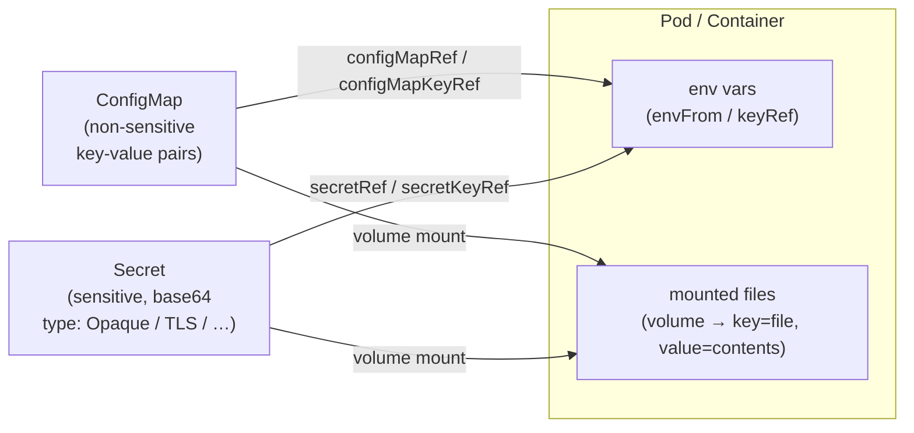

### 8.1 ConfigMaps: Concepts

A **ConfigMap** stores **non-sensitive** data as key-value pairs, decoupled from the pod's definition
and lifecycle (deleting the pod doesn't delete the ConfigMap; it can be referenced elsewhere).

- Consumed as **env vars** or **mounted as files** (volume mounts) — e.g. a `.properties` file for Spring
  Boot, or single values via env vars.
- **Max 1 MB** of data — not for large content.
- The pod **must be in the same namespace** as the ConfigMap it references (one exception: fetching
  values dynamically via the **Kubernetes API**, an advanced, rare case for cross-namespace reads).
- `immutable: true` blocks updates — to change values you must **delete and recreate** the ConfigMap.

```yaml
apiVersion: v1
kind: ConfigMap
metadata:
  name: read-config
data:
  COLOR: red                       # ALL-CAPS keys are common when used as env vars
  multi-line: |                    # YAML '|' = multi-line value (e.g. a small script/file)
    console.log("I am");
    console.log("multi-line");
```

<details>
<summary><code>&gt;_</code> <b>Terminal — sample output</b> (click to expand)</summary>

```text
$ kubectl describe configmap read-config      # (relevant section)
Data
====
COLOR:
----
red
```

</details>

> **Summary:** `describe configmap` shows the **plaintext** key/value `Data` (ConfigMaps aren't encoded);
> use `-o yaml` to see it in manifest form. There's always a system-managed `kube-root-ca.crt` ConfigMap.

> Keys map to files when mounted (each value becomes the file's contents). Inspect with
> `kubectl get configmap <name> -o yaml` or `kubectl describe configmap <name>`. (There's always a
> system-managed `kube-root-ca.crt` ConfigMap for API-server identity.)

### 8.2 ConfigMaps as Environment Variables

Two ways:

```yaml
spec:
  containers:
    - name: color-api
      image: lm-academy/color-api:1.3.0
      ports:
        - containerPort: 80
      # (A) one variable, explicitly mapped — more verbose, but decoupled:
      env:
        - name: DEFAULT_COLOR                 # the env var name the app expects
          valueFrom:
            configMapKeyRef:
              name: read-config               # ConfigMap name
              key: COLOR                       # key within it (name can differ from env var)
      # (B) load ALL keys as env vars — shorter, but keys must match what the app expects:
      envFrom:
        - configMapRef:
            name: read-config
```

> **Trade-off:** `envFrom` (B) is concise but **couples** ConfigMap keys to the app's expected variable
> names; `configMapKeyRef` (A) lets the ConfigMap key differ from the env var name (good when one
> ConfigMap serves multiple apps). Test e.g. `kubectl expose pod red-color-api ...` then
> `minikube service red-color-api` (the app now returns red instead of its default blue).

### 8.3 ConfigMaps as Mounted Volumes

Declare the ConfigMap as a **volume**, then mount it — each **key becomes a file**, each **value its
contents**:

```yaml
spec:
  containers:
    - name: color-api
      image: lm-academy/color-api:1.3.0
      env:
        - name: COLOR_CONFIG_PATH
          valueFrom:
            configMapKeyRef: {name: green-config, key: color_config_path}
      volumeMounts:
        - name: color-config
          mountPath: /mount/config
          readOnly: true            # files can't be modified (writes fail)
  volumes:
    - name: color-config
      configMap:
        name: green-config
```

> A single ConfigMap can mix env-var values **and** file content; mounting it surfaces **every** key as a
> file under `mountPath` (e.g. `/mount/config/color.txt`, `/mount/config/hello-from-green.js` — runnable
> with `node`). Useful for init scripts. **Best practice:** rather than one big mixed ConfigMap, consider
> **splitting** into a `green-env-vars` (loaded via `envFrom`) and a `green-files` (mounted) ConfigMap for
> clearer intent. *(The `items` selector — see 8.6 — also lets you mount only specific keys at custom
> paths; it works for ConfigMaps too.)*

### 8.4 Secrets: Concepts

Secrets decouple and inject **sensitive** data, working **just like ConfigMaps** from the pod's view (env
vars or volume mounts).

- ⚠️ Data is stored **base64-encoded and unencrypted by default** — base64 is **not** encryption; anyone
  with the string can `base64 -d` it. Enable **encryption at rest** (recommended) and lock down with
  **RBAC** (least-privilege list/get) so only authorized parties read/update secrets.
- **Types:** `Opaque` (generic, arbitrary key-value pairs) plus specific types — service account tokens,
  **TLS** secrets, **Docker registry** secrets, etc.
- Cloud-managed Kubernetes usually integrates with a **secrets manager** for more secure storage.
- Like ConfigMaps, the pod must be in the **same namespace** as the secret.

### 8.5 Creating & Using Secrets

Prefer the **CLI** over manifests — committing a secret file (base64) is bad practice:

```bash
kubectl create secret generic db-creds \
  --from-literal=username=db_user \
  --from-literal=password=db_pass
# other forms: --from-file=...  ; types: generic | tls | docker-registry
kubectl get secret                          # TYPE: Opaque
kubectl describe secret db-creds            # shows keys + byte counts, NOT values
kubectl get secret db-creds -o yaml         # shows base64 values
echo <base64> | base64 -d                   # trivially decodes — proves it's not encrypted
```

<details>
<summary><code>&gt;_</code> <b>Terminal — sample output</b> (click to expand)</summary>

```text
$ kubectl describe secret db-creds          # values hidden — only key + size
Type:  Opaque
Data
====
password:  7 bytes
username:  7 bytes

$ kubectl get secret db-creds -o yaml | grep -A2 data:
data:
  password: ZGJfcGFzcw==          # base64, NOT encrypted
  username: ZGJfdXNlcg==

$ echo ZGJfdXNlcg== | base64 -d
db_user                            # ← anyone can decode it
```

</details>

> **Summary:** `describe` hides values (just key + byte count), but `-o yaml` exposes the **base64** —
> which `base64 -d` trivially reverses. Base64 is **encoding, not encryption**; guard secrets with RBAC +
> encryption at rest.

Consume like a ConfigMap — explicit (`secretKeyRef`) or all keys (`envFrom` + `secretRef`):

```yaml
env:
  - name: DB_USER
    valueFrom:
      secretKeyRef: {name: db-creds, key: username}
  - name: DB_PASSWORD
    valueFrom:
      secretKeyRef: {name: db-creds, key: password}
# or, all keys at once:
envFrom:
  - secretRef: {name: db-creds}
```

> Secrets arrive in the container **decoded (plain text)** — it's the app's responsibility not to log
> them. Verify via `kubectl logs <pod>`.

### 8.6 Secrets as Mounted Volumes

Same pattern as ConfigMap volumes — each key becomes a file with the decoded value:

```yaml
spec:
  containers:
    - name: busybox
      image: busybox:1.36.1
      command: ["sh", "-c", "sleep 1800"]
      volumeMounts:
        - {name: db-secrets, mountPath: /etc/db}
  volumes:
    - name: db-secrets
      secret:
        secretName: db-creds
        # optional: mount only specific keys at custom sub-paths:
        items:
          - {key: password, path: dev/password}   # → /etc/db/dev/password
```

> Mounting all keys yields `/etc/db/username` and `/etc/db/password` (plain text). The **`items`**
> selector mounts only chosen keys at custom paths (also works for ConfigMaps).
>
> 🔒 **Security:** anyone who can `kubectl exec` into a pod — or even run
> `kubectl get pod <name> -o yaml` (which reveals the mount paths) — can read the decoded secret values.
> Protecting secrets at the cluster level isn't enough; **restrict pod exec/read access** too.

---

## 9. Security Fundamentals

Security in Kubernetes spans many layers — the control plane, nodes, network, applications, and the
humans and systems that interact with the cluster. The defaults shipped by minikube are **very
permissive** (no encryption, unrestricted pod-to-pod traffic) and **should not** be used in production.
This section builds a security mindset and the core native tools: **RBAC** (who can do what),
**authentication** (proving identity via certificates), **service accounts** (identity for workloads),
**network policies** (controlling traffic), and **pod security standards** (constraining pod
privileges). Throughout, the guiding principle is **least privilege**.

### 9.1 Security Overview & Common Risks

| Risk | What goes wrong | Common causes |
|---|---|---|
| **Exposed control plane / API** | Unauthorized API access compromises the whole cluster | API server open to the internet without auth; weak/default credentials |
| **Insecure workloads** | Privilege escalation, container→host escape | Containers run as **root** or **privileged**; mounting sensitive host paths via volumes |
| **Overly permissive roles** | A compromised identity can do anything | Broad permissions on users/service accounts (violating least privilege) |
| **No network segmentation** | Lateral movement between pods | Default networking allows **all** pod-to-pod traffic, even across namespaces |
| **Unsecured data** | Readable etcd / volumes; sniffable traffic | No **encryption at rest**; no **TLS** in transit |

**Mitigations Kubernetes offers:** **RBAC** (least privilege via roles + bindings), **network policies**
(control pod traffic — e.g. deny-all then allow), **encryption at rest** (protect etcd + PVs), **pod
security standards** (enforce/warn/audit per namespace), and **image security** (scan images, patch
known vulnerabilities quickly — a general, non-Kubernetes-specific practice).

### 9.2 RBAC: Concepts

**Role-Based Access Control** defines and enforces permissions for **users, groups, and service
accounts** to perform **operations** (verbs) on **resources**. It's a must for any serious cluster.

**Five key components:**

- **Subjects** — the entities permissions apply to: **users**, **groups**, **service accounts**.
- **Role** — a set of permissions **within a namespace**: verbs (`get`, `list`, `create`, `delete`, …)
  on resources (pods, services, secrets, …). Roles aren't connected to subjects on their own.
- **RoleBinding** — assigns a Role to subjects **within a namespace**.
- **ClusterRole** — like a Role but **cluster-wide**; can grant access to **non-namespaced** resources
  (e.g. nodes) or to namespaced resources across **all** namespaces.
- **ClusterRoleBinding** — assigns a ClusterRole to subjects cluster-wide.

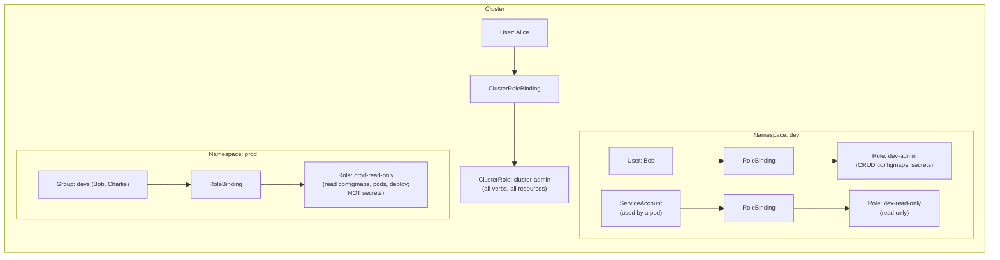

> **Key rules:** Roles are namespaced, and a RoleBinding **must be in the same namespace** as its Role.
> A binding can reference **multiple subjects**. Effective permissions are **additive** — a user gets the
> union of their own bindings **plus** their group's bindings (e.g. Bob = dev-admin from his user +
> prod-read-only from his group). Use **users** for humans, **service accounts** for pods/workloads.

### 9.3 The Kubernetes API Structure

The **API server** is the single interface to the cluster — `kubectl`, the dashboard, and external tools
all make **HTTP calls** to it. Every resource is a RESTful endpoint. Understanding the API's shape is
essential for writing precise RBAC rules. Add **`-v=8`** to any `kubectl` command to see the underlying
HTTP request.

**Two resource groupings:**

- **Core API group** — the essential resources (pods, services, configmaps, namespaces). API version is
  just `v1`; served under **`/api/v1`**.
- **Named API groups** — extend Kubernetes (e.g. `apps`, `rbac.authorization.k8s.io`); served under
  **`/apis/<group>/<version>`**. The part before the `/` in a manifest's `apiVersion` is the group.

```
kubectl get pods            → GET /api/v1/namespaces/default/pods       (core, namespaced)
kubectl get pods -A         → GET /api/v1/pods                          (cluster scope)
kubectl get deployments     → GET /apis/apps/v1/namespaces/default/deployments   (named group)
```

> **Versions:** `v1` (stable), `v1beta1` (stable-ish, finalized but not GA), `v1alpha1` (under
> development, breaking changes expected). **Subresources** are nested paths needing **separate**
> permissions — `pods/log`, `pods/exec`, `pods/attach`, `deployments/scale`, `*/status`. Granting access
> to `pods` does **not** grant `pods/log` or `pods/exec`. Explore with `kubectl api-resources`
> (`--namespaced=true`, `--api-group=...`, `-o wide` to see verbs). Cluster-scope listing
> (`-A`) is a different permission from namespaced listing.

### 9.4 Authentication: Users via X.509 Certificates

Kubernetes has **no user store** — there's no "create user" object. Instead it **integrates** with
external auth methods (**X.509 client certificates**, OpenID Connect, etc.). A certificate's **subject**
encodes identity: **CN (Common Name) = username**, **O (Organization) = group**. Kubernetes reads these
and applies RBAC accordingly.

How minikube grants *you* full access (worth tracing once): the `minikube` user's client cert has
`O=system:masters`; the built-in **`cluster-admin`** ClusterRole (all verbs/resources/groups) is bound to
the `system:masters` group via a ClusterRoleBinding. So your cert → group → binding → all permissions.

```bash
kubectl config view                    # clusters, users, contexts
kubectl config current-context         # a CONTEXT links a cluster + user
openssl x509 -noout -text -in <cert>   # inspect Subject (CN=user, O=group), Issuer (minikube CA)
```

**Creating a user end-to-end** (X.509 + a CertificateSigningRequest object):

```bash
# 1. private key + CSR (CN=user, O=group)
openssl genrsa -out alice.key 2048
openssl req -new -key alice.key -out alice.csr -subj "/CN=alice/O=admins"
```

```yaml
# 2. submit a CSR object (request = base64 of alice.csr)
apiVersion: certificates.k8s.io/v1
kind: CertificateSigningRequest
metadata: {name: alice}
spec:
  request: <base64-encoded-CSR>
  signerName: kubernetes.io/kube-apiserver-client   # honored by K8s; never auto-approved
  expirationSeconds: 86400                           # 1 day
  usages: [client auth]
```

```bash
# 3. approve & extract the signed cert
kubectl apply -f csr.yaml
kubectl certificate approve alice
kubectl get csr alice -o jsonpath='{.status.certificate}' | base64 -d > alice.crt

# 4. register the user + a context, then switch
kubectl config set-credentials alice --client-key=$(realpath alice.key) --client-certificate=$(realpath alice.crt)
kubectl config set-context alice --cluster=minikube --user=alice
kubectl config use-context alice
kubectl get pods        # → Forbidden: alice has NO roles/bindings yet (expected)
```

<details>
<summary><code>&gt;_</code> <b>Terminal — sample output</b> (click to expand)</summary>

```text
$ kubectl get csr
NAME    AGE   SIGNERNAME                            REQUESTOR       CONDITION
alice   5s    kubernetes.io/kube-apiserver-client   minikube-user   Pending      # → Approved,Issued after approve

$ kubectl get pods        # as the alice context, before any RBAC
Error from server (Forbidden): pods is forbidden: User "alice" cannot list
resource "pods" in API group "" in the namespace "default"
```

</details>

> **Summary:** a submitted CSR sits **Pending** until an admin `approve`s it (then `Approved,Issued`).
> Once Alice authenticates she's a valid **user** but has **zero permissions** — the `Forbidden` error
> proves authentication ≠ authorization (RBAC must grant access).

> The **`signerName: kubernetes.io/kube-apiserver-client`** makes the signed cert valid for client auth
> (it's never auto-approved; an admin must approve). `--embed-certs=true` inlines base64 certs instead of
> file paths. A freshly created user can authenticate but can do **nothing** until granted roles. ⚠️ The
> client cert + key are credentials — anyone holding them can authenticate as that subject.

### 9.5 Roles & RoleBindings in Practice

Give Bob **read-only** access to pods in the `dev` namespace only:

```yaml
apiVersion: rbac.authorization.k8s.io/v1
kind: Role
metadata:
  namespace: dev
  name: pod-reader
rules:
  - apiGroups: [""]          # "" = core API group
    resources: [pods]
    verbs: [get, list]
---
apiVersion: rbac.authorization.k8s.io/v1
kind: RoleBinding
metadata:
  namespace: dev             # MUST match the Role's namespace
  name: pod-reader
roleRef:
  kind: Role
  name: pod-reader
  apiGroup: rbac.authorization.k8s.io
subjects:
  - kind: User
    name: bob
    apiGroup: rbac.authorization.k8s.io
```

> Result: as Bob, `kubectl get pods -n dev` works; the default namespace, `prod`, and `-A` (cluster
> scope) are all **Forbidden**, and create/delete are denied. **Verb mapping gotcha:** `kubectl get pod`
> = the **`list`** verb; `kubectl describe pod` = the **`get`** verb. Inspect with
> `kubectl get role -n dev` / `kubectl describe rolebinding pod-reader -n dev`.

### 9.6 ClusterRoles & Subresources

To let **admins manage pods across all namespaces** (not just read), use a **ClusterRole** +
**ClusterRoleBinding** bound to the `admins` **group** (so any user whose cert has `O=admins` inherits
it):

```yaml
apiVersion: rbac.authorization.k8s.io/v1
kind: ClusterRole
metadata: {name: pod-admin}        # no namespace — cluster-wide
rules:
  - apiGroups: [""]
    resources: [pods, pods/log, pods/exec, pods/attach]   # subresources listed explicitly
    verbs: ["*"]                   # wildcard = all verbs
---
apiVersion: rbac.authorization.k8s.io/v1
kind: ClusterRoleBinding
metadata: {name: pod-admin}
roleRef:
  kind: ClusterRole
  name: pod-admin
  apiGroup: rbac.authorization.k8s.io
subjects:
  - kind: Group
    name: admins
    apiGroup: rbac.authorization.k8s.io
```

> **Subresources need explicit grants.** With only `resources: [pods]`, `kubectl logs` fails (hits
> `/pods/<name>/log`) and `kubectl exec` fails (`pods/exec`) — even though `get pod` works. Add
> `pods/log`, `pods/exec`, `pods/attach` (or `deployments/scale`) as needed. Groups need no object — just
> name them in a binding. `apiGroups: [""]` targets the core group; `["apps"]`, `["rbac.authorization.k8s.io"]`
> target named groups.

### 9.7 Service Accounts

When a **process inside a pod** needs to call the Kubernetes API (read configmaps, scale deployments,
…), it authenticates via a **ServiceAccount** — not user credentials. Service accounts **can** be created
and deleted, are **namespaced**, and authenticate via **JWT tokens** that Kubernetes auto-generates and
mounts into the pod.

| | User accounts | Service accounts |
|---|---|---|
| For | Humans | Workloads (processes in pods) |
| Managed by K8s? | No (external auth) | **Yes** (create/delete objects) |
| Scope | Globally unique names | **Namespaced** (same name OK in different namespaces) |
| Lifecycle | Permanent | Lightweight, easy to create → favors least privilege |

Every namespace has a **`default`** service account (auto-assigned if a pod specifies none, and it has no
meaningful permissions). Create one and attach it:

```yaml
apiVersion: v1
kind: ServiceAccount
metadata: {name: pod-inspector, namespace: dev}
---
# in a pod spec:
spec:
  serviceAccountName: pod-inspector
```

The token is mounted at `/var/run/secrets/kubernetes.io/serviceaccount/token` (CA cert alongside it). A
pod can call the API in-cluster:

```bash
TOKEN=$(cat /var/run/secrets/kubernetes.io/serviceaccount/token)
curl -H "Authorization: Bearer $TOKEN" \
     --cacert /var/run/secrets/kubernetes.io/serviceaccount/ca.crt \
     https://kubernetes.default.svc/api/v1/namespaces/dev/pods
```

> Until you bind the service account to a role it's **Forbidden** — add it as a binding **subject**:
> `kind: ServiceAccount, name: pod-inspector, namespace: dev` (note: subjects use `namespace`, not
> `apiGroup`). The cluster's own controllers (e.g. the deployment controller in `kube-system`) work
> exactly this way — a service account bound via ClusterRoleBinding to a `system:controller:*` ClusterRole.

### 9.8 Network Policies

By default **all pod traffic is allowed** — within and across namespaces. **Network policies** regulate
**ingress** (incoming) and **egress** (outgoing) traffic, isolating pods to shrink the attack surface.
⚠️ They require a **CNI plugin that supports them** (Calico, Cilium, Weave Net) — minikube's default CNI
does **not**, so start the cluster with `minikube start --cni=calico`.

A policy has three parts: a **`podSelector`** (which pods it applies to — mandatory; `{}` = all pods in
the namespace), and optional **`ingress`**/**`egress`** rules (listed in `policyTypes`).

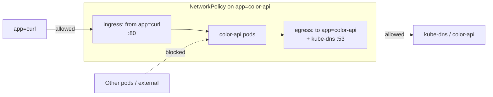

**Deny-all ingress** (selects all pods, declares ingress type but lists no rules → nothing allowed in):

```yaml
apiVersion: networking.k8s.io/v1
kind: NetworkPolicy
metadata: {name: deny-all}
spec:
  podSelector: {}            # all pods in this namespace
  policyTypes: [Ingress]     # no 'ingress:' block ⇒ all ingress denied (egress unaffected)
```

**Allow ingress only from `app=curl` pods**, on port 80:

```yaml
spec:
  podSelector:
    matchLabels: {app: color-api}
  policyTypes: [Ingress]
  ingress:
    - from:
        - podSelector: {matchLabels: {app: curl}}
      ports:
        - {protocol: TCP, port: 80}
```

**AND vs OR — the critical syntax rule:**

```yaml
ingress:
  - from:
      - namespaceSelector: {matchLabels: {name: staging}}   # ── two list ITEMS = OR
      - podSelector: {matchLabels: {app: frontend}}         #    (staging ns OR frontend pods)
  - from:
      - namespaceSelector: {matchLabels: {name: staging}}   # ── one item, two selectors = AND
        podSelector: {matchLabels: {app: frontend}}         #    (frontend pods INSIDE staging ns)
```

> Selector types: `podSelector`, `namespaceSelector` (you can't name a namespace directly — use a label;
> Kubernetes auto-adds the stable `kubernetes.io/metadata.name=<ns>` label), and `ipBlock` (CIDR).
> Services aren't affected directly — if the backing pods block ingress, traffic doesn't arrive.

**Egress gotcha — DNS.** A deny-all-egress (or egress restricted to specific pods) **breaks Service name
resolution**, because reaching a Service by name first needs a DNS lookup to **kube-dns/CoreDNS** in
`kube-system`. Connecting to the pod's raw IP works, but the Service name hangs. Allow DNS explicitly
(best kept as its own reusable policy):

```yaml
spec:
  podSelector: {}
  policyTypes: [Egress]
  egress:
    - to:
        - namespaceSelector: {matchLabels: {kubernetes.io/metadata.name: kube-system}}
          podSelector: {matchLabels: {k8s-app: kube-dns}}
      ports:
        - {protocol: UDP, port: 53}
        - {protocol: TCP, port: 53}
```

> ⚠️ **Network policies are per-namespace.** A `deny-all` in `default` does **not** affect pods in `dev` —
> apply policies in **every** relevant namespace. Also watch the list-item `-` carefully: adding a `-`
> turns an AND into an OR. *(Note: Calico also offers its own richer policies under `projectcalico.org/v3`;
> here we use native `networking.k8s.io/v1`.)*

### 9.9 Pod Security Standards

**Pod Security Standards (PSS)** enforce security best practices on pods via three **profiles** of
increasing strictness, applied **per namespace** by the built-in **Pod Security Admission controller**
(enabled by default in modern Kubernetes, ~1.25+):

| Profile | Restrictions | Use for |
|---|---|---|
| **privileged** | None — full access | System/admin workloads (never apps) |
| **baseline** | Minimal — blocks known escalations (privileged containers, sensitive host paths, host network) | General-purpose workloads |
| **restricted** | Strictest hardening | Highly sensitive/regulated workloads (good default to aim for) |

Each profile is applied through one of three **modes**, set as **namespace labels**
`pod-security.kubernetes.io/<mode>: <level>`:

- **enforce** — **block** pods that violate the level.
- **warn** — allow, but show a user-facing warning.
- **audit** — allow, but log a violation to the audit log.

```yaml
apiVersion: v1
kind: Namespace
metadata:
  name: baseline
  labels:
    pod-security.kubernetes.io/enforce: baseline    # block baseline violations
    pod-security.kubernetes.io/warn: restricted      # warn on restricted violations
```

> You can mix modes/levels (e.g. **enforce baseline** + **warn restricted**), set **cluster-wide
> defaults** and override per namespace.

**Examples of behavior:**

- A **privileged** pod (`securityContext.privileged: true`) in a namespace that only *warns* baseline →
  created **with a warning**. In a namespace that *enforces* baseline → **rejected** by the server.

<details>
<summary><code>&gt;_</code> <b>Terminal — sample output</b> (click to expand)</summary>

```text
# warn mode → pod IS created, but with a warning:
$ kubectl apply -f privileged-pod.yaml -n privileged
Warning: would violate PodSecurity "baseline:latest": privileged (container "nginx" must not set privileged=true)
pod/nginx-privileged created

# enforce mode → pod is REJECTED:
$ kubectl apply -f privileged-pod.yaml -n baseline
Error from server (Forbidden): error when creating "privileged-pod.yaml":
pods "nginx-privileged" is forbidden: violates PodSecurity "baseline:latest": privileged ...
```

</details>

> **Summary:** the **mode** (label on the namespace) decides the outcome — `warn` lets it through with a
> message, `enforce` **blocks** it. Same pod, different namespace policy.

- To satisfy **restricted**, a pod typically needs: `allowPrivilegeEscalation: false`,
  `capabilities.drop: ["ALL"]`, `runAsNonRoot: true`, and `seccompProfile.type: RuntimeDefault`:

```yaml
spec:
  containers:
    - name: nginx
      image: nginxinc/nginx-unprivileged:1.27.1   # root-running images fail runAsNonRoot
      securityContext:
        allowPrivilegeEscalation: false
        runAsNonRoot: true
        capabilities: {drop: ["ALL"]}
        seccompProfile: {type: RuntimeDefault}
```

> **Image matters:** a standard `nginx` image fails under `runAsNonRoot: true` ("image will run as root")
> — use an **unprivileged** image. The `restricted` profile also constrains **volume types** (no
> `hostPath`/`local`). **PSS isn't enough alone** — combine with **RBAC** to control who can deploy into
> privileged namespaces. See the official Pod Security Standards docs for the full field-by-field list per
> profile.

---

## 10. Kustomize

Managing similar configurations across environments (dev/staging/prod) with plain Kubernetes means
**duplicating and re-syncing** lots of YAML. **Kustomize** solves this declaratively: you define a
**base** of common manifests once, then layer environment-specific **overlays** on top — Kustomize merges
them and computes the final manifests, **without templating** and **without modifying the originals**.
It's built into `kubectl` (recent releases) and is **YAML-only**, so the learning curve is low. This
section covers the core workflow: kustomizations, bases & overlays, built-in transformations,
ConfigMap/Secret generators, and the three kinds of patches.

### 10.1 What Kustomize Is (and vs. Helm)

Kustomize declaratively customizes manifests by **overlaying changes** (also YAML) — you declare the
fields and patches you want, and it produces the merged result. Key features: **bases & overlays**,
**resource patching** (change only what you need), **common labels/annotations**, **name
prefixes/suffixes**, and **ConfigMap/Secret generators**.

| | **Kustomize** | **Helm** |
|---|---|---|
| Purpose | Customize existing YAML per environment | Full **package manager** for Kubernetes |
| Approach | **No templating** — pure YAML overlays | **Go templates** (conditionals, loops, variables) |
| Complexity | Low (just YAML + a few constructs) | Higher (templates + chart structure) |
| Customization | Strategic-merge / JSON patches, prefixes/suffixes, labels/annotations | Full templating system |
| Versioning / deps | No | Yes (versioned charts, dependencies) |

> They're **not mutually exclusive** — you can use both together. Reach for Kustomize for
> environment-specific tweaks of the same app; reach for Helm to package, version, and distribute apps
> with dependencies or template logic (loops/conditionals).

### 10.2 Your First Kustomization

A Kustomize project is just a directory with a **`kustomization.yaml`** that lists the resources (and
transformations) to include:

```yaml
apiVersion: kustomize.config.k8s.io/v1beta1
kind: Kustomization
namespace: dev                  # optional: assign ALL resources to this namespace (must already exist)
resources:
  - nginx-deployment.yaml
  - nginx-svc.yaml
```

```bash
kubectl kustomize .              # render the merged manifests to stdout (no apply)
kubectl apply -k .               # apply only what the kustomization lists (-k, not -f)
kubectl delete -k .              # delete those same objects
```

<details>
<summary><code>&gt;_</code> <b>Terminal — sample output</b> (click to expand)</summary>

```text
$ kubectl kustomize overlays/dev       # render only — note the injected namespace/prefix
apiVersion: apps/v1
kind: Deployment
metadata:
  name: dev-nginx-deployment           # namePrefix applied
  namespace: dev                       # namespace injected by the overlay
...
```

</details>

> **Summary:** `kubectl kustomize <dir>` prints the **merged** result **without** applying it — perfect
> for previewing how a base + overlay combine (here the `dev` namespace and `dev-` prefix were added).

> **`-k` vs `-f`:** `-f <dir>` applies *every* manifest in the directory; `-k <dir>` reads
> `kustomization.yaml` and applies only the listed resources (with transformations). Setting `namespace`
> in the kustomization assigns all resources to it — far better than duplicating `metadata.namespace` in
> every file. Namespaces themselves are best created **separately** (they often host multiple apps), not
> baked into an app's kustomization.

### 10.3 Bases & Overlays

- **Base** — a kustomization of common resources (deployment, service, configmap…) shared across
  environments; reusable and left **intact**.
- **Overlay** — a kustomization that references a base and layers **environment-specific** changes
  (replica counts, image tags, namespace, patches) on top. Kustomize **merges the overlay onto the
  base**; one base can feed many overlays.

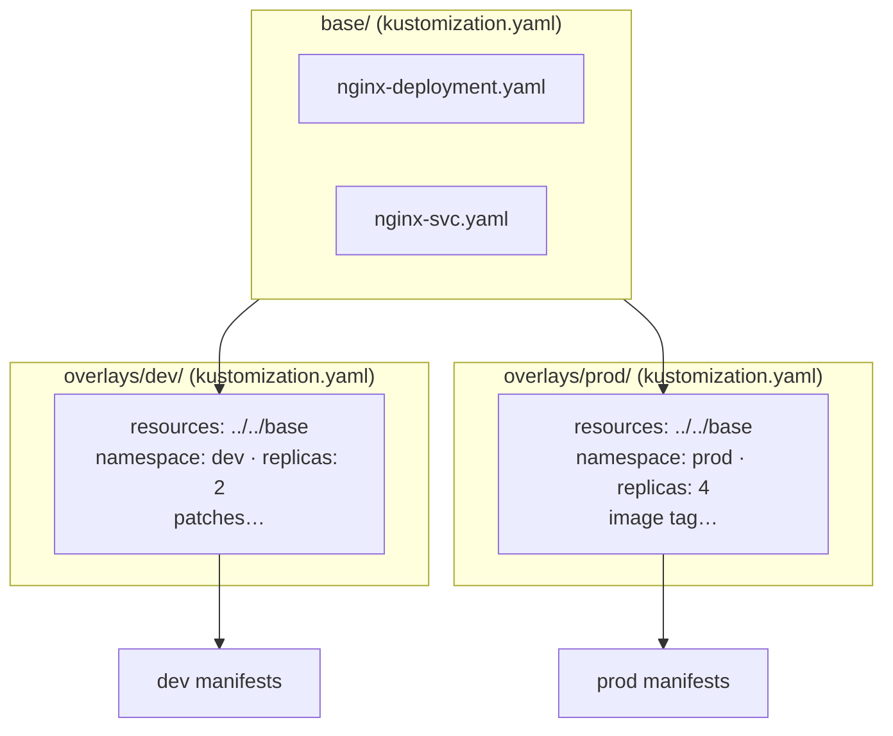

A typical (arbitrary but common) layout — overlays reference the base by **relative path to a directory
containing a kustomization.yaml**:

```
nginx-app/
  base/        kustomization.yaml (lists deployment + svc, no namespace)
  overlays/
    dev/       kustomization.yaml → resources: [../../base], namespace: dev
    prod/      kustomization.yaml → resources: [../../base], namespace: prod
```

```bash
kubectl kustomize nginx-app/overlays/dev      # render the dev overlay
kubectl apply -k nginx-app/overlays/prod      # apply prod
```

> The base stays namespace-agnostic; overlays set the namespace and other per-env values. This way the
> base is the **single source of truth** for the app's resources — **zero duplication** across
> environments.

### 10.4 Common Transformations

Built-in fields you set directly in `kustomization.yaml` (no patches needed):

```yaml
namespace: dev                  # assign all resources to a namespace
namePrefix: dev-                # prepend to every resource name
nameSuffix: -alpha              # append to every resource name
labels:                         # see deprecation note below
  - pairs: {project: ecommerce-app, tier: backend, env: dev}
    includeSelectors: true
commonAnnotations:              # added to all resources AND pod templates
  maintainer: finance@company.org
images:                         # override image name/tag/digest by name
  - name: nginx
    newTag: 1.27.1              # also: newName, digest
replicas:                       # override replica count by resource name
  - name: nginx
    count: 2
```

> ⚠️ **`commonLabels` is deprecated** — replace it with the `labels:` field above (`pairs:` +
> `includeSelectors: true`) so labels are added to **selectors and metadata** correctly. Labels applied
> this way propagate to the deployment's `metadata`, its `selector.matchLabels`, **and** the pod
> template's labels — and to the service's labels/selector. `commonAnnotations` land on top-level metadata
> **and** pod-template metadata (so every created pod inherits them). `namePrefix`/`nameSuffix` rename all
> resources at once (and show up in pod names). ⚠️ Changing labels on a live deployment may require
> delete+recreate (selector is **immutable**). The authoritative, evolving field list lives in the
> kubectl Kustomize reference docs.

### 10.5 ConfigMap & Secret Generators

Kustomize can **generate** ConfigMaps and Secrets from literals, files, or env files — no hand-written
manifests:

```yaml
configMapGenerator:
  - name: feature-flags-config
    literals:                       # key=value pairs
      - use_db=true
      - expose_metrics=true
  - name: db-init-config
    files:                          # key = filename, value = file contents (multi-line)
      - db-init.js
      - some-key=db-init.js         # custom key name
  - name: local-config
    envs:                           # each line of the file → a separate key/value
      - .env.local
secretGenerator:
  - name: local-config
    type: Opaque                    # generic secret; values base64-encoded automatically
    envs:
      - .env.local
generatorOptions:                   # applies to ALL generators
  disableNameSuffixHash: true       # also: labels, annotations
```

> By default a generated name gets a **content-hash suffix** (e.g. `feature-flags-config-abc123`) — change
> any value and the hash changes, which helps detect/trigger updates. Disable it per generator (`options:
> {disableNameSuffixHash: true}`) or globally via `generatorOptions`.
>
> **`files` vs `envs`:** `files:` makes the **whole file** one value under a key (great for scripts you
> can lint/test as real files); `envs:` **parses** a `KEY=VALUE` file into **individual** keys. Pointing
> `files:` at an env file just dumps the raw contents as one value (no parsing).
>
> **Referencing generated names:** when a Deployment mounts a generated ConfigMap/Secret by name,
> Kustomize **rewrites** that reference to match the prefix/suffix/hash — **as long as the referencing
> object is listed under `resources`**. So include the deployment in `resources`, and the volume's
> `configMap.name` / `secret.secretName` is patched automatically.

### 10.6 Patches

When built-in transformations aren't fine-grained enough (e.g. change the image of **one** deployment,
not every resource using that image), use **patches** — partial manifests merged onto a target identified
by `apiVersion` + `kind` + `metadata.name`.

```yaml
patches:
  - patch: |-                       # inline strategic-merge patch
      apiVersion: apps/v1
      kind: Deployment
      metadata:
        name: nginx                 # identifies WHICH resource to patch
      spec:
        template:
          spec:
            containers:
              - name: nginx         # identifies WHICH container (by name)
                image: nginx:1.27.1 # only the fields you want to change
  - path: update-resources.patch.yaml   # OR a patch in a separate file
```

**Strategic-merge behavior:** lists of objects merge **by name** — if a container named `nginx` exists,
its fields are updated (and merged: setting `requests` keeps existing `limits`, etc.); if you reference a
container name that **doesn't** exist (e.g. `busybox`), it's **appended**. Same-field conflicts across
multiple patches are **order-sensitive** (later wins) — group related changes into **one** patch to avoid
relying on order.

> **File-based patches scale better** than long inline lists. Name them `*.patch.yaml` so editors don't
> flag the partial manifest as invalid. Each patch should ideally be an **atomic** change (one concern per
> file) for maintainability. *(The older `patchesStrategicMerge` and `patchesJson6902` fields are
> deprecated — use the unified `patches` field.)*

### 10.7 JSON 6902 Patches & Targeting

Some operations — notably **removing** a field — can't be done with strategic merge. Use a **JSON Patch
(RFC 6902)**: a list of `op`/`path` operations against a target.

```yaml
patches:
  - target:                         # identify the resource(s)
      group: apps
      version: v1
      kind: Deployment
      name: nginx                   # omit name → applies to ALL matching kind
    patch: |-
      - op: remove
        path: /spec/template/spec/containers/0/resources
```

The same patch in **JSON** syntax is equivalent:

```json
[ { "op": "remove", "path": "/spec/template/spec/containers/0/resources" } ]
```

> The `path` uses **`/`-separated** segments and **numeric indices** for list items
> (`containers/0` = first container) — which makes it **brittle** if container order changes. `op` can be
> `remove`, `add`, `replace`, etc.
>
> **Targeting groups of resources:** omit `name` to patch **all** resources of a given `group/version/
> kind` (e.g. every Deployment but not Pods), or use a **`labelSelector`** / **`annotationSelector`** in
> the target. The change must be **compatible** with every selected resource (e.g. removing `resources`
> from a Service makes no sense). This makes patches a precise, powerful tool for customizing specific
> objects — or whole classes of them — from a shared base.

---

## 11. Kubernetes Ingress

A **Service** of type LoadBalancer exposes one app behind one external IP — fine for a single service,
but it doesn't scale to many: you'd provision (and pay for) a separate cloud load balancer per service,
with no shared HTTP routing or TLS. **Ingress** solves this. It's an **L7 (HTTP/HTTPS) router** that sits
in front of your ClusterIP Services, providing **host- and path-based routing**, **TLS termination**, and
a **single entry point** for many services. This section covers why Ingress exists, the crucial
**resource vs. controller** distinction, how routing rules and TLS work, controller annotations, and the
kubectl workflow.

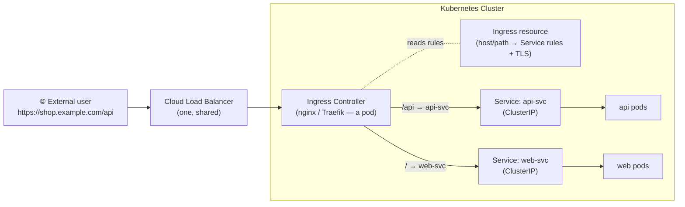

### 11.1 Why Ingress? (and vs. Service/LoadBalancer)

- A **NodePort/LoadBalancer Service** works at **L4** (TCP/UDP) and exposes **one** service. Many services
  → many load balancers → many external IPs → high cost and no shared routing.
- **Ingress** works at **L7 (HTTP/HTTPS)**: many services share **one** external entry point (one load
  balancer), routed by **hostname** and **URL path**, with **centralized TLS**.
- It also enables features hard to do at L4: path rewrites, redirects, sticky sessions, rate limiting,
  auth — typically via controller-specific **annotations**.

| | **Service (LoadBalancer)** | **Ingress** |
|---|---|---|
| Layer | L4 (TCP/UDP) | L7 (HTTP/HTTPS) |
| Exposes | One service per external IP | **Many** services behind one entry point |
| Routing | None (just forwards a port) | **Host- and path-based** |
| TLS | Not built in | **Centralized TLS termination** |
| Needs | Cloud LB per service | An **Ingress controller** + (usually) one LB |

> **Typical pattern:** external client → cloud LB → **Ingress controller** → **ClusterIP** Services →
> pods. Ingress doesn't replace Services — it sits **in front of** them.

### 11.2 Ingress Resource vs. Ingress Controller

This is the most common interview trap. They are **two different things**:

- The **Ingress resource** is just the **declarative rules** (a YAML object: which host/path maps to which
  Service, plus TLS config). On its own it **does nothing**.
- The **Ingress controller** is the **component that actually implements** those rules — a pod (or set of
  pods) running a reverse proxy that **watches** Ingress objects and configures itself to route traffic
  (provisioning/configuring a load balancer, terminating TLS, etc.).

You must **install a controller** for Ingress to work — it isn't built into a vanilla cluster. Common
controllers: **ingress-nginx**, **Traefik**, **HAProxy**, and cloud-native ones (GKE/AKS/ALB). In
minikube: `minikube addons enable ingress` installs ingress-nginx.

> **Summary:** the **resource declares intent; the controller fulfills it.** No controller → your Ingress
> object is inert.

### 11.3 Anatomy of an Ingress (Host & Path Routing)

```yaml
apiVersion: networking.k8s.io/v1
kind: Ingress
metadata:
  name: shop-ingress
spec:
  ingressClassName: nginx          # which controller handles this Ingress
  rules:
    - host: shop.example.com       # host-based routing (optional)
      http:
        paths:
          - path: /api             # path-based routing
            pathType: Prefix       # Prefix | Exact | ImplementationSpecific
            backend:
              service:
                name: api-svc      # target ClusterIP Service
                port:
                  number: 80
          - path: /
            pathType: Prefix
            backend:
              service:
                name: web-svc
                port:
                  number: 80
```

- **`rules`** map an incoming **host** + **path** to a backend **Service** (+ port). Omit `host` to match
  any hostname.
- **`pathType`**: **`Prefix`** (path prefix match — most common), **`Exact`** (exact match), or
  **`ImplementationSpecific`** (controller decides).
- **`ingressClassName`** selects which controller serves this Ingress (a cluster can run several).
- A **`defaultBackend`** can catch requests matching no rule.

> Ingress routes only **HTTP/HTTPS**. For raw TCP/UDP you still need a Service (or controller-specific
> config). The backend is always a **Service**, never a pod directly.

### 11.4 TLS Termination

Ingress can **terminate TLS** centrally so your apps don't each handle certificates. Reference a
**Secret** of type `kubernetes.io/tls` (holding `tls.crt` and `tls.key`):

```yaml
spec:
  tls:
    - hosts:
        - shop.example.com
      secretName: shop-tls          # a kubernetes.io/tls Secret with the cert + key
  rules:
    - host: shop.example.com
      http:
        paths: [ ... ]
```

```bash
# create the TLS secret from cert/key files:
kubectl create secret tls shop-tls --cert=tls.crt --key=tls.key
```

> The controller presents the cert for `shop.example.com` and decrypts traffic at the edge, forwarding
> plain HTTP to the backend Service. Pair with **cert-manager** to automate issuing/renewing certificates
> (e.g. from Let's Encrypt).

### 11.5 Controller Annotations

Many behaviors aren't part of the core Ingress spec — they're configured via **controller-specific
annotations** on the Ingress object. Examples for **ingress-nginx**:

```yaml
metadata:
  annotations:
    nginx.ingress.kubernetes.io/ssl-redirect: "true"        # force HTTP → HTTPS
    nginx.ingress.kubernetes.io/rewrite-target: /            # path rewrite
    nginx.ingress.kubernetes.io/rate-limit: "100"            # rate limiting
```

> ⚠️ Annotations are **controller-specific** — an `nginx.ingress.kubernetes.io/...` annotation means
> nothing to Traefik. This is the same annotation-driven configuration pattern seen in §6.3; always check
> *your* controller's docs for available keys.

### 11.6 Creating & Inspecting an Ingress (kubectl)

```bash
minikube addons enable ingress              # install the ingress-nginx controller
kubectl apply -f shop-ingress.yaml
kubectl get ingress                          # HOSTS, ADDRESS (the LB/controller IP), PORTS
kubectl describe ingress shop-ingress        # rules, backends, TLS, and events
```

<details>
<summary><code>&gt;_</code> <b>Terminal — sample output</b> (click to expand)</summary>

```text
$ kubectl get ingress
NAME           CLASS   HOSTS              ADDRESS        PORTS     AGE
shop-ingress   nginx   shop.example.com   192.168.49.2   80, 443   30s
```

</details>

> **Summary:** once the controller assigns an **ADDRESS**, that IP is the single entry point; requests to
> `shop.example.com` are routed by path to the right Service. Map the host to the ADDRESS (real DNS, or
> `/etc/hosts` locally) to test. If `ADDRESS` stays empty, the **controller isn't installed/ready**.

---

## 12. Quick Revision Notes

A condensed recap of the whole guide for fast review before exams or interviews.

### Architecture

- **Cluster = Control Plane (master node) + Data Plane (worker nodes).** A **node** is a machine (usually
  a VM). **Kubernetes is software, not hardware.**
- **Two kinds of software run in the cluster:** Kubernetes' own system software (control plane) and *your*
  applications (worker nodes).
- **Control plane (mandatory):** **API Server** (single entry point + central hub; `kubectl` → HTTP API
  calls; reads/writes etcd) · **etcd** (distributed key-value store; single source of truth for config +
  state) · **Scheduler** (places pods on best node by resources + constraints) · **Controller Manager**
  (loops reconciling desired vs. actual: node, replica-set, job controllers). **Optional:** **Cloud
  Controller Manager** (cloud load balancers, S3/EBS/EFS storage, node/VM management).
- **Worker node (mandatory):** **kubelet** (agent; runs containers per pod spec; talks to API server) ·
  **container runtime** (Docker / containerd / CRI-O) · **kube-proxy** (network rules; service routing &
  load balancing). **Optional:** higher-level objects (services, deployments, replica sets, ingresses,
  jobs, stateful sets).
- **Reconciliation loop:** declare **desired state** → controller watches **etcd** → spots mismatch →
  API server → scheduler places work → kubelet runs it → actual = desired.
- **HA:** run **multiple master nodes**; usually **more workers than masters**; keep masters separate from
  workers, ideally each node in its own VM.
- **Memory hooks:** state/data → **etcd**; entry point → **API server**; runs containers → **container
  runtime** (managed by **kubelet**); service networking → **kube-proxy**.

### Running Containers (Pods)

- **Pod** = smallest deployable unit; wraps 1+ containers sharing **network** (talk via `localhost`,
  non-overlapping ports) and **storage** (shared volumes). Multiple containers only for sidecars/init —
  never two main apps.
- **Lifecycle:** Pending (scheduling + `ContainerCreating`) → Running (≥1 container up) → Succeeded / Failed
  (work-ending pods) / Unknown (node comms lost).
- **restartPolicy:** `Always` / `OnFailure` / `Never`; repeated crashes → **exponential backoff** →
  `CrashLoopBackOff` (capped ~5 min; resets after staying healthy).
- **Commands:** `kubectl run`, `get pods`, `describe pod`, `logs [-c <container>] [--watch]`,
  `delete pod`. Pod IP is **private/cluster-internal**; **name resolution doesn't work by default**.

### Object Management

- **Three approaches** (increasing complexity): imperative `kubectl` → imperative files (`create`/`replace`/
  `delete -f`) → declarative (`apply -f`). Use the latter two ~99% of the time.
- **Manifest fields:** `apiVersion`, `kind`, `metadata`, `spec` (namespaces omit spec). `apiVersion` =
  API group + version; `kind` must be supported by it.
- **`replace` fully replaces** (nulls K8s-added fields → errors); **`apply` patches/merges** (only the diff)
  via the `last-applied-configuration` annotation. Migrate `create`→`apply` by just running `apply`.
- Multiple objects in one file with `---`. `apply` matches by **name** (idempotent); `create` errors if
  name exists.

### ReplicaSets & Deployments

- **ReplicaSet** keeps a stable count of identical pods (matched by **selector labels** = `template`
  labels). **Template change does NOT update running pods**; no rollout/rollback/history → rarely used
  directly.
- **Deployment** manages ReplicaSets → adds **rolling updates** (no downtime), **rollback**, **revision
  history**. Update → new RS scales up while old scales down (`maxUnavailable`/`maxSurge`);
  `pod-template-hash` links pods↔RS.
- **Rollout cmds:** `rollout history` / `status` / `undo` / `pause` / `resume`; `--record` cause via
  `kubernetes.io/change-cause` annotation. **`scale` is imperative/temporary** (use scale-to-0 to restart
  pods). Failed rollout → `ImagePullBackOff`; old pods keep serving; fix file + `apply` (or temporary
  `undo`).

### Services & Networking

- Service = **stable IP + DNS name** in front of ephemeral pods; routes to healthy pods by **selector
  labels**.
- **Types:** **ClusterIP** (default, internal) · **NodePort** (`<nodeIP>:30000-32767`; Mac/Win minikube
  needs `minikube service`, Linux direct) · **LoadBalancer** (cloud) · **ExternalName** (CNAME to external
  DNS).
- **DNS via CoreDNS** (`kube-system`); the **service name is more stable than the ClusterIP** (IP changes
  on recreate). Cross-namespace FQDN: `<svc>.<ns>.svc.cluster.local`.
- **Ingress** = **L7 (HTTP/HTTPS)** router in front of ClusterIP Services: **host/path routing**, **TLS
  termination**, one entry point for many services. **Resource** (rules YAML) does nothing without an
  **Ingress controller** (nginx/Traefik — a pod that implements it). `pathType` Prefix/Exact;
  `ingressClassName` picks the controller; behaviors via **controller-specific annotations**; TLS via a
  `kubernetes.io/tls` Secret.

### Storage

- **Volume = directory**; type determines backing + lifecycle. **emptyDir** (ephemeral, pod-scoped,
  shared) · **local** (node-bound, needs node affinity, static-only) · **PV/PVC** (general).
- **PV↔PVC = 1:1.** Access modes: RWO / ROX / RWX / RWOncePod. Reclaim: **Retain** (manual default) /
  **Delete** (dynamic default) / Recycle (deprecated). **Static** (PV first, best-effort match) vs
  **dynamic** (PVC → PV auto-created via StorageClass).
- **StatefulSet:** stable name `<name>-<ordinal>`, stable per-pod storage (`volumeClaimTemplate` → 1 PVC
  per replica), ordered create / reverse delete. **Headless service** (`clusterIP: None`) → per-pod DNS
  `<pod>.<svc>`.

### Configuration & Resource Management

- **ConfigMap** (non-sensitive, ≤1 MB) & **Secret** (sensitive, **base64 ≠ encryption**, type `Opaque`/TLS/
  docker-registry). Consume as **env vars** (`envFrom` / `configMapKeyRef`/`secretKeyRef`) or **mounted
  files** (key=file, value=contents; `items` for specific keys). Must be same namespace as the pod.
- **Labels** (identify/group; selectors: equality `matchLabels` / set-based `matchExpressions` with
  In/NotIn/Exists) vs **annotations** (non-identifying config/metadata).
- **Namespaces** (logical isolation): built-ins `default`, `kube-system`, `kube-public`, `kube-node-lease`;
  `-n`/`-A`; deleting a namespace deletes everything in it. Cross-ns service = FQDN.
- **ResourceQuota** (per-namespace caps) + **requests/limits** (per container). With a quota, pods **must**
  declare requests/limits. **Rollout-quota trap:** surge pods exceed quota → stuck rollout.
- **Health probes:** **startup** (kill/restart on fail) · **liveness** (restart) · **readiness** (drop from
  Service endpoints). Config: `failureThreshold` × `periodSeconds`; types `httpGet`/`grpc`/`exec`.

### Security

- **RBAC:** subjects (users/groups/service accounts) + **Role**/**ClusterRole** (verbs on resources) +
  **RoleBinding**/**ClusterRoleBinding**. Roles namespaced; binding must match role's namespace;
  permissions are **additive** (user + groups). **Subresources** (`pods/log`, `pods/exec`) need explicit
  grants.
- **Auth:** no user store — X.509 certs (**CN=user, O=group**), OIDC, etc. **Service accounts** = identity
  for pods (JWT auto-mounted at `/var/run/secrets/.../token`); namespaced, K8s-managed.
- **Network policies** (need a supporting CNI — Calico/Cilium): `podSelector` + ingress/egress rules;
  default = all allowed; **list items = OR, selectors in one item = AND**; per-namespace; egress must allow
  **kube-dns** for service name resolution.
- **Pod Security Standards:** profiles **privileged / baseline / restricted**; modes **enforce / warn /
  audit** as namespace labels. Combine with RBAC.

### Kustomize

- Declarative, **no templating**, YAML-only, built into `kubectl` (`apply -k`). **Base** (shared
  resources) + **overlays** (per-env changes). `vs Helm`: Kustomize = env customization; Helm = templating
  + packaging/versioning.
- **Transformations:** `namespace`, `namePrefix`/`nameSuffix`, `labels` (replaces deprecated
  `commonLabels`), `commonAnnotations`, `images`, `replicas`.
- **Generators:** `configMapGenerator`/`secretGenerator` from `literals`/`files`/`envs` (content-hash
  suffix; `files` = whole file, `envs` = parsed keys).
- **Patches:** strategic-merge (inline/file, merge by name) vs **JSON 6902** (`op: remove/add/replace`,
  `/`-paths) — the only way to **remove** fields; target by name or `labelSelector`.

---

## 13. FAANG Interview Questions & Answers

The most frequently asked Kubernetes interview questions, grouped by topic. Click each question to expand
the answer. Answers go beyond the transcript where useful for interview depth.

### 13.1 Architecture & Core Concepts

<details>
<summary><b>1. What is Kubernetes and what problem does it solve?</b></summary>

Kubernetes (K8s) is an open-source **container orchestration platform** that automates the deployment,
scaling, healing, and management of containerized applications across a cluster of machines. Containers
solve "it works on my machine" packaging, but running them at scale raises hard problems: *Where* should
each container run? What happens when one crashes or a node dies? How do you scale up under load, roll
out a new version with zero downtime, or let containers find and talk to each other as they come and go?

Kubernetes answers all of these declaratively: you describe the **desired state** (e.g. "5 replicas of
this image, reachable on port 80"), and the control plane continuously works to make the **actual state**
match — rescheduling pods off failed nodes, restarting unhealthy containers, load-balancing traffic, and
performing rolling updates. It abstracts the underlying machines so you treat the cluster as a single
pool of compute.
</details>

<details>
<summary><b>2. Explain the overall Kubernetes architecture — control plane vs. data plane.</b></summary>

A cluster has two halves. The **control plane** (on master node[s]) is the "brains" running Kubernetes'
own system software; the **data plane** (worker nodes) runs *your* applications as pods.

**Control plane components:** the **API Server** (front door — the only component everything else talks
through), **etcd** (the database/single source of truth), the **Scheduler** (decides which node a pod
runs on), the **Controller Manager** (runs reconciliation loops), and optionally the **Cloud Controller
Manager** (integrates with cloud provider APIs).

**Worker node components:** the **kubelet** (node agent that runs containers per the pod spec), the
**container runtime** (Docker/containerd/CRI-O — actually runs containers), and **kube-proxy** (programs
network rules for Services).

The key design principle is the **reconciliation loop**: controllers watch desired state in etcd and act
to converge actual state toward it.
</details>

<details>
<summary><b>3. What is the role of the API Server?</b></summary>

The API Server (`kube-apiserver`) is the **central hub and single entry point** to the cluster. It
exposes the RESTful Kubernetes API; every actor — `kubectl`, the dashboard, controllers, the kubelet,
external tools — interacts with the cluster *only* through it. Its responsibilities: **authentication**
(who are you), **authorization** (RBAC — are you allowed), **admission control** (mutating/validating
webhooks, Pod Security Admission), request **validation**, and being the **sole component that reads from
and writes to etcd**. This centralization means etcd is never touched directly, which keeps the source of
truth consistent and makes the API server the natural place to enforce security and policy.
</details>

<details>
<summary><b>4. What is etcd and why is it critical? How would you protect it?</b></summary>

**etcd** is a distributed, consistent **key-value store** (built on the Raft consensus algorithm) that
holds *all* cluster data — both configuration and live state. It is the **single source of truth**; if
etcd is lost, the cluster's state is lost.

Because it's so critical you protect it by: running it as an **odd-sized cluster** (3 or 5 members) for
quorum-based HA; taking **regular snapshots/backups** (`etcdctl snapshot save`); enabling **TLS** for
peer and client communication; restricting access (only the API server should talk to it); and enabling
**encryption at rest** so secrets aren't stored in plaintext. In managed offerings (EKS/GKE/AKS) the
provider runs and backs up etcd for you.
</details>

<details>
<summary><b>5. How does the Scheduler decide where to place a pod?</b></summary>

The `kube-scheduler` watches for newly created pods with no assigned node and selects the best one in two
phases: **filtering** (find feasible nodes that satisfy hard constraints — enough CPU/memory per the
pod's **requests**, `nodeSelector`/node affinity, taints & tolerations, volume/topology constraints) and
**scoring** (rank the feasible nodes by soft preferences — spreading, least-loaded, affinity/anti-affinity
weights) and bind the pod to the highest scorer. The classic example: a pod requesting 2 GB RAM won't be
placed on a node with only 1.5 GB free, but will fit on one with 4 GB. You can influence placement with
`nodeSelector`, **affinity/anti-affinity**, **taints/tolerations**, and **topology spread constraints**.
</details>

<details>
<summary><b>6. What is a controller / the reconciliation loop? Give examples.</b></summary>

A **controller** is a control loop that continuously watches the cluster's actual state (via the API
server / etcd) and takes action to drive it toward the declared **desired state** — one focused job at a
time. This "observe → diff → act" loop is the heart of how Kubernetes operates. Examples bundled in the
**Controller Manager**: the **node controller** (notices and reacts to nodes going unhealthy), the
**ReplicaSet controller** (creates/deletes pods to hit the desired replica count), the **Deployment
controller** (orchestrates rolling updates by managing ReplicaSets), and the **Job controller** (runs
jobs to completion). So when a pod is deleted, the ReplicaSet controller sees actual < desired and
creates a replacement — no human action needed.
</details>

<details>
<summary><b>7. Why run multiple master nodes? What makes a cluster highly available?</b></summary>

If you have a single master and it fails, the **entire control plane is down** — no scheduling, no
self-healing, no API. Running **multiple master nodes** (typically 3) provides resiliency: etcd keeps
quorum, and the API server runs behind a load balancer. Worker nodes keep running existing pods even if
the control plane is briefly unavailable, but you lose the ability to react to changes. For full HA you
also spread nodes across **availability zones**, run multiple replicas of your workloads, and use
PodDisruptionBudgets. In practice clusters have far **more workers than masters**, since there's more
application software than system software.
</details>

<details>
<summary><b>8. Is a node the same as a VM?</b></summary>

No. A **node** is a machine (physical or virtual) that runs the kubelet and joins the cluster. Normally
nodes **map to individual VMs** — one VM per node so that if a VM dies, only one node is lost, not the
cluster. But it's not a strict 1:1 rule: locally with **minikube** you can run a whole multi-node cluster
on a **single physical machine**. Best practice in production is one node per VM, masters separate from
workers, spread across zones. Remember: **Kubernetes is software, not hardware** — it always needs
underlying compute to run on.
</details>

### 13.2 Pods & Workloads

<details>
<summary><b>9. What is a pod and why doesn't Kubernetes run containers directly?</b></summary>

A **pod** is the smallest deployable unit in Kubernetes — a wrapper around one or more containers plus
shared resources. You can't run a bare container; it must live in a pod. Containers in the same pod share
a **network namespace** (same IP, reach each other via `localhost` on non-overlapping ports) and can
share **storage volumes**. This abstraction lets Kubernetes schedule, scale, and heal a consistent unit,
and lets tightly-coupled helper containers (sidecars) run alongside a main container. A pod represents a
single instance of a running process.
</details>

<details>
<summary><b>10. When should a pod have multiple containers?</b></summary>

Only when containers are **tightly coupled** and must share lifecycle, network, or storage — the
**sidecar pattern**. Examples: a logging/monitoring agent that ships logs the main app writes to a shared
volume; an **init container** that runs setup before the main container starts; a proxy/adapter
container. You should **never** put two independent main applications in one pod — scale them, deploy
them, and fail them independently by giving each its own pod (and Deployment).
</details>

<details>
<summary><b>11. Walk through the pod lifecycle phases.</b></summary>

- **Pending** — accepted but not yet running: awaiting **scheduling** (e.g. insufficient resources) and/or
  pulling images (you'll see `ContainerCreating`).
- **Running** — bound to a node and **at least one** container is running/starting/restarting.
- **Succeeded** — all containers terminated successfully and won't restart (for finite/batch work).
- **Failed** — all containers terminated and at least one failed (non-zero exit).
- **Unknown** — the node's state can't be obtained (usually a comms problem with the kubelet).

Long-running services normally stay **Running**; Succeeded/Failed mostly apply to Jobs. To "update" a
running pod, Kubernetes typically **deletes and recreates** it rather than mutating it in place.
</details>

<details>
<summary><b>12. What is CrashLoopBackOff and how do you debug it?</b></summary>

`CrashLoopBackOff` means a container keeps crashing and Kubernetes is **waiting longer between restart
attempts** (exponential backoff, capped ~5 minutes; the counter resets once it stays healthy). It's a
*symptom*, not a root cause. Debug with: `kubectl describe pod <name>` (look at **Events** and the last
state / exit code), `kubectl logs <name>` and `kubectl logs <name> --previous` (logs of the crashed
instance), check `restartPolicy`, and verify config/secrets/probes. Common causes: a bug crashing the
app on startup, a missing config/secret/env var, a failing **liveness probe**, an `ImagePullBackOff`
(bad image/tag), or insufficient resources (OOMKilled).
</details>

<details>
<summary><b>13. Explain restart policies and exponential backoff.</b></summary>

`spec.restartPolicy` governs what happens when a container exits: **`Always`** (default — restart
regardless; used by Deployments), **`OnFailure`** (restart only on non-zero exit — common for Jobs), and
**`Never`**. When restarts apply, Kubernetes uses **exponential backoff**: each successive crash close in
time waits longer before the next restart (seconds → minutes, capped around 5 minutes), surfacing as
`CrashLoopBackOff`. This prevents a tight crash-restart-crash storm. Once the container runs healthily
with no recent restarts, the backoff counter resets.
</details>

### 13.3 Controllers: ReplicaSets, Deployments, StatefulSets

<details>
<summary><b>14. What is a ReplicaSet and how does it find its pods?</b></summary>

A **ReplicaSet** ensures a specified number of identical pod **replicas** are running at all times — the
basis for availability and fault tolerance. It identifies the pods it owns via its **`selector`**
(label matching). Critically, the labels in the pod **`template`** must match the selector, or the RS
won't recognize the pods it creates and will spawn endlessly. It reconciles continuously: too few pods →
create from the template; too many matching pods → terminate the extras. Its big limitation is that
**changing the template doesn't update existing pods**, and there's no rollout/rollback — which is why
you almost always use a Deployment instead.
</details>

<details>
<summary><b>15. Deployment vs. ReplicaSet vs. Pod — how do they relate?</b></summary>

They're layers of abstraction. A **Pod** runs containers. A **ReplicaSet** keeps N identical pods alive.
A **Deployment** manages ReplicaSets to add **rolling updates, rollback, and revision history**. When you
update a Deployment's template, it creates a **new ReplicaSet** and gradually shifts pods from the old RS
to the new one (scaling new up, old down) — exactly as a ReplicaSet manages pods, a Deployment manages
ReplicaSets. You almost always create Deployments; the ReplicaSet is created and managed for you.
</details>

<details>
<summary><b>16. How does a rolling update work, and how do you roll back?</b></summary>

On a template change, the Deployment creates a second ReplicaSet (new template) and performs a
**RollingUpdate**: spin up new-RS pods, and as they become healthy, terminate old-RS pods, repeating until
the old RS is empty and then deleted — **no downtime**. Two knobs control the pace: **`maxSurge`** (how
many extra pods above desired may exist — lets new pods start before old ones stop) and
**`maxUnavailable`** (how many may be down at once). The alternative strategy is **`Recreate`** (kill all,
then start new — causes downtime). Roll back with `kubectl rollout undo deployment/<name>` (optionally
`--to-revision=N`); inspect with `kubectl rollout history` / `rollout status`. A failed rollout (e.g.
`ImagePullBackOff`) **stalls** while the old pods keep serving — fix the manifest and re-`apply`.
</details>

<details>
<summary><b>17. What does the pod-template-hash label do?</b></summary>

When a Deployment creates a ReplicaSet, it adds a **`pod-template-hash`** label — a hash of the pod
template's contents — to the ReplicaSet and its pods. This is how the Deployment **links pods to the
correct ReplicaSet** and tells revisions apart. Change the template → new hash → new ReplicaSet, which is
what drives a rollout. It also keeps selectors of different revisions from colliding.
</details>

<details>
<summary><b>18. When do you use a StatefulSet instead of a Deployment?</b></summary>

Use a **StatefulSet** for **stateful** workloads that need **stable identity** and **stable per-pod
storage** — databases, message brokers, clustered systems (MongoDB, Kafka, etcd, Cassandra). It provides:
**stable network identity/name** (`<name>-<ordinal>`: `db-0`, `db-1` — not random suffixes),
**stable storage** via a **`volumeClaimTemplate`** (one PVC per replica, re-attached to the same pod on
restart; data is **not** shared between replicas), and **ordered** creation/scaling (0,1,2… each healthy
before the next) with **reverse-ordered** deletion. Paired with a **headless service** for per-pod DNS.
Deployments, by contrast, treat pods as interchangeable and give them random names — fine for stateless
apps. Note: a StatefulSet's PVCs are **not** auto-deleted with it.
</details>

<details>
<summary><b>19. What's the difference between a DaemonSet, Job, and CronJob?</b></summary>

- **DaemonSet** — runs **one pod per node** (auto-added when nodes join). For node-level agents: log
  collectors (Fluentd), monitoring (node-exporter), CNI/storage daemons, kube-proxy itself.
- **Job** — runs pods to **successful completion** (a finite task, e.g. a batch migration); supports
  parallelism and retries (`backoffLimit`).
- **CronJob** — creates **Jobs on a schedule** (cron syntax) for recurring tasks (backups, reports).

(Deployment/ReplicaSet/StatefulSet, by contrast, keep long-running pods alive indefinitely.)
</details>

### 13.4 Services & Networking

<details>
<summary><b>20. Why do we need Services? What problem do they solve?</b></summary>

Pods are **ephemeral** — they're created and destroyed constantly, and each new pod gets a **new IP**. If
a client talked directly to a pod's IP, communication would break the moment that pod is recreated. A
**Service** provides a **stable IP and DNS name** as a single, durable front end for a set of pods,
selecting healthy pods by **label** and load-balancing across them. Pods can come and go; the Service
keeps routing to whichever pods currently match — decoupling clients from individual pod IPs.
</details>

<details>
<summary><b>21. Explain the Service types and when to use each.</b></summary>

- **ClusterIP** (default) — stable virtual IP reachable **only inside** the cluster. For internal
  microservice-to-microservice traffic. Often paired with an **Ingress** for external HTTP(S).
- **NodePort** — exposes the service on a **static port (30000–32767) on every node's IP**
  (`<nodeIP>:<port>`). Builds on ClusterIP. Good for dev/testing; rarely production. (On Mac/Windows
  minikube you need `minikube service`; on Linux you can hit the node IP directly.)
- **LoadBalancer** — provisions an **external cloud load balancer** with a single external IP. The
  standard way to expose a service in production on a cloud provider.
- **ExternalName** — maps the service to an **external DNS name via a CNAME** (no proxying); gives
  in-cluster workloads a stable internal name for an external dependency.
</details>

<details>
<summary><b>22. How does DNS work in a cluster? What's a headless service?</b></summary>

**CoreDNS** (running in `kube-system`) gives every Service a DNS record, so pods reach a service by
**name** instead of IP — `my-svc` within the same namespace, or the FQDN
**`my-svc.my-namespace.svc.cluster.local`** across namespaces. The service **name is more stable than its
ClusterIP** (the IP changes if the service is recreated), so prefer names.

A **headless service** (`clusterIP: None`) has **no cluster IP and no load balancing**; instead DNS
returns the **individual pod IPs**, and (with a StatefulSet) you get per-pod DNS names like
`db-0.my-svc.ns.svc.cluster.local`. Use it when clients must address **specific pods** — e.g. a database
where data lives on a particular replica.
</details>

<details>
<summary><b>23. Service vs. Ingress — what's the difference?</b></summary>

A **Service** provides L4 (TCP/UDP) connectivity and basic load balancing to a set of pods. An
**Ingress** is an L7 (HTTP/HTTPS) router that sits in front of Services: it provides **host- and
path-based routing**, **TLS termination**, and lets many services share one external entry point —
instead of one LoadBalancer (and external IP) per service. Ingress needs an **Ingress controller**
(nginx, Traefik, cloud-native) running in the cluster to actually fulfill the rules. Typical pattern:
Ingress → ClusterIP Services → pods.
</details>

<details>
<summary><b>24. How does kube-proxy actually route service traffic?</b></summary>

`kube-proxy` runs on every node and programs the kernel's networking to implement Services. It watches
the API server for Services and their **Endpoints** (the healthy pod IPs) and installs rules — classically
**iptables**, or **IPVS** for better performance at scale — that **DNAT** traffic destined for a
ClusterIP to one of the backing pod IPs, load-balancing across them. So a Service's virtual IP has no
process behind it; kube-proxy's rules transparently redirect to real pods. Higher-level objects like
Services ultimately rely on kube-proxy to enforce their routing.
</details>

<details>
<summary><b>25. A pod can't reach another pod by name — why, and how do you fix it?</b></summary>

By default, **bare pods don't get DNS names** — only Services do (and StatefulSet pods via a headless
service). So `curl other-pod` fails to resolve out of the box, even though pod-to-pod traffic by **IP**
works (and is allowed by default). The fix is to put a **Service** in front of the target pods and use
the **service name** (or FQDN across namespaces). If even service-name resolution fails, check CoreDNS in
`kube-system`, and — if you've applied **egress NetworkPolicies** — make sure DNS (UDP/TCP **53** to
kube-dns) is allowed, since a restrictive egress policy silently breaks name resolution.
</details>

<details>
<summary><b>26. What is an Ingress, and how does it differ from a LoadBalancer Service?</b></summary>

An **Ingress** is an **L7 (HTTP/HTTPS)** API object that routes external traffic to in-cluster **Services**
based on **hostname and URL path**, with optional **TLS termination** — all behind a **single entry
point**. A **LoadBalancer Service** works at **L4** and exposes **one** service per external IP, so
exposing many services means many load balancers (and many IPs) with no shared routing. Ingress lets
dozens of services share **one** load balancer/IP, routed by host/path (`shop.com/api` → api-svc,
`shop.com/` → web-svc), and centralizes certificates. It doesn't replace Services — it sits **in front
of** ClusterIP Services. Use a LoadBalancer for simple single-service exposure (or non-HTTP traffic); use
Ingress for HTTP(S) routing across multiple services.
</details>

<details>
<summary><b>27. What's the difference between an Ingress resource and an Ingress controller?</b></summary>

A classic gotcha. The **Ingress resource** is just **declarative rules** — a YAML object describing
host/path → Service mappings and TLS. **On its own it does nothing.** The **Ingress controller** is the
**running component** (a pod/deployment, e.g. ingress-nginx or Traefik) that **watches** Ingress objects
and **actually implements** them — configuring a reverse proxy/load balancer, terminating TLS, applying
rules. A vanilla cluster has **no** controller installed, so creating an Ingress without one leaves it
**inert** (its `ADDRESS` stays empty). In short: **the resource declares intent; the controller fulfills
it.** You can even run multiple controllers and select one per Ingress via **`ingressClassName`**.
</details>

<details>
<summary><b>28. How do you configure TLS and advanced behaviors (rewrites, redirects) on an Ingress?</b></summary>

**TLS:** put the certificate and key in a Secret of type **`kubernetes.io/tls`**
(`kubectl create secret tls <name> --cert=… --key=…`) and reference it under `spec.tls` with the matching
host. The controller then **terminates TLS at the edge** and forwards plain HTTP to the backend (commonly
paired with **cert-manager** for automatic Let's Encrypt certs). **Advanced behaviors** (force
HTTPS redirect, path **rewrite-target**, rate limiting, sticky sessions, auth) aren't in the core spec —
they're set via **controller-specific annotations** on the Ingress (e.g.
`nginx.ingress.kubernetes.io/ssl-redirect: "true"`). ⚠️ These annotations are **specific to your
controller** — nginx annotations are meaningless to Traefik — so always consult your controller's docs.
</details>

### 13.5 Storage

<details>
<summary><b>29. What is a Volume, and how do emptyDir and persistent volumes differ?</b></summary>

A **Volume** is a directory accessible to a pod's containers; the **type** determines what backs it and
its **lifecycle**. **`emptyDir`** is **ephemeral** — created when the pod is scheduled, shared by the
pod's containers, and **deleted when the pod is removed** (survives container restarts but not pod
deletion). It's for scratch/shared temporary data. **Persistent storage** uses **PersistentVolumes**
backed by durable media (cloud disks, NFS, etc.) that **outlive the pod** — data survives pod
delete/recreate. `local` volumes are persistent but tied to a **node's** lifecycle (node gone → data
gone), so neither emptyDir nor local is ideal for production durability.
</details>

<details>
<summary><b>30. Explain PersistentVolume vs. PersistentVolumeClaim.</b></summary>

A **PersistentVolume (PV)** is a piece of cluster storage (provisioned by an admin or dynamically); a
**PersistentVolumeClaim (PVC)** is a *request* for storage by a user/pod (size + access mode + storage
class). Pods **never use a PV directly** — they reference a **PVC**, which **binds** to a matching PV.
The relationship is **1:1**: a bound PV serves exactly one claim, and any excess capacity is wasted
(relevant for static provisioning). This separation decouples *how* storage is provided from *how* it's
consumed.
</details>

<details>
<summary><b>31. Static vs. dynamic provisioning, and what's a StorageClass?</b></summary>

With **static** provisioning, an admin creates PVs ahead of time; a PVC does a **best-effort match** on
size/access-mode/class — no match means the PVC stays **Pending**. With **dynamic** provisioning, you
create only the **PVC** and a **StorageClass** automatically provisions a PV to fit it on demand (e.g.
creating an EBS volume). A **StorageClass** defines the **provisioner** (the plugin/CSI driver), its
parameters (disk type, IOPS), and the **reclaim policy**; a default StorageClass is used when a PVC omits
one. Dynamic provisioning is the norm in cloud clusters.
</details>

<details>
<summary><b>32. What are access modes and reclaim policies?</b></summary>

**Access modes** describe how a volume can be mounted: **ReadWriteOnce (RWO)** — read-write by a single
**node**; **ReadOnlyMany (ROX)** — read-only by many nodes; **ReadWriteMany (RWX)** — read-write by many
nodes (needs shared storage like NFS/EFS); **ReadWriteOncePod** — read-write by a single **pod**.

**Reclaim policy** decides a PV's fate when its PVC is deleted: **Retain** (keep the PV and data;
becomes `Released` and isn't auto-reused — manual cleanup; default for *manually* created PVs),
**Delete** (delete the PV and its backing storage; default for *dynamically* provisioned PVs), and
**Recycle** (deprecated). You must delete the PVC **before** the PV can be removed.
</details>

<details>
<summary><b>33. How does a StatefulSet guarantee stable storage per pod?</b></summary>

A StatefulSet defines a **`volumeClaimTemplate`**, from which Kubernetes creates **one PVC per replica**,
named deterministically as `<template>-<statefulset>-<ordinal>` (e.g. `data-db-0`). Because the pod's
**ordinal identity is stable** (`db-0` is always `db-0`), when a pod is deleted and recreated it's
**re-bound to the same PVC** and therefore the same data. Each replica's storage is **independent** (not
shared), and the PVCs/PVs are **not** deleted automatically when the StatefulSet is removed — by design,
to protect stateful data.
</details>

### 13.6 Configuration & Resource Management

<details>
<summary><b>34. ConfigMap vs. Secret — and is a Secret actually secure?</b></summary>

Both store key-value data decoupled from images and consumed identically (env vars or mounted files); the
difference is **intent and handling**. A **ConfigMap** holds **non-sensitive** config (≤1 MB). A
**Secret** holds **sensitive** data. ⚠️ By default a Secret is only **base64-encoded, not encrypted** —
anyone who can read it can trivially decode it. To actually secure secrets: enable **encryption at rest**
(so etcd doesn't store plaintext), lock down with **RBAC** (least-privilege get/list), avoid committing
them to git, and prefer an external manager (Vault, cloud secrets managers, External Secrets Operator).
Also note that anyone who can `exec` into a pod — or read its YAML — can see mounted secret values, so
restrict pod access too.
</details>

<details>
<summary><b>35. How can a pod consume a ConfigMap or Secret?</b></summary>

Two ways. As **environment variables** — either map specific keys (`valueFrom.configMapKeyRef` /
`secretKeyRef`, which lets the env var name differ from the key — better decoupling) or load **all** keys
at once (`envFrom` with `configMapRef`/`secretRef` — concise but couples key names to the app). Or as
**mounted files** via a volume, where **each key becomes a file** and its value the file contents (great
for config files or init scripts); use **`items`** to mount only selected keys at custom paths. The
ConfigMap/Secret must be in the **same namespace** as the pod. (Env-var values are read at start; mounted
ConfigMaps can update, though apps must re-read them.)
</details>

<details>
<summary><b>36. Labels vs. annotations — when do you use each?</b></summary>

Both are key-value metadata, but **labels are for identifying and grouping** objects and are
**queryable via selectors** — Services find pods, Deployments manage ReplicaSets, and you filter with
`kubectl get -l`. Selectors come in two forms: **equality** (`matchLabels`) and **set-based**
(`matchExpressions` with `In`/`NotIn`/`Exists`/`DoesNotExist`). **Annotations** hold **non-identifying**
metadata not used for selection — tool/controller config (e.g. ingress-nginx annotations), build/version
info, git commit, change-cause. Rule of thumb: if you'll **select/group** on it, it's a label; if it's
**informational or tool configuration**, it's an annotation.
</details>

<details>
<summary><b>37. What are namespaces and what are the built-in ones?</b></summary>

**Namespaces** provide **logical isolation** of resources within one physical cluster — for teams,
environments (dev/staging/prod), or apps. They scope names (unique per namespace), enable per-namespace
**RBAC**, **ResourceQuotas**, and **NetworkPolicies**. The four built-ins: **`default`** (where resources
go with no namespace specified), **`kube-system`** (Kubernetes' own components — API server, scheduler,
CoreDNS, kube-proxy…), **`kube-public`** (world-readable resources), and **`kube-node-lease`** (node
heartbeat/lease objects for faster failure detection). ⚠️ Deleting a namespace deletes **everything**
inside it. Cross-namespace service access needs the **FQDN**.
</details>

<details>
<summary><b>38. Explain requests vs. limits, and ResourceQuotas. What are QoS classes?</b></summary>

Set **per container**: a **request** is the guaranteed minimum (used by the **scheduler** to place the
pod and reserve capacity); a **limit** is the hard ceiling (exceeding memory → **OOMKilled**; exceeding
CPU → throttled). A **ResourceQuota** is a **per-namespace** cap on aggregate CPU/memory/object counts —
and if a namespace has a quota, pods **must** declare requests/limits or they're rejected.

This yields three **QoS classes**: **Guaranteed** (requests == limits for all resources — last to be
evicted), **Burstable** (requests < limits), and **BestEffort** (none set — first evicted under
pressure). Watch the **rollout-quota trap**: a rolling update's surge pods can exceed the quota and stall
the rollout.
</details>

<details>
<summary><b>39. Explain liveness, readiness, and startup probes.</b></summary>

All three are health checks Kubernetes runs for you (`httpGet`, `exec`, or `tcpSocket`/`grpc`), differing
in **timing and consequence**:

- **Startup probe** — runs first, for slow-starting apps; **disables** liveness/readiness until it passes.
  On failure → **kill and restart** the container. Prevents a slow boot from being mistaken for a
  liveness failure.
- **Liveness probe** — runs continuously; on failure → **restart** the container (recovers a deadlocked/
  stuck-but-running process).
- **Readiness probe** — runs continuously; on failure → **remove the pod from Service Endpoints** (stops
  traffic) **without** restarting it — so a temporarily busy pod isn't sent requests.

Tuned via `initialDelaySeconds`, `periodSeconds`, `failureThreshold`, etc.
</details>

<details>
<summary><b>40. What does the Horizontal Pod Autoscaler (HPA) do? How does it differ from VPA and Cluster Autoscaler?</b></summary>

The **HPA** automatically scales the **number of pod replicas** in a Deployment/ReplicaSet/StatefulSet
based on observed metrics — CPU/memory (via the metrics-server) or custom/external metrics — comparing
current usage to a target and adjusting replicas. The **Vertical Pod Autoscaler (VPA)** instead adjusts a
pod's **requests/limits** (right-sizing a single pod, usually requiring a restart). The **Cluster
Autoscaler** adds/removes **nodes** when pods can't be scheduled (Pending) or nodes are underused. They
operate at different layers — HPA scales pods *out*, VPA scales pods *up*, Cluster Autoscaler scales the
*cluster* — and HPA + VPA on the same metric can conflict.
</details>

<details>
<summary><b>41. How do taints, tolerations, and affinity influence scheduling?</b></summary>

**Taints** are applied to **nodes** to **repel** pods ("don't schedule here unless tolerated"); a pod
needs a matching **toleration** to land there (used for dedicated/special nodes, e.g. GPU nodes, or to
keep workloads off masters). **Node affinity** *attracts* pods to nodes by label
(`requiredDuringScheduling…` hard / `preferred…` soft). **Pod affinity/anti-affinity** schedule pods
relative to *other pods* (co-locate cache with app, or spread replicas across nodes/zones). **Topology
spread constraints** evenly distribute pods across failure domains. Together they give fine-grained
placement control beyond a simple `nodeSelector`.
</details>

### 13.7 Security

<details>
<summary><b>42. What is RBAC? Explain Roles, ClusterRoles, and their bindings.</b></summary>

**Role-Based Access Control** governs which **subjects** (users, groups, service accounts) can perform
which **verbs** (get, list, create, update, delete, …) on which **resources**. Four objects: a **Role**
grants permissions **within a namespace**; a **ClusterRole** grants them **cluster-wide** or on
non-namespaced resources (nodes, PVs); a **RoleBinding** ties a Role (or ClusterRole) to subjects in a
namespace; a **ClusterRoleBinding** ties a ClusterRole to subjects across the whole cluster. Key rules: a
RoleBinding must be in the **same namespace** as its Role; bindings can list **multiple subjects**;
permissions are **additive** (a user gets their own bindings *plus* their groups'); and **subresources**
like `pods/log` and `pods/exec` need to be granted **explicitly**. Always follow **least privilege**.
</details>

<details>
<summary><b>43. How does Kubernetes authenticate users? Is there a "user" object?</b></summary>

There is **no user object** — Kubernetes doesn't store users. It **authenticates** requests via pluggable
methods and then applies RBAC. Common methods: **X.509 client certificates** (the cert's **CN = username**
and **O = organization/group**), **OIDC** tokens (integrating an external IdP — common in enterprises),
**bearer/static tokens**, and **service account tokens** (for workloads). Authentication only proves *who*
you are; **authorization** (RBAC) decides *what* you can do. So you "create a user" by issuing them a
credential (e.g. a signed cert) and granting roles to that identity — anyone holding the cert+key can
authenticate as that subject, so guard them.
</details>

<details>
<summary><b>44. What's a service account and how does it differ from a user account?</b></summary>

A **service account** is an identity for **workloads** (processes in pods) to authenticate to the API
server — as opposed to **user accounts**, which are for humans. Differences: service accounts **are**
Kubernetes objects you can create/delete, they're **namespaced** (same name can exist in different
namespaces), and they authenticate via a **JWT token** that Kubernetes auto-mounts into the pod at
`/var/run/secrets/kubernetes.io/serviceaccount/token`. Every namespace has a `default` service account
(with no meaningful permissions). To let a pod call the API, assign it a service account
(`serviceAccountName`) and bind that account to a Role. Their lightweight, namespaced nature makes
least-privilege easy. (User names, by contrast, are global and there's one permission set per name.)
</details>

<details>
<summary><b>45. What are NetworkPolicies and how do ingress/egress rules work?</b></summary>

By default **all pod traffic is allowed** (within and across namespaces). A **NetworkPolicy** restricts
**ingress** (incoming) and/or **egress** (outgoing) traffic for the pods its **`podSelector`** matches
(`{}` = all pods in the namespace). They require a **CNI plugin that supports them** (Calico, Cilium,
Weave) — otherwise they're silently ignored. A common pattern is **deny-all** then explicitly **allow**
needed flows. The crucial syntax rule: **separate list items under `from`/`to` are OR**, while **multiple
selectors within one item are AND** (e.g. "pods labeled X **inside** namespace Y"). Gotchas: policies are
**per-namespace** (apply them everywhere relevant), and a restrictive **egress** policy must explicitly
allow **DNS to kube-dns (port 53)** or service-name resolution breaks.
</details>

<details>
<summary><b>46. Explain Pod Security Standards (and what replaced PodSecurityPolicy).</b></summary>

**Pod Security Standards (PSS)** define three **profiles** of increasing strictness — **privileged** (no
restrictions), **baseline** (blocks known privilege escalations: privileged containers, host namespaces,
sensitive hostPaths), and **restricted** (hardened: `runAsNonRoot`, drop ALL capabilities,
`allowPrivilegeEscalation: false`, seccomp `RuntimeDefault`, restricted volume types). They're enforced
per **namespace** by the built-in **Pod Security Admission** controller via labels
`pod-security.kubernetes.io/<mode>`, where mode is **enforce** (block), **warn** (allow + warning), or
**audit** (allow + log). PSS **replaced PodSecurityPolicy (PSP)**, which was deprecated in 1.21 and
removed in 1.25. PSS isn't sufficient alone — combine with **RBAC** (who can deploy where) and a proper
`securityContext`. Note `restricted` may require **unprivileged images** (a stock `nginx` runs as root
and fails `runAsNonRoot`).
</details>

<details>
<summary><b>47. How do you secure secrets and data at rest/in transit?</b></summary>

**At rest:** enable **etcd encryption at rest** (so Secrets aren't plaintext), back up etcd securely, and
prefer an external secrets manager (Vault, cloud KMS-backed managers) over native Secrets for sensitive
data. **In transit:** Kubernetes control-plane traffic uses **TLS**; for application traffic terminate
**TLS at Ingress** (or use a service mesh like Istio/Linkerd for **mTLS** between pods). **Access:** use
**RBAC least privilege**, restrict who can `exec`/read pods, and scope secrets with namespaces. Add
**image scanning**, signed images/admission control, and **NetworkPolicies** to reduce the blast radius.
Defense in depth — no single control is enough.
</details>

<details>
<summary><b>48. What are the main Kubernetes security risks and mitigations?</b></summary>

Key risks and fixes: **(1) Exposed API/control plane** → strong auth, no public API without protection,
RBAC, audit logging. **(2) Insecure workloads** (root/privileged containers, hostPath mounts enabling
container→host escape) → non-root, drop capabilities, Pod Security Standards, read-only root FS.
**(3) Over-permissive roles** → least-privilege RBAC, scoped service accounts. **(4) No network
segmentation** (flat pod network → lateral movement) → NetworkPolicies, default-deny. **(5) Unsecured
data** → encryption at rest + TLS in transit. Plus continuous **image scanning** and prompt patching of
known CVEs. The overarching principle is **least privilege and defense in depth**.
</details>

### 13.8 Operations, Tooling & Scenarios

<details>
<summary><b>49. Imperative vs. declarative management — and why is `apply` preferred over `replace`?</b></summary>

**Imperative** = you tell Kubernetes the exact action (`kubectl run`, `create`, `delete`, `replace`);
**declarative** = you describe desired state in files and let Kubernetes figure out the diff
(`kubectl apply`). Declarative is preferred for real projects (version-controlled, reviewable, auditable).
**`replace`** swaps the *entire* object, so fields Kubernetes added but your file omits get **nulled** —
causing errors, and even a valid change can fail. **`apply`** computes a **three-way merge/patch** (using
the `last-applied-configuration` annotation) and changes **only** what differs — enabling safe, repeatable
updates and GitOps workflows.
</details>

<details>
<summary><b>50. How do you debug a pod that won't start or is failing?</b></summary>

Systematic flow: **`kubectl get pods`** (status — `Pending`, `ContainerCreating`, `CrashLoopBackOff`,
`ImagePullBackOff`, `OOMKilled`?) → **`kubectl describe pod <name>`** (the **Events** at the bottom are
gold: scheduling failures, failed mounts, probe failures, image pull errors) → **`kubectl logs <name>
[--previous] [-c <container>]`** for app errors → **`kubectl exec -it <name> -- sh`** to inspect from
inside. Map the symptom: `Pending` = scheduling (resources/affinity/taints/unbound PVC); `ImagePullBackOff`
= bad image name/tag/registry auth; `CrashLoopBackOff` = app crash / failing liveness probe / missing
config; `OOMKilled` = memory limit too low; stuck `Terminating` = finalizers/graceful shutdown. Add
`--watch` to stream changes.
</details>

<details>
<summary><b>51. A Service returns no traffic / endpoints — how do you troubleshoot?</b></summary>

Check the chain end to end. **(1) Selector match:** `kubectl describe svc <svc>` — does its selector match
the pods' labels? **(2) Endpoints:** `kubectl get endpoints <svc>` — empty means no **ready** pods match
(check readiness probes and labels). **(3) Pod health:** are the pods Running and Ready? **(4) Ports:**
does the Service `targetPort` match the container's port? **(5) DNS:** resolve the name from a debug pod;
verify CoreDNS. **(6) NetworkPolicy:** is a policy blocking the traffic (ingress on the target, or egress/
DNS on the client)? **(7) kube-proxy:** healthy on the nodes? Most "no endpoints" cases are a
**label/selector mismatch** or pods failing **readiness**.
</details>

<details>
<summary><b>52. How do you drain a node for maintenance without downtime?</b></summary>

Use **`kubectl cordon <node>`** to mark it **unschedulable** (no new pods land there), then
**`kubectl drain <node> --ignore-daemonsets --delete-emptydir-data`** to **evict** its pods gracefully so
controllers reschedule them elsewhere. `--ignore-daemonsets` is needed because DaemonSet pods are
node-bound; back up or accept loss of `emptyDir` data. **PodDisruptionBudgets (PDBs)** ensure a minimum
number of replicas stay available during the eviction (drain respects them). After maintenance,
**`kubectl uncordon <node>`** returns it to the schedulable pool. This achieves rolling maintenance with
no application downtime when workloads have enough replicas.
</details>

<details>
<summary><b>53. Kustomize vs. Helm — when would you choose each?</b></summary>

**Kustomize** is a template-free, YAML-only overlay tool (built into `kubectl`, `apply -k`): a **base** of
shared manifests plus per-environment **overlays** that patch them — no new language, low learning curve.
Best for **environment-specific customization** (dev/staging/prod) of the same app. **Helm** is a full
**package manager**: **Go-templated** charts with values, conditionals/loops, **dependencies**, and
**versioned releases** with rollback. Best for **packaging and distributing** apps (especially third-party
software) and complex templating. They're **not mutually exclusive** — a common pattern is rendering a
Helm chart and layering Kustomize on top, or using Helm for off-the-shelf components and Kustomize for
your own manifests.
</details>

<details>
<summary><b>54. What is an Ingress controller and how is it different from an Ingress resource?</b></summary>

An **Ingress resource** is just the **declarative rules** (host/path → Service, TLS config). It does
**nothing on its own** — you need an **Ingress controller** (nginx-ingress, Traefik, HAProxy, or a
cloud-native one) running in the cluster that **watches Ingress objects and actually implements** them
(provisioning a load balancer, configuring a reverse proxy, terminating TLS). Many controller behaviors
(rewrites, SSL redirect, rate limits) are configured via **annotations** on the Ingress. So: the resource
declares intent; the controller fulfills it.
</details>

<details>
<summary><b>55. What is a CRD and an Operator?</b></summary>

A **Custom Resource Definition (CRD)** extends the Kubernetes API with your **own resource type** (e.g.
`kind: PostgresCluster`), which you then manage with `kubectl` like any built-in object. An **Operator**
is a **custom controller** that watches those custom resources and encodes **operational knowledge** —
reconciling the cluster toward the spec, handling provisioning, backups, upgrades, failover, etc. In
short: CRD = the new API/type; Operator = the controller that gives it behavior (the controller pattern
applied to apps). Operators are how complex stateful software (databases, Kafka, cert-manager) is run
"the Kubernetes way."
</details>

<details>
<summary><b>56. How does Kubernetes achieve self-healing and auto-scaling?</b></summary>

**Self-healing** comes from the **reconciliation loop**: controllers continuously compare desired vs.
actual and act — the **kubelet** restarts crashed containers per `restartPolicy`; **ReplicaSets** recreate
deleted/failed pods; the **node controller** + scheduler **reschedule** pods off a dead node;
**readiness/liveness probes** pull bad pods from rotation or restart them. **Auto-scaling** operates at
three levels: **HPA** (more/fewer pod replicas based on load), **VPA** (right-size pod requests/limits),
and the **Cluster Autoscaler** (add/remove nodes when pods are Pending or nodes idle). Together they keep
the declared state alive and adapt capacity to demand without manual intervention.
</details>

<details>
<summary><b>57. How would you achieve zero-downtime deployments, and what advanced strategies exist?</b></summary>

The built-in **RollingUpdate** strategy gives zero downtime by replacing pods gradually (`maxSurge` /
`maxUnavailable`) while **readiness probes** ensure traffic only goes to ready pods — and a failed rollout
stalls with the old version still serving. For safer releases, layer on: **blue-green** (run new version
alongside old, switch the Service/Ingress over instantly, easy rollback), **canary** (route a small % of
traffic to the new version, increase gradually — via multiple Deployments + weighting, an Ingress, or a
service mesh / Argo Rollouts / Flagger), and **feature flags**. Combine with **PodDisruptionBudgets** and
proper **graceful shutdown** (`preStop` hooks + `terminationGracePeriodSeconds`) so in-flight requests
finish.
</details>

<details>
<summary><b>58. What's the difference between `kubectl apply`, `create`, and `replace`? And `-k` vs `-f`?</b></summary>

**`create`** makes a new object and **errors if it already exists** (imperative). **`replace`** overwrites
an existing object **entirely** (omitted fields are dropped). **`apply`** declaratively creates **or**
updates by computing a diff/merge — idempotent and the basis for GitOps. As for flags: **`-f <path>`**
applies the literal manifest(s); **`-k <dir>`** runs **Kustomize** on a directory containing a
`kustomization.yaml`, applying only the listed/rendered resources with their transformations. Use `apply`
+ version control for day-to-day work; reserve imperative commands for quick experiments.
</details>

<details>
<summary><b>59. How do init containers and sidecars differ?</b></summary>

**Init containers** run **before** the app containers, **sequentially, to completion** — for setup that
must finish first (waiting on a dependency, running DB migrations, fetching config/secrets, setting
permissions). The main containers don't start until all init containers succeed. A **sidecar** runs
**alongside** the main container for its **whole lifetime**, providing supporting functionality (log
shipping, metrics, a proxy, config reloading). Both share the pod's network and volumes; the distinction
is **ordering and lifetime** — init = run-first-then-exit, sidecar = run-together-continuously. (Recent
Kubernetes also formalizes sidecars as a special kind of init container that keeps running.)
</details>

<details>
<summary><b>60. How do you expose an application running in Kubernetes to the outside world?</b></summary>

Several options, increasing in capability: **NodePort** (quick, exposes a port on every node — dev/test);
**LoadBalancer** (cloud provisions an external LB with a dedicated IP per service — simple production
exposure); **Ingress** + controller (L7 host/path routing and TLS for **many** services behind **one**
entry point — the common production choice for HTTP); and a **Gateway API** (the newer, more expressive
successor to Ingress). For non-HTTP or advanced traffic management, a **service mesh** adds mTLS, traffic
splitting, and observability. Internally, everything still funnels through **ClusterIP** Services and
**CoreDNS**.
</details>

<details>
<summary><b>61. What happens, step by step, when you run `kubectl apply -f deployment.yaml`?</b></summary>

1. `kubectl` reads the file, and **authenticates** to the **API server** (client cert/token), sending an
   HTTP request.
2. The API server runs **authentication → authorization (RBAC) → admission control** (mutating then
   validating webhooks, Pod Security Admission), and **validates** the manifest.
3. The validated object is **persisted to etcd** as the new desired state.
4. The **Deployment controller** notices the new/updated Deployment and creates/updates a **ReplicaSet**;
   the **ReplicaSet controller** creates **Pod** objects (still unscheduled).
5. The **Scheduler** sees the unbound pods and **binds** each to a suitable node (filter + score).
6. The **kubelet** on that node sees its assigned pod, tells the **container runtime** (via CRI) to pull
   images and start containers, mounts volumes, and runs **probes**.
7. **kube-proxy** / endpoints update so Services route to the new ready pods; the kubelet reports status
   back to the API server (→ etcd). The reconciliation loop keeps it all converged.
</details>

<details>
<summary><b>62. How do you monitor and observe a Kubernetes cluster?</b></summary>

The three pillars: **metrics**, **logs**, **traces**. **Metrics** — **Prometheus** scrapes cluster and app
metrics (with node-exporter, kube-state-metrics), visualized in **Grafana**; the lightweight
**metrics-server** feeds `kubectl top` and the **HPA**. **Logs** — containers write to stdout/stderr; a
node-level **DaemonSet** agent (Fluentd/Fluent Bit/Vector) ships them to **Elasticsearch/Loki/**a cloud
backend. **Traces** — **OpenTelemetry/Jaeger** for distributed request tracing. Plus **events**
(`kubectl get events`), **probes** for health, and **alerting** (Alertmanager). A service mesh adds
golden-signal metrics and traces automatically. Observability is essential because pods are ephemeral and
distributed.
</details>

<details>
<summary><b>63. What are common production best practices for running Kubernetes?</b></summary>

A consolidated checklist: **always set resource requests/limits** (and use the right QoS) and **health
probes**; run **multiple replicas** across zones with **PodDisruptionBudgets**; use **Deployments** with
**RollingUpdate** and **readiness gates** for zero-downtime releases; manage config/secrets externally and
**never bake them into images** (encryption at rest + RBAC); enforce **RBAC least privilege**,
**NetworkPolicies** (default-deny), and **Pod Security Standards**; **pin image tags/digests** and **scan
images**; manage manifests **declaratively in git** (GitOps with Argo CD/Flux) using **Kustomize/Helm**;
set up **monitoring, logging, alerting** and **autoscaling** (HPA + Cluster Autoscaler); **back up etcd**
and test restores; and use **namespaces + ResourceQuotas** for multi-tenancy. Underpinning all of it:
**least privilege, defense in depth, and declarative + automated operations.**
</details>
