# 🔴 Redis — A Complete Study Guide

> From the single-threaded event loop that executes one command at a time, up to designing globally-sharded rate limiters, leaderboards, and distributed locks that survive clock drift and process pauses. Written to be read top-to-bottom: every section builds on the one before it, and the interviewer's follow-up questions are baked in rather than left for you to guess.

---

## 📋 Table of Contents

**Part I — Foundations & Internals**

1. [Why Redis Matters](#1--why-redis-matters)
2. [The Redis Mental Model: An In-Memory Data-Structure Server](#2--the-redis-mental-model-an-in-memory-data-structure-server)
3. [Redis Internals: Single-Threaded Event Loop, I/O Multiplexing & RESP](#3--redis-internals-single-threaded-event-loop-io-multiplexing--resp)
4. [Command Execution Flow](#4--command-execution-flow)

**Part II — Data Structures**

5. [Strings & Bitmaps](#5--strings--bitmaps)
6. [Hashes](#6--hashes)
7. [Lists](#7--lists)
8. [Sets](#8--sets)
9. [Sorted Sets (ZSets)](#9--sorted-sets-zsets)
10. [Streams](#10--streams)
11. [HyperLogLog](#11--hyperloglog)
12. [Probabilistic Structures: Bloom & Cuckoo Filters](#12--probabilistic-structures-bloom--cuckoo-filters)
13. [Geospatial Indexes](#13--geospatial-indexes)
14. [Internal Encodings: How Redis Saves Memory](#14--internal-encodings-how-redis-saves-memory)

**Part III — Persistence, Expiry & Memory**

15. [Persistence: RDB vs AOF](#15--persistence-rdb-vs-aof)
16. [Expiry: How TTLs Actually Work](#16--expiry-how-ttls-actually-work)
17. [Eviction Policies: LRU, LFU & the maxmemory Knob](#17--eviction-policies-lru-lfu--the-maxmemory-knob)

**Part IV — Messaging, Transactions & Scripting**

18. [Pub/Sub](#18--pubsub)
19. [Redis Streams vs Pub/Sub](#19--redis-streams-vs-pubsub)
20. [Transactions: MULTI, EXEC & WATCH](#20--transactions-multi-exec--watch)
21. [Lua Scripting for Atomicity](#21--lua-scripting-for-atomicity)

**Part V — High Availability & Distributed Architecture**

22. [Replication (Leader–Replica)](#22--replication-leaderreplica)
23. [Redis Sentinel: Failover & Split-Brain](#23--redis-sentinel-failover--split-brain)
24. [Redis Cluster: Hash Slots, Gossip & Resharding](#24--redis-cluster-hash-slots-gossip--resharding)

**Part VI — Caching & Staff-Level Patterns**

25. [Redis as a Caching Layer: The Four Patterns](#25--redis-as-a-caching-layer-the-four-patterns)
26. [Cache Invalidation, Warming & TTL Strategy](#26--cache-invalidation-warming--ttl-strategy)
27. [Production Anomalies: Stampede, Penetration & Avalanche](#27--production-anomalies-stampede-penetration--avalanche)
28. [Distributed Locking: SET NX, Redlock & Kleppmann's Critique](#28--distributed-locking-set-nx-redlock--kleppmanns-critique)
29. [Rate Limiting Algorithms in Redis](#29--rate-limiting-algorithms-in-redis)
30. [Concurrency & Coordination: Counters, Semaphores, Leader Election](#30--concurrency--coordination-counters-semaphores-leader-election)
31. [When Redis Is the Wrong Choice](#31--when-redis-is-the-wrong-choice)

**Part VII — FAANG Case Studies**

32. [6 FAANG-Favorite Redis Case Studies](#32--6-faang-favorite-redis-case-studies)

**Part VIII — Revision & Interview Prep**

33. [⚡ Quick Revision](#33--quick-revision)
34. [🎓 FAANG Interview Q&A (20 Questions)](#34--faang-interview-qa-20-questions)
35. [📝 STAR Behavioral Questions](#35--star-behavioral-questions)
36. [🔗 Further Reading](#36--further-reading)

---

# Part I — Foundations & Internals

## 1. 🎯 Why Redis Matters

Redis (REmote DIctionary Server) is an **in-memory data-structure store** that has quietly become one of the most-deployed pieces of infrastructure in the industry. If you use Twitter, GitHub, Stack Overflow, Instagram, Uber, or almost any high-traffic product, a request you make is very likely served, rate-limited, ranked, or session-checked by Redis somewhere in the path. It began in 2009 as a tool to speed up a web analytics product, and grew into a general-purpose engine that sits between your application and your database, absorbing the reads and writes that a disk-backed database cannot serve fast enough.

The reason Redis matters is a single, decisive design choice: **it keeps the entire dataset in RAM and reaches it through purpose-built data structures.** A traditional relational database stores rows on disk and pays for indexes, locks, and durability on every operation, so a well-tuned query returns in single-digit milliseconds. Redis serves the same lookup from memory in tens of *microseconds* — roughly a hundred times faster — because there is no disk seek, no query planner, and no row-versioning machinery in the hot path. When a service needs to handle a hundred thousand or a million operations per second, that gap is the difference between one Redis node and a rack of database replicas.

For interviews, Redis is a gift to the examiner. A single prompt — "design a rate limiter," "build a leaderboard," "add a cache" — lets them probe data-structure choice, atomicity, persistence tradeoffs, replication, failover, sharding, and the subtle consistency risks of caching, all at once. This guide climbs that ladder deliberately. We start with the internals that explain *why* Redis behaves the way it does, walk every data structure and the problems each one solves, then move through persistence, high availability, and the distributed-systems patterns — locking, rate limiting, cache-stampede mitigation — that separate a candidate who has "used Redis" from one who can reason about it at staff level.

<details>
<summary>📖 In plain terms</summary>

Redis is a super-fast key-value store that lives in your server's memory instead of on disk. Because reading from RAM is far quicker than reading from a hard drive, apps put Redis in front of their slower database to answer common questions instantly — "is this user logged in?", "what's the top score?", "how many requests has this IP made this minute?". It also ships with ready-made data structures (lists, sets, counters, sorted rankings) so you don't have to build them yourself. Think of it as the fast lane your application reaches for whenever the main database would be too slow.

</details>

---

## 2. 🎨 The Redis Mental Model: An In-Memory Data-Structure Server

The most common misconception is that Redis is "just a cache" or "a key-value store like a big hash map." It is far more useful to picture it as a **server that hosts data structures in memory and exposes atomic operations on them over the network.** The keyspace is a single, flat dictionary mapping a string key to a *value*, but the value is not limited to a string — it can be a hash, a list, a set, a sorted set, a stream, or a probabilistic structure. Every command you run is really "apply this operation to the data structure stored at this key."

This reframing changes how you design with Redis. Instead of asking "how do I serialize my object into a string and store it," you ask "which data structure makes the operation I need cheap?" A leaderboard needs ranked reads, so you reach for a sorted set where "get the top 10" and "get my rank" are logarithmic-time built-ins. A rate limiter needs a counter with expiry, so you reach for a string and `INCR`. A set of a user's followers needs membership tests and intersections, so you reach for a set. The data structure *is* the design.

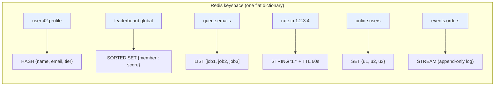

Two properties fall out of this model and underpin almost every design decision later in the guide. First, **every single command is atomic** — because Redis executes commands one at a time on a single thread (Section 3), a command like `INCR` or `ZADD` either happens completely or not at all, with no other command interleaving. This is why Redis is the default tool for counters, locks, and rate limits: the atomicity you would need mutexes and transactions for in a normal database is free. Second, **keys are the unit of distribution.** When you shard across a cluster, Redis routes by key, so operations that touch multiple keys (a set intersection, a multi-key transaction) only work cleanly when those keys live on the same node — a constraint that shapes cluster design in Section 24.

<details>
<summary>📖 In plain terms</summary>

Picture Redis as one giant dictionary. You look things up by a key (a string like `user:42`), but what you get back can be a whole data structure — a list, a set, a ranked scoreboard — not just a plain value. The trick to using Redis well is picking the structure that makes your operation cheap: use a ranked set for a leaderboard, a counter for rate limiting, a set for "who's online." And because Redis does one thing at a time, each operation is all-or-nothing, which is exactly what you want for counting and locking.

</details>

---

## 3. ⚙️ Redis Internals: Single-Threaded Event Loop, I/O Multiplexing & RESP

The single most important fact about how Redis works is this: **it processes your commands one at a time, on a single thread.** No matter how many clients connect — ten, or ten thousand — there is exactly one worker executing commands, and it handles them in a strict sequence: finish command A completely, then start command B, then C. Nothing ever runs at the same time as anything else.

That sounds like it should be slow. It is actually the reason Redis is fast *and* correct, and the rest of this section builds up why, step by step.

### Why processing one command at a time makes counting correct

Start with a concrete problem. Suppose 1,000 users load a page at the same instant, and each page-load should bump a view counter by one. The counter starts at `500`, so after all 1,000 requests it must read `1500`.

Bumping a counter is really three small steps: **read** the current value, **add one**, **write** it back. Now imagine two of those requests are handled *simultaneously* by two different threads:

```
Time →     Thread A                Thread B
  t1        read counter → 500
  t2                                read counter → 500     ← both read 500!
  t3        add 1 → 501
  t4                                add 1 → 501
  t5        write 501
  t6                                write 501              ← should be 502
```

Both threads read `500`, both compute `501`, both write `501`. Two page views happened, but the counter only went up by one. This is a **lost update** — a classic race condition — and in a multi-threaded system you would have to prevent it with locks around every counter.

Redis makes this problem *impossible* by design. Because there is only one worker and it runs each command to completion before starting the next, request A's read-add-write finishes entirely (500 → 501) before request B's even begins (501 → 502). There is no "meanwhile" for a second command to slip into. This is what people mean when they say **every Redis command is atomic**: not because Redis does anything clever with locks, but because there is only ever one command running, so nothing *can* interleave with it. The `INCR` command you'll meet in Section 5 relies entirely on this.

### Why one thread isn't a bottleneck

The natural objection is: "surely one worker can't keep up with thousands of clients?" It can, because of what the work actually *is*. A Redis command like `GET` or `INCR` is a read or write of a value already sitting in RAM — it finishes in well under a microsecond (a millionth of a second). The slow part of serving a request is almost never the command itself; it's *waiting for data to arrive over the network* from the client.

So the real challenge isn't computing fast — it's not wasting time *waiting*. If the single worker stopped and waited for each client to send its next command, it would sit idle most of the time and thousands of clients would starve. Redis avoids this with a technique called **I/O multiplexing**.

Here is the idea in plain steps. The operating system offers a facility — `epoll` on Linux, `kqueue` on macOS/BSD — that lets one thread watch thousands of network connections at once and ask a single question: *"Which of these connections have data ready for me to read right now?"* The kernel replies with just the ready ones. So the Redis worker never waits on any individual client. It runs a tight cycle:

1. Ask the OS: "which connections have a command ready?"
2. The OS hands back, say, 12 of the 8,000 connections that have data.
3. Execute those 12 commands, one after another, sending each reply.
4. Go back to step 1.

Because each command takes under a microsecond, that cycle spins thousands of times per second, and every connected client feels like it's being served instantly — even though, at any single instant, exactly one command is executing. This loop is called the **event loop**, and it is the heart of Redis.

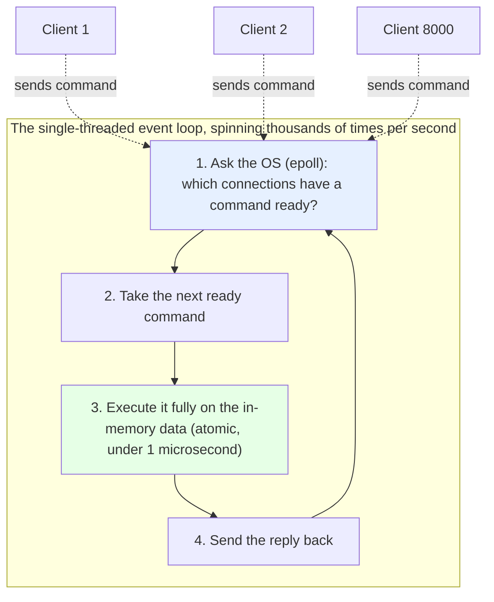

The payoff of this design in one line: a single Redis node routinely serves **over 100,000 commands per second at sub-millisecond latency** — with no locks, no race conditions, and atomic commands for free.

### What "single-threaded" does *not* mean

A common interview trap is to say Redis is single-threaded for *everything*. It isn't — only **command execution** is. Redis uses extra background threads for slow housekeeping so those chores don't stall the event loop: since version 4.0, freeing a very large object (`UNLINK`) and writing to disk happen on background threads; since version 6.0, **threaded I/O** lets separate threads handle the raw reading and writing of network bytes. But the actual step where your data is read or modified still happens on the one thread. So the guarantee that matters — commands don't interleave, so they stay atomic — is fully preserved; only the network plumbing around it is parallelized.

### The one real danger: slow commands

The flip side of "one command at a time" is the biggest operational risk in Redis: **one slow command freezes the entire server.** While the worker is busy with a slow command, every other client waits in line behind it.

Concretely: run `KEYS *` on a database with 10 million keys and Redis will walk all 10 million to build the reply — which might take hundreds of milliseconds to seconds — and during that entire time *no other client gets served*. The same is true of `SMEMBERS` on a set with a million elements, or any operation whose cost grows with the size of the collection (an "O(N)" command). On a system doing 100,000 ops/sec, a single 500 ms stall means hundreds of thousands of requests pile up.

This is why `KEYS` is effectively banned in production. The safe alternative is **`SCAN`**, which returns a small batch of keys at a time and hands control back to the event loop between batches, so other clients keep being served. The rule to internalize: never hand the single worker a big, slow job.

### RESP: how clients and Redis talk on the wire

When your app sends `SET name Ada`, it doesn't send that text literally — it sends it encoded in **RESP (REdis Serialization Protocol)**, the simple format Redis uses on the network. RESP is deliberately trivial so it's fast to parse. Every piece of data starts with one **type byte** that says what follows: `+` a simple string, `-` an error, `:` an integer, `$` a text/binary string (with its length), and `*` an array (with its element count).

Here is `SET name Ada` as Redis actually receives it — it's an array (`*3`) of three strings:

```
*3\r\n        ← an array with 3 elements follow
$3\r\nSET\r\n  ← element 1: a 3-character string, "SET"
$4\r\nname\r\n ← element 2: a 4-character string, "name"
$3\r\nAda\r\n  ← element 3: a 3-character string, "Ada"
```

(`\r\n` is just the invisible "end of line" marker separating parts.) The reply to a successful `SET` comes back as `+OK\r\n` — the `+` says "simple string," the value is `OK`. If you ran `INCR counter` and the result were 18, the reply would be `:18\r\n` — the `:` marks it as an integer.

Because each part announces its own length up front, the parser never has to guess where a value ends, which is why RESP is so cheap to process. It also unlocks a big performance trick called **pipelining**. Normally a client sends one command, waits for the reply, then sends the next — and that round-trip wait over the network is the slowest part. With pipelining, the client fires 100 commands back-to-back without waiting, then reads all 100 replies at the end. If a single round trip to Redis takes 1 ms, sending 100 commands one-by-one costs ~100 ms, but pipelining them costs closer to 1 ms plus execution — a 10–100× throughput gain, with no change on the server side.

A crucial point that trips people up: **pipelining is *not* a transaction, and it does not lock the server for your 100 commands.** Pipelining only changes the *networking* — how the commands travel to Redis (all at once, instead of one round trip each). Once they arrive, they still go through the exact same event loop as everyone else's commands, and they are still executed **one at a time**. Redis does *not* reserve the worker for your whole batch: if another client's command is ready in between, the event loop can run it *in the middle* of your pipeline. So a pipeline of `A B C` from you, running alongside client X's command, might actually execute in the order `A, B, X, C`. Each of your 100 commands is still individually atomic (nothing interleaves *within* a single command), but the pipeline *as a whole* is not atomic — other clients' commands can be interleaved *between* them. If you need the batch to run with no other client's commands mixed in, that's what `MULTI`/`EXEC` transactions (Section 20) or a Lua script (Section 21) are for — pipelining is purely a round-trip optimization.

So why is pipelining still so much faster if the commands aren't given special treatment on the server? Because the win was never on the server side — executing 100 commands takes about the same microseconds whether they arrive one-by-one or in a batch. The savings is eliminating 99 network round trips: instead of paying the ~1 ms network wait 100 times, you pay it essentially once. The event loop also gets to process your whole batch of ready commands in quick succession without idling between them waiting for the next request to arrive over the wire, which is a smaller secondary benefit.

The diagram below shows the whole flow: the pipeline client sends all its commands in one shot, they run in the shared event loop interleaved with another client's command (notice `X` running between `A` and `B`), and the replies are buffered and returned together in the original order.

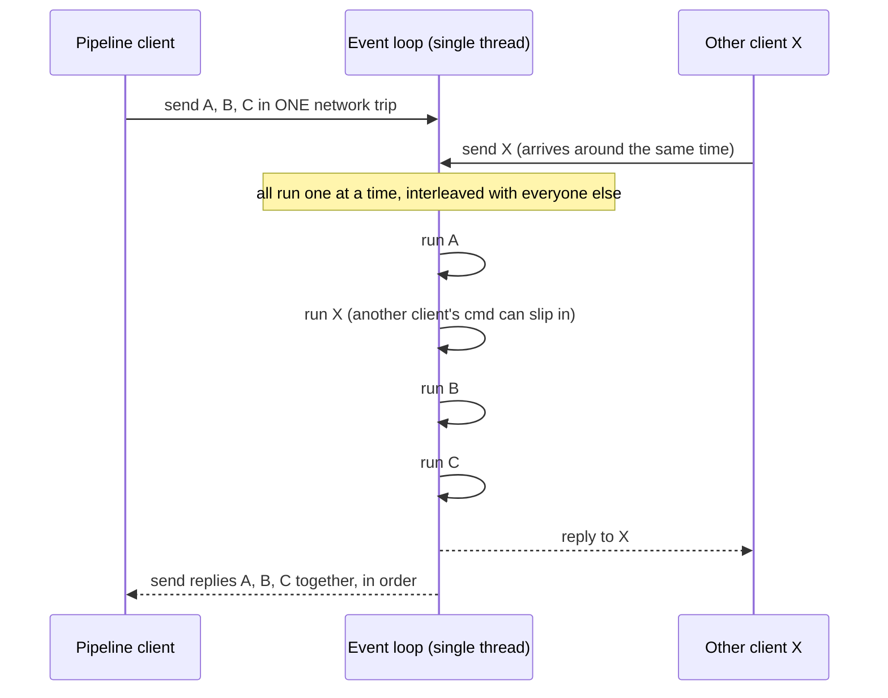

<details>
<summary>📖 In plain terms</summary>

Redis does all your commands on a single worker, one at a time, start to finish. That's a feature, not a flaw: since two commands never overlap, you can never get half-finished or "lost update" bugs — every command is naturally all-or-nothing. The worker stays busy by asking the operating system "which clients have something ready?" and only handling those, so it never sits waiting on a slow client. The one big rule: never give it a huge, slow command (like listing all 10 million keys), because while it works on that, everyone else is stuck waiting.

</details>

<details>
<summary>💻 Hands-on: watch the single thread and RESP for yourself</summary>

```bash
# See that command processing is single-threaded (io-threads is separate)
redis-cli CONFIG GET io-threads

# Watch every command hitting the server live (great for debugging)
redis-cli MONITOR

# Measure latency — proves how fast the event loop turns commands around
redis-cli --latency

# The banned command vs the safe one:
redis-cli KEYS 'user:*'          # O(N) — blocks the whole server. NEVER in prod.
redis-cli SCAN 0 MATCH 'user:*' COUNT 100   # cursor-based, non-blocking

# See RESP on the wire with raw netcat (type the command, see the reply framing)
redis-cli SET name Ada
redis-cli --no-raw GET name       # shows the bulk-string framing

# Pipelining: 100 commands in one round trip
(for i in $(seq 1 100); do echo "SET key:$i $i"; done) | redis-cli --pipe
```

</details>

---

## 4. 💻 Command Execution Flow

Now let's trace a single command all the way through, so the pieces from Section 3 connect into one picture. We'll follow `INCR counter` — "add one to the counter" — from the moment your app sends it to the moment the reply comes back. The counter currently holds `17`.

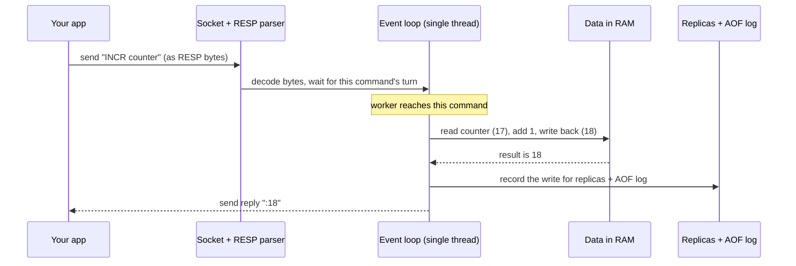

Walking through it in five plain steps:

1. **Your app sends the command.** It encodes `INCR counter` into RESP bytes (Section 3) and writes them to its network connection to Redis.

2. **Redis decodes it and it waits its turn.** The bytes arrive; Redis's RESP parser turns them back into "the command is `INCR`, the argument is `counter`." The command now sits ready — but it does *not* run immediately. It waits until the single worker's event loop gets to it (this wait is usually microseconds, but it's why the worker must never be stuck on a slow command).

3. **The worker executes it — this is the atomic moment.** The worker reads the current value (`17`), adds one, and writes back `18`. Because this all happens on the one thread with nothing else running, no other command can squeeze in between the read and the write — the lost-update problem from Section 3 simply can't occur.

4. **The write is recorded for durability and copies.** *After* the value changes in RAM, if you've turned on persistence or replicas, Redis appends this write to the AOF log on disk and forwards it to any replica servers. (Details in Sections 13 and 20.) The key thing to notice is the *order*: execute first, then record what happened.

5. **The reply goes back.** Redis encodes the result as `:18` (RESP for "integer 18") and sends it to your app.

### Why "execute first, then record" matters

That ordering in step 4 has a subtle but important consequence worth understanding early. Redis doesn't send replicas the original *command* blindly — it sends them the *effect* of what happened, and it makes sure that effect is repeatable.

Here's the problem it's avoiding. Consider `SPOP myset`, which removes and returns a *random* member from a set. If Redis just forwarded the literal command `SPOP myset` to a replica, the replica would run its *own* random pick and might remove a *different* element — now the replica and the primary hold different data, and they've silently drifted apart. To prevent this, Redis rewrites such commands before forwarding: it turns `SPOP myset` into a `SREM myset <the-specific-element-it-actually-removed>`, so the replica removes exactly the same one. The same rewriting happens for anything involving randomness or the current time.

This is the reason for a rule you'll see again in Section 21: **Lua scripts must be deterministic** — given the same inputs, they must always produce the same writes. If a script's result depended on a random number or the clock, replicas replaying it would diverge from the primary, exactly like the naive `SPOP` case. Keep this "same input, same effect" principle in mind; it underpins how Redis stays consistent across replicas and restarts.

<details>
<summary>📖 In plain terms</summary>

When you send Redis a command, it gets decoded, waits a moment for the single worker to be free, then runs start-to-finish while nothing else touches the data — so the result is always clean. After it runs, Redis writes down what changed (to a disk log and to backup servers) so the data survives restarts and stays copied. The neat trick: it records the *outcome* of the command, not the raw command, so a command like "pick a random item" gives every copy the exact same result instead of each server picking differently.

</details>

---

# Part II — Data Structures

Redis ships with a small set of powerful data structures, and choosing the right one is the essence of designing with it. The sections below walk each structure in the order you naturally learn them — from the simplest string to the append-only stream — and for each one we answer the same three questions an interviewer will: what operations does it make cheap, what problem does it solve better than the alternatives, and where does it bite you at scale.

## 5. 🔤 Strings & Bitmaps

### 5.1 a string is just a value under a name

At its simplest, a Redis string is one key holding one value. Every command follows the same shape — the command name, then the key, then the value:

```text
SET   <key>   <value>          # general form
GET   <key>                    # read it back
```

Plug in real names and that is all there is to it:

```text
SET  user:42:name  "Ada Lovelace"     # store  -> OK
GET  user:42:name                     # read   -> "Ada Lovelace"
```

The key (`user:42:name`) is any string you choose as the label; the value (`"Ada Lovelace"`) is what you store under it. That is the entire beginner story: pick a key name, put a value in it, fetch it later. The value does not have to be text — Redis strings are **binary-safe byte sequences up to 512 MB**, so the same type can hold a word, a serialized JSON blob, a number, or even a JPEG. If Redis strings stopped here they would be an ordinary key-value store. What makes them powerful is the set of operations layered on top, which we build up next.

### 5.2 a string can be a number — atomic counters

When a string holds a number, Redis can do arithmetic on it directly. `INCR` adds one, `DECR` subtracts one, `INCRBY` adds any integer, and `INCRBYFLOAT` adds a decimal:

```text
SET   page:views  0
INCR  page:views                 # -> 1
INCR  page:views                 # -> 2
INCRBY page:views 10             # -> 12
```

The important word is **atomic**. Because Redis executes one command at a time on a single thread (Section 3), `INCR page:views` reads the current value, adds one, and writes it back as one indivisible step — no other client can slip in between the read and the write. So even with a million clients incrementing the same counter at once, not a single increment is lost. This is why the first thing most teams build on Redis is a counter: page-view tallies, rate-limit counts, generating unique IDs. Doing the same safely in a relational database needs `SELECT ... FOR UPDATE` inside a transaction, and still fights over a row lock.

### 5.3 set a value only if it's not already there — the lock primitive

`SET` takes optional flags that turn it into a conditional, self-expiring write. The two that matter most are `NX` and `PX`:

```text
SET  lock:order:42  token123  NX  PX 30000
```

`NX` means "only set this if the key does **N**ot already e**X**ist," and `PX 30000` attaches an expiry of 30000 milliseconds (30 seconds). Redis applies both in the same atomic step, so the command means: *create this key only if nobody else has, and make it disappear on its own after 30 seconds.* The first caller gets `OK`; anyone who tries while the key still exists gets `(nil)`. That is exactly what a distributed lock needs — "grab the lock only if it's free, and release it automatically if I crash and never clean up" — which is why `SET NX PX` is the foundation of the locking patterns in Section 28.

### 5.4 bitmaps — treating a string as a row of bits

A **bitmap is not a separate data type.** It is an ordinary string that you operate on one *bit* at a time. Every string is stored as bytes, and every byte is 8 bits, so a string is also a long row of bits numbered `0, 1, 2, 3, …` from the left. Bitmap commands let you flip and read those individual bits, which lets you store one true/false flag per position using a single bit of memory each.

The core command is **`SETBIT`, and it takes three arguments**:

```text
SETBIT   dau:2026-08-05   42   1
   │            │          │    │
   │            │          │    └─ value:  the bit value, 0 or 1 (off or on)
   │            │          └────── offset: which bit position to change (0-based)
   │            └───────────────── key:    the string holding the bitmap
   └────────────────────────────── command
```

So `SETBIT dau:2026-08-05 42 1` means "in the string at key `dau:2026-08-05`, set bit number 42 to 1." Redis grows the string automatically so that bit 42 exists, filling any gap with zero bits. `GETBIT dau:2026-08-05 42` reads that one bit back (`0` or `1`).

One thing to internalize: **the offset is measured in bits, not bytes**, and Redis really allocates the whole byte array up to that bit. `SETBIT key 42 1` needs 6 bytes (bit 42 falls in byte 5, since 42 ÷ 8 = 5 r2), all zero-filled except that one bit. Setting a huge offset like `SETBIT key 1000000000 1` therefore creates a ~125 MB string (1,000,000,000 ÷ 8 bytes), not a 1-bit one — so keep offsets dense. The hard ceiling is the 512 MB string limit, i.e. a maximum bit offset of about 4.29 billion.

<details>
<summary>🧠 Deep dive: how much memory does a bit offset really use?</summary>

The offset in `SETBIT key <offset> 1` is a **bit** position, but Redis stores strings as contiguous bytes (using SDS, Simple Dynamic Strings). To make a given bit exist, Redis reallocates the string, extends it to the required number of bytes, zero-fills all the new bytes, and then sets the one requested bit. The zeros are physically stored — there is no lazy/sparse trick — so the memory is genuinely consumed.

**Walkthrough — `SETBIT key 42 1` on an empty key:**

Bit 42 lives in byte 5, because `42 ÷ 8 = 5 remainder 2`, so Redis allocates 6 bytes (byte 0 through byte 5):

```text
byte:   0        1        2        3        4        5
bits:   00000000 00000000 00000000 00000000 00000000 00100000
                                                        ↑ bit 42 set
```

All 6 bytes start as `00000000`; only bit 42 flips to 1.

**Why a billion-bit offset costs ~125 MB:**

```text
SETBIT key 1000000000 1
required bytes = 1,000,000,000 / 8  + 1  =  125,000,001 bytes  ≈ 119 MiB (~125 MB)
```

Almost every one of those 125 million bytes is `00000000`; only the final byte holds the set bit. It is **not** 1 GB, because the offset counts bits, not bytes.

**Memory grows with the highest offset you set:**

| Command | String length | Memory used |
|---|---|---|
| `SETBIT key 7 1` | 1 byte | 1 byte |
| `SETBIT key 15 1` | 2 bytes | 2 bytes |
| `SETBIT key 8000 1` | 1,001 bytes | ~1 KB |
| `SETBIT key 8000000 1` | 1,000,001 bytes | ~1 MB |
| `SETBIT key 1000000000 1` | 125,000,001 bytes | ~119 MiB |

**The limit:** a Redis string maxes out at 512 MB. Since `512 MB × 8 = 4,294,967,296 bits`, the largest valid bit offset is about **4.29 billion**; setting a bit beyond that fails.

**Why bitmaps still win for DAU:** for 100 million users, one bit each is `100,000,000 bits = 12.5 MB` total — far smaller than storing 100 million user IDs in a set. The catch is that the size is driven by the *highest* offset (largest user ID) you set, so bitmaps work best when IDs are dense and start near zero. This compactness is why bitmaps are the go-to for daily active users, feature flags, and presence tracking.

</details>

The classic use is **daily-active-user tracking**. Give each user a fixed bit position equal to their user ID, and use one key per day. When user 42 does something on 5 August, you flip their bit on:

```text
SETBIT  dau:2026-08-05  42  1        # user 42 was active today
SETBIT  dau:2026-08-05  99  1        # user 99 was active today
```

Now the bitmap for that day looks like this (bit 42 and bit 99 are on, everything else off):

```text
bit index:  0  1  2 ... 42 ... 99 ...
value:      0  0  0 ...  1 ...  1 ...
```

To count how many users were active, **`BITCOUNT`** simply counts the bits that are set to 1:

```text
BITCOUNT  dau:2026-08-05             # -> 2   (bits 42 and 99 are on)
```

The payoff is memory. One bit per user means ten million users fit in about 1.2 MB — a set storing ten million IDs would cost hundreds of megabytes. And because each day is its own bitmap, you can combine days with **`BITOP`**, which does boolean logic across bitmaps bit-by-bit. `BITOP AND weekly d1 d2 … d7` produces a new bitmap whose bit is 1 only where it was 1 in *all seven* days — i.e. users active every single day, which is weekly retention:

```text
BITOP  AND  weekly  dau:2026-08-01  dau:2026-08-02  ... dau:2026-08-07
BITCOUNT  weekly                     # users active on ALL 7 days
```

`BITOP OR` would instead give users active on *any* day. This is why analytics pipelines lean on bitmaps: the flags are tiny, and set-style questions ("active every day," "active this day or that day") become single bit-logic commands.

<details>
<summary>📖 In plain terms</summary>

A Redis string is just a value you store under a key — text, a number, even an image. The magic is the built-in operations: you can atomically bump a number up by one (perfect for counting page views or requests), and you can set a value only if it doesn't already exist and have it auto-expire (perfect for locks). Bitmaps let you pack millions of yes/no flags — like "was this user active today?" — into a tiny amount of memory, one bit per user.

</details>

<details>
<summary>💻 Java (Jedis): counters, atomic locks, and bitmap DAU</summary>

```java
import redis.clients.jedis.Jedis;
import redis.clients.jedis.params.SetParams;

try (Jedis jedis = new Jedis("localhost", 6379)) {

    // Atomic counter — no lost updates even under heavy concurrency
    long views = jedis.incr("page:home:views");

    // Atomic "set only if absent" with a 30s expiry — the lock primitive
    String token = java.util.UUID.randomUUID().toString();
    String ok = jedis.set("lock:order:42", token,
                          new SetParams().nx().px(30_000));
    boolean acquired = "OK".equals(ok);

    // Bitmap: mark user 42 active today, then count today's active users
    jedis.setbit("dau:2026-08-05", 42, true);
    long activeToday = jedis.bitcount("dau:2026-08-05");
}
```

</details>

<details>
<summary>💻 Hands-on: strings, counters & bitmaps in redis-cli</summary>

```bash
redis-cli SET user:42:name "Ada Lovelace"
redis-cli APPEND user:42:name " (mathematician)"

# Atomic counters
redis-cli INCR   page:views          # -> 1
redis-cli INCRBY page:views 10        # -> 11
redis-cli INCRBYFLOAT wallet:42 2.50  # floats too

# Conditional set with expiry (the lock primitive)
redis-cli SET lock:job token123 NX PX 30000   # OK on first call, nil after

# Bitmaps — one bit per user
redis-cli SETBIT dau:2026-08-05 42 1
redis-cli SETBIT dau:2026-08-05 99 1
redis-cli BITCOUNT dau:2026-08-05             # -> 2 active users
redis-cli BITOP AND weekly d1 d2 d3           # retention via bit AND
```

</details>

<details>
<summary>💻 Sample session with real output</summary>

This is what an actual `redis-cli` session looks like, including the reply Redis prints after each command. `(integer)`, `OK`, and `(nil)` are the reply types RESP encodes (Section 3).

```text
127.0.0.1:6379> SET page:views 0
OK
127.0.0.1:6379> INCR page:views
(integer) 1
127.0.0.1:6379> INCRBY page:views 10
(integer) 11
127.0.0.1:6379> GET page:views
"11"
127.0.0.1:6379> INCRBYFLOAT wallet:42 2.50
"2.5"
127.0.0.1:6379> SET lock:job token123 NX PX 30000
OK
127.0.0.1:6379> SET lock:job otherToken NX PX 30000
(nil)                       # already held -> NX refuses
127.0.0.1:6379> SETBIT dau:2026-08-05 42 1
(integer) 0                 # returns the PREVIOUS bit value
127.0.0.1:6379> SETBIT dau:2026-08-05 99 1
(integer) 0
127.0.0.1:6379> BITCOUNT dau:2026-08-05
(integer) 2
127.0.0.1:6379> STRLEN page:views
(integer) 2
```

</details>

<details>
<summary>📋 Important string & bitmap commands</summary>

| Command | What it does | Cost |
|---|---|---|
| `SET k v [NX\|XX] [EX\|PX ttl]` | Set value, optional "only if (not) exists" + expiry | O(1) |
| `GET k` / `GETDEL k` / `GETEX k` | Read; read-and-delete; read-and-set-TTL | O(1) |
| `MSET k1 v1 k2 v2` / `MGET k1 k2` | Set / get many keys in one round trip | O(N) |
| `INCR k` / `DECR k` / `INCRBY k n` | Atomic integer increment/decrement | O(1) |
| `INCRBYFLOAT k f` | Atomic float increment | O(1) |
| `APPEND k v` / `STRLEN k` | Append to / measure the value | O(1) amortized |
| `SETBIT k offset 0\|1` / `GETBIT k offset` | Set / read a single bit | O(1) |
| `BITCOUNT k` / `BITPOS k bit` | Count set bits / find first set bit | O(N) |
| `BITOP AND\|OR\|XOR dest k1 k2` | Boolean combine bitmaps | O(N) |

</details>

---

## 6. 🗂️ Hashes

### 6.1 a hash is many named values under one key

A string holds *one* value per key. A **hash** holds *many* named values under one key — each named value is called a **field**. The command to store fields is `HSET`, and its shape is the key followed by field-value pairs:

```text
HSET   <key>   <field>   <value>   [<field> <value> ...]      # general form
```

Store a user as a single hash with three fields:

```text
HSET  user:42  name "Ada"  email "ada@x.com"  tier gold       # -> (integer) 3
```

One key, `user:42`, now holds three fields. To read one field back you name the key and the field:

```text
HGET  user:42  email                                          # -> "ada@x.com"
```

If you have ever stored a database row or the fields of an object, this is the same shape: one identifier, several named columns.

### 6.2 read or change one field without touching the rest

The reason to use a hash instead of storing the object as one JSON string is **you can read or update a single field cheaply**. `HGET` reads one field, `HSET` overwrites one, and `HINCRBY` bumps a numeric field atomically:

```text
HGET     user:42  email          # read just the email  -> "ada@x.com"
HSET     user:42  tier platinum  # change just the tier  -> (integer) 0  (0 = updated existing)
HINCRBY  user:42  loginCount 1   # atomically +1         -> (integer) 1
HGETALL  user:42                 # read the whole object back
```

With a JSON string you would have to fetch the whole blob, parse it, change one field, and write it all back — more bandwidth, more CPU, and a race if two clients do it at once. The hash avoids all three: each field operation is a single atomic command.

### 6.3 why hashes are memory-efficient (and the one limitation)

When a hash has few fields and short values, Redis stores it as a compact `listpack` — a flat, contiguous byte layout — instead of a full hash table, using a fraction of the memory (Section 14). That makes hashes the recommended way to store millions of small records such as session data, user profiles, or shopping-cart contents, where using a separate string key per attribute would waste memory on per-key overhead.

The limitation worth knowing for interviews: on Redis versions before 7.4 **you cannot expire an individual field** — a TTL applies to the whole key. So a cart modeled as one hash expires all at once, not item by item. That is usually what you want, but state it explicitly. (Redis 7.4 added per-field TTL via `HEXPIRE`.)

### 6.4 never run `HGETALL` on a large hash — page with `HSCAN`

`HGETALL` is O(N) and returns *every* field in one reply. On a small profile that is fine. On a hash with hundreds of thousands of fields it is dangerous for two reasons: Redis is single-threaded, so serializing that huge reply **blocks every other client** while it runs, and the response itself can be tens of megabytes crossing the network in one burst. The same warning applies to `HKEYS` and `HVALS`.

The safe alternative is `HSCAN`, which walks the hash in small batches using a cursor. You call it repeatedly, feeding the returned cursor back in, until the cursor comes back `0`:

```text
HSCAN   <key>   <cursor>   [MATCH <pattern>]   [COUNT <hint>]     # general form
```

```text
HSCAN  bigcart:99  0  COUNT 100
# -> 1) "1408"                 <- next cursor (not 0, so keep going)
#    2) 1) "sku:1"  2) "2"     <- a batch of field/value pairs
#       3) "sku:2"  4) "1"
HSCAN  bigcart:99  1408  COUNT 100    # feed the cursor back in
# -> ... eventually returns cursor "0" meaning iteration is complete
```

`HSCAN` gives O(1)-ish work per call and never blocks the server for long, at the cost of a weak guarantee: fields added or removed *during* the scan may or may not appear. For pagination, background export, or migration jobs that tradeoff is exactly right. Rule of thumb: `HGETALL` only when you know the hash is bounded and small; `HSCAN` for anything unbounded.

### 6.5 internal encoding — compact `listpack` vs full `hashtable`

Redis stores the *same* hash type in two different physical layouts and switches automatically as it grows. While the hash is small it uses a **`listpack`**: one flat, contiguous block of memory holding the field/value pairs back to back. Once it crosses a size threshold Redis converts — one-way — to a real **`hashtable`** with per-entry pointers and buckets.

Two config values decide the flip point:

```text
CONFIG GET  hash-max-listpack-entries    # -> "128"   (max number of fields)
CONFIG GET  hash-max-listpack-value      # -> "64"    (max length of any field/value, in bytes)
```

Exceed *either* one — more than 128 fields, or any single value longer than 64 bytes — and the hash upgrades to a hashtable. You can watch it happen:

```text
HSET  h  a 1  b 2                # tiny hash
OBJECT ENCODING  h               # -> "listpack"
# add a 200-character value, over the 64-byte limit
HSET  h  bio  "<200 chars...>"
OBJECT ENCODING  h               # -> "hashtable"   (converted, and it never goes back)
```

The `listpack` is dramatically cheaper because it avoids the pointer and bucket overhead a hashtable pays per entry — often several times less memory for the same small object. This is the whole reason "model small objects as hashes" is good advice, and why some designs deliberately keep each hash under the threshold. The tradeoff: a `listpack` is scanned linearly (O(N)), so the thresholds are deliberately small — big enough to save memory, small enough that the linear scan stays fast. When memory is higher than you expect, `OBJECT ENCODING` is the first thing to check.

### 6.6 TTL is key-level (and, since 7.4, field-level)

Expiry in Redis is normally a property of the **whole key**, not of individual fields. `EXPIRE user:42 3600` deletes the entire hash — all fields — one hour from now. Before Redis 7.4 there was no way to expire just one field, so a shopping cart modeled as a single hash always expired atomically, all items together.

Redis 7.4 added **per-field TTL** through the `HEXPIRE` family, so a field can now outlive or predecease its siblings:

```text
HEXPIRE  <key>  <seconds>  FIELDS  <count>  <field> [<field> ...]   # general form
```

```text
EXPIRE  cart:99  86400                       # whole cart gone in 24h  (key-level)
HEXPIRE cart:99  600  FIELDS 1  sku:promo     # just this one item expires in 10 min (field-level)
HTTL    cart:99       FIELDS 1  sku:promo     # -> (integer) 600   check remaining field TTL
```

For interviews, state both: **key-level TTL is universal; field-level TTL requires Redis 7.4+.** If a design needs per-item expiry on older Redis, you either model each item as its own key (losing the single-object grouping) or run a periodic cleanup job.

### 6.7 shard-aware modeling — one hash lives on one shard

In **Redis Cluster** the shard for a key is chosen by hashing the *key name* into one of 16384 hash slots. A hash is a single key, so **the entire hash — every field — lives on exactly one shard**, no matter how large it grows. Fields are not spread across the cluster. This has a sharp consequence: a giant hash cannot use the cluster's combined memory or throughput; it is capped by the one node that owns it.

That creates the classic **hot key** problem. Suppose you keep all live sessions in one hash:

```text
HSET  user:sessions  u:1 <token>  u:2 <token>  ...   # every login writes here
```

Every login, refresh, and logout across the whole system now hits the *single shard* that owns `user:sessions`. That one node saturates while the rest of the cluster sits idle — and if the hash also grows to millions of fields, `HGETALL`/`HSCAN` on it get expensive too. The fix is to **partition the key space** so writes spread across shards:

```text
# Partition by user id  -> each user's sessions on (likely) different shards
HSET  sessions:u:1  <deviceId> <token>
HSET  sessions:u:2  <deviceId> <token>

# Partition by tenant -> isolate noisy tenants onto different shards
HSET  sessions:tenant:acme   ...
HSET  sessions:tenant:globex  ...

# Partition by time window -> natural expiry + spreads load across buckets
HSET  sessions:2026-08-06  ...
```

Each distinct key hashes to its own slot, so the load fans out across the cluster instead of piling onto one node. When a group of keys *must* stay together on the same shard (for a multi-key operation), Redis offers **hash tags** — the substring in `{...}` is what gets hashed, so `sessions:{acme}:u:1` and `sessions:{acme}:u:2` co-locate on purpose. The staff-level summary: choose a key granularity fine enough that no single hash becomes a hot key, but coarse enough that related data you must read together still shares a shard.

<details>
<summary>📖 In plain terms</summary>

A hash is a little object stored under one key — like a row with named columns. Store a user as `user:42` with fields for name, email, and tier, and you can read or change just the email without touching the rest. It's also very memory-friendly for small objects, which is why sessions and user profiles are often stored this way instead of as one big JSON string. Two things to watch as it grows: don't dump a huge hash with `HGETALL` (page it with `HSCAN`), and remember the whole hash lives on one cluster shard — so a single giant hash can become a bottleneck. Split it by user, tenant, or time when that happens.

</details>

<details>
<summary>💻 Java (Jedis): storing an object as a hash</summary>

```java
import java.util.Map;

try (Jedis jedis = new Jedis("localhost", 6379)) {
    // Store a user object in one call
    jedis.hset("user:42", Map.of(
        "name",  "Ada Lovelace",
        "email", "ada@example.com",
        "tier",  "gold"));

    // Read a single field — no full-object fetch
    String email = jedis.hget("user:42", "email");

    // Update one field atomically; bump a numeric field
    jedis.hset("user:42", "tier", "platinum");
    jedis.hincrBy("user:42", "loginCount", 1);

    Map<String, String> whole = jedis.hgetAll("user:42");
}
```

</details>

<details>
<summary>💻 Hands-on: hashes in redis-cli</summary>

```bash
redis-cli HSET user:42 name "Ada" email "ada@example.com" tier gold
redis-cli HGET user:42 email          # read one field
redis-cli HGETALL user:42             # read the whole object
redis-cli HINCRBY user:42 loginCount 1
redis-cli HDEL user:42 tier
redis-cli OBJECT ENCODING user:42     # 'listpack' when small, 'hashtable' when big
```

</details>

<details>
<summary>💻 Sample session with real output</summary>

```text
127.0.0.1:6379> HSET user:42 name "Ada" email "ada@x.com" tier gold
(integer) 3                 # number of NEW fields created
127.0.0.1:6379> HGET user:42 email
"ada@x.com"
127.0.0.1:6379> HGETALL user:42
1) "name"
2) "Ada"
3) "email"
4) "ada@x.com"
5) "tier"
6) "gold"
127.0.0.1:6379> HINCRBY user:42 loginCount 1
(integer) 1                 # field created as 0, then +1
127.0.0.1:6379> HINCRBY user:42 loginCount 1
(integer) 2
127.0.0.1:6379> HEXISTS user:42 email
(integer) 1
127.0.0.1:6379> HDEL user:42 tier
(integer) 1
127.0.0.1:6379> OBJECT ENCODING user:42
"listpack"                  # still small -> compact encoding
```

</details>

<details>
<summary>📋 Important hash commands</summary>

| Command | What it does | Cost |
|---|---|---|
| `HSET k f v [f v ...]` | Set one or more fields | O(N) in fields |
| `HGET k f` / `HMGET k f1 f2` | Read one / several fields | O(1) / O(N) |
| `HGETALL k` | Read every field-value pair | O(N) |
| `HDEL k f [f ...]` | Delete fields | O(N) |
| `HEXISTS k f` | Does a field exist? | O(1) |
| `HINCRBY k f n` / `HINCRBYFLOAT k f x` | Atomic numeric bump of a field | O(1) |
| `HKEYS k` / `HVALS k` / `HLEN k` | All field names / values / count | O(N) / O(N) / O(1) |
| `HSCAN k cursor` | Cursor-based iteration (safe on big hashes) | O(1) per call |
| `HEXPIRE k ttl FIELDS n f ...` | Per-field TTL (Redis 7.4+) | O(N) |

</details>

---

## 7. 📜 Lists

### 7.1 a list is an ordered row of values

A Redis **list** holds many values under one key, kept in the exact order you insert them. It has two ends — a left (head) and a right (tail) — and you add by pushing onto whichever end you choose. The push commands take the key and one or more values:

```text
RPUSH   <key>   <value> [<value> ...]     # push onto the RIGHT (tail)
LPUSH   <key>   <value> [<value> ...]     # push onto the LEFT (head)
```

Build a queue of jobs by pushing on the right:

```text
RPUSH  queue:emails  job1  job2  job3     # -> (integer) 3   (new length)
```

The list is now `[job1, job2, job3]`, left to right. Read a slice with `LRANGE`, where `0 -1` means "from the first index to the last" — i.e. everything:

```text
LRANGE  queue:emails  0  -1               # -> job1, job2, job3
```

### 7.2 pop from an end — a FIFO queue

You remove values with `LPOP` (from the left) or `RPOP` (from the right). Push on one end and pop from the other and you get **FIFO** order — first in, first out:

```text
LPOP  queue:emails                        # -> "job1"  (the oldest, removed)
LLEN  queue:emails                        # -> (integer) 2  (jobs remaining)
```

Pushes and pops at either end are O(1), which is why lists are the natural building block for **queues and stacks**. Reaching into the middle by index (`LINDEX`) or slicing a large range (`LRANGE`) is O(N), so lists are excellent at the ends and poor in the middle — design around the ends.

### 7.3 let workers wait for work — blocking pop

A worker that keeps calling `LPOP` on an empty queue just spins and wastes CPU. The **blocking pop** fixes this: `BRPOP` (and `BLPOP`) waits until an element appears, up to a timeout in seconds, then returns it:

```text
BRPOP  queue:emails  5                     # wait up to 5s; returns key + value
```

So a worker sleeps efficiently until a job arrives instead of hammering the server in a poll loop. This turns a list into a lightweight job queue with backpressure — Python's RQ and Ruby's Resque are built on exactly this.

### 7.4 the reliability gap and how to close it

Here is a subtlety interviewers love. With a plain `BRPOP` worker, the job is removed from the list the instant it is popped. If the worker then crashes before finishing, **the job is gone** — nobody has it anymore. The fix is `LMOVE` (older name `RPOPLPUSH`), which in one atomic step pops from the work queue *and* pushes onto a per-worker "processing" list:

```text
LMOVE  queue:emails  queue:emails:processing  RIGHT  LEFT
```

The worker deletes the job from the processing list only after it finishes successfully; a reaper re-queues anything left stuck there (a crashed worker's jobs). This is the reliable-queue pattern — and the reason that for serious queuing you often graduate to **Streams** (Section 10), which build acknowledgement in natively.

<details>
<summary>📖 In plain terms</summary>

A list is an ordered sequence you can push onto and pop off from either end, all instantly. That makes it a natural job queue: your app pushes tasks on one side, and worker processes pull them off the other. Workers can even block and wait for the next task instead of constantly checking. The catch: if a worker grabs a task and then crashes, that task is lost — so for anything important you use a pattern that keeps a copy until the work is confirmed done.

</details>

<details>
<summary>💻 Java (Jedis): a reliable worker queue with LMOVE</summary>

```java
import redis.clients.jedis.args.ListDirection;

// Producer: push jobs onto the head of the work queue
try (Jedis jedis = new Jedis("localhost", 6379)) {
    jedis.lpush("queue:emails", "{\"to\":\"ada@x.com\"}");
}

// Reliable worker: atomically move job to a processing list, ack on success
try (Jedis jedis = new Jedis("localhost", 6379)) {
    String job = jedis.lmove("queue:emails", "queue:emails:processing",
                             ListDirection.RIGHT, ListDirection.LEFT);
    if (job != null) {
        try {
            handle(job);                              // do the work
            jedis.lrem("queue:emails:processing", 1, job); // ack: remove copy
        } catch (Exception e) {
            // leave it in the processing list; a reaper re-queues it
        }
    }
}
```

</details>

<details>
<summary>💻 Hands-on: lists as queues</summary>

```bash
redis-cli LPUSH queue:emails job1 job2 job3   # push onto head
redis-cli RPOP queue:emails                    # pop from tail (FIFO)
redis-cli LRANGE queue:emails 0 -1             # inspect whole queue
redis-cli BRPOP queue:emails 5                 # block up to 5s for a job
redis-cli LLEN queue:emails                    # queue depth (for monitoring)
# Reliable pattern: atomic move to a processing list
redis-cli LMOVE queue:emails queue:emails:processing RIGHT LEFT
```

</details>

<details>
<summary>💻 Sample session with real output</summary>

Watch the FIFO ordering: jobs pushed on the left (`LPUSH`) come off the right (`RPOP`) oldest-first.

```text
127.0.0.1:6379> RPUSH queue:emails job1 job2 job3
(integer) 3                 # new length of the list
127.0.0.1:6379> LRANGE queue:emails 0 -1
1) "job1"
2) "job2"
3) "job3"
127.0.0.1:6379> LPOP queue:emails
"job1"                      # oldest first (FIFO)
127.0.0.1:6379> LLEN queue:emails
(integer) 2
127.0.0.1:6379> BRPOP queue:emails 5
1) "queue:emails"
2) "job3"                   # blocks up to 5s; returns key + value
127.0.0.1:6379> LMOVE queue:emails proc:list LEFT RIGHT
"job2"                      # atomically moved to the processing list
```

</details>

<details>
<summary>📋 Important list commands</summary>

| Command | What it does | Cost |
|---|---|---|
| `LPUSH k v` / `RPUSH k v` | Push onto head / tail | O(1) |
| `LPOP k [n]` / `RPOP k [n]` | Pop from head / tail | O(1) |
| `BLPOP k t` / `BRPOP k t` | Blocking pop, wait up to `t` seconds | O(1) |
| `LRANGE k start stop` | Read a slice (`0 -1` = all) | O(S) slice |
| `LINDEX k i` / `LSET k i v` | Read / overwrite by index | O(N) |
| `LLEN k` | Length (queue depth) | O(1) |
| `LREM k count v` | Remove matching elements | O(N) |
| `LMOVE src dst LEFT\|RIGHT LEFT\|RIGHT` | Atomic move between lists (reliable queue) | O(1) |
| `LTRIM k start stop` | Keep only a range (cap a timeline) | O(N) |

</details>

---

## 8. 🎯 Sets

### 8.1 a set is a bag of unique values

A **set** holds many values under one key, but with two rules: **no duplicates** and **no order**. You add with `SADD`, which takes the key and one or more members:

```text
SADD   <key>   <member> [<member> ...]      # general form
```

Track which tags a post has:

```text
SADD  tags:post:1  redis  cache  db          # -> (integer) 3   (3 added)
SADD  tags:post:1  redis                      # -> (integer) 0   (already there, ignored)
```

Adding `redis` again returns `0` because uniqueness is enforced for free — you never store a duplicate.

### 8.2 the core question — "is X in the set?"

The operation sets are built for is the **membership test**, `SISMEMBER`, which is O(1) — instant, no matter how large the set:

```text
SISMEMBER  tags:post:1  redis                 # -> (integer) 1   (yes)
SISMEMBER  tags:post:1  mysql                 # -> (integer) 0   (no)
SCARD      tags:post:1                         # -> (integer) 3   (how many members)
```

This is why sets are the tool for "is this user online?", "has this user already viewed this product?", "does this post have that tag?" — anywhere you need a fast yes/no on membership of a group.

### 8.3 compare whole sets on the server — set algebra

The distinguishing power of sets is that Redis can compute relationships **between** sets for you, without shipping the data to your app. The three operations are intersection (`SINTER`, what they share), union (`SUNION`, everything combined), and difference (`SDIFF`, in the first but not the second):

```text
SADD    following:42   alice  bob  carol
SADD    followers:99   bob    carol dave
SINTER  following:42  followers:99          # -> bob, carol   (people I follow who follow 99)
```

That single `SINTER` answers "which of my friends also follow this account?" — the engine behind "People You May Know" and common-tag recommendations. The tradeoff: `SINTER` over two large sets is O(N) and runs on the single thread, so for hot paths you precompute the result or cap the set sizes.

### 8.4 random members, and counting-only

`SRANDMEMBER` returns a random member without removing it (sampling, "pick a random winner"), while `SPOP` returns *and removes* one (raffles, dealing cards):

```text
SRANDMEMBER  online:users  1                 # a random member, left in place
SPOP         online:users                     # a random member, removed
```

And when you only care about *how many* unique things you've seen, not which ones, a set can be swapped for a **HyperLogLog** (Section 11) — trading exactness for a thousandfold memory saving.

<details>
<summary>📖 In plain terms</summary>

A set is a bag of unique items with instant "is this in here?" checks. Use it for things like "who's online right now" or "what tags does this article have," where duplicates should be ignored automatically. The special trick is that Redis can compare two sets for you — find what they share, what's combined, or what's different — right on the server. That's how features like "friends you have in common" are built.

</details>

<details>
<summary>💻 Java (Jedis): common-friends via set intersection</summary>

```java
import java.util.Set;

try (Jedis jedis = new Jedis("localhost", 6379)) {
    jedis.sadd("user:42:following", "alice", "bob", "carol");
    jedis.sadd("account:99:followers", "bob", "carol", "dave");

    // Membership test — O(1)
    boolean follows = jedis.sismember("user:42:following", "bob");

    // Server-side intersection: who do I follow that also follows account 99?
    Set<String> mutual = jedis.sinter("user:42:following", "account:99:followers");
    // -> [bob, carol]

    long onlineCount = jedis.scard("online:users");   // set cardinality
}
```

</details>

<details>
<summary>💻 Hands-on: sets and set algebra</summary>

```bash
redis-cli SADD online:users u1 u2 u3
redis-cli SISMEMBER online:users u2      # -> 1 (present)
redis-cli SCARD online:users             # -> 3 (count)
redis-cli SADD a x y z
redis-cli SADD b y z w
redis-cli SINTER a b                     # -> y z (intersection)
redis-cli SUNION a b                     # -> x y z w
redis-cli SDIFF a b                      # -> x (in a, not b)
redis-cli SRANDMEMBER online:users 1     # random sample, no removal
```

</details>

<details>
<summary>💻 Sample session with real output</summary>

Note the reply to a duplicate `SADD` is `(integer) 0` — nothing was added — and set results come back unordered.

```text
127.0.0.1:6379> SADD online:users u1 u2 u3
(integer) 3
127.0.0.1:6379> SADD online:users u2
(integer) 0                 # already present -> 0 added
127.0.0.1:6379> SISMEMBER online:users u2
(integer) 1
127.0.0.1:6379> SCARD online:users
(integer) 3
127.0.0.1:6379> SADD a x y z
(integer) 3
127.0.0.1:6379> SADD b y z w
(integer) 3
127.0.0.1:6379> SINTER a b
1) "y"
2) "z"
127.0.0.1:6379> SDIFF a b
1) "x"
127.0.0.1:6379> SMEMBERS a
1) "x"
2) "y"
3) "z"                       # order is not guaranteed
```

</details>

<details>
<summary>📋 Important set commands</summary>

| Command | What it does | Cost |
|---|---|---|
| `SADD k m [m ...]` | Add members (duplicates ignored) | O(N) added |
| `SREM k m [m ...]` | Remove members | O(N) |
| `SISMEMBER k m` / `SMISMEMBER k m1 m2` | Membership test (one / many) | O(1) / O(N) |
| `SCARD k` | Count of members | O(1) |
| `SMEMBERS k` | All members (careful on huge sets) | O(N) |
| `SINTER` / `SUNION` / `SDIFF k1 k2` | Intersection / union / difference | O(N) |
| `SINTERSTORE dest k1 k2` | Store the result in a new set | O(N) |
| `SRANDMEMBER k [n]` / `SPOP k [n]` | Random read / random remove | O(1)–O(N) |
| `SSCAN k cursor` | Cursor-based iteration | O(1) per call |

</details>

---

## 9. 🏆 Sorted Sets (ZSets)

### 9.1 a sorted set is members + scores, always in order

A **sorted set** (ZSet) is like a normal set — unique members — but every member also carries a number called a **score**, and Redis keeps the members permanently ordered by that score. You add with `ZADD`, and the shape is the key, then a score-member pair (score first):

```text
ZADD   <key>   <score>   <member>   [<score> <member> ...]     # general form
```

Record three players and their scores:

```text
ZADD  leaderboard  9500 player:42  9800 player:7  8700 player:13     # -> (integer) 3
```

Redis now stores these three members sorted by score at all times: `player:13` (8700), `player:42` (9500), `player:7` (9800). You never sort them yourself — they are always in order.

**Tie-breaking: what happens when two members share a score?** Redis breaks the tie **lexicographically by the member name** (byte-wise ascending). So if `player:7` and `player:42` both had score 9500, `player:42` would come before `player:7` because the string `"player:42"` sorts before `"player:7"`. This ordering is deterministic and stable — the same members and scores always produce the same order — which is exactly why a ZSet with a *single fixed score for every member* becomes a pure lexicographic index (the basis of `ZRANGEBYLEX`). Worth stating in an interview: ties are never arbitrary, they fall back to the member string.

```text
ZADD  board  100 apple  100 banana  100 cherry   # all same score
ZRANGE board 0 -1                                # -> apple, banana, cherry  (alphabetical tie-break)
```

### 9.2 ranking is instant — the leaderboard

Because the set is kept ordered, the classic leaderboard questions are one fast command each. `ZREVRANGE` reads members highest-score-first, and `ZREVRANK` gives a member's position from the top:

```text
ZREVRANGE  leaderboard  0  9  WITHSCORES   # top 10 with their scores
ZREVRANK   leaderboard  player:42          # -> (integer) 1   (0-based, so 2nd place)
ZSCORE     leaderboard  player:42          # -> "9500"        (a member's score)
```

Ranks are **0-based**: rank 0 is the top. All of these are O(log N). Doing the same in a relational database means `ORDER BY score DESC LIMIT 10` (fine) plus, to find one player's rank, a `COUNT` of everyone above them — a full scan that slows down as the table grows. Redis makes both logarithmic because internally a ZSet is a **skip list plus a hash table**: the hash gives O(1) score lookups, the skip list gives O(log N) ordered traversal.

### 9.3 update scores — replace, increment, or update-only

There are two commands and several `ZADD` flags for changing a score, and picking the right one matters.

**Replace the score outright** — just `ZADD` the same member again. If the member exists its score is overwritten; if not, it's created:

```text
ZADD  leaderboard  10000 player:42         # set score to exactly 10000 (created or overwritten)
```

**Increment relative to the current score** — either `ZINCRBY`, or `ZADD ... INCR` (which adds to the score and returns the new value, behaving like `ZINCRBY` but with access to the flags below):

```text
ZINCRBY      leaderboard  300  player:42   # +300 -> "9800", instantly re-ordered
ZADD  leaderboard  INCR  300  player:42    # same effect, returns the new score "10100"
```

**Control *when* the write applies** with `ZADD` flags — these are the interview-worthy ones:

```text
ZADD leaderboard  NX      9999 player:42   # NX: only add if member is NEW (never overwrite)
ZADD leaderboard  XX      9999 player:42   # XX: only update if member ALREADY exists (never create)
ZADD leaderboard  GT      9999 player:42   # GT: only update if new score is GREATER (high-water mark)
ZADD leaderboard  LT      9999 player:42   # LT: only update if new score is LOWER
ZADD leaderboard  CH      9999 player:42   # CH: return count of CHanged members, not just new ones
```

`GT` is the one people miss: for a leaderboard where a player's best score should only ever go *up*, `ZADD leaderboard GT <score> <player>` records the new score only if it beats the stored one — no read-compare-write round trip, no race. In every case Redis re-positions the member atomically; there is no separate re-sort step and no window for a concurrent update to corrupt the order.

### 9.4 how it's stored — skip list + hash table together

A ZSet has to answer two very different questions fast: "what is *this* member's score?" (a point lookup) and "who is in ranks 0–9?" or "who scored between 8000 and 9000?" (ordered range queries). No single structure is great at both, so Redis keeps **two structures side by side**, both pointing at the same members:

1. A **hash table** mapping `member -> score`. This makes `ZSCORE player:42` an **O(1)** lookup — Redis jumps straight to the member without any traversal.
2. A **skip list** ordered by `(score, member)`. This keeps everything sorted and makes ranking, range, and insert operations **O(log N)**.

A skip list is a linked list with extra "express-lane" pointers stacked above it. The bottom level links every member in order; each higher level links roughly half as many, so searching can skip large gaps and descend — the same logarithmic shape as a balanced tree, but simpler to implement and naturally ordered for range scans.

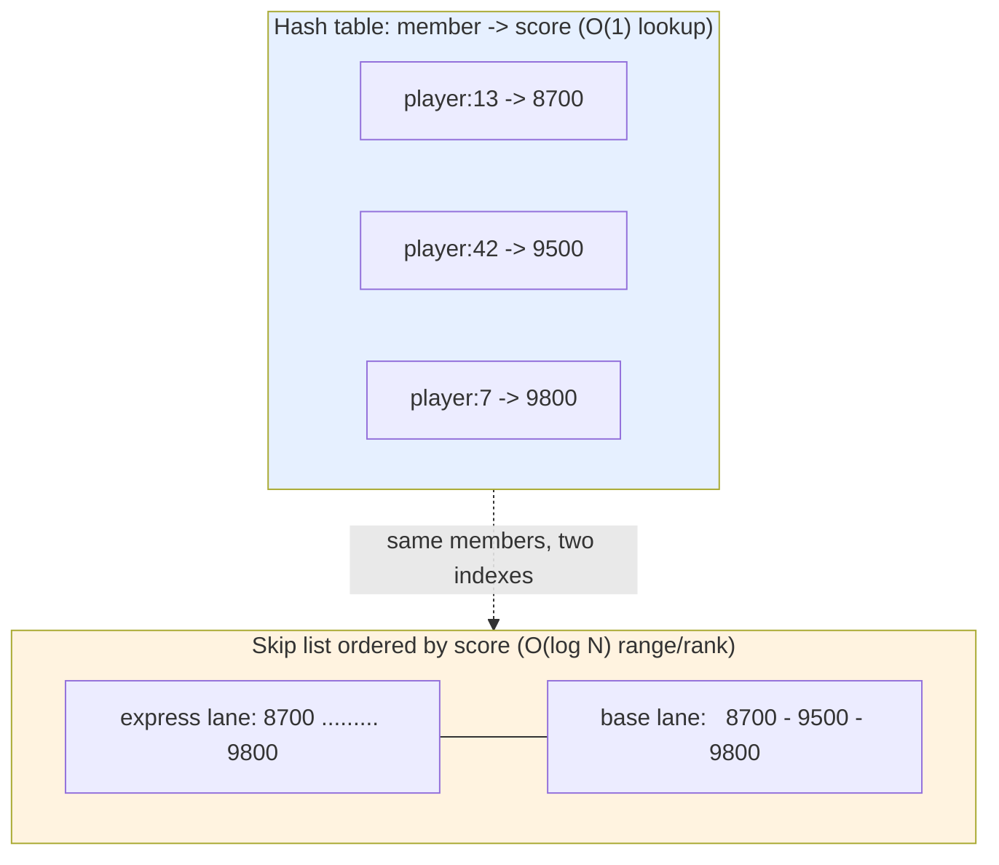

Walk through what each operation costs with the members above. `ZSCORE leaderboard player:42` uses the hash table and returns `9500` in O(1). `ZADD leaderboard 9600 player:99` inserts into the skip list at the right ordered position in O(log N) *and* records `player:99 -> 9600` in the hash table. `ZREVRANK leaderboard player:42` walks the skip list's span counters to compute the position in O(log N). This dual structure is why both a single-member lookup and a top-N range are fast at the same time — you pay a little extra memory (each member is referenced twice) to get the best of both worlds. (When a sorted set is small, Redis skips both structures and uses a compact `listpack` instead — Section 14.)

### 9.5 the score can be anything orderable

The real power is that **the score does not have to be a game score — it can be any number you want to order by.** This one idea unlocks several patterns:

- Use a **Unix timestamp** as the score and the ZSet becomes a time-ordered index — the backbone of the sliding-window rate limiter (Section 29), where each request is `ZADD`ed with its timestamp and `ZREMRANGEBYSCORE key 0 <cutoff>` trims anything older than the window.
- Use a **priority number** as the score and you have a priority queue (`ZPOPMIN` takes the highest-priority item).
- Use a **geohash** as the score and you get geospatial search — which is literally how the `GEO` commands work (Section 13).

The pattern to internalize: *whenever you need "keep these ordered by some number" with fast rank and range queries, reach for a ZSet.*

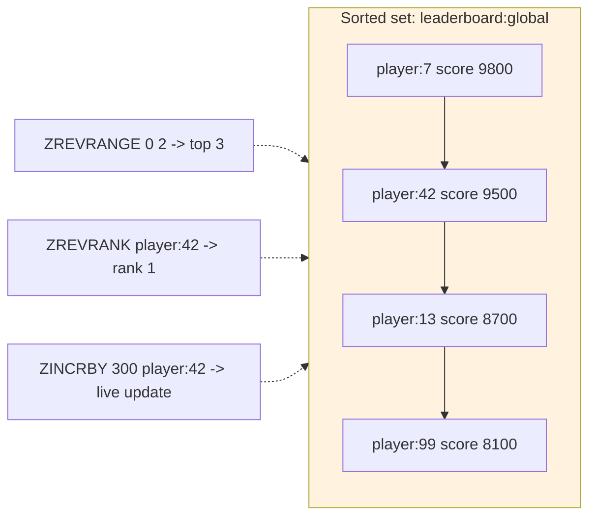

<details>
<summary>📖 In plain terms</summary>

A sorted set keeps a collection of items each tagged with a number (a score), and it stays sorted by that number all the time. That's exactly what a leaderboard needs: add a player's score and Redis instantly knows the top 10 and any player's rank without recalculating. The clever part is the score can be anything you want ordered — a timestamp turns it into a time-ordered log for rate limiting, a priority number turns it into a priority queue.

</details>

<details>
<summary>💻 Java (Jedis): a live leaderboard</summary>

```java
import redis.clients.jedis.resps.Tuple;
import java.util.List;

try (Jedis jedis = new Jedis("localhost", 6379)) {
    // Record / update scores
    jedis.zadd("leaderboard:global", 9500, "player:42");
    jedis.zincrby("leaderboard:global", 300, "player:42"); // += 300 atomically

    // Top 10 with scores (highest first)
    List<Tuple> top = jedis.zrevrangeWithScores("leaderboard:global", 0, 9);

    // A player's rank (0-based; add 1 for human rank)
    Long rank = jedis.zrevrank("leaderboard:global", "player:42");

    // Players ranked just around me (rank-1 to rank+1)
    List<String> neighbours = jedis.zrevrange("leaderboard:global",
                                              Math.max(0, rank - 1), rank + 1);
}
```

</details>

<details>
<summary>💻 Hands-on: sorted sets & ranking</summary>

```bash
redis-cli ZADD leaderboard 9500 player:42 9800 player:7 8700 player:13
redis-cli ZREVRANGE leaderboard 0 2 WITHSCORES   # top 3 with scores
redis-cli ZREVRANK leaderboard player:42          # rank (0-based)
redis-cli ZSCORE  leaderboard player:42           # a member's score
redis-cli ZINCRBY leaderboard 300 player:42       # live score update
redis-cli ZRANGEBYSCORE leaderboard 8000 9000     # everyone in a score band
redis-cli ZREMRANGEBYSCORE window 0 1000          # trim by score (rate limiter)
```

</details>

<details>
<summary>💻 Sample session with real output</summary>

Ranks are 0-based. `ZREVRANGE` walks highest-score-first, so `player:7` (9800) is rank 0.

```text
127.0.0.1:6379> ZADD leaderboard 9500 player:42 9800 player:7 8700 player:13
(integer) 3
127.0.0.1:6379> ZREVRANGE leaderboard 0 2 WITHSCORES
1) "player:7"
2) "9800"
3) "player:42"
4) "9500"
5) "player:13"
6) "8700"
127.0.0.1:6379> ZREVRANK leaderboard player:42
(integer) 1                 # 2nd place (0-based)
127.0.0.1:6379> ZSCORE leaderboard player:42
"9500"
127.0.0.1:6379> ZINCRBY leaderboard 300 player:42
"9800"                      # new score after +300
127.0.0.1:6379> ZREVRANK leaderboard player:42
(integer) 0                 # now tied-to-top, moved to rank 0
127.0.0.1:6379> ZRANGEBYSCORE leaderboard 8000 9000
1) "player:13"
```

</details>

<details>
<summary>📋 Important sorted-set commands</summary>

| Command | What it does | Cost |
|---|---|---|
| `ZADD k score m [score m ...]` | Add / update member scores | O(log N) |
| `ZINCRBY k n m` | Atomically bump a member's score | O(log N) |
| `ZSCORE k m` / `ZMSCORE k m1 m2` | Read a member's score(s) | O(1) |
| `ZRANK k m` / `ZREVRANK k m` | Ascending / descending rank | O(log N) |
| `ZRANGE k a b [WITHSCORES]` | Range by rank (add `REV` for top-first) | O(log N + S) |
| `ZREVRANGE k a b` | Range highest-first (leaderboards) | O(log N + S) |
| `ZRANGEBYSCORE k min max` | Members within a score band | O(log N + S) |
| `ZREMRANGEBYSCORE k min max` | Delete members in a score band (trim window) | O(log N + S) |
| `ZCARD k` / `ZCOUNT k min max` | Total count / count in a score band | O(1) / O(log N) |
| `ZPOPMIN k` / `ZPOPMAX k` | Pop lowest / highest (priority queue) | O(log N) |

</details>

<details>
<summary>🧠 Deep dive: how the skip list actually works (design, search, insert, delete, dry runs)</summary>

A **skip list** is the structure that keeps a sorted set in order. The goal of this deep dive is that by the end you could sketch one on a whiteboard and explain every operation. We'll build it up slowly, starting from a problem you already understand.

#### The problem: a sorted linked list is slow to search

Imagine our leaderboard as a plain sorted linked list — each node points to the next, in score order:

```text
HEAD -> 8100 -> 8700 -> 9500 -> 9800 -> NIL
```

To find score 9500 you have no choice but to start at the front and step forward one node at a time: 8100, 8700, 9500. With 4 nodes that's fine. With **one million** nodes, finding something near the end means a million steps. That's O(N), and it's too slow.

Here's the frustrating part: the list *is* sorted, but a linked list can't do binary search, because you can't jump to "the middle" — you can only follow arrows one at a time. **The skip list's whole purpose is to add shortcut arrows so you *can* jump ahead.**

#### The fix: add "express lane" shortcut arrows on top

Picture a highway. The bottom road (the local road) has an exit at every single node. Above it we add an express lane that only stops at *some* nodes, and above that an even faster lane that stops at even fewer. To travel far, you ride the fastest lane that doesn't overshoot your exit, then drop down to a slower lane for the fine-grained approach.

A skip list does exactly this. It stacks several **levels** of forward arrows on top of the same nodes:

- **Level 0** — the bottom road. Links *every* node in sorted order. This is the real, complete list.
- **Level 1** — an express lane linking only *some* nodes, skipping over the rest.
- **Level 2 and above** — faster lanes linking even fewer nodes.

Every node always exists on Level 0. A node that also appears on higher levels is a "tall" node — an express-lane exit. In the diagram below, `9500` is 2 levels tall and `9800` is 3 levels tall, so from the top lane you can leap most of the way in a single hop:

```mermaid
flowchart TB
    subgraph L3["Level 3 (fastest lane, tallest nodes only)"]
        h3["HEAD"] --> n7_3["9800"]
    end
    subgraph L2["Level 2 (express lane)"]
        h2["HEAD"] --> n42_2["9500"] --> n7_2["9800"]
    end
    subgraph L1["Level 1 (express lane)"]
        h1["HEAD"] --> n13_1["8700"] --> n42_1["9500"] --> n7_1["9800"]
    end
    subgraph L0["Level 0 (local road, every node in order)"]
        h0["HEAD"] --> n99_0["8100"] --> n13_0["8700"] --> n42_0["9500"] --> n7_0["9800"] --> NIL["NIL"]
    end
    style L0 fill:#e6ffe6
    style L1 fill:#eef7ff
    style L2 fill:#fff3e0
    style L3 fill:#ffe6ef
```

Read the diagram bottom-to-top: the same physical nodes appear on more lanes the "taller" they are. Searching always starts at the top-left (HEAD, highest lane) and works down and to the right.

#### How tall should each node be? The coin-flip rule, explained simply

For the shortcuts to help, the tall nodes need to be spread out evenly — roughly every 2nd node on Level 1, every 4th on Level 2, and so on. But Redis can't reshuffle the list every time something is added (that would be slow). So it uses a clever trick: **when a new node is inserted, it decides that node's height randomly, like flipping a coin.**

Here's the rule in plain steps. Think of it as: *"every node gets at least the ground floor; then we flip a coin to decide if it earns another floor, and we keep flipping until we lose."*

```text
1. Every node starts at height 1 (it must exist on Level 0, the local road).
2. Flip a coin.
      - Heads -> give it one more level, then flip again.
      - Tails -> stop. That's its final height.
3. Repeat until you flip Tails (or hit the max height cap).
```

So a node's height is "1 + how many heads in a row you flipped." Most coin sequences fail quickly, which is exactly what we want:

```text
Tails on 1st flip           -> height 1   (~1/2 of nodes: only on the local road)
Heads, then Tails           -> height 2   (~1/4 of nodes: reach Level 1)
Heads, Heads, then Tails    -> height 3   (~1/8 of nodes: reach Level 2)
```

With a fair (50/50) coin, half the nodes stay short and half get promoted, half of *those* get promoted again — automatically producing the "each lane has about half as many stops as the one below" shape. **No node ever looks at its neighbours or rebalances anything; each just rolls its own dice once at birth.** That randomness is the entire secret to why a skip list stays balanced without the complex rotation logic a tree needs.

Two Redis-specific details: Redis uses a coin biased **1/4 instead of 1/2** (it only promotes a node with probability 1/4, which makes the lanes sparser and saves memory while keeping search fast), and it caps the maximum height at **32 levels** — enough shortcuts to index billions of members. On average this works out to about 1.33 pointers per node, so the memory cost of all these shortcuts is tiny.

#### What each Redis node actually stores

Now that the shape is clear, here's what lives inside one node:

- the **member** string (e.g. `player:42`) and its **score** (e.g. `9500`) — nodes are kept ordered by score, and if two scores tie, by the member string (the tie-break rule from 9.1);
- a **backward pointer** to the previous node on Level 0, so Redis can walk *backwards* for `ZREVRANGE`;
- an array of **forward pointers**, one per level this node reaches (its height);
- next to each forward pointer, a **span** — a small counter saying "how many bottom-road nodes does this one arrow jump over."

That span counter is the clever bit that makes **rank** queries fast. To answer `ZRANK` ("what position is this member?"), Redis adds up the spans of every arrow it follows during the search. The running total *is* the rank — no separate counting pass needed.

#### SEARCH — find the node with score 9500

The rule is simple and never changes: **start top-left, move right while the next node isn't too big, and drop down a level whenever the next node would overshoot.**

```text
Goal: find score 9500. Start at HEAD on the highest lane (Level 3).

Level 3:  at HEAD. Next node on this lane is 9800. Is 9800 <= 9500? No, overshoot.
          -> don't move right; drop DOWN to Level 2.
Level 2:  at HEAD. Next node is 9500. Is 9500 <= 9500? Yes.
          -> move RIGHT to 9500.
          at 9500. Next node is 9800. Overshoot -> drop DOWN to Level 1.
Level 1:  at 9500. Next is 9800. Overshoot -> drop DOWN to Level 0.
Level 0:  at 9500. This is our target. FOUND.
```

We landed on the answer after touching just a couple of express-lane nodes instead of scanning 8100 and 8700 on the local road. On a list of a million nodes the same descend-and-skip pattern reaches any element in about 20 hops (log₂ of a million) instead of up to a million.

#### INSERT — add `player:5` with score 9600

Inserting is just a search that **writes down the last node it stood on at each level before dropping** — those are the nodes whose arrows will need re-pointing. This list of "nodes to fix" is traditionally called `update[]`.

```text
Start:  8100 -> 8700 -> 9500 -> 9800     (we want to slot 9600 between 9500 and 9800)

1. Search for where 9600 belongs. At each level, record the last node before we dropped:
      update = [ 9500, 9500, 9500 ]      (on every level, 9500 is the last node <= 9600)

2. Decide the new node's height by coin flips:  Heads, then Tails  ->  height 2.
   So player:5 (9600) will live on Level 0 and Level 1.

3. Splice it in — for each of its levels, point the recorded node's arrow at the newcomer,
   and point the newcomer's arrow at whatever came next:
      Level 0:  9500 -> 9600 -> 9800
      Level 1:  9500 -> 9600 -> 9800

4. Update the span counters on the touched arrows so ranks stay accurate.

Result: 8100 -> 8700 -> 9500 -> 9600 -> 9800
```

All of this is O(log N): the search is O(log N), and we only re-point a handful of arrows (one per level of the new node). Changing an existing member's score with `ZADD`/`ZINCRBY` is handled as *remove-then-reinsert* at the new score, which is why the member always ends up correctly re-ordered with no separate sort step.

#### DELETE — remove the node with score 8700

Delete works the same way: search while recording `update[]`, then make every arrow that pointed *to* the victim instead point *past* it.

```text
Start:  8100 -> 8700 -> 9500 -> 9600 -> 9800

1. Search for 8700, recording update[] (the node before it on each level).
2. On every level where the recorded node points at 8700, redirect that arrow
   to whatever 8700 pointed to, and shrink the span by 1:
      8100 -> 9500      (8700 is now bypassed on every level)
3. Free the 8700 node. If the top lanes are now empty, lower the list's height.

Result: 8100 -> 9500 -> 9600 -> 9800
```

#### End-to-end dry run in redis-cli

Putting the operations together on a real leaderboard `lb`:

```text
127.0.0.1:6379> ZADD lb 8100 p:99 8700 p:13 9500 p:42 9800 p:7
(integer) 4
# skip list Level 0 now:  p:99(8100) - p:13(8700) - p:42(9500) - p:7(9800)

127.0.0.1:6379> ZADD lb 9600 p:5          # INSERT (traced above)
(integer) 1
# Level 0:  p:99(8100) - p:13(8700) - p:42(9500) - p:5(9600) - p:7(9800)

127.0.0.1:6379> ZSCORE lb p:42            # a pure "what's this member's score?" lookup
"9500"                                     # answered by the HASH TABLE in O(1), skip list not touched

127.0.0.1:6379> ZREVRANK lb p:5           # "what position (from the top) is p:5?"
(integer) 1                                # computed by summing spans, O(log N). p:7=rank 0, p:5=rank 1

127.0.0.1:6379> ZREM lb p:13              # DELETE (traced above)
(integer) 1
# Level 0:  p:99(8100) - p:42(9500) - p:5(9600) - p:7(9800)

127.0.0.1:6379> ZRANGE lb 0 -1 WITHSCORES # walk Level 0 left-to-right (ascending)
1) "p:99"  2) "8100"
3) "p:42"  4) "9500"
5) "p:5"   6) "9600"
7) "p:7"   8) "9800"
```

Notice `ZSCORE` did **not** use the skip list at all — that's the companion hash table from 9.4 doing an O(1) lookup. The skip list is only needed for anything *ordered*: ranks, ranges, and top-N.

#### Why Redis picked a skip list over a balanced tree

A red-black or AVL tree gives the same O(log N) guarantees, but keeping one balanced requires fiddly rotation logic that is easy to get wrong. A skip list reaches the same performance using nothing but a coin flip per node — far simpler to implement and maintain. It also handles Redis's needs naturally: walking a range or iterating in reverse is just following arrows, and the span counters make rank queries O(log N) for free. Combined with the `member -> score` hash table (9.4), one sorted set gives you O(1) score lookups *and* O(log N) ordered operations at the same time.

</details>

---

## 10. 🌊 Streams

### 10.1 a stream is an append-only log

A **stream** (added in Redis 5.0) is a log you only ever add to the end of. Each entry is a set of field-value pairs, and Redis stamps every entry with a time-ordered ID. You append with `XADD`; the `*` tells Redis to generate the ID for you:

```text
XADD   <key>   *   <field> <value> [<field> <value> ...]     # * = auto-assign ID
```

Append an order event:

```text
XADD  events:orders  *  orderId 42  amount 99.90     # -> "1699999999999-0"
```

The returned ID `1699999999999-0` is `<millisecondsTime>-<sequence>` — the time it was added, plus a counter to break ties within the same millisecond. IDs only ever increase, so the log is naturally time-ordered.

### 10.2 reading does not remove — the log stays

Unlike a list used as a queue, reading a stream **does not delete anything**. `XRANGE` reads a range of entries (`-` and `+` mean "from the very start" to "the very end"), and `XREAD` reads forward from a given ID:

```text
XLEN    events:orders            # -> (integer) 1     (how many entries)
XRANGE  events:orders  -  +      # read every entry, oldest first
```

Because entries are retained, several independent readers can each go through the whole history, and a reader that restarts can resume from the last ID it saw instead of losing its place. That retention is the key difference from a list-queue.

### 10.3 share the work safely — consumer groups

The feature that makes a stream a real messaging system is the **consumer group**: a set of workers that cooperatively split the entries, where each entry is delivered to exactly one worker in the group. Redis tracks, per worker, which entries were delivered but not yet confirmed. You create a group once, then workers claim new entries with `XREADGROUP` (the `>` means "entries never delivered to this group") and confirm completion with `XACK`:

```text
XGROUP CREATE     events:orders  billing  0            # create group "billing"
XREADGROUP GROUP  billing worker-1  COUNT 10  STREAMS events:orders  >   # claim new work
XACK              events:orders  billing  1699999999999-0               # mark it done
```

Between delivery and `XACK`, an entry sits in that worker's **Pending Entries List (PEL)**. If the worker crashes before acking, the entry is not lost — another worker can inspect the PEL with `XPENDING` and take it over with `XCLAIM`/`XAUTOCLAIM`. This gives **at-least-once** processing with crash recovery — exactly the durability that Pub/Sub and plain lists lack.

### 10.4 where streams sit, and their ceiling

The comparison interviewers want is streams versus the alternatives: **Pub/Sub is fire-and-forget** (no persistence, no replay, lost if nobody is listening); a **list-queue loses in-flight work on a crash**; but a **stream persists, replays, and acknowledges.** The ceiling — where you graduate to Kafka — is throughput, retention, and horizontal scale: a Redis stream lives in the memory of one shard, so multi-terabyte retention or millions of partitions is Kafka's territory, not Redis's. This is covered fully in Section 19, with the fan-out case study in Section 32.

<details>
<summary>📖 In plain terms</summary>

A stream is an append-only log — every event gets added to the end with a timestamped ID and stays there. Unlike a simple queue, multiple groups of readers can each process the log independently, and a reader that crashes can pick up exactly where it left off. Consumer groups let a team of workers split the load, with Redis tracking which messages each worker has finished. It's a lightweight message queue with delivery guarantees, sitting between simple Pub/Sub and a full Kafka.

</details>

<details>
<summary>💻 Java (Jedis): producing and consuming with a consumer group</summary>

```java
import redis.clients.jedis.StreamEntryID;
import redis.clients.jedis.params.XReadGroupParams;
import redis.clients.jedis.resps.StreamEntry;
import java.util.List;
import java.util.Map;
import java.util.AbstractMap.SimpleEntry;

try (Jedis jedis = new Jedis("localhost", 6379)) {
    // Producer: append an event (Redis assigns the ID with '*')
    jedis.xadd("events:orders", StreamEntryID.NEW_ENTRY,
               Map.of("orderId", "42", "amount", "99.90"));

    // Create a consumer group starting at the beginning (once)
    try { jedis.xgroupCreate("events:orders", "billing",
                             new StreamEntryID("0"), false); } catch (Exception ignored) {}

    // Consumer 'worker-1' claims new entries, processes, then acks
    var streams = jedis.xreadGroup("billing", "worker-1",
        XReadGroupParams.xReadGroupParams().count(10),
        Map.of("events:orders", StreamEntryID.UNRECEIVED_ENTRY));

    if (streams != null) {
        for (var entry : streams) {
            for (StreamEntry e : entry.getValue()) {
                handle(e.getFields());                     // do the work
                jedis.xack("events:orders", "billing", e.getID()); // at-least-once ack
            }
        }
    }
}
```

</details>

<details>
<summary>💻 Hands-on: streams & consumer groups</summary>

```bash
redis-cli XADD events:orders '*' orderId 42 amount 99.90   # append (auto ID)
redis-cli XLEN   events:orders
redis-cli XRANGE events:orders - +                          # read all entries

# Consumer group workflow
redis-cli XGROUP CREATE events:orders billing 0
redis-cli XREADGROUP GROUP billing worker-1 COUNT 10 STREAMS events:orders '>'
redis-cli XACK   events:orders billing 1699999999999-0      # acknowledge done
redis-cli XPENDING events:orders billing                    # see stuck (unacked) work
redis-cli XAUTOCLAIM events:orders billing worker-2 60000 0 # steal work from dead worker
```

</details>

<details>
<summary>💻 Sample session with real output</summary>

The `*` tells Redis to assign the ID; `>` in `XREADGROUP` means "entries never delivered to this group."

```text
127.0.0.1:6379> XADD events:orders * orderId 42 amount 99.90
"1699999999999-0"           # server-assigned <ms>-<seq> ID
127.0.0.1:6379> XLEN events:orders
(integer) 1
127.0.0.1:6379> XRANGE events:orders - +
1) 1) "1699999999999-0"
   2) 1) "orderId"
      2) "42"
      3) "amount"
      4) "99.90"
127.0.0.1:6379> XGROUP CREATE events:orders billing 0
OK
127.0.0.1:6379> XREADGROUP GROUP billing worker-1 COUNT 10 STREAMS events:orders >
1) 1) "events:orders"
   2) 1) 1) "1699999999999-0"
         2) 1) "orderId"
            2) "42"
            3) "amount"
            4) "99.90"
127.0.0.1:6379> XACK events:orders billing 1699999999999-0
(integer) 1                 # 1 entry acknowledged, leaves the PEL
127.0.0.1:6379> XPENDING events:orders billing
1) (integer) 0              # nothing pending now
```

</details>

<details>
<summary>📋 Important stream commands</summary>

| Command | What it does | Cost |
|---|---|---|
| `XADD k * f v [f v ...]` | Append an entry (server assigns ID) | O(1) |
| `XLEN k` | Number of entries | O(1) |
| `XRANGE k - +` / `XREVRANGE k + -` | Read entries in a range | O(log N + S) |
| `XREAD [BLOCK ms] STREAMS k id` | Read forward (optionally blocking) | O(log N + S) |
| `XGROUP CREATE k group id` | Create a consumer group | O(1) |
| `XREADGROUP GROUP g c STREAMS k >` | Claim new entries for a consumer | O(log N + S) |
| `XACK k group id` | Acknowledge processing (remove from PEL) | O(1) |
| `XPENDING k group` | Inspect delivered-but-unacked entries | O(N) |
| `XCLAIM` / `XAUTOCLAIM` | Reassign stuck entries from a dead worker | O(log N) |
| `XTRIM k MAXLEN ~ n` | Cap the log length (approximate) | O(N) |

</details>

---

## 11. 📊 HyperLogLog

### 11.1 count distinct things without storing them

A **HyperLogLog (HLL)** answers exactly one question — "how many *distinct* items have I seen?" — while storing almost nothing. You feed it items with `PFADD` and read the count with `PFCOUNT`:

```text
PFADD    <key>   <item> [<item> ...]     # record that you saw these items
PFCOUNT  <key>                            # -> approximate number of distinct items
```

Count unique visitors to a page:

```text
PFADD    visitors  user42  user99  user42     # -> (integer) 1
PFCOUNT  visitors                              # -> (integer) 2   (user42 counted once)
```

Adding `user42` twice still counts as one. The defining catch: an HLL can tell you *how many* distinct items, but never *which* ones — and the number is approximate.

### 11.2 the trade — exactness for tiny, fixed memory

`PFADD` does **not** store the item; it updates a small probabilistic sketch. That sketch is about **12 KB no matter what** — whether you've added a hundred items or a billion — and it estimates the distinct count with a standard error of only ~0.81%:

```text
MEMORY USAGE  visitors            # ~12 KB, flat, regardless of cardinality
```

Contrast a set: to count a billion unique visitors, a set must store all billion IDs — gigabytes of memory. The HLL costs 12 KB flat. The price is that you cannot ask "is `user42` in here?" (the members aren't kept) and the count is off by under 1%. That is the right trade for **unique-visitor counts, distinct-search-query counts, and unique-event metrics** at web scale, where 0.81% error is irrelevant but storing every ID is prohibitive.

### 11.3 combine sketches — PFMERGE

`PFMERGE` merges several HLLs into one, and the result counts the distinct union across all of them:

```text
PFADD    visitors:mon  a  b  c
PFADD    visitors:tue  c  d  e
PFMERGE  visitors:week  visitors:mon  visitors:tue    # union of the sketches
PFCOUNT  visitors:week                                 # -> (integer) 5   (a,b,c,d,e)
```

So you can keep a per-hour or per-day sketch and merge them for a weekly unique count — without ever double-counting a visitor who showed up on multiple days.

<details>
<summary>📖 In plain terms</summary>

A HyperLogLog counts how many *different* things you've seen using a tiny, fixed amount of memory — about 12 KB even for billions of items. The catch is it's approximate (off by under 1%) and it can't tell you *which* things it saw, only roughly *how many* distinct ones. It's perfect for "how many unique visitors did we get today?" where storing every visitor ID would waste gigabytes and you don't need a perfectly exact number.

</details>

<details>
<summary>💻 Hands-on: counting uniques with HyperLogLog</summary>

```bash
redis-cli PFADD visitors:2026-08-05 user42 user99 user42   # dup ignored
redis-cli PFCOUNT visitors:2026-08-05                        # ~2 (approx)
# Merge daily sketches into a weekly unique count
redis-cli PFMERGE visitors:week visitors:2026-08-01 visitors:2026-08-02
redis-cli PFCOUNT visitors:week
# Memory proof: ~12KB no matter how many uniques
redis-cli MEMORY USAGE visitors:2026-08-05
```

</details>

<details>
<summary>💻 Sample session with real output</summary>

`PFADD` returns `1` when the sketch changed (a probably-new item) and `0` when it likely did not.

```text
127.0.0.1:6379> PFADD visitors user42 user99 user42
(integer) 1                 # sketch was updated
127.0.0.1:6379> PFADD visitors user42
(integer) 0                 # already counted -> no change
127.0.0.1:6379> PFCOUNT visitors
(integer) 2                 # approximate distinct count
127.0.0.1:6379> PFADD visitors:mon a b c
(integer) 1
127.0.0.1:6379> PFADD visitors:tue c d e
(integer) 1
127.0.0.1:6379> PFMERGE visitors:week visitors:mon visitors:tue
OK
127.0.0.1:6379> PFCOUNT visitors:week
(integer) 5                 # union of distinct (a b c d e)
127.0.0.1:6379> MEMORY USAGE visitors:week
(integer) 12304             # ~12 KB regardless of cardinality
```

</details>

<details>
<summary>📋 Important HyperLogLog commands</summary>

| Command | What it does | Cost |
|---|---|---|
| `PFADD k item [item ...]` | Record items (stores a sketch, not the items) | O(1) |
| `PFCOUNT k [k ...]` | Approximate distinct count (of one or the union) | O(1)–O(N) |
| `PFMERGE dest k1 k2 ...` | Merge sketches into one (combine time windows) | O(N) |

</details>

---

## 12. 🌸 Probabilistic Structures: Bloom & Cuckoo Filters

> These structures come from the **RedisBloom** module (bundled in Redis Stack), not core Redis, so the commands are namespaced `BF.*` (Bloom) and `CF.*` (Cuckoo).

### 12.1 a Bloom filter answers "have I probably seen this?"

Sometimes you only need a fast, cheap answer to "have I seen this before?" and you can tolerate a rare false "yes." A **Bloom filter** does exactly that. You add items with `BF.ADD` and test them with `BF.EXISTS`:

```text
BF.ADD     <key>   <item>          # record that you've seen an item
BF.EXISTS  <key>   <item>          # -> 1 (probably yes) or 0 (definitely no)
```

Track URLs a crawler has already fetched:

```text
BF.ADD     seen:urls  "http://a.com"     # -> (integer) 1
BF.EXISTS  seen:urls  "http://a.com"     # -> (integer) 1   (yes)
BF.EXISTS  seen:urls  "http://z.com"     # -> (integer) 0   (definitely not added)
```

The one rule to remember: a Bloom filter **never misses something you added** (no false negatives), but it may occasionally say "probably yes" for something you never added (a small false-positive rate). It uses a tiny fraction of the memory a set would need — a set rejecting 500 million seen URLs costs gigabytes; a Bloom filter tuned for the same job costs a few hundred megabytes.

### 12.2 how it works, and why you size it up front

Under the hood a Bloom filter is a bit array plus *k* hash functions. **Adding** an item hashes it *k* ways and flips those *k* bits to 1. **Checking** an item hashes it the same *k* ways and tests whether all *k* bits are 1. If any one of them is 0 the item is *definitely absent*; if all are 1 it is *probably present* — "probably," because another item's hashes might have set those same bits (that is the false positive).

The false-positive rate climbs as the filter fills up, so you reserve it up front for an expected number of items and a target error rate with `BF.RESERVE`:

```text
BF.RESERVE   <key>   <error_rate>   <capacity>
BF.RESERVE   valid:userids  0.001  1000000     # 0.1% error, sized for 1,000,000 items
```

The interview-critical limitation: **a standard Bloom filter cannot delete items.** Clearing an item's bits would also clear bits shared with other members, corrupting them.

### 12.3 Cuckoo filters — when you need deletion

A **Cuckoo filter** (`CF.*`) is the answer when you must remove items. It stores small fingerprints in a cuckoo hash table, supports `CF.DEL`, and gives similar memory efficiency and false-positive behavior:

```text
CF.RESERVE  dedup  1000000
CF.ADD      dedup  "item1"          # -> (integer) 1
CF.DEL      dedup  "item1"          # -> (integer) 1   (a Bloom filter cannot do this)
CF.EXISTS   dedup  "item1"          # -> (integer) 0
```

The trade is that inserts can fail once the table is very full (it must relocate existing fingerprints and may give up). Staff-level summary: **Bloom for add-and-test-only workloads, Cuckoo when you must also delete or ask `CF.COUNT`.** Both answer membership; neither can list what they hold.

### 12.4 the canonical use case — penetration defense

Every use is a variant of "avoid an expensive lookup for something we've almost certainly not seen": deduplicating URLs in a crawler, filtering already-shown articles from a feed, and the textbook one — **cache/database penetration defense.** Put a Bloom filter of all valid keys in front of the store; a request for a key the filter says can't exist is rejected before it ever touches the database (Section 27), so attackers can't hammer you with lookups for keys that will always miss.

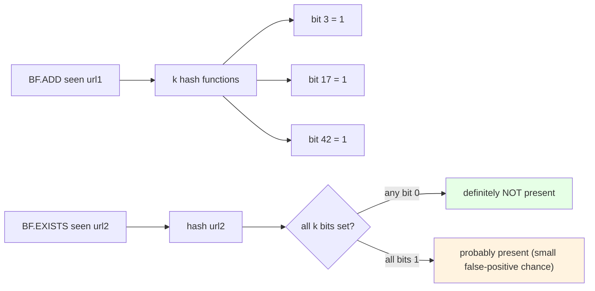

<details>
<summary>📖 In plain terms</summary>

A Bloom filter is a memory-tiny way to ask "have I seen this before?" It can answer "no, definitely not" or "probably yes" — it never wrongly says no, but it can occasionally say yes for something it never saw. That trade buys huge memory savings, so it's used to skip pointless database lookups for things that can't exist and to avoid re-processing items a crawler already handled. A Cuckoo filter is the same idea but lets you also delete items, which a plain Bloom filter can't.

</details>

<details>
<summary>💻 Java (Jedis): a Bloom filter guarding the database</summary>

```java
import redis.clients.jedis.Jedis;

try (Jedis jedis = new Jedis("localhost", 6379)) {
    // Reserve a filter: 0.1% false-positive rate, sized for 1,000,000 items
    jedis.sendCommand(
        redis.clients.jedis.Protocol.Command.valueOf("BF.RESERVE"),
        "valid:userids", "0.001", "1000000");

    // On user creation, add the id to the filter
    jedis.sendCommand(
        redis.clients.jedis.Protocol.Command.valueOf("BF.ADD"),
        "valid:userids", "42");

    // On lookup: if the filter says "no", skip the DB entirely (penetration defense)
    Object maybe = jedis.sendCommand(
        redis.clients.jedis.Protocol.Command.valueOf("BF.EXISTS"),
        "valid:userids", "99999");
    boolean mightExist = "1".equals(String.valueOf(maybe));
    if (!mightExist) {
        // definitely not a real user -> reject without touching the database
    }
}
```

The dedicated `redis.clients.jedis.bloom` / RedisBloom client wrappers give typed methods (`bfReserve`, `bfAdd`, `bfExists`); the raw `sendCommand` form above works with any Jedis version.

</details>

<details>
<summary>💻 Hands-on: Bloom & Cuckoo filters</summary>

```bash
# Requires Redis Stack / RedisBloom module
# Bloom: reserve, add, test
redis-cli BF.RESERVE seen:urls 0.001 1000000   # 0.1% error, 1M capacity
redis-cli BF.ADD    seen:urls "http://a.com"
redis-cli BF.MADD   seen:urls "http://b.com" "http://c.com"
redis-cli BF.EXISTS seen:urls "http://a.com"    # -> 1
redis-cli BF.EXISTS seen:urls "http://z.com"    # -> 0 (or rarely 1)
redis-cli BF.INFO   seen:urls

# Cuckoo: supports deletion
redis-cli CF.RESERVE dedup 1000000
redis-cli CF.ADD    dedup "item1"
redis-cli CF.EXISTS dedup "item1"               # -> 1
redis-cli CF.DEL    dedup "item1"               # Bloom can't do this
redis-cli CF.EXISTS dedup "item1"               # -> 0
```

</details>

<details>
<summary>💻 Sample session with real output</summary>

`BF.ADD` returns `1` if the item was newly added, `0` if it was probably already present.

```text
127.0.0.1:6379> BF.RESERVE seen:urls 0.001 1000000
OK
127.0.0.1:6379> BF.ADD seen:urls "http://a.com"
(integer) 1                 # newly added
127.0.0.1:6379> BF.ADD seen:urls "http://a.com"
(integer) 0                 # already present
127.0.0.1:6379> BF.EXISTS seen:urls "http://a.com"
(integer) 1
127.0.0.1:6379> BF.EXISTS seen:urls "http://never.com"
(integer) 0                 # definitely not added
127.0.0.1:6379> CF.RESERVE dedup 1000000
OK
127.0.0.1:6379> CF.ADD dedup "item1"
(integer) 1
127.0.0.1:6379> CF.DEL dedup "item1"
(integer) 1                 # deletion — impossible with a Bloom filter
127.0.0.1:6379> CF.EXISTS dedup "item1"
(integer) 0
```

</details>

<details>
<summary>📋 Important probabilistic-structure commands</summary>

| Command | What it does | Notes |
|---|---|---|
| `BF.RESERVE k error capacity` | Create a Bloom filter with a target error rate | Size up front |
| `BF.ADD k item` / `BF.MADD k i1 i2` | Add one / many items | Returns 1 if new |
| `BF.EXISTS k item` / `BF.MEXISTS k i1 i2` | Test membership | No false negatives |
| `BF.INFO k` | Capacity, size, number of items | Introspection |
| `CF.RESERVE k capacity` | Create a Cuckoo filter | Supports delete |
| `CF.ADD k item` / `CF.EXISTS k item` | Add / test | — |
| `CF.DEL k item` | Delete an item | Bloom cannot |
| `CF.COUNT k item` | Approx count of an item | Cuckoo only |

</details>

---

## 13. 🌍 Geospatial Indexes

### 13.1 store places by coordinate

Redis can remember where things are on a map and answer "what's near me?" You add a location with `GEOADD`, giving the key, then longitude, latitude, and a member name — **longitude comes first**:

```text
GEOADD   <key>   <longitude>   <latitude>   <member>     # general form
```

Register two drivers by their coordinates:

```text
GEOADD  cabs  77.5946 12.9716  driver:7      # -> (integer) 1
GEOADD  cabs  77.6100 12.9750  driver:9      # -> (integer) 1
```

You can look a member's coordinates back up with `GEOPOS`, and measure the distance between two members with `GEODIST` in the unit you choose (`m`, `km`, `mi`, `ft`):

```text
GEODIST  cabs  driver:7  driver:9  km        # -> "1.6753"   (km apart)
```

### 13.2 the core query — "who's nearby?"

The command you reach for is `GEOSEARCH` (Redis 6.2+). You give it an origin — either a raw coordinate (`FROMLONLAT`) or an existing member (`FROMMEMBER`) — and a shape, usually a circle (`BYRADIUS`). Add `ASC` to sort nearest-first and `WITHDIST` to include the distance:

```text
GEOSEARCH  cabs  FROMLONLAT 77.5950 12.9720  BYRADIUS 2 km  ASC  WITHDIST
# -> driver:7 (0.06 km), driver:9 (1.72 km)   nearest first
```

That single query is the engine behind every "find drivers / restaurants / friends near this point" feature. `GEOSEARCH` also supports `BYBOX` (a rectangle instead of a circle), a `COUNT` limit, and `WITHCOORD` — it replaces the older, now-deprecated `GEORADIUS`.

### 13.3 it's a sorted set underneath

What makes this elegant is that **a geospatial index is not a new data type — it is a sorted set.** `GEOADD` encodes each longitude/latitude pair into a single 52-bit **geohash** integer and stores it as the member's *score* in a ZSet (Section 9). Because a geohash interleaves latitude and longitude bits, points close on Earth get numerically close scores, so a radius search is really a set of score-range scans — the same O(log N) machinery as any sorted set. This is why `GEO*` and `Z*` commands work on the same key:

```text
ZCARD  cabs                # how many drivers   (a plain sorted-set command)
ZREM   cabs  driver:7      # remove a driver
```

### 13.4 scaling caveats

Two points worth raising in an interview. First, a geo index lives in **one key on one shard**, so a global search over hundreds of millions of points is usually partitioned by region or coarse geohash prefix into many keys rather than one giant index. Second, the geohash encoding has finite (sub-meter) precision, and like any radius-on-a-grid approach, results right at the radius boundary can be marginally off — fine for "nearby drivers," not for legal survey work. For huge, query-heavy geospatial workloads teams often move to PostGIS or Elasticsearch; Redis geo wins when the dataset fits in memory and you want microsecond proximity lookups.

<details>
<summary>📖 In plain terms</summary>

Redis can remember where things are on a map and quickly tell you what's nearby. You add each place with its longitude and latitude, then ask for everything within, say, 2 km of a point — sorted nearest-first. It's how "find cabs near me" or "restaurants around here" is built. Under the hood it's just a sorted set: each location is turned into a single number (a geohash) so that nearby places have nearby numbers, and a radius search becomes a fast range scan.

</details>

<details>
<summary>💻 Java (Jedis): nearby-driver search</summary>

```java
import redis.clients.jedis.Jedis;
import redis.clients.jedis.GeoCoordinate;
import redis.clients.jedis.args.GeoUnit;
import redis.clients.jedis.params.GeoSearchParam;
import java.util.List;

try (Jedis jedis = new Jedis("localhost", 6379)) {
    // Add drivers by (longitude, latitude)
    jedis.geoadd("cabs", 77.5946, 12.9716, "driver:7");
    jedis.geoadd("cabs", 77.6100, 12.9750, "driver:9");

    // Distance between two drivers, in kilometers
    Double km = jedis.geodist("cabs", "driver:7", "driver:9", GeoUnit.KM);

    // Everyone within 2 km of a rider's coordinate, nearest first
    var results = jedis.geosearch("cabs",
        new GeoCoordinate(77.5950, 12.9720),
        2, GeoUnit.KM,
        GeoSearchParam.geoSearchParam().sortingOrder(
            redis.clients.jedis.args.SortingOrder.ASC).withDist());

    // A geo key is a sorted set — normal ZSet commands still work
    long driverCount = jedis.zcard("cabs");
}
```

</details>

<details>
<summary>💻 Hands-on: geospatial queries</summary>

```bash
redis-cli GEOADD cabs 77.5946 12.9716 driver:7   # lon lat member
redis-cli GEOADD cabs 77.6100 12.9750 driver:9
redis-cli GEODIST cabs driver:7 driver:9 km       # distance in km
redis-cli GEOPOS cabs driver:7                     # look up coordinates

# Nearby search (Redis 6.2+): circle by radius, nearest first, with distances
redis-cli GEOSEARCH cabs FROMLONLAT 77.5950 12.9720 BYRADIUS 2 km ASC WITHDIST
# Search from an existing member instead of raw coordinates
redis-cli GEOSEARCH cabs FROMMEMBER driver:7 BYRADIUS 5 km ASC

# It's a sorted set underneath — these still work:
redis-cli ZCARD cabs                               # how many drivers
redis-cli ZREM  cabs driver:7                       # remove a driver
```

</details>

<details>
<summary>💻 Sample session with real output</summary>

```text
127.0.0.1:6379> GEOADD cabs 77.5946 12.9716 driver:7
(integer) 1
127.0.0.1:6379> GEOADD cabs 77.6100 12.9750 driver:9
(integer) 1
127.0.0.1:6379> GEODIST cabs driver:7 driver:9 km
"1.6753"
127.0.0.1:6379> GEOPOS cabs driver:7
1) 1) "77.59459853172302246"
   2) "12.97160039252631254"
127.0.0.1:6379> GEOSEARCH cabs FROMLONLAT 77.5950 12.9720 BYRADIUS 2 km ASC WITHDIST
1) 1) "driver:7"
   2) "0.0607"
2) 1) "driver:9"
   2) "1.7161"
127.0.0.1:6379> ZCARD cabs
(integer) 2                 # same key works as a sorted set
```

</details>

<details>
<summary>📋 Important geospatial commands</summary>

| Command | What it does | Notes |
|---|---|---|
| `GEOADD k lon lat member` | Add a point (stored as a ZSet score) | Longitude first |
| `GEOPOS k member` | Look up a member's coordinates | Precision-limited |
| `GEODIST k m1 m2 [unit]` | Distance between two members | m, km, mi, ft |
| `GEOSEARCH k FROMLONLAT ... BYRADIUS r unit` | Nearby search by circle | Redis 6.2+ |
| `GEOSEARCH k FROMMEMBER m BYBOX w h unit` | Nearby search by rectangle | Redis 6.2+ |
| `GEOSEARCHSTORE dest src ...` | Store search results in a new key | For pipelines |
| `GEOHASH k member` | Standard geohash string of a member | Interop |
| `Z*` commands (ZCARD, ZREM, ...) | Work directly (it *is* a sorted set) | — |

</details>

---

## 14. 🧠 Internal Encodings: How Redis Saves Memory

The one idea to hold onto: **each Redis data type has more than one internal representation, and Redis silently switches between them based on size.** The logical type you use (hash, list, set, sorted set) is an abstraction; underneath, Redis picks a compact layout when the collection is small and a full-featured one when it grows. This is why Redis is more memory-efficient than people expect — until they cross a threshold and it isn't.

### 14.1 peek at how a key is stored

There is one command to inspect the internal layout — `OBJECT ENCODING`, which takes just a key:

```text
OBJECT ENCODING   <key>       # general form
```

Create a small hash and check it:

```text
HSET  user:42  name Ada  tier gold      # -> (integer) 2
OBJECT ENCODING  user:42                # -> "listpack"   (the compact layout)
```

### 14.2 watch it flip when the collection grows

The compact layout only lasts while the collection stays small. Keep adding fields and Redis converts to the full `hashtable`. The switch is automatic and **one-way** — it never converts back:

```text
# add enough fields to cross the threshold (default 128)
OBJECT ENCODING  big_hash                # -> "hashtable"   (converted)
```

The threshold is a config value you can read and tune:

```text
CONFIG GET  hash-max-listpack-entries    # -> "128"   (flip point for hashes)
```

### 14.3 know the layouts and their triggers

Each type has a compact form and a scaled form. The compact ones are `listpack` (a flat, cache-friendly byte array for small hashes, lists, and sorted sets) and `intset` (a sorted integer array for sets that contain only integers). The scaled ones are the full `hashtable` and `skiplist`. Strings have their own trio: `int` (integer values), `embstr` (short strings, stored inline), and `raw` (longer strings). A set of integers stays an `intset` until you add a non-integer or exceed the size limit, then becomes a `hashtable`. Every conversion is governed by `*-max-listpack-entries` / `*-max-listpack-value` config thresholds.

### 14.4 why this matters in practice

Two consequences worth stating in an interview. First, **staying under the listpack threshold saves enormous memory** — this is the whole reason "store small objects as hashes" is good advice, and why some systems deliberately shard one huge hash into many small ones to keep each in listpack encoding. Second, **the compact encodings are O(N) to operate on**, so the threshold is also a latency tradeoff: small enough to be memory-cheap, small enough that the linear scan stays fast. `OBJECT ENCODING` is the first thing to check when a Redis instance uses more memory than you expected.

<details>
<summary>📖 In plain terms</summary>

Redis stores each data type in two ways: a super-compact layout for small collections and a heavier, faster-at-scale layout once they grow. It flips automatically when you cross a size threshold. This is why small hashes and sets barely use any memory — and why keeping your collections small (or splitting big ones) can dramatically cut your Redis bill. Run `OBJECT ENCODING` on a key to see which layout it's using.

</details>

<details>
<summary>💻 Hands-on: watch encodings switch</summary>

```bash
# Small hash -> compact 'listpack'
redis-cli HSET small a 1 b 2
redis-cli OBJECT ENCODING small          # -> listpack

# Cross the threshold -> converts to 'hashtable' (one-way)
redis-cli CONFIG GET hash-max-listpack-entries   # default 128
for i in $(seq 1 200); do redis-cli HSET big f$i $i > /dev/null; done
redis-cli OBJECT ENCODING big            # -> hashtable

# Integer-only set -> 'intset'; add a string -> 'listpack'/'hashtable'
redis-cli SADD ints 1 2 3
redis-cli OBJECT ENCODING ints           # -> intset
redis-cli SADD ints hello
redis-cli OBJECT ENCODING ints           # -> listpack or hashtable
```

</details>

---

# Part III — Persistence, Expiry & Memory

Redis lives in RAM, which raises two questions any serious user must answer: what happens to the data when the process restarts, and what happens when memory fills up? This part covers durability (RDB vs AOF), how keys expire, and how Redis decides what to throw away when it runs out of room.

## 15. 💾 Persistence: RDB vs AOF

Redis keeps all your data in RAM, which is why it's fast — but RAM is wiped the instant the process stops. So the question every Redis user must answer is: *when Redis restarts, does the data come back?* The answer is "only if you told Redis to write it to disk." Redis gives you two ways to do that, and they make opposite tradeoffs. This section builds them up one at a time.

### 15.1 the problem — RAM forgets, disk remembers

Picture Redis holding a million keys. Someone trips over the power cable. When the server boots again, Redis starts empty — every key is gone. To survive a restart, Redis must copy its data to disk *before* the crash. The two mechanisms below are simply two different strategies for doing that copying: one takes periodic photographs, the other keeps a running diary.

### 15.2 RDB — take a photograph of everything, now and then

**RDB (Redis Database snapshots)** saves the *entire* dataset to a single compact binary file (`dump.rdb`) at points in time. You can trigger one on demand:

```text
BGSAVE          # fork a background process and write a full snapshot to dump.rdb
```

Or schedule it in the config, where `save <seconds> <changes>` means "snapshot if at least this many keys changed within this window":

```text
save 900 1      # snapshot if >= 1 key changed in the last 900 seconds (15 min)
save 300 100    # ...or if >= 100 keys changed in the last 300 seconds
```

How it works is worth knowing: Redis calls `fork()` to make a child process, and *the child* writes the snapshot while the parent keeps serving traffic. Thanks to the operating system's copy-on-write, the child sees a frozen view of memory and only the pages that change during the save get duplicated — so a snapshot doesn't block clients.

The tradeoff is right there in the word "photograph." A snapshot is **small and loads fast** on restart (one binary blob), but anything that changed *since the last photo* is lost. Snapshot every 5 minutes, crash at minute 4, and you lose 4 minutes of writes. The `fork()` can also cause a brief latency spike and, on a very large dataset, temporarily raise memory usage while many pages are being copied.

### 15.3 AOF — keep a diary of every write

**AOF (Append-Only File)** takes the opposite approach: instead of periodic photos, it writes down *every write command* to a log file as it happens. To recover, Redis simply replays the log from the top, re-running every command to rebuild the exact state.

How often that log is flushed to disk is controlled by one setting, `appendfsync`, and this is the knob that trades safety for speed:

```text
appendfsync always     # flush after EVERY write   -> safest, slowest
appendfsync everysec   # flush once per second     -> default; lose at most ~1 second
appendfsync no         # let the OS decide when     -> fastest, least safe
```

`everysec` is the sweet spot almost everyone uses: at most one second of data at risk, with good performance. The downside of AOF overall is that the log file is **larger and slower to reload** than a snapshot (replaying millions of commands takes time). Because the log would otherwise grow forever, Redis periodically **rewrites** it — compacting it into the shortest set of commands that reproduces the current data:

```text
BGREWRITEAOF    # compact the AOF: e.g. 1000 INCRs on one key become a single SET
```

### 15.4 in production, use both together

These are **not either/or.** The recommended production setup runs *both*: AOF gives you the small (≤1 second) data-loss window for durability, while periodic RDB snapshots give you fast restarts and easy backups. On restart Redis prefers the AOF because it's the more complete record. Redis 7 made this even cleaner with a **multi-part AOF** that combines a base RDB snapshot with an incremental command log — the fast-load benefit of RDB and the durability of AOF at the same time.

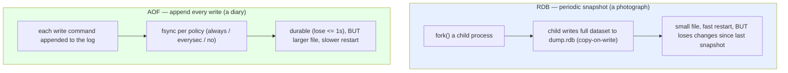

The deeper point for an interview: **Redis persistence is about crash *recovery*, not about being a system of record.** Even with AOF `always`, Redis is not a database you'd trust as the sole home of financial data — that's exactly the theme of Section 31.

<details>
<summary>📖 In plain terms</summary>

Since Redis keeps everything in memory, it needs a way to survive restarts. RDB takes periodic photographs of all the data — small files, quick to reload, but you lose whatever changed since the last photo if you crash. AOF instead writes down every change as it happens — you lose at most a second of data, but the file is bigger and slower to reload. Most production setups run both: AOF for safety, RDB for fast restarts and backups.

</details>

<details>
<summary>💻 Hands-on: inspect and control persistence</summary>

```bash
redis-cli CONFIG GET save               # RDB snapshot schedule
redis-cli BGSAVE                          # trigger a background snapshot now
redis-cli LASTSAVE                        # unix time of last successful save

redis-cli CONFIG GET appendonly           # is AOF on?
redis-cli CONFIG SET appendonly yes       # enable AOF at runtime
redis-cli CONFIG GET appendfsync          # always / everysec / no
redis-cli BGREWRITEAOF                    # compact the AOF log

redis-cli INFO persistence                # rdb_last_save_time, aof_enabled, etc.
```

</details>

---

## 16. ⏳ Expiry: How TTLs Actually Work

One of Redis's most-used features is that **any key can be given a time-to-live (TTL)** — a countdown after which Redis deletes it automatically. This is what makes caches, sessions, rate-limit windows, and locks clean up after themselves without any cron job. It's easy to use, but *how* Redis actually removes expired keys is a favorite interview probe, because the obvious assumption — "each key has a timer that fires at the exact expiry moment" — is wrong, and the truth has real consequences.

### 16.1 give a key a lifespan

You can attach a TTL when you create the key, or add one later. The `EX` option on `SET` sets it in seconds; `EXPIRE` adds one to an existing key:

```text
SET     <key>  <value>  EX <seconds>       # set a key that self-deletes after N seconds
EXPIRE  <key>  <seconds>                    # attach/reset a TTL on an existing key
```

```text
SET  session:abc  "{...}"  EX 3600     # this session vanishes in 1 hour  -> OK
EXPIRE  session:abc  60                 # actually, expire it in 60s instead  -> (integer) 1
```

### 16.2 check how much time is left

`TTL` tells you the seconds remaining. The two negative return values are worth memorizing — they're a common gotcha:

```text
TTL  <key>     # seconds left, OR -2 = key doesn't exist, OR -1 = key exists but has NO expiry
```

```text
TTL  session:abc     # -> (integer) 55     still ticking
TTL  session:abc     # -> (integer) -2     gone (expired or never existed)
SET  permanent  "x"
TTL  permanent       # -> (integer) -1     exists forever, no TTL set
```

You can also remove a TTL to make a key permanent again with `PERSIST`, or keep an existing TTL while overwriting the value with `KEEPTTL`.

### 16.3 how Redis *actually* deletes expired keys

Here's the part interviewers care about. Redis does **not** set a precise alarm per key. Instead it uses a **hybrid of two strategies**:

*Lazy expiration* happens **on access.** When any client touches a key, Redis first checks "has this expired?" If yes, it deletes the key right then and behaves as if it were never there. This is nearly free — but it has a hole: a key that expired and is *never touched again* would sit in memory forever.

*Active expiration* plugs that hole with a **background sweep.** About 10 times per second, Redis samples a batch of keys that have a TTL, deletes the expired ones, and — if more than 25% of the sample turned out to be expired — immediately runs again (reasoning that if that many were dead, many more probably are). This probabilistic sampling keeps the number of expired-but-still-present keys low without the cost of scanning all keys.

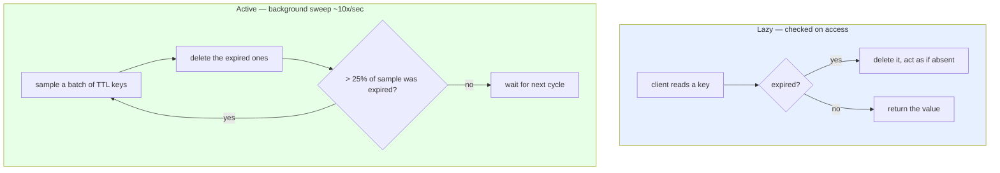

### 16.4 the consequences worth stating

The key takeaway: **an expired key can linger in memory for a short while after its TTL passes** — until the next access or the next sweep reaches it. "Expired" does not mean "instantly freed." Usually invisible, but two situations make it matter: memory accounting (dead keys briefly still count), and a burst of keys all expiring at once, which is the *cache avalanche* of Section 27.

A second subtlety, for replication: **replicas do not expire keys on their own.** The primary decides a key is expired and sends an explicit `DEL` to its replicas. This keeps primary and replica reads consistent — a replica won't serve a logically-expired key, but it also won't delete one until told to, even if its own clock says the TTL has passed. This prevents a replica from ever returning a *different* answer than the primary.

<details>
<summary>📖 In plain terms</summary>

You can stamp any key with an expiry, and Redis removes it automatically — that's how caches and sessions clean themselves up. But Redis doesn't set a precise alarm for each key. Instead it deletes an expired key the moment someone tries to read it, and separately runs a background sweep several times a second that samples keys and clears the dead ones. So an expired key might hang around in memory for a short while before it's actually removed — usually harmless, but worth knowing.

</details>

<details>
<summary>💻 Hands-on: TTLs and expiry behavior</summary>

```bash
redis-cli SET session:abc "{...}" EX 3600    # set with 1-hour TTL
redis-cli TTL  session:abc                     # seconds remaining
redis-cli PTTL session:abc                     # milliseconds remaining
redis-cli EXPIRE session:abc 60                # reset TTL to 60s
redis-cli PERSIST session:abc                  # remove TTL (make permanent)
redis-cli EXPIRE session:abc 60 XX             # only if a TTL already exists (Redis 7+)
redis-cli SET k v KEEPTTL                       # overwrite value but keep existing TTL
redis-cli INFO stats | grep expired_keys        # how many keys have expired
```

</details>

---

## 17. 🧹 Eviction Policies: LRU, LFU & the maxmemory Knob

Expiry (Section 16) removes keys you *told* to expire. But there's a different question: what happens when Redis fills up its memory and a new write arrives, but nothing has a TTL to clear? Redis has to decide — refuse the write, or throw something out to make room? That decision is controlled by two settings, and getting them wrong is a classic outage. This section walks through both.

### 17.1 set the memory ceiling

By default Redis has *no* memory limit (`maxmemory 0`) — it keeps allocating until the OS kills it. In production you set a ceiling:

```text
CONFIG SET  maxmemory  <bytes-or-size>       # the memory limit Redis will not exceed
```

```text
CONFIG SET  maxmemory  512mb      # -> OK   Redis now caps itself at 512 MB
```

Once usage reaches that ceiling and a write arrives, Redis consults the *second* setting — the eviction policy — to decide what to do.

### 17.2 pick what happens when full — the policy

```text
CONFIG SET  maxmemory-policy  <policy>       # what to do when memory is full
```

The policies split into **three families**, and the family answers "*which* keys am I allowed to remove?"

*`noeviction`* (the default) removes **nothing** — it simply rejects any write with an error once full. This is correct when Redis is a **source of truth** you can't afford to lose: you'd rather get a loud error and alert than silently drop data.

The *`allkeys-*`* family evicts from **any key at all**. This is right when Redis is a **pure cache** — losing any key just causes a future cache miss, which is harmless.

The *`volatile-*`* family evicts **only keys that have a TTL set**, leaving keys without a TTL untouched. This lets you mix disposable cached keys (give them a TTL) and permanent keys (no TTL) in one Redis, and eviction only ever touches the disposable ones.

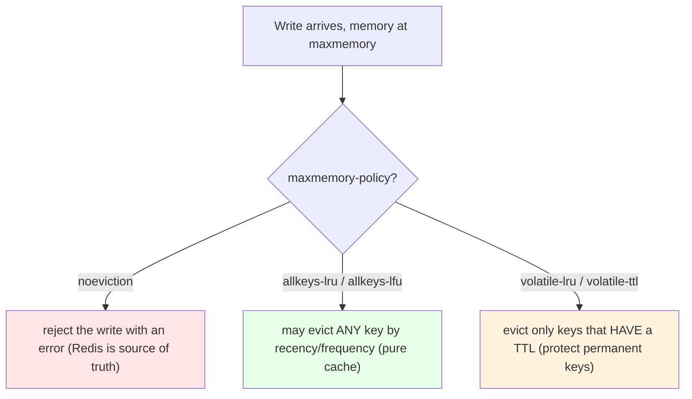

### 17.3 pick *which* key to remove — the algorithm

The family decides *which keys are eligible*; the suffix decides *which eligible key goes first*:

**LRU (Least Recently Used)** — evict whatever was *accessed longest ago*. Good when "not touched in a while" predicts "won't be needed soon." So `allkeys-lru` means "evict the least-recently-used of all keys."

**LFU (Least Frequently Used)**, added in Redis 4.0 — evict whatever is accessed *least often*, using a frequency counter that decays over time. Better than LRU when some keys are steadily popular: a config key read once a minute survives under LFU, whereas LRU might evict it right after a burst of one-off reads pushes it down the recency list.

There are also `random` (evict a random eligible key) and `volatile-ttl` (evict the TTL key closest to expiring).

The honesty point interviewers look for: **Redis LRU and LFU are approximate, not exact.** Tracking true LRU order across millions of keys would cost too much memory, so Redis instead samples a handful of keys and evicts the best candidate *from the sample*:

```text
CONFIG SET  maxmemory-samples  10     # sample 10 keys per eviction (default 5)
```

More samples means the choice gets closer to true LRU/LFU, at a small CPU cost.

### 17.4 match the policy to how you use Redis

The whole decision comes down to *what Redis is to you*. If Redis is your **only copy** of the data, use `noeviction` and size memory generously — reject-and-alert beats silent data loss. If Redis is a **pure cache** in front of a database, use `allkeys-lru` (or `allkeys-lfu` for skewed access) so it self-manages and every eviction is just a future cache miss. If Redis holds a **mix** of disposable and permanent keys, use a `volatile-*` policy and put TTLs only on the disposable ones. The classic incident is choosing `allkeys-lru` for a Redis that's secretly someone's system of record — it will happily evict data nobody can recreate.

<details>
<summary>📖 In plain terms</summary>

Redis has a memory limit, and when it's full it has to decide what to do with the next write. It can refuse the write (best when Redis is your only copy of the data), or throw out old entries to make room (best when it's just a cache). For choosing what to throw out, "least recently used" drops whatever hasn't been touched in the longest time, while "least frequently used" drops whatever gets accessed the least often overall — better for keeping steadily-popular items. Picking the wrong policy — like auto-evicting data you can't recreate — is a classic outage.

</details>

<details>
<summary>💻 Hands-on: configure and observe eviction</summary>

```bash
redis-cli CONFIG GET maxmemory                 # 0 = no limit
redis-cli CONFIG SET maxmemory 512mb
redis-cli CONFIG SET maxmemory-policy allkeys-lru
redis-cli CONFIG GET maxmemory-samples          # eviction sampling accuracy (default 5)

redis-cli INFO memory   | grep used_memory_human
redis-cli INFO stats    | grep evicted_keys     # how many keys got evicted
redis-cli MEMORY DOCTOR                          # human-readable memory diagnosis
```

</details>

---

# Part IV — Messaging, Transactions & Scripting

Redis does more than store data — it moves messages between processes and executes multi-step logic atomically. This part covers the two messaging models (Pub/Sub and Streams), the transaction primitives (MULTI/EXEC/WATCH), and Lua scripting, which is the workhorse for atomicity in every advanced pattern later in the guide.

## 18. 📡 Pub/Sub

Redis **Pub/Sub** (publish/subscribe) is a live messaging model: publishers send messages to a named *channel*, and every subscriber currently listening on that channel receives them instantly. Think of it like a radio broadcast — whoever has the radio tuned in right now hears the song; whoever doesn't, misses it. That single property shapes everything about when to use it.

### 18.1 subscribe to a channel, publish to it

A listener registers interest with `SUBSCRIBE`; a sender broadcasts with `PUBLISH`. `PUBLISH` returns how many subscribers received the message:

```text
SUBSCRIBE  <channel>              # start listening on a channel
PUBLISH    <channel>  <message>   # send to everyone currently listening
```

Open two terminals to see it work:

```text
# Terminal 1 — tune in and wait
SUBSCRIBE  news
# -> now blocking, waiting for messages...

# Terminal 2 — broadcast
PUBLISH  news  "breaking story"
# -> (integer) 1     one subscriber received it

# Terminal 1 immediately prints:
# 1) "message"  2) "news"  3) "breaking story"
```

### 18.2 subscribe to many channels at once with patterns

`PSUBSCRIBE` matches channel *patterns* with glob-style wildcards, so one subscriber can catch a whole family of channels:

```text
PSUBSCRIBE  news.*     # receives from news.sports, news.tech, news.weather, ...
```

Publishing to `news.sports` now reaches both an exact `SUBSCRIBE news.sports` listener and any `PSUBSCRIBE news.*` listener. A common use is a fleet of WebSocket servers that each `PSUBSCRIBE` to relay live updates to their connected clients.

### 18.3 understand the one hard limit — messages are not stored

This is the trap, and the reason Pub/Sub shows up in "when NOT to use Redis" questions. Delivery is **fire-and-forget, at-most-once**: Redis pushes each message to whoever is connected *at that instant* and then immediately forgets it. There is **no persistence, no history, and no acknowledgement.** Concretely, a message is simply *lost* if the subscriber:

- was not connected when you published,
- briefly dropped its connection, or
- was too slow to keep up.

A subscriber that reconnects has missed everything sent while it was away — there is no replay and no "catch me up."

### 18.4 so use it only when a lost message is acceptable

That makes the decision simple. Pub/Sub is the **right** tool when missing an occasional message is harmless: live presence indicators, ephemeral notifications, live scores, chat, or cache-invalidation signals ("hey everyone, `user:42` changed — drop it from your local cache"). It's the **wrong** tool the moment *every* message must be delivered — an order event, a payment webhook, a job that must run exactly once. For those you need persistence and acknowledgement, which is precisely what Streams provide — the subject of the next section.

<details>
<summary>📖 In plain terms</summary>

Pub/Sub is Redis's live broadcast: publishers shout messages to a channel, and anyone currently listening hears them instantly. It's fast and simple — great for live chat, live scores, or telling all your servers "the cache just changed." The big catch is there's no memory: if a listener isn't connected at that exact moment, or falls behind, the message is gone forever. So use it only when occasionally missing a message is fine.

</details>

<details>
<summary>💻 Hands-on: Pub/Sub (use two terminals)</summary>

```bash
# Terminal 1 — subscribe and wait for messages
redis-cli SUBSCRIBE news

# Terminal 2 — publish; returns the number of subscribers that received it
redis-cli PUBLISH news "breaking story"
redis-cli PUBLISH cache:invalidate "user:42"   # cache-bust signal pattern

# Pattern subscription: match many channels at once
redis-cli PSUBSCRIBE 'news.*'
redis-cli PUBSUB CHANNELS                        # list active channels
```

</details>

---

## 19. 🔀 Redis Streams vs Pub/Sub

"When would you use Streams instead of Pub/Sub?" is one of the most reliable Redis messaging questions, because it checks whether you understand *delivery guarantees*. Both move messages from producers to consumers, so they look similar — but they sit at opposite ends of the durability spectrum, and the whole answer flows from one difference.

### 19.1 the core difference — does the message survive?

**Pub/Sub is a live broadcast.** The message exists only for the instant of delivery. No log, no position, no acknowledgement — if you weren't listening, it's gone (Section 18).

**A Stream is a durable log.** Every entry is appended with a time-ordered ID and *stays there* (Section 10). Consumers remember their position, so a consumer that goes offline resumes exactly where it left off, and anyone can replay history from any past ID.

So the one question that decides between them is: ***"Do I need this message to survive and be re-processable, or is a live broadcast enough?"*** Everything else is a consequence of that.

### 19.2 the consequences, side by side

| Dimension | Pub/Sub | Streams |
|-----------|---------|---------|
| Persistence | None — gone after send | Durable append-only log |
| Delivery | At-most-once | At-least-once (with groups + `XACK`) |
| Replay | Impossible | Read history from any ID |
| Consumer offline | Misses everything | Resumes where it left off |
| Load sharing | Every subscriber gets every message | Consumer group splits work among workers |
| Crash recovery | None | Pending list + `XCLAIM` |
| Best for | Live broadcast, cache-bust | Task queues, event pipelines |

The "load sharing" row is a practical one people forget: with Pub/Sub, ten subscribers each get *all* messages (a true broadcast); with a Stream consumer group, ten workers *split* the messages so each entry is handled once — that's what makes Streams a work queue.

### 19.3 delivering to multiple consumers — the two modes

Streams answer the "many consumers" question with two *different* delivery modes, and knowing which is which is the whole point. The mode you get depends on **how you read**.

**Mode 1 — independent readers (fan-out to everyone).** If several consumers each call `XREAD` on their own, they *all* see *every* message. Each reader tracks its own last-read ID, so nobody's reading interferes with anyone else's. This is the "deliver all messages to everyone" behavior — the same fan-out Pub/Sub gives you, except the messages are also durable and replayable.

```text
# Two independent readers, each starting from the beginning ($ = only new; 0 = from start):
# Reader A:
XREAD COUNT 10 STREAMS orders 0     # -> sees order 1, 2, 3, ... ALL of them
# Reader B (separately):
XREAD COUNT 10 STREAMS orders 0     # -> also sees order 1, 2, 3, ... ALL of them
```

**Mode 2 — a consumer group (split the work).** Create a group with `XGROUP CREATE`, then each worker reads with `XREADGROUP` under the *same group name*. Now Redis hands each message to **only one** worker in the group — the work is divided, not duplicated. Every delivered message goes onto that consumer's **pending list** until the worker confirms it with `XACK`; if the worker crashes before acknowledging, another can take over the message with `XCLAIM`.

```text
XGROUP CREATE orders workers $          # create group "workers", start at new messages
# Worker 1:
XREADGROUP GROUP workers w1 COUNT 1 STREAMS orders >   # -> gets order 1
# Worker 2 (same group):
XREADGROUP GROUP workers w2 COUNT 1 STREAMS orders >   # -> gets order 2 (NOT order 1)
XACK orders workers 1526569495631-0     # worker 1 confirms order 1 is done -> leaves pending list
```

The `>` means "give me messages never delivered to any consumer in this group." That single character is what splits the work.

**Getting all messages to multiple *independent* systems: use multiple groups.** A consumer group divides work *within* the group, but each group is fully independent and gets its **own complete copy** of the stream. So if the billing service and the analytics service must *each* process every order, give each its own group:

```text
XGROUP CREATE orders billing   $        # billing group — gets every message
XGROUP CREATE orders analytics $        # analytics group — ALSO gets every message
# Within billing, its N workers split the orders among themselves;
# within analytics, its workers split them separately.
# Result: every order is processed once by billing AND once by analytics.
```

This is the pattern to state in an interview: **one group per independent consumer application (fan-out across groups), multiple workers per group (load-sharing within a group).** It gives you Kafka-style consumer semantics on a single Redis stream.

```text
                          ┌── group: billing ──┐   w1, w2 split the orders
   stream: orders  ──────►│                     │
   (every message)        └── group: analytics ┘   w3, w4 split them independently
   each group sees ALL messages; workers inside a group share the load
```

### 19.4 know the ceiling — when to graduate to Kafka

Streams are excellent, but they have a limit: a stream lives in the memory of **one Redis shard**, so it cannot match Kafka's multi-terabyte retention, thousands of partitions, or the ecosystem of connectors and stream-processing tools. The honest three-way positioning to state in an interview: **Pub/Sub for ephemeral fan-out, Streams for durable queuing at moderate scale, Kafka when throughput, retention, or partition count outgrows a single Redis shard.** We apply exactly this decision in the fan-out case study (Section 32, Case 6).

<details>
<summary>📖 In plain terms</summary>

Both Pub/Sub and Streams deliver messages, but they make opposite promises. Pub/Sub is a live broadcast with no memory — miss it and it's gone. Streams keep every message in a durable log, so consumers can catch up after being offline, replay history, and confirm each message as done. Streams also give you two ways to have many consumers: read independently and everyone sees every message (fan-out), or join a consumer group and the messages get split among the workers (a shared work queue). If two separate systems each need all the messages, give each its own group. Use Pub/Sub when losing a message is okay; use Streams when every message must be processed. When you outgrow even Streams — huge volumes, long retention — that's when you move to Kafka.

</details>

---

## 20. 🔒 Transactions: MULTI, EXEC & WATCH

A Redis transaction lets you **group several commands and run them as one uninterrupted batch** — no other client's command can slip in between them. Because Redis executes on a single thread (Section 3), this is naturally clean: once the batch starts, it runs to completion before anything else. This section builds up from the basic batch to the genuinely useful part, `WATCH`.

### 20.1 queue commands with MULTI, run them with EXEC

`MULTI` opens the transaction. Every command you type after it is **queued, not executed** (Redis replies `QUEUED`). `EXEC` then runs the whole queue back-to-back:

```text
MULTI            # start queuing
<command>        # -> QUEUED   (not run yet)
<command>        # -> QUEUED
EXEC             # run the whole queue atomically, return all results
```

```text
MULTI                 # -> OK
INCR  visits          # -> QUEUED
INCR  visits          # -> QUEUED
EXEC                  # -> 1) (integer) 1   2) (integer) 2   (both ran, nothing interleaved)
```

`DISCARD` throws away a queue you've started without running it.

### 20.2 the surprise — there is no rollback

This is the distinction interviewers push on: **Redis transactions are not like SQL transactions. There is no rollback.** If one queued command fails *at execution time* — say you `INCR` a key that holds a list — that one command errors, but **the other commands still execute**, and nothing is undone:

```text
MULTI
INCR  counter         # -> QUEUED
LPUSH counter "x"     # -> QUEUED   (counter is a number, this will fail at EXEC)
INCR  counter         # -> QUEUED
EXEC
# -> 1) (integer) 1
#    2) (error) WRONGTYPE ...     <- this one failed
#    3) (integer) 2               <- but this STILL ran
```

Redis's reasoning: a wrong-type or wrong-arity error is a *programming bug* you should catch in testing, not a runtime condition to roll back. So `MULTI`/`EXEC` gives you **isolation and atomic batching**, but *not* the all-or-nothing-on-error guarantee of an ACID database.

### 20.3 WATCH — "only run if nothing changed" (optimistic locking)

The genuinely powerful piece is `WATCH`. You `WATCH` one or more keys, read them, decide what to do, then `MULTI`/`EXEC`. If **any watched key was changed by another client** between the `WATCH` and the `EXEC`, the whole transaction is **cancelled** — `EXEC` returns `nil` — and you retry:

```text
WATCH   <key> [<key> ...]     # watch keys for changes
<read the keys, compute new values>
MULTI
<queued writes>
EXEC                          # runs ONLY if no watched key changed; else returns nil
```

This is a compare-and-swap over Redis keys — the same idea as an ETag / `If-Match` header on an HTTP write, or a version column in a database. It's the right tool for read-modify-write logic that a plain `INCR` can't express, like "move 30 from balance A to balance B, but only if neither balance changed since I read them":

```text
WATCH balance:A balance:B     # -> OK
GET   balance:A               # -> "100"   (read and check it's >= 30 in your app)
MULTI
DECRBY balance:A 30
INCRBY balance:B 30
EXEC                          # -> both applied, OR nil if someone touched A or B first
```

### 20.4 the limits, and when to reach for Lua instead

Two honest caveats for a staff-level answer. `WATCH`-based optimistic locking works **within a single Redis node**, so it doesn't by itself coordinate across a cluster where watched keys might live on different shards. And under **high contention**, the retry loop can thrash — many clients repeatedly aborting and retrying. That's usually the cue to move the read-modify-write into a **Lua script** (next section), where the whole thing runs atomically server-side with no watch/retry loop at all.

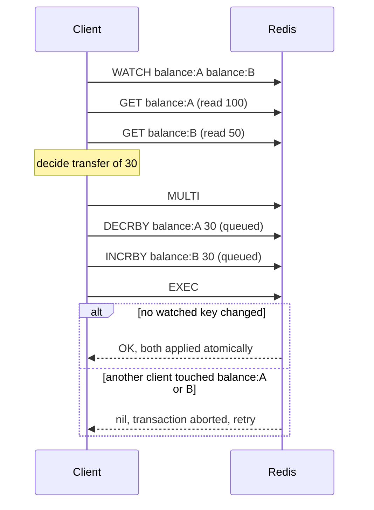

The honest limitation for staff-level discussion: `WATCH`-based optimistic locking works within a **single Redis node**, so it does not by itself solve coordination across a cluster where the watched keys might live on different shards. And under high contention, optimistic retries can thrash — which is often the cue to move the logic into a **Lua script** (next section), where the read-modify-write happens atomically server-side with no watch/retry loop at all.

<details>
<summary>📖 In plain terms</summary>

A Redis transaction lets you queue several commands and run them as one uninterrupted batch — nothing else sneaks in. But it's not like a database transaction: there's no undo if a command fails midway. The really useful part is WATCH: you can tell Redis "only run my batch if these keys haven't changed since I looked" — perfect for safely doing read-then-write logic like transferring a balance without two clients clobbering each other.

</details>

<details>
<summary>💻 Java (Jedis): optimistic transfer with WATCH/MULTI/EXEC</summary>

```java
import redis.clients.jedis.Transaction;

try (Jedis jedis = new Jedis("localhost", 6379)) {
    while (true) {
        jedis.watch("balance:A", "balance:B");             // start watching
        int a = Integer.parseInt(jedis.get("balance:A"));
        if (a < 30) { jedis.unwatch(); break; }            // not enough funds

        Transaction tx = jedis.multi();                    // queue commands
        tx.decrBy("balance:A", 30);
        tx.incrBy("balance:B", 30);
        var result = tx.exec();                            // atomic run

        if (result != null) break;   // success — no watched key changed
        // else: a watched key changed, tx aborted -> loop and retry
    }
}
```

</details>

<details>
<summary>💻 Hands-on: MULTI/EXEC and WATCH</summary>

```bash
# Atomic batch (no interleaving)
redis-cli MULTI
redis-cli INCR counter        # (queued in an interactive session)
redis-cli INCR counter
redis-cli EXEC                 # both run back-to-back

# Optimistic locking with WATCH (interactive redis-cli session):
#   WATCH balance:A
#   GET   balance:A
#   MULTI
#   DECRBY balance:A 30
#   EXEC        -> nil if balance:A changed since WATCH, else OK
redis-cli DISCARD              # abandon a queued transaction
```

</details>

---

## 21. 📜 Lua Scripting for Atomicity

Some logic needs more than one command — for example, "read this counter, and increment it *only if* it's still below the limit." Between your read and your write, another client can sneak in and change things: that's a **race condition**. Section 20's `WATCH` fixes it with optimistic retries, but the cleaner, more powerful tool is **Lua scripting.** Redis has a built-in Lua interpreter, and it runs your whole script **atomically** — start to finish on the single thread, with no other command interleaving. This section shows why that one guarantee is so useful.

### 21.1 run a script with EVAL

`EVAL` runs a Lua script. The tricky part of the syntax is the middle number — it says *how many* of the following arguments are key names. Keys go into a `KEYS` array, everything after into an `ARGV` array:

```text
EVAL  "<lua script>"  <numkeys>  <key1> <key2> ...  <arg1> <arg2> ...
#                       │          └─ these become KEYS[1], KEYS[2]  ┘  └─ ARGV[1], ARGV[2] ┘
#                       └─ how many of the following are KEY names
```

A trivial example — increment a key from inside a script:

```text
EVAL  "return redis.call('INCR', KEYS[1])"  1  mycounter
# -> (integer) 1     the "1" means "one key follows"; mycounter is KEYS[1]
```

### 21.2 why it matters — the whole script is one atomic step

Because the entire script runs as a single uninterrupted unit, you can express *decision* logic — read, check a condition, then write — with **no race and no retry loop.** The classic example is the safe unlock: delete a lock *only if* it still holds my token (so I never delete someone else's lock):

```text
EVAL "if redis.call('GET', KEYS[1]) == ARGV[1] then return redis.call('DEL', KEYS[1]) else return 0 end" 1 lock:job mytoken
# reads the lock and deletes it in ONE atomic step -> no gap for another client to slip in
```

This is why nearly every serious rate limiter (Section 29) and lock (Section 28) in this guide is a Lua script: the alternatives — multiple round trips, or a `WATCH`/retry loop — are either racy or slow under contention. A script does the check-and-act in one shot, server-side.

### 21.3 the two rules — determinism and keep it short

Two rules govern scripts, and both come from how Redis works internally.

**Scripts must be deterministic** — the same inputs must always produce the same writes. Redis propagates a script's *effects* to replicas and the AOF, so if a script used randomness or read the wall clock in a way that changed what it wrote, replicas would diverge from the primary. The fix is simple: **pass time (or any random seed) in as an argument** rather than reading it inside the script.

```text
# GOOD: current time passed in from the client as ARGV
EVAL "...refill tokens based on tonumber(ARGV[1])..." 1 bucket:42  1699999999
# BAD:  reading the clock INSIDE the script -> non-deterministic, replicas diverge
```

**A script blocks the whole server while it runs** (single thread), so a slow or infinite-loop script is a global stall. Keep scripts short. For the rare emergency, `SCRIPT KILL` stops a stuck script that hasn't yet written anything.

### 21.4 in production, load once and call by hash

Resending the full script source on every call wastes bandwidth. Instead, load it once with `SCRIPT LOAD` (which returns a SHA1 hash) and then invoke it by that hash with `EVALSHA`:

```text
SCRIPT LOAD  "return redis.call('INCR', KEYS[1])"   # -> "a3c7f2..."   (the SHA)
EVALSHA  a3c7f2...  1  mycounter                     # run the cached script by hash
SCRIPT EXISTS  a3c7f2...                             # -> 1 if Redis still has it cached
```

If Redis doesn't recognize the hash (e.g. after a restart), the client gets a `NOSCRIPT` error and simply falls back to `EVAL` once to reload it. This load-once, call-by-hash pattern is the standard way production code uses Lua.

<details>
<summary>📖 In plain terms</summary>

Lua scripting lets you send Redis a little program that runs as one uninterrupted step. That's a big deal for logic that involves a decision — like "increment this counter, but only if it's still under the limit" — because it removes any chance of two clients racing between the check and the change. Rate limiters and safe locks are almost always written as Lua scripts for exactly this reason. Just keep them short (they block the whole server) and don't use randomness or the clock inside them.

</details>

<details>
<summary>💻 Java (Jedis): atomic "increment if below limit" via Lua</summary>

```java
// Atomically: increment a counter; if it exceeds the limit, reject.
// Returns 1 if allowed, 0 if rejected. No race, no retry loop.
String script =
    "local current = redis.call('INCR', KEYS[1]) " +
    "if current == 1 then redis.call('EXPIRE', KEYS[1], ARGV[2]) end " +
    "if current > tonumber(ARGV[1]) then return 0 else return 1 end";

try (Jedis jedis = new Jedis("localhost", 6379)) {
    Object allowed = jedis.eval(script,
        java.util.List.of("rate:user:42"),   // KEYS
        java.util.List.of("100", "60"));      // ARGV: limit=100, window=60s
    boolean ok = Long.valueOf(1L).equals(allowed);
}
```

</details>

<details>
<summary>💻 Hands-on: EVAL, SCRIPT LOAD & EVALSHA</summary>

```bash
# Run a script inline: KEYS and ARGV are passed separately
redis-cli EVAL "return redis.call('INCR', KEYS[1])" 1 mycounter

# Atomic "safe unlock": delete the lock only if I still own it
redis-cli EVAL "if redis.call('GET',KEYS[1])==ARGV[1] then return redis.call('DEL',KEYS[1]) else return 0 end" 1 lock:job mytoken

# Production pattern: load once, then call by SHA
SHA=$(redis-cli SCRIPT LOAD "return redis.call('INCR', KEYS[1])")
redis-cli EVALSHA "$SHA" 1 mycounter
redis-cli SCRIPT EXISTS "$SHA"        # is it cached?
redis-cli SCRIPT KILL                  # emergency: stop a stuck script
```

</details>

<details>
<summary>💻 Sample scripts: popular Lua one-liners explained (with output)</summary>

These are the scripts you'll actually see in production. For each: what it does, how it executes, and what `redis-cli` prints back.

**1. Safe unlock (compare-and-delete)** — the lock release from Section 28.

```bash
redis-cli SET lock:job token-abc EX 30                       # -> OK      (acquire)
redis-cli EVAL "if redis.call('GET',KEYS[1])==ARGV[1] then \
  return redis.call('DEL',KEYS[1]) else return 0 end" 1 lock:job token-abc
# -> (integer) 1     token matched, lock deleted
redis-cli EVAL "if redis.call('GET',KEYS[1])==ARGV[1] then \
  return redis.call('DEL',KEYS[1]) else return 0 end" 1 lock:job token-abc
# -> (integer) 0     key is gone now, so nothing to delete
```

How it executes: `GET` reads the lock's current token, Lua compares it to `ARGV[1]` (your token), and only if they match does it `DEL`. The `1` return means "deleted"; `0` means "wasn't mine / didn't exist." The whole compare-and-delete is one atomic step, so no other client can grab the lock in the gap.

**2. Rate limiter (increment-with-expire, allow-if-under-limit)** — the fixed-window limiter from Section 29.

```bash
# Args: KEYS[1]=counter key, ARGV[1]=limit, ARGV[2]=window seconds
redis-cli EVAL "local c = redis.call('INCR', KEYS[1]) \
  if c == 1 then redis.call('EXPIRE', KEYS[1], ARGV[2]) end \
  if c > tonumber(ARGV[1]) then return 0 else return 1 end" 1 rate:user:42 3 60
# -> (integer) 1     1st call: count=1, allowed
# (run it again)
# -> (integer) 1     2nd: count=2, allowed
# -> (integer) 1     3rd: count=3, allowed (== limit)
# -> (integer) 0     4th: count=4, over the limit of 3 -> rejected
```

How it executes: `INCR` bumps the counter and returns its new value in one shot. On the very first hit (`c == 1`) it attaches the window TTL — doing this *inside* the script means the counter can never be left without an expiry. Then it compares to the limit and returns `1` (allowed) or `0` (rejected). No read-then-write race, because the increment and the check are atomic together.

**3. Conditional set (set only if current value matches)** — a compare-and-swap.

```bash
redis-cli SET config:mode "A"                                # -> OK
redis-cli EVAL "if redis.call('GET',KEYS[1])==ARGV[1] then \
  return redis.call('SET',KEYS[1],ARGV[2]) else return nil end" 1 config:mode A B
# -> OK        current value was "A", so it swapped to "B"
redis-cli EVAL "if redis.call('GET',KEYS[1])==ARGV[1] then \
  return redis.call('SET',KEYS[1],ARGV[2]) else return nil end" 1 config:mode A C
# -> (nil)     current value is now "B", not "A", so the swap is refused
```

How it executes: it swaps the value only when the existing value equals the expected one (`ARGV[1]`). This is how you avoid clobbering a value another client changed since you read it — the check and the set happen atomically.

**4. Multi-get with a default** — return several fields, filling in a fallback for missing ones.

```bash
redis-cli HSET user:42 name "Ada"                            # -> (integer) 1
redis-cli EVAL "local n = redis.call('HGET', KEYS[1], 'name') \
  local e = redis.call('HGET', KEYS[1], 'email') \
  return { n or 'unknown', e or 'no-email' }" 1 user:42
# -> 1) "Ada"
#    2) "no-email"       email field was missing -> default used
```

How it executes: two `HGET`s run inside one script and Lua's `or` supplies a default when a field is absent (`HGET` returns a Lua `false` for a missing field). Returning a Lua table becomes a multi-bulk reply — `redis-cli` prints it as a numbered list. Doing both reads in one script means one round trip and a consistent snapshot.

**5. Atomic "pop and archive"** — move an item from a queue to a processing set in one step.

```bash
redis-cli RPUSH queue:jobs job-1 job-2                       # -> (integer) 2
redis-cli EVAL "local job = redis.call('LPOP', KEYS[1]) \
  if job then redis.call('SADD', KEYS[2], job) end \
  return job" 2 queue:jobs processing:set
# -> "job-1"     popped from the list AND added to the processing set atomically
```

How it executes: `LPOP` removes the next job and, only if one existed, `SADD` records it as "in progress" — so a job can never be lost in the gap between removing it from the queue and marking it as being worked on. Note `numkeys` is `2` here because two key names (`queue:jobs`, `processing:set`) precede any args.

</details>

---

# Part V — High Availability & Distributed Architecture

A single Redis node is a single point of failure and a single memory budget. This part covers how Redis scales *up* in availability (replication and Sentinel-driven failover) and *out* in capacity (Cluster with hash-slot sharding). The recurring theme — and the reason these are staff-favorite questions — is that every step toward availability and scale trades away some consistency, and being able to name that tradeoff precisely is the signal interviewers look for.

## 22. 🔗 Replication (Leader–Replica)

So far Redis has been one server. But one server is one point of failure and one memory budget — if it dies, everything is down. **Replication** is the fix: keep live copies of the data on other servers. It's the foundation of both high availability (a copy can take over) and read scaling (copies can serve reads). This section builds up how those copies stay in sync and, crucially, the consistency catch that follows.

### 22.1 point a replica at a leader

One server is the **leader** (primary) and takes all writes. Others are **replicas** that continuously copy the leader's data. You turn a server into a replica with one command:

```text
REPLICAOF  <leader-host>  <leader-port>     # "start copying from this leader"
```

```text
REPLICAOF  127.0.0.1  6379     # -> OK   this node now mirrors the leader at :6379
REPLICAOF  NO ONE               # -> OK   stop replicating; become an independent leader
```

Now reads can be spread across the replicas to share load, and if the leader dies, a replica can be promoted (`REPLICAOF NO ONE`) to take over.

### 22.2 how a replica catches up — full sync, then streaming

When a replica first connects, it can't have the data yet, so it does a **full sync**: the leader forks and produces an RDB snapshot (Section 15), ships that whole snapshot to the replica, and meanwhile buffers any new writes in a *replication backlog*. The replica loads the snapshot, then applies the buffered writes to catch up to "now."

After that initial catch-up, replication is **incremental**: the leader simply streams each new write command to the replicas as it happens. If a replica briefly disconnects and reconnects, it tries a **partial resync** (`PSYNC`) — replaying just the commands it missed from the backlog buffer, rather than repeating the whole expensive full sync.

### 22.3 the catch — replication is asynchronous

This is the property to state clearly in any interview: **Redis replication is asynchronous.** The leader confirms a write to your application *before* the replicas have received it.

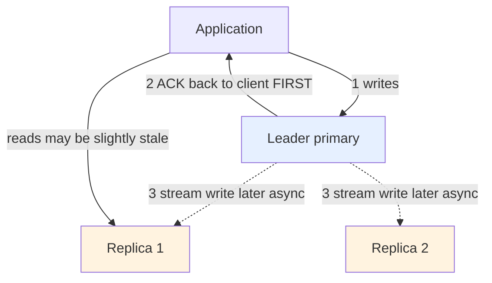

This keeps writes fast, but it creates two consequences you must own:

- **A data-loss window.** If the leader crashes *after* acking a write but *before* a replica received it, that write is gone once a replica is promoted.
- **Stale reads.** Because a replica may be a moment behind (replication lag), reading your own just-written value from a replica can return the *old* value.

### 22.4 narrowing the window with WAIT

You can ask the leader to block until a write has reached a number of replicas:

```text
WAIT  <numreplicas>  <timeout-ms>     # block until N replicas ack, or timeout
```

```text
WAIT  1  1000     # -> (integer) 1   wait up to 1s for at least 1 replica to have the write
```

`WAIT` **narrows** the data-loss window but cannot eliminate it — it does not make replication truly synchronous, it just trades a little latency for a stronger guarantee. This asynchrony is the seed of the split-brain problem in the next section and of Kleppmann's Redlock critique in Section 28.

<details>
<summary>📖 In plain terms</summary>

Replication means keeping extra copies of your Redis data on other servers. The main server (leader) takes all the writes and streams them to the copies (replicas), which can serve reads to share the load and can be promoted if the leader dies. The important caveat: copying happens in the background, so the leader tells your app "done" before the replicas have the data. If the leader crashes at the wrong instant, the last few writes can vanish, and replicas can briefly serve slightly out-of-date data.

</details>

<details>
<summary>💻 Hands-on: set up and inspect replication</summary>

```bash
# On the replica: point it at the leader
redis-cli -p 6380 REPLICAOF 127.0.0.1 6379
redis-cli -p 6380 REPLICAOF NO ONE       # promote replica to standalone leader

redis-cli INFO replication                # role, connected_slaves, offsets, lag
redis-cli WAIT 1 1000                      # block until 1 replica acks (max 1s)
```

</details>

---

## 23. 🛡️ Redis Sentinel: Failover & Split-Brain

Replication (Section 22) gives you replicas, but *promoting* one when the leader dies is still manual — someone has to notice and run `REPLICAOF NO ONE`. Nobody wants to be paged at 3 a.m. for that. **Redis Sentinel** automates it: it watches your Redis servers, detects when the leader is dead, and promotes a replica automatically. This section walks through how it decides and acts.

### 23.1 what Sentinel is and how clients use it

Sentinel is a **separate process** — you run several of them (an odd number, typically 3 or 5). They monitor your leader and replicas, and when the leader fails they orchestrate a failover: pick a replica, promote it, and point everything else at the new leader. Rather than hard-coding the leader's address, clients *ask Sentinel* who the leader is right now:

```text
SENTINEL get-master-addr-by-name  <name>     # clients call this to find the live leader
```

```text
SENTINEL get-master-addr-by-name  mymaster    # -> 1) "10.0.0.7"  2) "6379"
```

### 23.2 detecting failure — SDOWN vs ODOWN

Sentinels constantly ping the monitored nodes. The two-stage detection is the interview-worthy part:

When *one* Sentinel stops getting replies from the leader, it marks it **SDOWN** — *Subjectively Down*, meaning "in **my** opinion it's down." But acting on one opinion is dangerous: maybe that Sentinel is the one with a network problem, not the leader. So a failover requires **quorum** — enough Sentinels must independently agree. Once that many concur, the leader is marked **ODOWN** — *Objectively Down*, "we collectively agree it's down."

```text
SENTINEL ckquorum  mymaster     # -> OK   confirms enough Sentinels exist to reach quorum
```

### 23.3 the failover

Once ODOWN is declared, the Sentinels **elect one of themselves** (via a Raft-like vote) to run the failover. That elected Sentinel then:

1. picks the best replica — the most up-to-date and healthy one;
2. promotes it with `REPLICAOF NO ONE`;
3. reconfigures the remaining replicas to follow the new leader, and updates what clients get when they ask for the leader address.

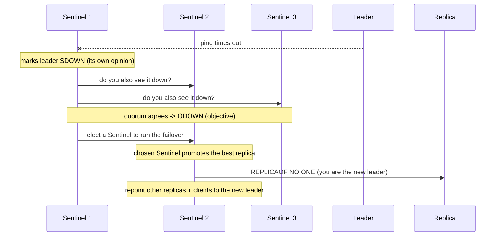

### 23.4 the danger — split-brain, and the honest limit

The staff-level topic is **split-brain** — a situation where your system ends up with *two leaders at the same time*, both accepting writes, each unaware of the other. Let's build up to why that happens and why it's dangerous.

**First, what is a network partition?** A partition is when the network splits your servers into two groups that can still each work internally but *cannot talk to each other* — like a bridge collapsing between two halves of a city. Neither side is "broken"; they just can't reach each other. This happens in real datacenters (a switch fails, a cable is cut, a cloud availability zone loses connectivity).

**Now the problem, step by step.** Imagine one leader (L), two replicas, and three Sentinels. A partition cuts the network like this:

```text
   LEFT side  (isolated)          |  RIGHT side  (majority)
   ---------------------          |  --------------------------
   Old Leader L  (still running!) |  Replica R2
   Sentinel S1                    |  Sentinel S2, Sentinel S3
                                  |
   L is ALIVE but can't be        |  S2 + S3 can't reach L -> they agree it's "down"
   reached by the majority        |  -> promote R2 to be the NEW leader
```

Here's the trap: **the old leader L never actually died.** It's happily running on the left side, still accepting writes from any client that can reach it. Meanwhile the majority of Sentinels on the right side genuinely believe L is dead (they can't reach it), so they correctly follow their rules and promote R2. Now you have **two leaders**: L on the left and R2 on the right, both taking writes.

```text
Client A (left)  --writes "x=1"-->  Old Leader L     (these writes only exist on L)
Client B (right) --writes "x=99"--> New Leader R2    (these writes only exist on R2)
```

**Why this loses data.** When the network heals and the two sides can talk again, Redis must pick *one* leader — and R2 wins because the majority already elected it. The old leader L is demoted to a replica, and to sync up it must **discard everything it accepted during the partition** and copy R2's data instead. Every write Client A sent to L in that window is silently thrown away. Client A was told "OK, saved!" — but the data is gone.

**Redis's mitigation.** You can't fully prevent partitions, but you *can* stop the isolated old leader from cheerfully accepting doomed writes. The guard: a leader must be able to reach a minimum number of replicas, or it **refuses to accept writes at all**:

```text
CONFIG SET  min-replicas-to-write  1      # refuse writes unless >= 1 replica is reachable
CONFIG SET  min-replicas-max-lag   10     # ...and that replica is no more than 10s behind
```

With this set, the isolated old leader L on the left — which can't reach any replica — will *reject* Client A's writes instead of accepting them and losing them later. Client A gets an error immediately (which it can handle) rather than a false "OK." That's a much better failure mode: a rejected write is recoverable; a silently-lost "successful" write is not.

**The honest limit to state in an interview.** This guard *reduces* data loss but does **not** make Redis strongly consistent. Because replication is asynchronous (Section 22), even in a clean failover the newly-promoted leader might be missing the last few writes the old leader had acknowledged but not yet streamed. The CAP-honest framing: **Sentinel gives you automatic failover and high availability, not linearizable consistency — some acknowledged writes can still be lost during a failover.** (Using an odd number of Sentinels, 3 or 5, ensures a majority is always unambiguous, so the two sides can never *both* think they have the majority.) If you truly cannot lose a write, Redis is the wrong system of record — put the data in a durable, consensus-backed store and use Redis as a cache (Section 31).

<details>
<summary>📖 In plain terms</summary>

Sentinel is a watchdog that automatically replaces a dead Redis leader with one of its replicas, so you don't need a human to do it. Several Sentinels watch the leader, and they only trigger a failover when enough of them agree it's really down — that voting prevents one confused Sentinel from causing chaos. The danger to know is "split-brain": during a network split you can briefly end up with two leaders, and writes to the old one get thrown away when it rejoins. Sentinel gives you availability, not perfect consistency.

</details>

<details>
<summary>💻 Hands-on: Sentinel commands</summary>

```bash
# Ask Sentinel who the current primary is (clients do this)
redis-cli -p 26379 SENTINEL get-master-addr-by-name mymaster
redis-cli -p 26379 SENTINEL masters          # monitored primaries + health
redis-cli -p 26379 SENTINEL replicas mymaster
redis-cli -p 26379 SENTINEL ckquorum mymaster # can a failover reach quorum?
redis-cli -p 26379 SENTINEL failover mymaster # force a manual failover (testing)

# On the primary: refuse writes if replicas fall behind (split-brain guard)
redis-cli CONFIG SET min-replicas-to-write 1
redis-cli CONFIG SET min-replicas-max-lag 10
```

</details>

---

## 24. 🧩 Redis Cluster: Hash Slots, Gossip & Resharding

Everything so far has assumed your whole dataset fits on one machine. Sentinel (Section 23) keeps that machine *available* by failing over to a replica — but a replica is a *full copy*, not extra room. If your data grows past one server's RAM, or one server's single thread can't keep up with the request rate, copies don't help. You need to *split the data across multiple machines*. That splitting is called **sharding**, and **Redis Cluster** is Redis's built-in way to do it: several primary nodes, each holding a *different slice* of the keys (and each slice backed by its own replicas for failover). This is how Redis reaches terabytes and millions of ops/sec.

The rest of this section answers three questions in order: (1) how does Cluster decide which machine a given key lives on? (2) how does a client find that machine? (3) what's the one design rule you have to respect?

### 24.1 deciding where a key lives — the 16,384 hash slots

The naive idea would be "assign each key to a node directly." That breaks the moment you add or remove a node, because you'd have to track and move billions of individual keys. So Cluster puts a fixed layer *in between* keys and nodes: **16,384 hash slots.** Think of the slots as 16,384 numbered buckets that never change in count. Two mappings then exist:

```text
Step 1  key   -> slot     (fixed formula, never changes)
Step 2  slot  -> node     (a assignment table the cluster can change to rebalance)
```

The key-to-slot step is a plain, deterministic hash:

```text
slot = CRC16(key) mod 16384          # same key -> same slot, always, on every node
```

The slot-to-node step is just an ownership table. In a 3-node cluster the 16,384 slots are divided into ranges — node A owns slots 0–5460, node B owns 5461–10922, node C owns 10923–16383. You can check exactly where any key lands:

```text
CLUSTER KEYSLOT  user:42     # -> (integer) 867      user:42 hashes to slot 867
# slot 867 falls in A's range (0-5460) -> so user:42 lives on node A
```

**Why this two-step design matters:** when you add a fourth node, you don't touch keys at all — you just reassign some *slots* (and the keys inside them) from the existing nodes to the new one. The key-to-slot formula never changes, so a client that knows the slot always knows how to recompute it. And why exactly 16,384? It's small enough that each node can broadcast its slot ownership as a tiny bitmap (2 KB), yet large enough to spread data evenly across dozens of nodes.

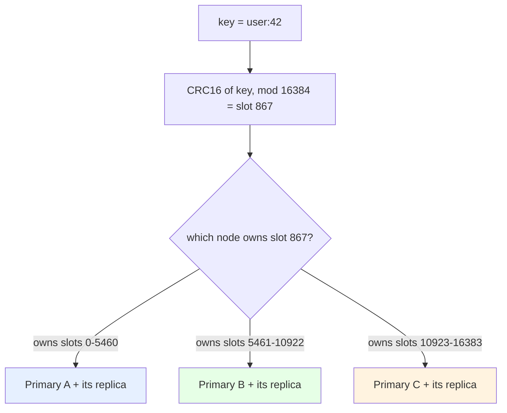

### 24.2 how a client finds the right node

Now the client's problem: with the data spread across A, B, and C, which one does it send `GET user:42` to? Three mechanisms work together.

**Gossip — how the nodes agree on the map.** There's no central coordinator. Instead the nodes continuously chatter over a dedicated "cluster bus" port, exchanging who owns which slots and who's alive. Within seconds of any change, every node knows the full, current slot-to-node map.

**Client-side routing — how a smart client avoids extra hops.** A cluster-aware driver (JedisCluster, Lettuce, redis-py) fetches that map once and caches it, so it computes the slot locally and sends each command *straight* to the owning node — usually one network round trip, no detours.

**MOVED redirect — the safety net when the client is wrong.** If the client's cached map is stale (a slot moved), it might ask the wrong node. That node doesn't fetch the data for it; instead it replies with a `MOVED` error naming the correct node, and the client updates its cache and retries there:

```text
GET user:42                              # client asks node B, but slot 867 lives on A
# -> (error) MOVED 867 10.0.0.9:6379     "slot 867 is on 10.0.0.9 — ask there"
GET user:42                              # client retries against A -> success
```

(The `redis-cli -c` flag makes the command-line client follow these redirects for you automatically.)

**ASK redirect — the special case during a live move.** You can migrate slots between nodes *while the cluster keeps serving traffic* (this is **resharding**, how you rebalance or add capacity). While a slot is half-moved, some of its keys are already on the destination and some aren't. For a key that has already moved, the source node sends an `ASK` redirect — a one-time "check the destination for this specific key" — so no request is dropped mid-migration. The difference in one line: **MOVED means "this slot lives elsewhere now, update your map"; ASK means "just this one key, just this once, is temporarily over there."**

### 24.3 the one rule — multi-key commands need keys in the same slot

Here's the constraint every cluster design has to respect. Since different keys live on different machines, **a single command that touches multiple keys only works if all of those keys are in the same slot** (and therefore on the same node). Redis cannot run one command across two machines. So a `MULTI` transaction, a Lua script, or a `SINTER` spanning keys that landed on different nodes will simply be rejected with a `CROSSSLOT` error.

The tool that fixes this is the **hash tag.** If a key name contains braces `{...}`, Cluster hashes *only the text inside the braces* instead of the whole key. So you can deliberately force related keys onto the same slot by giving them a shared tag:

```text
CLUSTER KEYSLOT  '{user:42}:profile'    # -> (integer) 5541   (only "user:42" is hashed)
CLUSTER KEYSLOT  '{user:42}:cart'       # -> (integer) 5541   SAME slot -> guaranteed same node
```

Because both hash only `user:42`, they always co-locate, and any multi-key operation across them works. This is a core cluster design skill: figure out ahead of time which keys you'll need to operate on together, and tag them so they share a slot. (Don't over-tag, though — if you funnel too many keys under one tag, that slot becomes a hot spot on one node and defeats the point of sharding.)

### 24.4 the honesty point — what Cluster does *not* give you

State this plainly in an interview so nobody thinks you're overselling: **Redis Cluster gives you horizontal scale, not stronger consistency.** Each shard is still just an individual leader with asynchronous replication, carrying the exact same failover-window caveats as Sentinel (Sections 22–23) — a crashing shard can still lose its last few acknowledged writes. And there are **no cross-shard transactions**. The cluster simply runs many independent leaders in parallel; it multiplies your capacity, it does not upgrade your consistency guarantees.

<details>
<summary>📖 In plain terms</summary>

When your data outgrows one machine, Redis Cluster splits it across several. It does this by assigning every key to one of 16,384 "slots" using a hash of the key, and each server owns a chunk of those slots. Servers gossip among themselves about who owns what, and smart clients route each command straight to the right server. You can move slots between servers live to rebalance. The one rule to remember: operations touching multiple keys only work if those keys land on the same server — you force that with "hash tags" like `{user:42}`.

</details>

<details>
<summary>💻 Hands-on: cluster inspection and hash tags</summary>

```bash
redis-cli -c -p 7000 CLUSTER INFO           # cluster_state, slots assigned
redis-cli -c -p 7000 CLUSTER NODES          # topology: who owns which slots
redis-cli -c -p 7000 CLUSTER SLOTS          # slot ranges -> node mapping
redis-cli -c -p 7000 CLUSTER KEYSLOT user:42  # which slot does this key hash to?

# Hash tags force related keys into the SAME slot (only {..} is hashed)
redis-cli -c -p 7000 CLUSTER KEYSLOT '{user:42}:profile'
redis-cli -c -p 7000 CLUSTER KEYSLOT '{user:42}:cart'   # same slot as above

# The -c flag makes redis-cli follow MOVED/ASK redirects automatically
redis-cli -c -p 7000 SET '{user:42}:profile' "{...}"
```

</details>

---

# Part VI — Caching & Staff-Level Patterns

This is where Redis interviews are won or lost. The mechanics from earlier parts now combine into the patterns that appear in almost every system-design round: caching strategies and their failure modes, distributed locking and its famous controversy, rate limiting, coordination primitives, and — the mark of a senior engineer — knowing when Redis is the *wrong* tool.

## 25. 🗃️ Redis as a Caching Layer: The Four Patterns

The most common reason to add Redis is to **cache** reads that would otherwise hammer a slower database. But "add a cache" hides four distinct wiring patterns, and interviewers want to hear you name them and their tradeoffs rather than reflexively reach for one. The four differ along two axes: *who loads data on a miss* (the app or the cache) and *when writes reach the database* (immediately or later). We'll take them one at a time.

### 25.1 cache-aside (lazy loading) — the default

Here the **application** owns the cache logic. The read path is: check Redis; if it's there (a *hit*), return it; if not (a *miss*), load from the database, store it in Redis with a TTL, and return it.

```text
READ  product:42:
  1. GET product:42          -> hit?  return it.
  2. miss -> SELECT from DB
  3. SET product:42 <value> EX 300     (populate cache with a TTL)
  4. return value

WRITE product:42:
  1. UPDATE the database (source of truth)
  2. DEL product:42          (invalidate the stale cache entry)
```

Strengths: simple, and **resilient** — if Redis is down the app still works by hitting the DB directly — and only data that's actually requested ever gets cached. Weaknesses: every *cold* key pays a one-time miss penalty (a DB round trip), and there's a brief staleness risk between a DB write and the cache delete. This is the safe default and what most systems use.

### 25.2 read-through — let the cache do the loading

Read-through is cache-aside with the miss-handling moved *into* the cache layer (or a library in front of it). The application **always** asks the cache; the cache itself loads from the DB on a miss and returns the value. Same behavior as cache-aside, but the loading logic is centralized instead of repeated in every caller — cleaner application code, at the cost of needing a cache/library that supports it.

### 25.3 write-through — write both, synchronously

Now the two write patterns. **Write-through** updates the cache *and* the database together, synchronously, on every write:

```text
WRITE:  SET cache  AND  UPDATE db     (both, before returning)
```

The cache is therefore **never stale** — reads are always fresh. The cost is write latency (every write pays both stores) and caching data that may never actually be read.

### 25.4 write-behind (write-back) — write cache now, DB later

**Write-behind** writes to the cache immediately and returns, then flushes to the database **asynchronously** later, often batching many updates into one DB write:

```text
WRITE:  SET cache now  ->  return immediately
        (a background flush writes to the DB later, in batches)
```

This makes writes extremely fast and can coalesce, say, 100 increments into a single DB update. But it carries a **durability risk**: if Redis dies before the flush, those writes are lost. So it's only appropriate for loss-tolerant data — view counts, metrics, counters — **never** orders or payments.

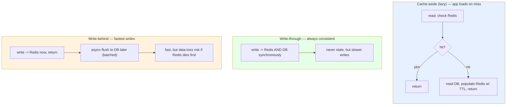

### 25.5 which one to pick

Two questions choose the pattern for you: *"how bad is stale data here?"* and *"what's the read/write ratio?"* The staff-level synthesis: **cache-aside** for read-heavy general workloads (the safe default most systems use); **write-through** when reads must never be stale and you can absorb the extra write latency; **write-behind** only for loss-tolerant, high-write data; and **read-through** when you want to centralize the loading logic out of the application.

<details>
<summary>📖 In plain terms</summary>

There are four ways to wire a cache. Cache-aside (the usual one): your app checks Redis, and on a miss reads the database and stores the result for next time. Read-through: the cache itself does that loading for you. Write-through: every write updates the cache and database together, so the cache is never stale but writes are slower. Write-behind: writes hit the cache instantly and get saved to the database later — very fast, but you can lose data if Redis crashes first, so only for things like view counts.

</details>

<details>
<summary>💻 Java (Spring): cache-aside with a TTL</summary>

```java
public Product getProduct(String id) {
    String key = "product:" + id;

    // 1. Try cache
    String cached = redis.get(key);
    if (cached != null) return deserialize(cached);   // cache hit

    // 2. Miss -> load from DB
    Product p = productRepository.findById(id);

    // 3. Populate cache with a TTL (+ jitter to avoid synchronized expiry)
    int ttl = 300 + ThreadLocalRandom.current().nextInt(60);
    redis.set(key, serialize(p), SetParams.setParams().ex(ttl));
    return p;
}

public void updateProduct(Product p) {
    productRepository.save(p);                 // write DB (source of truth)
    redis.del("product:" + p.getId());         // invalidate cache entry
}
```

</details>

---

## 26. ♻️ Cache Invalidation, Warming & TTL Strategy

"There are only two hard things in computer science: cache invalidation and naming things." The joke endures because invalidation is genuinely where caching bugs live — a cache that serves data the database has already changed is worse than no cache, because it's *confidently wrong*. This section covers the three ways to keep a cache fresh, one subtle correctness choice, and two operational habits.

### 26.1 three ways to invalidate, from simplest to most scalable

**TTL-based expiry** is the simplest: give every entry a time-to-live and let it go stale-then-gone on its own.

```text
SET  product:42  <value>  EX 300      # this entry self-clears in 5 minutes
```

No write-path coordination at all, but you accept staleness *up to the TTL* — fine for a product description, dangerous for an account balance.

**Explicit invalidation on write** clears the cache entry the moment the underlying data changes, so reads are fresh immediately after a write:

```text
# whenever product 42 changes:
UPDATE db ...
DEL  product:42          # next read repopulates from the DB
```

The cost: every writer must know every cache key its change affects.

**Event-driven invalidation** decouples that. Database changes emit events — typically via change-data-capture (CDC) like Debezium reading the DB's replication log onto Kafka — and a consumer invalidates the affected cache keys. The write path just updates the DB; the CDC pipeline fans invalidations out. This is how large systems keep many caches consistent without coupling every writer to every cache.

### 26.2 delete, don't update

A subtle but important choice: on a write, should you *delete* the cache key or *overwrite* it with the new value? **Prefer delete.** Two updates that race to overwrite the cache can interleave and leave the *older* value sitting there:

```text
# Two concurrent writers overwriting the cache — the classic race:
Writer A: writes v1 to DB
Writer B: writes v2 to DB
Writer B: SET cache = v2
Writer A: SET cache = v1        <- STALE value wins, cache now disagrees with DB
```

Deleting instead forces the next read to reload from the source of truth, sidestepping the race. So the guidance is *delete, don't update* unless you have a specific reason.

### 26.3 version your keys to survive deploys

Keys should be structured and namespaced, and it helps to include a **version** in the key. When a deploy changes the *shape* of a cached object — say you add a field, rename one, or switch serialization format — the old cached entries no longer match what the new code expects. Bumping a version prefix instantly sidesteps this: the new code reads and writes a whole new namespace, so it never sees a single old-format entry.

```text
product:v1:42       # old code writes/reads this
product:v2:42       # new deploy uses v2 -> all v1 entries are simply never read again
```

**The crucial part people miss: the version lives in your code, and the code has to change to use it.** The version isn't something Redis manages — it's just a string your application puts in the key name. So the deploy that changes the object's shape must *also* change the constant that builds the key. In practice you keep the version in one place:

```java
// One constant that every cache-key builder uses.
private static final String CACHE_VERSION = "v2";   // was "v1" before this deploy

private String productKey(long id) {
    return "product:" + CACHE_VERSION + ":" + id;    // -> "product:v2:42"
}

public Product getProduct(long id) {
    String key = productKey(id);                     // now builds v2 keys everywhere
    String cached = redis.get(key);
    if (cached != null) return deserialize(cached);  // only ever sees v2-shaped data
    Product p = db.findById(id);
    redis.set(key, serialize(p), SetParams.setParams().ex(300));
    return p;
}
```

Walking through what happens on deploy: the moment the new binary ships, every `get`/`set` goes through `productKey`, which now emits `product:v2:...`. The old `product:v1:...` entries are never looked up again by anyone — no reader constructs a `v1` key — so they just sit there until their TTL expires and Redis reclaims the memory. There's no risky bulk-delete and no window where new code might deserialize an old blob. The one cost to be aware of: right after the switch, every `v2` key is a miss, so you briefly get a cold-cache burst against the database — which is exactly the problem cache warming (next) addresses.

### 26.4 warm the cache before it takes traffic

Right after a Redis restart, a deploy, or a key-version bump (26.3), the cache is **empty** — so every request misses and stampedes the database at once (the *avalanche* of Section 27). **Cache warming** means deliberately pre-loading the popular entries *before* live traffic arrives, so the first real users hit a warm cache. Here are the common approaches, from simplest to most automated.

**Approach 1 — a warm-up script at startup.** Before the instance is added to the load balancer, run a job that loads the known-hot keys. You usually know these from analytics (the top-N most-requested products, the homepage feed, reference data like currency rates):

```java
// Run on boot, BEFORE this instance is marked healthy / added to the load balancer.
void warmCache() {
    List<Long> hotIds = analytics.topProductIds(1000);   // the 1000 most-requested
    for (long id : hotIds) {
        Product p = db.findById(id);
        redis.set(productKey(id), serialize(p), SetParams.setParams().ex(300));
    }
}
```

**Approach 2 — gate the health check on warmth.** Tie the instance's readiness/health endpoint to warm-up completion. The load balancer only starts routing traffic once the endpoint reports healthy, so an unwarmed instance never takes requests:

```text
GET /healthz   -> 503 Not Ready     while warmCache() is still running
GET /healthz   -> 200 OK            once the hot set is loaded -> LB sends traffic
```

**Approach 3 — canary warming.** Send a small trickle of traffic (or a synthetic replay of common requests) to the fresh instance first. Those early requests populate the cache through the normal cache-aside path, so by the time you ramp to full traffic the hot keys are already present.

**Approach 4 — refresh-ahead / never let it go fully cold.** For entries that must always be hot, a background job re-reads and re-`SET`s them shortly before their TTL expires, so a popular key is refreshed while it's still cached rather than expiring and causing a miss. This overlaps with the probabilistic early-refresh idea in Section 27.

Whichever approach you use, pair warming with **jittered TTLs** (Section 27) so the keys you just warmed don't all expire together later and recreate the very stampede you were avoiding. This leads directly into the production anomalies covered next.

<details>
<summary>📖 In plain terms</summary>

The hardest part of caching is knowing when to throw away stale entries. You can let them expire on a timer (simplest, but tolerates some staleness), delete them the moment the underlying data changes (fresh, but every writer must know which keys to clear), or drive invalidations from database-change events (scales best). A good habit is to *delete* a cache entry on change rather than overwrite it, because overwriting can race and leave the old value behind. And after a restart, warm up the popular keys first so an empty cache doesn't stampede your database.

</details>

---

## 27. 🔥 Production Anomalies: Stampede, Penetration & Avalanche

Three named failure modes appear again and again in senior interviews because each stresses a different weakness of a cache under load, and each has a distinct fix. We'll take them one at a time, each with the exact moment it goes wrong and the tool that stops it.

### 27.1 cache stampede (the thundering herd)

**What happens:** picture a single very popular key — say the cached homepage feed — that thousands of requests per second read. It has a TTL, so eventually it expires. The instant it does, there's a tiny window before *anyone* has rebuilt it. During that window every incoming request checks the cache, finds nothing, and independently decides "I'll go fetch it from the database." So instead of one database query to rebuild the key, you get thousands, all at the same moment.

```text
Time 0.000s   product:42 expires (TTL hits 0) -> the cache slot is now empty
Time 0.001s   1000 in-flight requests all run GET product:42 -> all get (nil), all MISS
Time 0.002s   all 1000 independently run the SAME expensive DB query at once
Time 0.05s    the DB, sized for ~normal load, is now handling 1000x its usual rebuild work
              -> latency spikes, connections exhaust, possibly a cascading outage
```

The nasty part is that the key was *popular* — that's exactly why so many requests pile onto its expiry. The more popular the key, the bigger the stampede. Here are the three fixes and, importantly, *why each one works*.

**Fix 1 — request coalescing (a mutex lock).** The idea: let only *one* request rebuild the key; make everyone else wait for that result instead of also querying the DB. The first request to miss grabs a short-lived lock with `SET NX` (Section 28). Only the lock-holder queries the database and repopulates the cache; the other requests, failing to get the lock, sleep briefly and then re-read the cache — where the value now exists.

```text
1000 requests miss product:42
  -> request #1 wins  SET lock:product:42 <token> NX PX 3000   (only one can)
  -> request #1 queries DB, SETs product:42, releases the lock
  -> requests #2..1000 fail the SET NX -> wait ~50ms -> re-read cache -> HIT
Result: exactly ONE DB query instead of 1000.
```

Why it works: it collapses N simultaneous rebuilds into one. The trade-off is that the waiting requests see slightly higher latency during that rebuild.

**Fix 2 — probabilistic early expiration (XFetch).** The idea: refresh the key *slightly before* it actually expires, while it's still serving fine, so there's never an empty window at all. Each reader rolls a random probability that grows as the TTL nears zero; almost always it just serves the cached value, but occasionally *one* reader "wins the roll," recomputes the value early, and resets the TTL — while every other reader keeps happily serving the still-cached copy.

```text
TTL far away (250s left):  P(refresh) ~ 0  -> everyone just serves the cache
TTL near (5s left):        P(refresh) rises -> ONE unlucky reader refreshes early,
                                                everyone else still serves the old copy
Result: the key is renewed BEFORE it ever hits 0, so the empty window never occurs.
```

Why it works: it removes the cliff. There is no synchronized "everyone misses at t=0" moment because the value is refreshed proactively by a single reader while still valid.

**Fix 3 — jittered TTLs.** The idea: don't let keys that were created together expire together. When you cache many keys at once (e.g., warming, or a batch load), add a small random offset to each TTL so their expiries spread out over time instead of firing in one synchronized wave.

```text
BAD:   SET product:42 v EX 300     # every key in the batch expires at exactly +300s
       SET product:43 v EX 300     # -> synchronized mass-expiry (this is Avalanche, 27.3)
GOOD:  SET product:42 v EX 312     # 300 + random(0..60)
       SET product:43 v EX 287     # spread out -> no single stampede moment
```

Why it works: it converts one big simultaneous expiry into many small staggered ones, so no single instant produces a flood.

### 27.2 cache penetration (asking for what doesn't exist)

**What happens:** the previous problem was about a key that *exists* but expired. Penetration is the opposite — requests keep asking for keys that exist **nowhere**: not in the cache, and not in the database either. Every such request misses the cache (nothing to hit), falls through to the database, and the database also returns "not found." Because there's no data to store, a normal cache never absorbs these — so they hit the database *every single time*.

```text
GET user:99999   -> cache miss (nil)   -> DB lookup   -> NOT FOUND   -> DB hit wasted
GET user:99998   -> cache miss (nil)   -> DB lookup   -> NOT FOUND   -> DB hit wasted
GET user:99997   -> ...                                              # nothing is ever cached
```

This is frequently **malicious**: an attacker sprays requests for random non-existent IDs (`user:99999`, `user:88888`, …), knowing each one bypasses the cache and lands on the database. It can also be an innocent bug (a broken client requesting deleted IDs). Two fixes:

**Fix 1 — cache the negative result.** The idea: if a lookup comes back empty, *cache that emptiness too*. Store a small "this doesn't exist" marker with a short TTL, so the next request for the same missing key is absorbed by the cache instead of hitting the DB again.

```text
GET user:99999            -> miss -> DB says NOT FOUND
SET user:99999 "__NULL__" EX 30      # remember the miss for 30s
GET user:99999            -> HIT ("__NULL__") -> return "not found" WITHOUT touching the DB
```

Why it works: it turns a repeated non-existent lookup into a cache hit. The short TTL keeps it from lingering if the key later gets created, and caps memory if an attacker probes many IDs.

**Fix 2 — a Bloom filter gate.** The idea: keep a compact structure listing every ID that *does* exist, and check it *before* going to the database. A Bloom filter (Section 12) answers "is this key possibly in the dataset?" with a useful guarantee: it never gives a false negative. So if it says "definitely not present," you can reject the request immediately — it truly doesn't exist — without any DB or cache lookup.

```text
BF.EXISTS users:filter user:42      # -> 1  = MAYBE present -> proceed to cache/DB
BF.EXISTS users:filter user:99999   # -> 0  = DEFINITELY absent -> reject now, skip the DB
```

Why it works: it stops impossible requests at the door, even the first time each one is seen — which is exactly what negative caching can't do for a fast-changing spray of unique fake IDs. Redis's `BF.*` commands (RedisBloom module) implement this directly.

### 27.3 cache avalanche (stampede at scale)

**What happens:** stampede (27.1) was about *one* hot key expiring. Avalanche is the same disaster multiplied across a *huge number* of keys at once. Two common triggers: (a) many keys were given the same TTL at the same time, so they all expire together in one synchronized wave; or (b) Redis itself restarts, so the *entire* cache is empty at once. Either way, a massive share of requests miss simultaneously and flood the database.

```text
Trigger A — synchronized expiry:
   at deploy, 100k keys all cached with EX 300  ->  300s later they ALL expire together
   ->  one instant of near-total cache miss  ->  DB flooded

Trigger B — cold restart:
   Redis restarts  ->  cache is completely EMPTY  ->  every request misses
   ->  100% of traffic hits the DB at once  ->  DB swamped
```

The fixes are the same tools as stampede, applied at scale plus a backstop:

**Fix 1 — jittered / staggered TTLs** (same mechanism as 27.1's Fix 3). By spreading expiries randomly across a window, you convert the synchronized wave (Trigger A) into a smooth trickle of individual expiries the database can absorb.

**Fix 2 — cache warming** (Section 26.4). Before a freshly restarted or deployed instance takes live traffic, pre-load the hot keys so the cache is never cold (directly addresses Trigger B).

**Fix 3 — a circuit breaker / DB rate limit as a backstop.** Even with the above, assume a flood can still happen. Put a limiter in front of the database so that if misses surge, the database is protected: excess rebuild requests are shed or made to wait rather than all reaching the DB. This is the safety net that keeps a bad moment from becoming an outage.

```text
misses surge past a threshold  ->  circuit breaker trips
   ->  extra requests get a fast "try later" instead of piling onto the DB
   ->  DB stays alive; the cache refills in a controlled way
```

```mermaid
flowchart TB
    subgraph ST["Stampede — one hot key expires"]
        S1["1000 requests miss the same key at once"] --> S2["all hit DB together"]
        S2 --> S3["Fix: mutex lock / XFetch early refresh / jittered TTL"]
    end
    subgraph PN["Penetration — key exists nowhere"]
        P1["requests for non-existent keys always miss"] --> P2["every one hits DB"]
        P2 --> P3["Fix: cache null marker + Bloom filter gate"]
    end
    subgraph AV["Avalanche — many keys expire together"]
        A1["mass expiry or cold restart"] --> A2["flood of misses swamps DB"]
        A2 --> A3["Fix: jittered TTLs + cache warming + DB circuit breaker"]
    end
    style ST fill:#fff3e0
    style PN fill:#ffe6e6
    style AV fill:#e6e6ff
```

### 27.4 the one insight that ties them together

The unifying insight to voice in an interview: **all three are about protecting the database from the cache's failure modes.** A cache exists to shield the database, so the dangerous moments are precisely when the cache stops shielding — a hot key vanishes (stampede), a key that never existed keeps slipping through (penetration), or the whole cache goes cold (avalanche). The toolkit — locks, probabilistic early refresh, jitter, Bloom filters, negative caching, warming, circuit breakers — is the set of ways to keep the shield up during those moments.

<details>
<summary>📖 In plain terms</summary>

Three classic cache disasters: Stampede — a popular key expires and thousands of requests all rush the database at the same instant (fix: let one request rebuild it while others wait, or refresh slightly early). Penetration — people keep asking for things that don't exist anywhere, so the cache never helps (fix: remember "this doesn't exist" and use a Bloom filter to reject them). Avalanche — tons of keys expire at once or the cache restarts empty, flooding the database (fix: randomize expiry times and warm the cache first). All three are really about keeping the cache shielding the database.

</details>

<details>
<summary>💻 Java: stampede protection with a mutex lock</summary>

```java
public Product getProductProtected(String id) {
    String key = "product:" + id;
    String cached = redis.get(key);
    if (cached != null) return deserialize(cached);        // hit

    // Miss: only ONE request rebuilds; others wait and retry the cache
    String lockKey = "lock:" + key;
    String token = UUID.randomUUID().toString();
    boolean gotLock = "OK".equals(
        redis.set(lockKey, token, SetParams.setParams().nx().px(3000)));

    if (gotLock) {
        try {
            Product p = productRepository.findById(id);     // single DB hit
            int ttl = 300 + ThreadLocalRandom.current().nextInt(60); // jitter
            redis.set(key, serialize(p), SetParams.setParams().ex(ttl));
            return p;
        } finally {
            // safe unlock: delete only if still ours (Lua compare-and-del)
            redis.eval("if redis.call('GET',KEYS[1])==ARGV[1] then " +
                       "return redis.call('DEL',KEYS[1]) else return 0 end",
                       List.of(lockKey), List.of(token));
        }
    } else {
        Thread.sleep(50);                 // brief wait, then re-read cache
        return getProductProtected(id);
    }
}
```

</details>

<details>
<summary>💻 Hands-on: negative caching & Bloom filter (RedisBloom)</summary>

```bash
# Negative caching: remember a miss briefly so it stops hitting the DB
redis-cli SET user:99999 "__NULL__" EX 30    # short TTL for a known-missing key

# Bloom filter gate (RedisBloom module) — reject impossible lookups
redis-cli BF.RESERVE users:filter 0.001 1000000   # 0.1% error, 1M capacity
redis-cli BF.ADD    users:filter user:42
redis-cli BF.EXISTS users:filter user:42          # 1 = maybe present
redis-cli BF.EXISTS users:filter user:99999       # 0 = DEFINITELY absent -> skip DB
```

</details>

---

## 28. 🔐 Distributed Locking: SET NX, Redlock & Kleppmann's Critique

Distributed locking is the question that most reliably separates engineers who have merely used Redis from those who have thought about it. The task: ensure that across many application servers, only *one* of them runs a critical section at a time — process a particular payment once, run a scheduled job on a single replica, or hold a seat while a booking completes. We'll build up from the one-line lock to the staff-level critique.

### 28.1 the basic single-node lock

A distributed lock is, at its core, a single command:

```text
SET lock:<resource> <unique-token> NX PX 30000
#   |__ key         |__ your token  |  |__ auto-expire after 30000 ms
#                                   |__ only set if the key does NOT exist
```

Here's it in action:

```text
SET lock:seat:12A tokenXYZ NX PX 30000    # -> OK      (Client A wins the race)
SET lock:seat:12A tokenABC NX PX 30000    # -> (nil)   (Client B is refused)
```

`NX` ("only if it doesn't exist") means exactly one client wins the race to create the key. `PX 30000` attaches a 30-second expiry so the lock auto-releases if the holder crashes without unlocking — no permanent deadlock. This single-node lock is correct and sufficient for the vast majority of real needs.

### 28.2 unlock safely with compare-and-delete

The token matters at unlock time. You must delete the key *only if it still holds your token*, using the atomic Lua compare-and-delete from Section 21:

```text
EVAL "if redis.call('GET',KEYS[1])==ARGV[1]
       then return redis.call('DEL',KEYS[1]) else return 0 end" 1 lock:seat:12A tokenXYZ
```

Why not a plain `DEL`? Consider the danger:

```text
Client A acquires lock, token=XYZ, TTL 30s
A stalls for 31s -> lock EXPIRES -> Client B acquires it, token=ABC
A wakes up and runs plain DEL lock:seat:12A   <- deletes B's lock! Two holders now.
```

Compare-and-delete refuses to delete a lock A no longer owns.

### 28.3 Redlock across multiple nodes

**Redlock** is the algorithm Redis's author proposed for locking across *multiple independent Redis nodes* (say five), to avoid depending on one master surviving. The client tries to acquire the lock on all N nodes with the same token and TTL; it *holds* the lock only if it acquired a **majority** (3 of 5) within a time budget small relative to the TTL.

```text
Acquire lock:seat:12A on 5 nodes -> got node1, node2, node3 (3 of 5 = majority) -> HELD
                                    node4, node5 down/slow -> doesn't matter
```

A majority survives the failure of a minority, so the lock doesn't evaporate when one Redis node dies. To release, the client deletes the key on all nodes.

### 28.4 Kleppmann's critique — why Redlock isn't "safe"

The staff-level heart of the topic: **Martin Kleppmann's critique of Redlock.** Knowing it accurately is the signal. He argued Redlock isn't safe for correctness-critical locking because it relies on **timing assumptions distributed systems cannot guarantee.** Two scenarios break it:

```text
Scenario 1 — process pause:
  Client A acquires lock (TTL 30s)
  A suffers a 35s GC pause  ->  lock expires  ->  Client B acquires it
  A wakes up, still believes it holds the lock  ->  TWO clients act at once

Scenario 2 — clock drift:
  Node's clock jumps forward (NTP correction / VM migration)
  Key expires EARLY  ->  majority guarantee violated
```

Kleppmann's conclusion: Redlock provides *efficiency* (usually stopping duplicate work) but not *correctness* (a hard guarantee that only one holder ever acts).

### 28.5 fencing tokens — the actual fix

**Fencing tokens** close the safety hole. Each time the lock is granted, the lock service also returns a monotonically increasing number. The client passes this token to the protected resource on every write, and the resource *rejects any write bearing a token lower than the highest it has already seen*:

```text
Client A granted lock, fencing token = 33
A pauses... lock expires... Client B granted lock, fencing token = 34
B writes with token 34  ->  accepted (34 > highest seen)
A wakes, writes with token 33  ->  REJECTED (33 < 34)
```

This moves the correctness guarantee from the timing-dependent lock to the resource itself — the only place it can be truly enforced.

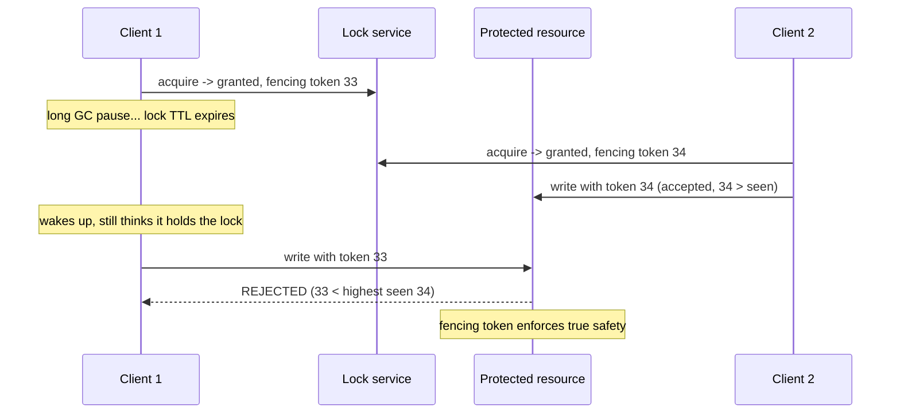

### 28.6 putting it all together

The complete senior answer weaves these together: use a single-node `SET NX PX` lock with a Lua safe-unlock for the common case; understand Redlock as a multi-node availability improvement, *not* a correctness guarantee; cite Kleppmann's process-pause and clock-drift objections; add **fencing tokens** when correctness genuinely matters; consider **lease renewal** (a watchdog thread that extends the TTL while work is ongoing, so long jobs don't lose the lock mid-flight); and know that **when correctness matters more than availability, you reach for ZooKeeper or etcd** instead — consensus systems built on Raft/Zab that provide the linearizable, fencing-token-native coordination Redis was never designed to guarantee.

<details>
<summary>📖 In plain terms</summary>

A distributed lock makes sure only one server does something at a time — like charging a card once. The simple version is one Redis command that sets a key only if nobody holds it, with an auto-expiry so a crash doesn't lock things forever. Redlock extends this across several Redis nodes for resilience. But a famous critique (Kleppmann) shows it isn't truly safe: if a process freezes past the lock's expiry, two clients can think they hold it. The real fix is "fencing tokens" — an ever-increasing number the database uses to reject a stale lock-holder's writes. When correctness is critical, use ZooKeeper or etcd instead.

</details>

<details>
<summary>💻 Java (Jedis): safe lock acquire + fenced unlock</summary>

```java
public class RedisLock {
    private final Jedis jedis;

    // Acquire: SET NX PX with a unique token. Returns token if acquired, else null.
    public String acquire(String resource, long ttlMillis) {
        String token = UUID.randomUUID().toString();
        String ok = jedis.set("lock:" + resource, token,
                              SetParams.setParams().nx().px(ttlMillis));
        return "OK".equals(ok) ? token : null;
    }

    // Release: delete ONLY if we still own it (atomic Lua compare-and-delete)
    public boolean release(String resource, String token) {
        Object r = jedis.eval(
            "if redis.call('GET',KEYS[1])==ARGV[1] then " +
            "return redis.call('DEL',KEYS[1]) else return 0 end",
            List.of("lock:" + resource), List.of(token));
        return Long.valueOf(1L).equals(r);
    }

    // Renew (lease extension): extend TTL only if still ours — call from a watchdog
    public boolean renew(String resource, String token, long ttlMillis) {
        Object r = jedis.eval(
            "if redis.call('GET',KEYS[1])==ARGV[1] then " +
            "return redis.call('PEXPIRE',KEYS[1],ARGV[2]) else return 0 end",
            List.of("lock:" + resource), List.of(token, String.valueOf(ttlMillis)));
        return Long.valueOf(1L).equals(r);
    }
}
```

</details>

<details>
<summary>💻 Hands-on: a lock lifecycle in redis-cli</summary>

```bash
# Acquire: succeeds once, returns nil for anyone else until it expires
redis-cli SET lock:seat:12A tokenXYZ NX PX 30000

# Someone else tries -> nil (already held)
redis-cli SET lock:seat:12A tokenABC NX PX 30000

# Safe unlock: only if the token still matches (prevents deleting someone else's lock)
redis-cli EVAL "if redis.call('GET',KEYS[1])==ARGV[1] then return redis.call('DEL',KEYS[1]) else return 0 end" 1 lock:seat:12A tokenXYZ

redis-cli PTTL lock:seat:12A         # time left before auto-release
```

</details>

---

## 29. 🚦 Rate Limiting Algorithms in Redis

Rate limiting is the single most-asked Redis system-design question, because it's small enough to fully design in an interview yet rich enough to expose your grasp of atomicity, data structures, and distributed correctness. The goal: cap how many requests a user/IP/API-key may make in a time window. Redis is the natural home because it's fast, atomic, and — crucially — **centralized**, so the limit is enforced globally across all app servers rather than per-server. We'll build the four classic algorithms in order of sophistication.

### 29.1 fixed window (the simplest counter)

One counter per time window: increment it, set it to expire at the end of the window, reject once it exceeds the limit.

```text
INCR   rate:user:42:<minute>      # -> 1, 2, 3, ...   count for this minute
EXPIRE rate:user:42:<minute> 60   # window self-clears after 60s
# if the returned count > limit -> reject the request
```

Cheap and easy, but it has a **boundary burst flaw**:

```text
Limit = 100/min
23:59:59  user sends 100 requests  (fills window A)
00:00:01  user sends 100 requests  (fills window B)
=> 200 requests in ~2 seconds, straddling the boundary — double the intended rate
```

There's also a race: `INCR` then a *separate* `EXPIRE` can leave a key with no TTL if the process dies between them — so the two must be combined atomically in a Lua script.

### 29.2 sliding window log (exact, but memory-hungry)

Fix the boundary flaw precisely with a **sorted set** where each request is a member scored by its timestamp:

```text
ZADD              rate:log:user:42  <now>  req-<now>     # record this request
ZREMRANGEBYSCORE  rate:log:user:42  0  <now-60>          # drop anything older than 60s
ZCARD             rate:log:user:42                       # count what's left in the trailing 60s
# if ZCARD > limit -> reject
```

This is *exact* — it counts requests in the true trailing window — but it stores *every* request timestamp, so memory scales with request volume. Costly at high rates.

### 29.3 sliding window counter (the production favorite)

The practical compromise most production limiters use: keep per-window counts and weight the previous window by how much of it still overlaps the trailing window.

```text
30 seconds into the current minute:
  count = current_window_count + 0.5 * previous_window_count
              (0.5 because half of the previous minute still overlaps the trailing 60s)
```

It approximates the sliding log with *two* counters instead of a full log — far cheaper, and accurate enough for almost everyone.

### 29.4 token bucket (allows bursts, enforces an average)

Model a bucket that refills at a steady rate up to a capacity. Each request consumes one token; a request is allowed only if a token is available.

```text
capacity = 100 tokens, refill = 10 tokens/sec
bucket starts full (100)  ->  a burst of 100 requests drains it instantly (all allowed)
then only 10 requests/sec get through as tokens trickle back in
```

This elegantly permits *bursts* (spend accumulated tokens) while enforcing a long-run average (the refill rate) — which is why it's the algorithm behind most API gateways and cloud rate limits. In Redis it's a **Lua script** storing the token count and last-refill timestamp, computing how many tokens to add from elapsed time and consuming one if available — all atomically, with the current time passed *in as an argument* to keep the script deterministic.

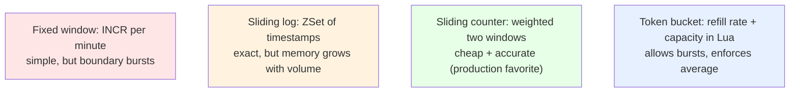

### 29.5 two staff-level points that elevate the answer

First, **atomicity is non-negotiable**: every one of these must run as a Lua script (or `MULTI`) so the check-and-increment cannot race across concurrent requests — a limiter with a read-then-write gap under-counts and lets excess traffic through. Second, **Redis itself becomes a single point of failure for the limiter**, so you must decide the fallback when Redis is unreachable: **fail-open** (allow all traffic — protects user experience, sacrifices the limit, right for a non-critical throttle) or **fail-closed** (reject all traffic — protects the backend, sacrifices availability, right when the limit guards something fragile). And you design the *scope*: per-user, per-IP, per-API-key, with tiered limits (a free tier at 100/min, an enterprise tier at 10,000/min) keyed accordingly.

<details>
<summary>📖 In plain terms</summary>

Rate limiting caps how many requests someone can make in a window, and Redis is ideal because it's fast and shared across all your servers. The simplest way — a counter per minute — is easy but lets people cheat at the window edges. A sorted set of timestamps is exact but memory-hungry. The sliding-window counter blends two counters for a cheap, accurate result (most common in production). Token bucket allows short bursts while holding a steady average — it's what most API gateways use. Two must-knows: do the counting atomically (a Lua script) so requests can't slip through a race, and decide what happens if Redis is down — allow everything or block everything.

</details>

<details>
<summary>💻 Java: token-bucket rate limiter as an atomic Lua script</summary>

```java
// Token bucket: refill based on elapsed time, consume 1 if available.
// Deterministic — the current time is passed in as ARGV, not read inside.
String tokenBucket =
  "local tokens = tonumber(redis.call('HGET', KEYS[1], 'tokens') or ARGV[1]) " +
  "local last   = tonumber(redis.call('HGET', KEYS[1], 'ts') or ARGV[3]) " +
  "local rate   = tonumber(ARGV[2]) " +       // tokens per second
  "local cap    = tonumber(ARGV[1]) " +       // bucket capacity
  "local now    = tonumber(ARGV[3]) " +       // current time (seconds)
  "local refill = math.min(cap, tokens + (now - last) * rate) " +
  "local allowed = 0 " +
  "if refill >= 1 then allowed = 1; refill = refill - 1 end " +
  "redis.call('HSET', KEYS[1], 'tokens', refill, 'ts', now) " +
  "redis.call('EXPIRE', KEYS[1], math.ceil(cap / rate)) " +
  "return allowed";

try (Jedis jedis = new Jedis("localhost", 6379)) {
    double now = System.currentTimeMillis() / 1000.0;
    Object allowed = jedis.eval(tokenBucket,
        List.of("rate:user:42"),
        List.of("100", "10", String.valueOf(now)));  // cap=100, refill=10/s
    boolean ok = Long.valueOf(1L).equals(allowed);
}
```

</details>

<details>
<summary>💻 Hands-on: fixed & sliding-window limiters</summary>

```bash
# Fixed window (must be atomic in prod — shown as two commands for clarity)
redis-cli INCR   rate:user:42:min
redis-cli EXPIRE rate:user:42:min 60      # combine both in a Lua script for real use

# Sliding window log with a sorted set (timestamps as scores)
NOW=$(date +%s)
redis-cli ZADD rate:log:user:42 $NOW req-$NOW           # record this request
redis-cli ZREMRANGEBYSCORE rate:log:user:42 0 $((NOW-60)) # drop entries older than 60s
redis-cli ZCARD rate:log:user:42                         # count in the trailing window
redis-cli EXPIRE rate:log:user:42 60
```

</details>

---

## 30. 🤝 Concurrency & Coordination: Counters, Semaphores, Leader Election

Beyond locks and limiters, Redis serves as a lightweight coordination layer for several classic primitives, each built from the atomicity guarantees established earlier. We'll go from the simplest building block up to leader election.

### 30.1 atomic counters — the building block

`INCR`/`DECR` give lost-update-free counting for metrics, inventory decrements, and ID generation — the workhorse from Section 5:

```text
INCR  metrics:signups        # -> 1        two servers racing still get 1 then 2
DECR  inventory:sku:99       # -> 41       never loses a decrement
```

When a bare counter isn't enough for a read-modify-write, **optimistic locking with `WATCH`** (Section 20) aborts and retries if a watched key changed. These two are the building blocks; the next primitives compose them.

### 30.2 distributed semaphore — from "one holder" to "at most N"

A semaphore generalizes the lock from one holder to *at most N* holders — useful for capping concurrency against a limited resource (say, at most 10 simultaneous connections to a fragile legacy API). The clean implementation uses a **sorted set** as a time-bounded permit set:

```text
# All atomic inside one Lua script:
ZREMRANGEBYSCORE sem:legacy-api  0  <now-timeout>   # expire permits of crashed holders
ZCARD            sem:legacy-api                     # how many permits are held now?
# if count < N:
ZADD             sem:legacy-api  <now>  <client-id> # take a permit -> granted
# else: don't add, caller waits and retries
```

Trimming by timestamp means a crashed holder's permit auto-expires, so the semaphore self-heals.

### 30.3 leader election — a lock applied to a role

Choosing a single active instance among replicas (to run a cron job once, or be the write coordinator) is just the distributed lock applied to a *role*:

```text
SET cluster:leader instance-A NX PX 15000   # -> OK for the winner, (nil) for everyone else
# winner renews before expiry to stay leader:
PEXPIRE cluster:leader 15000                 # (via compare-and-set Lua, only if still ours)
# if the leader crashes -> key expires -> another instance wins the next race
```

This is simple and often good enough, but it carries the *same* correctness caveat as Redlock — a paused leader can be superseded while still believing it leads. So for correctness-critical leadership (a system that must *never* have two active leaders) you use ZooKeeper/etcd, whose consensus guarantees are built for exactly this. Being able to say "Redis leader election is fine for best-effort, but I'd use etcd if split-leadership would corrupt data" is the mature answer.

<details>
<summary>📖 In plain terms</summary>

Redis can coordinate multiple servers using a few simple primitives. Atomic counters count safely without lost updates. A semaphore extends a lock to allow up to N holders — handy for capping how many workers hit a fragile service at once. Leader election picks one server to be "in charge" (say, to run a scheduled job once) by racing to grab a key with an expiry, then renewing it. All of these work well for best-effort coordination, but for cases where two leaders would corrupt data, you use a dedicated consensus system like etcd or ZooKeeper.

</details>

<details>
<summary>💻 Hands-on: leader election with a renewable lease</summary>

```bash
# Each instance races to become leader (only one wins)
redis-cli SET cluster:leader instance-A NX PX 15000

# The leader renews its lease before expiry (only if still leader)
redis-cli EVAL "if redis.call('GET',KEYS[1])==ARGV[1] then return redis.call('PEXPIRE',KEYS[1],ARGV[2]) else return 0 end" 1 cluster:leader instance-A 15000

# Anyone can check who currently leads
redis-cli GET cluster:leader
```

</details>

---

## 31. 🚫 When Redis Is the Wrong Choice

A staff engineer is defined as much by knowing when *not* to reach for a tool. Redis is superb within its envelope and dangerous outside it, and interviewers deliberately probe whether you can name the boundary. Here are the five situations where Redis is the wrong answer, each with a concrete example of the mistake.

### 31.1 when durability is a hard requirement

Redis is the wrong *system of record*. Even AOF with `appendfsync always` pays the fsync-per-write cost and still lives inside an asynchronously-replicated topology whose failover window can lose acknowledged writes (Sections 22–23).

```text
WRONG:  store account balances only in Redis
        -> master crashes mid-failover -> a confirmed $500 deposit vanishes

RIGHT:  PostgreSQL (or a distributed SQL store) is the source of truth
        Redis sits in front as a read cache
```

For money, orders, or anything where a lost write is unacceptable, the durable database owns the data — Redis never as its sole home.

### 31.2 when the dataset exceeds what memory can economically hold

RAM costs roughly an order of magnitude more per gigabyte than SSD, so a large mostly-cold dataset gets expensive fast.

```text
WRONG:  keep all 5 TB of user history in RAM
        -> a huge, costly cluster to store data that's rarely read

RIGHT:  disk-based store holds the 5 TB
        Redis caches the ~50 GB hot working set that's actually accessed
```

Rule of thumb: Redis is for the *hot working set*, not the *entire corpus*.

### 31.3 when you need rich queries

Redis has no SQL, no ad-hoc joins, and no secondary-index queries across arbitrary fields (beyond what you hand-build with extra keys, or the RediSearch module adds).

```text
WRONG (not a Redis operation):
   "Find all users in California who signed up last month and spent over $100"

RIGHT: a relational or search database for unpredictable, analytical access
       Redis for known, keyed access patterns (GET user:42)
```

### 31.4 when you need strong consistency or cross-shard transactions

Redis replication is asynchronous, its cluster has no cross-shard ACID transactions, and its locks are timing-dependent (Section 28).

```text
WRONG:  rely on Redis for linearizable coordination or a distributed transaction
        across shards

RIGHT:  a consensus-backed store (etcd, ZooKeeper) for coordination
        a distributed SQL database (Spanner, CockroachDB) for distributed txns
```

### 31.5 when you need guaranteed message delivery

Pub/Sub is fire-and-forget (Sections 18–19).

```text
WRONG:  Pub/Sub for events that must never be lost -> a subscriber offline for 1s
        misses those messages forever

RIGHT:  Redis Streams (durable, replayable), or Kafka when volume and retention demand it
```

The unifying principle: **Redis trades durability and rich querying for speed and simplicity.** Use it exactly where that trade pays — caching, counting, ranking, ephemeral coordination, rate limiting — and pair it with a durable store for everything that must survive, be queried flexibly, or be strongly consistent.

<details>
<summary>📖 In plain terms</summary>

Redis is fast because it trades away some durability and query power — so it's the wrong tool when those things matter most. Don't make it the only home for data you can't afford to lose (like payments) — put a real database behind it. Don't try to keep a huge, mostly-cold dataset entirely in RAM — that's expensive; cache just the hot part. Don't expect SQL-style queries or joins. And don't use Pub/Sub when every message must arrive. Use Redis for the hot, keyed, fast-path work and pair it with a durable database for the rest.

</details>

---

# Part VII — FAANG Case Studies

## 32. 🏗️ 6 FAANG-Favorite Redis Case Studies

Interviewers reuse the same handful of Redis case studies because each isolates a *different* capability — not just "cache it," but a specific data structure, a specific failure mode, and a specific tradeoff. Each study below follows the same four-part flow so you can rehearse it the same way every time: **the problem** (what you're being asked to build), **the design** (which data structure and why), **the operations** (the actual commands), and **the follow-ups** (the deeper questions the interviewer will push toward once your first answer lands).

<details>
<summary><b>🚦 Case Study 1 — Distributed Rate Limiter</b></summary>

**Why it's loved.** It's the single most-asked Redis question in FAANG system-design rounds. It looks trivial at first, then unfolds into atomicity, data-structure choice, and single-point-of-failure reasoning — so it separates people who've *used* Redis from people who've *thought* about it.

**The problem.** Cap each user (or IP, or API-key) to N requests per time window, and enforce that limit *globally* across a whole fleet of stateless app servers. The catch is the word "globally." If each server counted requests in its own memory, the limit would leak: with 10 servers each independently allowing 100/min, a user whose requests are load-balanced across all of them gets 1,000/min. The fix is to keep the counter in *one shared place* — Redis — so every server increments the **same** key and the limit becomes real.

**The design — three shapes, increasing in sophistication.** These map directly onto the four algorithms from Section 29; here's how each looks as an actual Redis key.

*Fixed window* — a plain string counter keyed by user and minute:

```
INCR   rate:42:2026080512   -> 7        (the 7th request from user 42 this minute)
EXPIRE rate:42:2026080512 60            (throw the window away after 60s)
```

Simple and cheap, but two known weaknesses: the `INCR`+`EXPIRE` pair can race (if the process dies between the two commands the key never expires, so in production it's one atomic Lua script), and it allows a *boundary burst* — up to 2N requests across a window edge (Section 29.1).

*Sliding window log* — a sorted set where each request is a member scored by its timestamp. This is the exact-but-memory-heavy design:

```
ZREMRANGEBYSCORE rate:42 0 (now-60000)   -- drop requests older than 60s
ZCARD            rate:42                  -- how many remain in the trailing 60s?
ZADD             rate:42 now "req-<uuid>" -- if under the limit, record this request
EXPIRE           rate:42 60
```

*Token bucket* — a hash holding a `tokens` count and a last-refill timestamp `ts`, driven by a Lua script that refills based on elapsed time and consumes one token per request. This is the production favorite because it permits short bursts while still enforcing a long-run average (the full Java script is in Section 29.4).

**The follow-ups interviewers push toward.** After your first design, expect these three, roughly in order:

First, *"is that atomic?"* The `INCR`/`EXPIRE` gap — and any check-then-write — must run as one atomic step (a Lua script or `MULTI`), or concurrent requests can slip through the race and exceed the limit.

Second, *"what happens when Redis is down?"* Your limiter now depends on Redis, so Redis is its single point of failure. You must choose a fallback and defend it: **fail-open** (allow traffic when Redis is unreachable — protects user experience, right for a soft throttle) or **fail-closed** (reject traffic — protects a fragile backend, right when the limit guards something that would fall over). Naming the choice *and its rationale* is the signal.

Third, *"how do you scope it?"* Real limits are keyed per-user, per-IP, or per-API-key, often with tiers (free tier 100/min, enterprise 10k/min) and per-endpoint caps so an expensive endpoint gets a tighter limit. This is exactly how Stripe, GitHub, Cloudflare, and AWS API Gateway do it — enforced at the gateway edge, backed by a shared Redis so the limit is global.

</details>

<details>
<summary><b>🗃️ Case Study 2 — Caching Layer for a Read-Heavy Service (Product Catalog / User Profile)</b></summary>

**Why it's loved.** It tests cache *correctness* thinking, not just "put Redis in front of the database." Anyone can add a cache; the interesting engineering is in invalidation and the failure modes that appear under load.

**The problem.** A product catalog or user-profile service serves millions of reads for every single write. Reads have to be fast and cheap, and the primary database simply can't sustain the read volume directly — so you put Redis in front of it as a read cache.

**The design.** Store each object as a **hash** — `product:v2:{id}` with fields `name`, `price`, `stock` — so you can read or update individual fields cheaply; or as a serialized JSON **string** if you always read the whole object at once. Two deliberate choices in that key name and TTL:

- The **version prefix** (`v2`) lets you invalidate an entire schema generation at once: when a deploy changes the object's shape, bump the prefix and the new code simply stops reading old-format entries (Section 26.3).
- A **jittered TTL** (`300 + rand(60)` seconds) ensures keys created together don't all expire in the same instant — pre-empting the avalanche of Section 27.3.

**The operations — cache-aside with delete-on-write.** The application owns the caching logic: check Redis first, fall back to the DB on a miss, and on a write *invalidate* the entry rather than updating it.

```
read:   GET product:v2:42   -> hit? return it : (load from DB, SET with jittered TTL, return)
write:  UPDATE db ...  then  DEL product:v2:42     -- invalidate, don't overwrite
```

Why delete instead of overwrite? Because two writers overwriting concurrently can interleave and leave the cache holding the *older* value; deleting forces the next read to reload fresh from the source of truth (Section 26.2).

**The follow-ups interviewers push toward.** This case is almost entirely about the follow-ups:

*"Which caching pattern, and why?"* — cache-aside is the sensible default; write-through if reads must never be stale; write-behind only for loss-tolerant data like counters (Section 25).

*"How do you invalidate?"* — walk the ladder from TTL expiry, to explicit delete-on-write, to **event-driven invalidation** for large systems: a CDC tool like Debezium tails the database's replication log and a consumer invalidates the affected keys, so writers never need to know which cache keys exist (Section 26.1).

*"What happens when a hot key expires?"* — that's cache stampede; mitigate with a mutex lock so only one request rebuilds it, probabilistic early refresh, and the jittered TTLs you already designed in (Section 27.1).

*"Can you avoid latency spikes on refresh?"* — *stale-while-revalidate*: serve the slightly-stale cached value immediately while a background job refreshes it, trading a little staleness for a flat latency curve.

*"What about after a restart?"* — the cache is cold, so pre-warm the hottest keys before shifting traffic to it, or you'll avalanche the database (Section 26.4).

</details>

<details>
<summary><b>🔐 Case Study 3 — Distributed Locking (Booking Systems, Leader Election)</b></summary>

**Why it's loved.** It's the question that separates engineers who've read Kleppmann from those who haven't — because the "obvious correct" answer is a trap, and the interviewer is waiting to see if you know why.

**The problem.** Stop a shared resource from being processed twice across many servers: don't let two users book the same seat 12A, don't let a scheduled job run on two replicas at once, don't charge a card twice.

**The design.** A single **string** key as the lock, set atomically:

```
acquire:  SET lock:seat:12A tokenXYZ NX PX 30000     -> OK  (or nil if already held)
work:     ... reserve the seat in the DB ...
release:  EVAL "if GET==token then DEL" 1 lock:seat:12A tokenXYZ
```

Each piece earns its place: the unique `token` identifies *who* holds the lock, `NX` guarantees exactly one winner in the race, and `PX` auto-releases the lock if the holder crashes (no permanent deadlock). The release is a Lua compare-and-delete that removes the key *only if the token still matches* — a plain `DEL` could delete a lock that had already expired and been re-acquired by someone else (Section 28.2).

**The follow-ups interviewers push toward.** This is where the case really lives, and it climbs steadily:

*"What if one Redis node isn't enough?"* — describe **Redlock**: acquire the lock on a majority of N independent nodes, so a minority failing doesn't drop the lock (Section 28.3).

*"Is Redlock actually safe?"* — this is the pivotal moment. Cite **Kleppmann's critique**: a process pause (a GC pause longer than the TTL) or clock drift can leave *two* clients believing they hold the lock. Redlock buys you *efficiency* (usually avoiding duplicate work) but not *correctness* (a hard guarantee only one holder ever acts) — Section 28.4.

*"So how do you make it actually safe?"* — **fencing tokens**: the lock hands out a monotonically increasing number, and the protected resource rejects any write carrying a lower number than it has already seen, so a stale holder's writes are refused even if it wrongly thinks it holds the lock (Section 28.5).

*"What about long-running jobs?"* — **lease renewal**: a watchdog thread extends the TTL while work is ongoing so the lock isn't lost mid-task.

*"When would you not use Redis at all here?"* — when split-execution would corrupt data, reach for a consensus system (ZooKeeper/etcd) built for linearizable coordination. And the mature twist for *this specific* seat-booking case: often you **skip the distributed lock entirely** and let the database enforce correctness with a unique constraint or an optimistic version check, using Redis only as a fast pre-check — because double-booking must ultimately be prevented where the data lives, not in the lock.

</details>

<details>
<summary><b>🏆 Case Study 4 — Real-Time Leaderboard (Gaming / Ranking Systems)</b></summary>

**Why it's loved.** It's the canonical sorted-set use case — clean, visual, and easy to reason about live — and it rewards you for knowing *exactly* why a Redis sorted set beats a SQL `ORDER BY`.

**The problem.** Millions of players, each with a score, and you must serve three queries *instantly* and keep them live as scores change: "top 10," "what's my rank?", and "show me players near me." A relational database handles "top 10" fine (`ORDER BY score LIMIT 10`), but "what is player 42's rank?" becomes a `COUNT` of everyone scoring higher — a scan that gets slower as the table grows and has to be recomputed on every single request. That's the pain point a sorted set removes.

**The design.** One **sorted set**, `leaderboard:global`, with member = player ID and score = points. Every query the leaderboard needs is a built-in logarithmic-time operation:

```
ZADD      leaderboard:global 9500 player:42     -- set or replace a player's score
ZINCRBY   leaderboard:global 300  player:42     -- add 300 points atomically on an event
ZREVRANGE leaderboard:global 0 9 WITHSCORES     -- top 10, highest first  (O(log N + 10))
ZREVRANK  leaderboard:global player:42          -- player 42's exact rank, instantly
```

For **"players near me,"** first get player 42's rank R with `ZREVRANK`, then `ZREVRANGE R-3 R+3` to fetch the handful of neighbors around them — an O(log N + window) read no matter how large the leaderboard grows.

**Handling ties.** Players tied on points still need a stable, fair order. Rather than a second lookup, encode the tiebreaker *into the score itself*: a composite score like `points * 1e13 + (maxTimestamp - achievedAt)` breaks equal points by who reached the score first, all inside the single float the sorted set already sorts on — no separate tiebreak query needed.

**The follow-ups interviewers push toward.**

*"How does this scale to hundreds of millions of players?"* — one sorted set is fine into the low millions, but beyond that you **shard by region or game mode** (`leaderboard:eu:ranked`), which keeps each set fast and makes "regional top 10" a direct read; a global ranking is merged periodically rather than computed live.

*"How do daily/weekly boards work?"* — never delete-and-rebuild a live key. Instead **rotate keys by date** (`leaderboard:2026-W32`): the new period starts on a fresh key, clients switch to it atomically, and old boards expire on their own.

*"What happens on a crash?"* — decide whether losing standings is acceptable. For a throwaway weekly board maybe it is; for lifetime rankings, enable **AOF** so a restart doesn't wipe the board, and treat the sorted set as a fast index you could rebuild from a durable event log if needed.

</details>

<details>
<summary><b>🔑 Case Study 5 — Session Store / Auth Token Management</b></summary>

**Why it's loved.** It looks simple, but it quietly tests TTL and consistency thinking at scale — and it always opens the door to the stateless-vs-stateful (JWT) debate, where interviewers want to hear a real tradeoff, not a preference.

**The problem.** Track logged-in users across a fleet of stateless servers: store each session's data, expire it after inactivity, and support instant logout/revocation — all for millions of concurrent users.

**The design.** A **hash** per session, `session:{sessionId}`, holding fields like `userId`, `csrfToken`, `lastSeen`, and `roles`. A hash is the right shape because you can read or update one field without rewriting the whole session, and small hashes are memory-efficient (listpack encoding, Section 6). A **TTL** on the key gives you inactivity expiry for free:

```
HSET   session:abc123 userId 42 roles "user,admin"
EXPIRE session:abc123 1800                 -- 30-minute idle timeout
-- on each authenticated request, refresh the TTL (this is "sliding" expiry):
EXPIRE session:abc123 1800
```

**Two design decisions to raise proactively.** First, *sliding vs absolute expiry*: sliding (refresh the TTL on every request) keeps active users logged in and quietly logs out idle ones — the common choice; absolute (a hard cap regardless of activity) forces periodic re-authentication for security-sensitive apps. Many systems do both: slide, but only up to an absolute maximum.

Second, *revocation / logout-everywhere* — the killer feature that stateless JWTs lack. To log a user out of every device at once, either delete all their session keys, or keep a **per-user token version counter** (`user:42:tokenVersion`) that every session carries; bumping that counter instantly invalidates every existing session the next time it's checked.

**The follow-ups interviewers push toward.**

*"Why not just use JWTs?"* — the central tradeoff. A JWT is stateless (no server lookup on each request) but **can't be revoked before it expires** without a server-side denylist, and it ships a larger payload on every request. A Redis session gives **instant revocation** and tiny cookies, at the cost of one lookup per request. The senior answer picks based on whether instant revocation matters: banking needs it (Redis), a low-stakes internal API may not (JWT is fine).

*"How does this work across regions?"* — a single global Redis adds cross-region latency, so use **session affinity** (route each user to their home region) or a globally-replicated session store, and be honest about the replication-lag tradeoff that comes with it.

*"How much memory does this need?"* — size it up front: e.g. 2 KB/session × 10M concurrent ≈ 20 GB, so the cluster is provisioned correctly and eviction (`volatile-lru` over the TTL'd session keys) behaves sanely under memory pressure.

</details>

<details>
<summary><b>📡 Case Study 6 — Pub/Sub & Real-Time Notification Fan-out (Chat, Live Feeds)</b></summary>

**Why it's loved.** It tests whether you know Redis's *limits* as a messaging system — it's a favorite "when NOT to use Redis" trap, and reaching for Pub/Sub without naming its delivery guarantee is the mistake they're hoping to catch.

**The problem.** Push real-time messages — chat, live-feed updates, notifications — to thousands of connected clients. Each client holds a WebSocket to *one* of many connection servers, so when a message is published it must reach every connection server that has an interested client, which then relays it down its own WebSockets.

**The design.** Use **Pub/Sub** for the live fan-out. Each connection server subscribes to the channels its clients care about (a channel per chat room, `room:{roomId}`), and publishing to that channel reaches every server holding a subscriber:

```
-- connection server, when a client joins room 42:
SUBSCRIBE room:42
-- message service, when a new message arrives:
PUBLISH   room:42 '{"from":"ada","text":"hi"}'
```

**The critical limitation — and the fix.** Here's the trap: Redis Pub/Sub is **fire-and-forget, at-most-once**. Any client or connection server that happens to be disconnected at publish time simply *misses* the message — there's no history and no replay (Section 18). For a chat app, silently losing messages is unacceptable. So the correct design *combines* Pub/Sub with durability: **write every message to a Redis Stream (or a database) first, then publish the live notification.** A reconnecting client catches up by reading everything after its last-seen ID from the stream (`XREAD`), then resumes live updates via Pub/Sub — durable history plus low-latency liveness.

**The follow-ups interviewers push toward.**

*"Why is Pub/Sub alone wrong here?"* — because it can't guarantee delivery; name **Streams** as the durable alternative with consumer groups and replay (Section 19).

*"When would you outgrow Redis Streams?"* — when message volume, retention (days or weeks), or partition counts exceed what a single Redis shard's memory can hold. Streams are the middle ground; Kafka (or SQS) is the ceiling.

*"How do you design the channels?"* — per-room channels are efficient when clients cluster into rooms; per-user channels are needed for direct notifications. And **shard the connection servers** so no single server is holding too many WebSockets.

*"What about a slow consumer?"* — this is the subtle one. When a fast producer outpaces a slow subscriber, Redis buffers in that client's output buffer and will eventually **disconnect the slow subscriber** (governed by `client-output-buffer-limit`). So the system must detect dropped subscribers and let them recover — which is yet another reason the durable Stream sits behind the live Pub/Sub layer.

</details>

---

# Part VIII — Revision & Interview Prep

## 33. ⚡ Quick Revision

**Redis is an in-memory data-structure server**, not just a key-value cache. The keyspace is one flat dictionary, but each value is a *structure* — string, hash, list, set, sorted set, stream, HyperLogLog. The design skill is picking the structure that makes your operation cheap. Everything is served from RAM in microseconds, roughly 100× faster than a disk-backed database, which is why Redis absorbs the reads and coordination a database is too slow for.

**Internals explain the behavior.** Command execution is **single-threaded**: one command at a time, so there are no locks, no races, and every command is atomic — the property counters, locks, and rate limiters all lean on. The single thread stays busy via **I/O multiplexing** (`epoll`) over thousands of sockets. The danger: one slow O(N) command (`KEYS *`, `SMEMBERS` on a huge set) blocks *everyone* — use `SCAN`. Since 6.0 threaded I/O parallelizes only the network plumbing, not execution. Clients speak **RESP**, a simple text protocol that enables **pipelining** (many commands per round trip). Writes execute first, then propagate to replicas/AOF — which is why scripts and random commands must be deterministic.

**Data structures.** *Strings* give atomic `INCR` (counters) and `SET NX PX` (the lock primitive); *bitmaps* pack one bit/user for DAU. *Hashes* store objects with per-field access, memory-efficient for small records (sessions, profiles). *Lists* are O(1)-at-the-ends queues (`LPUSH`/`BRPOP`); use `LMOVE` to a processing list for crash-safety. *Sets* give O(1) membership and server-side intersection/union (mutual friends). *Sorted sets* are the star: score-ordered, O(log N) rank/range — leaderboards, sliding-window rate limiters (timestamp as score), priority queues. *Streams* are a durable append-only log with consumer groups and at-least-once delivery. *HyperLogLog* counts uniques in ~12 KB with 0.81% error. Under the hood Redis switches between compact encodings (**listpack, intset**) and full ones (**hashtable, skiplist**) by size — keeping collections small saves memory.

**Persistence, expiry, eviction.** *RDB* is a compact periodic snapshot (fast restart, but a data-loss window); *AOF* logs every write (`everysec` fsync loses ≤1s, larger file, slower restart). Run **both** in production. Expiry is **lazy (on access) + active (sampled background sweep ~10×/s)**, so an expired key can linger briefly; replicas wait for the primary's `DEL`. When memory hits `maxmemory`, the **eviction policy** decides: `noeviction` (Redis is source of truth — reject writes), `allkeys-lru/lfu` (pure cache), `volatile-*` (protect permanent keys, evict TTL'd ones). LRU/LFU are *approximate* (sampled).

**Messaging, transactions, scripting.** *Pub/Sub* is fire-and-forget, at-most-once — great for live broadcast and cache-bust, useless if a message must survive. *Streams* are the durable alternative, with two delivery modes: independent readers (`XREAD`) each see *every* message (fan-out), while a consumer group (`XREADGROUP` with `>`) *splits* messages among its workers (a shared queue); give each independent system its **own group** so every group gets a full copy. Kafka is the ceiling beyond one shard. *MULTI/EXEC* batches commands atomically but has **no rollback** on error; *WATCH* adds optimistic concurrency (compare-and-swap, aborts if a watched key changed). *Lua scripts* run atomically on the single thread — the workhorse for race-free read-modify-write logic (rate limiters, safe unlock); must be deterministic and short (they block the server).

**High availability & scale.** *Replication* is **asynchronous** (leader ACKs before replicas receive), so failover can lose the last writes and replicas serve slightly stale reads. *Sentinel* automates failover: SDOWN (one Sentinel's opinion) → quorum → ODOWN → elect a Sentinel to promote the best replica. **Split-brain** during a partition can create two leaders; `min-replicas-to-write` mitigates by refusing writes when replicas are unreachable — availability, not linearizability. *Cluster* shards across **16,384 hash slots** (`CRC16(key) mod 16384`), nodes **gossip** ownership, **cluster-aware clients** route directly (`MOVED`/`ASK` redirects), and slots **reshard** live. Multi-key ops need keys in the same slot — force it with **hash tags** `{user:42}`. Cluster adds no cross-shard transactions or strong consistency.

**Caching patterns.** *Cache-aside* (app checks Redis, loads DB on miss, deletes on write) is the default and stays up if Redis dies. *Read-through* centralizes the load. *Write-through* keeps cache+DB consistent synchronously (slower writes, fresh reads). *Write-behind* writes cache-first and flushes async — fast but loss-prone, only for disposable data. Invalidate by **deleting, not overwriting** (avoids the concurrent-update race); version key prefixes to survive schema changes; **warm** the cache after restart.

**The three cache anomalies.** *Stampede* — a hot key expires and thousands miss at once (fix: mutex lock, probabilistic early expiration/XFetch, jittered TTLs). *Penetration* — requests for keys that exist nowhere always hit the DB (fix: cache a null marker, gate with a **Bloom filter**). *Avalanche* — mass expiry or cold restart floods the DB (fix: jittered TTLs, warming, DB circuit breaker). All three are about keeping the cache shielding the database at the moments it stops.

**Distributed locking** is the staff signal. Basic lock: `SET NX PX` + Lua compare-and-delete unlock. *Redlock* (majority across N nodes) improves availability but **Kleppmann showed it isn't safe** — process pauses and clock drift let two clients hold the lock. **Fencing tokens** (a monotonic number the resource uses to reject stale writers) are the real fix; lease renewal handles long jobs; use **ZooKeeper/etcd** when correctness beats availability.

**Rate limiting** must be atomic (Lua) and centralized in Redis (local limiting fails across servers). *Fixed window* (INCR) is simple but bursts at boundaries; *sliding log* (ZSet of timestamps) is exact but memory-heavy; *sliding counter* is the cheap, accurate production choice; *token bucket* (Lua) allows bursts while enforcing an average. Decide **fail-open vs fail-closed** when Redis is down, and scope per user/IP/API-key with tiers.

**When Redis is wrong:** as the sole system of record for durable data (money — use a real DB with Redis as cache), for datasets too large for economical RAM (cache the hot set only), for rich/ad-hoc queries (no SQL/joins), for strong consistency or cross-shard transactions (use etcd/Spanner), and Pub/Sub for guaranteed delivery (use Streams/Kafka). The through-line: **Redis trades durability and query power for speed — use it exactly where that trade pays.**

**Case-study reflexes:** rate limiter → ZSet/token-bucket in Lua + fail-open/closed + global centralization; caching → cache-aside + delete-on-write + stampede mitigation + CDC invalidation; locking → `SET NX PX` + Redlock/Kleppmann/fencing tokens + "DB constraint is the real guard"; leaderboard → sorted set with composite-score tiebreaks + sharded/rotated keys; session store → hash + sliding TTL + token-version revocation + Redis-vs-JWT; pub/sub fan-out → Pub/Sub for liveness backed by a Stream for durability + Kafka as the ceiling.

---

## 34. 🎓 FAANG Interview Q&A (20 Questions)

<details>
<summary><b>Q1. Why is Redis so fast despite being single-threaded?</b></summary>

Because Redis's work is memory access, not computation, the bottleneck is never CPU parallelism — it's I/O and coordination. A single thread eliminates the coordination cost: no locks, no cache-line contention between cores, no context-switch overhead, and every command is trivially atomic. The one thread never idles because it uses I/O multiplexing (`epoll`/`kqueue`) to watch thousands of sockets and processes only the ready ones, each in microseconds. Multithreading would add locking overhead and race risk to guard shared structures, likely making it *slower* for this workload. The concrete proof: a single Redis node routinely serves 100k+ ops/sec at sub-millisecond latency. The caveat that shows depth: this makes one slow O(N) command (`KEYS *`) a global stall, which is why it's banned in favor of `SCAN`.

</details>

<details>
<summary><b>Q2. RDB vs AOF — which do you use and why?</b></summary>

They solve different problems, so the production answer is *both*. RDB is a compact point-in-time snapshot: fast to restart from and cheap at runtime, but it exposes a data-loss window equal to the snapshot interval (crash 4 minutes into a 5-minute cycle loses 4 minutes). AOF logs every write; with `appendfsync everysec` you lose at most one second, but the file is larger and replay-on-restart is slower. Running both gives durability (AOF) plus fast restarts and easy backups (RDB), and Redis 7's multi-part AOF combines a base snapshot with an incremental log to get both benefits. The staff-level point: even AOF `always` doesn't make Redis a trustworthy system of record for money — it's crash recovery for a cache, not durability for a database.

</details>

<details>
<summary><b>Q3. How does Redis expire keys, and why doesn't a key vanish exactly at its TTL?</b></summary>

Redis uses hybrid expiration: *lazy* (when a client accesses a key, Redis checks the TTL and deletes it if expired) plus *active* (a background cycle ~10×/sec samples keys with TTLs, deletes the expired ones, and repeats immediately if >25% of the sample was expired). There's no per-key timer, so a key that expired but is never accessed lingers until the next active sweep reaches it — meaning "expired" is not "instantly freed." This is invisible for most uses but explains why a synchronized mass-expiry can still cause an avalanche. A replication subtlety: replicas don't expire keys independently; the primary sends an explicit `DEL` so primary and replica reads stay consistent.

</details>

<details>
<summary><b>Q4. Explain eviction policies. What happens if you pick the wrong one?</b></summary>

When memory hits `maxmemory`, the eviction policy decides what to drop. `noeviction` rejects new writes (correct when Redis is a source of truth — you'd rather error than silently lose data). The `allkeys-*` family evicts from all keys (correct for a pure cache, where every eviction is just a future miss). The `volatile-*` family evicts only keys with a TTL, protecting permanent keys. The replacement algorithm is LRU (drop least-recently-used), LFU (drop least-frequently-used — better when some keys are steadily hot), random, or TTL-based. The classic incident: setting `allkeys-lru` on a Redis that's someone's system of record — it silently evicts data nobody can recreate. And LRU/LFU are *approximate* (Redis samples ~5 keys rather than tracking true order) to save memory.

</details>

<details>
<summary><b>Q5. Redis transactions have no rollback — so what do MULTI/EXEC and WATCH actually give you?</b></summary>

MULTI/EXEC give *isolation and atomic batching*: queued commands run back-to-back on the single thread with nothing interleaving. What they don't give is rollback — if one command errors at execution (say `INCR` on a list), the others still run and there's no undo, because Redis treats such failures as programming bugs to catch in testing. The genuinely powerful piece is WATCH: it provides optimistic concurrency control — you watch keys, read them, then MULTI/EXEC, and if any watched key changed in between, EXEC returns nil and you retry. That's a compare-and-swap over Redis keys, the right tool for read-modify-write like transferring a balance. Under high contention, though, the retry loop thrashes, which is the cue to move the logic into a Lua script instead.

</details>

<details>
<summary><b>Q6. Why must Lua scripts be deterministic, and what's the danger of a long script?</b></summary>

Redis propagates a write command's *effects* to replicas and the AOF after executing it. For a Lua script, if its writes depend on randomness or the wall clock read *inside* the script, a replica replaying it would produce different data and diverge from the primary — so scripts must be deterministic, which means passing time or random seeds in as arguments rather than reading them internally. The second danger is that a script runs atomically on the single thread, so it *blocks the entire server* for its whole duration — a long or infinite-loop script is a global stall affecting every client. The mitigations: keep scripts tiny, load once with `SCRIPT LOAD` and call by SHA with `EVALSHA`, and know `SCRIPT KILL` for emergencies.

</details>

<details>
<summary><b>Q7. Walk me through a distributed lock and its failure modes.</b></summary>

The basic lock is `SET lock:resource <token> NX PX 30000` — `NX` gives exactly one winner, `PX` auto-releases on crash, and the unique token lets you unlock safely via a Lua compare-and-delete (a plain `DEL` might delete a lock that already expired and was re-acquired). This single-node lock is correct for most needs. Redlock extends it across N nodes with majority acquisition for availability, but Kleppmann showed it isn't *safe*: a process pause (long GC) past the TTL lets a second client acquire the lock while the first still thinks it holds it, and clock drift can expire a key early. The real safety fix is fencing tokens — a monotonic number the protected resource uses to reject any writer bearing a stale token. When correctness truly matters, use ZooKeeper/etcd. And often the honest answer is that the *database's* unique constraint, not the lock, is where correctness should live.

</details>

<details>
<summary><b>Q8. Design a rate limiter. Which algorithm and what are the gotchas?</b></summary>

I'd centralize it in Redis so the limit is global across all app servers (local in-memory limiting lets a user exceed the cap by hitting different servers). For the algorithm: fixed-window `INCR` is simplest but allows a 2× burst across the window boundary; a sliding-window log (sorted set of request timestamps, trimmed with `ZREMRANGEBYSCORE`) is exact but stores every request; a sliding-window counter blends two windows for a cheap, accurate approximation (the production favorite); token bucket (a Lua script tracking tokens and last-refill time) allows bursts while enforcing an average. The two gotchas interviewers want: the check-and-increment must be *atomic* (a Lua script) or concurrent requests race through the gap, and Redis becomes the limiter's single point of failure — so decide fail-open (protect UX) vs fail-closed (protect the backend) when Redis is down. Then scope per user/IP/API-key with tiers.

</details>

<details>
<summary><b>Q9. Cache stampede, penetration, avalanche — what are they and how do you fix each?</b></summary>

All three are about the cache failing to shield the database. *Stampede/thundering herd*: one hot key expires and thousands of concurrent requests all miss and hit the DB simultaneously — fix with a mutex (first miss acquires a `SET NX` lock and rebuilds while others wait), probabilistic early expiration (XFetch refreshes slightly before the TTL while still cached), and jittered TTLs. *Penetration*: requests for keys that exist nowhere always miss (often an attack with random IDs) — fix by caching a short-TTL null marker and gating with a Bloom filter that rejects definitely-absent keys before they touch the DB. *Avalanche*: many keys expire together or Redis restarts cold, flooding the DB — fix with jittered/staggered TTLs, cache warming after restart, and a circuit breaker on the DB. The unifying line: protect the database precisely at the moments the cache stops protecting it.

</details>

<details>
<summary><b>Q10. Pub/Sub vs Streams — when do you use which?</b></summary>

The deciding question is delivery guarantee. Pub/Sub is fire-and-forget, at-most-once: it pushes to whoever is connected right now and forgets — no persistence, no replay. That's perfect for live broadcast (scores, chat relay, cache-invalidation signals) where an occasional miss is fine, and it's the wrong tool the moment every message must arrive. Streams are a durable append-only log: entries persist with monotonic IDs, consumers track their offset, and consumer groups add per-message acknowledgement plus a pending-entries list so a crashed worker's unacked work can be reclaimed with `XCLAIM` — that's at-least-once with crash recovery. A follow-up interviewers like here is *how multiple consumers behave*, and Streams give you two modes: independent readers each call `XREAD` and every one of them sees *every* message (that's fan-out, like Pub/Sub but replayable), whereas a consumer group calls `XREADGROUP` with `>` and the group *splits* messages across its members so each entry is handled once (a shared work queue that scales horizontally). The key design rule: if two *different* systems each need the full feed, give each its own group — one group per system, and every group receives a complete copy while dividing work only among the workers inside it. So Pub/Sub for ephemeral fan-out, Streams for durable queuing. The ceiling: a stream lives in one shard's memory, so when you need multi-terabyte retention or thousands of partitions, you graduate to Kafka.

</details>

<details>
<summary><b>Q11. Why 16,384 hash slots in Redis Cluster, and how does a client find a key?</b></summary>

Every key maps to a slot via `CRC16(key) mod 16384`, and each primary owns a contiguous range of slots. A cluster-aware client caches the slot-to-node map and computes the slot locally to send each command straight to the owning node; if it's wrong (after a reshard), the node replies `MOVED` with the correct address and the client updates its map — during a live migration it gets `ASK` redirects for keys already moved. The choice of 16,384 rather than a larger number is deliberate: nodes gossip their slot-ownership as a bitmap, and 16,384 bits is a compact ~2 KB, cheap to exchange constantly, while still spreading data evenly across any realistic node count. The design constraint that follows: multi-key operations require all keys in the same slot, which you force with hash tags like `{user:42}:profile`.

</details>

<details>
<summary><b>Q12. How does Sentinel failover work, and what is split-brain?</b></summary>

Multiple Sentinels monitor the primary. When one stops getting responses it marks the primary *subjectively down* (SDOWN) — just its opinion. Because a single Sentinel could be the one with the network fault, failover requires a *quorum* of Sentinels to agree, escalating to *objectively down* (ODOWN). The Sentinels then elect one of themselves (Raft-like) to run the failover: it picks the most up-to-date healthy replica, promotes it with `REPLICAOF NO ONE`, and repoints the other replicas and clients. Split-brain is the risk during a network partition: the old primary may still accept writes on one side while a new one is promoted on the other — two primaries, and writes to the old one are discarded when it rejoins and resyncs. `min-replicas-to-write` mitigates it by making a primary refuse writes when it can't reach enough replicas. Sentinel buys availability, not linearizable consistency.

</details>

<details>
<summary><b>Q13. Your Redis replica is serving stale data. Why, and what can you do?</b></summary>

Redis replication is asynchronous: the primary acknowledges a write to the client *before* the replica has applied it, so a replica always lags the primary by the replication delay. If you write to the primary and immediately read from a replica, you can read the old value — the classic read-your-own-writes violation. Options: route reads that must be fresh to the primary; use `WAIT numreplicas timeout` to block a write until N replicas have it (narrows but never closes the window, at a latency cost); or accept bounded staleness where the use case tolerates it (a follower count being a second behind is fine). The deeper point is that this asynchrony is fundamental to Redis's speed — making replication synchronous would erase the latency advantage — so the right move is usually to design reads around bounded staleness rather than fight it.

</details>

<details>
<summary><b>Q14. When is Redis the wrong choice?</b></summary>

When durability is non-negotiable, Redis shouldn't be the sole system of record — even AOF `always` lives in an async-replicated topology whose failover can lose acknowledged writes, so money and orders belong in a durable database with Redis as a cache in front. When the dataset is too large to hold economically in RAM (which costs ~10× SSD per GB), keeping cold data in memory is wasteful — cache only the hot working set. When you need rich, ad-hoc queries or joins, Redis has no query engine — that's a relational or search database. When you need strong consistency or cross-shard transactions, Redis provides neither — use etcd/ZooKeeper or a distributed SQL store. And Pub/Sub is wrong for guaranteed delivery — use Streams or Kafka. The principle: Redis trades durability and query power for speed; use it only where that trade pays.

</details>

<details>
<summary><b>Q15. Design a real-time leaderboard for 10 million players.</b></summary>

A sorted set, member = player, score = points. `ZADD`/`ZINCRBY` update scores atomically; `ZREVRANGE 0 9` gives the top 10 and `ZREVRANK` gives any player's exact rank — both O(log N), which is the whole reason a ZSet beats a SQL `ORDER BY` where computing one player's rank is a full-scan `COUNT`. For "players near me," get the rank then `ZREVRANGE rank-3 rank+3`. Ties get a composite score (`points * 1e13 + inverted-timestamp`) so equal points break by who got there first, inside the single sortable float. At 10M+ or globally, I'd shard by region/mode to keep each ZSet fast and compute a global merge periodically rather than live. Weekly boards rotate by date-keyed names (`leaderboard:2026-W32`) instead of deleting live keys, and I'd enable AOF if losing standings on a crash is unacceptable, treating the ZSet as a rebuildable index over a durable event log.

</details>

<details>
<summary><b>Q16. Redis-backed sessions vs JWT — which and why?</b></summary>

A JWT is stateless: the server verifies the signature with no lookup, which scales beautifully — but it *can't be revoked* before expiry without adding a server-side denylist (which reintroduces state), and it bloats every request with a larger token. A Redis session is a hash keyed by session ID with a TTL: it costs a lookup per request but gives *instant revocation* (delete the key, or bump a per-user token-version counter for logout-everywhere) and tiny cookies. So I pick by whether instant revocation matters: for banking or anything where "log this compromised account out *now*" is a requirement, Redis sessions; for a low-stakes, high-scale API where short-lived tokens are acceptable, JWT. Many systems combine them — short-lived JWTs for access plus a Redis-backed refresh-token store that *can* be revoked. At scale I'd size memory (e.g. 2 KB × 10M = ~20 GB) and use `volatile-lru`.

</details>

<details>
<summary><b>Q17. What are internal encodings and why should you care about them?</b></summary>

Each Redis type has multiple internal representations and switches automatically by size: a small hash or list is a compact `listpack` (a flat contiguous array), a small integer-only set is an `intset`, and once a collection crosses a configured threshold it converts one-way to a full `hashtable` or `skiplist`. You should care because the compact encodings use a fraction of the memory — this is *why* "store small objects as hashes" is good advice, and why some systems deliberately shard one huge hash into many small ones to stay in listpack encoding and cut the memory bill dramatically. There's a latency angle too: compact encodings are O(N) to scan, so the thresholds balance memory savings against keeping that scan fast. `OBJECT ENCODING key` is the first thing to check when an instance uses more memory than expected.

</details>

<details>
<summary><b>Q18. How would you build a reliable work queue on Redis?</b></summary>

A naive list queue (`LPUSH` producer, `BRPOP` worker) has a reliability gap: the job is removed the instant it's popped, so a worker that crashes mid-job loses it. The list-based fix is `LMOVE` (formerly `RPOPLPUSH`): atomically move the job from the work queue to a per-worker *processing* list, do the work, then `LREM` it from processing only on success — a reaper re-queues anything stuck in processing past a timeout. But the better tool is Streams with consumer groups: `XADD` to produce, `XREADGROUP` to claim, `XACK` to confirm, and unacked entries sit in the pending-entries list where `XPENDING`/`XCLAIM` let another worker take over a dead worker's jobs — that's built-in at-least-once delivery with crash recovery. I'd choose Streams for anything where losing a job matters, and reserve plain lists for best-effort queues. Beyond Redis's throughput/retention ceiling, Kafka.

</details>

<details>
<summary><b>Q19. Explain fail-open vs fail-closed for a Redis-backed rate limiter.</b></summary>

Since the rate limiter's counter lives in Redis, Redis becoming unreachable forces a decision the design must make explicitly. *Fail-open* means: if Redis is down, allow the request through (skip the limit check). This protects user experience and availability — a Redis blip doesn't take down your API — at the cost of temporarily unenforced limits, which is right for a soft throttle protecting against accidental overuse. *Fail-closed* means: if Redis is down, reject the request. This protects a fragile backend that the limit is *guarding* (say, an expensive downstream service that would collapse under unthrottled load) at the cost of rejecting legitimate traffic during the outage. The mature answer names the tradeoff and ties it to what the limit protects: fail-open when the limiter is a convenience, fail-closed when it's load-bearing safety. A middle path is a local in-process fallback limiter during the Redis outage.

</details>

<details>
<summary><b>Q20. A Redis instance suddenly spikes in latency for all clients. How do you diagnose it?</b></summary>

Because execution is single-threaded, all-client latency almost always means one thread is busy or blocked. First suspect a *slow O(N) command* — check `SLOWLOG GET` and look for `KEYS`, big `SMEMBERS`/`SUNIONSTORE`/`ZRANGE`, or a large `DEL` of a huge collection (use `UNLINK` for async free). Next, a *fork stall* — RDB `BGSAVE` or AOF rewrite forks the process, and on a large dataset copy-on-write page faults or the fork itself can stall the event loop; correlate the spike with `rdb_last_save_time`/AOF rewrite in `INFO`. Check *memory pressure* — if you're at `maxmemory`, evictions add work, and swapping is catastrophic for an in-memory store (`INFO memory`, `evicted_keys`). Check a *long Lua script* blocking everyone, and *network/connection storms* (`INFO clients`, output-buffer limits). Tools: `redis-cli --latency`, `--latency-history`, `LATENCY DOCTOR`, `MONITOR` (briefly — it's expensive), and `SLOWLOG`. The mental model — one thread, so find what's hogging it — drives the whole investigation.

</details>

---

## 35. 📝 STAR Behavioral Questions

<details>
<summary><b>STAR 1 — Tell me about a time you used Redis to solve a performance problem.</b></summary>

**Situation:** Our product-catalog service backed a mobile app, and during peak traffic the primary PostgreSQL database was saturating at ~90% CPU, with p99 read latency climbing past 400 ms and occasional timeouts during flash sales.

**Task:** I owned bringing read latency under 50 ms at p99 and taking read load off the database without risking stale prices, since incorrect pricing was a hard business constraint.

**Action:** I introduced a cache-aside layer in Redis, storing each product as a hash keyed `product:v2:{id}` with a jittered TTL (300 ± 60s) to avoid synchronized expiry. Writes went to Postgres and then *deleted* the cache key rather than overwriting it, to sidestep the concurrent-update race. For the flash-sale hot keys I added a mutex-lock stampede guard so only one request rebuilt an expired hot key while others briefly waited. To keep prices correct, I wired an event-driven invalidation off our existing Debezium CDC stream so a price change in Postgres invalidated the key within a second, decoupling writers from cache-key knowledge.

**Result:** p99 read latency dropped to ~8 ms, database read CPU fell by roughly 70%, and the next flash sale ran without timeouts. The delete-on-write plus CDC invalidation kept stale-price incidents at zero over the following quarter. The lasting lesson I carried forward: *invalidate by deleting, not overwriting*, and always jitter TTLs.

</details>

<details>
<summary><b>STAR 2 — Describe a production incident involving Redis that you helped resolve.</b></summary>

**Situation:** A background service began timing out across the board one afternoon; every client of one Redis instance saw latency jump from sub-millisecond to multiple seconds simultaneously, even though CPU on the box looked moderate.

**Task:** As the on-call engineer I had to restore latency fast and then find the root cause, because several downstream services were degrading behind it.

**Action:** Knowing Redis executes on a single thread, I reasoned that all-client latency meant one operation was hogging that thread. I pulled `SLOWLOG GET` and immediately saw repeated `KEYS user:*` calls — a newly deployed reporting job was scanning the whole keyspace on a database with millions of keys, blocking the event loop on each call. I had the reporting job disabled to stop the bleeding, which restored latency within minutes, then worked with the author to replace `KEYS` with a cursor-based `SCAN` (COUNT 200) that yields between iterations, and added a lint rule banning `KEYS` in the codebase.

**Result:** Latency returned to normal immediately after disabling the job, and the `SCAN` rewrite let the report run without impacting other clients. I wrote up the single-threaded-blocking mental model in our runbook so the next on-call would check `SLOWLOG` first. The takeaway I emphasize now: *one slow O(N) command is a full-server outage in Redis* — treat `KEYS` as a production hazard.

</details>

<details>
<summary><b>STAR 3 — Tell me about a technical decision where you weighed Redis against alternatives.</b></summary>

**Situation:** We were designing a distributed lock to prevent a nightly reconciliation job from running on two Kubernetes replicas at once, which would double-process financial ledger entries.

**Task:** I had to choose the coordination mechanism and defend it, given that duplicate execution would corrupt financial data — a correctness, not just efficiency, requirement.

**Action:** The team's first instinct was a Redis `SET NX PX` lock, and I initially agreed for its simplicity. But because correctness was on the line, I raised Kleppmann's critique: a long GC pause on the lock holder past the TTL could let a second replica acquire the lock while the first still believed it held it, and Redis's async failover could lose the lock key entirely. A plain Redis lock gives efficiency, not safety. I proposed two options — add fencing tokens that our ledger writes would validate, or use etcd, whose consensus and lease semantics are built for exactly this. Since we already ran etcd for other coordination and the fencing-token change touched the ledger's hot write path, I recommended etcd for the lock and kept Redis for the best-effort, non-critical locks elsewhere.

**Result:** We shipped the etcd-based lock; the reconciliation job has never double-run, and no ledger corruption occurred. Just as important, the team internalized the distinction between *efficiency* locks (Redis is fine) and *correctness* locks (use consensus or fencing). I now use that framing as the first question whenever someone reaches for a distributed lock.

</details>

<details>
<summary><b>STAR 4 — Describe a time you had to manage Redis memory or cost at scale.</b></summary>

**Situation:** Our session store on Redis was growing steadily and the cluster was approaching its memory ceiling, with the finance team flagging the projected cost of scaling the instances up further.

**Task:** I was asked to reduce Redis memory usage substantially without changing session behavior or forcing users to re-authenticate.

**Action:** I ran `MEMORY USAGE` on sample keys and `OBJECT ENCODING`, and found we were storing each session as a large serialized JSON *string* with a lot of redundant fields, and several per-session auxiliary keys. I restructured sessions into *hashes* with only the necessary fields, which dropped small sessions into the memory-efficient listpack encoding, and I consolidated the auxiliary keys into the same hash. I also audited TTLs — many sessions had no expiry due to a bug, so I enforced a sliding 30-minute TTL with an absolute cap and switched the policy to `volatile-lru` so idle sessions were reclaimed under pressure. I validated the encoding change with `OBJECT ENCODING` showing `listpack` on real sessions.

**Result:** Session memory dropped by roughly 55%, which deferred the cluster scale-up entirely and cut the projected cost. Fixing the missing-TTL bug also eliminated a slow memory leak we hadn't fully diagnosed. The habit I kept: when Redis memory surprises you, check *encodings and TTLs first* — the data model, not the instance size, is usually the lever.

</details>

---

## 36. 🔗 Further Reading

To go deeper, the most valuable sources are the primary ones. **Redis official documentation** (redis.io/docs) is unusually good — the data-types, persistence, cluster-spec, and command references are authoritative and worth reading directly. **"Redis in Action" by Josiah Carlson** remains the best practical book for patterns and worked examples. For the internals, the **Redis source** (`src/`) is remarkably readable, and the **cluster specification** on redis.io explains hash slots and gossip precisely.

On the distributed-systems debates, read **Martin Kleppmann's "How to do distributed locking"** (his critique of Redlock) alongside **Salvatore Sanfilippo's Redlock response** — reading both sides is what lets you discuss the tradeoff credibly rather than parroting one camp. **Kleppmann's "Designing Data-Intensive Applications"** is the definitive grounding for the consistency, replication, and consensus concepts (CAP, linearizability, fencing tokens) that underpin the HA sections here.

For patterns at scale, the engineering blogs of **Stripe** (idempotency and rate limiting), **GitHub** (Redis-backed features), **Twitter/X** (timelines and caching), and **Discord** (read-heavy caching) show these techniques in production. The **RedisBloom, RediSearch, and RedisJSON** module docs are worth a look when you outgrow the core types. Finally, `redis-cli --intrinsic-latency` and the `LATENCY`/`SLOWLOG` command families are the operational tools to practice with — nothing builds intuition like watching a real instance's behavior.

---

> **How to use this guide:** read Parts I–V once for the mental model, drill Part VI (staff patterns) and Part VII (case studies) until you can whiteboard each from memory, then use Part VIII's Quick Revision the night before an interview to reload the whole picture in a single pass.

