# 🏛️ SOLID Principles — A Complete Study Guide

> Five principles, one underlying idea: software should be shaped so that the changes you will actually be asked to make are cheap. This guide starts from what "a class has one job" really means, and ends with the conversation a staff engineer has when a principle costs more than it returns. Every principle is taught the same way — the production problem first, the failing design second, the corrected design third, then the follow-up questions an interviewer pushes once your textbook answer lands. Examples are drawn from payments, notifications, cloud storage, search, caching, and authentication, because those are the systems interviewers actually probe.

---

## 📋 Table of Contents

**Part I — Foundations**

1. [Why SOLID Exists: The Cost of Change](#1--why-solid-exists-the-cost-of-change)
2. [The Four Symptoms of Rotting Design](#2--the-four-symptoms-of-rotting-design)
3. [The Five Principles at a Glance](#3--the-five-principles-at-a-glance)
4. [The One Idea Behind All Five: Coupling, Cohesion, and Axes of Change](#4--the-one-idea-behind-all-five-coupling-cohesion-and-axes-of-change)

**Part II — The Five Principles in Depth**

5. [Single Responsibility Principle: One Reason to Change](#5--single-responsibility-principle-one-reason-to-change)
6. [Open/Closed Principle: Extend Without Editing](#6--openclosed-principle-extend-without-editing)
7. [Liskov Substitution Principle: Substitutability as a Contract](#7--liskov-substitution-principle-substitutability-as-a-contract)
8. [Interface Segregation Principle: No Client Pays for What It Does Not Use](#8--interface-segregation-principle-no-client-pays-for-what-it-does-not-use)
9. [Dependency Inversion Principle: Who Owns the Abstraction](#9--dependency-inversion-principle-who-owns-the-abstraction)

**Part III — Staff-Level Synthesis**

10. [How the Five Principles Interlock](#10--how-the-five-principles-interlock)
11. [From Principles to Patterns: The Mapping Interviewers Expect](#11--from-principles-to-patterns-the-mapping-interviewers-expect)
12. [SOLID Above the Class: Modules, Services, and APIs](#12--solid-above-the-class-modules-services-and-apis)
13. [Where SOLID Ends: YAGNI, KISS, DRY, and the Critics](#13--where-solid-ends-yagni-kiss-dry-and-the-critics)
14. [Diagnosing Violations: A Code-Smell Field Guide](#14--diagnosing-violations-a-code-smell-field-guide)
15. [Tests as the Litmus Test for Design](#15--tests-as-the-litmus-test-for-design)
16. [Common Pitfalls and Over-Application](#16--common-pitfalls-and-over-application)
17. [A Refactoring Playbook for Legacy Code](#17--a-refactoring-playbook-for-legacy-code)

**Part IV — Capstone**

18. [Combined Example: A Food Delivery Platform Using All Five Principles](#18--combined-example-a-food-delivery-platform-using-all-five-principles)

**Part V — Revision & Interview Preparation**

19. [Quick Revision](#19--quick-revision)
20. [FAANG Interview Q&A — 20 Questions](#20--faang-interview-qa--20-questions)
21. [STAR Behavioral Questions](#21--star-behavioral-questions)
22. [Key Takeaways](#22--key-takeaways)
23. [Further Reading](#23--further-reading)

---

## 📝 How to Use This Guide

Read Part I once, slowly. It is short, and it contains the only thing you truly need to memorise: the reason all five principles exist. Every principle in Part II then becomes a specific application of that one reason rather than five unrelated rules to recall under pressure.

Part II is designed to be read in order. SRP teaches you to see *axes of change*, and every later principle depends on that skill: OCP asks you to put an abstraction across an axis of change, LSP tells you when that abstraction is honest, ISP tells you how wide to make it, and DIP tells you which side of the boundary owns it. Reading DIP before SRP is possible but you will be memorising instead of understanding.

Part III is where interview outcomes are decided. Anyone can define SRP. The signal that separates an L4 from an L5 or staff candidate is the ability to say when a principle should be *declined* — and to justify that with a cost, not a preference. Part IV assembles everything into one design. Part V is for the week before the interview.

A note on the code: every Java block is collapsible, and every substantial example ships with a runnable `Demo` class so you can see the design being *used*, not merely declared. Reading how a caller consumes a design tells you more about whether the design is good than reading the design itself.

---

## 1. 🎯 Why SOLID Exists: The Cost of Change

**Start here:** software costs you twice. You pay to *write* it once, and you pay to *change* it for as long as it lives. For any system that survives its first year, the second cost dwarfs the first. SOLID is five techniques for keeping that second cost low — nothing more, nothing less.

Hold onto that framing, because it is what makes the five principles intelligible instead of arbitrary. A payments service written in three weeks in 2019 might absorb four hundred change requests by 2026. The design decisions that matter are the ones that decide what each of those four hundred changes costs.

A quick note on where SOLID came from, since interviewers occasionally ask. Robert C. Martin distilled the five principles around 2000 from earlier work — Bertrand Meyer's open/closed formulation, Barbara Liskov's substitutability, and his own observations about interfaces and dependencies — and Michael Feathers coined the acronym. The motivation was never elegance for its own sake: certain *code shapes* make change expensive in predictable, diagnosable ways, and those shapes can be avoided by design rather than discovered by pain.

One concrete failure makes the point. A team ships an `OrderService` that validates orders, computes discounts, persists to MySQL, sends confirmation emails, decrements inventory, and generates PDF invoices. It works. Six months later, finance needs GST-compliant invoice numbering — a change to invoice generation only, maybe forty lines. But those forty lines live inside a nine-hundred-line class that three teams commit to weekly. So the change now means a merge conflict with the discount team's in-flight A/B test, a regression risk to email because both paths share a mutable `Order` field, a test suite that will not run without a live MySQL instance and an SMTP server, and a release coordinated across three teams. The forty-line change costs two weeks.

Nothing about the invoice logic was hard. The *shape of the code* made it hard. That gap — between how hard a change *should* be and what it actually costs — is exactly what SOLID targets, and every one of the five principles is a technique for keeping the gap small.

This is also why interviewers care, and it has nothing to do with definitions. They are trying to predict how you will behave when a requirement arrives that your design did not anticipate. Reciting "a class should have one responsibility" predicts nothing. Explaining why you would put an interface across payment methods but *not* across database vendors — and what evidence would change your mind — predicts a great deal.

<details>
<summary>📖 In plain technical terms — click to expand</summary>

Code you never change can be shaped however you like. Code you change every week needs to be shaped so that each change touches as few files as possible. SOLID is five rules for achieving that. The failure they all prevent is the same: one small requirement change forcing edits scattered across many places, or edits inside code that other unrelated features depend on. When a forty-line invoice change takes two weeks because the invoice code shares a class with discounts, email, and inventory, the code has failed — not the engineer. SOLID is the set of habits that keeps a forty-line change a forty-line change.

</details>

### The economic argument, stated precisely

Name what you are actually optimising, because interviewers will ask you to justify a refactor in business terms. Two things:

First, you are minimising the *blast radius* of a change — how many files, tests, teams, and deployments a single requirement touches. Blast radius drives everything an engineering manager cares about: review time, regression probability, merge-conflict frequency, and how much of the system a new engineer must understand before they can ship safely. A design with tight blast radius lets ten engineers work in parallel; a design without it serialises them behind one shared file.

Second, you are buying *optionality*. When storage sits behind an interface, migrating from self-hosted MinIO to S3 is a config change plus one new class; when it does not, that migration is a quarter-long project. You are not paying for the migration in advance — you are paying a small, fixed price now for the *right* to migrate cheaply later, if you ever need to. Whether that option is worth its price is a judgment call, and making that call well is exactly what senior engineering is.

---

## 2. ❌ The Four Symptoms of Rotting Design

Before the principles, learn the symptoms — the four ways bad design actually *feels* when you work in it. Martin named them, and naming them matters in interviews: it lets you diagnose a design out loud instead of gesturing at "bad code."

**Rigidity** — one small change forces a cascade of others. You rename a field in the discount calculation and the invoice module stops compiling because it read the same field. Rigidity is measured by how far a change propagates.

**Fragility** — a change breaks something with no conceptual connection to it. You fix a rounding bug in tax computation and the loyalty-points test fails. Fragility is worse than rigidity, because rigidity at least shows up at compile time while fragility surfaces in production.

**Immobility** — you cannot reuse a useful piece of code elsewhere because it drags its neighbours along. Your `DiscountCalculator` is exactly what the new subscriptions service needs, but extracting it means also extracting the MySQL pool, the SMTP client, and the audit logger it happens to sit beside. Immobility is why teams reinvent logic that already exists three modules away.

**Viscosity** comes in two forms. *Viscosity of design*: doing the right thing is harder than the hack — the clean change touches four files and needs an interface, the hack is one `if`, so under deadline the hack wins. *Viscosity of environment*: the build-and-test cycle is so slow that engineers skip the practices that keep design healthy — a forty-minute test suite guarantees people stop running tests.

Each symptom maps onto the principles fairly directly, and stating that mapping is a strong interview move.

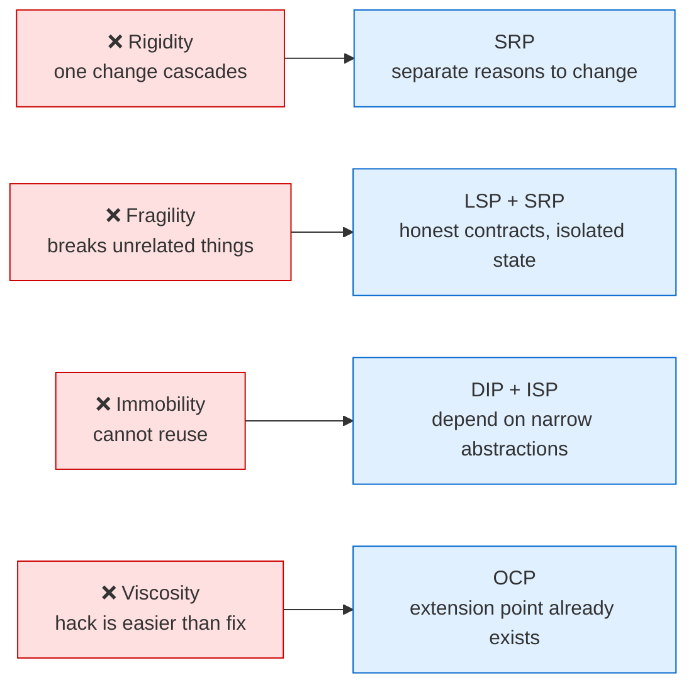

Viscosity deserves special attention because it is the symptom that predicts whether a codebase recovers or decays. If your architecture makes the correct change *easier* than the hack — because the extension point is already there, the interface already exists, and adding a class is genuinely less typing than adding a branch — then the codebase improves under deadline pressure instead of degrading. That is the real goal of OCP, and it is a far more compelling way to explain OCP in an interview than "open for extension, closed for modification."

<details>
<summary>📖 In plain technical terms — click to expand</summary>

Bad design shows up as four specific complaints, and each has a name. Rigidity: "I changed one thing and had to fix six files." Fragility: "I changed tax logic and loyalty points broke." Immobility: "I want to reuse this but it drags the whole database layer along." Viscosity: "Doing it properly takes a day, the hack takes ten minutes, and I ship Friday." If you can name which of the four is biting you, you know which principle to reach for. Viscosity matters most: if the right change is also the easy change, the codebase gets better over time on its own.

</details>

---

## 3. 📊 The Five Principles at a Glance

Here is the full map before we walk it. Read this table once now and once again after Part II; the second reading will feel very different.

| | Principle | One-line statement | The question it answers | The mechanism | Primary payoff |
|---|---|---|---|---|---|
| **S** | Single Responsibility | A module should have exactly one reason to change | *How do I split this?* | Separate code that changes for different reasons, driven by different stakeholders | Small blast radius, parallel team ownership |
| **O** | Open/Closed | Open for extension, closed for modification | *How do I add behaviour without editing?* | Polymorphism behind a stable abstraction; new class instead of new branch | New variants ship without touching tested code |
| **L** | Liskov Substitution | Subtypes must be usable wherever the base type is expected | *Is my inheritance honest?* | Honour the supertype's contract — preconditions, postconditions, invariants | Polymorphism that actually works, no type-checks |
| **I** | Interface Segregation | No client should depend on methods it does not use | *How wide should this interface be?* | Split fat interfaces into role-based interfaces per client need | Fewer forced stubs, fewer fake recompiles |
| **D** | Dependency Inversion | Depend on abstractions, and let the high-level policy own them | *Which way should the dependency point?* | Invert the source dependency; the consumer defines the interface | Testable core, swappable infrastructure |

One structural note clears up most of the confusion: these are not five parallel rules. They are **two rules about how to divide code, and three about how the divided pieces relate.**

The two dividing rules are SRP and ISP. SRP divides implementations; ISP divides interfaces. Both answer "where do I draw the line?"

The three relating rules are OCP, LSP, and DIP — each about a line you have already drawn. OCP says the line should be a polymorphic seam, so new behaviour arrives as new implementations. LSP says the implementations behind that seam must be genuinely interchangeable, or the seam is a lie. DIP says the abstraction defining the seam belongs to the high-level policy, not the low-level detail.

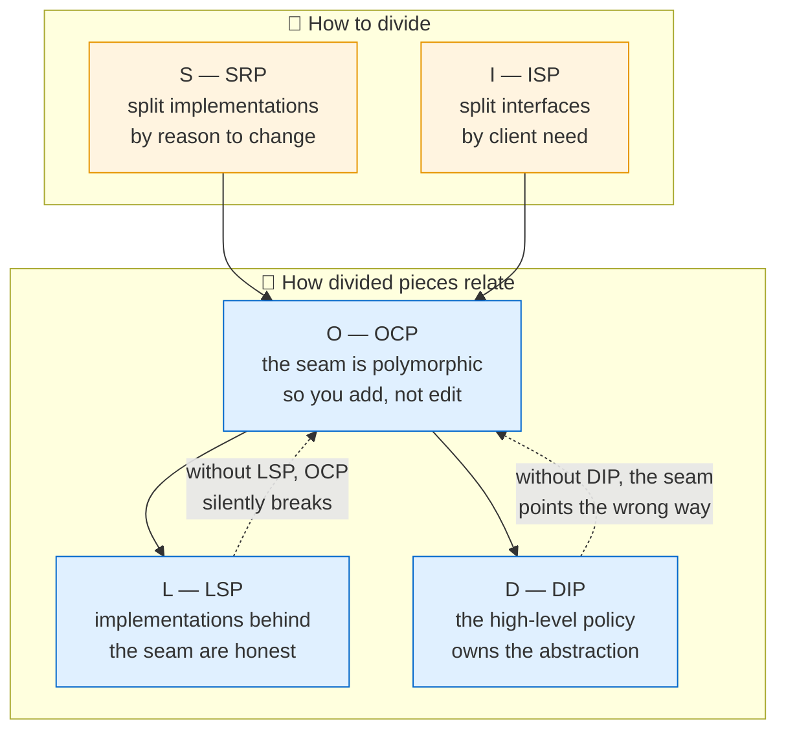

OCP sits at the centre because it is the principle that delivers the visible benefit — shipping new behaviour without editing old code. The other four exist to make OCP achievable and durable.

<details>
<summary>📖 In plain technical terms — click to expand</summary>

Five principles is a lot to hold in your head, so group them. Two of them tell you where to cut code apart: SRP cuts classes by "what would make me change this," ISP cuts interfaces by "what does each caller actually need." The other three tell you how the pieces you cut should talk to each other: OCP says put an interface at the cut so you can add new implementations instead of editing old ones, LSP says all those implementations must actually behave the same way from the outside, and DIP says the interface should be defined by the code that uses it, not by the database or the vendor SDK.

</details>

---

## 4. 💡 The One Idea Behind All Five: Coupling, Cohesion, and Axes of Change

If you internalise one section of this guide, make it this one. Everything in Part II follows from it, and in an interview it is the answer that signals you understand SOLID rather than remember it.

### Coupling and cohesion, defined usefully

**Coupling** is how much one piece of code must know about another to work. It is a spectrum, and the useful skill is ranking it: constructing a concrete class yourself is high coupling; depending on an interface someone hands you is lower; knowing only a message format on a queue is lower still. Every dependency is coupling — the question is always *how much*, and *to what*.

**Cohesion** is how strongly the things inside one module belong together. High cohesion: everything in the class serves one purpose and genuinely needs the rest. Low cohesion: the class is a bag of unrelated functions that happen to share a file.

The design goal, stated once and applied everywhere: **high cohesion inside a module, low coupling between modules.** SOLID is just a set of concrete techniques for reaching that goal in object-oriented code — SRP and ISP raise cohesion, DIP and OCP lower coupling, and LSP makes sure the low coupling is real rather than nominal.

But "high cohesion, low coupling" is too abstract to act on directly. Cohesive *around what*? Coupled *along what dimension*? The answer — the single most useful idea in this guide — is *axes of change*.

### Axes of change

An **axis of change** is a direction in which requirements move independently of the others. An e-commerce checkout has several, each moving at its own pace:

- **Payment methods** — UPI, card, PayPal, Apple Pay, and next quarter buy-now-pay-later. Moves often.
- **Notification channels** — email, SMS, push, WhatsApp. Moves often.
- **Tax rules** — vary by jurisdiction, change when legislation does. Moves occasionally.
- **Discount rules** — driven by a growth team running experiments. Moves weekly.
- **Persistence technology** — the database vendor. Moves maybe once in the system's life.

The key fact is that these axes are *independent*: a new payment method does not imply a new tax rule. Encoding that independence is the whole job of design — put an abstraction boundary across each axis that actually moves, so motion along one axis does not disturb the others.

Seen this way, every principle becomes a question about axes:

SRP asks: does this module sit on more than one axis? If your `OrderService` changes for payment reasons *and* tax reasons *and* notification reasons, it spans three axes, and every one of them causes churn in the same file.

OCP asks: for the axes that move most, is there a polymorphic seam so movement means adding a class rather than editing one?

LSP asks: along a given axis, are the variants truly interchangeable, or does the caller have to know which one it has?

ISP asks: is this interface bundling multiple axes into one contract, forcing clients on axis A to recompile when axis B changes?

DIP asks: which side of the axis owns the interface — the stable policy, or the volatile detail?

### The corollary that senior engineers apply and juniors miss

Here is the part that turns theory into judgment. **Only pay for abstraction along axes that actually move.**

Every abstraction has a cost — one more file, one more indirection when reading, one more hop when debugging, one more concept a newcomer must learn. When the axis moves, that cost is worth paying, because it converts an expensive edit into a cheap addition. When the axis does *not* move, the cost is pure waste: permanent reading tax for an option you never exercise.

So the real skill is prediction. Payment methods will multiply — put an interface there on day one. Notification channels will multiply — same. Your database vendor probably will not change, and if it does, the change is far more invasive than any interface can absorb — so a `Repository` interface earns its keep through *testability* and keeping SQL out of your domain logic, not through a fantasy of swapping MySQL for MongoDB.

This is exactly where interviews are won. Saying "I would put an interface across payment providers but not across my database vendor, and here is why the justification differs" demonstrates the thing they are testing for: that you evaluate abstractions by expected value, not by rule-following.

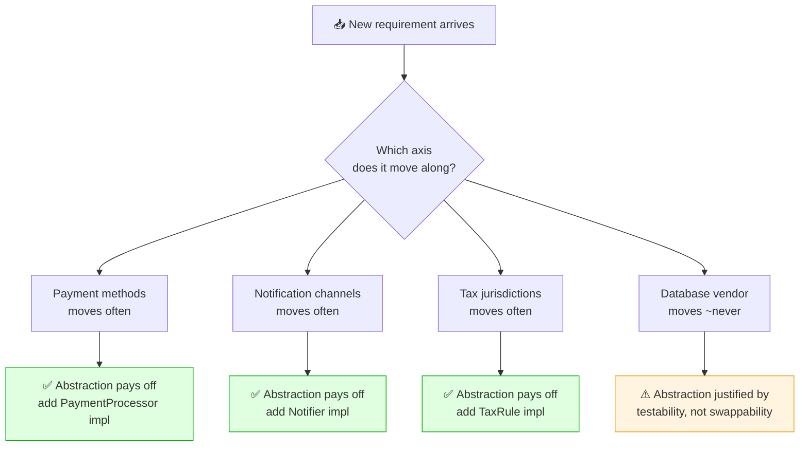

<details>
<summary>📖 In plain technical terms — click to expand</summary>

Think about what your system gets asked to change. In a checkout service, new payment methods arrive every few months, new notification channels arrive regularly, tax rules change when laws change — but the database vendor stays the same for years. Each of those is a separate "direction of change." Good design puts a plug-in point in the directions that actually move, so a new payment method is a new class and nothing else gets touched. It does *not* put plug-in points in directions that never move, because every extra interface is one more file to read and one more hop to debug. Knowing which is which is the actual skill.

</details>

---
## 5. 🎯 Single Responsibility Principle: One Reason to Change

> **A module should have one, and only one, reason to change.**

This is the most quoted and most misread of the five. The common paraphrase — "a class should do one thing" — is actively harmful, because "one thing" has no fixed meaning. Is sending an email one thing, or is it composing plus rendering plus transporting plus retrying? At the wrong granularity, "do one thing" gives you either god classes or a swarm of one-method classes. Neither is the point.

Martin's precise version is better: a module should have **one reason to change**, and a "reason to change" means *one source of change requests* — one stakeholder, or one axis of change from Section 4. His sharper refinement: **gather together the things that change for the same reason; separate the things that change for different reasons.** SRP is not about counting methods. It is about grouping code by *who asks for the change*.

### Why "reason to change" means "actor"

Picture one class that computes an employee's pay, formats their timesheet report, and saves both to the database. Three different parts of the business own those behaviours: finance dictates how pay is calculated, operations dictates the report format, the DBA team dictates the schema. That is three actors, three independent reasons the class gets edited — and, worse, three chances for one department's change to break another's, because they all share code and state inside one class.

That shared-state danger is the concrete harm SRP prevents, and naming it is a strong interview move. Suppose finance changes an overtime rule, and because pay calculation and report formatting share a private helper, the report subtly changes too — you have just shipped a bug to operations that nobody asked for. SRP says put finance's code where only finance's changes touch it. Then finance can never break operations by accident, because they no longer share a file.

<details>
<summary>📖 In plain technical terms — click to expand</summary>

SRP is often mis-stated as "a class should do one thing," which is useless because nobody agrees what "one thing" means. The real rule: a class should have one reason to change, meaning one group of people who ask for changes to it. If your `OrderService` gets edited by the payments team, the tax team, and the notifications team, that is three reasons and three teams stepping on each other in one file. Split it so each team's changes land in their own class. Then one team's edit can never accidentally break another team's feature.

</details>

<details>
<summary><h3 style="display:inline">🏢 FAANG Example 1: The <code>OrderService</code> god class</h3></summary>

The canonical interview example. An `OrderService` grows to handle validation, discounting, persistence, inventory, invoicing, notifications, and audit logging. Every one of those has a different owner and a different rate of change. Discounts change weekly (growth team A/B tests). Notification channels change quarterly. Invoicing changes when tax law changes. Persistence changes almost never. Bundling them means every one of those independent change streams flows through the same file, the same test suite, and the same code review.

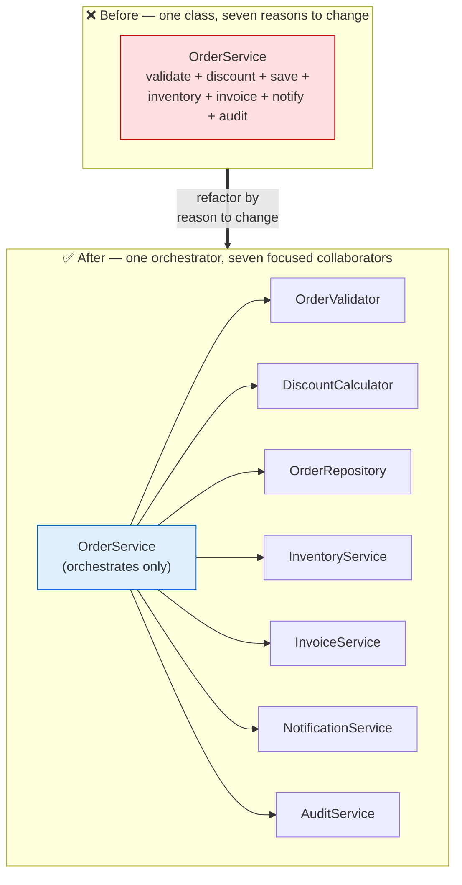

The refactored `OrderService` still exists — that is the point juniors miss. It does not disappear; it becomes an **orchestrator** (also called a coordinator or use-case class). Its single responsibility is to sequence the checkout use case: validate, then price, then reserve stock, then persist, then invoice, then notify, then audit. It holds no business logic of its own; it delegates each step. Its one reason to change is "the checkout *workflow* changed" — for example, if we decide to reserve inventory *before* pricing. That is genuinely one axis, owned by whoever owns the checkout flow.

<details>
<summary>💻 Java — OrderService under SRP + runnable demo (click to expand)</summary>

```java
// ═══════════════════════════════════════════════════════════════
// ❌ BEFORE — one class, seven reasons to change (the god class).
// Finance, growth, DBA, fulfilment, comms, and security ALL edit
// this same file. A promo tweak sits inches from tax logic and the
// audit trail, so any change can break any other team's feature.
// ═══════════════════════════════════════════════════════════════
class OrderServiceGod {
    void placeOrder(Order order) {
        // validation rules (checkout/risk team)
        if (order.items.isEmpty()) throw new IllegalArgumentException("empty");
        // discount rules (growth team)
        double subtotal = order.items.stream().mapToDouble(i -> i.unitPrice() * i.qty()).sum();
        order.total = subtotal >= 1000 ? subtotal * 0.90 : subtotal;
        // persistence (DBA/platform team)
        System.out.println("INSERT INTO orders ...");
        // inventory (fulfilment team)
        order.items.forEach(i -> System.out.println("reserve " + i.sku()));
        // invoicing + tax (finance team)
        order.invoiceNumber = "INV-" + order.id;
        // notifications (comms team)
        System.out.println("email customer " + order.customerId);
        // audit (security team)
        System.out.println("audit: order placed");
        // Seven axes of change tangled in one method → SRP violation.
    }
}

// ═══════════════════════════════════════════════════════════════
// ✅ AFTER — one orchestrator + seven focused collaborators.
// ═══════════════════════════════════════════════════════════════

// ─────────────────────────────────────────────────────────────
// Domain object — just data. No behaviour that pulls in a reason to change.
// ─────────────────────────────────────────────────────────────
class Order {
    final String id;
    final String customerId;
    final List<LineItem> items;
    double total;          // set by the discount step
    String invoiceNumber;  // set by the invoice step

    Order(String id, String customerId, List<LineItem> items) {
        this.id = id;
        this.customerId = customerId;
        this.items = items;
    }
}

record LineItem(String sku, int qty, double unitPrice) {}

// ─────────────────────────────────────────────────────────────
// Each collaborator owns exactly ONE reason to change.
// ─────────────────────────────────────────────────────────────

// Reason to change: validation rules (owned by the checkout/risk team)
class OrderValidator {
    void validate(Order order) {
        if (order.items == null || order.items.isEmpty())
            throw new IllegalArgumentException("Order has no items");
        if (order.customerId == null)
            throw new IllegalArgumentException("Order has no customer");
        // ... quantity, price sanity, fraud pre-checks, etc.
    }
}

// Reason to change: pricing/discount rules (owned by the growth team)
class DiscountCalculator {
    double applyDiscounts(Order order) {
        double subtotal = order.items.stream()
                .mapToDouble(i -> i.unitPrice() * i.qty())
                .sum();
        // Growth team edits ONLY this method for new promo logic.
        double discounted = subtotal >= 1000 ? subtotal * 0.90 : subtotal;
        order.total = discounted;
        return discounted;
    }
}

// Reason to change: persistence schema/technology (owned by platform/DBA)
class OrderRepository {
    void save(Order order) {
        // INSERT INTO orders ... (JPA / JDBC / whatever)
        System.out.println("Persisted order " + order.id);
    }
}

// Reason to change: stock/reservation logic (owned by fulfilment)
class InventoryService {
    void reserve(Order order) {
        order.items.forEach(i ->
            System.out.println("Reserved " + i.qty() + " of " + i.sku()));
    }
}

// Reason to change: invoice format / tax numbering (owned by finance)
class InvoiceService {
    void generate(Order order) {
        order.invoiceNumber = "INV-" + order.id;
        System.out.println("Generated invoice " + order.invoiceNumber);
    }
}

// Reason to change: notification channels/content (owned by comms)
class NotificationService {
    void notifyCustomer(Order order) {
        System.out.println("Notified customer " + order.customerId);
    }
}

// Reason to change: audit/compliance requirements (owned by security)
class AuditService {
    void record(Order order) {
        System.out.println("Audit: order " + order.id + " placed");
    }
}

// ─────────────────────────────────────────────────────────────
// The orchestrator. Its ONE reason to change is the checkout WORKFLOW
// (the order of steps), not the internals of any single step.
// ─────────────────────────────────────────────────────────────
class OrderService {
    private final OrderValidator validator;
    private final DiscountCalculator discountCalculator;
    private final InventoryService inventoryService;
    private final OrderRepository repository;
    private final InvoiceService invoiceService;
    private final NotificationService notificationService;
    private final AuditService auditService;

    // Collaborators are injected (see DIP) — not constructed here.
    OrderService(OrderValidator validator, DiscountCalculator discountCalculator,
                 InventoryService inventoryService, OrderRepository repository,
                 InvoiceService invoiceService, NotificationService notificationService,
                 AuditService auditService) {
        this.validator = validator;
        this.discountCalculator = discountCalculator;
        this.inventoryService = inventoryService;
        this.repository = repository;
        this.invoiceService = invoiceService;
        this.notificationService = notificationService;
        this.auditService = auditService;
    }

    void placeOrder(Order order) {
        validator.validate(order);            // step 1
        discountCalculator.applyDiscounts(order); // step 2
        inventoryService.reserve(order);      // step 3
        repository.save(order);               // step 4
        invoiceService.generate(order);       // step 5
        notificationService.notifyCustomer(order); // step 6
        auditService.record(order);           // step 7
    }
}

// ─────────────────────────────────────────────────────────────
// Demo / driver — see the design being USED, not just declared.
// ─────────────────────────────────────────────────────────────
public class SrpOrderDemo {
    public static void main(String[] args) {
        // Wire the graph once (a DI container like Spring does this for you).
        OrderService orderService = new OrderService(
                new OrderValidator(),
                new DiscountCalculator(),
                new InventoryService(),
                new OrderRepository(),
                new InvoiceService(),
                new NotificationService(),
                new AuditService()
        );

        Order order = new Order(
                "1001",
                "cust-42",
                List.of(new LineItem("SKU-1", 2, 400.0),
                        new LineItem("SKU-2", 1, 300.0))
        );

        orderService.placeOrder(order);
        // Each collaborator runs its single responsibility. Subtotal is 1100
        // (>= 1000), so the 10% discount applies and total = 990.0.
        System.out.println("Final total charged: " + order.total);
    }
}
```

</details>

The interview payoff of this refactor is a list you should be able to recite with a reason attached to each item, not just the item. Testing improves because `DiscountCalculator` can be unit-tested with no database, no SMTP server, no mocks — it is a pure function of the order. Maintenance improves because a promo-logic change touches one small file that only the growth team commits to. Team ownership becomes clean because each class maps to one team, so code review routes to the right people automatically. Merge conflicts drop because seven teams no longer edit one file. And microservice extraction becomes tractable: `NotificationService` is already a seam, so promoting it to its own deployable is a mechanical move rather than an archaeology project.

**The follow-up the interviewer will push:** *"If the invoice format changes tomorrow, what do you touch?"* The answer they want is crisp: only `InvoiceService`. Nothing else compiles differently, nothing else needs re-testing beyond its own suite, and the change routes to finance's owners automatically. That single sentence — "one reason to change means exactly one class moves" — is the whole principle demonstrated.

</details>

<details>
<summary><h3 style="display:inline">🏢 FAANG Example 2: Splitting an <code>AuthService</code></h3></summary>

The second classic. A single `AuthService` accretes login orchestration, password hashing, OTP generation and verification, JWT signing, refresh-token rotation, session lookup, and audit logging. These have wildly different reasons to change and, critically, different security blast radii. Password hashing changes when you migrate BCrypt to Argon2id. JWT signing changes when you rotate keys or move from HS256 to RS256. OTP changes when you switch SMS providers or add TOTP. Bundling them means a routine SMS-provider swap sits in the same file as your token-signing secret handling — a code-review and security nightmare.

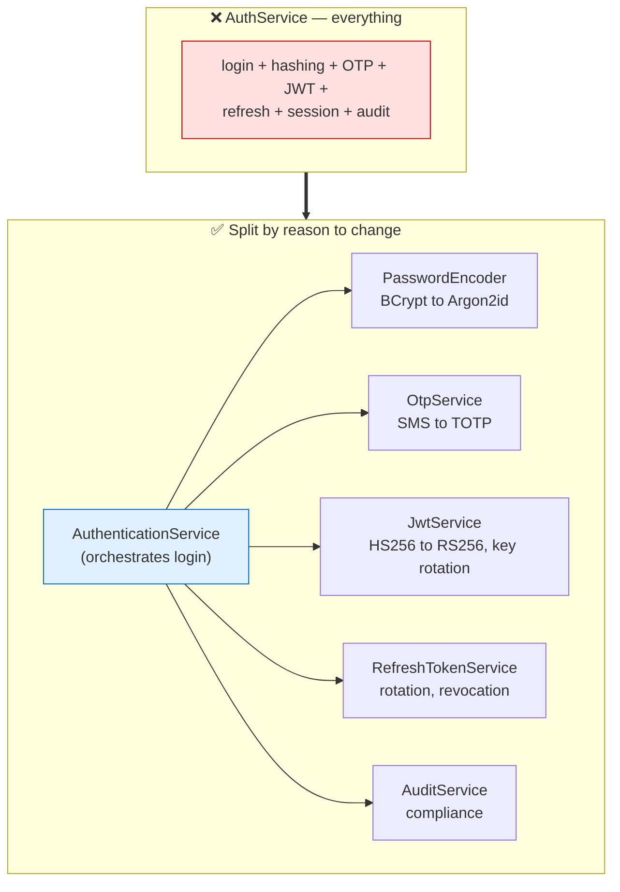

<details>
<summary>💻 Java — AuthenticationService split under SRP (click to expand)</summary>

```java
// ═══════════════════════════════════════════════════════════════
// ❌ BEFORE — one AuthService owns every security concern at once.
// Swapping an SMS provider means editing the same file that holds
// token-signing secrets. Different reasons to change, different
// security blast radii — all fused together.
// ═══════════════════════════════════════════════════════════════
class AuthServiceGod {
    AuthResult login(String userId, String rawPassword, String storedHash, String otp) {
        // password hashing (changes when BCrypt -> Argon2id)
        String rehashed = "argon2id$" + Integer.toHexString(rawPassword.hashCode());
        if (!rehashed.equals(storedHash)) throw new SecurityException("bad creds");
        // OTP verification (changes when SMS provider or TOTP added)
        if (!"000000".equals(otp)) throw new SecurityException("bad otp");
        // JWT signing (changes on key rotation / HS256 -> RS256)
        String access = "jwt-access-for-" + userId;
        // refresh-token rotation (changes with revocation policy)
        String refresh = "refresh-for-" + userId;
        // audit logging (changes with compliance rules)
        System.out.println("AUDIT: login ok for " + userId);
        return new AuthResult(access, refresh);
    }
}

// ═══════════════════════════════════════════════════════════════
// ✅ AFTER — each security concern is its own class, its own axis.
// ═══════════════════════════════════════════════════════════════

// Reason to change: hashing algorithm/params (security team, crypto policy)
class PasswordEncoder {
    String hash(String raw) {
        // Swap BCrypt -> Argon2id here without touching login flow.
        return "argon2id$" + Integer.toHexString(raw.hashCode());
    }
    boolean matches(String raw, String stored) {
        return hash(raw).equals(stored);
    }
}

// Reason to change: OTP delivery/verification (SMS provider, TOTP support)
class OtpService {
    boolean verify(String userId, String code) {
        return "000000".equals(code); // demo only
    }
}

// Reason to change: token signing (algorithm, key rotation)
class JwtService {
    String issueAccessToken(String userId) {
        return "jwt-access-for-" + userId; // demo only
    }
}

// Reason to change: refresh-token rotation / revocation policy
class RefreshTokenService {
    String issueRefreshToken(String userId) {
        return "refresh-for-" + userId; // demo only
    }
}

class AuditService2 {
    void loginSucceeded(String userId) {
        System.out.println("AUDIT: login ok for " + userId);
    }
}

record AuthResult(String accessToken, String refreshToken) {}

// Orchestrator: its one reason to change is the LOGIN WORKFLOW itself.
class AuthenticationService {
    private final PasswordEncoder passwordEncoder;
    private final OtpService otpService;
    private final JwtService jwtService;
    private final RefreshTokenService refreshTokenService;
    private final AuditService2 auditService;

    AuthenticationService(PasswordEncoder pe, OtpService otp, JwtService jwt,
                          RefreshTokenService rt, AuditService2 audit) {
        this.passwordEncoder = pe;
        this.otpService = otp;
        this.jwtService = jwt;
        this.refreshTokenService = rt;
        this.auditService = audit;
    }

    AuthResult login(String userId, String rawPassword, String storedHash, String otpCode) {
        if (!passwordEncoder.matches(rawPassword, storedHash))
            throw new SecurityException("Bad credentials");
        if (!otpService.verify(userId, otpCode))
            throw new SecurityException("Bad OTP");

        String access = jwtService.issueAccessToken(userId);
        String refresh = refreshTokenService.issueRefreshToken(userId);
        auditService.loginSucceeded(userId);
        return new AuthResult(access, refresh);
    }
}

// ─────────────────────────────────────────────────────────────
// Demo / driver — wire the collaborators and log a user in.
// ─────────────────────────────────────────────────────────────
public class SrpAuthDemo {
    public static void main(String[] args) {
        AuthenticationService auth = new AuthenticationService(
                new PasswordEncoder(),
                new OtpService(),
                new JwtService(),
                new RefreshTokenService(),
                new AuditService2()
        );

        // storedHash matches PasswordEncoder.hash("hunter2"); otp "000000" is the demo code.
        String storedHash = "argon2id$" + Integer.toHexString("hunter2".hashCode());
        AuthResult result = auth.login("user-7", "hunter2", storedHash, "000000");

        System.out.println("Access token : " + result.accessToken());
        System.out.println("Refresh token: " + result.refreshToken());
        // To swap BCrypt -> Argon2id, only PasswordEncoder changes — login() is untouched.
    }
}
```

</details>

This split is exactly what you see in production Spring Security: `PasswordEncoder` is a first-class interface with `BCryptPasswordEncoder` and `Argon2PasswordEncoder` implementations precisely because hashing is its own axis of change. The framework itself is built on the SRP insight.

</details>

### Going deeper: how far is too far?

It is easy to over-correct. Once you learn SRP, the temptation is to split *everything* — until you have forty tiny classes, each with one method, and following a single request means hopping through ten files. That is not cleaner; it is just a different mess. Two simple ideas keep you on the right side of the line.

**Things that change together belong together.** This is the counter-force to SRP, and it has a name: cohesion. If two pieces of behaviour always change at the same time and for the same reason, splitting them apart just creates busywork — now every change has to touch two files instead of one. SRP tells you to separate things that change for *different* reasons. It never tells you to separate things that change for the *same* reason.

**When in doubt, ask "who asks for this to change?"** This one question — call it the *actor test* — settles most arguments. Take `sendEmail()` and `sendSms()`: should they be one class or two? Don't reason about it abstractly. Ask who requests changes to each. If the same communications team owns both and they tend to change together (both adopt a "quiet hours" rule in the same sprint, say), keep them together. If email belongs to the marketing team and SMS belongs to the transactional-alerts team, split them — because now they change for different reasons, driven by different people.

So the rule of thumb is: SRP helps you *find* the natural dividing lines in a system; it does not ask you to draw as many lines as possible. Split a class when it clearly serves more than one team, or when you feel the pain — a small change keeps breaking unrelated things. Don't split a plain CRUD entity that has one owner and one reason to change, just to feel principled. Over-applied SRP has its own well-known smell: "shotgun surgery," where one small logical change forces edits scattered across a dozen little classes.

### How to identify SRP violations

<details>
<summary>📖 Click to expand — quick tells that a class is doing too much</summary>

A few quick tells that a class is doing too much:

- **The "and" test.** Describe the class in one sentence. If you need "and" to do it — "it validates orders *and* saves them *and* emails the customer" — each "and" is usually a separate reason to change.
- **Different teams touch the same file.** If payments, tax, and notifications all send you pull requests for one class, that is three actors and three reasons to change living in one place.
- **The name is vague.** Words like `Manager`, `Processor`, `Helper`, or `Util` often hide a class that quietly grew to do many unrelated things.
- **It is hard to test in isolation.** If testing one behaviour forces you to spin up a database, an email server, and a payment gateway, those concerns are tangled together.
- **Changes ripple sideways.** You edit one feature and an unrelated one breaks, because they share private state or helpers inside the same class.

</details>

---

## 6. 🎨 Open/Closed Principle: Extend Without Editing

> **Software entities (classes, modules, functions, etc.) should be open for extension, but closed for modification.**

The most frequently asked SOLID principle, and the one whose statement sounds most like a paradox. How can something be open *and* closed at once? Because the two words describe two different activities. A module is **closed for modification** — you add new behaviour without editing its existing, tested source. It is **open for extension** — its behaviour can grow by adding new code. What reconciles them is *abstraction*: a stable interface (closed) behind which new implementations plug in (open).

Why does this matter? Risk. Every time you edit code that already works and is already tested, you risk breaking it — and you throw away the confidence its tests had earned. Add a brand-new class beside the old ones and you never touch them: their tests still pass, their behaviour is intact, and code review focuses entirely on the new file. OCP converts "risky edits to proven code" into "safe additions of new code." That is the whole value proposition, and the sentence to lead with in an interview.

<details>
<summary>📖 In plain technical terms — click to expand</summary>

Open/Closed sounds contradictory but is simple: you should be able to add a new feature by writing a new class, not by editing an old one. Editing working code is risky — you might break something that already passed its tests. Adding a new class next to the old ones can't break them because you never touched them. The trick is to put an interface at the point where new variants show up (new payment methods, new notification channels), so tomorrow's variant just implements the interface and plugs in. Existing code stays frozen and trusted.

</details>

<details>
<summary><h3 style="display:inline">🏢 FAANG Example 1: The payment gateway <code>if-else</code> chain</h3></summary>

This is the example interviewers reach for most often. A `PaymentProcessor` handles payment types with a growing conditional:

```java
// ❌ Violates OCP — every new payment method edits this method
class PaymentProcessor {
    void process(String type, double amount) {
        if (type.equals("UPI")) {
            // UPI logic
        } else if (type.equals("CARD")) {
            // card logic
        } else if (type.equals("NETBANKING")) {
            // netbanking logic
        } else if (type.equals("PAYPAL")) {
            // PayPal logic
        }
        // Adding Apple Pay? Edit this method. Again. And re-test everything.
    }
}
```

Every new payment method means editing `process()`, re-testing every existing branch (because you touched the file they live in), and risking a typo that breaks UPI while you were adding Apple Pay. Payment methods are a fast-moving axis of change — precisely the place an abstraction pays for itself. The fix is to make each payment method a class behind a `PaymentProcessor` interface.

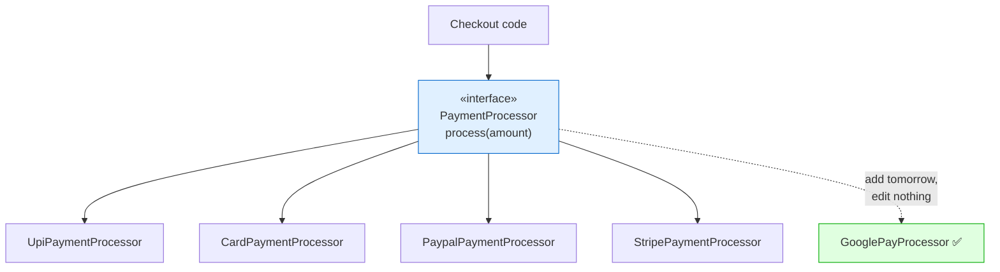

<details>
<summary>💻 Java — PaymentProcessor abstraction + demo (OCP) (click to expand)</summary>

```java
// ❌ Before — one method switching on payment type violates OCP.
class PaymentProcessorGod {
    void process(String type, double amount) {
        if (type.equals("UPI")) {           // UPI logic
        } else if (type.equals("CARD")) {   // card logic
        } else if (type.equals("PAYPAL")) { // PayPal logic
        }
        // Adding Google Pay? Edit this method and re-test every branch.
    }
}

// ✅ After — the stable abstraction, CLOSED for modification.
interface PaymentProcessor {
    String method();                 // identifier, e.g. "UPI"
    PaymentResult process(double amount);
}

record PaymentResult(boolean success, String reference) {}

// Each method is a separate class — the system is OPEN for extension.
class UpiPaymentProcessor implements PaymentProcessor {
    public String method() { return "UPI"; }
    public PaymentResult process(double amount) {
        // call UPI PSP...
        return new PaymentResult(true, "upi-txn-123");
    }
}

class CardPaymentProcessor implements PaymentProcessor {
    public String method() { return "CARD"; }
    public PaymentResult process(double amount) {
        return new PaymentResult(true, "card-txn-456");
    }
}

class PaypalPaymentProcessor implements PaymentProcessor {
    public String method() { return "PAYPAL"; }
    public PaymentResult process(double amount) {
        return new PaymentResult(true, "pp-txn-789");
    }
}

// Adding a new method = adding ONE new class. Nothing above changes.
class GooglePayProcessor implements PaymentProcessor {
    public String method() { return "GPAY"; }
    public PaymentResult process(double amount) {
        return new PaymentResult(true, "gpay-txn-999");
    }
}

// A registry resolves the right processor at runtime — no if-else anywhere.
class PaymentService {
    private final Map<String, PaymentProcessor> processors;

    PaymentService(List<PaymentProcessor> available) {
        this.processors = new HashMap<>();
        for (PaymentProcessor p : available) {
            processors.put(p.method(), p);
        }
    }

    PaymentResult pay(String method, double amount) {
        PaymentProcessor p = processors.get(method);
        if (p == null) throw new IllegalArgumentException("Unsupported: " + method);
        return p.process(amount);
    }
}

// ─────────────────────────────────────────────────────────────
// Demo / driver — and how Spring Boot automates the registry.
// ─────────────────────────────────────────────────────────────
public class OcpPaymentDemo {
    public static void main(String[] args) {
        // Manual wiring: register every processor once.
        PaymentService service = new PaymentService(List.of(
                new UpiPaymentProcessor(),
                new CardPaymentProcessor(),
                new PaypalPaymentProcessor(),
                new GooglePayProcessor()   // added with zero edits above
        ));

        System.out.println(service.pay("UPI", 500).reference());
        System.out.println(service.pay("GPAY", 1200).reference());
    }
}

/*
 In Spring Boot, you don't even build the Map yourself. Annotate each
 processor with @Component and let the container inject the collection:

   @Service
   class PaymentService {
       private final Map<String, PaymentProcessor> processors;

       // Spring injects a Map keyed by bean name, OR inject a List and
       // build your own key from method(). Either way: no if-else.
       PaymentService(List<PaymentProcessor> all) {
           this.processors = all.stream()
               .collect(toMap(PaymentProcessor::method, p -> p));
       }
   }

 Adding GooglePayProcessor as a new @Component makes it appear in the
 Map automatically at startup. The registry code never changes.
*/
```

</details>

**The follow-up: "How does Spring Boot make this easier?"** The answer that lands: Spring can inject *all* beans of a type as a `List<PaymentProcessor>` or a `Map<String, PaymentProcessor>`. You annotate each processor `@Component`, and the new one is discovered and registered at startup with zero changes to the resolver. This is OCP delivered by the framework's dependency injection — the extension point is the bean collection itself.

</details>

<details>
<summary><h3 style="display:inline">🏢 FAANG Example 2: Notification channels</h3></summary>

The same shape, different domain. A `NotificationSender` that switches on channel type — email, SMS, Slack, push — has the identical `if-else` disease and the identical cure: a `Notifier` interface with one implementation per channel. When product asks for WhatsApp today and Telegram next quarter, each is a new class implementing `Notifier`; the dispatch code that decides *which* channels a given notification uses never changes. This is worth having as a second example because interviewers sometimes push "give me another one" to check you understood the shape rather than memorised the payment case.

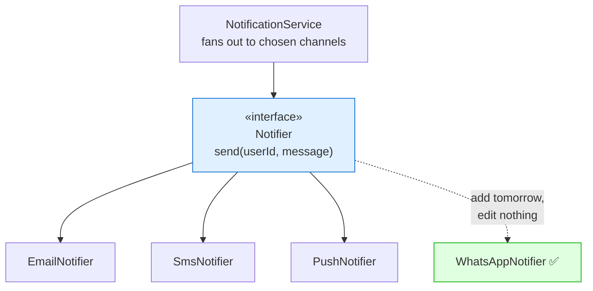

<details>
<summary>💻 Java — Notifier abstraction + demo (OCP) (click to expand)</summary>

```java
// ❌ Before — one method switching on channel type violates OCP.
class NotificationSender {
    void send(String channel, String userId, String message) {
        if (channel.equals("EMAIL")) {
            // SMTP logic
        } else if (channel.equals("SMS")) {
            // SMS gateway logic
        } else if (channel.equals("PUSH")) {
            // push logic
        }
        // Adding WhatsApp? Edit this method and re-test every branch.
    }
}

// ✅ After — the stable abstraction, CLOSED for modification.
interface Notifier {
    String channel();                              // "EMAIL", "SMS", ...
    void send(String userId, String message);
}

// Each channel is its own class — the system is OPEN for extension.
class EmailNotifier implements Notifier {
    public String channel() { return "EMAIL"; }
    public void send(String userId, String message) {
        System.out.println("EMAIL → " + userId + ": " + message);
    }
}

class SmsNotifier implements Notifier {
    public String channel() { return "SMS"; }
    public void send(String userId, String message) {
        System.out.println("SMS → " + userId + ": " + message);
    }
}

class PushNotifier implements Notifier {
    public String channel() { return "PUSH"; }
    public void send(String userId, String message) {
        System.out.println("PUSH → " + userId + ": " + message);
    }
}

// Added later with ZERO edits above — pure OCP.
class WhatsAppNotifier implements Notifier {
    public String channel() { return "WHATSAPP"; }
    public void send(String userId, String message) {
        System.out.println("WHATSAPP → " + userId + ": " + message);
    }
}

// The dispatcher fans out to a chosen set of channels — no if-else anywhere.
class NotificationService {
    private final Map<String, Notifier> notifiers;

    NotificationService(List<Notifier> available) {
        this.notifiers = new HashMap<>();
        for (Notifier n : available) notifiers.put(n.channel(), n);
    }

    void notify(String userId, String message, List<String> channels) {
        for (String c : channels) {
            Notifier n = notifiers.get(c);
            if (n != null) n.send(userId, message);
        }
    }
}

// ─────────────────────────────────────────────────────────────
// Demo / driver.
// ─────────────────────────────────────────────────────────────
public class OcpNotificationDemo {
    public static void main(String[] args) {
        NotificationService service = new NotificationService(List.of(
                new EmailNotifier(),
                new SmsNotifier(),
                new PushNotifier(),
                new WhatsAppNotifier()   // added with zero edits above
        ));

        // Order confirmation goes out over email + SMS; dispatch code unchanged.
        service.notify("cust-42", "Your order is confirmed",
                List.of("EMAIL", "SMS", "WHATSAPP"));
    }
}
```

</details>

Just as with payments, Spring Boot can inject `List<Notifier>` so a new `@Component` channel appears in the dispatcher automatically — the fan-out logic never changes.

</details>

### Going deeper: "closed" is never total

There is one honest thing about OCP that beginners miss and that separates a thoughtful answer from a memorised one: you can never close a module against *every* possible change. You can only close it against the *specific kind of change you saw coming*. Anything else will still force you to edit. Robert Martin said this plainly, and pretending otherwise is a red flag in an interview.

An example makes it concrete. Our payment design is closed against "a new payment method" — add a class, done. But suppose the business now wants a two-step flow: authorise the card first, capture the money later, instead of one `process()` call. That changes the *interface itself*, so every implementation has to change with it. No amount of clever abstraction would have saved you here, because you never predicted this axis of change — you only predicted new payment *methods*, not a new payment *shape*.

So the real skill in OCP is *choosing which change to protect against*, knowing the choice isn't free. Every interface you add to stay "closed" along one axis makes the code a little harder to read and adds one more layer to step through. Guessing wrong hurts either way: protect too little and you face a painful edit later; protect too much and you pay a permanent readability tax for flexibility you never use. That is why the practical rule is: don't add the abstraction on a hunch — add it the *first time* the change actually happens. A UPI-only system needs no `PaymentProcessor` interface at all. The moment card support arrives, you introduce it, because now you have real evidence the axis moves. Martin called this "fool me once": you don't defend against a variant until a second one shows up.

### How to identify OCP violations

<details>
<summary>📖 Click to expand — the signs that code is closed to nothing and open to bugs</summary>

The signs that code is closed to nothing and open to bugs:

- **A growing `if/else` or `switch` on a "type" string or enum.** `if (type.equals("UPI")) ... else if (type.equals("CARD"))` is the classic tell — every new variant reopens the same method.
- **Adding a feature means editing an existing, tested file.** If "support a new payment method" turns into a diff on `PaymentProcessor.process()`, the code is not closed for modification.
- **The same shape of change keeps landing in the same place.** If one method has been edited five times for five new variants, that is a moving axis begging for an extension point.
- **Re-testing everything after a small addition.** Because you touched shared code, you must re-verify branches you never meant to change.

</details>

## 7. ✅ Liskov Substitution Principle: Substitutability as a Contract

> **If S is a subtype of T, then objects of type T may be replaced with objects of type S without altering any of the desirable properties of the program.**

This is the principle most candidates get wrong, because they learned it from the Rectangle/Square or Bird/Penguin example and stopped there. Those examples are fine for a first look, but they teach the wrong instinct: they make LSP feel like it is about *taxonomy* ("is a square really a rectangle?") when it is really about *behavioural contracts*. Interviewers know this, which is why strong candidates bring behavioural, production-flavoured examples instead.

Barbara Liskov's 1987 formulation, later formalised with Jeannette Wing as "behavioural subtyping," is the version to carry into an interview. A subtype is substitutable for its base type only if it honours the base type's contract, which has three parts:

**Preconditions cannot be strengthened.** A subtype must not demand *more* of its caller than the base type did. If `Storage.upload()` accepts any file up to 5 GB, a subtype cannot suddenly reject files over 100 MB. Callers written against the base type do not know about the stricter rule and will pass a 200 MB file, which the base type promised to accept.

**Postconditions cannot be weakened.** A subtype must deliver *at least* what the base type promised. If `upload()` guarantees the object is durably stored and readable when it returns, a subtype cannot return before the write is durable. Callers rely on the guarantee.

**Invariants and history must be preserved.** Whatever must always be true of the base type must remain true of the subtype, and the subtype must not allow state transitions the base type forbade.

The practical consequence, and the sentence to say out loud: **LSP is what makes OCP actually work.** OCP says "put an interface across the axis and add implementations." LSP says "those implementations had better be genuinely interchangeable, or your polymorphism is a lie and callers will start writing `if (storage instanceof S3Storage)` checks to work around the differences." The moment you see a type-check against a concrete subtype, LSP has been violated somewhere upstream.

<details>
<summary>📖 In plain technical terms — click to expand</summary>

Liskov's rule: if code expects a `Storage` and you hand it an `S3Storage` or an `AzureBlobStorage`, everything should still work — same guarantees, no surprises. It is not about whether "a square is a rectangle" in English; it is about behaviour. A subtype breaks the rule if it demands more from callers, delivers less than promised, or throws where the parent didn't. The tell in real code: when you start writing `if (x instanceof SomeSubclass)` to handle one implementation specially, that implementation has broken substitutability.

</details>

<details>
<summary><h3 style="display:inline">🏢 FAANG Example 1: Cloud storage — LSP done right</h3></summary>

A `Storage` interface with `upload`, `download`, and `delete`, implemented by `S3Storage`, `AzureBlobStorage`, `GoogleCloudStorage`, and `LocalStorage`. The business layer holds a `Storage` reference and never knows which implementation it has:

```java
Storage storage = new S3Storage();
// ...later, config-driven swap...
Storage storage = new AzureBlobStorage();
// Business logic does not change one line.
```

This is LSP working perfectly — *provided* every implementation honours the same contract. That proviso is the entire lesson. The interviewer's real question is not "can you write four classes implementing one interface" (anyone can) but "what would break substitutability here, and how would you defend against it?"

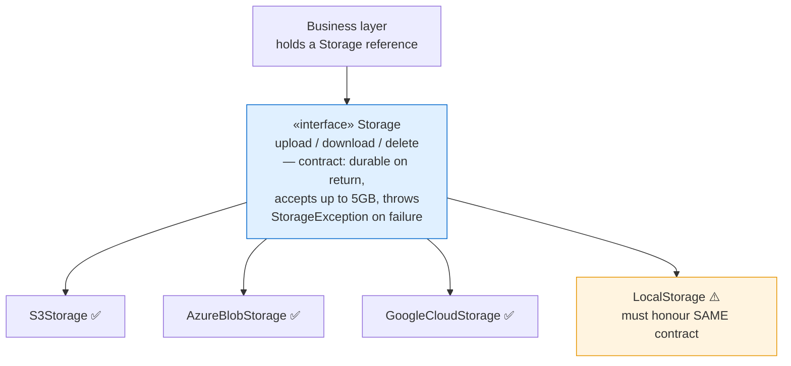

The subtle violations that a staff interviewer wants you to anticipate: If `LocalStorage.upload()` succeeds for a 3 GB file but `S3Storage` (with a naive single-part upload) fails above 5 GB, the implementations have *different* preconditions and are not substitutable. If `download()` on a freshly-uploaded key returns the object immediately on `LocalStorage` but throws `NoSuchKey` on a storage backend with read-after-write lag, callers that upload-then-immediately-read will break when swapped. If one implementation throws `IOException` and another throws a provider-specific `AmazonS3Exception` that the caller cannot catch generically, the error contract differs. The fix in every case is to *define the contract explicitly* — including size limits, consistency guarantees, and a common exception type — and make every implementation conform, adapting the provider's native behaviour to the contract rather than leaking it.

<details>
<summary>💻 Java — Storage with an explicit, LSP-honouring contract (click to expand)</summary>

```java
// ═══════════════════════════════════════════════════════════════
// ❌ BEFORE — a subtype that silently breaks the Storage contract.
// It compiles and looks fine, but it is NOT substitutable:
//  - it strengthens the precondition (rejects files the base accepts)
//  - it throws a provider-specific exception the caller can't catch generically
// Any code holding a `Storage` and swapped onto this will break.
// ═══════════════════════════════════════════════════════════════
class BadLocalStorage implements Storage {
    public void upload(String key, byte[] data) {
        if (data.length > 100 * 1024 * 1024)          // ❌ stricter than the 5GB contract
            throw new IllegalStateException("Local disk full");  // ❌ wrong exception type
    }
    public byte[] download(String key) {
        throw new java.io.UncheckedIOException(new java.io.IOException("not found")); // ❌ not StorageException
    }
    public void delete(String key) {
        throw new IllegalStateException("no such key");  // ❌ should be idempotent no-op
    }
}

// ═══════════════════════════════════════════════════════════════
// ✅ AFTER — one explicit contract; every implementation conforms.
// ═══════════════════════════════════════════════════════════════

// A common exception so callers catch ONE type regardless of provider.
class StorageException extends RuntimeException {
    StorageException(String msg, Throwable cause) { super(msg, cause); }
}

/**
 * CONTRACT (must hold for every implementation — this is the LSP glue):
 *  - upload: accepts objects up to 5 GB; on normal return the object is
 *    durably stored and immediately readable (read-after-write consistency).
 *  - download: returns bytes for a key that upload() previously returned for;
 *    throws StorageException if the key does not exist.
 *  - delete: idempotent — deleting a missing key is a no-op, not an error.
 *  - all failures surface as StorageException, never provider-specific types.
 */
interface Storage {
    void upload(String key, byte[] data);
    byte[] download(String key);
    void delete(String key);
}

class S3Storage implements Storage {
    public void upload(String key, byte[] data) {
        if (data.length > 5L * 1024 * 1024 * 1024)
            throw new StorageException("Exceeds 5GB", null);
        // Use multipart upload internally so the 5GB contract holds.
        // Adapt AmazonS3Exception -> StorageException so the error contract holds.
    }
    public byte[] download(String key) { return new byte[0]; }
    public void delete(String key) { /* idempotent */ }
}

class AzureBlobStorage implements Storage {
    public void upload(String key, byte[] data) { /* same contract */ }
    public byte[] download(String key) { return new byte[0]; }
    public void delete(String key) { /* idempotent */ }
}

// ─────────────────────────────────────────────────────────────
// Demo / driver — the caller is written ONCE against the contract
// and works for every implementation without a single change.
// ─────────────────────────────────────────────────────────────
public class LspStorageDemo {
    // Depends only on the Storage contract — never on a concrete class.
    static void backupProfilePicture(Storage storage, String userId, byte[] image) {
        String key = "avatars/" + userId + ".jpg";
        storage.upload(key, image);          // contract: durable + readable on return
        byte[] roundTrip = storage.download(key);  // contract: returns what we uploaded
        storage.delete(key + ".tmp");        // contract: deleting a missing key is a no-op
        System.out.println("Backed up " + roundTrip.length + " bytes for " + userId);
    }

    public static void main(String[] args) {
        byte[] image = new byte[2048];

        // Same caller, swapped implementations — no code change, no surprises.
        backupProfilePicture(new S3Storage(), "user-1", image);
        backupProfilePicture(new AzureBlobStorage(), "user-2", image);
        // Swapping in BadLocalStorage would compile but blow up at runtime —
        // that is exactly the LSP violation the contract protects against.
    }
}
```

</details>

</details>

<details>
<summary><h3 style="display:inline">🏢 FAANG Examples 2 & 3: Search providers and caches</h3></summary>

The same substitutability story generalises. A `SearchProvider` interface with `search(query)`, implemented by Elasticsearch, OpenSearch, MeiliSearch, and Typesense, lets the business layer issue queries without knowing the engine — teams migrate Elasticsearch to OpenSearch (a real, common migration after licensing changes) with zero business-layer edits, *if* the implementations return results in a common shape and honour the same pagination and ranking contract. A `Cache` interface with `put`, `get`, and `evict`, implemented by Redis, Hazelcast, Caffeine, and EhCache, lets you swap a distributed cache for an in-process one in tests — *if* they agree on the contract, e.g. whether `get` on a missing key returns `null` or throws, and whether TTL semantics match.

<details>
<summary>💻 Java — SearchProvider and Cache contracts (LSP) (click to expand)</summary>

```java
// ═══════════════════════════════════════════════════════════════
// ❌ BEFORE — two providers that disagree on the contract.
// One returns null for an empty page, the other returns ascending
// scores and leaks its native exception. A caller written against
// one silently breaks when swapped to the other.
// ═══════════════════════════════════════════════════════════════
class BadElasticProvider implements SearchProvider {
    public List<SearchResult> search(String query, int page, int size) {
        if (page > 10) return null;                 // ❌ returns null instead of empty list
        throw new RuntimeException("es_shard_timeout"); // ❌ leaks provider-native error
    }
}
class BadMeiliProvider implements SearchProvider {
    public List<SearchResult> search(String query, int page, int size) {
        // ❌ ascending score order — opposite of what the other provider returns
        return List.of(new SearchResult("doc-9", 0.1), new SearchResult("doc-1", 9.5));
    }
}

// ═══════════════════════════════════════════════════════════════
// ✅ AFTER — one explicit contract every engine must honour.
// ═══════════════════════════════════════════════════════════════

// ── SEARCH: one contract every engine must honour. ──
record SearchResult(String id, double score) {}

/**
 * CONTRACT (LSP glue for every SearchProvider):
 *  - results are ordered by descending score;
 *  - page is zero-based; an out-of-range page returns an EMPTY list, never null;
 *  - a malformed query throws SearchException (never a provider-native type).
 */
interface SearchProvider {
    List<SearchResult> search(String query, int page, int size);
}

class SearchException extends RuntimeException {
    SearchException(String m) { super(m); }
}

class ElasticsearchProvider implements SearchProvider {
    public List<SearchResult> search(String query, int page, int size) {
        // adapt ElasticsearchException -> SearchException to honour the contract
        return List.of(new SearchResult("doc-1", 9.5));
    }
}

// A drop-in migration target — same contract, so business code never changes.
class OpenSearchProvider implements SearchProvider {
    public List<SearchResult> search(String query, int page, int size) {
        return List.of(new SearchResult("doc-1", 9.5));
    }
}

// ── CACHE: the contract must state the WEAKEST guarantee (eventual). ──
/**
 * CONTRACT (LSP glue for every Cache):
 *  - get on a missing/expired key returns null (never throws);
 *  - reads are eventually consistent — callers must NOT assume read-your-writes,
 *    because a networked impl (Redis) can lag while an in-process one (Caffeine) cannot.
 */
interface Cache<K, V> {
    void put(K key, V value, long ttlSeconds);
    V get(K key);              // null when absent
    void evict(K key);         // idempotent
}

class RedisCache<K, V> implements Cache<K, V> {
    public void put(K key, V value, long ttlSeconds) { /* SET key value EX ttl */ }
    public V get(K key) { return null; }   // may lag under replication
    public void evict(K key) { /* DEL key */ }
}

class CaffeineCache<K, V> implements Cache<K, V> {
    private final Map<K, V> store = new HashMap<>();
    public void put(K key, V value, long ttlSeconds) { store.put(key, value); }
    public V get(K key) { return store.get(key); }   // in-process, no lag
    public void evict(K key) { store.remove(key); }
}

// ─────────────────────────────────────────────────────────────
// Demo / driver — callers written against the contract, not the engine.
// ─────────────────────────────────────────────────────────────
public class LspSearchCacheDemo {
    // Works for Elasticsearch, OpenSearch, Meili, Typesense — any conforming provider.
    static void topHit(SearchProvider search, String query) {
        List<SearchResult> results = search.search(query, 0, 10); // contract: never null
        String top = results.isEmpty() ? "(no hits)" : results.get(0).id(); // highest score first
        System.out.println(query + " → " + top);
    }

    public static void main(String[] args) {
        // Migrate Elasticsearch -> OpenSearch with no caller change.
        topHit(new ElasticsearchProvider(), "wireless earbuds");
        topHit(new OpenSearchProvider(),    "wireless earbuds");

        // Swap a distributed cache for an in-process one in tests — same contract.
        Cache<String, String> cache = new CaffeineCache<>();
        cache.put("user:1", "Ada", 60);
        System.out.println("cache hit : " + cache.get("user:1")); // "Ada"
        System.out.println("cache miss: " + cache.get("user:2")); // null, never throws
    }
}
```

</details>

The LSP trap hiding in the cache example is a favourite follow-up: what if `Caffeine` (in-process) offers strong consistency but `Redis` (networked) can return a stale value under replication lag? Then they are *not* fully substitutable for a caller that assumes read-your-writes. The staff answer is that the contract must state the weakest guarantee (eventual consistency), and callers must be written against that weaker contract — you cannot let the strongest implementation's behaviour leak into caller assumptions, or swapping in a weaker one silently breaks them.

</details>

### Going deeper: LSP is broken in Java's own standard library

The most convincing way to show you understand LSP is to point at a violation in code everyone trusts — and Java's own standard library has one. Think about what `List` promises: you can `add()` to it. Now call `Arrays.asList(...)` or `Collections.unmodifiableList(...)`. You get back something that *says* it is a `List`, but calling `add()` on it throws `UnsupportedOperationException`. So any method written to accept "any `List`" and add to it will crash the moment it receives one of these. That is an LSP violation in the purest sense: the subtype quietly demands more of you (don't call `add`) than the base type did, so it is not safely substitutable.

These exist for good practical reasons, but they are still textbook violations — and Java "solves" the problem by declaring `add` an *optional operation* that implementations are allowed to refuse. That escape hatch is really a confession: the `List` interface is too wide, bundling in mutation methods that not every list can honour. In other words, the LSP problem here is caused by an ISP problem, which is why the two principles keep showing up together. Being able to point at this — a flaw in code you didn't write — is what shows real understanding rather than memorised definitions.

### How to identify LSP violations

<details>
<summary>📖 Click to expand — the tells that a subtype surprises its callers</summary>

Substitutability is broken whenever a subtype surprises a caller written against the parent. The tells:

- **`instanceof` or type checks in caller code.** `if (storage instanceof S3Storage)` means someone is special-casing one implementation — the polymorphism is a lie.
- **An override that throws `UnsupportedOperationException` or does nothing.** The subtype cannot actually fulfil the promise it inherited.
- **A subtype that demands more than the parent** (rejects inputs the parent accepted, needs an extra setup call first) — a strengthened precondition.
- **A subtype that delivers less than the parent promised** (returns null where the parent guaranteed a value, isn't durable when the parent said it would be) — a weakened postcondition.
- **Different error behaviour.** One implementation throws a provider-specific exception the caller can't catch generically, so callers must know which one they hold.

</details>

---

## 8. 🎨 Interface Segregation Principle: No Client Pays for What It Does Not Use

> **Clients should not be forced to depend upon interfaces that they do not use.**

ISP is SRP's sibling, seen from the caller's side. SRP asks whether an *implementation* has too many reasons to change; ISP asks whether an *interface* forces the classes that implement or call it to depend on more than they need. The two travel together but are distinct: SRP is about who edits the class, ISP is about what a client is coupled to.

The harm ISP prevents is real, and naming it precisely is the mark of a strong answer. When an interface is "fat" — many unrelated methods — three things go wrong. Implementers are forced to provide stubs for methods they cannot meaningfully support, and those stubs usually throw `UnsupportedOperationException` — an LSP violation waiting to happen. Callers get coupled to the whole interface even when they use one method, so a change to a method they never call still forces them to recompile and can still break them. And the interface becomes a magnet for more unrelated additions, because "it's already the `Storage` interface, just add it here."

<details>
<summary>📖 In plain technical terms — click to expand</summary>

Interface Segregation says: don't build one giant interface with a dozen methods and force everyone to implement all of them. If your `Storage` interface has `upload`, `download`, `share`, `compress`, `encrypt`, and `generateThumbnail`, then a simple local-disk store is forced to implement `generateThumbnail` even though it makes no sense — usually by throwing an exception, which then breaks callers. Split the fat interface into small role-based ones (`Uploader`, `Downloader`, `Shareable`). Each implementation picks up only the roles it truly supports, and callers depend only on the role they need.

</details>

<details>
<summary><h3 style="display:inline">🏢 FAANG Example 1: The fat storage interface</h3></summary>

A `Storage` interface piles on `upload`, `download`, `delete`, `share`, `compress`, `encrypt`, and `generateThumbnail`. Now `LocalStorage`, which is a plain filesystem, is forced to implement `share()`, `generateThumbnail()`, and `encrypt()` — capabilities it does not have. It stubs them to throw, and now any caller holding a `Storage` reference can call `share()` on local storage and get a runtime crash. The fat interface has made an illegal state representable.

The fix is to segregate by *role* — small, focused capability interfaces that implementations compose as appropriate:

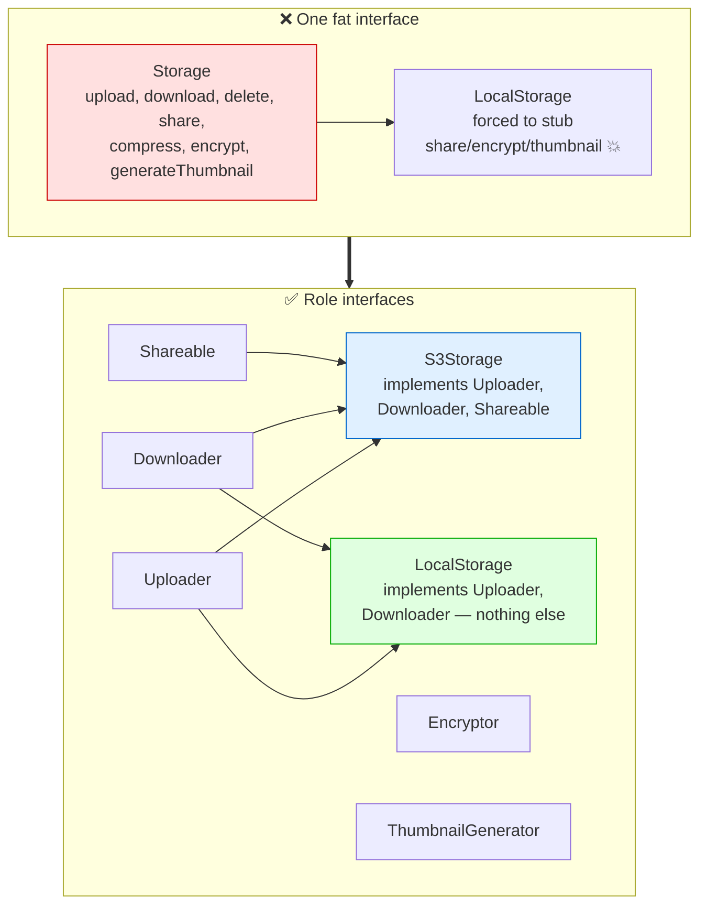

<details>
<summary>💻 Java — segregated storage roles (ISP) (click to expand)</summary>

```java
// ═══════════════════════════════════════════════════════════════
// ❌ BEFORE — one fat Storage interface forces every impl to support
// everything. A plain local disk cannot share, encrypt, or make
// thumbnails, so it stubs them to throw — and any caller holding a
// `Storage` can call share() on it and crash at runtime.
// ═══════════════════════════════════════════════════════════════
interface FatStorage {
    void upload(String key, byte[] data);
    byte[] download(String key);
    String createShareLink(String key);
    byte[] encrypt(byte[] data);
    byte[] thumbnail(String key);
}
class BadLocalStorage implements FatStorage {
    public void upload(String key, byte[] data) { /* ok */ }
    public byte[] download(String key) { return new byte[0]; }
    public String createShareLink(String key) { throw new UnsupportedOperationException(); } // 💥
    public byte[] encrypt(byte[] data) { throw new UnsupportedOperationException(); }          // 💥
    public byte[] thumbnail(String key) { throw new UnsupportedOperationException(); }         // 💥
}

// ═══════════════════════════════════════════════════════════════
// ✅ AFTER — small role interfaces; impls take only what they support.
// ═══════════════════════════════════════════════════════════════

// Small, role-based interfaces. A client depends only on what it uses.
interface Uploader   { void upload(String key, byte[] data); }
interface Downloader { byte[] download(String key); }
interface Deletable  { void delete(String key); }
interface Shareable  { String createShareLink(String key); }
interface Encryptor  { byte[] encrypt(byte[] data); }
interface ThumbnailGenerator { byte[] thumbnail(String key); }

// S3 supports upload, download, delete, sharing — so it implements exactly those.
class S3Storage implements Uploader, Downloader, Deletable, Shareable {
    public void upload(String key, byte[] data) { /* ... */ }
    public byte[] download(String key) { return new byte[0]; }
    public void delete(String key) { /* ... */ }
    public String createShareLink(String key) { return "https://s3/share/" + key; }
}

// LocalStorage supports ONLY upload/download. It is not forced to stub sharing.
class LocalStorage implements Uploader, Downloader {
    public void upload(String key, byte[] data) { /* write to disk */ }
    public byte[] download(String key) { return new byte[0]; }
    // No createShareLink() — and no caller can even ask for one. Illegal state
    // is now unrepresentable at compile time.
}

// ─────────────────────────────────────────────────────────────
// Demo / driver — each caller asks only for the role it needs.
// ─────────────────────────────────────────────────────────────
public class IspStorageDemo {
    // This caller only ever reads — so it depends ONLY on Downloader.
    // It literally cannot call share()/encrypt(): they aren't in its view.
    static void serveFile(Downloader source, String key) {
        byte[] bytes = source.download(key);
        System.out.println("Served " + bytes.length + " bytes for " + key);
    }

    // This caller needs sharing — so it asks for Shareable specifically.
    static String publicLink(Shareable sharer, String key) {
        return sharer.createShareLink(key);
    }

    public static void main(String[] args) {
        S3Storage s3 = new S3Storage();
        LocalStorage local = new LocalStorage();

        serveFile(s3, "report.pdf");      // works — S3 is a Downloader
        serveFile(local, "notes.txt");    // works — LocalStorage is a Downloader too

        System.out.println(publicLink(s3, "report.pdf")); // works — S3 is Shareable
        // publicLink(local, "notes.txt"); // ❌ won't COMPILE — LocalStorage isn't Shareable.
        // The illegal call is caught by the compiler, not at runtime.
    }
}
```

</details>

The compile-time win is the headline: a client that needs only to read depends on `Downloader`, so it literally *cannot* call `share()` or `encrypt()` — those methods are not in its view of the world. The illegal call that the fat interface allowed at runtime is now impossible at compile time. That is a stronger guarantee than a code review or a unit test could provide.

</details>

<details>
<summary><h3 style="display:inline">🏢 FAANG Example 2: The fat notifier</h3></summary>

A `Notifier` interface declaring `sendEmail`, `sendSms`, `sendPush`, and `sendSlack` forces every implementation to know about every channel. Split into `EmailSender`, `SmsSender`, `PushSender`, and `SlackSender`, and each implementation and each caller depends only on the channel it actually uses. A service that only sends transactional email depends on `EmailSender` and is entirely insulated from a change to the Slack integration.

<details>
<summary>💻 Java — fat notifier split into role interfaces (ISP) (click to expand)</summary>

```java
// ❌ Before — one fat interface forces every impl to know every channel.
interface Notifier {
    void sendEmail(String to, String body);
    void sendSms(String to, String body);
    void sendPush(String deviceId, String body);
    void sendSlack(String channel, String body);
}

// An email-only service is now FORCED to stub three methods it cannot support.
class EmailOnlyNotifier implements Notifier {
    public void sendEmail(String to, String body) { /* SMTP */ }
    public void sendSms(String to, String body)   { throw new UnsupportedOperationException(); }
    public void sendPush(String d, String body)    { throw new UnsupportedOperationException(); }
    public void sendSlack(String c, String body)   { throw new UnsupportedOperationException(); }
}

// ✅ After — one role interface per channel.
interface EmailSender { void send(String to, String body); }
interface SmsSender   { void send(String to, String body); }
interface PushSender  { void send(String deviceId, String body); }
interface SlackSender { void send(String channel, String body); }

// Each implementation picks up ONLY the role it truly supports.
class SmtpEmailSender implements EmailSender {
    public void send(String to, String body) { System.out.println("EMAIL → " + to); }
}
class TwilioSmsSender implements SmsSender {
    public void send(String to, String body) { System.out.println("SMS → " + to); }
}

// A service that only emails depends ONLY on EmailSender — it is insulated
// from any change to SMS, push, or Slack, and cannot even call them.
class ReceiptService {
    private final EmailSender emailSender;
    ReceiptService(EmailSender emailSender) { this.emailSender = emailSender; }
    void emailReceipt(String to) { emailSender.send(to, "Here is your receipt"); }
}

// ─────────────────────────────────────────────────────────────
// Demo / driver — the receipt flow depends on one narrow role.
// ─────────────────────────────────────────────────────────────
public class IspNotifierDemo {
    public static void main(String[] args) {
        // ReceiptService needs email only — so it receives an EmailSender, nothing more.
        ReceiptService receipts = new ReceiptService(new SmtpEmailSender());
        receipts.emailReceipt("ada@example.com");   // EMAIL → ada@example.com

        // A separate flow that needs SMS depends on SmsSender independently.
        SmsSender sms = new TwilioSmsSender();
        sms.send("+15551234", "Your OTP is 4821");  // SMS → +15551234

        // Adding a Slack integration later touches neither of the above:
        // no shared fat interface means no forced recompiles or stubs.
    }
}
```

</details>

</details>

### Going deeper: how ISP differs from SRP, and why fat interfaces never really help

**ISP and SRP are not the same thing, even though they feel similar.** The clean way to tell them apart: SRP is about the *class* — does it have more than one reason to change? ISP is about the *client's view* — is a caller forced to depend on more of an interface than it actually uses? You can have a class that is perfectly SRP-compliant (one reason to change) but still hands a bloated interface to its callers. The ISP fix there isn't to split the class; it's to offer several narrow *role interfaces* onto that same class, so each caller sees only the slice it needs. Java's `Collection` is the classic warning sign again — its "optional operations" are simply an interface that is too wide for some of the things implementing it, which is the same root cause that makes immutable lists violate LSP.

**A fat interface never removes coupling — it just hides it.** This is the deeper insight. When you cram many methods into one interface "so everything is behind an abstraction," you haven't reduced how tangled the system is; you've spread the tangle everywhere and made it invisible. Every implementer is now tied to every method, and every caller to the whole surface. Splitting an interface into focused roles is really about making the code's dependencies *honest* — so that when something changes, the change ripples only to the parts that genuinely depend on it, not to bystanders that were dragged along by a wide interface. The same idea scales up to APIs: this is why GraphQL and well-designed REST resources let a mobile app ask for only the fields it displays, instead of one giant `/user` endpoint that returns everything. That is ISP applied at the network boundary rather than the class.

### How to identify ISP violations

<details>
<summary>📖 Click to expand — interfaces that force dead weight on implementers or callers</summary>

Look for interfaces that force their implementers or callers to carry dead weight:

- **Implementers stubbing methods they can't support**, usually with `UnsupportedOperationException` or an empty body — the interface is wider than that implementation.
- **An interface with many unrelated methods.** A `Storage` that also compresses, encrypts, and makes thumbnails is really several roles fused into one.
- **Callers recompiling when a method they never call changes.** They were coupled to the whole interface, not just their slice.
- **Test doubles that must stub a dozen methods** to exercise one — a sign the mock (and the caller) depends on far more than it uses.
- **"Just add it to the existing interface" pressure.** The interface has become a dumping ground because it is already injected everywhere.

</details>

---

## 9. 💡 Dependency Inversion Principle: Who Owns the Abstraction

> **High-level modules should not depend on low-level modules. Both should depend on abstractions. Abstractions should not depend on details; details should depend on abstractions.**

DIP is the FAANG favourite, and the one that pulls the other four together into a real architecture. It is also the most misunderstood, because people mix it up with dependency injection. They are different ideas, and keeping them apart is a reliable senior signal.

Start with the everyday picture. Normally your important business code — say `OrderService` — reaches *down* and uses a database class like `MySqlOrderRepository` directly. So the business depends on the database. That feels natural, but it is backwards: your most valuable code is now chained to a specific tool.

DIP turns that arrow around. Instead of the business reaching down to the database, the **business layer defines an interface describing what it needs in its own words** — `save(Order)`, `findById(id)` — and the database class *implements* that interface. Now the database depends on the business's interface, not the other way round. That flip is the "inversion" in the name. The two clauses of the formal statement say exactly this: first, *depend on abstractions* (the familiar half); second — the half people forget — *abstractions should not depend on details*, meaning the interface belongs to the business, not to the database.

The part that makes it click is **ownership**: whoever writes the interface controls its shape, and you want the business in control. If the interface is shaped by MySQL (methods like `executeQuery`, types like `ResultSet`), then moving to MongoDB forces you to rewrite the interface *and* the business code that uses it — nothing was really inverted. But if the interface is shaped by the business (`findById(OrderId)`, `save(Order)`), then MySQL, Postgres, and MongoDB each conform to *the business's* terms, and the business never knows or cares which one is plugged in.

<details>
<summary>📖 In plain technical terms — click to expand</summary>

Dependency Inversion is about which way the arrows point. Normally your business code would reach down and directly use a MySQL class — so the business depends on the database. DIP flips this: the business layer defines an interface like `OrderRepository` describing what *it* needs in *its own* words (`save(order)`, `findById(id)`), and the MySQL class implements that interface. Now the database depends on the business's interface, not the other way around. The payoff: you can swap MySQL for Postgres, or plug in a fake for testing, and the business code never changes because it only ever knew the interface.

</details>

### DIP vs Dependency Injection vs IoC — the distinction interviewers probe

These three terms sound alike and get muddled constantly. Keeping them straight sets you apart. The simplest way to hold them in your head:

- **DIP is the *rule*** — depend on an abstraction, and make sure the high-level module owns that abstraction. It is about which direction dependencies point.
- **Dependency Injection is the *delivery mechanism*** — instead of a class building its own collaborators with `new`, they are handed to it from outside, usually through its constructor.
- **Inversion of Control is the *bigger pattern*** — a framework (like Spring) drives the flow and hands your objects their collaborators for them. DI is one specific form of IoC.

Here is the trap worth knowing, because it is a common mistake: **you can use dependency injection and still violate DIP.** If you inject a *concrete* `MySqlOrderRepository` into `OrderService`, you have done DI — the dependency came from outside — but you have *not* inverted anything, because `OrderService` still names a concrete database class. DIP is satisfied only when the thing you inject is an *abstraction the business owns*. In short: DI decides *how* the dependency arrives; DIP decides *what* it should be and *who defines its shape*.

<details>
<summary><h3 style="display:inline">🏢 FAANG Example 1: OrderService and the repository</h3></summary>

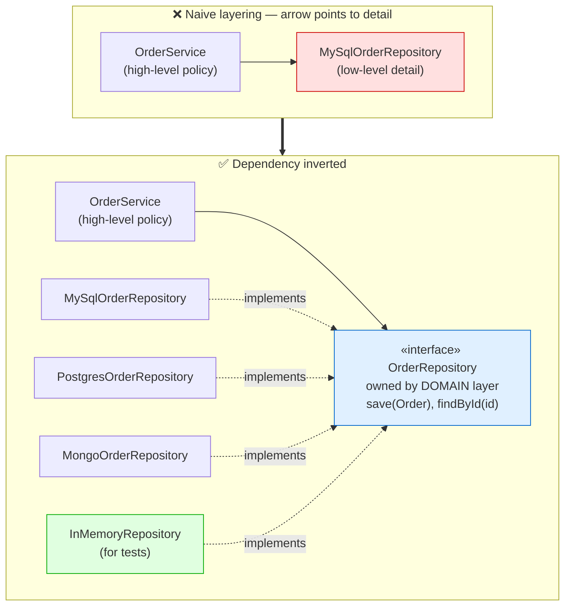

<details>
<summary>💻 Java — DIP with a domain-owned repository interface + demo (click to expand)</summary>

```java
// ═══════════════════════════════════════════════════════════════
// ❌ BEFORE — high-level policy reaches DOWN and builds a concrete
// database class itself. The business now depends on MySQL: you
// can't test placeOrder() without a live database, and switching
// stores means editing OrderService.
// ═══════════════════════════════════════════════════════════════
class OrderServiceCoupled {
    private final MySqlOrderRepository repository = new MySqlOrderRepository(); // ❌ names a detail

    void placeOrder(Order order) {
        repository.save(order);   // welded to MySQL — no seam for a fake
    }
}

// ═══════════════════════════════════════════════════════════════
// ✅ AFTER — the domain owns the abstraction; the detail implements it.
// ═══════════════════════════════════════════════════════════════

// ── Domain layer owns the abstraction, in ITS OWN vocabulary. ──
interface OrderRepository {
    void save(Order order);
    Optional<Order> findById(String orderId);
}

// High-level policy depends only on the abstraction it owns.
class OrderService {
    private final OrderRepository repository;   // abstraction, not MySQL

    // Constructor injection — the DI technique DELIVERS the dependency,
    // but DIP is what makes the delivered thing an abstraction.
    OrderService(OrderRepository repository) {
        this.repository = repository;
    }

    void placeOrder(Order order) {
        repository.save(order);   // no idea whether it's MySQL, Mongo, or a fake
    }
}

// ── Infrastructure layer: details DEPEND ON the domain's abstraction. ──
class MySqlOrderRepository implements OrderRepository {
    public void save(Order order) { /* JDBC / JPA */ }
    public Optional<Order> findById(String id) { return Optional.empty(); }
}

class MongoOrderRepository implements OrderRepository {
    public void save(Order order) { /* Mongo driver */ }
    public Optional<Order> findById(String id) { return Optional.empty(); }
}

// A test double — DIP makes fast, dependency-free unit tests possible.
class InMemoryOrderRepository implements OrderRepository {
    private final Map<String, Order> store = new HashMap<>();
    public void save(Order order) { store.put(order.id, order); }
    public Optional<Order> findById(String id) { return Optional.ofNullable(store.get(id)); }
}

// ─────────────────────────────────────────────────────────────
// Demo / driver — and the Spring Boot equivalent.
// ─────────────────────────────────────────────────────────────
public class DipDemo {
    public static void main(String[] args) {
        // Production wiring: inject the real thing.
        OrderService prod = new OrderService(new MySqlOrderRepository());

        // Test wiring: inject a fake — no database needed. This is the
        // everyday payoff of DIP, more than "swapping databases in prod".
        InMemoryOrderRepository fake = new InMemoryOrderRepository();
        OrderService underTest = new OrderService(fake);

        Order o = new Order("42", "cust-7", List.of(new LineItem("A", 1, 10.0)));
        underTest.placeOrder(o);
        System.out.println("Saved? " + fake.findById("42").isPresent()); // true
    }
}

/*
 In Spring Boot, the container does the wiring:

   @Service
   class OrderService {
       private final OrderRepository repository;
       OrderService(OrderRepository repository) {   // @Autowired implied
           this.repository = repository;
       }
   }

   @Repository
   class MySqlOrderRepository implements OrderRepository { ... }

 Spring sees one OrderRepository bean and injects it. Switch the active
 implementation with a @Profile or a @ConditionalOnProperty — OrderService
 never changes. THAT is DIP + DI working together.
*/
```

</details>

**The follow-up: "What does DIP actually buy you day-to-day?"** The honest, senior answer is *testability first, swappability second*. You will almost never swap MySQL for Mongo in production — and if you do, an interface will not save you from the data-model rewrite. But you inject a fake repository in *every single unit test*, every day, and that is only possible because the domain depends on an abstraction. Leading with testability rather than the mythical database swap signals that you have actually lived with this principle rather than read about it.

</details>

<details>
<summary><h3 style="display:inline">🏢 FAANG Examples 2 & 3: Image storage and product search</h3></summary>

`ImageService` depending on a `StorageProvider` abstraction (implemented by S3, Azure, GCS, MinIO) and `ProductSearchService` depending on a `SearchEngine` abstraction (implemented by Elasticsearch, OpenSearch, MeiliSearch) are the same pattern applied to two more axes. The value is identical: the business layer never names a vendor, tests run against in-memory fakes, and a genuinely valuable swap — self-hosted MinIO in dev, S3 in production — becomes a configuration profile rather than a code change. MinIO deliberately implements the S3 API for exactly this reason, which is a nice concrete detail to cite.

<details>
<summary>💻 Java — domain-owned ports for storage and search (DIP) (click to expand)</summary>

```java
// ═══════════════════════════════════════════════════════════════
// ❌ BEFORE — the media domain imports the vendor SDK directly.
// ImageService now depends on Amazon's S3Client: the business code
// names a vendor, tests need AWS credentials, and moving to Azure
// means rewriting the service.
// ═══════════════════════════════════════════════════════════════
class ImageServiceCoupled {
    private final S3Client s3 = new S3Client();   // ❌ high-level policy bound to a vendor SDK

    void saveImage(String id, byte[] bytes) {
        s3.putObject("img/" + id, bytes);         // AWS-specific call leaks into the domain
    }
}
class S3Client {                                  // stand-in for the real AWS SDK type
    void putObject(String key, byte[] data) { /* ... */ }
}

// ═══════════════════════════════════════════════════════════════
// ✅ AFTER — the domain owns a port; the vendor SDK sits in an adapter.
// ═══════════════════════════════════════════════════════════════

// ── Each high-level service OWNS the abstraction it depends on. ──
interface StorageProvider {          // owned by the media domain
    void store(String key, byte[] data);
    byte[] fetch(String key);
}

interface SearchEngine {             // owned by the catalog domain
    List<String> query(String text);
}

// High-level policy depends ONLY on the port, never on a vendor SDK.
class ImageService {
    private final StorageProvider storage;   // not S3Client, not AzureClient
    ImageService(StorageProvider storage) { this.storage = storage; }
    void saveImage(String id, byte[] bytes) { storage.store("img/" + id, bytes); }
}

class ProductSearchService {
    private final SearchEngine engine;       // not RestHighLevelClient
    ProductSearchService(SearchEngine engine) { this.engine = engine; }
    List<String> find(String text) { return engine.query(text); }
}

// ── Infrastructure adapters: details depend on the domain's port. ──
class S3StorageProvider implements StorageProvider {   // MinIO reuses this (S3 API)
    public void store(String key, byte[] data) { /* PutObject */ }
    public byte[] fetch(String key) { return new byte[0]; }
}

class ElasticSearchEngine implements SearchEngine {
    public List<String> query(String text) { return List.of("product-1"); }
}

// A fake adapter for tests — no cloud account, no network.
class InMemoryStorageProvider implements StorageProvider {
    private final Map<String, byte[]> store = new HashMap<>();
    public void store(String key, byte[] data) { store.put(key, data); }
    public byte[] fetch(String key) { return store.getOrDefault(key, new byte[0]); }
}

// ─────────────────────────────────────────────────────────────
// Demo / driver — same services, different adapters, zero code change.
// ─────────────────────────────────────────────────────────────
public class DipPortsDemo {
    public static void main(String[] args) {
        // Production: real S3 adapter (MinIO would use the same class in dev).
        ImageService prod = new ImageService(new S3StorageProvider());
        prod.saveImage("42", new byte[1024]);

        // Test: in-memory adapter — ImageService is unchanged and needs no cloud.
        InMemoryStorageProvider fake = new InMemoryStorageProvider();
        ImageService underTest = new ImageService(fake);
        underTest.saveImage("99", new byte[]{1, 2, 3});
        System.out.println("stored bytes: " + fake.fetch("img/99").length); // 3

        ProductSearchService search = new ProductSearchService(new ElasticSearchEngine());
        System.out.println("search hit: " + search.find("earbuds")); // [product-1]
    }
}
```

</details>

</details>

### Going deeper: DIP is the load-bearing wall of a whole architecture

Everything above was about single classes. The same idea, scaled up, becomes the backbone of the big-name architectures — Clean, Hexagonal (also called Ports and Adapters), and Onion. They differ in vocabulary but share one picture: your business logic sits in the centre, and it defines *ports* — interfaces — for everything it needs from the outside world, like saving data, sending messages, or calling other services. The outside pieces (the database, the message queue, the web framework) are *adapters* that plug into those ports. The rule that holds it all together is that every dependency points *inward*, toward the business logic, and the business logic depends on nothing outside itself. That is just DIP's second clause — "abstractions don't depend on details" — drawn as a wall around your domain.

Why this is worth the effort: the centre, where your real business value and hardest logic live, becomes completely independent of the tools around it. You can test it with no database, no web server, and no framework running. You can put off picking a database until you actually understand your needs. And you can rip out an entire layer — swap Kafka for RabbitMQ, or REST for gRPC — just by writing a new adapter, because the business logic only ever knew the port, never the tool behind it. This is the real answer to "how do you keep a big codebase from rotting over the years": keep every dependency pointing inward, and let the domain own its interfaces.

### How to identify DIP violations

<details>
<summary>📖 Click to expand — signs the dependency is pointing the wrong way</summary>

The dependency is pointing the wrong way whenever you see:

- **`new ConcreteClass()` inside business logic.** The moment a domain class constructs a `MySqlRepository` or an `S3Client` itself, it is welded to a detail.
- **Domain code importing a framework or driver package** — `import com.amazonaws...` or a JDBC type in the middle of business rules means the detail has leaked inward.
- **Unit tests that need a real database, network, or mail server.** If you can't swap in a fake, the code depends on a concrete detail rather than an abstraction.
- **An interface shaped by the tool, not the domain** — methods like `executeQuery` or types like `ResultSet` mean the abstraction is owned by the database, so it isn't really inverted.
- **Injecting a concrete type.** Even with dependency injection, if the injected parameter is a concrete class rather than an interface, DIP is not satisfied.

</details>

---
## 10. 🔗 How the Five Principles Interlock

<details>
<summary>📖 Click to expand — how the five principles chain into one system</summary>

Interviewers who go past definitions almost always ask some form of "how do these relate to each other?" A candidate who treats the five as a checklist answers weakly; one who sees them as a single connected system answers strongly. Here is the connective tissue, stated as a chain of dependencies rather than a list.

It begins with SRP, because SRP is how you *find the seams*. Identifying that discounting, invoicing, and notification are separate reasons to change is what tells you where the boundaries in your system should fall. Without that first cut, you have nothing to apply the other principles to.

Once SRP has located a seam along a moving axis, OCP tells you to make that seam a *polymorphic extension point* — an interface with implementations — so future variants arrive as new classes rather than edits. OCP is the principle that turns a boundary into a plug-in socket.

But a plug-in socket only works if the things you plug in are interchangeable, and that is LSP. LSP is the guarantee that makes OCP's promise real: if implementations behind the seam do not honour a common contract, callers start type-checking, and the polymorphism collapses back into the `if-else` chain you were trying to escape. LSP is OCP's enforcement mechanism.

ISP then governs the *shape and width* of the interface at the seam. It ensures the contract each client depends on is no wider than that client needs, so a change on one axis bundled into a fat interface does not force unrelated clients to recompile or stub. ISP keeps the seams clean.

And DIP settles the question of *ownership and direction*: the abstraction at the seam belongs to the high-level policy, and the dependency arrow points from detail to policy, not the reverse. DIP is what makes the whole structure stable rather than merely decomposed.

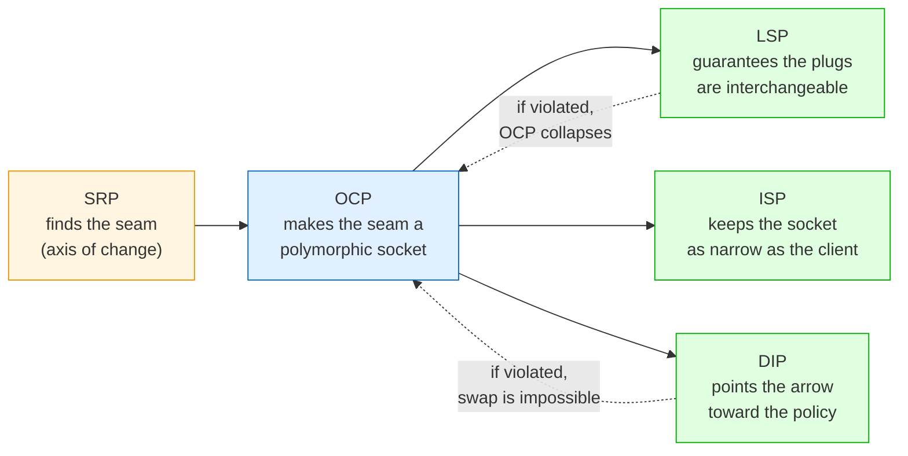

The one-sentence synthesis worth memorising: **SRP finds the seam, OCP makes it an extension point, LSP keeps the extensions honest, ISP keeps the interface narrow, and DIP makes the domain own it.** Deliver that and you have shown the interviewer a mental model, not a memorised list.

</details>

---

## 11. 💻 From Principles to Patterns: The Mapping Interviewers Expect

<details>
<summary>📖 Click to expand — mapping each principle to the patterns that deliver it</summary>

A frequent and revealing interview question is "what is the difference between the Open/Closed Principle and the Strategy pattern?" The confusion it targets is the principle-versus-pattern distinction, and the clean answer is: **a principle states a goal; a pattern is a reusable solution shape that achieves it.** OCP says "add behaviour without editing." Strategy is one concrete way to do that. Template Method is another. Decorator is another. The principle is the *why*; the pattern is a *how*.

This mapping is worth carrying because it lets you answer "how would you implement OCP here?" with a named, recognised solution rather than an ad-hoc one.

| Principle | Patterns that operationalise it | Why the pattern serves the principle |
|---|---|---|
| **SRP** | Facade, Mediator, Command | Each extracts one responsibility (a subsystem's surface, inter-object coordination, a single action) into its own type |
| **OCP** | Strategy, Template Method, Decorator, Observer, Chain of Responsibility | All add behaviour via new types/objects rather than edits to existing code |
| **LSP** | Null Object, proper use of Abstract Factory | Null Object gives a substitutable "do-nothing" that honours the contract instead of a null that breaks it |
| **ISP** | Adapter, Role interfaces | Adapter lets a class present only the narrow interface a client needs from a wider one |
| **DIP** | Abstract Factory, Dependency Injection, Repository, Ports & Adapters | All arrange for high-level code to depend on abstractions and receive concretes from outside |

The nuance to add when discussing Strategy specifically: Strategy achieves OCP by *composition* — the context holds a strategy object and delegates — whereas Template Method achieves the same OCP goal by *inheritance*, with subclasses filling in abstract steps of a fixed algorithm. Strategy is generally preferred today ("favour composition over inheritance"), and the reason connects back to LSP: inheritance-based extension is more prone to LSP violations because subclasses can accidentally break the base algorithm's invariants, whereas a composed strategy is a clean, contract-bound plug-in. Being able to explain *why* the community drifted from Template Method toward Strategy — LSP fragility under inheritance — is a genuinely senior observation.

</details>

---

## 12. 📊 SOLID Above the Class: Modules, Services, and APIs

<details>
<summary>📖 Click to expand — the same five principles at service and API scale</summary>

SOLID was written for object-oriented classes, but its principles are really about *dependency structure*, and dependency structure exists at every scale. Staff and principal interviews frequently lift the conversation from classes to services, and a candidate who can carry the principles upward demonstrates architectural range. The uploaded material's microservices framing maps directly onto this.

**SRP at the service level** is the bounded context. A microservice should own one business capability and have one reason to change. A `UserService` that owns identity, a `PaymentService` that owns money movement, and a `NotificationService` that owns delivery each change for one business reason and are owned by one team. The monolith that owns users *and* payments *and* orders is the god class writ large — the same rigidity, fragility, and merge-conflict pathologies, now at organisational scale. Conway's Law makes this concrete: service boundaries and team boundaries should coincide, and SRP is the principle that tells you where to draw them.

**OCP at the API level** is versioning and backward compatibility. An API is "closed for modification" when existing clients keep working, and "open for extension" when you can add capabilities. Additive changes — new optional fields, new endpoints — extend without breaking; that is OCP honoured. Removing a field or changing a response shape is a breaking modification, which is why you introduce `/v2` alongside a still-functioning `/v1` rather than mutating `/v1`. This is exactly the payment-processor pattern at the network boundary.

**LSP at the contract level** means any service implementing a shared interface must be truly interchangeable. If `StripeService` and `PayPalService` both implement a `PaymentGateway` contract, they must honour the same guarantees — same error semantics, same idempotency behaviour, same result shape. If PayPal throws a different exception type or requires an extra setup call, they are not substitutable, and callers will special-case them, defeating the abstraction. This is why payment orchestration layers work so hard to normalise provider behaviour behind a common contract.

**ISP at the API level** is why GraphQL and fine-grained REST resources exist. A fat `/user` endpoint that returns everything forces a mobile client to over-fetch data it will never render, coupling it to fields it does not use. GraphQL lets each client request exactly its fields; segregated REST resources (`/users/{id}/profile` versus `/users/{id}/settings`) let each client depend only on the slice it needs. Both are ISP applied to network contracts.

**DIP at the integration level** is asynchronous, broker-mediated communication. When `OrderService` publishes an `OrderPlaced` event to Kafka and `PaymentService` consumes it, neither depends on the other's concrete implementation or even its availability — both depend on the abstraction of the event contract on the topic. Contrast a direct synchronous HTTP call from `OrderService` to `PaymentService`, which couples them tightly: if payments is down, orders fail. The message broker is DIP's abstraction boundary at the distributed-systems scale, and it is why event-driven architectures are more resilient to partial failure.

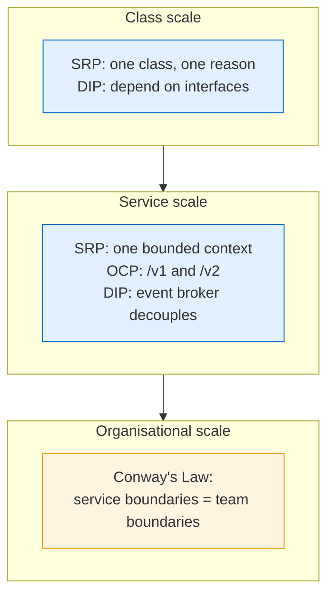

</details>

---

## 13. ❌ Where SOLID Ends: YAGNI, KISS, DRY, and the Critics

<details>
<summary>📖 Click to expand — when NOT to apply SOLID, and the CUPID critique</summary>

The single strongest signal a candidate can give on this topic is knowing when *not* to apply SOLID. Junior engineers apply principles maximally; senior engineers apply them *proportionally*; principal engineers can articulate the cost of each principle and decline it with justification. An interviewer who asks "can you give a case where SOLID made code worse?" is explicitly fishing for this maturity, and "I always follow SOLID" is close to a disqualifying answer.

The core tension is between SOLID and three other well-known heuristics. **YAGNI** ("You Aren't Gonna Need It") warns against building flexibility for requirements that have not arrived. **KISS** ("Keep It Simple") warns against structure that outweighs the problem. **DRY** ("Don't Repeat Yourself") warns against duplication — but is frequently *over*-applied, coupling things that merely look similar. SOLID pushes toward abstraction and decomposition; YAGNI and KISS pull back toward simplicity. The skill is holding both.

The concrete failure mode is **speculative generality**: adding a `PaymentProcessor` interface with one implementation "in case we add more," a `Repository` abstraction over a table nobody will ever store elsewhere, or a strategy pattern for an algorithm that has exactly one variant. Each of these pays the full cost of abstraction — indirection, extra files, harder navigation, more concepts to learn — while delivering none of the benefit, because the axis it protects is not moving. This is why Martin's own advice on OCP is "fool me once": do not add the abstraction on day one; add it the *first time* the axis actually moves and you have evidence it is real. One payment method needs no interface. The second payment method is when you introduce it.

There is a well-known critique worth being able to engage, because a sharp interviewer may raise it. Dan North's "CUPID" argues that SOLID's principles are class-centric, occasionally contradictory in practice, and less useful than properties like "Composable, Unix-philosophy, Predictable, Idiomatic, Domain-based." The mature response is not to defend SOLID dogmatically but to agree with the spirit: SOLID is a set of *heuristics for managing dependencies and change*, not physical laws, and it is most valuable as a vocabulary for *diagnosing* design problems ("this is a rigidity smell from an SRP violation") rather than as a compliance checklist. Naming CUPID and engaging it fairly signals that you read past the textbook.

The pragmatic decision framework to voice: apply a SOLID principle when there is *evidence* the relevant axis moves — a second variant has appeared, the class has two demonstrable actors, testing is painful because of coupling, or the rigidity/fragility symptoms are showing. Decline it, explicitly, for simple CRUD with one owner, for prototypes and spikes you will throw away, for code that has proven stable, and whenever the abstraction would cost more in comprehension than it saves in change. And revisit: the right time to refactor toward SOLID is exactly when a class starts attracting changes for a second reason, not before.

<details>
<summary>📖 In plain technical terms — click to expand</summary>

SOLID can be overdone. If you add interfaces, strategies, and layers for flexibility you never end up using, you have paid a real price — more files, more indirection, slower onboarding — for nothing. YAGNI, KISS, and DRY are the counterweights: don't build for imagined futures, keep it simple, but also don't over-couple things just because they look alike. The senior move is to add the abstraction the *first time* a real second case shows up, not on day one "just in case." In an interview, showing you know when to skip a principle is worth more than reciting all five.

</details>

</details>

---

## 14. 🎓 Diagnosing Violations: A Code-Smell Field Guide

<details>
<summary>📖 Click to expand — the code smells that name each violation</summary>

Principles are easier to apply when you can recognise their absence. Each SOLID violation announces itself through characteristic symptoms; learning to name the smell out loud is what lets you diagnose a design in a review or an interview. This table is the diagnostic index; the uploaded material's warning signs are folded in.

| Smell you observe | Likely principle violated | The fix |
|---|---|---|
| A class over ~200 lines, or whose name contains "Manager"/"Processor"/"Util" and does many things | SRP | Extract collaborators by reason to change; keep an orchestrator |
| You edit the same file for unrelated reasons (payments *and* tax *and* email) | SRP | Split by actor / axis of change |
| A growing `if/else` or `switch` on a type code | OCP | Replace with polymorphism behind an interface |
| Adding a feature means editing several existing, tested classes | OCP | Introduce an extension point along that axis |
| `throw new UnsupportedOperationException()` in an override | LSP (often via ISP) | Narrow the interface so the method is not inherited |
| `if (x instanceof ConcreteSubtype)` in caller code | LSP | Fix the contract so subtypes are truly substitutable |
| A subtype overrides a method to do nothing or to throw | LSP | Rework the hierarchy; prefer composition |
| Implementers stubbing methods they cannot support | ISP | Split the fat interface into role interfaces |
| A client recompiles when a method it never calls changes | ISP | Give that client a narrower interface |
| `new ConcreteClass()` inside business logic | DIP | Depend on an interface; inject the concrete |
| Domain code importing a framework/driver package | DIP | Define a domain-owned port; put the driver in an adapter |
| Unit tests need a real database, network, or SMTP server | DIP (and SRP) | Invert dependencies so fakes can be injected |

Two of these deserve emphasis because they are the highest-signal tells. The `instanceof` check in caller code is the single most reliable indicator of an LSP violation — it means the polymorphism is not actually working and someone is routing around it. And a unit test that cannot run without external infrastructure is almost always a DIP failure — the code under test is welded to a concrete detail. In an interview, spotting either of these in a code sample and naming the underlying principle is a fast way to demonstrate real fluency.

</details>

---

## 15. 📊 Tests as the Litmus Test for Design

<details>
<summary>📖 Click to expand — why testability is the earliest warning of a SOLID violation</summary>

There is a deep and practical relationship between SOLID and testability, and it is worth understanding as more than a happy side effect: **difficulty of testing is the most reliable early warning that SOLID is being violated.** Tests exercise your design as a client, and a design that is painful to test is a design that will be painful to change, because tests and changes both depend on the same property — the ability to isolate a piece and control its collaborators.

Trace the connection principle by principle. When SRP is honoured, each class has one responsibility, so its tests are focused and few — you test `DiscountCalculator` with a handful of pure input/output cases and no scaffolding. When SRP is violated, testing the god class requires standing up its database, its SMTP client, its inventory system, and its audit log simultaneously, because they are all tangled in one method. When DIP is honoured, you inject an in-memory fake and the test runs in microseconds with no I/O; when it is violated, the test needs a live MySQL instance and becomes slow, flaky, and CI-hostile. When ISP is honoured, a mock implements only the two methods the client uses; when it is violated, you must stub a dozen irrelevant methods to satisfy the compiler. When LSP is honoured, a test written against the interface passes for every implementation — indeed you can write a single *contract test suite* and run it against S3, Azure, and your in-memory fake alike; when it is violated, each implementation needs special-casing and the shared suite fails.

That last point is the staff-level technique worth naming: the **contract test**. When you have a `Storage` interface with multiple implementations, you write one abstract test class asserting the *contract* — upload-then-download returns the same bytes, delete is idempotent, oversized uploads throw the common exception — and each implementation's test extends it. If `AzureBlobStorage` cannot pass the suite that `S3Storage` passes, you have caught an LSP violation mechanically, before it reaches production. This is how mature codebases enforce substitutability rather than merely hoping for it.

The reverse framing is the one to deploy in interviews: if someone hands you unfamiliar code and asks whether it is well-designed, *try to write a unit test for it.* If you can test a unit in isolation with fast, dependency-free tests, the design is probably sound. If you cannot — if every test drags in the world — the design has SOLID problems, and the test difficulty told you exactly where. Test-driven development is popular partly because it applies this pressure continuously: code written test-first tends to satisfy SRP and DIP naturally, because untestable designs are painful *immediately* rather than six months later.

</details>

---

## 16. 💡 Common Pitfalls and Over-Application

<details>
<summary>📖 Click to expand — the traps that turn SOLID into a liability</summary>

**Treating SRP as "one method per class."** SRP is about one *reason to change*, not one action. Shattering a cohesive class into a swarm of anemic single-method classes creates its own smell — "shotgun surgery," where one logical change now touches a dozen files that must move in lockstep. Cohesion is the counter-force: things that change together belong together.

**Adding abstractions with a single implementation "for flexibility."** A `PaymentProcessor` interface with only `UpiPayment` behind it, forever, is pure cost — indirection and an extra file for an axis that is not moving. Introduce the abstraction when the *second* implementation actually arrives (Martin's "fool me once"), not speculatively.

**Confusing dependency injection with dependency inversion.** Injecting a *concrete* class satisfies DI but not DIP. DIP requires the injected type to be an abstraction *owned by the high-level module*. You can have DI everywhere and still have a tightly coupled system.

**Fat interfaces disguised as abstraction.** Declaring one `Service` interface with fifteen methods "so everything is behind an interface" violates ISP and invites LSP violations (implementers stubbing what they cannot support). Abstraction is not the same as a wide interface.

**LSP violations hidden behind `instanceof` and `UnsupportedOperationException`.** These are not clever escape hatches; they are the design telling you the hierarchy is wrong. The presence of either is a signal to rework the abstraction, usually toward composition.

**Over-DRYing into accidental coupling.** Merging two pieces of code because they look identical *today* couples two things that may change for different reasons — a direct SRP violation created in the name of DRY. Prefer a little duplication over the wrong abstraction; duplication is cheap to fix, a wrong abstraction is expensive to unwind.

**Applying SOLID to throwaway code.** Prototypes, spikes, and one-off scripts do not need SOLID. The principles pay off over a codebase's *maintenance lifetime*; code with no maintenance lifetime should be kept as simple as possible.

</details>

---

## 17. 📝 A Refactoring Playbook for Legacy Code

<details>
<summary>📖 Click to expand — the safe, incremental order for refactoring a legacy god class</summary>

Knowing the principles is one thing; safely applying them to a large, untested, tangled legacy system is the staff-level skill an interviewer probes with "how would you actually refactor this god class in production without breaking it?" The answer is a disciplined, incremental sequence — never a big-bang rewrite, which is the classic way to turn a working-but-ugly system into a broken-and-ugly one.

The sequence, drawn from Michael Feathers' work on legacy code, runs like this. First, **characterise before you change**: write tests that capture the current behaviour — even the buggy parts — so you have a safety net. In truly untestable code this means finding a *seam*, a place you can alter behaviour without editing in place, often by extracting an interface and injecting a fake. Second, **apply DIP to create test seams**: wherever the god class does `new Database()` or `new SmtpClient()`, extract an interface and inject it, so you can now substitute fakes and finally test the thing. Third, **apply SRP by extraction**: pull out one responsibility at a time into a collaborator — start with the one that changes most often or is easiest to isolate — delegating from the original class so callers do not notice. Fourth, **apply OCP where the axis moves**: once responsibilities are separated, replace the type-switching `if/else` chains with polymorphism along the axes you have evidence will keep changing. Fifth, **verify substitutability with contract tests** for any interface that gained multiple implementations, catching LSP violations mechanically.

The governing discipline is that each step is small, independently shippable, and behaviour-preserving, with tests green throughout. You are not rewriting; you are *strangling* — the Strangler Fig pattern, where new well-structured code grows around the old until the old can be deleted. The order matters: DIP first (to get tests), then SRP (to separate), then OCP (to make extensible), because you cannot safely refactor what you cannot test, and you cannot cleanly make extensible what you have not first separated. Being able to lay out this sequence — with "tests first, via DIP seams" as the opening move — is what distinguishes an engineer who has actually rescued a legacy system from one who has only read about the principles.

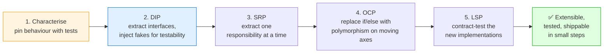

</details>

---
## 18. ⭐ Combined Example: A Food Delivery Platform Using All Five Principles

This is the capstone interviewers love: one coherent design in which all five principles are visible at once and reinforcing each other. A food delivery platform (think DoorDash, Swiggy, Uber Eats) is ideal because it naturally contains every axis of change SOLID cares about — multiple payment methods, multiple notification channels, swappable storage and search backends, and a checkout workflow that must orchestrate them all without becoming a god class.

We will build the order-placement flow and annotate exactly where each principle earns its place. The goal is not exhaustive code but a design you could sketch on a whiteboard and defend clause by clause.

### The high-level flow

The platform decomposes into services, each owning one business capability — SRP at the service scale. The order flow threads through them:

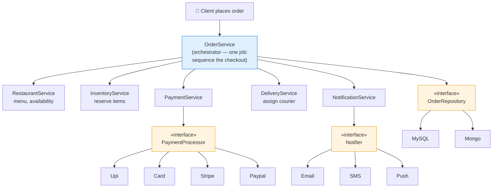

Where each principle lives, in one pass: **SRP** gives every service exactly one reason to change and keeps `OrderService` a pure orchestrator. **OCP** puts interfaces across the moving axes — payment methods, notification channels — so new variants are new classes. **LSP** guarantees every `PaymentProcessor` and every `Notifier` is genuinely interchangeable behind its contract. **ISP** keeps each interface narrow — a `Notifier` does one thing, `send()`, rather than bundling every channel. **DIP** makes `OrderService` depend only on abstractions it owns (`OrderRepository`, `PaymentService`, `Notifier`), with concrete infrastructure injected from outside.

### The code

<details>
<summary>💻 Java — the full design: abstractions, adapters, services, orchestrator + demo (click to expand)</summary>

```java
// ─────────────────────────────────────────────────────────────
// DOMAIN MODEL — plain data, no behaviour with a reason to change.
// ─────────────────────────────────────────────────────────────
record LineItem(String sku, int qty, double unitPrice) {}

class Order {
    final String id;
    final String customerId;
    final String restaurantId;
    final List<LineItem> items;
    final String paymentMethod;   // "UPI", "CARD", "STRIPE", ...
    double total;
    String courierId;

    Order(String id, String customerId, String restaurantId,
          List<LineItem> items, String paymentMethod) {
        this.id = id;
        this.customerId = customerId;
        this.restaurantId = restaurantId;
        this.items = items;
        this.paymentMethod = paymentMethod;
    }

    double subtotal() {
        return items.stream().mapToDouble(i -> i.unitPrice() * i.qty()).sum();
    }
}

// ─────────────────────────────────────────────────────────────
// OCP + LSP + ISP: PaymentProcessor is a narrow, polymorphic port.
// New payment methods = new classes. All honour one contract.
// ─────────────────────────────────────────────────────────────
record PaymentResult(boolean success, String reference) {}

interface PaymentProcessor {
    String method();                          // "UPI", "CARD", ...
    PaymentResult charge(double amount);      // CONTRACT: never returns null;
                                              // throws PaymentException on failure
}

class PaymentException extends RuntimeException {
    PaymentException(String m) { super(m); }
}

// ─────────────────────────────────────────────────────────────
// OCP + ISP: Notifier is ONE narrow role. Not sendEmail/sendSms/...
// ─────────────────────────────────────────────────────────────
interface Notifier {
    void send(String customerId, String message);
}

// ─────────────────────────────────────────────────────────────
// DIP: OrderRepository is a DOMAIN-OWNED port, in domain vocabulary.
// ─────────────────────────────────────────────────────────────
interface OrderRepository {
    void save(Order order);
    Optional<Order> findById(String id);
}

// ═══════════════════════════════════════════════════════════════
// IMPLEMENTATIONS — adapters plugged into each port.
// ═══════════════════════════════════════════════════════════════

// ── Payment methods: each a separate class (OCP). Each honours the
//    same contract (LSP): returns a result or throws PaymentException. ──
class UpiPaymentProcessor implements PaymentProcessor {
    public String method() { return "UPI"; }
    public PaymentResult charge(double amount) {
        // call UPI PSP; adapt provider errors to PaymentException
        return new PaymentResult(true, "upi-" + System.nanoTime());
    }
}

class CardPaymentProcessor implements PaymentProcessor {
    public String method() { return "CARD"; }
    public PaymentResult charge(double amount) {
        return new PaymentResult(true, "card-" + System.nanoTime());
    }
}

class StripePaymentProcessor implements PaymentProcessor {
    public String method() { return "STRIPE"; }
    public PaymentResult charge(double amount) {
        return new PaymentResult(true, "stripe-" + System.nanoTime());
    }
}

// Added later with ZERO edits to anything above — pure OCP.
class PaypalPaymentProcessor implements PaymentProcessor {
    public String method() { return "PAYPAL"; }
    public PaymentResult charge(double amount) {
        return new PaymentResult(true, "pp-" + System.nanoTime());
    }
}

// ── Notification channels: each implements the single-role Notifier. ──
class EmailNotifier implements Notifier {
    public void send(String customerId, String message) {
        System.out.println("EMAIL → " + customerId + ": " + message);
    }
}
class SmsNotifier implements Notifier {
    public void send(String customerId, String message) {
        System.out.println("SMS → " + customerId + ": " + message);
    }
}
class PushNotifier implements Notifier {
    public void send(String customerId, String message) {
        System.out.println("PUSH → " + customerId + ": " + message);
    }
}

// ── Persistence adapters (DIP): details depend on the domain's port. ──
class MySqlOrderRepository implements OrderRepository {
    public void save(Order o) { System.out.println("MySQL saved " + o.id); }
    public Optional<Order> findById(String id) { return Optional.empty(); }
}
class InMemoryOrderRepository implements OrderRepository {   // for tests
    private final Map<String, Order> db = new HashMap<>();
    public void save(Order o) { db.put(o.id, o); }
    public Optional<Order> findById(String id) { return Optional.ofNullable(db.get(id)); }
}

// ═══════════════════════════════════════════════════════════════
// FOCUSED SERVICES — SRP: each has exactly one reason to change.
// ═══════════════════════════════════════════════════════════════

// Reason to change: pricing/discount rules (growth team).
class PricingService {
    double priceOrder(Order order) {
        double subtotal = order.subtotal();
        double total = subtotal >= 500 ? subtotal * 0.90 : subtotal; // demo promo
        order.total = total;
        return total;
    }
}

// Reason to change: stock reservation logic (fulfilment team).
class InventoryService {
    void reserve(Order order) {
        order.items.forEach(i ->
            System.out.println("Reserved " + i.qty() + " × " + i.sku()));
    }
}

// Reason to change: courier assignment logic (logistics team).
class DeliveryService {
    void assignCourier(Order order) {
        order.courierId = "courier-" + (order.id.hashCode() & 0xff);
        System.out.println("Assigned " + order.courierId);
    }
}

// PaymentService owns the REGISTRY of processors (OCP via Map, DIP via interface).
class PaymentService {
    private final Map<String, PaymentProcessor> processors;

    PaymentService(List<PaymentProcessor> available) {
        this.processors = available.stream()
                .collect(java.util.stream.Collectors.toMap(
                        PaymentProcessor::method, p -> p));
    }

    PaymentResult pay(Order order) {
        PaymentProcessor p = processors.get(order.paymentMethod);
        if (p == null) throw new PaymentException("Unsupported: " + order.paymentMethod);
        return p.charge(order.total);        // no if-else, ever
    }
}

// NotificationService fans out over injected Notifiers (OCP: add a channel = add a bean).
class NotificationService {
    private final List<Notifier> notifiers;
    NotificationService(List<Notifier> notifiers) { this.notifiers = notifiers; }

    void notifyOrderPlaced(Order order) {
        String msg = "Order " + order.id + " confirmed. Total ₹" + order.total;
        notifiers.forEach(n -> n.send(order.customerId, msg));
    }
}

// ═══════════════════════════════════════════════════════════════
// ORCHESTRATOR — SRP + DIP together.
// ═══════════════════════════════════════════════════════════════

/**
 * OrderService's ONE reason to change is the checkout WORKFLOW —
 * the order of steps. It depends only on abstractions (DIP) and holds
 * no business logic of its own; every step is delegated (SRP).
 */
class OrderService {
    private final PricingService pricingService;
    private final InventoryService inventoryService;
    private final PaymentService paymentService;
    private final DeliveryService deliveryService;
    private final NotificationService notificationService;
    private final OrderRepository orderRepository;   // abstraction, not MySQL

    OrderService(PricingService pricingService, InventoryService inventoryService,
                 PaymentService paymentService, DeliveryService deliveryService,
                 NotificationService notificationService, OrderRepository orderRepository) {
        this.pricingService = pricingService;
        this.inventoryService = inventoryService;
        this.paymentService = paymentService;
        this.deliveryService = deliveryService;
        this.notificationService = notificationService;
        this.orderRepository = orderRepository;
    }

    PaymentResult placeOrder(Order order) {
        pricingService.priceOrder(order);              // 1. price
        inventoryService.reserve(order);               // 2. reserve stock
        PaymentResult payment = paymentService.pay(order); // 3. charge
        if (!payment.success()) throw new PaymentException("Payment failed");
        orderRepository.save(order);                   // 4. persist
        deliveryService.assignCourier(order);          // 5. assign courier
        notificationService.notifyOrderPlaced(order);  // 6. notify
        return payment;
    }
}

// ═══════════════════════════════════════════════════════════════
// DEMO / DRIVER — wire the graph once and run it.
// (In Spring Boot, the container does all of this for you.)
// ═══════════════════════════════════════════════════════════════

public class FoodDeliveryDemo {
    public static void main(String[] args) {
        // ── Composition root: assemble the object graph once. ──
        PaymentService paymentService = new PaymentService(List.of(
                new UpiPaymentProcessor(),
                new CardPaymentProcessor(),
                new StripePaymentProcessor(),
                new PaypalPaymentProcessor()   // added with zero edits elsewhere
        ));

        NotificationService notificationService = new NotificationService(List.of(
                new EmailNotifier(),
                new SmsNotifier(),
                new PushNotifier()
        ));

        OrderService orderService = new OrderService(
                new PricingService(),
                new InventoryService(),
                paymentService,
                new DeliveryService(),
                notificationService,
                new MySqlOrderRepository()     // swap to InMemory for tests
        );

        // ── Place an order paid via Stripe. ──
        Order order = new Order(
                "ORD-9001", "cust-7", "rest-3",
                List.of(new LineItem("BURGER", 2, 200.0),
                        new LineItem("FRIES",  1, 120.0)),
                "STRIPE"
        );

        PaymentResult result = orderService.placeOrder(order);
        System.out.println("Payment ref: " + result.reference()
                + " | Total charged: ₹" + order.total);
    }
}

/*
 Expected output (order of the fan-out may vary):
   Reserved 2 × BURGER
   Reserved 1 × FRIES
   MySQL saved ORD-9001
   Assigned courier-XX
   EMAIL → cust-7: Order ORD-9001 confirmed. Total ₹468.0
   SMS   → cust-7: Order ORD-9001 confirmed. Total ₹468.0
   PUSH  → cust-7: Order ORD-9001 confirmed. Total ₹468.0
   Payment ref: stripe-... | Total charged: ₹468.0
   (subtotal 520 → 10% promo → 468.0)
*/
```

</details>

### Defending the design in the interview

The value of this example is that it lets you narrate all five principles against one artifact, which is far more convincing than five disconnected snippets. Walk it principle by principle:

- **OCP** — If a new payment method arrives (say Google Pay), you add one class implementing `PaymentProcessor` and register it; `OrderService`, `PaymentService`, and every other file stay frozen.
- **LSP** — Because every `PaymentProcessor` honours the same charge-or-throw contract, `PaymentService` never type-checks which one it holds. This is what makes the OCP registry actually work.
- **DIP** — `OrderService` does not construct a `MySqlOrderRepository`; it receives an `OrderRepository` whose definition it owns. Every unit test injects `InMemoryOrderRepository` and runs with zero I/O, so the everyday payoff is test speed.
- **ISP** — Each interface is exactly as wide as its client needs. `Notifier` is just `send()`, not a bundle of per-channel methods, so adding a channel never forces existing channels to change.
- **SRP** — `OrderService` itself never grows business logic; it changes only when the *workflow* changes, while pricing, inventory, delivery, payment, and notification each change for their own single reason in their own class.

Then close with the line that ties it together and signals you understand the system rather than the checklist:

> *Every one of these principles is protecting a different axis of change, and I added an abstraction only where I have evidence the axis actually moves — payment methods and notification channels move constantly, so they get interfaces on day one; the workflow itself is stable, so the orchestrator stays concrete.*

That sentence demonstrates SRP through DIP and the judgment from Section 4 in a single breath.

---
## 19. ⚡ Quick Revision

*Read this section top to bottom the night before an interview; it is written to reconstruct the whole guide in your memory in one pass.*

**The one idea.** Software has two costs: writing it once, and changing it forever. For any long-lived system the second dwarfs the first, so good design is design that keeps the *cost of change* low. SOLID is five techniques for keeping the blast radius of a change small — the number of files, tests, teams, and deployments one requirement touches. Bad design announces itself through four symptoms: *rigidity* (one change cascades), *fragility* (a change breaks unrelated things), *immobility* (you cannot reuse a piece without dragging its dependencies), and *viscosity* (the hack is easier than the correct change). The deepest reframe: every principle is really about *axes of change* — directions in which requirements move independently (payment methods, notification channels, tax rules) — and you should pay for an abstraction only along axes that actually move. Payment methods multiply, so put an interface there; the database vendor rarely changes, so a repository interface is justified by testability, not by a fantasy database swap.

**SRP — one reason to change.** Not "one method" or "one thing" — one *actor*, one source of change requests. The `OrderService` god class that validates, discounts, persists, invoices, notifies, and audits has seven reasons to change and seven teams colliding in one file; split it into focused collaborators (`DiscountCalculator`, `InvoiceService`, `NotificationService`, …) with `OrderService` surviving as a pure *orchestrator* whose one reason to change is the workflow order. The same split rescues a bloated `AuthService` into `PasswordEncoder`, `OtpService`, `JwtService`, `RefreshTokenService` — exactly what Spring Security does. The payoff: focused tests, clean team ownership, fewer merge conflicts, easy microservice extraction. The counter-force is cohesion — do not shatter things that change together, or you create "shotgun surgery." The actor test settles disputes: same owner and same change cadence means keep together; different actors means split.

**OCP — open for extension, closed for modification.** Add behaviour by writing a new class, not editing a tested one, because editing working code risks breaking it while adding a new class cannot touch what it does not import. The canonical fix is replacing a growing `if/else`/`switch` on a type code — the payment-gateway chain — with a `PaymentProcessor` interface and one class per method, resolved through a registry `Map`. Adding Google Pay becomes: write the class, register the bean, done. In Spring Boot the container injects `List<PaymentProcessor>` or `Map<String, PaymentProcessor>` automatically, so even the registry never changes. Notification channels are the same shape. The staff nuance: closure is never total — you close against the axes you *predict*, and an unforeseen axis (single `process()` becoming authorise-then-capture) still forces edits. Martin's "fool me once": introduce the abstraction the first time the axis actually moves, not speculatively.

**LSP — subtypes must be substitutable.** Not about taxonomy ("is a square a rectangle") but about *behavioural contracts*: a subtype must not strengthen preconditions (demand more of callers), weaken postconditions (deliver less than promised), or violate invariants. It is the principle most candidates fumble because they learned it from Bird/Penguin; bring behavioural examples instead. A `Storage` interface with S3, Azure, GCS, and local implementations is perfect LSP *only if* every implementation honours one explicit contract — same size limits, same read-after-write consistency, same common exception type — otherwise callers start writing `instanceof` checks and the polymorphism collapses. That `instanceof` check is the single most reliable tell of an LSP violation. LSP is what makes OCP real: interchangeable plugs are the whole point of a socket. Real JDK violations to cite: `Arrays.asList()` and `Collections.unmodifiableList()` return lists whose `add()` throws, strengthening preconditions.

**ISP — no client depends on methods it does not use.** SRP viewed from the caller's side. A fat `Storage` interface (`upload`, `download`, `share`, `compress`, `encrypt`, `generateThumbnail`) forces `LocalStorage` to stub capabilities it lacks — usually by throwing, which is a latent LSP violation, and which lets callers make illegal calls that crash at runtime. Split into role interfaces (`Uploader`, `Downloader`, `Shareable`, …); each implementation composes only the roles it truly supports, and each client depends on the narrowest type (`AvatarReader` needs only `Downloader`). The win is compile-time: an illegal call becomes impossible to write, not merely caught in review. Java's `Collection` "optional operations" are ISP failure baked into the standard library. At scale, ISP is why GraphQL and fine-grained REST resources exist — clients fetch only the fields they render.

**DIP — depend on abstractions the high-level module owns.** Two clauses; people forget the second. High-level modules depend on abstractions (clause 1), *and abstractions do not depend on details* (clause 2) — meaning the interface is defined by and owned by the policy layer, in the policy's vocabulary. This *inverts* the naive arrow from `OrderService → MySqlRepository` to `OrderService → OrderRepository ← MySqlRepository`. Crucially, DIP is not dependency injection: DI is the *delivery technique*, DIP is the rule about *what gets delivered* — inject a concrete class and you have DI without DIP. The everyday payoff is testability (inject a fake in every unit test), not the mythical prod database swap. At architectural scale DIP becomes Hexagonal/Clean/Onion architecture: the domain defines *ports*, infrastructure provides *adapters*, and every dependency points inward toward a framework-free, database-free, testable core.

**How they interlock.** SRP finds the seam (an axis of change), OCP makes the seam a polymorphic extension point, LSP keeps the plugged-in implementations honest so OCP does not collapse, ISP keeps the interface as narrow as each client needs, and DIP makes the high-level policy own the abstraction and points every dependency arrow toward it. Two of the five are about *dividing* code (SRP divides implementations, ISP divides interfaces); three are about *how the divided pieces relate* (OCP, LSP, DIP). Principles map to patterns: OCP is realised by Strategy, Template Method, Decorator, Observer; DIP by Repository, Abstract Factory, and DI; the community drifted from Template Method toward Strategy precisely because inheritance-based extension is more LSP-fragile than composition.

**When not to apply.** The strongest interview signal is knowing SOLID's limits. YAGNI, KISS, and DRY are the counterweights; the failure mode is *speculative generality* — abstractions with one implementation forever, layers for flexibility you never use — which pays the full cost of indirection for none of the benefit. Over-DRYing couples things that merely look alike, creating SRP violations in DRY's name; prefer a little duplication to the wrong abstraction. Apply a principle when there is *evidence* the axis moves (a second variant appeared, the class has two demonstrable actors, testing is painful, rigidity is showing); decline it for simple CRUD, prototypes, and stable code. Dan North's CUPID is a fair critique worth engaging: SOLID is a diagnostic vocabulary for managing dependencies and change, not a compliance checklist or a set of physical laws.

**The litmus test.** Difficulty of testing is the earliest, most reliable warning of a SOLID violation: if a unit test needs a real database, network, or SMTP server, DIP (and usually SRP) is broken; if you must stub a dozen methods to satisfy a mock, ISP is broken; if a shared test suite fails for one implementation, LSP is broken. The mature technique is the *contract test* — one abstract suite asserting an interface's contract, extended by every implementation, catching substitutability failures mechanically. To refactor a legacy god class safely: characterise behaviour with tests first, apply DIP to create test seams, extract responsibilities one at a time (SRP), replace type-switches with polymorphism on moving axes (OCP), and contract-test the new implementations (LSP) — small, shippable, behaviour-preserving steps, never a big-bang rewrite.

**How to spot each violation fast.** Each principle announces its absence through a signature tell — learn these and you can diagnose a design in seconds. *SRP*: you need "and" to describe the class ("validates *and* saves *and* emails"), or several teams keep editing the same file. *OCP*: a growing `if/else`/`switch` on a type code, where adding a variant means editing an already-tested file. *LSP*: an `instanceof` check in a caller, or an override that throws `UnsupportedOperationException` — both mean a subtype is not truly substitutable. *ISP*: implementers stubbing methods they cannot support, or a mock that must stub a dozen methods it never calls. *DIP*: `new ConcreteClass()` inside business logic, or a unit test that cannot run without a real database. Naming the tell *and* the principle together is the fastest way to demonstrate fluency; §5–9 carry the full identification checklists.

---

## 20. 🎓 FAANG Interview Q&A — 20 Questions

*The first ten are core L4/L5 questions; the last ten are L5/staff/principal-level, probing judgment, trade-offs, and scale. Each answer is written to be spoken in 30–60 seconds.*

### Core Questions (L4 / L5)

<details>
<summary><b>Q1. Explain the five SOLID principles, each with a real backend example.</b></summary>

SOLID is five principles for keeping the cost of change low. **SRP** — one reason to change: split a god `OrderService` into `DiscountCalculator`, `InvoiceService`, `NotificationService`, each owned by one team. **OCP** — extend without editing: replace a payment `if/else` chain with a `PaymentProcessor` interface so a new method like Google Pay is a new class, not an edit. **LSP** — subtypes must be substitutable: any `Storage` implementation (S3, Azure, GCS) honours the same contract so business logic never type-checks. **ISP** — no client depends on unused methods: split a fat `Storage` interface into `Uploader`/`Downloader`/`Shareable` roles. **DIP** — depend on abstractions the policy owns: `OrderService` depends on an `OrderRepository` interface, and MySQL/Mongo implement it. The unifying idea is that each principle protects a different axis of change.

</details>

<details>
<summary><b>Q2. Why is "a class should do one thing" a bad way to state SRP?</b></summary>

Because "one thing" has no fixed granularity — is sending an email one thing, or composing plus rendering plus transporting plus retrying? At the wrong level it produces either god classes or a swarm of anemic one-method classes. The precise formulation is "one *reason* to change," which Martin sharpens to "one *actor*" — one source of change requests. A payroll class that computes pay (finance owns it), formats a report (operations owns it), and saves to the DB (the DBA team owns it) has three actors and three chances for one department's change to break another's through shared state. SRP says group code by *who requests the change*, and the actor test — "who asks for edits to this?" — resolves most real disputes.

</details>

<details>
<summary><b>Q3. What's the difference between the Open/Closed Principle and the Strategy pattern?</b></summary>

OCP is a *principle* — it states a goal ("add behaviour without editing existing code"). Strategy is a *pattern* — a concrete, reusable solution shape that achieves that goal, and it is only one of several: Template Method, Decorator, and Observer also achieve OCP. Strategy does it by *composition* — a context holds a strategy object and delegates to it, e.g. a `SortStrategy` with `QuickSort` and `MergeSort` implementations you can add to freely. Template Method does the same via *inheritance*, with subclasses filling abstract steps. The community favours Strategy today because inheritance-based extension is more prone to LSP violations — a subclass can break the base algorithm's invariants — whereas a composed strategy is a clean, contract-bound plug-in.

</details>

<details>
<summary><b>Q4. How does SRP make code easier to test?</b></summary>

When a class has one responsibility, its collaborators are few and its tests are focused. A `DiscountCalculator` extracted from a god `OrderService` is a pure function of the order — you test it with a handful of input/output cases, no database, no SMTP server, no mocks. The god class, by contrast, forces every test to stand up MySQL, an email client, an inventory system, and an audit log simultaneously, because they are all tangled in one method. Fewer responsibilities means fewer scenarios per class and cleaner mocking boundaries. In practice, difficulty of testing is the earliest warning that SRP is being violated — if a unit test drags in the whole world, the responsibilities are not separated.

</details>

<details>
<summary><b>Q5. What's wrong with a Penguin extending a Bird with a fly() method?</b></summary>

It violates LSP: `Penguin.fly()` must throw `UnsupportedOperationException`, so a `Penguin` cannot substitute for a `Bird` in code that calls `fly()` — the subtype strengthens the precondition and weakens the postcondition. The fix is to stop modelling capability through inheritance: extract a `Flyable` interface implemented only by birds that fly, or make the base abstraction `move()` which every bird can honour differently. The deeper lesson, and the one worth stating in an interview, is that the `UnsupportedOperationException` and any `instanceof Penguin` check a caller writes to work around it are both loud signals that the hierarchy is wrong. Real production code hits this constantly — the JDK's own `Arrays.asList().add()` throws for exactly this reason.

</details>

<details>
<summary><b>Q6. Give a concrete OCP example and show how Spring Boot helps.</b></summary>

A payment gateway that switches on `type` — `if (UPI) … else if (CARD) …` — violates OCP: every new method edits and re-tests that method. Replace it with a `PaymentProcessor` interface and one class per method (`UpiPaymentProcessor`, `StripePaymentProcessor`), resolved through a `Map<String, PaymentProcessor>`. Adding Google Pay is a new class plus a registration — existing code is frozen. Spring Boot removes even the registration step: annotate each processor `@Component` and inject `List<PaymentProcessor>` or `Map<String, PaymentProcessor>` into the service; the container discovers every implementation at startup and populates the collection. The new processor appears automatically, so the dispatch code never changes — OCP delivered by the DI container.

</details>

<details>
<summary><b>Q7. How is Dependency Inversion different from Dependency Injection?</b></summary>

DIP is a design *principle* about the *direction* of dependencies — high-level policy depends on an abstraction it owns, and details depend on that abstraction, inverting the naive arrow. DI is a *technique* for *supplying* a dependency from outside rather than constructing it internally, usually via the constructor. The trap: you can do DI without DIP. If you inject a *concrete* `MySqlOrderRepository` into `OrderService`, you have used dependency injection but not inverted anything — `OrderService` still names a concrete detail. DIP is satisfied only when the injected type is an abstraction owned by the high-level module (`OrderRepository`, defined in the domain layer). DI is the delivery mechanism; DIP is the rule about what gets delivered and who defines its shape. IoC is the broader pattern of which DI is one instance.

</details>

<details>
<summary><b>Q8. What's the difference between SRP and ISP?</b></summary>

They are siblings viewed from opposite sides. SRP is about the *implementation* — does this class have more than one reason to change, more than one actor editing it? ISP is about the *interface* — does this contract force its clients and implementers to depend on methods they do not use? A class can be perfectly SRP-compliant (one reason to change) and still expose a fat interface that couples clients to methods they never call; ISP would have you offer narrower *role interfaces* onto that same class. SRP splits classes by reason to change; ISP splits interfaces by client need. Java's `Collection` interface illustrates the ISP failure — its "optional operations" that implementations may throw on are a symptom of an interface too wide for some implementers.

</details>

<details>
<summary><b>Q9. What does DIP actually buy you day-to-day — do you really swap databases?</b></summary>

Honestly, almost never in production — and if you do migrate MySQL to Mongo, an interface will not save you from the data-model rewrite anyway. The real, daily payoff is *testability*. Because `OrderService` depends on an `OrderRepository` abstraction, every unit test injects an `InMemoryOrderRepository` and runs in microseconds with no I/O, no flaky network, no CI database. The secondary payoff is genuinely useful *environment* swaps: MinIO (which implements the S3 API) in local dev, real S3 in production, selected by a config profile. Leading with testability rather than the mythical database swap signals you have actually lived with the principle rather than read about it — a distinction interviewers listen for.

</details>

<details>
<summary><b>Q10. What code smells tell you a SOLID principle is being violated?</b></summary>

Each principle has characteristic tells, and this guide carries a per-principle identification checklist at the end of Sections 5–9. In short: a class you can only describe with "and" (validates *and* saves *and* emails), or one several teams keep editing, means SRP. A growing `if/else` or `switch` on a type code means OCP — replace with polymorphism. `throw new UnsupportedOperationException()` in an override, or an `if (x instanceof ConcreteType)` in caller code, means LSP — the subtype is not substitutable. Implementers stubbing methods they cannot support, or a mock forced to stub a dozen unused methods, means ISP — split the interface. `new ConcreteClass()` inside business logic, or a unit test that needs a real database, means DIP. The two highest-signal ones are the `instanceof` check (LSP broken, polymorphism defeated) and the test that cannot run without infrastructure (DIP broken). Naming the smell and the principle together is how you demonstrate fluency rather than memorisation.

</details>

### Staff / Principal Questions (L5 / L6+)

<details>
<summary><b>Q11. Give an example where applying SOLID made the code worse.</b></summary>

Speculative generality is the classic. On one service I introduced a `PaymentProcessor` interface, a `PaymentStrategyFactory`, and a config-driven resolver — for a product that accepted exactly one payment method and had no roadmap for a second. Every reader now had to trace through three files and an indirection to answer "what happens when someone pays," onboarding slowed, and the abstraction protected an axis that never moved. We deleted it and inlined the logic; the code got shorter and clearer. The lesson I carry is Martin's "fool me once": add the abstraction the *first time* the second variant actually appears, when you have evidence the axis is real, not on day one. Over-abstraction pays the full cost of indirection for none of the benefit, and "I always follow SOLID" is the wrong instinct.

</details>

<details>
<summary><b>Q12. How do you balance SOLID against a shipping deadline?</b></summary>

I treat SOLID as debt management, not a gate. Under deadline I ship the simplest thing that works and is *reversible* — I will accept a concrete dependency or a small `if/else` if the axis is not yet moving, because YAGNI says I probably will not need the abstraction. What I refuse to compromise is a *test seam*: I will spend the extra ten minutes to inject a dependency (DIP) even under pressure, because that seam is what lets me refactor safely *later* without a rewrite. The tell that determines whether I invest now is *viscosity* — if the design makes the correct change as easy as the hack, I do it right; if doing it right is a day and the hack is ten minutes and the axis is speculative, I hack it and leave a TODO with the refactoring trigger noted. The goal is that the codebase improves under pressure, not decays.

</details>

<details>
<summary><b>Q13. How do SOLID principles scale up to microservices architecture?</b></summary>

They map directly, because they are really about dependency structure at any scale. SRP becomes the bounded context — one service owns one business capability (`PaymentService` owns money movement) and has one reason to change; a service owning users *and* payments *and* orders is the god class at organisational scale, with the same merge and coupling pathologies. OCP becomes API versioning — additive changes and `/v2` alongside a working `/v1` keep existing clients running. LSP becomes contract compatibility — `StripeService` and `PayPalService` behind one `PaymentGateway` must have identical error and idempotency semantics or callers special-case them. ISP becomes fine-grained APIs and GraphQL — clients fetch only the fields they render. DIP becomes event-driven decoupling — `OrderService` publishes `OrderPlaced` to Kafka rather than calling `PaymentService` over HTTP, so neither depends on the other's availability. Conway's Law ties SRP to team boundaries.

</details>

<details>
<summary><b>Q14. "Closed for modification" is never fully achievable. Explain.</b></summary>

Correct — closure is always relative to a *predicted* axis of change, never absolute. My `PaymentProcessor` abstraction is closed against "a new payment method," the axis I predicted moves. It is *not* closed against a change to the abstraction itself — if payments must move from a single `process()` call to an authorise-then-capture two-phase flow, the *interface* changes and every implementation must be edited. No upfront abstraction prevents that, because I did not predict that axis. So OCP is really about *choosing which axis to protect*, and that choice has a cost: each abstraction adds indirection and reading burden. The mature practice is to protect axes I have evidence will move (payment methods, notification channels) and deliberately leave others open to modification, accepting an occasional painful edit rather than paying to protect every conceivable axis. Guessing wrong in either direction — under- or over-abstracting — is a real cost.

</details>

<details>
<summary><b>Q15. How do you enforce LSP across many implementations of an interface?</b></summary>

Substitutability cannot be hoped for; it must be *tested*. The technique is a contract test — one abstract test class that asserts the interface's contract, which every implementation's test extends. For a `Storage` interface: upload-then-download returns identical bytes, delete is idempotent, an oversized upload throws the *common* exception type, a freshly uploaded key is immediately readable. `S3StorageTest`, `AzureBlobStorageTest`, and `InMemoryStorageTest` all extend it. If Azure cannot pass the suite S3 passes, I have caught the LSP violation mechanically, in CI, before production. This also surfaces the subtle traps — read-after-write consistency differences between a networked and an in-process implementation, or a provider throwing a native exception the caller cannot catch generically. The contract test forces me to define the *weakest* guarantee explicitly and make every implementation conform to it, adapting native behaviour rather than leaking it.

</details>

<details>
<summary><b>Q16. How does SOLID relate to Hexagonal / Clean architecture?</b></summary>

Clean, Hexagonal (Ports and Adapters), and Onion architectures are all DIP applied as a structural boundary at scale. The domain sits at the centre and defines *ports* — interfaces for everything it needs from the outside, like persistence or messaging — in its own vocabulary. Infrastructure supplies *adapters* that implement those ports. The invariant is that every source-code dependency points *inward*, toward the domain, and the domain depends on nothing external — that is DIP's second clause ("abstractions do not depend on details") enforced architecturally. SRP shows up as the layering itself (domain, application, infrastructure each change for different reasons), and OCP shows up because you add a new adapter (swap Kafka for RabbitMQ) without touching the domain. The strategic payoff is that your hardest business logic becomes independent of frameworks and databases, testable without any of them, and you can defer infrastructure choices until you know enough to choose well.

</details>

<details>
<summary><b>Q17. Isn't DRY in tension with SRP and SOLID? How do you reconcile them?</b></summary>

Often, yes, and over-applied DRY is a common way to *create* SOLID violations. DRY says remove duplication, but two code fragments that look identical today may exist for different reasons and change on different axes — merging them couples two actors into one place, which is exactly the SRP violation SRP warns against. The reconciliation is that DRY is about *knowledge*, not *text*: deduplicate a single piece of business knowledge that has one authoritative source, but tolerate textual similarity between things that merely coincide. Sandi Metz's rule captures it: "prefer duplication over the wrong abstraction," because duplication is cheap to fix later while a wrong abstraction is expensive to unwind and actively misleads readers. So I deduplicate when the two usages share a *reason to change*, and I leave them separate when they only share a *shape*.

</details>

<details>
<summary><b>Q18. A senior engineer says SOLID is outdated and cites CUPID. How do you respond?</b></summary>

I engage it rather than defend dogmatically. Dan North's CUPID — Composable, Unix-philosophy, Predictable, Idiomatic, Domain-based — fairly criticises SOLID for being class-centric, occasionally contradictory in practice, and sometimes wielded as a compliance checklist that produces over-engineered code. I agree with the spirit: SOLID's greatest value is as a *diagnostic vocabulary* for reasoning about dependencies and change ("this rigidity is an SRP smell; this `instanceof` is an LSP smell"), not as five boxes to tick. Where I still find SOLID indispensable is precisely that shared vocabulary — it lets a team name design problems quickly in review. So my answer is that CUPID and SOLID are not really competitors; SOLID gives you the failure modes to avoid, CUPID gives you desirable properties to pursue, and a strong engineer holds both. Treating either as gospel is the actual mistake.

</details>

<details>
<summary><b>Q19. Walk me through refactoring a 2,000-line god class in production safely.</b></summary>

Never a big-bang rewrite — that turns working-but-ugly into broken-and-ugly. The sequence, from Feathers' legacy-code work: first *characterise* — write tests pinning current behaviour, including bugs, as a safety net; in untestable code I find a *seam* by extracting an interface I can inject a fake into. Second, apply *DIP* — wherever the class does `new Database()` or `new SmtpClient()`, extract an interface and inject it, which finally makes the class testable. Third, apply *SRP* by extraction — pull out one responsibility at a time into a collaborator, starting with the one that changes most or isolates easiest, delegating from the original so callers do not notice. Fourth, apply *OCP* — replace the type-switching `if/else` chains with polymorphism, but only on axes I have evidence keep changing. Fifth, *contract-test* any interface that gained multiple implementations. Every step is small, independently shippable, and behaviour-preserving with tests green — the Strangler Fig approach. The order is non-negotiable: DIP first because I cannot safely refactor what I cannot test.

</details>

<details>
<summary><b>Q20. When would you deliberately violate a SOLID principle, and how do you document that decision?</b></summary>

I violate deliberately when the abstraction's cost exceeds its expected value — a single-implementation axis, a stable piece of code, a prototype, or a hot path where an extra layer of indirection measurably hurts latency and the flexibility is unused. The key is that it is a *documented, reversible* decision, not neglect. I record it where the next engineer will see it: an Architecture Decision Record (ADR) stating the trade-off, or a code comment naming the *trigger* that should prompt refactoring ("inline for now; extract a `PaymentProcessor` interface when a second payment method lands"). That trigger is the important part — it turns "we cut a corner" into "we made a scoped, time-bounded choice with an exit condition." At staff level, the ability to say *why* a principle was declined, and *when* the decision should be revisited, matters more than the ability to apply it everywhere. Dogmatic SOLID and careless SOLID are both immaturity; deliberate, documented deviation is engineering judgment.

</details>

---

## 21. 🎯 STAR Behavioral Questions

*Behavioral rounds ask you to ground the principles in lived experience. Each answer uses Situation, Task, Action, Result. Adapt the specifics to your own history — the structure and the reasoning are what interviewers score.*

<details>
<summary><b>STAR 1 — "Tell me about a time you refactored code to improve its design."</b></summary>

**Situation:** Our checkout team owned a 1,400-line `OrderService` that validated, priced, persisted, invoiced, notified, and audited orders. A routine invoice-numbering change for a new tax regulation had taken two weeks and caused a production incident in email sending, because both paths mutated a shared `Order` field.

**Task:** I was asked to reduce the change-failure rate on this class and make the invoice logic independently deployable, without pausing feature delivery.

**Action:** I refused a big-bang rewrite. I first wrote characterization tests to pin the existing behavior, then applied DIP — extracting `OrderRepository` and `NotificationGateway` interfaces so I could inject fakes and finally unit-test the flow. Then I extracted one responsibility at a time under SRP — `DiscountCalculator`, `InvoiceService`, `NotificationService` — leaving `OrderService` as a thin orchestrator, shipping each extraction behind a passing test suite. Finally I put a `Notifier` interface across the notification channels (OCP) since we were adding SMS.

**Result:** The invoice logic moved to its own class owned solely by finance; a subsequent tax change touched one file and shipped in a day instead of two weeks. Change-failure rate on the module dropped sharply because tests now ran without infrastructure, and the extraction later made spinning `NotificationService` out as its own microservice a mechanical task. The lesson I emphasize is that DIP-first — getting test seams before touching logic — was what made the whole refactor safe.

</details>

<details>
<summary><b>STAR 2 — "Tell me about a time you disagreed with a teammate on a design decision."</b></summary>

**Situation:** A teammate proposed introducing a `NotificationStrategyFactory` with a full strategy hierarchy and config-driven resolution for a feature that, at the time, sent only transactional email and had no roadmap for other channels.

**Task:** As the reviewer I had to either approve the abstraction or make the case against it without dismissing a well-intentioned application of OCP.

**Action:** I framed it around evidence rather than opinion. I agreed the pattern was correct *shape* but argued the axis was not moving — one channel, no roadmap — so we would pay the full cost of indirection (three extra files, harder onboarding) for flexibility we had no evidence we needed, which is speculative generality and a YAGNI violation. I proposed a compromise: keep the send behind a single injected `Notifier` interface (preserving the test seam and the future extension point) but implement it as one concrete `EmailNotifier`, and commit to introducing the strategy the moment a second channel was actually scheduled.

**Result:** We shipped the simpler version; it was materially easier to read in review. Four months later SMS was prioritized, and because the `Notifier` seam existed, adding it was exactly the one-class change we had agreed on — no rework of the original. The disagreement resolved into a shared heuristic the team still uses: abstraction shape on day one, full pattern on evidence of the second case.

</details>

<details>
<summary><b>STAR 3 — "Tell me about a time a design decision of yours turned out to be wrong."</b></summary>

**Situation:** Early in owning a media service I designed a single fat `Storage` interface — `upload`, `download`, `delete`, `share`, `generateThumbnail`, `encrypt` — reasoning that one interface for "all storage" was clean.

**Task:** When we added a cheap cold-archive backend that could only put and get objects, I had to make it fit the interface I had committed everyone to.

**Action:** The archive class was forced to implement `share`, `generateThumbnail`, and `encrypt` as `UnsupportedOperationException` stubs — and within a week a caller invoked `generateThumbnail` on an archived object and crashed in production. I recognized this as the ISP violation it was, and the runtime crash as the latent LSP violation the fat interface had created. I split the interface into role interfaces — `Uploader`, `Downloader`, `Shareable`, `ThumbnailGenerator`, `Encryptor` — and had each backend implement only the roles it genuinely supported, so the archive backend exposed only `Uploader` and `Downloader`.

**Result:** The illegal call became a compile error rather than a production incident — callers holding an archive reference literally could not invoke thumbnailing. The bug class disappeared, and I internalized that a fat interface does not remove coupling, it hides it, and that `UnsupportedOperationException` is a design smell, not a valid escape hatch. I now default to narrow role interfaces and widen only when a real client needs the combination.

</details>

<details>
<summary><b>STAR 4 — "Tell me about a time you had to balance code quality against delivery pressure."</b></summary>

**Situation:** Two days before a launch, our payment integration needed a second provider added, and the existing code was a single `if (provider == STRIPE) … else …` block. A full OCP refactor to a `PaymentProcessor` registry was the "right" answer but risky so close to launch.

**Task:** I had to ship the second provider safely on the deadline while not compounding the technical debt in the most sensitive code we owned — payments.

**Action:** I made a scoped, deliberate trade-off. I did *not* attempt the full registry refactor under deadline pressure, because touching payment dispatch broadly was too risky before a launch. But I did insist on one non-negotiable: I extracted a `PaymentProcessor` interface and moved the *existing* Stripe logic behind it plus the new provider, injecting both — so I got the test seam and a clean extension point without rewriting the dispatch mechanism. I left the tiny resolver as a two-branch switch with a TODO documenting the trigger to convert it to a `Map`-based registry when a third provider arrived, and captured the decision in an ADR.

**Result:** We launched on time with both providers, and every payment path was now unit-testable behind the interface, which caught two edge-case bugs before release. When a third provider came six weeks later, converting the resolver to the registry was a contained, low-risk change because the interface already existed. The takeaway I share is that under pressure I protect the *test seam* (DIP) above all else, defer the *mechanism* (OCP), and always leave a documented trigger so the deferral does not become permanent rot.

</details>

---

## 22. 💡 Key Takeaways

SOLID exists for one economic reason: for any long-lived system, the cost of *changing* code dwarfs the cost of writing it, and these five principles keep the blast radius of each change small. Hold the underlying idea rather than five isolated rules — high cohesion within a module, low coupling between modules, achieved by putting abstractions across the *axes of change that actually move* and nowhere else. That last clause is the whole of the judgment: an abstraction along a moving axis (payment methods, notification channels) converts an expensive edit into a cheap addition and pays for itself; an abstraction along a static axis is permanent reading and debugging cost for an option you never exercise.

Remember the structure: SRP and ISP tell you *how to divide* (implementations by reason to change, interfaces by client need); OCP, LSP, and DIP tell you *how the divided pieces relate* (make the seam a polymorphic socket, keep the plugs interchangeable, make the policy own the abstraction). They form a chain — SRP finds the seam, OCP makes it extensible, LSP keeps it honest, ISP keeps it narrow, DIP points it inward — and a weakness in any link degrades the others. Principles are realized through patterns (Strategy and Decorator for OCP, Repository and DI for DIP) and scale upward from classes to services to whole architectures (bounded contexts, API versioning, event-driven decoupling, Hexagonal architecture).

The mark of seniority on this topic is not fluent recitation but calibrated *judgment*: knowing that closure is never total, that DI is not DIP, that a fat interface hides coupling rather than removing it, that over-DRY creates SRP violations, and above all that the correct move is often to *decline* a principle — for simple CRUD, prototypes, stable code, or any axis without evidence of motion — and to document that decision with a trigger for revisiting it. Learn the signature tells so you can diagnose a design at a glance — the "and" description and shared-file edits for SRP, the type-switch for OCP, the `instanceof` check or `UnsupportedOperationException` override for LSP, the stubbed-but-unsupported method for ISP, the `new ConcreteClass()` in business logic for DIP; the per-principle identification checklists at the end of Sections 5–9 collect them. Let testability be your compass: if a unit is hard to test in isolation, the design has a SOLID problem, and the difficulty is pointing at exactly which principle to reach for. Apply the principles the first time an axis actually moves, refactor legacy code DIP-first in small behaviour-preserving steps, and treat SOLID as a diagnostic vocabulary for managing change — not a compliance checklist.

---

## 23. 🔗 Further Reading

For the primary sources and the most useful follow-ups:

- **Robert C. Martin, *Agile Software Development, Principles, Patterns, and Practices* (2002)** — the original, most complete treatment of all five principles with the rigidity/fragility/immobility/viscosity framing.
- **Robert C. Martin, *Clean Architecture* (2017)** — SOLID at the class level in the early chapters, then DIP scaled up into the Dependency Rule and Clean Architecture.
- **Robert C. Martin, "The Single Responsibility Principle"** — the essay where he refines SRP from "one thing" to "one actor / one reason to change."
- **Barbara Liskov & Jeannette Wing, "A Behavioral Notion of Subtyping" (1994)** — the formal foundation of LSP as behavioural subtyping, source of the precondition/postcondition/invariant rules.
- **Bertrand Meyer, *Object-Oriented Software Construction*** — the origin of the Open/Closed Principle and Design by Contract, which underpins LSP.
- **Michael Feathers, *Working Effectively with Legacy Code*** — the seams, characterization tests, and incremental technique behind the refactoring playbook in Section 17.
- **Eric Evans, *Domain-Driven Design*** and **Alistair Cockburn's "Hexagonal Architecture"** — bounded contexts (service-level SRP) and Ports & Adapters (DIP as architecture).
- **Sandi Metz, *Practical Object-Oriented Design in Ruby* / "The Wrong Abstraction"** — the definitive treatment of "prefer duplication over the wrong abstraction," essential for the DRY-vs-SOLID tension.
- **Dan North, "CUPID — for joyful coding"** — the thoughtful critique of SOLID worth engaging in senior interviews.

---
