# 🗄️ SQL & NoSQL — A Complete Study Guide

> From a single table with a primary key, up to choosing between a globally-replicated relational database and a partitioned document store for a system serving millions of writes per second — and defending that choice against an interviewer who keeps asking "but what happens when a node fails?" This guide is written to be read top-to-bottom. Every section builds on the one before it: we earn the relational model first, break it under load, and only then reach for NoSQL as a deliberate trade rather than a buzzword. The interviewer's follow-up questions are baked into the prose rather than left for you to guess.

---

## 📋 Table of Contents

**Part I — Foundations**

1. [Why This Topic Dominates System-Design Interviews](#1--why-this-topic-dominates-system-design-interviews)
2. [Data Models: How We Choose to Shape Data](#2--data-models-how-we-choose-to-shape-data)
3. [ACID: The Guarantees a Transaction Makes](#3--acid-the-guarantees-a-transaction-makes)
4. [CAP Theorem: The Choice a Partition Forces](#4--cap-theorem-the-choice-a-partition-forces)
5. [PACELC and BASE: Beyond CAP](#5--pacelc-and-base-beyond-cap)

**Part II — Relational Databases & the SQL Language**

6. [The Relational Model: Tables, Keys, and Constraints](#6--the-relational-model-tables-keys-and-constraints)
7. [Normalization: 1NF through 3NF](#7--normalization-1nf-through-3nf)
8. [SQL in Anger: CRUD, JOINs, and Set Thinking](#8--sql-in-anger-crud-joins-and-set-thinking)
9. [Aggregation: GROUP BY, HAVING, and Window Functions](#9--aggregation-group-by-having-and-window-functions)
10. [CTEs and Views: Composing Complex Queries](#10--ctes-and-views-composing-complex-queries)
11. [Indexes: The Data Structures Behind Fast Reads](#11--indexes-the-data-structures-behind-fast-reads)

**Part III — Transactions & Concurrency**

12. [Transactions and the Anomalies Concurrency Creates](#12--transactions-and-the-anomalies-concurrency-creates)
13. [Isolation Levels: The Standard and Its Fine Print](#13--isolation-levels-the-standard-and-its-fine-print)
14. [Locking, Deadlocks, and MVCC](#14--locking-deadlocks-and-mvcc)

**Part IV — Query Optimization**

15. [The Execution Plan and the Cost-Based Optimizer](#15--the-execution-plan-and-the-cost-based-optimizer)
16. [Index Strategy: Composite, Covering, and Selectivity](#16--index-strategy-composite-covering-and-selectivity)

**Part V — Scaling a Relational Database**

17. [Replication: Leader-Follower, Multi-Leader, Leaderless](#17--replication-leader-follower-multi-leader-leaderless)
18. [Partitioning and Sharding: Range, Hash, Consistent Hashing](#18--partitioning-and-sharding-range-hash-consistent-hashing)

**Part VI — NoSQL: The Four Families**

19. [Why NoSQL Emerged and What Each Family Solves](#19--why-nosql-emerged-and-what-each-family-solves)
20. [Key-Value Stores](#20--key-value-stores)
21. [Document Stores](#21--document-stores)
22. [Wide-Column Stores](#22--wide-column-stores)
23. [Graph Databases](#23--graph-databases)

**Part VII — Data Modeling for NoSQL**

24. [Access-Pattern-Driven Design: Denormalization, Embedding, References](#24--access-pattern-driven-design-denormalization-embedding-references)
25. [DynamoDB Single-Table Design](#25--dynamodb-single-table-design)

**Part VIII — Distributed Consistency**

26. [Consistency Models: Eventual, Quorum, Read Repair](#26--consistency-models-eventual-quorum-read-repair)
27. [Consensus and Leader Election](#27--consensus-and-leader-election)

**Part IX — Staff-Level Decisions**

28. [Choosing a Database: A Decision Framework](#28--choosing-a-database-a-decision-framework)
29. [Multi-Tenant Data Architecture](#29--multi-tenant-data-architecture)
30. [Migration Strategy: Changing a Database Without Downtime](#30--migration-strategy-changing-a-database-without-downtime)

**Part X — Revision & Interview Prep**

31. [⚡ Quick Revision](#31--quick-revision)
32. [🎓 FAANG Interview Q&A (20 Questions)](#32--faang-interview-qa-20-questions)
33. [📝 STAR Behavioral Questions](#33--star-behavioral-questions)
34. [🔗 Further Reading](#34--further-reading)

---

# Part I — Foundations

## 1. 🎯 Why This Topic Dominates System-Design Interviews

Almost every system you build has to remember things. Where and how it stores that data is one of the biggest decisions you will make. That is why "SQL or NoSQL?" is not a trivia question. It is the door an interviewer opens to see whether you understand five deeper ideas: consistency, availability, latency, data modeling, and failure.

Here is how that plays out. A candidate who just says "NoSQL, because it scales" has revealed they have never had to think about what actually breaks when the network link between two data centers goes down. A stronger candidate says something like: "I'd use a relational database with read replicas. Our traffic is mostly reads, our writes need strong consistency, and we are nowhere near the write volume that would force us to split the data across machines." That second answer shows real engineering judgment, because it reasons from the system's needs instead of reaching for a buzzword.

The topic is rich because the two worlds make an honest and unavoidable trade-off. **Relational databases** give you three things: a rigid schema (a fixed, enforced structure), powerful flexible querying through SQL, and transactional guarantees that let you reason about correctness as if only one thing happens at a time. The price is that this model is hard to spread across many machines. Joins, transactions, and secondary indexes all assume the data is cheap to reach — and that assumption falls apart the moment the dataset is split across a network.

**NoSQL systems** make the opposite bet. They give up or weaken some of those guarantees — flexible or no schema, limited or no joins, weaker consistency — and in return they can split data across hundreds of machines and keep serving even when some of those machines fail.

This guide climbs that ladder on purpose, in order. We build the relational model first, for two reasons. It is the baseline that every NoSQL system is measured against, and its vocabulary — ACID, normalization, isolation — is exactly what you use to describe what NoSQL gives up. Next we push relational databases until they break under scale, and watch replication and sharding appear as the fixes. Only then do we introduce the NoSQL families, as systems designed from birth to live in that split-across-machines world. By the end you should be able to look at a set of access patterns and consistency needs, reason your way to a storage choice, and defend it against the follow-ups an interviewer always throws: what happens during a network partition, how do you keep two data centers in sync, and what does a stale read actually cost your users.

<details>
<summary>📖 In plain terms</summary>

Every app needs to remember things — users, orders, messages — and picking how to store them is one of the biggest decisions you make. SQL databases (like PostgreSQL and MySQL) are strict and organized: they enforce structure and make it easy to ask complicated questions, but they are hard to spread across many servers. NoSQL databases (like MongoDB, Cassandra, DynamoDB) are looser and built to run on many machines at once, but they give up some of that strictness. Interviewers love this topic because to answer it well you have to understand what you gain and what you lose with each side — there is no universally "better" one, only the right fit for your problem.

</details>

---

## 2. 🎨 Data Models: How We Choose to Shape Data

Before we compare specific databases, it helps to name the one thing they really differ on: the **data model**. A data model is the shape you impose on your data, together with the operations that shape makes cheap. Every database is a bet that one particular structure matches the way real applications read and write. If you understand the handful of models in the abstract first, the many products in Part VI stop looking like a confusing zoo and start looking like variations on a few simple ideas.

The **relational model** came first, introduced by Edgar Codd in 1970. It stores data as *relations* — what we normally call tables — made of rows and columns. Relationships between things are expressed by *matching values*: a foreign-key column holds a value that appears as a primary key in another table, and that shared value is the link. The clever part is that these relationships are not baked into how the data is stored. They are worked out at query time by joining on the matching values, which means you can ask questions the original designer never planned for. This is the model behind PostgreSQL, MySQL, Oracle, and SQL Server.

The other models each make a different operation cheap. Here they are, one at a time.

The **document model** stores each record as a self-contained document, usually JSON, with related data nested inside it. Because everything about one entity lives together, reading the whole entity is a single lookup with no joins. This is MongoDB and Couchbase.

The **key-value model** is the most minimal of all: a key points to an opaque value, and the database cannot look inside that value to query it. You give up query power and get raw speed and very easy splitting across machines in return. This is Redis, and DynamoDB in its simplest use.

The **wide-column model** stores rows where each row can have a different set of columns, grouped into column families and physically sorted by key. That sorting makes range scans across enormous datasets fast. This is Cassandra and HBase.

The **graph model** treats relationships as first-class citizens, storing nodes and the edges between them. Because of that, following connections — "friends of friends who liked this page" — is a cheap local walk instead of an expensive chain of repeated joins. This is Neo4j.

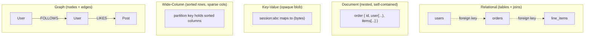

The key insight, and it comes back again and again in this guide, is that **there is no neutral choice.** Every model makes some operations cheap and others expensive, so the right pick depends entirely on how your application reads and writes. The relational model is superb when you need flexible queries and rich relationships, but only average when you have to serve one specific lookup a million times a second. The document model is superb for that single self-contained lookup, but painful the day you need to query across documents in a way the nesting never anticipated. Much of the rest of this guide is really an extended study of these trade-offs, and of how to reason about them out loud when an interviewer is pushing.

<details>
<summary>📖 In plain terms</summary>

A "data model" is just the shape you store your data in. Relational databases use tables with rows and columns and connect them by matching IDs. Document databases store each record as one nested JSON blob so you can grab the whole thing at once. Key-value stores are the simplest — a key points to some value and that's it. Wide-column stores handle huge tables with flexible columns, and graph databases specialize in relationships like "who follows whom." Each shape makes certain questions fast and others slow, so you pick the one that matches how your app actually uses the data.

</details>

---

## 3. ✅ ACID: The Guarantees a Transaction Makes

When multiple operations must succeed or fail as a unit, and when many users hit the database at once, you need guarantees about what can and cannot happen. **ACID** — Atomicity, Consistency, Isolation, Durability — is the set of promises a traditional relational database makes about transactions, and it is the single most important vocabulary in this whole topic because everything NoSQL does is described relative to it. A transaction is a group of reads and writes that the database treats as one logical operation.

**Atomicity** means all-or-nothing: either every write in the transaction commits, or none of them do. If you debit one account and credit another, atomicity guarantees you can never end up in a state where the money left one account but never arrived at the other, even if the server crashes halfway through. The database achieves this with a write-ahead log that lets it roll back a partial transaction on recovery.

**Consistency** — the most misunderstood letter — means the transaction moves the database from one valid state to another, respecting all declared rules: constraints, foreign keys, uniqueness, and any invariants your schema encodes. Note this is *application-level* consistency (the rules you defined), and it is a different word from the "consistency" in CAP, which is about all replicas agreeing. Conflating the two is a classic interview stumble.

**Isolation** means concurrent transactions do not step on each other; the result of running them at the same time is as if they had run one after another in some order. In practice databases offer *levels* of isolation that relax this promise for performance, which is the entire subject of Section 13. 

**Durability** means once the database confirms a commit, that data survives crashes, power loss, and reboots — it has been written to persistent storage (or replicated to enough nodes) that it will not be lost.

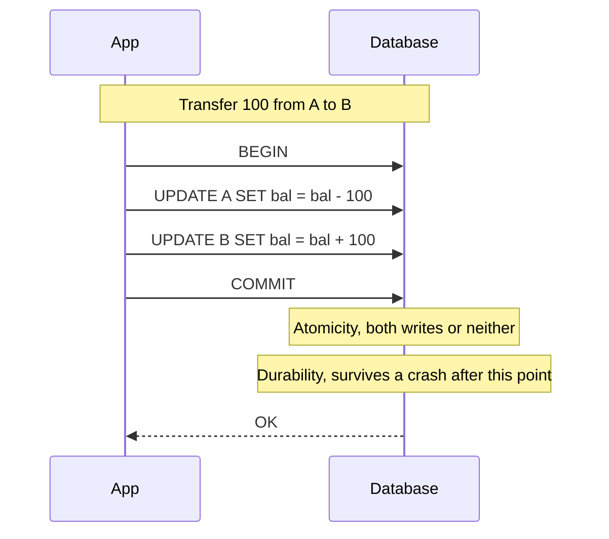

The reason ACID matters so much for the SQL-versus-NoSQL question is that these guarantees are *expensive to provide across a network.* Atomicity and isolation across many machines require coordination protocols that add latency and reduce availability when nodes cannot talk to each other. This is precisely the tension CAP formalizes, and it is why single-node relational databases offer ACID effortlessly while distributed systems must fight for even a weakened version of it. When an interviewer asks "why can't you just use Postgres for everything," the honest answer runs straight through this cost.

<details>
<summary>📖 In plain terms</summary>

ACID is four promises a database makes so you can trust your data. Atomicity: a group of changes all happen together or not at all — no half-finished money transfers. Consistency: the database never ends up breaking its own rules. Isolation: two people editing at once don't corrupt each other's work. Durability: once it says "saved," it stays saved even if the power dies. These promises are easy on one machine but hard and slow across many, which is the whole reason distributed databases sometimes relax them.

</details>

---

## 4. 🎨 CAP Theorem: The Choice a Partition Forces

The **CAP theorem**, proved by Eric Brewer and Gilbert–Lynch, is the lens through which the entire SQL-versus-NoSQL debate is usually framed — and it is also the most frequently misquoted idea in the field. It states that a distributed data store can guarantee at most two of three properties: **Consistency** (every read sees the most recent write, as if there were one copy of the data), **Availability** (every request receives a non-error response), and **Partition tolerance** (the system keeps working even when the network drops or delays messages between nodes).

The popular "pick two" framing is misleading. In any real distributed system, network partitions *will* happen — cables get cut, switches fail, data centers lose connectivity — so partition tolerance is not optional; it is a fact of life you must handle. The theorem therefore reduces to a sharper, more useful statement: **when a partition occurs, you must choose between consistency and availability.** You cannot have both, because to stay consistent you must refuse operations that could not be coordinated across the split, and refusing operations means becoming unavailable. To stay available you must answer using possibly-stale data, which means abandoning consistency.

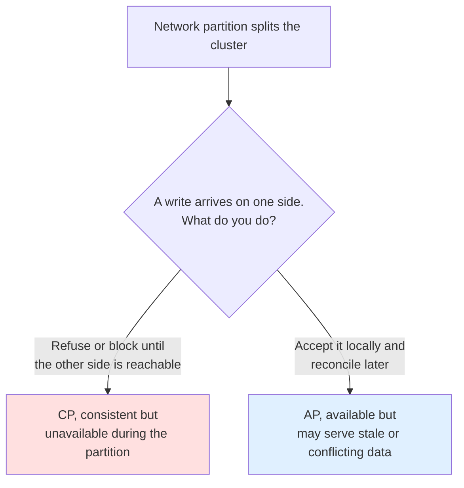

Concretely, a **CP system** (consistent under partition) is one like a single-leader relational database, HBase, or MongoDB in its default configuration: if the followers cannot reach the leader, writes stop rather than risk divergence. You choose CP when correctness beats uptime — a bank ledger, an inventory count that must never oversell, a system of record. An **AP system** (available under partition) is one like Cassandra or DynamoDB in eventually-consistent mode: every node keeps accepting reads and writes during the split and reconciles the differences afterward. You choose AP when uptime beats momentary correctness — a shopping cart, a social feed, a metrics pipeline, where showing slightly stale data is far better than showing an error.

The staff-level nuance, which separates a strong answer from a memorized one, is that **CAP describes behavior only during a partition, is binary and coarse, and says nothing about the far more common case when the network is healthy.** Real systems are not globally "CP" or "AP"; the choice is made per-operation and often per-key. DynamoDB lets you request a strongly-consistent read (CP-flavored) or an eventually-consistent one (AP-flavored) on the same table. This is exactly the gap PACELC was invented to fill, which is where we go next.

<details>
<summary>📖 In plain terms</summary>

Imagine your database runs on several servers and the network between them breaks, splitting them into two groups that can't talk. A write comes in. You have two choices: refuse it until the servers can sync again (staying correct but going "down" for that request), or accept it on your side and sort out conflicts later (staying "up" but risking that someone else reads old data). That's CAP: during a network split you must pick correctness or uptime — you can't have both. Banks pick correctness; shopping carts and social feeds usually pick uptime.

</details>

---

## 5. 💡 PACELC and BASE: Beyond CAP

CAP has a blind spot: it only tells you what happens *during* a network partition, which is rare. The interesting engineering trade-off happens the other 99.9% of the time, when the network is fine. **PACELC**, formulated by Daniel Abadi, closes that gap. It reads: *if there is a Partition (P), choose between Availability and Consistency (A/C); Else (E), when running normally, choose between Latency and Consistency (L/C).* The second half is the part that actually governs day-to-day design.

The "else" clause captures a truth CAP hides: even with a perfectly healthy network, keeping replicas perfectly consistent costs latency, because a write must be acknowledged by multiple nodes before it is confirmed. If you insist every read reflect the very latest write, reads and writes must coordinate, and coordination takes time. If you relax that — let a read hit the nearest replica even if it is a few milliseconds behind — you get lower latency at the cost of occasionally-stale data. This is why the same product can be described two ways: DynamoDB is **PA/EL** (chooses availability under partition, latency otherwise) by default but can be configured toward consistency; a single-leader Postgres is **PC/EC** (consistency in both cases).

**BASE** is the design philosophy that sits opposite ACID and describes how AP/EL systems actually behave. It stands for **B**asically **A**vailable, **S**oft state, **E**ventually consistent. *Basically available* means the system answers every request, even if the answer is stale or degraded. *Soft state* means the system's state can change over time without new input, because background reconciliation is propagating updates between replicas. *Eventually consistent* means that if writes stop, all replicas will converge to the same value given enough time — there is no guarantee about *when*, only that they get there. BASE is not "worse" than ACID; it is a different point on the spectrum, chosen when availability and scale matter more than immediate correctness.

The practical takeaway for interviews is to stop treating this as a binary and start speaking in terms of the spectrum. A mature answer sounds like: "This is a shopping-cart service, so I lean AP and EL — I want it always writable and fast even during a partition, and I'll accept eventual consistency because the cost of showing a slightly stale cart is low and I can reconcile at checkout. But the payment and inventory-decrement step is different: there I need CP and EC, so I'll route those specific operations through a strongly-consistent path even if it means higher latency and occasional unavailability." That per-operation reasoning is the whole game.

<details>
<summary>📖 In plain terms</summary>

CAP only talks about what happens when the network breaks, which is rare. PACELC adds the important everyday case: even when everything is healthy, you still trade speed against freshness. Keeping every copy of your data perfectly up to date is slower, because writes have to be confirmed by several servers; letting reads use a slightly-behind copy is faster. BASE is the mindset for systems that pick speed and uptime — "always answer, sync up in the background, everyone agrees eventually." It's not lazy; it's a deliberate trade for scale.

</details>

---

# Part II — Relational Databases & the SQL Language

## 6. 📊 The Relational Model: Tables, Keys, and Constraints

With the foundations in place, we can build the relational model concretely. A **table** (formally a relation) is a set of rows, where every row has the same named columns and each column holds a single typed value. That regularity is the whole point: because the shape is fixed and declared up front as a *schema*, the database can validate every write, store rows compactly, and let the query planner reason about the data without inspecting it. A row is often called a *tuple* and a column an *attribute*, and the schema is the contract that says, for example, that a `users` table has an integer `id`, a non-null `email` string, and a `created_at` timestamp.

Rows are identified by **keys**. A **primary key** is the column (or set of columns) that uniquely identifies each row; the database enforces that it is unique and non-null, and it is almost always the physical anchor around which the row is stored and indexed. A **foreign key** is a column whose values must match a primary key in another table — this is how relationships are expressed. When `orders.user_id` is a foreign key referencing `users.id`, the database guarantees you can never insert an order for a user that does not exist, a property called *referential integrity*. This guarantee is enforced by the database itself, not left to hope in application code, which is one of the relational model's quiet superpowers.

**Constraints** generalize this idea of the database enforcing rules on your behalf. A `NOT NULL` constraint forbids missing values; a `UNIQUE` constraint forbids duplicates in a column that is not the primary key (a user's email, say); a `CHECK` constraint enforces an arbitrary predicate such as `price >= 0`; and `DEFAULT` supplies a value when none is given. Together with foreign keys, constraints let you push invariants down into the storage layer where they cannot be bypassed by a buggy service or a second application writing to the same database.

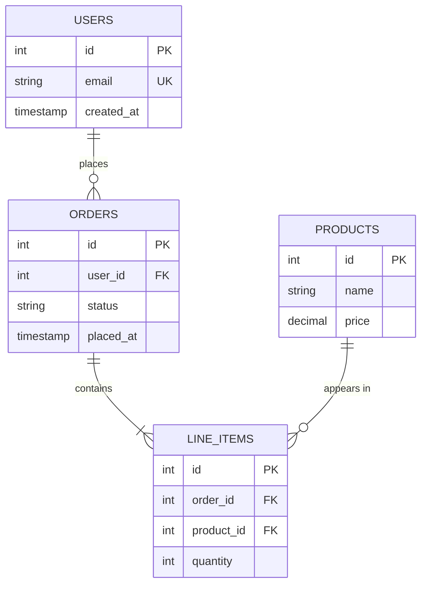

The staff-level point to internalize is that the schema and its constraints are a form of *centralized, always-on validation.* In a microservices world where many services and jobs may touch the same tables over years, the constraints are the last line of defense that keeps data sane. The counterargument an interviewer may raise — "but rigid schemas slow you down when requirements change" — is real, and it is exactly the pressure that pushes some teams toward schemaless document stores; but the trade is that you then move all that validation into application code and lose the guarantee that *every* writer respects it. Which side of that trade is right depends on how many independent writers touch the data and how costly a corrupt row is.

<details>
<summary>📖 In plain terms</summary>

A table is a grid with named, typed columns — like a spreadsheet the database strictly enforces. Each row has a primary key, a unique ID that names it. A foreign key is a column that points to another table's ID, which is how you link, say, an order to the customer who placed it. Constraints are rules the database refuses to break: this field can't be empty, this email must be unique, this price can't be negative. The big win is that these rules live in the database, so no buggy app code can sneak bad data past them.

</details>

---

## 7. 📊 Normalization: 1NF through 3NF

**Normalization** is the discipline of organizing tables so that each fact is stored exactly once. Its purpose is to eliminate *redundancy*, because redundancy is what causes update, insert, and delete *anomalies* — the situations where the same fact lives in many rows and they drift out of agreement. The classic example is storing a customer's address on every one of their order rows: change the address and you must update every order, and if you miss one, the database now disagrees with itself. Normalization removes that class of bug by structure rather than by careful coding.

The **first normal form (1NF)** requires that every column hold a single, atomic value — no lists packed into one cell, no repeating groups of columns like `phone1, phone2, phone3`. If a customer can have many phone numbers, those belong in a separate `phones` table, one row per number. This makes the data queryable: you cannot efficiently search or join on values buried inside a comma-separated string.

The **second normal form (2NF)** applies when a table has a *composite* primary key (a key made of two or more columns) and requires that every non-key column depend on the *whole* key, not just part of it. If `line_items` is keyed by `(order_id, product_id)` and you store `product_name` in it, that is a violation, because the product's name depends only on `product_id`, not on the order — so it should live in the `products` table. The **third normal form (3NF)** goes one step further and forbids *transitive* dependencies: a non-key column must not depend on another non-key column. If an `orders` table stores `user_id` and also `user_email`, the email depends on the user, not on the order, so it is transitively dependent and belongs in `users`.

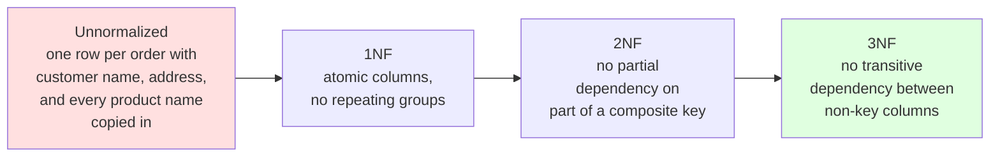

A useful mnemonic for 2NF and 3NF is that every non-key column must depend on "the key, the whole key, and nothing but the key." The practical target for most transactional systems is 3NF: it removes the redundancy that causes anomalies while keeping the schema intuitive. But normalization is not a religion, and this is where the interview gets interesting. A fully normalized schema spreads a single logical entity across many tables, so reading it back requires joins, and joins cost time. The deliberate reverse — *denormalization*, copying data back together to avoid joins — is a legitimate performance technique, and it is the very idea NoSQL document and wide-column models take to their logical conclusion (Part VII). The staff-level framing is: normalize until it hurts your read path, then denormalize the specific hot paths on purpose, knowing you now own the job of keeping the copies in sync.

<details>
<summary>📖 In plain terms</summary>

Normalization means "store each fact in exactly one place." If a customer's address is copied onto every order, changing it means fixing dozens of rows — miss one and your data contradicts itself. So you split things into tidy tables: customers here, orders there, linked by IDs. The three normal forms are progressively stricter rules for doing this: no lists stuffed in one cell (1NF), no column that depends on only part of a multi-column key (2NF), no column that depends on another non-key column (3NF). Most apps aim for 3NF, then selectively "denormalize" hot spots for speed.

</details>

---

## 8. 💻 SQL in Anger: CRUD, JOINs, and Set Thinking

SQL is a *declarative* language, and this is the single mental shift that makes it powerful. In most programming languages you write *how* to do something — open this file, loop over these records, check each one. In SQL you do not describe the "how" at all. You describe *what* result you want, and a component called the query planner (Section 15) works out the most efficient way to get it. You say "give me all shipped orders from January with the customer's email," and the database decides which indexes to use and in what order to read the tables.

The four core operations go by the shorthand **CRUD**: `INSERT` creates a row, `SELECT` reads rows, `UPDATE` changes rows, and `DELETE` removes them. Three of these are straightforward. Almost all the depth — and almost every interview question — lives in `SELECT`, because reading data usually means pulling it back together from several tables that normalization (Section 7) deliberately split apart.

That "pulling back together" is the job of the **JOIN**, and understanding joins is the heart of relational querying. A join matches rows from two tables using a condition, which is almost always a foreign-key equality like `orders.user_id = users.id`. What differs between join types is what happens to rows that have *no* match on the other side.

An **INNER JOIN** keeps only the rows that match on both sides. If you inner-join orders to users, you get orders that have a valid user and users that have at least one order — anything unmatched is dropped. For example, an order whose user was deleted simply disappears from the result.

A **LEFT (OUTER) JOIN** keeps every row from the left table no matter what, and fills in `NULL` for the right-side columns when there is no match. This is how you answer "which users have *never* placed an order": left-join users to orders, and the users with no orders come back with `NULL` in every order column — so you filter for exactly those `NULL`s.

A **RIGHT JOIN** is simply the mirror image (keep every row from the right table instead), and a **FULL OUTER JOIN** keeps unmatched rows from *both* sides at once. Finally, a **CROSS JOIN** produces every possible combination of rows from the two tables — rarely what you want by accident, but occasionally exactly the tool you need, for instance to generate every (size, color) pairing of a product.

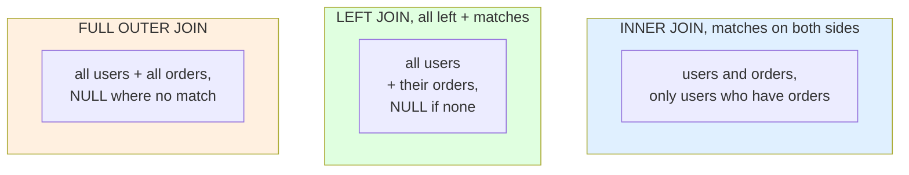

<details>
<summary>💻 SQL and Java: reading orders with their users</summary>

```sql
-- All orders placed since a date, with the customer's email.
-- INNER JOIN drops orders whose user was deleted; use LEFT JOIN to keep them.
SELECT o.id, o.placed_at, o.status, u.email
FROM orders o
INNER JOIN users u ON u.id = o.user_id
WHERE o.placed_at >= '2026-01-01'
ORDER BY o.placed_at DESC;

-- Find users who have NEVER ordered: LEFT JOIN + IS NULL on the right side.
SELECT u.id, u.email
FROM users u
LEFT JOIN orders o ON o.user_id = u.id
WHERE o.id IS NULL;
```

```java
// The same query from Java with JDBC, using a parameterized statement
// (never string-concatenate user input — that is how SQL injection happens).
String sql = """
    SELECT o.id, o.placed_at, o.status, u.email
    FROM orders o
    INNER JOIN users u ON u.id = o.user_id
    WHERE o.placed_at >= ?
    ORDER BY o.placed_at DESC
    """;

try (PreparedStatement ps = connection.prepareStatement(sql)) {
    ps.setDate(1, Date.valueOf(LocalDate.of(2026, 1, 1)));
    try (ResultSet rs = ps.executeQuery()) {
        while (rs.next()) {
            long orderId   = rs.getLong("id");
            String email   = rs.getString("email");
            String status  = rs.getString("status");
            // map into your domain object here
        }
    }
}
```

</details>

The deeper skill SQL rewards is **set thinking**, and it is worth slowing down on because it changes how you write every query. The instinct from ordinary programming is to think in loops: "for each user, go get their orders." SQL wants you to think in whole sets at once: "match the set of users to the set of orders." Once you make that switch, the tools fall into place. A subquery produces a set you can filter against; `IN`, `EXISTS`, `UNION`, and `INTERSECT` combine sets; and a join is really just the product of two sets narrowed down by a matching condition.

Why this matters shows up in a very common performance bug. Imagine you need each user's orders. The loop-minded approach fetches a list of user IDs with one query, then fires a separate `SELECT * FROM orders WHERE user_id = ?` for every single user. If there are 500 users, that is 1 query for the list plus 500 more — this is the infamous **N+1 query problem** (one query, plus N follow-ups). The set-minded approach does the whole thing in *one* round trip with a single join, `SELECT ... FROM users JOIN orders ON ...`, and lets the database do the matching internally where it is fast.

N+1 is especially easy to trigger by accident with an ORM (like Hibernate or ActiveRecord), because writing `user.getOrders()` inside a loop quietly issues a fresh query each time the relationship is "lazily" loaded. Recognizing and eliminating N+1 patterns is a frequent interview and code-review topic precisely because it turns one fast query into hundreds of slow ones and silently destroys throughput once real traffic hits.

<details>
<summary>📖 In plain terms</summary>

SQL lets you describe the result you want instead of writing the loops to get it. The workhorse is the JOIN, which stitches rows from two tables together by matching IDs — an inner join keeps only matches, a left join keeps everything on the left even when there's no match (great for "who has never ordered?"). The mindset that makes SQL click is thinking in whole sets at once rather than row-by-row. The classic beginner trap is the "N+1" problem: looping and firing one query per item instead of a single join, which is hundreds of times slower.

</details>

---

## 9. 📊 Aggregation: GROUP BY, HAVING, and Window Functions

Beyond fetching rows, SQL is very good at *summarizing* them, and this is where reporting, analytics, and a large share of interview questions live. **Aggregate functions** — `COUNT`, `SUM`, `AVG`, `MIN`, `MAX` — take many rows and boil them down to a single value. Used on their own, they reduce an entire table to one number: `SELECT COUNT(*) FROM orders` answers "how many orders are there?" with a single row.

Most of the time, though, you do not want one number for the whole table — you want one number *per category*. That is what **GROUP BY** does: it splits the rows into groups and runs the aggregate once per group. `SELECT user_id, COUNT(*) FROM orders GROUP BY user_id` gives you the number of orders for each user, with exactly one output row per user. Group by month instead and you get revenue per month; group by region and you get orders per region.

The subtlety that trips almost everyone up at first is the difference between **WHERE** and **HAVING**. Both filter, but at different stages. `WHERE` filters individual rows *before* they are grouped; `HAVING` filters whole *groups* after the aggregation has happened. Consider "find users with more than ten orders." You cannot write `WHERE COUNT(*) > 10`, because at the moment `WHERE` runs, the rows have not been grouped yet and the count simply does not exist. You need `HAVING COUNT(*) > 10`, which runs after grouping. A useful way to combine both: use `WHERE` to throw away rows you never care about (say, cancelled orders) *before* grouping, then `HAVING` to keep only the groups that qualify.

The reason this works the way it does is that SQL processes a query in a fixed logical order: `FROM` and joins first, then `WHERE`, then `GROUP BY`, then `HAVING`, then the `SELECT` expressions, then `ORDER BY`, and finally `LIMIT`. That single fact explains a lot of otherwise-confusing behavior — for instance, why you cannot use a column alias defined in `SELECT` inside a `WHERE` clause (the alias does not exist yet when `WHERE` runs), but you often *can* use it in `ORDER BY` (which runs after `SELECT`).

**Window functions** are the feature that separates competent SQL from expert SQL, and they come up constantly at the L5-and-above level. Here is the key difference from `GROUP BY`: a `GROUP BY` collapses each group down to one row, so you lose the individual rows. A window function instead computes a value *across a related set of rows* while **keeping every original row** — it just adds an extra computed column alongside the detail.

The building blocks are worth knowing by name. `ROW_NUMBER()`, `RANK()`, and `DENSE_RANK()` number rows within a partition (they differ only in how they handle ties: `ROW_NUMBER` always gives distinct numbers, `RANK` leaves gaps after ties, `DENSE_RANK` does not). `LAG()` and `LEAD()` let a row reach back to the previous row or forward to the next — perfect for "how much did revenue change from the previous day?" And `SUM() OVER (...)` produces a running total. The `OVER (PARTITION BY ... ORDER BY ...)` clause is what defines the "window": `PARTITION BY` restarts the calculation per group, and `ORDER BY` sets the order within it.

A concrete example makes this click. Suppose you want "the top 3 orders by value for each user." With plain `GROUP BY` this is painful, because you need both the aggregate (a ranking) *and* the individual detail rows. With a window function you write `ROW_NUMBER() OVER (PARTITION BY user_id ORDER BY total DESC)` to number each user's orders from highest to lowest, then keep only the rows numbered 1, 2, and 3. Same idea powers "each order shown next to the running total of that user's spend so far."

<details>
<summary>💻 GROUP BY, HAVING, and a window function</summary>

```sql
-- Per-user order count and total spend, only for users with 10+ orders.
SELECT u.id, u.email,
       COUNT(*)        AS order_count,
       SUM(o.total)    AS lifetime_value
FROM users u
JOIN orders o ON o.user_id = u.id
GROUP BY u.id, u.email
HAVING COUNT(*) > 10           -- filters GROUPS, not rows
ORDER BY lifetime_value DESC;

-- Window function: rank each user's orders by value, keep the top 3 per user.
SELECT *
FROM (
    SELECT o.id, o.user_id, o.total,
           ROW_NUMBER() OVER (
               PARTITION BY o.user_id      -- restart numbering per user
               ORDER BY o.total DESC        -- highest value first
           ) AS rn
    FROM orders o
) ranked
WHERE rn <= 3;                 -- top 3 per user, detail rows preserved
```

</details>

The staff-level insight is that pushing aggregation *into the database* is almost always faster than pulling raw rows into application code and summing them there, because the database aggregates next to the data (often while scanning an index) and returns only the small summarized result over the network. But there is a real limit: heavy analytical aggregations over billions of rows can overwhelm a transactional (OLTP) database and hurt the latency of ordinary user queries. That tension — OLTP versus OLAP — is why large organizations run analytics on separate columnar warehouses (Snowflake, BigQuery, Redshift) fed by a pipeline, rather than running `GROUP BY` over the production database. Naming that split, and knowing when a workload has outgrown its transactional store, is a mature answer.

<details>
<summary>📖 In plain terms</summary>

Aggregation is how SQL summarizes: COUNT, SUM, AVG, and friends turn many rows into totals. GROUP BY does it per category — orders per customer, revenue per month. The catch is WHERE filters rows before grouping and HAVING filters the groups after, so "customers with 10+ orders" needs HAVING. Window functions are the power tool: they add a summary column (a rank, a running total, "compare to previous row") while keeping every individual row — perfect for "top 3 per customer" questions that plain GROUP BY can't do.

</details>

---

## 10. 💻 CTEs and Views: Composing Complex Queries

As queries grow, readability and reuse become real problems, and SQL offers two tools to manage them. A **Common Table Expression (CTE)**, written with the `WITH` keyword, is a named, temporary result set that exists only for the duration of one query. Instead of nesting subqueries three levels deep, you define each step as a named CTE and then reference it, reading top to bottom like a pipeline. This is purely about clarity in most engines — the CTE is usually folded into the main query by the optimizer — but the gain in maintainability is enormous, and complex interview solutions are far easier to explain when structured as CTEs.

CTEs have a second, more powerful form: **recursive CTEs**, which reference themselves to walk hierarchical or graph-shaped data. An employee-manager org chart, a threaded comment tree, a bill-of-materials — anything with parent-child links — can be traversed to arbitrary depth with a recursive CTE that starts from a root and repeatedly joins the table to itself until no new rows appear. This is one of the few places relational SQL reaches into territory that graph databases (Section 23) handle natively, and knowing it exists lets you avoid reaching for a second datastore prematurely.

<details>
<summary>💻 A CTE and a recursive CTE</summary>

```sql
-- Plain CTEs: each step named, read as a pipeline.
WITH recent_orders AS (
    SELECT * FROM orders WHERE placed_at >= '2026-01-01'
),
user_totals AS (
    SELECT user_id, SUM(total) AS spend
    FROM recent_orders
    GROUP BY user_id
)
SELECT u.email, ut.spend
FROM user_totals ut
JOIN users u ON u.id = ut.user_id
WHERE ut.spend > 1000;

-- Recursive CTE: walk an org chart from a given manager down to all reports.
WITH RECURSIVE org AS (
    SELECT id, name, manager_id, 1 AS depth
    FROM employees
    WHERE id = 42                       -- anchor: the starting manager
    UNION ALL
    SELECT e.id, e.name, e.manager_id, org.depth + 1
    FROM employees e
    JOIN org ON e.manager_id = org.id   -- recursive step
)
SELECT * FROM org ORDER BY depth;
```

</details>

A **view** is a saved query given a name that behaves like a virtual table. Selecting from a view runs its underlying query; nothing is stored (unless it is a *materialized* view, discussed below). Views serve two important purposes. First, *abstraction and reuse*: you encode a complex join once as a view and let many queries and reports read from it as if it were a simple table, so the join logic lives in one place. Second, *security*: you can grant a user access to a view that exposes only certain columns or rows — hiding salary columns, or restricting to one tenant's data — without granting access to the underlying tables.

The performance-critical variant is the **materialized view**, which actually stores the computed result on disk and refreshes it on a schedule or on demand. A plain view re-runs its query every time and adds no storage cost but no speed benefit; a materialized view pays storage and refresh cost to make expensive aggregations instant to read. The interview trade-off is staleness versus speed: a materialized view of "daily revenue per region" is fast to query but only as fresh as its last refresh, so you use it when slightly-stale analytics are acceptable and the underlying query is too expensive to run on every request. This is, incidentally, the same freshness-versus-cost trade that recurs in caching and in eventual consistency — a pattern worth pointing out to an interviewer to show you see the connections.

<details>
<summary>📖 In plain terms</summary>

A CTE (the `WITH` clause) lets you name the steps of a big query so it reads like a top-to-bottom pipeline instead of tangled nested subqueries — and a recursive CTE can walk tree-shaped data like an org chart. A view is a saved query you can treat like a table: define a complex join once, reuse it everywhere, and optionally use it to hide sensitive columns. A materialized view goes further and stores the result so reads are instant, at the cost of the data being a little stale until the next refresh — the familiar speed-versus-freshness trade.

</details>

---

## 11. 📊 Indexes: The Data Structures Behind Fast Reads

An **index** is a separate data structure that lets the database find rows without reading the entire table. To see why that matters, picture a `users` table with ten million rows and the query `WHERE email = 'x@y.com'`. With no index, the database has no choice but to do a **full table scan** — read every single row and check its email one by one. That is O(n) work, and it is ruinous at ten million rows. An index turns that same lookup into something that touches just a handful of pages. This is the single most important performance lever in a relational database, and interviewers expect you to understand it deeply at every level.

The default index type in almost every relational database is the **B-tree** (more precisely a B+ tree). It is a balanced tree that keeps its keys in sorted order and, crucially, stays *shallow* even for enormous tables — typically only three or four levels deep for hundreds of millions of rows. Because the tree is that shallow, any lookup is just three or four page reads to reach the row, instead of ten million.

That sorted order is what makes the B-tree so versatile. Because the keys are stored in order, one B-tree can serve several kinds of query: exact matches (`email = 'x'`), range queries (`BETWEEN`, `<`, `>`), prefix matches (`LIKE 'abc%'`), and even `ORDER BY` on the indexed column with no separate sorting step (the data is already sorted the way you asked for). This all-purpose usefulness is exactly why it is the default choice.

A **hash index** is the specialized alternative. It stores keys in a hash table, which answers exact-equality lookups in O(1) — very fast. But a hash scatters keys deliberately, so it cannot do ranges or ordering *at all*: there is no way to ask a hash index for "everything between A and F." That limitation makes it a niche tool, used only when you know you will only ever do equality checks and never ranges.

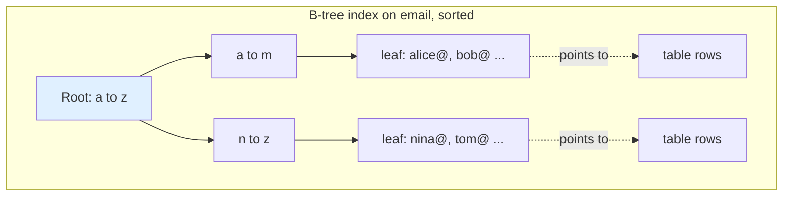

Two structural distinctions come up constantly in interviews. The first is the **clustered index**, which determines the physical order of the rows on disk — here the table *is* the index, because the actual row data is stored right in the tree's leaves. This is how a primary key works in MySQL's InnoDB and how SQL Server's clustered index behaves. Since the data can only be physically sorted one way, there can be only *one* clustered index per table.

The second is the **non-clustered (secondary) index**, a separate structure whose leaves hold the indexed columns plus a pointer back to the actual row. You can have many of these on one table. The catch is the pointer: a secondary-index lookup finds the entry in the index, then has to follow the pointer back to fetch the rest of the row — an extra step called a "bookmark lookup." For example, an index on `email` finds the matching entry quickly, but if your query also wants `name` and `signup_date`, the database must then jump to the table to get them. That extra hop is exactly the cost a *covering* index eliminates (Section 16).

The reasoning an interviewer pushes toward is that **indexes are not free**, and treating them as pure wins is the mark of an inexperienced answer. The reason is that an index is a copy of data that must be kept in sync: every `INSERT`, `UPDATE`, and `DELETE` that touches an indexed column has to update the index too. So each index you add slows down writes and consumes extra storage and memory. A table with a dozen indexes might have wonderfully fast reads but painfully slow writes, and those indexes may not even fit in RAM together.

The mature framing, then, is that indexing is a *read-write trade-off tuned to your access patterns*. You add indexes for the queries that actually matter and for columns with high selectivity; you drop indexes that nothing uses; and on a write-heavy workload you deliberately keep the index count low. Exactly which columns to index, in what order, and whether to make them composite or covering is the subject of Section 16 — once we have the execution plan as a tool to reason with.

<details>
<summary>📖 In plain terms</summary>

An index is like the index at the back of a book: instead of reading every page to find a topic, you jump straight to it. Without one, finding a specific user means scanning every row — fine for a hundred rows, disastrous for a hundred million. The default index is a B-tree, which keeps keys sorted so it's fast for both exact matches and ranges. The catch: every index has to be kept up to date on every write, so more indexes mean faster reads but slower inserts and updates. You index the columns your important queries actually filter on — not everything.

</details>

---

# Part III — Transactions & Concurrency

## 12. ✅ Transactions and the Anomalies Concurrency Creates

We met ACID in Section 3 as a set of promises. Now we examine the hardest promise to keep — **isolation** — and the specific bugs that appear when it is relaxed. Isolation is hard for a simple reason: a database serves many transactions at the same time. If it truly ran them one at a time (serially), the results would always be correct, but throughput would be terrible — everyone would wait in a single line. So databases *interleave* transactions to stay fast, and interleaving opens the door for one transaction to catch a glimpse of another's half-finished work. The anomalies below are the specific ways that goes wrong, and the isolation levels (Section 13) are the menu of how much of that risk you choose to accept.

There are four classic anomalies, and knowing them by name is table stakes in an interview. It helps to attach each to a concrete example.

A **dirty read** happens when transaction A reads a row that transaction B has changed but not yet committed. If B then rolls back, A has acted on a value that never officially existed. Example: B is halfway through a transfer and has temporarily set an account balance to $0; A reads that $0 and declines the customer's card — then B rolls back and the $0 never really happened.

A **non-repeatable read** happens when A reads a row, B updates that row and commits, and A reads the *same* row again inside the same transaction and now sees a different value. The same query gave two different answers within one transaction. Example: A reads a product's price as $10, generates part of an invoice, then reads the price again and it is now $12 because B changed it mid-way.

A **phantom read** is subtler because it is about a *set* of rows rather than one row. A runs a query that returns a set (say "all orders over $100"), B inserts a brand-new row that also matches, and when A re-runs the same query it sees an extra "phantom" row that appeared out of nowhere mid-transaction. Example: A counts 5 large orders, and after B inserts one, A's re-count says 6.

Finally, a **lost update** happens when two transactions read the same value, both compute a new value from it, and both write back — so the second write silently clobbers the first, and one update simply vanishes. Example: two support agents both open a ticket showing 100 loyalty points, one adds 50 and one adds 30, and depending on write order the customer ends up with 130 or 150 instead of the correct 180.

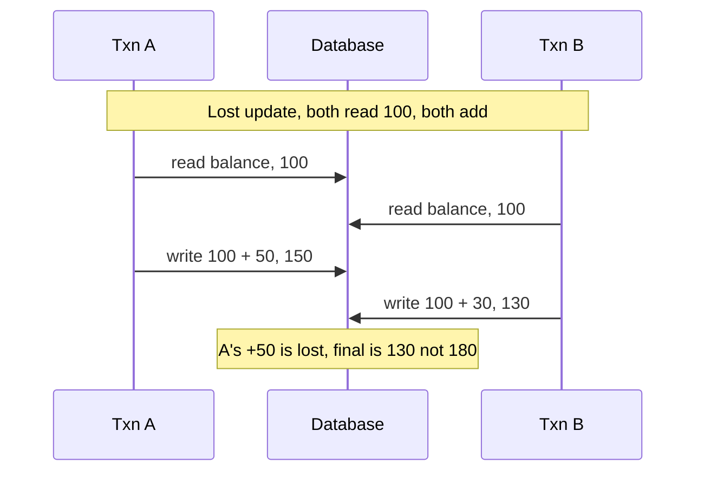

The reason this matters beyond trivia is that **each anomaly maps to a real, expensive bug.** A lost update in an inventory system oversells stock you do not have. A dirty read in a payments flow acts on money that was never actually moved. A phantom read in a booking system double-books the same seat. So the interviewer's follow-up is always "which isolation level prevents this, and what does it cost?" — because the answer reveals whether you understand the core trade: stronger isolation buys correctness at the price of reduced concurrency and higher latency.

That trade is the entire content of the next section. The mature instinct is to choose the *weakest* isolation level that still prevents the anomalies your specific workload genuinely cannot tolerate — rather than reflexively cranking everything to the strongest setting and paying for guarantees you do not need.

<details>
<summary>📖 In plain terms</summary>

To stay fast, a database runs many transactions at the same time instead of one after another — but interleaving them can let one transaction glimpse another's unfinished work. That causes classic bugs: a dirty read (seeing data that gets rolled back), a non-repeatable read (the same row changes mid-transaction), a phantom read (new matching rows appear mid-query), and a lost update (two people edit at once and one change vanishes). Each maps to a real disaster like overselling stock or double-booking a seat. Isolation levels are the dial that controls which of these can happen.

</details>

---

## 13. 📊 Isolation Levels: The Standard and Its Fine Print

The SQL standard defines four **isolation levels**, and the clean way to understand them is as a ladder: each rung forbids one more of the anomalies from the last section, trading a little speed for a little more safety as you climb.

At the bottom is **Read Uncommitted**, the weakest. It allows dirty reads — a transaction can see another's uncommitted changes. Almost no one chooses this deliberately.

One rung up is **Read Committed**. It guarantees you only ever read *committed* data, which eliminates dirty reads, but it still permits non-repeatable and phantom reads. This is the *default* in PostgreSQL, Oracle, and SQL Server, and for most applications it is exactly the right default.

Next is **Repeatable Read**, which adds a promise on top: any row you have already read will not change if you read it again within the same transaction, eliminating non-repeatable reads. This is MySQL InnoDB's default.

At the top is **Serializable**, the strongest. It guarantees the final outcome is *as if* the transactions had run one at a time in some serial order, which eliminates every anomaly including phantoms. It is the safest and, as we will see, the most expensive.

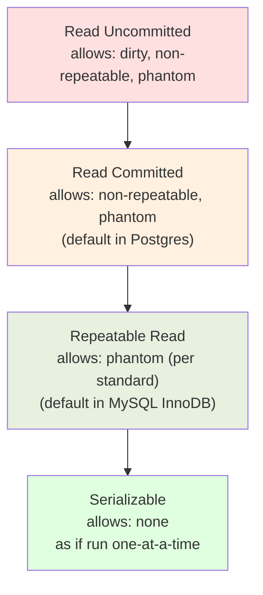

Here is the fine print that separates a memorized answer from a real one: **the isolation levels are defined by which anomalies they forbid, not by how they are implemented — and real databases differ.** The name tells you the guarantee, not the mechanism, and vendors often provide *more* than the standard demands.

The classic example is PostgreSQL's "Repeatable Read." Under the hood it uses snapshot isolation, and as a side effect it *also* prevents phantom reads — even though the standard permits phantoms at that level. So the same level name means something slightly stronger in PostgreSQL than the letter of the standard requires.

Snapshot isolation brings its own twist: it allows a distinct anomaly the standard does not even name, called **write skew**. Write skew happens when two transactions each read an overlapping set of rows, then make *disjoint* updates based on a shared assumption, and both commit — together breaking a rule that neither broke alone. The textbook case is two on-call doctors, each running a transaction that checks "is at least one *other* doctor still on duty?" Both see "yes," both conclude it is safe to go off duty, and both commit — leaving zero doctors on call, which the rule was supposed to prevent. Only true Serializable — implemented as Serializable Snapshot Isolation in PostgreSQL, or via strict two-phase locking elsewhere — closes write skew.

The staff-level reasoning is a cost model. Serializable is the safest, but it has the highest chance of transactions blocking, or being aborted and retried; under heavy contention that can collapse throughput, and it may require your application code to catch serialization-failure errors and retry them. Read Committed, at the other end, is fast and rarely blocks, but it leaves you exposed to lost updates and write skew *unless* you defend the specific operations that need it. The two standard defenses are explicit locking — `SELECT ... FOR UPDATE`, which locks the rows you read so no one else can change them until you commit — and atomic single-statement updates like `UPDATE accounts SET balance = balance - 50 WHERE id = 1`, which do the read and write as one indivisible step so no update can be lost.

So the real answer to "what isolation level?" is not a single global choice. Default to Read Committed for throughput, identify the handful of operations whose invariants concurrency could actually violate (moving money, decrementing stock, assigning the last seat), and protect *those* specifically — by raising just them to Serializable, taking explicit row locks, or restructuring them as atomic writes. That surgical approach, rather than a blanket setting, is what a strong candidate describes.

<details>
<summary>📖 In plain terms</summary>

Isolation levels are a dial from loose to strict. Read Uncommitted lets you see others' unsaved changes (nobody wants this). Read Committed — the common default — means you only see saved data but the same query can still give different answers if someone else commits mid-way. Repeatable Read locks in the rows you've read. Serializable makes it behave as if transactions ran one at a time — safest, but slowest and most likely to force retries. The pro move: use the fast default everywhere, then tighten only the few operations (like moving money) where a race would actually cause harm.

</details>

---

## 14. 🎨 Locking, Deadlocks, and MVCC

How does a database actually *enforce* isolation? Historically, with **locks**. There are two basic kinds. A **shared (read) lock** lets many transactions read the same row at once but blocks anyone who wants to write it — reading together is safe. An **exclusive (write) lock** lets exactly one transaction modify a row and blocks everyone else, readers and writers alike, until that transaction commits.

Locks can be taken at different **granularities** — a single row, a whole page, or an entire table — and choosing the size is a real trade-off. Fine-grained row locks allow the most concurrency (many transactions working on different rows at once) but cost memory and bookkeeping to track thousands of individual locks. Coarse table locks are cheap to manage but serialize access to the whole table, killing concurrency. To manage this, databases sometimes perform *lock escalation*: when a single transaction has taken so many row locks that tracking them is expensive, the database converts them into one table lock — which can unexpectedly throttle every other transaction that needs that table.

Locking introduces its own hazard: the **deadlock**. The simplest case involves two transactions and two rows. Transaction A locks row 1, then reaches for row 2. Meanwhile transaction B has already locked row 2 and now reaches for row 1. Neither can proceed, and neither will let go of what it already holds — a cycle of waiting that would last forever. Databases detect this by maintaining a *wait-for graph* (who is waiting on whom), spotting the cycle, and resolving it by choosing one transaction as the **victim** to abort and roll back so the other can continue. The application then has to retry the aborted one.

The practical defenses an interviewer wants to hear are concrete. First, always acquire locks in a *consistent order* across your whole codebase — if every transaction locks row 1 before row 2, the cycle above can never form. Second, keep transactions short, which shrinks the window in which a conflict can occur. Third, be prepared to catch deadlock errors and retry with backoff. This is a topic where the textbook definition is easy but the operational wisdom is what signals real experience: "we standardized lock ordering and added retry-with-jitter, and deadlocks dropped to near zero."

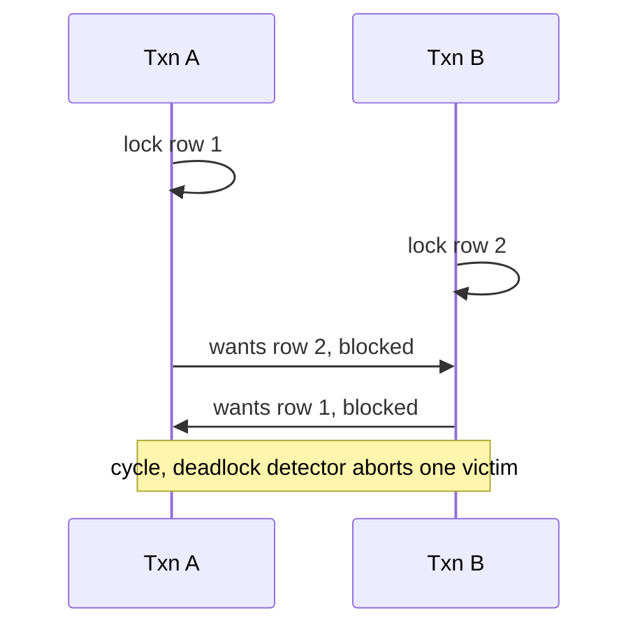

The modern answer to the concurrency problem — and the reason most databases no longer make readers and writers fight over locks — is **Multi-Version Concurrency Control (MVCC)**. The core idea is that the database never overwrites a row in place. Instead it keeps *multiple versions* of each row, each tagged with the transaction that created it. When a transaction begins, it effectively takes a consistent *snapshot* of the database as of that instant: its reads see the versions that were committed as of the snapshot, and it simply ignores anything newer.

Here is why that is transformative: **readers never block writers, and writers never block readers.** Picture a reporting query reading a row while someone updates that same row. Under old-style locking they would fight. Under MVCC the reader keeps reading the older committed version while the writer creates a new version alongside it — nobody waits. The only conflict that still needs coordination is two writers trying to modify the *same* row at once. This is how PostgreSQL, MySQL's InnoDB, and Oracle all achieve high concurrency, and it is the mechanism behind snapshot isolation.

MVCC is not free, and this is the follow-up an interviewer pushes toward: all those old row versions accumulate and must eventually be cleaned up. In PostgreSQL that cleanup is the job of **VACUUM**. A table that takes heavy updates but is not vacuumed enough suffers **bloat** — dead, no-longer-visible versions piling up, consuming disk and slowing down every scan that has to skip over them — and, in the extreme, *transaction-ID wraparound*, a famous class of production incident that can force a database into read-only mode to protect itself.

So the complete MVCC story is a balance. It buys you excellent read-write concurrency and clean, consistent snapshots, at the price of *write amplification* (every update writes a whole new version rather than editing in place) and a background garbage-collection process you must monitor and tune. Being able to name VACUUM, bloat, and the readers-don't-block-writers property together is the difference between having read about MVCC and having actually operated it.

<details>
<summary>📖 In plain terms</summary>

The old way to keep transactions from clashing was locks: readers and writers take turns, which is safe but slow. A deadlock is when two transactions each hold what the other wants and both freeze — the database kills one and makes it retry. The modern fix is MVCC: instead of locking, the database keeps several versions of each row, so a reader just reads the older version while a writer makes a new one. Nobody waits. The cost is that dead old versions pile up and a background cleanup (PostgreSQL calls it VACUUM) has to sweep them away.

</details>

---

# Part IV — Query Optimization

## 15. 📊 The Execution Plan and the Cost-Based Optimizer

When you submit a SQL query, you describe *what* you want; the database decides *how* to get it. The written-down version of that decision is the **execution plan** (or query plan). Because SQL is declarative, there are usually many physically different ways to compute the very same result: scan the whole table and filter, or use an index; join table A to B, or B to A; do the join as a hash join, a nested-loop join, or a merge join. The component that chooses among all these options is the **query optimizer**, and in every serious database it is a **cost-based optimizer (CBO)** — meaning it estimates the cost of each candidate plan (in disk pages read, CPU, and memory) and picks the cheapest.

To make those estimates, the optimizer relies on **statistics** the database keeps about each table: how many rows it has, how many distinct values a column holds, the distribution of those values (often stored as a histogram), and how correlated columns are. From these it estimates two key quantities — *selectivity*, the fraction of rows a condition will match, and *cardinality*, how many rows will flow out of each step of the plan.

A concrete example shows why this drives everything. If the optimizer estimates that `WHERE status = 'shipped'` matches only 2% of rows, using an index looks very attractive — jump to those few rows and stop. But if it estimates 60%, a full table scan is actually *cheaper*, because reading the table straight through beats jumping around the index and back to the table for more than half the rows. Same query shape, opposite decision, driven entirely by the estimate.

This is why `EXPLAIN` is the essential tool — and `EXPLAIN ANALYZE` even more so, because it actually runs the query and reports the *real* timings and row counts next to the estimates. It shows you the plan the optimizer chose, where its estimated row counts diverged from actual, and where the time truly went.

<details>
<summary>💻 Reading an EXPLAIN plan</summary>

```sql
EXPLAIN ANALYZE
SELECT o.id, u.email
FROM orders o
JOIN users u ON u.id = o.user_id
WHERE o.status = 'shipped'
  AND o.placed_at >= '2026-01-01';

-- A healthy plan (PostgreSQL-style) reads bottom-up:
--   Index Scan using idx_orders_status_date on orders  (rows=1,200 ... actual rows=1,190)
--     Index Cond: (status = 'shipped' AND placed_at >= '2026-01-01')
--   -> Nested Loop
--        -> Index Scan using users_pkey on users  (per matching order)
--
-- Warning signs to call out in an interview:
--   * "Seq Scan" on a large table when you expected an index  -> missing/unused index
--   * estimated rows=10 but "actual rows=2,000,000"           -> stale statistics
--   * a Nested Loop over millions of rows                     -> should be a Hash Join
```

</details>

The staff-level insight is that **the optimizer is only as good as its statistics and its cost model, and both can be wrong.** The single most common cause of a query that "suddenly got slow in production" is *stale statistics*. The table grew or its data distribution shifted, but the statistics were not refreshed, so the optimizer's estimate is now off by orders of magnitude. It picks a nested-loop join expecting 10 rows when there are actually two million — a plan that is catastrophically slow at that scale. The fix is often as simple as running `ANALYZE` to refresh the statistics, after which the optimizer picks a sensible plan again.

A few other real-world causes come up in interviews, all worth recognizing. *Parameter sniffing* is when a plan cached for one parameter value turns out to be terrible for another (a plan tuned for a customer with 3 orders is a disaster for a customer with 3 million). *Non-sargable predicates* are conditions that accidentally prevent index use by wrapping the indexed column in a function — `WHERE YEAR(placed_at) = 2026` cannot use an index on `placed_at`, whereas `WHERE placed_at >= '2026-01-01' AND placed_at < '2027-01-01'` can. And *implicit type casts*, like comparing an indexed numeric column to a string literal, can silently disable an index in the same way.

The through-line is this: the optimizer is a heuristic estimator, not an oracle. Knowing that, and knowing how to read a plan to catch it estimating badly, is the core competency of query tuning.

<details>
<summary>📖 In plain terms</summary>

You tell SQL what you want; the database figures out how to fetch it. The "execution plan" is that step-by-step recipe, and the optimizer picks it by estimating which approach reads the fewest pages — using statistics it keeps about your tables (how many rows, how varied the values are). The `EXPLAIN` command shows you this plan. The number-one reason a query suddenly turns slow is stale statistics: the table changed, the optimizer's guesses are now wrong, and it picks a bad plan. Refreshing statistics often fixes it instantly.

</details>

---

## 16. 💡 Index Strategy: Composite, Covering, and Selectivity

With the execution plan as our lens, we can now reason about *which* indexes to create — the judgment that separates engineers who "add an index when things feel slow" from those who design indexes to match the shape of their queries.

The first principle is **selectivity**: an index is only worth using when it narrows the search down to a small fraction of rows. Consider a boolean `is_active` column where 95% of rows are active. An index on it is nearly useless, because a query for active users still matches almost everything — and the optimizer will (correctly) scan the table anyway, since jumping through an index that points at most of the rows is slower than just reading the table straight through. The good candidates are high-selectivity columns like email, user ID, or order ID, where any given value points at very few rows. Low-cardinality columns rarely earn an index on their own.

A **composite index** covers multiple columns in a defined order, and that order is everything. Take an index on `(user_id, status, placed_at)`. It can serve a query filtering on `user_id` alone, or on `user_id AND status`, or on all three — always reading a *left-to-right prefix* of the index. What it *cannot* do efficiently is serve a query that filters only on `status`, because `status` is not the leading column: the index is sorted by `user_id` first, so all the `status` values are scattered throughout it with no way to jump straight to them. This is the **leftmost-prefix rule**, and it is one of the most common indexing questions in interviews.

The practical corollary is that you choose the column order to serve your most important queries, and as a rule of thumb you put equality-filter columns before range-filter columns. For example, an index on `(status, placed_at)` handles `status = 'shipped' AND placed_at > '2026-01-01'` beautifully: it narrows to the `shipped` entries by equality first, and because those entries are then sorted by date, it can range-scan the dates within that slice. Flip the order and the range column first would scatter the equality matches.

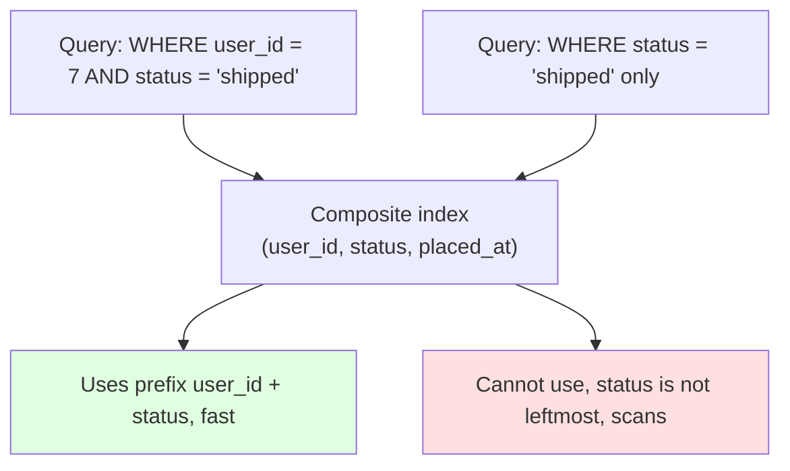

A **covering index** is the optimization that eliminates the trip back to the table. Recall from Section 11 that a secondary-index lookup finds the matching entries in the index, then follows pointers back to the table to fetch the other columns the query needs — a second I/O for every row. But if the index *already contains every column the query references* (either in its key columns or via an `INCLUDE` clause that carries extra columns in the leaves), the database can answer the whole query from the index alone and skip the table entirely. This is called an *index-only scan*, and for a hot, frequently-run query it can be a several-fold speedup.

The classic pattern is to include the small set of columns a frequent query selects. Suppose your busiest query is "recent orders for this user, with their status and total." An index on `(user_id, placed_at) INCLUDE (status, total)` lets that query be answered without ever touching the table: `user_id` and `placed_at` locate and order the rows, and `status` and `total` are right there in the index leaves waiting to be returned.

The reasoning an interviewer pushes toward, tying back to Section 11, is that every one of these choices is a *write tax paid for a read benefit*, so index design is inseparable from the workload. A wide covering index makes one query fast, but it is physically larger, slower to update on every write, and consumes more of the cache that other queries need.

The mature approach, therefore, is measurement-driven. Instrument the real query workload — with `pg_stat_statements` in PostgreSQL or the slow query log in MySQL — find the handful of queries that dominate total cost, and design composite and covering indexes precisely for those. Then periodically drop indexes that the statistics show are never used, since they are pure write tax with no read benefit. You do not index hopefully; you index the queries the data says matter, and you keep re-evaluating as the workload shifts.

<details>
<summary>📖 In plain terms</summary>

Good indexing matches the shape of your real queries. Only index columns that narrow things down a lot — indexing a yes/no flag that's 95% "yes" is pointless. A composite index covers several columns but only left-to-right: an index on (user, status, date) helps queries that start with "user," not ones that filter only by "status." A covering index goes further by including every column a query needs, so the database answers straight from the index without touching the table — a big speedup. Every index speeds reads but taxes writes, so you build them for the queries that actually matter.

</details>

---

# Part V — Scaling a Relational Database

## 17. 🎨 Replication: Leader-Follower, Multi-Leader, Leaderless

A single database server always has a ceiling: finite CPU, memory, and disk — and it is a single point of failure. The first tool for pushing past that ceiling is **replication**, which means keeping copies of the same data on multiple machines. Replication buys you three things at once: *read scalability* (spread reads across many copies), *high availability* (if one machine dies, another already has the data), and *geographic locality* (serve users from a copy physically near them). But it also introduces the central problem of all distributed data — keeping the copies in agreement while writes keep arriving. How you organize the copies defines three architectures with sharply different trade-offs.

The dominant model is **leader-follower** (also called primary-replica, or the older master-slave). One node is designated the **leader** and is the *only* node that accepts writes; it streams its change log to one or more **followers**, which apply those changes and serve reads. This is the default in PostgreSQL, MySQL, and most relational deployments. Its great virtue is simplicity and the total absence of write conflicts: since only the leader writes, there is exactly one authoritative order of operations that everyone else copies.

Its central tension is **replication lag** — followers apply the leader's changes slightly *behind*, so a read from a follower can return slightly stale data. This produces the famous *read-your-own-writes* problem, best seen through an example: a user edits their profile, the write goes to the leader, but their very next page load reads from a follower that has not caught up yet, so they see their *old* profile and conclude the save failed. The standard fixes are exactly the follow-up an interviewer wants: for a short window after someone writes, route *their* reads to the leader; or track the exact write position and only route the read to a follower that has caught up past it.

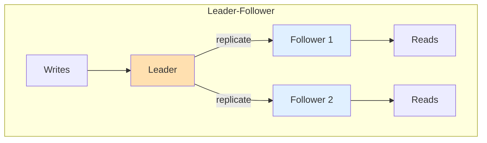

A critical sub-decision within leader-follower is **synchronous versus asynchronous** replication, and it is really a choice between speed and safety. In *asynchronous* replication, the leader confirms the write to the client as soon as it is durable on the leader itself, then ships it to followers in the background. This is fast, but if the leader crashes in the brief moment before it propagates, that already-confirmed write is lost — data loss on failover. In *synchronous* replication, the leader waits for at least one follower to acknowledge the write before confirming to the client. Now there is no data loss on failover, but every write pays the round-trip latency to the follower, and if that follower is slow or down, writes *stall* entirely. Because neither extreme is ideal, most production systems use *semi-synchronous*: one synchronous follower for durability, and the rest asynchronous for performance. Naming this trade — durability versus latency, resolved by the semi-sync compromise — is a strong signal.

**Multi-leader** replication allows more than one node to accept writes, typically one leader per data center, each replicating to the others. This improves write availability and lets each region serve its local writes with low latency. But it creates precisely the problem leader-follower avoided: **write conflicts**. If the same record is edited in two regions at nearly the same time — say a user's address is changed in the US data center and the EU data center within the same second — the system must reconcile the two versions. The strategies are last-write-wins (simple, but silently throws away one edit), application-defined merge logic, or conflict-free replicated data types (CRDTs, which are designed to merge automatically without losing data). Multi-leader is powerful for multi-region and offline-capable systems, but that conflict resolution is genuinely hard, so it is chosen deliberately, never by default.

**Leaderless** replication, popularized by Amazon's Dynamo paper and used in Cassandra and Riak, abandons the leader entirely. Instead, the client (or a coordinator acting for it) writes to *several* replicas directly and reads from *several* replicas, using **quorums** — requiring a minimum number of replicas to agree — to stay consistent. This is the model that underpins the consistency discussion in Section 26, so we will defer the quorum mechanics to there. The key framing for now is that leaderless trades away the simplicity of a single write authority in exchange for excellent write availability: there is no single leader that has to fail over, so writes can continue even as individual nodes come and go. The price is that conflict handling and consistency tuning move onto the read and write paths themselves.

The three models form a natural progression: leader-follower for most relational needs, multi-leader when several regions must all accept writes locally, and leaderless when write availability must survive the failure of any node.

<details>
<summary>📖 In plain terms</summary>

Replication means keeping copies of your data on several machines — for speed (spread out reads), safety (a spare if one dies), and closeness to users. The common setup is leader-follower: one machine takes all the writes and copies them to followers that serve reads. The snag is "replication lag" — followers are a beat behind, so you might save something and then read a stale copy. Multi-leader lets several machines take writes (great across regions, but they can conflict), and leaderless writes to many copies at once (used by Cassandra) for maximum uptime. Each step trades simplicity for availability.

</details>

---

## 18. 🎨 Partitioning and Sharding: Range, Hash, Consistent Hashing

Replication copies the *whole* dataset to each node. That solves read scaling and availability, but it does nothing for a dataset too large to fit on one machine, or a write volume too high for one leader to handle — every copy still holds everything and every write still goes through one leader. The answer to *that* problem is **partitioning** (called **sharding** when the partitions live on separate machines): splitting the data into disjoint pieces so each node holds and serves only a subset. Replication and sharding are independent ideas and are usually combined — each shard is itself replicated for availability. The defining question of sharding is *how you decide which partition a given row belongs to*, because that single choice determines whether load spreads evenly and whether your common queries stay fast.

**Range partitioning** assigns rows to partitions by contiguous ranges of the partition key: users A–F on shard 1, G–M on shard 2, and so on, or orders split by month. Its big advantage is that range queries stay efficient — "all orders in January" lands entirely on one partition. Its big danger is **hotspots**. If the key is accessed unevenly, or is monotonically increasing like a timestamp or an auto-increment ID, then all the new writes pile onto the *last* partition while every other shard sits idle. Time-series systems that partition by day suffer this exactly: today's shard is red-hot with all the writes while last month's shards are cold and untouched.

**Hash partitioning** solves the hotspot problem by first running the key through a hash function and assigning the row by the resulting hash value. Because a hash scatters even sequential keys uniformly, writes spread evenly across all shards. The cost is that range queries are destroyed: adjacent keys now land on completely different shards, so "all orders in January" must query *every* partition and merge the results — an operation called a *scatter-gather*. This is the fundamental range-versus-hash trade: range keeps locality but risks hotspots, while hash kills hotspots but loses locality. Many systems get the best of both — DynamoDB's composite keys are the standard example — by *hashing* a **partition key** to spread load across shards, while *range-sorting* within each partition on a **sort key** so that ranges stay efficient inside a single partition.

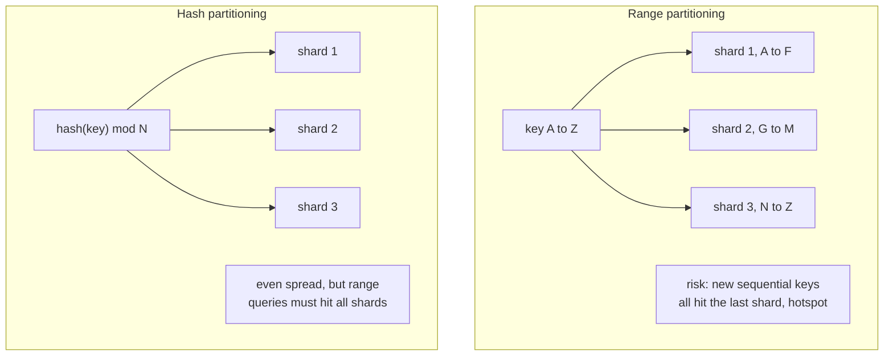

Naive hash partitioning has a hidden flaw in *how* it maps a hash to a shard. The obvious formula is `hash(key) mod N`, where N is the number of nodes — but this is exactly what **consistent hashing** was invented to fix. The problem: the moment you add or remove a node, N changes, and because the modulus changed, *almost every key* now maps to a different node. That forces a massive data reshuffle and cache invalidation across the entire cluster just to add one machine.

Consistent hashing avoids this by placing both the nodes and the keys on a conceptual ring — a hash space wrapped around into a circle. Each key belongs to the first node it meets going clockwise from its own position. Now when a node joins or leaves, only the keys in its immediate arc need to move — roughly 1/N of the data — and every other key stays exactly where it was. Real systems refine this further with **virtual nodes**, where each physical machine owns many small arcs scattered around the ring rather than one big arc. That keeps load balanced and means a departing node's share is redistributed across many peers instead of being dumped entirely on its one clockwise neighbor. This is the partitioning scheme behind Cassandra, DynamoDB, and countless distributed caches.

The staff-level reasoning ties everything together around **partition-key choice**, which is the most consequential and hardest-to-reverse decision in a sharded system. A good partition key does two things at once: it spreads both storage and load evenly across shards, *and* it keeps the queries you run most often inside a single partition — because cross-partition queries and cross-partition transactions are expensive or, in many systems, simply unsupported.

The classic failure is choosing a low-cardinality or skewed key. Sharding a multi-tenant SaaS system by `tenant_id` sounds reasonable until you realize one enterprise tenant is a thousand times larger than the rest — now that tenant's shard is permanently hot and no amount of hardware fixes it, because all its data is forced onto one machine. So the interview follow-up is always "what happens when one shard gets hot, and how do you reshard without downtime?" The honest answer — introduce a composite key to break up the hot tenant, add a shard and migrate its key range gradually, or lean on consistent hashing so the blast radius of any change is small — demonstrates that you have actually felt this pain rather than just read about it.

<details>
<summary>📖 In plain terms</summary>

When your data is too big or too write-heavy for one machine, you split it into pieces (shards) across many machines. How you decide which piece a row goes to matters enormously. Range sharding groups by ranges (A–F here, G–M there) — great for "give me January" but risky because new data can all pile onto one shard. Hash sharding scatters rows evenly to avoid hotspots but ruins range queries. Consistent hashing is a smarter scheme so that adding or removing a machine only moves a small slice of data instead of reshuffling everything. Picking the shard key well is the whole game.

</details>

---

# Part VI — NoSQL: The Four Families

## 19. 🎯 Why NoSQL Emerged and What Each Family Solves

By now the pressure that produced NoSQL should feel inevitable rather than fashionable. We have watched a relational database scale reads with replication and scale size with sharding — but every step fought the model's core assumptions. Joins assume data is cheaply reachable, which sharding breaks. ACID transactions assume coordination is cheap, which the network makes expensive. Rigid schemas assume requirements are known up front, which fast-moving products violate. **NoSQL** ("Not Only SQL") is the family of databases that started from the opposite assumptions: designed from birth to run across many machines, to scale writes horizontally, to tolerate flexible or absent schemas, and to stay available under partition — accepting weaker consistency and limited query power as the price.

It is important to be precise about what NoSQL trades away, because "NoSQL is for scale" is the shallow answer an interviewer will probe. What these systems actually give up, in varying combinations, is: *multi-record ACID transactions* (many offer only single-record atomicity), *joins* (you denormalize instead), *ad-hoc query flexibility* (you must design around known access patterns), and *strong consistency by default* (many are eventually consistent). What they gain is *horizontal write scalability*, *high availability under failure*, *flexible schema evolution*, and often *lower latency* for the specific access patterns they are tuned for. The modern landscape blurs these lines — PostgreSQL stores and indexes JSON, and "NewSQL" systems like CockroachDB and Google Spanner deliver distributed ACID — but the four classic families remain the clearest way to reason about the design space.

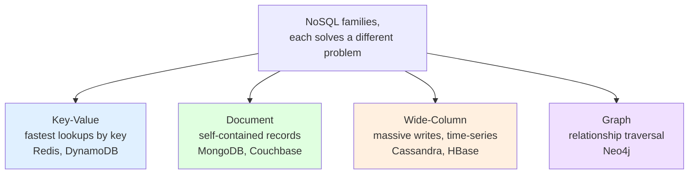

The organizing idea for the next four sections is that **each family is defined by the access pattern it makes cheap**, and choosing among them is choosing which operation you want to be fast. Key-value stores make "get the value for this exact key" fastest. Document stores make "get this whole entity" fast without joins. Wide-column stores make "write an enormous volume and read ranges by key" fast. Graph databases make "traverse relationships" fast. The relational model, by contrast, makes *flexible ad-hoc querying* fast at the cost of scale. Keeping this "what does it make cheap" question front of mind turns database selection from memorization into reasoning.

<details>
<summary>📖 In plain terms</summary>

Relational databases are wonderful but they assume your data lives close together and your questions are flexible — assumptions that strain when you spread data across hundreds of machines. NoSQL databases start from the other end: built to run on many servers, handle huge write volumes, and stay up during failures, in exchange for giving up some joins, multi-row transactions, and strict consistency. There are four main types, each making one kind of operation fast: key-value (grab by key), document (grab a whole record), wide-column (fire-hose of writes), and graph (follow relationships). You pick by asking which operation you need to be fast.

</details>

---

## 20. 📊 Key-Value Stores

The **key-value store** is the simplest NoSQL model and the foundation the others build on: a giant distributed dictionary mapping an opaque key to an opaque value. You can `put(key, value)`, `get(key)`, and `delete(key)`, and that is essentially the whole API. The value is a blob the database does not interpret — it cannot query inside it, index its contents, or filter on its fields. That deliberate blindness is the source of the model's strengths: because lookups are always by full key, the store can partition trivially (hash the key), cache aggressively, and serve reads and writes in single-digit milliseconds or less. Redis, Amazon DynamoDB (in its simplest form), Riak, and etcd are the canonical examples.

The access pattern this makes cheap is the point-lookup: *given exactly this key, return its value, as fast as physically possible.* That maps beautifully onto a specific set of real problems — session storage (key is the session ID, value is the session blob), caching (key is a query signature, value is the cached result), user preference or feature-flag lookups, shopping carts, and rate-limiter counters. In every case the application always knows the exact key it wants and never needs to ask "find all values where some field equals X," because the store cannot answer that. Redis extends the pure model with server-side data structures (lists, sets, sorted sets, counters) so that some operations on the value become atomic and cheap without reading the whole thing back, which is why it dominates caching, leaderboards, and rate limiting.

The staff-level nuance is knowing the model's hard wall: **you cannot query by anything except the key.** The moment a requirement appears like "find all sessions for a given user" or "expire all carts older than a day," a pure key-value store cannot serve it without either scanning everything (defeating the purpose) or maintaining a *second* key-value mapping you update yourself (a manually-built secondary index, which you now own the consistency of). This is why key-value stores are often used *alongside* another database rather than as the system of record: the key-value layer serves the blazing-fast point lookups, while a relational or document store holds the queryable truth. Recognizing when an access pattern has outgrown pure key-value — when you keep wishing you could query the values — is the signal to reach for a document store.

<details>
<summary>📖 In plain terms</summary>

A key-value store is just a giant dictionary spread across many machines: you hand it a key, it hands back a value, and it doesn't care what's inside that value. Because every lookup is by exact key, it's incredibly fast and easy to spread out — perfect for sessions, caches, shopping carts, and counters where you always know the key you want. Redis and DynamoDB are the big names. The hard limit: you can't ask "find everything where the value contains X" — only "give me the value for this key." When you start wishing you could search inside the values, it's time for a document store.

</details>

---

## 21. 📊 Document Stores

The **document store** keeps the point-lookup speed of key-value but lets the database *see inside* the value. Each record is a **document** — typically JSON or its binary form BSON — that is self-contained, holding not just scalar fields but nested objects and arrays. Because the database understands the document's structure, it can index individual fields, query on them, and update parts of a document in place. MongoDB, Couchbase, and Amazon DocumentDB are the leading examples, and PostgreSQL's `jsonb` type brings much of the model into the relational world.

The defining design idea is **embedding related data together** so that reading a whole entity is a single lookup with no joins. Where a relational schema splits an order into `orders`, `line_items`, and `addresses` tables joined at query time, a document store nests the line items and shipping address *inside* the order document. One read returns everything the application needs to render the order page. This is a natural fit when data has a clear aggregate boundary — an entity that is almost always loaded and saved as a unit — which describes a huge fraction of application objects: a user profile with embedded settings, a product with embedded variants, a blog post with embedded comments. The flexible schema is a second draw: different documents in the same collection can have different fields, so you can evolve your data shape without a migration, which suits rapidly-changing products and heterogeneous data.

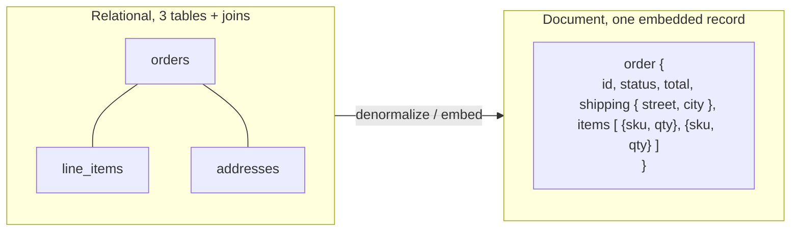

The trade-offs are where interviews get sharp, and they follow directly from embedding. First, **embedding duplicates data**, so if an embedded fact changes (a product's name embedded in a thousand orders), you either accept staleness or update many documents — the denormalization trade from Section 7, now the default rather than the exception. Second, documents that grow unbounded (embedding an ever-growing array of events into one document) hit size limits and become slow to read and write; the fix is *referencing* — storing an ID and looking the related data up separately, which reintroduces a join-like second query. Third, while modern MongoDB supports multi-document ACID transactions, the model is *designed* around single-document atomicity, so the schema you choose should aim to keep the things that must change together inside one document. The decisive skill, covered in Part VII, is judging *when to embed and when to reference* — a decision driven entirely by how the data is accessed and how it changes, not by how it is naturally structured.

<details>
<summary>📖 In plain terms</summary>

A document store keeps data as self-contained JSON records — an order document holds its line items and shipping address nested right inside it, so one read gets you the whole thing with no joins. Unlike a key-value store, the database can see the fields, so you can index and query them. MongoDB is the classic example. It shines when you load and save an entity as a unit and when your schema keeps changing. The catch: nesting duplicates data (a product name copied into many orders goes stale), and huge growing arrays cause problems — so you sometimes "reference" other documents by ID instead, which brings back a second lookup.

</details>

---

## 22. 📊 Wide-Column Stores

The **wide-column store** (also called column-family) is the model built for *write-heavy workloads at massive scale*, and it is the most misunderstood of the four because its name suggests a columnar analytics database (like Redshift) which it is not. A wide-column store organizes data by a **partition key** that determines which node holds the row, and within each partition, rows are stored *sorted* by a **clustering key**, with each row free to hold a different, sparse set of columns. Apache Cassandra and Apache HBase are the defining systems, descended from Google's Bigtable and Amazon's Dynamo papers. The data model looks like a nested, sorted map: partition key points to a set of rows, each row is a sorted map of columns to values.

What this makes cheap is a very specific and very common pattern: **enormous write throughput plus efficient range reads within a partition.** Cassandra in particular is built on a *log-structured merge-tree (LSM)* storage engine, where writes are appended to an in-memory structure and flushed sequentially to disk, making writes extremely fast because they never do random-access updates in place. This is the opposite optimization from a B-tree, which excels at reads but pays for in-place updates. The result is a database that can absorb millions of writes per second across a cluster — ideal for time-series data (sensor readings, metrics, event logs), messaging history, and activity feeds, where you write constantly and read recent ranges by a known key ("the last hour of readings for device 42").

The architectural point that makes wide-column stores scale so well is that many, like Cassandra, are **leaderless and masterless** (Section 17): every node is equal, any node can accept any read or write and coordinate it, and the cluster uses consistent hashing to place partitions and a gossip protocol to track membership. There is no single point of failure and no failover — a node dying just means its replicas serve its data. This gives extraordinary availability and linear scalability (add nodes, get proportionally more capacity), which is why Cassandra powers systems at Netflix, Apple, and Discord that must never go down and must ingest firehoses of data.

The trade-off, and the reasoning an interviewer will push on, is that **you must design the schema entirely around your queries, before you write a single row, and you cannot change your mind cheaply.** Because a partition is the unit of both storage and query, and because there are no joins and only limited secondary indexing, you model *one table per query pattern*, denormalizing and duplicating data across tables so each query hits exactly one partition. Want to query the same data two ways? You maintain two tables and write to both. Choosing a partition key that spreads load evenly while keeping each query inside one partition is the central design challenge, and getting it wrong produces hot partitions or queries that must scatter across the whole cluster. Wide-column stores reward teams who deeply understand their access patterns and punish those who expect relational flexibility.

<details>
<summary>📖 In plain terms</summary>

A wide-column store like Cassandra is built to swallow gigantic volumes of writes and read recent data back by key — think sensor readings, logs, chat history, activity feeds. Data is grouped by a partition key (which machine holds it) and sorted within each partition, and every row can have different columns. Its trick is that writes just get appended (very fast) instead of updated in place. Because it's leaderless — every node is equal — it stays up even when machines die, which is why Netflix and Discord rely on it. The price: you design your tables around your exact queries up front, duplicating data, because there are no joins and changing course later is painful.

</details>

---

## 23. 🎨 Graph Databases

The **graph database** is the specialist of the four, built for data whose value lies in the *relationships* between entities rather than the entities themselves. It stores **nodes** (entities like people, products, accounts) and **edges** (relationships like "follows," "purchased," "transferred money to"), with properties on both. Neo4j is the flagship, with Amazon Neptune and others in the space. The reason it exists is a specific and severe weakness of the relational model: queries that traverse *many hops* of relationships — friends of friends of friends, or the chain of transactions between two accounts — require a self-join per hop in SQL, and each join multiplies the work, so a five-hop query can become catastrophically slow on a relational database even with indexes.

A graph database makes this cheap through **index-free adjacency**: each node stores direct physical pointers to its neighbors, so traversing an edge is a constant-time pointer hop rather than an indexed lookup into a join table. Walking from a person to their friends to *their* friends is a local operation whose cost depends on how many nodes you actually visit, not on the total size of the database. This is the decisive difference: in SQL, a multi-hop query's cost grows with table size because each join scans an index over the whole relationship table; in a graph, the cost grows only with the size of the neighborhood you traverse. For deeply-connected queries, this is the difference between milliseconds and timeouts.

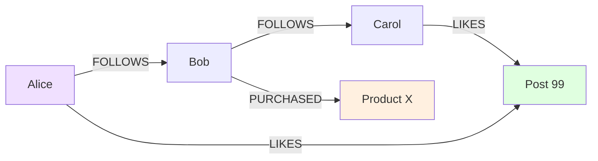

The access pattern this serves defines the use cases precisely: social networks ("people you may know," computed by traversing mutual connections), fraud detection (finding rings of accounts linked by shared devices, addresses, or transaction chains — a query that is a nightmare of recursive joins in SQL but natural as a graph traversal), recommendation engines ("customers who bought this also bought," following purchase edges), network and IT topology, and knowledge graphs. Queries are written in traversal languages like Cypher (Neo4j) or Gremlin, which express "start here, follow these edge types, return what you find" directly. The staff-level judgment is that a graph database is a *specialist tool*, not a general-purpose store: it is unbeatable for relationship-traversal workloads but is usually not where you keep your primary transactional data, and adopting one means running and syncing yet another system. The mature recommendation is to reach for it only when relationship traversal is genuinely central to the product — and to remember that a recursive CTE (Section 10) can handle modest hierarchies in your existing relational database before the complexity of a separate graph store is justified.

<details>
<summary>📖 In plain terms</summary>

A graph database stores things (people, products) as nodes and the connections between them (follows, bought, paid) as edges — and it's built to follow those connections fast. In a normal database, asking "friends of friends of friends" means join-on-join-on-join, which gets slow as the data grows. A graph store keeps direct pointers between connected items, so hopping from one to the next is instant no matter how big the database is. That makes it brilliant for social networks, fraud rings, and recommendations. But it's a specialist — you usually add it alongside your main database only when following relationships is the heart of the feature.

</details>

---

# Part VII — Data Modeling for NoSQL

## 24. 🎨 Access-Pattern-Driven Design: Denormalization, Embedding, References

The single largest conceptual shift when moving from SQL to NoSQL is the *direction* in which you design. In the relational world you model the data first — identify entities, normalize them into tables, and only then write whatever queries the clean schema supports. In the NoSQL world you invert this: you enumerate the **access patterns first** — the exact reads and writes your application will perform and how often — and then design the data layout to serve those patterns with the fewest, cheapest operations. This is not a stylistic preference; it is forced by the fact that NoSQL stores lack joins and flexible ad-hoc queries, so any access pattern you did not design for may be impossible or ruinously slow to add later.

This inversion makes **denormalization the default rather than the exception.** In a normalized relational schema, each fact lives once and queries reassemble it with joins. In NoSQL you do the opposite: you *pre-join* the data at write time by storing it already-combined in the shape the read needs, accepting duplication as the price of avoiding a join you cannot perform. If a screen shows an order with its customer's name and the product names, you store those names *inside* the order record even though they also live elsewhere — because the read must be one operation. The cost you take on is **keeping duplicates in sync**: when a product's name changes, you must find and update every copy, or accept that historical records show the old name (which is often actually correct for orders — the order should reflect the name at purchase time). Reasoning about *which* duplicated data must stay consistent and which can be frozen is a core modeling skill.

The concrete lever inside a single entity is the **embed-versus-reference decision.** *Embedding* nests related data inside the parent document or row (line items inside an order); *referencing* stores an ID pointer and fetches the related data separately (order stores a `customer_id`, customer looked up on demand). The guidelines, which an interviewer expects you to state and justify, are: embed when the related data is *owned by* the parent, *always read together with it*, and *bounded in size* — a "contains" relationship like order-and-line-items. Reference when the related data is *shared* across many parents (many orders reference the same customer, so embedding would duplicate the customer everywhere), *large or unbounded* (a growing list of events would bloat the parent past size limits), or *frequently queried independently* of the parent.

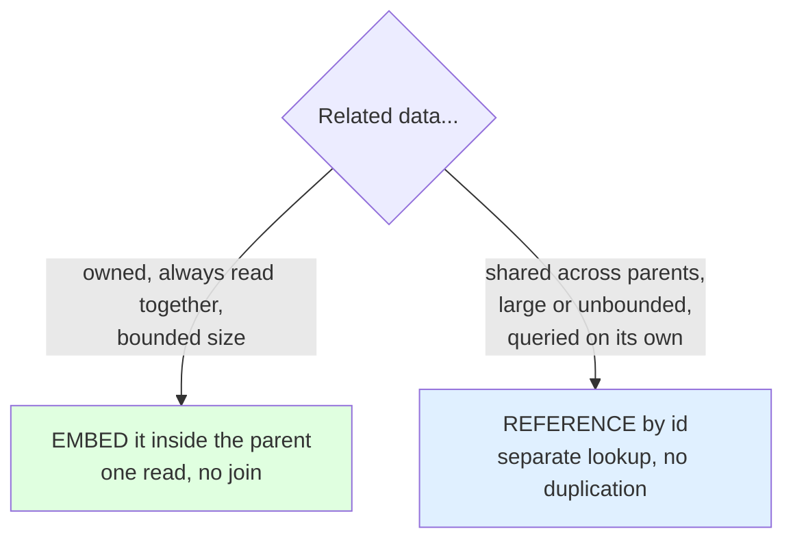

The staff-level trap to avoid is treating this as "denormalize everything for speed." Over-embedding creates unbounded documents and enormous update fan-out; over-referencing recreates the join problem NoSQL was meant to escape, one manual lookup at a time. The discipline is to let the *access patterns and their frequencies* decide each choice: the read you do ten thousand times a second should be one operation even if it costs duplication, while a rare administrative query can afford multiple lookups. And the honest interview answer acknowledges the maintenance burden you are signing up for — every denormalized copy is a consistency obligation your application code now owns, which is precisely the guarantee the relational model gave you for free.

<details>
<summary>📖 In plain terms</summary>

In SQL you design tidy tables first and query them later. In NoSQL you flip it: list exactly how your app will read and write the data, then arrange the data to make those reads cheap — usually one operation, no joins. That means deliberately duplicating data (denormalizing) so it's pre-combined the way a screen needs it. The key call is embed vs. reference: nest data inside its parent when it's small, owned, and always read together (line items in an order); store just an ID pointer when it's shared, huge, or queried on its own (the customer an order belongs to). The tradeoff you accept is keeping those duplicated copies in sync yourself.

</details>

---

## 25. 💡 DynamoDB Single-Table Design

The most extreme and interview-famous expression of access-pattern-driven modeling is **DynamoDB single-table design**, where an entire application's multiple entity types — users, orders, products, and their relationships — are deliberately stored in *one* table. To a relational engineer this looks insane, and explaining *why* it is actually the correct approach for DynamoDB is a favorite staff-level probe because it forces you to reason from the database's mechanics rather than from habit.

The reasoning starts with DynamoDB's structure. Every item has a **partition key (PK)** that determines which physical partition stores it, and an optional **sort key (SK)** that orders items within that partition. A query can efficiently fetch *one partition key and a range of sort keys* in a single request — and that single-request retrieval is the only cheap access pattern. DynamoDB has no joins, and cross-partition operations (the `Scan`) read the whole table and are to be avoided. So if your users and their orders live in separate tables, fetching "a user and their last ten orders" requires two round trips minimum. The single-table technique instead gives items *overloaded, composite keys* so that related items of different types share a partition key and can be retrieved together in one query.

The mechanism is **key overloading with generic attributes.** Rather than meaningful column names, you use generic `PK` and `SK` attributes and pack typed, prefixed values into them. A user might be stored with `PK = USER#42, SK = PROFILE`, and that same user's orders with `PK = USER#42, SK = ORDER#2026-01-15#1001`. Because all these items share the partition key `USER#42`, a single query for `PK = USER#42` returns the profile and all orders together, sorted; a query for `PK = USER#42 AND SK begins_with ORDER#` returns just the orders in date order. **Global Secondary Indexes (GSIs)** — which re-index the same items under a *different* partition/sort key — let you serve additional access patterns (like "all orders in status SHIPPED across all users") that the base key layout does not support, effectively giving you a second, differently-organized view of the data.

<details>
<summary>💻 Single-table item layout and access</summary>

```
Single table, overloaded PK/SK. One partition (USER#42) holds many item types:

  PK          SK                        attributes
  --------    ----------------------    -----------------------------
  USER#42     PROFILE                   name=Alice, email=a@x.com
  USER#42     ORDER#2026-01-15#1001     total=250, status=SHIPPED
  USER#42     ORDER#2026-02-01#1042     total=99,  status=PENDING

Access patterns, each ONE query, no joins:
  * Get user profile:            PK = USER#42  AND SK = PROFILE
  * Get user + all their orders: PK = USER#42                        (returns all rows above)
  * Get user's orders only:      PK = USER#42  AND SK begins_with "ORDER#"
  * Orders by date range:        PK = USER#42  AND SK between "ORDER#2026-01" and "ORDER#2026-02"

GSI (reindex by status) to serve "all SHIPPED orders":
  GSI-PK = STATUS#SHIPPED,  GSI-SK = 2026-01-15#1001
```

</details>

The staff-level payoff — and the honest caveats — matter as much as the mechanism. The benefit is that the common access patterns become single-digit-millisecond single-partition queries at any scale, with no joins and no cross-partition fan-out, which is exactly what DynamoDB is engineered to make fast and cheap. The costs are real and worth naming: single-table design is *hard to learn and read*, the schema is *opaque* (generic `PK`/`SK` columns tell you nothing without documentation), and it is *rigid* — adding a genuinely new access pattern the key design did not anticipate may require a GSI or a data migration, because you cannot just write a new `WHERE` clause. This is the ultimate illustration of the guide's recurring theme: NoSQL trades the relational model's query flexibility for predictable performance and scale, and single-table design is that trade taken to its logical extreme. A strong candidate can both explain why it is correct for DynamoDB *and* articulate when its rigidity makes a document store or a relational database the wiser choice.

<details>
<summary>📖 In plain terms</summary>

DynamoDB is fast only when you fetch one partition key and a range within it in a single request — it has no joins. Single-table design exploits this by putting many entity types in one table and giving them shared, prefixed keys: a user is `USER#42 / PROFILE` and their orders are `USER#42 / ORDER#...`, so one query grabs the user and all their orders at once. Extra "secondary indexes" reorganize the same data to answer other questions. The upside is blazing, predictable speed at any scale; the downside is the design is cryptic and hard to change later if a new kind of query appears.

</details>

---

# Part VIII — Distributed Consistency

## 26. 📊 Consistency Models: Eventual, Quorum, Read Repair

We deferred the mechanics of leaderless replication (Section 17) to here because they are best understood as a *tunable* consistency system, and consistency is the deep water of distributed databases. **Eventual consistency** is the baseline promise of AP systems: if writes stop, all replicas will *eventually* converge to the same value, but at any given moment different replicas may disagree, and a read may return a stale value. This is perfectly acceptable for many workloads (a like count, a feed, a cache) and unacceptable for others (an account balance), which is why the interesting systems let you *tune* how much consistency you get per operation rather than fixing it globally.

The tuning mechanism in leaderless systems like Cassandra and DynamoDB is **quorum reads and writes**, governed by three numbers: **N** (the replication factor — how many copies of each piece of data exist), **W** (how many replicas must acknowledge a *write* before it is considered successful), and **R** (how many replicas must respond to a *read* before the result is returned). The pivotal insight is that **if W + R > N, every read is guaranteed to see the latest write**, because the set of replicas the write touched and the set the read consults must *overlap* in at least one node — and that overlapping node holds the newest value, which the system recognizes by comparing version timestamps. This is *strong consistency built from quorums*, achieved without any leader.

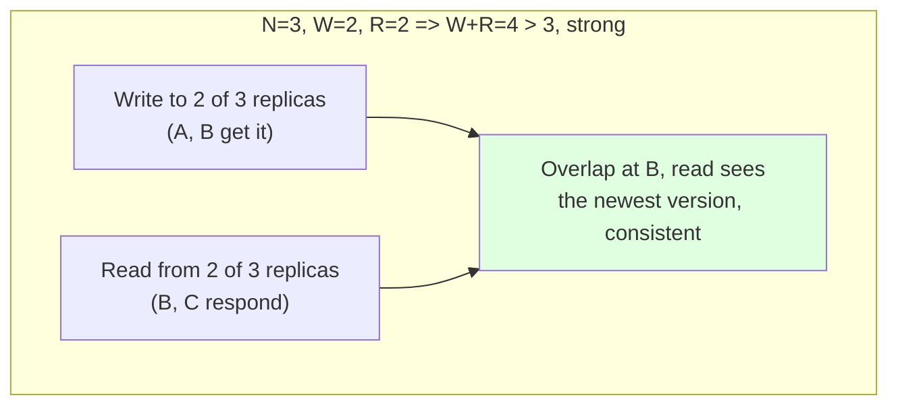

The reason this is a *tuning knob* rather than a fixed setting is that W and R let you slide along the consistency-latency-availability spectrum per operation. With N=3, choosing W=3, R=1 makes reads fast and cheap (ask one replica) but writes slow and fragile (all three must be up). Choosing W=1, R=3 flips it — fast writes, slow reads. Choosing W=2, R=2 (the common balanced quorum) gives strong consistency with tolerance for one node being down on either path. And choosing W=1, R=1 abandons the overlap guarantee entirely for maximum speed and availability, accepting eventual consistency. DynamoDB exposes a simplified version of this as its "strongly consistent read" (quorum) versus "eventually consistent read" (single replica, cheaper and faster) toggle. Being able to say "N=3, W=2, R=2 for the operations that need correctness, W=1 R=1 for the ones that just need speed" is the concrete, quantitative answer that impresses.

Because replicas *do* drift in these systems, there are background mechanisms to heal the divergence, and naming them signals depth. **Read repair** fixes staleness opportunistically during reads: when a read contacts multiple replicas and notices one has an old version, it writes the current value back to the stale replica as a side effect of serving the read. **Anti-entropy** (via Merkle trees in Cassandra) is a background process that periodically compares replicas' data in bulk and reconciles differences, catching data that is rarely read and so never repaired by read-repair. And when concurrent writes genuinely conflict, the system needs a resolution strategy — **last-write-wins** using timestamps (simple, but silently discards one write and is vulnerable to clock skew), or **version vectors** that detect concurrency and surface conflicting versions to the application to merge. The complete picture — quorums for tunable consistency, read-repair and anti-entropy for convergence, and a conflict-resolution policy for concurrent writes — is what distinguishes an engineer who understands eventual consistency from one who has only heard the phrase.

<details>
<summary>📖 In plain terms</summary>

In leaderless databases, data is copied to N machines, and you choose how many must confirm a write (W) and how many must answer a read (R). The magic rule is W + R > N: if the write group and the read group are forced to overlap on at least one machine, your read is guaranteed to catch the latest write. Crank W and R up for correctness, down for speed — it's a dial, per operation. Between operations, replicas drift, so the system heals itself: "read repair" fixes stale copies when it notices them during reads, and a background sweep reconciles the rest.

</details>

---

## 27. 🎨 Consensus and Leader Election

Underneath every system that offers strong guarantees in a distributed setting lies a harder problem than quorums: **consensus** — getting a group of nodes to *agree* on a single value (or a single ordering of events) even when some nodes fail and messages are lost or delayed. Consensus is what lets a cluster agree on "who is the leader right now," "did this transaction commit," or "what is the order of these operations," and it is the bedrock beneath leader election, distributed locks, and strongly-consistent databases. It is famously subtle: the FLP impossibility result proved that no consensus algorithm can guarantee termination in a fully asynchronous network with even one faulty node, so real algorithms make practical assumptions (like eventual timing bounds) to make progress.

The reason consensus matters for our topic is **leader election**, which every leader-follower system depends on. When the leader fails, the cluster must promptly and *unambiguously* choose a new one — and this is exactly where things go wrong. If two nodes both believe they are the leader (a **split-brain**), they both accept writes and the data diverges irreparably. Preventing split-brain requires a *majority quorum*: a node can only become leader if a strict majority of nodes vote for it, which mathematically guarantees two leaders cannot both win because two overlapping majorities are impossible. This is why distributed systems are almost always deployed in *odd* numbers (3, 5, 7) — a five-node cluster tolerates two failures and still forms a majority, while an even number wastes a node and risks tie-splits.

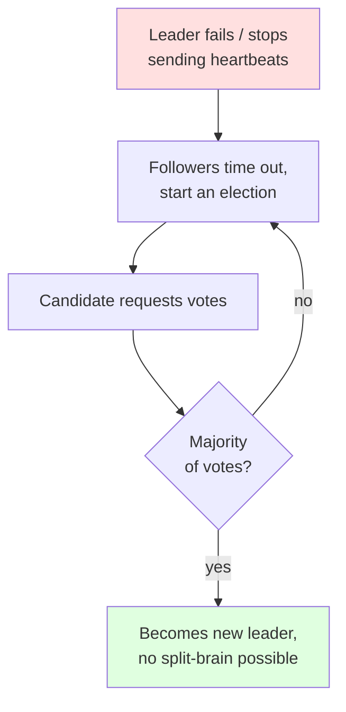

The algorithms that implement this correctly are **Paxos** (the original, correct but famously hard to understand) and **Raft** (designed to be understandable, now dominant). Raft elects a leader via randomized election timeouts and majority voting, then has the leader replicate an append-only log to followers, committing an entry once a majority have stored it — the same majority-quorum idea, applied to an ordered log of operations. You do not need to implement Raft in an interview, but you should know that it exists, that it provides leader election plus a replicated consistent log, and that it powers the coordination layer of real systems: **etcd** (which backs Kubernetes), **Consul**, ZooKeeper (via the related ZAB protocol), and the consensus core of NewSQL databases like CockroachDB and TiDB. The staff-level connection to draw is that these consensus systems are how you get strong consistency *and* fault tolerance together — they are the machinery that lets Google Spanner or CockroachDB offer distributed ACID transactions, paying the cost of majority-quorum coordination latency to do it. Consensus is the expensive foundation; everything strongly-consistent and distributed is built on top of it.

<details>
<summary>📖 In plain terms</summary>

Consensus is the problem of getting several machines to agree on one thing — like who's in charge — even when some crash or messages get lost. It matters most for leader election: when the boss node dies, the cluster must pick exactly one replacement. The danger is "split-brain," two nodes both thinking they're the leader and corrupting the data. The fix is majority voting — you can't have two different majorities, so you can't have two leaders — which is why clusters run in odd numbers like 3 or 5. Algorithms called Raft and Paxos do this correctly and power tools like etcd (behind Kubernetes) and databases like CockroachDB.

</details>

---

# Part IX — Staff-Level Decisions

## 28. 🎯 Choosing a Database: A Decision Framework

Everything in this guide converges on one recurring interview moment: "you're designing system X — what database do you use, and why?" The weak answer names a technology. The staff-level answer runs a *framework* out loud, deriving the choice from requirements, and treats the database as one decision among several rather than a religious allegiance. The framework has a natural order, and walking it demonstrates judgment regardless of which database you land on.

Begin with the **access patterns and data shape**, because they eliminate whole categories. If you need flexible ad-hoc queries, joins across many entities, and reporting, that points to relational. If you always read and write a self-contained aggregate, that points to document. If you have a firehose of writes and read recent ranges by key, that points to wide-column. If relationship traversal is the core feature, that points to graph. If it is pure point-lookup by known key at extreme speed, that points to key-value. Next weigh the **consistency requirements**: does this data have invariants that a stale read or a lost update would corrupt (money, inventory, bookings)? That demands strong consistency and likely ACID transactions, favoring relational or a NewSQL system, and it should make you cautious about eventually-consistent stores for that specific data. Then assess **scale**: what is the read and write volume, the total data size, and the growth trajectory? Be honest here — most systems never reach the scale that forces NoSQL, and prematurely choosing a harder-to-query distributed store to handle load you will never see is a classic over-engineering mistake an interviewer will happily expose.

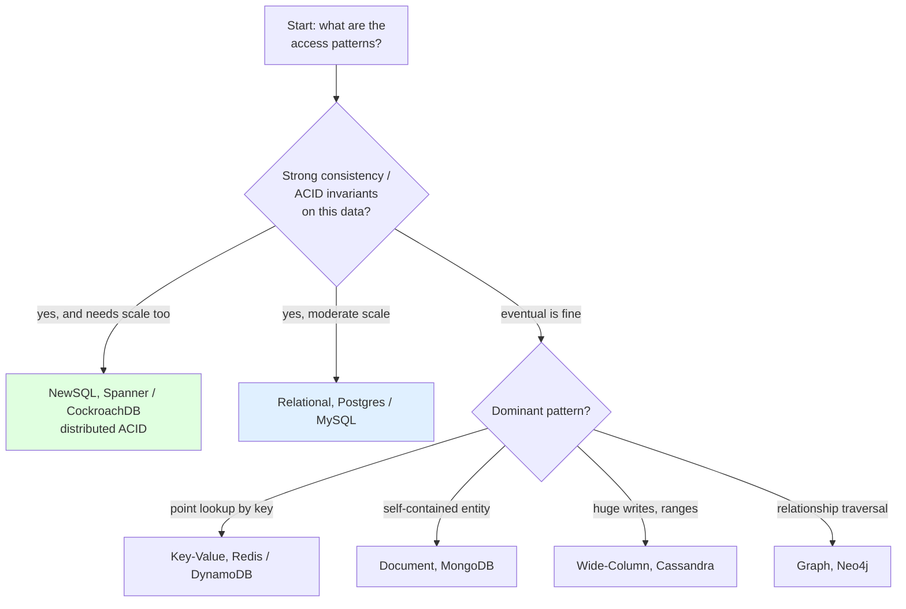

The most important framing to voice is that **this is rarely an exclusive choice** — mature systems use **polyglot persistence**, picking the right store per workload rather than forcing everything into one. A realistic architecture might keep the system of record in PostgreSQL for its transactional integrity and query flexibility, put a Redis cache in front of the hot read paths, stream events into Cassandra for high-volume time-series analytics, index text in Elasticsearch for search, and add Neo4j only if a recommendation feature demands graph traversal. The cost of this power is operational complexity and the burden of keeping the stores in sync (often via change-data-capture or an event log), which is itself a trade-off to name. The complete answer therefore sounds like: "For the core transactional data I'd use Postgres because I need ACID and flexible queries and I'm not at a scale that forces sharding; I'd add Redis for the hot lookups; and I'd only introduce a specialized store when a specific access pattern proves it needs one — accepting that each new store adds operational and consistency overhead." That reasoning — requirements first, right tool per job, honest about complexity — is what the question is really testing.

<details>
<summary>📖 In plain terms</summary>

Choosing a database isn't about picking a favorite — it's about matching the tool to the job. Ask in order: how will I read and write this data, does it have rules that a stale or lost update would break (like money), and how big will it really get? Flexible queries and strict correctness point to a relational database like Postgres; extreme scale with simple access points to NoSQL. And you don't have to pick just one — big systems mix stores (Postgres for the truth, Redis for speed, Cassandra for firehose data), adding each only when a real need justifies the extra operational burden.

</details>

---

## 29. 🎨 Multi-Tenant Data Architecture

A recurring staff-level design question, especially for SaaS products, is **multi-tenancy**: how do you store data for many customer organizations (tenants) in a way that is isolated, scalable, and cost-effective? There is no single right answer — there is a spectrum of three models, each trading isolation against cost and operational simplicity, and the interviewer wants to hear you reason across it rather than assert one.

At one end is **database-per-tenant**: each customer gets their own physical database. This gives the strongest isolation (a tenant's data, performance, and backups are fully separate; a noisy or compromised tenant cannot affect others; per-tenant restore and geographic residency are easy), which is why it suits regulated industries and large enterprise customers. The cost is operational: thousands of databases to migrate, monitor, back up, and connect to, which becomes unwieldy and expensive at high tenant counts and wastes resources on small or idle tenants. At the other end is a **shared database with a shared schema**, where every tenant's rows live in the same tables, distinguished by a `tenant_id` column present on every table and filtered on every query. This is the most cost-efficient and easiest to operate at scale (one schema, one migration, pooled resources), and it is how most high-volume SaaS runs — but it puts the entire burden of isolation on *never forgetting the `tenant_id` filter*, where a single missing `WHERE tenant_id = ?` leaks one customer's data to another, a catastrophic and famous class of bug.

```mermaid
flowchart TB
    subgraph DB["Database per tenant"]
        T1["Tenant A DB"]
        T2["Tenant B DB"]
        DBN["strongest isolation,<br/>highest ops cost"]
    end
    subgraph SCH["Shared DB, schema per tenant"]
        S1["schema A"]
        S2["schema B"]
        SCN["middle ground"]
    end
    subgraph ROW["Shared everything, tenant_id column"]
        R["one set of tables,<br/>filter by tenant_id"]
        RN["cheapest, easiest to scale,<br/>isolation depends on the filter"]
    end
    style DBN fill:#e0f0ff
    style RN fill:#fff0e0
```

The middle ground is **shared database, schema-per-tenant** (each tenant gets its own set of tables within one database instance), which balances moderate isolation against moderate cost. The staff-level reasoning is that the right choice depends on tenant count, tenant size distribution, isolation and compliance requirements, and the cost you are willing to pay operationally — and that large platforms often *blend* models, putting small tenants on a shared pool and graduating large or regulated ones to dedicated databases. The mitigations you should name for the shared-schema model are the ones that make it safe in practice: enforce tenant isolation in a single shared data-access layer rather than trusting every query author, use database features like PostgreSQL **Row-Level Security** to make the `tenant_id` filter automatic and impossible to forget, and consider sharding by `tenant_id` so a large tenant's load is isolated to specific nodes (while watching for the hot-shard problem when one tenant dwarfs the rest, per Section 18). Showing that you see both the cost pressure toward sharing and the isolation risk it creates — and that you have concrete mechanisms to manage the risk — is the complete answer.

<details>
<summary>📖 In plain terms</summary>

Multi-tenancy is how a SaaS app stores many customers' data together. There's a spectrum. Give each customer their own database: safest and easiest to keep separate, but a nightmare to operate at thousands of customers. Put everyone in shared tables with a `tenant_id` column: cheapest and scales best, but one forgotten "where tenant_id = ?" leaks one customer's data to another. In between, give each tenant their own set of tables. Big platforms often mix — small customers share, large or regulated ones get their own — and use safeguards like automatic row-level filtering so nobody can forget the tenant check.

</details>

---

## 30. 💡 Migration Strategy: Changing a Database Without Downtime

The hardest and most senior data question is not choosing a database — it is *changing* one that is already live, serving traffic, and holding data you cannot lose. Whether it is a schema change on a huge table, or wholesale migration from one database to another (say, a monolith's MySQL to a sharded system, or relational to DynamoDB), the constraint that makes it hard is that you cannot stop the world: the system must keep serving reads and writes throughout, and you must be able to *reverse course* if something goes wrong. A "big bang" cutover — take the system down, migrate everything, bring it back up on the new store — is unacceptable at scale and terrifyingly risky, so senior engineers use incremental patterns.

For **schema changes** on a live table, the core discipline is **expand-contract** (also called parallel-change), which decomposes a breaking change into backward-compatible steps. To rename or restructure a column without downtime: *expand* by adding the new column and having the application write to both old and new while reading from the old; *migrate* the existing rows in background batches; *switch* reads to the new column once it is fully populated and verified; and finally *contract* by removing the old column and the dual-write once nothing depends on it. Each step is individually safe and reversible, and at no point is there a version of the code that cannot run against the current schema — which matters because deploys are gradual and old and new code run simultaneously. The related operational trap to name is that adding an index or altering a column can *lock the table* on some databases and stall all traffic, so you use online-DDL tools (`pt-online-schema-change`, `gh-ost` for MySQL, or `CREATE INDEX CONCURRENTLY` in PostgreSQL) that do it without a blocking lock.

```mermaid
flowchart LR
    E["EXPAND<br/>add new column,<br/>dual-write old + new,<br/>read old"] --> M["MIGRATE<br/>backfill existing rows<br/>in batches"]
    M --> V["VERIFY + SWITCH<br/>reads move to new,<br/>compare for drift"]
    V --> C["CONTRACT<br/>stop dual-write,<br/>drop old column"]
    style E fill:#e0f0ff
    style C fill:#e0ffe0
```

For a **full database migration**, the senior-grade pattern combines the same incrementalism with safety nets. You stand up the new database, use **dual writes** (or better, **change-data-capture** streaming from the old store's transaction log via a tool like Debezium) to keep it continuously in sync, **backfill** historical data in the background, and then verify by **shadow reads** — reading from both stores and comparing results without serving the new one — until you trust it. Only then do you gradually shift read traffic using a **feature flag or percentage rollout** (1% of reads, then 10%, then 100%), watching error and latency metrics at each step, and critically, you keep the old store in sync and the flag reversible so you can **roll back instantly** if the new store misbehaves. The staff-level themes an interviewer is listening for are: incremental over big-bang, always reversible, continuous verification (shadow reads and data-drift checks), and treating the migration as a *project with a rollback plan* rather than a single risky event. Migrations are where data-modeling theory meets operational reality, and the ability to sequence one safely is a genuine marker of seniority.

<details>
<summary>📖 In plain terms</summary>

Changing a live database is the scariest data task because you can't turn it off or lose anything. The rule is: never do a risky big-bang switch — go incremental and keep a way back. For a column change, use expand-contract: add the new column, write to both old and new for a while, backfill the old rows in the background, switch reads over once you've checked it matches, then finally drop the old one. For a whole new database, keep it continuously synced from the old one, compare their answers quietly ("shadow reads"), then shift a tiny slice of traffic, watch, and ramp up — always able to flip back instantly if something breaks.

</details>

---

# Part X — Revision & Interview Prep

## 31. ⚡ Quick Revision

**Foundations.** The whole topic turns on one trade: relational databases give strict schemas, joins, flexible queries, and ACID transactions but are hard to spread across machines; NoSQL databases give flexible schemas, horizontal scale, and high availability but drop joins, multi-record transactions, and strong consistency. A *data model* is the shape you impose on data — relational (tables joined by matching keys), document (self-contained nested JSON), key-value (opaque blob by key), wide-column (sorted sparse rows by partition), graph (nodes and edges) — and each makes one kind of operation cheap. **ACID** is four promises: Atomicity (all-or-nothing), Consistency (never breaks declared rules — note this is application-level, different from CAP's consistency), Isolation (concurrent transactions don't corrupt each other), Durability (committed data survives crashes). These are cheap on one machine and expensive across a network, which is the entire reason NoSQL exists.

**CAP, PACELC, BASE.** CAP says that during a network *partition* you must choose Consistency or Availability — you can't have both, because staying consistent means refusing uncoordinated operations (going unavailable) while staying available means serving possibly-stale data. Partitions are unavoidable, so the real statement is "when partitioned, pick C or A." CP systems (single-leader relational, HBase) stop writes to stay correct; AP systems (Cassandra, DynamoDB in eventual mode) keep serving and reconcile later. But CAP only covers the rare partition; **PACELC** adds the everyday case: Else (no partition), you still trade Latency vs Consistency, because keeping replicas perfectly synced costs round-trips. **BASE** (Basically Available, Soft state, Eventually consistent) is the philosophy opposite ACID for AP/EL systems. The mature move is per-operation: AP/EL for a shopping cart, CP/EC for the payment step.

**Relational and SQL.** Tables hold typed rows; a *primary key* uniquely identifies a row, a *foreign key* points to another table's primary key and enforces referential integrity, and *constraints* (NOT NULL, UNIQUE, CHECK) push validation into the database where no buggy code can bypass it. **Normalization** stores each fact once to avoid update anomalies: 1NF (atomic columns, no repeating groups), 2NF (no dependence on part of a composite key), 3NF (no transitive dependence between non-key columns) — aim for 3NF, then denormalize hot read paths on purpose. SQL is declarative set-thinking: **JOINs** recombine tables (inner keeps matches, left keeps all left rows), and the classic anti-pattern is the **N+1 query** (looping one query per row instead of one join). **GROUP BY** aggregates per group; **WHERE** filters rows before grouping, **HAVING** filters groups after. **Window functions** add a rank or running total while keeping every row — the tool for "top 3 per user." **CTEs** (`WITH`) name query steps and can recurse over hierarchies; **views** are saved queries, and *materialized* views store the result for speed at the cost of staleness.

**Indexes and optimization.** An **index** avoids full table scans; the default is a **B-tree** (sorted, serves equality *and* ranges *and* ordering), while a **hash index** does only equality. A **clustered index** is the physical row order (one per table); **secondary indexes** point back to the row, costing an extra fetch unless a **covering index** includes every column the query needs (index-only scan). Indexes tax every write, so index the high-selectivity columns your important queries filter on — not everything. The **cost-based optimizer** picks an execution plan by estimating cost from **statistics**; read plans with `EXPLAIN`. The number-one cause of a query suddenly going slow is *stale statistics* leading to a bad plan (e.g., a nested loop over millions of rows). **Composite indexes** obey the leftmost-prefix rule: `(a, b, c)` serves filters on `a`, `a,b`, or `a,b,c` — never `b` alone; put equality columns before range columns.

**Transactions and concurrency.** Interleaving transactions for throughput creates anomalies: *dirty read* (seeing uncommitted data), *non-repeatable read* (a row changes mid-transaction), *phantom read* (new matching rows appear), *lost update* (two writers overwrite each other). The **isolation levels** are a ladder: Read Uncommitted (allows all), Read Committed (Postgres default, still allows non-repeatable and phantoms), Repeatable Read (MySQL default), Serializable (allows none). Snapshot isolation permits *write skew*, which only true Serializable closes. Default to Read Committed and protect only the operations with real invariants (via `SELECT FOR UPDATE`, atomic updates, or Serializable). Isolation is enforced by **locks** (shared/exclusive; deadlocks resolved by aborting a victim — prevent with consistent lock ordering and short transactions) or, more commonly today, **MVCC**, which keeps multiple row versions so readers never block writers and vice versa — at the cost of accumulating dead versions that background cleanup (PostgreSQL's VACUUM) must sweep.

**Scaling.** **Replication** copies the whole dataset for read scaling, availability, and locality. *Leader-follower* (one writer, many read replicas) is the common model; its pain is *replication lag* causing stale reads and the read-your-own-writes problem. *Synchronous* replication avoids data loss on failover but adds write latency; most use *semi-synchronous*. *Multi-leader* accepts writes in multiple regions but must resolve write conflicts; *leaderless* (Cassandra, Dynamo) writes to many replicas with quorums. **Partitioning/sharding** splits the data itself: *range* keeps locality but risks hotspots on sequential keys; *hash* spreads evenly but kills range queries; *consistent hashing* (with virtual nodes) means adding/removing a node moves only ~1/N of the data instead of reshuffling everything. Partition-key choice is the most consequential, hardest-to-reverse decision — a skewed key creates a hot shard.

**NoSQL families.** Each makes one access pattern cheap. **Key-value** (Redis, DynamoDB) — fastest point lookup by exact key; can't query inside the value; used for sessions, caches, counters. **Document** (MongoDB) — self-contained JSON you can index and query; embed related data to read an entity in one shot; watch duplication and unbounded growth. **Wide-column** (Cassandra, HBase) — LSM-tree storage for massive write throughput and range reads by partition; leaderless and always-up; you design one table per query pattern. **Graph** (Neo4j) — index-free adjacency makes multi-hop relationship traversal cheap (social, fraud, recommendations) where SQL would need join-on-join.

**NoSQL data modeling.** Design *access patterns first*, then lay out data to serve them in the fewest operations — **denormalization is the default**. Choose **embed** when related data is owned, always read together, and bounded; choose **reference** (store an ID) when it's shared, large/unbounded, or queried independently. **DynamoDB single-table design** takes this to the extreme: many entity types in one table with overloaded `PK`/`SK` keys (`USER#42 / PROFILE`, `USER#42 / ORDER#...`) so one query fetches related items together, with GSIs to serve other access patterns — fast and predictable but cryptic and rigid.

**Distributed consistency and consensus.** **Eventual consistency**: replicas converge if writes stop. **Quorums** tune it: with N replicas, W write-acks and R read-responses, if **W + R > N** the read and write sets overlap and every read sees the latest write — strong consistency without a leader. Slide W and R for the consistency/latency/availability you want per operation. Replicas heal via **read repair** (fix stale copies noticed during reads) and **anti-entropy** (background Merkle-tree reconciliation); conflicts resolve via last-write-wins (lossy) or version vectors. **Consensus** (getting nodes to agree despite failures) underlies **leader election**: a majority quorum prevents *split-brain* (two leaders), which is why clusters run in odd numbers. **Raft** and **Paxos** implement it, powering etcd (Kubernetes), Consul, and NewSQL databases (Spanner, CockroachDB) that offer distributed ACID.

**Staff-level decisions.** Choose a database by framework: access patterns and data shape first, then consistency requirements (invariants that a stale read corrupts demand ACID), then honest scale (most systems never need NoSQL — premature distribution is over-engineering). Prefer **polyglot persistence** — Postgres for the transactional truth, Redis for hot lookups, Cassandra for firehose data — adding each store only when a pattern justifies its operational cost. **Multi-tenancy** spans database-per-tenant (strongest isolation, highest ops cost) to shared-schema with a `tenant_id` column (cheapest, but a forgotten filter leaks data — mitigate with row-level security). **Migrations** must be incremental and reversible: *expand-contract* for schema changes (add new, dual-write, backfill, switch reads, drop old) and CDC + shadow reads + percentage rollout for whole-database moves, always with an instant rollback.

---

## 32. 🎓 FAANG Interview Q&A (20 Questions)

### L4 / L5 — Core Competency

<details>
<summary><strong>1. What is the difference between SQL and NoSQL, and how do you decide between them?</strong></summary>

SQL databases enforce a fixed schema, support joins and rich ad-hoc queries, and guarantee ACID transactions, making them ideal when data is relational, invariants matter, and query needs will evolve. NoSQL databases relax some of these — flexible schema, no joins, often single-record atomicity and eventual consistency — to gain horizontal write scaling and high availability. I decide by access patterns first, then consistency needs, then scale: if I need flexible queries and transactional correctness (an orders-and-payments system) I reach for PostgreSQL; if I have a firehose of writes read by known key (IoT telemetry) I reach for Cassandra. The honest point is that most systems never hit the scale that forces NoSQL, so I don't distribute prematurely — I'd run Postgres with read replicas long before sharding into a harder-to-query store.

</details>

<details>
<summary><strong>2. Explain ACID. Which property is most misunderstood?</strong></summary>

ACID is Atomicity (a transaction's writes all commit or all roll back), Consistency (it moves the database between valid states respecting constraints), Isolation (concurrent transactions don't corrupt each other), and Durability (committed data survives crashes). The most misunderstood is Consistency, because people conflate it with CAP's consistency — they're different. ACID's C is *application-level*: it means the transaction won't violate the rules you declared (foreign keys, uniqueness, CHECK constraints). CAP's C is about all *replicas* agreeing on the latest value. A single Postgres node gives ACID consistency trivially; distributed consistency is the hard, separate problem. In an interview I'd explicitly separate the two, because conflating them signals a shallow understanding of both transactions and distributed systems.

</details>

<details>
<summary><strong>3. Walk me through normalization to 3NF. When would you denormalize?</strong></summary>

Normalization stores each fact once to prevent update anomalies. 1NF requires atomic columns (no lists in a cell, no repeating column groups). 2NF (for composite keys) requires every non-key column to depend on the whole key, not part of it. 3NF forbids transitive dependencies — a non-key column depending on another non-key column, like storing `user_email` on an `orders` table when it belongs on `users`. I aim for 3NF in transactional systems because it keeps data consistent by structure. I denormalize deliberately when a hot read path is dominated by join cost: for example, storing a product's name directly on an order line so the order page renders in one query. The trade I take on is keeping the copy in sync — though for orders the frozen name-at-purchase-time is often the correct behavior anyway.

</details>

<details>
<summary><strong>4. How does a B-tree index work, and why is it the default over a hash index?</strong></summary>

A B-tree (B+ tree) is a balanced, sorted tree that stays shallow — three or four levels even for hundreds of millions of rows — so any lookup is a handful of page reads instead of a full table scan. Because keys are kept in sorted order, one structure serves exact-match lookups, range queries (`BETWEEN`, `<`, `>`), prefix matches, and `ORDER BY` without a separate sort. A hash index maps keys through a hash function for O(1) equality lookups but cannot do ranges or ordering at all. The B-tree is the default precisely because of that versatility — most workloads need ranges and sorting, and a hash index only wins in the narrow case of exclusively equality lookups. I'd also note indexes aren't free: each one taxes every write and consumes memory, so I index for the queries that matter, not reflexively.

</details>

<details>
<summary><strong>5. Explain isolation levels and the anomalies they prevent.</strong></summary>

Isolation levels trade correctness against concurrency. Read Uncommitted allows dirty reads (seeing uncommitted data). Read Committed — the PostgreSQL default — prevents dirty reads but still allows non-repeatable reads (a row changing mid-transaction) and phantom reads (new matching rows appearing). Repeatable Read prevents non-repeatable reads. Serializable prevents everything, behaving as if transactions ran one at a time. The nuance I'd add is that these are defined by anomalies forbidden, not implementation, and real databases differ — Postgres's Repeatable Read uses snapshot isolation and also blocks phantoms, but snapshot isolation still permits *write skew*, which only true Serializable closes. My practical approach is to default to Read Committed for throughput and protect only the specific operations with hard invariants, using `SELECT FOR UPDATE` or atomic updates rather than cranking everything to Serializable.

</details>

<details>
<summary><strong>6. What is MVCC and what problem does it solve?</strong></summary>

MVCC (Multi-Version Concurrency Control) solves the problem that traditional locking makes readers and writers block each other, killing concurrency. Instead of locking a row for reads, the database keeps multiple versions of each row tagged by transaction, and each transaction reads from a consistent snapshot as of its start time. The transformative result is that readers never block writers and writers never block readers — a reader simply sees an older version while a writer creates a new one; only writer-writer conflicts on the same row still coordinate. This is how Postgres, MySQL InnoDB, and Oracle achieve high concurrency. The cost, which I'd name to show operational depth, is that dead old versions accumulate and need garbage collection — Postgres's VACUUM — and a heavily-updated table that isn't vacuumed suffers bloat and, in the extreme, transaction-ID wraparound incidents.

</details>

<details>
<summary><strong>7. How do you read and act on a slow query?</strong></summary>

I start with `EXPLAIN ANALYZE` to see the plan the optimizer chose and, crucially, its *estimated versus actual* row counts. The most common culprit is stale statistics: if the optimizer estimated 10 rows but 2 million flowed through, it likely picked a nested-loop join that's catastrophic at that size, and refreshing statistics with `ANALYZE` often fixes it instantly. I look for a sequential scan where I expected an index (missing or unused index), non-sargable predicates like `WHERE YEAR(placed_at) = 2026` that disable an index (rewrite as a range), and implicit type casts that silently prevent index use. If the right index is genuinely missing, I design a composite or covering index for the query's shape. The framing I bring is that the optimizer is a heuristic estimator, not an oracle — my job is to catch where its estimates went wrong.

</details>

<details>
<summary><strong>8. What are the four NoSQL families and what does each solve?</strong></summary>

Each family makes one access pattern cheap. Key-value (Redis, DynamoDB) makes point-lookup by exact key the fastest possible operation — ideal for sessions, caches, and counters — but can't query inside the value. Document (MongoDB) lets you index and query fields and embed related data so a whole entity reads in one operation — great for self-contained aggregates like a user profile. Wide-column (Cassandra, HBase) uses LSM-tree storage for enormous write throughput and range reads by partition key — ideal for time-series and activity feeds, and it's leaderless so it stays up. Graph (Neo4j) uses index-free adjacency to make multi-hop relationship traversal cheap — social graphs, fraud rings, recommendations — where SQL would need a self-join per hop. The unifying idea I'd stress is you pick by asking which operation must be fast.

</details>

<details>
<summary><strong>9. Explain the CAP theorem correctly. What's the common misconception?</strong></summary>

CAP says a distributed store can guarantee at most two of Consistency, Availability, and Partition tolerance. The common misconception is "pick any two" as a free design choice. In reality partitions *will* happen — networks fail — so partition tolerance isn't optional; the theorem really says that *when a partition occurs*, you must choose between consistency and availability. To stay consistent you refuse operations you can't coordinate (becoming unavailable); to stay available you serve possibly-stale data (abandoning consistency). A single-leader relational database or HBase is CP (stops writes to stay correct); Cassandra or DynamoDB in eventual mode is AP (keeps serving, reconciles later). The deeper point I'd add is that CAP is binary and only describes behavior *during* a partition — which is why PACELC exists, to cover the normal-operation latency-vs-consistency trade that actually dominates day-to-day design.

</details>

<details>
<summary><strong>10. What is replication lag and how do you handle read-your-own-writes?</strong></summary>

In leader-follower replication the leader takes writes and streams them to followers that serve reads, but followers apply changes slightly behind — that delay is replication lag. It causes the read-your-own-writes problem: a user updates their profile (write goes to the leader), then immediately reads (hits a lagging follower) and sees stale data, thinking the save failed. The standard fixes are to route a user's reads to the leader for a short window after they write, or to track the write's log position (an LSN) and route subsequent reads to a replica that has caught up to at least that position. More broadly I'd distinguish this from monotonic-reads (never seeing time go backwards across reads) and choose the guarantee the feature needs. For a profile edit, reading from the leader briefly is the simplest correct answer.

</details>

### L5 / L6 — Staff / Principal

<details>
<summary><strong>11. Design the data layer for a URL shortener at 100k writes/sec and 10M reads/sec.</strong></summary>

Reads dominate by 100x and the access pattern is a pure point-lookup: given a short code, return the long URL. That screams key-value. I'd generate short codes (base62 of a distributed counter or a hash with collision checks) and store `code to URL` in a horizontally-scalable key-value store like DynamoDB or a Redis-backed layer, with the short code as the partition key so lookups hit one partition in single-digit milliseconds and shard evenly. In front I'd put an aggressive cache (the read/write ratio makes caching enormously effective, and URLs are immutable once created so invalidation is trivial). Writes at 100k/sec are high but each is tiny and independent, which hash partitioning handles well. I don't need joins, transactions, or flexible queries here, so a relational database would be the wrong tool — its strengths are unused and its single-writer scaling would fight me. I'd keep analytics (click counts) on a separate write-optimized path so they don't contend with redirects.

</details>

<details>
<summary><strong>12. When would you choose eventual consistency, and how do you make it safe?</strong></summary>

I choose eventual consistency when availability and low latency matter more than every read being immediately current, and when a brief stale read doesn't cause real harm — a social feed, a like count, product-view counts, a DNS-like lookup. I make it safe by scoping it: I never apply it to data with hard invariants like money or inventory. Where I use it, I lean on quorum tuning (N=3, W=2, R=2 gives strong consistency when needed; W=1, R=1 gives speed) and design for convergence with read-repair and anti-entropy. Critically, I pick a conflict-resolution strategy deliberately — last-write-wins is simple but silently drops data and is vulnerable to clock skew, so for anything where a lost write matters I use version vectors or CRDTs (like a shopping cart merging as a union). The staff move is per-data-element reasoning: eventual for the feed, strong for the checkout.

</details>

<details>
<summary><strong>13. Walk me through DynamoDB single-table design and defend it.</strong></summary>

DynamoDB is only cheap when you fetch one partition key and a sort-key range in a single request; it has no joins and cross-partition Scans are to be avoided. Single-table design exploits this by storing multiple entity types in one table with overloaded generic `PK`/`SK` attributes: a user is `PK=USER#42, SK=PROFILE` and their orders are `PK=USER#42, SK=ORDER#<date>#<id>`. Because they share the partition key, one query returns the user and all their orders together, sorted; `SK begins_with ORDER#` returns just orders. Global Secondary Indexes reindex the same items under different keys to serve additional patterns like "all shipped orders." I defend it because it makes the common access patterns single-partition, single-digit-millisecond operations at any scale — exactly what the engine optimizes for. But I'm honest about the costs: it's cryptic, hard to onboard engineers onto, and rigid — a genuinely new access pattern may need a new GSI or a migration. If query flexibility is likely to change a lot, a document or relational store is wiser.

</details>

<details>
<summary><strong>14. How do quorums give you tunable consistency without a leader?</strong></summary>

In a leaderless system each datum is replicated to N nodes; a write must be acknowledged by W of them and a read must gather responses from R of them. The key theorem is that if W + R > N, the write set and read set are guaranteed to overlap on at least one node, and that node holds the newest version — which the system identifies by comparing version timestamps — so every read observes the latest write. That's strong consistency assembled from quorums with no leader to fail over. It's tunable because W and R slide independently: N=3 with W=3,R=1 makes reads cheap and writes fragile; W=1,R=3 flips it; W=2,R=2 is the balanced strong-consistency choice tolerating one node down; W=1,R=1 abandons overlap for pure speed and availability. DynamoDB surfaces a simplified version as strongly-consistent (quorum) versus eventually-consistent (single replica) reads. The nuance is that quorums alone don't handle concurrent conflicting writes — you still need version vectors or LWW plus read-repair to converge.

</details>

<details>
<summary><strong>15. What is split-brain and how do consensus algorithms prevent it?</strong></summary>

Split-brain is when a partition or a botched failover leaves two nodes both believing they're the leader; both accept writes and the data diverges irreparably. Consensus algorithms prevent it with majority quorum: a node can only become leader if a strict majority of the cluster votes for it, and since two overlapping majorities are mathematically impossible, two leaders cannot both win. This is why clusters run in odd numbers — five nodes tolerate two failures and still form a majority, while an even count wastes a node and risks tie-splits. Raft implements this with randomized election timeouts and majority voting, then replicates an append-only log, committing an entry once a majority store it. Real systems build on this: etcd (behind Kubernetes), Consul, ZooKeeper, and the consensus cores of CockroachDB and Spanner. The takeaway I'd give is that majority quorum is the single idea that makes both consistent reads and safe leader election possible.

</details>

<details>
<summary><strong>16. A single Postgres instance is at its write ceiling. Walk through your options in order.</strong></summary>

I'd escalate in increasing order of complexity and irreversibility. First, confirm it's genuinely writes, not fixable contention — check for lock waits, oversized transactions, and whether I can batch or make writes asynchronous. Second, vertical scaling: more IOPS, faster disks, more RAM — cheap and buys time. Third, offload: move read load to replicas (freeing the leader), move heavy analytics to a warehouse, move high-volume append-only data (events, logs) to a purpose-built store so the relational leader only handles what needs it. Fourth, reduce write amplification: drop unused indexes, tune checkpointing. Only after these do I consider *sharding*, because it's the hardest and least reversible step — it breaks cross-shard joins and transactions and requires choosing a partition key I can't easily change. If I shard, I pick a key that spreads load and keeps common queries single-shard, and I plan for the hot-shard case. The senior signal is exhausting cheaper reversible options before distributing.

</details>

<details>
<summary><strong>17. How would you migrate a large live table from one schema to another with zero downtime?</strong></summary>

I use expand-contract so every step is individually safe and reversible, and no deployed code version is ever incompatible with the current schema. Expand: add the new column/table without removing the old, and change the application to dual-write both old and new while still reading the old. Migrate: backfill existing rows in throttled background batches, watching replication lag and load. Verify and switch: once the new column is fully populated, move reads to it and compare old-versus-new for drift. Contract: once nothing reads the old path, stop dual-writing and drop the old column. Throughout, I use online-DDL tools — `CREATE INDEX CONCURRENTLY` in Postgres, `gh-ost` or `pt-online-schema-change` in MySQL — because a naive `ALTER` can take a table lock and stall all traffic. The themes are incremental over big-bang, always reversible, and continuous verification. If anything looks wrong at any step, I can stop or roll back without data loss.

</details>

<details>
<summary><strong>18. Design multi-tenant storage for a SaaS with 10,000 tenants ranging from tiny to enterprise.</strong></summary>

I'd use a blended model because the tenant-size distribution is extreme. For the long tail of small tenants I'd use a shared database with a shared schema keyed by `tenant_id` — it's the most cost-efficient and easiest to operate at high count, pooling resources across thousands of tiny tenants. To make it safe I'd enforce isolation in a single shared data-access layer and use PostgreSQL Row-Level Security so the `tenant_id` filter is automatic and a forgotten `WHERE` clause can't leak data across tenants — that leak is the catastrophic failure mode of shared schema. For large enterprise tenants with heavy load or compliance/residency requirements, I'd graduate them to a dedicated database (database-per-tenant) for strong isolation, independent scaling and backups, and to prevent a noisy giant from starving the shared pool. If I shard the shared pool, I'd shard by `tenant_id` but watch for a big tenant creating a hot shard. The staff answer is that one model rarely fits all — I match isolation to tenant value and risk.

</details>

<details>
<summary><strong>19. Explain polyglot persistence with a concrete architecture, and its costs.</strong></summary>

Polyglot persistence means using the right store per workload instead of forcing everything into one. For an e-commerce platform I'd keep the system of record — users, orders, payments — in PostgreSQL for ACID and flexible queries; put Redis in front for session storage and hot product-page caching; stream user activity and clickstream into Cassandra for high-volume time-series that Postgres shouldn't absorb; index the product catalog in Elasticsearch for full-text search and faceting; and add Neo4j only if a "customers also bought" recommendation feature justifies graph traversal. Each store is chosen because it makes a specific access pattern cheap. The costs I'd name honestly: operational complexity (each store needs expertise, monitoring, backups, and on-call), and the hard problem of keeping stores in sync — typically solved with change-data-capture or an event log as the source of truth, which itself introduces eventual consistency between systems. So I add each store only when a pattern clearly justifies the overhead, never for résumé-driven reasons.

</details>

<details>
<summary><strong>20. When is NoSQL the wrong choice, and how do you push back on "we need NoSQL to scale"?</strong></summary>

NoSQL is wrong when you need multi-record ACID transactions, flexible ad-hoc queries and reporting, or strong relational integrity — and when your scale doesn't actually require distribution. The pushback I'd give is that "NoSQL scales" is usually solving a problem the team doesn't have yet: a single Postgres instance with read replicas comfortably handles the read and write volume of the overwhelming majority of applications, and choosing an eventually-consistent, join-less, access-pattern-locked store prematurely trades away query flexibility and correctness for scale you'll never use. I'd ask for the actual numbers — writes per second, data size, growth — and show that we're orders of magnitude below the ceiling. If invariants like money or inventory are involved, I'd argue strongly for ACID and note that modern NewSQL (CockroachDB, Spanner) can give distributed ACID if we truly outgrow a single node, so "scale" doesn't even force abandoning transactions. The mature stance is that the burden of proof is on distributing, because it's expensive and hard to reverse.

</details>

---

## 33. 📝 STAR Behavioral Questions

<details>
<summary><strong>1. Tell me about a time you made a database choice that had a major impact.</strong></summary>

**Situation:** Our team was building a notifications service expected to fan out to millions of users, and the initial design proposed storing every per-user notification row in our primary PostgreSQL database, which already served the core product.

**Task:** As the engineer scoping the storage, I needed to determine whether Postgres could handle the projected write volume — tens of thousands of inserts per second at peak — without degrading the latency of the main application sharing that database.

**Action:** I modeled the access patterns and found they were append-heavy writes read back as recent ranges per user — a poor fit for our transactional Postgres and a textbook fit for a wide-column store. I ran a load test confirming the write volume would cause replication lag and lock contention on the shared instance. I proposed moving notifications to Cassandra, partitioned by user ID with notifications clustered by timestamp, so each user's recent notifications were a single-partition range read, and I kept Postgres as the system of record for user accounts.

**Result:** The notifications path sustained peak write volume with single-digit-millisecond reads and, critically, stopped competing with the core product's database, whose p99 latency improved. The lesson I carry is to match the store to the access pattern rather than defaulting to the database already in the stack.

</details>

<details>
<summary><strong>2. Describe a time you diagnosed and fixed a serious performance problem.</strong></summary>

**Situation:** A dashboard endpoint that had been fast for months suddenly started timing out in production, and customers were complaining, but no code had changed on that path recently.

**Task:** I owned the incident and needed to find why a previously-fast query had degraded and restore it quickly without a risky deploy.

**Action:** I ran `EXPLAIN ANALYZE` on the offending query and saw the optimizer had switched from an index scan to a nested-loop join, estimating a handful of rows while actually processing over a million — a classic stale-statistics symptom. The underlying table had grown rapidly after a large customer onboarded, and autovacuum hadn't refreshed statistics in time. I ran `ANALYZE` on the table immediately, which corrected the estimates and flipped the plan back to the efficient join. Then I addressed the root cause by tuning the autovacuum and autoanalyze thresholds for that fast-growing table and added slow-query alerting on plan changes.

**Result:** The endpoint recovered within minutes of the `ANALYZE`, and the tuning prevented recurrence as the table kept growing. The broader takeaway I shared with the team was that the optimizer is only as good as its statistics, and fast-growing tables need proactive statistics maintenance.

</details>

<details>
<summary><strong>3. Tell me about a time you had to change a live database without downtime.</strong></summary>

**Situation:** We needed to change a heavily-used `orders` table's `status` field from a free-text string to a normalized enum-backed column, and the table had hundreds of millions of rows serving constant read and write traffic.

**Task:** I was responsible for executing the migration with zero downtime and a guaranteed rollback path, since orders were revenue-critical and any corruption or outage was unacceptable.

**Action:** I used expand-contract. First I added the new column without touching the old one and deployed code that dual-wrote both fields while still reading the old one. Then I backfilled existing rows in throttled batches during off-peak hours, monitoring replication lag so I didn't overwhelm the followers. Once the new column was fully populated, I added a verification step comparing old and new values to catch any drift, then flipped reads to the new column behind a feature flag I could reverse instantly. After a soak period with no discrepancies, I removed the dual-write and dropped the old column. I used `CREATE INDEX CONCURRENTLY` for the new column's index to avoid a table lock.

**Result:** The migration completed with no downtime, no data loss, and no customer impact, and because every step was reversible I never had to use the rollback — but knowing it was there let us move confidently. It became our team's template for subsequent schema migrations.

</details>

<details>
<summary><strong>4. Describe a time you disagreed with a technical decision on data architecture.</strong></summary>

**Situation:** A senior colleague proposed adopting MongoDB as the primary store for a new financial-reconciliation feature, citing development speed and flexible schema, and the team was leaning toward agreeing.

**Task:** I had concerns that the workload needed multi-record transactional integrity and cross-entity queries, and I needed to voice the disagreement constructively without simply blocking a respected peer.

**Action:** Rather than arguing abstractly, I mapped the actual requirements: reconciliation needed atomic updates across multiple related records (ledger entries that must balance), strong consistency (a stale read could misreport financial state), and flexible reporting queries that would evolve. I showed that these were precisely the guarantees a relational database provides for free and that a document store would force us to hand-roll transactions and denormalize in ways that risked the invariants money demands. I acknowledged the colleague's real point about schema flexibility and proposed PostgreSQL with `jsonb` columns for the genuinely variable parts, giving us flexibility where it helped without sacrificing ACID where it mattered.

**Result:** The team adopted the PostgreSQL-with-`jsonb` approach, and when an auditor later required consistency guarantees on the ledger, we already had them. The colleague and I ended up co-owning the design. What I took away is that disagreements land best when you argue from the specific requirements rather than technology preference, and when you offer a path that honors the other person's valid concern.

</details>

---

## 34. 🔗 Further Reading

For the deepest single treatment of everything in this guide, Martin Kleppmann's *Designing Data-Intensive Applications* is the canonical reference — its chapters on replication, partitioning, transactions, and consistency map almost directly onto Parts III through VIII here and are worth reading in full before a systems-heavy interview loop.

The foundational papers reward reading in the original: Amazon's **Dynamo paper** (2007) for leaderless replication, quorums, and consistent hashing; Google's **Bigtable paper** (2006) for the wide-column model; Google's **Spanner paper** (2012) for globally-distributed ACID via TrueTime; and the **Raft paper** ("In Search of an Understandable Consensus Algorithm") for consensus and leader election.

For hands-on depth, the official documentation is unusually good: the **PostgreSQL documentation** on MVCC, indexing, and query planning; the **DynamoDB Developer Guide** and Alex DeBrie's *The DynamoDB Book* for single-table design; the **Apache Cassandra** documentation for wide-column data modeling; and **Use The Index, Luke** (use-the-index-luke.com) for a focused, practical treatment of SQL indexing and query performance. Jepsen's analyses (jepsen.io) are the best real-world stress-tests of the consistency claims databases make under partition.

---

*End of guide. Read Section 31 (Quick Revision) the night before an interview to reload the whole arc in a few minutes; drill Sections 32 and 33 out loud so the reasoning comes naturally under pressure.*
