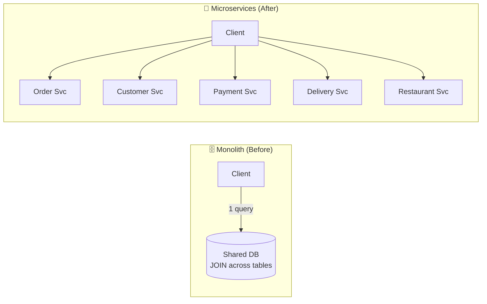
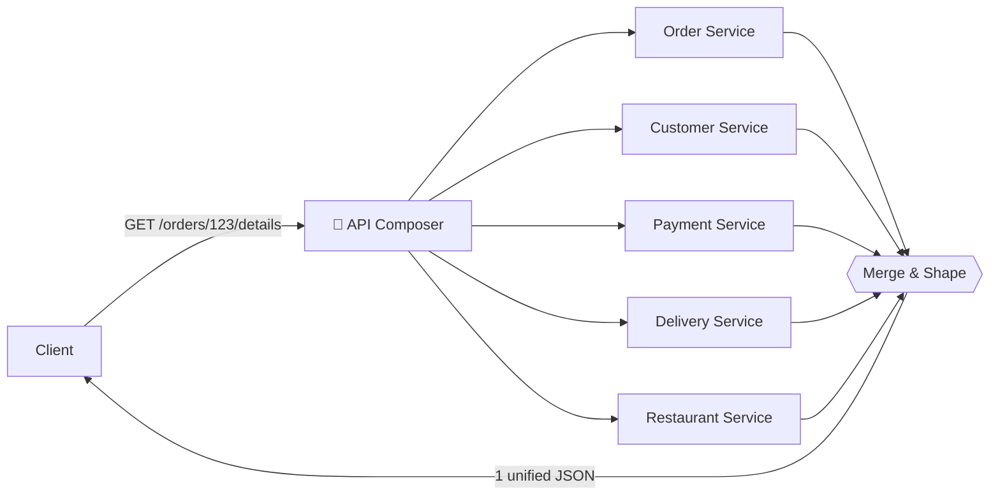
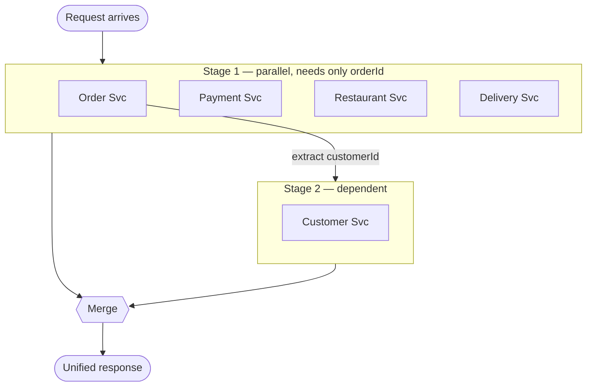
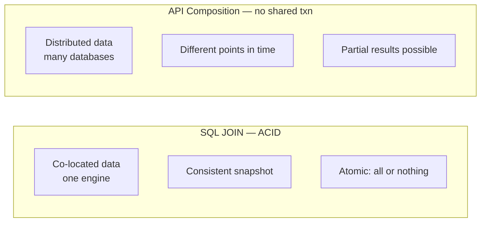
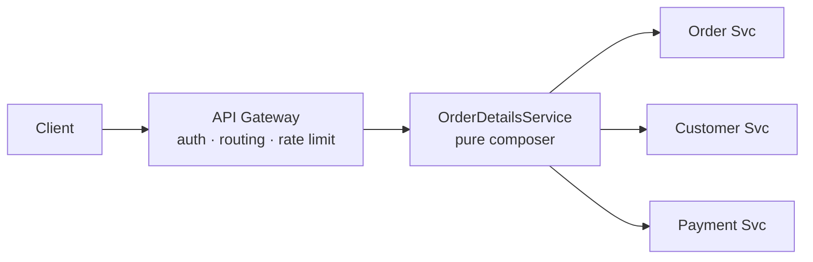
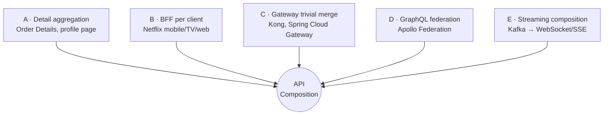
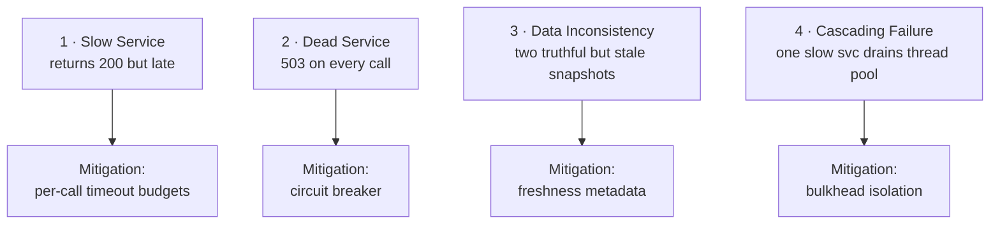
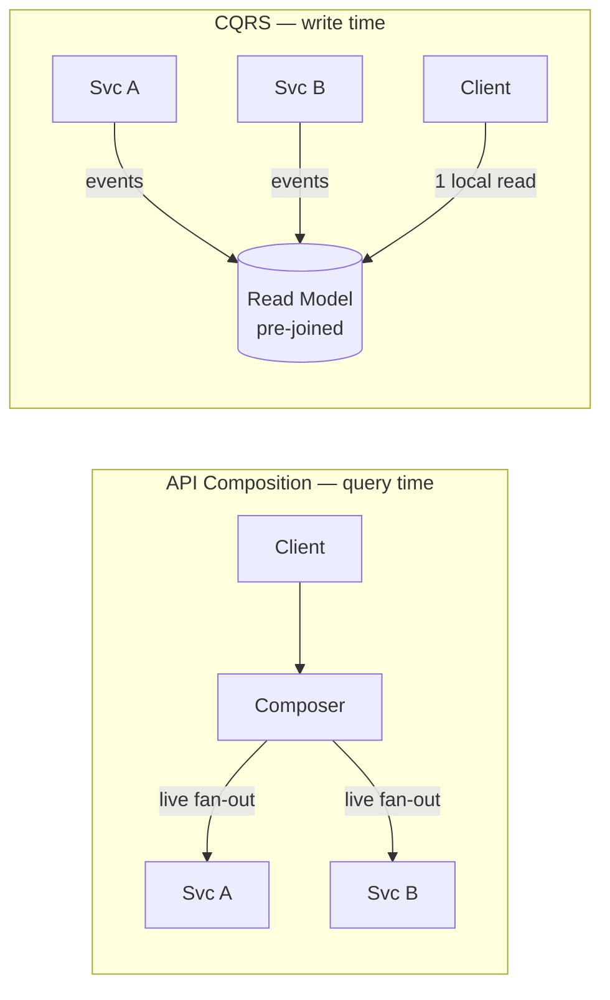

# 🧩 API Composition — A Study Guide (Beginner → Staff/Principal)

> **One product page. Five services. Who stitches it all together?**
> This guide walks the API Composition pattern from plain-English intuition to the failure-mode reasoning and tunable knobs a staff engineer brings up unprompted. Read it top-to-bottom for a natural build-up, or jump to the ⚡ Quick Revision and 🎓 FAANG Q&A when you're prepping.

---

## 📋 Table of Contents

- [🎯 The Problem: Why a Single JOIN Stops Working](#-the-problem-why-a-single-join-stops-working)
- [✅ Core Definitions (Plain English First)](#-core-definitions-plain-english-first)
- [💡 Why the Pattern Exists](#-why-the-pattern-exists)
- [🔍 The Real Mechanism: How the Composer Orchestrates](#-the-real-mechanism-how-the-composer-orchestrates)
- [🎨 API Composition vs. Its Neighbours](#-api-composition-vs-its-neighbours)
- [🏗️ Where the Composer Lives: Two Implementation Approaches](#️-where-the-composer-lives-two-implementation-approaches)
- [💻 End-to-End Walkthrough: The Order Details Page](#-end-to-end-walkthrough-the-order-details-page)
- [📊 Categorized Real-World Examples](#-categorized-real-world-examples)
- [❌ When Composition Fails: The Four Failure Modes](#-when-composition-fails-the-four-failure-modes)
- [🚫 Common Misconceptions](#-common-misconceptions)
- [🎓 Staff-Level Nuance (What Experienced Engineers Bring Up Unprompted)](#-staff-level-nuance-what-experienced-engineers-bring-up-unprompted)
- [🔗 Adjacent & Extension Concepts (BFF, CQRS, GraphQL Federation, Sagas)](#-adjacent--extension-concepts-bff-cqrs-graphql-federation-sagas)
- [📊 Trade-offs at a Glance](#-trade-offs-at-a-glance)
- [⚡ Quick Revision](#-quick-revision)
- [🎓 FAANG Interview Q&A (20 Questions)](#-faang-interview-qa-20-questions)
- [📚 Glossary](#-glossary)
- [📝 Key Takeaways](#-key-takeaways)

---

## 🎯 The Problem: Why a Single JOIN Stops Working

In a monolith, the "Order Details" page is a solved problem. Customer data, order details, payment status, delivery tracking, and restaurant info all live in the same database, so you write one SQL query with a few JOINs and get everything back in a single round trip:

```sql
SELECT o.*, c.name, c.address, p.status, p.method,
       d.driver_name, d.eta, r.name AS restaurant
FROM orders o
JOIN customers c ON o.customer_id = c.id
JOIN payments p  ON p.order_id     = o.id
JOIN deliveries d ON d.order_id    = o.id
JOIN restaurants r ON r.id         = o.restaurant_id
WHERE o.id = 123;
```

One round trip. One transaction boundary. Consistency guaranteed by the database engine.

Then the team decomposes the monolith into microservices. Each service gets its own database (the **Database-per-Service** pattern). Order Service owns orders, Customer Service owns customers, and Payment, Delivery, and Restaurant each own their tables. No shared schema. No cross-database JOINs. **That single query is gone — not deprecated, gone.**

The data still exists, but it's scattered across five independent stores that can't see each other. A client that used to make one API call now faces a question: *who is responsible for assembling the response?*



On the left, one request returns everything. On the right, the client makes five separate network calls, parses five response formats, and handles five failure modes. This compounds into three problems:

**N+1 client calls.** The mobile app, the web dashboard, and the internal admin panel all need the same aggregated view. Each independently calls the same five services and merges them client-side. That's 15 network calls across three clients for what used to be one database query.

**Duplicated aggregation logic.** Every client team writes its own version of "call these services, merge these fields, handle these timeouts." Mobile's merge logic drifts from web's. Bugs get fixed in one client and not the others. The response shape diverges across platforms.

**Tight coupling to internal service boundaries.** The client now *knows* that order data lives in Order Service and payment data in Payment Service. If the team merges two services or splits one, every client has to change. The internal architecture has leaked into the client contract.

There's a subtler problem too. In the monolith, the JOIN ran inside a single transaction — a consistent snapshot at one point in time. Across microservices, each service responds independently. Order Service might return data from 50ms ago while Delivery Service returns data from 200ms ago. **There's no transaction boundary across services, so there's no consistency guarantee across the aggregated response.** This is the broken assumption: developers from monoliths subconsciously expect that assembling data from multiple sources behaves like a JOIN — consistent, atomic, all-or-nothing. It doesn't. And pretending it does is how you end up with an order page showing "Delivered" while the tracking map still shows the driver en route.

The pattern that solves the *retrieval* half of this problem has a name: **API Composition**.

<details>
<summary>📖 Beginner-friendly explanation</summary>

Imagine you're planning a dinner and need info from five different shops: the pizza place, the delivery driver, your bank, the customer (you), and the restaurant. In the old days everything was in one binder on your desk — flip to one page, done. Now each shop keeps its own binder in its own building. To fill in your dinner summary, *someone* has to phone all five shops, jot down each answer, and hand you one tidy sheet. API Composition is hiring one assistant to make those five calls for you, so you dial one number instead of five. The catch: because the assistant phones each shop at a slightly different second, two answers can disagree — the pizza shop says "delivered," the driver says "still driving." That mismatch is the price of not having one binder anymore.

</details>

---

## ✅ Core Definitions (Plain English First)

**API Composition** is a read pattern where a single component sits between the client and the downstream microservices. It receives one request, fans out calls to the services that own each slice of data, collects their responses, merges them into one payload, and returns it. The client makes **one** call and never learns how many services contributed.

The pattern has three actors:

**The Client** is the consumer that needs a unified response — a mobile app, a web dashboard, an admin panel. It doesn't know or care how many services contributed.

**The Composer** (also called the *aggregator*) is the orchestrator. It receives the client's request, dispatches calls to downstream services, and assembles the final response. Its job is narrow and specific: routing, parallel dispatch, response merging, timeout handling, and response shaping.

**The Provider Services** are the downstream microservices that each own a slice of the data — Order, Customer, Payment, Delivery, Restaurant — each responding independently with its own payload.



What the composer **does not do** is equally important. It doesn't own business logic. It doesn't mutate state across services. It doesn't replace an event-driven write path. If your composer is deciding whether a refund should be approved based on payment status and delivery state, it's doing too much — that logic belongs in a domain service. **The composer is a read-path coordinator.** The moment it starts making business decisions, you've built a distributed monolith with extra network hops.

<details>
<summary>📖 Beginner-friendly explanation</summary>

Think of the composer as a waiter, not a chef. The waiter takes your one order, walks to the kitchen, the bar, and the dessert station, gathers each item, arranges them on one tray, and brings it to your table. What the waiter must *never* do is start cooking or decide to swap your steak for fish — that's the kitchen's job. A composer that stays a "waiter" is healthy. A composer that becomes a "chef" (making business decisions) turns into an unmaintainable mess everyone has to touch to ship any feature.

</details>

---

## 💡 Why the Pattern Exists

The pattern exists to move three burdens *off the client and off every other client*: the fan-out itself, the merge logic, and the knowledge of internal service topology. By putting one component in the middle, you get:

**A single, stable interface for the client.** Any change on the provider side — a service split, a schema change, a new field — is absorbed by the composer. The client contract only changes on a deliberate version bump.

**One place for orchestration concerns.** Parallel vs. sequential dispatch, per-call timeouts, partial-failure handling, protocol translation (REST/gRPC/SOAP), and caching all live in one place instead of being reinvented by every client team.

**Decoupling in both directions.** Downstream services evolve their schemas freely; clients evolve their needs freely; the composer sits in the middle and absorbs change from both sides. Neither side needs to know about the other.

Without this layer, you're left with two bad alternatives. **Client-side composition** exposes the internal service topology to clients and bloats every UI with aggregation logic. **Service-to-service composition** (one domain service calling four others) creates hidden runtime dependencies that quietly defeat the point of microservices. API Composition is the clean third path — a component whose *only* job is to compose.

---

## 🔍 The Real Mechanism: How the Composer Orchestrates

The heart of the pattern isn't "call some services and merge." It's *how* you sequence and budget those calls. This is where the real engineering lives.

### Parallel by default, sequential only when forced

If four calls each take 100ms and you make them sequentially, you pay 400ms. If you fire them in parallel, you pay ~100ms (the slowest one). So the default is **always parallel**:

```javascript
// ❌ Sequential — 400ms for 4 × 100ms services
const order    = await orderService.get(orderId);
const customer = await userService.get(order.customerId);
// ...

// ✅ Parallel — ≈100ms for the same 4 services
const [order, customer, products, payment] = await Promise.all([
  orderService.get(orderId),
  userService.get(userId),
  productService.getMany(productIds),
  paymentService.get(paymentId),
]);
```

### Not all composition is a flat fan-out — it's a dependency graph

Some calls depend on the result of a previous call. In the Order Details example, Customer Service needs a `customerId`, and that `customerId` comes from the Order Service response. You can't call both in parallel — Order must return first. So the call plan isn't a flat list; it's a **directed acyclic graph (DAG)** with stages:



The critical optimization: **Stage 2 doesn't wait for all of Stage 1 to finish.** The moment Order Service responds, the composer immediately fires the Customer Service call — even while Payment, Restaurant, and Delivery are still in flight. If a chained call is *unavoidable* it's fine, but frequent chaining is a design smell hinting your service boundaries may be wrong.

### The composer manages a timeout budget

If the client expects a response in 300ms, the composer can't give each downstream service 300ms. The budget has to be **divided**. Stage 1 might get 180ms, Stage 2 gets 100ms, leaving ~20ms for merging and serialization. Each call gets its own timeout wrapper, not one global timeout. When a downstream service exceeds its individual timeout, the composer decides — per the criticality of that data — whether to fail the whole request or return a partial, degraded response.

This is why the dependency graph is not just documentation — it's a **latency-planning tool**. A two-stage design means the Customer call starts at ~120ms instead of 0ms, which compresses its available time. If Order Service is slow, Customer gets squeezed, and if the total exceeds 300ms you're over budget.

<details>
<summary>📖 Beginner-friendly explanation</summary>

Picture a chef with a 5-minute ticket time. She can't spend 5 minutes on the fries *and* 5 on the burger — she starts both at once (parallel) so the whole plate is done in 5. But the sauce needs the seared meat's juices, so it can only start after the meat is done (dependency). She budgets: 3 minutes for the parallel stuff, 90 seconds for the sauce, 30 seconds to plate. If the meat runs late, the sauce gets rushed. That budgeting-under-a-deadline is exactly what a composer does with timeouts.

</details>

---

## 🎨 API Composition vs. Its Neighbours

Three concepts get conflated with API Composition constantly. Being able to draw these boundaries cleanly is a common interview filter.

### API Composition vs. API Gateway

An **API Gateway** handles *cross-cutting infrastructure concerns*: authentication, rate limiting, TLS termination, request routing. It sits at the edge and directs traffic. **API Composition** is a *data-aggregation* pattern: it combines data from multiple services into one response. One answers "how do I manage traffic at the edge?"; the other answers "how do I combine data from multiple services into one response?"

They can coexist in the same deployment artifact — a gateway *can* host composition logic, and in many teams it does — but they're not the same concept. The confusion happens because the boundary is blurry in practice: a team starts with a routing-only gateway, then adds "just merge order and customer, it's only two calls," then another, and six months later the gateway contains business-aware composition for a dozen endpoints and knows the difference between `PENDING` and `PROCESSING`. The clean mental model: **the gateway routes, the composer aggregates.**

### API Composition vs. Data JOINs

Developers who've spent years writing SQL carry an implicit model into microservices: "I'm just combining data from multiple sources — it's basically a JOIN." It is not.



A SQL JOIN operates on co-located data inside one engine with ACID guarantees: a consistent snapshot of all tables at the same instant, atomic on failure. API Composition operates on distributed data with **no shared transaction boundary**, and you lose three guarantees:

**No consistency** — Order Service may reflect a change from 50ms ago while Delivery reflects one from 200ms ago. The composed response can hold "delivered" next to "in transit."

**No atomicity** — if the third call fails after the first two succeeded, you can't roll back reads already in memory. You return partial data or fail the whole request; you can't undo.

**No isolation** — while the composer collects responses, the underlying data keeps changing. A payment may be refunded between Payment Service's response and the client receiving the payload. There's no lock across services.

API Composition gives you **eventual visibility** across services, not a consistent snapshot. Designing around that constraint — rather than pretending it doesn't exist — is what separates a working implementation from one that silently shows stale data.

### API Composition vs. client-side / service-to-service composition

Both alternatives were introduced above. In short: client-side composition leaks topology and duplicates logic; service-to-service composition creates hidden runtime coupling. The composer is the dedicated, topology-owning third path.

---

## 🏗️ Where the Composer Lives: Two Implementation Approaches

You know what the composer does. The first real architectural decision is *where the composition logic lives*. The choice has real consequences for every future deployment and on-call rotation.

### Approach 1 — In-Gateway Composition

The simplest approach: the API Gateway itself acts as the composer. The client hits one endpoint, the gateway fans out, merges, and returns one payload. No new service to deploy, no new infrastructure. Composition sits right alongside routing, auth, and rate limiting.

This works well when composition is straightforward: two or three services, flat fan-out, no dependencies between calls. The merge is a few lines of field mapping.

The advantages are real: **zero extra network hop** (the gateway is already in the request path), and cross-cutting concerns (auth, TLS, rate limiting) don't need to be replicated. For a small team, this is the path of least resistance — one artifact to deploy, one place to look when something breaks.

**The trajectory to watch:** it starts innocently. One endpoint aggregates two services. Then another needs three. Then product wants a mobile-optimized shape with fewer fields. Then the admin dashboard needs aggregated counts. Each addition is "just a few lines." Six months later the gateway understands order statuses and customer tiers, and deploying a routing change risks breaking the checkout aggregation. **The gateway should route, not think.**

Warning signs you've outgrown in-gateway composition:

- Testing a field-mapping change requires spinning up the full gateway stack (auth, routing, TLS). Integration tests become slow and brittle.
- Multiple client types need different response shapes for the same data.
- Gateway deployments become high-risk — one composition bug can take down routing for *all* endpoints sharing the artifact.
- The team owning the query logic differs from the team owning the gateway, forcing cross-team deploy coordination.

### Approach 2 — Dedicated Query Service

Extract composition into a standalone microservice whose only responsibility is composing one use case: `OrderDetailsService`, `DashboardAggregator`, `CustomerProfileComposer`. Each owns *zero data* — it's a pure orchestrator. The gateway goes back to routing, auth, and rate limiting; the composition logic can be deployed, tested, and scaled independently.



Advantages: composition is **testable in isolation** (mock downstreams, verify the merge, no gateway stack); it **scales independently** (if Order Details gets 10× the traffic, scale only that service); and each query service owns its own SLA, circuit-breaker config, and deploy cadence.

Costs are equally real: another deployment pipeline, another set of health checks, another thing that can page you at 3 AM, and **one extra network hop** (`Client → Gateway → Query Service → Providers`), typically adding 1–5ms. The subtler risk is **proliferation** — without discipline you end up with dozens of thin query services, one per screen, and the operational surface overwhelms the architectural benefit. There's no free lunch; you're choosing *where* to accept the complexity.

### When to use which

**Start with in-gateway composition.** It's the right default for most teams. **Graduate to a dedicated query service** when any of these appear:

- Composition logic exceeds ~50 lines of non-trivial code (conditional logic, multi-stage fan-out, business-aware transforms).
- Multiple client types need different response shapes (the textbook trigger for a dedicated composer or per-client BFFs).
- Downstream calls have dependency ordering (Service A before Service B — that's orchestration, a service's job).
- The gateway team differs from the query-logic team.

In practice the most common production setup is a **hybrid**: the gateway handles trivial compositions (two services, flat merge, no dependencies) while dedicated query services handle the complex ones (multi-stage fan-out, conditional logic, client-specific shaping). That's not a compromise — it's the architecture recognizing that not all compositions are equally complex. *The simplest approach that meets your query requirements is the right one. Extract when the pain is real, not when the diagram would look cleaner.*

<details>
<summary>📖 Beginner-friendly explanation</summary>

Think of a small café where the person at the till also makes your coffee (in-gateway: one person, less overhead — great while it's quiet). As the café gets busy, that one person becomes the bottleneck and every mistake at the till also ruins the coffee. So you hire a dedicated barista (query service): the till just takes orders, the barista just makes drinks. It costs another salary and another station, but each person does one job well and you can add more baristas when the morning rush hits. Most cafés end up with both — a till for simple orders and baristas for the complicated lattes.

</details>

---

## 💻 End-to-End Walkthrough: The Order Details Page

Theory is useful; shipping code is better. Here's a full composition flow — requirements to response contract — for a food-delivery app's Order Details screen. It's the screen a customer opens after ordering: what they bought, who's delivering, where the driver is, whether payment went through. Every field comes from a different service. The client has no idea. That's the point.

### The requirements

The screen pulls from **five services**:

| Service | Owns |
|---|---|
| **Order** | order metadata (timestamp, status), line items, price breakdown, `customerId` reference |
| **Customer** | name, delivery address, contact number |
| **Payment** | payment method, transaction status, transaction ID |
| **Delivery** | driver name, current GPS coordinates, estimated arrival |
| **Restaurant** | restaurant name, address, average prep time |

The app makes one call: `GET /orders/{orderId}/details`. The **latency budget is 300ms at p95** — total, from request received to response sent. And critically, not all data carries the same weight:

- **Order metadata and payment status are required.** If either is down, there's no meaningful screen — return an error.
- **Driver GPS is nice-to-have.** If Delivery is slow/down, show "Tracking temporarily unavailable" and render the rest.
- **Restaurant details are degradable** — a missing name doesn't break the experience.

This required-vs-nice-to-have classification is not a product decision you make later. It's an **architectural decision you make now**, because it determines how the composer handles partial failures.

### Mapping the call dependency graph

The instinct is to fire all five in parallel, but that's impossible here. Four services (Order, Payment, Restaurant, Delivery) accept `orderId` directly. **Customer Service needs a `customerId` that lives inside the Order response.** So it's a two-stage fan-out, and Stage 2 fires the *instant* Order returns — not after all of Stage 1 completes.

### The composition flow (8 steps)

1. **Receive** — `GET /orders/123/details` arrives at `OrderDetailsComposer`; the gateway already handled auth and rate limiting upstream.
2. **Validate** — check `orderId` format; extract auth context (caller must be the order owner or an admin); reject bad requests *before* any downstream call.
3. **Stage 1 parallel fan-out** — fire Order (150ms timeout, it's on the critical path), Payment / Restaurant / Delivery (200ms each — no dependents).
4. **React to the first critical response** — the moment Order responds, extract `customerId` and immediately fire Stage 2. The other three keep collecting in the background.
5. **Stage 2 dependent call** — Customer Service with a *tighter* 100ms timeout (it started later, less budget left).
6. **Handle partial failures** — Order or Payment failed → fail the whole composition (503). Delivery failed → `{status: "unavailable", message: "Tracking temporarily unavailable"}`. Restaurant failed → `{name: "Unknown", address: null}`. Customer failed → degrade to `customerId` only, or cached data.
7. **Merge** — combine successful responses and fallbacks into the final shape; translate internal field names (`created_at` → `orderDate`) to the client contract.
8. **Return** — serialize, set cache headers if applicable, respond. Total elapsed under 300ms — with degraded data if nice-to-have services failed.

### The code

```typescript
async function getOrderDetails(orderId: string): Promise<OrderDetailsResponse> {
  // Stage 1 — fire four calls in parallel
  const [orderResult, paymentResult, restaurantResult, deliveryResult] =
    await Promise.allSettled([
      withTimeout(orderService.getOrder(orderId), 150),
      withTimeout(paymentService.getPayment(orderId), 200),
      withTimeout(restaurantService.getRestaurant(orderId), 200),
      withTimeout(deliveryService.getDelivery(orderId), 200),
    ]);

  // Order is required — fail fast if missing
  if (orderResult.status === 'rejected') {
    throw new CompositionError('ORDER_UNAVAILABLE', 503);
  }
  const order = orderResult.value;

  // Payment is required
  if (paymentResult.status === 'rejected') {
    throw new CompositionError('PAYMENT_UNAVAILABLE', 503);
  }
  const payment = paymentResult.value;

  // Stage 2 — dependent call, fires immediately after Order resolves
  const customerResult = await withTimeout(
    customerService.getCustomer(order.customerId), 100
  ).catch(() => null);

  // Apply fallbacks for nice-to-have services
  const restaurant = restaurantResult.status === 'fulfilled'
    ? restaurantResult.value
    : { name: 'Unknown', address: null };

  const delivery = deliveryResult.status === 'fulfilled'
    ? deliveryResult.value
    : { status: 'unavailable', message: 'Tracking temporarily unavailable' };

  const customer = customerResult ?? { id: order.customerId, name: null, address: null };

  return mergeOrderDetails(order, customer, payment, delivery, restaurant);
}
```

`Promise.allSettled` collects *all* results including failures, so we apply selective fallbacks instead of failing everything because one non-critical service was slow. `Promise.all` would reject the moment any single call fails — the wrong choice when you want partial responses. The `withTimeout` wrapper races each call against a deadline:

```typescript
async function withTimeout<T>(promise: Promise<T>, ms: number): Promise<T> {
  const timeout = new Promise<never>((_, reject) =>
    setTimeout(() => reject(new TimeoutError(`Exceeded ${ms}ms`)), ms)
  );
  return Promise.race([promise, timeout]);
}
```

### The response contract

```json
{
  "orderId": "ord_8f3a2b",
  "orderDate": "2025-11-14T18:32:00Z",
  "status": "IN_DELIVERY",
  "items": [
    { "name": "Margherita Pizza", "quantity": 2, "price": 12.99 },
    { "name": "Garlic Bread", "quantity": 1, "price": 4.49 }
  ],
  "total": 30.47,
  "customer": { "name": "Sarah Chen", "address": "42 Oak Avenue, Apt 7B", "phone": "+1-555-0142" },
  "payment": { "method": "VISA_4242", "status": "CAPTURED", "transactionId": "txn_9k4m2p" },
  "delivery": {
    "driverName": "Marcus",
    "currentLocation": { "lat": 40.7128, "lng": -74.0060 },
    "eta": "2025-11-14T19:05:00Z",
    "status": "EN_ROUTE"
  },
  "restaurant": { "name": "Tony's Pizzeria", "address": "118 Main Street", "prepTime": 15 }
}
```

Five services contributed; the client sees none of that complexity. **The response contract is the composer's product** — it should be versioned, documented, and treated like a public API, because to the client it *is* one. When Delivery adds `driver_photo_url`, the composer decides whether to expose it; the client contract doesn't change without a version bump. Every fallback object matches the same shape (with `null` fields) so the client never receives *missing keys*, only keys with `null` values.

<details>
<summary>📖 Beginner-friendly explanation</summary>

Imagine ordering a combo meal. You say one thing ("Order Details for #123") and get back one tray. Behind the counter, five people each fetched one item — but they always hand you the same tray layout: burger slot, fries slot, drink slot. If the milkshake machine is broken, they don't hand you a tray with a *hole* where the shake goes — they put an empty cup labeled "temporarily unavailable" so your tray still looks normal and your app doesn't crash. That predictable tray shape, always the same slots, is the response contract.

</details>

---

## 📊 Categorized Real-World Examples

API Composition shows up across the industry under different names. Grouping by *shape of the problem* makes the pattern easier to recognize.

### Category A — Detail / profile aggregation (classic fan-out)

The canonical case: one entity, several services enriching it. **Order Details** (order + customer + payment + delivery + restaurant). **A social profile page** (profile service + posts + followers + activity). **A content page** (content + comments + reactions + recommendations, exactly Naresh Waswani's example). Shape: mostly flat fan-out, bounded payloads, one primary entity that's *required* and satellites that are *degradable*.

### Category B — Backend-for-Frontend (BFF) per client type

Netflix pioneered this: mobile, TV, and web each get their own composer because a phone on a cellular network wants a lean payload while a smart-TV wants richer data. Each BFF is API Composition scoped to one client. Shape: same underlying services, different response shaping per consumer.

### Category C — Gateway-hosted trivial composition

A Kong / AWS API Gateway / Spring Cloud Gateway route that merges two services with a few lines of field mapping. Shape: no dependencies, no business logic — the "start simple" default.

### Category D — GraphQL federation

**Apollo Federation** is composition made declarative: each service owns part of a shared schema, and the gateway resolves a client query by fanning out to whichever services own the requested fields. Shape: the client *describes* what it wants; the federation layer composes. It's API Composition with a query language on top.

### Category E — Streaming / real-time composition

Live order tracking, stock tickers, monitoring dashboards. The composer subscribes to multiple Kafka topics and pushes a merged stream over WebSocket/SSE. Shape: not request-response at all — a stream multiplexer. (More in the extensions section.)



---

## ❌ When Composition Fails: The Four Failure Modes

The walkthrough assumed things mostly work. Production doesn't extend that courtesy. In a distributed system the question isn't *if* a downstream fails — it's *which one fails first and how badly it drags the composer down with it*. There are four distinct failure modes, and each needs a different strategy. Getting the taxonomy wrong means building the wrong resilience.



### Failure Mode 1 — The Slow Service

Delivery Service doesn't crash — it responds, just slowly. Instead of 80ms it takes 900ms, blowing past the 300ms budget. This is the **most common and most insidious** mode, because dashboards show *zero errors* — everything returns 200 OK, the service is "healthy," yet the composer is consistently late and the client times out.

**Mitigation: per-call timeouts with aggressive budgets.** Delivery gets 200ms — not because that's how long it *should* take, but because that's how long the composer can *afford* to wait. When the timeout fires, treat it identically to a failure: slot in the fallback, return the partial response, move on. The slow service never holds the whole composition hostage.

### Failure Mode 2 — The Dead Service

Restaurant Service returns 503 on every request. It's not slow — it's gone. The naive move is to retry. The smart move is to **stop calling it for a while** — this is where the **circuit breaker** earns its keep. It tracks consecutive failures; after a threshold (say 5 failures in 30s) the circuit *opens* and all subsequent calls short-circuit immediately with the fallback — no wasted millisecond waiting for a response you know won't come. After a cooldown the circuit goes *half-open* and lets one probe through; if it succeeds, the circuit closes and normal traffic resumes.

The key decision: does a dead nice-to-have service return a partial response or fail the whole thing? That depends on the classification you made in requirements. Restaurant is degradable → `{name: "Unknown"}`. Payment is required → 503. Formalize this with a **partial-response contract**: document which fields are guaranteed-present and which may be `null` under degradation, so a null restaurant name shows a placeholder, not a crash.

### Failure Mode 3 — Data Inconsistency Across Services

Order Service says `DELIVERED`. Delivery Service says `EN_ROUTE`. Both returned 200. Both are telling the truth from their own point in time — Order processed the confirmation event 200ms ago; Delivery hasn't consumed it yet. The composer just stitched two snapshots from different moments.

**You cannot fix this at the composer level** — it doesn't own business logic and can't decide which service is "more correct." What it *can* do is add **metadata**: include a `dataFreshness` / `lastUpdated` timestamp from each service. Let the client reason about staleness — if `delivery.lastUpdated` is 30s behind `order.lastUpdated`, show "Refreshing delivery status…" instead of contradictory values side by side. The deeper fix lives in your event pipeline (reduce propagation delay); the composer's job is to surface inconsistency *honestly*, not hide it.

### Failure Mode 4 — Cascading Failures

Delivery is slow (2s/request). The composer's thread pool has 50 threads. Each request now holds a thread for 2s instead of 80ms. At 25 req/s the pool fills in 2 seconds — and now *every* composition request, including ones that don't even need Delivery, is queued. The composer goes unresponsive, the gateway health check fails, traffic reroutes, and the *entire* endpoint is down because **one non-critical service got slow**.

**Mitigation: bulkhead isolation.** Instead of one shared thread pool, allocate separate pools (or semaphores) per downstream. Delivery gets a pool of 10; when those 10 are occupied, the 11th Delivery call gets an immediate rejection (fallback, not queue). The other 40 threads stay free for Order, Payment, Customer, Restaurant. The slow service is quarantined; healthy services are unaffected. Combined with the circuit breaker from Mode 2, the defense works in layers — the bulkhead caps how many threads a slow service can consume, the breaker stops calling it once failures cross the threshold.

<details>
<summary>📖 Beginner-friendly explanation</summary>

A ship's hull is split into sealed compartments (bulkheads) so that if one floods, the water can't spread and sink the whole ship. Your composer needs the same. If the "Delivery" compartment floods (slow calls), a bulkhead keeps that flooding from filling every compartment and drowning the "Order" and "Payment" requests too. The circuit breaker is the crew noticing a compartment is hopelessly flooded and welding the door shut for a bit instead of bailing water forever. Together they keep the ship afloat even when one section is a disaster.

</details>

---

## 🚫 Common Misconceptions

**"It's basically a distributed JOIN."** No. A JOIN is ACID inside one engine; composition has no shared transaction, so no consistency, atomicity, or isolation across the response. Expecting JOIN semantics is how you ship pages that show "Delivered" beside "En route."

**"The composer should be smart — put the business logic there since it sees everything."** This is the God Aggregator anti-pattern. The tell: teams have to modify the composer to ship features that belong to *other* services. The composer coordinates and merges — nothing else. If logic answers "what should this response *mean*?", it belongs in a domain service.

**"A 200 OK means full data."** When partial responses are enabled, a successful HTTP status can carry incomplete data. Clients must check something like `_meta.partial` and handle `null` fields; tests must exercise that path, not just the happy path.

**"Fetch related items one at a time — it's cleaner code."** That's the Chatty Composition / N+1 anti-pattern: a 20-item cart becomes 20 calls to Product Service. Always use batch endpoints (`getMany` over `get`). This is the single most common reason composed APIs underperform.

**"Just retry failed calls."** Retrying without exponential backoff *and jitter* means every composer instance fires retries in lockstep, turning a brief blip into a prolonged retry storm that hammers a recovering service. Randomize delays and pair with a circuit breaker.

**"The gateway and the composer are the same thing."** They can share a deployment, but they answer different questions — traffic management vs. data aggregation. Conflating them produces an unmaintainable gateway that does everything and owns nothing.

**"Composition can serve any read."** It can't serve reads that sort/filter/paginate across service boundaries or aggregate over large datasets — that's where CQRS begins (see below).

---

## 🎓 Staff-Level Nuance (What Experienced Engineers Bring Up Unprompted)

**Tail latency, not average, is your SLA.** Your response time is bounded by the *slowest* downstream on each request. p50 looks fine while p99 bleeds. Monitor p95/p99 *per downstream* and set independent timeouts per service — a single global timeout hides which dependency is the problem and gives the fast services no protection from the slow one.

**Timeout budgets should be tunable config, not magic numbers.** The 150/200/100ms split in the walkthrough is a *starting point*. Staff engineers make these per-dependency, per-route configuration (or adaptive, derived from observed p95) so you can retune under load without a redeploy. Sum-of-child-timeouts must stay under the client budget minus serialization overhead.

**Security is the most overlooked dimension.** Validate the client's JWT once at the composer boundary, then issue a short-lived *internal* service token for downstream calls (the **Token Exchange** pattern) rather than re-validating the original token everywhere. Use mTLS or service-identity JWTs for service-to-service auth in zero-trust networks. Watch the **aggregation-exposure risk**: combining two individually-authorized responses can reveal data the user shouldn't see — apply field-level filtering based on the caller's claims *before* returning. And rate-limit at the composer, not just the gateway, because one composer request amplifies into many downstream calls.

**Caching is a per-field TTL decision.** Stable data (user profile, product description) tolerates long TTLs; volatile data (pricing, inventory, driver GPS) needs short TTLs or none. Propagate `Cache-Control` from downstreams where possible, and include a `composedAt` timestamp so consumers can reason about overall freshness. A generic "cache the whole response" policy is almost always wrong.

**Sparse fieldsets tame payload bloat.** Let clients request only what they need — `GET /order-summary/123?fields=order.status,customer.name` — which matters enormously for mobile. This is also the seam where a BFF differentiates itself from a shared composer.

**Contract-test every downstream and instrument with distributed tracing.** The composer's blast radius is wide; a silent schema change upstream breaks the merge. Consumer-driven contract tests catch that in CI. In production, trace IDs propagated to every downstream let you see *which* leg blew the budget — without them, debugging a slow composed endpoint is guesswork.

**Beware dynamic coupling and the availability math.** Every synchronous downstream call adds *dynamic (runtime) coupling*: the composer's availability is roughly the *product* of its dependencies' availabilities. Five services at 99.9% each yield ~99.5% composed availability (≈3.6 hours of downtime/month) before you've added a single bug — and the composer becomes a potential single point of failure fronting all of them. This is *why* degradation (partial responses, fallbacks, caching) isn't a nicety but a hard requirement: it decouples composed availability from the weakest dependency. It's also the strongest quantitative argument for graduating volatile-but-critical reads to a materialized view, which removes the live dependency entirely.

**Know the structural ceiling.** The moment a query needs cross-service sorting, filtering on a foreign-owned field, pagination whose sort key lives in another service, or aggregation over large datasets, composition stops being the right tool — you're building "a distributed query engine out of duct tape." That's the CQRS boundary, and recognizing it *before* you've written 2,000 lines of in-memory merge is the judgment that separates senior from staff.

<details>
<summary>📖 Beginner-friendly explanation</summary>

Junior thinking is "does it work when I click the button?" Staff thinking is "what happens on the worst day?" — the one request in a hundred where a service is slow, the moment two services disagree, the afternoon traffic spikes 10×, the schema someone changed without telling you, the auth token that quietly grants too much. The staff engineer bakes in tunable timeouts, per-field caching, isolated failure zones, tracing, and contract tests *before* that bad day, because on a distributed system the bad day is not a maybe — it's a Tuesday.

</details>

---

## 🔗 Adjacent & Extension Concepts (BFF, CQRS, GraphQL Federation, Sagas)

**Backend-for-Frontend (BFF)** is API Composition applied *per client type*. Mobile, web, and admin each get their own composer producing a shape tailored to that client. Use it when clients need meaningfully different payloads; avoid it when one shared shape works (it multiplies services).

**CQRS (Command Query Responsibility Segregation)** is where you go when composition hits its ceiling. Instead of composing reads at *query time*, you listen to domain events from each service and build a denormalized, pre-joined, query-optimized **read model** (materialized view). The client queries that read model directly — no fan-out, no partial-failure risk, and pagination/sorting become a single local DB query. The line: **API Composition aggregates at request time; CQRS pre-aggregates at write time.** The trade-off is eventual consistency in the read model (usually ms-to-seconds lag) plus the operational cost of event consumers (retries, dead-letter queues, schema registry).



**GraphQL Federation (Apollo)** is a declarative flavour of composition — services own schema slices, the gateway resolves a client query across them. Great when clients need flexible field selection; the resolver planning *is* the composition.

**Async / event-driven composition.** When services are only reachable via a message bus, you can do request-response over the bus (reply-to inbox pattern) or reactive streaming composition (subscribe to Kafka topics, push a merged stream over WebSocket/SSE with backpressure via RxJS / Project Reactor / Akka Streams). Most real systems are **hybrid**: stable reference data via sync call or cache, transactional data via materialized view, real-time signals via reactive stream — one composer assembling all three.

**Sagas** are the *write-side* counterpart. API Composition is strictly a **read** pattern; for operations that must change state across multiple services, use a Saga (a sequence of local transactions with compensating actions). If your "composer" is writing across services, you've reached for the wrong pattern.

### Tooling: buy vs. build

You rarely write a composer from raw sockets — there's a spectrum of off-the-shelf tooling. **Apollo Federation** is GraphQL-native: each service owns part of the schema and the gateway stitches them. **Kong** and **AWS API Gateway** suit simple compositions and cross-cutting concerns better than complex logic. **Netflix Zuul** and **Spring Cloud Gateway** are battle-tested in JVM/Spring ecosystems. **Build your own** when composition contains real business rules, you need fine-grained failure handling (per-dependency circuit breakers, bulkheads, partial-response contracts), or off-the-shelf tools impose unacceptable constraints on your response shape. The rule mirrors the whole pattern: reach for the simplest tool that meets the requirement, and build only when the aggregation logic genuinely justifies it.

---

## 📊 Trade-offs at a Glance

| Approach | Complexity | Extra hop | Best for | Graduate away when |
|---|---|---|---|---|
| **In-gateway composition** | Lowest | None | 2–3 services, flat merge, no deps, no business logic | Logic >~50 lines, per-client shapes, call dependencies, cross-team ownership |
| **Dedicated query service** | Medium | +1 hop (~1–5ms) | Multi-stage fan-out, conditional logic, independent scaling/SLA | Proliferation (dozens of thin services); queries need cross-service sort/filter |
| **BFF (per client)** | Medium | +1 hop | Clients needing genuinely different shapes | One shared shape suffices |
| **CQRS / materialized view** | Highest | None at read | Cross-service sort/filter/paginate, large aggregations, high read volume | Never needed — don't pre-build if simple composition suffices |

**Pros of API Composition:** single client interface; internal topology hidden and free to evolve; one place for timeouts, retries, protocol translation, and caching; graceful partial-failure handling; can improve performance via parallelism and caching.

**Cons:** extra compute/network for fan-out; a potential single point of failure and availability sink (composer availability = product of dependency availabilities unless degraded); in-memory merge struggles with large payloads; another thing to build, secure, test, and operate.

*Decision rule: the simplest composition approach that meets your query requirements is the right one. Over-engineering the read path creates more problems than a slow query ever will.*

---

## ⚡ Quick Revision

*Read this straight through and the full guide should reassemble in your head in natural order.*

**The problem.** In a monolith, one page = one SQL JOIN across co-located tables, inside one transaction, with guaranteed consistency. Decompose into microservices with Database-per-Service and that JOIN is *gone* — data now lives in five independent stores with no shared schema and no cross-DB JOIN. If every client fans out to all services itself, you get three compounding problems: N+1 client calls (three clients × five services = fifteen calls for one page), duplicated and drifting aggregation logic across client teams, and tight coupling where the client hard-codes which service owns what. Plus a subtle one — no transaction boundary means the composed data can come from different points in time, so "Delivered" can appear next to "En route."

**The pattern.** API Composition puts one component — the **composer** (a.k.a. aggregator) — between client and services. It takes one request, fans out, collects, merges, and returns one payload. Three actors: **Client** (wants a unified response, ignorant of topology), **Composer** (routing, parallel dispatch, timeout handling, merge, response shaping — *and nothing else*), and **Provider Services** (each owns a data slice, responds independently). The composer is a **read-path coordinator**; the instant it makes business decisions it's a distributed monolith (the God Aggregator anti-pattern).

**The mechanism.** Call downstreams **in parallel by default** (4 × 100ms sequential = 400ms; parallel ≈ 100ms). When a call needs another's output (Customer needs the `customerId` from Order), the plan becomes a **DAG with stages** — and Stage 2 fires the *moment* its dependency resolves, not after all of Stage 1. The composer divides a **timeout budget** (e.g. 300ms client SLA → 180ms Stage 1, 100ms Stage 2, ~20ms merge), one timeout *per call*, not one global. The dependency graph doubles as a latency-planning tool.

**Distinctions to keep crisp.** Gateway = infrastructure (auth, TLS, rate limit, routing); composer = data aggregation — they can coexist but answer different questions, and "the gateway routes, the composer aggregates." Composition ≠ JOIN: no consistency (different points in time), no atomicity (can't roll back reads already in memory), no isolation (data changes mid-collection). You get **eventual visibility**, not a snapshot.

**Where it lives.** Start with **in-gateway composition** (zero extra hop, one artifact — great for 2–3 services, flat merge, no deps). **Graduate to a dedicated query service** when logic exceeds ~50 non-trivial lines, clients need different shapes, calls have dependency ordering, or the query team ≠ the gateway team — it's independently testable/scalable/deployable at the cost of one hop (~1–5ms) and proliferation risk. Most production systems are **hybrid**: gateway handles trivial merges, dedicated services handle complex ones. A **BFF** is a composer per client type.

**The walkthrough.** Order Details = 5 services, `GET /orders/{id}/details`, 300ms p95 budget. Order + Payment are **required** (fail → 503); Delivery + Restaurant + Customer are **degradable** (fail → fallback object). Two-stage fan-out because Customer needs Order's `customerId`. Use `Promise.allSettled` (not `Promise.all`) so one failure doesn't sink everything; wrap each call in `withTimeout`; every fallback matches the successful shape with `null` fields so the client never sees missing keys. The **response contract is the composer's product** — versioned, documented, treated as a public API; downstream schema changes are absorbed internally.

**The four failure modes.** (1) **Slow service** — returns 200 but late; insidious because dashboards show no errors → mitigate with aggressive per-call timeout budgets. (2) **Dead service** — 503s → **circuit breaker** (open after N failures, half-open probe, close on success); required-vs-degradable classification decides partial vs. 503. (3) **Data inconsistency** — two truthful-but-stale snapshots; unfixable at the composer → attach **freshness metadata** and let the client reason. (4) **Cascading failure** — one slow service drains the shared thread pool and takes down the whole endpoint → **bulkhead isolation** (per-dependency pools/semaphores) + circuit breaker, layered.

**Anti-patterns & staff nuance.** God Aggregator, Chatty/N+1 composition (batch with `getMany`), retry storms (backoff + jitter + breaker), treating 200 as full data. Staff-level extras: watch **p95/p99 tail latency per dependency**; make timeout budgets **tunable config**; secure the boundary (**Token Exchange**, mTLS, field-level authz to avoid aggregation-exposure, rate-limit at composer); **per-field TTL caching** with a `composedAt` stamp; sparse fieldsets for mobile; contract-test every downstream and propagate trace IDs.

**The ceiling.** Composition can't serve cross-service sorting/filtering, pagination whose sort key lives elsewhere, or large aggregations — that's a "distributed query engine of duct tape." Cross the line to **CQRS**: consume events, build a denormalized **read model**, serve queries locally. *API Composition aggregates at request time; CQRS pre-aggregates at write time.* Composition is **read-only**; for cross-service **writes**, use **Sagas**. Golden rule: the simplest approach that meets your query requirements wins.

---

## 🎓 FAANG Interview Q&A (20 Questions)

> Mix of foundational (L3/L4) and staff/principal (L4/L5) depth. The final four are STAR-format behavioral questions.

### Foundational & Conceptual

<details>
<summary><strong>Q1. What problem does the API Composition pattern solve, and why doesn't a plain database JOIN work in microservices?</strong></summary>

In a monolith, an "Order Details" page is one SQL JOIN across co-located tables inside a single transaction — consistent and atomic. Once you decompose with Database-per-Service, each service owns its own store, there's no shared schema, and cross-database JOINs don't exist. If every client fans out to all services itself you get N+1 client calls, duplicated merge logic that drifts between client teams, and clients tightly coupled to internal topology. API Composition introduces one component that fans out, merges, and returns a single payload so the client makes one call and stays ignorant of how many services contributed. Example: a food-delivery Order Details screen pulling from Order, Customer, Payment, Delivery, and Restaurant services behind `GET /orders/{id}/details`.

</details>

<details>
<summary><strong>Q2. Walk me through the three actors in the pattern and what the composer must NOT do.</strong></summary>

The **Client** needs a unified response and doesn't care about topology. The **Composer** does routing, parallel dispatch, timeout handling, response merging, and response shaping. The **Provider Services** each own a data slice and respond independently. The composer must *not* own business logic, mutate state across services, or replace an event-driven write path — it's a read-path coordinator. The classic failure is the "God Aggregator": a composer that starts deciding, say, whether a refund is approved based on payment and delivery state. That decision belongs in a domain service. The tell that you've crossed the line: teams must modify the composer to ship features that logically belong to other services.

</details>

<details>
<summary><strong>Q3. In-gateway composition vs. a dedicated query service — how do you choose?</strong></summary>

Start in-gateway: zero extra network hop, one artifact, reuses the gateway's auth/TLS/rate-limiting — ideal for two or three services, flat fan-out, no dependencies, no business logic. Graduate to a dedicated query service (e.g. `OrderDetailsService`) when composition logic exceeds ~50 non-trivial lines, multiple clients need different shapes, calls have dependency ordering, or the query-logic team differs from the gateway team. The dedicated service is independently testable (mock downstreams, no gateway stack), scalable (scale hot endpoints alone), and owns its own SLA and circuit-breaker config — at the cost of one extra hop (~1–5ms) and proliferation risk. Most mature systems run a hybrid: gateway for trivial merges, dedicated services for complex ones.

</details>

<details>
<summary><strong>Q4. Why parallel calls by default, and when is sequential unavoidable?</strong></summary>

Four services at 100ms each cost 400ms sequentially but ≈100ms in parallel (bounded by the slowest), so `Promise.all`/`allSettled` is the default. Sequential is unavoidable only when one call needs another's output — e.g. Customer Service needs the `customerId` that lives in the Order response. Then the plan becomes a staged DAG, and the optimization is to fire the dependent call the *instant* its dependency resolves, not after the whole first stage completes. Frequent chaining is a design smell suggesting your service boundaries are wrong — if you constantly need B right after A, maybe that data should be co-located or exposed together.

</details>

<details>
<summary><strong>Q5. How is API Composition different from an API Gateway?</strong></summary>

An API Gateway is an infrastructure component handling cross-cutting concerns — authentication, rate limiting, TLS termination, routing — answering "how do I manage traffic at the edge?" API Composition is a data-aggregation pattern answering "how do I combine data from multiple services into one response?" They can live in the same deployment artifact (a gateway *can* host composition), which is exactly why teams blur them: a routing gateway accretes "just merge these two" logic until it knows about order statuses and customer tiers and every routing deploy risks the checkout aggregation. Keep the mental model crisp — the gateway routes, the composer aggregates — and enforce internal boundaries when they share code.

</details>

<details>
<summary><strong>Q6. Why can't you treat a composed response like a consistent JOIN? What three guarantees do you lose?</strong></summary>

A SQL JOIN runs in one engine with ACID: a consistent snapshot at one instant, atomic on failure. Composition spans independent databases with no shared transaction, so you lose: **consistency** (Order may reflect state from 50ms ago, Delivery from 200ms ago — "Delivered" beside "En route"), **atomicity** (if the third call fails after two succeeded, you can't roll back reads already in memory — you return partial or fail whole), and **isolation** (data changes while you collect — a payment can be refunded between Payment's response and delivery to the client). You get *eventual visibility*, not a snapshot. Designing as if consistency holds is how you ship subtle, hard-to-debug production mismatches.

</details>

<details>
<summary><strong>Q7. How do you handle a downstream failure? Compare fail-hard, partial response, and fallback.</strong></summary>

Classify each field as required or degradable *before* writing code. **Fail-hard**: if a required service (Order, Payment) fails, return 503 — there's no meaningful screen without it. **Partial response**: return what you have and mark missing sections unavailable — a failed Delivery becomes `{status:"unavailable", message:"Tracking temporarily unavailable"}`. **Fallback data**: serve cached or default values for non-critical fields — a dead Restaurant becomes `{name:"Unknown"}`. Implementation-wise, use `Promise.allSettled` (not `Promise.all`, which rejects on the first failure) so you can apply selective fallbacks, and make every fallback match the successful shape with `null` fields so the client never sees missing keys — only null values. Formalize this in a documented partial-response contract.

</details>

<details>
<summary><strong>Q8. What is the response contract and why treat it as a public API?</strong></summary>

The response contract is the JSON shape the composer returns — and to the client, it *is* the API; the client never sees the five underlying services. So it should be versioned, documented, and evolved deliberately. When Delivery adds `driver_photo_url`, the composer decides whether and when to surface it; the contract doesn't change without a version bump, which decouples client release cycles from downstream schema changes. If you must support v1 and v2 simultaneously, handle it via content negotiation (Accept header or version path prefix) while downstreams stay unaware. The composer absorbs change from both directions — providers evolve freely, clients upgrade on their own schedule.

</details>

<details>
<summary><strong>Q9. What are the most common anti-patterns in API Composition?</strong></summary>

**God Aggregator** — the composer accretes business logic until it's a monolith in disguise; tell-tale sign is having to edit the composer to ship features owned by other services. **Chatty/N+1 composition** — fetching related items one-by-one (20 cart items = 20 Product calls); fix with batch `getMany` endpoints, the single most common performance killer. **Retry storms** — retrying without exponential backoff and jitter so every composer instance hammers a recovering service in lockstep; add jitter and a circuit breaker. **Treating a 200 as full data** — with partial responses enabled, success can carry incomplete data, so clients must check `_meta.partial` and tests must cover that path, not just the happy path.

</details>

<details>
<summary><strong>Q10. When should you NOT use API Composition?</strong></summary>

It's a read pattern, so for cross-service writes use Sagas. Avoid composition when consistency requirements are strict (financial settlement, inventory reservation), when the composed dataset is unbounded (use CQRS with materialized views), when downstreams are too unreliable (composition amplifies instability — availability is roughly the product of dependency availabilities unless you degrade), or when your latency budget is smaller than the fastest possible downstream response. And structurally, it can't serve cross-service sorting, filtering on a foreign-owned field, pagination whose sort key lives elsewhere, or large aggregations — those signal CQRS.

</details>

### Staff / Principal Depth

<details>
<summary><strong>Q11. (L5) How do you design and enforce a latency budget across a multi-stage composition?</strong></summary>

Begin from the client SLA — say 300ms p95 — and work backward. Reserve serialization/merge overhead (~20ms), then divide the rest across stages by the dependency graph: Stage 1 gets the larger share, Stage 2 (which starts later) gets a tighter, smaller window. Assign a timeout *per call*, not one global timeout, and give critical-path services (Order, since Stage 2 depends on it) tighter budgets than leaf services. Crucially, the sum of concurrent child timeouts on the critical path must stay under the client budget minus overhead. I'd make these values tunable config (or adaptive from observed p95) so we retune under load without redeploying, and I'd alert on p95/p99 *per dependency* because the average hides which leg is eating the budget. The dependency graph is a latency-planning artifact, not just documentation.

</details>

<details>
<summary><strong>Q12. (L5) A single slow downstream is taking down the whole composer endpoint. Diagnose and fix.</strong></summary>

This is a cascading failure. Delivery slows from 80ms to 2s; each request now pins a thread for 2s; at 25 req/s a 50-thread pool fills in ~2s; then *every* request queues — even ones not needing Delivery — the composer goes unresponsive, its health check fails, and the whole endpoint drops because one non-critical service got slow. Fix in layers: **bulkhead isolation** — separate thread pools or semaphores per downstream, so Delivery gets, say, 10 threads and the 11th call is rejected immediately with a fallback, leaving the other 40 threads free for healthy services. Add a **circuit breaker** so once failures cross a threshold we stop calling Delivery entirely and short-circuit to the fallback. Bulkhead caps resource consumption; the breaker stops spending time on a known-bad dependency. Also verify per-call timeouts are aggressive enough that a slow (not dead) service can't silently blow the budget.

</details>

<details>
<summary><strong>Q13. (L5) Two services return contradictory data (order DELIVERED, delivery EN_ROUTE). How do you handle it?</strong></summary>

Both are telling the truth from their own point in time — Order consumed the delivery-confirmation event, Delivery hasn't yet; the composer just stitched two snapshots from different moments. You can't fix this at the composer because it owns no business logic and can't decide who's "more correct." What it *can* do is surface the inconsistency honestly: attach `lastUpdated`/`dataFreshness` metadata from each service so the client (or a downstream consumer) reasons about staleness — if `delivery.lastUpdated` lags `order.lastUpdated` by 30s, show "Refreshing delivery status…" instead of contradictory values side by side. The deeper fix lives in the event pipeline (reduce propagation delay so snapshots are closer together). If the domain genuinely can't tolerate this lag, that's a signal to move to a materialized view / CQRS where reads come from one pre-joined model.

</details>

<details>
<summary><strong>Q14. (L5) How do you secure an API composer end to end?</strong></summary>

Validate the client's JWT once at the composer boundary, then issue a short-lived *internal* service token for downstream calls — the Token Exchange pattern — rather than re-validating the original token at every hop. For service-to-service auth use mTLS in zero-trust networks (both sides present certs) or short-lived JWTs with a service-identity claim; plain API keys only on private networks. Enforce authorization *before* downstream calls, and watch the aggregation-exposure risk: two individually-authorized responses combined can reveal data the user shouldn't see, so apply field-level filtering based on the caller's claims before returning. Finally, rate-limit at the composer itself, not just the gateway, because one composer request amplifies into many internal calls — a flood of composer requests becomes a much larger flood downstream.

</details>

<details>
<summary><strong>Q15. (L5) Design a caching strategy for a composed response with mixed volatility.</strong></summary>

There's no single "cache the response" answer — cache per field by volatility. Stable reference data (user profile, product description, restaurant name) tolerates long TTLs; volatile data (pricing, inventory, driver GPS) needs very short TTLs or none. Propagate `Cache-Control` from downstreams where possible so the composer respects each service's own caching intent, and include a `composedAt` timestamp so consumers can reason about overall freshness. For read-heavy stable data, a short-lived cache at the composer cuts fan-out load dramatically; for a live-tracking field, caching would actively harm correctness. If most of the response is cacheable and stable, that's also a hint you might pre-materialize it (CQRS) rather than compose live each time.

</details>

<details>
<summary><strong>Q16. (L5) When does composition stop being the right tool, and what replaces it?</strong></summary>

The structural ceiling is any query that sorts or filters on a field owned by a different service, paginates where the sort key lives elsewhere, or aggregates over large datasets. "Show 20 most recent orders sorted by delivery ETA" forces the composer to fetch *all* orders and *all* ETAs, sort in memory, then take 20 — for a customer with 500 orders that's 500 records pulled to return 20. Pagination breaks (you can't ask Order Service for "page 3" when the sort key is in Delivery), and large in-memory joins blow the latency budget before merge even starts. That's "a distributed query engine of duct tape." The answer is **CQRS**: consume domain events, maintain a denormalized, pre-joined, pre-sorted read model, and serve the query from it directly. Composition aggregates at request time; CQRS pre-aggregates at write time — adopt it deliberately, not reactively.

</details>

<details>
<summary><strong>Q17. (L5) How do you paginate and sort across services with different pagination schemes?</strong></summary>

The recommended approach is **paginate by primary resource**: pick one service as the pagination authority, fetch a page of IDs from it (cursor-based), then batch-fetch related data for only those IDs — always two batch calls per page regardless of page size, avoiding the memory explosion of fetching everything. Prefer cursor over offset everywhere: offset (`page=3&limit=10`) breaks under concurrent writes (records shift, causing dupes/skips), while cursors are stable; if a downstream only supports offset, wrap it at the composer with a stable cursor derived from the last-seen ID. Composer-level pagination (fetch all, sort, paginate locally) is only viable for tiny bounded datasets. Sorting by a foreign-owned field (orders by customer name) requires fetching everything and joining in memory — a strong signal to reconsider the requirement or pre-materialize the sort in a read model where the DB does it.

</details>

<details>
<summary><strong>Q18. (L5) How does composition change in an event-driven architecture where services have no REST APIs?</strong></summary>

Synchronous fan-out breaks down, so you shift strategy. **Materialized views via events**: consume each service's events (OrderPlaced, PaymentSettled) into a local read model the composer owns, then serve queries from it — fastest and most resilient, no live fan-out or partial-failure risk, at the cost of eventual consistency and running consumers with retries, dead-letter queues, and a schema registry. **Request-response over a message bus**: a reply-to inbox pattern gives synchronous-feeling semantics for services reachable only via messaging — invaluable in legacy wrapping — with firm timeouts on inbox polling. **Reactive streaming composition**: for live tracking or tickers, the composer subscribes to Kafka topics and pushes a merged stream over WebSocket/SSE, handling backpressure with RxJS / Project Reactor / Akka Streams. Most real systems are hybrid — stable data via cache, transactional via materialized view, real-time via stream — assembled by one composer.

</details>

<details>
<summary><strong>Q19. (L5) What is GraphQL Federation, and how does it relate to API Composition?</strong></summary>

GraphQL Federation (e.g. Apollo Federation) is API Composition made declarative. Each service owns a slice of a shared graph schema, and the federation gateway resolves an incoming client query by planning and fanning out to whichever services own the requested fields, then stitching results. Instead of hand-coding "call these five, merge these fields," the client *describes* what it wants and the resolver planner composes. It shines when many clients need flexible, varying field selections (killing over- and under-fetching) — but the composition, failure handling, and latency-budget concerns don't vanish; they move into resolvers and the query planner. You still need per-field authorization, batched data loaders (to avoid the N+1 within resolvers), and timeout/circuit-breaker discipline on the subgraph calls.

</details>

<details>
<summary><strong>Q20. (L5) Compare API Composition and CQRS as read strategies. When do you deliberately adopt CQRS?</strong></summary>

The one-liner: **API Composition aggregates at request time; CQRS pre-aggregates at write time.** Composition keeps a single source of truth (each service's DB) and pays fan-out latency plus partial-failure risk on every read — great for bounded, per-entity lookups. CQRS listens to domain events and maintains a denormalized read model, so reads are a single local query with no fan-out, no cross-service partial failure, and trivial sort/filter/paginate — great for high read volume and cross-service queries. The cost is eventual consistency (ms-to-seconds lag) and operational overhead (event consumers, DLQs, schema evolution). Adopt CQRS deliberately when composition hits its structural ceiling (cross-service sort/filter, large aggregations) or when read volume dwarfs writes — not reactively after you've accumulated 2,000 lines of in-memory merge. Start with composition; graduate when the queries demand it.

</details>

### 🌟 STAR-Format Behavioral Questions

<details>
<summary><strong>Q21. (STAR) Tell me about a time you introduced API Composition to fix a client-side aggregation mess.</strong></summary>

**Situation:** Our mobile and web clients each independently called five services to render an order-details screen — fifteen network calls total, with each client team maintaining its own merge logic that had quietly drifted apart, causing platform-specific bugs.

**Task:** I was asked to cut the client-side complexity and stop the recurring "works on web, broken on mobile" incidents without a big-bang rewrite.

**Action:** I introduced a dedicated `OrderDetailsService` composer behind our existing gateway. I mapped the call dependency graph (Customer depended on Order's `customerId`), implemented a two-stage `Promise.allSettled` fan-out with per-call timeouts, classified Order/Payment as required and Delivery/Restaurant as degradable, and published a versioned response contract so both clients consumed one identical shape. I migrated web first behind a feature flag, then mobile.

**Result:** Client calls dropped from fifteen to three (one per client), the platform-drift bug class disappeared because merge logic now lived in one tested service, and p95 for the screen improved because the fan-out ran in parallel server-side on a fast internal network. The versioned contract later let us add a field for a downstream change without touching either client.

</details>

<details>
<summary><strong>Q22. (STAR) Describe a time a composed endpoint went down in production and how you responded.</strong></summary>

**Situation:** Our order-details endpoint started returning 503s during evening peak, even though the core Order and Payment services were healthy.

**Task:** As on-call, I had to restore the endpoint fast and prevent recurrence.

**Action:** Tracing showed the Delivery service had slowed to ~2s per call. Because the composer used a single shared thread pool, those slow calls pinned every thread and starved requests that didn't even need Delivery — a classic cascading failure. Immediate mitigation: I tripped the manual circuit breaker for Delivery so its calls short-circuited to the "tracking unavailable" fallback, and the endpoint recovered within minutes. Then I made the fix durable: bulkhead isolation with a dedicated bounded pool per downstream, an automated circuit breaker with half-open probing, and tighter per-call timeouts.

**Result:** The endpoint stayed up through subsequent Delivery slowdowns — degrading to "tracking unavailable" instead of failing wholesale. We added per-dependency p99 alerts so we'd catch a slow (not dead) service before it threatened the budget. The incident became our internal reference example for why bulkheads matter.

</details>

<details>
<summary><strong>Q23. (STAR) Tell me about a time you pushed back on adding logic to a composer or gateway.</strong></summary>

**Situation:** A product team wanted the API gateway to filter orders by status and apply premium-vs-free-tier response shaping — "it's just a few lines" — on top of its routing duties.

**Task:** I owned the gateway's reliability and had to weigh velocity against the risk of turning infrastructure into a business-logic monolith.

**Action:** I showed the trajectory: each "few lines" compounds until the gateway understands order statuses and customer tiers, and every routing deploy risks the checkout aggregation. I proposed instead extracting a dedicated query service (and a per-client BFF for the tier-specific shaping) that could be tested and deployed independently, keeping the gateway to routing, auth, and rate limiting. I backed it with our own past incident where a gateway deploy took down unrelated endpoints.

**Result:** We built a thin query service for the enriched view; the gateway stayed dumb. Deploys of the aggregation logic no longer risked routing, the query team shipped on its own cadence, and integration tests for the merge ran without spinning up the full gateway stack. The team later reused the pattern for two more screens.

</details>

<details>
<summary><strong>Q24. (STAR) Describe a time you recognized composition had hit its ceiling and moved to a different pattern.</strong></summary>

**Situation:** A new "recent orders sorted by delivery ETA" feature was built on our existing composer. It worked in staging but timed out for power users in production.

**Task:** I had to figure out why and choose a sustainable fix rather than keep patching.

**Action:** I diagnosed the root cause: sorting on ETA (owned by Delivery) while listing orders (owned by Order) forced the composer to fetch *all* of a user's orders and *all* ETAs, sort in memory, then paginate — some users had hundreds of orders, so we pulled hundreds of records to return twenty, and pagination was impossible because the sort key lived in another service. This was composition being used as a distributed query engine. I proposed CQRS: consume OrderPlaced/DeliveryUpdated events into a denormalized, pre-sorted read model that the query reads directly. I prototyped the read model and validated the eventual-consistency lag (sub-second) was acceptable for this screen.

**Result:** The sorted, paginated query became a single local database read — well within budget regardless of order count. We kept plain composition for the per-order detail screen (where it fit) and reserved the read model for the cross-service query. The clear "composition aggregates at request time, CQRS at write time" framing became the team's decision rule for future read features.

</details>

---

## 📚 Glossary

**API Composer / Aggregator** — the component that fans out to services, merges responses, and returns one payload.

**BFF (Backend-for-Frontend)** — a composer dedicated to one client type, producing a client-tailored response shape.

**Bulkhead isolation** — separate resource pools (threads/semaphores) per downstream so one slow service can't exhaust capacity for others.

**Circuit breaker** — stops calling a failing service after a failure threshold; states are closed → open → half-open.

**CQRS** — Command Query Responsibility Segregation; pre-aggregates reads into a denormalized read model built from events.

**Database-per-Service** — each microservice owns its own private datastore; no shared schema or cross-DB JOINs.

**DAG (of calls)** — a staged dependency graph the composer executes when some calls need others' outputs.

**Latency budget** — the total time allowance (e.g. 300ms p95) divided across stages and calls.

**Materialized view / read model** — a pre-joined, query-optimized table maintained from domain events.

**Partial response** — returning available data with degraded/unavailable markers for failed non-critical services.

**Saga** — the write-side counterpart for state-changing operations across services (with compensating transactions).

**Token Exchange** — validating a client token once, then issuing short-lived internal service tokens for downstream calls.

---

## 📝 Key Takeaways

1. **API Composition is the read-time answer** to "the JOIN is gone": one composer fans out, merges, and returns a single payload so clients stay ignorant of topology.
2. **Keep the composer dumb** — coordination and merging only. Business logic makes it a God Aggregator (a distributed monolith with extra hops).
3. **Parallel by default; stage the DAG when calls depend on each other**, and fire dependent calls the instant their input resolves.
4. **Divide the latency budget per call, never one global timeout**, and monitor p95/p99 per dependency — tail latency is your real SLA.
5. **Classify required vs. degradable data up front** — it dictates fail-hard vs. partial-response vs. fallback behavior.
6. **Design for the four failure modes**: slow (timeout budgets), dead (circuit breaker), inconsistent (freshness metadata), cascading (bulkheads).
7. **Composition ≠ JOIN**: no consistency, atomicity, or isolation — you get eventual visibility, so surface staleness honestly.
8. **The response contract is a versioned public API** that decouples clients from downstream schema change.
9. **Start in-gateway, graduate to a dedicated service, hybridize in practice** — simplest approach that meets the requirement wins.
10. **Know the ceiling**: cross-service sort/filter/paginate or large aggregations → CQRS. Cross-service writes → Sagas.

---

*Sources: "API Composition Pattern: How Senior Engineers Design Clean Microservices APIs" (Joud W. Awad), "Data Query using API Composition Pattern" (Naresh Waswani), and "Microservices Patterns: API Composition" (Abhinav Thakur), plus standard distributed-systems resilience practice (circuit breakers, bulkheads, CQRS, Sagas).*

