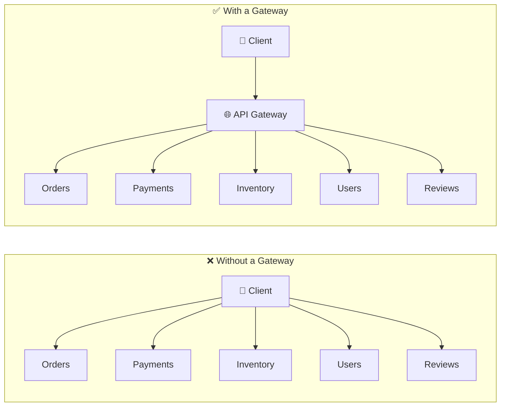
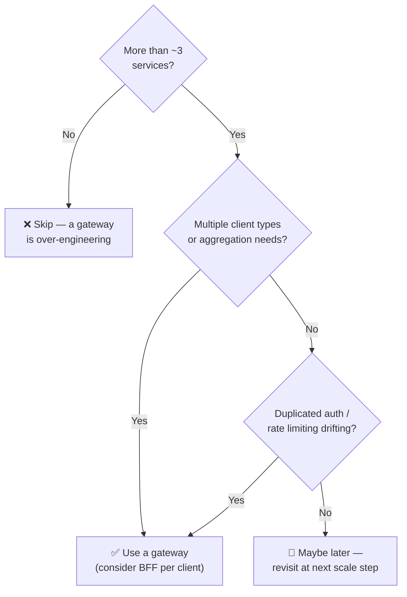
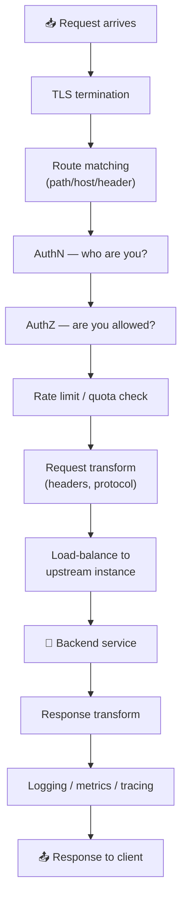
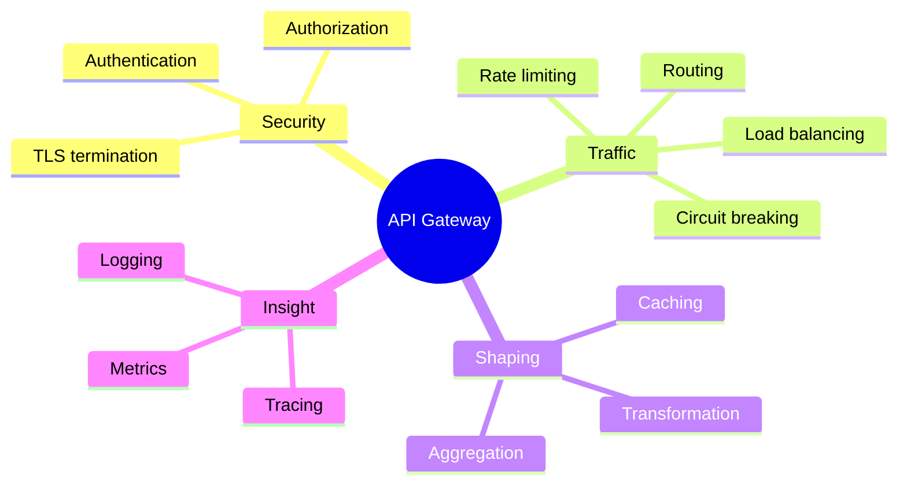
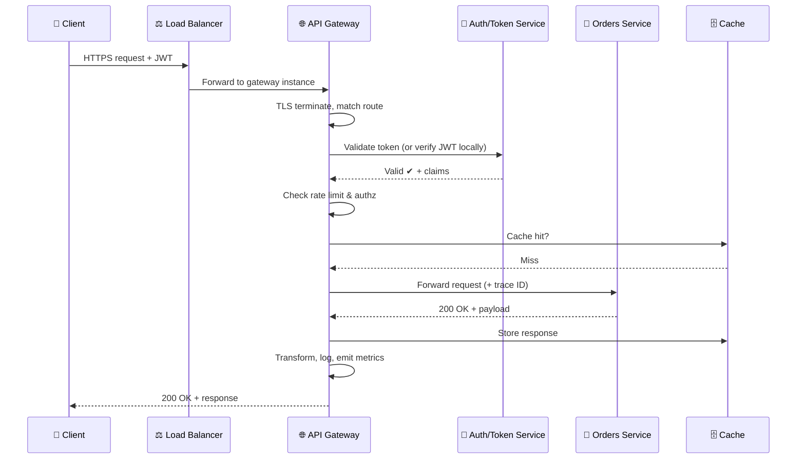
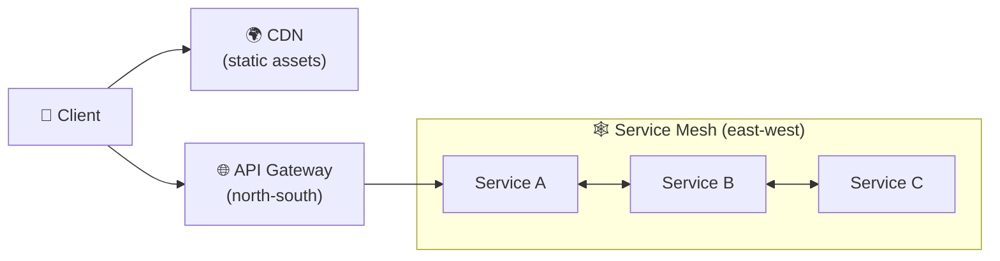
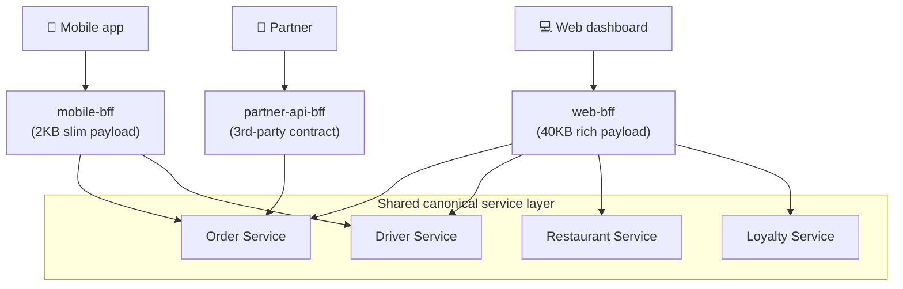
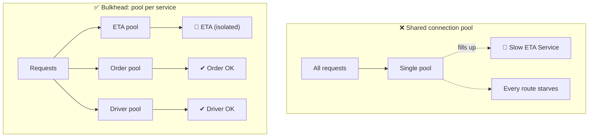
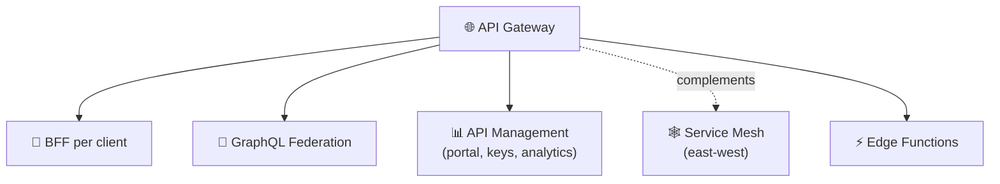

# 🌐 API Gateway Pattern — A Study Guide (Basics → Staff Level)

> A single, self-contained guide that takes you from "what is an API gateway?" all the way to the per-component trade-offs a staff/principal engineer is expected to reason about in a system design interview.

---

## 📋 Table of Contents

1. [🎯 Introduction — The One-Sentence Version](#1--introduction--the-one-sentence-version)
2. [✅ Core Definitions](#2--core-definitions)
3. [💡 Why the Pattern Exists](#3--why-the-pattern-exists)
4. [⚖️ When to Use an API Gateway (and When NOT To)](#4--when-to-use-an-api-gateway-and-when-not-to)
5. [⚙️ The Real Mechanism & Trade-offs](#5--the-real-mechanism--trade-offs)
6. [🧩 Core Responsibilities (Cross-Cutting Concerns)](#6--core-responsibilities-cross-cutting-concerns)
7. [🎨 Architecture & Request Lifecycle](#7--architecture--request-lifecycle)
8. [📊 Categorized Real-World Examples](#8--categorized-real-world-examples)
9. [🔀 API Gateway vs. Adjacent Concepts](#9--api-gateway-vs-adjacent-concepts)
10. [📱 The BFF Pattern in Depth](#10--the-bff-pattern-in-depth)
11. [🔥 Failure Modes — When the Gateway Becomes the Problem](#11--failure-modes--when-the-gateway-becomes-the-problem)
12. [🛠️ Choosing a Gateway — Build vs. Buy](#12--choosing-a-gateway--build-vs-buy)
13. [❌ Common Misconceptions](#13--common-misconceptions)
14. [🎓 Staff-Level Nuance](#14--staff-level-nuance)
15. [🔗 Extensions & Adjacent Concepts](#15--extensions--adjacent-concepts)
16. [⚡ Quick Revision](#16--quick-revision)
17. [📝 FAANG Interview Q&A](#17--faang-interview-qa)
18. [📚 Further Reading](#18--further-reading)

---

## 1. 🎯 Introduction — The One-Sentence Version

An **API Gateway** is a single entry point that sits between clients (mobile apps, browsers, partners) and your backend services. Every request goes through it first; the gateway decides *who you are*, *whether you're allowed*, *how fast you can go*, and *where the request should be sent* — then forwards it, collects the response, and hands it back.

Think of it as the **receptionist + security guard + traffic cop** for your backend. Clients never talk to your services directly; they talk to the gateway, and the gateway talks to the services on their behalf.

<details>
<summary>🟢 Beginner-friendly explanation</summary>

Imagine a big office building with dozens of departments (HR, Finance, Engineering). Visitors don't wander the halls looking for the right room. They stop at the **front desk**. The receptionist checks their ID, tells them where to go, logs the visit, and stops anyone suspicious. If 500 people show up at once, the receptionist manages the line so the building doesn't get overwhelmed. An API gateway is that front desk for your software: clients arrive, get checked and routed, and your internal services stay safe and hidden behind it.

</details>

---

## 2. ✅ Core Definitions

Before going deeper, here are the terms you'll see throughout this guide.

**API Gateway** — A server that is the single point of entry into a system. It accepts all API calls, applies cross-cutting policies (auth, rate limiting, logging), and routes each request to the appropriate backend service.

**Reverse Proxy** — A server that receives client requests and forwards them to backend servers, then returns the backend's response to the client. An API gateway *is* a specialized reverse proxy with extra application-aware logic.

**Upstream / Downstream** — "Upstream" usually refers to the backend services the gateway forwards to; "downstream" refers to the client side. (Conventions vary — always clarify in an interview.)

**North-South traffic** — Traffic entering or leaving the system boundary (client ↔ gateway ↔ services). This is the gateway's domain.

**East-West traffic** — Traffic *between* internal services. This is the **service mesh's** domain, not the gateway's.

**Backend for Frontend (BFF)** — A dedicated gateway tailored to one type of client (e.g., one for the iOS app, one for the web app), so each client gets exactly the shape of data it needs.

**Cross-cutting concern** — A responsibility that nearly every service needs (auth, logging, rate limiting). Instead of duplicating it in each service, you centralize it in the gateway.

<details>
<summary>🟢 Beginner-friendly explanation</summary>

Don't get lost in the jargon. The key mental split is: the gateway handles traffic coming *in from the outside world* ("north-south"), while a service mesh handles services *talking to each other inside* ("east-west"). And "cross-cutting concerns" just means "boring but essential stuff every service needs" — like checking passwords or counting requests — which is annoying to copy-paste into every service, so you do it once in the gateway.

</details>

---

## 3. 💡 Why the Pattern Exists

To understand the gateway, you have to see the problem it solves. Picture a system **without** one.

In a monolith, there's one application, one address, one place to put authentication and logging. Simple. But once you split into microservices — say Orders, Payments, Inventory, Users, Reviews — a client that wants to render a single product page might need to call five different services. Now every one of those services must independently: verify the user's token, enforce rate limits, log requests, terminate TLS, handle CORS, and expose a public address. That's five copies of the same plumbing, five attack surfaces, and a client that has to know the location of every service.

The API gateway consolidates all of this into one layer.



The concrete problems it eliminates:

- **Client complexity / tight coupling** — Clients hit one endpoint instead of tracking many. Services can move, split, or merge without breaking clients. Without a gateway, when the Order Service moves host or splits into Order + Fulfilment, every client that hardcoded its URL breaks — every refactor becomes a client migration.
- **Duplicated cross-cutting logic** — Auth, TLS, rate limiting, and logging live in one place, not scattered across every team's codebase. When duplicated, implementations **drift**: the Order Service validates JWTs one way, the Driver Service another, and six months later you have a subtle authorization bug that only appears for a specific token claim format.
- **N+1 / chatty clients** — Mobile clients on slow networks suffer from making many round trips. The gateway can aggregate several backend calls into one response.
- **Security exposure** — Backend services stay on a private network. Only the gateway is exposed to the internet, shrinking the attack surface.
- **Protocol mismatch** — The public API can speak HTTP/REST while internal services speak gRPC, and the gateway translates.

**A concrete N+1 example.** A food-delivery app renders one "order detail" screen that needs data from five services: Order (status), Restaurant (menu), Driver (live location), Promotion (discounts), and ETA (estimate). Without a gateway, the mobile client makes **5 separate round trips** on a 4G connection — each with its own DNS lookup, TCP handshake, and TLS negotiation. At ~200ms per call *in serial*, that's roughly **1 full second** of latency before anything renders, and if any one service is slow or down, the whole screen hangs or breaks. With a gateway, the client makes **one** call (`GET /api/order-detail/{orderId}`), the gateway fans out to the services **in parallel**, and total latency collapses to roughly the *slowest single call* (~200ms) — a ~2.6–5× improvement without touching a single service.

<details>
<summary>🟢 Beginner-friendly explanation</summary>

Say you run a food-delivery app. To show one order screen, the app needs your profile, the restaurant menu, the delivery driver's location, and your payment method — four different services. Without a gateway, your phone makes four separate calls over a spotty mobile connection, and each service has to check your login separately. With a gateway, your phone makes *one* call; the gateway checks your login once, fans out to the four services, stitches the results together, and sends back one tidy response. Faster for the user, simpler for every backend team.

</details>

---

## 4. ⚖️ When to Use an API Gateway (and When NOT To)

A gateway solves real problems but adds real complexity — it's a separate system needing its own deployment, monitoring, and on-call rotation. Adding one to a system with two services and one client is over-engineering. Here's the decision framework.

**✅ Use an API Gateway when:**

- You have **multiple client types** with different data needs (mobile, web, third-party partners).
- Cross-cutting concerns (auth, rate limiting) are being **duplicated** across services and starting to drift.
- Clients need **response aggregation** — one logical request that hits multiple services.
- You need **protocol translation** between clients (REST/JSON) and internal services (gRPC).
- You want to **decouple** the client-facing API contract from internal service topology so you can refactor freely.

**❌ Don't use an API Gateway when:**

- You have a **monolith or fewer than ~3 services** — the complexity isn't justified.
- Your team is **too small** to operate it as a first-class system (its own deploy, monitoring, on-call).
- Clients and services speak the **same protocol** with stable, non-overlapping APIs.
- You're adding it because "Netflix has one." Netflix also has hundreds of engineers on platform infrastructure.

**The honest question:** *Is the complexity of managing N direct client-service connections worse than the complexity of maintaining a gateway?* For most production systems with multiple clients and 5+ services, yes. The tipping point usually arrives around the third time you've duplicated auth logic, or the second time a client broke because a service changed its URL. For a startup with one app and three services, probably not yet.



<details>
<summary>🟢 Beginner-friendly explanation</summary>

A gateway isn't free — it's another server you have to run, watch, and wake someone up for at 3am. So the rule of thumb is: if you only have a couple of services and one app, skip it; you'd be adding a moving part for no real benefit. Once you've got several services, a few kinds of clients (phone, web, partners), and you notice you keep copy-pasting login checks everywhere, that's the signal it's finally worth the cost.

</details>

---

## 5. ⚙️ The Real Mechanism & Trade-offs

Mechanically, a gateway is a **reverse proxy with a policy pipeline**. A request flows through an ordered chain of stages, and each stage can inspect, modify, reject, or pass the request along.

A typical pipeline looks like this:



The central trade-off is this: **you gain a single, consistent control point at the cost of introducing a new hop, a shared dependency, and a potential single point of failure.**

Every architectural decision about a gateway is a negotiation around that tension:

- **Latency vs. control.** Every request now takes an extra network hop and runs through the policy pipeline. That's typically single-digit milliseconds, but it's not zero, and it's on the critical path of *every* request.
- **Centralization vs. coupling.** Centralizing auth is great — until the gateway config becomes a bottleneck that every team must go through to ship. A poorly-run gateway becomes an "organizational choke point."
- **Availability vs. simplicity.** One entry point is simple, but if it goes down, *everything* goes down. This forces you to run it as a horizontally-scaled, highly-available cluster — which reintroduces complexity.
- **Smart gateway vs. smart services.** How much logic belongs in the gateway? Put too much (business logic, response aggregation for every screen) and it becomes a distributed monolith that every team fears touching. Put too little and clients suffer.

The staff-level answer to "how much logic in the gateway?" is: **cross-cutting, client-agnostic concerns belong in the gateway; business logic belongs in services.** The moment your gateway config encodes business rules ("gold-tier users get free shipping"), you've leaked domain logic into infrastructure.

> 🧪 **Litmus test for gateway logic:** Can the rule be expressed purely in terms of *request metadata* — URL path, headers, HTTP method, caller identity — **without reading the request body or calling a database**? If yes, it belongs in the gateway. If it needs to inspect an order's contents or look up business data, it belongs in a service.

<details>
<summary>🟢 Beginner-friendly explanation</summary>

The gateway is like a checkpoint on a highway with several booths in a row: pay toll, show ID, get your route. Each car passes through the booths in order. It's efficient because everyone follows the same process — but it's still one extra stop, and if the whole checkpoint closes, no cars get through at all. So you build several checkpoints side by side (redundancy) and you keep the booths doing only quick checks — you don't let them start doing your taxes (business logic), or the line backs up for miles.

</details>

---

## 6. 🧩 Core Responsibilities (Cross-Cutting Concerns)

These are the jobs a gateway is expected to handle. In an interview, being able to list and reason about each one signals depth. A subtle point candidates miss: they list all the middleware but forget to mention the **core reason** the gateway exists — *request routing*. Lead with routing, then layer on the cross-cutting concerns.

**Request validation** — Before doing anything else, the gateway checks that requests are well-formed: valid URL, required headers present, body matches the expected schema. Catching a malformed JSON payload or a missing API key at the edge means the backend never wastes resources on a request that was never going to succeed, and the client gets a fast, helpful error.

**Routing** — Match an incoming request to the correct backend. Routing is richer than a simple URL map; a well-designed gateway supports: **path-based** (`/orders/*` → Order Service), **header-based** (route `X-Beta-User: true` to v2), and **version routing** (`/v1/orders` and `/v2/orders` running in parallel). Version routing is what lets you run old and new backends simultaneously so old app versions hit v1 while updated ones hit v2 — zero downtime, no forced client migration. A routing table typically maps on path, method, query params, and headers:

```yaml
routes:
  - path: /users/*
    service: user-service
    port: 8080
  - path: /orders/*
    service: order-service
    port: 8081
  - path: /payments/*
    service: payment-service
    port: 8082
```

**Authentication (AuthN)** — Verify identity. Commonly validates a JWT signature, an API key, or an OAuth2 token, so downstream services don't each re-implement it. JWT validation is expensive (cryptographic signature verification on every request), so doing it once at the edge is a real saving. This is the **"verify once, propagate"** principle: the gateway decodes the token, extracts identity/claims, and forwards them downstream as *trusted headers* (e.g. `X-User-Id: 1234`, `X-User-Role: customer`). Backend services trust these headers and skip re-validation — which is safe *only because* the gateway is the sole entry point. (In a zero-trust posture, services still re-verify — see [Staff-Level Nuance](#14--staff-level-nuance).)

**Authorization (AuthZ)** — Verify permissions. Coarse-grained checks (is this user allowed to hit this route at all?) happen at the gateway; fine-grained checks (can this user edit *this specific* order?) belong in the service.

**Rate limiting & throttling** — Protect backends from overload and abuse. Enforced per user, per API key, or per IP.

**Load balancing** — Distribute requests across healthy instances of an upstream service.

**TLS termination** — Decrypt HTTPS at the edge so internal services can (optionally) run cheaper plaintext or re-encrypt for internal mTLS.

**Request/response transformation** — Rewrite headers, convert protocols (REST↔gRPC), or reshape payloads.

**Aggregation / composition** — Fan out to multiple services and combine responses into one (the BFF pattern).

**Caching** — Store responses for repeated identical requests to cut backend load and latency.

**Observability** — Emit logs, metrics, and distributed traces; inject a correlation/trace ID so a request can be followed across services.

**Circuit breaking & retries** — Stop hammering a failing upstream, and retry transient failures with backoff.



<details>
<summary>🟢 Beginner-friendly explanation</summary>

Think of everything a good doorman at a busy hotel does: checks your reservation (auth), decides which areas your keycard opens (authz), keeps the lobby from overflowing (rate limiting), points you to the right elevator (routing), remembers common questions so he answers instantly (caching), and keeps a logbook of who came and went (observability). One person, many small responsibilities — all so guests (clients) and hotel staff (services) don't have to worry about them.

</details>

---

## 7. 🎨 Architecture & Request Lifecycle

Here's how a single request travels through a realistic setup, from a mobile app to a microservice and back.



A few implementation realities worth internalizing:

The gateway itself is almost always **stateless** and sits behind a network load balancer (L4) or DNS-based balancing, so you can run many identical instances. State that must be shared — like rate-limit counters — lives in an external store such as **Redis**, not in the gateway's memory. This is what lets the gateway scale horizontally without instances disagreeing about how many requests a user has made.

For JWT-based auth, the gateway can often validate tokens **locally** using the identity provider's public key, avoiding a network call to an auth service per request. This is a common and important optimization: it turns a distributed dependency into cheap local CPU work.

<details>
<summary>🟢 Beginner-friendly explanation</summary>

Follow one tap on your phone: it goes to a load balancer (which picks one of many gateway copies), the gateway unlocks the encrypted message, checks your login badge, makes sure you haven't been spamming, peeks in a fast memory drawer (cache) to see if it already has the answer, and if not, asks the Orders service. It saves the answer for next time, writes a note in the logbook, and sends it back to your phone. The whole trip usually takes a few milliseconds.

</details>

---

## 8. 📊 Categorized Real-World Examples

<details open>
<summary><strong>📊 Categorized Real-World Examples — expand</strong></summary>

Gateways show up in different flavors depending on where they run and who builds them.

### 🖥️ Self-Managed / Open-Source Gateways

- **NGINX / OpenResty** — The workhorse reverse proxy; scriptable with Lua for custom logic. Extremely fast, widely deployed.
- **Kong** — Built on NGINX/OpenResty with a rich plugin ecosystem (auth, rate limiting, logging) and a control plane. Supports both traditional and service-mesh deployments. Popular for on-prem and hybrid.
- **Envoy** — A modern, high-performance proxy from Lyft. It's the data plane behind many other tools and the core of the Istio service mesh; the right pick when you're heading toward a full mesh.
- **Traefik** — Cloud-native, auto-discovers services in Kubernetes/Docker, great developer ergonomics.
- **Tyk** — Native GraphQL support, built-in API analytics, multi-data-center capabilities.
- **Express Gateway** — JavaScript/Node.js-based, lightweight and developer-friendly; good fit for Node.js microservices.
- **Spring Cloud Gateway** — JVM-based, popular in Java/Spring microservice stacks.

### ☁️ Managed Cloud Gateways

- **AWS API Gateway** — Fully managed; integrates tightly with Lambda, IAM, and Cognito. Great for serverless; watch cost at very high request volumes.
- **Amazon API Gateway + ALB/NLB** — Often paired; ALB does L7 routing, API Gateway adds API-management features.
- **Azure API Management (APIM)** — Full API-management suite: developer portal, versioning, policies.
- **Google Cloud Apigee / API Gateway** — Apigee is an enterprise-grade API-management platform with analytics and monetization.

### 📱 Client-Specific Gateways (BFF)

- **Netflix** — A pioneer of the BFF/edge-gateway idea (Zuul), running device-specific edge logic so a TV, phone, and browser each get tailored responses.
- **SoundCloud / Spotify-style setups** — Separate BFFs per client platform so each team owns its own edge shaping.

### 🔌 GraphQL & Specialized Gateways

- **Apollo Router / GraphQL Federation** — A "gateway" that composes a single GraphQL schema across many services; clients query once and the router fans out.
- **gRPC gateways (grpc-gateway)** — Expose gRPC services as REST/JSON for clients that can't speak gRPC.

<details>
<summary>🟢 Beginner-friendly explanation</summary>

If you're on Amazon's cloud and building with tiny serverless functions, you'd likely reach for AWS API Gateway because it clicks together with the rest of AWS. If you run your own servers in Kubernetes, Kong or Envoy are common picks. And if Netflix wants its TV app and its phone app to each get a differently-shaped response, they build a separate "backend for frontend" for each — same idea, tuned per device.

</details>

</details>

---

## 9. 🔀 API Gateway vs. Adjacent Concepts

<details open>
<summary><strong>🔀 API Gateway vs. Adjacent Concepts — expand</strong></summary>

A frequent interview trap is conflating the gateway with things that look similar. Here's the disambiguation.

| Concept | What it does | Traffic direction | Key difference from API Gateway |
|---|---|---|---|
| **L4 Load Balancer** | Routes by IP/port; protocol-agnostic (doesn't read the request) | North-south | Toll booth checking vehicle *type* only. No API awareness at all. |
| **L7 Load Balancer** | Routes by app-level data (HTTP path, headers, cookies) | North-south | Smarter than L4, but still lacks auth, rate limiting, aggregation, and API management a gateway adds. |
| **Reverse Proxy** | Forwards client requests to backends; basic routing + SSL termination | North-south | The foundation. **All API gateways are reverse proxies, but not all reverse proxies are gateways** — a gateway is a (usually L7) reverse proxy plus auth, rate limiting, caching, and API management. |
| **Service Mesh** (Istio, Linkerd) | Manages service-to-service comms via sidecars: mTLS, retries, tracing, fault injection | East-west | Handles *internal* traffic between services; the gateway handles *external* traffic. They complement each other. |
| **CDN** (Cloudflare, CloudFront) | Caches static content near users | North-south (edge) | A CDN optimizes static asset delivery; a gateway routes and secures dynamic API calls. Often used together. |
| **Ingress Controller** (K8s) | Routes external traffic into a cluster | North-south | An ingress is a simpler, K8s-native gateway; full gateways add richer API-management features. |
| **BFF** | Client-tailored aggregation layer | North-south | A BFF is a *specialization* of the gateway idea, one per client type. |

**How they relate:** a reverse proxy is the base layer; an L4 or L7 load balancer can *act as* a reverse proxy for distributing traffic; an API gateway is a specialized (usually L7) reverse proxy with auth/rate-limiting/caching; and a service mesh complements all of these by handling reliability *inside* the system.



<details>
<summary>🟢 Beginner-friendly explanation</summary>

Easy way to remember: a **load balancer** just spreads cars across lanes; an **API gateway** is a smart tollbooth that also checks IDs and routes you. A **service mesh** is the internal road network *between buildings* on a campus — it doesn't care about outside visitors. A **CDN** is a chain of nearby warehouses so you don't drive to headquarters for a poster everyone wants. They're teammates, not rivals — big systems use all of them together.

</details>

</details>

---

## 10. 📱 The BFF Pattern in Depth

<details open>
<summary><strong>📱 The BFF Pattern in Depth — expand</strong></summary>

The **Backend for Frontend (BFF)** pattern is the most-tested extension of the gateway idea, so it deserves its own treatment.

As a platform grows, a single universal gateway starts to crack. In the food-delivery example, the mobile app needs a **slim** payload (order ID, driver name, ETA — anything more wastes bandwidth on 4G), while the web dashboard needs a **rich** one (full order history, restaurant analytics, loyalty points, payment breakdown). A universal gateway serving both accumulates client-specific transformation logic until you find conditionals like *"if `X-Client: mobile`, strip these 40 fields."* That's a smell — the gateway has become a dumping ground for client requirements.

BFF solves this by **splitting the gateway per client type**: `mobile-bff`, `web-bff`, `partner-api-bff`. Each knows exactly what its client needs.



The **ownership model** is what makes BFF work: the team that owns the mobile client owns the mobile BFF, so frontend engineers reshape their own data without touching shared infrastructure, while backend teams just publish one canonical API and let each BFF adapt it.

**Does BFF add latency?** It adds one extra server-side hop (milliseconds), but eliminates 4+ client round trips over slow mobile networks (seconds saved). The trade is almost always worth it. BFF earns its complexity when clients have meaningfully different data shapes, release cadences, or performance budgets; if clients need nearly identical data, a single gateway with **field projection** (return only requested fields) is simpler.

### Three BFF anti-patterns to avoid

1. **Putting service/business logic in the BFF.** The BFF is a translation layer, not a service. Pricing, inventory checks, promo validation belong in the microservices. Add domain logic and you're rebuilding the monolith one endpoint at a time.
2. **Duplicating BFFs across devices.** One mobile BFF covers both iOS and Android. Building two is waste.
3. **Treating the BFF as your security boundary.** It hides and filters fields (useful), but auth and resource-level authorization must still live in the services. If the BFF is bypassed or goes down, services must protect themselves. *The BFF is a convenience layer, not a security layer.*

<details>
<summary>🟢 Beginner-friendly explanation</summary>

Imagine one waiter trying to serve a toddler, a food critic, and a delivery courier from the same script — he'd be juggling a mess of "if it's the toddler, cut the food small" rules. Instead you give each a dedicated waiter who knows exactly what that guest wants. That's BFF: a tailored front door per client type. Just remember the waiter only *plates* the food — he doesn't cook it (no business logic) and he isn't the bouncer (security stays with the kitchen/services).

</details>

</details>

---

## 11. 🔥 Failure Modes — When the Gateway Becomes the Problem

<details open>
<summary><strong>🔥 Failure Modes — expand</strong></summary>

Putting a single intermediary in front of everything means that intermediary is now your most critical infrastructure. These are the failure modes tutorials skip — and exactly what staff interviewers probe.

### 1) The Single Point of Failure (and the config-push variant)

The obvious risk: every request flows through the gateway, so if it dies, *everything* dies. Teams plan for this by running multiple instances behind a load balancer across availability zones. The **subtler** risk is that the gateway becomes the *source* of an incident. A bad config push — a misconfigured rate limit that blocks all traffic, a routing rule pointing everything at the wrong service, an SSL cert rotation that breaks TLS — takes out your entire API surface *instantly*. Unlike a bad service deploy (one service affected), a bad gateway deploy affects everything at once.

**Mitigation:** treat gateway config changes with the same rigor as production deploys. Use **canary releases** (roll new config to ~5% of instances, watch error rates for ~10 minutes, then proceed) and **automated rollback** (if error rates spike after a config change, roll back automatically — don't wait for a human).

### 2) Cascading Latency & the Connection-Pool Problem

The most dangerous latency failure isn't the extra hop (5–10ms) — it's what happens when *one* downstream slows down. In the food-delivery system, the ETA Service degraded from 150ms to 3 seconds. The gateway called it during aggregation, and each in-flight request held a connection in the gateway's pool. As requests backed up waiting on slow ETA responses, the pool filled, new requests queued, and the gateway began **dropping requests across all routes** — not just ETA ones. One slow service caused *total gateway saturation*.



**Mitigation:** the **bulkhead pattern** — separate connection pools per downstream service, so a filled ETA pool only affects ETA calls. Pair with **per-service timeouts** (not one global timeout): set ETA to 500ms and return a *degraded* response without ETA data rather than holding the connection for 3 seconds. Add **circuit breakers** to fail fast when a service is clearly down.

### 3) The Smart-Gateway Anti-Pattern

It starts innocently: "let's validate the promo code at the gateway, it's a quick check"… then "let's verify inventory before routing"… then "let's compute loyalty points here." Eighteen months later the gateway has its own database connections, business logic, and three teams deploying to it — you've rebuilt the monolith one feature at a time. **The rule: the gateway is dumb infrastructure.** It routes, enforces policies, and translates protocols; it does not make business decisions. (Apply the [litmus test](#5--the-real-mechanism--trade-offs) from earlier.)

### 4) The Observability Blind Spot

The gateway sees 100% of traffic, making it the best place to instrument — and the most dangerous to skip. Without it, an incident becomes a scavenger hunt across eight services' logs ("is it the gateway or a downstream? which route? one user or all?"). Every request should get a **trace ID** (generated or propagated) that travels through every downstream call as a header (`X-Trace-Id: abc123`) and is logged everywhere, so one query reconstructs the whole request path. Add **route-level metrics from day one**: request count, p50/p95/p99 latency, error rate, and rate-limit-hit rate *per route*. Adding these after your first incident is too late.

<details>
<summary>🟢 Beginner-friendly explanation</summary>

The gateway is like a single bridge every car must cross. Great for control — but if the bridge closes, the whole city is stranded, and closing it by accident (a bad config) is even scarier than a normal road closure. So you build several bridges (redundancy), you change the rules slowly and watch what happens (canary + rollback), you give each destination its own lane so one traffic jam doesn't block everyone (bulkheads), and you put cameras on the bridge so you can instantly see where trouble started (tracing).

</details>

</details>

---

## 12. 🛠️ Choosing a Gateway — Build vs. Buy

<details open>
<summary><strong>🛠️ Choosing a Gateway — Build vs. Buy — expand</strong></summary>

The decision is simpler than the crowded product landscape suggests. Match the option to your constraints.

| Option | Choose when… | Examples | Main constraint |
|---|---|---|---|
| **Managed cloud gateway** | You're deep in one cloud, routing is straightforward, you'd rather pay per request than run infra | AWS API Gateway, Azure API Management, Google Cloud Endpoints | Customization is limited to what the provider supports; complex/custom auth or transforms hit walls; cost grows at high volume |
| **Open-source gateway** | You need flexibility and have the ops capacity to run it | Kong, Traefik, Tyk, Express Gateway | You own the deployment and on-call; plugins cover most standard needs without custom code |
| **Service-mesh proxy** | Observability and service-to-service traffic management matter as much as client-facing API management | Envoy, Istio | More complex to operate, but gives distributed tracing and fine-grained traffic policies |
| **Build your own** | Routing needs are so domain-specific (e.g. regulatory audit rules) that no product fits without becoming a maintenance burden | — | Rare — far rarer than teams think; almost always premature |

**The default path for most teams starting with microservices:** begin with a **managed gateway**, then **migrate to open-source** (Kong/Envoy) when you hit its limits. Building your own is justified maybe once in a decade of real practice.

<details>
<summary>🟢 Beginner-friendly explanation</summary>

Think of it like getting from A to B: a managed cloud gateway is a taxi — effortless, but you pay per ride and can't customize the route much. An open-source gateway (Kong, Traefik) is your own car — more freedom, but you handle the maintenance. A service mesh proxy (Envoy) is a car with a full telemetry dashboard for every trip. And building your own gateway is forging your own car from scratch — almost never worth it unless you have truly unusual requirements.

</details>

</details>

---

## 13. ❌ Common Misconceptions

<details open>
<summary><strong>❌ Common Misconceptions — expand</strong></summary>

**"An API gateway and a load balancer are the same thing."** No. A load balancer distributes traffic; a gateway adds identity, authorization, rate limiting, transformation, and API-aware routing. Gateways frequently *sit behind* load balancers.

**"The gateway is always a single point of failure."** Only if you deploy a single instance. In production it runs as a horizontally-scaled, stateless cluster behind an LB across multiple availability zones. The *logical* single entry point is not the same as a *physical* single machine.

**"Put all your logic in the gateway to keep services thin."** This creates a distributed monolith. Business logic belongs in services. The gateway should own cross-cutting, client-agnostic concerns only.

**"A gateway makes your system slower, so avoid it."** The added hop is usually single-digit milliseconds, and the gateway often *reduces* total latency by aggregating calls, caching, and validating tokens locally — a net win for chatty clients.

**"A service mesh replaces the API gateway."** They solve different problems: gateway = north-south (external), mesh = east-west (internal). Large systems run both.

**"One gateway to rule them all."** For different clients (mobile vs. partner API vs. internal), separate gateways or BFFs are often cleaner than one over-configured mega-gateway.

**"Gateways handle authentication, so services don't need any security."** Dangerous. Services should still verify tokens (defense in depth) and enforce fine-grained authorization. If the network is ever breached, an unprotected service is wide open.

<details>
<summary>🟢 Beginner-friendly explanation</summary>

The biggest myth is "the gateway is one weak machine that can crash everything." In reality you run many copies of it, so the *idea* of one front door is preserved while the physical hardware is redundant. The second myth is "the gateway does security, so my services can relax." Never assume that — if someone sneaks past the front door, you still want every room locked. Layered security beats a single wall.

</details>

</details>

---

## 14. 🎓 Staff-Level Nuance

<details open>
<summary><strong>🎓 Staff-Level Nuance — expand</strong></summary>

This is the reasoning senior engineers bring up unprompted — the follow-ups an interviewer pushes toward.

**The gateway is an organizational construct, not just a technical one.** A shared gateway means a shared config surface. If every team must file a ticket to add a route, the gateway becomes a deployment bottleneck. Mature orgs solve this with **declarative, self-service config** (routes defined as code in each team's repo, validated in CI) so teams ship independently. Conway's Law shows up here: the gateway topology tends to mirror team boundaries.

**Rate limiting is deceptively hard at scale.** A naive per-instance counter breaks the moment you run many gateway instances — each sees only its slice of traffic. You need a shared store (Redis) or a coordinated algorithm. Then you choose an algorithm: **fixed window** (simple but allows bursts at boundaries), **sliding window** (smoother, more memory), **token bucket** (allows controlled bursts, common default), or **leaky bucket** (smooths output). Distributed rate limiting also faces a **latency vs. accuracy** trade-off: checking Redis on every request adds latency, so some systems use local counters with periodic sync and accept slight over-admission.

**Resilience must be tuned, not just enabled.** Circuit breakers, retries, and timeouts interact dangerously. Naive retries **amplify** load during an outage (a "retry storm") and can turn a partial failure into a total one. Staff engineers pair retries with **exponential backoff + jitter**, cap retry budgets, and ensure retries only fire on **idempotent** operations. Timeouts must be set per-route based on the downstream's real latency profile, and they must be *shorter* as you go up the stack to avoid cascading waits.

**Auth: validate locally or call out?** Validating a JWT with the IdP's public key is cheap and stateless — but you can't revoke a token before it expires. Introspection (calling the auth server per request) gives instant revocation but adds latency and a hard dependency. The pragmatic answer is short-lived JWTs (minutes) validated locally, plus a revocation list for emergencies. This is a classic **performance vs. security freshness** trade-off.

**The gateway shouldn't own state it can't afford to lose.** Rate-limit counters, session data, and caches should live in external, replicated stores. Keeping the gateway stateless is what makes blue-green deploys, autoscaling, and instance failure survivable.

**Version and evolve the API deliberately.** The gateway is the natural place to manage versioning (`/v1`, `/v2`), route a percentage of traffic to a new backend (**canary releases**), and shield clients from internal refactors. This decoupling is one of the gateway's most underrated values.

**Observability is the gateway's superpower.** Because *all* north-south traffic flows through it, the gateway is the single best place to inject correlation/trace IDs, measure golden signals (latency, traffic, errors, saturation), and detect anomalies. A staff engineer treats the gateway as the system's primary observability vantage point.

**Beware the "smart pipe" anti-pattern.** The industry moved from heavyweight ESBs (Enterprise Service Buses) precisely because putting orchestration and business logic in the middleware created brittle, central bottlenecks. Modern guidance: **smart endpoints, dumb pipes.** The gateway should stay comparatively dumb.

**Multi-region and failover.** At global scale, you run gateways in multiple regions with GeoDNS or Anycast routing users to the nearest healthy region. Now you must reason about cross-region state (rate limits, sessions), data residency/compliance, and failover behavior when a whole region degrades.

<details>
<summary>🟢 Beginner-friendly explanation</summary>

The deep lesson is that a gateway is easy to *add* and hard to *run well*. The tricky parts aren't the code — they're the judgment calls: how to count requests fairly when you have 50 copies of the gateway, how to retry a failed call without accidentally making an outage worse, and how to check logins fast without weakening security. Getting those knobs right, and keeping the gateway "dumb" so it doesn't become a monster everyone's afraid to change, is what separates a senior answer from a textbook one.

</details>

</details>

---

## 15. 🔗 Extensions & Adjacent Concepts

<details open>
<summary><strong>🔗 Extensions & Adjacent Concepts — expand</strong></summary>

**Backend for Frontend (BFF)** — One gateway per client type. Each BFF aggregates and shapes data for its specific client (iOS, Android, web), avoiding the "one gateway trying to please everyone" problem.

**GraphQL Federation** — A gateway-like router composes many service schemas into one graph; clients issue a single query and the router fetches from the right services. Solves over-fetching/under-fetching elegantly.

**Service Mesh (Istio, Linkerd)** — Handles east-west traffic with sidecar proxies (usually Envoy). Provides mTLS, retries, and observability *between* services. Gateways and meshes are complementary; some setups use an Envoy-based gateway *and* an Envoy-based mesh for consistency.

**API Management platforms** — Beyond routing, these (Apigee, Azure APIM, Kong Enterprise) add developer portals, API keys and monetization, quotas, analytics, and lifecycle/versioning management. "Gateway" is the runtime; "API management" is the surrounding product.

**Edge computing / edge functions** — Running gateway logic (auth, redirects, A/B tests) at CDN edge locations (Cloudflare Workers, Lambda@Edge) to cut latency by executing closer to the user.

**Zero-trust & mTLS** — Modern security models don't trust the internal network. The gateway participates by enforcing mTLS and forwarding verified identity to services, which still re-verify.

**WebSocket & streaming support** — Gateways increasingly proxy long-lived connections (WebSockets, gRPC streaming, Server-Sent Events), which complicates load balancing and timeout handling versus simple request/response.



<details>
<summary>🟢 Beginner-friendly explanation</summary>

Once you understand the basic gateway, the "next-level" ideas are mostly variations: a **BFF** is a gateway per app type; **GraphQL federation** is a gateway that lets clients ask for exactly the data they want in one query; a **service mesh** is the same proxy idea but for internal chatter; and **API management** is the gateway plus a whole store-front (docs, keys, billing) for people who consume your API. They all orbit the same core: control the flow, secure it, and shape it.

</details>

</details>

---

## 16. ⚡ Quick Revision

<details open>
<summary><strong>⚡ Quick Revision — expand</strong></summary>

> Dense but readable recap for night-before review (~2–4 pages). Each paragraph mirrors a section of the guide in order, so reading it straight through should replay the whole document in your mind.

**What it is.** An API gateway is the single entry point between clients and backend services — mechanically a *reverse proxy wrapped in a policy pipeline*. Picture it as the front desk, security guard, and traffic cop for your backend rolled into one: every request enters through it, gets checked and shaped, and is forwarded to the right service. Clients talk only to the gateway; the gateway talks to the services.

**Why it exists.** In a monolith, auth and logging live in one place. Split into microservices and a single screen may need five services, each forced to re-implement auth, TLS, rate limiting, and logging — plumbing that duplicates and *drifts* until subtle bugs appear. The gateway consolidates all of that into one layer. It also fixes tight coupling (services can move or split without breaking clients, since clients only know one endpoint), and it kills the N+1 problem: the classic food-delivery order screen needs five services, which as serial mobile calls is roughly a full second, but as one gateway call fanning out in parallel collapses to about the slowest single call (~200ms).

**When to use it — and when not.** Reach for a gateway once you have 5+ services, multiple client types, a need for response aggregation, protocol translation, or you want to decouple your public contract from internal topology. Skip it for a monolith or fewer than three services, a team too small to operate it as a first-class system, or clients and services that already share a stable protocol. The honest test is whether managing N direct client-service connections is more painful than running the gateway; the tipping point usually arrives the third time you copy-paste auth logic or the second time a client breaks over a changed URL.

**How it works, and the one trade-off behind everything.** A request flows through an ordered pipeline: validate → TLS terminate → route match → authenticate → authorize → rate-limit → transform → load-balance → hit the upstream → transform the response → log/emit metrics → return. Instances are kept stateless behind a load balancer, and any shared state (like rate-limit counters) lives externally in something like Redis so instances agree and can scale horizontally. Every design decision negotiates a single tension: you gain *one consistent control point* at the cost of *an extra hop, a shared dependency, and a potential single point of failure*.

**What belongs in it.** Its responsibilities are request validation, routing (by path, header, or version), authentication using the "verify once, propagate" model (validate the token at the edge, forward identity as trusted headers so services skip re-validation), *coarse* authorization, rate limiting, load balancing, TLS termination, request/response transformation, response aggregation (the BFF idea), caching, observability, and circuit breaking with retries. The litmus test for whether logic belongs here: if the rule can be decided purely from request metadata — path, headers, method, caller identity — *without* reading the body or hitting a database, it belongs in the gateway; otherwise it belongs in a service.

**Where it sits versus look-alikes.** The gateway owns *north-south* traffic (clients into the system); a service mesh owns *east-west* traffic (service-to-service) — they complement each other, never replace. Against the neighbours: an L4 load balancer routes by IP/port and an L7 by HTTP data, but neither adds API-aware auth or rate limiting; a reverse proxy is the foundation (all gateways are reverse proxies, but not vice versa); a Kubernetes ingress is a simpler gateway; a CDN is an edge cache for static assets; and a BFF is simply a gateway specialized per client.

**The BFF pattern.** When one universal gateway starts sprouting "if mobile, strip these 40 fields" conditionals, split it per client type — a slim mobile BFF (~2KB payloads) and a rich web BFF (~40KB), each owned by the team closest to that client. The extra server-side hop costs milliseconds while saving seconds of client round trips. Watch the three anti-patterns: don't put business logic in a BFF, don't build one per device (one covers iOS and Android), and never treat the BFF as your security boundary — services must still protect themselves.

**How it becomes the problem.** Four failure modes dominate. First, it's a single point of failure, and the sharpest edge is a bad config push (a broken rate limit or cert rotation) that takes out *everything* at once — mitigate with canary rollout and automated rollback. Second, cascading latency: one slow downstream fills a shared connection pool and starves all routes, so isolate with the *bulkhead* pattern (a pool per service), per-service timeouts, and circuit breakers. Third, the smart-gateway anti-pattern, where business logic creeps in until you've rebuilt the monolith — keep it dumb. Fourth, the observability blind spot: since all traffic passes through, inject trace IDs and emit per-route metrics from day one.

**Build versus buy.** Start with a managed gateway (AWS API Gateway, Azure APIM) when you're deep in one cloud and routing is simple; move to open-source (Kong, Traefik, Tyk) when you need flexibility and have the ops capacity; choose a mesh proxy (Envoy) when service-to-service observability matters as much as the edge; and build your own almost never. The default arc for most teams is managed first, open-source once you hit its limits. The broader landscape: self-managed options include NGINX, Kong, Envoy, Traefik, Tyk, Express Gateway, and Spring Cloud Gateway; managed options include AWS API Gateway, Azure APIM, and Apigee/GCP Endpoints; Netflix's Zuul pioneered the edge/BFF idea, and Apollo Router does the same for GraphQL.

**Myths to correct.** A gateway is not a load balancer; it's not inherently a single point of failure once you run a cluster; you shouldn't stuff business logic into it (that's a distributed monolith); it doesn't excuse services from their own security (defense in depth still applies); and a service mesh doesn't replace it.

**The staff-level nuance.** Rate limiting breaks with naive per-instance counters at scale, so it needs a shared store or a token-bucket algorithm, trading latency against accuracy. Resilience must be *tuned*, not just switched on: retries need exponential backoff, jitter, and budgets, should fire only on idempotent operations, and timeouts should shrink as you go up the stack to avoid retry storms. Auth is a freshness-versus-speed call: local JWT validation is fast but can't revoke instantly, introspection is fresh but slow, so the pragmatic answer is short-lived tokens plus an emergency revocation list. Keep the gateway stateless so autoscaling and failover work; lean on it for versioning and canary releases to decouple clients from internal change; treat it as your prime observability vantage point for trace IDs and golden signals; resist the ESB "smart pipe" redux by keeping pipes dumb and endpoints smart; and at global scale, run multiple regions with GeoDNS/Anycast while reasoning about cross-region state and data residency.

**Extensions worth naming.** BFF, GraphQL federation, service mesh, API-management platforms, edge functions, zero-trust/mTLS, and WebSocket/streaming support.

**The one line that carries it all.** *Centralize the cross-cutting, decentralize the business logic — the gateway is a smart door, not a smart brain.*

</details>

---

## 17. 📝 FAANG Interview Q&A

> 20 frequently-asked questions. The first 10 are foundational (L3/L4); questions 11–20 are staff/principal-level (L4/L5+). Four STAR-format behavioral answers (Q21–Q24) follow at the end.

### Foundational (L3 / L4)

<details>
<summary><strong>Q1. What is an API gateway and what problem does it solve?</strong></summary>

An API gateway is a single entry point that sits between clients and backend microservices, applying cross-cutting concerns (auth, rate limiting, routing, logging) before forwarding requests. It solves the "N clients × M services" explosion: without it, every client must know every service's address and every service must independently handle auth, TLS, and rate limiting. For example, at a company like Uber, a single ride-request screen might touch pricing, driver-matching, and payments services — the gateway lets the app make one authenticated call while backend teams evolve their services independently. It also shrinks the attack surface by keeping services on a private network.

</details>

<details>
<summary><strong>Q2. How is an API gateway different from a load balancer?</strong></summary>

A load balancer operates primarily at L4 (or L7) to distribute traffic across healthy instances — it doesn't understand your API. A gateway is API-aware: it authenticates users, enforces per-user rate limits, transforms payloads, aggregates responses, and routes based on path/header semantics. Critically, they're often used together — a network load balancer (like AWS NLB) sits in front of a fleet of gateway instances (like Kong or Envoy) to spread traffic across them. So the LB scales the gateway; the gateway adds intelligence the LB lacks. Saying they're interchangeable is a classic red flag in an interview.

</details>

<details>
<summary><strong>Q3. Isn't the gateway a single point of failure?</strong></summary>

Logically it's a single entry point, but physically it should never be a single machine. In production you run a horizontally-scaled, stateless cluster of gateway instances across multiple availability zones, fronted by a load balancer and health checks. Because the gateway is stateless (shared state like rate-limit counters lives in Redis), you can lose instances and autoscale freely. For example, AWS API Gateway is a managed, multi-AZ service precisely so no single node failure takes it down. The SPOF concern is real only for naive single-instance deployments.

</details>

<details>
<summary><strong>Q4. What cross-cutting concerns typically live in the gateway?</strong></summary>

Authentication, coarse-grained authorization, rate limiting/throttling, TLS termination, routing, load balancing, request/response transformation, response aggregation, caching, and observability (logging, metrics, distributed tracing). The unifying theme is that these are **client-agnostic and cross-cutting** — every service would otherwise reimplement them. The key boundary: keep *business* logic out. If your gateway config starts encoding rules like "premium users get free shipping," you've leaked domain logic into infrastructure, which becomes brittle and hard to test.

</details>

<details>
<summary><strong>Q5. How does the gateway relate to a service mesh?</strong></summary>

They handle different traffic. The gateway manages **north-south** traffic (external clients ↔ system), while a service mesh (Istio, Linkerd) manages **east-west** traffic (service ↔ service internally) using sidecar proxies. A mesh provides mTLS, retries, and observability between internal services without app code changes. They're complementary: a large system might use an Envoy-based gateway at the edge and an Istio/Envoy mesh inside. Saying "a mesh replaces the gateway" is incorrect — they solve orthogonal problems.

</details>

<details>
<summary><strong>Q6. What is the Backend for Frontend (BFF) pattern?</strong></summary>

BFF means running a dedicated gateway per client type — one for iOS, one for web, one for partners — each tailored to that client's needs. It avoids the "one gateway pleasing everyone" problem where a mobile app is forced to over-fetch data shaped for the web. Netflix and SoundCloud popularized this. For instance, a smart-TV BFF might return lightweight, pre-formatted data for a constrained device, while the web BFF returns richer payloads. The trade-off is more services to maintain, but each client team gains autonomy over its edge shaping.

</details>

<details>
<summary><strong>Q7. How does an API gateway handle authentication?</strong></summary>

Commonly it validates a bearer token (JWT), an API key, or an OAuth2 access token on each request, then forwards verified identity/claims to downstream services (often as headers). With JWTs, the gateway can validate the signature **locally** using the identity provider's public key — no per-request network call — which is fast and stateless. For example, an AWS API Gateway can use a Cognito authorizer or a Lambda authorizer. Importantly, gateway auth doesn't excuse services from their own checks; defense in depth means services still verify identity and enforce fine-grained authorization.

</details>

<details>
<summary><strong>Q8. What's the difference between authentication and authorization at the gateway?</strong></summary>

Authentication (AuthN) answers "who are you?" — verifying a token or key. Authorization (AuthZ) answers "are you allowed to do this?" The gateway handles AuthN centrally and does **coarse-grained** AuthZ (e.g., "does this token have the `orders:read` scope to hit this route?"). **Fine-grained** AuthZ — "can *this* user edit *this specific* order #12345?" — belongs in the service, because only the service knows the resource's ownership and business rules. Pushing fine-grained checks into the gateway couples it to domain logic and doesn't scale.

</details>

<details>
<summary><strong>Q9. How does caching work in an API gateway and when should you use it?</strong></summary>

The gateway can cache responses for identical requests (keyed by path, query, and relevant headers) so repeated reads skip the backend entirely, cutting latency and load. It's ideal for read-heavy, slowly-changing data — like a product catalog or config. You must handle cache invalidation (TTLs, or event-based purges) and be careful never to cache user-specific or sensitive responses under a shared key. For example, an e-commerce gateway might cache the public product listing for 60 seconds but never cache a user's cart. Caching at the gateway complements CDN caching for static assets.

</details>

<details>
<summary><strong>Q10. Where does the gateway sit relative to a CDN and DNS?</strong></summary>

The typical flow is: client → DNS resolution → (CDN for static assets) → load balancer → API gateway → services. The CDN serves cacheable static content (images, JS, CSS) from edge locations near the user, so those never reach your gateway. Dynamic API calls go through the gateway. Some architectures push light gateway logic to the edge (Cloudflare Workers, Lambda@Edge) for latency-sensitive checks. So DNS routes you to the nearest edge/LB, the CDN offloads static traffic, and the gateway handles secured, dynamic API requests.

</details>

### Staff / Principal (L4 / L5+)

<details>
<summary><strong>Q11. How do you implement distributed rate limiting across many gateway instances?</strong></summary>

A per-instance in-memory counter fails immediately at scale: with 50 gateway instances, each sees only ~1/50th of a user's traffic, so the effective limit is 50× too high. The standard fix is a shared, fast store like **Redis**, with an atomic operation (e.g., `INCR` + `EXPIRE`, or a Lua script) implementing token bucket or sliding window. But hitting Redis on every request adds latency and makes Redis a dependency. Staff engineers weigh **accuracy vs. latency**: one common compromise is local counters that sync to Redis periodically, accepting slight over-admission for speed. Algorithm choice matters too — token bucket allows controlled bursts (good default), sliding window is smoother but heavier. At extreme scale you might shard limits by user hash so a given user always maps to the same node.

</details>

<details>
<summary><strong>Q12. How do you design retries and circuit breakers to avoid making outages worse?</strong></summary>

Naive retries are dangerous: when a downstream is struggling, retrying multiplies load and can turn a brownout into a full outage — a "retry storm." The staff-level design uses **exponential backoff with jitter** (to de-synchronize clients), a **retry budget** (cap retries to, say, 10% of requests), and retries **only on idempotent** operations (GET, or writes with idempotency keys). Layer a **circuit breaker**: after a threshold of failures, "open" the circuit and fail fast for a cooldown, then "half-open" to test recovery. Timeouts must be tuned per-route to the real downstream latency profile, and should **decrease** as you go up the call stack so callers don't wait on already-timed-out callees. Netflix's Hystrix popularized these patterns.

</details>

<details>
<summary><strong>Q13. Local JWT validation vs. token introspection — how do you choose?</strong></summary>

Local validation verifies the JWT signature with the IdP's public key — no network call, fully stateless, very fast. The downside: you **can't revoke** a token before it expires, so a compromised token stays valid until TTL. Introspection (calling the auth server per request, RFC 7662) gives **instant revocation** and central control but adds latency and a hard runtime dependency on the auth service. The pragmatic staff answer: use **short-lived JWTs** (a few minutes) validated locally for the hot path, refresh tokens for longevity, and a **revocation/deny-list** (small, cached) for emergency invalidation. This balances performance against security freshness — a recurring theme in gateway design.

</details>

<details>
<summary><strong>Q14. How much logic should live in the gateway, and why is "too much" dangerous?</strong></summary>

The gateway should own **cross-cutting, client-agnostic** concerns and nothing more. Pushing business logic or heavy orchestration into it recreates the **ESB anti-pattern** ("smart pipes") the industry abandoned: the gateway becomes a central, brittle bottleneck that every team must coordinate through, hard to test and fear-inducing to change. Modern guidance is **"smart endpoints, dumb pipes."** The tell is when gateway config encodes domain rules or when a business change requires a gateway deploy. Aggregation (BFF) is a gray area — acceptable when it's client-shaping, problematic when it's business orchestration. Keeping the gateway comparatively dumb preserves team autonomy and deployability.

</details>

<details>
<summary><strong>Q15. How do you handle API versioning and safe rollouts at the gateway?</strong></summary>

The gateway is the natural control point for evolution. For **versioning**, route by path (`/v1`, `/v2`) or header, letting old and new backends coexist while clients migrate. For **safe rollouts**, use the gateway to do **canary releases** (route 1–5% of traffic to a new version, watch error/latency metrics, then ramp) and **blue-green** switches (flip traffic atomically between two environments). You can also do **traffic shadowing** (mirror live traffic to a new version without serving its responses) to test under real load. This decouples internal refactors from clients — a service can be rewritten entirely as long as the gateway keeps the contract stable. The risk is config sprawl, so version/rollout rules should be declarative and reviewed in CI.

</details>

<details>
<summary><strong>Q16. Why keep the gateway stateless, and how do you handle state that must be shared?</strong></summary>

Statelessness is what makes the gateway horizontally scalable and resilient: any instance can serve any request, so you can autoscale, do blue-green deploys, and survive instance loss without sticky sessions or data loss. State that genuinely must be shared — rate-limit counters, cached responses, session/auth data — is externalized into replicated stores like **Redis** or a distributed cache. This introduces a network dependency and its own failure modes (what happens if Redis is down? fail open and allow, or fail closed and reject?), which is itself a staff-level decision. The principle: the gateway holds config and routing logic in memory, but never authoritative state it can't afford to lose.

</details>

<details>
<summary><strong>Q17. How do you make the gateway observable, and why is it uniquely positioned for this?</strong></summary>

Because **all** north-south traffic passes through it, the gateway is the single best vantage point for system-wide observability. It should inject a **correlation/trace ID** into every request (propagated downstream via headers like W3C `traceparent`) so a request can be followed across services in a tool like Jaeger or Datadog. It emits the **golden signals** — latency, traffic, errors, saturation — per route, enabling SLOs and anomaly detection at the edge. It's also where you detect abuse patterns, elevated error rates, and latency regressions first. Staff engineers treat the gateway as the front line of both debugging and incident detection, and ensure trace context propagation is consistent so traces aren't broken at the boundary.

</details>

<details>
<summary><strong>Q18. How do you run API gateways across multiple regions at global scale?</strong></summary>

You deploy gateway clusters in each region and route users to the nearest healthy one using **GeoDNS** or **Anycast**. This cuts latency and provides regional failover — if a region degrades, traffic shifts to another. The hard parts are stateful: rate-limit counters and sessions may need to be **region-local** (accepting per-region limits) or synchronized cross-region (costly, adds latency). **Data residency/compliance** (GDPR) may forbid routing EU user data outside the EU, constraining failover. You must also design for **split-brain** and partial-region failure, and decide failover policy (active-active vs. active-passive). The trade-off is latency and availability gains versus significant operational and consistency complexity.

</details>

<details>
<summary><strong>Q19. What are the failure modes of a gateway, and how do you design around them?</strong></summary>

Key failure modes: (1) **gateway overload** — mitigated by autoscaling, load shedding, and admission control; (2) **dependency failure** (Redis for rate limits, auth service) — decide fail-open vs. fail-closed per concern (rate limiting might fail open to preserve availability; auth should usually fail closed for security); (3) **retry storms** — bounded by retry budgets and circuit breakers; (4) **config errors** — the most common real-world outage cause, mitigated by declarative config, CI validation, canary rollout to ~5% of instances, and automated fast rollback (a bad gateway config takes out *everything* at once, unlike a single-service deploy); (5) **connection-pool exhaustion / cascading latency** — one slow downstream (say ETA Service going from 150ms→3s) fills a *shared* connection pool, so requests back up and the gateway starts dropping traffic on *all* routes. The fix is the **bulkhead pattern**: a separate connection pool per downstream plus per-service timeouts, so a slow service only starves its own pool and you return a degraded response instead of holding connections open. The meta-point: a gateway concentrates risk, so its resilience engineering (deploys, config safety, graceful degradation) must be more rigorous than a typical service's.

</details>

<details>
<summary><strong>Q20. How would you migrate a monolith to microservices using a gateway (Strangler Fig)?</strong></summary>

Use the gateway as the seam. Initially route **all** traffic through the gateway to the monolith (no behavior change). Then, service by service, extract functionality into a new microservice and **reroute just that path** at the gateway (e.g., `/api/payments/*` now goes to the new Payments service while everything else still hits the monolith). Clients see no change because the gateway preserves the contract. This is the **Strangler Fig pattern** — you incrementally "strangle" the monolith until it's fully replaced, with the gateway as the routing control point that makes each cutover low-risk and reversible. You can canary each new service and roll back instantly by flipping the route. The gateway's contract-stability is exactly what makes this incremental, safe migration possible.

</details>

### 🌟 Behavioral (STAR Format)

<details>
<summary><strong>Q21. (STAR) Tell me about a time you introduced or improved an API gateway.</strong></summary>

**Situation** — Our microservices had each team implementing its own auth and rate limiting; a security audit found three services with inconsistent token validation, one accepting expired tokens.

**Task** — I was asked to centralize edge concerns without forcing a big-bang migration or blocking teams' releases.

**Action** — I introduced an Envoy-based gateway with local JWT validation and per-user rate limiting backed by Redis. Crucially, I made route config declarative (YAML in each team's repo, validated in CI) so teams stayed autonomous. We onboarded services one route at a time behind a feature flag, keeping the old path as fallback.

**Result** — Auth became consistent across all services, we closed the audit finding, and we cut duplicated code. Median latency rose ~3ms but p99 dropped because we removed a chatty auth round-trip. No team's release cadence slowed, which was the win I was most proud of.

</details>

<details>
<summary><strong>Q22. (STAR) Describe a production incident related to a gateway and how you handled it.</strong></summary>

**Situation** — During a traffic spike, our payments backend slowed, and the gateway's aggressive retries turned a brownout into a full outage — a retry storm.

**Task** — As on-call, I had to restore service and prevent recurrence.

**Action** — Immediately I disabled retries on that route via a config flag and opened the circuit breaker to shed load, which let the backend recover. Post-incident, I implemented exponential backoff with jitter, a retry budget capped at 10% of requests, restricted retries to idempotent calls, and tuned per-route timeouts to shrink up the stack.

**Result** — The outage was contained in about 15 minutes once retries were cut. The follow-up changes eliminated retry storms entirely — in the next comparable spike, the circuit breaker degraded gracefully instead of collapsing. I also added a dashboard alert on retry-rate as an early-warning signal.

</details>

<details>
<summary><strong>Q23. (STAR) Tell me about a time you had to balance a technical trade-off at the edge.</strong></summary>

**Situation** — Product wanted instant token revocation for a security feature, but our gateway used local JWT validation, which can't revoke before expiry.

**Task** — I needed to satisfy the security requirement without adding a per-request auth-server call that would spike latency.

**Action** — Rather than switch fully to introspection, I shortened token TTLs to 5 minutes, kept fast local validation on the hot path, and added a small Redis-backed deny-list checked only for high-sensitivity routes. I documented the trade-off explicitly so stakeholders understood the ≤5-minute revocation window.

**Result** — We met the security bar for sensitive operations with instant revocation, kept normal-path latency flat, and avoided a hard dependency on the auth service for every request. The approach became our standard pattern, and the explicit trade-off write-up helped future teams reason about it.

</details>

<details>
<summary><strong>Q24. (STAR) Describe a time you disagreed with a team about putting logic in the gateway.</strong></summary>

**Situation** — A team wanted to add order-discount business logic directly into gateway config to ship a promo faster, arguing it avoided a service deploy.

**Task** — As the platform owner, I had to weigh their velocity against long-term maintainability of shared infrastructure.

**Action** — I pushed back, explaining the ESB "smart pipe" anti-pattern: business rules in the gateway become untested, un-owned, and a bottleneck everyone fears. I proposed keeping the rule in the Orders service and offered to help them add a fast-path config/feature-flag so they could still ship quickly. I framed it around shared risk, not just principle.

**Result** — We shipped the promo on time via the service with a feature flag, and the gateway stayed clean. A quarter later, when discount logic got complex, they thanked me — it would have been a nightmare buried in gateway YAML. It also set a documented boundary the org reused: cross-cutting in the gateway, business logic in services.

</details>

---

## 18. 📚 Further Reading

- **"Building Microservices"** by Sam Newman — chapters on API gateways, BFF, and the Strangler Fig pattern.
- **"Microservices Patterns"** by Chris Richardson — the API Gateway and BFF patterns with concrete trade-offs.
- **microservices.io** — Chris Richardson's pattern catalog (API Gateway, BFF).
- **NGINX, Kong, and Envoy documentation** — real configuration models for routing, auth, and rate limiting.
- **AWS / Azure / Google Cloud API Gateway docs** — managed-gateway capabilities and pricing considerations.
- **"Release It!"** by Michael Nygard — circuit breakers, bulkheads, and resilience patterns the gateway relies on.
- **Google SRE Book** — the golden signals and load-shedding/graceful-degradation practices.

---

*End of study guide. Read the [⚡ Quick Revision](#16--quick-revision) section the night before an interview; work through the [📝 FAANG Q&A](#17--faang-interview-qa) out loud to practice reasoning aloud.*
