# 🧩 The Aggregator Pattern — A Complete Study Guide

> A microservices communication pattern where a single coordinating service fans out to many downstream services, combines their responses, and returns one unified result to the client.

---

## 📋 Table of Contents

1. [What Is the Aggregator Pattern?](#-what-is-the-aggregator-pattern)
2. [Core Definitions & Vocabulary](#-core-definitions--vocabulary)
3. [Why Does This Pattern Exist?](#-why-does-this-pattern-exist)
4. [The Real Mechanism & Trade-off](#-the-real-mechanism--trade-off)
5. [The Three Aggregation Strategies](#-the-three-aggregation-strategies)
6. [Simple vs. Complex Aggregators](#-simple-vs-complex-aggregators)
7. [Where the Aggregator Should Live](#-where-the-aggregator-should-live)
8. [Categorized Real-World Examples](#-categorized-real-world-examples)
9. [Failure, Resilience & Performance](#-failure-resilience--performance)
10. [Common Misconceptions](#-common-misconceptions)
11. [Staff / Principal-Level Nuance](#-staff--principal-level-nuance)
12. [Adjacent & Extension Concepts](#-adjacent--extension-concepts)
13. [⚡ Quick Revision](#-quick-revision)
14. [🎓 FAANG Interview Q&A (20 Questions)](#-faang-interview-qa-20-questions)
15. [📝 STAR Behavioral Questions](#-star-behavioral-questions)
16. [🔗 References & Further Reading](#-references--further-reading)

---

## 🎯 What Is the Aggregator Pattern?

Imagine you open a food-delivery app and the home screen shows your **profile name**, your **last order**, **restaurants near you**, and **active offers** — all at once, in under a second. Behind that single screen, four or five different backend services each own one of those pieces. Something has to talk to all of them, collect the answers, stitch them together, and hand your phone one clean response.

That "something" is an **Aggregator**.

Formally: the Aggregator pattern is a service that **receives one request, issues requests to multiple downstream microservices, combines their results, and responds to the original caller with a single unified payload.** It acts as a *coordinator* or *composition layer* sitting between the client and a fleet of specialized services.

It exists because of a fundamental tension in microservices: we deliberately split a system into many small, independently-owned services — but real user-facing features almost always need data from *several* of them at the same time. The Aggregator is the glue that reconciles "many small services" with "one coherent answer."

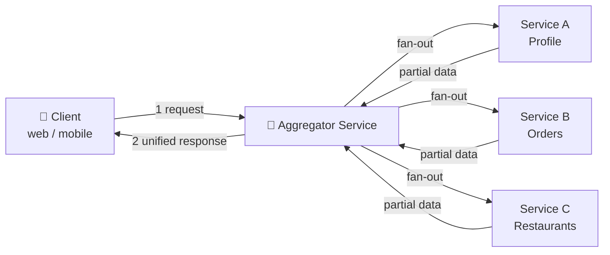

📖 Beginner-friendly explanation (plain English)

Think of the Aggregator like a **personal assistant** you send on one errand. You say "get me everything for tonight's dinner." The assistant runs to the butcher, the bakery, and the vegetable stall, waits for each, puts everything in one bag, and hands it back to you. You made *one* request; the assistant handled the many small trips. Your kitchen (the client) never needs to know where each ingredient came from — it just gets one neat bag. That's the Aggregator: one front door, many errands, one bag back.

---

## 🎯 Core Definitions & Vocabulary

Before going deeper, here is the shared language used throughout this guide and in interviews.

**Aggregator service** — the service that orchestrates calls to downstream services and composes the final response. Sometimes called a *composition service* or *composer*.

**Downstream / underlying services** — the specialized microservices the aggregator calls (e.g., Profile, Inventory, Pricing). Each owns its own data and logic.

**Fan-out** — the act of the aggregator sending requests to multiple services (often in parallel).

**Composition** — merging, transforming, and shaping the collected responses into one payload.

**Client / consumer** — whoever calls the aggregator: a browser, mobile app, or another service.

**Aggregate (DDD sense)** — a *different but related* concept from Domain-Driven Design: a cluster of related domain objects treated as a single unit with one consistency boundary. The source material blends these two ideas, so it's worth separating them clearly (see [Common Misconceptions](#-common-misconceptions)).

> ⚠️ **Naming trap:** "Aggregator pattern" (a runtime composition/orchestration pattern) and "Aggregate" (a DDD modeling concept for transactional consistency) share a root word but solve *different* problems. Interviewers love to probe whether you conflate them.

📖 Beginner-friendly explanation (plain English)

Two words that sound the same but mean different things:
- **Aggregator** = a *waiter* who collects dishes from several kitchens and brings you one tray. It's about *combining responses at request time*.
- **Aggregate** = a *recipe* rule saying "these ingredients always belong together and must be cooked as one dish." It's about *how you group data so it stays consistent*.

The video mixes both. For the pattern most people mean by "Aggregator," picture the waiter, not the recipe.

---

## ✅ Why Does This Pattern Exist?

To understand the Aggregator, you first have to understand the problem it was born to solve.

### The monolith had it easy

In a **monolithic** application, all business logic lives in one process with one database. If a feature needs a customer's profile *and* their orders *and* their loyalty points, that's just three function calls or a single SQL `JOIN` across three tables. Everything is in-process, in one transaction, one deployment. Combining data is trivial.

### Microservices break the JOIN

When you split the monolith into microservices, each service gets its own database and its own boundary. Now:

- Profile data lives in the Profile service's database.
- Order data lives in the Order service's database.
- Loyalty data lives in the Loyalty service's database.

You **cannot** just write a `JOIN` across them — they're separate databases, often separate technologies, reachable only over the network via APIs. And you *must not* let the Order service reach directly into the Profile service's database, because that recreates tight coupling and destroys the independence that motivated microservices in the first place.

So the question becomes: **who assembles the full picture the client needs?**

You have three bad options and one good one:

1. ❌ **Make the client call all services itself** → the mobile app makes 5 network round-trips, knows about 5 endpoints, and must be re-shipped whenever the backend topology changes. Chatty, fragile, leaks internal structure.
2. ❌ **Let services call each other's databases** → tight coupling, no independence.
3. ❌ **Merge the services back together** → you've un-done microservices.
4. ✅ **Introduce an Aggregator** → one server-side service owns the fan-out and composition. The client makes one call; the internal topology stays hidden.

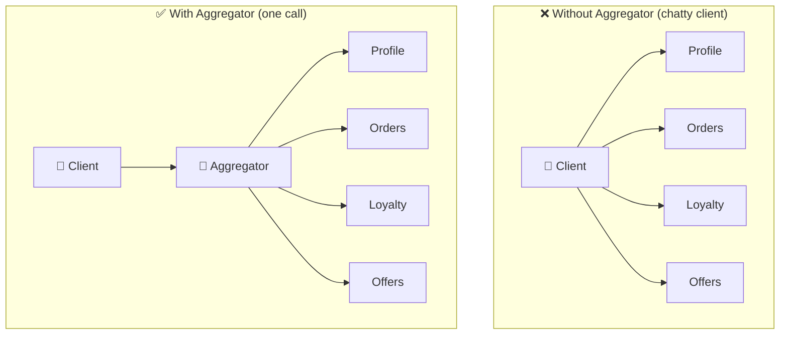

📖 Beginner-friendly explanation (plain English)

In a monolith, getting "everything about a user" is like grabbing files from one filing cabinet in your office — quick and easy. Microservices scatter those files across many locked offices in different buildings, each owned by a different team. You can't rummage through someone else's office. So you hire one runner (the Aggregator) whose whole job is to visit each office, collect the right file, and bring you one folder. Without the runner, *you'd* have to visit every building yourself — slow and exhausting.

---

## 🎨 The Real Mechanism & Trade-off

At its heart, the Aggregator does four steps:

1. **Receive** — accept one request from the client.
2. **Fan-out** — dispatch requests to N downstream services (in parallel where possible).
3. **Compose** — wait for responses, then merge / transform / apply business logic.
4. **Respond** — return one unified payload to the client.

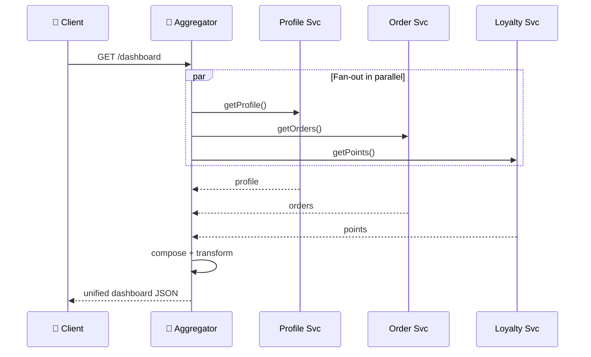

### The core trade-off

The Aggregator buys you **client simplicity and encapsulation** at the cost of **an extra network hop, a new point of failure, and a service that must be operated and scaled.**

| You gain | You pay |
|---|---|
| Client makes 1 call, not N | An extra hop adds latency |
| Internal topology hidden from clients | Aggregator becomes a critical dependency |
| Cross-service logic lives in one place | It can become a "distributed monolith" / god-service |
| Easier to evolve backend without breaking clients | You must scale, monitor, and make it resilient |

The single most important insight interviewers want: **an Aggregator's latency is bounded by its *slowest* dependency (for parallel calls), and its availability is the *product* of its dependencies' availabilities.** If it calls 4 services each at 99.9% uptime, the naive combined availability is 0.999⁴ ≈ 99.6% — worse than any single service. This is *why* resilience (timeouts, fallbacks, partial responses) isn't optional; it's the whole game.

📖 Beginner-friendly explanation (plain English)

Sending one runner to four offices is convenient — but now everything depends on that one runner. If the runner is sick, you get *nothing*, even though all four offices are open. And your folder is only ready when the *slowest* office hands over its file; the three fast ones just wait. So the runner is a huge convenience, but you'd better have a backup runner and a rule like "if one office is slow, bring back what you have and note the missing file."

---

## 📊 The Three Aggregation Strategies

The aggregation itself can be done in three well-known shapes. Interviewers expect you to name all three, know when each applies, and — critically — know that they can be **combined**.

### 1. Scatter-Gather (Parallel)

The aggregator sends all requests **simultaneously** and waits to gather every response, then combines them. Use this when the services are **independent** — no service's input depends on another's output.

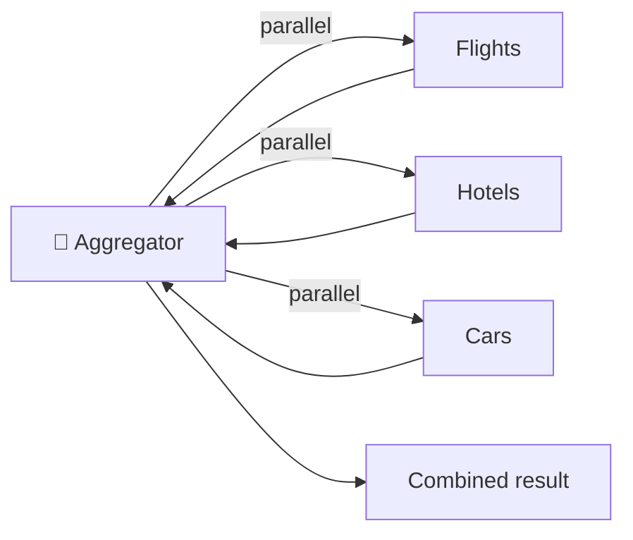

**Example:** A **news aggregator** app fetching latest articles from many sources at the same time. A travel search hitting flights, hotels, and cars concurrently. Latency ≈ the slowest single call, not the sum.

### 2. Chain (Sequential)

Requests are made **one after another**, where the output of one service becomes the **input** to the next. Use this when there is a **dependency** between services.

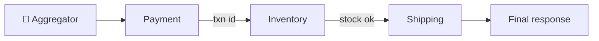

**Example:** An order-processing flow — Payment processes the charge, *then* passes the result to Inventory to decrement stock, *then* to Shipping to schedule delivery. Or: call the Student-Info service to get a `studentId`, then feed that id to the Marks service. Latency = **sum** of all calls (the price of dependency).

### 3. Branch (Conditional / Hybrid)

Branch is a **hybrid** of scatter-gather and chain. The aggregator can take **different paths based on responses**, mixing parallel and sequential calls, and applying conditional logic. It extends the aggregator to produce responses from **single or multiple chains**.

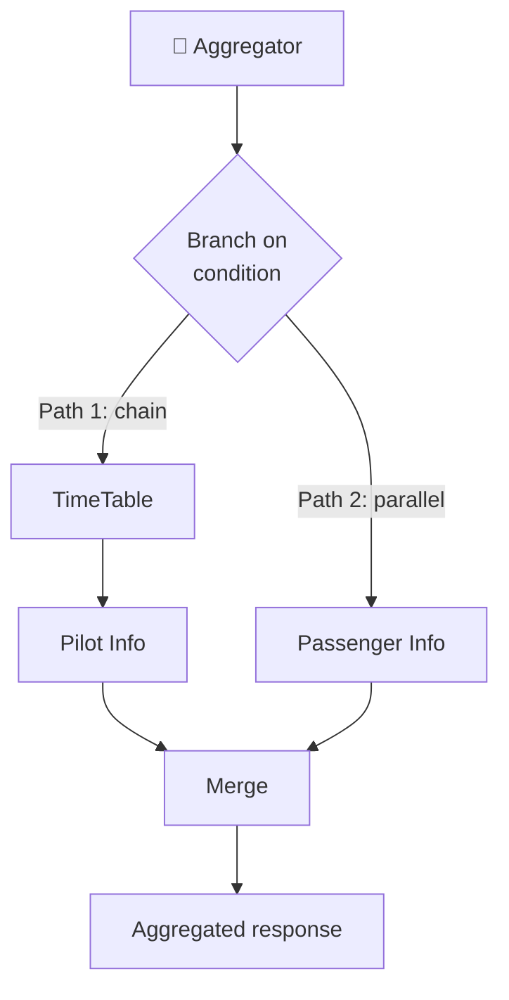

**Example:** A **travel-booking** system checks flights, hotels, and cars in parallel — *but* if the preferred flight is unavailable, it **branches** into an alternative search or notifies the user. Or an airline system where the Pilot service depends on the TimeTable service (a chain), while Passenger info is fetched in parallel, and both feed one aggregated response.

📖 Beginner-friendly explanation (plain English)

Three ways your runner can work:
- **Scatter-gather:** send three runners at once to three shops, wait for all — fastest when shops don't depend on each other.
- **Chain:** one runner goes shop-to-shop in order because shop 2 needs a ticket from shop 1 — slower, but sometimes unavoidable.
- **Branch:** the runner decides on the fly — "the bakery's out of bread, so I'll detour to the other bakery" — mixing both styles based on what actually happens.

---

## 💻 Simple vs. Complex Aggregators

Not every aggregator is equally smart. It helps to classify them by how much *processing* they do.

**Simple aggregator** — linear flow; data from each service is combined **directly** with little transformation. Example: an online store home page that pulls Electronics, Clothing, and Home Goods categories and lays them out. Just fetch and arrange.

**Complex aggregator** — involves **dependencies, computation, and conditional logic.** Example: a personalized **financial dashboard** that fetches Banking, Investments, Loans, and Credit-Score services, then computes net worth, analyzes spending patterns, and suggests investments. This requires real business logic, not just concatenation.

> 💡 **Staff signal:** The more logic a "complex aggregator" absorbs, the more it risks becoming a **god-service** or **distributed monolith** — a single component that hoards business rules and couples every team to its release. A recurring senior-level judgment call is *how much* logic belongs in the aggregator versus staying in the owning services.

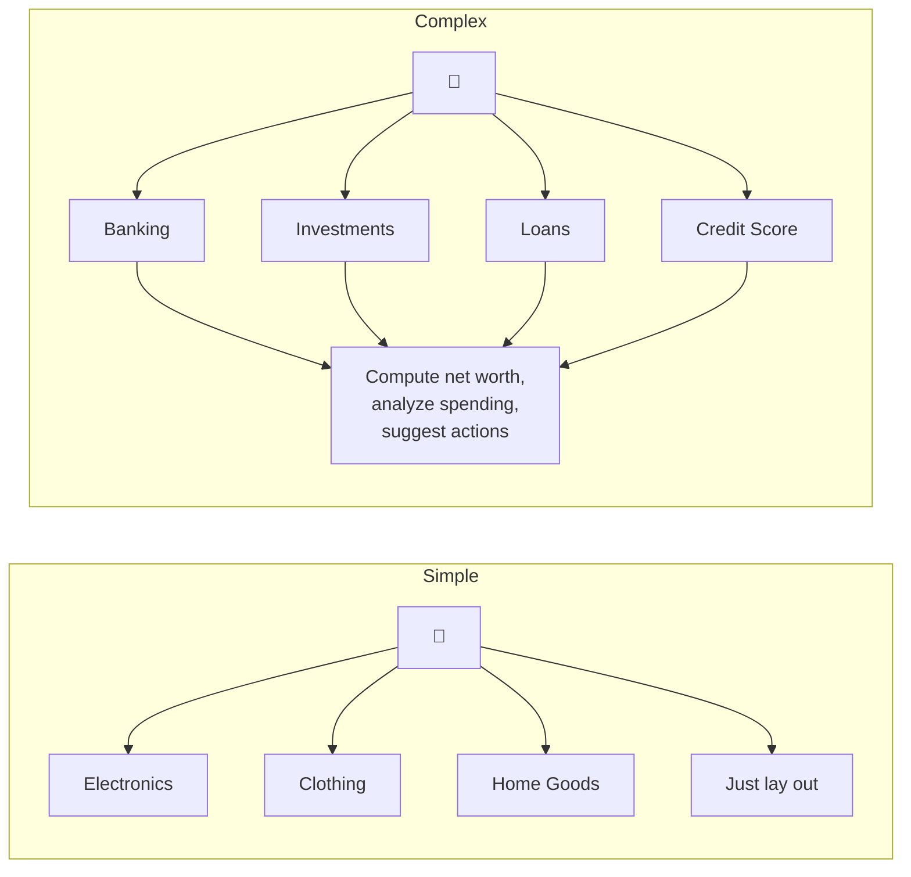

---

## 🎨 Where the Aggregator Should Live

A frequent follow-up: *"Okay, but where do you actually put this thing?"* There are three common homes, and choosing between them is a design decision.

**1. Inside the API Gateway.** Many gateways support response aggregation. Convenient for simple cases, but stuffing business logic into the gateway bloats a shared infrastructure component. Best for *simple* aggregation only.

**2. As a dedicated Aggregator / Composition microservice.** A standalone service you own, deploy, and scale independently. Best when composition needs real logic, its own scaling profile, or its own team.

**3. As a Backend-for-Frontend (BFF).** One aggregator *per client type* — a mobile BFF, a web BFF, a partner-API BFF. Each shapes data for its specific consumer. This is how Netflix, Spotify, and SoundCloud popularized the approach: the mobile BFF returns lean payloads for cellular networks; the web BFF returns richer data.

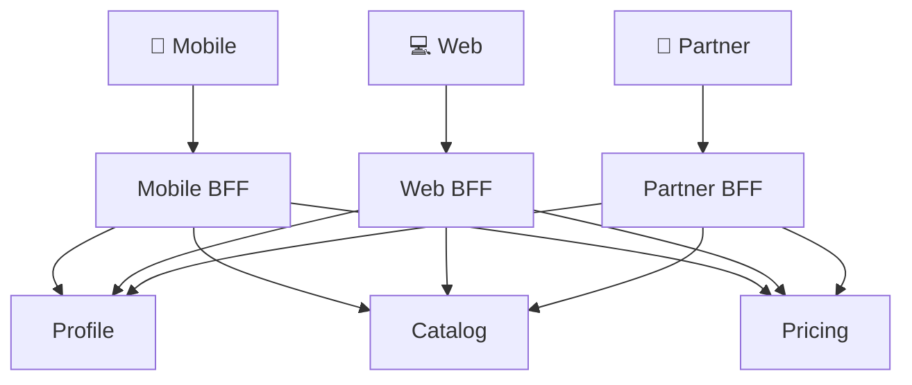

📖 Beginner-friendly explanation (plain English)

Do you build one universal runner for everyone, or a specialized runner per customer? A **BFF** is a specialized runner: the mobile app's runner knows the phone wants small, quick folders (limited data plan), while the web runner brings big detailed folders. Same shops out back, but each runner packages things the way *its* customer likes. Netflix does exactly this — different devices get differently-shaped responses.

---

## 📊 Categorized Real-World Examples

Grouping examples by domain makes the pattern stick.

### E-commerce & Retail
- **Product page:** aggregates Product-Details, Inventory, Pricing, Reviews, and Recommendations into one page. Amazon's product pages are a canonical example.
- **Store homepage:** simple aggregator combining category services (Electronics, Clothing, Home Goods).
- **Checkout:** a *chain* — Payment → Inventory reservation → Shipping.

### Finance & Fintech
- **Personal finance dashboard** (e.g., Mint-style): complex aggregator over Banking, Investments, Loans, Credit-Score → computes net worth and insights.
- **Trading app home screen:** portfolio value, watchlist quotes, news, and account balance from separate services.

### Travel & Booking
- **Meta-search** (Kayak, Expedia): scatter-gather across flights, hotels, cars; branch when a preferred option is unavailable.
- **Airline internal system:** Passenger, Pilot, Invoice, Timetable services — Pilot depends on Timetable (chain) while Passenger is parallel (branch).

### Media & Content
- **News aggregator:** parallel fetch from many publishers.
- **Streaming home screen** (Netflix): personalized rows, each row potentially a different service, composed by a device-specific BFF.

### Social & Productivity
- **Social feed:** aggregate posts, ads, friend suggestions, and notifications counts.
- **School system** (from source): Grading system needs Student-Info + Marks; Rank system needs Student-Info + Absence — the same services composed differently per consumer.

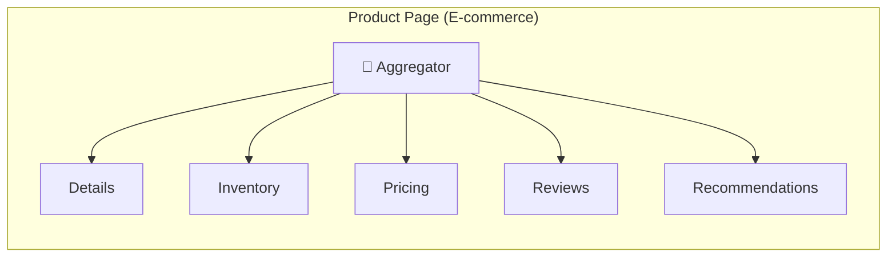

---

## ❌ Failure, Resilience & Performance

Because the aggregator concentrates dependencies, resilience *is* the design. Interviewers push hard here.

**The aggregator is a critical point of failure.** If it goes down, every feature routed through it breaks — even though the downstream services are healthy. Mitigate with **redundancy, multiple instances, and failover.**

**A slow or failed dependency drags down the whole response.** One sluggish service can hold the entire aggregated call hostage. Defenses:

- **Timeouts** — never wait indefinitely for a downstream call.
- **Retries (with backoff + jitter)** — for transient failures, but bounded to avoid retry storms.
- **Circuit breakers** — stop hammering a service that's already failing (e.g., Netflix Hystrix, Resilience4j).
- **Fallbacks / graceful degradation** — return a default or cached value for the failed piece.
- **Partial responses** — return the data you *do* have and mark the rest as unavailable, rather than failing the whole request.
- **Bulkheads** — isolate resource pools per dependency so one slow service can't exhaust all threads.

**Latency accumulates.** Aggregating multiple responses adds overhead, worst in complex/chained scenarios. Optimize by parallelizing independent calls, caching hot data, setting tight timeouts, and minimizing over-fetching.

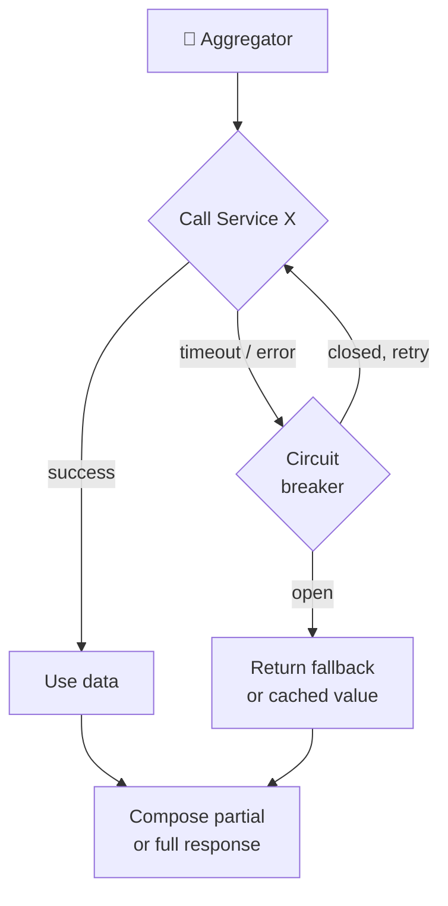

📖 Beginner-friendly explanation (plain English)

Your one runner is convenient but risky: if the runner trips, *nothing* arrives. And if one shop is painfully slow, the runner waits there while your dinner gets cold. So you set rules: "wait no more than 2 minutes per shop" (timeout), "if a shop's been closed all week, don't even bother knocking" (circuit breaker), and "if the bakery's out, bring the rest and just skip bread" (partial response / fallback). These rules turn a fragile setup into a dependable one.

---

## ❌ Common Misconceptions

**"Aggregator pattern and DDD Aggregates are the same thing."** No. The Aggregator *pattern* is a runtime composition/orchestration pattern. A DDD *Aggregate* is a data-modeling concept — a consistency boundary around related entities modified in one transaction. The source video conflates them; keep them separate.

**"An aggregator always calls services in parallel."** Only scatter-gather is parallel. Chain is sequential by necessity; branch mixes both.

**"The aggregator is just an API Gateway."** Overlapping but distinct. A gateway handles cross-cutting concerns (routing, auth, rate-limiting, TLS) for *all* traffic. An aggregator specifically *composes* multiple responses. A gateway *can* do simple aggregation, but heavy composition belongs in a dedicated service or BFF.

**"Adding an aggregator always improves performance."** It reduces *client-side* round-trips and can parallelize, but it adds a hop and a dependency. Net latency can go up if composition is heavy or calls are chained.

**"The aggregator should own the business logic."** Tempting, but over-centralizing logic creates a distributed monolith. Keep domain rules in the owning services; let the aggregator *compose*, not *own*.

**"More aggregation = better."** Every service you fold in lowers combined availability and raises latency. Aggregate only what a given screen/consumer actually needs.

---

## 💡 Staff / Principal-Level Nuance

This is the reasoning experienced engineers volunteer *before* being asked.

**Availability math drives the design.** Combined availability is the *product* of dependency availabilities, so an aggregator over many services is *less* available than any one of them unless you engineer degradation. This is the reason partial responses and fallbacks exist. Say this unprompted.

**Orchestration vs. choreography.** The aggregator is an *orchestration* style (a central brain directs the flow). The alternative is *choreography* (services react to events with no central coordinator). Orchestration is easier to reason about and debug but centralizes coupling; choreography scales autonomy but is harder to trace. Aggregator = orchestration.

**Aggregation ≠ transaction.** An aggregator *reads and composes*; it does not give you atomic writes across services. For multi-service *writes* with consistency, you need the **Saga** pattern (with compensating transactions). Combining Aggregator (for reads/queries) with Saga (for writes) is the mature pairing.

**Read-side vs. write-side.** Aggregators shine on the **query** side. This is why they pair naturally with **CQRS** — the read model can even be a *materialized view* that pre-joins data, eliminating fan-out latency at query time in exchange for eventual consistency.

**GraphQL as an aggregator.** A GraphQL server (or Apollo Federation gateway) is essentially a declarative aggregator: the client specifies exactly which fields it wants, and resolvers fan out to services. It solves over-fetching but shifts complexity into resolver design and query-cost control (guard against expensive nested queries).

**N+1 fan-out and batching.** A naive aggregator that calls a service once *per item* in a list creates an N+1 storm. Use batching / `DataLoader`-style coalescing or bulk endpoints.

**Caching strategy is per-field, not global.** Different pieces have different freshness needs — a product's price may need real-time reads while its description can be cached for hours. Sophisticated aggregators cache per-dependency with per-field TTLs.

**Streaming / partial rendering.** Instead of waiting for the slowest call, advanced aggregators stream results as they arrive (HTTP chunked responses, server-driven UI, or GraphQL `@defer`) so the client renders fast parts immediately.

**Backpressure & thread models.** Blocking one thread per downstream call doesn't scale; a slow dependency exhausts the pool. Reactive/non-blocking stacks (Spring WebFlux, Node.js event loop, Go goroutines) plus bulkheads keep the aggregator responsive under load.

**Ownership & organizational coupling.** A shared aggregator touched by every team becomes a release bottleneck (Conway's Law). BFFs push ownership to the consuming team, trading some duplication for autonomy.

**Idempotency for retries.** If the aggregator retries, downstream calls (especially in chains that write) must be idempotent, or you risk double-charging / double-shipping. Use idempotency keys.

---

## 🔗 Adjacent & Extension Concepts

**API Gateway** — the entry point handling routing, auth, TLS, rate-limiting. Often *hosts* simple aggregation; aggregation is one feature a gateway may offer.

**Backend-for-Frontend (BFF)** — a per-client aggregator that tailors payloads to a specific consumer (mobile/web/partner).

**CQRS (Command Query Responsibility Segregation)** — splits read and write models. Aggregators live on the query side; a pre-joined read model can replace runtime fan-out.

**Saga** — coordinates *writes* across services with compensating transactions for consistency. Complements the aggregator's read-side focus.

**GraphQL / Apollo Federation** — a declarative, client-driven aggregator; resolvers fan out to services.

**Materialized View pattern** — pre-computes and stores a joined view so reads avoid fan-out entirely (eventual consistency).

**Circuit Breaker / Bulkhead / Retry** (Resilience4j, Hystrix, Envoy) — the resilience toolkit an aggregator relies on.

**Proxy pattern** — a simpler cousin: forwards/transforms a single request to one service (no multi-service composition).

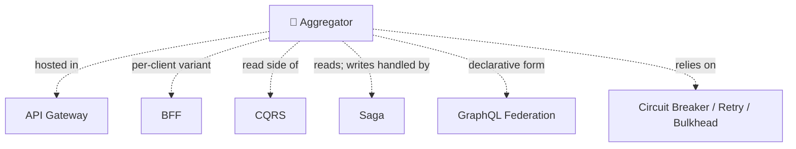

---

## ⚡ Quick Revision

The **Aggregator pattern** is a service that receives one client request, fans out to multiple downstream microservices, composes their responses, and returns a single unified payload. It exists because microservices split data across many independently-owned services with separate databases, so the cross-service `JOIN` that was trivial in a monolith is now impossible — yet real features still need data from several services at once. The aggregator is the server-side glue that gives the client *one* call and hides the internal topology. The alternatives (chatty clients calling every service, services reaching into each other's databases, or re-merging into a monolith) are all worse.

The **core trade-off**: you buy client simplicity and encapsulation at the cost of an extra network hop, a new critical point of failure, and a service you must scale and operate. The killer insight is the *math* — for parallel calls, latency is bounded by the **slowest** dependency; and availability is the **product** of dependency availabilities (four services at 99.9% ≈ 99.6% combined, worse than any one). That's exactly why resilience isn't optional: timeouts, retries with backoff, circuit breakers, bulkheads, fallbacks, and **partial/graceful-degraded responses** are the heart of the design.

There are **three aggregation strategies**. **Scatter-gather (parallel)**: fire all requests at once, gather all responses — for *independent* services (news aggregator, travel search); latency ≈ slowest call. **Chain (sequential)**: output of one call feeds the next — for *dependent* services (Payment → Inventory → Shipping); latency = sum of calls. **Branch (hybrid)**: mixes parallel and sequential with conditional logic and different paths based on responses (travel booking that reroutes when a flight is unavailable). They combine freely.

Aggregators range from **simple** (linear, just fetch-and-arrange, like a store homepage over category services) to **complex** (dependencies + computation, like a finance dashboard computing net worth from Banking/Investments/Loans/Credit). The more logic a complex aggregator absorbs, the more it risks becoming a **god-service / distributed monolith** — so keep domain rules in the owning services and let the aggregator *compose*, not *own*.

**Where it lives**: inside the API Gateway (simple cases only), as a dedicated composition microservice, or as a **BFF** (one aggregator per client type — Netflix/Spotify style — so mobile gets lean payloads and web gets rich ones).

**Staff-level points to volunteer**: aggregation is *reads*, not atomic writes — use **Saga** for cross-service writes; it pairs with **CQRS** on the query side, where a **materialized view** can pre-join data and remove fan-out latency (at the cost of eventual consistency); **GraphQL/Apollo Federation** is a declarative aggregator; beware **N+1 fan-out** (batch with DataLoader/bulk endpoints); cache **per-field** with different TTLs; use **non-blocking/reactive** stacks and bulkheads so a slow dependency doesn't exhaust threads; make retried calls **idempotent**; and remember a shared aggregator becomes an organizational bottleneck (Conway's Law), which BFFs mitigate. Don't confuse the **Aggregator pattern** (runtime composition) with a **DDD Aggregate** (a transactional consistency boundary) — same root word, different problems.

---

## 🎓 FAANG Interview Q&A (20 Questions)

> Tiers: Q1–Q10 are foundational→intermediate (L3/L4). Q11–Q20 are L4/L5 staff-level trade-off and design reasoning.

<strong>Q1. What is the Aggregator pattern in microservices, in one paragraph?</strong>

It's a service that receives a single client request, dispatches requests to multiple downstream microservices, combines their responses (with optional transformation and business logic), and returns one unified result. It solves the problem that microservices split data across independently-owned services, so a client feature needing several services would otherwise require many round-trips or leak internal structure. Concretely, a `/product-page` aggregator on an e-commerce site (like Amazon) calls Details, Pricing, Inventory, Reviews, and Recommendations services and merges them into one JSON response, so the mobile app makes just one call.

<strong>Q2. Why can't you just use a database JOIN like in a monolith?</strong>

Because in microservices each service owns its **own** database — often different technologies (Postgres here, DynamoDB there) — and services must not reach into each other's stores, or you recreate the tight coupling microservices exist to avoid. There's no shared schema to `JOIN`. So the "join" moves up from the database layer to the application layer: the aggregator performs an *application-level join* by calling each service's API over the network and merging results. The trade-off is you lose transactional consistency and gain network latency, which is exactly why resilience patterns become necessary.

<strong>Q3. Explain scatter-gather, chain, and branch. When do you pick each?</strong>

**Scatter-gather (parallel):** fire all requests simultaneously, wait for all, combine — used when services are *independent*, e.g., a travel search hitting flights/hotels/cars concurrently; latency ≈ slowest call. **Chain (sequential):** each call's output feeds the next — used when there's a *dependency*, e.g., Payment → Inventory → Shipping in checkout; latency = sum of calls. **Branch (hybrid):** conditional mix of parallel and sequential, taking different paths based on responses — e.g., a booking flow that reroutes when a preferred flight is unavailable. Pick based on the *dependency graph* between services: no dependencies → scatter-gather; strict dependency → chain; conditional/mixed → branch.

<strong>Q4. What's the difference between an Aggregator and an API Gateway?</strong>

An API Gateway is the single entry point handling **cross-cutting concerns** for all traffic: routing, authentication, TLS termination, rate-limiting, request logging. An Aggregator specifically **composes multiple downstream responses into one**. They overlap because many gateways (e.g., Kong, Spring Cloud Gateway) *can* do simple aggregation, but heavy composition with business logic belongs in a dedicated aggregator service or BFF — otherwise you bloat a shared infrastructure component that every team depends on. Rule of thumb: gateway for policy and routing, aggregator for data composition.

<strong>Q5. What is a simple vs. a complex aggregator?</strong>

A **simple** aggregator does a linear fetch-and-arrange with minimal processing — e.g., a store homepage pulling Electronics, Clothing, and Home Goods category services and laying them out. A **complex** aggregator involves dependencies, computation, and conditional logic — e.g., a personal-finance dashboard (Mint-style) fetching Banking, Investments, Loans, and Credit-Score, then computing net worth, analyzing spending, and suggesting investments. The distinction matters because complex aggregators accumulate business logic and risk becoming a distributed monolith, so senior engineers watch *how much* logic to place there.

<strong>Q6. What are the main benefits of the Aggregator pattern?</strong>

Clients make **one** call instead of N, reducing round-trips (huge on mobile/high-latency networks); internal service topology is **hidden**, so you can refactor backends without breaking clients; cross-service composition logic lives in **one place**; and it's straightforward to understand and scale as an independent service. It also enables client-specific shaping via BFFs. Netflix uses device-specific aggregation so a TV, phone, and browser each get an appropriately-shaped payload without the underlying services knowing about device types.

<strong>Q7. What are the main drawbacks and risks?</strong>

It adds a **network hop** (latency), becomes a **critical point of failure** (its outage breaks every feature routed through it even if downstreams are healthy), can degrade into a **god-service/distributed monolith** if it hoards logic, and must itself be scaled, monitored, and made resilient. Crucially, its combined availability is the *product* of its dependencies' availabilities and its parallel latency is bounded by the *slowest* dependency — so without careful design it's *less* reliable and slower than the services behind it.

<strong>Q8. How do you handle a downstream service that is slow or down?</strong>

Layer defenses: **timeouts** so you never wait forever; **retries with exponential backoff and jitter** for transient faults (bounded to avoid retry storms); **circuit breakers** (Resilience4j / Hystrix) to stop calling a service that's clearly failing; **bulkheads** to isolate thread pools per dependency; and **fallbacks** returning cached or default values. Most importantly, return a **partial response** — give the client the data you *do* have and flag the missing piece — rather than failing the entire request because one of five services timed out.

<strong>Q9. Where should the aggregator physically live in your architecture?</strong>

Three options: (1) **inside the API Gateway** for simple aggregation only; (2) as a **dedicated composition microservice** you deploy and scale independently when composition needs real logic or its own scaling profile; (3) as a **BFF** — one aggregator per client type. Choose based on complexity and ownership: simple → gateway; logic-heavy or independently-scaled → dedicated service; multiple divergent clients → BFF. Netflix, SoundCloud, and Spotify popularized the BFF route.

<strong>Q10. Give a concrete end-to-end example of the flow.</strong>

A food-delivery app requests `GET /home`. The aggregator receives it, then **in parallel** calls Profile (name/address), Restaurants (nearby, by geo), and Offers (active promos), and **sequentially** calls Orders then Reorder-suggestions (chain, since suggestions need the last order). It applies a timeout of ~300ms per call, uses a cached restaurant list as a fallback, composes everything into one JSON tailored for mobile (lean fields), and returns it. If Offers times out, it returns the home screen without the offers banner rather than erroring. One request in, one composed screen out.

<strong>Q11. [L5] How does the Aggregator pattern affect system availability, and how do you reason about it quantitatively?</strong>

For a *hard* dependency, combined availability is the **product** of dependency availabilities: 4 services each at 99.9% give 0.999⁴ ≈ **99.6%** — worse than any single service, and it degrades further with more dependencies. This is the central staff-level insight: naively adding an aggregator *reduces* availability. The fix is to make dependencies **soft** via graceful degradation — if a non-critical service (e.g., Recommendations) fails, still return the page. Then that service's availability drops *out* of the product for the critical path. So the real design work is classifying each dependency as critical vs. optional and engineering partial responses accordingly.

<strong>Q12. [L5] Aggregator vs. Saga — when do you use which, and can they coexist?</strong>

An Aggregator is for **queries/reads** — it composes data and gives no atomicity across services. A **Saga** is for **writes** that span services, maintaining consistency through a sequence of local transactions with **compensating actions** on failure (e.g., refund if shipping fails after payment). They coexist: use the aggregator to *read and present* combined state, and a saga to *execute* a multi-service business transaction. Example: an order aggregator shows combined order status (read), while an order-placement saga orchestrates Payment → Inventory → Shipping with compensations (write). Confusing the two — expecting the aggregator to give transactional writes — is a classic mistake.

<strong>Q13. [L5] How does the Aggregator relate to CQRS and materialized views?</strong>

Aggregators live on the **query** side of CQRS. A runtime aggregator fans out on *every* request, paying latency each time. With CQRS you can instead maintain a **read model / materialized view** that pre-joins data from multiple services (updated asynchronously via events), so queries hit one denormalized store with *no* fan-out. The trade-off is **eventual consistency** — the view lags writes by some delay. Choose runtime aggregation when data must be fresh and fan-out is cheap; choose a materialized view when read latency/scale matters more than immediate consistency (e.g., a product catalog search index built from Catalog, Pricing, and Inventory events).

<strong>Q14. [L5] Is GraphQL just an Aggregator pattern? What does it add and cost?</strong>

Effectively yes — a GraphQL server (or Apollo **Federation** gateway) is a *declarative* aggregator: the client specifies exactly the fields it wants and resolvers fan out to services. It **adds** elimination of over- and under-fetching (the client shapes the response, no bespoke endpoint per screen) and a unified schema across teams. It **costs** resolver complexity, the **N+1 problem** (needs `DataLoader` batching), and query-cost/complexity control — an unguarded deeply-nested query can trigger an expensive fan-out storm, so you need depth limits, cost analysis, and persisted queries. It's the right tool when many clients need many different data shapes.

<strong>Q15. [L5] How do you prevent an aggregator from becoming a distributed monolith?</strong>

Keep the aggregator's job to **composition and orchestration**, not domain ownership — business rules stay in the services that own the data. Watch for symptoms: every feature change requiring an aggregator deploy, the aggregator embedding domain validation, or all teams blocked on its release (Conway's Law bottleneck). Mitigations: split into **per-consumer BFFs** so ownership follows the client team; enforce that the aggregator only reads/merges; and prefer choreography/events for logic that doesn't need central coordination. The tell that you've failed is when the aggregator has more business logic than any service it calls.

<strong>Q16. [L5] Walk through your thread/concurrency model for an aggregator under high load.</strong>

A blocking one-thread-per-call model doesn't scale: if each request fans out to 5 services and one is slow, threads pile up waiting and the pool exhausts, causing cascading failure. Prefer a **non-blocking/reactive** stack — Spring WebFlux, Node.js event loop, or Go goroutines — so waiting on I/O doesn't tie up a thread. Add **bulkheads** to cap concurrent calls per dependency (a slow Recommendations service can't starve Profile calls), enforce **timeouts** and **circuit breakers**, and apply **backpressure** so the aggregator sheds load gracefully instead of collapsing. The goal: one slow dependency degrades one feature, not the whole aggregator.

<strong>Q17. [L5] How do you design caching for an aggregator?</strong>

Cache **per-dependency and per-field**, not globally, because freshness needs differ: a product's price may need real-time reads while its description is safe to cache for hours. Techniques: cache stable downstream responses with appropriate TTLs; cache the *composed* response for identical requests (short TTL) when composition is expensive; use a shared cache (Redis) for cross-instance reuse; and consider **stale-while-revalidate** to serve cached data instantly while refreshing in the background. Be careful with personalized responses (per-user keys) to avoid leaking one user's data to another, and invalidate on write events where correctness demands it.

<strong>Q18. [L5] What's the difference between orchestration and choreography, and where does the aggregator sit?</strong>

**Orchestration** has a central coordinator that explicitly directs the sequence of calls — the aggregator *is* an orchestrator. **Choreography** has no central brain; services emit and react to events independently. Orchestration is easier to understand, debug, and monitor (one place shows the flow) but centralizes coupling and can bottleneck. Choreography maximizes autonomy and resilience but makes end-to-end flows hard to trace and reason about. Aggregators favor orchestration for *synchronous read composition*; for asynchronous multi-step *workflows* you might lean on choreography or an orchestrator like a saga coordinator (e.g., Temporal, AWS Step Functions).

<strong>Q19. [L5] How do you handle partial failures so the client experience stays good?</strong>

Classify each dependency as **critical** (page fails without it) or **optional** (page degrades gracefully). For optional ones, on timeout/error return a **fallback** (cached value, empty section, or default) and include a status flag so the client can render "temporarily unavailable" for just that widget. Consider **response streaming** (HTTP chunked, GraphQL `@defer`, or server-driven UI) so fast sections render immediately while slow ones fill in. Instrument everything so you know *which* dependency degraded. Example: Netflix's home screen renders available rows even if one recommendation service is down — the user rarely notices a single missing row.

<strong>Q20. [L5] Design the read path for an Amazon-style product detail page. Which strategy, resilience, and consistency choices?</strong>

Use a **BFF/dedicated aggregator** per client. Fan out **scatter-gather** to independent services — Details, Pricing, Inventory, Images, Reviews, Recommendations — since none depends on another's output. Mark **Details/Pricing/Inventory as critical** (fail or show clear error if missing) and **Reviews/Recommendations as optional** (degrade gracefully). Apply tight per-call **timeouts** (~100–300ms), **circuit breakers**, and **bulkheads**; cache Details/Images aggressively (long TTL) and Pricing/Inventory briefly or via real-time reads. For scale, back the read with a **materialized view / search index** (built from events) for listing pages, accepting eventual consistency, while the detail page reads live Pricing/Inventory for correctness. Stream the shell first, hydrate Reviews/Recommendations after. This balances freshness on money-critical fields with speed and resilience on the rest.

---

## 📝 STAR Behavioral Questions

> STAR = Situation, Task, Action, Result. These frame system-design decisions as experience stories.

<strong>STAR 1. Tell me about a time you introduced an aggregator to solve a client-performance problem.</strong>

**Situation:** Our mobile app's home screen made seven separate API calls to seven microservices; on 3G it took 4–6 seconds and users were dropping off.

**Task:** I was asked to cut home-screen load time under 1.5 seconds without merging the services back together.

**Action:** I introduced a **mobile BFF aggregator** that fanned out to the seven services server-side using scatter-gather on a non-blocking (WebFlux) stack, applied 250ms timeouts with fallbacks for the two optional widgets, cached the semi-static sections in Redis, and returned a lean mobile-shaped payload in one call. I marked profile/orders as critical and offers/recommendations as optional with graceful degradation.

**Result:** Client round-trips went from seven to one, home-screen p95 dropped to ~1.1 seconds, and drop-off fell noticeably. Because the internal topology was now hidden behind the BFF, we later re-split one service without touching the app.

<strong>STAR 2. Describe a time an aggregator became a bottleneck or point of failure and how you handled it.</strong>

**Situation:** A single shared aggregator served web, mobile, and partner APIs. One downstream Recommendations service started timing out, and because calls were blocking, the aggregator's thread pool exhausted — taking down *all* clients, not just recommendations.

**Task:** Restore service immediately, then prevent one slow dependency from cascading again.

**Action:** Short-term, I tripped a manual circuit breaker on Recommendations and deployed a fallback returning an empty rec list, which freed threads. Long-term, I moved the aggregator to a reactive non-blocking model, added **bulkheads** to isolate a thread budget per dependency, wired **Resilience4j circuit breakers** with fallbacks, and split the shared aggregator into per-client BFFs so a partner-only issue couldn't affect mobile.

**Result:** The immediate outage cleared in minutes. Afterward, a slow dependency degraded only its own widget; combined availability on the critical path improved because optional dependencies became soft. We codified the critical-vs-optional classification as a design-review checklist.

<strong>STAR 3. Tell me about a time you had to choose between runtime aggregation and a pre-computed read model.</strong>

**Situation:** Our product search/listing page ran a runtime aggregator fanning out to Catalog, Pricing, and Inventory for *every* item in the results, creating a severe **N+1 fan-out** and 2+ second listing loads under traffic spikes.

**Task:** Make listing pages fast and scalable at peak without sacrificing correctness where it mattered.

**Action:** I moved listing to a **materialized view** — a search index (Elasticsearch) built asynchronously from Catalog, Pricing, and Inventory **events** via CQRS — so a listing query hit one denormalized store with no fan-out. I kept **runtime aggregation with live Pricing/Inventory** on the product *detail* page, where money-critical accuracy justified the freshness cost, and accepted eventual consistency (a few seconds) on the listing.

**Result:** Listing p95 dropped from ~2s to ~150ms and held under 5x traffic. The explicit trade-off — eventual consistency on listings, strong reads on detail — was documented so stakeholders understood why a price could briefly differ between list and detail views.

<strong>STAR 4. Describe a time you pushed back on putting business logic into an aggregator.</strong>

**Situation:** A team proposed adding pricing-discount and tax-calculation rules directly into our shared checkout aggregator "to keep it simple," so it could compute final totals during composition.

**Task:** As the reviewer, I had to decide whether to allow it or protect the architecture from becoming a distributed monolith.

**Action:** I pushed back, explaining that the aggregator would then own domain rules belonging to the Pricing and Tax services — every discount change would force an aggregator deploy and couple all clients to it (a Conway's-Law bottleneck). I proposed keeping the rules in the owning services, exposing a `computeTotal` capability from Pricing, and letting the aggregator only *call and merge*. I showed the availability and ownership math to make the case concrete.

**Result:** The team kept the logic in the Pricing/Tax services. Six months later, when tax rules changed for a new region, only the Tax service was touched — no aggregator or client redeploy — validating the decision. It became a reference example in our design guidelines for "compose, don't own."

---

## 🔗 References & Further Reading

- Source transcript & articles: *Design Pattern for Microservices — Aggregator Pattern* (Kavindaperera, Mar 2022); *Design patterns for Microservices Architecture* (Bavatharany Mahathevan, Nov 2021); plus the microservices video transcript on the Aggregator pattern (provided source material).
- Chris Richardson, *Microservices Patterns* — API Composition, CQRS, and Saga patterns.
- Sam Newman, *Building Microservices* — BFF and aggregation.
- Martin Fowler — microservices definition and CQRS write-ups.
- Netflix / SoundCloud engineering blogs — Backend-for-Frontend origins.
- Resilience4j & Netflix Hystrix docs — circuit breaker, bulkhead, retry.
- Apollo GraphQL Federation — declarative aggregation.

---

*This guide covers the Aggregator pattern from plain-English basics through staff/principal-level trade-offs. It intentionally treats it as a microservices communication/composition pattern — not a Gang-of-Four design pattern.*
