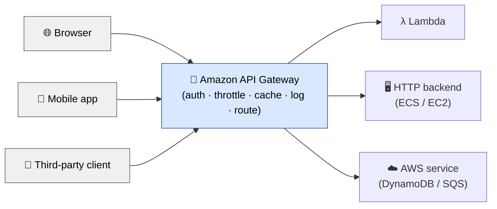
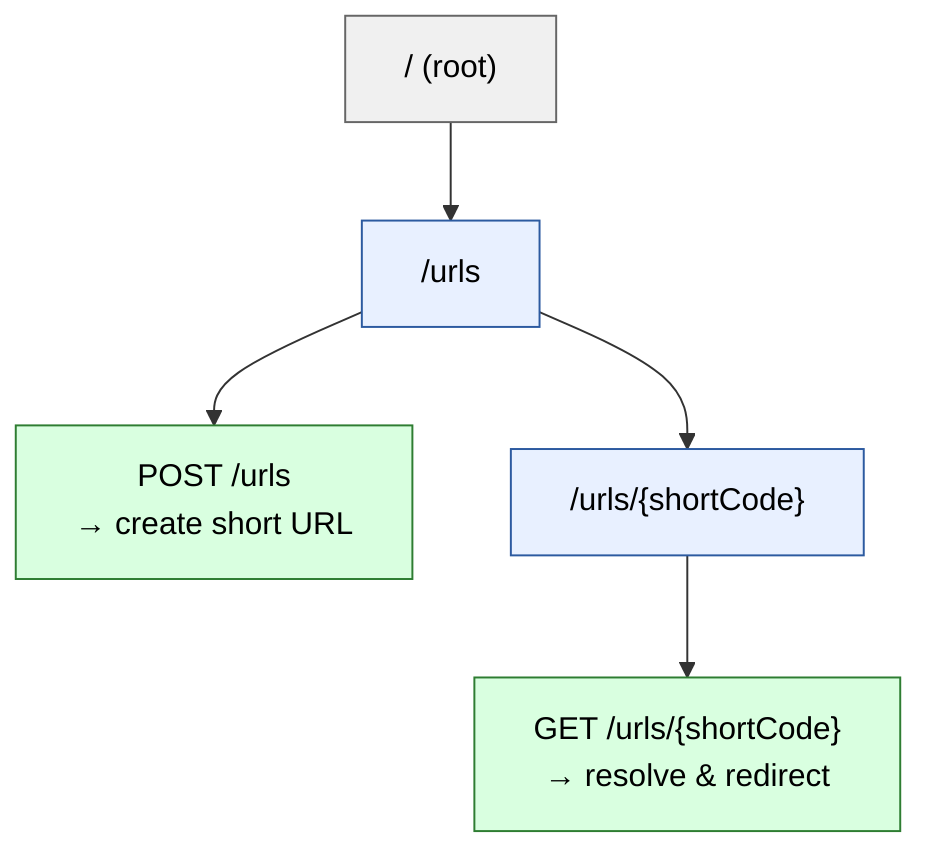
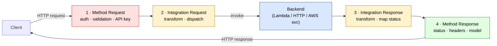
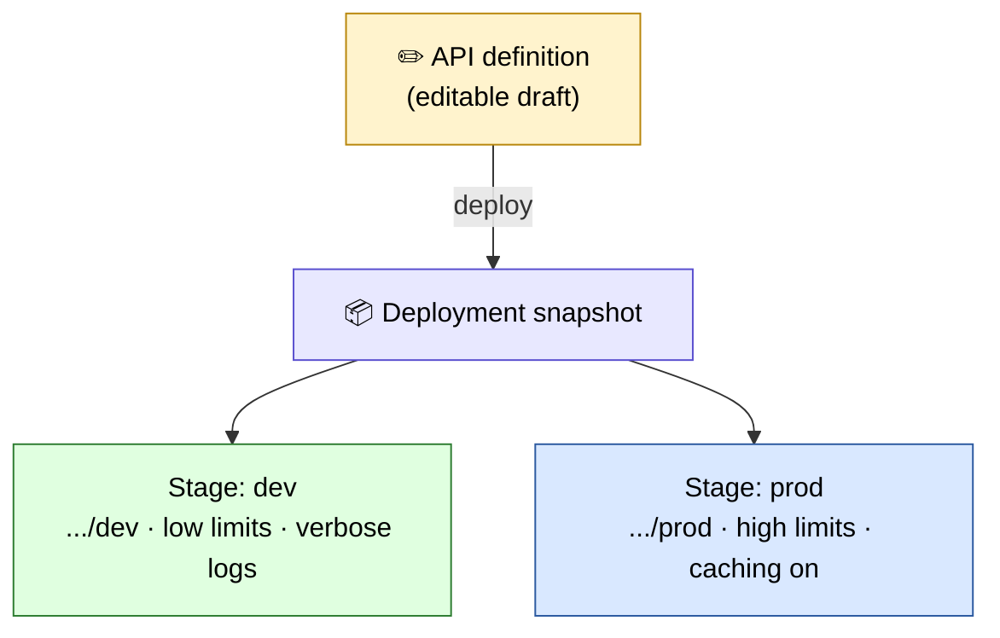
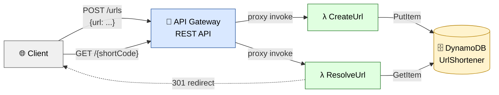

# 🚪 Amazon API Gateway — The Complete, Readable Guide

*The front door to your cloud APIs — and how to explain, build, and defend it like a staff engineer.*

You've written a Lambda function that shortens URLs. It works perfectly when you invoke it from the AWS Console. But now you need a real user — someone on the open internet with nothing but a browser and a URL — to trigger it. There is no "invoke Lambda" button on the internet. Lambda has no public address, speaks no HTTP, and enforces no authentication of its own. The same gap exists for a container running your Java service, or an EC2 instance, or a step-function workflow. Between "code that runs in the cloud" and "a client that can call it over HTTPS" sits a chasm, and something has to bridge it.

That something is an **API gateway** — and on AWS, the managed service that plays this role is **Amazon API Gateway**. It is the piece that turns a private function into a public, secured, throttled, monitored, versioned HTTPS endpoint that millions of clients can call. It is one of the most heavily used services in modern cloud architecture and one of the most frequently probed in system-design interviews, precisely because it sits at the boundary where networking, security, scaling, and cost all collide.

So here is the question this guide answers, thoroughly: **when a request leaves a client and heads for your code, what does a production-grade front door actually do to it — and how do you configure, build, and reason about that front door on AWS?**

By the end you won't just know what API Gateway is. You'll understand *why each of its moving parts exists*, you'll have built and deployed a real serverless API with your own hands, and you'll be able to defend your design choices at the depth an interviewer keeps pushing toward.

> **How to read this guide.** It's written to be read start to finish, each section answering the question the previous one leaves you with — but the table of contents lets you jump anywhere. Throughout you'll find **📖 "In plain English"** boxes: short, simplified technical recaps sitting *beside* the detail, not replacing it. **💻 Java code** and the **💡 Q&A bank** are wrapped in collapsible sections so the prose stays readable — click to expand them when you want depth. Part III is a complete **hands-on project** you can build in an afternoon. Near the end there's a **⚡ Quick Revision** to reread before an interview.
>
> **Prerequisite:** a basic feel for HTTP (methods, status codes, headers) and a rough idea of what AWS Lambda is. If those are fuzzy, we rebuild the relevant parts as we go.

---

## 📋 Table of Contents

*Part I — Why API Gateway Exists*

1. [The gap between your code and the internet](#-1-the-gap-between-your-code-and-the-internet)
2. [The gateway pattern, and the seven jobs of a front door](#-2-the-gateway-pattern-and-the-seven-jobs-of-a-front-door)
3. [Amazon API Gateway: the managed service](#-3-amazon-api-gateway-the-managed-service)
4. [Three flavors: REST, HTTP, and WebSocket APIs](#-4-three-flavors-rest-http-and-websocket-apis)

*Part II — The Core Building Blocks*

5. [Resources and methods: the shape of your API](#-5-resources-and-methods-the-shape-of-your-api)
6. [Integrations: how the gateway reaches your backend](#-6-integrations-how-the-gateway-reaches-your-backend)
7. [The request/response lifecycle](#-7-the-requestresponse-lifecycle)
8. [Mapping templates: transforming data in flight](#-8-mapping-templates-transforming-data-in-flight)
9. [Stages and deployments: how changes go live](#-9-stages-and-deployments-how-changes-go-live)

*Part III — Hands-On: Build a Serverless URL Shortener*

10. [What we're building and why it teaches everything](#-10-what-were-building-and-why-it-teaches-everything)
11. [Step 1 — The DynamoDB table](#-11-step-1--the-dynamodb-table)
12. [Step 2 — The Lambda functions (Java)](#-12-step-2--the-lambda-functions-java)
13. [Step 3 — Wiring up API Gateway](#-13-step-3--wiring-up-api-gateway)
14. [Step 4 — Deploy, test, and watch it work](#-14-step-4--deploy-test-and-watch-it-work)
15. [Step 5 — Break it on purpose](#-15-step-5--break-it-on-purpose)

*Part IV — Making It Production-Grade*

16. [Authorization: five ways to guard the door](#-16-authorization-five-ways-to-guard-the-door)
17. [Throttling, usage plans, and API keys](#-17-throttling-usage-plans-and-api-keys)
18. [Caching at the gateway](#-18-caching-at-the-gateway)
19. [CORS: the error everyone hits once](#-19-cors-the-error-everyone-hits-once)
20. [Custom domains and TLS](#-20-custom-domains-and-tls)
21. [Observability: logs, metrics, and tracing](#-21-observability-logs-metrics-and-tracing)
22. [Safe rollouts: canary deployments](#-22-safe-rollouts-canary-deployments)

*Part V — Mastery*

23. [REST API vs HTTP API: the decision that matters](#-23-rest-api-vs-http-api-the-decision-that-matters)
24. [API Gateway vs ALB vs AppSync vs CloudFront](#-24-api-gateway-vs-alb-vs-appsync-vs-cloudfront)
25. [The cost model, and how it bites](#-25-the-cost-model-and-how-it-bites)
26. [What separates a staff engineer's answer](#-26-what-separates-a-staff-engineers-answer)
27. [Quick Revision](#-quick-revision)
28. [The Interview Q&A Bank (20 questions)](#-the-interview-qa-bank)
29. [The one-page memory sheet](#-the-one-page-memory-sheet)

---

# Part I — Why API Gateway Exists

Before configuring anything, you have to feel the gap it fills. That gap is not abstract — it's the reason a working Lambda function is still useless to a real user until something stands in front of it.

## 🚪 1. The gap between your code and the internet

Picture the simplest possible cloud backend: one Lambda function that takes a long URL and returns a short code. Inside the AWS Console you can test it, feed it JSON, and watch it return a result. It runs flawlessly. And yet no human on the internet can use it, because between your function and the outside world sit four hard problems that Lambda, by itself, solves none of.

**The first problem is reachability.** A Lambda function has no public URL, no open port, no DNS name a browser can resolve. It is designed to be *invoked* through AWS's internal APIs, not *addressed* over the public internet. The same is true, in different ways, of a container in a private subnet or an EC2 instance behind a firewall. Your code lives in a walled garden, and clients live outside the wall.

**The second problem is protocol.** Browsers and mobile apps speak HTTP — methods like `GET` and `POST`, status codes like `200` and `404`, headers, query strings, request bodies. Lambda's native invocation model is not HTTP; it's an AWS SDK call carrying a JSON event. Something has to translate an incoming `POST /shorten` with a JSON body into the exact event shape Lambda expects, and translate the function's return value back into a proper HTTP response with the right status code and headers.

**The third problem is everything a public endpoint needs before it can be trusted.** The moment your function is reachable from the internet, it inherits a long list of responsibilities that have nothing to do with shortening URLs: authenticating callers, rejecting malformed input, limiting how fast any one client can hammer it, logging every request for audit, and terminating TLS so traffic is encrypted. You could write all of that into your function. But then every function you ever deploy would need to re-implement it, and your business logic would drown in plumbing.

**The fourth problem is change over time.** Real APIs evolve. You'll want a `v1` and a `v2` living side by side, a `dev` environment separate from `prod`, the ability to roll a change out to 10% of traffic before committing, and the ability to roll it back instantly when something breaks. None of that is your function's concern, yet all of it must live somewhere.

Put those four together and a pattern emerges: there is a large, *identical* set of concerns that sits in front of *every* backend, regardless of what that backend does. Reachability, protocol translation, security, and lifecycle management are not features of your application — they are features of the *edge*. And the clean architectural move is to pull them out of the application entirely and hand them to a dedicated component.

<details>
<summary>📖 In plain English</summary>

Your Lambda (or container, or server) can run code, but it can't be safely reached from the internet on its own. It has no public web address, it doesn't speak HTTP the way browsers do, it has no built-in login check or rate limiting, and it has no notion of versions or environments. Every backend needs those same things. Rather than build them into each app, you put one component in front that handles them for everyone. That component is an API gateway.

</details>

## 🚪 2. The gateway pattern, and the seven jobs of a front door

The idea of a single entry point in front of many backends is old enough to have a name in the architecture literature: the **API Gateway pattern**. Before naming the AWS product, it's worth being precise about the *role*, because the product only makes sense once the role is clear — and interviewers often want the pattern first, the vendor second.

An API gateway is a server (or managed service) that sits between clients and your backend services and acts as the single, controlled entry point for all incoming API traffic. Every request comes in through it; nothing reaches a backend without passing through it first. That single-choke-point position is what makes it powerful, because it's the one place where you can enforce policy uniformly.

Concretely, a mature gateway does seven jobs:

**Routing.** It inspects the incoming request — its path, method, host, or headers — and decides which backend should handle it. A request for `/users/*` goes to the user service; `/orders/*` goes to the order service. Clients see one unified API; behind it, the traffic fans out to many services.

**Protocol translation.** It accepts HTTPS from the outside and can speak whatever the backend needs on the inside — invoking a Lambda, forwarding HTTP to a container, or calling another AWS service directly. The client never learns what's behind the wall.

**Authentication and authorization.** It verifies *who* is calling (authentication) and *whether they're allowed* to make this call (authorization), rejecting anonymous or unauthorized requests before they ever touch a backend. This is the highest-value job, because it means your backend can often assume every request that reaches it is already trusted.

**Rate limiting and throttling.** It caps how many requests a client — or the whole API — can make per second, protecting fragile backends from traffic spikes, runaway clients, and denial-of-service attempts.

**Request/response transformation.** It can reshape data in flight: rename fields, inject headers, strip sensitive values, convert an old request format into the new one a service expects. This lets the outside contract and the inside implementation evolve independently.

**Caching.** For responses that don't change often, it can store and return them directly, sparing the backend repeated identical work and cutting latency.

**Observability.** Because every request flows through it, it's the natural place to log, measure, and trace traffic — request counts, latencies, error rates, and end-to-end request tracing.

Notice the through-line: **each job is a cross-cutting concern that would otherwise be duplicated in every service.** Centralizing them is the entire point. The trade-off — and interviewers love this — is that the same centralization makes the gateway a potential single point of failure and a potential bottleneck, which is why the managed versions are built to be massively redundant and horizontally scaled. Hold that tension in mind; we return to it.

<details>
<summary>📖 In plain English</summary>

An API gateway is one front door that all traffic passes through before reaching your services. It does seven things so your individual services don't have to: it routes each request to the right backend, translates protocols, checks login and permissions, limits request rates, reshapes data, caches repeat responses, and records everything for monitoring. Centralizing these shared jobs keeps your services simple — at the cost of making the gateway itself something you must keep highly available.

</details>

## 🚪 3. Amazon API Gateway: the managed service

Amazon API Gateway is AWS's fully managed implementation of that pattern. "Fully managed" is the operative phrase and worth unpacking, because it's the reason teams reach for it instead of running their own gateway (like NGINX or Kong) on servers they maintain.

With API Gateway, you never provision a server, patch an operating system, or plan capacity. You *declare* an API — its resources, methods, and integrations — and AWS runs the fleet that serves it. That fleet automatically scales to hundreds of thousands of concurrent requests, spans multiple Availability Zones for redundancy, terminates TLS for you, and is billed per request rather than per server-hour. The single-point-of-failure worry from the pattern discussion is answered by AWS operating the gateway as a large, redundant, multi-AZ service rather than one box.

What you get, concretely, is a service that:

- Publishes an HTTPS endpoint (a URL) that clients can call immediately, with a valid TLS certificate already in place.
- Integrates natively with **Lambda** (the most common pairing), with HTTP backends (containers on ECS/EKS, EC2, or any URL), and directly with **other AWS services** (it can, for example, put a message on an SQS queue or an item in DynamoDB with no code at all).
- Plugs into **IAM**, **Amazon Cognito**, and custom **Lambda authorizers** for authentication.
- Emits metrics to **CloudWatch**, traces to **X-Ray**, and access logs on demand.
- Supports throttling, response caching, request validation, API keys, usage plans, custom domains, and staged deployments — the whole seven-job list, configured rather than coded.



> 📸 **Screenshot placeholder — the API Gateway console home.**
> *Caption:* The API Gateway console landing page, showing the "Create API" button and the four API-type cards (HTTP API, WebSocket API, REST API, REST API Private). This is your starting point for the project in Part III.
> *Get the real image / try it live:* [API Gateway console](https://console.aws.amazon.com/apigateway/) · [Getting started docs](https://docs.aws.amazon.com/apigateway/latest/developerguide/getting-started.html)

Here is the mental model to carry forward: **API Gateway is the configurable front door, and your Lambda/container/service is the room behind it.** Everything in Part II is about how you describe that door — its openings (resources and methods), what each opening connects to (integrations), and how requests flow through it (the lifecycle).

<details>
<summary>📖 In plain English</summary>

Amazon API Gateway is AWS's ready-made front door that you configure instead of build. You don't run any servers — you describe your API and AWS operates the infrastructure, scaling it, making it redundant across data centers, and handling HTTPS. It connects most naturally to Lambda, but also to containers, servers, and even directly to other AWS services, and it handles auth, rate limiting, caching, and logging as settings you turn on rather than code you write.

</details>

## 🚪 4. Three flavors: REST, HTTP, and WebSocket APIs

The first real decision you make in API Gateway is *which kind* of API to create, because AWS offers three, and they are genuinely different products with different features, price points, and use cases. Choosing wrong is a common early mistake, so it's worth understanding the split before you click anything.

**REST API** is the original, feature-complete offering. It supports everything: request/response mapping templates, request validation, API keys and usage plans, response caching, per-method throttling, WAF integration, private endpoints, and the widest set of authorizer types. It's the most powerful and the most configurable — and correspondingly the most expensive and slightly higher-latency, because each request passes through more optional processing stages.

**HTTP API** is the newer, streamlined offering, introduced to be cheaper and faster for the common case. It costs roughly 70% less than REST API and has lower latency, but it deliberately drops some of the heavier features — no mapping templates, no response caching, no API-key usage plans, no request validation in the same rich form. In exchange it adds first-class **JWT authorizers** (so validating a token from Cognito, Auth0, or Okta is native and cheap) and simpler configuration. For a straightforward "proxy HTTP requests to Lambda or a container, with JWT auth" workload, it's usually the right choice.

**WebSocket API** is a different animal entirely. Where REST and HTTP APIs are request/response, WebSocket APIs maintain a *persistent, two-way connection* between client and server. The client connects once and both sides can push messages at any time — the basis for chat apps, live dashboards, multiplayer games, and real-time notifications. It routes messages based on their content (a `$connect`, `$disconnect`, and custom routes) rather than on URL paths.

The decision usually comes down to a few questions. Do you need mapping templates, response caching, or API-key usage plans? If yes, you need REST API. Do you just need to expose Lambdas or containers over HTTPS with token-based auth, as cheaply and fast as possible? HTTP API. Do you need the server to push data to clients in real time? WebSocket API.

| | **REST API** | **HTTP API** | **WebSocket API** |
|---|---|---|---|
| **Model** | Request/response | Request/response | Persistent 2-way |
| **Relative cost** | Highest (~$3.50 / M) | ~70% cheaper (~$1.00 / M) | Per-message + connection-minutes |
| **Latency** | Higher | Lower | N/A (persistent) |
| **Mapping templates (VTL)** | ✅ | ❌ | ✅ (limited) |
| **Response caching** | ✅ | ❌ | ❌ |
| **API keys / usage plans** | ✅ | ❌ | ❌ |
| **Request validation** | ✅ | Limited | — |
| **JWT authorizer (native)** | ❌ (use Lambda authorizer) | ✅ | — |
| **Lambda / IAM authorizer** | ✅ | ✅ | ✅ |
| **Private (VPC-only) endpoints** | ✅ | ❌ | ❌ |
| **Best for** | Feature-rich public APIs, legacy transforms | Simple, cheap, fast proxying | Real-time push |

> 📸 **Screenshot placeholder — choosing an API type.**
> *Caption:* The "Choose an API type" screen with the four cards (HTTP API, WebSocket API, REST API, REST API Private) and their "Build" buttons side by side. Note the feature and pricing hints AWS shows on each card.
> *Get the real image:* [Choosing between REST and HTTP APIs](https://docs.aws.amazon.com/apigateway/latest/developerguide/http-api-vs-rest.html)

We'll use a **REST API** for the hands-on project in Part III — not because it's cheaper (it isn't), but because building on it exposes you to mapping templates, stages, method-level configuration, and usage plans, which are exactly the concepts interviews test. Once you understand REST API, HTTP API feels like a simpler subset, and I'll point out the differences as we go.

<details>
<summary>📖 In plain English</summary>

API Gateway comes in three types. REST API is the full-featured, pricier original — pick it when you need advanced features like data transformation, caching, or API keys. HTTP API is the cheaper, faster, simpler version for the common "just expose my Lambda with token auth" case. WebSocket API keeps a live two-way connection open for real-time apps like chat. We'll learn on REST API because it teaches the most; HTTP API is essentially a lighter subset.

</details>

---

# Part II — The Core Building Blocks

You now know *why* the gateway exists and *which* type we're using. This part is the vocabulary and mechanics — the concepts you configure to turn a blank REST API into a working front door. Every term here shows up in the project, so read it as the setup for building.

## 🧱 5. Resources and methods: the shape of your API

An API Gateway REST API is, at heart, a tree of **resources**, each with one or more **methods** attached. Get this structure clear in your head and the rest of the console configuration follows naturally.

A **resource** is a path segment — a node in the URL tree. If your API exposes `/urls` and `/urls/{shortCode}`, then `/`, `/urls`, and `/urls/{shortCode}` are three resources arranged as parent and child. The curly-brace segment `{shortCode}` is a **path parameter**: a placeholder that matches any value in that position and captures it, so a request to `/urls/xY3k` binds `shortCode = xY3k`. Path parameters are how one resource definition serves infinitely many concrete URLs.

A **method** is an HTTP verb attached to a resource — `GET`, `POST`, `PUT`, `DELETE`, and so on. The pair of *(resource + method)* is the actual unit you configure and the actual thing a client calls. `POST /urls` (create a short URL) and `GET /urls/{shortCode}` (resolve one) are two distinct methods on two distinct resources, and each is wired up independently: its own integration, its own authorization, its own throttling.

There's also a special catch-all: the **`ANY` method** matches every HTTP verb on a resource, and the **greedy proxy path** `{proxy+}` matches every sub-path. Combine them — an `ANY` method on a `/{proxy+}` resource — and you get "send *everything* under this path to one backend," which is the standard setup when a single Lambda or container wants to do its own internal routing. This is called **proxy integration**, and it's the fastest way to put an existing web framework (Spring Boot, Express) behind API Gateway.



> 📸 **Screenshot placeholder — the Resources tree.**
> *Caption:* The API Gateway console "Resources" panel for a REST API, showing the nested tree (`/`, `/urls`, `/urls/{shortCode}`) on the left and, for a selected method, the "Method Execution" flow diagram (Method Request → Integration Request → Integration Response → Method Response) on the right.
> *Get the real image:* [Set up REST API methods](https://docs.aws.amazon.com/apigateway/latest/developerguide/how-to-method-settings.html)

<details>
<summary>📖 In plain English</summary>

Your API is a tree of paths (resources), and on each path you attach the HTTP verbs it supports (methods). `{shortCode}` is a wildcard slot that captures whatever value the client puts there. A resource plus a method — like `GET /urls/{shortCode}` — is the actual endpoint you configure. If you want one backend to handle everything under a path, you use the `ANY` verb on a `{proxy+}` wildcard resource.

</details>

## 🧱 6. Integrations: how the gateway reaches your backend

Defining `POST /urls` tells the gateway a door exists. The **integration** tells it what's on the other side — what to actually call when that method is hit. This is the single most important concept in API Gateway, and there are five integration types. The two Lambda variants matter most, so we treat them carefully.

**Lambda proxy integration** is the default and the simplest. The gateway takes the *entire* HTTP request — path, method, headers, query string, body, path parameters — packages it into one standardized JSON event, and hands it to your Lambda. Your function is then responsible for returning a specific JSON shape that includes `statusCode`, `headers`, and a `body` string, which the gateway turns back into an HTTP response. The gateway does no transformation; it's a pass-through. This keeps configuration minimal (you wire it once and never touch mapping templates), at the cost of pushing all request-parsing and response-formatting responsibility into your code.

**Lambda non-proxy (custom) integration** is the opposite trade. Here *you* control the transformation using mapping templates (Section 8): you tell the gateway exactly how to extract pieces of the request into the JSON your Lambda receives, and exactly how to format the Lambda's raw return value into an HTTP response. Your Lambda can then return a plain object with no HTTP awareness at all. More configuration, more control, and the ability to keep your function blissfully ignorant of HTTP — useful when the same function is called from multiple sources.

**HTTP integration** forwards the request to any HTTP endpoint — a load balancer in front of your containers, an EC2 instance, or an external API. It, too, comes in proxy and non-proxy variants. This is how you put API Gateway in front of a traditional server-based backend rather than Lambda.

**AWS service integration** is the one people forget exists, and it's genuinely powerful: the gateway can call another AWS service *directly*, with no Lambda in between. A `POST` can drop a message straight onto an SQS queue, write an item to DynamoDB, or start a Step Functions execution — all defined as configuration. For simple "accept a request and enqueue it" endpoints, this removes an entire Lambda (and its cost, cold starts, and maintenance) from the picture.

**Mock integration** returns a response the gateway generates itself, calling nothing. It sounds pointless until you're building a frontend against an API whose backend isn't written yet, or you need a cheap health-check endpoint — then it's exactly right.

| Integration type | Backend it calls | You write code? | When to reach for it |
|---|---|---|---|
| **Lambda proxy** | Lambda | Yes (handles HTTP itself) | Default; fastest to wire up |
| **Lambda non-proxy** | Lambda | Yes (HTTP-agnostic) | Need transforms / reusable function |
| **HTTP (proxy/non-proxy)** | Any HTTP endpoint | Backend exists already | Containers, EC2, external APIs |
| **AWS service** | Another AWS service | No | Enqueue / store with no logic |
| **Mock** | Nothing | No | Prototyping, health checks, CORS preflight |

> 📸 **Screenshot placeholder — integration setup.**
> *Caption:* The "Integration request" configuration for a method, with the "Integration type" radio group (Lambda function, HTTP, Mock, AWS service, VPC link) and the "Lambda proxy integration" toggle visible.
> *Get the real image:* [Set up Lambda integrations](https://docs.aws.amazon.com/apigateway/latest/developerguide/set-up-lambda-integrations.html)

<details>
<summary>📖 In plain English</summary>

An integration is the wire from a method to whatever answers it. The two you'll use most both call Lambda: *proxy* dumps the whole raw request into your function and expects a fully-formed HTTP response back (least config, your code does the work); *non-proxy* lets you reshape the request and response with templates so your function never has to know about HTTP. You can also forward to any web server, call another AWS service directly with no code, or return a canned mock response.

</details>

## 🧱 7. The request/response lifecycle

To configure API Gateway well — and to answer the "walk me through what happens to a request" interview question — you need the four-stage model of how a request flows through a method. AWS names these stages explicitly in the console, and every feature you'll ever toggle lives in one of them.

A request travels through the gateway in four ordered stages, then the response travels back out through the mirror image:

**1. Method Request** — the outermost gate, facing the client. This is where **authorization** is checked (is this caller allowed?), where **request validation** can reject malformed input (missing required parameters, a body that fails its schema), and where **API-key checks** happen. If a request fails here, it's rejected immediately and the backend is never touched — which is exactly the point: cheap rejection at the edge.

**2. Integration Request** — the inward-facing translation step. Here the (optional) **mapping template** transforms the incoming request into the format the backend expects, and the request is dispatched to the integration (your Lambda, HTTP endpoint, or AWS service). In proxy integration, this stage is a straight pass-through.

**3. Integration Response** — the backend has replied, and now its raw output is received. A mapping template can transform it, and **integration response mappings** can map backend outcomes to HTTP status codes (for example, translate a Lambda error string into a `400`). Skipped in proxy integration, where your function's return value already carries the status code.

**4. Method Response** — the outermost gate again, now facing back toward the client. This defines the response the client actually sees: allowed status codes, response headers (including CORS headers), and models. The finished HTTP response leaves here.



The reason this model is worth memorizing: **the two "Request" stages are your inbound controls and the two "Response" stages are your outbound controls, with the backend sandwiched in the middle.** When something misbehaves — a request rejected before it reaches Lambda, a response with the wrong status code, a missing CORS header — knowing which of the four stages owns that behavior tells you exactly where to look. In proxy integration, stages 2 and 3 collapse to pass-throughs and your Lambda does their work; in non-proxy, you actively configure all four.

<details>
<summary>📖 In plain English</summary>

A request passes through four checkpoints. First (Method Request) the gateway checks the caller's permission and the input's validity — bad requests die here without ever reaching your code. Second (Integration Request) it optionally reshapes the request and sends it to your backend. Third (Integration Response) it receives the backend's reply and can reshape it. Fourth (Method Response) it finalizes the status code and headers the client sees. Inbound controls on the way in, outbound controls on the way out, your backend in the middle.

</details>

## 🧱 8. Mapping templates: transforming data in flight

Mapping templates are the feature that most intimidates newcomers and most impresses interviewers, so it's worth demystifying. They exist only in non-proxy integrations (and only in REST API, not HTTP API), and they answer a specific question: *how do I reshape the request or response without writing a Lambda to do it?*

A mapping template is a script written in **VTL (Velocity Template Language)** that runs inside the gateway and produces the exact payload passed to the backend (in the Integration Request) or returned to the client (in the Integration Response). It has access to the incoming request through built-in variables: `$input` (the request body and parameters), `$util` (helper functions like escaping and encoding), and `$context` (request metadata like the caller's identity, source IP, and request ID).

A concrete example makes it click. Suppose a client sends `POST /urls` with `{"url": "https://example.com/very/long/path"}`, but your backend — say a direct DynamoDB integration — needs the AWS-specific item format. A mapping template in the Integration Request can pull the field out of the incoming body and rebuild the payload:

```velocity
{
  "TableName": "UrlShortener",
  "Item": {
    "shortCode": { "S": "$context.requestId" },
    "longUrl":   { "S": "$input.path('$.url')" },
    "createdAt": { "S": "$context.requestTimeEpoch" }
  }
}
```

Here `$input.path('$.url')` extracts the `url` field from the incoming JSON, and `$context` supplies a unique ID and timestamp — all without a single line of application code. The gateway itself has transformed a friendly client request into a native DynamoDB `PutItem` call.

The strategic point, and the interview-worthy one: mapping templates let the **client-facing contract and the backend implementation evolve independently.** You can rename a field, support an old and new request format simultaneously, or swap the backend entirely, all by editing a template rather than redeploying code. This is also precisely the power you *give up* when you choose HTTP API or Lambda proxy integration — there, transformation lives in your function code instead. That's the trade: proxy integration is simpler but couples your code to the HTTP shape; mapping templates are more complex but decouple the two.

<details>
<summary>💻 Java equivalent — the same transform, done in a Lambda instead (click to expand)</summary>

If you *don't* use a mapping template, the equivalent reshaping lives in your Lambda. This is the proxy-integration approach — more code, but debuggable with normal Java tooling:

```java
// Lambda proxy handler: the function itself parses the request and shapes the DynamoDB write.
public class CreateUrlHandler
        implements RequestHandler<APIGatewayProxyRequestEvent, APIGatewayProxyResponseEvent> {

    private final DynamoDbClient ddb = DynamoDbClient.create();
    private final ObjectMapper mapper = new ObjectMapper();

    @Override
    public APIGatewayProxyResponseEvent handleRequest(
            APIGatewayProxyRequestEvent request, Context context) {
        try {
            // 1. Parse the incoming JSON body ourselves (the gateway did no transform).
            JsonNode body = mapper.readTree(request.getBody());
            String longUrl = body.get("url").asText();

            // 2. Build and perform the DynamoDB write — the job a VTL template would have done.
            String shortCode = context.getAwsRequestId().substring(0, 7);
            ddb.putItem(PutItemRequest.builder()
                .tableName("UrlShortener")
                .item(Map.of(
                    "shortCode", AttributeValue.fromS(shortCode),
                    "longUrl",   AttributeValue.fromS(longUrl),
                    "createdAt", AttributeValue.fromS(Instant.now().toString())))
                .build());

            // 3. Format the HTTP response ourselves (proxy integration requires this shape).
            return new APIGatewayProxyResponseEvent()
                .withStatusCode(201)
                .withHeaders(Map.of("Content-Type", "application/json"))
                .withBody(mapper.writeValueAsString(Map.of("shortCode", shortCode)));
        } catch (Exception e) {
            return new APIGatewayProxyResponseEvent()
                .withStatusCode(400)
                .withBody("{\"error\":\"invalid request\"}");
        }
    }
}
```

The contrast is the lesson: the VTL template did the transform *in the gateway with zero code but a new language to learn*; the Java version does it *in your function with familiar tools but more lines and a cold-start cost*. Neither is universally right.

</details>

<details>
<summary>📖 In plain English</summary>

A mapping template is a small script that runs inside the gateway to reshape a request before it reaches your backend, or a response before it reaches the client — renaming fields, adding metadata, converting formats — all without any application code. It's written in a language called VTL and only exists in REST API's non-proxy integrations. Its value is that it lets the outside of your API and the inside evolve separately; its cost is a new language and more configuration, which is why the simpler proxy style pushes that same work into your Lambda instead.

</details>

## 🧱 9. Stages and deployments: how changes go live

The last core concept is how your configuration actually reaches the internet, and it trips people up because in API Gateway *editing your API does nothing until you deploy it* — a deliberate and important separation.

When you add a resource, wire a method, or change a mapping template, you're editing a **draft**. None of it is live. To publish, you create a **deployment** — a frozen snapshot of the API's current configuration — and associate it with a **stage**. A stage is a named, addressable version of your API: `dev`, `test`, `prod`, `v1`, `v2`. Each stage has its own invoke URL, its own settings (throttling limits, caching, logging verbosity), and its own **stage variables** — key/value pairs you can reference in your configuration, so the same API definition can point at a `dev` Lambda alias in the `dev` stage and a `prod` alias in `prod`.

This design gives you three things that matter in production. First, **environment isolation**: `dev` and `prod` are the same API deployed to different stages, with different backends and limits, but you maintain one definition. Second, **safe iteration**: you can redeploy `dev` fifty times a day while `prod` sits untouched on last week's stable snapshot. Third, **instant rollback**: because a deployment is an immutable snapshot, reverting is just pointing the stage back at a previous deployment — no rebuild, no redeploy of code.



> 📸 **Screenshot placeholder — deploy to a stage.**
> *Caption:* The "Deploy API" dialog where you pick or create a stage (e.g. `prod`), and the resulting stage page showing the **Invoke URL** (`https://{api-id}.execute-api.{region}.amazonaws.com/prod`), the stage-variables tab, and the logs/throttling settings.
> *Get the real image:* [Deploying a REST API](https://docs.aws.amazon.com/apigateway/latest/developerguide/how-to-deploy-api.html)

The single most common beginner surprise follows directly from this: you make a change, call your endpoint, and see the *old* behavior. The fix is almost always "you forgot to deploy." Keep the draft-versus-deployment distinction sharp and that whole class of confusion disappears — and it sets up Section 22, where we deploy changes *gradually* to a fraction of traffic.

<details>
<summary>📖 In plain English</summary>

Changes you make to your API are just a draft until you explicitly deploy them. A deployment is a frozen snapshot; a stage (`dev`, `prod`, etc.) is a named live version with its own URL and settings that points at one snapshot. This lets you run separate environments from one definition, iterate on `dev` without touching `prod`, and roll back instantly by re-pointing a stage at an older snapshot. The classic gotcha: if your change didn't take effect, you probably didn't deploy.

</details>

---

# Part III — Hands-On: Build a Serverless URL Shortener

Everything so far has been vocabulary. Now you use it. This part walks you through building a complete, working URL shortener — the "hello world" of serverless APIs, and a favorite interview talking point because it touches resources, methods, both integration styles, path parameters, stages, and IAM permissions in one small project. Budget an afternoon. Everything here fits comfortably in the AWS Free Tier.

> **Before you start.** You'll need: an AWS account, the **billing alarm** set up first (I mean it — go to Budgets and set a $1 alert so experimentation never worries you), and either the AWS Console alone or the Console plus the AWS CLI. I'll give the click-path in the Console because that's where the concepts are most visible; every step has a CLI equivalent noted where it helps.

## 🛠️ 10. What we're building and why it teaches everything

The service does two things. A client `POST`s a long URL and gets back a short code. Later, anyone who hits `GET /{shortCode}` is redirected to the original long URL. That's it — but delivering it end to end forces you to touch every core concept from Part II.

Here's the architecture. Three AWS services, wired by API Gateway:



The request flow, in words: a client `POST`s to `/urls`; API Gateway proxy-invokes the **CreateUrl** Lambda, which generates a short code, writes `{shortCode → longUrl}` to **DynamoDB**, and returns the code. Later a client sends `GET /{shortCode}`; the gateway invokes **ResolveUrl**, which looks up the code in DynamoDB and returns an HTTP `301` redirect to the original URL. We'll use **Lambda proxy integration** for both because it's the most common real-world choice and lets you see your Java code do the full HTTP handling — then, at the end, I'll show what the create path looks like as a *direct DynamoDB integration* with no Lambda at all, so you feel the trade-off from Section 6 in your hands.

<details>
<summary>📖 In plain English</summary>

We're building a link shortener. Post a long URL, get a short code back; visit the short code, get redirected. Behind it: API Gateway is the front door, two small Lambda functions do the logic, and DynamoDB stores the code-to-URL mapping. It's tiny, but building it makes you use resources, methods, path parameters, integrations, permissions, and stages — the whole Part II toolkit.

</details>

## 🛠️ 11. Step 1 — The DynamoDB table

Start with storage, because both Lambdas depend on it. We need a table that maps a short code to a long URL, and DynamoDB is the natural fit: a key/value lookup by `shortCode` is exactly its sweet spot, it's serverless (no capacity to manage in on-demand mode), and it's in the Free Tier.

In the **DynamoDB console → Create table**:

- **Table name:** `UrlShortener`
- **Partition key:** `shortCode` (type String)
- Leave sort key empty; leave everything else default (on-demand capacity mode is fine and cheapest for this).

> 📸 **Screenshot placeholder — create DynamoDB table.**
> *Caption:* The DynamoDB "Create table" screen with `UrlShortener` as the table name and `shortCode` (String) as the partition key, on-demand capacity selected.
> *Get the real image:* [Create a DynamoDB table](https://docs.aws.amazon.com/amazondynamodb/latest/developerguide/getting-started-step-1.html)

<details>
<summary>💻 CLI equivalent (click to expand)</summary>

```bash
aws dynamodb create-table \
  --table-name UrlShortener \
  --attribute-definitions AttributeName=shortCode,AttributeType=S \
  --key-schema AttributeName=shortCode,KeyType=HASH \
  --billing-mode PAY_PER_REQUEST
```

`PAY_PER_REQUEST` is on-demand mode — you pay per read/write with no provisioned capacity, ideal for unpredictable low-volume workloads like a learning project.

</details>

That's the entire data layer. One table, one key. The simplicity is the point — it keeps the focus on API Gateway.

## 🛠️ 12. Step 2 — The Lambda functions (Java)

We need two functions. Both use **Lambda proxy integration**, so each receives the standard `APIGatewayProxyRequestEvent` and must return an `APIGatewayProxyResponseEvent` — that fixed contract is what "proxy" means from Section 6.

First, the dependencies. If you're using Maven, your Lambda project needs the AWS Lambda Java core, the events library, and the DynamoDB SDK client.

<details>
<summary>💻 Maven <code>pom.xml</code> dependencies (click to expand)</summary>

```xml
<dependencies>
  <dependency>
    <groupId>com.amazonaws</groupId>
    <artifactId>aws-lambda-java-core</artifactId>
    <version>1.2.3</version>
  </dependency>
  <dependency>
    <groupId>com.amazonaws</groupId>
    <artifactId>aws-lambda-java-events</artifactId>
    <version>3.11.4</version>
  </dependency>
  <dependency>
    <groupId>software.amazon.awssdk</groupId>
    <artifactId>dynamodb</artifactId>
    <version>2.25.0</version>
  </dependency>
  <dependency>
    <groupId>com.fasterxml.jackson.core</groupId>
    <artifactId>jackson-databind</artifactId>
    <version>2.16.1</version>
  </dependency>
</dependencies>
```

Build a "fat jar" (shade plugin) so all dependencies are bundled — Lambda needs a self-contained artifact.

</details>

Now the **CreateUrl** function. It parses the incoming body, generates a short code, writes to DynamoDB, and returns the code with `201 Created`:

<details>
<summary>💻 <code>CreateUrlHandler.java</code> (click to expand)</summary>

```java
package com.example.shortener;

import com.amazonaws.services.lambda.runtime.Context;
import com.amazonaws.services.lambda.runtime.RequestHandler;
import com.amazonaws.services.lambda.runtime.events.APIGatewayProxyRequestEvent;
import com.amazonaws.services.lambda.runtime.events.APIGatewayProxyResponseEvent;
import com.fasterxml.jackson.databind.JsonNode;
import com.fasterxml.jackson.databind.ObjectMapper;
import software.amazon.awssdk.services.dynamodb.DynamoDbClient;
import software.amazon.awssdk.services.dynamodb.model.AttributeValue;
import software.amazon.awssdk.services.dynamodb.model.PutItemRequest;

import java.time.Instant;
import java.util.Map;
import java.util.UUID;

public class CreateUrlHandler
        implements RequestHandler<APIGatewayProxyRequestEvent, APIGatewayProxyResponseEvent> {

    // Clients created once, OUTSIDE the handler, so they're reused across warm invocations.
    private static final DynamoDbClient DDB = DynamoDbClient.create();
    private static final ObjectMapper MAPPER = new ObjectMapper();
    private static final String TABLE = "UrlShortener";

    @Override
    public APIGatewayProxyResponseEvent handleRequest(
            APIGatewayProxyRequestEvent request, Context context) {
        try {
            // 1. Read the long URL from the request body.
            JsonNode body = MAPPER.readTree(request.getBody());
            if (body.get("url") == null || body.get("url").asText().isBlank()) {
                return respond(400, "{\"error\":\"'url' is required\"}");
            }
            String longUrl = body.get("url").asText();

            // 2. Generate a short, URL-safe code (first 7 chars of a UUID is plenty for a demo).
            String shortCode = UUID.randomUUID().toString().substring(0, 7);

            // 3. Persist the mapping in DynamoDB.
            DDB.putItem(PutItemRequest.builder()
                .tableName(TABLE)
                .item(Map.of(
                    "shortCode", AttributeValue.fromS(shortCode),
                    "longUrl",   AttributeValue.fromS(longUrl),
                    "createdAt", AttributeValue.fromS(Instant.now().toString())))
                .build());

            // 4. Return the new short code. 201 = created.
            return respond(201, String.format("{\"shortCode\":\"%s\"}", shortCode));

        } catch (Exception e) {
            context.getLogger().log("Error creating URL: " + e.getMessage());
            return respond(500, "{\"error\":\"internal error\"}");
        }
    }

    private APIGatewayProxyResponseEvent respond(int status, String jsonBody) {
        return new APIGatewayProxyResponseEvent()
            .withStatusCode(status)
            .withHeaders(Map.of("Content-Type", "application/json"))
            .withBody(jsonBody);
    }
}
```

Two things worth noticing. The DynamoDB client is a `static` field created *outside* the handler — this is a real performance idiom, because Lambda reuses the initialized container across "warm" invocations, so the expensive client setup happens once, not per request. And the function fully owns the HTTP response shape (`statusCode`, `headers`, `body`) — that's the proxy-integration contract in action.

</details>

Now the **ResolveUrl** function. It reads the `{shortCode}` path parameter, looks it up, and returns a `301` redirect — or `404` if the code doesn't exist:

<details>
<summary>💻 <code>ResolveUrlHandler.java</code> (click to expand)</summary>

```java
package com.example.shortener;

import com.amazonaws.services.lambda.runtime.Context;
import com.amazonaws.services.lambda.runtime.RequestHandler;
import com.amazonaws.services.lambda.runtime.events.APIGatewayProxyRequestEvent;
import com.amazonaws.services.lambda.runtime.events.APIGatewayProxyResponseEvent;
import software.amazon.awssdk.services.dynamodb.DynamoDbClient;
import software.amazon.awssdk.services.dynamodb.model.AttributeValue;
import software.amazon.awssdk.services.dynamodb.model.GetItemRequest;

import java.util.Map;

public class ResolveUrlHandler
        implements RequestHandler<APIGatewayProxyRequestEvent, APIGatewayProxyResponseEvent> {

    private static final DynamoDbClient DDB = DynamoDbClient.create();
    private static final String TABLE = "UrlShortener";

    @Override
    public APIGatewayProxyResponseEvent handleRequest(
            APIGatewayProxyRequestEvent request, Context context) {

        // 1. Pull {shortCode} from the path parameters the gateway captured.
        String shortCode = request.getPathParameters().get("shortCode");

        // 2. Look it up in DynamoDB.
        Map<String, AttributeValue> item = DDB.getItem(GetItemRequest.builder()
            .tableName(TABLE)
            .key(Map.of("shortCode", AttributeValue.fromS(shortCode)))
            .build()).item();

        // 3. Not found → 404.
        if (item == null || item.isEmpty()) {
            return new APIGatewayProxyResponseEvent()
                .withStatusCode(404)
                .withHeaders(Map.of("Content-Type", "application/json"))
                .withBody("{\"error\":\"short code not found\"}");
        }

        // 4. Found → 301 redirect via the Location header. The browser follows it automatically.
        String longUrl = item.get("longUrl").s();
        return new APIGatewayProxyResponseEvent()
            .withStatusCode(301)
            .withHeaders(Map.of("Location", longUrl));
    }
}
```

The redirect is the elegant part: by returning status `301` with a `Location` header, the browser transparently sends the user on to the original URL. The client never sees your API — it just lands where it wanted to go.

</details>

Create both functions in the **Lambda console → Create function**, runtime **Java 21**, upload each fat jar, and set the handler to `com.example.shortener.CreateUrlHandler::handleRequest` (and the resolve equivalent). **Critically**, each function's execution role needs DynamoDB permission — attach a policy allowing `dynamodb:PutItem` (for CreateUrl) and `dynamodb:GetItem` (for ResolveUrl) on the `UrlShortener` table. This is the IAM lesson: the gateway invoking your Lambda and your Lambda touching DynamoDB are *two separate permission grants*, and forgetting the second is the most common reason the project fails with an `AccessDenied` in the logs.

> 📸 **Screenshot placeholder — Lambda function with execution role.**
> *Caption:* A Lambda function's "Configuration → Permissions" tab showing the execution role and its attached DynamoDB policy (`dynamodb:PutItem` / `GetItem` on the `UrlShortener` table ARN).
> *Get the real image:* [Lambda execution role](https://docs.aws.amazon.com/lambda/latest/dg/lambda-intro-execution-role.html)

<details>
<summary>📖 In plain English</summary>

You build two small Java functions. CreateUrl reads the long URL, makes a random short code, saves the pair to DynamoDB, and returns the code. ResolveUrl reads the short code from the URL path, looks it up, and returns a redirect to the original link. Both follow the proxy contract — they receive the whole request and return a complete HTTP response. The easy-to-miss step is permissions: each function's role must be explicitly allowed to touch the DynamoDB table.

</details>

## 🛠️ 13. Step 3 — Wiring up API Gateway

Now the star of the show. In the **API Gateway console → Create API → REST API → Build**. Name it `url-shortener`.

You'll build this resource tree:

```
/
├── urls
│   └── POST      → CreateUrl Lambda (proxy)
└── {shortCode}
    └── GET       → ResolveUrl Lambda (proxy)
```

**Create the `/urls` resource and its POST method.** Select the root `/`, choose **Create resource**, name it `urls`. With `/urls` selected, choose **Create method → POST**. For integration type pick **Lambda function**, turn **Lambda proxy integration ON**, and select your `CreateUrl` function. When you save, API Gateway automatically adds a resource-based permission to the Lambda so the gateway is allowed to invoke it — accept that prompt. (That's the *first* of the two permission grants; the Lambda's own role touching DynamoDB was the second, from Step 2.)

**Create the `/{shortCode}` resource and its GET method.** Select root `/` again, **Create resource**, and for the resource name type `{shortCode}` — the curly braces make it a path parameter. With `/{shortCode}` selected, **Create method → GET**, Lambda proxy integration ON, select `ResolveUrl`.

> 📸 **Screenshot placeholder — method wiring.**
> *Caption:* The `POST` method on `/urls` after setup, showing the Method Execution flow diagram and, in the Integration Request box, "Lambda proxy integration: Yes" with the `CreateUrl` function ARN.
> *Get the real image:* [Build a REST API with Lambda proxy integration](https://docs.aws.amazon.com/apigateway/latest/developerguide/api-gateway-create-api-as-simple-proxy-for-lambda.html)

That's the whole wiring. Two resources, two methods, two proxy integrations. Notice how little you configured — proxy integration means no mapping templates, no method-response models. The functions handle all of that. This is exactly the simplicity/control trade-off from Section 6, and you just chose simplicity.

<details>
<summary>📖 In plain English</summary>

In the API Gateway console you create a REST API and build a small path tree: `/urls` with a POST that calls CreateUrl, and `/{shortCode}` with a GET that calls ResolveUrl. Both use proxy integration, so setup is minimal — the gateway just forwards requests to the functions. When you attach a Lambda, the console automatically grants the gateway permission to invoke it.

</details>

## 🛠️ 14. Step 4 — Deploy, test, and watch it work

Remember Section 9: **none of this is live until you deploy.** Choose **Deploy API**, create a new stage called `prod`, and deploy. The stage page shows your **Invoke URL**, something like:

```
https://a1b2c3d4e5.execute-api.us-east-1.amazonaws.com/prod
```

Now test the full round trip from any terminal. First, create a short URL:

```bash
curl -X POST https://a1b2c3d4e5.execute-api.us-east-1.amazonaws.com/prod/urls \
  -H "Content-Type: application/json" \
  -d '{"url": "https://docs.aws.amazon.com/apigateway/latest/developerguide/welcome.html"}'
# → {"shortCode":"a1b2c3d"}
```

Then follow the short code (the `-L` flag tells curl to follow the redirect):

```bash
curl -L https://a1b2c3d4e5.execute-api.us-east-1.amazonaws.com/prod/a1b2c3d
# → the full AWS docs page, because the 301 redirect sent curl to the long URL
```

If both work, you've just built and deployed a real serverless API. Open the DynamoDB console and you'll see your `{shortCode → longUrl}` item sitting in the table.

> 📸 **Screenshot placeholder — the stage invoke URL + a successful test.**
> *Caption:* The `prod` stage page with the Invoke URL highlighted, alongside a terminal showing the successful `POST` returning a `shortCode` and the `GET` returning a `301`.
> *Get the real image:* [Deploy and test](https://docs.aws.amazon.com/apigateway/latest/developerguide/how-to-deploy-api.html)

<details>
<summary>💻 The same create path with NO Lambda — direct DynamoDB integration (click to expand)</summary>

To *feel* the trade-off from Section 6, here's how the create endpoint could skip Lambda entirely and let API Gateway write to DynamoDB directly, using an **AWS service integration** plus a mapping template. In the Integration Request you'd set the integration type to **AWS Service**, service **DynamoDB**, action **PutItem**, and supply this VTL body-mapping template:

```velocity
{
  "TableName": "UrlShortener",
  "Item": {
    "shortCode": { "S": "$context.requestId" },
    "longUrl":   { "S": "$input.path('$.url')" },
    "createdAt": { "S": "$context.requestTime" }
  }
}
```

No function, no cold start, no code to maintain, one fewer thing to pay for. The cost: you now generate the short code from `$context.requestId` (long and ugly) instead of a clean 7-char code, you can't do validation or business logic, and debugging happens in VTL rather than Java. This is the exact "simplicity of no-code vs. flexibility of a function" tension interviewers probe — and now you can speak to it from experience.

</details>

<details>
<summary>📖 In plain English</summary>

Deploy the API to a `prod` stage, which gives you a public URL. Post a long URL with curl and get a short code; hit the short code and get redirected. Check DynamoDB and your saved mapping is right there. The optional extra shows the same "create" working with no Lambda at all — API Gateway writing straight to DynamoDB via a template — so you can compare the no-code and coded approaches yourself.

</details>

## 🛠️ 15. Step 5 — Break it on purpose

The fastest way to build real intuition is to make the system fail in controlled ways and watch where the error surfaces. Do these four — each maps to a concept you'll be asked about.

**Send a request with no body.** `curl -X POST .../prod/urls` with no `-d`. You'll get the `400` your CreateUrl code returns. Now ask: could the gateway have rejected this *before* invoking Lambda? Yes — with **request validation** (Section 7, Method Request stage), you'd define a model requiring `url` and the gateway would return `400` without ever spending a Lambda invocation. That's cheaper rejection at the edge, and a great thing to mention in an interview.

**Ask for a short code that doesn't exist.** `curl -L .../prod/zzzzzzz`. You'll get your `404`. This confirms the resolve path's not-found branch and shows the gateway faithfully passing your Lambda's status code through (proxy integration).

**Remove the DynamoDB permission from a Lambda role, then call it.** The function will fail with `AccessDenied`, and — importantly — the client sees a `500`, not a helpful message. Go read the error in **CloudWatch Logs** (Section 21). This burns in the two-grant permission model and teaches you where Lambda errors actually show up.

**Hammer the endpoint in a tight loop.** Fire a few hundred rapid requests. Once you cross the account/stage throttle limit, API Gateway returns `429 Too Many Requests` on its own — you didn't write that; the gateway did. This is your live preview of Section 17, throttling, and proof that the front door protects your backend without any code from you.

Each failure teaches a control surface: validation lives at the edge, status codes pass through in proxy mode, permissions are layered, and throttling is the gateway's job, not yours. That's the whole value of a front door, observed directly.

<details>
<summary>📖 In plain English</summary>

Deliberately breaking the API is the best teacher. An empty body shows why edge validation beats letting a bad request reach your code. A missing code shows the 404 path. Stripping a DynamoDB permission shows how backend failures surface as a generic 500 that you diagnose in CloudWatch logs. Flooding it with requests shows the gateway returning 429s to protect your backend all by itself. Four small experiments, four core concepts made concrete.

</details>

---

# Part IV — Making It Production-Grade

The shortener works, but it's wide open — anyone can call it, at any rate, with no protection and no visibility. This part covers what separates a demo from a production API. Each section is a lever you turn on in configuration, mapped back to the seven jobs from Section 2.

## 🛡️ 16. Authorization: five ways to guard the door

The most important production concern is *who is allowed to call this*. API Gateway offers five authorization mechanisms, and choosing among them is a common interview question because each fits a different caller type. They escalate from "no auth" to "fully custom," and understanding the fit is the skill.

**None (open).** The default, and what our shortener currently uses. Fine for truly public read endpoints; dangerous for anything that writes or costs money. Never ship a `POST` this way without at least throttling.

**IAM authorization.** The gateway requires each request to be signed with AWS credentials (SigV4). This is ideal when the *callers are themselves AWS principals* — other services in your account, EC2 instances, or internal tools using IAM roles. It's rock-solid and free, but useless for a browser or a third-party developer who has no AWS credentials.

**Amazon Cognito user pools.** The gateway validates a token issued by a Cognito user pool — AWS's managed user-directory-and-login service. The natural fit when *your own end users* sign up and log in to your app: Cognito handles registration, password reset, and MFA, issues a JWT, and the gateway checks it on every call. Low-code for the common "users log into my mobile/web app" case.

**Lambda authorizer** (formerly "custom authorizer"). The gateway calls a Lambda *you* write, passing it the incoming token or request; your function returns an IAM policy saying allow or deny. This is the escape hatch for *any* auth scheme that isn't natively supported — a legacy token format, an opaque API key checked against your own database, a third-party identity provider, or complex per-request business rules. Maximum flexibility, at the cost of writing and maintaining the authorizer (and a small latency add, mitigated by result caching).

**JWT authorizer** (HTTP API only). A native, no-code validator for standard OAuth 2.0 / OpenID Connect JWTs from any compliant issuer — Cognito, Auth0, Okta. You point it at the issuer and specify the audience, and the gateway validates signature, expiry, and scopes itself. This is the reason HTTP API is so attractive for modern token-based auth: what needs a Lambda authorizer on REST API is built-in and free on HTTP API.

| Mechanism | Who's calling | Code to write | Notes |
|---|---|---|---|
| **None** | Anyone (public) | — | Public reads only; pair with throttling |
| **IAM (SigV4)** | AWS principals / internal services | — | Free, strong; caller needs AWS creds |
| **Cognito user pools** | Your app's end users | Minimal | Managed signup/login + JWT |
| **Lambda authorizer** | Anything unusual | Yes (a function) | Ultimate flexibility; cache the result |
| **JWT authorizer** | OAuth2/OIDC token holders | — | HTTP API only; native, cheap |

> 📸 **Screenshot placeholder — method authorization setting.**
> *Caption:* The Method Request panel of a method, with the "Authorization" dropdown expanded to show `NONE`, `AWS_IAM`, a Cognito authorizer, and a Lambda authorizer as options.
> *Get the real image:* [Control access to a REST API](https://docs.aws.amazon.com/apigateway/latest/developerguide/apigateway-control-access-to-api.html)

For the shortener, the right production move is: leave `GET /{shortCode}` open (it's a public redirect) but protect `POST /urls` — with IAM if only internal services create links, or a Cognito/JWT authorizer if end users do. That per-method granularity, recall, is exactly why authorization lives in the Method Request stage of each individual method.

<details>
<summary>💻 A minimal Lambda authorizer in Java (click to expand)</summary>

```java
// A token-based Lambda authorizer: reads the Authorization header, decides allow/deny,
// and returns an IAM policy the gateway enforces. Cache results to avoid running this per request.
public class TokenAuthorizer
        implements RequestHandler<Map<String, Object>, Map<String, Object>> {

    @Override
    public Map<String, Object> handleRequest(Map<String, Object> event, Context ctx) {
        String token = (String) event.get("authorizationToken"); // e.g. "Bearer abc123"
        String methodArn = (String) event.get("methodArn");

        boolean allowed = isValid(token);   // your real check: verify signature, look up DB, etc.

        return Map.of(
            "principalId", "user",
            "policyDocument", Map.of(
                "Version", "2012-10-17",
                "Statement", List.of(Map.of(
                    "Action", "execute-api:Invoke",
                    "Effect", allowed ? "Allow" : "Deny",
                    "Resource", methodArn))));
    }

    private boolean isValid(String token) {
        return token != null && token.equals("Bearer secret-demo-token"); // demo only
    }
}
```

The gateway caches the returned policy (keyed by the token) for a configurable TTL, so a busy client doesn't re-run this function on every call — an important latency and cost optimization.

</details>

<details>
<summary>📖 In plain English</summary>

You can protect an endpoint five ways. Leave it open (public reads only). Require AWS-signed requests (great for other AWS services calling you). Use Cognito to manage your users' signup/login and validate their tokens. Write a Lambda authorizer for any custom or unusual scheme. Or, on HTTP API, use the built-in JWT authorizer for standard OAuth tokens from Auth0/Okta/Cognito. Each fits a different kind of caller, and you set it per method — so a public GET and a protected POST can live in the same API.

</details>

## 🛡️ 17. Throttling, usage plans, and API keys

You saw the gateway return `429`s in Step 5 without any code. That's **throttling**, and understanding its layers is important because it's both a protection mechanism and, misconfigured, a source of mysterious production failures.

API Gateway throttles using the **token bucket** algorithm, controlled by two numbers. The **rate** (steady-state requests per second) is how fast the bucket refills; the **burst** (a maximum instantaneous capacity) is how big the bucket is, absorbing short spikes above the steady rate. When the bucket empties, further requests get `429 Too Many Requests` until it refills. This is the same mechanism at every level; only the scope changes.

Throttling applies in a hierarchy, and requests must pass *every* applicable limit:

- **Account-level** limits apply across your whole account per region (a default ceiling AWS sets, raisable by support request).
- **Stage-level** limits apply to an entire stage.
- **Per-method** limits can single out one expensive route.
- **Usage-plan** limits (below) apply per client.

The common production surprise: a legitimate traffic increase starts getting `429`s because it hit the *account* default, not any limit you set — so knowing the hierarchy is what lets you diagnose it fast.

**Usage plans and API keys** are how you throttle *per client* and monetize an API. An **API key** identifies a caller (it's a simple identifier the client sends in the `x-api-key` header — importantly, an identifier, *not* a security mechanism; it must be paired with real authorization). A **usage plan** attaches limits to a set of API keys: a request rate, a burst, and a **quota** (a hard cap like "10,000 requests per month"). This is exactly how you build tiered API products — a free tier at 10 requests/second and 10K/month, a paid tier at 1,000/second and unlimited — by putting each customer's key in the matching plan. (This whole feature exists in REST API but *not* HTTP API, one more input to the choice in Section 23.)

> 📸 **Screenshot placeholder — usage plan configuration.**
> *Caption:* A usage plan's setup screen showing the Throttling (rate + burst) and Quota (requests per day/week/month) fields, plus the "Associated API keys" and "Associated stages" tabs.
> *Get the real image:* [Create and use usage plans with API keys](https://docs.aws.amazon.com/apigateway/latest/developerguide/api-gateway-api-usage-plans.html)

<details>
<summary>📖 In plain English</summary>

Throttling caps request rates using a bucket that refills at a set rate (steady requests/sec) and holds a burst (spike capacity); when it's empty, extra requests get 429s. Limits stack from account-wide down to per-method, and a request must clear all of them — so unexpected 429s are often the account default, not your setting. API keys identify callers, and usage plans attach rate/burst/quota limits to those keys, which is how you build free-vs-paid API tiers. Note: usage plans are a REST API feature only.

</details>

## 🛡️ 18. Caching at the gateway

For responses that don't change per request, the gateway can cache them and skip the backend entirely — the sixth job from Section 2, and a REST-API-only feature.

You enable a **cache** on a stage, choosing a size from 0.5 GB to 237 GB, and set a **TTL** (default 300 seconds). On a cache hit, the gateway returns the stored response directly — no Lambda invocation, no DynamoDB read, sub-millisecond latency, and real cost savings on high-traffic read endpoints. The cache key is derived from the request; you can add specific query-string parameters or headers to the key so `/{shortCode}` and `/{shortCode}?lang=fr` cache separately when that matters.

For the shortener, `GET /{shortCode}` is a strong caching candidate: a given short code maps to the same long URL essentially forever, so caching it means popular links get resolved at the edge without ever hitting Lambda or DynamoDB. The caveat is the same one that haunts all caching — **invalidation**. If a short code's target could change, a cached `301` would keep sending users to the old destination until the TTL expires. You can flush the entire cache on demand, or allow clients holding the right IAM permission to bust a specific key with a `Cache-Control` header, but the honest interview answer is that caching trades freshness for speed and you must choose a TTL that fits how stale the data may safely become.

One cost note that surprises people: unlike request pricing, the API Gateway cache is billed **per hour for the provisioned cache size**, whether or not you get any hits. A forgotten cache on a low-traffic stage is a classic silent AWS bill.

<details>
<summary>📖 In plain English</summary>

The gateway can store responses and return them directly on repeat requests, skipping your Lambda and database for a big latency and cost win on read-heavy endpoints. You set a size and a time-to-live per stage. The catch is staleness: if the underlying data changes, cached responses keep serving the old value until the TTL expires or you flush the cache. Also, you pay for the cache by the hour regardless of hits — so don't leave one running on a quiet API.

</details>

## 🛡️ 19. CORS: the error everyone hits once

If you'll ever call your API from a browser-based frontend on a different domain, you *will* hit a CORS error, and knowing why saves hours. It's worth a short, precise section because the fix is trivial once the mechanism is clear.

**CORS (Cross-Origin Resource Sharing)** is a browser security rule: JavaScript running on `https://myapp.com` is, by default, forbidden from reading responses from a *different* origin like `https://a1b2c3.execute-api...`. The browser enforces this, not your server. Before sending certain requests, the browser first sends a **preflight** `OPTIONS` request asking the API, "are you willing to be called from this origin, with this method and these headers?" The API must answer with the right `Access-Control-Allow-*` headers or the browser blocks the real request — and the developer sees a confusing CORS error in the console even though the API itself is working fine.

The fix in API Gateway: **enable CORS** on the resource. For REST API this creates the `OPTIONS` preflight method (backed by a mock integration — a legitimate use of mock from Section 6) and configures the `Access-Control-Allow-Origin`, `-Methods`, and `-Headers` responses. In HTTP API, CORS is even simpler — a few properties on the API. Two things trip people up: you must also return the `Access-Control-Allow-Origin` header on your *actual* method's response (in proxy integration, that means your Lambda must include it), and after enabling CORS you must *redeploy* the stage (Section 9 again).

<details>
<summary>💻 Returning CORS headers from the Lambda (proxy integration) (click to expand)</summary>

```java
// With proxy integration, the browser needs these headers on the REAL response too —
// enabling CORS in the console only handles the OPTIONS preflight.
private APIGatewayProxyResponseEvent respond(int status, String jsonBody) {
    return new APIGatewayProxyResponseEvent()
        .withStatusCode(status)
        .withHeaders(Map.of(
            "Content-Type", "application/json",
            "Access-Control-Allow-Origin", "https://myapp.com",   // or "*" for any origin
            "Access-Control-Allow-Methods", "POST,OPTIONS"))
        .withBody(jsonBody);
}
```

</details>

<details>
<summary>📖 In plain English</summary>

Browsers block JavaScript on one website from reading responses from a different domain unless that API explicitly opts in. Before the real call, the browser sends a check request (preflight `OPTIONS`), and the API must reply with headers permitting the origin. In API Gateway you "enable CORS" to set this up, and in proxy integration you must also add the allow-origin header to your Lambda's real response — then redeploy. It's a five-minute fix that feels baffling only until you realize it's the browser, not your code, doing the blocking.

</details>

## 🛡️ 20. Custom domains and TLS

The default invoke URL (`https://a1b2c3.execute-api.us-east-1.amazonaws.com/prod`) is ugly and leaks AWS internals. In production you serve the API from your own domain — `https://api.myapp.com` — via a **custom domain name**.

You register the custom domain in API Gateway, provide a TLS certificate from **AWS Certificate Manager** (ACM issues and auto-renews them free), and create **base-path mappings** that route paths under that domain to specific APIs and stages — for example, `api.myapp.com/v1` → the `prod` stage of one API, `api.myapp.com/beta` → another. Then you point a Route 53 (or any DNS) record at the domain. The result: clients see a clean, branded, HTTPS URL, and you're free to restructure the APIs behind it without breaking that public contract.

TLS itself is never your concern — API Gateway terminates HTTPS at the edge on both the default and custom domains, so traffic is always encrypted in transit and you never handle a certificate's private key. You choose a security policy (minimum TLS version) and ACM handles renewal.

<details>
<summary>📖 In plain English</summary>

Instead of the long default AWS URL, you map your own domain like `api.myapp.com` to the API, using a free auto-renewing certificate from AWS Certificate Manager and DNS records. Base-path mappings let one domain front several APIs and versions. HTTPS is always handled for you at the edge — you never touch certificate keys — so the domain is really about a clean, stable public address you control.

</details>

## 🛡️ 21. Observability: logs, metrics, and tracing

Because every request flows through the gateway (job seven), it's the ideal observation point. Three layers of visibility matter, and interviewers like to hear you distinguish them.

**CloudWatch metrics** are on by default: `Count` (request volume), `Latency` (end-to-end, as the client experiences it) and `IntegrationLatency` (just the backend portion — the gap between them is the gateway's own overhead), `4XXError` (client errors), and `5XXError` (server errors). These drive dashboards and alarms — for instance, alarm when the `5XXError` rate crosses 1%.

**CloudWatch Logs** come in two kinds you should not confuse. **Execution logs** trace what the gateway did internally with a request (which is invaluable for debugging mapping templates and authorizers) and have a verbosity setting per stage. **Access logs** are a customizable per-request record (caller IP, path, status, latency) in a format you define, meant for audit and analytics. When your shortener returned that opaque `500` in Step 5, the real cause was one click away in the *Lambda's* CloudWatch log group — a reminder that the gateway logs the gateway's view, and the Lambda logs its own.

**AWS X-Ray** provides distributed tracing: enable it and each request gets a trace showing the time spent in the gateway, then in Lambda, then in DynamoDB, as a connected timeline. This is how you answer "where is the latency actually going?" across a multi-service call — the question that separates guessing from knowing.

> 📸 **Screenshot placeholder — CloudWatch metrics dashboard for the API.**
> *Caption:* The API Gateway stage's "Dashboard" tab (or a CloudWatch dashboard) showing Count, Latency vs IntegrationLatency, and 4XX/5XX error graphs over time.
> *Get the real image:* [Monitor REST API execution with CloudWatch](https://docs.aws.amazon.com/apigateway/latest/developerguide/monitoring-cloudwatch.html)

<details>
<summary>📖 In plain English</summary>

Since all traffic passes through the gateway, it's where you watch the system. Metrics (request counts, latency, error rates) come free and drive alarms. Two log types help you debug: execution logs show what the gateway did internally, access logs record each request for audit. X-Ray traces a single request across gateway → Lambda → database so you can see exactly where time goes. Key habit: a generic 500 at the gateway usually means the real error is in the backend's own logs.

</details>

## 🛡️ 22. Safe rollouts: canary deployments

Section 9 gave us stages and instant rollback. **Canary deployments** add the ability to release a change *gradually* — the production-grade way to ship risky updates.

When you enable a canary on a stage, you deploy the new version as the canary and direct a **percentage of traffic** to it — say 10% — while the remaining 90% keeps hitting the current stable version. The gateway splits traffic automatically and reports metrics separately for the canary and the base, so you can watch the new version's error rate and latency on real production traffic at limited blast radius. If it looks healthy, you **promote** the canary (100% cut over); if it misbehaves, you delete it and 100% of traffic is instantly back on the known-good version — no redeploy.

This is the mature answer to "how do you ship a change to a high-traffic API without risking everyone at once," and it pairs naturally with the observability of Section 21: the canary is only as safe as your ability to *see* it going wrong quickly.

<details>
<summary>📖 In plain English</summary>

A canary deployment releases a new version to a small slice of live traffic (say 10%) while everyone else stays on the stable version. The gateway reports the canary's errors and latency separately, so you can confirm it's healthy on real users before promoting it to 100% — or kill it instantly if it's bad, sending all traffic straight back to the good version. It's how you ship risky changes to a busy API without betting everything at once.

</details>

---

# Part V — Mastery

You can now build and operate an API Gateway. This final part is about *judgment* — the comparisons, cost reasoning, and depth that distinguish someone who has used the service from someone who has mastered it. This is the material interviews probe hardest.

## 🎓 23. REST API vs HTTP API: the decision that matters

This is the most common API Gateway design question, and the mature answer is not "HTTP API is newer so use it." The two exist because they sit at different points on a features-versus-cost curve, and the right choice depends on which features you actually need.

Reach for **HTTP API** when your workload is the modern common case: expose Lambda functions or containers over HTTPS, authenticate with standard OAuth2/OIDC JWTs, and you want the lowest cost and latency. It's roughly 70% cheaper per request and measurably faster, because it strips out the optional processing stages. For a greenfield microservice with token auth and no exotic transformation needs, it's usually correct.

Reach for **REST API** when you need something HTTP API deliberately dropped: **mapping templates** (VTL request/response transformation), **response caching**, **API keys and usage plans** (tiered/monetized APIs), **request validation** with models, **private endpoints** reachable only inside a VPC, direct **WAF** attachment, or the full range of AWS-service integrations. If your answer to "do I need any of these?" is yes even once, REST API is the choice — the extra cost buys a capability HTTP API simply doesn't have.

The staff-level framing to say out loud: *"I default to HTTP API for cost and latency, and I reach for REST API specifically when I need usage-plan monetization, response caching, VTL transformations, request validation, or private VPC endpoints — I let the required feature set drive the decision, not the age of the product."* That sentence signals you know both the tools and the reasoning.

## 🎓 24. API Gateway vs ALB vs AppSync vs CloudFront

Interviewers love to test whether you reach for API Gateway reflexively or actually understand its niche among AWS's several ways to expose a backend. Here's the honest comparison.

**API Gateway vs Application Load Balancer (ALB).** Both can route HTTP to Lambda or containers, and this overlap confuses people. The distinction: ALB is a *layer-7 load balancer* — its job is distributing traffic across many targets, and it's priced to be cheap at high, steady volume. API Gateway is an *API management layer* — its value is the seven jobs (auth variety, usage plans, request validation, mapping templates, caching, per-method config). Use ALB when you mainly need to load-balance high-volume traffic to containers and want the lowest cost at scale; use API Gateway when you need API-management features or you're going serverless with Lambda and want per-request billing with no idle cost. A common real answer: "high-throughput internal service behind an ALB; public, feature-rich, or spiky API behind API Gateway."

**API Gateway vs AppSync.** AppSync is AWS's managed **GraphQL** front door. If your clients want GraphQL — one flexible endpoint where the client specifies exactly which fields it needs, with real-time subscriptions — AppSync is purpose-built for it. API Gateway is for REST/HTTP and WebSocket. The choice follows your API paradigm: GraphQL → AppSync; REST → API Gateway.

**API Gateway vs CloudFront.** These are complementary, not competing. CloudFront is the CDN (the subject of your CDN guide) — it caches and serves content from edge locations worldwide. API Gateway is the API front door. In a serious production setup you often put **CloudFront in front of API Gateway**: CloudFront terminates TLS at the edge closest to the user, caches cacheable API responses globally, absorbs some DDoS at the edge, and forwards the rest to your regional API Gateway. They stack; they don't compete.

| Service | Core role | Reach for it when |
|---|---|---|
| **API Gateway** | API management front door | Serverless APIs, auth variety, usage plans, per-request billing |
| **ALB** | Layer-7 load balancer | High steady volume to containers/EC2, lowest cost at scale |
| **AppSync** | Managed GraphQL | Clients want GraphQL + real-time subscriptions |
| **CloudFront** | CDN (edge cache) | Global caching/TLS in *front of* an API or origin |

## 🎓 25. The cost model, and how it bites

You can't claim mastery without understanding what you're billed for, because API Gateway's pricing shapes real architecture decisions.

The dominant cost is **per request**. REST API is roughly **$3.50 per million requests**; HTTP API is roughly **$1.00 per million** — the ~70% saving that drives the Section 23 decision. There is no per-hour charge for the API itself (unlike an always-on ALB or EC2), which is exactly why API Gateway shines for spiky or low-volume workloads: at zero traffic you pay zero. Data transfer out is billed separately at standard AWS rates.

Two costs surprise people, and both make good interview mentions. First, **caching is billed per hour by cache size**, not per request — a forgotten 1.6 GB cache on an idle stage quietly accrues charges regardless of hits. Second, at very high volume the per-request model can *exceed* the cost of an ALB, which is priced to be cheap at scale — so a service doing billions of requests per month might be cheaper behind an ALB, and "we moved a high-throughput internal API off API Gateway onto an ALB to cut cost" is a real, credible architecture story.

The mental model: **API Gateway trades a higher per-request price for zero idle cost and a rich feature set.** That trade is a bargain for spiky, feature-hungry, or serverless workloads and a poor one for steady ultra-high-volume traffic that needs none of the management features — which is precisely when teams graduate to an ALB.

## 🎓 26. What separates a staff engineer's answer

Everything above is knowledge. This section is *judgment* — the reasoning an interviewer keeps pushing toward after the textbook answer, and the difference between "I know API Gateway" and "I've owned it in production."

A staff engineer treats the gateway as **the enforcement point for cross-cutting policy, deliberately kept thin**. The instinct to cram business logic into mapping templates or authorizers is a trap: templates are hard to test, version, and debug, and complex VTL becomes an untraceable second codebase living in your infrastructure. The mature stance is that the gateway does *edge concerns* — authn/authz, throttling, validation, routing, observability — and *business logic lives in the backend where it can be tested*. When asked "would you transform the response in a mapping template?", the strong answer weighs it: "for a trivial rename, yes; for anything with logic, no — I'd keep it in the service so it's testable and versioned with the code."

A staff engineer reasons about **the gateway as a potential single point of failure and bottleneck**, the tension we flagged in Section 2. The answer isn't to avoid the gateway but to lean on how AWS operates it (multi-AZ, massively scaled) while designing for its limits: knowing the account throttle defaults, requesting increases *before* a launch, layering CloudFront in front for global reach and DDoS absorption, and having tested the instant-rollback path. "What happens when API Gateway is your bottleneck?" is answered with limits, caching, edge fronting, and regional strategy — not a shrug.

A staff engineer picks the **right tool at the right layer** and can say why crisply: HTTP API by default, REST API for specific features, ALB for steady high volume, AppSync for GraphQL, CloudFront in front for global edge — each choice tied to a concrete requirement, not habit. And they think about the **whole request lifecycle**: rejecting bad input at the Method Request stage to save a Lambda invocation, caching public reads to spare the backend, using canary deployments and X-Ray so a bad change is caught on 10% of traffic and diagnosed in one trace. The unifying theme is that the front door is a *system with cost, failure modes, and blast radius* — and they reason about all three, out loud, with the trade-offs named.

<details>
<summary>📖 In plain English</summary>

Mastery isn't more features — it's judgment. Keep the gateway thin: it enforces auth, limits, validation, and routing, while business logic stays in testable backend code, not in hard-to-debug templates. Treat the gateway as critical infrastructure: know its limits, raise them before launch, front it with CloudFront, and rehearse rollback. Pick the right layer (HTTP vs REST API, ALB, AppSync, CloudFront) for concrete reasons. And reason about the whole request path — cost, failure modes, and blast radius — not just the happy case.

</details>

---

## ⚡ Quick Revision

Read this the morning of an interview.

**What it is.** Amazon API Gateway is AWS's fully managed API front door — a configurable implementation of the API Gateway pattern that turns private Lambdas, containers, and AWS services into public, secured, throttled, monitored HTTPS endpoints. You configure it; AWS runs and scales it, per request, across multiple AZs.

**The seven jobs.** Routing, protocol translation, auth, throttling, request/response transformation, caching, observability — all cross-cutting concerns pulled out of individual services into one enforcement point.

**Three types.** REST API (full-featured, ~$3.50/M, mapping templates + caching + usage plans + private endpoints), HTTP API (~70% cheaper, faster, native JWT auth, fewer features), WebSocket API (persistent two-way, for real-time push).

**Core concepts.** Resources (path tree) + methods (verbs) = endpoints; `{param}` path parameters and `{proxy+}` catch-all. Integrations connect methods to backends: Lambda proxy (whole request in, full HTTP response out, least config), Lambda non-proxy (mapping templates, HTTP-agnostic function), HTTP, direct AWS-service, mock. The four-stage lifecycle: Method Request (auth/validation) → Integration Request (transform/dispatch) → Integration Response (transform/status) → Method Response (final status/headers). Nothing is live until you **deploy** a snapshot to a **stage**.

**Production levers.** Auth: none / IAM / Cognito / Lambda authorizer / JWT (HTTP API). Throttling via token bucket, hierarchical (account → stage → method → usage plan); API keys + usage plans for tiers (REST only). Caching per stage (REST only, billed per hour). CORS = enable it + return allow-origin on the real response + redeploy. Custom domains + ACM TLS. Observe with CloudWatch metrics/logs and X-Ray. Canary deployments for gradual rollout.

**The decisions.** HTTP API by default; REST API for templates/caching/usage-plans/validation/private endpoints. ALB for steady high volume; AppSync for GraphQL; CloudFront in front for global edge. Cost is per-request with zero idle charge — great for spiky/serverless, can lose to ALB at extreme steady volume.

**The one-liner.** *"API Gateway is the managed front door that enforces cross-cutting edge concerns — auth, throttling, validation, routing, observability — so my backends stay simple; I keep it thin, put business logic in testable services, and choose HTTP vs REST API by the exact features I need."*

---

## 💡 The Interview Q&A Bank

Twenty questions, escalating from conceptual to staff-level. Each answer is wrapped so you can quiz yourself first.

<details>
<summary><strong>Q1 (Conceptual).</strong> What problem does API Gateway solve that a Lambda function can't solve alone?</summary>

A Lambda has no public HTTPS endpoint, doesn't natively speak HTTP, and has no built-in auth, throttling, or versioning. API Gateway gives it a reachable, secured, throttled, monitored HTTPS front door and translates between HTTP and Lambda's event model — the cross-cutting edge concerns that every backend needs and none should re-implement.

</details>

<details>
<summary><strong>Q2 (Conceptual).</strong> Name the seven jobs of an API gateway.</summary>

Routing, protocol translation, authentication/authorization, rate limiting/throttling, request/response transformation, caching, and observability. The unifying idea: each is a cross-cutting concern centralized at one enforcement point instead of duplicated per service.

</details>

<details>
<summary><strong>Q3 (Conceptual).</strong> Explain the difference between REST API and HTTP API.</summary>

REST API is the full-featured original (~$3.50/M): mapping templates, response caching, API keys/usage plans, request validation, private VPC endpoints. HTTP API is ~70% cheaper and faster with native JWT authorizers, but drops templates, caching, usage plans, and rich validation. Default to HTTP API; choose REST API when you need one of its exclusive features.

</details>

<details>
<summary><strong>Q4 (Conceptual).</strong> What is a WebSocket API used for, and how does it differ structurally?</summary>

It maintains a persistent, two-way connection so the server can push to clients — chat, live dashboards, multiplayer, notifications. Structurally it routes by message *content* (`$connect`, `$disconnect`, custom routes) rather than URL paths, and it's request/response's opposite: one long-lived connection instead of discrete calls.

</details>

<details>
<summary><strong>Q5 (Implementation).</strong> Walk through the four stages a request passes through.</summary>

Method Request (auth, API-key check, request validation — bad requests die here before touching the backend) → Integration Request (optional mapping-template transform, dispatch to backend) → Integration Response (receive backend output, transform, map to status codes) → Method Response (final status, headers including CORS, models). Inbound controls in, outbound controls out, backend in the middle. In proxy integration the two middle stages are pass-throughs.

</details>

<details>
<summary><strong>Q6 (Implementation).</strong> Difference between Lambda proxy and non-proxy integration?</summary>

Proxy: the gateway passes the entire raw request to Lambda as a standard event, and the function must return a `{statusCode, headers, body}` shape — least configuration, but the function owns all HTTP handling. Non-proxy: mapping templates transform request and response, so the function can be HTTP-agnostic and return a plain object — more configuration, more control, decouples the API contract from the function.

</details>

<details>
<summary><strong>Q7 (Implementation).</strong> What are mapping templates and when would you use one?</summary>

VTL scripts that run in the gateway to reshape a request before it hits the backend or a response before it reaches the client — renaming fields, injecting metadata, converting formats, or building a direct AWS-service call (e.g. a DynamoDB PutItem) with no Lambda. Use them for simple, stable transformations where you want to decouple contract from implementation; avoid putting real business logic in them because they're hard to test and version.

</details>

<details>
<summary><strong>Q8 (Implementation).</strong> Why does my API change not take effect?</summary>

Almost certainly because you edited the draft but didn't **deploy**. Changes are inert until you create a deployment snapshot and associate it with the stage you're calling. This draft-vs-deployment separation is deliberate and is also what enables instant rollback.

</details>

<details>
<summary><strong>Q9 (Implementation).</strong> How do stages and stage variables help?</summary>

A stage is a named, addressable version (`dev`, `prod`) with its own URL, throttling, caching, and logging settings, pointing at one deployment snapshot. Stage variables are key/value pairs referenced in the config, so the same API definition can point at a dev Lambda alias in `dev` and a prod alias in `prod` — one definition, many environments, instant rollback by re-pointing a stage.

</details>

<details>
<summary><strong>Q10 (Implementation).</strong> A request is rejected with 403 before reaching Lambda. Where do you look?</summary>

The Method Request stage — authorization (IAM/Cognito/Lambda authorizer failing), a missing/invalid API key, or resource-policy denial. Check the authorizer configuration and the execution logs for the stage. If it's `429` instead, it's throttling; if `500` after the backend runs, it's the Lambda's own logs.

</details>

<details>
<summary><strong>Q11 (Breaking).</strong> Your API returns 429s during a legitimate traffic spike you didn't cause with your own limits. Why?</summary>

Throttling is hierarchical — account → stage → method → usage plan — and a request must pass all of them. Unexpected 429s often come from the **account-level default** limit for the region, not a limit you set. The fix is to request a limit increase from AWS support ahead of expected growth, and to front the API with CloudFront/caching to reduce origin requests.

</details>

<details>
<summary><strong>Q12 (Breaking).</strong> Browser calls fail with a CORS error but curl works fine. What's happening?</summary>

CORS is a browser-enforced rule; curl ignores it. The browser sends a preflight `OPTIONS` and requires `Access-Control-Allow-*` headers before allowing the real cross-origin call. Fix: enable CORS on the resource (creates the OPTIONS mock), *also* return `Access-Control-Allow-Origin` on the actual method's response (in proxy mode, from your Lambda), then redeploy the stage.

</details>

<details>
<summary><strong>Q13 (Breaking).</strong> Your Lambda works when tested in the console but returns 500 through the gateway. Diagnose.</summary>

Two likely causes. In proxy integration, the function must return the exact `{statusCode, headers, body}` shape — returning a raw object yields a malformed-response 502/500. The other classic is a permission gap: the Lambda's execution role lacks a downstream permission (e.g. DynamoDB), which surfaces as `AccessDenied` in the *Lambda's* CloudWatch log group, not the gateway's. Read the Lambda log first.

</details>

<details>
<summary><strong>Q14 (Trade-off).</strong> Would you transform a response using a mapping template or in the Lambda?</summary>

Depends on complexity. A trivial, stable rename — fine in a template. Anything with logic, conditionals, or that needs testing — keep it in the backend, because VTL is hard to unit-test, version, and debug, and complex templates become an untraceable second codebase in your infrastructure. The principle: gateway does edge concerns; business logic stays in testable code.

</details>

<details>
<summary><strong>Q15 (Trade-off).</strong> When would you choose an ALB over API Gateway?</summary>

For high, steady-volume HTTP traffic to containers or EC2 where you need load balancing more than API-management features, and where the per-request pricing of API Gateway would exceed the ALB's cheap-at-scale pricing. API Gateway wins for serverless, spiky, or feature-rich (auth variety, usage plans, validation) public APIs with zero idle cost; ALB wins for steady high throughput needing none of that.

</details>

<details>
<summary><strong>Q16 (Trade-off).</strong> Is caching at the gateway always a win? What's the risk?</summary>

No. It's a big latency and cost win for read-heavy, slowly-changing responses, but it trades freshness for speed — a stale entry serves the old value until the TTL expires or you flush. It's also billed per hour by cache size regardless of hit rate, so a forgotten cache on a low-traffic stage is pure waste. Enable it where data is stable and traffic is high; pick a TTL that fits acceptable staleness.

</details>

<details>
<summary><strong>Q17 (Advanced).</strong> How do you build a monetized, tiered public API?</summary>

API keys to identify callers, plus usage plans (REST API only) that attach a rate, burst, and monthly quota to sets of keys — a free tier at low limits, paid tiers at higher ones. Pair with real authorization (API keys identify, they don't secure), throttling for protection, and CloudWatch/access logs for per-customer usage metering. Note this whole capability is unavailable on HTTP API, which forces REST API for this use case.

</details>

<details>
<summary><strong>Q18 (Advanced).</strong> How would you deploy a risky change to a high-traffic API safely?</summary>

Canary deployment: release the new version to a small traffic percentage (e.g. 10%) while the rest stays on stable, watch the canary's separately-reported error rate and latency (and X-Ray traces) on real traffic, then promote to 100% if healthy or delete the canary for instant full rollback. Pair with alarms so a regression is caught automatically at limited blast radius.

</details>

<details>
<summary><strong>Q19 (Advanced).</strong> The gateway is a single choke point. How do you keep it from being a single point of failure?</summary>

Lean on how AWS runs it — multi-AZ, massively horizontally scaled, per-request with no single instance — then design for its limits: know and pre-raise account throttle defaults, front it with CloudFront for global edge distribution and DDoS absorption, use caching to cut origin load, keep deployments snapshot-based for instant rollback, and for the highest availability consider multi-region APIs behind Route 53. The gateway's redundancy is AWS's job; designing around its limits and blast radius is yours.

</details>

<details>
<summary><strong>Q20 (Staff/Principal).</strong> Design the API layer for a multi-tenant SaaS with public, partner, and internal APIs. Walk me through it.</summary>

Segment by consumer. Internal service-to-service traffic uses IAM auth (SigV4) — often on an ALB if it's steady high volume, or a private REST API if it needs management features inside the VPC. Partner APIs use REST API with API keys + usage plans for per-partner quotas and monetization, JWT/Lambda-authorizer auth, request validation at the edge, and WAF. Public end-user APIs use HTTP API with a Cognito/JWT authorizer for low cost and latency, fronted by CloudFront for global edge, caching, and DDoS absorption. Cross-cutting: custom domains + ACM TLS per audience, CloudWatch alarms and X-Ray tracing everywhere, canary deployments for rollout, and a firm rule that the gateway enforces edge policy while business logic stays in testable services. Then I'd name the trade-offs — the cost crossover to ALB at extreme volume, the freshness cost of caching, the operational weight of usage plans — because the design is only as good as the constraints I can defend.

</details>

---

## 📝 The one-page memory sheet

| Concept | The essence |
|---|---|
| **What it is** | Managed API front door: private backends → public, secured, throttled, monitored HTTPS |
| **Seven jobs** | Route · translate protocol · authn/authz · throttle · transform · cache · observe |
| **REST API** | Full-featured, ~$3.50/M; templates, caching, usage plans, validation, private endpoints |
| **HTTP API** | ~70% cheaper, faster; native JWT auth; no templates/caching/usage-plans |
| **WebSocket API** | Persistent two-way; real-time push; routes by message content |
| **Resource + method** | Path tree + HTTP verb = endpoint; `{param}` captures, `{proxy+}` catches all |
| **Lambda proxy** | Whole request in, full HTTP response out; least config; function owns HTTP |
| **Lambda non-proxy** | Mapping templates transform; function is HTTP-agnostic; more control |
| **AWS-service integration** | Gateway calls DynamoDB/SQS/etc directly, no Lambda |
| **4-stage lifecycle** | Method Req (auth/validate) → Integ Req (transform/dispatch) → Integ Resp (transform/status) → Method Resp (final) |
| **Deploy + stage** | Nothing live until you deploy a snapshot to a stage; stage = env with own URL/settings |
| **Auth options** | None · IAM · Cognito · Lambda authorizer · JWT (HTTP API) |
| **Throttling** | Token bucket (rate + burst); hierarchical account→stage→method→usage-plan; 429 when empty |
| **Usage plans + keys** | Per-client rate/burst/quota for tiers/monetization (REST only) |
| **Caching** | Per stage (REST only); big read win; staleness risk; billed per hour by size |
| **CORS** | Browser rule; enable + allow-origin on real response + redeploy |
| **Custom domain** | Your domain + free ACM TLS + base-path mappings; HTTPS always terminated at edge |
| **Observability** | CloudWatch metrics (Count/Latency/4XX/5XX), execution + access logs, X-Ray tracing |
| **Canary** | Gradual % rollout with separate metrics; promote or instant-rollback |
| **vs ALB** | ALB = L7 load balancer, cheap at steady scale; APIGW = management features + zero idle cost |
| **vs AppSync** | AppSync = GraphQL; APIGW = REST/HTTP/WebSocket |
| **vs CloudFront** | Complementary — CloudFront (CDN) in *front of* API Gateway |
| **Cost model** | Per-request, zero idle; great for spiky/serverless; can lose to ALB at extreme volume |
| **Staff mindset** | Keep gateway thin (edge concerns only); logic in testable backends; reason about cost, failure modes, blast radius |

---

*Built to be read start to finish, then revisited section by section. The best next step is the one you've hopefully already taken — the Part III project. Everything here becomes permanent the moment you've deployed it yourself and broken it on purpose.*
