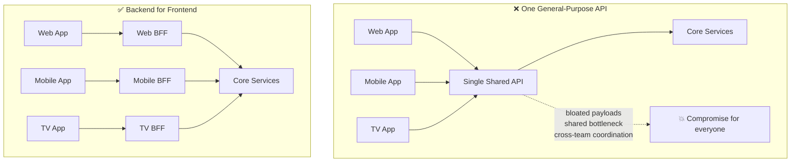
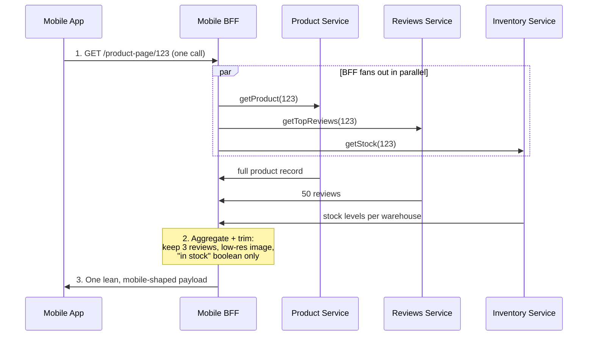
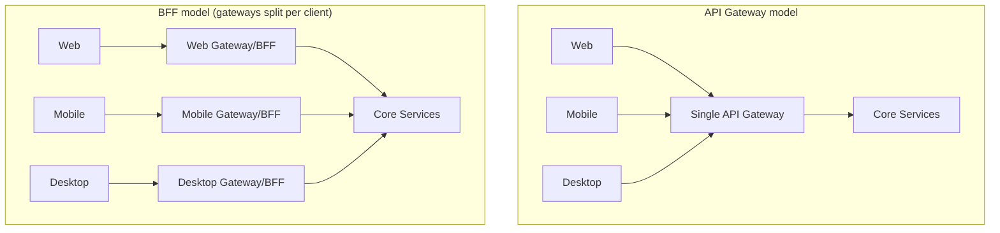
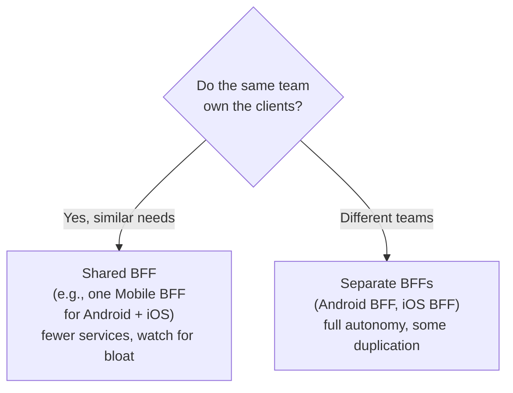
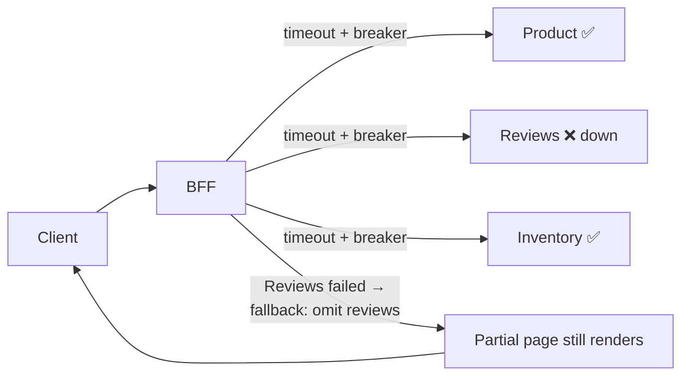
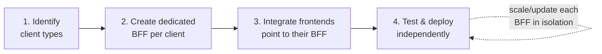
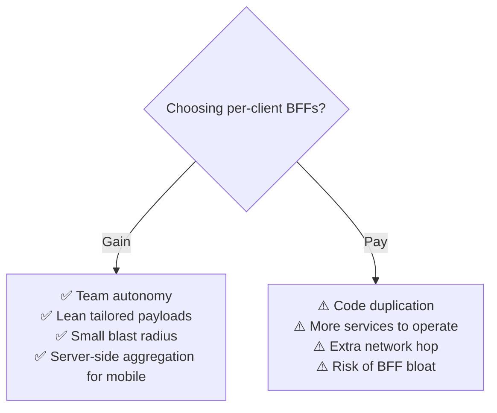
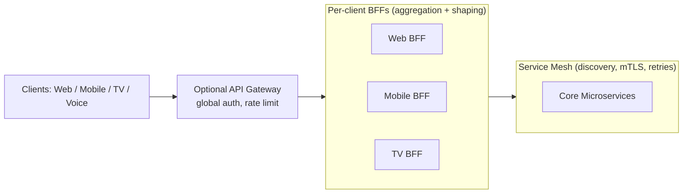

# 🎯 Backend for Frontend (BFF) — A Complete Study Guide

> From "what is it" to "how would you tune this at scale" — a single, natural read that takes you from beginner to staff/principal depth.

---

## 📋 Table of Contents

1. [Introduction](#-1-introduction)
2. [Core Definitions](#-2-core-definitions)
3. [Why BFF Exists](#-3-why-bff-exists)
4. [How BFF Works (The Mechanism)](#-4-how-bff-works-the-mechanism)
5. [What Lives Inside a BFF](#-5-what-lives-inside-a-bff)
6. [BFF vs API Gateway](#-6-bff-vs-api-gateway)
7. [Granularity: One BFF Per Client vs Shared BFF](#-7-granularity-one-bff-per-client-vs-shared-bff)
8. [Resilience & Fault Tolerance in a BFF](#-8-resilience--fault-tolerance-in-a-bff)
9. [Implementing a BFF: Methodology & Best Practices](#-9-implementing-a-bff-methodology--best-practices)
10. [The Real Trade-Offs (Staff-Level)](#-10-the-real-trade-offs-staff-level)
11. [Categorized Real-World Examples](#-11-categorized-real-world-examples)
12. [Common Misconceptions](#-12-common-misconceptions)
13. [Staff/Principal Nuance](#-13-staffprincipal-nuance)
14. [Adjacent & Extension Concepts](#-14-adjacent--extension-concepts)
15. [⚡ Quick Revision](#-15-quick-revision)
16. [🎓 FAANG Interview Q&A](#-16-faang-interview-qa)
17. [🔗 References & Further Reading](#-17-references--further-reading)

---

## 📋 1. Introduction

Imagine you run a streaming service like Netflix. The same catalog of movies has to be delivered to a **TV app**, a **mobile app**, and a **web browser**. On the surface it's the same data — titles, thumbnails, descriptions — so your first instinct is to build *one* backend API and let all three clients call it.

That works for a while. But the clients aren't really the same. The **TV** wants large high-resolution artwork and can happily download megabytes at a time over WiFi. The **phone** wants tiny thumbnails, minimal payloads to save mobile data and battery, and maybe a "continue watching" row front and center. The **web** app wants rich metadata, advanced filters, and detailed search. Feed all three from one generic API and you end up with an ugly compromise: the API returns *everything* so every client can find *something* it needs, and each client then downloads a bloated response and throws most of it away.

Worse, that single API becomes a **shared bottleneck**. Every client team must coordinate through it. A change the mobile team needs might risk breaking the web experience, so a separate API team forms to referee — and now the frontend teams are stuck waiting in a queue behind a middleware they don't control.

The **Backend for Frontend (BFF)** pattern answers a simple question: *what if each type of client had its own dedicated backend, shaped exactly to its needs?* Instead of one API trying to please everyone, you build a thin backend service **per client experience** — a Mobile BFF, a Web BFF, a TV BFF — each one tailored, each one owned by the team that owns that frontend.

💡 Beginner-friendly explanation (click to expand)

Think of a **restaurant with three very different customers**: a toddler, an athlete, and a food critic. You *could* hand all three the same giant buffet plate and let them sort it out — but the toddler is overwhelmed, the athlete wants protein not dessert, and the critic wants presentation and detail.

A BFF is like giving each customer their **own personal waiter** who knows exactly what that customer wants and brings a plate portioned just for them. The kitchen (your core services) is the same, but the plating is customized per diner. Each client — mobile, web, TV — gets its own "waiter."

---

## 📋 2. Core Definitions

Before going deeper, let's pin down the vocabulary that shows up in every BFF discussion.

**Client / Frontend** — a specific user-facing experience: an iOS app, an Android app, a web SPA, a smart-TV app, a voice assistant, or a third-party integration. Crucially, each has *different* data shapes, payload sizes, and interaction patterns.

**Downstream / Core Services** — the shared microservices that hold the real business capabilities (Catalog, User, Payments, Inventory, Recommendations). These are generic and client-agnostic; they don't know or care which UI is calling.

**Backend for Frontend (BFF)** — a dedicated backend service that sits **between one client type and the core services**. It exists to serve *that one client's* needs: it calls the downstream services, **aggregates** and **reshapes** their responses into exactly the payload that client wants, and hosts any client-specific logic.

**Aggregation** — the act of a BFF calling several downstream services and combining their results into a single response, so the client makes *one* round trip instead of many.

**Client-specific tailoring** — trimming fields, choosing image resolutions, formatting data, and applying workflows unique to one client, so the payload is lean and purpose-built.

It helps to hold one mental picture: a BFF is a **translation and consolidation layer** owned per experience. The core services speak a general language; each BFF translates that into the exact dialect its client speaks.

💡 Beginner-friendly explanation (click to expand)

Picture an **international conference** where the speakers (core services) all talk in one shared technical language. In the audience sit a French delegate, a Japanese delegate, and a Spanish delegate (the clients).

Instead of forcing every delegate to learn the shared language, you give each one a **personal interpreter** (the BFF) who listens to all the speakers, picks out only what *that* delegate cares about, and delivers it in their own language, at their own level of detail. Same talks, three custom experiences.

---

## 📋 3. Why BFF Exists

To feel *why* BFF matters, walk through how systems get here. Nobody starts with a BFF — you arrive at it because the alternatives hurt.

You begin with a **single general-purpose API** serving a web app. Life is good. Then you add a **mobile app**. At first the mobile app calls the same API, and it *works* — the calls are similar enough. But cracks appear fast, in three predictable ways.

**First, clients have genuinely different needs.** Mobile has less screen space, so it displays less data; a fat desktop payload wastes bandwidth and battery. Mobile interactions are also different in kind — a retail app on desktop is browse-and-buy, but on mobile the same user scans barcodes for price comparison or receives location-based in-store offers. These aren't cosmetic differences; they demand *different API calls and different data*. One API forced to serve both ends up bloated and compromised.

**Second, chattiness kills mobile.** A generic API often makes the client stitch together many calls — get the user, then their orders, then each order's items, then product details. On a phone over a flaky cellular network, opening many connections drains battery and data and feels slow. Someone needs to do that stitching *server-side, close to the data*.

**Third, one shared API becomes an organizational bottleneck.** Because it serves every client, rolling out a new feature means coordinating across teams and being careful not to break anyone. Often a dedicated "API team" forms to own it — and now every frontend team must negotiate with that team, which is juggling all clients' priorities and every downstream dependency. The API silently turns into a **complex piece of middleware**, and frontend teams lose their autonomy.

The BFF pattern dissolves all three problems at once. Give each client its own backend, and: the payload is tailored (no bloat), the aggregation happens server-side (no chatty mobile), and — critically — **the frontend team owns its own BFF**, so it ships features without waiting on anyone. This is BFF's deepest motivation: it's as much an *organizational* pattern (team autonomy, Conway's Law) as a technical one.

💡 Beginner-friendly explanation (click to expand)

Imagine one **overworked receptionist** handling walk-in customers, phone calls, and email — all at once. Everyone waits, everyone gets a rushed, generic answer, and if the receptionist is out sick, *all three* channels break.

A BFF is like hiring a **specialist for each channel**: one person for walk-ins, one for phones, one for email. Each becomes fast and tailored to that channel, and a problem in one doesn't freeze the others. The company (your core services) is the same behind the scenes — you've just given each audience a dedicated front door.

---

## 📋 4. How BFF Works (The Mechanism)

At its heart, a BFF does three jobs on every request: **route to the right downstream services, aggregate their responses, and reshape the result** for its specific client. Let's walk the canonical flow with a **Mobile client** loading a product page.

The three numbered steps are the essence:

1. The client makes **one** request to its BFF (not many requests to many services).
2. The BFF **fans out** to the downstream services it needs — ideally in parallel — then **aggregates** and **trims** the results: it might keep only 3 of 50 reviews, pick a low-resolution image URL, and collapse detailed warehouse stock into a simple "in stock" boolean.
3. The BFF returns **one payload shaped exactly for that client**, so the mobile app renders directly with no extra round trips and no wasted bytes.

Contrast this with the same page on the **TV BFF**: it might instead request high-resolution artwork and a grid of related content, while the **Web BFF** requests full metadata and all reviews with filtering. Same downstream services, three different aggregations. That's the whole trick — *the intelligence of "what this client needs" lives in the BFF, not smeared across the core services or forced onto the client.*

Two design decisions branch off from this flow, and they're the two things interviewers probe hardest:

- **Is a BFF the same as an API Gateway, or different?** → covered in §6.
- **How finely do you split BFFs — one per client, or shared?** → covered in §7.

💡 Beginner-friendly explanation (click to expand)

Think of ordering a **custom sandwich**. Without a BFF, you'd have to visit the bakery, the deli counter, the vegetable stand, and the sauce shop yourself, carry it all home, and assemble it — annoying, especially if you're in a hurry (on mobile).

The BFF is like a **sandwich shop** that visits all those suppliers *for you*, in one trip, and hands you a finished sandwich made exactly the way you like it. You place one order, you get one ready-to-eat result. A different customer (the TV app) gets a different sandwich from the same suppliers.

---

## 📋 5. What Lives Inside a BFF

A BFF is deliberately **thin**, but it's not empty. Understanding what belongs inside it — and what doesn't — is where beginners and experienced engineers diverge.

**What a BFF *should* do:**

**Aggregation and orchestration.** It calls multiple downstream services and combines the results, turning many client round trips into one. It may need to sequence calls (get the user, *then* their orders) or fan out in parallel (product + reviews + stock at once).

**Response shaping.** It trims fields the client doesn't need, renames or restructures data into the shape the UI expects, and picks client-appropriate variants (low-res vs high-res images, summary vs full text). This is the "tailoring" that keeps payloads lean.

**Client-specific business logic and workflows.** Logic that only *one* client needs lives here — a mobile-only "scan barcode → look up price" flow, or a TV-only "resume playback position" calculation — so it doesn't pollute the shared core services.

**Client-appropriate cross-cutting concerns.** Authentication handling suited to that client, caching strategies tuned to that client's access patterns, and format conversion (e.g., protocol translation) all fit naturally.

**What a BFF should *not* do:**

**Core business rules.** Pricing rules, inventory truth, payment processing — these belong in the shared downstream services, not duplicated in each BFF. If you find the same rule copy-pasted across three BFFs, it belongs downstream.

**Becoming a data store.** A BFF is stateless plumbing; it shouldn't own a database of business data. It may *cache*, but the source of truth stays downstream.

The guiding principle experienced engineers repeat: **a BFF is a presentation-tier concern, not a domain-tier one.** It adapts and consolidates; it doesn't *own* business truth. Keep it thin, or it slowly grows into the very monolithic middleware BFF was meant to eliminate.

💡 Beginner-friendly explanation (click to expand)

Think of a **personal assistant** booking your trip. A good assistant *gathers* quotes from airlines and hotels, *filters* them to your preferences, and hands you a clean itinerary (that's aggregation and shaping — a BFF's job).

A good assistant does *not* run the airline or set ticket prices — that's the airline's job (the core service). If your assistant started quietly inventing their own prices, things would get messy and inconsistent. Keep the assistant as a helpful organizer, not a secret airline.

---

## 📋 6. BFF vs API Gateway

This is the single most common point of confusion, and interviewers love it because the two patterns look similar but solve different problems.

An **API Gateway** is a **single entry point** for *all* clients. Every request enters through it, and it handles cross-cutting concerns — routing, authentication, rate limiting, SSL termination, request logging — for the whole system. One gateway, all clients.

A **BFF** flips that: instead of one shared entry point, you build **multiple tailored backends, one per client type**. Each BFF is client-specific and optimized for *its* frontend's needs, rather than being a generic funnel for everyone.

Here's the subtlety that trips people up: **BFF and API Gateway are not mutually exclusive**, and in fact a BFF is often described as a *specialized flavor* of the gateway idea. One influential framing is that BFF *is* "multiple API gateways, grouped by client." A single, monolithic gateway trying to customize itself for mobile *and* web *and* desktop becomes complex and a bottleneck — a single point of failure and a shared risk. The BFF answer is to **split that one gateway into several**, each grouped by client boundary, so each can evolve independently without affecting the others.

The clean way to hold it: an **API Gateway is about a *single, general* entry point** and shared concerns; a **BFF is about *per-client specialization***. You can run both — a gateway for truly global concerns (say, edge auth and rate limiting) that then routes to per-client BFFs behind it. The question "gateway or BFF?" is often really "one generic front door, or one tailored front door per client?" — and the answer depends on how different your clients truly are.

💡 Beginner-friendly explanation (click to expand)

An **API Gateway** is like the **single main entrance** to a big mall — everyone comes through the same doors, and security, the directory, and the greeters are all there.

A **BFF** is like giving each type of visitor their **own private entrance** built for them: a stroller-friendly entrance for families, a loading dock for delivery trucks, a VIP door for members. Same mall inside, but each group gets a doorway shaped to how they arrive. You can even have both: a main gate that then splits into these tailored entrances.

---

## 📋 7. Granularity: One BFF Per Client vs Shared BFF

Once you've decided to use BFFs, the very next question is: **how many?** There are two common approaches, and the right answer is driven as much by *team structure* as by technology.

### 7.1 One BFF Per Client Type

Each distinct client gets its own dedicated BFF: a separate one for Android, iOS, web, TV, and so on. This is the purest form of the pattern.

**Pros:** Maximum tailoring — each BFF is optimized for exactly one experience with zero compromise. Teams are fully autonomous: the Android team owns the Android app *and* its BFF, ships independently, and can't accidentally break iOS. Blast radius is small — a bad Mobile BFF deploy doesn't touch web.

**Cons:** More services to build, deploy, monitor, and secure. Real risk of **code duplication** — if Android and iOS BFFs both need the same aggregation, you may write it twice. More operational overhead overall.

### 7.2 Shared BFF for Multiple Clients

One BFF serves several similar clients — for example, a single "mobile" BFF for *both* Android and iOS, since their needs overlap heavily.

**Pros:** Less duplication and fewer services to operate. Simpler to start with when clients are genuinely similar.

**Cons:** As you add more clients to a shared BFF, it accumulates responsibilities and **drifts back toward the bloated general-purpose API** you were trying to escape. It re-introduces coordination: now the Android and iOS teams must negotiate changes to the shared BFF, eroding the autonomy that made BFF attractive.

### 7.3 The Deciding Factor: Team Ownership

The tie-breaker experienced engineers reach for isn't technical — it's **organizational (Conway's Law)**. If the *same team* owns both the Android and iOS apps, a shared mobile BFF works well: one team, one coordination point, no cross-team friction. But if *different teams* own the apps, **separate BFFs are usually preferred**, because a shared BFF would force those independent teams to coordinate on every change — exactly the bottleneck BFF exists to remove.

💡 Beginner-friendly explanation (click to expand)

Think of **assistants for a family**. If one parent handles both kids' schedules, a single shared assistant is fine — one person, no confusion.

But if each kid has a *different parent* managing their life, giving them one shared assistant means the parents constantly have to sync up and step on each other. It's smoother to give each parent their *own* assistant. Same idea for BFFs: match the number of BFFs to how your teams are actually organized, not just to how the apps look.

---

## 📋 8. Resilience & Fault Tolerance in a BFF

Here's a truth that separates a naive BFF from a production one: **a BFF is a fan-out point, which means it's also a fan-out *failure* point.** One client request triggers calls to many downstream services. If any of those services is slow or down and the BFF isn't careful, the whole client request hangs or fails — and because the BFF is in the critical path of *every* request for that client, a fragile BFF can take the entire client experience down.

So a serious BFF bakes in resilience:

**Timeouts on every downstream call.** Never wait forever. If Reviews is slow, the BFF should give up on it quickly rather than making the whole product page hang.

**Circuit breakers.** If a downstream service is failing repeatedly, the BFF "trips the breaker" and stops calling it for a while, failing fast instead of piling on requests to a service that's already struggling (preventing cascading failure). Libraries like **Resilience4j** or **Hystrix** (historically) implement this.

**Retries with backoff.** For transient blips, retry — but with jitter/backoff so you don't hammer a recovering service, and only for idempotent calls.

**Fallbacks / graceful degradation.** This is the BFF's superpower for user experience: because it aggregates, it can return a *partial* result. If Reviews is down, still render the product page **without** reviews rather than showing an error. The client sees a degraded-but-working page. This partial-response capability is a major reason aggregation belongs server-side.

**Load shedding.** Under overload, the BFF can shed low-priority work to protect the core — it acts as a natural place to install this, keeping the backend from being overwhelmed.

**Monitoring and logging.** Because the BFF sees every request and every fan-out, it's an ideal place to observe latency, error rates, and dependency health — and to detect and diagnose issues quickly.

The staff-level framing: **the BFF concentrates risk and therefore must concentrate resilience.** Its fan-out nature is exactly why it needs timeouts, breakers, and fallbacks more than a simple pass-through service does.

💡 Beginner-friendly explanation (click to expand)

Imagine a **waiter** collecting a full dinner from three kitchen stations. If the dessert station is on fire, a bad waiter just stands there frozen and you get *nothing*.

A good waiter (a resilient BFF) waits only so long for dessert (timeout), stops going back to the burning station (circuit breaker), and brings you your appetizer and main course anyway with a note that dessert is unavailable (fallback). You still get a good meal instead of an empty table. That "serve what you can" ability is one of the BFF's biggest wins.

---

## ✅ 9. Implementing a BFF: Methodology & Best Practices

Knowing *what* a BFF is doesn't tell you *how* to roll one out. In practice, adopting the pattern follows a repeatable four-step methodology, and there's a well-worn set of best practices and adoption caveats that separate a clean BFF from a future headache.

### 9.1 The Four-Step Methodology

**Step 1 — Identify the client types.** List every distinct frontend that consumes your system: web app, iOS, Android, TV, voice assistant, IoT device, third-party API consumers. The goal is to spot which clients have *genuinely different* data shapes and interaction patterns — those are the ones that justify their own BFF.

**Step 2 — Create a dedicated backend per client.** For each client that warrants one, build a BFF that aggregates data from the core services and exposes an API *tailored* to that client — right payload size, right fields, right image variants, plus any client-specific business logic or workflow.

**Step 3 — Integrate the frontends.** Point each client at its own BFF instead of at the shared general-purpose API. The client now talks to one predictable endpoint that speaks its language.

**Step 4 — Test and deploy independently.** Validate each BFF and its client together, then deploy. The payoff of the pattern shows up here: because each BFF is separate, you can **update or scale one without touching the others**, which is exactly what makes maintenance and scaling easier.

### 9.2 Best Practices

**Put an API Gateway in front when it helps.** A gateway can still sit ahead of your BFFs to provide a single point of entry for truly global concerns (edge auth, rate limiting, TLS), reducing overall complexity, and then route to the right per-client BFF behind it.

**Design each API carefully and deliberately.** Tailor the BFF's API to the specific needs of its client and *avoid unnecessary complexity*. A BFF earns its keep by being lean and purpose-built, not by re-exposing every downstream field.

**Implement caching.** Cache frequently accessed data and aggregated responses to cut the number of downstream calls and speed the client up — tuned to *that* client's access patterns.

**Implement security measures.** Use authentication and authorization so only legitimate users reach the BFF, encrypt service-to-service traffic (mTLS, often via a mesh), and expose only what the client needs — no leaking internal or irrelevant data.

**Monitor performance and scalability.** Watch response times, throughput, and dependency health continuously, and scale each BFF independently as its client's traffic demands. Because a BFF sees every request for its client, it's a natural observability point.

### 9.3 Recommendations When Designing the BFF's API

A few pointers keep a BFF clean rather than letting it sprawl. **Focus on the UI/UX and the data the client actually needs** — design the API backward from the screen, not forward from the database. **Don't try to make everything generic from the beginning** (a YAGNI mindset): a premature "reusable for everyone" component invites many contributors and organization-wide coordination, which is the bloat BFF exists to avoid. **Prefer building the particular features a client needs first** over a generic usage strategy — this is the surest way to keep the API dedicated and focused on one client.

### 9.4 Things to Keep in Mind Before Adopting

Before introducing a BFF, sanity-check a few realities. Have a **clear understanding of the requirements** of both the different frontends *and* the backend services they'll orchestrate. Think about **how to use the backend efficiently**, since each request fans out to multiple services. Choose a **tech stack suited to large fan-out** — a BFF makes many concurrent downstream calls, so non-blocking / asynchronous runtimes (for example Node.js or a reactive JVM stack) handle that concurrency far better than a blocking thread-per-request model. And explicitly **plan for failure scenarios** (see §10 on resilience) — with many downstream dependencies, partial failure is normal, not exceptional. These design principles echo the classic guides — **KISS, YAGNI, Separation of Concerns, and SOLID** — applied to the presentation tier.

💡 Beginner-friendly explanation (click to expand)

Building a BFF is like opening a **dedicated food-truck window** for one type of customer. First you figure out who you're serving (identify clients), then you set up a window with a menu just for them (create the BFF), point that crowd to your window (integrate), and open for business — able to tweak your window without disturbing the other trucks (deploy independently).

The best-practice tips are the "how to run it well" part: keep the menu short and focused, prep popular items ahead of time (caching), check IDs (security), watch your queue (monitoring), and pick equipment that can juggle many orders at once (a tech stack good at fan-out).

---

## 📊 10. The Real Trade-Offs (Staff-Level)

Beneath the tidy diagrams sits the trade-off that separates textbook answers from staff-level ones: **BFF trades duplication and operational cost for autonomy and tailoring.** You're deliberately choosing *more* services and *some* repeated code in exchange for team independence and lean, purpose-built APIs. Whether that's worth it is entirely context-dependent.

**Code duplication vs autonomy.** The most-cited downside. Multiple BFFs often re-implement similar aggregation, auth handling, or resilience logic. You can factor shared bits into libraries — but over-share and you re-couple the teams you just decoupled. The mature stance: tolerate *some* duplication to preserve autonomy, and only extract into shared libraries the stable, cross-cutting concerns (auth, logging, resilience wrappers), not the client-specific shaping. Duplication is a *feature* of the pattern, not always a bug.

**Operational overhead vs optimization.** Each BFF is another service to deploy, scale, secure, monitor, and page someone about. For a two-client system, that overhead may exceed the benefit; for a large org with many autonomous teams, it's clearly worth it. This is why "should we use BFF?" is genuinely a scale-and-org question, not a default yes.

**Latency: fan-out and the extra hop.** The BFF adds a network hop (client → BFF → services) and its aggregation is bounded by its *slowest* parallel downstream call. Done well (parallel fan-out, caching, co-location with services) it *reduces* total latency versus a chatty client making many round trips — especially on mobile. Done poorly (sequential calls, no timeouts) it *adds* latency and a fragile fan-out point. The hop is a cost; whether it nets positive depends on how you aggregate.

**Risk of the BFF becoming a mini-monolith.** The insidious failure mode: business logic and state creep into the BFF until it's a fat, stateful middleware — the exact thing BFF was meant to replace. Guarding the "thin, presentation-tier only" boundary is ongoing discipline, not a one-time decision.

**Where tailoring logic lives — and who owns it.** Push client-shaping into the BFF and you keep core services clean and generic (good), but you must ensure the BFF is owned by the *frontend* team, not a separate backend team — otherwise you've just recreated the coordination bottleneck one layer down.

💡 Beginner-friendly explanation (click to expand)

Giving every family member their **own car** means everyone goes exactly where they want, when they want (autonomy and tailoring) — but now you're buying, fueling, insuring, and parking several cars (duplication and overhead).

For a big, busy family with different schedules, that freedom is worth it. For two people who always go the same place, one shared car is simpler. BFF is the same call: more services buys independence, but only pays off when you actually have enough distinct clients and teams to need it.

---

## 💻 11. Categorized Real-World Examples

BFF shows up across the industry, and grouping the examples clarifies *why* each company reached for it.

**Streaming — device diversity (the classic case):**
- **Netflix.** The textbook example. Instead of one general-purpose API, Netflix runs a **separate backend per client type** — Android, iOS, TV, web. The team that owns the Android app *also* owns its BFF, tuning it for Android-specific needs. The TV BFF fetches high-resolution thumbnails and content grids; the mobile BFF prioritizes latest episodes with lower-res images to save data; the web BFF offers richer metadata and advanced filtering. This lets each platform optimize performance and UX independently and reduces cross-team dependencies.

**E-commerce — web vs mobile split:**
- A typical e-commerce app runs a **Web BFF** (handles auth, product catalog, cart, optimized for rich web interactions) and a **Mobile BFF** (efficient data retrieval, push notifications, barcode scanning, lean payloads). Shared capabilities like payment processing and inventory stay in **common downstream microservices** both BFFs call. Result: better performance on each platform and independent, low-risk updates per BFF.

**Ride-sharing — different actors, different apps:**
- **Uber** uses BFF-style dedicated backends for its **driver** app and **rider** app. The two audiences need very different data and workflows, so each frontend gets a backend tuned to it, improving performance and simplifying independent development.

**Audio streaming:**
- **SoundCloud** applies the same idea across its different frontend applications, each with a dedicated backend handling that client's specific requests — improving scalability while keeping development streamlined per client.

**Omni-channel & third-party — beyond just mobile/web:**
- Systems extending to **voice assistants, IoT devices, and third-party API consumers** use BFFs to give each channel a tailored surface. IoT might need minimal payloads but high-frequency updates; a voice assistant needs a completely different response shape than a screen. A dedicated BFF per channel keeps each clean instead of bloating one API to cover them all.

**Concrete scenario:** A retail app where the **desktop** user browses and buys while the **mobile** user scans barcodes for price comparison and gets in-store offers. One generic API would have to carry both feature sets and both payload shapes; two BFFs let the mobile team ship barcode-scanning without touching (or risking) the desktop experience.

---

## ❌ 12. Common Misconceptions

**"BFF is just another name for an API Gateway."** They overlap but aren't the same. A gateway is a *single, general* entry point handling shared concerns for all clients; a BFF is a *per-client specialized* backend. A BFF is better understood as "multiple gateways grouped by client" than as "the one gateway." You can even run a gateway *in front of* per-client BFFs.

**"A BFF is where business logic should live."** No — core business rules (pricing, payments, inventory truth) belong in shared downstream services. A BFF holds only *client-specific* aggregation, shaping, and workflows. Put domain logic in BFFs and you'll duplicate it across clients and drift toward inconsistency.

**"More BFFs is always better."** Each BFF is another service to build, deploy, secure, and operate. For a small system with two similar clients, a shared BFF (or even a plain gateway) may be simpler. BFF granularity should match your *client diversity and team structure*, not be maximized by default.

**"BFF eliminates code duplication."** It often *introduces* some — similar aggregation logic repeated per client. That's an accepted trade-off for autonomy, not a flaw to eliminate at all costs. Over-aggressively de-duplicating via shared libraries can re-couple the teams you decoupled.

**"The BFF is just a thin pass-through, so resilience doesn't matter."** The opposite: because a BFF fans out to many services on every request, it's a concentrated failure point and needs timeouts, circuit breakers, retries, and fallbacks *more* than a simple service does.

**"BFF is only about mobile vs web."** It generalizes to *any* distinct client — TV, voice assistant, IoT, wearables, third-party integrations. The pattern is about tailoring per *experience*, and modern systems are increasingly omni-channel.

---

## 💡 13. Staff/Principal Nuance

The details experienced engineers raise *unprompted*:

**BFF is primarily an organizational pattern (Conway's Law).** The deepest reason for BFF isn't tailored payloads — it's *team autonomy*. Frontend teams owning their own backend ship without cross-team coordination. The corollary: a BFF owned by a *separate backend team* recreates the very bottleneck it was meant to remove. The ownership model *is* the design decision.

**Duplication vs coupling is a permanent tension, not a bug to fix.** Staff engineers accept measured duplication across BFFs to preserve independence, and only extract *stable cross-cutting* concerns (auth, logging, resilience) into shared libraries — never client-specific shaping. Over-sharing silently re-couples teams.

**Guard the "thin" boundary relentlessly.** BFFs rot into mini-monoliths as logic and state creep in. The discipline is continuous: business rules go downstream, the BFF stays a stateless presentation-tier adapter. Naming, code review, and architecture guardrails enforce this.

**Aggregation is where latency is won or lost.** Fan out **in parallel**, not sequentially; set **per-dependency timeouts**; and remember your response is bounded by the *slowest* call you wait for. Add **caching** tuned to each client's access pattern. A well-built BFF *cuts* mobile latency by collapsing round trips; a naive one adds a hop and a fragile serial chain.

**Resilience must match the fan-out.** Circuit breakers, retries with jitter, and — most valuable — **graceful partial responses** (render the page minus the failed section) are what keep a fan-out point from becoming a fan-out outage. This partial-degradation ability is a headline reason to aggregate server-side rather than in the client.

**Versioning and backward compatibility get easier — per client.** Because each client has its own BFF, you can evolve and version APIs *independently per frontend*, and handle backward compatibility for one client without freezing the others. This is a subtle but real operational win.

**Security posture per client.** Different clients have different threat models and auth flows (mobile token storage vs web cookies vs third-party OAuth scopes). A BFF lets you tailor security per client and **avoid exposing internal/irrelevant data** to the wrong client — narrowing the attack surface, since each BFF only surfaces what its client legitimately needs.

**Know when *not* to use it.** Few clients with near-identical needs, a small team, or an early-stage product often don't justify the operational cost. Staff engineers can articulate the *break-even point* — enough distinct clients and independent teams to make the autonomy worth the duplication and ops overhead.

---

## 🔗 14. Adjacent & Extension Concepts

**API Gateway.** The closest relative — a single general entry point for cross-cutting concerns. BFF is often framed as "gateways specialized per client." They compose: a gateway can sit in front of BFFs for global auth/rate-limiting, then route to the right per-client BFF.

**API Composition / Aggregator pattern.** The general technique of calling several services and combining results into one response. A BFF *uses* aggregation as its core mechanism, but scopes it to one client's needs.

**GraphQL as a BFF alternative (or implementation).** GraphQL lets each client request *exactly* the fields it wants from one endpoint, which achieves BFF's tailoring goal differently — the client shapes its own payload via the query, instead of a per-client backend doing it. Many teams use a GraphQL gateway as a "one flexible BFF" or run a GraphQL BFF per client. It's a key comparison interviewers raise.

**Service Mesh.** Handles service-to-service concerns (discovery, mTLS, retries, observability) via sidecars *beneath* the BFF. The mesh secures and connects the BFF-to-downstream calls; the BFF still owns aggregation and client shaping. They operate at different layers and complement each other.

**Client-side resilience & the resilience patterns.** Circuit breakers, retries, bulkheads, timeouts, and fallbacks (Resilience4j, historically Hystrix) are the necessary companions that make a fan-out BFF safe.

**Backend-driven UI / Server-Driven UI.** An extension where the BFF returns not just data but *layout/UI instructions*, so the client renders what the server decides — pushing even more per-client tailoring into the BFF. Used at scale by companies wanting to change UIs without app releases.

**Conway's Law.** The organizational principle underpinning BFF: system structure mirrors team structure. BFF is a deliberate application of it — align a backend to each frontend team.

---

## ⚡ 15. Quick Revision

The **Backend for Frontend (BFF)** pattern gives each type of client its own dedicated backend service, instead of forcing every client — mobile, web, TV, voice, IoT — through a single general-purpose API. It exists because clients genuinely differ: mobile wants lean payloads, low-res images, and fewer round trips to save battery and data; TV wants high-res artwork and content grids; web wants rich metadata and filtering. One shared API forced to serve all of them becomes bloated (returns everything so everyone finds something), chatty (clients stitch many calls together), and — most painfully — an *organizational bottleneck* where a separate API team gatekeeps every frontend team's releases. BFF dissolves all three: tailored payloads, server-side aggregation, and frontend teams that own their own backend and ship independently.

Mechanically, a BFF does three jobs per request: **route** to the right downstream services, **aggregate** their responses (ideally fanning out in parallel), and **reshape** the result into exactly what its client needs. The client makes *one* call; the BFF makes many behind the scenes and returns one lean, purpose-built payload. Netflix is the canonical example — separate backends for Android, iOS, TV, and web, each owned by that platform's team. A BFF should stay **thin**: it holds client-specific aggregation, shaping, and workflows, but **not** core business rules (pricing, payments, inventory truth — those live in shared downstream services) and **not** its own business database. Let logic and state creep in and it rots into the mini-monolith BFF was meant to replace.

The most confused comparison is **BFF vs API Gateway**. A gateway is a *single, general* entry point handling shared concerns for all clients; a BFF is a *per-client specialized* backend — best understood as "multiple gateways grouped by client." A single monolithic gateway customizing itself for every client becomes a complex bottleneck and single point of failure, so BFF splits it into several. They're not exclusive: a gateway can front per-client BFFs. The next decision is **granularity** — one BFF per client (maximum tailoring and autonomy, but more services and some code duplication) versus a shared BFF for similar clients like Android+iOS (fewer services, but risks bloat and re-coupling). The tie-breaker is **team ownership (Conway's Law)**: same team owning the clients → shared BFF is fine; different teams → separate BFFs preserve autonomy.

Because a BFF **fans out** to many services on every request, it's a concentrated failure point and must concentrate **resilience**: per-dependency timeouts, circuit breakers (Resilience4j/Hystrix), retries with backoff/jitter, and — its superpower — **graceful partial responses** (render the product page even if Reviews is down). It's also the natural home for load shedding, caching, and per-request monitoring. Aggregation is where latency is won (parallel fan-out, caching, co-location) or lost (sequential calls, no timeouts, an extra hop for nothing).

The staff-level heart of the topic is the **trade-off**: BFF buys *team autonomy and lean tailored APIs* at the cost of *code duplication, more services to operate, and an extra network hop*. Duplication is an accepted feature, not always a bug — you tolerate some to avoid re-coupling teams, extracting only stable cross-cutting concerns into shared libraries. Whether BFF is worth it is a **scale-and-org question**: many distinct clients and independent teams justify it; two similar clients and a small team often don't. Adjacent concepts to know: **GraphQL** (achieves per-client tailoring by letting clients query exact fields — a common BFF alternative), **API composition** (the aggregation technique BFF uses), **service mesh** (secures BFF-to-service calls beneath it), and **server-driven UI** (the BFF returns layout, not just data).

**One-line recall:** *BFF = one tailored backend per client experience — it aggregates and reshapes downstream data into lean, client-specific payloads, gives each frontend team autonomy (Conway's Law), and pays for that with duplication, more services, and an extra hop; keep it thin, make it resilient (timeouts, breakers, partial fallbacks), and reach for it only when client diversity and team structure justify it.*

---

## 🎓 16. FAANG Interview Q&A

### 🎯 Conceptual & Fundamentals

<b>Q1. What is the Backend for Frontend (BFF) pattern and what problem does it solve?</b>

BFF is an architectural pattern where each type of client — mobile, web, TV, voice — gets its *own* dedicated backend service instead of all sharing one general-purpose API. It solves the problems that emerge when diverse clients share a single API: bloated payloads (the API returns everything so every client finds what it needs), chattiness (clients make many round trips to stitch data, which drains mobile battery and data), and an organizational bottleneck (a shared API team gatekeeps every frontend team's releases). Each BFF calls the shared downstream services, aggregates and reshapes their responses for its specific client, and is owned by that client's team. Netflix is the canonical example, running separate backends for Android, iOS, TV, and web.

<b>Q2. Walk me through what happens on a single request through a BFF.</b>

The client makes *one* request to its BFF — say `GET /product-page/123`. The BFF then fans out to the downstream services it needs, ideally in parallel: Product, Reviews, and Inventory. As responses come back, it aggregates them and *reshapes* the combined result for that specific client — for mobile it might keep only 3 of 50 reviews, pick a low-resolution image URL, and collapse per-warehouse stock into a simple "in stock" boolean. It returns one lean, mobile-shaped payload the app can render directly, with no further round trips. The same page on a TV BFF would instead request high-res artwork and a content grid — same downstream services, a different aggregation. The intelligence of "what this client needs" lives in the BFF, not in the core services or the client.

<b>Q3. What should and should NOT live inside a BFF?</b>

A BFF *should* hold aggregation and orchestration (calling and combining multiple services), response shaping (trimming fields, choosing image resolutions, restructuring data), client-specific workflows (a mobile-only barcode-scan flow), and client-appropriate cross-cutting concerns (auth handling, caching, format conversion). It should *not* hold core business rules — pricing, payment processing, inventory truth belong in shared downstream services, or you'll duplicate them across BFFs and risk inconsistency. It also shouldn't become a data store; it's stateless plumbing that may cache but never owns business truth. The guiding principle: a BFF is a *presentation-tier* concern that adapts and consolidates — keep it thin, or it slowly grows into the monolithic middleware it was meant to eliminate.

<b>Q4. How is a BFF different from an API Gateway?</b>

An API Gateway is a *single, general* entry point for all clients, handling shared cross-cutting concerns like routing, auth, rate limiting, and SSL termination. A BFF flips that into *multiple, per-client specialized* backends — one tuned for mobile, one for web, and so on. The clearest framing is that a BFF is like "multiple API gateways grouped by client boundary": a single monolithic gateway trying to customize itself for every client becomes complex, a bottleneck, and a single point of failure, so BFF splits it into several independent ones. They're not mutually exclusive — you can put a gateway in front of per-client BFFs for truly global concerns (edge auth, rate limiting) that then route to the right BFF. The real question is "one generic front door or one tailored front door per client?"

<b>Q5. What are the main benefits of the BFF pattern?</b>

Four stand out. **Improved performance** — each backend is optimized for its client's payload and access patterns, so mobile gets lean responses and fewer round trips while web gets rich data. **Flexibility** — different clients can have different data formats, auth methods, and caching strategies without compromise. **Easier maintenance and autonomy** — smaller specialized services are easier to change, and because each frontend team owns its BFF, teams ship independently without cross-team coordination or risk of breaking another client. **Enhanced security** — each BFF only exposes what its client legitimately needs, so you don't leak irrelevant/internal data to the wrong client, narrowing the attack surface. Underlying all of these is reduced cross-team dependency, which is often the deepest motivation.

<b>Q6. Give a concrete example of implementing BFF for an e-commerce app.</b>

Suppose the app serves web and mobile. Instead of one monolithic backend, you build a **Web BFF** handling user auth, product catalog, and cart operations optimized for rich web interactions, and a **Mobile BFF** focused on efficient data retrieval, push notifications, and mobile-specific flows like barcode scanning with lean payloads. Capabilities common to both — payment processing, inventory management — stay as **shared downstream microservices** that both BFFs call, so you don't duplicate core logic. The result: better performance on each platform because each backend is fine-tuned, and easier maintenance because you can update or scale the Mobile BFF without touching or risking the Web BFF. The mobile team ships barcode scanning independently while the web team ships advanced filtering.

<b>Q7. How does the BFF pattern relate to microservices and where does it sit in the architecture?</b>

BFF is a microservices *communication/composition* pattern. It sits in the presentation tier, between the clients and the core microservices — you can think of it as a specialized service layer. The core services hold generic, client-agnostic business capabilities (Catalog, User, Payments); the BFFs sit in front of them, one per client, translating those generic capabilities into client-specific APIs. It draws on service-oriented principles: separate concerns, let components evolve independently. Below the BFF, service-to-service concerns like discovery and mTLS are handled by infrastructure (e.g., a service mesh). So the layering is: clients → (optional gateway) → per-client BFFs → core microservices, with a mesh handling the plumbing beneath.

<b>Q8. Which real companies use BFF, and how?</b>

**Netflix** is the textbook case — separate backends for Android, iOS, TV, and web, each owned by that platform's team, so the TV backend serves high-res artwork and grids while mobile serves lean payloads with lower-res images. **Uber** uses BFF-style dedicated backends for its driver and rider apps, since those two audiences need very different data and workflows. **SoundCloud** runs dedicated backends per frontend to improve scalability and streamline development. E-commerce platforms commonly split Web and Mobile BFFs over shared payment/inventory services. The common thread: enough client diversity that one API would force compromises, plus independent teams that benefit from owning their own backend.

### 📊 Staff / L4–L5 & Trade-off Depth

<b>Q9. [L5] What's the biggest downside of BFF, and how do you manage code duplication across BFFs?</b>

The biggest downside is **code duplication and operational overhead** — multiple BFFs often re-implement similar aggregation, auth, and resilience logic, and each is another service to deploy, secure, scale, and monitor. My stance is that *some* duplication is an accepted trade-off for team autonomy, not a flaw to eliminate at all costs — over-aggressive de-duplication via shared libraries silently re-couples the teams you decoupled, which defeats the purpose. So I extract only **stable, cross-cutting** concerns into shared libraries — auth token validation, logging, resilience wrappers (e.g., a common Resilience4j config), telemetry — and deliberately leave **client-specific shaping** duplicated. The test I apply: if changing shared code would force multiple independent teams to coordinate a release, it probably shouldn't be shared. Duplication is often cheaper than coordination.

<b>Q10. [L5] A BFF fans out to many services on every request. How do you make it resilient?</b>

Because the BFF is a fan-out point in the critical path of *every* client request, one slow or dead downstream service can hang or fail the whole request — so resilience is mandatory, not optional. I put **per-dependency timeouts** on every downstream call (never wait forever), **circuit breakers** (Resilience4j/Hystrix) that trip when a service fails repeatedly so we fail fast instead of piling on, and **retries with backoff and jitter** for transient errors on idempotent calls only. The BFF's superpower is **graceful partial responses**: if Reviews is down, still render the product page *without* reviews rather than erroring — the client sees degraded-but-working. I also use the BFF as a natural place for **load shedding** and **monitoring**, since it sees every request and every fan-out. The framing: the BFF concentrates risk, so it must concentrate resilience.

<b>Q11. [L5] One BFF per client or a shared BFF for multiple clients — how do you decide?</b>

The technical factors are real — one-per-client gives maximum tailoring and small blast radius but more services and duplication; a shared BFF (say one Mobile BFF for Android + iOS) means fewer services but risks bloating back into a general-purpose API as clients pile on. But the deciding factor is **organizational (Conway's Law)**: if the *same team* owns both clients, a shared BFF works well because there's one coordination point; if *different teams* own them, separate BFFs are strongly preferred, because a shared BFF forces independent teams to coordinate on every change — exactly the bottleneck BFF exists to remove. So I map BFF boundaries to team boundaries first, then adjust for client-diversity and operational cost. A shared BFF that quietly accumulates responsibilities is a warning sign to split.

<b>Q12. [L5] Isn't BFF mostly a technical pattern? Why do people call it an organizational one?</b>

Because its deepest value isn't tailored payloads — it's **team autonomy**. When a general-purpose API serves all clients, a separate API team usually forms and becomes a gatekeeper: every frontend team must coordinate through it, and feature rollout stalls. BFF lets each frontend team *own its own backend*, so it ships end-to-end without waiting on anyone — this is a direct application of Conway's Law (system structure mirroring team structure). The critical corollary staff engineers stress: a BFF owned by a *separate backend team* recreates the very bottleneck it was meant to remove. So the ownership model *is* the design decision — get that wrong and you've built more services for no autonomy gain. Tailored payloads are a nice bonus; decoupled teams are the point.

<b>Q13. [L5] How does BFF affect latency, and when does it help vs hurt?</b>

A BFF adds a network hop (client → BFF → services) and its aggregation is bounded by the *slowest* downstream call it waits on — so naively built, it *adds* latency. But done well it usually *reduces* end-to-end latency, especially on mobile: it collapses many chatty client round trips into one, fans out to downstream services **in parallel** rather than sequentially, is **co-located** with those services (fast internal network), and can **cache** aggregated results tuned to that client's access pattern. The keys are parallel fan-out, per-dependency timeouts (so one slow service doesn't dominate), and caching. So the honest answer is: the extra hop is a real cost, but for mobile clients over high-latency networks, moving aggregation server-side typically nets a large win — provided you don't serialize the calls or skip timeouts.

<b>Q14. [L5] How would you prevent a BFF from turning into a mini-monolith?</b>

This is the insidious failure mode — business logic and state creep in until the BFF is a fat, stateful middleware, the exact thing it replaced. I enforce the boundary continuously rather than once. Rules: **core business logic goes downstream** (if I see pricing or inventory truth in a BFF, it's a red flag); the BFF stays **stateless** and owns no business database (caching only, source of truth stays downstream); and the BFF is scoped to *presentation-tier* concerns — aggregation, shaping, client workflows. I back this with code review guardrails, clear ownership by the frontend team (not a backend team building a "platform"), and watching for the smell of the same logic appearing in multiple BFFs, which signals it belongs downstream. Architecture reviews specifically ask "is this shaping, or is this domain logic?"

<b>Q15. [L5] GraphQL vs BFF — how do they relate, and when would you choose one?</b>

They target the same goal — giving each client exactly the data it needs — but differently. A BFF is a *per-client backend* where the server decides the shape; **GraphQL** exposes one flexible endpoint where the *client* specifies the exact fields it wants in its query, so a single GraphQL layer can serve many clients without a separate backend each. In practice they combine: teams run a GraphQL gateway as "one flexible BFF," or even a GraphQL BFF per client. I'd lean GraphQL when clients are numerous and their needs vary along the *same* data graph (avoids proliferating REST BFFs and over/under-fetching), and lean classic per-client BFFs when clients need genuinely *different orchestration, workflows, and team ownership*, not just different field selections. GraphQL adds its own costs — query complexity, caching difficulty, N+1 resolver risks — so it's not a free win.

<b>Q16. [L5] When would you NOT use a BFF? What's the break-even point?</b>

I'd avoid BFF when its cost outweighs its benefit. If you have **few clients with near-identical needs** — say just a web app, or web plus a very similar mobile app — a single well-designed API or one gateway is simpler and there's little tailoring to gain. If you're a **small team or early-stage product**, the operational overhead of running, securing, and monitoring multiple backends isn't justified, and premature BFFs slow you down. The break-even point is roughly where you have *enough distinct client experiences* (mobile, web, TV, voice) *and enough independent teams* that the autonomy and tailoring outweigh the duplication and ops cost. I'd also start simpler and *evolve into* BFFs when the shared-API pain (bloat, chattiness, cross-team coordination) actually shows up — which is exactly how most teams, including the pattern's origin stories, arrive at it. Don't add BFFs speculatively.

### 📝 STAR-Based (Behavioral × System Design)

<b>Q17. [STAR] Tell me about a time you introduced the BFF pattern to solve a real problem.</b>

**Situation:** Our product had grown from a web-only app to web plus iOS plus Android, all hitting one general-purpose REST API. Mobile users complained of slow load times and heavy data usage, and every frontend feature was stuck behind a backlogged central API team.

**Task:** As tech lead for the mobile experience, I needed to cut mobile payloads and latency *and* unblock the frontend teams from the central-API bottleneck.

**Action:** I proposed splitting the monolithic API into per-client BFFs. We started with a **Mobile BFF** owned by the mobile team: it aggregated the previously chatty calls (user + orders + product details) into single parallel fan-out endpoints, trimmed fields, and served low-res image variants. Core logic — payments, inventory — stayed in shared downstream services. I deliberately kept the BFF thin and stateless, and added Resilience4j timeouts and circuit breakers since it was now a fan-out point.

**Result:** Mobile product-page payloads shrank significantly and load time dropped noticeably by collapsing multiple round trips into one. More importantly, the mobile team began shipping features independently without waiting on the central API team. The lesson I documented: BFF's biggest payoff was *organizational* — the latency win was real, but the autonomy win was bigger.

<b>Q18. [STAR] Describe a time you had to choose between a shared BFF and separate per-client BFFs.</b>

**Situation:** We were adding a second mobile platform. We already had one "mobile" backend serving Android, and the question was whether iOS should share it or get its own.

**Task:** As the architect I had to decide the BFF granularity in a way that wouldn't create future pain.

**Action:** Rather than defaulting to "share to avoid duplication," I looked at team structure. Android and iOS were owned by two *different* teams with independent roadmaps. I reasoned via Conway's Law that a shared mobile BFF would force those teams to coordinate on every change and create merge/deploy contention — recreating the bottleneck we were trying to escape. So I chose **separate BFFs**, accepting some duplicated aggregation code, and factored only the truly stable cross-cutting pieces (auth validation, logging, resilience config) into a shared internal library.

**Result:** Both teams shipped on their own cadence with zero cross-team release coordination, and a bad iOS BFF deploy never touched Android. We did carry some duplicated shaping logic, but it was far cheaper than the coordination overhead a shared BFF would have imposed. I captured the principle: match BFF boundaries to team boundaries, and treat measured duplication as the price of autonomy.

<b>Q19. [STAR] Tell me about a time a BFF's fan-out nature caused (or nearly caused) an outage, and what you learned.</b>

**Situation:** Our Web BFF aggregated product, reviews, and recommendations for the homepage. One afternoon the Recommendations service degraded badly, and homepage requests started timing out across the board — the BFF was in the critical path of every page load.

**Task:** On-call, I had to restore the homepage immediately and prevent a single slow dependency from taking down the whole client experience.

**Action:** The root cause was that the BFF called Recommendations with no timeout and no fallback, so every homepage request blocked on the slowest dependency. I immediately added an aggressive per-call timeout and a circuit breaker so the BFF would stop calling Recommendations once it was clearly failing. Then I implemented a **graceful partial response**: render the homepage *without* the recommendations row instead of failing the whole page. I rolled this pattern out to the other fan-out endpoints too.

**Result:** The homepage recovered within minutes and stayed up through the rest of the Recommendations incident, just missing one row. The durable lesson I wrote up: a BFF concentrates risk because it fans out, so it must concentrate resilience — every downstream call needs a timeout, a breaker, and a fallback, and partial degradation beats total failure.

<b>Q20. [STAR] Describe a time you pushed back on adding a BFF (or removed BFF complexity).</b>

**Situation:** A team proposed building three separate BFFs for a new internal admin tool that had only a web dashboard and a lightweight read-only mobile view, both maintained by the *same* small team.

**Task:** As the reviewing architect, I had to decide whether the BFF proliferation was justified or was cargo-culting the Netflix example.

**Action:** I laid out the break-even analysis: the two clients had *near-identical* needs, one small team owned both, and the product was early-stage. The operational cost of three services to deploy, secure, and monitor would exceed any tailoring or autonomy benefit — and separate BFFs give no autonomy win when one team owns everything. I recommended starting with a **single API (or at most one shared BFF)** and evolving into per-client BFFs *only if* real pain appeared — bloated payloads, chattiness, or cross-team coordination.

**Result:** We shipped with one backend and moved much faster; months later, when the mobile view's needs genuinely diverged, we split out a dedicated mobile BFF at the point where the benefit was clear. The principle I reinforced: BFF is a solution to specific pains (client diversity + team coordination), not a default — adopt it when the pain is real, not speculatively.

---

## 🔗 17. References & Further Reading

- Sam Newman, *Backends for Frontends* (samnewman.io) and *Building Microservices* — origin and rationale of the pattern.
- Chris Richardson, *Microservices Patterns* / microservices.io — API Gateway & BFF, API Composition pattern.
- Microsoft Azure Architecture Center — Backends for Frontends pattern (guidance and trade-offs).
- Netflix Tech Blog — device-specific backends and API design for diverse clients.
- Mehmet Ozkaya, *Design Microservices Architecture with Patterns & Principles* — BFF as split API gateways per client.
- Resilience4j / Hystrix documentation — timeouts, circuit breakers, retries, and fallbacks for fan-out services.
- GraphQL documentation — client-driven field selection as an alternative approach to per-client tailoring.

---

*This guide is designed for a single natural read: skim §1–§8 to build intuition, study §9 and §12 for staff-level depth, and use §14 (Quick Revision) plus §15 (Q&A) the night before an interview.*
