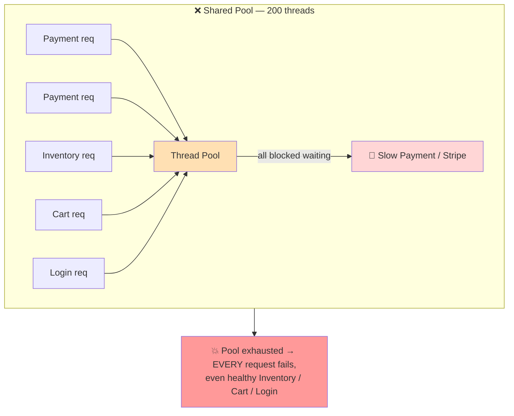
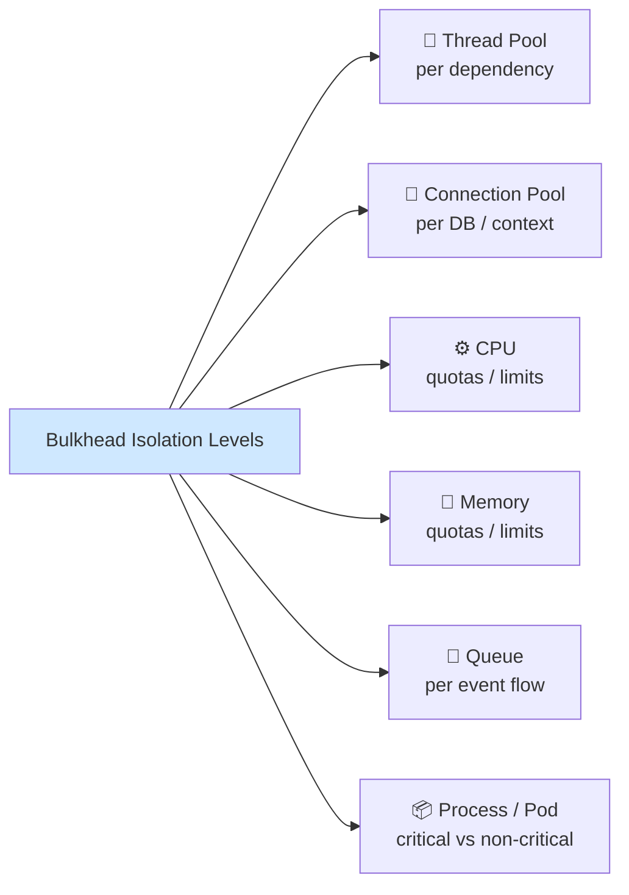
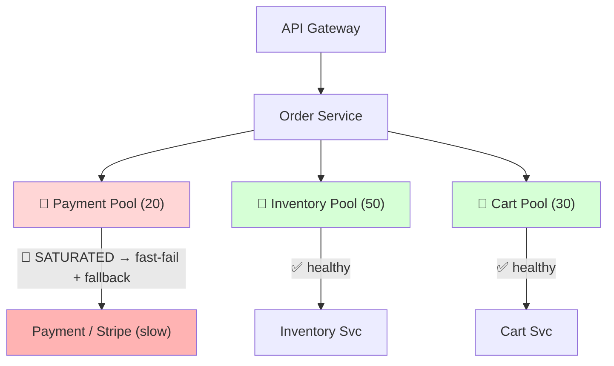
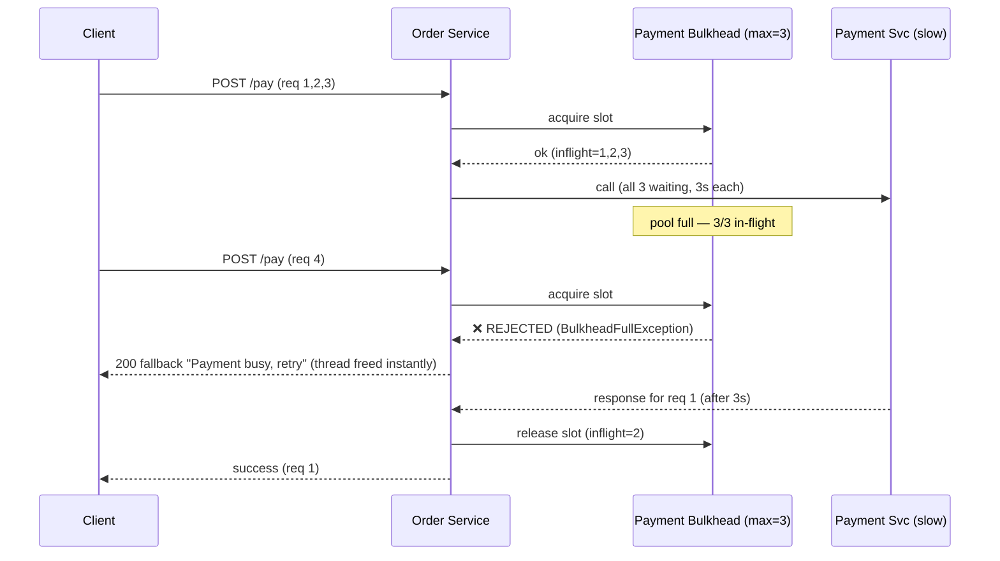
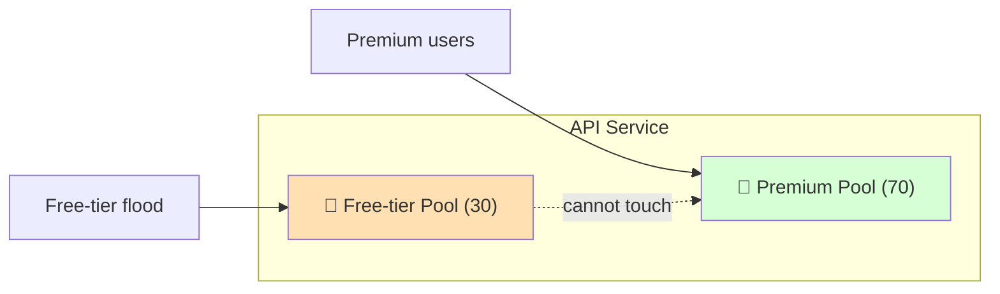
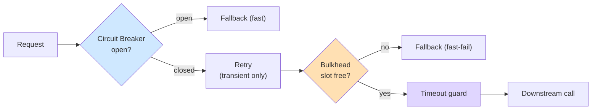
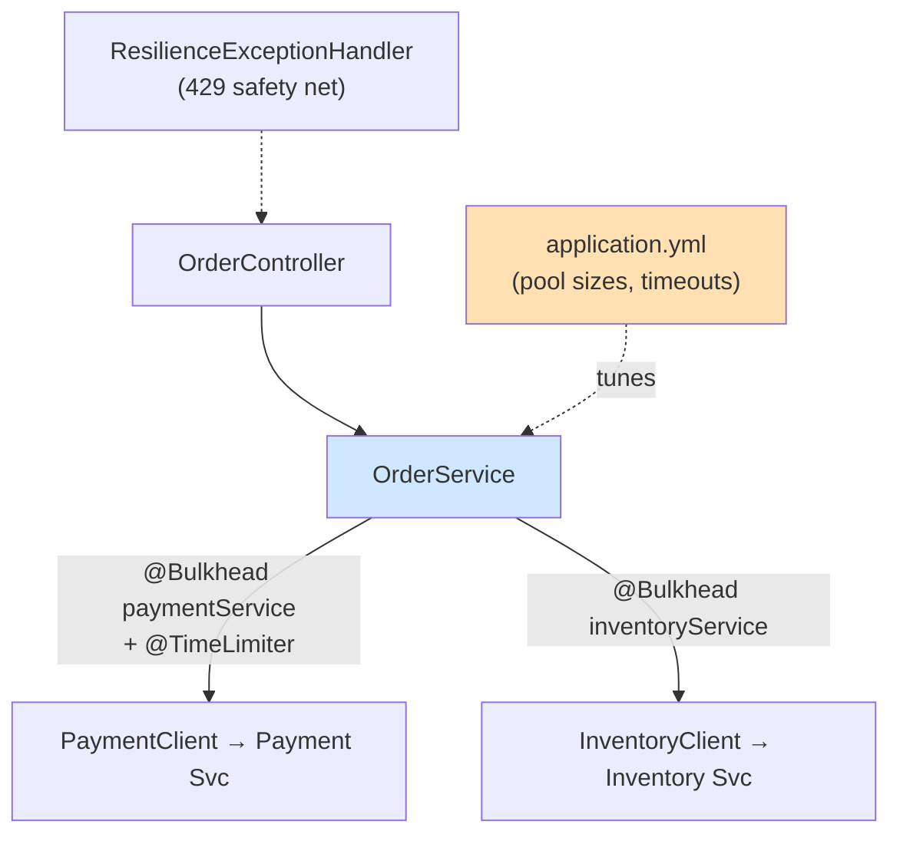

# ⚡ Bulkhead Pattern — A Study Guide (Basics → Staff/Principal)

> *"One overloaded service should not have the power to bring down an entire application."*

A resilience pattern that partitions a system's finite resources — thread pools, connection pools, memory, CPU, queues — into isolated compartments, so that a failure or overload in one part **cannot** consume the resources every other part depends on. The name is borrowed from ship-building: a hull is split into watertight compartments so one breach floods only its section, and the ship stays afloat.

---

## 📋 Table of Contents

1. [Introduction: The 2 AM Cascading Outage](#-introduction-the-2-am-cascading-outage)
2. [Core Definitions (Plain English)](#-core-definitions-plain-english)
3. [The Concept & Theory](#-the-concept--theory)
4. [Why the Pattern Exists: The Resource-Exhaustion Cascade](#-why-the-pattern-exists-the-resource-exhaustion-cascade)
5. [Types of Resource Isolation](#-types-of-resource-isolation)
6. [The Real Mechanism & the Core Trade-off](#-the-real-mechanism--the-core-trade-off)
7. [Architecture & Sequence Diagrams](#-architecture--sequence-diagrams)
8. [Building One From Scratch (Pseudocode + Java)](#-building-one-from-scratch-pseudocode--java)
9. [Sizing & Tunable Knobs: The Configurable System](#-sizing--tunable-knobs-the-configurable-system)
10. [Categorized Real-World Examples](#-categorized-real-world-examples)
11. [Bulkhead vs Circuit Breaker vs Load Balancer vs Rate Limiter](#-bulkhead-vs-circuit-breaker-vs-load-balancer-vs-rate-limiter)
12. [The Resilience Stack: Timeout + Retry + Bulkhead + CB](#-the-resilience-stack-timeout--retry--bulkhead--cb)
13. [Common Misconceptions & Anti-Patterns](#-common-misconceptions--anti-patterns)
14. [Staff/Principal-Level Nuance](#-staffprincipal-level-nuance)
15. [Extensions & Adjacent Concepts](#-extensions--adjacent-concepts)
16. [Hands-On: Complete Resilience4j + Spring Boot Implementation](#-hands-on-complete-resilience4j--spring-boot-implementation)
17. [⚡ Quick Revision](#-quick-revision)
18. [🎓 FAANG Interview Q&A (20 Questions)](#-faang-interview-qa-20-questions)
19. [📝 STAR Behavioral Questions](#-star-behavioral-questions)
20. [🔗 References & Further Reading](#-references--further-reading)

---

## 🎯 Introduction: The 2 AM Cascading Outage

It's 2 AM. Dashboards are red. Threads are stuck. But here's the strange part: your code has no bug, and most of your services are perfectly healthy. So why is the whole platform down?

The story almost always starts the same way. A recommendation engine hits a traffic spike, or a payment gateway like Stripe starts timing out, or a fraud-check service that normally answers in 50 ms suddenly takes 5 seconds. Because those downstream calls are **synchronous**, every request that touches the slow dependency grabs a worker thread and *waits*. New requests keep arriving. More threads block. Eventually the shared thread pool is completely exhausted.

Now the dominoes fall. Checkout requests can't get a thread. Payments can't execute. Even user authentication — which has *nothing* to do with recommendations — starts timing out. Engineers call this a **resource-exhaustion cascade**, and it is one of the most common ways distributed systems die.

The original problem was isolated. **The impact wasn't.**

The Bulkhead Pattern is the fix. Instead of letting every workload compete for one shared pool of resources, you draw boundaries: each workload gets its own reserved capacity. When one compartment floods, the damage stays contained and the rest of the system keeps sailing. This guide walks from that plain-English intuition all the way to the per-component trade-offs, sizing math, and service-mesh nuance a staff engineer is expected to reason about unprompted.

<details>
<summary>📖 Beginner-friendly explanation (click to expand)</summary>

Think of a big ship. Its hull is divided into sealed compartments by thick walls called *bulkheads*. If the hull is punctured and one compartment floods, the water can't spread — the other compartments stay dry and the ship stays afloat. Software works the same way. Instead of every feature sharing one big bucket of "workers" (threads), you give each feature its own smaller bucket. If the payment feature gets stuck waiting on a slow bank, only *its* bucket of workers gets used up. Browsing, search, and checkout still have their own workers and keep serving customers. You didn't stop the failure — you just stopped it from spreading.

</details>

---

## ✅ Core Definitions (Plain English)

**Bulkhead Pattern** — A fault-isolation design pattern that partitions a service's finite resources into independent, bounded groups so that failure or saturation in one group cannot exhaust the resources needed by another. It is about **capacity isolation**, not request lifecycle management.

**Resource pool** — A finite, shared collection of something limited: worker threads, database connections, memory, CPU shares, or queue slots. When a pool is fully consumed, every workload that draws from it stalls.

**Cascading failure (resource-exhaustion cascade)** — The failure mode bulkheads prevent: one slow/failing dependency monopolizes a shared pool, so unrelated healthy workloads are starved of resources and fail too.

**Blast radius** — How far the impact of a single failure spreads. The goal of a bulkhead is to *shrink* the blast radius to a single compartment.

**Thread-pool isolation** — Each dependency gets its own dedicated, bounded executor. Calls run on that pool's threads only; when it's full, new calls are rejected (fast-fail) without touching other pools.

**Semaphore (bounded-concurrency) isolation** — A counter caps how many concurrent calls to a dependency may be in-flight. Lighter than a thread pool, but the call still runs on the *caller's* thread.

**Fast-fail / load-shedding** — When a bulkhead is full, it immediately rejects (or throttles/queues) the request and returns a fallback, instead of letting the caller block. Failing fast frees the caller's thread.

**Fallback** — The graceful degraded response returned when a bulkhead rejects a call (cached data, a default value, a "temporarily unavailable" message) — never a raw 500.

<details>
<summary>📖 Beginner-friendly explanation (click to expand)</summary>

A "resource pool" is just a limited supply of helpers. Imagine a restaurant kitchen with 200 cooks (threads). Normally that's plenty. But if one supplier (the fish delivery) is late and 200 cooks all stand around waiting for fish, nobody is cooking burgers, pasta, or salads either — the whole kitchen freezes. A bulkhead says: "only 20 cooks may ever wait on fish; the other 180 keep making burgers." When the fish is late, fish orders slow down, but everything else keeps flowing. "Fast-fail" means a fish order that can't get one of the 20 fish-cooks is told right away "sorry, fish is unavailable" instead of standing in line forever.

</details>

---

## 💡 The Concept & Theory

The core philosophy is a single sentence: **failures must not be able to propagate laterally across independent concerns.** In a monolith, a slow database call blocks one thread; that thread is recycled when the call times out, and the blast radius is small. In a microservice architecture, a single service talks to dozens of downstream dependencies over the network, and any one of them can degrade unpredictably. Without isolation, the *shared* resource — the thread pool, the connection pool — becomes the transmission medium that turns one local problem into a system-wide outage.

The mindset shift the pattern demands is important. You stop chasing the impossible dream of *never failing* and instead design so that *when* failure happens (and it will), it stays **local, predictable, and manageable**. This is architectural humility: you acknowledge that no dependency, API, or network call is perfectly reliable, so you build walls strong enough that one cracked component can't take down the rest.

Crucially, the bulkhead does not *know* a failure is happening. It has no state machine, no error counting, no notion of "healthy" or "unhealthy." It simply enforces a hard ceiling on how much of a resource a given workload may consume. That's what distinguishes it from a circuit breaker (which watches behavior and trips) or a retry (which manages the lifecycle of a single request). The bulkhead is a **static fence**; everything else is dynamic reaction.

There are two dimensions along which you can partition:

- **Dependency-side (caller) bulkheads** — partition your outbound calls by *which downstream* they hit (a pool for Payments, a pool for Inventory). This protects *you* from a slow dependency.
- **Consumer-side (provider) bulkheads** — partition your inbound capacity by *who is calling you* (a pool for premium tenants, a pool for free-tier). This protects your *important consumers* from noisy neighbors.

<details>
<summary>📖 Beginner-friendly explanation (click to expand)</summary>

The whole idea rests on one truth: you can't make software that never breaks. Networks hiccup, servers slow down, third parties go offline. So instead of pretending failure won't happen, you plan for it. You put up internal walls so a problem in one room can't flood the whole house. The clever part is that the wall is "dumb" — it doesn't detect fires or sound alarms. It just refuses to let one room use more than its share of space. Because it's simple and static, it's extremely reliable: there's no clever logic that can misfire at the worst moment.

</details>

---

## ❌ Why the Pattern Exists: The Resource-Exhaustion Cascade

To feel *why* bulkheads are non-negotiable, trace exactly how a system melts without one. Consider an `Order Service` built on Spring Boot, which internally uses a Tomcat thread pool of **200 threads**. It calls three downstreams: `Payment`, `Inventory`, and `Cart`. On every request a thread is assigned, does its logic (including a synchronous call to a downstream), and is freed when the response returns.

Here is the minute-by-minute anatomy of the meltdown:

| Time | What happens |
|------|--------------|
| **T=0** | All healthy. 40 of 200 threads busy with normal traffic. Payment calls take 50 ms. |
| **T=1** | Payment's downstream (Stripe) develops lock contention. Payment responses slow from 50 ms → **3000 ms**. |
| **T=2** | Payment requests back up. Each now holds a thread for 3 s instead of 0.05 s. Threads on Payment: 40 → 60 → 80. |
| **T=3** | Only 20 threads remain free. `Inventory` and `Cart` threads finish fast and free up — but new Payment requests keep grabbing the survivors. |
| **T=4** | Clients see slow responses and begin **retrying**, multiplying the load. Retry pressure consumes the last 20 threads. |
| **T=5** | Thread pool at **200/200**. *All* new requests are rejected — including requests to perfectly healthy `Inventory`, `Cart`, `Shipping`, and even `/login`. |
| **T=6** | The entire service is effectively down because **one** dependency had a 3-second slowdown. |

Notice the subtlety: the root cause was never "Payment threw errors." Payment was *slow*, not broken. **Latency is the real killer** — a hung call holds a thread for the full timeout duration, and under load, hung calls accumulate faster than they drain. A dependency used by only 20% of traffic took down 100% of capacity.

This is why teams who survive their first cascading failure become adamant about isolation. The failure mode isn't theoretical — it's the single most common cause of microservice downtime.



<details>
<summary>📖 Beginner-friendly explanation (click to expand)</summary>

Picture a call center with 200 agents and one shared queue. Normally calls last 30 seconds. Then one topic — say "refund status" — gets stuck because the refund computer is down, and those calls now last 5 minutes each. Agent by agent, everyone ends up stuck on frozen refund calls. Soon all 200 agents are tied up, so even a customer calling about a simple password reset can't reach anyone. Nothing is technically "broken" — the agents are fine, the phones work — but one slow topic ate the entire staff. That's a cascading failure, and it's exactly what a bulkhead prevents by reserving separate agents per topic.

</details>

---

## 📊 Types of Resource Isolation

The bulkhead pattern is *not* limited to thread pools. Isolation can be applied at every layer where a finite resource is shared. A robust design applies it in **defense in depth** — because isolating one layer while leaving another shared just moves the bottleneck.

**Thread-pool isolation.** Each workload gets its own worker threads (`Checkout=40, Payment=20, Search=50, Recommendation=30`). Heavy traffic in one service cannot occupy another's threads. This is the most powerful form because it fully *offloads* the blocking work — the caller's HTTP worker thread submits, waits with a timeout, and gets a result or a fast rejection.

**Connection-pool isolation.** Database connections are finite. Instead of one shared pool, assign dedicated pools per context — one for the transactional `Orders` DB, another for slow `Analytics` queries. Slow analytical queries then can't starve transactional workloads. *This is the pool most teams forget*, and forgetting it silently defeats thread-pool isolation.

**CPU isolation.** Container orchestrators (Kubernetes `resources.requests/limits`) reserve CPU shares so one hot service can't starve neighbors on the same node.

**Memory isolation.** Memory limits (container `limits.memory`) stop a runaway or leaking process from exhausting host memory and OOM-killing unrelated pods.

**Queue isolation.** Separate message queues/topics per flow (`Payment Queue`, `Inventory Queue`, `Email Queue`) so a backlog in email processing doesn't delay payments.

**Service-instance / process isolation.** Run critical and non-critical workloads on separate pods, nodes, or even clusters, so a crash or resource spike is physically contained.



<details>
<summary>📖 Beginner-friendly explanation (click to expand)</summary>

Isolation isn't just about "workers." Anything limited and shared can be a bulkhead. Think of an apartment building: each unit has its own electrical breaker (CPU), its own water meter (memory), its own mailbox (queue), and its own parking spot (connections). If one tenant throws a huge party and floods their sink, it doesn't cut off everyone else's water. Good systems put walls around *all* of these shared things at once — because if you only wall off the workers but everyone still shares one water pipe, a clog in that pipe still floods everyone.

</details>

---

## 🎨 The Real Mechanism & the Core Trade-off

Mechanically, a bulkhead is astonishingly simple. At its heart is a **counter** tracking how many calls to a given dependency are currently in-flight, plus a **threshold** (the max allowed). Before a call, check `if (inflight < threshold)`: if yes, increment, make the call, decrement when done; if no, **reject immediately** and return a fallback. That's the entire algorithm. Two production-grade implementations wrap this idea:

- **Semaphore bulkhead** — a counting semaphore of size *N*. Acquire before the call, release after. Near-zero overhead. But the call still runs on the *calling thread*, so a blocked downstream still blocks that caller thread — you cap concurrency but don't get thread-offloading.
- **Thread-pool bulkhead** — a dedicated `ThreadPoolExecutor` with a bounded queue. The caller *submits* the task and waits with a timeout; the work runs on a pool thread. When the pool and its queue are full, the executor throws `RejectedExecutionException` → fast-fail. This fully protects the caller's thread but costs context-switching and memory per pool.

### 🔒 Semaphore bulkhead — how it really works

A semaphore is just an atomic integer of *permits* with two operations: `acquire()` (decrement, or block/reject if already zero) and `release()` (increment). A semaphore bulkhead of size 20 starts with 20 permits. Each thread wanting to call the dependency must `tryAcquire()` a permit first; on success it proceeds, on the 21st concurrent attempt there are zero permits left, so it either waits up to `maxWaitDuration` or is rejected immediately with a `BulkheadFullException`. When the call finishes — *success or exception* — the permit is returned in a `finally` block. The critical property is that the permit count is manipulated with atomic compare-and-swap (e.g., Java's `AbstractQueuedSynchronizer` under `java.util.concurrent.Semaphore`), so there's **no lock contention** on the fast path and no separate threads are ever created.

The defining characteristic — and its main limitation — is that **the work executes on the caller's own thread**. The semaphore only gates *entry*; it does not move the work anywhere. So if the downstream hangs for 30 seconds, the caller's HTTP worker thread is *also* blocked for 30 seconds — the bulkhead capped how *many* callers can be blocked simultaneously (20), but each of those 20 is still stuck. This is why a semaphore bulkhead is **useless without a companion timeout**: the timeout must live on the blocking call itself (e.g., an HTTP client read-timeout), because the bulkhead has no mechanism to interrupt a call it isn't running. Because it adds only an atomic counter and no thread hand-off, its overhead is nanoseconds and it preserves thread-locals, `SecurityContext`, MDC logging context, and transaction context automatically — nothing crosses a thread boundary. That makes it the right choice for fast calls, reactive/non-blocking stacks, and services where the extra memory of a second pool isn't justified.

<details>
<summary>💻 Semaphore mechanics in code — acquire / run-on-caller / release (click to expand)</summary>

```java
Semaphore permits = new Semaphore(20, /*fair=*/true); // 20 concurrent slots

// tryAcquire returns immediately (or after maxWait) — never creates a thread
if (permits.tryAcquire(0, TimeUnit.MILLISECONDS)) {   // 0ms = instant fast-fail
    try {
        // ⚠️ runs on the CALLER's thread — a 30s hang blocks THIS thread
        return httpClient.call(request);              // must have its own read-timeout!
    } finally {
        permits.release();                            // return permit, success or throw
    }
} else {
    return fallback();          // 21st concurrent caller is shed here
}
```
- No thread hand-off → thread-locals / MDC / transaction context survive automatically.
- `availablePermits()` is your live "free slots" gauge for metrics.
- The bulkhead cannot cancel the call; only the client's own timeout can.

</details>

### 🧵 Thread-pool bulkhead — how it really works

A thread-pool bulkhead is heavier but strictly more powerful. It owns a dedicated `ThreadPoolExecutor` configured with a `coreThreadPoolSize`, a `maxThreadPoolSize`, and a **bounded** work queue (`queueCapacity`). The caller does *not* run the downstream call itself; it packages the call as a `Callable`/`Supplier` and `submit()`s it, receiving a `Future`/`CompletionStage` back, then waits on that future with its own timeout. The executor's admission logic is precise and worth memorizing: a submitted task first tries to run on a core thread; if all core threads are busy it goes into the queue; only when the **queue is full** does the executor spin up threads up to `maxThreadPoolSize`; and only when *both* the queue is full *and* `maxThreadPoolSize` is reached does the `RejectedExecutionHandler` fire — typically `AbortPolicy`, which throws `RejectedExecutionException` that you catch and convert into a fast-fail fallback.

The key benefit is **thread-offloading**: the caller's HTTP worker thread is decoupled from the blocking downstream. If the dependency hangs, it's the *pool's* threads that block, not the request-serving threads — and because the caller waits on the future with a timeout, it can walk away after (say) 2 seconds and return a fallback while the pool thread is still stuck. That means the thread-pool bulkhead delivers true fault isolation *plus* an enforced timeout even when the underlying client is poorly configured, and it exposes rich signals (active count, queue depth, completed tasks) for monitoring. The costs are real: every request pays a **context-switch** and hand-off latency; each pool consumes memory (thread stacks are ~256 KB–1 MB each, so 10 pools of 20 threads is meaningful RAM); and — the classic footgun — **thread-locals do NOT propagate across the hand-off**, so `SecurityContext`, MDC trace IDs, and `ThreadLocal`-based transaction context are lost on the pool thread unless you explicitly copy them (e.g., Spring's `DelegatingSecurityContextExecutor`, a `TaskDecorator`, or MDC-copying wrappers). Because of the queue nuance, the queue must be **small (5–10)** — a large or unbounded queue absorbs a flood into memory and converts fast-fail into slow-fail or an eventual `OutOfMemoryError`.

<details>
<summary>💻 Thread-pool admission order — core → queue → max → reject (click to expand)</summary>

```java
ThreadPoolExecutor pool = new ThreadPoolExecutor(
    5,                                   // coreThreadPoolSize
    10,                                  // maxThreadPoolSize
    20, TimeUnit.MILLISECONDS,           // keepAlive for threads above core
    new ArrayBlockingQueue<>(10),        // BOUNDED queue (unbounded = OOM footgun)
    new ThreadPoolExecutor.AbortPolicy() // full → RejectedExecutionException
);

// Admission logic when a task arrives:
//   1. core thread free?      → run on it
//   2. else queue not full?   → enqueue
//   3. else threads < max?    → create thread, run on it
//   4. else                   → REJECT (fast-fail → fallback)

Future<Result> f = pool.submit(() -> httpClient.call(request)); // OFFLOADED
try {
    return f.get(2, TimeUnit.SECONDS);   // caller walks away after 2s even if pool thread hangs
} catch (RejectedExecutionException e) { // pool + queue saturated
    return fallback();
} catch (TimeoutException e) {
    f.cancel(true);                       // signal interrupt to the pool thread
    return fallback();
}
```
⚠️ Thread-locals (SecurityContext, MDC trace IDs, TX context) are **lost** on the pool thread — copy them explicitly with a `TaskDecorator` / `DelegatingSecurityContextExecutor`.

</details>

**Choosing between them, precisely.** Use a **thread-pool bulkhead** when the call is a blocking, I/O-heavy remote call and you want a hard timeout independent of the client's own settings — the offloading is worth the overhead. Use a **semaphore bulkhead** when calls are fast, when you're on a reactive/non-blocking stack (where tying work to threads is an anti-pattern), when context propagation must be effortless, or when the service is small enough that a second pool's memory and latency aren't justified. In short: thread-pool = maximum isolation at higher cost; semaphore = minimum overhead but the caller shares the fate of a hung downstream.

| Aspect | Semaphore bulkhead | Thread-pool bulkhead |
|--------|-------------------|----------------------|
| Runs work on | The **caller's** thread | A **dedicated pool** thread |
| Thread-offloading | ❌ No — caller blocks if downstream hangs | ✅ Yes — caller decoupled |
| Enforces timeout | Only if the client has its own | ✅ Yes, via `future.get(timeout)` |
| Overhead | Near-zero (atomic counter) | Context-switch + thread-stack memory |
| Context propagation | ✅ Automatic (same thread) | ⚠️ Manual (thread-locals lost) |
| Fast-fail signal | `BulkheadFullException` | `RejectedExecutionException` |
| Best for | Fast calls, reactive stacks, small services | Blocking I/O, untrusted client timeouts |
| Resilience4j type | `Bulkhead` | `ThreadPoolBulkhead` |

Now the trade-off that every interviewer probes. Bulkheads buy **failure isolation and predictability** at the cost of **utilization and complexity**:

| You gain | You pay |
|----------|---------|
| Failure isolation (small blast radius) | More operational complexity (many pools to manage) |
| Predictable resource allocation | Capacity-planning burden (how big is each pool?) |
| Reduced cascading failures | Potential resource **underutilization** — idle threads in pool A while pool B gasps |
| Better operational stability | More metrics/alerts to watch |

The uncomfortable truth: **a shared pool has higher average utilization than partitioned pools.** By reserving capacity per workload, you accept that some reserved threads will sit idle even when another pool is starving — they can't be borrowed, because borrowing is exactly the coupling you're trying to eliminate. You are *deliberately* trading efficiency for containment. There is no universal configuration; each system balances utilization against resilience.

<details>
<summary>📖 Beginner-friendly explanation (click to expand)</summary>

The mechanism is just counting. "Only 20 payment calls allowed at once." Keep a tally; if a 21st shows up, say "no, come back later" instead of letting it wait forever. The trade-off is like assigning fixed parking spots. If you give each department its own 10 reserved spots, no department can ever be fully blocked out — but on a quiet day, Marketing's 10 spots sit empty while Sales is circling for parking, and nobody can use the empty Marketing spots. Shared parking is more *efficient* but one greedy department can take everything. Reserved parking wastes a little space to guarantee everyone always has somewhere to park.

</details>

---

## 🖼️ Architecture & Sequence Diagrams

**With bulkheads, the same slow-Payment scenario is contained.** Each dependency draws from its own bounded pool behind the `Order Service`. When Payment's pool saturates, Payment calls fast-fail — but Inventory and Cart pools are untouched and keep serving.



**Sequence: what a saturated bulkhead does.** Three concurrent Payment calls fill the pool of size 3; the fourth is rejected instantly and the caller returns a degraded response — freeing its thread rather than blocking.



**Consumer-side bulkhead** — partition inbound capacity by *who* is calling, so a flood of free-tier traffic can never starve premium users:



<details>
<summary>📖 Beginner-friendly explanation (click to expand)</summary>

The first diagram is the whole point in one picture: three separate lanes (Payment, Inventory, Cart), each with its own set of workers. When the Payment lane jams, cars in the Inventory and Cart lanes keep moving. The sequence diagram shows the "fast-fail" moment: once the 3 payment slots are full, the 4th customer is politely turned away *immediately* ("payment's busy, try again") instead of being left standing in line for 3 seconds — which means the worker who greeted them is instantly free to help someone in another lane. The last diagram is the same idea but sorting people by ticket type (premium vs free) instead of by task.

</details>

---

## 💻 Building One From Scratch (Pseudocode + Java)

Before reaching for a library, it's worth seeing that the core is trivial — which is exactly why the pattern is so reliable.

<details>
<summary>💻 Pseudocode — the core counter (click to expand)</summary>

```
# One counter + threshold per dependency
maxConcurrent   = 3
inflight        = 0            # atomic!
lock            = Mutex()

function callPayment(request):
    acquired = false
    lock:
        if inflight < maxConcurrent:
            inflight += 1
            acquired = true

    if not acquired:
        return fallbackResponse()      # fast-fail / load-shed

    try:
        return paymentService.call(request)   # the real work
    finally:
        lock:
            inflight -= 1              # ALWAYS release, even on exception
```

The two things people get wrong: (1) the counter must be **atomic / lock-guarded** or two threads race past the check, and (2) the decrement must live in `finally` — if an exception skips it, the pool "leaks" slots until it's permanently full.

</details>

<details>
<summary>💻 Java — a thread-safe semaphore bulkhead from scratch (click to expand)</summary>

```java
import java.util.concurrent.Semaphore;
import java.util.concurrent.TimeUnit;

/** Semaphore bulkhead: caps concurrency, runs on the CALLER's thread. */
public class SemaphoreBulkhead {

    private final Semaphore slots;
    private final long maxWaitMillis;

    public SemaphoreBulkhead(int maxConcurrentCalls, long maxWaitMillis) {
        // fair=true prevents starvation of waiting threads
        this.slots = new Semaphore(maxConcurrentCalls, true);
        this.maxWaitMillis = maxWaitMillis;
    }

    public <T> T execute(Supplier<T> work, Supplier<T> fallback) {
        boolean acquired = false;
        try {
            // wait a bounded time for a slot, then give up (fast-fail)
            acquired = slots.tryAcquire(maxWaitMillis, TimeUnit.MILLISECONDS);
            if (!acquired) {
                return fallback.get();          // load-shed
            }
            return work.get();                  // real downstream call
        } catch (InterruptedException e) {
            Thread.currentThread().interrupt();
            return fallback.get();
        } finally {
            if (acquired) slots.release();       // ALWAYS release
        }
    }

    public int availableSlots() { return slots.availablePermits(); } // expose for metrics
}
```

Note `maxWaitMillis`: `0` means *instant reject* (true fast-fail); a small value (50–100 ms) smooths brief bursts. Setting it high (e.g. 5 s) is an anti-pattern — it turns fast failures back into slow ones.

</details>

<details>
<summary>💻 Java — a thread-pool bulkhead from scratch (click to expand)</summary>

```java
import java.util.concurrent.*;

/** Thread-pool bulkhead: OFFLOADS work to a dedicated, bounded pool. */
public class ThreadPoolBulkhead {

    private final ThreadPoolExecutor executor;

    public ThreadPoolBulkhead(String name, int coreSize, int maxSize, int queueCapacity) {
        this.executor = new ThreadPoolExecutor(
            coreSize, maxSize,
            20L, TimeUnit.MILLISECONDS,
            new ArrayBlockingQueue<>(queueCapacity),      // bounded queue — key!
            r -> {                                        // NAME the threads for oncall
                Thread t = new Thread(r);
                t.setName("bulkhead-" + name + "-" + t.getId());
                return t;
            },
            new ThreadPoolExecutor.AbortPolicy());        // full → RejectedExecutionException
    }

    public <T> T execute(Callable<T> work, long timeoutMs, Supplier<T> fallback) {
        try {
            Future<T> f = executor.submit(work);          // offload; caller not blocked on I/O
            return f.get(timeoutMs, TimeUnit.MILLISECONDS);
        } catch (RejectedExecutionException e) {          // pool + queue full → fast-fail
            return fallback.get();
        } catch (TimeoutException e) {
            return fallback.get();
        } catch (Exception e) {
            return fallback.get();
        }
    }
}
```

The **bounded** `ArrayBlockingQueue` is essential — an unbounded queue (the default in `Executors.newFixedThreadPool`) silently absorbs a flood into memory and defeats the whole purpose, eventually causing an OOM instead of a fast rejection.

</details>

<details>
<summary>💻 Java — the production way: Resilience4j (click to expand)</summary>

```java
// --- Semaphore bulkhead (lightweight, caller-thread) ---
BulkheadConfig semConfig = BulkheadConfig.custom()
    .maxConcurrentCalls(20)                       // max simultaneous in-flight
    .maxWaitDuration(Duration.ofMillis(0))        // instant reject = true fast-fail
    .build();
Bulkhead paymentBulkhead = BulkheadRegistry.of(semConfig).bulkhead("paymentService");

Supplier<String> decorated = Bulkhead
    .decorateSupplier(paymentBulkhead, paymentService::processPayment);
String result = Try.ofSupplier(decorated)
    .recover(BulkheadFullException.class, ex -> "Payment busy — please retry")
    .get();

// --- Thread-pool bulkhead (offloads work, async) ---
ThreadPoolBulkheadConfig tpConfig = ThreadPoolBulkheadConfig.custom()
    .maxThreadPoolSize(10)
    .coreThreadPoolSize(5)
    .queueCapacity(20)                            // keep small: 5–10 typical
    .build();
ThreadPoolBulkhead tpBulkhead =
    ThreadPoolBulkhead.of("inventoryService", tpConfig);
CompletionStage<String> stage =
    tpBulkhead.executeSupplier(() -> inventoryService.checkStock(productId));
```

Spring Boot annotation style — the tuning lives in `application.yml`, the code just declares intent:

```java
@Bulkhead(name = "paymentService", fallbackMethod = "paymentFallback")
public String processPayment(PaymentRequest request) {
    return paymentClient.process(request);
}
public String paymentFallback(PaymentRequest request, BulkheadFullException ex) {
    return "Payment service temporarily unavailable. Please retry.";
}
```

Resilience4j is the modern JVM standard; Netflix Hystrix pioneered thread-pool bulkheads (`@HystrixCommand(threadPoolKey=...)`) but is now in maintenance mode.

</details>

---

## 🔧 Sizing & Tunable Knobs: The Configurable System

Getting the numbers right is where most teams struggle. The temptation is to set very large pools "to be safe" — but a huge pool is just a slower version of the shared-pool problem, because it can still be fully consumed by one slow dependency. The knobs:

**Pool size (the headline knob).** Don't guess — derive it from data:

```
Pool size = (peak calls/sec to dependency) × (P99 latency in seconds) × safety_factor
Example:   50 req/s × 0.2 s P99 × 1.5 safety = 15 threads
```

This is *Little's Law* in disguise (`concurrency = arrival_rate × latency`) with headroom. Allocation should reflect **business priority**, not equal splits: `Checkout=60, Recommendation=20, Analytics=15`. Mission-critical paths get bigger reservations; supporting services get less. Splitting equally rarely matches reality — Checkout deserves far more than recommendation generation.

**Queue capacity.** A small queue absorbs micro-bursts; a large queue *converts fast failures into slow failures* and defeats the pattern. Keep it **5–10**. Anything larger is usually a mistake.

**`maxWaitDuration`.** How long a caller waits for a slot before being rejected. Keep near **0 ms** (instant reject) unless you have a strong reason; high values reintroduce the latency you were trying to kill.

**What to reject vs queue vs prioritize.** When the pool is full you have three humane options rather than a hard error: **queue** (hold briefly; as a slot frees, admit the next), **throttle** (return `HTTP 429 Retry-After`), or **prioritize** (admit high-value transactions first, delay low-value ones). Which you pick is a product decision.

**Fallback.** Always define one — cached data, a default, a degraded response, or "queue for later." A rejection *without* a fallback is just an error.

**Metrics & alerts (non-negotiable).** A bulkhead without observability is a black box that can fill up and fail silently. Track and alert on: available concurrent slots (leading indicator), rejection rate, queue depth, pool-level P99 latency, and fallback-invocation rate.

<details>
<summary>📖 Beginner-friendly explanation (click to expand)</summary>

Sizing is like staffing a shop. Too few cashiers and real customers get turned away; too many and you're paying people to stand idle. The formula is common sense: if 50 customers arrive each second and each takes 0.2 seconds, you need about 10 cashiers busy at once — add 50% breathing room and call it 15. Give your money-making counters (checkout) more staff than the "suggested items" kiosk. Keep the waiting line short: a giant line just means people wait forever, which is the slowness you were trying to avoid. And put up a dashboard — if you can't see which counters are jammed, the walls you built are invisible to you.

</details>

---

## 🗂️ Categorized Real-World Examples

**E-commerce (Amazon-style).** Payments, Orders, Inventory, Notifications each get their own thread pool. When Payments gets stuck waiting on Stripe/PayPal, only its pool drains; customers still browse, manage carts, and get order updates, seeing at worst a "Payments temporarily unavailable" banner. During Black Friday, isolating background jobs (email, analytics) from user-facing HTTP threads keeps checkout responsive even as notification volume explodes.

**Ride-sharing (Uber/Ola-style).** Ride-requests, Payments, Maps, Notifications, Pricing are isolated. If the notification service slows because an external email/SMS provider is down, only notifications degrade — drivers keep receiving rides and passengers keep paying. The core business stays operational.

**Banking fund transfer (Java 21 stack).** A Transfer Service caps concurrent Fraud-Service calls at 20 via Resilience4j. When fraud checks slow from 50 ms to 5 s, only 20 threads are ever tied up; the rest keep validating and debiting. Non-critical steps (credit-to-receiver, SMS, analytics) are decoupled onto Kafka so the user never waits for them. Note: *Java 21 virtual threads don't remove the need* — they let you spawn thousands of cheap threads, which could actually overwhelm the fraud service *faster*. Virtual threads improve scalability, not resilience.

**Cloud / multi-tenant SaaS (the "noisy neighbor").** Per-tenant connection and concurrency quotas at the API gateway, Kubernetes namespaces with `ResourceQuota`, and serverless per-function concurrency limits all act as bulkheads so one runaway tenant can't throttle everyone else. AWS and Azure explicitly recommend this for multi-tenant systems.

**Databases, queues, caches.** Separate HikariCP pools for read-heavy vs write-heavy paths; distinct Redis client pools for cache lookups vs session storage; separate Kafka topics/partitions for unrelated event flows so a retry storm on one doesn't block user-facing operations.

**Reactive / event-driven.** Dedicated consumers or schedulers per event stream (Akka dispatchers, Reactor `Scheduler`s, Kafka Streams task isolation) so a slow log-processing pipeline can't delay real-time alerting.

**Framework & infra levels.** Resilience4j / Hystrix (app level), Kubernetes pods/nodes/quotas (infra level), and Istio/Envoy `connectionPool` settings (mesh level) — combined as defense in depth.

<details>
<summary>📖 Beginner-friendly explanation (click to expand)</summary>

Everywhere something limited is shared, bulkheads show up. On a shopping site, they keep "send confirmation email" from stealing the workers that run "checkout." In a bank app, they cap how many payments wait on the fraud checker so the app never freezes. In cloud platforms, they stop one greedy customer (a "noisy neighbor") from hogging the servers everyone shares. Same idea each time: give each job its own reserved slice, so one job going bad can't starve the others.

</details>

---

## 🆚 Bulkhead vs Circuit Breaker vs Load Balancer vs Rate Limiter

These four patterns are constantly confused because they all "limit" or "protect" something, but each operates on a different dimension. A staff engineer must articulate the distinctions crisply.

| Pattern | What it does | Dimension | Fire analogy |
|---------|--------------|-----------|--------------|
| **Bulkhead** | Isolates resources so one failure can't exhaust others' capacity | **Concurrency / capacity** (how *much* a workload may consume) | The **fire door** — contains the fire |
| **Circuit Breaker** | Stops sending calls after repeated failures; fails fast, lets the callee recover | **Behavior over time** (error/slow-call *rate*) | The **fire alarm** — detects danger, stops people entering |
| **Load Balancer** | Distributes traffic *across* multiple servers | **Distribution** (which *instance* handles a request) | Routing people to different **buildings** |
| **Rate Limiter** | Caps calls *per unit of time* regardless of how many are in-flight | **Volume over time** (calls/second) | A **turnstile** counting entries per minute |

**Bulkhead vs Circuit Breaker** is the classic interview mix-up. The bulkhead is *dumb containment* — it doesn't know a failure is happening, it just caps how many threads can be blocked by a slow downstream. The circuit breaker is *smart prevention* — it watches success/failure and, after crossing a threshold, trips open and stops calling entirely. They solve **different stages** of the same failure: the bulkhead limits the resource damage while the downstream is *slow-but-alive*; the breaker stops hammering a downstream that's *failing*, and once open, calls bypass the bulkhead entirely (no point acquiring a slot for a known-dead route). You need **both**: a fire door without an alarm still lets you keep walking into the flames; an alarm without fire doors doesn't stop the spread.

**Bulkhead vs Rate Limiter** trips people up because both cap something. A rate limiter cares about *time*: 100 calls in 1 second, each finishing in 5 ms — the limiter fires, the bulkhead doesn't care (concurrency was tiny). A bulkhead cares about *simultaneity*: 10 calls over 10 seconds, each taking 30 seconds — the bulkhead fills, the limiter doesn't care (rate was 1/sec). A third-party payment API often needs *both*: a rate limiter (they bill per call and enforce quotas) **and** a bulkhead (their responses can be slow, holding your threads).

**Bulkhead vs Load Balancer** is simpler: a load balancer distributes requests *across* servers; a bulkhead isolates resources *inside* a server. One handles distribution, the other handles failure containment. Neither replaces the other.

<details>
<summary>📖 Beginner-friendly explanation (click to expand)</summary>

Easiest way to remember: the **bulkhead** is a fire *door* (stops a fire from spreading room to room), the **circuit breaker** is a fire *alarm* (notices the fire and stops people walking in), the **load balancer** is a *receptionist* sending visitors to whichever building has space, and the **rate limiter** is a *turnstile* that only lets so many people through per minute. They're teammates, not substitutes — a well-run building has all four.

</details>

---

## 🧱 The Resilience Stack: Timeout + Retry + Bulkhead + CB

A bulkhead alone is incomplete. Production resilience comes from layering four complementary patterns, each covering a failure mode the others miss:

- **Timeout** — bounds how long a single call may hang. *Foundational*: without it, a call can block a bulkhead slot forever, and the pool never frees up. A bulkhead protecting a call with no timeout is only half a bulkhead.
- **Retry** — re-attempts *transient* blips (a one-off network drop, a single 503), ideally with exponential backoff + jitter. Retrying a *non-transient* failure just amplifies load.
- **Bulkhead** — isolates the *capacity* each dependency may consume, so a slow one can't starve the others.
- **Circuit Breaker** — the *aggregate* signal: after enough failures, stop trying entirely and let the callee heal.

The correct **composition order** when wrapping a call (outermost → innermost) is: `CircuitBreaker → Retry → Bulkhead → TimeLimiter → actual call`. The breaker sits outside so an open circuit short-circuits everything cheaply; retry wraps the bulkhead+timeout so each attempt is independently isolated and time-bound. (Resilience4j's `Decorators` builder applies them in exactly this nesting.)



<details>
<summary>📖 Beginner-friendly explanation (click to expand)</summary>

No single safety device is enough. A **timeout** is the "don't wait forever" rule — hang up after a few seconds. A **retry** is "if it was probably a fluke, try once more." A **bulkhead** is "only so many people may wait on this at once." A **circuit breaker** is "if it keeps failing, stop calling for a while." Stacked together in the right order, they cover each other's blind spots: the timeout makes sure a stuck call eventually releases its bulkhead slot, and the breaker makes sure you stop retrying a service that's clearly down.

</details>

---

## 🚫 Common Misconceptions & Anti-Patterns

**"Microservices already isolate everything, so I don't need bulkheads."** Microservices isolate *services* from each other, but **not resources inside a single service**. If your Transfer Service's threads all block on a slow Fraud Service, the Transfer Service dies regardless of how "isolated" the fraud microservice is. Isolation between processes ≠ isolation of resources within a process.

**"Java 21 virtual threads make thread exhaustion obsolete."** Virtual threads let you run thousands of cheap threads, so *your* pool won't exhaust — but they don't protect the *downstream*. 10,000 virtual threads all calling a slow Fraud Service will overwhelm *it* faster. Virtual threads improve scalability, not resilience; you still need a bulkhead to cap concurrency toward the dependency.

**Sharing hidden resources.** Thread pools are isolated but they all share one HikariCP database pool. Inventory's slow queries hold connections → the shared pool fills → Payment threads block waiting for a connection → your thread bulkhead did nothing. **Isolation must span every critical resource layer.**

**Over-isolation (too many walls).** Giving every tiny operation its own pool creates hundreds of compartments — each eats memory, adds monitoring overhead, and leaves half your threads idle while another pool starves. You've traded resilience for rigidity and waste. *Fix:* start with coarse-grained partitions around real fault domains, refine from data.

**Under-isolation (one giant pool for all "critical" services).** Lumping "important" services into one big shared pool feels safe but isn't — a single slow member still exhausts it. That's not resilience, it's *shared fate*. *Fix:* if one service's slowness can breach another's SLA, it deserves its own pool.

**`maxWaitDuration` too high.** Setting it to seconds means requests wait seconds for a slot — the bulkhead stops fast-failing and just adds delay. Keep it near 0 ms.

**No fallback / not naming pools.** A rejection without a fallback is a raw error to the user. And a pool named `thread-pool-3` is useless at 2 AM — name them `bulkhead-payment`, `bulkhead-inventory`. That one config line saves hours on-call.

**Ignoring monitoring.** Without metrics you won't know a compartment is silently filling until customers complain.

<details>
<summary>📖 Beginner-friendly explanation (click to expand)</summary>

The big trap is thinking bulkheads are magic — "just isolate everything and I'm safe." Two opposite mistakes bite people. *Too many walls:* you chop the ship into so many tiny compartments there's no room for cargo and half of them sit empty. *Too few walls:* you lump everything into one big room, so one leak still sinks you. The other silent killer is forgetting a shared pipe — you wall off the workers but everyone still shares one database connection pool, so a clog there floods everyone anyway. And always label your compartments; "compartment #3 is flooding" is useless when you're half-asleep at 2 AM.

</details>

---

## 🎓 Staff/Principal-Level Nuance

Things experienced engineers raise unprompted:

**Latency is the enemy, not errors.** The cascade is driven by *slow* calls holding resources, not by exceptions. A downstream returning fast 500s actually *releases* threads quickly and won't fill a bulkhead — that's the circuit breaker's job. This is why a bulkhead must always be paired with a tight **timeout**; without it, the bulkhead can't tell "slow" from "hung."

**Sizing is a moving target.** The right pool size for today's traffic profile will be wrong in six months. Wire up Micrometer + Prometheus, watch `bulkhead.available.concurrent.calls` heading toward zero (warning) and `bulkhead.call.rejected.total` spikes (pool too small *or* downstream degrading), and re-tune. Advanced teams use **adaptive bulkheads** that grow/shrink with load metrics — powerful but complex; start static and data-driven before automating.

**Defense in depth across layers.** App-level bulkheads (Resilience4j) fast-fail *before* the request leaves your process. Mesh-level bulkheads (Istio/Envoy `connectionPool`) enforce limits at the network layer that *no application bug can bypass* — if your app is misconfigured or crashed, the sidecar still holds the line. DB-level bulkheads (separate named HikariCP `DataSource`s with short `connectionTimeout`) catch the layer thread pools miss. Use all three; they're complementary, not redundant.

**The DB connection pool is the most-forgotten bulkhead.** Perfectly isolated thread pools mean nothing if they all draw from one HikariCP pool — you just moved the bottleneck one layer down. Give each dependency a named `DataSource` with its own `maximumPoolSize` (your DB-layer bulkhead limit) and a short `connectionTimeout` (500 ms–1 s, your fast-fail — never the 30 s default).

**Consumer/tenant bulkheads.** Beyond partitioning by *downstream*, partition by *caller identity*: premium vs free-tier pools, so a free-tier flood can never starve premium SLAs. Same topology, different partition key.

**Semaphore vs thread-pool choice is a real trade-off.** Thread-pool bulkheads offload work and give true thread-protection + timeout support, but cost context-switches and memory — best for I/O-heavy blocking calls. Semaphore bulkheads are near-zero overhead but run on the caller thread (a blocked downstream still blocks the caller) — best for fast calls, reactive stacks, or very small services.

**Reactive stacks change the rules.** In fully non-blocking systems (WebFlux + Reactor), threads aren't tied to requests, so classic thread-pool bulkheads don't apply. Use semaphore-style concurrency limits (`flatMap(..., concurrency)`) or Resilience4j's reactive operators instead.

**Bulkheads reduce blast radius; they don't eliminate failure.** They're an act of architectural humility — you accept failure will happen and decide *where it's allowed to live*. Rejected requests still fail; you've just chosen to sacrifice one feature to save the whole system.

<details>
<summary>📖 Beginner-friendly explanation (click to expand)</summary>

The senior-level insight is that *slowness*, not crashes, is what kills systems — a service that fails instantly actually frees your workers fast; a service that's slow ties them up. So a bulkhead is only complete when paired with a "hang up after X seconds" timeout. The other big-picture point: put walls at every layer (your code, the network sidecar, the database), because a wall in one place is useless if there's an open door somewhere else. And stay humble — walls don't stop fires, they just decide which room burns. You're choosing to lose one feature so you don't lose everything.

</details>

---

## 🔮 Extensions & Adjacent Concepts

**Service-mesh bulkheads (Istio/Envoy).** Enforced by the sidecar proxy, independent of app code, via `DestinationRule.trafficPolicy.connectionPool`: `tcp.maxConnections`, `http.http1MaxPendingRequests` (queue depth before 503), `http.http2MaxRequests` (max concurrent). Envoy rejects overflow with `503 UO` (upstream overflow), visible as `envoy_cluster_upstream_rq_pending_overflow`. This is the enforcement backstop no application bug can bypass.

**Kubernetes-level isolation.** `resources.requests/limits` for CPU/memory bulkheads per pod, `ResourceQuota` and `LimitRange` per namespace, and pod anti-affinity / dedicated node pools to physically separate critical and non-critical workloads.

**Serverless concurrency limits.** AWS Lambda reserved/provisioned concurrency acts as a natural per-function bulkhead — a runaway function can't consume the whole account's concurrency budget.

**Adaptive / dynamic bulkheads.** Pools that resize based on live load metrics (e.g., Netflix's concurrency-limits library / Envoy adaptive concurrency using gradient algorithms) instead of static sizing.

**Shuffle sharding (AWS).** An advanced consumer-bulkhead: assign each tenant a random *combination* of workers so that even when one tenant's shard is poisoned, the overlap with any other tenant is minimal — dramatically shrinking blast radius versus simple partitioning.

**Cell-based architecture.** The macro-scale bulkhead: partition the *entire* stack (LB + services + data) into independent "cells," each serving a slice of users, so a bad deploy or poison request can only take down one cell.

**Related patterns.** Circuit Breaker, Timeout, Retry (with backoff + jitter), Rate Limiter, Load Shedding, Backpressure, and Fallback — all part of the resilience-engineering toolkit.

<details>
<summary>📖 Beginner-friendly explanation (click to expand)</summary>

Bulkheads scale up and down. At the small end, a semaphore counts calls inside one service. At the network level, a sidecar proxy enforces limits even if your code is broken. At the platform level, Kubernetes caps CPU and memory per container. At the biggest scale, "cell-based architecture" splits your whole system into independent mini-copies, each serving some users — so a bad release can only break one cell, not everyone. It's the same watertight-compartment idea, applied at every zoom level.

</details>

---

## 🧑‍💻 Hands-On: Complete Resilience4j + Spring Boot Implementation

<details>
<summary>🧑‍💻 <b>Click to expand the full Spring Boot walkthrough (5 parts + config)</b></summary>

A realistic `Order Service` that calls a slow `Payment` dependency and a fast `Inventory` dependency, each behind its own bulkhead, with timeouts, fallbacks, and metrics. This is enriched beyond the source snippets: added a `TimeLimiter`, a config bean, a global exception handler, and descriptive pool names.

<details>
<summary>💻 <b>1. Dependencies + configuration</b> (pom.xml) — click to expand</summary>

```xml
<!-- Resilience4j Spring Boot 3 starter + AOP + actuator/micrometer for metrics -->
<dependency>
    <groupId>io.github.resilience4j</groupId>
    <artifactId>resilience4j-spring-boot3</artifactId>
    <version>2.2.0</version>
</dependency>
<dependency>
    <groupId>org.springframework.boot</groupId>
    <artifactId>spring-boot-starter-aop</artifactId>   <!-- required for @Bulkhead AOP -->
</dependency>
<dependency>
    <groupId>org.springframework.boot</groupId>
    <artifactId>spring-boot-starter-actuator</artifactId>
</dependency>
<dependency>
    <groupId>io.micrometer</groupId>
    <artifactId>micrometer-registry-prometheus</artifactId>  <!-- exposes bulkhead metrics -->
</dependency>
```

*Why shaped this way:* the `spring-boot3` starter wires the `@Bulkhead` annotation via AOP; actuator + micrometer-prometheus expose `resilience4j_bulkhead_available_concurrent_calls` and `..._call_rejected_total` at `/actuator/prometheus` for free.

</details>

<details>
<summary>💻 <b>2. Declarative config</b> (application.yml) — the tuning lives here — click to expand</summary>

```yaml
resilience4j:
  # Semaphore bulkheads — cap concurrency on the caller thread
  bulkhead:
    instances:
      paymentService:
        maxConcurrentCalls: 20        # sized: ~50 req/s × 0.2s P99 × 1.5 ≈ 15, rounded up
        maxWaitDuration: 0ms          # instant reject = true fast-fail
      inventoryService:
        maxConcurrentCalls: 50        # inventory is cheap & high-volume → bigger pool
        maxWaitDuration: 10ms
  # Thread-pool bulkhead — offloads blocking work to a dedicated bounded pool
  thread-pool-bulkhead:
    instances:
      paymentServiceTp:
        maxThreadPoolSize: 10
        coreThreadPoolSize: 5
        queueCapacity: 10             # keep small: queue converts fast-fail into slow-fail
  # Always pair a bulkhead with a timeout so a hung call releases its slot
  timelimiter:
    instances:
      paymentService:
        timeoutDuration: 2s
        cancelRunningFuture: true

management:
  endpoints.web.exposure.include: health,prometheus
  metrics.tags.application: order-service
```

*Why shaped this way:* Payment gets a smaller, tightly-guarded pool (it's the risky external call); Inventory gets a larger one (cheap, high-volume). `maxWaitDuration: 0ms` guarantees fast-fail. The `timelimiter` ensures a stuck Payment call can't hold its bulkhead slot beyond 2 s.

</details>

<details>
<summary>💻 <b>3. Downstream clients</b> (Feign) — click to expand</summary>

```java
@FeignClient(name = "payment-service", url = "${clients.payment-url}")
public interface PaymentClient {
    @PostMapping("/api/payments")
    PaymentResult makePayment(@RequestBody PaymentRequest request);
}

@FeignClient(name = "inventory-service", url = "${clients.inventory-url}")
public interface InventoryClient {
    @GetMapping("/api/inventory/{productId}")
    StockInfo checkStock(@PathVariable Long productId);
}
```

*Why shaped this way:* declarative HTTP clients keep the network plumbing out of the service layer, so the bulkhead annotations below read as pure intent.

</details>

<details>
<summary>💻 <b>4. Service layer</b> (OrderService) — where the bulkheads attach — click to expand</summary>

```java
@Service
public class OrderService {

    private final PaymentClient paymentClient;
    private final InventoryClient inventoryClient;

    public OrderService(PaymentClient p, InventoryClient i) {
        this.paymentClient = p; this.inventoryClient = i;
    }

    // Payment: semaphore bulkhead + timeout. Fallback fast-fails with a degraded response.
    @Bulkhead(name = "paymentService", fallbackMethod = "paymentFallback")
    @TimeLimiter(name = "paymentService")
    public CompletableFuture<PaymentResult> processPayment(PaymentRequest req) {
        return CompletableFuture.supplyAsync(() -> paymentClient.makePayment(req));
    }

    public CompletableFuture<PaymentResult> paymentFallback(PaymentRequest req, Throwable ex) {
        // BulkheadFullException OR TimeoutException land here → graceful degradation
        return CompletableFuture.completedFuture(
            PaymentResult.pending("Payment busy — we'll retry shortly. Ref: " + req.id()));
    }

    // Inventory: its own separate pool — Payment saturation can never touch it.
    @Bulkhead(name = "inventoryService", fallbackMethod = "stockFallback")
    public StockInfo checkStock(Long productId) {
        return inventoryClient.checkStock(productId);
    }

    public StockInfo stockFallback(Long productId, BulkheadFullException ex) {
        return StockInfo.unknown(productId);   // degrade: "availability updating"
    }
}
```

*Why shaped this way:* each dependency has its **own** named bulkhead — the core of the pattern. Payment is additionally time-limited (async `CompletableFuture` so the `TimeLimiter` can cancel). Every bulkhead has an explicit fallback so a rejection is never a raw 500. Note the two overloaded fallback signatures — Resilience4j matches the thrown exception type.

</details>

<details>
<summary>💻 <b>5. REST controller + global handler</b> — translating rejection to HTTP — click to expand</summary>

```java
@RestController
@RequestMapping("/orders")
public class OrderController {

    private final OrderService orders;
    public OrderController(OrderService orders) { this.orders = orders; }

    @PostMapping("/checkout")
    public CompletableFuture<ResponseEntity<PaymentResult>> checkout(@RequestBody OrderRequest req) {
        return orders.processPayment(req.toPaymentRequest())
                     .thenApply(ResponseEntity::ok);
    }
}

@RestControllerAdvice
class ResilienceExceptionHandler {
    // If a fallback isn't defined somewhere, surface a clean 429 instead of a 500.
    @ExceptionHandler(BulkheadFullException.class)
    ResponseEntity<String> onFull(BulkheadFullException ex) {
        return ResponseEntity.status(HttpStatus.TOO_MANY_REQUESTS)   // 429
            .header(HttpHeaders.RETRY_AFTER, "2")
            .body("Service busy — please retry shortly.");
    }
}
```

*Why shaped this way:* the controller stays thin; the `@RestControllerAdvice` is a safety net converting any un-fallback'd bulkhead rejection into a proper `429 Retry-After` rather than a scary `500` — the "always define a fallback path" anti-pattern fix, at the edge.

</details>

**Class relationship overview:**



<details>
<summary>📖 Beginner-friendly explanation (click to expand)</summary>

This is the whole pattern as runnable code. The `application.yml` is the control panel: "Payment may run 20 calls at once, give up after 2 seconds; Inventory may run 50." The `OrderService` just tags each method with which bulkhead guards it and what to do if it's full (`fallback`). Payment and Inventory have *separate* tags, so a jammed Payment can never steal Inventory's workers. If a call is rejected, the customer gets a friendly "busy, retry shortly" (a 429) instead of a crash. And because metrics are switched on, you can watch each pool's free slots on a dashboard.

</details>

</details>

---

## ⚡ Quick Revision

**What it is.** The Bulkhead Pattern partitions a system's finite resources — thread pools, connection pools, memory, CPU, queues — into isolated compartments so that failure or overload in one workload cannot exhaust the resources every other workload depends on. The name comes from ships: watertight compartments mean one breach floods only its section, and the vessel stays afloat. It is about **capacity isolation**, not request lifecycle. Unlike a circuit breaker, a bulkhead is *dumb* — it doesn't detect failure, it just enforces a hard ceiling on consumption.

**Why it exists.** In microservices, one service calls many downstreams over the network, and any one can degrade. Without isolation, a shared thread pool becomes the transmission medium for a **resource-exhaustion cascade**: a slow dependency (say Payment→Stripe going from 50 ms to 3 s) makes each request hold a thread far longer; hung calls accumulate faster than they drain; the pool hits 200/200; and *unrelated healthy* requests (Inventory, Cart, even `/login`) start failing too. The killer is **latency, not errors** — a hung call holds a thread for the full timeout. A dependency serving 20% of traffic can take down 100% of capacity.

**How it works.** At heart it's a counter + threshold per dependency: `if inflight < max` → increment, call, decrement in `finally`; else reject and return a fallback. Two production forms: a **semaphore bulkhead** (counting permit, near-zero overhead, but the call runs on the caller's thread so a blocked downstream still blocks it) and a **thread-pool bulkhead** (dedicated bounded executor that *offloads* the work and fully protects the caller thread, at the cost of context-switching and memory). When full: reject (fast-fail), queue briefly, throttle with 429, or prioritize high-value requests.

**Types of isolation.** Not just threads: connection pools (a separate HikariCP `DataSource` per context — the most-forgotten one), CPU and memory (container `requests/limits`), queues (a topic per event flow), and whole processes/pods. Best practice is **defense in depth** — isolate every critical layer, because walling off threads while sharing one DB pool just moves the bottleneck down a level.

**The trade-off.** Bulkheads buy failure isolation, predictable allocation, and a small blast radius — at the cost of operational complexity, capacity-planning burden, more metrics, and lower average utilization. A shared pool is more *efficient*; partitioned pools guarantee no workload can be fully starved but leave some reserved capacity idle. There's no universal config — every system balances utilization against resilience.

**Sizing.** Don't guess. `Pool size = peak req/s × P99 latency (s) × safety_factor` (e.g., `50 × 0.2 × 1.5 ≈ 15`) — Little's Law with headroom. Allocate by **business priority**, not equal splits (Checkout ≫ Recommendations). Keep queue depth tiny (5–10) or fast-fail becomes slow-fail. Keep `maxWaitDuration` near 0 ms. Name pools descriptively (`bulkhead-payment`). Always define a fallback. Monitor available slots, rejection rate, queue depth (Micrometer + Prometheus).

**vs the other patterns.** **Circuit breaker** watches behavior and trips on failure *rate* (prevention); the bulkhead caps *concurrency* (containment) — fire alarm vs fire door; use both, and when the circuit is open, calls bypass the bulkhead. **Rate limiter** caps calls per *time* (volume); a bulkhead caps *in-flight* calls (concurrency) — a slow third-party API often needs both. **Load balancer** distributes *across* servers; a bulkhead isolates *inside* a server. Correct composition order: `CircuitBreaker → Retry → Bulkhead → TimeLimiter → call`.

**Common traps.** Microservices isolate services but not resources *within* a service; Java 21 virtual threads improve scalability but not resilience (10k threads can overwhelm a downstream faster); sharing a hidden DB pool defeats thread isolation; over-isolation wastes memory and rigidifies; under-isolation (one big "critical" pool) is shared fate; high `maxWaitDuration` kills fast-fail; missing fallbacks turn rejections into raw 500s; unnamed pools waste on-call hours.

**Staff-level nuance.** Always pair a bulkhead with a **timeout** (else it can't distinguish slow from hung). Isolate the **DB connection pool** per dependency (named `DataSource`, short `connectionTimeout`). Use **defense in depth**: app-level (Resilience4j, fast-fail before the network), mesh-level (Istio/Envoy `connectionPool`, un-bypassable by app bugs), infra-level (K8s quotas). Partition by consumer for **tenant/noisy-neighbor** isolation. Prefer thread-pool bulkheads for blocking I/O, semaphore for fast/reactive calls. In reactive stacks use concurrency operators, not thread pools. Advanced: adaptive bulkheads, shuffle sharding, cell-based architecture.

**One-line recall.** *A bulkhead reserves a bounded slice of a resource per workload — fast-failing when its slice is full — so one slow dependency can flood only its own compartment while every other part of the system keeps sailing.*

---

## 🎓 FAANG Interview Q&A (20 Questions)

<details>
<summary><b>Q1 (Conceptual). What is the Bulkhead pattern and what problem does it solve?</b></summary>

It's a fault-isolation pattern that partitions a service's finite resources — thread pools, connection pools, memory — into independent bounded groups, one per dependency or consumer class, so a failure or overload in one group can't exhaust the resources others need. The problem it solves is the **resource-exhaustion cascade**: in microservices, one slow downstream (e.g., a Payment call to Stripe slowing from 50 ms to 3 s) makes every request to it hold a shared thread far longer; hung calls accumulate, the shared pool hits 100% utilization, and unrelated healthy requests — inventory, search, even login — start failing too. The bulkhead caps how many threads Payment can ever consume (say 20 of 200), so its slowness stays contained. Named after watertight ship compartments: one flooded section doesn't sink the ship.

</details>

<details>
<summary><b>Q2 (Conceptual). How is a bulkhead different from a circuit breaker?</b></summary>

They solve different *stages* of failure and are commonly deployed together. A bulkhead is **dumb containment** — it doesn't know a failure is happening; it just enforces a hard ceiling on concurrency so a slow-but-alive dependency can only tie up its own reserved capacity. A circuit breaker is **smart prevention** — it watches success/failure rate and, after crossing a threshold, trips open and stops calling the dependency entirely, then probes for recovery. Analogy: the bulkhead is a fire *door* (contains the spread), the breaker is a fire *alarm* (detects and stops people entering). You need both — when the breaker is open, calls bypass the bulkhead entirely since there's no point acquiring a slot for a known-dead route. A bulkhead handles "slow," a breaker handles "failing."

</details>

<details>
<summary><b>Q3 (Conceptual). Why isn't the microservice boundary itself enough isolation?</b></summary>

Because microservices isolate *services* from one another (separate deployments, separate processes) but not the *resources inside a single service*. Consider a Transfer Service whose Tomcat pool of 200 threads calls a Fraud Service. If Fraud slows to 5 s, all 200 threads can end up blocked waiting on Fraud — and now the Transfer Service can't serve *any* request, including ones that never touch Fraud. The fraud microservice being "isolated" as a separate process is irrelevant; the coupling is the *shared thread pool inside the caller*. Bulkheads add the missing intra-service resource isolation, capping Fraud calls at, say, 20 concurrent so the other 180 threads stay free.

</details>

<details>
<summary><b>Q4 (Conceptual). Walk me through a cascading failure step by step.</b></summary>

Start with a 200-thread pool, 40 busy, Payment calls taking 50 ms. Payment's downstream develops lock contention and slows to 3 s. Now each Payment request holds a thread 60× longer, so threads-on-Payment climb 40→60→80. Only 20 threads remain free; Inventory and Cart finish fast and release, but new Payment requests grab the survivors. Clients see slowness and start retrying, multiplying load, consuming the last 20. Pool hits 200/200 — *all* new requests rejected, including healthy Inventory/Cart/login. The entire service is down because one dependency had a 3-second slowdown. The key insight: the trigger was **latency, not errors** — Payment never threw, it just got slow, and slow calls hold resources for the full timeout.

</details>

<details>
<summary><b>Q5 (Implementation). What are the two main ways to implement a bulkhead, and their trade-offs?</b></summary>

**Semaphore isolation** uses a counting permit that caps concurrent in-flight calls; acquire before, release after. Near-zero overhead, but the call still runs on the *calling thread*, so a blocked downstream still blocks that caller — you cap concurrency but don't offload the blocking. **Thread-pool isolation** gives the dependency its own bounded `ThreadPoolExecutor`; the caller submits the task and waits with a timeout, so the work runs on a pool thread and a full pool throws `RejectedExecutionException` (fast-fail) while the caller's HTTP thread is protected. Thread pools cost context-switching and memory. Rule of thumb: use **thread-pool** bulkheads for blocking I/O-heavy calls where thread-offloading matters, and **semaphore** bulkheads for fast calls, reactive stacks, or tiny services where overhead isn't justified.

</details>

<details>
<summary><b>Q6 (Implementation). How do you decide what happens when a bulkhead is full?</b></summary>

You have three humane options beyond a hard error, and the choice is a product decision. **Queue** — hold the request briefly (small `maxWaitDuration`, e.g. 50 ms); as a slot frees, admit the next. Good for smoothing micro-bursts. **Throttle** — reject immediately with `HTTP 429 Retry-After`, telling the client to back off; the cleanest fast-fail. **Prioritize** — admit high-value work first (e.g., high-value transfers immediate, low-value delayed). Whatever you pick, always return a **fallback** — cached data, a default, "pending, we'll retry" — never a raw 500. In Resilience4j this is the `fallbackMethod`; at the edge, a `@RestControllerAdvice` can convert an un-fallback'd `BulkheadFullException` into a 429 as a safety net.

</details>

<details>
<summary><b>Q7 (Implementation). Why must a bulkhead be paired with a timeout?</b></summary>

Because a bulkhead limits how many calls can be *in-flight*, but if a call can hang forever, those slots never free up — the pool of 20 fills with permanently-stuck calls and every subsequent request is rejected. The bulkhead has isolated the damage to one pool, but that pool is now dead. A timeout bounds how long any single call may hang (say 2 s), guaranteeing slots recycle. This is why the *latency-is-the-enemy* insight matters: the bulkhead can't tell "slow" from "hung" — the timeout does that. In Resilience4j you pair `@Bulkhead` with `@TimeLimiter` (which requires an async `CompletableFuture` so the future can be cancelled). Timeout is the foundational layer; a bulkhead without it is only half a bulkhead.

</details>

<details>
<summary><b>Q8 (Implementation). What's the danger of an unbounded queue in a thread-pool bulkhead?</b></summary>

An unbounded queue silently absorbs a flood of requests into memory instead of rejecting them, which defeats the entire purpose. `Executors.newFixedThreadPool()` uses an unbounded `LinkedBlockingQueue` by default — so under overload the pool never throws `RejectedExecutionException`; it just keeps queuing until you get latency blowup and eventually an `OutOfMemoryError`. You've converted a *fast* failure into a slow, catastrophic one. The fix is an explicit **bounded** `ArrayBlockingQueue` with a small capacity (5–10). A short queue smooths micro-bursts; anything larger reintroduces the very slow-failure you were preventing. Same principle applies to Resilience4j's `queueCapacity` and Envoy's `http1MaxPendingRequests`.

</details>

<details>
<summary><b>Q9 (Trade-off). What are the downsides of bulkheads?</b></summary>

Four main costs. **Lower utilization** — reserving capacity per workload means some threads sit idle in pool A even while pool B is starving, since borrowing is exactly the coupling you removed; a shared pool has higher average utilization. **Capacity-planning burden** — you now must size every pool, and the right size drifts as traffic changes. **Operational complexity** — more pools, more config, more failure modes to reason about. **Monitoring overhead** — each new compartment is a new thing that can silently fill and fail, so each needs metrics and alerts. The pattern is a deliberate trade of efficiency and simplicity for containment and predictability. It's worth it for services with multiple unpredictable downstreams, but overkill for a tiny service with 2–3 uniform-latency calls.

</details>

<details>
<summary><b>Q10 (Trade-off). Bulkhead vs Rate Limiter — when do you need which, or both?</b></summary>

They operate on different dimensions. A **rate limiter** caps calls per unit of *time* (100/sec) and doesn't care how many run simultaneously. A **bulkhead** caps *concurrent in-flight* calls and doesn't care about time. Example where they diverge: 100 calls arrive in 1 second each finishing in 5 ms — the rate limiter fires, the bulkhead is unbothered (concurrency was tiny). Conversely, 10 calls over 10 seconds each taking 30 s — the bulkhead fills, the rate limiter shrugs (rate was 1/sec). A call to a third-party payment processor typically needs **both**: a rate limiter because they bill per call and enforce quotas, and a bulkhead because their responses can be slow and hold your threads. One doesn't substitute for the other.

</details>

<details>
<summary><b>Q11 (L5/Staff, Breaking). Your thread pools are perfectly isolated but you still see cascading failures. Diagnose it.</b></summary>

Almost certainly a **shared hidden resource one layer down** — most often the database connection pool. If Payment, Inventory, and Orders each have isolated thread pools but all draw from one HikariCP pool, then Inventory's slow queries hold connections longer, the shared pool fills, and Payment threads block *waiting for a connection* — your thread bulkhead did nothing because the real contention moved to the DB layer. Other candidates: a shared HTTP connection pool, a shared cache client, or a shared Kafka producer. The fix is a separate named `DataSource` per dependency, each with its own `maximumPoolSize` (the DB-layer bulkhead) and a short `connectionTimeout` (500 ms–1 s, not the 30 s default) so it fast-fails. The lesson: isolation must span **every** critical resource, not just the most visible one.

</details>

<details>
<summary><b>Q12 (L5/Staff, Trade-off). How do you size a bulkhead for a brand-new service with no traffic history?</b></summary>

Start from first principles with Little's Law: `concurrency = arrival_rate × latency`, so `Pool size = expected peak req/s × expected P99 latency (s) × safety_factor (~1.5)`. For a new service you estimate arrival rate from the product's expected load and latency from the downstream's published SLA or a load test. Deliberately start *conservative* — a smaller pool fails fast and visibly, which is safer than a huge pool that silently masks the problem until it's a real incident. Keep queue depth tiny (5–10) and `maxWaitDuration` near zero. Then treat the number as a *hypothesis*: wire up `resilience4j_bulkhead_available_concurrent_calls` and `call_rejected_total` from day one, watch rejection spikes and slot-exhaustion under real traffic, and re-tune. The right size today is wrong in six months regardless, so the monitoring matters more than the initial guess.

</details>

<details>
<summary><b>Q13 (L5/Staff, Breaking). One service calls five downstreams. One shared bulkhead or five separate ones?</b></summary>

Five separate ones, sized by each dependency's traffic and criticality — that's the entire point of the pattern. A single shared bulkhead across all five is just a smaller version of the original shared-pool problem: one slow downstream still consumes the whole shared allocation and starves the other four. This is the "one giant pool for all critical services" anti-pattern — grouping things you consider important into one big pool *feels* safe but is actually **shared fate**. The nuance: don't over-isolate either. If two downstreams have genuinely coupled fate (they're always called together and fail together) and near-identical latency profiles, one pool may be acceptable to reduce overhead. The decision rule is *fault domains*: if one dependency's slowness can breach another's SLA, they must not share a pool.

</details>

<details>
<summary><b>Q14 (L5/Staff, Breaking). Do Java 21 virtual threads make bulkheads obsolete?</b></summary>

No — this is a common misconception. Virtual threads (Project Loom) let you run thousands or millions of cheap threads, so your *own* Tomcat pool won't exhaust the way 200 platform threads would. But they protect *your* concurrency, not the *downstream's*. If the Fraud Service is slow and you let 10,000 virtual threads all call it simultaneously, you'll overwhelm *Fraud* far faster — you've just moved and amplified the failure. Virtual threads improve **scalability**, not **resilience**. You still need a bulkhead to cap how many concurrent calls hit each dependency (e.g., Fraud limited to 20), which now functions as a pure semaphore concurrency-limiter since thread cost is no longer the constraint. The bulkhead's job — protecting the downstream and bounding blast radius — is orthogonal to how cheap your threads are.

</details>

<details>
<summary><b>Q15 (L5/Staff, Advanced). Explain app-level vs mesh-level vs infra-level bulkheads and why you'd use all three.</b></summary>

**Defense in depth.** App-level (Resilience4j `@Bulkhead`) fast-fails *before* the request even leaves your process, gives per-operation granularity, and lets you return custom fallbacks — but it lives inside your code, so a bug or misconfig can bypass it. **Mesh-level** (Istio/Envoy `DestinationRule.connectionPool`: `maxConnections`, `http1MaxPendingRequests`, `http2MaxRequests`) enforces limits at the network layer via the sidecar, independent of application code — an un-bypassable backstop that holds even if your app is crashed or misconfigured, returning `503 UO`. **Infra-level** (Kubernetes CPU/memory `limits`, `ResourceQuota` per namespace, dedicated node pools) contains resource spikes at the platform layer. Each catches what the others miss: app-level is precise but fragile, mesh-level is robust but coarse (host granularity, no custom fallback), infra-level is the physical containment. Real production systems layer all three.

</details>

<details>
<summary><b>Q16 (L5/Staff, Advanced). What is a consumer/tenant bulkhead and when is it essential?</b></summary>

Instead of partitioning by *which downstream you call*, you partition by *who is calling you* — the partition key is consumer identity, not dependency identity. Example: an API serving premium and free-tier users gives each tier its own thread pool, so a flood of free-tier requests draws only from the free pool and can never starve premium users' SLA. This is essential in **multi-tenant SaaS** to solve the "noisy neighbor" problem — one tenant's traffic spike or abusive workload shouldn't degrade everyone sharing the infrastructure. AWS and Azure explicitly recommend it. The advanced version is **shuffle sharding**: assign each tenant a random *combination* of workers so any two tenants overlap minimally, meaning a single poisoned tenant degrades only the small fraction of others sharing its exact shard — dramatically shrinking blast radius versus simple per-tenant partitioning.

</details>

<details>
<summary><b>Q17 (L5/Staff, Advanced). How do bulkheads compose with timeout, retry, and circuit breaker? What's the correct order?</b></summary>

They're complementary, each covering a distinct failure mode, and order matters. Outermost to innermost: **CircuitBreaker → Retry → Bulkhead → TimeLimiter → call**. The breaker sits outside so an open circuit short-circuits everything cheaply without acquiring a bulkhead slot. Retry wraps the bulkhead+timeout so *each* attempt is independently isolated and time-bounded (and you retry only transient failures, with backoff + jitter to avoid retry storms). The bulkhead caps concurrency per dependency. The timeout, innermost, bounds each actual call so slots recycle. Resilience4j's `Decorators` builder nests them in exactly this order. Get it wrong — e.g., retry *outside* the breaker — and you'll retry against an open circuit or amplify load into a saturated bulkhead. The mental model: breaker decides *whether* to call, bulkhead decides *how many* can call, timeout decides *how long* each waits, retry decides *whether to try again*.

</details>

<details>
<summary><b>Q18 (L5/Staff, Trade-off). How do you monitor bulkheads in production and what do you alert on?</b></summary>

A bulkhead without metrics is a black box that can fill and fail silently. Expose (via Micrometer + Prometheus with Resilience4j): **available concurrent slots** — the leading indicator; trending toward zero warns of impending saturation; **rejection rate** (`resilience4j_bulkhead_call_rejected_total`) — spikes mean the pool is too small *or* the downstream is degrading; **queue depth** (for thread-pool bulkheads); **per-pool P99 latency**; and **fallback-invocation rate**. Alerting examples: `available_concurrent_calls < 2 for 30s` → "near capacity, possible downstream degradation"; `rate(call_rejected_total[2m]) > 5 for 1m` → "rejecting at high rate, tune pool or investigate downstream." Grafana panels in priority order: available slots over time, rejection rate per bulkhead, downstream P99, queue depth, fallback rate. The goal is to catch saturation as a *leading* signal before customers do, and to distinguish "pool too small" from "downstream sick" (rejections + high downstream latency = downstream problem; rejections + normal latency = undersized pool).

</details>

<details>
<summary><b>Q19 (L5/Staff, Advanced). How do bulkheads apply in a fully reactive (WebFlux/Reactor) stack?</b></summary>

Classic thread-pool bulkheads don't directly apply because reactive runtimes deliberately *decouple* threads from requests — a handful of event-loop threads serve thousands of concurrent requests via non-blocking I/O, so "give each dependency its own thread pool" is the wrong model and would reintroduce blocking. Instead you enforce **bounded concurrency** semantically: Reactor's `flatMap(mapper, concurrency)` caps how many inner publishers (downstream calls) run at once; Resilience4j provides reactive bulkhead operators (`BulkheadOperator`) you compose into the pipeline. You also lean on **backpressure** — the reactive-streams mechanism where a slow consumer signals upstream to slow down — as a natural bulkhead. For blocking dependencies you can't avoid, isolate them onto a dedicated bounded `Scheduler` (`Schedulers.newBoundedElastic(...)`) so their blocking can't starve the event loop. The principle is unchanged (cap concurrency per dependency); only the mechanism shifts from thread pools to operators and schedulers.

</details>

<details>
<summary><b>Q20 (Conceptual). When should you NOT use a bulkhead?</b></summary>

Bulkheads add real overhead, so be thoughtful. Skip or minimize them for: **very small services** with 2–3 downstream calls of predictable, uniform latency — the operational cost of maintaining separate pools may not be justified (a lightweight semaphore bulkhead is a reasonable middle ground). **In-process calls** — in-memory caches or local computation don't need bulkheads; the overhead isn't warranted and the failure modes differ. **Fully reactive stacks** — don't use *thread-pool* bulkheads; use concurrency operators instead. And avoid **over-isolation** generally — hundreds of tiny pools waste memory, leave threads idle, and multiply monitoring burden without meaningful containment. The heuristic: apply bulkheads where a slow or failing dependency could realistically exhaust a shared resource and breach an SLA — which is essentially every service making network calls to multiple unpredictable downstreams, but not much beyond that.

</details>

---

## 📝 STAR Behavioral Questions

<details>
<summary><b>STAR 1 — "Tell me about a time you prevented or resolved a cascading failure."</b></summary>

**Situation.** Our checkout service (Spring Boot, 200-thread Tomcat pool) called Payments, Inventory, and a Recommendations enrichment service from the same shared pool. During a promo, the Recommendations service — a *non-critical* enrichment — slowed to 4 s due to a downstream cache miss storm.

**Task.** Within minutes, checkout latency spiked and error rates climbed across *all* endpoints, including payment capture, which had nothing to do with recommendations. I owned resilience for the checkout path and needed to stop the bleed and prevent recurrence.

**Action.** Short-term, I had recommendations calls made fully optional and shed them under load. Long-term, I introduced Resilience4j **semaphore bulkheads** per dependency — Payments 60, Inventory 40, Recommendations 15 — sized via `req/s × P99 × 1.5`, each with a timeout and a fallback (recommendations fell back to a static list). I named every pool `bulkhead-<dep>` and wired available-slots and rejection-rate metrics into Grafana with alerts.

**Result.** In the next promo, Recommendations saturated its 15-slot pool and fast-failed to the static fallback, while Payments and Inventory ran untouched — checkout stayed green. We codified per-dependency bulkheads + timeouts as the team's default for any new outbound call.

</details>

<details>
<summary><b>STAR 2 — "Describe a time you had to make a difficult trade-off in a design."</b></summary>

**Situation.** While adding bulkheads to a high-throughput order service, the initial per-dependency pool sizing pushed average thread utilization down noticeably — reserved slots sat idle in quiet pools while busy pools occasionally rejected. A senior peer pushed back that we were "wasting capacity."

**Task.** I had to decide whether to keep tight isolation (lower utilization, strong containment) or widen/merge pools (higher utilization, weaker isolation), and justify it to the team.

**Action.** I framed it explicitly as *utilization vs resilience* and brought data: a load test showing that with a merged pool, a single injected slow dependency re-created the exact cascade we were trying to kill, whereas isolated pools contained it. I proposed a middle path — coarse-grained pools grouped by true fault domain rather than one-per-method, plus monitoring so we could tighten only where rejections actually occurred, and revisit sizing quarterly.

**Result.** We accepted a few points of lower average utilization as the deliberate price of containment. The peer agreed once the cascade repro was concrete. The fault-domain grouping kept pool count manageable, and data-driven re-tuning recovered most of the "wasted" capacity over the next two sprints.

</details>

<details>
<summary><b>STAR 3 — "Tell me about a time your first solution didn't work and you had to dig deeper."</b></summary>

**Situation.** After rolling out thread-pool bulkheads on a payments-adjacent service, we *still* saw cascading slowdowns during a downstream incident — the isolation seemed to do nothing.

**Task.** I had to find why the bulkheads weren't containing the failure before the next incident window.

**Action.** I traced a saturation event and found the contention had moved down a layer: all dependencies shared a single HikariCP connection pool. Inventory's slow queries held connections, the shared pool emptied, and Payment threads blocked *waiting for a DB connection* — never even reaching the network call the bulkhead guarded. I split the DataSources into named per-dependency pools (`bulkhead-payment-db`, `bulkhead-inventory-db`), each with its own `maximumPoolSize` and a short `connectionTimeout` of 800 ms instead of the 30 s default, and added `HikariCP.pool.ActiveConnections` per-pool metrics.

**Result.** The next downstream slowdown stayed contained to its own DB pool; Payment kept getting connections and serving. The incident taught the team the "isolate every layer, not just the visible one" principle, which we added to our resilience review checklist.

</details>

<details>
<summary><b>STAR 4 — "Describe a time you influenced adoption of a practice across teams."</b></summary>

**Situation.** Cascading-failure incidents were recurring across several teams, each re-learning the lesson independently. Bulkheads were applied inconsistently — some teams over-isolated into hundreds of pools, others had none.

**Task.** As a senior engineer on the reliability guild, I wanted a shared, sane default that both under- and over-isolating teams would actually adopt.

**Action.** Rather than mandate app-level libraries (a divisive library-vs-mesh debate), I framed it as *both layers, each where it fits*: baseline mesh-level bulkheads via Istio `DestinationRule` connection pools for every service automatically, plus app-level Resilience4j bulkheads with fallbacks only on critical paths. I wrote a sizing playbook (`req/s × P99 × safety`), a "name your pools + alert on rejections" checklist, and ran a brown-bag with the cascade repro demo.

**Result.** Every new service got baseline isolation for free via the mesh; critical paths added targeted app-level fallbacks. Cross-team cascading-failure incidents dropped over the following two quarters, and the layered approach became our documented default — adopted precisely because it wasn't framed as one-size-fits-all.

</details>

---

## 🔗 References & Further Reading

- Michael Nygard — *Release It!* (2nd ed., 2018) — origin of resilience patterns; "integration points are the number-one killer of systems."
- [Resilience4j documentation](https://resilience4j.readme.io/docs/bulkhead) — the modern JVM standard (`Bulkhead`, `ThreadPoolBulkhead`, plus CircuitBreaker, Retry, RateLimiter, TimeLimiter).
- Netflix Hystrix — [wiki](https://github.com/Netflix/Hystrix/wiki/How-it-Works) — pioneered thread-pool + semaphore isolation (now in maintenance mode).
- [Microsoft Azure Architecture Center — Bulkhead pattern](https://learn.microsoft.com/en-us/azure/architecture/patterns/bulkhead) — calls it "a primary defense against cascading failures."
- [AWS Well-Architected Framework — Reliability Pillar](https://docs.aws.amazon.com/wellarchitected/latest/reliability-pillar/) — isolated fault domains, bulkhead & cell-based architecture.
- [AWS Builders' Library — Workload isolation using shuffle-sharding](https://aws.amazon.com/builders-library/workload-isolation-using-shuffle-sharding/).
- [Istio DestinationRule — connection pool settings](https://istio.io/latest/docs/reference/config/networking/destination-rule/#ConnectionPoolSettings) and [Envoy circuit breaking / connection limits](https://www.envoyproxy.io/docs/envoy/latest/intro/arch_overview/upstream/circuit_breaking).
- [HikariCP — pool sizing](https://github.com/brettwooldridge/HikariCP/wiki/About-Pool-Sizing) — connection-pool bulkheads and Little's Law sizing.
- Google — *Site Reliability Engineering* (SRE Book), "Addressing Cascading Failures" chapter.
- Project Loom / JEP 444 — [Virtual Threads](https://openjdk.org/jeps/444) — why they improve scalability, not resilience.

*Study guide compiled from the provided transcript/articles and enriched with standard industry references.*
