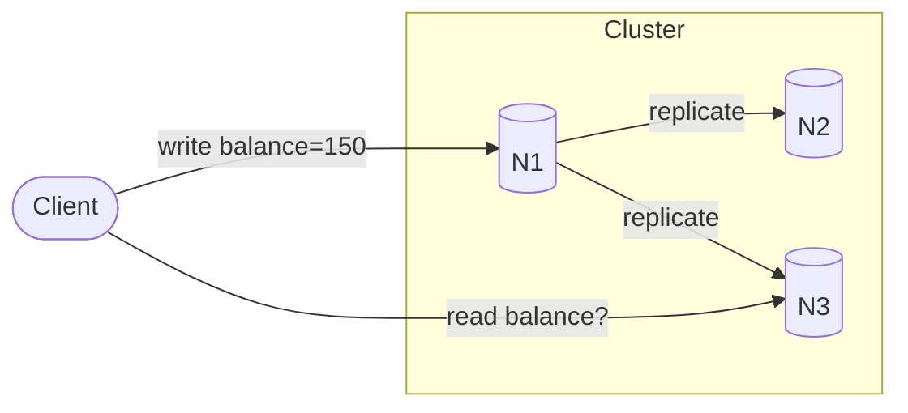
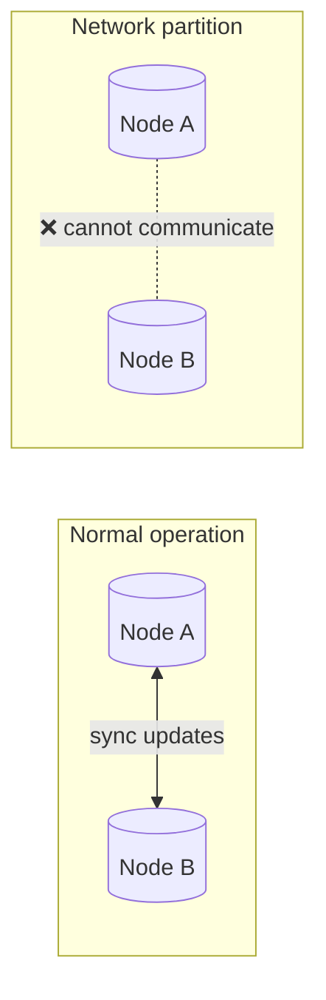
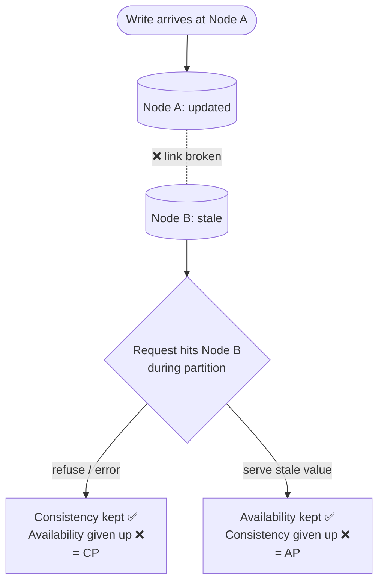
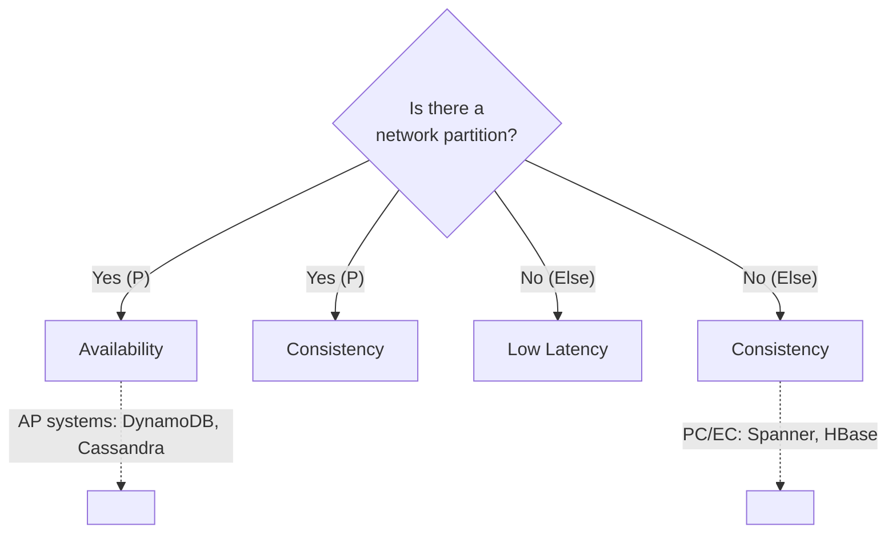
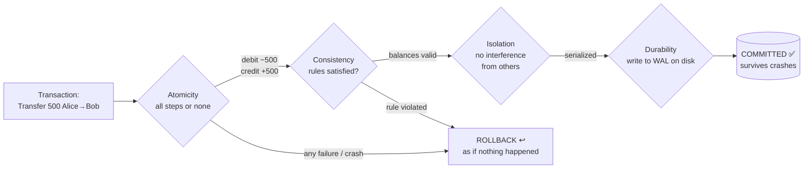
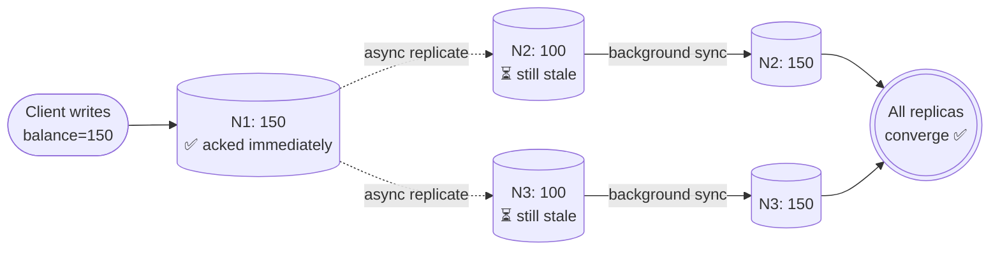
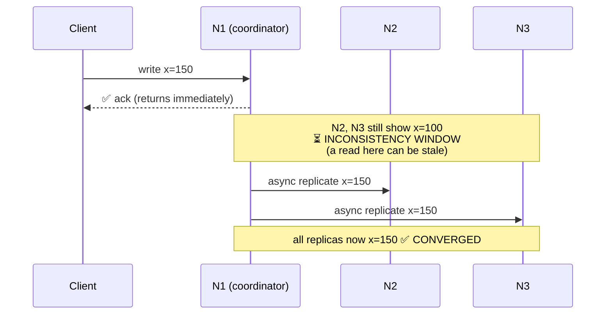
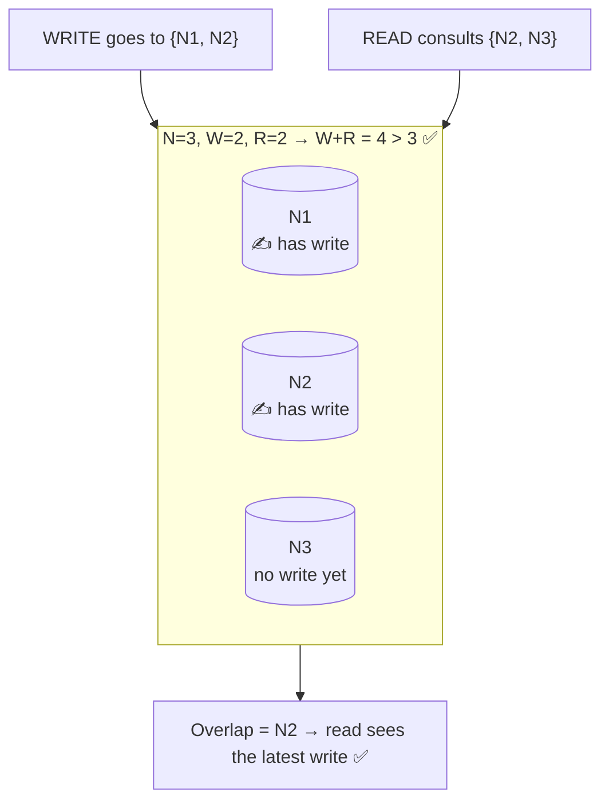
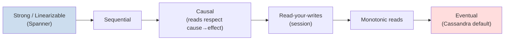

# 📋 Distributed Systems Consistency: CAP, PACELC, ACID, BASE & Quorum — The Complete Study Guide

> A single reference that takes you from *"what does consistency even mean?"* all the way to *"here's how I'd tune a Cassandra cluster's read/write quorums for a payment ledger and defend it in a design review."*

---

## 🔗 Table of Contents

1. [Introduction: Why This Family of Concepts Exists](#-1-introduction-why-this-family-of-concepts-exists)
2. [The Mental Model: State, Replication & Failure](#-2-the-mental-model-state-replication--failure)
3. [Core Definitions (Plain English First)](#-3-core-definitions-plain-english-first)
4. [CAP Theorem](#-4-cap-theorem)
5. [PACELC: The Grown-Up CAP](#-5-pacelc-the-grown-up-cap)
6. [ACID: Transactional Guarantees](#-6-acid-transactional-guarantees)
7. [BASE: The Availability-First Philosophy](#-7-base-the-availability-first-philosophy)
8. [Eventual Consistency: A Closer Look](#-8-eventual-consistency-a-closer-look)
9. [Quorum: The Tunable Knob That Ties It All Together](#-9-quorum-the-tunable-knob-that-ties-it-all-together)
10. [Consistency Models Spectrum](#-10-consistency-models-spectrum)
11. [Categorized Real-World Examples](#-11-categorized-real-world-examples)
12. [❌ Common Misconceptions](#-12-common-misconceptions)
13. [🎓 Staff/Principal-Level Nuance](#-13-staffprincipal-level-nuance)
14. [🔗 Adjacent & Extension Concepts](#-14-adjacent--extension-concepts)
15. [⚡ Quick Revision](#-15-quick-revision)
16. [🎯 FAANG Interview Q&A (30 Questions)](#-16-faang-interview-qa-30-questions)
17. [📝 STAR Behavioral Questions](#-17-star-behavioral-questions)
18. [📚 Further Reading](#-18-further-reading)

---

## 🎯 1. Introduction: Why This Family of Concepts Exists

Every one of these acronyms is an answer to the same underlying problem: **the moment your data lives on more than one machine, you can no longer pretend that reads and writes are instantaneous, ordered, and always successful.**

On a single machine, life is simple. You write a value, you read it back, and you get exactly what you wrote. The database can lock a row, make a change, and unlock it — nobody sees an in-between state. But single machines have limits: they run out of CPU, RAM, and disk; and when they crash, your entire system goes down with them. So we spread data across many machines (**replication** for durability/availability, **partitioning/sharding** for scale). The instant we do that, three unavoidable realities appear:

- **Networks fail.** Cables get cut, switches reboot, packets drop. Two healthy machines can suddenly be unable to talk to each other — a *network partition*.
- **Replication takes time.** Copying a write from one node to another is never truly instant; there's always a window where replicas disagree.
- **Concurrency exists.** Multiple clients read and write the same data at the same time, from different places.

CAP, PACELC, ACID, BASE, and Quorum are the vocabulary and the toolkit engineers built to reason about — and make deliberate choices within — these realities. They are not competing theories; they operate at different layers:

| Concept | What it describes | Layer |
|---|---|---|
| **CAP** | What you *must* sacrifice during a network partition | Theoretical limit |
| **PACELC** | CAP *plus* the everyday latency-vs-consistency trade-off | Theoretical limit (refined) |
| **ACID** | Strong correctness guarantees for transactions | Database contract |
| **BASE** | The relaxed, availability-first alternative to ACID | Design philosophy |
| **Quorum** | The concrete mechanism you tune to *land anywhere* on that spectrum | Implementation knob |

By the end of this guide you'll see them as one connected story: CAP/PACELC define the *rules of the universe*, ACID and BASE are two *philosophies* for living within those rules, and quorums are the *dial* you actually turn in production.

---

## 🧩 2. The Mental Model: State, Replication & Failure

Before definitions, install this picture in your head. It makes everything else click.

Imagine a single piece of data — say `balance = $100` — stored on **three replica nodes** (N1, N2, N3) for safety. A client wants to write `balance = $150` and later read it back.



Three questions immediately arise, and each acronym answers one:

1. **What happens if N1 → N3 replication link breaks mid-write?** (→ CAP: do you reject the request to stay *consistent*, or serve possibly-stale data to stay *available*?)
2. **Even when nothing is broken, should the client's write wait for all 3 replicas to confirm, or return after just 1?** (→ PACELC's "Else" branch: latency vs. consistency.)
3. **If two clients write at once, how do we keep the result correct and durable?** (→ ACID vs. BASE, and Quorum arithmetic.)

Keep the three-node picture in mind. The rest of this guide is just increasingly precise answers to those three questions.

<details>
<summary>🟢 Beginner explanation: the whiteboard-in-three-offices analogy</summary>

Imagine your company keeps one important number — today's stock price — written on a whiteboard, but copied onto whiteboards in **three different offices** so any office can answer customers quickly. When the price changes, someone has to run between offices updating each board. During that run, the offices temporarily disagree. If the hallway between offices floods (a "network partition"), you face a choice: let each office keep answering with its own possibly-outdated number (stay *open/available*), or tell customers "sorry, come back later" until the boards match (stay *consistent*). That single dilemma — running between offices takes time, and hallways sometimes flood — is the entire reason CAP, ACID, BASE, and quorums exist.

</details>

---

## 📖 3. Core Definitions (Plain English First)

Let's define the load-bearing terms precisely but simply. Everything downstream depends on these.

**Consistency (CAP sense):** Every read receives the most recent write *or an error*. All nodes agree on the current value at any given moment — as if there were a single copy of the data. ⚠️ Note this is *linearizability*, which is **not** the same "C" as in ACID (more on that landmine later).

**Availability:** Every request received by a non-failing node returns a (non-error) response — though not necessarily the latest data. The system never says "I refuse to answer."

**Partition Tolerance:** The system continues to operate despite an arbitrary number of messages being dropped or delayed between nodes. Partitions are not optional in the real world — they *will* happen.

**Latency:** How long a request takes to complete. In distributed systems, latency is tightly coupled to *how many nodes you wait for* before responding.

**Replication:** Keeping copies of the same data on multiple nodes for durability and availability.

**Replication factor (N):** How many copies of each piece of data exist.

**Strong consistency:** After a write completes, *every* subsequent read (from anyone) sees that write.

**Eventual consistency:** If no new writes occur, all replicas *eventually* converge to the same value — but for a window of time, reads may be stale.

**Quorum:** A minimum number of nodes that must agree/respond for an operation to be considered successful.

<details>
<summary>🟢 Beginner explanation: "consistency" is an overloaded word</summary>

The single most confusing thing for newcomers: the word "consistency" means **two totally different things** depending on context. In CAP, "consistent" means *all copies show the same latest value* (think: synchronized clocks). In ACID, "consistent" means *the database never violates its own rules* (think: an account balance never goes negative, a foreign key always points to a real row). They share a name but describe different guarantees. When an interviewer says "consistency," a strong move is to ask "the CAP kind or the ACID kind?" — it signals you know the distinction.

</details>

---

## 🎨 4. CAP Theorem

> **How to read this section.** CAP sounds intimidating until it's explained plainly, but the core idea is genuinely simple once you strip away the jargon. It is *not* a rule for designing software — it is a theoretical result that explains how a distributed system behaves when communication between machines fails. This section builds it up from first principles: the problem it solves, a crisp definition, each of the three properties on its own, why you really only pick two, the CP and AP families with real databases, a worked example, its link to eventual consistency, the misconceptions, and a one-question intuition to lock it in.

### 4.1 Why the CAP theorem exists (the problem it solves)

Before the theorem, understand the problem it addresses. Modern applications rarely store all their data on a single machine. Instead, data is **replicated across multiple servers** to improve scalability, reliability, and fault tolerance — replication lets an application survive hardware failures and keep serving users even when individual machines go down.

But distributing data introduces a new challenge: **servers communicate over networks, and networks are not perfect.** Messages can be delayed. Connections can fail. Entire regions can become unreachable. The CAP theorem is precisely the statement of *what happens when those communication failures occur.*

### 4.2 What the CAP theorem says

The CAP theorem, introduced by computer scientist **Eric Brewer** (2000), states a simple but powerful limit:

> **When a network partition occurs, a distributed system can guarantee either _consistency_ or _availability_ — but not both simultaneously.**

The three letters stand for **Consistency (C)**, **Availability (A)**, and **Partition Tolerance (P)**. The headline version is "you can't have all three at once." The important — and frequently overlooked — phrase is **"when a partition occurs."** Many explanations skip that condition, which leads to the mistaken belief that a system is *constantly* choosing between consistency and availability. In reality, the trade-off only becomes necessary *after* communication between nodes breaks down.

### 4.3 The three properties, one at a time

A good way to internalize any concept is to state what it is, why it exists, and when it matters. Let's do that for each property before looking at the trade-off.

**Consistency (C)** means every client sees the same data after a successful write. Suppose a user updates their profile; immediately afterward, another user reads that profile. A consistent system guarantees the second user sees the latest version — there are no conflicting values depending on which server handled the request. Put formally: every read receives the most recent write, *or* an error. The classic case is a **bank balance** — if you deposit money, every subsequent read must reflect it; reading a stale balance is unacceptable.

> ⚠️ Consistency in CAP is **not** the same as ACID consistency. In CAP, consistency means *all replicas present a single, up-to-date view of the data*. ACID consistency is about a database moving between valid states under transactional rules. Conflating the two is one of the most common slips — see [§6](#-6-acid-transactional-guarantees).

**Availability (A)** means every request receives a response, even if some servers have failed. The response may not contain the newest information, but the user always gets an answer instead of a hard failure. Availability is about **accessibility, not correctness**. A good example is a **social media timeline** — if the feed is a few seconds out of date, no one is harmed, but an error page is a real problem.

**Partition Tolerance (P)** means the system keeps working during a **network partition** — a situation where nodes cannot communicate reliably because of a dropped connection, a failed switch, or network congestion. Each node keeps running, but they no longer exchange updates. In any system spread across multiple machines or data centers, partitions are **not hypothetical — they will happen**, which is why partition tolerance is not optional.



### 4.4 Why you can only pick two (the honest version)

Here is the part most simplified explanations get slightly wrong. CAP is **not** really a free "pick any two of three" buffet.

In a distributed system, **partition tolerance is not optional** — networks fail, so any real distributed data store *must* tolerate partitions. That means the genuine choice is between **consistency and availability, and only when a partition is actually happening.**

Picture two database nodes in different regions holding copies of the same data. The network link between them breaks, and a write arrives at one node. The system now faces a fork in the road:

- **Choose consistency:** refuse to serve reads (or the write) on the other node until the partition heals, so no one ever sees stale data. The system sacrifices **availability** — some requests get errors.
- **Choose availability:** let both nodes keep serving requests, accepting that they may temporarily disagree until they reconcile. The system sacrifices **consistency** — some reads are stale.



That is the entire trade-off. Crucially, **when there is no partition, a well-designed system can offer both consistency and availability** — the dilemma only appears *during* the partition. Understanding this nuance is what separates a memorized answer from a real one.

### 4.5 CP systems: Consistency + Partition tolerance

A **CP system prioritizes consistency.** When replicas cannot communicate, it may **reject requests rather than risk returning inconsistent data.**

Consider an online banking application. A customer transfers money between accounts, and one database replica becomes temporarily unreachable. Rather than risk incorrect balances, the application refuses additional writes until synchronization completes. Users experience *reduced availability*, but the data stays *correct*. Applications involving financial transactions, inventory management, and critical business operations typically favor consistency.

### 4.6 AP systems: Availability + Partition tolerance

An **AP system prioritizes availability.** Requests keep succeeding even if replicas temporarily disagree, and the replicas synchronize once communication is restored.

Consider a social networking application. A user updates their profile picture; some users immediately see the new picture while others briefly see the old one. Although the information is temporarily inconsistent, the service stays *available*. For many applications this trade-off is acceptable because short-lived inconsistency causes little harm.

### 4.7 The three categories with real databases

Systems are commonly grouped by which pair they prioritize. Concrete examples make the idea stick:

| Category | Prioritizes | Behavior during a partition | Real databases |
|---|---|---|---|
| **CP** | Consistency + Partition tolerance | Reject/block requests that can't be made consistent | HBase, Google Spanner, MongoDB (majority/linearizable config), Zookeeper, etcd |
| **AP** | Availability + Partition tolerance | Keep serving; replicas reconcile later (eventual consistency) | Cassandra, DynamoDB (default), Riak, CouchDB |
| **CA** | Consistency + Availability | *Cannot survive a partition* | Single-node RDBMS (PostgreSQL, MySQL on one node) |

**A note on CA:** a system that gives up partition tolerance is essentially a **single-node or tightly-coupled system that simply cannot survive a network split.** Once you distribute data across machines that can be partitioned, CA stops being a realistic option — which is why real-world distributed databases are effectively either CP or AP. Treat CA as *the special case that proves the rule*, not a design you'd choose for a large-scale service.

<details>
<summary>🟢 Beginner explanation: the two ATMs</summary>

Picture two ATMs for one bank account, connected by a phone line. The line goes dead (a partition). A customer walks up to ATM #2 and asks to withdraw $100. ATM #2 can't check with the rest of the bank. It has two choices: **(CP)** refuse — "sorry, service unavailable" — guaranteeing it never lets you overdraw; or **(AP)** allow it — "here's your cash" — staying useful but risking that you already emptied the account at ATM #1. Banks lean CP for withdrawals (correctness matters more than convenience). A "like" button on a photo leans AP (who cares if the count is briefly off, as long as the button works). CAP is just: *when the phone line dies, which ATM behavior do you want?*

</details>

### 4.8 A worked example: choosing for two real systems

The theorem only matters if you can apply it. Consider two systems with opposite needs.

**A payment or inventory system — correctness is non-negotiable.** You cannot sell the same concert seat twice or let an account go negative. During a partition, you would rather reject some requests than risk inconsistent data. This is a **CP choice**: prioritize consistency, accept reduced availability.

**A social news feed — availability wins.** Showing a post a few seconds late is invisible to users, but an unavailable feed drives them away. During a partition, you keep serving even if different users briefly see slightly different versions of the timeline. This is an **AP choice**: prioritize availability, accept eventual consistency.

Notice that in both cases *the requirements drove the decision.* The same reasoning generalizes: **banking systems** usually prioritize consistency (a wrong balance is worse than a rejected request); **social media** usually prioritizes availability (a slightly stale post beats an error page); and **messaging apps** may make *different* choices for different operations — sending a message may prioritize reliability, while displaying presence/"last seen" may prioritize availability.

### 4.9 CAP and eventual consistency

Many AP systems rely on **eventual consistency**: after a write, replicas may temporarily disagree, but given enough time *and no further updates*, all replicas converge to the same state. This lets an application stay responsive during network failures while accepting temporary inconsistency, and it powers many of the largest distributed databases in the world. So "choosing availability" does **not** mean "giving up on consistency" — it means accepting *eventual* consistency instead of *immediate* consistency. (Full treatment in [§8](#-8-eventual-consistency-a-closer-look).)

### 4.10 ❌ Common misconceptions

Several misunderstandings appear repeatedly:

- **"You permanently pick two of three."** No — the consistency-vs-availability choice only bites *during a partition*. The rest of the time you can have both.
- **"Partition tolerance is optional."** Not for a real distributed system. Networks fail (cables break, switches fail, cloud regions go dark), so P is a given — which is why the real choice is C vs A.
- **"CAP consistency is the same as ACID consistency."** Related but distinct. CAP consistency = all nodes agree on the latest value; ACID consistency = a database moves between valid states under transactional rules.
- **"Every database is permanently CP or AP."** Many modern databases allow **configurable consistency levels** depending on workload (e.g., DynamoDB's eventually- vs strongly-consistent reads; MongoDB's write/read concerns).
- **"Eventual consistency means broken."** It's a deliberate, valid design choice — replicas converge once communication is restored, and it underpins many of the world's largest systems.
- **Discussing CAP without mentioning partitions.** Since partitions are what *trigger* the theorem, omitting them weakens the explanation significantly.

### 4.11 💡 Building an intuition for CAP

A useful way to hold the whole theorem in your head is one simple question:

> **Suppose communication between servers suddenly fails. Would the application rather (a) return the latest guaranteed data while rejecting some requests, or (b) keep serving users even if some responses are temporarily outdated?**

Every distributed application eventually answers this question, and the right answer depends entirely on the product being built. Recognizing that **business requirements drive the architectural decision** — not the technology alone — is one of the strongest signals of engineering maturity.

> 🔗 *Where CAP ends and PACELC begins:* CAP only describes what happens *during* a partition — a small fraction of a system's life. Even when the network is perfectly healthy, a distributed system still trades **latency vs consistency**, because keeping replicas in sync takes time. That gap is exactly what PACELC fills next in [§5](#-5-pacelc-the-grown-up-cap).

---

## 🧭 5. PACELC: The Grown-Up CAP

### Why CAP wasn't enough

CAP only tells you what happens **during a partition** — a relatively rare event. But it says *nothing* about the trade-off your system makes 99.9% of the time when the network is perfectly healthy. Yet even with no partition, a replicated system *still* has to choose: do I wait for replicas to sync before responding (more consistent, higher latency), or respond immediately from one node (lower latency, possibly stale)?

Daniel Abadi's **PACELC** (2012) fills that gap. Read it as:

> **If** there is a **P**artition, choose between **A**vailability and **C**onsistency; **E**lse (normal operation), choose between **L**atency and **C**onsistency.



### The four PACELC classes

Systems are classified by two letters: their partition choice (A or C) and their else choice (L or C).

| Class | During Partition | Normal Operation | Example |
|---|---|---|---|
| **PA/EL** | Availability | Low Latency | Cassandra, DynamoDB, Riak (default) |
| **PC/EC** | Consistency | Consistency | Google Spanner, VoltDB, HBase, BigTable |
| **PA/EC** | Availability | Consistency | MongoDB (in certain configs) |
| **PC/EL** | Consistency | Low Latency | PNUTS (Yahoo), some tuned configs |

### Why this matters at staff level

PACELC captures the trade-off engineers *actually* argue about in design reviews. Nobody's cluster is partitioned most days — but *every* read/write pays the latency-vs-consistency tax constantly. Saying "DynamoDB is AP" is incomplete; saying "DynamoDB is **PA/EL** — it favors availability during partitions *and* low latency in normal operation, which is exactly why it defaults to eventually-consistent reads that you can optionally upgrade to strongly-consistent for 2× the read cost" is a staff-level answer.

<details>
<summary>🟢 Beginner explanation: the group chat</summary>

You and two friends plan dinner over group chat. **PACELC's "Else" branch** is the everyday case where everyone's phone works: when you decide "7pm at Luigi's," do you wait for *both* friends to thumbs-up before considering it final (consistent, but slow — you're stuck waiting), or do you just declare it and move on (fast, but a friend might still think it's 8pm)? Now the **"P" branch**: one friend loses signal in a tunnel. Do you postpone the whole plan until they're back (consistency), or lock it in without them (availability)? CAP only covers the tunnel scenario. PACELC reminds you that even when everyone's online, you're *still* choosing between "wait for everyone" and "move fast."

</details>

---

## 🔐 6. ACID: Transactional Guarantees

### 6.1 First, what is a "transaction"?

Before ACID makes sense, you need one idea: a **transaction** is a group of database operations that you want the database to treat as a **single, all-or-nothing unit of work.**

The textbook example is a bank transfer. Moving ₹500 from Alice to Bob is really *two* separate operations:

1. Subtract ₹500 from Alice's balance.
2. Add ₹500 to Bob's balance.

Individually, either could succeed or fail. But you never want operation 1 to happen *without* operation 2 — that would make ₹500 vanish into thin air. So you wrap both in a transaction and tell the database: "do both, or neither." In SQL that looks like:

```sql
BEGIN;                                          -- start the transaction
  UPDATE accounts SET balance = balance - 500 WHERE name = 'Alice';
  UPDATE accounts SET balance = balance + 500 WHERE name = 'Bob';
COMMIT;                                          -- make it permanent (or ROLLBACK to undo)
```

**ACID** is the set of four guarantees a database makes about how it handles that transaction — even when things go wrong (crashes, power loss, ten people transacting at once). It's the reason relational databases like **PostgreSQL, MySQL, Oracle, and SQL Server** are trusted for money, orders, and inventory. ACID stands for **A**tomicity, **C**onsistency, **I**solation, **D**urability.

### 6.2 The four properties, explained plainly

**A — Atomicity ("all or nothing").**
Every operation inside the transaction succeeds, or none of them do. There is no "half-done" state. If the database crashes right after subtracting from Alice but before adding to Bob, atomicity guarantees that on restart the subtraction is *undone* — as if the transaction never happened. The mechanism: databases keep an **undo log** so they can roll back partial work, and a transaction only "counts" once you `COMMIT`. Before commit, everything is provisional.

**C — Consistency ("the rules always hold").**
A transaction moves the database from one *valid* state to another *valid* state — it never leaves the data breaking the rules you defined. Those rules are things like: a `CHECK (balance >= 0)` constraint, a foreign key that says "an order must point to a real customer," a `UNIQUE` email column, or a trigger. If a transaction *would* violate any rule, the database rejects the whole thing. Example: if Alice only has ₹300 and a `balance >= 0` rule exists, the transfer of ₹500 is refused rather than leaving her at −₹200.

> ⚠️ **This is NOT the same "C" as in CAP.** ACID's Consistency = "my integrity rules are never violated." CAP's Consistency = "all replicas show the same latest value." They just unluckily share a letter. See [§3](#-3-core-definitions-plain-english-first).

**I — Isolation ("concurrent transactions don't corrupt each other").**
When many transactions run at the same time, isolation makes each one behave *as if* it were running alone. Without it, two transactions reading and writing the same rows can interleave and produce nonsense (classic bug: two people withdraw from the same account simultaneously and both "see" the full balance). The strongest form, **serializability**, guarantees the end result equals *some* order of running the transactions one after another. Isolation is actually a *dial* with several levels (covered in 6.4) — because perfect isolation is expensive.

**D — Durability ("once committed, it survives anything").**
After the database says "COMMIT succeeded," that data will survive a crash, power cut, or reboot. It won't silently disappear. The mechanism: before confirming the commit, the database writes the change to a **write-ahead log (WAL)** on disk (an append-only file of "here's what I'm about to do"). Even if the server loses power a millisecond later, on restart it replays the WAL to recover every committed change.



### 6.3 Why each guarantee matters (concrete failures they prevent)

It helps to see what *breaks* without each property:

| Property | Without it, this bug happens | Real-world stakes |
|---|---|---|
| **Atomicity** | Money leaves Alice but never reaches Bob (crash mid-transfer) | ₹500 vanishes; books don't balance |
| **Consistency** | An order row points to a customer that doesn't exist; a balance goes negative | Corrupt, un-trustable data |
| **Isolation** | Two concurrent withdrawals both succeed on the same ₹1000, overdrawing to −₹? | Double-spend, oversold inventory |
| **Durability** | "Payment successful!" shown, then a crash erases it | Customer charged, order lost |

### 6.4 Isolation is a spectrum, not a switch

Here's the detail most people miss: **isolation has levels**, and most databases *do not* use the strictest one by default because it's slow. Weaker levels allow certain "anomalies" (weird interleavings) in exchange for higher concurrency and speed. The SQL standard defines four levels:

| Level | Prevents | Still allows (anomaly) | Used by |
|---|---|---|---|
| **Read Uncommitted** | (nothing) | Dirty reads | rare |
| **Read Committed** | Dirty reads | Non-repeatable reads, phantoms | **PostgreSQL default** |
| **Repeatable Read** | Dirty + non-repeatable reads | Phantoms (mostly) | **MySQL/InnoDB default** |
| **Serializable** | All anomalies | (nothing) | strictest, lowest concurrency |

The three anomalies in plain English:

- **Dirty read:** you read data another transaction wrote but hasn't committed yet — and it might get rolled back, so you read a value that "never really existed."
- **Non-repeatable read:** you read a row twice in one transaction and get two *different* values because someone else committed a change in between.
- **Phantom read:** you run the same `WHERE` query twice and get a *different set of rows* because someone inserted/deleted matching rows in between.

The takeaway: "ACID compliant" doesn't automatically mean "perfectly serializable." A staff-level engineer knows to *check the isolation level* their database actually runs at, because the default may permit anomalies that matter for their workload.

### 6.5 Where ACID lives (and its limits)

ACID is the natural home of **single-node relational databases**, where one machine sees all the data and can lock rows cheaply. Its limit shows up when you try to **scale horizontally** (spread data across many machines): enforcing atomicity and isolation *across nodes* requires expensive coordination like **two-phase commit** (see [§14](#-14-adjacent--extension-concepts)), which is slow and fragile under network failures. That tension — strong guarantees vs. easy scaling — is exactly what motivates BASE in the next section, and what "NewSQL" databases (Spanner, CockroachDB) work hard to reconcile.

<details>
<summary>🟢 Beginner explanation: the careful accountant</summary>

ACID is the promise a meticulous accountant makes. **Atomicity:** if you're moving money between two ledgers and the phone rings mid-entry, they never leave it half-done — they either finish both entries or erase both. **Consistency:** they never let the books break the rules (the totals always balance, every entry references a real account). **Isolation:** if two accountants work at once, they don't scribble over each other's pages — it's as if each took a turn. **Durability:** once written in permanent ink and filed in the vault, an entry survives even if the office floods. Relational databases like PostgreSQL bake these promises into every transaction, which is why banks trust them with your money.

</details>

---

## 🌊 7. BASE: The Availability-First Philosophy

### 7.1 Why BASE exists

Imagine you're Amazon on Black Friday. Millions of people are adding items to carts every second, across servers on multiple continents. If you insisted on full ACID guarantees — every write coordinated and confirmed across all replicas before responding — two things would happen: requests would get *slow* (waiting for far-away machines to agree), and during any network hiccup the system might *refuse to serve* to protect consistency. For a shopping cart, refusing to work means lost sales. That's an unacceptable trade for this kind of workload.

So the big web companies made a different bet, crystallized in **Amazon's Dynamo paper (2007)**: for many workloads, **staying always-on and fast matters more than being perfectly consistent at every instant.** BASE is the name for that philosophy. It's the deliberate *opposite* of ACID — and the acronym is a chemistry pun (acids vs. bases). Where ACID says "be correct, even if you have to say no," BASE says "always say yes, and sort out the details shortly after."

### 7.2 The three properties, explained plainly

BASE stands for **Ba**sically Available, **S**oft state, **E**ventual consistency.

**BA — Basically Available.**
The system *always responds* to a request — it prioritizes availability above all. The response might be slightly stale, or a degraded/partial result, but you never get a hard "service unavailable." How? By spreading data across many **replicas** so that even if some are down or unreachable, *some* node can still answer. Example: a Cassandra cluster keeps serving reads even when a few nodes are offline, because other replicas hold copies of the data.

**S — Soft state.**
The system's data can *change over time even when no one is writing to it* — because replicas are still busy syncing in the background. In an ACID database, if nobody writes, the data just sits there, settled. In a BASE system you can't assume that: replica N2 might show an old value now and a newer value a second later purely because a background sync caught up. The state is "soft" — in flux until things settle. This is a direct consequence of copying data asynchronously.

**E — Eventual consistency.**
If writes stop coming in, all replicas *will eventually* converge to the same, latest value. Reads might be stale for a short window (usually milliseconds), but not forever. This is the key relaxation: BASE doesn't say "never consistent," it says "consistent *eventually* instead of *immediately*." (Full mechanics — how replicas actually converge, and how conflicts get resolved — are in [§8](#-8-eventual-consistency-a-closer-look).)



The diagram shows the whole idea: the write is acknowledged instantly from one node (**basically available** — fast, never blocks), the other replicas are briefly out of date (**soft state**), and background replication brings everyone to the same value (**eventual consistency**).

### 7.3 A worked example: the "always writable" shopping cart

Amazon's cart is the canonical BASE example. Suppose your phone (talking to a US server) and your laptop (talking to an EU server) both add items while the two servers are briefly out of sync:

- **ACID approach:** block or reject one write until the servers agree → the customer sees an error or a spinner → maybe abandons the purchase.
- **BASE approach:** accept *both* writes immediately on their respective nodes (basically available). The carts temporarily disagree (soft state). When the servers reconcile, the system **merges** them — the safe default is "keep all added items" (eventual consistency). Worst case, a removed item briefly reappears, which is far less costly than a lost sale.

This "never refuse a write, reconcile later" pattern is exactly why AP/BASE stores power carts, feeds, and sessions.

### 7.4 ACID vs BASE side by side

| Dimension | ACID | BASE |
|---|---|---|
| Core promise | Be correct, even if you must reject | Always respond, reconcile later |
| Consistency | Strong, immediate | Eventual |
| Availability | May sacrifice to protect data | Prioritized above all |
| Typical databases | PostgreSQL, MySQL, Oracle, SQL Server | Cassandra, DynamoDB, Riak, CouchDB |
| Scaling style | Vertical (scale *up*), sharding is hard | Horizontal (scale *out*), designed for it |
| Data model fit | Relational, strong constraints | Key-value, wide-column, document |
| Best for | Money, inventory, orders, ledgers | Feeds, carts, sessions, metrics, telemetry |
| On failure | May reject writes to stay correct | Keeps serving, converges when healed |

### 7.5 The key insight: it's not "which is better," it's "which per workload"

BASE isn't *worse* than ACID — it's a different point on the same trade-off curve, chosen when availability and scale matter more than instant correctness. The mature stance is to use **both in the same product**, matched to each piece of data:

- **Payments, orders, inventory** → ACID (e.g., PostgreSQL) — correctness is non-negotiable.
- **Activity feed, "recently viewed," session store, like counts** → BASE (e.g., DynamoDB, Cassandra) — availability and scale win, brief staleness is harmless.

This connects back to CAP: choosing BASE *is* choosing the **AP** side (available, eventually consistent), while ACID typically lines up with the **CP** side. BASE is essentially the practical, everyday face of "prioritize availability."

<details>
<summary>🟢 Beginner explanation: the busy coffee shop</summary>

A tiny café run by one perfectionist barista is ACID: every order is made perfectly, in order, and correct — but if the line is long you wait, and if the barista steps out, the shop is closed. A giant coffee chain is BASE: dozens of baristas, always open, always serving (**basically available**). When a new seasonal drink launches, not every location knows the recipe *the same second* (**soft state**) — but within a day all stores are synced (**eventual consistency**). You might get a slightly-off latte at one branch briefly, but the chain never closes and eventually everyone's consistent. For coffee, that's a fine trade. For your bank balance, you'd want the perfectionist.

</details>

---

## ⏳ 8. Eventual Consistency: A Closer Look

### 8.1 Introduction: what it is and why you meet it everywhere

Eventual consistency is the "E" in BASE, and it's the consistency model behind most internet-scale systems — social feeds, DNS, shopping carts, session stores, and large NoSQL databases like Cassandra and DynamoDB. It deserves its own section because it's also the most *misunderstood* model: people hear "eventually" and assume "unreliable" or "often wrong." Neither is true.

The idea is simple. In a system with multiple copies (replicas) of your data, a write lands on one replica first and is copied to the others *asynchronously* — that is, the system tells the client "done!" *before* every replica has the new value. For a brief window afterward, different replicas hold different values. Eventual consistency is the promise that, as long as no new writes arrive, this disagreement is temporary and self-healing: **all replicas will converge to the same, latest value.**

### 8.2 The precise definition

> **Eventual consistency** guarantees that *if no new updates are made to a given item, all replicas will eventually return the last updated value.*

Unpack that carefully, because every word is doing work:

- **"If no new updates are made"** — convergence is only guaranteed *when writes stop*. As long as new writes keep flowing, replicas are perpetually catching up (which is fine; it just means the target keeps moving).
- **"eventually"** — there's no promise about *how long* it takes. Usually milliseconds; occasionally longer under load or across regions.
- **"all replicas will return the last updated value"** — the end state is agreement. The model says nothing about what you read *in the meantime*, and nothing about the *order* in which replicas see updates.

In formal terms this is a **liveness** guarantee ("something good — convergence — will eventually happen") but *not* a **safety** guarantee ("nothing bad — like a stale read — ever happens"). That single distinction is the whole reason stronger models exist: read-your-writes, monotonic reads, and causal consistency (see [§10](#-10-consistency-models-spectrum)) are all *safety* guarantees layered on top of plain eventual consistency to constrain what you can observe during the catch-up window.

### 8.3 The inconsistency window — where staleness lives

The gap between "the write was acknowledged" and "every replica has the new value" is called the **inconsistency window** (or **replication lag**). A read that hits an already-updated replica sees fresh data; a read that hits a not-yet-updated replica sees stale data.



**What controls the window's width?** Network latency between replicas, how loaded the nodes are, the replication strategy (synchronous vs. asynchronous, and to how many nodes), and physical distance. Within one data center it's typically single-digit to tens of milliseconds; across continents it can be hundreds of milliseconds; under heavy load or partial failure it can briefly spike to seconds. The key beginner takeaway: staleness is real but *bounded and short* in a healthy system — it is not a permanent "wrong answer."

### 8.4 How replicas actually converge (the mechanisms)

Convergence isn't magic — real databases run three concrete background mechanisms to make it happen. Understanding these turns "eventual consistency" from a vague promise into an engineered process:

- **Read repair.** When a read is sent to several replicas at once and the coordinator notices they disagree, it returns the newest value to the client *and* writes that newest value back to the stale replicas. So normal read traffic actively heals divergence as a side effect.
- **Hinted handoff.** If a replica that *should* receive a write is temporarily down, another node accepts the write and stores a "hint" — a note saying "this belongs to node X." When node X comes back, the hint is replayed to it. This stops writes from being lost during short outages.
- **Anti-entropy with Merkle trees.** Periodically, replicas compare their data using a **Merkle tree** — a tree of hashes where each parent summarizes its children. Two replicas can compare just the top hashes; if those match, all data below is identical and they stop. If not, they walk *down* only the branches that differ, so they find and repair divergent data while transferring very little. This is how large clusters reconcile efficiently in the background.

### 8.5 The hard part: conflicting concurrent writes

The trickiest question eventual consistency raises is: if two clients write *different* values to the *same* key at nearly the same time on *different* replicas, then when the replicas sync — **converge to which value?** There's no single right answer, so systems pick a conflict-resolution strategy, and the choice has real consequences:

- **Last-Write-Wins (LWW).** Attach a timestamp to each write and keep the one with the highest timestamp. Dead simple, but it **silently discards** the "losing" write, and it's dangerous when servers' clocks are even slightly out of sync (**clock skew**) — the write with the "later" timestamp might not actually be the later one. This is Cassandra's default.
- **Version vectors / vector clocks.** Instead of guessing, the system tracks causality — it can tell whether write B *happened after* write A (so A is safely superseded) or whether A and B were truly *concurrent* (a genuine conflict). Genuine conflicts are surfaced to the application as multiple versions ("siblings") to merge. This is the original Dynamo/Riak approach — no data is silently lost, but the app must resolve conflicts.
- **CRDTs (Conflict-free Replicated Data Types).** Special data structures (counters, sets, maps) whose merge operation is mathematically designed so that *any* order of merging produces the same result, with no lost updates. Used in Riak and Redis and in collaborative editors. They eliminate the "converge to what?" problem by construction, at the cost of being restricted to specific data types.

### 8.6 Strong Eventual Consistency (SEC) — the deeper guarantee

Plain eventual consistency leaves the "which value wins?" question open. **Strong Eventual Consistency (SEC)**, a term from the CRDT literature, closes it with a sharper promise:

> Any two replicas that have received the **same set of updates** are in the **same state** — regardless of the *order* in which they received them.

Because a CRDT's merge is commutative, associative, and idempotent (order-independent and safe to re-apply), replicas don't need to coordinate to agree — they just need to eventually *see* the same updates, in any order, and they'll land in the same state without ever losing data. SEC is the principled answer to "how do I get convergence *and* guarantee no updates are dropped?" It's why collaborative apps (multiple people editing one document) can stay both responsive and correct.

---

## 🔧 9. Quorum: The Tunable Knob That Ties It All Together

### 9.1 Introduction: from "philosophy" to a dial you actually turn

Everything so far described *philosophies* (ACID vs BASE) and *limits* (CAP, PACELC). **Quorum** is the concrete mechanism that lets you implement those choices — and, remarkably, it lets you land *anywhere* between strong and eventual consistency, often on a per-query basis.

Here's the setup. Your data is replicated onto several nodes. When a client writes, you don't necessarily have to wait for *every* replica to confirm before telling the client "done" — you can wait for just *some* of them. Likewise, when a client reads, you can ask *some* replicas and return the newest answer among them. A **quorum** is simply the *minimum number of replicas that must respond* for an operation to count as successful. By choosing how many replicas a write must reach and how many a read must consult, you directly control the trade-off between consistency, latency, and availability. That's why quorum is best thought of as a *dial*, not an on/off switch.

### 9.2 The three numbers: N, W, R

Everything reduces to three values:

- **N** — the **replication factor**: how many copies of each piece of data exist across the cluster.
- **W** — the **write quorum**: how many of those N replicas must acknowledge a write before the system reports success to the client.
- **R** — the **read quorum**: how many replicas must respond to a read before the system returns an answer (it returns the newest value among the responders).

Intuitively: a bigger **W** means a write isn't "done" until more replicas have it (safer writes, but slower, and it fails if too many nodes are down). A bigger **R** means a read consults more replicas (more likely to catch the latest value, but slower). Smaller W and R are faster and more available, but risk missing the newest data.

### 9.3 The core rule: why W + R > N gives strong consistency

The single most important quorum fact:

> **If W + R > N, then every read is guaranteed to see the most recent write.**

The reasoning is just counting (the **pigeonhole principle**). A write is stored on some set of **W** nodes. A read consults some set of **R** nodes. If W + R is *greater than* the total number of nodes N, then those two sets **cannot be completely separate** — they must **overlap in at least one node**. That overlapping node holds the latest write, and since the read consults it, the read is guaranteed to *see* the latest write (the system picks the newest value, typically via a version number or timestamp).



In the diagram, the write set {N1, N2} and the read set {N2, N3} share **N2**. No matter which two nodes each operation happens to touch, with W=2, R=2, N=3 there is *always* at least one node in common. Conversely, if W + R ≤ N (say W=1, R=1, N=3), the write could land on N1 while the read only asks N3 — no overlap, so the read can miss the write. That configuration is **eventually consistent**, not strongly consistent.

> ⚠️ The rule requires **strictly greater than** (`>`), not "greater than or equal." With N=3, W=2, R=1 gives W+R=3, which equals N and is *not* enough to guarantee overlap.

### 9.4 Tuning the dial: common configurations

Because you choose W and R independently (as long as they don't exceed N), you can bias the system toward whatever your workload needs:

| Config (N=3) | W + R vs N | Consistency | Character |
|---|---|---|---|
| W=3, R=1 | 4 > 3 | Strong | **Fast reads**, slow/fragile writes (every replica must ack) — good for read-heavy data |
| W=1, R=3 | 4 > 3 | Strong | **Fast writes**, slow reads — good for write-heavy data |
| **W=2, R=2** | 4 > 3 | **Strong** | **Balanced** — the common default for strong consistency |
| W=1, R=1 | 2 < 3 | Eventual | **Fastest & most available**, but reads can be stale |
| W=2, R=1 | 3 = 3 | *Not guaranteed* | Looks close, but `=` isn't `>` — no overlap guarantee |

Two things to notice for beginners. First, **strong consistency isn't one setting** — W=3/R=1, W=1/R=3, and W=2/R=2 all satisfy W+R>N, so you pick the one whose speed profile matches your read/write mix. Second, **availability is a direct consequence of these numbers**: with N=3 and W=2, a write still succeeds if *one* node is down (you only need 2 of 3), but fails if *two* are down. Lowering W raises write availability; raising it raises durability/consistency. The dial is real and quantifiable.

### 9.5 How this implements your CAP / PACELC choice

Quorum is *how you turn the abstract CAP decision into configuration*:

- **Want AP / low latency (PA/EL)?** Set **W=1, R=1**. A write succeeds as soon as *one* replica accepts it, and a read returns from *one* replica — so operations keep working as long as any single node is reachable. Highly available, low latency, eventually consistent. This is Cassandra's and DynamoDB's fast path.
- **Want CP / strong consistency (PC/EC)?** Set **W + R > N** (e.g., W=2, R=2). Now correctness is guaranteed — but if a network partition prevents you from reaching enough replicas to form a quorum, the operation *fails* rather than returning possibly-stale data. You've deliberately chosen consistency over availability.

This is the punchline that ties the whole guide together: **quorums are the dial, CAP/PACELC are the physics that say what's possible, and ACID/BASE are the two ends the dial moves between.** Many systems (Cassandra with its `ONE` / `QUORUM` / `ALL` levels, DynamoDB with eventual vs. strong reads) expose this dial *per request*, so you can be strongly consistent for a checkout and eventually consistent for a feed in the very same application.

### 9.6 Sloppy quorums & hinted handoff — the important caveat

There's a real-world wrinkle that beginners should know so they don't over-trust the W+R>N rule. Dynamo-style systems add a feature called a **sloppy quorum**: during failures, if the "correct" home replicas for a key aren't reachable, the write is accepted by the *first N healthy nodes it can find* instead, paired with **hinted handoff** (those substitute nodes hold the data and forward it to the rightful owners once they recover). This is great for availability — writes keep succeeding even when several home replicas are down.

But it comes with a catch: because the write may have landed on *substitute* nodes while a read consults the *home* nodes, the read and write sets might **not overlap** during the failure — so **W+R>N no longer guarantees you'll see the latest write** until handoff completes. In other words, the clean overlap guarantee holds under *normal* operation; under failure with sloppy quorums, the system has quietly traded a bit of consistency for availability. Knowing this distinction is what separates a textbook understanding from an operational one.

---

## 🌈 10. Consistency Models Spectrum

<details>
<summary>📖 Expand section</summary>

"Strong" and "eventual" are the endpoints, but there's a rich spectrum between them. Interviewers love probing the middle.



- **Linearizable / Strong:** As if one copy; every read sees the latest write in real-time order. Strongest, most expensive.
- **Sequential:** All nodes see operations in the same order, but not necessarily real-time order.
- **Causal:** Operations that are causally related (a reply must come after the message it replies to) are seen in order everywhere; unrelated ops may be seen in any order. A sweet spot for many apps.
- **Read-your-writes:** You always see your *own* latest writes (even if others don't yet). Critical for UX — you post a comment and it appears for *you* immediately.
- **Monotonic reads:** You never see time go backward — once you've read a value, you won't later read an older one.
- **Eventual:** The weakest useful guarantee — converges *eventually* with no ordering promises in the meantime.

**Staff insight:** Most "eventually consistent" databases can be tuned to provide *session guarantees* (read-your-writes, monotonic reads) cheaply, which cover the vast majority of user-facing correctness concerns without paying for full linearizability.

</details>

---

## 📊 11. Categorized Real-World Examples

<details>
<summary>📖 Expand section</summary>

### 🏦 Category: Money & Correctness-Critical (choose CP / ACID / strong quorum)

- **Bank ledgers & payments (PostgreSQL, Oracle, Spanner):** Double-spending is catastrophic. Use ACID transactions; if distributed, use Spanner (PC/EC) which achieves strong consistency globally via TrueTime. Quorum: W+R>N, no compromise.
- **Inventory / seat booking (MySQL, CockroachDB):** Selling the same airplane seat twice is unacceptable. Strong consistency prevents overselling.
- **Coordination / config / leader election (Zookeeper, etcd, Consul):** These *are* CP systems by design — they use consensus (Raft/ZAB, majority quorum) because a split-brain in your coordination layer is a disaster.

### 🛒 Category: High-Availability, Tolerable Staleness (choose AP / BASE / relaxed quorum)

- **Shopping carts (Amazon DynamoDB / original Dynamo):** The famous example — Amazon chose AP so the cart is *always* writable, even reconciling conflicting versions (a re-added item) rather than ever refusing an add. Losing a sale to unavailability costs more than a rare cart glitch.
- **Social feeds & timelines (Cassandra at Instagram/Netflix, DynamoDB):** A "like" count being off by a few for a second is invisible to users; the feed must never go down.
- **Session stores & user preferences (Redis, DynamoDB, Cassandra):** Fast reads/writes, eventual consistency fine.
- **Metrics, logs, telemetry (Cassandra, InfluxDB):** Massive write volume, staleness irrelevant.

### 🌍 Category: Global-Scale "Have Your Cake" (engineered around the trade-off)

- **Google Spanner:** PC/EC — provides *external consistency* (linearizability) globally by using GPS + atomic clocks (TrueTime) to bound clock uncertainty and wait it out. It "beats" naive CAP intuition not by breaking it but by making partitions extremely rare (Google's private network) and paying a small commit-wait latency.
- **CockroachDB / YugabyteDB:** Spanner-inspired, Raft-based, distributed SQL offering ACID + horizontal scale — the "NewSQL" answer to "why must I choose ACID *or* scale?"
- **Azure Cosmos DB:** Uniquely lets you pick from *five* consistency levels (Strong, Bounded Staleness, Session, Consistent Prefix, Eventual) per request — literally exposing the PACELC dial to the developer.

### 📨 Category: Messaging & Streaming (ordering-focused)

- **Apache Kafka:** Durability & ordering *within a partition*; tunable with `acks=all` (wait for all in-sync replicas — strong) vs `acks=1` (fast, less safe) — Kafka's `acks` is essentially a write quorum knob.

</details>

---

## ❌ 12. Common Misconceptions

<details>
<summary>📖 Expand section</summary>

**❌ "CAP means pick any 2 of 3."**
✅ Partition tolerance isn't a free choice for real distributed systems — networks fail. You're really only choosing **C vs A, and only during a partition.** "CA" systems are essentially single-node.

**❌ "The 'C' in CAP and the 'C' in ACID are the same."**
✅ Totally different. CAP's C = all replicas agree on the latest value (linearizability). ACID's C = the database never violates its integrity constraints. A single-node ACID database can be perfectly "consistent" in the ACID sense while CAP's C is irrelevant (no replication).

**❌ "NoSQL means no ACID / SQL means no scale."**
✅ Outdated. MongoDB supports multi-document ACID transactions; DynamoDB has transactions; and CockroachDB/Spanner/YugabyteDB deliver ACID *at horizontal scale*. The old dichotomy is dissolving.

**❌ "Eventual consistency means data is often wrong."**
✅ Convergence windows are typically milliseconds. And session guarantees (read-your-writes) mask staleness from the user who made the change. "Eventual" ≠ "unreliable."

**❌ "Strong consistency is always better; just always use it."**
✅ It costs latency, availability, and money (more coordination, more waiting). For a like-counter, it's pure waste. Right tool for the job.

**❌ "Quorum (W+R>N) guarantees consistency, period."**
✅ Only under normal operation. **Sloppy quorums**, hinted handoff, and read-repair timing can violate it during failures. And W+R>N gives you *overlap*, not automatically *linearizability* (you also need proper conflict resolution / last-write-wins with synced clocks or version vectors).

**❌ "Spanner broke the CAP theorem."**
✅ No — it's a CP system that makes partitions so rare (via Google's network + TrueTime) that it *feels* like CA in practice. During a genuine partition, it still sacrifices availability.

</details>

---

## 🎓 13. Staff/Principal-Level Nuance

<details>
<summary>📖 Expand section</summary>

**Consistency is per-operation, not per-system.** Mature systems (Cosmos DB, Cassandra, DynamoDB) let you choose consistency *per request*. A staff engineer designs so the checkout write is strongly consistent while the "recently viewed" read is eventual — in the same application, same database.

**The real cost of strong consistency is tail latency, not throughput.** Coordination (waiting for a quorum, or a cross-region Raft round-trip) inflates p99 latency dramatically. In a multi-region setup, a strongly-consistent write may require a cross-continent round trip (100ms+). This is why "just use Spanner everywhere" is naive — the commit-wait and cross-region coordination can wreck user-facing latency SLOs.

**Conflict resolution is where AP systems get hard.** "Eventually consistent" begs the question: *eventually consistent to WHAT value?* Options: Last-Write-Wins (LWW, simple but loses data on concurrent writes — beware clock skew), version vectors / vector clocks (detect concurrency, push resolution to the app — Dynamo's original approach), or CRDTs (Conflict-free Replicated Data Types — data structures that mathematically guarantee convergence, used in Riak, Redis, collaborative editors).

**Read-repair and anti-entropy.** AP systems converge via mechanisms: *read-repair* (fix stale replicas detected during a read), *hinted handoff* (temporarily store writes for down nodes), and *Merkle-tree anti-entropy* (background comparison to find and heal divergent data). Knowing these named mechanisms signals operational depth.

**Consensus ≠ quorum, but they're related.** A simple R/W quorum gives you *overlap*. Full consensus protocols (Paxos, Raft, ZAB) give you *agreement on an ordered log* — strictly stronger, needed for leader election and linearizable state machines. Raft uses majority quorums internally, but adds leader-based ordering and term/log-matching guarantees. "We need a quorum" and "we need consensus" are different requirements.

**The CAP choice is often made at the *operation* boundary, and can be dynamic.** MongoDB lets you set `writeConcern` and `readConcern` per operation; DynamoDB toggles strong vs eventual reads per call; Kafka's `acks` is per-producer. Systems increasingly refuse to be globally "CP" or "AP" and instead expose the knob.

**Availability math: quorum reduces availability for writes.** With N=3, W=2, you can tolerate 1 node down for writes but not 2. Bumping N and requiring majority (W=⌈(N+1)/2⌉) trades storage/latency for fault tolerance. A principal engineer reasons about *how many simultaneous failures* the config survives, not just "is it consistent."

**PACELC's "EL" is where most money is spent.** Partitions are rare; the everyday latency-consistency trade-off runs on every single request, billions of times. Optimizing the "Else" branch (e.g., serving eventually-consistent reads from local replicas) is often where the real cost/latency wins are, not the partition handling.

</details>

---

## 🔗 14. Adjacent & Extension Concepts

<details>
<summary>📖 Expand section</summary>

**Two-Phase Commit (2PC) & Three-Phase Commit (3PC):** Protocols for atomic commit across multiple nodes/services. 2PC is blocking (a coordinator crash can hang participants holding locks) — a classic reason distributed transactions are avoided at scale.

**Saga Pattern:** The microservices alternative to distributed ACID transactions — a sequence of local transactions with compensating actions to undo on failure. Trades atomicity for availability and loose coupling. The go-to for "how do you do transactions across microservices without 2PC?"

**Consensus algorithms (Paxos, Raft, ZAB):** The engines behind CP systems (etcd/Consul use Raft, Zookeeper uses ZAB, Spanner uses Paxos). They provide agreement on an ordered log despite failures, needing a majority quorum to make progress.

**CRDTs (Conflict-free Replicated Data Types):** Data structures (counters, sets, maps) with merge operations that are commutative, associative, and idempotent — guaranteeing convergence *without coordination*. The elegant answer to AP conflict resolution; power collaborative apps (Figma-style) and Redis/Riak.

**Idempotency:** In BASE/AP systems with retries, operations must be safely repeatable (applying twice = applying once). Idempotency keys are essential for correctness under at-least-once delivery.

**Vector clocks / version vectors:** Track causality to detect concurrent (conflicting) updates vs. sequential ones — the machinery behind causal consistency and Dynamo-style conflict detection.

**Linearizability vs Serializability:** Two "strong" guarantees people conflate. Linearizability is about *single-object, real-time recency*. Serializability is about *multi-object transaction ordering*. Spanner offers *strict serializability* = both. Naming the difference is a senior/staff signal.

**CALM theorem (Consistency As Logical Monotonicity):** A deeper result — monotonic programs (that only add information, never retract) can be coordination-free and still consistent. Explains *why* CRDTs work and hints when you can drop coordination entirely.

</details>

---

## ⚡ 15. Quick Revision

> *Night-before, dense-and-scannable cheat sheet. If you only read one section, read this.*

### 🎯 The one-sentence mental model
> **CAP/PACELC = the physics (what's possible). ACID/BASE = the two philosophies (what to want). Quorum = the dial you actually turn. Eventual consistency = the default endpoint of that dial at internet scale.**

### 📐 CAP
The moment data lives on more than one machine, **networks become unreliable** — messages get delayed, links drop, regions go dark. CAP describes what a distributed store does *when that communication fails*. It juggles three things: **C**onsistency (every read returns the latest write, or an error), **A**vailability (every request gets a non-error response), and **P**artition tolerance (keeps working when nodes can't talk).

The famous "pick 2 of 3" is misleading. Since partitions *will* happen, **P is mandatory** — so the real choice is only **C vs A, and only during a partition**; when the network is healthy you get both. Picture USA↔EU replicas: a profile update hits USA, then the link snaps before it replicates. A read from EU must now either **refuse/return an error (CP)** or **serve the stale value (AP)** — there's no third option.

**CP systems** reject rather than risk wrong data (Zookeeper, etcd, HBase, Spanner, MongoDB in majority/linearizable mode) — the right call for money, inventory, seat booking, and coordination. **AP systems** always answer, reconciling later (Cassandra, DynamoDB default, Riak, CouchDB) — right for carts, feeds, sessions, metrics. **CA** means giving up P, which only exists on a single node.

Crucially, the choice is **per component, not per system**: Ticketmaster wants consistency for *booking* but availability for *viewing* events; even a cache is CP for session tokens but AP for like counts. And "consistency" here means *strong* consistency — choosing availability just means accepting a weaker level, usually eventual.

### 🧭 PACELC
CAP only speaks to the rare partition; PACELC covers the whole life of the system. Read it as: **if P**artition, choose **A** vs **C**; **E**lse (normal operation), choose **L**atency vs **C**onsistency. The insight is that even with a perfectly healthy network you still pay a tax — keeping replicas in sync takes time, so faster responses mean reading possibly-staler data.

Systems get a two-part label: **PA/EL** (Cassandra, DynamoDB, Riak — available and low-latency) or **PC/EC** (Spanner, HBase, VoltDB — consistent in both cases), with PA/EC and PC/EL in between. Since partitions are rare and the **"EL" trade-off runs on every single request**, that everyday branch is usually where the real latency and cost live.

### 🔐 ACID (strong / relational)
A **transaction** groups operations into one all-or-nothing unit (`BEGIN … COMMIT`, `ROLLBACK` to undo) — the classic being a bank transfer where the debit and credit must both happen or neither does. ACID is the four promises around it: **A**tomicity (all steps or none, via an undo log; nothing counts until commit), **C**onsistency (constraints, foreign keys, uniqueness are never left violated), **I**solation (concurrent transactions behave as if run one at a time), and **D**urability (once committed, it survives a crash because it was written to the **write-ahead log** first).

Skip any one and you get a real bug: money vanishes mid-transfer, two people double-spend the same balance, or a "success" evaporates on crash. Note **ACID's C ≠ CAP's C** — integrity rules, not replica agreement.

Isolation is really a **ladder** traded for speed — Read Uncommitted → Read Committed (**Postgres default**) → Repeatable Read (**MySQL default**) → Serializable — and the weaker rungs permit *dirty*, *non-repeatable*, and *phantom* reads. ACID is natural on a **single-node RDBMS**; enforcing it across nodes needs slow, blocking **2PC**, which is exactly what pushes large systems toward BASE.

### 🌊 BASE (availability-first)
BASE is the deliberate opposite of ACID, born at web scale (Amazon's 2007 Dynamo paper) from a simple bet: for a Black-Friday shopping cart, **always-on and fast beats perfectly consistent** — refusing a write means a lost sale. The name: **Ba**sically Available (always responds, because data lives on many replicas), **S**oft state (values can drift even with no new writes, as replicas sync in the background), and **E**ventual consistency (replicas converge once writes stop).

The cart shows it end-to-end: during a split it accepts writes on both sides (available), the carts briefly disagree (soft state), then **merge** on reconcile — keeping added items (eventual). This is built for **horizontal scale-out** on key-value/document stores (Cassandra, DynamoDB, Riak). Choosing BASE *is* choosing CAP's **AP** side — not "worse," just a different point on the curve, and mature systems use **both per workload**: ACID for payments, BASE for the feed.

### ⏳ Eventual Consistency
Because writes replicate **asynchronously** — the system acks *before* every replica has the new value — the promise is only that, **if writes stop, all replicas eventually converge** to the last value. Read each word: "eventually" gives no timing guarantee, and it says nothing about what you read *in between* or in what order. Formally it's a **liveness** promise, not a **safety** one — which is why stronger models (read-your-writes, monotonic, causal) get layered on top.

The gap between ack and full sync is the **inconsistency window** (replication lag): a read hitting an updated replica is fresh, one hitting a lagging replica is stale — usually milliseconds, more across regions or under load. Convergence isn't magic; three mechanisms drive it: **read-repair** (heal stale replicas noticed during a read), **hinted handoff** (a stand-in holds a write for a down node and replays it later), and **anti-entropy via Merkle trees** (compare hash trees, repair only the branches that differ).

The hard question is *converge to which value* when two writes race: **LWW** (highest timestamp wins — simple but silently lossy under clock skew, Cassandra's default), **vector clocks** (detect true conflicts and surface siblings — Dynamo/Riak), or **CRDTs** (merge always converges with no loss). That last one gives **Strong Eventual Consistency**: same set of updates → same state regardless of order.

### 🔧 Quorum
Quorum is the **dial** that turns your CAP/BASE choice into config — the trick is you wait for *some* replicas, not all. Three numbers: **N** copies, **W** replicas that must ack a write, **R** replicas a read must consult (it returns the newest of them). Bigger W means safer but slower writes; bigger R means fresher but slower reads.

The key rule: **W + R > N guarantees strong consistency**, because by the pigeonhole principle the read and write sets must **overlap** on at least one node that holds the latest write — and it must be *strictly* greater (N=3, W=2, R=1 = 3 is not enough). Strong consistency isn't a single setting: W=3/R=1 (fast reads), W=1/R=3 (fast writes), and **W=2/R=2 (balanced default)** all qualify. Drop to W=1,R=1 for the fastest, most available, eventually-consistent path. The numbers also fix availability — N=3,W=2 survives one node down for writes, not two.

So W=1,R=1 ≈ **AP/EL** and W+R>N ≈ **CP/EC**, and many systems expose this **per request** (Cassandra `ONE`/`QUORUM`/`ALL`, DynamoDB eventual vs strong). Caveat: a **sloppy quorum** (write to the first N *healthy* nodes during failure, plus hinted handoff) boosts availability but **breaks the overlap guarantee** until handoff completes.

### 🌈 Consistency spectrum (strong → weak)
Between the two endpoints lies a ladder: **Linearizable** (as-if one copy, real-time recency — Spanner) → **Sequential** → **Causal** (cause always precedes effect, so no reply appears before its comment) → **Read-your-writes** (you always see your own latest write) → **Monotonic reads** (time never appears to go backward) → **Eventual** (weakest, no ordering promise).

The practical takeaway: the **session guarantees** in the middle — read-your-writes and monotonic reads — cheaply cover almost all user-facing correctness without paying for full linearizability.

### 🗂️ Pick-the-system cheat table
| Need | Choose | Example |
|---|---|---|
| Money, inventory, correctness | CP / ACID / W+R>N | PostgreSQL, Spanner, CockroachDB |
| Coordination / config | CP + consensus | Zookeeper, etcd, Consul |
| Cart, feed, session, metrics | AP / BASE / W=R=1 | DynamoDB, Cassandra, Riak |
| Global ACID + scale | PC/EC "NewSQL" | Spanner, CockroachDB, Yugabyte |
| Per-request tunable | any of 5 levels | Azure Cosmos DB |

### 🧠 Traps to avoid
- CAP's C (replica agreement) ≠ ACID's C (integrity rules). · "Pick 2 of 3" is wrong — P is mandatory, choice is C-vs-A *during a partition*. · Spanner didn't *break* CAP (rare partitions + TrueTime; still CP). · W+R>N guarantees *overlap*, not linearizability, and breaks under sloppy quorum. · W+R must be strictly `>` N (=N isn't enough). · Eventual ≠ unreliable (ms window + session guarantees). · "ACID compliant" ≠ serializable (check the default isolation level). · NoSQL now has ACID (Mongo/DynamoDB txns); SQL now scales (Spanner/Cockroach). · LWW silently loses data under clock skew.

---

## 🎯 16. FAANG Interview Q&A (30 Questions)

> Q1–Q20 build core-to-senior understanding. **Q21–Q30 are staff/principal-level** — they push into clock skew, geo-replication latency budgets, consensus internals, exactly-once, and the operational failure modes an experienced engineer raises unprompted.

<details>
<summary><b>Q1. Explain the CAP theorem and why "pick 2 of 3" is misleading.</b></summary>

CAP states that during a network **partition**, a distributed system must choose between **consistency** (every read sees the latest write) and **availability** (every request gets a non-error response). "Pick 2 of 3" is misleading because partition tolerance isn't a design choice — networks *will* drop packets in any real distributed system, so P is mandatory. The actual, binary decision is **CP vs AP**, and it only bites *during* a partition. A so-called "CA" system is really just a single-node system (or one that halts entirely on a split), since it can't survive a partition at all. For example, **etcd** is CP — during a partition, the minority side stops serving to avoid split-brain — whereas **Cassandra** is AP and keeps serving possibly-stale reads on both sides.
</details>

<details>
<summary><b>Q2. What's the difference between the "C" in CAP and the "C" in ACID?</b></summary>

They're entirely different guarantees that unfortunately share a letter. CAP's **C** means *linearizability* — all replicas agree on the single latest value, as if there were one copy of the data. ACID's **C** means *integrity preservation* — a transaction takes the database from one valid state to another without violating declared rules (foreign keys, check constraints, uniqueness). A single-node PostgreSQL instance is fully ACID-consistent yet CAP's C is irrelevant because there's no replication. Conversely, an AP system like DynamoDB can be CAP-inconsistent (stale reads) while each node still enforces its own local constraints. In an interview, clarifying "which C do you mean?" signals real understanding.
</details>

<details>
<summary><b>Q3. What does PACELC add over CAP, and why does it matter more in practice?</b></summary>

PACELC extends CAP with the clause that *even when there's no partition (the "Else" branch), you still trade **L**atency against **C**onsistency.* This matters more day-to-day because partitions are rare, but every single read/write pays the latency-vs-consistency tax constantly. A complete classification of DynamoDB isn't "AP" — it's **PA/EL**: it favors availability during partitions *and* low latency normally, which is exactly why its default reads are eventually consistent and you pay double to request a strongly-consistent read. **Spanner** is **PC/EC**: consistent even at the cost of availability during partitions and latency (commit-wait) normally. PACELC forces you to reason about the common case, not just the failure case.
</details>

<details>
<summary><b>Q4. Walk me through ACID with a concrete example.</b></summary>

Consider transferring $50 from account A to B in **PostgreSQL**. **Atomicity:** both the debit and credit happen, or neither does — if the credit fails, the debit rolls back, so money never vanishes. **Consistency:** a constraint like `balance >= 0` is never violated by a committed transaction. **Isolation:** if two transfers run concurrently, isolation levels ensure they don't read each other's uncommitted state — at Serializable, the outcome equals some sequential order. **Durability:** once committed, the change is flushed to the write-ahead log (WAL), so a crash immediately after commit doesn't lose it. The subtle staff point: most databases *don't* default to Serializable (PG defaults to Read Committed) because full serialization is expensive, so real ACID systems still permit anomalies like phantom reads unless you opt into stricter levels.
</details>

<details>
<summary><b>Q5. Explain BASE and when you'd choose it over ACID.</b></summary>

BASE — **Ba**sically Available, **S**oft state, **E**ventually consistent — prioritizes uptime and horizontal scale over immediate correctness. You choose it when availability and scale matter more than instant consistency: shopping carts, social feeds, session stores, telemetry. Amazon's original **Dynamo** is the canonical case — the cart must *always* accept an add, even during failures, so it's AP/BASE and reconciles conflicting cart versions later rather than ever refusing a write. You'd stick with ACID (PostgreSQL, Spanner) for money, inventory, and orders where a stale or lost write is unacceptable. The mature answer is that it's not either/or: a single product uses ACID for the payments table and BASE for the "recently viewed" list.
</details>

<details>
<summary><b>Q6. What is a quorum, and why does W + R > N give strong consistency?</b></summary>

A quorum is the minimum number of replicas that must respond for an operation to count. With replication factor **N**, write quorum **W**, and read quorum **R**, the rule **W + R > N** guarantees strong consistency by the pigeonhole principle: if writes land on W nodes and reads consult R nodes, and their sum exceeds the total N, the two sets *must* share at least one node — and that node holds the latest write, so the read sees it. For **N=3**, setting **W=2, R=2** (sum 4 > 3) is the common balanced choice. Note W=2, R=1 (sum 3, *not* strictly greater than 3) does **not** guarantee it. In Cassandra you express this per-query with consistency levels like `QUORUM`.
</details>

<details>
<summary><b>Q7. How would you tune N/W/R for a write-heavy vs read-heavy workload?</b></summary>

Keep the strong-consistency invariant W+R>N, then bias the split toward the rarer operation to minimize its coordination cost — actually, bias *away* from the hot path. For a **read-heavy** workload (e.g., a product catalog), set **W=N, R=1**: reads are cheap and fast (hit one node), while writes pay the cost of acking all replicas — acceptable since writes are rare. For a **write-heavy** workload (e.g., event ingestion), set **W=1, R=N**: writes are fast, reads coordinate. If you can tolerate staleness entirely (metrics, logs), drop below the invariant with **W=1, R=1** for maximum throughput and availability, accepting eventual consistency. Cassandra and DynamoDB let you make this choice per-operation, so you can even mix within one table.
</details>

<details>
<summary><b>Q8. Did Google Spanner "beat" the CAP theorem?</b></summary>

No — Spanner is a **CP** system (PC/EC in PACELC) that doesn't violate CAP; it makes partitions rare enough that it *behaves* like it has both. It relies on **TrueTime**, an API backed by GPS and atomic clocks that bounds clock uncertainty to a few milliseconds, letting Spanner assign globally-meaningful commit timestamps and provide *external consistency* (strict serializability) worldwide. It "waits out" the uncertainty window (commit-wait) to guarantee ordering. During a genuine partition, Spanner still chooses consistency and sacrifices availability on the minority side. Its trick isn't breaking physics — it's running on Google's private, redundant network where partitions are extraordinarily infrequent, so the availability hit almost never manifests.
</details>

<details>
<summary><b>Q9. What is eventual consistency, and what does it NOT guarantee?</b></summary>

Eventual consistency guarantees that *if writes stop, all replicas will eventually converge to the last-written value*. It's purely a **liveness** guarantee. Crucially it does **not** promise *when* convergence happens, does **not** guarantee any ordering of intermediate reads, and does **not** prevent you from reading stale — or even going "backward" — during the inconsistency window (unless you add stronger session guarantees like monotonic reads). It also doesn't answer "converge to *which* value?" on conflicting concurrent writes — that needs LWW, vector clocks, or CRDTs. **Cassandra** with `ONE` consistency is a classic example: blazing fast, but a read right after a write may miss it for a few milliseconds until replication catches up.
</details>

<details>
<summary><b>Q10. How do eventually-consistent systems resolve conflicting concurrent writes?</b></summary>

Three main strategies, in increasing sophistication. **Last-Write-Wins (LWW):** attach timestamps, keep the highest — simple but silently discards the "losing" write and is fragile under clock skew (Cassandra's default). **Version vectors / vector clocks:** track causality so the system can *detect* that two writes were concurrent (not one-after-another) and surface both siblings to the application to merge — the original **Dynamo/Riak** approach. **CRDTs (Conflict-free Replicated Data Types):** data structures (G-Counters, OR-Sets) whose merge function is commutative, associative, and idempotent, so replicas mathematically converge without losing data or needing coordination — used in **Riak** and **Redis**, and the foundation of collaborative editors. The principal-level term is **Strong Eventual Consistency**: same set of updates ⇒ same state, order-independent.
</details>

<details>
<summary><b>Q11. What are read-repair, hinted handoff, and anti-entropy?</b></summary>

These are the background mechanisms AP systems use to *achieve* eventual convergence. **Read-repair:** during a read that touches multiple replicas, if the coordinator detects a stale replica, it writes the latest value back to it inline — repairs happen as a side effect of normal reads. **Hinted handoff:** if a target replica is down when a write arrives, a healthy node stores a "hint" (the write plus its intended destination) and replays it once the downed node recovers, so writes aren't lost during transient failures. **Anti-entropy:** a periodic background process where replicas exchange **Merkle trees** (hash trees) to efficiently identify which data ranges have diverged and repair only those. Cassandra uses all three. Naming them signals operational depth beyond textbook definitions.
</details>

<details>
<summary><b>Q12. What's the difference between linearizability and serializability?</b></summary>

They're both "strong" but govern different things. **Linearizability** is a *single-object, real-time* guarantee: once a write completes, all later reads (in wall-clock time) see it, and operations appear to take effect instantaneously at some point between invocation and response. **Serializability** is a *multi-object, transaction* guarantee: the result of concurrent transactions equals *some* serial order — but it says nothing about real-time ordering (an old-but-valid serial order is allowed). **Strict serializability** = both combined (Spanner provides this). Practical example: a linearizable register (etcd) guarantees you read your latest write immediately; a serializable database might commit transactions in an order that doesn't match real time unless it's *strict*. Conflating them is a common mid-level slip.
</details>

<details>
<summary><b>Q13. When would you NOT want strong consistency?</b></summary>

Whenever its cost (latency, availability, money) exceeds its benefit. Strong consistency requires coordination — waiting for a quorum or a cross-region consensus round-trip — which inflates **p99 tail latency**, especially globally (a strongly-consistent multi-region write can cost 100ms+). For a **like counter**, a **view count**, a **social feed**, or **user presence**, being off by a few for a few milliseconds is invisible to users, so paying for strong consistency is pure waste. It also *reduces availability*: if you can't reach a quorum during a partition, a strongly-consistent operation must fail. The staff move is per-operation: strong for checkout, eventual for the recommendations widget — same app, same database, different consistency levels.
</details>

<details>
<summary><b>Q14. What is a sloppy quorum and how can it violate W + R > N?</b></summary>

A **sloppy quorum** (Dynamo-style) relaxes the requirement that writes go to the *specific* N "home" replicas for a key. During failures, the write goes to the first N *reachable* healthy nodes instead, paired with **hinted handoff** so those temporary nodes forward the data to the rightful owners once they recover. This maximizes availability — writes succeed even when several home replicas are down. But it can **break W+R>N's overlap guarantee**: because reads consult the home replicas while a write may have landed on *substitute* nodes, the read and write sets might not intersect, so a read can miss a recent write until handoff completes. It's a deliberate trade of strict consistency for availability, and it's why "W+R>N guarantees consistency" is only true under normal operation.
</details>

<details>
<summary><b>Q15. How do you handle transactions across microservices without 2PC?</b></summary>

The standard answer is the **Saga pattern**. Instead of a distributed ACID transaction (which would need blocking two-phase commit and tightly couple services), you model the workflow as a sequence of **local transactions**, each in its own service, with a **compensating action** to semantically undo it if a later step fails. For an order flow — reserve inventory, charge payment, ship — if the payment step fails, you run the compensation "release inventory reservation." Sagas come in two flavors: **choreography** (services react to each other's events) and **orchestration** (a central coordinator drives the steps). You trade atomicity and isolation for availability and loose coupling, and you must design for **idempotency** (retries are safe) and eventual consistency across services. This is why 2PC is largely avoided at scale — its coordinator is a blocking single point of failure holding locks.
</details>

<details>
<summary><b>Q16. Why is two-phase commit (2PC) problematic at scale?</b></summary>

2PC gives atomic commit across nodes via a coordinator: phase 1 asks all participants to "prepare" (and lock resources), phase 2 tells them to commit or abort. The problems: it's **blocking** — if the coordinator crashes after participants vote "yes" but before the commit message, participants are stuck holding locks indefinitely, unable to safely commit or abort (the "in-doubt" state). This kills availability and throughput, and locks held across a network round-trip hurt latency badly. It also doesn't tolerate coordinator failure without a recovery protocol. 3PC adds a phase to reduce blocking but adds latency and still fails under network partitions. At scale, engineers prefer **Sagas** or consensus-based replicated logs (Raft) that don't hold cross-service locks. Spanner does use a 2PC variant but over Paxos groups, so each participant is itself highly available.
</details>

<details>
<summary><b>Q17. Explain session guarantees (read-your-writes, monotonic reads).</b></summary>

Session guarantees are cheap, practical consistency levels that sit between eventual and strong, scoped to a single client's session. **Read-your-writes:** after you write, *your* subsequent reads always reflect it, even if other users' replicas haven't converged — essential UX (you post a comment and see it immediately). **Monotonic reads:** once you've read a value, you never later read an *older* one — time doesn't appear to go backward for you. **Monotonic writes:** your writes are applied in the order you issued them. These are usually implemented by pinning a session to a replica or tracking a version/timestamp the client carries. The staff insight: session guarantees cover the vast majority of user-facing correctness concerns at a fraction of the cost of full linearizability, which is why systems like **Azure Cosmos DB** offer "Session" as a first-class (and default) level.
</details>

<details>
<summary><b>Q18. Compare Cassandra and DynamoDB through the CAP/PACELC/quorum lens.</b></summary>

Both are Dynamo-lineage, **AP / PA-EL** systems built for availability and low latency, and both expose tunable consistency via quorums. **Cassandra** gives you per-query consistency levels (`ONE`, `QUORUM`, `LOCAL_QUORUM`, `ALL`) and you control N via the keyspace replication factor — set `QUORUM` reads + writes so W+R>N for strong consistency, or `ONE` for speed. It uses LWW conflict resolution (timestamp-based, clock-skew sensitive). **DynamoDB** abstracts replicas away: you pick **eventually consistent reads** (default, cheap, ~half the cost) or **strongly consistent reads** (2× read capacity, not available on global secondary indexes), and it also offers ACID **transactions** for multi-item atomicity. DynamoDB is fully managed with predictable performance; Cassandra gives more knobs but you operate it. Both prioritize the "EL" branch — low latency in the common no-partition case.
</details>

<details>
<summary><b>Q19. How does Azure Cosmos DB expose the consistency trade-off, and why is that notable?</b></summary>

Cosmos DB is notable because it exposes the PACELC dial *directly to developers* with **five well-defined consistency levels**, from strongest to weakest: **Strong** (linearizable), **Bounded Staleness** (consistent except lagging by at most K versions or T seconds — you bound the inconsistency window), **Session** (read-your-writes within a session — the default), **Consistent Prefix** (you never see writes out of order, but may lag), and **Eventual** (weakest, lowest latency/cost). This turns an architectural decision into a per-request configuration and even backs each level with latency/availability/throughput SLAs. It's the clearest real-world proof that consistency isn't binary — it's a spectrum you can pick a point on, and Microsoft made those middle points (Bounded Staleness, Consistent Prefix) explicit rather than forcing the usual strong-or-eventual choice.
</details>

<details>
<summary><b>Q20. Design the consistency strategy for an e-commerce checkout system.</b></summary>

Decompose by data domain and apply the right model to each. **Payments & order records:** strongly consistent, ACID — use **PostgreSQL** or **Spanner/CockroachDB**; double-charging or losing an order is unacceptable, so W+R>N / serializable transactions. **Inventory decrement:** strong consistency to prevent overselling the last unit — a conditional/atomic update or a transaction, possibly with reservation + Saga compensation across services. **Shopping cart:** AP/BASE (**DynamoDB**) — must always accept adds, tolerate eventual consistency, reconcile conflicts. **Product catalog & recommendations:** eventually consistent, read-optimized (cache + Cassandra/DynamoDB), staleness is fine. **Cross-service order workflow (reserve → charge → ship):** a **Saga** with compensating transactions and idempotency keys, since a distributed ACID transaction across services would need blocking 2PC. The unifying principle: don't pick one consistency model for the whole system — pick per-workload, strong only where correctness is money-critical.
</details>

### 🎓 Staff / Principal level (L5–L6)

<details>
<summary><b>Q21. How does clock skew break Last-Write-Wins, and how would you make LWW safe?</b></summary>

LWW resolves conflicts by keeping the write with the highest timestamp — which quietly assumes all nodes share one clock. They don't. With physical wall-clocks (NTP-synced to only ~tens of ms), a node whose clock runs fast can stamp an *older* write with a *later* time, so LWW keeps the stale value and **silently drops the newer one** — a data-loss bug that never surfaces an error. Worse, a badly-skewed node can "win" every conflict. The staff-level fix is to stop trusting wall-clocks for ordering: use **logical clocks** — a Lamport clock, or a **hybrid logical clock (HLC)** that combines physical time with a logical counter (used by CockroachDB and YugabyteDB) so causality is respected even under skew. Where you truly need real-time ordering, you bound the uncertainty explicitly — Spanner's **TrueTime** exposes a `[earliest, latest]` interval and *waits out* the uncertainty window before committing. And where losing a concurrent write is unacceptable, abandon LWW entirely for **CRDTs or version vectors** that merge instead of discard. The interview signal is recognizing LWW is a *convenience with a silent-data-loss failure mode*, not a correctness primitive.
</details>

<details>
<summary><b>Q22. In a multi-region active-active deployment, how do you reason about the latency cost of strong consistency, and what would you actually do?</b></summary>

Strong consistency across regions means every write needs a quorum acknowledgment from geographically distant replicas, so you pay *at least one cross-region round trip* — roughly 60–80ms US-coast-to-coast, 150ms+ transcontinental — on the critical path of every write, plus commit-wait in TrueTime-style systems. That obliterates a sub-10ms p99 write SLO. So the staff move is to **not make everything globally strong.** Options, in order of preference: (1) **partition data by region / geo-locality** so most writes are served and quorummed *within* one region (home-region sharding — e.g. CockroachDB's `REGIONAL BY ROW`), reserving cross-region coordination for the rare global record; (2) use **bounded-staleness or causal consistency** for reads so local replicas serve without a round trip while still respecting order; (3) keep the globally-strong tier as small as possible (identity, ledgers) and run everything else AP with async replication. The principal-level framing is that consistency is a *latency budget allocation* problem — you spend your coordination budget only on the handful of entities where correctness is worth 150ms, and design data placement so the common path never leaves the region.
</details>

<details>
<summary><b>Q23. Quorum reads/writes give you overlap — why isn't that the same as linearizability, and what extra machinery do real systems add?</b></summary>

`W + R > N` guarantees the read set *intersects* the write set, so a read *observes* a node that saw the latest completed write. But that alone is not linearizability. Two gaps: first, **concurrent/in-flight writes** — the overlapping node may hold one of several racing versions, and without a total order you can't say which is "latest," so you need versioning (timestamps/version vectors) plus a deterministic pick. Second, and subtler, is **monotonicity across reads**: a classic Dynamo-style quorum can violate linearizability because a read that triggers **read-repair** can make a *later* read see a value, then a still-later read see the old one if repair hasn't propagated — reads can appear to go backwards. Real linearizable systems close this with more than quorum overlap: a **leader/primary that serializes all writes into a single ordered log** (Raft/Paxos), read-leases or reading through the leader, and read-repair done *synchronously* before returning. That's why etcd/Spanner are linearizable but "quorum Cassandra" is not, strictly — it gives you strong-*ish* consistency (read-latest under no concurrency) without the real-time total order linearizability demands.
</details>

<details>
<summary><b>Q24. Walk through what actually happens in Raft during a leader failure, and where availability/consistency are affected.</b></summary>

Raft keeps one **leader** that owns an append-only log; followers replicate entries, and an entry **commits** once a majority (quorum) has it — that majority requirement is what makes Raft CP. On leader failure, followers stop getting heartbeats, a randomized election timeout fires, a candidate bumps the **term** and requests votes; a node grants its vote only if the candidate's log is at least as up-to-date as its own (the **log-matching / election-restriction** rules), which guarantees a new leader never loses committed entries. During the election window — typically 150–300ms — **no writes commit**, so you take a brief *availability* hit, but never a consistency one: split votes just trigger another round, and a minority partition can never elect a leader (can't reach majority), so the majority side stays authoritative and the minority correctly refuses writes. Staff-level nuances interviewers probe: **committed vs applied** (a leader may only commit entries from its *own* term, avoiding the classic Figure-8 anomaly); **read handling** (naive leader reads can be stale after a silent partition, so you need lease-based reads or a read-index/heartbeat confirm); and the operational reality that aggressive election timeouts cause spurious failovers while lax ones lengthen unavailability.
</details>

<details>
<summary><b>Q25. "Exactly-once delivery" — is it real? How do you actually achieve exactly-once *effects* in a distributed pipeline?</b></summary>

Exactly-once *delivery over a network* is impossible — the two-generals problem means the sender can never be sure its message arrived, so it must either risk loss (at-most-once) or risk duplicates (at-least-once). What you *can* engineer is exactly-once **processing / effects**: at-least-once delivery + **idempotency**. Concretely: give every message a stable **idempotency key** and make the consumer's write conditional on that key (dedup table, `INSERT … ON CONFLICT DO NOTHING`, or a conditional update), so replays are no-ops. For state that isn't naturally idempotent (incrementing a counter, charging a card), wrap the effect and the dedup-marker in **one atomic transaction** so they commit together — otherwise a crash between "did the work" and "recorded that I did it" reintroduces duplicates. Kafka's "exactly-once semantics" is exactly this pattern productized: idempotent producers (sequence numbers dedup retries) plus **transactions** that atomically commit output records and consumer offsets. The staff answer names the impossibility up front, then shows exactly-once *outcomes* via at-least-once + idempotency + atomic dedup — and flags that it only holds within the transactional boundary, so side effects to external systems (emails, third-party APIs) still need their own idempotency keys.
</details>

<details>
<summary><b>Q26. Your "strongly consistent" database shows a stale read in production. Walk me through how that's possible.</b></summary>

Several real mechanisms produce stale reads even from a system marketed as strongly consistent, and a staff engineer enumerates them. (1) **Reading from a follower/replica** — read scaling routes the query to an async replica lagging by replication delay; the write concern was strong but the *read* concern wasn't (MongoDB `readConcern`, Postgres hot-standby reads). (2) **A deposed leader still serving reads** — after a silent network partition an old primary hasn't yet realized it lost leadership and answers from its now-stale state; this is why linearizable reads need **leader leases or a read-index heartbeat**, not just "read from the leader." (3) **Caching layers** — an app-side or CDN cache in front returns a value the database already superseded. (4) **Insufficient quorum overlap** — someone tuned `R` down, or a **sloppy quorum** placed the write on substitute nodes the read never consulted. (5) **Clock/commit-timestamp issues** in timestamp-ordered systems. The debugging discipline: confirm the *read path's* consistency level (not just the write's), check replica lag metrics, verify leader-lease/fencing is enabled, and look for a cache between client and store. The meta-point: "strong consistency" is a property of a *specific read+write path*, not a global label on the database.
</details>

<details>
<summary><b>Q27. How do you evolve a system from single-node ACID to horizontally scaled without throwing away correctness?</b></summary>

This is the real-world migration behind "SQL doesn't scale," and the staff answer is a staged path, not a rewrite. First, **scale reads** with read replicas and push eventually-consistent reads there, keeping writes on the primary — buys headroom, introduces replica lag you must handle with read-your-writes routing. Next, **scale writes by partitioning (sharding)**: choose a shard key that keeps most transactions *within a single shard* so they stay locally ACID; the art is picking a key (customer_id, tenant_id) that avoids cross-shard transactions and hot shards. Cross-shard operations are the expensive part — you either avoid them by design, accept a **Saga** with compensations, or use a distributed-transaction coordinator. When single-writer sharding stops being enough, adopt a **NewSQL** engine (Spanner, CockroachDB, YugabyteDB) that gives distributed ACID via Raft/Paxos-per-range plus 2PC across ranges — you regain transactions at scale but pay cross-node latency, so data locality/placement becomes a first-class design concern. Throughout, keep the **strongly-consistent core small** (money, identity) and let peripheral data go BASE. The principal framing: sharding turns a correctness problem into a *data-placement* problem — success is measured by what fraction of transactions stay single-shard.
</details>

<details>
<summary><b>Q28. When would you deliberately choose causal consistency over both strong and eventual — and how is it implemented?</b></summary>

Causal consistency is the sweet spot when you need **operations that depend on each other to appear in order everywhere**, but don't need a global real-time total order — so you get much better availability and latency than linearizability while avoiding the confusing anomalies of pure eventual consistency. Canonical cases: a comment thread (a reply must never appear before the comment it answers), messaging (message order within a conversation), or "unfriend then post" privacy (the unfriend must be observed before the post, or you leak). It's stronger than eventual (preserves happens-before) but weaker than strong (concurrent, unrelated ops can be seen in different orders on different replicas — which is fine). Implementation tracks causality with **dependency metadata**: version vectors or dependency lists attached to each write, so a replica **delays applying/serving a write until its causal dependencies are present** locally. Systems like COPS demonstrated causal+ consistency at scale this way; MongoDB's causally-consistent sessions attach cluster-time tokens so a client's reads never regress behind its own causal history. The trade-off a staff engineer flags: metadata size and dependency tracking overhead grow with the number of clients/partitions, which is why full causal consistency is rarer in practice than the cheaper **session guarantees** that approximate it.
</details>

<details>
<summary><b>Q29. Your P99 latency spikes only during the monthly cross-region failover drill, even though throughput is fine. What's going on and how do you design around it?</b></summary>

This is a **tail-latency-under-coordination** problem, and the tell is "P99 spikes, throughput fine" — it's not saturation, it's *waiting*. During failover, writes that normally quorum within the primary region now must reach a quorum that temporarily includes distant replicas (or wait on a leader election / lease expiry), so every strongly-consistent write on the critical path inherits a cross-region round trip and any straggler replica's delay — average looks OK, but the slowest few percent balloon. Contributing factors a staff engineer names: **leader-lease expiry windows** (reads/writes block until the new leader's lease is established), **quorum now bounded by the slowest required node** (you wait for the *k-th* fastest of N, and geo-distance widens that), and **retry storms** amplifying the tail. Design responses: shrink the blast radius with **region-local quorums / follower reads** so failover doesn't relocate the quorum; use **hedged requests** (issue a duplicate to a second replica after a short delay, take the first to respond) to cut stragglers; keep **election/lease timeouts tuned** so the unavailability window is short and bounded; and set explicit **latency SLOs that account for the degraded/failover mode**, not just steady state. The principal point: coordination cost shows up in the *tail* first, and failover is when your hidden coordination dependencies get exercised — measure and design for the degraded mode, because that's the mode that pages you.
</details>

<details>
<summary><b>Q30. Argue both sides: should a new payments platform use a NewSQL database (Spanner/CockroachDB) or a battle-tested single-region Postgres with app-level sharding?</b></summary>

This tests judgment, so a staff answer argues both and then commits. **For NewSQL:** you get distributed ACID and horizontal scale *without* hand-rolling sharding or Sagas — serializable cross-row/cross-region transactions, automatic rebalancing, survives zone/region failure, and TrueTime/HLC gives external consistency. For a global payments platform expecting real growth and multi-region compliance/residency, that's a strong fit, and it removes a whole class of application-level correctness bugs. **Against NewSQL / for Postgres:** maturity and operational familiarity are worth a lot when money is involved — Postgres has decades of tooling, a huge hiring pool, predictable single-region latency (no cross-region commit tax), and no risk of subtle distributed-transaction edge cases or vendor lock-in; you can go remarkably far with a big primary + read replicas + careful sharding by tenant, and *most* payment workloads partition cleanly by account. The deciding questions: **scale and geo-distribution horizon** (single region for years → Postgres; global from day one → NewSQL), **team's distributed-systems maturity**, **latency SLOs** (tight single-region p99 favors Postgres), and **regulatory data-residency** needs (favor NewSQL's built-in geo-partitioning). A defensible recommendation: start on Postgres if single-region and time-to-market dominates, but *design the schema shard-ready* and pick NewSQL upfront if global scale/residency is a near-certain requirement — because migrating a live ledger later is far more painful than paying the distributed-systems tax early. The signal is naming the *decision criteria*, not reciting features.
</details>

---

## 📝 17. STAR Behavioral Questions

> *STAR = Situation, Task, Action, Result. These blend system-design depth with behavioral framing — common in senior/staff loops.*

<details>
<summary><b>STAR 1. Tell me about a time you chose availability over consistency (or vice versa) and defended it.</b></summary>

**Situation:** Our product's shopping-cart service was built on a strongly-consistent relational store, and during a regional network blip carts became read-only, causing abandoned purchases and a spike in support tickets during a flash sale.

**Task:** I owned the cart service and needed to decide whether to keep strong consistency or move to an availability-first design, and justify it to a review board worried about "losing" cart data.

**Action:** I analyzed the actual failure cost: an unavailable cart directly loses revenue, whereas a briefly-divergent cart (e.g., a re-added item) is a cosmetic, recoverable glitch. I proposed migrating the cart to **DynamoDB** as an **AP/BASE** store with conflict reconciliation (merge cart versions, favoring item-present), while keeping payments and orders on the strongly-consistent **PostgreSQL** database. I prototyped the reconciliation logic and load-tested the partition scenario to show carts stayed writable.

**Result:** Cart availability went effectively to always-on through subsequent network incidents, measured abandoned-cart incidents from availability dropped to zero, and the board accepted the trade because I'd quantified that revenue-at-risk from downtime dwarfed the negligible, self-healing cost of temporary cart divergence. It also established our "consistency per-workload" pattern for later services.
</details>

<details>
<summary><b>STAR 2. Describe a time a consistency bug reached production and how you handled it.</b></summary>

**Situation:** Users intermittently reported that a profile setting they'd just saved appeared to revert on the next page load, generating confusion and duplicate saves.

**Task:** As the on-call engineer I had to diagnose and fix the root cause without simply flipping everything to expensive strong consistency.

**Action:** I traced it to an eventually-consistent read pattern: writes went to a leader replica but subsequent reads were load-balanced to follower replicas that lagged by tens of milliseconds — a classic missing **read-your-writes** guarantee. Rather than making all reads strongly consistent (costly and unnecessary), I implemented a **session guarantee**: after a write, the user's session was pinned to read from the leader (or carried a version token the read had to satisfy) for a short window. I added metrics on replication lag to catch regressions.

**Result:** The "disappearing settings" reports dropped to zero, and we preserved the low-latency eventual-consistency path for all the non-critical reads. The postmortem became a reference for the team on applying *session* consistency as the cheap fix for read-your-writes problems, rather than reflexively reaching for linearizability.
</details>

<details>
<summary><b>STAR 3. Tell me about a time you had to explain a complex consistency trade-off to non-technical stakeholders.</b></summary>

**Situation:** Product and business leadership wanted our new global feature to be "instant and always accurate everywhere," not understanding that cross-region strong consistency would add ~150ms to every write and could make the feature unavailable during network partitions.

**Task:** I needed to align them on a realistic consistency model without drowning them in CAP theory, so they could make an informed product call.

**Action:** I used the **two-ATMs analogy** — during a network split you either refuse service (accurate but down) or serve slightly-stale data (up but momentarily off) — and mapped it to our feature: a like/activity counter. I showed a simple table of "strong = slower + can go down" vs "eventual = fast + always up, off by a few for milliseconds," with the concrete latency numbers and a cost estimate for each. I recommended **eventual consistency with session guarantees** so each user always saw their own actions immediately.

**Result:** Leadership chose the eventual-consistency design once they saw the latency and availability numbers in business terms, and they explicitly signed off on the millisecond-scale staleness. The feature launched with strong p99 latency and no availability incidents, and my "analogy + numbers + table" approach became my template for future trade-off conversations.
</details>

<details>
<summary><b>STAR 4. Describe a time you tuned or redesigned a system's consistency configuration for scale or performance.</b></summary>

**Situation:** Our telemetry ingestion pipeline on a Cassandra cluster was hitting write-latency SLO breaches under peak load, and p99 write latency was climbing because we'd configured `QUORUM` writes (W=2 on N=3) out of caution.

**Task:** I was asked to bring write latency back under SLO without risking the data guarantees that actually mattered for this workload.

**Action:** I examined what the telemetry data required: it's append-heavy, read rarely, and a lost or briefly-stale metric point is acceptable. Since we didn't need the strong-consistency invariant (W+R>N) for this workload, I lowered writes to consistency level **`ONE`** (W=1) so a write acked as soon as one replica accepted it, relying on **hinted handoff** and **read-repair** plus **anti-entropy** to converge replicas in the background. For the rare dashboard reads I kept `LOCAL_QUORUM`. I validated durability expectations with stakeholders and load-tested the change.

**Result:** p99 write latency dropped substantially back within SLO and the cluster absorbed peak load without breaches, while background repair kept replicas converged. The key lesson I shared with the team: consistency level is a per-workload knob — defaulting everything to `QUORUM` "to be safe" was costing us latency on data that never needed it.
</details>

---

## 📚 18. Further Reading

- **Eric Brewer**, *"CAP Twelve Years Later: How the 'Rules' Have Changed"* (IEEE, 2012) — the author's own reflection and the Spanner discussion.
- **Gilbert & Lynch**, *"Brewer's Conjecture and the Feasibility of Consistent, Available, Partition-Tolerant Web Services"* (2002) — the formal proof.
- **Daniel Abadi**, *"Consistency Tradeoffs in Modern Distributed Database System Design"* (2012) — the PACELC paper.
- **DeCandia et al.**, *"Dynamo: Amazon's Highly Available Key-value Store"* (SOSP 2007) — the origin of BASE-at-scale, quorums, vector clocks, hinted handoff.
- **Corbett et al.**, *"Spanner: Google's Globally-Distributed Database"* (OSDI 2012) — TrueTime and external consistency.
- **Martin Kleppmann**, *Designing Data-Intensive Applications* — the definitive practitioner's book on everything in this guide (Ch. 5, 7, 9 especially).
- **Shapiro et al.**, *"Conflict-free Replicated Data Types"* (2011) — the CRDT / Strong Eventual Consistency foundation.
- **Jepsen** (jepsen.io) — real-world consistency testing of production databases; invaluable for "does system X *actually* deliver what it claims?"

---

*End of study guide. Good luck — and remember: when someone says "consistency," always ask which kind.* 🎓


