# 🌐 Content Delivery Networks — The Complete, Readable Guide

*How the internet feels instant — and how to explain it like a staff engineer.*

Open Instagram on a metro in Delhi and within a second your screen fills with a photo posted in New York, a reel from Brazil, and a story from Tokyo. It all just appears — no spinner, no wait. But that photo from New York didn't teleport. It's real data, and data has to physically travel. If Instagram kept every file on one server in California, each image in your feed would cross the Pacific through undersea cables — roughly 13,000 km — just to reach your phone. Multiply that by every photo, video, and story, then add weak mobile signal and a busy server, and "instant" quietly becomes a loading screen.

So here is the question this guide answers, thoroughly: **how do apps used by billions of people, scattered across every continent, still feel instant?**

The answer is a piece of infrastructure most users never see and every serious engineer must understand — the **Content Delivery Network**, or CDN. By the end of this guide you won't just know what a CDN is; you'll understand *why every design decision inside it exists*, and you'll be able to explain it with the confidence of someone who has run one in production.

> **How to read this guide.** It's written to be read start to finish, each section answering the question the previous one leaves you with — but the table of contents lets you jump anywhere. Throughout you'll find **📖 "In plain English"** boxes: short, simplified recaps of each big idea, sitting *beside* the technical detail rather than replacing it. Near the end there's a **⚡ Quick Revision** to reread before an interview, and a **💡 Q&A bank** covering the questions you're most likely to be asked.
>
> **Prerequisite:** a basic feel for HTTP and DNS. If those are fuzzy, don't worry — we rebuild the relevant parts as we go.

---

## 📋 Table of Contents

*Part I — Why CDNs Exist*

1. [The two forces that break a single server](#-1-the-two-forces-that-break-a-single-server)
2. [The five problems, concretely](#-2-the-five-problems-concretely)
3. [The core idea that solves all five](#-3-the-core-idea-that-solves-all-five)

*Part II — How a CDN Actually Works*

4. [The vocabulary: origin, edge, and PoP](#-4-the-vocabulary-origin-edge-and-pop)
5. [The journey of a single request](#-5-the-journey-of-a-single-request)
6. [How one IP address lives everywhere: Anycast & BGP](#-6-how-one-ip-address-lives-everywhere-anycast--bgp)
7. [Cache hit vs cache miss](#-7-cache-hit-vs-cache-miss)
8. [Getting content to the edge: Pull vs Push](#-8-getting-content-to-the-edge-pull-vs-push)

*Part III — The Hard Parts*

9. [The real question: what deserves to be cached?](#-9-the-real-question-what-deserves-to-be-cached)
10. [The controls: HTTP caching headers](#-10-the-controls-http-caching-headers)
11. [The cache key: the subtlest bug in the system](#-11-the-cache-key-the-subtlest-bug-in-the-system)
12. [Cache invalidation](#-12-cache-invalidation)
13. [Surviving the stampede: Origin Shield & tiered caching](#-13-surviving-the-stampede-origin-shield--tiered-caching)

*Part IV — What a CDN Became Beyond Caching*

14. [Security at the edge](#-14-security-at-the-edge)
15. [Smart delivery and edge compute](#-15-smart-delivery-and-edge-compute)
16. [Designing for failure](#-16-designing-for-failure)
17. [CDN vs load balancer vs reverse proxy](#-17-cdn-vs-load-balancer-vs-reverse-proxy)
18. [The mobile dimension](#-18-the-mobile-dimension)

*Part V — Mastery*

19. [CDNs in the wild: who uses them and how](#-19-cdns-in-the-wild-who-uses-them-and-how)
20. [Myths worth unlearning](#-20-myths-worth-unlearning)
21. [What separates a staff engineer's answer](#-21-what-separates-a-staff-engineers-answer)
22. [Where to go next: adjacent concepts](#-22-where-to-go-next-adjacent-concepts)
23. [Quick Revision](#-quick-revision)
24. [The Interview Q&A Bank (20 questions)](#-the-interview-qa-bank)
25. [STAR stories for behavioral rounds](#-star-stories-for-behavioral-rounds)
26. [The one-page memory sheet](#-the-one-page-memory-sheet)

---

# Part I — Why CDNs Exist

Before you can appreciate what a CDN does, you have to feel the pain it removes. That pain is not abstract. It shows up as a real invoice, a real latency graph, and a real 3 a.m. page. So let's start there.

## 🎯 1. The two forces that break a single server

Imagine you deploy a perfectly ordinary web application on a single server — say an AWS EC2 instance in Mumbai. For the first few weeks, with a few hundred users mostly in India, everything is wonderful. Pages load fast, CPU sits near idle, and the bandwidth bill is a rounding error. Nothing in your code is wrong.

Then the product catches on. Users arrive from Delhi, Singapore, London, Frankfurt, New York, and Sydney. You didn't change a single line of code, yet the system starts behaving differently: response times climb, CPU spikes, network traffic grows, and the cloud bill turns ugly. International users complain that the site feels sluggish.

What changed is not your software. What changed is that you are now fighting **two independent forces**, and a single origin server is helpless against both.

**The first force is distance.** Network latency is dominated by how far the data must travel. A request from London to Mumbai crosses multiple ISPs, regional backbones, an international gateway, and a submarine fiber cable before it even reaches your server — and then the response makes the whole trip back. Data moves through fiber at roughly two-thirds the speed of light, so a London↔Mumbai round trip has a *floor* of well over 100 ms dictated purely by geography. Your server could respond in 1 ms and it wouldn't matter; the distance is the tax. This is the first hard truth of distributed systems: **you cannot optimize away physical distance. You can only design so that it matters less.**

**The second force is popularity.** Suppose your homepage includes `logo.png`, a file that never changes. One million users visit today. Your server sends that identical file one million times. It isn't computing anything, isn't running business logic, isn't touching a database — it's just re-transmitting the same bytes, over and over, burning CPU, memory, and network on pure repetition. Popularity turns "serve a file" into "serve a file a million times," and a single machine feels every copy.

Here is why this framing matters so much: these two forces are *independent*, and they demand *different* fixes. Distance makes each individual request slow. Popularity makes the sheer *volume* of requests overwhelming. A single origin server is punished on both axes at once — it sits far from most of the world, and it repeats itself endlessly. Almost everything a CDN does is aimed at neutralizing one force or the other.

<details>
<summary>📖 In plain English</summary>

A single server has two problems as it grows. First, it's in *one place*, so users far away wait a long time simply because their data travels thousands of kilometers. Second, when the same file is popular, that one server has to send it out again and again for every user, which exhausts its resources. Distance makes each request slow; popularity makes the number of requests crushing. These are separate problems, and a CDN is built to attack both.

</details>

## 🎯 2. The five problems, concretely

"Latency and load" is the theory. In practice, those two forces surface as five specific, recognizable problems — and it's worth naming each one precisely, because **every major CDN feature exists to solve one or more of them.** When you can map a feature back to the problem it solves, the whole system stops feeling like a bag of tricks and starts feeling inevitable.

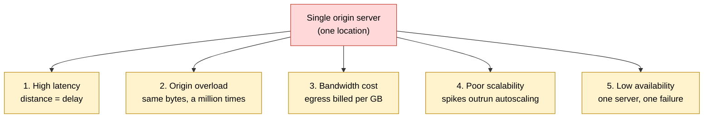

**Problem one is high latency.** A single page rarely makes a single request — it pulls HTML, then CSS, JavaScript, fonts, images, and API calls. If every one of those must cross an ocean, the delays stack. The farther the user, the worse it gets, and the effect is multiplicative across dozens of resources.

**Problem two is origin overload.** As we saw, the origin ends up re-serving identical, unchanging files. Those are CPU cycles and network capacity spent on repetition instead of the work only the origin can do — processing payments, running business logic, querying the database.

**Problem three is bandwidth cost**, and this one surprises people because it's a direct line on the invoice. Cloud providers bill for *egress* — data leaving their network. Consider a 500 MB video downloaded by one million users straight from the origin:

```
500 MB × 1,000,000 users = 500 TB of origin egress
```

That's the cost for *one* video. Now add every product image, CSS bundle, and JavaScript file, and bandwidth becomes one of the largest operational expenses a media-heavy application carries.

**Problem four is poor scalability**, which is really a problem of *timing*. Traffic spikes are instantaneous; infrastructure is not. A flash sale can take you from 500 requests per second to 50,000 in seconds, but spinning up and warming new servers takes minutes. Even flawless code can be overwhelmed in the gap, because the spike arrives before the capacity does.

**Problem five is low availability.** With a single origin, that server is a single point of failure. If its data center has an outage, *every* user worldwide loses access — even to a logo that never changes and could trivially have been copied elsewhere. There's only one copy, so there's only one thing that has to break.

Notice how tightly these interlock. They're not five random weaknesses; they're five faces of the same root cause — *everything lives in one place and every request goes there*. Which points directly at the fix.

<details>
<summary>📖 In plain English</summary>

One server in one location causes five predictable headaches: faraway users wait (latency), the server wastes effort resending the same files (overload), you pay for every gigabyte sent (bandwidth cost), sudden traffic spikes arrive faster than you can add servers (scalability), and if that one server goes down, everyone is affected (availability). They're all symptoms of the same thing — one location, and every request going to it.

</details>

## 🎯 3. The core idea that solves all five

If the root cause is "everything is in one place and every request travels there," the fix writes itself: **stop making users travel to the content, and start moving copies of the content close to the users.**

Instead of one origin in Mumbai serving the whole planet, you keep copies at many locations worldwide. A user in India is served from a nearby location in Mumbai; a user in Europe from London; a user in Japan from Tokyo. The physical distance between a user and the bytes they want collapses from thousands of kilometers to tens.

Watch how this single move defeats all five problems at once. Latency drops because the data is now near the user. Origin overload disappears because those nearby copies answer most requests, so the origin barely gets touched. Bandwidth cost falls because the origin transmits each file a handful of times — once per location — instead of once per user. Scalability improves because thousands of distributed servers absorb spikes that would flatten a single machine. And availability rises because the content now exists in many places, so no single failure can take it all down.

That is the entire premise of a Content Delivery Network, and it's worth stating cleanly, because it's the sentence you want ready in an interview:

> **A CDN is a globally distributed network of servers that stores copies of content close to users — a shared cache (and reverse proxy) built to cut latency, absorb load, reduce bandwidth cost, and raise availability.**

Everything from here on is detail on top of that idea: *which* content to copy, *how* users find the nearest copy, *what* happens when a copy is missing, and *how* the whole thing behaves when content changes or servers fail. Part II builds the machine that makes it real.

<details>
<summary>📖 In plain English</summary>

The fix for a distant, overloaded, fragile single server is to keep copies of your content in many locations around the world and serve each user from the nearest one. Because the content is close, requests are fast; because the copies handle most requests, the original server is barely used and rarely fails. That distributed set of copy-holding servers is what we call a CDN. The rest of the guide is about the details of doing this well.

</details>

---

# Part II — How a CDN Actually Works

We have the idea. Now let's build the machine and trace a real request through it, step by step, until nothing about it feels like magic.

## ✅ 4. The vocabulary: origin, edge, and PoP

Three terms carry most of the weight, and precise definitions here will save confusion everywhere else.

The **origin server** is where your content originally lives — your backend, your object storage bucket (like AWS S3), the place files are first uploaded. It is the *source of truth*. There is exactly one authoritative version of each file, and it lives at the origin. A well-designed CDN has one goal for the origin: keep it as idle as possible.

An **edge server** is a CDN server placed close to users. It does not own your content; it holds a *copy* that it fetched from the origin when it was first needed, and it keeps that copy ready for the next user in the same area. Its entire job is to answer requests locally so users get low latency and the origin gets left alone.

A **Point of Presence**, or **PoP**, is the physical location — a data center — where a cluster of edge servers lives. A single PoP typically contains several edge servers plus storage, routing, and security hardware:

```
Mumbai PoP
├── Edge server 1
├── Edge server 2
└── Edge server 3
```

Multiple servers per PoP give it redundancy (one can fail without taking the location offline) and throughput (they share the regional load). Major providers operate hundreds of PoPs: Cloudflare advertises presence in hundreds of cities, AWS CloudFront uses AWS edge locations, and Akamai runs one of the largest such networks in the world.

The relationship between these three is the whole architecture in miniature. Users talk to a nearby edge inside a PoP; the edge answers from its local copy whenever it can; and only when it *can't* does it reach back to the single, authoritative origin.

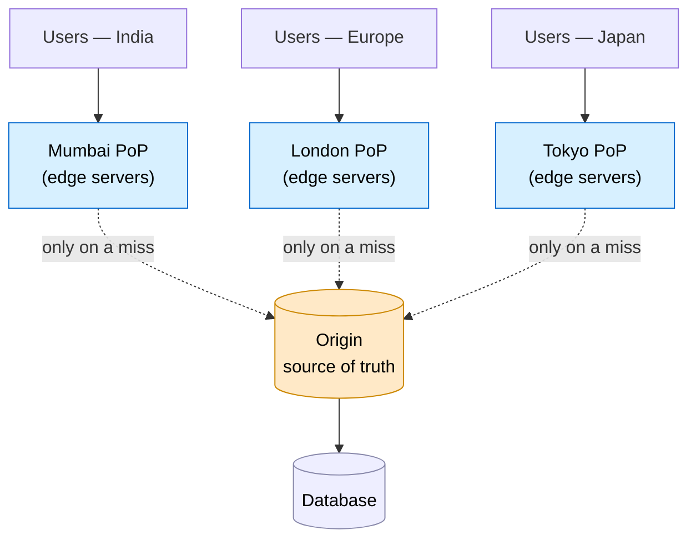

Two quick terms complete the vocabulary. A **cache hit** is when the edge already has what you asked for and serves it immediately. A **cache miss** is when it doesn't, so it has to fetch from the origin first. The ratio of hits to total requests — the **cache hit ratio** — turns out to be the single number that determines whether a CDN is doing its job, and we'll come back to it constantly.

<details>
<summary>📖 In plain English</summary>

The *origin* is the one true home of your files. An *edge server* is a nearby machine holding a copy so users don't have to reach the origin. A *PoP* is the building full of edge servers in a given city. Users hit a nearby edge; the edge serves a copy if it has one and only bothers the origin when it doesn't. When the edge has the file it's a "hit"; when it doesn't it's a "miss."

</details>

## ✅ 5. The journey of a single request

Let's follow exactly what happens when someone in Bangalore opens `https://www.example.com` and the page needs `logo.png`. There are two distinct phases here that people routinely blur together, and keeping them separate is the key to understanding CDNs — and to not embarrassing yourself in an interview.

**Phase A is about finding *where* to connect.** This is entirely DNS, and — this surprises people — nothing has been downloaded from the website yet. **Phase B is about actually fetching the file.** Phase B cannot begin until Phase A produces an IP address.

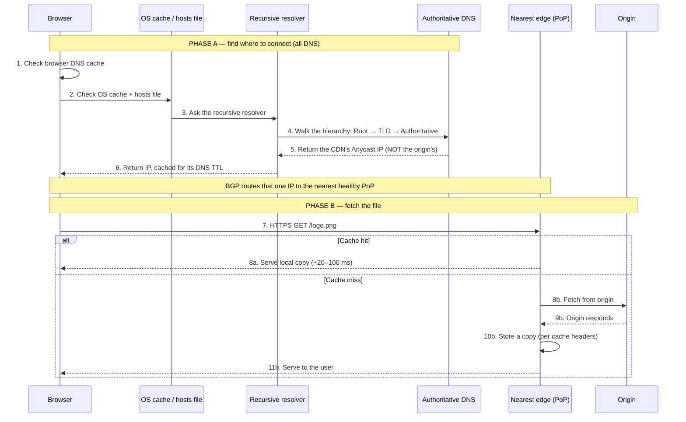

Walk through Phase A slowly, because each step is a deliberate optimization to *avoid* doing work.

The browser first checks **its own DNS cache**. Memory is thousands of times faster than a network request, so if it resolved this domain minutes ago, it reuses the answer and skips everything below. When people say "DNS felt instant," it's usually because no DNS actually happened.

If the browser doesn't know, it asks the **operating system**, which keeps its own DNS cache shared by every app on the machine, and also checks the **hosts file** — a local text file that can hard-map a domain to an IP. (This is the classic source of "why does this domain resolve to something weird?" bugs; an old hosts entry silently overrides real DNS.)

If none of those local sources have the answer, the query finally leaves the machine and goes to a **recursive resolver** — typically run by your ISP, or a public one like Google's `8.8.8.8` or Cloudflare's `1.1.1.1`. The resolver's job is to do the legwork so your browser doesn't have to, and so that billions of devices don't hammer the core DNS servers directly.

The resolver then **walks the DNS hierarchy**: it asks a Root server (which knows who runs `.com`), which points it to the `.com` TLD servers (which know who's authoritative for `example.com`), which point it to the **authoritative DNS server** (which holds the actual records). Each level knows only the level beneath it, and this delegation is precisely why DNS scales to hundreds of millions of domains. Resolvers cache every stage, so subsequent lookups skip most of the walk.

Now the pivotal moment: for a site behind a CDN, the authoritative server does **not** return the origin's IP address. It returns the **CDN's edge IP** — specifically an *Anycast* IP, which Section 6 unpacks. This is the linchpin of the entire architecture. The browser thinks it's connecting to the website; it's actually about to connect to the nearest CDN edge. The resolved IP is cached according to its **DNS TTL** (commonly 300–3600 seconds), so the whole hierarchy walk is skipped until that expires.

Phase B is comparatively simple. Armed with the IP, the browser opens an HTTPS connection and sends `GET /logo.png`. Network routing (BGP, next section) has already delivered that connection to the nearest healthy PoP. The edge asks itself one question — *do I already have this?* — and either serves its local copy in tens of milliseconds (a hit) or fetches from the origin, stores a copy, and then serves it (a miss).

> **Two facts that trip up candidates.** First, DNS for a CDN-backed site returns the *CDN's* IP, not the origin's. Second, DNS does *not* run on every request — the answer is cached at the browser, the OS, and the resolver. Get these two right and you're already ahead of most interviewees.

<details>
<summary>📖 In plain English</summary>

Loading a page happens in two stages. Stage one figures out *what address to connect to*, and it's all DNS: your browser checks its own memory, then your computer's, then asks a resolver that looks up the answer through a chain of DNS servers. For a CDN site, that lookup hands back the *CDN's* address, not the original server's. Stage two is the actual download: your browser connects to that address — which routing has pointed at the nearest CDN location — and the edge either has the file (fast) or grabs it from the origin once and keeps a copy.

</details>

## ✅ 6. How one IP address lives everywhere: Anycast & BGP

Section 5 ended on a puzzle. Three users — in Mumbai, London, and New York — all look up `www.example.com` and all receive the *same* IP address, say `104.18.32.47`. Yet the Mumbai user connects to a server in Mumbai, the London user to one in London, and the New York user to one in New York. How can a single IP address be in three countries at once?

Two technologies working together make this possible: **Anycast** and **BGP**.

**Anycast** is the first half. In ordinary networking — called *unicast* — one IP maps to exactly one server. Anycast breaks that rule: it lets *many* servers, in many cities, advertise the *exact same* IP address.

```
Mumbai edge   → 104.18.32.47
London edge   → 104.18.32.47
Tokyo edge    → 104.18.32.47      (all identical)
```

The browser is handed just one destination — `104.18.32.47` — and has no idea (and no need to know) that it exists in dozens of places. Something else decides which physical server actually receives the packets. That something is BGP.

**A worked example of Anycast in action.** Cloudflare's real Anycast IP `104.16.132.229` is announced from every one of its 300+ PoPs at once. Now watch what happens for two different users hitting the same address:

- A user in **Pune** sends a packet to `104.16.132.229`. Their ISP (Jio) has learned several routes to that IP but sees the shortest one leads to Cloudflare's **Mumbai** PoP, so the packet lands in Mumbai — round-trip around 8 ms.
- A user in **Berlin** sends a packet to the *identical* `104.16.132.229`. Their ISP's routing points at Cloudflare's **Frankfurt** PoP, so their packet lands in Frankfurt — round-trip around 6 ms.

Neither user did anything different; neither app knows which city answered. The same 32-bit number resolved to two different physical machines on two continents, purely because of *where the packet entered the network*. That's the whole trick: Anycast makes "the nearest copy" the default behaviour of the address itself. You can even observe it — run `traceroute 104.16.132.229` from different countries and the final hop lands in different cities. A concrete failure case makes the value obvious: if Cloudflare's Mumbai PoP catches fire, the Pune user's packets to `104.16.132.229` simply start arriving in Singapore instead, and the user notices nothing but slightly higher latency.

> Real Anycast IPs you can look up: Cloudflare's public DNS `1.1.1.1`, Google's `8.8.8.8`, and Quad9's `9.9.9.9` are all single Anycast addresses served from hundreds of locations worldwide. When you query `8.8.8.8` from Delhi you hit a Google server in India; from São Paulo you hit one in Brazil — same IP, different machine.

**BGP — the Border Gateway Protocol — is the second half.** If DNS answers *"what IP should I connect to?"*, BGP answers *"through which path do I reach that IP?"* The internet is not one network; it's roughly 75,000 independent networks called **Autonomous Systems (AS)**, each with an AS number — Jio is AS55836, Airtel is AS9498, Cloudflare is AS13335, Google is AS15169, AWS is AS16509. BGP is the protocol these networks use to tell each other, "here are the IP ranges I can reach, and here's the path to get there." It's the routing glue of the entire internet.

**A worked example of BGP in action.** Here's how the Pune user's packet actually finds Mumbai. Cloudflare's Mumbai PoP *announces* to its neighboring networks: *"I am AS13335, and you can reach the block `104.16.0.0/13` through me."* That announcement propagates outward — Cloudflare's peers tell their peers, and so on — so networks across India learn a route to that block. Jio (AS55836), the Pune user's ISP, ends up with a routing-table entry that reads, in effect:

```
Destination 104.16.0.0/13  →  next hop: AS13335 (Cloudflare)  via Mumbai peering
```

But Cloudflare announces the *same* block from Frankfurt, Singapore, and everywhere else too, so Jio actually receives *many* candidate routes to `104.16.0.0/13`. It picks one using BGP's decision process — preferring, roughly in order, routes its operators have weighted higher, then the **shortest AS-path** (fewest networks to traverse), then the closest exit point. For a Pune user, the Mumbai route wins because it's the shortest path; for a Berlin user, the same algorithm on *their* ISP picks Frankfurt. Nobody centrally assigned users to PoPs — each ISP independently chose the best local route to the shared IP, and the aggregate effect is that everyone reaches a nearby edge.

Now the failure case, which is where BGP shines. When Mumbai goes down, Cloudflare **withdraws** the announcement from Mumbai — it sends its neighbors a message saying *"I can no longer reach `104.16.0.0/13` this way."* Within seconds, Jio's routers drop the Mumbai route from their tables, and the next-best surviving route — say via Singapore — automatically takes over. No human edits anything; the withdrawal propagates and traffic reconverges on the remaining PoPs.

The two halves fit together cleanly: **Anycast makes many servers share one address; BGP is the mechanism that actually steers each packet to one of them.** Each CDN PoP announces the Anycast IP, routers across the internet build a map of possible paths, and every network picks the best path it sees.

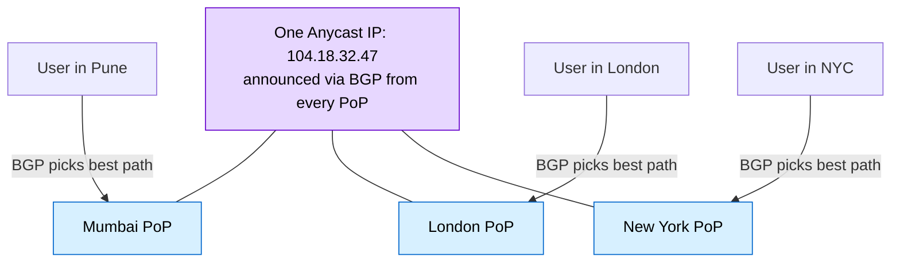

The clean way to hold this in your head: **DNS gives you the destination; BGP chooses the road.** DNS is a lookup that happens before you connect; BGP is routing that happens to your packets in flight.

This design has a benefit that pure DNS-based routing can't match: **near-instant failover.** Suppose the Mumbai PoP goes offline. The CDN simply *withdraws* Mumbai's BGP announcement — it stops telling neighbors "reach this IP through me." Within seconds, routers recompute and send traffic to the next-best PoP, perhaps Singapore. The domain name never changes. The IP address never changes. No DNS record is edited and no propagation delay is incurred. Only the network *path* changes, invisibly. Compare that to a non-Anycast setup, where recovering from a dead server means changing DNS records and waiting minutes-to-hours for caches worldwide to expire.

There's an alternative (or complementary) routing approach worth knowing, called **GeoDNS**, where the authoritative DNS looks at the resolver's IP, guesses the user's location, and hands back a nearby edge's IP directly. It's simpler, but it has two weaknesses: it sees the *resolver's* location, not the user's (which is wrong when someone uses a VPN or a public resolver like `8.8.8.8`), and "geographically nearest" is not always "fastest," because network topology doesn't perfectly follow geography. Most modern CDNs lean on Anycast, sometimes combined with GeoDNS.

That last point deserves emphasis, because it's a favorite interviewer trap.

> **"Anycast connects you to the nearest server" is not quite right.** The precise statement is: Anycast lets the internet, via BGP, route you to the *best available* server advertising that IP. Usually that's the nearest one — but during congestion or an outage, BGP may deliberately choose a *farther* PoP because it's currently the faster or only healthy path. "Nearest" means *best network path*, not *shortest distance*. Saying it precisely signals you actually understand the layer.

<details>
<summary>📖 In plain English</summary>

Many CDN servers around the world are given the *same* IP address (that's Anycast). When your request heads for that address, the internet's routing system (BGP) delivers it to whichever of those servers is easiest to reach from where you are — normally the closest. If one location goes down, the routing quietly reroutes you to another without changing any address. So DNS tells you *which* address; BGP decides *how* your traffic gets there.

</details>

## ✅ 7. Cache hit vs cache miss

Everything a CDN does comes down to one decision made the instant a request reaches an edge server: *do I already have this?* The answer branches into the two outcomes we named earlier, and the difference between them is the difference between a fast, cheap internet and a slow, expensive one.

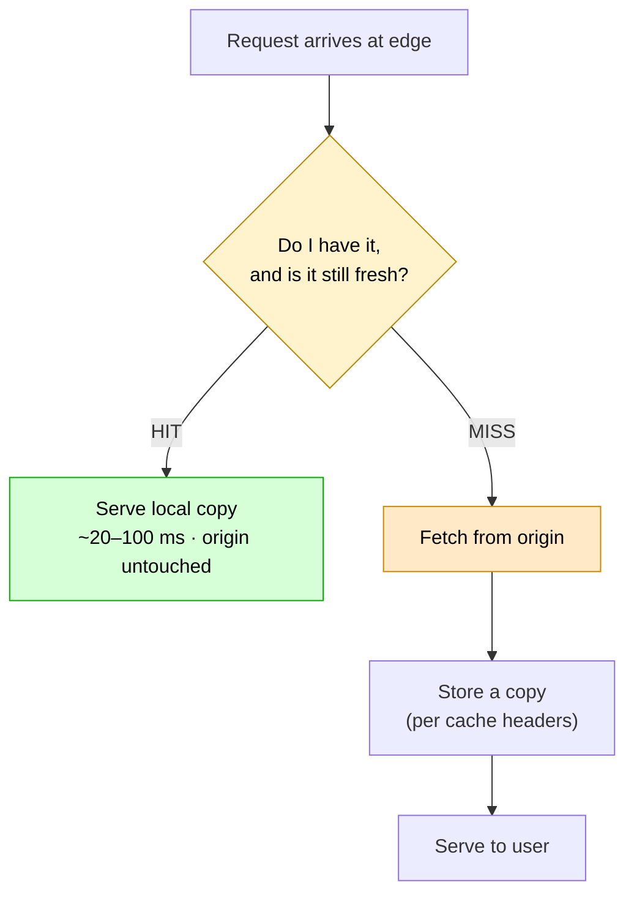

On a **cache hit**, the requested content is already sitting on the edge. It's served immediately, the origin is never contacted, and the user gets the lowest possible latency — often 20–100 ms because the data is physically close. Bandwidth cost is low, the origin does zero work, and the system scales beautifully. This is the outcome you want almost every time.

On a **cache miss**, the edge lacks the content, so it must fetch from the origin, store a copy locally, and only then serve the user. That first request is the slow one — perhaps 300 ms instead of 30 — because it round-trips all the way to the origin. But it pays a debt forward: every *subsequent* request for that file, from any user in that PoP's region, is now a hit. The first visitor absorbs the cost; everyone after benefits.

This is why the **cache hit ratio** — the percentage of requests served from the edge rather than the origin — is the metric that matters most. At a 95% hit ratio, the origin sees only 5% of traffic, and every benefit compounds: lower user latency, near-idle origin, minimal bandwidth cost, high resilience. For a media-heavy application, engineers target **90% or higher**, and a low ratio is treated as a bug to be diagnosed, not a fact of life.

Two subtleties experienced engineers raise before they're even asked, because both bite in production:

First, **each PoP caches independently.** When Mumbai fetches and caches `logo.png`, London still has nothing. The first London user triggers their own miss. Popularity in one region doesn't pre-warm another — a real gap that tiered caching (Section 13) exists to close.

Second, **the CDN does not cache everything by default.** Whether a response is stored depends on its HTTP method, its `Cache-Control` and `Expires` headers, its validators, the CDN's configured rules, and whether it carries cookies or an `Authorization` header. A response marked `Cache-Control: no-store` is never cached; a plain `GET` with no caching hints may not be either. What is and isn't cacheable is the entire subject of Part III.

When you're debugging, the CDN tells you which outcome occurred through a response header — `CF-Cache-Status: HIT` or `MISS` on Cloudflare, `X-Cache: Hit from cloudfront` on CloudFront. If a static asset is perpetually showing `MISS`, that's your signal that its headers, the cache rules, or a recent purge are working against you.

<details>
<summary>📖 In plain English</summary>

When you ask an edge server for a file, one of two things happens. Either it already has it and hands it over instantly (a hit), or it doesn't, so it fetches it from the origin once, keeps a copy, and serves it — slow the first time, fast forever after (a miss). The percentage of requests that are hits is the key health number; aim for 90%+. Note that each city's cache is separate, and the CDN only stores things its rules and the file's headers allow.

</details>

## ✅ 8. Getting content to the edge: Pull vs Push

Section 7 assumed the edge fetches content when it's first requested. That's one of two strategies for filling an edge's cache, and choosing between them is a genuine design decision.

The **Pull CDN** works exactly as described so far: the edge starts empty and pulls content from the origin *on demand*, the first time a user asks for it. Content that nobody requests never gets cached at all, which keeps storage lean.

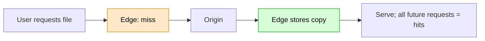

The trade-offs are clean. On the plus side, it's trivial to configure (point the CDN at your origin and you're done), needs no manual uploads, and naturally stores only content people actually want. On the minus side, the *first* request for anything is slow, and a burst of cold misses — say right after a deploy — briefly spikes origin traffic. This model fits unpredictable, user-generated content: Instagram can't know which of the billions of photos uploaded today will go viral, so it lets the CDN pull each one on demand the first time someone views it. Amazon product images, YouTube uploads, and news sites work the same way.

The **Push CDN** inverts the timing. Instead of waiting for a request, the origin *proactively uploads* content to the edges ahead of time, so the file is already there when the first user asks.

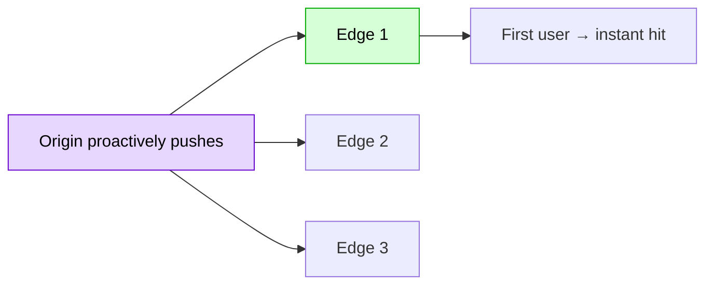

Here the first request is already fast, performance is predictable, and the origin isn't hammered during a launch. The costs are more storage (you're distributing content that may never be requested), operational overhead (something has to orchestrate the uploads), and potential waste. This model fits content you *know about in advance* and expect to be hit hard: software updates, game patches, and movie releases. Netflix pre-distributes anticipated blockbusters to edge locations *before* they go live, so the midnight rush finds everything already cached.

Here's the comparison at a glance:

| Dimension | Pull CDN | Push CDN |
|---|---|---|
| How the cache fills | Lazily, on the first miss | Ahead of time, before any request |
| First request | Slow (it's a miss) | Fast (already pre-warmed) |
| Storage use | Efficient — only hot content | Higher — everything you push |
| Configuration | Minimal | Operational overhead |
| Best fit | Unpredictable, user-generated content | Known, predictable, high-demand assets |

> **"Which is better?" is a trap.** They solve different problems, and large systems use *both*: an e-commerce platform might Pull its endlessly varied product images while Pushing the assets for a scheduled flash sale. The right answer names the deciding factor — *how predictable is the demand?* — rather than crowning a winner.

<details>
<summary>📖 In plain English</summary>

There are two ways to get files onto the edges. *Pull*: the edge grabs a file from the origin the first time someone asks for it, then keeps it — simple, and great when you can't predict what will be popular. *Push*: you upload files to the edges in advance, before anyone asks — more work, but perfect for things you *know* will be in huge demand at a specific moment, like a movie release. Big companies use both, depending on whether they can predict the demand.

</details>

---

# Part III — The Hard Parts

So far the CDN sounds almost automatic: put copies near users, serve them fast. If that were the whole story, CDNs wouldn't be a staple of senior interviews. The difficulty — and the interesting engineering — lives in a handful of decisions: *what* is even safe to copy, *how* you express the rules, *when* a copy becomes wrong, and what happens when a million users miss at once. This is where good engineers are separated from great ones.

## 🎯 9. The real question: what deserves to be cached?

The tempting instinct, once you have a CDN, is to cache everything. Resist it. Caching the wrong thing doesn't just waste space — it can serve one user's private data to another, which is a security incident, not a performance tuning problem. But caching too little throws away the entire benefit. So the central question of Part III is deciding, response by response, what belongs at the edge.

The governing rule is simple to state: **cache content that is identical for many users.** If everyone gets the same bytes, a shared copy helps everyone. If everyone gets *different* bytes, a shared copy is at best useless and at worst dangerous.

That rule sorts content into three buckets.

**Static content** is identical no matter who asks: images, video, CSS, JavaScript, fonts, PDFs, logos. `logo.png` is the same file for Alice, Bob, and Charlie, so it's the ideal caching candidate — high hit ratio, tiny origin load, excellent performance. Nearly every CDN is optimized first and foremost for serving static assets.

**Dynamic content** changes per user or per request: shopping carts, user profiles, notifications, account balances, order history, payment responses. This is the dangerous bucket. If Alice's shopping cart were cached and then served to Bob, you'd have leaked private data to a stranger. Dynamic content is generally *not* cached in a shared CDN; those requests are forwarded to the backend.

**Semi-dynamic content** sits in between: it changes over time, but at any given moment it's the same for everyone. Trending videos, weather, currency rates, a product catalog, a news homepage, popular search suggestions. It's not static — it does change — but it doesn't change every second, so it can safely be cached for a *short* duration to shed backend load.

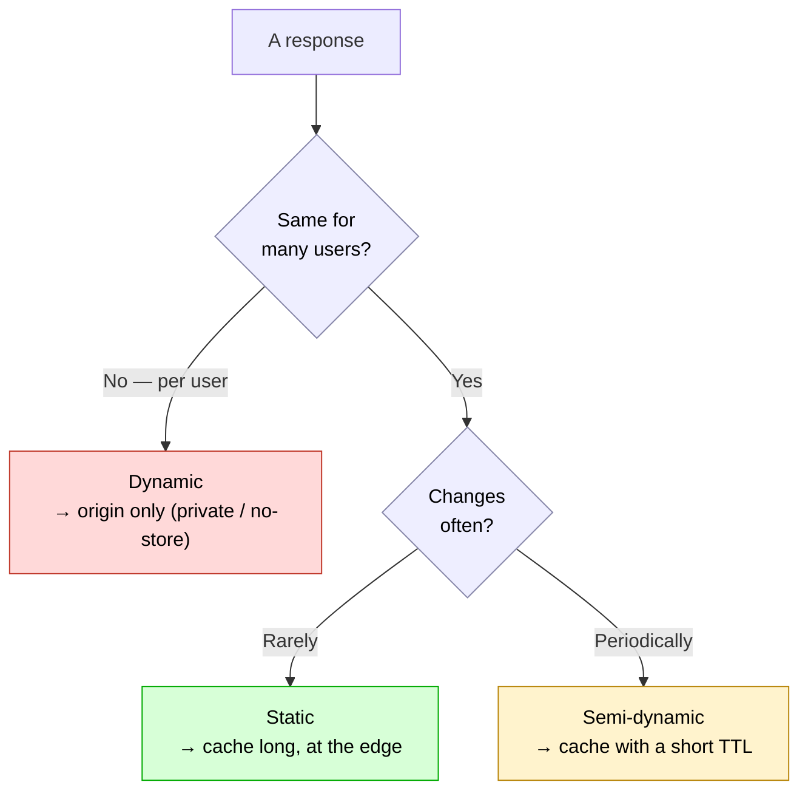

Now here's the refinement that turns a competent answer into a senior one. Junior engineers say "cache static, don't cache dynamic." But that framing quietly fails, because *"static vs dynamic" is the wrong axis.* A public product catalog is served by a dynamic API, yet it's perfectly cacheable. A "static-looking" JSON blob personalized with a cookie is dangerous to cache. The real axis is **shared vs user-specific**:

- **Public and repeatable** (a public catalog, static config, public docs, a deliberately-configured CORS preflight) → cache at the edge with an explicit freshness window.
- **User-specific but low sensitivity** → maybe cache it in the *browser* only, never in the shared edge.
- **Sensitive, personalized, or state-changing** (`/api/me`, account balances, permission-scoped dashboards, signed download links) → don't store it anywhere shared; send it straight through.

> **The interview signal.** The most important design decision in a system-design round is not "I'll add a CDN." It's *deciding what to cache and for how long.* Candidates who say "cache the whole API" or "never cache APIs" both reveal shallow understanding. The strong answer classifies each response by whether it's shareable and how sensitive it is, then assigns a caching policy accordingly.

<details>
<summary>📖 In plain English</summary>

Only cache things that look the same for everyone. Files like images and CSS are safe — identical for all users. Personal things like your cart or profile must never sit in a shared cache, or someone else might see them. In-between things like weather or trending lists can be cached briefly. The smart way to decide isn't "static or dynamic?" but "is this the same for many people, and is it sensitive?"

</details>

## 🎯 10. The controls: HTTP caching headers

If we've decided *what* to cache, we need a way to *tell* the CDN and the browser. That language is HTTP headers, and — importantly — it's the *headers*, not the file extension or the URL path, that decide cacheability. A response at `/api/products?page=1` is exactly as cacheable as one at `/logo.png` if it's shareable and marked as such. The CDN reads the method and the caching headers; it doesn't care what the path looks like.

The primary control is `Cache-Control`, and its directives map directly onto the three buckets from Section 9.

For content that many users can share:

```http
Cache-Control: public, max-age=60, s-maxage=300
```

This says browsers may keep it fresh for 60 seconds (`max-age`), while *shared* caches like the CDN may keep it for 300 seconds (`s-maxage`). Two different windows for two different kinds of cache.

For content only one user should see, but which isn't especially sensitive:

```http
Cache-Control: private, max-age=30
```

`private` means the user's browser may cache it, but a **shared cache must not**. This is the setting for user-specific-but-low-risk responses.

For content that must never be stored anywhere:

```http
Cache-Control: no-store
```

Nobody caches it — not the browser, not the CDN. This is for sensitive, personalized responses.

The distinction between `private` and `no-store` catches people constantly, so nail it: **`private` still allows the browser's own cache; `no-store` forbids all caching everywhere.** They express different bets — one says "this is for one user's eyes but may live in their browser," the other says "this must not persist at all." There's also a third, subtly different directive, `no-cache`, which is the most misnamed thing in HTTP: it *permits* caching but requires the cache to **revalidate** with the origin before every reuse. It's how you get caching's bandwidth savings while guaranteeing freshness.

That revalidation relies on **validators** — small fingerprints that let a cache check "is my copy still good?" without re-downloading the whole file:

```http
ETag: "a1b2c3"
Last-Modified: Wed, 22 Jul 2026 10:00:00 GMT
```

An `ETag` is a content fingerprint. Later, the cache sends `If-None-Match: "a1b2c3"`; if the content hasn't changed, the origin replies `304 Not Modified` with an empty body, and the cache reuses what it has. `Last-Modified` does the same job with a timestamp via `If-Modified-Since`. On a slow connection, turning a 200 KB re-download into a tiny `304` is a real win.

One more distinction prevents a very common muddle — **DNS TTL is not the same as HTTP cache TTL:**

| DNS TTL | HTTP cache TTL |
|---|---|
| Caches an **IP address** | Caches **content** |
| Lives in DNS resolvers | Lives in browsers and CDNs |
| Set by DNS records | Set by HTTP headers |
| "When to re-check the address" | "When to re-check the content" |

They both use the word TTL, but one governs *where to connect* and the other governs *how long to trust a file*. A useful production habit that flows from this: before migrating data centers, *lower* your DNS TTL (say from 86,400 to 300 seconds) a few days ahead, so when you flip the switch, the world picks up the new address in minutes rather than a day.

<details>
<summary>📖 In plain English</summary>

You tell caches what to do using HTTP headers, not file names. `public` with `s-maxage` = "shared caches may keep this for N seconds." `private` = "only the user's own browser may keep it." `no-store` = "nobody keeps it." `ETag`/`Last-Modified` let a cache ask "is my copy still current?" and get a tiny "yes, reuse it" instead of re-downloading. And don't confuse DNS TTL (how long to remember an address) with cache TTL (how long to trust a file).

</details>

## 🎯 11. The cache key: the subtlest bug in the system

Here's a question that sounds trivial and isn't: when two requests come in for "the same URL," should they get the same cached response? The honest answer is *it depends*, and the mechanism that decides is the **cache key** — the identity a CDN uses to determine whether a stored response can be reused for a new request. Get the cache key wrong and you produce either broken pages or data leaks, all while your dashboards look green. This is genuinely where hit ratios live or die.

The dangerous default assumption is that the URL alone is the key. Often it isn't even close. The *right* response can depend on the user's language, their device type, whether their browser accepts compressed or modern-format content, specific query parameters, certain headers, and sometimes cookies. HTTP has a header precisely for declaring these dimensions:

```http
Vary: Accept-Encoding, Accept-Language
```

This tells the cache "store a separate version per encoding and per language." And this is a knife that cuts both ways.

**Vary on too little**, and users get the wrong variant. Omit `Accept-Encoding` and a browser that only understands gzip might be handed a Brotli-compressed body it can't read. Worse, forget to key on identity for a personalized response and a shared cache can hand one user's data to another — the exact leak Section 9 warned about.

**Vary on too much**, and you shatter your hit ratio. Every distinct key is a separate cached object that must be filled by its own cold miss. If your app requests images at dozens of slightly different widths, or you nervously forward *every* request header into the key, one logical file fragments into 40 or 50 cache entries, each starting cold. As CloudFront's own guidance puts it, caching on extra headers creates more variants and lowers the hit ratio. You pay for precision with fragmentation.

The craft, then, is to key on exactly the dimensions that genuinely change the response and no more: normalize inputs (a small set of fixed image sizes rather than any width; a canonicalized `Accept-Encoding`), vary only where it matters, and *never* fold an auth token into a shared key.

> **The part most candidates miss entirely.** Authenticated requests need explicit policy. Per the HTTP caching spec (RFC 9111), a shared cache **must not** store a response to a request carrying an `Authorization` header *unless the response explicitly permits it* (for example with `Cache-Control: public`). You don't get to drop a CDN in front of an authenticated endpoint and assume the provider will read your mind. Skip this and "cache the whole API" becomes a data leak with a nicer name.

<details>
<summary>📖 In plain English</summary>

A "cache key" is how the CDN decides whether two requests are really asking for the same thing. If it decides too loosely, someone gets the wrong content — even someone else's private data. If it decides too strictly (treating tiny differences as totally different files), the cache fills up with near-duplicates that are rarely reused, and speed collapses. The skill is keying on only what actually changes the response, and never treating logged-in responses as shareable unless you've explicitly said so.

</details>

## 🎯 12. Cache invalidation

Caching buys speed by keeping copies around. But the moment content *changes*, those copies become a liability: the origin has the new version while edges still serve the old one. Picture a user updating their profile picture. The origin now has the new image, but the Mumbai edge cached the old one with a 24-hour TTL — so for the next day, everyone in that region keeps seeing the outdated photo, and the user is baffled. This is cache invalidation, famously one of the two hardest problems in computer science, and there is a whole spectrum of techniques for it. They fall into two broad families — *let it expire* and *actively remove it* — plus the clever middle path of never invalidating at all.

Before choosing a technique, it helps to name the failure you're preventing. There are two:

- **Serving stale content** — an edge keeps handing out an old copy after the origin has changed. Annoying, sometimes wrong, occasionally a compliance problem (an unpublished article, a corrected price).
- **The invalidation itself causing harm** — purging too much at once turns thousands of hits into simultaneous misses, hammering the origin exactly like a cache stampede (Section 13).

A good strategy minimizes staleness *without* triggering the second problem. Let's walk the techniques from simplest to most sophisticated.

### Option 1 — Let it expire (TTL-based)

The default. Every cached object carries a TTL (`Cache-Control: max-age` / `s-maxage`), and when it lapses the edge revalidates or refetches. You're not really "invalidating" — you're accepting a bounded window of staleness in exchange for zero operational effort.

The whole game here is choosing the TTL to match how fast the content changes and how much staleness you can tolerate:

```http
Cache-Control: public, s-maxage=31536000   # logo/font/hashed asset: a year, it never changes under this name
Cache-Control: public, s-maxage=300         # product catalog: 5 min of staleness is fine
Cache-Control: public, s-maxage=10           # stock ticker widget: near-real-time, tiny window
```

**Use it for:** semi-dynamic content where a little lag is acceptable — weather, trending lists, catalogs, news homepages. **Avoid it as your only tool for:** anything that must update the instant it changes (a corrected price, a taken-down post), because TTL gives you no way to force freshness early.

### Option 2 — Active purge (explicit invalidation)

When you can't wait for the TTL, you tell the CDN to drop the object *now*. Every provider exposes an invalidation API, and there are three granularities worth distinguishing:

**Single-object purge** — the surgical case. A user updates their avatar, and your backend calls:

```bash
# AWS CloudFront
aws cloudfront create-invalidation --distribution-id E123 --paths "/photos/12345.jpg"

# Cloudflare
curl -X POST "https://api.cloudflare.com/client/v4/zones/$ZONE/purge_cache" \
     -H "Authorization: Bearer $TOKEN" \
     -d '{"files":["https://cdn.example.com/photos/12345.jpg"]}'
```

The next request for that path is a miss and refetches. Cheap and safe.

**Wildcard / path purge** — "drop everything under `/product/999/*`." Broader, and here you start risking the stampede: if that prefix covered a million hot objects, you've just scheduled a million misses. Providers throttle and bill these for exactly that reason.

**Full purge ("purge everything")** — the sledgehammer. Occasionally justified after a global template change, but it resets your entire hit ratio to zero and points the full firehose at your origin. In practice you almost never want this; reach for tag-based purge (Option 4) instead.

The honest trade-offs of purging: it propagates across the global edge network in seconds-to-a-minute (not instant), most providers charge for volume beyond a free tier, and it scales badly if your content changes constantly — if you're purging thousands of times a minute, purging is the wrong tool and you want versioned URLs instead.

### Option 3 — Versioned URLs (cache busting): don't invalidate, rename

The technique most large systems actually lean on, and the most elegant, because it *sidesteps* invalidation entirely. Instead of editing a file in place and then scrambling to evict the old copy, you give the new version a **brand-new URL**:

```
Old:  https://cdn.example.com/app.js
New:  https://cdn.example.com/app.9f2c1a.js        # content hash in the filename
      https://cdn.example.com/app.js?v=9f2c1a       # or a version query string
      https://cdn.example.com/v3/app.js             # or a version path segment
```

To the CDN, the new URL is an object it has never seen, so it fetches the fresh copy on first request — **no purge required**. The old URL simply stops being referenced (your HTML now points at the new one) and ages out on its own. And because the URL *changes whenever the content does*, the old URL's content is immutable, so you can cache it for a year with total confidence:

```http
Cache-Control: public, max-age=31536000, immutable
```

This is the standard behaviour of every modern build tool — webpack, Vite, and friends emit `main.[contenthash].js` precisely so deployments are atomic and instantly effective. A concrete deploy sequence shows why it's so clean: you upload `app.9f2c1a.js` alongside the still-live `app.4b8e77.js`, then flip `index.html` to reference the new hash; users mid-session keep using the old file with zero disruption, new page loads pick up the new one immediately, and there was never a moment of staleness *or* a purge call. The one limitation: versioning works when *you* control the reference (HTML, an API response, a manifest). It doesn't help for a URL that must stay stable — say a permalink a third party has hard-coded — and for those you fall back to purge.

### Option 4 — Event-based & tag-based invalidation (surrogate keys)

The two options above have a gap. Purge-by-URL forces you to know *every* URL affected by a change, and one logical change often touches many. Publishing an edit to product #999 might invalidate `/product/999`, `/product/999/reviews`, the category page listing it, the search results it appears in, and the homepage "featured" strip. Enumerating all of those on every edit is brittle.

**Surrogate keys** (also called cache tags) solve this. When the origin serves a response, it *tags* it with one or more labels via a `Surrogate-Key` (Fastly) or `Cache-Tag` (Cloudflare Enterprise / CloudFront via `Cache-Control` extensions) header:

```http
# Origin response for the product page
Surrogate-Key: product-999 category-shoes homepage-featured
```

Every object that depends on product #999 gets tagged `product-999`. Now invalidation becomes *semantic* rather than *positional* — you purge the concept, and the CDN drops every object carrying that tag, wherever it lives:

```bash
# Fastly — one call invalidates the product page, its reviews,
# the category page, and the homepage strip, all at once
curl -X POST "https://api.fastly.com/service/$SID/purge/product-999" \
     -H "Fastly-Key: $TOKEN"
```

This is what makes **event-driven invalidation** practical, and it's the pattern serious systems use. The flow is: a domain event fires → a handler translates it into the right tag purge. For example:

- A CMS **"article published"** event → purge tag `article-4471` **and** `author-feed-88` (the author's page lists it) **and** `section-tech`.
- An **"order placed"** event (Kafka/SNS message) → purge the customer's `orders-user-123` tag so their order history is correct on next view. This is the concrete answer to the interview trap that a `POST /orders` doesn't just create data — it makes related cached `GET`s wrong, and an event is what connects the write to the invalidation.
- A **price change** in the catalog service → purge `product-999`, which cascades to every surface showing that price.

Architecturally, you wire this by having services emit events to a bus and a small consumer call the purge API — so the cache stays correct without any page needing to know which other pages share its data:

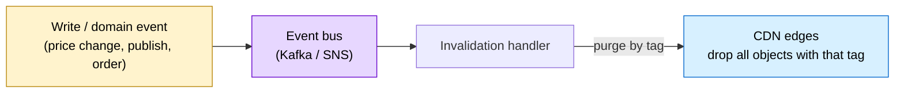

### Option 5 — Revalidation & soft/stale serving (avoid the hard miss)

Sometimes you don't want to *delete* a copy so much as *check whether it's still good* cheaply, or serve the old one for a beat while you refresh. These blunt the two failure modes without a hard purge.

**Validators (`ETag` / `Last-Modified`)** turn expiry into a cheap check rather than a full re-download. When an object's TTL lapses, the edge sends `If-None-Match: "9f2c1a"`; if nothing changed, the origin replies `304 Not Modified` with an empty body and the edge keeps serving its copy. You pay a tiny round trip instead of re-transferring megabytes.

**Soft purge** (Fastly's term) marks tagged objects *stale* rather than deleting them, so they can still be served instantly via the directives below while the edge refetches — you avoid converting a purge into a stampede.

**`stale-while-revalidate` and `stale-if-error`** let the edge keep users fast and online across the refresh or an origin hiccup:

```http
Cache-Control: max-age=600, stale-while-revalidate=60, stale-if-error=86400
```

`stale-while-revalidate=60` says: for 60 seconds after expiry, serve the slightly-old copy *instantly* and refresh in the background, so no user ever waits on the miss. `stale-if-error=86400` says: if the origin is down or erroring, keep serving the old copy for up to a day rather than showing a failure. (These recur in Section 16 as reliability tools — they're two sides of the same coin.)

### Putting it together

There's no single answer; mature systems layer these:

| Situation | Best technique |
|---|---|
| Static asset you rebuild on deploy (JS/CSS/images) | **Versioned URL** + `max-age=31536000, immutable` |
| Semi-dynamic content, small staleness OK | **TTL** tuned to change rate (+ `stale-while-revalidate`) |
| One specific object changed, must update now | **Single-object purge** |
| One logical change touches many pages | **Tag/surrogate-key purge**, driven by a domain **event** |
| Content changes constantly, per request | Don't purge — **version** or accept a short TTL |
| Origin might be down | `stale-if-error` so users see cached content, not an error |

> **The trap interviewers listen for.** Unsafe methods — `POST`, `PUT`, `DELETE` — aren't cached, but they *change the correctness* of related `GET` responses. Place an order and the cached "your orders" list is now wrong. An answer that talks only about TTLs but never mentions purge, tags, or event-driven invalidation sounds like someone who's read about caching but never operated it. Always pair the two questions: *how long may this be reused* **and** *what event makes this copy wrong?* — and name the mechanism (a tag purge fired by that event) that connects them.

<details>
<summary>📖 In plain English</summary>

The hard part of caching is what to do when the original changes but the copies don't know yet. You have several options. Just let copies expire on a timer (simple, but you tolerate some staleness). Actively tell the edges to delete a specific file when it changes (a "purge" — precise, but purging too much at once overloads the origin). Give the new version a new URL so edges treat it as brand-new and the old one fades away (what big sites do for assets — instant and no purge needed). Or tag related items with a label so one event, like "product 999 changed," wipes every page that shows it at once. And to stay smooth, edges can serve a slightly-old copy for a moment while quietly fetching the fresh one.

</details>

## 🎯 13. Surviving the stampede: Origin Shield & tiered caching

There's one failure mode that a naive CDN makes *worse*, not better, and understanding it is a rite of passage. Picture Netflix releasing a hit show. Within minutes, millions of people press Play. If that content isn't yet cached, every edge server — a thousand of them — misses at the same instant and rushes to the origin simultaneously. The origin, which the whole architecture was supposed to protect, gets hit with a thousand identical requests at once and can fall over. This is a **cache stampede**, also called the thundering herd, and large CDNs have several defenses against it.

The first is the **Origin Shield** — an extra caching layer placed between the fleet of edges and the origin.

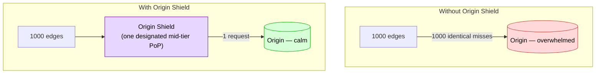

With a shield in place, only the *first* miss travels through the shield to the origin. The shield caches the response, and the other 999 edges get it from the shield instead of the origin. The origin sees one request rather than a thousand. This is especially valuable when the same content is being requested from many regions at once. Note it's an *optimization for scale*, not a requirement — small applications run fine without one.

The second defense is **multi-level (tiered) caching**, which generalizes the shield idea. Edges don't reach straight to the origin on a miss; they first consult a regional cache.

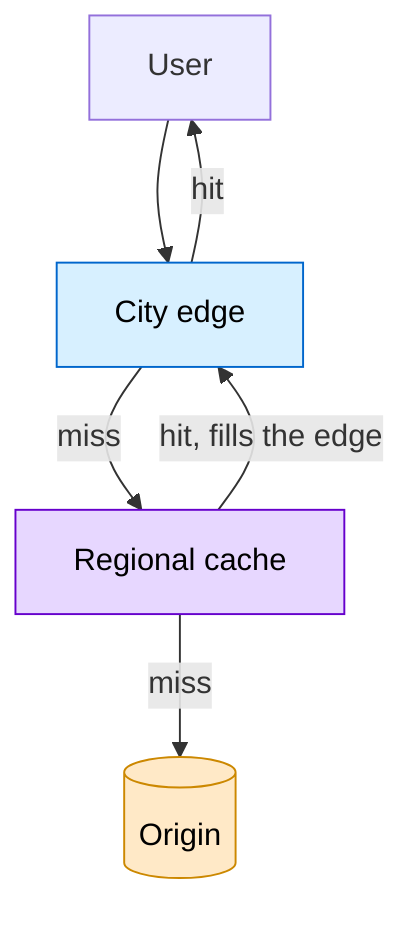

Only if *both* the edge and the regional cache miss does the request reach the origin. This cuts origin traffic further, fills cold edges faster within a region, and directly softens the "every PoP caches independently" gap from Section 7 — once one city in a region has fetched a file, its neighbors get it from the shared regional cache.

The third defense is **cache pre-warming**, which applies when the spike is *predictable*. Rather than waiting for the stampede, the CDN pushes the content to edges before launch — the Push model from Section 8. When the first user arrives, it's already a hit. Netflix routinely pre-warms edges with anticipated high-demand titles precisely to avoid the midnight stampede.

> **Staff-level nuance.** Stampede protection isn't only about topology. Edges also use **request coalescing** — collapsing many concurrent misses for the *same* key into a single origin fetch, so even without a shield, a thousand simultaneous requests for one cold object become one upstream request while the rest wait for that result. And **stale-while-revalidate** (Section 16) lets an edge serve a slightly stale copy instantly while it refreshes in the background. Origin Shield, tiered caching, coalescing, and pre-warming are complementary layers, not competing alternatives — a mature system uses several at once.

<details>
<summary>📖 In plain English</summary>

When a brand-new file suddenly becomes wildly popular, every edge is missing it at the same moment and they all ask the origin at once — which can crash the very server the CDN was protecting. The fixes: put a middle layer (Origin Shield) so the origin gets asked once instead of a thousand times; add regional caches so cities share; and, when you know a spike is coming, load the content onto edges beforehand. Real systems combine these.

</details>

---

# Part IV — What a CDN Became Beyond Caching

If you stopped reading now, you'd have a solid mental model: a CDN is a smart, distributed cache. That's how CDNs began. But modern CDNs — Cloudflare, CloudFront, Fastly, Akamai — have quietly grown into something larger. Because *all* of your traffic already flows through their edge, that edge became the natural place to also secure traffic, transform content, and even run code. The one-line upgrade to your mental model:

> **CDN = distributed reverse proxy + cache + security layer + edge-compute platform.**

Let's take the new roles one at a time.

## 🎯 14. Security at the edge

The instant every request passes through the CDN's edge before reaching your origin, the edge becomes a security checkpoint. This protection operates at two levels: guarding *individual pieces of content*, and shielding *the whole infrastructure*.

Start with content-level control, through **signed URLs**. A plain CDN URL like `https://cdn.example.com/videos/lecture42.mp4` is accessible to anyone who has the link — fine for a public meme, disastrous for a paid course video. But you still want CDN speed and edge caching for that video. A signed URL squares the circle: it's a normal CDN URL with extra parameters proving the requester has permission and that the link hasn't expired.

```
https://cdn.example.com/videos/lecture42.mp4?Expires=1699999999&Signature=abc123xyz&Key-Pair-Id=K123
```

The flow keeps the *authorization decision* on your backend while letting the *delivery* happen at the edge:

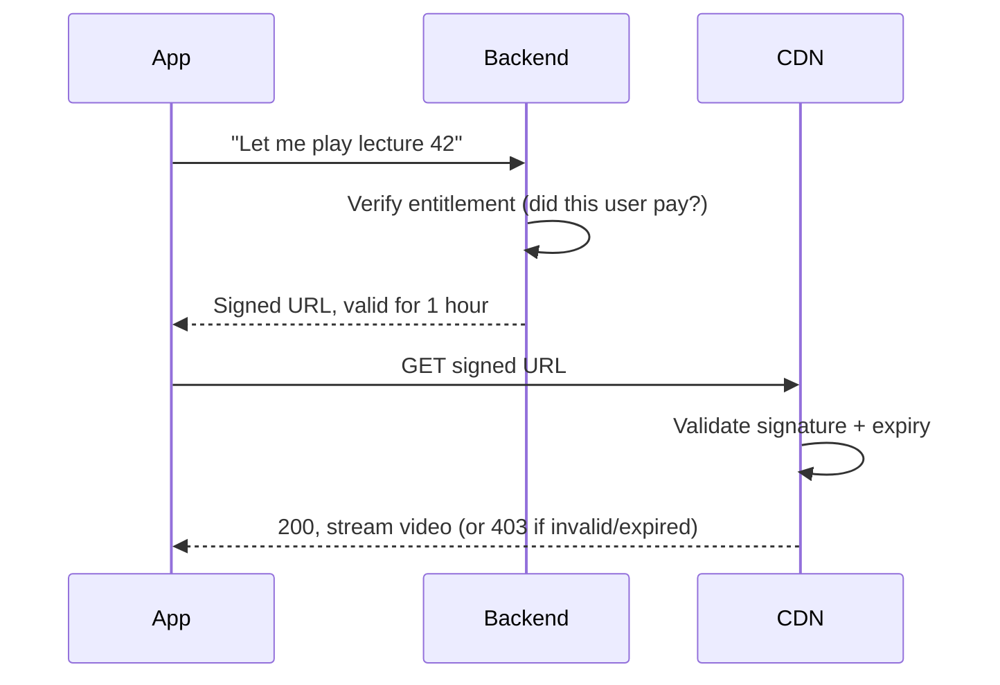

Even if the URL leaks, it stops working after it expires — you get fast delivery *and* access control.

Now the infrastructure level, where the edge protects the entire system:

- **DDoS protection.** In a distributed denial-of-service attack, someone floods you with junk requests to knock you offline. The CDN's enormous global capacity absorbs and filters that flood at the edge; your comparatively small origin never even sees most of it.
- **Web Application Firewall (WAF).** The CDN can inspect requests and block malicious ones — SQL injection, cross-site scripting — before they reach your backend.
- **Hotlink protection.** It stops other sites from embedding your images and videos via your URLs, which would otherwise steal your content *and* stick you with the bandwidth bill.
- **Rate limiting.** It throttles any single IP or user making too many requests too fast, blunting abuse and scraping.
- **Geo-blocking.** If content is licensed only for certain countries, the edge can reject requests from everywhere else right there.
- **TLS termination and SSL offload.** The edge handles the encryption handshake, which both enables the inspection above and takes load off the origin.

That last point leads to a question interviewers love, because the naive answer is confidently wrong: *"If HTTPS encrypts everything, how can a CDN cache content at all?"*

The resolution is that **TLS terminates at the CDN edge.** The browser establishes its encrypted connection *to the edge*. The edge decrypts the request for that hop, applies its cache policy, and re-encrypts the response back to the browser. On a miss, it opens its *own* separate HTTPS connection to the origin. Encryption is real on every hop, and the cache is real in the middle. HTTPS doesn't disable caching — it defines *who is trusted to see plaintext at each hop.*

> **The deeper point behind the HTTPS question.** It isn't really about encryption; it's about **trust boundaries and cache scope.** A strong answer names three layers up front: (1) *transport security* — TLS terminates at the edge, so the edge legitimately sees plaintext; (2) *cache scope* — is this response shared across users or private to one; (3) *reuse rules* — cacheability comes from method, headers, and freshness, not from whether the path says "api." Framing it this way turns a supposed "gotcha" into a demonstration that you think in boundaries, not slogans.

<details>
<summary>📖 In plain English</summary>

Because all traffic passes through the edge, the CDN doubles as a security guard. For private files, your backend hands out time-limited links (signed URLs) that stop working after an hour. For the whole system, the edge soaks up denial-of-service floods, blocks common attacks, stops others from stealing your bandwidth, and limits abusive request rates. And HTTPS doesn't block caching: the encryption is unwrapped at the edge, the cache does its job, and it's re-encrypted back to the user.

</details>

## 🎯 15. Smart delivery and edge compute

Beyond storing and securing content, modern CDNs *transform* it on the way out — and this is where a lot of real-world performance is won.

The headline capability is **on-the-fly image resizing**. You upload one high-resolution master — say 4000×3000 — and the CDN delivers whatever size each context needs, from the same source:

```
https://cdn.example.com/photos/12345.jpg?w=800&h=600
```

A phone showing a thumbnail fetches a 30 KB version instead of a 5 MB original. But this power comes with a hazard that ties straight back to Section 11:

> ⚠️ **Don't fragment your cache.** Every unique URL is a separate cache entry, so `?w=200`, `?w=201`, and `?w=205` are three different objects, each starting as a cold miss. If your app requests images at whatever exact width each device happens to have, one image scatters across 40–50 cache entries and your hit ratio quietly sinks. The fix is a small set of **fixed size presets** — thumbnail, feed, full-screen — so every user in a region hits the same few warm URLs.

The CDN also handles **format negotiation**: it detects what the device supports and serves the best option — WebP (about 30% smaller than JPEG) for modern Android, AVIF (about 50% smaller) for newer iPhones, plain JPEG for old devices — all from the *same* URL, varying on the `Accept` header. It performs **compression** on text-based assets too, shrinking JSON, JavaScript, and config with gzip or the more efficient Brotli, so a 100 KB JSON response might travel as 20 KB. And for video it supports **adaptive bitrate streaming** (HLS or DASH), holding multiple quality renditions and letting the client request the right one as network conditions shift, plus **HTTP range requests** so a player can fetch just the byte range it needs to enable seeking and chunked download.

The most significant evolution is **edge compute** — running actual code on the edge servers. Cloudflare Workers, AWS Lambda@Edge, and Fastly Compute let you execute small programs at the edge for authentication checks, request rewriting, A/B testing, and personalization, all without a round trip to the origin:

```js
// Illustrative edge logic — runs at the PoP, not the origin
if (request.country === "IN") return indianHomepage();
else return globalHomepage();
```

> **Staff-level nuance.** Every transformation is secretly a cache-key decision. Resizing, format negotiation, and compression all *multiply* the number of variants a single logical object can have. The art — again — is keeping that count bounded: fixed size presets, a normalized `Accept`/`Accept-Encoding`, and disciplined `Vary`. Done well, transformation cuts bytes on the wire without shredding the hit ratio. And the rise of edge compute is slowly blurring the line between "edge" and "origin" — some responses that used to be dynamic are now generated *and* cached at the edge.

<details>
<summary>📖 In plain English</summary>

The CDN can reshape content as it sends it: resize one master image into the exact size needed, pick the smallest modern image format the device supports, and compress text files — all cutting download size. It can even run small bits of code at the edge for things like personalization, avoiding a trip to the origin. The catch: each variation (each size, each format) is cached separately, so stick to a few standard sizes or your hit ratio suffers.

</details>

## 🎯 16. Designing for failure

A CDN is only worth having if it keeps serving when things go wrong — and things go wrong. So it's worth reasoning through the common failures and the client-side patterns that keep users happy despite them.

**When an edge server fails**, Anycast (Section 6) does the heavy lifting: BGP withdraws the dead PoP's route and routers redirect users to the next-healthy PoP automatically. Latency rises slightly; the application stays up; no DNS change is needed.

**When the origin itself fails**, anything already cached at the edges keeps being served — users requesting cached content never notice. Only requests for *uncached* content fail. This is a major reason CDNs improve availability, and it can be extended further (see `stale-if-error` below).

**When traffic suddenly spikes**, most requests are absorbed by nearby edges serving cached copies, so the origin barely notices — with Origin Shield and request coalescing (Section 13) preventing a stampede on the misses.

On the client side, a well-designed application layers in resilience:

- **Fallback to origin.** If the CDN URL fails, try fetching directly from the origin — slower and costlier, but it keeps things working during a CDN problem.
- **Multi-CDN.** Large applications run two or more providers (say Cloudflare plus Akamai) and fail over at the DNS level during a regional outage. The catch is real: two providers mean two bills, lost volume discounts, and a risk of *inconsistent cache keys* serving different content per provider. Reliability and cost pull against each other here — which is exactly the kind of trade-off interviewers want to hear you weigh, not hand-wave.
- **Graceful degradation.** Never show a broken-image icon. Use progressive JPEGs, low-quality image placeholders (LQIP), or BlurHash — a tiny string decoded into a soft blurred preview — so a slow or failed load still looks intentional.
- **Serve stale on purpose.** Two `Cache-Control` directives are quietly powerful:

```http
Cache-Control: max-age=600, stale-while-revalidate=60, stale-if-error=86400
```

`stale-while-revalidate` serves the slightly-old copy *instantly* while fetching a fresh one in the background, so the user waits for nothing and the update lands on the next view. `stale-if-error` serves the old copy if the origin is down or erroring, so users keep seeing content through an outage they never learn about.

> **Staff-level nuance.** The failures that actually hurt aren't "a PoP went down" — Anycast handles those gracefully. The dangerous ones are *partial* and *correctness* failures: a bad `Cache-Control` header leaking one user's response to thousands, a purge that didn't fully propagate, or a multi-CDN setup whose providers disagree on the cache key and serve different content. In a design review, the sharpest question isn't "what if a server dies?" but "**what's the blast radius of a wrong cache decision?**" — because a correctness bug at the edge replicates to *every* user who hits that entry.

<details>
<summary>📖 In plain English</summary>

Good CDN design assumes failures. If an edge dies, routing sends users elsewhere automatically. If the origin dies, edges keep serving whatever they've cached. To stay smooth, apps fall back to the origin, sometimes use a second CDN, show tasteful blurred placeholders instead of broken images, and can even serve slightly-old content during an outage rather than an error. The scariest failures aren't crashes — they're wrong caching decisions that quietly affect everyone.

</details>

## 🎯 17. CDN vs load balancer vs reverse proxy

These three get conflated constantly, and interviewers probe the confusion deliberately. They're related but distinct, and in a real system they work *together*.

A **CDN** is global. It lives at the network edge, close to users, and answers the question *"which edge location should serve this user?"* Its wins are latency, caching, origin offload, and security.

A **load balancer** is local. It lives inside a single data center or region and answers a different question — *"which of my backend servers should handle this request?"* Its wins are even server utilization, health checking, and failover among your app servers.

The two aren't alternatives; they sit at different layers, with the CDN *in front of* the load balancer:

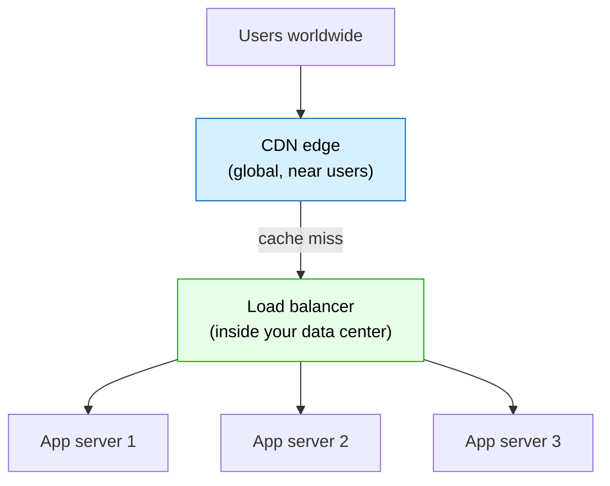

A **reverse proxy** is the general category both of these specialize. A reverse proxy is simply a server that sits in front of other servers, forwarding requests, hiding the origins, and applying rules. A CDN *is* a reverse proxy — one that adds global distribution, caching, security, and edge compute on top:

> Reverse proxy + distributed network + caching + security + edge compute = **a modern CDN.**

| | CDN | Load balancer |
|---|---|---|
| **Purpose** | Bring content and processing close to users | Distribute requests across backend servers |
| **Scope** | Global, at the network edge | Inside one data center / region |
| **Main win** | Latency, caching, offload, security | Even utilization, health checks, failover |
| **Position** | *In front of* the load balancer | *Behind* the CDN |

> **The interview answer.** When asked "CDN or load balancer?", the correct response is usually "both, at different layers." The CDN decides *which edge* serves the user; the load balancer decides *which backend server* handles the request once it's inside the data center. Treating them as either/or is the tell of someone who hasn't built the full path.

<details>
<summary>📖 In plain English</summary>

A CDN works globally, picking the nearest edge location for each user. A load balancer works inside one data center, spreading requests evenly across your backend servers. A reverse proxy is the general idea of "a server that fronts other servers." A CDN is a supercharged reverse proxy spread across the world. You typically use all of them together — CDN out front, load balancer behind it.

</details>

## 🎯 18. The mobile dimension

Websites have used CDNs for decades, but mobile apps arguably need them *more* — and the reasons reveal some subtleties worth carrying into a mobile-system-design interview.

Mobile networks are unpredictable: a user can slide from 5G to 4G to weak 3G to spotty café Wi-Fi within an hour, and every extra kilometer of distance raises the odds of a slow or failed request. Latency also matters more here — studies link a one-second mobile delay to roughly a 20% drop in conversions. Mobile users are genuinely global, unlike a single-country banking site. Data is often metered, so the smaller formats a CDN serves (WebP, AVIF) save users real money. And every downloaded byte and failed retry costs battery.

The most important mobile-specific idea is that a CDN adds a *third and fourth* layer to a caching stack that already has two on the device:

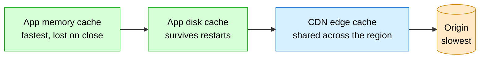

Requests check memory, then disk, then the CDN edge, and only then the origin. On mobile, the first two layers are usually handled for you by image libraries — Glide, Coil, or Picasso on Android; SDWebImage or Kingfisher on iOS — which also do request deduplication and placeholder handling. The same HTTP headers from Section 10 (`Cache-Control`, `ETag`, `Last-Modified`) coordinate all four layers.

A few mobile-specific realities shape the design:

- **DNS lookups are expensive on mobile** — 100–300 ms each. Using several CDN domains multiplies that cost, so consolidate to one domain and pre-resolve DNS at app start.
- **The TLS handshake hurts on slow links** — a fresh TCP+TLS setup on 3G can take about a second. Reuse connections, and prefer CDNs that support HTTP/2 multiplexing and HTTP/3 (QUIC).
- **PoP density beats PoP count.** A provider boasting 300 global PoPs helps nothing if none are in your users' country. For an India-focused app, presence in Mumbai, Delhi, Chennai, and Bangalore matters more than 50 European cities.
- **Prefetching pays off.** Apps that pre-download the next episode or the likely-next screen make far better use of CDN bandwidth than hammering the origin.

> **Staff-level nuance.** On mobile, the CDN edge is frequently *not* the bottleneck — DNS resolution and connection setup are. Optimizing tail latency means connection reuse (HTTP/2 and HTTP/3), domain consolidation, and TLS session resumption *as much as* cache hit ratio. And the on-device caches often matter more than the edge for *perceived* speed, because the fastest request is the one that never leaves the phone.

<details>
<summary>📖 In plain English</summary>

Phones need CDNs even more than websites do, because mobile networks are flaky, users are everywhere, and data and battery are limited. On a phone there are really four caches in a row: memory, disk, the CDN edge, then the origin — and the app checks them in that order, so the fastest request never leaves the device. On mobile, just *finding* the server (DNS) and *connecting* (handshake) can be slow, so reusing connections and having a CDN location actually in your country matter a lot.

</details>

---

# Part V — Mastery

You now understand the machine and its hard parts. This final section is about *fluency*: seeing how real companies use CDNs, discarding the myths that make answers sound junior, internalizing the nuances that make answers sound senior, and having the material compressed for fast recall before an interview.

## 📊 19. CDNs in the wild: who uses them and how

Concrete examples make the abstract stick, and naming real systems in an interview signals that you think about production, not just diagrams. Here's how CDNs show up across domains.

**Streaming and media.** Netflix pushes popular titles to edge locations *before* release and even deploys its own hardware (Open Connect appliances) inside ISP networks, so the launch-night surge is served locally with minimal buffering; it relies on adaptive bitrate (HLS/DASH) to keep playback smooth as bandwidth fluctuates. YouTube takes the opposite loading strategy — its endlessly uploaded content is *pulled* on demand, so popular videos naturally accumulate at edges while obscure ones don't waste storage. Live sports, like an IPL stream, is chopped into small segments served from the nearest PoP, with adaptive bitrate keeping slower connections playing.

**E-commerce.** Amazon serves product images, CSS, and JavaScript through a CDN so product pages load fast, and it can *push* assets to PoPs ahead of a flash sale so a traffic spike finds everything pre-warmed. Read-only endpoints like a product catalog or "supported currencies" are semi-dynamic and short-TTL cacheable, while `POST /payment/create` bypasses the CDN entirely because it changes state.

**Social media.** Instagram is a textbook split: photos, videos, reels, and stories are delivered from the nearest PoP (via domains like `scontent.cdninstagram.com`), while the *personalized feed metadata* — who liked what, captions, ordering — comes from backend APIs and is never cached, because it's different for every user. Facebook and Spotify similarly push media assets and album artwork through CDNs.

**Developer and software distribution.** GitHub distributes release binaries through a CDN. Game patches and OS updates are classic *Push* candidates: known in advance and requested by millions at once.

**Fintech and APIs.** Payment APIs aren't cached because they mutate state, but read-only configuration like `GET /merchant/configuration` or `GET /supported-currencies` can be — a reminder that *caching decisions follow the data, not the fact that something is "an API."*

As for who provides all this: **Akamai** runs the largest legacy network and dominates enterprise media; **Cloudflare** offers a huge PoP footprint, an easy setup, a free tier, and strong security features; **AWS CloudFront** integrates tightly with S3, EC2, and the rest of AWS; **Fastly** is prized for low latency and near-instant purging, popular with developer-heavy teams; and **Google Cloud CDN** rounds out the major options.

## ❌ 20. Myths worth unlearning

Every one of these sounds plausible, and every one is wrong. Being able to correct them crisply is a fast way to demonstrate depth.

**"A CDN replaces your backend servers."** No — a CDN only serves *cacheable* content. Authentication, business logic, database writes, payments, and user-specific APIs all still live on the backend.

**"Every request reaches the origin."** No — the entire goal is the opposite. A well-tuned CDN serves the large majority from edges and sends only a small fraction to the origin.

**"A CDN stores all your application data."** No — the database remains the source of truth. The CDN holds cacheable copies of *selected* content only.

**"DNS routes packets to the nearest server."** No — DNS only *returns an IP address*. The actual packet routing is done by internet routers using BGP, especially under Anycast.

**"DNS runs on every request."** No — DNS answers are cached at the browser, the OS, and the recursive resolver, each until its TTL expires.

**"The IP from DNS is the origin server."** Not for a CDN-backed site — there it's usually the CDN's Anycast IP, which is precisely *why* the CDN can cache, secure, and optimize before traffic ever reaches you.

**"Pull CDN is always better."** No — Pull and Push solve different problems; the choice depends on whether demand is predictable.

**"Cache everything for maximum speed."** No — sensitive, user-specific data must never sit in a shared cache. Speed isn't worth a data leak.

**"Dynamic content can never be cached."** Not always — semi-dynamic responses that are identical for all users (weather, trending products) can be cached for short windows.

**"Origin Shield is mandatory."** No — it's a large-scale optimization. Small applications work fine without it.

**"A CDN guarantees zero origin traffic."** No — every cache miss contacts the origin. The goal is to *minimize* origin traffic, not eliminate it.

**"HTTPS prevents CDN caching."** No — TLS terminates at the edge, which decrypts, applies policy, and re-encrypts. Encryption and caching coexist.

**"A CDN is just a cache."** No — it's a distributed reverse proxy that also does TLS termination, DDoS and WAF protection, routing, compression, image optimization, and edge compute.

## 🎓 21. What separates a staff engineer's answer

These are the points experienced engineers raise *unprompted* — the follow-ups a good interviewer is pushing you toward. Internalize these and your answers stop sounding like a textbook and start sounding like someone who has debugged this at 3 a.m.

**The real axis is shared-vs-user-specific, not static-vs-dynamic.** Public catalogs are dynamic APIs yet perfectly cacheable; a cookie-personalized "static" JSON is dangerous. Reason in terms of cache scope (shared vs private) and reuse rules (method, headers, freshness), never file type.

**Cache-key design is where the hit ratio is won or lost.** Vary on too little and you serve the wrong (or someone else's) variant; vary on too much and fragmentation collapses your hit ratio. Bounded presets and a disciplined `Vary` are a deliberate practice, not an afterthought.

**Authenticated caching demands explicit intent.** A shared cache must not reuse an `Authorization`-bearing response unless it's explicitly marked `public`. "Cache the whole API" without classification is a latent data leak.

**Invalidation is a contract, not a TTL.** Always pair "how long may this be reused?" with "what event makes this copy wrong?" Versioned URLs turn invalidation into a rename and unlock near-infinite TTLs; purges are the fallback for in-place edits; unsafe methods silently invalidate related GETs.

**Stampede protection is layered.** Origin Shield and tiered caching (topology), request coalescing (collapsing concurrent misses), and stale-while-revalidate (serving stale during refetch) are complementary defenses, not competing choices.

**"Nearest" is a routing outcome, not geography.** Anycast plus BGP picks the best *network* path, which can differ from the closest city and shift during congestion — the source of both resilience and the occasional "why is my traffic in Singapore?" surprise.

**Multi-CDN is a cost/reliability/consistency triangle.** Two providers boost availability but double the bill, erode volume discounts, and risk inconsistent cache keys serving different content. It's a trade-off to reason about, not a free upgrade.

**Always ask the blast radius of a wrong cache decision.** The worst CDN incidents aren't outages — they're a bad header leaking one user's authenticated response to thousands. Quantify that, don't just plan for a dead PoP.

**On mobile, DNS and connection setup rival the hit ratio.** Tail latency is often dominated by lookups and handshakes on flaky networks, so HTTP/2 and HTTP/3, connection reuse, and domain consolidation matter as much as caching — and the on-device caches often matter most.

**The edge is becoming a compute tier.** With Workers, Lambda@Edge, and Compute, personalization and auth run at the edge, so some formerly-dynamic responses become edge-generated *and* cacheable, blurring the origin/edge boundary.

**Cost is regional and multi-dimensional.** Egress is billed per gigabyte *and* per request, and delivery in India, South America, or Africa often costs more than in North America or Europe. Where your users are is a real design input to the CDN bill.

## 🔗 22. Where to go next: adjacent concepts

A CDN sits at the intersection of several deep topics. If you want to go further, these are the natural next threads, each of which reinforces something you've just learned:

- **DNS in depth** — recursive vs authoritative resolvers, record types (A, AAAA, CNAME, MX, TXT), and how GeoDNS steering works. It's the substrate under Section 5.
- **Anycast & BGP** — the routing layer beneath edge selection, and also how the 13 logical DNS root-server identities scale to hundreds of physical machines.
- **HTTP caching (RFC 9111)** — the formal semantics behind `Cache-Control`, validators, `Vary`, and `stale-while-revalidate`/`stale-if-error`. This is the rulebook for Sections 10–12.
- **Caching fundamentals** — TTL, eviction policies (LRU/LFU), write-through vs write-back, and the thundering-herd problem in general. The generic theory beneath edge caching.
- **Reverse proxies & API gateways** — the category a CDN specializes; gateways add auth, routing, and rate limiting nearer the application.
- **Load balancing** — the in-data-center complement to a CDN (Section 17).
- **TLS, HTTP/2, and HTTP/3 (QUIC)** — the transport protocols that shape connection-setup cost, especially on mobile.
- **Edge computing / serverless at the edge** — Cloudflare Workers, Lambda@Edge, Fastly Compute; the frontier where CDNs become compute platforms.
- **Adaptive bitrate streaming (HLS/DASH) & range requests** — how video actually rides a CDN.
- **Multi-CDN & global traffic management** — DNS-level steering across providers for reliability and performance.

---

## ⚡ Quick Revision

*Read this the night before an interview. It's written to flow, so that recalling one idea pulls the next along with it.*

**Why CDNs exist.** A single origin server is punished by two independent forces: *distance*, which makes each request slow (latency has a floor set by the speed of light through fiber, and you cannot optimize physics away), and *popularity*, which makes the sheer volume of requests overwhelming as the server re-sends identical bytes to millions. These forces surface as five concrete problems — high latency, origin overload, bandwidth cost (a 500 MB file × 1M users = 500 TB of egress), poor scalability (spikes arrive faster than servers can), and low availability (one server, one point of failure). They're all symptoms of one root cause: everything lives in one place and every request goes there. The fix is a single idea — stop making users travel to the content; move copies of the content close to users — and it defeats all five at once.

**The vocabulary and the machine.** The *origin* is the single source of truth; *edge servers* hold copies near users; a *PoP* is the data center full of edges in a city. Users hit a nearby edge, which serves a copy on a *cache hit* or fetches from the origin on a *cache miss*. The *cache hit ratio* — percentage served from edges — is the master metric; aim for 90%+, because at that level the origin sees almost no traffic and every benefit compounds.

**The request journey has two phases.** Phase A finds *where* to connect and is entirely DNS: browser cache → OS cache and hosts file → recursive resolver → Root → TLD → Authoritative, which returns — critically — the *CDN's Anycast IP, not the origin's IP*, cached for its DNS TTL. Phase B fetches the file: the browser connects, BGP has already routed that connection to the nearest healthy PoP, and the edge serves a hit or handles a miss. Remember the two traps: DNS returns the CDN's IP, and DNS doesn't run on every request.

**Routing.** Many edges advertise the same *Anycast* IP; *BGP* routes each user's packets to the best-reachable one. DNS gives the destination, BGP chooses the road. This yields near-instant failover — a dead PoP just withdraws its BGP announcement and traffic reroutes in seconds, no DNS change. "Nearest" means best *network path*, not shortest distance; under congestion BGP may pick a farther, faster PoP. GeoDNS is a simpler alternative that guesses location from the resolver's IP, with known weaknesses.

**Filling the edge.** *Pull* fetches lazily on the first miss — ideal for unpredictable user-generated content (Instagram, YouTube, Amazon images). *Push* pre-distributes known assets before demand — ideal for software updates and movie releases (Netflix pre-warms blockbusters). Large systems use both; the deciding factor is how predictable the demand is. Note each PoP caches independently, so the first user in each region still pays a miss.

**What and how to cache.** Cache what's *identical for many users*: static content (ideal), semi-dynamic (short TTL), never per-user dynamic. The senior reframing: the real axis is *shared vs user-specific*, not static vs dynamic — a public catalog API is cacheable; a cookie-personalized blob is not. HTTP headers are the controls: `public`/`s-maxage` for shared caches, `private` for browser-only, `no-store` for nobody; `no-cache` means "store but revalidate first." `ETag`/`Last-Modified` enable cheap `304` revalidation. Don't confuse DNS TTL (an address) with cache TTL (a file).

**The cache key** decides when two requests share a stored response. Vary on too little and you serve the wrong or someone else's variant; vary on too much (all headers, unbounded image sizes) and fragmentation collapses the hit ratio. Authenticated (`Authorization`) responses must not be shared-cached unless explicitly marked `public` — this is where "cache the whole API" becomes a data leak.

**Invalidation** is famously hard. Either *purge* (reliable but slow to propagate, sometimes costly) or *version the URL* (`?v=hash` — the new URL is fetched fresh with no purge, and lets you cache near-forever). Always pair "how long reusable?" with "what makes this copy wrong?" Unsafe methods silently invalidate related GETs.

**Scaling and failure.** A *cache stampede* happens when many edges miss a hot new object at once and swamp the origin; defenses are *Origin Shield* (origin asked once, not a thousand times), *tiered caching* (regional caches so cities share), *request coalescing* (concurrent misses collapse to one fetch), and *pre-warming* (push before a known spike). On failure: Anycast reroutes around dead PoPs; cached content survives origin outages, extended by `stale-if-error`; `stale-while-revalidate` serves stale instantly while refreshing. The dangerous failures are *correctness* bugs whose blast radius is every user.

**Beyond caching.** A modern CDN is a *distributed reverse proxy + cache + security layer + edge-compute platform*. Security: signed URLs for per-file access, plus DDoS absorption, WAF, hotlink protection, rate limiting, geo-blocking, and TLS termination. HTTPS doesn't block caching — TLS terminates at the edge; the real question is trust boundaries and cache scope. Smart delivery: on-the-fly resizing (use fixed presets to avoid fragmentation), format negotiation (WebP/AVIF), compression (Brotli/gzip), adaptive bitrate video, and edge compute (Workers, Lambda@Edge).

**Positioning.** A CDN is global and picks *which edge* serves the user; a load balancer is in-data-center and picks *which backend server* handles the request; the CDN sits in front. A CDN is a specialized reverse proxy plus distribution, caching, security, and edge compute. On mobile, add on-device memory and disk caches before the edge, mind expensive DNS and TLS setup, prefer HTTP/2 and HTTP/3, and value PoP density in your users' region over raw PoP count.

**One-line anchors for the room.** "DNS returns the Anycast IP, not the origin." · "DNS gives the destination; BGP chooses the road." · "Cache what's shared; keep user-specific private or no-store." · "Version URLs to turn invalidation into a rename." · "Origin Shield stops the stampede." · "HTTPS terminates at the edge — caching and encryption coexist." · "Aim for a 90%+ hit ratio." · "The real axis is shared vs user-specific, not static vs dynamic."

---

## 💡 The Interview Q&A Bank

Twenty of the most frequently asked CDN questions. The first ten are foundational; questions 11–20 are staff/principal level, pushing into trade-offs and per-component reasoning. Each answer is written the way you'd actually say it out loud — reasoning, not a definition — with concrete technologies named.

### Foundational (L3–L4)

<details>
<summary><b>1. What is a CDN, and what problems does it solve?</b></summary>

A CDN is a globally distributed network of edge servers, grouped into PoPs, that caches copies of content close to users so requests are served nearby instead of always reaching the origin. It exists because a single origin is punished by two independent forces: distance, which drives latency you can't optimize away because it's bounded by the speed of light, and popularity, which drives load as the origin re-serves identical bytes to millions. Those forces surface as five problems — high latency, origin overload, bandwidth cost, poor scalability, and low availability — and moving copies near users defeats all five simultaneously. Concretely, if Netflix served every stream from one Virginia data center it would be slow for Indian users and would collapse under load; distributing copies to Mumbai, London, and Tokyo edges fixes both. I frame it as: distance drives latency, popularity drives load, and a CDN attacks both.

</details>

<details>
<summary><b>2. Walk me through what happens from typing a URL to content appearing.</b></summary>

There are two phases people tend to blur. Phase A finds where to connect and is entirely DNS: the browser checks its own cache, then the OS cache and hosts file, then asks a recursive resolver, which walks Root to TLD to Authoritative DNS. For a CDN-backed site, the authoritative server returns the CDN's Anycast IP, not the origin's, cached for its DNS TTL. Phase B fetches the file: the browser opens HTTPS to that IP, BGP has already routed the connection to the nearest healthy PoP, and the edge either serves a cache hit in tens of milliseconds or handles a miss by fetching from origin, storing a copy, and serving it. Nothing is downloaded from the site until Phase A finishes. The two facts candidates miss are that DNS returns the CDN's IP rather than the origin's, and that DNS is cached at the browser, OS, and resolver, so it doesn't run on every request.

</details>

<details>
<summary><b>3. Explain cache hit vs cache miss and why the hit ratio matters.</b></summary>

A cache hit means the edge already has fresh content and serves it without touching the origin — lowest latency, zero origin load, low bandwidth. A miss means the edge fetches from origin, stores a copy, then serves; the first request is slow, around 300 ms versus 30 for a hit, but every subsequent request in that PoP becomes a hit. The cache hit ratio — the fraction served from edges — is the headline metric because every benefit cascades from it: at 95% the origin sees only 5% of traffic, so latency, cost, and availability all improve together. For media-heavy apps I target 90%+, and I treat a low ratio as a bug to diagnose, usually caused by too-short TTLs, over-changing URLs, or over-personalized content. I'd check the `CF-Cache-Status` or `X-Cache` header to see whether objects are hitting, and investigate any static asset stuck on MISS.

</details>

<details>
<summary><b>4. Pull CDN vs Push CDN — how do you choose?</b></summary>

A Pull CDN starts empty and fetches content from the origin on the first request, then caches it — easy to configure, stores only content people actually want, but the first request is slow and a burst of cold misses briefly spikes origin traffic. It fits unpredictable user-generated content; Instagram can't know which of billions of daily photos will go viral, so it pulls each on demand. A Push CDN proactively uploads content to edges before any request, so the first request is already fast and the origin isn't hammered during a launch, at the cost of more storage and operational overhead. It fits known, high-demand assets like software updates, game patches, and movie releases; Netflix pre-distributes anticipated titles. It's not about which is better — they solve different problems, and large systems use both, for example pulling product images while pushing flash-sale assets. The deciding question is how predictable the demand is.

</details>

<details>
<summary><b>5. What should and shouldn't be cached on a CDN?</b></summary>

The rule is to cache what's identical for many users. Static content — images, CSS, JS, fonts, video — is ideal: high hit ratio and safe. Semi-dynamic content that's the same for everyone at any instant, like weather, exchange rates, or a product catalog, can be cached with short TTLs. Per-user dynamic content — carts, `/api/me`, balances, payment responses — must not go in a shared cache, because serving one user's cart to another is a security incident. The senior refinement is that the real axis is shared versus user-specific, not static versus dynamic: a public catalog is a dynamic API yet perfectly cacheable, while a cookie-personalized "static" JSON is dangerous. The most important design decision isn't "use a CDN," it's classifying each response by shareability and sensitivity and assigning a TTL accordingly.

</details>

<details>
<summary><b>6. How does a user get routed to the nearest edge? Explain Anycast and BGP.</b></summary>

Two techniques. Many edges advertise the same IP — that's Anycast — so the browser gets one destination without knowing it exists in dozens of cities. BGP, the routing protocol between the internet's independent networks, then delivers each user's packets to the best-reachable instance advertising that IP. So DNS answers "what IP?" and BGP answers "through which path?" Anycast's killer feature is failover: if a PoP dies, the CDN withdraws its BGP announcement and traffic reroutes to the next-best PoP within seconds, with no DNS change and no propagation wait. There's also GeoDNS, which guesses location from the resolver's IP and returns a nearby edge directly — simpler, but it sees the resolver's location rather than the user's, and geographically nearest isn't always fastest. The precise statement is that Anycast plus BGP routes to the best available instance, usually but not always the nearest.

</details>

<details>
<summary><b>7. What's the difference between a CDN and a load balancer?</b></summary>

They operate at different layers and usually work together. A CDN is global, lives at the network edge near users, and answers "which edge location serves this user?", optimizing latency, caching, offload, and security. A load balancer is local, lives inside a data center or region, and answers "which backend server handles this request?", optimizing even utilization, health checks, and failover. Architecturally the CDN sits in front: user to CDN edge, then on a miss to the load balancer, then to app servers. If asked "CDN or load balancer?", the right answer is "both, at different layers." A CDN is really a specialized reverse proxy — a server that fronts other servers — with global distribution, caching, security, and edge compute added on top. Treating them as alternatives signals you haven't built the full request path.

</details>

<details>
<summary><b>8. How does a CDN improve security?</b></summary>

Because all traffic passes through the edge first, the edge becomes a security checkpoint at two levels. For individual content, signed URLs give time-limited, tamper-proof access to private files: the app asks your backend, the backend verifies entitlement and issues a URL valid for, say, an hour with an expiry and signature, and the CDN serves it if valid or returns 403 if expired or tampered — so even a leaked URL stops working. For the whole system, the edge provides DDoS protection by absorbing floods with its global capacity before they reach your small origin, a WAF to block SQL injection and XSS, hotlink protection so others can't embed your media on your bandwidth, rate limiting against abuse and scraping, geo-blocking for licensing, and TLS termination. So a CDN isn't only about speed; it keeps the origin hidden, protected, and lightly loaded.

</details>

<details>
<summary><b>9. What is TTL, and how do you handle content that changes before it expires?</b></summary>

TTL is how long a cached object is considered fresh before it must be revalidated or refetched, set via `Cache-Control: max-age` and `s-maxage`. When content changes before expiry there are two options. Purge: call the CDN's invalidation API to delete the object from edges — reliable, but propagation is relatively slow and sometimes costs money. Or cache-bust with a versioned URL, changing `style.css` to `style.v2.css` or adding `?v=hash` — this is what most large apps do, because the new URL is a brand-new object fetched fresh immediately with no purge, while the old one ages out, which also lets you set near-infinite TTLs for a high hit ratio. Note that DNS TTL, which caches an IP address, is a different thing from HTTP cache TTL, which caches content, and conflating them is a common mistake.

</details>

<details>
<summary><b>10. What content and protocols do CDNs handle?</b></summary>

Content is primarily static assets — images in JPEG, PNG, WebP, or AVIF; video via MP4 or HLS segments; CSS, JS, fonts, PDFs, downloads — plus semi-dynamic responses like public catalogs and config, and, through edge compute, some dynamic content. Protocols are HTTP and HTTPS with TLS terminated at the edge, HTTP/2 for multiplexing many requests over one connection, and increasingly HTTP/3 over QUIC for faster connection setup, which matters a lot on mobile. Modern CDNs also transform content: on-the-fly resizing with a width parameter, format negotiation serving WebP or AVIF from the same URL based on the `Accept` header, and compression with gzip or Brotli that can shrink a 100 KB JSON to 20 KB. The caveat is that each transformed variant is a separate cache entry, so you bound them with presets to protect the hit ratio.

</details>

### Staff / Principal Level (L5–L6)

<details>
<summary><b>11. "If HTTPS encrypts everything, how can a CDN still cache content?"</b></summary>

This tests whether I can separate three layers that junior answers mash together. HTTPS doesn't fight caching because TLS terminates at the CDN edge: the edge decrypts the request for that hop, applies cache policy, and re-encrypts the response to the viewer, and on a miss it opens its own HTTPS connection to the origin. Encryption is real on every hop and the cache is real in the middle. The real question isn't whether the payload is encrypted, it's who is trusted to see plaintext at each hop and whether the response is safe for a shared cache. I'd answer that public GET and HEAD responses with explicit freshness can be edge-cached, user-specific or sensitive responses must be private or no-store, and anything carrying an `Authorization` header needs explicit shared-cache permission per RFC 9111 plus a careful cache key. Reframing from encryption to trust boundaries and cache scope is exactly what the interviewer is probing.

</details>

<details>
<summary><b>12. How would you design the cache key for a mixed workload, and what goes wrong?</b></summary>

The cache key decides when two requests share a stored response, and the dangerous default is "the URL alone." Real keys often must vary on locale, device class, `Accept-Encoding`, selected query params, certain headers, and sometimes cookies, expressed via `Vary`. The failure modes are symmetric: vary on too little and you serve the wrong variant — a Brotli body to a gzip-only client, or worse, one user's response to another, which is a security bug — while varying on too much, like forwarding every header or allowing unbounded image widths, fragments one logical object into 40 or 50 entries, each a cold miss, collapsing the hit ratio. CloudFront's own guidance is that extra header variance lowers the hit ratio, so you pay for precision with fragmentation. My approach is to normalize inputs — fixed image-size presets, a canonicalized `Accept-Encoding` — vary only on dimensions that genuinely change the response, and never fold an auth token into a shared key.

</details>

<details>
<summary><b>13. A new movie launches and millions press Play at once. How do you protect the origin?</b></summary>

This is a cache stampede or thundering herd — if a thousand edges all miss the new content simultaneously, the origin gets a thousand identical requests and can collapse. I'd layer defenses. Origin Shield is a designated mid-tier cache so the first miss reaches the origin through the shield, which caches it, and the other 999 edges pull from the shield — one origin request instead of a thousand. Tiered caching adds regional caches that edges check before origin. Request coalescing collapses concurrent misses for the same key into a single upstream fetch. And because a launch is predictable, cache pre-warming pushes the content to edges before release, so the first user is already a hit — Netflix does exactly this. Stale-while-revalidate further smooths things by serving slightly stale copies during refresh. These are complementary layers; for a known blockbuster, pre-warming plus Origin Shield does most of the work.

</details>

<details>
<summary><b>14. Should you cache authenticated or personalized API responses?</b></summary>

Default to not shared-caching them. Per RFC 9111, a shared cache must not store a response to a request carrying `Authorization` unless the response explicitly allows it with `Cache-Control: public`, so putting a CDN in front of `/api/*` without classification is a data leak with a friendlier name. My framework classifies each endpoint: public and repeatable, like a public catalog, feature flags, or exchange rates, gets edge-cached with short freshness; user-specific but low sensitivity gets `private, max-age=30` so only the browser caches it; and sensitive, personalized, or mutation-adjacent responses like `/api/me`, balances, or signed download links get `no-store`. For genuinely per-user-but-cacheable data you can include the user identity in the cache key, but that shreds the hit ratio and is rarely worth it. The discipline is doing the classification most teams skip, rather than blanket-caching or blanket-bypassing.

</details>

<details>
<summary><b>15. Would you use a multi-CDN setup? Walk through the trade-offs.</b></summary>

Multi-CDN, steered at the DNS level across providers like Cloudflare and Akamai, improves reliability — if one has a regional outage, traffic fails over — and can optimize performance per region. But it's a genuine trade-off triangle: cost, since you pay two bills and lose volume discounts that would have lowered per-GB pricing; complexity, since you maintain two configs, two cache-key models, and two purge APIs; and consistency, since mismatched cache keys or headers across providers can serve different content depending on which CDN a user hits. I'd reach for it on large media platforms where availability SLAs justify the cost, or where one provider has weak coverage in a key region. For most apps, a single well-configured CDN with origin fallback is simpler and cheaper. The point is to weigh reliability against cost and operational consistency, not treat multi-CDN as a free upgrade.

</details>

<details>
<summary><b>16. Difference between `Cache-Control: private`, `no-store`, and `no-cache`?</b></summary>

They're distinct operational bets. `private` means a shared cache like the CDN must not store it but the user's browser may, which suits user-specific but low-sensitivity data such as `private, max-age=30`. `no-store` means nobody stores it, not browser nor CDN, for sensitive or personalized responses like balances or `/api/me`. `no-cache` is the misnamed one: it permits storage but requires revalidation with the origin, via `ETag` and `If-None-Match`, before every reuse — so you keep caching's bandwidth savings through 304s while guaranteeing freshness. Mixing up `private` and `no-store` is a classic red flag, because `private` still allows a browser cache that can leak on shared devices, whereas `no-store` forbids all storage. Pairing `no-cache` with a strong `ETag` is a nice middle ground for content that changes unpredictably but is expensive to transfer.

</details>

<details>
<summary><b>17. Does "nearest edge" mean geographically closest?</b></summary>

No — it means the best network path, chosen by BGP, which usually but not always coincides with geographic proximity. Anycast advertises one IP from many PoPs, and each router picks a route based on BGP policies like AS-path length, peering agreements, and congestion, not straight-line distance. So a user in Pune normally routes to Mumbai at around 8 ms, but if that route has an outage BGP may send them to Singapore at around 45 ms — higher latency, but the service stays up. This is why Anycast CDNs are so resilient: rerouting is automatic and needs no DNS change. It's also why you occasionally see Indian traffic served from Singapore, which is a peering or capacity decision at the network layer. The precise framing is that Anycast lets the internet, via BGP, route to the best available instance advertising that IP.

</details>

<details>
<summary><b>18. Architect CDN usage for a photo-sharing app like Instagram, including private photos.</b></summary>

I'd split the request into two paths. Feed metadata — who posted, captions, likes, ordering — is personalized and dynamic, so it's served by backend APIs, marked `no-store`, and never CDN-cached. That metadata contains CDN URLs for the media. Media — images and video — is served from the nearest PoP via a Pull CDN, since I can't predict which uploads go viral. For delivery I'd use fixed size presets rather than arbitrary widths to avoid cache fragmentation, format negotiation for WebP and AVIF, and adaptive bitrate for video. For private photos I'd use signed URLs: the backend checks the viewer's permission and issues a short-lived signed URL, so even a leaked link expires. On the client, I'd layer memory and disk caches through Glide or SDWebImage so scrolling back up never refetches. I'd target a 90%+ hit ratio and monitor per-region cache status. The key signal is drawing a clear CDN boundary between app and backend and knowing what crosses which path.

</details>

<details>
<summary><b>19. Your cache hit ratio is 60% and origin load is high. Diagnose and fix.</b></summary>

I'd treat it as a funnel investigation, starting with the `CF-Cache-Status` or `X-Cache` headers to see why objects miss. Common root causes and fixes: TTLs too short, so I'd raise `s-maxage` for static assets and use versioned URLs to cache them near-forever; cache-key fragmentation from requesting dozens of image sizes or forwarding unnecessary headers and cookies, so I'd consolidate to size presets and trim `Vary`; missing cacheable headers where the origin sends `no-cache` or nothing on cacheable content, so I'd fix origin `Cache-Control`; query-string or cookie noise like tracking params making every URL unique, so I'd strip them from the key; cross-region cold caches, since each PoP caches independently, so I'd enable tiered caching or Origin Shield to warm regions from one fill; and genuine over-personalization of responses that shouldn't be edge-cached at all, which I'd move to `private`. I'd prioritize by traffic volume, fixing the highest-request-count MISS objects first.

</details>

<details>
<summary><b>20. What are the failure and correctness risks of running a CDN, and how do you design against them?</b></summary>

The scary failures aren't "a PoP went down" — Anycast handles that — they're partial and correctness failures. Cache leakage, where a bad `Cache-Control` header or over-broad cache key makes a shared cache serve one user's authenticated response to thousands, which I design against by never sharing auth-bearing responses without explicit `public` and by auditing cache keys. Stale content from a purge that didn't propagate or a too-long TTL, mitigated by versioned URLs so a rename is always fresh. Origin overload from mass invalidation, where purging everything at once causes a stampede, so I stagger invalidations and rely on Origin Shield. Multi-CDN inconsistency, where providers serve different variants, mitigated by identical cache-key config. And origin outages, where I use `stale-if-error` to serve cached copies and origin fallback on the client. In design reviews I ask what's the blast radius of a wrong cache decision, because a correctness bug at the edge replicates to every user who hits that entry — far worse than a single-PoP outage.

</details>

---

## 📝 STAR stories for behavioral rounds

Four behavioral prompts framed as Situation, Task, Action, Result — the kind of CDN-adjacent stories that come up in staff-level rounds. Use them as templates and substitute your own specifics.

<details>
<summary><b>1. A time you improved a system's performance using caching or a CDN.</b></summary>

**Situation.** Our e-commerce product pages averaged around 4 seconds to load for users outside our origin region in Mumbai, international bounce rates were climbing, and instrumentation showed most of that time was spent fetching product images and JS bundles directly from origin, with origin egress costs growing month over month.

**Task.** I owned the initiative to cut international page-load latency and reduce origin bandwidth within one quarter, without a re-architecture.

**Action.** I put a Pull CDN (CloudFront) in front of static assets and set long TTLs with versioned URLs — hashed filenames for JS and a version query param for images — so we could cache aggressively yet still ship updates instantly. I audited the cache keys and found we were fragmenting images across dozens of arbitrary widths, so I consolidated to three presets and stripped tracking query params from the key. I enabled Brotli compression and used `CF-Cache-Status` to hunt down MISS-heavy assets that lacked cacheable headers.

**Result.** The cache hit ratio rose from about 62% to 94%, median international load time dropped from roughly 4 seconds to 1.2, and origin egress fell about 70%, which noticeably lowered the monthly bill. International bounce rate improved measurably, and the versioned-URL pattern became our team's default for static assets.

</details>

<details>
<summary><b>2. A time you dealt with a production incident caused by caching.</b></summary>

**Situation.** After a deploy, a subset of logged-in users reported briefly seeing another user's account name in the page header — the worst case, a shared cache leaking personalized data.

**Task.** As the on-call engineer, I had to stop the leak immediately and then fix the root cause without taking the whole site down.

**Action.** I first mitigated by pushing a CDN rule to `no-store` the affected authenticated endpoint, which stopped further leakage within minutes. Investigating, I found the endpoint returned personalized HTML but the origin had accidentally started sending `Cache-Control: public, max-age=60` after a refactor, and the cache key didn't include user identity, so the shared cache reused one user's response for others. I corrected the origin to emit `private, no-store` for authenticated responses and added a CI check asserting that any response reading the session cookie cannot carry `public`.

**Result.** The leak was contained in under 15 minutes and fully resolved that day. I wrote a postmortem establishing the rule that authenticated responses are `no-store` by default, and the CI guard has caught two similar regressions since. It drove home for the team that the blast radius of a wrong cache header is every user, not one.

</details>

<details>
<summary><b>3. A time you made a difficult trade-off in a system design.</b></summary>

**Situation.** For a global launch, leadership wanted maximum availability and pushed for a multi-CDN setup across two providers, while we were a small team on a tight budget.

**Task.** I had to recommend whether multi-CDN was worth it and justify the decision to stakeholders who equated more CDNs with more reliability.

**Action.** I laid out the trade-off explicitly: multi-CDN would improve availability during a provider-wide outage, but it would roughly double CDN spend, forfeit volume discounts, and double the operational surface with a real risk of inconsistent content across providers. I quantified our single-provider availability, already strong thanks to Anycast failover across PoPs, and modeled the marginal reliability multi-CDN would add against its cost. I proposed a middle path: a single primary CDN with automated origin fallback and a documented, tested runbook to switch providers via DNS within an hour if ever needed.

**Result.** We shipped with a single CDN, stayed about 45% under the multi-CDN budget, and hit our availability target for the launch. Stakeholders accepted the reasoning because I framed it as risk-adjusted cost rather than a flat no. We revisited multi-CDN a year later when traffic scale finally justified it — that time as a data-driven decision.

</details>

<details>
<summary><b>4. A time you explained a complex concept to a non-technical audience.</b></summary>

**Situation.** Our product and finance teams were alarmed by a rising "CDN bandwidth" line item and suspected the CDN was wasting money, with several people wanting to remove it to cut costs.

**Task.** I needed to explain, without jargon, why the CDN was actually saving money and where the cost genuinely came from, so the org could decide with accurate information.

**Action.** I showed a before-and-after comparison rather than a lecture: without the CDN, the same traffic would hit origin egress at a higher per-GB rate and would also require far more origin compute to survive the load, so the CDN was net cheaper on both. Then I pinpointed the real driver of the bill — a handful of oversized, uncompressed images being served millions of times — and proposed size presets and Brotli compression to shrink them.

**Result.** Finance understood the CDN was net-positive and we kept it, and the image optimizations cut the bandwidth line about 40% the next month. Product started involving me earlier in cost discussions, and I turned the explanation into a short internal doc still used to onboard non-engineers.

</details>

---

## 📚 The one-page memory sheet

- A **CDN** is a globally distributed network of edge servers (in PoPs) caching content near users; the origin stays the source of truth and should be kept as idle as possible.
- CDNs exist to beat two independent forces: **distance** (latency, unbeatable by software) and **popularity** (load, bandwidth, single point of failure) — surfacing as five problems: latency, origin overload, bandwidth cost, poor scalability, low availability.
- A modern CDN is **more than a cache**: distributed reverse proxy + cache + security layer (DDoS/WAF/signed URLs) + TLS termination + edge compute.
- The **cache hit ratio** is the master metric — target 90%+; keeping the origin idle makes every other benefit cascade.
- **Request flow:** DNS returns the **CDN Anycast IP, not the origin**; **BGP** routes to the nearest healthy PoP; the edge serves a **hit** or handles a **miss**. *DNS = destination, BGP = road.*
- **Pull** fills lazily (unpredictable user content); **Push** pre-distributes (known assets). Big systems use both.
- Cache what's **shared** (static + short-TTL semi-dynamic); keep **user-specific** content `private` or `no-store`. The real axis is *shared vs user-specific*, not static vs dynamic.
- **Headers control caching:** `public`/`s-maxage` (shared), `private` (browser only), `no-store` (nobody), `no-cache` (store but revalidate); `ETag`/`Last-Modified` enable cheap `304`s.
- **Cache-key design** makes or breaks the hit ratio — too little vary leaks/breaks, too much fragments. Never share `Authorization` responses without explicit `public`.
- **Invalidation:** version URLs (a rename, enabling near-infinite TTLs) or purge; always pair "how long reusable?" with "what makes it wrong?"
- **Beat the stampede** with Origin Shield, tiered caching, request coalescing, and pre-warming.
- **Failure:** Anycast reroutes dead PoPs; cached content survives origin outages (`stale-if-error`); the worst incidents are *correctness* bugs whose blast radius is every user.
- **CDN ≠ load balancer:** CDN picks the edge (global); LB picks the backend server (in-data-center); CDN sits in front.
- **HTTPS doesn't block caching** — TLS terminates at the edge; the real question is trust boundaries and cache scope.
- **On mobile,** on-device caches sit before the edge, and DNS plus connection setup often matter as much as the hit ratio.

---

*Compiled and heavily enriched from a series of system-design articles on CDNs — including Khyati Jha's HLD Day 10–12, Anand Gaur's mobile CDN chapter, Vipul Vyas's Complete Guide to CDN Parts 1–2, Hafiq Iqmal's CDN-caching interview breakdown, and pieces by Ganesh Prasad, Yash Jain, Anmol Sehgal, and Animesh Gaitonde — with added technical detail on RFC 9111 cache semantics, cache-key design, HTTP/2 and HTTP/3, and staff-level trade-offs.*
