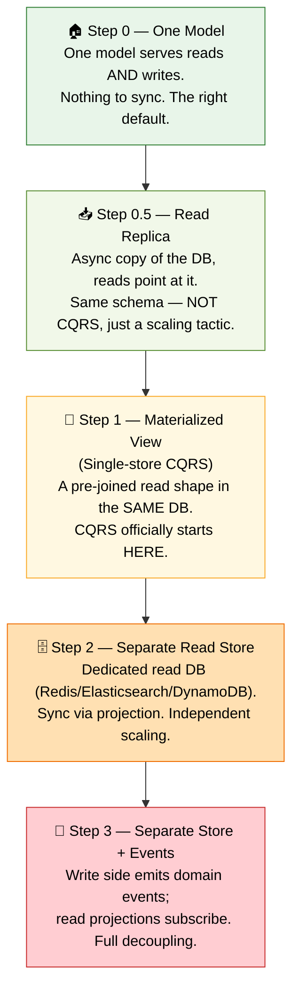
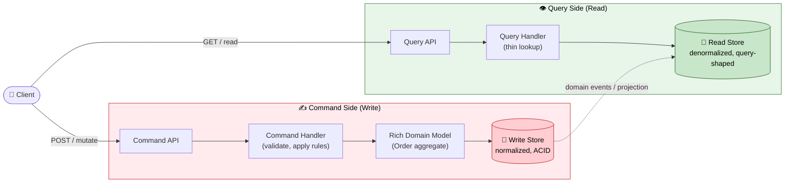
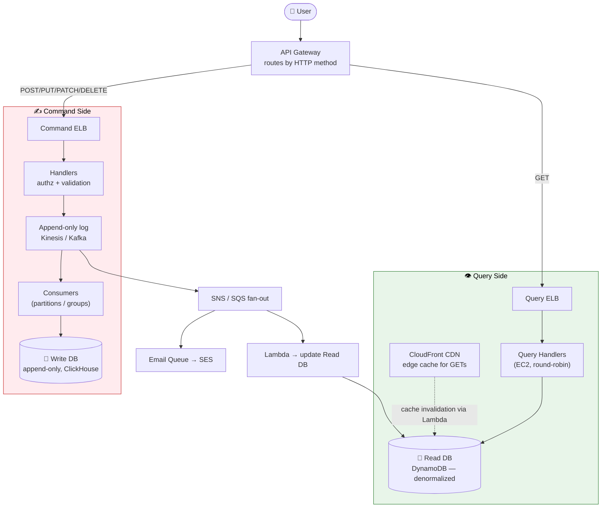
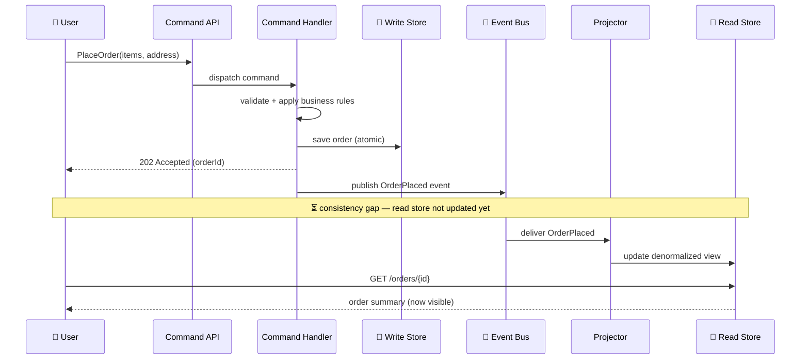
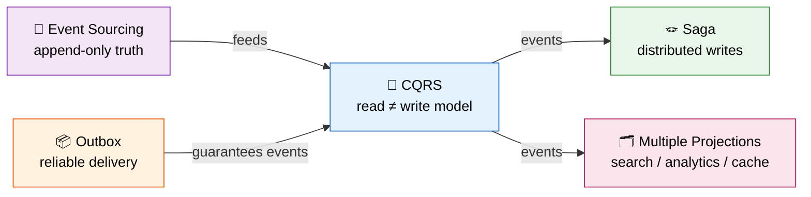

# CQRS — Command Query Responsibility Segregation

> A complete study guide, from plain-English basics to staff/principal-level nuance.
> Read top to bottom for a natural climb; jump via the table of contents when revising.

---

## 📋 Table of Contents

1. [🎯 Introduction — Why This Pattern Exists](#-introduction--why-this-pattern-exists)
2. [✅ Core Definitions (CQS → CQRS)](#-core-definitions-cqs--cqrs)
3. [💡 The Concept & Theory in Detail](#-the-concept--theory-in-detail)
4. [🎯 Why CQRS Exists — The Problem It Solves](#-why-cqrs-exists--the-problem-it-solves)
5. [📊 The Real Trade-off & Mechanism (The Dial)](#-the-real-trade-off--mechanism-the-dial)
6. [🎨 Architecture & Sequence Diagrams](#-architecture--sequence-diagrams)
7. [💻 Categorized Real-World Examples](#-categorized-real-world-examples)
8. [❌ Common Misconceptions](#-common-misconceptions)
9. [🎓 Staff-Level Nuance](#-staff-level-nuance)
10. [🔗 Extensions & Adjacent Concepts](#-extensions--adjacent-concepts)
11. [⚡ Quick Revision](#-quick-revision)
12. [📝 FAANG Interview Q&A](#-faang-interview-qa)
13. [📚 References & Further Reading](#-references--further-reading)

---

## 🎯 Introduction — Why This Pattern Exists

Almost every application you have ever built starts the same way: one model, one database, one set of code that both **writes** data and **reads** it back. You have an `Order` object. You save orders with it, you update them with it, and you also use it to render the order-history screen, the finance dashboard, and the fulfilment report. One model, doing everything.

This works beautifully — until it doesn't.

As traffic grows, that single model comes under pressure from two directions at once. The **write side** wants strict rules: validate stock, check the customer's credit, apply discounts, and commit everything atomically so the data can never be left in a broken state. The **read side** wants the opposite: skip the rules, pre-join everything, and return a flat, ready-to-render blob as fast as possible. These two goals genuinely fight each other. A schema that is perfect for safely inserting an order (normalized, lots of small tables, foreign keys) is often terrible for showing "orders by region, status, and revenue" (which needs big denormalized joins). You end up with a single "God object" that carries fields only the validator uses, methods only the dashboard uses, and performance hacks that contradict one another. Every change risks breaking something unrelated.

**CQRS — Command Query Responsibility Segregation — is the pattern that refuses to force these two jobs through one model.** It says: the model you use to *change* the system and the model you use to *ask about* the system are different concerns, so give each its own path. That's the whole idea. Everything else (separate databases, events, eventual consistency) is optional machinery you add only when the pressure demands it.

A crucial framing to hold onto from the very start, straight from the people who defined the pattern: CQRS is **not** an all-or-nothing switch you flip for the whole app. It is closer to a **dial**. You turn it up only in the one corner of your system that is actually hurting, and you leave everything else as boring, simple CRUD. Martin Fowler warns that "for most systems CQRS adds risky complexity." Greg Young, who coined the term, calls it "not a top-level architecture" — just a small, tactical pattern. Keep that humility in mind; it is exactly the nuance an interviewer is listening for.

<details>
<summary>📖 Beginner-friendly explanation (click to expand)</summary>

Think of a busy restaurant. The **kitchen** does all the hard, careful work: taking the order, checking ingredients, following food-safety rules, cooking correctly. The **waiters** don't need to know any of that — they just need to grab a finished plate and put it in front of you fast.

CQRS draws that same line in software. The "kitchen" is the **write side** (commands) — slow, careful, rule-heavy. The "waiters" are the **read side** (queries) — fast, simple, display-focused. Neither one gets in the other's way. When your app is small, one person can be both cook and waiter. CQRS is what you do once the place gets so busy that mixing the two roles causes chaos.

</details>

---

## ✅ Core Definitions (CQS → CQRS)

Before CQRS there was **CQS — Command Query Separation** — a principle introduced by Bertrand Meyer (in *Object-Oriented Software Construction*, 2000). CQS is about individual **methods** on an object, and it makes a simple distinction:

- A **command** is a method that *changes state* and returns *nothing* (`void SetEmail(string email)`).
- A **query** is a method that *returns a value* and *changes nothing* — it has no side effects (`string GetEmail()`).

The rule: a method should be one or the other, never both. An anti-example is `bool SetEmail(string email)` — it mutates state *and* returns a value, so it's trying to be a command and a query at once.

**CQRS — Command Query Responsibility Segregation** — was popularized by Greg Young (around 2010) and takes that method-level idea and lifts it up to the **architectural** level. Instead of just separating *methods*, you separate the entire **model**: one model for the write path, a different model for the read path. Greg Young's own one-line definition is the cleanest you'll find:

> "CQRS is simply the creation of two objects where there was previously only one."

That's it. Two models where there used to be one. In this vocabulary:

- A **Command** expresses an *intent to change* the system. It is imperative and named like an order you give: `PlaceOrder`, `CancelOrder`, `UpdateShippingAddress`. It gets validated, run through business rules, and may be **rejected**. It typically returns nothing meaningful — success/failure or maybe a new ID. (In practice many engineers happily break the "return nothing" purity by returning a generated ID or a status code — that's a pragmatic, widely accepted relaxation of strict CQS.)
- A **Query** is a *request for data*. It is safe and idempotent, named like a question: `GetOrderById`, `ListPendingOrders`, `GetOrderHistoryForCustomer`. It never changes state, always returns data, and can be cached aggressively.

The single most important sentence to internalize:

> **CQRS is about separating the *model* — nothing more. Event Sourcing, separate databases, message brokers, and eventual consistency are things you *can* add, but none of them are required to "be doing CQRS."**

<details>
<summary>📖 Beginner-friendly explanation (click to expand)</summary>

Imagine your notebook has two kinds of actions. "Write down a new to-do" **changes** the notebook — that's a **command**. "Read me today's to-dos" just **looks** — that's a **query**.

CQS is the rule "don't do both in one action" — reading shouldn't secretly change things, and writing shouldn't secretly return a report. CQRS takes that further: use a *whole separate setup* for writing versus reading. Same underlying information, two different tools shaped for two different jobs. If you ever hear "CQRS = two databases," that's a common myth — the real definition is just "two models."

</details>

---

## 💡 The Concept & Theory in Detail

Let's slow down and build the mental model properly, because the whole pattern rests on one observation: **reads and writes are different problems with different pressures.**

### What the write side actually wants

The write path (commands) is where correctness lives. When someone places an order, the system must validate inventory, check credit, apply discounts, enforce invariants ("an order can't be cancelled after it ships"), and commit all related changes atomically. This work belongs in a **rich domain model** — an `Order` aggregate with real behaviour like `confirm()`, `cancel()`, and `applyPromotion()`. Writes care about: validation, consistency, transactional safety, business rules, and audit trails. They are relatively rare, but each one is precious and must be exactly right.

### What the read side actually wants

The read path (queries) is where speed and shape live. When the dashboard asks for "all pending orders with assignee name and comment count," it doesn't want to run five joins on every request — it wants a **pre-assembled, denormalized view** it can scan directly. Reads care about: low latency, high concurrency, flexible projections, and being shaped for the specific screen that consumes them. They are usually far more numerous than writes.

A single data model is rarely ideal for both. A table structure perfect for *inserting* an order is often terrible for *displaying* a revenue-by-region report. CQRS simply accepts this reality and designs around it: let writes be optimized for correctness, let reads be optimized for access, and stop making each one compromise for the other.

### Commands are about *intent*

A command is not a data update — it's a *request to change something*, expressed as intent. `MarkOrderShipped` carries meaning that a raw `UPDATE orders SET status='shipped'` throws away. Because the command names the intent, the command **handler** can reason about it: it can reject the command if a business rule fails, and it can emit a matching domain event (`OrderShipped`) that other parts of the system react to. Commands should be explicit, validated, and idempotent where possible.

### Queries are about *shape and speed*

A query handler does almost nothing interesting, and that's the point. It receives a question, looks up a pre-shaped record in the read store, and returns it. No domain objects, no invariant checking, no business logic. A read model is allowed — encouraged, even — to be **denormalized and redundant**. Storing the customer's name *inside* the order-summary row is not a data-modelling sin here; it's the entire strategy. It saves a join and keeps the read path trivial.

### The deeper payoff: clarity, not just speed

CQRS is usually sold as a scalability pattern, and it is one — but its quieter, more valuable benefit is **mental clarity**. When commands and queries are separated, write rules become easy to reason about, read models can evolve independently (add a new dashboard without touching write code), performance tuning becomes targeted, and domain logic stops leaking into every endpoint. This clarity is worth something *even before* you hit serious scale. Teams that don't need CQRS *everywhere* often still benefit from it in the one bounded context where complexity is already high.

<details>
<summary>📖 Beginner-friendly explanation (click to expand)</summary>

Picture a warehouse. The **receiving dock** (writes) is strict: every incoming box is inspected, logged, and stacked in the right numbered slot with careful rules. Slow and careful on purpose.

The **shop window** (reads) is the opposite: items are already unpacked, priced, and arranged so a customer can grab one instantly. Nobody re-inspects a box at the window.

CQRS keeps these two areas separate. The dock is your command side (careful, rule-heavy). The window is your query side (fast, pre-arranged). You even keep a *duplicate* of some info in the window (like a price tag) so shoppers never wait — that duplication is intentional, not a mistake.

</details>

---

## 🎯 Why CQRS Exists — The Problem It Solves

CQRS exists to resolve two compounding problems that appear when a single model serves both reads and writes at scale.

**Problem 1 — The write model and the read model want different things.** As covered above, forcing rich domain logic and flat display views through the same object produces a bloated, fragile "God object." Neither concern is served well, and every change is risky.

**Problem 2 — Reads and writes scale differently.** In most real systems reads *dramatically* outnumber writes. An e-commerce platform might take thousands of orders per hour but serve millions of product-page loads. If both share one database, you're forced to scale them together even though only one side is the bottleneck. Worse, you can't optimize the schema for reads (denormalized, query-shaped indexes) without hurting the schema for writes (normalized, consistency-shaped) — and vice versa.

Consider the concrete "hot row" example that makes this vivid. On Amazon, a popular pair of earphones is being *read* thousands of times a second by shoppers checking the price. Meanwhile the seller fires an *update* to change that price for a sale. The update acquires a transaction-level **lock** on that row. Now every reader is contending with that write lock. At Amazon scale, this contention makes queries crawl and the shared database becomes the bottleneck. Splitting reads and writes into separate paths — and eventually separate stores — makes the contention disappear: readers hit a read-optimized store that no writer ever locks.

There's also a **security and access-control** angle that experienced engineers raise: by splitting the paths, you can grant the query side read-only, tightly scoped database access while the command side holds the write privileges. The blast radius of a compromised read endpoint shrinks dramatically.

And in **microservices**, the motivation gets sharper still. If the Order, Inventory, and Customer services each own their own database, a cross-service query like "all orders for premium customers in the last 30 days, with current stock levels" is genuinely hard — you can't `JOIN` across service boundaries, and API-level aggregation is slow and tightly coupled. CQRS answers this by having each service emit events, and a dedicated **query service** subscribes across boundaries to build one denormalized, pre-joined read model that answers the cross-service question in a single lookup.

<details>
<summary>📖 Beginner-friendly explanation (click to expand)</summary>

Imagine one cashier who both restocks shelves *and* rings up customers. When a delivery truck shows up (a write), they lock the register to go stack boxes — and the line of shoppers (reads) just... waits. That's a single database getting overwhelmed because writing and reading fight over the same space.

CQRS hires a second person: one restocks (writes), one runs the register (reads). Now a big delivery doesn't freeze the checkout line. And because most shops have way more shoppers than deliveries, you can even hire *ten* cashiers and just one stocker — scaling each side to what it actually needs.

</details>

---

## 📊 The Real Trade-off & Mechanism (The Dial)

Here is the single most important reframing in this entire guide, and the thing that separates a textbook answer from a staff-level one: **CQRS is not a binary. It is a dial (a staircase) with distinct settings, and you climb only as high as your actual pressure forces you.** Each step buys you something and costs you something. Let's climb it using one running example: a **project board** where people create, assign, and move issues (the writes), and where board views and dashboards render the data in a different shape (the reads).

### The staircase, step by step



**Step 0 — One model (the floor).** You write to one model and read straight back from it. Nothing to keep in sync, nothing to go stale, no projection logic. *Most systems should stop here.* You only climb when something specific forces you off this step.

**Step 0.5 — Read replica (a false step).** The first pressure is usually read *volume* — reads pile up and compete with writes. The cheap fix is an async read replica: point reads at a copy, free the primary for writes. But a replica is *the same model, copied* — same schema, slightly stale. It adds throughput but the read *shape* never changed. **A read replica is not CQRS.** It's a scaling tactic. Knowing this distinction is a classic interview signal.

**Step 1 — Materialized view / single-store CQRS (where CQRS actually begins).** Now the pressure changes *shape*: the board doesn't want the same rows faster, it wants a *different shape* — a card pre-assembled with the assignee's name, comment count, and last-activity timestamp. A replica can't give you that. So you build a **materialized view** inside the same database that precomputes those cards. The joins and counting happen *once, ahead of time*, not on every request. By the textbook definition this is *already* CQRS — "single-store CQRS" — and most teams ship it without ever naming it. The catch: it doesn't refresh itself, so between refreshes it's a little **stale**. That small staleness is the cost you're about to decide whether to enlarge.

```sql
-- Write-side source tables (normalized)
issues   (id, title, status, assignee_id, created_at)
users    (id, name, avatar_url)
comments (id, issue_id, body, created_at)

-- Read-side materialized view (pre-joined, ready to render)
CREATE MATERIALIZED VIEW board_cards AS
SELECT
  i.id, i.title, i.status,
  u.name             AS assignee_name,
  u.avatar_url       AS assignee_avatar,
  COUNT(c.id)        AS comment_count,
  MAX(c.created_at)  AS last_activity
FROM issues i
LEFT JOIN users u    ON i.assignee_id = u.id
LEFT JOIN comments c ON c.issue_id = i.id
GROUP BY i.id, i.title, i.status, u.name, u.avatar_url;
```

**Step 2 — Separate read store.** You've outgrown the view: the refresh cycle is too slow, the computation too expensive to run inline, or read and write traffic genuinely need independent infrastructure. So you move the read model to its own store — a database chosen for the *query* pattern (Redis for key lookups, Elasticsearch for search, DynamoDB for scale). The write DB keeps the normalized truth. Sync happens by **projection**, either *synchronous* (update the read store in the same request — simple but tightly coupled, partial-failure risk) or *asynchronous* (write, emit an event, let a worker update the read store — decoupled and resilient, but now always slightly behind). This is the step where **eventual consistency** enters for real.

**Step 3 — Separate store + events (full CQRS).** The write side no longer just saves state and syncs a view — it **emits domain events** to a bus, and the read side is driven *entirely* by subscribing to those events. The two sides are now fully decoupled and communicate *only* through events. Each projection subscribes to just the events it cares about: the board-cards projection updates on `IssueAssigned` and `IssueMoved`; the activity feed updates on everything; the analytics projection aggregates over time. New projections are added *without touching a single line of write-side code*. You also gain **replayability** (rebuild any projection from the event history) and **resilience** (a lagging projection never blocks writes).

### What each step trades

| Step | You gain | You pay | Consistency |
|------|----------|---------|-------------|
| **0 — One model** | Simplicity; nothing to sync | Reads & writes contend; one schema serves both | Strong |
| **0.5 — Read replica** | Read throughput | Same shape; slight replica lag | Read-after-write lag |
| **1 — Materialized view** | Fast pre-joined reads, no new infra | You own the refresh logic; stale between refreshes | Stale within refresh window |
| **2 — Separate store** | Independent scaling; best-fit read tech | Two stores to run; sync failure handling; duplication | Eventual |
| **3 — Store + events** | Total decoupling; replay; many projections | Distributed-system complexity; event versioning; harder debugging | Eventual, compounded |

### The core trade-off, stated plainly

The thing you are *buying* every time you climb past Step 1 is **independent scalability and shape**. The thing you are *paying* is the **consistency lag** — the staleness window between a write committing and the read side reflecting it. Under normal load it's well under a second; during a deploy, a traffic spike, or a slow consumer, that window *stretches*. **You watch it; you don't promise it.** As one framing puts it: your two real options at scale are (1) let the single database drown and take downtime, or (2) accept a little eventual consistency in exchange for a scalable, fault-tolerant architecture. That is the trade, made deliberately.

**The decision rule.** *Climb* when read and write shapes genuinely differ, when their traffic scales are pulling apart, when many people edit the same data simultaneously, or when one source must feed multiple different views. *Stay on one model* when it's plain CRUD with matched shapes, traffic is low, stale reads are unacceptable in your domain, or the team/system is small and moving fast. When unsure: **go CQRS-lite first** — leave the write path alone, add *one* read model for the query that hurts, and climb further only if the pressure proves real. There's no magic ratio; it stays a judgment call.

<details>
<summary>📖 Beginner-friendly explanation (click to expand)</summary>

Think of upgrading a kitchen as you get busier. At first, one cook does everything (Step 0). Then you get a second identical fridge so people stop bumping into each other (read replica — helps, but it's the same fridge). Then you start *pre-making* salad bowls so they're ready to grab (materialized view — this is where CQRS begins). Then you build a whole separate salad station with its own supplies (separate store). Finally, the main kitchen just shouts out "order up!" and the salad station listens and restocks itself (events).

The golden rule: only upgrade to the next step when the current one is actually slowing you down. Building the fancy shouting-kitchen for a tiny café is a waste — and now your salad might be a few seconds out of date (eventual consistency).

</details>

---

## 🎨 Architecture & Sequence Diagrams

### High-level architecture — the separation of intent



Notice the important part isn't the boxes — it's the **separation of intent**. The command side is thick with logic; the query side is thin and fast. The dotted line (events or projection) is the only bridge, and it flows in exactly one direction: write → read.

### Full event-driven CQRS on AWS (a concrete production shape)



The API Gateway routes by HTTP verb; the two sides scale on independent Elastic Load Balancers; an append-only log ingests validated commands; and an SNS/SQS **fan-out** lets a *single* event both update the read database *and* trigger unrelated work like a promotional email — all without the write side knowing those consumers exist. If the read DB ever corrupts, you replay the log to rebuild it, or even migrate DynamoDB → MongoDB by replaying events into a fresh store.

### Sequence — a command, then a read (with the consistency gap)



The gap between "202 Accepted" and the projector finishing its update is the **staleness window** — the visible face of eventual consistency, and the source of the "read-your-own-writes" problem tackled in the staff-level section.

---

## 💻 Categorized Real-World Examples

CQRS shows up in many guises. Grouping them by *what forced the split* makes the pattern click.

### Category 1 — Read/write asymmetry (the classic driver)

- **E-commerce product catalog (Amazon-style).** Millions of shoppers read a product while a handful of sellers update price and stock. Reads go to a denormalized read store (often cached at the edge via a CDN like CloudFront); writes go to a transactional store. The "hot row lock" contention disappears because readers never touch the write store.
- **Social media feeds.** Writes (posting) are rare relative to reads (scrolling). The feed is a pre-computed read projection; the post is a small command that fans out into many feed projections.
- **SaaS dashboards & analytics.** Writing an invoice is a transactional command; "revenue across time by region" is a read-model problem. Forcing both through one schema creates friction; a pre-aggregated read store makes the dashboard load instantly.

### Category 2 — Divergent read *shape* (not just volume)

- **Project/issue board (Jira-like).** Writes are "create/assign/move issue." Reads want a card with assignee name, comment count, and last-activity — a shape no normalized table gives cheaply. A materialized view (single-store CQRS) is the natural fit.
- **Content management systems.** Articles are *edited* through a rich domain model but *displayed* through simple denormalized views. Logical separation (Level 1) is usually enough.
- **Multiple UI representations.** The same order data feeds a mobile app, a web dashboard, an internal admin tool, and a public API — each wanting a different shape. Separate read models prevent one bloated response object from trying to serve all four.

### Category 3 — Independent scaling & cross-service queries

- **High-traffic e-commerce at scale.** Product-catalog reads vastly outnumber inventory writes; each side scales on its own infrastructure (separate ELBs, separate stores).
- **Microservices cross-service reporting.** "All orders for premium customers in the last 30 days with current stock levels" spans Order, Customer, and Inventory services. A dedicated query service subscribes to events from all three and builds one pre-joined read model — no cross-service `JOIN`, no synchronous service-to-service coupling.

### Category 4 — Audit / temporal requirements (CQRS + Event Sourcing)

- **Banking & financial workflows, healthcare records.** Domains where "what happened and when" matters as much as "what is true now." The write side stores an immutable event log (source of truth); read models are projections rebuilt from that log. You get a free audit trail and the ability to answer temporal queries.

### A minimal Java implementation (lightweight CQRS)

Full CQRS with Kafka and two databases is the *end state*, not the entry point. Here's the lightweight form — same database, two logical models — expressed in modern Java. This is the "CQRS-lite" most teams should start with.

<details>
<summary>💻 Java — commands, queries, and handlers (click to expand)</summary>

```java
// ---------- WRITE SIDE: rich domain model with business rules ----------
public final class Order {
    private final UUID id;
    private final UUID customerId;
    private final List<OrderLine> lines = new ArrayList<>();
    private OrderStatus status;

    public Order(UUID id, UUID customerId) {
        this.id = id;
        this.customerId = customerId;
        this.status = OrderStatus.CREATED;
    }

    public void addLine(UUID productId, int quantity) {
        if (status != OrderStatus.CREATED)
            throw new IllegalStateException("Cannot modify order in status " + status);
        if (quantity <= 0)
            throw new IllegalArgumentException("Quantity must be positive");
        lines.add(new OrderLine(productId, quantity));
    }

    public void cancel(String reason) {
        if (status == OrderStatus.CANCELLED) return;          // idempotent
        if (status != OrderStatus.CREATED)
            throw new IllegalStateException("Only new orders can be cancelled");
        this.status = OrderStatus.CANCELLED;
    }
    // getters omitted
}
public enum OrderStatus { CREATED, CANCELLED, COMPLETED }
public record OrderLine(UUID productId, int quantity) {}

// ---------- COMMANDS: intent to change, modeled as immutable records ----------
public sealed interface OrderCommand permits CreateOrder, AddOrderLine, CancelOrder {}
public record CreateOrder(UUID customerId, List<OrderLine> lines) implements OrderCommand {}
public record AddOrderLine(UUID orderId, UUID productId, int quantity) implements OrderCommand {}
public record CancelOrder(UUID orderId, String reason) implements OrderCommand {}

// ---------- COMMAND HANDLER: validates, mutates, persists ----------
public final class OrderCommandHandler {
    private final OrderRepository repo;
    public OrderCommandHandler(OrderRepository repo) { this.repo = repo; }

    public void handle(OrderCommand command) {
        switch (command) {                                     // exhaustive, type-safe
            case CreateOrder(var customerId, var lines) -> {
                var order = new Order(UUID.randomUUID(), customerId);
                lines.forEach(l -> order.addLine(l.productId(), l.quantity()));
                repo.save(order);
            }
            case AddOrderLine(var orderId, var productId, var qty) -> {
                var order = repo.findById(orderId)
                        .orElseThrow(() -> new IllegalArgumentException("Order not found"));
                order.addLine(productId, qty);
                repo.save(order);
            }
            case CancelOrder(var orderId, var reason) -> {
                var order = repo.findById(orderId)
                        .orElseThrow(() -> new IllegalArgumentException("Order not found"));
                order.cancel(reason);
                repo.save(order);
            }
        }
    }
}

// ---------- READ SIDE: a DTO shaped for display, independent of Order ----------
public record OrderSummaryView(UUID orderId, UUID customerId,
                               int totalLines, OrderStatus status) {}

public interface OrderReadModel {                              // may hit a SQL view / search index / cache
    Optional<OrderSummaryView> findSummaryById(UUID orderId);
    List<OrderSummaryView> findSummariesForCustomer(UUID customerId);
}

// ---------- QUERY HANDLER: thin, fast, no business logic ----------
public final class OrderQueryHandler {
    private final OrderReadModel readModel;
    public OrderQueryHandler(OrderReadModel readModel) { this.readModel = readModel; }

    public OrderSummaryView getSummary(UUID orderId) {
        return readModel.findSummaryById(orderId)
                .orElseThrow(() -> new IllegalArgumentException("Order not found"));
    }
    public List<OrderSummaryView> listForCustomer(UUID customerId) {
        return readModel.findSummariesForCustomer(customerId);
    }
}
```

The key shifts: reads **never** go through the `Order` domain entity — they hit a dedicated read model, and `OrderSummaryView`'s shape is completely independent of `Order`. `sealed interface` + `record` + pattern-matching `switch` gives you a compact, exhaustively-checked command dispatcher. All of this can sit on **one physical database** — CQRS is about responsibilities, not infrastructure topology.

</details>

---

## ❌ Common Misconceptions

**"CQRS means two databases."** No. The most common myth. CQRS can be one database with two models, two tables with different shapes, one write DB + one read replica, or separate services with separate persistence. A single-store materialized view *is* CQRS. Infrastructure is a choice you make per step on the dial, not part of the definition.

**"CQRS is the same as Event Sourcing."** They are independent patterns that happen to pair well. **CQRS splits the read model from the write model — that's it.** **Event Sourcing stores state as a log of immutable events** instead of the current value. You can do CQRS over a plain relational DB with no event log (a materialized view proves it). The arrow runs *one way*: Event Sourcing pulls you toward CQRS (because an event log can't efficiently answer "give me every issue assigned to Dana" without a read projection), but CQRS needs nothing from Event Sourcing. And the "replay to rebuild" superpower people love? That's Event Sourcing doing the work, not CQRS.

**"CQRS requires eventual consistency."** Only once you *split the stores*. If you update the read model in the *same transaction* as the write (synchronous projection, or a single-store view refreshed inline), the staleness meter sits at **zero**. Eventual consistency is the price of Step 2+, not of CQRS itself.

**"Commands can never return anything."** Strict CQS says so, but in practice returning a generated ID or a status code from a command is pragmatic and widely accepted. Purity here is a guideline, not a law.

**"Separating reads from writes is just cleaner, so do it everywhere."** The subtle and dangerous one. Crank the dial to max across the whole system and *every* warning lights up: stale reads, two stores to maintain, doubled code, harder debugging, more operational surface. Fowler: it "adds risky complexity" for most systems. Dahan: avoid it most of the time. Young: it's not a top-level architecture. **Scope it to the one bounded context where the pressure is real.** Same pattern, opposite results: cheap where needed, expensive when used everywhere.

**"A read replica is CQRS."** No — it's the same model copied. It adds throughput but never changes the read *shape*. It's a scaling tactic that sits *below* where CQRS begins.

<details>
<summary>📖 Beginner-friendly explanation (click to expand)</summary>

The biggest mix-ups all come from thinking CQRS is *bigger* than it is. It's actually tiny: "use one model for writing, a different model for reading." That's the whole thing.

Everything people bolt onto it — two databases, event logs, "data is a few seconds stale" — are *optional add-ons* you only bring in when a real problem shows up. And the classic rookie move is using CQRS *everywhere* because it looks tidy on a diagram. Don't. Use it in the one messy corner that actually hurts, and keep the rest of your app simple.

</details>

---

## 🎓 Staff-Level Nuance

This is the reasoning an interviewer pushes you toward *after* the textbook answer — the failure modes and tunable knobs that separate "I've read about CQRS" from "I've operated it in production."

### The consistency lag is a measured value, not a promise

The moment a change commits on the write side, a "messenger" starts walking to the read side. A query landing before it arrives reads the old value. Under normal load that window is well under a second — but it is **not fixed**. A deploy, a traffic spike, or a slow consumer *stretches* it, sometimes to seconds. The staff move: **you monitor projection lag (the gap between the newest published event and the last one the projector applied) and alert on it — you don't quote a fixed SLA you can't keep.** This lag exists *only* when you split the stores; update the read model in the same transaction and the meter is zero.

### Read-your-own-writes — the first bug users hit

A user drags an issue to "Done," it succeeds, they refresh, and the card snaps back to "In Progress" because the projection hasn't caught up. There's no free fix — three real options, each with a cost:

1. **Optimistic UI (fake it on the client).** Show the user *their own* change immediately using the command's result, before the read side catches up. Everyone else sees the old value for a beat. Simple and correct for most UIs — usually the winner.
2. **Route that one query to the write store.** When a user reads data they just authored, send *that specific* query to the write DB. You lose some decoupling, but only for the edge case.
3. **Version-tag and wait.** Stamp each write with a version; make the read side wait until it's caught up to at least that version before returning. Honest, but adds latency.

### The dual-write trap and the transactional outbox

The naive way to sync separate stores is two steps: save to the DB, then publish the event. **This has a hole:** if the process crashes between the two steps, or the broker is down, the write lands but the event is lost — and the read side is *permanently* wrong, silently. The fix is the **transactional outbox**: write the event into an `outbox` table *in the same DB transaction* as the change. Now the event exists **iff** the write committed — both land atomically or neither does.

```sql
BEGIN;
  UPDATE issues SET status = 'done', assignee_id = $1 WHERE id = $2;
  INSERT INTO outbox (event_type, payload, created_at)
    VALUES ('IssueAssigned', $3, NOW());
COMMIT;
```

A separate worker then reads the outbox and publishes. The outbox pattern is **not optional** at Step 2+ — skip it and your system diverges silently under failure.

### Draining the outbox: polling vs. CDC

Something must drain that outbox. **Polling** — a background job checks the table on a timer; runs on any database, easy, but ordering is tricky and it adds read load to the write DB. **Change Data Capture (CDC)** — tail the database's commit log and forward each new outbox row the instant it lands; lower latency, in-order, but tied to the specific DB engine. A CDC trap worth naming: if you point CDC at your *business* tables you leak your schema as raw row diffs — point it at the **outbox** table instead, and what comes out is clean, named domain events.

### Idempotent, ordered projections

Message brokers deliver **at least once**, which means *sometimes twice* (a retry after a glitch, a redelivery after a restart). If your projector applies the same event twice, the read model gets garbage. So projectors must be **idempotent**: applying an event twice leaves the same result as applying it once — typically by stamping each event with a unique ID/sequence number and skipping ones already applied. **Order** matters too: apply "issue moved to Done" before "issue created" and you get garbage. You get natural ordering by **keying events on the aggregate** (all events for one issue stay on one ordered lane), while different aggregates process in parallel.

### Replay and rebuild — the read store is disposable

Once projections are built from events, you can **rebuild them from scratch**: build a new projection empty, replay history into it, and switch reads over with no downtime. This reframes read-side "migrations" — instead of careful `ALTER TABLE` scripts, you just rebuild. The caveat: **replay only works if you kept the history.** An event-sourced store has the full log; a plain current-state DB has nothing to replay. Snapshots let you start partway through instead of from zero.

### Sync coupling choice: synchronous vs. asynchronous projection

Synchronous projection (update read store in the same request) is simple but tightly coupled — a read-store failure becomes a partial failure you must handle. Asynchronous projection (emit event, worker updates read store) is decoupled and resilient but always slightly behind. This is a per-context tuning decision, not a global one.

### Scope it per bounded context

The recurring staff theme: **CQRS is a tactical, local decision, not a system-wide architecture.** Apply it inside the one bounded context where reads and writes genuinely diverge; leave low-volume admin modules and back-office tools as plain CRUD. Teams have burned months building "full CQRS + Event Sourcing" for systems a handful of SQL views would have served perfectly.

<details>
<summary>📖 Beginner-friendly explanation (click to expand)</summary>

The pro-level worries all come down to: "what happens when the messenger between write and read messes up?" It might be **slow** (lag — so you watch it), it might deliver the **same message twice** (so your read side must shrug and not double-count), or it might **lose the message entirely** if the app crashes at the wrong moment (so you save the message in the same breath as the data — the "outbox").

And the biggest wisdom: don't sprinkle this everywhere. Use it in the one busy, complicated part of your app. The rest can stay a simple notebook.

</details>

---

## 🔗 Extensions & Adjacent Concepts

CQRS rarely travels alone. Knowing how it composes with neighbouring patterns is exactly the "connect the dots" signal senior interviewers look for.

### Event Sourcing (ES)

Store state as an append-only log of immutable events (`OrderPlaced`, `PaymentReceived`, `OrderConfirmed`) instead of the current snapshot; derive current state by replaying (a process called **hydration**). ES and CQRS are *independent* but *complementary*: an event-sourced write side can't efficiently answer "list all confirmed orders," so it *needs* a read projection — which is CQRS. Combined, you get a free audit trail, the ability to rebuild any read model by replaying history, and the ability to add a brand-new view retroactively over old events. The relationship is one-directional: ES pulls you toward CQRS; CQRS needs nothing from ES.

### The Outbox pattern

Covered in depth above — it's the reliability glue that guarantees "the event exists if and only if the write committed," eliminating the dual-write trap. In a mature system it's mandatory wherever you sync separate stores via events.

### Sagas (distributed transactions)

A Saga orchestrates a multi-step business transaction across services, reacting to domain events and issuing **compensating** commands on failure. Sagas are pure *write-side* work — they change state, never query it. CQRS makes Sagas cleaner because the write side already emits well-defined domain events for the Saga to react to. The clean division of labour in a mature microservices system: **CQRS solves reads, Sagas solve distributed writes, the Outbox solves reliable delivery.**



### Materialized views

The single-store implementation of CQRS and the exact spot where the pattern *begins*. A pre-joined, pre-aggregated view refreshed on a schedule or on write. The cheapest possible read model — no new infrastructure.

### Multiple read models from one event stream

An underappreciated superpower: a *single* domain event (`OrderPlaced`) can simultaneously feed a customer-facing document store, an Elasticsearch full-text index, a columnar analytics DB, and a notification/fraud pipeline. Each consumer is independent — add a new one without touching the write side, rebuild one without affecting the others. This is CQRS turning into *leverage*.

### Database-per-service & CDN edge caching

CQRS is the standard answer to the microservices "how do I query across service boundaries" problem (a query service subscribes to events from many services). And because the read side is a stable, cacheable projection, it pairs naturally with **CDN edge caching** (e.g., CloudFront in front of GET endpoints), with a Lambda invalidating the cache when the read DB updates.

<details>
<summary>📖 Beginner-friendly explanation (click to expand)</summary>

Think of CQRS as one player on a team. **Event Sourcing** is the team's diary that records every play (great for replays and audits). The **Outbox** is the trusty courier who never loses a message. **Sagas** are the coach coordinating a complicated multi-step play across the whole field. And **multiple projections** mean one event ("goal scored!") can update the scoreboard, the stats page, *and* text your friends — all at once.

You don't need the whole team for a backyard game. But when you're running a real stadium, they all work together, each handling one job.

</details>

---

## ⚡ Quick Revision

**What it is.** CQRS — Command Query Responsibility Segregation — means using *different models for reading and for writing*. That is the entire definition. It grows out of Bertrand Meyer's CQS (a *method* should either change state or return data, never both), which Greg Young lifted to the *architectural* level: "the creation of two objects where there was previously only one." A **command** is an imperative intent to change state (`PlaceOrder`), gets validated and may be rejected, and returns little (an ID or status is a fine pragmatic exception to strict purity). A **query** is a side-effect-free request for data (`GetOrderById`) that always returns and can be cached hard.

**Why it exists.** One shared model buckles under two opposing pressures. Writes want validation, invariants, normalization, and transactional safety; reads want speed, denormalized pre-joined shapes, and high concurrency. A schema perfect for inserting an order is terrible for a revenue dashboard. On top of that, reads usually vastly outnumber writes, so a shared store forces you to scale both together and lets write locks (the "hot row" problem — many readers blocked by one seller's price update) throttle reads. Splitting the paths dissolves the contention, allows independent scaling, and even tightens security (read-only creds on the query side).

**The dial — the key mental model.** CQRS is not a switch, it's a staircase you climb only as far as real pressure forces you. *Step 0:* one model — the correct default; most systems stop here. *Step 0.5:* a read replica — same model copied for throughput; **not CQRS**, just a scaling tactic, because the read *shape* never changed. *Step 1:* a **materialized view** in the same DB — a genuinely different read shape, pre-joined ahead of time; this is where CQRS *officially begins* (single-store CQRS), and its only cost is small staleness between refreshes. *Step 2:* a **separate read store** (Redis/Elasticsearch/DynamoDB) synced by projection — independent scaling, but now real eventual consistency. *Step 3:* **separate store + events** — the write side emits domain events, projections subscribe, full decoupling, plus replay and many independent read models. Climb when read/write shapes diverge, their traffic pulls apart, many people edit the same data, or one source must feed many views. Stay put for plain CRUD, low traffic, small teams, or domains needing strong consistency everywhere. When unsure, go CQRS-lite: leave the write path alone and add one read model for the query that hurts.

**The core trade-off.** Everything above Step 1 buys *independent scalability and read shape* and pays with the *consistency lag* — the staleness window between a write committing and the read side reflecting it. Normally sub-second, but it stretches under deploys, spikes, and slow consumers, so you *monitor projection lag and alert on it* rather than promising a fixed number. Same tradeoff stated bluntly: accept a little eventual consistency, or let a single overloaded database drown.

**The staff-level failure modes.** The first bug is **read-your-own-writes** (user makes a change, refreshes, sees the old value) — fix with optimistic UI (usual winner), routing that one query to the write store, or version-tag-and-wait. The reliability hole is the **dual-write trap** (save, then publish — crash in between loses the event forever); fix with the **transactional outbox** (write the event into an outbox table *in the same transaction*, drained later by polling or CDC — point CDC at the outbox, not business tables, to avoid leaking schema). Because brokers deliver at-least-once, projectors must be **idempotent** (dedupe by event ID) and **ordered** (key events by aggregate so each entity has one ordered lane). And because projections are derived, the read store is **disposable** — rebuild it by replaying history (only possible if you kept the history, e.g., with Event Sourcing).

**What it is NOT.** Not "two databases" (can be one DB, two models). Not Event Sourcing (independent patterns; ES stores a log of events, CQRS splits models; ES *needs* CQRS to be queryable, but CQRS needs nothing from ES; replay is ES's power, not CQRS's). Not inherently eventually consistent (only once stores split; synchronous/single-store CQRS is consistent). Not a whole-system architecture — Fowler, Dahan, and Young all warn against applying it everywhere; **scope it to the one bounded context under real pressure.**

**How it composes.** In a mature microservices system: **CQRS solves reads**, **Sagas solve distributed writes** (reacting to events, issuing compensating commands), and the **Outbox solves reliable delivery**. One event stream can fan out to many independent read models — document store, search index, analytics, notifications — which is where CQRS becomes real leverage. Its restaurant metaphor sums it up: the kitchen (writes) does the careful rule-heavy work; the waiters (reads) serve fast, display-ready plates; neither gets in the other's way.

---

## 📝 FAANG Interview Q&A

Twenty of the most frequently asked interview questions, tier-labeled and escalating. The final ten are **L4/L5 staff-level** — the follow-up reasoning an interviewer pushes toward once the textbook answer is out of the way. Four STAR-format behavioural questions close the section.

### 🟢 Conceptual & Foundational (L3/L4)

<details>
<summary><strong>1. What is CQRS, and how does it relate to CQS?</strong></summary>

CQRS (Command Query Responsibility Segregation) means using **separate models for reading and writing** — that's the whole pattern. It grows out of Bertrand Meyer's CQS (Command Query Separation), a *method-level* principle: a method should either change state (a command, returns void) or return data (a query, no side effects), never both. Greg Young lifted this to the *architectural* level, describing it as "the creation of two objects where there was previously only one." The distinction that matters in interviews: CQS constrains individual methods; CQRS restructures your whole read/write architecture. And crucially, CQRS says nothing about databases or events — those are optional. Example: in a Spring app, `PlaceOrderCommand` flows through a rich domain aggregate, while `GetOrderSummaryQuery` hits a flat read DTO — two models, possibly one database.

</details>

<details>
<summary><strong>2. What's the difference between a command and a query in CQRS?</strong></summary>

A **command** is an imperative intent to *change* state — `PlaceOrder`, `CancelSubscription`, `MarkOrderShipped`. It gets validated, run through business rules, can be **rejected**, emits domain events on success, and typically returns nothing meaningful (an ID or status is an accepted pragmatic exception). A **query** is a side-effect-free request for *data* — `GetOrderById`, `ListActiveUsers` — always returns, changes nothing, and can be cached aggressively. The mental split: a command answers "how do I change the system?"; a query answers "what is the current state?" They are genuinely different problems, and in code they *never cross streams* — a command handler that starts doing query work, or vice versa, is the separation collapsing. Example: at an e-commerce checkout, `CreateOrder` validates stock and credit; `GetOrderHistory` just scans a denormalized view.

</details>

<details>
<summary><strong>3. Does CQRS require two databases?</strong></summary>

No — this is the most common misconception. CQRS is about **model separation, not infrastructure.** It can be one database with two models, two tables with different shapes, one write DB plus a read replica, one transactional store plus a projection store, or fully separate services. A single-database **materialized view** shaped for reads is already CQRS ("single-store CQRS"). You only introduce a second physical store when the shared database becomes a genuine bottleneck or the read model diverges enough to justify it. Starting with "lightweight CQRS" (separate code paths and DTOs on one DB) captures most of the clarity benefit with a fraction of the operational cost — and gives you a clean migration path to a separate store later.

</details>

<details>
<summary><strong>4. When should you use CQRS, and when should you avoid it?</strong></summary>

**Use it** when read and write *shapes* genuinely differ, when their traffic scales pull apart (highly asymmetric read/write ratios like 100:1), when many users edit the same data simultaneously, when one data source must feed multiple different views (mobile, dashboard, API, reports), or for cross-service queries in microservices. **Avoid it** for plain CRUD with matched shapes, small teams moving fast, simple domains, tight deadlines, greenfield projects with unknown requirements, or domains needing strong consistency *everywhere* (e.g., real-time trading). Fowler's line is the anchor: "for most systems CQRS adds risky complexity." The staff instinct is to reach for it *selectively*, per bounded context — never as a default. Example: apply it to an analytics dashboard while leaving the admin settings module as boring CRUD.

</details>

<details>
<summary><strong>5. What is eventual consistency in CQRS, and why isn't it a bug?</strong></summary>

When the read store is updated asynchronously (via events or async projection), there's a window — usually milliseconds, sometimes longer under load — where a query returns stale data because the read side hasn't caught up with the write. That's **eventual consistency**, and it's a *deliberate trade-off*, not a flaw: the system guarantees the read side *will* catch up, just not exactly when. It exists *only* when you split the stores — a single-store synchronous projection has zero lag. You accept it in exchange for independent scalability and fault tolerance. The staff nuance: it's not a fixed number; deploys, spikes, and slow consumers stretch the window, so you *measure projection lag and alert on it* rather than promising an SLA. Example: place an order on Amazon and your order-history page may lag a second before showing it.

</details>

<details>
<summary><strong>6. How does the read side stay in sync with the write side?</strong></summary>

Through **projection**, in one of two coupling styles. **Synchronous projection**: after saving to the write store, update the read store in the same request cycle — simple but tightly coupled, and a read-store failure becomes a partial failure. **Asynchronous projection**: the write side emits a domain event (`OrderPlaced`) to a broker like Kafka or RabbitMQ, and a separate **projector/read-model builder** consumes it and updates the denormalized read store — decoupled and resilient, but now always slightly behind. The read model is effectively a **materialized view**: the expensive joins happen once, when the event arrives, not on every query. Example: an `OrderPlaced` event triggers a Lambda that upserts a pre-joined document into DynamoDB shaped exactly for the order-history screen.

</details>

<details>
<summary><strong>7. What are the concrete benefits of CQRS beyond scalability?</strong></summary>

Scalability (scale reads and writes independently) is the headline, but the underrated benefits are **mental clarity and domain integrity.** The command side becomes a pure domain model with no display concessions — no `@JsonIgnore` hacks, no extra fields bolted on for the frontend. Read models evolve independently: add a new dashboard without touching write code. Performance tuning becomes targeted per side. **Testability** improves — command handlers test against business rules in isolation, query handlers against the read schema, versus one monolithic model doing both. And one event stream can power **multiple views** (customer dashboard, admin reporting, fraud detection, audit) — that's leverage. These pay off even before extreme scale, which is why teams adopt it in complex bounded contexts specifically.

</details>

<details>
<summary><strong>8. How is CQRS different from plain CRUD?</strong></summary>

CRUD uses **one model for everything** — Create, Read, Update, Delete all flow through the same entity and schema. CQRS is not the *opposite* of CRUD; it's a different way of *organizing responsibilities*: let writes be optimized for correctness (validation, invariants, normalization) and reads for access (denormalized, fast, shaped for display). In a small app the difference sounds trivial; in a large system it's the difference between a clean, scalable architecture and a bloated "God object" where every change risks breaking an unrelated feature. The pragmatic path: most CRUD apps should *stay* CRUD; introduce CQRS only in the bounded context where the single model is demonstrably cracking under read/write divergence.

</details>

<details>
<summary><strong>9. Is CQRS the same as Event Sourcing?</strong></summary>

No — the most common conflation. **CQRS splits the read model from the write model.** **Event Sourcing stores state as an append-only log of immutable events** (`OrderPlaced`, `PaymentReceived`) instead of the current snapshot, deriving state by replay. They're independent: you can do CQRS over a plain relational DB with no event log (a materialized view proves it), and you can event-source without CQRS. They pair well because an event-sourced store *can't* efficiently answer "give me all orders for customer X" — it has no current state to query — so it *needs* a read projection, which is CQRS. The arrow runs one way: ES pulls you toward CQRS; CQRS needs nothing from ES. Bonus signal: the "replay to rebuild" superpower is Event Sourcing's doing, not CQRS's.

</details>

<details>
<summary><strong>10. Walk me through the typical flow of a CQRS request.</strong></summary>

A user action arrives as a **command object** carrying all needed data. The **command handler** loads the domain aggregate, applies business rules, and accepts or rejects it. On acceptance, state changes and one or more **domain events** are emitted (`OrderPlaced`, `InventoryReserved`). Event listeners (**projectors**) pick up those events and update the denormalized **read model**. Later, when the UI needs data, the **query** bypasses all of that and hits the read model directly — no domain logic, no aggregates, just a fast pre-joined lookup. The critical caveat is between the command committing and the projector finishing: that's the eventual-consistency window, which introduces the read-your-own-writes problem you must design the UX around. Example: `POST /orders` → `CreateOrderCommandHandler` → validate → save → publish event; `GET /orders/{id}` → `OrderQueryHandler` → read projection.

</details>

### 🔴 Staff / Principal Level (L4/L5)

<details>
<summary><strong>11. [L5] Explain the "dial/staircase" model of CQRS and why framing it as binary is a mistake.</strong></summary>

Treating CQRS as "on or off" leads teams to either skip it entirely (sounds heavyweight) or go full event-driven from day one (distributed infra for a problem that didn't need it, up at 2am over out-of-sync stores). It's really a **dial** with steps: (0) one model — the default; (0.5) read replica — throughput only, *not CQRS*; (1) materialized view — single-store CQRS, where the pattern *begins*, cost is minor staleness; (2) separate read store — independent scaling, real eventual consistency; (3) separate store + events — full decoupling, replay, many projections. You climb only as high as actual pressure forces you. The staff insight: each step has a distinct cost/benefit, and the mistake is almost always climbing too high too early. For a project board, a materialized view earns its place; a separate search store waits until you actually need full-text or real scale.

</details>

<details>
<summary><strong>12. [L5] A user updates a record and immediately sees stale data on refresh. Diagnose and fix.</strong></summary>

That's the **read-your-own-writes** problem — the read projection hasn't caught up with the write. There's no free fix; three real options with trade-offs. (1) **Optimistic UI**: show the user *their own* change immediately from the command's response, before the read side catches up — simple, correct for most UIs, and usually the winner; everyone else sees the old value for a beat. (2) **Route that query to the write store**: for data the user just authored, read from the write DB — sacrifices decoupling for one edge case. (3) **Version-tag and wait**: stamp each write with a version, make the read side block until it's caught up to that version — honest but adds latency. I'd default to optimistic UI for the authoring user and let everyone else converge. Example: after dragging a Jira card to "Done," render it done client-side from the command result while the projection catches up.

</details>

<details>
<summary><strong>13. [L5] What is the dual-write problem, and how does the transactional outbox solve it?</strong></summary>

The naive sync is two steps: save to the DB, then publish the event to the broker. If the process crashes between them, or the broker is down, the write lands but the event is **lost forever** — the read side never updates and the system diverges *silently*. The **transactional outbox** fixes this: instead of publishing directly, you write the event into an `outbox` table *within the same database transaction* as the state change. Now the event exists **if and only if** the write committed — atomic. A separate worker then reads the outbox and publishes to the broker; delivery and the write are still two steps, but the event can't go missing because it was persisted atomically with the data. At Step 2+ of the dial this is **not optional** — skip it and you get silent divergence under failure. Example: `UPDATE issues ...` and `INSERT INTO outbox ...` in one `BEGIN/COMMIT`.

</details>

<details>
<summary><strong>14. [L5] How do you drain the outbox — polling vs. CDC — and what's the trade-off?</strong></summary>

**Polling**: a background job checks the outbox table on a timer and publishes new rows. Runs on any database, trivial to implement, but ordering is tricky and it adds read load to your write DB. **Change Data Capture (CDC)**: tail the database's commit/replication log (e.g., Debezium on Postgres WAL or MySQL binlog) and forward each new outbox row the instant it commits — lower latency, naturally ordered, but tied to the specific DB engine and more operationally involved. A subtle CDC trap worth raising unprompted: if you point CDC at your *business* tables, it leaks your internal schema as raw row-level diffs to every consumer. Point it at the **outbox** table instead, and what emerges is clean, named domain events — the contract you actually intended other services to see. Both approaches read from the same outbox; delivery mechanism is a preference, the outbox is what makes them safe.

</details>

<details>
<summary><strong>15. [L5] Why must projections be idempotent and ordered, and how do you achieve both?</strong></summary>

Message brokers guarantee **at-least-once** delivery, not exactly-once — so a projector *will* occasionally see the same event twice (a retry after a network glitch, a redelivery after a consumer restart). If applying it twice corrupts the read model (e.g., double-incrementing a count), the board shows garbage. So projections must be **idempotent**: applying an event twice leaves the same result as once, typically by stamping each event with a unique ID or sequence number and skipping ones already applied. **Order** matters too — apply "issue moved to Done" before "issue created" and you get nonsense. You get natural ordering by **keying events on the aggregate**: all events for one issue land on one ordered partition/lane, while different issues process in parallel for throughput. Example: Kafka partitioning by `issueId` guarantees per-issue order; a `processed_events` table dedupes retries.

</details>

<details>
<summary><strong>16. [L5] What does "the read store is disposable" mean, and how do you rebuild a projection safely?</strong></summary>

Because read models are *derived* from events, they're not primary data — you can throw one away and rebuild it. To add a new view (say, grouped by assignee) or recover from a corrupt/buggy projection, you build a fresh projection empty, **replay** the event history into it, and switch reads over with **no downtime** while the old projection keeps serving. This reframes read-side "migrations": instead of careful `ALTER TABLE` scripts, you rebuild. The critical caveat: replay only works **if you kept the history** — an event-sourced store has the full log, but a plain current-state DB saved nothing to replay. Snapshots let you start partway through rather than from zero. Operationally, you also watch **projection lag** (newest published event vs. last applied) and alert when it spikes during a rebuild or traffic surge. Example: replay a Kafka topic from offset 0 into a new Elasticsearch index, then flip the alias.

</details>

<details>
<summary><strong>17. [L5] How does CQRS solve cross-service queries in a microservices architecture?</strong></summary>

With database-per-service, a query like "all orders for premium customers in the last 30 days with current stock levels" spans Order, Customer, and Inventory services — and you *can't* `JOIN` across service boundaries. API-level aggregation (call each service and stitch results) is slow, brittle, and creates tight runtime coupling. CQRS solves this via the **event-driven read model**: each service emits domain events as its state changes, and a dedicated **query service** subscribes across all of them to build a denormalized, pre-joined view that answers the complex query in a single lookup. Each service keeps owning its write path independently; the read side reflects a unified cross-service view *without* direct service-to-service coupling. This is why CQRS is arguably *more* necessary in distributed systems than in a monolith. Example: a "customer 360" read model in Elasticsearch fed by events from a dozen services.

</details>

<details>
<summary><strong>18. [L5] How does CQRS compose with Sagas and the Outbox in a mature system?</strong></summary>

They form a division of labour across the hard problems of distributed systems. **CQRS solves reads** — separating and optimizing the query path. **Sagas solve distributed writes** — orchestrating multi-step business transactions across services by reacting to domain events and issuing *compensating* commands on failure; Sagas are pure write-side work and never query a read model to decide. **The Outbox solves reliable delivery** — guaranteeing the events that bridge everything are never lost. CQRS provides the foundation that makes Sagas cleaner: because the write side already emits well-defined domain events, a Saga has a reliable stream to react to. The staff takeaway is that these aren't competing choices — in a serious microservices architecture all three operate together, each handling one layer. Example: an order-fulfilment Saga reacts to `OrderPlaced`, reserves inventory, and compensates with `ReleaseInventory` if payment fails.

</details>

<details>
<summary><strong>19. [L5] Choose the read store technology for CQRS and justify it against the query pattern.</strong></summary>

The whole point of a separate read store is that it can be an *entirely different technology* chosen for the query pattern — so I'd match store to access shape. **Key-by-ID lookups** (order detail page): a document store or cache like DynamoDB or Redis for sub-millisecond reads. **Full-text / faceted search** (product search): Elasticsearch. **Heavy aggregation over time** (analytics dashboards): a columnar store like ClickHouse or Redshift. **Graph traversal** (recommendations): Neo4j. The write side, meanwhile, keeps a normalized ACID relational store as the source of truth. The nuance: each read store you add is another projection to keep in sync, monitor for lag, and rebuild — so I'd add them incrementally, one per proven query need, not speculatively. Over-denormalizing into dozens of projections is a real anti-pattern; start with a few general-purpose read models.

</details>

<details>
<summary><strong>20. [L5] Your team wants "full CQRS + Event Sourcing everywhere." How do you respond as the senior engineer?</strong></summary>

I'd push back firmly but constructively, because this is the single most expensive CQRS mistake. Cranking the dial to max system-wide lights up every warning: stale reads, two stores per context to maintain, doubled code, harder debugging, event-schema versioning as a public contract, and a steep operational burden teams routinely underestimate. The pattern's own authors warn against it — Fowler ("risky complexity for most systems"), Dahan ("avoid it most of the time"), Young ("not a top-level architecture, a small tactical pattern"). My counter-proposal: **scope CQRS to the one bounded context where the pressure is real and measured**, start at the lowest step that relieves it (often a materialized view), and adopt Event Sourcing *only* where a true audit trail or replay is a genuine requirement — not because it looks clean on a diagram. Concretely: instrument the actual read bottleneck first, then climb deliberately. I've seen teams burn months on full ES+CQRS for systems a handful of SQL views would have served.

</details>

### 🌟 STAR-Format Behavioural Questions

<details>
<summary><strong>S1. Tell me about a time you introduced CQRS (or decided not to). (Situation-Task-Action-Result)</strong></summary>

**Situation:** Our order-management service had a dashboard that ran the same expensive 5-table join on every page load; at peak, those reads were locking rows the checkout flow needed, and p99 latency on both was climbing.
**Task:** Relieve the read pressure without destabilizing the transactional write path, ideally without a big-bang rewrite.
**Action:** Rather than jumping to a separate store and event bus, I climbed one step of the dial — I introduced a **materialized view** (single-store CQRS) that pre-joined the dashboard cards, refreshed on write via a trigger. I kept the write model untouched and added a thin query handler returning a flat DTO. I instrumented refresh cost and read latency before committing to anything heavier.
**Result:** Dashboard p99 dropped from ~1.8s to under 120ms, checkout lock contention disappeared, and we shipped in a week with zero new infrastructure. We explicitly *chose not* to go event-driven because the pressure didn't justify it — documented as a deliberate decision for the next engineer.

</details>

<details>
<summary><strong>S2. Describe a time eventual consistency caused a production issue and how you handled it. (STAR)</strong></summary>

**Situation:** After moving a project board's reads to a separate DynamoDB store synced asynchronously, users reported that dragging a card to "Done" would "snap back" on refresh — a classic read-your-own-writes failure.
**Task:** Eliminate the confusing UX without abandoning the async projection we'd adopted for scale.
**Action:** I diagnosed it as the projection lag window being visible to the *authoring* user. I implemented **optimistic UI**: the client rendered the user's own change immediately from the command's response while the projection caught up. For a critical "assignment confirmation" screen where correctness mattered more, I added targeted **read-your-own-writes routing** — that one query hit the write store. I also added a **projection-lag metric** with an alert so we'd catch abnormal stretching early.
**Result:** User complaints went to zero, we kept the scalability of async projection, and the lag alert later caught a slow consumer during a deploy before any user noticed.

</details>

<details>
<summary><strong>S3. Tell me about a time you prevented over-engineering with CQRS. (STAR)</strong></summary>

**Situation:** A teammate proposed full CQRS + Event Sourcing with Kafka for a new internal admin tool used by ~20 employees for low-volume config changes.
**Task:** Make the right architectural call without dismissing their enthusiasm or the pattern's real value.
**Action:** I walked the team through the **dial** and the authors' own cautions (Fowler, Young, Dahan), then reframed the question from "should we use CQRS?" to "what pressure are we actually under?" We had no read/write asymmetry, no scale, and strong-consistency expectations from admins. I proposed plain CRUD with a couple of optimized SQL views, and offered to revisit if usage ever changed. I documented the decision so it wouldn't get relitigated.
**Result:** We shipped in days instead of weeks, avoided operating a broker for a 20-user tool, and the teammate later told me the framing changed how they evaluated patterns generally. The tool has run for a year with zero consistency or scaling issues.

</details>

<details>
<summary><strong>S4. Describe a time you made a CQRS system reliable under failure. (STAR)</strong></summary>

**Situation:** Our separate-store CQRS setup published events with a naive "save then publish" flow. During an incident, the app crashed between the two steps and a batch of events was lost — the read store silently diverged from the write store, and support caught it days later via a customer complaint.
**Task:** Make event delivery bulletproof against process and broker failures, and recover the diverged data.
**Action:** I introduced the **transactional outbox** — events written to an outbox table in the same transaction as the state change — with a **CDC**-based drainer (Debezium) pointed at the outbox table specifically, so we published clean domain events rather than leaking table schema. I made the projector **idempotent** via event IDs and **ordered** by keying on the aggregate. To recover, I **replayed** the event history to rebuild the corrupted projection with no downtime.
**Result:** Zero lost events since; the read store became provably reconstructible from history; and the idempotent/ordered projector meant broker retries stopped causing double-counts. I turned the postmortem into a team runbook for the outbox pattern.

</details>

---

## 📚 References & Further Reading

- **Bertrand Meyer** — *Object-Oriented Software Construction* (2000): origin of Command Query Separation (CQS).
- **Greg Young** — coined CQRS (~2010); "the creation of two objects where there was previously only one"; cautions that CQRS is a tactical pattern, not a top-level architecture.
- **Martin Fowler** — [CQRS](https://martinfowler.com/bliki/CQRS.html): the canonical warning that "for most systems CQRS adds risky complexity."
- **Udi Dahan** — writings on CQRS scope: avoid it most of the time; apply per bounded context.
- **Microsoft Azure Architecture Center** — [CQRS pattern](https://learn.microsoft.com/azure/architecture/patterns/cqrs) and the Materialized View, Event Sourcing, and Transactional Outbox pattern pages.
- **Amazon / AWS** — CQRS pattern guidance (API Gateway routing, DynamoDB read models, SNS/SQS fan-out, Lambda projections).
- **Chris Richardson** — *Microservices Patterns*: CQRS, Saga, Transactional Outbox, and how they compose.
- **Debezium** — Change Data Capture tooling commonly used to drain the transactional outbox.
- Source material: the nine CQRS articles and video transcripts provided (`CQRS.txt`), spanning .NET, Java/Spring, and AWS implementations, the "staircase/dial" framing, and the microservices composition of CQRS + Sagas + Outbox.

---

*End of guide. Read the ⚡ Quick Revision for a fast refresh, and rehearse the 📝 L5 questions aloud — the staff signal is always the follow-up reasoning, not the definition.*


