# 🗄️ Caching — A Complete Study Guide (Basics → Staff/Principal)

> A single, self-contained guide that takes you from *"what is a cache?"* all the way to the per-component trade-offs a staff engineer brings up unprompted. Read top-to-bottom for a natural learning flow; jump via the table of contents when revising.

---

## 📋 Table of Contents

1. [🎯 Introduction — Why This Guide Exists](#1--introduction--why-this-guide-exists)
2. [✅ Core Definitions (Plain English)](#2--core-definitions-plain-english)
3. [💡 The Concept & Theory in Detail](#3--the-concept--theory-in-detail)
4. [🎯 Why Caching Exists — The Two Fundamental Use Cases](#4--why-caching-exists--the-two-fundamental-use-cases)
5. [📊 The Real Trade-off — Speed vs. Cost vs. Correctness](#5--the-real-trade-off--speed-vs-cost-vs-correctness)
6. [🎨 Where to Place the Cache (The Layers)](#6--where-to-place-the-cache-the-layers)
7. [🎨 Cache Architectures (Read & Write Patterns)](#7--cache-architectures-read--write-patterns)
8. [📊 Eviction Policies](#8--eviction-policies)
9. [🎨 Cache Invalidation & Consistency](#9--cache-invalidation--consistency)
10. [📊 Cache Performance Metrics](#10--cache-performance-metrics)
11. [💻 Categorized Real-World Examples](#11--categorized-real-world-examples)
12. [❌ Common Misconceptions](#12--common-misconceptions)
13. [🎓 Staff / Principal-Level Nuance](#13--staff--principal-level-nuance)
14. [🔗 Extensions & Adjacent Concepts](#14--extensions--adjacent-concepts)
15. [⚡ Quick Revision](#15--quick-revision)
16. [📝 FAANG Interview Q&A (20 Questions)](#16--faang-interview-qa-20-questions)
17. [📝 STAR-Based Behavioral Q&A](#17--star-based-behavioral-qa)
18. [📚 Key Takeaways](#18--key-takeaways)

---

## 1. 🎯 Introduction — Why This Guide Exists

Ask any senior engineer at Netflix, Amazon, or Uber what makes their systems fast and the answer is almost always the same: **caching**. A well-placed cache can cut latency from 300ms to under 10ms, drop database load by 90%+, and let a system absorb traffic spikes — all without buying proportionally more expensive infrastructure.

Yet caching is also one of the most *misunderstood* topics in system design. In interview after interview, a candidate draws a database, the interviewer says "this handles 50,000 reads/sec, make it faster," and the candidate reflexively answers "add a Redis cache." Then they stop — believing they've answered — while the interviewer waits for the *actual* answer: which strategy, what invalidation policy, what TTL, what happens on a miss, what happens when the data goes stale, and what happens when the cache itself fails.

This guide is built so that by the end you can give that full answer. We start from the intuition (a snack drawer, a refrigerator), build up the precise definitions and theory, explain *why* caching exists at all, then confront the genuine trade-offs. From there we go layer by layer — placement, architecture, eviction, invalidation — with diagrams, then finish with the production failure modes (stampedes, hot keys, consistency windows) that separate a textbook answer from a hire.

---

## 2. ✅ Core Definitions (Plain English)

A **cache** is a high-speed, temporary storage layer that sits between a consumer of data (your application) and the slower original source of that data (a database, file system, or remote service). It keeps copies of frequently or recently used data physically closer and faster to reach, so future requests can skip the slow path.

The mechanics reduce to a handful of terms you'll use constantly:

- **Cache hit** — the requested data *is* in the cache, so it's returned immediately without touching the source. This is the fast, happy path.
- **Cache miss** — the data is *not* in the cache, so the application falls back to the source, fetches it, and (usually) stores a copy in the cache for next time.
- **Source of truth** — the authoritative store (typically the database). The cache is always a *copy*; if cache and source disagree, the source wins.
- **Eviction** — removing an entry to make room, because caches are deliberately small.
- **Invalidation** — removing or updating an entry because the underlying data *changed* (different from eviction, which is about *space*).
- **TTL (Time To Live)** — an expiry timer on an entry; after it elapses, the entry is considered stale and is refreshed or removed.
- **Hit rate / miss rate** — the percentage of requests served by the cache vs. those that fall through to the source. This single number largely determines whether a cache is worth having.

Caching rests on one principle: **locality of reference**. Programs tend to re-access the same data repeatedly (temporal locality) or data near what they just used (spatial locality). Caches exploit this laziness — store the hot items where they're cheapest to reach.

<details>
<summary>📖 Beginner-friendly explanation (click to expand)</summary>

Imagine you cook dinner every night and need ingredients. You *could* run to the grocery store each time you need an onion — but that's slow and exhausting. Instead you buy a stash and keep it in your **refrigerator** at home. Now most nights you just open the fridge (fast) and only occasionally visit the store (slow).

The fridge is your cache. Finding the onion in it is a **cache hit**; discovering you're out and driving to the store is a **cache miss**. The fridge is small, so you keep only what you actually use often — that's the whole game.

</details>

---

## 3. 💡 The Concept & Theory in Detail

To understand *why* a cache is fast, you have to look at the physical speed gap between where data usually lives and where a cache lives.

Data in a database typically lives on disk (an SSD), and reading from disk takes on the order of **~1 millisecond**. Data in a cache typically lives in memory (RAM), and reading from RAM takes about **~100 nanoseconds** — roughly **10,000× faster**. That gap seems trivial for one request, but when you serve *thousands of requests per second*, it compounds into the difference between a snappy product page and a timing-out one.

So the theory is simple to state: **trade a little extra storage and complexity for a large gain in speed** by keeping copies of the hottest data in a faster layer. The cache absorbs reads that would otherwise slam the slow source.

A typical read flow without a cache looks like:

```
User → App Server → Database (disk, ~1ms) → App Server → User
```

With a cache in front, the common path becomes:

```
User → App Server → Cache (memory, ~100ns) → App Server → User
```

The database is only touched on a miss. In numbers: a system doing 100,000 queries/sec might, with a good cache, send only ~5,000/sec to the database while the cache serves the other ~95,000/sec.

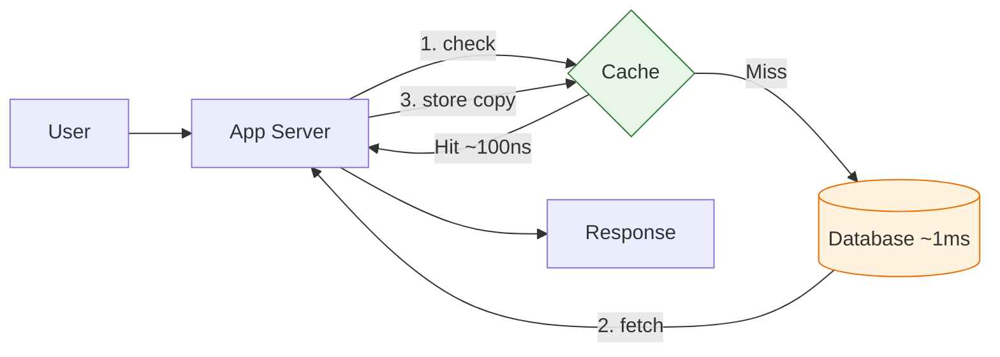

Caching is not exotic — it is *everywhere* in computing, layered from silicon to the global internet: CPU **L1/L2/L3 caches** and the **TLB** (virtual-to-physical address translations) in hardware; the OS **page cache** and **inode cache**; the browser's **HTTP cache**; **CDN** edge servers; distributed caches like **Redis**; and even *inside* the database (write-ahead log, buffer pool, materialized views, replication log). Understanding one layer helps you reason about all of them, because the core idea repeats: keep hot data close and cheap to reach.

<details>
<summary>📖 Beginner-friendly explanation (click to expand)</summary>

Think of memory (RAM) as the notepad on your desk and the database (disk) as a filing cabinet across the room. Grabbing a fact off the notepad is instant; walking to the cabinet, opening a drawer, and finding a folder takes real effort.

If you only look something up once, the walk is fine. But if you keep needing the *same* fact all day, you'd jot it on the notepad after the first trip. That's caching — and the reason it's ~10,000× faster is that the notepad (RAM) is genuinely that much closer than the cabinet (disk).

</details>

---

## 4. 🎯 Why Caching Exists — The Two Fundamental Use Cases

Strip away the jargon and every cache exists for one of two reasons — and both ultimately serve the same goal: **speed up responses to the client**.

**Use case 1 — Avoid a repeated (network + I/O) fetch.** Some data is requested over and over. A user's profile, for example, gets read many times. The first read pulls it from the database (a network hop plus disk I/O); if you save it in a cache keyed by user ID, every subsequent read is served instantly from memory. You've saved thousands of redundant round trips.

**Use case 2 — Avoid a repeated expensive computation.** Some responses are cheap to *store* but costly to *compute*. Suppose you need "the average age of all users." Computing it means scanning every user row and aggregating — expensive to do on every request. Instead, compute it once, store the result (`average → 27`) in the cache, and serve that. A personalized news feed (joining posts, followers, likes across many tables) is the same story — compute once, cache the result with a short TTL.

A third, closely related motivation is **reducing load on the database**. Even if you didn't care about per-request latency, having many app servers all hammering one database creates dangerous pressure. A shared cache absorbs the bulk of reads, protecting the database from being overwhelmed and letting the whole system scale.

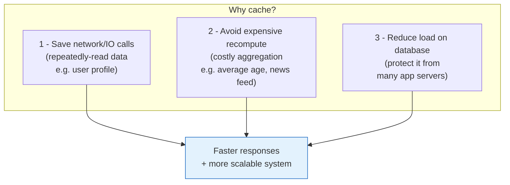

In interviews, you bring up caching when one of four conditions holds: a **read-heavy workload** draining the database, **expensive queries** (heavy joins/aggregations), **high database CPU**, or a **latency requirement** (e.g., "p99 under 100ms") the raw database can't meet. The discipline is: *identify the bottleneck, quantify it with rough numbers, then explain how caching removes it.*

<details>
<summary>📖 Beginner-friendly explanation (click to expand)</summary>

Two everyday versions of the same idea. First: your friend asks your phone number five times in an hour — after the first time you both just *remember* it instead of looking it up again. That's caching a repeated lookup.

Second: someone asks "what's the average height of everyone in this room?" You don't re-measure all 30 people each time they ask — you measure once, remember "about 5'7"," and repeat that. That's caching an expensive calculation. Both save you work and give a faster answer.

</details>

---

## 5. 📊 The Real Trade-off — Speed vs. Cost vs. Correctness

Once you learn how fast caches are, the tempting instinct is: *just cache everything.* You can't, and understanding **why not** is the heart of caching maturity. There are three real costs.

**1. Memory hardware is expensive and finite.** A cache runs on RAM, which is far more expensive per byte than the commodity disk a database runs on. You cannot fit your entire dataset in memory affordably, so the cache must stay small and hold only the *most relevant* data.

**2. Big caches get slow and counterproductive.** As you cram more data into a cache, lookup/search times grow. Past a point, searching a bloated cache is barely faster than just querying the database — so the cache stops earning its keep. And if the cache barely holds anything useful, hitting it first *before* falling through to the database adds a wasted round trip (a poor eviction policy actively *harms* you).

**3. Correctness — the cache can serve stale data.** The cache is a copy. The moment the source changes, the copy is potentially wrong. If another server updates user X's password in the database but the cache still holds the old profile, a request served from cache gets the *old* password — a real security and correctness risk. This is the consistency problem, and it's the hardest cost to manage.

These three costs turn caching into a **prediction problem**: the database holds (nearly) everything, but the cache must hold *the data most likely to be requested in the near future.* That forces two governing questions on every cache:

> **When do I load data into the cache?** (admission)
> **When do I evict data from the cache?** (eviction)

The rules answering those questions are called the **cache policy**, and *cache performance depends almost entirely on the quality of that policy.*

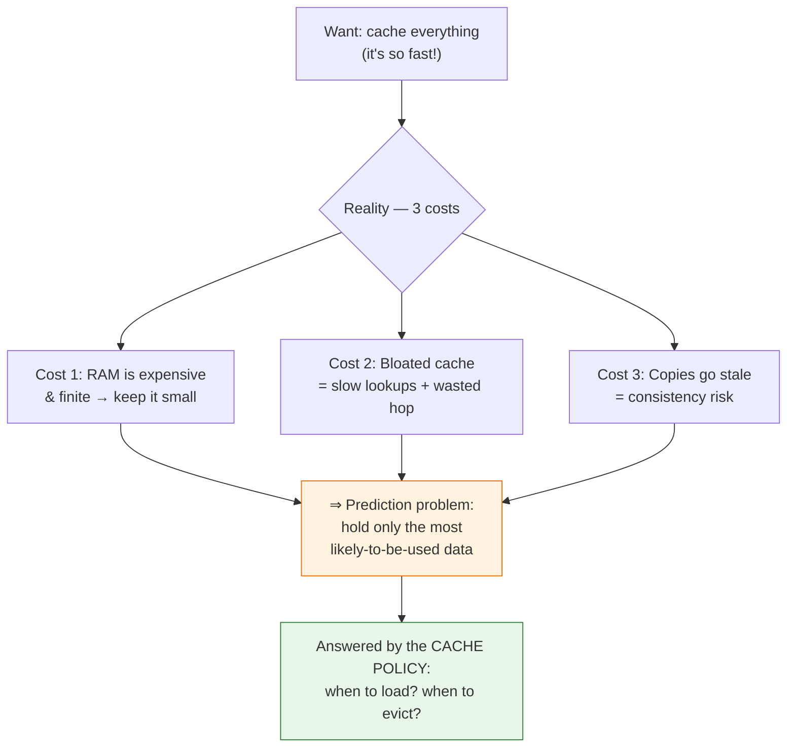

<details>
<summary>📖 Beginner-friendly explanation (click to expand)</summary>

Back to the fridge. Why not store *all* your groceries in it and never visit the store? Three reasons. A big enough fridge is expensive (RAM cost). A crammed fridge means you dig forever to find the milk (slow lookups). And food goes off — the yogurt in there might be expired while fresh yogurt sits at the store (stale data).

So you keep the fridge small and stock only what you'll actually eat soon. Deciding *what to put in* and *what to throw out* is exactly a cache's policy.

</details>

---

## 6. 🎨 Where to Place the Cache (The Layers)

A cache can live at many points between the user and the source of truth, and each location trades latency against consistency, control, and complexity. The further the cache is from the origin (closer to the user), the faster it is — but the harder it is to keep fresh and invalidate. The four locations you'll discuss most often, from closest-to-user to closest-to-database:

**Client-side cache (browser / mobile app).** Data stored directly on the user's device — the browser HTTP cache, `localStorage`, or in-app/on-disk storage in a mobile app. This is the *fastest* possible cache because there is zero network latency; the data never leaves the device. The catch is control: you cannot reach into every user's browser to clear stale data, so invalidation is hard. Best for static assets and offline-capable workloads (a photo already downloaded, Strava caching run data offline then syncing later).

**CDN cache (edge caching).** A geographically distributed network of servers (Cloudflare, AWS CloudFront) that cache content physically close to users. Here you're optimizing for **network latency**, not disk-vs-memory: a request from Australia to an origin in Virginia might be a 300–350ms round trip, but an edge server a few miles away answers in 20–40ms. On a miss the CDN fetches from the origin (e.g., S3), caches it, and serves it next time (this is exactly read-through behavior). Best for static media — images, video, CSS/JS — and increasingly for public API responses and HTML. Shared across all users, so personalized content needs careful cache-key design.

**In-process (application-level) cache.** A cache *inside* the application process itself — a `HashMap`, Guava, or Caffeine cache in Java. It's the fastest server-side option because there's no network hop to an external store; the data sits in the same memory space as your code. The trade-off: each app server has its *own* copy, so 10 servers means 10 potentially-divergent caches and wasted memory. Invalidation requires coordinating across all instances. Reach for it for tiny, rarely-changing data every request needs — config, small lookup tables — or ultra-low-latency hot keys. Powerful but often overlooked in real systems.

**Distributed / external cache (Redis, Memcached).** A dedicated caching service running on its *own* server with its own memory, separate from both app and database. **This is the default for system-design interviews.** Its great virtue is being a *global, shared* view: once any one app server fetches and caches an item, every other app server reuses it instantly instead of each hitting the database. It's also independently scalable and survives an app-server crash (the cached data doesn't die with the server). The cost is a network hop (~0.5–2ms) and another system to operate, monitor, and scale.

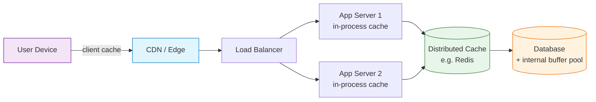

**In-process vs. external, the classic trade-off.** Placing the cache *in the server's memory* is faster and simpler, but (a) if the server fails, its in-memory cache dies with it, and (b) two servers can hold *inconsistent* copies of the same key. For a user profile, minor inconsistency is tolerable; for passwords or financial data it is not. Placing the cache as a *separate global service* is slightly slower but more resilient (survives server crashes), more consistent (one shared copy), and independently scalable — which is why the common recommendation is a **global/distributed cache** as the default, reserving in-process caching for extreme-latency or tiny-config cases.

When one distributed cache isn't enough, you **shard** the data across multiple cache nodes. A **distributed cache** gives each node a slice of the keyspace and routes each request via **consistent hashing** to the node that owns that key — adding capacity is as easy as adding a node. A **global cache** is the conceptual model of one shared cache space all nodes consult (in practice implemented as a distributed cluster).

<details>
<summary>📖 Beginner-friendly explanation (click to expand)</summary>

Think about where you keep things you need often. Snacks in your pocket (client-side) are instant but you can only carry a few. A vending machine on your floor (CDN edge) is close and quick. A shared office kitchen (distributed cache) is a short walk but everyone uses the *same* one, so it stays consistent. A snack drawer at your own desk (in-process) is fastest of all — but your coworker's desk drawer has different snacks, and if you're out sick nobody can reach yours.

Most teams standardize on the shared kitchen (Redis) because everyone sees the same stuff and it doesn't vanish when one person leaves.

</details>

---

## 7. 🎨 Cache Architectures (Read & Write Patterns)

A **cache architecture** (or *caching strategy* / *cache writing policy*) is a set of rules defining the *order* in which reads and writes flow between your application, the cache, and the database — i.e., **when data is loaded into the cache and when it is written to the primary store.** Getting this right is where most interview depth lives. There are five patterns worth knowing; **cache-aside is the one you should default to.**

A useful way to organize them: the first two (cache-aside, read-through) are primarily **read** strategies (they differ in *who* loads data on a miss); the last three (write-through, write-back, write-around) are primarily **write** strategies (they differ in *when and where* a write lands). In practice you pair a read strategy with a write strategy — e.g., *cache-aside reads + write-around writes* is the single most common real-world combination.

Each pattern below is collapsible. Expand for the point-wise flow (Read / Miss / Return, or Write / Ack), pros and cons, and — importantly — exactly how it handles **stale data, cache refresh, consistency, and invalidation.**

<details>
<summary><strong>7.1 📓 Cache-Aside (Lazy Loading) — the default</strong></summary>

The application itself manages the cache; the cache sits *"aside"* from the data store and never loads data on its own. Responsibility for reads, writes, and invalidation lives in application code.

**Read flow (point-wise):**

1. **Read request** — app needs data, checks the cache first.
2. **Cache hit** — data found → return it directly, skipping the DB (fast path).
3. **Cache miss** — data absent → app fetches from the DB.
4. **Populate** — app stores the fetched value in the cache under an appropriate key.
5. **Data return** — app returns the value to the caller; subsequent reads now hit.

**Write flow:** writes go to the **DB directly**; the cache entry is then **invalidated (deleted)** so the next read repopulates it fresh (this pairing is *write-around*). Updating the cache in place is avoided because it invites races between concurrent writers.

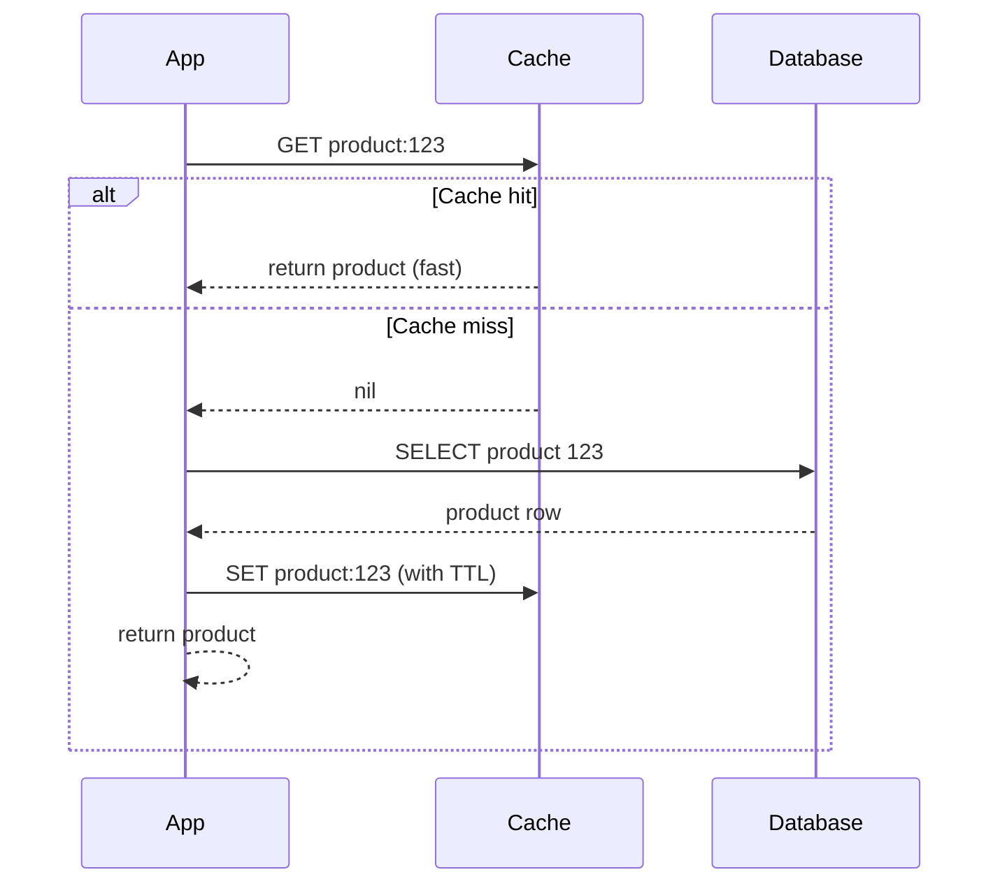

**Stale data / refresh / consistency / invalidation:**

- **Stale data:** possible in the window between a DB write and the cache delete/expiry; a reader in that gap sees old data.
- **Refresh:** lazy — data is (re)loaded only on the next read after a miss; combine with a **TTL** so entries auto-expire even if an explicit delete is missed.
- **Invalidation:** explicit **delete-on-write** by the application (optionally event-driven), with TTL as a safety net.
- **Consistency:** eventual, tunable via TTL length and how promptly you delete keys.

✅ **Pros:** cache stays *lean* (only actually-requested data is stored → avoids cache pollution); resilient (if the cache is down, reads still work against the DB); works with any plain key-value store (Redis/Memcached) — no special framework; full application control over what/when to cache. Great for **read-heavy** workloads.

❌ **Cons:** every **first read is a miss** ("cold cache" penalty); each cache miss adds latency (extra hop before the DB); a brief **stale window** on writes; risk of **cache stampede** when a hot key expires and many readers miss at once.

</details>

<details>
<summary><strong>7.2 📓 Read-Through</strong></summary>

Almost identical behavior to cache-aside, except the **cache library/provider itself** — not the application — loads from the DB on a miss. The app *always* talks only to the cache and treats it as the system of record for reads; the cache acts as a **proxy** in front of the data store.

**Read flow (point-wise):**

1. **Read request** — app asks the cache for the key.
2. **Cache hit** — cache returns the value directly.
3. **Cache miss** — the *cache* initiates a load from the DB (app is not involved).
4. **Data retrieval + cache update** — cache reads the DB, stores the value under the key.
5. **Data return** — cache returns the value to the app.

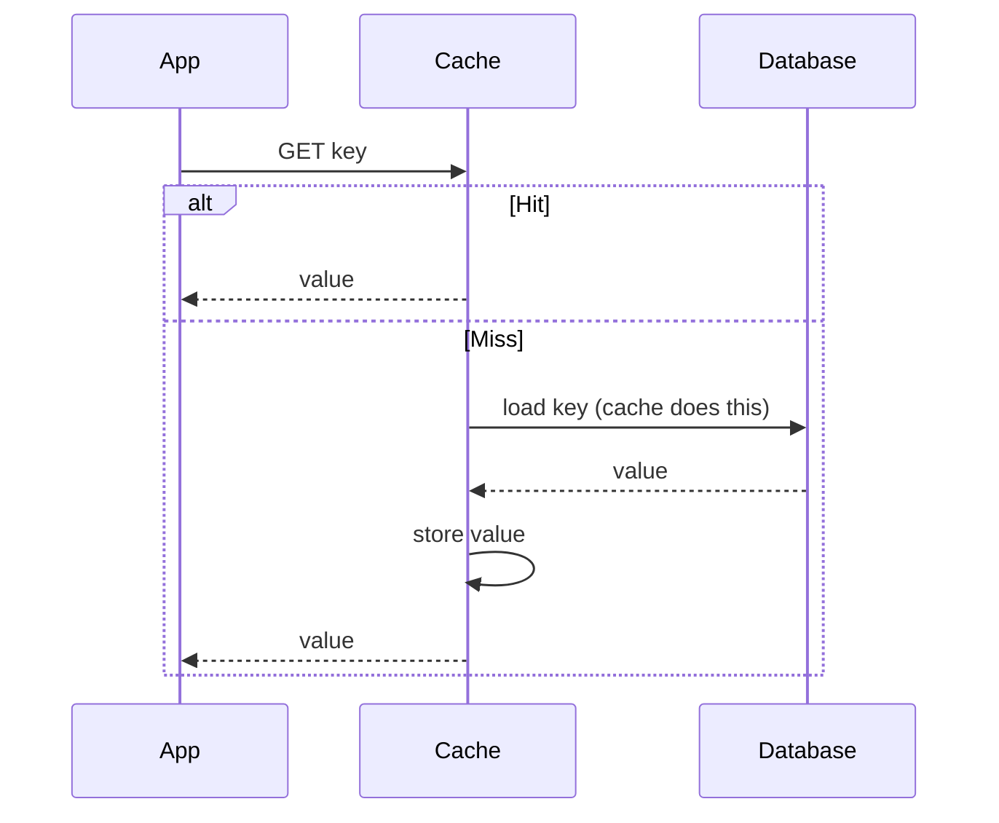

**Stale data / refresh / consistency / invalidation:**

- **Stale data:** because the cache loads on demand, its data is usually **fresh with the latest DB value at load time**; staleness afterward is governed by TTL.
- **Refresh:** on-miss (cache-managed), often augmented with **refresh-ahead** (the cache proactively reloads popular keys just before expiry to hide miss latency).
- **Invalidation:** typically TTL-based; the cache provider handles reload transparently.
- **Consistency:** eventual, same window as cache-aside, but centralized in the cache layer.

✅ **Pros:** simpler, cleaner application code (no manual load/miss handling — the cache does it); consistent load logic in one place; **CDNs are the classic real-world example** (on an edge miss the CDN fetches from origin, caches, and serves).

❌ **Cons:** requires a cache that supports the read-through hook / a loader (e.g., a provider like Ehcache/Hazelcast) — plain Redis/Memcached don't do it natively; **first read still misses**; **compromised data flexibility** (the fetch/format is dictated by the loader, less per-call control than cache-aside).

</details>

<details>
<summary><strong>7.3 📓 Write-Through</strong></summary>

Every write goes to the **cache first, then synchronously to the DB**; the write is **not acknowledged complete until *both* succeed.** This keeps cache and DB in lockstep, so every read follows the most recent write.

**Write flow (point-wise):**

1. **Write request** — app writes the data to the cache.
2. **Data store write** — the cache (or app) synchronously writes the same data to the DB.
3. **Write acknowledgment** — success is returned only after *both* the cache and the DB confirm.

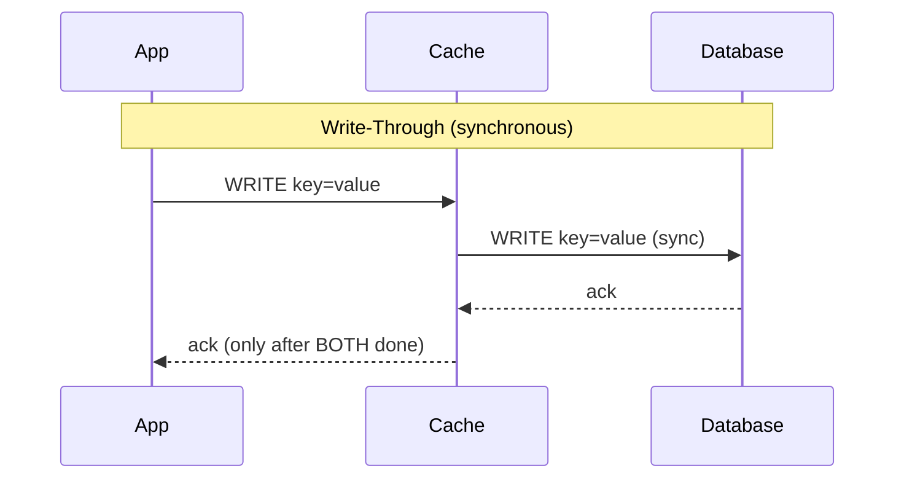

**Stale data / refresh / consistency / invalidation:**

- **Stale data:** essentially **none for written keys** — cache and DB are always in sync, so reads never see stale values for data that's been written.
- **Refresh:** unnecessary on write (the cache is updated inline); TTL still used to age out rarely-read entries.
- **Invalidation:** largely obviated for writes — the write *is* the update; no separate delete needed.
- **Consistency:** **strongest** of the write patterns; nothing is lost on crash because the DB copy is written before ack.

✅ **Pros:** always-consistent cache; high reliability / low data-loss risk (durable in DB before ack); reduced stale reads. Ideal for **read-heavy, consistency-critical** data (user sessions, config) where the dataset is small enough to cache fully.

❌ **Cons:** higher **write latency** (two synchronous writes per update); **lower write throughput**; **cache pollution** (caches data that may never be read); the **dual-write problem** — if one store succeeds and the other fails, they diverge, needing retry/rollback/idempotency logic that's hard in distributed systems. Usually needs a framework (Spring Cache, Hazelcast); Redis/Memcached don't do it natively.

</details>

<details>
<summary><strong>7.4 📓 Write-Behind (Write-Back)</strong></summary>

Like write-through, the app writes to the **cache only** and gets an immediate ack — but the cache flushes to the DB **asynchronously** later (often batched, via a queue/thread). The entry is marked *"dirty"* until it's persisted.

**Write flow (point-wise):**

1. **Write request** — app writes to the cache.
2. **Cache update** — entry marked *"dirty"* (modified, not yet persisted).
3. **Write acknowledgment** — success returned immediately to the app (fast).
4. **Deferred store write** — a background worker/queue flushes dirty entries to the DB later, usually in batches.

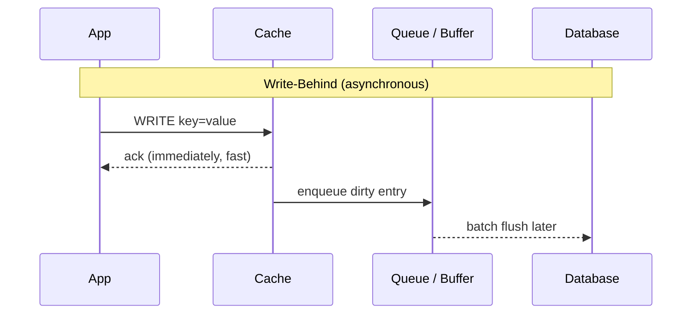

**Stale data / refresh / consistency / invalidation:**

- **Stale data:** the **DB is temporarily stale** (behind the cache) until the flush completes; anything reading the DB directly (e.g., analytics, another service) may read old values.
- **Refresh / read-on-miss:** if a miss occurs while dirty data is pending, the cache either does a **read-modify-write** (fetch from DB, reconcile with dirty value) or **waits for the write-back** to finish before serving — to avoid serving a value older than the pending write.
- **Invalidation:** managed via the dirty-flag lifecycle; eviction must not drop a dirty entry before it's flushed.
- **Consistency:** **weakest** — a cache crash before flush means **permanent data loss** and cache↔DB divergence (violates "DB is source of truth").

✅ **Pros:** **fastest writes** (only in-memory on the hot path); **high write throughput**; batching **coalesces many small writes** into fewer DB writes, cutting DB load dramatically.

❌ **Cons:** **data-loss risk** on cache failure before flush; added complexity (dirty tracking, flush scheduling, eviction care); temporary cache↔DB inconsistency. Mitigate with replication/battery-backed/persistent caches or a durable log (e.g., Kafka) for replay. Use for high-write, loss-tolerant data: **analytics counters, metrics, YouTube-style view counts, leaderboard scores.**

</details>

<details>
<summary><strong>7.5 📓 Write-Around</strong></summary>

Writes go **directly to the DB, bypassing the cache entirely**; the cache is populated only *later*, on a subsequent read (cache-aside style). The just-written key is often **invalidated** in the cache so a stale copy isn't served.

**Write flow (point-wise):**

1. **Write request** — app writes straight to the DB.
2. **Cache bypass** — the new value is *not* written into the cache.
3. **Data store write** — DB persists the value (source of truth updated).
4. **Cache invalidation** — any existing entry for that key is marked dirty/deleted so the cache re-syncs from the DB on the next read.

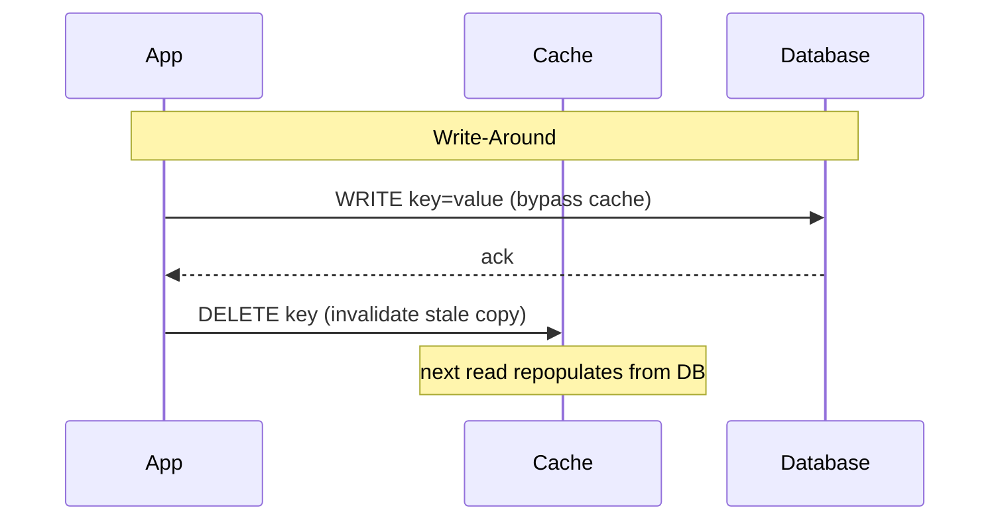

**Stale data / refresh / consistency / invalidation:**

- **Stale data:** if the old key isn't invalidated, reads serve a stale value; even when invalidated, the **first read after a write is a guaranteed miss** (cold for that key).
- **Refresh:** lazy — re-populated on the next read, exactly like cache-aside.
- **Invalidation:** delete/mark-dirty the written key so the cache re-syncs from the DB.
- **Consistency:** moderate — the DB is always authoritative and up to date; the cache simply lags until the next read.

✅ **Pros:** avoids **cache pollution** from write-only data that's never re-read → keeps the cache reserved for genuinely hot data → **better hit rate**; simple write path.

❌ **Cons:** **slower reads for recently-written data** (guaranteed first miss); risk of stale reads if invalidation is skipped; no write-path performance benefit. Best for **write-heavy, rarely-immediately-reread** data: logs, audit trails, historical records.

</details>

> 💡 **Interview reality:** Interviewers don't care whether you remember the exact names. What matters is describing the *behavior*: "I check the cache first; on a miss I read the DB and populate the cache" *is* cache-aside. Default to **cache-aside reads + write-around writes with invalidate-on-write**, and only reach for write-through/write-behind when you can strongly justify it.

**7.6 📊 Comparison Table**

| Pattern | Who loads on miss | Write path | Stale-data handling | Consistency | Write speed | Best for |
|---|---|---|---|---|---|---|
| **Cache-aside** | Application | DB directly, then delete key | Delete-on-write + TTL | Good (tunable) | N/A | **Default**; read-heavy, general |
| **Read-through** | Cache (proxy) | (paired w/ a write strategy) | TTL / refresh-ahead | Good | N/A | CDNs, simpler app code |
| **Write-through** | — | Cache → DB (sync) | None for written keys | Strongest | Slow | Consistency-critical, read-heavy |
| **Write-behind** | — | Cache → DB (async batch) | DB lags until flush | Weak (loss risk) | Fastest | High write throughput, loss-tolerant |
| **Write-around** | Application on read | DB directly, skip cache | Invalidate key on write | Moderate | Fast | Write-heavy, rarely re-read |

<details>
<summary>📖 Beginner-friendly explanation (click to expand)</summary>

Picture a librarian (your app), a front desk (the cache), and a back storage room (the database). **Cache-aside:** you ask the front desk; if the book's there you take it, otherwise the librarian walks to storage, brings it, and leaves a copy on the desk. **Read-through:** you only ever talk to the front desk — *it* walks to storage for you when needed. **Write-through:** when a new book arrives, the librarian places it on the desk *and* files it in storage before telling you it's done — slow but nothing's ever out of sync. **Write-behind:** the librarian puts new books on the desk, says "done!", and files them in storage later in a cart — fast, but if the cart tips over, books are lost. **Write-around:** new books go straight to storage and only appear on the desk when someone actually asks for one.

Cache-aside is the everyday choice because it's simple and only keeps books people actually ask for.

</details>

---

## 8. 📊 Eviction Policies

Because a cache is deliberately small (memory is expensive and finite), when it fills up you must remove an existing entry to make room for a new one. The rule deciding *what* to remove is the **eviction (replacement) policy**, and it directly shapes your hit rate. The best policy depends on your **access pattern**: recency-based policies (LRU) assume recently-used data will be used again; frequency-based policies (LFU) assume popular data stays popular. In interviews, implementation internals (linked lists, heaps) are usually out of scope — what matters is naming a policy and *justifying when* you'd choose it. Each policy is collapsible below.

<details>
<summary><strong>8.1 🔸 LRU — Least Recently Used (the default)</strong></summary>

Evicts the entry that hasn't been *accessed* for the longest time; every read/write moves an entry to the "most recent" end, and eviction takes from the "least recent" end.

- **Assumption:** temporal locality — recently accessed items are likely to be accessed again soon.
- **Why it's the default:** simple, good runtime performance, and a decent hit rate across common workloads.
- **Implementation:** a **doubly-linked list** (ordering by recency) + a **hash map** (key → node) gives O(1) lookup, move-to-front, and eviction.
- **Example:** a celebrity's fresh post sits at the top while it's hot; as interest cools it drifts down the list and is eventually evicted from the bottom.
- **Weakness:** a burst of one-off new items can push a genuinely popular item toward the tail and evict it (a "scan" or "flood" wipes the working set) — LFU handles this better.

</details>

<details>
<summary><strong>8.2 🔸 LFU — Least Frequently Used</strong></summary>

Counts how many times each entry is accessed and evicts the entry with the **lowest access frequency**, even if it was used very recently. Ties are typically broken by recency (evict the least-recently-used among the least-frequent).

- **Assumption:** frequency predicts future access — items accessed often will keep being accessed.
- **Best for:** **highly skewed / bursty** access where the top ~1% of keys serve a large share of traffic (e.g., popular searches). LFU keeps those long-term-popular items even when a flood of new one-off items arrives — precisely the case where LRU misfires.
- **Implementation:** maintain a per-key frequency counter (often frequency buckets / min-heap); more bookkeeping than LRU.
- **Example:** phone keyboard word suggestions — the software tracks how often you type each word and evicts the lowest-frequency ones; if you start typing "feature"/"features", it stops suggesting the now-rare "feat".
- **Weakness:** stale popularity — an item that was hot long ago can linger on a high count (mitigated by *aging*/windowed variants).

</details>

<details>
<summary><strong>8.3 🔸 FIFO — First In, First Out</strong></summary>

Evicts the **oldest-inserted** entry regardless of how often or how recently it's been used — a simple queue.

- **Assumption:** the oldest items are the least likely to be needed (often wrong).
- **Pros:** dead simple, minimal bookkeeping, predictable.
- **Cons:** insertion order poorly predicts future access, so a frequently-used old item gets evicted just for being old — rarely the right choice in practice.

</details>

<details>
<summary><strong>8.4 🔸 MRU — Most Recently Used</strong></summary>

Evicts the **most recently used** entry, deliberately favoring *older* entries to survive — the opposite of LRU.

- **Assumption:** once you've just seen an item, you *won't* want it again soon.
- **Best for:** "don't re-show" access patterns.
- **Example:** **Tinder** caches potential matches; once a profile is swiped left/right it shouldn't be recommended again, so the most-recently-seen entry is exactly the one to drop. Also useful in some cyclic scan patterns where the just-read block is least likely to be reused.

</details>

<details>
<summary><strong>8.5 🔸 Random Replacement (and approximate-LRU)</strong></summary>

Evicts a **randomly chosen** entry.

- **Assumption:** none — makes no bet about future access, which is oddly useful when access is genuinely unpredictable.
- **Pros:** extremely cheap (no ordering/counters to maintain), no worst-case pathology.
- **Real-world nuance:** **Redis uses an *approximate* LRU/LFU** — instead of maintaining exact global order, it **samples a handful of random keys** (configurable, e.g., 5) and evicts the least-recently/least-frequently-used *within the sample*. This approaches true LRU quality at a fraction of the memory/CPU overhead — a great example of the accuracy-vs-cost trade-off real systems make.

</details>

<details>
<summary><strong>8.6 🔸 TTL-based Expiration (time, not space)</strong></summary>

Each entry carries an **expiry timer**; once it elapses the entry is removed or refreshed on next access, regardless of recency or frequency.

- **Not strictly an eviction policy** — it's *time-based expiration*, which works *alongside* a space-based policy: an entry can be LRU-evicted *before* its TTL, or its TTL can fire while it's still the most-recently-used entry.
- **Best for:** data that simply goes stale after a known window — sessions, auth tokens, API responses, prices with a freshness budget.
- **Staff nuance:** identical TTLs on many hot keys cause **synchronized expirations → cache stampedes**; add **jitter** (e.g., 55–65s) to spread them out.

</details>

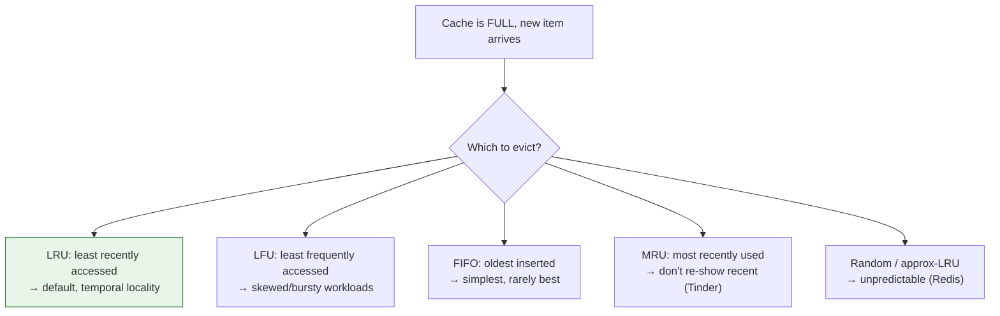

> 📊 **Rule of thumb:** LRU and LFU generally beat FIFO and Random because they use the access pattern — but they cost more (extra data structures). LRU is the default; switch to LFU for highly skewed traffic; layer TTL on top for freshness.

<details>
<summary>📖 Beginner-friendly explanation (click to expand)</summary>

Your fridge is full and you just bought milk — something has to go. **LRU:** toss whatever you haven't touched in the longest time. **LFU:** toss what you *rarely* eat, even if you grabbed it yesterday (keep the ketchup you use daily). **FIFO:** toss whatever went in first. **MRU:** toss what you just ate — useful only if you never want the same thing twice in a row. **Random:** grab something without looking. **TTL:** throw out anything past its expiry date.

Most people naturally do LRU: "I haven't touched this in weeks, out it goes." That's why LRU is the sensible default.

</details>

---

## 9. 🎨 Cache Invalidation & Consistency

> "There are only two hard things in Computer Science: cache invalidation and naming things." — Phil Karlton

**Cache invalidation** is the process of ensuring cached data stays in sync with the source of truth (the database) — removing or updating cache entries when the underlying data changes. Putting data *into* a cache is trivial; knowing *when to take it out or refresh it* is one of the hardest problems in distributed systems, and the concept interviewers probe most.

### 9.1 🔹 Why It's Hard — The Core Problem

The root cause is an asymmetry: **most systems read from the cache but write to the database.** That creates a window in which the cache holds a stale copy while the DB already has the new value.

1. Write path updates the **database** (new value).
2. The **cache** still holds the **old** value.
3. Readers hitting the cache get **stale data** until that entry is invalidated or expires.

**Concrete risk example:** a user updates their profile picture → DB now stores `image2` → but the cache still serves `image1` to everyone → worse, if it were a *password* update, the old credential could keep working (a real security hole). There is **no perfect fix** — the right approach depends entirely on *how fresh the data must be* for that specific field.

### 9.2 🔹 Invalidation Strategies (When to refresh)

<details>
<summary><strong>TTL-Based Invalidation</strong> — simple, self-healing, bounded staleness</summary>

Every cached entry gets a **Time-To-Live**; once it elapses the entry is evicted and the next read fetches fresh data from the DB.

- **How it works:** `SET key value EX 60` → entry auto-expires in 60s → next read is a miss → repopulate.
- **✅ Works when:** bounded staleness is acceptable — e.g., a **product catalog with a 60s TTL** (a price up to 60s old is fine).
- **❌ Fails when:** even brief staleness causes harm — e.g., a **60s TTL on inventory counts** lets a customer buy an item that sold out 59 seconds ago (overselling).
- **Trade-off knob:** longer TTL → higher hit rate, more staleness; shorter TTL → fresher, more misses/DB load.

</details>

<details>
<summary><strong>Event-Driven / Invalidate-on-Write</strong> — precise, near-real-time</summary>

When the DB changes, the change is propagated to the cache immediately — either the write path deletes the key inline, or an event fires and a consumer invalidates/updates the entry.

- **How it works:** DB write → publish an event (via **Kafka**, **DB triggers**, or **Change Data Capture**) → consumer deletes/updates the matching cache key. Simplest form: `db.update(x); cache.delete(x)`.
- **✅ Works when:** you need the cache fresh within **seconds**, and write paths are well-defined.
- **❌ Fails when:** many services can write the same data — if **15 services** can update it, all 15 must publish the invalidation event; **one missed event = permanently stale entry** until the TTL safety net kicks in.
- **Best practice:** **combine both** — event-driven for precision + a TTL as a backstop so a missed event self-corrects eventually.

</details>

### 9.3 🔹 Write Strategies as Invalidation (How the write keeps cache coherent)

The write patterns from §7 double as invalidation mechanisms — the choice determines *how* the cache stays coherent on writes:

- **Write-through** → cache updated synchronously with the DB → **no stale window for written keys** (strongest consistency, slower writes).
- **Write-around** → DB updated, cache entry **invalidated/deleted** → next read repopulates (avoids caching write-only data).
- **Write-back / write-behind** → cache updated first, DB flushed asynchronously → **DB is the one lagging**; risk of loss on crash before flush.

### 9.4 🔹 Invalidation Methods (CDN / proxy vocabulary)

Concrete mechanisms, most relevant to CDNs and HTTP proxies:

| Method | What it does | When to use |
|---|---|---|
| **Purge** | Immediately **removes** cached content for a specific object/URL; next request goes to origin. | Content changed and old copy is now invalid. |
| **Refresh** | Re-fetches from origin and **updates** the cached copy (doesn't remove first). | Force-refresh without a miss gap. |
| **Ban** | Invalidates everything matching **criteria** (URL pattern, header). | Bulk invalidation across many keys. |
| **TTL expiration** | Serves content only while the timer is valid, then refetches. | Time-bounded freshness (prices, tokens). |
| **Stale-While-Revalidate** | Serves the **stale** copy instantly while asynchronously fetching a fresh one in the background. | Keep responses fast *and* protect origin from stampedes. |

### 9.5 🔹 Consistency Strategies in Practice (ranked by strictness)

1. **Invalidate on write** — delete the key the moment the DB changes → next read is guaranteed fresh. Use when **consistency matters** (balances, inventory, passwords).
2. **Short TTL** — accept a small, *bounded* staleness window. Use when a little lag is fine (prices, catalogs).
3. **Accept eventual consistency** — perfectly valid for feeds, analytics, metrics, or a profile image where "stale for 5 minutes is fine."

> 💡 **The staff-level skill is stating the trade-off out loud, per data type:** "We'll have an up-to-30s window where the cache may show a stale price; that's acceptable here. But for high-value/limited-inventory items I'd invalidate immediately via the Kafka pipeline instead." Cache *per field's tolerance*, not with one blanket policy.

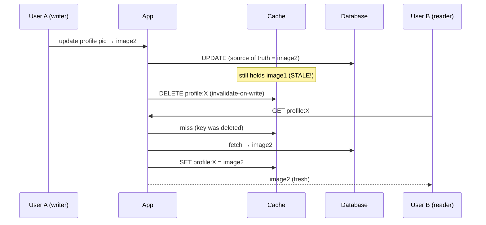

<details>
<summary>📖 Beginner-friendly explanation (click to expand)</summary>

Imagine a whiteboard in the hallway showing today's lunch menu (the cache), copied from the kitchen's real menu (the database). If the kitchen swaps soup for salad but nobody updates the whiteboard, people keep showing up expecting soup — that's stale data.

Two fixes: erase-and-rewrite the board the instant the kitchen changes (invalidate-on-write), or write "menu good until 12:30" and refresh it after (TTL). Neither is perfect — the whiteboard is always a copy that can lag reality — which is exactly why invalidation is famously hard.

</details>

---

## 10. 📊 Cache Performance Metrics

You can't tune what you don't measure. Four metrics tell you whether a cache is actually earning its cost:

**Hit rate** — the percentage of requests served from the cache without touching the source. This is the headline number; a high hit rate means the cache is doing its job. If you're serving 100,000 reads/sec and 95% hit, the database only sees ~5,000/sec.

**Miss rate** — the inverse. A persistently high miss rate is a red flag: you may be caching the wrong data, the cache may be too small, or your eviction policy may be thrashing. Critically, a *poor* hit rate makes a cache actively harmful — you pay the extra cache lookup on every request and *still* fall through to the database.

**Cache size** — memory allocated to the cache. Bigger size can raise hit rate but costs more and (past a point) slows lookups. There's a sweet spot, and finding it is empirical.

**Cache latency** — time to read from the cache itself. Should be dramatically lower than source latency; if it's creeping up, the cache may be oversized or under-resourced.

A related pathology worth naming: **thrashing** — when a cache is so small (or the policy so poor) that entries are constantly loaded and evicted before they're ever reused. Example: a one-entry profile cache serving users X and Y alternately — every request evicts the other user and misses. Here the cache adds pure overhead with zero benefit; you'd be faster without it.

---

## 11. 💻 Categorized Real-World Examples

Caching shows up at every layer of a real system. Grouping the examples by *where* they live makes the whole landscape click.

**Hardware & OS layer.** CPU **L1/L2/L3 caches** hold hot instructions and data next to the cores (L1 smallest/fastest, L3 largest/shared). The **TLB** caches virtual→physical address translations. The OS **page cache** keeps recently-read disk blocks in RAM, and the **inode cache** speeds up filesystem lookups. You rarely design these, but they prove the pattern is universal.

**Client & edge layer.** Browsers cache HTTP responses via `Cache-Control`/`ETag` headers (which is why Instagram text loads before images on a slow connection — cached text renders instantly). **CDNs** (Cloudflare, CloudFront, Akamai) cache images, video, and static assets at edge servers worldwide — a user in London is served from a UK edge, not a US origin.

**Application / distributed layer.** **Redis** and **Memcached** are the workhorses — in-memory key-value stores fronting the database. Redis powers session stores, leaderboards, rate limiters, and real-time analytics; ElastiCache is AWS's managed version. **Varnish** and **Nginx** act as reverse-proxy HTTP caches; some **load balancers** cache responses to offload backends.

**Messaging & search layer.** **Kafka** caches massive volumes of messages *on disk* (not memory) per its retention policy, letting consumers read at their own pace. **Elasticsearch** indexes data so document/log searches are fast without scanning the source.

**Database-internal layer.** Even inside the DB: the **write-ahead log (WAL)** buffers writes before B-tree indexing, the **buffer pool** caches query results/pages in memory, **materialized views** precompute expensive query results, and **replication logs** track cluster state. MySQL query cache and PostgreSQL shared buffers are concrete instances.

**Product-scenario examples.**

- **Twitter/X viral tweet or Taylor Swift's profile** — millions request the same item; caching serves it from memory and spares the DB millions of reads. (Also the canonical *hot key* problem.)
- **Netflix** — caches the most-watched shows (Money Heist while trending, not Indiana Jones); a short TTL evicts titles as viewership drops.
- **YouTube view counts** — write-behind: increment in cache, batch-flush to DB, because per-view DB writes on a viral video would be crushing.
- **E-commerce product page** — 50,000 views/hour becomes 1 DB query + 49,999 cache reads with cache-aside.
- **Tinder** — MRU eviction so a swiped profile isn't shown again.
- **Personalized news feed** — expensive multi-table join cached with a ~60s TTL and served from Redis.

<details>
<summary>📖 Beginner-friendly explanation (click to expand)</summary>

Caching is like shortcuts you've set up all over your life without noticing. Your phone remembers recent contacts (app cache), your browser keeps a site's logo so it doesn't re-download it (browser cache), and a global service like Netflix keeps popular shows on servers near you (CDN) so they start instantly.

The same trick — "keep the popular stuff close" — runs from the chip inside your laptop all the way out to servers on other continents. Once you see it in one place, you start noticing it everywhere.

</details>

---

## 12. ❌ Common Misconceptions

**"Caching always makes things faster."** Only if your hit rate is good. A poor eviction policy or a too-small cache adds a wasted lookup on every request while still hitting the DB — *slower* than no cache. Thrashing is the extreme case.

**"Just cache everything."** RAM is expensive and finite, bloated caches get slow, and every cached copy is a consistency liability. Cache only hot, expensive, or frequently-read data.

**"A cache is just a smaller database."** No — a cache is a *disposable copy* optimized for speed, not durability. Losing the cache should be survivable; losing the database is not. Treat the DB as the single source of truth.

**"Add Redis and you're done."** Naming the technology isn't a design. You must specify *what* you cache, the *key*, the *strategy* (cache-aside, write-through…), the *TTL*, the *eviction policy*, and how you handle *staleness, stampedes, and failures*.

**"Write-through and write-behind are basically the same."** Both write to the cache first, but write-through then writes to the DB *synchronously* (consistent, slower, no data loss), while write-behind writes *asynchronously* (fast, higher throughput, risks data loss on crash). The timing difference changes the entire consistency model.

**"Higher TTL is always safer."** A longer TTL means *more* staleness, and a long TTL on a hot key concentrates expirations that can trigger stampedes. TTL is a deliberate trade-off between freshness and load, not a "bigger is better" knob.

**"The cache is the source of truth."** The database is. The cache is always a copy that can lag or be lost; design so that a cold or failed cache degrades gracefully rather than corrupting data.

---

## 13. 🎓 Staff / Principal-Level Nuance

This is the territory interviewers push into once the basics are covered — the failure modes and per-component trade-offs experienced engineers raise *unprompted*.

**Cache stampede (thundering herd).** When a popular entry expires, a flood of concurrent requests all miss simultaneously and all hit the database at once — turning one query into thousands and potentially cascading into failure. Example: a homepage feed cached with a 60s TTL under 100,000 req/s; the instant it expires, ~100,000 requests stampede the DB. Three defenses: **request coalescing / single-flight** (only the first request rebuilds the key; the rest wait and then read the fresh value — often via a distributed lock like Redis `SETNX`); **stale-while-revalidate** (serve the expired value while one background request refreshes); and **probabilistic early expiration / jittered TTL** (spread expirations across, say, 55–65s so they don't fire in lockstep, and refresh hot keys *just before* they expire — "cache warming").

**Cache consistency window.** Because reads hit the cache but writes hit the DB, there's always a window of possible staleness. The staff move isn't to eliminate it (often impossible) but to *quantify and justify* it per data type: "profile images: 5-minute eventual consistency, acceptable; account balance: invalidate-on-write, zero tolerance."

**Hot keys.** Even with a great overall hit rate, a single ultra-popular key (Taylor Swift's profile) can receive millions of req/s and overwhelm the *single shard/node* that owns it — the cache is "working" but that one node is melting. Fixes: **replicate the hot key** across every node in the cluster so load balances across all of them, or add a **local in-process fallback cache** so repeated requests never even reach Redis. This mirrors hot-row/hot-partition problems in databases.

**Cold cache & cache warming.** After a deploy or a cache failure, an empty cache means *every* request misses and hits the DB — a system doing 50,000 reads/s at 95% hit rate suddenly sends all 50,000/s to a database sized for 2,500/s, which can take it down. Mitigations: **pre-warming** (load the top-N hottest keys before routing traffic), **gradual traffic shift** (10% → 25% → 50% → 100%, watching DB load), and **shadow warming** (run the new cache alongside the old, feeding it copies of reads until it's warm, then switch).

**Dual-write problem.** In write-through, if the cache write succeeds but the DB write fails (or vice versa), the two diverge. Perfect consistency across two systems is genuinely hard in distributed settings; you need retries, idempotency, or a single-writer path — a reason to prefer cache-aside + invalidation unless consistency truly demands write-through.

**Redis vs. Memcached.** Choose **Redis** when you need rich data structures (sorted sets for leaderboards, hashes for sessions, lists for queues), persistence, or pub/sub for invalidation — it's the versatile default (single-threaded core + I/O threads). Choose **Memcached** for the simplest possible multi-threaded key-value caching or caching large blobs efficiently. Concretely: Redis for a session store needing hashes + pub/sub invalidation; Memcached for a plain high-concurrency API-response cache.

**When NOT to cache.** Caching isn't free or always right. Avoid it (or use it very carefully) when data changes extremely frequently, when strong consistency is mandatory (banking transactions, real-time trading, financial ledgers, critical inventory), or when read volume is so low the hit rate can't justify the added complexity and staleness risk.

<details>
<summary>📖 Beginner-friendly explanation (click to expand)</summary>

The advanced problems are all "what happens when lots of people want the same thing at the same moment." If a popular item's copy expires and a thousand people ask for it at once, they all rush the database together (a stampede) — so you let just one person fetch it while the rest wait. If one item is *insanely* popular, you put copies of it on every shelf so no single shelf gets mobbed (hot key). And after restocking an empty store, you don't open the doors to a crowd instantly — you let people in gradually (cache warming).

These are the details that show you've actually run caches in production, not just read about them.

</details>

---

## 14. 🔗 Extensions & Adjacent Concepts

**Multi-layer caching (the senior blueprint).** Real systems stack caches: the **browser** caches static assets; a **CDN** caches media at the edge; an **in-process** cache holds tiny config; a **distributed Redis** cache fronts DB queries; and the **database** caches internally. A request for a product image checks the browser first, then the CDN, then the app-layer Redis (for metadata), and only reaches the DB as a last resort — each layer catching what the one before it missed. The senior interview answer: "CDN with 24h TTL for static assets; Redis with 60s TTL + event-driven invalidation for hot queries; in-process cache refreshed every 5 min for config — cutting DB load ~95% while keeping cached latency under 50ms."

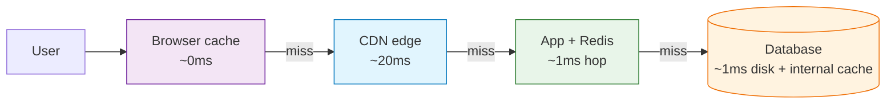

**Consistent hashing.** The mechanism distributed caches use to map keys → nodes so that adding/removing a node only reshuffles a small fraction of keys (not the whole keyspace). Essential for scaling a cache cluster without mass cache misses.

**DNS caching.** DNS resolvers cache domain→IP mappings for a TTL so repeated lookups don't re-query authoritative servers — the same caching pattern applied to name resolution.

**Sliding-window / modern eviction (e.g., Caffeine / TinyLFU).** Beyond textbook LRU/LFU, modern caches (Caffeine, used by many Google systems) use window-based admission policies that outperform plain LRU by combining recency and frequency signals — worth mentioning as "the state of the art has moved past LRU."

**Locality of reference.** The underlying principle behind *all* caching — temporal (recently used → soon reused) and spatial (near recently-used → soon used). Every layer, from CPU to CDN, is exploiting it.

**Cache as more than a cache.** Redis is often used as a primary store, message broker (pub/sub), rate limiter, and distributed lock — the "cache" boundary blurs. Knowing this helps you pick the right tool and avoid adding redundant infrastructure.

---

## 15. ⚡ Quick Revision

*Read this straight through; each paragraph should let you reconstruct the full section.*

**What & why.** A cache is a small, fast, temporary copy of hot data sitting between the app and the slow source of truth (the database). It works because RAM (~100ns) is roughly 10,000× faster than disk (~1ms), and because programs re-access the same data (locality of reference). A **hit** serves from cache instantly; a **miss** falls through to the DB, which then usually populates the cache. Caching exists for three overlapping reasons: save repeated network/IO fetches (e.g., a user profile read many times), avoid repeated expensive computation (e.g., an average or a joined news feed computed once and stored), and reduce load on the database so the system scales. In interviews, justify a cache by a read-heavy workload, expensive queries, high DB CPU, or a strict latency target — always identify and quantify the bottleneck first.

**The trade-off.** You can't cache everything: RAM is expensive and finite, bloated caches get slow (and a low hit rate adds a wasted hop, making things *slower* — the extreme being **thrashing**), and every copy risks going **stale**. So caching is a prediction problem answered by the **cache policy**: when to load and when to evict. Cache performance depends almost entirely on that policy.

**Placement (fastest → most consistent).** *Client-side* (browser/app) — zero network latency, hard to invalidate. *CDN edge* — cuts network latency (300ms → 20ms) for static media, shared across users. *In-process* (HashMap/Caffeine) — fastest server-side, but per-instance and inconsistent across servers. *Distributed/external* (Redis, Memcached) — the **default**: one shared global view, resilient to app-server crashes, independently scalable, at the cost of a ~1ms network hop. Scale a distributed cache by sharding keys across nodes via **consistent hashing**.

**Architectures.** **Cache-aside** (default): app checks cache, on miss reads DB and populates cache; pair with **invalidate-on-write** (delete the key after a DB write). **Read-through**: the cache itself loads on miss (how CDNs work). **Write-through**: write to cache then DB *synchronously* — strong consistency, slow writes, cache pollution, dual-write risk. **Write-behind**: write to cache, flush to DB *asynchronously* in batches — fastest writes, data-loss risk on crash (good for view counts, metrics). **Write-around**: write straight to DB, populate cache only on read — good for write-heavy, rarely-reread data. Don't memorize names; describe the behavior.

**Eviction.** **LRU** (evict least-recently-used) is the default and fits temporal locality. **LFU** (least-frequently-used) wins on skewed/bursty access. **FIFO** (oldest) is simplest, rarely best. **MRU** (most-recently-used) fits "don't re-show" cases like Tinder. **Random/approximate-LRU** is what Redis actually uses. **TTL** is time-based expiry, not strictly eviction, and complements the others.

**Invalidation & consistency.** The hard problem: reads hit cache, writes hit DB, so a staleness window always exists. **TTL** is simple but allows bounded staleness; **event-driven / invalidate-on-write** (Kafka, CDC, or key-delete) is precise but fragile if many services write the same data — robust systems use both (events for precision, TTL as safety net). CDN methods: purge, refresh, ban, TTL, and **stale-while-revalidate** (serve stale while refreshing in background). The skill is stating the trade-off: quantify and justify the staleness window per data type (5-min-stale profile image = fine; account balance = invalidate immediately).

**Metrics.** Watch **hit rate** (the headline; high = worth it), **miss rate** (high = wrong data / too small / thrashing), **cache size**, and **cache latency**. A poor hit rate makes a cache harmful.

**Staff-level failure modes.** **Stampede/thundering herd** — a hot key expires and thousands miss at once, crushing the DB; fix with request coalescing (single-flight lock), stale-while-revalidate, or jittered TTL + proactive warming. **Hot key** — one ultra-popular key overloads its single shard even at high hit rate; fix by replicating it across nodes or adding a local in-process cache. **Cold cache** after deploy/failure — everything misses at once; fix with pre-warming, gradual traffic shift, or shadow warming. **Dual-write** — cache and DB diverge in write-through; prefer cache-aside + invalidation unless consistency demands otherwise. **Redis vs Memcached** — Redis for data structures/persistence/pub-sub (versatile default); Memcached for simple multi-threaded key-value. **Don't cache** when data changes constantly, strong consistency is mandatory (banking, trading, ledgers), or read volume is too low to earn a hit rate.

**The 5-part interview answer.** (1) Name the layer/type ("Redis distributed cache between app and DB"). (2) State the strategy ("cache-aside + TTL invalidation"). (3) Quantify and justify the TTL ("30s — prices update at most once/min, staleness acceptable"). (4) Address a failure mode ("distributed lock to prevent stampede on hot keys"). (5) Name the trade-off ("up to 30s stale window; for high-value items, event-driven invalidation via Kafka"). That's ~60 seconds and signals engineering maturity.

---

## 16. 📝 FAANG Interview Q&A (20 Questions)

*The first 10 are foundational (L3/L4); questions 11–20 are the L4/L5+ staff-level follow-ups interviewers push into. Each answer aims for staff-level reasoning with a concrete technology example.*

### Foundational (L3/L4)

<details>
<summary><strong>Q1. What is a cache and why does it make systems faster?</strong></summary>

A cache is a small, fast, temporary storage layer that keeps copies of frequently or recently used data closer to the consumer than the source of truth. It's faster because it lives in memory (RAM, ~100ns access) rather than on disk (~1ms for an SSD-backed database) — roughly a 10,000× gap that compounds at thousands of requests/sec. It leverages *locality of reference*: programs re-access the same data repeatedly. Concretely, fronting a Postgres database with Redis can turn a 100,000 req/s read load into ~5,000 req/s to the DB, the other 95% served from memory. The cache trades a bit of storage and complexity for a large latency and scalability win.

</details>

<details>
<summary><strong>Q2. Explain cache hit, cache miss, and how cache-aside handles both.</strong></summary>

A hit means the requested key exists in the cache and is returned immediately with no DB touch; a miss means it's absent. In cache-aside (the most common pattern), the application checks the cache first: on a hit it returns the value; on a miss it queries the database, stores the result back in the cache (with a TTL), then returns it. So the first read of any key is always a miss ("cold" penalty), and subsequent reads are hits. For example, a user-profile service using Redis: `GET profile:123` misses the first time, the app reads Postgres, does `SETEX profile:123 300 <data>`, and every read for the next 5 minutes is an instant hit.

</details>

<details>
<summary><strong>Q3. Where can you place a cache, and what are the trade-offs?</strong></summary>

Four main layers, fastest to most consistent: (1) **Client-side** (browser/app) — zero network latency but nearly impossible to invalidate remotely; good for static assets. (2) **CDN edge** (CloudFront, Cloudflare) — cuts network latency (e.g., 300ms cross-continent → 20ms) for static media, shared across users. (3) **In-process** (Caffeine/Guava in the app) — fastest server-side with no network hop, but each server has its own copy so they diverge. (4) **Distributed** (Redis/Memcached) — a shared, global, resilient, independently-scalable cache, at the cost of a ~1ms network hop. The default for interviews is a distributed cache; reserve in-process for tiny config or ultra-hot keys.

</details>

<details>
<summary><strong>Q4. Walk through the common eviction policies. Which is the default and why?</strong></summary>

**LRU** (Least Recently Used) evicts what hasn't been touched longest — the default because it's simple, cheap (doubly-linked list + hash map), and matches temporal locality. **LFU** (Least Frequently Used) evicts the least-accessed item and beats LRU on skewed workloads where a popular item shouldn't be flushed by a burst of one-offs. **FIFO** evicts the oldest-inserted — simplest, rarely optimal. **MRU** evicts the most-recent — niche, e.g., Tinder dropping just-swiped profiles. **Random/approximate-LRU** is what Redis actually implements (samples keys, evicts LRU among the sample) to approach LRU quality cheaply. Pick LRU by default; switch to LFU when access is highly skewed.

</details>

<details>
<summary><strong>Q5. Compare write-through, write-behind, and write-around caching.</strong></summary>

All three concern the write path. **Write-through** writes to cache then DB *synchronously*, acknowledging only when both succeed — strongest consistency, but slower writes, cache pollution, and dual-write risk; good for read-heavy, consistency-critical data like sessions. **Write-behind (write-back)** writes to cache and acks immediately, flushing to the DB *asynchronously* in batches — fastest writes and lower DB load, but data loss if the cache crashes before flush; ideal for view counts and metrics (YouTube uses it for video views). **Write-around** writes straight to the DB and skips the cache, which populates only on later reads — avoids caching write-only data; good for logs and audit trails, at the cost of a guaranteed miss on freshly written data.

</details>

<details>
<summary><strong>Q6. What is cache invalidation and why is it considered hard?</strong></summary>

Invalidation is keeping the cache in sync with the source of truth by removing or updating entries when the underlying data changes. It's hard because reads typically hit the cache while writes hit the database, creating a window where the cache serves a stale copy — and because in distributed systems many independent write paths may need to trigger invalidation, so a single missed event leaves a permanently stale entry until TTL. Hence Phil Karlton's quip that it's one of the two hard problems in CS. A profile-picture update illustrates it: the DB has the new image but Redis still serves the old one until you delete/expire the key. Practical answers combine event-driven invalidation for precision with a TTL as a safety net.

</details>

<details>
<summary><strong>Q7. What is a TTL and how do you choose a good value?</strong></summary>

TTL (Time To Live) is an expiry timer on a cache entry; once it elapses the entry is refreshed or removed. Choosing it is a freshness-vs-load trade-off: a longer TTL raises hit rate and cuts DB load but allows more staleness, while a shorter TTL keeps data fresher at the cost of more misses. You set it from the data's tolerance for staleness — a product catalog might use 60s (a slightly old price is fine), whereas inventory counts need seconds or event-driven invalidation to avoid overselling. A subtle risk: long TTLs on hot keys concentrate expirations and can cause stampedes, so add jitter (e.g., 55–65s) rather than a fixed value.

</details>

<details>
<summary><strong>Q8. When should you NOT use a cache?</strong></summary>

Avoid caching when it adds risk or overhead without payoff: data that changes extremely frequently (the cache is stale almost immediately), workloads requiring strong consistency (banking transactions, real-time trading, financial ledgers, critical inventory — serving stale data creates real business/financial risk), and low-read-volume data where the hit rate can't justify the complexity and staleness exposure. A poor eviction policy or a too-small cache is also worse than no cache, because you pay a lookup on every request and still hit the DB (thrashing). The discipline is to add a cache only when you can point to a concrete bottleneck it removes.

</details>

<details>
<summary><strong>Q9. What are the key metrics for evaluating a cache?</strong></summary>

Hit rate (percent of requests served from cache — the headline number; high means the cache earns its cost), miss rate (its inverse; persistently high signals wrong data cached, too-small a cache, or thrashing), cache size (memory allocated — raises hit rate but costs money and can slow lookups past a point), and cache latency (should be far below source latency). You watch these together: a 95% hit rate on a 100k req/s read load means only ~5k req/s reach the DB. If hit rate is low, the cache may be actively harmful, and you'd revisit what you cache, the size, and the eviction policy.

</details>

<details>
<summary><strong>Q10. Redis vs. Memcached — how do you choose?</strong></summary>

Choose **Redis** when you need more than plain key-value: rich data structures (sorted sets for leaderboards, hashes for sessions, lists for queues), persistence to disk for durability, or pub/sub for cross-instance cache invalidation. It's the versatile default (single-threaded core plus I/O threads). Choose **Memcached** for the simplest, fastest possible key-value caching, genuinely multi-threaded performance under high concurrency, or caching large objects efficiently. Example: Redis for a session store needing hashes and pub/sub invalidation across app instances; Memcached for a plain API-response cache where multi-threaded throughput matters and you need nothing fancy.

</details>

### Staff / Principal-Level (L4/L5+)

<details>
<summary><strong>Q11. Explain a cache stampede (thundering herd) and how you'd prevent it.</strong></summary>

A stampede happens when a popular entry expires and a flood of concurrent requests all miss simultaneously, all hitting the database at once — turning one query into thousands and potentially cascading into failure. Example: a homepage feed cached with a 60s TTL under 100,000 req/s; the moment it expires, ~100,000 requests hit the DB together. Three defenses: **request coalescing / single-flight** (only the first request rebuilds the key, via a distributed lock like Redis `SETNX`; others wait then read the fresh value), **stale-while-revalidate** (serve the expired value while one background job refreshes it), and **jittered/probabilistic early expiration** (spread TTLs across 55–65s and proactively refresh hot keys before they expire). I'd usually combine a lock with jittered TTLs.

</details>

<details>
<summary><strong>Q12. What is a hot key problem and how do you mitigate it?</strong></summary>

A hot key is a single entry receiving disproportionately more traffic than everything else — Taylor Swift's profile on X might take millions of req/s. Even with a great overall hit rate, that one key overwhelms the *single shard/node* that owns it (via consistent hashing), so the cache is "working" while one node melts. Mitigations: **replicate the hot key** onto every node in the cluster so the app can load-balance reads across all of them, or add a **local in-process fallback cache** (Caffeine) so repeated requests never even reach Redis. This parallels hot-row/hot-partition problems in databases; caching scales reads but doesn't make a single popular item infinitely scalable.

</details>

<details>
<summary><strong>Q13. How do you handle the cold-cache problem after a deploy or cache failure?</strong></summary>

A cold cache means every request misses and hits the DB. If you normally serve 50,000 reads/s at 95% hit rate, a cold start suddenly routes all 50,000/s to a database provisioned for ~2,500/s, which can take it down. Mitigations: **pre-warming** (query the top-N most-accessed keys and load them before routing traffic), **gradual traffic shift** (send 10% → 25% → 50% → 100%, watching DB load at each step so the cache warms naturally), and **shadow warming** (run the new cache alongside the old one, feeding it copies of every read while the old cache still serves users, then cut over once warm). I'd pre-warm the top keys, then ramp traffic over ~15 minutes while monitoring DB CPU.

</details>

<details>
<summary><strong>Q14. Describe the cache-consistency window and how you reason about it per data type.</strong></summary>

Because reads hit the cache and writes hit the DB, there's an unavoidable window where the cache may serve stale data. The staff move isn't to pretend it's zero but to *quantify and justify* it per data type against business tolerance. For a social profile image, I might accept 5-minute eventual consistency via a TTL — a user seeing a slightly old avatar is harmless. For an account balance or inventory count, I'd use invalidate-on-write (delete the key immediately on DB update, often driven by a Kafka/CDC event) so the next read is fresh, accepting the extra write-path complexity. Stating "here's the window, here's why it's acceptable (or not) for this field" is exactly the signal interviewers want.

</details>

<details>
<summary><strong>Q15. What is the dual-write problem in write-through caching, and how do you handle it?</strong></summary>

In write-through you write to two systems — cache and DB — and if one succeeds while the other fails, they diverge into an inconsistent state (e.g., cache updated, DB write rolled back, so reads serve a value that was never persisted). Perfect consistency across two independent stores is genuinely hard in distributed systems; you'd need retry logic, idempotent writes, or a transactional/outbox pattern. This is a major reason to prefer **cache-aside + invalidate-on-write** (single authoritative write to the DB, then delete the cache key) over write-through unless the workload truly demands always-fresh reads. If you must use write-through, a framework like Spring Cache or Hazelcast that manages the write coordination helps, but the edge cases don't fully disappear.

</details>

<details>
<summary><strong>Q16. Design a multi-layer caching strategy for an e-commerce product page. Which layers and why?</strong></summary>

I'd stack caches by data type and volatility. **CDN** (CloudFront) for product images and static assets with a 24-hour TTL — served from an edge near the user (~20ms). **Distributed Redis** for product metadata and query results with a ~60s TTL plus event-driven invalidation on price/inventory changes, using cache-aside. **In-process** (Caffeine) for near-static config (categories, feature flags) refreshed every 5 minutes to avoid a Redis hop per request. The **database** buffer pool catches the rest. This layering catches most reads before the DB — realistically cutting DB load ~90–95% — while keeping cached latency under ~50ms. I'd call out the trade-off: inventory needs immediate invalidation, not the 60s TTL, to avoid overselling.

</details>

<details>
<summary><strong>Q17. A key expires but the DB rebuild is slow. How do you avoid serving errors or overloading the DB?</strong></summary>

This is the stampede scenario plus a slow rebuild. First, use **stale-while-revalidate**: keep serving the last-known (expired) value to users while a single background task recomputes it — users get fast, slightly-stale responses instead of errors or long waits. Second, guard the rebuild with **single-flight / request coalescing** (a Redis `SETNX` lock) so only one worker recomputes while others read the stale value. Third, for very expensive rebuilds, use **proactive/background refresh** ("cache warming") that recomputes the value *before* the TTL expires, so it never actually goes cold. Netflix-style feed caches commonly combine stale-while-revalidate with background refresh for exactly this.

</details>

<details>
<summary><strong>Q18. How does consistent hashing help a distributed cache, and what problem does it solve?</strong></summary>

When one cache node isn't enough, you shard keys across many nodes. Naive hashing (`hash(key) % N`) remaps almost *every* key when N changes, causing a mass cache miss and a DB stampede on scaling events or node failures. **Consistent hashing** places nodes and keys on a hash ring so that adding or removing a node only reshuffles the fraction of keys near that node (roughly 1/N), leaving the rest untouched. This makes scaling the cache cluster (or tolerating a node crash) cheap in terms of cache misses. Virtual nodes further smooth out load imbalance. It's the standard mechanism behind Redis Cluster and Memcached client sharding.

</details>

<details>
<summary><strong>Q19. Your cache hit rate is only 60%. How do you diagnose and improve it?</strong></summary>

First diagnose *why*. Check for **thrashing** (cache too small, entries evicted before reuse — visible as high eviction rate), a **mismatched eviction policy** (LRU flushing genuinely-popular items during bursts → try LFU), too-short a **TTL** expiring hot data prematurely, or a **key-design problem** (over-granular keys that fragment reuse, e.g., including a timestamp). Then act: right-size the cache to fit the working set, switch to LFU if access is skewed, lengthen TTLs where staleness tolerance allows, and normalize cache keys so equivalent requests share an entry. I'd also verify caching is even appropriate — if the data is genuinely high-cardinality and rarely re-read, a low hit rate may mean the cache shouldn't exist there. Measure before and after with the hit-rate metric.

</details>

<details>
<summary><strong>Q20. Caching increases read throughput — why doesn't it make the system infinitely scalable, and what else must you consider?</strong></summary>

Caching scales *reads* by moving them from disk to memory, but it doesn't remove fundamental bottlenecks. A single **hot key** still overloads its node no matter the hit rate (needs replication). **Writes** still go to the DB, so a write-heavy workload isn't helped by a read cache (you'd need write-behind or DB sharding). A **cold or failed cache** shifts full load back to the DB, so you must plan warming and graceful degradation. **Consistency** costs grow with scale — more write paths, more invalidation complexity. And the cache itself must be scaled (sharding, consistent hashing) and operated (monitoring, failover). So caching is a powerful lever on read latency and DB load, but you still design for hot keys, write load, failure modes, and consistency — it's not a magic "make it scale" button.

</details>

---

## 17. 📝 STAR-Based Behavioral Q&A

*Structured (Situation, Task, Action, Result) answers for the behavioral side of caching-related system work. Use these as templates — swap in your own specifics.*

<details>
<summary><strong>STAR 1. Tell me about a time you improved system performance with caching.</strong></summary>

**Situation:** Our product-detail API on an e-commerce platform was averaging 320ms p95 and the Postgres primary was pegged at 85% CPU during peak, threatening timeouts as traffic grew.

**Task:** I owned bringing p95 under 100ms without a costly database upgrade, while keeping prices reasonably fresh.

**Action:** I profiled the traffic and found ~90% of reads hit the top 5% of products. I introduced a Redis cache-aside layer keyed by product ID with a 60-second TTL, added event-driven invalidation on price/inventory changes via our existing Kafka pipeline, and jittered TTLs (55–65s) to avoid synchronized expirations. I load-tested the cold-start path and added pre-warming for the top 10,000 SKUs on deploy.

**Result:** p95 dropped to ~40ms, database read load fell ~92% (CPU from 85% to ~25%), and we deferred a planned DB scale-up saving budget. I documented the consistency window (up to 60s for non-critical fields, immediate for inventory) so the team understood the trade-off.

</details>

<details>
<summary><strong>STAR 2. Describe a time a caching decision caused a production incident and how you handled it.</strong></summary>

**Situation:** After a routine deploy, our homepage feed (cached in Redis, 60s TTL) triggered a database overload alert; latency spiked and some requests began erroring.

**Task:** As on-call, I had to stabilize the system quickly and prevent recurrence.

**Action:** I diagnosed a **cache stampede** — the deploy flushed the cache, and when the single hot feed key was requested by ~100k req/s it all missed and hammered the DB. Immediately, I enabled a `SETNX`-based single-flight lock so only one request rebuilt the key, and manually pre-warmed the feed. Then I added **stale-while-revalidate** so an expired feed is served while one background job refreshes it, and switched the deploy process to warm the cache before routing traffic.

**Result:** The DB recovered within minutes and latency normalized. The stampede protections eliminated recurrence across the next dozen deploys. I wrote a postmortem and a runbook, and the single-flight + stale-while-revalidate pattern was adopted as a standard for all hot keys.

</details>

<details>
<summary><strong>STAR 3. Tell me about a time you had to balance consistency against performance.</strong></summary>

**Situation:** A payments dashboard cached account balances in Redis for speed, but support reported users occasionally seeing outdated balances after a transaction — unacceptable for financial data.

**Task:** I needed to keep the dashboard fast while guaranteeing balances were never misleadingly stale.

**Action:** I split the data by consistency requirement rather than caching uniformly. For genuinely static/slow-changing fields (account name, tier) I kept a 5-minute TTL cache. For the **balance**, I moved to invalidate-on-write: the transaction service published a change event that immediately deleted the cached balance key, so the next read repopulated from the source of truth. I also added a short read-through fallback so a missing key never returned an error.

**Result:** Stale-balance reports dropped to zero, while the dashboard stayed fast because most fields were still cached. The broader lesson — cache per data-type tolerance, not blanket — became a team guideline, and I explicitly documented that financial fields never use TTL-only caching.

</details>

<details>
<summary><strong>STAR 4. Describe a time you disagreed with a teammate on a caching approach.</strong></summary>

**Situation:** A teammate proposed write-through caching for a new analytics events service to "keep the cache always consistent," while I believed it was the wrong fit.

**Task:** We had to align on a write strategy before building, and I wanted to steer us to the right trade-off without just overruling them.

**Action:** I laid out the numbers: the service ingests ~500k events/sec, and write-through's synchronous double-write would bottleneck on DB write latency and risk the dual-write problem. I proposed **write-behind** (write to cache, async batch-flush to the DB) and addressed their consistency concern by pointing out events also flow through Kafka, so any cache-crash data loss is recoverable via replay. I built a small load-test comparing both to make it concrete rather than theoretical.

**Result:** The benchmark showed write-behind sustaining the throughput with ~5× lower write latency, and the Kafka-replay safety net satisfied the durability concern. We shipped write-behind, and my teammate later noted the data-driven comparison changed their mind. We captured "match write strategy to throughput and loss-tolerance" as a design principle.

</details>

---

## 18. 📚 Key Takeaways

Caching stores hot data in a faster layer (memory, ~100ns) to avoid the slow source (disk, ~1ms), and it exists to save repeated fetches, avoid expensive recomputation, and reduce database load — all in service of faster responses and better scalability. But you can't cache everything: memory is finite and expensive, big caches slow down, and every copy can go stale, so caching is fundamentally a *prediction problem* governed by the cache policy.

The design space breaks into a few decisions you should always make explicitly: **where** to cache (client, CDN, in-process, or distributed — Redis being the default), **which architecture** (cache-aside by default; write-through/behind/around when justified), **which eviction policy** (LRU default, LFU for skew), and **how to invalidate** (TTL as a safety net, event-driven for precision). Then the staff-level layer: quantify the consistency window, defend against stampedes and hot keys, plan for cold caches, and know when *not* to cache at all (banking, real-time trading, low-read data).

In an interview, never stop at "add Redis." Identify and quantify the bottleneck, then deliver the five-part answer — layer, strategy, justified TTL, failure mode, and trade-off. That structure turns a reflex into a design and signals real engineering maturity.

---

## 19. 🔗 Sources

Built from the provided `Caching.txt` transcript compilation (11 sources spanning introductory explainers, ByteByteGo's caching-layers overview, Hello Interview's system-design caching deep dive, and Design Gurus / Medium articles on strategies, invalidation, and interview framing), enriched with standard system-design knowledge.


