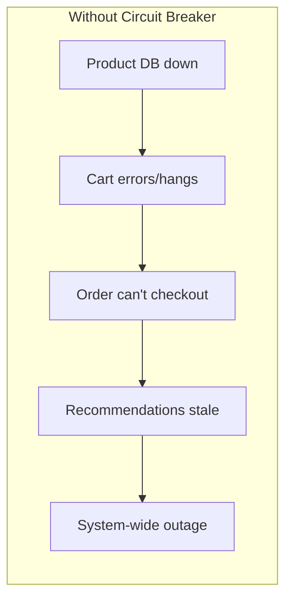
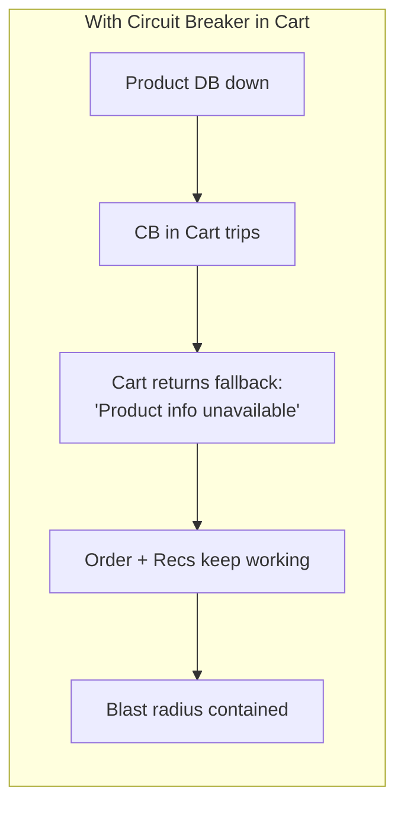
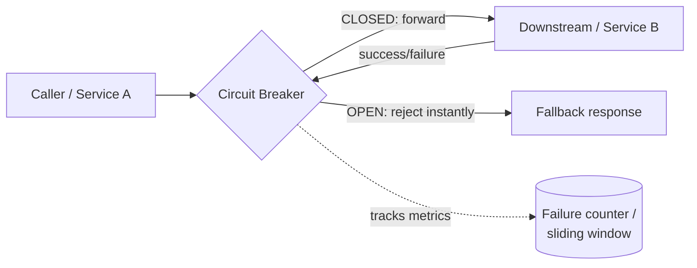
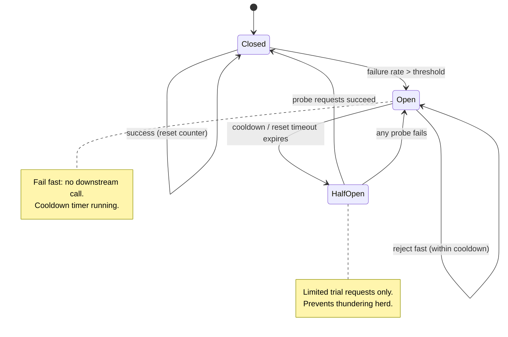
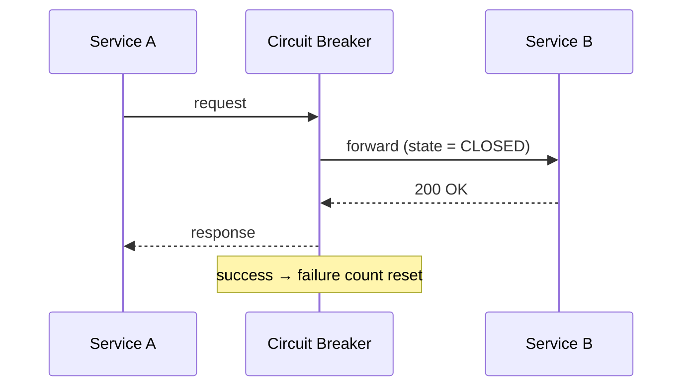
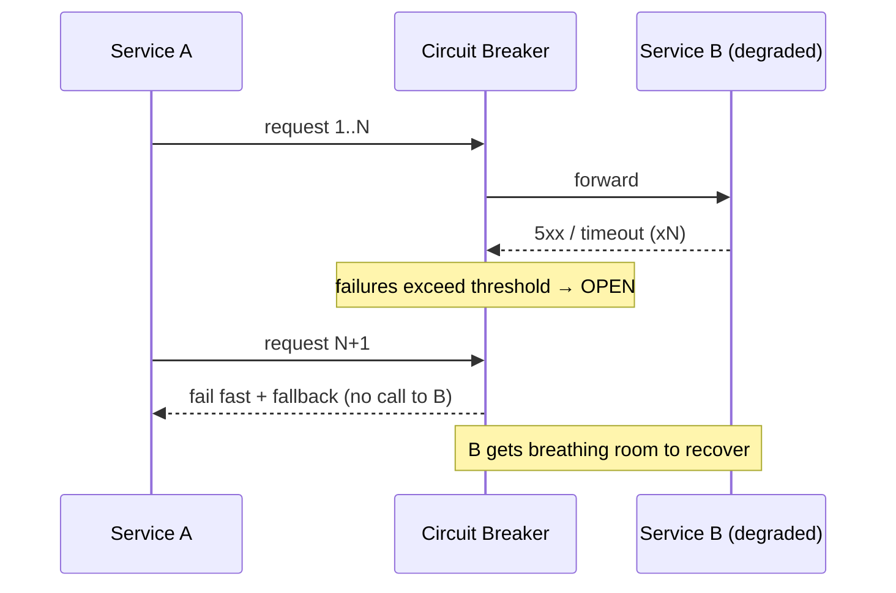
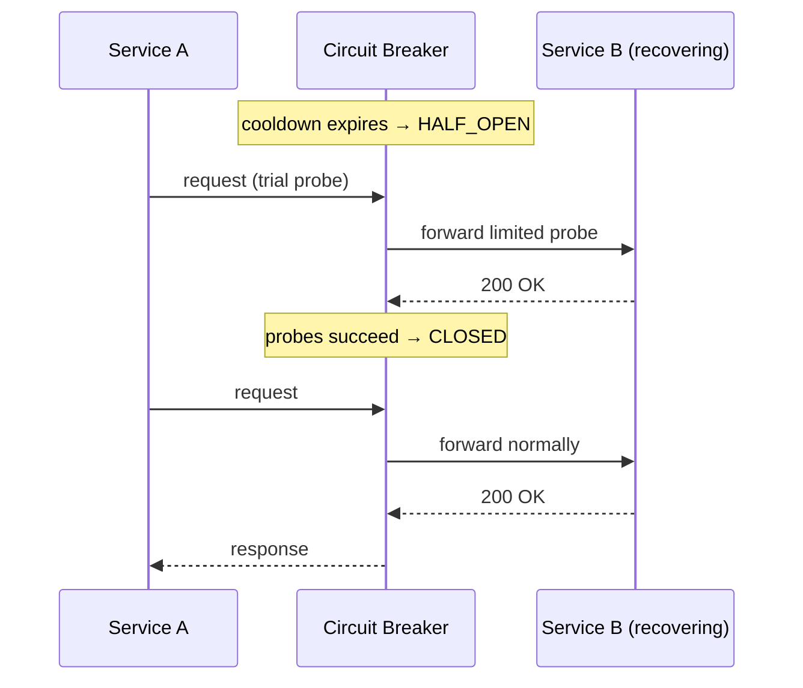
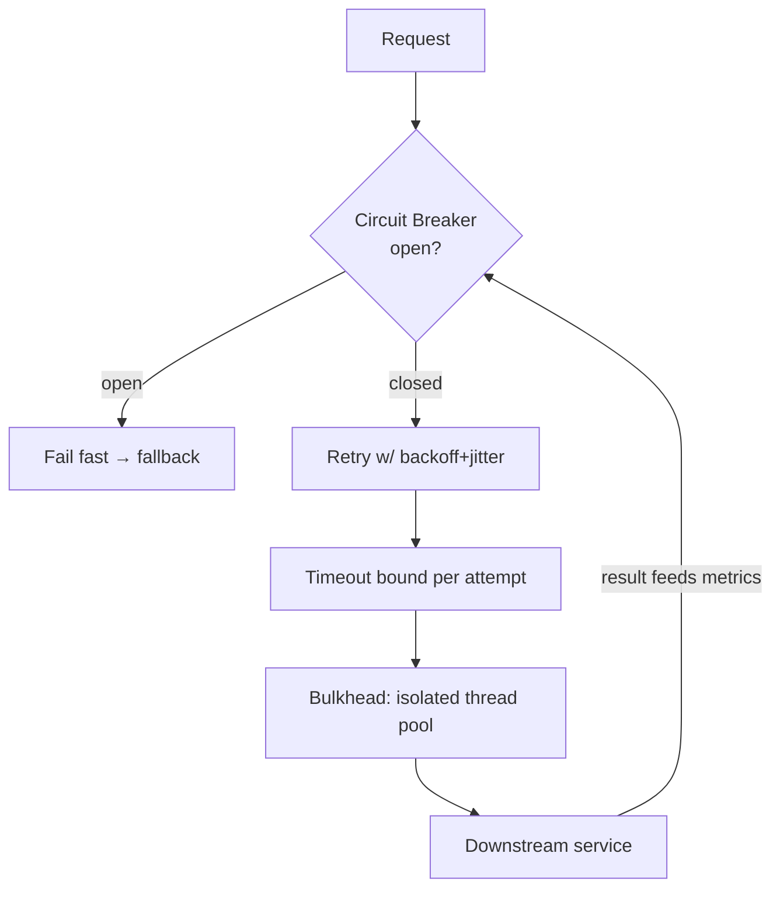
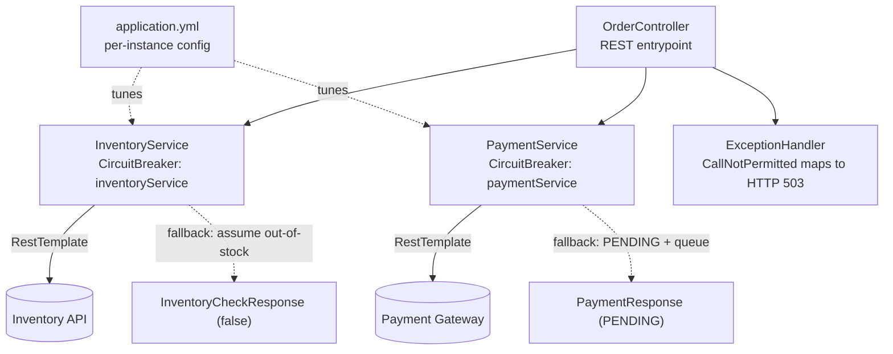

# ⚡ Circuit Breaker Pattern — A Study Guide (Basics → Staff/Principal)

> A resilience pattern that stops a failing dependency from dragging your whole system down — by *failing fast* instead of failing slow.

---

## 📋 Table of Contents

1. [Introduction: The 2 AM Pager Story](#-introduction-the-2-am-pager-story)
2. [Core Definitions (Plain English)](#-core-definitions-plain-english)
3. [The Concept & Theory](#-the-concept--theory)
4. [Why the Pattern Exists: Cascading Failure](#-why-the-pattern-exists-cascading-failure)
5. [Transient vs Non-Transient Failures](#-transient-vs-non-transient-failures)
6. [The Real Mechanism: Three States & the Trade-off](#-the-real-mechanism-three-states--the-trade-off)
7. [Architecture & Sequence Diagrams](#-architecture--sequence-diagrams)
8. [Building One From Scratch (Pseudocode + Java)](#-building-one-from-scratch-pseudocode--java)
9. [Tunable Knobs: The Configurable System](#-tunable-knobs-the-configurable-system)
10. [Categorized Real-World Examples](#-categorized-real-world-examples)
11. [The Resilience Stack: Timeout + Retry + Bulkhead + CB](#-the-resilience-stack-timeout--retry--bulkhead--cb)
12. [Common Misconceptions](#-common-misconceptions)
13. [Staff/Principal-Level Nuance](#-staffprincipal-level-nuance)
14. [Extensions & Adjacent Concepts](#-extensions--adjacent-concepts)
15. [Hands-On: Complete Spring Boot Implementation](#-hands-on-complete-spring-boot-implementation)
16. [⚡ Quick Revision](#-quick-revision)
17. [🎓 FAANG Interview Q&A (20 Questions)](#-faang-interview-qa-20-questions)
18. [📝 STAR Behavioral Questions](#-star-behavioral-questions)
19. [🔗 References & Further Reading](#-references--further-reading)

---

## 🎯 Introduction: The 2 AM Pager Story

It's 2 AM on a random Tuesday. Your phone buzzes. The payment service is down. Except… it's not *just* the payment service — the order service is down, notifications are down, and the user dashboard is a white screen. And it all started because **one** downstream dependency got a little slow.

This is the story almost every engineer who has run distributed systems eventually lives through. A single misbehaving dependency doesn't stay contained; it spreads. The Circuit Breaker pattern is the mechanism that stops that spread at step one.

The name is borrowed from electrical engineering. In your home's breaker panel, when a circuit draws too much current — you plugged a space heater and a microwave into the same outlet — the breaker *trips* and cuts power to that circuit before the wiring melts and starts a fire. You lose your kitchen for a bit, but the rest of the house is fine. The damage is **contained**.

In software, the "current" is network requests, the "overcurrent" is a spike in failures or timeouts, and "tripping" means we immediately stop sending requests to a service that's clearly struggling. We take a small, controlled hit — one feature degrades — instead of letting the failure spread everywhere. The one delightful difference: software circuit breakers **reset themselves**. They periodically test whether the broken dependency has recovered, so nobody has to flip a switch in a server room.

The idea was first codified by **Michael Nygard** in *Release It!* (2007). His line that sticks: *integration points* — every API call, every database query, every HTTP request to another service — *are the number-one killer of systems*. **Martin Fowler** popularized the pattern in a 2014 article, and **Netflix** brought it to massive scale with **Hystrix**, which at its peak processed tens of billions of thread-isolated calls per day.

<details>
<summary>📖 Beginner-friendly explanation (click to expand)</summary>

Imagine a waiter (your service) taking orders to a kitchen (a downstream service). If the kitchen stops responding, a naive waiter keeps walking back to the kitchen for every order, waiting 30 seconds each time, ignoring all the other customers. Soon the whole restaurant is stuck. A circuit breaker is a smart rule: "If the kitchen fails 5 orders in a row, stop going there for a minute. Just tell customers 'kitchen's closed' immediately." That way the waiter stays free to serve everyone else, and the kitchen gets a breather to recover. After a minute, the waiter quietly tries *one* order to see if the kitchen is back.
</details>

---

## ✅ Core Definitions (Plain English)

**Circuit Breaker Pattern** — A cloud/resilience design pattern that wraps calls to a remote dependency and monitors them. When failures cross a threshold, it *trips* and short-circuits further calls, returning an error or fallback immediately instead of waiting for the doomed call. After a cooldown it cautiously tests recovery.

**Cascading failure** — A failure in one service triggers a chain reaction of failures in the services that depend on it, potentially causing a system-wide outage.

**Fail fast** — Rejecting a request immediately (in microseconds) when you already know it will fail, rather than holding a thread hostage for a 30-second timeout.

**Fallback** — A degraded-but-acceptable response served when the real call can't be made: cached/stale data, a sensible default (empty list), a queued-for-later acknowledgment, or a backup provider.

**Thundering herd / retry storm** — When many clients retry a struggling service simultaneously (especially without jitter/backoff), turning your own retry logic into a self-inflicted DDoS.

**Threshold** — The failure condition that trips the breaker (e.g., "50% of the last 100 calls failed" or "5 consecutive errors").

**Half-open probe** — A limited set of trial requests sent after cooldown to check whether the dependency has recovered.

<details>
<summary>📖 Beginner-friendly explanation (click to expand)</summary>

Strip away the jargon and a circuit breaker is just three sticky-note rules taped to a phone: (1) "Things are fine, make the call." (2) "Too many failures — don't even try, hang up instantly." (3) "It's been a minute, let me try *one* call and see." That's the whole pattern. Everything else — sliding windows, metrics, thresholds — is polish on those three rules.
</details>

---

## 💡 The Concept & Theory

At its heart, a circuit breaker is a **small state machine** that sits *between* your service (the caller) and the dependency it calls (the callee). Every call passes through the breaker, which observes the outcome — success, failure, or "too slow" — and updates its internal state accordingly.

The theoretical insight is subtle but powerful: **the breaker converts a slow, resource-consuming failure into a fast, cheap failure.** In a distributed system, the most dangerous failure mode isn't an error — it's *latency*. An error returns instantly and frees the thread. A hung call holds a thread, a connection, and memory for the full timeout duration. Under load, hung calls accumulate faster than they drain, and the caller exhausts its own resources trying to talk to a service that will never answer. The breaker's job is to detect this pattern and *stop making the calls*, protecting the caller's finite resources.

There's a second, equally important effect that's easy to miss: the breaker also protects the **callee**. A struggling service that's being hammered with requests can't recover — it's too busy failing. By cutting off traffic, the breaker gives the downstream service breathing room to catch up, clear its queues, restart, or scale. So the pattern is doubly protective: it saves the caller from itself *and* stops the caller from kicking the callee while it's down.

Michael Nygard's framing is the cleanest: a circuit breaker exists to *degrade gracefully*. The alternative to graceful degradation isn't "everything works" — it's "everything crashes." Resilience doesn't mean things never fail; in distributed systems, things **will** fail. Resilience means your system keeps working (in a reduced form) when they do.

<details>
<summary>📖 Beginner-friendly explanation (click to expand)</summary>

Think of a circuit breaker as a bouncer at a club door with three moods. Normally he waves everyone in (Closed). If a fight breaks out inside repeatedly, he locks the door and turns everyone away instantly — no point letting people into a brawl (Open). After things quiet down, he cracks the door and lets one or two people in to see if it's calm now (Half-Open). If it is, doors open again; if not, locked again. He's protecting both the crowd outside (your threads) and the club inside (the struggling service).
</details>

---

## ❌ Why the Pattern Exists: Cascading Failure

To understand why the pattern matters, walk through a real cascade — domino by domino. This is the canonical timeline that plays out in production incidents:

```
14:00 — Payment gateway goes down (external provider outage)
        Response time: effectively infinite (times out after 30s)
14:01 — Order Service makes 100 payment requests
        All hang for 30 seconds
        Thread pool: 50/200 threads stuck waiting
14:03 — More orders arrive
        Thread pool: 150/200 threads stuck
        Inventory queries start timing out (no threads left)
14:05 — Thread pool exhausted (200/200)
        Health checks fail → load balancer removes the instance
        Traffic shifts to remaining instances → they exhaust too
14:07 — All instances down. Complete outage.
        Even "get product by ID" (which never touched payments) fails.
```

The cruel punchline: **the payment gateway was only used by 20% of requests, but it killed 100% of your capacity.** The failure wasn't the errors — it was the *threads held hostage waiting on timeouts*. Requests that had nothing to do with payments couldn't get a thread to run on.

Consider a concrete e-commerce topology. A **Product** service holds catalog data. A **Cart** service calls Product to display items. An **Order** service calls Cart to check out. A **Recommendation** service uses Order history. Now the Product service's database goes down:

- **First-level impact:** Cart starts erroring — customers can't add items.
- **Second-level impact:** Order can't process checkouts — lost revenue.
- **Third-level impact:** Recommendations get incomplete/stale data — degraded UX.

One database failure cascaded through four services. A circuit breaker in Cart would have detected the failing Product calls, tripped, and shown *"Product info temporarily unavailable"* instead of hanging — containing the blast radius to a single degraded feature.





Google's SRE handbook documents an analogous death spiral: poorly tuned garbage collection triggers CPU exhaustion → slow requests → more memory pressure → more GC → nearly impossible to escape once it begins. And the **2015 AWS DynamoDB incident** is the textbook case where a transient network blip triggered cascading retries that kept the service down for *hours* — retries turning a hiccup into an outage.

<details>
<summary>📖 Beginner-friendly explanation (click to expand)</summary>

Picture a highway where one lane closes. Cars back up. If drivers keep merging into the closed lane and idling there, the jam spreads backward until the whole highway is gridlocked — even cars heading to exits that were never affected. A circuit breaker is a sign that says "lane closed, use the exit now" — cars fail fast and take an alternate route instead of piling up. The one stuck lane doesn't get to freeze the entire highway.
</details>

---

## 📊 Transient vs Non-Transient Failures

This distinction is the single most important thing to get right — using a circuit breaker on the wrong kind of failure is over-engineering, and using *retry* on the wrong kind makes outages worse.

**Transient failures** are momentary hiccups: a fleeting network glitch, a brief server overload, a dropped packet, an occasional `503`. They self-heal in seconds. The correct tool is the **Retry pattern** — reattempt after a short (backed-off, jittered) delay. Example: a Dropbox photo upload fails due to a momentary network congestion; a retry succeeds once the network stabilizes.

**Non-transient failures** render a system unavailable for a meaningful period, or recovery takes longer than a few seconds: a database is down, a service is completely offline, an app is bombarded past its CPU/memory limits, or timeouts are the norm rather than the exception. Here, **retry is counterproductive** — repeatedly hammering a dead service wastes resources and can *prolong* the outage. This is exactly what the circuit breaker is for. Example: if Twitter's tweet-posting service is fully offline, retrying submissions indefinitely is pointless — the app should fail fast and tell the user "couldn't post right now."

The two patterns are complementary, not competitors: **retry handles the momentary blips; the circuit breaker handles the sustained outages.** A common trap is retry *without* a circuit breaker: 100 concurrent users each retrying 3× turns 100 requests into 400 requests aimed at an already-drowning service.

| | **Transient failure** | **Non-transient failure** |
|---|---|---|
| Duration | Milliseconds–seconds | Seconds–minutes+ |
| Examples | Network blip, brief spike, one-off 503 | DB down, service offline, resource exhaustion |
| Right tool | **Retry** (with backoff + jitter) | **Circuit Breaker** (fail fast) |
| Wrong tool | Tripping a breaker (over-engineering) | Retrying (makes it worse) |

<details>
<summary>📖 Beginner-friendly explanation (click to expand)</summary>

If your friend doesn't pick up the phone once, you call back in a minute — maybe they were in the shower (transient, so you retry). But if you've called 20 times and it goes straight to voicemail every time, their phone is clearly off — calling 20 more times is a waste. You stop and text them to call back when they can (non-transient, so you fail fast). Retry is for "try again in a sec"; the circuit breaker is for "stop trying, it's clearly broken."
</details>

---

## 🎨 The Real Mechanism: Three States & the Trade-off

A circuit breaker is a state machine with exactly three states. Understanding *what each state protects* and *what triggers each transition* is the core of the pattern.

**1. Closed (normal operation).** Requests flow straight through to the downstream service. The breaker is a silent observer, tracking outcomes — either by count (last N calls) or a sliding time window (last 60s). As long as the failure rate stays below the threshold (Resilience4j defaults to **50%**), it stays closed. Successful calls keep the failure count healthy.

**2. Open (fail fast).** Once failures cross the threshold, the breaker trips. Every subsequent request is **rejected immediately** — no network call, no waiting on a 30-second timeout, no thread held hostage. The caller gets an error (or a fallback) in microseconds. This simultaneously (a) saves the caller's resources and (b) gives the struggling callee breathing room. A cooldown timer runs (typically 30–60s).

**3. Half-Open (testing recovery).** When the cooldown expires, the breaker doesn't slam the gates open — that would flood a recovering service and likely re-kill it (a thundering herd). Instead it lets through a *limited* number of trial requests. If they succeed → back to **Closed**, counters reset. If any fail → back to **Open**, restart the timer.

The cycle: `Closed → (failures exceed threshold) → Open → (cooldown expires) → Half-Open → (probes succeed) → Closed`, or `Half-Open → (probe fails) → Open`.

**The real trade-off:** a circuit breaker deliberately trades **availability of a single feature for stability of the whole system.** When it's open, you are *choosing* to reject requests that *might* have succeeded — some of those rejected calls would have gone through. That's the cost. The benefit is that you don't let a struggling dependency consume the resources every other feature needs. Tuning is the art of minimizing wasted good requests (threshold too tight → false trips) while still tripping fast enough to prevent resource exhaustion (threshold too loose → cascade slips through).

<details>
<summary>📖 Beginner-friendly explanation (click to expand)</summary>

The three states are like a light switch with a timer. CLOSED = light on, everything works. OPEN = light off, and it stays off for a set time no matter what, so the wiring cools down. HALF-OPEN = the switch flickers on for a second to test — if the light works, it stays on (CLOSED); if it sparks again, it snaps back off (OPEN) and the timer restarts. The genius is that "off" is a *choice* to protect the system, not a bug.
</details>

---

## 🖼️ Architecture & Sequence Diagrams

**Where the breaker sits** — as a proxy/gatekeeper between caller and dependency:



**The state machine** — the heart of the pattern:



**Sequence: a healthy call (Closed state)**



**Sequence: the breaker trips and fails fast (Closed → Open)**



**Sequence: probing recovery (Open → Half-Open → Closed)**



<details>
<summary>📖 Beginner-friendly explanation (click to expand)</summary>

Read the diagrams as a story about a gate. In the healthy story, the gate is open and every visitor walks through to the building and comes back happy. In the trip story, too many visitors get hurt inside, so the gate slams shut and turns new visitors away instantly with a "come back later" note. In the recovery story, after a timeout the gate opens *just a crack*, lets one scout in, and only reopens fully if the scout comes back safe. Same three states, three little stories.
</details>

---

## 💻 Building One From Scratch (Pseudocode + Java)

A basic circuit breaker is surprisingly little code. You don't need a library to understand it. Here's the essence in language-agnostic pseudocode first, then production-grade Java.

<details>
<summary>💻 Pseudocode — the core state machine (click to expand)</summary>

```text
CircuitBreaker {
    state             = CLOSED
    failure_count     = 0
    success_count     = 0
    last_failure_time = null

    // Knobs you'll tune
    FAILURE_THRESHOLD = 5      // how many failures to trip
    RESET_TIMEOUT     = 30s    // how long to wait before probing
    SUCCESS_THRESHOLD = 2      // how many probes must pass to close
    CALL_TIMEOUT      = 5s     // max wait per request
}

function call(request):
    if state == OPEN:
        if (now - last_failure_time) > RESET_TIMEOUT:
            state = HALF_OPEN         // cooldown over, let's test
            success_count = 0
        else:
            throw CircuitOpenError    // fail fast, don't even try
    try:
        result = make_call_with_timeout(request, CALL_TIMEOUT)
        on_success()
        return result
    catch error:
        on_failure()
        throw error

function on_success():
    if state == HALF_OPEN:
        success_count += 1
        if success_count >= SUCCESS_THRESHOLD:
            state = CLOSED            // recovered
            failure_count = 0
    else:
        failure_count = 0             // reset on success

function on_failure():
    failure_count += 1
    last_failure_time = now
    if state == HALF_OPEN:
        state = OPEN                  // probe failed → reopen
    else if failure_count >= FAILURE_THRESHOLD:
        state = OPEN                  // trip the breaker
```

That's the *soul* of the pattern. In production you'd add sliding windows (instead of naive counters), thread-safe atomics/locks, exception filtering (a 400 Bad Request is the caller's fault — don't count it), and metrics on every transition.
</details>

<details>
<summary>💻 Java — a thread-safe custom circuit breaker (click to expand)</summary>

```java
import java.time.Duration;
import java.time.Instant;
import java.util.concurrent.atomic.AtomicInteger;
import java.util.concurrent.atomic.AtomicReference;
import java.util.function.Supplier;

public class SimpleCircuitBreaker {

    public enum State { CLOSED, OPEN, HALF_OPEN }

    private final int failureThreshold;   // failures before tripping
    private final int halfOpenLimit;      // trial probes in half-open
    private final Duration openDuration;  // cooldown before probing

    private final AtomicReference<State> state = new AtomicReference<>(State.CLOSED);
    private final AtomicInteger failureCount        = new AtomicInteger(0);
    private final AtomicInteger consecutiveSuccesses = new AtomicInteger(0);
    private final AtomicInteger halfOpenAttempts     = new AtomicInteger(0);
    private volatile Instant openedAt;

    public SimpleCircuitBreaker(int failureThreshold, int halfOpenLimit, Duration openDuration) {
        this.failureThreshold = failureThreshold;
        this.halfOpenLimit    = halfOpenLimit;
        this.openDuration     = openDuration;
    }

    public <T> T execute(Supplier<T> operation) {
        State current = getState();

        if (current == State.OPEN) {
            throw new CircuitBreakerOpenException("Circuit breaker is OPEN");
        }
        if (current == State.HALF_OPEN
                && halfOpenAttempts.incrementAndGet() > halfOpenLimit) {
            halfOpenAttempts.decrementAndGet();
            throw new CircuitBreakerOpenException("Half-open trial limit exceeded");
        }

        try {
            T result = operation.get();
            onSuccess();
            return result;
        } catch (Exception ex) {
            onFailure();
            throw ex;
        }
    }

    private State getState() {
        State current = state.get();
        // Auto-transition OPEN -> HALF_OPEN once cooldown elapses
        if (current == State.OPEN && Instant.now().isAfter(openedAt.plus(openDuration))) {
            state.compareAndSet(State.OPEN, State.HALF_OPEN);
            halfOpenAttempts.set(0);
            return State.HALF_OPEN;
        }
        return current;
    }

    private void onSuccess() {
        if (state.get() == State.HALF_OPEN) {
            if (consecutiveSuccesses.incrementAndGet() >= halfOpenLimit) {
                transitionToClosed();
            }
        } else {
            failureCount.set(0);
        }
    }

    private void onFailure() {
        State current = state.get();
        if (current == State.HALF_OPEN) {
            transitionToOpen();                 // any probe failure reopens
        } else if (failureCount.incrementAndGet() >= failureThreshold) {
            transitionToOpen();
        }
    }

    private void transitionToOpen() {
        state.set(State.OPEN);
        openedAt = Instant.now();
        failureCount.set(0);
        consecutiveSuccesses.set(0);
    }

    private void transitionToClosed() {
        state.set(State.CLOSED);
        failureCount.set(0);
        consecutiveSuccesses.set(0);
        halfOpenAttempts.set(0);
    }

    public State currentState() { return getState(); }

    public static class CircuitBreakerOpenException extends RuntimeException {
        public CircuitBreakerOpenException(String message) { super(message); }
    }
}
```

Note the use of `AtomicReference`/`AtomicInteger` — a real breaker is hit by many threads concurrently, so state transitions must be atomic to avoid two threads both tripping or both closing.
</details>

<details>
<summary>💻 Java — the production way: Resilience4j + Spring Boot (click to expand)</summary>

In practice you rarely hand-roll this. **Resilience4j** is the modern JVM standard (Netflix Hystrix is deprecated/maintenance-only). Declarative config in `application.yml`:

```yaml
resilience4j:
  circuitbreaker:
    configs:
      default:
        sliding-window-type: COUNT_BASED
        sliding-window-size: 100
        failure-rate-threshold: 50          # trip at 50% failures
        slow-call-rate-threshold: 80        # also trip if 80% of calls are slow
        slow-call-duration-threshold: 3s
        wait-duration-in-open-state: 60s
        permitted-number-of-calls-in-half-open-state: 10
        automatic-transition-from-open-to-half-open-enabled: true
        minimum-number-of-calls: 10          # don't judge on tiny samples
        record-exceptions:
          - java.io.IOException
          - java.util.concurrent.TimeoutException
          - org.springframework.web.client.HttpServerErrorException
        ignore-exceptions:
          - java.lang.IllegalArgumentException   # caller's fault, not infra
    instances:
      paymentService:                          # external, unreliable → strict
        base-config: default
        failure-rate-threshold: 40
        wait-duration-in-open-state: 120s
      inventoryService:                        # internal, stable → lenient
        base-config: default
        failure-rate-threshold: 60
        wait-duration-in-open-state: 30s
```

And the service just annotates the method — the breaker and its fallback are wired by AOP:

```java
@Service
public class PaymentService {

    @CircuitBreaker(name = "paymentService", fallbackMethod = "paymentFallback")
    public PaymentResponse processPayment(PaymentRequest request) {
        // Might fail, timeout, or return 5xx
        var resp = restTemplate.postForObject(gatewayUrl, request, GatewayResponse.class);
        return new PaymentResponse(resp.transactionId(), resp.approved() ? "APPROVED" : "DECLINED",
                                   resp.message(), Instant.now());
    }

    // Generic failure fallback
    private PaymentResponse paymentFallback(PaymentRequest req, Exception ex) {
        return new PaymentResponse(null, "PENDING",
                "Payment temporarily unavailable. Order queued.", Instant.now());
    }

    // Specific fallback when the circuit is OPEN (call never attempted)
    private PaymentResponse paymentFallback(PaymentRequest req, CallNotPermittedException ex) {
        return new PaymentResponse(null, "PENDING",
                "Payment currently unavailable. Please retry later.", Instant.now());
    }
}
```

Key patterns: `record-exceptions` vs `ignore-exceptions` (only infra failures count), the `minimum-number-of-calls` guard, and **two fallback signatures** — one for real exceptions, one for `CallNotPermittedException` (thrown when the circuit is already open).
</details>

---

## 🛠️ Tunable Knobs: The Configurable System

The power of a circuit breaker is that you can make it as *smart* as your service needs. These are the levers, and getting them wrong is the #1 source of pain.

**Failure threshold** — Count-based ("5 consecutive failures") or rate-based ("50% of last 100 calls"). Rate-based with a sliding window is more robust than naive counters because a single blip in a low-traffic window won't trip it.

**Minimum number of calls** — Don't evaluate the failure rate until you've seen enough samples. Without this, 1 failure out of 2 calls = 50% = trip, which is absurd.

**Sliding window** — Count-based (last N calls) or time-based (last N seconds). Time-based better reflects "recent health" under bursty traffic.

**Wait duration in open state (cooldown)** — Too *high* and you keep rejecting requests long after the service recovered (wasting good traffic). Too *low* and you flap between open/half-open, re-hammering a service that's still recovering. 30–60s is a common starting point.

**Permitted calls in half-open** — How many probes to send. Too few and one unlucky probe misjudges recovery; too many and you risk re-flooding.

**What counts as a failure (exception filtering)** — Critical nuance: a `400 Bad Request` or `404 Not Found` is the *caller's* fault, not an infrastructure failure. Counting it trips the breaker on bad input. Only count timeouts, 5xx, connection failures. You can even distinguish error *types* — accept errors of type 1 and 2 but trip on type 3.

**Slow-call threshold** — A call that returns in 3s "successfully" is often worse than a fast error. Resilience4j can trip when a percentage of calls exceed a duration, catching the *latency* failure mode directly.

**Manual override** — You want functions to *force* the breaker open (e.g., you know a dependency is being deployed) or force it closed (you know it recovered), independent of the automatic state machine.

**Concurrency** — One dependency is called by many callers/threads simultaneously; state transitions must be thread-safe (atomics/CAS).

**Logging & monitoring** — Log every state transition with context. A breaker without observability is just mysterious request failures.

<details>
<summary>📖 Beginner-friendly explanation (click to expand)</summary>

The knobs are like the settings on a home thermostat. Set the "trip temperature" too low and the AC kicks on every time someone opens a window (too sensitive — false trips). Set it too high and the house is an oven before it reacts (too lenient — cascade slips through). The "wait time" is how long the AC rests before checking again. And "what counts as hot" matters — you don't want the thermostat reacting to someone briefly holding a warm coffee near it (that's a 400 Bad Request, not real heat).
</details>

---

## 🗂️ Categorized Real-World Examples

**Application-level libraries (in-process, per-JVM/per-app):**

- **Netflix Hystrix (Java)** — the pioneer that popularized the pattern at scale (tens of billions of thread-isolated calls/day). Now in maintenance mode / deprecated; Netflix moved toward adaptive concurrency.
- **Resilience4j (Java)** — the modern standard. Lightweight, modular, functional; integrates with Spring Boot. Modules: CircuitBreaker, Retry, RateLimiter, Bulkhead, TimeLimiter.
- **Polly (.NET)** — the equivalent for the .NET ecosystem.
- **Sentinel (Alibaba)** — language-agnostic flow-control + circuit breaking with a real-time dashboard; strong in high-concurrency environments.
- **gobreaker / hand-rolled (Go)** — small libraries and custom implementations are common in Go services.

**Infrastructure / service-mesh level (out-of-process, polyglot, no app code):**

- **Istio (with Envoy)** — enforce circuit breaking via a `DestinationRule` YAML: connection-pool limits + `outlierDetection` (e.g., trip after 5 consecutive 5xx, eject the host for a base time). Decouples resilience from application code.
- **Envoy proxy** — the data-plane sidecar underneath many meshes; implements outlier detection and adaptive concurrency directly.
- **Amazon App Mesh** — fully managed mesh on Envoy across ECS/EKS/EC2; circuit breaking, retries, routing without code changes.

**Company anecdotes:**

- **eBay** wraps payment processors in breakers to fail fast and show a clean error during outages instead of hanging 30s.
- **Netflix** serves cached recommendations when the recommendation service is down — the breaker's fallback in action.
- **AWS DynamoDB (2015)** — a cautionary tale: transient network issue + cascading retries (no effective breaking) kept the service down for hours.

<details>
<summary>📖 Beginner-friendly explanation (click to expand)</summary>

There are two places to put the "smart gate." One is *inside your app's code* — like each employee having their own personal rule about when to stop calling a vendor (Resilience4j, Hystrix, Polly). The other is *in the building's infrastructure* — like a security desk that manages all vendor calls for everyone, so no employee has to write the rule themselves (Istio, Envoy, App Mesh). Big polyglot companies often prefer the security-desk approach so the rule works the same for Java, Go, and Python teams alike.
</details>

---

## 🧱 The Resilience Stack: Timeout + Retry + Bulkhead + CB

A circuit breaker used *alone* is incomplete. It works best as one layer in a defense-in-depth stack, each layer handling a different failure mode:

- **Timeout** — bounds how long any single call can hang. Without it, the breaker never even learns a call is "slow"; the thread just sits there. This is the foundation.
- **Retry (with exponential backoff + jitter)** — handles *transient* blips. Backoff spreads retries over time; jitter de-synchronizes them to avoid a thundering herd.
- **Bulkhead** — isolates resources (e.g., separate thread pools/connection pools per dependency) so one bad dependency can't eat *all* your threads. Named after ship compartments that stop one flooded section from sinking the vessel.
- **Circuit Breaker** — sits on top, aggregating failure signals to make the system-level call: "this dependency is toast, stop trying."

**Ordering matters.** A typical composition (outermost → innermost): `CircuitBreaker → Retry → TimeLimiter → actual call`. The breaker checks state first (if open, skip everything). If closed, retry attempts the call. Each attempt is bounded by the timeout. In Resilience4j this stacks cleanly:

```java
@CircuitBreaker(name = "externalApi", fallbackMethod = "fallback")
@Retry(name = "externalApi", fallbackMethod = "fallback")
@TimeLimiter(name = "externalApi")
public CompletableFuture<String> callExternalApi(String request) {
    return CompletableFuture.supplyAsync(() ->
        restTemplate.postForObject(url, request, String.class));
}
```



<details>
<summary>📖 Beginner-friendly explanation (click to expand)</summary>

Think of a castle with layered defenses. The *timeout* is a rule that no messenger waits at a locked door longer than 5 minutes. *Retry* is sending the messenger again a couple of times in case they got lost. *Bulkhead* is having separate messenger teams per destination, so if one road is blocked, the others still ride. And the *circuit breaker* is the commander who, after seeing enough failed trips, orders "stop sending anyone to that town, it's under siege." No single layer is enough — together they keep the castle running.
</details>

---

## 🚫 Common Misconceptions

**"A circuit breaker fixes the failing service."** No — it protects *your* service from the failing dependency. The downstream is still broken; you've just stopped it from taking you down too, and given it room to recover.

**"Retry and circuit breaker do the same thing."** They solve opposite problems. Retry is for *transient* failures (try again, it'll probably work). Circuit breaker is for *non-transient* failures (stop trying, it's clearly down). Retry without a breaker amplifies outages.

**"More retries = more resilience."** Retries without backoff/jitter create retry storms — 100 users × 3 retries = 400 requests slamming a service that's already drowning.

**"Any error should trip the breaker."** A `400`/`404`/validation error is the caller's fault, not infra failure. Counting it trips the breaker on bad input. Only infra failures (timeouts, 5xx, connection errors) should count.

**"An open circuit that throws errors is enough."** Without a fallback, the user still has a bad time. The value multiplies when you pair the breaker with a graceful fallback (cache, default, queue-for-later, backup provider).

**"You always need a circuit breaker."** For a handful of services under light load, or a single critical dependency where an outage stops the business anyway, a breaker is over-engineering. It shines in *distributed systems with many interdependent services under heavy load*.

**"Slow calls are fine as long as they succeed."** A call that succeeds in 25s can exhaust your thread pool just as effectively as an error. Slow-call thresholds exist precisely because latency is the sneakier failure mode.

<details>
<summary>📖 Beginner-friendly explanation (click to expand)</summary>

The biggest myth is thinking the breaker "heals" the broken thing. It doesn't — it's more like a tourniquet. If your friend's shop is on fire, a tourniquet on *your* arm won't put out *their* fire; it just stops you from bleeding out while helping. The breaker keeps you alive and functional; the downstream service still has to recover on its own (or with a human's help).
</details>

---

## 🎓 Staff/Principal-Level Nuance

**Latency, not errors, is the true enemy.** Junior mental model: "the breaker counts errors." Staff mental model: "the breaker's real job is converting *slow* failures into *fast* failures." A service returning 5xx instantly is far less dangerous than one hanging for 30s — the latter exhausts threads. This is why slow-call rate thresholds and tight timeouts often matter more than the error threshold. Always pair a breaker with an aggressive timeout; otherwise the breaker can't even *see* the danger.

**Per-dependency isolation (breaker + bulkhead).** Never share one breaker across multiple dependencies — you'd trip payment calls because inventory is down. Give each dependency its own breaker *and* its own bulkhead (thread/connection pool), so a slow dependency can't starve the threads that serve healthy ones. This is exactly why Hystrix used thread-pool isolation.

**Thresholds must be derived from data, not guessed.** Measure baseline p95 latency and normal error rate first, then set thresholds at ~3× normal (0.5% error rate → 1.5% threshold; 200ms p95 → 600ms slow threshold). A famous rookie mistake: a 10% threshold on a 5-call window means *one* failure trips the breaker and kills a feature over a single blip.

**Sliding window semantics.** Count-based windows misbehave under bursty/low traffic; time-based windows reflect *recent* health better. Also decide whether health checks count toward the window — you usually want to exclude them so an unhealthy probe endpoint doesn't skew real-traffic stats.

**Fallback strategy is a design decision, not an afterthought.** Options escalate: stale/cached data (Netflix recs) > sensible default (empty list beats an error page) > queue-for-later (Fowler's credit-card-authorization example) > route to backup provider. The right choice depends on business semantics — for payments, "pending + queued" preserves the order; for search, an empty result is fine.

**Flapping is a signal, not just noise.** A breaker that opens every 15 minutes indicates a deeper reliability problem, not a tuning problem. Alert on `changes(state) > 5 in 10m` (flapping) and `state == OPEN for > 2m` (sustained outage). Prometheus + Grafana is the standard stack; Resilience4j exposes `circuitbreaker_state`, `failure_rate`, `slow_call_rate`, and `not_permitted_calls_total`.

**Where the breaker lives is an architecture decision.** In-process libraries (Resilience4j) give granular, per-call control but must be reimplemented per language. Service-mesh breakers (Istio/Envoy) are polyglot and decouple resilience from code, but operate at connection/host granularity (outlier detection ejecting hosts) rather than per-logical-operation. Large polyglot orgs often prefer the mesh; teams needing fine-grained fallbacks prefer the library. Many use *both* layers.

**When NOT to use one (the honest part).** Skip it for a single critical dependency (if payments are down, the business is down anyway — you need an SLA and a status page, not a breaker), for rare unrecoverable failures needing manual intervention, when good retry+backoff already suffices for transient blips, or when you can't define sensible thresholds (you'll cause more harm than good). Breakers add config overhead, operational complexity, and UX risk (rejecting requests to a service that might be healthy).

<details>
<summary>📖 Beginner-friendly explanation (click to expand)</summary>

The thing senior engineers obsess over that beginners miss: *slow is worse than broken*. A fast "no" frees you to move on; a slow "maybe" keeps you stuck. So they tune the breaker to punish slowness, give each dependency its own separate lane so a jam in one doesn't block others, and set the trip thresholds from real measurements instead of gut feel. And crucially, they always plan a Plan B (fallback) — an open breaker with nothing behind it just moves the pain around.
</details>

---

## 🔮 Extensions & Adjacent Concepts

**Adaptive circuit breaking** — The frontier: instead of static, hand-guessed thresholds, breakers that dynamically adjust based on real-time latency/concurrency signals. Netflix pointed this way when deprecating Hystrix; **Envoy's adaptive concurrency filter** already implements it. The trend is breakers that tune themselves.

**Bulkhead pattern** — Resource isolation (separate thread/connection pools per dependency). Complements the breaker: the bulkhead limits the *blast radius* of a slow dependency even before the breaker trips.

**Rate limiter / throttling** — Caps incoming traffic to protect a service from overload. Where a breaker reacts to failures, a rate limiter proactively prevents them by shedding excess load.

**Retry with exponential backoff + jitter** — The transient-failure counterpart, discussed throughout. Jitter is essential to break synchronization and prevent thundering herds.

**Timeout / TimeLimiter** — The foundational layer; bounds hang time so the breaker can perceive slowness.

**Load shedding & backpressure** — System-wide strategies to drop or slow work when overwhelmed; the breaker is a localized form of shedding load toward one dependency.

**Health checks & outlier detection** — Mesh-level cousin: Envoy/Istio eject unhealthy *hosts* from the load-balancing pool (outlier detection) — effectively a per-host circuit breaker.

**Graceful degradation & fallbacks** — The broader philosophy the breaker serves: keep the core experience alive even when parts fail.

**Idempotency** — Relevant when combining retries with breakers: retried operations must be safe to repeat (idempotency keys) to avoid double-charging, double-posting, etc.

<details>
<summary>📖 Beginner-friendly explanation (click to expand)</summary>

The circuit breaker has a family of related tools. The *bulkhead* gives each task its own lane. The *rate limiter* is a doorman who only lets so many people in per minute. *Retry* is trying again politely. *Timeout* is a patience limit. And the exciting new cousin, *adaptive breaking*, is a breaker that learns the right settings by watching traffic instead of being told upfront — like a thermostat that figures out your comfort zone on its own.
</details>

---

## 🧑‍💻 Hands-On: Complete Spring Boot Implementation

<details>
<summary>🧑‍💻 <b>Click to expand the full Spring Boot walkthrough (5 classes + config)</b></summary>

This is a full, runnable Resilience4j + Spring Boot circuit breaker for a realistic e-commerce flow: an **Order** endpoint that must check **Inventory** and charge **Payment**, where both are remote calls that can fail, hang, or return 5xx. It's the production-shaped version of the from-scratch breaker in section 8 — instead of hand-rolling the state machine, we let Resilience4j own it and focus on the parts that actually matter in real systems: per-dependency tuning, exception filtering, layered timeout/retry, and graceful fallbacks.

**The approach in one breath:** declare *what* resilience each dependency needs in `application.yml` (declarative config), annotate the service methods with `@CircuitBreaker` (+ `@Retry`, `@TimeLimiter`), provide a `fallbackMethod` for each so callers *never* see a raw exception, and let the controller translate an open circuit into a clean HTTP 503. Payment gets a *strict* breaker (external, unreliable — trip early, cool down long); Inventory gets a *lenient* one (internal, usually stable). This separation is the whole point of per-dependency isolation.

**How the pieces fit together:**



We'll build it class by class. Read the collapsibles top to bottom — each one explains *what the class does* and *why it's shaped that way*.

<details>
<summary>💻 <b>1. Dependencies + configuration bean</b> (pom.xml + AppConfig) — click to expand</summary>

Resilience4j hooks into Spring via AOP, so you need the AOP starter alongside the circuit-breaker starter. Actuator + Micrometer expose the breaker's state as metrics (covered in Q18). Add these to `pom.xml`:

```xml
<dependency>
    <groupId>org.springframework.boot</groupId>
    <artifactId>spring-boot-starter-web</artifactId>
</dependency>
<dependency>
    <groupId>org.springframework.boot</groupId>
    <artifactId>spring-boot-starter-aop</artifactId>   <!-- REQUIRED: annotations are AOP-driven -->
</dependency>
<dependency>
    <groupId>org.springframework.boot</groupId>
    <artifactId>spring-boot-starter-actuator</artifactId>
</dependency>
<dependency>
    <groupId>io.github.resilience4j</groupId>
    <artifactId>resilience4j-spring-boot3</artifactId>
    <version>2.2.0</version>
</dependency>
```

The one bean we need is a `RestTemplate` (the HTTP client the services use). Crucially, give it **connection and read timeouts** — this is the foundational layer from section 12. Without a read timeout, a hung downstream call blocks the thread for the OS default (often minutes), and the breaker can't even perceive the slowness as a failure.

```java
@Configuration
public class AppConfig {

    @Bean
    public RestTemplate restTemplate() {
        var factory = new SimpleClientHttpRequestFactory();
        factory.setConnectTimeout(2_000); // fail fast if we can't even connect
        factory.setReadTimeout(3_000);    // don't hold a thread > 3s waiting for a response
        return new RestTemplate(factory);
    }
}
```

*Why it matters:* the timeout on the client is what turns an invisible 25-second hang into a countable `ResourceAccessException` the breaker can react to. Timeout first, breaker second.
</details>

<details>
<summary>💻 <b>2. Declarative config</b> (application.yml) — the tuning lives here — click to expand</summary>

This is where the pattern earns its keep. A shared `default` config, then two *instances* that override it per dependency. Note the different postures: `paymentService` is strict (external, flaky → 40% threshold, 120s cooldown), `inventoryService` is lenient (internal, stable → 60% threshold, 30s cooldown). We also enable the retry and time-limiter layers so the whole resilience stack is wired.

```yaml
resilience4j:
  circuitbreaker:
    configs:
      default:
        sliding-window-type: COUNT_BASED
        sliding-window-size: 100
        failure-rate-threshold: 50            # trip when 50% of the window fails
        slow-call-rate-threshold: 80          # OR when 80% of calls are "slow"
        slow-call-duration-threshold: 3s      # a call > 3s counts as slow (latency = failure)
        wait-duration-in-open-state: 60s      # cooldown before probing
        permitted-number-of-calls-in-half-open-state: 10
        automatic-transition-from-open-to-half-open-enabled: true
        minimum-number-of-calls: 10           # don't judge on tiny samples
        record-exceptions:                    # these COUNT as failures
          - java.io.IOException
          - java.util.concurrent.TimeoutException
          - org.springframework.web.client.HttpServerErrorException
        ignore-exceptions:                    # caller's fault — do NOT count
          - java.lang.IllegalArgumentException
    instances:
      paymentService:                         # external, unreliable → STRICT
        base-config: default
        failure-rate-threshold: 40
        wait-duration-in-open-state: 120s
      inventoryService:                       # internal, stable → LENIENT
        base-config: default
        failure-rate-threshold: 60
        wait-duration-in-open-state: 30s

  timelimiter:
    instances:
      paymentService:
        timeout-duration: 3s
        cancel-running-future: true

  retry:
    instances:
      paymentService:
        max-attempts: 3
        wait-duration: 500ms
        exponential-backoff-multiplier: 2      # 500ms, 1s, 2s — with backoff
        retry-exceptions:
          - java.io.IOException

management:
  endpoints:
    web:
      exposure:
        include: health, metrics, prometheus
  health:
    circuitbreakers:
      enabled: true                            # /actuator/health shows breaker state
```

*Why it matters:* the two most under-appreciated lines are `record-exceptions`/`ignore-exceptions` (a `400 Bad Request` must NOT trip the breaker — see Q6) and `slow-call-*` (a call that "succeeds" in 25s is still a failure that exhausts your pool — see Q11). `minimum-number-of-calls` prevents the classic rookie trip where 1 failure out of 2 calls = 50% = premature open.
</details>

<details>
<summary>💻 <b>3. Domain models</b> (records + DTOs) — click to expand</summary>

Immutable Java `record`s for the request/response shapes. The `*Response` types are what fallbacks return, so they're designed to carry a graceful "degraded" state (e.g., a `PENDING` payment status) rather than forcing an exception up the stack.

```java
// ---- Requests ----
public record InventoryCheckRequest(String productId, int quantity) {}
public record PaymentRequest(String orderId, BigDecimal amount, String currency, PaymentMethod method) {}
public record PaymentMethod(String type, String cardToken) {}
public record CreateOrderRequest(String orderId, String productId, int quantity,
                                 BigDecimal amount, PaymentMethod paymentMethod) {}

// ---- Responses (fallback-friendly: can represent a degraded outcome) ----
public record InventoryCheckResponse(String productId, int availableStock, boolean sufficient) {}
public record PaymentResponse(String transactionId, String status, String message, Instant processedAt) {}
public record OrderResult(String orderId, String status, String message) {}
public record ErrorResponse(String code, String message, Instant timestamp) {}

// ---- Raw DTOs from the external APIs (kept separate from our domain) ----
record PaymentGatewayResponse(String transactionId, boolean approved, String message) {}
record InventoryApiResponse(int available) {}
```

*Why it matters:* keeping the external `PaymentGatewayResponse` separate from our own `PaymentResponse` means the gateway's schema changes don't leak into our domain, and our fallback can construct a valid `PaymentResponse` even when no gateway call ever happened.
</details>

<details>
<summary>💻 <b>4. Service layer</b> (PaymentService + InventoryService) — where the breaker attaches — click to expand</summary>

Each service annotates its remote-call method with `@CircuitBreaker(name = "...", fallbackMethod = "...")`. The `name` must match the instance in `application.yml`. Note **two fallback signatures on PaymentService**: one for a generic `Exception` (the call was attempted and failed) and one for `CallNotPermittedException` (the circuit was already open, so the call was *never even attempted*). This lets you give the user a more accurate message and is a detail interviewers love to probe.

```java
@Service
public class PaymentService {
    private static final Logger log = LoggerFactory.getLogger(PaymentService.class);
    private final RestTemplate restTemplate;
    private final String gatewayUrl = "https://payment-gateway.example.com/api/charge";

    public PaymentService(RestTemplate restTemplate) { this.restTemplate = restTemplate; }

    @CircuitBreaker(name = "paymentService", fallbackMethod = "paymentFallback")
    @Retry(name = "paymentService")                 // retry transient blips BEFORE the breaker judges
    public PaymentResponse processPayment(PaymentRequest request) {
        log.info("Charging order {} amount {}", request.orderId(), request.amount());
        var resp = restTemplate.postForObject(gatewayUrl, request, PaymentGatewayResponse.class);
        return new PaymentResponse(
                resp.transactionId(),
                resp.approved() ? "APPROVED" : "DECLINED",
                resp.message(),
                Instant.now());
    }

    // Fallback #1: the call was attempted but failed (timeout, 5xx, connection error)
    private PaymentResponse paymentFallback(PaymentRequest request, Exception ex) {
        log.warn("Payment failed for order {} — queuing. Cause: {}", request.orderId(), ex.getMessage());
        return new PaymentResponse(null, "PENDING",
                "Payment service temporarily unavailable. Order queued for processing.", Instant.now());
    }

    // Fallback #2: circuit is OPEN — we never even tried the gateway
    private PaymentResponse paymentFallback(PaymentRequest request, CallNotPermittedException ex) {
        log.warn("Payment circuit OPEN for order {} — failing fast", request.orderId());
        return new PaymentResponse(null, "PENDING",
                "Payment service is currently unavailable. Please try again shortly.", Instant.now());
    }
}

@Service
public class InventoryService {
    private static final Logger log = LoggerFactory.getLogger(InventoryService.class);
    private final RestTemplate restTemplate;
    private final String inventoryUrl = "http://inventory-service/api/check";

    public InventoryService(RestTemplate restTemplate) { this.restTemplate = restTemplate; }

    @CircuitBreaker(name = "inventoryService", fallbackMethod = "inventoryFallback")
    public InventoryCheckResponse checkInventory(InventoryCheckRequest request) {
        log.info("Checking inventory for {} x{}", request.productId(), request.quantity());
        var resp = restTemplate.postForObject(inventoryUrl, request, InventoryApiResponse.class);
        return new InventoryCheckResponse(request.productId(), resp.available(),
                resp.available() >= request.quantity());
    }

    // Fail-SAFE fallback: when we can't verify stock, assume out-of-stock (never oversell)
    private InventoryCheckResponse inventoryFallback(InventoryCheckRequest request, Exception ex) {
        log.warn("Inventory check failed for {} — assuming out of stock. Cause: {}",
                request.productId(), ex.getMessage());
        return new InventoryCheckResponse(request.productId(), 0, false);
    }
}
```

*Why it matters:* the two services demonstrate opposite fallback *philosophies* driven by business risk. Payment fails **soft** (`PENDING` + queue — we'd rather capture the order and settle later than lose the sale). Inventory fails **safe** (assume zero stock — overselling is worse than a false "out of stock"). Choosing the right failure direction per dependency is a staff-level judgment, not a mechanical default.
</details>

<details>
<summary>💻 <b>5. REST controller</b> (OrderController) — translating breaker state to HTTP — click to expand</summary>

The controller orchestrates the flow (check inventory → charge payment → return result) and, importantly, has an `@ExceptionHandler` for `CallNotPermittedException` so that if a breaker is open and no fallback caught it, the client still gets a clean `503 Service Unavailable` instead of a stack trace.

```java
@RestController
@RequestMapping("/api/orders")
public class OrderController {
    private final PaymentService paymentService;
    private final InventoryService inventoryService;

    public OrderController(PaymentService paymentService, InventoryService inventoryService) {
        this.paymentService = paymentService;
        this.inventoryService = inventoryService;
    }

    @PostMapping
    public ResponseEntity<OrderResult> createOrder(@RequestBody CreateOrderRequest request) {
        // 1. Check inventory (fallback returns sufficient=false if it can't verify)
        var inventory = inventoryService.checkInventory(
                new InventoryCheckRequest(request.productId(), request.quantity()));
        if (!inventory.sufficient()) {
            return ResponseEntity.badRequest()
                    .body(new OrderResult(request.orderId(), "FAILED", "Insufficient inventory"));
        }

        // 2. Charge payment (fallback returns PENDING if the gateway is down)
        var payment = paymentService.processPayment(new PaymentRequest(
                request.orderId(), request.amount(), "USD", request.paymentMethod()));

        // 3. Map the (possibly degraded) payment outcome to an order status
        String status = "APPROVED".equals(payment.status()) ? "CONFIRMED" : "PENDING";
        return ResponseEntity.ok(new OrderResult(request.orderId(), status, payment.message()));
    }

    // Safety net: an open circuit that escaped a fallback becomes a clean 503
    @ExceptionHandler(CallNotPermittedException.class)
    public ResponseEntity<ErrorResponse> handleCircuitOpen(CallNotPermittedException ex) {
        return ResponseEntity.status(HttpStatus.SERVICE_UNAVAILABLE)
                .body(new ErrorResponse("CIRCUIT_OPEN",
                        "Service temporarily unavailable. Please try again in a moment.", Instant.now()));
    }
}
```

*Why it matters:* the controller never sees a hung thread or a raw exception. If inventory is degraded, the order fails cleanly with a `400`; if payment is degraded, the order is still captured as `PENDING`; if a breaker is fully open, the client gets a `503` with a retry hint. That is *graceful degradation* end to end — the whole reason the pattern exists.
</details>

**What to notice across all five classes.** The state machine, sliding window, and half-open probing from section 8 are all still there — Resilience4j just owns them, driven entirely by the YAML. Your code contributes only the three things a library *can't* guess: (1) which exceptions are real failures vs the caller's fault, (2) how long to wait per dependency, and (3) what a good fallback looks like given the business risk. Everything you'd hand-roll (atomics, timers, counters) is handled for you, which is exactly why nobody ships a from-scratch breaker in production.

<details>
<summary>📖 Beginner-friendly explanation (click to expand)</summary>

Think of this as hiring a security guard (Resilience4j) instead of standing at the door yourself. You don't teach the guard how to count or use a stopwatch — they already know. You just hand them a one-page rulebook (`application.yml`): "For the payment vendor, if 40 out of 100 visits go bad, lock the door for 2 minutes. For our own warehouse, be more relaxed." Then you tape a sticky note on each door saying what to tell people when it's locked ("payment's queued, we'll process it soon" / "sorry, out of stock"). The guard does all the hard work; you just supply the judgment calls a guard can't make on their own.
</details>

</details>

---

## ⚡ Quick Revision

**What it is.** A circuit breaker is a small state machine sitting between a caller and a remote dependency. It monitors call outcomes and, when failures cross a threshold, *trips* — rejecting further calls instantly (failing fast) instead of letting them hang. After a cooldown it probes for recovery. The name comes from the home electrical breaker that cuts power to prevent a fire; the software version resets itself automatically. First codified by Michael Nygard in *Release It!* (2007), popularized by Martin Fowler (2014), scaled by Netflix Hystrix.

**Why it exists.** In distributed systems, one slow dependency can trigger a *cascading failure*. The killer isn't errors — it's *latency*: hung calls hold threads/connections/memory for the full timeout. Under load, hung calls accumulate faster than they drain, exhaust the caller's thread pool, and requests that never even touched the failing dependency start failing too. A payment gateway used by only 20% of traffic can take down 100% of capacity. The breaker stops this chain reaction at step one by converting slow failures into fast ones.

**The three states.** *Closed* = normal, all traffic flows, breaker silently tracks failures. *Open* = tripped, all calls rejected instantly for a cooldown period (30–60s), protecting both caller (saves resources) and callee (breathing room to recover). *Half-Open* = after cooldown, a *limited* number of trial probes go through — success closes the circuit, any failure reopens it and restarts the timer. Half-open exists specifically to avoid a thundering herd re-killing a recovering service.

**Transient vs non-transient.** This is the crux. *Transient* failures (network blip, one-off 503) self-heal in seconds → use **Retry** with backoff+jitter. *Non-transient* failures (DB down, service offline, resource exhaustion) persist → use **Circuit Breaker** (fail fast). Retrying a non-transient failure makes it worse (retry storm: 100 users × 3 retries = 400 requests on a drowning service). The two patterns are complementary, not competitors.

**The trade-off.** The breaker deliberately trades availability of one feature for stability of the whole system. When open, it rejects requests that *might* have succeeded — that's the cost. Tuning is about minimizing wasted good requests (threshold too tight → false trips) while tripping fast enough to prevent exhaustion (too loose → cascade slips through).

**Key knobs.** Failure threshold (rate-based like 50% is more robust than a naive count), minimum number of calls (don't judge tiny samples), sliding window (time-based reflects recent health), cooldown duration (too high wastes good traffic, too low causes flapping), half-open probe count, and — critically — *what counts as a failure* (a 400/404 is the caller's fault, don't count it; only timeouts/5xx/connection errors). Slow-call thresholds catch the latency failure mode directly.

**The resilience stack.** A breaker alone is incomplete. Layer it: **Timeout** (bound hang time — foundational, without it the breaker can't see slowness) → **Retry** (transient blips, with backoff+jitter) → **Bulkhead** (isolated thread/connection pools per dependency so one can't starve all) → **Circuit Breaker** (aggregate signal: "stop trying"). Composition order: CircuitBreaker → Retry → TimeLimiter → call.

**Tooling.** App-level: Hystrix (deprecated pioneer), **Resilience4j** (modern JVM standard), Polly (.NET), Sentinel (Alibaba, polyglot). Mesh-level (polyglot, no app code): **Istio/Envoy** (`DestinationRule` + `outlierDetection`), Amazon App Mesh. Libraries give per-operation granularity + custom fallbacks; meshes decouple resilience from code at host granularity. Big orgs often use both.

**Staff-level nuance.** Latency is the real enemy, not errors — always pair with a tight timeout. Isolate per dependency (breaker + bulkhead), never share one breaker across dependencies. Derive thresholds from data (~3× normal baseline), don't guess. Fallbacks are a design decision (cache > default > queue-for-later > backup provider). Flapping signals a deeper reliability problem — monitor state transitions (Prometheus/Grafana), alert on sustained-open and frequent-flapping. Skip the breaker for a single critical dependency, rare unrecoverable failures, or when you can't define sensible thresholds.

**One-line recall.** *A circuit breaker fails fast on a struggling dependency — trading one degraded feature for whole-system stability — via Closed → Open → Half-Open, protecting the caller's threads and giving the callee room to heal.*

---

## 🎓 FAANG Interview Q&A (20 Questions)

<details>
<summary><b>Q1 (Conceptual). What is the Circuit Breaker pattern and what problem does it solve?</b></summary>

It's a resilience pattern that wraps calls to a remote dependency with a state machine (Closed/Open/Half-Open) that monitors outcomes and *trips* — rejecting calls instantly — when failures cross a threshold. The core problem it solves is **cascading failure**: in a distributed system, a single slow or dead dependency causes callers to hold threads waiting on timeouts, which accumulate until the caller's own thread pool is exhausted and even unrelated requests fail. By failing fast, the breaker preserves the caller's finite resources *and* gives the failing dependency room to recover. Example: a payment gateway used by 20% of requests hanging for 30s each can exhaust an Order service's 200-thread pool in ~40s and take down the entire service — a breaker prevents that.
</details>

<details>
<summary><b>Q2 (Conceptual). Walk me through the three states and their transitions.</b></summary>

**Closed** is normal operation: all traffic flows through and the breaker silently tracks the success/failure rate. When the failure rate exceeds the threshold (Resilience4j default 50% over a sliding window), it transitions to **Open**. In Open, every call is rejected immediately without touching the downstream — this protects your resources and stops hammering the sick service. A cooldown timer runs (typically 30–60s). When it expires, the breaker moves to **Half-Open**, allowing a limited number of trial probes. If they succeed, it returns to Closed and resets counters; if any fails, it snaps back to Open and restarts the timer. The cycle repeats until the dependency heals. Half-Open specifically exists so you don't flood a barely-recovering service with full traffic and re-kill it.
</details>

<details>
<summary><b>Q3 (Conceptual). How is a circuit breaker different from a retry, and when do you use each?</b></summary>

They target opposite failure classes. **Retry** is for *transient* failures — a momentary network glitch or one-off 503 that self-heals in seconds — where trying again (with exponential backoff and jitter) succeeds. **Circuit breaker** is for *non-transient* failures — a database down or service offline for minutes — where retrying is pointless and actively harmful. Retrying a non-transient failure creates a *retry storm*: 100 concurrent clients each retrying 3× turns 100 requests into 400 aimed at an already-drowning service. The two are complementary and usually layered together: retry handles blips, the breaker aggregates signals to say "this is a sustained outage, stop trying." The classic mistake is retry without a breaker, which amplifies outages.
</details>

<details>
<summary><b>Q4 (Conceptual). Why is failing fast better than failing slow?</b></summary>

Because in distributed systems the real killer is *latency*, not errors. A fast error returns in microseconds and immediately frees the thread, connection, and memory. A slow failure (a call hanging for a 30s timeout) holds all those resources for the full duration. Under load, hung calls accumulate faster than they complete, and the caller exhausts its thread pool — at which point even requests that never touched the failing dependency can't get a thread and start failing. Failing fast converts an expensive, resource-consuming failure into a cheap one, which is precisely what keeps the rest of the system alive. This is why staff engineers pair breakers with aggressive timeouts: without a timeout, the breaker can't even perceive the slow-call danger.
</details>

<details>
<summary><b>Q5 (Implementation). How would you implement a basic circuit breaker from scratch?</b></summary>

Maintain state (CLOSED/OPEN/HALF_OPEN), a failure counter, a success counter, and a `last_failure_time`. On each call: if OPEN and cooldown elapsed, move to HALF_OPEN; if OPEN and not elapsed, throw immediately (fail fast). Otherwise execute the call with a timeout. On success in HALF_OPEN, increment successes and close once they hit a success threshold; on success in CLOSED, reset the failure counter. On failure, increment failures and set the timestamp; in HALF_OPEN any failure reopens; in CLOSED, trip to OPEN once failures hit the threshold. In production you'd upgrade the naive counter to a sliding window, make all state transitions thread-safe with atomics/CAS (many threads hit one breaker), add exception filtering (ignore 4xx), and emit metrics on every transition. In Java you'd use `AtomicReference<State>` and `AtomicInteger` counters with `compareAndSet` for the OPEN→HALF_OPEN transition.
</details>

<details>
<summary><b>Q6 (Implementation). How do you decide what counts as a "failure"?</b></summary>

Not all exceptions are infrastructure failures. A `400 Bad Request`, `404 Not Found`, or validation error is the *caller's* fault — counting it would trip the breaker on bad input and take down a healthy service. Only count genuine infrastructure failures: timeouts, `5xx` server errors, and connection failures. Resilience4j models this explicitly with `record-exceptions` (count these) and `ignore-exceptions` (never count these). You can go further and distinguish error *types* — maybe types 1 and 2 are acceptable but type 3 should trip. Also treat *slow* successful calls as failures via a slow-call-rate threshold, because a call succeeding in 25s still exhausts your thread pool.
</details>

<details>
<summary><b>Q7 (Implementation). What's the difference between count-based and time-based sliding windows?</b></summary>

A **count-based** window evaluates the last N calls (e.g., last 100). It's simple but misbehaves under bursty or low traffic — during a quiet period, a few old failures can dominate the window and trip the breaker on stale data. A **time-based** window evaluates all calls in the last N seconds (e.g., last 60s), which better reflects *recent* health regardless of volume. Pair either with a `minimum-number-of-calls` guard so you don't judge the failure rate on a tiny sample (1 failure out of 2 calls = 50% = premature trip). For low-traffic services, time-based windows with a minimum-calls floor are usually the safer choice.
</details>

<details>
<summary><b>Q8 (Implementation). How do you implement a fallback, and what are good fallback strategies?</b></summary>

A fallback is the degraded response served when the real call can't be made (circuit open or call failed). In Resilience4j you specify `fallbackMethod` on `@CircuitBreaker`, and you can even have multiple signatures — one for a generic `Exception` and one for `CallNotPermittedException` (thrown specifically when the circuit is open). Strategy escalates by business semantics: serve **cached/stale data** (Netflix shows cached recommendations), return a **sensible default** (an empty list beats an error page), **queue the work for later** (Fowler's example: queue credit-card authorizations for when the provider recovers — for payments, "PENDING + queued" preserves the order), or **route to a backup provider**. An open breaker that just throws is barely better than the original failure — the fallback is where the user experience is actually saved.
</details>

<details>
<summary><b>Q9 (Trade-off). What are the downsides of using a circuit breaker?</b></summary>

They're not free. Config overhead (thresholds, durations, windows all need tuning), operational complexity (you must monitor state changes and tune over time), and UX risk (an open breaker rejects requests to a service that *might* actually be healthy — you lose good requests). There's also the fundamental trade-off: you're sacrificing availability of one feature for stability of the whole. Misconfiguration causes more problems than it solves — too sensitive and you reject legitimate traffic during minor hiccups; too lenient and it doesn't protect you when it matters. That's why you skip them for single critical dependencies (if payments are down, the business is down anyway), rare unrecoverable failures, or when you can't define sensible thresholds.
</details>

<details>
<summary><b>Q10 (Trade-off). Application-level library vs service-mesh circuit breaking — how do you choose?</b></summary>

**Application-level** (Resilience4j, Hystrix, Polly) lives inside your code, giving per-logical-operation granularity and rich, business-aware fallbacks — but it must be reimplemented per language and adds a library dependency. **Service-mesh** breaking (Istio/Envoy via `DestinationRule` + `outlierDetection`, or Amazon App Mesh) lives in the infrastructure/sidecar, is polyglot, and decouples resilience from application code — but operates at connection/host granularity (ejecting unhealthy hosts) rather than per-operation, and can't easily do a business-semantic fallback. Rule of thumb: if you want granular control and custom fallbacks inside a (mostly JVM) app, use Resilience4j; if you run polyglot containerized microservices on Kubernetes and want resilience decoupled from code, use a mesh. Large orgs frequently run *both* layers.
</details>

<details>
<summary><b>Q11 (L5/Staff, Breaking). A dependency's p99 latency spiked but error rate is near zero. Would a naive error-threshold breaker help?</b></summary>

No — and this is the classic staff-level insight. If the breaker only counts *errors*, it never trips, because the calls are "succeeding" — just at 25s each. Meanwhile those slow successes hold threads and exhaust the pool exactly like errors would. The fix is a **slow-call-rate threshold**: Resilience4j lets you trip when, say, 80% of calls exceed a 3s `slow-call-duration-threshold`, treating slow calls as failures. Equally important, put an **aggressive timeout** (TimeLimiter) *underneath* the breaker so a 25s call is cut to a 3s timeout and surfaced as a failure the breaker can count. Latency, not errors, is the true failure mode in distributed systems — a breaker blind to latency is dangerously incomplete.
</details>

<details>
<summary><b>Q12 (L5/Staff, Breaking). Your circuit breaker is "flapping" — opening and closing every few minutes. Diagnose it.</b></summary>

Flapping usually means one of two things. Either the thresholds/window are misconfigured (too sensitive — e.g., a 10% threshold on a 5-call window, so one blip trips it, then a probe succeeds, then another blip trips it again), or — more importantly — the *dependency itself* is marginally unhealthy: it recovers just enough to pass a half-open probe, then collapses under real traffic. The second case is a signal, not a tuning problem: the service has a genuine reliability issue (undersized, GC thrash, dependency of its own flapping). I'd alert on `changes(state) > 5 in 10m`, widen the window and raise `minimum-number-of-calls`, lengthen the cooldown so probes are less frequent, and — crucially — investigate the downstream's health rather than just retuning the breaker to mask it.
</details>

<details>
<summary><b>Q13 (L5/Staff, Trade-off). How do you set the failure threshold and cooldown for a brand-new service with no traffic history?</b></summary>

You don't guess — you start conservative and derive from data as it arrives. Begin with the industry defaults (50% failure rate over a 10–20 call window, `minimum-number-of-calls` set so you never judge tiny samples, 30–60s cooldown). Once you have baseline metrics, set thresholds at roughly **3× normal**: if normal error rate is 0.5%, threshold ~1.5%; if normal p95 is 200ms, slow-call threshold ~600ms. For risky changes, A/B test with two breaker instances (conservative: 30%/120s vs lenient: 60%/30s) and compare rejection rates and downstream impact before committing. The anti-pattern is picking numbers during development and never revisiting them against real traffic.
</details>

<details>
<summary><b>Q14 (L5/Staff, Breaking). One service calls five dependencies. Should it use one shared breaker or five? Why?</b></summary>

Five — one per dependency, and ideally paired with per-dependency **bulkheads** (isolated thread/connection pools). A shared breaker is a correctness bug: if the inventory service degrades, a shared breaker would trip and reject *payment* calls too, even though payments are perfectly healthy. Isolation ensures a failure in one dependency only degrades the feature that depends on it. The bulkhead adds a second layer of isolation *below* the breaker: even before the breaker trips, a slow dependency's calls are confined to its own thread pool, so they can't starve the threads serving healthy dependencies. This combination is exactly why Netflix Hystrix used thread-pool isolation per dependency.
</details>

<details>
<summary><b>Q15 (L5/Staff, Advanced). Explain the thundering-herd problem in the context of half-open state and recovery.</b></summary>

When a breaker's cooldown expires, the tempting-but-wrong behavior is to slam fully open and resume all traffic. A recovering service — which just came back and has cold caches, empty connection pools, warming JITs — would instantly get flooded and collapse again, restarting the whole cycle. That's a thundering herd. Half-open prevents it by admitting only a *limited* number of trial probes; the service proves it can handle a trickle before it gets the firehose. The same principle applies to retries across many clients: without jitter, all clients retry at the same instant after a failure, creating a synchronized spike. Jittered exponential backoff de-synchronizes them. Both mechanisms exist to give a fragile, recovering service a *gradual* ramp rather than a cliff.
</details>

<details>
<summary><b>Q16 (L5/Staff, Advanced). What is adaptive circuit breaking and why is the industry moving toward it?</b></summary>

Adaptive circuit breaking replaces static, human-guessed thresholds with dynamic ones computed from real-time signals like latency and concurrency. The problem with static config is that "normal" changes — traffic patterns shift, dependencies scale, load varies by time of day — so a threshold tuned in development is stale in production and either over- or under-trips. Netflix signaled this direction when they deprecated Hystrix, and **Envoy's adaptive concurrency filter** already implements it: it continuously measures latency and adjusts the allowed concurrency limit without any configured threshold, using a gradient/AIMD-style control loop. The value is fewer false trips and better protection without constant manual tuning. You don't need it to start — a static three-state breaker catches ~90% of cascading scenarios — but at scale, self-tuning breakers reduce operational toil.
</details>

<details>
<summary><b>Q17 (L5/Staff, Advanced). How does circuit breaking interact with retries, timeouts, and bulkheads? What's the correct ordering?</b></summary>

They form a defense-in-depth stack, each handling a distinct failure mode, and ordering matters. Outermost is the **circuit breaker** — it checks state first, so if it's open, nothing downstream even executes (instant fail-fast). Inside that, **retry** attempts the call a bounded number of times with backoff+jitter (only meaningful if the circuit is closed). Inside each attempt, the **timeout/TimeLimiter** caps how long a single call can hang — this is foundational because it's what lets the breaker perceive slowness as failure. Underneath everything, the **bulkhead** isolates the thread/connection pool so a slow dependency can't starve unrelated work. In Resilience4j: `@CircuitBreaker` → `@Retry` → `@TimeLimiter`. A subtlety: retries feed the breaker's failure stats, so a badly tuned retry can trip the breaker faster — they must be tuned together.
</details>

<details>
<summary><b>Q18 (L5/Staff, Trade-off). How do you monitor circuit breakers in production, and what alerts do you set?</b></summary>

A breaker without observability is just mysterious request failures, so instrument every state transition. Resilience4j exposes Prometheus metrics: `circuitbreaker_state` (0/1/2), `failure_rate`, `slow_call_rate`, `calls_total` by kind (successful/failed), and `not_permitted_calls_total` (rejections while open). In Grafana I'd build a state timeline (green/yellow/red), a failure-rate line with the threshold annotated, and a stacked call-distribution panel. Key alerts: **CircuitBreakerOpen** (`state == 1 for > 2m` — sustained outage), **CircuitBreakerFlapping** (`changes(state) > 5 in 10m` — reliability problem masquerading as tuning), and **HighRejectionRate** (`rate(not_permitted_calls) > 10 for 5m`). Breaker state changes are a canary — frequent opens mean the *dependency* needs attention, not just the breaker config.
</details>

<details>
<summary><b>Q19 (L5/Staff, Advanced). Configure circuit breaking in Istio without touching application code. What does that look like and what are its limits?</b></summary>

In Istio you define a `DestinationRule` with a `trafficPolicy`: `connectionPool` limits (max connections, max pending requests, max requests per connection) plus `outlierDetection` (e.g., `consecutive5xxErrors: 5`, `interval: 1s`, `baseEjectionTime: 3s`, `maxEjectionPercent: 100`). Envoy enforces this in the sidecar — no Java or Go changes. It's polyglot and decoupled from code, ideal for Kubernetes with mixed languages. The limits: it operates at the *host/connection* level (ejecting unhealthy endpoints from the load-balancing pool), not per *logical operation*, so it can't distinguish "the getRecommendations call is failing but getProfile is fine" within one host. It also can't produce a business-semantic fallback (cached data, queue-for-later) — it just fast-fails. For rich per-operation fallbacks you still want an app-level library; many teams run both mesh and library layers.
</details>

<details>
<summary><b>Q20 (Conceptual). When should you NOT use a circuit breaker?</b></summary>

When it adds complexity without value. Skip it for a **single critical dependency** where an outage stops the business regardless — if the sole payment gateway is down, a breaker doesn't help; you need a vendor SLA and a status page. Skip it for **rare, unrecoverable failures** needing manual intervention (a breaker probing every 60s is pointless if recovery takes a human and an hour). Skip it if **good retry+backoff already handles** your (purely transient) failures. Skip it if you **can't define sensible thresholds** — without knowing "normal," you'll misconfigure it and cause more harm than the failures it's meant to prevent. And don't wrap **local in-memory operations** (needless overhead) or use it for **business-logic errors** (a 404 isn't an infra failure). The breaker shines specifically in distributed systems with many flaky, interdependent remote dependencies under heavy load.
</details>

---

## 📝 STAR Behavioral Questions

<details>
<summary><b>STAR 1. Tell me about a time you prevented or resolved a cascading failure.</b></summary>

**Situation:** Our order-processing service began timing out during a peak sale; on-call paged at 2 AM with a near-total outage, though only the checkout path should have been affected.

**Task:** I needed to stop the bleeding fast and then prevent recurrence — the whole service was down, not just checkout.

**Action:** I traced it to an external payment gateway that had slowed from ~200ms to ~25s. Every payment call held a thread through the 30s timeout; within ~40s all 200 threads were stuck, so even "get order status" requests (which never touch payments) couldn't get a thread. For the immediate fix I shed payment traffic and restarted instances to reclaim threads. For the permanent fix I wrapped the payment call in a Resilience4j circuit breaker (40% failure threshold, 120s cooldown) with a tight 3s TimeLimiter and a fallback that returned "PENDING — order queued," plus a dedicated bulkhead so payment calls couldn't consume the shared pool.

**Result:** The next time the gateway degraded, the breaker tripped in seconds, checkout showed a graceful "payment pending" message, and every other feature stayed fully up. Mean time to recovery for that failure mode dropped from ~15 minutes of full outage to zero customer-visible outage. I also added Grafana alerts on breaker state so we now catch gateway degradation before customers do.
</details>

<details>
<summary><b>STAR 2. Describe a time your first solution to a reliability problem made things worse.</b></summary>

**Situation:** A downstream recommendation service was intermittently failing, and users occasionally saw errors on the product page.

**Task:** I was asked to make the page more resilient to those intermittent failures.

**Action:** My first instinct was to add aggressive retries — 3 retries with no backoff — figuring most failures were transient. In staging it looked fine. In production, during a real recommendation-service slowdown, those retries turned every failed request into four, and with dozens of app instances retrying in sync we created a retry storm that pushed the already-struggling service fully over. I had turned a partial degradation into a full outage.

**Action (correction):** I rolled back, then redesigned properly: exponential backoff *with jitter* to de-synchronize retries, capped at 2 attempts, *behind* a circuit breaker so sustained failures would trip and stop retrying entirely, with a fallback to cached recommendations.

**Result:** The next slowdown was a non-event — the breaker tripped, we served slightly stale cached recommendations, and the recommendation service recovered on its own because we stopped hammering it. The incident taught me that retries without backoff and a breaker are a self-inflicted DDoS, and I wrote it up as an internal guideline that several other teams adopted.
</details>

<details>
<summary><b>STAR 3. Tell me about a time you had to tune a system based on data rather than intuition.</b></summary>

**Situation:** We'd rolled out circuit breakers across our services, but one team's breaker on an internal inventory service kept tripping during normal operation, blocking legitimate traffic.

**Task:** I owned reliability for that domain and needed to stop the false trips without leaving us unprotected.

**Action:** I found the previous engineer had set a 10% failure threshold on a 5-call sliding window — meaning a *single* failed call out of five tripped the breaker. I pulled the actual metrics: the inventory service ran at a steady ~2% error rate and 150ms p95. Following the "3× normal" heuristic, I moved to a 50% failure-rate threshold over a 20-call window with a minimum-calls guard of 10, and set the slow-call threshold at ~450ms (3× the 150ms p95). I validated by replaying a week of traffic against both configs before shipping.

**Result:** False trips went to essentially zero while the breaker still fired correctly during a genuine inventory outage the following month. I turned the "3× baseline, minimum-calls, data-first" approach into a short internal playbook so other teams stopped guessing thresholds.
</details>

<details>
<summary><b>STAR 4. Describe a time you influenced an architectural decision across teams.</b></summary>

**Situation:** As we grew from a handful of services to dozens across Java and Go teams, resilience was inconsistent — each team hand-rolled breakers differently, and polyglot teams had no shared standard.

**Task:** I wanted to propose a consistent, low-toil approach to circuit breaking without forcing every team to rewrite code in a specific language.

**Action:** I ran a comparison of application-level (Resilience4j) vs service-mesh (Istio/Envoy) circuit breaking and presented the trade-offs to the architecture guild: libraries give per-operation fallbacks but are per-language; the mesh gives polyglot, code-decoupled protection at host granularity via `DestinationRule` + `outlierDetection`. Rather than mandate one, I proposed a layered standard — mesh-level outlier detection as the baseline for *all* services (so even un-instrumented services got protection), plus Resilience4j at the app layer where teams needed business-semantic fallbacks. I built a reference implementation and dashboards to make adoption easy.

**Result:** Every new service got baseline circuit breaking for free via the mesh, and critical paths added app-level fallbacks. Cross-team incidents from cascading failures dropped noticeably over the next two quarters, and the layered pattern became our documented default. The key was framing it as "both layers, each where it fits" rather than a divisive library-vs-mesh debate.
</details>

---

## 🔗 References & Further Reading

- Michael Nygard — *Release It!* (2007) — origin of the pattern; "integration points are the number-one killer of systems."
- Martin Fowler — [CircuitBreaker](https://martinfowler.com/bliki/CircuitBreaker.html) (2014) — the canonical write-up.
- [Resilience4j documentation](https://resilience4j.readme.io/) — the modern JVM standard (CircuitBreaker, Retry, Bulkhead, RateLimiter, TimeLimiter).
- Netflix Hystrix — [wiki](https://github.com/Netflix/Hystrix/wiki) — the pioneer (now in maintenance mode).
- [Istio DestinationRule / outlier detection](https://istio.io/latest/docs/tasks/traffic-management/circuit-breaking/) — mesh-level circuit breaking.
- [Envoy — outlier detection & adaptive concurrency](https://www.envoyproxy.io/docs/envoy/latest/intro/arch_overview/upstream/outlier) — infrastructure-layer and adaptive breaking.
- [Microsoft Azure Architecture Center — Circuit Breaker pattern](https://learn.microsoft.com/en-us/azure/architecture/patterns/circuit-breaker).
- Google — *Site Reliability Engineering* (SRE Book), "Addressing Cascading Failures" chapter.
- [Polly (.NET resilience library)](https://github.com/App-vNext/Polly) and [Alibaba Sentinel](https://github.com/alibaba/Sentinel).

*Study guide compiled from the provided transcript/articles and enriched with standard industry references.*

