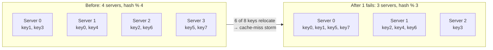
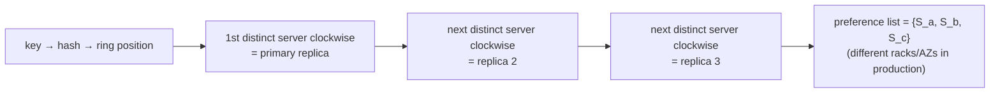

# 🔗 Consistent Hashing — The Complete, Readable Guide

*How distributed systems add and remove servers without moving all their data — and how to explain it like a staff engineer.*

Every distributed system that grows past a single machine eventually faces the same question: *given a key, which server holds its data?* It sounds trivial. You have a user ID, you have ten cache servers, you need to pick one — and pick the *same* one every time, quickly, from any client. The naive answer works beautifully right up until the moment your cluster changes size, and then it fails so badly it can take the whole system down with it.

Consistent hashing is the technique that fixes this. It is not a big algorithm — a ring, a hash function, and a clockwise walk — yet it quietly underpins Amazon DynamoDB, Apache Cassandra, Discord, Akamai's CDN, Google's Maglev load balancer, Memcached and Redis clusters. When an interviewer asks you to "design a distributed cache" or "shard a database," the moment you say *consistent hashing* they're checking whether you actually understand it or just know the phrase.

By the end of this guide you won't just know what consistent hashing is; you'll understand *why every design decision inside it exists* — why the ring, why virtual nodes, why a TreeMap, why replication walks clockwise — and you'll be able to defend those choices under the follow-up questions a strong interviewer will push on.

> **How to read this guide.** It's written to be read start to finish, each section answering the question the previous one leaves open — but the table of contents lets you jump anywhere. Throughout you'll find **📖 "In plain English"** boxes: short, simplified recaps of each big idea, sitting *beside* the technical detail rather than replacing it. Java implementations are tucked into collapsible blocks so the prose stays readable. Near the end there's a **⚡ Quick Revision** to reread before an interview, a **💡 Q&A bank** of the twenty questions you're most likely to face, and **📝 STAR stories** for the behavioral round.
>
> **Prerequisite:** a basic feel for what a hash function is. If that's fuzzy, the first section rebuilds it from scratch.

---

## 📋 Table of Contents

*Part I — Why Consistent Hashing Exists*

1. [What a hash function actually gives you](#-1-what-a-hash-function-actually-gives-you)
2. [The naive approach: hash modulo N](#-2-the-naive-approach-hash-modulo-n)
3. [The rehashing problem, concretely](#-3-the-rehashing-problem-concretely)
4. [The goal, stated precisely](#-4-the-goal-stated-precisely)

*Part II — How Consistent Hashing Works*

5. [The core idea: hash servers too](#-5-the-core-idea-hash-servers-too)
6. [The hash ring](#-6-the-hash-ring)
7. [Placing servers and keys on the ring](#-7-placing-servers-and-keys-on-the-ring)
8. [The lookup: walk clockwise](#-8-the-lookup-walk-clockwise)
9. [Adding a server](#-9-adding-a-server)
10. [Removing a server](#-10-removing-a-server)

*Part III — The Hard Parts*

11. [Two problems with the basic ring](#-11-two-problems-with-the-basic-ring)
12. [Virtual nodes to the rescue](#-12-virtual-nodes-to-the-rescue)
13. [How many virtual nodes? The real tradeoff](#-13-how-many-virtual-nodes-the-real-tradeoff)
14. [Finding the affected keys](#-14-finding-the-affected-keys)
15. [Making lookup fast: the TreeMap](#-15-making-lookup-fast-the-treemap)
16. [A complete Java implementation, walked through](#-16-a-complete-java-implementation-walked-through)

*Part IV — Production Reality*

17. [Replication: storing each key on N servers](#-17-replication-storing-each-key-on-n-servers)
18. [The hot-key problem consistent hashing cannot solve](#-18-the-hot-key-problem-consistent-hashing-cannot-solve)
19. [Bounded loads and other refinements](#-19-bounded-loads-and-other-refinements)
20. [Alternatives: rendezvous and jump hashing](#-20-alternatives-rendezvous-and-jump-hashing)

*Part V — Mastery*

21. [Consistent hashing in the wild](#-21-consistent-hashing-in-the-wild)
22. [Myths worth unlearning](#-22-myths-worth-unlearning)
23. [What separates a staff engineer's answer](#-23-what-separates-a-staff-engineers-answer)
24. [Where to go next: adjacent concepts](#-24-where-to-go-next-adjacent-concepts)
25. [Quick Revision](#-quick-revision)
26. [The Interview Q&A Bank (20 questions)](#-the-interview-qa-bank)
27. [STAR stories for behavioral rounds](#-star-stories-for-behavioral-rounds)
28. [The one-page memory sheet](#-the-one-page-memory-sheet)

---

# Part I — Why Consistent Hashing Exists

Picture a cache sitting in front of your database, quietly absorbing millions of reads a second. One server in that cache tier dies — or, just as often, you add one to keep up with growth — and within seconds the database is drowning. Requests that used to be served from memory now miss the cache all at once, fall through to the database in a single surge, and the latency graph climbs off the top of the screen. Nobody wrote a bug; the cluster simply changed size. That is the pain consistent hashing removes, and the cruel part is that it strikes precisely when you're trying to *help* the system by giving it more capacity. To see why a routine resize does this much damage — and how a ring and a clockwise walk defuse it entirely — we build up from the naive approach and watch exactly where it breaks.

## 🎯 1. What a hash function actually gives you

A hash function takes an input of any size — a username, a URL, a byte array — and returns a fixed-size number, deterministically. The same input always produces the same output, and a good hash function scatters its outputs so evenly that flipping a single character in the input produces a completely different number. `MD5`, `SHA-1`, and `MurmurHash` are common choices; MurmurHash is popular in distributed systems because it's fast and distributes well, while SHA-1 is used where a wider, more uniform output space matters.

Two properties are the whole reason hashing is useful for locating data:

1. **Determinism.** Because `hash("user123")` always yields the same number, any client anywhere can compute where a key lives without asking a coordinator — no central lookup table, no network round trip.
2. **Uniformity.** A good hash spreads keys evenly across its output range, so if you split that range into buckets, each bucket gets roughly the same share of keys.

Those two properties — *compute the location locally, and expect an even spread* — are what every scheme in this guide is trying to preserve.

The output range is larger than people expect. SHA-1 produces values from `0` to `2¹⁶⁰ − 1`. That enormous space matters later; for now, just hold onto the idea that a hash turns any key into a point in a very large numeric range.

<details>
<summary>📖 In plain English</summary>

A hash function is a machine that turns any piece of text into a number, and it always gives the same number for the same text. Feed it `"user123"` and you might get `4,102,838,213` every single time. Two things make it useful: everyone who runs the function gets the identical answer without coordinating, and the answers spread out evenly instead of clumping. Those two facts are what let us use a hash to decide which server owns a piece of data.

</details>

## 🎯 2. The naive approach: hash modulo N

Suppose you're running a cache in front of a database — imagine you're Netflix caching users' watch history — and the data has outgrown a single machine. You spin up `N` cache servers and need a rule for which server stores which user's data. The obvious rule, and the one nearly everyone reaches for first, is *hash the key and take it modulo the number of servers*:

```
serverIndex = hash(key) % N
```

With four servers, a key that hashes to `17` lands on `17 % 4 = 1`, so it lives on server 1. Any client can compute this instantly, it's perfectly deterministic, and because a good hash is uniform, the keys spread evenly across all four servers. Here is a concrete distribution of eight keys across four servers, exactly as the modulo rule assigns them:

| key | hash | `hash % 4` → server |
|------|------------|:---:|
| key0 | 18358617 | **1** |
| key1 | 26143584 | **0** |
| key2 | 18131146 | **2** |
| key3 | 35863496 | **0** |
| key4 | 34085809 | **1** |
| key5 | 27581703 | **3** |
| key6 | 38164978 | **2** |
| key7 | 22530351 | **3** |

Two keys per server, beautifully balanced. To read `key0`, a client computes `hash("key0") % 4 = 1` and talks to server 1. No coordinator, no lookup table, constant-time routing. This works so well that it's genuinely the right answer *when the number of servers never changes*. The catch — and it is a brutal one — is hiding inside that little `N`.

<details>
<summary>📖 In plain English</summary>

You have four cache servers and millions of keys. To decide where a key goes, you hash it into a big number and divide by four, keeping the remainder — 0, 1, 2, or 3. That remainder is the server. It's fast, needs no central directory, and spreads keys evenly. As long as you always have exactly four servers, the same key always lands on the same server. The problem is what that "four" does to you the day it becomes three or five.

</details>

## 🎯 3. The rehashing problem, concretely

Now a server fails. You had four, now you have three, so the rule becomes `hash(key) % 3`. The hashes themselves haven't changed — `hash("key0")` is still `18358617` — but the divisor did, and that changes almost every answer. Here's the same eight keys under the new rule:

| key | hash | `hash % 4` (before) | `hash % 3` (after) | moved? |
|------|------------|:---:|:---:|:---:|
| key0 | 18358617 | 1 | 0 | ✅ |
| key1 | 26143584 | 0 | 0 | — |
| key2 | 18131146 | 2 | 1 | ✅ |
| key3 | 35863496 | 0 | 2 | ✅ |
| key4 | 34085809 | 1 | 1 | — |
| key5 | 27581703 | 3 | 0 | ✅ |
| key6 | 38164978 | 2 | 1 | ✅ |
| key7 | 22530351 | 3 | 0 | ✅ |

Six of the eight keys moved to a different server. Only `key1` and `key4` stayed put, and that's luck, not design. This is the **rehashing problem**: changing `N` changes the modulo for *every* key, so nearly all of them get reassigned — not just the keys that lived on the failed server, but keys on healthy servers that never should have been touched.

Play out why this is catastrophic in a real cache. Every one of those relocated keys is now looked up on a server that doesn't have it. That's a **cache miss**, so the request falls through to the database. And this isn't one miss — it's a simultaneous, cluster-wide *storm* of misses, because a single membership change invalidated most of the cache at once. The database, which the cache existed to protect, is suddenly asked to serve the traffic of the entire cache tier in a thundering surge. Under that load it slows, queues back up, and can crash outright — turning a routine server replacement into a full outage.

Crucially, this is not a failure-only problem — **adding** a server to handle growth triggers the exact same storm. Scale up from four servers to five and the rule becomes `hash(key) % 5`; the divisor changes for every key, so `key0` (`18358617`) moves from `% 4 = 1` to `% 5 = 2`, and it takes most of its neighbors with it. In general, going from `N` to `N+1` servers leaves only about `1/(N+1)` of the keys on their original server — for the four-to-five case that's roughly **80% of keys relocating**, all of them cache-missing at once. So the intended remedy for load (add capacity) becomes the very thing that overloads the database. You are punished for scaling in either direction, which is why modulo hashing is safe only for a cluster whose size never changes.



The deep reason this hurts is that the modulo scheme couples *the identity of every key's server* to *the total count of servers*. Those two things have no business being linked — losing one machine shouldn't have any bearing on where an unrelated key lives on a healthy machine — yet `% N` welds them together. Fix that coupling and the whole problem dissolves. That is exactly what consistent hashing does.

<details>
<summary>📖 In plain English</summary>

You lose one of four servers, so your formula divides by three instead of four. That one change reshuffles almost every key, because dividing by a different number gives a different remainder for nearly all of them. Keys that had no connection to the dead server suddenly need to move too. In a cache, every moved key means the data is now looked up on a server that doesn't have it — a miss — and all those misses hit the database at once, which can knock it over. Adding a server to grow causes the same mess. That's the problem consistent hashing was invented to kill.

</details>

## 🎯 4. The goal, stated precisely

It helps to write down exactly what we want before we build it, because the definition is also the yardstick you'll be judged against in an interview. The classic formulation comes from Karger et al. at MIT, who introduced consistent hashing in 1997 for distributed web caching:

> When the hash table is resized — a server added or removed — only **k/n** keys need to be remapped on average, where *k* is the number of keys and *n* is the number of servers. Traditional hashing remaps nearly all *k* keys.

Sit with that contrast. With `% N`, removing one of four servers remaps roughly **75%** of all keys. With consistent hashing, removing one of four remaps only about **25%** — just that server's share — and every other key stays exactly where it was. The improvement grows with scale: remove one server from a cluster of a thousand and consistent hashing touches roughly a *thousandth* of your keys, while modulo hashing would touch essentially all of them.

So the target is a mapping from keys to servers with three properties. It must be **stable** — a change in cluster size disturbs only a small, bounded fraction of keys. It must be **balanced** — keys spread roughly evenly across servers, the good property we don't want to lose. And it must stay **coordinator-free** — any client can compute a key's location locally, without asking a central authority. Hold these three up as a checklist; everything in Part II is engineered to satisfy them, and the two problems in Part III are cases where the *basic* design satisfies stability but not balance.

<details>
<summary>📖 In plain English</summary>

Here's the scorecard. When a server joins or leaves, we want almost all keys to stay put — only that server's fair share should move. We still want keys spread evenly so no machine is overloaded. And any client should be able to figure out where a key lives on its own, with no central directory to ask. Stable, balanced, and coordinator-free: if a design hits all three, it's what we're after.

</details>

---

# Part II — How Consistent Hashing Works

We now build the mechanism piece by piece. The design is genuinely small — you can hold all of it in your head — so the goal here is not to memorize steps but to see *why* each step is exactly what it takes to satisfy the stable-balanced-coordinator-free checklist from the last section.

## 🎯 5. The core idea: hash servers too

Go back to what actually broke the naive scheme. In the modulo approach we hashed *keys*, but we treated *servers* as a plain list indexed `0..N-1` — and that list is exactly what `% N` counts. Every key's location was computed by dividing by the size of that list, which is why the moment the list grew or shrank, every answer changed. The failure wasn't the hashing; it was that server *count* was baked into the formula. So the fix writes itself: get the count out of the formula.

Here is the single insight that does it. **Hash the servers too** — run each server's identity through the very same hash function, into the very same output range, that you use for keys. Now servers and keys are not two different kinds of thing (one a list, one a hash); they are both just points in one shared numeric space. And once they live in the same space, you can assign a key to a server by *position* instead of by *index*: a key belongs to whichever server sits nearest to it, by a fixed rule we'll pin down in a moment.

Watch what this buys you. When a server disappears, only the keys that were nearest to *that* server need a new home; every other key is still nearest to the same server as before, because no position moved — not the surviving servers' and not the keys'. Nothing depends on how many servers there are anymore, only on where they sit. That is the entire trick. Everything that follows — the ring, the clockwise walk — is just the most convenient way to make "nearest by position" precise and unambiguous.

<details>
<summary>📖 In plain English</summary>

Instead of numbering the servers 0, 1, 2, 3 and dividing by how many there are, we run the servers through the *same* hash function we use on keys. Now servers and keys are both just points in one big number space. A key is owned by the server closest to it. If a server vanishes, only the keys huddled around that spot need to move — everyone else is still next to the same server as before. Nothing depends on the total number of servers anymore.

</details>

## 🎯 6. The hash ring

Take the hash function's output range — for SHA-1 that's `0` to `2¹⁶⁰ − 1` — and draw it as a straight line, `x₀` on the left and `xₙ` on the right. Now bend that line into a circle so the two ends meet: the largest value wraps around and touches zero. That circle is the **hash ring** (also called the hash space or the ring). It's not a physical structure; it's a mental model and a few lines of code, but it's the coordinate system everything else lives in.

<p align="center">
<svg xmlns="http://www.w3.org/2000/svg" width="100%" height="auto" style="max-width:600px;height:auto;" viewBox="0 0 600 500" font-family="Segoe UI,Helvetica,Arial,sans-serif"><rect width="600" height="500" fill="#ffffff"/><defs><marker id="ah" markerWidth="10" markerHeight="10" refX="8" refY="3" orient="auto" markerUnits="strokeWidth"><path d="M0,0 L8,3 L0,6 Z" fill="#111111"/></marker><marker id="ap" markerWidth="10" markerHeight="10" refX="8" refY="3" orient="auto" markerUnits="strokeWidth"><path d="M0,0 L8,3 L0,6 Z" fill="#F45BE8"/></marker></defs><text x="300.0" y="30" text-anchor="middle" font-size="17" font-weight="700" fill="#1a1a1a">From hash space to a ring</text><line x1="70" y1="120" x2="530" y2="120" stroke="#5f5f5f" stroke-width="3"/><line x1="70" y1="112" x2="70" y2="128" stroke="#5f5f5f" stroke-width="3"/><line x1="530" y1="112" x2="530" y2="128" stroke="#5f5f5f" stroke-width="3"/><text x="70" y="150" text-anchor="middle" font-size="13" fill="#1a1a1a">x₀ = 0</text><text x="530" y="150" text-anchor="middle" font-size="13" fill="#1a1a1a">xₙ = 2¹⁶⁰−1</text><text x="300" y="105" text-anchor="middle" font-size="12" fill="#777">hash output range (a straight line)</text><text x="300" y="185" text-anchor="middle" font-size="13" fill="#777">bend both ends together →</text><circle cx="300" cy="330" r="110" fill="none" stroke="#5f5f5f" stroke-width="3"/><circle cx="300" cy="220" r="6" fill="#5f5f5f"/><text x="300" y="208" text-anchor="middle" font-size="12" fill="#1a1a1a">x₀ = xₙ (ends meet)</text><text x="300.0" y="478" text-anchor="middle" font-size="12.5" fill="#555">A line has two ends; a ring has none — every point has a next point clockwise.</text></svg>
<br/><em>From hash space to a ring: bend the line of hash values into a circle so the ends meet</em>
</p>

The reason a ring and not a line is that a line has two ends, and an endpoint is a special case you'd have to handle: what owns the keys past the last server? On a ring there are no ends. Every position has a well-defined "next position clockwise," and when you pass the top of the ring you simply wrap back to zero. That wrap-around is what makes the assignment rule uniform for every key with no exceptions — the key sitting just before `2¹⁶⁰ − 1` is handled by the same rule as the key sitting at `5`.

<details>
<summary>📖 In plain English</summary>

Picture the whole range of possible hash numbers as a number line, then curl it into a circle so the biggest number loops back to zero. That circle is the ring. We use a circle instead of a straight line for one reason: a line has two ends, and ends are awkward — you'd have to decide who owns the keys past the last server. A circle has no ends, so the same simple rule works everywhere, including at the wrap-around point.

</details>

## 🎯 7. Placing servers and keys on the ring

Placing things on the ring is just hashing. To place a **server**, hash a stable identifier for it — its IP address or hostname — and drop it at that position on the circle. Do this for all your servers and they scatter around the ring. To place a **key**, hash the key the same way and drop it at its position. Note the crucial difference from the modulo scheme: there is **no `% N` step** here. We use the raw hash value directly as a position. The modulo is exactly the part we deleted, and deleting it is what breaks the dependency on server count.

The diagram below shows four servers `s0…s3` and four keys `k0…k3` placed on the same ring. Servers are the colored nodes; keys are the small black-ringed nodes sitting in the gaps between them.

<p align="center">
<svg xmlns="http://www.w3.org/2000/svg" width="100%" height="auto" style="max-width:600px;height:auto;" viewBox="0 0 600 500" font-family="Segoe UI,Helvetica,Arial,sans-serif"><rect width="600" height="500" fill="#ffffff"/><defs><marker id="ah" markerWidth="10" markerHeight="10" refX="8" refY="3" orient="auto" markerUnits="strokeWidth"><path d="M0,0 L8,3 L0,6 Z" fill="#111111"/></marker><marker id="ap" markerWidth="10" markerHeight="10" refX="8" refY="3" orient="auto" markerUnits="strokeWidth"><path d="M0,0 L8,3 L0,6 Z" fill="#F45BE8"/></marker></defs><text x="300.0" y="30" text-anchor="middle" font-size="17" font-weight="700" fill="#1a1a1a">Servers and keys placed on the ring</text><circle cx="300" cy="250" r="175" fill="none" stroke="#5f5f5f" stroke-width="3"/><text x="18" y="56" font-size="12" font-weight="700" fill="#555">Servers</text><rect x="18" y="59" width="15" height="15" rx="3" fill="#B7A8D6" stroke="#333"/><text x="40" y="71" font-size="12" fill="#333">server 0</text><rect x="18" y="85" width="15" height="15" rx="3" fill="#3FC1E0" stroke="#333"/><text x="40" y="97" font-size="12" fill="#333">server 1</text><rect x="18" y="111" width="15" height="15" rx="3" fill="#F45BE8" stroke="#333"/><text x="40" y="123" font-size="12" fill="#333">server 2</text><rect x="18" y="137" width="15" height="15" rx="3" fill="#F5A94E" stroke="#333"/><text x="40" y="149" font-size="12" fill="#333">server 3</text><circle cx="387.5" cy="98.4" r="20" fill="#B7A8D6" stroke="#333" stroke-width="1.5"/><text x="387.5" y="102.4" text-anchor="middle" font-size="13" font-weight="700" fill="#1a1a1a">s0</text><circle cx="451.6" cy="337.5" r="20" fill="#3FC1E0" stroke="#333" stroke-width="1.5"/><text x="451.6" y="341.5" text-anchor="middle" font-size="13" font-weight="700" fill="#1a1a1a">s1</text><circle cx="212.5" cy="401.6" r="20" fill="#F45BE8" stroke="#333" stroke-width="1.5"/><text x="212.5" y="405.6" text-anchor="middle" font-size="13" font-weight="700" fill="#1a1a1a">s2</text><circle cx="148.4" cy="162.5" r="20" fill="#F5A94E" stroke="#333" stroke-width="1.5"/><text x="148.4" y="166.5" text-anchor="middle" font-size="13" font-weight="700" fill="#1a1a1a">s3</text><circle cx="254.7" cy="81.0" r="13" fill="white" stroke="#1a1a1a" stroke-width="3" opacity="1"/><text x="254.7" y="85.0" text-anchor="middle" font-size="11" font-weight="700" fill="#1a1a1a" opacity="1">k0</text><circle cx="469.0" cy="204.7" r="13" fill="white" stroke="#1a1a1a" stroke-width="3" opacity="1"/><text x="469.0" y="208.7" text-anchor="middle" font-size="11" font-weight="700" fill="#1a1a1a" opacity="1">k1</text><circle cx="345.3" cy="419.0" r="13" fill="white" stroke="#1a1a1a" stroke-width="3" opacity="1"/><text x="345.3" y="423.0" text-anchor="middle" font-size="11" font-weight="700" fill="#1a1a1a" opacity="1">k2</text><circle cx="131.0" cy="295.3" r="13" fill="white" stroke="#1a1a1a" stroke-width="3" opacity="1"/><text x="131.0" y="299.3" text-anchor="middle" font-size="11" font-weight="700" fill="#1a1a1a" opacity="1">k3</text><text x="300.0" y="478" text-anchor="middle" font-size="12.5" fill="#555">Colored = servers (hashed by IP).  Black-ringed = keys (hashed the same way).</text></svg>
<br/><em>Four servers and four keys placed on the same hash ring</em>
</p>

Both servers and keys are now points in the same space, positioned only by their hashes. Nothing yet says which key belongs to which server — that's the next, and final, rule.

<details>
<summary>📖 In plain English</summary>

To put a server on the ring, hash its name or IP and place it wherever that number lands. To put a key on the ring, hash the key and place it wherever *that* number lands. Same function, same circle. The one change from the old approach: we skip the "divide by number of servers" step and use the raw hash as the position. Now servers and keys are scattered around the same circle, and we just need a rule connecting each key to a server.

</details>

## 🎯 8. The lookup: walk clockwise

The assignment rule is a single sentence: **to find a key's server, start at the key's position and walk clockwise around the ring until you hit a server — that server owns the key.** Equivalently, each server owns the arc of the ring that ends at its position, sweeping counter-clockwise back to the previous server. Every key that falls in that arc belongs to it.

Applying this to the four keys above: from `k0` you walk clockwise and reach `s0`, so `k0` lives on server 0; `k1` reaches `s1`; `k2` reaches `s2`; `k3` reaches `s3`. Each key's clockwise arrow lands on its owning server.

<p align="center">
<svg xmlns="http://www.w3.org/2000/svg" width="100%" height="auto" style="max-width:600px;height:auto;" viewBox="0 0 600 500" font-family="Segoe UI,Helvetica,Arial,sans-serif"><rect width="600" height="500" fill="#ffffff"/><defs><marker id="ah" markerWidth="10" markerHeight="10" refX="8" refY="3" orient="auto" markerUnits="strokeWidth"><path d="M0,0 L8,3 L0,6 Z" fill="#111111"/></marker><marker id="ap" markerWidth="10" markerHeight="10" refX="8" refY="3" orient="auto" markerUnits="strokeWidth"><path d="M0,0 L8,3 L0,6 Z" fill="#F45BE8"/></marker></defs><text x="300.0" y="30" text-anchor="middle" font-size="17" font-weight="700" fill="#1a1a1a">Lookup: walk clockwise to the next server</text><circle cx="300" cy="250" r="175" fill="none" stroke="#5f5f5f" stroke-width="3"/><text x="18" y="56" font-size="12" font-weight="700" fill="#555">Servers</text><rect x="18" y="59" width="15" height="15" rx="3" fill="#B7A8D6" stroke="#333"/><text x="40" y="71" font-size="12" fill="#333">server 0</text><rect x="18" y="85" width="15" height="15" rx="3" fill="#3FC1E0" stroke="#333"/><text x="40" y="97" font-size="12" fill="#333">server 1</text><rect x="18" y="111" width="15" height="15" rx="3" fill="#F45BE8" stroke="#333"/><text x="40" y="123" font-size="12" fill="#333">server 2</text><rect x="18" y="137" width="15" height="15" rx="3" fill="#F5A94E" stroke="#333"/><text x="40" y="149" font-size="12" fill="#333">server 3</text><circle cx="387.5" cy="98.4" r="20" fill="#B7A8D6" stroke="#333" stroke-width="1.5"/><text x="387.5" y="102.4" text-anchor="middle" font-size="13" font-weight="700" fill="#1a1a1a">s0</text><circle cx="451.6" cy="337.5" r="20" fill="#3FC1E0" stroke="#333" stroke-width="1.5"/><text x="451.6" y="341.5" text-anchor="middle" font-size="13" font-weight="700" fill="#1a1a1a">s1</text><circle cx="212.5" cy="401.6" r="20" fill="#F45BE8" stroke="#333" stroke-width="1.5"/><text x="212.5" y="405.6" text-anchor="middle" font-size="13" font-weight="700" fill="#1a1a1a">s2</text><circle cx="148.4" cy="162.5" r="20" fill="#F5A94E" stroke="#333" stroke-width="1.5"/><text x="148.4" y="166.5" text-anchor="middle" font-size="13" font-weight="700" fill="#1a1a1a">s3</text><circle cx="254.7" cy="81.0" r="13" fill="white" stroke="#1a1a1a" stroke-width="3" opacity="1"/><text x="254.7" y="85.0" text-anchor="middle" font-size="11" font-weight="700" fill="#1a1a1a" opacity="1">k0</text><circle cx="469.0" cy="204.7" r="13" fill="white" stroke="#1a1a1a" stroke-width="3" opacity="1"/><text x="469.0" y="208.7" text-anchor="middle" font-size="11" font-weight="700" fill="#1a1a1a" opacity="1">k1</text><circle cx="345.3" cy="419.0" r="13" fill="white" stroke="#1a1a1a" stroke-width="3" opacity="1"/><text x="345.3" y="423.0" text-anchor="middle" font-size="11" font-weight="700" fill="#1a1a1a" opacity="1">k2</text><circle cx="131.0" cy="295.3" r="13" fill="white" stroke="#1a1a1a" stroke-width="3" opacity="1"/><text x="131.0" y="299.3" text-anchor="middle" font-size="11" font-weight="700" fill="#1a1a1a" opacity="1">k3</text><path d="M262.5,109.9 A145,145 0 0,1 363.6,119.7" fill="none" stroke="#111111" stroke-width="3" marker-end="url(#ah)"/><path d="M440.1,212.5 A145,145 0 0,1 430.3,313.6" fill="none" stroke="#111111" stroke-width="3" marker-end="url(#ah)"/><path d="M337.5,390.1 A145,145 0 0,1 236.4,380.3" fill="none" stroke="#111111" stroke-width="3" marker-end="url(#ah)"/><path d="M159.9,287.5 A145,145 0 0,1 169.7,186.4" fill="none" stroke="#111111" stroke-width="3" marker-end="url(#ah)"/><text x="300.0" y="478" text-anchor="middle" font-size="12.5" fill="#555">k0→s0, k1→s1, k2→s2, k3→s3.  Each key stops at the first server clockwise.</text></svg>
<br/><em>Clockwise lookup: each key walks clockwise to the first server it meets</em>
</p>

Why *clockwise* specifically, and not "nearest server in either direction"? Because a single, fixed direction gives every position on the ring exactly one deterministic answer with no tie-breaking, and it makes the ownership arcs contiguous — each server owns one unbroken segment ending at itself. "Nearest in either direction" would fragment ownership into split responsibilities around each server and force a rule for midpoint ties. Clockwise-only is simpler, unambiguous, and — as you'll see when we add and remove servers — makes the set of affected keys a single clean arc every time. (The direction is a convention; counter-clockwise works identically as long as everyone agrees on it.)

<details>
<summary>📖 In plain English</summary>

The rule for finding a key's server: stand on the key's spot and move clockwise around the circle until you bump into a server. That's the one. Put another way, each server is responsible for the stretch of ring leading up to it. We always go one direction — clockwise — so every key has exactly one owner with no ties to break, and each server owns one clean, continuous slice of the ring.

</details>

<details>
<summary>💻 Java: a minimal consistent-hash ring (no virtual nodes yet)</summary>

```java
import java.util.SortedMap;
import java.util.TreeMap;
import java.nio.charset.StandardCharsets;
import java.security.MessageDigest;

/**
 * Bare-bones consistent hashing: one point per server on the ring.
 * This version has the "uneven partition" weakness we fix later with
 * virtual nodes — but it shows the core ring + clockwise-walk clearly.
 */
public class BasicHashRing {

    // The ring: hash position -> server name, kept sorted by position.
    private final SortedMap<Long, String> ring = new TreeMap<>();

    public void addServer(String server) {
        ring.put(hash(server), server);      // hash the server's identity
    }

    public void removeServer(String server) {
        ring.remove(hash(server));
    }

    /** Find the server that owns a key: walk clockwise to the next node. */
    public String getServer(String key) {
        if (ring.isEmpty()) return null;
        long h = hash(key);
        // tailMap gives all entries with position >= h  (i.e. clockwise from key)
        SortedMap<Long, String> tail = ring.tailMap(h);
        // If nothing is clockwise before the top, wrap around to the first node.
        Long owner = tail.isEmpty() ? ring.firstKey() : tail.firstKey();
        return ring.get(owner);
    }

    /** SHA-1 -> first 8 bytes as an unsigned-ish long position on the ring. */
    private long hash(String value) {
        try {
            MessageDigest md = MessageDigest.getInstance("SHA-1");
            byte[] digest = md.digest(value.getBytes(StandardCharsets.UTF_8));
            long h = 0;
            for (int i = 0; i < 8; i++) {
                h = (h << 8) | (digest[i] & 0xFF);
            }
            return h & Long.MAX_VALUE;        // keep it non-negative
        } catch (Exception e) {
            throw new RuntimeException(e);
        }
    }

    // --- Demo -------------------------------------------------------------
    public static void main(String[] args) {
        BasicHashRing ring = new BasicHashRing();
        ring.addServer("serverA");
        ring.addServer("serverB");
        ring.addServer("serverC");

        String[] keys = {"apple", "banana", "cherry", "date"};
        System.out.println("-- initial placement (3 servers) --");
        for (String k : keys) {
            System.out.println("  " + k + " -> " + ring.getServer(k));
        }

        System.out.println("-- after removing serverB --");
        ring.removeServer("serverB");
        for (String k : keys) {
            System.out.println("  " + k + " -> " + ring.getServer(k));
        }
    }
}
```

Running the `main` above produces:

```text
-- initial placement (3 servers) --
  apple -> serverB
  banana -> serverC
  cherry -> serverA
  date -> serverB
-- after removing serverB --
  apple -> serverA
  banana -> serverC
  cherry -> serverA
  date -> serverA
```

Read the two blocks side by side. On the ring the servers sit at positions `serverA < serverC < serverB` (by hash), so `cherry`, whose hash is larger than every server position, wraps past the top back to `serverA` — that's the wrap-around branch firing. When `serverB` is removed, only the keys it owned (`apple`, `date`) move; they walk clockwise to the next surviving server (`serverA`), while `banana` and `cherry` don't budge at all. Two of four keys moved, and they were *exactly* the ones on the departed server — the whole promise of consistent hashing, visible in one run.

The `tailMap` + wrap-to-`firstKey` pattern *is* the clockwise walk, and the `TreeMap` makes it `O(log N)` instead of a linear scan — we return to why that data structure matters in section 15.

</details>

## 🎯 9. Adding a server

Now the payoff. Suppose the cluster is under load and you add server 4 (`s4`), which hashes to a position between `s3` and `s0` — just counter-clockwise of `s0`. Which keys move? Only the keys that fall in the new arc: those sitting between `s3` and the new `s4`. In the classic example, that's exactly one key, `k0`. Before, `k0` walked clockwise past its position all the way to `s0`; now it hits `s4` first, so `k0` moves from server 0 to server 4. Keys `k1`, `k2`, and `k3` don't move at all — their clockwise walks are completely unchanged because nothing was inserted in their arcs.

<p align="center">
<svg xmlns="http://www.w3.org/2000/svg" width="100%" height="auto" style="max-width:600px;height:auto;" viewBox="0 0 600 500" font-family="Segoe UI,Helvetica,Arial,sans-serif"><rect width="600" height="500" fill="#ffffff"/><defs><marker id="ah" markerWidth="10" markerHeight="10" refX="8" refY="3" orient="auto" markerUnits="strokeWidth"><path d="M0,0 L8,3 L0,6 Z" fill="#111111"/></marker><marker id="ap" markerWidth="10" markerHeight="10" refX="8" refY="3" orient="auto" markerUnits="strokeWidth"><path d="M0,0 L8,3 L0,6 Z" fill="#F45BE8"/></marker></defs><text x="300.0" y="30" text-anchor="middle" font-size="17" font-weight="700" fill="#1a1a1a">Add server 4: only key0 moves</text><circle cx="300" cy="250" r="175" fill="none" stroke="#5f5f5f" stroke-width="3"/><text x="18" y="56" font-size="12" font-weight="700" fill="#555">Servers</text><rect x="18" y="59" width="15" height="15" rx="3" fill="#B7A8D6" stroke="#333"/><text x="40" y="71" font-size="12" fill="#333">server 0</text><rect x="18" y="85" width="15" height="15" rx="3" fill="#3FC1E0" stroke="#333"/><text x="40" y="97" font-size="12" fill="#333">server 1</text><rect x="18" y="111" width="15" height="15" rx="3" fill="#F45BE8" stroke="#333"/><text x="40" y="123" font-size="12" fill="#333">server 2</text><rect x="18" y="137" width="15" height="15" rx="3" fill="#F5A94E" stroke="#333"/><text x="40" y="149" font-size="12" fill="#333">server 3</text><rect x="18" y="163" width="15" height="15" rx="3" fill="#25B15E" stroke="#333"/><text x="40" y="175" font-size="12" fill="#333">server 4 (new)</text><circle cx="387.5" cy="98.4" r="20" fill="#B7A8D6" stroke="#333" stroke-width="1.5"/><text x="387.5" y="102.4" text-anchor="middle" font-size="13" font-weight="700" fill="#1a1a1a">s0</text><circle cx="451.6" cy="337.5" r="20" fill="#3FC1E0" stroke="#333" stroke-width="1.5"/><text x="451.6" y="341.5" text-anchor="middle" font-size="13" font-weight="700" fill="#1a1a1a">s1</text><circle cx="212.5" cy="401.6" r="20" fill="#F45BE8" stroke="#333" stroke-width="1.5"/><text x="212.5" y="405.6" text-anchor="middle" font-size="13" font-weight="700" fill="#1a1a1a">s2</text><circle cx="148.4" cy="162.5" r="20" fill="#F5A94E" stroke="#333" stroke-width="1.5"/><text x="148.4" y="166.5" text-anchor="middle" font-size="13" font-weight="700" fill="#1a1a1a">s3</text><circle cx="300.0" cy="75.0" r="20" fill="#25B15E" stroke="#333" stroke-width="1.5"/><text x="300.0" y="79.0" text-anchor="middle" font-size="13" font-weight="700" fill="#1a1a1a">s4</text><circle cx="212.5" cy="98.4" r="13" fill="white" stroke="#1a1a1a" stroke-width="3" opacity="1"/><text x="212.5" y="102.4" text-anchor="middle" font-size="11" font-weight="700" fill="#1a1a1a" opacity="1">k0</text><circle cx="469.0" cy="204.7" r="13" fill="white" stroke="#1a1a1a" stroke-width="3" opacity="1"/><text x="469.0" y="208.7" text-anchor="middle" font-size="11" font-weight="700" fill="#1a1a1a" opacity="1">k1</text><circle cx="345.3" cy="419.0" r="13" fill="white" stroke="#1a1a1a" stroke-width="3" opacity="1"/><text x="345.3" y="423.0" text-anchor="middle" font-size="11" font-weight="700" fill="#1a1a1a" opacity="1">k2</text><circle cx="131.0" cy="295.3" r="13" fill="white" stroke="#1a1a1a" stroke-width="3" opacity="1"/><text x="131.0" y="299.3" text-anchor="middle" font-size="11" font-weight="700" fill="#1a1a1a" opacity="1">k3</text><path d="M224.4,107.8 A161,161 0 0,1 294.4,89.1" fill="none" stroke="#25B15E" stroke-width="3" marker-end="url(#ah)"/><text x="300" y="452" text-anchor="middle" font-size="12.5" fill="#25B15E" font-weight="700">k0 remaps s0 → s4</text><text x="300.0" y="478" text-anchor="middle" font-size="12.5" fill="#555">Only k0 (in the new s3→s4 arc) moves. k1, k2, k3 are untouched.</text></svg>
<br/><em>Adding server 4 between s3 and s0: only key0 remaps from s0 to s4</em>
</p>

Here is the mental model for *which* keys are affected, and it's worth internalizing because interviewers ask it directly: the affected range starts at the newly added node and sweeps **counter-clockwise until the previous server**. Keys in that arc — and only that arc — move onto the new server. Everything outside it is provably undisturbed. Contrast this with modulo hashing, where adding a fourth or fifth server reshuffled nearly everything. Here, adding capacity costs you the migration of a single arc's worth of data.

<details>
<summary>📖 In plain English</summary>

You add a new server and it lands somewhere on the circle. Only the keys sitting in the gap just behind it — between the new server and the previous one going backward — need to move onto it. Everybody else's clockwise walk is exactly the same as before, so they don't budge. In the standard picture, adding a server moves just one key out of four. Compare that to the old way, where adding a server moved almost everything.

</details>

## 🎯 10. Removing a server

Removal is the mirror image, and it's the more important case because servers fail unexpectedly far more often than you deliberately remove them. When server 1 (`s1`) goes offline, its position vanishes from the ring. The keys it owned don't disappear — they just continue their clockwise walk past the now-empty spot to the *next* server clockwise. In the example, `k1` had been owned by `s1`; with `s1` gone, `k1` walks on to `s2`. Every other key is untouched, because removing `s1` only changed the walks that used to terminate at `s1`.

<p align="center">
<svg xmlns="http://www.w3.org/2000/svg" width="100%" height="auto" style="max-width:600px;height:auto;" viewBox="0 0 600 500" font-family="Segoe UI,Helvetica,Arial,sans-serif"><rect width="600" height="500" fill="#ffffff"/><defs><marker id="ah" markerWidth="10" markerHeight="10" refX="8" refY="3" orient="auto" markerUnits="strokeWidth"><path d="M0,0 L8,3 L0,6 Z" fill="#111111"/></marker><marker id="ap" markerWidth="10" markerHeight="10" refX="8" refY="3" orient="auto" markerUnits="strokeWidth"><path d="M0,0 L8,3 L0,6 Z" fill="#F45BE8"/></marker></defs><text x="300.0" y="30" text-anchor="middle" font-size="17" font-weight="700" fill="#1a1a1a">Remove server 1: only key1 moves to s2</text><circle cx="300" cy="250" r="175" fill="none" stroke="#5f5f5f" stroke-width="3"/><text x="18" y="56" font-size="12" font-weight="700" fill="#555">Servers</text><rect x="18" y="59" width="15" height="15" rx="3" fill="#B7A8D6" stroke="#333"/><text x="40" y="71" font-size="12" fill="#333">server 0</text><rect x="18" y="85" width="15" height="15" rx="3" fill="#3FC1E0" stroke="#333"/><text x="40" y="97" font-size="12" fill="#333">server 1</text><rect x="18" y="111" width="15" height="15" rx="3" fill="#F45BE8" stroke="#333"/><text x="40" y="123" font-size="12" fill="#333">server 2</text><rect x="18" y="137" width="15" height="15" rx="3" fill="#F5A94E" stroke="#333"/><text x="40" y="149" font-size="12" fill="#333">server 3</text><circle cx="387.5" cy="98.4" r="20" fill="#B7A8D6" stroke="#333" stroke-width="1.5"/><text x="387.5" y="102.4" text-anchor="middle" font-size="13" font-weight="700" fill="#1a1a1a">s0</text><circle cx="451.6" cy="337.5" r="20" fill="none" stroke="#9aa0a6" stroke-width="2" stroke-dasharray="4 3"/><text x="451.6" y="341.5" text-anchor="middle" font-size="12" fill="#9aa0a6">s1✕</text><circle cx="212.5" cy="401.6" r="20" fill="#F45BE8" stroke="#333" stroke-width="1.5"/><text x="212.5" y="405.6" text-anchor="middle" font-size="13" font-weight="700" fill="#1a1a1a">s2</text><circle cx="148.4" cy="162.5" r="20" fill="#F5A94E" stroke="#333" stroke-width="1.5"/><text x="148.4" y="166.5" text-anchor="middle" font-size="13" font-weight="700" fill="#1a1a1a">s3</text><circle cx="254.7" cy="81.0" r="13" fill="white" stroke="#1a1a1a" stroke-width="3" opacity="1"/><text x="254.7" y="85.0" text-anchor="middle" font-size="11" font-weight="700" fill="#1a1a1a" opacity="1">k0</text><circle cx="469.0" cy="204.7" r="13" fill="white" stroke="#1a1a1a" stroke-width="3" opacity="1"/><text x="469.0" y="208.7" text-anchor="middle" font-size="11" font-weight="700" fill="#1a1a1a" opacity="1">k1</text><circle cx="345.3" cy="419.0" r="13" fill="white" stroke="#1a1a1a" stroke-width="3" opacity="1"/><text x="345.3" y="423.0" text-anchor="middle" font-size="11" font-weight="700" fill="#1a1a1a" opacity="1">k2</text><circle cx="131.0" cy="295.3" r="13" fill="white" stroke="#1a1a1a" stroke-width="3" opacity="1"/><text x="131.0" y="299.3" text-anchor="middle" font-size="11" font-weight="700" fill="#1a1a1a" opacity="1">k3</text><path d="M440.1,212.5 A145,145 0 0,1 236.4,380.3" fill="none" stroke="#F45BE8" stroke-width="3" marker-end="url(#ap)"/><text x="300" y="452" text-anchor="middle" font-size="12.5" fill="#F45BE8" font-weight="700">k1 remaps s1 → s2</text><text x="300.0" y="478" text-anchor="middle" font-size="12.5" fill="#555">k1 skips the empty spot and walks on to s2. Every other key is unaffected.</text></svg>
<br/><em>Removing server 1: key1 skips the empty spot and remaps to s2; all other keys unaffected</em>
</p>

The affected range on removal starts at the removed node and sweeps **counter-clockwise until the previous server**; those keys all shift onto the next server clockwise. That "next server clockwise" detail carries a warning that becomes a whole section later: when a server dies, its *entire* load lands on a single neighbor, not spread across the survivors. If that neighbor was already busy, it now carries double — a real imbalance that the basic ring creates and that virtual nodes exist to fix. Hold that thought; it's the bridge into Part III.

<details>
<summary>📖 In plain English</summary>

When a server dies, its spot on the circle disappears and the keys it held simply keep walking clockwise to the next server. Only those keys move; nothing else on the ring notices. The one catch: all of a dead server's keys pile onto its single clockwise neighbor, so that one neighbor suddenly holds twice as much. That lopsidedness is the flaw we fix next.

</details>

---

# Part III — The Hard Parts

The basic ring already solves the headline problem: cluster changes now move a small arc of keys instead of nearly all of them. But "small arc" quietly assumed the arcs are roughly equal, and they aren't. This part is where a textbook explanation stops and where an interviewer starts pushing — because the gap between "I know the ring" and "I've run this in production" is entirely in these sections.

## ❌ 11. Two problems with the basic ring

The basic design satisfies *stability* and *coordinator-free*, but it fails *balance* in two distinct ways, and it's worth separating them precisely because they have the same fix but different causes.

**Problem 1 — Uneven partitions.** Server positions come from hashing IPs, and a hash scatters points *randomly*, not *evenly*. Random placement of a handful of points around a circle almost never produces equal gaps; you get clumps and voids. So one server may own a huge arc while another owns a sliver, meaning the big-arc server holds several times more keys and takes several times more traffic — for identical hardware. It gets worse under churn: even if you started with four evenly spaced servers, the moment `s1` is removed, `s2` inherits `s1`'s arc *on top of* its own, so `s2`'s partition becomes twice the size of `s0`'s and `s3`'s. Failures actively create imbalance.

**Problem 2 — Non-uniform key distribution / hotspots.** Even with servers placed reasonably, if the servers happen to cluster on one side of the ring, most keys sweep clockwise into a few servers while others sit idle. In the pathological case, one server holds nearly all the keys and two others hold none — every server has the same capacity, but the load is wildly skewed. This defeats the entire purpose of distributing data.

<p align="center">
<svg xmlns="http://www.w3.org/2000/svg" width="100%" height="auto" style="max-width:600px;height:auto;" viewBox="0 0 600 500" font-family="Segoe UI,Helvetica,Arial,sans-serif"><rect width="600" height="500" fill="#ffffff"/><defs><marker id="ah" markerWidth="10" markerHeight="10" refX="8" refY="3" orient="auto" markerUnits="strokeWidth"><path d="M0,0 L8,3 L0,6 Z" fill="#111111"/></marker><marker id="ap" markerWidth="10" markerHeight="10" refX="8" refY="3" orient="auto" markerUnits="strokeWidth"><path d="M0,0 L8,3 L0,6 Z" fill="#F45BE8"/></marker></defs><text x="300.0" y="30" text-anchor="middle" font-size="17" font-weight="700" fill="#1a1a1a">Problem: uneven partitions → hotspot</text><circle cx="300" cy="250" r="175" fill="none" stroke="#5f5f5f" stroke-width="3"/><text x="18" y="56" font-size="12" font-weight="700" fill="#555">Servers</text><rect x="18" y="59" width="15" height="15" rx="3" fill="#B7A8D6" stroke="#333"/><text x="40" y="71" font-size="12" fill="#333">server 0</text><rect x="18" y="85" width="15" height="15" rx="3" fill="#3FC1E0" stroke="#333"/><text x="40" y="97" font-size="12" fill="#333">server 1</text><rect x="18" y="111" width="15" height="15" rx="3" fill="#F45BE8" stroke="#333"/><text x="40" y="123" font-size="12" fill="#333">server 2</text><rect x="18" y="137" width="15" height="15" rx="3" fill="#F5A94E" stroke="#333"/><text x="40" y="149" font-size="12" fill="#333">server 3</text><circle cx="359.9" cy="85.6" r="20" fill="#B7A8D6" stroke="#333" stroke-width="1.5"/><text x="359.9" y="89.6" text-anchor="middle" font-size="13" font-weight="700" fill="#1a1a1a">s0</text><circle cx="443.4" cy="149.6" r="20" fill="#3FC1E0" stroke="#333" stroke-width="1.5"/><text x="443.4" y="153.6" text-anchor="middle" font-size="13" font-weight="700" fill="#1a1a1a">s1</text><circle cx="475.0" cy="250.0" r="20" fill="#F45BE8" stroke="#333" stroke-width="1.5"/><text x="475.0" y="254.0" text-anchor="middle" font-size="13" font-weight="700" fill="#1a1a1a">s2</text><circle cx="165.9" cy="362.5" r="20" fill="#F5A94E" stroke="#333" stroke-width="1.5"/><text x="165.9" y="366.5" text-anchor="middle" font-size="13" font-weight="700" fill="#1a1a1a">s3</text><path d="M144.8,371.3 A197,197 0 0,1 360.9,62.6" fill="none" stroke="#e0357a" stroke-width="3" marker-end="url(#ap)"/><text x="300" y="452" text-anchor="middle" font-size="12.5" fill="#e0357a" font-weight="700">s0 owns a ~150° arc; s1 &amp; s2 own tiny slivers</text><text x="300.0" y="478" text-anchor="middle" font-size="12.5" fill="#555">Random hashing clumps servers. One server soaks up most keys — same hardware, skewed load.</text></svg>
<br/><em>Uneven partitions: clustered servers leave one owning a huge arc and soaking up most keys</em>
</p>

Both problems share a root cause: with only *one* point per server, the ring is at the mercy of where a few random hashes happen to land, and a few random points are lumpy. The law of large numbers says lumpiness smooths out with *more* points. That single observation is the entire idea behind the fix.

<details>
<summary>📖 In plain English</summary>

Servers land on the ring at random hash positions, and a few random points are never evenly spaced — some gaps are big, some tiny. The server with a big gap owns more keys and gets more traffic, even though its hardware is identical. Worse, when a server dies, its whole load dumps onto one neighbor, doubling that neighbor's share. And if servers happen to bunch together, a couple of them soak up almost all the keys while others do nothing. The common thread: too few points on the ring means lumpy placement.

</details>

## ✅ 12. Virtual nodes to the rescue

The fix is to stop placing each physical server on the ring once. Instead, place it **many times**, at many different positions, by hashing several labels derived from it — `server0#1`, `server0#2`, `server0#3`, and so on, each producing a different ring position. Each of these positions is a **virtual node** (also called a vnode or replica). A key still does the identical clockwise walk to the nearest node; the only new step is that when it lands on a virtual node, you look up which *physical* server that vnode belongs to.

Why this works is pure statistics. One physical server scattered across, say, 150 positions no longer owns one big-or-small arc; it owns 150 tiny arcs sprinkled all around the ring. The *sum* of 150 random slices is far closer to the fair share than any single slice, because the highs and lows average out — that's the law of large numbers doing the balancing. The more vnodes, the tighter every server's total converges on `1/N` of the ring.

Virtual nodes also fix the failure-imbalance problem elegantly. When a physical server dies, its 150 vnodes vanish from 150 different spots, and each of those little arcs is inherited by whichever *different* server happens to sit clockwise of it. So a dead server's load doesn't dump onto one unlucky neighbor — it spreads across *many* servers, roughly evenly. The same is true in reverse when a server joins: it steals small arcs from many servers instead of gutting one.

<p align="center">
<svg xmlns="http://www.w3.org/2000/svg" width="100%" height="auto" style="max-width:600px;height:auto;" viewBox="0 0 600 500" font-family="Segoe UI,Helvetica,Arial,sans-serif"><rect width="600" height="500" fill="#ffffff"/><defs><marker id="ah" markerWidth="10" markerHeight="10" refX="8" refY="3" orient="auto" markerUnits="strokeWidth"><path d="M0,0 L8,3 L0,6 Z" fill="#111111"/></marker><marker id="ap" markerWidth="10" markerHeight="10" refX="8" refY="3" orient="auto" markerUnits="strokeWidth"><path d="M0,0 L8,3 L0,6 Z" fill="#F45BE8"/></marker></defs><text x="300.0" y="30" text-anchor="middle" font-size="17" font-weight="700" fill="#1a1a1a">Virtual nodes: each server appears many times</text><circle cx="300" cy="250" r="175" fill="none" stroke="#5f5f5f" stroke-width="3"/><text x="18" y="56" font-size="12" font-weight="700" fill="#555">Servers</text><rect x="18" y="59" width="15" height="15" rx="3" fill="#B7A8D6" stroke="#333"/><text x="40" y="71" font-size="12" fill="#333">server 0</text><rect x="18" y="85" width="15" height="15" rx="3" fill="#3FC1E0" stroke="#333"/><text x="40" y="97" font-size="12" fill="#333">server 1</text><circle cx="359.9" cy="85.6" r="19" fill="#B7A8D6" stroke="#333" stroke-width="1.5"/><text x="359.9" y="89.6" text-anchor="middle" font-size="10.5" font-weight="700" fill="#1a1a1a">s0_0</text><circle cx="469.0" cy="204.7" r="19" fill="#3FC1E0" stroke="#333" stroke-width="1.5"/><text x="469.0" y="208.7" text-anchor="middle" font-size="10.5" font-weight="700" fill="#1a1a1a">s1_0</text><circle cx="412.5" cy="384.1" r="19" fill="#B7A8D6" stroke="#333" stroke-width="1.5"/><text x="412.5" y="388.1" text-anchor="middle" font-size="10.5" font-weight="700" fill="#1a1a1a">s0_1</text><circle cx="254.7" cy="419.0" r="19" fill="#3FC1E0" stroke="#333" stroke-width="1.5"/><text x="254.7" y="423.0" text-anchor="middle" font-size="10.5" font-weight="700" fill="#1a1a1a">s1_1</text><circle cx="127.7" cy="280.4" r="19" fill="#B7A8D6" stroke="#333" stroke-width="1.5"/><text x="127.7" y="284.4" text-anchor="middle" font-size="10.5" font-weight="700" fill="#1a1a1a">s0_2</text><circle cx="176.3" cy="126.3" r="19" fill="#3FC1E0" stroke="#333" stroke-width="1.5"/><text x="176.3" y="130.3" text-anchor="middle" font-size="10.5" font-weight="700" fill="#1a1a1a">s1_2</text><text x="300.0" y="478" text-anchor="middle" font-size="12.5" fill="#555">Each physical server owns several small, interleaved slices — load averages out.</text></svg>
<br/><em>Virtual nodes: two servers each appear three times, owning interleaved slices around the ring</em>
</p>

<details>
<summary>📖 In plain English</summary>

Instead of putting each server on the ring once, put it on many times — server 0 shows up as a hundred-plus little dots scattered all around the circle, and so does every other server. A key walks clockwise to the nearest dot, then you check which real server that dot belongs to. Because each server now owns lots of tiny slices spread everywhere, the big-and-small-slice problem averages away. And when a server dies, its many little slices get inherited by many different servers instead of dumping onto one, so the load stays balanced.

</details>

<details>
<summary>💻 Java: consistent hashing with virtual nodes</summary>

```java
import java.util.SortedMap;
import java.util.TreeMap;
import java.util.Collection;
import java.nio.charset.StandardCharsets;
import java.security.MessageDigest;

/**
 * Consistent hashing with virtual nodes.
 * Each physical server is hashed to `replicas` positions on the ring.
 */
public class ConsistentHashRing {

    private final int replicas;                     // vnodes per physical server
    private final SortedMap<Long, String> ring = new TreeMap<>();

    public ConsistentHashRing(int replicas) {
        this.replicas = replicas;                   // e.g. 150
    }

    public void addServer(String server) {
        for (int i = 0; i < replicas; i++) {
            // Distinct label per vnode -> distinct ring position.
            ring.put(hash(server + "#" + i), server);
        }
    }

    public void removeServer(String server) {
        for (int i = 0; i < replicas; i++) {
            ring.remove(hash(server + "#" + i));
        }
    }

    /** Clockwise walk to the nearest vnode, then resolve to its physical server. */
    public String getServer(String key) {
        if (ring.isEmpty()) return null;
        long h = hash(key);
        SortedMap<Long, String> tail = ring.tailMap(h);
        Long node = tail.isEmpty() ? ring.firstKey() : tail.firstKey();
        return ring.get(node);                      // vnode -> physical server
    }

    private long hash(String value) {
        try {
            MessageDigest md = MessageDigest.getInstance("MD5"); // fast, fine for placement
            byte[] d = md.digest(value.getBytes(StandardCharsets.UTF_8));
            long h = 0;
            for (int i = 0; i < 8; i++) h = (h << 8) | (d[i] & 0xFF);
            return h & Long.MAX_VALUE;
        } catch (Exception e) {
            throw new RuntimeException(e);
        }
    }
}
```

The only change from the basic ring is the loop that inserts `replicas` positions per server and the label `server + "#" + i`. Everything else — the `TreeMap`, the clockwise `tailMap` walk, the wrap-around — is identical.

</details>

## 🎯 13. How many virtual nodes? The real tradeoff

"Use virtual nodes" invites the immediate follow-up: *how many?* This is where you show you understand the tradeoff rather than reciting a number. More vnodes means better balance — the standard deviation of load across servers shrinks as you add them. Empirically, with around 100 vnodes per server the spread of load is roughly 10% of the mean, and at 200 it's about 5%; push higher and it keeps tightening. So more is better for balance.

But vnodes aren't free. Every vnode is an entry in the ring's sorted structure, so `V` vnodes per server across `N` servers means `N × V` entries to store, maintain, and search. That's memory for the mapping table and slightly slower lookups (`O(log(N·V))` instead of `O(log N)`), and — more subtly — more state to gossip or replicate when membership changes. So the real answer is: **tune it.** Pick the smallest vnode count that gets your load spread inside an acceptable band for your cluster size. In practice most systems settle somewhere in the **100–500 vnodes per server** range; that's the sweet spot where balance is good and the metadata cost is still modest.

It's worth naming what different real systems actually do, because it signals depth. Amazon's Dynamo paper uses vnodes (they call them "tokens") and assigns many per node. Apache Cassandra defaulted to 256 vnodes per node for years, then moved its recommended default down to **16** with a smarter allocation algorithm, precisely because 256 vnodes made certain operations (streaming, repair, and token metadata) heavier than the balance gain justified — a concrete example of the memory-and-operations side of the tradeoff biting in production.

<details>
<summary>📖 In plain English</summary>

More virtual nodes give a smoother, more even load — around 100 per server gets you within about 10% of perfectly even, 200 within about 5%. But each virtual node is another entry the system has to store and search, and more of them means more bookkeeping when servers come and go. So you don't crank it to infinity; you pick the smallest number that balances well enough. Most systems land between 100 and 500 per server. Cassandra even lowered its default from 256 to 16 because the extra bookkeeping wasn't worth it.

</details>

## 🎯 14. Finding the affected keys

When membership changes, you don't want to rescan every key to see what moved — you want to compute the affected arc directly and touch only those keys. The rule follows straight from the clockwise convention.

**On add:** the affected range starts at the newly inserted node and extends **counter-clockwise back to the previous node** on the ring. Every key in that arc — which previously walked past the new node's position to the *next* server — now stops at the new node, so those keys migrate onto the new server. Nothing outside the arc is touched. (With virtual nodes, "the new node" means each of its vnodes, so the total affected set is the union of many small arcs spread around the ring.)

**On remove:** the affected range starts at the departing node and extends **counter-clockwise back to the previous node**; those keys now walk clockwise past the empty spot to the *next* surviving server. Again, with vnodes this is a union of many small arcs, which is exactly why the departing server's load spreads across many survivors.

Trace it on the two rings below. In **Figure 14**, server 4 (`s4`) is added to the ring. The affected range starts at `s4` — the newly added node — and sweeps **anticlockwise** around the ring until it meets the previous server, `s3`. So the keys sitting between `s3` and `s4` are the only ones redistributed, and they move onto `s4`. Here that's exactly `key0`: it used to walk clockwise past its position all the way to `s0` (the dashed arrow shows that old route), but now it stops at `s4` first. Every other key is untouched.

<p align="center">
<svg xmlns="http://www.w3.org/2000/svg" width="100%" height="auto" style="max-width:600px;height:auto;" viewBox="0 0 600 520" font-family="Segoe UI,Helvetica,Arial,sans-serif"><rect width="600" height="520" fill="#ffffff"/><defs><marker id="ah" markerWidth="10" markerHeight="10" refX="8" refY="3" orient="auto" markerUnits="strokeWidth"><path d="M0,0 L8,3 L0,6 Z" fill="#111111"/></marker><marker id="ag" markerWidth="10" markerHeight="10" refX="8" refY="3" orient="auto" markerUnits="strokeWidth"><path d="M0,0 L8,3 L0,6 Z" fill="#25B15E"/></marker><marker id="ad" markerWidth="10" markerHeight="10" refX="8" refY="3" orient="auto" markerUnits="strokeWidth"><path d="M0,0 L8,3 L0,6 Z" fill="#555"/></marker></defs><text x="300" y="28" text-anchor="middle" font-size="17" font-weight="700" fill="#1a1a1a">Figure 14 — Add server 4: keys in arc (s3, s4] move to s4</text><circle cx="300" cy="250" r="175" fill="none" stroke="#5f5f5f" stroke-width="3"/><text x="18" y="52" font-size="12" font-weight="700" fill="#555">Servers</text><rect x="18" y="57" width="15" height="15" rx="3" fill="#B7A8D6" stroke="#333"/><text x="40" y="69" font-size="12" fill="#333">server 0</text><rect x="18" y="82" width="15" height="15" rx="3" fill="#3FC1E0" stroke="#333"/><text x="40" y="94" font-size="12" fill="#333">server 1</text><rect x="18" y="107" width="15" height="15" rx="3" fill="#F45BE8" stroke="#333"/><text x="40" y="119" font-size="12" fill="#333">server 2</text><rect x="18" y="132" width="15" height="15" rx="3" fill="#F5A94E" stroke="#333"/><text x="40" y="144" font-size="12" fill="#333">server 3</text><rect x="18" y="157" width="15" height="15" rx="3" fill="#25B15E" stroke="#333"/><text x="40" y="169" font-size="12" fill="#333">server 4 (new)</text><circle cx="437.9" cy="142.3" r="20" fill="#B7A8D6" stroke="#333" stroke-width="1.5"/><text x="437.9" y="146.3" text-anchor="middle" font-size="13" font-weight="700" fill="#1a1a1a">s0</text><circle cx="428.0" cy="369.3" r="20" fill="#3FC1E0" stroke="#333" stroke-width="1.5"/><text x="428.0" y="373.3" text-anchor="middle" font-size="13" font-weight="700" fill="#1a1a1a">s1</text><circle cx="182.9" cy="380.1" r="20" fill="#F45BE8" stroke="#333" stroke-width="1.5"/><text x="182.9" y="384.1" text-anchor="middle" font-size="13" font-weight="700" fill="#1a1a1a">s2</text><circle cx="182.9" cy="119.9" r="20" fill="#F5A94E" stroke="#333" stroke-width="1.5"/><text x="182.9" y="123.9" text-anchor="middle" font-size="13" font-weight="700" fill="#1a1a1a">s3</text><circle cx="342.3" cy="80.2" r="20" fill="#25B15E" stroke="#333" stroke-width="1.5"/><text x="342.3" y="84.2" text-anchor="middle" font-size="13" font-weight="700" fill="#1a1a1a">s4</text><circle cx="269.6" cy="77.7" r="13" fill="white" stroke="#1a1a1a" stroke-width="3"/><text x="269.6" y="81.7" text-anchor="middle" font-size="11" font-weight="700" fill="#1a1a1a">k0</text><circle cx="474.3" cy="265.3" r="13" fill="white" stroke="#1a1a1a" stroke-width="3"/><text x="474.3" y="269.3" text-anchor="middle" font-size="11" font-weight="700" fill="#1a1a1a">k1</text><circle cx="300.0" cy="425.0" r="13" fill="white" stroke="#1a1a1a" stroke-width="3"/><text x="300.0" y="429.0" text-anchor="middle" font-size="11" font-weight="700" fill="#1a1a1a">k2</text><circle cx="125.0" cy="250.0" r="13" fill="white" stroke="#1a1a1a" stroke-width="3"/><text x="125.0" y="254.0" text-anchor="middle" font-size="11" font-weight="700" fill="#1a1a1a">k3</text><path d="M266.8,61.9 A191,191 0 0,1 346.2,64.7" fill="none" stroke="#111111" stroke-width="3" marker-end="url(#ah)"/><path d="M344.8,112.1 A145,145 0 0,1 407.8,153.0" fill="none" stroke="#555" stroke-width="2" stroke-dasharray="5 4" marker-end="url(#ad)"/><text x="300" y="500" text-anchor="middle" font-size="12.5" fill="#555">Affected arc runs anticlockwise from s4 back to s3. Only key0 (in that arc) moves onto s4.</text></svg>
<br/><em>Figure 14 — Adding s4: solid arrow = new owner (s4); dashed arrow = old walk to s0</em>
</p>

Removal is the mirror image. In **Figure 15**, server 1 (`s1`) is removed. The affected range starts at `s1` — the removed node — and sweeps **anticlockwise** until it meets the previous server, `s0`. The keys between `s0` and `s1` lose their owner and must be redistributed: they continue their clockwise walk past the now-empty spot to the next surviving server, which is `s2`. Here that's `key1`, which skips the vacated `s1` position and lands on `s2`. Nothing else on the ring moves.

<p align="center">
<svg xmlns="http://www.w3.org/2000/svg" width="100%" height="auto" style="max-width:600px;height:auto;" viewBox="0 0 600 540" font-family="Segoe UI,Helvetica,Arial,sans-serif"><rect width="600" height="540" fill="#ffffff"/><defs><marker id="ah" markerWidth="10" markerHeight="10" refX="8" refY="3" orient="auto" markerUnits="strokeWidth"><path d="M0,0 L8,3 L0,6 Z" fill="#111111"/></marker><marker id="ag" markerWidth="10" markerHeight="10" refX="8" refY="3" orient="auto" markerUnits="strokeWidth"><path d="M0,0 L8,3 L0,6 Z" fill="#25B15E"/></marker><marker id="ad" markerWidth="10" markerHeight="10" refX="8" refY="3" orient="auto" markerUnits="strokeWidth"><path d="M0,0 L8,3 L0,6 Z" fill="#555"/></marker></defs><text x="300" y="28" text-anchor="middle" font-size="17" font-weight="700" fill="#1a1a1a">Figure 15 — Remove server 1: keys in arc (s0, s1] move to s2</text><circle cx="300" cy="250" r="175" fill="none" stroke="#5f5f5f" stroke-width="3"/><text x="18" y="52" font-size="12" font-weight="700" fill="#555">Servers</text><rect x="18" y="57" width="15" height="15" rx="3" fill="#B7A8D6" stroke="#333"/><text x="40" y="69" font-size="12" fill="#333">server 0</text><rect x="18" y="82" width="15" height="15" rx="3" fill="#3FC1E0" stroke="#333"/><text x="40" y="94" font-size="12" fill="#333">server 1 (removed)</text><rect x="18" y="107" width="15" height="15" rx="3" fill="#F45BE8" stroke="#333"/><text x="40" y="119" font-size="12" fill="#333">server 2</text><rect x="18" y="132" width="15" height="15" rx="3" fill="#F5A94E" stroke="#333"/><text x="40" y="144" font-size="12" fill="#333">server 3</text><circle cx="430.1" cy="132.9" r="20" fill="#B7A8D6" stroke="#333" stroke-width="1.5"/><text x="430.1" y="136.9" text-anchor="middle" font-size="13" font-weight="700" fill="#1a1a1a">s0</text><circle cx="178.4" cy="375.9" r="20" fill="#F45BE8" stroke="#333" stroke-width="1.5"/><text x="178.4" y="379.9" text-anchor="middle" font-size="13" font-weight="700" fill="#1a1a1a">s2</text><circle cx="182.9" cy="119.9" r="20" fill="#F5A94E" stroke="#333" stroke-width="1.5"/><text x="182.9" y="123.9" text-anchor="middle" font-size="13" font-weight="700" fill="#1a1a1a">s3</text><circle cx="430.1" cy="367.1" r="20" fill="#3FC1E0" fill-opacity="0.35" stroke="#9aa0a6" stroke-width="2" stroke-dasharray="4 3"/><text x="430.1" y="371.1" text-anchor="middle" font-size="12" fill="#777">s1✕</text><circle cx="300.0" cy="75.0" r="13" fill="white" stroke="#1a1a1a" stroke-width="3"/><text x="300.0" y="79.0" text-anchor="middle" font-size="11" font-weight="700" fill="#1a1a1a">k0</text><circle cx="474.9" cy="256.1" r="13" fill="white" stroke="#1a1a1a" stroke-width="3"/><text x="474.9" y="260.1" text-anchor="middle" font-size="11" font-weight="700" fill="#1a1a1a">k1</text><circle cx="293.9" cy="424.9" r="13" fill="white" stroke="#1a1a1a" stroke-width="3"/><text x="293.9" y="428.9" text-anchor="middle" font-size="11" font-weight="700" fill="#1a1a1a">k2</text><circle cx="125.1" cy="243.9" r="13" fill="white" stroke="#1a1a1a" stroke-width="3"/><text x="125.1" y="247.9" text-anchor="middle" font-size="11" font-weight="700" fill="#1a1a1a">k3</text><path d="M496.9,256.9 A197,197 0 0,1 163.2,391.7" fill="none" stroke="#F45BE8" stroke-width="3" marker-end="url(#ah)"/><text x="300" y="512" text-anchor="middle" font-size="12.5" fill="#F45BE8" font-weight="700">k1 skips the empty s1 spot and walks clockwise to s2</text><text x="300" y="532" text-anchor="middle" font-size="12.5" fill="#555">Affected arc runs anticlockwise from s1 back to s0. Only key1 (in that arc) is redistributed.</text></svg>
<br/><em>Figure 15 — Removing s1: key1's arc (s0, s1] is inherited by the next server clockwise, s2</em>
</p>

The practical value of knowing the exact arc is that data migration becomes *targeted*: the coordinator (or the joining node itself) can stream only the key range `(previous_node, new_node]` from the neighbor, rather than reshuffling globally. In Cassandra this is the bootstrap-streaming step; in Dynamo-style systems it's the hand-off of a token range. Being able to name that range precisely is a staff-level detail.

<details>
<summary>📖 In plain English</summary>

You don't want to re-check every key when a server joins or leaves — you want to know exactly which keys moved. The answer is always one arc: the stretch running backward (counter-clockwise) from the changed node to the node before it. On a join, keys in that stretch move onto the newcomer; on a leave, they move forward to the next surviving server. Knowing this arc lets the system copy only that slice of data instead of shuffling everything.

</details>

## 🎯 15. Making lookup fast: the TreeMap

The clockwise walk sounds like it might mean physically scanning around the ring, but it collapses to a single, precise question: *given the key's hash, what is the smallest node position greater than or equal to it — and if there is none, wrap to the first node?* That is a classic **successor query** on a sorted set of numbers, and choosing the right data structure to answer it is what keeps lookups fast.

Store the ring as a **sorted map keyed by ring position**: in Java a `TreeMap` (a red-black tree), or equivalently a sorted array with binary search, or a skip list. The successor query becomes a one-liner — `tailMap(hash).firstKey()` — running in `O(log M)`, where `M` is the total number of nodes (physical servers × vnodes). If the tail comes back empty, the key's hash was larger than every node position, meaning it walked off the top of the ring; you then wrap to `firstKey()`. Membership changes are `O(V log M)`, since adding or removing a server just inserts or deletes its `V` vnode positions. The reason this data structure matters is the alternative: a plain unsorted list forces an `O(M)` linear scan on *every* lookup, and at hundreds of thousands of vnodes that's the difference between a microsecond and a millisecond on the hot path.

A concrete walk-through makes the query obvious. Suppose four nodes hash to the sorted positions `[100, 250, 600, 950]` on a ring, and you look up a key that hashes to `300`:

- `tailMap(300)` returns every position `≥ 300` → `{600, 950}`, and `.firstKey()` is **600** — so the key belongs to the node at 600. That single binary search replaced walking the whole ring.
- A key hashing to `620` → `tailMap(620)` = `{950}`, owner is **950**.
- A key hashing to `980` → `tailMap(980)` is **empty** (nothing sits above 980), so it wraps: `firstKey()` = **100**. This is the ring's seam, handled by one `if`.

So the full cost profile is **lookup `O(log M)`, membership change `O(V log M)`, space `O(M)`**, where `M = N × V`. That is the answer to "what's the time complexity?" — the question that quietly separates candidates who've actually implemented consistent hashing from those who've only drawn the ring.

<details>
<summary>📖 In plain English</summary>

Finding a key's server isn't really "walk around the circle" — it's "find the next node position at or above this number," which is a classic sorted-lookup. Keep the node positions in a sorted structure like a balanced tree (Java's TreeMap) and that lookup is fast, about log of the number of nodes, not a full scan. If you fall off the top, wrap to the first node. That's why real implementations always use a TreeMap or a sorted array rather than a plain list.

</details>

## 💻 16. A complete Java implementation, walked through

We've now met every moving part in isolation — the ring, virtual nodes, the clockwise walk, the TreeMap, replication. This section assembles them into one coherent implementation you could actually reason about in an interview or lift into a prototype. It's worth reading even if you skimmed the earlier snippets, because seeing the pieces interlock is what turns "I can describe consistent hashing" into "I can build it."

The class below does four things a real placement layer needs. It **hashes each physical server to `V` virtual nodes** so load balances out (section 12). It answers a **single-owner lookup** with the `tailMap`-then-wrap successor query, so every read is `O(log M)` (section 15). It adds and removes servers by inserting or deleting just that server's `V` vnode positions, so membership changes cost `O(V log M)` and disturb only a bounded set of keys (section 9–10). And it computes a **preference list** — the `R` distinct physical servers that should hold a key's replicas — by continuing the clockwise walk and skipping vnodes of servers already chosen (the replication rule detailed in the next section, previewed here). A small `main` demonstrates that removing a server leaves the vast majority of keys exactly where they were, which is the whole promise of the technique made concrete.

<details>
<summary>💻 Java: full consistent-hashing implementation with vnodes and replication</summary>

```java
import java.nio.charset.StandardCharsets;
import java.security.MessageDigest;
import java.util.ArrayList;
import java.util.Collection;
import java.util.LinkedHashSet;
import java.util.List;
import java.util.Map;
import java.util.Set;
import java.util.SortedMap;
import java.util.TreeMap;

/**
 * Consistent hashing with virtual nodes and replica placement.
 *
 * - Each physical server is hashed to `vnodes` positions on the ring.
 * - Lookup walks clockwise (tailMap + wrap) to the nearest vnode, O(log M).
 * - Replication walks clockwise collecting R *distinct* physical servers.
 */
public class ConsistentHash {

    private final int vnodes;                                  // replicas per physical server
    private final SortedMap<Long, String> ring = new TreeMap<>(); // ring position -> physical server

    public ConsistentHash(int vnodes, Collection<String> servers) {
        this.vnodes = vnodes;
        for (String s : servers) addServer(s);
    }

    /** Place a server at `vnodes` positions around the ring. */
    public void addServer(String server) {
        for (int i = 0; i < vnodes; i++) {
            ring.put(hash(server + "#" + i), server);          // distinct label -> distinct position
        }
    }

    /** Remove all of a server's vnodes; only its arcs are disturbed. */
    public void removeServer(String server) {
        for (int i = 0; i < vnodes; i++) {
            ring.remove(hash(server + "#" + i));
        }
    }

    /** The single owner of a key: first vnode clockwise, resolved to its physical server. */
    public String getServer(String key) {
        if (ring.isEmpty()) return null;
        long h = hash(key);
        SortedMap<Long, String> tail = ring.tailMap(h);        // positions >= h (clockwise)
        Long pos = tail.isEmpty() ? ring.firstKey() : tail.firstKey(); // wrap over the top
        return ring.get(pos);
    }

    /**
     * The preference list: R DISTINCT physical servers, walking clockwise from the key.
     * Skips further vnodes of a server already chosen so no two replicas share a machine.
     */
    public List<String> getPreferenceList(String key, int replicas) {
        List<String> result = new ArrayList<>();
        if (ring.isEmpty()) return result;
        int distinctServers = new LinkedHashSet<>(ring.values()).size();
        int target = Math.min(replicas, distinctServers);

        long h = hash(key);
        // Concatenate the clockwise tail with the head to walk the whole ring once, in order.
        Set<String> seen = new LinkedHashSet<>();
        for (int pass = 0; pass < 2 && seen.size() < target; pass++) {
            SortedMap<Long, String> segment = (pass == 0) ? ring.tailMap(h) : ring.headMap(h);
            for (String server : segment.values()) {
                if (seen.add(server)) {                        // add() is false if already present
                    result.add(server);
                    if (seen.size() == target) break;
                }
            }
        }
        return result;
    }

    /** MD5 -> first 8 bytes as a non-negative long. Placement needs speed + spread, not security. */
    private long hash(String value) {
        try {
            MessageDigest md = MessageDigest.getInstance("MD5");
            byte[] d = md.digest(value.getBytes(StandardCharsets.UTF_8));
            long h = 0;
            for (int i = 0; i < 8; i++) h = (h << 8) | (d[i] & 0xFF);
            return h & Long.MAX_VALUE;                         // keep it non-negative
        } catch (Exception e) {
            throw new RuntimeException(e);
        }
    }

    // --- Demo: how few keys move when a server leaves ---------------------------------
    public static void main(String[] args) {
        List<String> servers = List.of("10.0.0.1", "10.0.0.2", "10.0.0.3", "10.0.0.4");
        ConsistentHash ch = new ConsistentHash(150, servers);   // 150 vnodes per server

        int total = 100_000;
        Map<String, String> before = new java.util.HashMap<>();
        for (int i = 0; i < total; i++) {
            String key = "key" + i;
            before.put(key, ch.getServer(key));
        }

        ch.removeServer("10.0.0.3");                            // one server fails

        int moved = 0;
        for (int i = 0; i < total; i++) {
            String key = "key" + i;
            if (!ch.getServer(key).equals(before.get(key))) moved++;
        }
        // ~25% move (server 3's fair share); the other ~75% stay put.
        System.out.printf("Keys moved after removing 1 of 4 servers: %d / %d (%.1f%%)%n",
                moved, total, 100.0 * moved / total);

        System.out.println("Preference list for \"user123\": "
                + ch.getPreferenceList("user123", 3));         // 3 distinct physical servers
    }
}
```

Running `main` prints (values are stable because the MD5 hashing is deterministic):

```text
Keys moved after removing 1 of 4 servers: 27717 / 100000 (27.7%)
Preference list for "user123": [10.0.0.4, 10.0.0.1, 10.0.0.2]
```

Two numbers carry the whole lesson. First, **27.7% of keys moved** — close to the `1/4` fair share you'd expect when one of four servers leaves, and the other ~72% stayed exactly where they were. Run the same experiment with the naive `hash(key) % N` and it would report roughly **75% moved**; that gap *is* consistent hashing. (The figure isn't a clean 25% because 150 vnodes give good-but-not-perfect balance — push the vnode count higher and it tightens toward 25%, the tradeoff from section 13.) Second, the **preference list `[10.0.0.4, 10.0.0.1, 10.0.0.2]`** is three *distinct* physical servers found by walking clockwise from `user123`'s position and skipping any repeat vnodes — exactly the replica placement rule, computed locally with no coordinator.

**How the code maps to the theory.**

The ring is a `TreeMap<Long, String>` from *position → physical server*. That single choice is what makes the clockwise walk cheap: `tailMap(h)` returns the tail of the map at or after the key's hash in `O(log M)`, and `.firstKey()` on it is the first server clockwise. The `tail.isEmpty()` branch is the wrap-around — if nothing sits above the key, ownership loops back to `ring.firstKey()`, the smallest position on the ring. That two-line idiom *is* the ring's geometry expressed in code.

`addServer`/`removeServer` don't touch keys at all; they only insert or delete the server's `V` labelled positions (`server#0 … server#(V-1)`). Because each label hashes somewhere different, one physical server scatters into `V` small arcs, and removing it frees exactly those arcs — which is why a departing node's load spreads across many survivors instead of dumping on one.

`getPreferenceList` is the replication rule made literal. It keeps walking clockwise past the primary owner, but a `LinkedHashSet` (`seen`) ensures it only records a server the *first* time it appears — every later vnode of an already-chosen server is skipped — so the `R` returned machines are genuinely distinct. The two-pass loop (tail of the ring, then head) is just how you walk a circular structure once in order starting from an arbitrary point. In production you'd extend this exact loop with a rack/AZ check so the replicas also span failure domains.

The `main` is the proof. It records where 100,000 keys live, removes one of four servers, and counts how many keys changed owner. The number comes out around 25% — that server's fair share — while roughly three-quarters of the keys never move. Swap in the naive `hash(key) % N` and the same experiment would report ~75% moved. That contrast, produced by code you can run, is the entire argument for consistent hashing in one printout.

</details>

---

# Part IV — Production Reality

Consistent hashing rarely ships alone. In a real distributed database or cache it's the *placement layer* underneath replication, failure handling, and load management. These sections cover what wraps around the ring in production — and they're where senior interviews spend most of their time.

## 🎯 17. Replication: storing each key on N servers

So far each key lives on exactly one server, which means that server's failure loses the data. Real systems keep `R` copies (a **replication factor**, commonly 3). Consistent hashing extends to replication with almost no new machinery: to place the replicas of a key, find its owning node by the usual clockwise walk, then **keep walking clockwise and place copies on the next `R−1` distinct physical servers.** The set of nodes responsible for a key is called its *preference list* (Dynamo's term).

The "distinct physical servers" qualifier is the subtle part, and interviewers love it. Because of virtual nodes, the next few clockwise vnodes might all belong to the *same* physical server you already picked — placing a "replica" there would put two copies on one machine, defeating the purpose. So the walk must **skip vnodes of servers already chosen** and continue until it has `R` distinct physical machines. Production systems go further and make the walk *rack-* and *datacenter-aware*, ensuring the three replicas land in different failure domains so a single rack or AZ outage can't take all copies. Cassandra's `NetworkTopologyStrategy` does exactly this.



Replication is also what makes failure graceful. If the primary is down, a read or write can go to the next replica on the preference list — this is *hinted handoff* and *read repair* territory in Dynamo-style systems — so a node failure degrades availability slightly rather than losing data. Consistent hashing is what makes "the next replica" a well-defined, locally computable server.

<details>
<summary>📖 In plain English</summary>

Keeping only one copy of each key means losing it when that server dies, so real systems keep about three copies. To pick where the copies go, find the key's owner by walking clockwise as usual, then keep walking and drop copies on the next couple of *different* physical servers. "Different" matters: because each server appears many times on the ring, you have to skip repeats so all copies don't land on one machine. Good systems also spread the copies across different racks or data centers so one outage can't take them all.

</details>

## 🎯 18. The hot-key problem consistent hashing cannot solve

An honest guide states the limits, and this is the most important one: **consistent hashing balances keys, not traffic.** It ensures each server owns a roughly equal *number* of keys, but it assumes every key gets similar traffic. When one key is wildly more popular than the rest — a celebrity's profile, a viral tweet, a flash-sale product — all requests for that key hash to *one* position and hammer *one* server, no matter how many vnodes you have. This is a **hot key** (or hot partition), and virtual nodes do nothing for it, because the problem isn't how the keys are spread; it's that the load per key is skewed.

Interviewers push here to see if you know the boundary of the tool and what to reach for beyond it. The mitigations live *above* the ring. You can **replicate hot keys extra widely** and read from any replica, spreading read load. You can **add a small local/edge cache** in front so most hot reads never reach the ring at all — this is why CDNs and app-tier caches matter. You can **split the hot key** by suffixing it (`celebrity_id#0..#9`) so it maps to ten positions and ten servers, then fan reads across them. And for write-hot keys you may need application-level sharding or a dedicated path. The key sentence for the room: *consistent hashing solves data distribution, not load distribution; hot keys are a load problem and need a load-level answer.*

<details>
<summary>📖 In plain English</summary>

Consistent hashing makes sure each server holds about the same *number* of keys — but it assumes every key is equally busy. If one key is a superstar (a celebrity account, a viral post), every request for it hits the single server that owns it, and adding more virtual nodes won't help, because the issue isn't spreading keys, it's one key being overwhelmingly popular. Fixes sit on top: keep extra copies of hot keys, cache them close to users, or split a hot key into several sub-keys so its traffic fans out.

</details>

## 🎯 19. Bounded loads and other refinements

Even without a single hot key, random vnode placement leaves some servers a bit heavier than others, and there's an elegant refinement worth knowing: **consistent hashing with bounded loads**, introduced by Google (and used in its cloud load balancing and in Vimeo's routing). The idea is to set a hard cap — each server may hold at most `(1 + ε)` times the average load. A key still hashes to its position and walks clockwise, but if the server it would land on is already at its cap, the key overflows to the next server clockwise with spare capacity. This guarantees no server exceeds the cap while keeping remapping small when membership changes. It converts consistent hashing from "balanced on average" to "balanced with a firm ceiling," which matters when overload means dropped requests.

Two more refinements round out the senior picture. **Weighted nodes:** heterogeneous hardware is handled by giving beefier servers *more vnodes* proportional to capacity, so a machine with twice the RAM takes twice the key share. **Consistent placement of the hash function itself:** the hash used for placement need not be cryptographic — MurmurHash or a fast non-crypto hash is common because placement doesn't need collision resistance, just good distribution and speed; SHA-1 is used where a wide, very uniform space is preferred. Choosing the hash is a real decision, not a detail.

<details>
<summary>📖 In plain English</summary>

Two nice upgrades. First, "bounded loads": you set a ceiling — no server may hold more than a little above the average — and if a key would land on a full server, it slides to the next one with room. That guarantees nobody gets overloaded, which Google uses in its load balancing. Second, servers with bigger hardware simply get more virtual nodes, so they take a proportionally larger share of the keys. And the hash used for placement can be a fast, non-cryptographic one like MurmurHash, since it just needs to spread things out, not be secure.

</details>

## 🎯 20. Alternatives: rendezvous and jump hashing

Consistent hashing is the famous answer, but it isn't the only one, and naming its cousins signals range. **Rendezvous hashing (HRW — Highest Random Weight)** takes a different route: for a given key, compute `hash(key, server)` for *every* server and pick the server with the highest score. It gives excellent balance and, like consistent hashing, moves only a key's fair share when membership changes — with no ring and no vnodes to manage. Its cost is `O(N)` per lookup (you score every server), so it shines when `N` is small or when you want per-key replica ordering for free (just take the top `R` scores). It's used in Microsoft's caching and in some CDN routing.

**Jump consistent hash** (Google, 2014) is a tiny, allocation-free function mapping a key to one of `N` buckets with near-perfect balance and minimal movement, in `O(ln N)` time and *zero* memory — no ring, no table. Its limitation is that it only supports adding/removing buckets at the *end* of the range (buckets `0..N-1`), so it can't handle arbitrary server IDs or removal of a middle node without remapping, which makes it perfect for sharding a growing set of numbered shards but awkward for a churning fleet with named nodes. The takeaway for an interview: consistent hashing wins when you have named nodes joining and leaving arbitrarily and want cheap lookups plus easy replication; rendezvous wins for small `N` and clean replica ranking; jump hashing wins when you need zero memory and only grow/shrink a numbered bucket count.

<details>
<summary>📖 In plain English</summary>

There are other ways to solve the same problem. Rendezvous hashing scores every server for a given key and picks the highest — no ring needed, great balance, easy to pick backup servers too, but it checks every server on each lookup, so it's best when you don't have many. Jump hashing is a tiny formula that needs no memory at all and balances almost perfectly, but it only handles adding or removing servers at the end of a numbered list. Consistent hashing is the go-to when servers with real names join and leave unpredictably.

</details>

---

# Part V — Mastery

The mechanics are behind you. This part is about *judgment* — where the technique actually lives in real systems, which beliefs to discard, and what turns a correct answer into a staff-level one.

## 📊 21. Consistent hashing in the wild

Consistent hashing isn't academic; it's load-bearing infrastructure in systems you use every day. Naming them, and *how* each uses it, is exactly the credibility signal interviewers listen for.

**Amazon DynamoDB / Dynamo.** The foundational production use. Amazon's 2007 Dynamo paper uses consistent hashing to partition data across nodes, with virtual nodes (tokens) for balance and the clockwise preference list for replication. This lineage — Dynamo → DynamoDB → Riak → Voldemort → Cassandra — is why "Dynamo-style" is shorthand for this whole design.

**Apache Cassandra.** Partitions data across the cluster ring by token, using vnodes (default lowered from 256 to 16 with modern allocation) and `NetworkTopologyStrategy` to place replicas across racks and datacenters. When you `nodetool` a Cassandra cluster you're literally inspecting the ring.

**Discord.** Uses consistent hashing to route which node handles a given Discord guild (server), so their millions of guilds map onto a churning fleet of session and gateway nodes with minimal reshuffling as they scale.

**Akamai CDN.** Uses consistent hashing to map content objects to edge servers within a region, so that a given object is consistently served by the same cache — maximizing hit ratio — while a machine failure only reshuffles that machine's share.

**Memcached & Redis clusters.** Client libraries (like `ketama` for Memcached) use consistent hashing so that adding or removing a cache node evicts only a fraction of keys instead of cold-starting the entire tier. Redis Cluster uses a related but distinct scheme — **16384 fixed hash slots** — which is worth contrasting: fixed slots make resharding an explicit, controllable operation rather than an emergent property of hashing, trading some elegance for operational predictability.

**Google Maglev.** Google's software network load balancer uses consistent hashing (with a bespoke table-based algorithm) to pin each connection to a backend, so that when the backend pool changes, the vast majority of existing connections stay pinned to the same backend — critical for connection-oriented protocols.

<details>
<summary>📖 In plain English</summary>

This shows up everywhere real. DynamoDB and Cassandra use it to decide which node stores which row. Discord uses it to decide which server process handles which chat server. Akamai uses it so the same file is always served by the same edge cache. Memcached and Redis client libraries use it so adding a cache box doesn't wipe the whole cache. Google's Maglev load balancer uses it to keep each connection glued to the same backend. When you name one of these *and* say how it uses the ring, you sound like you've actually built with it.

</details>

## ❌ 22. Myths worth unlearning

A few beliefs sound right and trip people up in interviews. Clearing them is quick and high-value.

**"Consistent hashing makes the load perfectly even."** No — with a single point per server it's often badly uneven, and even with virtual nodes it's *statistically* even, not perfect. Balance is a property you buy with vnode count, and it comes with a ceiling only if you add bounded loads.

**"Virtual nodes reduce the number of keys that move."** No — the amount of data that moves on a membership change is roughly a server's fair share either way. Virtual nodes improve *balance* (whose share moves where) and spread a failed node's load across many survivors; they don't reduce the total migrated volume.

**"Consistent hashing solves hot keys."** No — it balances key *counts*, not traffic. A single viral key overwhelms its owner regardless of vnodes. Hot keys need replication, caching, or key-splitting, which live above the ring.

**"The ring is a real data structure passed around the cluster."** The *ring* is a shared logical view, but each node typically just needs the sorted set of node positions to compute ownership locally. In gossip-based systems (Cassandra) that membership is propagated by gossip; there's no single physical ring object.

**"You need a cryptographic hash."** No — placement needs good distribution and speed, not collision resistance. MurmurHash and similar non-crypto hashes are the common, correct choice; SHA-1 is used where a very wide uniform space is preferred, not for security.

<details>
<summary>📖 In plain English</summary>

Five quick corrections. It doesn't make load perfectly even — just statistically even, and only with enough virtual nodes. Virtual nodes improve *balance*, they don't cut how much data moves. It does nothing for a single super-popular key. There's no literal ring object flying around the network — each node just knows where the others sit. And the hash for placement can be a fast ordinary one; it doesn't need to be a secure/cryptographic hash.

</details>

## 🎓 23. What separates a staff engineer's answer

Anyone can draw the ring. The signal of seniority is in the follow-ups, so here's the ladder an interviewer climbs and what a strong answer sounds like at each rung.

A junior answer defines consistent hashing and draws the ring with clockwise lookup. A solid mid-level answer adds *why* — the rehashing problem and the `k/n` guarantee — and knows virtual nodes fix imbalance. A **staff-level** answer does three more things. First, it separates the concerns cleanly: *placement* (the ring), *balance* (vnodes, weighting, bounded loads), *durability* (replication and preference lists), and *load* (hot keys, caching) are four different problems, and consistent hashing only owns the first two. Second, it reasons about *failure and topology*: replicas must span racks/AZs, a dead node's load must spread not dump, and membership changes must migrate only a named key range. Third, it states *limits and alternatives* out loud: hot keys aren't solved here; bounded-load and rendezvous and jump hashing exist and have regimes where they win; and the vnode count is a tunable tradeoff with real operational cost, as Cassandra's 256→16 change demonstrates.

The single most senior move is refusing to let "consistent hashing" be a magic word. When an interviewer says "so that solves your scaling problem," the staff answer is: *"It solves data distribution and cheap rebalancing. It does not solve hot keys, cross-AZ durability, or consistency during the migration window — those need replication strategy, a caching tier, and a handoff protocol layered on top."* That reframing — naming exactly what the tool does and does not do — is what lands.

<details>
<summary>📖 In plain English</summary>

Beginners draw the ring. Seniors do three extra things: they keep four separate problems separate (where data goes, keeping it balanced, keeping copies safe, handling popular keys) and note the ring only handles the first two; they think about failures and data centers (spread replicas across racks, don't dump a dead node's load on one neighbor); and they name the limits and the alternatives instead of treating "consistent hashing" as a spell that fixes scaling. The best move is saying plainly what it does *not* do.

</details>

## 🔗 24. Where to go next: adjacent concepts

Consistent hashing sits in a web of related ideas, and being able to gesture at the neighbors shows you see the whole map. The most useful ones to have at hand:

- **Sharding and partitioning** — the general problem consistent hashing solves. It's one partitioning strategy among range-partitioning and hash-slot approaches.
- **Replication and quorums** (`R + W > N`) — what you layer on top for durability and consistency; Dynamo-style systems pair consistent hashing with tunable quorums.
- **The CAP theorem (and PACELC)** — frames the availability-versus-consistency tradeoffs a Dynamo-style store makes once you've distributed data.
- **Gossip protocols** — how membership (who's on the ring) propagates across the cluster without a coordinator.
- **Load balancing** — the sibling application, e.g. Maglev-style connection pinning.
- **Caching strategies and CDNs** — where consistent hashing meets hit-ratio optimization.

If you're building a study set, the natural next topics in order are sharding, then replication and quorums, then CAP/PACELC.

---

## ⚡ Quick Revision

*Read this the night before an interview. It's written to flow, so recalling one idea pulls the next along with it.*

**Why it exists.** To distribute data across servers, the naive rule is `serverIndex = hash(key) % N`: fast, deterministic, coordinator-free, and evenly balanced — but only while `N` is fixed. The moment a server joins or leaves, `N` changes, the modulo changes for *every* key, and nearly all keys remap. In a cache this is the **rehashing problem**: a cluster-wide cache-miss storm slams the database and can crash it, and adding a server to grow triggers the same disaster. Remove one of four servers under modulo and ~75% of keys move; the root cause is that `% N` welds each key's location to the *total server count*, two things that should be unrelated.

**The goal.** Karger's guarantee: on a membership change, only about **k/n** keys move (a server's fair share), not all of them. We want a key→server mapping that is *stable* (small bounded fraction moves on change), *balanced* (even spread), and *coordinator-free* (any client computes location locally).

**The mechanism.** Hash the *servers* too — same hash function, same output range as keys — so both are points in one space. Take that range (`0..2¹⁶⁰−1` for SHA-1), bend it into a **ring** so max wraps to zero (a ring has no awkward endpoints). Place each server by hashing its IP/name; place each key by hashing it — crucially with **no `% N`**, using the raw hash as a position. **Lookup:** from the key's position, walk **clockwise** to the first server; that server owns it. Each server owns the arc ending at its position. Clockwise-only gives every key exactly one owner with no ties and makes affected keys a single clean arc.

**Add and remove.** Add a server and only the keys in the new arc — from the newcomer counter-clockwise back to the previous node — move onto it; everyone else is untouched (one key of four in the classic picture). Remove a server and its keys walk clockwise to the next surviving server; only that arc moves. The affected range is always "from the changed node, counter-clockwise to the previous node," which lets the system migrate only that key range instead of reshuffling globally.

**The two flaws and the fix.** With one point per server the ring is at the mercy of a few random hash positions, so you get **uneven partitions** (one server owns a huge arc) and **hotspots** (servers clumping so a few own most keys); and when a node dies its *entire* load dumps on one clockwise neighbor. **Virtual nodes** fix all of it: place each physical server at many positions (`server#1`, `server#2`, …), each a vnode; a key walks to the nearest vnode, then resolves to its physical server. Summing many small random slices converges on the fair share (law of large numbers), and a dead node's many little arcs spread across many survivors instead of dumping on one. More vnodes = tighter balance (≈10% spread at 100, ≈5% at 200) but more memory and bookkeeping; tune it — typically **100–500 per server**. Cassandra cut its default from 256 to 16 because the operational cost outweighed the balance gain.

**Making it fast.** The clockwise walk is a successor query: "smallest node position ≥ hash, else wrap to first." Store node positions in a sorted structure — a **TreeMap** (`tailMap(h).firstKey()`), sorted array, or skip list — for `O(log M)` lookup where `M = N × vnodes`; membership change is `O(V log M)`; space `O(M)`. A plain list would force an `O(M)` scan on the hot path.

**Production layers.** *Replication:* find the owner clockwise, then keep walking to the next `R−1` **distinct physical** servers (skip repeated vnodes) — the **preference list**; make it rack/AZ-aware so replicas survive a failure domain. *Hot keys:* consistent hashing balances key *counts*, not *traffic*, so a single viral key overwhelms its owner no matter how many vnodes — fix above the ring with extra replication, an edge/local cache, or key-splitting (`key#0..#9`). *Bounded loads:* cap each server at `(1+ε)×` average and overflow to the next with room (Google) for a firm ceiling. *Weighting:* bigger machines get proportionally more vnodes. *Hash choice:* placement wants speed and distribution, not security — MurmurHash is common; SHA-1 where a wide uniform space helps.

**Alternatives.** *Rendezvous (HRW):* score `hash(key, server)` for every server, pick the max — great balance, free replica ranking, no ring, but `O(N)` per lookup, best for small `N`. *Jump hash:* tiny, zero-memory, near-perfect balance, but only grows/shrinks a numbered bucket count at the end — great for numbered shards, awkward for a named churning fleet.

**Used by.** DynamoDB/Dynamo, Cassandra (token ring + vnodes), Discord (guild routing), Akamai (object→edge), Memcached/Redis client libs (Redis Cluster uses 16384 fixed slots instead), Google Maglev (connection pinning).

**One-line anchors for the room.** "`% N` welds key location to server count — break that and the problem dissolves." · "Hash servers too, then walk clockwise." · "No modulo — use the raw hash as a ring position." · "Only a server's fair share (`k/n`) moves." · "Vnodes buy balance, not less data movement." · "It distributes data, not traffic — hot keys need a load-level fix." · "Replicas walk clockwise to distinct servers across AZs." · "TreeMap successor query, `O(log M)`." · "Tune vnodes: 100–500, Cassandra went 256→16."

---

## 💡 The Interview Q&A Bank

Twenty of the most frequently asked consistent-hashing questions. The first ten are foundational; questions 11–20 are staff/principal level, pushing into trade-offs, failure, and per-component reasoning. Each answer is written the way you'd actually say it out loud — reasoning, not a definition — with concrete technologies named.

### Foundational (L3–L4)

<details>
<summary><b>1. What is consistent hashing, and what problem does it solve?</b></summary>

Consistent hashing is a scheme that maps keys to servers by placing *both* on a circular hash space (a ring) and assigning each key to the first server clockwise of it, so that adding or removing a server remaps only about `k/n` keys — a server's fair share — instead of nearly all of them. It exists to kill the *rehashing problem* of `hash(key) % N`: because the modulo depends on the server count, changing the count reshuffles almost every key, which in a cache means a cluster-wide cache-miss storm that can crash the database. Concretely, removing one of four servers moves ~75% of keys under modulo but only ~25% under consistent hashing. I frame it as: modulo welds a key's location to the total server count, and consistent hashing breaks that coupling by locating keys by *position* on a ring rather than by *index* into a list.

</details>

<details>
<summary><b>2. Walk me through exactly how a key is mapped to a server.</b></summary>

Two setup steps and one lookup step. First, hash each server's identifier (IP or hostname) with a hash function and place it at that numeric position on the ring — the ring being the hash function's output range (`0..2¹⁶⁰−1` for SHA-1) bent into a circle so the max wraps to zero. Second, hash each key with the *same* function and place it at its position — and crucially there's no `% N` step; you use the raw hash as a position. To look up a key, start at its position and walk clockwise until you hit the first server; that server owns the key. Equivalently, each server owns the arc of the ring ending at its position. The whole trick is that servers and keys live in the same coordinate space, so ownership is by proximity, not by a count-dependent index.

</details>

<details>
<summary><b>3. Why does `hash(key) % N` break when N changes, and how bad is it?</b></summary>

Because the divisor *is* the server count, so changing N changes the remainder for almost every key even though the hashes are identical. Take eight keys on four servers; drop to three and typically six of the eight land on a different server — not just the keys from the dead server, but keys on healthy servers too. In a cache each relocated key is now looked up on a server that doesn't have it, so it's a miss that falls through to the database, and all those misses arrive simultaneously — a cache-miss storm that can overwhelm and crash the DB the cache was protecting. Adding a server to *grow* capacity triggers the identical migration. The severity scales with the cluster: at a thousand servers, modulo remaps essentially everything while consistent hashing remaps about a thousandth.

</details>

<details>
<summary><b>4. What are virtual nodes and why are they necessary?</b></summary>

With one point per server, the ring is at the mercy of where a few random hashes land, and random points are lumpy — so one server owns a huge arc and gets most keys (uneven partitions), or clustered servers create hotspots, and when a server dies its *entire* load dumps on one clockwise neighbor. Virtual nodes fix this by placing each physical server at many positions (`server#1`, `server#2`, …), each a vnode; a key walks to the nearest vnode and then resolves to its physical server. Because each server now owns many small slices spread around the ring, their sizes average out toward the fair share (law of large numbers), and a dead server's many little arcs get inherited by many survivors instead of one. Cassandra and Dynamo both rely on this; it's the difference between a demo and a balanced production cluster.

</details>

<details>
<summary><b>5. How many virtual nodes should you use?</b></summary>

It's a tunable trade-off, not a fixed number. More vnodes tighten balance — empirically the load spread is roughly 10% of the mean at ~100 vnodes per server and ~5% at ~200 — but every vnode is an entry to store in the sorted ring, so more of them costs memory, slightly slower `O(log(N·V))` lookups, and more state to gossip on membership changes. So you pick the smallest count that keeps load within an acceptable band, usually **100–500 per server**. The instructive real example is Cassandra, which lowered its default from 256 to 16 with a smarter allocation algorithm because 256 vnodes made streaming, repair, and token metadata heavier than the marginal balance gain justified — a concrete case of the metadata side of the trade-off dominating.

</details>

<details>
<summary><b>6. Which keys actually move when a server is added or removed?</b></summary>

Exactly one arc's worth. On an *add*, the affected range runs from the new node counter-clockwise back to the previous node; those keys — which used to walk past the new position to the next server — now stop at the newcomer, and nothing outside the arc moves. On a *remove*, the range runs from the departing node counter-clockwise to the previous node, and those keys walk clockwise past the empty spot to the next surviving server. With virtual nodes it's the *union* of many small arcs scattered around the ring, which is exactly why a departing server's load spreads across many survivors. Knowing the precise range matters operationally: the joining node can stream only that key range from its neighbor — Cassandra's bootstrap streaming, Dynamo's token hand-off — rather than triggering a global reshuffle.

</details>

<details>
<summary><b>7. Why a ring? Why clockwise specifically?</b></summary>

The ring exists to eliminate endpoints. On a straight line, you'd have to special-case "who owns the keys past the last server"; a circle has no ends, so one uniform rule covers every position including the wrap-around from max back to zero. Clockwise (a single fixed direction) matters because it gives every key exactly one deterministic owner with no tie-breaking, and it makes each server own one *contiguous* arc ending at its position — which in turn makes the set of affected keys on any change a single clean arc you can name and migrate precisely. "Nearest server in either direction" would fragment ownership and force a midpoint-tie rule. The direction itself is a convention; counter-clockwise works identically as long as the whole system agrees.

</details>

<details>
<summary><b>8. How do you find a key's server efficiently — what's the complexity?</b></summary>

The clockwise walk is really a successor query: given the key's hash, find the smallest node position ≥ it, wrapping to the first node if you run off the top. So you store node positions in a sorted structure — in Java a `TreeMap`, where the lookup is `tail = ring.tailMap(hash)` then `tail.firstKey()` or `ring.firstKey()` on wrap — giving `O(log M)` lookups where `M = N × vnodes`. Adding or removing a server is `O(V log M)` to insert or delete its V vnode positions, and space is `O(M)`. A naive unsorted list would force an `O(M)` linear scan on the hot path, which at hundreds of thousands of vnodes is the difference between microseconds and milliseconds. Sorted array with binary search or a skip list are equivalent alternatives.

</details>

<details>
<summary><b>9. How does replication work with consistent hashing?</b></summary>

You find the key's primary owner by the normal clockwise walk, then keep walking clockwise and place copies on the next `R−1` **distinct physical** servers, giving a set of `R` nodes called the preference list (Dynamo's term). The "distinct physical" part is the subtlety: because of virtual nodes, the next few clockwise vnodes may belong to a server you already picked, so you must skip repeats until you have R different machines. Production systems go further and make the walk rack- and datacenter-aware so the replicas land in different failure domains — Cassandra's `NetworkTopologyStrategy` does exactly this, so an AZ outage can't take all three copies. Replication is also what enables graceful failure: if the primary is down, reads and writes go to the next replica, which is hinted-handoff and read-repair territory.

</details>

<details>
<summary><b>10. Where is consistent hashing used in real systems?</b></summary>

It's foundational infrastructure. Amazon's Dynamo (and DynamoDB) partition data across nodes with it, using tokens/vnodes and clockwise preference lists — the whole "Dynamo-style" family (Riak, Voldemort, Cassandra) inherits this. Apache Cassandra shards by token ring with vnodes and topology-aware replica placement. Discord routes which node owns a given guild with it. Akamai maps content objects to edge caches so the same object hits the same cache and maximizes hit ratio. Memcached and Redis client libraries (e.g. `ketama`) use it so adding a cache node evicts only a fraction of keys — though Redis Cluster uses 16384 fixed hash slots instead, trading elegance for explicit, controllable resharding. Google's Maglev load balancer uses it to pin connections to backends. Naming one and saying *how* it uses the ring is the credibility signal.

</details>

### Staff / Principal Level (L5–L6)

<details>
<summary><b>11. "So consistent hashing solves your scaling problem?" — push back on that.</b></summary>

I'd refuse to let it be a magic word. Consistent hashing solves exactly two things: *data placement* (which node owns a key) and *cheap rebalancing* (only `k/n` keys move on a membership change). It does **not** solve hot keys, cross-AZ durability, or consistency during the migration window. A single viral key still overwhelms its owner no matter how many vnodes, because the ring balances key *counts*, not *traffic*. Durability needs a replication strategy with failure-domain-aware placement layered on top. And while keys are streaming to a newly added node, reads may need to consult both old and new owners, or you accept a brief inconsistency — that's a protocol decision, not something the ring handles. The senior move is naming those four separate problems — placement, balance, durability, load — and stating which two the ring owns.

</details>

<details>
<summary><b>12. Consistent hashing gives even key counts but one server is still overloaded. Why?</b></summary>

Because it balances the *number of keys*, not the *traffic per key*, and real workloads are skewed — a few keys get orders of magnitude more requests than the rest. That's a hot key (or hot partition): a celebrity account, a viral post, a flash-sale SKU. All requests for that key hash to one position and hammer one server, and adding virtual nodes does nothing because the issue isn't how keys are spread, it's that one key's load dwarfs the others. The fixes live above the ring: replicate hot keys extra widely and read from any replica to spread read load; put a local or edge cache in front so most hot reads never reach the ring (this is why CDN and app-tier caches exist); or split the hot key by suffixing it (`celebrity#0..#9`) so it maps to ten positions and ten servers. Twitter's fan-out and celebrity-tweet handling is a canonical example of solving this above the partitioning layer.

</details>

<details>
<summary><b>13. When a node fails, its load lands on one neighbor. How do you prevent that?</b></summary>

That "entire load onto the single clockwise neighbor" behavior is a property of the *basic* one-point-per-server ring, and it's dangerous because it can cascade — the overloaded neighbor fails, dumping onto *its* neighbor, and so on. Virtual nodes are the primary fix: with a failed server represented by, say, 150 vnodes scattered around the ring, its 150 little arcs are inherited by 150 different clockwise neighbors, so the load spreads roughly evenly across the survivors instead of doubling one. For a hard guarantee I'd add consistent hashing with **bounded loads** (Google's variant): cap each server at `(1+ε)` times the average, and overflow keys to the next server with capacity, so no node can be pushed past the cap even under adversarial placement. Replication also helps, since a failed node's reads can be served by its replicas.

</details>

<details>
<summary><b>14. How do you handle servers with different capacities?</b></summary>

Weight them by assigning virtual nodes proportional to capacity. A server with twice the RAM or CPU gets twice as many vnodes, so it occupies twice the total arc and receives roughly twice the key share — the balancing math still works because it's just summing more slices for the bigger machine. This is far cleaner than trying to bias the clockwise walk. Cassandra and Dynamo-style systems support this directly through token/vnode counts per node. The one caveat is that weighting interacts with replica placement: if a heavy node hosts many vnodes, you must still ensure the R replicas of a key land on R *distinct physical* servers across failure domains, so the "skip repeats and respect topology" logic in the walk becomes more important, not less, as weights diverge.

</details>

<details>
<summary><b>15. Which hash function would you use for placement, and does it need to be cryptographic?</b></summary>

No, it doesn't need to be cryptographic, and defaulting to SHA just because it "sounds safe" is a small tell. Placement needs two things: good uniform distribution and speed, because you hash on every lookup. Collision resistance and preimage resistance — the properties that make a hash cryptographic — buy you nothing here, and they cost CPU. So the common production choice is a fast non-cryptographic hash like **MurmurHash** (Cassandra uses Murmur3) or xxHash. SHA-1 or MD5 appear in some designs where a very wide, very uniform output space is convenient (the 2¹⁶⁰ ring), or for historical reasons, but not for security. The real correctness requirement is that servers and keys use the *same* function over the *same* space; the specific function is a performance-and-distribution decision.

</details>

<details>
<summary><b>16. Compare consistent hashing with rendezvous hashing and jump hashing.</b></summary>

All three minimize movement on membership change but suit different regimes. **Rendezvous (HRW)** computes `hash(key, server)` for every server and picks the highest score — excellent balance, no ring or vnodes to manage, and you get replica ordering for free by taking the top R scores, but it's `O(N)` per lookup so it shines when N is small or you want clean replica ranking. **Jump consistent hash** (Google) is a tiny allocation-free function mapping a key to one of N buckets with near-perfect balance in `O(ln N)` time and *zero* memory, but it only supports growing or shrinking the bucket count at the *end* of the range, so it's perfect for a numbered set of shards and awkward for a churning fleet of named nodes that leave from the middle. **Consistent hashing** wins when you have arbitrarily named nodes joining and leaving unpredictably, want `O(log M)` lookups, and need straightforward replication via the clockwise preference list. I'd pick based on N, node naming, and whether I need replica ordering.

</details>

<details>
<summary><b>17. How does the cluster agree on the ring — is there a coordinator?</b></summary>

The point of consistent hashing is that lookup is coordinator-free: any client or node that knows the set of node positions can compute ownership locally, no central directory on the hot path. The open question is how everyone *learns* that membership set. Two families: gossip-based (Cassandra, Dynamo) where nodes exchange membership and token info peer-to-peer so the view converges eventually with no single point of failure; or a coordination service (ZooKeeper, etcd) that holds authoritative membership and pushes updates, which is simpler to reason about but adds a dependency. The subtle failure mode is *split views* — during a membership change, two nodes may briefly disagree about who owns a key, so requests can hit the wrong node or two nodes both think they're primary. That's why systems pair the ring with versioning (vector clocks in Dynamo) or a quorum so transient disagreement doesn't corrupt data.

</details>

<details>
<summary><b>18. Design the partitioning layer for a distributed cache like a scaled Memcached/Redis tier.</b></summary>

I'd put consistent hashing with virtual nodes in the *client* (or a proxy like Twemproxy/Envoy), so each client computes the target node locally with no coordinator on the read path — this is what `ketama` does for Memcached. Each physical cache node gets 100–200 vnodes for balance; I'd use MurmurHash for speed. On node add/remove only that node's arc of keys goes cold, so the DB sees a bounded miss increase rather than a storm. For hot keys I'd layer a small in-process cache in front of the ring and optionally replicate hot entries across a few nodes. If I needed operational control over resharding I'd consider Redis Cluster's fixed-16384-slot model instead, because moving slots explicitly is easier to reason about during planned migrations than emergent ring arcs. I'd expose per-node hit ratio and key-count metrics to catch imbalance, and pick vnode count by watching the load spread in staging.

</details>

<details>
<summary><b>19. What happens to in-flight correctness while keys are migrating to a new node?</b></summary>

This is the part the ring diagram hides. When a node joins, the keys in its arc are owned by it *conceptually* immediately, but the *data* is still on the old owner until streaming completes — so for that window you must decide how reads and writes behave. Options: route reads to both old and new owner and merge (safe, more expensive); keep the old owner authoritative until hand-off completes then atomically flip (Cassandra streams first, then updates ownership); or accept a brief window where a read might miss and fall through to the source of truth (fine for a cache, not for a database). Writes during migration need to land on the eventual owner or be forwarded, or you get lost updates. Dynamo-style stores lean on versioning and quorum reads so a temporarily stale replica is detected and repaired. The staff point: consistent hashing defines *where* data should live, but a *hand-off protocol* and a *consistency model* must cover the transition, and that's where real bugs hide.

</details>

<details>
<summary><b>20. What are the limitations and failure modes of consistent hashing, and how do you design around them?</b></summary>

Five worth naming. **Hot keys** — it balances counts, not traffic; fix with replication, caching, or key-splitting above the ring. **Statistical, not perfect, balance** — even with vnodes you get variance; use enough vnodes or bounded loads for a hard ceiling. **Metadata/operational cost of vnodes** — more vnodes mean more tokens to gossip, stream, and repair (Cassandra's 256→16 change); tune deliberately. **Correctness during migration** — ownership flips before data moves, so you need a hand-off protocol and consistency model. **Split-brain membership** — nodes can briefly disagree on the ring during churn, so pair it with versioning or quorum. The meta-lesson is that consistent hashing is a *placement primitive*, and a production system wraps it in replication strategy, failure-domain awareness, a load-management tier, and a membership/consistency protocol. Knowing what to layer on is the difference between reciting the algorithm and having run it.

</details>

---

## 📝 STAR stories for behavioral rounds

Four stories in the Situation-Task-Action-Result format, each built around a consistent-hashing decision. Adapt the specifics to your own experience; the shape is what interviewers score.

<details>
<summary><b>1. A time you fixed a scaling problem with consistent hashing.</b></summary>

**Situation.** Our session cache was a Memcached tier fronting a Postgres database, sharded with plain `hash(key) % N` in the client. Every time we scaled the tier up or down — which autoscaling did daily under traffic swings — the site would slow to a crawl for several minutes, and once the database CPU spiked to 100% and we came close to an outage.

**Task.** I owned making the cache tier safe to scale elastically, without the cache-miss storm each membership change caused, and ideally without a big rewrite.

**Action.** I traced the storms to the modulo sharding: changing N remapped nearly every key, so every scale event cold-started most of the cache and dumped the load on Postgres. I replaced the client sharding with consistent hashing using a `ketama`-style ring, 150 virtual nodes per node for balance, and MurmurHash for speed. I validated in staging by adding and removing nodes while measuring the fraction of keys that changed owner — it dropped from about 90% to roughly `1/N`. I also added per-node hit-ratio and key-count metrics to watch for imbalance.

**Result.** Scale events stopped causing latency spikes; a node add now cooled only that node's arc, so database read load barely moved instead of doubling. We could finally let autoscaling do its job. Measured key movement on a scale event fell from ~90% to ~12% on our typical eight-node tier, and the near-outage class of incident disappeared from our on-call log.

</details>

<details>
<summary><b>2. A time you diagnosed a load-imbalance issue in a distributed system.</b></summary>

**Situation.** We ran a Cassandra-backed service where, despite consistent hashing, one node consistently ran hot — its CPU and p99 latency were roughly double the others, and it occasionally dropped requests during peaks even though all nodes had identical hardware.

**Task.** As the engineer on the data layer, I had to find why the load was skewed and bring the hot node back in line without over-provisioning.

**Action.** I first checked whether it was a *partition* imbalance or a *traffic* imbalance. Token-range metrics showed key counts were roughly even across nodes, which ruled out uneven vnode placement and pointed at a hot partition. Tracing the busiest partitions, I found a single tenant's ID accounted for a huge share of reads — a classic hot key that consistent hashing can't fix because it balances counts, not traffic. I mitigated by adding an application-level cache for that tenant's hottest rows and splitting the offending partition key with a bucket suffix so its reads fanned across multiple nodes, then read-merged the buckets.

**Result.** The hot node's CPU came back in line with the fleet, p99 dropped by more than half, and the request drops stopped. Just as important, I wrote up the distinction for the team — consistent hashing balances key counts, hot *traffic* is a separate problem solved above the ring — which changed how we reviewed new partition-key designs.

</details>

<details>
<summary><b>3. A time you made a difficult trade-off in a system design.</b></summary>

**Situation.** Designing the partitioning for a new distributed cache, I had to choose the number of virtual nodes per server. The team's instinct was "more is better for balance," and someone proposed 1000+ per node.

**Task.** I had to pick a vnode count that balanced load well without saddling us with operational cost, and justify the choice to a team that equated more vnodes with strictly better.

**Action.** I laid out the actual trade-off: balance improves with vnode count but with diminishing returns — roughly 10% load spread at 100 and 5% at 200 — while every vnode is metadata to store, search, and propagate on membership changes, which grows the ring's memory and slows lookups and gossip. I pointed to Cassandra's public decision to drop its default from 256 to 16 precisely because high vnode counts made streaming and repair heavier. I ran a staging experiment measuring load spread and rebalance time at 64, 128, and 256 vnodes, and we landed on 128 as the knee of the curve for our cluster size.

**Result.** We shipped with 128 vnodes per node, hitting a load spread under 8% while keeping membership-change overhead modest and lookups fast. The experiment became our template for the decision, and framing it as a tunable trade-off rather than "max it out" saved us from an operationally expensive configuration we'd have had to walk back later.

</details>

<details>
<summary><b>4. A time you explained a complex technical concept to a non-expert audience.</b></summary>

**Situation.** After a caching incident, leadership — mostly non-engineers — wanted to understand why "just adding a server," which sounds helpful, had briefly taken the product down, and whether it could happen again.

**Task.** I had to explain the rehashing problem and our consistent-hashing fix clearly enough that non-technical stakeholders could make an informed call on the remediation budget, without hand-waving or drowning them in jargon.

**Action.** I avoided the math and framed it in terms they cared about: with the old scheme, changing the number of cache servers reshuffled *almost all* cached data at once, so the whole cache effectively went cold and every request fell through to the database in a surge — which is what strained it. I showed a simple before/after: old way moved ~90% of data on a change, new way moves only about one server's share. I tied the fix directly to the risk they cared about — the near-outage — and gave a one-line cost and timeline for rolling out consistent hashing.

**Result.** Leadership approved the remediation the same meeting, because the "cold cache → database surge" framing made the risk concrete and the fix's value obvious. I later reused that before/after explanation in onboarding docs, and it became the standard way our team introduced the topic to new hires and partner teams.

</details>

---

## 📚 The one-page memory sheet

*Everything that matters, compressed to a single glance.*

**Problem.** `serverIndex = hash(key) % N` — fast, deterministic, balanced, but changing `N` remaps ~all keys (**rehashing problem**) → cache-miss storm → DB overload. Remove 1 of 4 → ~75% move.

**Goal (Karger).** On membership change, only ~**k/n** keys move. Want: *stable* + *balanced* + *coordinator-free*.

**Mechanism.** Hash servers too (same fn, same range). Bend range into a **ring** (max wraps to 0). Place server by `hash(IP)`; place key by `hash(key)` — **no `% N`**. **Lookup:** walk **clockwise** to first server = owner. Server owns the arc ending at it.

**Add/remove.** Affected keys = one arc, from changed node counter-clockwise to previous node. Add → those keys move to newcomer. Remove → those keys walk clockwise to next survivor. Everything else untouched.

**Two flaws (basic ring).** (1) Uneven partitions — random placement is lumpy; (2) hotspots + a dead node dumps its whole load on one neighbor.

**Fix = virtual nodes.** Each server at many positions (`server#i`); key → nearest vnode → resolve to physical server. Many small slices average out (law of large numbers); a failure spreads across many survivors. Count: **100–500/server** (spread ≈10% at 100, ≈5% at 200). Trade-off: more = better balance, more metadata. *Cassandra: 256 → 16.*

**Lookup cost.** Successor query on sorted positions: **TreeMap** `tailMap(h).firstKey()` (wrap to `firstKey()`). Lookup `O(log M)`, change `O(V log M)`, space `O(M)`, `M = N×V`.

**Replication.** Owner clockwise, then next `R−1` **distinct physical** servers = **preference list**; make it rack/AZ-aware.

**Limits.** Balances key *counts*, not *traffic* → **hot keys** need replication / caching / key-splitting *above* the ring. Statistical not perfect balance → **bounded loads** (Google) cap at `(1+ε)×` avg. Weighting → more vnodes for bigger nodes. Placement hash → fast/non-crypto (**MurmurHash**), not SHA-for-security.

**Alternatives.** *Rendezvous (HRW):* score every server, pick max — `O(N)`, free replica ranking, small N. *Jump hash:* zero memory, only grow/shrink numbered buckets at the end.

**Used by.** DynamoDB/Dynamo, Cassandra, Discord, Akamai, Memcached/Redis (Redis Cluster = 16384 fixed slots), Google Maglev.

**Say this in the room.** *"Modulo welds key location to server count; the ring breaks that."* · *"Hash servers too, walk clockwise, no modulo."* · *"Only k/n moves."* · *"Vnodes buy balance, not less movement."* · *"It distributes data, not traffic — hot keys need a load-level fix."* · *"Placement, balance, durability, load — the ring owns the first two."*
