# 🗄️ Database per Service Pattern — A Study Guide (Basics → Staff Level)

> A single, self-contained guide that takes you from "what does *database per service* even mean?" all the way to the distributed-data trade-offs a staff/principal engineer is expected to reason about in a system design interview — Saga vs. 2PC, CDC, outbox, dual writes, CQRS read models, and the honest failure modes nobody puts on the slide.

---

## 📋 Table of Contents

1. [🎯 Introduction — The One-Sentence Version](#1--introduction--the-one-sentence-version)
2. [✅ Core Definitions](#2--core-definitions)
3. [💡 Why the Pattern Exists](#3--why-the-pattern-exists)
4. [🧱 The Three Levels of Isolation](#4--the-three-levels-of-isolation)
5. [⚖️ When to Use It (and When NOT To)](#5--when-to-use-it-and-when-not-to)
6. [⚙️ The Real Trade-off & Mechanism](#6--the-real-trade-off--mechanism)
7. [🔀 The Consistency Problem — The Heart of the Pattern](#7--the-consistency-problem--the-heart-of-the-pattern)
8. [🛠️ Data Management Techniques (Saga, CQRS, Event Sourcing, CDC)](#8--data-management-techniques-saga-cqrs-event-sourcing-cdc)
9. [📡 Event-Driven Architecture as the Glue](#9--event-driven-architecture-as-the-glue)
10. [🎨 Architecture & A Full Request Lifecycle](#10--architecture--a-full-request-lifecycle)
11. [📊 Categorized Real-World Examples](#11--categorized-real-world-examples)
12. [❌ Common Misconceptions](#12--common-misconceptions)
13. [🎓 Staff-Level Nuance](#13--staff-level-nuance)
14. [🔗 Extensions & Adjacent Concepts](#14--extensions--adjacent-concepts)
15. [⚡ Quick Revision](#15--quick-revision)
16. [📝 FAANG Interview Q&A](#16--faang-interview-qa)
17. [📚 Further Reading](#17--further-reading)

---

## 1. 🎯 Introduction — The One-Sentence Version

The **Database per Service pattern** is a rule for microservices: **each service owns its own private database, and no other service is allowed to touch it directly.** If a service needs data that lives in another service's database, it must *ask* — over an API or by consuming an event — never by reaching into the other database's tables.

That single rule is what makes microservices *actually* independent. Without it, you have several deployable applications quietly wired into one shared schema — a **distributed monolith**, which combines the operational pain of distributed systems with the coupling of a monolith. The pattern trades the comforting simplicity of one database (easy JOINs, one transaction, one backup) for genuine service autonomy — and forces you to solve data consistency a harder way.

Think of it as **each team gets its own filing cabinet with its own lock**. You can reorganize your cabinet however you like, whenever you like, and nobody else's work breaks — but if you need a file from another team's cabinet, you have to knock on their door and ask, because you don't have the key.

🟢 Beginner-friendly explanation

Imagine a big shared kitchen where five roommates all cook from one fridge. If one person reorganizes the shelves or throws out the milk, everyone else is affected, and you constantly bump into each other. The "database per service" idea is: give every roommate their *own mini-fridge*. Now you stock and rearrange yours however you want without disturbing anyone. The catch? If you need an egg from someone else's fridge, you can't just grab it — you have to ask them, and wait for them to hand it over. That "asking instead of grabbing" is the whole trade of this pattern.

---

## 2. ✅ Core Definitions

Before going deeper, here are the terms you'll see throughout this guide.

**Database per Service** — An architectural pattern where each microservice has exclusive ownership of its persistent data. Other services access that data only through the owning service's API or via events — never by direct database queries.

**Service autonomy** — The ability of a service (and its team) to develop, deploy, scale, and change its schema *independently*, without coordinating with other teams. This is the primary goal the pattern buys you.

**Loose coupling** — Services depend on each other's *published contracts* (APIs, event schemas), not on each other's internal storage. A change to how a service stores data shouldn't ripple outward.

**Polyglot persistence** — Because each service owns its store, each can pick the database technology best suited to its job: PostgreSQL for transactional orders, MongoDB for flexible product catalogs, Redis for sessions, Elasticsearch for search, Neo4j for a social graph.

**Distributed transaction** — A single logical operation (e.g., "place an order and charge the card") whose steps span *multiple* databases. Traditional ACID guarantees don't hold across separate databases, which is the central difficulty of this pattern.

**Eventual consistency** — A model where data across services is allowed to be temporarily out of sync but converges to a correct state given enough time and no new updates. The opposite of the *strong consistency* a single database gives you for free.

**Saga** — A sequence of local transactions coordinated across services, where each step has a *compensating* action to undo it if a later step fails. The standard way to maintain data integrity across services without a global transaction.

**CDC (Change Data Capture)** — Reading a database's commit log (e.g., Postgres WAL, MySQL binlog) to stream row-level changes as events, so other services can react to data changes reliably.

🟢 Beginner-friendly explanation

Don't drown in the jargon. The key mental split is: in the old world you had *one shared database* and the database itself guaranteed everything stayed correct (that's "strong consistency" and "ACID transactions"). In the new world you have *many private databases*, so the database can't guarantee correctness across all of them anymore — you have to do it yourself with things like "sagas" and "eventual consistency." Everything hard about this pattern flows from that one shift.

---

## 3. 💡 Why the Pattern Exists

To understand the pattern, you have to see the pain it removes. Picture a microservices system where all the services still share **one** database — the tempting shortcut.

At first it feels fine. But coupling creeps in through the schema. The Order service adds a column; the Inventory service's query silently breaks. The Customer team wants to migrate to a new schema, but they can't — six other services read those same tables, so any migration becomes a cross-team negotiation with a change-freeze. One service runs a heavy analytics query and locks a table that the checkout path depends on, and now a reporting job is causing checkout timeouts. You wanted independent services; what you built is several apps handcuffed to a shared database — a **distributed monolith**, the worst of both worlds.

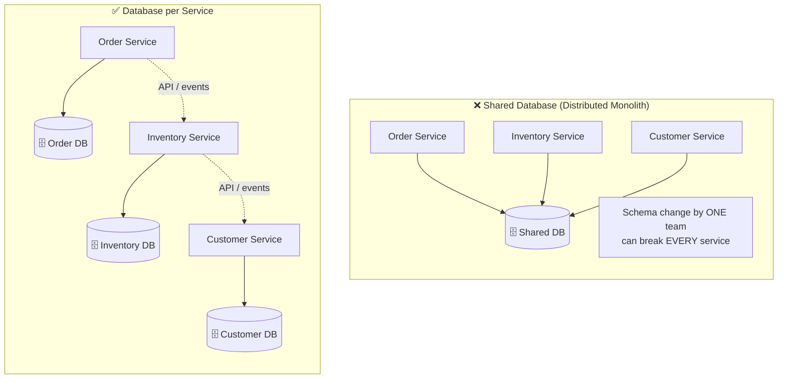

The concrete problems the pattern eliminates:

- **Tight coupling through the schema** — With private databases, one service's schema is invisible to others. The Customer team can rename a column, switch from MySQL to Postgres, or re-index at will, and no other service notices, because everyone interacts through a stable API contract instead of raw tables.
- **Performance bottlenecks and contention** — A shared database is a shared resource: one service's expensive query, lock, or table scan degrades everyone. Separate databases isolate load, so a heavy report in Analytics can't slow down checkout.
- **Blocked independent scaling** — In a shared DB, you scale the *whole* thing even if only one service is hot. With per-service databases, the read-heavy Catalog service can add read replicas or move to a document store while the write-heavy Order service scales differently — each tuned to its own workload.
- **Blocked independent deployment** — Schema migrations in a shared DB require coordinating every team that touches those tables. Private databases let each team migrate on its own schedule — the whole point of microservices.
- **No technology choice** — One shared database forces one technology on everyone. Private databases enable *polyglot persistence*: the right tool per job.
- **Blast radius / no fault isolation** — If the one shared database goes down, *every* service is down. If the Reviews database goes down but Orders has its own, checkout keeps working — reviews just don't show.

**A concrete latency example (from the credit-scoring world).** A credit-based financial service must assess a user's financial health from many sources — bank accounts, assets, spending patterns, income, existing loans. If all of that lived in one giant shared schema, every loan-eligibility request would fan out into a sprawling multi-table JOIN across contended tables, and latency would balloon. With database per service, an **Eligibility** service queries its own optimized store, and an **EMI-calculation** service hits its own — each schema is shaped and indexed for exactly its task, so each query is fast and neither service contends with the other.

🟢 Beginner-friendly explanation

Think of a shared database like one giant whiteboard that five teams all write on. It seems convenient until someone erases a corner you were using, or you want to reorganize your section but can't because four other teams rely on the current layout. Worse, if that one whiteboard falls over, *all five teams* are stuck. Giving each team its own whiteboard means they can draw, erase, and rearrange freely, and if one board breaks, the other four teams keep working. That freedom — and that safety — is why the pattern exists.

---

## 4. 🧱 The Three Levels of Isolation

"Database per service" is a spectrum, not a single implementation. Isolation can be *logical* or *physical*, and the level you pick trades cost and operational simplicity against how strongly the boundary is enforced. There are three common variants, from weakest to strongest isolation.

**1. Private tables per service** — All services share one physical database *instance*, but each service is granted access only to its own set of tables. The boundary is enforced by database permissions (grants), not by physical separation. Cheapest and simplest to operate — one instance to back up and monitor — but the weakest isolation: services still contend for the same CPU, memory, connections, and I/O, and a runaway query in one service can still starve the others. A single database credential leak or a permissions misconfiguration can expose everything.

**2. Schema per service** — One physical database instance, but each service gets its own *schema* (a named namespace of tables, e.g., PostgreSQL schemas or separate MySQL databases within one server). Stronger logical isolation — names can't collide, and permissions are cleaner — but the physical resource is still shared, so noisy-neighbor contention remains.

**3. Database (server) per service** — Each service gets its own separate database *server/instance* entirely. This is the strongest isolation: independent scaling, independent failure domains, independent technology choice (true polyglot persistence), and no resource contention. It's also the most expensive and operationally heaviest — you now run and monitor many database instances.

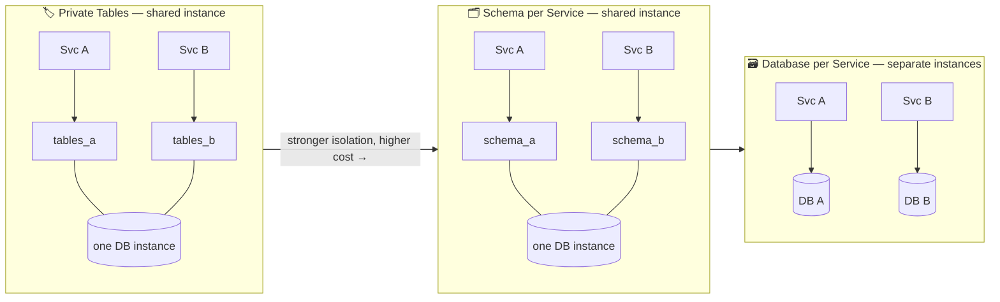

The critical point that unifies all three: **regardless of which variant you choose, services never read each other's tables directly.** The isolation mechanism differs (grants, schemas, or separate servers), but the *rule* is identical — cross-service data access goes through an API or an event, never a direct query or a JOIN across boundaries. Teams often *start* at private-tables-per-service for cost reasons and graduate to database-per-service as a service's scale or reliability needs grow.

🟢 Beginner-friendly explanation

Imagine sharing a house. "Private tables" is everyone sharing one apartment but agreeing not to open each other's drawers — cheap, but you're still fighting over the one bathroom (shared resources). "Schema per service" is having your own locked rooms in that shared apartment — better, but same building. "Database per service" is everyone having their own separate apartment — total independence, but you pay a lot more rent. The house rule never changes though: you always knock before entering someone's space, no matter which arrangement you're in.

---

## 5. ⚖️ When to Use It (and When NOT To)

The pattern buys autonomy but bills you in complexity — you *will* end up building sagas, event pipelines, and read models you'd never need with one database. Adding it to a two-service app is over-engineering. Here's the decision framework.

**✅ Use Database per Service when:**

- You have **multiple teams** who need to develop, deploy, and evolve their services **independently** without a shared change-freeze.
- Services have **genuinely different workloads or storage needs** (a search service wants Elasticsearch; an orders service wants transactional SQL) — polyglot persistence pays off.
- You need **independent scaling** — one service is read-heavy, another write-heavy, and scaling them together is wasteful.
- **Fault isolation** matters — you can't have one database outage take down the entire platform.
- You're deliberately building for **high scale and resilience** and have the DevOps maturity to operate many stores.

**❌ Don't use it (yet) when:**

- You have a **small team or a young product** where the domain boundaries are still shifting — premature splitting means constant, painful cross-service migrations. Start with a **modular monolith** (one database, clean internal module boundaries) and split later.
- Your workload is **inherently, tightly transactional** across many entities and you need strong consistency everywhere — fighting eventual consistency at every turn may signal the boundaries are wrong.
- You lack the **operational maturity** (observability, automation, on-call) to run and reason about many databases and distributed transactions.
- Cross-service **reporting/analytics is your primary need** and you haven't planned a data-warehouse/CDC strategy — you'll be in pain immediately.

**The honest question:** *Is the coupling pain of a shared database worse than the distributed-data complexity of separate ones?* For a large org with many teams and divergent workloads, yes — autonomy is worth the tax. For a three-person startup still discovering its domain, almost certainly not yet. A very common and respectable path is: **modular monolith first → extract services (with their own databases) once boundaries stabilize and teams multiply.**

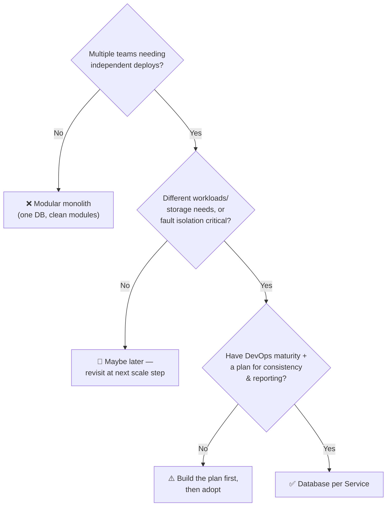

🟢 Beginner-friendly explanation

Splitting one database into many is like a growing family moving from one shared house into separate homes. If it's just you and a roommate, separate houses is a waste — you'd spend all your time driving between them to share dinner. But once it's five families with different schedules and needs, separate homes finally make sense, *if* you can afford the upkeep and have a plan for staying in touch. The trap is splitting too early, before you even know where everyone wants to live.

---

## 6. ⚙️ The Real Trade-off & Mechanism

Mechanically, the pattern is enforced by one boundary rule and one communication rule:

1. **Ownership** — Exactly one service can write to (and is the source of truth for) a given piece of data. That service *owns* it.
2. **Access via contract** — Every other service reads or mutates that data only through the owner's API or by consuming events the owner publishes. No direct database connections, no cross-database JOINs, no "just this once" shared table.

The central trade-off is this: **you gain service autonomy and fault isolation at the cost of losing the free correctness guarantees a single database gave you — atomic transactions, foreign keys, and cheap JOINs across the whole domain.**

Every hard problem in this pattern is a downstream consequence of that one trade. In a monolith's single database, "create the order and decrement inventory and record payment" is one ACID transaction: it either fully happens or fully rolls back, and the database enforces it. Split those into three databases and that guarantee evaporates — you can succeed at step one and fail at step three, leaving the system in a partially-updated, incorrect state. Recovering correctness is now *your* job, not the database's.

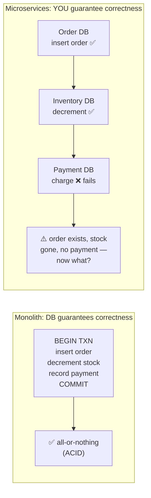

So the design questions all negotiate the same tension:

- **Consistency vs. availability/autonomy.** You give up instant global consistency and accept *eventual* consistency so services can act independently and stay available. (This is CAP/BASE thinking applied at the architecture level.)
- **Data duplication vs. coupling.** To avoid a synchronous call to another service on every request, you often *copy* a slice of another service's data locally (a read model). That kills the runtime coupling and latency — but now you own a copy that can go stale and must be kept in sync.
- **Query simplicity vs. isolation.** JOINs are trivial in one database and impossible across many. You trade the convenience of `JOIN orders ON users` for API composition, client-side joins, or a separate reporting store.
- **Local simplicity vs. global complexity.** Each service becomes simpler and independently reasoned-about, but the *system* gains new moving parts: sagas, event buses, idempotency, deduplication, and reconciliation jobs.

> 🧪 **The ownership litmus test:** For any piece of data, ask *"which single service is the source of truth for this?"* If two services both claim to own and mutate the same entity, you have a boundary bug — that data belongs in one service, and the other should hold a read-only replica kept in sync via events.

🟢 Beginner-friendly explanation

With one shared database, correctness is like paying with a single bank transfer — the bank guarantees the money either moves completely or not at all. Splitting into many databases is like paying three different people in cash, one after another: you hand the first their share, the second theirs, and then discover you're out of money before paying the third. Now *you* have to fix the mess — go back and get your cash returned. The database used to handle "all or nothing" for you; now you have to choreograph it yourself.

---

## 7. 🔀 The Consistency Problem — The Heart of the Pattern

This is the section interviewers push hardest on, because it's where the pattern earns its complexity. When data is split across databases, three related problems appear.

**Problem 1 — Distributed transactions.** A business action often spans services. Consider *applying for a credit card*, which might touch: a **User Profile** service, a **Credit History** service, an **Income Verification** service, a **Credit Score** service, and a **Credit Card Application** service. Suppose Income Verification updates the user's income successfully, but the Credit Score service fails to recalculate (a transient network blip). Now the income is fresh but the score is stale, and the *next* application decision is made on wrong data. There's no single transaction to roll all of that back — the failure leaves the system inconsistent.

**Problem 2 — Data duplication and staleness.** To avoid calling the User service on every single request, the Order and Payment services might each cache a copy of the user's email. Fine — until the user changes their email. Now three databases hold "the user's email," and one update must propagate to all of them. If propagation lags or fails, you have three answers to "what's the user's email?" — a classic consistency headache.

**Problem 3 — Cross-service queries.** "Show me all orders, joined with each customer's name and their loyalty tier" is one SQL JOIN in a monolith. Across databases, you *cannot* JOIN. You must gather order data from one service, customer data from another, and stitch them together in application code — or maintain a separate read-optimized view. Reporting and analytics, which love wide JOINs, become genuinely hard.

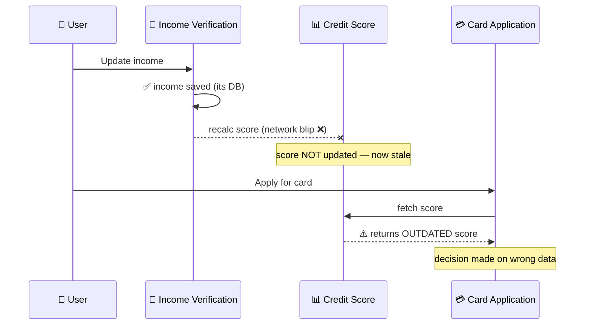

The mature framing: **you cannot get monolith-style strong consistency across services cheaply, so you deliberately choose eventual consistency and design the system to converge safely.** The techniques in the next section — Saga, CQRS, event sourcing, CDC/outbox — are the toolbox for doing exactly that: making "temporarily inconsistent but reliably converging" acceptable and correct.

🟢 Beginner-friendly explanation

Picture ordering a pizza that involves three separate shops: one makes dough, one adds toppings, one delivers. If the topping shop drops the ball but the dough shop already charged you, no single manager can magically undo everything — each shop only controls its own step. So you set up a plan: if toppings fail, someone calls the dough shop and says "refund that order." That coordinated "if this fails, undo that" plan is exactly what sagas do for data spread across services.

---

## 8. 🛠️ Data Management Techniques (Saga, CQRS, Event Sourcing, CDC)

These are the tools you reach for once you accept eventual consistency. Knowing *when* to use each — and their costs — is the staff-level signal.

<strong>1. Eventual Consistency via Events</strong>

The baseline technique: services don't call each other synchronously to update data. Instead, when a service changes its own data, it **publishes an event** (`OrderPlaced`, `IncomeUpdated`, `UserEmailChanged`). Interested services **subscribe** and update their own copies asynchronously. Pros: loose coupling, high scalability, resilience (the publisher doesn't wait). Cons: temporary inconsistency windows, and you must handle out-of-order and duplicate events.

<strong>2. Saga Pattern — Distributed Transactions Without 2PC</strong>

A **saga** replaces one global ACID transaction with a *sequence of local transactions*, each in a single service's own database, plus a **compensating transaction** for each step that can undo it. If step 4 fails, you run the compensations for steps 3, 2, and 1 in reverse — a *semantic* rollback, since you can't truly un-commit already-committed local transactions.

There are two coordination styles:

- **Choreography** — No central coordinator. Each service emits an event, and the next service reacts. Simple and decoupled for short flows, but the overall business process is *implicit* — smeared across many services, hard to see and debug as it grows.
- **Orchestration** — A central **orchestrator** service explicitly tells each participant what to do and listens for the result, driving the flow step by step (tools: Netflix Conductor, Camunda, Temporal, AWS Step Functions). Easier to understand, monitor, and change; the cost is a coordinator to build and operate, and care not to let it absorb business logic.

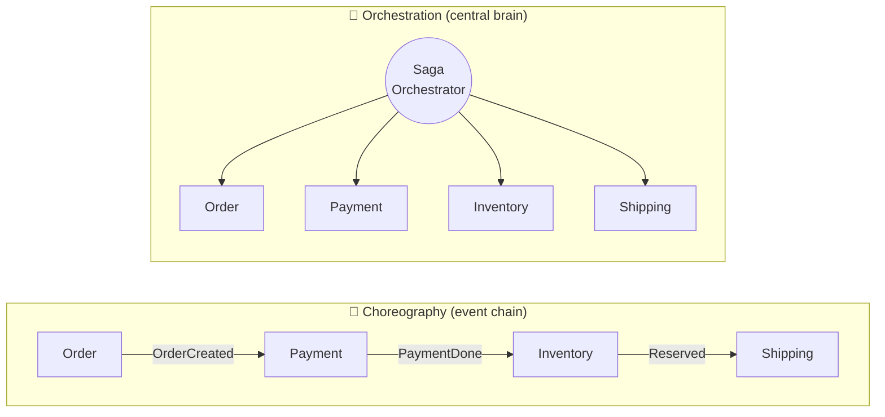

**Concrete Saga example (e-commerce checkout):** Order service creates an order in `PENDING`. Payment service charges the card. If payment fails, a **compensating** command tells Order to cancel the order. If payment succeeds but Inventory can't reserve stock, compensations *refund the payment* and *cancel the order*. The system never has a paid-but-unfulfillable order lingering — it converges to a clean state.

<strong>3. CQRS — Command Query Responsibility Segregation</strong>

**CQRS** separates the **write model** from the **read model**. Writes go to each service's own normalized database (commands). Reads — especially cross-service reads, dashboards, and reports — are served from a separate, **denormalized read store** that's kept up to date by consuming events. This is the standard answer to "how do I query across services without JOINs": you *pre-build* the joined view as data flows in.

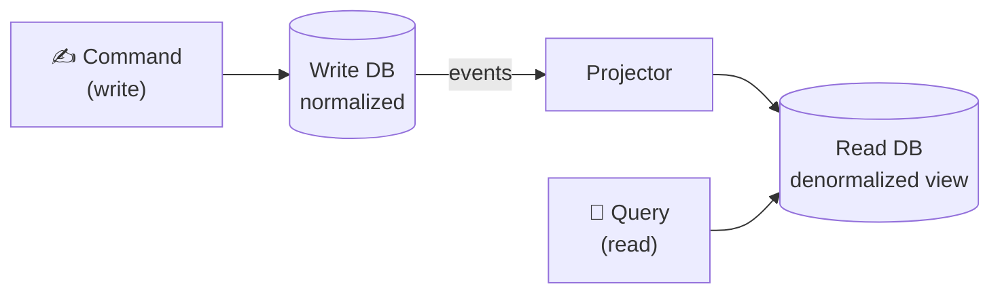

Pros: reads scale independently and can be shaped perfectly for each query. Cons: more moving parts, and the read model is eventually consistent — it lags the write model by the propagation delay, which the product must tolerate.

<strong>4. Event Sourcing</strong>

Instead of storing only the *current* state, **event sourcing** stores the full **sequence of events** that produced it. Rather than a row `Order = Delivered`, you store `OrderPlaced → PaymentReceived → Shipped → Delivered`. Current state is derived by replaying events. This gives you a perfect audit log, the ability to rebuild state or reprocess history, and time-travel debugging. Costs: the event store grows large, querying "current state" requires replay or snapshots, and it's a genuinely harder mental model. Often paired with CQRS (events feed the read model). It is **not** required by database-per-service — it's an advanced option, not a default.

<strong>5. The Dual-Write Problem, Outbox, and CDC</strong>

Here's a trap that catches many teams: a service needs to **update its database AND publish an event**. If you do these as two separate steps, you have a **dual write** — and there's no transaction spanning your database and the message broker. Crash *between* the two and you either updated the DB but never published (consumers never learn) or published but the DB write rolled back (you announced a lie).

The robust fix is the **Transactional Outbox pattern**: in the *same local transaction* that changes your business data, write the event into an `outbox` table. Because it's one local ACID transaction, the data change and the intent-to-publish commit atomically. A separate relay process then reads the outbox and publishes to the broker — commonly using **CDC (Change Data Capture)** tools like **Debezium**, which tail the database's commit log (Postgres WAL / MySQL binlog) and stream new outbox rows to **Kafka**. This guarantees *at-least-once* delivery of every event that corresponds to a committed change.

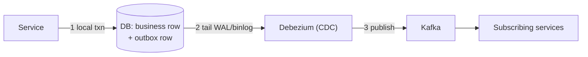

🟢 Beginner-friendly explanation

Say you update your address in an app and it should also email you a confirmation. If it saves the address first and *then* tries to send the email, a crash in between means your address changed but no email went out — or worse, the email says "changed!" but the save failed. The "outbox" trick is to write the address change and a note that says "send this email" into the *same* save, so they can't get out of sync. A little helper then reads those notes and actually sends the emails. One save, no lying, no lost messages.

---

## 9. 📡 Event-Driven Architecture as the Glue

Given everything above, it should be clear *why* database-per-service and **event-driven architecture** almost always travel together. Events are how services keep each other's copies fresh without direct coupling.

The flow: when a service makes a meaningful change, it publishes a domain event describing *what happened* (past tense: `IncomeUpdated`, `OrderPlaced`, `UserEmailChanged`) to a broker like **Kafka**, **RabbitMQ**, **AWS SNS/SQS**, or **Google Pub/Sub**. Other services subscribe and update their own databases in response. The income-verification service emits `IncomeUpdated{userId, newIncome}`; the credit-score service consumes it and recalculates. No service reaches into another's database; they coordinate purely through the event stream.

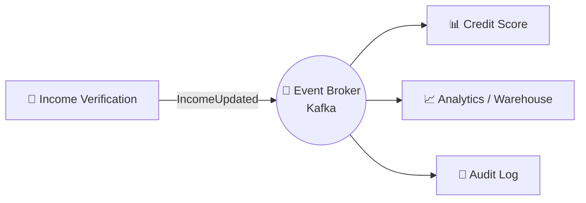

This decoupled propagation is what makes the system scalable and fault-tolerant: the publisher never blocks on subscribers, new consumers can be added without touching the producer, and if a consumer is temporarily down, it processes the backlog when it recovers. But it forces a set of disciplines that separate the textbook version from a production system:

- **Idempotency** — Brokers deliver *at-least-once*, so the same event can arrive twice. Consumers must be idempotent (e.g., dedupe on an event ID) so reprocessing doesn't double-charge or double-count.
- **Ordering** — Events can arrive out of order. If `EmailChanged(A→B)` and `EmailChanged(B→C)` are processed in the wrong order, you end up with the wrong email. Solutions: per-key ordering (Kafka partitions keyed by entity ID), version numbers, or timestamps.
- **Schema evolution** — Event schemas change over time. Use a **schema registry** (e.g., Confluent) and backward-compatible changes so old consumers don't break.
- **Poison messages & DLQs** — An event a consumer can never process should go to a **dead-letter queue** after bounded retries, rather than blocking the whole stream.

🟢 Beginner-friendly explanation

Think of events like a group chat for your services. When something happens ("I updated the income!"), the service posts it to the chat instead of privately messaging each teammate. Anyone who cares is in the chat and reacts on their own time. The catch is the same as real group chats: sometimes a message gets delivered twice, or messages show up out of order, so each service has to be smart enough to say "wait, I already handled this one" or "this is older than what I have, ignore it." Get that discipline right and the whole system stays in sync without anyone being tightly tied together.

---

## 10. 🎨 Architecture & A Full Request Lifecycle

Here's how a realistic "place an order" flow travels through a database-per-service system using an orchestrated saga and the outbox pattern — the end-to-end picture tying the concepts together.

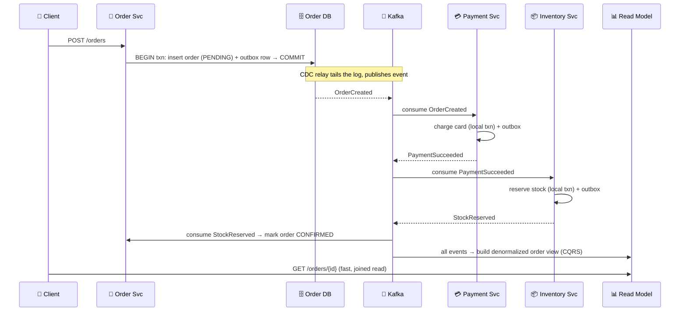

Notice the properties this buys: each service writes **only its own database** in a plain local transaction; cross-service coordination happens through **Kafka**, not shared tables; the **outbox + CDC** guarantees events aren't lost on crash; and cross-service reads are served from a **CQRS read model** rather than an impossible cross-database JOIN. If payment fails, the saga runs compensations (cancel the order) instead of a global rollback.

---

## 11. 📊 Categorized Real-World Examples

<strong>📊 Expand — real-world examples by domain</strong>

Seeing where the pattern shows up — and *how each service picks a different database* — cements the idea. Here they're grouped by domain.

### 🛍️ E-commerce (polyglot persistence in action)

The canonical example. A single storefront splits into services, each choosing the store that fits its workload:

- **User/Account** → **MySQL or PostgreSQL** — structured, relational, needs integrity.
- **Product Catalog** → **MongoDB** — flexible, varying product attributes; document model fits naturally.
- **Order** → **PostgreSQL** — strong transactional guarantees for money and order state.
- **Cart/Session** → **Redis** — fast, ephemeral, expiring key-value data.
- **Search** → **Elasticsearch** — full-text relevance ranking, which no relational DB does well.
- **Recommendations** → **Neo4j / graph DB** — "people who bought X also bought Y" is a graph traversal.

No single database is good at all of these. Forcing them into one schema would mean every service compromises; separate ownership lets each excel.

### 🏦 FinTech / Credit Scoring

The credit-card-application flow from the source material: **User Profile**, **Credit History**, **Income Verification**, **Credit Score**, and **Card Application** services, each with its own database. Income changes propagate via an `IncomeUpdated` event so the score service recomputes; the application service checks the fresh score before approving. Money movement uses **sagas** (charge → if downstream fails, refund) because there's no cross-database transaction. Audit and regulatory needs make **event sourcing** attractive here — the full event history *is* the audit trail.

### 🎬 Streaming & Big Tech

- **Netflix** — Teams own their own data stores for autonomy and independent scaling; famously heavy users of **Apache Cassandra** for high-write, globally-distributed data, plus event-driven pipelines for cross-service propagation.
- **Amazon** — Isolates data per service so each team scales and deploys independently; the philosophy that helped birth **DynamoDB**. The organizational rule ("services communicate only through published interfaces, never shared databases") is a direct expression of this pattern at company scale.
- **Uber** — Ride, pricing, driver-matching, and payments are separate services with separate stores, coordinated through events and sagas; a ride request touches many services but each owns its data.

### 🧾 Content & SaaS platforms

A blogging/CMS or B2B SaaS platform typically separates **Auth/Identity**, **Billing** (needs strong transactional SQL, often **PostgreSQL**), **Content** (document store), **Notifications** (queue-backed), and **Analytics** (columnar warehouse like **Redshift/BigQuery/Snowflake**, fed by CDC). Billing's consistency needs are the opposite of analytics' scan-heavy needs — separate databases let each be right.

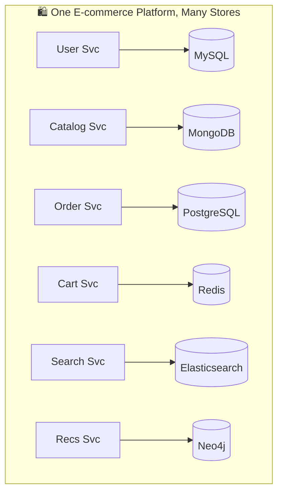

---

## 12. ❌ Common Misconceptions

<strong>❌ Expand — common misconceptions</strong>

**"Database per service means one physical database server per service, always."** No — that's just the strongest of *three* variants. Private-tables-per-service and schema-per-service also satisfy the pattern as long as the access rule holds. Many real systems run logical isolation on shared infrastructure for cost, and that's legitimate.

**"It's fine for two services to share a database if they're closely related."** This is the most common and most damaging violation. The moment two services read/write the same tables, you've re-coupled them: neither can migrate independently, and you've built a distributed monolith. If two services truly need the same data constantly, that may be a sign they should be *one* service — or one owns the data and the other gets a read replica via events.

**"Eventual consistency means the data is unreliable / just wrong."** Eventual consistency is not "sometimes wrong forever"; it's "briefly out of sync, then reliably correct." The engineering task is to make the inconsistency window small and, more importantly, *acceptable* for the use case. Displaying a review count that's 2 seconds stale is fine; a bank balance may not be — which tells you where to spend your consistency budget.

**"Sagas / distributed transactions give you the same guarantees as ACID."** They don't. A saga provides *atomicity via compensation*, not isolation. Mid-saga, other transactions can observe partial state (an order that's created but not yet paid). You must design for that visibility — e.g., status fields (`PENDING`) and semantic locks — rather than assuming isolation you no longer have.

**"Two-phase commit (2PC) solves this cleanly, so just use it."** 2PC provides real distributed atomicity but at a steep price: it's a *blocking, synchronous* protocol where a coordinator failure can leave participants locked, it kills availability and throughput, and most modern databases/brokers don't support it well across heterogeneous stores. That's precisely *why* the industry moved to sagas and eventual consistency for microservices.

**"You avoid data duplication in this pattern."** The opposite — you often *embrace* controlled duplication (read models, cached copies) to avoid runtime coupling. The skill is managing duplication (via events/CDC) rather than pretending you can eliminate it.

**"Cross-service reporting just works."** It doesn't — you can't JOIN across databases. You must plan a strategy up front: a data warehouse/lake fed by CDC, or CQRS read models. Teams that skip this discover it the hard way when the first "simple" cross-service report is requested.

🟢 Beginner-friendly explanation

The biggest myth is thinking eventual consistency means "the data might just be wrong." It really means "give it a second and it'll be right" — like how a group text takes a moment to reach everyone but eventually does. The second big myth is "it's okay if two services quietly share one database." That one feels harmless and saves effort today, but it secretly glues the two services back together, undoing the whole point. Almost every painful microservices story traces back to that shortcut.

---

## 13. 🎓 Staff-Level Nuance

<strong>🎓 Expand — staff-level nuance</strong>

This is the reasoning experienced engineers bring up *unprompted* — the follow-ups an interviewer probes after the textbook answer.

**Getting service boundaries right is harder than the database split.** The pattern assumes you've drawn boundaries correctly. If you constantly need sagas and synchronous calls for one business operation, that's a *smell* that your boundaries are wrong — the data that changes together should probably live together. Staff engineers use **Domain-Driven Design (DDD)** and *bounded contexts* to define ownership, and treat "how much cross-service coordination does a common operation need?" as the real test of a good split. A perfect database split over bad boundaries is worse than a monolith.

**Choose your consistency per operation, not globally.** Not everything needs the same treatment. A payment write needs strong local consistency and a carefully compensated saga; a "profile viewed" counter can be fire-and-forget. Staff engineers spend their **consistency budget** deliberately — strong where money/safety is involved, relaxed where staleness is invisible. Blanket eventual consistency (or blanket strong consistency) is a junior tell.

**Orchestration vs. choreography scales differently.** Choreography is elegant for 2–3 step flows but becomes an untraceable "event spaghetti" as steps grow — nobody can point to the business process because it's implicit across ten services. For complex, long-lived, or auditable workflows, orchestration (Temporal, Conductor, Step Functions) wins because the process is *explicit and observable*. The nuance: don't let the orchestrator accumulate business rules that belong in the services — keep it coordinating, not deciding.

**The dual-write problem is the silent killer.** Many teams "publish an event after saving" and don't realize they've created a data-integrity hole that only manifests under crash/partition. Bringing up the **transactional outbox + CDC (Debezium)** unprompted is a strong staff signal — it shows you know that "save then publish" is *not* atomic and how to make it reliable.

**Idempotency and exactly-once are non-negotiable framing.** There's no true "exactly-once" delivery in distributed messaging — there's "at-least-once delivery + idempotent processing," which *simulates* exactly-once. Staff engineers design consumers to dedupe (idempotency keys, processed-event tables) from day one, because retries and redelivery are guaranteed, not hypothetical.

**Deletes and GDPR are surprisingly hard.** When data is duplicated across many services and event logs, "delete this user's data" (right to erasure) becomes a distributed problem — you must propagate deletion everywhere the data landed, including read models, caches, and retained event streams. This is a real operational burden people forget when they enthusiastically copy data around.

**Fail-open vs. fail-closed on the event pipeline.** If the broker or a downstream consumer is down, does the producer block (fail-closed, preserving consistency but hurting availability) or proceed and reconcile later (fail-open, preserving availability)? This is a per-flow decision — payment authorization might fail closed; a recommendation update fails open.

**Testing and debugging cost multiplies.** A bug that would be one stack trace in a monolith becomes a distributed-tracing investigation across services, brokers, and eventually-consistent read models. Staff engineers budget for **distributed tracing (OpenTelemetry, Jaeger), correlation IDs, and reconciliation jobs** as first-class infrastructure, not afterthoughts — and they know a monolith is *easier* to operate, so they justify the split by autonomy needs, not fashion.

**Backups and referential integrity are now your problem.** One database gave you foreign keys and a single point-in-time backup. Across many databases, there are no cross-service foreign keys (you can have an `order.userId` pointing at a user that a poorly-ordered event stream hasn't created yet), and a *consistent* cross-service backup/restore is genuinely hard. You enforce referential integrity in application logic and via eventual reconciliation, not the database.

🟢 Beginner-friendly explanation

The deepest lesson pros share is: the hard part isn't giving each service its own database — it's *deciding what data belongs to whom*. If you keep needing to coordinate three services just to do one simple thing, you probably drew the lines in the wrong place, and no amount of clever plumbing will fix that. The second lesson is to only pay for strong guarantees where they matter (money, safety) and relax everywhere else, because guaranteeing everything is perfectly in sync, everywhere, all the time is exactly what you gave up — and trying to claw it back defeats the purpose.

---

## 14. 🔗 Extensions & Adjacent Concepts

<strong>🔗 Expand — extensions & adjacent concepts</strong>

- **Saga pattern** — The primary companion; the standard way to maintain integrity across service databases without 2PC. (Covered above.)
- **CQRS & Event Sourcing** — Frequently paired to solve cross-service reads and provide audit/replay. (Covered above.)
- **Transactional Outbox & CDC (Debezium)** — The reliable bridge between a service's database and the event broker; solves the dual-write problem.
- **API Composition pattern** — The *other* way to answer cross-service queries: an aggregator calls each service's API and joins in memory. Simpler than CQRS but can be slow/chatty for large joins — good for small, on-demand compositions; CQRS wins for heavy, repeated reads.
- **Shared Database anti-pattern** — The explicit thing this pattern rejects; worth naming so you can articulate *why* it's an anti-pattern.
- **Domain-Driven Design & Bounded Contexts** — The methodology for drawing the service/ownership boundaries the whole pattern rests on.
- **API Gateway pattern** — Complements this at the edge: clients hit one gateway that routes to services, which then own their data privately.
- **Data Mesh** — An org-level extension of "domain owns its data" to analytical data — domain teams own and serve their data as products, rather than dumping into one central warehouse.
- **Polyglot persistence** — The direct payoff of private databases: the freedom to pick the best store per service.
- **CAP / PACELC & BASE** — The theoretical backdrop for why you accept eventual (BASE) consistency instead of strong (ACID) across a partitioned, distributed data layer.

---

## 15. ⚡ Quick Revision

> Night-before recap, written as a story you can read top to bottom in a few minutes. Each paragraph mirrors one section of the guide, so finishing a paragraph should let you replay that whole section from memory.

<strong>⚡ Expand Quick Revision</strong>

**The idea and why it exists.** *Database per Service* means every microservice privately owns its data store and nobody else touches it directly — other services must ask via an API or react to an event, never query the tables or JOIN across them. It's the "own filing cabinet, own lock" rule, and it exists to kill the pain of a shared database: schema coupling (one team's migration breaks everyone), resource contention (one heavy query slows all), blocked independent scaling and deployment, a single forced database technology, and a blast radius where one outage takes down the whole platform. The payoff is real service autonomy and fault isolation; the price, as we'll see, is that consistency stops being free.

**How you actually isolate.** Isolation is a spectrum, not one thing. From weakest and cheapest to strongest and priciest: *private tables per service* (one shared instance, each service granted only its own tables — still fights for CPU/IO), *schema per service* (one instance, separate namespaces like Postgres schemas), and *database/server per service* (fully separate instances — best isolation, true polyglot persistence, most to operate). The rule is identical at every level: no direct cross-service reads. Because each service owns its store, it can also pick the best-fit engine — **polyglot persistence** — e.g. PostgreSQL for orders (ACID), MongoDB for the catalog, Redis for carts, Elasticsearch for search, Neo4j for recommendations, and a warehouse for analytics.

**The core trade-off and the problem it creates.** You gain autonomy and fault isolation, but you *lose* the things a single database gave you for free: atomic ACID transactions, foreign keys, and cheap cross-domain JOINs. Correctness across services is now your job, not the database's. That shows up as three concrete problems: distributed transactions have no global rollback (step 3 can fail after step 1 already committed, leaving partial state); duplicated data drifts (three services each cache a user's email, and one update must reach all of them); and cross-service queries are impossible because you can't JOIN across separate databases. The mature move is to deliberately accept **eventual consistency** — briefly out of sync, reliably converging — instead of chasing strong consistency everywhere.

**The toolbox for buying correctness back.** The baseline is *eventual consistency via events*: a service changes its own data, publishes an event, and subscribers update their copies asynchronously. For a business action spanning services you use a **Saga** — a chain of local transactions each with a compensating action to undo it, coordinated either by *choreography* (services react to each other's events; simple but turns into "event spaghetti" at scale) or *orchestration* (a central coordinator like Temporal, Netflix Conductor, or AWS Step Functions drives the flow; observable, better for complex or auditable workflows). For reads you use **CQRS**, splitting a normalized write model from a denormalized, event-fed read model that pre-computes the joins. **Event sourcing** (store the sequence of events, not just current state) adds audit and replay but is advanced and optional. And the silent trap — updating your DB *and* publishing an event aren't atomic (the **dual-write problem**) — is solved by the **transactional outbox**: write the event into an outbox table in the same local transaction, then let **CDC** (Debezium tailing the WAL/binlog) publish it to **Kafka**, giving at-least-once delivery of every committed change.

**The event-driven glue and its disciplines.** All of this rides on an event broker — Kafka, RabbitMQ, AWS SNS/SQS, Google Pub/Sub — where services publish past-tense domain events and interested services subscribe. It decouples everyone (the publisher never waits), but it forces four disciplines you must recite: **idempotency** (delivery is at-least-once, so dedupe on an event ID or duplicates will double-charge), **ordering** (partition by entity key, or use versions/timestamps, so out-of-order events don't corrupt state), **schema evolution** (use a registry and backward-compatible changes), and **dead-letter queues** for poison messages after bounded retries. "Exactly-once" isn't real — it's at-least-once delivery plus idempotent processing.

**Where it shows up and what people get wrong.** In the wild: e-commerce leans on polyglot persistence per service; FinTech credit-scoring uses sagas plus event sourcing for the audit trail; Netflix gives teams their own stores (heavy Cassandra use); Amazon's "communicate only through interfaces, never shared databases" rule birthed the DynamoDB philosophy; Uber splits ride, pricing, and payment. The misconceptions to avoid: it isn't always one server per service (three isolation variants exist); "just let two services share this one DB" quietly rebuilds a distributed monolith; eventual consistency isn't "wrong," it's briefly stale then correct; sagas give atomicity via compensation but *not* isolation, so partial states are visible; 2PC looks clean but is blocking and availability-killing, which is exactly why we prefer sagas; duplication is embraced and managed, not eliminated; and cross-service reporting needs a planned warehouse or CQRS, not wishful JOINs.

**The staff-level instincts.** Boundaries matter more than the split — if one operation constantly needs sagas and synchronous calls, the boundaries are wrong (use DDD/bounded contexts; data that changes together should live together). Spend your consistency budget per operation: strong where money or safety is involved, relaxed where staleness is invisible. Prefer orchestration for complex, auditable flows but keep the orchestrator coordinating, never deciding business rules. Treat the dual-write problem as a real hazard and reach for outbox + CDC. Assume retries and duplicates, so build idempotent consumers from day one. Remember the awkward operational realities: GDPR "delete everywhere" is a distributed problem across copies and event logs; when the broker is down you must choose fail-open vs. fail-closed per flow; there are no cross-service foreign keys; consistent multi-database backups are hard; and distributed tracing plus reconciliation jobs are first-class infrastructure, not afterthoughts.

**The adjacent map.** Keep the neighboring concepts in view: Saga, CQRS, Event Sourcing, Transactional Outbox/CDC, API Composition (the simpler in-memory alternative to CQRS for small reads), DDD/bounded contexts (how you draw ownership), API Gateway (complements this at the edge), Data Mesh (the same "domain owns its data" idea applied to analytics), polyglot persistence (the payoff), and CAP/PACELC/BASE (why you accept eventual consistency at all).

**One-liner to remember** — *"Each service owns its data behind a contract; you trade the database's free correctness for autonomy, and buy it back — only where it matters — with sagas, events, and read models."*

---

## 16. 📝 FAANG Interview Q&A

> 20 frequently-asked questions. The first 10 are foundational (L3/L4); questions 11–20 are staff/principal-level (L4/L5+). Four STAR-format behavioral answers follow at the end.

### Foundational (L3 / L4)

<strong>Q1. What is the Database per Service pattern and what problem does it solve?</strong>

It's the rule that each microservice privately owns its data store and no other service touches it directly — access is only via the owner's API or via events. It solves the *coupling through the schema* problem: with a shared database, one team's migration or heavy query breaks or slows everyone, and no service can truly deploy or scale independently. For example, in an e-commerce system the Order service owning its own PostgreSQL means the Catalog team can switch to MongoDB or re-index without coordinating a change-freeze. The payoff is genuine service autonomy, fault isolation, and polyglot persistence — at the cost of harder cross-service data consistency.

<strong>Q2. Doesn't giving every service its own database create massive duplication and overhead? Why is it worth it?</strong>

Yes, it introduces duplication (cached copies), operational overhead (many DBs to run), and consistency complexity — those are real costs. It's worth it when you have multiple teams that must move independently and services with genuinely different workloads. The alternative — a shared database — quietly recreates a monolith's coupling while adding distributed-systems pain, the worst of both worlds. The decision hinges on organizational scale: for a large org like Amazon, autonomy across hundreds of teams is worth the tax; for a three-person startup still finding its domain, a modular monolith with one database is the smarter start, splitting later.

<strong>Q3. What are the different ways to implement isolation? Is it always a separate physical database?</strong>

No — there are three levels. *Private tables per service* shares one physical instance but restricts each service to its own tables (cheapest, weakest isolation, still has resource contention). *Schema per service* gives each service its own namespace/schema in a shared instance (e.g., Postgres schemas). *Database per service* gives each a fully separate server instance (strongest isolation, priciest, enables true polyglot persistence). All three satisfy the pattern because the rule — no direct cross-service table access — is identical; only the enforcement mechanism (grants, schemas, or physical separation) differs. Teams often start with logical isolation for cost and graduate to physical as scale demands.

<strong>Q4. Why can't you just do a JOIN across services like in a monolith?</strong>

Because the data lives in separate databases — often different engines entirely (Postgres vs. MongoDB vs. Redis) — there's no single query engine that can join them. In a monolith, `SELECT ... FROM orders JOIN users` is trivial; across services it's physically impossible. You solve it one of two ways: **API composition** (an aggregator calls each service's API and joins in memory — fine for small, on-demand reads but chatty for large joins), or **CQRS** (maintain a denormalized read model, fed by events, that pre-computes the joined view). For heavy reporting you push events into a data warehouse like Snowflake/BigQuery via CDC and query there.

<strong>Q5. What is eventual consistency and why do we accept it here?</strong>

Eventual consistency means data across services can be briefly out of sync but reliably converges to correct once updates propagate — as opposed to the strong, instant consistency one shared database gives for free. We accept it because maintaining strong consistency across separate databases would require distributed transactions (like 2PC) that block, hurt availability, and don't scale. So we let each service update its own DB and publish events; subscribers catch up asynchronously. The key skill is making the inconsistency window small and *acceptable* — a review count that's 2 seconds stale is fine; a bank balance may demand stronger handling on the write path.

<strong>Q6. How do you maintain data consistency across services without a global transaction?</strong>

The standard answer is the **Saga pattern**: break the distributed transaction into a sequence of local transactions, each committing in one service's own database, with a *compensating* transaction to semantically undo each step if a later one fails. For example, in checkout: create order → charge payment → reserve inventory; if inventory fails, run compensations to refund the payment and cancel the order. Sagas provide atomicity-via-compensation, not isolation, so you design for partial states being visible (status fields like `PENDING`). You coordinate either by choreography (event chain) or orchestration (a central coordinator like Temporal or AWS Step Functions).

<strong>Q7. How do services share data or stay in sync if they can't read each other's databases?</strong>

Through an event-driven architecture. When a service changes its data it publishes a domain event (`UserEmailChanged`, `OrderPlaced`) to a broker like Kafka or RabbitMQ; interested services subscribe and update their own local copies. For instance, the Order and Payment services might each keep a copy of the user's email, refreshed when the User service emits `UserEmailChanged`. This keeps them decoupled — the publisher never waits on subscribers, and if a consumer is down it processes the backlog on recovery. The discipline required: idempotent consumers (at-least-once delivery means duplicates) and handling out-of-order events.

<strong>Q8. What is polyglot persistence and how does this pattern enable it?</strong>

Polyglot persistence is using different database technologies for different services, each chosen for its workload. Database per service enables it because each service owns its store and nothing forces a shared technology. In one e-commerce platform you might run **PostgreSQL** for orders (needs ACID transactions), **MongoDB** for the product catalog (flexible schema), **Redis** for carts/sessions (fast, expiring), **Elasticsearch** for search (relevance ranking), and **Neo4j** for recommendations (graph traversal). No single database is great at all of those; private ownership lets each service pick the right tool instead of everyone compromising on one.

<strong>Q9. What are the main challenges or downsides of this pattern?</strong>

Five recurring ones: (1) *Distributed transactions* — no global ACID, so you need sagas; (2) *Data duplication* — copies of the same entity across DBs can drift and must be synced via events; (3) *Cross-service queries/reporting* — no JOINs, so you need CQRS or a warehouse; (4) *Operational overhead* — you now monitor, back up, patch, and scale many databases instead of one, demanding DevOps maturity; (5) *Debugging* — a bug becomes a distributed-tracing investigation across services and eventually-consistent state. Interviewers want you to name these *and* the mitigation for each, not just list benefits.

<strong>Q10. When would you NOT use Database per Service?</strong>

When the costs outweigh the autonomy benefit. If you have a small team and a young product whose domain boundaries are still shifting, premature splitting means constant painful cross-service migrations — start with a **modular monolith** (one database, clean internal module boundaries) and extract services once boundaries stabilize. Also avoid it if your workload is inherently tightly transactional across many entities (you'd fight eventual consistency everywhere, a sign the boundaries may be wrong), or if you lack the operational maturity to run many stores. Adopting it because "Netflix does it" — cargo-culting without the scale or team structure — is the classic mistake.

### Staff / Principal (L4 / L5+)

<strong>Q11. Explain the dual-write problem and how you'd solve it reliably.</strong>

The dual-write problem: a service must update its database *and* publish an event, but there's no transaction spanning the DB and the message broker. If it saves then crashes before publishing, consumers never learn of the change; if it publishes then the DB write rolls back, it announced a lie. The robust fix is the **Transactional Outbox pattern**: within the same local ACID transaction that changes business data, insert the event into an `outbox` table — so data change and intent-to-publish commit atomically. A separate relay, typically **Debezium** doing CDC on the Postgres WAL or MySQL binlog, tails committed outbox rows and publishes them to **Kafka**, guaranteeing at-least-once delivery of every committed change. Bringing this up unprompted signals you know "save then publish" is not atomic.

<strong>Q12. Choreography vs. orchestration for sagas — how do you choose?</strong>

Choreography has no central coordinator: each service reacts to events and emits the next one. It's decoupled and simple for short 2–3 step flows, but as steps grow the business process becomes *implicit* — smeared across ten services, impossible to visualize or debug ("event spaghetti"). Orchestration uses a central coordinator (Temporal, Netflix Conductor, AWS Step Functions, Camunda) that explicitly drives each step and tracks state, making complex, long-lived, auditable workflows observable and easy to change. The staff nuance: prefer choreography for simple flows to avoid a coordinator dependency; prefer orchestration for complex ones — but keep the orchestrator *coordinating*, never accumulating business rules that belong in the services.

<strong>Q13. Why not just use two-phase commit (2PC) for cross-service transactions?</strong>

2PC does provide real distributed atomicity, but the costs are why microservices avoid it. It's a *synchronous, blocking* protocol: participants hold locks while awaiting the coordinator's commit/abort, so a slow or crashed coordinator can leave resources locked and the system stalled — devastating for availability and throughput at scale. It also requires all participants (heterogeneous databases, brokers) to support XA-style transactions, which many modern stores don't do well. Sagas trade 2PC's strong isolation for availability and loose coupling, accepting compensations and eventual consistency instead. The principled framing: 2PC optimizes consistency at the expense of availability (CAP), and microservices usually choose the other side.

<strong>Q14. How do you handle cross-service reporting and analytics?</strong>

You accept that operational databases can't serve cross-service analytics and build a separate path. The common approach: stream every service's changes via **CDC (Debezium)** into a central **data lake/warehouse** — S3 + Redshift, or Kafka → BigQuery/Snowflake — where analysts run wide joins and dashboards without touching production stores. For operational cross-service reads (not analytics), use **CQRS** read models: consume events to maintain a denormalized view optimized for specific queries. The trade-off is lag — reporting data is eventually consistent, minutes behind reality — which is acceptable for analytics but must be communicated. Teams that skip planning this discover it painfully at the first cross-service report request.

<strong>Q15. There's no true exactly-once delivery — how do you design consumers to cope?</strong>

Correct — distributed messaging offers at-least-once (or at-most-once), and "exactly-once" is really *at-least-once delivery + idempotent processing*. So consumers must be idempotent from day one: attach a unique event ID and record processed IDs in a `processed_events` table (or dedupe key), checking before acting so a redelivered `PaymentSucceeded` doesn't double-charge. For ordering, use per-entity keys (Kafka partitions keyed by userId) so events for one entity are ordered, plus version numbers or timestamps to reject stale updates. Add a dead-letter queue for poison messages after bounded retries. Treating retries and duplicates as guaranteed — not hypothetical — is the staff-level mindset.

<strong>Q16. How do you decide service (data ownership) boundaries, and why does it matter more than the DB split?</strong>

The database split is mechanical; the *boundaries* are the hard, consequential design. If a single business operation constantly needs sagas and synchronous calls across three services, that's a smell your boundaries are wrong — data that changes together should live together. Staff engineers use **Domain-Driven Design**: identify *bounded contexts* and aggregates, and assign each piece of data a single owning service (the source of truth). A good test is "how much cross-service coordination does a common operation require?" — minimize it. A perfect database-per-service implementation over bad boundaries is worse than a monolith, because you've added distributed complexity without gaining real autonomy.

<strong>Q17. How do you enforce that no service secretly reaches into another's database?</strong>

Technically and organizationally. Technically: use separate credentials per service with database grants scoped only to that service's tables/schema, run databases on private networks reachable only by their owner, and in strong setups give each service a physically separate instance so there's no shared endpoint to abuse. Organizationally: code review, architectural fitness functions/linters that flag cross-service DB connections, and a cultural rule (Amazon's famous mandate: services communicate only through published interfaces). The reason to be strict is that a single "temporary" shared-table shortcut silently re-couples two services into a distributed monolith — and it's far harder to untangle later than to prevent.

<strong>Q18. How do you handle a GDPR "right to erasure" when a user's data is copied across many services?</strong>

This is a genuinely hard distributed problem the pattern creates. Because a user's data (and derived copies in read models, caches, and event logs) is scattered, "delete this user" must propagate everywhere it landed. The usual design: publish a `UserDeletionRequested` event that every service consumes to purge its local copy, tracked to completion. The tricky parts are *immutable event logs* (event sourcing / Kafka retention) — you may need crypto-shredding (delete the encryption key so retained events become unreadable) or log compaction/tombstones — and read models/backups that must also be scrubbed. Staff engineers flag this early because retrofitting compliant deletion onto a system that enthusiastically duplicated data is expensive.

<strong>Q19. When the event broker or a downstream consumer is down, should the producer fail open or fail closed?</strong>

It's a per-flow decision balancing consistency against availability. *Fail-closed* means the operation blocks or errors if it can't guarantee propagation — appropriate where correctness is critical, like a payment authorization that must not proceed if it can't be recorded. *Fail-open* means proceed and reconcile later — appropriate where availability matters more and staleness is tolerable, like updating a recommendation model or a view counter. The transactional outbox helps here: because the event is committed durably in the DB with the business change, a broker outage just delays publishing (the relay retries when it recovers) rather than losing the event — so you often get fail-open safety without losing data.

<strong>Q20. What breaks that a single database gave you for free, and how do you replace it?</strong>

Three big ones. (1) *Foreign keys / referential integrity* — gone across services; an `order.userId` can point at a user a lagging event stream hasn't created yet. You enforce integrity in application logic and via reconciliation jobs. (2) *Atomic transactions* — replaced by sagas with compensations. (3) *Consistent backups & point-in-time restore* — one DB gave a single consistent snapshot; across many databases a globally-consistent restore is very hard, so you rely on per-service backups plus event replay to re-derive read models. The meta-point: the database used to be your correctness engine; in this pattern *the application and its event pipeline* become the correctness engine, which is why observability, tracing (OpenTelemetry/Jaeger), and reconciliation are first-class infrastructure.

### 🌟 Behavioral (STAR Format)

<strong>Q21. (STAR) Tell me about a time you split a shared database or decomposed a monolith's data layer.</strong>

**Situation** — Our monolith's single PostgreSQL was a bottleneck: five teams shared ~200 tables, every schema migration required a cross-team change-freeze, and a nightly analytics job regularly locked tables on the checkout path, causing timeouts.

**Task** — I was asked to give the highest-friction domains (Orders, Inventory) data autonomy without a risky big-bang migration.

**Action** — I used the Strangler Fig approach: extracted the Order service with its own PostgreSQL, kept the User data owned by the monolith, and fed the Order service a local read replica of the user fields it needed via `UserUpdated` events through Kafka (outbox + Debezium so no dual-write). I moved analytics off the operational DB by streaming CDC into Redshift. We cut over one bounded context at a time behind flags.

**Result** — Checkout p99 dropped sharply once analytics stopped contending, the Orders team began deploying schema changes daily instead of waiting on a freeze, and no cutover caused downtime. The event-driven copy pattern became our template for later extractions.

<strong>Q22. (STAR) Describe a production incident caused by cross-service data inconsistency and how you handled it.</strong>

**Situation** — Customers reported being charged for orders that showed as "failed." Payments had succeeded, but a transient Kafka consumer outage meant the Order service never processed `PaymentSucceeded`, leaving orders stuck in `PENDING` while cards were charged.

**Task** — As on-call, I had to stop new occurrences, reconcile the affected orders, and prevent recurrence.

**Action** — Immediately I replayed the backlog of unconsumed `PaymentSucceeded` events after the consumer recovered, and wrote a reconciliation script that matched Payment records against Order states to auto-correct or refund mismatches. Root cause was a non-idempotent consumer plus no alerting on consumer lag. I made the consumer idempotent with a processed-events table, added a dead-letter queue, and set alerts on Kafka consumer lag and on orders stuck in `PENDING` beyond an SLA.

**Result** — All affected customers were reconciled within a day, most automatically. Consumer-lag alerting caught two would-be incidents in the following months before any customer impact, and the reconciliation job became a standing safety net.

<strong>Q23. (STAR) Tell me about a time you had to choose between strong and eventual consistency.</strong>

**Situation** — A new "wallet balance" feature spanned a Payments service and a Ledger service. Product initially wanted the two to always agree instantly, which pushed toward a synchronous cross-service transaction on every spend.

**Task** — I needed a design that protected against overspending (a hard correctness requirement) without a distributed 2PC that would hurt availability and latency on the hot path.

**Action** — I split by criticality: the *authorization* check (do you have funds?) stayed strongly consistent within the Payments service, which owned the authoritative balance and used a local transaction with a reservation. The Ledger's fuller transaction history was updated *eventually* via events, since it didn't gate spending. I documented the boundary explicitly so stakeholders understood the ledger view could lag by seconds.

**Result** — We prevented overspend with strong local consistency exactly where money safety required it, kept spend latency low by avoiding cross-service transactions, and accepted harmless eventual consistency for the history view. This "strong where it's dangerous, eventual elsewhere" split became a reusable principle for the team.

<strong>Q24. (STAR) Describe a time you pushed back on a shared-database shortcut.</strong>

**Situation** — Under deadline pressure, a team wanted the new Notifications service to read directly from the Orders database "just for now" to fetch order status, instead of building an API or consuming events.

**Task** — As the platform architect, I had to weigh their short-term velocity against the long-term coupling risk to shared infrastructure.

**Action** — I explained that a direct read would silently couple Notifications to the Orders schema — any Orders migration would then break Notifications, recreating the distributed-monolith trap. I proposed a fast alternative: Orders already emitted `OrderStatusChanged` events, so Notifications could subscribe and keep a tiny local projection of just the fields it needed. I paired with them for a day to wire up the consumer so the deadline held.

**Result** — We shipped on time without a schema dependency. Three months later Orders did a major schema migration that would have broken a direct reader — Notifications was unaffected. The team later cited it as the moment the "no shared databases" rule clicked for them, and it became a documented boundary others reused.

---

## 17. 📚 Further Reading

- **"Microservices Patterns"** by Chris Richardson — the definitive treatment of Database per Service, Saga, CQRS, API Composition, and the transactional outbox, with concrete trade-offs.
- **"Building Microservices"** by Sam Newman — service decomposition, data ownership, and the Strangler Fig migration pattern.
- **"Designing Data-Intensive Applications"** by Martin Kleppmann — the deep foundations: replication, consistency models, CDC, event logs, and why distributed transactions are hard.
- **microservices.io** — Chris Richardson's pattern catalog (Database per Service, Saga, CQRS, Transactional Outbox, API Composition).
- **Debezium documentation** — Change Data Capture for the outbox pattern (Postgres WAL, MySQL binlog → Kafka).
- **Temporal / Netflix Conductor / AWS Step Functions docs** — real orchestration engines for sagas and long-running workflows.
- **Confluent / Apache Kafka documentation** — event-driven communication, partitioning/ordering, schema registry, and exactly-once semantics.
- **Domain-Driven Design** by Eric Evans (and Vaughn Vernon's *Implementing DDD*) — bounded contexts, the methodology behind good ownership boundaries.

---

*End of study guide. Read the [⚡ Quick Revision](#15--quick-revision) section the night before an interview; work through the [📝 FAANG Q&A](#16--faang-interview-qa) out loud to practice reasoning aloud.*

