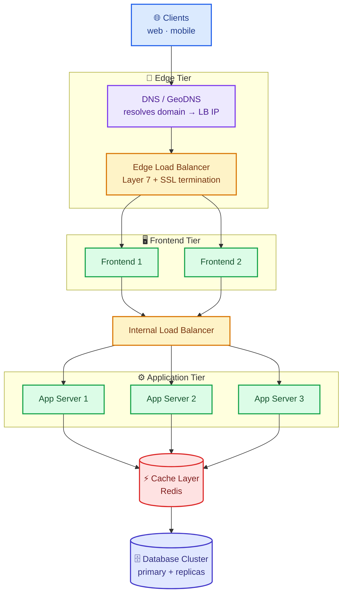
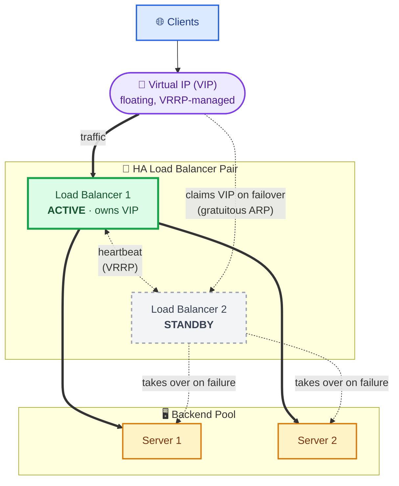
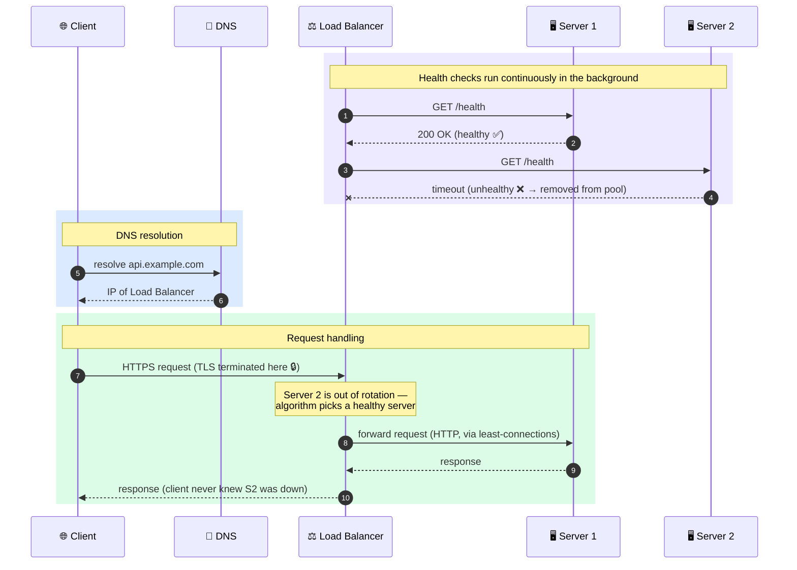
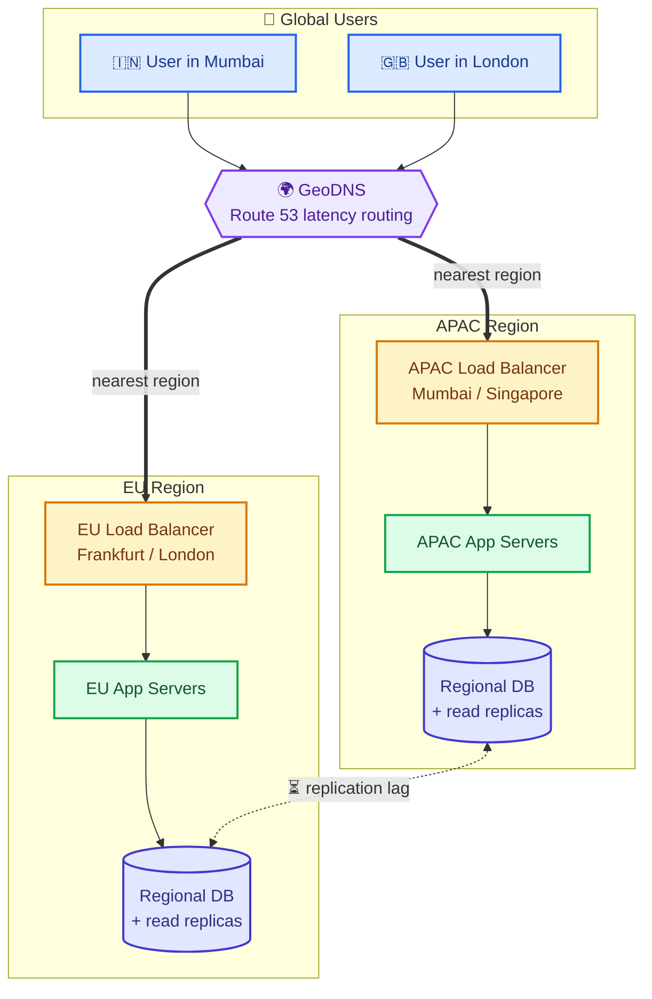

# ⚖️ Load Balancing — A Complete Study Guide (Basics → Staff Level)

> *"Never allow a single component to carry the entire load."*
>
> Load balancing is the quiet workhorse behind almost every fast, reliable app you use. This guide takes you from the plain-English idea all the way to the per-component trade-offs a staff engineer brings up unprompted — in one continuous, readable flow.

---

## 📋 Table of Contents

1. [🚀 Introduction — Why This Topic Matters](#1--introduction--why-this-topic-matters)
2. [🎯 Core Definitions (Plain English)](#2--core-definitions-plain-english)
3. [🧠 The Concept & Theory in Detail](#3--the-concept--theory-in-detail)
4. [💥 Why Load Balancing Exists — Single-Server Failure Modes](#4--why-load-balancing-exists--single-server-failure-modes)
5. [🌐 How a Request Finds a Server (DNS → Load Balancer → Server)](#5--how-a-request-finds-a-server-dns--load-balancer--server)
6. [⚙️ The Real Mechanism — How the Load Balancer Decides](#6-️-the-real-mechanism--how-the-load-balancer-decides)
   - [6.1 Static vs Dynamic Load Balancing](#61-static-vs-dynamic-load-balancing)
   - [6.2 Static Algorithms](#62-static-algorithms)
   - [6.3 Dynamic Algorithms](#63-dynamic-algorithms)
   - [6.4 Choosing an Algorithm — Cheat Sheet](#64-choosing-an-algorithm--cheat-sheet)
7. [🔀 Layer 4 vs Layer 7 — Where the Load Balancer Lives](#7--layer-4-vs-layer-7--where-the-load-balancer-lives)
8. [🩺 Health Checks — The Unsung Hero](#8--health-checks--the-unsung-hero)
9. [🍪 Sticky Sessions & Session State](#9--sticky-sessions--session-state)
10. [🔁 The Load Balancer Is Itself a Single Point of Failure](#10--the-load-balancer-is-itself-a-single-point-of-failure)
11. [🔒 SSL/TLS Termination](#11--ssltls-termination)
12. [🎨 Architecture & Sequence Diagrams](#12--architecture--sequence-diagrams)
13. [📊 Categorized Real-World Examples](#13--categorized-real-world-examples)
14. [❌ Common Misconceptions](#14--common-misconceptions)
15. [🎓 Staff-Level Nuance](#15--staff-level-nuance)
16. [🔗 Extensions & Adjacent Concepts](#16--extensions--adjacent-concepts)
17. [⚡ Quick Revision](#17--quick-revision)
18. [💡 FAANG Interview Q&A (20 Questions)](#18--faang-interview-qa-20-questions)
19. [📝 STAR-Based Behavioral Q&A](#19--star-based-behavioral-qa)
20. [📚 Further Reading & Next Steps](#20--further-reading--next-steps)

---

## 1. 🚀 Introduction — Why This Topic Matters

Most applications perform beautifully when traffic is small. A few hundred users. Maybe a few thousand. One server handles everything with room to spare.

Then growth arrives. Response times creep up. CPU utilization climbs. Database connections stay occupied longer than expected. The server that looked more than sufficient a month ago is suddenly the weakest part of the architecture. A friend of mine watched their backend die every time they got featured somewhere: traffic would spike, a single EC2 instance would choke, and everything would stop responding. The code was fine. The database was fine. The problem was simpler — every request was hitting one server, and that server couldn't keep up.

**This is where load balancing enters the discussion.** It is one of the foundational concepts behind scalable platforms, cloud-native architectures, SaaS products, streaming services, payment systems, and essentially every serious distributed system. It also shows up in nearly every system-design interview — not because interviewers enjoy torturing candidates, but because it is genuinely hard to design anything at scale without it.

The good news: the *core idea* is simple enough to explain with a sandwich shop. The depth comes from the trade-offs — which algorithm, which layer, which health-check strategy, which failover model — and that is exactly what separates a "textbook" answer from an offer-worthy one. This guide escalates through all of it, section by section.

---

## 2. 🎯 Core Definitions (Plain English)

Before balancing anything, we need to agree on a handful of words. Each is defined plainly and reused throughout.

**Server** — a computer whose job is to serve things to other computers. When you open a website, some computer somewhere sends you the page. Think of it as a *worker behind a counter* whose whole job is to take orders and fill them.

**Client** — the device asking for something: your laptop, phone, or smart TV. The client is the *customer walking up to the counter.*

**Request** — the message a client sends to ask for something ("send me the homepage", "log me in", "show my cart"). The request is the customer's *order*.

**Response** — what the server sends back: the web page, the login confirmation, the cart contents. The response is the *finished sandwich* handed over the counter.

**Traffic** — the flow of all these requests. More requests = more traffic, the same way more cars = more traffic on a highway.

**Load balancer** — a *traffic director* that sits in front of a group of servers and spreads incoming requests across them so no single server gets overwhelmed. It is the *host at the door* saying "you, counter 3; you, counter 1; you, counter 2."

**Horizontal scaling** — handling more load by adding *more servers side by side*, rather than making one server bigger (that's *vertical scaling*). Load balancers are what make horizontal scaling practical.

**High availability (HA)** — the property that the service stays up almost all the time, even when individual components fail.

<details>
<summary>📖 Beginner-friendly explanation — the sandwich shop</summary>

Imagine a sandwich shop with one worker. Ten customers a day? Easy. Then a food blogger raves about you and 500 people show up at lunch. Your one worker panics, the line stretches out the door, people leave, reviews tank. The real-world fix is obvious: hire more workers and put **someone at the door** to send each customer to whichever worker is free. That "someone at the door" — watching the line, seeing who's busy, directing each customer — is doing exactly what a load balancer does on the internet. The workers are your servers, the customers are the requests. That's the whole idea; everything else is detail.
</details>

---

## 3. 🧠 The Concept & Theory in Detail

At its heart, load balancing replaces this:

```
Client ──► Server        (everything depends on one machine)
```

with this:

```
                 ┌──────────► Server 1
                 │
Clients ──req──► LOAD ─────► Server 2
              BALANCER
                 │
                 └──────────► Server 3
```

The load balancer becomes the **single entry point** for incoming traffic and decides which backend server processes each request. Notice something important: **the client has no idea any of this is happening.** From your phone's point of view, it asked one address for a page and got one back. It never sees the three servers hiding behind the balancer. That invisibility is a *feature*, not an accident — it's what lets you add, remove, or replace servers without telling a single client.

This gives you four concrete benefits that show up again and again:

**1. High availability** — if one server crashes, the balancer notices and quietly routes everyone to the healthy servers. Most visitors never notice. *One worker calls in sick; the host just stops sending customers to that counter.*

**2. Scalability** — when traffic doubles, you don't need an impossibly powerful super-server. You add ordinary servers behind the balancer and it starts using them. Holiday rush? Add ten. Rush over? Remove them.

**3. Performance** — spread evenly, no single server drowns; each request is handled promptly instead of waiting in a giant backlog. *Five workers sharing a line move it far faster than one.*

**4. Fault tolerance** — because servers are independent, a problem on server 2 doesn't infect servers 1 and 3. The failure is *contained*. *One jammed cash register doesn't stop the other counters.*

Put these together and you have the reason load balancing sits at the heart of nearly every serious online service on Earth.

### What the load balancer *actually* is (technically)

Under the hood, a load balancer is a specialized **reverse proxy**: it terminates the client's connection, then opens (or reuses) a separate connection to a chosen backend and shuttles bytes between the two. This is worth internalizing because it explains most of its behavior:

- **Two connections, not one.** There is a *frontend* (client ↔ LB) connection and a *backend* (LB ↔ server) connection. The LB is a middleman on both. This is why it can terminate TLS, pool backend connections, buffer slow clients, and hide server identities.
- **The client's identity gets masked.** Because the backend sees a connection *from the LB*, the original client IP is lost unless the LB re-injects it — via the `X-Forwarded-For` header (Layer 7) or the **PROXY protocol** (Layer 4). Interviewers love asking "how does the backend know the real client IP?" — this is the answer.
- **Connection reuse (keep-alive / multiplexing).** A good LB keeps a warm pool of backend connections and multiplexes many client requests over them, avoiding a fresh TCP + TLS handshake per request. This is a major latency and CPU win, and it's why HTTP/2 and connection pooling matter at the LB layer.

### Two forwarding models: Proxy mode vs Direct Server Return (DSR)

How the *response* travels back is a real architectural fork:

- **Proxy mode (the default).** Both request *and* response flow back through the LB. Simple, enables L7 features, but the LB must handle the full bidirectional bandwidth — responses (often large: video, images) pass through it.
- **Direct Server Return (DSR / "one-arm").** The request goes through the LB, but the server responds *directly to the client*, bypassing the LB on the way out. This slashes LB bandwidth (great for high-egress workloads like streaming/CDN origins) but works only at Layer 4 and complicates health checks and NAT. Knowing DSR exists is a strong staff-level signal.

### The distribution math (why "spread the load" is more subtle than it sounds)

If you have `N` healthy servers and traffic `T`, the *ideal* is each server handling `T/N`. But three real-world effects break the ideal:

1. **Request cost variance.** Requests aren't equal — a cache hit is microseconds, a report query is seconds. Counting *requests* ≠ balancing *work*. This is the core reason dynamic algorithms exist.
2. **Little's Law.** The average number of concurrent requests in a server `L = λ × W` (arrival rate × average latency). If one server's latency `W` creeps up, its in-flight count `L` balloons — which is exactly what "least connections" and "least response time" react to.
3. **Capacity headroom.** You never run servers at 100%. You size the fleet so that if one (or one AZ) dies, the survivors can absorb the redistributed load without tipping over — the "N+1" or "N+2" redundancy rule.

### The invariant that makes it all work: statelessness

The single most important precondition is that backend servers be **stateless** — any server can handle any request because no per-user state lives in a specific server's memory. Session data, uploads-in-progress, and caches are pushed to shared stores (Redis, a database, object storage). When servers are stateless, the LB is free to send any request anywhere, failover is instant, and horizontal scaling is trivial. When they're *not* (in-memory sessions), you're forced into sticky sessions — a compromise covered later. Statelessness is the quiet foundation the entire pattern rests on.

<details>
<summary>📖 Beginner-friendly explanation — the invisible host</summary>

Think of a busy restaurant with a host at the front. You (the customer) never choose which chef cooks your food — you just walk in, and the host quietly routes you to whoever's free. If a chef goes home sick, the host stops sending orders their way and you never know. If the lunch rush hits, the manager pulls in more chefs and the host starts using them. You experience one thing: fast food that just arrives. The host doing its quiet job is the reason. A load balancer is that host for internet traffic.
</details>

---

## 4. 💥 Why Load Balancing Exists — Single-Server Failure Modes

A single-server architecture works until it doesn't. The limitations appear in three predictable forms.

**1. Capacity limits.** Every machine has finite CPU, memory, disk throughput, and network bandwidth. When incoming traffic exceeds those limits, performance deteriorates rapidly — not gracefully. Latency climbs, then requests start timing out.

**2. Single point of failure (SPOF).** If the only server crashes, the entire application becomes unavailable. No fallback, no redundancy, no safety net. A 2 a.m. crash means every visitor sees an error until a human wakes up and fixes it.

**3. Scaling constraints.** Vertical scaling (buying a bigger machine) has practical ceilings — cost balloons non-linearly and hardware maxes out. Horizontal scaling (adding more machines) solves this, but you cannot just bolt servers on and expect clients to find them. **Load balancers are the component that makes horizontal scaling actually work** — without a traffic director, you'd have to somehow tell every client about every server, which is a mess.

So load balancing exists to convert three hard limits — capacity, availability, and scale — into knobs you can turn by adding cheap, interchangeable machines.

<details>
<summary>📖 Beginner-friendly explanation — the overwhelmed cashier</summary>

Picture a store with one cashier on Black Friday. Three things go wrong: (1) the line moves painfully slowly because one person can only scan so fast (capacity), (2) if that cashier faints, the whole store stops checking out (single point of failure), and (3) you can't make one cashier scan twice as fast forever — at some point you simply need more cashiers (scaling limit). Opening more lanes and having a greeter direct shoppers to the shortest one fixes all three at once. That greeter is the load balancer.
</details>

---

## 5. 🌐 How a Request Finds a Server (DNS → Load Balancer → Server)

We keep drawing arrows from clients to load balancers as if the client just *knows* where to send its request. But how does your phone find the right computer out of the billions online? The answer is **DNS**.

**IP address** — a unique number identifying a computer on the internet, like `142.250.190.78`. It's the precise *street address* of a building. Every server has one.

**Domain name** — the human-friendly label we actually type, like `netflix.com`. Computers route using numbers, not names, so something must translate the name into the number.

**DNS (Domain Name System)** — the internet's giant, distributed *phone book*. You give it a domain name; it gives back the matching IP address. Looking up that number is called *DNS resolution* ("the name resolves to this IP").

The step-by-step lookup involves a **resolver** (a receptionist who makes the calls for you), **root servers** (the master library index), **TLD servers** (the `.com` shelf), and the **authoritative server** (the exact book with the number inside). It looks like many steps but completes in a fraction of a second, and answers are **cached** so the next thousand visitors get the number instantly.

Here's the punchline that connects DNS back to load balancing: **the IP that DNS hands back is very often not a single server — it's the address of your load balancer.** So the moment your request arrives, the balancer is already at the front door, ready to direct it.

The full journey of one request:

```
YOU ─"I want example.com"─► DNS ─resolves to IP (the LB's address)─►
    ─request travels to that IP─► LOAD BALANCER ─picks a healthy server─►
    ┌─► Server 1
    ├─► Server 2   (chosen server does the work)
    └─► Server 3
    ─response travels back the same way─► YOU (you see the page. Done.)
```

<details>
<summary>📖 Beginner-friendly explanation — the phone book and the front desk</summary>

You want to call "Joe's Pizza" but you only know the name, not the number. You look it up in a phone book (DNS), which gives you the number (IP address). You dial it — but that number rings the front desk (the load balancer), not a specific chef. The front desk then hands your order to whichever cook is free. You never knew there were five cooks; you just called one number and got your pizza. DNS is the phone book; the load balancer is the front desk that number actually rings.
</details>

---

## 6. ⚙️ The Real Mechanism — How the Load Balancer Decides

Once a request lands on the balancer, it has to answer one question: *which backend server gets this?* The rule it follows is called a **load balancing algorithm** — "algorithm" is just a fancy word for a set of rules for making a decision (a recipe is an algorithm; long division is an algorithm). Different situations call for different rules, and the *trade-off between them* is exactly where interviewers dig in.

### 6.1 Static vs Dynamic Load Balancing

Algorithms fall into two broad families, and knowing which family an algorithm belongs to is the first cut of sophistication.

**Static algorithms** distribute traffic by predefined rules and *do not* consider real-time server conditions. Examples: Round Robin, Weighted Round Robin, IP Hash, Random, Consistent Hashing. They're easy to implement and have minimal overhead, but they're blind to server health and current load — they'll happily keep routing to a server that's drowning (health checks are usually bolted on separately to eject dead nodes).

**Dynamic algorithms** continuously evaluate live server conditions — active connections, CPU utilization, response time, memory usage — and route accordingly. Examples: Least Connections, Weighted Least Connections, Least Response Time, Least Bandwidth, Resource-/Adaptive-based, Power of Two Choices. They allocate resources far better under varying workloads, at the cost of the monitoring/state-tracking overhead needed to know each server's condition.

The mental shortcut: *static = decide in advance and don't look; dynamic = keep looking and adapt.* Static is cheaper and predictable; dynamic is smarter and self-correcting. Below, each algorithm is grouped by family and collapsible — expand for the mechanism, a worked example, and pros/cons.

<details>
<summary>📖 Beginner-friendly explanation — dealing cards vs watching the room</summary>

Static balancing is like dealing cards around a table: one to each player in strict order, never checking whether someone is struggling with the hand they already have. Simple and fair on average. Dynamic balancing is like a host who actually *watches* each counter — noticing which worker is swamped, which is idle, which is moving fast — and sends the next customer accordingly. The watching costs effort, but you rarely end up with one worker buried while another naps.
</details>

### 6.2 Static Algorithms

<details>
<summary><strong>1. Round Robin</strong> — rotate through servers in fixed order</summary>

The simplest rule: hand out requests to servers in order, then loop back to the start.

```
Request 1 ──► Server A
Request 2 ──► Server B
Request 3 ──► Server C
Request 4 ──► Server A   (loops back)
```

**How it works internally:** the LB keeps a single integer cursor `i`; for each request it picks `servers[i % N]` and increments `i`. That's the entire state — O(1) time, one counter. Each server handles roughly 1/N of requests over time. **Best when all servers are similar in capacity and all requests are similar in cost.**

- **✅ Pros:** dead simple, low overhead, no external dependencies, no per-server state to track.
- **❌ Cons:** treats all servers as equal (a weak server gets buried); no health awareness on its own (keeps sending to a dead server unless health checks eject it); and — critically — assumes all requests are equal. In reality one request might be a 5ms health check and the next a 3-second transcode, so one server piles up expensive jobs while another idles. Persistent keep-alive connections also skew the "even" distribution.
</details>

<details>
<summary><strong>2. Weighted Round Robin (WRR)</strong> — bigger servers get proportionally more</summary>

Round Robin with weights reflecting each server's capacity. With Server A = 4, B = 2, C = 1, over seven requests A handles four, B two, C one.

```
Weights: A=4, B=2, C=1
Distribution per cycle → A, A, A, A, B, B, C
```

**How it works internally:** the naïve version repeats each server in a list by its weight and round-robins that expanded list, but that clusters a heavy server's requests together. Production LBs (NGINX, IPVS) use **smooth weighted round robin**: each server keeps a `current_weight` that increases by its static weight every round; the server with the highest `current_weight` is chosen and then has the total weight subtracted. This interleaves picks smoothly (A, B, A, C, A, B, A …) instead of bursting.

- **✅ Pros:** accounts for heterogeneous hardware; precise, fine-tuned control — great after you've upgraded some boxes.
- **❌ Cons:** weights are *manually configured and static* — won't adapt if a "beefy" server slows down from a bad deploy or a noisy neighbor. Adds configuration/management burden.
</details>

<details>
<summary><strong>3. IP Hash / Hash-based</strong> — same client always maps to the same server</summary>

The client's IP (or a chosen key like a URL or header) is run through a **hash function** and the result maps to a server, typically `server_index = hash(client_ip) mod N`. Because the same IP always produces the same number, the same client consistently lands on the same server — giving *session persistence* ("sticky sessions") without external storage.

```
Hash(203.0.113.12) mod 3 → Server B   (always)
Hash(198.51.100.35) mod 3 → Server A  (always)
```

- **✅ Pros:** session affinity for free; deterministic and stateless on the LB side.
- **❌ Cons:** *uneven load* if a few IPs generate disproportionate traffic (a whole corporate office behind one NAT IP hammers one server); breaks when clients sit behind NAT/CGNAT or use rotating IPs. The killer flaw: **`mod N` reshuffles almost everyone when `N` changes** — add or remove one server and nearly all clients remap, losing their sessions. That specific problem is what **Consistent Hashing** (below) fixes.
</details>

<details>
<summary><strong>4. Random (and why it's better than it sounds)</strong></summary>

Pick a server uniformly at random. It sounds primitive, but over many requests it distributes as evenly as Round Robin with *zero shared state* — which matters enormously when you have many LB instances that can't cheaply coordinate a shared cursor. Its real weakness is variance: pure random occasionally overloads one server by chance. That flaw is precisely what **Power of Two Choices** (in the dynamic section) fixes with one extra sample.

- **✅ Pros:** stateless, trivially parallel across many LBs, no coordination.
- **❌ Cons:** higher short-term variance than Round Robin; blind to load and health.
</details>

<details>
<summary><strong>5. Consistent Hashing</strong> — minimal reshuffling when servers change</summary>

A smarter cousin of IP Hash. Servers and keys are hashed onto the same circular keyspace (a "hash ring"); a key is served by the next server clockwise. When a server is added or removed, **only the keys in its arc get remapped (~1/N of keys)** instead of nearly all of them. **Virtual nodes** (each physical server placed at many ring positions) smooth out the distribution.

```
        [Server A]
      ╱            ╲
 key3                key1 → next clockwise = Server B
   │   (hash ring)    │
      ╲            ╱
   [Server C]  [Server B]
```

- **✅ Pros:** stable mapping under a changing fleet — essential for distributed caches (Memcached, sharded Redis), sticky routing, and stateful sharding. Variants: **Rendezvous (HRW) hashing** and Google's **Maglev** hashing.
- **❌ Cons:** more complex; can still skew without enough virtual nodes; doesn't react to real-time load.
</details>

### 6.3 Dynamic Algorithms

<details>
<summary><strong>6. Least Connections</strong> — route to the least-busy server (with the real mechanics)</summary>

Send each new request to the server with the **fewest active connections** right now.

```
Server A = 200 active connections
Server B = 120 active connections
Server C = 40 active connections   ◄── next request goes here
```

**How the count is actually maintained (this is the dynamic part):** the LB holds a live integer counter *per backend*. It **increments** that server's counter the instant it dispatches a request/opens a connection, and **decrements** it when the response completes or the connection closes. Selection is then "pick the server with the minimum counter" — often via a min-heap or a simple linear scan over a small pool. Crucially, **the LB doesn't ask the servers** anything; it infers busyness purely from connections *it itself* opened and closed. That's why it's cheap enough to run per-request yet still "dynamic." Ties are commonly broken by round-robin among the least-loaded.

**Weighted Least Connections** refines this by comparing `active_connections / weight` instead of the raw count, so a 2× server is allowed roughly 2× the connections before it's considered "as busy" as a smaller one.

- **✅ Pros:** adapts in real time; handles uneven request durations well — if A is stuck on slow requests, B and C absorb new work. Excellent when request cost varies widely.
- **❌ Cons:** connection count is a *lossy proxy* for load — a server with many *idle* keep-alive connections looks busy but isn't; a server with few *expensive* connections looks free but is drowning. During a spike a newly-freed (or newly-added) server can get slammed. Raw (unweighted) least-connections ignores server capacity.
</details>

<details>
<summary><strong>7. Least Response Time</strong> — route to the fastest, and how "fastest" is computed</summary>

Send the next request to the server that is *both* lightly loaded *and* responding fastest. A short line behind a slow worker isn't actually fast, so this picks the line that's *moving* quickest. Many implementations effectively rank by `active_connections × average_response_time` so both dimensions count.

```
Server A: 50 ms avg
Server B: 40 ms avg
Server C: 35 ms avg   ◄── fastest right now, gets the request
Server D: 60 ms avg
```

**How response time is actually measured and kept "live" (this is subtle because it's constantly changing):**
- The LB timestamps each request on dispatch and again on response, computing a per-request latency — usually **Time to First Byte (TTFB)**, the time until the server sends its first response byte, which captures processing/queueing without being distorted by large response bodies.
- A single sample is noisy, so the LB smooths it into a running estimate with an **Exponentially Weighted Moving Average (EWMA)**: `estimate = α × new_sample + (1 − α) × old_estimate`. A higher `α` reacts faster to change but is jumpier; a lower `α` is stable but sluggish. This decaying average is what makes the metric "dynamic" — recent behavior dominates, stale data fades.
- More advanced LBs (e.g., Envoy) don't recompute a global minimum every time (expensive at scale). They combine EWMA latency with **Power of Two Choices**: sample two random servers and send to whichever has the better latency/connection score. This gets near-optimal balancing at O(1) cost and avoids every LB stampeding toward the same "currently fastest" server.

- **✅ Pros:** optimizes for actual user-perceived latency; adapts to servers that turn temporarily sluggish (GC pause, cold cache, noisy neighbor).
- **❌ Cons:** highest monitoring overhead; vulnerable to *outliers* and **flapping** — a brief latency blip can yank traffic away, and naive "always pick the current fastest" causes herding (everyone piles onto one server until *its* latency rises, then they all leave). EWMA tuning and P2C are the usual mitigations.
</details>

<details>
<summary><strong>8. Power of Two Choices (P2C)</strong> — near-optimal balancing, almost free</summary>

Instead of scanning all `N` servers for the true minimum (costly and prone to herding), pick **two servers at random and route to the less-loaded of the two.** A classic result shows this reduces the maximum load from `O(log n / log log n)` (pure random) to `O(log log n)` — an exponential improvement — for the price of one extra comparison. It's the default balancing strategy in modern service meshes (Envoy/`istio`) precisely because it's cheap, needs no global state, and avoids the "everyone rushes the fastest server" stampede.

- **✅ Pros:** excellent balance at O(1) cost; no global coordination; naturally avoids herding.
- **❌ Cons:** still needs a per-server load signal (connections or latency); marginally more complex than plain random.
</details>

<details>
<summary><strong>9. Least Bandwidth / Least Packets</strong> — balance by throughput, not counts</summary>

Routes to the server currently serving the least traffic measured in **Mbps (bandwidth)** or packets-per-second, rather than connection *count*. Useful for media/streaming or file-transfer workloads where a handful of connections can each carry wildly different data volumes, so "fewest connections" badly misrepresents real load.

- **✅ Pros:** accurate for bandwidth-heavy, long-lived transfers where connection count lies.
- **❌ Cons:** requires continuous throughput measurement; reacts to *current* traffic, which can lag sudden shifts.
</details>

<details>
<summary><strong>10. Resource-Based / Adaptive (agent-reported load)</strong></summary>

The most "aware" family: an agent on each server (or a metrics endpoint) reports live **CPU, memory, and custom health/load scores** back to the LB, which routes to the least-utilized server. F5 calls this "Dynamic Ratio"; HAProxy can consume an `agent-check` that returns a live weight. This directly measures the thing we actually care about — spare capacity — rather than inferring it from connections or latency.

- **✅ Pros:** routes on true resource utilization; can down-weight a server gracefully (drain) via the reported score.
- **❌ Cons:** requires agents/telemetry on every server (operational overhead and a moving part that can itself fail); reported metrics lag reality by the reporting interval.
</details>

> **Interview tip:** Don't just *list* these. Be ready to say which you'd pick and *why*. "For a stateless API where requests are uniform, Round Robin. For a backend with expensive, variable-length work, Least Connections. For latency-sensitive traffic with occasionally-slow nodes, Least Response Time with EWMA + P2C. For a distributed cache that changes size, Consistent Hashing. If we're forced into affinity and can't externalize state yet, IP Hash." The choice — and the justification — is the answer.

### 6.4 Choosing an Algorithm — Cheat Sheet

| Algorithm | Family | Reacts to load? | Best for | Watch out for |
|---|---|---|---|---|
| Round Robin | Static | No | Uniform servers & requests | Unequal request cost |
| Weighted RR | Static | No | Heterogeneous hardware | Manual, static weights |
| IP Hash | Static | No | Cheap session affinity | `mod N` reshuffle, NAT skew |
| Random | Static | No | Many uncoordinated LBs | Short-term variance |
| Consistent Hashing | Static | No | Caches/shards, stable mapping | Skew without vnodes |
| Least Connections | Dynamic | Yes (connections) | Variable request durations | Idle keep-alives mislead |
| Weighted Least Conn | Dynamic | Yes (conn/weight) | Variable durations + mixed HW | Still a proxy for load |
| Least Response Time | Dynamic | Yes (latency+conn) | Latency-sensitive, flaky nodes | Flapping; needs EWMA |
| Power of Two Choices | Dynamic | Yes (sampled) | High-scale, many servers | Needs a load signal |
| Least Bandwidth | Dynamic | Yes (Mbps) | Streaming/large transfers | Measurement lag |
| Resource-Based | Dynamic | Yes (CPU/mem) | True-utilization routing | Needs agents/telemetry |

<details>
<summary>📖 Beginner-friendly explanation — the host picking a checkout lane</summary>

Imagine a supermarket. **Round Robin** = the greeter sends shoppers to lanes 1, 2, 3, 1, 2, 3 in strict order, ignoring how full each cart is. **Weighted** = the fast, experienced cashier gets pointed at more often. **Random** = just wave each shopper to any lane — usually fine, occasionally unlucky. **Least Connections** = send you to whichever lane has the *fewest people* right now. **Least Response Time** = pick the lane that's *moving fastest* (a short line behind someone paying in pennies isn't fast). **Power of Two Choices** = glance at just two lanes and pick the shorter — almost as good as checking them all, far less effort. **IP Hash / Consistent Hashing** = you're assigned "your" regular cashier who remembers your order — and consistent hashing makes sure that if a cashier leaves, only *their* regulars get reassigned, not everyone. Each rule trades simplicity for smartness.
</details>

---

## 7. 🔀 Layer 4 vs Layer 7 — Where the Load Balancer Lives

Load balancers are categorized by the layer of the OSI networking model at which they operate. This *will* come up in interviews — don't skip it. The cleanest mental model is a letter in an envelope: the **envelope** has the delivery address (which computer, which port), and the **letter inside** has the actual content ("I want the `/products` page").

**Layer 4 (transport layer)** balancers look *only at the envelope* — source/destination IP and TCP/UDP ports. They don't open the letter (they don't read the HTTP request). Like a postal sorter routing purely by the address on the outside: blazing fast, minimal overhead, but content-blind.

- Ideal for raw throughput, TCP/UDP traffic, and cases where content-based routing isn't needed and latency matters most.
- **AWS NLB (Network Load Balancer)** is Layer 4 — built for extreme volume (millions of requests/sec), used for gaming, streaming, real-time systems.

**Layer 7 (application layer)** balancers *open the letter and read it* — URL path, HTTP headers, cookies, hostnames, even the body. This enables smart, content-based routing:

```
/api/*     ──► API cluster
/images/*  ──► Media cluster
/admin/*   ──► Admin cluster
```

- More flexible: content routing, header/cookie-based decisions, SSL termination, advanced algorithms. Slightly slower because reading takes a beat.
- **AWS ALB (Application Load Balancer)** is Layer 7 — great for websites, apps, and microservices. **HAProxy** and **NGINX** commonly operate here too.

**Rule of thumb:** Layer 4 = routes by address and port, fast and content-blind. Layer 7 = routes by actual content, smart and flexible, slightly slower. Most modern web apps choose Layer 7 because that flexibility is worth the small cost. You'll also hear **external/public** (faces the internet) vs **internal/private** (balances traffic between your own services inside a VPC) — a separate axis from L4/L7.

<details>
<summary>📖 Beginner-friendly explanation — the mail sorter vs the smart receptionist</summary>

Layer 4 is a mail sorter who routes envelopes purely by the address on the outside — never opening them. Incredibly fast, but she can't send "complaints" to one department and "orders" to another because she never reads the contents. Layer 7 is a smart receptionist who opens each letter, reads it, and routes it to exactly the right desk: complaints here, orders there, billing over there. Reading takes a moment longer, but the routing is far smarter. That's the whole trade-off in one picture.
</details>

---

## 8. 🩺 Health Checks — The Unsung Hero

A load balancer that distributes traffic is useful. A load balancer that distributes traffic *only to healthy servers* is essential. **Health checks** are how the balancer knows which servers are alive.

Every few seconds (configurable — typically 10–30s in production), the balancer sends a request to a known endpoint like `GET /health` on each server. A healthy server replies `200 OK`:

```
GET /health  →  200 OK  { "status": "healthy" }
```

If a server fails to respond or returns an error, it's marked unhealthy and removed from rotation; traffic immediately shifts elsewhere. The balancer keeps probing, and when the server recovers it's quietly added back — no human needed.

Two details that separate a good answer from a great one:

**Thresholds prevent flapping.** A server usually must fail 2–3 *consecutive* checks before being marked down (so one transient blip doesn't eject it), and pass 2–3 checks before being readmitted. This *hysteresis* avoids rapidly toggling a server in and out.

**Shallow vs deep checks.** A naive `/health` that always returns `200` is nearly useless — it reports "healthy" even when the database connection pool is exhausted. A *good* health check verifies critical dependencies: can it reach the DB? Is the cache responding? Is there disk space? Teams have burned hours because the app was "healthy" per the balancer but couldn't actually do anything. The trade-off: too deep and a shared-dependency blip marks *every* server unhealthy at once (a correlated failure), so many designs use a shallow "am I running" liveness check plus a separate, less trigger-happy readiness check.

**Connection draining** is the graceful counterpart: when you deliberately take a server offline (e.g., to deploy), the balancer stops sending it *new* requests but lets existing conversations finish before removing it — nobody gets dropped mid-request.

<details>
<summary>📖 Beginner-friendly explanation — knocking on the door</summary>

Every few seconds the host at the door knocks on each counter and asks "you okay in there?" If a worker answers, great — keep sending customers. If a worker's gone silent (fainted, stepped out), the host stops routing people there and quietly checks back until they return. But a lazy check matters: if the host only asks "are you standing up?" a worker could be standing but out of bread — technically alive, useless in practice. A good check asks "can you actually make a sandwich right now?"
</details>

---

## 9. 🍪 Sticky Sessions & Session State

**Sticky sessions** (session affinity) means the balancer always routes a given user to the same backend server, usually via a cookie or IP hash. People reach for this because if a server stores session data *in memory* (login state, cart contents), the user must keep hitting that same server or lose their session.

The problem: **stickiness fights the whole point of load balancing.** If ten heavy users all pinned to Server A because that's who they hit first, A might absorb 80% of your traffic while others idle. And if A dies, those users lose their sessions anyway — so it doesn't even reliably solve the problem it exists for.

**The better answer, almost always: don't rely on sticky sessions. Externalize session state** — store it in a shared store like **Redis** (or a database). Then it doesn't matter which server handles a request, because the session lives *outside* the servers. All servers become **stateless and interchangeable**, which is what makes horizontal scaling and clean failover actually work.

That said, sometimes stickiness is unavoidable — legacy systems, third-party software with in-memory state, situations you can't refactor. Interviewers want to hear you *explain the trade-off*, not just recite "avoid it."

<details>
<summary>📖 Beginner-friendly explanation — the personal waiter</summary>

Sticky sessions are like being assigned one personal waiter for your whole meal — he remembers your order, so you don't re-explain. Convenient. But if your waiter gets swamped with regulars while other waiters stand idle, service gets lopsided. And if your waiter goes home mid-meal, the new one has no idea what you ordered. The restaurant's fix: write every order on a ticket in the kitchen (a shared Redis store) so *any* waiter can pick up where the last left off. Now waiters are interchangeable and no one's overloaded.
</details>

---

## 10. 🔁 The Load Balancer Is Itself a Single Point of Failure

Here's the twist people forget to mention: the component you introduced to *eliminate* single points of failure is now itself a single point of failure. If you have one load balancer and it dies:

```
Load Balancer Down  =  Application Down
```

The solution is **redundancy** — run multiple load balancers so the "front door" itself is no longer a single thing that can break. The goal is **high availability (HA)** — keeping the service reachable even when a balancer instance, a machine, or a whole data-center fails. There are two canonical topologies.

**Active–passive HA.** A primary and a standby share a **Virtual IP (VIP)** — a floating IP address that isn't permanently bound to one machine. Both balancers run a failover protocol, most commonly **VRRP (Virtual Router Redundancy Protocol)** managed by software like **Keepalived** (or CARP/`ucarp`). They exchange periodic **heartbeats**; the primary "owns" the VIP while healthy. If the standby stops hearing heartbeats (missed for a configured interval), it promotes itself and **claims the VIP**, then broadcasts a **gratuitous ARP** so the local network's switches update their ARP tables and start delivering that IP's traffic to the standby's MAC address. Clients and DNS still see the same unchanged IP, so failover is transparent — typically within a few seconds. The trade-off: the standby is idle "insurance" most of the time.

**Active–active HA.** Both (or all) balancers serve traffic simultaneously, giving real added capacity *plus* redundancy, not just failover. Traffic is split across them upstream — commonly via **DNS returning multiple A records**, **ECMP (Equal-Cost Multi-Path) routing** at the network layer, or **Anycast** (the same IP announced from multiple locations; the network routes each client to the nearest/healthy one). More capacity-efficient, but more complex: you must handle connection state and ensure any one balancer failing doesn't strand its in-flight connections.

**The split-brain hazard.** In active–passive, if the heartbeat link fails but *both* balancers are actually alive, each may believe the other is dead and both grab the VIP — a **split-brain** where two owners fight over the same IP, causing ARP flapping and dropped connections. Mitigations include redundant heartbeat paths, a **quorum/witness** node or **fencing (STONITH — "shoot the other node in the head")** to forcibly ensure only one owner. This is a favorite deep-dive follow-up.

**Failure detection isn't free.** Detection latency is a tunable trade-off: aggressive heartbeat intervals fail over fast but risk false positives (flapping under load); relaxed intervals are stable but extend the outage window. This mirrors the health-check hysteresis discussion — the same tension between responsiveness and stability.

**How the cloud hides all this.** **AWS ELB/ALB/NLB** are managed services that are internally redundant and horizontally scaled *for you*: AWS runs a fleet of balancer nodes spread across multiple **Availability Zones (AZs — physically separate data-center buildings on independent power/network)**, and the balancer's DNS name resolves to multiple IPs that change as the fleet scales — so there's no single VIP you manage and no split-brain to reason about. (GCP's Global LB goes further, using a single global Anycast IP.) Understanding the VRRP/VIP/gratuitous-ARP machinery underneath is exactly what separates a good interview answer from a great one, even when you're using a managed service that abstracts it away.

<details>
<summary>📖 Beginner-friendly explanation — a backup host at the door</summary>

If your restaurant has one host at the door and the host quits mid-shift, no one gets seated — the entire restaurant stalls even though every chef is fine. So you keep a second host nearby. In active–passive, the backup host just watches and steps in the instant the first one leaves. In active–active, both hosts work the door together, seating twice as many people *and* covering for each other. Either way, the "front door" is no longer a single thing that can break the whole place.
</details>

---

## 11. 🔒 SSL/TLS Termination

When you visit a secure site, the connection is *encrypted* — scrambled so no one snooping can read it (that's the padlock in your browser). SSL (and its newer version TLS) is that encryption. Encrypting and decrypting costs CPU.

**SSL/TLS termination** means the load balancer handles the HTTPS decryption at the front door: the client connects to the balancer over HTTPS, the balancer decrypts, and then talks to backend servers over plain HTTP *inside your private network*.

Why it's good: backend servers don't burn CPU cycles on crypto, and you manage certificates in **one place** (the balancer) instead of on every server — one renewal instead of dozens.

The concern: traffic between the balancer and backends is unencrypted. Inside a trusted private network (a VPC) this is usually acceptable. If compliance demands end-to-end encryption, you use **SSL re-encryption** (a.k.a. TLS passthrough/bridging): the balancer decrypts, then re-encrypts to the backend. More CPU and complexity, but it's there when you need it.

<details>
<summary>📖 Beginner-friendly explanation — the mailroom that opens sealed envelopes</summary>

Imagine every letter arrives in a tamper-proof sealed security envelope. Instead of giving every office its own decoder machine, the building runs one mailroom at the entrance that opens and verifies all the sealed envelopes, then passes the plain letters inside. That's SSL termination — the load balancer does the "unsealing" once, so individual servers don't each need to. If the letters are super sensitive and even internal hallways aren't trusted, the mailroom re-seals them before forwarding (re-encryption) — safer, but more work.
</details>

---

## 12. 🎨 Architecture & Sequence Diagrams

### Multi-tier architecture — load balancers live at many layers

A load balancer is not just an edge component. In real systems they appear between tiers: at the edge, between services, even between application and cache/database tiers.



### High-availability load balancer pair (active–passive)



### Sequence — a single request, including a health check and failover



### Global load balancing with GeoDNS



---

## 13. 📊 Categorized Real-World Examples

**Streaming / video (Netflix-style).** Millions press play at 8 p.m. — a tidal wave of traffic. Load balancers spread requests across huge server fleets so playback starts instantly; when one server hiccups, health checks pull it out and viewers see no glitch. Layer 4 (AWS NLB-style) handles the raw connection volume; Layer 7 routes `/api/playback` vs `/api/recommendations` to specialized clusters.

**E-commerce on Black Friday.** Traffic explodes for one day. **Auto scaling** adds hundreds of servers; the balancer immediately routes shoppers to them. Session state lives in a shared store (Redis) so carts survive even as requests bounce across servers. After the sale, extra servers vanish and you stop paying.

**Ride-hailing / food delivery.** Phones constantly ping for driver locations and order updates — many long-lived, uneven connections. **Least Connections** keeps servers from swamping so the live map stays smooth.

**Banking / financial.** Reliability and security dominate. Multiple load balancers across multiple availability zones keep the site up even if a whole data center loses power; SSL/TLS termination centralizes certificate management and keeps data encrypted in transit.

**AI / ML inference (fast-growing).** Thousands query a model at once with long-running, streaming conversations. Balancers spread requests across GPU fleets, use stickiness or shared state to keep a conversation coherent, and pull in extra capacity as demand spikes — the exact same primitives you learned above.

**Cloud & tooling landscape (recognize the names):**

- **Software you run:** NGINX (web server + LB), HAProxy ("High Availability Proxy", famed for raw performance), Traefik and Envoy (modern, microservice-friendly).
- **Hardware:** F5 BIG-IP — physical appliances, expensive, still found in regulated enterprises.
- **AWS managed:** ALB (L7, HTTP/S), NLB (L4, extreme volume), GWLB (routes through firewalls/security appliances), CLB (legacy, being retired).
- **GCP:** Global HTTP(S) LB (L7, global), TCP/SSL Proxy LB (L4), Internal LBs. **Azure:** Azure Load Balancer, Application Gateway.
- **DNS load balancing:** round-robin DNS returns rotating IPs. Cheap and simple, but DNS caching means you have *no real control* over where clients go and it's poor for failover — clients keep hitting a dead IP until the TTL expires. Useful only as part of a *global* strategy alongside real per-region balancers.

The takeaway: the concepts are universal. Learn load balancing once and every brand-name product is the same host-at-the-door idea.

---

## 14. ❌ Common Misconceptions

**"A load balancer is just a round-robin distributor."** No — routing algorithm is one small part. Health checks, failover, SSL termination, connection draining, content-based routing, and its own HA are all part of the story. The strongest interview answers barely dwell on the algorithm.

**"Adding a load balancer removes single points of failure."** It *relocates* the SPOF to the balancer itself unless you run it redundantly (active-passive/active-active across AZs).

**"A `200 OK` from `/health` means the server is fine."** A shallow health check can pass while the DB pool is exhausted or the cache is unreachable. "Running" ≠ "able to do useful work."

**"Sticky sessions are a good way to handle user state."** They're a *workaround* that undermines even distribution and doesn't survive server death. Externalizing state (Redis) is almost always better.

**"Least Connections always balances load perfectly."** Connection count is a proxy, not truth — idle keep-alive connections inflate it, and it ignores server capacity and per-request cost.

**"Load balancers add no latency."** They add a little — usually under 1ms for a well-tuned software LB, but not zero. For HFT or hard-real-time systems it matters; for most web apps it doesn't.

**"The load balancer has infinite capacity."** It has its own throughput ceiling. "You can have twenty lanes of highway, but if the interchange is two lanes, you still have a bottleneck." A managed ALB autoscales; a single HAProxy box does not.

**"Layer 7 is always better than Layer 4."** L7 is smarter but slower and costlier; when you need raw throughput and no content routing, L4 wins.

**"DNS round-robin is a real load balancer."** It's a crude distribution trick with no health awareness and poor failover due to caching/TTL.

---

## 15. 🎓 Staff-Level Nuance

These are the things experienced engineers raise *unprompted* — the follow-ups an interviewer pushes toward.

**The load balancer has finite capacity and adds latency.** Size it for the traffic it manages, not just the servers behind it. A sudden spike can overwhelm even the balancer; managed ALBs scale transparently, self-hosted HAProxy on one box does not. Sub-1ms overhead is negligible for web apps but real for latency-critical systems.

**Health-check design is a correlated-failure trap.** Deep checks that hit a *shared* dependency (one database) can mark **every** server unhealthy simultaneously when that dependency blips — turning a minor issue into a full outage. Separate *liveness* ("am I running") from *readiness* ("can I serve"), and be deliberate about what a failing check should actually take down.

**The thundering herd on recovery.** When a downed server (or region) comes back, naive balancing can slam it with a surge before it's warmed up (cold caches, empty connection pools). Slow-start / ramp-up features gradually increase its share.

**Least Connections' blind spot.** A slow server holding many *open but idle* connections can look busy and get starved, or a server with few *expensive* connections looks free and gets buried. Connection count is a lossy signal.

**Stateless services are the real enabler.** Load balancing + stateless services + shared session store is what makes horizontal scaling *actually* work. Sticky sessions are a smell; auto-scaling + LB + health checks together are the building block of high availability.

**Global scale multiplies failure modes.** GeoDNS routes users to the nearest region, but now you inherit split-brain, replication lag, and traffic-shifting during a regional outage. Pushing latency off the network often just relocates it to the *database* layer — which forces conversations about read replicas, CDNs for static assets, and possibly multi-region databases. Honest staff answer: name the trade-offs; nobody gets all of it perfectly right.

**Connection draining vs hard cutover.** Deploys should drain in-flight requests, not drop them. This interacts with deployment strategy (blue-green, canary) and graceful-shutdown handling in the app.

**L4 vs L7 has a security dimension too.** L7 can inspect/normalize requests (WAF, header sanitization) but must terminate TLS to do so — which means it *sees* plaintext, a compliance consideration. L4 is opaque and can't help with app-layer attacks.

**CAP-theorem implications of distributed state.** The moment you distribute session/state across regions, you're making consistency-vs-availability choices. Interviewers who go deep will connect load balancing to CAP.

**Cost trade-offs.** Managed (ALB) vs self-hosted (HAProxy/NGINX): managed buys you HA, autoscaling, and less ops burden at a per-request/hourly price; self-hosted is cheaper at scale but you own redundancy, patching, and capacity planning.

---

## 16. 🔗 Extensions & Adjacent Concepts

**Consistent hashing.** A cleverer cousin of IP hash: when you add or remove a server, only a *small fraction* of keys/clients get remapped instead of reshuffling everyone. Essential for distributed caches (Memcached, sharded Redis) and any system where a changing server set shouldn't cause a mass reassignment.

**Reverse proxy & API gateway.** A reverse proxy is a middleman between clients and servers (a load balancer *is* a kind of reverse proxy). An API gateway adds auth, rate limiting, request transformation, and routing on top — common in microservices.

**Auto scaling.** Automatically adds servers when traffic rises and removes them when it falls. Paired with a load balancer, the system "breathes" with demand. The LB and the scaler must agree on health so new instances join cleanly and old ones drain.

**Service mesh (Envoy/Istio, Linkerd).** Pushes load balancing *inside* the cluster — sidecar proxies do per-service, client-side balancing with retries, circuit breaking, and mTLS between services.

**CDN (Content Delivery Network).** Distributes static content to edge locations near users — effectively load balancing + caching at the geographic edge, reducing origin load and latency.

**Anycast.** Multiple servers share one IP; the network routes each client to the topologically nearest one — used for DNS and DDoS absorption, another form of global balancing at the routing layer.

**Rate limiting & circuit breakers.** Protect backends from overload and cascading failure — the LB/gateway is a natural place to enforce them.

---

## 17. ⚡ Quick Revision

**The core idea.** A load balancer is a traffic director sitting in front of a pool of servers, spreading incoming requests so no single machine gets overwhelmed. It becomes the single entry point; clients only ever know one address and never see the servers behind it. That invisibility is what lets you add, remove, and replace servers freely. It exists because single-server architectures hit three walls: finite capacity, being a single point of failure, and vertical-scaling ceilings. Load balancers are the component that makes *horizontal scaling* — adding cheap, interchangeable machines — actually work, delivering high availability, scalability, performance, and fault tolerance.

**How a request gets there.** DNS is the internet's phone book: it resolves a domain name to an IP, and that IP is very often the load balancer's address, not a specific server. So by the time your request arrives, the balancer is already at the front door. It then picks a healthy server, that server does the work, and the response flows back the same way — all in a blink.

**How it decides (algorithms).** Two families. *Static* rules ignore live server state: **Round Robin** (rotate in order — simple, but blind to unequal request cost and server health), **Weighted Round Robin** (bigger weights for beefier servers — but weights are manual and static), and **IP Hash** (same client always maps to the same server — gives sticky sessions but skews load and breaks behind NAT). *Dynamic* rules watch live state: **Least Connections** (send to the least-busy server — great when request durations vary, but connection count is a lossy signal) and **Least Response Time** (send to the fastest-responding server via TTFB — best latency, but flaps on outliers and costs the most to monitor). The interview move is not listing them but justifying a choice: Round Robin for uniform stateless APIs, Least Connections for variable/expensive work, IP Hash only when you can't yet externalize session state.

**Where it lives (L4 vs L7).** Think envelope vs letter. **Layer 4** reads only the envelope (IP + port) — fast, content-blind, high throughput (AWS NLB). **Layer 7** opens the letter (URL, headers, cookies) — smart content-based routing like `/api/*` → API cluster, plus SSL termination, slightly slower (AWS ALB, NGINX, HAProxy). Most modern web apps pick L7 for the flexibility; L4 wins when raw speed beats routing logic.

**Health checks.** The balancer probes each server (`GET /health`, every 10–30s) and only routes to healthy ones. Thresholds (2–3 consecutive fails/passes) prevent flapping. A shallow check that always returns 200 is nearly useless — a good check verifies real dependencies (DB, cache), but *too* deep a check on a shared dependency can mark every server unhealthy at once. Connection draining lets in-flight requests finish before a server is pulled for a deploy.

**Sticky sessions.** Pinning a user to one server (via cookie/IP hash) preserves in-memory session state, but it undermines even distribution and loses the session anyway if that server dies. The better answer is almost always to externalize state to Redis so all servers become stateless and interchangeable — sticky sessions are a trade-off you explain, not a default you reach for.

**The balancer's own failure & extras.** A single load balancer is itself a SPOF, so you run redundant balancers — active-passive (standby claims a shared VIP on failure) or active-active (both serve traffic) — spread across availability zones. **SSL/TLS termination** centralizes decryption and certificate management at the balancer, freeing backend CPU; re-encryption is available when compliance needs end-to-end. At **global scale**, GeoDNS routes users to the nearest region, but that introduces replication lag, split-brain, and pushes latency toward the database layer.

**Staff-level reflexes.** Bring up health checks and the balancer's own failure *unprompted*. Remember the balancer has finite capacity and adds ~sub-1ms latency. Watch for correlated failures from deep health checks and thundering-herd on recovery (slow-start). Tie load balancing to its neighbors: LB + auto-scaling handles spikes, LB + stateless services makes horizontal scaling real, LB + health checks is the atom of high availability. Don't describe *what* a load balancer does — explain the *design decisions* and their trade-offs.

---

## 18. 💡 FAANG Interview Q&A (20 Questions)

> 10 conceptual/applied questions followed by 10 L4/L5 staff-level questions. Each answer gives staff-level reasoning with a concrete technology where relevant.

### Conceptual & Applied (Q1–Q10)

<details>
<summary><strong>Q1. What is a load balancer and what problem does it actually solve?</strong></summary>

A load balancer is a traffic director that sits in front of a pool of servers and distributes incoming requests so no single server is overwhelmed. It solves three coupled problems at once: it removes the single-server *capacity* ceiling by spreading load, it provides *high availability* by routing around failed servers, and it makes *horizontal scaling* practical because clients only ever talk to one address while servers come and go behind it. Concretely, a startup running one EC2 instance that dies under a traffic spike would put an AWS ALB in front of an auto-scaling group — now the spike is absorbed across many instances and a dead one is silently removed. The key insight interviewers want: it's not just about speed, it's about availability and scalability together.
</details>

<details>
<summary><strong>Q2. Explain Round Robin vs Least Connections. When would you choose each?</strong></summary>

Round Robin rotates requests through servers in fixed order — stateless, trivial, low overhead — and works well when servers are identical and requests cost roughly the same (e.g., a stateless REST API serving uniform lookups). Its flaw is assuming all requests are equal: a 5ms health check and a 3-second transcode are treated identically, so one server can pile up expensive work while another idles. Least Connections routes to the server with the fewest active connections, adapting in real time to uneven request durations — ideal for a backend where some requests are cheap and others long-running (e.g., a mix of quick reads and heavy report generation). I'd default to Round Robin for uniform stateless workloads and switch to Least Connections when request cost varies widely, while noting connection count is only a proxy for load.
</details>

<details>
<summary><strong>Q3. What's the difference between Layer 4 and Layer 7 load balancing?</strong></summary>

Layer 4 operates at the transport layer, routing purely on IP and TCP/UDP port without inspecting the payload — like a mail sorter reading only the envelope. It's fast and cheap and handles enormous connection volume (AWS NLB does millions of req/sec), ideal when you don't need content-based decisions. Layer 7 operates at the application layer, reading the HTTP request — URL, headers, cookies — enabling content routing like `/api/video/*` → video cluster and `/api/auth/*` → auth cluster, plus SSL termination (AWS ALB, NGINX, HAProxy). The trade-off is L7's per-request processing cost. Most modern web apps choose L7 because the routing flexibility and TLS handling are worth it; you drop to L4 when raw throughput and minimal latency dominate, such as a high-volume TCP service.
</details>

<details>
<summary><strong>Q4. How does a load balancer know a server is down?</strong></summary>

Through health checks: the balancer periodically (every 10–30s, configurable) hits a known endpoint like `GET /health` and expects a `200 OK`. If a server fails a threshold of consecutive checks (typically 2–3), it's marked unhealthy and removed from rotation; when it passes again it's re-added — no human intervention. The threshold provides hysteresis so a single blip doesn't eject a healthy server. The staff-level point: a naive `/health` that always returns 200 is nearly useless because it reports healthy even when the DB connection pool is exhausted. A good check verifies critical dependencies — but you must be careful, because a check that hits a *shared* database can mark *every* server down at once when that DB blips.
</details>

<details>
<summary><strong>Q5. What are sticky sessions, and why are they generally discouraged?</strong></summary>

Sticky sessions (session affinity) pin a given user to the same backend server, usually via a cookie or IP hash, so in-memory session data (login, cart) isn't lost between requests. They're discouraged because they fight the purpose of load balancing: users pinned to one server can skew load heavily onto it, and if that server dies those users lose their sessions anyway — so it doesn't even reliably solve its own problem. The preferred approach is to externalize session state to a shared store like Redis, making all servers stateless and interchangeable; then any server can handle any request and failover is clean. The nuanced answer acknowledges stickiness is sometimes unavoidable (legacy or third-party in-memory state) and frames it as a trade-off rather than an absolute.
</details>

<details>
<summary><strong>Q6. If the load balancer is the single entry point, isn't it a single point of failure?</strong></summary>

Yes — introducing a load balancer to eliminate SPOFs ironically creates a new one, so you never run just one. You deploy redundant balancers in either active-passive (a standby monitors the primary and claims a shared virtual IP on failure, so DNS still points at the same address and clients notice nothing) or active-active (both serve traffic simultaneously, giving added capacity plus redundancy). In production these are spread across availability zones so a single data-center power or network failure can't take them all down. Cloud-managed balancers like AWS ELB handle this redundancy for you internally; being able to explain what's happening underneath — VIP failover, heartbeats, AZ spread — is what elevates the answer.
</details>

<details>
<summary><strong>Q7. What is SSL/TLS termination and what's the trade-off?</strong></summary>

SSL/TLS termination means the load balancer decrypts incoming HTTPS traffic at the edge and forwards plain HTTP to backends inside the private network. The benefits are concrete: backends don't spend CPU on crypto, and certificates are managed in one place (renew once on the ALB, not on every server). The trade-off is that traffic between the balancer and backends is unencrypted — acceptable inside a trusted VPC, but if compliance (PCI, HIPAA) demands end-to-end encryption you use SSL re-encryption, where the balancer decrypts to inspect/route then re-encrypts to the backend, at extra CPU and complexity cost. A staff-level nuance: to do L7 routing at all, the balancer *must* terminate TLS, which means it sees plaintext — a security and compliance consideration in itself.
</details>

<details>
<summary><strong>Q8. Static vs dynamic load balancing — what's the distinction?</strong></summary>

Static algorithms distribute traffic by predefined rules without considering real-time server state — Round Robin, Weighted Round Robin, IP Hash. They're cheap, predictable, and have no monitoring overhead, but they're blind: they'll route to a struggling or even dead server. Dynamic algorithms continuously evaluate live metrics — active connections, CPU, response time, memory — and adapt, as in Least Connections and Least Response Time. They allocate resources far better under variable load at the cost of the monitoring machinery needed to track that state. The mental model: static decides in advance and doesn't look; dynamic keeps looking and self-corrects. Real systems often combine them — e.g., Weighted Round Robin as a base with health checks layered on to eject bad nodes.
</details>

<details>
<summary><strong>Q9. Walk through what happens from typing a URL to getting a response, focusing on the load balancer.</strong></summary>

The client resolves the domain via DNS, which returns an IP — and that IP is typically the load balancer's, not a specific server's. The request travels to the balancer, which (if L7) terminates TLS, then consults its health-check state to know which servers are in rotation and applies its algorithm (say, least connections) to pick one. It forwards the request; the chosen server does the work — possibly reading session state from Redis and data from a database behind an internal balancer — and returns a response that flows back through the balancer to the client. The client never learns which server served it. At global scale, GeoDNS would first route the client to the nearest region's balancer. This end-to-end trace shows DNS, health checks, algorithms, and statelessness all working together.
</details>

<details>
<summary><strong>Q10. Name the common load balancing tools and where each fits.</strong></summary>

Software you run yourself: NGINX (a web server that also balances, ubiquitous as a reverse proxy), HAProxy ("High Availability Proxy", renowned for raw performance and reliability), and Envoy/Traefik (modern, microservice- and service-mesh-friendly). Hardware: F5 BIG-IP appliances — expensive, still in regulated enterprises. Cloud-managed: AWS ALB (L7), NLB (L4, extreme volume), GWLB (routes through firewalls); GCP Global HTTP(S) LB and TCP/SSL Proxy LB; Azure Load Balancer and Application Gateway. There's also DNS round-robin, which just rotates returned IPs — cheap but health-blind and poor at failover because of DNS caching/TTL, so it's only suitable as part of a global strategy alongside real per-region balancers. The concepts are universal; these are brand-name versions of the same idea.
</details>

### L4/L5 Staff-Level (Q11–Q20)

<details>
<summary><strong>Q11. Your deep health check hits the database. During a brief DB blip, all servers get marked unhealthy and the whole service goes down. How do you fix this?</strong></summary>

This is a correlated-failure trap: a health check that depends on a *shared* resource turns that resource's blip into a total outage because every server fails simultaneously. The fix is to separate concerns: a *liveness* check should verify only that the process itself is running and responsive (cheap, local), while a *readiness* check can verify dependencies but shouldn't be so aggressive that a transient blip ejects the entire fleet. You also add thresholds and timeouts so brief blips don't trip the check, and consider "fail open" logic — if *all* servers report unhealthy, it's more likely the check or a shared dependency is at fault than every server, so some balancers will keep routing rather than black-hole all traffic. Kubernetes formalizes this exact split with separate liveness and readiness probes.
</details>

<details>
<summary><strong>Q12. Using Least Connections, a slow server accumulates many idle keep-alive connections and gets starved of new work while a fast server gets buried. What's happening and how do you address it?</strong></summary>

Least Connections uses connection count as a proxy for load, but the proxy is lossy: a server holding many *open but idle* keep-alive connections looks busy and stops receiving new requests, while a server with few but *expensive* active connections looks free and gets overloaded. The signal doesn't capture actual work. Mitigations include switching to Least Response Time (which measures real latency rather than connection count), using weighted least-connections that factor in server capacity, or tuning keep-alive timeouts so idle connections don't distort the count. At the design level, this is why staff engineers say no single algorithm is "correct" — you pick based on your connection lifecycle and instrument to confirm the balancer's view of load matches reality.
</details>

<details>
<summary><strong>Q13. A server was down and just recovered. When the balancer adds it back, it immediately gets slammed and falls over again. Why, and what's the mechanism to prevent it?</strong></summary>

This is a thundering-herd / cold-start problem. A freshly recovered (or newly launched) server has cold caches, empty connection pools, and un-JITed code, so it's temporarily much slower than steady-state — but algorithms like Least Connections see it as having zero connections and flood it with a disproportionate surge, overwhelming it before it warms up. The mechanism to prevent it is *slow-start* (ramp-up): the balancer gradually increases the new server's share of traffic over a configurable window (AWS ALB has a slow-start duration setting; NGINX Plus has `slow_start`) so it warms caches and pools before taking full load. This also matters after scaling events and deploys, and it interacts with how you pre-warm caches and size connection pools.
</details>

<details>
<summary><strong>Q14. Design load balancing for a globally distributed service with users in the US, Europe, and India. What are the layers and the hard problems?</strong></summary>

You'd use a two-tier approach: GeoDNS (AWS Route 53 latency-based or geolocation routing, or Cloudflare) resolves each user to the nearest region's endpoint, and within each region a load balancer distributes across that region's servers. This cuts network round-trip latency dramatically — a Mumbai user hitting a Mumbai region instead of Virginia saves 200ms+. The hard problems are all about *state*: if the database is in one region, you've just moved the latency from the network to the DB layer, so you need read replicas per region, CDNs for static content, and possibly multi-region writable databases — which drag in replication lag, split-brain during a regional partition, and CAP-theorem consistency-vs-availability choices. The honest staff answer names these failure modes explicitly and picks a consistency model deliberately rather than pretending it's solved.
</details>

<details>
<summary><strong>Q15. The load balancer itself becomes the bottleneck during a spike even though backends have capacity. How do you reason about this?</strong></summary>

The balancer has its own throughput and connection ceiling independent of the backends — "twenty lanes of highway feeding a two-lane interchange still jams." First you size the balancer for the traffic it manages, not just the fleet behind it; managed options like AWS ALB autoscale transparently, whereas a single self-hosted HAProxy box has a fixed ceiling and must itself be made redundant/horizontally scaled (multiple LBs behind DNS or Anycast). You also examine what's expensive on the balancer: TLS handshakes are CPU-heavy, so session resumption and offloading matter; L7 inspection costs more than L4. If a single L7 tier can't keep up, you can tier balancing — L4 in front spreading connections to multiple L7 balancers. The meta-point: every component, including the one meant to prevent bottlenecks, has a capacity you must plan for.
</details>

<details>
<summary><strong>Q16. How do load balancing, auto-scaling, and stateless services fit together to handle a traffic spike gracefully?</strong></summary>

They're three legs of the same stool. Stateless services (session/state externalized to Redis or a DB) make every server interchangeable, so any request can go to any instance — this is the precondition. Auto-scaling watches metrics (CPU, request count, latency) and adds instances when load rises, removing them when it falls. The load balancer ties them together: as the scaler launches instances, they register with the balancer and, once they pass health checks, start receiving traffic (ideally with slow-start to ramp); when the scaler removes instances, connection draining lets in-flight requests finish first. During a Black Friday spike, this trio adds hundreds of servers, routes shoppers to them within seconds, keeps carts intact via shared state, then scales back down afterward. Miss any leg — e.g., keep state in-memory — and the whole elastic behavior breaks.
</details>

<details>
<summary><strong>Q17. When would you deliberately choose Layer 4 over Layer 7 despite losing content-based routing?</strong></summary>

You choose L4 when raw throughput, ultra-low latency, and connection scale matter more than smart routing — because L4 doesn't parse the payload, it forwards with minimal overhead and sustains vastly higher connection rates. Concrete cases: a high-volume TCP/UDP service like a game server backend or a real-time messaging/streaming layer (AWS NLB handles millions of req/sec at single-digit-microsecond added latency); a database or gRPC connection layer where you want connection-level distribution without HTTP awareness; or when you need to preserve the client's source IP transparently and TLS passthrough (letting the backend terminate TLS for end-to-end encryption or client-cert auth). You accept losing URL/header routing, SSL termination at the edge, and per-request algorithms. Often you combine both: an L4 balancer in front, fanning out to L7 balancers that do the smart routing.
</details>

<details>
<summary><strong>Q18. How do you achieve zero-downtime deployments through a load balancer?</strong></summary>

The core mechanism is connection draining (a.k.a. deregistration delay): before taking a server down, the balancer stops sending it *new* requests but lets existing in-flight requests complete, so nobody is dropped mid-request. Combined with a deployment strategy — blue-green (stand up a parallel fleet, shift the balancer to it, keep the old one as instant rollback) or canary (route a small percentage to the new version, watch metrics, then ramp) — you can deploy without user-visible errors. The app must also handle graceful shutdown: catch the termination signal, stop accepting new work, finish current requests, then exit. Health checks coordinate the cutover — new instances must pass readiness before receiving traffic, and slow-start prevents flooding them cold. AWS ALB target groups implement draining and integrate with CodeDeploy for blue-green.
</details>

<details>
<summary><strong>Q19. Compare managed load balancers (AWS ALB) with self-hosted (HAProxy/NGINX). How do you decide?</strong></summary>

Managed balancers hand you HA, autoscaling, AZ-spread redundancy, TLS management, and integration with the cloud's health-check/auto-scaling ecosystem, with near-zero ops burden — you pay per hour plus per-request/LCU pricing and accept less low-level control. Self-hosted HAProxy/NGINX gives you maximum control (custom algorithms, fine-grained tuning, exotic protocols), is cheaper at very high sustained volume, and avoids vendor lock-in — but *you* own redundancy, patching, capacity planning, and making the balancer itself HA. The decision hinges on scale, team maturity, and requirements: a small team on AWS almost always takes ALB for the operational leverage; a company at massive scale with specialized needs (or on-prem/regulated) may run HAProxy for control and unit economics. Many run a hybrid — cloud LB at the edge, Envoy/HAProxy inside the mesh.
</details>

<details>
<summary><strong>Q20. What happens if all backend servers fail their health checks simultaneously? How should the system behave?</strong></summary>

If every server is marked unhealthy, a naive balancer black-holes all traffic and returns errors to everyone — turning a possibly-recoverable situation into a total outage. Since it's statistically far more likely that a *shared* dependency or the health check itself is broken than that every independent server truly died at once, many balancers support "fail-open" behavior: if the entire pool is unhealthy, keep routing to all of them (better a degraded response than none). Beyond that, you want defense in depth: separate liveness from readiness so a shared-dependency blip doesn't nuke everything (Q11), circuit breakers and graceful degradation (serve cached/stale content or a limited experience), and alerting so humans engage. The design principle is that the failure of the health-check *signal* shouldn't be more catastrophic than the failure it's meant to detect.
</details>

---

## 19. 📝 STAR-Based Behavioral Q&A

> Structured **S**ituation / **T**ask / **A**ction / **R**esult stories that demonstrate load-balancing judgment under real conditions.

<details>
<summary><strong>STAR 1 — Eliminating a single point of failure that caused an outage</strong></summary>

**Situation:** Our product got featured on a popular newsletter and traffic spiked 8x within minutes. A single application server behind a basic setup choked, CPU pinned at 100%, and the whole service became unreachable for about 20 minutes — customers saw timeouts and we lost signups during peak interest.

**Task:** I was asked to make the service survive traffic spikes without manual intervention and remove the single-server dependency.

**Action:** I put an AWS ALB in front of an auto-scaling group of stateless instances, moving session state out of process memory into Redis so any instance could serve any request. I configured a readiness health check that verified the app *and* its Redis connectivity (but not the primary DB, to avoid correlated failures), set draining for deploys, and enabled slow-start so newly launched instances warmed up before taking full load. I load-tested the setup to validate the scaling policy triggers.

**Result:** The next feature-driven spike (about 10x) was absorbed automatically — the ASG scaled from 3 to 14 instances, latency stayed under our 300ms SLO, and there was zero downtime. We also cut steady-state cost because the fleet scaled back down overnight.
</details>

<details>
<summary><strong>STAR 2 — Choosing the right algorithm after uneven load</strong></summary>

**Situation:** A backend service mixed cheap requests (sub-10ms lookups) with expensive ones (multi-second report generation). Under Round Robin, some instances would pile up several heavy reports and spike latency while others sat nearly idle — our p99 latency was three times our p50.

**Task:** I needed to smooth the load distribution without rearchitecting the service.

**Action:** I first instrumented per-instance active-connection and latency metrics to confirm the imbalance came from request-cost variance, not capacity differences. I switched the balancer from Round Robin to Least Connections so new requests went to the least-busy instance, and split the heavy report endpoint onto its own target group behind an L7 rule so a burst of reports couldn't starve the fast path. I validated by replaying production traffic patterns in staging.

**Result:** p99 latency dropped by roughly 55% and the fast-path endpoints became consistently snappy regardless of report volume. Just as importantly, isolating the heavy path meant a report surge no longer degraded the interactive experience.
</details>

<details>
<summary><strong>STAR 3 — Debugging a health-check-induced total outage</strong></summary>

**Situation:** During a brief (about 90-second) database failover, our entire fleet was simultaneously marked unhealthy by the load balancer and taken out of rotation — a minor DB event became a full customer-facing outage far longer than the failover itself.

**Task:** I had to find why a short DB blip caused a total outage and prevent recurrence.

**Action:** Root cause: our health-check endpoint ran a live DB query, so when the DB failed over, every independent server failed the check at the same instant and the balancer black-holed all traffic. I split the checks — a lightweight liveness check ("process is up and serving") for the balancer, and a separate readiness/diagnostic check that reported dependency status without ejecting the whole fleet. I added consecutive-failure thresholds and a timeout tuned above the expected failover window, and worked with the balancer's fail-open behavior so an all-unhealthy pool keeps serving rather than dropping everything.

**Result:** The next DB failover was invisible to users — instances stayed in rotation, requests briefly retried, and the service rode through the ~60-second failover with no downtime. We adopted the liveness/readiness split as a standard pattern across services.
</details>

<details>
<summary><strong>STAR 4 — Reducing global latency without breaking data consistency</strong></summary>

**Situation:** Our user base expanded into Europe and India, but all servers ran in us-east-1. International users saw 250–400ms of added latency per request, and support tickets about "slowness" climbed sharply.

**Task:** I was asked to cut international latency while keeping our data consistency guarantees intact.

**Action:** I introduced GeoDNS via Route 53 latency-based routing to direct users to the nearest region, and stood up regional load balancers with local application fleets in Europe and APAC. Because our data model couldn't tolerate multi-region write conflicts, I kept a single primary region for writes but deployed regional *read replicas* and moved static assets to a CDN — so reads (the vast majority of traffic) served locally while writes routed to the primary. I explicitly documented the replication-lag trade-off and added monitoring for it, and set health checks per region so a regional outage would fail traffic over to the next-nearest region.

**Result:** Median international latency dropped roughly 60% (reads served regionally, static content from the edge), support tickets about slowness fell off, and we preserved strong consistency for writes. The documented lag/failover trade-offs let the team make informed decisions rather than discovering them in an incident.
</details>

---

## 20. 📚 Further Reading & Next Steps

You now understand load balancing better than most engineers who've been building for years. To cement it, get hands-on in roughly this order of difficulty:

**1. Run NGINX locally.** Put it in front of two tiny test servers and watch it round-robin between them. Nothing cements the idea like seeing it work with your own eyes.

**2. Spin up a free-tier cloud balancer.** Create an AWS ALB (or GCP/Azure equivalent), attach a couple of small instances, and watch traffic flow. Then deliberately crash one and watch health checks route around it — it's genuinely satisfying.

**3. Go deeper on DNS.** You met the basics here; A records, CNAMEs, and TTL (how long an answer is cached) are the natural follow-ups, especially for understanding GeoDNS and failover behavior.

**4. Explore reverse proxies, API gateways, and service meshes.** These are close relatives — understanding one makes the others click. Envoy and Istio push balancing *inside* the cluster.

**5. Study consistent hashing and CAP.** The former for distributed caches and minimal-reshuffle scaling; the latter for the consistency trade-offs that appear the moment your state goes multi-region.

**The one-line summary to carry forward:** load balancing is simple at the surface and deep in the trade-offs. The basic idea — put someone smart at the door to direct the crowd — is easy. Mastery is knowing *which* algorithm, *which* layer, *which* health-check and failover strategy, and being able to defend each choice. That's the difference between a good interview answer and one that gets the offer.

> *Never allow a single component to carry the entire load — including the load balancer itself.*

