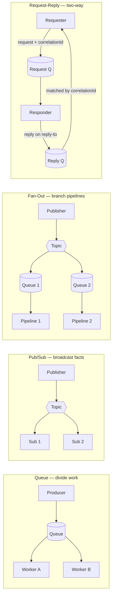
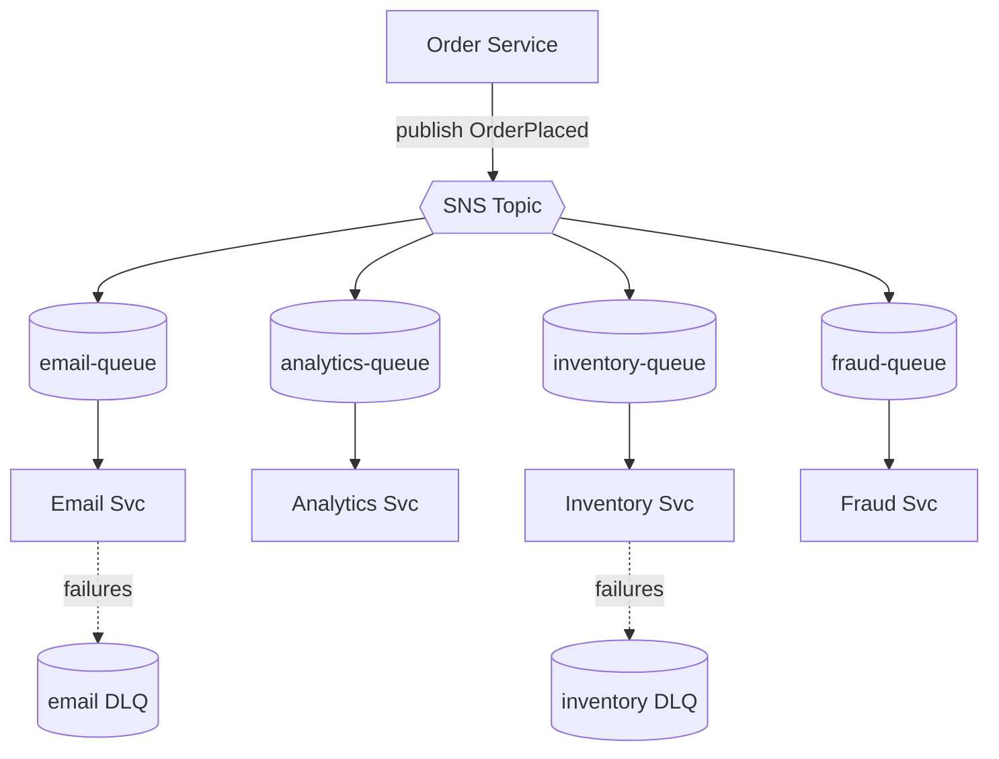
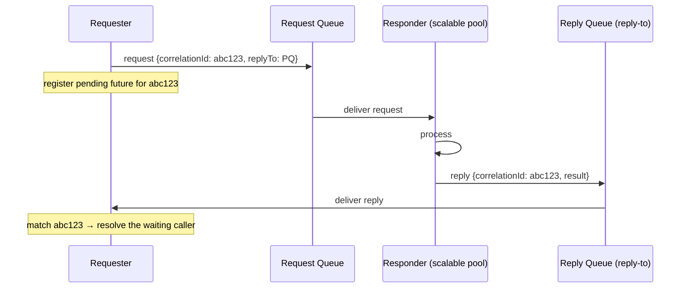
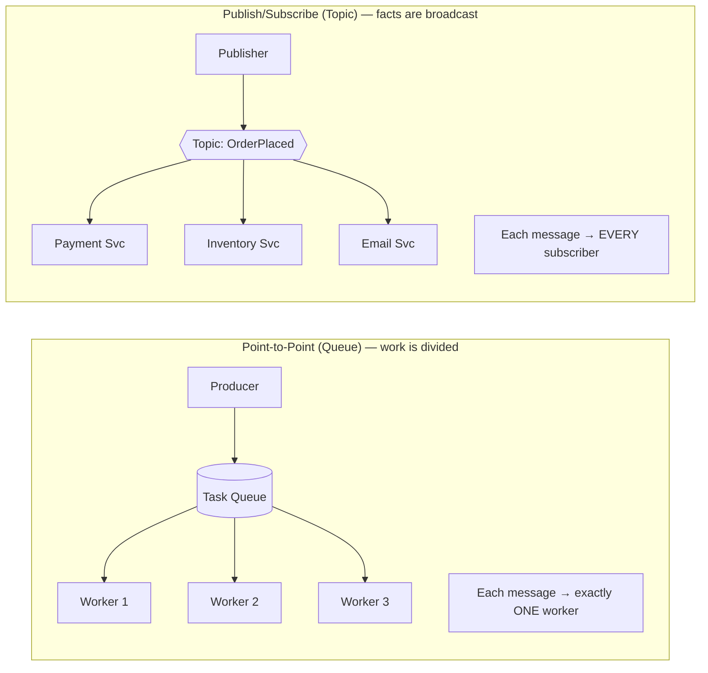
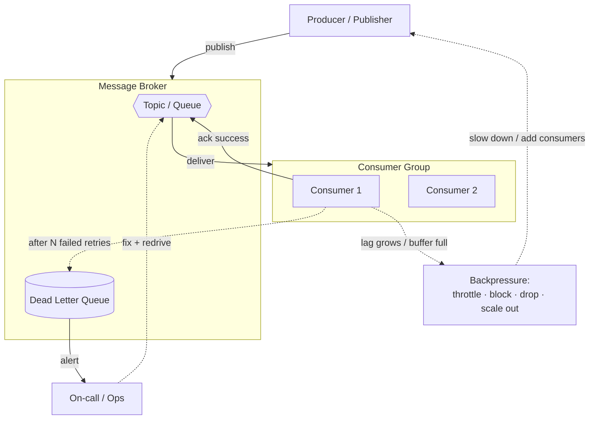
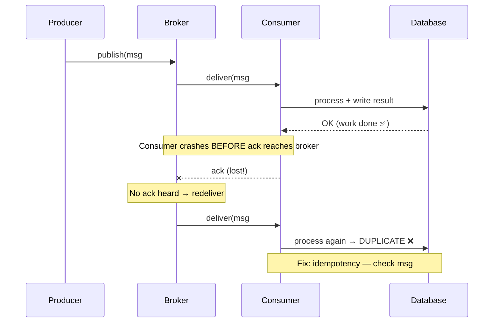
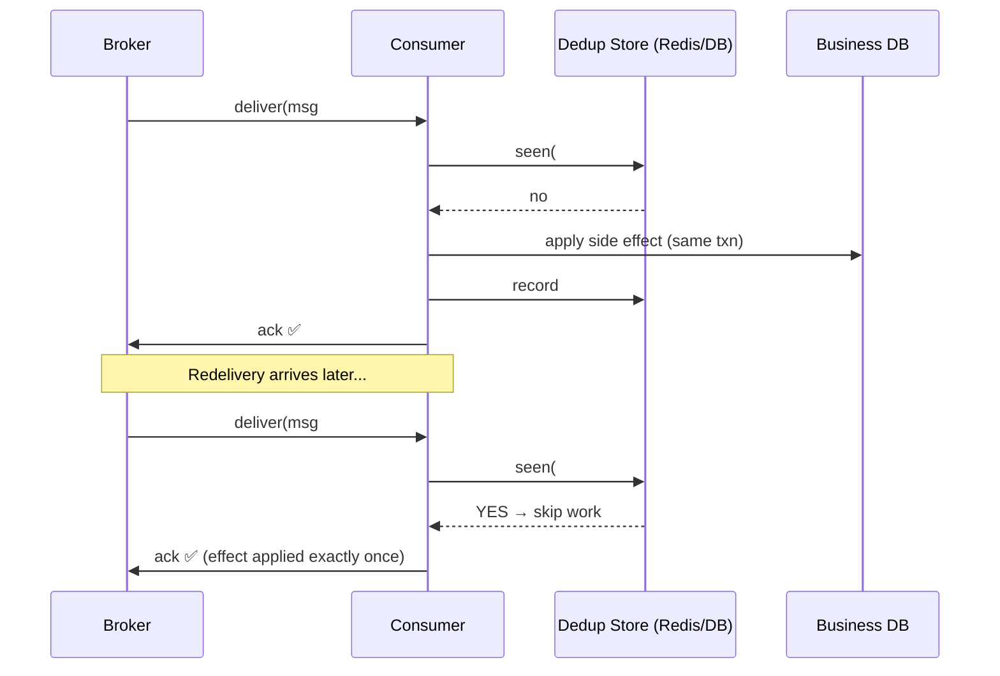
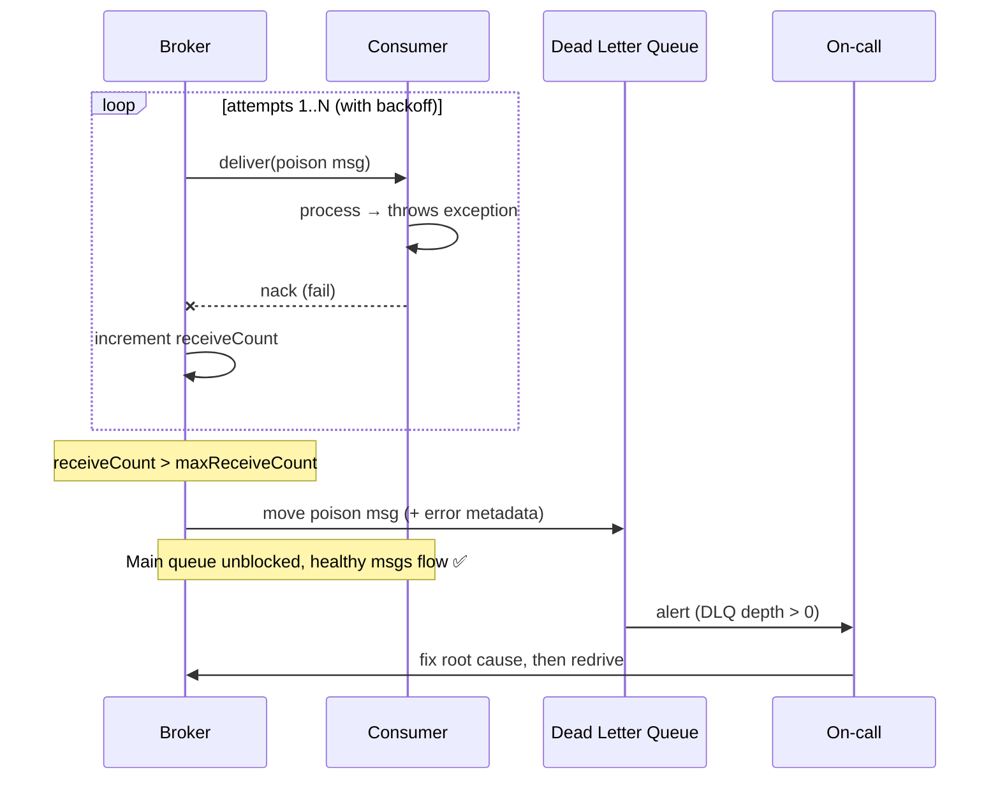
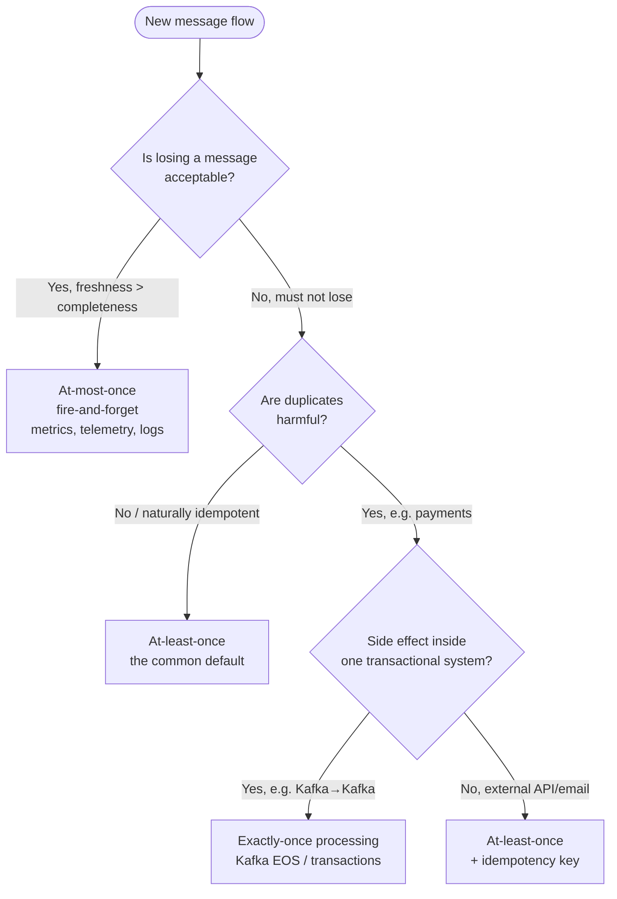

# 📨 Messaging in Microservices — Pub/Sub, Delivery Guarantees, DLQ & Backpressure — A Complete Study Guide

> *"In a monolith, components talk by calling each other's functions. In microservices, they talk by sending each other messages. Everything hard about distributed systems — ordering, duplication, loss, overload, failure — shows up the moment that first message crosses the wire."*

This guide takes you from the plain-English idea of "services send each other messages" all the way to the tunable, per-component trade-offs a staff engineer reasons about when a messaging design is the difference between a system that absorbs a 10× traffic spike and one that silently drops orders. It is one self-contained document that first covers the **messaging topologies** — how messages are routed between services (**Queues / Point-to-Point**, **Publish/Subscribe**, **Fan-Out**, and **Request-Reply**) — and then the **reliability concerns** that every one of those topologies must handle (**Delivery Guarantees**, **Dead Letter Queues & Poison Messages**, and **Backpressure**). These belong together because in practice you never design one without the others. Read it top to bottom: each section escalates naturally, from definitions to theory to mechanism to the hard follow-up questions an interviewer keeps pushing on.

---

## 📋 Table of Contents

1. [🎯 Introduction: Why Microservices Talk in Messages](#-introduction-why-microservices-talk-in-messages)
2. [✅ Core Definitions](#-core-definitions)
3. [💡 The Concept and Theory: Synchronous vs. Asynchronous Communication](#-the-concept-and-theory-synchronous-vs-asynchronous-communication)
4. [🎓 Why Messaging Exists](#-why-messaging-exists)
5. [🧭 The Four Messaging Topologies: A Map](#-the-four-messaging-topologies-a-map)
6. [📥 Queues & Point-to-Point (Competing Consumers)](#-queues--point-to-point-competing-consumers)
   - [What a Queue Is](#what-a-queue-is)
   - [Competing Consumers: Scaling Work Horizontally](#competing-consumers-scaling-work-horizontally)
   - [Visibility Timeout, Acks, and In-Flight Messages](#visibility-timeout-acks-and-in-flight-messages)
   - [When to Reach for a Queue](#when-to-reach-for-a-queue)
7. [📡 Publish/Subscribe (Pub/Sub)](#-publishsubscribe-pubsub)
   - [What Pub/Sub Is](#what-pubsub-is)
   - [Queues vs. Topics: Point-to-Point vs. Pub/Sub](#queues-vs-topics-point-to-point-vs-pubsub)
   - [Push vs. Pull Delivery](#push-vs-pull-delivery)
   - [The Real Trade-off: Decoupling vs. Visibility](#the-real-trade-off-decoupling-vs-visibility)
8. [📢 Fan-Out](#-fan-out)
   - [What Fan-Out Is](#what-fan-out-is)
   - [The SNS→SQS Fan-Out Pattern](#the-snssqs-fan-out-pattern)
   - [Fan-Out Trade-offs and Failure Isolation](#fan-out-trade-offs-and-failure-isolation)
9. [🔄 Request-Reply (Sync-over-Async)](#-request-reply-sync-over-async)
   - [What Request-Reply Is](#what-request-reply-is)
   - [Correlation ID and Reply-To](#correlation-id-and-reply-to)
   - [When Request-Reply Is Right (and When It's a Smell)](#when-request-reply-is-right-and-when-its-a-smell)
10. [📊 Delivery Guarantees](#-delivery-guarantees)
    - [At-Most-Once](#1-at-most-once)
    - [At-Least-Once](#2-at-least-once)
    - [Exactly-Once (and Why It's a Myth and Not a Myth)](#3-exactly-once-and-why-its-a-myth-and-not-a-myth)
    - [Idempotency: The Practical Answer](#idempotency-the-practical-answer)
    - [Ordering Guarantees](#ordering-guarantees)
11. [💀 Dead Letter Queues (DLQ) & Poison Messages](#-dead-letter-queues-dlq--poison-messages)
    - [What a DLQ Is and Why It Exists](#what-a-dlq-is-and-why-it-exists)
    - [Poison Messages and Redelivery Loops](#poison-messages-and-redelivery-loops)
    - [What to Do With a DLQ](#what-to-do-with-a-dlq)
12. [🌊 Backpressure](#-backpressure)
    - [What Backpressure Is](#what-backpressure-is)
    - [The Fast Producer / Slow Consumer Problem](#the-fast-producer--slow-consumer-problem)
    - [Strategies: Buffer, Drop, Throttle, Block](#strategies-buffer-drop-throttle-block)
    - [Pull-Based Backpressure and Flow Control](#pull-based-backpressure-and-flow-control)
13. [🎨 Architecture and Sequence Diagrams](#-architecture-and-sequence-diagrams)
14. [🔗 How the Concepts Fit Together](#-how-the-concepts-fit-together)
15. [🌍 Categorized Real-World Examples](#-categorized-real-world-examples)
16. [❌ Common Misconceptions](#-common-misconceptions)
17. [🧠 Staff-Level Nuance](#-staff-level-nuance)
18. [🧩 Extensions and Adjacent Concepts](#-extensions-and-adjacent-concepts)
19. [⚡ Quick Revision](#-quick-revision)
20. [🎓 FAANG Interview Q&A](#-faang-interview-qa)
21. [📚 References & Further Reading](#-references--further-reading)

---

## 🎯 Introduction: Why Microservices Talk in Messages

Imagine an e-commerce checkout. A customer clicks "Place Order." Behind that one click, a dozen things must happen: the order is recorded, payment is charged, inventory is reserved, a confirmation email goes out, a recommendation model is updated, the warehouse is notified, analytics are logged, and a loyalty-points balance is bumped. In a monolith, all of that could be a single function call stack inside one process. In a microservices architecture, each of those is a *separate service*, often owned by a *separate team*, running on a *separate machine*, possibly written in a *separate language*.

So how do they coordinate? The naive answer is: the Order Service makes a direct HTTP call to each of the others and waits. But that means checkout is only as fast as the slowest downstream, only as available as the *least* available downstream, and the Order Service must know about — and be coupled to — every service that cares about an order. Add a new "fraud check" service next quarter and you have to modify and redeploy the Order Service. This is the tight-coupling trap, and it does not scale to hundreds of services.

Messaging is the escape hatch. Instead of calling services directly, the Order Service publishes a single fact — *"OrderPlaced: order #12345"* — to a message broker and immediately returns to the customer. Every other service that cares subscribes to that fact and reacts on its own schedule. The Order Service does not know or care who is listening. This is the heart of **event-driven, asynchronous, message-based** communication, and it is the dominant integration style in large microservice systems.

But the moment you send a message over a network to a broker and on to consumers, a whole new set of questions appears — questions that simply don't exist for an in-process function call. They come in two layers. First, **topology**: *how does a message get from a producer to the right consumer(s)?* Should it go to exactly one worker (a **queue**), to every interested service (**pub/sub**), be broadcast to many parallel branches (**fan-out**), or carry an expected answer back (**request-reply**)? Second, **reliability**: once you've picked a topology, *what if the message is lost? delivered twice? arrives out of order? can never be processed no matter how many times we try? arrives faster than the consumer can handle?* Those map to **Delivery Guarantees** (loss and duplication), **Dead Letter Queues & Poison Messages** (the unprocessable), and **Backpressure** (rate mismatch). This guide walks the topologies first, then the reliability concerns that every topology must confront — master both layers and you understand the real engineering of messaging.

<details>
<summary>📖 Beginner-friendly explanation — click to expand</summary>

Think of an office. The tightly-coupled way is walking to a colleague's desk and standing there until they finish your request — if they're at lunch, you're stuck, and if you need five colleagues you visit five desks in a row. The messaging way is dropping a note in each person's inbox and going back to your own work; they pick it up and act when they can. Adding a new colleague just means they start checking the shared inbox — nobody else changes their routine. That's what a message broker does for services. The rest of this guide is about the awkward realities of inboxes: notes that get lost, notes that get photocopied twice, a jammed note nobody can act on, and an inbox that overflows faster than anyone can read it.

</details>

---

## ✅ Core Definitions

Before going deeper, here is the vocabulary you will see throughout the guide and in every messaging interview.

**Message** — A self-contained unit of data sent from one component to another. It may be a *command* ("do this") or an *event* ("this happened"). It carries a payload plus metadata (headers, keys, timestamps).

**Message broker (message-oriented middleware)** — The intermediary infrastructure that receives, stores, and routes messages between producers and consumers. Examples: Apache Kafka, RabbitMQ, Amazon SQS/SNS, Google Pub/Sub, Apache Pulsar, NATS.

**Producer (publisher)** — A component that sends messages to the broker. It does not know or care who will consume them.

**Consumer (subscriber)** — A component that reads and processes messages from the broker.

**Queue** — A named destination holding messages for *point-to-point* delivery: each message is delivered to exactly one consumer among a group. Work is distributed, not duplicated.

**Topic** — A named destination for *publish/subscribe*: each message is delivered to *every* interested subscriber. Facts are broadcast, not divided.

**Publish/Subscribe (Pub/Sub)** — A messaging pattern where publishers emit messages to topics without knowledge of subscribers, and any number of subscribers receive copies.

**Point-to-point** — The delivery model of a queue: one message is consumed by exactly one consumer. Contrast with pub/sub, where one message reaches all subscribers.

**Competing consumers** — Multiple consumer instances reading the *same* queue, dividing the messages among themselves so work is processed in parallel and the pool is resilient to any one consumer dying.

**Fan-out** — A topology where a single incoming message is multiplied out to many parallel destinations/consumers at once — usually a topic wired to multiple queues (e.g. SNS→SQS) — so many independent branches each get their own copy to process on their own terms.

**Request-reply (request-response)** — A two-way messaging pattern where the sender expects an answer: it sends a request message and correlates the reply that comes back on a return channel. It layers a synchronous-feeling interaction on top of asynchronous messaging ("sync over async").

**Correlation ID** — A unique identifier attached to a request and echoed on its reply, so the sender can match an incoming response to the specific request it was waiting on when many are in flight.

**Reply-to** — Metadata on a request naming the channel/queue where the responder should send the reply, so responders don't need hard-coded knowledge of each caller.

**Visibility timeout** — In queues like SQS, the window during which a message a consumer has received is hidden from other consumers. If the consumer acks (deletes) within it, the message is done; if not, it becomes visible again for redelivery.

**Delivery guarantee** — The contract about how many times a message will be delivered in the face of failures: *at-most-once*, *at-least-once*, or *exactly-once*.

**Idempotency** — A property where processing the same message multiple times has the same effect as processing it once. It is what makes at-least-once delivery safe.

**Acknowledgement (ack/nack)** — A signal from a consumer back to the broker confirming a message was successfully processed (ack) or failed (nack). Acks are how the broker knows it can stop redelivering.

**Offset / cursor** — In log-based brokers like Kafka, the position marker recording how far a consumer has read. Committing an offset is that broker's form of acknowledgement.

**Dead Letter Queue (DLQ)** — A special holding queue where messages that repeatedly fail processing (or expire, or are malformed) are moved so they stop blocking the main flow and can be inspected later.

**Poison message** — A message that can never be processed successfully — malformed, referencing deleted data, or triggering a bug — and would otherwise be retried forever.

**Backpressure** — A mechanism by which a slow consumer signals a fast producer to slow down, so the system doesn't run out of memory or collapse under a rate mismatch.

**Consumer group** — A set of consumer instances that cooperate to consume a queue/topic, dividing the partitions or messages among themselves for horizontal scale.

---

## 💡 The Concept and Theory: Synchronous vs. Asynchronous Communication

At the core, every inter-service interaction is either **synchronous** or **asynchronous**, and messaging is the technology of the asynchronous world.

In **synchronous** (request/response) communication — a REST call, a gRPC call — the caller sends a request and *blocks*, waiting for the response before it can continue. The two services are *temporally coupled*: both must be up and reachable at the same instant, and the caller's latency is the sum of everything downstream. This is simple to reason about and perfect when you genuinely need an answer right now ("is this card valid?"), but it propagates failure and latency directly up the chain.

In **asynchronous** (message-based) communication, the producer hands a message to a broker and moves on — it does *not* wait for the consumer to process it. The two services are *temporally decoupled*: the consumer can be down, slow, or scaling up, and the message waits safely in the broker until it's ready. The producer's latency is just the time to write to the broker, regardless of how long the actual work takes downstream. This is the foundation of resilience and scalability in large systems, at the cost of *eventual* consistency and harder end-to-end reasoning.

The theoretical shift messaging introduces is this: **you trade immediate certainty for decoupled resilience.** With a synchronous call you know the outcome immediately, but you're fragile. With a message you don't know the outcome yet — maybe not for seconds — but you've made the system far more tolerant of partial failure. Everything else in this guide is about managing the consequences of that trade: because the broker sits *between* producer and consumer holding state, it must decide how hard to try to deliver (delivery guarantees), what to do when delivery is impossible (DLQ), and what to do when the consumer can't keep up (backpressure). Pub/Sub, meanwhile, is about *how many* consumers a given message reaches.

<details>
<summary>📖 Beginner-friendly explanation — click to expand</summary>

Synchronous is a phone call: you both have to be on the line at the same time, and you wait, silent, until the other person answers your question. Asynchronous is a text message: you send it and get on with your day; they reply when they can, and neither of you has to be free at the same moment. Microservices mostly text each other. It's more resilient — if your friend's phone is off, your text isn't lost, it just waits — but you give up the instant "yes/no" you'd get on a call, and you have to handle replies that arrive later, twice, or out of order.

</details>

### A concrete walk-through

Return to checkout. With synchronous calls, "Place Order" looks like this and takes as long as the slowest link:

```text
Order Service ──HTTP──▶ Payment (900ms)
              ──HTTP──▶ Inventory (300ms)
              ──HTTP──▶ Email (2s, timing out...)   ← customer waits, order fails
```

If the Email Service is down, the *entire order fails* even though emailing a receipt is not essential to placing an order. With messaging:

```text
Order Service ──publish "OrderPlaced"──▶ [Broker]  (5ms, customer sees "Order confirmed!")
                                            │
                    ┌───────────────────────┼───────────────────────┐
                    ▼                        ▼                        ▼
              Payment Svc             Inventory Svc              Email Svc
           (processes when ready)  (processes when ready)   (down now, processes later)
```

The customer gets an instant confirmation. Email being down delays the receipt by a few minutes but never blocks the order. That decoupling — in *time*, in *availability*, and in *knowledge of who's listening* — is the entire value proposition of messaging.

---

## 🎓 Why Messaging Exists

Messaging exists because **direct, synchronous service-to-service calls create coupling that becomes unmanageable as a system grows.** The problems it solves are concrete and compounding:

- **Temporal coupling.** Synchronous calls require caller and callee to be available simultaneously. A broker lets a producer send while the consumer is down, mid-deploy, or scaling — the message simply waits.
- **Availability coupling (failure propagation).** In a synchronous chain, one slow or dead downstream drags down everyone upstream. Messaging isolates failures: a stuck consumer's backlog grows in the broker instead of cascading into a customer-facing outage.
- **Load coupling / traffic spikes.** A flash sale sends 10× traffic. Synchronous downstreams get overwhelmed and fall over. A broker *absorbs the spike as a buffer* — the queue grows, consumers drain it at their own steady pace, and nothing collapses. This is often called "load leveling" or the "queue-based load leveling" pattern.
- **Knowledge coupling.** In synchronous fan-out the caller must know every downstream. With Pub/Sub the producer emits one event and is blissfully unaware of its ten subscribers. New subscribers are added with zero changes to the producer — the single most powerful property for evolving large systems independently.
- **Throughput and smoothing.** Expensive work (video transcoding, PDF generation, ML inference) can be handed off asynchronously so the user-facing request returns instantly while the heavy lifting happens in the background at a sustainable rate.

The deeper reason is organizational as much as technical: messaging lets independent teams build, deploy, and scale their services *without coordinating releases*. That autonomy is the entire promise of microservices, and asynchronous messaging is the communication style that makes it real. The cost — and the reason this guide is long — is that the broker in the middle inherits every hard distributed-systems problem: it must decide what "delivered" means, what to do with the undeliverable, and how to behave when one side is faster than the other.

<details>
<summary>📖 Beginner-friendly explanation — click to expand</summary>

Picture a busy restaurant. If every waiter walked each order into the kitchen and stood watching the chef cook it before taking the next table, the restaurant would grind to a halt at lunch rush. Instead waiters clip orders onto a rail (the broker); the kitchen works through them at a steady pace. Waiters keep serving, the kitchen never gets mobbed all at once, and if the dessert station is briefly swamped, dessert tickets just wait on the rail — the rest of the meal still goes out. Messaging is that order rail for software: it lets the front and back of the house work at their own speeds without either one blocking the other.

</details>

---

## 🧭 The Four Messaging Topologies: A Map

Before diving into any one pattern, it helps to see the whole landscape, because interviewers and real designs constantly move between these four *topologies* — the shapes a message flow can take. They answer one question: **how does a message get from a producer to the consumer(s) that should handle it?** Everything later in the guide (delivery guarantees, DLQs, backpressure) applies *on top of* whichever topology you pick.

| Topology | Recipients per message | Direction | Answer expected? | Canonical use | Tech examples |
|---|---|---|---|---|---|
| **Queue (Point-to-Point)** | Exactly one consumer | One-way | No | Distribute *work/commands* | SQS, RabbitMQ queue, Kafka within a group |
| **Publish/Subscribe** | Every subscriber gets a copy | One-way | No | Broadcast *events/facts* | SNS, Kafka across groups, RabbitMQ fanout exchange |
| **Fan-Out** | Many parallel branches at once | One-way | No | One event → many independent pipelines | SNS→SQS, EventBridge → many targets |
| **Request-Reply** | One responder, reply comes back | Two-way | Yes | Ask a question, await an answer, asynchronously | RabbitMQ reply-to queues, JMS `QueueRequestor`, gRPC-over-broker |

The mental model: a **queue** *divides* work among workers; **pub/sub** *broadcasts* a fact to everyone interested; **fan-out** is pub/sub used to *branch* one event into many independent processing pipelines (often topic-to-many-queues so each branch gets its own durable buffer and DLQ); and **request-reply** bolts a *two-way conversation* onto the otherwise one-way world of messaging. The first three are "fire and (mostly) forget"; the fourth is the one place messaging deliberately re-introduces waiting for an answer. The next four sections take each in turn, weakest-coupling to most-coupling.



<details>
<summary>📖 Beginner-friendly explanation — click to expand</summary>

Four ways to move a message around. A **queue** is a job jar shared by a team — each slip is grabbed by one free worker, so the pile gets worked through faster with more hands. **Pub/sub** is a bulletin-board notice — everyone who cares reads their own copy. **Fan-out** is photocopying that notice and dropping one in each department's own inbox, so each department works it at their own pace without stepping on each other. And **request-reply** is the one where you actually want an answer back — you send a note with a tracking number and wait for the reply that quotes the same number, so you know which of your many questions it answers. Pick the shape that matches what you're trying to do; the rest of the guide is about making each shape reliable.

</details>

---

## 📥 Queues & Point-to-Point (Competing Consumers)

### What a Queue Is

A **queue** is a named destination that holds messages and delivers each one to **exactly one** consumer. This is the **point-to-point** model, and it exists to answer a specific need: *distributing work.* When the message is a *command* — "resize this image," "send this email," "charge this payment," "generate this PDF" — you want it done **once**, by **whichever worker is free**, not broadcast to everyone. The queue is the buffer between the thing producing work and the pool of workers doing it.

Mechanically, a producer enqueues a message; the broker holds it durably until a consumer takes it; the consumer processes it and *acknowledges*, at which point the broker removes it. If the consumer fails before acking, the message goes back on the queue for another worker. The queue is also a natural **load-leveler**: if work arrives in bursts, the queue absorbs the spike and workers drain it at their own steady rate, so the producers never overwhelm the workers directly. This is exactly the *queue-based load leveling* property mentioned earlier — the queue turns a spiky arrival pattern into a smooth processing pattern.

<details>
<summary>📖 Beginner-friendly explanation — click to expand</summary>

A queue is the ticket spike at a diner kitchen. Waiters keep clipping orders on; whichever cook is free grabs the next one and makes it. Each order is cooked once, by one cook — not photocopied to every cook. If a cook drops an order mid-cook (burns it, walks off), it goes back on the spike for someone else. And when a rush hits, the orders just stack up on the spike instead of ten waiters shouting at the cooks at once — the kitchen works through them steadily. That's a work queue: one job, one worker, and a buffer that soaks up the rush.

</details>

### Competing Consumers: Scaling Work Horizontally

The reason queues scale is the **Competing Consumers** pattern: you run *multiple* consumer instances all reading the *same* queue, and they *compete* for messages — the broker hands each message to just one of them. This gives you three things at once. **Throughput**: double the consumers and (up to limits) roughly double the processing rate, because messages are divided among them. **Resilience**: if one consumer crashes, the others keep draining the queue, and the crashed consumer's un-acked message is redelivered to a survivor. **Elasticity**: you scale the consumer count up during a spike and down when it's quiet, entirely independently of the producers.

The limits are worth naming because they're common interview follow-ups. Adding consumers helps *only* up to the available parallelism: in Kafka you can't usefully have more consumers in a group than partitions (extras sit idle), and if you require per-key **ordering**, you're capped at one consumer per key-group — so competing consumers and strict ordering are in tension (covered in [Ordering Guarantees](#ordering-guarantees)). Also, with several consumers working in parallel, the *global* order in which messages complete is no longer the order they were enqueued — which is fine for independent tasks but not for a strict sequence.

<details>
<summary>📖 Beginner-friendly explanation — click to expand</summary>

If one cook can't keep up at lunch, you don't buy a faster cook — you add more cooks to the same ticket spike. Now three cooks pull tickets in parallel and the line moves three times as fast, and if one cook calls in sick the other two still cover. The catch: you can only add cooks up to a point (there's only so much counter space), and if some dishes *must* go out in a strict order (appetizer before entrée for one table), you can't split *that table's* tickets across cooks without risking the entrée arriving first. So more cooks = more speed, except where order matters.

</details>

### Visibility Timeout, Acks, and In-Flight Messages

The subtle mechanism that makes competing consumers safe is how the broker prevents two workers from grabbing the *same* message. The dominant approach (Amazon SQS is the reference) is the **visibility timeout**: when a consumer receives a message, the broker doesn't delete it — it makes it *invisible* to other consumers for a configured window. If the consumer finishes and *deletes/acks* the message within the window, it's done. If the consumer crashes or is too slow and the window expires, the message becomes *visible again* and another consumer picks it up. This is the concrete machinery behind at-least-once delivery for queues: nothing is deleted until it's positively acknowledged, so nothing is lost — but a slow consumer whose timeout expires *while it's still working* causes a **duplicate**, which is exactly why idempotency matters (see [Delivery Guarantees](#-delivery-guarantees)).

The staff-level tuning knobs: set the visibility timeout to comfortably exceed your worst-case processing time, or a healthy-but-slow message gets redelivered and processed twice; for long jobs, *extend* the timeout mid-flight (SQS's `ChangeMessageVisibility`, a "heartbeat") rather than setting one huge static value that would delay redelivery when a consumer genuinely dies. RabbitMQ frames the same idea differently — a message delivered to a consumer is "unacked" and held until the consumer sends `basic.ack`; if the connection drops, it's requeued — and its *prefetch* count caps how many unacked messages a consumer may hold at once, which is both a fairness and a backpressure control.

### When to Reach for a Queue

Reach for a point-to-point queue when the message represents **work that should happen exactly once by one worker**, and you want to **decouple the rate of producing that work from the rate of doing it**. Canonical fits: background job processing (image/video transcoding, report generation), task offloading from a request path (return to the user instantly, do the slow thing async), smoothing bursty load into steady worker throughput, and any producer/consumer speed mismatch you want the broker to absorb. Choose a *queue* (not a topic) whenever the answer to "should more than one service react to this?" is **no** — it's a command, not an event. If the answer is "yes, several independent services care," you want pub/sub or fan-out instead, which is exactly where we go next.

---

## 📡 Publish/Subscribe (Pub/Sub)

### What Pub/Sub Is

Publish/Subscribe is a messaging pattern in which **publishers send messages to a named channel (a topic) without any knowledge of who — if anyone — is listening, and any number of subscribers independently receive their own copy of every message.** The broker sits in the middle and is responsible for delivering a copy to each subscriber. The publisher's mental model is "I am announcing that something happened"; the subscriber's model is "I care about this kind of thing and will react whenever one arrives."

The defining property is **decoupling in three dimensions simultaneously**:

- **Space decoupling** — publisher and subscriber don't know each other's identity or location. They only share the topic name.
- **Time decoupling** — they don't need to be active at the same moment; the broker holds messages for subscribers that are currently offline (depending on retention config).
- **Synchronization decoupling** — publishing is non-blocking. The publisher does not wait for subscribers to process anything.

Contrast this with the two things Pub/Sub is *not*. It is not a direct call (that's coupled and synchronous), and it is not a work queue where one message goes to one worker (that's point-to-point). Pub/Sub is specifically *broadcast*: one event, many independent reactions.

<details>
<summary>📖 Beginner-friendly explanation — click to expand</summary>

Pub/Sub is like a newspaper. The paper (publisher) prints a story and drops copies at the depot (broker). It has no idea who subscribes — could be ten readers, could be ten thousand — and it doesn't wait for anyone to finish reading before printing tomorrow's edition. Each subscriber gets their own copy in their own mailbox and reads it whenever they like. If you cancel your subscription or a new neighbor signs up, the newspaper's presses don't change at all. That's the magic: the sender broadcasts a fact once, and adding or removing listeners never touches the sender.

</details>

### Queues vs. Topics: Point-to-Point vs. Pub/Sub

The single most important distinction in messaging is between two delivery models, and interviewers probe it constantly because people conflate them.

**Point-to-point (queue).** A message goes to a *queue*, and exactly **one** consumer among those reading the queue processes it. If you run five worker instances reading the same queue, each message is handled by one of the five — the work is *distributed* for parallelism and load balancing. This is the model for *tasks/commands*: "resize this image," "send this email," "charge this payment." You want the work done once, by whichever worker is free.

**Publish/subscribe (topic).** A message goes to a *topic*, and **every** subscriber gets its own copy. Five different services subscribed to `OrderPlaced` all receive every order event. This is the model for *events/facts*: "an order was placed," and Payment, Inventory, Email, and Analytics each react in their own way.

The subtlety that trips people up: real systems combine both. In Kafka, a *topic* is subscribed to by multiple *consumer groups* (that's the Pub/Sub part — each group gets all messages), but *within* a single consumer group, each message goes to only one consumer instance (that's the point-to-point/load-balancing part). So Kafka is Pub/Sub *across* groups and point-to-point *within* a group. RabbitMQ expresses the same duality through *exchanges* (which route to queues by rules) and *queues* (which load-balance among consumers). AWS splits them into separate products: **SQS** is the queue (point-to-point) and **SNS** is the topic (fan-out), and the common "SNS → SQS fan-out" pattern wires a topic to multiple queues to get both.

| Aspect | Point-to-Point (Queue) | Publish/Subscribe (Topic) |
|---|---|---|
| **Recipients per message** | Exactly one consumer | Every subscriber gets a copy |
| **Purpose** | Distribute work / commands | Broadcast events / facts |
| **Scaling model** | Add consumers → more parallelism | Add subscribers → more reactions |
| **Coupling** | Producer knows the queue | Producer knows only the topic |
| **Typical message** | "Do this task" (command) | "This happened" (event) |
| **Examples** | SQS, RabbitMQ queue, Kafka within a group | SNS, RabbitMQ fanout exchange, Kafka across groups |

<details>
<summary>📖 Beginner-friendly explanation — click to expand</summary>

Two ways to hand out work. A queue is like a deli ticket line: many customers, one "now serving" — each ticket is called once, by whichever clerk is free, so the work gets split up. A topic is like a group chat announcement: you post once and *everyone* in the group sees it and can react. Use a queue when a job should be done once by someone ("package this order"). Use a topic when a fact should be known by many ("the order shipped" → email team, analytics team, and loyalty team all care). Big systems use both at once, which is why the distinction feels blurry until you name it.

</details>

### Push vs. Pull Delivery

Once a message is in the broker, how does it reach the consumer? Two models, with a real trade-off.

In **push** delivery, the broker actively sends messages to consumers as they arrive (RabbitMQ's default, SNS to HTTP endpoints, Google Pub/Sub push subscriptions). It's low-latency — messages go out the instant they land — but the broker controls the pace, so a burst can overwhelm a slow consumer unless there's a limit (RabbitMQ's *prefetch* count caps how many unacked messages a consumer may hold). Push makes backpressure harder because the sender sets the rate.

In **pull** delivery, consumers *ask* for messages when they're ready for more (Kafka, SQS, Google Pub/Sub pull subscriptions). It's the natural home of backpressure: a consumer that's busy simply doesn't poll for more, so it can never be flooded — it self-regulates. The cost is a little latency (polling interval) and some wasted empty polls when idle, which *long polling* mitigates by letting a poll wait for messages to arrive. Most high-throughput systems (Kafka above all) are pull-based precisely because pull gives the consumer flow control for free.

### The Real Trade-off: Decoupling vs. Visibility

Pub/Sub's superpower — the publisher knowing nothing about subscribers — is also its central difficulty. Because no one component knows the whole flow, **the system becomes harder to see, trace, and reason about.** In a synchronous call chain you can read the code and follow the calls; in an event-driven system the "flow" is an emergent property of who happens to subscribe to what, and it lives in configuration and runtime bindings, not in any single codebase.

This produces the well-known pains of event-driven architecture: debugging requires distributed tracing (correlation IDs threaded through every message) because a stack trace stops at the publish call; you can accidentally create *event chains* where one event triggers a handler that emits another event that triggers another, and reasoning about the end-to-end effect (or an infinite loop) is hard; and there's no compile-time check that anyone is actually listening to an event you emit, or that subscribers agree on the message *schema*. The staff-level counter-measures are **schema registries** (enforce message contracts, e.g. Confluent Schema Registry with Avro/Protobuf), **distributed tracing** (OpenTelemetry correlation IDs), and treating events as **versioned published contracts** rather than casual internal messages. The trade is real and permanent: you gain enormous decoupling and lose the ability to understand the system by reading one call stack.

<details>
<summary>📖 Beginner-friendly explanation — click to expand</summary>

The upside of broadcasting facts is that the announcer never has to keep a guest list. The downside is that later, when something goes wrong, *nobody* has the full guest list either. If a customer never got their receipt, there's no single line of code that says "and then email the receipt" — instead the Email service happened to be subscribed to order events, somewhere else. Following what actually happens means tagging every message with a tracking ID and stitching the story back together from logs across many services. You traded "easy to follow" for "easy to change," and in big systems that's usually a trade worth making — but you pay for it in debugging.

</details>

---

## 📢 Fan-Out

### What Fan-Out Is

**Fan-out is the topology where a single incoming message is multiplied out to many destinations at once**, so that multiple independent pipelines each receive their own copy and process it in parallel. It is pub/sub taken one practical step further: pub/sub says "every subscriber gets a copy," and fan-out is the concrete architecture you build when those "subscribers" are *full processing pipelines* that each need their own durable buffer, their own scaling, their own retry policy, and their own DLQ.

The distinction from plain pub/sub is subtle but important for interviews. Pub/sub is the *delivery semantic* (one-to-many copies). Fan-out is the *deployment topology* that realizes it robustly: instead of many consumers subscribing directly to one topic (where a slow or broken subscriber can create problems, and each has no buffer of its own), you place a **queue in front of each branch**. The topic fans the message out into N queues, and each downstream pipeline owns its queue. Now each branch can be down, slow, or replaying its DLQ *completely independently* of the others — the topic's job was just to duplicate the message into each branch's mailbox.

<details>
<summary>📖 Beginner-friendly explanation — click to expand</summary>

Fan-out is the office memo that gets photocopied and dropped into several departments' inboxes at once. One announcement — "big client signed!" — but Sales, Finance, and Onboarding each get their own copy in their own tray and act on it at their own pace. Crucially, each department has *its own* inbox: if Finance is swamped and their tray piles up, Sales and Onboarding aren't affected at all. That per-department inbox is the difference between "just broadcasting" and true fan-out — everyone gets the news *and* nobody's backlog is anyone else's problem.

</details>

### The SNS→SQS Fan-Out Pattern

The canonical implementation — asked about constantly — is **AWS's SNS→SQS fan-out**. You publish an event once to an **SNS topic**; that topic has multiple **SQS queues** subscribed to it; SNS delivers a copy of the message into *every* subscribed queue; and each queue is drained by its own consumer service. One `OrderPlaced` publish lands simultaneously in the `email-queue`, the `analytics-queue`, the `inventory-queue`, and the `fraud-queue`, and four teams process it on their own terms.

Why not have the four services subscribe to the topic directly? Because the queue in the middle buys you durability and independence: **each branch gets a durable buffer** (if the analytics consumer is down for an hour, its messages wait safely in *its* queue while the others keep flowing), **each branch scales independently** (competing consumers per queue), **each branch has its own visibility timeout, retry count, and DLQ**, and **each branch absorbs its own bursts**. The topic is a dumb multiplier; the queues are where reliability lives. Google Cloud Pub/Sub achieves the same with multiple subscriptions on one topic; Kafka achieves it with multiple consumer groups on one topic; AWS EventBridge fans one event out to many targets with content-based routing rules on top.



### Fan-Out Trade-offs and Failure Isolation

The headline benefit is **failure isolation and independent evolution**: a poison message or an outage in one branch cannot block or slow the others, because each has its own queue and DLQ. Adding a fifth branch (say, a new recommendations pipeline) is a pure addition — subscribe a new queue, deploy a new consumer, and *no existing branch or the producer changes at all*. This is the property that lets large organizations bolt new capabilities onto core events indefinitely.

The costs a staff engineer names: **message duplication multiplies storage and cost** (N copies of every event across N queues — at high volume this is a real bill), **delivery is at-least-once per branch** so *each* consumer must be idempotent independently (a redelivery in the analytics branch is unrelated to the email branch), **ordering across branches is not coordinated** (each queue is drained at its own pace, so branch A may be minutes ahead of branch B), and **observability fragments** (one logical event now has N independent processing outcomes you must monitor and correlate, typically via a shared correlation ID). There's also a subtle **fan-out amplification** concern: one event exploding into many downstream calls can create load spikes deep in the system, the same amplification worry that applies to retries. The design rule: use fan-out when the branches are genuinely *independent* reactions to one fact; if they must coordinate or share an outcome, fan-out is the wrong shape and you likely want an orchestrated workflow (a saga) instead.

<details>
<summary>📖 Beginner-friendly explanation — click to expand</summary>

The beauty of giving each department its own inbox is that they never trip over each other — Finance can be a week behind and Sales won't notice. The price is that you're making a lot of photocopies (that costs paper), each department might accidentally get the memo twice and needs to not double-act on it, and if you later ask "did *everyone* finish acting on that memo?" there's no single place to check — you have to ask each department. Fan-out is fantastic when the departments truly work independently, and the wrong tool when they actually need to hand a task back and forth in sequence.

</details>

---

## 🔄 Request-Reply (Sync-over-Async)

### What Request-Reply Is

Every topology so far is **one-way** — send a message and move on, expecting no answer. **Request-reply** is the exception: it's the pattern for when the sender *does* need a response back. The requester sends a request message and then waits (or asynchronously awaits) a reply message that comes back on a return channel. It deliberately layers a request/response *interaction* — the shape of a normal function call or HTTP request — on top of asynchronous messaging infrastructure, which is why it's often called **"sync over async."**

Why do this instead of just making a direct HTTP/gRPC call? Because you want the *answer* of a synchronous call but the *benefits* of the messaging fabric: the broker's buffering and load-leveling (the request waits in a queue if the responder is briefly busy), location transparency and decoupling (the requester addresses a queue, not a specific host), the ability to have competing responders behind the request queue for scale, and a uniform transport for systems already built on messaging. The classic homes are enterprise/JMS systems, RPC-over-AMQP setups (RabbitMQ's official RPC tutorial), and command flows where you need an acknowledgement or result, not just fire-and-forget.

<details>
<summary>📖 Beginner-friendly explanation — click to expand</summary>

Most messaging is like mailing a postcard — you send it and never expect a reply. Request-reply is like mailing a letter with a stamped return envelope inside: "here's my question, and here's exactly where to send the answer." You don't stand at the mailbox the whole time; you get on with your day and match up the reply when it arrives — recognizing it by a reference number you wrote on both the question and the return envelope. It feels like asking someone a question and getting an answer, but it rides on the mail system instead of a phone call, so it keeps mail's advantages (the letter waits if they're out) while still getting you a reply.

</details>

### Correlation ID and Reply-To

Two pieces of metadata make request-reply work, and interviewers expect you to name both. The **reply-to** field on the request tells the responder *where* to send the answer — the name of a reply queue/channel the requester is listening on — so responders need no hard-coded knowledge of callers and any requester can spin up its own reply channel. The **correlation ID** is a unique token stamped on the request and *echoed back* on the reply, so that a requester with *many* requests in flight can match each incoming reply to the exact request it was waiting on. Without a correlation ID, a single reply queue receiving answers from many concurrent requests would be an unsortable pile; with it, the requester keeps a map of `correlationId → pending request` and routes each reply to the right waiter.



There are two flavors. **Synchronous request-reply** blocks the caller's thread until the reply arrives or a **timeout** fires — simplest to reason about but it ties up a thread and reintroduces temporal coupling. **Asynchronous request-reply** registers a callback/future keyed by the correlation ID and frees the thread, resolving the future when the matching reply lands — more scalable, the norm in reactive systems. Either way, a **timeout is mandatory**: because the responder may be down or the reply lost, the requester must give up after a bound rather than wait forever, and decide whether to retry (which demands an idempotent responder) or fail.

### When Request-Reply Is Right (and When It's a Smell)

Request-reply is right when you genuinely need a **result or confirmation** to proceed and you want it over the messaging fabric — a command that returns a value, a query against a service that only speaks the broker, or a workflow step that must know the outcome before continuing. It's a first-class Enterprise Integration Pattern for exactly these cases.

But a staff engineer flags the **smell**: reaching for request-reply *everywhere* often means you've rebuilt slow, brittle synchronous RPC on top of a broker and taken on the worst of both worlds — the latency and temporal coupling of blocking calls *plus* the operational complexity of a broker, reply queues, correlation bookkeeping, and timeout handling. If you find most of your "events" are actually request-replies, that's a signal the design should be more genuinely event-driven (emit facts, react asynchronously) or should just use direct gRPC/HTTP where a synchronous answer is truly needed. The nuanced position: request-reply is a legitimate, sometimes-necessary tool, but it *narrows* the decoupling that made you choose messaging in the first place, so use it deliberately and sparingly — for the cases that truly need an answer — not as the default. And every request-reply must handle the hard realities the one-way patterns share: the reply can be lost (hence timeouts + idempotent retry), the responder can be slow (hence backpressure), and a request can be a poison message (hence a DLQ on the request queue).

<details>
<summary>📖 Beginner-friendly explanation — click to expand</summary>

Sometimes you really do need an answer — "is this coupon still valid?" — before you can move on, and request-reply gives you that over the mail system. But if you notice you're sending stamped return envelopes for *everything*, you've basically turned the mail into a clunky telephone: you're waiting on answers constantly, which is the very thing messaging was supposed to free you from. So use the return-envelope trick for the few questions that genuinely need a reply, and for everything else go back to postcards (one-way events). If nearly everything needs an instant answer, maybe you wanted a phone (a direct API call) all along.

</details>

---

## 📊 Delivery Guarantees

When a producer sends a message and the network, the broker, or the consumer can fail at any point, the broker must promise *something* about how many times the message gets delivered. There are exactly three possible contracts, and choosing among them is one of the most consequential decisions in messaging.

### 1. At-Most-Once

**The message is delivered zero or one times — never more.** The system never retries, so it never duplicates, but it may *lose* messages if a failure strikes at the wrong moment (e.g., the consumer crashes after receiving but before processing, and the broker has already marked the message delivered). This is the weakest guarantee.

The mechanism is "fire and forget," or acknowledging *before* processing. It's the fastest and simplest — no tracking, no retries, no duplicate handling — and it's the right choice when **occasional loss is acceptable and duplicates or latency are worse than loss.** Classic fits: high-frequency metrics, telemetry, sensor readings, log lines, live-dashboard updates. Losing one CPU-utilization sample out of a thousand doesn't matter; delivering it late or twice might skew a real-time graph more than the gap does.

<details>
<summary>📖 Beginner-friendly explanation — click to expand</summary>

At-most-once is like shouting a score update across a noisy room. You say it once and move on. If someone didn't catch it, oh well — the next update is coming in a second anyway. You'll never confuse them by repeating yourself, and you never slow down to confirm they heard. Great for things where the freshest value matters more than every single value (temperature readings, view counts). Terrible for things you must not lose (a payment, an order).

</details>

### 2. At-Least-Once

**The message is delivered one or more times — never lost, but possibly duplicated.** This is the *default and most common* guarantee in production messaging (Kafka, SQS standard queues, RabbitMQ with acks) because losing messages is usually unacceptable while duplicates can be handled.

The mechanism is acknowledgement-with-retry: the broker keeps a message (or won't advance the consumer's committed offset) until the consumer *explicitly acks* successful processing. If no ack arrives within a timeout (the consumer crashed, was slow, or the ack was lost), the broker *redelivers*. This guarantees nothing is lost — but it means the same message can be processed more than once. The canonical duplicate scenario: the consumer processes the message *successfully* but crashes (or the network drops) *before* the ack reaches the broker. The broker, having heard no ack, redelivers, and the work happens twice.

Because duplicates are inevitable under at-least-once, the burden shifts to the consumer: **the consumer must be idempotent**, or you'll double-charge cards and create duplicate orders. This is why idempotency (below) is the practical heart of delivery guarantees.

<details>
<summary>📖 Beginner-friendly explanation — click to expand</summary>

At-least-once is like a delivery driver who won't leave until you sign for the package. Nothing gets lost — but if the driver hands you the box, you sign, and then the signature slip blows away before it's filed, the company's records say "not delivered," so they send another copy tomorrow. You now have two boxes. The fix isn't to stop being careful about delivery; it's to make getting a second identical box harmless — for example, by checking the tracking number and realizing "I already have this one." That check is idempotency.

</details>

### 3. Exactly-Once (and Why It's a Myth and Not a Myth)

**The message affects the system exactly one time — never lost, never duplicated in effect.** This is what everyone *wants*, and it's the source of endless interview debate because the honest answer is nuanced.

In the strict, distributed-systems sense, **exactly-once *delivery* across a network is provably impossible.** The classic argument: a sender and receiver separated by an unreliable network can never both be certain a single message was received exactly once, because any acknowledgement can itself be lost, forcing a choice between "send again" (risk duplicate) and "don't" (risk loss) — this is a cousin of the Two Generals Problem. So no system can guarantee a message is *delivered* over the wire precisely once.

What modern systems *can* and do guarantee is **exactly-once *processing* (effectively-once semantics)**: the message may be *delivered* multiple times, but its *effect* on state is applied exactly once. This is achieved by combining at-least-once delivery with either (a) **idempotent processing** (dedup by a message ID so replays are no-ops) or (b) **transactional atomicity** binding the "consume" and the "produce/write" into one all-or-nothing unit. Kafka's exactly-once semantics (EOS) — idempotent producers plus transactions across consume-process-produce — is the flagship example, and it works *within Kafka's boundary*: read from a Kafka topic, transform, write to a Kafka topic, commit offsets, all atomically. The moment your side effect leaves that transactional boundary (charging an external payment API, sending an email), you're back to needing idempotency, because Kafka can't roll back an email.

The staff-level framing: **"exactly-once delivery" is a myth; "exactly-once processing" is real but scoped, and outside that scope the practical answer is always at-least-once + idempotency.**

<details>
<summary>📖 Beginner-friendly explanation — click to expand</summary>

"Exactly once" is the promise everyone wants and nobody can fully keep across a network — because the confirmation that a message arrived can itself get lost, so you're always guessing whether to resend. The trick the industry actually uses: allow the message to arrive more than once, but make the *result* happen only once. It's like a turnstile that reads your ticket's unique number — swipe the same ticket twice and it lets you through only once, ignoring the duplicate. The message might be delivered twice; the turnstile makes sure your account is charged once.

</details>

### Idempotency: The Practical Answer

Since at-least-once is the realistic default and true exactly-once delivery is impossible, **idempotency is the technique that makes messaging safe in the real world.** An operation is idempotent if applying it repeatedly yields the same result as applying it once. Reads are naturally idempotent; "set balance to $100" is idempotent; "add $100 to balance" and "create a new order" are *not*.

The standard implementation is a **deduplication key** (idempotency key / message ID): every message carries a unique identifier, and the consumer records the IDs of messages it has already successfully processed (in a database table, a Redis set with a TTL, or a Bloom filter for scale). Before acting, it checks: "have I seen this ID?" If yes, it skips the work and just re-acks. If no, it does the work and records the ID — ideally in the *same transaction* as the side effect, so a crash can't leave the two out of sync. Stripe's `Idempotency-Key` header is the reference example: send the same key twice and Stripe returns the original result instead of charging again.

The nuances a staff engineer raises: the dedup store needs a **TTL** (you can't remember every ID forever — retain long enough to cover realistic redelivery windows, e.g. hours to days), it must handle **concurrent duplicates** (two redeliveries processed at once — solved with an atomic insert / unique constraint / `SETNX`), and the dedup-check-plus-side-effect should be **atomic** or you reintroduce the very race you're trying to close.

### Ordering Guarantees

Delivery is only half the contract; *order* is the other half, and it's frequently overlooked. Do messages arrive in the order they were sent? In most brokers, **global total ordering is not guaranteed** once you scale out, because parallelism and ordering are in tension.

Kafka guarantees ordering **only within a partition**, not across a topic. So messages with the same *partition key* (e.g. all events for `customerId=42`) land in one partition and are strictly ordered relative to each other, while different customers' events spread across partitions and process in parallel with no cross-customer order guarantee. This is the standard trick: **partition by an entity key to get per-entity ordering plus parallelism across entities.** SQS standard queues give *no* ordering; SQS FIFO queues give strict ordering within a "message group ID" (same idea as a partition key) at reduced throughput. RabbitMQ preserves order within a single queue to a single consumer, but the moment you add competing consumers for parallelism, order across them is lost.

The trade-off is fundamental: **strict ordering and high parallelism pull against each other.** You cannot have unlimited parallel consumers *and* a total global order — so the design move is to scope ordering to the smallest key that correctness requires (per account, per order, per user) and parallelize across those keys.

<details>
<summary>📖 Beginner-friendly explanation — click to expand</summary>

Ordering is like a bank processing "deposit $100" then "withdraw $150." Run them out of order and the withdrawal bounces. But you don't need *everyone's* transactions globally ordered — you only need *each account's own* transactions in order. So the system tags each message with the account number and sends all of one account's messages down the same lane (partition), keeping them in order, while different accounts use different lanes and run at the same time. You get correctness where it matters and speed everywhere else. Demanding one single ordered lane for the whole bank would be correct but unbearably slow.

</details>

---

## 💀 Dead Letter Queues (DLQ) & Poison Messages

### What a DLQ Is and Why It Exists

A **Dead Letter Queue is a separate, dedicated queue where the broker (or the consumer) moves messages that cannot be processed successfully**, so they're set aside for later inspection instead of clogging the main queue forever. The name comes from postal "dead letter" offices — mail that can be neither delivered nor returned.

It exists to solve a specific, nasty failure mode. Under at-least-once delivery, a message that fails processing gets *redelivered*. Usually that's good — the failure was transient and the retry succeeds. But some messages will fail *every single time*: a malformed payload that throws a parse error, an event referencing a record that was deleted, a message that triggers a bug. Without a DLQ, such a message is retried forever. Worse, in an ordered queue it sits at the head and **blocks every message behind it** — one bad message halts the entire stream (head-of-line blocking). The DLQ is the escape valve: after N failed attempts, the message is *dead-lettered* — removed from the main flow and parked in the DLQ — so the pipeline keeps moving and a human or automated process can deal with the problem message separately.

Messages typically end up in a DLQ for a few reasons: **max retries/receives exceeded** (the usual case — SQS's `maxReceiveCount` in a redrive policy, e.g. "after 5 receives, dead-letter it"), **message TTL expired** (it sat too long unprocessed), **queue length limit exceeded** (overflow), or **routing failure** (in RabbitMQ, a message that can't be routed to any queue). It's a required part of any serious messaging design, not an optional extra.

<details>
<summary>📖 Beginner-friendly explanation — click to expand</summary>

A DLQ is the "problem pile" on a mail sorter's desk. Most letters get sorted and delivered fine. But every so often there's one with a smudged address the machine can't read — and if the sorter kept feeding that same jammed letter back into the machine, the whole line would stall behind it. So after a few tries, they toss it into a special tray to look at by hand later, and the line keeps moving. The DLQ is that tray: it protects the flow of good messages from being held hostage by one bad one, and it keeps the bad one safe so nobody has to throw it away blindly.

</details>

### Poison Messages and Redelivery Loops

A **poison message** (poison pill) is one that will *never* succeed no matter how many times it's retried — the DLQ exists primarily to contain these. The danger they pose isn't just wasted work; it's the **infinite redelivery loop**: consumer receives → fails → nacks → broker redelivers → fails → nacks → forever. This loop can peg CPU, generate torrents of error logs, and — in an ordered/partitioned stream — wedge the whole partition so *healthy* messages behind the poison one never get processed. This is a genuinely common production incident: "the consumer is running, no errors on the surface, but the queue depth keeps growing" often turns out to be a poison message being retried in a tight loop.

It helps to recognize the usual *sources* of poison messages, because the source dictates the fix: a **malformed or unparseable payload** (bad JSON, a schema-incompatible record — often a producer bug or a schema-evolution mistake); a **valid message referencing state that no longer exists** (an event for a `userId` that was since deleted, so every handler throws); a message that **triggers a genuine bug** in the consumer (a null-pointer on an edge case); or a **non-retryable business failure** dressed up as a transient one (a validation rule the message will always violate). The critical classification skill — the same one from delivery guarantees — is distinguishing a **transient** failure (downstream briefly down; *retrying will eventually work*) from a **permanent/poison** one (*retrying will never work*). Retrying transient failures is correct; retrying poison messages is the trap. Because you often can't tell them apart a priori, the pragmatic design is: retry a bounded number of times with backoff (in case it's transient), and if it still fails, treat it as poison and dead-letter it.

The guard is a **retry count with a ceiling**, after which the message is dead-lettered. The mechanism differs by broker: SQS tracks `ApproximateReceiveCount` and moves the message to the DLQ once it exceeds `maxReceiveCount`; Kafka has no built-in DLQ, so frameworks like Spring Kafka or Kafka Connect implement a *dead-letter topic* by catching the exception, publishing the failed record (with error metadata in headers) to a `<topic>.DLT`, and committing the offset so the main consumer advances. The staff nuance: pair the retry ceiling with **exponential backoff between retries** so transient failures get a fair chance to heal without hammering, but a truly poison message still exits to the DLQ quickly rather than looping.

### What to Do With a DLQ

A DLQ is not a graveyard — a message landing there should trigger action, and **an unmonitored DLQ is a silent failure.** A mature setup does several things:

- **Alerting.** A message arriving in the DLQ (or DLQ depth crossing a threshold) fires an alert. The DLQ is one of the most important things to monitor in a messaging system, because it's where *lost business* accumulates — every message there is a real order, payment, or event that didn't get processed.
- **Inspection with context.** Good dead-lettering attaches metadata: the original queue, the failure reason/exception, the retry count, timestamps. This turns triage from guesswork into a quick diagnosis.
- **Redrive / replay.** After the root cause is fixed (a bug patched, a downstream restored, a schema corrected), messages are moved back to the source queue for reprocessing. SQS has a native "DLQ redrive" feature; Kafka setups republish from the DLT to the original topic. This recovers the business events that would otherwise be lost.
- **Manual or automated remediation.** Some poison messages need a human (fix the malformed data, then replay); others can be auto-handled (e.g., drop after logging if truly unrecoverable and non-critical).

The trade-off to name: a DLQ *decouples failure handling from the hot path* (the main pipeline stays fast and unblocked), but it introduces *operational responsibility* — someone must own monitoring and draining it. A DLQ that fills up and is never looked at is arguably worse than no DLQ, because it creates a false sense that failures are "handled" when they're really just hidden.

<details>
<summary>📖 Beginner-friendly explanation — click to expand</summary>

Putting a letter in the problem tray only helps if someone actually checks the tray. The DLQ works the same way: parking a failed message there keeps the line moving, but each message sitting in it is a real thing that didn't happen — an order not fulfilled, a payment not recorded. So you set an alarm that beeps when anything lands in the tray, you write down *why* it failed on each one, and once you fix the underlying problem you feed the good ones back through. A DLQ nobody watches is like a lost-and-found no one ever opens: it looks tidy but the problems are just quietly piling up.

</details>

---

## 🌊 Backpressure

### What Backpressure Is

**Backpressure is the mechanism by which a component that can't keep up signals upstream to slow down**, preventing the system from being overwhelmed. The word is borrowed from plumbing: if water is pushed into a pipe faster than it can drain, pressure builds *backward* against the pump. In software, if messages arrive faster than a consumer can process them, "pressure" builds up — and something has to give. Backpressure is the deliberate, designed answer to *what* gives.

The core problem it addresses: **producers and consumers rarely run at the same speed.** A producer might emit 100,000 events/sec during a spike; a consumer that does database writes might sustain 10,000/sec. Without a response, that mismatch is catastrophic: the gap (90,000/sec) has to go *somewhere*, and by default it goes into an unbounded buffer — memory — until the process runs out of RAM and crashes (an `OutOfMemoryError`), often taking pending work with it. Backpressure replaces "buffer until you die" with an explicit policy.

<details>
<summary>📖 Beginner-friendly explanation — click to expand</summary>

Backpressure is your body telling you to stop shoveling food in faster than you can chew. Imagine a conveyor belt dropping boxes onto your packing table quicker than you can pack them. Boxes pile up, then start falling on the floor, then bury you. Backpressure is the button you press to *slow the belt down* to your packing speed — or, if you can't slow it, a rule for what to do with the overflow: stack a few on a side table (buffer), let some slide into a bin to deal with later (drop), or wave the belt operator to pause (block). The point is you decide the overflow policy on purpose, instead of getting buried.

</details>

### The Fast Producer / Slow Consumer Problem

This is the canonical scenario, and interviewers love making you reason about it. A fast producer feeds a slow consumer through a broker or an in-memory channel. As long as the consumer keeps up, all is well. The instant the consumer falls behind — a GC pause, a slow downstream database, a traffic spike — the backlog grows. The four things that can happen next *are* the four backpressure strategies, and the entire art is choosing which:

The failure you're preventing is a **cascading collapse**: unbounded queue growth exhausts memory, the consumer crashes, its in-flight messages are lost or redelivered onto other already-struggling consumers, which then also fall over. Backpressure exists to break this loop at the source — by making the fast side aware of the slow side.

The subtlety is *where* the buffering happens. With a durable broker like Kafka or SQS, the "buffer" is the broker's disk-backed log, which is enormous and durable — so a slow consumer just causes *consumer lag* (the offset falls behind the log head), not a crash. The backpressure question there is "how much lag is acceptable and how do we alert/scale on it?" With an in-memory, direct producer→consumer channel (reactive streams, a bounded internal queue), the buffer is small and volatile, so backpressure must be *explicit and immediate*. A staff answer distinguishes these: **a broker turns backpressure into a capacity-and-lag management problem; an in-memory pipeline turns it into a flow-control-protocol problem.**

### Strategies: Buffer, Drop, Throttle, Block

There are four fundamental responses to a rate mismatch, each with a clear trade-off:

**1. Buffer (queue the overflow).** Store excess messages until the consumer catches up. This is the first line of defense and what brokers do natively. The critical rule: **buffers must be bounded.** An unbounded buffer just defers the crash and converts a CPU problem into an out-of-memory problem. A bounded buffer forces a decision when it's full — which leads to the other three strategies. Trade-off: absorbs bursts smoothly, but adds latency (messages wait) and has a hard capacity limit.

**2. Drop (shed load).** When the buffer is full, discard messages — either the newest (`drop-latest`) or the oldest (`drop-head`, keeping fresher data). This protects the system's *survival* at the cost of *completeness*, and it's the right call when stale or partial data is acceptable: live metrics, telemetry, real-time feeds where the next value supersedes the last. Trade-off: the system never falls over, but you lose data. (This is load-shedding, the same instinct behind returning `503` under overload.)

**3. Throttle / rate-limit (slow the producer).** Cap the rate at which the producer emits, or the rate at which messages enter the system (a rate limiter at the API edge, or the producer voluntarily reducing its send rate on a signal). Trade-off: no data loss and bounded resource use, but producers are slowed — which may itself need to propagate further upstream (to the user, as a "please wait").

**4. Block (apply true backpressure).** The producer is *paused* — its `send()` blocks or its async equivalent stops accepting new work — until the consumer signals capacity. This is the purest form of backpressure: the slow consumer directly governs the fast producer's rate, with no loss and no unbounded memory. Trade-off: it propagates the slowdown all the way up the chain (which is often *correct* — the pressure should reach whoever can actually reduce the source rate), but if misused it can deadlock or stall a latency-sensitive path.

The mature answer is usually a **layered combination**: bounded buffer to absorb short bursts, throttle/block to handle sustained overload, and drop as a last-resort survival valve for non-critical data. The choice hinges on one question the candidate should always ask: **is losing data acceptable?** If no → buffer + block/throttle (and scale consumers). If yes → buffer + drop.

<details>
<summary>📖 Beginner-friendly explanation — click to expand</summary>

When the sink fills faster than it drains, you have four choices. Let the basin hold some water for now (buffer). Let extra water spill down the overflow hole so the counter never floods (drop). Turn the tap down to a trickle (throttle). Or hold your hand over the tap and stop it entirely until the water drains (block). None is "right" universally — if the water is precious you never let it spill (block/throttle); if it's just runoff you let it overflow to protect the room (drop). Real systems mix them: a small basin for surges, a turned-down tap for steady overload, and an overflow hole so the room never floods.

</details>

### Pull-Based Backpressure and Flow Control

The most elegant form of backpressure is **structural**: build the system so the consumer *pulls* work at its own pace instead of having it pushed. In a pull model (Kafka, SQS long-polling, Reactive Streams' `request(n)`), a consumer explicitly asks for *n* more items only when it's ready. A busy consumer simply doesn't ask — so it can *never* be overwhelmed. Backpressure isn't bolted on; it's the default behavior of the protocol. This is why Kafka scales so gracefully under bursty load: the broker's durable log absorbs the burst, and each consumer group drains it at whatever rate it can sustain, its lag rising and falling without anyone crashing.

**Reactive Streams** (and implementations like Project Reactor, RxJava, Akka Streams) formalize this into a standard: the `Subscriber` calls `request(n)` to grant the `Publisher` permission to emit at most *n* items, making demand *explicit and consumer-driven* end to end. TCP itself has backpressure built in via its sliding-window flow control — the receiver advertises how much buffer it has, and the sender is not allowed to exceed it, which is why a slow file download naturally throttles the server rather than exploding its memory. gRPC and HTTP/2 inherit flow control from the same lineage.

The staff-level point: **push systems require you to *add* backpressure (prefetch limits, credits, explicit signals); pull systems give it to you *for free*, which is a major reason pull-based, log-backed brokers dominate high-throughput microservice messaging.** When you do need push (low-latency fan-out), you reintroduce flow control via mechanisms like RabbitMQ's per-consumer *prefetch* (QoS) count, which caps unacknowledged in-flight messages so a consumer is never handed more than it has agreed to hold.

<details>
<summary>📖 Beginner-friendly explanation — click to expand</summary>

The cleanest way to never get buried isn't a bigger table or a faster panic button — it's to only grab a new box when your hands are free. That's "pull": the worker reaches for work when ready, so work can never pile onto them faster than they can take it. A "push" line drops boxes on you whether you're ready or not, so you have to shout "stop!" when overwhelmed. Pull systems make "stop" the default — you just don't reach for more — which is why so many big message systems (like Kafka) let consumers pull. The backlog waits patiently in the warehouse instead of crushing the worker.

</details>

---

## 🎨 Architecture and Sequence Diagrams

### Point-to-point vs. Pub/Sub at a glance



### The overall messaging architecture



### Sequence: at-least-once delivery producing a duplicate



### Sequence: idempotent consumer making redelivery safe



### Sequence: poison message routed to a DLQ



### Decision flow: choosing a delivery guarantee



---

## 🔗 How the Concepts Fit Together

The topics in this guide split into two layers that combine into one system, and a staff engineer sees the whole stack at once. The **topologies** — *queue, pub/sub, fan-out, request-reply* — decide **who gets a message and whether an answer comes back**. The **reliability concerns** — *delivery guarantees, DLQ/poison messages, backpressure* — decide **how dependably that happens under failure**. You always pick a topology first, then layer every reliability concern on top of it.

Concretely: a **queue** *divides* work among competing consumers; **pub/sub** *broadcasts* a fact to every subscriber; **fan-out** *branches* one event into many independent pipelines (usually topic→many queues); and **request-reply** adds a *two-way* answer via correlation IDs. Whichever you choose, the broker then tries to deliver with **at-least-once** semantics (the realistic default), so consumers must be **idempotent** to survive the duplicates that implies; messages that can never succeed are **poison** and get dead-lettered to a **DLQ** so they stop blocking the flow; and when producers outrun consumers, **backpressure** (consumer-lag alerts, autoscaling, throttling, or dropping non-critical data) keeps the system from collapsing.

Notice how the layers reinforce each other. Every topology needs the same reliability toolkit: a fan-out gives *each branch* its own DLQ and its own idempotent, backpressure-aware consumer; a request-reply needs a *timeout* plus an idempotent responder (so a retried request isn't double-executed) and a DLQ on the request queue for poison requests; competing consumers on a queue depend on the visibility-timeout mechanism that *creates* the duplicates idempotency then absorbs.

The interactions are where the real depth lives. At-least-once delivery is what *creates* the duplicate problem that idempotency solves. Retries feeding a DLQ are how you avoid poison-message loops — but aggressive retries with no backoff can *cause* backpressure by amplifying load on a struggling consumer. Per-key **ordering** constrains how much you can parallelize competing consumers, which caps how fast you can *relieve* backpressure by scaling out. **Fan-out amplification** (one event → many downstream calls) can itself trigger backpressure deep in the system. And a DLQ is itself a backpressure release valve — it sheds the unprocessable messages so they don't consume retry capacity that healthy messages need. You cannot tune one of these knobs without moving the others.

---

## 🌍 Categorized Real-World Examples

**E-commerce order processing (Pub/Sub + at-least-once + idempotency).** Amazon-style checkout publishes an `OrderPlaced` event to a topic; Payment, Inventory, Shipping, Email, and Analytics each subscribe and react independently. Delivery is at-least-once, so each consumer dedupes on the order ID to avoid double-charging or double-shipping. Adding a new "fraud-check" subscriber later requires zero changes to the Order Service — the textbook payoff of Pub/Sub decoupling.

**Payment processing (idempotency + DLQ + strict ordering).** Stripe and PayPal-style flows treat every charge as an idempotent operation keyed by an idempotency key, because at-least-once redelivery must never double-charge. Failed settlements (a downstream bank timeout that keeps failing) route to a DLQ for manual reconciliation rather than looping. Per-account ordering (FIFO group ID / partition key) ensures "deposit then withdraw" isn't reordered into an overdraft.

**Log and metrics pipelines (at-most-once + drop backpressure).** Datadog, Prometheus remote-write, and application log shippers favor at-most-once and *drop* under pressure — losing a few samples during a spike is fine because the next sample supersedes it, and blocking the application to guarantee delivery of a metric would be far worse than a gap in a graph.

**Streaming / event sourcing (Kafka, exactly-once processing + per-partition order).** Kafka underpins LinkedIn, Uber, and Netflix pipelines. Uber uses Kafka for trip events; Netflix uses it for the Keystone data pipeline. They rely on per-partition ordering (partition by user/trip ID), consumer-lag-based backpressure (the durable log absorbs bursts), and Kafka's exactly-once semantics for stream-processing topologies (consume→transform→produce atomically).

**Notification fan-out (SNS → SQS, push + pull hybrid).** AWS's canonical "fan-out" wires an SNS topic to several SQS queues so one published event reaches many independent consumers, each with its own DLQ and its own scaling. Mobile push, email, and SMS each get their own queue and fail independently.

**Video/media processing (queue + competing consumers + backpressure by pull).** YouTube-style transcoding puts upload events on a work queue; a pool of transcoding workers *pull* jobs at whatever rate the (expensive, slow) GPU work allows — the competing-consumers pattern, scaled up during upload surges and down when quiet. Pull-based consumption is the backpressure — workers never get more than they grab — and the queue smooths a bursty upload pattern into steady GPU utilization.

**Background jobs / task queues (queue + competing consumers).** Celery (Python, on RabbitMQ/Redis), Sidekiq (Ruby), and AWS SQS worker fleets are pure point-to-point work distribution: a web request enqueues "send this email / generate this invoice" and returns instantly, while a pool of competing workers drains the queue. Visibility timeouts (or unacked-message requeue) ensure a crashed worker's job is retried by another, and a DLQ catches jobs that keep failing.

**Notification fan-out (SNS → SQS, push + pull hybrid).** AWS's canonical fan-out wires an SNS topic to several SQS queues so one published event reaches many independent consumers, each with its own DLQ and its own scaling. Mobile push, email, and SMS each get their own queue and fail independently — a slow SMS provider never delays the emails.

**Request-reply over a broker (RPC-style commands).** Enterprise/JMS and RabbitMQ-RPC systems use request-reply for commands that need a result — e.g. an API gateway asks a pricing service "quote this cart" over a request queue and awaits the answer on a reply-to queue, matched by correlation ID under a timeout. It gets the broker's buffering and a scalable responder pool while still returning an answer, though teams reserve it for the few interactions that genuinely need one.

**IoT / sensor ingestion (backpressure + drop, MQTT/Kafka).** Millions of devices emit far faster than any consumer can persist. Systems bound buffers and shed or downsample under load, because completeness matters less than staying alive and current.

---

## ❌ Common Misconceptions

**"Message queues guarantee messages are delivered exactly once."** No — exactly-once *delivery* over a network is impossible. The realistic default is at-least-once, and the correct engineering response is idempotent consumers, not a belief in exactly-once magic. Even Kafka's "exactly-once" is exactly-once *processing* within its transactional boundary, not exactly-once delivery to arbitrary external systems.

**"A queue and a topic are basically the same thing."** They're opposite delivery models. A queue gives a message to *one* consumer (dividing work); a topic gives a copy to *every* subscriber (broadcasting facts). Choosing wrong means either work done N times or events seen by only one of N interested services.

**"Adding more consumers always increases throughput."** Only up to the parallelism the partitioning allows. In Kafka you can't have more useful consumers in a group than partitions; extra consumers sit idle. And if you need per-key ordering, you're capped at one consumer per key-group, so scaling out can't exceed that without breaking order.

**"A DLQ fixes failures."** A DLQ *contains* failures so they stop blocking the pipeline — it doesn't fix anything. An unmonitored DLQ is a pile of silently-lost business events. The fix is alerting, root-cause analysis, and redrive.

**"Backpressure means the system slows down, which is bad."** Backpressure is the system *protecting itself*. The alternative to a controlled slowdown is an uncontrolled crash (out-of-memory) that loses everything in flight. A slower-but-alive system beats a fast-then-dead one.

**"Bigger buffers solve overload."** A bigger buffer only delays the problem and adds latency. If the producer is *sustainably* faster than the consumer, no finite buffer saves you — you need to slow the producer, drop data, or add consumers. Unbounded buffers just convert an overload into an out-of-memory crash.

**"Asynchronous messaging is always better than synchronous calls."** No — messaging adds latency, eventual consistency, and operational complexity (broker, DLQ, dedup, tracing). When you genuinely need an immediate answer (auth check, read-your-writes), a synchronous call is the right tool. Messaging shines for events, fan-out, and load-leveling, not for everything.

**"If the consumer is running with no errors, messages are being processed fine."** A consumer can be alive and silently looping on a poison message while the backlog grows, or lagging far behind the log head. Health means *low lag and a draining queue*, not just "process is up."

**"Fan-out is just pub/sub, there's no difference."** Pub/sub is the *delivery semantic* (one-to-many copies); fan-out is the *topology* that realizes it robustly by putting a queue in front of each branch, so each pipeline gets its own durable buffer, scaling, retries, and DLQ. Subscribing many consumers *directly* to one topic (no per-branch queue) technically fans out but loses the isolation — one slow branch can create problems the queue-per-branch design prevents.

**"Request-reply gives you the best of sync and async."** Sometimes — but used everywhere it gives you the *worst* of both: the latency and temporal coupling of blocking RPC *plus* the operational overhead of a broker, reply queues, correlation bookkeeping, and timeouts. It narrows the very decoupling that motivated messaging, so it's a deliberate, sparing tool, not a default. And it still needs a timeout, an idempotent responder, and a DLQ.

**"A poison message is always a malformed message."** Malformed payloads are one source, but a poison message can be perfectly well-formed and still fail every time — e.g. a valid event referencing a since-deleted record, or one that triggers a consumer bug. What makes it "poison" is that *retrying will never help*; the skill is classifying transient (retry) vs. permanent (dead-letter) failures.

---

## 🧠 Staff-Level Nuance

The nuance experienced engineers raise unprompted, the reasoning that separates an L4 answer from an L5/L6 one:

**Consumer lag is the vital sign, not queue depth alone.** In Kafka, the number that matters is *how far behind the log head each consumer group is* and whether that gap is growing or shrinking. Rising lag is the earliest, cleanest signal that consumers can't keep up — you alert and autoscale on lag *trend*, not just absolute depth. A flat large lag can be fine; a small but accelerating lag is an incipient outage.

**Ordering and parallelism are a fundamental trade-off, and you scope ordering to the smallest key.** You cannot have both a global total order and unlimited parallel consumers. The design move is always: partition by the *narrowest* entity key correctness requires (per-account, per-order), get strict order within that key, and parallelize freely across keys. Demanding global ordering is usually a design smell that will cap your throughput at one consumer.

**Idempotency must be atomic with the side effect, and dedup stores need TTLs and concurrency handling.** The naive "check then act" dedup has a race under concurrent redelivery. The robust version inserts the dedup key in the *same transaction* as the business write (or uses an atomic `SETNX`/unique constraint), sets a TTL long enough to cover realistic redelivery windows but not forever, and returns the *stored result* for duplicates rather than just "already done."

**Retries, backoff, and DLQ thresholds interact — and bad retry policy causes backpressure.** Retrying a failing message with no backoff amplifies load on an already-struggling consumer, manufacturing the very overload backpressure is meant to prevent. Pair a bounded retry count (to exit poison messages to the DLQ) with exponential backoff (to give transient failures room without hammering).

**The transactional outbox pattern solves the dual-write problem.** A subtle correctness bug: a service that writes to its DB *and* publishes an event has two separate operations that can partially fail (DB commits, publish fails → lost event; or publish succeeds, DB rolls back → phantom event). The outbox pattern writes the event to an `outbox` table *in the same DB transaction* as the business change, and a separate relay (often CDC via Debezium) reads the outbox and publishes reliably. This guarantees the event is published *if and only if* the business change committed.

**"Exactly-once processing" has a hard boundary at external side effects.** Kafka's EOS is real for Kafka→Kafka topologies but cannot make an external email or third-party charge exactly-once — the moment the effect leaves the transactional system, you're back to at-least-once + idempotency. Knowing precisely where that boundary sits is a staff-level distinction.

**Poison-message handling should be observable and bounded per-partition.** In an ordered/partitioned stream, one poison message can wedge an entire partition (head-of-line blocking) while other partitions flow — so the symptom is "one partition's lag explodes." The fix is bounded retries + DLQ *per partition*, plus monitoring per-partition lag, not just topic-level metrics.

**Backpressure should propagate to the true source, and dropping is a legitimate design choice.** Blocking a consumer that blocks a producer that blocks an API that returns `429` to the client is *correct* — the pressure reaches whoever can actually reduce the input rate. And for non-critical, supersedable data, *deliberately dropping* (load-shedding) is not a failure; it's the right survival strategy. The mistake is dropping data you needed, or buffering unboundedly data you should have dropped.

**Schema evolution is a first-class concern in Pub/Sub.** Because publishers and subscribers are decoupled and deployed independently, message schemas *will* drift. Without a schema registry enforcing backward/forward compatibility (Avro/Protobuf + Confluent Schema Registry), a producer change silently breaks subscribers at runtime with no compile-time safety net. Treat events as versioned public contracts.

---

## 🧩 Extensions and Adjacent Concepts

**Event-Driven Architecture (EDA)** — the broader architectural style that messaging enables, where services communicate primarily by producing and reacting to events rather than calling each other.

**Event Sourcing** — storing state as an append-only log of events (rather than current state), naturally built on ordered, durable messaging logs like Kafka. State is derived by replaying events.

**CQRS (Command Query Responsibility Segregation)** — separating write and read models, frequently paired with event-driven messaging to propagate writes to read-optimized views asynchronously.

**Saga pattern** — managing distributed transactions across services via a sequence of local transactions coordinated by events/messages, with compensating actions on failure — the messaging-native answer to "no distributed 2PC."

**Transactional Outbox + Change Data Capture (CDC)** — the reliable-publish pattern (write event to DB outbox in the business transaction; Debezium/CDC relays it to the broker), solving the dual-write problem.

**Competing Consumers pattern** — multiple consumer instances reading one queue to scale throughput and provide resilience; the point-to-point scaling model.

**Request-Reply pattern** — the two-way EIP that pairs a request channel with a reply-to channel and correlation IDs to layer synchronous-feeling calls onto async messaging ("sync over async").

**Publish-Subscribe & Recipient/Fan-Out patterns** — the EIP family for one-to-many distribution, including the queue-per-branch fan-out topology (SNS→SQS) that gives each consumer independent buffering and failure isolation.

**Claim-Check pattern** — for large payloads, store the blob in object storage (S3) and send only a reference (claim check) through the broker, keeping messages small.

**Stream processing frameworks** — Kafka Streams, Apache Flink, Spark Streaming — build stateful, windowed computations on top of messaging logs, with their own exactly-once and backpressure mechanisms.

**Reactive Streams / Reactive Systems** — the standard (Project Reactor, RxJava, Akka Streams) that bakes consumer-driven backpressure into the programming model via `request(n)` demand signaling.

---

## ⚡ Quick Revision

*Read this and you should be able to reconstruct the whole guide in natural flow.*

**Why messaging exists.** Microservices are separate processes owned by separate teams, and calling each other synchronously creates coupling that doesn't scale: caller and callee must be up at the same instant (temporal coupling), one slow downstream drags everyone down (availability coupling), a traffic spike overwhelms downstreams (load coupling), and the caller must know every downstream (knowledge coupling). Messaging fixes all four by putting a **broker** between producer and consumer. The producer hands off a message and moves on; the consumer processes when ready. You trade *immediate certainty* for *decoupled resilience* — eventual consistency and harder end-to-end reasoning in exchange for a system that absorbs spikes and tolerates partial failure. Synchronous is a phone call (both on the line, instant answer, fragile); asynchronous messaging is a text (send and move on, reply later, resilient).

**The four topologies — how a message gets routed.** Before reliability, pick a shape. A **queue (point-to-point)** delivers each message to *exactly one* consumer — the model for distributing *work/commands* ("resize this image"); you scale it with **competing consumers** (many workers on one queue, divided for throughput + resilience), and the safety mechanism is the **visibility timeout** (a received message is hidden until acked; if the consumer dies or is too slow, it reappears for another worker — which is also how duplicates arise). **Pub/Sub** delivers a *copy to every* subscriber — the model for broadcasting *events/facts* ("OrderPlaced"); its superpower is that adding a subscriber needs zero producer changes, its cost is *lost visibility* (no single call stack shows the flow, hence distributed tracing + schema registries). **Fan-out** is pub/sub realized as a topology for *branching one event into many independent pipelines* — the canonical **SNS→SQS** pattern puts a queue in front of each branch so each gets its own durable buffer, scaling, retries, and DLQ, fully isolated from the others (cost: N copies = more storage, per-branch idempotency, fragmented observability). **Request-reply** is the one *two-way* pattern ("sync over async"): send a request with a **correlation ID** and a **reply-to** channel, await the reply matched by that ID, always under a **timeout** — great when you truly need an answer over the messaging fabric, but a *smell* if used everywhere (you've rebuilt brittle RPC on a broker). Real brokers blend these: Kafka is pub/sub *across* consumer groups but point-to-point *within* a group; RabbitMQ uses exchanges (route) + queues (load-balance) + reply-to queues; AWS splits SNS (topic) and SQS (queue). Delivery is also **push** (broker sends, low latency, needs prefetch limits) vs. **pull** (consumer asks when ready — backpressure for free, which is why Kafka/SQS are pull-based).

**Delivery guarantees — how reliably.** Three contracts. **At-most-once** (fire-and-forget): never duplicated, may be lost — fine for metrics/telemetry/logs where the next value supersedes the last. **At-least-once** (the production default): never lost, may be duplicated — the broker redelivers until it gets an ack, so a consumer that succeeds but crashes before acking gets the message again. **Exactly-once**: everyone wants it, but exactly-once *delivery* over a network is impossible (any ack can be lost — a cousin of the Two Generals Problem). What's real is exactly-once *processing*: allow duplicate delivery but apply the *effect* once, via **idempotency** (dedup by message ID) or **transactional atomicity** (Kafka EOS for consume→process→produce *within Kafka's boundary*). The moment a side effect leaves that boundary (external charge, email), you're back to at-least-once + idempotency. So **idempotency is the practical heart**: carry a unique key, record processed IDs (Redis/DB with a TTL), check before acting, and make the dedup-record atomic with the side effect to avoid concurrent-duplicate races (Stripe's `Idempotency-Key` is the reference). **Ordering** is the other half of the contract: global total order kills parallelism, so brokers scope order to a key — Kafka orders *within a partition*, SQS FIFO within a *message group ID* — you partition by entity key (customer/order/account) to get per-entity order plus cross-entity parallelism.

**Dead Letter Queues — when delivery can't succeed.** Under at-least-once, a failing message is redelivered. Transient failures heal; but a **poison message** (malformed, references deleted data, triggers a bug) fails *every* time and, without a guard, loops forever — and in an ordered queue it blocks everything behind it (head-of-line blocking). The **DLQ** is the escape valve: after N failed receives (SQS `maxReceiveCount`, or a Kafka dead-letter *topic* via Spring Kafka/Connect), the message is moved aside so the pipeline keeps flowing. Messages arrive there via exceeded retries, expired TTL, overflow, or routing failure. Critically, a DLQ *contains* failures, it doesn't *fix* them — every message in it is a real order/payment that didn't happen, so it demands **alerting** (DLQ depth > 0 is a top monitoring signal), **context** (attach the error/retry-count/timestamps), and **redrive/replay** after the root cause is fixed. Pair the retry ceiling with exponential backoff so transient failures get a fair shot without hammering. An unmonitored DLQ is worse than none — it hides lost business behind a false sense of "handled."

**Backpressure — when delivery succeeds too fast.** Producers and consumers rarely run at the same speed; a 100k/sec producer feeding a 10k/sec consumer must send the 90k/sec gap *somewhere*, and by default it goes into an unbounded buffer until the process runs out of memory and crashes. Backpressure replaces "buffer until you die" with an explicit policy. Four strategies: **buffer** (absorb bursts — but bounded, or you just defer the crash), **drop/load-shed** (discard newest or oldest — right when data is supersedable, like metrics), **throttle** (slow the producer's rate), and **block** (pause the producer until the consumer signals capacity — purest backpressure, propagates the slowdown to whoever can actually reduce the source rate). Mature systems layer them: bounded buffer for bursts, throttle/block for sustained overload, drop as a survival valve. The cleanest form is **structural**: pull-based consumption (Kafka, SQS long-poll, Reactive Streams `request(n)`) means a busy consumer just doesn't ask for more, so it can never be flooded — backpressure is the default, not bolted on. With a durable broker the "buffer" is the disk-backed log, so overload shows up as **consumer lag** (a capacity/scaling problem), not a crash; with an in-memory pipeline you need explicit flow control. TCP's sliding window and RabbitMQ's prefetch are the same idea in other layers.

**How they fit together and the staff instincts.** The topologies (queue / pub-sub / fan-out / request-reply) decide *who gets a message and whether an answer returns*; the reliability concerns layer on top of whichever you pick — delivery guarantees decide *how reliably*, DLQ/poison-message handling decides *what happens when it can't succeed*, backpressure decides *what happens when it succeeds too fast*. At-least-once *creates* the duplicate problem idempotency solves; retries feeding a DLQ prevent poison loops but bad retry policy *causes* backpressure; per-partition ordering caps how far you can scale consumers to *relieve* backpressure. The instincts that mark a staff answer: watch **consumer-lag trend** (not just depth) as the vital sign; scope **ordering** to the narrowest key; make **idempotency atomic** with the side effect and give dedup stores TTLs; use the **transactional outbox + CDC** to solve the dual-write problem so an event publishes iff the DB commit did; know that exactly-once **stops at external side effects**; handle poison messages **per-partition** (one can wedge a partition while others flow); let backpressure **propagate to the true source** and accept that *dropping* supersedable data is a legitimate design, not a failure; and treat event schemas as **versioned public contracts** (schema registry) because decoupled producers and subscribers *will* drift. The one-liner: a good messaging design doesn't just move data — it decides who hears it, how hard to try, what to do with the undeliverable, and how to behave when one side outruns the other.

---

## 🎓 FAANG Interview Q&A

The most frequently asked questions on this topic, escalating from conceptual fundamentals through staff/principal level and the messaging topologies, followed by four STAR-format behavioral answers.

### Conceptual & Fundamentals

<details>
<summary><strong>Q1. What is the difference between a message queue and a topic (point-to-point vs. pub/sub)?</strong></summary>

A queue implements point-to-point delivery: each message is consumed by *exactly one* consumer among a group, so work is distributed for parallelism — the model for commands/tasks like "resize this image." A topic implements publish/subscribe: each message is delivered as a *copy to every* subscriber — the model for broadcasting events/facts like "OrderPlaced," where Payment, Inventory, and Email each react independently. The subtlety I'd raise is that production brokers blend both: Kafka is pub/sub *across* consumer groups (each group sees all messages) but point-to-point *within* a group (each message goes to one instance of the group), and AWS separates them into SNS (topic) and SQS (queue), commonly wired as an SNS→SQS fan-out to get broadcast plus per-consumer queuing. Picking wrong means either work done N times or an event only one of N interested services ever sees.

</details>

<details>
<summary><strong>Q2. Why use asynchronous messaging instead of synchronous REST/gRPC calls?</strong></summary>

Synchronous calls temporally couple services — both must be up at the same instant, the caller's latency is the sum of everything downstream, and one slow dependency drags down the whole chain. Messaging decouples them: the producer writes to a broker in a few milliseconds and returns, while the consumer processes on its own schedule, even if it's currently down or scaling. Concretely, in a checkout flow, publishing `OrderPlaced` lets the customer get an instant confirmation while Payment, Inventory, and Email react asynchronously — so the Email service being down delays a receipt instead of failing the order. It also gives load-leveling: a broker absorbs a 10× spike as queue growth that consumers drain steadily, rather than toppling downstreams. The cost is eventual consistency and operational complexity, so I'd still use synchronous calls when I genuinely need an immediate answer, like an auth check.

</details>

<details>
<summary><strong>Q3. Explain at-most-once, at-least-once, and exactly-once delivery.</strong></summary>

At-most-once means a message is delivered zero or one time — no retries, so no duplicates but possible loss; it fits metrics, telemetry, and logs where the next value supersedes the last. At-least-once means one-or-more deliveries — the broker retries until it gets an ack, so nothing is lost but duplicates happen (classically when a consumer succeeds but crashes before its ack lands); this is the production default. Exactly-once means the effect is applied precisely once — and here's the nuance interviewers want: exactly-once *delivery* over a network is impossible because any acknowledgement can itself be lost. What's achievable is exactly-once *processing*, by combining at-least-once delivery with idempotency or transactional atomicity (Kafka's EOS within its own boundary). So in practice I default to at-least-once and make consumers idempotent rather than chasing true exactly-once.

</details>

<details>
<summary><strong>Q4. What is idempotency and why is it essential in messaging?</strong></summary>

Idempotency means processing the same message multiple times has the same effect as processing it once. It's essential because at-least-once delivery — the realistic default — *guarantees* you'll see duplicates, so without idempotency you double-charge cards and create duplicate orders. The standard implementation is a deduplication key: every message carries a unique ID, the consumer records IDs it has already processed (a DB table or a Redis set with a TTL), and before acting it checks "have I seen this?" — skipping the work and re-acking if so. The staff-level details are that the dedup record should be written in the *same transaction* as the side effect (so a crash can't desync them), it needs a TTL long enough to cover realistic redelivery windows, and it must handle concurrent duplicates via an atomic insert or unique constraint. Stripe's `Idempotency-Key` header, which returns the original result on a repeat, is the canonical example.

</details>

<details>
<summary><strong>Q5. What is a Dead Letter Queue and when does a message end up there?</strong></summary>

A DLQ is a separate queue where messages that can't be processed are moved so they stop blocking the main flow and can be inspected later. A message lands there for a few reasons: it exceeded the max retry/receive count (the common case — SQS's `maxReceiveCount` in a redrive policy), its TTL expired while unprocessed, the queue overflowed, or it couldn't be routed (RabbitMQ). The core problem it solves is the poison message — one that fails every time and, without a DLQ, gets retried forever and, in an ordered queue, blocks every message behind it. I'd stress that a DLQ *contains* failures, it doesn't fix them: every message in it is a real business event that didn't happen, so it needs alerting on depth, error metadata attached for triage, and a redrive/replay path once the root cause is fixed. An unmonitored DLQ is a silent pile of lost orders.

</details>

<details>
<summary><strong>Q6. What is backpressure and why do we need it?</strong></summary>

Backpressure is the mechanism by which a component that can't keep up signals upstream to slow down, so the system doesn't get overwhelmed. We need it because producers and consumers rarely run at the same speed — if a producer emits 100k/sec and a consumer sustains 10k/sec, that 90k/sec gap has to go somewhere, and by default it fills an unbounded buffer until the process runs out of memory and crashes, losing everything in flight. Backpressure replaces "buffer until you die" with an explicit policy: buffer (bounded), drop, throttle, or block. The cleanest form is structural — pull-based consumption, where a busy consumer simply doesn't ask for more work, so it can never be flooded (this is why Kafka scales gracefully; the durable log absorbs bursts and consumers drain at their own rate). The key insight is that a controlled slowdown is *protective* — the alternative is an uncontrolled crash.

</details>

<details>
<summary><strong>Q7. How do you handle duplicate messages?</strong></summary>

You accept that duplicates are inevitable under at-least-once and design the consumer to be idempotent rather than trying to prevent all duplicates upstream. The primary tool is deduplication by a unique message/idempotency key: record processed IDs and skip anything already seen. Beyond that, you can make the *operation itself* naturally idempotent — favor "set balance to X" over "add X," use upserts keyed by a business ID, or use conditional writes (DynamoDB conditional expressions, database unique constraints) so a duplicate insert fails harmlessly. For the dedup store I'd use Redis or a database table with a TTL, and I'd ensure the check-and-act is atomic to survive concurrent redeliveries. Some brokers help — Kafka's idempotent producer dedupes on the broker side, SQS FIFO has a 5-minute dedup window — but those don't cover application-level reprocessing, so consumer-side idempotency is the reliable answer.

</details>

<details>
<summary><strong>Q8. What ordering guarantees do message brokers provide?</strong></summary>

Most brokers don't guarantee a global total order once you scale out, because ordering and parallelism are in tension. Kafka guarantees order *only within a partition*, so you route related messages to the same partition via a partition key (e.g. all events for one customer) — you get strict per-customer order plus parallelism across customers. SQS standard queues give no ordering; SQS FIFO gives strict order within a "message group ID," which is the same idea, at lower throughput. RabbitMQ preserves order within a single queue to a single consumer, but adding competing consumers for parallelism breaks cross-consumer order. The design principle is to scope ordering to the *smallest key correctness requires* — per-account, per-order — and parallelize across keys. Demanding a single global order is usually a smell that will cap you at one consumer.

</details>

<details>
<summary><strong>Q9. Compare push vs. pull message delivery.</strong></summary>

In push, the broker actively sends messages to consumers as they arrive (RabbitMQ default, SNS, Pub/Sub push subscriptions) — low latency, but the broker sets the pace, so a burst can overwhelm a slow consumer unless you cap in-flight messages with something like RabbitMQ's prefetch count. In pull, consumers request messages when ready (Kafka, SQS, Pub/Sub pull) — this gives backpressure for free, since a busy consumer just stops polling and can never be flooded, at the cost of some latency and empty polls, which long polling mitigates. High-throughput systems overwhelmingly choose pull precisely because it hands flow control to the consumer. So the trade is latency-and-simplicity (push) versus natural backpressure and consumer-controlled pacing (pull), and for bursty microservice workloads pull usually wins.

</details>

<details>
<summary><strong>Q10. When would you choose at-most-once delivery on purpose?</strong></summary>

When occasional loss is genuinely acceptable and duplicates or added latency would be worse than a gap. The classic cases are high-frequency, self-superseding data: metrics, telemetry, sensor readings, log lines, live-dashboard updates. Losing one CPU-utilization sample out of a thousand doesn't matter because another arrives in a second, whereas the machinery to guarantee delivery (acks, retries, dedup) would add latency and cost you don't want on a firehose. It's also the right call when the *freshness* of the latest value matters more than completeness — a stale reading delivered late via retries can be worse than simply skipping it. The mistake is applying at-most-once to anything with side effects or business value — an order, a payment — where loss is unacceptable and you should be on at-least-once with idempotency instead.

</details>

### Staff / Principal Level

<details>
<summary><strong>Q11. [L5/L6] "Exactly-once" — is it real? Explain precisely where it holds and where it breaks.</strong></summary>

Exactly-once *delivery* across an unreliable network is provably impossible — it's a cousin of the Two Generals Problem: the acknowledgement confirming receipt can itself be lost, forcing a choice between resending (risk duplicate) and not (risk loss), so no protocol achieves precisely-once wire delivery. What's real is exactly-once *processing* (effectively-once), where a message may be delivered multiple times but its effect on state is applied once. Kafka's EOS achieves this *within its transactional boundary*: idempotent producers plus transactions let a consume→transform→produce topology commit the read offset and the write atomically, so a replay is a no-op. The hard boundary is external side effects — Kafka cannot roll back an email you already sent or a charge on an external payment API. So the precise answer is: exactly-once processing holds inside a single transactional system (Kafka→Kafka, or DB writes in one transaction), and the instant an effect leaves that boundary you're back to at-least-once plus application-level idempotency. Claiming end-to-end exactly-once across heterogeneous systems is the tell of someone who hasn't hit the boundary.

</details>

<details>
<summary><strong>Q12. [L5/L6] How do you make an event-driven system observable and debuggable?</strong></summary>

The core difficulty is that Pub/Sub decoupling destroys the single call stack — the "flow" is emergent from who subscribes to what, living in runtime bindings, not code. So I build observability deliberately. First, distributed tracing with correlation/trace IDs propagated in message headers end to end (OpenTelemetry), so I can stitch a request's journey across publishes and consumers even though no stack trace spans them. Second, per-consumer-group **lag** metrics as the primary health signal, alerting on lag *trend* rather than absolute depth. Third, DLQ depth and arrival-rate alerts, since that's where lost business accumulates. Fourth, a **schema registry** (Confluent + Avro/Protobuf) enforcing compatibility so I catch contract drift before it breaks subscribers at runtime. Fifth, per-partition metrics, because one poison message can wedge a single partition while others flow — a topic-level average hides it. The theme is that in event-driven systems you must *engineer* visibility that synchronous systems get for free from the call stack.

</details>

<details>
<summary><strong>Q13. [L5/L6] A consumer is running with no errors but the queue keeps growing. Diagnose it.</strong></summary>

"Process is up, no errors, backlog growing" is a classic pattern with a few likely causes I'd check in order. First, a **poison message** at the head of an ordered partition looping in tight retries — the consumer is "busy" reprocessing one bad message while healthy ones pile up behind it (head-of-line blocking); I'd look for a repeating message ID in logs and check per-partition lag to see if it's one partition or all. Second, the consumer is simply **too slow** — a downstream dependency (a database, an external API) has degraded, so each message takes longer and throughput fell below the arrival rate; I'd check per-message processing latency and downstream health. Third, **insufficient parallelism** — arrival rate rose but the consumer group is capped at the partition count, so extra consumers sit idle and can't help. Fourth, **rebalancing thrash** — consumers repeatedly rebalancing (bad session timeouts, long GC pauses) so little real work gets done. The fix depends on the cause: bound retries + DLQ for the poison message, scale consumers or add partitions for throughput, or fix the slow downstream. The meta-point is that "no errors" is not health — low, draining lag is.

</details>

<details>
<summary><strong>Q14. [L5/L6] Design the delivery and reliability strategy for a payment event pipeline.</strong></summary>

Payments are the hardest case: non-idempotent, consistency-critical, high-stakes. I'd use at-least-once delivery (never lose a payment event) with strict application-level idempotency — a client-generated idempotency key per logical payment, stored key→result in the same transaction as the charge record with a unique constraint so concurrent duplicates can't both execute, and a TTL covering realistic redelivery windows. For ordering, I'd partition by account (FIFO group ID / Kafka partition key) so an account's "authorize then capture" can't be reordered. For the dual-write problem — writing to the DB *and* publishing an event — I'd use the transactional outbox: write the event to an outbox table in the business transaction and relay it via CDC (Debezium), guaranteeing the event publishes iff the DB committed. Failures that keep failing (a downstream settlement timing out repeatedly) route to a DLQ with alerting for manual reconciliation, never an infinite loop. And ambiguous failures (timeout after sending) I resolve by *querying* payment status by idempotency key rather than blindly retrying. This is essentially the Stripe-integrated + saga pattern: at-least-once + idempotency + outbox + DLQ, never retries alone.

</details>

<details>
<summary><strong>Q15. [L5/L6] Explain the transactional outbox pattern and what problem it solves.</strong></summary>

It solves the dual-write problem: a service that both writes to its database and publishes an event is performing two independent operations that can partially fail. If the DB commits but the publish fails, you've lost an event and downstream state diverges silently; if the publish succeeds but the DB transaction rolls back, you've emitted a phantom event for something that never happened. There's no distributed transaction spanning a DB and a broker in practice, so you can't make both atomic directly. The outbox pattern makes them atomic *through the database*: you write the event as a row in an `outbox` table *within the same DB transaction* as the business change, so they commit or roll back together. A separate relay process then reads the outbox and publishes to the broker — most robustly via Change Data Capture (Debezium tailing the DB log) — marking rows published or relying on at-least-once + idempotent consumers downstream. The result is a guarantee that the event is published if and only if the business change committed, which is the correctness property naive "save then publish" code silently violates.

</details>

<details>
<summary><strong>Q16. [L5/L6] How do you tune and scale consumers under a sustained load spike?</strong></summary>

First I distinguish burst from sustained: a durable broker (Kafka/SQS) absorbs bursts as backlog, so I don't overreact to a spike that drains on its own — I watch whether **lag trend** is rising or recovering. For a genuinely sustained increase, scaling out consumers only helps up to the partition count in Kafka (extra consumers in a group sit idle), so I may need to *add partitions* — but that's disruptive to ordering and key distribution, so I'd provision partition headroom in advance. I'd autoscale the consumer group on lag (KEDA scales Kafka/SQS consumers on lag or queue depth), not CPU, since lag is the true demand signal. If per-key ordering caps parallelism, I accept that ceiling and instead optimize per-message cost (batching writes, async I/O, caching). If consumers still can't keep up, I apply backpressure upstream — throttle producers or shed non-critical messages — rather than let unbounded lag build. And I'd make sure retries have backoff so a partially-degraded downstream doesn't get amplified load that deepens the spike. The nuance is that scaling consumers, adding partitions, and preserving ordering are coupled decisions, not independent knobs.

</details>

<details>
<summary><strong>Q17. [L5/L6] Compare the backpressure strategies (buffer, drop, throttle, block) and when each is right.</strong></summary>

They're four responses to a rate mismatch, chosen by one question: is losing data acceptable? **Buffer** absorbs short bursts and is the first line of defense, but it *must* be bounded — an unbounded buffer just converts a CPU-overload into an out-of-memory crash and adds latency. **Drop** (load-shed newest or oldest) protects survival at the cost of completeness — correct for supersedable data like live metrics or telemetry, where the next value replaces the last, and it's the same instinct as returning 503 under overload. **Throttle** caps the producer's rate — no loss, bounded resource use, but the slowdown may need to propagate further upstream (ultimately to the user as "please wait"). **Block** pauses the producer until the consumer signals capacity — the purest backpressure, no loss and no unbounded memory, and it correctly propagates pressure to whoever can actually reduce the source rate, though misused it can stall a latency-sensitive path or deadlock. Mature systems layer them: bounded buffer for surges, throttle/block for sustained overload, drop as a last-resort survival valve for non-critical data. The mistake is dropping data you needed, or unboundedly buffering data you should have dropped.

</details>

<details>
<summary><strong>Q18. [L5/L6] How do retry policies, DLQs, and backpressure interact — and how can they cause an outage together?</strong></summary>

They're deeply coupled, and naive settings turn them into a feedback loop. The failure mode: a downstream degrades, messages start failing, the consumer retries — and if those retries have *no backoff*, they amplify load on the already-struggling downstream, which slows processing further, which raises consumer lag, which is exactly the backpressure condition. Meanwhile, if there's no retry ceiling, poison messages loop forever consuming capacity that healthy messages need, deepening the lag. So the correct design ties them together: bounded retries with **exponential backoff** (give transient failures room without hammering), a **DLQ** to eject truly-failing messages so they stop consuming retry budget and blocking partitions, and backpressure/autoscaling driven by **lag** to relieve the pileup. The DLQ is itself a backpressure release valve — shedding unprocessable messages preserves throughput for good ones. The staff insight is that you cannot tune retry aggressiveness, DLQ thresholds, and consumer scaling independently; an overly aggressive retry policy is a common *cause* of the very backpressure you then have to fight.

</details>

<details>
<summary><strong>Q19. [L5/L6] Where should idempotency and deduplication live, and what are the failure modes of doing it naively?</strong></summary>

Idempotency belongs at the **consumer/application layer**, because broker-level dedup is scoped and insufficient — Kafka's idempotent producer only dedupes producer retries within a session, and SQS FIFO's dedup window is 5 minutes, neither of which covers application reprocessing, replays, or cross-session redelivery. The naive implementation — "check if the ID exists, if not do the work, then record the ID" — has a race under concurrent redelivery: two copies can both pass the check before either records, and you double-execute. The robust version writes an in-progress or completed marker *atomically* before or with the work — a unique constraint on an idempotency table row inserted in the same transaction as the side effect, or a Redis `SETNX`. It stores the *response* alongside the key so a duplicate returns the identical result, not just "already done." It sets a **TTL** — long enough for legitimate delayed retries (hours to a day), short enough not to grow unbounded. And it handles the in-progress case (return 409 or block). The other failure mode is doing the dedup check and the side effect in *separate* transactions, which reopens the exact crash-between-steps race idempotency was meant to close.

</details>

<details>
<summary><strong>Q20. [L5/L6] How do you evolve message schemas safely in a decoupled Pub/Sub system?</strong></summary>

Because publishers and subscribers deploy independently, schemas *will* drift, and without discipline a producer change silently breaks consumers at runtime with no compile-time safety net. So I treat events as versioned public contracts. I use a **schema registry** (Confluent Schema Registry with Avro or Protobuf) that enforces a compatibility policy on every schema change. The default I'd choose is **backward compatibility** (new schema can read old data — safe to add optional fields with defaults, never remove or rename required fields), which lets consumers upgrade before producers; **forward compatibility** (old consumers read new data) matters when producers upgrade first; **full compatibility** demands both. Breaking changes require a *new topic version* or a new event type, with a migration window where both are published (dual-write) until all consumers move. I also design events to be tolerant readers — ignore unknown fields rather than reject — and I'd never overload the meaning of an existing field. The staff point is that schema governance is not bureaucracy in event-driven systems; it's the substitute for the compile-time coupling you gave up when you decoupled the services.

</details>

### Topologies: Queues, Fan-Out, Request-Reply & Poison Messages

<details>
<summary><strong>Q21. Explain the Competing Consumers pattern and its limits.</strong></summary>

Competing Consumers means running multiple consumer instances that all read the *same* queue and compete for messages — the broker hands each message to just one of them. It buys three things at once: throughput (more consumers process more messages in parallel), resilience (if one crashes, others keep draining and its un-acked message is redelivered to a survivor), and elasticity (scale the pool up during a spike, down when quiet, independently of producers). It's the standard way to scale point-to-point work like a job queue. The limits are the interesting part: adding consumers only helps up to the available parallelism — in Kafka you can't usefully have more consumers in a group than partitions, so extras sit idle, and if you need per-key ordering you're capped at one consumer per key-group. So competing consumers and strict ordering are in direct tension, and the design move is to partition by the narrowest key correctness needs and parallelize across keys. Celery, Sidekiq, and SQS worker fleets are all this pattern.

</details>

<details>
<summary><strong>Q22. What is a visibility timeout and how does it relate to duplicates?</strong></summary>

A visibility timeout (SQS's term) is the window during which a message a consumer has *received* is hidden from other consumers. The broker doesn't delete the message on receipt — it hides it, and only deletes it when the consumer explicitly acks (deletes) it. If the consumer finishes and acks within the window, done; if it crashes or is too slow and the window expires, the message becomes visible again and another consumer picks it up. This is the concrete machinery behind at-least-once delivery for queues: nothing is lost because nothing is deleted until positively acknowledged. But it's also *how duplicates arise* — if a consumer is still legitimately working when the timeout expires, the message gets redelivered and processed twice. That's why the timeout must exceed worst-case processing time, and for long jobs you extend it mid-flight (a heartbeat, `ChangeMessageVisibility`) rather than setting one huge static value that delays redelivery when a consumer genuinely dies. RabbitMQ expresses the same idea as unacked messages held until `basic.ack`, requeued if the connection drops.

</details>

<details>
<summary><strong>Q23. What's the difference between pub/sub and fan-out, and why put a queue in front of each branch?</strong></summary>

Pub/sub is the *delivery semantic* — one message, a copy to every subscriber. Fan-out is the *topology* you build to realize that robustly when the "subscribers" are full processing pipelines: instead of many consumers subscribing directly to one topic, you put a **queue in front of each branch** (the canonical SNS→SQS pattern). The reason is failure isolation and independence. With a queue per branch, each pipeline gets its own durable buffer (if the analytics consumer is down an hour, its messages wait safely in *its* queue while email and inventory keep flowing), its own competing-consumers scaling, and its own visibility timeout, retry count, and DLQ. A poison message or outage in one branch can't block or slow the others, and adding a fifth branch is a pure addition with zero changes to the producer or existing branches. The costs I'd name: N copies of every message multiplies storage/cost, each branch must be independently idempotent (it's at-least-once per queue), and observability fragments — one event now has N outcomes to correlate, typically via a shared correlation ID.

</details>

<details>
<summary><strong>Q24. [L5/L6] When would you use Request-Reply over a broker instead of direct gRPC/HTTP — and when is it a smell?</strong></summary>

Request-reply layers a two-way interaction on async messaging: send a request with a **correlation ID** and a **reply-to** channel, and await the matching reply under a mandatory timeout. I'd use it when I genuinely need a result *and* want the messaging fabric's benefits — the broker buffers the request if the responder is briefly busy (load-leveling), the requester addresses a queue rather than a specific host (location transparency), and I can put a scalable pool of competing responders behind the request queue. It's common in JMS/enterprise systems and RabbitMQ-RPC command flows. The smell is reaching for it *everywhere*: you then get the latency and temporal coupling of blocking RPC *plus* the operational overhead of a broker, reply queues, correlation bookkeeping, and timeout handling — the worst of both worlds, and it erodes the decoupling that motivated messaging in the first place. If most of my "events" are really request-replies, that's a signal to either be genuinely event-driven (emit facts, react async) or just use direct gRPC where a synchronous answer is truly needed. And even legitimate request-reply needs a timeout with idempotent retry (the reply can be lost), backpressure (the responder can be slow), and a DLQ for poison requests.

</details>

<details>
<summary><strong>Q25. [L5/L6] How do you detect and handle a poison message safely?</strong></summary>

A poison message is one that will *never* succeed no matter how many times it's retried, so left unguarded it loops forever — receive, fail, nack, redeliver — pegging CPU, flooding logs, and in an ordered/partitioned stream wedging the whole partition behind it (head-of-line blocking), which shows up as one partition's lag exploding while others flow. The sources vary — a malformed/unparseable payload, a valid event referencing since-deleted state, a message that trips a consumer bug, or a permanent business-rule violation — and the key skill is classifying *transient* (retry will eventually work) vs. *permanent/poison* (retry never will). Because you often can't tell a priori, the pragmatic design is: retry a bounded number of times with exponential backoff (in case it's transient), and once the ceiling is exceeded, dead-letter it. Mechanically that's SQS's `maxReceiveCount` moving it to a DLQ, or a Kafka dead-letter *topic* where a framework catches the exception, publishes the record with the error in headers to `<topic>.DLT`, and commits the offset so the partition unblocks. Then the DLQ must be monitored (depth > 0 alerts), carry error context for triage, and support redrive after the root cause is fixed. The staff nuance is handling it *per-partition* and recognizing "consumer up, no errors, one partition's lag climbing" as the poison-loop signature.

</details>

### 🌟 STAR-Format Behavioral Questions

<details>
<summary><strong>Q26. [STAR] Tell me about a time duplicate message processing caused a production problem.</strong></summary>

**Situation:** Our order-fulfillment service consumed `PaymentCaptured` events from a queue with at-least-once delivery, and support started reporting customers being charged for duplicate shipments during a period of network instability.

**Task:** As the owning engineer I had to stop the duplicate fulfillments immediately and then make the pipeline correct so it couldn't recur.

**Action:** I traced it to the classic at-least-once duplicate: consumers were successfully processing a payment event and shipping, then occasionally crashing or timing out before their ack reached the broker, so the broker redelivered and we shipped again. The consumer had no idempotency. I added a dedup layer keyed by the payment's idempotency key, inserting a row into a `processed_events` table with a unique constraint *in the same transaction* as the fulfillment write, so a redelivery hit the constraint and became a safe no-op, and concurrent duplicates couldn't both pass. I set a 48-hour TTL to cover realistic redelivery windows and backfilled the recent duplicates for reconciliation.

**Result:** Duplicate shipments dropped to zero, and we reused the pattern for other non-idempotent consumers. The lesson I now bring up unprompted in design reviews: at-least-once delivery *guarantees* duplicates, so idempotency isn't optional hardening — it's a prerequisite for any consumer with side effects, and the dedup record must be atomic with the effect or you've just moved the race.

</details>

<details>
<summary><strong>Q27. [STAR] Describe a time a poison message or DLQ issue caused an incident.</strong></summary>

**Situation:** An overnight page fired: our notifications consumer was "healthy" — process up, CPU busy, no crashes — but the Kafka consumer lag on one partition was climbing steadily while other partitions were fine.

**Task:** I was on-call and needed to find why one partition was stalled and get the backlog draining before the morning traffic peak.

**Action:** The single-partition symptom told me it was head-of-line blocking, not a capacity problem. I pulled the consumer logs and found the same record ID being reprocessed in a tight loop — a message with a malformed payload that threw on deserialization every time, and the consumer had *no retry ceiling*, so it retried forever and never advanced the offset, wedging that partition. As an immediate mitigation I deployed a config change adding a bounded retry count with a dead-letter *topic*: after 5 failed attempts the record (plus the exception in headers) is published to `notifications.DLT` and the offset commits so the partition unblocks. I added an alert on DLT arrival and per-partition lag.

**Result:** The partition drained within minutes once the poison message was routed aside, and the malformed record sat safely in the DLT where I later found and fixed the upstream producer bug that emitted it, then redrove the good records. The takeaway I emphasize: "consumer is up with no errors" is not health — you monitor per-partition lag, and every consumer needs a bounded retry + DLQ so one bad message can't hold a partition hostage.

</details>

<details>
<summary><strong>Q28. [STAR] Tell me about a time you designed for backpressure or handled a load spike.</strong></summary>

**Situation:** We were launching a flash-sale feature, and load tests showed our inventory-reservation consumer — which did synchronous writes to a database — couldn't keep up with the projected peak publish rate, with memory climbing dangerously in the service that bridged an in-memory channel to the DB writer.

**Task:** I owned making the pipeline survive a 10× spike without crashing or losing reservations, ahead of the launch.

**Action:** The memory climb was unbounded buffering — the fast producer was filling an in-memory queue faster than the DB writer drained it, heading straight for an OOM. I restructured it around pull-based, bounded flow: moved the buffer to a durable broker (SQS) so bursts became durable backlog instead of heap pressure, and made the writer pull batches at its sustainable rate so it could never be flooded. I bounded every in-memory queue and added a rate limiter at the API edge so truly excess load got a 429 rather than being silently buffered. For the DB, I batched writes to raise sustainable throughput and autoscaled the consumer group on queue depth via KEDA. Critically, I load-tested against the *spike*, not the happy path.

**Result:** At launch the queue absorbed the burst, lag rose and drained cleanly, memory stayed flat, and no reservations were lost. The principle I carried forward: unbounded buffers don't solve overload, they defer it into an OOM — real backpressure means bounding buffers and letting a durable, pull-based broker absorb the surge while consumers drain at their own pace.

</details>

<details>
<summary><strong>Q29. [STAR] Describe a time you disagreed with a teammate on a messaging design decision.</strong></summary>

**Situation:** In a design review for a new events pipeline, a teammate proposed relying on "exactly-once delivery" from the broker and therefore skipping consumer-side idempotency entirely, arguing it would simplify the consumers. A couple of people nodded along because it sounded cleaner.

**Task:** I believed this was a correctness risk that would bite us in production, and I needed to make the case without just pulling rank on a well-intentioned colleague.

**Action:** Rather than argue abstractly, I walked through the specific failure: our side effect was calling an external payment API, which sits *outside* any broker's transactional boundary, so even Kafka's exactly-once — which is exactly-once *processing* within Kafka, not delivery to external systems — couldn't prevent a double charge if a response was lost. I sketched the ack-loss scenario on the whiteboard and pointed to the Two Generals reasoning for why exactly-once *delivery* is impossible over a network. I framed it as "we both want simple consumers — but the simplicity has to come from an idempotency key, which is a few lines, not from a delivery guarantee that doesn't extend to our external call." I proposed the idempotency-key approach as the concrete alternative.

**Result:** The team agreed to at-least-once plus idempotency keys, and we added "no consumer with external side effects ships without idempotency" to our review checklist. My teammate later said the external-boundary point was what changed his mind. What I took from it: on distributed-systems disagreements, a concrete failure scenario and naming precisely *where* a guarantee stops holding is far more persuasive than citing best practices.

</details>

---

## 📚 References & Further Reading

- **Apache Kafka documentation** — partitions, consumer groups, offsets, and exactly-once semantics (EOS) with idempotent producers and transactions.
- **Amazon SQS & SNS documentation** — standard vs. FIFO queues, `maxReceiveCount` redrive policies, DLQ redrive, and SNS→SQS fan-out.
- **RabbitMQ documentation** — exchanges, queues, prefetch (consumer QoS), acknowledgements, and dead-letter exchanges.
- **Google Cloud Pub/Sub documentation** — push vs. pull subscriptions, at-least-once delivery, and dead-letter topics.
- **Enterprise Integration Patterns** (Hohpe & Woolf) — the canonical catalog: Point-to-Point Channel, Publish-Subscribe Channel, Competing Consumers, Dead Letter Channel, Claim Check.
- **Microsoft Azure Architecture Center** — *Queue-Based Load Leveling*, *Competing Consumers*, *Priority Queue*, and *Transactional Outbox* patterns.
- **Confluent** — *Exactly-Once Semantics in Kafka*, Schema Registry, and event-schema compatibility (Avro/Protobuf).
- **Debezium documentation** — Change Data Capture for the transactional outbox pattern.
- **Reactive Streams specification** — consumer-driven backpressure via `request(n)` (Project Reactor, RxJava, Akka Streams).
- **Google SRE Book** — *Handling Overload* and *Addressing Cascading Failures* — load-shedding and backpressure at scale.
- **Martin Kleppmann, *Designing Data-Intensive Applications*** — delivery guarantees, ordering, idempotence, and the theory behind exactly-once.
- **The Two Generals Problem** — the classical impossibility result underpinning why exactly-once delivery cannot be guaranteed over an unreliable network.

*Content synthesized and heavily enriched from first principles across the Kafka, RabbitMQ, AWS, and Reactive Streams ecosystems, plus the Enterprise Integration Patterns and DDIA references above. No single source article was provided; all examples and explanations were generated for this study guide.*

