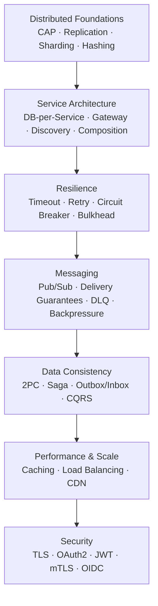

# 🏠 Microservices & Distributed Systems — Master Study Home

> One place to look up every study guide in this folder. Read the priority table, follow the suggested order, and use the metric columns to decide **what to study, in what sequence, and how deep to go** for FAANG / Staff / Principal interviews.

---

## 📋 Table of Contents

- [How to Use This Guide](#-how-to-use-this-guide)
- [The Big Picture in 60 Seconds](#-the-big-picture-in-60-seconds)
- [Master Priority Table (All Topics)](#-master-priority-table-all-topics)
- [The Learning Path (Dependency Flow)](#-the-learning-path-dependency-flow)
- [Topics by Group](#-topics-by-group)
  - [1. Distributed Systems Foundations](#1-distributed-systems-foundations)
  - [2. Service Architecture & Boundaries](#2-service-architecture--boundaries)
  - [3. Resilience & Failure Handling](#3-resilience--failure-handling)
  - [4. Asynchronous Messaging](#4-asynchronous-messaging)
  - [5. Data Consistency Across Services](#5-data-consistency-across-services)
  - [6. Performance & Scale](#6-performance--scale)
  - [7. Security](#7-security)
- [Interview Lens: Three Ways to Slice the Topics](#-interview-lens-three-ways-to-slice-the-topics)
  - [🔥 Most Frequently Asked in FAANG](#-most-frequently-asked-in-faang)
  - [🎓 Must-Know for Principal / Staff Engineers](#-must-know-for-principal--staff-engineers)
  - [🔴 Read In-Depth for Interviews](#-read-in-depth-for-interviews)
- [Gaps: Topics Not Yet in This Folder](#-gaps-topics-not-yet-in-this-folder)
- [Metric Legend](#-metric-legend)

---

## 🎯 How to Use This Guide

This folder holds **25 in-depth study guides**. They aren't meant to be read in file-name order — each one leans on ideas introduced by another, so a random path leaves you patching gaps. This home file solves that with three things:

A **recommended order** (1 → 24 in the master table) that keeps prerequisites ahead of the topics that need them. A set of **per-topic metrics** — how often the subject appears in FAANG loops, whether it's expected at Staff/Principal level, and how deeply you should read it. And a **grouping by problem domain**, so you can drill into one area (say, data consistency) end to end.

If your time is tight, work the [Most Frequently Asked](#-most-frequently-asked-in-faang) list. If you're targeting Staff or Principal, lead with the [Must-Know](#-must-know-for-principal--staff-engineers) list — those are the topics where interviewers expect trade-off reasoning, not definitions. If you're prepping for a specific loop, the [Read In-Depth](#-read-in-depth-for-interviews) list tells you where the follow-up questions get hardest.

---

## 🗺️ The Big Picture in 60 Seconds

Distributed systems get hard the moment state lives on more than one machine, so the foundation is understanding **consistency and replication** — what you can and can't guarantee when the network splits. Once you accept those limits, you can **carve a system into services**, each owning its data, sitting behind a gateway, finding one another through discovery. Independent services fail independently, so you wrap calls in **timeouts, retries, circuit breakers, and bulkheads** to stop one slow dependency from taking down the rest. To decouple further you move to **asynchronous messaging**, which immediately raises the hardest question in the space: **how do you keep data consistent across services** without a shared transaction — the domain of sagas, the outbox pattern, and CQRS. Finally you make it **fast and scalable** with caching, load balancing, and CDNs, and you **secure** every hop with TLS, OAuth2, and mTLS.

Nearly every senior system-design interview walks this exact arc and expects each decision justified by the concept before it.

---

## 📊 Master Priority Table (All Topics)

Read top to bottom. **Order** is my recommended global study sequence. See the [Metric Legend](#-metric-legend) for the symbols.

| # | Topic | Group | FAANG Freq | Staff/Principal | Depth |
|---|-------|-------|:----------:|:---------------:|:-----:|
| 1 | [CAP · PACELC · ACID · BASE · Quorum](CAP-PACELC-ACID-BASE-Quorum-Study-Guide.md) | Foundations | ⭐⭐⭐⭐⭐ | ✅ | 🔴 |
| 2 | [Partitioning · Replication · Sharding · Vector Clocks](Partitioning-Replication-Sharding-Vector-Clocks-Study-Guide.md) | Foundations | ⭐⭐⭐⭐⭐ | ✅ | 🔴 |
| 3 | [Consistent Hashing](Consistent-Hashing-Study-Guide.md) | Foundations | ⭐⭐⭐⭐⭐ | ✅ | 🔴 |
| 4 | [Database per Service](Database-Per-Service-Pattern-Study-Guide.md) | Service Architecture | ⭐⭐⭐⭐⭐ | ✅ | 🔴 |
| 5 | [API Gateway Pattern](API-Gateway-Pattern-Study-Guide.md) | Service Architecture | ⭐⭐⭐⭐⭐ | ✅ | 🔴 |
| 6 | [Service Discovery](Service-Discovery.md) | Service Architecture | ⭐⭐⭐⭐☆ | ✅ | 🟡 |
| 7 | [API Composition](API-Composition.md) | Service Architecture | ⭐⭐⭐⭐☆ | ➕ | 🟡 |
| 8 | [Aggregator Pattern](Aggregator-Pattern.md) | Service Architecture | ⭐⭐⭐☆☆ | ➕ | 🟡 |
| 9 | [Backend for Frontend (BFF)](Backend-For-Frontend-BFF-Study-Guide.md) | Service Architecture | ⭐⭐⭐⭐☆ | ➕ | 🟡 |
| 10 | [Strangler Fig](Strangler-Fig-Pattern.md) | Service Architecture | ⭐⭐⭐⭐☆ | ✅ | 🟡 |
| 11 | [Sidecar Pattern](Sidecar-Pattern.md) | Service Architecture | ⭐⭐⭐⭐☆ | ✅ | 🟡 |
| 12 | [Timeout](Timeout-Pattern.md) | Resilience | ⭐⭐⭐⭐⭐ | ✅ | 🔴 |
| 13 | [Retry (+ Backoff & Jitter)](Retry-Pattern.md) | Resilience | ⭐⭐⭐⭐⭐ | ✅ | 🔴 |
| 14 | [Circuit Breaker](Circuit-Breaker-Pattern.md) | Resilience | ⭐⭐⭐⭐⭐ | ✅ | 🔴 |
| 15 | [Bulkhead](Bulkhead-Pattern.md) | Resilience | ⭐⭐⭐⭐☆ | ✅ | 🟡 |
| 16 | [Messaging: Pub/Sub · Delivery · DLQ · Backpressure](Messaging-Pub-Sub-Delivery-DLQ-Backpressure.md) | Messaging | ⭐⭐⭐⭐⭐ | ✅ | 🔴 |
| 17 | [Two-Phase Commit (2PC)](Two-Phase-Commit.md) | Data Consistency | ⭐⭐⭐⭐☆ | ✅ | 🔴 |
| 18 | [Saga Pattern](Saga-Pattern.md) | Data Consistency | ⭐⭐⭐⭐⭐ | ✅ | 🔴 |
| 19 | [Transactional Inbox & Outbox](Transactional-Inbox-Outbox-Pattern.md) | Data Consistency | ⭐⭐⭐⭐⭐ | ✅ | 🔴 |
| 20 | [CQRS](CQRS-Pattern.md) | Data Consistency | ⭐⭐⭐⭐☆ | ✅ | 🔴 |
| 21 | [Caching (Aside · Through · Stampede)](Caching-Study-Guide.md) | Performance & Scale | ⭐⭐⭐⭐⭐ | ✅ | 🔴 |
| 22 | [Load Balancing](Load-Balancer.md) | Performance & Scale | ⭐⭐⭐⭐⭐ | ✅ | 🔴 |
| 23 | [CDN](CDN-Study-Guide.md) | Performance & Scale | ⭐⭐⭐⭐☆ | ➕ | 🟡 |
| 24 | [Security: TLS · OAuth2 · JWT · mTLS · OIDC](Security-TLS-OAuth2-JWT-mTLS-Study-Guide.md) | Security | ⭐⭐⭐⭐☆ | ✅ | 🔴 |

> 📝 A shorter alternate BFF guide also exists: [bff_study_guide.md](bff_study_guide.md). The primary in-depth version is [Backend for Frontend (BFF)](Backend-For-Frontend-BFF-Study-Guide.md) (#9).

---

## 🔗 The Learning Path (Dependency Flow)

Think in dependencies rather than a topic checklist — each cluster unlocks the next.

**Why this order:** quorum and consistency arguments only make sense after replication; database-per-service is the reason distributed transactions exist at all; a saga is incomprehensible without messaging and idempotency; and the outbox pattern is a direct answer to a failure mode you only see once you've split the database. Following the arrows means each guide assumes only what you've already read.

---

## 📚 Topics by Group

### 1. Distributed Systems Foundations

The bedrock. Every later decision is a trade-off framed by these ideas, and interviewers can tell within minutes whether the foundation is solid.

| Topic | FAANG Freq | Staff/Principal | Depth |
|-------|:----------:|:---------------:|:-----:|
| [CAP · PACELC · ACID · BASE · Quorum](CAP-PACELC-ACID-BASE-Quorum-Study-Guide.md) | ⭐⭐⭐⭐⭐ | ✅ | 🔴 |
| [Partitioning · Replication · Sharding · Vector Clocks](Partitioning-Replication-Sharding-Vector-Clocks-Study-Guide.md) | ⭐⭐⭐⭐⭐ | ✅ | 🔴 |
| [Consistent Hashing](Consistent-Hashing-Study-Guide.md) | ⭐⭐⭐⭐⭐ | ✅ | 🔴 |

### 2. Service Architecture & Boundaries

How a monolith becomes a set of independently deployable services: where the data boundary sits, how requests enter, how services find and compose one another, and how you migrate safely.

| Topic | FAANG Freq | Staff/Principal | Depth |
|-------|:----------:|:---------------:|:-----:|
| [Database per Service](Database-Per-Service-Pattern-Study-Guide.md) | ⭐⭐⭐⭐⭐ | ✅ | 🔴 |
| [API Gateway Pattern](API-Gateway-Pattern-Study-Guide.md) | ⭐⭐⭐⭐⭐ | ✅ | 🔴 |
| [Service Discovery](Service-Discovery.md) | ⭐⭐⭐⭐☆ | ✅ | 🟡 |
| [API Composition](API-Composition.md) | ⭐⭐⭐⭐☆ | ➕ | 🟡 |
| [Aggregator Pattern](Aggregator-Pattern.md) | ⭐⭐⭐☆☆ | ➕ | 🟡 |
| [Backend for Frontend (BFF)](Backend-For-Frontend-BFF-Study-Guide.md) | ⭐⭐⭐⭐☆ | ➕ | 🟡 |
| [Strangler Fig](Strangler-Fig-Pattern.md) | ⭐⭐⭐⭐☆ | ✅ | 🟡 |
| [Sidecar Pattern](Sidecar-Pattern.md) | ⭐⭐⭐⭐☆ | ✅ | 🟡 |

### 3. Resilience & Failure Handling

Independent services fail independently. These patterns form a chain: set a timeout, retry on failure, back off so you don't amplify the problem, trip a circuit breaker when a dependency is clearly down, and isolate resources with bulkheads so one failure can't drain the whole pool.

| Topic | FAANG Freq | Staff/Principal | Depth |
|-------|:----------:|:---------------:|:-----:|
| [Timeout](Timeout-Pattern.md) | ⭐⭐⭐⭐⭐ | ✅ | 🔴 |
| [Retry (+ Backoff & Jitter)](Retry-Pattern.md) | ⭐⭐⭐⭐⭐ | ✅ | 🔴 |
| [Circuit Breaker](Circuit-Breaker-Pattern.md) | ⭐⭐⭐⭐⭐ | ✅ | 🔴 |
| [Bulkhead](Bulkhead-Pattern.md) | ⭐⭐⭐⭐☆ | ✅ | 🟡 |

### 4. Asynchronous Messaging

Decoupling services in time. Once delivery guarantees, ordering, dead-letter queues, and backpressure click, Kafka and queues stop being magic — and this is the bridge into distributed data consistency.

| Topic | FAANG Freq | Staff/Principal | Depth |
|-------|:----------:|:---------------:|:-----:|
| [Messaging: Pub/Sub · Delivery Guarantees · DLQ · Backpressure](Messaging-Pub-Sub-Delivery-DLQ-Backpressure.md) | ⭐⭐⭐⭐⭐ | ✅ | 🔴 |

### 5. Data Consistency Across Services

The highest-leverage cluster in senior interviews — where a mid-level answer and a staff answer visibly diverge. Learn why 2PC is avoided, how sagas coordinate long-lived transactions, how the outbox pattern makes "update DB and publish event" atomic, and how CQRS separates the write and read models.

| Topic | FAANG Freq | Staff/Principal | Depth |
|-------|:----------:|:---------------:|:-----:|
| [Two-Phase Commit (2PC)](Two-Phase-Commit.md) | ⭐⭐⭐⭐☆ | ✅ | 🔴 |
| [Saga Pattern](Saga-Pattern.md) | ⭐⭐⭐⭐⭐ | ✅ | 🔴 |
| [Transactional Inbox & Outbox](Transactional-Inbox-Outbox-Pattern.md) | ⭐⭐⭐⭐⭐ | ✅ | 🔴 |
| [CQRS](CQRS-Pattern.md) | ⭐⭐⭐⭐☆ | ✅ | 🔴 |

### 6. Performance & Scale

Taking a correct system and making it fast and elastic. Caching and load balancing appear in nearly every design; CDNs handle the edge.

| Topic | FAANG Freq | Staff/Principal | Depth |
|-------|:----------:|:---------------:|:-----:|
| [Caching (Aside · Read/Write Through · Stampede)](Caching-Study-Guide.md) | ⭐⭐⭐⭐⭐ | ✅ | 🔴 |
| [Load Balancing](Load-Balancer.md) | ⭐⭐⭐⭐⭐ | ✅ | 🔴 |
| [CDN](CDN-Study-Guide.md) | ⭐⭐⭐⭐☆ | ➕ | 🟡 |

### 7. Security

The concern that wraps every hop. Expected at senior level and a frequent follow-up once your core design is on the board: transport security, token-based auth, and service-to-service identity.

| Topic | FAANG Freq | Staff/Principal | Depth |
|-------|:----------:|:---------------:|:-----:|
| [Security: TLS · OAuth2 · JWT · mTLS · OIDC](Security-TLS-OAuth2-JWT-mTLS-Study-Guide.md) | ⭐⭐⭐⭐☆ | ✅ | 🔴 |

---

## 🔍 Interview Lens: Three Ways to Slice the Topics

### 🔥 Most Frequently Asked in FAANG

These surface in almost every system-design loop. If time is short, cover these first.

| Rank | Topic | Why it comes up so often |
|:----:|-------|--------------------------|
| 1 | [CAP · PACELC · ACID · BASE · Quorum](CAP-PACELC-ACID-BASE-Quorum-Study-Guide.md) | Every design forces a consistency-versus-availability call. |
| 2 | [Load Balancing](Load-Balancer.md) | Shows up the instant you draw a second server. |
| 3 | [Caching](Caching-Study-Guide.md) | The default lever for latency and database load. |
| 4 | [Partitioning · Sharding · Replication](Partitioning-Replication-Sharding-Vector-Clocks-Study-Guide.md) | Required to scale any data store past one node. |
| 5 | [API Gateway Pattern](API-Gateway-Pattern-Study-Guide.md) | The standard entry point on any microservices diagram. |
| 6 | [Saga Pattern](Saga-Pattern.md) | The go-to answer for cross-service consistency. |
| 7 | [Messaging / Delivery Guarantees](Messaging-Pub-Sub-Delivery-DLQ-Backpressure.md) | Async decoupling and the exactly-once debate are staples. |
| 8 | [Circuit Breaker](Circuit-Breaker-Pattern.md) | The classic "how do you stop cascading failures?" |
| 9 | [Retry (+ Backoff & Jitter)](Retry-Pattern.md) | The inevitable follow-up to any failure-handling answer. |
| 10 | [Consistent Hashing](Consistent-Hashing-Study-Guide.md) | Expected for distributing keys and minimizing rehash on scale-out. |

### 🎓 Must-Know for Principal / Staff Engineers

At Staff/Principal you're judged on trade-offs, tunable knobs, and failure modes — not definitions. These carry ✅ in the tables above.

- [CAP · PACELC · ACID · BASE · Quorum](CAP-PACELC-ACID-BASE-Quorum-Study-Guide.md) — reason about PACELC's latency-vs-consistency axis, not just the CAP triangle.
- [Partitioning · Replication · Sharding · Vector Clocks](Partitioning-Replication-Sharding-Vector-Clocks-Study-Guide.md) — resharding strategy, hot partitions, conflict resolution.
- [Consistent Hashing](Consistent-Hashing-Study-Guide.md) — virtual nodes, weighting, bounded loads.
- [Database per Service](Database-Per-Service-Pattern-Study-Guide.md) — the root cause behind why distributed transactions exist at all.
- [API Gateway Pattern](API-Gateway-Pattern-Study-Guide.md) — where cross-cutting concerns belong, and where they don't.
- [Strangler Fig](Strangler-Fig-Pattern.md) & [Sidecar](Sidecar-Pattern.md) — migration and platform-level thinking.
- [Timeout](Timeout-Pattern.md), [Retry](Retry-Pattern.md), [Circuit Breaker](Circuit-Breaker-Pattern.md), [Bulkhead](Bulkhead-Pattern.md) — the full resilience stack and how the pieces interact.
- [Messaging](Messaging-Pub-Sub-Delivery-DLQ-Backpressure.md) — exactly-once as an illusion; idempotency as the real answer.
- [Two-Phase Commit](Two-Phase-Commit.md), [Saga](Saga-Pattern.md), [Outbox/Inbox](Transactional-Inbox-Outbox-Pattern.md), [CQRS](CQRS-Pattern.md) — the whole consistency toolkit.
- [Caching](Caching-Study-Guide.md) — invalidation, stampede, and staying consistent with the source of truth.
- [Load Balancing](Load-Balancer.md) — L4 vs L7, health checking, connection draining.
- [Security](Security-TLS-OAuth2-JWT-mTLS-Study-Guide.md) — mTLS for service-to-service identity, token lifecycle, zero trust.

### 🔴 Read In-Depth for Interviews

These reward deep reading — the follow-ups run several layers past the textbook definition. Budget extra time here.

- [CAP · PACELC · ACID · BASE · Quorum](CAP-PACELC-ACID-BASE-Quorum-Study-Guide.md)
- [Partitioning · Replication · Sharding · Vector Clocks](Partitioning-Replication-Sharding-Vector-Clocks-Study-Guide.md)
- [Consistent Hashing](Consistent-Hashing-Study-Guide.md)
- [Database per Service](Database-Per-Service-Pattern-Study-Guide.md)
- [API Gateway Pattern](API-Gateway-Pattern-Study-Guide.md)
- [Timeout](Timeout-Pattern.md) · [Retry](Retry-Pattern.md) · [Circuit Breaker](Circuit-Breaker-Pattern.md)
- [Messaging: Delivery Guarantees & DLQ](Messaging-Pub-Sub-Delivery-DLQ-Backpressure.md)
- [Two-Phase Commit](Two-Phase-Commit.md) · [Saga](Saga-Pattern.md) · [Outbox/Inbox](Transactional-Inbox-Outbox-Pattern.md) · [CQRS](CQRS-Pattern.md)
- [Caching](Caching-Study-Guide.md)
- [Load Balancing](Load-Balancer.md)
- [Security: TLS · OAuth2 · JWT · mTLS](Security-TLS-OAuth2-JWT-mTLS-Study-Guide.md)

---

## 🧭 Gaps: Topics Not Yet in This Folder

The 25 guides here cover the core, but a complete interviewer's checklist reaches a bit further. The topics below **don't have a dedicated file yet**, grouped into **🟥 Must Cover**, **🟨 Good to Cover**, and **🟩 Familiarity**. Where a gap sits next to an existing guide, that guide is linked as a starting point.

### 🟥 Must Cover — high interview value, currently missing

| Topic | Area | Why it matters | Closest existing guide |
|-------|------|----------------|------------------------|
| **Idempotency & Idempotency Keys** | Data Consistency | The real mechanism behind safe retries and "exactly-once"; interviewers push on it relentlessly. | [Outbox/Inbox](Transactional-Inbox-Outbox-Pattern.md), [Retry](Retry-Pattern.md) |
| **Event Sourcing** | Data Consistency | The natural partner to CQRS; expected the moment you say "event-driven." | [CQRS](CQRS-Pattern.md) |
| **Change Data Capture (CDC)** | Data Consistency | How the outbox scales in production via Debezium / Kafka Connect; a common follow-up. | [Outbox/Inbox](Transactional-Inbox-Outbox-Pattern.md) |
| **Choreography vs Orchestration** | Data Consistency | The two ways to coordinate a saga; a standard "how would you wire this?" | [Saga](Saga-Pattern.md) |
| **Observability: Logging · Metrics · Distributed Tracing** | Operations | "How do you debug this in production?" is asked in nearly every senior loop. | — |
| **Health Checks · Heartbeats · Failover** | Resilience | Core detection mechanics that make circuit breakers and load balancers work. | [Circuit Breaker](Circuit-Breaker-Pattern.md) |
| **Horizontal vs Vertical Scaling · Reverse Proxy · Connection Pooling** | Performance & Scale | Baseline scaling vocabulary expected in every design conversation. | [Load Balancing](Load-Balancer.md) |
| **Rate Limiting & Throttling** | Performance & Scale | The standard answer for protecting a service from overload or abuse; frequently drawn at the gateway. | [API Gateway Pattern](API-Gateway-Pattern-Study-Guide.md) |

### 🟨 Good to Cover — strong ROI once the Must list is done

| Topic | Area | Why it matters | Closest existing guide |
|-------|------|----------------|------------------------|
| **Messaging depth: Competing Consumers · Ordering · Poison Messages** | Messaging | Extends the messaging guide into the nuance interviewers probe. | [Messaging](Messaging-Pub-Sub-Delivery-DLQ-Backpressure.md) |
| **Cache Penetration · Avalanche · Bloom Filters** | Performance & Scale | The advanced half of cache failure modes beyond stampede. | [Caching](Caching-Study-Guide.md) |
| **Hedged Requests · Request Collapsing** | Resilience | Tail-latency techniques that signal staff-level awareness. | [Timeout](Timeout-Pattern.md) |
| **Service Mesh (Istio / Linkerd)** | Operations | The platform-level evolution of the sidecar; increasingly expected. | [Sidecar](Sidecar-Pattern.md) |
| **Stateful vs Stateless · Sticky Sessions** | Performance & Scale | Frames how you scale and where session state lives. | [Load Balancing](Load-Balancer.md) |
| **Prometheus · Grafana · OpenTelemetry** | Operations | The concrete toolchain behind the observability concepts. | — |
| **Secrets Management · Zero Trust · API Keys** | Security | Rounds the security guide out toward production operations. | [Security](Security-TLS-OAuth2-JWT-mTLS-Study-Guide.md) |

### 🟩 Familiarity — know what it is and when it applies

| Topic | Area | Why it matters | Closest existing guide |
|-------|------|----------------|------------------------|
| **Ambassador Proxy · Adapter Pattern** | Operations | Sidecar-family patterns; good to name, rarely a deep dive. | [Sidecar](Sidecar-Pattern.md) |
| **Init Containers · Graceful Shutdown** | Operations | Kubernetes lifecycle details; situational. | — |
| **Correlation IDs · Health Endpoints** | Operations | Small but practical; usually folded into a tracing answer. | — |
| **Read Repair · Write Repair · Versioning** | Foundations | Anti-entropy mechanics that complement the replication guide. | [Partitioning · Replication](Partitioning-Replication-Sharding-Vector-Clocks-Study-Guide.md) |
| **SSL vs TLS history · HTTPS internals** | Security | Background context; the modern TLS material is already covered. | [Security](Security-TLS-OAuth2-JWT-mTLS-Study-Guide.md) |

> 📝 When you write a guide for any of these, add it to the [Master Priority Table](#-master-priority-table-all-topics) and its [group](#-topics-by-group), then drop it from this list.

---

## 📖 Metric Legend

**FAANG Frequency** — how often the topic appears in FAANG-level interview loops:

- ⭐⭐⭐⭐⭐ — Appears in nearly every system-design interview.
- ⭐⭐⭐⭐☆ — Very common; expect it in most loops.
- ⭐⭐⭐☆☆ — Situational; comes up when the design calls for it.

**Staff/Principal** — how essential the topic is at senior+ levels:

- ✅ — Critical. You're expected to reason about trade-offs and failure modes unprompted.
- ➕ — Important. Know it well and be ready to apply it.
- ○ — Good to have. Familiarity is enough.

**Depth** — how deeply to read the guide for interviews:

- 🔴 — Deep dive. Read fully, including staff-level nuance and the FAANG Q&A.
- 🟡 — Solid understanding. Know the mechanism, trade-offs, and a concrete example.
- 🟢 — Familiarity. Understand what it is and when to reach for it.

---

*This home file links to 25 study guides in this folder. Follow the priority order, use the metric tables to budget your time, and revisit the [dependency flow](#-the-learning-path-dependency-flow) whenever a topic feels like it's missing a prerequisite.*
