# 🗂️ Partitioning, Replication, Sharding & Vector Clocks — The Complete, Readable Guide

*How distributed databases split data across machines, keep copies in sync, survive failure, and figure out the correct value when two writes race — explained the way a staff engineer would, from first principles to production trade-offs.*

A single database server can hold only so much data and answer only so many queries per second before it runs out of disk, memory, or CPU. For most of computing history the answer was to buy a bigger server. That stops working somewhere around the point where your dataset no longer fits on one machine, or where losing that one machine means losing your business. Every large system you use — your bank, your social feed, your shopping cart — long ago crossed that line. What they do instead is spread data across many machines and keep redundant copies of it, and *that decision*, made once, creates every hard problem this guide is about.

The trouble with learning this area is that the four headline topics — **partitioning**, **replication**, **sharding**, and **vector clocks** — are usually taught as isolated facts. People learn "sharding splits data," "replication copies data," "vector clocks are some versioning thing," and end up with disconnected trivia that collapses the moment an interviewer asks *why*. In reality these topics form one continuous story with a single spine: **the moment you put data on more than one machine, you must answer two questions — where does each piece of data live, and how many copies of it exist — and every concept here is an answer to one of those two questions, or to a problem that answering them creates.**

Let me lay out the whole story in one breath, and then we'll rebuild every piece slowly. You start with one overloaded database. To handle more data and load, you **partition** it — split the rows across several machines so each holds only a slice. (When those partitions live on physically separate database servers, the industry calls it **sharding** — it's the same idea applied across machines, and we'll draw the line precisely.) Partitioning solves *scale*, but it does nothing for *durability*: if a machine dies, its slice is gone and unreachable. So independently you also **replicate** — keep multiple copies of each piece of data on different machines — which buys you durability and lets you serve reads from **read replicas**. But the instant you have more than one copy, you inherit the deepest problem in distributed systems: the copies can *disagree*. Two clients might write to two different copies at the same time; a network blip might leave one copy stale. You need rules for how many copies must agree before a read or write counts — that's **quorums** — and background machinery to heal copies that have drifted apart — **read repair**, **write repair**, and **anti-entropy**. And when two writes genuinely happen concurrently, you need a way to detect that they conflict rather than silently throwing one away — which is exactly what **versioning** and **vector clocks** give you.

That's the arc: *partition for scale, replicate for survival, and then spend the rest of your life reconciling the copies.* Hold onto one sentence as your compass — **partitioning and sharding are about *where data lives*; replication is about *how many copies exist*; quorums, repair, and vector clocks are all about *keeping those copies honest*.** Every term below slots into one of those three buckets.

Don't worry if some of those words are still fuzzy — that paragraph is the map, not the journey. Every concept is rebuilt from scratch, with diagrams and examples, in the sections that follow. By the end you'll be able to draw a distributed database from memory — how it splits data, how it copies it, how it survives a dead node, and how it decides whose write wins — and justify every decision out loud.

> **How to read this guide.** It's written to be read start to finish; each section answers the question the previous one leaves open. But the table of contents lets you jump anywhere. Throughout you'll find **📖 "In plain English"** boxes — short, plain-language recaps that sit *beside* the deeper technical detail, so if a section ever feels dense you can drop into the box, get your bearings, and come back. There are also **💻 collapsible Java** snippets wherever a little code makes an idea concrete (you can skip these entirely and still understand everything). Near the end are a **⚡ Quick Revision** to reread before an interview, a **💡 Q&A bank** of the 20 questions you're most likely to face, and **📝 STAR stories** for behavioral rounds.
>
> **Who this is for.** Total beginners and experienced engineers alike. If you're new, read top to bottom and lean on the 📖 boxes; the difficulty rises gently and nothing assumes prior distributed-systems knowledge. If you're prepping for interviews, the later parts of each section and the Q&A bank push all the way to staff/principal depth.
>
> **The only prerequisite:** a rough feel for what a database does (stores rows, answers queries by a key) and the idea of several computers talking over a network that can be slow or drop messages. Everything else is built up as we go.

---

## 📋 Table of Contents

**Part I — Partitioning & Sharding: Where Data Lives**

1. [Why one machine isn't enough](#-1-why-one-machine-isnt-enough)
2. [Partitioning: splitting the data](#-2-partitioning-splitting-the-data)
3. [Partitioning vs sharding: the same idea, drawn precisely](#-3-partitioning-vs-sharding-the-same-idea-drawn-precisely)
4. [How to split: range, hash, and consistent hashing](#-4-how-to-split-range-hash-and-consistent-hashing)
5. [Choosing a partition key, and the hotspot problem](#-5-choosing-a-partition-key-and-the-hotspot-problem)
6. [Secondary indexes and rebalancing](#-6-secondary-indexes-and-rebalancing)

**Part II — Replication: How Many Copies Exist**

7. [Why replicate, and what it costs](#-7-why-replicate-and-what-it-costs)
8. [Leader–follower replication](#-8-leaderfollower-replication)
9. [Synchronous vs asynchronous, and replication lag](#-9-synchronous-vs-asynchronous-and-replication-lag)
10. [Read replicas and the consistency traps they create](#-10-read-replicas-and-the-consistency-traps-they-create)
11. [Multi-leader and leaderless replication](#-11-multi-leader-and-leaderless-replication)
12. [Failover and its hidden dangers](#-12-failover-and-its-hidden-dangers)

**Part III — Keeping Copies Honest: Quorums & Repair**

13. [Quorums: how many copies must agree](#-13-quorums-how-many-copies-must-agree)
14. [Sloppy quorums and hinted handoff](#-14-sloppy-quorums-and-hinted-handoff)
15. [Read repair, write repair, and anti-entropy](#-15-read-repair-write-repair-and-anti-entropy)

**Part IV — Versioning & Vector Clocks: Whose Write Wins**

16. [The concurrent-write problem](#-16-the-concurrent-write-problem)
17. [Last-write-wins and why timestamps lie](#-17-last-write-wins-and-why-timestamps-lie)
18. [Version numbers and causality](#-18-version-numbers-and-causality)
19. [Vector clocks, step by step](#-19-vector-clocks-step-by-step)
20. [Siblings, resolution, and version vectors](#-20-siblings-resolution-and-version-vectors)
21. [Beyond vector clocks: CRDTs and hybrid logical clocks](#-21-beyond-vector-clocks-crdts-and-hybrid-logical-clocks)

**Part V — Mastery**

22. [How the giants do it](#-22-how-the-giants-do-it)
23. [Myths worth unlearning](#-23-myths-worth-unlearning)
24. [What separates a staff engineer's answer](#-24-what-separates-a-staff-engineers-answer)
25. [Where to go next: adjacent concepts](#-25-where-to-go-next-adjacent-concepts)

**Part VI — Revision & Interview Prep**

26. [Quick Revision](#-quick-revision)
27. [The Interview Q&A Bank (20 questions)](#-the-interview-qa-bank)
28. [STAR stories for behavioral rounds](#-star-stories-for-behavioral-rounds)
29. [The one-page memory sheet](#-the-one-page-memory-sheet)

---

# Part I — Partitioning & Sharding: Where Data Lives

Everything begins with a single, uncomfortable fact: one machine has limits. This first part is about the first thing you do when you hit those limits — you break the data into pieces and spread it out. We'll build up *why* you'd do that, the vocabulary the industry uses (partitioning, sharding, and the subtle line between them), the handful of strategies for actually deciding which piece of data goes where, and the failure mode — hotspots — that a careless choice creates. By the end of Part I you'll be able to design the data-placement layer of a system and defend the choice.

## 🎯 1. Why one machine isn't enough

Before we split anything, it's worth being precise about *what* runs out, because different limits push you toward different solutions. A single database server is bounded on four axes at once. It has finite **storage** — a dataset that grows past the disk simply cannot fit. It has finite **memory** — a database is dramatically faster when its working set fits in RAM, and once your hot data spills to disk, latency falls off a cliff. It has finite **compute** — there are only so many CPU cores to parse queries, evaluate joins, and check constraints. And it has finite **network throughput** — one NIC can push only so many gigabits and handle so many connections per second.

The instinctive first response is **vertical scaling** — buy a bigger machine with more cores, more RAM, faster disks. This is genuinely the right first move, and it's underrated: a modern server with a terabyte of RAM and 128 cores handles an enormous amount, and it keeps your system *simple* — one machine means no coordination, no consistency puzzles, no partitioning logic. But vertical scaling has three hard ceilings. There's a **physical limit** — the biggest machine you can buy is finite, and the price curve turns vertical near the top (the last 20% of performance can cost several times the first 80%). There's a **single-point-of-failure** problem — one machine means one thing to lose, and no amount of size fixes the fact that when it's down, you're down. And there's a **write-throughput ceiling** — a single machine can only commit so many writes per second no matter how big it is, because writes ultimately serialize through its transaction log.

When you hit those ceilings, the only remaining direction is **horizontal scaling** — use *many* machines instead of one big one. And the moment you commit to many machines, you face the founding question of this entire guide: *if the data no longer fits on one machine, which machine holds which piece?* That question is what partitioning answers.

<details>
<summary>📖 In plain English</summary>

One database server can only hold so much data and answer so many requests before it runs out of disk, memory, or CPU. You can buy a bigger server for a while, but eventually the biggest one isn't big enough, costs a fortune, and is still a single thing that can die and take you down with it. So past a certain size you stop growing *up* and start growing *out* — many ordinary servers instead of one giant one. The instant you do that, you have to decide which server keeps which slice of the data. That decision is partitioning.

</details>

## 🎯 2. Partitioning: splitting the data

**Partitioning** means breaking a large dataset into smaller pieces called **partitions** (some systems call them **shards**, **regions**, or **tablets** — same idea, different vendor's word), so that each partition holds a subset of the data and can live on its own machine. The goal is that a dataset ten times too big for one machine fits comfortably across ten, and ten times the query load spreads across ten machines' worth of CPU. Done well, partitioning gives you **linear scalability** — double the machines, roughly double the capacity.

There are actually two fundamentally different ways to cut up a dataset, and interviewers like to check you know both. The first is **vertical partitioning**: split by *columns*. You take a wide `users` table and put the rarely-accessed columns (say, a bio and profile settings) in one table on one machine, and the hot columns (username, email) in another. This is really a schema-design and normalization technique; it helps a bit but doesn't fundamentally solve scale, because a single popular column set still lives on a single machine. The second — and the one that matters for scaling, and the one "partitioning" almost always refers to in system-design conversations — is **horizontal partitioning**: split by *rows*. Each partition holds a disjoint subset of the rows; user A's row lives on partition 1, user Z's on partition 4. This is what lets a billion-row table span fifty machines, and it's what the rest of this guide means by partitioning.

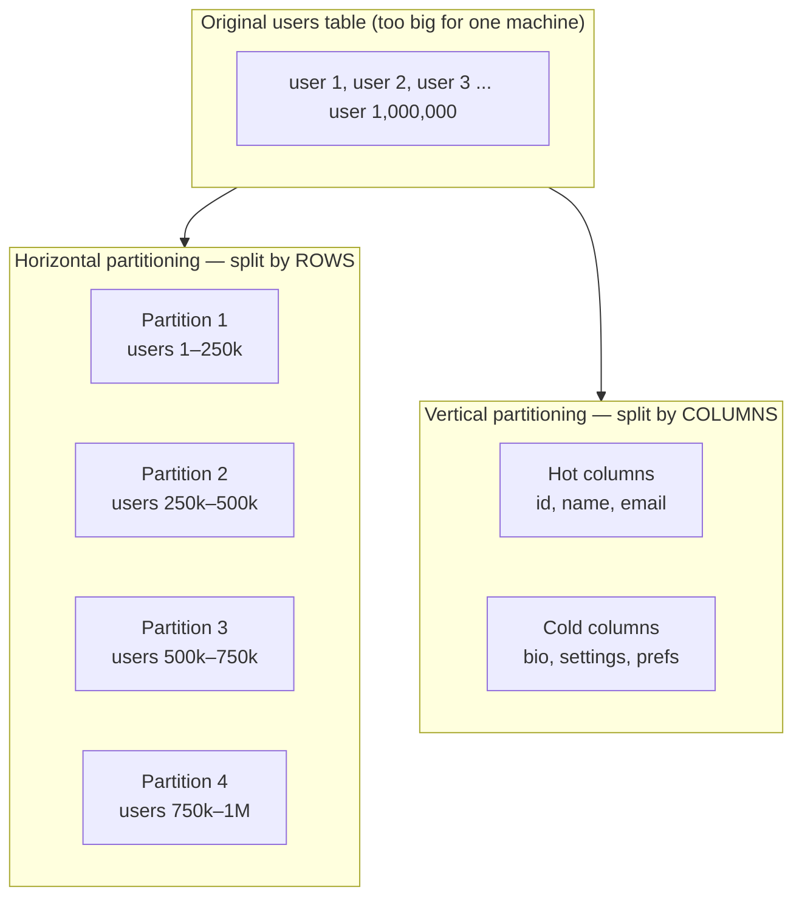

The single most important property to get right is **balance**. If the partitions are uneven — one holds most of the data or absorbs most of the traffic — you've gained little, because that one overloaded partition becomes the new bottleneck and the whole system runs at the speed of its slowest partition. A partition that is disproportionately hot has a name you'll hear constantly: a **hotspot** (or hot partition). Achieving balance is the entire art of choosing *how* to partition, which is section 4. But first, the vocabulary question everyone trips on.

<details>
<summary>📖 In plain English</summary>

Partitioning is cutting one huge table into smaller pieces so each piece can sit on its own server. The usual way is to split by rows — the first quarter of your users on server 1, the next quarter on server 2, and so on — so a table too big for any single machine now spreads across several. The one rule that matters: keep the pieces evenly sized and evenly busy. If one piece ends up holding most of the data or getting most of the traffic, that piece becomes the new bottleneck and you've barely helped yourself. An overloaded piece like that is called a hotspot.

</details>

## 🎯 3. Partitioning vs sharding: the same idea, drawn precisely

This is the distinction interviewers use to separate people who've read about the topic from people who've built with it, so it's worth nailing. The honest starting point: **the terms are used interchangeably far more often than not**, and if you use "sharding" and "partitioning" as synonyms in an interview, no one will blink. But there *is* a conventional distinction, and articulating it signals depth.

**Partitioning** is the general concept of dividing data into subsets. Crucially, those subsets can all live on the *same* machine — a single Postgres instance can partition a large table internally (Postgres calls this *declarative partitioning*) so that queries only scan the relevant partition, purely for query-performance and maintenance reasons, with every partition still on the one server. So partitioning does not, by itself, imply multiple machines.

**Sharding** is the specific case of partitioning where the partitions (now called **shards**) are distributed across *physically separate database servers*, each an independent instance with its own CPU, memory, and disk. Sharding is horizontal partitioning taken across a fleet of machines. The tell is independence: each shard is a full-fledged database that doesn't know or care about the others, which is exactly what lets the cluster scale writes — every shard commits its own writes in parallel.

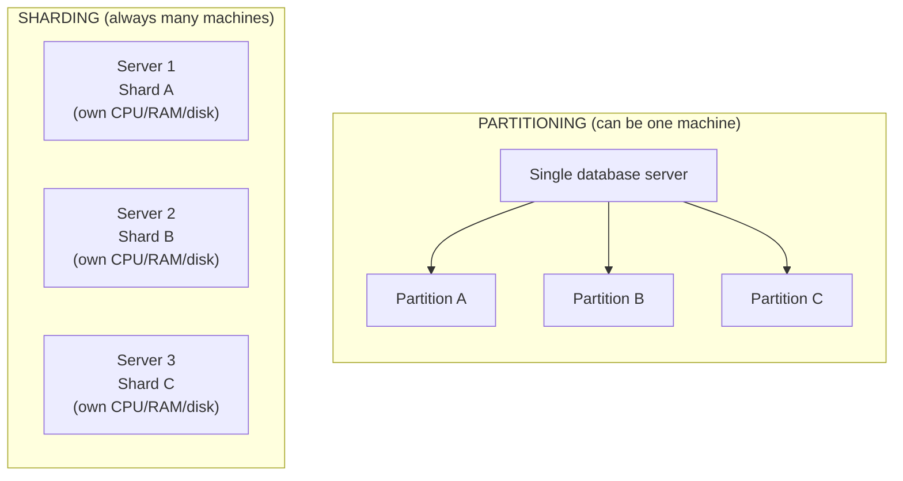

So the clean one-liner: **all sharding is partitioning, but not all partitioning is sharding — sharding is partitioning across independent machines.** The practical consequence is where the two diverge sharply. Internal partitioning keeps one machine's limits; sharding is what actually breaks the single-machine ceiling on storage *and* write throughput, because writes now happen on many independent servers at once. The price sharding charges — and this is the whole reason it's hard — is that **operations spanning multiple shards become expensive or impossible**. A query that needs data from three shards must fan out to all three and merge results in the application; a transaction touching two shards can't rely on a single database's ACID guarantees and needs a distributed protocol (two-phase commit or a saga). Cross-shard joins, which a single database does trivially, become a genuine engineering problem. That trade-off — massive scale in exchange for losing cheap cross-machine operations — is the defining tension of sharded systems.

<details>
<summary>📖 In plain English</summary>

Partitioning and sharding mean almost the same thing, and most people use them interchangeably. The subtle difference: partitioning just means "chop the data into pieces," and those pieces can all still sit on one server. Sharding means those pieces are spread across *separate* servers, each a full database of its own. Sharding is what truly breaks the one-machine limit — but the catch is that anything needing data from two shards at once (a join, a transaction) is suddenly hard, because the shards don't know about each other. That "cross-shard operations are painful" cost is the reason sharding is a big decision, not a default.

</details>

## 🎯 4. How to split: range, hash, and consistent hashing

Now the central mechanical question: given a piece of data, *which* partition does it go to? There are three canonical strategies, and each trades away something the others keep. The thing you feed into the decision is the **partition key** (also **shard key**) — the field, like `user_id` or `timestamp`, that determines placement.

**Range partitioning** assigns a contiguous range of key values to each partition: users A–F on partition 1, G–M on partition 2, and so on; or, very commonly, time ranges — January's data here, February's there. Its great strength is **efficient range scans**: because keys that are close together live together, a query like "all orders from last Tuesday" hits one partition instead of all of them. Its great weakness is **hotspots from uneven or sequential keys**. If you range-partition by timestamp, *all* of today's writes hammer the single partition holding the newest range while the others sit idle — the classic "hot latest partition" problem. Range partitioning is what HBase, Google Bigtable, and MongoDB (in range mode) use, and it's the right call when range queries dominate.

**Hash partitioning** runs the key through a hash function and uses the result to pick a partition — the simplest form being `partition = hash(key) % N`. Hashing deliberately scatters keys, so even sequential inputs (user 1, user 2, user 3) land on different partitions, which gives **excellent load distribution** and kills the sequential-write hotspot. The price is the mirror image of range partitioning's strength: **range queries are destroyed**. Because adjacent keys are scattered everywhere, "all users A–F" now touches every partition. Worse, plain `% N` has the **rehashing problem**: change the number of partitions and the divisor changes, so nearly every key's partition changes at once — a catastrophic reshuffle. Hash partitioning is Cassandra's and DynamoDB's default, ideal for point lookups by key.

**Consistent hashing** is the refinement that fixes the rehashing problem. Instead of `% N`, it places both partitions and keys on a circular hash space (a "ring") and assigns each key to the next partition clockwise, so adding or removing a partition moves only about `k/n` keys — one partition's fair share — instead of nearly all of them. It keeps hash partitioning's balance while making the cluster *elastic*: you can add and remove nodes without a full reshuffle. This is the mechanism behind Cassandra, DynamoDB, and Riak's ability to grow and shrink online.

> **Consistent hashing is a deep topic in its own right** — the ring, virtual nodes, how many to use, replication along the ring — and you have a dedicated **[Consistent Hashing Study Guide](Consistent-Hashing-Study-Guide.md)** that covers it end to end. Here it's enough to know it's the production-grade successor to `hash % N` that makes elastic scaling possible. The rest of this guide treats it as a known building block.

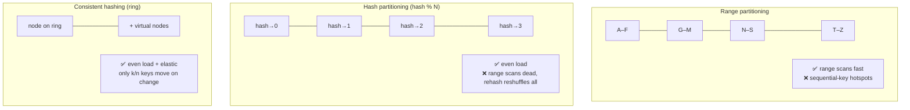

A quick decision rule you can say out loud: **if your access pattern is range-heavy (time series, "list recent X"), use range partitioning and accept the hotspot risk by adding a random or hashed prefix to the key; if it's point-lookup-heavy (fetch user by ID), use hash or consistent hashing; and use consistent hashing specifically when the cluster needs to grow and shrink without downtime.** Some systems (like DynamoDB with its composite keys) give you both — a hashed partition key for distribution plus a sort key for range scans within a partition — which is often the best of both worlds.

<details>
<summary>📖 In plain English</summary>

Three ways to decide which server a piece of data goes to. Range: keep neighbors together — all the A–F names on one server, G–M on the next. Great for "give me everything from last week," terrible because today's writes all pile onto one server. Hash: scramble the key so data spreads evenly, which balances load beautifully but makes "everything from last week" hit every server. Consistent hashing: a smarter hash that spreads data evenly *and* lets you add or remove servers without reshuffling almost everything. Pick range for "list recent" workloads, hash/consistent hashing for "fetch by ID" workloads.

</details>

<details>
<summary>💻 Java — the three strategies side by side</summary>

```java
import java.util.*;

public class PartitioningStrategies {

    // 1. RANGE partitioning — contiguous ranges, great for range scans
    static int rangePartition(String userId, int numPartitions) {
        // Assume userIds like "user_000000".."user_999999"
        int numeric = Integer.parseInt(userId.replaceAll("\\D", ""));
        int span = 1_000_000 / numPartitions;
        return Math.min(numeric / span, numPartitions - 1);
    }

    // 2. HASH partitioning — even spread, but changing N reshuffles almost everything
    static int hashPartition(String key, int numPartitions) {
        // Math.floorMod keeps the result non-negative even for negative hashCodes
        return Math.floorMod(key.hashCode(), numPartitions);
    }

    // 3. CONSISTENT hashing — even spread AND elastic (only k/n keys move on change)
    //    (Simplified; see the dedicated Consistent Hashing guide for virtual nodes.)
    static class ConsistentHashRing {
        private final TreeMap<Integer, String> ring = new TreeMap<>();

        void addNode(String node) {
            for (int v = 0; v < 100; v++) {              // 100 virtual nodes for balance
                ring.put((node + "#" + v).hashCode(), node);
            }
        }
        String getNode(String key) {
            if (ring.isEmpty()) return null;
            Integer pos = ring.ceilingKey(key.hashCode()); // first node clockwise
            if (pos == null) pos = ring.firstKey();          // wrap around the ring
            return ring.get(pos);
        }
    }

    public static void main(String[] args) {
        System.out.println(hashPartition("user_42", 4));   // even distribution
        ConsistentHashRing r = new ConsistentHashRing();
        r.addNode("db-a"); r.addNode("db-b"); r.addNode("db-c");
        System.out.println(r.getNode("user_42"));           // stable placement
    }
}
```

</details>

## 🎯 5. Choosing a partition key, and the hotspot problem

If you take one operational lesson from Part I, make it this: **the choice of partition key is the single most consequential decision in a sharded system, and it is painful to change later.** Everything downstream — how evenly load spreads, which queries are cheap, whether you can scale further — is decided by that one field. Interviewers push hard here precisely because it's where real systems go wrong.

A good partition key has three properties. It must have **high cardinality** — many distinct values — because you can never have more partitions than distinct key values (partition by `country` and you cap out at ~200 partitions, with the US shard perpetually overloaded). It must have **even access distribution** — no single value should attract a huge share of reads or writes. And it should **align with your query patterns** — queries that filter or join on the partition key hit a single shard and stay fast, while queries on other fields must fan out to all shards.

The failure mode when you get this wrong is the **hotspot**, and it comes in two distinct flavors that call for different fixes. The first is a **data hotspot** — one partition holds far more rows than the others (partition by `country` and the US shard is 40% of your data). The second, and nastier, is a **traffic hotspot** — one *key* is accessed enormously more than others regardless of how the data is split. Think of a celebrity's account on a social network: even with perfect hashing, that single user's row lives on one partition, and when they post, the read traffic for that one key can overwhelm the machine hosting it. This is the famous **"hot key" or "celebrity problem,"** and it's important to understand that **partitioning alone cannot solve it** — no partition scheme helps when the imbalance is in a single key's popularity, because that key is indivisible by definition.

The fixes are worth knowing because they're common follow-ups. For sequential-write hotspots (like a timestamp key), **add a random or hashed prefix** to the key so writes scatter across partitions — at the cost of needing to read all prefixes back for a range scan. For celebrity hot keys, the answer lives *above* the partition layer: **cache the hot key aggressively** (a read-heavy celebrity is a perfect fit for a CDN or Redis in front of the database), or **split the hot key** by appending a bucket suffix (`celebrity_id:0` … `celebrity_id:9`) so its traffic fans across ten partitions and you merge the buckets on read. The staff-level point to make: recognize *which kind* of hotspot you have, because a data hotspot is a partition-key problem and a traffic hotspot is a caching/key-splitting problem, and confusing them wastes weeks.

<details>
<summary>📖 In plain English</summary>

The field you split on — the partition key — decides everything, and it's hard to change once you're live, so choose carefully. A good key has lots of distinct values, spreads traffic evenly, and matches how you query. Get it wrong and you get a hotspot: either one server holds too much data (splitting on "country" dumps 40% of a US-heavy app on one server), or one single record is wildly popular (a celebrity's profile) and hammers whatever server holds it. Popular-record hotspots can't be fixed by splitting differently — the record is one thing — so you cache it or artificially fan it across several servers instead.

</details>

## 🎯 6. Secondary indexes and rebalancing

Two operational realities round out Part I, and both are favorite staff-level probes because they expose whether you've run a sharded system or only read about one.

**Secondary indexes** are the first. Partitioning places data by its *primary* key, but real applications also query by other fields — "find all orders with status = shipped." That's a secondary index, and in a sharded world it must itself be partitioned, with two options that trade differently. A **local (document-partitioned) index** stores, on each shard, an index covering only that shard's own data. Writes are cheap — you only touch the local shard — but a query by the secondary field must **scatter-gather**: ask every shard, because matching rows could be anywhere. This is Cassandra's and MongoDB's default local-index behavior, and it's why secondary-index queries there can be slow at scale. A **global (term-partitioned) index** instead partitions the index *by the indexed term itself*, so all "status = shipped" entries live on one index shard and a read hits just that shard — fast reads, but writes now become distributed because one row update may touch an index partition on a different machine (DynamoDB's Global Secondary Indexes work this way, and they're asynchronously updated for exactly this reason). The trade-off is clean: local indexes make writes cheap and reads expensive; global indexes make reads cheap and writes expensive and eventually consistent.

**Rebalancing** is the second, and it's where a lot of production pain lives. Over time partitions grow unevenly, or you add machines, and you need to move data around to restore balance — that's rebalancing. The cardinal rule is **don't rebalance more than necessary**, because moving data saturates the network and competes with live traffic, so a rebalance that reshuffles everything (the `hash % N` failure) can cause an outage all by itself. The standard technique is **fixed partitions**: create *many* more partitions than nodes up front (say 1,000 partitions for 10 nodes, 100 each), and rebalance by moving *whole partitions* between nodes rather than re-computing every key's home. When you add an eleventh node, you simply hand it some partitions from the existing ten — only the moved partitions' data travels, and every key's *partition* assignment never changes. This is how Elasticsearch, Riak, and Couchbase rebalance. The alternative — **dynamic partitioning**, where partitions split when they grow too large and merge when they shrink — is what HBase and MongoDB use to adapt partition count to data volume automatically. A recurring interview point: prefer moving *partitions* (a bounded, planned amount of data) over moving *keys* (an unbounded reshuffle), and throttle rebalancing so it never starves production traffic.

<details>
<summary>📖 In plain English</summary>

Two practical headaches. First, indexes: you split data by its main ID, but you still want to search by other fields, like "all shipped orders." You either keep a little index on each server (cheap to write, but a search has to ask every server) or one big index organized by the search term (fast to search, but writing now touches a second server). Second, rebalancing: over time servers get lopsided, so you shuffle data to even them out — but shuffling competes with live traffic and can cause an outage if you move too much. The trick is to pre-cut the data into many small fixed pieces and just hand whole pieces to new servers, so you never have to recompute where every record lives.

</details>

---

# Part II — Replication: How Many Copies Exist

Partitioning answered *where* each piece of data lives. But notice what it did *not* do: it created no redundancy. Each row still exists in exactly one place, so if the machine holding a partition dies, that slice of your data is gone — unreachable at best, lost at worst. Partitioning scales you but does nothing for survival. **Replication** is the independent, orthogonal answer to survival: keep multiple copies of each piece of data on different machines. These two ideas are so complementary that essentially every serious distributed database does *both* — it shards for scale and replicates each shard for durability. This part is about the second axis, and about the one problem replication unavoidably creates: copies that disagree.

## 🎯 7. Why replicate, and what it costs

Replication buys you three distinct things, and it helps to keep them separate because a design might care about only one. The first is **durability / high availability** — if one copy's machine fails, another copy can take over and the data survives; this is the reason replication is non-negotiable for anything that matters. The second is **read scalability** — with several copies, read traffic can spread across all of them, so a read-heavy workload gets many machines' worth of read throughput (this is what *read replicas*, section 10, exploit). The third is **latency** — put a copy geographically near your users (a copy in Europe, another in Asia) and each user reads from the nearest one, cutting the physical round-trip time; this is why global services replicate across continents.

Those benefits are real and large. But replication charges a price that is the entire intellectual content of the second half of this guide: **the moment you have more than one copy, the copies can disagree.** A write has to reach every copy, and it can't reach them all at the same instant — the network has delay, and one copy might be momentarily down. So there is always a window where some copies have the new value and others still have the old one. If a read hits a lagging copy, it sees stale data. If two clients write to two different copies at once, the copies now hold genuinely conflicting values and *someone* has to decide which is correct. This is the tension the **CAP theorem** formalizes — under a network partition you must choose between consistency and availability — and every mechanism in Parts III and IV exists to manage the fallout. So the honest framing for an interview is: *replication is not free redundancy; it's a trade of the single-copy simplicity (there was only ever one truth) for durability and scale, paid for with the permanent problem of keeping copies consistent.*

<details>
<summary>📖 In plain English</summary>

Replication means keeping several copies of the same data on different machines. You do it for three reasons: if one machine dies, a copy takes over (survival); reads can be spread across all the copies (speed under load); and a copy near your users is faster to reach (lower latency). The catch — and it's a big one — is that the instant you have more than one copy, they can fall out of sync. A write can't land on every copy at the exact same moment, so for a brief window some copies are newer than others, and a reader might catch an old one. Almost everything hard about distributed databases comes from managing that gap.

</details>

## 🎯 8. Leader–follower replication

The most common and easiest-to-reason-about replication scheme is **leader–follower** (also called **primary–replica**, or historically master–slave). One replica is designated the **leader**; all *writes* must go to the leader. The leader applies the write to its own storage and then streams the change — as a **replication log** (a stream of ordered changes) — to all the **followers**, each of which applies the same changes in the same order to stay a copy of the leader. *Reads* can be served by the leader or by any follower. This is the model behind PostgreSQL, MySQL, MongoDB (replica sets), and countless others.

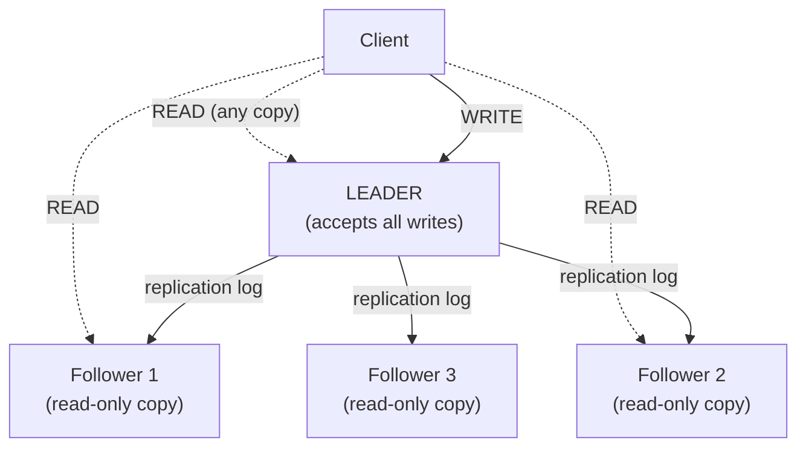

Why route *all* writes through a single leader when it seems like a bottleneck? Because it makes the ordering of writes trivially unambiguous: there is exactly one place deciding the order in which changes happen, so every follower applies them in that same order and no two copies can disagree about *what order* things occurred. That single-writer discipline is what makes leader–follower replication so much simpler to reason about than the alternatives — the cost of conflicting concurrent writes (the hard problem) simply cannot arise, because writes never happen in two places at once. The mechanism the leader ships to followers is worth knowing at a high level: it can be **statement-based** (send the SQL — fragile, because nondeterministic functions like `NOW()` diverge), **write-ahead-log (WAL) shipping** (send the low-level storage changes — what Postgres does), or **logical/row-based replication** (send the logical row changes — more portable and what enables tools like Debezium to tap the stream for change data capture). The leader is also the system's obvious weakness: if it dies, no writes can happen until a new leader is chosen, which is the failover problem of section 12.

<details>
<summary>📖 In plain English</summary>

Pick one copy to be the boss (the leader). Every change goes to the leader first; it writes it down and then forwards the change to all the other copies (followers), which apply it in the same order so they stay identical. Reads can come from any copy. Why one boss? Because with a single place deciding the order of changes, the copies can never argue about what happened when — it keeps things simple. The downside is that if the boss dies, nobody can make changes until a new boss is elected. This is how Postgres, MySQL, and MongoDB replica sets work.

</details>

## 🎯 9. Synchronous vs asynchronous, and replication lag

The most important knob in leader–follower replication is *when the leader considers a write "done"* relative to the followers receiving it. This single choice trades durability against latency, and staff interviews live here.

In **synchronous replication**, the leader waits for a follower to confirm it has stored the write before telling the client "success." The guarantee is strong: the data is now on at least two machines, so if the leader dies immediately after, the write is not lost. The cost is latency and fragility: every write now pays the round-trip to the follower, and if that follower is slow or down, the write *blocks* — one sick follower can stall all writes. Because of that, no sane system makes *all* followers synchronous. The common compromise is **semi-synchronous**: one follower is synchronous (guaranteeing the write survives on two machines) and the rest are asynchronous.

In **asynchronous replication**, the leader applies the write and immediately returns "success" to the client, then ships the change to followers whenever it can. This is fast — writes never wait for followers — and resilient to slow followers, but it has a sharp edge: **if the leader dies before a write has propagated, that write is lost**, because it existed only on the dead leader. Most high-throughput systems still choose async because the performance win is large and the loss window is small, but you must acknowledge the durability gap.

The visible consequence of async replication is **replication lag** — the delay between a write landing on the leader and appearing on a follower. Usually milliseconds, but under load or big write bursts it can stretch to seconds or worse, and *the followers are serving stale reads the whole time*. This lag is the direct cause of the consistency anomalies in the next section.

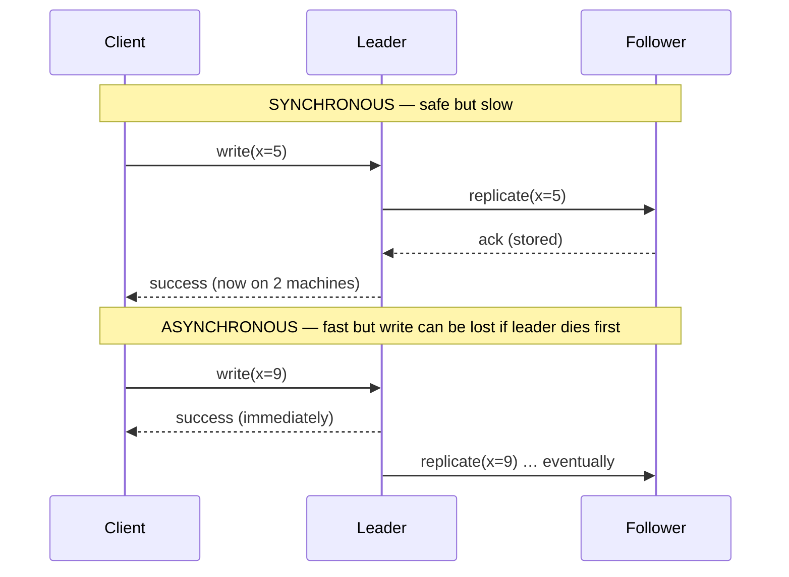

<details>
<summary>📖 In plain English</summary>

When you write to the leader, does it wait for the copies to catch up before saying "done"? If yes (synchronous), your data is safely on two machines before you get the OK — but every write is slower, and one stuck copy freezes all writes. If no (asynchronous), the leader says "done" instantly and updates the copies afterward — much faster, but if the leader dies in that gap, the write vanishes because it only ever existed on the leader. The lag between "written to leader" and "shows up on a copy" is called replication lag, and while it lasts, reads from those copies show slightly old data.

</details>

## 🎯 10. Read replicas and the consistency traps they create

The "spread reads across copies" benefit deserves its own section because it's a workhorse pattern and a rich source of interview follow-ups. A **read replica** is simply a follower used to serve read queries, taking read load off the leader. For the overwhelmingly common **read-heavy** workload (think 90%+ reads — a typical web app, a product catalog), this is transformative: the leader handles the modest write load, and a fleet of read replicas absorbs the massive read load. Nearly every managed database (Amazon RDS/Aurora, Google Cloud SQL) offers read replicas as a first-class feature for exactly this reason.

But because replicas lag, reading from them introduces subtle bugs that are famous interview material — the anomalies of **eventual consistency**. Three are canonical. **Read-your-own-writes** (read-after-write): a user updates their profile (write → leader), then immediately reloads (read → a lagging replica that hasn't got the update yet) and sees their *old* profile — deeply confusing, because their own change appears to have vanished. **Monotonic reads**: a user refreshes twice, the first read hits an up-to-date replica and the second hits a more-lagged one, so they see data *move backwards in time* — a comment appears, then disappears on refresh. **Consistent prefix reads**: replicas apply writes out of order relative to each other, so an observer sees an answer before the question it replies to.

The fixes are exactly the kind of nuance staff interviews reward. For read-your-own-writes, **route a user's reads to the leader for a short window after they write** (or track the write's log position and only read from a replica that has caught up to it) — Amazon Aurora and Vitess expose exactly this "read your writes" routing. For monotonic reads, **pin a given user to the same replica** (via a session-sticky hash of their user ID) so they never bounce to a more-lagged one. The overarching staff-level point: *read replicas are not a free lunch — they trade read scalability for a weaker consistency model, and the application must either tolerate staleness or use read-routing tricks to hide it.* The right question is never "can I add read replicas?" but "which of my reads can tolerate being a few seconds stale, and which must be routed to the leader?"

<details>
<summary>📖 In plain English</summary>

A read replica is just a copy you point read traffic at, so the main server isn't swamped. Perfect for apps that read far more than they write. The gotcha: copies lag slightly, so you can hit weird bugs. You change your profile and reload, but your read lands on a copy that hasn't caught up, so you see the old profile and think your edit failed. Or you refresh twice and a new comment appears then vanishes because the second read hit a more-behind copy. Fixes: send a user's reads to the main server right after they write, and keep each user pinned to the same copy so they never see time run backwards.

</details>

<details>
<summary>💻 Java — read-your-own-writes routing</summary>

```java
// After a user writes, route THEIR reads to the leader for a short window,
// so they never read a stale replica that missed their own update.
public class ReadRoutingService {
    private final Datasource leader;
    private final List<Datasource> replicas;
    // userId -> timestamp until which we must read from the leader
    private final Map<String, Long> stickyUntil = new ConcurrentHashMap<>();
    private static final long WINDOW_MS = 2_000; // ~ max expected replication lag

    void write(String userId, String key, String value) {
        leader.write(key, value);
        stickyUntil.put(userId, System.currentTimeMillis() + WINDOW_MS);
    }

    String read(String userId, String key) {
        Long until = stickyUntil.get(userId);
        if (until != null && System.currentTimeMillis() < until) {
            return leader.read(key);                 // read your own write from leader
        }
        return pickReplica(userId).read(key);        // otherwise scale reads on a replica
    }

    // Pin each user to ONE replica (monotonic reads: never bounce to a more-lagged copy)
    private Datasource pickReplica(String userId) {
        return replicas.get(Math.floorMod(userId.hashCode(), replicas.size()));
    }
}
```

</details>

## 🎯 11. Multi-leader and leaderless replication

Single-leader is simple but has two limits: all writes funnel through one machine (a write bottleneck and a single point of write-failure), and writers far from the leader pay high latency. Two alternative topologies relax the single-leader constraint, each buying something and paying with conflict-handling complexity.

**Multi-leader replication** uses more than one leader, each accepting writes, and the leaders replicate to each other. The classic use case is **multi-datacenter**: put a leader in each region so local writes are fast and a region can keep accepting writes even if the link between datacenters breaks. The unavoidable price is **write conflicts**: two leaders can accept conflicting writes to the same key at the same time (user edits a doc in the US, another edits it in Europe, simultaneously), and now the system holds two divergent values with no single authority to order them. Multi-leader systems therefore *must* have a conflict-resolution strategy — and this is exactly where versioning and vector clocks (Part IV) come in. Google Docs-style collaborative editing, calendar sync across devices, and CouchDB use variants of this.

**Leaderless replication** abandons leaders entirely: any replica accepts writes directly, and the client (or a coordinator) sends each write to *several* replicas and each read to *several* replicas, using quorums to decide what's authoritative. This is the **Amazon Dynamo** design, adopted by **Cassandra**, **Riak**, and **DynamoDB**. Its appeal is extreme availability and no failover step — there's no leader to lose, so a node dying doesn't stop writes; the system just uses the replicas that are up. Its cost is that consistency is now the *application's and the read/write path's* problem, managed through the quorum and repair machinery of Part III and the conflict detection of Part IV. This is the deep end of replication, and it's why leaderless systems and vector clocks are always taught together.

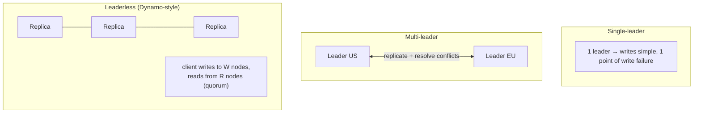

<details>
<summary>📖 In plain English</summary>

Having one boss is simple but limiting: every write goes through it, and writers far away are slow. Two alternatives. Multi-leader: put a boss in each region so local writes are fast and a region keeps working if the link breaks — but two bosses can accept clashing edits to the same thing at once, so you need rules to resolve conflicts. Leaderless (how Cassandra and DynamoDB work): no boss at all; the client writes to several copies and reads from several copies, and majority rules. Super resilient because there's no boss to lose, but figuring out the "true" value becomes the hard part — which is where vector clocks come in.

</details>

## 🎯 12. Failover and its hidden dangers

In a single-leader system, the leader is a single point of failure for *writes*, so when it dies the system must promote a follower to be the new leader — **failover**. It sounds routine, but failover is one of the most dangerous operations in distributed systems, and naming its failure modes is a strong staff-level signal because they've caused real, famous outages.

The sequence is: **detect** the leader is dead (usually via missed heartbeats and a timeout), **choose** a new leader (an election, ideally picking the most up-to-date follower to minimize data loss), and **reconfigure** the system so clients and remaining followers route to the new leader. Three things go wrong. First, with **asynchronous replication, failover loses data** — any writes the old leader had acknowledged but not yet replicated are gone when a follower is promoted, and if the old leader later rejoins, its unreplicated writes usually have to be discarded (GitHub had a well-known 2012 incident where promoted-then-conflicting data caused corruption). Second, **split-brain**: if the old leader isn't actually dead but merely unreachable (a network partition), you can end up with *two* nodes both believing they're leader, both accepting writes, and irreconcilably diverging — the nightmare scenario. Systems prevent this with **fencing** (forcibly shutting the old leader out, e.g., STONITH — "shoot the other node in the head") and by requiring a **quorum** to elect a leader so a minority partition can't crown its own. Third, **timeout tuning**: too short a failover timeout and a brief GC pause or network blip triggers an unnecessary failover (which is itself disruptive); too long and you suffer extended downtime. There's no perfect value, which is why this is a tuning trade-off, not a solved problem.

The staff-level takeaway: *the safest failover requires consensus.* This is why production systems don't roll their own leader election — they lean on a consensus protocol like **Raft** or **Paxos** (used by etcd, Consul, ZooKeeper's ZAB, CockroachDB, and modern MongoDB) which guarantees at most one leader is elected even under partitions, at the cost of requiring a majority to be reachable. Failover, done right, *is* a consensus problem.

<details>
<summary>📖 In plain English</summary>

When the leader dies, the system has to crown a new one — that's failover. Harder than it sounds. If replication was asynchronous, any writes the dead leader hadn't yet shared are simply lost. Worse, if the "dead" leader was only briefly unreachable, you can end up with two leaders both taking writes and diverging — called split-brain, and it corrupts data. And setting the "is it dead yet?" timer is a no-win: too twitchy and a hiccup triggers a needless failover, too slow and you're down longer. The safe fix is to require a majority vote to pick a leader, which is why real systems use consensus algorithms like Raft instead of hand-rolling it.

</details>

---

# Part III — Keeping Copies Honest: Quorums & Repair

Leaderless replication (section 11) made a bold move: it removed the leader that guaranteed a single order of writes. That buys enormous availability, but it hands us a raw problem — *with no leader, how do we get any consistency at all?* If a client can write to any subset of replicas and read from any subset, how do we ensure a read ever sees the latest write? The answer is a small, beautiful piece of arithmetic (quorums) backed by background machinery that heals divergence (repair). This part is the machinery that makes leaderless systems like Cassandra and DynamoDB actually usable.

## 🎯 13. Quorums: how many copies must agree

Here's the core idea, and it's genuinely elegant. Suppose every piece of data is stored on **N** replicas. On each write, we require the write to be acknowledged by at least **W** replicas before we call it successful. On each read, we query at least **R** replicas and take the newest value among the responses. The magic condition is:

> **W + R > N**

When that inequality holds, the set of replicas you wrote to and the set you read from are *guaranteed to overlap in at least one replica* — and that overlapping replica is holding the latest write, so your read is guaranteed to see it. This is the **quorum**. It's just the pigeonhole principle: if you wrote to W of N and read from R of N and W + R > N, the two groups cannot be disjoint. This is the mechanism that lets a leaderless system offer strong-ish consistency without a leader, and it's the heart of Dynamo, Cassandra, and Riak.

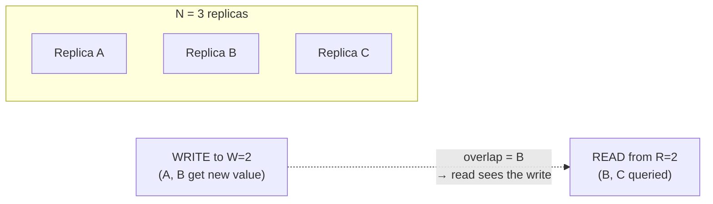

The beauty is that **N, W, and R are tunable per operation**, and moving them slides you along the consistency/availability/latency spectrum — this is the single most important thing to be able to reason about here. With **N=3, W=2, R=2** (the common default) you get strong consistency and can tolerate one node being down for both reads and writes. Set **W=3, R=1** and reads are fast and always-latest but a single down node blocks all writes (bad for write availability). Set **W=1, R=1** and both are blazing fast and highly available but W+R is *not* > N, so you get **eventual consistency** — reads may miss recent writes. Cassandra exposes exactly this as per-query *consistency levels* (`ONE`, `QUORUM`, `ALL`, `LOCAL_QUORUM`), so a single application can demand strong consistency for a financial write and accept eventual consistency for a "like" count — a per-operation choice, not a system-wide one.

Two staff-level caveats that interviewers reward. First, **quorums give you recency, not linearizability** — even with W+R>N there are edge cases (concurrent writes, a write that reached some replicas then failed) where quorum reads can still return stale or conflicting data, so a quorum is *not* a full ACID transaction. Second, this is precisely where the **CAP theorem** bites: when a network partition makes fewer than W (or R) replicas reachable, you must either block the operation (choose consistency) or accept it against too few replicas (choose availability). Quorums are the dial that lets you place that bet per operation.

<details>
<summary>📖 In plain English</summary>

Store each piece of data on N machines (say 3). Require every write to be confirmed by W of them and every read to check R of them. If W + R is bigger than N, the machines you wrote to and the machines you read from must share at least one machine — and that shared machine has the latest value, so your read can't miss it. That's a quorum: consistency by overlap, no boss needed. Best part: you can dial N, W, and R per request — demand a strict majority for a bank balance, but accept "any one copy" for a like-count where speed matters more than being perfectly current.

</details>

<details>
<summary>💻 Java — quorum read/write logic</summary>

```java
// Leaderless quorum: succeed only when enough replicas respond.
// W + R > N guarantees the read set overlaps the write set.
public class QuorumCoordinator {
    private final List<Replica> replicas; // size N
    private final int W, R;

    QuorumCoordinator(List<Replica> replicas, int W, int R) {
        this.replicas = replicas; this.W = W; this.R = R;
        // caller is responsible for choosing W + R > N for strong reads
    }

    void write(String key, VersionedValue value) {
        int acks = 0;
        for (Replica r : replicas) {
            if (r.tryWrite(key, value)) acks++;       // fan out to all, count successes
            if (acks >= W) return;                     // quorum reached → success
        }
        throw new QuorumNotMetException("only " + acks + " of W=" + W + " acked");
    }

    VersionedValue read(String key) {
        List<VersionedValue> responses = new ArrayList<>();
        for (Replica r : replicas) {
            VersionedValue v = r.tryRead(key);
            if (v != null) responses.add(v);
            if (responses.size() >= R) break;          // quorum reached
        }
        if (responses.size() < R) throw new QuorumNotMetException("read quorum not met");
        // Newest wins among the R responses; repair stale replicas in the background
        return responses.stream().max(Comparator.comparing(VersionedValue::version)).get();
    }
}
```

</details>

## 🎯 14. Sloppy quorums and hinted handoff

Strict quorums have a brittle edge: if enough nodes become unreachable that you can't assemble W replicas *from the key's normal home nodes*, writes fail — even though plenty of *other* nodes in the cluster are perfectly healthy. For a system whose entire selling point is availability (Dynamo, Cassandra), refusing a write while healthy machines sit idle is unacceptable. The fix is the **sloppy quorum**.

A **sloppy quorum** relaxes *which* nodes count toward W. If the key's usual replicas aren't reachable, the write is accepted by other, currently-reachable nodes that aren't normally responsible for that key — so the write succeeds as long as *any* W nodes in the cluster are up, not specifically the key's home nodes. This dramatically increases write availability during partitions. But those substitute nodes are now holding data they don't own, so they can't just keep it. That's where **hinted handoff** comes in: the substitute node stores the write along with a "hint" recording which node it *should* eventually go to, and once that rightful home node comes back online, the substitute *hands off* the data to it and deletes its temporary copy.

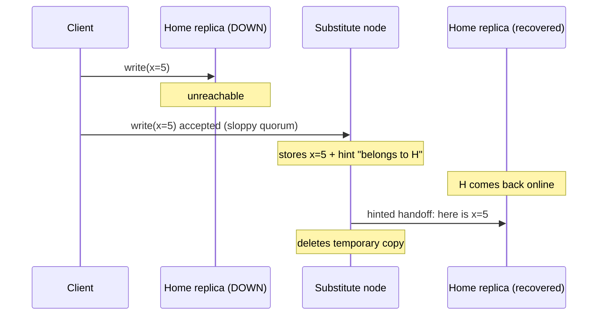

The trade-off to state plainly: a sloppy quorum **boosts write availability but weakens the consistency guarantee**, because during the partition your write landed on nodes outside the normal read quorum — so a concurrent reader querying the *proper* R home replicas might not see it (the W+R>N overlap guarantee is temporarily broken, since the "W" nodes weren't the designated ones). It's a deliberate lean toward availability, exactly what a Dynamo-style store is built to do. Cassandra implements hinted handoff by default, with a configurable window after which hints are dropped (so a node down for hours doesn't accumulate unbounded hints). The elegant part is that this is *self-healing*: the cluster automatically absorbs writes during failures and reconciles them on recovery, with no operator intervention.

<details>
<summary>📖 In plain English</summary>

Normally a write must be confirmed by a set number of the machines that officially own that data. But if too many of those owners are down, a strict system would reject the write even though other machines are fine — bad for an "always available" database. So it cheats: any healthy machine accepts the write temporarily and tags it "this really belongs to server 4." When server 4 comes back, the stand-in hands the data over and forgets it. This keeps you writable through outages, at the cost that a reader checking the official owners might briefly not see the write.

</details>

## 🎯 15. Read repair, write repair, and anti-entropy

Quorums make sure a read *sees* the latest value; they don't, by themselves, *fix* the replicas that are stale. Over time, replicas drift apart — missed writes during downtime, dropped messages, sloppy-quorum writes that landed elsewhere. Left alone, that divergence grows. So leaderless systems run continuous background **repair** to pull replicas back into agreement, and there are three complementary mechanisms worth distinguishing.

**Read repair** is opportunistic and rides along on normal reads. When a read queries R replicas and notices they disagree — some return an old value, one returns the new — the coordinator returns the newest value to the client *and*, in the background, writes that newest value back to the stale replicas. So the very act of reading data heals it. This is cheap and elegant, but it only heals data that actually gets read; **rarely-read keys never get repaired this way**, and stale values can linger there for a long time.

**Write repair** (and the broader idea of the coordinator ensuring all replicas converge on write) pushes convergence at write time — but the important complement to read repair is a dedicated background process for the cold data. **Anti-entropy** is that process: a continuous background comparison of replicas that finds and fixes *all* divergences regardless of whether the data is being read. The naive way — compare every key on every pair of replicas — is hopeless at scale (terabytes over the network). The clever solution is **Merkle trees**: each replica builds a tree of hashes where leaves hash individual key ranges and each parent hashes its children. Two replicas compare by exchanging just the *root* hash; if the roots match, the entire datasets are identical and nothing more is sent. If they differ, they recurse down only the branches whose hashes differ, so they pinpoint the exact ranges that diverge while transferring a tiny amount of data. This is how Cassandra's and Dynamo's repair (and Git's object comparison, and blockchain verification) efficiently reconcile huge datasets.

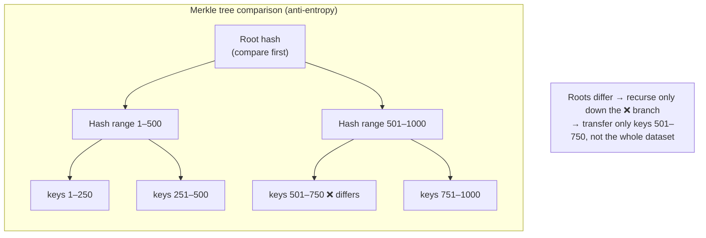

The staff-level framing: **read repair handles hot data cheaply and reactively; anti-entropy with Merkle trees handles all data (especially cold data) proactively; together they guarantee the cluster converges to consistency even though no single write ever reached every replica.** This is the operational backbone of "eventual consistency" — eventual consistency isn't magic, it's these repair processes grinding divergence back down to zero in the background. And notice the thread connecting everything: to repair, a replica must be able to tell *which* value is newer when two disagree. For simple cases a version number or timestamp suffices — but when two writes truly happened concurrently, "newer" is ambiguous, and that is the problem Part IV finally confronts head-on.

<details>
<summary>📖 In plain English</summary>

Quorums make sure your read *sees* the latest value, but the out-of-date copies are still wrong and need fixing. Two ways. Read repair: whenever a read notices copies disagree, it quietly writes the newest value back to the stale ones — so reading heals data, but only data people actually read. For the cold, never-read data, a background job called anti-entropy compares copies and fixes everything. To avoid comparing terabytes byte by byte, each copy builds a tree of fingerprints and they compare top fingerprints first, drilling down only where they differ — so they find the exact mismatched chunk while barely using the network.

</details>

---

# Part IV — Versioning & Vector Clocks: Whose Write Wins

Everything so far has quietly assumed that when two replicas disagree, one value is simply *newer* and we keep it. Part IV confronts the case where that assumption breaks: two writes that happened *concurrently*, with no meaningful "newer." This is the deepest problem in replicated systems, and vector clocks are the classic tool for it. If you understand this part, you understand the intellectual core of Dynamo, Cassandra, Riak, and every "eventually consistent" store — and it's the topic that most reliably separates strong interview candidates.

## 🎯 16. The concurrent-write problem

Picture a leaderless store, N=3, and a shopping cart shared across a user's phone and laptop. The cart currently holds `[milk]`. Now two things happen at nearly the same instant: from the phone the user adds `eggs` (write A: cart = `[milk, eggs]`), and from the laptop they add `bread` (write B: cart = `[milk, bread]`). Because there's no leader ordering writes, write A reaches replicas 1 and 2, while write B reaches replicas 2 and 3. Replica 2 now has *both* writes and no idea which is correct; replicas 1 and 3 each have only one.

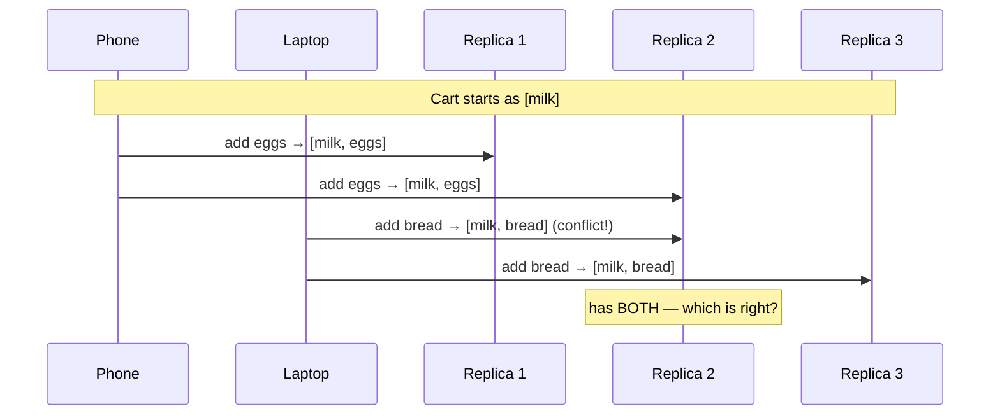

Here is the crucial insight: **these two writes are not "one newer than the other" — they are genuinely concurrent, because neither writer knew about the other's write.** There is no correct linear order; A did not happen "before" or "after" B in any meaningful causal sense. So any scheme that just picks one (say, "keep the latest timestamp") is *making up* an answer, and for a shopping cart that answer is *losing an item the user added* — a real bug that cost real money at Amazon and directly motivated Dynamo's design. The right behavior is to *detect* that A and B conflict and either keep both for later reconciliation or merge them (here, the union `[milk, eggs, bread]`). But to do that, the system first needs a way to tell the difference between "B is a genuine update that supersedes A" (B knew about A) and "A and B are concurrent" (neither knew about the other). That distinction — **causality** — is what versioning schemes exist to capture, and simple timestamps fundamentally cannot.

<details>
<summary>📖 In plain English</summary>

Two devices update the same shopping cart at the same time — the phone adds eggs, the laptop adds bread — and neither knew about the other's change. Now different copies hold different carts and there's no honest way to say one is "newer," because they happened together. If the system just keeps whichever has the later timestamp, it silently throws away the item the other device added — the user's bread vanishes. The real goal isn't to pick a winner; it's to *notice* the two changes conflict, so the system can keep both and merge them into a cart with milk, eggs, and bread. Detecting that clash is what versioning is for.

</details>

## 🎯 17. Last-write-wins and why timestamps lie

The tempting, simple answer to concurrent writes is **Last-Write-Wins (LWW)**: attach a timestamp to every write, and when values conflict, keep the one with the highest timestamp. It's trivially easy, needs no bookkeeping, and Cassandra actually uses LWW as its default conflict resolution. So why isn't the problem solved? Because **wall-clock timestamps lie**, in two ways that are guaranteed to bite at scale.

First, **clock skew**. In a distributed system, every machine has its own clock, and those clocks are never perfectly synchronized — even with NTP they drift by milliseconds to tens of milliseconds, and occasionally by much more. So a write that genuinely happened *later* can carry an *earlier* timestamp than an earlier write, simply because it was stamped by a machine whose clock ran behind. LWW would then keep the wrong value — the older write "wins" — and you've silently discarded newer data. Google engineered an entire product (**TrueTime**, backed by GPS and atomic clocks in every datacenter) around bounding this uncertainty for Spanner, which tells you how hard the problem is.

Second, and more fundamentally, **LWW destroys concurrent writes by design**. Even with perfect clocks, when two writes are truly concurrent, LWW picks one and *throws the other away*. For the shopping cart, that's a lost item; for a counter, a lost increment; for a collaborative document, a lost edit. LWW doesn't *resolve* the conflict — it *hides* it by discarding data. That's acceptable only when losing a concurrent write is genuinely fine (e.g., overwriting a user's "last seen" timestamp, where you truly only want the latest). The staff-level rule: **LWW is safe only for data where the newest write should legitimately obliterate all others; for anything that accumulates or merges (carts, sets, counters, documents), LWW causes silent data loss and you need causal tracking instead.**

This is exactly why the concept of a *logical clock* was invented — a way to order events by **causality** (what actually influenced what) rather than by **wall-clock time** (what a possibly-wrong physical clock says). Version numbers are the first step toward that, and vector clocks are its full realization.

<details>
<summary>📖 In plain English</summary>

The easy fix for conflicts is "keep whichever write has the latest timestamp" — last-write-wins. It fails for two reasons. One, computer clocks disagree; a write that really came second can be stamped with an earlier time because its machine's clock is a bit behind, so the wrong value wins and newer data is quietly lost. Two, even with perfect clocks, when two changes truly happen at once, this rule just picks one and deletes the other — so an item added to a cart, or an edit to a doc, silently disappears. It's only safe when you genuinely want the newest value to wipe out the rest, like a "last seen at" time.

</details>

## 🎯 18. Version numbers and causality

Before jumping to vector clocks, it helps to see the simpler idea they generalize, because it makes the "why" of vector clocks obvious. On a *single* replica (or with a single leader), you can attach an incrementing **version number** to each value. The rule that makes this powerful: **when a client reads, it gets the value *and* its version number; when it writes back, it includes the version it last saw.** The server can then tell whether the write is based on current knowledge or stale knowledge.

This is exactly how **optimistic concurrency** works, and it's the mechanism behind HTTP's `ETag`/`If-Match` headers and DynamoDB's conditional writes: you read version 5, you write back "set this, but only if it's still version 5." If someone else already bumped it to version 6, your write is rejected and you must re-read and retry — no data is silently lost, because the version number *detected* that you were working from stale state. The server uses the version to distinguish a write that **causally follows** what you read (safe to apply) from one that **conflicts** with an update you never saw (must be rejected or merged).

The key concept crystallizing here is **causality**, formalized as the **"happens-before" relation** (Leslie Lamport, 1978). Event A *happens-before* B if A could have influenced B — for example, if B was written by someone who had already seen A. If neither happens-before the other, they are **concurrent**. Version numbers capture happens-before perfectly *when there's a single sequence of versions* — a single leader handing out 1, 2, 3, 4. But leaderless systems have *no single sequence*: multiple replicas hand out versions independently, so "version 5 on replica 1" and "version 5 on replica 3" are not comparable, and a lone integer can no longer express "these two writes descend from a common ancestor but neither knew about the other." To track causality across *multiple* independent writers, one number isn't enough — **you need one number per replica.** That's the leap to vector clocks.

<details>
<summary>📖 In plain English</summary>

A simpler version of the idea first. Give each value a version number. When you read, you get the value and its number; when you write back, you say "here's my change, based on version 5." If someone already moved it to version 6, the server rejects your write and asks you to re-read — so nothing gets silently overwritten. This is how "edit only if unchanged" works on the web (ETags) and in DynamoDB. It works great when there's one counter handing out 1, 2, 3. But with several servers each handing out their own numbers, a single number can't say who-knew-about-what anymore — so you keep one number per server, which is a vector clock.

</details>

## 🎯 19. Vector clocks, step by step

A **vector clock** is a small piece of metadata attached to each value: a set of counters, one per node (or per writer) that has ever updated that value, written like `{A:2, B:1, C:0}` — meaning "this version reflects 2 updates from node A, 1 from node B, and 0 from node C." It's the causal history of the value, compressed into a vector of counters. Here are the mechanics, which are simpler than they look once you see them in motion.

**The rules.** (1) Every node keeps a counter for each writer. (2) When a node processes a write, it **increments its own counter** in that value's vector. (3) When a value is passed around (replicated, or read then written back), a node **merges** two vectors by taking the **element-wise maximum** — this folds in everything both sides knew. (4) To compare two versions, compare their vectors element by element.

**The comparison — this is the whole payoff.** Given two vectors V1 and V2:

- If **every** counter in V1 is **≤** the corresponding counter in V2 (and they're not equal), then **V1 happened-before V2** — V2 is a true descendant that knew about V1, so V2 supersedes V1 and you safely keep V2. (This is the "one is genuinely newer" case.)
- If some counters are higher in V1 and others are higher in V2 (neither dominates), the versions are **concurrent** — a real conflict, neither knew about the other, so you must keep both (as *siblings*) or merge them.

Let's run the shopping cart through it, N handled by nodes A, B, C. Start: cart `[milk]` with clock `{A:1}`.

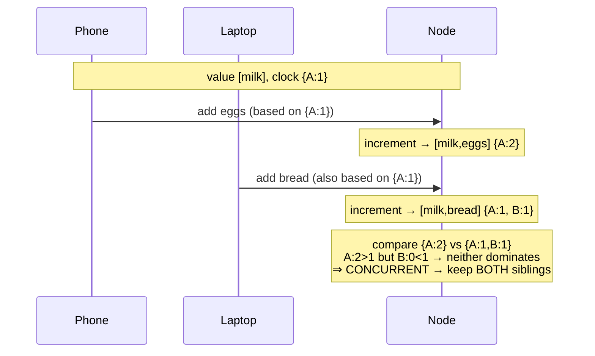

The phone's write, based on `{A:1}`, becomes `[milk, eggs]` with clock `{A:2}`. The laptop's write, *also* based on `{A:1}` (it never saw the eggs write), becomes `[milk, bread]` with clock `{A:1, B:1}`. Now compare: `{A:2}` vs `{A:1, B:1}`. A is higher in the first (2 vs 1), B is higher in the second (1 vs 0) — **neither vector dominates the other**, so the vector clock has *correctly detected* that these are concurrent writes, not one superseding the other. The system keeps both as **siblings** rather than silently dropping bread. Contrast with a *causal* update: if the laptop had first *read* `[milk, eggs] {A:2}` and then added bread, its write would carry `{A:2, B:1}`, which dominates `{A:2}` — so the system would know it's a clean descendant and keep just the new one. That is the exact distinction LWW and plain timestamps could never make.

<details>
<summary>📖 In plain English</summary>

A vector clock is just a little scoreboard attached to each value — one tally per server, like {A:2, B:1}. Every time a server updates the value, it bumps its own tally. To compare two versions, look at their scoreboards: if one scoreboard is greater-or-equal on *every* server, it truly came later and wins. But if version 1 is ahead on server A while version 2 is ahead on server B, neither is "later" — they happened independently, so it's a real conflict and you keep both. That's the whole trick: the scoreboard reveals whether one change knew about the other, which a plain timestamp can never tell you.

</details>

<details>
<summary>💻 Java — a working vector clock</summary>

```java
import java.util.*;

// A vector clock: one counter per node. Detects causality vs. concurrency.
public class VectorClock {
    private final Map<String, Integer> clock = new HashMap<>();

    // Rule 2: a node increments its OWN counter when it writes.
    public void increment(String node) {
        clock.merge(node, 1, Integer::sum);
    }

    // Rule 3: merge two clocks by element-wise MAX (fold in all knowledge).
    public VectorClock merge(VectorClock other) {
        VectorClock result = new VectorClock();
        result.clock.putAll(this.clock);
        other.clock.forEach((node, v) -> result.clock.merge(node, v, Integer::max));
        return result;
    }

    // Rule 4: comparison drives the whole system.
    public enum Rel { BEFORE, AFTER, CONCURRENT, EQUAL }

    public Rel compare(VectorClock other) {
        boolean lessSomewhere = false, greaterSomewhere = false;
        Set<String> nodes = new HashSet<>(clock.keySet());
        nodes.addAll(other.clock.keySet());
        for (String n : nodes) {
            int a = clock.getOrDefault(n, 0);
            int b = other.clock.getOrDefault(n, 0);
            if (a < b) lessSomewhere = true;
            if (a > b) greaterSomewhere = true;
        }
        if (!lessSomewhere && !greaterSomewhere) return Rel.EQUAL;
        if (lessSomewhere && !greaterSomewhere)  return Rel.BEFORE;      // this → other
        if (greaterSomewhere && !lessSomewhere)  return Rel.AFTER;       // other → this
        return Rel.CONCURRENT;                                          // real conflict → keep both
    }
}
```

</details>

## 🎯 20. Siblings, resolution, and version vectors

So vector clocks *detect* concurrent writes and preserve them as **siblings** (Riak's term) — multiple values kept for the same key because none supersedes the others. Detection is half the job; something must eventually **resolve** the siblings back into a single value, and this is where a subtle but important division of labor lives. The database can *detect* the conflict (vector clocks are perfect at that), but it usually *cannot* resolve it, because resolution requires knowing what the data *means*. So the standard pattern is: **the datastore returns all siblings to the application on read, and the application merges them.**

How to merge depends entirely on the data's semantics, and naming these strategies is a strong signal. For a **shopping cart**, the merge is a *union* of items — `[milk, eggs]` ∪ `[milk, bread]` = `[milk, eggs, bread]` — which is why Dynamo's cart example famously errs toward keeping items (a re-added deleted item is a lesser evil than a lost item). For a **counter**, you sum the concurrent increments. For a **document**, you might present both versions to the user to pick, or apply operational-transform/CRDT logic. When merges are done well, no data is lost; the price is application complexity, and the classic footgun — **the resurfacing-deleted-item problem**: because a delete is just another concurrent write, merging by union can bring back an item the user deleted (Dynamo explicitly accepted this trade-off).

Two refinements matter at staff level. First, terminology: a **vector clock** in the strict sense counts *events*, while what most databases actually use is a **version vector**, which tracks per-*replica* versions of a data item — the distinction is academic pedantry in most interviews, but knowing that Riak/Dynamo use *version vectors* (often loosely called vector clocks) is a nice touch. Second, and genuinely important operationally: **vector clocks can grow unbounded.** Every distinct writer that ever touches a key adds an entry, so a widely-shared key could accumulate hundreds of entries. Real systems bound this by **pruning** — Dynamo attaches a timestamp to each `(node, counter)` entry and drops the oldest entries when the vector exceeds a threshold (e.g., 10). Pruning can, in rare cases, cause a false "concurrent" verdict (you lost the history that would have shown causality), but the bounded size is worth that small risk. Being able to say "vector clocks are great but you must cap their growth, and the cap can occasionally produce false conflicts" is exactly the kind of unprompted nuance that marks a senior answer.

<details>
<summary>📖 In plain English</summary>

Vector clocks catch conflicts and keep both versions, called siblings — but someone still has to combine them back into one. The database can detect the clash but usually can't fix it, because fixing depends on what the data means: two carts get merged into the union of their items, two counters get added together, two document edits might be shown to the user to choose. The famous side effect is a deleted item coming back, because a delete is just another change that can lose the merge. Also, these scoreboards keep growing as more servers touch a key, so systems trim the oldest entries to keep them small — which very rarely fakes a conflict, a price worth paying.

</details>

## 🎯 21. Beyond vector clocks: CRDTs and hybrid logical clocks

Vector clocks solve *detection* but leave *resolution* to the application, which is real work and easy to get wrong. Two more modern approaches tackle the problem from different angles, and mentioning them shows you know where the field went after Dynamo.

**CRDTs (Conflict-free Replicated Data Types)** flip the problem: instead of detecting conflicts and asking the app to merge, they design the data structure so that concurrent updates *always merge automatically and deterministically*, with a mathematically guaranteed single outcome regardless of order. A **G-Counter** (grow-only counter) keeps a per-node count and merges by element-wise max then sum, so concurrent increments never collide. An **OR-Set** (observed-remove set) tags each add/remove with a unique ID so adds and removes commute correctly and the "resurrecting deleted item" problem disappears. The trade-off is that CRDTs only exist for data types whose merge can be made commutative/associative/idempotent, and they carry metadata overhead — but where they fit, they eliminate conflict resolution entirely. **Redis** (Active-Active via Redis Enterprise), **Riak** (native CRDT data types), and collaborative editors like **Figma** and **Automerge**-based apps rely on them.

**Hybrid Logical Clocks (HLC)** attack the *timestamp* weakness instead. An HLC combines a physical wall-clock component with a logical counter, giving timestamps that are close to real time (so they're human-meaningful and support "as-of" queries) *and* respect causality (so they never contradict happens-before the way raw wall clocks do). They're far more compact than vector clocks — a single value, not a per-node vector — which is why **CockroachDB**, **YugabyteDB**, and **MongoDB** (for its cluster-wide logical clock) use HLCs to order events across a cluster without Google's atomic-clock hardware. The staff-level framing of the whole landscape: *plain timestamps (LWW) are cheap but lose data; vector clocks detect conflicts precisely but grow and push work to the app; CRDTs eliminate resolution but only for special data types; HLCs give causal, near-real timestamps compactly; and Spanner's TrueTime buys true external consistency with atomic clocks and money.* Knowing which tool a system chose — and why — is the real mastery.

<details>
<summary>📖 In plain English</summary>

Two newer ideas built on the vector-clock lesson. CRDTs are data structures designed so that merging concurrent changes always produces the same correct answer automatically — a special counter or set where two simultaneous edits just combine cleanly, so nobody has to write merge logic. Google Docs-style tools and Redis use them. Hybrid logical clocks fix the *timestamp* side: they blend the real clock with a small counter so the time is both close to reality and honest about what-caused-what, in a single compact value — which is why CockroachDB and MongoDB use them instead of heavy vector clocks. Different tools, same goal: order events without lying.

</details>

---

# Part V — Mastery

The mechanics are behind us. This part is what elevates an answer from "correct" to "senior": seeing how the real systems combine these building blocks, discarding the misconceptions that trip people up, and knowing what an interviewer is *actually* listening for.

## 🎓 22. How the giants do it

Nothing cements the concepts like seeing how production systems assemble them, because every one of them makes *different* choices along the same axes — and the choice reveals what the system optimizes for.

**Amazon DynamoDB (and the 2007 Dynamo paper that seeded it)** is the canonical leaderless design. It partitions by **consistent hashing**, replicates each item across multiple nodes (typically 3, across availability zones), uses **quorums (N, W, R)** for tunable consistency, keeps writes flowing during failures with **sloppy quorums and hinted handoff**, and originally used **vector clocks** to detect concurrent writes on the shopping cart. Modern DynamoDB defaults to **last-write-wins** for simplicity but offers strongly-consistent reads (which route to enough replicas to guarantee recency). It's the single best system to reference because it touches *every* concept in this guide.

**Apache Cassandra** takes the Dynamo architecture and productionizes it: consistent hashing with **virtual nodes** for partitioning, tunable **per-query consistency levels** (`ONE`, `QUORUM`, `LOCAL_QUORUM`, `ALL`) that are literally the N/W/R quorum dial exposed to the developer, **LWW with per-cell timestamps** as its conflict resolution (so it accepts LWW's data-loss risk in exchange for simplicity), and both **read repair** and **Merkle-tree anti-entropy repair** to converge replicas. `LOCAL_QUORUM` is a nice detail to cite — it means "a quorum within the local datacenter," trading cross-region consistency for latency in a multi-DC deployment.

**MongoDB** is the leader–follower counterpoint: a **replica set** has one primary (leader) taking writes and secondaries (followers) replicating asynchronously, with automatic **failover via a Raft-like election** when the primary dies. Sharding is layered on top — a sharded cluster is many replica sets, each owning a range or hash of the shard key, fronted by routers (`mongos`). It's the clean example of "shard for scale, replicate each shard for durability."

**Google Spanner** is the outlier that spent money to beat the trade-offs: it shards (splits), replicates via **Paxos** consensus per shard, and uses **TrueTime** (GPS + atomic clocks) to bound clock uncertainty so tightly that it can offer *externally consistent* (linearizable) global transactions — the thing everyone else gives up. It's the reference for "you *can* have strong global consistency, if you're willing to put atomic clocks in every datacenter." **Vitess** (YouTube's MySQL sharding layer, now common on Kubernetes) is worth a mention as the pragmatic "shard vanilla MySQL without rewriting the app" answer, and **CockroachDB/YugabyteDB** as the modern "Spanner-like consistency using HLCs instead of atomic clocks" answer.

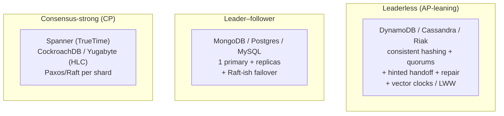

## ❌ 23. Myths worth unlearning

A handful of confident-sounding but wrong beliefs show up constantly; correcting them is quick and high-signal.

**"Sharding and partitioning are totally different things."** No — sharding *is* partitioning, specifically horizontal partitioning across separate machines. Treating them as unrelated is a red flag; the nuance is the "across machines / independent instances" distinction, not a different mechanism.

**"More replicas always mean better consistency."** Backwards. More replicas improve *durability and read availability* but make *consistency harder*, because there are more copies to keep in sync and a bigger window for them to diverge. Consistency comes from the quorum rules and repair, not from copy count.

**"A quorum (W+R>N) gives you strong consistency / ACID transactions."** It gives you *read recency* in the common case, but not linearizability — concurrent writes, failed partial writes, and sloppy quorums all create edge cases where quorum reads return stale or conflicting data. A quorum is not a transaction.

**"Vector clocks resolve conflicts."** They *detect* conflicts — they tell you two writes are concurrent — but they don't *resolve* them; resolution requires application semantics (union the carts, sum the counters). Conflating detection with resolution is the most common vector-clock mistake.

**"Timestamps are fine for ordering distributed writes."** Only if you're comfortable losing data. Clock skew means a later write can carry an earlier timestamp, so LWW silently drops the wrong value — which is why logical clocks, vector clocks, and TrueTime exist at all.

**"Consistent hashing eliminates hotspots."** It balances *keys* across nodes; it does nothing for a single *hot key* (the celebrity problem). Traffic skew on one key is a caching/key-splitting problem that lives above the partitioning layer.

## 💡 24. What separates a staff engineer's answer

When an interviewer keeps pushing past your first correct answer, they're probing for a specific set of instincts. Here's what they're listening for on this topic.

They want you to **separate the two axes cleanly** — partitioning is about *placement* (where data lives), replication is about *redundancy* (how many copies) — and never conflate them, because a strong design reasons about them independently and then composes them (shard, then replicate each shard). They want you to **treat consistency as a dial, not a boolean**: instead of "is it consistent?", the senior instinct is "N/W/R and consistency level per operation — strong for the payment, eventual for the like-count." They want you to **name the failure modes unprompted**: replication lag causing read-your-writes bugs, split-brain during failover, the resurrecting-deleted-item problem, unbounded vector-clock growth. They want you to **ground every claim in a real system** — "Cassandra's LOCAL_QUORUM," "Dynamo's hinted handoff," "Spanner's TrueTime" — because it proves the knowledge is operational, not memorized. And above all they want to hear you **articulate trade-offs in terms of what the business tolerates**: which reads can be stale, whether a lost concurrent write is acceptable, what latency the write path can afford. The through-line of a staff answer is that there is no free lunch — every choice here trades consistency, availability, latency, and complexity against each other, and the skill is choosing deliberately and saying *why*.

## 🔗 25. Where to go next: adjacent concepts

These topics sit one step beyond this guide and are natural follow-ups an interviewer may bridge to. **Consistent hashing** in full depth — the ring, virtual nodes, replication along the ring — is the mechanism behind the partitioning here, and you have a dedicated **[Consistent Hashing Study Guide](Consistent-Hashing-Study-Guide.md)**. The **CAP and PACELC theorems** formalize the consistency/availability trade-off that quorums navigate, along with ACID vs BASE — covered in your **[CAP/PACELC/ACID/BASE/Quorum guide](CAP-PACELC-ACID-BASE-Quorum-Study-Guide.md)**. **Consensus algorithms (Paxos, Raft)** are how systems achieve *strong* agreement (safe failover, Spanner's per-shard replication) rather than the eventual convergence of repair. **Two-phase commit and Sagas** handle transactions *across* shards, the operation sharding makes hard — see your **[Two-Phase Commit](Two-Phase-Commit.md)** and **[Saga Pattern](Saga-Pattern.md)** guides. And **change data capture (CDC)** taps the replication log itself to stream changes into other systems, connecting replication to event-driven architecture. Together these form the complete distributed-data picture; this guide is the data-placement-and-copies foundation the rest build on.

---

## ⚡ Quick Revision

*Read this straight through and the whole guide should snap back into place. It follows the same arc: place the data, copy it, keep the copies honest, resolve conflicts.*

**The spine.** Everything starts because one machine runs out of storage, memory, CPU, or network. You scale *up* (vertical) until it's too expensive, too fragile (single point of failure), or hits the single-machine write ceiling — then you scale *out* (horizontal) across many machines. The instant you do, two questions define everything: *where does each piece of data live* (partitioning/sharding) and *how many copies exist* (replication). Every concept is an answer to one of those, or to a problem answering them creates.

**Partitioning & sharding.** Partitioning splits a dataset into pieces; the useful kind is *horizontal* (split by rows, not columns). Sharding is partitioning across *physically separate servers* — all sharding is partitioning, but partitioning can live on one machine. Sharding is what truly breaks the single-machine limit on storage and writes, and its price is that cross-shard joins and transactions become hard (fan-out queries, distributed commit). You place data by a **partition key**, using one of three strategies: **range** (neighbors together — great for range scans, but sequential keys create a hot "latest" partition), **hash** (`hash % N` — even spread, kills range scans, and reshuffles everything when N changes), or **consistent hashing** (ring + virtual nodes — even spread *plus* elastic; only `k/n` keys move on a membership change). The partition key is the most consequential and hardest-to-change decision: it needs high cardinality, even access, and alignment with query patterns. Get it wrong and you get a **hotspot** — either a *data* hotspot (one partition too big; a partition-key problem) or a *traffic/celebrity* hotspot (one key too popular; unfixable by partitioning, solved by caching or key-splitting above the partition layer). Secondary indexes are either *local* (cheap writes, scatter-gather reads) or *global* (fast reads, distributed writes). Rebalance by moving *whole fixed partitions*, never by recomputing every key, and always throttle it.

**Replication.** Orthogonal to partitioning: keep multiple copies for durability/HA, read scalability, and low latency. But the moment there's more than one copy, they can disagree — that's the source of every hard problem. **Leader–follower** routes all writes through one leader that streams a replication log to followers; simple because one place orders writes, but the leader is a write bottleneck and single point of failure. The key knob is **synchronous** (safe — data on ≥2 machines before ack — but slow, and a stuck follower blocks writes) vs **asynchronous** (fast, but a write is lost if the leader dies before propagating); *semi-synchronous* (one sync follower) is the common compromise. Async causes **replication lag**, which breaks reads on **read replicas**: read-your-own-writes (your own edit seems to vanish), monotonic reads (data moves backward), consistent-prefix (effect before cause) — fixed by routing a user's reads to the leader briefly after a write and pinning a user to one replica. **Multi-leader** (a leader per region) gives fast local writes and partition tolerance but creates write conflicts; **leaderless** (Dynamo/Cassandra — write to several, read from several) drops the leader entirely for extreme availability, pushing consistency onto quorums. **Failover** (promote a follower when the leader dies) is dangerous: async failover loses unreplicated writes, split-brain gives two leaders that diverge (prevented by fencing + quorum election), and timeouts are a no-win tuning trade-off — the safe answer is consensus (Raft/Paxos).

**Keeping copies honest.** With no leader, consistency comes from **quorums**: store on N, write to W, read from R, and if **W + R > N** the read and write sets must overlap, so a read sees the latest write (pigeonhole). N/W/R are tunable per operation — the dial between consistency, availability, and latency (N=3,W=2,R=2 is the strong default; W=1,R=1 is fast eventual consistency). Quorums give recency, not linearizability or ACID. **Sloppy quorums** keep writes flowing during partitions by accepting them on any healthy nodes, with **hinted handoff** delivering the data to its rightful home when it recovers — more availability, weaker consistency. Divergent replicas are healed by **read repair** (reads write the newest value back to stale replicas — cheap, but only for data that's read) and **anti-entropy** (background reconciliation of *all* data, using **Merkle trees** so replicas compare root hashes and recurse only into differing branches, transferring almost nothing). Eventual consistency is exactly these repair processes grinding divergence to zero.

**Versioning & vector clocks.** Repair needs to know which value is "newer" — easy when one write causally follows another, impossible with a plain timestamp when two writes are *concurrent*. **Last-write-wins** (keep the highest timestamp) is simple and Cassandra's default, but wall clocks skew (a later write can look earlier, so the wrong value wins) and, more fundamentally, LWW *discards* concurrent writes — a lost cart item, a lost increment. Safe only when the newest write should legitimately obliterate the rest. **Version numbers** (read-version-then-write-if-unchanged; HTTP ETags, DynamoDB conditional writes) capture causality (**happens-before**) when there's a single sequence — but leaderless systems have no single sequence, so you need one counter per node: a **vector clock** like `{A:2, B:1}`. Rules: increment your own counter on write; merge by element-wise max; to compare, if one vector is ≤ the other on *every* entry it *happened-before* (keep the descendant), otherwise they're **concurrent** (a real conflict — keep both as **siblings**). The datastore *detects* conflicts; the *application resolves* them by semantics (union carts, sum counters), which is why deleted items can resurface. Vector clocks grow unbounded, so systems prune oldest entries (risking rare false conflicts). Beyond them: **CRDTs** make merges automatic for special data types (G-Counter, OR-Set — Redis, Riak), and **hybrid logical clocks** give compact, causal, near-real timestamps (CockroachDB, MongoDB, YugabyteDB) without Spanner's atomic-clock **TrueTime**.

**The one instinct to keep.** Partitioning is *placement*, replication is *copies*, and quorums/repair/vector clocks are *keeping copies honest*. Consistency is a per-operation dial, not a boolean. Every choice trades consistency, availability, latency, and complexity — name the trade-off and ground it in what the business tolerates, and cite a real system (Dynamo, Cassandra, MongoDB, Spanner) for every claim.

---

## 💡 The Interview Q&A Bank

*Twenty of the most frequently asked questions on this topic. The first ten are foundational (L3–L4); questions 11–20 push into staff/principal trade-offs, failure reasoning, and per-component nuance. Each answer is written the way you'd say it aloud — reasoning, not a definition — with real technologies named.*

### Foundational (L3–L4)

<details>
<summary><b>1. What's the difference between partitioning and sharding?</b></summary>

They're often used interchangeably, and that's usually fine, but the precise distinction is worth stating: partitioning is the general act of splitting a dataset into subsets, and those subsets can all live on a *single* machine — Postgres declarative partitioning splits one table across partitions on one server purely for query performance. Sharding is the specific case where those partitions (shards) live on *physically separate* servers, each an independent database instance. So all sharding is partitioning, but not all partitioning is sharding. The practical consequence is that only sharding breaks the single-machine ceiling on storage and write throughput, and it charges for that by making cross-shard joins and transactions expensive — a query needing three shards must fan out and merge, and a transaction across shards needs 2PC or a saga.

</details>

<details>
<summary><b>2. What are the ways to partition data, and when do you use each?</b></summary>

Three canonical strategies. Range partitioning assigns contiguous key ranges to partitions (A–F here, G–M there, or by time) — it makes range scans fast because neighbors live together, but sequential keys like timestamps create a hot "latest" partition. Hash partitioning runs the key through a hash and takes `hash % N` — it spreads load evenly and kills sequential hotspots, but destroys range queries and reshuffles nearly everything when N changes. Consistent hashing places nodes and keys on a ring so only `k/n` keys move when a node is added or removed — it keeps hashing's balance while making the cluster elastic. Rule of thumb: range for time-series and "list recent" workloads, hash or consistent hashing for point lookups by ID, and consistent hashing specifically when you need to scale the cluster up and down online. DynamoDB's composite key (hash partition key + sort key) gives you both.

</details>

<details>
<summary><b>3. What makes a good partition/shard key, and what happens if you choose badly?</b></summary>

A good key has three properties: high cardinality (many distinct values, since you can't have more partitions than distinct keys — partition by country and you cap at ~200 with the US shard overloaded), even access distribution (no single value attracts most traffic), and alignment with query patterns (queries filtering on the key hit one shard; queries on other fields fan out to all). Choosing badly produces a hotspot, and it's the hardest thing to change later because it means re-partitioning live data. The subtle part is there are two hotspot types: a *data* hotspot (one partition holds too many rows — a partition-key problem) and a *traffic* hotspot (one key is wildly popular — the celebrity problem, which partitioning can't fix because the key is indivisible). Confusing the two wastes weeks; a data hotspot needs a better key, a traffic hotspot needs caching or key-splitting.

</details>

<details>
<summary><b>4. Why replicate data, and what does replication cost you?</b></summary>

Replication keeps multiple copies of each item on different machines, and it buys three things: durability/high availability (a copy survives a machine failure), read scalability (reads spread across copies), and lower latency (a copy near the user). It's non-negotiable for anything that matters. But it charges a permanent price: the instant there's more than one copy, they can disagree, because a write can't reach every copy at the same instant and one copy might be momentarily down. That opens a window of staleness and, worse, the possibility of genuinely conflicting concurrent writes. So replication trades the simplicity of a single source of truth for durability and scale, and pays for it with the consistency problem that quorums, repair, and vector clocks exist to manage.

</details>

<details>
<summary><b>5. Explain leader–follower replication and why writes go through one leader.</b></summary>

One replica is the leader and takes all writes; it applies each write and streams the change (a replication log) to followers, who apply the same changes in the same order to stay identical copies. Reads can come from the leader or any follower. Writes funnel through a single leader on purpose: with one place deciding the order of writes, no two copies can ever disagree about *what order* things happened, which makes the whole system dramatically easier to reason about — the conflicting-concurrent-write problem simply can't arise. The costs are that the leader is a write bottleneck and a single point of failure for writes, which is why the system needs a failover mechanism. Postgres, MySQL, and MongoDB replica sets all work this way; the log can be WAL-based (Postgres) or logical/row-based (which tools like Debezium tap for CDC).

</details>

<details>
<summary><b>6. What is replication lag and what bugs does it cause?</b></summary>

Replication lag is the delay between a write landing on the leader and appearing on an asynchronous follower — usually milliseconds, but seconds or worse under load. While it lasts, that follower serves stale reads, which causes three classic anomalies. Read-your-own-writes: a user updates their profile then reloads, hits a lagging replica, and sees their old profile — their own change appears lost. Monotonic reads: two refreshes hit replicas with different lag, so data appears to move backward (a comment shows then vanishes). Consistent-prefix: writes applied out of order across replicas show an effect before its cause. Fixes are read-routing tricks: send a user's reads to the leader for a short window after they write (Aurora and Vitess support this), and pin each user to one replica so they never bounce to a more-lagged one.

</details>

<details>
<summary><b>7. What is a quorum and why does W + R > N guarantee a fresh read?</b></summary>

In a leaderless system each item lives on N replicas; a write must be acked by W of them and a read must query R of them, taking the newest value returned. If W + R > N, the set you wrote to and the set you read from cannot be disjoint — by the pigeonhole principle they overlap in at least one replica, and that replica holds the latest write, so the read is guaranteed to see it. That's how a system with no leader gets consistency. The dial matters: N=3,W=2,R=2 gives strong reads tolerating one node down; W=1,R=1 is fast but W+R is not > N, so it's eventual consistency. Cassandra exposes this directly as per-query consistency levels (ONE, QUORUM, LOCAL_QUORUM, ALL). Caveat: a quorum guarantees recency in the common case, not full linearizability — concurrent or partially-failed writes still have edge cases.

</details>

<details>
<summary><b>8. What are read repair and anti-entropy, and why do you need both?</b></summary>

Both heal replicas that have drifted apart, but they cover different data. Read repair is opportunistic: when a read queries R replicas and sees them disagree, the coordinator returns the newest value to the client and writes it back to the stale replicas in the background — so reading heals data. Its limit is that it only fixes data that's actually read, so cold, rarely-read keys can stay stale indefinitely. Anti-entropy is a background process that reconciles *all* data regardless of reads. To avoid comparing terabytes, it uses Merkle trees: each replica builds a tree of hashes, replicas exchange root hashes first, and if they differ they recurse only into the branches that differ, pinpointing the divergent key range while transferring almost nothing. Together — read repair for hot data, anti-entropy for cold — they're what actually makes "eventual consistency" converge. Cassandra and Dynamo use both.

</details>

<details>
<summary><b>9. Why can't you just use timestamps (last-write-wins) to resolve conflicts?</b></summary>

Because wall-clock timestamps lie, in two ways. First, clock skew: machine clocks are never perfectly synced (NTP drifts by milliseconds, sometimes much more), so a write that genuinely happened later can carry an earlier timestamp and LWW keeps the wrong, older value — silent data loss. Google built TrueTime (GPS + atomic clocks) for Spanner precisely to bound this. Second and more fundamental: even with perfect clocks, when two writes are truly concurrent, LWW picks one and *throws the other away* — a lost cart item, a lost counter increment, a lost document edit. LWW doesn't resolve conflicts, it hides them by discarding data. It's safe only when the newest write should legitimately obliterate the rest, like a "last seen at" timestamp. For anything that accumulates or merges, you need causal tracking — version numbers or vector clocks.

</details>

<details>
<summary><b>10. What is a vector clock and what problem does it solve?</b></summary>

A vector clock is metadata attached to each value — one counter per node, like `{A:2, B:1}` — that captures the value's causal history so you can tell whether one write *knew about* another. The rules: a node increments its own counter when it writes; you merge two clocks by taking the element-wise maximum; and to compare, if one vector is ≤ the other on every entry it *happened-before* (a true descendant, keep it), otherwise the writes are *concurrent* (a real conflict, keep both). This solves the exact problem timestamps can't: distinguishing "this write supersedes that one" from "these two writes raced and neither saw the other." In the shopping-cart case, `{A:2}` (added eggs) vs `{A:1,B:1}` (added bread) — neither dominates, so it correctly flags a conflict and keeps both items instead of losing one. Dynamo and Riak use this (technically version vectors). Vector clocks *detect*; the application must *resolve*.

</details>

### Staff / Principal (L5–L6+)

<details>
<summary><b>11. Walk me through how you'd shard a database that's outgrown one machine — and what breaks.</b></summary>

First I'd confirm sharding is actually needed — vertical scaling and read replicas often buy years, and sharding is a one-way door — but assume writes and dataset have outgrown one box. I'd pick the shard key from the dominant access pattern: something high-cardinality, evenly accessed, and present in most queries (for a multi-tenant SaaS, often `tenant_id`, sometimes composite to avoid a whale tenant becoming a hotspot). I'd hash-partition (or consistent-hash for elasticity) rather than range-partition unless range scans dominate. What breaks is everything cross-shard: joins now fan out and merge in the app, transactions across shards need 2PC or a saga, secondary-field queries scatter-gather unless I add a global index, and `SELECT COUNT(*)` and aggregations become distributed. I'd also plan rebalancing up front using many fixed partitions so adding nodes moves whole partitions, not recomputed keys. The honest headline: sharding trades cheap cross-machine operations for scale, and the shard-key choice is expensive to reverse — so I'd validate it against real query logs before committing. Vitess is the reference for doing this to MySQL without an app rewrite.

</details>

<details>
<summary><b>12. How do N, W, and R let you tune consistency, and how would you set them for different workloads?</b></summary>

They're the dial between consistency, availability, and latency, tunable per operation. W+R>N guarantees read/write overlap (fresh reads); the specific split shifts the trade-off. For a payment or inventory decrement I'd use N=3,W=2,R=2 (or W=3 if I need every replica durable) — strong consistency, tolerates one node down. For a like-count or view-count where staleness is harmless and speed/availability matter, W=1,R=1 — blazing fast, eventual. For a read-dominant profile store I might do W=2,R=1 accepting occasional staleness for cheap reads, or route the writer's own reads to the leader. In a multi-datacenter Cassandra deployment I'd reach for LOCAL_QUORUM to get a quorum within the local DC — avoiding cross-region latency on every operation while keeping regional consistency. The staff point: it's never "is the system consistent," it's "which operation needs what," set per query, and W+R>N is necessary but not sufficient for linearizability.

</details>

<details>
<summary><b>13. Your failover promoted a new leader and you lost data / got split-brain. What happened and how do you prevent it?</b></summary>

Two distinct failure modes. Data loss comes from asynchronous replication: the old leader acked writes it hadn't yet shipped to followers, so promoting a follower drops those writes, and if the old leader rejoins, its unreplicated writes usually must be discarded (GitHub's 2012 incident). Split-brain comes from a false failure detection: the old leader wasn't dead, just unreachable (a partition), so now two nodes both think they're leader and both accept writes that irreconcilably diverge. Prevention: elect leaders via consensus (Raft/Paxos) requiring a majority, so a minority partition can't crown its own leader; fence the old leader (STONITH / resource fencing) so it can't keep writing after being replaced; and use semi-synchronous replication so at least one follower has every acked write, bounding data loss. And tune failure-detection timeouts carefully — too twitchy triggers needless failovers on a GC pause, too slow extends downtime. This is why you don't hand-roll failover; you lean on etcd/ZooKeeper/Raft.

</details>

<details>
<summary><b>14. A single key is getting hammered — a celebrity user. Consistent hashing didn't help. Why, and what do you do?</b></summary>

Consistent hashing balances *keys* across nodes; it does nothing for a single hot *key*, because that key is indivisible — it lives on one node (plus its replicas) no matter how you hash, so all its traffic lands there. This is the celebrity/hot-key problem and it's a traffic-skew issue, not a placement issue, so the fix lives above the partition layer. For a read-heavy hot key (a celebrity's profile or a viral post) I'd cache it aggressively — a CDN or a Redis layer in front absorbs the reads, and since it's one key the cache hit rate is near 100%. If it's write-heavy or cache isn't enough, I'd split the key: append a bucket suffix (`celeb:0`…`celeb:9`) so its traffic fans across ten partitions, then scatter-read and merge the buckets. Request coalescing (collapsing concurrent identical reads into one backend call) also helps on cache misses. The key insight to state: recognize it as traffic skew on one key, distinct from a data hotspot, so you don't waste time re-choosing the shard key.

</details>

<details>
<summary><b>15. Vector clocks detect conflicts but who resolves them, and what goes wrong?</b></summary>

The datastore detects — vector clocks tell you two versions are concurrent — but it usually *can't* resolve, because resolution needs to know what the data means, so it returns all siblings to the application on read and the app merges them. The merge is semantic: union the items for a shopping cart, sum concurrent increments for a counter, present both versions for a document. The classic thing that goes wrong is the resurrecting-deleted-item problem: a delete is just another concurrent write, so merging by union can bring back an item the user deleted — Dynamo explicitly accepted this because a reappearing item is less bad than a lost order. The other operational problem is unbounded growth: every distinct writer adds a vector entry, so widely-shared keys accumulate huge clocks; systems prune oldest entries (Dynamo caps at ~10 with timestamps), which can rarely produce a false "concurrent" verdict. Mentioning both — app-side semantic merge and clock pruning with its false-conflict risk — is the senior tell.

</details>

<details>
<summary><b>16. When is last-write-wins actually the right choice, and when is it dangerous?</b></summary>

LWW is right when the newest write should legitimately obliterate all prior values and losing a concurrent write is harmless — a user's "last seen at" timestamp, a presence status, a cache of a single latest value, a config that's meant to be fully overwritten. There, simplicity wins and Cassandra's default LWW with per-cell timestamps is perfect. It's dangerous for anything that accumulates or merges: shopping carts (lost items), counters (lost increments), sets, collaborative documents (lost edits), or bank balances — because LWW silently discards the concurrent write it doesn't pick, and clock skew means it may even discard the *newer* one. The staff framing: LWW doesn't resolve conflicts, it hides them by throwing data away, so it's a data-semantics decision, not a default. If the field's correct value depends on combining concurrent updates, you need vector clocks + app merge, or a CRDT that merges deterministically.

</details>

<details>
<summary><b>17. Compare leader–follower, multi-leader, and leaderless replication — when would you pick each?</b></summary>

Leader–follower: one leader takes writes, followers replicate — simplest to reason about (one order of writes, no write conflicts), best when a single region can own writes and you want strong-ish consistency; the cost is the leader bottleneck and a failover step. It's Postgres, MySQL, MongoDB. Multi-leader: a leader per region — great for multi-datacenter low-latency local writes and surviving inter-region partitions, but two leaders can accept conflicting writes so you *must* have conflict resolution (vector clocks, CRDTs, or LWW); use it for geo-distributed writes and offline-capable clients (calendar/notes sync). Leaderless (Dynamo/Cassandra/Riak): any replica takes writes, quorums decide truth — maximal availability with no failover step (no leader to lose), at the cost of pushing consistency onto N/W/R and repair, plus conflict detection via vector clocks. Pick leaderless when availability and write-anywhere trump strong consistency, leader–follower when correctness and simplicity matter and one region can lead, multi-leader when geography forces local writes.

</details>

<details>
<summary><b>18. How does a sloppy quorum differ from a strict quorum, and what do you give up?</b></summary>

A strict quorum requires W acks from the key's *designated* replicas; if too many of those are down, the write fails even though other nodes are healthy — unacceptable for an availability-first store. A sloppy quorum relaxes *which* nodes count: if the home replicas aren't reachable, any W healthy nodes in the cluster accept the write, so it succeeds as long as any W nodes are up. Those substitutes hold data they don't own, so hinted handoff records a hint ("this belongs to node 4") and delivers it when the rightful home recovers, then deletes the temporary copy. What you give up is the W+R>N overlap guarantee during the partition: your write landed on non-designated nodes, so a concurrent reader querying the proper R home replicas might not see it — consistency weakens in exchange for write availability. It's a deliberate AP lean, and Cassandra does hinted handoff by default with a bounded hint window so a long-dead node doesn't accumulate unbounded hints.

</details>

<details>
<summary><b>19. How do real systems avoid comparing entire datasets during repair, and why does it matter?</b></summary>

Naively, anti-entropy would compare every key on every pair of replicas — hopeless when replicas hold terabytes, because you'd saturate the network just to discover they're mostly identical. Merkle trees solve it: each replica builds a tree where leaves hash small key ranges and each parent hashes its children up to a single root. Two replicas first exchange only the root hash; if the roots match, the entire datasets are provably identical and nothing more is transferred. If they differ, they recurse *only* down the branches whose hashes differ, halving the search space each level, until they pinpoint the exact divergent key ranges — transferring log-scale metadata instead of the whole dataset. It matters because repair runs continuously in the background and must not compete with live traffic; Merkle trees make convergence cheap enough to always be on. The same structure powers Git's object comparison and blockchain verification, which is a nice cross-domain point to raise.

</details>

<details>
<summary><b>20. How do CRDTs and hybrid logical clocks improve on vector clocks, and what are their limits?</b></summary>

Vector clocks *detect* conflicts but leave resolution to the app, which is real, error-prone work. CRDTs attack that: they design the data type so concurrent updates *always* merge to the same deterministic result regardless of order (a G-Counter merges by per-node max then sum; an OR-Set tags adds/removes with unique IDs so they commute and deletes don't resurrect). Where a CRDT fits, conflict resolution disappears entirely — Redis Enterprise, Riak's native types, and collaborative editors like Figma/Automerge rely on them — but the limit is that only data types with a commutative/associative/idempotent merge qualify, and they carry metadata overhead. HLCs attack the *timestamp* weakness instead: they blend a physical clock with a logical counter so timestamps are both near real time (human-meaningful, support as-of queries) and causally correct (never contradict happens-before), in a single compact value rather than a per-node vector — CockroachDB, YugabyteDB, and MongoDB use them. The landscape: LWW is cheap but lossy, vector clocks detect precisely but grow, CRDTs auto-resolve but only for special types, HLCs give compact causal time, and TrueTime buys true external consistency with atomic-clock hardware.

</details>

---

## 📝 STAR stories for behavioral rounds

*Four stories in Situation–Task–Action–Result format, each built around a decision from this guide. Adapt the specifics to your own experience; the shape is what interviewers score.*

<details>
<summary><b>1. A time you scaled a database that had outgrown a single machine.</b></summary>

**Situation.** Our primary Postgres instance backing a multi-tenant analytics product was at 90% disk and pushing its write ceiling during ingest spikes; vertical upgrades had run out of headroom and the next tier was both expensive and still a single point of failure.

**Task.** I owned scaling the write path without a multi-week rewrite and without an access-pattern regression, since nearly every query filtered by tenant.

**Action.** I first bought runway with read replicas to offload the read-heavy dashboards, which bought us a quarter and confirmed writes were the real ceiling. Then I sharded by `tenant_id` — high cardinality, present in almost every query, so most queries stayed single-shard — using a hashed shard key to avoid a whale tenant creating a range hotspot, and a composite key to split the few largest tenants across buckets. I introduced many fixed logical partitions (far more than nodes) so future rebalancing would move whole partitions rather than recompute keys. Cross-tenant admin reports, which now spanned shards, I moved to an async fan-out-and-merge job rather than blocking online queries. I validated the shard-key choice against three months of query logs before committing.

**Result.** Write throughput scaled roughly linearly with shards, the disk-pressure incidents stopped, and because 95%+ of queries were single-shard, p99 latency actually improved. Just as important, the fixed-partition design meant our first capacity add later moved only the reassigned partitions with no key reshuffle and no downtime.

</details>

<details>
<summary><b>2. A time you diagnosed a subtle consistency bug caused by replication.</b></summary>

**Situation.** Users intermittently reported that profile edits "didn't save" — they'd update a setting, the save succeeded, but the very next page load showed the old value, and then a refresh a few seconds later showed the new one.

**Task.** As the engineer on the account service I had to find why writes appeared to vanish and fix it without giving up the read replicas we relied on for scale.

**Action.** The pattern — old value immediately, correct value seconds later — was textbook read-your-own-writes against a lagging asynchronous replica: the write hit the leader, the immediate read hit a replica that hadn't received it yet. I confirmed it by correlating the anomalies with replication-lag spikes during our nightly batch load. Rather than route all reads to the leader (which would have killed the point of replicas), I added write-aware routing: after a user writes, their reads go to the leader for a short window (tuned above observed max lag), tracked by user ID, and otherwise stay on replicas. I also pinned each user to a single replica to prevent monotonic-read regressions where data appeared to move backward.

**Result.** The "didn't save" reports went to zero, and because only the writer's own reads briefly touched the leader, replica offload was essentially unchanged. I documented the read-your-writes and monotonic-reads anomalies for the team, which changed how we reviewed every new replica-backed read path afterward.

</details>

<details>
<summary><b>3. A time you made a hard consistency-vs-availability trade-off.</b></summary>

**Situation.** We were designing a shopping-cart service on a Cassandra-style store, and the team was split: one camp wanted last-write-wins for simplicity, the other worried about losing items when a customer edited the cart from phone and laptop near-simultaneously.

**Task.** I had to choose the conflict-resolution model and justify it, balancing engineering simplicity against the business cost of a silently dropped cart item.

**Action.** I laid out the concrete failure: with LWW, two concurrent adds from two devices would keep only the higher-timestamp one and silently discard the other item — and with clock skew it might even keep the *older* edit. For a cart, a lost item is lost revenue and a support ticket. I argued for detecting concurrency with version vectors and resolving in the application by *unioning* cart contents, explicitly accepting the known trade-off that a re-added deleted item can resurface — which, exactly as Dynamo reasoned, is far less harmful than losing an item a customer intended to buy. For fields where LWW *is* safe, like the cart's "last-updated" timestamp, we kept LWW. I prototyped the sibling-merge path and showed no items were lost under concurrent-write tests.

**Result.** We shipped semantic merge for cart contents and LWW only where obliteration was correct. Cart-loss complaints, which we'd seen in the LWW prototype, didn't materialize in production, and framing it as "detect with version vectors, resolve by data semantics" became our template for every conflict-prone field going forward.

</details>

<details>
<summary><b>4. A time you explained a hard distributed-systems concept to a non-expert audience.</b></summary>

**Situation.** After a brief outage during a database failover, non-technical leadership wanted to understand how "the backup taking over" could possibly lose data and cause a double-write incident, and whether it would recur.

**Task.** I had to explain asynchronous-replication data loss and split-brain clearly enough that leadership could make an informed call on funding a consensus-based failover setup, without hand-waving or jargon.

**Action.** I avoided the theory and framed it around what they cared about. For the lost writes: the main database confirms a change and tells copies about it a moment later; if it dies in that moment, the copy promoted to replace it never heard about those last few changes, so they're gone. For the double-write: the old main server wasn't actually dead, just briefly unreachable, so for a short time two servers both thought they were in charge and both accepted changes that then conflicted. I showed a simple before/after and tied the fix — requiring a majority vote to pick the new leader, plus forcibly locking out the old one — directly to the incident, with a one-line cost and timeline.

**Result.** Leadership approved moving to a consensus-backed setup (Raft-based) in the same meeting, because the "the backup missed the last few changes" and "two bosses at once" framings made both the risk and the fix concrete. That before/after explanation became our standard way of introducing failover risk to non-engineering stakeholders.

</details>

---

## 📚 The one-page memory sheet

*Everything that matters, compressed to a single glance.*

**The two axes.** Partitioning/sharding = *where data lives* (placement). Replication = *how many copies exist* (redundancy). Quorums + repair + vector clocks = *keeping copies honest*. Shard for scale, replicate each shard for durability.

**Scaling.** Vertical (bigger box) → simple, but finite, pricey, single point of failure, write ceiling. Horizontal (more boxes) → forces the placement + copies questions.

**Partitioning.** Horizontal = split rows (scales); vertical = split columns (schema). **Sharding** = partitioning across separate servers. All sharding is partitioning; not vice versa. Cost of sharding: cross-shard joins/transactions are hard (fan-out, 2PC/saga).

**Strategies.** *Range* → fast scans, sequential-key hotspots. *Hash (`% N`)* → even load, no range scans, rehash reshuffles all. *Consistent hashing* → even + elastic, only `k/n` move. Composite key (Dynamo) = hash + sort = both.

**Partition key.** High cardinality + even access + query-aligned. Hard to change. **Hotspots:** *data* (one partition too big → key problem) vs *traffic/celebrity* (one hot key → cache or split, not a partition fix).

**Secondary indexes.** Local = cheap writes, scatter-gather reads. Global = fast reads, distributed writes (DynamoDB GSI). **Rebalance** whole fixed partitions, throttled; never recompute every key.

**Replication.** Why: durability/HA, read scaling, latency. Cost: copies disagree. **Leader–follower** = one write order, simple; leader = bottleneck + SPOF. **Sync** = safe/slow (blocks on stuck follower); **async** = fast/lossy on leader death; semi-sync = 1 sync follower.

**Replication lag** → read-your-writes (own edit vanishes), monotonic reads (time goes backward), consistent-prefix. Fix: route writer's reads to leader briefly; pin user to one replica.

**Topologies.** Single-leader (Postgres/Mongo). Multi-leader (per region → conflicts). Leaderless (Dynamo/Cassandra → quorums, no failover).

**Failover.** Async → lost writes; split-brain → two leaders diverge (fix: fencing + quorum election). Timeouts = no-win tuning. Safe failover = consensus (Raft/Paxos).

**Quorum.** N copies, write W, read R. **W + R > N ⇒ overlap ⇒ fresh read** (pigeonhole). Tunable per op: N3/W2/R2 = strong+1 down; W1/R1 = fast eventual. Gives recency, not linearizability. Cassandra: ONE/QUORUM/LOCAL_QUORUM/ALL.

**Sloppy quorum + hinted handoff** = accept write on any healthy node during partition, deliver to home on recovery → more availability, weaker consistency.

**Repair.** Read repair = reactive, hot data only. Anti-entropy = proactive, all data, via **Merkle trees** (compare root hash, recurse only differing branches). Together = eventual consistency actually converging.

**Conflicts.** **LWW** (timestamp wins) → simple, Cassandra default, but clock skew + discards concurrent writes (data loss). Safe only when newest should obliterate. **Version numbers** (ETag/conditional writes) capture happens-before with one sequence.

**Vector clocks.** Per-node counters `{A:2,B:1}`. Increment own on write; merge by element-wise max; compare: ≤ everywhere = happened-before (keep descendant), else **concurrent** = keep both **siblings**. Detects, doesn't resolve — app merges by semantics (union carts, sum counters). Deleted items can resurface. Grows unbounded → prune (rare false conflicts).

**Beyond.** **CRDTs** = auto-merge for special types (G-Counter, OR-Set; Redis, Riak). **HLC** = compact causal + near-real time (CockroachDB, Yugabyte, Mongo). **TrueTime** = atomic clocks → Spanner external consistency.

**Giants.** Dynamo/Cassandra = consistent hashing + quorums + hinted handoff + repair + VC/LWW. MongoDB = replica set (leader) + Raft failover + sharding on top. Spanner = shard + Paxos + TrueTime. Vitess = shard MySQL. CockroachDB = Spanner-like via HLC.

**Staff instinct.** Separate placement from copies. Consistency is a per-op dial, not a boolean. Name failure modes unprompted. Ground every claim in a real system. Every choice trades consistency/availability/latency/complexity — choose deliberately, justify by what the business tolerates.

---

*End of guide. For the mechanism behind partitioning, see the [Consistent Hashing Study Guide](Consistent-Hashing-Study-Guide.md); for the theory behind the consistency dial, the [CAP/PACELC/ACID/BASE/Quorum guide](CAP-PACELC-ACID-BASE-Quorum-Study-Guide.md).*
