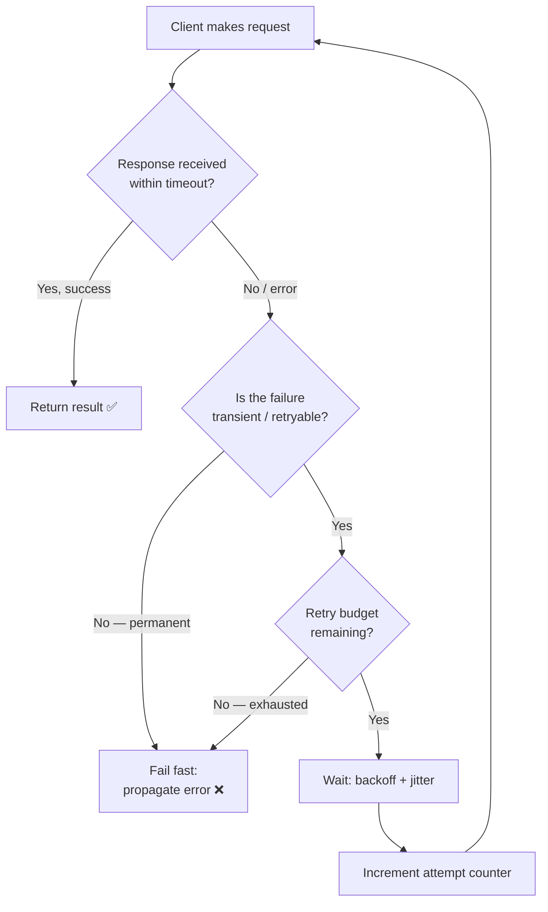
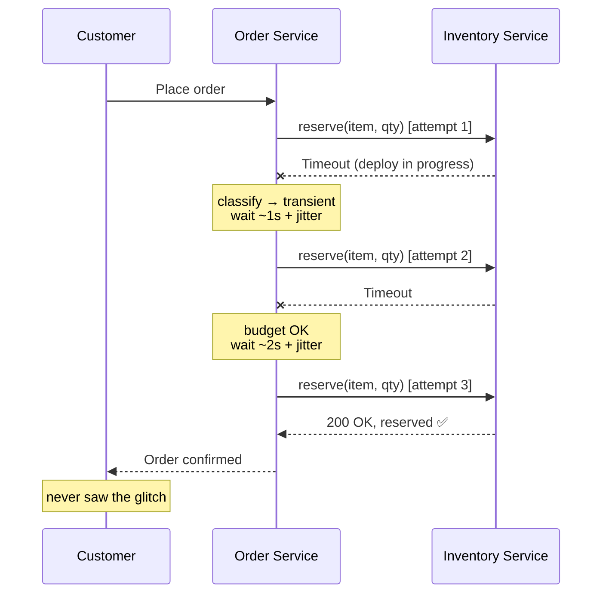
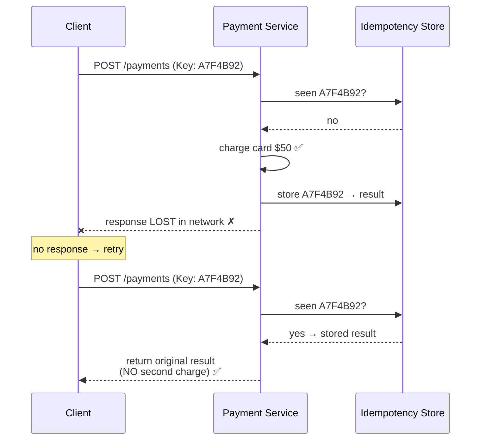
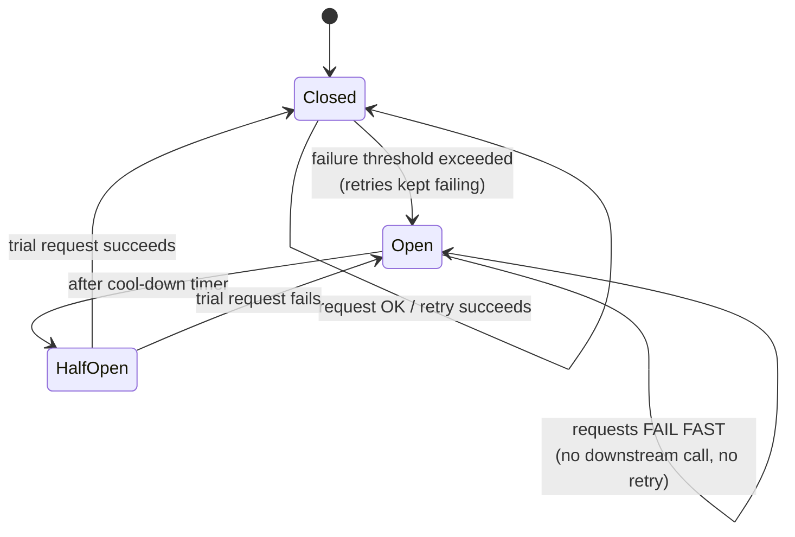
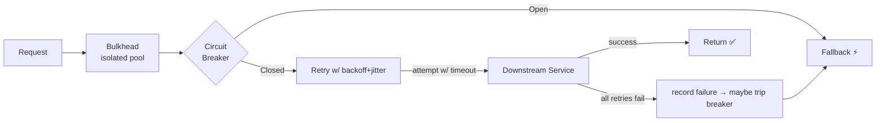

# 🔁 The Retry Pattern — A Complete Study Guide

> *"Failures in distributed systems are not the exception — they are the operating condition. The Retry Pattern is how a well-built system quietly recovers from the failures nobody should ever have to see."*

This guide takes you from the plain-English idea of "just try again" all the way to the tunable, per-component trade-offs a staff engineer reasons about when a retry policy is the difference between a smooth recovery and a self-inflicted outage. Read it top to bottom and each section escalates naturally — definitions first, then theory, then mechanism, then the hard follow-up questions an interviewer keeps pushing on.

---

## 📋 Table of Contents

1. [🎯 Introduction: Why "Try Again" Is Harder Than It Sounds](#-introduction-why-try-again-is-harder-than-it-sounds)
2. [✅ Core Definitions](#-core-definitions)
3. [💡 The Concept and Theory](#-the-concept-and-theory)
4. [🎓 Why the Retry Pattern Exists](#-why-the-retry-pattern-exists)
5. [📊 The Real Trade-off: Retries as a Double-Edged Sword](#-the-real-trade-off-retries-as-a-double-edged-sword)
6. [💻 Retry Strategies (Weakest → Strongest)](#-retry-strategies-weakest--strongest)
   - [Immediate Retry](#1-immediate-retry)
   - [Fixed Delay Retry](#2-fixed-delay-retry)
   - [Incremental Delay Retry](#3-incremental-delay-retry)
   - [Exponential Backoff](#4-exponential-backoff)
   - [Exponential Backoff with Jitter](#5-exponential-backoff-with-jitter)
7. [🧭 Which Errors Should Be Retried?](#-which-errors-should-be-retried)
8. [🔑 Idempotency: The Silent Prerequisite](#-idempotency-the-silent-prerequisite)
9. [⏱️ Retries, Timeouts, and Retry Budgets](#️-retries-timeouts-and-retry-budgets)
10. [🎨 Architecture and Sequence Diagrams](#-architecture-and-sequence-diagrams)
11. [🔗 Retry + Circuit Breaker + Bulkhead](#-retry--circuit-breaker--bulkhead)
12. [🌍 Categorized Real-World Examples](#-categorized-real-world-examples)
13. [❌ Common Misconceptions](#-common-misconceptions)
14. [🧠 Staff-Level Nuance](#-staff-level-nuance)
15. [🧩 Extensions and Adjacent Concepts](#-extensions-and-adjacent-concepts)
16. [⚡ Quick Revision](#-quick-revision)
17. [🎓 FAANG Interview Q&A](#-faang-interview-qa)
18. [📚 References & Further Reading](#-references--further-reading)

---

## 🎯 Introduction: Why "Try Again" Is Harder Than It Sounds

A service that responds in three milliseconds today might take four seconds tomorrow. A network packet vanishes. A database connection resets mid-query. A third-party API returns a `503` for two seconds during a deploy, then recovers as if nothing happened. In a single-process program running on one machine, these events are rare. The moment you split an application into services that talk over a network, they become a daily fact of life.

Here is the key insight that the whole pattern rests on: **not every failure means something is broken.** Many failures are *transient* — they are gone by the time you could even react to them. So the interesting engineering question is not "did it fail?" but "given that it failed, what should I do next?" Should the application immediately show the user an error? Should it try again? How many times? Should it wait first? And — the question that separates a junior answer from a staff answer — *what happens when a hundred thousand clients all decide to try again at the exact same instant?*

The Retry Pattern is the disciplined answer to that question. Instead of treating every failure as permanent, it lets an application automatically attempt an operation again when the failure is *likely* to be temporary. Used well, retries make transient failures invisible to users and dramatically improve availability. Used carelessly, they pour gasoline on a fire — turning a small, recoverable blip into a full cascading outage. The rest of this guide is about learning the difference.

<details>
<summary>📖 Beginner-friendly explanation — click to expand</summary>

Imagine calling a friend and getting a busy signal. You don't cross them off your contacts forever — you wait a moment and call again. Usually it goes through the second time. The Retry Pattern is exactly this instinct, written into code. When your app asks another service for something and gets no answer, it waits briefly and asks again, a few times, before giving up. Most of the time the second or third knock succeeds and nobody ever notices the first door was momentarily stuck. The catch, which the rest of this guide unpacks: if *everyone* redials at the same second, you jam the phone line for real.

</details>

---

## ✅ Core Definitions

Before going deeper, here is the vocabulary you will see throughout the guide and in every interview on this topic.

**Retry Pattern** — A fault-tolerance mechanism that automatically repeats a failed operation when the failure is expected to be temporary, rather than surfacing the error immediately.

**Transient failure** — A short-lived, self-recovering failure: a network blip, a timeout, a brief overload, a leader election in a distributed database. It typically resolves on its own within milliseconds to seconds.

**Permanent (non-transient) failure** — A failure that will not fix itself no matter how many times you try: a wrong password (`401`), a malformed request (`400`), a missing resource (`404`), a business-rule violation. Retrying these is pure waste.

**Backoff** — The waiting period inserted *between* retry attempts. The strategy that governs how long you wait (fixed, incremental, exponential) is the "backoff strategy."

**Jitter** — Deliberate randomness added to the backoff delay so that many clients failing simultaneously do not all retry at the exact same moment.

**Idempotency** — A property of an operation where performing it multiple times has the same effect as performing it once. Idempotent operations are safe to retry; non-idempotent ones (like "charge this card") are dangerous to retry without protection.

**Retry budget / retry limit** — The hard ceilings that stop retries from running forever: maximum attempts, maximum total delay, or a rate-based budget across all requests.

**Retry storm (thundering herd)** — A failure mode where retries themselves generate a surge of traffic that overwhelms an already-struggling service, amplifying the outage.

**Circuit breaker** — A complementary pattern that "trips" after repeated failures and makes subsequent calls fail *fast* (without even trying), giving the downstream service room to recover.

---

## 💡 The Concept and Theory

At its core the Retry Pattern is a tiny state machine wrapped around a single operation. You attempt the operation. If it succeeds, you return the result and you are done. If it fails, you ask two questions: *Is this failure the kind that might recover?* and *Do I still have attempts left in my budget?* If both answers are yes, you wait according to your backoff strategy and try again. If either answer is no, you stop and propagate the failure.

That is the entire theory, but each of those decision points hides real depth. The "is it retryable?" question is a *classification* problem — you are separating transient failures from permanent ones, and getting it wrong in either direction is costly. The "do I have budget left?" question is a *resource-management* problem — every retry consumes connections, threads, and downstream capacity that could serve other requests. And the "wait according to backoff" step is a *coordination* problem, because in a large fleet the timing of retries across thousands of independent clients determines whether recovery is smooth or catastrophic.

The theoretical tension the pattern manages is this: **a retry increases the probability that one request succeeds, but it also increases the total load on the system.** When the downstream service is healthy, that extra load is negligible and the success boost is pure win. When the downstream service is *unhealthy* — which is precisely when failures cluster and retries fire most often — that extra load is exactly what the service cannot afford. This inversion is why naive retries are dangerous: they add the most pressure at the worst possible time. Every serious design decision in this space (backoff, jitter, budgets, circuit breakers) exists to break that vicious feedback loop.

<details>
<summary>📖 Beginner-friendly explanation — click to expand</summary>

Think of the retry logic as a simple flowchart your code walks through. "Did it work? Great, done." "Did it fail? Is this a failure worth trying again, and do I have tries left? If yes, wait a bit and go again. If no, give up honestly." The subtle part is that trying again isn't free — it uses up the very resource that just failed. So retries help most when the problem is tiny and temporary, and hurt most when the service is already drowning. The whole art is knowing which situation you're in.

</details>

### A concrete walk-through

Suppose an **Order Service** needs to reserve stock from an **Inventory Service** before confirming a customer's purchase:

```text
Order Service ──reserve(itemId, qty)──▶ Inventory Service
```

The Inventory Service is mid-deploy and the first call times out. Without retries, the customer sees "Order failed — please try again later" for a two-second glitch that would have healed on its own. With a sensible retry policy:

```text
Attempt 1  →  Timeout        (wait ~1s + jitter)
Attempt 2  →  Timeout        (wait ~2s + jitter)
Attempt 3  →  Success ✅
```

The order completes. The customer never knew anything went wrong. That invisible recovery — turning a transient failure into a non-event — is the entire value proposition.

---

## 🎓 Why the Retry Pattern Exists

The Retry Pattern exists because **distributed systems are unreliable by construction, and most of that unreliability is temporary.** When your code and its dependencies lived in a single process, a function call either returned or the whole program crashed — there was no "maybe it'll work in a second" state. Networks introduced that middle state, and it turns out to be the *common* case, not a rare one.

Consider the everyday sources of transient failure, all of which are normal operating conditions rather than bugs:

- **Brief network interruptions** — dropped packets, a switch rebooting, a route flapping.
- **Temporary database lock contention** — two transactions briefly fighting over the same row.
- **Cloud service startup delays** — a new instance spinning up, a container cold-starting.
- **Short-lived DNS resolution failures** — a cache miss during a DNS server hiccup.
- **Rate-limiting windows** — you hit a quota that resets in one second (`429`).
- **Overloaded application instances** — a GC pause or a momentary CPU spike.
- **Transient connection resets** — a keep-alive connection the server decided to recycle.
- **Leader elections in distributed databases** — for a few seconds during failover, writes are rejected; once a new leader is elected, the database is healthy again.

Take that last example. A managed database like Amazon Aurora or a system like MongoDB or etcd will periodically elect a new leader — during planned maintenance, after a node failure, or during scaling. For a few seconds, write requests fail. This is not a broken database; it is a *healthy* database doing exactly what it is designed to do. Without retries, every user who tried to write during that window would get an error. With retries, the vast majority never notice. **The pattern exists to bridge these self-healing gaps so that the reliability the user experiences is higher than the reliability of any single request.**

---

## 📊 The Real Trade-off: Retries as a Double-Edged Sword

If retries were free, you would retry everything forever and be done. They are not free, and understanding the *cost* is what turns textbook knowledge into engineering judgment.

The fundamental trade-off is between **success probability** and **system load**, and the two pull in opposite directions precisely when it matters most. A single retry roughly compounds your odds of success: if one attempt succeeds 90% of the time and failures are independent, three attempts succeed about 99.9% of the time. That is a massive availability gain for almost no cost — *when the downstream is healthy.*

But failures are rarely independent, and they are rarely random. They *cluster*, because they usually share a root cause: the downstream service is overloaded, a dependency is down, a deploy went bad. In exactly that situation, every client's first attempt fails, so every client retries. If each of N clients retries 3 times, the struggling service now receives up to 3-4× its normal traffic at the very moment it has the *least* capacity to serve it. This is the **retry storm** (or **thundering herd**), and it is how a minor degradation becomes a full outage. The retries meant to improve reliability become the mechanism that destroys it.

This is why every advanced technique in the pattern — exponential backoff, jitter, retry budgets, and circuit breakers — is fundamentally about **making retries cheap when the system is healthy and automatically expensive-to-nonexistent when the system is sick.** You are not just adding retries; you are adding a control loop that senses system health and throttles itself accordingly.

<details>
<summary>📖 Beginner-friendly explanation — click to expand</summary>

Picture a coffee shop where the espresso machine breaks. One customer politely asking again in a minute is fine. But if all fifty customers in line simultaneously start shouting their order over and over, the single barista is now *more* overwhelmed, not less — and even the orders that could have been made get dropped. Retries are that shouting. When the shop is running smoothly, a repeated order costs nothing. When it's already struggling, piling on repeated orders is the worst thing you can do. Good retry design is teaching every customer to notice the shop is struggling and back off automatically.

</details>

---

## 💻 Retry Strategies (Weakest → Strongest)

Retry strategies differ almost entirely in *how long they wait between attempts*. That single choice governs how gentle or aggressive the retries are, and therefore how safe they are under load. Below they are ordered from the most naive to the production-grade standard, each with its mechanism, pros, and cons.

### 1. Immediate Retry

The application retries instantly with zero delay.

```text
Request → Failure → Retry (0ms) → Success
```

**Pros:** Lowest possible added latency; trivial to implement — often just a loop.

**Cons:** Adds the maximum pressure on an unhealthy service. Because there is no pause, if the failure lasts longer than a few milliseconds you simply hammer the downstream as fast as your CPU allows.

**When it's acceptable:** Only when failures are known to be *extremely* short-lived — for example, an optimistic-concurrency conflict on a database row where an immediate re-read-and-retry is genuinely likely to succeed.

<details>
<summary>💻 Java example — immediate retry (naive)</summary>

```java
public String callWithImmediateRetry() {
    int maxAttempts = 3;
    RuntimeException last = null;
    for (int attempt = 1; attempt <= maxAttempts; attempt++) {
        try {
            return remoteService.call();          // the operation
        } catch (TransientException e) {
            last = e;                              // no wait — just loop again
        }
    }
    throw new RuntimeException("Operation failed after " + maxAttempts + " attempts", last);
}
```

This is the pattern you should almost never ship to production as-is. It has no delay, no jitter, and no failure classification. It is here as the baseline everything else improves on.

</details>

### 2. Fixed Delay Retry

A constant waiting period is inserted between every attempt.

```text
Retry 1 → wait 2s → Retry 2 → wait 2s → Retry 3
```

**Pros:** Gives the downstream a predictable, fixed window to recover; still simple.

**Cons:** All clients wait the *same* fixed amount, so they synchronize — you get a traffic spike every 2 seconds instead of continuously. The fixed value is also hard to tune: too short and you barely help, too long and you add needless latency to every failure.

### 3. Incremental Delay Retry

The delay grows linearly with each attempt: `delay(i) = base × i`, e.g. 1s, 2s, 3s, 4s.

**Pros:** Gentler than fixed delay on repeated failures; the pressure eases off gradually.

**Cons:** Grows too slowly to protect a badly overloaded service — by attempt 5 you are still only waiting 5 seconds, while an exponential strategy would already be waiting 16. Still synchronizes clients without jitter.

### 4. Exponential Backoff

Each delay is a multiple of the previous one, typically doubling: `delay(i) = base × 2^(i-1)`, e.g. 1s, 2s, 4s, 8s.

```text
Retry 1 → 1s → Retry 2 → 2s → Retry 3 → 4s → Retry 4 → 8s
```

This is the workhorse of production retry logic. As failures persist, request frequency *automatically* drops off — the system self-throttles harder the longer the problem lasts, which is exactly the behavior you want. It naturally distinguishes a one-off blip (recovered by attempt 1-2 with tiny delay) from a sustained outage (backing off to seconds-long waits).

**Pros:** Load decreases automatically as failures continue; a single tunable (`base`, `multiplier`, `maxDelay`) controls the whole curve.

**Cons:** By itself it still lets synchronized clients retry in lockstep — everyone who failed at T=0 retries at T=1s, then T=3s, then T=7s, together. You have reduced the *frequency* of the spikes but not eliminated the spikes themselves. That is the gap jitter closes.

### 5. Exponential Backoff with Jitter

Exponential backoff plus a random component added to each delay so clients spread out in time.

```text
Client A → retries at 4.3s
Client B → retries at 5.1s
Client C → retries at 3.7s
```

This is the **de facto standard for large distributed systems.** Pure exponential backoff reduces how often the herd stampedes; jitter dissolves the herd entirely by smearing retries across a window instead of concentrating them at discrete instants. AWS's well-known guidance recommends "full jitter": pick the delay uniformly at random between 0 and the current exponential cap, i.e. `sleep = random(0, min(maxDelay, base × 2^attempt))`.

**Pros:** Best behavior under mass-failure; prevents the synchronized retry spikes that cause retry storms; still self-throttles via the exponential envelope.

**Cons:** Slightly harder to reason about individual request latency (it's now a distribution, not a fixed schedule); requires a good random source but nothing exotic.

<details>
<summary>💻 Java example — exponential backoff with full jitter</summary>

```java
public <T> T callWithBackoffAndJitter(Supplier<T> operation) {
    long baseMillis = 100;          // starting delay
    long maxMillis  = 20_000;       // cap so we never wait absurdly long
    int  maxAttempts = 5;
    RuntimeException last = null;

    for (int attempt = 0; attempt < maxAttempts; attempt++) {
        try {
            return operation.get();                     // success path
        } catch (TransientException e) {
            last = e;
            if (attempt == maxAttempts - 1) break;      // budget exhausted

            long cap   = Math.min(maxMillis, baseMillis * (1L << attempt)); // base * 2^attempt
            long sleep = ThreadLocalRandom.current().nextLong(0, cap + 1);  // FULL jitter
            log.warn("Attempt {} failed, backing off {}ms", attempt + 1, sleep);
            try { Thread.sleep(sleep); }
            catch (InterruptedException ie) {
                Thread.currentThread().interrupt();
                throw new RuntimeException("Retry interrupted", ie);
            }
        }
    }
    throw new RuntimeException("Operation failed after " + maxAttempts + " attempts", last);
}
```

Note the two safety rails a naive version lacks: a `maxMillis` cap so the delay can't grow without bound, and full jitter (`random(0, cap)`) rather than a fixed `cap` so a fleet of clients never retries in lockstep.

</details>

<details>
<summary>💻 Java example — production-grade with Resilience4j (declarative)</summary>

```java
// Config: 3 attempts, exponential backoff with jitter, retry only on transient errors
RetryConfig config = RetryConfig.custom()
    .maxAttempts(3)
    .intervalFunction(IntervalFunction.ofExponentialRandomBackoff(
        Duration.ofMillis(500),   // initial interval
        2.0,                      // exponential multiplier: 0.5s → 1s → 2s
        0.5))                     // jitter factor (randomization)
    .retryOnException(e -> e instanceof TimeoutException
                        || e instanceof ConnectException)   // classify!
    .build();

Retry retry = Retry.of("inventoryService", config);

Supplier<String> decorated = Retry.decorateSupplier(
        retry, () -> inventoryClient.reserve(itemId, qty));

String result = Try.ofSupplier(decorated)
        .recover(ex -> "RESERVATION_UNAVAILABLE")   // fallback after retries exhausted
        .get();
```

In real systems you almost never hand-roll retry loops. Libraries like **Resilience4j** (Java), **Polly** (.NET), or **Spring Retry** give you declarative config, metrics, and clean composition with circuit breakers — which is exactly what interviewers want you to reach for.

</details>

---

## 🧭 Which Errors Should Be Retried?

One of the most common and most damaging mistakes is retrying *every* failure. Retrying is only sensible for failures that can realistically recover on their own. Retrying a permanent failure wastes bandwidth, burns downstream capacity, and delays the honest error the caller needs to see.

**Good retry candidates (transient):**

- Connection timeouts and read timeouts
- Network interruptions / connection resets
- `HTTP 503 Service Unavailable`
- `HTTP 429 Too Many Requests` (respect the `Retry-After` header if present)
- `HTTP 502 / 504` gateway errors from a proxy
- Transient database errors (deadlock victim, brief lock timeout, failover in progress)

**Poor retry candidates (permanent):**

- `HTTP 400 Bad Request` — the payload is malformed; it will be malformed again
- `HTTP 401 / 403` — authentication or authorization failure; retrying won't grant permission
- `HTTP 404 Not Found` — the resource isn't there
- `HTTP 422` / business-validation errors — the request violates a rule
- Malformed payloads and serialization errors

The mental model: **retry on failures where the *request was fine but the moment was bad*; do not retry on failures where the *request itself was bad*.** Retrying an incorrect password five times accomplishes nothing except five failed login records. Good retry libraries let you declare exactly which exception types or status codes are retryable, and everything else propagates immediately.

<details>
<summary>📖 Beginner-friendly explanation — click to expand</summary>

Think of two reasons a letter comes back undelivered. One: the post office was temporarily closed for a holiday — send it again tomorrow and it'll go through. Two: you wrote the wrong address — sending it again a hundred times changes nothing, you need to fix the address first. Transient errors are the closed-post-office kind; permanent errors are the wrong-address kind. Retry logic has to tell them apart, or it wastes effort resending letters that can never arrive.

</details>

---

## 🔑 Idempotency: The Silent Prerequisite

Retries introduce a subtle and expensive hazard. What if the original request *actually succeeded* on the server, but the success response was lost on the way back — a dropped connection, a timeout on the client side? The client, seeing no response, retries. The server, having no memory that it already did the work, does it again.

```text
Client ──POST /payments──▶ Server   (charges $50 ✅)
Client ◀──── response LOST ── ✗       (network drops the ACK)
Client ──POST /payments──▶ Server   (charges $50 AGAIN ❌ — customer billed twice)
```

For a read (`GET`) this is harmless. For "charge this card," "create this order," or "send this email," it produces duplicate side effects that are painful and sometimes legally significant. This is why **the operations you retry should be idempotent** — performing them multiple times has the same effect as performing them once.

Some operations are naturally idempotent: `GET` (reading), `PUT` (setting a resource to an exact state), and `DELETE` (deleting something already deleted is a no-op). The dangerous one is the naive `POST` that creates a new resource each time it's called. The standard fix is an **idempotency key**: the client generates a unique ID for the *logical* operation and sends it with every attempt.

```text
POST /payments
Idempotency-Key: a7f4b92e-1c3d-4e5f-8a9b-0c1d2e3f4a5b
```

The server records the key the first time it processes the request along with the result. If a request arrives with a key it has already seen, the server *does not* redo the work — it returns the stored result of the first execution. This is exactly how **Stripe** handles payment retries: you pass an `Idempotency-Key` header, and Stripe guarantees the charge happens at most once no matter how many times the request is retried.

<details>
<summary>📖 Beginner-friendly explanation — click to expand</summary>

Imagine tipping a waiter by handing over cash, but you're not sure they heard your "thank you," so you try to hand it again. If the waiter just takes whatever you hand them, you've now tipped twice. An idempotency key is like writing a unique note number on the envelope: "This is tip #4837." The waiter checks — "I already took #4837" — and politely refuses the second envelope while assuring you it's handled. You can offer it as many times as you want; you'll only ever pay once.

</details>

---

## ⏱️ Retries, Timeouts, and Retry Budgets

Retries do not work in isolation. Two companions are non-negotiable in production: **timeouts** decide *when* an attempt has failed, and **budgets** decide *when to stop trying.*

**Timeouts are the trigger.** Without a timeout, a hung request waits forever and your retry logic never even fires — the whole thread is stuck. Every attempt must have a bounded timeout so that "no response yet" eventually becomes "this attempt failed," which is what hands control to the retry decision. A retry without a timeout is incomplete; a timeout tells you *that* an attempt failed, and the retry decides *what to do about it.* A subtle staff-level point: your *total* time budget must account for `attempts × (timeout + backoff)`, or a request the user abandoned long ago is still consuming a server thread on attempt 4.

**Budgets are the stop condition.** Unlimited retries are dangerous — an infinite loop consumes resources, delays failure detection, and can keep a doomed request alive far past the point of usefulness. Production systems bound retries in several ways, often combined:

- **Maximum attempts** — e.g. stop after 5 tries.
- **Maximum cumulative delay / deadline** — e.g. give up 30 seconds after the first attempt regardless of attempt count.
- **Rate-based retry budget** — the more sophisticated approach used at scale (Google's, Envoy's, gRPC's): cap retries at a *percentage* of successful requests (say, retries may add at most 10-20% extra load). When many requests are failing, the budget is quickly exhausted and retries are suppressed system-wide — automatically preventing a retry storm.

```text
Maximum attempts   = 5
Maximum delay       = 30s
Retry budget        = 20% of request volume
```

Once any limit is hit, the request fails honestly and fast. That honesty is a feature: a fast, clear failure is far more useful to a caller (and to a circuit breaker upstream) than an endless, hopeful wait.

<details>
<summary>📖 Beginner-friendly explanation — click to expand</summary>

Two dials keep retries from becoming a runaway. The timeout dial says "if there's no answer in 2 seconds, treat this attempt as failed and move on" — otherwise you'd wait by a silent phone forever. The budget dial says "you get 5 tries, or 30 seconds total, whichever comes first — then stop and admit defeat." The clever version of the budget doesn't count per-request but across the whole system: "retries may only add 20% extra traffic." So when everything is failing, the shared retry allowance runs dry and the system stops piling on automatically.

</details>

---

## 🎨 Architecture and Sequence Diagrams

### The retry decision flow

This is the control loop the pattern implements. Notice that failure classification and the budget check both come *before* any retry, and that retries never loop forever.



### Sequence: an invisible recovery

Here the Order Service retries a transient timeout from the Inventory Service and the customer never sees a failure.



### Sequence: idempotency key protecting a double charge



### State machine: retries feeding a circuit breaker



---

## 🔗 Retry + Circuit Breaker + Bulkhead

Retries alone are a local optimization — each caller independently decides to try again. The problem is that thousands of independent optimists produce a retry storm. That is why in production the Retry Pattern almost never ships alone; it is one layer in a resilience stack.

**Circuit breaker** is the natural partner. A retry asks "should *I* try again?"; a circuit breaker asks "is this dependency healthy enough for *anyone* to bother?" It monitors the failure rate across calls and, once failures exceed a threshold, "opens" — making all subsequent calls fail instantly without touching the downstream. This gives the sick service breathing room to recover instead of being pounded by retries. After a cool-down it goes "half-open," letting a trial request through; success closes the circuit, failure re-opens it. The correct composition is subtle and a favorite interview probe: **retry should sit *inside* the circuit breaker for a single logical call (retry the transient blip), but the circuit breaker's failure accounting should see the outcome *after* retries are exhausted** — so a call that fails all its retries counts as one failure toward tripping the breaker, and once the breaker is open, retries don't even fire.

**Timeouts** (covered earlier) bound each attempt so retries can trigger. **Bulkheads** isolate resource pools (e.g. a separate thread pool or connection pool per downstream) so that retries piling up against one slow dependency can't exhaust the threads needed to serve every *other* dependency — containing the blast radius. **Fallbacks** provide a degraded-but-useful response (cached data, a default, a queued write) when retries and the breaker have both given up.



<details>
<summary>📖 Beginner-friendly explanation — click to expand</summary>

Think of a building's fire-safety systems. The retry is you trying the door handle a couple of times in case it's just stuck. The circuit breaker is the fire alarm that, once enough people report smoke, locks down that corridor so nobody keeps walking into danger — and stops the pointless door-rattling entirely. The bulkhead is the set of fire doors that keep a blaze in one wing from spreading to the whole building. The fallback is the marked emergency exit you use when the main route is genuinely closed. No single one is enough; together they keep a small problem from becoming a disaster.

</details>

---

## 🌍 Categorized Real-World Examples

Retries show up everywhere transient failure is expected. Grouping the examples by *where* the retry lives makes the design space clearer.

**Application-to-service calls (client-side retries):**

- **REST / HTTP API calls** — the canonical case: an order service calling an inventory service, retrying on `503`/timeout. Cloud SDKs like the **AWS SDK** retry throttling (`429`) and `5xx` responses automatically with exponential backoff and jitter built in.
- **gRPC communication** — gRPC has native retry support configured declaratively in the service config (`retryPolicy` with `maxAttempts`, `initialBackoff`, `retryableStatusCodes` like `UNAVAILABLE`).
- **Database connections** — connection-pool acquisition and transient errors during failover. **Amazon Aurora** and **Azure SQL** explicitly document retry guidance because managed databases fail over regularly.

**Infrastructure & platform layer (retries you configure, don't code):**

- **Service mesh (Envoy / Istio / Linkerd)** — retries configured at the proxy/sidecar level, so *every* service gets consistent retry behavior without touching application code (the "Ambassador/sidecar" approach). Istio's `VirtualService` has `retries` with `attempts`, `perTryTimeout`, and `retryOn` conditions.
- **API gateways & load balancers** — retry failed upstreams before returning an error to the client.

**Asynchronous & messaging (retries over time, not in-line):**

- **Message brokers (Kafka, RabbitMQ, RocketMQ, SQS)** — failed message consumption is retried, often via a **delay queue** with increasing delay levels, and after max attempts the message lands in a **dead-letter queue (DLQ)** for manual inspection. This decouples the retry from the original request thread entirely.
- **Scheduled / batch jobs** — a Quartz or cron job periodically scans a "failed tasks" table and retries unprocessed items — ideal for delay-tolerant work like file imports or report generation.

**Financial & consistency-critical (retries + idempotency + compensation):**

- **Payment gateways (Stripe, PayPal, Adyen)** — retries protected by idempotency keys so a lost response never double-charges. **Stripe**'s `Idempotency-Key` header is the reference implementation.
- **Fund transfers / sagas** — a two-phase approach records the transaction as `PENDING`, calls the remote system, and a **compensation task** periodically retries transactions stuck in `PENDING` — combining retries with eventual consistency.

**Everyday operations:**

- Email/SMS delivery (retry the provider on transient `5xx`), cloud storage uploads (S3 multipart retries), cache synchronization, distributed lock acquisition, service discovery lookups.

Companies including **Amazon, Netflix, Google, and Stripe** rely on carefully-tuned retry policies — Netflix's **Hystrix** (now largely succeeded by **Resilience4j**) popularized combining retries with circuit breakers and bulkheads as a standard resilience toolkit.

---

## ❌ Common Misconceptions

**"Retries always improve reliability."** Only when the failure is transient *and* the system has spare capacity. During a real outage, retries add load exactly when the service can least handle it, turning a partial degradation into a full one. Retries improve *per-request* success at the cost of *system-wide* load — the two can conflict.

**"More retries are better."** Each additional attempt has diminishing returns on success probability but linear cost in latency and load. Five retries against a service that's genuinely down just means the user waits five times as long for the same failure.

**"Exponential backoff solves retry storms."** It reduces their *frequency* but not their *existence* — synchronized clients still retry in lockstep, just less often. **Jitter** is the piece that actually disperses the herd. Backoff without jitter is a half-measure.

**"Idempotency is a database concern, not a retry concern."** Idempotency is a *prerequisite* for safely retrying any operation with side effects. Retrying a non-idempotent `POST` is how you get duplicate orders and double charges. If you can't make an operation idempotent, you must not blindly retry it.

**"A timeout and a retry are the same thing."** They're complementary. The timeout decides *that* an attempt failed; the retry decides *what to do next.* One without the other is incomplete — no timeout means retries never fire; no retry means a timeout just fails.

**"Retry logic belongs in every service, hand-written."** Hand-rolled retry loops proliferate inconsistent, untested policies. Production systems centralize it — a shared library, a resilience framework (Resilience4j/Polly), or a service-mesh sidecar so the policy is consistent, observable, and configurable.

**"Retrying is free if the first call was fast."** Even a fast failed call consumed a connection, a thread, and downstream capacity. Under load those resources are the scarce thing, and retries multiply their consumption.

---

## 🧠 Staff-Level Nuance

These are the points an experienced engineer raises *unprompted* — the reasoning that separates "I know what a retry is" from "I've operated retries at scale and seen them cause outages."

**Retries amplify load multiplicatively across a call chain.** If service A retries B 3×, and B retries C 3×, and C retries D 3×, a single user request can become 27 calls to D during a failure. This is **retry amplification**, and it's why mature architectures retry at *only one layer* (often the edge or a single tier) rather than at every hop — or use retry budgets that are aware of the whole chain. A staff answer always asks "where in the call graph should retries live?" and usually answers "as few places as possible."

**Rate-based retry budgets beat per-request attempt limits at scale.** Capping attempts per request (say 3) still lets a mass failure triple your traffic. A *budget* — retries may add at most X% over the baseline success rate (Google SRE / Envoy / gRPC use ~10-20%) — means that when the failure rate spikes, the shared budget drains and retries are suppressed globally. This automatically prevents retry storms in a way per-request limits cannot.

**"Full jitter" vs "equal jitter" vs "decorrelated jitter" is a real decision.** AWS's analysis shows full jitter (`random(0, cap)`) minimizes contention and completion time in most cases. Decorrelated jitter (`min(cap, random(base, prev×3))`) can be better when you want to avoid very short delays. Naming the specific jitter algorithm signals depth.

**Retries interact dangerously with load-shedding and autoscaling.** A service shedding load returns `503`; naive clients retry, increasing the very load it's shedding. And retry-driven traffic spikes can fool autoscalers into scaling up *because of retries*, then scaling down when they stop — thrashing. Retries should back off in response to `Retry-After` headers and shed-load signals.

**Idempotency keys need a TTL and a storage strategy.** Where do you store seen keys — Redis, a database table? How long do you retain them (a client might legitimately retry minutes later, but you can't keep keys forever)? What's the behavior when a key is seen but the first request is *still in flight* (concurrent duplicate)? The robust answer involves storing an in-progress marker and either returning a 409 or blocking until the first completes.

**Retrying reads vs writes have opposite risk profiles.** Reads are usually safe (idempotent) but can serve stale data on retry against a replica. Writes are unsafe without idempotency but critical to get exactly-once semantics. The classification of *which* operations get which policy is itself a design artifact.

**Observability is not optional.** You must emit metrics for: retry rate, retry success rate (succeeded-only-after-retry), attempts-per-operation distribution, and budget exhaustion events. A rising "succeeded after retry" rate is an early warning that a dependency is degrading *before* it fails outright. Best practice is to log early retries as informational and only the final exhausted failure as an error, so you don't drown the alerting system.

**Client-side timeouts must be shorter than the caller's deadline minus backoff.** If the user's request has a 5s SLA and you do 3 retries with 2s timeouts and backoff, you'll blow the SLA and waste work on attempts whose result nobody will read. Deadline propagation (passing the remaining budget down the call chain, as gRPC does) prevents this.

---

## 🧩 Extensions and Adjacent Concepts

**Circuit Breaker** — the closest sibling; trips after repeated failures to fail fast and protect a struggling downstream. Retries and circuit breakers are almost always deployed together.

**Bulkhead** — isolates resource pools per dependency so a retry pileup against one slow service can't starve the threads serving everything else.

**Timeout & Deadline Propagation** — bounds each attempt and propagates the remaining time budget down the call chain so no layer wastes effort on a request the caller has already abandoned.

**Dead-Letter Queue (DLQ)** — where messages go after exhausting async retries; the "give up gracefully and preserve for humans" endpoint of a messaging retry flow.

**Saga Pattern & Compensating Transactions** — for multi-step distributed workflows, retries recover individual steps while compensating actions undo completed steps if the overall saga fails.

**Load Shedding & Backpressure** — the downstream's side of the conversation; it signals "I'm overloaded" (via `503`/`429`/`Retry-After`), and well-behaved retry clients must respect those signals rather than fighting them.

**Hedged Requests** — a latency-oriented cousin: instead of waiting for a slow request to fail, send a *second* request to another replica after a short delay and take whichever returns first. Trades extra load for tail-latency reduction (used in Google's systems and databases like Cassandra as "speculative execution").

**Fallback / Graceful Degradation** — the last resort when retries and the breaker have both given up: return cached data, a default, or a queued write so the user gets a degraded-but-useful response instead of an error.

---

## ⚡ Quick Revision

*Read this and you should be able to reconstruct the whole guide in natural flow.*

**The problem and the idea.** Distributed systems fail constantly, but most failures are *transient* — network blips, brief overloads, timeouts, database leader elections — and heal on their own within milliseconds to seconds. The Retry Pattern is the disciplined instinct of "wait a moment and try again." Instead of treating every failure as permanent, it automatically re-attempts an operation when the failure is likely temporary, so a two-second glitch becomes invisible to the user. The value proposition is that the reliability the user *experiences* becomes higher than the reliability of any single request. It exists because networks introduced a "maybe it'll work in a second" state that never existed inside a single process, and that state is the common case, not a rare one.

**The core trade-off — this is the heart of everything.** A retry raises the success probability of one request but adds load to the whole system, and these pull in opposite directions precisely when it matters. Failures cluster (they share a root cause), so when one client's request fails, everyone's does, and everyone retries — hammering an already-struggling service with 3-4× traffic at the exact moment it has the least capacity. That's a **retry storm** (thundering herd), and it turns a small degradation into a full outage. So every advanced technique exists to make retries cheap when the system is healthy and automatically expensive-to-nonexistent when it's sick.

**The strategies, weakest to strongest.** *Immediate retry* (no wait) is trivial but hammers unhealthy services — use only for ultra-short failures like optimistic-lock conflicts. *Fixed delay* (wait 2s each time) gives recovery room but synchronizes clients into spikes. *Incremental delay* (1s, 2s, 3s) is gentler but grows too slowly for real overload. *Exponential backoff* (1s, 2s, 4s, 8s) is the workhorse — load automatically drops the longer failures persist — but by itself still lets clients retry in lockstep. *Exponential backoff with jitter* is the production standard: adding randomness (AWS recommends "full jitter" = `random(0, cap)`) smears retries across time and dissolves the herd. Backoff reduces the *frequency* of spikes; jitter eliminates the spikes.

**The three guardrails.** First, **classify errors**: retry only transient failures (timeouts, `503`, `429`, connection resets, transient DB errors); never retry permanent ones (`400`, `401`, `403`, `404`, validation errors) — retrying a wrong password five times accomplishes nothing. The rule: retry when the *request was fine but the moment was bad*, not when the *request itself was bad*. Second, **idempotency**: if a success response is lost and the client retries, the server may redo the work — double-charging a card or duplicating an order. Retryable operations must be idempotent; the standard tool is an **idempotency key** (a unique ID sent with every attempt) that the server records so it returns the stored result instead of re-executing — exactly how Stripe prevents double charges. Third, **timeouts and budgets**: timeouts decide *when* an attempt failed (without them retries never fire); budgets decide *when to stop* — max attempts, max cumulative delay, or best at scale a *rate-based budget* (retries may add at most ~10-20% extra load) that drains during mass failure and suppresses retries system-wide.

**It never ships alone.** Retries are one layer of a resilience stack. The **circuit breaker** is the key partner: it trips after repeated failures and makes calls fail *fast*, giving the sick service room to recover — retry sits inside it for a single logical call, and once the breaker is open, retries don't fire. **Bulkheads** isolate resource pools so a retry pileup can't starve everything else; **timeouts** bound each attempt; **fallbacks** give a degraded-but-useful response when everything's exhausted.

**Staff-level instincts.** Retries **amplify multiplicatively** across a call chain (3× at each of 3 hops = 27× at the bottom), so retry at only *one* layer. **Rate-based budgets** beat per-request limits at scale. Watch retry interactions with **load-shedding and autoscaling** (retries can fool autoscalers and worsen shedding). **Idempotency keys need TTLs and concurrent-duplicate handling.** **Propagate deadlines** down the chain so no layer wastes effort on an abandoned request. And **observe everything** — a rising "succeeded only after retry" rate is your earliest warning a dependency is degrading. The one-line summary: a well-designed retry mechanism doesn't just repeat requests — it knows *when* retrying makes sense, *when* to stop, and *how* to recover without creating a new, bigger problem.

---

## 🎓 FAANG Interview Q&A

The 20 most frequently asked questions on this topic, escalating from conceptual to staff/principal level, followed by four STAR-format behavioral answers.

### Conceptual & Fundamentals

<details>
<summary><strong>Q1. What is the Retry Pattern and when should you use it?</strong></summary>

The Retry Pattern is a fault-tolerance mechanism that automatically re-attempts a failed operation when the failure is expected to be transient — a network blip, a timeout, a `503`, a database failover. You use it whenever you're crossing a boundary that can fail temporarily and independently of the correctness of your request: service-to-service HTTP/gRPC calls, database connections, message publishing, cloud storage operations. The goal is to make short-lived failures invisible so the user experiences higher availability than any single request provides. Crucially, you should *not* use it for permanent failures (a `400` or `401` will fail identically every time) or for non-idempotent operations without protection. In practice I'd reach for a library like Resilience4j rather than hand-rolling it, because you want backoff, jitter, classification, and metrics out of the box.

</details>

<details>
<summary><strong>Q2. Why not just retry immediately? Why do we need backoff?</strong></summary>

Immediate retries add the maximum possible pressure at the worst possible time. Failures cluster around a common cause — usually the downstream is overloaded — so if every client retries instantly, you multiply the traffic hitting a service that's already struggling, which is the "thundering herd." Backoff inserts a growing wait between attempts, and exponential backoff (1s, 2s, 4s, 8s) is powerful because request frequency *automatically* decreases the longer the failure persists — the system self-throttles harder exactly when the problem is more severe. Immediate retry is only defensible when failures are known to be sub-millisecond, like an optimistic-concurrency conflict where an immediate re-read genuinely has a high chance of succeeding.

</details>

<details>
<summary><strong>Q3. What is jitter and why is it necessary if we already have exponential backoff?</strong></summary>

Jitter is deliberate randomness added to the backoff delay. Exponential backoff reduces how *often* a herd of clients stampedes, but it doesn't stop them from stampeding *together* — every client that failed at T=0 still retries at T=1s, then T=3s, in lockstep, producing periodic spikes. Jitter breaks the synchronization by spreading retries across a window: instead of everyone waiting exactly 4 seconds, one waits 3.7s, another 5.1s. AWS's guidance recommends "full jitter," where you sleep for a uniformly random duration between 0 and the current exponential cap, `random(0, min(maxDelay, base × 2^attempt))`. This minimizes contention and smooths the load into a continuous trickle rather than discrete waves. Without jitter, backoff is a half-measure.

</details>

<details>
<summary><strong>Q4. Which errors should and shouldn't be retried?</strong></summary>

Retry failures where the request was valid but the moment was bad: connection/read timeouts, connection resets, `503 Service Unavailable`, `429 Too Many Requests` (respecting `Retry-After`), `502/504` gateway errors, and transient database errors like a deadlock victim or a failover in progress. Do *not* retry failures where the request itself is wrong: `400 Bad Request`, `401/403` auth failures, `404 Not Found`, and business-validation errors — these fail identically no matter how many times you try, wasting bandwidth and downstream capacity while delaying the honest error the caller needs. A good retry library lets you declare retryable exception types or status codes explicitly. The classic anti-example is retrying a wrong password five times: it accomplishes nothing except five failed-login records.

</details>

<details>
<summary><strong>Q5. How do retries relate to timeouts?</strong></summary>

They're complementary halves of one mechanism. A timeout decides *that* an attempt has failed — without a bounded timeout, a hung request waits forever and the retry logic never even fires because the thread is stuck. A retry decides *what to do* once an attempt has failed. So a retry without a timeout is incomplete, and a timeout without a retry just fails fast. The staff-level nuance is that your total time budget must account for `attempts × (timeout + backoff)` — if a user request has a 5-second SLA and you do three 2-second attempts with backoff, you'll blow the SLA and waste work on attempts whose result nobody will read. That's why deadline propagation (passing the remaining budget down the call chain, like gRPC does) matters.

</details>

<details>
<summary><strong>Q6. What's the difference between fixed, incremental, and exponential backoff?</strong></summary>

Fixed delay waits a constant interval between attempts (2s, 2s, 2s) — simple and gives predictable recovery room, but all clients wait the same amount so they synchronize into spikes. Incremental (linear) delay grows the wait linearly (1s, 2s, 3s, 4s) — gentler on repeated failures, but grows too slowly to protect a badly overloaded service. Exponential backoff multiplies the delay each time (1s, 2s, 4s, 8s), so the load drops off rapidly as failures persist, which is why it's the production default. In practice you always cap the exponential growth with a `maxDelay` so you never wait absurdly long, and you add jitter so clients don't retry in lockstep. The choice depends on failure characteristics, but for anything at scale the answer is almost always capped exponential backoff with jitter.

</details>

<details>
<summary><strong>Q7. Why must retryable operations be idempotent?</strong></summary>

Because a retry can duplicate side effects. The dangerous scenario isn't when the operation fails — it's when it *succeeds* but the success response is lost in the network. The client sees no answer, retries, and the server, having no memory it already did the work, does it again — charging a card twice or creating a duplicate order. An idempotent operation produces the same result whether executed once or many times, so this is harmless. Reads (`GET`), state-setting updates (`PUT`), and deletes are naturally idempotent; the naive creating `POST` is not. When you can't make an operation naturally idempotent, you enforce it with an idempotency key — a unique ID the client sends with every attempt, which the server records so a repeat request returns the stored result instead of re-executing. Stripe's `Idempotency-Key` header is the reference implementation.

</details>

<details>
<summary><strong>Q8. What is a retry storm and how do you prevent it?</strong></summary>

A retry storm (thundering herd) is when retries themselves generate a traffic surge that overwhelms an already-struggling service, amplifying an outage. It happens because failures share a root cause and therefore cluster — when the downstream degrades, every client fails and every client retries simultaneously, piling 3-4× normal load onto the service exactly when it has the least capacity. You prevent it with a stack of techniques: exponential backoff to reduce retry frequency, jitter to desynchronize clients, retry budgets (cap retries at a percentage of successful traffic so they self-suppress during mass failure), circuit breakers to fail fast once failures cross a threshold, and retrying at only one layer of the call chain to avoid multiplicative amplification. No single technique is sufficient; jitter plus budgets plus a circuit breaker together are what actually contain it.

</details>

<details>
<summary><strong>Q9. How do the Retry and Circuit Breaker patterns work together?</strong></summary>

They answer different questions. A retry asks "should *I* try this again?"; a circuit breaker asks "is this dependency healthy enough for *anyone* to bother?" The retry handles a transient blip on a single logical call; the circuit breaker monitors aggregate failure rate and, once it exceeds a threshold, "opens" — making all calls fail instantly without touching the downstream, giving it room to recover. The correct composition is a common interview trap: retry should sit *inside* the circuit breaker for one logical call, but the breaker's failure accounting should see the outcome *after* retries are exhausted — so a fully-failed retry sequence counts as one failure toward tripping the breaker, and once the breaker is open, retries don't fire at all. Netflix's Hystrix, and now Resilience4j, package both together precisely because retries without a breaker cause the storms the breaker prevents.

</details>

<details>
<summary><strong>Q10. Where in a system should retry logic live?</strong></summary>

You have three options, and the choice matters more than people expect. A *shared library* linked into each service lets each service pick its strategy at runtime but risks version drift across teams. A *sidecar/service mesh* (Envoy, Istio, Linkerd) implements retries at the proxy layer so every service gets consistent, centrally-configured behavior with zero application code — the "Ambassador" pattern — at the cost of an extra network hop and less business-context awareness. *Inline in application code* gives maximum context but scatters inconsistent, untested policies. The bigger architectural decision is *how many layers* retry: because retries amplify multiplicatively down a call chain (3× at three hops = 27× at the bottom), mature systems retry at as few layers as possible — often just the edge or one tier — rather than at every hop. A staff answer names retry amplification explicitly and argues for a single, well-observed retry layer plus shared budgets.

</details>

### Staff / Principal Level

<details>
<summary><strong>Q11. [L5/L6] Per-request attempt limits vs. rate-based retry budgets — which and why?</strong></summary>

Per-request attempt limits (e.g. "3 tries per request") are simple but fundamentally don't protect the system: during a mass failure where every request fails, capping at 3 still triples your total traffic against a service that's already down. Rate-based retry budgets solve this by bounding retries as a *fraction* of successful requests — Google SRE, Envoy, and gRPC use around 10-20% extra load as the ceiling. The mechanism: you track a rolling ratio of retries to successes, and when failures spike, successes drop, the shared budget drains, and retries are suppressed system-wide — automatically. This is self-regulating in a way per-request limits can never be: it retries generously when the system is healthy (plenty of budget) and barely at all when it's sick (no budget). I'd implement per-request limits as a coarse safety net *and* a rate budget as the real storm-prevention mechanism. Envoy's `retry_budget` config is a concrete production example.

</details>

<details>
<summary><strong>Q12. [L5/L6] How do you implement idempotency keys robustly, including concurrent duplicates?</strong></summary>

The naive version — "check if key exists, if not do the work, then store the key" — has a race: two concurrent retries of the same key can both pass the check before either stores it, and you double-execute. The robust design stores an *in-progress* marker atomically before doing the work (e.g. a Redis `SETNX` on the key, or a unique constraint on an idempotency table row inserted in the same transaction). If a second request finds an in-progress marker, you either block until the first completes and return its result, or return `409 Conflict`. You also need a TTL strategy: keys must live long enough for legitimate delayed retries (minutes) but can't be kept forever, so I'd retain them 24-48 hours in a store like Redis or DynamoDB with TTL. Finally, you store the *response* alongside the key so a completed duplicate returns the identical result — same status code, same body — not just "already done." Stripe documents exactly this: keys are stored with results and expire after 24 hours.

</details>

<details>
<summary><strong>Q13. [L5/L6] Explain retry amplification in a microservice call chain and how to mitigate it.</strong></summary>

Retry amplification is the multiplicative blowup of traffic when multiple layers each retry independently. If service A retries B three times, B retries C three times, and C retries D three times, one user request can become up to 27 calls to D during a failure — and D is usually the deepest, most contended resource like a database. This is how a minor degradation at the bottom of the stack becomes a catastrophic load spike. Mitigation is architectural: retry at only *one* layer of the chain (typically the edge or a single designated tier) and have deeper layers fail fast without retrying. Where multi-layer retries are unavoidable, use shared or coordinated retry budgets and propagate deadlines so a lower layer knows the caller has already given up. gRPC's deadline propagation and Envoy's chain-aware budgets exist specifically for this. The tell of a strong candidate is proactively asking "where in the call graph do retries live?" rather than assuming every service should retry.

</details>

<details>
<summary><strong>Q14. [L5/L6] How do retries interact badly with autoscaling and load-shedding?</strong></summary>

Two nasty feedback loops. First, load-shedding: an overloaded service returns `503` to protect itself, but naive clients interpret `503` as retryable and retry, *increasing* the very load the service is trying to shed — the shedding becomes self-defeating. The fix is that clients must honor backpressure signals (`Retry-After`, explicit shed responses) and back off aggressively rather than fight. Second, autoscaling: retry-driven traffic looks like real demand, so an autoscaler scales up in response to a retry storm, then scales back down when the retries stop — thrashing capacity and cost, and potentially scaling up a fleet to serve traffic that's purely self-inflicted. Mitigation is to scale on leading indicators like successful-request rate or queue depth rather than raw request count, use rate-based retry budgets so retries can't balloon in the first place, and make circuit breakers trip fast so retries stop feeding the loop. These interactions are why retries can't be designed in isolation from the rest of the resilience and scaling stack.

</details>

<details>
<summary><strong>Q15. [L5/L6] What observability would you build around retries, and what would you alert on?</strong></summary>

The essential metrics are: retry rate (retries per second and as a fraction of total requests), retry success rate (operations that succeeded *only* after one or more retries), the attempts-per-operation distribution (are we usually succeeding on attempt 2, or grinding to attempt 5?), and budget-exhaustion events. The single most valuable signal is the "succeeded only after retry" rate — a rising value is an *early warning* that a dependency is degrading *before* it fails outright, giving you lead time to act. For alerting, I'd page on budget exhaustion and on a sustained spike in retry rate (a likely storm), but treat individual retries as informational logs, not errors — best practice is to log early retries at INFO and only the final exhausted failure as an ERROR, so you don't drown your alerting in noise during a blip. I'd also emit these per-dependency so you can see *which* downstream is deteriorating. This turns retries from a hidden mechanism into a leading health indicator.

</details>

<details>
<summary><strong>Q16. [L5/L6] Design a retry strategy for a payment service. Walk through the decisions.</strong></summary>

Payments are the hardest case because they're non-idempotent, consistency-critical, and high-stakes. First, idempotency is mandatory: the client generates an idempotency key per logical payment, and the payment service stores key→result with a TTL so any retry — from the client, a queue, or a compensation job — returns the original result rather than re-charging. Second, classification is strict: I'd only retry on failures that *guarantee the charge didn't happen* (connection timeout before the request was sent, `503`) and treat ambiguous failures (timeout *after* sending) as "unknown" — resolved by querying payment status with the idempotency key rather than blindly retrying. Third, I'd use conservative capped exponential backoff with jitter and a low attempt count (2-3), wrapped in a circuit breaker so a gateway outage fails fast. Fourth, for durability I'd combine synchronous retries with an async safety net: record the transaction as `PENDING`, and a compensation task periodically retries stuck-pending transactions via a queue with a DLQ for manual review. This is essentially how Stripe-integrated systems and fund-transfer sagas are built — retries plus idempotency plus compensation, never retries alone.

</details>

<details>
<summary><strong>Q17. [L5/L6] Compare full jitter, equal jitter, and decorrelated jitter.</strong></summary>

All three add randomness to exponential backoff but distribute it differently. *Full jitter* sleeps for `random(0, cap)` where `cap = base × 2^attempt` — it produces the widest spread and AWS's analysis found it minimizes both server contention and total completion time in most workloads, at the cost that some attempts fire almost immediately. *Equal jitter* sleeps for `cap/2 + random(0, cap/2)` — it guarantees a minimum wait (half the cap) while still randomizing, useful when you want to avoid the very-short delays full jitter allows. *Decorrelated jitter* computes `min(maxCap, random(base, previousSleep × 3))`, feeding each delay off the previous one — it tends to spread retries even more smoothly over longer failures and avoids the reset-to-near-zero behavior. In practice full jitter is the recommended default from AWS's "Exponential Backoff and Jitter" article; I'd reach for decorrelated jitter when I specifically want to avoid clustering at the low end. Being able to name and contrast these signals real operational depth rather than textbook familiarity.

</details>

<details>
<summary><strong>Q18. [L5/L6] When are retries the wrong tool entirely, and what do you use instead?</strong></summary>

Retries are wrong whenever the failure isn't transient or when re-attempting can't change the outcome. For a genuinely down dependency (extended outage), retries just delay the inevitable and add load — a circuit breaker plus a fallback is the right tool. For non-idempotent operations you can't protect, retrying risks duplicate side effects — you need idempotency keys or an entirely different approach like a saga. For overload specifically, more retries make it worse — you want load-shedding and backpressure, not retries. For latency problems (a slow-but-working service), retries don't help and hedged/speculative requests to a second replica are better. And for work that's inherently async and delay-tolerant (email, batch imports), inline synchronous retries are the wrong shape entirely — a message queue with a DLQ or a scheduled reprocessing job fits better. The staff instinct is recognizing that "retry" is one tool in a resilience toolkit, and the interesting skill is knowing its boundaries: it excels at *transient, idempotent, latency-tolerant* failures and is counterproductive everywhere else.

</details>

<details>
<summary><strong>Q19. [L5/L6] How would you roll out a retry policy change safely across a large fleet?</strong></summary>

A retry policy is load-affecting global config, so I'd treat a change like a risky deploy. First, make the policy dynamically configurable (feature-flagged or config-service driven) so I can change it without redeploying and can roll back in seconds. Second, canary: apply the new policy to a small percentage of traffic or a single cell and watch the retry-rate, downstream load, and success-after-retry metrics before widening. Third, load-test the change against a *simulated failure* — the whole point of retries only manifests under failure, so testing the happy path proves nothing; I'd inject faults (chaos testing) to observe how the new backoff/budget behaves during a real degradation. Fourth, pay special attention to interactions: a more aggressive policy might be fine in isolation but cause amplification down the chain, so I'd validate end-to-end, not per-service. Finally, ship with the observability and alerts already in place so a bad policy trips an alarm before it causes a storm. The key insight is that retry config is one of those settings that looks harmless in code review but can take down production under load, so it deserves progressive rollout and fault-injection testing, not a straight deploy.

</details>

<details>
<summary><strong>Q20. [L5/L6] How do you test retry logic, given failures are rare in normal operation?</strong></summary>

You can't rely on natural failures — they're too rare and you need to verify the *failure* path, not the happy path. At the unit level I'd use mocks/stubs that fail a configurable number of times then succeed, asserting the correct number of attempts, that backoff delays follow the expected curve (with jitter bounded within a range), and that non-retryable errors propagate immediately without retrying. I'd use fake clocks so tests don't actually sleep. At the integration level I'd use fault-injection proxies (Toxiproxy, or a service-mesh fault-injection rule in Istio) to introduce real timeouts, resets, and `503`s and verify the system recovers. At the system level, chaos engineering (Gremlin, Chaos Monkey) validates behavior under realistic partial outages and, critically, checks that retries *don't* cause storms or amplification — I'd specifically load-test with an injected downstream failure to confirm the retry budget and circuit breaker contain the load. I'd also test idempotency explicitly by replaying the same request and asserting exactly-once side effects. The theme: retry correctness lives entirely in the failure and concurrency paths, so testing means *deterministically manufacturing* those conditions rather than hoping to observe them.

</details>

### 🌟 STAR-Format Behavioral Questions

<details>
<summary><strong>Q21. [STAR] Tell me about a time a retry mechanism caused or worsened an incident.</strong></summary>

**Situation:** Our checkout service called a downstream inventory service that began degrading during a traffic peak, returning timeouts on roughly a third of requests.

**Task:** I was on-call and needed to stop a partial degradation from becoming a full outage — response times were climbing fast across the whole checkout path.

**Action:** I saw from dashboards that the inventory service's inbound traffic had spiked to nearly 4× baseline even though *user* traffic was flat — a classic retry storm. Our checkout client was doing fixed-delay retries with no jitter and no budget, so every failing request was hammering the struggling service in lockstep. I first cut the immediate pressure by flipping the circuit breaker's threshold lower via dynamic config so it tripped and shed the retry load, letting inventory recover. Then I changed the retry policy from fixed-delay to capped exponential backoff with full jitter and added a rate-based retry budget capping retries at 15% of successful traffic.

**Result:** Inventory recovered within minutes once the retry load dropped. After the permanent policy change shipped, we ran a fault-injection test that reproduced the original failure and confirmed traffic stayed near baseline instead of spiking. I documented "no fixed-delay retries without jitter and a budget" as a standard, and it became part of our service checklist. The key lesson I carry: retries are load-affecting global config, and the failure path is exactly where the naive version bites.

</details>

<details>
<summary><strong>Q22. [STAR] Describe a time you had to make an operation safe to retry.</strong></summary>

**Situation:** We were integrating a third-party payment provider, and our payment endpoint was a plain `POST` that created a charge on each call — with client retries enabled, we had a real risk of double-charging customers when responses were lost.

**Task:** I owned making the payment flow safe to retry without weakening reliability, since we couldn't simply turn retries off (transient gateway blips were common).

**Action:** I introduced idempotency keys: the client generated a UUID per logical payment and sent it as a header on every attempt including retries. On the server I added an idempotency table with a unique constraint on the key, written in the same transaction as the charge record, so concurrent duplicates couldn't both pass. If a key was already present and completed, we returned the stored result; if in-progress, we returned `409` rather than double-executing. I set a 24-hour TTL to cover legitimate delayed retries without unbounded growth, and I restricted retries to failures that guaranteed the charge hadn't happened, querying payment status for ambiguous timeouts instead of blindly retrying.

**Result:** Double-charge incidents went to zero, and we could keep aggressive retries on the transient failures that actually needed them. We reused the idempotency-key infrastructure for other non-idempotent write endpoints afterward. The broader takeaway I share with my team: idempotency is a *prerequisite* for retrying anything with side effects, not an afterthought.

</details>

<details>
<summary><strong>Q23. [STAR] Tell me about a time you improved system resilience proactively, before an incident.</strong></summary>

**Situation:** I noticed our order service's dashboards showed a slowly-rising "succeeded only after retry" rate against a particular downstream over a couple of weeks — nothing was failing outright yet, but the trend was clear.

**Task:** No one had raised an alarm because the user-facing error rate was still fine, but I judged this was an early warning of a degrading dependency and wanted to get ahead of it rather than wait for a page.

**Action:** I dug in and found the downstream's connection pool was undersized for growing traffic, causing intermittent connection timeouts that our retries were quietly masking — which is exactly what retries are supposed to do, but it was hiding a real capacity problem. I raised it with the owning team with the metric trend as evidence, and we right-sized their pool. On our side I added an alert specifically on the succeed-after-retry rate crossing a threshold, so this leading indicator would page us in future instead of relying on someone eyeballing a graph. I also added a bulkhead around that dependency so a future pool exhaustion couldn't starve threads serving other downstreams.

**Result:** We fixed the root cause before it ever became a user-visible incident, and the new alert later caught a different degradation days ahead of failure. The insight I emphasize from this: retries mask problems by design, so the retry metrics themselves are your early-warning system — if you only watch the error rate, you throw away the lead time retries give you.

</details>

<details>
<summary><strong>Q24. [STAR] Describe a time you disagreed with a teammate about a retry or resilience design decision.</strong></summary>

**Situation:** During a design review, a teammate proposed adding retries at every layer of a four-service call chain "to maximize reliability," and several people initially agreed because more retries sounds safer.

**Task:** I believed this would cause retry amplification and make outages worse, and I needed to make the case convincingly without just overriding a well-intentioned colleague.

**Action:** Rather than argue abstractly, I worked through the math with the group: three retries at each of four hops means a single user request could become up to 81 calls to the deepest database during a failure — turning a small blip into a self-inflicted flood. I proposed instead retrying at a single tier (the edge gateway), having inner services fail fast, and propagating deadlines down the chain so lower layers wouldn't waste work on abandoned requests. To ground it, I pointed to gRPC deadline propagation and Envoy's chain-aware budgets as established patterns solving exactly this. I framed it as "we both want reliability — the question is *where* retries buy it versus where they amplify harm."

**Result:** The team agreed to single-layer retries plus deadline propagation, and we added "retry at one layer only" to our architecture guidelines. My teammate later told me the amplification math was the thing that clicked. What I took from it: on resilience decisions, a concrete worst-case number is far more persuasive than an appeal to best practices, and framing disagreement around shared goals keeps it collaborative.

</details>

---

## 📚 References & Further Reading

- **Azure Architecture Center** — *Retry pattern* — canonical guidance on handling transient faults.
- **AWS Architecture Blog** — *Exponential Backoff and Jitter* — the definitive analysis of full/equal/decorrelated jitter.
- **Google SRE Book** — *Handling Overload* and *Addressing Cascading Failures* — retry budgets and amplification at scale.
- **Resilience4j documentation** — Retry, CircuitBreaker, Bulkhead, RateLimiter modules (Java).
- **Microsoft Polly** — resilience and transient-fault-handling library (.NET).
- **Envoy Proxy** — retry policies and `retry_budget` configuration.
- **gRPC** — service-config retry policy and deadline propagation.
- **Stripe API docs** — *Idempotent requests* — reference implementation of idempotency keys.
- **Netflix Hystrix (archived) / Resilience4j** — combining retries with circuit breakers and bulkheads.

*Source content synthesized and heavily enriched from the seven provided articles on the Retry Pattern (Yash Jain, Tobenna Oduah, Ahmet Soner, Rendy Setya Pratama, Leapcell, Vipul Kumar, and Kamini Kamal).*


