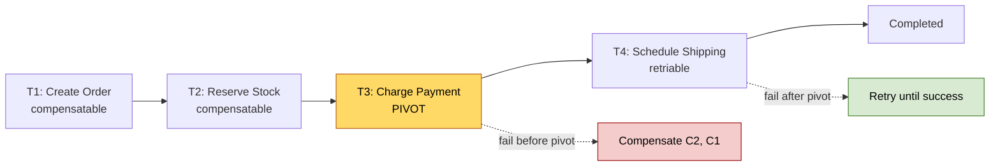
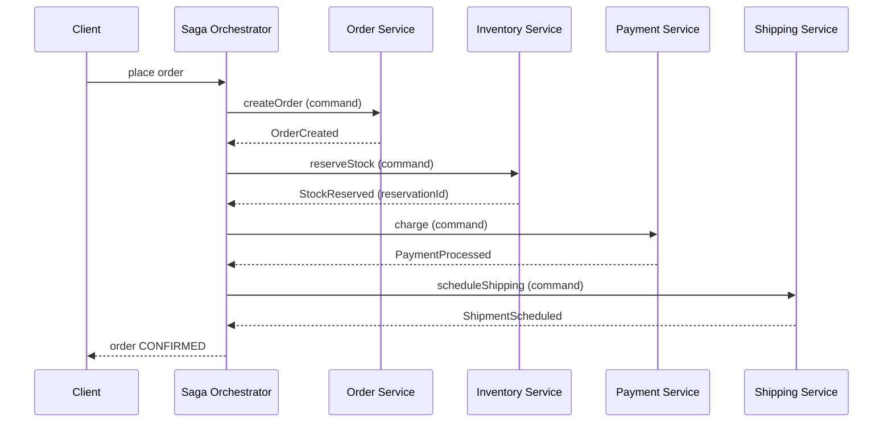
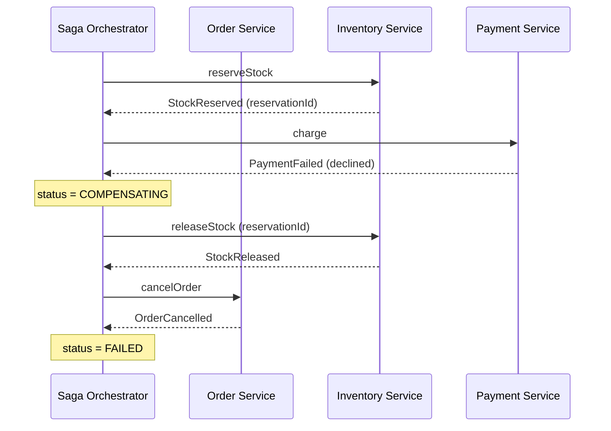
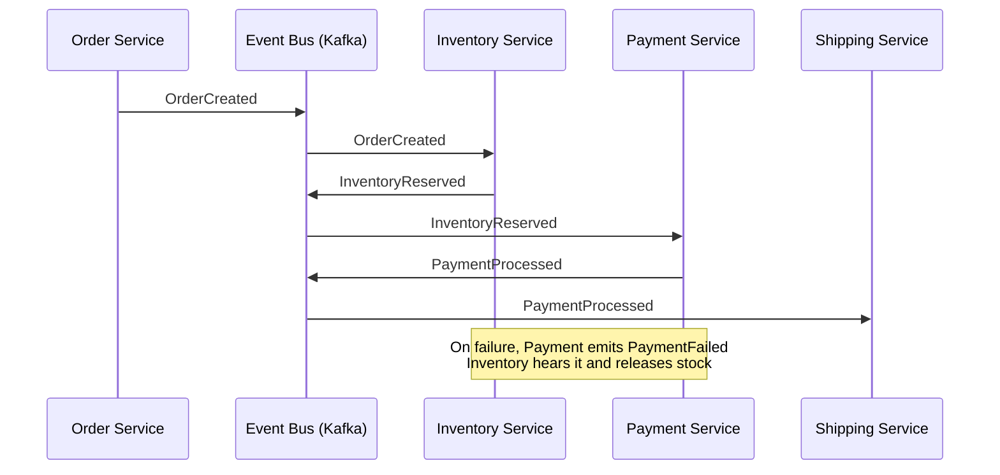
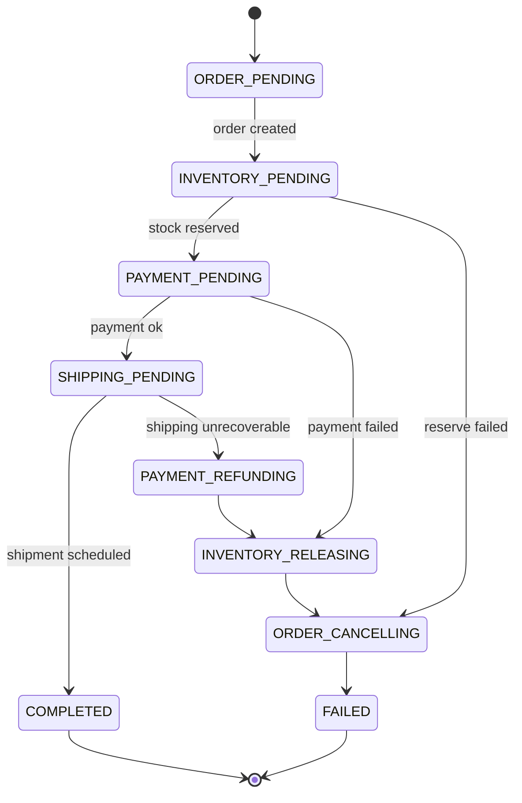
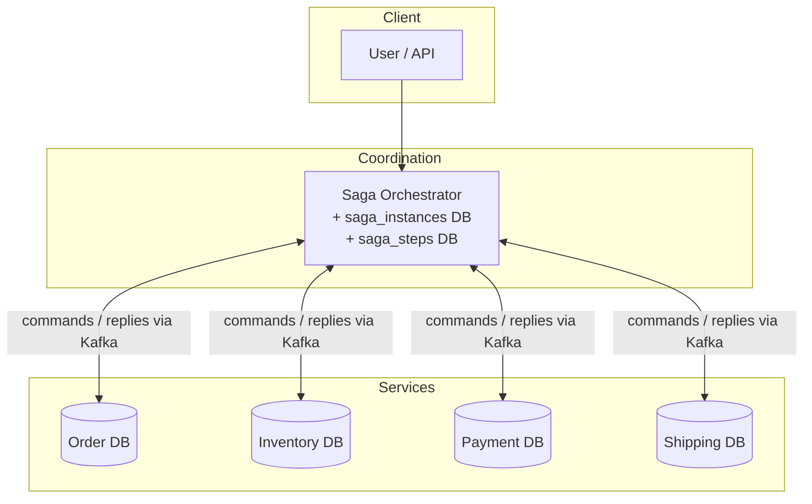
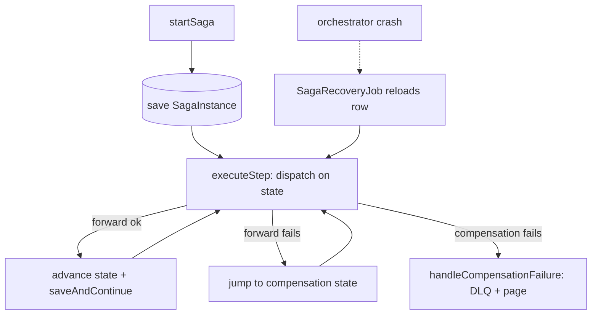

# 🧩 The Saga Pattern — A Complete Study Guide

> *Managing distributed transactions across microservices without a global lock — from first principles to staff-level nuance.*

The Saga pattern is one of those ideas that sounds abstract until you watch a payment go through, an order get created, and then the inventory service crash — leaving a customer charged for items that were never reserved. This guide takes you from "what even is a distributed transaction?" all the way to the tunable, per-component trade-offs a staff engineer reasons about unprompted. Read it top to bottom and the flow escalates naturally; jump around using the table of contents if you already know the basics.

---

## 📋 Table of Contents

1. [What Is the Saga Pattern? (Plain English)](#-1-what-is-the-saga-pattern-plain-english)
2. [Core Definitions](#-2-core-definitions)
3. [The Concept & Theory in Detail](#-3-the-concept--theory-in-detail)
4. [Why Saga Exists — The Problem It Solves](#-4-why-saga-exists--the-problem-it-solves)
5. [Why Not Two-Phase Commit? The Real Trade-off](#-5-why-not-two-phase-commit-the-real-trade-off)
6. [How Saga Works — The Mechanism](#-6-how-saga-works--the-mechanism)
7. [The Three Transaction Types (Compensatable, Pivot, Retriable)](#-7-the-three-transaction-types-compensatable-pivot-retriable)
8. [Choreography vs Orchestration](#-8-choreography-vs-orchestration)
9. [Architecture & Sequence Diagrams](#-9-architecture--sequence-diagrams)
10. [Hands-On: Orchestrated Saga in Java (Spring + Kafka)](#-10-hands-on-orchestrated-saga-in-java-spring--kafka)
11. [Hands-On: Choreographed Saga in Java](#-11-hands-on-choreographed-saga-in-java)
12. [Categorized Real-World Examples](#-12-categorized-real-world-examples)
13. [Common Misconceptions](#-13-common-misconceptions)
14. [Staff-Level Nuance](#-14-staff-level-nuance)
15. [When to Use / When NOT to Use](#-15-when-to-use--when-not-to-use)
16. [Extensions & Adjacent Concepts](#-16-extensions--adjacent-concepts)
17. [⚡ Quick Revision](#-17-quick-revision)
18. [🎓 FAANG Interview Q&A (20 Questions)](#-18-faang-interview-qa-20-questions)
19. [🔗 References & Further Reading](#-19-references--further-reading)

---

## 🎯 1. What Is the Saga Pattern? (Plain English)

A **Saga is a sequence of local transactions**. Each step updates exactly one service (and one database) and then triggers the next step. If any step fails partway through, the saga runs **compensating transactions** to semantically undo the work already committed by earlier steps.

That's the whole idea in three lines:

1. Do one local operation and commit it.
2. Publish an event or send a command to trigger the next step.
3. If something fails later, walk backward and run compensations to make the business state acceptable again.

The critical mental shift: a Saga is **not** about making distributed systems behave like one database. It's about designing business workflows that can **survive failure without collapsing the whole system**. You give up immediate global consistency, and in return you gain scalability, service independence, and fault tolerance. That trade is called **eventual consistency**.

<details>
<summary>📖 Beginner-friendly explanation</summary>

Think about booking a vacation yourself. You book the flight, then the hotel, then the rental car. If the rental car turns out to be unavailable, there's no magic button that atomically un-books the flight and hotel. You call the airline and cancel, then call the hotel and cancel — one by one, in reverse. That's a saga. Each booking was a real, committed action; each cancellation is a new "undo" action, not time travel. Distributed systems work the same way: you can't roll back a charge on someone's credit card, but you *can* issue a refund. Saga is just the disciplined version of "book forward, cancel backward when it goes wrong."

</details>

---

## ✅ 2. Core Definitions

Before going deeper, lock in the vocabulary. These terms recur through every section and every interview.

**Local transaction** — A normal ACID transaction inside a *single* service against *its own* database. This is the atomic unit of a saga. Each one commits independently.

**Forward action (forward transaction)** — A normal business step in the happy path: create order, reserve inventory, charge payment, schedule shipment.

**Compensating transaction** — A *new, forward-moving* operation that logically cancels a previously committed step. A refund compensates a charge; releasing stock compensates a reservation; cancelling an order compensates its creation. It is **not** a database rollback — it leaves a trace in audit logs and may have its own side effects.

**Eventual consistency** — The system may sit in a temporary, visible intermediate state (e.g., order `PENDING` while payment is processing) but is guaranteed to converge to a correct final state (`CONFIRMED` or `CANCELLED`).

**Choreography** — A decentralized saga style: services react to each other's events. No central brain.

**Orchestration** — A centralized saga style: a dedicated orchestrator issues commands and tracks state.

**Idempotency** — Processing the same message twice produces the same result as processing it once. Non-negotiable in sagas because messages get redelivered and steps get retried.

**Correlation ID / Saga ID** — A unique identifier stamped on every event and command in one saga instance, so you can trace and route it end-to-end.

**Pivot transaction** — The "point of no return." Once it commits, the saga is committed to completing (via retries) rather than compensating.

---

## 📊 3. The Concept & Theory in Detail

The Saga pattern was not invented for microservices. It comes from a **1987 paper by Hector Garcia-Molina and Kenneth Salem** at Princeton, which described how to handle **long-lived transactions (LLTs)** in a single database. A long-lived transaction that holds locks for minutes or hours destroys concurrency. Their insight: break the LLT into a sequence of smaller sub-transactions, each of which commits and releases its locks immediately, and pair each with a compensating sub-transaction that can semantically undo it if the overall saga must abort.

The microservices community adopted this decades later because the problem rhymes: you have a business operation spanning multiple independent databases, you cannot (and should not) hold a global lock across all of them, so you decompose the operation into committed local steps plus compensations.

Formally, a saga is a sequence of transactions `T1, T2, …, Tn` where each `Ti` has a corresponding compensating transaction `Ci`. The saga guarantees one of two outcomes:

- **Success:** `T1, T2, …, Tn` all execute and commit.
- **Failure at step k:** `T1 … Tk-1` executed, `Tk` failed, so the system runs `Ck-1, Ck-2, …, C1` in reverse order to compensate.

The compensations run in **reverse order** because later steps may depend on the state established by earlier ones. You release the inventory reservation before you cancel the order, mirroring how you reserved *after* creating the order.

### ACID vs BASE — what you actually give up

A single-database transaction gives you **ACID**: Atomicity (all-or-nothing), Consistency (valid state to valid state), Isolation (concurrent transactions don't see each other's partial work), and Durability (committed data survives crashes). A saga cannot give you all four across services. What it keeps and what it drops is precise and worth memorizing:

- **Atomicity** → *replaced* by "semantic atomicity." The overall operation is not atomic — each local step commits independently — but the saga *guarantees* it converges to either fully-done or fully-compensated. There is no in-between resting state.
- **Consistency** → *preserved eventually.* Each local transaction moves its own service from one valid state to another; the system as a whole is only guaranteed consistent *after* the saga completes or finishes compensating.
- **Isolation** → **This is the big sacrifice.** There is no isolation across saga steps. A concurrent reader or another saga can observe the intermediate state of a running saga (a "dirty read at the saga level"). You must add isolation back manually where the business needs it — via semantic locks, versioning, or pessimistic views (see [Staff-Level Nuance](#-14-staff-level-nuance)).
- **Durability** → *fully preserved.* Each local commit is durable in its own database, and the saga's own state is persisted too.

This is why sagas are described as trading **ACID for BASE** (Basically Available, Soft state, Eventual consistency). You accept a "soft," visible intermediate state in exchange for availability and scale.

### The intermediate-inconsistency window (a concrete trace)

The theory becomes tangible when you trace the timeline. Suppose the Inventory Service reserves 10 units of a product as step 2 of a saga, and payment (step 3) then fails, triggering a compensation that releases those 10 units. Between the reservation commit and the release commit, **any other service reading inventory sees a lower stock count** — a count that will later be "un-happened." That window is not a bug; it is the deliberate, designed-in cost of the pattern. The saga's job is not to eliminate this window but to *bound it and guarantee it closes correctly*.

### Compensation is not a perfect undo

A subtle theoretical point that trips up almost everyone: **compensation is not a database rollback.** A rollback restores state atomically and invisibly, as if the transaction never happened — the storage engine handles it. A compensating transaction is a **new forward operation** that is the logical inverse of the one it undoes: it *leaves a trace*, shows up in audit logs, and can trigger its own side effects. A refund is not identical to "never having charged" — the customer sees a charge and then a refund. A cancelled shipment may still leave side effects (a warehouse pick already started, a notification already sent). In real systems, "rollback" means *"make the business state acceptable again,"* not *"erase history."* Sagas handle **business consistency, not physical erasure.**

### Historical grounding — why "long-lived" is the key word

The 1987 paper's original target was a *single-database* problem: a transaction that runs for minutes or hours (a batch reconciliation, a bulk update) and, under strict two-phase locking, would hold locks the entire time and throttle every other transaction. Garcia-Molina and Salem's fix — chop it into committed sub-transactions with compensations — is *exactly* the same shape as the microservices problem, just with the "lock contention across time" replaced by "lock contention across the network." Recognizing that the pattern is fundamentally about **avoiding held locks during a long operation** (whether long in time or long across service hops) is the conceptual through-line that ties the 1987 database context to a 2020s Kafka-based order pipeline.

<details>
<summary>📖 Beginner-friendly explanation</summary>

Imagine writing a long essay where each paragraph is saved to a different notebook the moment you finish it, and each notebook is instantly photocopied and mailed out. If you decide paragraph 4 is wrong, you can't un-mail the copies of paragraphs 1–3. What you *can* do is mail a correction note for each: "Please ignore paragraph 3," "Please ignore paragraph 2," and so on, in reverse order. That's a compensating transaction. The original mailings really happened — anyone who read them saw them — but the system still ends up in a state everyone agrees is correct. Saga is the discipline of always having a "correction note" ready for every paragraph before you mail it.

</details>

---

## 💡 4. Why Saga Exists — The Problem It Solves

In a **monolith with a single database, transactions are beautiful.** You start a transaction, do your work, and either commit everything or roll back everything. ACID (Atomicity, Consistency, Isolation, Durability) handles the rest. You charge the card, reserve inventory, write the ledger entry — and if any write fails, the database silently rolls back all of them. You barely think about it.

Then you scale. More traffic, more data, more writes. Eventually one database hits its limits, so you shard it or split the monolith into microservices, each owning its own database. Now your "place order" operation spans four independent machines:

- **Order Service** — creates the order
- **Inventory Service** — reserves the items
- **Payment Service** — charges the customer
- **Shipping Service** — schedules delivery

There is no shared transaction coordinator. If payment succeeds but shipment fails — or inventory is reserved but payment is later declined — there is no database-level rollback that can span these boundaries. And at thousands of transactions per second across distributed infrastructure, **partial failures are not edge cases; they're routine.**

Saga solves this by refusing to pretend the world is transactional when it isn't. It breaks the flow into small, independently committed local transactions and provides a structured way to compensate when the workflow can't complete. The real value is not magic consistency — it's **controlled inconsistency**: you decide exactly where the system may be temporarily inconsistent and exactly how it recovers.

<details>
<summary>📖 Beginner-friendly explanation</summary>

Picture an e-commerce checkout: create order → reserve inventory → charge card → arrange shipment. In the old world all four lived in one database, so one transaction covered them. Now each is a separate company (service) with its own filing cabinet (database). You can't ask four separate companies to all freeze their filing cabinets at once and commit together — that's slow, fragile, and everyone hates you for it. So instead each does its own step and commits immediately, and if step 3 (payment) fails, you phone step 2 and step 1 and ask them to undo. It's messier than one big transaction, but it actually works when the companies are independent.

</details>

---

## ❌ 5. Why Not Two-Phase Commit? The Real Trade-off

The classic academic answer to distributed transactions is **Two-Phase Commit (2PC)**. Understanding *why the industry rejected it* is exactly the follow-up an interviewer pushes on, so it's worth real depth.

**How 2PC works.** A **coordinator** drives two phases:

1. **Prepare phase:** The coordinator asks every participant, "can you commit?" Each participant does the work, durably records it, **locks the affected rows**, and votes `yes` or `no`.
2. **Commit/abort phase:** If *all* vote `yes`, the coordinator tells everyone to commit and release locks. If *any* votes `no` (or times out), the coordinator tells everyone to abort.

On paper this gives you **strong consistency** — the same guarantee as a single database. Every participant agrees before anything is finalized, so there's no partial state. So what's wrong?

**2PC is a blocking protocol, and blocking is dangerous in a distributed system.** Consider: the coordinator collects all three `yes` votes, then crashes *before* sending the commit decision. Now every participant is stuck holding locks. They can't commit on their own (maybe the coordinator meant to abort). They can't abort on their own (maybe the coordinator already told others to commit). So they wait — and every other transaction touching those locked rows waits too. The system freezes.

The problems compound:

- **Performance:** Locks are held across services for the entire protocol. The whole transaction moves at the speed of the *slowest* participant. A 10-second ledger service holds the card and inventory locks for 10 seconds.
- **Availability:** If any single participant is down, the transaction blocks. This is why 2PC is nicknamed the **"anti-availability protocol."**
- **Coupling:** Every service must speak the same transaction protocol.
- **CAP:** 2PC chooses consistency over availability — often the wrong trade in an internet-scale system.

In practice you rarely implement 2PC from scratch — you'd lean on a coordination service like **Apache ZooKeeper** (a high-performance, strongly-consistent coordination store) to manage the coordinator role and the durable commit decision. But even done "right," the blocking problem remains fundamental: after collecting prepared votes the coordinator must **durably write its final decision (commit/abort) to disk before broadcasting it**, so that if it crashes it can recover the decision; and until it recovers, participants that promised to commit **cannot time out and abort on their own** (they're bound to honor the coordinator's decision), which is why a permanently-dead coordinator can require *manual operator intervention* on each participant.

Pat Helland's influential paper *"Life Beyond Distributed Transactions"* argues exactly this: distributed transactions across autonomous services don't work at scale. **2PC survives only *inside* tightly-coupled distributed databases like Google Spanner or YugabyteDB**, where the coordinator and participants are part of one system. Spanner mitigates the coordinator-availability problem by backing each 2PC member with a **Paxos replication group** (data is divided into groups that are the basic unit of placement and replication), so each participant stays available even if some of its replicas are down. Across independent services with different deploy schedules and failure characteristics, none of that is available and it falls apart.

**The core trade Saga makes:** it shifts complexity *out of the database/coordinator layer and into application logic.* You write compensations, idempotency, and state tracking by hand — but you never block, never hold cross-service locks, and never freeze on a single node failure.

<details>
<summary>📖 Beginner-friendly explanation</summary>

2PC is like a group of friends splitting a bill where nobody is allowed to pay until *everyone* has confirmed they're ready, and while you wait, all your wallets are frozen. If one friend goes to the bathroom (crashes), everyone sits there with frozen wallets, unable to pay or leave, until they come back. Saga is the opposite: everyone just pays their own share immediately, and if it turns out the plan changed, whoever overpaid asks for their money back afterward. Nobody's wallet is ever frozen, and one friend disappearing doesn't paralyze the whole table.

</details>

---

## 🎨 6. How Saga Works — The Mechanism

Every saga has two kinds of actions:

- **Forward actions** — the normal business steps.
- **Compensating actions** — the undo steps if something goes wrong.

Here's the canonical order-placement flow expressed as simple pseudocode (the *idea*, not production code):

```
Start Saga
  T1 -> Create Order
  T2 -> Reserve Inventory
  T3 -> Charge Payment
  T4 -> Create Shipment
If failure at step k:
  Compensate previous successful steps in reverse order
  (C3 refund, C2 release inventory, C1 cancel order)
End Saga
```

The four mechanisms that make this actually reliable in production — and that separate a toy saga from a real one — are:

**1. Persist saga state.** You must know which step completed, which failed, and what compensation is pending. Without durable state, recovery is guesswork. This is why the orchestrator (or the choreography participants) writes progress to a database at every transition. If the process crashes, it reads the last state and resumes.

**2. Idempotency everywhere.** Retries and duplicate deliveries are guaranteed. Every step — forward *and* compensating — must be safe to run more than once. The standard technique is an **idempotency key**: before processing "charge $50 for order #1234," the Payment Service checks whether it already processed that (saga_id + step) key and returns the cached result if so.

**3. Keep each local transaction small.** One service, one thing, one commit. Large local transactions increase the failure surface and make retries messy.

**4. Expect partial failures.** A service may die *during* compensation. A message may arrive late. Another service may already have reacted to an event. Saga is a **controlled failure model**, not a perfect-world model.

<details>
<summary>📖 Beginner-friendly explanation</summary>

Think of a saga like a checklist on a clipboard that a manager physically carries. Each line ("order created ✓", "stock reserved ✓") gets ticked *and the clipboard photographed* the moment it's done. If the manager faints, a replacement picks up the clipboard, sees exactly which lines are ticked, and continues — or starts un-ticking in reverse if the plan is cancelled. The photograph after every tick is the "persist state" rule; re-checking a line that's already ticked and doing nothing is "idempotency." That clipboard is the difference between a saga you can trust and one that silently loses orders.

</details>

---

## 📊 7. The Three Transaction Types (Compensatable, Pivot, Retriable)

This is where textbook explanations stop and staff-level ones begin. Chris Richardson's framing splits every saga step into one of three categories, and knowing them changes how you handle failure.

**Compensatable transactions** — Steps that *can* be semantically undone. Every step *before* the pivot must have a defined compensation. Example: `reserveInventory()` is compensatable via `releaseInventory()`.

**Pivot transaction** — The **point of no return.** Once it commits, the saga is committed to moving forward. If the pivot itself fails, you compensate everything before it; but if it succeeds, everything after it must eventually succeed. The pivot is often the irreversible financial or legal action — e.g., the fraud check passing, or the actual charge capture. It may be the last compensatable step *or* the first retriable one, depending on your design.

**Retriable transactions** — Steps *after* the pivot that are guaranteed to eventually succeed with enough retries. They have **no compensation** because the saga will never go backward past the pivot. Example: once payment is captured, "schedule delivery" just retries until the shipping service is healthy again — you don't refund the customer because the shipping API was down for 30 seconds.

Why this matters: it directly determines **forward vs backward recovery** (see [Staff-Level Nuance](#-14-staff-level-nuance)). A failure *before* the pivot → compensate backward. A failure *after* the pivot → retry forward. Getting this wrong means either refunding customers you shouldn't, or stranding sagas you should have retried.



<details>
<summary>📖 Beginner-friendly explanation</summary>

Think of a wedding. Booking the venue deposit is *compensatable* — you can cancel and eat a fee. Saying "I do" is the *pivot* — after that, you're married; there's no clean rollback, only a much messier forward process. Mailing the thank-you cards afterward is *retriable* — if the post office is closed today, you just try again tomorrow; nobody annuls the marriage because a card was late. Every saga has this shape: reversible stuff up front, one irreversible commit in the middle, and "just keep trying" stuff at the end.

</details>

---

## 🎨 8. Choreography vs Orchestration

Saga has two implementation styles, and choosing between them is **one of the most consequential architectural decisions you'll make.**

### Choreography — the decentralized dance

There is **no central controller.** Each service listens for events, does its local transaction, and publishes a new event. The next service picks it up. The workflow *emerges* from independent services reacting to one another — typically over Kafka or RabbitMQ.

Happy path:

- Order Service creates the order → publishes `OrderCreated`
- Inventory Service hears `OrderCreated` → reserves stock → publishes `InventoryReserved`
- Payment Service hears `InventoryReserved` → charges customer → publishes `PaymentProcessed`
- Shipping Service hears `PaymentProcessed` → schedules delivery

Compensation on payment failure:

- Payment Service publishes `PaymentFailed`
- Inventory Service hears it → releases the reservation
- Order Service hears it → marks the order failed

Every service must handle both the **success event and the failure event** of the previous step. The more services you add, the more failure paths you must model.

**How coordination actually works (the mechanics).** Choreography is built on **publish/subscribe** over an event log or broker — typically **Kafka** (a durable, partitioned, replayable log) or **RabbitMQ** (a queue/exchange broker). A service does its local transaction, then publishes a **domain event** ("something happened" — `InventoryReserved`), which any number of interested services subscribe to. There is no request/response — communication is fully asynchronous and fire-and-forget from the publisher's perspective. Two disciplines are mandatory for correctness:

- **Transactional outbox** — the event must be written to an `outbox` table in the *same local transaction* as the business data, then relayed to Kafka by a separate process (via CDC or polling). Without it, a service can commit its DB change but fail to publish, and the saga stalls silently with no event on the wire.
- **Correlation ID** — every saga instance gets a unique ID stamped onto every event in the chain, so you can reconstruct one saga's path across services in your observability stack. This is your *only* lifeline for tracing a choreographed saga end-to-end.

On Kafka specifically, you typically **key events by the saga/order ID** so all events for one saga land on the same partition and are processed in order by one consumer, and you rely on **consumer groups** for scaling and **at-least-once delivery** (which is exactly why every handler must be idempotent).

**Strengths:** loose coupling (services know only events, not each other — genuine autonomy), no single point of failure, high availability (the broker is the only shared dependency), trivially easy to add a new participant that subscribes to existing events *without touching any other service*, and a natural fit if you already run event-driven infrastructure.

**Weaknesses:** the business flow is *scattered* across services — there is no single place that describes "place order" end-to-end; you must read every service's event handlers and mentally stitch the chain together. Debugging means correlating logs across services by correlation ID. **Cyclic dependencies** emerge as the event graph grows (Service A reacts to B which reacts to A). **Event storms** — one event fanning out to many handlers that each publish more events — can overwhelm the system. And it is **vulnerable to backpressure**: with no coordinator pacing the flow, a slow downstream consumer silently accumulates a backlog while upstream keeps publishing (see [Staff-Level Nuance](#-14-staff-level-nuance)). Integration testing requires standing up the whole event infrastructure.

### Orchestration — central command

A dedicated **Saga Orchestrator** owns the workflow. It sends commands to each participant, waits for replies, holds the saga state (usually as a persisted state machine), and drives compensation. Participants know nothing of the saga or of each other — they just respond to commands. This is a **command-driven** model, whereas choreography is **event-driven**.

**Commands vs events — the crucial distinction.** In orchestration the orchestrator issues **commands** ("do this" — `ReserveStockCommand`), which are *directed* at a specific service and express intent. Participants reply with **reply events** ("this happened" — `StockReservedEvent` / `StockReservationFailedEvent`). Contrast choreography, where services only ever emit *domain events* with no addressee. This is the semantic core of the difference: **command = imperative, addressed, expects a reply; event = declarative, broadcast, no expectation.** The orchestrator is the only component that knows the full sequence; each participant is a dumb responder.

**How coordination actually works (the mechanics).** The orchestrator is implemented as a **persisted state machine**. At any instant it knows: which step the saga is on, the result of every completed step, and which compensations to run if things go wrong. It communicates with participants over messaging (commands and reply events on Kafka topics, or synchronous gRPC/HTTP for steps that need an immediate answer — many real systems mix both, e.g. a synchronous gRPC call to create the order so the client gets an `orderId` back immediately, then asynchronous Kafka commands for the rest). Because the state machine is **persisted to a database after every transition**, the saga is *resumable*: if the orchestrator crashes, it restarts, reads the last persisted state, and continues exactly where it left off. This durability is not optional — it is what gives orchestration its reliability. Frameworks like **Temporal**, **Netflix Conductor**, **Camunda**, **Axon**, and **AWS Step Functions** provide this state-machine persistence, retry, and timeout infrastructure so you don't hand-roll it.

**A two-layer retry model.** Even though the orchestrator owns overall failure handling, it's common and recommended practice for **individual participant services to retry their own operation locally first** (a predetermined number of attempts with backoff) before reporting failure upward. Only when local retries are exhausted, or the failure is clearly permanent, does the participant send a failure reply and let the orchestrator decide whether to trigger compensation. This keeps transient blips from unnecessarily unwinding a whole saga.

**Strengths:** centralized, queryable visibility (you can literally ask "where is saga #123 right now?" against the orchestrator's state store), explicit state management, easier debugging (one place to look), an explicit **audit trail** of the whole process, **fine-grained per-step timeout and retry control** (the orchestrator enforces a timeout on each command and retries with backoff), simpler participant services (they just respond to commands and need no knowledge of the workflow), and — underrated — **natural backpressure/pacing**, because the orchestrator won't issue step N+1 until step N replies, so the system self-throttles under load.

**Weaknesses:** the orchestrator can become a **God object** — a magnet that accumulates business logic until it's an unmaintainable mini-monolith and a throughput bottleneck. It is a **single point of failure** that must be made highly available (clustered, with its state store replicated). Participants become **coupled to its command protocol** (change a command's shape and you touch the orchestrator and the participant). And there's simply more infrastructure to deploy, scale, and monitor.

### Which should you choose?

The seasoned default: **start with orchestration for business-critical sagas.** The visibility and debuggability are worth the coupling cost — when something breaks at 3 AM, you want the state in one place.

**Reach for choreography when** the saga is simple (2–3 steps), services are owned by different teams that can't easily coordinate, you're already heavily invested in event-driven architecture, and compensation logic is simple. **Reach for orchestration when** there are 4+ steps, compensation is complex or conditional, visibility is critical (financial/compliance), or one team owns the services.

<details>
<summary>📖 Beginner-friendly explanation</summary>

Choreography is a group of dancers with no choreographer — each one watches the others and reacts. It's beautiful and flexible for a short, simple routine, but for a complex 20-minute performance nobody can tell you what's *supposed* to happen next, and if a dancer trips, everyone scrambles. Orchestration is having a conductor with a score: the conductor points at each musician in turn and knows exactly where the piece is. It's easier to follow and fix, but now the whole performance depends on the conductor showing up. Most serious productions pick the conductor.

</details>

### 📊 Comparison table

| Dimension | Choreography | Orchestration |
|---|---|---|
| Control | Decentralized, event-driven | Centralized, command-driven |
| Coupling | Loose (services know only events) | Tighter (coupled to orchestrator protocol) |
| Visibility | Hard — flow scattered across services | Easy — state in one queryable place |
| Debugging | Trace logs across services by correlation ID | One place to look |
| Single point of failure | None | The orchestrator (must be HA) |
| Best for | Simple 2–3 step flows, cross-team, existing event infra | Complex/long-running flows, financial/compliance, one team |
| Backpressure | Vulnerable (see staff nuance) | Naturally paced (waits per step) |
| Risk | Event storms, cyclic dependencies | God-object orchestrator, bottleneck |

---

## 🎨 9. Architecture & Sequence Diagrams

### Orchestration — happy path



<details>
<summary>📖 What this diagram shows (technical walkthrough)</summary>

Read it top to bottom as time. The **Client** makes one request ("place order") and blocks (or gets an async saga ID back). From there the **Orchestrator** is the only active decision-maker: it sends a *command* to each service (solid arrows `->>`) and waits for that service's *reply event* (dashed arrows `-->>`) before issuing the next command. Notice the strict **sequential pacing** — `reserveStock` is not sent until `OrderCreated` comes back, `charge` waits for `StockReserved`, and so on. This is why orchestration self-throttles under load (no step races ahead). The `StockReserved (reservationId)` reply carries data the orchestrator stores — it will need that `reservationId` later if it has to compensate. Each participant does its own local ACID transaction and commits independently; the orchestrator never holds a cross-service lock. When the final `ShipmentScheduled` reply arrives, the orchestrator marks the saga `COMPLETED` and tells the client the order is `CONFIRMED`. The whole flow is one place you can read end-to-end — the defining advantage of orchestration.

</details>

### Orchestration — compensation on payment failure



<details>
<summary>📖 What this diagram shows (technical walkthrough)</summary>

This is the *unhappy* path. Stock was reserved successfully, but the `charge` command comes back as `PaymentFailed (declined)` — a **permanent, business-rule failure** (a declined card, not a transient timeout), so the correct response is **backward recovery**, not retry. The moment the orchestrator sees the failure it flips the saga's persisted status to `COMPENSATING` (the `Note over O`) — this status is itself durable and doubles as an idempotency guard: if the same `PaymentFailed` event is redelivered, the handler sees the saga is already `COMPENSATING` and won't fire a second release. It then runs compensations **in reverse order of the forward steps**: it releases the stock first (using the `reservationId` it stored earlier — no need to re-query Inventory), then cancels the order, then marks the saga `FAILED`. Crucially, there is *no* payment compensation here because payment never succeeded — you only compensate steps that actually committed. Compare this to a failure *after* payment: then you'd also need a refund, and the reverse-order chain would be refund → release → cancel.

</details>

### Choreography — event flow



<details>
<summary>📖 What this diagram shows (technical walkthrough)</summary>

Contrast this with the orchestration diagrams: **there is no orchestrator.** The central actor is the **Event Bus (Kafka)** — a durable, replayable log. Each service publishes a *domain event* to the bus and independently subscribes to the events it cares about. The chain *emerges*: Order publishes `OrderCreated` → Inventory happens to be listening, reserves stock, publishes `InventoryReserved` → Payment is listening for *that*, charges, publishes `PaymentProcessed` → Shipping picks it up. No service knows who comes next; it only knows what it consumes and what it produces. That's the loose coupling that makes it easy to bolt on a new subscriber (say, an analytics service) without touching anyone. The `Note` shows compensation is also event-driven: on failure Payment publishes `PaymentFailed`, and each upstream service that reacted must *itself* be listening for that failure event to run its own local undo. This is the hidden cost the diagram makes visible — the full workflow logic is **not in any single box**; it's distributed across every service's subscriptions, which is exactly why tracing (via the correlation ID stamped on every event) and debugging are harder here.

</details>

### Orchestrator state machine



<details>
<summary>📖 What this diagram shows (technical walkthrough)</summary>

This is the *durable heart* of an orchestrated saga — the exact state that gets persisted to a database after every transition, so a crash-and-restart resumes from the last saved node. Read the top spine as the **happy/forward path**: `ORDER_PENDING → INVENTORY_PENDING → PAYMENT_PENDING → SHIPPING_PENDING → COMPLETED`, each transition labeled by the reply that triggers it ("order created", "stock reserved", …). The three branches off to the right are **failure transitions into compensation states**, and notice how the entry point depends on *how far the saga got*: a reserve failure jumps straight to `ORDER_CANCELLING` (nothing else to undo), a payment failure enters at `INVENTORY_RELEASING` (release stock, then cancel order), and a post-payment shipping failure enters at `PAYMENT_REFUNDING` (refund, then release, then cancel). Those compensation states then **chain downward in reverse order** — `PAYMENT_REFUNDING → INVENTORY_RELEASING → ORDER_CANCELLING → FAILED` — which is the reverse of the forward spine, exactly as compensation semantics require. Both `COMPLETED` and `FAILED` are terminal (`[*]`). The value of drawing it this way: every legal state and every legal transition is explicit, so "which compensations run if we fail at step 3?" is answered by *reading the graph*, not guessing. Note the pivot lives conceptually at the payment step — a shipping (post-pivot) failure still routes through refund here, but in a stricter design you'd make shipping *retriable* and never refund a captured payment for a transient shipping outage (see §7 and §14).

</details>

### High-level component view



<details>
<summary>📖 What this diagram shows (technical walkthrough)</summary>

This is the deployment/ownership view, and the single most important thing it communicates is **data sovereignty**: each service owns its *own* database (Order DB, Inventory DB, Payment DB, Shipping DB) — the cylinders never touch each other. There is no shared database, which is precisely why you can't use one big ACID transaction and need a saga at all. The **Orchestrator** sits in its own coordination tier and — critically — has *its own* persistent stores (`saga_instances` for the current state of each saga and `saga_steps` for the per-step audit history). That's what makes sagas resumable and queryable. The bidirectional arrows labeled "commands / replies via Kafka" show the orchestrator issuing commands to and receiving replies from each participant over the message broker (durable, so a message survives a consumer being briefly down). An **anti-pattern this diagram implicitly forbids**: two services reaching into the same database, or one service's saga step reading another's tables directly — all cross-service data access must go through the owning service's API/commands, or you lose the autonomy that justified microservices in the first place.

</details>

---

## 💻 10. Hands-On: Orchestrated Saga in Java (Spring + Kafka)

A realistic order saga modeled as a **state machine**, the clearest way to structure orchestration. Each block is enriched beyond the toy version with persistence, idempotency, timeouts, and observability hooks.

<details>
<summary>📖 Overall design walkthrough — how the pieces fit together</summary>

Before diving into individual classes, here's the mental model of the whole implementation and how the five code blocks relate. There are **six moving parts**:

1. **`SagaState` (enum)** — the finite set of states the saga can be in, split into *forward* states (`ORDER_PENDING` → … → `COMPLETED`) and *compensation* states (`PAYMENT_REFUNDING` → `INVENTORY_RELEASING` → `ORDER_CANCELLING` → `FAILED`). This enum *is* the state machine's alphabet.
2. **`SagaInstance` (JPA entity)** — one database row per running saga. It holds the current `state`, the IDs needed later (`orderId`, `reservationId`, `paymentId`), boolean flags recording what actually committed, and a `retryCount`. This is the **durable memory** that makes the saga survive a crash.
3. **`OrderSagaOrchestrator` (service)** — the brain. Its `executeStep()` method is a dispatcher: it looks at the saga's current `state` and calls the matching handler. Forward handlers advance the state on success and, on failure, jump to the correct *compensation* state.
4. **Compensation handlers** — the reverse-order undo logic (`refundPayment` → `releaseInventory` → `cancelOrder`), plus `handleCompensationFailure` for the dangerous case where an undo itself fails.
5. **Idempotent participant** — the receiving side (e.g. Inventory's `reserve()`), which must be safe to call twice because Kafka delivers at-least-once.
6. **`SagaRecoveryJob`** — a scheduled sweeper that finds sagas stuck too long in an intermediate state and either retries (forward recovery) or forces compensation, then pages a human.

**The control flow in one sentence:** `startSaga()` persists a new `SagaInstance` and calls `executeStep()`; each handler does its work, mutates the entity's `state`, calls `saveAndContinue()` (which **persists first, then recurses** into the next step); on any failure it routes to a compensation state and walks backward; a crash mid-flow is caught by `SagaRecoveryJob`, which reloads the persisted row and continues.

**Three invariants baked into the code**, each of which is what separates this from a toy:

- **Persist-before-act** — state is written to the DB *before* triggering the next step, so recovery is always possible.
- **Idempotency by guard** — every forward and compensating operation checks "did I already do this?" and no-ops if so.
- **Fail loud on stuck** — when compensation can't complete, the code deliberately stops auto-retrying, routes to a DLQ, and alerts on-call, rather than silently leaving inconsistent state.

The relationship at a glance:



Now read each block below with this map in mind — the "Why it's shaped this way" note under each explains the local details.

</details>

### The saga state and persisted instance

<details>
<summary>💻 SagaState enum + SagaInstance entity</summary>

```java
public enum SagaState {
    ORDER_PENDING,
    INVENTORY_PENDING,
    PAYMENT_PENDING,
    SHIPPING_PENDING,
    COMPLETED,

    // Compensation states
    PAYMENT_REFUNDING,
    INVENTORY_RELEASING,
    ORDER_CANCELLING,
    FAILED
}

@Entity
@Table(name = "saga_instances")
public class SagaInstance {

    @Id
    @GeneratedValue(strategy = GenerationType.UUID)
    private UUID sagaId;

    private UUID orderId;
    private UUID customerId;
    private BigDecimal totalAmount;

    // Track what we've done, so we know what to compensate
    private boolean orderCreated;
    private boolean inventoryReserved;
    private boolean paymentProcessed;
    private String paymentId;
    private UUID reservationId;   // needed to release stock during compensation

    @Enumerated(EnumType.STRING)
    private SagaState state = SagaState.ORDER_PENDING;

    private String failureReason;
    private int retryCount;
    private Instant createdAt;
    private Instant updatedAt;

    // getters / setters / builder omitted for brevity
}
```

**Why it's shaped this way:** the boolean flags and `reservationId`/`paymentId` are the *compensation memory*. When payment fails, the orchestrator reads `reservationId` straight from this row and knows exactly which reservation to release — no need to query the inventory service again. Persisting `state` on every transition is what makes the saga **resumable after a crash**: restart, read the last state, continue.

</details>

### The orchestrator core

<details>
<summary>💻 OrderSagaOrchestrator — dispatch and forward steps</summary>

```java
@Service
public class OrderSagaOrchestrator {

    private static final Logger log = LoggerFactory.getLogger(OrderSagaOrchestrator.class);

    private final SagaInstanceRepository sagaRepo;
    private final OrderServiceClient orderService;
    private final InventoryServiceClient inventoryService;
    private final PaymentServiceClient paymentService;
    private final ShippingServiceClient shippingService;
    private final MeterRegistry metrics;

    // constructor injection omitted

    @Transactional
    public UUID startSaga(UUID customerId, List<OrderItem> items) {
        SagaInstance saga = SagaInstance.builder()
                .customerId(customerId)
                .totalAmount(items.stream()
                        .map(i -> i.price().multiply(BigDecimal.valueOf(i.quantity())))
                        .reduce(BigDecimal.ZERO, BigDecimal::add))
                .state(SagaState.ORDER_PENDING)
                .createdAt(Instant.now())
                .updatedAt(Instant.now())
                .build();
        sagaRepo.save(saga);          // persist FIRST, then act
        executeStep(saga);
        return saga.getSagaId();
    }

    void executeStep(SagaInstance saga) {
        String step = saga.getState().name();
        Timer.Sample sample = Timer.start(metrics);
        try {
            switch (saga.getState()) {
                case ORDER_PENDING       -> createOrder(saga);
                case INVENTORY_PENDING   -> reserveInventory(saga);
                case PAYMENT_PENDING     -> processPayment(saga);
                case SHIPPING_PENDING    -> scheduleShipping(saga);
                // compensation handlers
                case PAYMENT_REFUNDING   -> refundPayment(saga);
                case INVENTORY_RELEASING -> releaseInventory(saga);
                case ORDER_CANCELLING    -> cancelOrder(saga);
                default -> { /* terminal */ }
            }
            metrics.counter("saga.step.success", "step", step).increment();
        } catch (Exception e) {
            metrics.counter("saga.step.failure", "step", step).increment();
            log.error("Saga step failed sagaId={} step={} err={}",
                      saga.getSagaId(), step, e.toString());
            throw e;
        } finally {
            sample.stop(metrics.timer("saga.step.duration", "step", step));
        }
    }

    private void createOrder(SagaInstance saga) {
        try {
            UUID orderId = orderService.createOrder(saga.getCustomerId());
            saga.setOrderId(orderId);
            saga.setOrderCreated(true);
            saga.setState(SagaState.INVENTORY_PENDING);
            saveAndContinue(saga);
        } catch (Exception e) {
            fail(saga, e, SagaState.FAILED);   // nothing committed yet
        }
    }

    private void reserveInventory(SagaInstance saga) {
        try {
            UUID reservationId = inventoryService.reserve(saga.getOrderId());
            saga.setReservationId(reservationId);
            saga.setInventoryReserved(true);
            saga.setState(SagaState.PAYMENT_PENDING);
            saveAndContinue(saga);
        } catch (Exception e) {
            fail(saga, e, SagaState.ORDER_CANCELLING);   // undo the order
        }
    }

    private void processPayment(SagaInstance saga) {   // PIVOT
        try {
            String paymentId = paymentService.charge(
                    saga.getCustomerId(), saga.getTotalAmount(), saga.getOrderId());
            saga.setPaymentId(paymentId);
            saga.setPaymentProcessed(true);
            saga.setState(SagaState.SHIPPING_PENDING);
            saveAndContinue(saga);
        } catch (Exception e) {
            fail(saga, e, SagaState.INVENTORY_RELEASING);   // undo inventory
        }
    }

    private void scheduleShipping(SagaInstance saga) {   // retriable (post-pivot)
        try {
            shippingService.schedule(saga.getOrderId());
            saga.setState(SagaState.COMPLETED);
            sagaRepo.save(saga);
        } catch (Exception e) {
            // post-pivot: prefer forward recovery (retry), not refund
            fail(saga, e, SagaState.SHIPPING_PENDING);
        }
    }

    private void saveAndContinue(SagaInstance saga) {
        saga.setUpdatedAt(Instant.now());
        sagaRepo.save(saga);
        executeStep(saga);
    }

    private void fail(SagaInstance saga, Exception e, SagaState next) {
        saga.setFailureReason(e.getMessage());
        saga.setState(next);
        saveAndContinue(saga);
    }
}
```

**Why it's shaped this way:** each forward step advances `state` on success and, on failure, jumps to the correct *compensation* state — earlier failures need fewer compensations. `saveAndContinue` persists before recursing, so a crash mid-flow always leaves a durable, resumable record. The metrics/timer wrapper is not decoration — without it you can't answer "which step failed and how long did it take?" at 3 AM.

</details>

### Compensation handlers

<details>
<summary>💻 Compensation handlers + stuck-saga escalation</summary>

```java
    private void refundPayment(SagaInstance saga) {
        try {
            if (saga.isPaymentProcessed() && saga.getPaymentId() != null) {
                paymentService.refund(saga.getPaymentId());   // idempotent on payoutId
            }
            saga.setState(SagaState.INVENTORY_RELEASING);
            saveAndContinue(saga);
        } catch (Exception e) {
            handleCompensationFailure(saga, "refund", e);
        }
    }

    private void releaseInventory(SagaInstance saga) {
        try {
            if (saga.isInventoryReserved()) {
                inventoryService.release(saga.getReservationId());   // idempotent
            }
            saga.setState(SagaState.ORDER_CANCELLING);
            saveAndContinue(saga);
        } catch (Exception e) {
            handleCompensationFailure(saga, "releaseInventory", e);
        }
    }

    private void cancelOrder(SagaInstance saga) {
        try {
            if (saga.isOrderCreated()) {
                orderService.cancel(saga.getOrderId());
            }
            saga.setState(SagaState.FAILED);
            sagaRepo.save(saga);
        } catch (Exception e) {
            handleCompensationFailure(saga, "cancelOrder", e);
        }
    }

    // Compensation itself can fail -> this is the dangerous STUCK case
    private void handleCompensationFailure(SagaInstance saga, String step, Exception e) {
        log.error("COMPENSATION FAILED sagaId={} step={} err={}",
                  saga.getSagaId(), step, e.toString());
        saga.setFailureReason("Compensation failed at " + step + ": " + e.getMessage());
        saga.setState(SagaState.FAILED);
        sagaRepo.save(saga);
        deadLetterQueue.send(saga);      // route to DLQ
        alerting.pageOnCall(saga);       // human intervention required
    }
```

**Why it's shaped this way:** the `if (flag)` guards make each compensation a **no-op when the step never ran** — that's idempotency for compensations. `handleCompensationFailure` is the part most tutorials skip and the part that kills you in production: when an undo *itself* fails, you cannot fix it automatically, so you persist, DLQ, and page a human. Building good tooling around stuck sagas is usually an afterthought — and it's the thing that bites at 2 AM.

</details>

### Idempotent participant + stuck-saga recovery job

<details>
<summary>💻 Idempotent step + SagaRecoveryJob</summary>

```java
// Inside a participant service (e.g., Inventory) — every step must be idempotent
@Transactional
public UUID reserve(UUID orderId, List<OrderItem> items) {
    // Idempotency: if we've already reserved for this order, return the existing result
    Optional<Reservation> existing = reservationRepo.findByOrderId(orderId);
    if (existing.isPresent()) {
        return existing.get().getReservationId();   // no double reservation
    }
    Reservation r = createReservation(orderId, items);
    return r.getReservationId();
}

// Periodic job that finds and recovers sagas stuck in an intermediate state
@Component
public class SagaRecoveryJob {

    private static final int MAX_RETRIES = 5;

    private final SagaInstanceRepository sagaRepo;
    private final OrderSagaOrchestrator orchestrator;

    @Scheduled(fixedDelay = 60_000)   // every minute
    public void run() {
        List<SagaInstance> stuck = sagaRepo.findStuck(
                Instant.now().minus(Duration.ofMinutes(5)),
                List.of(SagaState.INVENTORY_PENDING,
                        SagaState.PAYMENT_PENDING,
                        SagaState.SHIPPING_PENDING));

        for (SagaInstance saga : stuck) {
            if (saga.getRetryCount() < MAX_RETRIES) {
                saga.setRetryCount(saga.getRetryCount() + 1);
                orchestrator.executeStep(saga);        // forward recovery / retry
            } else {
                orchestrator.startCompensation(saga);  // give up, unwind
                alerting.pageOnCall(saga);
            }
        }
    }
}
```

**Why it's shaped this way:** the reservation check turns a possibly-duplicated command into a safe no-op — this is the single most important habit in saga engineering. The recovery job is what handles the failure mode nobody demos: a service that simply never replied. Without it, stuck sagas accumulate silently and customers stare at "processing" forever.

</details>

---

## 💻 11. Hands-On: Choreographed Saga in Java

The same order saga with **no orchestrator** — services react to events. Notice how the flow is now *scattered*: to understand it end-to-end you must read every handler.

<details>
<summary>💻 Choreographed services reacting to events (Spring Cloud Stream / Kafka)</summary>

```java
// order-service.java
@Service
public class OrderService {

    private final EventBus eventBus;
    private final OrderRepository repository;

    public UUID createOrder(UUID customerId, List<OrderItem> items) {
        Order order = Order.create(customerId, items);
        repository.save(order);
        // We don't know or care who listens
        eventBus.publish(new OrderCreatedEvent(
                order.getId(), customerId, items, order.getTotal()));
        return order.getId();
    }

    @EventListener
    public void handlePaymentFailed(PaymentFailedEvent event) {   // compensation
        Order order = repository.get(event.orderId());
        order.cancel("Payment failed");
        repository.save(order);
        eventBus.publish(new OrderCancelledEvent(order.getId(), "Payment failed"));
    }
}

// inventory-service.java
@Service
public class InventoryService {

    @EventListener
    public void handleOrderCreated(OrderCreatedEvent event) {
        // Idempotency guard: skip if already reserved for this order
        if (reservationRepo.findByOrderId(event.orderId()).isPresent()) return;
        try {
            Reservation r = reserveItems(event.orderId(), event.items());
            eventBus.publish(new InventoryReservedEvent(event.orderId(), r.getId()));
        } catch (InsufficientInventoryException e) {
            eventBus.publish(new InventoryReservationFailedEvent(
                    event.orderId(), e.getMessage()));
        }
    }

    @EventListener
    public void handlePaymentFailed(PaymentFailedEvent event) {   // compensation
        releaseReservation(event.orderId());   // idempotent no-op if already released
        eventBus.publish(new InventoryReleasedEvent(event.orderId()));
    }
}

// payment-service.java
@Service
public class PaymentService {

    @EventListener
    public void handleInventoryReserved(InventoryReservedEvent event) {
        Order order = orderClient.getOrder(event.orderId());
        try {
            Payment p = processPayment(order.customerId(), order.total());
            eventBus.publish(new PaymentProcessedEvent(event.orderId(), p.getId()));
        } catch (PaymentDeclinedException e) {
            eventBus.publish(new PaymentFailedEvent(event.orderId(), e.getMessage()));
        }
    }
}
```

**Why it's shaped this way:** each service subscribes to the events it cares about and emits new ones — the saga *emerges* from these subscriptions. It's elegant when it works, but debugging "why didn't order #123 complete?" means tracing events across all of them. The idempotency guards (`findByOrderId`, no-op release) are mandatory because Kafka delivers at-least-once and events get replayed.

</details>

---

## 📊 12. Categorized Real-World Examples

Saga shows up everywhere a business process crosses service boundaries. Grouped by domain:

### E-commerce & retail

The canonical case: **checkout** = create order → reserve inventory → charge payment → schedule shipping. **Uber, Netflix, Amazon, and DoorDash** all run saga-based fulfillment. Amazon-style order pipelines use orchestration so a stuck order is visible in one place. **Refund/return** flows are sagas too: initiate return → receive item → refund payment → restock inventory.

### Travel & booking

**Flight/vacation booking**: reserve seat → charge card → book hotel → reserve rental car → send confirmation. If the rental car is unavailable, compensate by refunding, releasing the hotel, and releasing the seat. This is the textbook "book forward, cancel backward" scenario and a very common interview prompt.

### Fintech & payments

**Loan processing**, **payment + refund workflows**, and **money movement** across ledger, payment, and notification services. Note the caveat: **double-entry bookkeeping often needs true atomicity** and should be co-located in one service/database rather than forced into a saga.

### Platform & lifecycle

**Account provisioning / onboarding** (create account → provision resources → set up billing → send welcome), and **subscription lifecycle management** (sign up → charge → activate features → schedule renewal). These are frequently long-running sagas measured in days.

### Marketplace (nested sagas)

A **multi-vendor cart** where a single order contains items from three vendors. A parent saga spawns a child saga per vendor and can't charge the customer until all confirm. If Vendor B fails, the parent compensates the already-successful Vendor A and C child sagas — or chooses **partial fulfillment** instead.

### Where Saga is the *wrong* tool

Updating a single user profile in one service. A read-modify-write inside one database. Anything that fits one ACID transaction. *Sometimes a transaction is just a transaction.*

---

## ❌ 13. Common Misconceptions

**"Compensation is a rollback."** No. A database rollback restores state *atomically, invisibly* — as if nothing happened. A compensation is a **new forward operation** that leaves a trace: an audit-log entry, possibly a customer-visible charge-then-refund, possibly its own side effects. Engineers who assume "rollback means everything disappears" are surprised when customers see a charge and a refund seconds apart, complete with two bank notifications.

**"Saga makes distributed transactions atomic."** It does the opposite. Saga *accepts* that you cannot have atomicity across services and gives you eventual consistency instead. There is a real, observable window where the system is inconsistent (order `PENDING`, stock reduced but payment not yet taken).

**"Every step can be cleanly undone."** Some actions are irreversible: you can't un-send an email, un-ship a package already on a truck, or refund a card that's been cancelled. Sometimes the compensation is "send an apology email," "create a manual customer-service task," or "log for reconciliation." A team once spent weeks trying to make a saga perfectly reversible before discovering their payment provider didn't support programmatic refunds for certain transaction types.

**"Saga = orchestrator."** Choreography is equally a saga. And an orchestrator is not automatically a saga — a pure event-router with no domain data and nothing to compensate is a **Process Manager**, not a saga (see adjacent concepts).

**"Idempotency is a nice-to-have."** It's mandatory. Without it, at-least-once delivery and retries produce double charges, double reservations, and duplicate shipments. This is a production incident waiting to happen, not a theoretical concern.

**"Sagas give you isolation like ACID."** They don't. Concurrent sagas can see each other's intermediate state (dirty reads at the saga level). You must add isolation explicitly (semantic locks, versioning) where the business needs it.

**"Retries are always the right response to failure."** Only *after* the pivot. Retrying a step that failed on a permanent business rule (declined card, genuinely out of stock) before the pivot just wastes time — you should compensate backward instead.

---

## 🎓 14. Staff-Level Nuance

This is the material an interviewer pushes toward once you've nailed the basics — the per-component trade-offs and failure modes experienced engineers raise unprompted.

### Lack of isolation — the semantic lock problem

ACID's "I" (isolation) is gone. Because each step commits independently, another saga or an external read can observe a running saga's **in-between state**. Two sagas concurrently reserving the same product both read stock = 10, both reserve, and now 14 units are "reserved" against 10 real units. Countermeasures:

- **Semantic locks** — mark a record with a `PENDING`/`LOCKED`/`reserved_by` flag while a saga owns it; conflicting operations wait or fail-fast; the flag clears on completion or compensation. Add a **lock timeout** so a STUCK saga doesn't hold it forever.
- **Pessimistic view** — always report the most conservative state: `available = onHand − allPendingReservations`, so you never over-commit.
- **Re-read before commit** — at the pivot, re-read state; if it changed since the saga started, abort and restart.

### Lost update vs dirty write

Two distinct anomalies that need different fixes:

- **Lost update** — two sagas read the same row, both write based on their stale read, one clobbers the other. Fix: **optimistic locking** with a version column and `WHERE version = ?`; the loser fails and replays cleanly.
- **Dirty write** — saga B overwrites saga A's *uncommitted* intermediate marker (e.g., overwrites `reserved_by`), so A's compensation can't find what to release. Fix: the **semantic lock** — B can't select a row A has marked `IN_PROGRESS`.

### Forward vs backward recovery

When a step fails you choose a direction, and defaulting to "compensate" is wrong for a large class of failures:

- **Backward recovery** — compensate completed steps and terminate FAILED. Correct when the failure is *final and intentional*: declined payment, fraud flag, genuinely out of stock.
- **Forward recovery** — retry the failed step until it succeeds. Correct when the failure is *transient* (brief outage, network partition, rate limit) **and** you're past the pivot. You cannot refund a captured payment just because the email service was down for 30 seconds.

Decision tree: past the pivot → must go forward. Transient (network/timeout/503) → retry with exponential backoff + jitter. Permanent (4xx, business-rule violation) → compensate backward. Un-undoable side effect (email/webhook/audit write) → forward-only, designed as retriable-idempotent.

### The dual-write problem & transactional outbox

When a service finishes its step it must do **two writes**: commit to its own DB *and* publish an event. These are two separate systems, so they can't be atomic. If the DB commit succeeds but the publish fails, the saga stalls silently; if the publish succeeds but the DB write fails, downstream reacts to something that never happened. The fix is the **Transactional Outbox**: write your business data *and* the outgoing event into an `outbox` table in the **same local transaction**. A separate relay process (via **Change Data Capture** tailing the DB log, or polling) publishes from the outbox to Kafka. Now the event is published *if and only if* the local commit succeeded. This is a staple of production sagas ("persist first, then publish" is the informal version of the same rule).

### Backpressure — the 3 AM choreography killer

In choreography there's no coordinator pacing the flow, so every service publishes as fast as it can. When a downstream consumer is slower than the upstream producer, events pile up in the broker. The dangerous part: the producer side looks *healthy* — orders keep succeeding — while Inventory/Payment/Shipping churn through a backlog that's hours old, and customers stare at "processing" indefinitely. **Kafka consumer lag** is your early warning (growing, not flat). Mitigations: (1) scale consumers + add partitions, (2) rate-limit producers — reject new orders with 503 when downstream lag exceeds a threshold (backpressure propagated backward), (3) consumer circuit breaker to create drain-time, (4) priority queues for tiered customers. **Orchestration largely avoids this** — the orchestrator waits for step N's reply before issuing step N+1, so pacing is natural. This is an underappreciated operational advantage of orchestration at scale.

### Observability is not optional

You cannot manage what you cannot see. Minimum requirements: a **correlation/saga ID** flowing through every service, saga state **persisted and queryable**, **structured logs** (JSON) at every transition, **distributed tracing** (OpenTelemetry span per step), and metrics: `saga_started_total`, `saga_completed_total`, `saga_compensated_total`, `saga_stuck_total` (alert immediately), `saga_step_duration_seconds`, `saga_total_duration_seconds`. A **rising compensation rate signals a systemic problem**; a **non-zero DLQ depth means inconsistency is accumulating.**

### Timeouts and the STUCK state

Every step needs a timeout — a saga that waits forever accumulates and consumes resources. The most dangerous state is **STUCK**: the *compensation itself* failed (e.g., inventory service down when releasing stock). This can't be resolved automatically; you need a DLQ, on-call alerting, and tooling to manually replay or force-complete individual steps.

### Anti-patterns to avoid

Sharing a database between saga steps (destroys data sovereignty — cross-service access must go through APIs). Sagas without timeouts. Sagas that are too fine-grained (a single-service read-modify-write doesn't need a saga). Missing observability. Using sagas for cases that genuinely need atomicity (double-entry bookkeeping) — design around co-location instead.

<details>
<summary>📖 Beginner-friendly explanation</summary>

The basics of saga are like learning to drive on an empty road. Staff-level nuance is rush-hour traffic: two cars want the same parking spot (isolation/lost update), you need to decide whether to keep inching forward or reverse out (forward vs backward recovery), your GPS and your odometer disagree (dual-write), and the whole highway backs up because one exit is slow (backpressure). None of these show up in the driving-test manual, but they're what actually happens — and being able to name them and their fixes is what separates "I read about sagas" from "I've run them in production."

</details>

---

## ✅ 15. When to Use / When NOT to Use

<details>
<summary>📖 When to use vs when not to use (expand)</summary>

**Use a Saga when:**

- A business transaction must span **two or more services**, each owning its own database.
- The operation is **long-running** — holding DB locks across it would cause contention.
- You can define a **meaningful compensating action** for each step.
- Your domain can **tolerate eventual consistency** — a brief intermediate-state window is acceptable.
- You need **reliable, structured recovery** when steps fail.

**Do NOT use a Saga when:**

- All the data lives in **one service's database** — use a local ACID transaction. Don't distribute what doesn't need distributing.
- You need **strict isolation** — no other transaction may see intermediate state until yours commits (e.g., financial double-entry). Design around co-location, or use a strongly-consistent distributed DB like Spanner/YugabyteDB.
- **Compensation is impossible or unacceptable** for a step, and you can't redesign it as always-safe-to-proceed.
- The workflow touches **fewer than two services** — you'd add complexity for no benefit.
- You're **optimizing prematurely** — an MVP or a monolith with regular transactions is simpler and often better.

The one-line rule: *use the pattern where it earns its place, not because it sounds advanced.*

</details>

---

## 🔗 16. Extensions & Adjacent Concepts

**Saga vs Process Manager.** These get used interchangeably, which causes real confusion. A **Saga is a domain participant** — it owns data, writes to a DB, understands business meaning, and can compensate (cancel, refund, release). A **Process Manager is a pure routing mechanism** — it listens for events, decides what's next, routes commands, owns *no* domain data, and **cannot compensate**. Rule of thumb: if the thing needs to cancel/refund/reverse, it's a saga; if it just sequences fire-and-forget steps with no undo, it's a process manager. In e-commerce, *order placement* is a saga; *post-purchase communication* (confirmation email → CRM update → review request after 7 days) is a process manager. Getting this wrong leads to building compensations for things that don't need them.

**Nested / sub-sagas.** A parent saga spawns child sagas (sequentially or in parallel) and waits for their results. Key rules: the parent can't commit until all children report; the parent triggers child compensation (children don't self-trigger parent decisions); child failures **bubble up as results, not side effects**; and **partial fulfillment** (proceed with the successful children, drop the failed one) is a valid alternative to full rollback — model it as an explicit state. Temporal handles this via child workflows; Axon via correlation-ID chaining.

**Transactional Outbox & CDC.** Covered in staff nuance — the standard way to make "commit + publish" reliable.

**Event sourcing & CQRS.** Sagas pair naturally with event-sourced systems (the event log is both the source of truth and the coordination substrate) and with CQRS read models that reflect saga state.

**Frameworks & tools.** You rarely build saga infrastructure from scratch:

- **Orchestration:** **Temporal** (durable execution; write your saga as a normal function with `await`, it persists and replays history — evolved from Uber's Cadence; widely the most successful choice teams report), **AWS Step Functions** (managed JSON state machine, great for AWS-native), **Camunda** (BPMN engine), **Netflix Conductor**.
- **Choreography:** **Eventuate Tram** (Chris Richardson's framework), **Axon Framework** (event sourcing + sagas for Java/Kotlin, `@SagaEventHandler`/`@StartSaga`/`@EndSaga`), **MassTransit** (.NET).

Teams using a framework spend less time debugging timeout/retry/recovery infrastructure and more on business logic — the "build it ourselves" route routinely underestimates that complexity.

---

## ⚡ 17. Quick Revision

*Read this and you should be able to reconstruct the whole guide in natural flow.*

A **Saga is a sequence of local transactions**: each step commits to one service's own database and triggers the next; if a later step fails, the saga runs **compensating transactions** — new, forward-moving business undos, *not* database rollbacks — in reverse order to bring the system back to an acceptable state. It exists because the moment you split a monolith into microservices, each with its own database, you lose the free ACID transaction that used to wrap "create order, reserve stock, charge card." There is no coordinator spanning independent databases, and at scale partial failures (charged but not shipped, reserved but not paid) are routine, not edge cases. The Saga's core trade is **eventual consistency**: you accept a visible intermediate-state window in exchange for scalability, service autonomy, and fault tolerance.

The alternative is **Two-Phase Commit (2PC)**, which gives strong consistency but is a **blocking protocol**: it holds locks across services through both the prepare and commit phases, so a slow participant drags everyone down, a downed participant blocks the transaction (the "anti-availability protocol"), and a coordinator crash between phases leaves everyone frozen holding locks. That's why the industry (Uber, Netflix, Amazon, DoorDash) chose Saga; 2PC survives only *inside* tightly-coupled distributed databases like Spanner. The essential trade is that Saga **moves complexity out of the database layer and into application logic** — you now own compensation, idempotency, and state tracking by hand.

Every step is one of three types. **Compensatable** steps (before the pivot) can be undone. The **pivot** is the point of no return — once it commits, the saga must complete. **Retriable** steps (after the pivot) have no compensation; they just retry until they succeed. This directly drives **recovery direction**: a failure *before* the pivot compensates **backward**; a *transient* failure *after* the pivot recovers **forward** (retry with exponential backoff + jitter). You never refund a captured payment because the email service blipped.

Two implementation styles. **Choreography** is decentralized: services react to each other's events (Kafka/RabbitMQ), giving loose coupling and no single point of failure, but the flow is scattered across services, hard to debug, and vulnerable to **backpressure** (no coordinator pacing the flow, so a slow consumer silently piles up a backlog — watch Kafka consumer lag). **Orchestration** is centralized: a dedicated orchestrator (a persisted state machine) issues commands and tracks state, giving visibility, control, and natural pacing at the cost of tighter coupling and a component that can become a God-object bottleneck and single point of failure. Default to orchestration for anything complex or business-critical; use choreography for simple 2–3 step, cross-team, event-driven flows.

Four disciplines make a saga real rather than a toy. **Persist saga state** at every transition so you can resume after a crash. **Idempotency is mandatory** on every forward *and* compensating step, because at-least-once delivery and retries guarantee duplicates — the standard tool is an idempotency key. **Solve the dual-write problem** with the **Transactional Outbox** (write business data + event in one local transaction, relay to the broker via CDC or polling) so events publish if and only if the commit succeeded. And **observe everything**: correlation ID through all services, structured logs, OpenTelemetry spans, and metrics — alert immediately on `saga_stuck_total` and non-zero DLQ depth.

The nuance that separates staff from mid-level: sagas have **no isolation**, so concurrent sagas can dirty-read each other's intermediate state — you add it explicitly with **semantic locks** (mark records IN_PROGRESS, with a lock timeout), **pessimistic views**, or **re-read-before-commit**; you fix **lost updates** with optimistic locking (version columns) and **dirty writes** with semantic locks. Remember **compensation isn't always possible** (can't un-send an email — sometimes the undo is "call customer service"), and distinguish a **Saga** (owns data, can compensate) from a **Process Manager** (pure event router, nothing to undo). Don't use sagas when the data fits one database, when you need strict isolation (double-entry bookkeeping — co-locate instead), or when the flow touches fewer than two services. Frameworks like **Temporal**, **AWS Step Functions**, and **Axon** handle the hard infrastructure so you focus on business logic. The mental model to keep: *a saga doesn't make distributed systems behave like one database — it designs business workflows that survive failure without collapsing the whole system. It doesn't remove complexity; it makes complexity explicit.*

---

## 🎓 18. FAANG Interview Q&A (20 Questions)

*10 conceptual/implementation questions followed by 10 L4/L5 staff-level questions. Four STAR-format behavioral questions are included at the end. Each answer gives staff-level reasoning with a concrete technology, not a dictionary definition.*

### Conceptual & Implementation (Q1–Q10)

<details>
<summary>📝 Q1. What is the Saga pattern and what problem does it solve?</summary>

A Saga is a sequence of local ACID transactions across multiple services, where each step commits to its own database and triggers the next, and each step has a compensating transaction that semantically undoes it if a later step fails. It solves the distributed-transaction problem created by microservices: once each service owns its own database, you can no longer wrap "create order, reserve inventory, charge payment" in a single ACID transaction. For example, in an e-commerce checkout across Order, Inventory, Payment, and Shipping services, if payment succeeds but shipping fails, there's no shared rollback — the saga instead issues a refund and releases stock. The trade is eventual consistency: you accept a brief visible inconsistency in exchange for availability and scalability.

</details>

<details>
<summary>📝 Q2. Why not just use Two-Phase Commit (2PC)?</summary>

2PC gives strong consistency but is a blocking protocol that holds locks across all participants through both phases, so throughput drops to the speed of the slowest participant and any single downed participant blocks the whole transaction — hence its nickname, the "anti-availability protocol." The killer scenario: the coordinator crashes after collecting `yes` votes but before broadcasting commit, leaving every participant frozen holding locks, unable to commit or abort safely. As Pat Helland argued in *Life Beyond Distributed Transactions*, this doesn't work across autonomous services at internet scale. 2PC survives only *inside* tightly-coupled distributed databases like Google Spanner, which makes each 2PC member a Paxos group for availability. That's why Uber, Netflix, and Amazon reach for sagas instead.

</details>

<details>
<summary>📝 Q3. What exactly is a compensating transaction, and how is it different from a rollback?</summary>

A compensating transaction is a *new, forward-moving* business operation that logically cancels a previously committed step — a refund cancels a charge, releasing stock cancels a reservation. It is fundamentally different from a database rollback: a rollback restores state atomically and invisibly, as if the transaction never happened, whereas a compensation *leaves a trace* — it appears in audit logs and may trigger its own side effects. Concretely, you can't "un-charge" a credit card by reverting a row; you issue a refund, and the customer sees both the charge and the refund on their statement (their bank may even push two notifications). This is why the correct framing is "make the business state acceptable again," not "erase history."

</details>

<details>
<summary>📝 Q4. Compare choreography and orchestration. When would you pick each?</summary>

Choreography is decentralized — services react to each other's events over Kafka/RabbitMQ with no central controller — giving loose coupling, no single point of failure, and easy extensibility, but the flow is scattered across services, hard to trace, and prone to backpressure and cyclic dependencies. Orchestration uses a dedicated orchestrator (a persisted state machine) that issues commands and tracks state, giving centralized visibility, fine-grained retry/timeout control, and natural pacing, at the cost of tighter coupling and a potential God-object bottleneck. I'd start with orchestration for business-critical or 4+-step flows — when something breaks at 3 AM you want the state in one queryable place (Temporal or AWS Step Functions make this practical). I'd use choreography for simple 2–3 step flows, when different teams own the services, or when we're already heavily invested in event-driven infrastructure.

</details>

<details>
<summary>📝 Q5. Why is idempotency mandatory in sagas, and how do you implement it?</summary>

Message brokers like Kafka deliver at-least-once, and sagas retry failed steps, so every command and event *will* eventually be delivered more than once. Without idempotency you get double charges, double inventory reservations, or duplicate shipments — a guaranteed production incident, not a theoretical risk. The standard implementation is an idempotency key: before processing "charge $50 for order #1234," the Payment Service checks a table keyed on (saga_id + step); if it's already processed, it returns the cached result instead of charging again. This must apply to compensations too — calling "release inventory" twice should be a no-op, not an error. In code, that's a `findByOrderId(...).isPresent()` guard at the top of the handler that returns early.

</details>

<details>
<summary>📝 Q6. Walk through what happens in an order saga when payment fails.</summary>

Take an orchestrated flow: create order → reserve inventory → charge payment → schedule shipping. When the charge is declined, the orchestrator sees `PaymentFailed`, sets the saga status to `COMPENSATING`, and runs compensations in reverse order for the steps that *did* succeed. It reads the `reservationId` it stored earlier from the saga's persisted payload, sends a `StockRelease` command to Inventory (which deletes the reservation and restores available quantity), then sends a `cancelOrder` command to the Order Service, then marks the saga `FAILED`. Each transition is written to a `saga_steps` table — forward steps as `COMPLETED`, compensations as `COMPENSATED` — so the full history is queryable afterward. Crucially, no compensation is needed for steps that never ran; if inventory reservation itself had failed, there'd be nothing to release and the orchestrator would jump straight to cancelling the order.

</details>

<details>
<summary>📝 Q7. What is the pivot transaction and why does it matter?</summary>

The pivot is the "point of no return" in a saga: once it commits, the saga is committed to completing rather than compensating. Steps before it are compensatable; steps after it are retriable (no compensation, just retry until success). It matters because it determines recovery direction — a failure before the pivot triggers backward recovery (compensate), while a failure after it triggers forward recovery (retry). Concretely, in a payment flow the capture/charge is often the pivot: before it you can cleanly release inventory and cancel the order, but after it you cannot refund the customer just because the downstream shipping API returned a 503 — you retry shipping with backoff. Misidentifying the pivot leads to either refunding customers you shouldn't or stranding sagas you should have retried.

</details>

<details>
<summary>📝 Q8. How do you persist and recover saga state?</summary>

You persist the saga as a durable record — e.g., a `saga_instances` row with the current step, status (STARTED/COMPENSATING/COMPLETED/FAILED), and a payload holding everything needed for later steps and compensations (order ID, reservation ID, payment ID). The rule is **persist first, then publish**: if the broker publish fails after the DB commit, you still have the record and can replay. Recovery is a scheduled job that finds sagas stuck in an intermediate state longer than a threshold (say 5 minutes) and either retries the current step (forward recovery) or, past a max retry count, kicks off compensation and alerts on-call. Frameworks like Temporal remove most of this hand-rolled work by persisting every step's history and replaying the workflow function on worker restart.

</details>

<details>
<summary>📝 Q9. What's the dual-write problem and how does the Transactional Outbox solve it?</summary>

When a service finishes a step it must do two writes — commit to its own database *and* publish an event to the broker — but those are two separate systems, so they can't be made atomic. If the DB commit succeeds and the publish fails, the saga stalls silently; if the publish succeeds and the DB write fails, downstream services react to something that never happened. The Transactional Outbox fixes this: you write the business data *and* the outgoing event into an `outbox` table within the *same local transaction*, so they commit or fail together. A separate relay process then reads the outbox — via Change Data Capture tailing the DB transaction log (e.g., Debezium on Postgres) or by polling — and publishes to Kafka, guaranteeing the event is sent if and only if the local transaction committed.

</details>

<details>
<summary>📝 Q10. When should you NOT use a Saga?</summary>

Don't use a saga when all the data lives in a single service's database — that's just a local ACID transaction; distributing it adds compensation, idempotency, and state-management complexity for zero benefit. Don't use one when you need strict isolation where no other transaction may observe intermediate state — financial double-entry bookkeeping is the classic case, better solved by co-locating the data in one service or using a strongly-consistent distributed DB like Spanner/YugabyteDB. Also avoid sagas when a step's compensation is genuinely impossible or unacceptable, when the workflow touches fewer than two services, or when you're pre-scale and a monolith with regular transactions would be simpler. The rule: use the pattern where it earns its place, not because it sounds advanced.

</details>

### Staff / Principal Level (Q11–Q20)

<details>
<summary>🎓 Q11. Sagas sacrifice ACID isolation. What anomalies arise and how do you mitigate them?</summary>

Because each step commits independently, concurrent sagas can observe each other's uncommitted intermediate state — the lack-of-isolation problem — producing three anomalies. Dirty reads: Saga B reads inventory reduced by Saga A's reservation and makes decisions on it, even though A may later compensate. Lost updates: two sagas read stock=10, both reserve, and 14 units get reserved against 10. Dirty writes: Saga B overwrites A's `reserved_by` marker so A's compensation can't find its reservation. Mitigations are applied per-step where the business cares: semantic locks (mark records IN_PROGRESS with a lock timeout to survive stuck sagas), pessimistic views (report `available − allPendingReservations`), re-read-before-commit at the pivot, and optimistic locking with a version column and `WHERE version = ?` for lost updates. None are free — you're rebuilding isolation at the application layer exactly where it matters.

</details>

<details>
<summary>🎓 Q12. Forward vs backward recovery — how do you decide, and why does it interact with idempotency?</summary>

Backward recovery (compensate and terminate FAILED) is correct for final, intentional failures — a declined card, a fraud flag, a genuinely out-of-stock item — because the business outcome simply can't happen. Forward recovery (retry until success) is correct for transient failures *past the pivot* — a brief service outage, a network partition, a cleared rate limit — because you've already committed the irreversible action and can't undo it just because a downstream service blipped. The decision tree: past the pivot → forward only; transient (timeout/503) → retry with exponential backoff and jitter; permanent (4xx/business rule) → compensate backward; un-undoable side effect (email/webhook/audit) → forward-only, designed idempotent. The tight coupling with idempotency: if the Email Service times out and you can't tell whether the send happened, you *must* retry, so the service must detect and suppress the duplicate — otherwise forward recovery becomes a duplicate-email storm.

</details>

<details>
<summary>🎓 Q13. What is backpressure in choreographed sagas and how do you handle it at scale?</summary>

Backpressure is choreography's hidden failure mode: with no coordinator pacing the flow, each service publishes as fast as it completes its local transaction, so when a downstream consumer is slower than the upstream producer, events pile up in the broker. The trap is that the producer side looks perfectly healthy — orders keep succeeding — while Inventory/Payment/Shipping churn through an hours-old backlog and customers see "processing" indefinitely. Your early warning is Kafka consumer lag *growing* rather than staying flat. Four mitigations: scale consumers and add partitions for more parallelism; rate-limit producers (return 503 on new orders when downstream lag crosses a threshold — backpressure propagated backward); a consumer circuit breaker that slows acknowledgement to create drain time; and priority queues to protect premium customers. Orchestration largely sidesteps this because the orchestrator waits for step N's reply before issuing N+1 — natural pacing, an underrated operational win at scale.

</details>

<details>
<summary>🎓 Q14. Distinguish a Saga from a Process Manager. Why does conflating them cause over-engineering?</summary>

A Saga is a domain participant: it owns data, writes to a database, understands business semantics, and — critically — can compensate (cancel, refund, release). A Process Manager is a pure routing mechanism: it listens for events, decides what's next, and routes commands, but owns no domain data and cannot compensate anything. The practical test: if the workflow needs to reverse operations, it's a saga; if it just sequences fire-and-forget steps with no undo, it's a process manager. In e-commerce, order placement is a saga (cancel order, refund payment, release inventory), while post-purchase communication — send confirmation email, update CRM, trigger a review request after 7 days — is a process manager, because there's nothing to compensate if a welcome email was sent. Conflating them leads teams to build compensating transactions for operations that are neither reversible nor need to be, adding pointless complexity.

</details>

<details>
<summary>🎓 Q15. How do nested / sub-sagas work, and what are the composition rules?</summary>

As systems scale, sagas compose: a parent saga spawns child sagas (sequentially or in parallel) and waits for their results before proceeding. The canonical case is a marketplace order with items from three vendors — the parent can't charge the customer until all three vendor fulfillment sub-sagas confirm. The rules: a parent can't commit until all children report; if Vendor B fails, the parent must compensate the already-successful Vendor A and C child sagas even though they succeeded internally; child compensations are triggered *by the parent*, not automatically; child failures bubble up as *results, not side effects*, so a child never directly drives a parent decision; and partial fulfillment (proceed with A and C, drop B) is a valid alternative to full rollback — model it as an explicit state in the parent's machine. Temporal handles this cleanly via child workflows; Axon via correlation-ID chaining.

</details>

<details>
<summary>🎓 Q16. Design the observability for a saga system. What do you monitor and alert on?</summary>

Observability is what tells you something is wrong before customers call. I'd require a correlation/saga ID stamped on every event and command so I can trace one saga end-to-end, saga state persisted and queryable, structured JSON logs at every state transition, and OpenTelemetry distributed tracing with a span per step so a single trace shows the whole timeline. Metrics: `saga_started_total`, `saga_completed_total`, `saga_compensated_total`, `saga_stuck_total` (gauge — page immediately), `saga_step_duration_seconds` (histogram per step), and `saga_total_duration_seconds`. Two signals get hard alerts: a rising *compensation rate*, which indicates a systemic problem like a flaky downstream service, and *non-zero DLQ depth*, which means data inconsistency is actively accumulating. In choreography I'd also alert on Kafka consumer lag as a backpressure early-warning.

</details>

<details>
<summary>🎓 Q17. A compensation itself fails — the STUCK state. How do you design for it?</summary>

The most dangerous saga state is STUCK: the undo fails — e.g., the Inventory Service is down exactly when the saga tries to release stock — and this can't be resolved automatically because you're now unable to move forward *or* backward. My design: every step and compensation has a timeout and bounded retries with backoff; when compensation exhausts retries, I persist the failure with full context, route the saga to a dead-letter queue, and page on-call. Then — the part most teams treat as an afterthought and regret at 2 AM — I build operational tooling to inspect stuck sagas, manually replay individual steps, or force-complete/force-compensate with an audit trail. I'd also monitor DLQ depth as a first-class SLO, because a growing DLQ is literally a measure of accumulating data inconsistency that will eventually surface as customer complaints.

</details>

<details>
<summary>🎓 Q18. Would you build sagas yourself or use a framework like Temporal? Defend the trade-off.</summary>

For anything beyond a trivial 2–3 step flow, I'd use a framework, and Temporal is my default for orchestration. Hand-rolling means you personally own durable state persistence, timeout handling, retry-with-backoff, crash recovery, and stuck-saga tooling — and teams consistently underestimate that complexity, spending months debugging infrastructure instead of business logic. Temporal lets you write the saga as an ordinary function with `await` calls; it persists every step's history and deterministically replays the function on worker restart, giving you fault tolerance without writing state-management code. The counter-argument is dependency and operational overhead: you now run and understand Temporal (or pay for Temporal Cloud / AWS Step Functions). I accept that because the alternative — a bespoke orchestrator that becomes a God-object nobody fully understands — is a worse long-term liability. For genuinely simple, cross-team event flows, lightweight choreography over existing Kafka may not need a framework at all.

</details>

<details>
<summary>🎓 Q19. How do sagas interact with the transactional outbox, event sourcing, and CQRS?</summary>

These patterns reinforce each other. The transactional outbox is what makes a saga's "commit local state + emit event" step reliable — without it you have the dual-write gap where a saga stalls silently or downstream reacts to phantom events; you write data and event in one local transaction and relay via CDC. Event sourcing pairs naturally because the append-only event log is simultaneously the source of truth and the coordination substrate — replaying events reconstructs both aggregate state and saga progress, and it makes idempotency easier since you can detect already-applied events by ID. CQRS complements this by projecting read models (e.g., "current saga status" dashboards) from those events without contending with the write path. The caution at staff level: this stack is powerful but heavy — event sourcing adds versioning and schema-evolution burdens, so I'd adopt it deliberately, not reflexively bundle it with every saga.

</details>

<details>
<summary>🎓 Q20. Your service boundaries force a saga for something that really needs atomicity. What do you do?</summary>

First I challenge the boundary itself: the best fix for a distributed transaction is often to *not* distribute it. If two pieces of data always change together — say inventory and the accounting ledger — I'd co-locate them in the same service and database so a local ACID transaction covers them, which is simpler, faster, and more reliable than any distributed alternative, and far cheaper to get right up front than to retrofit. If the domain genuinely demands strong consistency across a large dataset that can't be co-located — double-entry bookkeeping is the textbook example — I'd move that data into a strongly-consistent distributed database like Google Spanner or YugabyteDB that handles 2PC internally with tightly-coupled participants, rather than hand-building 2PC across autonomous services. Only when neither is feasible do I accept a saga and its eventual consistency, and then I invest heavily in semantic locks and reconciliation to bound the inconsistency window. The staff-level instinct is to treat "I need a saga here" as a prompt to re-examine the architecture, not just an implementation task.

</details>

### 🌟 STAR-Format Behavioral Questions

<details>
<summary>🌟 Q21. (STAR) Tell me about a time you diagnosed a data-consistency incident in a distributed system.</summary>

**Situation:** A payment went through and an order was created, but the inventory service crashed mid-flow — the customer was charged for items that were never reserved, and it wasn't a one-off; we saw a cluster of them during a traffic spike.

**Task:** I had to stop the bleeding, reconcile the affected orders, and prevent recurrence without blocking the checkout path.

**Action:** I traced the incidents by correlation ID across services and found there was no saga coordinating rollback — each service committed independently with no compensation. I introduced an orchestrated saga with a persisted state machine, added idempotency keys to every step so retries were safe, and wrapped event emission in a transactional outbox to close the dual-write gap that had let some events silently drop.

**Result:** Charged-but-unfulfilled orders dropped to effectively zero; the ones that did fail now auto-compensated (refund + release) or landed in a DLQ with an on-call alert instead of silently corrupting state. The queryable saga state also cut mean time to diagnose similar issues from hours of log-digging to minutes.

</details>

<details>
<summary>🌟 Q22. (STAR) Describe a time you had to choose between two architectural approaches under disagreement.</summary>

**Situation:** My team was split on a new order-fulfillment workflow — half wanted lightweight choreography over our existing Kafka setup, half wanted a Temporal-based orchestrator.

**Task:** As the person driving the design, I needed a decision the whole team would commit to, grounded in the actual requirements rather than preference.

**Action:** I mapped our requirements against the trade-offs: the flow had 6 steps with conditional compensation and strict finance/compliance visibility needs. I built a small proof-of-concept both ways and demoed the debugging experience for a deliberately-failed transaction. Choreography required tracing events across five services; the orchestrator showed the exact stuck step in one query. I framed the coupling cost of orchestration honestly rather than hiding it.

**Result:** The team aligned on orchestration with Temporal. The deciding factor for the choreography advocates was watching the 3 AM debugging scenario play out. We shipped, and the centralized state later paid off during an incident when we force-completed a batch of stuck sagas from the admin tooling in minutes.

</details>

<details>
<summary>🌟 Q23. (STAR) Tell me about a time a "simple" fix turned out to have hidden complexity.</summary>

**Situation:** We needed to add automatic rollback to a booking flow, and leadership assumed it was a quick "just undo the previous steps" change.

**Task:** I owned delivering reliable compensation across flight, hotel, and payment services.

**Action:** As I designed it, I discovered our third-party payment provider didn't support programmatic refunds for certain transaction types, and one step sent a confirmation email that couldn't be un-sent. Rather than force a fake "perfect rollback," I distinguished compensatable, pivot, and retriable steps, made post-pivot steps forward-recover with idempotent retries, and for the un-refundable cases built a reconciliation queue that created customer-service tasks instead of pretending the undo was clean.

**Result:** I reset expectations with a clear write-up of which steps were truly reversible and which needed human intervention. We shipped a saga that was honest about its limits — auto-compensating ~95% of failures and routing the rest to a monitored queue — instead of a fragile design that silently left inconsistent state. The framing of "compensation isn't rollback" became a reference point the team reused.

</details>

<details>
<summary>🌟 Q24. (STAR) Describe a time you improved the reliability or observability of a production system.</summary>

**Situation:** Our choreographed saga occasionally left orders stuck in "processing" for hours, and we only found out when customers complained — we had no visibility into where sagas stalled.

**Task:** I was asked to make saga failures detectable and recoverable before customers noticed.

**Action:** I added a correlation ID flowing through every event, persisted saga state to a queryable store, and instrumented per-step OpenTelemetry spans plus metrics for started/completed/compensated/stuck counts and step durations. Then I set hard alerts on rising compensation rate and non-zero DLQ depth, and — after discovering the root cause was backpressure during flash sales — added consumer scaling with more Kafka partitions and producer rate-limiting that returned 503 when downstream consumer lag crossed a threshold.

**Result:** Stuck-saga detection went from customer-reported (hours) to alert-driven (under a minute). The consumer-lag dashboard became our flash-sale early-warning system, and the compensation-rate alert twice caught a flaky downstream deploy before it caused widespread failures. Reliability of the checkout flow measurably improved during our next peak event.

</details>

---

## 🔗 19. References & Further Reading

- Hector Garcia-Molina & Kenneth Salem, *"Sagas"* (1987) — the original long-lived-transaction paper.
- Chris Richardson, *Microservices Patterns* — canonical treatment of choreography vs orchestration, compensatable/pivot/retriable transactions, and the transactional outbox.
- Pat Helland, *"Life Beyond Distributed Transactions"* — why 2PC doesn't scale across autonomous services.
- **Temporal** (temporal.io), **AWS Step Functions**, **Camunda**, **Netflix Conductor** — orchestration frameworks.
- **Eventuate Tram**, **Axon Framework**, **MassTransit** — choreography / saga frameworks.
- Source material: distilled and enriched from multiple engineering write-ups on the Saga pattern (Yash Jain; OverTheHead; Abhinav Thakur; Ali Talha Çoban; Felipe da Rosa; Anita Liberatore; and distributed-systems interview content).

---

*End of guide. If you can recall the ⚡ Quick Revision in your own words and answer Q11–Q20 without peeking, you're at staff-level fluency on the Saga pattern.*
