# 🔐 Web & API Security — The Complete, Readable Guide

*TLS, SSL, HTTPS, mTLS, Secrets, OAuth2, JWT, and OIDC — explained the way a staff engineer would, from first principles to production trade-offs.*

Every day you type a password into a bank's website, tap "Sign in with Google" on some app you've never trusted with a password, and let your phone talk to a dozen backend services on your behalf — and almost none of it goes wrong. That reliability is not luck. It rests on a small stack of protocols that were designed, attacked, broken, and redesigned over three decades until they became boringly dependable. This guide is about that stack.

The trouble with learning security is that people usually meet these acronyms out of order and in isolation. They learn "JWT is a token," "OAuth is for login," "TLS is the lock icon," and end up with a bag of disconnected facts that collapses the moment an interviewer asks *why*. The reality is that these eight topics form a single, layered story, and once you see the layering, each piece stops being a term to memorize and becomes an obvious answer to a specific problem.

Before we go anywhere, let's separate the two questions that this entire field exists to answer, because almost every term below serves one or the other. When your browser talks to a server, there are two very different worries. The first is *"is this conversation private and untampered, and am I really talking to the server I think I am?"* — that's about protecting the **connection**. The second is *"who is this user, and what are they allowed to do?"* — that's about protecting **identity**. These are genuinely separate problems: you can have a perfectly private connection to a server that has no idea who you are, and you can know exactly who a user is over a connection an attacker is reading. A secure system needs both, handled by different tools. Keep this split in mind and the whole guide organizes itself.

Here is the whole story, introduced one piece at a time. Everything starts with **cryptography** — the math for scrambling data so only the right person can read it, and for proving a message really came from who it claims. Cryptography needs a way to know *whose* keys you're using, and that's what **certificates** and the system that issues them (**PKI**) provide. Apply all of that to a live network connection and you get **SSL/TLS**, the protocol behind the padlock in your browser. Wrap the web's ordinary **HTTP** traffic inside TLS and you get **HTTPS**. Normally only the *server* proves its identity; when you want *both* sides to prove who they are — common between backend services — that's **mTLS** ("mutual TLS"). All of this depends on private keys and passwords that must never leak, which is the discipline of **secrets management**.

That covers the connection. But a private connection to the right server still tells you nothing about *which person* is using it or *what they may access* — so the second half of the guide is about identity. **OAuth2** lets an app get limited permission to act on your behalf without your password (authorization — *what an app may do*). **JWT** is the compact, tamper-proof token format that carries the facts about who you are and what you're allowed to do. And **OIDC** builds on OAuth2 to handle actual login (authentication — *who you are*). The one sentence to hold onto: transport security (TLS/HTTPS/mTLS) protects the connection; the identity layer (OAuth2/JWT/OIDC) protects who's on it. You need both, and they solve genuinely different problems.

Don't worry if some of those words are still fuzzy — that paragraph is just the map, not the journey. Every term is rebuilt slowly, from scratch, with examples, in the sections that follow. By the end you'll be able to draw the full picture — from how a TLS connection is set up to why a login token should expire quickly — and explain every decision in plain language.

> **How to read this guide.** It's written to be read start to finish; each section answers the question the previous one leaves open. But the table of contents lets you jump anywhere. Throughout you'll find **📖 "In plain English"** boxes — short, plain-language recaps that sit *beside* the deeper technical detail, so if a section ever feels dense you can drop into the box, get your bearings, and come back. There are also **💻 collapsible Java** snippets wherever a little code makes an idea concrete (you can skip these entirely and still understand everything). Near the end are a **⚡ Quick Revision** to reread before an interview, a **💡 Q&A bank** of the 20 questions you're most likely to face, and **📝 STAR stories** for behavioral rounds.
>
> **Who this is for.** Total beginners and experienced engineers alike. If you're new, read top to bottom and lean on the 📖 boxes; the difficulty rises gently and nothing assumes prior security knowledge. If you're prepping for interviews, the later parts of each section and the Q&A bank push all the way to staff/principal depth.
>
> **The only prerequisite:** a basic feel for HTTP (a browser sends a *request*, a server sends back a *response*, and both carry *headers*) and the idea of a client talking to a server over a network. Everything cryptographic is built up from zero as we go — no math background needed.

---

## 📋 Table of Contents

**Part I — The Cryptographic Foundations**

1. [The three things security actually means](#-1-the-three-things-security-actually-means)
2. [Symmetric encryption: fast, but who has the key?](#-2-symmetric-encryption-fast-but-who-has-the-key)
3. [Asymmetric encryption: the key-distribution breakthrough](#-3-asymmetric-encryption-the-key-distribution-breakthrough)
4. [Hashing, MACs, and digital signatures](#-4-hashing-macs-and-digital-signatures)
5. [Certificates and PKI: solving "who owns this key?"](#-5-certificates-and-pki-solving-who-owns-this-key)
    - [5.1 What a certificate actually contains](#51-what-a-certificate-actually-contains)
    - [5.2 How the CA's signature on a certificate is created](#52-how-the-cas-signature-on-a-certificate-is-created)
    - [5.3 How a server's certificate is created and issued](#53-how-a-servers-certificate-is-created-and-issued)
    - [5.4 The three viewpoints: what the server, the CA, and the client each hold](#54-the-three-viewpoints-what-the-server-the-ca-and-the-client-each-hold)
    - [5.5 How the client verifies a certificate, step by step](#55-how-the-client-verifies-a-certificate-step-by-step)
    - [5.6 The chain of trust, walked link by link](#56-the-chain-of-trust-walked-link-by-link)
    - [5.7 Self-signed certificates and running your own CA](#57-self-signed-certificates-and-running-your-own-ca)
    - [5.8 How this ties back to symmetric and asymmetric encryption](#58-how-this-ties-back-to-symmetric-and-asymmetric-encryption)

**Part II — SSL/TLS: Securing the Connection**

6. [From SSL to TLS: what the names really mean](#-6-from-ssl-to-tls-what-the-names-really-mean)
7. [What TLS guarantees — and what it doesn't](#-7-what-tls-guarantees--and-what-it-doesnt)
8. [The TLS handshake, step by step](#-8-the-tls-handshake-step-by-step)
9. [TLS 1.2 vs TLS 1.3: why the new one is faster and safer](#-9-tls-12-vs-tls-13-why-the-new-one-is-faster-and-safer)
10. [Forward secrecy, cipher suites, and session resumption](#-10-forward-secrecy-cipher-suites-and-session-resumption)

**Part III — HTTPS: TLS Applied to the Web**

11. [What HTTPS is, and what it protects vs leaks](#-11-what-https-is-and-what-it-protects-vs-leaks)
12. [HSTS, mixed content, and TLS termination](#-12-hsts-mixed-content-and-tls-termination)

**Part IV — mTLS: When Both Sides Must Prove Themselves**

13. [One-way vs mutual TLS](#-13-one-way-vs-mutual-tls)
14. [How mTLS works and where it belongs](#-14-how-mtls-works-and-where-it-belongs)

**Part V — Secrets: Protecting the Keys to Everything**

15. [What a "secret" is and how they leak](#-15-what-a-secret-is-and-how-they-leak)
16. [Vaults, KMS, envelope encryption, and rotation](#-16-vaults-kms-envelope-encryption-and-rotation)

**Part VI — Identity: OAuth2, JWT, and OIDC**

17. [The problem OAuth2 was invented to solve](#-17-the-problem-oauth2-was-invented-to-solve)
18. [OAuth2 roles, tokens, and the Authorization Code flow](#-18-oauth2-roles-tokens-and-the-authorization-code-flow)
19. [Grant types and PKCE: choosing the right flow](#-19-grant-types-and-pkce-choosing-the-right-flow)
20. [JWT: anatomy of a token](#-20-jwt-anatomy-of-a-token)
    - [20.1 Why JWT exists: the trouble with server-side sessions](#201-why-jwt-exists-the-trouble-with-server-side-sessions)
    - [20.2 The core idea: self-contained and stateless](#202-the-core-idea-a-self-contained-stateless-token)
    - [20.3 How a JWT is issued and used](#203-how-a-jwt-is-issued-and-used)
    - [20.4 The three parts at a glance](#204-the-three-parts-at-a-glance)
    - [20.5 Part 1 — The header](#205-part-1--the-header)
    - [20.6 Part 2 — The payload and its claims](#206-part-2--the-payload-and-its-claims)
    - [20.7 Part 3 — The signature](#207-part-3--the-signature)
    - [20.8 Encoded, not encrypted](#208-encoded-not-encrypted)
    - [20.9 Claims that quietly solve big problems](#209-claims-that-quietly-solve-big-problems)
    - [20.10 Common mistakes to avoid](#2010-common-mistakes-to-avoid)
21. [Validating a JWT — and the classic attacks](#-21-validating-a-jwt--and-the-classic-attacks)
    - [21.1 What a complete validation checks](#211-what-a-complete-validation-checks)
    - [21.2 What happens inside the server on each request](#212-what-happens-inside-the-server-on-each-request)
    - [21.3 The classic attacks](#213-the-classic-attacks)
    - [21.4 Consistency across services beats cleverness](#214-consistency-across-services-beats-cleverness)
    - [21.5 The unifying principle](#215-the-unifying-principle)
22. [OIDC: turning authorization into login](#-22-oidc-turning-authorization-into-login)
23. [Sessions vs tokens, refresh, and revocation](#-23-sessions-vs-tokens-refresh-and-revocation)
    - [23.1 Sessions vs stateless JWTs: the core trade-off](#231-sessions-vs-stateless-jwts-the-core-trade-off)
    - [23.2 Why a single token can't win: security versus user experience](#232-why-a-single-token-cant-win-security-versus-user-experience)
    - [23.3 The access-token + refresh-token solution](#233-the-access-token--refresh-token-solution)
    - [23.4 The refresh lifecycle and token rotation](#234-the-refresh-lifecycle-and-token-rotation)
    - [23.5 Why a long-lived refresh token is still safer](#235-why-a-long-lived-refresh-token-is-still-safer)
    - [23.6 Revocation, storage, and the concurrent-refresh trap](#236-revocation-storage-and-the-concurrent-refresh-trap)
    - [23.7 When you need two tokens — and when you don't](#237-when-you-need-two-tokens--and-when-you-dont)
    - [23.8 Best practices for production](#238-best-practices-for-production)

**Part VII — Mastery**

24. [How the giants do it](#-24-how-the-giants-do-it)
25. [Myths worth unlearning](#-25-myths-worth-unlearning)
26. [What separates a staff engineer's answer](#-26-what-separates-a-staff-engineers-answer)
27. [Where to go next: adjacent concepts](#-27-where-to-go-next-adjacent-concepts)
28. [Quick Revision](#-quick-revision)
29. [The Interview Q&A Bank (20 questions)](#-the-interview-qa-bank)
30. [STAR stories for behavioral rounds](#-star-stories-for-behavioral-rounds)
31. [The one-page memory sheet](#-the-one-page-memory-sheet)

---

# Part I — The Cryptographic Foundations

Every protocol in this guide — TLS, tokens, mTLS, all of it — is built out of just a handful of basic building blocks from cryptography. There are really only five: two ways to encrypt data (**symmetric** and **asymmetric**), two ways to detect tampering and prove where a message came from (**hashing** and **signatures**), and one system for knowing whose keys you're actually using (**certificates**). That's it. Once you understand these five, everything later is just these pieces arranged in different orders to solve different problems.

So this part is the foundation, and it's worth going slowly here — every hour you spend understanding these five ideas pays off in every section that follows. We'll build them up one at a time, each solving a problem the previous one couldn't. No prior cryptography knowledge is assumed.

But before any of the building blocks, we need to agree on what "secure" even means — because it turns out it means several different things, and mixing them up is the single most common source of confused security thinking.

## 🎯 1. The three things security actually means

When someone says "make it secure," they usually mean some mix of a few distinct goals — and those goals are separate enough that a system can achieve one while completely failing another. So the very first skill in security is naming exactly which goal you're talking about. There are four, and we'll use a running example: Alice sending Bob a message over the internet.

**Confidentiality — "no one else can read it."** Only Alice and Bob can understand the message; anyone eavesdropping on the network sees only scrambled nonsense. This is what *encryption* provides. (The scrambled form is called **ciphertext**; the readable original is **plaintext**.)

**Integrity — "no one changed it without us noticing."** If an attacker flips even a single character of the message in transit, Bob can tell. This sounds like it should come free with encryption, but it doesn't — surprisingly, some encryption methods let an attacker scramble the ciphertext in ways that quietly change the decrypted message. So integrity needs its *own* dedicated mechanism (a hash or a MAC, both coming up soon), separate from encryption.

**Authenticity — "I'm sure who's on the other end."** Bob is certain the message really came from Alice, not from an impostor pretending to be Alice. Here's why this one is so important: you could have a flawlessly encrypted, untampered conversation... with an attacker who successfully impersonated your bank. Confidentiality and integrity are worthless if you don't actually know who you're talking to — which is exactly the problem *certificates* were invented to solve.

**Non-repudiation — "they can't later deny it was them."** If Alice sends Bob a signed order, she can't afterward claim she never sent it. This is stronger than authenticity: not only does Bob know it was Alice, but he can *prove* it to a third party. *Digital signatures* provide this, because only Alice could have produced her signature.

To make these concrete, think about logging into your bank. Confidentiality is what stops the stranger on the café Wi-Fi from reading your password as you type it. Integrity is what stops an attacker from quietly changing your "transfer $100" into "transfer $9000" on its way to the bank. Authenticity is what stops a fake site from impersonating your bank and collecting your login. And non-repudiation is what stops you from later claiming you never authorized a transfer you actually did. One login screen quietly depends on all four.

Keep these four straight, because every protocol ahead is really just a specific recipe for delivering some combination of them. Part of understanding any security tool is asking one question: "which of the four does this actually give me?"

Here's a preview. TLS (the padlock protocol) delivers confidentiality, integrity, and *server* authenticity. A signed JWT (a login token) delivers integrity and authenticity of its claims. mTLS adds *client* authenticity on top. So when an interviewer asks "what does this actually protect against," the strongest possible answer is always phrased in these four terms.

<details>
<summary>📖 In plain English</summary>

Security is not one thing — it's four. Confidentiality: nobody else can read it. Integrity: nobody can change it without you noticing. Authenticity: you know who's on the other end. Non-repudiation: they can't later deny it was them. A system can have some of these and lack others — an encrypted connection to an impersonator has confidentiality but no authenticity — so whenever someone says "it's encrypted, so it's safe," ask *which* of the four they actually have.

</details>

## 🎯 2. Symmetric encryption: fast, but who has the key?

The oldest and simplest form of encryption uses a **single shared key** for both locking and unlocking. Alice encrypts a message with key `K`, sends the ciphertext, and Bob decrypts it with the same `K`. Because the *same* key sits on both ends, we call it **symmetric encryption** ("symmetric" because both ends are identical — same key both ways).

You use this constantly without noticing. The same algorithm we're about to describe protects the files on an encrypted laptop, the messages in WhatsApp and Signal, and the actual data inside every HTTPS connection you make. The modern standard is **AES** (Advanced Encryption Standard), typically AES-256 in an authenticated mode like **AES-GCM** that provides confidentiality *and* integrity in one operation.

It helps to know what AES actually is under the hood, because a few of its properties explain design decisions later. AES is a **block cipher**. That means it encrypts data one fixed-size chunk at a time — each chunk is a **128-bit (16-byte) block** — and it scrambles every block by running it through several **rounds** of substitution and shuffling, all controlled by the key.

The "256" in AES-256 is just the *key length* in bits. (AES also comes in 128- and 192-bit versions.) A longer key means more possible keys an attacker would have to try: AES-256 has 2²⁵⁶ of them. That number is so astronomically large that guessing the key by brute force is considered infeasible even for a nation-state.

This is the real source of symmetric encryption's strength. It doesn't come from keeping the algorithm secret — AES is fully public and standardized by NIST. It comes from the sheer impossibility of guessing the one key.

Two supporting concepts appear constantly. The first is a **mode of operation**. Since a block cipher only handles one 16-byte block at a time, you need a rule for how to chain those blocks together to encrypt a whole message — and that rule is the mode. The simplest mode, **ECB**, just encrypts each block on its own. That turns out to be *broken in practice*: identical plaintext blocks produce identical ciphertext blocks, so the output leaks patterns from the input. Never use ECB. Real systems use **CBC** or, best of all, **GCM**.

The second concept is the **IV/nonce** (short for initialization vector, or "number used once"). Every secure mode needs one. It's a unique, random value mixed into each message so that encrypting the *same* plaintext with the *same* key twice still produces *different* ciphertext. One warning: reusing a nonce with GCM is a catastrophic mistake that can leak the key stream, so a fresh nonce is generated for every single message.

**AES-GCM** is the preferred mode because it does two jobs at once — this is called *authenticated encryption*. Along with the ciphertext, it produces an **authentication tag** that detects any tampering. So you get confidentiality and integrity together, in one step. This is exactly the "integrity needs its own mechanism" point from section 1, and the right mode solves it for free.

Here's a concrete worked example so the pieces are tangible. Suppose a payment service encrypts the string `"amount=100,to=alice"` with AES-256-GCM:

```
Plaintext : amount=100,to=alice
Key (256-bit, hex, kept secret) : 3a1f...e9c4   (64 hex chars = 32 bytes)
Nonce (96-bit, fresh & unique)  : 9f2c1b04a7...   (sent alongside, not secret)
        │
        ▼  AES-256-GCM encrypt
Ciphertext (same length as input) : 5e8b21c0f4...
Auth tag (128-bit)                : a7d9...4f10   (proves it wasn't altered)
```

The receiver, holding the *same* key, feeds ciphertext + nonce + tag back through AES-GCM: it decrypts to the original text *and* verifies the tag. If even one byte of ciphertext was flipped in transit, the tag check fails and decryption is rejected outright — no silent corruption. Notice the ciphertext is the same length as the plaintext, and the nonce travels in the clear (it only needs to be unique, not secret).

Symmetric encryption has one enormous virtue: it is extremely fast. Modern CPUs have dedicated AES instructions (**AES-NI**) that execute a round of AES in hardware, so a server can encrypt several gigabytes per second per core with negligible overhead. This is why the *bulk* of every TLS connection — every byte of your actual data — is protected with symmetric encryption, not the slower asymmetric kind we meet next.

But it has one crippling problem, and the entire history of practical cryptography pivots on it: **key distribution**. For Alice and Bob to use a symmetric key, they must both have the *same* key. So how do they agree on it in the first place?

Walk through the actual situation. Alice and Bob are strangers on the open internet who have never met. Now consider each way they might try to share a key:

1. **Alice emails or sends the key over the network.** This fails immediately. Anyone watching the wire — the café Wi-Fi, the ISP, an attacker on the path — sees the key go by and can now decrypt everything Alice and Bob say.
2. **They agreed on the key in advance.** This is impossible: they've never met, and there was no earlier secure moment to use.
3. **They scale it up.** Now imagine a server that talks to a million users, each needing their own symmetric key. It would have to somehow establish a million separate secrets, each over a hostile channel. The problem doesn't just persist — it multiplies.

For decades this looked like a fundamental limitation. Symmetric crypto was excellent *once* you had a shared secret, but there was simply no safe way to establish one over an untrusted channel.

That impasse is precisely what asymmetric encryption broke.

To make the "same plaintext, different ciphertext" point concrete, watch what the nonce does across two sends of the *identical* message with the *same* key:

```
Send #1:  "amount=100,to=alice"  +  nonce A  →  ciphertext 5e8b21c0f4...
Send #2:  "amount=100,to=alice"  +  nonce B  →  ciphertext c07af13e9d...   (totally different!)
```

Even though the message and key never changed, the two ciphertexts look unrelated, so an eavesdropper can't even tell you sent the same thing twice. This is why a fresh nonce per message matters — without it, an attacker watching the wire could spot repeated payments, repeated commands, or repeated login attempts just from matching ciphertext.

<details>
<summary>📖 In plain English</summary>

Symmetric encryption uses one key to both lock and unlock, and it's blazingly fast — which is why it protects the actual data in every secure connection you make. AES, the standard, scrambles data in 16-byte chunks using a secret key so large (2²⁵⁶ possibilities for AES-256) that guessing it is hopeless. Each message also gets a fresh throwaway number called a nonce so the same text never encrypts to the same output twice, and the best mode (GCM) adds a tamper-check tag for free. The one catch is getting that single shared key to the other person to begin with. If you've never met and you're on an open network, you can't just mail them the key, because anyone watching the wire would grab it too. That "how do we agree on a secret over an untrusted channel" problem is the whole reason the next idea had to be invented.

</details>

## 🎯 3. Asymmetric encryption: the key-distribution breakthrough

The breakthrough was to use **two mathematically linked keys** instead of one. You get a **public key** that you can hand to anyone, and a **private key** that you never share. The two are generated together as a matched pair.

What links them is a piece of math that's easy to run one way but practically impossible to reverse. For RSA, the classic example is that multiplying two huge prime numbers together is easy, but taking the result and factoring it back into those two primes is infeasible.

That link gives the pair a remarkable property: whatever one key locks, only the *other* key can unlock. Anything encrypted with the public key can only be decrypted with the matching private key — and anything encrypted with the private key can only be decrypted with the matching public key.

This is **asymmetric** cryptography (also called **public-key** cryptography). The main algorithms are **RSA** and, more efficiently, **elliptic-curve cryptography (ECC)**. ECC gives you the same security with far smaller keys — a 256-bit ECC key is roughly as strong as a 3072-bit RSA key — which is why modern systems increasingly prefer it.

Those two directions serve two completely different purposes, and keeping them straight is the key to the whole topic:

**Direction 1 — encrypt with the public key, and only the private key can decrypt. This gives confidentiality.** Bob generates a keypair and publishes his public key to the world — on his website, in a directory, anywhere. Now anyone, including a total stranger who has never met Bob, can encrypt a message with that public key. And only Bob, holding the matching private key, can read it. No shared secret ever travels over the wire, which is exactly what defeats the key-distribution problem from section 2.

**Direction 2 — encrypt (sign) with the private key, and anyone can verify with the public key. This gives authenticity.** This time Bob runs the operation with his *private* key. Now anyone can check the result with his *public* key. If the check succeeds, it proves the message came from Bob and no one else — because only Bob holds the private key. This is the basis of digital signatures, which we cover in section 4.

Here is a plain worked example of Direction 1, so the flow is concrete. Say Alice wants to send Bob a secret one-time code:

```
Setup (done once, in the open):
  Bob creates a keypair →  public key: PUB_BOB   (published for all to see)
                           private key: PRIV_BOB (locked in Bob's vault, never shared)

Alice sends a secret to Bob:
  1. Alice looks up Bob's PUBLIC key (no secret channel needed — it's public)
  2. Alice encrypts "code=7391" with PUB_BOB  →  ciphertext: 8f3a...c1
  3. Alice sends 8f3a...c1 across the open internet

An eavesdropper sees 8f3a...c1 AND knows PUB_BOB — and still cannot decrypt it,
because the public key only LOCKS; it cannot UNLOCK.

  4. Bob decrypts 8f3a...c1 with PRIV_BOB  →  "code=7391"  ✓  (only Bob can)
```

The counterintuitive part worth pausing on: the attacker has the *same* public key Alice used, yet that's useless for decryption. Locking and unlocking are different keys, so knowing how it was locked tells you nothing about how to unlock it. That asymmetry is the entire magic.

There's a catch that shapes everything downstream: asymmetric operations are *slow*. They're often hundreds to thousands of times slower than AES, which makes them impractical for encrypting large amounts of data — encrypting a video stream directly with RSA would be unusably slow.

So the real world uses a **hybrid** approach that plays to both strengths. Asymmetric crypto is used briefly, at the very start of a connection, just to safely establish a shared symmetric key. After that, the fast symmetric key encrypts all the actual traffic. A concrete picture of the hybrid handoff:

```
Step 1 (asymmetric, slow, ONCE):  agree on a shared AES key safely over the open wire
Step 2 (symmetric, fast, ALWAYS): encrypt every byte of real data with that AES key
```

This "use slow public-key crypto to bootstrap fast symmetric crypto" pattern is the beating heart of the TLS handshake, and once you internalize it, TLS stops being mysterious.

One subtlety is worth flagging now, because it becomes a real design point later. In modern TLS, the shared key isn't literally "encrypted with the server's public key and sent over." Instead, both sides run a **key-exchange algorithm** called Diffie–Hellman that lets them *derive* the same secret without ever transmitting it. The server's key is used mainly to *authenticate* the exchange. We'll unpack why that distinction matters when we reach forward secrecy.

<details>
<summary>📖 In plain English</summary>

Asymmetric crypto uses a pair of keys: a public one you give to everybody and a private one you guard. What one key locks, only the *other* one unlocks — they're different keys, which is the whole trick. So a stranger can encrypt something with your public key and be sure only you can read it (even an eavesdropper who also has your public key can't undo it), which fixes the key-distribution problem. Run it the other way — lock with your private key — and anyone can verify it came from you, which is how signatures work. The downside is it's slow, so we only use it briefly at the start of a connection to safely set up a fast shared key, then switch to fast symmetric encryption for the real data.

</details>

## 🎯 4. Hashing, MACs, and digital signatures

Encryption handles confidentiality — keeping data secret. But secrecy is not the same as knowing data *wasn't changed* or *who it came from*. Those are integrity and authenticity, and they need three related tools that people constantly mix up, so let's separate them cleanly and build them up one guarantee at a time.

**A cryptographic hash** (like **SHA-256**) is a one-way function that turns any input into a fixed-size fingerprint. The input can be a single word, a file, or a whole disk image — SHA-256 always outputs exactly 256 bits (64 hex characters) regardless of the input's size.

It has three defining properties. First, it's deterministic: the same input *always* produces the same hash. Second, it has the "avalanche effect": the tiniest change to the input produces a *completely different* hash. Third, it's one-way: you *cannot* run it backwards to recover the input from the hash. A quick example of the avalanche effect makes it click:

```
SHA-256("hello")  = 2cf24dba5fb0a30e26e83b2ac5b9e29e1b161e5c1fa7425e73043362938b9824
SHA-256("hellp")  = 4d8f9c2e...  (one letter changed → an utterly different fingerprint)
SHA-256("hello")  = 2cf24dba... (same input → identical fingerprint, every time)
```

Hashes give you *integrity checks*. Publish a file alongside its SHA-256, and anyone who downloads it can re-hash their own copy and compare. If the two fingerprints match, the file arrived bit-for-bit intact. This is exactly what software download pages do when they show a "checksum."

But here's the crucial limit: a bare hash alone does **not** stop a deliberate attacker. If someone can alter the data in flight, they can just recompute the hash of their tampered version and replace that too. The recipient re-hashes, everything matches, and the tampering goes undetected. In other words, a plain hash catches *accidental* corruption, but not an *active* adversary.

Hashes are also how passwords are stored. A service never stores your actual password — only a hash of it. To be safe, the hash is **salted** (a random "salt" value is mixed in, so that two users with the same password still get different hashes) and produced by a *deliberately slow* algorithm like **bcrypt**, **scrypt**, or **Argon2**. That slowness is intentional: it makes mass-guessing the passwords in a stolen database impractical.

**A MAC** (Message Authentication Code), typically **HMAC**, fixes that active-attacker gap. It does so by mixing a *secret key* into the hash. Now the fingerprint depends on two things: the data *and* a secret that only the legitimate parties know. An attacker who changes the data can no longer produce a matching MAC, because they don't have the secret. This closes the loophole from before:

```
Sender (shares secret key K with receiver):
    MAC = HMAC-SHA256(key=K, data="transfer $100")  = 9a1f...            
    sends:  "transfer $100"  +  MAC 9a1f...

Attacker intercepts and changes it to "transfer $9000":
    → must attach a valid MAC, but computing one needs K, which the attacker lacks
    → any MAC they guess won't match → receiver's check FAILS → tampering caught ✓

Receiver recomputes HMAC-SHA256(K, received-data) and compares to the attached MAC.
```

HMAC is *symmetric* — both sides share the same secret key — which makes it fast, and it's exactly what protects each record inside a TLS connection. But it has one limitation. Because *both* parties hold the same key, a valid MAC only proves the message came from *someone holding the key*. It can't prove *which* of the two parties it was. So a MAC gives you integrity and authenticity, but **not** non-repudiation: either party could have produced it, so neither can be uniquely blamed.

**A digital signature** is the asymmetric version, and the strongest of the three. Here's how it works. The sender hashes the message, then encrypts that hash with their *private* key — that encrypted hash *is* the signature. To verify it, anyone decrypts the signature with the sender's *public* key and checks that it matches a fresh hash of the message.

Because only the sender holds the private key, a valid signature proves all three properties at once: integrity (the hashes match, so nothing changed), authenticity (only the private-key holder could have produced it), *and* non-repudiation (the signer can't credibly deny it, since no one else could have signed). A worked example:

```
Sign (Bob, using his PRIVATE key):
    hash = SHA-256("contract v3")             = 7b2e...
    signature = encrypt(hash, PRIV_BOB)        = c4a9...
    Bob publishes:  "contract v3"  +  signature c4a9...

Verify (anyone, using Bob's PUBLIC key):
    decrypt(c4a9..., PUB_BOB)  →  7b2e...   (the original hash Bob signed)
    SHA-256("contract v3")     →  7b2e...   (freshly computed by the verifier)
    the two match  →  authentic, unaltered, and provably from Bob ✓

If an attacker changes the text to "contract v4", its fresh hash won't match the
decrypted one, AND they can't forge a new signature without Bob's private key.
```

The whole two-phase process — the sender signing, then anyone verifying — is worth seeing end to end:


*Top row (signing): the sender hashes the document, then transforms that hash with their **private** key to produce the signature, which travels alongside the document. Bottom row (verifying): the receiver independently hashes the received document, recovers the signed hash using the sender's **public** key, and accepts only **if the two hashes are equal** — proving the document is authentic and untampered. The labels "private key encryption" / "public key decryption" reflect the classic **RSA** framing; strictly it is a sign/verify operation (and for elliptic-curve signatures no decryption occurs at all).*

The critical difference from HMAC is this: verifiers only need the *public* key, which is safe to share with the entire world. So millions of independent parties can verify Bob's signature, yet none of them can *forge* one. That's precisely why certificates are validated with signatures. It's also why a **JWT** can prove it was really issued by your auth server and not forged: the auth server signs with its private key, and every other service verifies with the public key.

The pattern to remember, escalating one guarantee at a time: **hash = integrity (against accidents); MAC = integrity + authenticity with a shared secret; signature = integrity + authenticity + non-repudiation with a public/private keypair.** Each adds a guarantee at the cost of more machinery, and you pick the weakest tool that still meets your need.

<details>
<summary>📖 In plain English</summary>

Three tools, increasing in power. A hash is a fingerprint of data — change one letter and the fingerprint changes completely — great for spotting accidental corruption (download checksums) and for storing passwords safely, but useless against a deliberate attacker who can just re-fingerprint their tampered version. A MAC fixes that by stirring a shared secret into the fingerprint, so only someone with the secret can make a valid one; it proves the data wasn't tampered with *and* came from someone who holds the secret. A digital signature does the same but with a private/public key pair: the owner signs with their private key, and anyone can verify with the public key — so the whole world can confirm it's authentic, yet no one but the owner could have made it. That last property is what lets a login token or a website certificate prove it's genuine to everybody.

</details>

## 🎯 5. Certificates and PKI: solving "who owns this key?"

Public-key crypto, from the last section, has a hole we quietly stepped over. The whole idea was that Bob publishes his public key so anyone can encrypt messages only he can read. But stop and ask: when Alice downloads "Bob's public key," how does she *know* it's really Bob's? What if an attacker sitting on the network hands her *their* public key while claiming to be Bob?

If that happens, the consequences are complete. Alice encrypts her secret with the attacker's key, thinking it's Bob's. The attacker — sitting invisibly between them — decrypts it and reads everything, then re-encrypts it with Bob's *real* public key and forwards it on. Bob receives it perfectly, replies normally, and neither Alice nor Bob ever notices a third person read the entire conversation. This is the famous **man-in-the-middle (MITM) attack**, and it means a raw public key, on its own, proves nothing about *who* it belongs to. We need a trustworthy way to bind a public key to a real-world identity — to say "this key really is example.com's." That binding is exactly what a **certificate** is.

A **digital certificate** (the technical standard is called **X.509**, a name you'll see everywhere) is essentially a signed statement that says *"this public key belongs to `example.com`."* The magic is in the word *signed*: the statement is stamped with a **digital signature** (the exact tool from section 4) from a **Certificate Authority (CA)** — a well-known, trusted organization whose job is to verify identities and vouch for them. Because the CA signed it, and because we already covered that signatures can't be forged without the private key, no attacker can fake a certificate.

But why does your browser trust the CA? Because your operating system and browser ship with a built-in list of a few dozen **root CAs** they trust by default — organizations like DigiCert, Let's Encrypt, and Google Trust Services. This is the anchor of the whole system: trust has to start *somewhere*, and it starts with this pre-installed list, called the **root store** or **trust store**.

That gives us the shape of the answer: a certificate is a public key plus an identity, bound together by a trusted authority's signature. The rest of this section takes that one-line idea apart completely — what a real certificate actually contains, how the CA's signature is produced, how a server gets one issued, what each party (server, CA, client) actually holds and does, exactly how the client checks it, how the chain of trust is walked, where self-signed certificates fit, and finally how the whole thing plugs back into the symmetric and asymmetric encryption from sections 2 and 3.

### 5.1 What a certificate actually contains

A certificate is not a mysterious binary blob — it is a structured document with named fields, defined by the **X.509** standard. When you click the padlock in a browser and open the certificate viewer, you are looking at those fields rendered for humans. Here is a real one, the certificate Google presents for its services:


*A live `*.google.com` certificate. Every labelled row corresponds to a field defined by the X.509 standard.*

Read from top to bottom, this screenshot is a guided tour of the standard's most important fields:

**Subject — "who this certificate is about."** Shown here as *Issued To*, with **Common Name (CN) `*.google.com`**. The Subject names the entity the certificate vouches for. The `*` is a **wildcard**, meaning the certificate is valid for any single-label subdomain (`mail.google.com`, `maps.google.com`, and so on). In modern certificates the authoritative list of covered names actually lives in a separate extension called the **Subject Alternative Name (SAN)** — the CN is legacy, and browsers now read the SAN. A single certificate routinely lists dozens of hostnames in its SAN.

**Issuer — "who vouches for it."** Shown as *Issued By*: **CN `WR2`**, organization **Google Trust Services**. This is the CA (here an *intermediate* CA — more on that in 5.6) that signed this certificate. The verifier uses this field to know whose public key to reach for when checking the signature.

**Validity period — "when it's good for."** *Issued On* (the "not before" date) and *Expires On* (the "not after" date). Outside this window the certificate is rejected outright. Note how short this window is — issued 7 July, expiring 29 September, a lifetime of under three months. Short lifetimes are deliberate and are discussed in 5.3.

**Public key — the actual payload.** The certificate's entire reason for existing is to carry the subject's **public key** in a trustworthy way. The viewer summarizes it under *Public Key* fingerprints; the raw certificate also records the key's algorithm (RSA or, increasingly, an elliptic curve like P-256) and size.

**Signature.** Not prominently shown in this "General" tab, but present in the "Details" tab: the **CA's digital signature** over everything above, plus the **signature algorithm** used (e.g., `SHA-256 with RSA` or `ECDSA with SHA-384`). This signature is what makes the whole document trustworthy, and 5.2 explains exactly how it is created.

Beyond what this viewer highlights, an X.509 certificate also carries a **serial number** (a unique ID the CA assigns, used for revocation), and a set of **extensions** that constrain how the certificate may be used — most importantly **Key Usage** and **Extended Key Usage** (may this key be used for server authentication? code signing? nothing else?) and **Basic Constraints** (is this a CA certificate allowed to sign other certificates, or an end-entity certificate that cannot?). These constraints matter enormously during verification: they are what stops a legitimately-issued *server* certificate from being abused to sign *other* certificates.

One field deserves special care because it is a common point of confusion: the **SHA-256 fingerprints** at the bottom of the screenshot. A fingerprint is **not** the signature. It is simply a SHA-256 hash *of the certificate itself*, computed locally by the viewer as a convenient short identifier you can compare by eye or pin in code. The *Certificate* fingerprint hashes the whole encoded certificate; the *Public Key* fingerprint hashes just the public-key portion (this is what certificate **pinning** usually locks onto). Neither is signed by anyone — they are just checksums for humans and tools.

<details>
<summary>💻 Inspecting a real certificate's fields with OpenSSL</summary>

```bash
# Fetch and decode the certificate a live server presents:
echo | openssl s_client -connect google.com:443 -servername google.com 2>/dev/null \
  | openssl x509 -noout -text

# Key lines you'll see in the output map directly to the screenshot fields:
#   Subject:            CN = *.google.com
#   Issuer:             CN = WR2, O = Google Trust Services
#   Validity
#       Not Before:     Jul  7 ... 2025 GMT
#       Not After :     Sep 29 ... 2025 GMT
#   Subject Public Key Info:  Public-Key: (256 bit)  ← the payload
#   X509v3 Subject Alternative Name:  DNS:*.google.com, DNS:*.appengine.google.com, ...
#   X509v3 Key Usage:   Digital Signature
#   Signature Algorithm: ecdsa-with-SHA256          ← how the CA signed it

# Print just the fingerprints (the checksums, NOT the signature):
echo | openssl s_client -connect google.com:443 2>/dev/null \
  | openssl x509 -noout -fingerprint -sha256
```

`openssl x509 -text` is the single most useful command for turning the abstract "a certificate has fields" into something concrete — everything the browser viewer shows, plus the extensions it hides, is right there in the output.

</details>

### 5.2 How the CA's signature on a certificate is created

The signature is what turns an ordinary data structure into a *trustworthy* one, so it is worth seeing exactly how it is produced. This is the digital signature mechanism from section 4, applied to the certificate's own bytes — nothing new, just pointed at a new target.

A certificate is internally split into two parts. The first is the **"to-be-signed" body** (X.509 calls it the `TBSCertificate`): the Subject, Issuer, validity period, public key, serial number, and all the extensions — every field from 5.1 *except* the signature. The second part is the **signature** that gets wrapped around that body. Creating it takes two steps, and they are exactly the two steps of signing from section 4:

```
Step 1 — HASH the body:
    digest = SHA-256( TBSCertificate bytes )        → e.g. 9f86d0...ae5f  (a 256-bit fingerprint)

Step 2 — SIGN the hash with the CA's PRIVATE key:
    signature = sign( digest, CA_PRIVATE_KEY )       → e.g. 4b1c...e2a9
    (for RSA this is "encrypt the digest with the private key";
     for ECDSA it is a dedicated signing computation — see 5.5)

Final certificate = [ TBSCertificate body ]  +  [ signature algorithm ]  +  [ signature ]
```

The reason this is safe is the property proven in section 3: only the holder of the CA's private key can produce a signature that verifies against the CA's public key. The CA hashes the body first (rather than signing the whole body directly) for two practical reasons — asymmetric operations are slow and work on small fixed-size inputs, and a hash compresses an arbitrarily large body down to a fixed 256 bits. So the CA signs the *fingerprint* of the certificate, not the certificate byte-by-byte.

This is the first direct link back to **asymmetric encryption**: the certificate's trustworthiness rests entirely on Direction 2 from section 3 — *sign with the private key, verify with the public key*. The CA never encrypts anything secret here; it uses its private key purely to prove authorship of the binding "this public key belongs to this name."

### 5.3 How a server's certificate is created and issued

A certificate is not something a server simply generates for itself and declares valid — if it were, the whole point (a *trusted third party* vouching) would collapse. Instead there is a specific handoff between the server operator and the CA, and the single most important rule governs it: **the server's private key never leaves the server.** The CA issues a certificate for a public key it is *shown*; it never sees, wants, or touches the matching private key.

The flow, step by step:

1. **The server generates its own keypair.** On the server, the operator (or an automated agent) generates an asymmetric keypair — a private key and its matching public key. The private key is written to disk with tight permissions and, ideally, never copied off the machine.

2. **The server builds a Certificate Signing Request (CSR).** A **CSR** is a small document that bundles together the *public* key plus the desired Subject information (the domain name, and optionally organization details). Crucially, the server **self-signs the CSR with its own private key**. This self-signature is not about trust — it is a **proof of possession**: it proves that whoever is asking for a certificate for this public key actually holds the matching private key. The private key itself stays behind; only the public key travels inside the CSR.

3. **The server sends the CSR to the CA.** Over the network, to a public CA (Let's Encrypt, DigiCert) or an internal one.

4. **The CA validates the request.** This is the CA's core job and the reason its signature means something. For a **domain-validated (DV)** certificate, the CA proves the requester actually controls the domain — typically via the **ACME** protocol, using an **HTTP-01 challenge** (the CA asks the server to place a specific token at `http://the-domain/.well-known/acme-challenge/...`) or a **DNS-01 challenge** (place a specific TXT record in DNS). For **organization-validated (OV)** and **extended-validation (EV)** certificates, the CA additionally vets the legal entity behind the domain through business records. The assurance level is precisely *how hard the CA checked* before signing.

5. **The CA issues the certificate.** Once validation passes, the CA assembles the `TBSCertificate` (Subject = the requested name, the requester's public key, an expiry window, a fresh serial number, the appropriate extensions) and signs it with the CA's private key using the exact process from 5.2. The result — the signed certificate — is handed back to the server. Notice the server's public key ends up inside a document signed by the CA, while the server's private key never went anywhere.

6. **The server installs the certificate.** The server now holds its private key (from step 1) *and* the CA-signed certificate (from step 5), and is ready to present the certificate in a TLS handshake.

Two practical realities follow from this design. First, because the private key never leaves the server, a CA compromise cannot directly steal server private keys — but a compromised CA *can* issue fraudulent certificates for domains it shouldn't, which is why CA security and mechanisms like **Certificate Transparency logs** matter. Second, certificates **expire on purpose** — often 90 days for Let's Encrypt, up to about a year for commercial CAs (and the Google certificate in 5.1 shows a sub-90-day window). Short lifetimes force regular rotation and limit the damage if a key ever leaks. Because renewing by hand is a leading cause of outages, automated tooling like **ACME clients** and **cert-manager** runs the whole CSR-and-issue dance on a schedule without human involvement.

<details>
<summary>💻 Generating a keypair and CSR (what the server does in steps 1–2)</summary>

```bash
# Step 1: generate the server's PRIVATE key (stays on the server, guard it).
openssl ecparam -name prime256v1 -genkey -noout -out server.key
# (or RSA:  openssl genrsa -out server.key 2048)

# Step 2: build a CSR — this contains the PUBLIC key + subject, self-signed
#         with server.key to prove possession. The private key is NOT included.
openssl req -new -key server.key -out server.csr \
  -subj "/CN=example.com" \
  -addext "subjectAltName=DNS:example.com,DNS:www.example.com"

# Inspect what you're about to send to the CA:
openssl req -in server.csr -noout -text
#   → shows Subject, the Public-Key, the requested SAN, and a
#     "Signature Algorithm" line: the CSR's self-signature (proof of possession).

# Step 3+: the CSR goes to the CA. The CA validates domain control,
#          then returns server.crt — the signed certificate. In practice an
#          ACME client (certbot) does steps 1–6 automatically:
#   certbot certonly --standalone -d example.com
```

The `.key` file is the crown jewel and never leaves the box; the `.csr` carries only the public key to the CA; the returned `.crt` is the public, signed certificate you're happy to hand to every visitor.

</details>

### 5.4 The three viewpoints: what the server, the CA, and the client each hold

The same certificate looks different depending on which party you are, and interviews love probing whether you understand who holds what. Here is the whole system from all three seats at once.

**On the server side.** The server holds two things: its **private key** (secret, generated locally in 5.3 step 1, never shared) and its **certificate chain** (its own CA-signed certificate plus any intermediate certificates, all public). During a TLS handshake the server *sends the chain* to the client and then *proves it holds the private key* by signing part of the handshake with it (section 8, step four). The certificate by itself proves nothing about the server's live identity — anyone could copy a public certificate. It is the pairing of "here is my CA-signed certificate" with "and here is a fresh signature only the matching private key could produce" that authenticates the server. The server never sends its private key, and it never needs the client's identity in ordinary one-way TLS.

**On the CA side.** The CA holds the most valuable keys in the system: its **root private key** (kept offline, often in an HSM, used rarely) and its **intermediate private keys** (used day-to-day to sign server certificates). The CA's job is to *validate* identities (5.3 step 4) and *sign* certificates (5.2), issue a **serial number** for each, publish revocation information (**CRLs** and **OCSP** responders) so clients can learn if a certificate was pulled before its expiry, and — for public CAs — log every issued certificate to public **Certificate Transparency** logs. The CA never sees any server's private key. When the CA "revokes" a certificate, it does not reach out and delete anything from the server; it simply publishes "serial number X is no longer valid" so that verifying clients reject it.

**On the client side.** The client (a browser, a mobile app, another service) holds a **root store** — the pre-installed list of trusted root CA *certificates* (which contain the roots' *public* keys). The client holds no secrets belonging to the server or CA. When it connects, it *receives* the server's chain and *verifies* it against that root store, using only public keys. Everything the client does to check a certificate — covered next — is public-key math and field comparison; it never needs a private key to *verify* a certificate.

### 5.5 How the client verifies a certificate, step by step

This is the heart of the whole system, and the point the original three-check summary above only sketched. When the server sends its certificate chain during the handshake, the client runs a rigorous sequence before it will trust the enclosed public key. Every step can fail the connection.

1. **Parse and assemble the chain.** The client reads the server's end-entity certificate and any intermediate certificates it sent, and tries to build a path from the server certificate up toward a certificate in its own root store. (If the server forgot to send a needed intermediate, some clients fetch it via a URL in the certificate; a missing intermediate is a very common misconfiguration.)

2. **Check the name.** The client confirms the hostname it actually connected to (say `example.com`) appears in the certificate's **Subject Alternative Name** list. A certificate that is perfectly valid but issued for `other-site.com` is rejected here — this is what stops an attacker from presenting a real certificate they legitimately own for the *wrong* domain.

3. **Check the validity dates.** The current time must fall between the certificate's "not before" and "not after". Expired or not-yet-valid certificates are rejected.

4. **Check revocation.** The client checks whether the certificate was revoked before its natural expiry, via **OCSP** (an online query to the CA, often delivered efficiently as an **OCSP staple** attached by the server) or a **CRL** (a downloadable list of revoked serial numbers).

5. **Check the extensions and constraints.** The client confirms each certificate is being used as intended: the server certificate must permit **server authentication** (Extended Key Usage), and every certificate above it must be marked as a **CA** (Basic Constraints) that is *allowed* to sign the certificate below it. This is what prevents a leaf server certificate from being misused to sign other certificates.

6. **Verify each signature up the chain.** This is the cryptographic core, described in detail below: the client verifies the server certificate's signature using the intermediate's public key, then the intermediate's signature using the root's public key, until it reaches a root it already trusts.

Only if *every* step passes does the client accept the server's public key as authentic and continue the handshake. If any step fails, the browser shows the familiar full-page security warning and refuses to proceed.

#### How the signature is verified (the cryptographic step)

The full lifecycle — how the signature is *created* (top row, done once by the signer, exactly the process from 5.2) and how it is *verified* (bottom row, done by every client, which is step 6 here) — looks like this:


*Top: signing — hash the content, then transform that hash with the **private** key to produce the signature. Bottom: verifying — hash the received content yourself, recover the signed hash using the signer's **public** key, and compare. Equal hashes mean the content is authentic and untampered. For a certificate, the "document" is the certificate's signed body (`TBSCertificate`), the signer is the CA, and the verifier is the client. Note the labels "private key encryption" / "public key decryption" reflect the classic **RSA** framing — strictly it is a sign/verify operation, and for elliptic-curve signatures no decryption happens at all, as the next subsection explains.*

Step 6 above is where the digital-signature math from section 4 runs in reverse. Take the link "server certificate signed by intermediate CA." To verify it, the client:

```
1. Recompute the hash of the certificate's signed body itself:
       fresh_digest = SHA-256( server cert's TBSCertificate bytes )

2. Recover the digest the CA actually signed, using the CA's PUBLIC key
   (which the client already has, from the intermediate certificate one level up):
       recovered_digest = verify( signature, INTERMEDIATE_PUBLIC_KEY )

3. Compare:
       fresh_digest == recovered_digest  ?
            match  → the signature is valid, the body was not altered,
                     and only the intermediate's private key could have produced it ✓
            differ → reject: the certificate was tampered with or not signed by this CA ✗
```

The client then repeats this for the next link up (intermediate signed by root), and stops when it reaches a root certificate that is *already in its trust store*. The trust store is the base case of the recursion: a root is trusted not because someone signed it, but because it was pre-installed. That is why the chain must terminate at a trusted root and not merely at "some self-signed certificate."

#### Is this "decryption," or something else?

This is a subtle and frequently-asked point, so it is worth stating precisely. The answer depends on the algorithm, and the loose word "decrypt" is only *sometimes* accurate:

- **For RSA signatures**, the textbook description "verify by decrypting the signature with the public key and comparing to the hash" is *mechanically* close to what happens — RSA signing and verifying reuse the same modular-exponentiation machinery as RSA encryption, just with the keys swapped. This is why section 4 could describe signing as "encrypt the hash with the private key." It is a useful mental model.

- **Strictly, though, it is not encryption/decryption — it is signature *verification*.** Even for RSA the correct framing is "verify," because proper signatures include padding and structure (e.g., RSA-PSS) that a plain "decrypt" doesn't capture. And for **ECDSA / EdDSA** (the elliptic-curve signatures modern certificates increasingly use, including the Google certificate in 5.1) there is **no decryption at all**. ECDSA verification is a distinct mathematical procedure: it takes the message hash, the signature's two numbers `(r, s)`, and the signer's public key, performs a set of elliptic-curve computations, and outputs a single **true/false** answer. Nothing is decrypted; no plaintext comes out. There is no "recover the digest" step as there is with RSA.

So the accurate general statement is: **verifying a certificate's signature is a signature-verification operation that yields "valid" or "invalid," not a decryption that yields secret data.** No confidential information is being unlocked. The client is only asking a yes/no question — "could the holder of this public key's private counterpart have produced this signature over this exact body?" — using nothing but public keys. This is why any number of clients can verify a certificate without being able to *forge* one, and it is the second concrete link back to **asymmetric encryption**: verification uses Direction 2 (public key verifies what a private key signed), and it is deliberately a one-way check, not a reversible unlock.

<details>
<summary>💻 Java: verifying a certificate chain against a trust store</summary>

```java
import java.security.cert.*;
import java.security.KeyStore;
import java.util.List;

// Given the chain the server sent, confirm it terminates at a trusted root.
// This is exactly what the TLS stack does internally during the handshake.
public class ChainVerifier {
    static boolean isTrusted(List<X509Certificate> serverChain,
                             KeyStore trustStore) throws Exception {

        CertPath path = CertificateFactory.getInstance("X.509")
                .generateCertPath(serverChain);

        // PKIXParameters loads the trusted roots as the "anchors" of validation.
        PKIXParameters params = new PKIXParameters(trustStore);
        params.setRevocationEnabled(true);   // turn on CRL/OCSP checking

        CertPathValidator validator = CertPathValidator.getInstance("PKIX");
        try {
            // Walks each link: checks signatures, validity dates, name/usage
            // constraints, and that the path ends at a trusted root.
            validator.validate(path, params);
            return true;    // every step (1–6 above) passed
        } catch (CertPathValidatorException e) {
            // Fires on: broken signature, expired cert, untrusted root,
            //           revoked cert, or a constraint violation.
            System.out.println("Rejected: " + e.getMessage());
            return false;
        }
    }
}
```

`CertPathValidator` with `"PKIX"` is the standard library encapsulating all six verification steps — signature checks up to a trusted anchor, date checks, name and usage constraints, and revocation. Notice it takes a *trust store* (public roots) and never any private key: verification is pure public-key work.

</details>

### 5.6 The chain of trust, walked link by link

The verification above kept referring to "up the chain," so here is the chain itself, made explicit. A CA's **root key** is the most security-critical key in the entire public web, so CAs keep it **offline** — often physically air-gapped in a hardware security module — and almost never use it directly. If the root private key ever leaked, every certificate tracing back to it would be worthless and the root would have to be pulled from every browser on Earth. To avoid using it, the root signs one or more **intermediate CA** certificates once, and those intermediates do the routine day-to-day work of signing server certificates. This is why the Google certificate in 5.1 was issued by "WR2" (an intermediate), not by a Google root directly.

So a typical chain has three links, and trust flows downward while *verification* flows upward:

```
   ┌─────────────────────┐   signs   ┌──────────────────────┐   signs   ┌─────────────────────┐
   │      Root CA         │ ───────▶ │   Intermediate CA     │ ───────▶ │  example.com's cert  │
   │  (self-signed;       │           │  (e.g. "WR2")         │           │   (the leaf/server)  │
   │   in the trust store)│           │  sent by the server   │           │   sent by the server │
   └─────────────────────┘           └──────────────────────┘           └─────────────────────┘
        base of trust                    day-to-day issuer                    what you connect to

   Verification runs the other way (leaf first):
     leaf verified with intermediate's public key   → ok?
     intermediate verified with root's public key   → ok?
     root already present in the trust store         → STOP, trusted.
```

Walking it step by step from the client's perspective:

1. **Start at the leaf.** The client takes the server (leaf) certificate it received and reads its Issuer field, which names the intermediate CA.
2. **Verify the leaf's signature** using the intermediate's public key (found in the intermediate certificate the server also sent), exactly as in 5.5. If it matches, the leaf's binding is confirmed *provided the intermediate is itself trustworthy* — which is the next question.
3. **Move up to the intermediate.** Read *its* Issuer field, which names the root.
4. **Verify the intermediate's signature** using the root's public key.
5. **Reach the root and stop.** The root certificate is **self-signed** (its Subject and Issuer are the same entity, and it signed itself). A self-signature proves nothing on its own — anyone can self-sign. The root is trusted for one reason only: **its certificate is already in the client's trust store**, put there by the OS or browser vendor. This pre-installed anchor is where the recursion bottoms out. If the chain instead terminated at a self-signed certificate the client had *never* pre-installed, verification fails — which is exactly the self-signed situation in 5.7.

The key insight is that no single certificate in the chain is trusted on its own merits; each is trusted *because the one above it vouches for it*, and the very top is trusted *because it was pre-installed*. Break any link — a bad signature, an expired intermediate, a root that isn't in the store — and the whole chain fails. This layered structure is also what limits blast radius: if an intermediate key is compromised, the CA can revoke just that intermediate and issue a new one, without pulling the far more valuable root.

### 5.7 Self-signed certificates and running your own CA

A **self-signed certificate** is one where the Subject and the Issuer are the *same* entity: you generate a keypair and sign the certificate with your *own* private key instead of sending a CSR to a CA. Structurally it is a completely valid X.509 certificate — it has all the fields from 5.1 — and the self-signature even verifies correctly against the public key inside it. So why do browsers reject it with a warning?

Because of exactly the chain logic in 5.6: verification must terminate at a certificate *already in the trust store*, and a self-signed certificate you just generated is not there. Its signature only proves "the holder of this key signed this" — it says nothing about *who* that holder is, and no independent third party has vouched for the identity. It is the raw-public-key problem from the top of this section, merely dressed up in certificate clothing. Anyone can self-sign a certificate claiming to be `example.com`; that is precisely what the CA system exists to prevent.

That does *not* make self-signed certificates useless — it makes them useful only where you can supply the missing trust yourself:

- **Local development and testing**, where you control both ends and can safely click through or add an exception.
- **Internal systems** where you deliberately **distribute your own trust anchor**. This is the important, production-grade version: instead of a one-off self-signed leaf, an organization runs its **own private/internal CA**, generates a private root, and then *installs that root into the trust store* of every machine and service it controls. From that point on, certificates issued by the internal CA verify perfectly on those machines — the chain terminates at a root that *is* now in their trust store — while remaining untrusted by the outside world (which is usually the point). 

This "we run our own CA and everyone trusts our root" pattern is exactly the foundation of internal **mTLS** and service meshes in Part IV: the mesh's built-in CA issues short-lived certificates to every service, and every service is configured to trust that CA's root. The only real difference between "browsers reject my self-signed cert" and "our whole platform trusts our internal CA" is *whether the verifying party has the signing root in its trust store* — which is the single lever the entire chain of trust turns on.

### 5.8 How this ties back to symmetric and asymmetric encryption

It is worth stepping back to see where certificates sit relative to the encryption from sections 2 and 3, because that placement is the whole reason PKI exists. The connective thread runs through the whole section:

**Certificates are the trust layer for asymmetric encryption.** Section 3 gave us public/private keypairs but left one hole: knowing *whose* public key you actually hold. A certificate closes that hole by binding a public key to an identity, and it does so using asymmetric crypto's *other* direction — signatures (section 4). So certificates don't replace asymmetric encryption; they make its most important operation, *distributing public keys*, safe against impersonation. Both directions of asymmetric crypto appear in this one section: the CA **signs** with a private key and clients **verify** with a public key (5.2, 5.5), while the certificate's job is to safely publish the *server's* public key so it can later be used.

**And that safely-distributed public key is what bootstraps symmetric encryption.** Recall the hybrid model from section 3: asymmetric crypto is used briefly at the start of a connection only to establish a shared *symmetric* key, after which fast symmetric encryption (AES-GCM) protects all the real traffic. The certificate is what makes that opening move trustworthy. In a TLS 1.3 handshake, the client and server derive a shared symmetric secret via Diffie–Hellman, and the **server signs the key-exchange with the private key that its certificate vouches for**. Because the client has verified the certificate (all of 5.5), it knows that signature could only have come from the real server — so the symmetric key it just derived was negotiated with the genuine server and not a man-in-the-middle.

Notice what this means precisely, because it is a common misconception: in modern TLS the certificate's public key is **not** used to *encrypt* the symmetric key and send it over (that was the old, non-forward-secret RSA key exchange from section 10). Instead the certificate's key is used to *authenticate* an ephemeral Diffie–Hellman exchange. So the certificate's contribution is **authenticity**, not confidentiality: it doesn't carry the secret, it proves who you're agreeing the secret with.

The one-sentence synthesis to carry into an interview: **symmetric encryption protects the bulk data because it is fast; asymmetric encryption sets up that symmetric key and proves identity; and certificates + PKI are the trust layer that guarantees the asymmetric public key really belongs to who it claims — without which the entire chain from "public key" to "shared AES key" could be silently hijacked.**

<details>
<summary>📖 In plain English</summary>

A public key on its own doesn't tell you *whose* it is — an attacker could hand you theirs and impersonate a bank. A certificate fixes this: it's a structured document (the X.509 standard) listing who it's for, who issued it, when it's valid, and the actual public key — all stamped with a trusted authority's (CA's) digital signature. To make one, a server generates its own keypair, keeps the private key, and sends only the public key (in a "CSR") to a CA; the CA checks you really control the domain, then signs a certificate for you — your private key never leaves your server. Your browser already trusts a built-in list of root authorities, so when a site presents its certificate, the browser checks the name matches, it hasn't expired or been revoked, and — the core step — that each signature in the chain verifies up to a root it already trusts. That signature check isn't "decryption": for modern certificates it's a yes/no verification that yields "valid" or "invalid," never any secret data, using only public keys. A self-signed certificate is one you sign yourself; browsers reject it because no trusted party vouches for it, though companies fix that internally by installing their own CA's root everywhere. The whole system — authorities, chains, signatures, revocation — is called PKI, and it's the trust layer that lets asymmetric key distribution work, which in turn lets two strangers safely agree on the fast symmetric key that encrypts the actual traffic.

</details>

---

# Part II — SSL/TLS: Securing the Connection

Take a breath — Part I was the hard part. You now know all five building blocks, and the rest of this guide is mostly about *combining* them. Here's the quick recap: symmetric encryption gives us speed, asymmetric encryption solves the problem of sharing a key with someone you've never met, digital signatures give us integrity and proof of who signed, and certificates + PKI tell us whose public key is whose. Each one solved a specific problem, but none of them is a complete solution on its own.

**TLS is the protocol that snaps all five together into one secure channel.** When your browser shows a padlock, TLS is what's running underneath — it took every primitive from Part I and orchestrated them into a working conversation between two computers that have never spoken before, over a network full of eavesdroppers. That's the goal of this Part: to watch those abstractions turn into an actual back-and-forth exchange on the wire. Don't worry about memorizing every field name; focus on the *story* of how two strangers end up sharing a secret nobody else can read.

## 🎯 6. From SSL to TLS: what the names really mean

The history matters here, because the terminology confuses almost everyone. **SSL (Secure Sockets Layer)** was the original protocol, created by Netscape in the mid-1990s. Two versions shipped — SSL 2.0 and SSL 3.0 — and both were eventually found to have serious flaws. Both are now completely dead; SSL 3.0 was finished off by the **POODLE** attack in 2014. When the protocol was later standardized and handed to the IETF, it was renamed **TLS (Transport Layer Security)**. TLS 1.0 was essentially SSL 3.1, and then came TLS 1.1, TLS 1.2 (2008), and TLS 1.3 (2018).

So here's the single most important thing to say in an interview: **"SSL" is a dead protocol, and when people say "SSL" today they almost always mean TLS.** Terms like "SSL certificate" and "SSL termination," and the `SSL` in library names, are all misnomers that stuck for historical reasons. The protocol actually securing the modern web is TLS 1.2 and TLS 1.3. Everything before TLS 1.2 is deprecated and disabled on any well-run server. Using the terms precisely signals that you know the field, rather than just repeating marketing language.

TLS sits at a specific place in the network stack, and knowing where prevents a lot of confusion. It runs *on top of* a reliable transport (TCP, or QUIC in HTTP/3) and *below* the application protocol. This is why HTTP, SMTP, IMAP, gRPC, and others can all be secured the same way: the application speaks its normal protocol, and TLS transparently encrypts the bytes underneath. HTTP running over TLS is what we call HTTPS — but that same TLS also secures encrypted email and database connections. In short, TLS is a general-purpose secure-channel protocol, and HTTPS is just its most famous application.

<details>
<summary>📖 In plain English</summary>

SSL was the original 1990s protocol for encrypting connections. It had security holes, got fixed and renamed to TLS, and every SSL version is now retired. So "SSL" today is just a leftover word — the thing actually running is TLS 1.2 or 1.3. TLS sits between the plain transport (TCP) and the application (HTTP, email, etc.), quietly encrypting whatever runs on top. When HTTP runs over TLS, we call it HTTPS, but the same TLS also secures email and database traffic.

</details>

## 🎯 7. What TLS guarantees — and what it doesn't

TLS provides exactly three of our four security properties, and being crisp about the boundary is what separates a solid answer from a vague one.

It provides three of them. **Confidentiality**: everything after the handshake is symmetrically encrypted, so eavesdroppers see only ciphertext. **Integrity**: every record carries an authentication tag, so any tampering is detected and the connection is dropped. And **server authenticity**: the certificate proves you're talking to the real `example.com` and not a man-in-the-middle. Together, those three defeat the classic threats — passive eavesdropping, active tampering, and impersonation.

Now the part people forget: what TLS does *not* do. There are four gaps worth naming.

First, standard one-way TLS does **not** authenticate the *client*. The server has no cryptographic proof of who *you* are — that's the job of passwords, tokens, or mTLS.

Second, TLS does **not** hide *metadata*. An observer can still see which server you connected to (from the destination IP, and historically from the **SNI** field, which names the host in plaintext), roughly how much data you exchanged, and when.

Third, TLS does **not** protect data *at rest*. Once the data is decrypted at the server, it sits as plaintext in memory and storage unless something else encrypts it separately.

Fourth, TLS says **nothing** about whether the application itself is secure. A site with a flawless certificate can still have SQL injection, broken authorization, or leaked secrets. The point is that TLS secures the *pipe*, not the *building at the end of it*.

This boundary is the reason the rest of the guide exists. Because TLS stops at "you're talking privately to the right server," you still need a separate identity layer — OAuth2, JWT, OIDC — to answer "*which user* is this and *what* may they do," and separate discipline — secrets management — to protect the keys TLS itself depends on.

<details>
<summary>📖 In plain English</summary>

TLS guarantees three things: outsiders can't read your traffic, can't alter it undetected, and you're really connected to the server you think you are. But it does *not* prove who *you* (the client) are, it doesn't hide *which* site you're visiting or how much data you send, and it does nothing once the data arrives and is decrypted at the server. So "we use HTTPS" means the connection is safe — it says nothing about whether the app handles your login, permissions, or stored data safely. Those need their own layers.

</details>

## 🎯 8. The TLS handshake, step by step

Here's the puzzle the handshake solves. Two computers that have never met want to end up sharing one secret key — the fast symmetric key from section 2 — so they can encrypt the rest of their conversation. But they're shouting across an open network where anyone can listen. How do you agree on a secret *in public* without the eavesdropper learning it too? And how does the browser make sure it's agreeing that secret with the *real* server and not an impostor? The **handshake** is the short opening negotiation that answers both questions: it authenticates the server and safely establishes the shared session keys, all before a single byte of real data flows.

This is where every primitive from Part I comes together — **certificates prove identity**, **asymmetric crypto and signatures set up trust**, and **the result is a symmetric key for speed**. It's also the single most-asked topic in this whole area, so it's worth going slowly. Let's walk the classic flow step by step, then note how TLS 1.3 streamlines it.

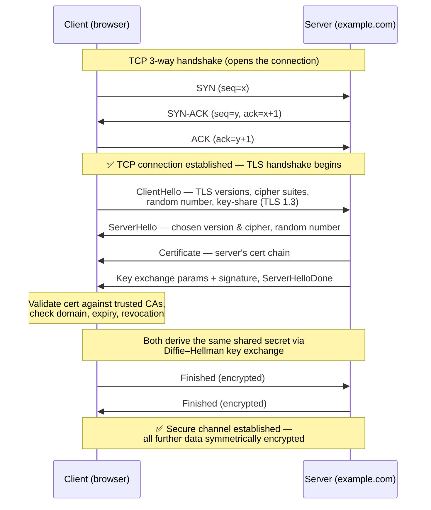

**Step one.** The client sends a **ClientHello**. This lists the TLS versions it supports, the cipher suites it can use, and a random number.

**Step two.** The server replies with a **ServerHello**. It picks the highest version both sides support and a cipher suite, and adds its own random number.

**Step three.** The server sends its **certificate chain**. The client now does the critical work: it validates that chain against its trusted CAs, confirms the certificate's domain matches the site, and checks that the cert hasn't expired or been revoked. If any of this fails, the browser shows the scary warning and refuses to continue. This one check is the entire basis of server authenticity.

**Step four is the key agreement**, and it does two things at once.

The first is agreeing on the secret. Both sides run a **Diffie–Hellman key exchange** — a method that lets two parties derive the *same* secret number by exchanging only public "key-share" values, never the secret itself. Each side combines its own private value with the other's public value and independently arrives at the identical shared secret. An eavesdropper who sees both public key-shares still cannot compute it. From that shared secret, both sides derive the symmetric **session keys** used for the rest of the conversation.

The mechanism is easiest to see with small numbers. Diffie–Hellman relies on one piece of math: given `g`, `p`, and the result of `g^x mod p`, it is easy to compute the result but practically impossible to recover the secret exponent `x` (this is the **discrete logarithm problem**). Here is the full exchange with tiny values — real TLS uses the identical steps with enormous ones.

```
Public parameters (agreed openly, visible to everyone, not secret):
    p = 23      (a prime modulus)
    g = 5       (a generator)

Client picks a PRIVATE number:  a = 6      (never sent)
Server picks a PRIVATE number:  b = 15     (never sent)

Each computes a PUBLIC key-share and sends only that across the wire:
    Client → Server:  A = g^a mod p = 5^6  mod 23 = 8
    Server → Client:  B = g^b mod p = 5^15 mod 23 = 19

Now each side raises the OTHER's public share to its OWN private number:
    Client computes:  B^a mod p = 19^6 mod 23 = 2
    Server computes:  A^b mod p = 8^15 mod 23 = 2
                                              ─────
                              Shared secret =   2      (both arrive at the same value)
```

Both sides land on `2` because each is really computing `g^(a·b) mod p` — the client via `(g^b)^a` and the server via `(g^a)^b` — and multiplication in the exponent doesn't care about order. The crucial part is what an eavesdropper has: they see `p = 23`, `g = 5`, `A = 8`, and `B = 19`, but *not* `a` or `b`. To find the shared secret they would have to recover a private exponent from a public share (solve `5^a mod 23 = 8` for `a`), and with a real 2048-bit prime — or an elliptic curve, which is what **ECDHE** uses — that computation is infeasible. So the secret is agreed *in the open* yet stays private. That shared value (`2` here, a huge number in reality) is then run through a key-derivation function to produce the actual symmetric session keys.

One more detail that matters for section 10: in modern TLS the private numbers `a` and `b` are **ephemeral** — freshly generated for each connection and thrown away afterward. That is exactly what gives *forward secrecy*: since the shared secret was never derived from the server's long-term private key, stealing that long-term key later reveals nothing about past sessions.

The second is proving *who* you agreed it with. On its own, Diffie–Hellman would happily set up a secret with an impostor. So the server *signs* its part of the exchange with the private key that matches its certificate. Because only the real server holds that private key, a valid signature ties "the entity I'm agreeing a key with" to "the entity the certificate vouches for." This is what stops a man-in-the-middle from silently sitting in the middle of the key exchange.

Finally, each side sends an encrypted **Finished** message. If both decrypt correctly, it confirms both derived the same keys, the handshake is verified, and encrypted application data starts to flow.

Here's the mental model to keep. The handshake uses *slow asymmetric* crypto exactly once — to authenticate the server and safely establish a shared secret — and everything after that uses *fast symmetric* crypto. That hybrid is the whole design, and it's why TLS is both secure and fast enough to protect the entire web.

<details>
<summary>📖 In plain English</summary>

Before any real data moves, the browser and server run a quick negotiation. They agree on which encryption to use, the server presents its certificate, and the browser checks that certificate against its list of trusted authorities to be sure it's really talking to the right site. Then both sides cleverly compute the *same* secret key without ever sending it across the wire, so an eavesdropper can't figure it out. From that point on, everything is encrypted with that shared key using fast symmetric encryption. Slow public-key crypto is used just once at the start; fast crypto does the heavy lifting after.

</details>

## 🎯 9. TLS 1.2 vs TLS 1.3: why the new one is faster and safer

TLS 1.3 is not a minor revision. It's a deliberate simplification, driven by a decade of attacks against TLS 1.2. Interviewers love the comparison because it reveals whether you understand *why* the changes were made.

The headline is **speed**. TLS 1.2 needs **two round trips** (2-RTT) to complete the handshake before any data can flow. TLS 1.3 needs just **one** (1-RTT). It pulls this off by having the client optimistically send its key-share in the very first ClientHello, so the server can compute the shared secret and finish in a single exchange.

TLS 1.3 also supports **0-RTT resumption**. A returning client can send encrypted data in its *very first* message, using a key cached from a previous session. That's near-instant reconnection. The catch is a subtle replay-attack risk, which is why 0-RTT should only be used for idempotent requests.

The second theme is **security by deletion**. TLS 1.2 supported a large menu of cipher suites, and many of them turned out to be weak or easy to misconfigure. The list of foot-guns included static RSA key exchange (which has no forward secrecy), RC4, CBC-mode constructions vulnerable to attacks like BEAST and Lucky Thirteen, and compression that enabled CRIME.

TLS 1.3 simply **removed** all of them. It requires forward-secret (ephemeral Diffie–Hellman) key exchange, allows only a handful of modern authenticated ciphers (AES-GCM, ChaCha20-Poly1305), and drops renegotiation and compression entirely. The result is a protocol that's far harder to misconfigure into an insecure state — a smaller, sharper tool with the dangerous options taken away.

The practical takeaway for a design discussion is straightforward. Prefer TLS 1.3 everywhere it's supported, keep TLS 1.2 enabled only for older clients, and disable everything below 1.2 outright. Both the performance win and the reduced attack surface point in the same direction. (That performance win is one fewer round trip — on a 100 ms mobile link, that's a very noticeable 100 ms saved on every new connection.)

<details>
<summary>📖 In plain English</summary>

TLS 1.3 is the modern version and it's better in two ways. It's faster: the older TLS 1.2 needed two back-and-forth trips before sending data, while 1.3 needs just one (and can even resume an old session with zero extra trips), which noticeably speeds up connections, especially on mobile. And it's safer because it *removed* all the old, weak, easily-misconfigured options that TLS 1.2 still carried, leaving only a few strong, modern ones. Fewer knobs means fewer ways to accidentally set things up insecurely.

</details>

## 🎯 10. Forward secrecy, cipher suites, and session resumption

Three concepts round out TLS understanding, and each is a favorite follow-up because they separate people who memorized the handshake from people who understand it.

**Forward secrecy** (or *perfect forward secrecy*, PFS) is a simple but powerful guarantee: even if an attacker records your encrypted traffic today and steals the server's private key *later*, they still can't decrypt that recorded traffic.

How does it manage that? Modern TLS derives each session's keys from **ephemeral** Diffie–Hellman values — values generated fresh for each connection and thrown away afterward. Since those keys were never derived from the long-term private key, having that private key doesn't unlock them. Contrast this with the old static-RSA key exchange, where the client encrypted the session secret directly with the server's public key. There, anyone who later got hold of the private key could decrypt every past session they had recorded. This is why TLS 1.3 made ephemeral key exchange mandatory, and why "record now, decrypt later" attacks — including the looming threat of quantum computers — are far weaker against it.

A **cipher suite** is the specific bundle of algorithms a connection uses. In TLS 1.2 the notation looks intimidating, but it decomposes cleanly. Take `TLS_ECDHE_RSA_WITH_AES_256_GCM_SHA384`: it means ECDHE for key exchange (the "E" stands for ephemeral, which gives forward secrecy), RSA for authenticating the server, AES-256-GCM for bulk encryption with built-in integrity, and SHA-384 for the handshake hash. TLS 1.3 shortened these dramatically, because key exchange and authentication are now negotiated separately — so a suite like `TLS_AES_256_GCM_SHA384` names only the bulk cipher and the hash. Being able to read a cipher suite aloud and explain each part is a small but reliable signal of depth.

**Session resumption** lets a returning client skip the full handshake. Instead of re-doing the expensive key exchange, the client presents a **session ticket** or **pre-shared key** from a previous connection, and both sides resume with the secret they already negotiated. This is a meaningful performance win at scale — Google and Facebook resume a large fraction of their connections — and TLS 1.3's 0-RTT is its most aggressive form. The trade-off, again, is that 0-RTT data can be replayed, so it must be restricted to safe, idempotent operations.

<details>
<summary>💻 Java: inspecting a TLS connection's negotiated parameters</summary>

```java
import javax.net.ssl.*;
import java.io.*;

// Connect to a host over TLS and print exactly what got negotiated.
// Great for verifying you're actually getting TLS 1.3 + a forward-secret suite.
public class TlsInspector {
    public static void main(String[] args) throws Exception {
        SSLSocketFactory f = (SSLSocketFactory) SSLSocketFactory.getDefault();
        try (SSLSocket socket = (SSLSocket) f.createSocket("example.com", 443)) {

            // Restrict to modern protocols only — never enable TLSv1/1.1.
            socket.setEnabledProtocols(new String[]{"TLSv1.3", "TLSv1.2"});
            socket.startHandshake();

            SSLSession session = socket.getSession();
            System.out.println("Protocol     : " + session.getProtocol());       // e.g. TLSv1.3
            System.out.println("Cipher suite : " + session.getCipherSuite());     // e.g. TLS_AES_256_GCM_SHA384
            System.out.println("Peer host    : " + session.getPeerHost());

            // The server's validated certificate chain:
            for (var cert : session.getPeerCertificates()) {
                System.out.println("Cert subject : " +
                    ((java.security.cert.X509Certificate) cert)
                        .getSubjectX500Principal());
            }
        }
    }
}
```

Reading the negotiated protocol and cipher back is the fastest way to confirm a deployment is actually using TLS 1.3 with a forward-secret suite rather than silently falling back to something weaker.

</details>

<details>
<summary>📖 In plain English</summary>

Forward secrecy means each connection gets its own throwaway key, so even if the server's long-term private key is stolen next year, traffic recorded today stays unreadable — the throwaway keys were never based on that stolen key. A cipher suite is just the named list of algorithms a connection settled on (one for setting up the key, one for encrypting data, one for integrity). Session resumption lets a returning visitor skip most of the setup handshake for speed, reusing a token from last time. Together these make TLS both future-proof against key theft and fast on repeat visits.

</details>

---

# Part III — HTTPS: TLS Applied to the Web

TLS is general-purpose. HTTPS is what you get when you point it at the web's HTTP protocol — and because the web is where most engineers meet these ideas, a few web-specific concerns deserve their own treatment.

## 🎯 11. What HTTPS is, and what it protects vs leaks

**HTTPS is simply HTTP running inside a TLS connection.** Nothing about HTTP itself changes — same methods, same headers, same status codes. The only difference is that the entire HTTP exchange now travels through the encrypted, authenticated channel that TLS provides, on port 443 instead of port 80.

The padlock in the address bar means the browser completed a successful TLS handshake: it verified the site's certificate and established encryption. But that is *all* the padlock claims, and it's worth being precise here. A padlock does *not* mean the site is trustworthy or safe — a phishing site can obtain a perfectly valid free certificate. The padlock means "your connection to this server is private," not "this server is honest."

What HTTPS protects is substantial. The full **URL path and query string**, all **headers** (including cookies and auth tokens), and the entire **request and response body** are encrypted. A network observer — your ISP, someone on the same café Wi-Fi, a government tap — sees none of it. This is why HTTPS defeats the classic coffee-shop attack, where someone on the same network tries to sniff your session cookie.

What still **leaks** is metadata, and this is the staff-level nuance. The **destination IP** is visible, because packets have to be routed somewhere. The **domain name** was historically visible too, in the TLS **SNI** field — this is sent in plaintext during the handshake so that a server hosting many sites knows which certificate to present. The newer **Encrypted Client Hello (ECH)** closes this gap, but it isn't universal yet. **DNS lookups** may also reveal the domain, unless you use encrypted DNS (DoH/DoT). And **traffic analysis** — the size and timing of encrypted packets — can sometimes fingerprint which page you loaded even without decrypting anything.

So the honest summary is this: HTTPS hides *what* you send and *to which path*, but not *which site* you're talking to or *how much* you're sending.

<details>
<summary>📖 In plain English</summary>

HTTPS is just regular HTTP wrapped inside a TLS-encrypted connection — same web protocol, now private. It hides the full web address path, your cookies and tokens, and the page content from anyone watching the network, which is why it's safe to log in over public Wi-Fi. The padlock only means "the connection is encrypted and you reached the real server for this domain" — not that the site itself is honest, since scam sites can get valid certificates too. What still leaks is *which* site you're visiting (from the IP and domain lookup) and roughly how much data you exchange.

</details>

## 🎯 12. HSTS, mixed content, and TLS termination

Three web-specific mechanisms come up whenever HTTPS is discussed seriously.

**HSTS (HTTP Strict Transport Security)** closes a dangerous gap. Even on an HTTPS site, the *very first* request a user makes by typing `example.com` often goes out as plain HTTP before redirecting to HTTPS. An attacker can hijack that unencrypted moment to keep the user on HTTP and intercept everything — this is an **SSL-stripping** attack, popularized by the *sslstrip* tool.

HSTS shuts this down with a single response header: `Strict-Transport-Security: max-age=31536000; includeSubDomains`. It tells the browser, in effect, "for the next year, *never* talk to me over plain HTTP — always upgrade to HTTPS before sending anything." Sites can even join a browser **preload list** so that the first-ever request is protected too. It's a one-line header that eliminates an entire attack class.

**Mixed content** is when an HTTPS page loads sub-resources (images, scripts, stylesheets) over plain HTTP. This quietly undermines the whole page: an attacker can tamper with that unencrypted script and take over the supposedly "secure" page. Browsers now block active mixed content (scripts, iframes) outright and warn on passive mixed content. The fix is simply to serve *everything* over HTTPS, which is now the default expectation for any modern site.

**TLS termination** is where the encryption ends, and it's a real architectural decision. In most production systems, TLS is *terminated* at a load balancer, reverse proxy, or CDN edge (AWS ALB, Nginx, Cloudflare) rather than at the application server itself. The edge decrypts the traffic, and from there it continues to the backend over the internal network.

This design centralizes certificate management and offloads the crypto work from app servers. But it also creates a plaintext hop inside your network — and that gap is exactly what internal **mTLS** or a service mesh is designed to close. There's also **TLS passthrough**, where encrypted traffic flows unbroken all the way to the app; you need this when the backend must see the client certificate itself.

Knowing where TLS terminates in your architecture — and what's protecting the traffic *after* that point — is a hallmark of someone who has operated real systems. It's also the perfect bridge into mTLS.

<details>
<summary>📖 In plain English</summary>

Three practical HTTPS pieces. HSTS is a header that tells browsers "always use HTTPS for my site, never plain HTTP," closing the risky gap on that first request someone types. Mixed content is when a secure page accidentally loads an image or script over insecure HTTP, which can undo the page's security — so browsers block it and you serve everything over HTTPS. TLS termination is *where* decryption happens: usually at a load balancer or CDN at the network's edge, not the app server itself, which is convenient but leaves an internal plaintext hop that mTLS is meant to protect.

</details>

---

# Part IV — mTLS: When Both Sides Must Prove Themselves

Everything so far authenticated only the *server*. The client verified it was talking to the real `example.com`, but the server had no cryptographic idea who the client was. For public websites that's fine — you identify the user afterward with a password or token. But in a world of services talking to other services, one requirement becomes essential: prove *both* identities before any data flows. That's mutual TLS.

## 🎯 13. One-way vs mutual TLS

In ordinary **one-way TLS** — the kind protecting every public website — the handshake authenticates one direction only. The server presents a certificate and proves it holds the matching private key. The client validates it and is satisfied. The client itself presents *nothing*.

So the server ends the handshake confident about its own identity, but with zero cryptographic knowledge of who connected. Identifying the actual user is deferred to the application layer, using a password, a session cookie, or a bearer token.

In **mutual TLS (mTLS)**, *both* sides present certificates and *both* validate. The server still proves its identity to the client, as before. But now the client also proves *its* identity to the server, by presenting a client certificate that the server validates against a CA it trusts. Only if both validations pass does the connection proceed.

The result is that, before a single byte of application data moves, each end has cryptographic proof of who the other is. Identity is established at the *connection* layer, rather than bolted on above it.

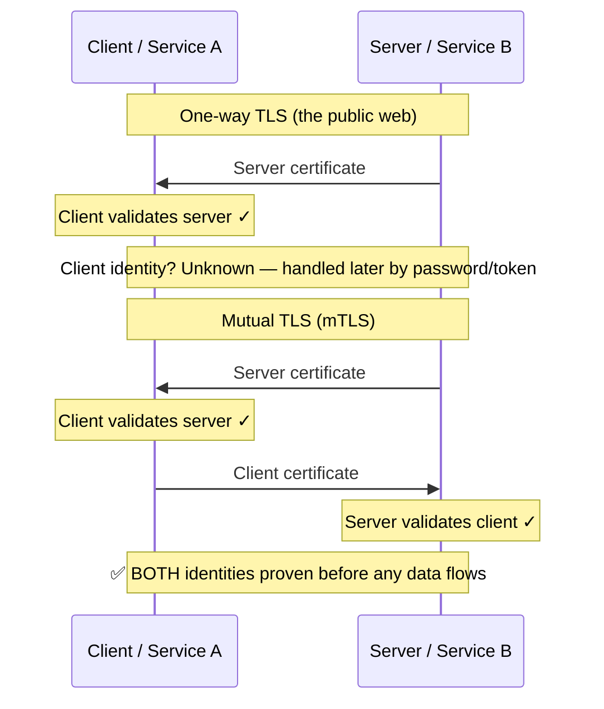

Here's the distinction to carry into an interview. One-way TLS answers a single question: "is the server who it claims to be?" mTLS answers that *and* a second one: "is the *client* who it claims to be?" And it answers that second question with a certificate and private key — not with a shared secret that could be phished, replayed, or leaked in a log.

<details>
<summary>📖 In plain English</summary>

Normal HTTPS only checks the *server's* identity — the browser confirms it reached the real bank, but the bank has no proof of who you are until you log in with a password afterward. Mutual TLS makes *both* sides show a certificate: the server proves who it is, and the client proves who *it* is, before any data is exchanged. So each end knows exactly who it's talking to right from the connection itself, with no password that could be stolen or guessed. It's mostly used between backend services rather than for human users.

</details>

## 🎯 14. How mTLS works and where it belongs

Mechanically, mTLS is just the normal TLS handshake with a few extra moves added in the middle. Walk through what changes:

1. The handshake begins exactly like one-way TLS: the server sends its certificate, and the client validates it against its trusted CAs.
2. **The new part:** the server also sends a **CertificateRequest**, explicitly asking the client to prove its identity too.
3. The client responds with *its own* certificate, plus a signature it computes with its private key. That signature proves the client actually holds the private key matching the certificate, rather than just presenting a copied certificate.
4. The server validates that client certificate against a CA it trusts — typically an **internal/private CA** the organization runs itself, not a public one — and checks it hasn't expired or been revoked.
5. Only if that validation passes does the handshake complete. Now *both* ends are cryptographically authenticated.

Why is mTLS rare on the public web but everywhere inside modern infrastructure? It comes down to key distribution. You cannot ask millions of anonymous users to install client certificates — it's an operational nightmare, which is why the web uses passwords and tokens for users instead. But *within* your own systems, where you control every participant, issuing and rotating certificates can be fully automated. There, mTLS becomes the natural way to authenticate machines.

Its home turf is service-to-service traffic, external APIs, and devices.

**Service-to-service (east-west) traffic** in microservices is the biggest use case. Here a **service mesh** like **Istio** or **Linkerd** turns on mTLS transparently. Each service gets a **sidecar proxy** (Envoy) that terminates and originates mTLS on the service's behalf. So every internal call is mutually authenticated and encrypted, without the application code changing at all. This is the practical backbone of **zero-trust networking** — the principle that the internal network is *not* inherently trusted, so every call must prove its identity regardless of where it originates. It directly closes the "plaintext hop after TLS termination" gap we flagged earlier.

**High-security external APIs** are the next case, especially in banking and payments, where a partner must present a client certificate to call the API. (The Open Banking and financial-grade API standards mandate exactly this.) Then there's **device and IoT authentication**, where each device ships with a unique certificate, and zero-trust access systems where a device certificate is one signal in the access decision.

The trade-off — and the thing a staff engineer raises unprompted — is **operational cost**. mTLS means issuing a certificate to every service, keeping them rotated (short-lived certs, often 24 hours or less in a mesh), distributing the trust anchors, and revoking compromised ones fast. That machinery is real work, whether it's a workload identity system like **SPIFFE/SPIRE** or the mesh's built-in CA. mTLS gives you strong, phishing-proof machine identity — but the cost is that you now run a certificate lifecycle at scale. And that's precisely why the keys and certificates it depends on have to be managed with extreme care, which is the subject of Part V.

<details>
<summary>💻 Java: requiring client certificates on a server (mTLS)</summary>

```java
import javax.net.ssl.*;
import java.security.KeyStore;
import java.io.FileInputStream;

// A server socket that REQUIRES clients to present a valid certificate.
// The trustStore holds the CA that signed acceptable client certs.
public class MutualTlsServer {
    public static void main(String[] args) throws Exception {

        // Server's own identity (its cert + private key)
        KeyStore keyStore = KeyStore.getInstance("PKCS12");
        keyStore.load(new FileInputStream("server.p12"), "pass".toCharArray());
        KeyManagerFactory kmf = KeyManagerFactory.getInstance("PKIX");
        kmf.init(keyStore, "pass".toCharArray());

        // Who the server TRUSTS as client-cert signers (the internal CA)
        KeyStore trustStore = KeyStore.getInstance("PKCS12");
        trustStore.load(new FileInputStream("ca-truststore.p12"), "pass".toCharArray());
        TrustManagerFactory tmf = TrustManagerFactory.getInstance("PKIX");
        tmf.init(trustStore);

        SSLContext ctx = SSLContext.getInstance("TLSv1.3");
        ctx.init(kmf.getKeyManagers(), tmf.getTrustManagers(), null);

        SSLServerSocket server = (SSLServerSocket)
            ctx.getServerSocketFactory().createServerSocket(8443);

        // THE mTLS SWITCH: reject any client that doesn't present a valid cert.
        server.setNeedClientAuth(true);   // setWantClientAuth(true) = optional instead

        System.out.println("mTLS server listening on 8443 — client cert required");
        server.accept(); // handshake now fails unless the client authenticates
    }
}
```

`setNeedClientAuth(true)` is the entire difference between one-way TLS and mTLS on the server side: with it, the handshake is rejected outright unless the client presents a certificate that chains to a trusted CA. In a service mesh, this exact logic lives in the Envoy sidecar instead of your app.

</details>

<details>
<summary>📖 In plain English</summary>

mTLS adds one step to the normal handshake: the server also *asks* the client for a certificate and checks it against a trusted authority — usually one the company runs internally. It's rare for public users because you can't hand certificates to millions of strangers, but it's perfect between backend services, where you control everything and can automate certificate issuing. Tools like Istio put a small proxy next to each service that handles all of this automatically, so every internal call is mutually verified and encrypted — the foundation of "zero trust," where nothing on the internal network is trusted by default.

</details>

---

# Part V — Secrets: Protecting the Keys to Everything

Every protocol so far rests on something that must stay hidden: a private key, a signing key, a database password, an API token. The strongest TLS in the world is worthless if the server's private key sits in a public GitHub repo. Secrets management is the discipline of keeping those crown jewels safe. It's unglamorous work, and it's the cause of a huge share of real-world breaches.

## 🎯 15. What a "secret" is and how they leak

A **secret** is any piece of data whose disclosure breaks security. This includes TLS private keys, JWT signing keys, database and message-broker credentials, third-party API keys (Stripe, AWS), encryption keys, OAuth client secrets, and SSH keys. The defining trait is asymmetry of consequence: a secret is cheap to copy but catastrophic to leak. One exposed database password can hand an attacker your entire dataset.

Understanding how secrets leak is more useful than knowing any single tool, because the failure modes repeat across every organization.

The classic one is **hardcoding secrets in source code** — an API key committed to Git. It lives forever in the repo history even after you "delete" it, and automated bots scan public GitHub for exactly this within minutes of a push. Related is **secrets in configuration files or Docker images**, baked into a layer that anyone who pulls the image can extract.

Another is **secrets in environment variables**. This is better than hardcoding, but it still leaks through crash dumps, logs, `/proc`, and child processes that inherit the environment. Then there's **secrets in logs** — the quiet killer. A well-meaning `log.info("request: " + request)` writes an auth token into a log file, which is then shipped to a third-party aggregator and retained for a year. And finally, **overly broad access**, where every engineer and every service can read every secret, so one compromised laptop exposes all of them.

The unifying lesson is that secrets *sprawl*. Left unmanaged, they multiply across code, config, images, CI pipelines, wikis, and Slack messages — and each copy is an independent chance to leak. The goal of secrets management is to have **one authoritative, access-controlled, audited source** for each secret, fetched at runtime and never persisted where it doesn't belong. Everything in the next section is machinery to achieve that.

<details>
<summary>📖 In plain English</summary>

A secret is any value that breaks security if it gets out — private keys, database passwords, API tokens. They usually leak in boring, preventable ways: someone commits an API key to Git (where it lives in history forever and bots find it in minutes), bakes a password into a Docker image, prints a token into the logs, or gives every service access to every secret. The core problem is that secrets *sprawl* — copies pile up in code, config, chat, and CI — and each copy is a chance to leak. Good practice is one locked, audited source of truth per secret, fetched only at runtime.

</details>

## 🎯 16. Vaults, KMS, envelope encryption, and rotation

The modern answer to secret sprawl is a dedicated **secrets manager** — **HashiCorp Vault**, **AWS Secrets Manager**, **Google Secret Manager**, or **Azure Key Vault**. Instead of storing secrets in code or config, the application authenticates to the secrets manager at startup and fetches what it needs into memory. Crucially, it authenticates using a machine identity — ideally an mTLS cert or a cloud IAM role, *not* another password.

The payoff is that the secret exists in exactly one durable place. Every access is logged for audit, and access is scoped so a given service can read only the secrets it genuinely needs. This flips the model from "secrets scattered everywhere" to "secrets centralized, brokered, and observable."

Two ideas make this robust. The first is **envelope encryption**, the standard way to protect data-at-rest at scale.

Before the mechanics, here's the problem it solves. You have terabytes of data to encrypt and one precious master key. If you encrypt everything directly with that master key, you hit two problems. Rotating the key (changing it periodically, which you should) means re-encrypting all those terabytes — painfully slow. And the master key has to be handled constantly, giving it more chances to leak. Envelope encryption sidesteps both problems with one layer of indirection: use a *throwaway* key for the bulk data, and reserve the master key only for protecting that throwaway key.

Concretely, it uses two keys with two clear jobs. A **data encryption key (DEK)** is the throwaway key that actually encrypts your data. A **key encryption key (KEK)** is the master key that only ever encrypts DEKs, and it lives inside a hardware-backed **KMS** (Key Management Service) — often an **HSM**, a tamper-resistant hardware module that never lets the key leave.

Here is the full cycle. To **encrypt** a piece of data:

1. Generate a fresh DEK for this data.
2. Encrypt the data with that DEK.
3. Send the DEK to the KMS and ask it to encrypt the DEK with the KEK. The KMS hands back the encrypted DEK.
4. Store the encrypted data alongside its encrypted DEK, and discard the plaintext DEK from memory.

To **read** it back:

1. Send the encrypted DEK to the KMS and ask it to decrypt it with the KEK.
2. Get back the plaintext DEK, and use it locally to decrypt the data.

This buys you three concrete things. First, the master KEK never leaves the KMS — your application only ever handles DEKs, so the most valuable key is never exposed. Second, you can rotate the KEK without re-encrypting terabytes of data; you only re-encrypt the small DEKs, which is fast. Third, the blast radius of any single leaked DEK is limited to just the one piece of data it wrapped, not your entire dataset. This is exactly how services like AWS S3, Google Cloud Storage, and database-level encryption protect data at rest.

The second idea is **rotation**. Secrets should change regularly, and they *must* change immediately after any suspected exposure, so that a leaked credential has only a short useful life. Static, never-rotated credentials are a standing liability — a password leaked two years ago that still works is a breach waiting to happen.

Mature systems favor **short-lived, dynamically generated** credentials. Vault, for example, can mint a database username/password on demand that automatically expires in an hour, so there's no long-lived secret to steal in the first place. This is the secrets analogue of TLS forward secrecy and short-lived mTLS certs: the less time a credential is valid, the less a leak is worth. The staff-level framing is this — don't just guard secrets, *minimize their lifetime and blast radius* so that inevitable leaks are survivable.

<details>
<summary>💻 Java: fetching a secret at runtime instead of hardcoding it</summary>

```java
// ❌ NEVER do this — the key is now in source control forever.
// String stripeKey = "sk_live_51H8xY2abcdef...";

// ✅ Fetch from a secrets manager at runtime, authenticated by the
//    machine's IAM role — no long-lived secret in code, config, or env.
import software.amazon.awssdk.services.secretsmanager.*;
import software.amazon.awssdk.services.secretsmanager.model.*;

public class SecretFetcher {
    private static String cached;   // hold in memory only, never write to disk

    static synchronized String stripeKey() {
        if (cached != null) return cached;
        try (SecretsManagerClient client = SecretsManagerClient.create()) {
            GetSecretValueResponse resp = client.getSecretValue(
                GetSecretValueRequest.builder()
                    .secretId("prod/payments/stripe-key")
                    .build());
            cached = resp.secretString();   // fetched once, kept in memory
            return cached;
        }
    }
    // Rotation: the secrets manager rotates the underlying value on a schedule;
    // on an auth failure, drop the cache and re-fetch the new value.
}
```

The shift is architectural, not cosmetic: the secret lives in exactly one audited, access-controlled place; the app proves its identity to fetch it; and it's held only in memory. There's nothing to accidentally commit, bake into an image, or leak through config.

</details>

<details>
<summary>📖 In plain English</summary>

Instead of scattering passwords through code and config, you keep them in one locked service — Vault, AWS Secrets Manager — and apps fetch what they need at startup, proving their identity with a cloud role rather than another password. Two tricks make this strong: envelope encryption, where a master key (kept in tamper-proof hardware) only ever encrypts *other* keys, so you can rotate it without touching your actual data; and rotation, where secrets change on a schedule and short-lived credentials expire in an hour, so a stolen one is worthless fast. The theme is the same as forward secrecy: make leaks survivable by keeping secrets short-lived and narrowly scoped.

</details>

---

# Part VI — Identity: OAuth2, JWT, and OIDC

We now cross a conceptual boundary. Everything before this secured the *connection* — the pipe between two machines. But a secure pipe tells you nothing about *which user* is on the other end or *what they're allowed to do*. That's the job of the identity layer, and it's where OAuth2, JWT, and OIDC live. The single most important sentence in this whole part: **transport security and identity are different problems, and you need both.** A perfectly encrypted request from a user with no right to the data is still a breach.

## 🎯 17. The problem OAuth2 was invented to solve

To understand OAuth2, you have to feel the specific problem it kills. Imagine a photo-printing app that needs to access your Google Photos. Before OAuth, the only way was **credential sharing**: you'd type your Google *password* into the printing app, and it would log in as you. This is catastrophic on every axis. The app now knows your actual password, so it can do *anything* your account can — read email, delete files, change your password — not just see photos. There's no way to grant *limited* access. There's no way to revoke the app without changing your password, which breaks every other app you shared it with. And your password is now sitting in some third party's database waiting to be breached. This is sometimes called the "password anti-pattern," and it was genuinely how early mashup apps worked.

**OAuth 2.0 is an authorization framework that solves exactly this: it lets a user grant a third-party application limited access to their resources on another service, without ever sharing their password.** Instead of your password, the app receives a scoped, revocable **access token** that says "this app may read this user's photos" — and nothing more. The printing app can view your photos; it cannot read your email, cannot delete anything, and you can revoke it any time from your Google account settings without touching your password or affecting other apps.

The crucial precision — and the number-one thing interviewers check — is that **OAuth2 is about *authorization* (what an app is allowed to do), not *authentication* (proving who you are).** OAuth2 was designed to answer "may this app access this resource," not "who is this user." People constantly misuse plain OAuth2 as a login mechanism, which is subtly insecure, and that gap is precisely why OIDC was later layered on top. Hold that thought — we'll pay it off in section 22.

<details>
<summary>📖 In plain English</summary>

Before OAuth, if an app wanted your Google Photos, you had to give it your Google password — which meant it could do *everything*, you couldn't limit it, and you couldn't take access back without changing your password. OAuth fixed this: instead of your password, the app gets a limited "access token" that says "may view photos only." You can revoke it anytime, it never sees your password, and it can't touch anything else. The key point: OAuth decides what an app is *allowed to do*, not who you *are* — that "who are you" part is a different job (OIDC), and confusing the two is the classic mistake.

</details>

## 🎯 18. OAuth2 roles, tokens, and the Authorization Code flow

Before any flow makes sense, you need the cast of characters. OAuth2 has exactly four **roles**, and once you can name them, every diagram becomes readable. Let's keep using the same concrete example throughout: a photo-printing app that wants to reach your Google Photos.

The four roles are:

- **Resource Owner** — this is *you*, the human who owns the data. You're the one who gets to say yes or no.
- **Client** — the third-party app that wants access. In our example, the photo-printing app.
- **Authorization Server** — the system that logs you in and hands out tokens. For Google Photos, this is Google's account/OAuth service.
- **Resource Server** — the API that actually holds your data and answers requests. Here, the Google Photos API.

Here's how those four relate to each other:

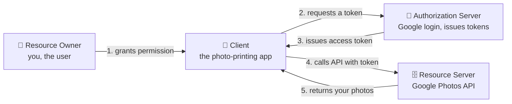

Two kinds of **token** travel through this system, and it's worth separating them early:

- An **access token** is the short-lived key the client presents to the resource server on *every* API call. Think minutes to an hour. It's meant to be used constantly and to expire quickly.
- A **refresh token** is a longer-lived credential (days or weeks) with one narrow job: getting a fresh access token when the old one expires, *without* making you log in again.

Why two tokens instead of one long-lived token? Because a short access-token life limits the damage if it's stolen, while the refresh token — which is far more powerful — stays tucked away and is used rarely. We'll come back to exactly this trade-off in section 23.

The most important flow — the one you should be able to draw from memory — is the **Authorization Code flow**. It's used by server-side web apps, and (with PKCE) by mobile and single-page apps too. Here's the whole exchange:

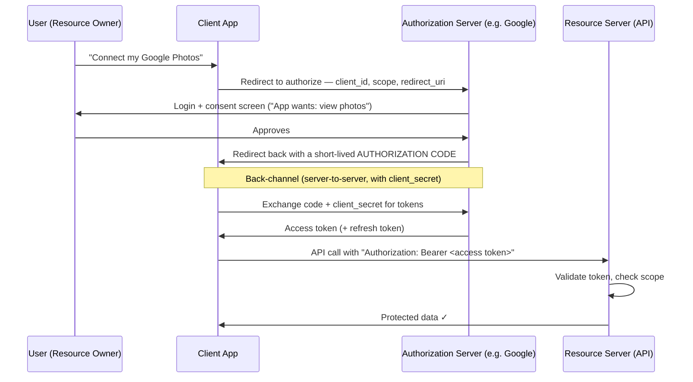

Reading that diagram as a story, here is the whole flow step by step, using the photo-printing app as the example:

1. You click "Connect my Google Photos" in the printing app (the client).
2. The app redirects your browser to Google (the authorization server), passing its `client_id`, the `scope` it wants (view photos), and a `redirect_uri` for Google to send you back to.
3. Google shows you a login and consent screen: "This app wants to view your photos." You approve.
4. Google redirects your browser back to the app, carrying a short-lived **authorization code** — not a token yet.
5. Behind the scenes, the app's server sends that code plus its secret `client_secret` directly to Google, over a server-to-server connection. Google checks both and returns the real **access token** (and often a refresh token).
6. The app now calls the Google Photos API (the resource server), attaching the token as an `Authorization: Bearer <token>` header. The API validates the token, checks its scope, and returns your photos.

The subtle genius is that step 4 and step 5 are split — the **two-step exchange**. The authorization server first hands the client a short-lived **authorization code** through the browser redirect. The client then exchanges that code for the actual tokens over a direct, server-to-server **back channel**, using its `client_secret`.

Why the indirection? Because the browser redirect (the **front channel**) is visible — it passes through the user's browser, address bar, and history — so you never want the real token there. The code, by contrast, is useless on its own. It can only be redeemed by a client that *also* proves its identity with the secret over a private channel. This separation — code in the visible front channel, token in the private back channel — is the heart of the flow's security. Explaining *why* it exists is what distinguishes understanding from memorization.

Once the client has the access token, it simply includes it on every API request as `Authorization: Bearer <token>`. The resource server validates the token and checks its **scopes** — the specific permissions granted, like `photos.read` — before returning data. Scopes are how "limited access" is actually enforced: a token scoped to read photos will be rejected if the app tries to delete an album.

<details>
<summary>📖 In plain English</summary>

OAuth has four players: you (the owner of the data), the app that wants access, the API holding your data, and the authorization server that logs you in and hands out tokens. The main flow works like this: the app sends you to Google to log in and approve; Google sends the app back a short-lived *code* through your browser; the app then quietly swaps that code — plus its own secret — for a real access token over a private server-to-server channel. The code travels through the visible browser, but the actual token never does, which is what keeps it safe. The app then attaches that token to every API call.

</details>

## 🎯 19. Grant types and PKCE: choosing the right flow

OAuth2 isn't one flow but a family of **grant types**. A grant type is simply *the recipe a client follows to obtain a token*, and different kinds of clients need different recipes. A server you control can safely store a secret; code running on a phone or in a browser cannot; a background job has no human to click "approve" at all. Picking the right grant for the situation — and knowing which recipes are now discouraged — is a reliable seniority signal.

Let's walk through them one at a time.

**Authorization Code** grant — the default. This is the flow from section 18. Use it for any app that has a real user present *and* can keep a secret, which in practice means a traditional server-side web app. It's the most secure option because the actual token is fetched over the private back channel.

**Authorization Code + PKCE** — the modern default for public clients. A "public" client is one that *cannot* keep a secret: a mobile app or a single-page JavaScript app. Their code runs on the user's own device, so any `client_secret` baked into the app could be extracted by anyone who inspects it. PKCE (explained just below) replaces that missing secret with a per-request proof.

**Client Credentials** — for machine-to-machine access with no user at all. When a backend service calls another service, there's nobody to log in. The calling service authenticates as *itself*, using its own client ID and secret, and receives a token that represents the service rather than a person. This is the OAuth grant you reach for inside microservices.

Two older grants are now **discouraged**, and knowing *why* matters:

- The **Implicit** grant returned the access token directly in the browser URL, skipping the back-channel code exchange. It's deprecated because a token sitting in the URL leaks through browser history, server logs, and referrer headers.
- The **Resource Owner Password Credentials** grant had the app collect the user's actual username and password directly. It's discouraged because it resurrects the exact password-sharing problem OAuth was invented to kill (section 17).

Here's a decision tree that captures the whole choice:

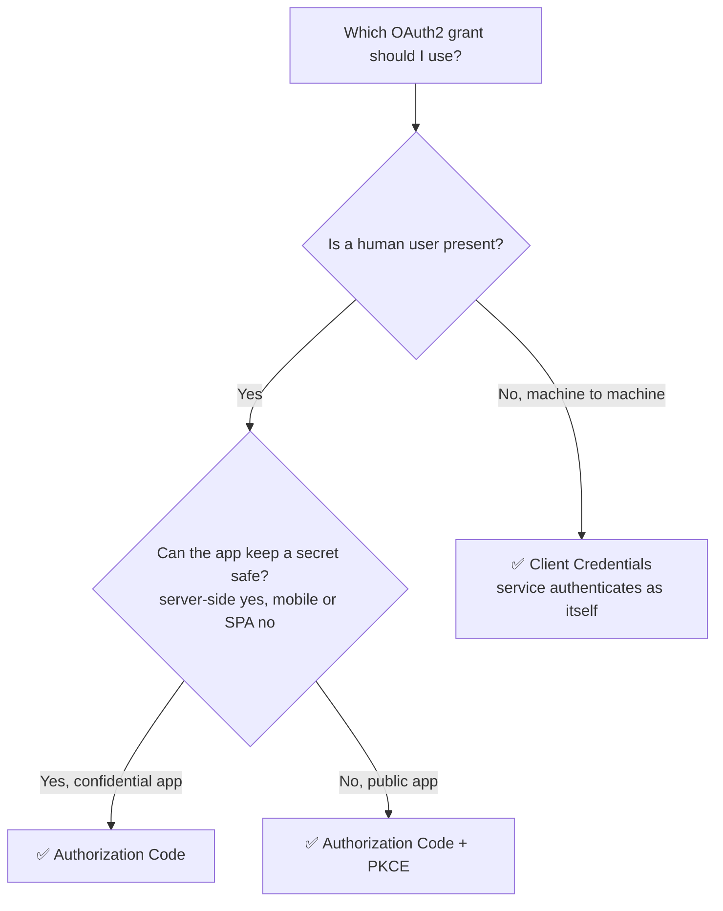

Now PKCE itself. **PKCE** (Proof Key for Code Exchange, pronounced "pixy") deserves its own explanation, because it's now recommended for *all* Authorization Code flows, not just public ones. It closes an **authorization-code interception** attack. On a mobile device, a malicious app can sometimes grab the redirect that carries the authorization code and try to redeem it before the real app does.

PKCE blocks this with a simple handshake. Before starting, the client invents a random secret called the **code verifier**. It sends only a *hash* of that secret — the **code challenge** — with the initial request, keeping the verifier itself hidden. Later, when it exchanges the code for a token, it presents the original verifier. The authorization server hashes that verifier and checks it matches the challenge it saw at the start. An attacker who steals the code still can't redeem it, because they never saw the verifier. Here's the sequence:

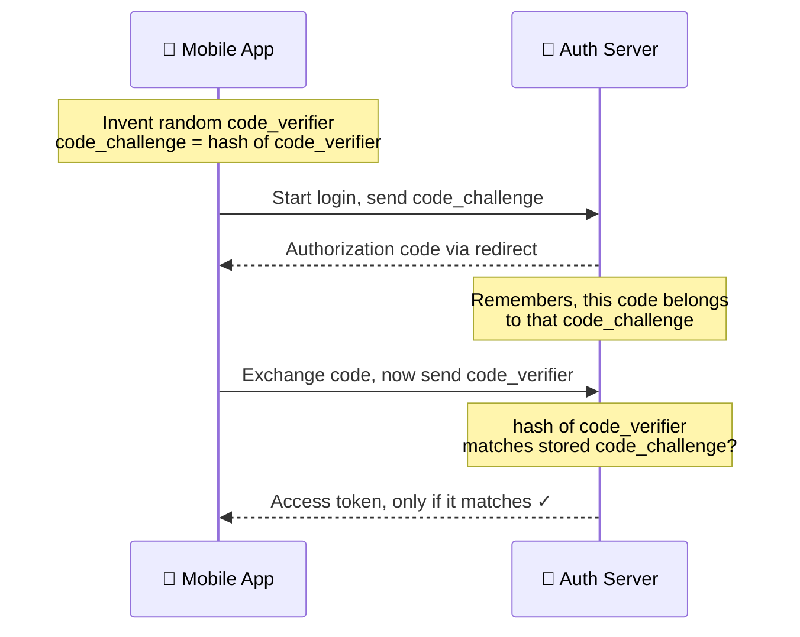

The elegance is that PKCE is a per-request, dynamically generated proof binding the code to the exact client that started the flow — with no pre-shared `client_secret` needed at all.

The decision rule to state cleanly: **confidential server-side app → Authorization Code; mobile or SPA → Authorization Code + PKCE; service-to-service → Client Credentials; never Implicit or Password grant in new systems.**

<details>
<summary>📖 In plain English</summary>

OAuth has several flows for different situations. The standard Authorization Code flow is for normal web apps. Mobile apps and browser apps can't safely hold a secret, so they add PKCE — the app makes up a random value, sends only its fingerprint up front, then reveals the original when collecting the token, proving it's the same app that started. That blocks anyone who steals the code midway. Service-to-service calls with no human use the Client Credentials flow, where the service authenticates as itself. The two old flows (Implicit and Password) are discouraged now — one exposes tokens in the URL, the other brings back password sharing.

</details>

## 🎯 20. JWT: anatomy of a token

So far we've talked about "tokens" abstractly — the access token the app carries around. But a token has to be some actual string of characters in a defined shape, and the dominant format is the **JWT** (JSON Web Token, pronounced "jot"). This section opens one up completely: what makes it special, how it's issued and used, what's inside each of its three parts, why the contents are readable by anyone, and the handful of claims that quietly solve the hardest problems in real authentication systems.

### 20.1 Why JWT exists: the trouble with server-side sessions

Before a single line of JWT makes sense, it helps to know the problem JWTs were built to replace. HTTP is **stateless**: the server treats every request as if it had never seen you before. So after you log in once, the very next request — opening your cart, then your orders, then your profile — arrives with no memory that the login ever happened. Something has to carry your identity forward across those independent requests, or you'd be asked to log in again on every click.

For years the answer was the **server-side session**. On login, the server creates a session record, stores it in memory or a shared store, and hands the browser a random **session ID** in a cookie; every later request sends that ID and the server looks you up to remember who you are. It works well, and for many applications it still does. But three pressures show up as a system grows. The first is **memory**: every logged-in user is a stored session, so half a million active users means half a million records the server must hold and keep track of. The second is **multiple servers**: if your session lives on Server A but the load balancer routes your next request to Server B, Server B has no record of you — so teams bolt on *sticky sessions* or a shared **Redis** store to keep every server in sync. The third is **scaling**: each new server added under load needs access to that same session data, and coordinating the shared state becomes the very thing you're fighting as traffic climbs.

A JWT removes the shared record entirely. Instead of storing your session server-side and giving you a meaningless ID to look up, the server hands you a **signed token that already contains your identity and permissions**, and any service can verify it on its own. JWT wasn't created because sessions were bad — it was created because modern distributed systems (REST APIs, microservices, mobile and single-page apps behind load balancers) needed authentication that doesn't lean on server-side session storage. That shift is what the rest of this section unpacks. (Section 23 returns to the sessions-versus-tokens trade-off in full, including what statelessness costs you when you need to revoke a token.)

### 20.2 The core idea: a self-contained, stateless token

Hold onto the one idea that makes JWTs special: **a JWT carries its own proof inside it.** When a service receives one, it can confirm the token is genuine using just a key it already holds. It does *not* have to phone back to the login server, and it does *not* look anything up in a database. Everything it needs — who the user is, what they're allowed to do, when the token expires — is written into the token itself and protected from tampering.

This is why a JWT is called **self-contained**, and why the authentication style built on it is called **stateless**: the server keeps no per-user session record in memory. Contrast that with the older session model, where the server stores your login server-side and hands you only a meaningless session ID to look up on every request (covered in section 23). A JWT flips that around — the token *is* the record. That single shift is the entire reason JWTs became the default for REST APIs, microservices, and mobile and single-page apps, where a shared server-side session store is exactly the thing you want to avoid.

More precisely: a JWT is a compact, digitally signed token that carries a set of **claims** — plain statements about the user and the token itself, like "the user is user-123" and "this expires at 3:45pm" — that any party with the right key can verify without calling back to the issuer.

### 20.3 How a JWT is issued and used

Before dissecting the parts, it helps to see the whole lifecycle, because the parts exist to serve it. Here is the simplest direct-login case: a user signs in with a username and password, gets a JWT, and then uses it on every later request.

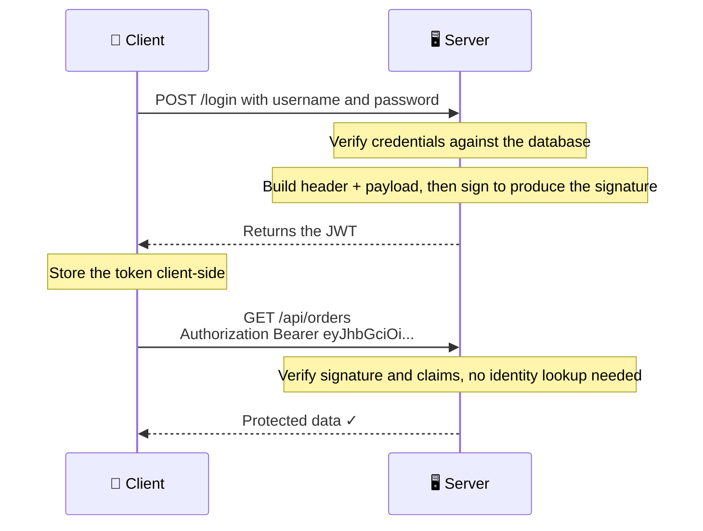

Two details in that flow matter. First, after login the client attaches the token to every protected request in the HTTP header `Authorization: Bearer <token>`. The word **Bearer** literally means "the party presenting this token is requesting access" — the server strips the `Bearer ` prefix and validates what remains. Second, notice the server does no identity lookup on the second request. It trusts the verified claims in the token. That is statelessness in action.

### 20.4 The three parts at a glance

A JWT is three Base64URL-encoded parts joined by dots: `header.payload.signature`. When you see a long string starting with `eyJ`, that's a JWT — `eyJ` is just what `{"` (the start of a JSON object) looks like after Base64URL encoding.

```
eyJhbGciOiJSUzI1NiIsInR5cCI6IkpXVCJ9      ← Header
.eyJzdWIiOiIxMjMiLCJuYW1lIjoiQWxpY2Ui...  ← Payload (claims)
.SflKxwRJSMeKKF2QT4fwpMeJf36POk6yJV...     ← Signature
```

Each dot-separated part has a distinct job:

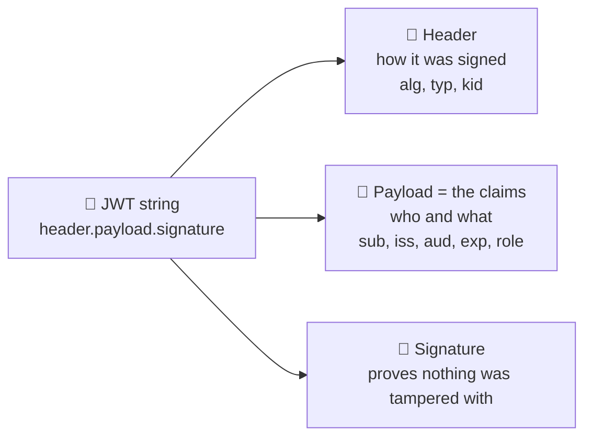

The header is the cover page describing how the token was signed, the payload is the actual content, and the signature is the tamper-proof seal over the first two. We'll take them one at a time.

### 20.5 Part 1 — The header

The **header** is metadata *about the token*. It tells the verifier how to check the token before reading anything else. A typical header:

```json
{
  "alg": "RS256",
  "typ": "JWT",
  "kid": "key-v3"
}
```

Its fields:

- `alg` — the **algorithm** used to sign the token, for example `HS256` (HMAC with SHA-256) or `RS256` (RSA with SHA-256). This tells the verifier which signing scheme was used.
- `typ` — the **type**, almost always `JWT`. It simply declares "this is a JSON Web Token."
- `kid` — the **key ID** (optional but important at scale). When a server signs with more than one key, `kid` names *which* key signed this token, so the verifier can pick the matching one. This is what makes key rotation possible without breaking existing tokens — more on that below.

### 20.6 Part 2 — The payload and its claims

The **payload** is the heart of the token. Everything it contains is a **claim** — a single statement about the user or the token. Claims come in two kinds: **registered claims**, which have short, reserved names defined by the standard, and **custom claims**, which you add for your own application (`role`, `tenant_id`, `email`, `userId`, `plan`, and so on).

The registered claims are worth memorizing, because validation and security depend on them:

| Claim | Full name | What it means |
|-------|-----------|---------------|
| `sub` | Subject | Who the token is about — usually the user ID |
| `iss` | Issuer | Who minted the token (the authorization server) |
| `aud` | Audience | Which service or app the token is *for* |
| `exp` | Expiration | The time after which the token is invalid |
| `iat` | Issued At | When the token was created |
| `nbf` | Not Before | The earliest time the token may be used |
| `jti` | JWT ID | A unique identifier for this specific token |

Let's make this concrete. Alice logs into a shopping site, and its authorization server hands her app a JWT. Decode the first two parts and you get plain, readable JSON:

```json
// Header
{ "alg": "RS256", "typ": "JWT" }

// Payload (the claims)
{
  "sub": "user-42",
  "iss": "https://auth.shopmart.com",
  "aud": "orders-api",
  "role": "customer",
  "iat": 1740470400,   // issued at 3:00pm
  "exp": 1740471300    // expires at 3:15pm
}
```

Read out loud, this token says: *"The authorization server at auth.shopmart.com (`iss`) confirms that user-42 (`sub`), who is a customer (`role`), may call the orders-api (`aud`). This was issued at 3:00pm (`iat`) and stops working at 3:15pm (`exp`)."*

This is also where the two halves of access control sit side by side in one token. The `sub` claim answers **authentication** — *who* the user is (user-42). Claims like `role` drive **authorization** — *what* that user is permitted to do (a customer, not an admin). Authentication verifies identity; authorization decides permissions, and they are genuinely different questions. A JWT carries both answers at once, which is precisely why a downstream service can identify the caller *and* enforce their permissions from the token alone, without a callback to the login server.

Because the payload is plainly readable (we'll see exactly why in a moment), there is one hard rule: **never put secrets in the payload.** No passwords, OTPs, credit-card numbers, API keys, or sensitive personal data. Anyone holding the token can read every claim.

### 20.7 Part 3 — The signature

The **signature** is the most important part, and the one that makes a JWT trustworthy. It proves two things at once: **integrity** (nobody altered the header or payload) and **authenticity** (a party holding the signing key really issued it).

Here is how it's produced. The server takes the encoded header and payload, joins them with a dot, and runs them plus a secret through the signing algorithm:

```
signature = HMAC_SHA256(
    base64url(header) + "." + base64url(payload),
    secret_key
)
```

Three properties follow from this, and they're the whole point:

- It is a **one-way** computation. You cannot run the signature backwards to recover the `secret_key`. The signature reveals nothing about the key.
- It **depends on every byte** of the header and payload. Change a single character — flip `"role": "customer"` to `"role": "admin"` — and the signature no longer matches what the server would compute.
- Only a party holding the key can produce a *valid* signature. An attacker can read and even edit the payload, but without the key they cannot forge a matching signature, so the edit is detected instantly at verification.

This is why **the secret key is the crown jewel.** For `HS256` it's a shared secret; for `RS256` it's the issuer's private key. It must never be committed to a repository, logged, or shared. Anyone who obtains it can mint valid tokens and impersonate any user.

If it helps to picture the whole idea at once: a JWT behaves like an **airline boarding pass**. The passenger name, flight, and seat are printed in plain sight — anyone holding the pass can read them, exactly as anyone can decode a JWT's claims. But only the airline can issue a genuine pass, and if a passenger alters the seat number with a pen, gate staff catch it instantly because it no longer matches what the airline issued. The signature plays that role for a JWT: the claims are open to read, only the key-holder can produce a valid one, and any edit is detected at verification. Readable, yet unforgeable.

A small but common point of confusion: the signature *is* Base64URL-encoded, just like the other two parts — but decoding it does not yield JSON. The signing algorithm outputs raw binary bytes, and Base64URL is used only to make those bytes safe to place in a URL or HTTP header. So decoding the header or payload gives you readable JSON; decoding the signature gives you meaningless bytes.

#### HS256 vs RS256: who can sign, who can verify

Signing comes in two families, and the choice matters. **HS256** (HMAC with a shared secret) is **symmetric**: the same secret both signs and verifies. That only suits cases where the issuer and verifier are the same party or fully trust each other — and if that shared secret leaks anywhere, anyone can forge tokens. **RS256** (RSA signature) is **asymmetric**: the authorization server signs with a *private* key, and every resource server verifies with the matching *public* key. Verifiers can therefore check tokens without ever holding the ability to create one.

In a microservices world with many independent verifiers, **RS256 is almost always the right choice**, because you never distribute a signing-capable secret to services that only need to verify. One party can sign; everyone else can only check:

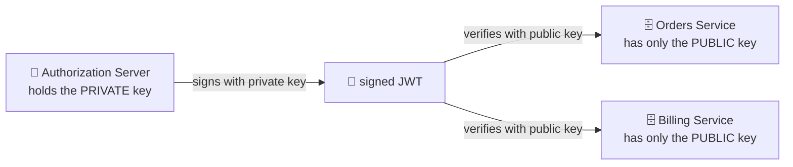

Because the services hold only the public key, a leak of any one of them still can't forge tokens — they physically lack the signing key. This is the same private-signs / public-verifies logic from section 4, now applied to tokens.

### 20.8 Encoded, not encrypted

The single most important thing to understand about a JWT — and a classic interview trap — is that **the header and payload are encoded, not encrypted.** Base64URL is trivially reversible. Anyone can paste a JWT into a decoder and read every claim. The signature does *not* hide the contents; it only guarantees they haven't been *altered*.

These two operations are often confused, so it's worth pinning down the difference:

| Encoding (what JWT uses) | Encryption (what JWT does *not* use by default) |
|--------------------------|-------------------------------------------------|
| Converts data into another format | Hides data using a secret key |
| Easily reversible by anyone | Only holders of the key can read it |
| No secret required | A secret or key is required |
| Applied to the header and payload | Not applied to a standard signed JWT |

So why did the standard choose signing over encryption? Because a standard JWT (technically a **JWS**, JSON Web Signature) is designed to provide **integrity, authenticity, and stateless verification — not confidentiality.** The goal is that any service can carry and verify claims without the server storing session state. Encrypting every token would add CPU cost, make tokens larger, and prevent intermediaries and services from inspecting non-sensitive claims — all for a property most authentication scenarios don't need.

When you genuinely *do* need the contents hidden — say the claims themselves are sensitive — the answer is **JWE** (JSON Web Encryption), a separate, encrypted token format. Only the holder of the decryption key can read a JWE's contents. It's more complex and far less common than signed JWTs, and you reach for it only when confidentiality of the claims is a real requirement.

### 20.9 Claims that quietly solve big problems

Most developers use `sub` and `exp` and stop there. A few standard claims solve real production problems and are worth knowing by name:

- **`jti` (JWT ID) — token-level control.** A unique ID per token. Because one user can hold many tokens at once (laptop, phone, tablet), `jti` lets you act on a *single* token: if a device is stolen, you add just that token's `jti` to a denylist and revoke it alone, leaving every other session working. It brings selective, per-device logout to an otherwise stateless system.
- **`aud` (Audience) — right place only.** Names who the token is for. A verifier that checks `aud` will reject a token minted for the mobile app if it's presented to the admin API. Skipping this check is how a token meant for one service quietly becomes valid everywhere.
- **`nbf` (Not Before) — scheduled activation.** The token is rejected until this time arrives. You can issue a token on Friday that only becomes valid Monday morning, or activate a subscription upgrade exactly at midnight — with no cron job, no manual switch, and no per-request business logic.
- **`kid` (Key ID, in the header) — painless key rotation.** Names which signing key was used. When you rotate keys, tokens signed with the old key keep working (the verifier looks up the old key by its `kid`) while new tokens use the new key. Rotation happens with zero forced logouts and no downtime.

There's also a performance angle. Because claims are *trusted* after signature verification, you can read stable facts like `role` or `plan` straight from the token instead of querying the database on every request. The nuance: only do this for values that rarely change. Fast-changing data — account balances, live permissions, feature flags — should still be validated against the source of truth. The goal is to eliminate *pointless* lookups, not all of them.

### 20.10 Common mistakes to avoid

The same handful of JWT mistakes appear over and over:

1. **Thinking Base64 means encryption.** It doesn't. Anyone can decode and read the payload.
2. **Putting confidential data in the payload.** Never store passwords, secrets, or sensitive PII in a JWT.
3. **Issuing tokens with no expiry.** Every token should have an `exp`; a token that never expires is a permanent liability if leaked.
4. **Using a weak signing secret.** A short, guessable `HS256` secret can be brute-forced offline. Use long, random secrets (or RS256 keys).
5. **Trusting claims without verifying the signature first.** Always verify the signature before believing a single claim in the payload.

<details>
<summary>💻 Java: creating and inspecting a JWT (jjwt library)</summary>

```java
import io.jsonwebtoken.*;
import java.security.KeyPair;
import java.security.KeyPairGenerator;
import java.util.Date;
import java.util.UUID;

public class JwtDemo {
    public static void main(String[] args) throws Exception {
        // RS256: sign with PRIVATE key, verify with PUBLIC key
        KeyPair kp = KeyPairGenerator.getInstance("RSA").genKeyPair();
        long now = System.currentTimeMillis();

        // --- Authorization server MINTS a token ---
        String jwt = Jwts.builder()
            .setHeaderParam("kid", "key-v3")               // kid: which key signed this
            .setSubject("user-123")                        // sub: who it's about
            .setIssuer("https://auth.example.com")         // iss: who minted it
            .setAudience("orders-api")                     // aud: who it's for
            .setId(UUID.randomUUID().toString())           // jti: unique token id
            .claim("role", "customer")                     // custom claim
            .setNotBefore(new Date(now))                   // nbf: not valid before now
            .setIssuedAt(new Date(now))                    // iat
            .setExpiration(new Date(now + 900_000))        // exp: 15 minutes
            .signWith(kp.getPrivate(), SignatureAlgorithm.RS256)
            .compact();

        System.out.println("JWT: " + jwt);   // header.payload.signature

        // --- Resource server VERIFIES with the PUBLIC key ---
        Jws<Claims> parsed = Jwts.parserBuilder()
            .setSigningKey(kp.getPublic())
            .requireIssuer("https://auth.example.com")   // reject wrong issuer
            .requireAudience("orders-api")               // reject wrong audience
            .build()
            .parseClaimsJws(jwt);   // throws if signature/exp/nbf/iss/aud fail

        System.out.println("Verified subject: " + parsed.getBody().getSubject());
        System.out.println("Role: " + parsed.getBody().get("role"));
        // Tamper with any character of the payload -> parseClaimsJws throws.
    }
}
```

Note the payload is readable by anyone (`.getBody()` needs no secret to *decode* — only the signature check needs the key). The library enforces expiry, not-before, issuer, and audience for you; skipping any of those checks is where real vulnerabilities creep in.

</details>

<details>
<summary>📖 In plain English</summary>

A JWT is a small signed token with three parts: a header (which algorithm and key signed it), a payload (facts about the user — their ID, role, expiry — called claims), and a signature that proves nobody tampered with it. Its power is being self-contained: a service verifies it with just a key, no database lookup, so it scales across many services. The catch people miss: the payload is only *encoded*, not encrypted — anyone can decode and read it — so never put secrets inside. A few extra claims earn their keep: `jti` (a unique token ID, so you can revoke one stolen device), `aud` (who the token is for), `nbf` (when it starts working), and `kid` (which key signed it, so keys can be rotated safely). For microservices, sign with a private key (RS256) so every service can verify with the matching public key without being able to forge tokens itself.

</details>

## 🎯 21. Validating a JWT — and the classic attacks

Issuing a JWT is easy; *validating* it correctly is where security lives, and where a surprising number of real systems have failed. A complete validation is more than "check the signature."

### 21.1 What a complete validation checks

A proper verifier must do all of the following, in order:

1. **Check the signature** is valid, using the key you expect.
2. **Check the algorithm** matches what you expect — don't just trust whatever the token names (see the `alg` attack below).
3. **Check expiry:** the token must not be past its `exp` time, and must not be used before its `nbf` ("not before") time.
4. **Check the issuer** (`iss`) is one you actually trust.
5. **Check the audience** (`aud`) is *this* service. A token minted for the billing API must be rejected by the orders API — otherwise a token stolen from one service works everywhere.

Think of it as a gate with five checkpoints in order — fail any one and the token is rejected:

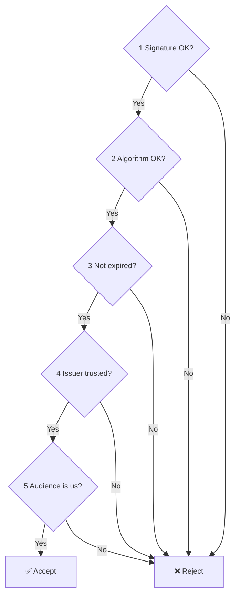

That last check — audience — is the one people most often skip, and it's a serious mistake: without it, any valid token becomes a universal key that unlocks every service.

To make this concrete, follow Alice's token from section 20 as it arrives at the **orders-api**. Each checkpoint in turn:

1. **Signature** — verifies against the public key of `auth.shopmart.com`. ✅ pass
2. **Algorithm** — header says `RS256`, and orders-api requires exactly `RS256`. ✅ pass
3. **Expiry** — it's 3:10pm and the token expires at 3:15pm, so it's still alive. ✅ pass
4. **Issuer** — `iss` is `auth.shopmart.com`, which this service trusts. ✅ pass
5. **Audience** — `aud` is `orders-api`, and this *is* the orders-api. ✅ pass

All five pass, so the token is **accepted**.

Now change just one thing: the *same* token is presented to the **billing-api** instead.

- Checks 1–4 still pass exactly as before.
- Check 5 **fails** ❌ — the `aud` says `orders-api`, not `billing-api`.

So the billing service rejects it. That single audience check is what stops a token stolen from one service from unlocking every other service.

### 21.2 What happens inside the server on each request

In a framework like Spring Security, this validation doesn't live in your controller — it runs in a **filter** that intercepts every request *before* your business code sees it. Walking through what that filter does turns the checklist above into a concrete sequence:

1. **Read the `Authorization` header.** If it's missing, the request either continues as anonymous or is rejected, depending on the endpoint.
2. **Strip the `Bearer ` prefix.** What remains is the raw JWT.
3. **Decode the header and payload** to read the `alg`, `kid`, and claims.
4. **Verify the signature.** The server recomputes the signature over the received header and payload using its own key, then compares it byte-for-byte with the signature in the token. Equal means authentic; different means rejected.
5. **Check expiry and not-before** (`exp`, `nbf`), then **issuer and audience** (`iss`, `aud`), exactly as in the checklist.
6. **Build an authentication object** and place it in the security context, so downstream controllers know who the user is and what role they hold.

Step 4 is worth dwelling on, because it explains why tampering fails. Suppose an attacker decodes Alice's token, changes `"role": "customer"` to `"role": "admin"`, and re-encodes it. The payload is now different, but the *signature* still corresponds to the original payload. When the server recomputes the signature over the modified payload, it no longer matches the signature in the token, so the token is rejected outright:

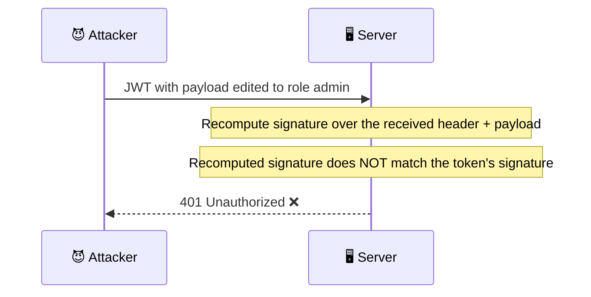

The attacker cannot fix this. Producing a matching signature for the altered payload would require the signing key, which they don't have. This is exactly why the signature guarantees integrity: the claims are readable, but not *changeable*.

### 21.3 The classic attacks

Three classic attacks are worth knowing by name.

The **`alg: none` attack** exploited early libraries that honored a token claiming `"alg": "none"` — meaning "no signature" — and accepted it as valid. That let an attacker forge any token with an empty signature. The fix is to never trust the token's own `alg` field; the *verifier* dictates the acceptable algorithm.

The **RS256-to-HS256 confusion attack** is subtler. Suppose a server verifies with "the key" but lets the token pick the algorithm. An attacker takes the server's *public* RSA key (which is, by definition, public), crafts a token with `alg: HS256`, and signs it using that public key as the HMAC secret. A naive verifier then uses the same public key to verify an HMAC — and accepts the forgery. The fix, again, is to pin the expected algorithm rather than reading it from the attacker-controlled header.

The third is **weak HMAC secrets**. Using a short, guessable `HS256` secret lets an attacker brute-force the signing key offline and mint arbitrary tokens. If you use HS256, the secret must be long and random.

### 21.4 Consistency across services beats cleverness

In a system with many services, the most dangerous validation bug is not a clever exploit — it's *inconsistency*. If seven microservices validate `aud` and one does not, that one service becomes the entry point an attacker looks for. The failure isn't in JWT; it's that the team stopped applying the same checks everywhere.

So the strongest JWT implementations are the most *predictable*, not the most sophisticated. Every service validates the same claims, applies the same expiration policy, and treats refresh the same way. Whether you rotate keys monthly or quarterly, add many custom claims or keep tokens minimal, matters far less than that every service agrees. Authentication should never surprise a developer moving between services.

### 21.5 The unifying principle

The principle a staff engineer states: **never let the token tell you how to validate it.** The verifier must fix the algorithm, the acceptable issuer, the required audience, and the key source in advance; treating any of those as attacker-supplied input is the root of most JWT vulnerabilities.

<details>
<summary>💻 Java: validating a JWT safely (pinned algorithm and checks)</summary>

```java
import io.jsonwebtoken.*;
import java.security.PublicKey;

public class JwtValidator {

    private final PublicKey publicKey;   // the issuer's PUBLIC key (RS256)

    public JwtValidator(PublicKey publicKey) {
        this.publicKey = publicKey;
    }

    public Claims validate(String token) {
        Jws<Claims> jws = Jwts.parserBuilder()
            // Pin the key and the ALGORITHM ourselves — never read alg from the token.
            .setSigningKey(publicKey)
            // Fix the trusted issuer and required audience in advance.
            .requireIssuer("https://auth.shopmart.com")
            .requireAudience("orders-api")
            // Small leeway for clock skew between servers.
            .setAllowedClockSkewSeconds(30)
            .build()
            // Verifies signature, exp, nbf, iss, aud — throws on any failure.
            .parseClaimsJws(token);

        // Defence in depth: reject the "none" algorithm explicitly.
        if (jws.getHeader().getAlgorithm() == null
                || jws.getHeader().getAlgorithm().equalsIgnoreCase("none")) {
            throw new JwtException("Unsigned tokens are not accepted");
        }
        return jws.getBody();   // safe to trust these claims now
    }
}
```

The key ideas: the verifier pins the algorithm and key rather than trusting the token's own `alg`, fixes the acceptable issuer and audience up front, and rejects `alg: none` outright. A modern library performs the signature, `exp`, `nbf`, `iss`, and `aud` checks for you — the vulnerabilities come from disabling or skipping them.

</details>

<details>
<summary>📖 In plain English</summary>

Making a JWT is easy; checking one properly is where systems get hacked. A correct check isn't just "is the signature valid" — it's also "hasn't it expired," "did a trusted issuer make it," and crucially "was it meant for *this* service" (so a token for the billing API can't be replayed against the orders API). The famous attacks all exploit trusting the token too much: one claimed "no signature needed," another tricked servers into verifying with the wrong algorithm. The rule that prevents them all: the *verifier* decides the algorithm, issuer, and audience in advance — never let the incoming token dictate how it's checked.

</details>

## 🎯 22. OIDC: turning authorization into login

Recall the unpaid debt from section 17: OAuth2 is about *authorization*, not *authentication*. Yet everyone wanted to use it for "Log in with Google," because it was already the thing that authenticated you to Google. The problem is that a plain OAuth2 access token says "this app may access these resources" — it does *not* reliably tell the app *who the user is*. Apps that tried to infer identity from an access token (for example, by calling some profile API and trusting the result) built subtly broken logins. Those were vulnerable to token-substitution attacks, where a token issued for one app is replayed to log into another.

**OpenID Connect (OIDC) is a thin identity layer built on top of OAuth2 that adds proper authentication.** It reuses the entire OAuth2 machinery — same Authorization Code flow, same roles — and adds three things.

First, a new **`openid` scope** that signals "I want to authenticate this user, not just get resource access." Second, and most importantly, a new token: the **ID Token**. This is always a JWT, and its explicit purpose is to prove *who the user is*. It carries identity claims — `sub` (a stable unique user ID), plus optionally `email`, `name`, `picture`. Critically, it also carries an `aud` claim naming the client it was issued *for*, plus a `nonce` to bind it to the specific login request. That combination is exactly what defeats the token-substitution problem. Third, a standardized **UserInfo endpoint** and a **discovery document** (`/.well-known/openid-configuration`), so clients can find endpoints and public keys automatically.

The key insight is that a single flow now produces *two* tokens with two different jobs:

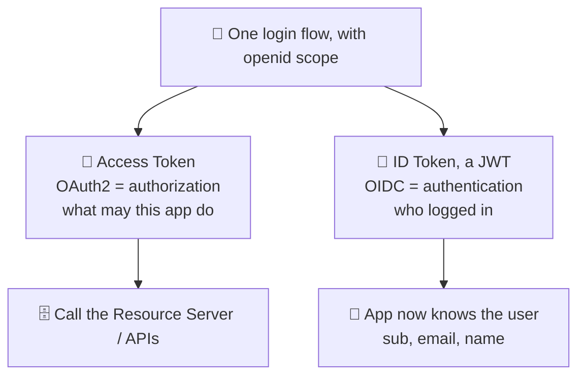

Here's the clean mental model, and the sentence to deliver in an interview. **OAuth2 gives you an access token (for *authorization* — calling APIs); OIDC adds an ID token (for *authentication* — knowing who logged in). "Log in with Google" is OIDC; "let this app access your Google Drive" is OAuth2.** They almost always run together in one flow — you get both tokens — but they answer different questions, and the ID token is the piece that makes login safe. Providers like Google, Okta, Auth0, and Microsoft Entra ID are all OIDC providers precisely so that apps get a standard, secure "who is this user" answer rather than reinventing it insecurely.

<details>
<summary>📖 In plain English</summary>

OAuth alone tells an app what it's *allowed to do*, not *who you are* — so using it directly for login is subtly broken. OpenID Connect (OIDC) fixes that by adding a small identity layer on top. It reuses the same OAuth flow but adds an "ID token" — a JWT whose whole job is to say who logged in (your user ID, email, name) and which app it was made for, so it can't be reused to log into a different app. In one sentence: OAuth's access token is for calling APIs; OIDC's ID token is for login. "Sign in with Google" is OIDC doing its job.

</details>

## 🎯 23. Sessions vs tokens, refresh, and revocation

One architectural debate ties this whole part together and comes up constantly: **stateful sessions versus stateless JWTs** — and in production the answer is almost always a two-token design that deserves a full walkthrough of its own.

### 23.1 Sessions vs stateless JWTs: the core trade-off

In the classic **session** model, the server creates a session on login, stores it server-side (in memory, Redis, or a database), and hands the browser a random **session ID** in a cookie. Every request carries that ID, and the server looks it up to know who you are. In the **stateless JWT** model, the server hands out a signed token containing the claims. Every request carries the token, and the server verifies the signature and trusts the claims *without any lookup*.

The trade-off is genuine and symmetrical. JWTs scale beautifully across distributed systems, because any service can verify a token locally with a public key — no shared session store, no database round-trip. That's why they dominate microservices and mobile APIs. But that same statelessness makes **revocation hard**: because nothing is looked up, you can't easily "log someone out" server-side. A valid, unexpired JWT keeps working even after you'd like to kill it. Sessions have the opposite profile — instant revocation (just delete the server record), at the cost of a lookup on every request and a shared store to coordinate.

### 23.2 Why a single token can't win: security versus user experience

A single JWT looks like enough: log in, get a token, attach it to every request, verify it on the server. The trouble hides in one deceptively simple question — *how long should that token stay valid?* — and every answer is bad in a different way.

Make it **short-lived** and you protect security but hurt the experience. Picture a user spending 30 minutes filling in a long form; a 20-minute token expires mid-way, the submit comes back `401 Unauthorized`, they're bounced to a login page, and everything they typed is gone. Frustrating for anyone.

Make it **long-lived** — say seven days — and you flip the problem. Now a token stolen through XSS, malware, a malicious browser extension, packet sniffing, or a shared computer left logged in grants the attacker a full week of access. And because JWTs are stateless, there is nothing stored server-side to invalidate: once issued, the token is valid until it expires, full stop.

The usual reflex — *"just blacklist stolen tokens"* — quietly dismantles the whole design. Checking a denylist (Redis, database, or cache) on *every* request reintroduces exactly the per-request lookup and shared state that stateless JWTs existed to eliminate. You've rebuilt server-side sessions with extra steps.

So there is no single expiry that satisfies both goals at once: short is secure but annoying, long is convenient but dangerous. That contradiction is precisely what forced OAuth 2.0 toward a two-token design.

### 23.3 The access-token + refresh-token solution

The resolution the industry converged on is to stop asking one token to do two jobs and split the responsibilities in two:

- **Access token → security.** A short-lived stateless JWT (commonly 15–30 minutes, often 5–15 in higher-security systems), sent with every API request and used for authorization. Because it verifies locally and expires quickly, a stolen one is useful only for a small window.
- **Refresh token → user experience.** A long-lived credential (days to weeks) whose *only* job is to obtain a fresh access token when the current one expires. It is never sent to business APIs, so it travels rarely and has a far smaller exposure surface.

A useful implementation detail: the refresh token doesn't have to be a JWT at all. In many production systems it's simply a **random UUID**, with the real session state held server-side (commonly in Redis). Keeping the refresh token *stateful* is deliberate — it is exactly what makes logout, revocation, and rotation possible, the very capabilities stateless JWTs give up. If refresh tokens were also stateless JWTs, you'd reintroduce the revocation problem you were trying to solve in the first place.

Everything below unpacks that split into the full mechanical picture: what the server actually stores, how a refresh token moves through its life, precisely what happens when an access token expires, and how a stolen or revoked token is dealt with.

**What a refresh token really is under the hood.** The string handed to the client is an opaque lookup key — it carries no authority by itself. All the authority lives in a record the server keeps for it, typically a Redis entry or a database row. That record holds the token (or, better, a *hash* of it), the `userId` it belongs to, a **session/family identifier** that ties together every refresh token descended from one login, the device or client fingerprint, an `issuedAt`, an `expiresAt`, and a flag marking whether it has already been used (rotated away). Storing only a hash — the same reasoning behind never storing raw passwords — means that if the store leaks, an attacker gets useless digests rather than live tokens. When the client later presents its refresh token, the server hashes the incoming value, looks up the record, and decides everything from there. The token is only the key; the record is the source of truth.

**The full lifecycle, from issue to death.** A refresh token is born at login, alongside the first access token, and while it lives it does exactly one thing: it is exchanged for a new access token whenever the old one expires. Its expiry is usually governed by two clocks at once. A **sliding (idle) expiry** resets on each use — as long as the user keeps returning within, say, seven days, the session keeps renewing, so active users are never logged out. An **absolute expiry** caps the total lifetime regardless of activity (commonly 30 to 90 days), forcing a genuine re-login eventually even for a session that never goes idle. A refresh token dies in one of four ways: it reaches one of those expiries, it is *rotated* (superseded by its successor — see §23.4), the user logs out, or it is forcibly revoked (below).

**Exactly what happens when the access token expires.** The access token simply stops verifying — its `exp` is now in the past — and the next API call comes back `401 Unauthorized`. That `401` is the trigger for the reissue sequence, which runs without the user seeing anything:

1. The client calls the refresh endpoint (for example `POST /auth/refresh`), presenting the refresh token — read automatically from an httpOnly cookie for a web app, or sent in the request body for a mobile client.
2. The server hashes and looks up the record, then checks three things: it exists, it has not expired, and it has not already been used.
3. If all three pass, the server mints a **new short-lived access JWT**, signing it with its private key exactly as it did at login.
4. It then **rotates** the refresh token: the old record is marked used, and a new refresh token is issued in the same session family with a fresh sliding expiry (§23.4 explains why rotation matters for limiting replay).
5. The server responds `200 OK` with the new access token in the body and, for web clients, the new refresh token in a `Set-Cookie` header.

**How the backend reissues, and how the client picks it back up.** The reissue is pure server-side authority: the backend never trusts the client's claim about who it is — it re-derives the `userId` from the stored record and builds a brand-new signed access token from scratch. On the client side, the new access token is stored in memory and the rotated refresh cookie is written by the browser automatically. The client then **retries the original request that had failed with `401`**, now carrying the new access token, and it succeeds. From the user's perspective nothing happened — no redirect, no re-login, no lost form data. In a browser this is wired up with an HTTP response interceptor (Axios or a `fetch` wrapper) that catches the `401`, performs the refresh, and replays the failed request; §23.6 covers the one race condition this introduces.

**How this looks in real production.** The exchange is standardized as the OAuth 2.0 `refresh_token` grant: clients call the provider's token endpoint with `grant_type=refresh_token`, and identity platforms such as Auth0, Okta, AWS Cognito, and Keycloak implement the issuance, rotation, and reuse detection for you. Storage differs by client type — web apps keep the refresh token in an httpOnly, Secure cookie; native mobile apps keep it in the OS secure store (iOS Keychain, Android Keystore); SPAs use either the cookie approach or a silent-refresh flow. §23.5 explains why keeping the token out of JavaScript's reach is what makes a long-lived refresh token defensible in the first place.

**Compromise, and forced invalidation.** Because rotation makes each refresh token single-use, it doubles as a theft detector. If the server ever sees a refresh token that has *already been rotated away* presented again, two parties must be holding the lineage — the legitimate client and a thief. The correct response is not to refresh but to **invalidate the entire session family**, killing every descendant token and forcing a fresh login; providers call this *automatic reuse detection*. Forced invalidation is possible precisely because the state is server-side: deleting a single record logs out one device, and deleting every record for a `userId` logs the user out everywhere — the lever behind "sign out of all sessions," a password change, or an account-compromise response. One caveat to hold onto: already-issued access tokens stay valid until they expire, so a forced logout fully takes hold only within one short access-token lifetime. When you need an *instant* hard cutoff, pair refresh revocation with a `jti` denylist checked at the gateway (§23.6).

### 23.4 The refresh lifecycle and token rotation

The complete flow keeps the user signed in without them ever noticing the machinery running underneath:

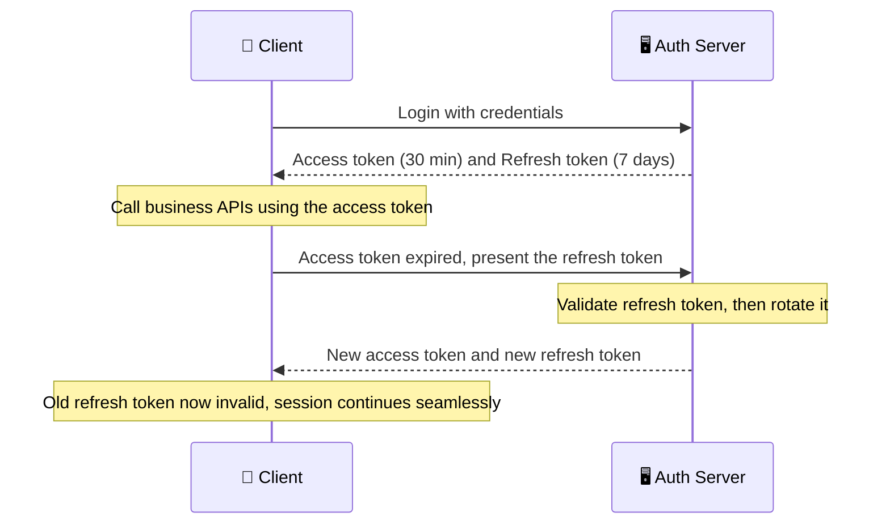

The security practice layered on top is **refresh token rotation**: each time a refresh token is used, the server invalidates it and issues a *brand-new* refresh token alongside the new access token. This sharply limits replay. If an attacker steals a refresh token, they can use it at most once before the next legitimate refresh detects the reuse — the old token is already gone — which flags the theft and lets the server revoke the whole session.

On the client this is usually automated. Modern frontends intercept a `401 Unauthorized`, silently call the refresh endpoint, obtain new tokens, and retry the original request, all without interrupting the user. Libraries like Axios implement this with response interceptors.

### 23.5 Why a long-lived refresh token is still safer

It seems backwards that a token living for 30 days could be *safer* than one living 30 minutes. Three design choices make it so:

- **It travels far less often.** The access token rides along on every page load, API call, and background request — potentially thousands of times a day, each one a chance to be intercepted. The refresh token is sent only when refreshing, often just a handful of times a day. Fewer transmissions mean fewer interception opportunities.
- **It can be stored more safely.** Access tokens frequently need to be reachable by JavaScript (kept in memory or, riskily, `localStorage`). Refresh tokens are typically placed in an **httpOnly, Secure cookie**: JavaScript cannot read it (blunting XSS), it is sent only over HTTPS, and it is scoped to trusted domains automatically.
- **It is rotated on every use.** As above, rotation turns a captured refresh token into a single-use liability rather than a 30-day skeleton key.

### 23.6 Revocation, storage, and the concurrent-refresh trap

Because the access token is short-lived, revocation is handled by invalidating the refresh token server-side: the user is locked out within one short access-token lifetime. For *urgent* revocation — a compromised account, a departed employee — you add a small **denylist of `jti` values** checked at the gateway, a tiny lookup used only for that revocation case rather than on every request.

Where tokens *live* in the browser matters just as much as their lifetime. An **httpOnly, Secure, SameSite cookie** keeps a token out of reach of injected scripts, whereas a JWT sitting in `localStorage` is readable by any XSS payload — a frequent real-world mistake.

One subtle client-side bug is worth naming: the **concurrent-refresh race**. If five requests fire at once and all come back `401`, a naive client kicks off five simultaneous refreshes. With rotation enabled, each refresh invalidates the previous one, so most of them end up using tokens that were just rotated away, and authentication starts failing unpredictably. The fix is to allow only **one** refresh in flight at a time: the first `401` triggers the refresh, every other failed request is queued, and once the new access token arrives, all queued requests are replayed with it.

### 23.7 When you need two tokens — and when you don't

The dual-token design is not free, and it isn't always warranted. A **single token** is often enough for:

- **Internal admin panels** used by a handful of employees who can simply log in again after a couple of hours.
- **Short-lived or campaign sites** whose lifespan doesn't justify the extra engineering.
- **Session-based apps** that already keep server-side sessions in Redis — they get instant logout and revocation for free, so dual-token JWTs add little.

The pattern **shines** where you need strong security *and* a seamless experience across long-lived sessions: mobile apps, SaaS platforms, banking and enterprise software, open platform APIs, and large consumer applications — anywhere users must stay signed in for days without weakening security.

### 23.8 Best practices for production

Pulling it together into a checklist for a real deployment:

- Keep **access tokens short-lived** (15–30 minutes).
- Store **refresh tokens server-side** (Redis or a database), not as self-contained JWTs.
- Use **random UUIDs** for refresh tokens when they don't need to carry claims.
- Put refresh tokens in **httpOnly, Secure cookies** whenever possible.
- **Rotate** the refresh token on every refresh.
- Allow only **one concurrent refresh** on the client, queuing the rest.
- **Revoke immediately** on logout or suspicious activity, backed by a `jti` denylist for access tokens.

The staff-level framing stays the same: JWTs trade revocability for scalability, and you buy back exactly the revocability you need with short access-token lifetimes plus a stateful, rotating refresh token — rather than pretending the trade-off doesn't exist.

<details>
<summary>💻 Java: issuing and rotating access + refresh tokens</summary>

```java
import io.jsonwebtoken.*;
import java.security.PrivateKey;
import java.time.Duration;
import java.util.Date;
import java.util.UUID;

// Login issues a SHORT-lived access JWT plus a LONG-lived, server-stored refresh token.
// The refresh token is an opaque UUID whose state lives in a store (e.g. Redis),
// which is what makes revocation and rotation possible.
public class TokenService {

    private final PrivateKey signingKey;      // RS256 private key for access tokens
    private final RefreshStore refreshStore;  // maps refreshId -> userId, with a TTL

    public TokenService(PrivateKey signingKey, RefreshStore refreshStore) {
        this.signingKey = signingKey;
        this.refreshStore = refreshStore;
    }

    // --- On login: hand back BOTH tokens ---
    public Tokens login(String userId) {
        String accessToken = newAccessToken(userId);           // 30-minute JWT
        String refreshToken = UUID.randomUUID().toString();    // opaque, not a JWT
        refreshStore.save(refreshToken, userId, Duration.ofDays(7));
        return new Tokens(accessToken, refreshToken);
    }

    // --- When the access token has expired: rotate the refresh token ---
    public Tokens refresh(String presentedRefreshToken) {
        String userId = refreshStore.lookup(presentedRefreshToken);
        if (userId == null) {
            // Unknown or already-rotated token: possible reuse, force re-login.
            throw new SecurityException("Invalid or reused refresh token — login again");
        }
        // ROTATION: destroy the old refresh token, mint a brand-new one.
        refreshStore.delete(presentedRefreshToken);
        String newRefresh = UUID.randomUUID().toString();
        refreshStore.save(newRefresh, userId, Duration.ofDays(7));
        return new Tokens(newAccessToken(userId), newRefresh);
    }

    private String newAccessToken(String userId) {
        long now = System.currentTimeMillis();
        return Jwts.builder()
            .setSubject(userId)
            .setIssuer("https://auth.shopmart.com")
            .setAudience("orders-api")
            .setId(UUID.randomUUID().toString())               // jti, for denylist revocation
            .setIssuedAt(new Date(now))
            .setExpiration(new Date(now + 1_800_000))          // 30 minutes
            .signWith(signingKey, SignatureAlgorithm.RS256)
            .compact();
    }
}
```

The shape that matters: the access token is a self-contained JWT any service verifies locally, while the refresh token is a server-stored handle. Rotation (delete-old, issue-new on every refresh) is what turns a stolen refresh token into a one-shot liability, and storing its state server-side is what lets you revoke a session at all.

</details>

<details>
<summary>📖 In plain English</summary>

There are two ways to remember a logged-in user. Sessions: the server stores your login and gives you an ID it looks up every request — easy to log you out, but it needs a shared store. JWTs: the server gives you a signed token it can verify with no lookup — great for scaling across many services, but hard to cancel early because there's nothing stored to delete. A single token can't win: make it short and users get logged out mid-task; make it long and a stolen one works for days. So the standard fix uses two. A short-lived access-token JWT (minutes) goes on every request, so leaks are brief and verification is fast. A long-lived refresh token (days) is kept server-side and does one job: quietly get you a new access token when the old one expires. Each refresh swaps the refresh token for a new one (rotation), so a stolen one only works once. Store refresh tokens in secure httpOnly cookies, never localStorage, and only ever run one refresh at a time on the client.

</details>

---

# Part VII — Mastery

## 📊 24. How the giants do it

Abstract protocols become memorable when you see who runs them and how. These are the reference implementations worth being able to name.

**Google** is the canonical OIDC provider — "Sign in with Google" is textbook OpenID Connect, issuing ID tokens as JWTs and publishing its keys and endpoints at a discovery document that any client can consume. Internally, Google pioneered much of zero-trust with **BeyondCorp**, the model that abandoned the trusted-internal-network assumption entirely and authenticates every request by device and user identity regardless of network location — the philosophy that mTLS and service meshes now operationalize.

**Netflix** runs a large microservices fleet where service-to-service identity and short-lived credentials matter enormously; it open-sourced tooling around secrets and identity and is a standard example of TLS everywhere plus automated certificate and secret rotation at scale.

**Cloudflare, AWS, and Fastly** are where most real-world TLS actually terminates. They handle certificate issuance and renewal (AWS Certificate Manager, Cloudflare's one-click TLS), TLS 1.3 and 0-RTT, and increasingly Encrypted Client Hello. So for a huge fraction of the web, "the TLS stack" in practice means a CDN edge, not the origin server. **Let's Encrypt** deserves its own mention here. By making DV certificates free and automated via the **ACME** protocol, it drove HTTPS adoption from roughly half of page loads to the vast majority in just a few years.

**Istio and Linkerd** are the service meshes that made mTLS practical for ordinary teams. They inject Envoy sidecars that mutually authenticate and encrypt every service-to-service call, using automatically rotated, short-lived certificates. Application developers get zero-trust networking without writing a line of TLS code. **HashiCorp Vault** is the reference secrets manager, widely used for dynamic database credentials, PKI issuance, and envelope encryption. And **Okta, Auth0, and Microsoft Entra ID** are the identity providers most enterprises buy rather than build. Getting OAuth2/OIDC exactly right — every validation check, every flow — is hard enough that outsourcing it is usually the responsible choice.

Notice the pattern across all of them. The hard parts of security are increasingly *platform* concerns: the CDN terminates TLS, the mesh does mTLS, the IdP does OAuth/OIDC, the vault does secrets. So a staff engineer's job is less "implement crypto" and more "compose these platforms correctly and understand what each one guarantees."

## ❌ 25. Myths worth unlearning

**"HTTPS means the site is safe/trustworthy."** No. HTTPS means the *connection* is private and you reached the real server for that domain. A phishing site can get a valid free certificate in minutes. The padlock is about the pipe, not the honesty of what's at the end of it.

**"SSL and TLS are different things / I use SSL."** SSL is the dead predecessor; every version is retired. What you actually run is TLS 1.2/1.3. "SSL" survives only as a legacy word in product names.

**"JWTs are encrypted, so it's fine to put sensitive data in them."** A standard JWT is *signed, not encrypted* — the payload is Base64, readable by anyone. The signature stops tampering, not reading. Never put secrets in a JWT.

**"OAuth is a login/authentication protocol."** OAuth2 is *authorization*. Using it directly for login is subtly insecure; the authentication layer is OIDC, which adds the ID token specifically to answer "who is this user."

**"Encryption alone gives you security."** Encryption gives confidentiality. You separately need integrity (MAC/signature) and authenticity (certificates) — an encrypted channel to an impersonator is worthless, and some encryption modes without integrity are actively tamperable.

**"mTLS is just TLS with an extra option, so turn it on everywhere."** mTLS is cheap to enable and expensive to *operate* — the real cost is the certificate lifecycle (issuance, rotation, revocation, trust distribution) for every workload. It's the right default *inside* an automated mesh, not something to sprinkle on manually.

**"A longer token expiry is more convenient and basically free."** Token lifetime is a security dial: the longer a token lives, the longer a stolen one is useful and the harder revocation becomes. Short access tokens plus refresh tokens exist precisely because "just make it last a week" is a liability.

**"Once TLS terminates at the load balancer, the internal network is safe."** That internal hop is plaintext unless you protect it. The whole point of zero-trust and internal mTLS is that "inside the perimeter" is not a safety guarantee.

## 🎓 26. What separates a staff engineer's answer

At L3/L4, you're expected to *define* these correctly — what TLS does, what a JWT contains, the OAuth roles. At staff/principal level, the same questions are probing something deeper: whether you understand the *boundaries*, *trade-offs*, and *failure modes*, and whether you reach for the layer that actually solves the problem.

A staff engineer separates **transport security from identity** instinctively. They never conflate "we use HTTPS" with "we've handled auth," and they know that a secure pipe says nothing about who the user is or what they may do. They also separate **authentication from authorization**, and therefore never propose plain OAuth2 for login when the real question is identity. And they think in **trust boundaries and blast radius**: where does plaintext exist, which key can forge what, and if this token/secret/cert leaks, how much is exposed and for how long? They reduce that blast radius with short lifetimes, narrow scopes, and audience restriction — rather than hoping nothing leaks.

They also **name the failure modes unprompted**: the `alg:none` and RS256/HS256 JWT attacks, SSL-stripping, code interception, and cache-leaking of authenticated responses. They know the operational reality that expired certificates and unrotated secrets cause more outages and breaches than exotic cryptographic breaks. And they're honest about **cost**. mTLS everywhere, multi-region key management, and a full OIDC implementation are real operational burdens, so they'll often recommend *buying* the identity provider and *adopting* the mesh rather than building crypto in-house — reserving custom work for where it genuinely differentiates.

The throughline is a shift from "I know what these acronyms mean" to "I know which problem each one solves, what it leaves unsolved, how it fails, and what it costs to run." When an interviewer keeps asking "and then what?", they're checking for exactly that chain of reasoning.

## 🔗 27. Where to go next: adjacent concepts

This guide sits inside a larger security landscape. Here are the natural next topics, and why each one connects.

**Authorization models beyond scopes** — RBAC, ABAC, and policy engines like **OPA (Open Policy Agent)** — pick up where OAuth scopes leave off. They decide the fine-grained question: can *this* user do *this* action on *this* resource? **API gateways** (Kong, Apigee, AWS API Gateway) are where token validation, rate limiting, and mTLS often actually get enforced at the edge, tying this material to the API-gateway pattern. **Zero-trust architecture** and **SPIFFE/SPIRE** generalize workload identity beyond a single mesh.

The **OWASP Top 10** catalogs the application-layer vulnerabilities that TLS explicitly does *not* protect against — injection, broken access control, and the like. It's a reminder that transport security is necessary but never sufficient. **Post-quantum cryptography** is coming to TLS, as quantum computers threaten RSA and ECC — which is exactly why forward secrecy and crypto-agility matter now. And **key management deep-dives** — HSMs, KMS design, certificate transparency logs — extend Part V for anyone running this infrastructure at scale.

The connective idea: everything in this guide secures identity and transport, and the next layer up is *authorization policy* and *application security* — because once you know who someone is and the channel is safe, the remaining question is what they're allowed to do and whether your code handles it correctly.

---

## ⚡ Quick Revision

*Read this the night before an interview. It's written to flow, so that recalling one idea pulls the next along with it.*

**The four properties, and the two layers.** Security means four distinct things: confidentiality (nobody else can read it — encryption), integrity (nobody can alter it undetected — hash/MAC/signature), authenticity (you know who's on the other end — certificates), and non-repudiation (they can't deny it — signatures). Everything in this guide splits into two layers that solve different problems: *transport security* (TLS/HTTPS/mTLS) secures the connection, and *identity* (OAuth2/JWT/OIDC) secures who the user is and what they may do. A secure pipe to an unauthorized user is still a breach — you need both.

**The crypto primitives.** Symmetric encryption (AES-GCM) is fast and protects the actual data, but has the key-distribution problem: how do strangers agree on a key over a hostile wire? Asymmetric encryption (RSA, ECC) solves it with a public/private keypair — anyone encrypts with the public key, only the private key decrypts — but it's slow, so the real world uses a hybrid: slow asymmetric crypto to bootstrap a fast symmetric key. Integrity tools escalate: a *hash* (SHA-256) proves data is unchanged; an *HMAC* adds a shared secret so it also proves origin; a *digital signature* uses private-signs/public-verifies to add authenticity and non-repudiation for the whole world — which is why certificates and JWTs use signatures. (Hashes also store passwords — but *salted* and run through a deliberately *slow* KDF like bcrypt, scrypt, or Argon2, so a stolen database can't be mass-cracked.) A public key alone doesn't prove *whose* it is, so a *certificate* (X.509) is a CA-signed statement binding a key to an identity. You obtain one by generating a keypair and sending a *CSR* (your public key + domain) to a CA, which verifies you control the domain (e.g. via ACME) and signs it — your *private key never leaves your server*. Browsers trust a built-in list of root CAs, and validation walks the chain server→intermediate→root (that ecosystem is *PKI*), checking the hostname against the cert's *SAN* (the CN is legacy), plus expiry and revocation (OCSP/CRL), and *verifying* each signature up to a trusted root. That signature check is a *verify* step yielding valid/invalid — not a decryption that reveals secrets, and for ECDSA no decryption happens at all. Public CAs must also log every issued cert to *Certificate Transparency* logs, so mis-issuance is publicly detectable.

**SSL/TLS.** SSL is the dead predecessor; today everything is TLS 1.2/1.3, sitting between TCP and the application. TLS gives confidentiality, integrity, and *server* authenticity — but not client identity, not metadata hiding (destination IP and SNI still leak), and nothing once data is decrypted at the server. The *handshake* is the core: client and server negotiate a version and cipher, the server presents its certificate (which the client validates against trusted CAs, checking domain/expiry/revocation), both derive the same shared secret via Diffie–Hellman without sending it, and then all data uses fast symmetric encryption. TLS 1.3 beats 1.2 by being faster (1-RTT vs 2-RTT, plus 0-RTT resumption) and safer (it *removed* all the weak, misconfigurable ciphers, mandating forward-secret key exchange). *Forward secrecy* means ephemeral per-connection keys, so stealing the server's long-term key later can't decrypt recorded past traffic. A *cipher suite* like `TLS_ECDHE_RSA_WITH_AES_256_GCM_SHA384` names each choice — ECDHE (ephemeral, giving forward secrecy) for key exchange, RSA to authenticate the server, AES-256-GCM for bulk encryption with built-in integrity, SHA-384 for the handshake hash; TLS 1.3 shortened these to just the bulk cipher and hash since key exchange and auth are negotiated separately.

**HTTPS.** Just HTTP inside TLS, on port 443. It encrypts the URL path, headers, cookies, and body, so café-Wi-Fi sniffing fails — but the padlock only means "private connection to the real server for this domain," not "trustworthy site." Metadata (which domain, how much data) still leaks. *HSTS* forces browsers to always use HTTPS, killing SSL-stripping on the first request. *Mixed content* (HTTP resources on an HTTPS page) is blocked because it undermines the page. *TLS termination* usually happens at a load balancer/CDN, which leaves an internal plaintext hop — the exact gap mTLS closes.

**mTLS.** One-way TLS authenticates only the server; *mutual* TLS makes both sides present and validate certificates, so identity is proven at the connection layer before any data flows. It's rare for public users (you can't hand certs to millions of strangers) but ideal service-to-service, where a *service mesh* (Istio/Linkerd) injects Envoy sidecars that do mTLS automatically with short-lived, auto-rotated certs — the backbone of *zero-trust*, where the internal network is not trusted by default. The real cost is operational: running a certificate lifecycle (issue, rotate, revoke, distribute trust) at scale, via SPIFFE/SPIRE or the mesh CA.

**Secrets.** A secret is anything whose disclosure breaks security — private keys, DB passwords, API tokens. They leak in boring ways: hardcoded in Git (lives in history forever, bots find it in minutes), baked into Docker images, printed to logs, or over-broadly shared. The fix is one authoritative, audited, access-controlled source (Vault, AWS/GCP/Azure secret managers) fetched at runtime via machine identity, never persisted. *Envelope encryption* protects data at rest: a data key encrypts the data, a KEK in a hardware KMS/HSM encrypts the data key, so the master key never leaves and rotation doesn't re-encrypt everything. *Rotation* and short-lived dynamic credentials minimize a leak's lifetime and blast radius — the same philosophy as forward secrecy.

**OAuth2.** An *authorization* framework (not authentication) that lets a user grant a third-party app limited, revocable access without sharing their password, killing the "password anti-pattern." Four roles: resource owner (user), client (app), resource server (API), authorization server (issues tokens). The *Authorization Code flow* is the default: the app sends you to log in and consent, gets a short-lived *code* back through the visible browser front-channel, then exchanges that code plus its `client_secret` for tokens over a private back-channel — the token never touches the browser. *Access tokens* are presented on every API call as `Bearer`; *scopes* enforce limited access. Grant types: Authorization Code for server apps, *+ PKCE* for mobile/SPA (a per-request proof that blocks code interception without a stored secret), Client Credentials for service-to-service, and never Implicit or Password grants in new systems.

**JWT.** A compact, signed, self-contained token — `header.payload.signature`, Base64URL — that carries claims (`sub`, `iss`, `aud`, `exp`, `iat`) and can be verified with a key *without a database lookup*, which is its whole point. Critical trap: it's *signed, not encrypted* — the payload is readable by anyone, so never put secrets in it; the signature only prevents tampering. Sign with *RS256* (private signs, public verifies) in microservices so many verifiers can check without forging power; HS256 shares one secret. The header's *`kid`* (key ID) names which key signed the token, so the issuer can rotate signing keys with zero downtime — verifiers fetch the matching public key by `kid`, usually from a *JWKS* endpoint. Validation is where security lives: check signature, *pin the algorithm* (defeats `alg:none` and RS256→HS256 attacks), check `exp`, `iss`, and — often forgotten — `aud`, so a token for one service can't be replayed against another. The rule: never let the token tell you how to validate it.

**OIDC.** A thin identity layer on top of OAuth2 that adds real authentication. It reuses the OAuth flow but adds the `openid` scope and an *ID token* — always a JWT — whose job is to prove *who logged in* (`sub`, `email`, `name`), with `aud` and `nonce` binding it to this app and this login so it can't be substituted. OIDC also standardizes a *discovery document* (`/.well-known/openid-configuration`) advertising endpoints and signing keys, and a *UserInfo* endpoint for fetching profile claims. One line: OAuth's access token is for calling APIs (authorization); OIDC's ID token is for login (authentication). "Sign in with Google" is OIDC.

**Sessions vs tokens.** Sessions store login server-side and hand out an ID — easy revocation, needs a shared store and a lookup per request. Stateless JWTs verify locally with no lookup — scale beautifully but are hard to revoke (a valid token keeps working). The industry answer: a *short-lived JWT access token* (5–15 min, so its own expiry bounds revocation) plus a *stateful, long-lived refresh token* stored server-side that can be invalidated, with an optional `jti` denylist for urgent revocation. Refresh tokens should be *rotated* — each use issues a fresh one and retires the old, single-use token — and if an already-retired token is ever replayed, that signals theft, so the whole token family is revoked (*reuse detection*). Store tokens in httpOnly Secure cookies, not localStorage.

**One-line anchors for the room.** "SSL is dead; you run TLS 1.2/1.3." · "Slow asymmetric bootstraps fast symmetric." · "TLS secures the pipe, not the building." · "Forward secrecy: steal the key tomorrow, today's traffic stays safe." · "The padlock means private, not trustworthy." · "mTLS proves *both* sides; the cost is the cert lifecycle." · "Never commit a secret; fetch it at runtime and rotate it." · "OAuth = authorization; OIDC = authentication." · "The JWT payload is readable — signed, not encrypted." · "Never let the token tell you how to validate it — pin alg, iss, aud." · "Short access token + stateful refresh token buys back revocability."

---

## 💡 The Interview Q&A Bank

Twenty of the most frequently asked questions across this whole area. The first ten are foundational; questions 11–20 are staff/principal level, pushing into trade-offs, failure modes, and cross-layer reasoning. Each answer is written the way you'd actually say it out loud — reasoning, not a definition — with concrete technologies named.

### Foundational (L3–L4)

<details>
<summary><b>1. What's the difference between SSL and TLS?</b></summary>

SSL is the original 1990s protocol from Netscape; every version — SSL 2.0 and 3.0 — is now dead, with SSL 3.0 finished off by the POODLE attack in 2014. When it was standardized at the IETF it was renamed TLS, and the live versions today are TLS 1.2 and TLS 1.3, with everything below 1.2 deprecated. So the honest answer is that "SSL" is a legacy word that stuck — "SSL certificate," "SSL termination," the `SSL` in library names are all really TLS. I'd add that TLS sits between TCP and the application layer, so the same protocol secures HTTP (as HTTPS), email, and database connections. Using the terms precisely signals you know the field rather than repeating marketing language.

</details>

<details>
<summary><b>2. Walk me through the TLS handshake.</b></summary>

Once the TCP three-way handshake (SYN, SYN-ACK, ACK) has opened the connection, the client sends a ClientHello with its supported TLS versions, cipher suites, and a random value; the server replies with a ServerHello choosing the version and cipher, then sends its certificate chain. The client does the critical step — validating that chain against its trusted CAs, checking the domain matches and the cert isn't expired or revoked — which is the entire basis of server authenticity. Then both sides run a Diffie–Hellman key exchange to independently derive the same shared secret without ever transmitting it, and the server signs its part with its certificate's private key to tie the key agreement to its proven identity. From that secret they derive symmetric session keys, exchange encrypted Finished messages to confirm, and switch to fast symmetric encryption for all data. The mental model: slow asymmetric crypto is used once to authenticate and establish a key, and fast symmetric crypto protects everything after. TLS 1.3 compresses this to one round trip by having the client send its key-share in the first message.

</details>

<details>
<summary><b>3. Why is asymmetric encryption used to set up a connection but not for all the data?</b></summary>

Because asymmetric crypto solves a problem symmetric can't, but is far too slow for bulk data. The problem it solves is key distribution: two strangers on an open network can't safely agree on a shared symmetric key, because anything sent over the wire is visible — but with a public/private keypair, one side can authenticate and both can derive a shared secret without an eavesdropper learning it. The catch is that RSA and ECC operations are orders of magnitude slower than AES, so you'd never encrypt gigabytes with them. So TLS uses a hybrid: asymmetric crypto briefly, at handshake time, to authenticate the server and establish a shared key, then fast symmetric AES-GCM for every byte of actual traffic. Modern CPUs even have AES instructions, so the symmetric part is nearly free — that hybrid is the whole reason TLS is both secure and fast enough for the entire web.

</details>

<details>
<summary><b>4. What does a certificate actually prove, and how does the browser validate it?</b></summary>

A certificate proves that a particular public key belongs to a particular identity, like `example.com` — it closes the gap where an attacker could otherwise hand you their public key and impersonate the site. It's an X.509 document signed by a Certificate Authority, and the browser validates it by walking the chain of trust: the server's cert is signed by an intermediate CA, which is signed by a root CA that ships in the browser's trusted store, so the browser follows the chain up until it hits a root it already trusts. It also checks the domain matches, the cert hasn't expired, and it isn't revoked (via OCSP or CRLs). If any check fails, you get the scary warning and the connection is refused. The whole ecosystem of CAs, chains, issuance, and revocation is PKI — and I'd note that a self-signed cert fails validation precisely because no trusted party vouches for it, which is fine internally but not for the public web. Two details I'd add if pressed: the server *obtains* the cert by generating its own keypair and sending a CSR — its public key plus the domain — to the CA, which validates domain control (typically via ACME) and signs it, so the private key never leaves the server. And the validation is a signature *verification*, not a decryption: for RSA it resembles "decrypt and compare," but strictly it yields a valid/invalid answer, and for the ECDSA certs now common there's no decryption at all — the client only ever uses public keys, which is why anyone can verify a cert but nobody can forge one.

</details>

<details>
<summary><b>5. If a site uses HTTPS, is my data completely private?</b></summary>

Mostly, but with important caveats. HTTPS encrypts the full URL path, all headers including cookies and tokens, and the entire request and response body, so someone sniffing the network — your ISP, someone on the same Wi-Fi — can't read any of it, which is why logging in over public Wi-Fi is safe. But metadata still leaks: the destination IP is visible because packets must be routed, the domain name has historically leaked through the plaintext SNI field in the handshake (Encrypted Client Hello is closing that but isn't universal), DNS lookups may reveal the domain unless you use encrypted DNS, and packet sizes and timing can sometimes fingerprint which page you loaded. And crucially the padlock only means the connection is private to the real server for that domain — it says nothing about whether the site is honest, since phishing sites get valid free certs. So HTTPS hides *what* you send, not always *to whom*.

</details>

<details>
<summary><b>6. What is a JWT, and what are its three parts?</b></summary>

A JWT is a compact, self-contained, digitally signed token that carries claims about a user and can be verified with a key without any database lookup — that stateless verification is its whole reason for existing. It has three Base64URL parts separated by dots: a header naming the signing algorithm like RS256, a payload of claims (`sub` for the subject, `iss` for issuer, `aud` for audience, `exp` for expiry), and a signature computed over the first two parts. The single most important thing to say is that the payload is *encoded, not encrypted* — anyone can decode and read it — so you never put secrets in a JWT; the signature only guarantees the claims weren't altered, not that they're hidden. In microservices I'd sign with RS256 so the auth server holds the private key and every service verifies with the public key, meaning no service that only verifies ever holds forging capability. I'd also mention the header's `kid` (key ID): it names which key signed the token, so the issuer can rotate signing keys with zero downtime — verifiers look up the matching public key by `kid`, typically from a JWKS endpoint.

</details>

<details>
<summary><b>7. What problem does OAuth2 solve, and why isn't it authentication?</b></summary>

OAuth2 solves delegated authorization: letting a user grant a third-party app limited, revocable access to their data on another service without sharing their password. Before it, the only way was to type your Google password into some app, which then had total access, couldn't be limited, and couldn't be revoked without changing your password — the "password anti-pattern." OAuth2 replaces that with a scoped access token that says, for example, "may read this user's photos" and nothing more, revocable anytime. The key precision is that OAuth2 answers "what is this app allowed to do," not "who is this user" — it's authorization, not authentication. People misuse plain OAuth2 as login, which is subtly insecure because an access token doesn't reliably prove identity, and that exact gap is why OIDC was layered on top to add a proper ID token.

</details>

<details>
<summary><b>8. Explain the OAuth2 Authorization Code flow and why it uses a code instead of returning the token directly.</b></summary>

The user clicks "connect," the app redirects them to the authorization server (say Google) to log in and consent; Google redirects back to the app with a short-lived authorization *code* through the browser; then the app exchanges that code, plus its `client_secret`, for the actual tokens over a direct server-to-server back channel. The reason for the two-step dance is that the browser redirect — the front channel — is visible in the address bar, history, and referrer headers, so you never want the real access token to travel there. The code is useless on its own because redeeming it requires the client secret over a private channel, so even if the code is seen, it can't be exchanged by an attacker. That "visible code, private token" separation is the security heart of the flow. Once the app has the token, it sends it as `Authorization: Bearer` on each API call, and the resource server checks the scopes before returning data.

</details>

<details>
<summary><b>9. What's the difference between OAuth2 and OIDC?</b></summary>

OAuth2 is authorization — it gets an app an access token to call APIs on your behalf. OIDC is a thin identity layer built on top of OAuth2 that adds authentication — knowing *who* logged in. OIDC reuses the entire OAuth flow but adds the `openid` scope and, centrally, an ID token: always a JWT, carrying identity claims like `sub`, `email`, and `name`, with an `aud` claim naming the app it was issued for and a `nonce` binding it to this specific login, which is what prevents a token issued for one app being replayed to log into another. The one-liner I use is that OAuth's access token is for calling APIs while OIDC's ID token is for login, and they usually run together in one flow so you get both. "Sign in with Google" is OIDC doing its job; "let this app access your Drive" is OAuth2.

</details>

<details>
<summary><b>10. How should secrets like API keys and DB passwords be managed?</b></summary>

The goal is one authoritative, access-controlled, audited source per secret, fetched at runtime and never persisted where it doesn't belong. In practice that means a secrets manager — HashiCorp Vault, AWS Secrets Manager — that the app authenticates to at startup using a machine identity like an IAM role or mTLS cert, not another password, and pulls what it needs into memory. This kills the common leak paths: hardcoding in Git (where it lives in history forever and bots find it in minutes), baking into Docker images, or printing into logs. On top of that I'd rotate secrets regularly and immediately after any suspected exposure, and prefer short-lived dynamic credentials — Vault can mint a database password that expires in an hour — so there's no long-lived secret to steal. The mindset is to minimize each secret's lifetime and blast radius so that inevitable leaks are survivable, the same philosophy as TLS forward secrecy.

</details>

### Staff / Principal Level (L5–L6)

<details>
<summary><b>11. "If HTTPS already encrypts everything, why do we also need mTLS internally?"</b></summary>

Because they protect different segments and different directions. Public HTTPS is one-way TLS that authenticates only the server, and it typically *terminates* at the load balancer or CDN edge — so traffic from that edge to backend services runs over the internal network, often in plaintext, and nothing has authenticated *which service* is calling which. mTLS closes both gaps at once: it re-encrypts the internal hop and, crucially, makes both the caller and callee present certificates, so identity is proven at the connection layer before any byte flows. That's the concrete implementation of zero-trust — the assumption that the internal network is not inherently safe, so every call proves itself regardless of origin. In practice a service mesh like Istio injects Envoy sidecars that do this transparently with short-lived auto-rotated certs. So HTTPS secures the user-to-edge hop; mTLS secures and authenticates the service-to-service hops the user's HTTPS never covered.

</details>

<details>
<summary><b>12. A JWT can't be revoked before it expires. How do you design around that?</b></summary>

I treat revocability as a property I buy back deliberately, because statelessness is exactly what makes JWTs scale — any service verifies locally with a public key, no shared session store. The standard resolution is the access-token/refresh-token split: issue a short-lived access token, 5 to 15 minutes, as a stateless JWT so most requests stay lookup-free, and pair it with a longer-lived refresh token that *is* stateful, stored server-side. Revocation then means invalidating the refresh token, so the user is locked out within one short access-token lifetime — the short expiry bounds the damage. For urgent, immediate revocation — a compromised account, a fired employee — I add a small denylist of revoked token IDs (`jti`) checked at the gateway, which is a tiny lookup only for the revocation case. I'd also *rotate* the refresh token on every use — issue a new one and retire the old, single-use token — and treat replay of an already-used token as a theft signal that revokes the entire token family (reuse detection), which catches a stolen refresh token even before the user notices. The framing that matters is naming the trade-off honestly: JWTs trade revocability for scalability, and short lifetimes plus a stateful, rotating refresh token recover the revocability you need without giving up the scale.

</details>

<details>
<summary><b>13. Walk me through the JWT attacks you'd defend against in a review.</b></summary>

Three classics plus the checks people skip. The `alg:none` attack exploited libraries that honored a token claiming no signature and accepted it as valid — the fix is that the *verifier* dictates the algorithm, never the token. The RS256-to-HS256 confusion attack is subtler: if the server verifies with "the key" but lets the token choose the algorithm, an attacker takes the server's public RSA key — which is public by definition — crafts a token with `alg:HS256`, and signs it using that public key as the HMAC secret; a naive verifier then HMACs with the same public key and accepts the forgery. Again the fix is pinning the expected algorithm. Weak HMAC secrets let attackers brute-force an HS256 key offline, so if you use HS256 the secret must be long and random. And beyond attacks, the most common real bug is skipping the `aud` check, which turns a token minted for one service into a universal key across all of them. The unifying rule: never let the token tell you how to validate it — pin algorithm, issuer, audience, and key source in advance.

</details>

<details>
<summary><b>14. Design authentication for a microservices system. How do services trust each other and know the user?</b></summary>

I separate two identities: the user's and the service's. For the user, an edge gateway or the identity provider (Okta, Auth0, Entra) runs OIDC and issues a short-lived signed JWT; downstream services validate it locally with the IdP's public key — checking signature, expiry, issuer, and their own audience — so there's no per-request call back to the auth server. That's the scalable, stateless part. For service-to-service trust, I don't rely on the network being private; I use mTLS via a service mesh so every internal call is mutually authenticated with rotating certs, which is the OAuth Client Credentials idea enforced at the transport layer. Secrets — signing keys, DB creds — live in Vault or a cloud secrets manager, fetched at runtime via workload identity, never in config. For revocation I keep access tokens short and hold refresh tokens server-side. The design principle is defense in depth across two planes: transport identity via mTLS, user identity via OIDC/JWT, and I'd be explicit that each solves a problem the other doesn't.

</details>

<details>
<summary><b>15. What is forward secrecy, why does it matter, and how does TLS achieve it?</b></summary>

Forward secrecy is the property that if an attacker records my encrypted traffic today and steals the server's long-term private key *next year*, they still can't decrypt that recorded traffic. It matters because without it, a single future key compromise retroactively exposes years of captured sessions — which is exactly the "record now, decrypt later" strategy, and a real concern with quantum computing on the horizon. TLS achieves it by deriving each session's keys from *ephemeral* Diffie–Hellman values generated fresh per connection and discarded afterward — they were never computed from the long-term key, so possessing that key doesn't unlock them. The old static-RSA key exchange lacked this: the client encrypted the session secret with the server's public key, so anyone who later got the private key could decrypt every recorded session. That's why TLS 1.3 made ephemeral key exchange mandatory and dropped static RSA entirely — forward secrecy went from optional best-practice to non-negotiable.

</details>

<details>
<summary><b>16. Why is TLS 1.3 both faster and more secure than 1.2? Be specific.</b></summary>

Faster comes from cutting a round trip: TLS 1.2 needs two round trips before data flows because key exchange parameters are negotiated back and forth, while 1.3 has the client optimistically send its key-share in the first ClientHello, so the server can finish in a single round trip — and 1.3 adds 0-RTT resumption where a returning client sends encrypted data in its very first message. On a 100 ms mobile link, saving a round trip is a very visible latency win per new connection. More secure comes from deletion rather than addition: TLS 1.2 carried a huge menu of cipher suites, many weak or misconfigurable — static RSA with no forward secrecy, RC4, CBC modes vulnerable to BEAST and Lucky Thirteen, compression enabling CRIME — and each was a foot-gun. TLS 1.3 removed all of them, mandating forward-secret key exchange and allowing only a few modern authenticated ciphers like AES-GCM and ChaCha20-Poly1305, and it dropped renegotiation and compression. So it's a smaller, sharper protocol that's much harder to misconfigure into an insecure state. The 0-RTT caveat is replay risk, so it's restricted to idempotent requests.

</details>

<details>
<summary><b>17. Where does TLS terminate in a typical architecture, and what are the security implications?</b></summary>

In most production systems TLS terminates at the edge — a CDN, load balancer, or reverse proxy like Cloudflare, an AWS ALB, or Nginx — not at the application server. The edge decrypts, applies routing and WAF rules, and forwards to backends over the internal network. The upside is centralized certificate management and offloading crypto from app servers. The security implication people miss is that there's now a plaintext hop *inside* your network between the edge and the services, and "inside the perimeter" is not a safety guarantee — an attacker with a foothold, or a misconfigured internal service, can read that traffic. That's exactly the gap zero-trust and internal mTLS close, by re-encrypting and mutually authenticating service-to-service calls. There's also TLS passthrough, where encrypted traffic flows unbroken to the backend — necessary when the app itself must inspect the client certificate, as in some mTLS setups. Knowing precisely where plaintext exists in your own architecture, and what protects each hop, is the real signal here.

</details>

<details>
<summary><b>18. When would you choose mTLS over a bearer token like a JWT for service-to-service auth, and what does it cost?</b></summary>

They operate at different layers and I often use both, but if I had to pick per property: mTLS proves identity at the *connection* layer with a certificate and private key, so it's phishing-proof and can't be replayed or leaked in a log the way a bearer token can — a stolen JWT works from anywhere, a stolen cert is bound to its private key. So for strong, transport-level machine identity, especially in regulated environments or across trust boundaries, mTLS is stronger. A JWT is more portable and carries rich claims and scopes, which is why it's better for *user* identity and fine-grained authorization propagated through many hops. The cost of mTLS is entirely operational: you must issue a certificate to every workload, rotate them constantly (often sub-24-hour in a mesh), distribute trust anchors, and revoke compromised ones fast — a real certificate lifecycle via SPIFFE/SPIRE or a mesh CA. So my honest answer is mTLS for connection-layer machine identity plus a JWT for user identity and authorization claims, and I'd flag that turning on mTLS is cheap but *operating* it is not.

</details>

<details>
<summary><b>19. What's the difference between authentication and authorization, and where does each protocol fit?</b></summary>

Authentication is proving *who you are*; authorization is deciding *what you're allowed to do* — and conflating them is the single most common security design error. Mapping the protocols: TLS gives you server authentication (and mTLS adds client authentication) at the transport layer. OIDC handles *user* authentication at the identity layer via its ID token. OAuth2 handles *authorization* — its access token and scopes decide what an app may do — and deliberately does *not* authenticate the user, which is why using plain OAuth2 for login is a mistake. A JWT is just the token format that can carry either an identity assertion (OIDC ID token) or an authorization grant (OAuth access token). Beyond scopes, fine-grained authorization — can *this* user edit *this* record — is usually a separate policy layer like RBAC/ABAC or OPA. The staff-level point is that these are distinct questions answered by distinct layers, and a secure system needs all of them: authenticated identity, an authorized action, over an authenticated channel.

</details>

<details>
<summary><b>20. A security review finds an authenticated API response was being cached and served to the wrong user. Diagnose it across the layers.</b></summary>

This is a collision between the transport/caching layer and the identity layer, and it's usually a header-plus-cache-key bug. The response carried user-specific data but was marked cacheable — likely `Cache-Control: public` slipped in during a refactor — and the shared cache (a CDN or reverse proxy) keyed only on the URL, not on user identity, so one user's response got reused for another. HTTPS didn't help here because TLS terminates at the edge and caching happens in plaintext at that trusted hop; encryption was never the issue — *cache scope* was. The immediate fix is to force authenticated endpoints to `private, no-store` so shared caches never retain them, and I'd add a CI guard asserting any response that reads the session or `Authorization` header cannot carry `public`. Longer term, per RFC 9111 an `Authorization`-bearing response must not be shared-cached unless explicitly permitted, and the cache key must include identity for anything user-specific. The lesson I'd put in the postmortem: the blast radius of a wrong cache header on an authenticated route is *every* user, which is why transport security and identity have to be reasoned about together, not in isolation.

</details>

---

## 📝 STAR stories for behavioral rounds

Four behavioral prompts framed as Situation, Task, Action, Result — the kind of security-adjacent stories that come up in staff-level rounds. Use them as templates and substitute your own specifics.

<details>
<summary><b>1. A time you found and fixed a serious security vulnerability.</b></summary>

**Situation.** During a routine review of our authentication service, I noticed our JWT verification code read the algorithm from the incoming token's header and used it to select the verification method, while we published our RSA public key openly for other services to validate tokens.

**Task.** I had to determine whether this was exploitable, and if so, close it before it reached an attacker, without breaking the dozen services that already validated our tokens.

**Action.** I confirmed the RS256-to-HS256 confusion attack was live: I crafted a token with `alg: HS256`, signed it using our public RSA key as the HMAC secret, and our verifier accepted the forgery — meaning anyone with our public key could mint admin tokens. I patched the verifier to *pin* RS256 explicitly and reject any other algorithm regardless of the header, added required issuer and audience checks that were also missing, and wrote unit tests reproducing the attack so it could never regress. I then rotated the signing key and coordinated a staged rollout across dependent services.

**Result.** The vulnerability was closed within two days of discovery with no downtime, and the audience check we added also caught a separate case where a token minted for the reporting API was being accepted by the payments API. I turned the incident into a team-wide JWT validation checklist — pin the algorithm, always check `exp`, `iss`, and `aud` — that became part of our security review template.

</details>

<details>
<summary><b>2. A time you dealt with a leaked secret or credential.</b></summary>

**Situation.** An automated scanner alerted us that an AWS access key with broad S3 permissions had been committed to a public GitHub repository by a new engineer who didn't realize a config file was tracked.

**Task.** As the on-call engineer I had to assume the key was already compromised — bots scan public GitHub within minutes — and both contain the exposure and prevent recurrence.

**Action.** I immediately revoked the leaked key in IAM and rotated it, then checked CloudTrail for any unauthorized access during the exposure window, which fortunately showed none. Rather than just deleting the commit — which leaves the secret in Git history forever — I treated the key as permanently burned. For the root cause, I moved that credential and others into AWS Secrets Manager fetched at runtime via the service's IAM role, added a pre-commit hook and a CI secret-scanner to block future commits of key-shaped strings, and tightened the key's IAM policy to least privilege so a future leak would be far less damaging.

**Result.** Exposure was contained within minutes with no evidence of misuse, and the CI scanner has since blocked several accidental commits before they merged. The bigger win was cultural: I ran a short session on why secrets belong in a manager and never in code, and we adopted short-lived dynamic credentials for databases so there's increasingly no long-lived secret to leak in the first place.

</details>

<details>
<summary><b>3. A time you made a difficult security trade-off under pressure.</b></summary>

**Situation.** For a launch, the team wanted long-lived JWTs — a week or more — because refresh-token handling was extra work and short tokens meant more re-authentication traffic, but our data was sensitive enough that a stolen token living for a week was a real risk.

**Task.** I had to decide the token lifetime policy and justify it to a team leaning toward convenience under deadline pressure.

**Action.** I laid out the trade-off explicitly rather than dictating: long tokens are convenient but a stolen one is useful for its whole lifetime and can't be revoked, while very short tokens are safer but hammer the auth server and annoy users. I proposed the middle path the industry converged on — a 15-minute stateless access token plus a server-side refresh token — and quantified the extra load, showing the refresh traffic was modest and cacheable. I also added a `jti` denylist at the gateway so we could kill a specific token immediately in an incident, which addressed the "but what if we need to revoke *now*" objection directly.

**Result.** We shipped with short access tokens and refresh tokens, and when we later had to force-logout a compromised account, revocation took effect within the 15-minute window instead of a week. The team came around because I framed token lifetime as a security dial with a measurable cost rather than a flat "no," and that pattern became our default for every new service.

</details>

<details>
<summary><b>4. A time you explained a complex security concept to a non-technical audience.</b></summary>

**Situation.** Our product and legal teams were nervous before a launch, repeatedly asking whether the app was "secure" because we used HTTPS, and treating the padlock as proof that everything was safe.

**Task.** I needed to correct the misconception that HTTPS equals total security, and explain what it does and doesn't cover, so leadership could make informed risk decisions without drowning in jargon.

**Action.** Instead of a lecture, I drew one picture: a secure pipe between the user and our server. I explained that HTTPS makes the *pipe* private and confirms we reached the real server — genuinely important, it stops eavesdropping on public Wi-Fi — but it says nothing about whether the right *person* is on the line, what they're allowed to do once inside, or whether our own code mishandles their data. I mapped each concern to who owned it: HTTPS for the connection, our login and permissions system for identity and access, and secure coding for the data itself. I deliberately avoided analogies and used the concrete example of a phishing site that has a valid padlock yet is not trustworthy.

**Result.** Leadership stopped equating the padlock with "done" and started asking the right follow-up — "how do we know who the user is and what they can access" — which led to funding a proper access-control review before launch. The one-page explainer I wrote became onboarding material for non-engineers, and it noticeably improved how product and legal reasoned about security in later projects.

</details>

---

## 📚 The one-page memory sheet

**The two layers.** *Transport* (TLS/HTTPS/mTLS) secures the connection; *Identity* (OAuth2/JWT/OIDC) secures who the user is and what they may do. You need both — a secure pipe to an unauthorized user is still a breach.

**Four properties.** Confidentiality (encryption) · Integrity (hash/MAC/signature) · Authenticity (certificates) · Non-repudiation (signatures).

**Crypto primitives.** Symmetric (AES-GCM): fast, protects data, but key-distribution problem. Asymmetric (RSA/ECC): public/private pair solves key distribution, but slow. Hybrid: asymmetric bootstraps a fast symmetric key. Hash < HMAC (shared secret) < Signature (private signs / public verifies). Certificate = CA-signed binding of key↔identity; chain server→intermediate→root = PKI.

**TLS.** SSL is dead → TLS 1.2/1.3. Gives confidentiality + integrity + *server* auth; NOT client identity, NOT metadata hiding, NOT data-at-rest. Handshake: negotiate cipher → server cert (client validates vs CA) → Diffie–Hellman derives shared secret (never sent) → symmetric encryption. TLS 1.3: 1-RTT (vs 2), removed weak ciphers, mandatory forward secrecy. Forward secrecy = ephemeral per-connection keys → stolen long-term key can't decrypt past traffic.

**HTTPS.** HTTP inside TLS, port 443. Encrypts path/headers/cookies/body; leaks destination IP + SNI. Padlock = private connection, NOT trustworthy site. HSTS forces HTTPS (kills SSL-stripping). Mixed content blocked. TLS usually terminates at CDN/LB → internal plaintext hop → mTLS closes it.

**mTLS.** Both sides present + validate certs; identity at the connection layer. Rare for users, ideal service-to-service. Service mesh (Istio/Linkerd) + Envoy sidecars automate it = zero-trust. Cost = certificate lifecycle at scale (SPIFFE/SPIRE).

**Secrets.** Anything whose leak breaks security. Leak paths: Git history, Docker images, logs, over-broad access. Fix: one audited source (Vault, AWS/GCP secret managers), fetch at runtime via machine identity, rotate, prefer short-lived dynamic creds. Envelope encryption: DEK encrypts data, KEK in KMS/HSM encrypts DEK.

**OAuth2 (authorization).** Grant limited, revocable access without sharing password. Roles: resource owner, client, resource server, auth server. Auth Code flow: login+consent → code via browser front-channel → exchange code + client_secret for tokens via back-channel → `Bearer` token + scopes. Grants: Auth Code (server), +PKCE (mobile/SPA), Client Credentials (service-to-service); avoid Implicit & Password.

**JWT.** `header.payload.signature`, Base64URL. Claims: `sub`, `iss`, `aud`, `exp`, `iat`. Signed, NOT encrypted — payload readable, never put secrets in it. RS256 (private signs/public verifies) for microservices; HS256 = shared secret. Validate: signature + **pin the alg** (blocks `alg:none`, RS256→HS256) + `exp` + `iss` + `aud`. Never let the token dictate how it's validated.

**OIDC (authentication).** Thin layer on OAuth2. Adds `openid` scope + ID token (JWT proving *who logged in*: `sub`, `email`, `name`, with `aud`+`nonce` binding). OAuth access token = call APIs; OIDC ID token = login. "Sign in with Google" = OIDC.

**Sessions vs tokens.** Sessions: server-stored, easy revoke, needs lookup+store. JWTs: stateless, scale well, hard to revoke. Answer: short access token (5–15 min) + stateful refresh token (revocable) + optional `jti` denylist. Store in httpOnly Secure cookies, not localStorage.

**One-liners.** SSL is dead; run TLS 1.3 · Slow asymmetric bootstraps fast symmetric · TLS secures the pipe, not the building · Padlock = private, not trustworthy · OAuth = authorization, OIDC = authentication · JWT is signed, not encrypted · Never let the token tell you how to validate it · Short access token + stateful refresh token buys back revocability · mTLS proves both sides; the cost is the cert lifecycle · Minimize every secret's lifetime and blast radius.

---

*End of guide. Read the ⚡ Quick Revision and 📚 memory sheet the night before; use the 💡 Q&A bank to rehearse out loud.*
