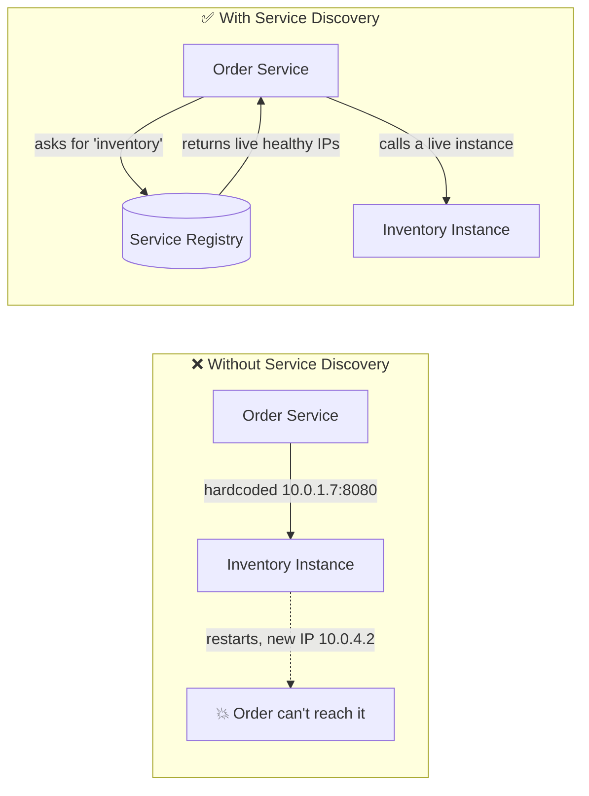
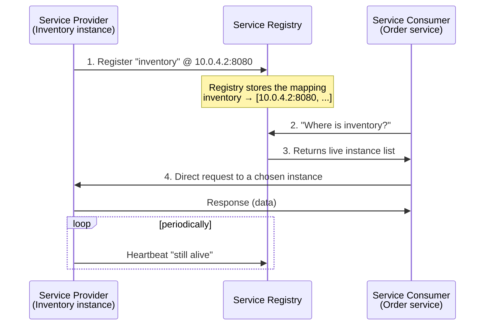
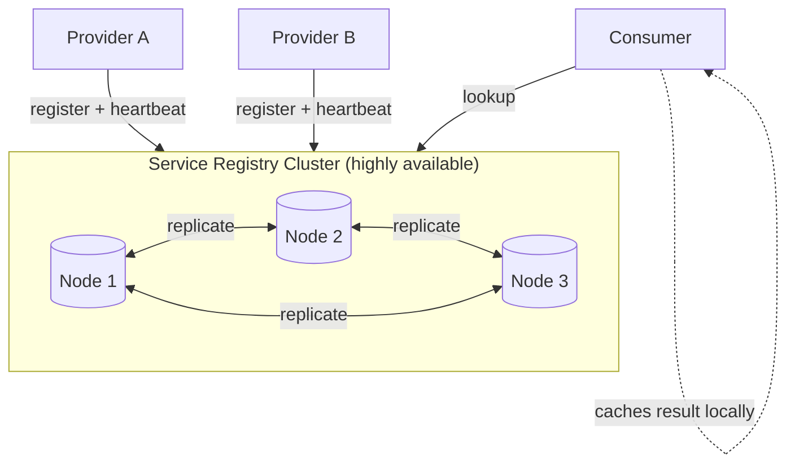
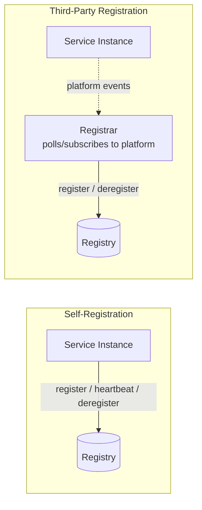
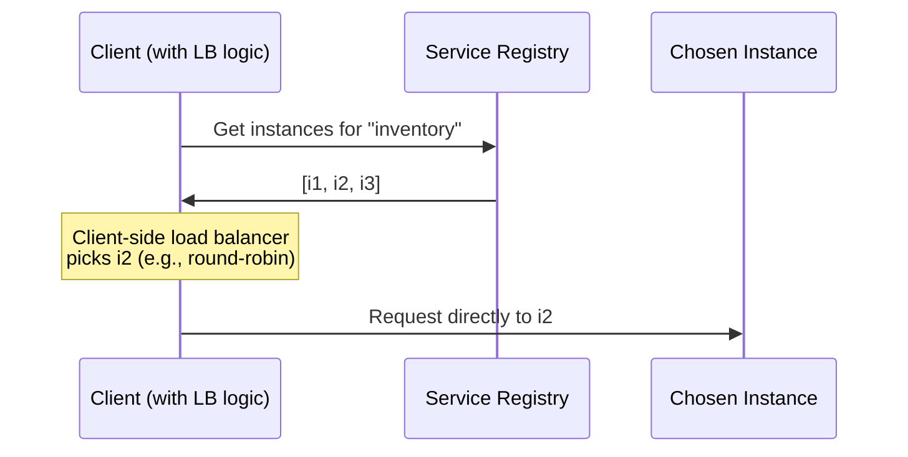
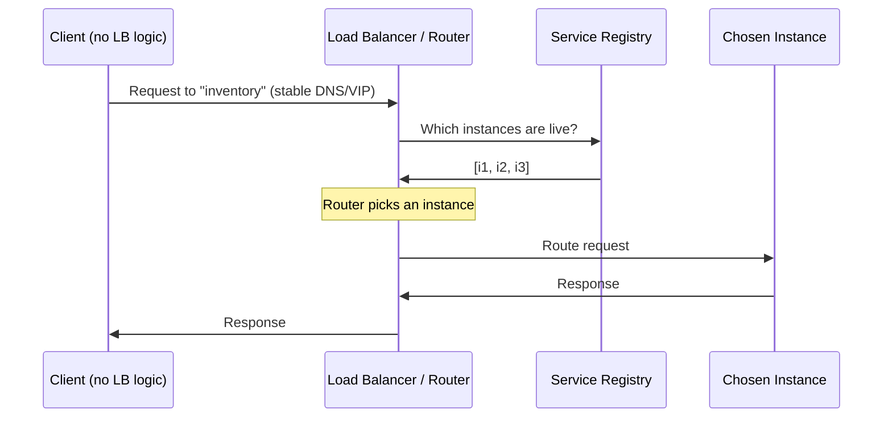
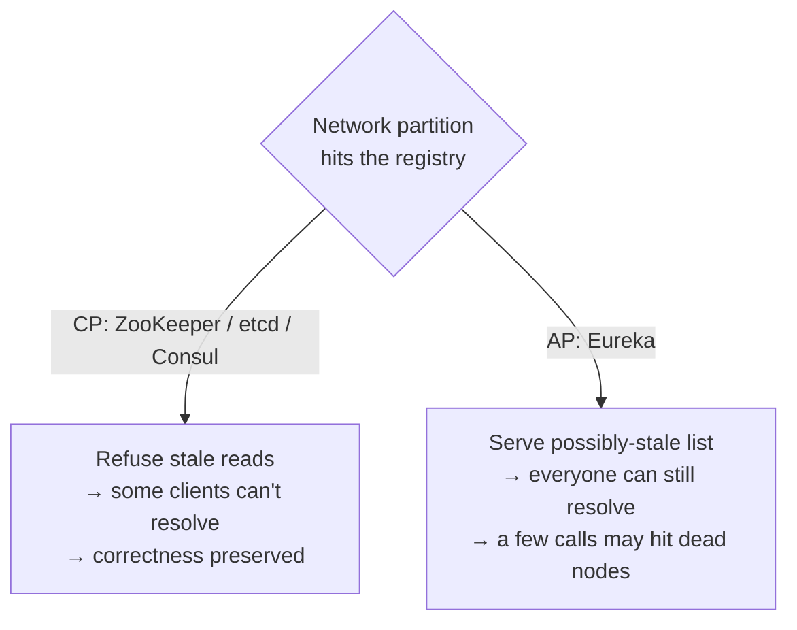
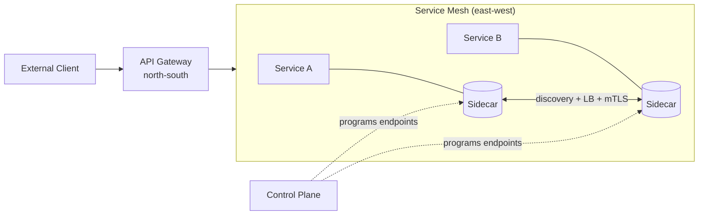

# 🎯 Service Discovery — A Complete Study Guide

> From "what is it" to "how would you tune this at scale" — a single, natural read that takes you from beginner to staff/principal depth.

---

## 📋 Table of Contents

1. [Introduction](#-1-introduction)
2. [Core Definitions](#-2-core-definitions)
3. [Why Service Discovery Exists](#-3-why-service-discovery-exists)
4. [How Service Discovery Works (The Mechanism)](#-4-how-service-discovery-works-the-mechanism)
5. [The Service Registry](#-5-the-service-registry)
6. [Registration Models: Self vs Third-Party](#-6-registration-models-self-vs-third-party)
7. [Discovery Patterns: Client-Side vs Server-Side](#-7-discovery-patterns-client-side-vs-server-side)
8. [Health Checks & Failure Detection](#-8-health-checks--failure-detection)
9. [The Real Trade-Offs (Staff-Level)](#-9-the-real-trade-offs-staff-level)
10. [Categorized Real-World Examples](#-10-categorized-real-world-examples)
11. [Common Misconceptions](#-11-common-misconceptions)
12. [Staff/Principal Nuance](#-12-staffprincipal-nuance)
13. [Adjacent & Extension Concepts](#-13-adjacent--extension-concepts)
14. [⚡ Quick Revision](#-14-quick-revision)
15. [🎓 FAANG Interview Q&A](#-15-faang-interview-qa)
16. [🔗 References & Further Reading](#-16-references--further-reading)

---

## 📋 1. Introduction

Imagine you run a food-delivery app. The **Order** service needs to talk to the **Inventory** service to check whether an item is in stock. In a simple world, Order would just call `http://10.0.1.7:8080` — the fixed address of Inventory — and be done.

But modern systems don't live in a simple world. Inventory doesn't run on one machine at one address. It runs as **many identical copies (instances)**, each on a different machine, each with a different IP address. Those instances appear and disappear constantly: autoscaling spins up five more during the dinner rush, a deploy replaces all of them with a new version, a crashed instance gets rescheduled onto a different host with a brand-new address.

So the real question becomes: **how does Order find a healthy Inventory instance to talk to, right now, without anyone hardcoding an address?**

That question is what **Service Discovery** answers. It is the mechanism that lets services locate each other dynamically, by *name* rather than by *address*, in an environment where addresses change all the time.

💡 Beginner-friendly explanation (click to expand)

Think of Service Discovery like the **contacts app on your phone**. You don't memorize your friend's phone number — you just tap "Mom" and the phone looks up her current number. If Mom changes her number, she updates it once, and everyone who has her in contacts still reaches her.

In microservices, the "phone number" is an IP address that changes every time a service restarts or scales. Service Discovery is the shared contacts app: services register their current "number," and callers look up "Inventory" by name instead of memorizing the digits.

---

## 📋 2. Core Definitions

Before going deeper, let's pin down the vocabulary. These four terms come up in every discussion of the topic.

**Service** — a unit of functionality (e.g., "Inventory"). Usually runs as multiple identical **instances** for scale and redundancy.

**Service Instance** — one running copy of a service, reachable at a specific network location (IP + port). This is the thing whose address keeps changing.

**Service Registry** — a database that maps a logical service *name* to the list of *live instance locations*. It is the single source of truth for "where is X right now?" Examples: Netflix Eureka, HashiCorp Consul, Apache ZooKeeper, etcd.

**Service Discovery** — the overall *process* by which a client resolves a service name into a concrete, healthy instance address using the registry.

It helps to separate the two directions of data flow: **registration** (an instance telling the registry "I exist and I'm here") and **lookup/resolution** (a caller asking the registry "who can serve Inventory?"). Every discovery system does both.

💡 Beginner-friendly explanation (click to expand)

Picture a **hotel front desk**. Guests (service instances) check in and out constantly. The front desk ledger (the registry) always knows who is currently in which room. When a visitor asks "which room is Alice in?" (discovery), the desk checks the ledger and answers. Guests checking in and out is *registration*; the visitor asking is *lookup*. The whole front-desk operation is *service discovery*.

---

## 📋 3. Why Service Discovery Exists

To feel *why* this matters, compare the old world to the new one.

In a **traditional monolith or fixed-server setup**, services lived at known, stable addresses. You could put the Inventory address in a config file, a load-balancer rule, or even hardcode it. It rarely changed, so this "static" approach was fine.

**Microservices broke that assumption in three ways:**

First, **instances are ephemeral**. Containers are created and destroyed by the minute. A restarted service is not guaranteed to keep its old IP. There's no stable address to hardcode.

Second, **the system autoscales**. Traffic spikes trigger new instances; lulls remove them. The *number* of addresses changes minute to minute, not just the addresses themselves.

Third, **hardcoding creates coupling**. If Order embeds Inventory's address, then every Inventory move requires an Order change, redeploy, or config push. With dozens of services each calling many others, this coupling makes the whole system brittle and impossible to evolve independently — which defeats the entire point of microservices.

Service Discovery removes this coupling. Callers depend only on a stable *name* ("inventory"), and the discovery layer handles the ever-changing mapping from name to live addresses. This is what makes autoscaling, rolling deployments, self-healing, and cloud-native operation practical.

💡 Beginner-friendly explanation (click to expand)

Imagine your favorite pizza place kept **moving to a new building every week** but never told you. If you had memorized the old street address, you'd keep showing up to an empty lot. Frustrating, right?

Service Discovery is like a delivery app that always knows the pizza place's *current* address. You just search "Tony's Pizza" and it routes you correctly — even if they moved yesterday. Microservices "move" constantly (new IPs on every restart/scale), so this lookup layer is what keeps the whole system connected.

---

## 📋 4. How Service Discovery Works (The Mechanism)

At its heart, discovery is two operations wrapped around a registry:

1. **Registration** — an instance announces "I'm alive at this address" so the registry can add it.
2. **Resolution (lookup)** — a caller asks "where can I reach service X?" and gets back one or more live addresses.

Let's walk the canonical flow with a **Service Consumer** (the caller) and a **Service Provider** (the callee exposing, say, a REST API).

The four numbered steps are the essence:

1. The provider's location is sent to the registry (self or via a helper).
2. The consumer asks the registry for the provider's location.
3. The registry looks up its internal database and returns the current live instances.
4. The consumer makes a **direct** request to one of those instances.

Two design decisions branch off from this simple flow, and they are the two things interviewers probe hardest:

- **Who registers the instance?** → the instance itself (**self-registration**) or an external agent (**third-party registration**). Covered in §6.
- **Who does the lookup and load-balancing?** → the client (**client-side discovery**) or an intermediary (**server-side discovery**). Covered in §7.

💡 Beginner-friendly explanation (click to expand)

Think of a **large office building with a reception desk**. When an employee arrives (a service starts), they sign in at reception (register). When a courier comes looking for "the marketing team," reception checks the sign-in sheet and points them to the right floor (lookup), and the courier walks there directly (the actual request).

Two natural questions follow: *who signs the employee in* — themselves or an HR assistant? And *who guides the courier* — do they read the sheet themselves, or does a guide walk them there? Those two questions are exactly the two big design choices in service discovery.

---

## 📋 5. The Service Registry

The registry is the beating heart of the whole pattern. Everything else is plumbing around it.

A **Service Registry** is a database of the network locations of all available service instances. Because *every* request path depends on it, it has two demanding requirements:

**It must be highly available.** If the registry goes down and nobody can resolve addresses, your entire system can grind to a halt — this is a classic single point of failure. For that reason, a production registry is almost never a single node. It runs as a **cluster of servers** that replicate data among themselves using a consensus/replication protocol (e.g., Raft in Consul and etcd, a custom peer-replication scheme in Eureka, ZAB in ZooKeeper).

**It must be up-to-date.** The data is only useful if it reflects reality. Stale entries — instances that died but are still listed — cause callers to route requests into the void. This is why registration is paired with **heartbeats** and **health checks** (§8), and why terminated instances must be de-registered promptly.

A subtle but important detail: **clients often cache the results** of a lookup to avoid hitting the registry on every single call. Caching is great for performance and resilience (you can keep working briefly even if the registry blips), but the cached data **eventually goes stale**. Managing that staleness — TTLs, refresh intervals, and cache invalidation — is one of the real engineering challenges of discovery.

💡 Beginner-friendly explanation (click to expand)

The registry is like the **contacts list everyone in a company shares**. If that list disappears, nobody can call anyone — so you keep backup copies on several servers (the cluster) that stay in sync.

You also want the list to be *current*: if someone leaves the company, their entry should be removed quickly, or people will keep dialing a dead number. And because checking the shared list every single time is slow, people jot down numbers they use often (caching) — but those jotted-down numbers can go out of date, which is its own headache.

---

## 📋 6. Registration Models: Self vs Third-Party

How does an instance's location *get into* the registry in the first place? There are two approaches.

### 6.1 Self-Registration

The service instance is **responsible for registering and de-registering itself**. On startup it calls the registry's API ("register me at this address"), sends periodic **heartbeats** to keep the entry alive, and de-registers on graceful shutdown.

**Pros:** Simple; no extra moving parts. The instance knows the most about its own readiness (it can register only after warm-up, expose rich metadata like version/zone).

**Cons:** It **couples** every service to the registry's API. That registration/heartbeat logic must be re-implemented (or at least a client library added) in **every language and framework** you use. It also mixes an infrastructure concern into your business code.

### 6.2 Third-Party Registration

A separate component — often called the **registrar** — handles registration on behalf of instances. The registrar watches the deployment environment (polling it or subscribing to events) and, when it detects a new instance, records it in the registry. When an instance dies, the registrar de-registers it.

**Pros:** Services are **decoupled** from the registry — no registration code in your app, no per-language client library. Registration is managed centrally.

**Cons:** The registrar is **yet another highly available component** to run and operate — *unless* it's already built into your platform (which, in modern setups, it usually is).

> **Real-world tie-in:** When you launch an EC2 instance in an AWS Auto Scaling Group, it can be **automatically registered** with an Elastic Load Balancer / target group — that's third-party registration handled by the platform. In Kubernetes, the control plane registers Pods as Endpoints for a Service automatically — again, third-party registration you never write code for.

💡 Beginner-friendly explanation (click to expand)

Two ways to sign guests into a hotel. **Self-registration**: each guest walks up and signs the ledger themselves, and every so often shouts "still here!" so they don't get crossed off. Simple, but every guest needs to know the sign-in ritual.

**Third-party registration**: a dedicated concierge watches the front door, and whenever someone walks in or leaves, the concierge updates the ledger for them. Guests do nothing — but now you have to pay a concierge (run an extra component). In cloud platforms, that concierge usually comes free with the building.

---

## 📋 7. Discovery Patterns: Client-Side vs Server-Side

Now the second big decision: once the addresses are *in* the registry, **who looks them up and picks which instance to call?**

### 7.1 Client-Side Discovery

The **client itself** queries the registry, gets the full list of live instances, and uses its **own load-balancing logic** to pick one and send the request.

**Advantages**
- Straightforward architecture — the registry is the only extra moving part.
- Saves a network hop: no dedicated load balancer sits in the path.
- The client knows all instances up front and can make **smart, application-aware** load-balancing decisions (e.g., prefer same-zone instances, weighted routing).

**Disadvantages**
- The client must **implement discovery + load-balancing logic**, coupling it to the registry.
- That logic must exist for **every language/framework** your clients use.

**Canonical example:** **Netflix Eureka** paired with a client-side load balancer (historically Ribbon, now Spring Cloud LoadBalancer). Each Java service pulls the registry into memory and balances locally.

### 7.2 Server-Side Discovery

The client makes a request to a **stable intermediary** — a load balancer, router, or API gateway — and *that* component queries the registry and routes the request to a live instance. The client typically just talks to a fixed DNS name or virtual IP and stays blissfully unaware of the registry.

**Advantages**
- The client is **lighter** — no discovery/LB logic, nothing per-language to maintain.
- Client and registry are **decoupled**.
- You usually **don't build the load balancer yourself** — the platform provides it (AWS ELB/ALB, Kubernetes kube-proxy + Services, NGINX/Envoy).

**Disadvantages**
- The load balancer is **another component to run and manage** (unless the platform gives it to you).
- It adds an **extra network hop** and a potential bottleneck/failure point in the request path.
- You become somewhat **coupled to the deployment platform** (e.g., relying on Kubernetes for discovery ties that concern to Kubernetes).

**Canonical example:** **Kubernetes**. You call a stable Service name like `inventory.default.svc.cluster.local`; kube-proxy (or an Envoy-based mesh) resolves and load-balances to a healthy Pod. AWS ELB in front of an Auto Scaling Group is the same idea.

### 7.3 Side-by-Side

| Dimension | Client-Side | Server-Side |
|---|---|---|
| Who does lookup + LB? | The client | Intermediary (LB/router/gateway) |
| Network hops | Fewer (direct) | Extra hop via LB |
| Client complexity | Higher (per-language logic) | Lower (talks to a name) |
| Coupling | Client ↔ registry | Client ↔ platform |
| LB intelligence | App-aware, fine-grained | Generic, centrally managed |
| Typical tech | Eureka + Ribbon/Spring Cloud LB | Kubernetes Services, AWS ELB/ALB, Envoy |
| Who operates the LB? | No dedicated LB | You or the platform |

💡 Beginner-friendly explanation (click to expand)

Two ways to find a taxi. **Client-side**: you look at the whole taxi stand, see all available cabs, and pick one yourself. You go directly to your chosen cab (no middleman, one fewer step), but *you* have to know how to evaluate and choose.

**Server-side**: you tell a dispatcher "I need a ride," and the dispatcher picks a cab and sends it to you. Much easier for you — you don't need to know anything — but now there's a dispatcher in the loop who could be busy or unavailable, and you're relying on their system. Kubernetes and AWS load balancers are the "dispatcher" model; Netflix Eureka with Ribbon is the "pick it yourself" model.

---

## 📋 8. Health Checks & Failure Detection

A registry full of *dead* instances is worse than useless — it routes traffic into black holes. So discovery systems constantly answer: **"is this instance still healthy?"** Two mechanisms dominate.

**Heartbeats (push).** The instance periodically pings the registry ("still alive"). If the registry misses N heartbeats within a timeout, it marks the instance down and removes it. Eureka works this way: clients send heartbeats every 30s by default; miss the lease-renewal window and the instance is evicted.

**Active health checks (pull).** The registry (or LB) periodically *calls* the instance — e.g., an HTTP `GET /health` or `/actuator/health` — and keeps it in rotation only if it returns healthy. Consul and Kubernetes readiness/liveness probes work this way. Kubernetes uses **readiness probes** to decide whether a Pod should receive traffic and **liveness probes** to decide whether to restart it.

The key tension is **detection speed vs false positives**. Aggressive timeouts detect real failures fast but may evict a healthy-but-briefly-slow instance (a GC pause, a network blip), causing needless churn. Loose timeouts avoid false evictions but leave dead instances in rotation longer, so callers hit errors. Every discovery system exposes these as **tunable knobs** (heartbeat interval, timeout multiples, probe period, failure/success thresholds), and choosing them well is a real operational skill.

> **Eureka's self-preservation mode** is a famous nuance: if Eureka suddenly loses heartbeats from *many* instances at once, it assumes the problem is a **network partition**, not mass instance death, and **stops** evicting them — preferring stale data over wrongly emptying the registry. This is a deliberate **availability-over-consistency** choice.

💡 Beginner-friendly explanation (click to expand)

Think of a **roll call**. Two ways to check who's present: everyone shouts "here!" every minute (heartbeat), or the teacher walks around and taps each person to check they're awake (active health check).

If the teacher is too impatient — marking someone absent the instant they're a half-second slow to answer — they'll wrongly cross off people who are actually fine. Too patient, and they'll keep counting people who already left. Getting that timing right is the whole art of health checking.

---

## 📊 9. The Real Trade-Offs (Staff-Level)

Beneath the tidy diagrams lies the trade-off that separates textbook answers from staff-level ones: **the CAP theorem applies to your registry.**

A registry is a distributed datastore, so during a network partition it must choose between:

- **Consistency (CP):** every read returns the latest, correct instance list — but during a partition, parts of the registry may become **unavailable** rather than serve possibly-stale data. ZooKeeper, etcd, and Consul (by default) lean **CP** (Raft/ZAB consensus).
- **Availability (AP):** the registry always answers, even during a partition, at the risk of returning **stale** data. **Eureka** deliberately leans **AP** — it would rather hand you a possibly-outdated instance list than refuse to answer.

Why does this matter? Because **for service discovery, stale-but-available is often better than correct-but-down.** If your registry refuses to answer during a partition, *no service can find any other service* — catastrophic. If it returns a slightly stale list, the worst case is a few requests hit a dead instance and get retried. This is why Eureka's AP design was a sensible choice for Netflix's "always serving" priority, and why the "right" answer is genuinely context-dependent.

Other real trade-offs an experienced engineer weighs:

**Latency vs freshness (caching).** Caching instance lists client-side cuts registry load and latency, but widens the staleness window. Tuning TTL/refresh is a direct latency-vs-correctness dial.

**Where the load balancing lives.** Client-side LB is app-aware and hop-free but forces a library into every language and makes rollout of LB changes a fleet-wide redeploy. Server-side LB centralizes control (change routing once) but adds a hop and a shared failure domain.

**Thundering herd on registry restart.** If the registry cluster restarts and thousands of clients re-register and re-fetch simultaneously, it can self-DDoS. Mitigations: jittered/backoff registration, client caches that survive registry downtime, and read replicas.

**Propagation delay.** There's always a lag between "instance died" and "every caller stops sending to it": health-check period + eviction threshold + client cache TTL. That window is where retries, circuit breakers, and outlier detection earn their keep.

💡 Beginner-friendly explanation (click to expand)

Imagine the shared contacts list splits into two copies during a network glitch, and they can't sync. You face a choice: **refuse to give out any number until the copies agree** (safe but everyone's stuck), or **hand out whatever number you have, even if it might be old** (everyone keeps working, but a few calls reach a disconnected line).

For finding services, the second option is usually smarter — a wrong number you can redial beats a phone system that won't let anyone call at all. That's exactly why Eureka chooses "always answer, maybe stale."

---

## 💻 10. Categorized Real-World Examples

Discovery shows up in different guises depending on the layer you operate at. Grouping the tools clarifies the landscape.

**Application-level registries (you run them, often client-side):**
- **Netflix Eureka** — AP registry, the classic Spring Cloud choice; client-side discovery with Ribbon / Spring Cloud LoadBalancer.
- **HashiCorp Consul** — registry + health checks + KV store + DNS interface; can do CP consensus and supports both discovery styles.
- **Apache ZooKeeper** — strongly consistent (CP) coordination service; used for discovery (e.g., older Kafka, some Hadoop stacks) though it's a general coordination tool.
- **etcd** — CP key-value store (Raft); the backing store for Kubernetes itself.

**Platform / server-side discovery (the platform does it for you):**
- **Kubernetes Services** — you call a stable Service DNS name; kube-proxy load-balances to healthy Pods; etcd holds the endpoint data. Third-party registration is automatic.
- **AWS Elastic Load Balancing (ALB/NLB) + Auto Scaling Groups + Cloud Map** — instances auto-register with target groups; ELB routes to healthy targets. AWS Cloud Map is the explicit service-registry offering.
- **DNS-based discovery** — SRV/A records (e.g., Consul DNS, Kubernetes CoreDNS) let *any* client discover via plain DNS, no special library.

**Service-mesh discovery (sidecar-based):**
- **Istio / Linkerd with Envoy sidecars** — the mesh control plane knows all endpoints and programs each sidecar proxy; discovery, load balancing, retries, and mTLS move out of app code into the data plane.

**Concrete scenario:** An **order-processing system** where Inventory scales up and down for demand. New Inventory Pods auto-register (Kubernetes) or auto-heartbeat (Eureka); the Order service resolves "inventory" by name and always reaches a *live* instance — no config change, no redeploy, even as the underlying addresses churn all day.

---

## ❌ 11. Common Misconceptions

**"Service discovery is just DNS."** DNS is *one* way to expose discovery, but classic DNS caches aggressively (TTLs), returns records without health awareness, and reacts slowly to change. Discovery systems add health checking, near-real-time updates, and richer metadata (version, zone, weights). DNS can be a *front-end* to discovery (Consul/CoreDNS), but discovery ≠ DNS.

**"The registry is a single database, so it's a single point of failure."** A *naive* one would be. Production registries run as **replicated clusters** precisely to avoid this. The registry's own availability is a first-class design concern.

**"Once I look up an address, I'm done."** Instances die between your lookup and your call, and cached lists go stale. Discovery must be paired with **retries, circuit breakers, and health-aware routing** — resolution is not a one-shot guarantee.

**"Server-side discovery is always better because it's simpler for the client."** It moves complexity, it doesn't remove it: you now operate a load balancer, eat an extra hop, and couple to the platform. Client-side keeps the path direct and enables app-aware balancing. It's a trade-off, not a winner.

**"Client-side and server-side are mutually exclusive."** Real systems mix them — e.g., a service mesh gives you server-side-*feeling* discovery via a *local* sidecar (so it's hop-free like client-side but code-free like server-side).

**"The registry must be perfectly consistent."** For discovery, **availability usually trumps strict consistency** — a slightly stale list you can act on beats a perfectly correct list you can't reach (see §9).

---

## 💡 12. Staff/Principal Nuance

The details experienced engineers raise *unprompted*:

**CAP posture is a deliberate choice, not an accident.** Know that Eureka is AP and ZooKeeper/etcd/Consul-default are CP, and be able to argue *why AP is typically right for discovery* (stale-but-reachable > correct-but-down). Being able to name the trade-off and defend a side is the staff-level signal.

**Deregistration is harder than registration.** Graceful shutdown deregisters cleanly; **crashes don't**. So you *always* need health-check/lease expiry as the backstop, and you must reason about the **failure-detection window** (probe interval × threshold + cache TTL) during which callers still route to a dead instance.

**Propagation lag is unavoidable — design around it.** Because updates take time to reach every cache, layer in **client-side resilience**: retries with backoff, **circuit breakers** (Hystrix/Resilience4j), and **outlier detection** (Envoy) that ejects a misbehaving endpoint locally even before the registry catches up.

**The registry is critical infra — protect it.** Guard against **thundering herds** on restart (jitter + backoff), let clients **serve from cache when the registry is unreachable**, and size the cluster for read-heavy load. Losing discovery can take down everything at once.

**Tunable knobs are the interview payload.** Heartbeat interval, lease timeout, eviction thresholds, self-preservation, cache TTL/refresh, LB algorithm and locality weighting, probe period and success/failure counts — staff engineers discuss *which knob to turn for which symptom* (e.g., "too many requests to dead nodes → shorten lease timeout / cache TTL, but watch for flapping").

**Locality & zone-aware routing.** At scale you don't just pick *any* healthy instance — you prefer **same-AZ/same-zone** ones to cut latency and cross-AZ data cost, failing over to remote zones only when local ones are unhealthy. Client-side LB and service meshes make this configurable.

**Security dimension.** Who can register? A compromised or spoofed instance registering itself can hijack traffic. Mature setups authenticate registration and use **mTLS** (often via a mesh) so callers verify they're talking to a legitimate instance.

**Discovery vs configuration overlap.** Tools like Consul and etcd double as **KV/config stores**, and ZooKeeper as a coordination primitive. Staff engineers weigh whether to unify discovery + config + coordination or keep them separate for blast-radius isolation.

---

## 🔗 13. Adjacent & Extension Concepts

**API Gateway.** A single entry point for *external* clients that routes inward. It often *uses* discovery under the hood to find backend instances. Discovery is about east-west (service-to-service) location; a gateway is typically north-south (client-to-system) — but they compose.

**Service Mesh (Istio, Linkerd).** The modern evolution: a **sidecar proxy** (Envoy) next to every instance handles discovery, load balancing, retries, timeouts, mTLS, and observability — pulled *out* of application code. The control plane holds the endpoint view (fed by the platform's discovery) and programs the proxies. This gives you server-side-style decoupling with client-side-style locality (the proxy is local, so no extra network hop to a shared LB).

**Load Balancing.** Discovery finds the *set* of instances; load balancing picks *which one*. They're distinct steps that always travel together — client-side discovery bundles both in the client; server-side bundles both in the LB.

**Client-side resilience patterns.** Retries, **circuit breakers**, bulkheads, and **outlier/ejection** logic are the necessary companions that make discovery *safe* given propagation lag and stale caches.

**DNS-based discovery & SRV records.** Using DNS (with health-aware backends like Consul or CoreDNS) as a universal, language-agnostic discovery interface — any client that can resolve a name participates, no SDK required.

**Consensus algorithms (Raft, ZAB, Paxos).** The machinery that keeps CP registries (etcd, Consul, ZooKeeper) consistent across their cluster nodes — worth knowing by name to explain *how* a highly-available registry stays correct.

---

## ⚡ 14. Quick Revision

Service Discovery is the mechanism that lets microservices find each other by *name* instead of by *address*, in an environment where instance addresses change constantly due to autoscaling, rolling deploys, crashes, and rescheduling. Hardcoding addresses couples services together and breaks the moment an instance moves, so discovery removes that coupling: callers depend only on a stable logical name, and a discovery layer maps that name to the current set of live instances.

At the center sits the **Service Registry** — a database mapping service names to live instance locations. It must be **highly available** (so it runs as a replicated cluster, not a single node) and **up-to-date** (so it pairs with heartbeats and health checks and de-registers dead instances). Clients frequently **cache** lookup results for speed and resilience, accepting that the cache goes stale over time. The whole pattern is two operations around this registry: **registration** ("I'm alive here") and **resolution/lookup** ("where can I reach X?").

Two design choices define any discovery system. First, **who registers an instance**: in **self-registration** the instance registers, heartbeats, and de-registers itself (simple, but couples every service to the registry and needs per-language code); in **third-party registration** a **registrar** watches the platform and registers instances for them (decoupled, but another component to run — usually free in cloud platforms like Kubernetes Endpoints or AWS ASG↔ELB). Second, **who does lookup and load balancing**: in **client-side discovery** the client queries the registry and balances itself (fewer hops, app-aware balancing, but per-language logic and registry coupling — e.g., **Netflix Eureka + Ribbon/Spring Cloud LB**); in **server-side discovery** an intermediary LB/router/gateway does it while the client just calls a stable name (lighter client, decoupled, but an extra hop and platform coupling — e.g., **Kubernetes Services**, **AWS ELB/ALB**, **Envoy**).

**Health checking** keeps the registry honest via **heartbeats (push)** or **active probes (pull)**, and the core tension is detection speed vs false positives — every system exposes tunable knobs (heartbeat/lease intervals, eviction thresholds, probe periods). Crashes don't de-register cleanly, so health/lease expiry is the essential backstop, and there's always a **failure-detection window** (probe period × threshold + cache TTL) where callers still hit dead instances.

The staff-level heart of the topic is **CAP applied to the registry**: **Eureka is AP** (always answers, may be stale), while **ZooKeeper/etcd/Consul-default are CP** (correct, but may refuse reads during a partition). For discovery, **stale-but-available usually beats correct-but-down**, because a registry that won't answer means *no service can find any other* — so AP is often the right call. Because propagation lag is unavoidable, discovery must be paired with **retries, circuit breakers, and outlier detection**, and at scale with **zone-aware routing**, **thundering-herd protection**, and **mTLS-secured registration**. The modern evolution is the **service mesh** (Istio/Linkerd + Envoy sidecars), which moves discovery, load balancing, and resilience out of app code into a local proxy — giving decoupling like server-side discovery with locality like client-side.

**One-line recall:** *A highly-available registry maps names → live instances; instances get in via self- or third-party registration; callers resolve via client-side or server-side discovery; health checks keep it fresh; and because the registry is a distributed store, its CAP posture (usually AP for discovery) plus retries and circuit breakers handle the inevitable staleness.*

---

## 🎓 15. FAANG Interview Q&A

### 🎯 Conceptual & Fundamentals

<b>Q1. What is service discovery and what problem does it solve?</b>

Service discovery is the mechanism that lets services locate each other by a logical *name* rather than a hardcoded *address*, in environments where instance addresses change constantly. In microservices running on containers/VMs, instances are ephemeral — autoscaling, rolling deploys, and crashes mean an instance's IP is not stable and the *number* of instances varies minute to minute. Hardcoding or config-injecting addresses couples services and breaks whenever an instance moves. Discovery introduces a registry that maps names to live instance locations, so a caller like an Order service just asks for "inventory" and always gets a current, healthy address. Kubernetes Services and Netflix Eureka are two common implementations at opposite ends (platform server-side vs app-level client-side).

<b>Q2. Walk me through the end-to-end flow of a service discovery interaction.</b>

There are two flows around a registry: registration and resolution. On startup, a provider instance's location is placed in the registry — either it self-registers via the registry API or a registrar detects and registers it. It then keeps the entry alive via heartbeats or passes active health checks. When a consumer needs the provider, it queries the registry (client-side) or calls an intermediary that queries the registry (server-side), receives the current live instance list, a load balancer picks one, and the consumer sends the request **directly** to that instance. On graceful shutdown the instance de-registers; on a crash, health-check/lease expiry evicts it. Concretely in Kubernetes: a Pod becomes a ready Endpoint, you call the Service DNS name, kube-proxy routes to a healthy Pod.

<b>Q3. What is a service registry, and what are its key requirements?</b>

A service registry is a database mapping service names to the network locations of their live instances — the single source of truth for "where is X?". Its two hard requirements are **high availability** (every request path depends on it, so a single node would be a catastrophic single point of failure; it runs as a replicated cluster using a consensus/replication protocol like Raft in etcd/Consul or peer replication in Eureka) and **freshness** (stale entries route traffic to dead instances, so it pairs with heartbeats/health checks and prompt de-registration). A practical nuance: clients cache lookups for performance and resilience, so managing cache staleness (TTL/refresh) is part of running a registry well. Examples: Eureka, Consul, etcd, ZooKeeper.

<b>Q4. Compare client-side and server-side discovery. When would you choose each?</b>

In **client-side** discovery the client queries the registry directly and runs its own load balancer (e.g., Eureka + Ribbon/Spring Cloud LB). Upsides: no extra hop, app-aware balancing (zone preference, weighting), only the registry is a moving part. Downsides: discovery/LB logic must exist per language, coupling clients to the registry. In **server-side** discovery the client calls a stable name and an intermediary LB/router does lookup + routing (Kubernetes Services, AWS ELB/ALB, Envoy). Upsides: thin clients, decoupling, the platform usually provides the LB. Downsides: extra hop, a shared failure domain, platform coupling. Choose client-side for polyglot-light, latency-sensitive, locality-aware needs where you want fine control; choose server-side when you're on a platform that provides it (almost always today) and want language-agnostic simplicity.

<b>Q5. Self-registration vs third-party registration — trade-offs?</b>

**Self-registration**: the instance registers, heartbeats, and de-registers itself. Simple and no extra components, and the instance knows its own readiness best — but it couples every service to the registry API and forces registration code/libraries into every language and framework, mixing infra concerns into business code. **Third-party registration**: a registrar watches the deployment platform (polling or events) and registers/de-registers instances for them. This decouples services entirely — no per-language code — but adds another highly-available component to operate, *unless the platform provides it*. In practice the platform usually does: Kubernetes turns ready Pods into Endpoints automatically, and an AWS Auto Scaling Group auto-registers instances with an ELB target group — both third-party registration you never code.

<b>Q6. How do health checks work, and what's the trade-off in tuning them?</b>

Two styles: **heartbeats (push)**, where the instance periodically pings the registry and missing N within a timeout triggers eviction (Eureka renews leases ~every 30s), and **active checks (pull)**, where the registry/LB calls an endpoint like `GET /health` and keeps the instance in rotation only if healthy (Consul checks, Kubernetes readiness/liveness probes). The core trade-off is **detection speed vs false positives**: aggressive timeouts evict dead instances fast but may drop a healthy-but-briefly-slow one (GC pause, network blip), causing churn/flapping; loose timeouts avoid false evictions but leave dead instances serving errors longer. So you tune intervals, timeout multiples, and success/failure thresholds to your traffic and failure profile. Kubernetes separates *readiness* (should it get traffic?) from *liveness* (should it be restarted?).

<b>Q7. How does discovery work in Kubernetes specifically?</b>

Kubernetes is server-side discovery with automatic third-party registration. When a Pod passes its readiness probe, the control plane adds it to the Service's Endpoints (stored in etcd, the CP backing store). Clients call a stable Service DNS name (`inventory.default.svc.cluster.local`, resolved by CoreDNS) or ClusterIP; kube-proxy (iptables/IPVS) or an Envoy-based mesh load-balances to a healthy Pod. You write no registration code — the platform is the registrar and the LB. The trade-off is coupling to Kubernetes for discovery, which is fine when your whole stack runs there. Meshes like Istio layer richer routing (canary, mTLS, outlier detection) on top by programming per-Pod sidecars from the same endpoint data.

<b>Q8. Why can't we just use DNS for service discovery?</b>

You can use DNS as an *interface* to discovery, but plain DNS has weaknesses for dynamic microservices. DNS caches by TTL at many layers (resolver, OS, app), so changes propagate slowly and clients may cling to dead records; standard A/SRV records carry no health awareness; and DNS gives you addresses, not rich metadata like version, zone, or weight. Purpose-built discovery adds fast, health-aware updates and metadata. That said, health-aware DNS front-ends exist — Consul's DNS interface and Kubernetes CoreDNS resolve names to *currently healthy* endpoints — giving you language-agnostic discovery (any client that resolves names participates) while a real registry does the health tracking behind the scenes.

### 📊 Staff / L4–L5 & Trade-off Depth

<b>Q9. [L5] How does CAP theorem apply to a service registry, and which posture do you prefer for discovery?</b>

A registry is a distributed datastore, so under a network partition it must trade consistency for availability. **Eureka is AP** — it always answers, even if the instance list is stale. **ZooKeeper, etcd, and Consul (default) are CP** — they use consensus (ZAB/Raft) and may refuse reads on a minority partition to avoid serving stale data. For discovery I generally prefer **AP**: if the registry refuses to answer during a partition, *no service can resolve any other* and the whole system stalls; whereas a slightly stale list means at worst a few requests hit a dead instance and get retried. Netflix chose Eureka's AP design for exactly this "always serving" priority. The caveat: for *leader election* or *config that must be globally consistent*, CP (ZooKeeper/etcd) is the right tool — so the answer is workload-dependent, and being able to justify the choice is the point.

<b>Q10. [L5] There's always a delay between an instance dying and callers stopping traffic to it. How do you reason about and mitigate this window?</b>

The failure-detection window is roughly (health-check/heartbeat period × failure threshold) + client cache TTL + LB refresh — during it, callers still route to a dead node. You can shrink it by shortening heartbeat/lease intervals and cache TTLs, but too aggressive and you get flapping/false evictions and thundering-herd re-registration. Since you can't drive it to zero, you design *around* it with client-side resilience: **retries with backoff and jitter** (idempotency-aware), **circuit breakers** (Resilience4j/Hystrix) to stop hammering a failing target, and **outlier/ejection detection** (Envoy) so a sidecar locally drops a bad endpoint before the registry catches up. Zone-aware routing and connection-level health also help. The staff answer is: minimize the window *and* make the call path tolerant of it — don't rely on the registry being instantly correct.

<b>Q11. [L5] The registry itself is critical infrastructure. How do you keep it from becoming a system-wide single point of failure?</b>

Run it as a **replicated cluster** (3–5 nodes) with a consensus/replication protocol and spread across availability zones so no single AZ failure takes it out. Let clients **cache endpoints and keep serving from cache** if the registry is briefly unreachable, so a registry blip doesn't instantly break all traffic. Protect against **thundering herds** on restart — if thousands of clients re-register/re-fetch at once they self-DDoS — using jittered, backed-off registration and read replicas for the read-heavy lookup load. Add self-preservation-style safeguards (Eureka stops evicting en masse during suspected partitions to avoid emptying the registry on a network glitch). Monitor the registry as tier-0 infra with its own alerting. The philosophy: assume the registry *will* have a bad moment and ensure the data plane degrades gracefully rather than cascading.

<b>Q12. [L5] How does a service mesh change the service discovery story?</b>

A mesh (Istio/Linkerd) puts an **Envoy sidecar** next to every instance and moves discovery, load balancing, retries, timeouts, mTLS, and telemetry out of app code into the data plane. The control plane holds the global endpoint view (fed by the platform's discovery, e.g., Kubernetes Endpoints) and programs each sidecar. Architecturally it's a hybrid: you get server-side-style *decoupling* (apps need no discovery SDK, works across languages) but client-side-style *locality* (the proxy is co-located, so there's no extra hop to a shared central LB, and it can do zone-aware balancing and local outlier ejection). The cost is operational complexity and per-hop proxy latency/resource overhead. For large polyglot fleets that also need security and observability, the mesh usually wins; for a small homogeneous system it's overkill versus plain Kubernetes Services or Eureka.

<b>Q13. [L5] Which discovery knobs would you tune, and for what symptoms?</b>

Map symptoms to knobs. *Too many requests hitting dead instances* → shorten heartbeat/lease timeout and client cache TTL, tighten health-check thresholds — but watch for flapping. *Instances flapping in/out of rotation* → loosen thresholds, add success/failure counts (require N consecutive results), increase probe timeout to tolerate GC pauses. *Registry overloaded* → increase client cache TTL, add read replicas, jitter registration. *High tail latency or cross-AZ cost* → enable zone/locality-aware load balancing with same-zone preference and failover. *Cascading failures on a slow dependency* → add circuit breakers and outlier ejection at the client/sidecar. *Mass eviction during network blips* → enable self-preservation (Eureka) or partition-tolerant behavior. The staff signal is discussing the *second-order effects* of each knob, not just naming it.

<b>Q14. [L5] How would you secure service registration and discovery?</b>

The threat is a spoofed or compromised instance registering itself to hijack traffic, or an unauthorized client discovering internal endpoints. Mitigations: **authenticate registration** (only workloads with valid identity/credentials can register — e.g., SPIFFE/SPIRE identities, Consul ACL tokens), **authenticate and encrypt service-to-service calls with mTLS** so a caller cryptographically verifies it's talking to a legitimate instance (a service mesh automates cert issuance/rotation), and **authorize lookups** so services only discover what they're allowed to. Lock down the registry's own API and admin plane, and audit registration events. In Kubernetes this often means the mesh (Istio) issuing workload certs plus NetworkPolicies limiting who can reach whom. The principle: discovery decides *where* to send traffic, but identity/mTLS decides *whether to trust* the endpoint you found.

<b>Q15. [L5] Design service discovery for a multi-region, globally distributed system.</b>

Prefer **regional registries** over one global one to avoid cross-region consensus latency and a global blast radius: each region runs its own HA registry cluster, and services discover **local** endpoints by default for latency and cost. Add **zone/region-aware routing** so callers stay in-region, failing over to another region only when local instances are unhealthy (weighted/priority load balancing in Envoy). Use **cross-region replication or federation** for the subset of data that must be visible globally (e.g., Consul WAN federation, or a global DNS/traffic layer like Route 53/Global Accelerator in front of regional entry points). Accept eventual consistency across regions (AP) since strong global consistency is too slow. Layer retries, circuit breakers, and health checks per region. The staff insight: keep the *authoritative, low-latency* discovery regional, and treat cross-region as a coarser, replicated/federated layer rather than a single global registry.

<b>Q16. [L5] Would you build service discovery yourself or adopt an existing solution, and how does it fit CI/CD and rollouts?</b>

Almost always adopt an existing, battle-tested system — discovery is deceptively hard (HA, CAP, health checks, thundering herds, security), and building it in-house diverts effort from product value while re-inventing solved problems. Pick based on your platform: on Kubernetes, use built-in Services (+ a mesh if you need advanced routing/security); on VMs/hybrid, Consul; for Spring-heavy JVM shops, Eureka; when you also need consistent config/coordination, etcd/Consul. Discovery is what *makes* zero-downtime CI/CD work: rolling deploys, blue-green, and canaries rely on new instances registering (and passing readiness) before old ones drain and de-register, so traffic shifts automatically with no config change. Tie deregistration into graceful shutdown (connection draining) so in-flight requests complete. The build-it case only holds at hyperscale with truly unique requirements — and even Netflix open-sourced theirs rather than keeping it bespoke.

### 📝 STAR-Based (Behavioral × System Design)

<b>Q17. [STAR] Tell me about a time you diagnosed and fixed a production issue caused by service discovery.</b>

**Situation:** After enabling aggressive autoscaling, our checkout service began throwing intermittent 5xx errors during scale-down events, roughly 2–3% of requests for about a minute after each scale-in.

**Task:** I owned reliability for the checkout path and needed to eliminate the error spikes without disabling autoscaling.

**Action:** Tracing showed callers were routing to instances that had already terminated — a stale-endpoint problem. The gap was the failure-detection window: our client cache TTL (30s) plus the registry's lease timeout meant terminated Pods lingered in caller lists. I made three changes: added `preStop` hooks with connection draining so instances de-registered *before* terminating, shortened the readiness/eviction thresholds moderately, and — most importantly — added Resilience4j retries with backoff plus outlier ejection so a single dead endpoint was retried on a healthy one.

**Result:** Error rate during scale-in dropped from ~2–3% to under 0.05%, well within SLO. The lasting lesson I documented: you can't make discovery instantly consistent, so graceful deregistration *plus* client-side retries are both required, not either/or.

<b>Q18. [STAR] Describe a time you had to choose between two service discovery approaches (or technologies).</b>

**Situation:** We were migrating a polyglot fleet (Java, Node, Go) from VMs to Kubernetes, and the existing Java services used Eureka with client-side load balancing.

**Task:** As tech lead I had to decide whether to keep Eureka everywhere or adopt Kubernetes-native server-side discovery for the migrated services.

**Action:** I laid out the trade-off explicitly: Eureka meant maintaining a discovery client library in three languages and running Eureka as extra infra, but preserved app-aware balancing; Kubernetes Services meant zero discovery code, automatic registration, and language-agnostic simplicity at the cost of platform coupling and an extra proxy hop. Since we were committing to Kubernetes anyway and the polyglot maintenance burden was real, I prototyped both, measured the negligible latency difference, and chose Kubernetes-native discovery, planning a later Istio adoption for advanced routing and mTLS.

**Result:** We retired Eureka and the per-language client libraries, cutting a class of dependency-upgrade toil. Migration completed a sprint early because new services needed no discovery code. I made sure to document *why* — the platform coupling was an accepted, deliberate trade-off, not an oversight.

<b>Q19. [STAR] Tell me about a time a shared/central component's failure taught you a resilience lesson.</b>

**Situation:** Our service registry cluster had a rolling restart during a maintenance window, and within seconds a large fraction of services couldn't resolve dependencies — a partial outage rippled across the platform.

**Task:** I was on-call and needed to both restore service immediately and prevent a recurrence.

**Action:** Immediately, I confirmed clients weren't caching endpoints across registry downtime, so a registry blip translated directly into resolution failures; I mitigated by staggering the restart and restoring a quorum node fast. Post-incident, I drove three fixes: enabled client-side caching that *survives* registry unavailability (serve last-known-good endpoints), added jittered/backoff re-registration to prevent a thundering herd hammering the registry on recovery, and spread the cluster across three AZs so a maintenance action never took a quorum down at once.

**Result:** A later registry restart caused zero customer-facing impact — clients rode through on cached endpoints. The principle I now apply everywhere: treat the registry as tier-0 infra and ensure the data plane *degrades gracefully* rather than hard-failing when its control plane hiccups.

<b>Q20. [STAR] Describe a time you introduced or advocated for a new pattern (e.g., a service mesh) to solve discovery/resilience problems.</b>

**Situation:** As our microservice count grew past ~40 services across several languages, each team was re-implementing discovery, retries, timeouts, and TLS slightly differently, producing inconsistent reliability and a security gap (plaintext internal traffic).

**Task:** I proposed standardizing this cross-cutting behavior and had to convince skeptical teams wary of added complexity.

**Action:** I piloted a service mesh (Linkerd first for its light footprint, later Istio for policy needs) on two non-critical services, moving discovery, load balancing, retries, outlier ejection, and mTLS into the sidecar. I quantified the win — uniform retry/timeout policy, automatic mTLS with zero app changes, and golden metrics for free — against the cost (proxy latency, operational learning curve), and shared a concrete before/after latency and error-budget comparison to address the complexity concerns honestly.

**Result:** We rolled the mesh out fleet-wide over two quarters; internal traffic became mTLS-encrypted by default and per-service resilience config disappeared from application code. The key lesson I carried forward: introduce infrastructure change incrementally with measured evidence, and be upfront about the trade-offs rather than overselling — that's what won the skeptics over.

---

## 🔗 16. References & Further Reading

- Chris Richardson, *Microservices Patterns* — Service Registry, Client-Side & Server-Side Discovery, Self- & Third-Party Registration (microservices.io patterns).
- Netflix Eureka documentation — AP registry, leases/heartbeats, self-preservation mode.
- HashiCorp Consul documentation — health checks, DNS interface, Raft consensus.
- Kubernetes documentation — Services, Endpoints, readiness/liveness probes, CoreDNS.
- Envoy / Istio / Linkerd documentation — service mesh discovery, outlier detection, mTLS.
- CAP theorem and consensus (Raft, ZAB, Paxos) — for reasoning about registry consistency vs availability.

---

*This guide is designed for a single natural read: skim §1–§8 to build intuition, study §9 and §12 for staff-level depth, and use §14 (Quick Revision) plus §15 (Q&A) the night before an interview.*
