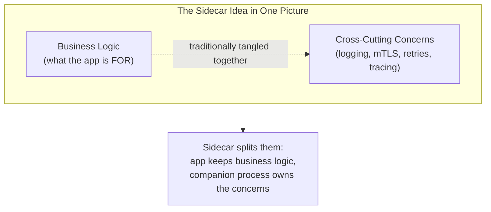
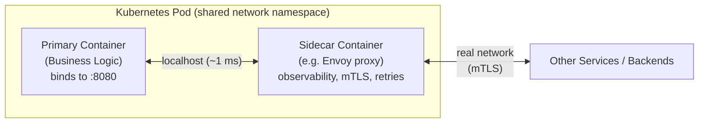
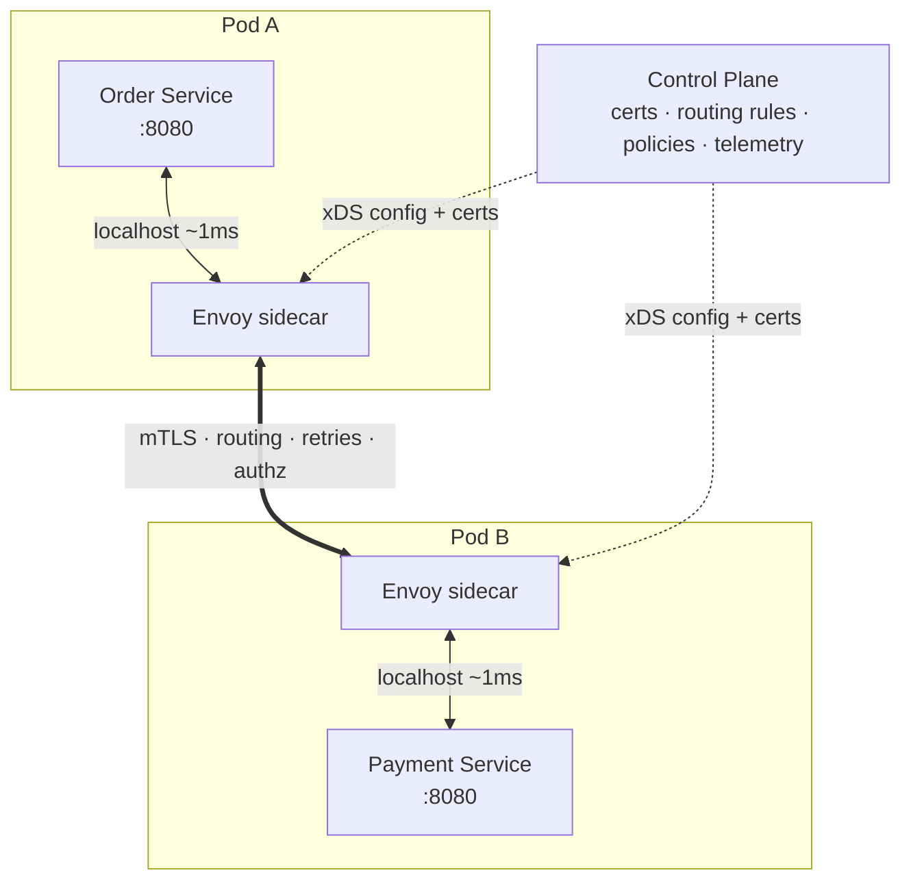
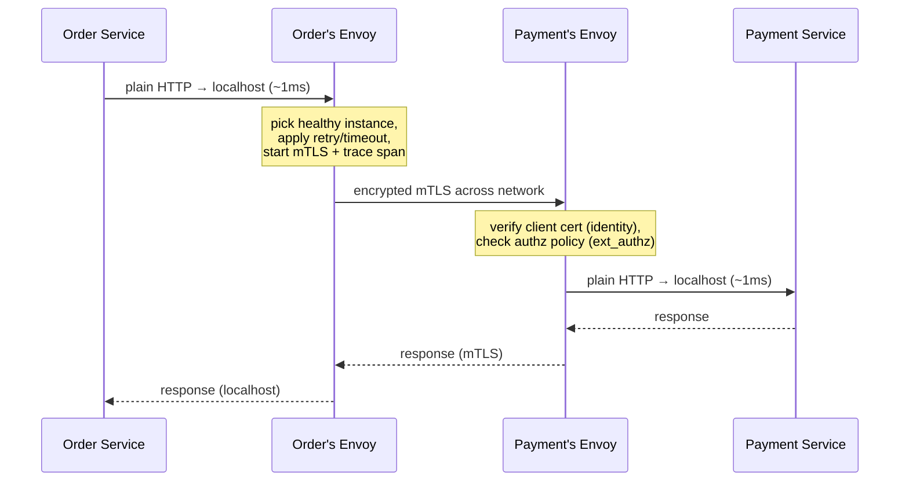
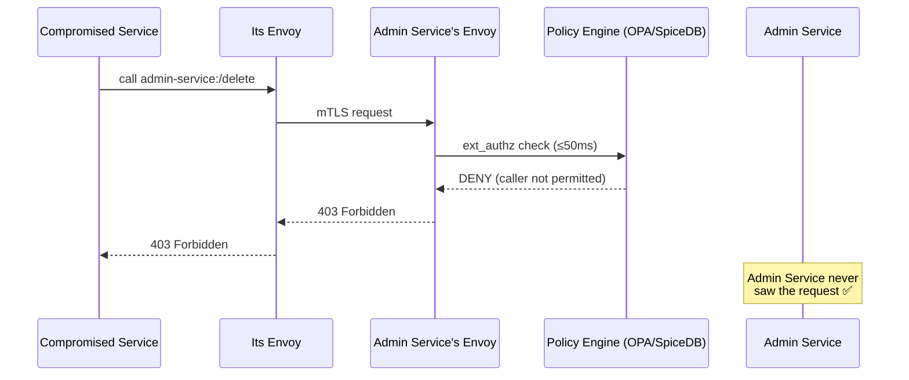
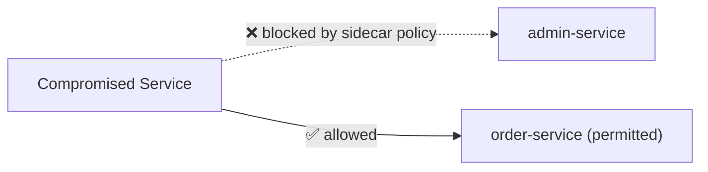
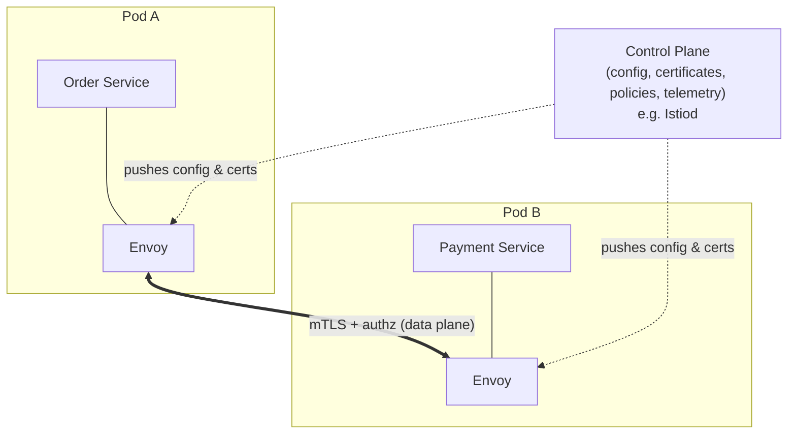

# 🏍️ The Sidecar Pattern — A Study Guide

*From "what is a helper container" to "why every hyperscaler runs a proxy on every pod" — a single, escalating read.*

---

## 📋 Table of Contents

1. [🎯 Introduction: The Problem Nobody Wants to Solve Twice](#-introduction-the-problem-nobody-wants-to-solve-twice)
2. [✅ Core Definitions](#-core-definitions)
3. [💡 The Concept and Theory](#-the-concept-and-theory)
4. [💡 Why the Sidecar Pattern Exists](#-why-the-sidecar-pattern-exists)
5. [🎨 The Real Mechanism: How a Sidecar Actually Works](#-the-real-mechanism-how-a-sidecar-actually-works)
6. [📊 The Central Trade-Off](#-the-central-trade-off)
7. [🏗️ Architecture & Sequence Diagrams](#️-architecture--sequence-diagrams)
8. [💻 Categorized Real-World Examples](#-categorized-real-world-examples)
9. [🔗 Service Mesh: Where Sidecars Grew Up](#-service-mesh-where-sidecars-grew-up)
10. [❌ Common Misconceptions](#-common-misconceptions)
11. [🎓 Staff / Principal-Level Nuance](#-staff--principal-level-nuance)
12. [🔗 Extensions & Adjacent Concepts](#-extensions--adjacent-concepts)
13. [⚡ Quick Revision](#-quick-revision)
14. [📝 FAANG Interview Q&A](#-faang-interview-qa)
15. [📚 References & Further Reading](#-references--further-reading)

---

## 🎯 Introduction: The Problem Nobody Wants to Solve Twice

Imagine you run twelve microservices. Some are in Java, some in Go, one stubborn legacy service is in Python. One morning four different platform requests land on your desk at once:

- The **platform team** wants mutual TLS (mTLS) enforced on all internal traffic.
- The **security team** wants distributed tracing on every request.
- The **infra team** wants centralized log shipping.
- The **secrets team** wants automatic credential rotation.

None of this is *business logic*. None of it makes the order service better at processing orders. And yet, in a polyglot fleet, there is no single shared codebase to put it in. You'd have to implement mTLS in Java, then again in Go, then again in Python — three times, three teams, three subtly different bugs. Then do the same for tracing. Then again for log shipping. This is the "implement it once per language, forever" tax.

The **Sidecar pattern** was designed to eliminate exactly this tax. Instead of baking infrastructure concerns into every service, you attach a **separate helper process** to each service that handles them — consistently, in one place, in whatever language is best for the job. Your service goes back to doing the one thing it's supposed to do: business logic.

The name comes from the motorcycle sidecar: a passenger car bolted onto the side of a bike. It shares the journey, shares the fuel stops, but it doesn't power the engine — and you can swap it or upgrade it without touching the motorcycle itself. That image is the entire pattern in a sentence.

---

## ✅ Core Definitions

**Sidecar.** A secondary process or container deployed *alongside* a primary application, in the same execution unit (a Kubernetes **pod**, a VM, or a host), sharing its lifecycle and local resources. It handles supporting, non-business concerns so the main application doesn't have to.

**Primary / main service.** The application that owns the business logic — processing orders, authenticating users, charging cards. It ideally has *no idea* the sidecar exists.

**Cross-cutting concern.** A capability that many or all services need but that isn't specific to any one of them: logging, metrics, tracing, security (mTLS/authz), retries, timeouts, service discovery, secret management, configuration. These "cut across" the whole system.

**Co-location.** The defining property: the sidecar and the primary share the same **network namespace** (so they talk over `localhost`), often a **shared filesystem volume**, and sometimes the process namespace. This is what makes the pattern fast and powerful — communication is local, not across the network.

**Language-agnostic communication.** Because the sidecar and app talk over standard local interfaces (HTTP, gRPC, UNIX sockets, shared files), it doesn't matter that the app is Java and the sidecar is C++ or Python. They agree on a *contract* (a protocol), not a shared runtime.

<details>
<summary>📖 Plain-English version</summary>

Think of a food truck. The truck (your service) cooks and sells burgers — that's its job. Bolted to its side is a little generator trailer (the sidecar) that supplies power, plus a card reader for payments. The cook never thinks about voltage or payment networks; they just cook. If the card reader needs an upgrade, you swap the trailer without touching the kitchen. The truck and trailer are parked in the same spot (co-located) and connected by short cables (localhost), so the handoff is instant. And the trailer's electronics can be from a totally different manufacturer than the truck's engine — they just need compatible plugs (a shared contract).

</details>

---

## 💡 The Concept and Theory

Before the "why" and the "how," it helps to hold the *idea* in your head clearly, because everything else follows from it.

**The core principle is separation of concerns, applied to deployment.** In a single monolith, business logic and infrastructure logic live in the same codebase, and you can share a logging or security module by simply importing it. The moment you split into microservices — especially polyglot ones — that shared-import trick dies. The sidecar restores it, but at the *deployment* layer instead of the *code* layer: rather than sharing a library, services share a **co-located companion process**. The concern moves out of the application binary and into a neighbor that ships beside it.

**Three properties make this work, and all three must hold together:**

The first is **co-location**. The sidecar isn't a remote service you call across the datacenter; it lives in the same pod, sharing the network namespace and often a filesystem volume. This is why communication is a ~1 ms localhost hop rather than a real network round-trip, and it's why the sidecar can do things like read files the app writes or intercept the app's traffic transparently.

The second is **shared lifecycle**. The sidecar is created, scheduled, scaled, and destroyed *with* its primary. When the pod dies, both die. This tight coupling is a feature — it guarantees the helper is always present exactly when the app is running — but it's also the source of the "shared fate" risk we'll return to at staff level.

The third is **independent implementation**. Despite sharing a lifecycle, the sidecar is a separate process with its own container image, its own language, and its own release cadence. You can upgrade the Envoy sidecar across the whole fleet without recompiling a single line of application code. This is the property that finally delivers on the polyglot promise: the app team picks Java, the platform team ships a C++ proxy, and they meet only at a protocol contract.



**Where it sits in the pattern landscape.** The sidecar belongs to the family of *cross-cutting concern* patterns for distributed systems, alongside Ambassador, Adapter, Service Mesh, and API Gateway. Conceptually it's the primitive from which several of the others are built: chain many sidecars under a central manager and you have a service mesh; specialize a sidecar to outbound external traffic and you have an ambassador; specialize it to output normalization and you have an adapter. Understanding the sidecar well makes those downstream patterns almost self-evident.

<details>
<summary>📖 Plain-English version</summary>

Think of a touring musician (the app) who's brilliant on stage but shouldn't also be driving the bus, running the sound board, and selling merch. A road crew (the sidecar) travels with them — same tour, same bus, same schedule — handling all of that. Three things make it work: they travel *together* (co-location), they share the whole tour's ups and downs (shared lifecycle), and the crew can be swapped or upgraded between shows without the musician changing a single song (independent implementation). The musician just plays music; the crew handles everything around it.

</details>

---

## 💡 Why the Sidecar Pattern Exists

The pattern exists to resolve a specific, recurring tension in distributed systems:

> **You want team autonomy, but you also need operational consistency.**

Teams want to ship in their favorite language, on their own schedule, without waiting on a central platform team. But the organization needs *every* service to have the same security posture, the same observability, the same retry behavior. Those two goals pull in opposite directions.

Historically there were two ways to reconcile them, and both had serious flaws:

The first was the **shared library** approach. Netflix is the canonical example: they built Hystrix (circuit breaking), Eureka (service discovery), and Ribbon (load balancing) as Java libraries and mandated that all inter-service communication happen JVM-to-JVM. It worked — but it forced *every* service onto the JVM, required every service to carry the correct library version, and meant that upgrading the library meant **redeploying every service in the company**. Infrastructure logic leaked into application code, and the polyglot dream was dead on arrival.

The second was to **rewrite each service** to add the concern natively. Consider a fifteen-year-old legacy application that only speaks HTTP, in a company that has since mandated HTTPS everywhere. Rewriting it to terminate TLS is enormously expensive — not just in engineering hours, but in the *risk* of regressions and production incidents in a system nobody fully understands anymore.

The sidecar cuts this knot. Put a small proxy next to the legacy app: HTTPS traffic hits the sidecar, which terminates TLS and forwards plain HTTP to the untouched legacy app. No rewrite. No JVM mandate. No per-language reimplementation. The concern is solved **once, externally**, and reused across every service regardless of language.

<details>
<summary>📖 Plain-English version</summary>

Your grandmother's house has old two-prong outlets, and modern gadgets need three-prong grounded plugs. You have two options: rewire the entire house (expensive, risky, disruptive) or buy little plug-adapters (cheap, instant, reversible). The sidecar is the plug-adapter. The house keeps working exactly as it always has, and the new capability is added on the outside without touching the wiring inside the walls.

</details>

---

## 🎨 The Real Mechanism: How a Sidecar Actually Works

At the physical level, a sidecar and its primary application live inside the **same pod**. Here's the anatomy:



Notice the two very different kinds of connection. Between the app and the sidecar is a **localhost hop** — same pod, same network stack, roughly 1 millisecond, no DNS lookup, no TLS handshake. Between the sidecar and the outside world is a **real network hop**, and *that's* where the heavy lifting (encryption, routing, authorization) happens.

There are two ways the app's traffic gets to the sidecar:

**Explicit routing.** The app is configured to send its traffic to `localhost:<sidecar-port>`. Dapr works this way — your app calls `localhost:3500/v1.0/state/statestore` and Dapr handles the actual Redis or DynamoDB backend. The app *knows* about the sidecar's local endpoint but not about the backend.

**Transparent interception.** This is what makes service meshes feel magical. `iptables` rules (or eBPF) are installed in the pod that silently redirect *all* inbound and outbound traffic through the sidecar. The application still binds to its normal port and sends plain HTTP/gRPC — it has **no idea** the sidecar exists. Istio injecting an Envoy proxy works this way.

The elegance (which the sequence diagrams in the next section make concrete) is that a service just makes what it *thinks* is a normal call. Under the hood its sidecar encrypts the traffic, picks a healthy destination, applies a retry policy, and the receiving sidecar verifies the caller's identity and checks authorization — all without a line of that logic living in either service's code.

<details>
<summary>📖 Plain-English version</summary>

You mail a letter by dropping it in the box on your porch. You don't drive it to the sorting facility, choose a route, or verify the recipient's address against a fraud database — the postal system does all of that invisibly after it leaves your hands. A transparent sidecar is that porch mailbox: you interact with it as if you're just "sending mail," and an entire logistics network you never see handles encryption, routing, and delivery guarantees on your behalf.

</details>

---

## 📊 The Central Trade-Off

Every honest discussion of the sidecar pattern comes down to one exchange:

> You accept **extra resource cost, an extra network hop, and operational complexity** in return for **consistent, language-agnostic infrastructure that never touches application code.**

The first question every skeptic asks is *"but doesn't that mean every request takes an extra hop?"* The answer is yes — and it's worth walking through carefully, because the naive fear ("won't that add 10–50 ms?") is wrong. The app-to-sidecar hop is a **localhost** call inside the same network namespace: ~1–2 ms, no DNS, no cross-machine travel. And critically, if you're doing mTLS at all (you should be), that hop **already exists** to terminate TLS. Adding an authorization check on top of it is one more sub-millisecond gRPC call to a policy engine. The marginal cost of piling more features onto a sidecar that's already there is close to zero.

The costs are real, though, and a mature engineer names them without flinching:

| Cost | Detail |
|------|--------|
| **Resource overhead** | Each pod runs an extra container. An Envoy sidecar is ~50–100 MB of memory plus a fraction of a CPU core. Multiply by thousands of pods and it's a real line on the infra bill. |
| **Latency accumulation** | ~1 ms per hop is nothing — until a single user request fans out across 10 services, each with 2 sidecar hops. That's 20 localhost hops, ~20 ms added. Usually fine; not always, if you have a strict latency budget. |
| **Operational complexity** | Sidecars must be versioned, upgraded, and monitored independently. The control plane must be highly available. Misconfiguration creates hard-to-debug failures. |
| **Debugging surface** | A 504 timeout now has two possible sources: the app or the sidecar. You've added a layer that can itself be the culprit. |
| **Startup ordering** | If the sidecar isn't ready when the app starts, early requests fail. (Modern Kubernetes native sidecar lifecycle support fixes this.) |

The reason hyperscalers accept all of this: the *alternative* — implementing, maintaining, and **auditing** mTLS, authorization, retries, circuit breaking, and tracing inside every service in every language — is vastly more expensive in engineering time and error surface than a ~1 ms hop on infrastructure that's already there.

<details>
<summary>📖 Plain-English version</summary>

Hiring a personal assistant costs you a salary and means one more person to coordinate with — that's overhead you can't pretend away. But if you're a busy executive, the assistant handling your scheduling, travel, and expenses frees you to do the high-value work only you can do. For a solo freelancer with a light calendar, the assistant is pure cost. For someone juggling twenty meetings a day, it's obviously worth it. The sidecar is the same calculation: overhead that pays for itself only past a certain scale.

</details>

---

## 🏗️ Architecture & Sequence Diagrams

With the concept, the "why," the mechanism, and the trade-off in hand, here is the full picture assembled — first the *static* topology, then the *dynamic* request flows.

### Static topology: two sidecars talking

Each service runs in its own pod with its own sidecar. Calls between services always pass through both sidecars, while a shared control plane configures them from above.



### Sequence: a normal service-to-service request

This is the "happy path" the earlier mechanism section described. Note where each concern is applied — the app endpoints (`A` and `B`) do nothing but business logic; every infrastructure step happens in a sidecar.



### Sequence: request when authorization is denied

The value of offloading authz to the sidecar is clearest in the *rejection* path — the request never reaches the application at all, so no per-service code had to enforce it.



<details>
<summary>📖 Plain-English version</summary>

Picture two office buildings, each with a security desk in the lobby (the sidecar). To send a package from one building to another, you hand it to your own lobby desk; they seal it, log it, and courier it to the other building's desk, who checks the sender is on the approved list before handing it upstairs. The people in the offices (the app) never touch security, routing, or ID checks — they just send and receive packages. And if the sender isn't approved, the receiving lobby turns the package away before it ever reaches the office floor.

</details>

---

## 💻 Categorized Real-World Examples

The best way to internalize the pattern is by concern. Each category below is a real problem sidecars solve, with the actual tools people reach for.

### 1. Observability (the most common use case)

Every service needs logs, metrics, and traces — but each language has different libraries, and standardizing on shared libraries means maintaining N implementations forever. Sidecars centralize the pipeline.

- **Log shipping:** the app writes to `stdout` or a shared volume; a **Fluent Bit** or **Filebeat** sidecar collects and ships to **Elasticsearch**, **Loki**, or **Splunk**.
- **Metrics:** Prometheus scrapes a `/metrics` endpoint. If the app can't expose one, a sidecar (e.g. a Prometheus exporter) does it.
- **Distributed tracing:** an **OpenTelemetry Collector** sidecar receives spans, batches them, and exports to **Jaeger** or **Zipkin**.

The app *emits data*; the sidecar *manages the pipeline*. Swap Jaeger for Zipkin? Reconfigure the sidecar, not 12 services.

### 2. Security — mTLS and Zero Trust

Doing mTLS inside every service means each one handles certificate loading, rotation, TLS handshakes, and validation — in every language. Offloaded to a sidecar, the app speaks plain HTTP and the sidecar terminates inbound TLS, verifies client certs, establishes outbound TLS, and injects the correct identity. Certificates are provisioned and **rotated automatically** by a control plane, with no app restart.

Sidecars also enforce **authorization** — "only `order-service` may call `payment-service`." This is the core of **zero-trust networking**: every request is verified at every hop, so a compromised service can't freely call anything it likes.



### 3. Traffic Management

Retries, timeouts, and circuit breakers, when coded per-service, diverge across teams. Sidecars externalize them into configuration:

- **Retries & timeouts** — configured once, applied consistently.
- **Circuit breaking** — fail fast to prevent cascading failures.
- **Traffic splitting** — canary and A/B deployments. With Istio you can send 90% of traffic to `v1` and 10% to `v2` with *zero* application changes.

Traffic behavior becomes **configuration, not code.**

### 4. Secrets & Configuration Injection

The traditional approach — secrets in environment variables — creates static, long-lived credentials that are hard to rotate and easy to leak. A **Vault Agent** sidecar fetches secrets dynamically, stores them in shared memory, and rotates them automatically; the app just reads them as files (no SDK, no restart). The same idea applies to config with **Consul Template**, which rewrites config files on the fly.

### 5. Protocol / Legacy Adaptation

The classic "upgrade without a rewrite" case: a legacy HTTP-only app fronted by a sidecar that terminates HTTPS. Also covers protocol translation and serialization/deserialization offload.

### 6. Caching & Service Discovery

A lightweight **Redis** sidecar can serve as a local cache, cutting expensive database or external-API round-trips. A service-registry client (e.g. **Eureka**) can run as a sidecar to keep track of available services and their health.

<details>
<summary>📖 Plain-English version</summary>

Picture a busy restaurant kitchen (your service) that just wants to cook. Around it you station specialists: a runner who takes food to a central pass and logs every order (observability), a bouncer at the kitchen door checking IDs (security), a traffic controller deciding which orders go to the new experimental station versus the proven one (traffic management), and a supply clerk who keeps fresh ingredients stocked without the chef ever leaving the stove (secrets/config). The chef cooks; everyone else handles the surrounding logistics.

</details>

---

## 🔗 Service Mesh: Where Sidecars Grew Up

The sidecar pattern is the *foundation* of the modern **service mesh** — dedicated infrastructure for handling service-to-service communication. As a fleet grows, wiring up mTLS, discovery, load balancing, retries, and tracing by hand becomes unmanageable. A mesh pushes all of that into sidecar proxies and manages them centrally.

A mesh has two logical halves, and confusing them is a classic interview trip-up:



The **data plane** is the set of proxies (usually **Envoy**) that actually sit in each pod, intercept traffic, terminate mTLS, enforce policy, and emit metrics. The **control plane** is the management brain that distributes certificates, pushes routing rules, and aggregates telemetry. So:

```
Service Mesh = Data Plane + Control Plane
Istio    = Envoy proxies      + Istiod
Consul   = Envoy proxies      + Consul Server
Linkerd  = linkerd2-proxy     + Linkerd control plane
Cilium   = eBPF (kernel-level)+ Cilium agent
```

When someone says *"we use Istio,"* they mean: Envoy sidecars in every pod (data plane) managed by Istiod (control plane). **Istio is not Envoy — Istio *uses* Envoy.**

Why did nearly everyone converge on **Envoy** as the data plane? It was built at Lyft specifically for the sidecar use case: dynamic configuration via **xDS APIs** (update routing and policy *without restarting* the proxy — something nginx/HAProxy traditionally can't do), awareness of both L4 (TCP) and L7 (HTTP/gRPC), an extensible filter model (this is how `ext_authz` external authorization works), and built-in metrics, access logs, and tracing spans out of the box.

<details>
<summary>📖 Plain-English version</summary>

Think of an airport. Each gate (pod) has a gate agent (the Envoy sidecar) who checks boarding passes, scans bags, and handles boarding — that's the "data plane," the people actually touching passengers. Up in the tower, air-traffic control (the "control plane," e.g. Istiod) doesn't touch a single passenger but tells every gate which runway to use, updates the schedule, and collects statistics. Saying "we use Istio" is like saying "we use the control tower" — but the tower is useless without the gate agents doing the hands-on work.

</details>

---

## ❌ Common Misconceptions

**"The extra hop will wreck my latency."** The app-to-sidecar hop is a *localhost* call, ~1 ms, no DNS or cross-machine travel. If you already run mTLS, that hop exists regardless. The fear of "10–50 ms" confuses a localhost hop with a real network hop.

**"A service mesh puts business logic in the pipes, violating 'smart endpoints, dumb pipes.'"** No — everything in the mesh is *generic*: retry policies, timeouts, certificates, routing. No business decision leaks into the sidecar. It becomes a "smart pipe" only if you start doing request aggregation or business-specific protocol transformation in it, which is exactly what you should *not* do.

**"Istio is a proxy."** Istio is a *control plane*. Envoy is the proxy. Istio configures Envoy.

**"Sidecar and Ambassador are the same thing."** Related but distinct. A **sidecar** co-locates a helper to manage cross-cutting concerns for its service generally (inbound *and* outbound). The **Ambassador** pattern is a narrower, outbound-focused variant: a proxy that brokers your service's connections to *external* systems. Loosely: sidecars are helpers working inside your environment; ambassadors are gatekeepers to the outside world.

**"A sidecar is just an API Gateway per pod."** Different jobs. The API Gateway is the bouncer at the *front door* (north-south, edge traffic). The sidecar is a lock on *every room inside* the building (east-west, service-to-service). You typically need both.

**"Adding a sidecar means changing my app."** With transparent interception (iptables/eBPF), the app is untouched and unaware. That's often the entire point.

<details>
<summary>📖 Plain-English version</summary>

The biggest myth is "the extra hop is slow." But it's like worrying that walking from your kitchen to your own front door adds hours to a road trip — it's a step inside the same building, not a separate journey. The second big myth is mixing up Istio and Envoy: Envoy is the worker on the ground; Istio is the manager giving instructions. And an API gateway guards the building's entrance, while sidecars guard each room — different security jobs entirely.

</details>

---

## 🎓 Staff / Principal-Level Nuance

This is the reasoning an experienced engineer volunteers *before* the interviewer has to dig for it.

**The pattern is trending toward its own disappearance.** In 2026 the clear direction is *reducing or eliminating* the per-pod sidecar for basic functions while keeping proxies for advanced ones. **Istio ambient mesh** splits the mesh into a shared per-node `ztunnel` (L4 + mTLS, no per-pod sidecar) plus an optional **waypoint proxy** only for services that need L7 features — directly attacking the resource-overhead cost. **Cilium** goes further, implementing data-plane functionality in the Linux kernel via **eBPF**, skipping the userspace sidecar proxy for many cases. The *concept* — offload generic networking from app code to infrastructure — is permanent; the *sidecar-as-a-container* implementation may fade.

**Per-component tuning is where staff engineers live.** The sidecar is a system with knobs, not a black box. Envoy's `ext_authz` filter takes a `timeout` (e.g. 50 ms) and a `failure_mode_deny` flag — and choosing `true` (fail closed: deny if the policy engine is down) versus `false` (fail open: allow) is a genuine security-vs-availability decision with no universal right answer. Retry budgets prevent retries from amplifying an outage into a retry storm. Circuit-breaker thresholds trade fast-failing against flapping.

```yaml
# Envoy ext_authz — authorization offloaded to the sidecar
http_filters:
  - name: envoy.filters.http.ext_authz
    typed_config:
      "@type": type.googleapis.com/envoy.extensions.filters.http.ext_authz.v3.ExtAuthz
      grpc_service:
        envoy_grpc:
          cluster_name: authz-service   # e.g. OPA, SpiceDB, OpenFGA
        timeout: 0.050s                  # 50 ms budget for the authz call
      failure_mode_deny: true            # fail CLOSED if authz is unavailable
```

**Latency budgeting must be explicit.** "1 ms is nothing" is true per hop and misleading in aggregate. A request fanning across 10 services incurs ~20 localhost hops (~20 ms). For a checkout flow, fine. For a high-frequency trading path or a 100k-QPS inner loop, that's a design constraint you plan around — which is one reason Cilium's eBPF approach exists.

**Startup ordering is a real production footgun.** If the app starts before the sidecar's proxy is ready, early requests fail with confusing connection errors. Pre-native-sidecar Kubernetes required hacks (init containers, `holdApplicationUntilProxyStarts`); native sidecar containers (the `restartPolicy: Always` init container, GA in recent Kubernetes) fix the lifecycle so the sidecar starts first and stops last.

**Scale is the deciding variable, not fashion.** Below ~10 services with a small team, a shared library or middleware usually wins — the operational cost of running Istio outweighs the benefit. Around 20+ services across multiple teams, especially polyglot, the calculus flips. At hundreds of services with regulatory audit requirements, a mesh is close to mandatory. A staff engineer states this threshold explicitly rather than reaching for a mesh reflexively.

**Blast radius and the shared-fate problem.** Because the sidecar shares the pod's lifecycle, a crashing or wedged sidecar can take down a perfectly healthy app. Health checks, resource limits, and graceful-shutdown handling on the sidecar aren't optional — they're what keep the helper from killing the thing it's meant to help.

<details>
<summary>📖 Plain-English version</summary>

The senior insight is that a sidecar isn't a "set it and forget it" gadget — it's a tunable system that shares fate with your app. The knob that separates juniors from seniors is `failure_mode_deny`: if your bouncer (authz service) faints, do you lock every door (secure but you're down) or wave everyone through (available but wide open)? There's no textbook answer — it depends on whether you're guarding a bank vault or a public library. And the whole industry is quietly moving the bouncer out of each room and into the building's wiring (eBPF, ambient mesh) to cut the overhead.

</details>

---

## 🔗 Extensions & Adjacent Concepts

**Ambassador pattern.** An outbound-focused sidecar: a local proxy that handles your service's *outgoing* connections to external or remote services (connection management, retries, sharding). Sidecar is the general case; Ambassador is a specialization.

**Adapter pattern (sidecar variant).** A sidecar that *normalizes* a heterogeneous app's output into a standard shape the platform expects — e.g. reformatting bespoke logs into the format Prometheus/Fluentd wants, so monitoring is uniform across differently-built services.

**Service Mesh.** The system-level pattern built *from* sidecars (data plane) plus a control plane. Istio, Linkerd, Consul, Cilium.

**API Gateway.** The north-south counterpart. Handles edge/client traffic (auth, rate limiting, routing) at the boundary; the mesh handles east-west service-to-service traffic inside. Complementary, not competing.

**Dapr (Distributed Application Runtime).** A sidecar that exposes *application-level* building blocks (state management, pub/sub, service invocation, bindings) over a local HTTP/gRPC API — e.g. `localhost:3500/v1.0/state/statestore` — while Dapr handles the backend (Redis, DynamoDB, etc.). It's a sidecar for app concerns rather than pure networking.

**eBPF / sidecar-less mesh.** The emerging alternative: implement mesh data-plane functions in the Linux kernel (Cilium) or a shared per-node proxy (Istio ambient's `ztunnel`) instead of a per-pod container — same benefits, lower overhead.

**Cloud-managed equivalents.** AWS **App Mesh** and **ECS/EKS** sidecar containers; Azure **Container Apps** / **AKS** with Dapr; GCP **Anthos Service Mesh**. Managed control planes that inject and operate the sidecars for you.

<details>
<summary>📖 Plain-English version</summary>

Once you get the sidecar idea, a whole family of relatives appears. The Ambassador is a sidecar that only handles outgoing calls. The Adapter is a sidecar that translates your app's weird output into a standard format. Stack many sidecars under one manager and you get a Service Mesh. Guard the whole building's front entrance instead and that's an API Gateway. And the newest cousins (eBPF, ambient mesh) do the sidecar's job from the building's wiring so you don't need a helper bolted to every room.

</details>

---

## ⚡ Quick Revision

**The one-liner.** A sidecar is a helper process deployed *alongside* a primary service in the same execution unit (pod/VM/host), sharing its lifecycle and local resources, to handle cross-cutting infrastructure concerns so the app can focus purely on business logic. The metaphor is the motorcycle sidecar: attached, sharing the ride, but not powering the engine — and swappable without touching the bike.

**Why it exists.** In a polyglot microservice fleet, concerns like mTLS, tracing, log shipping, and secret rotation aren't business logic but must be applied consistently everywhere. The two old solutions both failed: shared libraries (Netflix's Hystrix/Eureka/Ribbon) forced a single language and a fleet-wide redeploy on every upgrade; rewriting each service was expensive and risky. The sidecar solves the concern *once, externally,* and reuses it across every language. It resolves the core tension between team autonomy and operational consistency.

**How it works.** The sidecar and app share a network namespace, so they talk over `localhost` (~1 ms). Traffic reaches the sidecar either by explicit routing (the app calls `localhost:<port>`, as with Dapr) or transparent interception (iptables/eBPF silently redirect all traffic, as with Istio-injected Envoy — the app never knows). Between sidecars, real network hops carry mTLS, routing, retries, and authorization. Order-service makes what looks like a normal call to payment-service; underneath, its sidecar encrypts, load-balances, retries, and the receiving sidecar verifies identity and checks authz — none of it in application code.

**The trade-off.** You pay resource overhead (~50–100 MB + fractional CPU per Envoy sidecar), latency accumulation (~1 ms/hop, but ~20 ms across a 10-service fan-out), operational complexity (versioning, HA control plane, upgrades), a larger debugging surface, and startup-ordering risk. In exchange you get consistent, language-agnostic, code-free infrastructure. The famous "extra hop" objection is weak: it's a localhost hop that already exists if you run mTLS, so piling on more features costs near zero. The verdict flips with scale — below ~10 services use a library; at 20+ polyglot services across teams, use a mesh; at hundreds with audit requirements, it's near-mandatory.

**Examples by concern.** Observability: Fluent Bit/Filebeat ship logs to Elasticsearch/Loki; OpenTelemetry Collector exports traces to Jaeger/Zipkin. Security: Envoy terminates mTLS with auto-rotated certs from a control plane and enforces zero-trust authz ("only order-service may call payment-service"). Traffic: retries, timeouts, circuit breaking, and canary traffic-splitting (90% v1 / 10% v2 in Istio) become config, not code. Secrets: a Vault Agent sidecar fetches and rotates credentials that the app reads as files. Legacy: a sidecar terminates HTTPS in front of an HTTP-only legacy app — no rewrite.

**Service mesh.** Sidecars are the mesh's data plane. `Service Mesh = Data Plane (Envoy proxies in each pod) + Control Plane (the brain that pushes config/certs/policy and aggregates telemetry)`. Istio = Envoy + Istiod; Consul = Envoy + Consul Server; Linkerd = linkerd2-proxy + its control plane; Cilium = eBPF + Cilium agent. **Istio is not Envoy — Istio configures Envoy.** Envoy won as the data plane because of dynamic xDS config (no restarts), L4+L7 awareness, an extensible filter model (ext_authz), and built-in observability.

**Misconceptions to avoid.** The extra hop is localhost, not a network round-trip. Meshes don't violate "smart endpoints, dumb pipes" because their logic is generic, not business-specific. Istio ≠ Envoy. Sidecar (general, in/out) ≠ Ambassador (outbound to external systems). Sidecar (east-west, per room) ≠ API Gateway (north-south, front door) — you usually need both.

**Staff-level.** Tune, don't treat as a black box: `failure_mode_deny` (fail closed vs open) is a real security-vs-availability call; retry budgets prevent retry storms. Budget latency explicitly for deep fan-outs. Handle startup ordering (native Kubernetes sidecar lifecycle). Mind shared fate — a wedged sidecar can kill a healthy app, so health checks and resource limits are mandatory. The 2026 trend is *sidecar-less*: Istio ambient mesh (shared-node ztunnel + optional waypoint) and Cilium's eBPF push the data plane out of the per-pod container to cut overhead — the concept stays, the container may go.

---

## 📝 FAANG Interview Q&A

The 20 most frequently asked questions on this topic. The second half (Q11–Q20) is L4/L5 and staff-level. Four STAR-format behavioral questions follow.

### Conceptual & Foundational

<details>
<summary><b>Q1. What is the sidecar pattern, and why not just put the logic in the service?</b></summary>

A sidecar is a helper process deployed in the same execution unit (typically a Kubernetes pod) as a primary service, sharing its lifecycle and local network so they communicate over `localhost`. It owns cross-cutting infrastructure concerns — logging, metrics, tracing, mTLS, retries — so the app owns only business logic. You don't inline the logic because in a polyglot fleet you'd reimplement and maintain it per language, and every upgrade would mean redeploying every service. Concretely, instead of writing TLS termination in Java, Go, and Python separately, one Envoy sidecar does it uniformly. The separation buys consistency, language independence, and independent upgrade cadence.

</details>

<details>
<summary><b>Q2. How does the sidecar communicate with the main application?</b></summary>

Over local interfaces, because they share the pod's network namespace: `localhost` HTTP/gRPC, UNIX sockets, or a shared filesystem volume — roughly a 1 ms hop with no DNS or cross-machine travel. This is deliberately **language-agnostic**: the app and sidecar agree on a *protocol contract*, not a shared runtime, so a Java app pairs happily with a C++ (Envoy) or Python sidecar. Two delivery models exist: explicit (the app calls `localhost:3500`, as with Dapr) and transparent (iptables/eBPF silently redirect all traffic, as with Istio's injected Envoy, so the app is unaware).

</details>

<details>
<summary><b>Q3. What kinds of concerns are good candidates to move into a sidecar?</b></summary>

*Generic, cross-cutting* concerns — ones shared across services and not tied to any one service's business meaning. The big buckets: observability (log shipping via Fluent Bit, metrics for Prometheus, traces via an OpenTelemetry Collector to Jaeger); security (mTLS termination, cert rotation, zero-trust authorization); traffic management (retries, timeouts, circuit breaking, canary splitting); and secrets/config (a Vault Agent fetching and rotating credentials). The litmus test: if the logic would look identical in every service regardless of what that service does, it belongs in the sidecar. If it embeds a business decision, it does not.

</details>

<details>
<summary><b>Q4. How is a sidecar different from an API Gateway?</b></summary>

They operate on different traffic axes. An API Gateway sits at the *edge* handling north-south traffic — external clients hitting your system — doing auth, rate limiting, and routing at the boundary. A sidecar handles east-west, service-to-service traffic *inside* the cluster, one per pod. The mental model: the API Gateway is the bouncer at the building's front door; the sidecar is a lock on every internal room. They're complementary — a real system typically runs both, the gateway guarding ingress and sidecars enforcing zero-trust between internal services.

</details>

<details>
<summary><b>Q5. Sidecar vs Ambassador vs Adapter — what's the distinction?</b></summary>

All three co-locate a helper, but with different focus. The **Sidecar** is the general case: manages cross-cutting concerns for its service, inbound and outbound. The **Ambassador** is outbound-focused — a local proxy brokering the service's connections to external/remote systems (connection pooling, retries, sharding). The **Adapter** normalizes the app's output to a standard the platform expects — e.g. reshaping bespoke logs into the Prometheus/Fluentd format so monitoring is uniform. Interview-safe summary: sidecars are general helpers inside your environment, ambassadors are gatekeepers to the outside world, adapters are translators.

</details>

<details>
<summary><b>Q6. What are the main trade-offs of adopting sidecars?</b></summary>

You gain consistent, language-agnostic, code-free infrastructure; you pay in four currencies. Resource overhead: an Envoy sidecar is ~50–100 MB plus fractional CPU per pod, which at thousands of pods is a real bill. Latency: ~1 ms per localhost hop, negligible alone but ~20 ms across a 10-service fan-out. Operational complexity: sidecars need independent versioning, upgrades, and a highly-available control plane. Debugging surface: a 504 could now be the app *or* the sidecar. The decision hinges on scale — below ~10 services a shared library usually wins; past 20+ polyglot services the sidecar's benefits dominate.

</details>

<details>
<summary><b>Q7. Give a concrete real-world example of a sidecar solving a problem cheaply.</b></summary>

The legacy HTTPS case. A 15-year-old application speaks only HTTP, but the company now mandates HTTPS everywhere. Rewriting the legacy app to terminate TLS is expensive and risky — regressions in code nobody fully understands. Instead you deploy a sidecar (e.g. Envoy or nginx) in the same pod: HTTPS traffic hits the sidecar, which terminates TLS and forwards plain HTTP to the untouched app over localhost. Certificates rotate via a control plane without restarting the app. You gained a company-wide security requirement with zero changes to a fragile legacy codebase.

</details>

<details>
<summary><b>Q8. What is a service mesh and how does the sidecar relate to it?</b></summary>

A service mesh is dedicated infrastructure for managing service-to-service communication, and the sidecar is its foundational building block. `Service Mesh = Data Plane + Control Plane`. The **data plane** is the fleet of sidecar proxies (usually Envoy) in each pod that intercept traffic, do mTLS, enforce policy, and emit telemetry. The **control plane** (Istiod, Consul Server, Linkerd control plane) pushes configuration and certificates to those proxies and aggregates their telemetry. So "we use Istio" means "Envoy sidecars managed by Istiod." Istio is not Envoy — Istio configures Envoy.

</details>

<details>
<summary><b>Q9. Why did service meshes converge on Envoy specifically?</b></summary>

Envoy was purpose-built at Lyft for the sidecar/proxy use case, and four properties made it dominant. It supports **dynamic configuration via xDS APIs** — the control plane can update routing, load balancing, and security policy *without restarting* the proxy, which nginx/HAProxy traditionally can't do. It's **L4 and L7 aware**, understanding both TCP and HTTP/gRPC for smart header/path/method-based routing. It has an **extensible filter model** (this is how `ext_authz` external authorization plugs in). And it emits **detailed metrics, access logs, and tracing spans out of the box** — free observability just by deploying it.

</details>

<details>
<summary><b>Q10. When should you NOT use the sidecar pattern?</b></summary>

When the overhead outweighs the benefit. If your system is homogeneous (one language) and a shared library suffices, skip the sidecar — you'd be paying resource and operational cost for consistency you already have. Skip it for short-lived batch workloads where a per-pod proxy's startup cost dominates, and when you're not in a containerized environment at all. Skip it below ~10 microservices with a small team lacking Kubernetes expertise — running Istio there costs more than it returns. And for concerns better solved centrally (edge auth), use an API Gateway instead of a per-pod sidecar.

</details>

### L4 / L5 & Staff-Level

<details>
<summary><b>Q11. (L5) The "extra hop" objection comes up in design review. Walk me through your rebuttal and where it actually breaks down.</b></summary>

I'd first reframe scale: the app-to-sidecar hop is *localhost* within one network namespace — ~1–2 ms, no DNS, no cross-machine travel — not the 10–50 ms of a network round-trip people fear. Critically, if we run mTLS (we should), that hop already exists to terminate TLS, so adding an authz check is one more sub-millisecond gRPC call on infrastructure that's already there; marginal cost is near zero. Where it genuinely breaks down: deep fan-outs. A request across 10 services with 2 hops each is ~20 localhost hops, ~20 ms — fine for checkout, potentially unacceptable for a 100k-QPS inner loop or sub-millisecond latency budget. That's exactly why Cilium's eBPF and Istio's ambient mode exist. So my honest answer is "worth it, and here's the specific latency budget where I'd reconsider."

</details>

<details>
<summary><b>Q12. (Staff) Explain `failure_mode_deny` in an ext_authz sidecar. How do you decide the value?</b></summary>

When Envoy's `ext_authz` filter calls the external policy engine (OPA, SpiceDB, OpenFGA) and that engine is unreachable or times out, `failure_mode_deny` decides the fallback: `true` fails **closed** (deny the request), `false` fails **open** (allow it). This is a pure security-vs-availability trade-off with no universal answer. For a payment or admin path, I fail closed — a brief outage is preferable to unauthorized access to money or privileged operations. For a read-only recommendation service where authz is defense-in-depth, I might fail open to preserve availability. I'd also set a tight timeout (e.g. 50 ms) so a slow policy engine doesn't stall requests, and ensure the authz service itself is HA so the fail-mode is rarely exercised. Stating this trade-off unprompted is what separates staff from mid-level.

</details>

<details>
<summary><b>Q13. (Staff) How do you handle sidecar startup ordering, and why does it matter?</b></summary>

If the app container starts and sends traffic before the sidecar proxy is ready, those early requests fail with confusing connection-refused errors — a classic production footgun, especially painful during rolling deploys and autoscaling events. Historically we hacked around it: Istio's `holdApplicationUntilProxyStarts`, init-container gymnastics, or app-side retry-until-ready. The proper fix is Kubernetes **native sidecar containers** (an init container with `restartPolicy: Always`, GA in recent versions), which guarantees the sidecar starts *before* the app and terminates *after* it, cleanly solving both startup and graceful-shutdown ordering. I'd also make sure the app tolerates transient localhost failures with a short backoff, as defense in depth.

</details>

<details>
<summary><b>Q14. (Staff) A sidecar shares the pod's fate. What are the reliability implications and how do you mitigate?</b></summary>

Shared fate cuts both ways: co-location gives us the fast localhost hop, but a crashing, OOM-killed, or wedged sidecar can take down an otherwise healthy app — the helper kills the thing it's meant to help. Mitigations: set explicit CPU/memory **resource limits and requests** on the sidecar so it can't starve the app (and vice versa); add **liveness and readiness health checks** for the sidecar so Kubernetes restarts it independently; implement **graceful shutdown** so in-flight requests drain before the sidecar exits; and use native sidecar lifecycle for correct ordering. At the fleet level I'd watch sidecar-specific metrics (Envoy's own stats) separately from app metrics so I can attribute a 504 correctly. The shared-fate risk is the strongest argument for the emerging sidecar-less approaches.

</details>

<details>
<summary><b>Q15. (Staff) Compare the sidecar model against sidecar-less approaches like Istio ambient mesh and Cilium/eBPF.</b></summary>

The classic model puts a full proxy (Envoy) in *every* pod — maximum flexibility, maximum overhead (~50–100 MB × every pod) and per-pod lifecycle risk. **Istio ambient mesh** splits the concern: a shared per-node `ztunnel` handles L4 + mTLS for all pods on that node (no per-pod sidecar), and a **waypoint proxy** is added only for services needing L7 features like traffic splitting. This slashes baseline overhead while keeping advanced capability opt-in. **Cilium** goes furthest, implementing data-plane functions (routing, policy, observability) in the Linux kernel via **eBPF**, avoiding a userspace proxy hop entirely for many cases. The trade-off: eBPF/ambient reduce overhead and per-pod blast radius but are newer, and full L7 features may still need a proxy somewhere. The through-line: the *concept* (offload generic networking from app code) is permanent; the sidecar-as-a-container is an implementation detail that's being optimized away.

</details>

<details>
<summary><b>Q16. (L5) Does a service mesh violate the "smart endpoints, dumb pipes" microservices principle?</b></summary>

No, and the distinction is important. "Smart endpoints, dumb pipes" warns against putting *business logic* into the communication infrastructure — you don't want the network making product decisions. A service mesh only handles *generic* concerns: retry policies, timeout durations, mTLS certificates, load balancing, traffic routing. None of that is specific to what any service *does*, so no business logic leaks into the pipe. You'd violate the principle if you started doing request aggregation, business-specific protocol transformation, or content-based business routing in the sidecar — that's building "smart pipes" that embed business decisions. As long as the mesh stays generic plumbing, the principle holds. I'd flag any proposal to put domain logic in an Envoy filter as an anti-pattern.

</details>

<details>
<summary><b>Q17. (Staff) At what scale does a service mesh pay for itself, and how would you justify it to a skeptical VP?</b></summary>

I frame it as a curve, not a binary. Below ~10 services with a small team, a shared library or middleware wins — Istio's operational cost (HA control plane, version management, debugging) exceeds its benefit. Around 20+ services across multiple teams, especially polyglot, the calculus flips: you're otherwise reimplementing mTLS, tracing, and retries N times across languages, which is more expensive in engineering time and error surface. At hundreds of services with regulatory audit requirements, a mesh is near-mandatory because it gives a *complete, centralized audit trail* of every authorization decision — something you can't reliably get from per-service implementations. To the VP I'd quantify: engineer-months saved not building/maintaining per-language infra, plus reduced incident surface from consistent security, versus the infra cost (~50–100 MB/pod) and the platform team's operating cost. The honest pitch includes the threshold below which I would *not* recommend it.

</details>

<details>
<summary><b>Q18. (Staff) Design a zero-trust authorization system for 200 microservices using sidecars.</b></summary>

I'd run a service mesh with Envoy sidecars (or ambient mode to cut overhead) providing mTLS so every service has a cryptographic identity — authentication is handled first. For authorization, I'd configure Envoy's `ext_authz` filter to call a centralized policy engine (OPA for policy-as-code, or SpiceDB/OpenFGA for relationship-based access control like "user X can read order Y"). Every inter-service call is checked *in the sidecar before it reaches app code* — e.g. `order-service` may call `payment-service:/charge` but not `payment-service:/admin`. Key decisions: tight `ext_authz` timeout (~50 ms) with `failure_mode_deny: true` on sensitive paths; the policy engine deployed HA (and possibly cached locally) so it's not a single point of failure; policies distributed by the control plane so there's one source of truth; and full audit logging of every decision for compliance. The payoff: authorization is added to 200 services with zero per-service code, no team can forget the check, and auditors get one consistent trail. Added latency is the existing mTLS localhost hop plus one sub-ms gRPC call.

</details>

<details>
<summary><b>Q19. (Staff) How would you debug an intermittent latency spike in a mesh-enabled service?</b></summary>

The added layer means I must first *attribute* the latency — app or sidecar? I'd use the mesh's own tooling: distributed traces (Jaeger/Zipkin) to see per-hop timing and whether the delay is in the app, the local Envoy, the network, or the remote Envoy; Envoy's built-in metrics (upstream vs downstream latency, connection pool saturation, pending requests) and access logs, which distinguish response-flags like upstream timeout vs local overload. Common culprits I'd check: connection-pool exhaustion or circuit breakers tripping under load, retry storms amplifying a downstream slowdown, the sidecar hitting its CPU limit and being throttled, or an ext_authz call to a slow policy engine. I'd correlate the spike with deploys (a bad control-plane config push is a frequent cause) and GC pauses. The lesson I'd articulate: a mesh gives powerful debugging tools *and* a new failure surface, so observability of the sidecar itself is non-negotiable.

</details>

<details>
<summary><b>Q20. (L5) How do secrets management sidecars improve on environment variables, and what are the residual risks?</b></summary>

Environment-variable secrets are static, long-lived, injected at boot, hard to rotate (rotation means a redeploy), and easy to leak (visible in `/proc`, crash dumps, child processes). A Vault Agent sidecar improves this: it authenticates to Vault using the pod's identity, fetches secrets *dynamically*, writes them to a shared in-memory volume that the app reads as files, and **rotates them automatically** — often without an app restart. The app carries no Vault SDK. Residual risks I'd call out: the shared memory volume is still readable by anything in the pod, so pod compromise still exposes secrets; the sidecar becomes a dependency in the startup path (ordering matters); and you've added a Vault availability dependency, so you need HA and sensible caching. It's a large improvement in rotation and blast-radius reduction, not a claim of perfect secrecy.

</details>

### 🌟 STAR-Format Behavioral Questions

<details>
<summary><b>Q21. (STAR) Tell me about a time you introduced a sidecar or service mesh and had to justify the added complexity.</b></summary>

**Situation:** Our platform had grown to ~25 microservices across Java, Go, and Node teams, and security mandated mTLS on all internal traffic within a quarter. **Task:** I owned the decision on how to deliver mTLS consistently without stalling every product team for a quarter of TLS plumbing. **Action:** I evaluated per-service libraries versus a service mesh. I prototyped Istio in staging, measured the actual overhead (~70 MB/pod, ~1.2 ms added per hop), and built a cost model comparing that against the engineer-months of implementing and maintaining mTLS in three languages. I presented both the savings and the honest costs — control-plane operations and a steeper debugging story — and proposed a phased rollout starting with non-critical services. **Result:** We rolled mTLS to all services in one quarter with zero application code changes, auto-rotating certs eliminated a recurring manual cert task, and the audit trail satisfied compliance. The measured latency was within our budget. The key was leading with the trade-offs, not hiding them.

</details>

<details>
<summary><b>Q22. (STAR) Describe a production incident caused by a sidecar, and how you handled it.</b></summary>

**Situation:** After a routine mesh upgrade, one service began throwing intermittent connection-refused errors during pod startups, mostly during autoscaling. **Task:** I had to stop the customer-facing 5xx spikes and find root cause without rolling back the whole mesh. **Action:** Traces and Envoy access logs showed the app was sending requests before its sidecar proxy was ready — a startup-ordering race that the upgrade had made more likely. As an immediate mitigation I enabled `holdApplicationUntilProxyStarts` and added a short client-side retry-until-ready backoff. For the durable fix I migrated the affected workloads to Kubernetes native sidecar containers so the proxy provably starts before the app and stops after it. **Result:** The 5xx spikes stopped within the hour after the mitigation, and the native-sidecar migration eliminated the class of bug entirely. I wrote a runbook and added a sidecar-readiness gate to our deploy checks so other teams wouldn't hit it.

</details>

<details>
<summary><b>Q23. (STAR) Tell me about a time you decided NOT to use a sidecar/mesh when others wanted to.</b></summary>

**Situation:** A team of three running five internal Go services, all one language, proposed adopting Istio because a conference talk had convinced them it was best practice. **Task:** As the reviewing architect I had to make the right call for their scale, not the fashionable one. **Action:** I walked them through the cost curve: at five homogeneous services, a shared Go library already gave them consistent mTLS and retries, while Istio would add a control plane to operate, per-pod overhead on a small cluster (proportionally large), and a debugging burden their small team couldn't absorb. I proposed they instead standardize on a lightweight shared library and revisit a mesh when they crossed ~15 services or added a second language. **Result:** They kept the simpler design, shipped faster, and avoided months of mesh operations learning curve. A year later, when they grew to 18 polyglot services, they adopted Linkerd — and this time it was clearly justified. Matching the tool to the scale mattered more than adopting the trend.

</details>

<details>
<summary><b>Q24. (STAR) Describe a time you had to explain the sidecar/mesh architecture to a non-expert stakeholder.</b></summary>

**Situation:** A VP questioned why the infra bill rose after we adopted a service mesh, suspecting waste. **Task:** I needed to explain the value of per-pod sidecars to a non-technical stakeholder and justify the spend. **Action:** I used the building analogy — the API Gateway is the bouncer at the front door, and sidecars are locks on every internal room, giving us zero-trust so a single breached service can't roam freely. I then showed concrete numbers: the sidecars replaced mTLS, tracing, and retry code we'd otherwise maintain in three languages, and I quantified the engineer-months saved and the compliance audit trail we now had for free. I acknowledged the honest cost (~70 MB/pod) and showed it was a rounding error against those savings at our scale. **Result:** The VP approved continued investment and asked us to extend the audit-trail capability to satisfy an upcoming certification. Translating the architecture into a security-and-cost story the stakeholder cared about was what landed it.

</details>

---

## 📚 References & Further Reading

Core concepts and tools referenced throughout this guide, for going deeper:

- **Envoy Proxy** — the C++ data-plane proxy (built at Lyft) underpinning most meshes: `envoyproxy.io`. Study the `ext_authz` filter and the xDS dynamic-config APIs.
- **Istio** — the most widely deployed mesh; read up on **ambient mesh** (`ztunnel` + waypoint proxies) as the 2026 direction of travel.
- **Linkerd** — the lightweight, opinionated mesh with its Rust `linkerd2-proxy`.
- **Consul** (HashiCorp) — mesh for heterogeneous (non-Kubernetes) environments, Envoy data plane.
- **Cilium / eBPF** — kernel-level, sidecar-less data plane.
- **Dapr** — a sidecar for *application-level* building blocks (state, pub/sub, invocation).
- **Observability stack** — Fluent Bit / Filebeat, OpenTelemetry Collector, Prometheus, Jaeger / Zipkin, Elasticsearch / Loki.
- **Security & secrets** — HashiCorp Vault (Agent sidecar), OPA / SpiceDB / OpenFGA (authorization policy engines).
- **Foundational reading** — Bilgin Ibryam & Roland Huß, *Kubernetes Patterns* (the Sidecar, Ambassador, and Adapter chapters); the ByteByteGo write-up on the Sidecar pattern; Microsoft Azure Architecture Center's Sidecar pattern page.

> This guide was synthesized and enriched from seven source explanations of the sidecar pattern, spanning beginner walkthroughs, service-mesh deep dives, and 2026 state-of-the-art trends.
