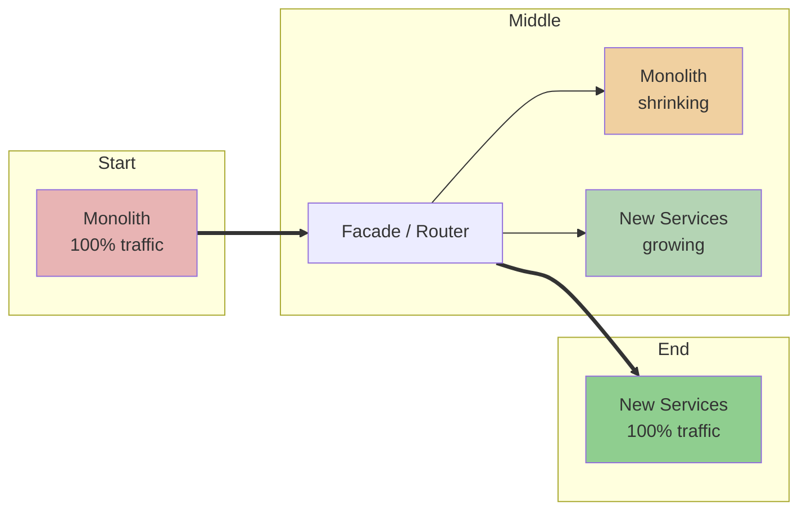
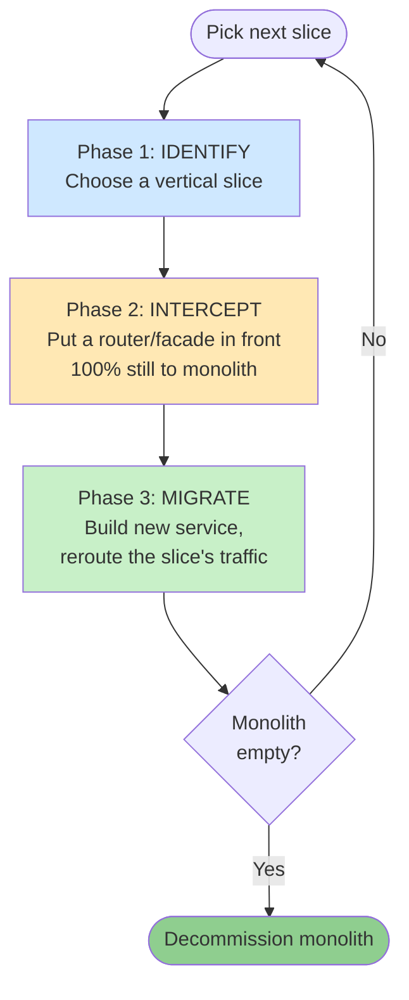
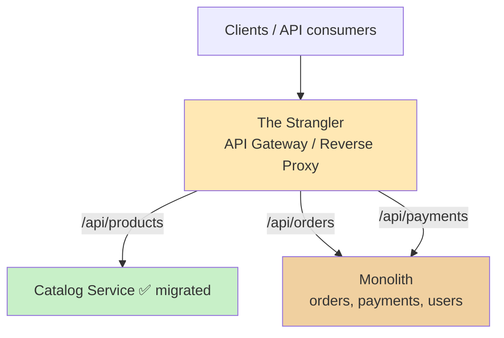
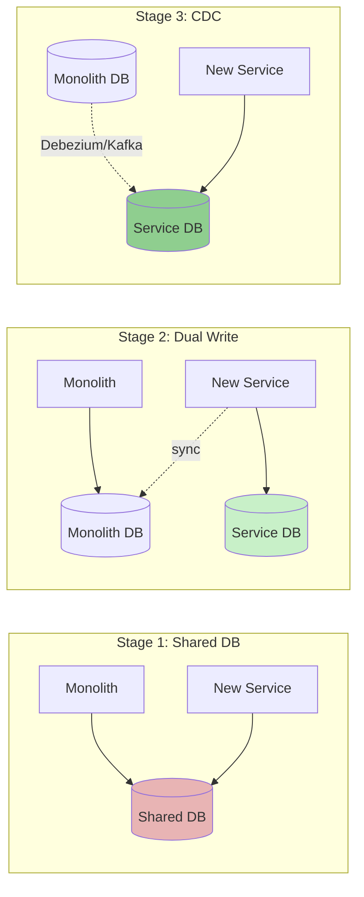
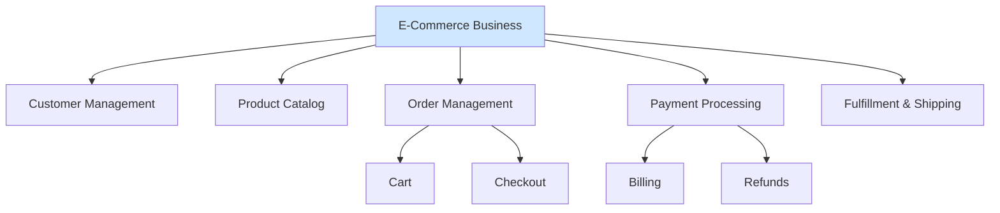
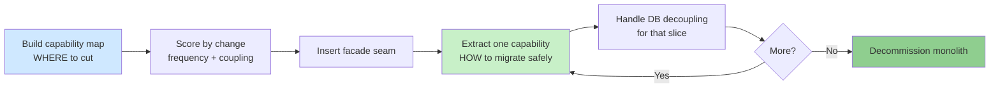
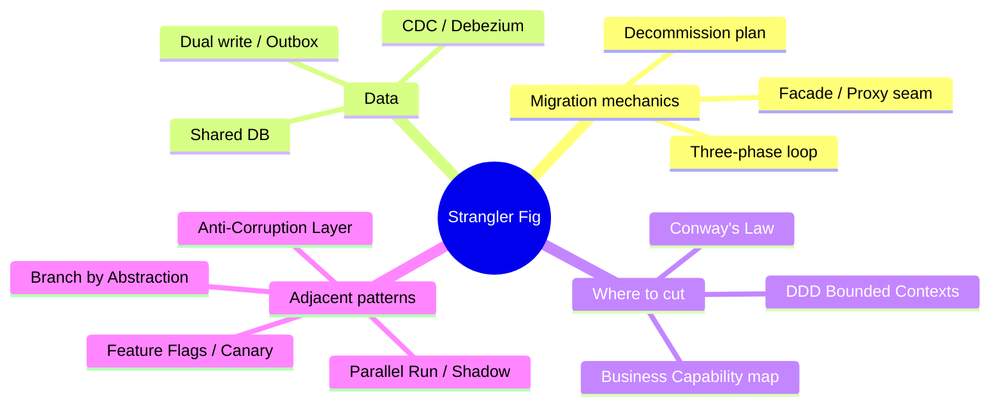

# 🌳 The Strangler Fig Pattern — A Complete Study Guide

> *"Never rewrite, never stop delivery."*
> How to replace a legacy system safely, one slice at a time, without ever turning it off.

---

## 📋 Table of Contents

1. [What Is the Strangler Fig Pattern?](#-1-what-is-the-strangler-fig-pattern)
2. [Core Definitions & Vocabulary](#-2-core-definitions--vocabulary)
3. [Why It Exists — The Problem It Solves](#-3-why-it-exists--the-problem-it-solves)
4. [The Real Mechanism — The Three-Phase Loop](#-4-the-real-mechanism--the-three-phase-loop)
5. [The Facade / Proxy Layer (The "Strangler")](#-5-the-facade--proxy-layer-the-strangler)
6. [The Hardest Part — Database Decoupling](#-6-the-hardest-part--database-decoupling)
7. [Knowing Where to Cut — Decompose by Business Capability](#-7-knowing-where-to-cut--decompose-by-business-capability)
8. [Sequencing the Migration — Where the Two Patterns Converge](#-8-sequencing-the-migration--where-the-two-patterns-converge)
9. [Real-World Examples (Categorized)](#-9-real-world-examples-categorized)
10. [Common Misconceptions](#-10-common-misconceptions)
11. [Anti-Patterns to Avoid](#-11-anti-patterns-to-avoid)
12. [Staff / Principal-Level Nuance](#-12-staff--principal-level-nuance)
13. [Extensions & Adjacent Concepts](#-13-extensions--adjacent-concepts)
14. [⚡ Quick Revision](#-14-quick-revision)
15. [🎓 FAANG Interview Q&A (20 Questions)](#-15-faang-interview-qa-20-questions)
16. [📝 STAR-Based Behavioral Questions](#-16-star-based-behavioral-questions)
17. [🔗 References](#-17-references)

---

## 🎯 1. What Is the Strangler Fig Pattern?

The **Strangler Fig Pattern** is a strategy for **incrementally replacing a legacy system** with a new one, piece by piece, while the old system keeps serving live traffic the entire time. When the last piece has been migrated, the old system is switched off — quietly, with nothing left depending on it.

The name comes from a real tree. The **strangler fig** is native to tropical rainforests. Its seed doesn't start life on the ground — it lands high in the canopy on the branch of a **host tree**. From there it grows roots downward until they reach the soil, and over years it wraps around the host, growing stronger while the host is slowly shaded out and dies. When the host rots away, the fig is left standing on its own — in the exact shape of the tree it replaced.

That is *precisely* what a well-run legacy migration looks like. You grow the new system **around** the old one. The old one keeps working while the new one matures. Eventually the new system carries all the load, and you remove the old one. From the outside — from the user's point of view — nothing ever broke.

The term was coined by **Martin Fowler in 2004** (his essay "StranglerFigApplication"). He classifies it as a **transitional architecture pattern**: a pattern whose entire job is to change how a system is built *without stopping or breaking it during the change*.



<details>
<summary>📖 Beginner-friendly explanation</summary>

Imagine you want to replace an old wooden bridge that 100,000 cars cross every day. You **can't** close it — the city depends on it. So instead, you build new lanes right next to the old ones, one at a time. As each new lane opens, you move some traffic onto it. Eventually all the cars are on the new lanes, and the old bridge is empty — now you can safely tear it down. Nobody ever had to stop driving. That's the strangler fig: build the new system alongside the old, move traffic across gradually, then remove the old one.

</details>

---

## 🎯 2. Core Definitions & Vocabulary

Getting the vocabulary right is what separates a confident answer from a hand-wavy one in an interview. Here are the terms you must be precise about.

**Monolith / Legacy System** — the existing single-deployment application you want to modernize. Not necessarily "bad code"; often it was the *right* choice when the product was young. It becomes a problem only when its size starts taxing the team.

**The Strangler (a.k.a. the Facade, Proxy, or Interceptor)** — the routing layer you place *in front of* the legacy system. It is the single control point that decides, per request, whether traffic goes to the old system or a new service. This is the structural heart of the whole pattern.

**Vertical Slice** — a self-contained piece of functionality with well-defined inputs and outputs (e.g. "notifications", "product catalog", "checkout"). You migrate one slice at a time, not one layer at a time.

**Cutover** — the moment you flip routing for a slice from the monolith to the new service. In the strangler fig, cutovers are small, frequent, and reversible — the opposite of a Big Bang.

**Big Bang Rewrite** — the alternative approach: stop everything, rebuild from scratch, and flip a single giant switch. This is the thing the strangler fig exists to avoid.

**Anti-Corruption Layer (ACL)** — a translation layer that protects a new service from the messy data model and conventions of the legacy system, so the old design doesn't "leak" into the new one.

**Business Capability** — *what* the business does, as a stable ability (e.g. "Process Payments", "Manage Inventory"). Used to decide where to draw service boundaries. (Full treatment in §7.)

<details>
<summary>📖 Beginner-friendly explanation</summary>

Three words to keep straight: the **monolith** is the old app you're replacing. The **strangler** (or facade/proxy) is the traffic cop you put in front of it that decides where each request goes. A **vertical slice** is one whole feature — like "send emails" — that you carve out and rebuild as a small standalone service. You do this slice by slice instead of all at once, which is why it's the opposite of a "Big Bang" rewrite where you rebuild everything and flip one scary switch.

</details>

---

## 🎯 3. Why It Exists — The Problem It Solves

To understand *why* anyone bothers with the strangler fig, you first have to understand the thing it replaces: the **Big Bang Rewrite**.

### The seduction of the Big Bang

When a monolith becomes painful, the instinctive reaction is: *"Let's just rewrite it properly this time."* On a slide deck it looks clean — stop feature work, rebuild everything from scratch, flip the switch, done. In practice it almost always turns into a disaster:

- **12–18 months of parallel development with no new features.** The business freezes while competitors keep shipping.
- **A go-live moment where everything can fail at once.** All the risk is concentrated into a single day.
- **No rollback.** Once you've flipped the switch and turned off the old system, there's nothing to fall back to.
- **Stakeholders lose confidence midway.** Long projects with no visible output erode trust, and budgets get cut halfway.
- **Lost implicit knowledge.** The team rewriting the system rarely understands every edge case, workaround, and hard-won optimization baked into the original over the years. Those details silently disappear.
- **The paradox of the rewrite.** If the current system is so bad, who guarantees the new one will be better? Often it's the *same team*, with the *same habits*, building it.

There's also the **sunk-cost trap**: once you're a year into a rewrite, you keep pouring money in because stopping feels like admitting failure — even when the evidence says stop.

### Why a monolith becomes painful in the first place

A monolith is *not* a design error at the start — it's usually the fastest way to ship a product. The pain compounds only as the business scales:

- **Merge hell / organizational scalability.** Many teams editing one codebase means constant merge conflicts. The "Payments" team blocks the "Catalog" team just by existing in the same repo.
- **Degraded developer experience.** Millions of lines of code make IDE indexing crawl and local boot times stretch into minutes. Small changes feel daunting.
- **The deployment bottleneck.** A two-line billing fix forces a full redeploy of the *entire* app. A bug in an unrelated module can block a critical hotfix.
- **The "ball of yarn" effect.** Without hard boundaries, code becomes tightly coupled. Changing one function triggers unpredictable side effects elsewhere.

> **Key insight:** Splitting a monolith into internal *modules* or *libraries* helps code cleanliness but does **not** solve the deployment problem. As long as everything runs in a single runtime unit, you're still a prisoner of one tech stack and one release train. You need *physical* separation — separate deployables — which is what the strangler fig delivers incrementally.

### The strangler fig's answer

The strangler fig avoids **every one of the Big Bang failure modes** by migrating incrementally. The old system stays live. Each migrated slice is small, testable, and reversible. If you stop halfway, you still keep every improvement you made up to that point. The business never stops shipping.

<details>
<summary>📖 Beginner-friendly explanation</summary>

The tempting way to fix an old, messy app is to rewrite it from scratch — but that's a trap. You freeze all new features for a year or two, then flip one giant switch and pray. If anything goes wrong, there's no going back, and you've usually lost all the tiny fixes and edge cases the old code quietly handled. The strangler fig avoids this by rebuilding one small feature at a time while the old app keeps running. Each step is small enough to undo, and you never have to stop shipping.

</details>

---

## 🎯 4. The Real Mechanism — The Three-Phase Loop

Every strangler fig migration is the **same three-phase loop, repeated once per slice**. It's not a one-time project; it's a rhythm you run over and over until the monolith is empty.



**Phase 1 — Identify.** Pick a vertical slice of functionality inside the monolith. The ideal first candidate has well-defined inputs/outputs, low coupling to other modules, and either high business value or high change frequency. (More on *how* to choose in §7–8.)

**Phase 2 — Intercept.** Insert a routing layer — a proxy or API gateway — in front of the monolith. Crucially, at this point **all traffic still goes to the monolith**. Nothing has moved yet. But the *seam* now exists: the single place where you'll later redirect traffic. Establishing this seam safely, with zero behavior change, is a milestone in its own right.

**Phase 3 — Migrate.** Build the new microservice for that slice. When it's production-ready, update the routing rules so that slice's traffic flows to the new service. The monolith's code path for that slice goes dormant.

Then you **repeat** — identify the next slice, migrate it — until the monolith serves nothing. Only then do you **decommission** it.

> The Big-Bang version of a migration is a single enormous Phase 3 with no safety net. The strangler fig breaks that one terrifying step into dozens of small, boring, reversible ones.

<details>
<summary>📖 Beginner-friendly explanation</summary>

Think of it as a three-step dance you repeat for each feature: (1) **pick** one feature to move, (2) **put a traffic cop in front** of the old app — but don't move anything yet, just get the switchboard in place, and (3) **build the new version** and flip that one feature's traffic over to it. Then you go back to step one and pick the next feature. Do this enough times and the old app ends up doing nothing, at which point you unplug it.

</details>

---

## 🎯 5. The Facade / Proxy Layer (The "Strangler")

The routing seam is **the single most important structural piece** of the pattern. Without it, there is no safe migration — you'd be forced into a hard cutover, which defeats the entire point.

### What the facade does

The facade sits in front of the monolith and behaves, at first, as a **transparent proxy**: it forwards 100% of traffic straight through. Clients don't know it exists. As new services come online, you update the routing rules — specific routes peel off to new services, everything else still hits the monolith. **The client never needs to know anything changed.**



### How it's implemented

Common building blocks: an **API Gateway** (Kong, AWS API Gateway, Apigee), a **reverse proxy** (Nginx, Envoy, HAProxy), or a **load balancer** with routing rules. A minimal Nginx example:

```nginx
# Requests for the migrated Catalog service go to the new microservice
location /api/v1/products {
    proxy_pass http://catalog-service:8080;
}
# Everything else — payments, orders — still goes to the legacy monolith
location /api/v1/ {
    proxy_pass http://payment-monolith:8080;
}
```

### The key invariant

**The facade owns the routing table — not the individual services.** This is the detail that makes or breaks the pattern. Because routing lives in one control plane, you can:

- **Roll back instantly** — flip one rule to send traffic back to the monolith. No redeploy.
- **Run A/B tests or canaries** — send 5% of traffic to the new service, 95% to the monolith, and compare.
- **Shadow/mirror traffic** — send a copy of live requests to the new service to validate it without affecting users.

### Not everything routes through HTTP

An important nuance: the facade only helps for functionality **directly called by clients over HTTP** (Catalog, Orders). Some functionality is triggered *internally by events* — a Notification service, for instance, reacts to a "payment confirmed" event rather than a direct client call. For those, the proxy plays **no role**. Decoupling happens through a **message broker** (Kafka, RabbitMQ, SNS) instead — the strangling happens at the *event level*, not the HTTP routing level. Mixing these two mental models up is a classic interview stumble.

<details>
<summary>📖 Beginner-friendly explanation</summary>

The "strangler" is really just a smart traffic cop (an API gateway or reverse proxy like Nginx) sitting in front of your old app. On day one it passes everything straight through, so nothing changes. As you build new services, you tell the cop "send `/products` to the new catalog service, keep the rest on the old app." Because *one* place controls all the routing, you can instantly send traffic back to the old app if the new one misbehaves — no redeploy, no drama. One catch: features triggered by internal events (like sending an email after a payment) are switched over through a message queue, not the traffic cop.

</details>

---

## 🎯 6. The Hardest Part — Database Decoupling

Here's the truth experienced engineers will tell you: **the hardest part of the strangler fig isn't the code — it's the data.** Monoliths typically have a single shared schema, and when you extract a service you can't just rip its tables out overnight, because the monolith may still read and write those same tables.

There are **three progressive stages** of database decoupling:



**Stage 1 — Shared Database.** The new service and the monolith both hit the same DB. Lowest friction to get started, but it creates **tight coupling** — the two systems now share a schema and can break each other. This is a *starting point*, not a destination. A service that permanently shares the monolith's database isn't a microservice; it's a **distributed monolith** (all the operational cost of distribution, none of the independence).

**Stage 2 — Dual Write.** The new service writes to its **own** database, and a synchronization mechanism (the application, or a sync layer) keeps the monolith's DB in step. This is the **critical, delicate transition period** — you now have two sources of truth and must reconcile them. Expect duplicate data. That redundancy is the *price of independence*, not a bug.

**Stage 3 — Change Data Capture (CDC).** Tools like **Debezium** stream row-level changes from the monolith's DB into the new service's DB over **Kafka** (or similar). This gives you **eventual consistency without modifying the monolith's write path** — a huge advantage, because touching the legacy write path is exactly what you're trying to avoid. Once the new service is stable, the monolith stops writing to those tables and they're deprecated.

> **Staff-level framing:** every stage is a deliberate trade of *coupling* for *migration risk*. Stage 1 minimizes upfront work but maximizes coupling. Stage 3 minimizes coupling but requires real streaming infrastructure and forces you to accept eventual consistency. You move through the stages as your confidence — and your tolerance for the new service owning its data — grows.

<details>
<summary>📖 Beginner-friendly explanation</summary>

Splitting the code is easy; splitting the *database* is the real headache, because the old app and the new service often need the same tables. You go through three stages. First, both just share one database (quick, but they're now joined at the hip). Second, the new service gets its own database and you keep the two copies in sync (messy, but you're gaining independence). Third, you use a tool like Debezium to automatically stream changes from the old database into the new one, so you never have to touch the old app's code. Once the new service is solid, the old tables get retired.

</details>

---

## 🎯 7. Knowing Where to Cut — Decompose by Business Capability

The strangler fig tells you *how* to migrate safely. It does **not** tell you *which* piece to extract first. For that you need a companion technique: **Decompose by Business Capability**.

### Get the vocabulary right (interviewers love this)

Three terms are constantly confused:

- **Business Capability** — *what* the business does. A stable, permanent ability: "Process Payments", "Manage Inventory", "Handle Returns". Capabilities barely change even when technology or org charts do.
- **Business Function** — a group of related activities performed by a team. Closer to an org-chart entry.
- **Feature** — a specific user-facing behavior in the product. Features are *implemented within* capabilities.

Why the distinction matters: **features change often, org structures change sometimes, capabilities change almost never.** Aligning service boundaries to *capabilities* therefore gives you the most stable possible decomposition — you're anchoring your architecture to the slowest-moving thing in the business.

### The capability map

A capability map is a hierarchy that breaks the business into *what it does*, not *how*. For e-commerce:



### Conway's Law — the structural force behind all of this

> *"Organizations which design systems are constrained to produce designs which are copies of the communication structures of those organizations."* — Melvin Conway, 1967

This isn't a cute metaphor; it's a structural force. If your backend team owns all data access and your frontend team owns all UI, you'll get a layered architecture **no matter what the architecture doc says**. Team boundaries *become* service boundaries.

Decompose-by-capability deliberately **inverts** this. Instead of letting the org chart dictate the system, you define the capability map first, then align teams to capabilities. Each team owns one or two capabilities *end to end* — their service, their database, their pipeline. This is the foundation of Amazon's **"two-pizza team"** model and what drove its services-based architecture in the early 2000s. Practical takeaway: when you draw your capability map, check whether your org matches it. **Mismatches are architectural debt waiting to happen** (this deliberate reshaping of teams is called the *Inverse Conway Maneuver*).

### Capability vs. Subdomain (DDD) — a common interview question

They're related but not identical:

| Lens | Decompose by Business Capability | Decompose by Subdomain (DDD) |
|------|----------------------------------|------------------------------|
| Reasons from | The org / the business | The domain model |
| Speed | Faster, stakeholder-friendly | Slower, needs domain expertise |
| Output | What the business *does* | Bounded contexts in the model |
| Best used | First pass, to get boundaries | Validation when the domain is complex |

In practice they produce **similar boundaries**. The difference is the lens. Use capability mapping first (fast, stakeholder-friendly), then validate with DDD's bounded-context analysis if the domain is complex.

<details>
<summary>📖 Beginner-friendly explanation</summary>

Before you cut, you need to know *where* to cut. The trick is to organize your system around **what the business does** ("process payments", "manage inventory") rather than around technical layers or your current team structure. Why? Because those business abilities almost never change, so boundaries drawn around them stay stable for years. There's also a law of nature here (Conway's Law): your software ends up mirroring how your teams talk to each other — so smart companies like Amazon design the teams to match the architecture they *want*, not the other way around.

</details>

---

## 🎯 8. Sequencing the Migration — Where the Two Patterns Converge

This is where the two ideas fuse into a **complete modernization strategy**:

- **Decompose by Business Capability answers "where to cut."**
- **Strangler Fig answers "how to migrate safely."**

Once you have a capability map, you still need an *order*. Use a simple **scoring matrix**:

| Capability | Change Frequency | Coupling Score | Business Risk | Extract? |
|------------|:----------------:|:--------------:|:-------------:|:--------:|
| Notifications | Low | Low | Low | 🥇 First (safe warm-up) |
| Product Catalog | High | Medium | Medium | 🥈 Early (velocity win) |
| Orders | High | High | High | Later |
| Payments | Medium | Very High | Very High | 🏁 Last (final boss) |

- **Change Frequency** matters because high-churn modules are the ones slowing your team down *inside* the monolith. Extract those and you get **immediate developer-velocity gains**.
- **Coupling Score** matters because a highly coupled module is expensive and risky to extract. Start with **loosely coupled** ones to build team confidence and pattern familiarity before tackling the hard ones.



**The full arc:** build the capability map → score by change frequency and coupling to get a sequence → insert the proxy facade → extract one capability at a time, handling database decoupling at each step → repeat → decommission. The monolith *shrinks* incrementally rather than being rewritten all at once. The business keeps shipping. The team builds confidence with each extraction. Eventually the host tree disappears and the new architecture stands on its own.

<details>
<summary>📖 Beginner-friendly explanation</summary>

Two questions, two tools. "Which piece do I pull out?" is answered by mapping what the business does. "How do I pull it out without breaking things?" is answered by the strangler fig. To pick the *order*, score each piece on two things: how often it changes (extract high-churn stuff early for a quick speed boost) and how tangled it is (start with the loosely-tangled stuff to practice on). Save the scary, high-risk pieces like payments for last, once your team is confident.

</details>

---

## 🎯 9. Real-World Examples (Categorized)

### 🏢 Category A — Large architectural migrations (monolith → microservices)

**SoundCloud (the textbook case, 2012–2020).** SoundCloud started with a Ruby-on-Rails monolith where web and API were tangled together, making it costly to maintain. They could have written a new API directly, but many **external clients** still pointed at the old backend. So they built the strangler — a router forwarding to the old monolith while they evolved the new architecture. It wasn't smooth: they *abandoned* the strangler at one point and later *recovered* it. Key tactics: they added **telemetry** to discover which endpoints were actually used, created **fallbacks** for routes that didn't exist yet, and only deleted old endpoints once they were 100% sure the replacements worked. For a while they even ran both systems in **parallel**, executing the same queries on old and new and **comparing the outputs** to catch discrepancies — surfacing many unexpected issues that, in a Big Bang, would have been production disasters. Total migration: **~8 years**.

> Lesson: unexpected issues in a strangler migration just mean "keep the legacy code a bit longer, learn from it, and fix the new one." In a full rewrite, the same issues are catastrophic.

**A suspension bridge carrying 100,000 vehicles/day** — the canonical *analogy* rather than a company. You build new lanes alongside the old, reroute traffic gradually, and dismantle the old structure only when it's empty. Nobody ever stops driving.

### 🔧 Category B — Monolith → *better* monolith (you don't always need microservices)

**Shopify (2016 onward).** After a decade of Rails, Shopify's monolith was extremely fragile — small changes caused cascading bugs, onboarding was brutal, coupling was severe. But — unlike SoundCloud — Shopify decided **microservices were not the answer for them**. So they went from monolith to… monolith. The difference: **modular** development, with clearly marked component boundaries, rewriting old code into the new modular structure step by step. (More recently they've begun rewriting parts in **Rust**.)

> Lesson: the strangler fig is about *incremental, safe replacement* — the *target* doesn't have to be microservices. A well-modularized monolith is a perfectly valid destination.

### 🔬 Category C — Small-scale / code-level refactoring

**The Bowling Game Kata (Robert C. Martin).** The strangler fig even works at the level of a single class. In the kata, the score was accumulated in a `score` field, but that design couldn't handle spares and strikes cleanly — it needed a `rolls` array instead. Rather than delete `score` and rewrite everything at once, the change goes step by step: first *add* `rolls` alongside `score`, then change the update method without removing the old one, then change how the score is *calculated*, and only then delete the old code. Step by step, completely safe — the strangler fig in miniature.

> Lesson: the pattern scales all the way down. "Add the new path, run both, then remove the old" works for one field just as it does for a whole system.

### 🌐 Category D — The event-driven variant (Notifications)

Extracting a **Notification service** shows a different flavor. Notifications aren't called directly by clients over HTTP — they're triggered by internal events. So instead of routing through the gateway, the monolith **publishes an event** (`PaymentConfirmed`) to a broker, and the new service **consumes** it:

```java
// Inside the Payment monolith — publish an event instead of calling NotificationModule directly
eventPublisher.publish(new PaymentConfirmedEvent(payment.getId(), customer.getEmail()));

// Inside the standalone notification-service — consume the event asynchronously
@KafkaListener(topics = "payment.confirmed")
public void onPaymentConfirmed(PaymentConfirmedEvent event) {
    emailService.sendConfirmation(event.getCustomerEmail());
}
```

Why start here? **Fault isolation** (if notifications crash, users can still pay), **independent evolution** (swap SMTP for SendGrid without touching payments), and a **zero-downtime rollback** (just stop publishing the event and re-enable the monolith's internal module — no routing change, no gateway redeploy).

<details>
<summary>📖 Beginner-friendly explanation</summary>

Real companies prove the pattern works at every scale. **SoundCloud** spent 8 years slowly moving off their old Rails app, running old and new side by side and comparing answers to catch bugs. **Shopify** used the same *idea* but decided microservices weren't for them — they turned their messy monolith into a clean, modular one instead. And the "Bowling Game Kata" shows it even works inside a single class: add the new field, run both old and new, then delete the old. Same recipe, wildly different scales.

</details>

---

## 🎯 10. Common Misconceptions

**❌ "The strangler fig always means microservices."** No. The target can be a modular monolith (Shopify), a rewritten module, or even a single refactored class. It's a *migration technique*, not an architecture destination.

**❌ "It's just putting a proxy in front and calling it done."** The proxy is necessary but not sufficient. The genuinely hard work is **data decoupling** and choosing correct boundaries. A proxy in front of a shared database gives you a distributed monolith.

**❌ "You should extract the most important thing first."** The opposite. Start with something **boring and low-risk** (notifications, preferences, reporting). Nobody gets fired if emails are late for 10 minutes; people *do* get fired if payments double-charge. Save payments for last.

**❌ "It's fast."** It is deliberately *not* fast — SoundCloud took ~8 years. Anyone promising to "strangle everything in three months" is describing a Big Bang wearing a strangler costume.

**❌ "It fixes a messy codebase automatically."** No. If your monolith is a mess and you extract carelessly, you just get *smaller* messes. The pattern gives you *safety*, not *cleanliness* — you still have to refactor and pick good boundaries.

**❌ "The strangling always happens at the HTTP proxy."** For internally-triggered work (notifications, background jobs), the decoupling happens at the **event/broker** level, not the HTTP router. Two different mechanisms.

<details>
<summary>📖 Beginner-friendly explanation</summary>

The biggest myths: it's *not* only about microservices (the goal can just be cleaner code), it's *not* just slapping a proxy on top (the database is the hard part), and it's definitely *not* fast (think years, not months). Also, don't start by rebuilding your most critical feature — start with something safe and boring so a mistake doesn't hurt. And it won't magically clean up bad code; it only makes the *change* safe.

</details>

---

## 🎯 11. Anti-Patterns to Avoid

**🚫 Extracting by technical layer instead of business domain.** "Let's extract the validation layer" or "the data-access layer" creates a **dependency disaster** — every request now hops across services. Always extract *vertical* business slices, not *horizontal* layers.

**🚫 No kill plan for the monolith.** If the old system is never actually retired, you end up **maintaining two full systems forever** — double the cost, double the on-call. Every extraction needs a defined path to switching the old code off.

**🚫 Zero observability during migration.** If you can't trace a request across the old and new systems, debugging becomes "digital archaeology." Instrument with **distributed tracing** (OpenTelemetry, Jaeger) and **centralized logging** (ELK, Datadog) *from the first extraction*.

**🚫 A Big Bang hiding inside a strangler plan.** "We'll strangle everything in one quarter" is a rewrite in disguise. The whole value is in going incrementally.

**🚫 Sharing the database permanently.** A service that never gets its own data store is a **distributed monolith** — all the operational overhead of distribution with none of the independence.

**🚫 Duplicating the monolith's bad boundaries.** If you extract without rethinking boundaries, you copy the tangle into a distributed system, which is *harder* to fix than the original.

<details>
<summary>📖 Beginner-friendly explanation</summary>

The classic ways people ruin this: cutting along technical layers (like "the validation layer") instead of whole features, which just creates a web of dependencies; never actually turning the old system off, so you're stuck running two forever; and flying blind with no tracing, so you can't tell which system broke. And if you never give the new service its own database, you've just built a "distributed monolith" — the worst of both worlds.

</details>

---

## 🎯 12. Staff / Principal-Level Nuance

These are the points a senior engineer raises **unprompted** — the follow-ups that separate an L5+ answer from a textbook one.

**The facade is a control plane, and it must be *observable and tunable*.** Routing should be data-driven (config, feature flags) not hardcoded, so you can shift traffic percentages, canary, shadow, and roll back without redeploys. Treat the routing table as a first-class operational surface with its own dashboards and alerts.

**Idempotency and dual-run correctness.** SoundCloud's "run both systems and compare outputs" is powerful but requires the new service to be **side-effect-safe** during shadow runs — you don't want the shadow path sending duplicate emails or double-charging. Shadow traffic must either be read-only or carefully sandboxed.

**Consistency model is a deliberate choice, not an accident.** CDC gives *eventual* consistency. If a slice needs read-your-own-writes or strong consistency across the old/new boundary, you must design for it explicitly (e.g., route reads and writes for that entity to the same store during transition, or use the outbox pattern to avoid dual-write anomalies).

**The dual-write trap.** Naïve dual writes (write to DB-A, then DB-B) can leave the two stores inconsistent if the second write fails. The staff-level fix is the **transactional outbox pattern** (write the change and an event in one local transaction, then relay the event) — this is *why* CDC/Debezium is preferred over application-level dual writes.

**Strangler fig temporarily violates DRY — on purpose.** During migration, logic exists in both the monolith and the new service. That duplication is a *deliberate, temporary* cost of safety. The discipline is to keep the window short and have a firm kill date, otherwise the duplication calcifies.

**The Anti-Corruption Layer protects the new model.** When the new service must read legacy data, an ACL translates the old, often-messy model into the new clean one, so the legacy design doesn't leak in and corrupt the new bounded context.

**Operational cost scales non-linearly.** "A monolith fails in one place; ten microservices fail in ten ways, silently." You must invest in CI/CD, feature flags, automated rollback, canary deploys, distributed tracing, and centralized logging *from day one* — these aren't optional add-ons, they're the safety net that makes incremental extraction survivable at scale.

**Know when *not* to strangle.** If the monolith is small and disposable, the product is being fully rebuilt anyway, the business can tolerate a freeze, or there's no long-term maintenance budget — a freeze-and-rewrite may genuinely be cheaper. The mature answer includes recognizing when the pattern *doesn't* pay off.

**Sequencing is a risk-and-velocity optimization.** The scoring matrix (change frequency × coupling × business risk) isn't bureaucracy — it's how you front-load *developer-velocity wins* (extract high-churn modules early) while *deferring risk* (extract payments last).

<details>
<summary>📖 Beginner-friendly explanation</summary>

The advanced points boil down to: make the traffic-routing switchboard something you can tune and watch closely; be careful that "test both systems at once" doesn't accidentally send two emails; decide up front how fresh your data needs to be (instant vs. eventually-correct); use the "outbox" trick instead of naïvely writing to two databases; accept that you'll temporarily have duplicate code and set a deadline to delete it; and pour money into monitoring from day one, because ten services fail in ten quiet ways. Finally, know when *not* to bother — sometimes a small app is just easier to rewrite.

</details>

---

## 🎯 13. Extensions & Adjacent Concepts

**Transitional Architecture (Fowler's category).** The strangler fig is one of a family of *transitional patterns* — patterns whose purpose is to safely evolve an architecture while it keeps running. Related idea: build scaffolding you *intend* to throw away.

**Branch by Abstraction.** A sibling technique for in-process changes: introduce an abstraction layer over the code you want to replace, build the new implementation behind it, switch the abstraction over, then remove the old. It's the "in-code" cousin of the strangler's routing seam.

**Parallel Run / Dark Launching / Shadow Traffic.** Run the new implementation alongside the old on live traffic, compare results (SoundCloud did this), but only let the old one's output count until you trust the new one.

**Feature Flags & Canary Releases.** The operational levers that make the facade's routing gradual and reversible — shift 1% → 10% → 100% and roll back instantly.

**Anti-Corruption Layer (DDD).** Translation boundary that keeps the legacy model from leaking into the new service.

**Transactional Outbox & CDC.** The reliable-messaging backbone for keeping old and new data stores consistent without unsafe dual writes.

**Domain-Driven Design / Bounded Contexts.** The complementary lens (from the domain side) for validating the boundaries your capability map proposes.

**Inverse Conway Maneuver.** Deliberately restructuring teams to produce the architecture you want — the organizational counterpart to decompose-by-capability.



<details>
<summary>📖 Beginner-friendly explanation</summary>

The strangler fig has a family of related tricks. **Branch by Abstraction** is the same idea but inside your code instead of at the network. **Parallel run / shadow traffic** means running old and new side by side to compare. **Feature flags and canaries** are the on/off dials that let you move traffic a little at a time. **CDC and the outbox pattern** keep the two databases honest. And **DDD / Conway's Law** help you figure out where the boundaries should go. Learn these together — they're the toolkit that surrounds the core pattern.

</details>

---

## ⚡ 14. Quick Revision

*Read this and you should be able to reconstruct the whole guide in natural flow.*

**The idea and the name.** The Strangler Fig Pattern (Martin Fowler, 2004) replaces a legacy system incrementally while it keeps serving live traffic, then switches the old one off once nothing depends on it. The name is a tropical tree that grows around a host, thrives while the host is shaded out, and is finally left standing alone in the host's exact shape. In software, you grow the new system around the old; from the user's point of view nothing ever breaks. Two golden rules capture it: **never rewrite, never stop delivery.**

**Why it exists.** It's the safe alternative to the **Big Bang Rewrite**, which freezes features for 12–18 months, concentrates all risk into one go-live day, offers no rollback, loses the implicit edge-case knowledge baked into the old code, and often gets rebuilt by the same team with the same habits. Monoliths themselves aren't mistakes — they become painful as they scale, through merge hell, slow IDE/boot times, a full-app redeploy for a two-line fix, and tightly coupled "ball of yarn" code. Splitting into modules helps cleanliness but not deployment; you need *physical* separation, delivered incrementally.

**The mechanism.** A three-phase loop repeated per slice: **Identify** a well-bounded vertical slice → **Intercept** by putting a proxy/gateway in front (still 100% to the monolith — you're just creating the seam) → **Migrate** by building the new service and rerouting that slice's traffic. Repeat until the monolith is empty, then decommission. A Big Bang is really one giant Phase 3 with no safety net; the strangler breaks it into many small reversible steps.

**The facade (the "Strangler").** The routing seam is the most important structural piece — it starts as a transparent proxy forwarding everything, then peels off routes to new services one at a time. Implemented with an API gateway (Kong, AWS API Gateway) or reverse proxy (Nginx, Envoy). The key invariant: **the facade owns the routing table, not the services** — giving one control plane for instant rollback, canary/A-B tests, and shadow traffic. Note: internally-triggered work (e.g. Notifications) is decoupled through a **message broker** (Kafka/RabbitMQ), not the HTTP proxy — the strangling happens at the event level there.

**The hard part is data.** Monoliths share one schema, so you can't rip tables out overnight. Three progressive stages: **Shared DB** (fast start, tight coupling — a permanent shared DB is a *distributed monolith*), **Dual Write** (new service gets its own DB, sync keeps them aligned — the delicate transition, expect duplicate data), and **CDC** (Debezium streams row changes over Kafka into the new DB, giving eventual consistency *without touching the monolith's write path*). The staff-level fix for unsafe dual writes is the **transactional outbox**.

**Where to cut.** The strangler says *how*; **Decompose by Business Capability** says *which piece first*. Anchor boundaries to **capabilities** (what the business does — "Process Payments") because they change far more slowly than features or org charts. **Conway's Law** warns that team structure becomes system structure, so define the capability map first and align teams to it (Amazon's two-pizza teams; the *Inverse Conway Maneuver*). Capability mapping and DDD subdomains produce similar boundaries from different lenses — use capability first, validate with DDD if complex.

**Sequencing.** Score capabilities by **change frequency** (extract high-churn first for velocity wins) and **coupling** (extract loosely-coupled first to build confidence), keeping high-risk pieces like payments for last. Full arc: capability map → score → insert facade → extract one slice at a time with its DB decoupling → repeat → decommission.

**Examples.** **SoundCloud** (Rails monolith, ~8 years, ran old and new in parallel comparing outputs, used telemetry + fallbacks, even abandoned and recovered the strangler). **Shopify** (monolith → *modular monolith* — microservices weren't the goal; now some Rust). **Bowling Game Kata** (the pattern at single-class scale: add `rolls` beside `score`, run both, delete old). **Notification service** (event-driven variant: publish `PaymentConfirmed`, consume via Kafka; fault isolation + zero-downtime rollback).

**Misconceptions & anti-patterns.** It's not only for microservices, not just a proxy, not fast, and doesn't auto-clean bad code. Avoid extracting by *technical layer* (extract vertical business slices), having *no kill plan* (you'll run two systems forever), *zero observability* (use OpenTelemetry/Jaeger + ELK/Datadog from day one), a *Big Bang hiding inside a strangler plan*, and *permanently shared databases*.

**Staff nuance.** Make the facade data-driven, observable, and tunable; keep shadow runs side-effect-safe; choose your consistency model deliberately; prefer the outbox/CDC over naïve dual writes; accept a *temporary* DRY violation with a firm kill date; use an **Anti-Corruption Layer** so the legacy model doesn't leak; budget for non-linear operational cost; and know when *not* to strangle (small/disposable systems, full rebuilds, freeze-tolerant businesses).

---

## 🎓 15. FAANG Interview Q&A (20 Questions)

### 📊 Conceptual & Foundational (L3/L4)

<details>
<summary><strong>Q1. What is the Strangler Fig Pattern and where does the name come from?</strong></summary>

It's a strategy for incrementally replacing a legacy system with a new one while the old system keeps serving live traffic, then decommissioning the old system once nothing depends on it. Martin Fowler coined it in 2004, inspired by the tropical strangler fig tree that germinates in a host tree's canopy, grows around it, and is eventually left standing alone in the host's shape after the host dies. In software the analogy is exact: you grow the new system around the old, migrate slice by slice, and the user never experiences a break. Example: SoundCloud grew new services around a Ruby-on-Rails monolith over ~8 years, retiring endpoints only once replacements were proven.

</details>

<details>
<summary><strong>Q2. Why not just do a Big Bang rewrite?</strong></summary>

Because Big Bang rewrites concentrate all risk into a single go-live and routinely fail. You freeze features for 12–18 months while competitors ship, there's no rollback once you flip the switch, and you lose the implicit knowledge — edge cases, workarounds, performance fixes — baked into the old code over years. There's also the paradox: the same team with the same habits is building the replacement, so why would it be better? And the sunk-cost effect keeps teams pouring money into failing rewrites. The strangler fig eliminates these failure modes by making the migration incremental, reversible, and deliverable throughout — even if you stop halfway you keep every gain.

</details>

<details>
<summary><strong>Q3. Walk me through the three phases of a strangler fig migration.</strong></summary>

**Identify** a vertical slice with clean inputs/outputs, low coupling, and high value or churn. **Intercept** by inserting a proxy/gateway in front of the monolith — critically, 100% of traffic still flows to the monolith at this point; you're just establishing the routing seam with zero behavior change. **Migrate** by building the new service and, once it's production-ready, updating the routing to send that slice's traffic to it while the monolith's code path goes dormant. Then you repeat the loop per slice until the monolith is empty and decommission it. The point is that each cutover is small and reversible, unlike a Big Bang which is essentially one enormous irreversible Phase 3.

</details>

<details>
<summary><strong>Q4. What is the facade/proxy, and why is it the most critical piece?</strong></summary>

The facade (a.k.a. the "Strangler") is the routing layer in front of the legacy system — typically an API gateway (Kong, AWS API Gateway) or reverse proxy (Nginx, Envoy). It starts as a transparent proxy forwarding all traffic, then routes specific paths to new services as they come online. It's critical because it's what makes the migration *safe*: without a routing seam you'd be forced into a hard cutover. The key invariant is that the **facade owns the routing table, not the services** — this single control plane lets you roll back instantly (flip one rule), run canaries/A-B tests, and shadow traffic, all without redeploying services.

</details>

<details>
<summary><strong>Q5. Which component should you extract first, and why?</strong></summary>

Something **boring and low-risk** — notifications, user preferences, reporting — not your crown jewels. The reasoning is risk management: nobody gets fired if email notifications are delayed 10 minutes, but people absolutely get fired if payments double-charge customers. Starting low-risk lets the team build confidence and pattern familiarity before tackling coupled, high-stakes modules. You refine this with a scoring matrix: extract high-*change-frequency* modules early for developer-velocity wins, and loosely-*coupled* modules early to reduce risk, saving something like payments for last.

</details>

<details>
<summary><strong>Q6. How do you know the migration is "done"?</strong></summary>

The monolith receives zero production traffic — every route has been redirected and every event-driven responsibility has moved to new services. Only then do you decommission it, and even then you verify nothing (compliance reports, batch jobs, a nervous DBA's script) still depends on it. This is why an explicit **kill plan** per extraction matters: without a defined path to switching the old code off, you drift into maintaining two full systems forever, which doubles cost and on-call load.

</details>

<details>
<summary><strong>Q7. Does the strangler fig always produce microservices?</strong></summary>

No — that's a common misconception. The strangler fig is a *migration technique*, not an architecture destination. Shopify used it to go from a fragile Rails monolith to a *modular monolith* (they deliberately decided microservices weren't right for them), later rewriting parts in Rust. Robert Martin's Bowling Game Kata applies the same "add the new path, run both, delete the old" recipe inside a single class. The target can be microservices, a modular monolith, or a cleaner class — the pattern just guarantees the *change* is safe and incremental.

</details>

<details>
<summary><strong>Q8. What is Conway's Law and how does it relate to service decomposition?</strong></summary>

Conway's Law (1967) states that organizations produce system designs that mirror their communication structures. It's a structural force, not a metaphor: if backend owns data and frontend owns UI, you get a layered architecture regardless of the design doc. Decompose-by-capability deliberately inverts this — you define the capability map first, then align teams to capabilities (each team owns a capability end-to-end: service, DB, pipeline), which is Amazon's two-pizza-team model. When your org chart doesn't match your desired architecture, that mismatch is architectural debt; deliberately reshaping teams to fit the target architecture is the *Inverse Conway Maneuver*.

</details>

<details>
<summary><strong>Q9. Business capability vs. feature vs. business function — why does the distinction matter?</strong></summary>

A **business capability** is *what* the business does — a stable, permanent ability like "Process Payments" or "Manage Inventory." A **business function** is a group of activities a team performs (closer to an org-chart entry). A **feature** is a specific user-facing behavior, implemented *within* a capability. The distinction matters for boundary stability: features change frequently, org structures change occasionally, capabilities change almost never. Aligning service boundaries to capabilities gives the most stable decomposition, so you're anchoring your architecture to the slowest-moving thing in the business and avoiding churn-driven re-slicing.

</details>

<details>
<summary><strong>Q10. Capability decomposition vs. DDD subdomain decomposition — how do they differ?</strong></summary>

Both aim to find good service boundaries and usually produce similar results, but through different lenses. Capability decomposition reasons from the *org/business* ("what do we do?"); it's fast and stakeholder-friendly. DDD subdomain decomposition reasons from the *domain model* (bounded contexts, ubiquitous language); it's slower and needs domain expertise. The pragmatic approach is to use capability mapping first to get a quick, stakeholder-aligned boundary sketch, then validate with DDD's bounded-context analysis if the domain is genuinely complex. They're complementary, not competing.

</details>

### 💡 Staff / Principal-Level (L5/L6)

<details>
<summary><strong>Q11. Why is database decoupling harder than code decoupling, and how do you stage it?</strong></summary>

Because the monolith typically has a single shared schema, and the monolith may still read/write the very tables your new service needs — you can't extract them atomically. You stage it in three steps. **Shared DB**: both hit one database (fast, but tight coupling — permanently sharing is a distributed monolith). **Dual write**: the new service owns its DB while a sync keeps the monolith's DB aligned (the delicate transition; expect duplicate data). **CDC**: a tool like Debezium streams row-level changes over Kafka into the new DB, giving eventual consistency *without modifying the monolith's write path*. Each stage trades coupling for migration risk; you advance as confidence grows. The reason CDC beats naïve dual writes is that dual writes can leave stores inconsistent if the second write fails — hence the transactional outbox.

</details>

<details>
<summary><strong>Q12. Explain the dual-write problem and how the transactional outbox solves it.</strong></summary>

If your application writes to database A and then to database B (or publishes an event) as two separate operations, a crash or failure between them leaves the two inconsistent — you've committed A but lost B. The **transactional outbox** fixes this: within a single local transaction you write the business change *and* an "outbox" event row to the same database, so they commit atomically. A separate relay process (or CDC reading the outbox table) then reliably publishes the event to the broker. This is precisely why CDC/Debezium is preferred over application-level dual writes during a strangler migration — it guarantees the event reflects committed state without a distributed transaction.

</details>

<details>
<summary><strong>Q13. How do you validate a new service against the monolith before cutting over?</strong></summary>

Use a **parallel run / shadow traffic** strategy: mirror live requests to the new service while the monolith remains authoritative, and compare outputs to catch discrepancies. SoundCloud did exactly this — running queries on both systems and comparing results, surfacing many unexpected edge cases. The staff-level caveat is that shadow runs must be **side-effect-safe**: the shadow path must not send duplicate emails, double-charge, or mutate shared state. So you either keep the shadow path read-only or sandbox its side effects. Combine with canary releases (route 1% → 10% → 100%) and feature flags for reversible, gradual cutover.

</details>

<details>
<summary><strong>Q14. When would you decouple via a message broker instead of the HTTP proxy?</strong></summary>

When the functionality is triggered by internal events rather than direct client HTTP calls. A Notification service isn't called on a URL — it reacts to something like a `PaymentConfirmed` event. So instead of gateway routing, the monolith publishes the event to a broker (Kafka, RabbitMQ, SNS) and the new service consumes it. The "strangling" happens at the event level. This gives fault isolation (notifications crashing doesn't stop payments), independent evolution (swap SMTP for SendGrid without touching payments), and a zero-downtime rollback (stop publishing the event and re-enable the monolith's internal module — no routing change, no gateway redeploy). Conflating this with HTTP routing is a common mistake.

</details>

<details>
<summary><strong>Q15. The strangler fig temporarily violates DRY. Is that acceptable?</strong></summary>

Yes — deliberately and temporarily. During migration the same logic lives in both the monolith and the new service, which breaks Don't-Repeat-Yourself. That duplication is the *price of safety*: it's what lets you run both, compare, and roll back. The discipline is to treat it as a bounded, intentional cost with a firm **kill date** for the old path. The failure mode is letting the window drag on until the duplication calcifies and you're permanently maintaining two implementations. So it's acceptable precisely because it's temporary and scheduled to end, not a standing architectural choice.

</details>

<details>
<summary><strong>Q16. What's an Anti-Corruption Layer and when do you need one here?</strong></summary>

An Anti-Corruption Layer (ACL) is a translation boundary that converts the legacy system's data model and conventions into the new service's clean model, so the old, often-messy design doesn't leak into the new bounded context. You need it whenever the new service must read from or integrate with the legacy system during transition — for example, a new Orders service that still needs customer data from the monolith. Without an ACL, the legacy schema's quirks propagate into the new service and you end up recreating the monolith's tangle in distributed form, defeating the purpose of extraction.

</details>

<details>
<summary><strong>Q17. What observability do you need during a strangler migration, and why is it non-negotiable?</strong></summary>

You need **distributed tracing** (OpenTelemetry, Jaeger) and **centralized logging** (ELK, Datadog) from the very first extraction. The reason: a monolith fails in essentially one place, but ten microservices fail in ten different ways, often silently. Debugging a failed `PaymentConfirmed` event that crosses three services without tracing becomes "digital archaeology" — exactly the pain you were escaping. Zero observability during migration is a named anti-pattern because you literally cannot tell which system caused a regression, which makes safe, gradual cutover impossible. It's the instrumentation that makes rollback decisions data-driven rather than guesswork.

</details>

<details>
<summary><strong>Q18. How do you decide the order in which to extract capabilities?</strong></summary>

Use a scoring matrix over the capability map weighing **change frequency**, **coupling**, and **business risk**. High-change-frequency modules are extracted early because they're the ones slowing the team down inside the monolith — pulling them out yields immediate developer-velocity gains. Loosely-coupled modules are extracted early because they're cheap and safe, building team confidence and pattern familiarity. Highly coupled, high-risk modules like payments go last, once the team is experienced and the surrounding services already exist. So sequencing isn't bureaucracy — it's an explicit optimization that front-loads velocity wins while deferring risk.

</details>

<details>
<summary><strong>Q19. When should you NOT use the strangler fig pattern?</strong></summary>

When its overhead outweighs its safety benefit. If the system is small and disposable, a freeze-and-rewrite is simpler and cheaper. If the product is being fully rebuilt anyway (different platform, different requirements), incremental migration buys little. If the business can genuinely tolerate a downtime window, the coordination cost of running two systems isn't justified. And if there's no long-term maintenance budget or executive patience — since a real strangler migration can take years (SoundCloud: ~8) — you'll stall halfway. Recognizing these cases is itself a staff-level signal: the pattern is a tool, not a mandate.

</details>

<details>
<summary><strong>Q20. How do you avoid ending up with a "distributed monolith"?</strong></summary>

A distributed monolith has all the operational cost of distribution with none of the independence — usually because services still share a database or were split along technical layers. Avoid it by (1) giving each service its own data store (progress through shared DB → dual write → CDC, don't stop at shared), (2) extracting *vertical business slices* rather than horizontal technical layers like "the validation layer," (3) enforcing async, well-defined contracts between services rather than chatty synchronous cross-service calls, and (4) rethinking boundaries during extraction instead of copying the monolith's existing tangle. The litmus test: can each service be deployed and scaled independently? If not, it's still a monolith wearing a costume.

</details>

---

## 📝 16. STAR-Based Behavioral Questions

*Framed as Situation · Task · Action · Result — useful for "tell me about a time…" system-design/leadership rounds.*

<details>
<summary><strong>S1. Tell me about a time you migrated a legacy system without downtime.</strong></summary>

**Situation:** Our team owned a Rails monolith where the web app and public API were tangled together; external partners were still calling the old backend, and we couldn't afford a maintenance window.

**Task:** Modernize the architecture and split out services *without* breaking those external clients or freezing feature delivery.

**Action:** I introduced a routing facade (a reverse proxy) in front of the monolith that initially passed 100% of traffic through unchanged. We added telemetry to learn which endpoints were actually used, then extracted one low-risk slice at a time, creating fallbacks for routes that didn't exist in the new services yet. For a period we ran old and new in parallel, comparing outputs to catch discrepancies before flipping routes.

**Result:** We migrated incrementally over many quarters with zero customer-visible downtime, caught numerous edge cases that a Big Bang would have shipped as outages, and never stopped delivering features. Old endpoints were retired only once their replacements were proven at 100%.

</details>

<details>
<summary><strong>S2. Describe a time you disagreed with a proposed Big Bang rewrite.</strong></summary>

**Situation:** Leadership proposed freezing feature work for ~12 months to rewrite our billing monolith from scratch, citing how "messy" it had become.

**Task:** As the senior engineer, I needed to either support the plan or offer a safer alternative with evidence.

**Action:** I laid out the Big Bang failure modes — no rollback, lost edge-case knowledge, the sunk-cost trap, and the paradox that the same team would rebuild it. I proposed a strangler-fig approach instead: a capability map to decide *where* to cut, a scoring matrix to sequence extractions (starting with low-risk notifications), and a proxy seam for reversible cutovers. I quantified that we'd keep shipping throughout and could stop anytime while keeping the gains.

**Result:** We adopted the incremental plan. The first extraction (notifications) shipped in weeks and built confidence; leadership regained trust because progress was continuously visible, and we avoided a multi-quarter feature freeze.

</details>

<details>
<summary><strong>S3. Tell me about a time a data-migration decision was harder than the code.</strong></summary>

**Situation:** Extracting an Orders service from a monolith that shared a single database — the monolith still read and wrote the order tables the new service needed to own.

**Task:** Give the new service its own data store without risking inconsistency or touching the monolith's fragile write path.

**Action:** We started with a shared-DB stage to unblock the service, then moved to dual-write with reconciliation while we validated correctness. Realizing naïve dual writes could diverge on partial failures, I moved us to a transactional outbox plus CDC (Debezium streaming changes over Kafka) so the new store stayed eventually consistent without modifying the monolith's writes. Once stable, we stopped the monolith's writes to those tables and deprecated them.

**Result:** The new service ended up owning its data cleanly with no dual-write anomalies, we never had to risk edits to the legacy write path, and consistency issues surfaced in monitoring rather than as customer incidents.

</details>

<details>
<summary><strong>S4. Describe a time you had to convince a team to invest in observability up front.</strong></summary>

**Situation:** As we began extracting services, the team wanted to defer tracing and centralized logging as "nice-to-haves" to move faster.

**Task:** Make the case that observability was a prerequisite, not a follow-up, for a safe strangler migration.

**Action:** I demonstrated a cross-service failure — a dropped `PaymentConfirmed` event — that took hours to diagnose because we couldn't trace the request across the monolith and new service. I argued that a monolith fails in one place but ten services fail in ten silent ways, and that rollback decisions during cutover had to be data-driven. We adopted OpenTelemetry/Jaeger tracing and centralized logging from the next extraction onward, plus feature flags for reversible routing.

**Result:** Debugging time for cross-service issues dropped dramatically, cutovers became confident and reversible because we could see traffic and error rates per route in real time, and "zero observability during migration" stopped being a risk we were carrying.

</details>

---

## 🔗 17. References

- Martin Fowler — *StranglerFigApplication* (2004): https://martinfowler.com/bliki/StranglerFigApplication.html
- Martin Fowler — *Refactoring* (book): https://martinfowler.com/books/refactoring.html
- Abhinav Thakur — *Microservices Design Pattern Part 14: Strangler Fig Pattern* (Medium)
- David Rodenas, PhD — *The Strangler Fig Pattern* (Medium)
- Mainak Biswas — *The Strangler Fig Pattern* (Medium)
- Ntepp Jean Marc — *Migrating from Monolith to Microservices: The Strangler Fig Pattern* (Medium)
- SoundCloud engineering blog & nordicapis.com — SoundCloud migration case study
- InfoQ / infoq.com — Shopify modular-monolith case study
- Melvin Conway — *How Do Committees Invent?* (1967) — origin of Conway's Law
- Debezium — Change Data Capture documentation: https://debezium.io

---

*Study guide compiled from the four source articles in the reference file, with additional enrichment on database decoupling, the transactional outbox, observability, and staff-level trade-offs.*


