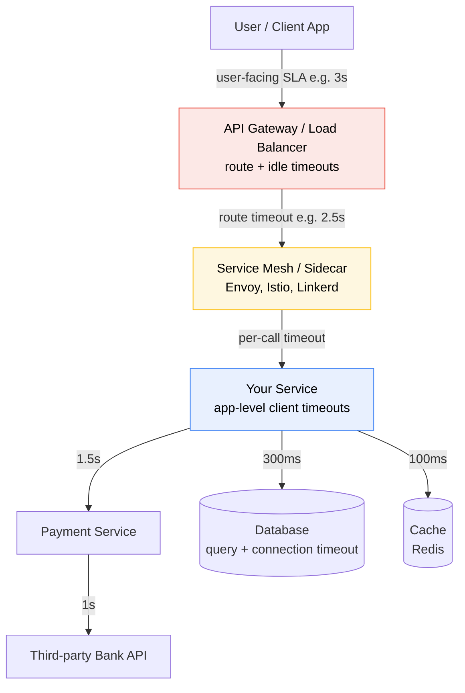
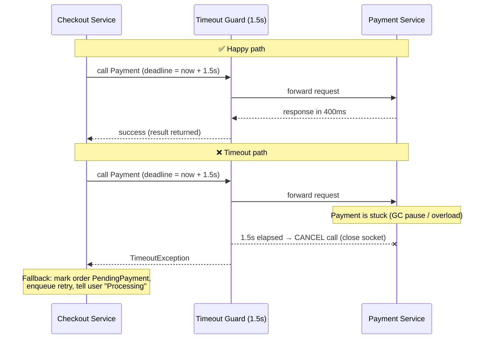
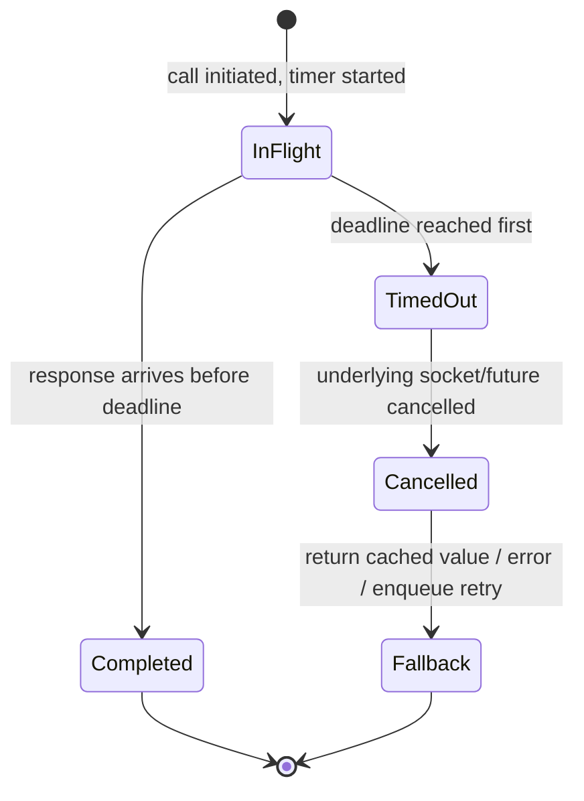
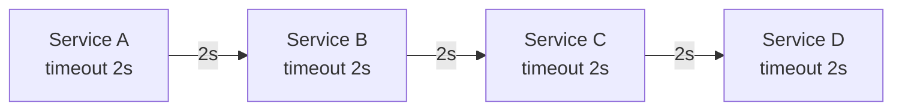

# ⏱️ The Timeout Pattern — From Basics to Staff-Level

> *"The most important thing about a distributed system is not what it does when everything works — it's what it does when one part stops responding."*

A practical, interview-ready study guide on the **Timeout** resilience pattern: how it works, why it exists, the real trade-offs, and the nuance experienced engineers bring up unprompted.

---

## 📋 Table of Contents

1. [Introduction — The 30-Second Version](#-introduction--the-30-second-version)
2. [Core Definitions](#-core-definitions)
3. [The Concept & Theory](#-the-concept--theory)
4. [Why Timeouts Exist — The Problem Being Solved](#-why-timeouts-exist--the-problem-being-solved)
5. [The Real Trade-off & Mechanism](#-the-real-trade-off--mechanism)
6. [Architecture & Sequence Diagrams](#-architecture--sequence-diagrams)
7. [Types of Timeouts (Not All Timeouts Are Equal)](#-types-of-timeouts-not-all-timeouts-are-equal)
8. [The Timeout Budget — Multi-Hop Math](#-the-timeout-budget--multi-hop-math)
9. [Categorized Real-World Examples](#-categorized-real-world-examples)
10. [Implementation Walkthrough (Java)](#-implementation-walkthrough-java)
11. [Common Misconceptions](#-common-misconceptions)
12. [Staff-Level Nuance](#-staff-level-nuance)
13. [Extensions & Adjacent Concepts](#-extensions--adjacent-concepts)
14. [⚡ Quick Revision](#-quick-revision)
15. [🎓 FAANG Interview Q&A](#-faang-interview-qa)
16. [📝 STAR-Based Questions](#-star-based-questions)
17. [🔗 Related Patterns](#-related-patterns)
18. [📚 References & Further Reading](#-references--further-reading)

---

## 🎯 Introduction — The 30-Second Version

A **timeout** sets a limit on how long your service will wait for a call to finish. If that limit is reached, the call is stopped and you return a clear result — either a fallback value or a controlled failure. That's it. The whole idea fits in one sentence.

But behind that one sentence sits one of the most consequential decisions in distributed systems. Choose the number too small and you fail healthy requests. Choose it too large and a single slow dependency can drag your entire service to a halt. The timeout is a *number you must pick*, and picking it well is what separates a system that degrades gracefully from one that falls over during an incident.

Think of it like waiting on hold with a call center. You *could* wait forever. But you have other things to do, so you give yourself a rule: "If nobody picks up in 5 minutes, I hang up and try later." That self-imposed limit is a timeout. Without it, a single unanswered call could consume your entire afternoon — and in a service, a single unanswered network call can consume a thread that could have served hundreds of other users.

<details>
<summary>📖 Beginner-friendly explanation (click to expand)</summary>

Imagine you order food at a restaurant and the kitchen is having a bad night. You don't sit there silently forever. After 30 minutes you flag the waiter: "Cancel my order, I'll grab something else." You just applied a timeout. You freed yourself (your "thread") to do something useful instead of starving while blocked. In software, when Service A calls Service B and B is stuck, A shouldn't wait forever either — it sets a stopwatch, and when the stopwatch rings, A gives up and moves on. This one habit keeps a slow kitchen from ruining the whole restaurant's evening.

</details>

---

## ✅ Core Definitions

Before going deeper, lock down the vocabulary. Interviewers listen for precise use of these terms.

**Timeout** — A configured maximum duration a caller will wait for an operation (usually a network call) to complete. When the duration elapses, the caller abandons the wait and takes a defined action.

**Timeout budget** — The total time your service is allowed to spend on a single request, *including all downstream calls it makes*. If your API promises a 2-second response, your budget is 2 seconds, and every dependency you call has to fit inside it.

**Integration point** — Any place your service connects to something external: a database, a cache, a third-party API, another microservice. Coined in the book *Release It!* by Michael Nygard, these are the exact places failures leak in — and the exact places timeouts belong.

**Fail fast** — Detecting a problem and returning an error *quickly* instead of hanging. A fast failure is recoverable; a slow hang is contagious.

**Cascading failure** — When one slow or failed component causes the components calling it to slow down or fail, which in turn affects *their* callers, rippling outward until large parts of the system are unhealthy.

**Blocked thread / thread starvation** — A thread stuck waiting on a call that never returns. Threads are finite; enough blocked threads means no threads left to serve new requests, and the service effectively dies while still "running."

**Fallback** — The safe alternative action taken when a call times out: a cached value, a default, a queued retry, or a clear error message.

**Idempotency** — A property where performing an operation multiple times has the same effect as performing it once. Critical for timeouts, because a timeout doesn't tell you whether the work *actually failed* or just *responded slowly* — so a retry might duplicate it.

<details>
<summary>📖 Beginner-friendly explanation (click to expand)</summary>

The one word to remember is **budget**. You have a fixed amount of time (say the 2 seconds your user will tolerate), and you're spending it across a chain of helpers. If you call three services and give each of them 2 seconds, your worst case is 6 seconds — you've blown your budget three times over. Timeouts are how you enforce that nobody in the chain spends more than their share. And **idempotent** just means "safe to repeat" — like pressing an elevator button twice; it doesn't summon two elevators.

</details>

---

## 🎯 The Concept & Theory

At its heart, the Timeout pattern rests on a single principle: **an unbounded wait is a resource leak in disguise.**

Every time your service makes a call and waits for a response, it holds resources — a thread, a socket, a connection from a pool, some memory. As long as it's waiting, those resources are unavailable to anyone else. If the response comes back in 50 milliseconds, no problem: the resources are held briefly and released. But if the response *never* comes back, those resources are held *forever*. And you have a finite number of them.

The theory borrows directly from queueing systems. Your service is a system with a fixed number of "servers" (threads or connections). Requests arrive, get processed, and leave. The system stays healthy as long as requests leave roughly as fast as they arrive. A hung call is a request that *never leaves*. Let enough of them pile up and the queue backs up infinitely — this is why a single stuck dependency, given enough traffic, can take down a service that has nothing wrong with its own code.

A timeout puts a hard ceiling on how long any single request can occupy a resource. It converts an *unbounded, unpredictable* wait into a *bounded, predictable* one. That predictability is the entire point. Once every call has a ceiling, you can reason about worst-case latency, size your thread pools, and give firm SLAs. Without it, your worst case is "infinity," and you can't design around infinity.

There's a subtle but important framing here: **a timeout is not about making things faster.** It never speeds up a healthy call. Its job is entirely about the *failure case* — bounding the damage when something goes wrong. It's insurance, not performance tuning.

<details>
<summary>📖 Beginner-friendly explanation (click to expand)</summary>

Picture a bank with 10 tellers. Normally customers are served in a couple of minutes and leave, so the line moves. Now imagine one customer's transaction gets stuck — the computer freezes and that teller can't move on. That's 1 of 10 tellers gone. If a few more freeze, soon there are no free tellers and the line out the door stops moving entirely, even though 6 tellers technically still "work." A timeout is the bank's rule: "If a transaction hangs for 2 minutes, apologize, cancel it, and call the next customer." It keeps tellers flowing so the line never grinds to a halt.

</details>

---

## 🎯 Why Timeouts Exist — The Problem Being Solved

To really understand timeouts, look at what happens *without* them. This is the story every resilience engineer has lived through.

**The default is "wait forever."** Most networking libraries, if you don't configure them, will wait indefinitely — or for some very long OS-level default (sometimes minutes). Nobody *chose* that behavior; it's just what you get when you don't set a value. This is the number one source of production incidents involving timeouts: not bad timeout values, but *missing* ones.

Here's the chain of events that unbounded waits create:

1. A downstream dependency (a database, a payment API, another microservice) slows down or stops responding. This is normal — dependencies have bad days: GC pauses, deploys, network blips, overload.
2. Calls to it stop returning. Each hanging call holds a thread.
3. New requests keep arriving. Each one also tries to call the slow dependency, and *also* hangs.
4. The thread pool fills with blocked threads. There are now zero threads to serve *any* request — even requests that don't touch the slow dependency at all.
5. Your service, which is perfectly healthy internally, now appears completely down. Health checks fail. Load balancers pull it out. **The failure has cascaded** from one slow dependency to your entire service — and often onward to *your* callers.

This is the disease timeouts vaccinate against. By bounding every wait, a slow dependency causes some requests to fail *fast* (which you can handle) instead of causing *all* requests to hang (which you can't). You trade a small, contained problem for the prevention of a total collapse.

The pattern comes from Michael Nygard's *Release It!*, which observed that **integration points are the number-one killer of production systems**, and the timeout is the first and most fundamental line of defense at every one of them.

<details>
<summary>📖 Beginner-friendly explanation (click to expand)</summary>

Think of your service as a highway on-ramp with a set number of lanes. Normally cars merge and flow. Now one car breaks down and just... sits there (a hung call holding a lane). Then another, then another. Soon every lane has a stalled car, and even perfectly working cars can't get on the highway. Total gridlock — caused by a handful of breakdowns. A timeout is the tow truck rule: "Any car stalled longer than 90 seconds gets towed off immediately." Lanes stay open, traffic keeps moving, and one breakdown never becomes a citywide jam.

</details>

---

## 📊 The Real Trade-off & Mechanism

Here is where beginners and experienced engineers diverge. A beginner says "add a timeout." A staff engineer asks "what number, and what happens at the two ends of the spectrum?"

The timeout value sits on a knife's edge between two failure modes:

**Too short** → **false failures.** You abort calls that would have succeeded. If your dependency's normal p99 latency is 800ms and you set a 500ms timeout, you're killing 1%+ of *healthy* traffic. Worse, if those aborted calls trigger retries, you're now sending *more* load to a dependency that was fine — you manufactured an incident out of thin air. Too-short timeouts turn a healthy system into a broken one.

**Too long** → **timeouts stop protecting you.** A 30-second timeout on a call your user won't wait more than 2 seconds for is useless: the user has already given up, but your thread is still held for 28 more seconds. During an incident, long timeouts let threads pile up almost as badly as no timeout at all. Too-long timeouts give you the *illusion* of protection without the substance.

The sweet spot is grounded in data, not guesswork: **set the timeout slightly above the observed p99 (or p99.9) latency of the dependency under normal load, then bound the total with retries and a deadline.** A common starting heuristic is "p99 + headroom" — but the real answer is always "measure first."

**The deeper trade-off — what a timeout actually costs you:** a timeout gives you *certainty about time* at the cost of *certainty about outcome*. When a call times out, you know exactly one thing: it took too long. You do **not** know whether the work succeeded, failed, or is still running on the other side. This ambiguity is the pattern's hidden tax. A payment call that times out might have *actually charged the customer* — the response just didn't make it back in time. This is why timeouts and **idempotency** are inseparable: without idempotency, "retry after timeout" can mean "charge twice."

**The mechanism itself:** when you set a timeout, under the hood you're typically starting a timer alongside the operation and racing them. Whichever finishes first wins. If the operation wins, you get the result and cancel the timer. If the timer wins, you *cancel the operation* (close the socket, interrupt the thread, cancel the future) and invoke your failure path. That cancellation step matters enormously — a "timeout" that returns to the caller but leaves the underlying socket open is a **resource leak**, and is one of the most common implementation bugs.

<details>
<summary>📖 Beginner-friendly explanation (click to expand)</summary>

Setting a timeout is like setting a kitchen timer when boiling an egg. Too short (2 minutes) and you pull out a raw egg — a "false failure," it wasn't actually done. Too long (20 minutes) and the timer is pointless; the egg is ruined long before it rings. You want it *just past* how long a good egg normally takes. And crucially: when the timer rings, you must *actually take the egg off the heat* — if you just note "time's up" but leave the burner on, you've solved nothing. That "take it off the heat" step is cancelling the underlying call.

</details>

---

## 🎨 Architecture & Sequence Diagrams

### High-level architecture — where timeouts live

Timeouts aren't a single component; they're a policy enforced at multiple layers. Each layer guards the layer below it.



The key insight from this diagram: **timeouts must shrink as you go deeper.** The gateway's timeout must be larger than the service's, which must be larger than the database's. If a deep call has a *longer* timeout than its caller, the caller gives up first and the deep call becomes orphaned work — burning resources for a result nobody is waiting for.

### Sequence — the happy path vs. the timeout path



### State machine — what a call goes through



<details>
<summary>📖 Beginner-friendly explanation (click to expand)</summary>

Look at the architecture diagram top to bottom like nested Russian dolls. The outermost doll (the user) is willing to wait the longest. Each doll inside gets a *tighter* patience limit than the one wrapping it. If an inner doll were somehow more patient than the outer one, the outer doll would leave first and the inner doll would keep working on something nobody's around to receive — pure waste. So the rule is simple: **the deeper you go, the less patient you get.**

</details>

---

## 💡 Types of Timeouts (Not All Timeouts Are Equal)

Saying "set a timeout" is ambiguous — there are several distinct timeouts, and confusing them is a classic bug. Interviewers love probing this because it reveals whether you've actually operated systems.

**Connection (connect) timeout** — How long to wait to *establish* a TCP connection to the remote host. Should be short (often 100ms–1s); if you can't even connect quickly, the host is likely down or unreachable, and waiting won't help.

**Read / socket / response timeout** — How long to wait for data *after* the connection is established. This is the one people usually mean. It covers "I connected, sent my request, now how long do I wait for the answer?"

**Request / total (end-to-end) timeout** — The overall ceiling for the entire operation, including connect + write + read + any retries. This is the one tied to your budget. Modern libraries increasingly expose this as a single **deadline**.

**Idle timeout** — Used by load balancers and connection pools. If a connection sees no activity for N seconds, it's closed. AWS ALB's default idle timeout (60s) famously bites people whose backend takes longer, silently dropping connections.

**Pool / acquisition timeout** — How long to wait to *get a connection from the pool* before even starting. During overload, threads can pile up here, waiting for a free connection, entirely separate from the call itself.

The subtle trap: setting a read timeout but forgetting the connect timeout. If DNS or the network is broken, your call can hang on *connect* far longer than your carefully chosen read timeout ever allows.

<details>
<summary>📖 Beginner-friendly explanation (click to expand)</summary>

Ordering pizza has multiple waits, and you'd set a different limit on each. **Connect timeout**: how long you'll let the phone ring before hanging up (short — if they don't pick up in 20 seconds, they're closed). **Read timeout**: once they answer, how long you'll stay on the line waiting for them to take your order. **Total timeout**: the whole thing, dial-to-delivery, must be under an hour or you order elsewhere. One "timeout" isn't enough — each stage of the wait needs its own limit, or a hang in the stage you forgot about will get you.

</details>

---

## 📊 The Timeout Budget — Multi-Hop Math

This is where the pattern gets genuinely staff-level. In microservices, a single user request fans out through many services. Timeouts don't add up the way people intuitively assume, and getting the arithmetic wrong is a top cause of "why did this time out when everything looked fast?"

**The rule: each hop's timeout budget must be strictly smaller than its caller's remaining budget.** As a request travels A → B → C, the deadline should *propagate and shrink*, never reset.

Consider a naive setup where everyone uses "2 seconds":



If C is slow, B waits up to 2s and *then* fails — but A has *also* been waiting 2s, so A has *already* timed out and abandoned B. Now B and C are doing orphaned work for a response A will never read. Everyone burned resources for nothing.

**The correct model — deadline propagation:** A computes a deadline (`now + 2s`) and passes the *remaining time* to each downstream call. B sees "you have 1.9s left," subtracts its own processing, and tells C "you have 1.7s left," and so on. When a call has almost no budget left, it can **fail immediately without even trying** — a "deadline exceeded" that saves the pointless attempt. This is exactly what gRPC deadlines and Go's `context.Context` implement natively.

A simple way to allocate a budget across sequential calls: leave headroom for your own processing and network hops, then divide the rest. If A has 2000ms and makes two sequential calls, don't give each 1000ms — give each ~800ms and keep ~400ms slack for serialization, network, and a small retry.

<details>
<summary>📖 Beginner-friendly explanation (click to expand)</summary>

Imagine you have a 60-minute lunch break and you're running three errands in a row. You don't tell each errand "take up to 60 minutes" — that's absurd, three of those blows your whole afternoon. You mentally budget: bank ~15 min, pharmacy ~15 min, coffee ~10 min, leaving 20 min of slack for walking between them. If the bank line is already eating 40 minutes, you *skip* the pharmacy entirely — no point starting something you can't finish before you're due back. That "how much time do I have LEFT" thinking, passed from errand to errand, is deadline propagation.

</details>

---

## 💻 Categorized Real-World Examples

Timeouts show up everywhere. Here they are grouped by the *kind* of problem they solve, with concrete technologies named.

### 🛒 Category 1: User-facing transactions (protecting the experience)

**E-commerce checkout → payment (the canonical example).** A shopper confirms an order. Checkout calls the Payment service with a **1.5s timeout**. If Payment responds, the order confirms. If it's slow, the call times out and Checkout marks the order `PendingPayment`, writes it durably, enqueues a retry job, and tells the user *"Payment processing — you'll be notified."* A background worker retries with backoff; on success the order moves to `Confirmed`, on repeated failure it's cancelled and the user is notified. The timeout here protects the *user's patience* and the *checkout thread pool* simultaneously, while an async queue absorbs the slow work. Technologies: Stripe/Adyen as the payment API, SQS for the retry queue, DynamoDB for order state + idempotency keys.

### 🌐 Category 2: Third-party / external API calls (guarding against others' failures)

**Weather microservice → third-party weather API.** A mobile app requests current weather; the service calls an external provider with a **10s timeout**. If the provider stalls, the service returns a clear "weather unavailable, try again later" instead of hanging the mobile client. You have zero control over the third party's reliability — the timeout is your only defense. Technologies: Spring `WebClient` with `.timeout(Duration.ofSeconds(10))`, or Resilience4j `TimeLimiter`.

**Payment service → external bank API (from *Release It!*).** A bank API becomes unresponsive. Without a timeout, every payment thread blocks waiting on the bank, and soon no payment can be processed at all. A **3s timeout** ensures the service stops waiting and can fail fast or queue for delayed retry, keeping the payment service itself alive even while the bank is down.

### 🗄️ Category 3: Infrastructure calls (databases, caches, queues)

**Service → database.** Every query gets a statement/query timeout (e.g., PostgreSQL `statement_timeout`, JDBC `queryTimeout`) *and* a connection-pool acquisition timeout (HikariCP `connectionTimeout`). A runaway query that would otherwise lock a connection for minutes is killed, and threads waiting for a pooled connection don't wait forever. Technologies: PostgreSQL, HikariCP, Aurora.

**Service → cache (Redis).** Cache calls get very tight timeouts (often 50–200ms) because the *whole point* of a cache is speed — if Redis is slow, you're usually better off skipping the cache and going to the source than waiting. This is timeout-as-fast-fallback.

### 🔗 Category 4: Service-to-service mesh calls (platform-enforced)

**Internal microservice calls via a service mesh.** Envoy/Istio enforce per-route timeouts centrally, so every service-to-service call gets a timeout *even if the application code forgot to set one*. This is defense-in-depth: the mesh is a backstop, but critical paths still set app-level timeouts because the mesh can't understand business context. Technologies: Istio `VirtualService` timeout, Linkerd, AWS App Mesh.

### ☁️ Category 5: Cloud service mappings

**AWS.** API Gateway route/integration timeouts; ALB idle timeout; Lambda per-function timeout (watch cold starts when picking the value); SQS for async retries; EventBridge for timeout-event notifications; Step Functions with per-state timeouts; DynamoDB/Aurora for request state and idempotency keys. *Trade-off:* Lambda timeouts are simple but cold starts can make a tight value trip falsely; mesh timeouts centralize control but you still need app-level guards on critical paths.

**Azure.** API Management & Application Gateway per-route timeouts; Azure Functions timeout (varies by plan); Service Bus queues with dead-lettering; Event Grid for alerts; Durable Functions / Logic Apps with activity timeouts; Azure SQL / Cosmos DB for state and idempotency. *Trade-off:* APIM edge policies are quick to apply but internal calls still need app and mesh timeouts.

<details>
<summary>📖 Beginner-friendly explanation (click to expand)</summary>

Notice the same idea wearing different outfits. Buying something online (wait on the card machine), checking the weather (wait on someone else's server), looking something up in a database (wait on the filing cabinet), one team's service calling another's — every single one is "I'm waiting on someone, and I need a rule for how long." The timeout *value* changes with the situation (a cache gets milliseconds, a bank gets seconds), but the *habit* is identical everywhere: never wait without a limit.

</details>

---

## 💻 Implementation Walkthrough (Java)

Let's build up from the naive, buggy version to the production-grade one. Each variant fixes a real problem the previous one has.

### ❌ Variant 0: The anti-pattern (what NOT to do)

<details>
<summary>💻 The classic broken timeout (click to expand)</summary>

```java
// From the wild: a Timer that "returns" from inside a TimerTask.
@PostMapping("/api/weather")
public ResponseEntity<WeatherData> getWeatherData(@RequestBody Location location) {
    Timer timer = new Timer();
    timer.schedule(new TimerTask() {
        @Override
        public void run() {
            // BUG: this 'return' returns from run(), NOT from the controller.
            // The HTTP response is never actually sent from here.
            // Worse: the blocking call below is NEVER cancelled.
            return; // does nothing useful
        }
    }, TIMEOUT);

    WeatherData data = thirdPartyWeatherService.getWeatherData(location); // still blocks forever!
    timer.cancel();
    return ResponseEntity.ok(data);
}
```

**Why it's broken:** the timer fires on a *different thread* and can't force the blocking call to return. The main thread still hangs indefinitely on `getWeatherData`. This "timeout" is decorative — it protects nothing. The lesson: **a timeout that doesn't actually cancel the underlying operation is not a timeout.**

</details>

### ✅ Variant 1: HTTP-client-level timeout (the right primitive)

<details>
<summary>💻 Spring WebClient with connect + response timeouts (click to expand)</summary>

```java
HttpClient httpClient = HttpClient.create()
    .option(ChannelOption.CONNECT_TIMEOUT_MILLIS, 500)   // connect timeout
    .responseTimeout(Duration.ofSeconds(2))              // response/read timeout
    .doOnConnected(conn ->
        conn.addHandlerLast(new ReadTimeoutHandler(2))
            .addHandlerLast(new WriteTimeoutHandler(2)));

WebClient webClient = WebClient.builder()
    .clientConnector(new ReactorClientHttpConnector(httpClient))
    .build();

public Mono<Order> getOrder(String orderId) {
    return webClient.get()
        .uri("/orders/{id}", orderId)
        .retrieve()
        .bodyToMono(Order.class)
        .timeout(Duration.ofSeconds(2))                  // total/reactive deadline
        .onErrorResume(TimeoutException.class,
            ex -> Mono.just(Order.unavailable(orderId))); // fallback
}
```

**Why it's better:** timeouts are enforced at the transport layer, so the socket is *actually closed* on timeout — no leaked connections. Note we set **three** timeouts (connect, read, total) because each guards a different failure. Pros: correct cancellation, non-blocking. Cons: reactive style has a learning curve; you must still tune the values.

</details>

### ✅ Variant 2: Resilience4j — timeout + retry + circuit breaker together

<details>
<summary>💻 Production-grade: TimeLimiter composed with Retry and CircuitBreaker (click to expand)</summary>

```java
// Timeout on its own is rarely enough — compose it with retry + circuit breaker.
TimeLimiter timeLimiter = TimeLimiter.of(TimeLimiterConfig.custom()
    .timeoutDuration(Duration.ofSeconds(2))
    .cancelRunningFuture(true)          // CRITICAL: actually cancel on timeout
    .build());

Retry retry = Retry.of("payment", RetryConfig.custom()
    .maxAttempts(3)
    .intervalFunction(IntervalFunction.ofExponentialRandomBackoff(
        Duration.ofMillis(100), 2.0))   // jittered backoff → avoids retry storms
    .retryExceptions(TimeoutException.class)
    .build());

CircuitBreaker breaker = CircuitBreaker.ofDefaults("payment");

Supplier<CompletableFuture<Receipt>> decorated =
    Decorators.ofSupplier(() -> paymentClient.charge(request))
        .withThreadPoolBulkhead(bulkhead)
        .withTimeLimiter(timeLimiter, scheduler)
        .withCircuitBreaker(breaker)
        .withRetry(retry, scheduler)
        .withFallback(List.of(TimeoutException.class),
            ex -> Receipt.pending(request.orderId())) // safe fallback
        .decorate();
```

**Why it's the strongest:** the timeout no longer stands alone. `cancelRunningFuture(true)` guarantees cancellation; jittered backoff stops retries from synchronizing into a thundering herd; the circuit breaker stops hammering a dependency that's clearly down; the bulkhead isolates the thread pool so this dependency's failures can't starve others. This is the shape of a real resilient client. Pros: composable, battle-tested, observable. Cons: more moving parts to configure and reason about; misconfiguration (e.g., retry timeout > total budget) creates its own bugs.

</details>

### ✅ Variant 3: Deadline propagation (gRPC / context)

<details>
<summary>💻 Passing a shrinking deadline across hops (click to expand)</summary>

```java
// gRPC deadlines propagate automatically and shrink across hops.
Deadline deadline = Deadline.after(2, TimeUnit.SECONDS);

Order order = orderStub
    .withDeadline(deadline)          // "you have until this absolute time"
    .getOrder(request);

// Downstream, the SAME deadline flows via Context — service B sees the
// REMAINING time, not a fresh 2s. If it's nearly expired, B fails fast
// with DEADLINE_EXCEEDED instead of starting doomed work.
```

**Why it matters:** unlike a per-call timeout that *resets* at every hop, a deadline is an *absolute point in time* that travels with the request. Every service downstream knows exactly how much of the original budget remains. This is the correct model for deep call chains and is native to gRPC and Go's `context.Context`.

</details>

---

## ❌ Common Misconceptions

<details>
<summary>📖 Beginner-friendly explanation (click to expand)</summary>

The biggest myth is "a timeout means the request failed." It doesn't! A timeout only means *the answer didn't come back in time* — the work might have finished perfectly on the other side, and the reply just got lost or was slow. It's like mailing an RSVP and hearing nothing: maybe it never arrived, or maybe it arrived fine and the confirmation is still in the mail. You genuinely don't know. That uncertainty is why "just retry it" can be dangerous.

</details>

**"A timeout makes my system faster."** No. A timeout never speeds up a healthy call — it only bounds the *unhealthy* case. It's about limiting damage, not improving performance.

**"A timeout tells me the operation failed."** No. It tells you the *response* didn't arrive in time. The operation may have succeeded, failed, or still be running. This ambiguity is the whole reason idempotency matters.

**"Just retry after a timeout."** Retrying a non-idempotent operation (a payment, an order) can duplicate it. And retrying *immediately*, en masse, is exactly how you turn a recoverable slowdown into a full outage (retry storm). Retries need idempotency + jittered backoff + a cap on total time.

**"One timeout value fits the whole service."** No. A cache deserves ~50ms; a report-generation endpoint might deserve 30s. Timeout values are per-dependency, per-operation, derived from *that call's* latency profile.

**"The service mesh handles timeouts, so I don't need them in code."** The mesh is a valuable backstop, but it can't understand business context (e.g., "this specific write must not be abandoned mid-flight"). Critical paths need app-level timeouts *and* the mesh.

**"Longer timeout = safer."** The opposite during incidents. Long timeouts let threads accumulate, which is precisely the cascading-failure mechanism you're trying to prevent. Long timeouts are the *illusion* of safety.

**"Set it once and forget it."** Latency profiles drift as traffic, data volume, and dependencies change. A timeout tuned last year may be silently trimming healthy traffic today. Timeouts need monitoring and periodic re-tuning.

---

## 🎓 Staff-Level Nuance

These are the things experienced engineers raise *without being asked* — the signals that separate an L5+ answer from a textbook one.

**Timeouts alone are incomplete — they're the entry point to a resilience stack.** A timeout stops *your* thread from hanging, but on its own it can *cause* new problems: every timed-out call may trigger a retry, and retries pile load onto an already-struggling dependency. The mature answer is always "timeout + limited retry with jittered backoff + circuit breaker + bulkhead." The timeout detects the problem; the other patterns prevent your reaction from making it worse.

**The retry-storm / thundering-herd failure mode.** When a dependency slows down, *many* callers time out at *nearly the same moment* and *all retry together*, creating a synchronized load spike that keeps the dependency down. Jittered (randomized) backoff de-synchronizes these retries. This is a top-tier detail interviewers probe: "you added retries after your timeout — what could go wrong?"

**Deadline propagation beats independent per-hop timeouts.** As covered above, resetting a fresh timeout at every hop causes orphaned work. Absolute deadlines that shrink across the call graph (gRPC, `context.Context`) are the correct model, and mentioning this unprompted is a strong signal.

**Timeout budgets must be split, not duplicated.** If your endpoint's SLA is 2s and you make three sequential calls, they share the 2s — you can't give each 2s. Staff engineers do this arithmetic explicitly and leave headroom for serialization and network.

**Cancellation must propagate, or you get orphaned/zombie work.** Timing out the caller while the callee keeps running wastes resources and can cause subtle bugs (e.g., the "cancelled" operation still commits a write). True resilience means the cancellation actually reaches and stops the downstream work — which is hard in practice and often only partially achievable.

**Timeouts interact with connection pools in non-obvious ways.** During a slowdown, requests can queue on *connection acquisition* long before the call itself starts. You need a pool-acquisition timeout separate from the call timeout, or the pool becomes an invisible bottleneck.

**Idempotency keys are non-negotiable for retried writes.** Because a timeout can't tell you if a write succeeded, retried writes must carry a unique request ID the server uses to dedupe. Without this, timeout + retry on a payment = double charge. This is the single most important safety mechanism to mention alongside timeouts on write paths.

**Hedged requests — the advanced tail-latency trick.** Instead of waiting for the full timeout then retrying, you can send a *second* request after a shorter delay (e.g., at p95) and take whichever returns first. This trades extra load for dramatically lower tail latency. Used by systems like Google's Bigtable/Spanner clients and described in *The Tail at Scale*. It requires idempotency and careful load budgeting.

**Timeouts should be observable per-dependency.** "We had timeouts" is useless in an incident. You need metrics broken down by *which* dependency timed out, at what rate, and alerting on timeout-rate and p99/p99.9 latency per endpoint. Fault-injection testing (deliberately delaying a dependency) validates that your timeout behavior actually works before an incident proves it doesn't.

**Async is sometimes the real answer.** If an operation *routinely* exceeds any reasonable user-facing timeout, the fix isn't a bigger timeout — it's changing the interaction model to async: accept the request, return `202 Accepted` with a tracking ID, do the work on a queue, and notify on completion. Forcing inherently-slow work into a synchronous timeout is fighting the wrong battle.

---

## 🔗 Extensions & Adjacent Concepts

**Retry with backoff.** The natural partner. A timeout detects a slow call; a retry gives it another shot — but only with jittered exponential backoff and a cap, and only for idempotent operations. Timeout + naive retry is a footgun; timeout + smart retry is resilience.

**Circuit Breaker.** When timeouts to a dependency exceed a threshold, the circuit "opens" and calls fail *instantly* without even trying, giving the dependency time to recover. This stops the wasteful cycle of timing out over and over. Timeout feeds the circuit breaker its failure signal.

**Bulkhead.** Isolates resources (thread pools, connection pools) per dependency so that one slow dependency's timed-out calls can't consume the threads needed by *other* dependencies. Named after ship compartments that stop one flooded section from sinking the whole vessel.

**Rate Limiting / Load Shedding.** Caps incoming load so a service doesn't get pushed into the slow regime where timeouts start firing en masse in the first place.

**Deadline / Deadline Propagation.** The evolution of the timeout for deep call graphs — an absolute time that travels and shrinks across hops (gRPC, `context.Context`), as opposed to an independent per-call duration.

**Queue-based Load Leveling.** For work that can't fit a synchronous budget, put it on a queue and process asynchronously — the structural alternative to an ever-growing timeout.

**Hedged / speculative requests.** Sending a duplicate request to cut tail latency, taking the first response. An advanced complement to (not replacement for) timeouts.

**Graceful degradation & fallbacks.** What you *do* when a timeout fires — serve stale cache, a default, a partial response, or a clear error — so the user experience degrades smoothly instead of breaking.

---

## ⚡ Quick Revision

*Read this and you should be able to reconstruct the whole guide in your head.*

**What it is.** A timeout is a hard ceiling on how long you'll wait for a call to finish. Hit the ceiling, and you abandon the wait and take a defined action — a fallback or a clean failure. It's one sentence, but the *number* you pick and how you *react* to a fire are what make it hard. A timeout is insurance for the failure case; it never makes a healthy call faster.

**Why it exists.** The default behavior of most libraries is "wait forever." Under load, one slow dependency causes calls to hang, each hanging call holds a thread, threads run out, and a perfectly healthy service appears dead — the failure has **cascaded**. Timeouts convert an unbounded, contagious wait into a bounded, contained failure. This is the *Release It!* insight: **integration points are the number-one killer, and timeouts are the first line of defense at every one of them.**

**The core trade-off.** Too short → false failures (you kill healthy calls, and their retries can manufacture an incident). Too long → no protection (threads still pile up during incidents; it's the illusion of safety). The sweet spot is **just above the observed p99 latency**, always derived from measurement, never guessed. The hidden tax of a timeout: it gives you certainty about *time* but destroys certainty about *outcome* — a timed-out call may have actually succeeded, which is why **idempotency is inseparable from timeouts**.

**The mechanism.** Race a timer against the operation; whoever finishes first wins. If the timer wins, you must **actually cancel the underlying call** (close the socket, cancel the future). A "timeout" that returns to the caller but leaves the socket open is a resource leak — the most common implementation bug.

**Types of timeouts.** They are *not* one thing: **connect** (establishing the TCP connection, short), **read/socket** (waiting for data after connecting), **total/request** (the whole operation including retries — your budget), **idle** (LBs and pools closing quiet connections), and **pool-acquisition** (waiting for a free connection before you even start). Forgetting the connect timeout while setting the read timeout is a classic trap.

**The budget & deadline propagation.** In multi-hop chains, timeouts don't add — they must **shrink** as you go deeper. Giving every hop a fresh "2 seconds" means an outer caller times out and abandons inner calls that keep running (orphaned work). The correct model is **deadline propagation**: an absolute deadline travels with the request and each hop sees the *remaining* budget, failing fast if there's not enough left. This is native to gRPC and Go's `context.Context`. Split the budget across sequential calls; leave headroom for network and serialization.

**Timeouts don't stand alone.** They're the entry point to a resilience stack: **retry with jittered backoff** (or you cause retry storms / thundering herds), **circuit breaker** (stop hammering a dead dependency), and **bulkhead** (isolate thread pools so one slow dependency can't starve the others). Timeout *detects*; the others *prevent your reaction from making things worse*.

**Staff-level tells.** Deadline propagation over per-hop timeouts; idempotency keys on retried writes (or double-charge); retry storms fixed with jitter; cancellation must actually propagate or you get zombie work; pool-acquisition is a hidden bottleneck; hedged requests for tail latency (*The Tail at Scale*); per-dependency observability + fault-injection testing; and async queues when work simply won't fit a synchronous budget.

**Real-world anchor.** Checkout calls Payment with a 1.5s timeout; on timeout it marks the order `PendingPayment`, writes it durably, enqueues a retry with backoff (idempotency key attached), and tells the user "processing — you'll be notified." Fail fast, degrade gracefully, never hang.

**When to avoid / rethink.** Long-running work that can't fit a user-facing limit → go async with a queue. Critical writes with no idempotency or request tracking → add those *first*. Very low-traffic paths → start conservative to avoid needless errors. Known-high-latency network paths → tune or redesign, don't just trip constantly.

---

## 🎓 FAANG Interview Q&A

*20 questions escalating from fundamentals to staff/principal. Answers give reasoning + concrete tech, not dictionary definitions.*

### Fundamentals (L3–L4)

<details>
<summary><strong>Q1. What is the Timeout pattern and what problem does it solve?</strong></summary>

A timeout sets a maximum duration a caller waits for an operation before abandoning it and taking a defined action (fallback or clean failure). The problem it solves is **unbounded waiting**: by default, most network libraries wait forever (or a huge OS default), so a slow or stuck dependency causes calls to hang. Each hung call holds a thread; under load, threads run out, and a healthy service appears dead. The timeout bounds every wait, converting a contagious hang into a contained fast-failure. For example, a Spring `WebClient` with `.responseTimeout(Duration.ofSeconds(2))` guarantees a stuck downstream call is aborted after 2 seconds rather than pinning a thread indefinitely.

</details>

<details>
<summary><strong>Q2. Why can't I just rely on the default timeout of my HTTP client?</strong></summary>

Because the default is usually "infinite" or an enormous value nobody chose deliberately (some clients default to no read timeout at all). That default is the single most common cause of timeout-related outages — not bad values, but *missing* ones. A concrete example: Java's older `HttpURLConnection` and many JDBC drivers have no query timeout by default, so a runaway query can hold a database connection for minutes. You must set explicit timeouts on **every** outbound call — connect, read, and total — rather than trusting defaults, because defaults are tuned for correctness in isolation, not for protecting a service under load.

</details>

<details>
<summary><strong>Q3. What are the different types of timeouts?</strong></summary>

At minimum: **connect timeout** (waiting to establish the TCP connection — keep short, ~100ms–1s), **read/socket timeout** (waiting for data after connecting — the one people usually mean), **total/request timeout** (the whole operation including retries — this ties to your budget), **idle timeout** (load balancers and pools closing inactive connections, e.g., AWS ALB's 60s default), and **pool-acquisition timeout** (waiting for a free connection from the pool before the call even starts). A common bug is setting only the read timeout: if DNS or the network is broken, the call hangs on *connect* far longer than your read timeout allows, because that timeout never gets a chance to apply.

</details>

<details>
<summary><strong>Q4. How do you choose a good timeout value?</strong></summary>

Measure, don't guess. Base it on the dependency's observed latency distribution and set it **slightly above p99 (or p99.9) under normal load**, with headroom. If a dependency's p99 is 800ms, a ~1s timeout catches genuine hangs while sparing almost all healthy calls. Then bound the *total* with limited retries and an overall deadline that fits your user-facing SLA. The two failure modes to avoid: too short kills healthy traffic (and its retries can create an incident), too long lets threads pile up during a slowdown. Crucially, revisit the value periodically — latency profiles drift with traffic and data growth, so a value tuned last year may be silently trimming healthy calls today.

</details>

<details>
<summary><strong>Q5. What should happen when a timeout fires? Walk through the fallback.</strong></summary>

First, the underlying call must be *actually cancelled* — socket closed or future cancelled — or you've leaked a resource. Then you take a defined fallback: serve a cached/stale value, return a default, return a clear controlled error, or (for writes) persist state and enqueue an async retry. In an e-commerce checkout calling Payment with a 1.5s timeout, the fallback is to mark the order `PendingPayment`, write it durably (DynamoDB), enqueue a retry job (SQS) with an idempotency key, and tell the user "payment processing, you'll be notified." The principle is **fail fast, degrade gracefully** — the user gets a quick, honest response instead of a spinner that never resolves.

</details>

<details>
<summary><strong>Q6. How do timeouts prevent cascading failures?</strong></summary>

A cascading failure starts when one slow dependency causes its callers to hang; those callers exhaust their threads and appear down, so *their* callers start hanging, and the failure ripples outward. The timeout breaks this chain at the first link: instead of hanging indefinitely, the caller fails fast after a bounded wait, releasing the thread back to the pool to serve other requests. So a slow dependency causes *some* requests to fail quickly (handleable) rather than *all* requests to hang (unrecoverable). It's the difference between a contained brownout and a total blackout. Note the timeout only *detects and bounds* — you typically add a circuit breaker so you're not endlessly retrying the failing dependency.

</details>

<details>
<summary><strong>Q7. Should you retry after a timeout? What are the risks?</strong></summary>

Sometimes, but carefully. Two hard rules: (1) only retry **idempotent** operations, because a timeout doesn't tell you if the work succeeded — retrying a non-idempotent payment can double-charge; (2) use **jittered exponential backoff** with a cap, never immediate mass retries. The risk of naive retries is a **retry storm**: many callers time out simultaneously and all retry at once, creating a synchronized load spike that keeps the dependency down. For write paths, attach an **idempotency key** so the server dedupes duplicates. So "timeout then retry" is safe only as "timeout → idempotent op → jittered backoff → capped attempts → idempotency key."

</details>

<details>
<summary><strong>Q8. When should you NOT use a timeout, or use it differently?</strong></summary>

For operations that *routinely* exceed any reasonable user-facing limit (large report generation, video processing), a bigger timeout is the wrong fix — switch to an **async model**: return `202 Accepted` with a tracking ID and process on a queue. For critical writes with no idempotency or request tracking, add those *first*, because a timeout there risks partial/duplicate writes. On very low-traffic paths, start conservative — aggressive timeouts cause needless errors. And on network paths with known-high latency, tune or redesign rather than setting a value that always trips. The meta-point: a timeout is for bounding *anomalous* slowness, not for forcing inherently slow work into a synchronous box.

</details>

<details>
<summary><strong>Q9. How do timeouts relate to the Circuit Breaker and Bulkhead patterns?</strong></summary>

They form a layered stack. The **timeout** detects that a call is taking too long and bounds the wait. The **circuit breaker** watches the timeout/failure rate; once it crosses a threshold it "opens" and fails calls *instantly* without trying, giving the dependency room to recover and sparing you the repeated wasted waits. The **bulkhead** isolates resources (a dedicated thread/connection pool per dependency) so that even while calls to a slow dependency are timing out, they can't consume the threads needed by other, healthy dependencies. Resilience4j lets you compose all three around one call. Timeout is the *sensor*; circuit breaker and bulkhead are the *containment*.

</details>

<details>
<summary><strong>Q10. What's a "timeout budget" and why does it matter in microservices?</strong></summary>

A timeout budget is the total time a service may spend on one request, *including all downstream calls*. It matters because a single user request fans out across many services, and if each independently uses, say, 2 seconds, the worst case multiplies and blows the user-facing SLA. The budget forces you to *allocate* time: if the endpoint's SLA is 2s and you make two sequential calls, you might give each ~800ms and keep ~400ms slack for network/serialization/a small retry. Getting this arithmetic wrong is a top cause of "everything looked fast but the request still timed out" — because the individual calls were fine, but their sum wasn't.

</details>

### Staff / Principal Level (L5–L6)

<details>
<summary><strong>Q11. (Staff) Explain deadline propagation and why it's superior to independent per-hop timeouts.</strong></summary>

With independent per-hop timeouts, each service resets a fresh timeout (say 2s) when it calls the next. The flaw: if A→B→C and C is slow, B waits its full 2s — but A has *also* been waiting 2s and has already given up, so B and C do **orphaned work** for a response nobody will read, burning resources during exactly the moment you can least afford it. **Deadline propagation** fixes this by passing an *absolute deadline* (`now + 2s`) down the chain. Each hop sees the *remaining* budget, not a fresh clock, and if almost none remains it fails fast with `DEADLINE_EXCEEDED` instead of starting doomed work. gRPC deadlines and Go's `context.Context` implement this natively — the deadline flows through the context automatically. Mentioning this unprompted signals real distributed-systems maturity.

</details>

<details>
<summary><strong>Q12. (Staff) You added retries after your timeout. Your dependency was slow and then fully collapsed. What happened?</strong></summary>

Almost certainly a **retry storm / thundering herd amplified by a metastable failure**. When the dependency slowed, many callers hit their timeouts at nearly the same moment and all retried — often immediately, without jitter. Those synchronized retries multiplied the load (3x with 3 attempts) on an already-struggling dependency, pushing it fully over. Even after the original trigger passes, the self-sustaining retry load keeps it down — a **metastable failure** that persists until you shed load. Fixes: jittered exponential backoff to de-synchronize, a cap on total attempts and total time, a circuit breaker to halt retries once failure rate spikes, and token-bucket retry budgets (e.g., "retries may not exceed 10% of requests"). The lesson interviewers want: *your recovery mechanism became the attack.*

</details>

<details>
<summary><strong>Q13. (Staff) A payment call times out. How do you guarantee the customer isn't charged twice?</strong></summary>

The root issue is that a timeout gives you **no information about outcome** — the charge may have succeeded and only the response was lost. So the retry must be safe to repeat, which means **idempotency**. Concretely: the client generates a unique **idempotency key** per logical payment (e.g., a UUID tied to the order) and sends it with every attempt, including retries. The payment provider (Stripe supports exactly this via the `Idempotency-Key` header) records the key with the result of the first successful processing; any retry with the same key returns the *original* result instead of charging again. On your side, store the order-state transition keyed by that ID so your own bookkeeping is also idempotent. Without this, timeout + retry on a write path is a double-charge waiting to happen.

</details>

<details>
<summary><strong>Q14. (Staff) How do connection pools interact with timeouts, and where's the hidden bottleneck?</strong></summary>

The hidden bottleneck is **connection-acquisition time**, which is separate from the call time. During a slowdown, in-flight calls hold pool connections longer; new requests then block *waiting to acquire a connection* before their call even begins. If you only set a read timeout, requests can pile up invisibly in the pool's wait queue and effectively hang despite your "timeout." You need a **pool-acquisition timeout** (e.g., HikariCP's `connectionTimeout`, which is actually the acquisition timeout, plus its `maxLifetime` and `validationTimeout`) in addition to the call timeout. Staff-level framing: the pool size, acquisition timeout, and call timeout must be reasoned about *together* — a large pool with long call timeouts just means more threads can hang at once.

</details>

<details>
<summary><strong>Q15. (Staff) What are hedged requests and when would you use them over plain timeout+retry?</strong></summary>

Hedged (speculative) requests attack **tail latency**, not failures. Instead of waiting for the full timeout and *then* retrying, you send a second request to another replica after a short delay (often ~p95), and take whichever response returns first, cancelling the loser. Described in Dean & Barroso's *The Tail at Scale*, this cuts p99/p99.9 latency dramatically because you don't pay the full timeout before reacting to a straggler. Google's Bigtable and Spanner clients use this. Trade-offs: it adds load (you must budget for the extra requests, often capped so hedges are a small % of traffic), and it strictly requires **idempotent, safely-cancellable** operations — you're deliberately duplicating work. Use it on read-heavy, latency-sensitive paths with spare capacity; avoid it on expensive or non-idempotent operations.

</details>

<details>
<summary><strong>Q16. (Staff) Where should timeouts live — application code, service mesh, gateway, or all of them?</strong></summary>

Defense in depth, at all layers, with shrinking values outward-to-inward. The **gateway/LB** sets a coarse outer bound tied to the user SLA (and watch its *idle* timeout, e.g., ALB's 60s). The **service mesh** (Envoy/Istio, App Mesh) enforces per-route timeouts centrally as a backstop, so even code that forgot a timeout is protected — and you can change policy without redeploying. But the **application** still needs its own timeouts on critical paths because only the app understands business context (e.g., "this particular write must be cancelled cleanly, not just abandoned"). The mesh can't know that. Principal-level nuance: centralizing in the mesh improves consistency and operability, but over-relying on it hides per-call intent and makes the deadline budget harder to reason about across the chain.

</details>

<details>
<summary><strong>Q17. (Staff) How do you make timeout behavior observable and how do you validate it before an incident?</strong></summary>

"We had timeouts" is useless mid-incident. Instrument **per-dependency, per-endpoint** metrics: timeout count and rate, *which* dependency timed out, and full latency histograms (p50/p95/p99/p99.9), plus cancellation counts and retry counts. Alert on timeout-rate and tail-latency SLO burn, not just averages (averages hide the tail that timeouts actually target). To validate *before* production teaches you the hard way, use **fault injection / chaos testing**: deliberately inject latency into a dependency (Istio fault injection, Toxiproxy, Gremlin, or AWS FIS) and verify the timeout fires, the fallback runs, cancellation propagates, and no thread pool exhausts. This turns "we think our timeouts work" into "we've proven they do."

</details>

<details>
<summary><strong>Q18. (Staff) Design timeouts for a request that fans out to 5 services, 3 sequential and 2 parallel, with a 3s user SLA.</strong></summary>

Start from the SLA and work inward with a budget, reserving headroom. Give yourself ~2.5s of usable budget (leave ~0.5s for gateway, serialization, and your own compute). The **two parallel** calls run concurrently, so their cost is the *max* of the two, not the sum — budget them at, say, ~700ms each (they overlap → ~700ms consumed). The **three sequential** calls must share the remaining ~1.8s: allocate based on each one's measured p99, e.g., 800ms + 600ms + 400ms, keeping a little slack. Propagate a **deadline**, not fixed durations, so each hop sees remaining time and can fail fast if the budget's blown. Add jittered retries *only* where there's slack left in the budget (a retry that would exceed the deadline shouldn't fire). Parallelize wherever ordering allows, precisely because parallel calls cost max-not-sum against the budget. Fallbacks (cache/default) for any call whose failure shouldn't fail the whole request.

</details>

<details>
<summary><strong>Q19. (Staff) What is a metastable failure and how do timeouts contribute to or prevent one?</strong></summary>

A metastable failure is one that **persists even after the original trigger is gone**, because the system enters a self-sustaining bad state driven by a feedback loop. Timeouts contribute when paired with aggressive retries: a brief slowdown trips timeouts, timeouts trigger retries, retries add load, added load causes more timeouts — and this loop keeps running long after the initial blip, so the system won't recover on its own even when the underlying cause has cleared. Timeouts *prevent* it when paired with the right guards: circuit breakers cut the retry feedback loop, retry budgets/token buckets cap amplification, load shedding removes the sustaining load, and jitter prevents synchronization. The principal-level insight is that the timeout *value* alone doesn't determine stability — the **feedback dynamics** of timeout+retry+load do, and you must design the whole loop, not just the number.

</details>

<details>
<summary><strong>Q20. (Staff) Cancellation on timeout is "best effort." What are the real-world limits and consequences?</strong></summary>

When you time out, you can cancel *your* side (close the socket, cancel the future), but you often **cannot stop the work already running on the remote side**. The remote may keep executing the query, keep processing the payment, and even commit — producing **zombie/orphaned work** that consumes resources and can cause correctness bugs (a "cancelled" write that still lands). Real limits: TCP socket close doesn't instantly kill server-side processing; a DB may keep running a statement unless *it* has its own `statement_timeout`; a downstream service needs to honor context cancellation, which many don't. Consequences and mitigations: enforce timeouts *at every layer* (DB statement timeout, not just client), design writes to be **idempotent** so a late-landing duplicate is harmless, use deadline propagation so downstreams self-abort, and reconcile state asynchronously (e.g., a saga or a payment-status check) rather than assuming a timeout meant "didn't happen." The mature stance: **treat a timeout as "unknown outcome," never as "failed," and design for the ambiguity.**

</details>

---

## 📝 STAR-Based Questions

*Behavioral questions framed with Situation, Task, Action, Result — the format FAANG uses to probe how you've actually applied these ideas.*

<details>
<summary><strong>S1. Tell me about a time you diagnosed and fixed a cascading failure caused by missing or bad timeouts.</strong></summary>

**Situation:** Our checkout service began returning 5xx errors and dropping out of the load balancer during peak traffic, even though CPU and memory looked normal. The payment dependency had slowed due to a bad deploy on their side.

**Task:** I owned checkout reliability and needed to restore service and prevent recurrence, fast — every minute of downtime was lost orders.

**Action:** Thread dumps showed nearly all request threads blocked on the payment HTTP client, which had **no read timeout** — the OS default was effectively infinite. I set a 1.5s read timeout plus a 500ms connect timeout, wrapped the call in a Resilience4j circuit breaker and a dedicated bulkhead thread pool so payment slowness couldn't starve other endpoints, and added a fallback that marked orders `PendingPayment` and enqueued an idempotent retry via SQS. I also added per-dependency timeout-rate and p99 dashboards.

**Result:** Threads stopped piling up; checkout stayed healthy through payment's slowdown, degrading gracefully instead of collapsing. During the *next* payment incident weeks later, checkout served fallbacks with zero downtime. The postmortem action item — "no outbound call without an explicit timeout" — became a lint rule across the org.

</details>

<details>
<summary><strong>S2. Describe a time your timeout/retry configuration made an incident worse.</strong></summary>

**Situation:** A downstream recommendation service had a brief GC pause. Within seconds it went from "slow" to "completely unavailable," and stayed down far longer than the original pause.

**Task:** As on-call, I had to stop the bleeding and then understand why a 2-second blip became a 20-minute outage.

**Action:** I found we had recently added 3 immediate retries on timeout with **no backoff and no jitter**. When the GC pause hit, thousands of callers timed out in the same window and all retried simultaneously — a textbook retry storm that turned a recoverable pause into a self-sustaining metastable failure. To stop it I opened the circuit breaker manually to shed the retry load and let the service recover. Then I replaced immediate retries with jittered exponential backoff, capped attempts at 2, added a retry budget limiting retries to 10% of traffic, and lowered the timeout to just above p99.

**Result:** The dependency recovered within a minute of shedding load. After the fix, later slowdowns self-healed without escalating. The key lesson I shared in the postmortem: *the retry logic, not the dependency, caused most of the outage* — recovery mechanisms need load-limiting just like the primary path.

</details>

<details>
<summary><strong>S3. Tell me about a time you had to set timeout values for a complex multi-service request.</strong></summary>

**Situation:** We launched a new "order summary" endpoint that fanned out to 6 internal services, and it was intermittently breaching its 3-second SLA even though every individual service reported healthy p99s.

**Task:** I needed to make the endpoint reliably meet its SLA without just cranking every timeout down (which would cause false failures).

**Action:** I mapped the call graph and realized we were resetting a fresh 2s timeout at every hop, so the *sum* far exceeded 3s. I introduced a **timeout budget** derived from measured p99s: reserved 500ms of headroom, parallelized the 4 independent calls (so they cost max-not-sum, ~700ms), and allocated the 2 sequential calls ~800ms and ~500ms. I switched us to gRPC deadline propagation so each hop saw the remaining budget and could fail fast. Non-critical calls (e.g., recommendations) got fast fallbacks so their slowness couldn't fail the whole summary.

**Result:** p99 for the endpoint dropped under 2.5s and SLA breaches effectively disappeared. The budgeting-and-parallelizing approach became our template for other fan-out endpoints, and deadline propagation caught several latent "orphaned work" bugs elsewhere.

</details>

<details>
<summary><strong>S4. Describe a time you pushed back on simply increasing a timeout and proposed a different design.</strong></summary>

**Situation:** A PDF report-generation endpoint was timing out for large accounts. The proposed fix from the team was to bump the synchronous HTTP timeout from 30s to 120s.

**Task:** As tech lead I had to decide whether to approve that or find a better approach, balancing a real customer pain point against system health.

**Action:** I pushed back: a 120s synchronous timeout would hold threads and connections for two minutes each, and under any concurrency that risked exhausting the pool and threatening the *whole* service — trading a localized annoyance for a systemic risk. Instead I proposed changing the interaction model to **async**: the endpoint returns `202 Accepted` with a job ID, the work runs on a queue (SQS + a worker), and the client polls or gets notified on completion. I kept a tight timeout on the *submission* call and moved the long work off the request path entirely.

**Result:** Report generation stopped threatening service stability, large accounts could generate reports of any size, and thread-pool pressure on that service dropped noticeably. The broader principle I reinforced with the team: *when work routinely exceeds a reasonable timeout, the answer is a different architecture, not a bigger timeout.*

</details>

---

## 🔗 Related Patterns

<details>
<summary>📖 Beginner-friendly explanation (click to expand)</summary>

Timeout rarely travels alone — it's one member of a "resilience toolbox." Think of a smoke detector (timeout: senses trouble fast), a sprinkler (fallback: safe response), a fire door (bulkhead: stops spread between rooms), and a circuit that cuts power when overloaded (circuit breaker: stops feeding the fire). Each does one job; together they keep a small problem from burning the building down. In interviews, showing you know how these combine is worth more than defining any single one.

</details>

**Retry with Backoff** — Re-attempts a failed/timed-out call using jittered exponential backoff and a cap. The timeout's most common partner; dangerous without idempotency and jitter.

**Circuit Breaker** — Trips open when failures/timeouts exceed a threshold, failing fast without trying, so a struggling dependency gets room to recover. Consumes the timeout's failure signal.

**Bulkhead** — Isolates thread/connection pools per dependency so one slow dependency's timeouts can't starve the rest of the system.

**Rate Limiting / Load Shedding** — Caps incoming load to keep the service out of the overloaded regime where timeouts fire en masse.

**Deadline Propagation** — The multi-hop evolution of timeouts; an absolute deadline that shrinks across the call graph (gRPC, `context.Context`).

**Queue-based Load Leveling** — Moves work that can't fit a synchronous budget onto a queue for async processing.

**Saga / Compensating Transactions** — Handles the "did my write actually happen?" ambiguity that timeouts create on distributed writes.

---

## 📚 References & Further Reading

- **Michael Nygard — *Release It!* (2nd ed.)** — The origin of the Timeout pattern for integration points; the "stability patterns" chapter is essential.
- **Jeffrey Dean & Luiz André Barroso — *The Tail at Scale* (CACM, 2013)** — Hedged/speculative requests and tail-latency management.
- **Resilience4j documentation** — `TimeLimiter`, `Retry`, `CircuitBreaker`, `Bulkhead`, and how to compose them.
- **gRPC documentation — Deadlines** — Deadline propagation across services.
- **Go `context` package** — Canonical implementation of deadline/cancellation propagation.
- **Google SRE Book — "Handling Overload" & "Addressing Cascading Failures"** — Retry budgets, load shedding, and metastable failures.
- **Stripe API — Idempotent requests** — Real-world idempotency keys for safe retries on write paths.
- **AWS / Azure resilience docs** — API Gateway, ALB idle timeout, Lambda timeouts, Step Functions; APIM, Durable Functions, Service Bus.
- Source articles: Satyam Kumar, Ankur Kothari, Atul Kumar, and Manikumar Thati on the Timeout pattern (Medium).

---

*End of guide. Fail fast, degrade gracefully, and never wait forever.* ⏱️

