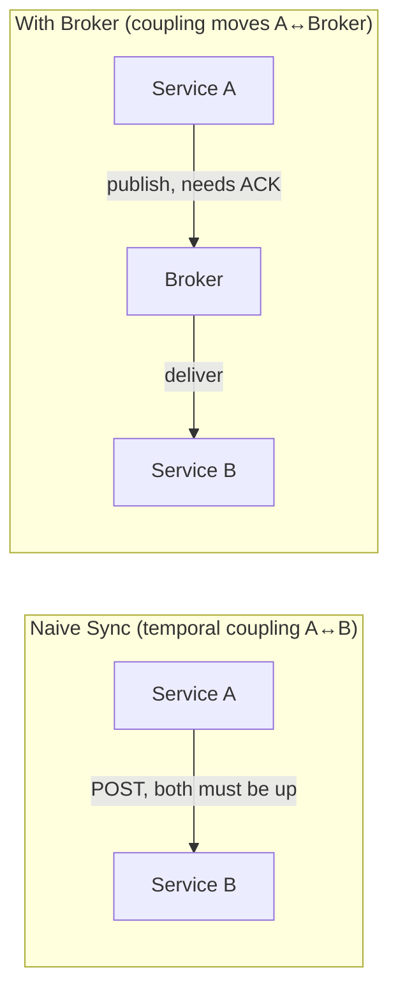
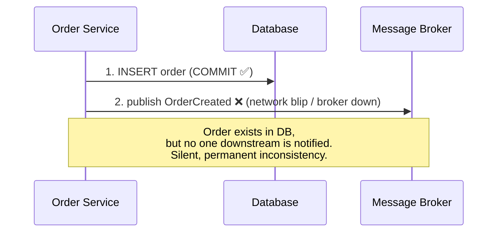
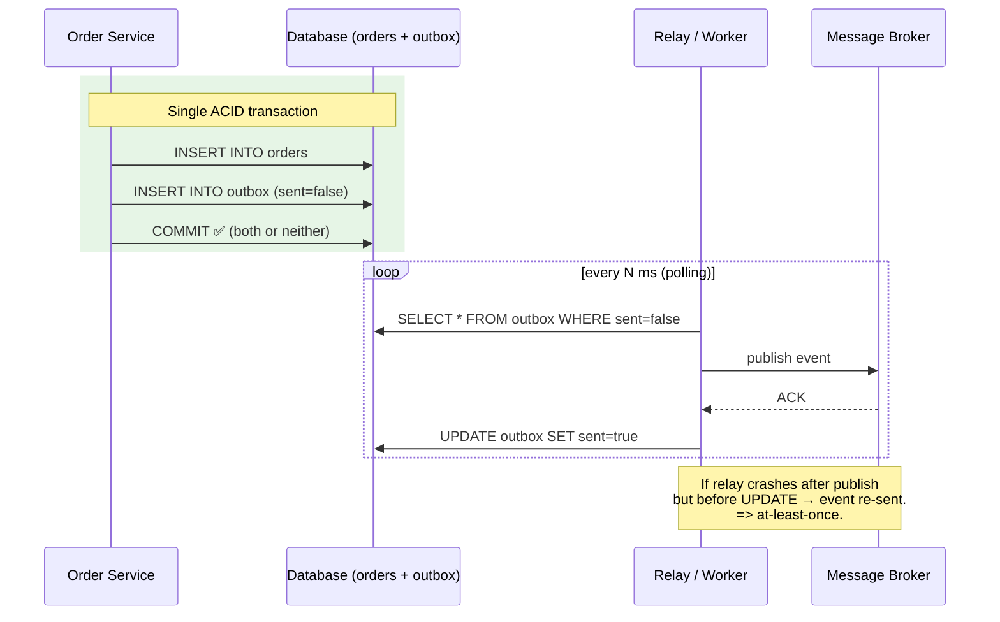
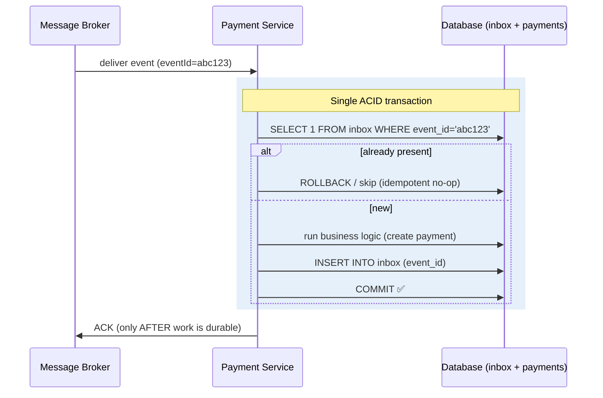
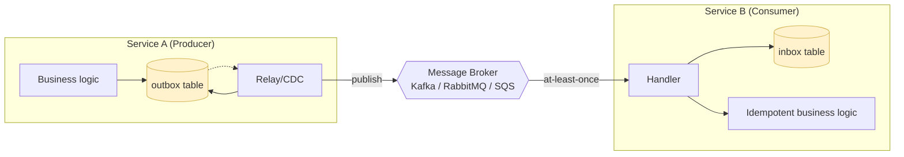
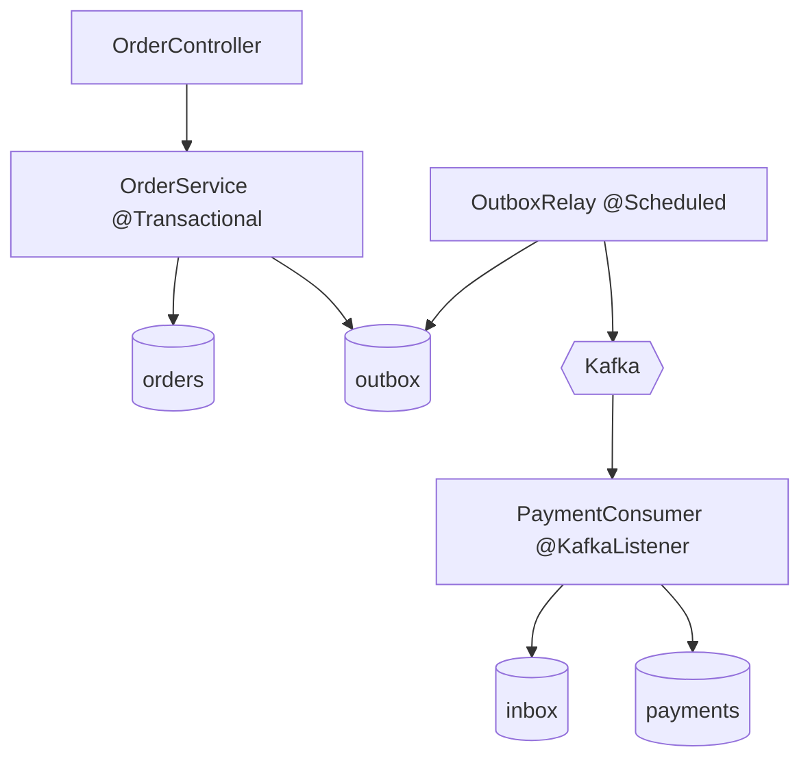

# 📋 Transactional Inbox & Outbox Pattern — A Study Guide

> *Reliable messaging in distributed systems: how to guarantee that "the database changed" and "the event was published" never fall out of sync — and how the consumer never processes that event twice.*

---

## 🎯 Table of Contents

1. [Introduction: The 2 AM Problem](#-introduction-the-2-am-problem)
2. [Core Definitions (Plain English)](#-core-definitions-plain-english)
3. [The Concept & Theory in Detail](#-the-concept--theory-in-detail)
   - [The Dual-Write Problem](#the-dual-write-problem)
   - [Temporal Coupling](#temporal-coupling)
   - [Why Retries and "Send First" Don't Save You](#why-retries-and-send-first-dont-save-you)
   - [Delivery Semantics: At-Least-Once vs Exactly-Once](#delivery-semantics-at-least-once-vs-exactly-once)
4. [Why This Pattern Exists](#-why-this-pattern-exists)
5. [The Real Trade-off / Mechanism](#-the-real-trade-off--mechanism)
6. [Architecture & Sequence Diagrams](#-architecture--sequence-diagrams)
   - [The Broken Way (Dual-Write)](#the-broken-way-dual-write)
   - [The Outbox Pattern](#the-outbox-pattern-architecture)
   - [The Inbox Pattern](#the-inbox-pattern-architecture)
   - [Outbox + Inbox End-to-End](#outbox--inbox-end-to-end)
7. [💻 Implementation in Java (Variants, Weakest → Strongest)](#-implementation-in-java-variants-weakest--strongest)
   - [Variant 0: The Anti-Pattern](#variant-0-the-anti-pattern-dont-do-this)
   - [Variant 1: Outbox with Simple Polling](#variant-1-outbox-with-simple-polling)
   - [Variant 2: Concurrent Polling with SKIP LOCKED](#variant-2-concurrent-polling-with-skip-locked)
   - [Variant 3: Outbox via Change Data Capture (Debezium)](#variant-3-outbox-via-change-data-capture-debezium)
   - [Variant 4: The Idempotent Inbox Consumer](#variant-4-the-idempotent-inbox-consumer)
8. [🎨 Hands-On: Complete Spring Boot Implementation](#-hands-on-complete-spring-boot-implementation)
9. [📊 Categorized Real-World Examples](#-categorized-real-world-examples)
10. [❌ Common Misconceptions](#-common-misconceptions)
11. [🎓 Staff / Principal-Level Nuance](#-staff--principal-level-nuance)
12. [🔗 Extensions & Adjacent Concepts](#-extensions--adjacent-concepts)
13. [⚡ Quick Revision](#-quick-revision)
14. [📝 FAANG Interview Q&A (20 Questions)](#-faang-interview-qa-20-questions)
15. [📚 STAR-Based Behavioral Questions](#-star-based-behavioral-questions)
16. [📚 References & Further Reading](#-references--further-reading)

---

## 🎯 Introduction: The 2 AM Problem

Distributed systems don't fail loudly. They fail quietly — and take your data with them.

Picture the most ordinary flow in any microservices system. A customer clicks **Place Order**. Your Order Service does two things: it saves the order row to its own database, and it publishes an `OrderCreated` event so the Payment Service, the Inventory Service, and the Notification Service can react. Clean, decoupled, textbook.

Then one Tuesday you're scrolling logs and notice something odd. Orders are being saved, but a handful of confirmation emails never went out. The database writes are perfect. But every so often the *event publish* failed — a network blip, a broker restart, a timeout — and now you have orders sitting in your database that **nobody downstream ever heard about**. Money was deducted; the prize was never sent. Inventory was never decremented. The two halves of reality have drifted apart.

This is the **dual-write problem**, and it is the single most common source of silent data corruption in event-driven systems. The Transactional Outbox and Inbox patterns are the standard, battle-tested cure. They are not "theoretical" patterns you read about and forget — experienced engineers reach for them the way you reach for a seatbelt. This guide takes you from *why the naive approach breaks* all the way to the *tunable, per-component trade-offs a staff engineer weighs in a design review*.

Two sentences to anchor everything that follows:

> **Outbox** protects the *producer* — it guarantees that if your database state changed, the event describing that change will never be lost.
>
> **Inbox** protects the *consumer* — it guarantees that no matter how many times an event is delivered, it is processed effectively once.

---

## 🎯 Core Definitions (Plain English)

Before the theory, let's pin down the vocabulary. Read these once; every later section leans on them.

**Dual write** — When a single business operation must write to *two independent systems* (typically your database *and* a message broker). Because the two systems have separate transaction boundaries, you cannot commit both atomically, so one can succeed while the other fails.

**Transactional Outbox** — Instead of publishing an event directly to a broker, you `INSERT` the event as a row into an **outbox table** *inside the same database transaction* as your business data. A separate background process later reads the table and publishes the events. The insight: the DB write and the "intent to send" now commit or roll back together.

**Transactional Inbox** — The mirror image, on the consumer side. When a message arrives, you first record it (by a unique message/event ID) in an **inbox table**, then process it. Before processing anything, you check whether that ID is already present. This deduplicates redelivered messages so processing happens effectively once.

**Idempotency** — A property of an operation where applying it multiple times produces the same final state as applying it once. `SET balance = 100` is idempotent; `balance = balance - 10` is not. Idempotency is what makes at-least-once delivery *safe*.

**At-least-once delivery** — The guarantee that a message will be delivered one or more times (never zero), but possibly duplicated. This is what real brokers (Kafka, RabbitMQ, SQS) and the outbox pattern actually give you.

**Relay / Message Relay / Publisher / Worker** — The background process that polls the outbox table (or tails the DB log) and publishes pending events to the broker, then marks them sent.

**CDC (Change Data Capture)** — Reading a database's write-ahead log (WAL) to stream row changes as events, instead of polling. Tools like **Debezium** turn outbox inserts into a Kafka stream with near-real-time latency and no polling load.

<details>
<summary>📖 Beginner-friendly framing (click to expand)</summary>

Think of ordering a package online. The **outbox** is like writing the address on an envelope and dropping it in your home mailbox *the instant you decide to send it* — even if the postal service is on strike today, your letter is safely waiting and *will* go out. The **relay** is the mail carrier who picks it up whenever they come by. The **inbox** is the recipient's rule: "if I already got this exact package, don't open a second one." Together they guarantee the letter is never lost and never acted on twice — which is exactly what you want when the "letter" says *charge this customer $500*.

</details>

---

## 🎯 The Concept & Theory in Detail

### The Dual-Write Problem

A microservice is an autonomous unit that owns its data. It fulfills most requests from its own storage and exposes information only through stable public interfaces, which lets services evolve their schemas independently and stay loosely coupled. But services inevitably need to *tell each other things happened*, and this is where reliability gets hard.

Consider Service A that just finished processing and committed a transaction saving a few rows. It now needs to notify Service B. The operation logically has two writes:

1. Commit business data to A's database.
2. Publish an event so B finds out.

These touch **two systems with two independent transaction boundaries** — a database and a broker. There is no distributed transaction wrapping both (and even if there were, via 2PC, you generally don't want it — more on that later). So exactly one of three bad things can happen:

- **DB commits, publish fails** → the order exists but nobody is notified. *Silent loss.*
- **Publish succeeds, DB rolls back** → downstream services act on an order that doesn't exist. *Phantom event.*
- **Publish times out** → did it work? Retry and risk a duplicate; don't retry and risk a loss. *The "did-it-work" nightmare.*

If your system assumes "exactly once" here, it is already broken — you just haven't noticed yet.

### Temporal Coupling

The naive fix is a synchronous REST call from A to B right after commit. This introduces **temporal coupling**: both services must be up *simultaneously* for the whole duration of the request. If B is down for maintenance, the message is lost.

Adding a **message broker** decouples them in space — A no longer needs B's network location, only the broker's. If B is down, the broker holds the message. But look closely: temporal coupling doesn't vanish, it *moves*. Now **A and the broker** must be up together. A only knows the message landed if it gets an ACK back. Brokers are durable, sophisticated systems — but they still have downtime. So the fundamental problem persists one layer over.



### Why Retries and "Send First" Don't Save You

**"Just retry the publish."** Retries help with *short* failures — an unstable node restarts and comes back. But two problems remain. First, because you're never sure whether a request truly failed or just its *response* was lost, retrying can deliver the message **more than once** — so you need dedup on the receiver regardless. Second, and fatally: the pending message lives **only in memory**. If Service A crashes before it manages a successful transfer, the message is *irretrievably lost*. Kafka's idempotent producer and retriable-error handling reduce duplicates and transient failures, but cannot resurrect an event that never survived A's crash.

**"Then send the message first, wait for ACK, then commit."** Also broken. The system can fail *after* sending but *before* commit — the DB aborts the transaction, yet B has already been told the data changed. Worse, in most relational databases (Postgres default is `READ COMMITTED`), data altered inside an uncommitted transaction **isn't visible** to other readers. So B receives the notification, tries to fetch the new data, and gets **stale data** — the row it was told about isn't visible yet. And making the external call *inside* the transaction lengthens it, holding locks longer and blocking other transactions under load.

The conclusion: **you cannot make an external call and an ACID commit atomic.** No amount of ordering or retrying fixes it. You need a different trick — and that trick is to make the "intent to send" part of the very transaction you *can* commit atomically.

### Delivery Semantics: At-Least-Once vs Exactly-Once

There are three theoretical delivery guarantees:

- **At-most-once** — fire and forget; may lose messages. (ACK before processing gives you this — bad.)
- **At-least-once** — never lost, possibly duplicated. (What outbox + real brokers give you.)
- **Exactly-once** — the holy grail; never lost, never duplicated *end to end*.

Here is the staff-level truth: **true end-to-end exactly-once delivery across a network is impossible** (a consequence of the Two Generals Problem). What systems actually deliver is **at-least-once delivery + idempotent processing = "effectively-once" semantics**. The outbox gives at-least-once *out*; the inbox + idempotency gives effectively-once *processing*. Anyone who says their distributed system is "exactly once" almost always means this combination under the hood (even Kafka's "exactly-once semantics" is scoped to Kafka-to-Kafka processing with transactional producers).

---

## 🎯 Why This Pattern Exists

The pattern exists because of one hard constraint and one soft economic reality.

The **hard constraint** is the impossibility above: an ACID commit and an external network call cannot be one atomic unit. Historically, the "old-school" answer was a **distributed transaction** (two-phase commit / XA). But 2PC is a blocking protocol: it holds locks across systems, the coordinator is a single point of failure, it scales poorly, and many modern brokers (Kafka, most cloud queues) don't even support XA. So 2PC is largely abandoned for high-throughput microservices.

The outbox pattern sidesteps the whole problem with a clever reframing: *don't try to make two systems atomic — collapse the risky second write into the first system.* Writing an event row is just another INSERT in the same local transaction, which the database already commits atomically. The "intent to publish" is now as durable as the business data itself. If the service crashes the instant after commit, the intent survives in the outbox and the relay will eventually deliver it.

The **soft reality**: events that represent *facts* (money moved, order placed, inventory decremented) are too important to lose. If an event is important enough that you'd want to debug it at 2 AM, it deserves an outbox. Conversely, "user viewed this page" analytics can just be fired directly — the pattern is real operational overhead you spend only where correctness matters.

---

## 🎯 The Real Trade-off / Mechanism

The mechanism, distilled:

**Outbox (producer side):**

1. Begin a DB transaction.
2. Write business data (e.g., `INSERT INTO orders`).
3. In the *same* transaction, `INSERT INTO outbox` a serialized event row.
4. Commit. Now both are durable, atomically.
5. A **relay** polls `WHERE sent = false`, publishes each event to the broker, and marks it `sent = true` (or deletes it).

**Inbox (consumer side):**

1. Receive a message carrying a unique event ID.
2. In a transaction: check the **inbox table** for that ID. If present → skip (already handled).
3. If new → run business logic *and* insert the ID into the inbox, in the same transaction.
4. Commit, then ACK the broker. Crucially, **ACK only after the work is durably done.**

Now the honest trade-offs — this is what separates a textbook answer from a design-review answer:

| Dimension | What you gain | What you pay |
|---|---|---|
| **Consistency** | Atomic DB + intent-to-publish; no lost events; no phantom events | Only **eventual** consistency downstream (seconds of lag) |
| **Latency** | — | A gap between commit and publish (0–5s polling; sub-second with CDC) |
| **Complexity** | — | Extra tables, a relay process, monitoring, cleanup jobs — real ops burden |
| **DB load** | Durable buffer that survives crashes | High-frequency polling + insert/delete churn stresses the DB (tombstones, memory-resident hot table) |
| **Duplicates** | Guaranteed delivery | Still **at-least-once** — you *must* build dedup/idempotency downstream |
| **Ordering** | Recoverable with sequence IDs / partitioning | Not free; concurrent relays can reorder |

The single most important nuance: **the outbox does NOT eliminate duplicates.** After the relay publishes but before it marks the row `sent`, a crash means the row is re-published on restart. So the outbox gives at-least-once — and the *inbox/idempotency on the other side is not optional*. Outbox without a dedup story downstream is a half-built bridge.

---

## 🎨 Architecture & Sequence Diagrams

### The Broken Way (Dual-Write)



**How to read this diagram.** Two sequential arrows leave the Order Service. Step 1 writes the order and *commits* — that data is now durable and visible. Step 2 is a completely separate call to the broker. The diagram deliberately puts the ❌ on step 2 to show the fatal window: once step 1 has committed, there is no way to "take it back" if step 2 fails. The closing note captures the outcome — the database says the order exists, but the Payment/Inventory/Notification services never hear about it. Nothing crashes, nothing logs an error loud enough to page you; the two systems simply drift apart. This is the exact failure the outbox is designed to eliminate, so keep this picture in mind as the "before."

### The Outbox Pattern (Architecture)



**How to read this diagram.** Notice the structure splits into two independent phases. The green box at the top is the *write path* — a single ACID transaction where the order row and the outbox row (with `sent=false`) are committed together, "both or neither." The application's job ends the instant this commits; it never talks to the broker directly. The `loop` box below is the *delivery path*, run by a separate relay on a timer: it selects unsent rows, publishes each to the broker, waits for the broker's ACK, then flips `sent=true`. The two phases are deliberately decoupled — that's what makes the system crash-safe. If the whole service dies right after the green commit, the outbox row is still sitting in the database, and the relay will pick it up after restart. The closing note points at the one remaining gap: if the relay crashes *after* the broker ACK but *before* the `UPDATE`, the row still reads `sent=false`, so it gets published a second time — which is precisely why this pattern delivers **at-least-once**, not exactly-once, and why the consumer needs an inbox.

### The Inbox Pattern (Architecture)



**How to read this diagram.** The broker delivers an event stamped with a unique `eventId` (here `abc123`). The blue box is again a single ACID transaction, but now it opens with a *guard*: `SELECT 1 FROM inbox WHERE event_id='abc123'`. The `alt`/`else` fork is the heart of idempotency — if that ID is already present (a duplicate delivery), the consumer does nothing and treats it as a harmless no-op; only if the ID is new does it run the business logic (create the payment) *and* record the event ID in the inbox, in the same transaction, so the "work done" and the "dedup marker" can never diverge. The final arrow is the most important sequencing rule in the whole pattern: the ACK to the broker is sent **only after** the transaction commits. That ordering is what preserves at-least-once — if the consumer crashes before ACKing, the broker redelivers, and the inbox guard turns that redelivery into a safe skip. Flip the order (ACK first, then process) and a mid-processing crash silently loses the work forever.

### Outbox + Inbox End-to-End



**How to read this diagram.** This is the "big picture" that stitches the previous two together. On the left, Service A (the producer) owns an outbox table; its business logic and its relay (or CDC process) both touch that table — business logic *writes* intent, relay *reads and clears* it. The relay publishes to the message broker in the middle (Kafka, RabbitMQ, or SQS — the pattern is broker-agnostic). On the right, Service B (the consumer) owns an inbox table; its handler records each event before the idempotent business logic runs. The highlighted yellow stores (outbox and inbox) are the two durable "safety buffers," one on each side of the broker. The `at-least-once` label on the broker→handler arrow is the reminder that duplicates are expected in transit, which is exactly why the inbox exists.

The takeaway from the end-to-end view: **outbox closes the producer gap, inbox closes the consumer gap.** One without the other is incomplete. Outbox alone still lets the consumer double-charge; inbox alone still lets the producer lose the event before it ever reaches the broker.

---

## 💻 Implementation in Java (Variants, Weakest → Strongest)

<details>
<summary>📖 Click to expand the full Java implementation walkthrough (5 variants)</summary>

We'll build up from the naive anti-pattern to production-grade approaches. Each variant states its **mechanism**, **pros**, and **cons** so you can see *why* each step is an improvement. All examples use Java 17 + Spring Boot + JPA/JDBC against Postgres, publishing to Kafka (swap the broker client freely — the table and relay logic are identical). Read them in order: each variant fixes a specific weakness the previous one left open, so the progression *is* the mental model of how a real system hardens over time.

### Variant 0: The Anti-Pattern (Don't Do This)

**Mechanism:** Save the entity, then publish directly to the broker. Two writes, two systems, no atomicity.

<details>
<summary>💻 Java — the dual-write anti-pattern</summary>

```java
@Service
public class OrderService {

    private final OrderRepository orderRepository;
    private final KafkaTemplate<String, String> kafka;
    private final ObjectMapper mapper;

    @Transactional
    public Order createOrder(CreateOrderCommand cmd) throws Exception {
        // 1. Save business data — this COMMITS.
        Order order = new Order(UUID.randomUUID(), cmd.customerId(), cmd.total(), "CREATED");
        orderRepository.save(order);

        // 2. Publish event. If THIS fails (broker down, network blip),
        //    the order is already saved but nobody downstream ever hears about it.
        //    If the JVM crashes right here, the event is lost forever — it lived only in memory.
        OrderCreatedEvent event = new OrderCreatedEvent(order.getId(), order.getCustomerId(), order.getTotal());
        kafka.send("orders", mapper.writeValueAsString(event));   // ❌ dual write

        return order;
    }
}
```

</details>

**Pros:** Trivially simple; lowest latency in the happy path.
**Cons:** The dual-write bug in full force — DB and broker can diverge. `@Transactional` gives you *nothing* here, because `kafka.send` is not part of the DB transaction (and even if the send is inside the tx boundary, the network call itself isn't transactional). This is the bug the whole pattern exists to kill.

### Variant 1: Outbox with Simple Polling

**Mechanism:** Write the event into an `outbox` table in the *same* transaction as the order. A scheduled relay polls unsent rows, publishes, and marks them sent.

<details>
<summary>💻 Java — outbox table + transactional write + polling relay</summary>

```sql
-- Schema
CREATE TABLE outbox (
    id           UUID PRIMARY KEY,
    aggregate_id VARCHAR(255) NOT NULL,
    event_type   VARCHAR(255) NOT NULL,
    payload      JSONB        NOT NULL,
    sent         BOOLEAN      NOT NULL DEFAULT FALSE,
    created_at   TIMESTAMP    NOT NULL DEFAULT NOW(),
    sent_at      TIMESTAMP
);
-- Partial index: only unsent rows are hot, keeps the relay query cheap.
CREATE INDEX idx_outbox_unsent ON outbox (created_at) WHERE sent = FALSE;
```

```java
@Entity @Table(name = "outbox")
public class OutboxMessage {
    @Id private UUID id;
    private String aggregateId;
    private String eventType;
    @Column(columnDefinition = "jsonb") private String payload;
    private boolean sent = false;
    private Instant createdAt = Instant.now();
    private Instant sentAt;
    // constructors, getters, setters omitted
}

@Service
public class OrderService {
    private final OrderRepository orderRepository;
    private final OutboxRepository outboxRepository;
    private final ObjectMapper mapper;

    @Transactional  // ✅ order + outbox row commit atomically
    public Order createOrder(CreateOrderCommand cmd) throws Exception {
        Order order = new Order(UUID.randomUUID(), cmd.customerId(), cmd.total(), "CREATED");
        orderRepository.save(order);

        var event = new OrderCreatedEvent(order.getId(), order.getCustomerId(), order.getTotal());
        var outbox = new OutboxMessage(
                UUID.randomUUID(), order.getId().toString(),
                "OrderCreated", mapper.writeValueAsString(event));
        outboxRepository.save(outbox);   // same transaction as the order
        return order;
    }
}

@Component
public class OutboxRelay {
    private final OutboxRepository outboxRepository;
    private final KafkaTemplate<String, String> kafka;

    @Scheduled(fixedDelay = 1000)   // poll every second
    @Transactional
    public void publishPending() {
        List<OutboxMessage> batch = outboxRepository
                .findTop100BySentFalseOrderByCreatedAt();   // uses partial index
        for (OutboxMessage m : batch) {
            try {
                // key by aggregateId => same order's events land on the same partition (ordering)
                kafka.send("orders", m.getAggregateId(), m.getPayload()).get();
                m.setSent(true);
                m.setSentAt(Instant.now());
            } catch (Exception ex) {
                // leave sent=false; it will be retried next poll. Log + metric here.
                log.warn("Publish failed for outbox id={}, will retry", m.getId(), ex);
            }
        }
    }
}
```

</details>

**Pros:** Kills the dual-write problem; simple to reason about; works on any relational DB; the outbox doubles as an audit log.
**Cons:** Polling adds DB load and latency (tuned by interval); single-threaded relay caps throughput; **at-least-once** (a crash between publish and `setSent` re-sends) so consumers must dedup; the table bloats without cleanup.

### Variant 2: Concurrent Polling with SKIP LOCKED

**Mechanism:** Run multiple relay workers/instances for throughput. To stop two workers grabbing the same row, lock the selected rows with `SELECT ... FOR UPDATE SKIP LOCKED` — each worker claims a disjoint batch, and locked rows are simply skipped by others.

<details>
<summary>💻 Java — parallel relay with FOR UPDATE SKIP LOCKED</summary>

```java
public interface OutboxRepository extends JpaRepository<OutboxMessage, UUID> {

    // SKIP LOCKED (Postgres/MySQL 8+) lets concurrent workers claim disjoint batches
    // without blocking each other. Rows locked by worker A are invisible to worker B.
    @Query(value = """
        SELECT * FROM outbox
        WHERE sent = false
        ORDER BY created_at
        LIMIT :batchSize
        FOR UPDATE SKIP LOCKED
        """, nativeQuery = true)
    List<OutboxMessage> lockPendingBatch(@Param("batchSize") int batchSize);
}

@Component
public class ConcurrentOutboxRelay {
    private final OutboxRepository repo;
    private final KafkaTemplate<String, String> kafka;

    // Multiple instances of the service (or threads) run this concurrently.
    @Scheduled(fixedDelay = 500)
    @Transactional   // the row locks are held until this transaction commits
    public void publishBatch() {
        List<OutboxMessage> batch = repo.lockPendingBatch(50);   // claimed & locked
        for (OutboxMessage m : batch) {
            try {
                kafka.send("orders", m.getAggregateId(), m.getPayload()).get();
                m.setSent(true);
                m.setSentAt(Instant.now());
            } catch (Exception ex) {
                log.warn("Publish failed id={}", m.getId(), ex);
                // On failure the row stays sent=false; lock releases at tx end; retried later.
            }
        }
        // committing the tx releases the locks and persists sent=true flags
    }
}
```

</details>

**Pros:** Horizontal scalability without double-publishing; larger batches cut DB round-trips.
**Cons:** Larger batches mean *one* failure can hold up marking the whole batch (design your marking granularity carefully); concurrent workers can **reorder** events unless you key/partition by aggregate ID; still polling-based load.

### Variant 3: Outbox via Change Data Capture (Debezium)

**Mechanism:** Stop polling entirely. Every DB write is recorded in the **write-ahead log (WAL)**. A CDC tool like **Debezium** tails the WAL, detects inserts into the outbox table, and streams them straight to Kafka in near real time. This is *log tailing*.

<details>
<summary>💻 Debezium Outbox Event Router config (no relay code needed)</summary>

```json
{
  "name": "order-outbox-connector",
  "config": {
    "connector.class": "io.debezium.connector.postgresql.PostgresConnector",
    "database.hostname": "postgres",
    "database.port": "5432",
    "database.user": "debezium",
    "database.dbname": "orderdb",
    "table.include.list": "public.outbox",

    "transforms": "outbox",
    "transforms.outbox.type": "io.debezium.transforms.outbox.EventRouter",
    "transforms.outbox.route.by.field": "aggregate_type",
    "transforms.outbox.table.field.event.key": "aggregate_id",
    "transforms.outbox.table.field.event.payload": "payload"
  }
}
```

```java
// Producer side is now even simpler — you ONLY write to the outbox.
// No @Scheduled relay in your codebase at all; Debezium is the relay.
@Transactional
public Order createOrder(CreateOrderCommand cmd) throws Exception {
    Order order = new Order(UUID.randomUUID(), cmd.customerId(), cmd.total(), "CREATED");
    orderRepository.save(order);
    outboxRepository.save(new OutboxMessage(/* ...OrderCreated... */));
    return order;   // Debezium tails the WAL and emits the event to Kafka
}
```

</details>

**Pros:** Sub-second latency; no polling load on the DB; scales to very high throughput; decouples publishing from app code entirely.
**Cons:** Operational complexity (Kafka Connect + Debezium to run, monitor, and upgrade); requires DB CDC capability and WAL access/config; harder to debug "pending" state since there's no explicit `sent` flag to eyeball; ordering and schema evolution still need thought.

### Variant 4: The Idempotent Inbox Consumer

**Mechanism:** On the consumer, wrap the dedup check, the business logic, and the inbox insert in one transaction; ACK the broker only after commit.

<details>
<summary>💻 Java — transactional idempotent inbox consumer</summary>

```sql
CREATE TABLE inbox (
    event_id     UUID PRIMARY KEY,     -- unique key => natural dedup
    event_type   VARCHAR(255) NOT NULL,
    processed_at TIMESTAMP    NOT NULL DEFAULT NOW()
);
```

```java
@Service
public class PaymentConsumer {

    private final InboxRepository inboxRepo;
    private final PaymentRepository paymentRepo;
    private final ObjectMapper mapper;

    @KafkaListener(topics = "orders", groupId = "payment-service")
    public void onMessage(ConsumerRecord<String, String> record, Acknowledgment ack) throws Exception {
        UUID eventId = UUID.fromString(record.headers().lastHeader("eventId").toString());
        try {
            handle(eventId, mapper.readValue(record.value(), OrderCreatedEvent.class));
            ack.acknowledge();   // ✅ ACK only AFTER the work is durably committed
        } catch (Exception ex) {
            // no ACK => broker redelivers => retried safely (inbox makes retry a no-op)
            log.error("Processing failed for event {}", eventId, ex);
        }
    }

    @Transactional
    void handle(UUID eventId, OrderCreatedEvent event) {
        // 1. Dedup guard — have we already processed this exact event?
        if (inboxRepo.existsById(eventId)) {
            log.info("Event {} already processed, skipping", eventId);
            return;   // idempotent no-op
        }
        // 2. Business logic (itself written idempotently where possible)
        paymentRepo.save(new Payment(UUID.randomUUID(), event.orderId(), event.total(), "PENDING"));
        // 3. Record the event in the SAME transaction
        inboxRepo.save(new InboxMessage(eventId, "OrderCreated", Instant.now()));
        // commit: business change + dedup marker are atomic
    }
}
```

</details>

**Pros:** Redelivered duplicates become safe no-ops; retries turn from a *risk* into a *feature*; the inbox is a natural place to enforce ordering (via monotonic sequence IDs).
**Cons:** A lookup and an insert on every message (index the key; apply retention); the inbox is a *guard rail*, not a substitute for idempotent business logic — the concurrent-in-flight-duplicate case (below) can still bite you.

</details>

---

## 🎨 Hands-On: Complete Spring Boot Implementation

<details>
<summary>📖 Click to expand the complete Spring Boot walkthrough (overall logic, diagram & 4 classes)</summary>

### The overall logic

This section ties the five variants above into one minimal-but-complete, runnable shape — the version you'd actually deploy. The design goal is a single end-to-end promise: *an order placed by a customer results in exactly one payment being created downstream, even if the broker hiccups, the relay restarts, or the same message is delivered twice.*

The flow moves through four responsibilities, each isolated into its own class so the failure boundaries are crisp:

1. **`OrderService` (producer write path)** — Wraps the business write and the event write in one `@Transactional` method. The order row and the outbox row commit atomically, so the invariant "if the order exists, its event exists" can never be violated. It never touches the broker.
2. **`OutboxRelay` (producer delivery path)** — A `@Scheduled` background worker that claims a batch of unsent outbox rows with `FOR UPDATE SKIP LOCKED` (so multiple instances can run safely), publishes each to Kafka with a bounded wait, and flips `sent=true`. Failures are left for the next poll and counted for poison-message handling.
3. **`PaymentConsumer` (consumer path)** — A `@KafkaListener` that dedups on the event ID via an inbox table, runs the payment logic and the inbox insert in one transaction, and manually ACKs Kafka *only after* commit. This is where at-least-once delivery is made safe.
4. **`MessageCleanup` (housekeeping)** — A nightly job that purges already-sent/processed rows past the broker's redelivery window, so neither table grows unbounded.

The through-line: the two tables (outbox, inbox) are durable buffers on either side of the broker, and each class guards exactly one hand-off — write, publish, consume, and reap.

### The architecture

The diagram below maps those four responsibilities onto the concrete Spring components and datastores. Follow the arrows top-to-bottom: an HTTP request hits `OrderController`, which delegates to the transactional `OrderService`; that service writes to *both* the `orders` and `outbox` tables in one transaction. The `OutboxRelay` reads only the `outbox` table and pushes to Kafka. On the far side, `PaymentConsumer` receives from Kafka and writes to *both* the `inbox` (dedup marker) and `payments` (business result) tables. Notice that the producer and consumer never share a database — each service owns its own — and Kafka is the only thing that crosses the service boundary.



### The code

Each class below is shown with a short "what it does & why it's shaped this way" note so you can connect the implementation choice back to the failure mode it defends against.

<details>
<summary>💻 1. OrderService — atomic business write + outbox write</summary>

```java
@Service
public class OrderService {
    private final OrderRepository orders;
    private final OutboxRepository outbox;
    private final ObjectMapper mapper;

    public OrderService(OrderRepository orders, OutboxRepository outbox, ObjectMapper mapper) {
        this.orders = orders; this.outbox = outbox; this.mapper = mapper;
    }

    @Transactional
    public Order placeOrder(CreateOrderCommand cmd) {
        Order order = new Order(UUID.randomUUID(), cmd.customerId(), cmd.total(), "CREATED");
        orders.save(order);
        try {
            var payload = mapper.writeValueAsString(
                new OrderCreatedEvent(order.getId(), order.getCustomerId(), order.getTotal()));
            outbox.save(new OutboxMessage(UUID.randomUUID(),
                order.getId().toString(), "OrderCreated", payload));
        } catch (JsonProcessingException e) {
            throw new IllegalStateException("Failed to serialize event", e);  // rolls back the whole tx
        }
        return order;
    }
}
```

**What it does & why it's shaped this way:** The single `@Transactional` boundary is the entire point — the order and the outbox row are one atomic unit. Serialization failure throws inside the transaction so *nothing* is persisted, preserving the invariant "if the order exists, its event exists."

</details>

<details>
<summary>💻 2. OutboxRelay — resilient scheduled publisher</summary>

```java
@Component
public class OutboxRelay {
    private static final Logger log = LoggerFactory.getLogger(OutboxRelay.class);
    private final OutboxRepository outbox;
    private final KafkaTemplate<String, String> kafka;

    public OutboxRelay(OutboxRepository outbox, KafkaTemplate<String, String> kafka) {
        this.outbox = outbox; this.kafka = kafka;
    }

    @Scheduled(fixedDelayString = "${outbox.poll-ms:1000}")
    @Transactional
    public void dispatch() {
        List<OutboxMessage> batch = outbox.lockPendingBatch(50);   // FOR UPDATE SKIP LOCKED
        for (OutboxMessage m : batch) {
            try {
                kafka.send(new ProducerRecord<>("orders", m.getAggregateId(), m.getPayload()))
                     .get(5, TimeUnit.SECONDS);            // bounded wait — don't hang the poll
                m.markSent();
            } catch (Exception ex) {
                m.incrementRetry();                        // track for poison-message handling
                log.warn("Outbox publish failed id={} retry={}", m.getId(), m.getRetryCount(), ex);
            }
        }
    }
}
```

**What it does & why it's shaped this way:** `SKIP LOCKED` makes it safe to run multiple instances. The bounded `get(5s)` prevents a hung broker from freezing the poll loop. A `retryCount` lets you later route poison messages to a dead-letter table instead of blocking the queue forever.

</details>

<details>
<summary>💻 3. PaymentConsumer — idempotent inbox with manual ACK</summary>

```java
@Service
public class PaymentConsumer {
    private final InboxRepository inbox;
    private final PaymentRepository payments;
    private final ObjectMapper mapper;

    public PaymentConsumer(InboxRepository inbox, PaymentRepository payments, ObjectMapper mapper) {
        this.inbox = inbox; this.payments = payments; this.mapper = mapper;
    }

    @KafkaListener(topics = "orders", groupId = "payments",
                   containerFactory = "manualAckFactory")
    public void consume(ConsumerRecord<String, String> rec, Acknowledgment ack) throws Exception {
        UUID eventId = UUID.fromString(new String(rec.headers().lastHeader("eventId").value()));
        process(eventId, mapper.readValue(rec.value(), OrderCreatedEvent.class));
        ack.acknowledge();   // only after commit
    }

    @Transactional
    void process(UUID eventId, OrderCreatedEvent e) {
        if (inbox.existsById(eventId)) return;                 // dedup
        payments.save(new Payment(UUID.randomUUID(), e.orderId(), e.total(), "PENDING"));
        inbox.save(new InboxMessage(eventId, "OrderCreated", Instant.now()));
    }
}
```

**What it does & why it's shaped this way:** Manual ACK + `@Transactional` process method guarantees the ordering "commit work, *then* ACK." A duplicate delivery finds the `eventId` already in the inbox and returns without side effects. The unique PK on `event_id` is the last line of defense even under a race.

</details>

<details>
<summary>💻 4. Cleanup job — keep the tables from bloating</summary>

```java
@Component
public class MessageCleanup {
    private final OutboxRepository outbox;
    private final InboxRepository inbox;

    @Scheduled(cron = "0 0 3 * * *")   // 3 AM daily, off-peak
    @Transactional
    public void purge() {
        Instant cutoff = Instant.now().minus(7, ChronoUnit.DAYS);
        outbox.deleteBySentTrueAndSentAtBefore(cutoff);   // archive to cold storage if compliance needs it
        inbox.deleteByProcessedAtBefore(cutoff);          // safe once past the broker's redelivery window
    }
}
```

**What it does & why it's shaped this way:** Both tables grow unbounded without maintenance — millions of dead rows in months. Purge only *processed/sent* rows, and only past the broker's redelivery window (so you never delete an inbox marker that's still needed to reject a late duplicate). If PII lives in payloads, this also serves your GDPR retention story.

</details>

</details>

---

## 📊 Categorized Real-World Examples

**💳 Payments & Finance (correctness is non-negotiable).** A loyalty system deducts points and must tell another service to ship a prize. If the notify event is lost, the customer loses points but never gets the gift. Installment-payment systems mark an installment `QUEUED` and insert an outbox row in one transaction, then a relay pushes to SQS — so an overdue-payment notification is never lost and never fires twice (which would mean a double charge). Outbox here is the default, not a luxury.

**🛒 E-commerce order pipelines.** The canonical case: Order Service saves the order + `OrderCreated` outbox row atomically; a relay publishes to Kafka/RabbitMQ; Payment, Inventory, Shipping, and Notification services consume. Each consumer uses an inbox keyed by `orderId`/`eventId` so a redelivered `OrderCreated` doesn't create two payments or decrement stock twice. This is the `order → payment → notification` workflow you'll see in nearly every interview.

**📧 Post-processing & notifications.** An order service commits, then a post-processing service emails the customer and notifies the supplier for shipping. Synchronous calls create temporal coupling (if post-processing is down, the order service never gets an ACK and doesn't know the work finished). Outbox on the producer + inbox on the post-processor makes the whole chain crash-safe.

**📚 Audit logging & event sourcing pipelines.** Because every event lives as a durable row with a timestamp, the outbox *is* an audit trail for free — great for compliance and for reconstructing "what the hell happened last Tuesday." Outbox is also a common feeder into event-sourcing / CQRS read-model projections.

**☁️ Cloud-native variants.** With DynamoDB Streams, the table's change stream *is* the outbox — a Lambda triggers on every write, no polling and no explicit outbox table (trade-off: you lose the easy "show me pending events" view). AWS Lambda on an EventBridge schedule can replace a continuously-running relay for low-volume systems. Kafka + Debezium is the high-throughput CDC standard.

**Rule of thumb:** if an event represents *truth* (money moved, order placed) → outbox. If *consuming* an event changes state → inbox + idempotency. If it's just a UI notification ("user viewed page") → keep it simple, publish directly.

---

## ❌ Common Misconceptions

**"The outbox pattern gives me exactly-once delivery."** No. It gives *at-least-once*. The relay can publish and then crash before marking the row sent, re-publishing on restart. You still need dedup/idempotency downstream. Outbox removes *loss*, not *duplication*.

**"`@Transactional` around my save + kafka.send makes it atomic."** No. The Kafka send is a network call to a separate system; it's not enrolled in your DB transaction. The transaction can commit while the send failed, or vice versa. Only writing the event *to the same database* makes it atomic.

**"The inbox pattern prevents all duplicate processing."** Not quite. It prevents duplicates that arrive *sequentially*. But if the same message is redelivered while the first copy is *still being processed* (e.g., a slow task blows past a visibility timeout), two workers run concurrently — the dedup check hasn't committed yet, so both see "not processed." You need row locking, unique constraints, or idempotent logic to handle the concurrent-in-flight case.

**"I'll send the event first, then commit — same thing, simpler."** No. If the commit then fails, the consumer has been told about data that doesn't exist, and may read stale/invisible data (uncommitted rows aren't visible under READ COMMITTED). Ordering the two operations differently never solves the fundamental non-atomicity.

**"Idempotency is optional if I have an inbox."** Backwards. The inbox is a *guard rail*; idempotent business logic is the *seatbelt*. Use natural keys (`orderId`, `paymentId`), check current state before mutating, and apply updates only on valid transitions. The inbox reduces how often you rely on idempotency, but never eliminates the need.

**"CDC/Debezium means I don't need the pattern anymore."** CDC is an *implementation* of the outbox relay (log tailing instead of polling), not a replacement for the concept. You still model events as outbox rows (or route them via the Debezium Outbox Event Router); you've just swapped the delivery mechanism.

**"Polling the outbox is too slow to be useful."** For most systems, 0–5s of lag is invisible (nobody notices a confirmation email 3s late). Only real-time use cases (live dashboards, trading) need sub-second, and that's what CDC or DynamoDB Streams are for.

---

## 🎓 Staff / Principal-Level Nuance

These are the follow-ups an interviewer pushes toward once you've nailed the basics — the per-component trade-offs experienced engineers raise unprompted.

**Polling frequency is a latency-vs-load dial, and it's tunable per table.** Poll too often and you hammer the DB with `SELECT`s (sub-second intervals on a hot, memory-resident table); poll too rarely and delivery latency climbs. Batch size is the second knob: bigger batches cut round-trips but mean one failure can stall marking the whole batch, and a big in-flight batch that fails re-sends *all* of it. Staff move: adaptive polling — speed up when lag is detected, back off when idle.

**Tombstone / vacuum pressure is the silent killer.** High-frequency insert+delete churn on the outbox generates dead tuples (Postgres) or tombstones, forcing aggressive autovacuum and bloating the table in memory. Mitigations: mark-instead-of-delete (keep rows, flip `sent`), partition the outbox by day and `DROP` old partitions (cheap), or use a DB with tables designed for this churn. This is why "just DELETE after publish" can quietly degrade a busy system.

**Ordering guarantees don't come free.** A single-threaded relay preserves creation order; the moment you parallelize, events for the same aggregate can reorder. Fix by keying the broker partition on `aggregate_id` (all of order 123's events → same Kafka partition → ordered) and/or embedding a monotonic sequence number so the consumer's inbox can detect gaps, hold, and reorder. If ordering truly matters, the inbox worker can withhold event N+1 until N has arrived.

**The concurrent-duplicate-during-slow-processing case.** When a task runs longer than the broker's timeout (SQS visibility timeout, HTTP timeout), the message is redelivered *while the original is still running*. Dedup alone won't stop two concurrent runs because neither has committed the inbox marker. This is why some designs adopt the inbox specifically: persist-then-ACK-then-process-async, so an expensive action (e.g., spinning up a VM) isn't triggered twice. Fine-tuning timeouts helps but is hard when task duration is unpredictable.

**Why not just 2PC / distributed transactions?** XA/2PC *would* make DB + broker atomic, but it's a blocking protocol with a coordinator SPOF, holds locks across systems, scales poorly, and most modern brokers don't support it. Outbox trades strong consistency for eventual consistency and gets far better availability and throughput — the right call for most microservices. Know this comparison cold; it's a favorite probe.

**Failure-mode reasoning for the relay.** Enumerate: crash before commit (nothing lost, order+outbox both absent), crash after commit before publish (row waits, gets published on restart), crash after publish before mark-sent (duplicate — consumer dedups). Being able to walk each transition is what "staff-level" looks like in a design review.

**Security & compliance.** The outbox holds the same data as your events — potentially PII. Encrypt at rest, TLS the relay's DB connection, restrict access, consider field-level encryption for card/health data, and set retention that matches GDPR. Don't let sensitive payloads pile up forever.

**Multi-instance coordination.** With `SELECT ... FOR UPDATE SKIP LOCKED`, N relay instances self-shard the workload without a leader election. Alternatively, partition ownership (instance i handles `hash(aggregate_id) % N == i`) keeps per-aggregate ordering while scaling — a cleaner story than pure SKIP LOCKED when order matters.

**When NOT to use it.** Simple monolith with one DB (no cross-service consistency problem), naturally idempotent operations, tolerable occasional loss (analytics, "user viewed page"), or hard sub-second real-time needs. The pattern is real operational overhead; spend it where lost/duplicated events actually hurt.

---

## 🔗 Extensions & Adjacent Concepts

**Change Data Capture (CDC) & log tailing** — Covered above as the high-performance relay. Debezium is the de-facto tool; it reads the WAL and can use its **Outbox Event Router** SMT to map outbox rows to topics automatically.

**Listen-to-Yourself pattern** — Instead of an outbox table, the service publishes to the broker and *also* consumes its own event to update its DB. Avoids a table but reintroduces a dual-write-ish window; the Confluent guidance notes outbox is usually easier to manage.

**Event Sourcing** — Rather than storing current state + emitting events, you store the *event log as the source of truth* and derive state by replaying it. Removes the dual-write problem by construction (there's only one write — the event), but it's a much bigger architectural commitment. Outbox is the pragmatic middle ground when you want reliable events without going full event-sourced.

**Saga pattern** — For multi-step distributed transactions (order → payment → shipping), sagas coordinate a sequence of local transactions with compensating actions on failure. Outbox is frequently the *transport* that makes each saga step's events reliable.

**Idempotency keys / dedup stores** — The inbox is one implementation; API-level idempotency keys (Stripe-style) and broker-native dedup (SQS FIFO `MessageDeduplicationId`, Kafka idempotent producer) are adjacent tools solving the same duplicate problem at different layers.

**Transactional messaging in the broker** — Kafka transactions and "exactly-once semantics" (EOS) handle *Kafka-to-Kafka* atomicity (consume-process-produce), but do not solve the DB+broker dual write — that's still outbox territory.

---

## ⚡ Quick Revision

**The problem.** A single business action often needs two writes — to your database *and* to a message broker — but they live in separate transaction boundaries and can't be committed atomically. So you get silent loss (DB committed, publish failed), phantom events (published, DB rolled back), or the "did-it-work" ambiguity on timeouts. Naive fixes fail: synchronous REST creates *temporal coupling* (both services must be up at once); adding a broker just moves that coupling to producer↔broker; retries can't resurrect an event held only in memory when the process crashes; and "publish then commit" leaves consumers reading data that doesn't exist yet. The deep truth is that an ACID commit and an external network call cannot be made one atomic unit, and end-to-end exactly-once delivery is impossible across a network.

**The outbox (producer side).** Reframe the problem: don't try to make two systems atomic — collapse the risky write into the one system you *can* commit atomically. Write the event as a row in an `outbox` table inside the *same* transaction as the business data. A background *relay* polls unsent rows, publishes them to the broker, and marks them sent. If the service crashes right after commit, the intent survives in the table and is delivered on restart. This gives **at-least-once** delivery — because a crash between publishing and marking-sent re-sends the row — so the outbox removes *loss* but not *duplication*.

**The inbox (consumer side).** The mirror image. On receipt, record the message's unique event ID in an `inbox` table and run business logic in one transaction, then ACK the broker *only after* the work is durably committed. Before processing, check whether the ID is already present; if so, skip. This turns redelivered duplicates into safe no-ops and turns retries from a risk into a feature. Critically, the inbox is a guard rail, not a substitute for **idempotent** business logic (use natural keys, check state before mutating) — especially because a slow task can be redelivered *while still running*, so two workers race before either commits the dedup marker.

**Together & the trade-offs.** Outbox closes the producer gap (no lost events); inbox + idempotency closes the consumer gap (effectively-once processing). One without the other is incomplete. You pay for this with **eventual consistency** (seconds of publish lag), **operational complexity** (extra tables, a relay, monitoring, cleanup), and **DB load** (polling churn, tombstone/vacuum pressure, a hot memory-resident table). Tunable knobs: polling interval (latency vs load), batch size (throughput vs blast radius on failure), and parallelism via `SELECT ... FOR UPDATE SKIP LOCKED` so multiple relays claim disjoint rows without double-publishing.

**Staff-level points.** Prefer outbox over 2PC/XA (which blocks, has a coordinator SPOF, and isn't broker-supported) — you trade strong consistency for availability and throughput. Preserve ordering by partitioning the broker on `aggregate_id` and/or embedding monotonic sequence numbers the inbox can reorder on. Swap polling for **CDC (Debezium tailing the WAL)** for sub-second latency and zero polling load, at the cost of more moving parts. Control table growth with mark-instead-of-delete or date partitioning, and mind PII/encryption/retention in the outbox. Use the pattern when events represent *truth* (orders, payments, inventory); skip it for a simple monolith, naturally-idempotent ops, tolerable loss (analytics), or hard real-time needs.

**One-liner to remember:** *Outbox = "if my DB changed, the event will not be lost." Inbox + idempotency = "no matter how many times the event arrives, it's applied once." At-least-once delivery + idempotent processing = effectively-once.*

---

## 📝 FAANG Interview Q&A (20 Questions)

Ten conceptual/implementation questions first, then ten L4/L5–staff-level questions. Each answer aims for staff-level reasoning with a concrete technology.

### Conceptual & Implementation (Q1–Q10)

<details>
<summary><b>Q1 [Conceptual].</b> What is the dual-write problem and why can't a database transaction solve it?</summary>

The dual-write problem arises when one business action must write to two independent systems — typically your database and a message broker — that each have their own transaction boundary. A DB transaction is scoped to the database only; it cannot enroll a `kafka.send()` or an HTTP POST, because those are network calls to systems the DB knows nothing about. So you can commit the order but fail to publish `OrderCreated`, or publish it and then have the commit roll back. Concretely, wrapping `orderRepository.save()` and `kafkaTemplate.send()` in one Spring `@Transactional` method does *nothing* to make them atomic — the send happens against Kafka regardless of the DB's commit/rollback. The only way to get atomicity is to make the second write go to the *same* database (the outbox table).

</details>

<details>
<summary><b>Q2 [Conceptual].</b> Explain the transactional outbox pattern in one flow.</summary>

Instead of publishing directly, you insert the event as a row into an `outbox` table *within the same transaction* as your business data, so both commit or neither does. A separate background relay polls the table for unsent rows, publishes each to the broker, and marks it sent (or deletes it). The key insight is that the "intent to publish" becomes as durable as the business data — if the service crashes immediately after commit, the outbox row survives and the relay delivers it after restart. For example, an Order Service does `INSERT INTO orders` + `INSERT INTO outbox` in one Postgres transaction; a `@Scheduled` relay then pushes rows to Kafka. This removes the dual-write gap but yields at-least-once delivery, so consumers still must dedup.

</details>

<details>
<summary><b>Q3 [Conceptual].</b> What is temporal coupling and how do brokers and the outbox each address it?</summary>

Temporal coupling means two components must be available *at the same time* for an interaction to succeed. A synchronous REST call from Service A to Service B couples them temporally — if B is down, the message is lost. Introducing a broker decouples A from B in time (the broker holds the message for B), but it doesn't eliminate coupling; it *moves* it to A↔broker, since A still needs the broker up to receive an ACK. The outbox breaks even that: A only ever writes to its own database, which it already depends on, so publishing can happen later by the relay. The system's single durable point becomes the database, which you already harden with replication and backups.

</details>

<details>
<summary><b>Q4 [Implementation].</b> Why does the outbox give at-least-once and not exactly-once delivery?</summary>

Because marking a row as sent is a *second* action after publishing, and the two aren't atomic with the broker. The relay publishes the event to Kafka, then updates `sent = true`. If it crashes between those two steps, the row is still `sent = false` on restart, so it gets published again — a duplicate. You can't close this gap without distributed transactions with the broker (which most don't support). Therefore the contract is at-least-once: never lost, possibly duplicated. This is exactly why the inbox/idempotency on the consumer is mandatory, not optional — the patterns are two halves of one solution.

</details>

<details>
<summary><b>Q5 [Implementation].</b> How does the inbox pattern work and where does it store state?</summary>

On the consumer, when a message arrives you open a transaction, check an `inbox` table for the message's unique event ID, and if it's absent you run the business logic *and* insert the ID into the inbox in the same transaction, then commit and ACK the broker. If the ID is already present, you skip — the duplicate becomes a no-op. The inbox lives in the *consumer's* database (e.g., the Payment Service's Postgres), keyed by a UUID event ID that should originate from the producer (often the same ID stored in the outbox) so it's stable across the whole pipeline. ACKing only after commit is what preserves at-least-once: a crash before ACK triggers redelivery, and the inbox makes that redelivery safe.

</details>

<details>
<summary><b>Q6 [Implementation].</b> Why must you ACK the broker *after* processing, not before?</summary>

If you ACK first and then process, you lose the at-least-once guarantee. Should the service crash mid-processing, the message is already acknowledged, so the broker never redelivers it — the work is silently lost. By ACKing only after the business logic has durably committed, a crash leaves the message un-ACKed, the broker redelivers it, and the consumer retries. With RabbitMQ you use manual acknowledgment (`basicAck` after success, `basicNack` with requeue on failure); with Kafka you disable auto-commit and commit offsets after processing; with SQS you delete the message only after handling. The inbox then absorbs the duplicate that this retry model can create.

</details>

<details>
<summary><b>Q7 [Trade-off].</b> What are the main downsides of the outbox pattern?</summary>

Three big ones. First, **latency / eventual consistency** — there's a gap between commit and publish (0–5s with polling; sub-second with CDC), so downstream sees changes slightly late. Second, **operational complexity and boilerplate** — you maintain an extra table, a relay process, monitoring for lag, and a cleanup job. Third, **database load** — the relay polls frequently (often sub-second) and the constant insert/delete churn can cause tombstone/vacuum pressure and keep a hot table memory-resident, potentially slowing every write since each touches the outbox. You accept these because the alternative — silent data drift between DB and broker — is far worse for anything involving money or inventory.

</details>

<details>
<summary><b>Q8 [Conceptual].</b> When should you NOT use these patterns?</summary>

When the cost outweighs the benefit. A simple monolith with a single database has no cross-service dual-write problem, so there's nothing to solve. If your operations are naturally idempotent, or occasional message loss is acceptable (analytics, "user viewed page" tracking), direct publishing is fine and cheaper. If you need hard sub-second real-time delivery (a live trading feed), the outbox's lag may be unacceptable — consider CDC/streams or a different architecture. And at truly massive throughput, even one extra write per event may matter. The rule of thumb: use outbox when an event represents *truth* (orders, payments), inbox+idempotency when consuming *changes state*, and keep it simple when the event is a mere notification.

</details>

<details>
<summary><b>Q9 [Implementation].</b> Design the outbox table schema and its indexes.</summary>

A workable Postgres schema: `id UUID PK`, `aggregate_type` and `aggregate_id` (for routing and partition keying), `event_type`, `payload JSONB` (flexible, versionable), `sent BOOLEAN DEFAULT FALSE`, `created_at`, `sent_at`, and optionally `retry_count`. The critical index is a **partial index** on unsent rows: `CREATE INDEX idx_outbox_unsent ON outbox (created_at) WHERE sent = FALSE;` — this keeps the relay's hot-path query small even when the table has millions of already-sent rows. Store the payload as JSONB so schemas can evolve and consumers handle multiple versions. `aggregate_id` lets you key the Kafka partition to preserve per-entity ordering. The inbox mirror is simpler: `event_id UUID PRIMARY KEY` (the PK *is* your dedup constraint), plus `event_type` and `processed_at`.

</details>

<details>
<summary><b>Q10 [Trade-off].</b> Polling vs Change Data Capture — how do you choose?</summary>

Polling is simpler: a scheduled job runs `SELECT ... WHERE sent = false` on an interval. It needs no extra infrastructure and is easy to debug (you can see pending rows), but it adds steady DB load and its latency floor is the poll interval. CDC (e.g., Debezium tailing the Postgres WAL, often with the Outbox Event Router SMT) streams inserts to Kafka in near real time with no polling load and scales to high throughput — at the cost of running and monitoring Kafka Connect + Debezium, requiring WAL/CDC access, and losing the explicit `sent` flag you could eyeball. Choose polling for modest scale and operational simplicity; choose CDC when you need sub-second latency, high volume, or want to keep publishing entirely out of app code.

</details>

### L4 / L5 / Staff Level (Q11–Q20)

<details>
<summary><b>Q11 [Advanced].</b> The outbox prevents lost events but you still see duplicate downstream side-effects. Walk through exactly where the duplicate is introduced and how you'd eliminate its impact.</summary>

The duplicate is born in the relay: it publishes an event to the broker successfully, then crashes (or the DB update times out) *before* setting `sent = true`. On restart it re-reads the still-unsent row and republishes — the broker now has two copies. A second source is broker-level redelivery when a consumer doesn't ACK in time. You can't prevent duplicates at the source without broker-DB distributed transactions, so you eliminate their *impact* on the consumer with an inbox keyed by a stable event ID plus idempotent business logic. Concretely: unique constraint on `event_id` in the inbox, `INSERT ... ON CONFLICT DO NOTHING`, and business writes phrased as upserts or state-guarded transitions (`UPDATE ... WHERE status = 'PENDING'`). This is why "at-least-once + idempotency = effectively-once" is the real target — never claim exactly-once delivery.

</details>

<details>
<summary><b>Q12 [Advanced].</b> How do you preserve event ordering once you scale the relay to multiple workers?</summary>

A single relay reading `ORDER BY created_at` naturally preserves order, but parallelizing breaks it — worker B might publish order 123's `Shipped` before worker A publishes its `Paid`. Two mechanisms fix it. First, **partition by aggregate**: key the broker message on `aggregate_id` so all of an entity's events go to the same Kafka partition, which guarantees per-partition order; combine with per-aggregate worker ownership (`hash(aggregate_id) % N`) so one worker owns an entity's whole stream. Second, **sequence numbers**: embed a monotonic per-aggregate sequence in each event so the consumer's inbox can detect a gap (received N+2 before N+1), hold the out-of-order event, and apply in sequence once the missing one arrives. Global total ordering across all aggregates is usually neither needed nor worth the throughput cost.

</details>

<details>
<summary><b>Q13 [Advanced].</b> A consumer's task occasionally runs longer than the broker's redelivery timeout. What breaks, and how do you handle it?</summary>

When processing exceeds SQS's visibility timeout (or an HTTP/Kafka poll timeout), the broker assumes the message was lost and redelivers it *while the first task is still running*. Now two workers process the same event concurrently, and a simple inbox dedup check won't catch it — neither has committed its inbox marker yet, so both see "not processed." Options: (1) tune the timeout / extend visibility heartbeats while work is in progress; (2) take a distributed lock or a `SELECT ... FOR UPDATE` on the aggregate so the second worker blocks; (3) rely on a unique constraint so the second commit fails cleanly; or (4) adopt the *inbox pattern proper* — persist the message and ACK immediately, then process asynchronously from the table, so an expensive action (spinning up a VM, calling a paid API) can't be triggered twice. Tuning timeouts is fragile when task duration is unpredictable, so structural fixes are safer.

</details>

<details>
<summary><b>Q14 [Trade-off].</b> Why prefer the outbox over two-phase commit (2PC/XA)?</summary>

2PC *can* make the DB and broker atomic, but it's a poor fit for microservices. It's a blocking protocol: participants hold locks through the prepare/commit round-trips, so a slow or failed participant stalls others. The transaction coordinator is a single point of failure — if it dies mid-protocol, participants can be left in-doubt holding locks. It scales badly under load and adds latency. And practically, most modern brokers (Kafka, most cloud queues) don't support XA at all. The outbox trades 2PC's strong, immediate consistency for *eventual* consistency, but gains availability, throughput, and simplicity — you only ever commit to one resource (your DB). For the vast majority of event-driven systems that's the right trade; you reserve 2PC for the rare cases with genuinely hard atomicity needs and XA-capable resources.

</details>

<details>
<summary><b>Q15 [Advanced].</b> Your outbox table is causing database performance problems in production. Diagnose and remediate.</summary>

The usual culprits: the relay's high-frequency polling generates constant `SELECT`/`UPDATE`/`DELETE` traffic, and insert-then-delete churn creates dead tuples (Postgres) or tombstones that force aggressive autovacuum and bloat the table, which the DB may then keep memory-resident — and since every business write also touches the outbox, the whole app slows. Remediations, roughly in order: add a **partial index** on `sent = false` so the poll query stays cheap; **mark instead of delete** to avoid delete-churn, then reap in bulk off-peak; **partition by date** and `DROP` old partitions (near-free vs row-by-row deletes); **batch** publishes (50–100 at a time) to cut round-trips; tune polling adaptively (slow down when idle); and if churn is inherent, move to **CDC** so there's no polling at all, or use a table/engine designed for high insert-delete traffic. Also watch outbox growth as a lag metric — a growing backlog means the relay can't keep up and needs more workers.

</details>

<details>
<summary><b>Q16 [Advanced].</b> How do you handle a "poison" outbox message that repeatedly fails to publish?</summary>

Without handling, a message that always fails (e.g., payload too large for the broker, serialization bug, or a permanently rejected topic) blocks nothing in a per-row model but wastes retries forever and can stall a batch if you mark the whole batch together. Track a `retry_count` per row; once it crosses a threshold, move the row to a **dead-letter table** (or set `status = 'FAILED'`) so the main query skips it, and emit an alert/metric for human triage. Distinguish *retriable* errors (broker down, timeout — keep retrying with backoff) from *terminal* ones (validation, unknown topic — dead-letter immediately). This mirrors broker DLQ semantics but at the outbox layer. The key staff instinct is to never let one bad row silently consume the relay's capacity or block healthy messages behind it.

</details>

<details>
<summary><b>Q17 [Trade-off].</b> Where does event sourcing fit relative to the outbox pattern, and when would you choose it instead?</summary>

Event sourcing eliminates the dual-write problem *by construction*: there's only one write — appending the event to the event store — and current state is derived by replaying events. The outbox, by contrast, keeps the traditional "current state + emit event" model and bolts on reliability. Choose event sourcing when you genuinely want the full event log as the source of truth: strong auditability, temporal queries ("what was the state last Tuesday"), and easy new read-model projections. But it's a large commitment — rebuilding state, snapshotting, schema/versioning of historical events, and a steeper learning curve. The outbox is the pragmatic middle ground: reliable events without re-architecting your whole persistence model. Many systems use outbox to *feed* an event-sourced or CQRS read side.

</details>

<details>
<summary><b>Q18 [Advanced].</b> The same event ID must flow end-to-end for dedup to work. How do you ensure ID stability and what if the producer doesn't set one?</summary>

The dedup key must be assigned by the *producer* at event creation and carried unchanged through the outbox row, the broker message (often as a header/`MessageId`), and into the consumer's inbox. If you generate a fresh UUID in the relay or the consumer, redeliveries get different IDs and dedup silently fails. So: generate the `eventId` when you build the domain event, store it in the outbox `id` (or a dedicated column), propagate it as the Kafka header/RabbitMQ `MessageId`/SQS `MessageDeduplicationId`, and use it as the inbox PK. If a producer genuinely can't provide a stable ID, derive a deterministic one from stable business fields (e.g., a hash of `aggregateId + eventType + sequence`) so the same logical event always maps to the same key. Broker-native dedup (SQS FIFO, Kafka idempotent producer) is a complementary layer but has bounded dedup windows, so the inbox remains the durable backstop.

</details>

<details>
<summary><b>Q19 [Advanced].</b> How do you manage schema evolution of events stored in the outbox and consumed via the inbox?</summary>

Events outlive a single deploy — an outbox row written by v1 code may be consumed by v2 code, and replays can surface very old events. Store payloads in a flexible, versioned format: JSONB with an explicit `schema_version` (or a schema registry like Confluent's with Avro/Protobuf and compatibility rules). Follow backward/forward compatibility discipline: only add optional fields, never repurpose or remove fields consumers depend on, and give consumers sensible defaults for missing fields. Consumers should tolerate both old and new versions during the rollout window. With a schema registry you enforce `BACKWARD` compatibility so new consumers read old messages. The staff-level point is that the outbox is effectively a durable log, so its payloads are a long-lived contract, not an ephemeral wire format — version them deliberately.

</details>

<details>
<summary><b>Q20 [Trade-off].</b> Compare the outbox against DynamoDB Streams / Kafka's built-in mechanisms — is the pattern still needed on those stacks?</summary>

The *concept* is still needed; the *implementation* changes. With **DynamoDB Streams**, the change stream effectively *is* the outbox — every table write appears in the stream and triggers a Lambda, so you skip both the explicit outbox table and polling, gaining low latency and simpler architecture; the trade-off is losing the queryable "pending events" view and being tied to DynamoDB's stream semantics. **Kafka transactions / exactly-once semantics** solve *Kafka-to-Kafka* atomicity (consume-transform-produce within Kafka) but do *not* solve the DB↔broker dual write — if your source of truth is a relational DB, you still need the outbox to bridge it to Kafka reliably. So on a Dynamo-native stack, streams are your outbox; on a relational-DB-to-Kafka stack, you use the outbox table (often via Debezium CDC). The invariant everywhere: make the event durable in the same atomic unit as the state change, then relay it — however the platform lets you.

</details>

---

## 📚 STAR-Based Behavioral Questions

Framed as an engineer might answer in an L5/staff behavioral loop. Use these to practice structuring *your own* experiences.

<details>
<summary><b>STAR 1.</b> Tell me about a time you diagnosed a data-consistency bug in a distributed system.</summary>

**Situation:** Our e-commerce platform occasionally shipped orders where the customer was never charged — finance flagged a small but growing revenue leak.

**Task:** I owned reliability for the order pipeline and had to find why paid/unpaid state diverged between Order and Payment services.

**Action:** I traced correlation IDs across services and found the Order Service committed the order to Postgres, then published `OrderCreated` to Kafka as a separate step. During broker restarts, the publish failed after the DB commit — a classic dual-write. I introduced a transactional outbox: the event row is written in the same transaction as the order, and a `@Scheduled` relay with `FOR UPDATE SKIP LOCKED` publishes it. I added a partial index for the poll query and a `retry_count` with a dead-letter path.

**Result:** Lost events went to zero over the next quarter; the revenue leak closed. As a bonus, the outbox table became our audit trail, which sped up future incident debugging. I documented the pattern and it became the team's default for cross-service events.

</details>

<details>
<summary><b>STAR 2.</b> Describe a time your solution created a new problem you had to manage.</summary>

**Situation:** After rolling out the outbox, the Payment Service started creating occasional duplicate payments — the opposite failure from before.

**Task:** I had to make consumption safe against the at-least-once delivery the outbox introduced, without slowing the hot path.

**Action:** I recognized the outbox guarantees delivery but not uniqueness — a relay crash between publish and mark-sent re-sends. I implemented an inbox keyed on the producer-assigned `eventId` (propagated as a Kafka header), wrapped the dedup check + payment write + inbox insert in one transaction, and switched the listener to manual ACK after commit. For the slow-task concurrent-redelivery case I added a state-guarded update (`WHERE status = 'PENDING'`) as an idempotency backstop.

**Result:** Duplicate payments dropped to zero. I also learned to present outbox and inbox as a *pair* in design reviews going forward, so teams don't ship half the solution and inherit a duplication bug.

</details>

<details>
<summary><b>STAR 3.</b> Tell me about a time you pushed back on an over-engineered design.</summary>

**Situation:** A teammate proposed adding the full outbox+inbox+CDC stack to a new service that only emitted "user viewed dashboard" analytics events.

**Task:** As the reviewer, I had to weigh reliability against operational cost and guide the decision.

**Action:** I asked what happens if one of these events is lost — the answer was "nothing, it's best-effort analytics." I laid out the real cost of the pattern: an extra table, a relay to run and monitor, cleanup jobs, and vacuum pressure on the DB. I argued the rule of thumb — outbox is for events that represent *truth*, not for fire-and-forget notifications — and recommended publishing directly with a simple retry, reserving the pattern for the payment events in the same service.

**Result:** We shipped the analytics path direct and applied the outbox only to the money-touching events. We avoided needless operational burden, and the team adopted "does this event represent truth?" as a lightweight decision gate.

</details>

<details>
<summary><b>STAR 4.</b> Describe a time you had to make a system scale under sudden load.</summary>

**Situation:** During a flash sale, our single-threaded outbox relay fell behind — event delivery lag spiked from seconds to minutes, delaying confirmation emails and inventory updates.

**Task:** I needed to raise relay throughput fast without risking duplicate publishing or breaking per-order ordering.

**Action:** I moved the relay to multiple instances using `SELECT ... FOR UPDATE SKIP LOCKED` so workers claimed disjoint batches without stepping on each other, and increased batch size to cut round-trips. To keep ordering, I keyed Kafka messages by `aggregateId` so each order's events stayed on one partition, and assigned per-aggregate ownership by hash. I added a dashboard alert on outbox backlog size as an early lag signal and made polling adaptive — faster when backlog grew.

**Result:** Lag returned to sub-5-seconds under peak load, ordering held, and no duplicates beyond what the inbox already absorbed. The backlog metric later became our standard SLO for the pipeline, catching two incidents before customers noticed.

</details>

---

## 📚 References & Further Reading

- Chris Richardson, *Microservices Patterns* — the canonical reference for the Transactional Outbox and related patterns.
- Debezium documentation — Outbox Event Router SMT and Change Data Capture with Postgres/MySQL.
- Confluent — "Transactional Outbox Pattern" (dual-write problem, Kafka delivery semantics, at-least-once).
- Source articles compiled for this guide: reliable-messaging walkthroughs on the outbox/inbox pair, the dual-write problem, idempotent consumers, polling vs CDC, and production considerations (cleanup, ordering, security).

---

*End of guide. Master the two sentences — outbox protects the producer from loss, inbox + idempotency protects the consumer from duplication — and you can reason from first principles through any follow-up.*


