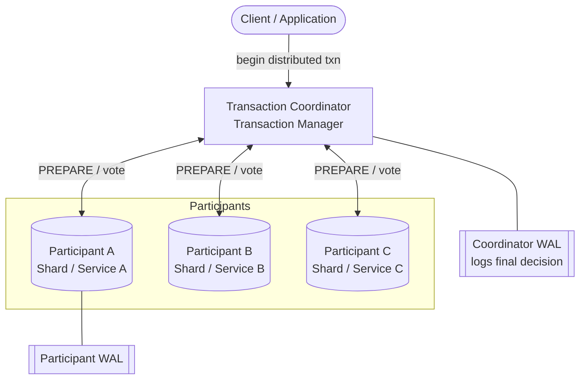
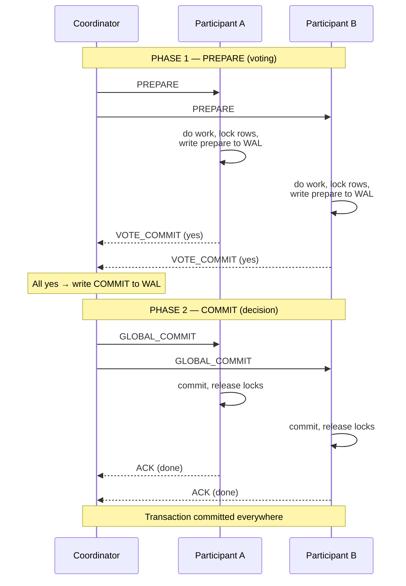
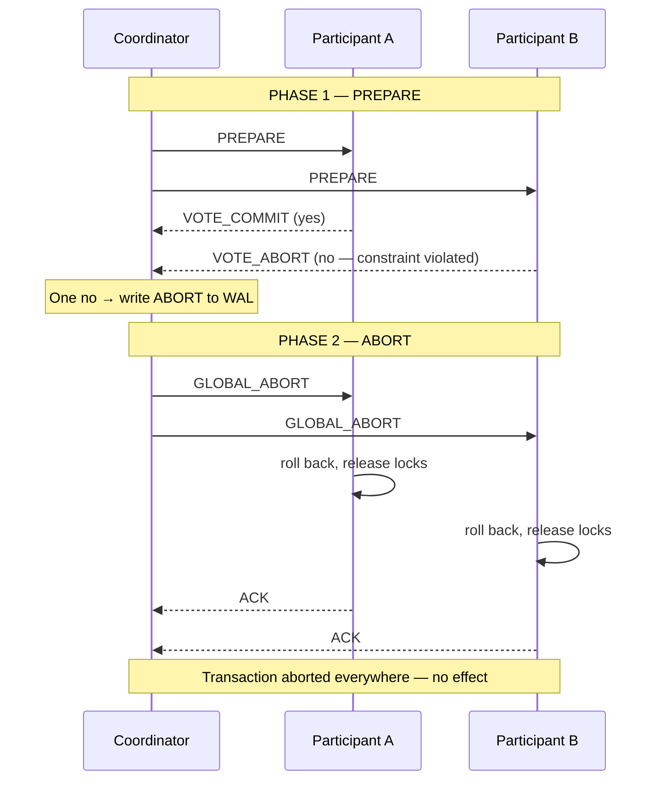
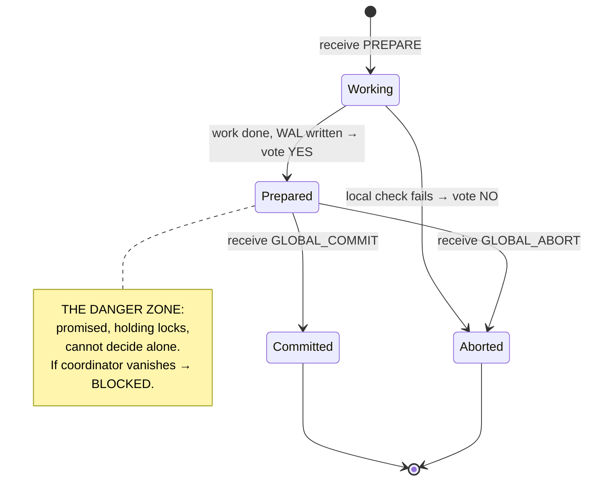
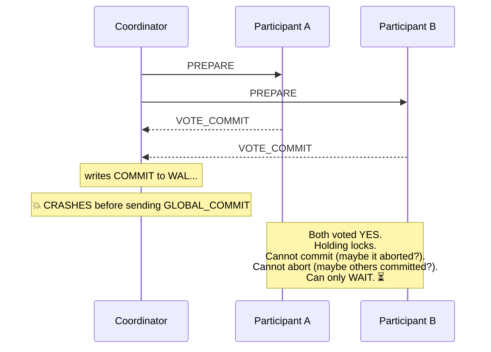
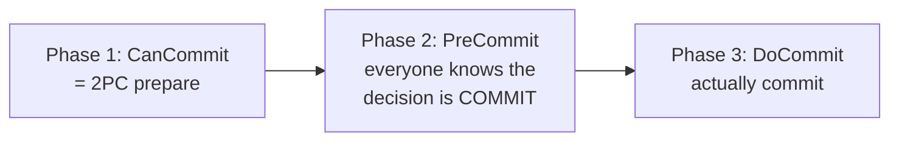

# Two-Phase Commit (2PC) — A Complete Study Guide

> **All-or-nothing across machines.** Two-Phase Commit is the classic protocol that makes a transaction spanning multiple databases, services, or nodes behave as if it ran on a single machine: either *everyone* commits, or *everyone* aborts — never a messy in-between. This guide takes you from "what even is a distributed transaction?" all the way to the per-component trade-offs and failure-window reasoning a staff engineer is expected to volunteer in an interview.

---

## 📋 Table of Contents

1. [Introduction: The Problem 2PC Solves](#-1-introduction-the-problem-2pc-solves)
2. [Core Definitions (Plain English)](#-2-core-definitions-plain-english)
3. [The Concept & Theory](#-3-the-concept--theory)
4. [Why 2PC Exists — The Root Cause](#-4-why-2pc-exists--the-root-cause)
5. [The Real Trade-off & Mechanism](#-5-the-real-trade-off--mechanism)
6. [Architecture & Sequence Diagrams](#-6-architecture--sequence-diagrams)
7. [Failure Scenarios & The Blocking Problem](#-7-failure-scenarios--the-blocking-problem)
8. [Categorized Real-World Examples](#-8-categorized-real-world-examples)
9. [Common Misconceptions](#-9-common-misconceptions)
10. [Staff/Principal-Level Nuance](#-10-staffprincipal-level-nuance)
11. [Extensions & Adjacent Concepts](#-11-extensions--adjacent-concepts)
12. [⚡ Quick Revision](#-12-quick-revision)
13. [🎓 FAANG Interview Q&A](#-13-faang-interview-qa)
14. [📝 STAR-Based Interview Questions](#-14-star-based-interview-questions)
15. [🔗 References & Further Reading](#-15-references--further-reading)

---

## 🎯 1. Introduction: The Problem 2PC Solves

Imagine you're transferring **$500 from your savings account to your checking account**. Two things must happen: money *leaves* one account and money *arrives* in the other. Either **both** happen or **neither** does. There is no acceptable middle state where $500 vanishes into the ether.

On a single database this is trivial. You wrap both `UPDATE`s in one transaction, and the database's built-in machinery (a unified log and lock manager) guarantees atomicity for free:

```sql
BEGIN;
UPDATE accounts SET balance = balance - 500 WHERE id = 1;  -- savings
UPDATE accounts SET balance = balance + 500 WHERE id = 2;  -- checking
COMMIT;
```

Now change one detail: **those two accounts live on two different database servers.** Maybe you sharded the database because it grew too large, or the accounts belong to two different microservices. Suddenly there is no single log, no single lock manager, no single `COMMIT` that both machines obey. If server A commits and server B crashes before committing, one account loses $500 and the other never receives it. Your data is now permanently inconsistent, and a customer is furious.

**This is exactly the problem Two-Phase Commit was designed to solve.** It is a coordination protocol that lets a group of independent nodes reach a *unanimous* decision — commit or abort — so that a transaction touching all of them stays atomic. It has been around since the 1970s and still ships in every major relational database.

<details>
<summary>📖 Beginner-friendly explanation</summary>

Think of 2PC like a **wedding ceremony**. The officiant (coordinator) asks each person, one at a time, "Do you take this partner?" That's Phase 1 — collecting promises. Only *after* both say "I do" does the officiant announce "I now pronounce you married" — that's Phase 2, the final commit. If *either* person says "no", nobody gets married and everyone goes home. The key trick: once you say "I do," you're bound — you can't back out on your own while the officiant is still talking. That binding promise is what makes the whole thing atomic.

</details>

---

## 🎯 2. Core Definitions (Plain English)

Before the mechanics, let's nail down the vocabulary. These terms come up constantly, and interviewers expect you to use them precisely.

**Atomicity** — The "A" in ACID. A transaction is *atomic* if it is all-or-nothing: every operation in it succeeds, or none of them take effect. A partial transaction (some operations applied, others not) is exactly what atomicity forbids. On one machine, the database gives you this. Across machines, *you* (via 2PC) must engineer it.

**Distributed transaction** — A single logical transaction whose operations touch **more than one node** — different shards, different databases, or different microservices — each of which manages its own state, locks, and durability independently.

**Distributed atomicity** — The guarantee that a transaction spanning multiple machines either completes *entirely* or has *no effect at all*. This is the property 2PC delivers.

**Coordinator (a.k.a. Transaction Manager)** — The single node that orchestrates the protocol. It initiates the transaction, asks every participant whether they can commit, collects the votes, makes the final commit/abort decision, and broadcasts that decision. Usually it's the node that initiated the transaction.

**Participant (a.k.a. Cohort or Resource Manager)** — Every *other* node involved in the transaction. Each participant executes its local piece of work, votes yes/no, and then obeys the coordinator's final verdict. Participants can be DB shards, storage engines, or microservices.

**Prepare phase (Voting phase)** — Phase 1. The coordinator asks "Can you commit?" and each participant does all the work *up to but not including* the final commit, then votes.

**Commit phase (Decision phase)** — Phase 2. Based on the votes, the coordinator tells everyone to either commit or abort, and participants act.

**Write-Ahead Log (WAL)** — A durable, append-only log on disk. Before a participant votes "yes," it writes its intended changes to the WAL so that even if it crashes and restarts, it can still honor its promise. Both coordinator and participants rely on WAL for recovery.

**In-doubt / prepared state** — The precarious state a participant is in *after* voting "yes" but *before* receiving the final decision. It has promised to commit, is holding locks, but doesn't yet know the outcome. This state is at the heart of 2PC's biggest weakness.

<details>
<summary>📖 Beginner-friendly explanation</summary>

Strip away the jargon and there are really just two roles: one **boss** (the coordinator) and several **workers** (participants). The boss runs a two-round vote. Round one: "everybody, can you do this?" Round two: "okay, everybody actually do it" (or "never mind, undo"). The WAL is each worker's **notebook** — they jot down what they promised to do before answering, so a power nap (crash) doesn't make them forget their commitment. The "in-doubt" state is a worker who raised their hand to vote yes and is now frozen mid-air, waiting to hear the result.

</details>

---

## ✅ 3. The Concept & Theory

At its heart, 2PC is a solution to a **consensus** problem — a fundamental problem in distributed computing where multiple independent machines must *agree on a single value*. Here the value is binary and simple: **commit or abort.** The difficulty isn't the decision itself; it's reaching agreement *reliably* when any node can crash and any message can be lost or delayed.

2PC splits the decision into two carefully sequenced rounds, each with a precise purpose:

**Phase 1 — Prepare (the voting round).** The coordinator sends a `PREPARE` message to every participant. Each participant then does everything needed to commit *except* the irreversible final step:

- It executes the transaction locally up to the point of commit.
- It acquires the locks on the affected rows so no other transaction can change them.
- It writes its intended changes durably to its **write-ahead log** so it can survive a crash.
- It then votes: **`VOTE_COMMIT` (yes)** if it is ready and able, or **`VOTE_ABORT` (no)** if something went wrong (a constraint violation, a conflict, a crash, insufficient balance, etc.).

Crucially, the changes are **not yet visible** to any other transaction. The data files aren't updated; only the log is. The participant is now poised on the edge, ready to jump either way.

**Phase 2 — Commit or Abort (the decision round).** The coordinator collects all the votes and applies a simple, unforgiving rule:

- If **every** participant voted yes → the coordinator writes `COMMIT` to its own log, then sends `GLOBAL_COMMIT` to everyone. Each participant makes its changes permanent, releases its locks, and acknowledges.
- If **even one** participant voted no (or failed to respond in time) → the coordinator writes `ABORT` to its log, then sends `GLOBAL_ABORT` to everyone. Each participant rolls back and frees its resources.

The rule is deliberately conservative: **unanimity is required to commit; a single dissenter forces a global abort.** This is what guarantees atomicity — there is no code path where some nodes commit while others abort (in the absence of the failure edge cases we'll cover later).

### The binding "Yes" — the single most important idea in 2PC

When a participant votes "yes," it is making an **irrevocable promise**: *"If you tell me to commit, I will commit — no matter what happens to me in the meantime, even if I crash and restart."* This is why the participant must write to its WAL *before* voting yes. After a crash-and-recovery, it reads its log, sees the prepared transaction, and knows it is still on the hook to await and honor the coordinator's decision. It cannot change its mind. Symmetrically, once the coordinator has durably logged its final decision, it will **retry forever** to deliver that decision to every participant until all acknowledge.

This promise is exactly what makes atomicity possible — and, as we'll see, it's also the root of 2PC's Achilles' heel.

<details>
<summary>📖 Beginner-friendly explanation</summary>

Picture ordering pizza for a group. Phase 1: you go around asking "will you chip in $10?" Everyone who says yes physically hands you the $10 *now* and can't ask for it back — that's the binding promise (and the WAL is them writing "I paid" on a sticky note in case they forget). Phase 2: only if *everyone* paid do you actually call and place the order; if even one person refuses, you hand all the money back and nobody orders. The money changing hands in round one is the whole trick — it's what stops someone bailing halfway.

</details>

---

## 💡 4. Why 2PC Exists — The Root Cause

To really understand 2PC, you have to understand *why the easy answer doesn't work*. The naive approach — "just tell each node to commit its part" — fails because of the fundamental reality of distributed systems: **nodes fail independently, and messages can be lost.**

Walk through the naive version. The application sends `COMMIT` to Node A, which succeeds. Then it sends `COMMIT` to Node B — but Node B has just crashed, or its disk is full, or a unique-constraint check fails. Now Node A has permanently committed and Node B has not. There is **no way to undo** Node A's commit (it's already durable and visible), and no way to force Node B to accept a change it rejected. The system is stuck in a permanently inconsistent state. One bank account was debited; the other was never credited.

The insight behind 2PC is to **separate the reversible work from the irreversible decision.** Committing is irreversible — once done, it can't be taken back. So 2PC front-loads all the risky, failure-prone work (validating constraints, acquiring locks, writing logs) into Phase 1, *where a "no" is still cheap and safe*. Only after every node has proven it *can* commit — and promised it *will* — does the coordinator authorize the single irreversible step. By the time anyone actually commits, failure is no longer an option any node is allowed to choose unilaterally.

Put differently: **2PC exists to move the "point of no return" to a moment when everyone has already agreed.** Before that point, aborting is always safe. After that point, committing is guaranteed to eventually happen everywhere. The dangerous window in between is small and, in the happy path, momentary.

Why did this become necessary? Two big architectural trends made distributed transactions unavoidable:

- **Sharding.** As data outgrows a single server, rows involved in one transaction (e.g., sender and receiver accounts) can land on different shards. A single-machine `COMMIT` no longer spans them.
- **Microservices.** Each service owns its own database. Placing an order might require the Payment service, Inventory service, and Shipping service to all succeed or all fail together — but none of them can see inside the others' databases.

In both cases, the old free lunch of single-database ACID is gone, and something has to reconstruct atomicity across the boundary. 2PC is the oldest and most direct answer.

<details>
<summary>📖 Beginner-friendly explanation</summary>

Why not just tell each database "commit now"? Because computers crash at the worst possible moment. If you tell account A "subtract $500" and it works, then tell account B "add $500" and *right then* B's server dies — A is already permanently changed and there's no undo button. The $500 is gone. 2PC fixes this by doing all the "are you sure you can?" checking first, and only pulling the trigger once everyone has locked in a promise. It moves the risky moment to *before* anything becomes permanent.

</details>

---

## 📊 5. The Real Trade-off & Mechanism

Every serious protocol makes a trade-off, and naming 2PC's trade-off precisely is what separates a textbook answer from a staff-level one. The trade-off is this:

> **2PC buys you strong consistency (atomicity across nodes) by sacrificing availability. It is a *blocking* protocol.**

This is why 2PC is sometimes called the **"anti-availability protocol."** It maps directly onto the **CAP theorem**: when forced to choose, 2PC picks **Consistency over Availability**. Under a network partition or a coordinator failure, it will *stop and wait* rather than risk an inconsistent outcome. It refuses to guess.

Let's break the mechanism down into the concrete guarantees and costs.

### The durability mechanism (why WAL is non-negotiable)

The entire protocol rests on **write-ahead logging** at two points, and both are essential:

1. **Participant logs before voting yes.** If it crashes after promising but before committing, it recovers, reads its prepare log, and knows it still owes the coordinator an answer. Without this, a crashed participant would "forget" its promise and could diverge.
2. **Coordinator logs its decision before broadcasting it.** The moment the coordinator writes `COMMIT` (or `ABORT`) to disk is the true "point of no return" for the whole transaction. If it crashes right after, it recovers, reads its log, and re-broadcasts the same decision. This is why the coordinator's decision is *idempotent and replayable* — it will retry forever until every participant acknowledges.

### The cost side of the ledger

| Cost | Why it happens | Staff-level consequence |
|------|----------------|-------------------------|
| **Blocking / anti-availability** | A participant in the "prepared" state can't unilaterally decide; it must wait for the coordinator. | If the coordinator dies at the wrong moment, participants freeze **indefinitely**, holding locks. |
| **Latency** | Every commit needs (at minimum) **two network round-trips** — prepare→vote, then decide→ack. | The transaction is as slow as the *slowest* participant. Bad for latency-critical paths. |
| **Lock contention** | Locks are held from Phase 1 all the way through Phase 2 completion. | Other transactions touching the same rows queue up behind the in-flight 2PC. Contention cascades under load. |
| **Single point of failure** | One coordinator orchestrates everything. | Coordinator down = no new decisions. Must be mitigated with replication. |
| **Scaling ceiling** | Coordination messages grow with the number of participants; timeout probability rises. | 2PC is practical for a *handful* of participants, painful for dozens. |
| **Write-throughput hit** | Forced durable log flushes (`fsync`) on both sides per transaction. | Expensive in high-write-throughput systems. |

### What 2PC guarantees vs. what it does NOT

**Guarantees:** atomicity (all-or-nothing) and, combined with 2PL locking, serializable isolation across the participants for the transaction's data.

**Does NOT guarantee:** availability under coordinator or network failure, and it does **not** by itself protect against a network partition producing divergent outcomes if messages are lost after the decision. It is safe (never *wrong*), but not *live* (can get stuck).

<details>
<summary>📖 Beginner-friendly explanation</summary>

The deal 2PC offers is like a **strict group contract**: everyone signs before anyone acts, so you're guaranteed nobody backs out and leaves a mess. The price? If the person holding the master contract (coordinator) disappears, everyone else is legally frozen — they can't act and can't walk away, they just wait. That's the "blocking" trade-off: rock-solid correctness in exchange for the possibility of everyone standing around locked up if the leader vanishes at the wrong second.

</details>

---

## 🎨 6. Architecture & Sequence Diagrams

Let's visualize the pieces and the flow. First, the topology — one coordinator fanning out to N participants:



### The happy path (everyone commits)



### The abort path (one participant votes no)



### The state machine of a single participant

Understanding the participant's states makes the failure modes obvious:



The `Prepared` state is where all the trouble lives. A participant sitting in `Prepared` has given up its autonomy — it can neither commit nor abort on its own, because doing either risks disagreeing with the rest of the group. It can only wait.

<details>
<summary>📖 Beginner-friendly explanation</summary>

Read the diagrams like a conversation. The coordinator is a group-chat admin. First it messages everyone "ready?" (Phase 1). Everyone replies "ready" or "nope." If all say ready, the admin posts "GO" (Phase 2) and everyone acts, then thumbs-up. If anyone says nope, the admin posts "cancel" and everyone undoes. The state diagram just tracks one person's mood: working → promised → (done or cancelled). The scary mood is "promised," where you've committed to acting but the admin went silent — so you're stuck staring at your phone.

</details>

---

## ❌ 7. Failure Scenarios & The Blocking Problem

This is the section interviewers dig into hardest. Anyone can recite "prepare then commit." What distinguishes a strong candidate is reasoning cleanly about *which failure at which moment causes what*, and why. Let's go window by window.

### 7.1 Participant fails

| When it fails | What happens | Why it's safe |
|---------------|--------------|---------------|
| **Before PREPARE** | Coordinator gets no vote → times out → aborts the whole transaction. | Nothing committed anywhere. Safe. |
| **After PREPARE, before voting** | Coordinator waits, times out, then aborts. | A missing vote is treated as a "no." Safe. |
| **After voting YES, then crashes** | On recovery it reads its WAL, sees the prepared txn, and *asks the coordinator* what was decided, then honors it. | The WAL preserved the promise. Safe — but the participant was in-doubt while down. |

Participant failures are mostly *tolerable* because the coordinator can default to abort when a vote is missing, and a recovered participant can re-sync from its log.

### 7.2 Coordinator fails — the dangerous one

The coordinator is the single point of failure, and *when* it dies changes everything:

| When the coordinator fails | Outcome |
|----------------------------|---------|
| **Before sending PREPARE** | No impact — the transaction is simply abandoned; nobody did anything. |
| **After PREPARE, before deciding** | On recovery the coordinator has no logged decision, so it safely **aborts** and tells everyone to abort. Participants that timed out may have already aborted. Safe. |
| **After logging the decision, before broadcasting it** | On recovery it reads its log and **re-broadcasts** the same decision. Safe, because the decision was durable. |
| **After logging COMMIT, crashes, and stays down** | 💥 **The blocking problem.** Participants voted yes, are holding locks, and cannot proceed until the coordinator returns. |

### 7.3 The Blocking Problem in detail

This is *the* defining weakness of 2PC. The exact sequence:



Why can't the participants just decide for themselves?

- **They can't unilaterally commit** — what if the coordinator actually decided to *abort*, and some other participant already aborted? Committing would break atomicity.
- **They can't unilaterally abort** — what if the coordinator decided to *commit* and already told some other participant to commit? Aborting would break atomicity.
- **Asking peers doesn't help** — if the peers are also in-doubt, nobody knows the answer. Only the coordinator knew, and it's gone.

So the only *safe* action is to **wait** — potentially minutes, hours, days, or (if the coordinator's disk is corrupted) forever. And **timeouts don't rescue you here**: a prepared participant is bound by its promise and cannot abort just because time passed. Meanwhile, the locks it holds block every other transaction that needs those rows, and in a busy system that contention **cascades fast**. Ultimately a human DBA may have to log in and manually resolve the in-doubt transactions.

### 7.4 Network partition

A partition is a coordinator failure's evil twin: the coordinator is *alive* but *unreachable* for some participants. Those participants can't get the decision and block exactly as above. Worse, if messages are lost *after* a decision, some nodes may have already committed while others sit in-doubt — a temporary divergence that only resolves once the partition heals and the coordinator re-delivers the decision. This is precisely why 2PC "picks C over A" in CAP terms.

<details>
<summary>📖 Beginner-friendly explanation</summary>

The nightmare scenario: everyone at the wedding said "I do," and right before the officiant says "you're married," the officiant faints and won't wake up. Now the couple is in limbo — they can't declare themselves married (maybe the officiant was about to object) and can't call it off (maybe they *are* married in the eyes of some guests who heard something). Everyone just... stands there, frozen, blocking the next wedding from starting. That frozen state, with the venue (locks) tied up, is the blocking problem.

</details>

---

## 💻 8. Categorized Real-World Examples

2PC survives in production wherever **strong consistency matters more than availability** and the environment is *controlled* — few participants, reliable network, well-run datacenter. Here's where it actually shows up, grouped by domain.

### 🗄️ Category 1: Distributed & relational databases

This is 2PC's home turf. When one logical operation must span multiple storage engines or shards atomically, databases reach for 2PC.

- **PostgreSQL prepared transactions.** Postgres exposes 2PC directly through `PREPARE TRANSACTION` / `COMMIT PREPARED`. This is the cleanest real example to cite in an interview (details below).
- **PostgreSQL Foreign Data Wrapper (FDW).** Coordinates commits across external/foreign backends using a 2PC variant.
- **MySQL XA transactions.** MySQL implements the **XA standard** (the X/Open DTP model) — the industry-standard formalization of 2PC — to coordinate across multiple resource managers.
- **Google Spanner.** Uses 2PC for multi-shard transactions, but crucially each 2PC *participant is itself a Paxos group* (more on this mitigation later).

<details>
<summary>💻 PostgreSQL prepared transactions — the concrete example to cite</summary>

```sql
-- Phase 1: prepare (on each participating database)
BEGIN;
UPDATE accounts SET balance = balance - 500 WHERE id = 1;
PREPARE TRANSACTION 'txn-transfer-001';
-- Postgres has now written the txn to disk in a "prepared" state:
-- ready to commit, holding locks, but not yet committed.

-- Phase 2: the coordinator issues the final verdict
COMMIT PREPARED 'txn-transfer-001';
-- or, if any participant failed:
ROLLBACK PREPARED 'txn-transfer-001';
```

**Key detail:** `COMMIT PREPARED` can be issued by *any* session — not just the one that prepared it. So even if the original connection dies, a recovery process can resolve the transaction. You can inspect stuck in-doubt transactions with:

```sql
SELECT * FROM pg_prepared_xacts;
```

Postgres explicitly warns that prepared transactions left in-doubt for too long are a **serious operational hazard** (they hold locks), and recommends monitoring `pg_prepared_xacts` and alerting if anything lingers. This is 2PC's blocking problem made concrete: `PREPARE TRANSACTION` solves *recovery* but not *availability*.

</details>

### 📨 Category 2: Messaging systems & exactly-once processing

Message brokers use 2PC-style coordination to tie a message send to a database update atomically — the foundation of **exactly-once** semantics.

- **Apache Flink.** Flink's `TwoPhaseCommitSinkFunction` uses 2PC between its checkpoint mechanism and external sinks (e.g., Kafka) to deliver **end-to-end exactly-once** processing. A checkpoint "prepares" the sink; the checkpoint completing "commits" it.
- **Kafka transactions.** Not a pure classical 2PC, but the design borrows heavily from commit-phase logic. A transaction coordinator guarantees a batch of messages across partitions is either **fully visible or fully discarded** (atomic writes).
- **JMS / Java EE (XA).** Traditional Java Message Service infrastructures use XA 2PC to coordinate an application server, a message queue, and a database so a message is delivered atomically with the related DB update.

### 🏦 Category 3: Enterprise systems requiring strict consistency

- **Banking & financial ledgers** — money must never be created or destroyed; strict atomicity across accounts/ledgers outweighs availability.
- **Inventory management & ERP platforms** — stock counts and orders must stay consistent.
- These run in **controlled datacenter environments** with well-defined operational procedures, which is exactly what makes the blocking risk manageable.

### 🛒 Category 4: Microservices checkout (a cautionary example)

An e-commerce "Place Order" click can touch Cart, Order, Inventory, Payment, and Shipping services. In *theory* 2PC gives perfect atomicity here. In *practice* it's usually the **wrong** choice — services span datacenters, hold locks while waiting on a coordinator, and a coordinator crash can leave 10,000 carts hanging in limbo. This is the canonical case where teams choose the **Saga pattern** instead (covered in §11).

<details>
<summary>📖 Beginner-friendly explanation</summary>

Where do you actually find 2PC in the wild? Mostly *inside databases* doing careful multi-server bookkeeping — Postgres, MySQL (XA), Spanner — and in messaging tools like Flink and Kafka that promise "process each event exactly once." You'll also find it in banks and ERP systems where being *correct* beats being *fast*. Where you *won't* (or shouldn't) find it: sprawling microservice checkouts across the internet — too many moving parts, too much locking, too fragile. There, teams use Sagas.

</details>

---

## ❌ 9. Common Misconceptions

These trip up candidates constantly. Getting them right signals depth.

**❌ "2PC and 2PL (Two-Phase Locking) are the same thing."**
No — they're entirely different, and the similar names cause endless confusion. **2PL** is a *locking* algorithm that achieves *serializability* (preventing concurrent modification of the same data) — it operates within a *single* machine's transaction manager. **2PC** is an *atomic commit* algorithm across *multiple* machines. They're related only in that 2PC often *uses* 2PL locally on each participant to hold the affected rows steady during the distributed transaction.

**❌ "3PC fixes 2PC, so we should use 3PC in production."**
3PC does eliminate the *blocking on coordinator failure* problem in theory, but it relies on **synchronous network assumptions** (bounded message delivery) that rarely hold in the real world, and it still can't handle **network partitions** safely — a partition can cause two sides to reach *different* decisions, which is even worse than blocking. 3PC is essentially a *teaching tool*; modern systems use Paxos/Raft instead.

**❌ "The blocking problem means 2PC can produce wrong/inconsistent data."**
Not in the coordinator-crash case. 2PC is **safe** — it never *violates* atomicity when the coordinator alone fails; it just gets *stuck* (a liveness/availability failure, not a safety failure). It sacrifices progress, not correctness. (True *divergence* requires a network partition with lost post-decision messages.)

**❌ "A participant can just time out and abort if the coordinator is slow."**
Only *before* it has voted yes. Once a participant is in the **prepared** state, it has made a binding promise and **cannot** abort on a timeout — it must await the coordinator's decision. This is the whole reason the blocking problem exists.

**❌ "Kafka's exactly-once is textbook 2PC."**
Kafka *borrows* 2PC's commit-phase logic but isn't a pure classical 2PC implementation; its transaction coordinator and idempotent-producer design differ from the DBMS model.

**❌ "2PC guarantees availability because everyone agrees."**
Backwards. 2PC's unanimity requirement is exactly what *reduces* availability — it needs *all* nodes up and reachable, so the more participants you add, the more fragile it gets.

<details>
<summary>📖 Beginner-friendly explanation</summary>

The single most common mix-up: **2PL ≠ 2PC**. Same "two-phase" name, totally different jobs. 2PL is about *not letting two people edit the same row at once* (locking, one machine). 2PC is about *making several machines agree to commit together* (atomicity, many machines). The second big one: people think "blocking" means "2PC corrupts data." It doesn't — it just *freezes*. Frozen is annoying, but it's still correct. Corruption is a different, worse failure that needs a network split to occur.

</details>

---

## 🎓 10. Staff/Principal-Level Nuance

This is the reasoning experienced engineers volunteer *unprompted* — the difference between "I know 2PC" and "I've operated 2PC and know where the bodies are buried."

### Making the coordinator not a single point of failure

The textbook says "coordinator is a SPOF." The staff-level follow-up is *how to remove it*. The answer isn't 3PC — it's to **make the coordinator's decision log itself fault-tolerant** by replicating it through a consensus protocol.

**Google Spanner** is the canonical example: it runs 2PC *on top of* Paxos. Data is divided into groups, and **each 2PC participant is itself a Paxos group** (a replicated set of nodes). So a "member" of the 2PC stays highly available even if some of its underlying replicas are down, and the coordinator's state is replicated too. This is the elegant resolution: **use 2PC for atomicity across shards, and consensus for availability within each shard.** You get atomic commit *and* fault tolerance, at the cost of significant complexity and latency.

### 2PC layered over consensus (the modern pattern)

Generalizing Spanner: modern distributed databases treat 2PC and consensus as *complementary, not competing*.

- **Consensus (Paxos/Raft)** replicates each shard/participant so it survives node failure and can elect a new leader — solving *availability* and the SPOF.
- **2PC** sits above, coordinating the *atomic commit* across those already-fault-tolerant shards — solving *cross-shard atomicity*.

Saying this out loud in an interview immediately signals seniority, because it reframes "2PC vs. Raft" (a false dichotomy many candidates fall into) as "2PC *and* Raft."

### Tuning knobs and operational levers

Real 2PC deployments are configurable, and knowing the levers matters:

- **Presumed-abort / presumed-commit optimizations.** By adopting a convention (e.g., "if no decision is logged, presume abort"), the coordinator can skip certain log writes and ACKs, cutting the number of forced disk flushes and messages. Presumed-abort is the common default.
- **Timeout tuning.** Prepare-phase timeouts trade off between aborting too eagerly (wasting work on a slow-but-healthy participant) and waiting too long (holding locks and hurting throughput).
- **Coordinator recovery & in-doubt resolution.** Production systems need automated recovery daemons plus monitoring/alerting on in-doubt transactions (e.g., watching `pg_prepared_xacts`), because a forgotten prepared transaction silently holds locks.
- **Read-only participant optimization.** A participant that only *read* data can be released after voting (it has nothing to commit), shortening its lock-hold and skipping Phase 2 for that node.
- **Lock-hold duration is the real throughput killer.** The dominant cost in practice isn't the two round trips — it's that locks are held across *both* phases, serializing every conflicting transaction behind the slowest participant. Minimizing participant count and keeping the prepare→commit window tight is the main performance lever.

### The honest "why do we still use it" answer

Despite the flaws, 2PC persists for grounded reasons: it's **simple and universally understood**, **every major database supports it**, coordinators **don't actually crash often** (the blocking problem is a worst case, not a daily event), the alternatives (Paxos/Raft) are **harder and higher-latency**, and for **small transactions with rare coordinator crashes, a brief lock is an acceptable trade**. A staff engineer chooses 2PC deliberately for small-participant, high-consistency, controlled-environment problems — and reaches for Sagas or consensus elsewhere.

### Linearizability angle

The blocking, synchronous nature of 2PC is not purely a bug — it's also what lets it enforce a **linearizable order** on writes across participants. If your requirement is a strictly consistent, linearizable view of data at all times, that blocking behavior is buying you something real. This reframes "blocking = bad" into "blocking = the price of linearizability," which is the nuanced take.

<details>
<summary>📖 Beginner-friendly explanation</summary>

The pro move in an interview: when asked "the coordinator is a single point of failure — how do you fix it?", *don't* say "use 3PC." Say: "make the coordinator replicated using consensus like Paxos or Raft — that's exactly what Google Spanner does, running 2PC on top of Paxos groups so each participant is itself fault-tolerant." That single sentence shows you understand 2PC and consensus are teammates, not rivals — 2PC handles *agreeing to commit together*, consensus handles *surviving crashes*. Also worth saying: the real performance cost isn't the network trips, it's the *locks held the whole time*.

</details>

---

## 🔗 11. Extensions & Adjacent Concepts

2PC sits in a family of protocols. Knowing the neighbors — and precisely how they differ — is essential for the "what would you use instead?" follow-up.

### Three-Phase Commit (3PC)

3PC inserts an extra **PreCommit** phase between prepare and commit:



The PreCommit phase ensures that before anyone commits, *everyone knows a unanimous commit decision was reached*. So if the coordinator then dies, participants have enough information to **commit autonomously after a timeout** — making 3PC **non-blocking** on coordinator failure. Sounds great, but: it assumes a **synchronous network** (bounded delays) and **still fails under network partitions**, where two partitions can independently reach different decisions. Because real networks are asynchronous and partition, **3PC is mostly of theoretical interest** and rarely used in production.

### Consensus protocols: Paxos & Raft

The modern successors. Instead of requiring *all* nodes to agree (2PC), they require only a **majority quorum**. This relaxation is powerful:

- **They tolerate minority failures** — the system keeps making progress as long as a majority is alive.
- **They elect a new leader** automatically if the current one fails — no single point of failure, no indefinite blocking.
- **They handle partitions safely** — the majority side continues; the minority side stops, and no divergence occurs.

Trade-off: Paxos/Raft achieve *consensus on a value / replicated log*, not *atomic commit across heterogeneous resources* per se. They power etcd, ZooKeeper (ZAB), Google Spanner's replication, CockroachDB, and more. **Rule of thumb:** unless atomic commit across distinct resources is strictly required, prefer consensus for its availability and performance benefits.

### The Saga pattern (the microservices answer)

Instead of forcing distributed atomicity, a **Saga** breaks a long transaction into a *sequence of local transactions*, each with a **compensating action** that undoes it. If step 3 fails, you run the compensations for steps 2 and 1 in reverse — semantically "undoing" rather than rolling back.


Sagas favor **availability and loose coupling** at the cost of **weaker (eventual) consistency** — there's a window where the system is partially applied. No locks, no blocking coordinator. This is why microservices architectures overwhelmingly prefer Sagas over 2PC. Sagas *embrace* the uncertainty of distributed systems, whereas 2PC tries to *hide* it behind strict coordination.

### Complementary patterns you'll cite alongside Sagas

- **Outbox pattern** — reliably publish events as part of a local DB transaction (no lost events).
- **Idempotency keys** — make retries safe so a duplicated "charge payment" doesn't double-charge.
- **Retry + Dead Letter Queues** — absorb transient failures without human intervention.
- **Eventual-consistency monitoring** — detect when compensations lag or fail.

### Concurrency-control cousins

- **Two-Phase Locking (2PL)** — a *locking* scheme for serializability on one machine (not to be confused with 2PC; see §9).
- **Optimistic Concurrency Control (OCC)** — assume conflicts are rare, run without locks, validate at commit; great for read-heavy, low-contention workloads.
- **Pessimistic Concurrency Control (PCC)** — lock early to prevent conflicts; good under high contention (2PC's local behavior is pessimistic).

### Choosing the right tool

| Requirement | Best fit |
|-------------|----------|
| Strict atomic commit across a few controlled resources | **2PC / XA** |
| Fault-tolerant agreement, high availability, survive crashes | **Paxos / Raft** |
| Long-running, loosely-coupled microservice workflows | **Saga** |
| Reduce 2PC blocking (academic) | **3PC** (with big caveats) |
| Serializability within one machine | **2PL** |

<details>
<summary>📖 Beginner-friendly explanation</summary>

Think of the family tree like this: **2PC** = "all of us commit together or none of us do" (strict, can freeze). **3PC** = 2PC with a safety buffer so it won't freeze — but it's fragile and basically only lives in textbooks. **Paxos/Raft** = "majority rules" — no single boss to lose, survives crashes, powers real systems like Spanner and etcd. **Saga** = "don't even try to be atomic; just do each step and keep an *undo* button for each" — the go-to for microservices because nothing freezes and nothing locks. Pick based on whether you value being *correct-together* or *always-available* more.

</details>

---

## ⚡ 12. Quick Revision

**What it is.** Two-Phase Commit (2PC) is an atomic commit protocol that makes a transaction spanning multiple nodes all-or-nothing: every participant commits, or every participant aborts. One node is the **coordinator** (transaction manager); the rest are **participants** (cohorts). It solves *distributed atomicity* — the problem that a single-machine `COMMIT` can't span sharded databases or independent microservices, so a crash mid-way would otherwise leave data permanently inconsistent (money debited from one account, never credited to the other).

**The two phases.** In **Phase 1 (Prepare / voting)**, the coordinator asks every participant "can you commit?" Each participant does all the work except the final commit — executes locally, acquires locks, and writes its intended changes to its **write-ahead log (WAL)** — then votes `VOTE_COMMIT` or `VOTE_ABORT`. The changes are *not yet visible*. In **Phase 2 (Commit / decision)**, the coordinator applies a strict rule: if *all* voted yes, it logs `COMMIT` and broadcasts `GLOBAL_COMMIT`; if *even one* voted no or didn't respond, it logs `ABORT` and broadcasts `GLOBAL_ABORT`. Unanimity is required to commit; one dissenter forces a global abort.

**The binding "Yes."** The linchpin idea: once a participant votes yes, it has made an *irrevocable promise* to commit if told to — even across a crash. That's why it must write to WAL *before* voting: on recovery it reads the log, sees the prepared transaction, and knows it still owes the coordinator obedience. Symmetrically, once the coordinator logs its decision, it retries *forever* until every participant acknowledges. The whole protocol works by separating reversible work (Phase 1, where "no" is cheap) from the irreversible commit (Phase 2, after everyone has already agreed) — it moves the point-of-no-return to a moment when consensus already exists.

**The trade-off.** 2PC buys strong consistency (atomicity) by sacrificing availability — it's a **blocking** protocol, the "anti-availability protocol." In CAP terms it picks **C over A**. Costs: two network round-trips per commit (latency), locks held across *both* phases (contention — the real throughput killer), a coordinator that's a single point of failure, and a scaling ceiling as participants grow.

**Failure reasoning.** Participant failures are mostly tolerable — a missing vote is treated as "no" and aborted; a crashed-after-yes participant recovers from WAL and asks the coordinator. The dangerous case is **coordinator failure after logging COMMIT but before broadcasting it**: participants have voted yes, hold locks, and are stuck **in-doubt** — they can't commit (maybe it aborted), can't abort (maybe others committed), and can't be rescued by a timeout (their promise is binding). This is the **blocking problem**: they wait indefinitely, holding locks that cascade contention through the system, sometimes needing manual DBA intervention. Note this is a *liveness* failure (stuck), not a *safety* failure (wrong) — 2PC stays correct; only a network partition with lost post-decision messages can cause true divergence.

**Where it's used.** Databases: **PostgreSQL** (`PREPARE TRANSACTION` / `COMMIT PREPARED`, inspect via `pg_prepared_xacts`), **MySQL XA**, PostgreSQL FDW, **Google Spanner**. Messaging / exactly-once: **Apache Flink** (`TwoPhaseCommitSinkFunction`), **Kafka transactions** (2PC-inspired, not pure), JMS/XA. Enterprise: banking ledgers, ERP, inventory — controlled datacenters where consistency beats availability. It's a *poor* fit for sprawling microservice checkouts (too much locking and coupling) — those use **Sagas**.

**Key misconceptions.** 2PC ≠ 2PL: 2PL is single-machine *locking for serializability*; 2PC is multi-machine *atomic commit* (2PC uses 2PL locally). 3PC doesn't "fix" 2PC for production — it removes blocking only under synchronous-network assumptions and still breaks under partitions, so it's mostly academic. Blocking ≠ data corruption — it's frozen, not wrong.

**Staff-level takeaways.** The SPOF fix isn't 3PC — it's replicating the coordinator/participants via **consensus (Paxos/Raft)**, exactly what **Spanner** does by making each 2PC participant a Paxos group. So 2PC and consensus are *complementary*: 2PC gives cross-shard atomicity, consensus gives per-shard availability. Tuning levers: presumed-abort optimization (fewer log flushes), timeout tuning, read-only participant release, automated in-doubt recovery + monitoring. The dominant cost is *lock-hold duration across both phases*, not the round-trips. And blocking isn't purely a flaw — it's also what enforces *linearizability*.

**Alternatives at a glance.** **3PC** = extra PreCommit phase to avoid blocking (academic). **Paxos/Raft** = majority-quorum consensus, survives crashes, no SPOF (etcd, Spanner, CockroachDB). **Saga** = sequence of local transactions with compensating actions, embraces eventual consistency, non-blocking — the microservices default, paired with Outbox, idempotency keys, and DLQs.

---

## 🎓 13. FAANG Interview Q&A

*20 of the most frequently asked questions. The first 10 are foundational (L3/L4); the last 10 are staff-level (L5/L6) trade-off and design questions.*

### Foundational (L3 / L4)

<details>
<summary><b>Q1. What is Two-Phase Commit and what problem does it solve?</b></summary>

2PC is an atomic-commit protocol that guarantees a transaction spanning multiple nodes either commits everywhere or aborts everywhere — no partial results. It solves *distributed atomicity*: on a single database, ACID gives you all-or-nothing for free via one log and lock manager, but once data is sharded or split across microservices, a single `COMMIT` can't span them. Without coordination, node A could commit and node B crash before committing, leaving, say, one bank account debited and the other never credited. 2PC coordinates a unanimous commit/abort decision across all of them. Real example: **PostgreSQL's `PREPARE TRANSACTION`** implements exactly this to coordinate multi-database commits.

</details>

<details>
<summary><b>Q2. Walk me through the two phases.</b></summary>

**Phase 1 (Prepare/voting):** the coordinator sends `PREPARE` to all participants. Each does the transaction work up to (but not including) commit — executes locally, acquires row locks, and writes its intended changes to its WAL — then votes `VOTE_COMMIT` or `VOTE_ABORT`. Nothing is visible yet. **Phase 2 (Commit/decision):** if *all* voted yes, the coordinator logs `COMMIT` and sends `GLOBAL_COMMIT`; if *any* voted no or timed out, it logs `ABORT` and sends `GLOBAL_ABORT`. Participants act and acknowledge. The asymmetry is key: unanimity commits, a single "no" aborts. Example: in MySQL **XA**, these map to `XA PREPARE` then `XA COMMIT` / `XA ROLLBACK`.

</details>

<details>
<summary><b>Q3. What does voting "Yes" actually mean, and why must a participant write to disk before voting?</b></summary>

A "yes" vote is a *binding, irrevocable promise*: "if you tell me to commit, I will commit — even if I crash and restart in between." To honor that across a crash, the participant must durably write the transaction to its **write-ahead log before** sending the yes. On recovery it replays the log, sees the prepared transaction, and knows it's still obligated to await and obey the coordinator's decision. If it voted yes *before* logging and then crashed, it would forget its promise and could diverge from the group — breaking atomicity. This is the single most important invariant in 2PC.

</details>

<details>
<summary><b>Q4. What is the role of the coordinator?</b></summary>

The coordinator (transaction manager) orchestrates everything: it initiates the transaction, sends `PREPARE`, collects votes, makes the final commit/abort decision, durably logs that decision, and broadcasts it — retrying forever until every participant acknowledges. It's usually the node that started the transaction. Critically, it must write its decision to disk *before* broadcasting, so that if it crashes it can recover and re-send the same decision idempotently. The flip side: this centralization makes it a **single point of failure**, which is 2PC's core operational risk.

</details>

<details>
<summary><b>Q5. Why is 2PC called a "blocking" protocol?</b></summary>

Because a participant that has voted yes (the *prepared* state) cannot make progress on its own — it must wait for the coordinator's decision, holding locks the whole time. If the coordinator crashes after participants vote yes but before delivering the decision, those participants are stuck **in-doubt**: they can't commit (the coordinator might have decided abort) and can't abort (it might have decided commit and told others). Timeouts don't help because their promise is binding. They block — potentially indefinitely — and their held locks cascade contention to other transactions. Hence the nickname "anti-availability protocol."

</details>

<details>
<summary><b>Q6. What happens if a participant crashes at various points?</b></summary>

If it crashes *before* voting, the coordinator times out and safely aborts the whole transaction (a missing vote = "no"). If it crashes *after* voting yes, on recovery it reads its WAL, finds the prepared transaction, and queries the coordinator (or awaits its retried message) to learn the outcome, then honors it. So participant failures are largely recoverable and safe — the WAL preserves the promise. The genuinely dangerous failure is the *coordinator's*, not a participant's, because only the coordinator knows the final decision.

</details>

<details>
<summary><b>Q7. How does PostgreSQL implement 2PC?</b></summary>

Through **prepared transactions**. You run your work then `PREPARE TRANSACTION 'txn-id'`, which durably writes the transaction to disk in a prepared (in-doubt) state — ready to commit, holding locks, not yet committed. Later, `COMMIT PREPARED 'txn-id'` or `ROLLBACK PREPARED 'txn-id'` finalizes it — and importantly, *any* session can issue these, so a recovery process can resolve it even if the original connection died. You inspect stuck ones via `SELECT * FROM pg_prepared_xacts;`. Postgres warns these are an operational hazard if left in-doubt (locks held), and recommends monitoring/alerting — a concrete manifestation of the blocking problem.

</details>

<details>
<summary><b>Q8. What is the difference between 2PC and 2PL?</b></summary>

They're completely different despite the similar name. **2PL (Two-Phase Locking)** is a concurrency-control/locking algorithm that achieves *serializability* on a *single* machine — it has a growing phase (acquire locks) and a shrinking phase (release locks). **2PC (Two-Phase Commit)** is an *atomic commit* protocol across *multiple* machines. Their only relationship: 2PC typically *uses* 2PL locally on each participant to hold the affected rows steady during the distributed transaction. Confusing them is a classic interview red flag.

</details>

<details>
<summary><b>Q9. How does 2PC relate to the CAP theorem?</b></summary>

2PC firmly chooses **Consistency over Availability**. It requires all participants (and the coordinator) to be up and reachable to complete, and under a coordinator failure or network partition it *stops and waits* rather than risk an inconsistent outcome. So when a partition occurs, 2PC sacrifices availability (participants block) to preserve consistency (atomicity). This is exactly why highly available systems — many NoSQL stores — avoid 2PC and instead use partitioned data models, eventual consistency, or conditional writes that keep serving under partition.

</details>

<details>
<summary><b>Q10. Give a concrete real-world example of 2PC in action.</b></summary>

A **money transfer across two sharded accounts**. Account 1 (savings) lives on shard A, account 2 (checking) on shard B. The coordinator sends `PREPARE` to both. Shard A locks account 1, writes "debit $500" to its WAL, votes yes; shard B locks account 2, writes "credit $500," votes yes. Both yes → coordinator logs COMMIT, sends `GLOBAL_COMMIT` — both apply and release locks. If shard B had failed a constraint (e.g., account frozen) and voted no, the coordinator would send `GLOBAL_ABORT` and shard A would roll back its debit. Either $500 moves fully or not at all. In practice this runs via Postgres prepared transactions or MySQL XA.

</details>

### Staff / Principal Level (L5 / L6)

<details>
<summary><b>Q11. The coordinator is a single point of failure. How would you eliminate it — and don't say 3PC.</b></summary>

Replicate the coordinator's decision state through a **consensus protocol (Paxos/Raft)** so the "who decided what" log survives any single crash and a new coordinator can take over deterministically. The canonical production example is **Google Spanner**, which runs 2PC *on top of* Paxos: each 2PC participant is itself a **Paxos group**, so a participant stays available even if some of its replicas are down, and the coordinator's log is replicated too. The key insight is that 2PC and consensus are *complementary, not competing*: 2PC provides cross-shard atomicity, consensus provides per-shard availability and removes the SPOF. 3PC is the wrong answer because it only helps under synchronous-network assumptions and still fails under partitions.

</details>

<details>
<summary><b>Q12. What's the real performance bottleneck in 2PC — the round trips or something else?</b></summary>

Most people say "two network round-trips," and that's part of it, but the dominant cost in practice is **lock-hold duration**. Locks acquired in Phase 1 are held all the way through Phase 2 completion, so every other transaction touching those rows serializes behind the in-flight 2PC — and the whole transaction runs at the speed of the *slowest* participant. Under contention this cascades: one slow participant stalls a chain of waiting transactions. That's why the main tuning levers are minimizing participant count, keeping the prepare→commit window tight, and releasing read-only participants early. The `fsync` cost of the durable log flushes on both sides is the secondary hit.

</details>

<details>
<summary><b>Q13. Why isn't 3PC used in production if it solves the blocking problem?</b></summary>

3PC adds a **PreCommit** phase so that before anyone commits, everyone knows a unanimous commit was decided — letting participants commit autonomously after a timeout if the coordinator vanishes, which does make it non-blocking *in theory*. But it relies on two fragile assumptions: a **synchronous network** with bounded message delays (timeout-based correctness needs guaranteed delivery windows, rare in real async networks), and it **cannot handle network partitions** — a split can cause two partitions to independently reach *different* decisions, which is worse than blocking because it violates safety. Modern consensus (Paxos/Raft) solves the same problems more robustly, so 3PC remains mostly a teaching tool.

</details>

<details>
<summary><b>Q14. When would you choose a Saga over 2PC, and what do you give up?</b></summary>

Choose a Saga for **long-running, loosely-coupled workflows across microservices** — e.g., an e-commerce checkout touching Cart, Payment, Inventory, and Shipping services across different datacenters. 2PC would force those services to hold locks and stay coupled while waiting on a coordinator, and a coordinator crash could freeze thousands of orders. A Saga instead runs a *sequence of local transactions*, each with a **compensating action** (refund payment, release inventory) to undo on failure — no distributed locks, no blocking. What you give up is *atomicity/isolation*: you get **eventual consistency** with a visible window where the system is partially applied, so you need idempotency keys, an outbox for reliable events, and monitoring for failed compensations. Sagas embrace distributed uncertainty; 2PC tries to hide it.

</details>

<details>
<summary><b>Q15. How does Apache Flink use 2PC for exactly-once processing?</b></summary>

Flink ties its **checkpoint** mechanism to external sinks via `TwoPhaseCommitSinkFunction`. When a checkpoint barrier flows through, each sink *pre-commits* its buffered output to external storage (e.g., opens a Kafka transaction or writes to a staging area) — the "prepare." Only when the checkpoint *completes globally* does Flink signal the sinks to *commit* — the "commit." If a failure occurs before the checkpoint completes, the pre-committed data is rolled back/discarded on restore, so no partial output becomes visible. This gives **end-to-end exactly-once**: because not all sinks are idempotent, 2PC is the mechanism that makes "process each record exactly once, visible atomically with the checkpoint" possible. Kafka transactions borrow the same commit-phase logic.

</details>

<details>
<summary><b>Q16. Is the blocking problem a safety violation or a liveness violation? Why does the distinction matter?</b></summary>

It's a **liveness** (availability/progress) failure, not a **safety** (correctness) failure. When the coordinator alone crashes, 2PC never produces an *inconsistent* result — participants stay in-doubt and *wait*, which is annoying but still correct; when the coordinator recovers, it re-delivers the logged decision and everyone converges. The distinction matters enormously in design: it tells you the mitigation is about *restoring progress* (coordinator replication, faster recovery, in-doubt monitoring), not about *fixing correctness*. True *safety* violation (divergent commit/abort) only arises under a **network partition** where post-decision messages are lost and something like 3PC lets partitions decide independently. Framing it this way shows you understand *what* you're actually protecting.

</details>

<details>
<summary><b>Q17. What optimizations exist to reduce 2PC's overhead in a real system?</b></summary>

Several. **Presumed-abort** (the common default): adopt the convention that if no decision is logged, presume abort — this lets the coordinator skip certain forced log writes and ACKs for aborted transactions, cutting disk flushes and messages. **Read-only optimization:** a participant that only read data votes "read-only," commits nothing, releases locks immediately, and skips Phase 2 entirely. **Timeout tuning** balances aborting too eagerly (wasting a slow-but-healthy participant's work) against holding locks too long. **Coordinator log batching / group commit** amortizes `fsync` costs across transactions. And operationally, **automated in-doubt recovery daemons** plus alerting (e.g., on `pg_prepared_xacts`) prevent forgotten prepared transactions from silently holding locks. These are the knobs an experienced operator actually turns.

</details>

<details>
<summary><b>Q18. Why do many NoSQL databases avoid 2PC entirely?</b></summary>

Because 2PC's coordination overhead and blocking behavior directly conflict with NoSQL's core design goals of **high availability and horizontal scalability** — the very properties they chose over strong consistency per CAP. 2PC needs all participants up and reachable, adds multi-round-trip latency, holds locks, and blocks under partition; that's antithetical to a system built to stay available under node loss and partition. So instead these systems use **partitioned data models, eventual consistency, conditional/compare-and-swap writes, and single-partition transactions**, deliberately avoiding cross-node global transactions. DynamoDB, for example, offers limited transactional constructs but steers you toward single-partition, idempotent operations rather than sprawling 2PC.

</details>

<details>
<summary><b>Q19. In what sense is 2PC's blocking behavior actually a feature?</b></summary>

Its synchronous, all-must-agree, block-until-decided nature is exactly what lets 2PC enforce a **linearizable order** on writes across participants — every observer sees the committed transaction as happening atomically at a single point in time, with no window where some nodes show the new value and others the old. If your requirement is a strictly consistent, linearizable view of data at all times (financial ledgers, inventory correctness), that blocking is *buying* you the guarantee, not just costing you availability. The staff-level reframe: "blocking is the price of linearizability." You accept reduced availability precisely because the alternative — serving reads during an ambiguous window — would violate the consistency you actually need.

</details>

<details>
<summary><b>Q20. Design a system to transfer money between two accounts on different shards with strong consistency. Walk through your choices.</b></summary>

I'd use **2PC/XA** here because the requirement is strict atomicity across a *small, fixed* number of participants (two shards) in a *controlled* environment — 2PC's sweet spot. A coordinator sends `PREPARE`; each shard locks its row, validates (sufficient balance, account not frozen), writes intent to WAL, and votes. Both yes → coordinator logs COMMIT, broadcasts, shards apply and release locks. To address 2PC's weaknesses: (1) make the coordinator **fault-tolerant via Raft/Paxos** so a crash doesn't strand in-doubt transactions — Spanner-style; (2) add **in-doubt monitoring** and automated recovery; (3) use **idempotency keys** on the transfer request so client retries don't double-apply; (4) tune **timeouts** and keep the prepare→commit window tight to minimize lock contention. If the transfer had to span many loosely-coupled services or external partners, I'd instead switch to a **Saga** with compensating reversals and accept eventual consistency — but for two internal shards needing linearizable correctness, 2PC over replicated shards is the right call.

</details>

---

## 📝 14. STAR-Based Interview Questions

*Behavioral/experiential questions framed with Situation, Task, Action, Result — the format FAANG uses to probe how you've actually applied these concepts.*

<details>
<summary><b>STAR Q1. Tell me about a time you diagnosed a production issue caused by a distributed-transaction / 2PC blocking problem.</b></summary>

**Situation:** Our payments service used PostgreSQL prepared transactions to keep a ledger DB and a wallet DB atomic. One evening, latency on the wallet DB spiked and a wave of transactions timed out, and suddenly a swath of user balance reads started hanging.

**Task:** I had to find why unrelated read queries were stalling and restore availability without corrupting the ledger.

**Action:** I queried `pg_prepared_xacts` and found dozens of prepared transactions stuck in-doubt — the coordinator process had crashed mid-decision, leaving them holding row locks. I confirmed via the coordinator's WAL which had actually been decided COMMIT, then used `COMMIT PREPARED` / `ROLLBACK PREPARED` (issuable from any session) to resolve each based on the logged decision, releasing the locks. I then added alerting on any prepared transaction older than 60 seconds.

**Result:** Availability recovered within minutes with zero ledger inconsistency, and the new monitoring caught two similar incidents early over the next quarter. Longer term I championed moving the coordinator state behind a Raft-replicated store so a single crash could no longer strand transactions.

</details>

<details>
<summary><b>STAR Q2. Describe a time you chose NOT to use 2PC and picked an alternative.</b></summary>

**Situation:** We were designing an e-commerce checkout across five microservices — cart, order, inventory, payment, shipping — each with its own database, some in different datacenters.

**Task:** Guarantee that an order either fully succeeds or fully unwinds, without tanking availability during peak sales.

**Action:** The team's first instinct was 2PC for clean atomicity, but I pushed back: 2PC would hold locks and couple services while waiting on a coordinator, and a coordinator crash during a flash sale could freeze thousands of carts. I proposed a **Saga** orchestrated by the order service, with explicit compensating actions (refund payment, release inventory) for each step, plus idempotency keys on payment, an **outbox** for reliable event publishing, and a DLQ for transient failures. I documented the trade-off: we accept a brief eventually-consistent window in exchange for availability and decoupling.

**Result:** The checkout sustained peak traffic with no global locking; failed steps compensated cleanly and observably. We measured a meaningful drop in tail latency versus the 2PC prototype, and no "order stuck in limbo" incidents.

</details>

<details>
<summary><b>STAR Q3. Tell me about a time you had to explain a complex distributed-systems trade-off to a non-expert stakeholder.</b></summary>

**Situation:** A product manager wanted "instant, guaranteed consistency" across our newly split services and didn't understand why engineering was hesitant.

**Task:** Explain the consistency-vs-availability trade-off clearly enough for a confident product decision, without hand-waving.

**Action:** I used the wedding analogy for 2PC — everyone says "I do" before anyone's married, but if the officiant faints mid-ceremony everyone freezes. I contrasted that with the Saga "undo button" model and showed a simple two-column table: 2PC = correct-together but can freeze under failure; Saga = always-moving but briefly inconsistent. I tied each to a concrete user impact: "frozen checkout" vs. "order confirmed, then a rare refund seconds later."

**Result:** The PM chose the Saga approach for checkout and reserved strict 2PC-style consistency for the internal ledger, exactly matching each requirement. The shared vocabulary also made later design reviews much faster.

</details>

<details>
<summary><b>STAR Q4. Describe a time you improved the performance or reliability of an existing 2PC-based system.</b></summary>

**Situation:** An internal reporting pipeline used XA transactions across three resource managers, and commit latency was hurting throughput during nightly batch loads.

**Task:** Reduce commit latency and lock contention without weakening the atomicity guarantee the finance team depended on.

**Action:** I profiled the commits and found two issues: read-only participants were needlessly going through the full two-phase cycle, and the coordinator `fsync`'d per transaction. I enabled the **read-only participant optimization** so read-only resource managers voted read-only and dropped out after Phase 1, and I turned on **presumed-abort** plus **group commit** to batch coordinator log flushes. I also reduced the participant set by co-locating two datasets that were always updated together onto one resource manager.

**Result:** Median commit latency dropped by roughly 40% and lock-wait time fell substantially, letting the nightly batch finish within its window — all while preserving strict atomicity, verified against the finance team's reconciliation checks.

</details>

---

## 🔗 15. References & Further Reading

- **Source articles (Medium):** James Kwon, "What is Two Phase Commit in Distributed Transaction?"; Sylvain Tiset, "Two-Phase Commit: The Good, the Bad, and the Blocking"; Riya Bagaria, "How Two-Phase Commit Works — and Why It's Still Problematic"; Omkar Wagholikar, "Distributed Systems Deep Dive: Two-Phase Commit"; Abhinav Thakur, "Two-Phase Commit (2PC)"; Saumya Bhatt, "How Two-Phase Commit works?"; Animesh Gaitonde, "Distributed Transactions & Two-Phase Commit"; Arvind Kumar, "When E-Commerce Checkout Meets Two-Phase Commit."
- **Foundational reading:** *Designing Data-Intensive Applications* by Martin Kleppmann (Ch. 9, "Consistency and Consensus") — the definitive treatment of 2PC, consensus, and their relationship.
- **Papers & docs:** Google Spanner paper (2PC over Paxos groups); PostgreSQL docs on `PREPARE TRANSACTION` and `pg_prepared_xacts`; the X/Open XA specification; "An Overview of End-to-End Exactly-Once Processing in Apache Flink."
- **Adjacent topics to study next:** Paxos, Raft, the Saga pattern, the Outbox pattern, Two-Phase Locking (2PL), CAP theorem, and linearizability.

---

*End of study guide.*
