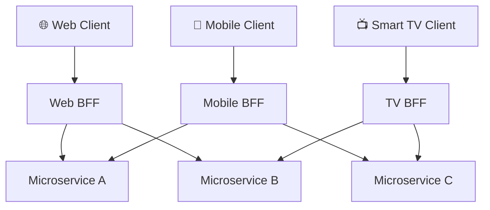
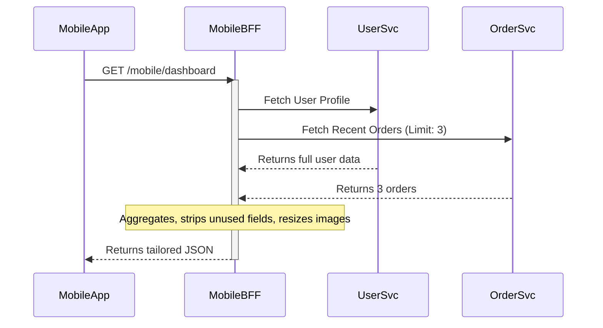

# 📚 Backend for Frontend (BFF) Pattern - Study Guide

## 📋 Table of Contents
1. [🎯 Introduction](#introduction)
2. [📝 Core Definitions](#core-definitions)
3. [💡 Why It Exists](#why-it-exists)
4. [📊 The Real Trade-off / Mechanism](#mechanism)
5. [💻 Categorized Real-World Examples](#examples)
6. [❌ Common Misconceptions](#misconceptions)
7. [🎓 Staff-Level Nuance](#staff-level-nuance)
8. [🔗 Extensions and Adjacent Concepts](#extensions)
9. [⚡ Quick Revision](#quick-revision)
10. [🎯 FAANG Q&A Section](#faang-qa)

---

<h2 id="introduction">🎯 Introduction</h2>

When building modern applications that serve diverse client types—such as mobile apps, web browsers, IoT devices, or voice assistants—delivering a tailored and seamless user experience presents a significant architectural challenge. Initially, systems often expose a general-purpose monolith API intended for web clients. However, extending this single API to accommodate mobile interactions, low-bandwidth networks, and specialized UI needs inevitably bloats the backend, creating maintenance bottlenecks and degrading client performance. 

The **Backend for Frontend (BFF)** pattern emerges from the principles of Service-Oriented Architecture (SOA) and microservices to resolve this friction. It introduces a specialized middleware layer where each distinct client interface gets its own dedicated backend service. This shifts the architectural focus from a "one-size-fits-all" API to client-centric backends, optimizing data delivery, enhancing security, and unblocking frontend development velocity.

<b>🌱 Beginner-Friendly Explanation: The Restaurant Menu Analogy</b>

Imagine a restaurant kitchen (your core microservices) that cooks hundreds of dishes. A general API is like forcing every customer—whether they are at the drive-thru, fine dining inside, or ordering on UberEats—to read the exact same massive, 50-page menu. It’s overwhelming and inefficient. The BFF pattern acts as dedicated waiters for each customer type. The drive-thru waiter only gives you a quick 1-page fast-food menu (optimized for speed/mobile). The fine-dining waiter brings the detailed wine pairings (optimized for web/desktop). Each waiter (BFF) talks to the same kitchen but customizes the presentation for the specific customer they serve!

---

<h2 id="core-definitions">📝 Core Definitions</h2>

At its core, the **Backend for Frontend (BFF)** is an architectural pattern that advocates for creating separate backend services for specific frontend applications or interfaces. Instead of having a single monolithic API or a unified API Gateway serving all clients, the BFF acts as a dedicated intermediary layer precisely tailored to the UX and data requirements of a single client type (e.g., iOS, Android, Web, Smart TV).

- **Client-Specific API:** An API designed explicitly around the use cases, screen constraints, and payload restrictions of a specific frontend.
- **Request Aggregation:** The process where a single BFF receives a request from its frontend, fans out multiple requests to downstream core microservices, aggregates the responses, and shapes the data into a single, cohesive payload.
- **Protocol Translation:** Converting client-friendly protocols (like GraphQL or REST over HTTP/2) into internal service protocols (like gRPC or message queues).

<b>🌱 Beginner-Friendly Explanation: Aggregation in Action</b>

Think of a mobile profile page that needs the user's name, recent orders, and loyalty points. Without a BFF, the mobile app makes three separate trips over the slow cellular network to three different databases. With a BFF, the mobile app makes ONE quick trip to its dedicated BFF. The BFF, sitting inside the fast data center, rapidly fetches the name, orders, and points from different servers, bundles them into one neat package, and sends it back to the phone. It saves battery and loads instantly.

---

<h2 id="why-it-exists">💡 Why It Exists (The Problem it Solves)</h2>

The pattern exists to decouple the frontend lifecycle from the core backend lifecycle, solving several critical scaling and organizational problems:

1. **Over-fetching and Under-fetching:** A general-purpose API often returns too much data for a mobile device (wasting bandwidth and battery) or requires multiple calls (increasing latency).
2. **The Bottleneck Team:** When one API serves Web, Android, iOS, and 3rd parties, any change requires coordination with the single backend API team. This team becomes a bottleneck, attempting to balance conflicting client priorities.
3. **Compromised User Experience:** Mobile usage patterns differ drastically from desktop. A desktop e-commerce user might want paginated 50-item lists with rich metadata. A mobile user needs an infinite-scroll 10-item list with compressed thumbnails. Forcing one API to serve both leads to bloated, hard-to-maintain code packed with `if (client == 'mobile')` conditional logic.
4. **Security Surface Area:** Exposing all internal data to a single public endpoint increases the risk of accidental data leaks (e.g., sending internal admin IDs to a mobile app).

<b>🌱 Beginner-Friendly Explanation: The Universal Remote Problem</b>

A general-purpose API is like a universal TV remote with 200 buttons designed to control the TV, DVD, AC, and lights. It's confusing and clunky. A mobile frontend doesn't want 200 buttons; it only wants a "play" and "pause" button. The BFF is the process of building a custom, 2-button remote specifically for that user, hiding the complex wiring of the universal remote behind the scenes.

---

<h2 id="mechanism">📊 The Real Trade-off / Mechanism</h2>

Implementing BFFs fundamentally shifts complexity from the core services to the middle layer. 

**Mechanisms:**
- **Ownership:** The team building the frontend typically owns and maintains its corresponding BFF. (e.g., The iOS team writes the iOS BFF in Node.js or Swift).
- **Load Shedding & Fault Tolerance:** BFFs implement circuit breakers, retries, and fallback mechanisms specific to their client. If the recommendation engine goes down, the Web BFF might show "Trending Items" as a fallback, while the Mobile BFF might hide the widget entirely to save screen space.

**The Trade-offs (The Interviewer's Probe):**
- **Pros:** High frontend autonomy, optimized payload sizes, reduced over-the-wire latency, decoupled release cycles, isolated fault domains.
- **Cons (The Cost):** Code duplication. Since Web and Mobile BFFs might both need to authenticate users or fetch product details, you risk duplicating aggregation logic across multiple codebases. It introduces infrastructure overhead (deploying, monitoring, and scaling N BFFs instead of 1 API gateway).

<b>🌱 Beginner-Friendly Explanation: The Code Duplication Trade-off</b>

Because every app gets its own BFF, you might have the Web BFF and the Mobile BFF both writing code to calculate a user's shopping cart total. This means if the tax law changes, you have to update the logic in multiple places. It's the price you pay for speed and independence—you trade a bit of duplicate work for the freedom of not waiting on other teams.

---

<h2 id="examples">💻 Categorized Real-World Examples</h2>

1. **Streaming Media (Netflix, SoundCloud):**
   - *Netflix:* Uses a highly tailored BFF architecture. The Smart TV BFF prioritizes fetching high-resolution thumbnails, background video streams, and grid layout metadata. The Mobile BFF fetches lower-res images, prioritizes offline download metadata, and minimizes payload sizes to save cellular data.
2. **Ride Sharing (Uber):**
   - *Uber:* Has separate BFFs for the Rider App and the Driver App. The Rider BFF optimizes for route calculation, ETA, and payment status. The Driver BFF optimizes for high-frequency GPS ping ingestion, surge pricing overlays, and rapid dispatch acceptance.
3. **E-commerce:**
   - *Web BFF:* Manages heavy user sessions, shopping cart synchronization, and complex faceted search queries over GraphQL.
   - *Mobile BFF:* Focuses on push notification registration, barcode scanning endpoints, and quick Apple Pay/Google Pay checkout flows.

<b>🌱 Beginner-Friendly Explanation: Uber's Two Worlds</b>

Think of Uber. The passenger wants to know "Where is my car and how much?" The driver wants to know "Where is my next fare and how much am I earning?" If they shared one backend, the server would constantly be checking who is asking. By splitting into a Driver BFF and Rider BFF, each server is hyper-focused on its specific user, making the app much faster and less prone to crashing when driver logic updates.

---

<h2 id="misconceptions">❌ Common Misconceptions</h2>

- **"BFF is just an API Gateway."** 
  - *Correction:* An API Gateway is a single entry point for *all* clients, often handling cross-cutting concerns (SSL, rate limiting, generic auth). A BFF is multiple entry points, each containing client-specific *business logic* and data shaping.
- **"BFFs should hold core business logic."**
  - *Correction:* BFFs are presentation-layer backends. Core domain rules (e.g., calculating compound interest) belong in downstream microservices. BFFs only hold *client-specific* logic (e.g., formatting the interest as a string for a mobile UI).
- **"We need a BFF for every single OS."**
  - *Correction:* You don't necessarily need a React BFF, an Angular BFF, an iOS BFF, and an Android BFF. Often, you group by form factor or use-case: one for Web (desktop browsers) and one for Mobile (both iOS and Android, if their UI flows are identical).

<b>🌱 Beginner-Friendly Explanation: Gateway vs. BFF</b>

An API Gateway is like the front door security guard at a massive office building—they check your ID and let everyone in. A BFF is like a personal assistant assigned to you once you're inside—they know exactly what files you need, how you like your coffee, and format your schedule perfectly just for you.

---

<h2 id="staff-level-nuance">🎓 Staff-Level Nuance</h2>

At the Staff/Principal level, the conversation shifts from "what is it" to "how do we operate it at scale."

- **The Fan-out and Latency Amplification:** When a BFF makes 5 downstream calls to assemble a view, the 99th percentile (p99) latency of the BFF is bounded by the *slowest* downstream service. Staff engineers implement partial degradation: if the 'Recommendations' service times out after 100ms, the BFF must return the core payload without it, rather than failing the whole request.
- **GraphQL as a BFF implementation:** Many teams replace imperative BFFs (Node.js/Express) with GraphQL Federation. Instead of writing custom endpoints, the client sends a GraphQL query defining its exact data needs. The GraphQL layer acts as the BFF. The nuance here is preventing malicious or overly nested queries that can execute a Denial of Service (DoS) on backend databases.
- **The "Leaky Abstraction" Anti-pattern:** If a BFF needs to orchestrate a distributed transaction (e.g., booking a flight and hotel simultaneously), the architecture is flawed. BFFs should aggregate data, not coordinate sagas or two-phase commits. That orchestration belongs in a domain-level workflow service.
- **Team Topology (Conway's Law):** The most profound impact of BFFs is organizational. By allowing the iOS team to own the iOS BFF, you eliminate inter-team Jira ticketing for API payload changes. However, you must enforce strict CI/CD and contract testing (like Pact) to ensure the core microservices don't break the BFFs when they evolve.

<b>🌱 Beginner-Friendly Explanation: The Slow Cooker Problem</b>

If a BFF fetches a user profile (takes 1 second) and their order history (takes 10 seconds), the user waits 10 seconds for a blank screen to load. A senior engineer makes the BFF smart enough to immediately send the user profile so the app can render the header, and then silently stream the order history when it finally finishes. It's about designing for failure and slowness.

---

<h2 id="extensions">🔗 Extensions and Adjacent Concepts</h2>

- **Server-Driven UI (SDUI):** An evolution of BFF where the BFF doesn't just send data, it sends the actual UI layout instructions (JSON describing buttons, colors, and lists). This allows teams to radically alter the mobile app UI without waiting for Apple/Google App Store review processes.
- **Micro-frontends:** If BFFs decompose the backend by client, Micro-frontends decompose the frontend by feature. A single web page might be composed of a 'Cart' micro-frontend and a 'Product' micro-frontend, each potentially talking to its own vertical slice of the backend.
- **API Gateway Pattern:** Often used *in front* of the BFFs. The API Gateway handles TLS termination, DDoS protection, and generic auth token validation, routing the clean request to the appropriate BFF.

<b>🌱 Beginner-Friendly Explanation: Server-Driven UI</b>

Usually, the app on your phone knows exactly what it looks like, and just asks the server for the words to fill in the blanks. With Server-Driven UI (the next level of BFF), the server actually tells the phone: "Draw a red button here, put a picture there, and write 'Sale' on it." This lets developers change the app instantly for everyone without making users download an update!

---

<h2 id="quick-revision">⚡ Quick Revision</h2>

The Backend for Frontend (BFF) pattern solves the problem of a monolithic, one-size-fits-all API causing bloat, latency, and organizational bottlenecks as an application scales across diverse clients (Web, Mobile, TV). By inserting a dedicated backend service for each distinct client type, applications achieve decoupled frontend development lifecycles and highly optimized over-the-wire payloads. 

The mobile team can shape data, strip unnecessary fields, and aggregate multiple microservice calls into a single network request tailored precisely for battery and bandwidth constraints. While BFFs dramatically improve user experience, reduce client-side logic, and allow teams to work autonomously (leveraging Conway's Law), they introduce the architectural cost of code duplication across the BFF layer and increased infrastructure to monitor. 

Successful implementations rely on strong API Gateways for cross-cutting security, robust partial degradation (circuit breakers) to prevent downstream failures from crashing the client, and strict boundary enforcement to ensure BFFs don't accidentally absorb core business logic or transactional orchestration.

---

<h2 id="faang-qa">🎯 FAANG Q&A Section (20 Frequently Asked Questions)</h2>

<b>1. [L4] What problem does the BFF pattern solve that a traditional REST API doesn't?</b>

A traditional API returns a generic, fixed payload. For a mobile client, this often results in over-fetching (wasting bandwidth) and under-fetching (requiring N+1 requests). BFFs solve this by providing a dedicated backend that aggregates microservices and formats the exact payload needed for a specific screen, drastically reducing latency and network chatter.

<b>2. [L4] Who should own the BFF service in a microservices organization?</b>

The team building the frontend should own the BFF. The core philosophy of BFF is aligning architecture with organizational structure (Conway's Law). If the iOS team owns the iOS app, they must own the iOS BFF. This eliminates cross-team dependencies and unblocks their release velocity.

<b>3. [L4] How does a BFF differ from an API Gateway?</b>

An API Gateway is a single entry point handling cross-cutting infrastructure concerns like SSL termination, global rate limiting, and routing. A BFF is focused on *business* and *presentation* logic for a specific client interface. Often, an API Gateway sits in front of multiple BFFs.

<b>4. [L4] How does caching work in a BFF architecture?</b>

Caching can happen at the BFF layer to prevent hitting downstream services. For example, a Mobile BFF can cache the heavily requested "Top 10 Products" endpoint in Redis for 60 seconds, drastically reducing database load while keeping responses instant for mobile users.

<b>5. [L4] How do you handle pagination in a BFF?</b>

The BFF passes pagination parameters (cursor or offset/limit) down to the core services. If the BFF is aggregating from multiple services (e.g., paginating merged results), the BFF must handle complex cursor alignment or rely on a specialized search backend (like Elasticsearch) to provide a unified paginated view.

<b>6. [L5] If we have an iOS app and an Android app, should we have one "Mobile BFF" or two separate BFFs?</b>

It depends on feature parity and team topology. If the iOS and Android apps have identical UI flows and are managed by the same team (e.g., React Native), a single "Mobile BFF" is ideal to prevent code duplication. If they have distinct native features, release cycles, or separate teams, they should have separate BFFs to prevent them from becoming a new monolithic bottleneck.

<b>7. [L5] How do you handle business logic duplication across multiple BFFs?</b>

You strictly enforce that core business domain logic (e.g., pricing calculations, state machine transitions) lives in the downstream domain microservices. If multiple BFFs need the exact same aggregation logic, you extract that into a shared internal microservice. BFFs should strictly contain *presentation* and *formatting* logic.

<b>8. [L5] Should a BFF have its own database?</b>

Generally, no. A BFF should be stateless to allow horizontal scaling. If it needs a database, it's usually just a fast cache (like Redis) for session management or aggregating transient data. If it stores persistent domain data, it has morphed into a monolithic backend.

<b>9. [L5] What is the difference between BFF and Server-Side Rendering (SSR)?</b>

SSR (like Next.js) renders HTML on the server and sends it to the browser. A BFF typically returns structured data (JSON/GraphQL) for a client application to render natively. However, tools like Next.js often act as *both* an SSR engine and a Web BFF by utilizing their API routes to aggregate data before rendering.

<b>10. [L5] How do you prevent BFFs from bloating over time?</b>

By actively managing deprecation. Because the frontend team owns the BFF, they know exactly when an old app version is retired. They can actively delete unused endpoints and trim payload properties in the BFF without fear of breaking other platforms, keeping the codebase lean.

<b>11. [Staff] How does the BFF pattern impact system resilience, and how do you design for it?</b>

BFFs increase fan-out, meaning the probability of a downstream failure impacting the user increases. You must implement aggressive timeouts, circuit breakers (e.g., using Resilience4j), and graceful fallbacks at the BFF layer. If the recommendation service fails, the BFF should return a 200 OK with a null or default recommendation block, rather than a 500 error.

<b>12. [Staff] Can GraphQL replace the BFF pattern?</b>

Yes and no. GraphQL can act as a dynamic BFF, allowing the client to define its payload. However, at scale, a single monolithic GraphQL schema becomes a bottleneck. Companies often use GraphQL Federation, where the "BFF" is just a tailored Apollo Federation gateway for a specific client, keeping the decoupling benefits while using GraphQL for aggregation.

<b>13. [Staff] What are the security implications of a BFF?</b>

BFFs reduce the external attack surface by ensuring sensitive downstream data never leaves the data center. The BFF can securely hold session tokens (like HTTP-only cookies) and translate them into internal JWTs for downstream services, preventing tokens from being exposed to XSS attacks on the browser.

<b>14. [Staff] How do you test a BFF?</b>

Unit tests for formatting logic, and Consumer-Driven Contract Testing (e.g., using Pact) for integrations. Since the BFF depends heavily on downstream services, contract testing ensures that if a downstream team changes an API, the build breaks immediately before deployment, preventing production outages.

<b>15. [Staff] Explain a scenario where implementing a BFF is an anti-pattern.</b>

If you only have one frontend (e.g., just a Web app), adding a BFF introduces unnecessary network hops, latency, and deployment complexity. Furthermore, if you implement saga patterns or distributed transactions inside the BFF, you are violating its purpose as a presentation aggregator.

<b>16. [Staff] How do you monitor and trace requests going through a BFF?</b>

Distributed tracing (like OpenTelemetry or Jaeger) is mandatory. The BFF must generate or forward a unique `correlation-id` or `trace-id` in the header for every incoming request. This ID is passed to all downstream services, allowing engineers to visualize the entire fan-out tree and identify latency bottlenecks.

<b>17. [STAR] Tell me about a time you had to optimize performance for a mobile application.</b>

<b>Situation:</b> Our e-commerce mobile app had 4-second load times on 3G because it made 7 sequential REST API calls to render the home screen.  
<b>Task:</b> Reduce Time to Interactive (TTI) to under 1.5 seconds.  
<b>Action:</b> I introduced a Mobile BFF using Node.js. I migrated the 7 sequential client calls into the BFF, executing them in parallel over the internal high-speed network. I also implemented image URL resizing logic on the fly.  
<b>Result:</b> Client payload dropped by 60%, network requests dropped from 7 to 1, and TTI reached 1.2 seconds, increasing mobile conversion rates by 15%.

<b>18. [STAR] Describe a situation where cross-team dependencies were slowing down releases and how you fixed it.</b>

<b>Situation:</b> The Web and Mobile teams were constantly blocked waiting for the core backend team to add specific fields to a shared monolith API.  
<b>Task:</b> Decouple frontend velocity from backend release cycles.  
<b>Action:</b> I proposed and led the transition to a BFF architecture. We trained the frontend engineers to build their own lightweight GraphQL BFFs over the existing REST APIs.  
<b>Result:</b> Frontend teams could now stitch together their own data without waiting for backend sprints. Delivery time for UI features decreased by 40%.

<b>19. [STAR] Tell me about a time you handled a critical failure in a distributed system.</b>

<b>Situation:</b> A non-critical review microservice experienced a severe memory leak, causing the entire shared API gateway to lock up, taking down the entire app.  
<b>Task:</b> Isolate failures so non-critical services don't cause global outages.  
<b>Action:</b> We moved to a BFF pattern and implemented strict Hystrix circuit breakers in the BFF. I configured the BFF to monitor the review service; if it failed, the BFF would short-circuit and return empty arrays for reviews instead of hanging.  
<b>Result:</b> When the review service crashed again months later, users could still browse and purchase items seamlessly, resulting in zero lost revenue.

<b>20. [STAR] Give an example of how you secured a modern web application.</b>

<b>Situation:</b> Our Single Page Application (SPA) was storing sensitive JWT tokens in local storage, making them vulnerable to XSS.  
<b>Task:</b> Secure the authentication flow without rewriting the entire backend auth system.  
<b>Action:</b> I introduced a Web BFF. The SPA now authenticates with the BFF using secure, HTTP-only, same-site cookies. The BFF extracts the cookie, retrieves the JWT from its secure cache, and forwards it to the downstream services.  
<b>Result:</b> Completely eliminated the XSS token theft vector, passing a strict third-party security audit.

