# Microservice Architecture Patterns & Distributed Systems

> A progressive learning guide — from fundamentals to staff-engineer depth.
> Each topic is structured in three layers: **Basics** (the mental model), **Intermediate** (mechanics & examples), and **Staff-Level** (trade-offs, failure modes, and the questions senior engineers actually argue about).
> Code is language-agnostic pseudocode.

---

## How to use this guide

Read it in order the first time — the topics are sequenced so each one leans on concepts introduced earlier. The microservice patterns in Part 1 motivate the distributed-systems theory in Part 2; the theory explains why the messaging guarantees in Part 3 are hard; and Part 4 ties everything together into operational reliability. On later passes, jump straight to a topic via the table of contents. When a term appears that's defined elsewhere, it's cross-referenced.

A suggested mastery path:

1. **Junior → Mid:** Read the *Basics* and *Intermediate* layer of every topic. You'll be able to design and reason about a service.
2. **Mid → Senior:** Add the *Staff-Level* layer for Parts 1 and 4. You'll be able to make and defend architecture decisions.
3. **Senior → Staff:** Internalize Part 2 deeply. The ability to reason from first principles about consistency, consensus, and failure is what distinguishes staff-level system design.

---

## Table of Contents

### Part 1 — Microservice Architecture Patterns
1. [Monolith vs Microservices](#1-monolith-vs-microservices)
2. [Service Decomposition](#2-service-decomposition)
3. [API Gateway](#3-api-gateway)
4. [Service Discovery](#4-service-discovery)
5. [Database per Service](#5-database-per-service)
6. [Saga Pattern](#6-saga-pattern)
7. [Event-Driven Architecture](#7-event-driven-architecture)
8. [CQRS](#8-cqrs)
9. [Event Sourcing](#9-event-sourcing)
10. [Circuit Breaker](#10-circuit-breaker)
11. [Retry Pattern](#11-retry-pattern)
12. [Bulkhead Pattern](#12-bulkhead-pattern)
13. [Sidecar Pattern](#13-sidecar-pattern)
14. [Strangler Fig Pattern](#14-strangler-fig-pattern)

### Part 2 — Distributed Systems
15. [CAP Theorem](#15-cap-theorem)
16. [PACELC](#16-pacelc)
17. [Consistency Models](#17-consistency-models)
18. [Replication](#18-replication)
19. [Sharding](#19-sharding)
20. [Consistent Hashing](#20-consistent-hashing)
21. [Leader Election](#21-leader-election)
22. [Consensus](#22-consensus)
23. [Quorum](#23-quorum)
24. [Raft](#24-raft)
25. [Gossip Protocol](#25-gossip-protocol)
26. [Distributed Locks](#26-distributed-locks)
27. [Idempotency](#27-idempotency)
28. [Exactly-Once vs At-Least-Once](#28-exactly-once-vs-at-least-once)
29. [Eventual Consistency](#29-eventual-consistency)

### Part 3 — Messaging
30. [Kafka Fundamentals](#30-kafka-fundamentals)
31. [Kafka Partitions](#31-kafka-partitions)
32. [Consumer Groups](#32-consumer-groups)
33. [Ordering Guarantees](#33-ordering-guarantees)
34. [Delivery Semantics](#34-delivery-semantics)
35. [Dead Letter Queues](#35-dead-letter-queues)
36. [Retry Strategies](#36-retry-strategies)
37. [Outbox Pattern](#37-outbox-pattern)

### Part 4 — Reliability
38. [Circuit Breaker (Reliability View)](#38-circuit-breaker-reliability-view)
39. [Bulkhead (Reliability View)](#39-bulkhead-reliability-view)
40. [Timeout](#40-timeout)
41. [Retry (Reliability View)](#41-retry-reliability-view)
42. [Backoff](#42-backoff)
43. [Rate Limiting](#43-rate-limiting)
44. [Load Shedding](#44-load-shedding)
45. [Graceful Degradation](#45-graceful-degradation)

### Appendix
- [Reference Books & Further Reading](#reference-books--further-reading)
- [Glossary of Cross-Cutting Terms](#glossary-of-cross-cutting-terms)

### Interview Prep
- [FAANG Interview Questions](#faang-interview-questions)
- [Quick Revision (Cheat Sheet)](#quick-revision-cheat-sheet)

> **Note on per-topic content:** every one of the 45 topics includes an **Examples, Analogy & Real-World Use** block (an intuitive analogy, when to use / when to avoid, and named real-world systems) after its staff-level discussion. The condensed bullet-point recaps for every topic are collected together in the [Quick Revision cheat sheet](#quick-revision-cheat-sheet) at the very end, organized section-wise.

---

# Part 1 — Microservice Architecture Patterns

## 1. Monolith vs Microservices

### Basics
A **monolith** is a single deployable unit: all the code — UI, business logic, data access — is compiled, packaged, and shipped together as one artifact. A **microservice architecture** decomposes that same application into many small, independently deployable services, each owning a slice of the business capability and communicating over the network (HTTP, gRPC, or messaging). The distinction is not about lines of code; it's about *units of deployment and ownership*. In a monolith, a one-line change to the billing logic means rebuilding and redeploying the entire application. In microservices, the billing team ships billing on its own cadence without coordinating with the catalog team.

### Intermediate
The trade-off is fundamentally about **coupling versus operational complexity**. A monolith gives you simplicity: one codebase, one build, in-process function calls (fast, reliable, transactional), and a single database where a transaction can atomically span every table. The cost is that the whole thing scales as a unit, a single bug can take down everything, and as the team grows, hundreds of engineers contend over one codebase and one release pipeline. Microservices invert this: each service scales independently (scale only the checkout service on Black Friday), failures can be isolated, and teams move autonomously. But you pay for it: network calls replace function calls (latency, partial failure, serialization), there is no global transaction (you need [Sagas](#6-saga-pattern)), and you now operate dozens of deployables with their own monitoring, logging, and on-call.

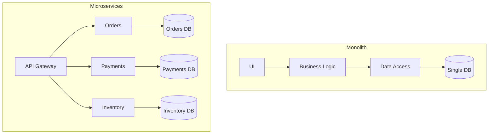
```mermaid
graph TB
    subgraph Monolith
        UI1[UI] --> BL1[Business Logic]
        BL1 --> DA1[Data Access]
        DA1 --> DB1[(Single DB)]
    end
    subgraph Microservices
        GW[API Gateway] --> S1[Orders]
        GW --> S2[Payments]
        GW --> S3[Inventory]
        S1 --> D1[(Orders DB)]
        S2 --> D2[(Payments DB)]
        S3 --> D3[(Inventory DB)]
    end
```

```
   MONOLITH                          MICROSERVICES
 +-------------+                  +------+   +--------+   +-----------+
 |   UI Layer  |                  |Orders|   |Payments|   |Inventory  |
 +-------------+                  +--+---+   +---+----+   +-----+-----+
 | Business    |                     |           |             |
 | Logic       |                  +--v--+     +--v--+       +--v--+
 +-------------+                  |OrdDB|     |PayDB|       |InvDB|
 | Data Access |                  +-----+     +-----+       +-----+
 +------+------+
        |                         Each box = independent deploy + DB
   +----v----+
   | One DB  |
   +---------+
```

### Staff-Level
The most important insight is that **microservices are an organizational pattern as much as a technical one** (Conway's Law: systems mirror the communication structure of the organizations that build them). Adopting microservices to solve a *technical* scaling problem when you have a 10-person team is a classic anti-pattern — you import all the distributed-systems pain ([CAP](#15-cap-theorem), eventual consistency, distributed tracing) without the organizational scaling benefit. The mature default is the **"monolith first"** strategy: start with a well-modularized monolith, let domain boundaries stabilize, and extract services along proven seams (see [Strangler Fig](#14-strangler-fig-pattern)). Premature decomposition produces a *distributed monolith* — services so chatty and tightly coupled that you must deploy them together anyway, the worst of both worlds. At staff level you must also weigh the hidden taxes: data consistency becomes a design problem on every feature, debugging spans many services (requires distributed tracing), and a naive "one service per noun" split creates a latency cascade where one user request fans out into dozens of synchronous hops. The right question is rarely "monolith or microservices?" but "what is the *smallest* set of independently deployable units that lets my teams ship without blocking each other?"


### Examples, Analogy & Real-World Use

**Analogy.** A monolith is a Swiss Army knife — one tool, everything attached, simple to carry but you replace the whole thing to fix one blade. Microservices are a professional toolbox — each tool separate, swap or upgrade one without touching the rest, but you must manage the whole kit.

**When to use.** Use a monolith for new products, small teams, or unproven domains where speed and simplicity win. Move to microservices when team size, independent scaling, or differing reliability/compliance needs make one codebase a bottleneck.

**When to avoid.** Avoid microservices for small teams chasing a purely technical scaling fix — you import distributed-systems pain without the org-scaling payoff, often creating a 'distributed monolith'.

**Real-world scenarios.**

- Amazon famously migrated from a monolith to services to let hundreds of teams deploy independently.
- Netflix moved to microservices on AWS after a monolith DB corruption outage, enabling per-service scaling for streaming.
- Shopify deliberately runs a well-modularized 'majestic monolith' (modular monolith) at huge scale — proof the monolith is a valid endpoint, not just a starting point.

---

## 2. Service Decomposition

### Basics
Service decomposition is the act of deciding *where to draw the boundaries* between services — which is the single hardest and highest-leverage decision in a microservice architecture. Draw them well and services evolve independently; draw them badly and every feature requires changes across five services. The goal is to produce services that are **loosely coupled** (a change inside one rarely forces changes in another) and **highly cohesive** (everything that changes together lives together). Two dominant strategies exist: decompose **by business capability** (Orders, Payments, Shipping — aligned to what the business does) and decompose **by subdomain** using Domain-Driven Design (DDD).

### Intermediate
The DDD approach centers on the **Bounded Context**: a boundary within which a domain model and its language are internally consistent. The word "Customer" might mean a billing entity in the Payments context and a shipping address holder in the Logistics context — DDD says don't force one shared "Customer" model; let each context own its version. Decomposition typically follows the flow: identify subdomains → define bounded contexts → map each context to one (or a few) services. A useful litmus test is the **"two-pizza team"** rule: a service should be ownable by a team small enough to feed with two pizzas. Avoid decomposing by *technical layer* (a "database service," a "validation service") — that creates tight coupling because every business change cuts across all layers.

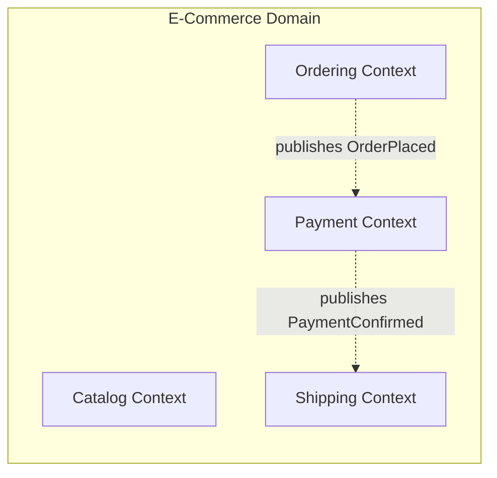
```mermaid
graph LR
    subgraph "E-Commerce Domain"
        direction TB
        BC1[Catalog Context] 
        BC2[Ordering Context]
        BC3[Payment Context]
        BC4[Shipping Context]
    end
    BC2 -.publishes OrderPlaced.-> BC3
    BC3 -.publishes PaymentConfirmed.-> BC4
```

```
  Decompose by CAPABILITY (good)        Decompose by LAYER (bad)
  +----------+ +----------+             +------------------+
  | Ordering | | Shipping |             |  UI Service      |
  +----------+ +----------+             +------------------+
  | own logic| | own logic|             |  Logic Service   |  <- every feature
  | + data   | | + data   |             +------------------+     touches all 3
  +----------+ +----------+             |  Data Service    |
   cohesive, independent                +------------------+
```

### Staff-Level
At staff level, decomposition is governed by the principle: **boundaries should follow the axes of change and the axes of independent scaling, not the nouns in the domain.** A frequent mistake is over-decomposition: splitting "Order" and "Order Item" into separate services because they're separate database tables, which guarantees a chatty, transaction-spanning nightmare. The deeper technique is to analyze **coupling along multiple dimensions** — afferent/efferent code coupling, *data* coupling (do two services need the same data atomically?), and *temporal* coupling (must they be available at the same instant?). If two candidate services would need a distributed transaction on nearly every operation, they are really one service. Practical heuristics staff engineers use: extract a service when it has a *different rate of change*, a *different scaling profile*, a *different team owner*, or a *different reliability/compliance requirement* (e.g., PCI-scoped payment data). Conversely, the cost of getting a boundary wrong is asymmetric — merging two services later is far easier than splitting a shared database after the fact — so when uncertain, keep things together. Boundaries are also not permanent; mature organizations treat decomposition as continuous refactoring, periodically merging services that have become co-dependent and splitting ones that have grown two distinct personalities.


### Examples, Analogy & Real-World Use

**Analogy.** Like organizing a company into departments: group people who collaborate constantly (high cohesion) and minimize cross-department dependencies (loose coupling). A bad org chart forces every decision through five departments — a bad decomposition forces every feature through five services.

**When to use.** Decompose by business capability or DDD bounded context when boundaries are stable and a team can own a slice end-to-end. Extract a service when it has a different rate of change, scaling profile, owner, or compliance scope.

**When to avoid.** Avoid decomposing by technical layer (UI/logic/data services) or by database table — both create chatty, transaction-spanning coupling. Don't over-decompose ahead of understanding the domain.

**Real-world scenarios.**

- Uber reorganized services around domains (trips, payments, dispatch) after early over-fragmentation caused operational pain.
- Amazon's 'two-pizza teams' map directly to service ownership boundaries.
- DDD bounded contexts at companies like Spotify align squads to services (e.g., playlist, search, payments).

---

## 3. API Gateway

### Basics
An **API Gateway** is a single entry point that sits between external clients (web, mobile, third parties) and your fleet of internal microservices. Instead of a mobile app needing to know the addresses of 30 services and call each directly, it makes one call to the gateway, which routes the request to the right service(s) and returns the response. Think of it as the receptionist for your backend: clients talk only to the receptionist, who knows the internal layout. It typically handles **routing**, **authentication**, **rate limiting**, **TLS termination**, and **request aggregation**.

### Intermediate
The gateway solves real problems that arise the moment you have more than a handful of services. Without it, every client must implement cross-cutting concerns (auth, retries, TLS) itself, and exposing internal service topology to clients makes refactoring impossible (you can't split a service without breaking every client). The gateway centralizes these concerns. A common refinement is the **Backend-for-Frontend (BFF)** pattern: rather than one gateway for everyone, you build a tailored gateway per client type — a mobile BFF that returns compact, aggregated payloads optimized for slow networks, and a web BFF that returns richer data. The gateway can also **aggregate**: a single "get order details" call fans out to Orders, Payments, and Shipping services in parallel and composes one response, hiding the fan-out from the client.

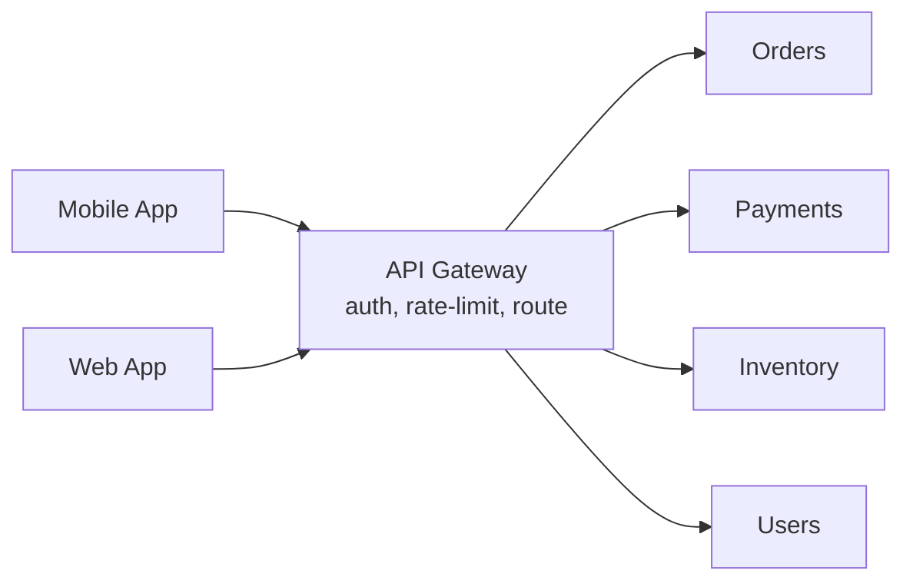
```mermaid
graph LR
    M[Mobile App] --> GW
    W[Web App] --> GW
    GW[API Gateway<br/>auth, rate-limit, route] --> Orders
    GW --> Payments
    GW --> Inventory
    GW --> Users
```

```
  Clients          Gateway (cross-cutting concerns)        Services
 +--------+       +-------------------------------+       +----------+
 | Mobile |-----> |  AuthN/Z | RateLimit | Route  |--+--> | Orders   |
 +--------+       |  TLS term | Aggregate | Cache  |  +--> | Payments |
 +--------+       +-------------------------------+  +--> | Inventory|
 | Web    |---------------^                          +--> | Users    |
 +--------+                                                +----------+
```

### Staff-Level
The gateway's central position is its greatest danger: it is a **single point of failure** and, organizationally, a **single point of contention**. If every team must edit the gateway config to ship a route, the gateway becomes a deployment bottleneck that recreates the coordination problem microservices were meant to solve. Staff engineers guard against this by keeping the gateway *thin* — routing, auth, and rate limiting belong there, but business logic does not. The moment you see request transformation that encodes domain rules ("if order total > $X, call the fraud service"), that logic has leaked into the wrong layer and should move into a service. A second concern is the **latency budget**: the gateway adds a hop, and any aggregation it does is bounded by its slowest downstream call, so aggregation must be parallel with per-call timeouts and partial-response handling. For resilience the gateway must be horizontally scaled, stateless, and fronted by its own load balancer; it should never hold session state. Finally, distinguish the gateway (north-south, client-to-system traffic) from the **service mesh** (east-west, service-to-service traffic, handled by [sidecars](#13-sidecar-pattern)) — they solve different problems and mature architectures run both. A subtle failure mode is the gateway's auth becoming the *only* line of defense; defense-in-depth requires services to also validate identity (zero-trust), because a compromised internal network shouldn't grant unchecked access.


### Examples, Analogy & Real-World Use

**Analogy.** A hotel front desk: guests don't wander into the kitchen or laundry — they make one request at reception, which routes it internally and handles check-in (auth), do-not-disturb (rate limits), and key cards (TLS).

**When to use.** Use when multiple client types call many services and you need centralized auth, rate limiting, TLS, and routing. Use a Backend-for-Frontend (BFF) per client type when mobile and web need very different payloads.

**When to avoid.** Avoid putting business logic in the gateway, and avoid making it a deploy bottleneck where every team must edit one config. For pure service-to-service traffic, a service mesh fits better than a gateway.

**Real-world scenarios.**

- Netflix Zuul / Spring Cloud Gateway front their streaming APIs.
- Netflix pioneered the BFF pattern for device-specific (TV, mobile, web) payloads.
- AWS API Gateway and Kong are managed/OSS gateways used widely for auth + throttling at the edge.

---

## 4. Service Discovery

### Basics
In a microservice system, service instances come and go constantly — autoscaling spins up new instances, deployments replace old ones, crashes kill others — and each gets a different IP address and port. **Service discovery** is the mechanism by which a service finds the current network location of another service it wants to call, without hardcoding addresses. It works like a phone book that updates itself: services *register* their location when they start, and callers *look up* the current address when they need to make a call. The core component is the **service registry**, a database of "which instances of service X are alive and where."

### Intermediate
There are two main patterns. In **client-side discovery**, the calling service queries the registry directly, gets a list of healthy instances, and picks one (doing its own load balancing). In **server-side discovery**, the caller hits a stable endpoint (a load balancer or the gateway), which consults the registry and forwards the request — the client stays ignorant of the registry. Registration itself is either **self-registration** (the instance registers and sends heartbeats) or **third-party registration** (a separate registrar, like a Kubernetes controller, watches instances and registers them). Health checks are essential: the registry must continuously verify instances are alive and evict dead ones, or callers will route traffic to a black hole. In Kubernetes, this is built in — `Service` objects plus `kube-dns`/CoreDNS provide discovery via DNS names, and the kubelet's liveness/readiness probes feed health status.

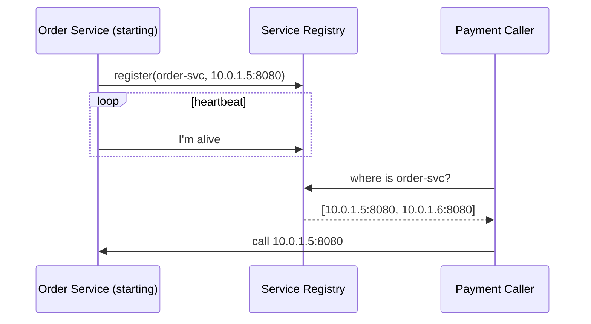
```mermaid
sequenceDiagram
    participant Svc as Order Service (starting)
    participant Reg as Service Registry
    participant Cli as Payment Caller
    Svc->>Reg: register(order-svc, 10.0.1.5:8080)
    loop heartbeat
        Svc->>Reg: I'm alive
    end
    Cli->>Reg: where is order-svc?
    Reg-->>Cli: [10.0.1.5:8080, 10.0.1.6:8080]
    Cli->>Svc: call 10.0.1.5:8080
```

```
  CLIENT-SIDE DISCOVERY                 SERVER-SIDE DISCOVERY
  Caller --> Registry (lookup)          Caller --> LoadBalancer --> Instance
        \--> picks instance                          ^
             directly                                | (LB queries registry)
                                                  Registry
```

### Staff-Level
Service discovery is where **CAP trade-offs hit operational reality**. The registry is itself a distributed system, and you must choose: a **CP registry** (like ZooKeeper or etcd, used by Kubernetes) refuses to return stale data during a partition but may become unavailable, blocking new lookups; an **AP registry** (like Consul in AP mode or Eureka) always answers, but may hand you the address of a dead instance. Eureka famously chooses availability and *self-preservation* — during a network blip it stops evicting instances rather than risk evicting healthy ones it merely can't reach, accepting some stale entries. The staff-level reflex is to never trust the registry blindly: callers must combine discovery with [client-side load balancing](#3-api-gateway), [retries](#11-retry-pattern) to a *different* instance on failure, [circuit breakers](#10-circuit-breaker), and outlier detection that ejects instances returning errors even if the registry still lists them. A second deep issue is **discovery propagation latency** — when an instance dies, there is always a window before every caller learns this, during which requests fail; tuning heartbeat intervals and TTLs trades faster failure detection against registry load and false-positive evictions. In service-mesh architectures, discovery moves into the data plane: the [sidecar](#13-sidecar-pattern) proxy gets endpoint updates pushed from the control plane (e.g., Istio's Pilot), so application code never touches the registry at all.


### Examples, Analogy & Real-World Use

**Analogy.** A taxi dispatcher: cars (instances) constantly come on/off shift, so riders don't memorize plate numbers — they call dispatch (the registry), which knows who's currently available and where.

**When to use.** Use whenever instances are dynamic (autoscaling, frequent deploys, container orchestration). Kubernetes gives it for free via Services + DNS; outside k8s use Consul/etcd/Eureka.

**When to avoid.** Avoid hardcoding addresses or relying solely on static load-balancer config in elastic environments. Don't trust the registry blindly — always pair with health checks and retries to another instance.

**Real-world scenarios.**

- Kubernetes uses etcd + CoreDNS + readiness probes as built-in discovery.
- Netflix Eureka (AP, self-preservation) powered their EC2 fleet discovery.
- HashiCorp Consul provides discovery + health checks across data centers.

---

## 5. Database per Service

### Basics
The **Database per Service** pattern says each microservice owns its own private database, and no other service is allowed to touch it directly. If the Shipping service needs order data, it must ask the Orders service through its API — it may *never* reach into the Orders database. This is the data-layer expression of [decomposition](#2-service-decomposition): a service that doesn't fully own its data isn't really independent. The opposite — many services sharing one database — is the **shared database anti-pattern**, where a schema change by one team silently breaks three others.

### Intermediate
Private data ownership is what makes independent deployment real. When a service owns its schema, it can change tables, switch from PostgreSQL to a document store, or add indexes without coordinating with anyone. It also lets each service pick the *right* storage for its job: a search service on Elasticsearch, a session store on Redis, a ledger on a relational database, a social graph on a graph database — this is **polyglot persistence**. The hard consequence is that **you lose cross-service transactions and cross-service JOINs**. In a monolith, "create order and decrement inventory atomically" is one ACID transaction. Split across two databases, there is no shared transaction — you must use a [Saga](#6-saga-pattern) for consistency and either API composition or [CQRS](#8-cqrs) read models for queries that span services.

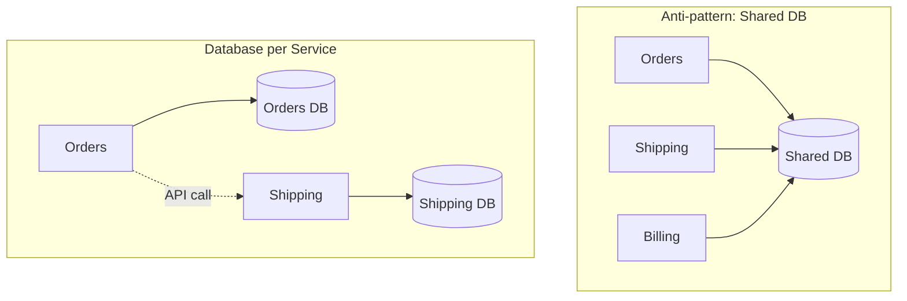
```mermaid
graph TB
    subgraph "Anti-pattern: Shared DB"
        A1[Orders] --> SDB[(Shared DB)]
        A2[Shipping] --> SDB
        A3[Billing] --> SDB
    end
    subgraph "Database per Service"
        B1[Orders] --> DB1[(Orders DB)]
        B2[Shipping] --> DB2[(Shipping DB)]
        B1 -. API call .-> B2
    end
```

```
  SHARED DB (coupling)              DB PER SERVICE (independence)
  Orders --\                        Orders --> [OrdersDB]
  Shipping -+--> [ One DB ]            |  (asks via API, not SQL)
  Billing --/                          v
   schema change breaks all          Shipping --> [ShippingDB]
```

### Staff-Level
The core tension staff engineers manage is **data ownership versus query convenience**. Product teams constantly want a report joining orders, payments, and shipments — trivial with a shared database, a genuine design problem with database-per-service. The mature answers are: (1) **API composition** for simple, low-volume joins (the caller queries each service and stitches results in memory — but beware the in-memory join over large datasets and the latency of serial calls); (2) **CQRS read models** that subscribe to events and maintain a denormalized, query-optimized view spanning services; and (3) a **data lake / warehouse** fed by change-data-capture for analytical queries, keeping operational stores clean. A critical implementation detail is that **dual writes are forbidden** — you cannot write to your database and publish an event in two separate steps and hope both succeed, because a crash between them corrupts state; this is why the [Outbox Pattern](#37-outbox-pattern) exists. Staff engineers also recognize that "database per service" is about *logical* ownership, not necessarily physical isolation: early on, services may share a physical database server with separate schemas and strict no-cross-schema-access discipline, deferring the operational cost of many database clusters until scale demands it. The non-negotiable rule is the *encapsulation* — the day another service runs a query against your tables, you have lost the ability to evolve your schema, and the architecture quietly reverts to a distributed monolith.


### Examples, Analogy & Real-World Use

**Analogy.** Each chef in a restaurant has their own mise en place station. No one reaches into another's station mid-service — they request the prepped item. Reaching directly creates chaos and breakage.

**When to use.** Use as the default for microservices — it's what makes independent deployment and polyglot persistence real. Pick the right store per service (relational ledger, Redis sessions, Elasticsearch search).

**When to avoid.** Avoid the shared-database anti-pattern (multiple services on one schema) — a schema change by one team silently breaks others. Avoid dual writes (DB + broker in two steps); use the Outbox.

**Real-world scenarios.**

- Amazon and Netflix enforce strict per-service data ownership.
- Polyglot persistence at Uber: different stores for geospatial, ledger, and search workloads.
- Most cloud-native architectures provision a dedicated datastore per microservice.

---

## 6. Saga Pattern

### Basics
A **Saga** is how you maintain data consistency across multiple services when you can't use a single database transaction. Because each service has its [own database](#5-database-per-service), a business operation that spans services (place order → charge payment → reserve inventory → schedule shipping) cannot be wrapped in one ACID transaction. A Saga breaks it into a sequence of **local transactions**, one per service, where each step publishes an event or sends a command that triggers the next. If any step fails, the Saga runs **compensating transactions** to undo the work already done — the distributed equivalent of a rollback, except you "undo" by doing a semantically reversing action (refund the payment) rather than a true rollback.

### Intermediate
Sagas come in two coordination styles. In **choreography**, there is no central coordinator: each service listens for events and reacts, publishing its own event when done. Orders publishes `OrderCreated`; Payments hears it, charges, and publishes `PaymentCompleted`; Inventory hears that and reserves stock. It's simple and decoupled but the overall workflow is implicit — no single place tells you the whole flow, which becomes hard to follow past a few steps. In **orchestration**, a central **Saga orchestrator** explicitly tells each service what to do and waits for the reply, driving the flow like a conductor. It's easier to understand, monitor, and modify, at the cost of a central component. Compensations must be designed per step: the compensation for "charge card" is "refund card," for "reserve inventory" is "release reservation."

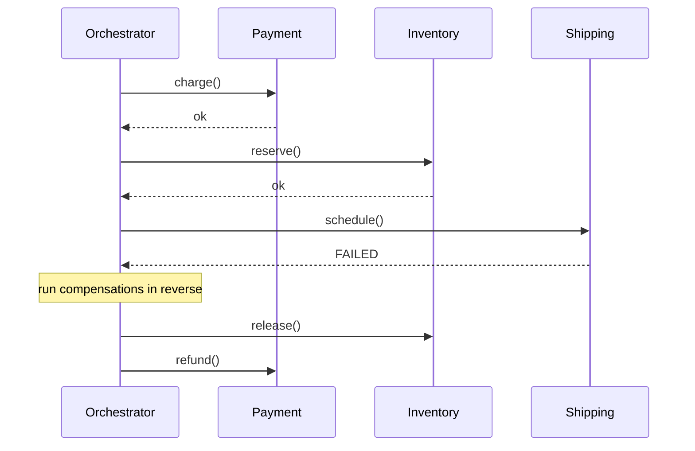
```mermaid
sequenceDiagram
    participant O as Orchestrator
    participant Pay as Payment
    participant Inv as Inventory
    participant Ship as Shipping
    O->>Pay: charge()
    Pay-->>O: ok
    O->>Inv: reserve()
    Inv-->>O: ok
    O->>Ship: schedule()
    Ship-->>O: FAILED
    Note over O: run compensations in reverse
    O->>Inv: release()
    O->>Pay: refund()
```

```
  HAPPY PATH:  [Order]->[Charge]->[Reserve]->[Ship]  (all commit locally)

  FAILURE at Ship -> COMPENSATE backward:
  [Ship FAIL] -> release Reserve -> refund Charge -> cancel Order
   (each compensation is a NEW local transaction, not a rollback)
```

### Staff-Level
The defining mental shift is that **a Saga provides atomicity but NOT isolation**. Between steps, the system is in a partially-completed state that other transactions can observe — the order exists and the payment is charged, but inventory isn't yet reserved. This creates anomalies straight out of database theory: *dirty reads* (a query sees the half-done order), *lost updates*, and *fuzzy reads*. Staff engineers counter these with countermeasures: **semantic locks** (mark the order `PENDING` so other operations know it's in-flight), **commutative updates** (design operations so order doesn't matter), and **reread-and-verify** before committing. A second hard problem is that **compensations can fail** and some actions are *not* compensatable — you cannot un-send an email or un-ship a package; the discipline is to order steps so that non-compensatable actions come *last* (the "pivot transaction" model: retriable steps, one pivot, then non-undoable steps). Every Saga step and every compensation must be [idempotent](#27-idempotency), because the messaging layer delivers [at-least-once](#28-exactly-once-vs-at-least-once) and steps will be retried. At staff level you also weigh choreography vs orchestration as a coupling decision: choreography for short, stable flows where decoupling matters; orchestration once a flow exceeds ~4 steps, needs clear observability, or has complex conditional branching — and you implement the orchestrator as a durable state machine (e.g., persisted in a workflow engine) so an orchestrator crash mid-Saga can resume rather than lose the in-flight transaction.


### Examples, Analogy & Real-World Use

**Analogy.** Booking a multi-leg trip through an agent: flight, hotel, car booked one at a time. If the car falls through, the agent cancels the hotel and refunds the flight — undoing completed steps with reversing actions, since there's no single 'cancel everything' button.

**When to use.** Use to maintain consistency across services without distributed transactions. Choreography for short, stable, decoupled flows; orchestration once a flow exceeds ~4 steps or needs clear monitoring and branching.

**When to avoid.** Avoid Sagas when a single ACID transaction suffices (data in one service). Avoid choreography for long/complex flows — the implicit workflow becomes unfollowable.

**Real-world scenarios.**

- E-commerce order fulfillment (order → payment → inventory → shipping) is the canonical Saga.
- Travel/booking platforms coordinate flight+hotel+car with compensations.
- Orchestration engines like Temporal, AWS Step Functions, and Camunda implement durable Sagas in production.

---

## 7. Event-Driven Architecture

### Basics
In **event-driven architecture (EDA)**, services communicate by producing and consuming **events** — immutable facts about something that happened ("OrderPlaced", "PaymentReceived") — rather than by calling each other directly. A service that does something interesting publishes an event to a message broker (like [Kafka](#30-kafka-fundamentals)) and moves on, not knowing or caring who will react. Other services subscribe to the events they care about and react in their own time. This is **asynchronous** and **decoupled**: the producer and consumers don't need to be available at the same moment, and the producer doesn't know the consumers exist.

### Intermediate
Contrast this with **request-driven** (synchronous) communication, where service A calls service B and blocks waiting for a response. Synchronous calls create *temporal coupling* (B must be up when A calls) and *runtime coupling* (A's latency and availability now depend on B's). Events break both: A publishes and continues; if a consumer is down, the broker holds the event until it recovers. EDA shines for one-to-many fan-out (one `OrderPlaced` event triggers email, analytics, loyalty points, and inventory updates — adding a new reaction means adding a subscriber, with zero changes to the producer) and for smoothing load spikes (the broker buffers bursts). The key distinction is between an **event** ("something happened," published to anyone interested) and a **command** ("do this," sent to a specific service). Events express facts; commands express intent.

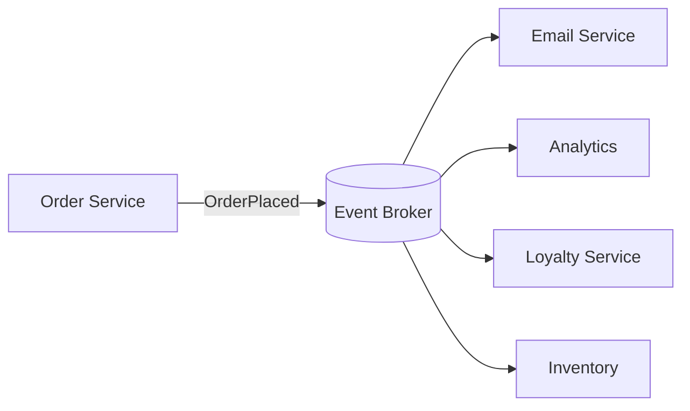
```mermaid
graph LR
    O[Order Service] -->|OrderPlaced| B[(Event Broker)]
    B --> E[Email Service]
    B --> A[Analytics]
    B --> L[Loyalty Service]
    B --> I[Inventory]
```

```
  SYNCHRONOUS (coupled)            EVENT-DRIVEN (decoupled)
  Order --call--> Email           Order --publish--> [Broker]
        --call--> Analytics                            |--> Email
        --call--> Loyalty                              |--> Analytics
   (waits for each; if one                             |--> Loyalty
    is down, order fails)          (fire & forget; broker buffers)
```

### Staff-Level
EDA's superpower — decoupling — is also its central difficulty: **the overall business process becomes implicit and emergent**, scattered across subscribers, with no single place that describes the flow. Debugging "why didn't the customer get their points?" means tracing an event through a broker into a consumer you may not have known existed, which is why distributed tracing and event observability are non-negotiable at scale. Staff engineers grapple with several deep issues. First, **eventual consistency is now the default** ([see §29](#29-eventual-consistency)): after `OrderPlaced`, there's a window where the order exists but loyalty points don't, and the UI must be designed for it. Second, **schema evolution** is a distributed contract problem — once dozens of consumers depend on an event's shape, you can only make backward-compatible changes; this demands a schema registry and explicit versioning discipline. Third, you must decide **event granularity and payload**: "thin" events (just an ID, forcing consumers to call back for details, recreating coupling and load) versus "fat" events (full state, risking staleness and bloating the broker) — the nuanced answer is *event-carried state transfer* for data consumers actually need. Fourth, ordering and duplication are real: brokers deliver [at-least-once](#28-exactly-once-vs-at-least-once) and ordering holds only within a [partition](#31-kafka-partitions), so consumers must be [idempotent](#27-idempotency) and tolerate reordering. The classic trap is using EDA where a synchronous query is the honest fit (you genuinely need an answer *now* to proceed) — bending that into events produces convoluted request/reply-over-messaging that's harder than just making the call.


### Examples, Analogy & Real-World Use

**Analogy.** A newspaper subscription: the publisher prints news (events) without knowing who reads it; subscribers receive and act independently. New subscribers just sign up — the publisher does nothing differently.

**When to use.** Use for one-to-many fan-out, decoupling producers from consumers, and absorbing load spikes via the broker buffer. Ideal when many independent reactions follow one fact ('OrderPlaced' → email, loyalty, analytics).

**When to avoid.** Avoid EDA when you genuinely need a synchronous answer now to proceed — forcing request/reply over messaging is harder than just calling. Beware implicit, hard-to-trace workflows.

**Real-world scenarios.**

- LinkedIn built Kafka to move from synchronous coupling to event streams.
- Uber processes trip/payment events through Kafka for real-time pipelines.
- Retail (e.g., order events fanning to fulfillment, notification, analytics) is the textbook use.

---

## 8. CQRS

### Basics
**CQRS (Command Query Responsibility Segregation)** splits a system's operations into two distinct models: **commands** that change state (PlaceOrder, CancelOrder) and **queries** that read state (GetOrderHistory). In a traditional design, one model — the same classes and database tables — handles both reads and writes. CQRS says: use a separate **write model** optimized for validating and applying changes, and a separate **read model** optimized for the shapes of data your queries need. The two are kept in sync, often asynchronously, so the read side may briefly lag the write side.

### Intermediate
The motivation is that reads and writes have *opposite* optimal shapes. Writes want a normalized model that enforces invariants and avoids duplication. Reads want denormalized, pre-joined, query-specific views — exactly what a normalized write model is bad at. In a microservice world, CQRS is the natural answer to "how do I query data that lives across several services' databases?" You build a read model that subscribes to events from many services and maintains a single denormalized view (e.g., an "order summary" table combining order, payment, and shipping facts), so the query hits one optimized store instead of fanning out. The write side accepts commands, applies business rules, persists to the write store, and publishes events; a projector consumes those events and updates the read store.

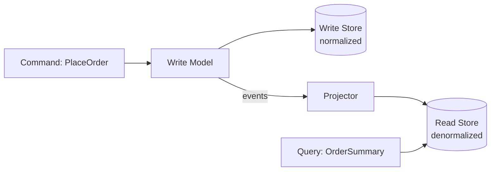
```mermaid
graph LR
    C[Command: PlaceOrder] --> WM[Write Model]
    WM --> WDB[(Write Store<br/>normalized)]
    WM -->|events| P[Projector]
    P --> RDB[(Read Store<br/>denormalized)]
    Q[Query: OrderSummary] --> RDB
```

```
   WRITE SIDE                         READ SIDE
  Command --> [Write Model] --events--> [Projector] --> [Read Store]
                  |                                          ^
              [Write DB]                  Query ------------/
            (normalized, rules)         (denormalized, fast reads)
```

### Staff-Level
CQRS is **powerful and frequently over-applied** — its first staff-level lesson is *when not to use it*. For a simple CRUD service, separate read/write models add machinery and an eventual-consistency gap for no benefit; reserve CQRS for domains with a genuine read/write asymmetry (complex domain logic on writes, high-volume or multi-source reads). The hardest consequence is that the read model is **eventually consistent** with the write model: a user issues a command, then immediately queries and doesn't see their own change — the "read-your-own-writes" problem. Staff engineers mitigate this with UI techniques (optimistically render the change client-side), by reading from the write model for the brief post-command window, or by exposing the projection lag so callers can decide. The projector itself is a critical reliability surface: it must be [idempotent](#27-idempotency) (events redeliver), handle out-of-order events, and be *rebuildable* — a major advantage of CQRS, especially with [Event Sourcing](#9-event-sourcing), is that you can drop and rebuild a read model from the event log, or build entirely new read models for new query needs by replaying history. You must also monitor projection lag as a first-class SLO and alert when the read store falls too far behind. CQRS pairs so naturally with Event Sourcing that the two are often conflated, but they are independent: you can do CQRS with two ordinary databases kept in sync by events, no event store required.


### Examples, Analogy & Real-World Use

**Analogy.** A library: the acquisitions desk (writes) carefully catalogs and validates each new book, while the search catalog (reads) is a denormalized index optimized purely for fast lookup. Two models, two purposes, kept in sync.

**When to use.** Use when reads and writes have very different shapes/scale, or when you must query data spanning several services' databases via a denormalized read model. Pairs naturally with event-driven systems.

**When to avoid.** Avoid for simple CRUD — separate models add machinery and an eventual-consistency gap for no benefit. Don't assume it requires Event Sourcing; they're independent.

**Real-world scenarios.**

- High-traffic e-commerce product views backed by denormalized read models.
- Banking/trading systems separating command processing from reporting views.
- Many systems build CQRS read models off Kafka event streams for cross-service queries.

---

## 9. Event Sourcing

### Basics
**Event Sourcing** changes how you store state: instead of storing the *current state* of an entity and overwriting it on each change, you store the *full sequence of events* that led to that state, and never delete or mutate them. A bank account isn't stored as `balance = 100`; it's stored as the ordered log `Deposited(100), Withdrew(30), Deposited(30)`, and you derive the balance (100) by replaying those events. The **event store** is an append-only log and the single source of truth. Current state is a *derived* view you reconstruct by folding over the events.

### Intermediate
To get an entity's current state, you load its events and replay them through a function that applies each one in order (`fold`). To avoid replaying thousands of events every time, you periodically save a **snapshot** of state at a known version and replay only events after it. Event Sourcing pairs naturally with [CQRS](#8-cqrs): the events are the write model, and you build read models by projecting events into query-optimized views. The benefits are striking: you get a **complete, immutable audit log** for free (every change, with cause and timestamp), the ability to perform **temporal queries** ("what was this account's balance last Tuesday?" — replay up to that point), and **debugging by replay** (reproduce a bug by replaying the exact event sequence). You can also build new projections retroactively by replaying all of history into a new view.

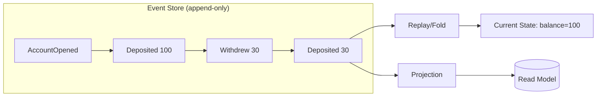
```mermaid
graph LR
    subgraph "Event Store (append-only)"
        E1[AccountOpened] --> E2[Deposited 100] --> E3[Withdrew 30] --> E4[Deposited 30]
    end
    E4 --> R[Replay/Fold] --> S[Current State: balance=100]
    E4 --> P[Projection] --> RM[(Read Model)]
```

```
  STATE-ORIENTED (traditional)     EVENT-SOURCED
  balance: 100  (overwrite)        log: [Opened, +100, -30, +30]  (append only)
   - no history                     - full history / audit
   - can't ask "balance last week"  - replay to any point in time
                                     - state = fold(events)
```

### Staff-Level
Event Sourcing is one of the highest-cost, highest-power patterns, and staff-level judgment is mostly about its formidable downsides. The dominant one is **schema/event evolution over time**: your events are immutable and live *forever*, so a `CustomerRegistered` event written three years ago in an old format must still be replayable today. This forces disciplined **event versioning** and **upcasting** (transforming old event versions to new ones on read), and you can never simply "migrate the schema" the way you would a state table. A second deep issue is that **you cannot just delete data** — which collides head-on with GDPR's right-to-erasure; the accepted technique is **crypto-shredding** (encrypt personal data per-subject and delete the key to render events unreadable) rather than deleting events. Third, **replaying side effects is dangerous**: if applying an event sent an email, replaying must *not* re-send it, so side effects must live strictly in projection/consumer code, never in the fold. Other hard realities: querying across entities requires projections (you can't `SELECT * WHERE balance > X` against a raw event log), the event store grows unbounded (snapshots and archival become operational necessities), and the conceptual model is genuinely difficult for teams to adopt. The staff-level verdict: Event Sourcing earns its cost in domains where the *history itself is the value* — finance/ledgers, audit-heavy compliance domains, collaborative editing, anything needing temporal reconstruction — and is overkill almost everywhere else. Critically, it is *not* required to do CQRS or microservices; reach for it deliberately, not by default.


### Examples, Analogy & Real-World Use

**Analogy.** A bank passbook or accounting ledger: you never erase the balance and write a new one — you append every transaction, and the balance is the sum of all entries. The history IS the source of truth.

**When to use.** Use when history itself is valuable: finance/ledgers, audit-heavy compliance, collaborative editing, or anything needing temporal reconstruction ('state as of last Tuesday') and replay-based debugging.

**When to avoid.** Avoid as a default — high cost. Schema/event evolution is forever, deletion (GDPR) is hard, side effects can't be naively replayed, and cross-entity queries need projections. Not required for CQRS or microservices.

**Real-world scenarios.**

- Banking/accounting ledgers and double-entry systems.
- Git is essentially event sourcing for code (commits = events).
- Event stores like EventStoreDB and Axon power audit-critical domains.

---

## 10. Circuit Breaker

### Basics
A **Circuit Breaker** protects a service from a failing dependency the same way an electrical breaker protects your house from a fault: it detects that calls to a downstream service are failing and "trips," immediately rejecting further calls for a while instead of letting them pile up. Without it, when service B becomes slow or unavailable, service A keeps calling B, each call hangs until it times out, A's threads pile up waiting, and eventually A exhausts its resources and fails too — a **cascading failure**. The breaker stops this by failing fast: once it trips, calls return an error (or fallback) instantly, giving B room to recover and keeping A healthy.

### Intermediate
A circuit breaker is a state machine with three states. **Closed** is normal — calls pass through, and the breaker counts failures. When failures cross a threshold (e.g., 50% of calls in a rolling window), it trips to **Open** — all calls are rejected instantly for a cooldown period, without even attempting the downstream call. After the cooldown, it moves to **Half-Open** — it allows a few trial calls through; if they succeed, it concludes the dependency recovered and goes back to Closed; if they fail, it returns to Open and waits again. This is almost always paired with a **fallback**: when the breaker is open, return cached data, a default value, or a graceful "try later" message rather than a hard error.

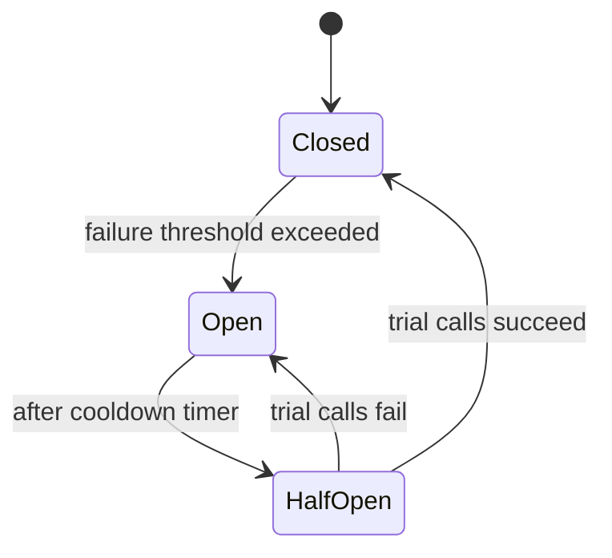
```mermaid
stateDiagram-v2
    [*] --> Closed
    Closed --> Open: failure threshold exceeded
    Open --> HalfOpen: after cooldown timer
    HalfOpen --> Closed: trial calls succeed
    HalfOpen --> Open: trial calls fail
```

```
        failures > threshold
  CLOSED ------------------> OPEN
    ^                          |  (reject instantly,
    | trial ok                 |   wait cooldown)
    |                          v
  HALF-OPEN <----------------- (cooldown elapsed)
    |  trial fails -> back to OPEN
```

### Staff-Level
The deep value of a circuit breaker is **failing fast to preserve the caller's resources** — the real enemy is not the downstream error but the *latency* of waiting for it, which consumes the precious threads/connections that the caller needs to serve everything else. This is why a circuit breaker is most effective when combined with a tight [timeout](#40-timeout) (so a "slow" dependency is treated as a failure) and a [bulkhead](#12-bulkhead-pattern) (so even non-tripped slowness can't consume all resources). Staff engineers tune the parameters as a system property, not a default: the failure threshold, the rolling-window size, the minimum request volume (don't trip on 1 failure out of 1 call), and the cooldown are all workload-specific, and bad values cause either flapping (tripping and resetting repeatedly) or sluggish reaction. A subtle but critical design choice is **what counts as a failure** — a `500` and a timeout should trip the breaker, but a business-level `404 Not Found` or `400 Bad Request` should *not*, because the dependency is healthy and tripping would be wrong. The half-open state must admit only a *limited* number of probes, or the moment cooldown ends you slam the recovering service with full traffic and re-trip it (the "thundering herd" on recovery). Finally, breakers should be *per-dependency* (and often per-instance), and their state changes must be a monitored, alertable signal — a tripped breaker in production is one of the clearest early indicators of a downstream incident.


### Examples, Analogy & Real-World Use

**Analogy.** An electrical breaker in your home: when a circuit faults, the breaker trips and cuts power instantly rather than letting the wiring overheat and burn the house down. After a pause you flip it back to test if the fault cleared.

**When to use.** Use on every synchronous call to a remote dependency that could be slow or down. Essential for preventing cascading failures; pair with timeouts, bulkheads, and fallbacks.

**When to avoid.** Avoid tripping on business errors (404/400) — only on 5xx/timeouts. Avoid using it as a substitute for fixing a genuinely broken dependency; it's containment, not a cure.

**Real-world scenarios.**

- Netflix Hystrix popularized the pattern; Resilience4j is the modern successor.
- Service meshes (Istio/Envoy) provide circuit breaking transparently via sidecars.
- Nearly all large microservice fleets wrap downstream calls in breakers.

---

## 11. Retry Pattern

### Basics
The **Retry Pattern** handles *transient* failures — brief, self-correcting glitches like a momentary network blip, a temporary connection reset, or a brief timeout — by simply trying the operation again. Many failures in distributed systems are transient: a packet drops, a server is briefly busy, a load balancer reroutes mid-request. Rather than surfacing these as errors to the user, the caller retries a few times, and the request usually succeeds. The essential rule is that you must only retry failures that are *actually transient and retriable* — retrying a "400 Bad Request" or "insufficient funds" will fail every time and just waste resources.

### Intermediate
A naive retry (try again immediately, a fixed number of times) is dangerous because it can hammer a struggling service. The disciplined version always combines three things: a **bounded number of attempts**, a **[backoff](#42-backoff)** delay that grows between attempts (typically exponential: 1s, 2s, 4s…), and **jitter** (randomized delay) to prevent many clients retrying in lockstep. You also distinguish *which* errors to retry: network timeouts, 503 Service Unavailable, and 429 Too Many Requests (respecting any `Retry-After` header) are retriable; 400, 401, 404 are not. Retries pair with [circuit breakers](#10-circuit-breaker): retry handles brief individual failures, while the breaker handles sustained failure by stopping retries entirely once a dependency is clearly down.

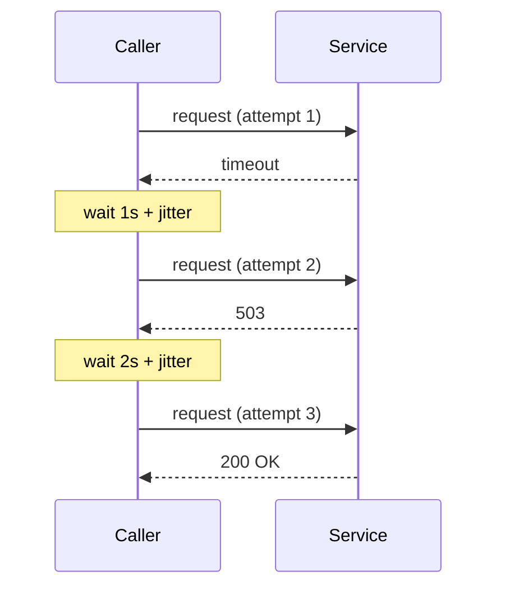
```mermaid
sequenceDiagram
    participant C as Caller
    participant S as Service
    C->>S: request (attempt 1)
    S-->>C: timeout
    Note over C: wait 1s + jitter
    C->>S: request (attempt 2)
    S-->>C: 503
    Note over C: wait 2s + jitter
    C->>S: request (attempt 3)
    S-->>C: 200 OK
```

```
  attempt 1 --X--> (fail)
     wait 1s + jitter
  attempt 2 --X--> (fail)
     wait 2s + jitter
  attempt 3 --OK--> success
     |
   give up after N attempts -> escalate / fallback
```

### Staff-Level
The most important and most-violated staff-level rule: **only retry idempotent operations** ([see §27](#27-idempotency)). Retrying a non-idempotent write — "charge the card," "send the message" — risks executing it twice if the original actually succeeded but the *response* was lost. The fix is to make the operation idempotent (idempotency keys) so a retry is safe, *then* retry freely. The second great danger is **retry amplification / retry storms**: if every layer in a call chain retries 3 times, a single user request becomes 3×3×3 = 27 calls to the deepest service, and under partial degradation these retries become a self-inflicted DDoS that prevents the struggling service from ever recovering. Staff engineers prevent this with **retry budgets** (cap retries as a percentage of total traffic, not per-request), by retrying at *only one layer* of the stack, and by combining retries with circuit breakers so retries stop the moment failure is sustained rather than transient. A subtler point is that retries must respect a **total deadline / time budget** propagated through the call chain — there's no point retrying a request whose client has already timed out. Finally, retries interact with [load shedding](#44-load-shedding): a server returning 503 because it's overloaded should ideally signal "don't retry yet" (via `Retry-After`), and well-behaved clients honor it — retrying *into* an overload makes the overload worse. The mental model: retries convert transient failures into success, but without backoff, jitter, budgets, idempotency, and circuit breakers, they convert a small problem into an outage.


### Examples, Analogy & Real-World Use

**Analogy.** Re-dialing a phone call that dropped: a quick redial usually connects (transient glitch). But if you redial instantly a hundred times you jam the line — so you wait a bit longer each time.

**When to use.** Use for transient failures (timeouts, 503, 429) on idempotent operations. Always combine with backoff, jitter, bounded attempts, and a circuit breaker.

**When to avoid.** Avoid retrying non-idempotent writes without idempotency keys (double-charge risk) and never retry permanent errors (400/401/404). Avoid retrying at every layer — causes retry storms.

**Real-world scenarios.**

- AWS SDKs implement exponential backoff with jitter by default.
- Google's gRPC clients support deadline-aware retries.
- Payment systems (Stripe) require idempotency keys precisely so retries are safe.

---

## 12. Bulkhead Pattern

### Basics
The **Bulkhead Pattern** is named after the watertight compartments in a ship's hull: if one compartment floods, the bulkheads contain the water so the whole ship doesn't sink. Applied to software, it means **partitioning resources so that a failure in one part can't consume all the resources and take down everything else**. If your service calls three dependencies and they all share one thread pool, a slowdown in just one dependency can consume every thread waiting for it, leaving none for the other two — even though they're perfectly healthy. Bulkheads give each dependency its own isolated pool, so one dependency's failure is contained.

### Intermediate
Bulkheads operate at several levels. At the **connection/thread-pool level**, you give each downstream dependency a dedicated, bounded pool of threads or connections; if dependency A hangs, only A's pool exhausts, and calls to B and C continue. At the **service-instance level**, you partition your fleet so that, say, your most important customers are served by a dedicated set of instances, isolating them from a traffic spike caused by others (the "noisy neighbor" problem). At the **process/container level**, isolation via separate deployments prevents one component's memory leak or crash from killing others. The pattern directly limits the blast radius of any single failure and is the natural complement to the [circuit breaker](#10-circuit-breaker) (which detects and stops failure) — the bulkhead ensures that *before* the breaker trips, the in-flight failure can't drain shared resources.

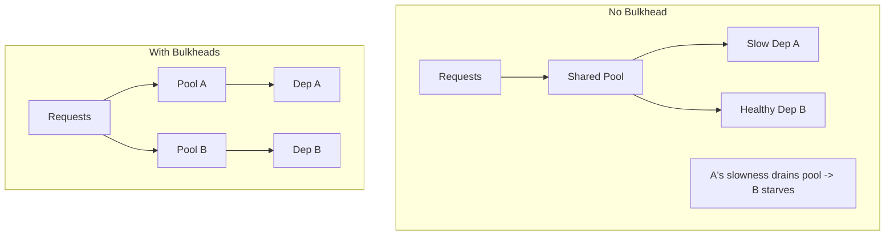
```mermaid
graph TB
    subgraph "No Bulkhead"
        R1[Requests] --> SP[Shared Pool]
        SP --> X[Slow Dep A]
        SP --> Y[Healthy Dep B]
        Note1[A's slowness drains pool -> B starves]
    end
    subgraph "With Bulkheads"
        R2[Requests] --> PA[Pool A] --> DA[Dep A]
        R2 --> PB[Pool B] --> DB[Dep B]
    end
```

```
  NO BULKHEAD                      WITH BULKHEADS
  [ one shared thread pool ]       [Pool A]->DepA   [Pool B]->DepB
        |        |                  (full)           (unaffected)
     DepA(slow) DepB                A's failure stays in A's pool
     drains all threads
     -> DepB calls starve
```

### Staff-Level
The staff-level framing is that bulkheads trade **resource efficiency for fault isolation** — dedicated pools mean some capacity sits idle in each partition rather than being shared, so you deliberately accept lower utilization in exchange for guaranteed isolation. Sizing the pools is the hard part: too small and you needlessly reject load on a healthy dependency; too large and the bulkhead provides no real isolation because one dependency can still consume most of the host's underlying resources (CPU, memory, file descriptors) even with separate logical pools. Staff engineers reason about bulkheads in terms of **blast radius**: the question for any shared resource (thread pools, connection pools, but also database connection limits, a shared cache, even a shared Kafka consumer) is "if this dependency degrades, what else goes down with it?" — and bulkheads are how you make that answer "nothing." A frequently missed dimension is **data/store-level bulkheading**: a single slow query type can exhaust a shared database connection pool and starve all other queries, so isolating connection pools per workload class matters as much as isolating threads. Bulkheads also enable **priority isolation / cellular architecture** at scale — partitioning the entire system into independent "cells," each serving a subset of users with its own full stack, so a catastrophic failure affects only one cell's users rather than everyone, which is how the largest systems bound the blast radius of even severe incidents. The pattern's cost is operational complexity and the temptation to over-partition; the discipline is to bulkhead along the boundaries where failures actually correlate.


### Examples, Analogy & Real-World Use

**Analogy.** A ship's watertight compartments: a hull breach floods one compartment but the bulkheads keep the rest dry so the ship stays afloat. Isolation contains the damage.

**When to use.** Use to isolate resources (thread/connection pools) per dependency or workload class so one failure can't starve the rest. Scale up to cell-based architecture to bound blast radius at the system level.

**When to avoid.** Avoid over-partitioning (wastes capacity) and avoid logical pools that still share the host's real resources (CPU, FDs) without true isolation.

**Real-world scenarios.**

- Netflix Hystrix isolated each dependency in its own thread pool.
- AWS uses cell-based architecture to bound blast radius across customers.
- Multi-tenant SaaS isolates noisy-neighbor tenants onto dedicated capacity.

---

## 13. Sidecar Pattern

### Basics
The **Sidecar Pattern** attaches a helper process — the "sidecar" — alongside your main application, deployed in the same unit (in Kubernetes, the same Pod) so they share the same lifecycle and local network. The name comes from a motorcycle sidecar: a separate compartment bolted onto the main vehicle, going wherever it goes. The sidecar handles **cross-cutting concerns** that every service needs but that aren't the service's actual business logic — things like network proxying, TLS, metrics collection, log shipping, and configuration. Your application stays focused on business logic; the sidecar handles the infrastructure plumbing.

### Intermediate
The biggest use of the sidecar pattern is the **service mesh** (Istio, Linkerd), where every service gets a proxy sidecar (e.g., Envoy) that intercepts *all* its inbound and outbound network traffic. Because the sidecar sits in the request path, it can transparently provide [service discovery](#4-service-discovery), load balancing, mutual TLS, [retries](#11-retry-pattern), [timeouts](#40-timeout), [circuit breaking](#10-circuit-breaker), and detailed telemetry — *without the application knowing or containing any of that code*. This is the killer benefit: cross-cutting concerns become **language-agnostic and uniform**. A Java service, a Python service, and a Go service all get identical retry and mTLS behavior because it lives in the sidecar, not in three different client libraries. Other sidecar uses include log/metric agents, secret-fetching agents, and config-sync helpers.

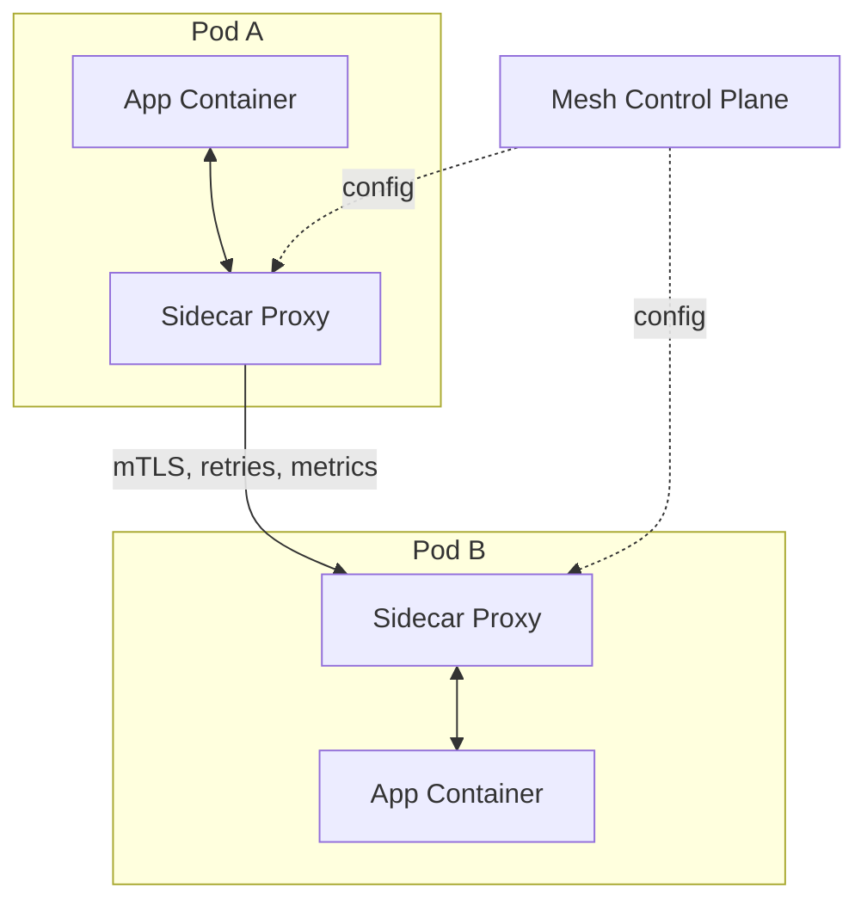
```mermaid
graph TB
    subgraph "Pod A"
        AppA[App Container] <--> ProxyA[Sidecar Proxy]
    end
    subgraph "Pod B"
        ProxyB[Sidecar Proxy] <--> AppB[App Container]
    end
    ProxyA -->|mTLS, retries, metrics| ProxyB
    CP[Mesh Control Plane] -.config.-> ProxyA
    CP -.config.-> ProxyB
```

```
   +--------------------------+        +--------------------------+
   |  Pod A                   |        |  Pod B                   |
   |  [App] <-> [Sidecar]-----|--mTLS--|->[Sidecar] <-> [App]     |
   +--------------------------+        +--------------------------+
                  ^                                  ^
                  +----- Control Plane (config) -----+
   App speaks plain localhost; sidecar handles TLS/retry/metrics
```

### Staff-Level
The sidecar's great win — moving infrastructure concerns out of application code and standardizing them across languages — comes with real costs that staff engineers weigh explicitly. First, **resource overhead**: every Pod now runs an extra proxy consuming CPU and memory, which at thousands of Pods is a significant, often underestimated, fleet-wide tax. Second, **latency**: each network hop now traverses two extra proxies (caller's sidecar → callee's sidecar), adding milliseconds that matter on hot paths. Third, **operational complexity**: the mesh control plane is itself a sophisticated distributed system that must be operated, upgraded, and debugged, and sidecar-injection failures or version skew become a new class of incident. There's also a subtle **lifecycle problem**: the sidecar must start before the app needs the network and shut down *after* the app finishes draining — getting init/shutdown ordering wrong causes startup failures and dropped requests during deploys (Kubernetes added native sidecar support partly to fix this). The industry's response to these costs is the emerging **sidecar-less / ambient mesh** model, which moves some functions to a per-node proxy instead of per-Pod, trading some isolation for far less overhead — a live architectural debate a staff engineer should be able to reason about. The decision framework: adopt sidecars/mesh when you have *many* services in *multiple languages* needing *uniform* security and observability; for a handful of services in one language, a shared library is often the lower-cost choice.


### Examples, Analogy & Real-World Use

**Analogy.** A motorcycle sidecar: a separate compartment bolted on that goes everywhere the bike goes, carrying gear so the rider stays focused on driving. The app drives; the sidecar carries the infra plumbing.

**When to use.** Use when many services in multiple languages need uniform networking, security (mTLS), and observability — a service mesh injects a proxy sidecar per pod. Also for log/metric/secret agents.

**When to avoid.** Avoid for a handful of services in one language (a shared library is cheaper). Watch resource overhead, added latency, and lifecycle/ordering complexity at scale.

**Real-world scenarios.**

- Istio/Linkerd inject Envoy sidecars for mesh features.
- Kubernetes added native sidecar support to fix init/shutdown ordering.
- Datadog/Fluentd agents run as logging sidecars.

---

## 14. Strangler Fig Pattern

### Basics
The **Strangler Fig Pattern** is a strategy for incrementally migrating a legacy system (usually a [monolith](#1-monolith-vs-microservices)) to a new architecture (usually microservices) *without* a risky "big bang" rewrite. It's named after the strangler fig vine, which grows around a host tree, gradually taking over until the original tree is gone and the fig stands on its own. You place a routing layer (a [gateway](#3-api-gateway) or proxy) in front of the monolith, then extract one piece of functionality at a time into a new service, redirecting just that slice of traffic to the new service while everything else still hits the monolith. Over time, more and more functionality moves out until the monolith is fully "strangled" and can be retired.

### Intermediate
The mechanics center on the **facade/proxy** that intercepts incoming requests and routes them either to the legacy monolith or to a newly extracted service, based on the request path or feature. The migration proceeds feature by feature: pick a bounded slice (say, the "user profile" feature), build it as a new service, point the proxy's `/profile/*` routes at the new service, verify, and move on. Each step is small, independently shippable, and reversible — if the new service misbehaves, flip the route back to the monolith. This dramatically de-risks migration compared to a multi-year rewrite (which often fails because the business keeps changing the old system while you rebuild it). The pattern naturally combines with the [anti-corruption layer](#glossary-of-cross-cutting-terms) to keep the legacy model from leaking into new services.

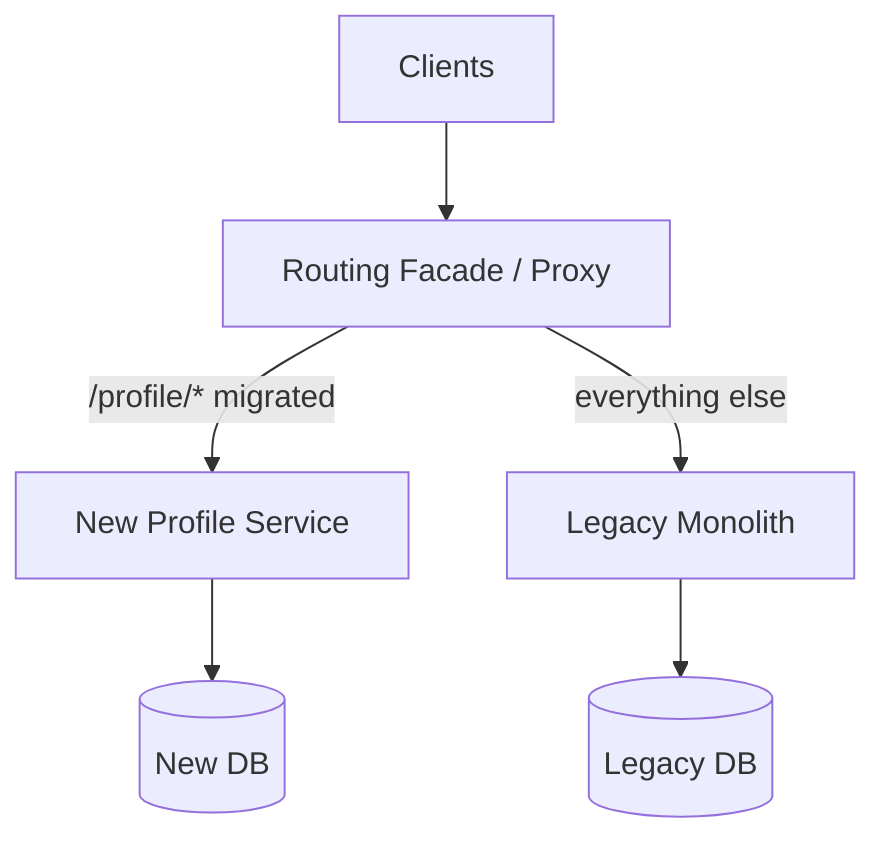
```mermaid
graph TB
    C[Clients] --> P[Routing Facade / Proxy]
    P -->|/profile/*  migrated| NS[New Profile Service]
    P -->|everything else| M[Legacy Monolith]
    NS --> NDB[(New DB)]
    M --> MDB[(Legacy DB)]
```

```
  PHASE 1                  PHASE 2                  PHASE 3
  Clients                  Clients                  Clients
    |                        |                        |
  [Proxy]                  [Proxy]                  [Proxy]
    |                       /     \                  /  |  \
  [Monolith]          [NewSvc] [Monolith]     [Svc1][Svc2][Svc3]
   (100%)             (slice)  (rest)          monolith retired
```

### Staff-Level
The strangler pattern's defining challenge is almost never the routing — it's the **data**. Extracting a service's *behavior* is straightforward; untangling its *data* from the monolith's shared database is the hard part, because the slice you're extracting usually shares tables and foreign keys with the rest of the monolith. Staff engineers plan a deliberate data-migration sequence: often the new service initially *shares* or *reads through* the monolith's data, then you introduce data synchronization (change-data-capture, dual-write via the [Outbox Pattern](#37-outbox-pattern), or events) to populate the new service's [own database](#5-database-per-service), and only once it's authoritative do you cut the dependency — a multi-step dance that must keep both systems consistent throughout. The second staff-level concern is **sequencing and ROI**: you don't extract randomly; you extract the slices with the highest pain-to-effort ratio first (the parts that change most often, scale worst, or block the most teams), delivering value early and building organizational confidence. You must also resist the **"stuck in the middle"** failure mode — many strangler migrations stall halfway because, once the urgent pain is relieved, leadership deprioritizes finishing, leaving a permanent hybrid that carries the operational cost of *both* architectures; staff engineers treat "fully retire the monolith" as an explicit, funded goal, not an aspiration. Finally, the routing facade and the period of dual-running demand strong observability and feature flags so each cutover can be canaried, monitored, and instantly rolled back — the safety of the incremental approach is only real if every step is genuinely reversible.


### Examples, Analogy & Real-World Use

**Analogy.** A strangler fig vine grows around a host tree, gradually taking over until the original tree is gone and the fig stands alone. You replace the old system piece by piece, not all at once.

**When to use.** Use to migrate a legacy monolith to microservices incrementally and reversibly via a routing facade. Extract highest pain-to-effort slices first; each step is canaried and roll-back-able.

**When to avoid.** Avoid big-bang rewrites. Avoid stalling 'stuck in the middle' — running both architectures forever doubles cost. Hardest part is untangling shared data, not routing.

**Real-world scenarios.**

- Many enterprises migrate legacy systems behind a proxy/facade gradually.
- Amazon and others decomposed monoliths slice-by-slice.
- CDC tools (Debezium) sync legacy data into new services during migration.

---

# Part 2 — Distributed Systems

## 15. CAP Theorem

### Basics
The **CAP theorem** (Brewer's theorem) states that a distributed data store can simultaneously guarantee at most **two** of three properties: **Consistency** (every read sees the most recent write — all nodes agree on the latest value), **Availability** (every request gets a non-error response, even if it's not the latest data), and **Partition tolerance** (the system keeps working even when the network between nodes drops or delays messages). The crucial, often-misunderstood point is that in any real distributed system spanning a network, **partitions are not optional** — networks fail, packets drop, links go down. So partition tolerance (P) is mandatory, and CAP really reduces to a *forced choice during a partition*: when nodes can't talk to each other, do you sacrifice **consistency** (answer anyway, risking stale data → **AP**) or **availability** (refuse to answer rather than risk being wrong → **CP**)?

### Intermediate
Concretely: imagine two replicas, and the network between them breaks. A client writes to replica 1. Now a client reads from replica 2. A **CP** system (e.g., a system built on consensus like etcd/ZooKeeper, or HBase) will make replica 2 refuse or block the read because it can't confirm it has the latest data — preserving consistency at the cost of availability. An **AP** system (e.g., Cassandra or DynamoDB in their default modes) will let replica 2 answer with whatever (possibly stale) value it has — preserving availability at the cost of consistency, and reconciling later via [eventual consistency](#29-eventual-consistency). When there's *no* partition, a well-designed system can offer both consistency and availability; CAP only forces the trade during the partition itself.

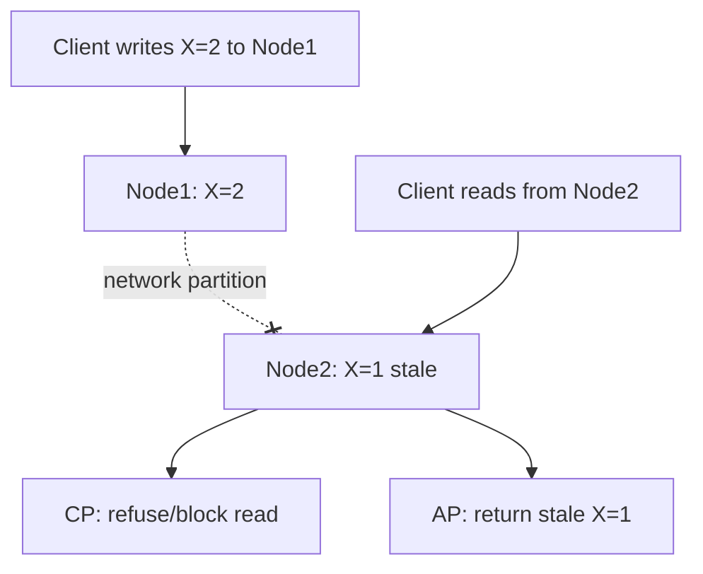
```mermaid
graph TB
    W[Client writes X=2 to Node1] --> N1[Node1: X=2]
    N1 -. network partition .-x N2[Node2: X=1 stale]
    R[Client reads from Node2] --> N2
    N2 --> CP[CP: refuse/block read]
    N2 --> AP[AP: return stale X=1]
```

```
   Network PARTITION splits the cluster:
        Node1 (X=2)   ||   Node2 (X=1, stale)
                      ||
   read hits Node2 --> CP: "error/wait" (consistent, not available)
                   --> AP: "X=1"        (available, not consistent)
   No partition? You can have both C and A.
```

### Staff-Level
The staff-level reality is that **CAP is a useful starting intuition but too coarse for real design decisions**. Its definitions are binary and absolute (linearizable consistency, total availability), whereas real systems live on a spectrum and tune the trade-off *per operation*. This is why [PACELC](#16-pacelc) exists — it extends CAP to address the (more common) no-partition case, noting you also trade latency against consistency *all the time*, not just during partitions. A second misconception staff engineers correct: CAP's "C" is *linearizability*, the strongest model, not the "C" in ACID (which is about invariants); a system can give up linearizability yet still offer useful weaker [consistency models](#17-consistency-models) like causal consistency. The mature framing is to stop asking "is my system CP or AP?" as a global label and instead ask, per data flow, "during a partition, is a stale answer or no answer worse *for this specific operation*?" A shopping cart should stay available (AP) and reconcile conflicts; a financial ledger balance check should refuse rather than risk a wrong answer (CP). Modern databases (Cosmos DB, Cassandra with tunable consistency, DynamoDB) expose this as a *per-request knob* — you choose strong vs eventual reads call-by-call. The deepest insight: partitions are rare and brief in good datacenters, so optimizing your entire architecture around the partition case while ignoring the everyday latency-vs-consistency trade (the "ELC" half of PACELC) is a common and costly mistake.


### Examples, Analogy & Real-World Use

**Analogy.** Three friends planning by group chat: if the network drops between them (partition), each either guesses and acts (available but maybe inconsistent) or waits until everyone reconnects (consistent but unavailable). You can't have both during the outage.

**When to use.** Use as a starting intuition for the partition-time trade. Decide per data flow: a cart stays available (AP) and reconciles; a ledger balance check refuses rather than risk a wrong answer (CP).

**When to avoid.** Avoid labeling a whole system 'CP' or 'AP' — modern stores tune it per request. Avoid optimizing only for the rare partition while ignoring everyday latency-vs-consistency (PACELC).

**Real-world scenarios.**

- Cassandra/DynamoDB default to AP (available, eventually consistent).
- etcd/ZooKeeper/HBase are CP (consistent, may reject during partition).
- Cosmos DB exposes consistency as a per-request knob.

---

## 16. PACELC

### Basics
**PACELC** extends the [CAP theorem](#15-cap-theorem) to describe a trade-off CAP ignores. It reads: **if** there is a **P**artition, choose between **A**vailability and **C**onsistency (the CAP trade); **E**lse (no partition, normal operation), choose between **L**atency and **C**onsistency. The key addition is the "ELC" half: even when the network is perfectly healthy, a distributed system *still* faces a trade-off — to guarantee strong consistency it must coordinate across replicas (wait for acknowledgments), which adds latency; if it wants low latency, it must answer from fewer replicas and accept weaker consistency. PACELC captures that consistency has a cost *all the time*, not just during the rare partition.

### Intermediate
You classify systems by both halves. A system might be **PA/EL** (during partition favor availability; normally favor latency) — this is Cassandra and DynamoDB, optimized for being fast and always-on, accepting weaker consistency. A system might be **PC/EC** (always favor consistency, in both partition and normal operation) — this is a strongly consistent store like VoltDB or a fully linearizable configuration. Some are mixed, like **PA/EC** or tunable systems. The "else" branch explains everyday behavior: when you set a quorum write that waits for a majority of replicas to acknowledge, you're choosing the EC (consistency) side and paying latency; when you read from the nearest replica without checking others, you're choosing EL (latency) and risking staleness.

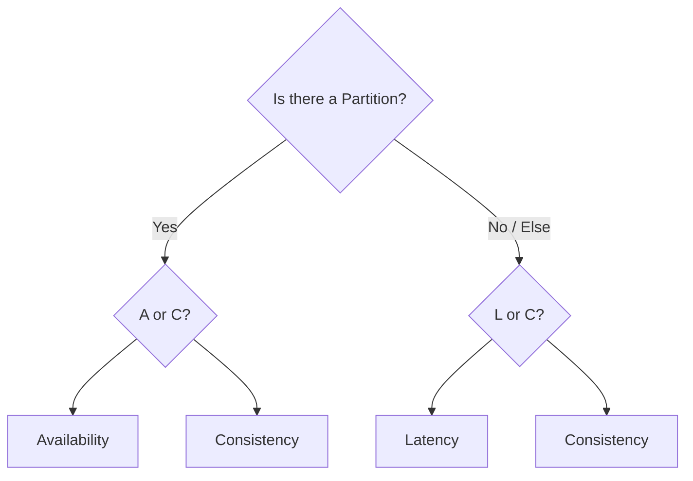
```mermaid
graph TD
    Start{Is there a Partition?} -->|Yes| PAC{A or C?}
    Start -->|No / Else| ELC{L or C?}
    PAC --> PA[Availability]
    PAC --> PCx[Consistency]
    ELC --> EL[Latency]
    ELC --> EC[Consistency]
```

```
  IF Partition:   choose  A  vs  C
  ELSE (normal):  choose  L  vs  C

  Examples:
   Cassandra/Dynamo = PA / EL   (available + low-latency, weak consistency)
   Strong store     = PC / EC   (consistent always, higher latency)
```

### Staff-Level
PACELC matters at staff level because **the "ELC" trade is the one you actually pay for every single day**, while the partition case is rare — yet engineers obsess over CAP and under-discuss latency-vs-consistency. The practical lens: every read or write in a replicated system implicitly picks a point on the latency/consistency curve via its [quorum](#23-quorum) settings, replication mode, and read source. A staff engineer designs these per workload — e.g., a user's session token read needs strong consistency (EC, accept latency) while a "recently viewed items" list can be EL (fast, eventually consistent). The framework also clarifies cross-region architecture: synchronous cross-region replication for consistency means every write pays inter-region round-trip latency (often 100ms+), which is frequently unacceptable, so most global systems choose EL/PA and engineer around eventual consistency with conflict resolution. PACELC also exposes a subtle point CAP hides: a system can be "available" in the CAP sense yet so slow under consistency requirements that it's *effectively* unavailable to users (a 5-second strongly-consistent read is technically a success but a UX failure) — which is why some argue high latency and unavailability are the same thing to the end user. The staff takeaway is to treat consistency as a *dial with a continuous price in latency*, set it per operation against business need, and recognize that the EL/EC decision shapes your p99 latency far more than partition handling ever will.


### Examples, Analogy & Real-World Use

**Analogy.** A delivery service: during a road closure (Partition) you choose a detour (Availability) or wait for the road (Consistency); even on a normal day (Else) you choose fast-but-approximate ETA (Latency) or slow-but-exact (Consistency).

**When to use.** Use to reason about the latency-vs-consistency cost you pay EVERY day, not just during partitions. Set the dial per operation (session token = EC; 'recently viewed' = EL).

**When to avoid.** Avoid obsessing over the rare partition case while ignoring the constant EL/EC trade that actually shapes your p99 latency.

**Real-world scenarios.**

- Cassandra/DynamoDB classified PA/EL (available + low-latency).
- Fully strong stores classified PC/EC.
- Global multi-region apps choose EL + conflict resolution to avoid cross-region latency.

---

## 17. Consistency Models

### Basics
A **consistency model** is the contract a distributed data store makes about *what values a read is allowed to return* in the presence of concurrent operations and replication. It answers: "if I write X and then read it, what am I guaranteed to see? What about reads from other clients?" Models form a spectrum from **strong** (behaves as if there's a single up-to-date copy — intuitive but expensive) to **weak/eventual** (reads may return stale or out-of-order data for a while — cheap and fast). Stronger models are easier to program against but require more coordination (and thus more latency and less availability, per [PACELC](#16-pacelc)); weaker models scale better and stay available but push complexity onto the application.

### Intermediate
Key models, from strongest to weakest. **Linearizability** (strong/atomic consistency): every operation appears to take effect instantaneously at some point between its start and end, and all clients see operations in the same real-time order — as if one single machine. **Sequential consistency**: all clients see operations in *some* single order consistent with each program's order, but not necessarily real-time order. **Causal consistency**: operations that are causally related (a reply must come after the message it replies to) are seen in order by everyone, but unrelated operations may be seen in different orders — a popular sweet spot. **Read-your-writes**, **monotonic reads**, and **monotonic writes** are useful client-centric guarantees (you always see your own updates; you never see time go backward). **Eventual consistency**: with no new writes, all replicas eventually converge — the weakest common model.

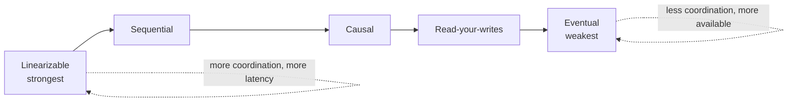
```mermaid
graph LR
    L[Linearizable<br/>strongest] --> S[Sequential] --> C[Causal] --> RYW[Read-your-writes] --> E[Eventual<br/>weakest]
    L -.more coordination, more latency.-> L
    E -.less coordination, more available.-> E
```

```
  STRONG  <-------------------------------------------->  WEAK
  Linearizable | Sequential | Causal | Read-your-writes | Eventual
  more latency                                         lower latency
  more coordination                                    more available
  easier to reason about                               app handles anomalies
```

### Staff-Level
The staff-level skill is **choosing the weakest consistency model that still preserves correctness for a given operation** — because every notch stronger costs latency, availability, and scalability. Most engineers reflexively assume linearizability (it matches single-machine intuition), but it requires consensus or strict coordination on every operation and is genuinely needed only for narrow cases: distributed locks, leader election, uniqueness constraints, and financial invariants. A huge swath of real workloads are correct under **causal consistency**, which preserves the cause-effect ordering humans care about (you never see a comment before the post it replies to) while allowing concurrent, unrelated operations to be reordered — giving most of the usability of strong consistency at much lower cost. A frequent staff-level realization is that **"eventual consistency" alone is often too weak to build on**: the bare guarantee ("converges someday") permits jarring anomalies (a value going backward, not seeing your own write), so you layer on client-centric guarantees — **read-your-writes** (route a user's reads to where their writes landed, or via sticky sessions) and **monotonic reads** (pin a client to a replica so it never sees older data than before). You must also reason about **convergence mechanics**: when replicas diverge, how do they reconcile? Last-write-wins (simple, but silently loses data on concurrent writes), version vectors, or CRDTs (conflict-free replicated data types that merge deterministically). The deepest staff insight is that consistency is not one global setting but a *per-operation correctness argument*: you map each operation to the minimum model that keeps invariants safe, and you make the resulting anomalies either impossible or invisible to the user.


### Examples, Analogy & Real-World Use

**Analogy.** A shared Google Doc vs emailing copies: linearizable = everyone sees every keystroke instantly in order; causal = replies always appear after the message they answer; eventual = copies converge after the dust settles.

**When to use.** Use the weakest model that preserves correctness. Linearizability for locks/uniqueness/balances; causal for social feeds/comments; eventual + client-centric guarantees for most high-scale reads.

**When to avoid.** Avoid defaulting to linearizability everywhere (expensive). Avoid bare 'eventual' where read-your-writes/monotonic reads are needed for UX.

**Real-world scenarios.**

- ZooKeeper/etcd offer linearizable operations.
- Social platforms use causal+ consistency for timelines/comments.
- Shopping carts use eventual consistency with CRDT/version-vector merges.

---

## 18. Replication

### Basics
**Replication** means keeping copies of the same data on multiple machines. You do it for three reasons: **availability** (if one node dies, others still serve the data), **read scalability** (spread reads across many copies), and **latency** (put copies near users geographically). The central challenge is keeping the copies in sync as data changes — when you write to one copy, how and when do the others get updated? The answer to that question determines your [consistency model](#17-consistency-models), your availability, and your performance, making replication strategy one of the most consequential decisions in a distributed data system.

### Intermediate
There are two axes. First, **where writes go**: **single-leader** (primary/replica) routes all writes to one leader that propagates to followers — simple, no write conflicts, but the leader is a bottleneck and a failover point; **multi-leader** allows writes at several nodes (e.g., one per region) — better write availability and locality but introduces *write conflicts* that must be resolved; **leaderless** (Dynamo-style) lets clients write to several replicas directly and uses [quorums](#23-quorum) to stay consistent enough. Second, **when followers are updated**: **synchronous** replication waits for replicas to acknowledge before confirming the write (durable and consistent, but slow and the write fails if a replica is down), while **asynchronous** replication confirms immediately and propagates in the background (fast and available, but you can lose recent writes on leader failure and reads can be stale).

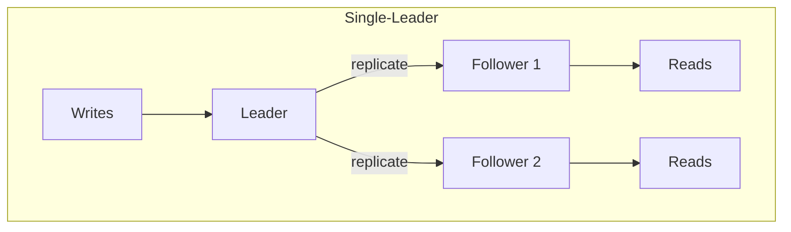
```mermaid
graph TB
    subgraph "Single-Leader"
        Cli[Writes] --> Lead[Leader]
        Lead -->|replicate| F1[Follower 1]
        Lead -->|replicate| F2[Follower 2]
        F1 --> Reads1[Reads]
        F2 --> Reads2[Reads]
    end
```

```
  SINGLE-LEADER                  MULTI-LEADER              LEADERLESS
  writes -> [Leader]             [LeaderA]<->[LeaderB]     write to N replicas
              |  \                  |           |          read from R replicas
          [F1]  [F2]            (conflicts!)  (per region) W+R > N => overlap
        sync or async
```

### Staff-Level
The staff-level depth lives in the **failure and conflict cases**, not the happy path. For single-leader with *asynchronous* replication, the killer scenario is leader failure: writes acknowledged by the leader but not yet replicated are **lost** on failover, and worse, a botched failover can produce **split-brain** (two nodes both think they're leader, accepting divergent writes). This is why production single-leader systems pair replication with [consensus](#22-consensus)-based [leader election](#21-leader-election) and fencing tokens. The **replication lag** of async followers is a first-class operational concern — it breaks read-your-writes (a user updates their profile, then reads from a lagging follower and sees the old value), demanding mitigations like reading from the leader for a window after a write, or [monotonic-read](#17-consistency-models) routing. Multi-leader and leaderless designs trade the leader bottleneck for **conflict resolution** as the central problem: concurrent writes to the same key on different nodes must be merged, via last-write-wins (lossy), version vectors (detect concurrency), or CRDTs (deterministic merge) — and "last-write-wins" silently dropping a customer's data is a classic production incident. Staff engineers also reason about **synchronous vs async as a durability/latency dial**: many systems use *semi-synchronous* (wait for at least one replica, async to the rest) to bound data loss without paying full sync latency, and tie write durability to [quorum](#23-quorum) configuration. Finally, geo-replication forces the [PACELC](#16-pacelc) trade into the open: synchronous cross-region replication is consistent but pays brutal round-trip latency, so global systems almost always go async + conflict resolution and engineer the application for it.


### Examples, Analogy & Real-World Use

**Analogy.** Photocopying an important document and storing copies in several buildings: if one burns down you still have the data, and people read the nearest copy — but you must keep all copies updated when the original changes.

**When to use.** Use for availability, read scaling, and geo-latency. Single-leader for simple strong writes; multi-leader for multi-region writes; leaderless (Dynamo) for high availability with quorums.

**When to avoid.** Avoid async single-leader without consensus-backed failover (split-brain, lost writes). Avoid naive last-write-wins where concurrent writes silently lose data.

**Real-world scenarios.**

- PostgreSQL/MySQL primary-replica (single-leader).
- Cassandra/DynamoDB leaderless quorum replication.
- Multi-region active-active deployments use multi-leader with conflict resolution.

---

## 19. Sharding

### Basics
**Sharding** (horizontal partitioning) splits a large dataset across multiple machines so that each machine holds only a *subset* of the data. Where [replication](#18-replication) puts *copies of the same data* on many nodes (for availability and read scaling), sharding puts *different data* on different nodes (for capacity and write scaling). You shard when a dataset or its write throughput outgrows a single machine — no single server can hold 100 TB or handle a million writes per second, so you divide the data into shards (partitions), each owned by a different node. A **shard key** determines which shard a given record lives on.

### Intermediate
The choice of *how* to map records to shards is everything. **Range-based sharding** assigns contiguous key ranges to shards (e.g., users A–F on shard 1, G–M on shard 2) — great for range scans but prone to **hot spots** if access is skewed (everyone querying recent timestamps hammers one shard). **Hash-based sharding** hashes the key and assigns by hash value — spreads load evenly and avoids hotspots, but destroys range-query locality. **Directory-based** sharding keeps an explicit lookup table mapping keys to shards — flexible but adds a lookup and a potential bottleneck. In practice systems combine replication and sharding: each shard is itself replicated across several nodes, so you get both scale (many shards) and availability (each shard has copies).

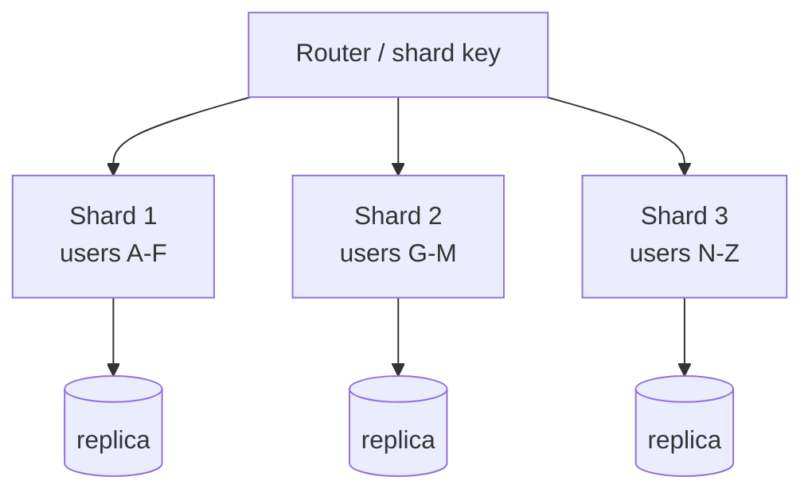
```mermaid
graph TB
    R[Router / shard key] --> S1[Shard 1<br/>users A-F]
    R --> S2[Shard 2<br/>users G-M]
    R --> S3[Shard 3<br/>users N-Z]
    S1 --> S1r[(replica)]
    S2 --> S2r[(replica)]
    S3 --> S3r[(replica)]
```

```
  REPLICATION = same data, many copies   |  SHARDING = different data per node
                                          |
  shard key -> hash/range -> pick shard:  |
     Shard1 [A-F]   Shard2 [G-M]   Shard3 [N-Z]
        |              |              |
     replicas       replicas       replicas   (combine both!)
```

### Staff-Level
The hardest staff-level problems in sharding are **shard key selection**, **rebalancing**, and **cross-shard operations**. The shard key is a near-irreversible decision: pick one with poor cardinality or skewed access and you get **hot shards** (one node melts while others idle), and changing the key later requires re-sharding the entire dataset. The staff discipline is to choose a key that is high-cardinality, evenly accessed, and aligned with the dominant query pattern so most queries hit a single shard. **Rebalancing** — adding capacity by redistributing shards — is where naive `hash(key) % N` sharding fails catastrophically: changing N remaps almost every key, forcing a near-total data shuffle, which is exactly why [consistent hashing](#20-consistent-hashing) exists (it moves only ~1/N of keys when capacity changes). Systems often shard into *many more logical partitions than nodes* and move whole partitions between nodes, decoupling the partition count from the node count for smooth rebalancing. The deepest pain is **cross-shard operations**: a query or transaction that spans shards loses single-node ACID guarantees — you can't cheaply JOIN across shards or run a multi-shard transaction without distributed-transaction protocols (two-phase commit, with its blocking and coordinator-failure problems) or [Saga](#6-saga-pattern)-style application-level consistency. Aggregations become scatter-gather (query all shards, merge results), with latency bounded by the slowest shard. Staff engineers therefore design the schema and access patterns to keep related data **co-located on the same shard** (e.g., shard by tenant so all of a tenant's data lives together), turning would-be cross-shard operations into single-shard ones. They also plan for **shard-level hotspots within a good key** (a single celebrity user, a viral product) with techniques like key-splitting or dedicated handling.


### Examples, Analogy & Real-World Use

**Analogy.** A library too big for one building splits books across branches by subject or author initial. Each branch holds different books (not copies). You must know which branch holds your book — and avoid one branch getting all the popular titles.

**When to use.** Use when data volume or write throughput outgrows one machine. Choose a high-cardinality, evenly-accessed shard key aligned to the dominant query; co-locate related data (shard by tenant).

**When to avoid.** Avoid low-cardinality/skewed keys (hot shards) and avoid `hash % N` for placement (remaps everything on resize — use consistent hashing). Avoid designs needing frequent cross-shard joins/txns.

**Real-world scenarios.**

- MongoDB and Vitess (YouTube's MySQL sharding) shard at scale.
- Instagram shards Postgres by user ID.
- DynamoDB partitions by hash of the partition key.

---

## 20. Consistent Hashing

### Basics
**Consistent hashing** is a technique for distributing keys across a changing set of nodes such that **adding or removing a node moves only a small fraction of keys**, instead of remapping almost everything. The problem it solves: if you place keys with `hash(key) % N` across N nodes and then add one node (N→N+1), the modulus changes for nearly every key, so almost all data must move — catastrophic for a cache or a [sharded](#19-sharding) datastore. Consistent hashing instead maps both keys *and* nodes onto the same circular hash space (a "ring"), and a key belongs to the first node found going clockwise from the key's position. Add or remove a node and only the keys in that node's arc are affected.

### Intermediate
Picture a ring of hash values from 0 to 2³²−1. Each node is hashed to a point on the ring; each key is hashed to a point; a key is owned by the next node clockwise. When a node is removed, only its keys move — to the next node clockwise. When a node is added, it takes over only the keys between it and the previous node. The naive version has a flaw: with few nodes, the ring is unevenly divided and load is lopsided. The fix is **virtual nodes (vnodes)** — each physical node is placed at *many* points on the ring (say 100–200 virtual positions), which smooths the distribution and means that when a node leaves, its load is spread across many remaining nodes rather than dumped entirely on one neighbor. This is the backbone of systems like Cassandra, DynamoDB, and distributed caches.

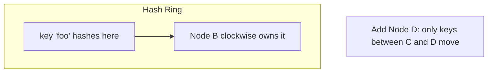
```mermaid
graph TB
    subgraph "Hash Ring"
        K[key 'foo' hashes here] --> NodeB[Node B clockwise owns it]
    end
    Note[Add Node D: only keys between C and D move]
```

```
            0 / 2^32
              ___
         N_A /   \ N_B
            |  k ->|   key 'k' goes to next node clockwise (N_B)
         N_D \___/ N_C
   Remove N_B: only its arc's keys move to N_C (not everything)
   Virtual nodes: each physical node placed at many ring points -> even load
```

### Staff-Level
At staff level, consistent hashing is understood not as a curiosity but as the **enabler of elastic, rebalance-friendly distributed storage and caching** — and its subtleties matter. The first is **load balancing quality**: even with vnodes, hash-based placement gives *statistical* evenness, not perfect evenness, and real workloads have skewed key popularity, so you can still get hot nodes; production systems add **bounded-load** variants (a node refuses keys beyond a load threshold, spilling to the next) or popularity-aware placement. The second is the **replication interaction**: in Dynamo-style systems a key is stored not just on its owning node but on the next *R−1* nodes clockwise (the "preference list"), so consistent hashing simultaneously defines partitioning *and* replica placement — and membership changes must carefully hand off both ownership and replica responsibility without data loss. The third is **virtual-node tuning**: too few vnodes per node gives uneven load and lumpy rebalancing; too many bloats the ring metadata and slows membership operations and repair — a real operational dial (Cassandra's `num_tokens` debates are exactly this). Staff engineers also weigh consistent hashing against the alternative used by some systems — a **central coordinator with an explicit partition-to-node map** (like a directory or a "slot" table, e.g., Redis Cluster's 16384 fixed slots), which gives precise control and easier rebalancing at the cost of a coordinator dependency. The key judgment: consistent hashing decentralizes placement (no coordinator needed, any node can compute where a key lives) which is ideal for AP, leaderless systems, but when you need tight control over balance and movement, an explicit slot map can be the better engineering choice.


### Examples, Analogy & Real-World Use

**Analogy.** Seating guests around a round table: adding one more chair only shifts the few people next to it, not everyone. Keys and nodes sit on a ring; adding/removing a node moves only a small arc of keys.

**When to use.** Use for distributed caches and partitioned stores where nodes are added/removed often and you want minimal data movement. Use virtual nodes for even load.

**When to avoid.** Avoid plain `hash % N` (resize remaps almost everything). Watch for hot keys even with vnodes; consider bounded-load variants or an explicit slot map when you need tight control.

**Real-world scenarios.**

- Amazon DynamoDB and Cassandra use consistent hashing + vnodes.
- Memcached/Redis client libraries use it for cache sharding.
- Riak and Akka Cluster rely on hash rings.

---

## 21. Leader Election

### Basics
**Leader election** is the process by which a group of distributed nodes agrees on a single node to act as the "leader" (also called primary, master, or coordinator) that takes on a special role — typically coordinating writes, assigning work, or making decisions that need a single authority. Many distributed patterns need exactly one node in charge: a [single-leader replication](#18-replication) setup needs one primary to order writes; a job scheduler needs one coordinator to avoid double-scheduling. The hard part is doing this *reliably despite failures*: the current leader can crash, the network can partition, and the remaining nodes must detect this and elect a new leader — without ever ending up with two leaders ("split-brain").

### Intermediate
A leader is usually elected for a bounded **term** and must continuously prove it's alive via **heartbeats**. If followers stop hearing heartbeats within a timeout, they assume the leader died and trigger a new election. The election itself must guarantee that a *majority* agrees on the new leader, which is why robust leader election is built on top of a [consensus](#22-consensus) algorithm like [Raft](#24-raft) (where election is a core part of the protocol) or coordinated through a consensus-backed store like ZooKeeper or etcd (where nodes race to create a single "leader" lock/znode, and whoever wins is leader, with a lease that must be renewed). The majority requirement is essential: it ensures that even if the cluster splits, at most one side can have a majority and thus at most one leader can be elected.

```mermaid
sequenceDiagram
    participant F1 as Follower 1
    participant F2 as Follower 2
    participant F3 as Follower 3
    Note over F1,F3: leader heartbeats stop (leader crashed)
    F1->>F2: election timeout! I'm candidate, vote for me (term 5)
    F1->>F3: vote for me (term 5)
    F2-->>F1: vote granted
    F3-->>F1: vote granted
    Note over F1: got majority -> I am leader for term 5
```

```
  Leader sends heartbeats --> followers reset timers
       (leader dies, heartbeats stop)
  Follower times out -> becomes CANDIDATE -> requests votes
       needs MAJORITY (quorum) of votes -> becomes LEADER
  Majority rule => at most ONE leader even if cluster splits (no split-brain)
```

### Staff-Level
The defining staff-level danger is **split-brain**, and the subtle truth is that *detecting* a dead leader is fundamentally unreliable: you cannot distinguish "leader crashed" from "leader is alive but the network to it is slow/partitioned." A leader that's merely slow or partitioned may still believe it's the leader and keep acting (accepting writes, doing work) while the cluster elects a new one — now you have two leaders and divergent state. The two essential defenses: (1) **majority quorum** for election, so a minority partition *cannot* elect a competing leader (the old leader, if on the minority side, can't get quorum to commit anything); and (2) **fencing tokens** — every leader gets a monotonically increasing term/epoch number, and downstream systems (storage, locks) reject operations stamped with an *old* token, so even if a zombie old leader issues a write, it's fenced out. This is why **a lock or lease alone is not safe** without fencing — a process can pause (GC, VM freeze) past its lease expiry, wake up believing it still holds the lock, and corrupt state; fencing tokens make the late write harmless. Staff engineers also tune the **timeout trade-off**: short heartbeat/election timeouts detect failures fast but cause spurious elections (and leadership churn) under transient network blips or GC pauses; long timeouts are stable but slow to recover — and leadership churn itself is costly because each election pauses the system. Finally, the leader is a **scalability and availability bottleneck** by design, so staff engineers minimize what *must* go through the leader (e.g., serve reads from followers when staleness is acceptable) and never invent home-grown leader election — they delegate it to a battle-tested consensus system, because the failure modes are far subtler than they appear.


### Examples, Analogy & Real-World Use

**Analogy.** A team whose manager goes silent: after a while members hold a vote for a new lead. A majority must agree, so even if the team splits in two rooms, only the room with most people can pick a leader — preventing two bosses.

**When to use.** Use when exactly one node must coordinate (single-leader replication, a scheduler). Delegate to a consensus-backed system (ZooKeeper/etcd/Raft); never hand-roll it.

**When to avoid.** Avoid timeouts so short they cause spurious elections on GC pauses. Avoid trusting a lock/lease alone without fencing tokens — a paused old leader can corrupt state.

**Real-world scenarios.**

- Kubernetes controllers use lease-based leader election via the API server (etcd).
- Kafka elects partition leaders; controllers elected via KRaft/ZooKeeper.
- ZooKeeper ephemeral-node 'leader latch' is a classic recipe.

---

## 22. Consensus

### Basics
**Consensus** is the problem of getting a group of distributed nodes to **agree on a single value** (or a single ordered sequence of values) even when some nodes fail and the network is unreliable. It's the foundational problem of distributed systems: if you can solve consensus, you can build [leader election](#21-leader-election), distributed locks, consistent replication, atomic commits, and strongly-consistent databases — they all reduce to "get the nodes to agree." A correct consensus protocol guarantees **agreement** (all non-faulty nodes decide the same value), **validity** (the decided value was actually proposed by some node), and **termination** (all non-faulty nodes eventually decide).

### Intermediate
Consensus is hard because of failures and asynchrony. The famous **FLP impossibility result** proves that in a fully asynchronous network (no bound on message delay), no consensus algorithm can guarantee termination if even one node may crash — you cannot tell a crashed node from a slow one. Real systems sidestep FLP using **timeouts** (a practical, if imperfect, failure detector) and **randomization**, accepting that progress requires *partial synchrony* (the network is "usually" timely). The practical consensus algorithms — **Paxos** (the theoretical foundation, notoriously hard to understand and implement correctly), **Raft** (designed for understandability, see [§24](#24-raft)), and **Zab** (ZooKeeper's protocol) — all work by electing a leader and having it replicate an ordered log to a **majority** ([quorum](#23-quorum)) of nodes; a value is "committed" once a majority has durably stored it, which guarantees it survives any minority failure.

```mermaid
sequenceDiagram
    participant L as Leader
    participant F1 as Follower 1
    participant F2 as Follower 2
    L->>F1: propose value V (log entry)
    L->>F2: propose value V
    F1-->>L: ack
    F2-->>L: ack
    Note over L: majority acked -> V is COMMITTED
    L->>F1: commit V
    L->>F2: commit V
```

```
  Goal: all nodes agree on ONE ordered log of values.
  Leader proposes -> replicate to MAJORITY -> committed (survives minority loss)
  FLP: pure async + 1 crash => can't guarantee termination
       -> real systems use TIMEOUTS + leader to make progress
```

### Staff-Level
The staff-level understanding starts with *why consensus is expensive and when to avoid it*: every committed decision requires at least one round-trip to a majority of nodes, so consensus inherently adds latency and caps throughput at the leader — you use it for the **small, critical, must-agree state** (cluster membership, configuration, leader identity, lock ownership, the *metadata* that coordinates everything else), not for high-volume data-plane traffic. A classic architecture puts consensus (etcd/ZooKeeper) at the control-plane core and keeps the bulk data path consensus-free. The **quorum/majority math** is the heart of fault tolerance: a cluster of `2f+1` nodes tolerates `f` failures, which is why consensus clusters are sized 3, 5, or 7 (odd numbers — an even count adds a node without adding fault tolerance and worsens the chance of a tie). Staff engineers reason carefully about **what failures the protocol assumes**: Paxos/Raft tolerate *crash* faults (nodes stop) but **not Byzantine faults** (nodes lying or corrupted) — for adversarial settings like blockchains you need BFT protocols (PBFT, Tendermint) that tolerate `f` malicious nodes out of `3f+1`, at much higher cost. Other deep concerns: **read consistency** (a naive read from the leader can be stale if a new leader was elected elsewhere, so linearizable reads require either a quorum read or a "read lease"/heartbeat confirmation that the leader is still legitimate); **membership changes** (adding/removing nodes from a consensus group without violating the quorum invariant requires careful *joint-consensus* protocols, a frequent source of bugs); and the practical wisdom to **never implement consensus yourself** — use etcd, ZooKeeper, or a vetted Raft library, because the edge cases (especially around log compaction, snapshots, and configuration changes) have humbled many expert teams.


### Examples, Analogy & Real-World Use

**Analogy.** A jury that must reach a unanimous-enough (majority) verdict despite some jurors dozing off or stepping out: once a majority commits to a decision, it stands and survives the absent few.

**When to use.** Use for the small, critical, must-agree state: cluster membership, config, leader identity, lock ownership. Keep high-volume data off the consensus path.

**When to avoid.** Avoid routing bulk data through consensus (latency/throughput ceiling). Avoid assuming crash-tolerant consensus (Raft/Paxos) handles Byzantine faults — it doesn't.

**Real-world scenarios.**

- etcd (Raft) backs Kubernetes' cluster state.
- Google Chubby (Paxos) provides locking/coordination.
- ZooKeeper (Zab) coordinates Hadoop/Kafka ecosystems.

---

## 23. Quorum

### Basics
A **quorum** is the minimum number of nodes that must participate in (and agree on) an operation for it to be considered successful. The most common quorum is a **majority** — more than half the nodes. Quorums are the mechanism that lets a distributed system make safe decisions without requiring *every* node to be available: instead of needing all 5 replicas to acknowledge a write (which fails if any one is down), you require just 3 of 5. The magic property of majority quorums is that **any two majorities must overlap in at least one node** — and that overlap is what prevents the system from making two contradictory decisions.

### Intermediate
In replicated storage, quorums are tuned via three numbers: **N** (total replicas), **W** (replicas that must acknowledge a write), and **R** (replicas that must respond to a read). The fundamental rule is **W + R > N**: when this holds, the read set and the write set are guaranteed to overlap by at least one node, so any read is guaranteed to see at least one replica that has the latest write — giving strong consistency. For example, with N=3 you might choose W=2, R=2 (2+2 > 3 ✓). You can tune the trade-off: W=3, R=1 makes reads fast but writes need all replicas; W=1, R=3 makes writes fast but reads slower; W=1, R=1 is fastest but W+R is not > N, so you get [eventual consistency](#29-eventual-consistency) (no overlap guarantee). In [consensus](#22-consensus) and [leader election](#21-leader-election), the quorum is a majority, which guarantees at most one decision can win.

```mermaid
graph TB
    subgraph "N=5, W=3, R=3 (W+R>N)"
        W1[Write to 3 nodes] --> Overlap[Guaranteed overlap node]
        R1[Read from 3 nodes] --> Overlap
        Overlap --> Fresh[Read sees latest write]
    end
```

```
  N = total replicas, W = write quorum, R = read quorum
  RULE: W + R > N  =>  read set and write set OVERLAP => strong consistency

  N=5:  W=3 [#####]  ack 3
        R=3 [#####]  read 3   -> at least 1 node is in both -> fresh value
  W+R <= N (e.g. W=1,R=1) -> may miss latest -> eventual consistency
```

### Staff-Level
At staff level, quorums are the **tunable dial between consistency, availability, and latency** ([PACELC](#16-pacelc) made concrete), and the deep insight is that W+R>N gives you *strong-ish* consistency but **not linearizability by itself**. Dynamo-style leaderless quorums suffer subtle anomalies even with W+R>N: concurrent writes can produce conflicting versions that quorum overlap detects but doesn't *resolve* (you still need version vectors or CRDTs), and edge cases around **sloppy quorums with hinted handoff** (where, during failures, writes go to *substitute* nodes outside the normal replica set to stay available) break the overlap guarantee entirely — trading consistency for availability during partitions. Staff engineers also reason about the **availability math**: with majority quorums, a cluster of N tolerates failures of up to ⌊(N−1)/2⌋ nodes for writes; choosing W and R asymmetrically lets you optimize for a read-heavy vs write-heavy workload, but pushing W down to 1 means a single node failure right after a write can lose it. A critical operational subtlety is **quorum for reads vs durability**: a write acked by W replicas can still be lost if those replicas fail before replicating further, so durability depends on *which* and *how many* nodes, and on whether acks require fsync-to-disk. There's also the **even-vs-odd** consideration inherited from consensus: a 4-node majority quorum (needs 3) tolerates only 1 failure — the same as 3 nodes — so even counts waste a node. Finally, staff engineers watch for the **"read repair" and "anti-entropy"** background processes that quorum systems rely on to converge replicas that the quorum path left stale, because if those fall behind, "eventually consistent" quietly becomes "indefinitely inconsistent."


### Examples, Analogy & Real-World Use

**Analogy.** A board meeting needs a minimum number of members present to make binding decisions. Any two valid meetings share at least one member, so they can't pass contradictory motions.

**When to use.** Use majority quorums for consensus/elections, and W+R>N for tunable read/write strong-ish consistency in replicated stores. Tune W and R to favor read- or write-heavy workloads.

**When to avoid.** Avoid even-sized clusters (waste a node). Avoid assuming W+R>N gives linearizability (it doesn't, alone) — concurrent writes still need conflict resolution.

**Real-world scenarios.**

- Cassandra exposes QUORUM/LOCAL_QUORUM consistency levels.
- DynamoDB uses quorum reads/writes internally.
- Raft/Paxos commit on majority quorum.

---

## 24. Raft

### Basics
**Raft** is a [consensus](#22-consensus) algorithm designed explicitly to be *understandable* — it produces the same guarantees as the older, notoriously opaque Paxos, but decomposes the problem into pieces humans can reason about. Raft keeps a **replicated log**: every node stores the same ordered sequence of commands, and once a command is committed to the log on a majority of nodes, every node applies it to its state machine in the same order, so all nodes end up in the same state. Raft achieves this with a strong **leader**: one node is elected leader, all writes go through it, and it forces its log onto the followers. It's the engine inside etcd, Consul, CockroachDB, TiKV, and many others.

### Intermediate
Raft breaks consensus into three subproblems. **Leader election:** time is divided into **terms**; each node is a follower, candidate, or leader. Followers expect heartbeats from the leader; if they time out (randomized timeouts prevent ties), a follower becomes a candidate, increments the term, and requests votes — a candidate that wins a majority becomes leader. **Log replication:** the leader appends each client command to its log and sends it to followers; once a majority have stored it, the entry is **committed** and applied. **Safety:** Raft guarantees that a node can only win election if its log is at least as up-to-date as the majority's, ensuring a new leader never overwrites committed entries. Randomized election timeouts, term numbers (which act as logical clocks and fencing), and the majority rule together keep the system correct through crashes and partitions.

```mermaid
stateDiagram-v2
    [*] --> Follower
    Follower --> Candidate: election timeout (no heartbeat)
    Candidate --> Leader: wins majority of votes
    Candidate --> Follower: discovers current leader / higher term
    Leader --> Follower: discovers higher term
```

```
  ROLES:  Follower --(timeout)--> Candidate --(majority votes)--> Leader
                ^                                                   |
                +------------- (sees higher term) -----------------+

  LOG:  Leader appends cmd -> replicates to followers
        committed once MAJORITY store it -> all apply in same order
  TERMS act as logical clock + fencing (reject stale leaders)
```

### Staff-Level
Raft's staff-level lessons are mostly about the **gap between the paper and a correct production implementation**. The core protocol is elegant, but the parts that aren't in the simple description are where systems break: **log compaction and snapshots** (the log can't grow forever, so nodes periodically snapshot state and truncate the log — and shipping snapshots to a lagging or newly-joined follower is a whole subsystem), **membership changes** (adding/removing nodes must use Raft's *joint consensus* or single-server-change protocol to avoid two disjoint majorities forming during the transition — a subtle correctness trap), and **read linearizability** (serving a read from the leader can return stale data if the leader was just deposed, so linearizable reads need a *ReadIndex*/lease mechanism where the leader confirms it still has majority support before answering). Staff engineers also tune the operational realities: **election-timeout configuration** trades failover speed against stability under GC pauses and network jitter (too aggressive and a `stop-the-world` GC pause triggers needless leader churn; the entire cluster stalls during each election), and **batching/pipelining** of log entries is essential to get acceptable throughput since each entry otherwise pays a majority round-trip. A frequently-cited deep issue is the **"leader as throughput ceiling"** — all writes funnel through one node, so to scale write throughput beyond one Raft group you **shard** ([§19](#19-sharding)) the keyspace into many independent Raft groups (multi-raft), each with its own leader, which is exactly how CockroachDB and TiKV scale. The overarching staff wisdom mirrors consensus generally: understand Raft deeply so you can operate and debug it, but use a mature implementation rather than writing your own, because the safety proofs hinge on details (persisting `votedFor` and `currentTerm` before responding, correct handling of conflicting log entries) that are easy to get subtly, dangerously wrong.


### Examples, Analogy & Real-World Use

**Analogy.** A well-run meeting with one chairperson: the chair (leader) proposes each item, records it once a majority agree (committed), and if the chair leaves, members hold a quick election for a new one — all with clear rules anyone can follow.

**When to use.** Use (via a mature library/system) whenever you need replicated, strongly-consistent state with automatic failover. Shard into multiple Raft groups (multi-raft) to scale writes.

**When to avoid.** Avoid implementing it yourself — snapshots, membership changes, and linearizable reads are subtle. Avoid one Raft group as a global write funnel.

**Real-world scenarios.**

- etcd, Consul, CockroachDB, TiKV all run Raft.
- CockroachDB/TiKV use multi-raft (one group per shard) to scale.
- MongoDB's replication protocol is Raft-like.

---

## 25. Gossip Protocol

### Basics
A **gossip protocol** (epidemic protocol) spreads information through a cluster the way gossip — or a virus — spreads through a population: each node periodically picks a few random peers and shares what it knows, those peers share with others, and within a logarithmic number of rounds the information reaches everyone. There's no central coordinator and no node needs to know about all other nodes — each only talks to a handful at a time. Gossip is used for **decentralized** tasks like membership (which nodes are in the cluster and alive), failure detection, and propagating configuration or state — anywhere you need information to spread robustly across a large, churning cluster without a single point of failure.

### Intermediate
In each round (say, every second), a node selects a small random subset of peers and exchanges state with them — pushing its info, pulling theirs, or both (push-pull, which converges fastest). Because the spread is exponential, a fact reaches all N nodes in roughly **O(log N)** rounds, even for thousands of nodes. Gossip is the basis of **failure detection** via mechanisms like heartbeat counters or the **SWIM** protocol (each node periodically pings a random peer; if no ack, it asks other nodes to ping it indirectly before declaring it suspect, then dead — reducing false positives). Cassandra, Consul, Riak, and DynamoDB-style systems use gossip to maintain a decentralized view of cluster membership and node health. The trade-off is that gossip provides only **eventual** consistency of the propagated information — there's a propagation delay, and the protocol is probabilistic, not instantaneous.

```mermaid
graph TB
    A[Node A learns: 'D is down'] -->|round 1| B[Node B]
    A -->|round 1| C[Node C]
    B -->|round 2| E[Node E]
    C -->|round 2| F[Node F]
    Note[Reaches all N nodes in ~log N rounds]
```

```
  Round 1:  A -> B, C            (A tells 2 random peers)
  Round 2:  B -> E, A;  C -> F   (they each tell 2 more)
  Round 3:  E,F,... -> everyone
  Spread is exponential => all N nodes informed in ~O(log N) rounds
  No coordinator, resilient to node/link failures, EVENTUALLY consistent
```

### Staff-Level
The staff-level appeal of gossip is its **robustness and decentralization**: it has no single point of failure, scales to very large clusters, tolerates message loss and node churn gracefully (a dropped gossip just gets re-sent next round), and requires no global membership knowledge — properties that make it ideal for the *control plane* of large AP systems. The trade-offs you must reason about: gossip is **eventually consistent and probabilistic**, so it's *wrong* for anything needing strong agreement or a single authoritative decision — you'd never elect a leader or commit a transaction via gossip ([consensus](#22-consensus) is for that); gossip is for *disseminating* information that can tolerate brief disagreement (membership, health, metrics, config). A key staff-level concern is **failure-detection accuracy**: tuning the suspicion timeouts and indirect-probing (SWIM-style) to balance fast detection against false positives, because in a large cluster a too-aggressive detector will constantly, incorrectly mark slow-but-alive nodes as dead, causing churn and unnecessary data movement. Another is **bandwidth and convergence tuning**: the fanout (peers per round) and round interval trade propagation speed against network overhead, and naive gossip can waste bandwidth re-sending already-known state, so production protocols add version reconciliation (only exchange deltas / use version digests) and anti-entropy mechanisms. Staff engineers also recognize gossip's role in **anti-entropy / read repair** for data stores — background reconciliation that complements the [quorum](#23-quorum) read/write path to bring divergent replicas back into agreement. The mental model: gossip is the *immune system* of a decentralized cluster — resilient, self-healing, and always-on, but deliberately approximate, so you pair it with consensus for the few decisions that must be exact.


### Examples, Analogy & Real-World Use

**Analogy.** Rumors spreading at a party: each person tells a few others, who tell a few more — within minutes everyone knows, with no announcer and no single point of failure. It's approximate and takes a moment, but it's robust.

**When to use.** Use for decentralized membership, failure detection, and disseminating config/health in large, churning clusters. Pair with consensus for anything needing exact agreement.

**When to avoid.** Avoid using gossip for decisions needing strong agreement (leader election, commits). Tune suspicion timeouts to avoid false 'node down' positives.

**Real-world scenarios.**

- Cassandra and DynamoDB use gossip for cluster membership.
- Consul/Serf use the SWIM gossip protocol.
- HashiCorp's Memberlist library underpins many gossip systems.

---

## 26. Distributed Locks

### Basics
A **distributed lock** lets processes running on *different machines* coordinate exclusive access to a shared resource — the distributed equivalent of a mutex, but across a network. You need one when only one worker at a time should perform some action: only one node should run a scheduled job, only one should write to a particular file, only one should process a given order. Since the processes don't share memory, they coordinate through an external system (Redis, ZooKeeper, etcd, or a database) that grants the lock to one holder at a time and makes everyone else wait or back off. Crucially, distributed locks are **far harder to get right** than in-process locks, because the network, clocks, and process pauses can all betray you.

### Intermediate
A basic implementation uses an external store: a process atomically creates a lock key (e.g., Redis `SET lockkey owner NX PX 30000` — set if-not-exists with a 30-second expiry) and, if it succeeds, holds the lock; others fail the set and retry later. The **expiry (lease/TTL)** is essential — without it, a holder that crashes would hold the lock forever, deadlocking everyone. ZooKeeper/etcd implement locks more robustly using ephemeral sequential nodes (the lowest-sequence node holds the lock; ephemeral nodes auto-release if the holder's session dies) backed by [consensus](#22-consensus), which avoids many of the failure modes of a single Redis instance. The lock holder must release the lock when done, and the TTL guarantees release even on crash.

```mermaid
sequenceDiagram
    participant P1 as Process 1
    participant P2 as Process 2
    participant L as Lock Store
    P1->>L: SET lock owner=P1 NX PX 30000
    L-->>P1: OK (acquired)
    P2->>L: SET lock owner=P2 NX PX 30000
    L-->>P2: nil (denied)
    Note over P2: wait / retry with backoff
    P1->>L: DEL lock (release)
```

```
  P1: SET lock NX PX 30s  -> OK (holds it)
  P2: SET lock NX PX 30s  -> FAIL (P1 holds it) -> retry w/ backoff
  P1: work... then DEL lock   (TTL auto-releases if P1 crashes)

  DANGER: P1 pauses (GC) past TTL -> lock expires -> P2 acquires
          -> P1 wakes, thinks it still holds lock -> TWO holders!
```

### Staff-Level
The single most important staff-level insight, articulated famously in the critique of "Redlock," is that **a distributed lock with a TTL cannot guarantee mutual exclusion on its own** — and assuming it can causes data corruption. The killer scenario: process P1 acquires the lock with a 30s TTL, then suffers a long stop-the-world GC pause (or VM migration, or network stall) exceeding 30s; the lock expires, P2 legitimately acquires it, and then P1 *wakes up still believing it holds the lock* and writes to the protected resource — now two processes act as the holder simultaneously. No tuning of the TTL fixes this, because you can never bound a pause tightly enough to be safe. The correct defense is **fencing tokens**: the lock service hands out a monotonically increasing token with each grant, the protected resource (database, storage) records the highest token it has seen, and it *rejects any write carrying a lower token* — so P1's stale write (with an old token) is harmlessly refused even though P1 thinks it holds the lock. Staff engineers therefore treat the lock service and the resource as needing to *cooperate* via fencing, not the lock alone. The second deep lesson is the **safety-vs-liveness and CAP trade**: a lock built on a single Redis is fast but not fault-tolerant (Redis failover can lose the lock and grant it twice); a lock built on consensus (ZooKeeper/etcd) is correct under failures but slower and depends on a CP system's availability. Redlock attempts multi-Redis quorum but is contentious precisely because clock/timing assumptions make its safety arguable. The overarching staff wisdom: **avoid distributed locks when you can** — prefer designs that don't need them, like making operations [idempotent](#27-idempotency) (so duplicate execution is harmless), partitioning work so each key is owned by exactly one consumer ([Kafka partition](#31-kafka-partitions) ownership is effectively a lock), or using optimistic concurrency (compare-and-swap on a version) — because a lock you don't take can't be held incorrectly.


### Examples, Analogy & Real-World Use

**Analogy.** A single key for a shared meeting room: whoever holds it goes in; others wait. But if the holder falls asleep inside past their booking (a GC pause), the system may hand the key to someone else — now two people think they own the room.

**When to use.** Use to coordinate exclusive access across machines (single job runner, exclusive write). Prefer ZooKeeper/etcd ephemeral leases backed by consensus, and ALWAYS use fencing tokens.

**When to avoid.** Avoid relying on TTL alone for mutual exclusion (zombie holder problem). Better yet, avoid locks: prefer idempotency, partition ownership, or optimistic concurrency.

**Real-world scenarios.**

- Redis SETNX/Redlock for lightweight locks (controversial for safety).
- ZooKeeper/etcd ephemeral-sequential-node locks for correctness.
- Kafka partition ownership acts as an implicit distributed lock.

---

## 27. Idempotency

### Basics
An operation is **idempotent** if performing it multiple times has the same effect as performing it once. "Set balance to 100" is idempotent — run it five times, the balance is still 100. "Add 100 to balance" is *not* idempotent — run it five times and you've added 500. Idempotency is one of the most important properties in distributed systems because **networks force you to retry**, and retries cause duplicates. When a client sends a request and the response is lost, the client can't tell whether the operation succeeded; its only safe move is to retry — and if the operation isn't idempotent, that retry double-charges the card, double-ships the order, or double-posts the message.

### Intermediate
The standard technique for making an inherently non-idempotent operation safe is the **idempotency key**: the client generates a unique key per logical operation (e.g., a UUID for "this specific payment attempt") and sends it with the request; the server records which keys it has already processed and, on seeing a duplicate key, returns the *original* result instead of executing again. This is how payment APIs (Stripe, etc.) make "charge the card" safe to retry. Idempotency is essential everywhere retries and redelivery happen: [HTTP](#3-api-gateway) (GET, PUT, DELETE are defined as idempotent; POST is not), message consumers ([at-least-once delivery](#28-exactly-once-vs-at-least-once) *guarantees* duplicates, so consumers *must* be idempotent), and [Saga](#6-saga-pattern) steps and compensations.

```mermaid
sequenceDiagram
    participant C as Client
    participant S as Server
    C->>S: POST /charge {key: abc123, $50}
    S->>S: key abc123 not seen -> charge $50, store result
    S-->>C: 200 (but response LOST)
    Note over C: timeout -> retry
    C->>S: POST /charge {key: abc123, $50}
    S->>S: key abc123 seen -> do NOT re-charge
    S-->>C: 200 (return stored result)
```

```
  NON-IDEMPOTENT: "add $50"   retried 3x => +$150  (BUG)
  IDEMPOTENT:     "set bal=X"  retried 3x => same result

  Idempotency key: client sends unique key; server dedupes:
    first time -> execute + store(key, result)
    repeat key -> skip execution, return stored result
```

### Staff-Level
At staff level, idempotency is understood as **the property that makes [at-least-once delivery](#28-exactly-once-vs-at-least-once) tolerable and "exactly-once *effects*" achievable** — since true exactly-once *delivery* is essentially impossible over an unreliable network, the real engineering goal is exactly-once *processing*, reached by combining at-least-once delivery with idempotent consumers. The hard parts are in the implementation details. **Deduplication storage** must be atomic with the side effect: if you record "key processed" and perform the side effect in two separate steps, a crash between them either re-executes (recorded-after) or loses the record (recorded-before) — so the dedup check and the business write must happen in the *same transaction*, or you use the database's unique-constraint as the dedup mechanism (insert a row keyed by the idempotency key in the same transaction as the effect; a duplicate insert fails atomically). **Key scope and retention** are subtle: the key must identify the *logical operation*, not the *request*, and you must decide how long to retain keys (too short and a late retry re-executes; forever and storage grows unbounded) — typically a TTL longer than the maximum possible retry window. Staff engineers also distinguish **natural idempotency** (design the operation so it's inherently repeatable — "set state to SHIPPED" rather than "advance state") from **synthetic idempotency** (bolt-on dedup keys), strongly preferring the former because it has no extra storage and no edge cases. There are deeper traps: idempotency must hold across **concurrent** duplicates (two retries arriving simultaneously must not both pass the "not seen" check — requires a lock or atomic insert), and idempotency keys don't compose trivially across a chain of services (each hop may need its own). Finally, staff engineers treat idempotency as a *system-wide invariant*, not a per-endpoint afterthought: in an event-driven architecture, every consumer, every Saga step, and every external call site is a place where a duplicate can arrive, so idempotency is designed in from the start rather than patched in after the first double-charge incident.


### Examples, Analogy & Real-World Use

**Analogy.** Pressing a floor button in an elevator: pressing it five times still takes you to that floor once. Compare 'add a floor to the queue' — pressing five times sends you on five trips.

**When to use.** Use everywhere retries/redelivery happen: payment APIs, message consumers, Saga steps. Prefer natural idempotency ('set state to SHIPPED') over bolt-on dedup keys.

**When to avoid.** Avoid retrying non-idempotent writes without an idempotency key. Avoid recording 'processed' separately from the side effect — do both in one transaction (or unique-constraint insert).

**Real-world scenarios.**

- Stripe/PayPal require idempotency keys on charge requests.
- Kafka/SQS consumers must be idempotent under at-least-once delivery.
- HTTP defines PUT/DELETE/GET as idempotent, POST not.

---

## 28. Exactly-Once vs At-Least-Once

### Basics
These are **delivery semantics** — the guarantee a messaging system makes about how many times a message will be delivered to (and processed by) a consumer. There are three: **at-most-once** (each message delivered zero or one time — fast, but messages can be lost on failure, no retries); **at-least-once** (each message delivered one *or more* times — no loss, but duplicates happen because of retries); and **exactly-once** (each message processed precisely one time — no loss, no duplicates). Exactly-once is what everyone *wants*, but it's the hardest and most misunderstood, because over an unreliable network you fundamentally cannot guarantee a message is delivered exactly once at the *transport* level.

### Intermediate
The trade-off comes from *when you acknowledge*. **At-most-once**: the consumer acks *before* processing — if it crashes mid-processing, the message is gone (lost), but you never reprocess. **At-least-once**: the consumer acks *after* successfully processing — if it crashes after doing the work but before acking, the broker redelivers and the work happens again (duplicate). At-least-once is the practical default for most systems because losing data is usually worse than processing it twice — *provided* the consumer is [idempotent](#27-idempotency). **Exactly-once** is achieved not by magic transport but by combining at-least-once delivery with **deduplication or idempotent processing** on the consumer side (so duplicates have no effect), and/or **transactional** writes that tie message-consumption-offset and side-effect into one atomic commit (as [Kafka transactions](#34-delivery-semantics) do within Kafka).

```mermaid
graph TB
    AMO[At-most-once<br/>ack before process] --> Loss[Can LOSE messages]
    ALO[At-least-once<br/>ack after process] --> Dup[Can DUPLICATE]
    EO[Exactly-once] --> Combo[At-least-once + idempotency/dedup/txn]
```

```
  AT-MOST-ONCE:  ack THEN process -> crash loses msg (no dup, possible LOSS)
  AT-LEAST-ONCE: process THEN ack -> crash redelivers (no loss, possible DUP)
  EXACTLY-ONCE:  at-least-once delivery + idempotent/dedup/txn processing
                 => exactly-once EFFECT (not magic transport)
```

### Staff-Level
The crucial staff-level truth: **"exactly-once delivery" is impossible in general; "exactly-once processing" (exactly-once *effect*) is achievable** — and conflating the two is the source of endless confusion. The Two Generals / FLP-flavored argument is simple: a sender can never be *certain* its message arrived (the ack can be lost), so it must either risk not-resending (at-most-once, possible loss) or resend (at-least-once, possible duplicate) — there is no third transport-level option. Therefore every real "exactly-once" system is at-least-once delivery plus a deduplication mechanism that makes duplicates harmless. Staff engineers know the legitimate routes to exactly-once *effect*: (1) **idempotent consumers** (the most general and robust — works across any broker and even with external side effects, via [idempotency keys](#27-idempotency)); (2) **transactional/atomic offset-commit + write**, where the consumer commits its read position and its output in a single transaction so a redelivery can't double-apply — Kafka's "exactly-once semantics" works precisely this way but *only within Kafka* (consume-transform-produce to Kafka topics with the transactional producer); the moment a side effect leaves the transactional boundary (writing to an external DB, calling a payment API, sending an email), Kafka's EOS no longer covers it and you're back to needing idempotency. This is the most common staff-level misconception to correct: enabling Kafka EOS does *not* make your database writes or third-party API calls exactly-once. The engineering decision framework: default to **at-least-once + idempotent processing** for almost everything (robust, simple to reason about, broker-agnostic); reserve transactional exactly-once for closed-loop stream processing within one system; and accept **at-most-once** only for high-volume, loss-tolerant data like metrics or sampled telemetry where a dropped message is genuinely fine. The deepest point: chase exactly-once *effects* through idempotency, not exactly-once *delivery* through configuration flags.


### Examples, Analogy & Real-World Use

**Analogy.** Mailing a signed contract: at-most-once = mail it and hope (might be lost); at-least-once = keep resending until you get a receipt (might arrive twice); exactly-once-effect = number each contract so duplicates are filed as one.

**When to use.** Use at-least-once + idempotent consumers as the robust default for almost everything. Reserve transactional exactly-once for closed-loop stream processing within one system (Kafka→Kafka).

**When to avoid.** Avoid believing 'exactly-once delivery' exists over a network (it doesn't). Avoid assuming Kafka EOS makes your external DB writes / API calls exactly-once — it doesn't.

**Real-world scenarios.**

- Kafka transactions (EOS) for consume-transform-produce within Kafka.
- Kafka Streams uses EOS internally.
- Most consumers writing to external systems use at-least-once + dedup.

---

## 29. Eventual Consistency

### Basics
**Eventual consistency** is a [consistency model](#17-consistency-models) that guarantees: if no new updates are made to a piece of data, then *eventually* all replicas will converge to the same value, and reads will return that value. The key words are "eventually" and "if no new updates" — it makes no promise about *when* convergence happens or what you'll read *in the meantime*. For a window after a write, different replicas may return different (stale) values, and a reader might even see values appear to go backward. In exchange for tolerating this temporary disagreement, you get high [availability](#15-cap-theorem) and low [latency](#16-pacelc) — the system can always answer immediately from the nearest replica without coordinating, and it stays available during network partitions.

### Intermediate
Eventual consistency is the natural model for **AP systems** ([CAP](#15-cap-theorem)), [leaderless or multi-leader replication](#18-replication), and [event-driven architectures](#7-event-driven-architecture) where a write propagates asynchronously to consumers and read models ([CQRS](#8-cqrs)). The convergence happens through background mechanisms: **read repair** (when a read detects replicas disagree, it updates the stale ones), **anti-entropy** (background processes like Merkle-tree comparison reconcile replicas), and [gossip](#25-gossip-protocol). The central challenge is **conflict resolution** when concurrent writes diverge: strategies include **last-write-wins** (use timestamps — simple but silently discards one of two concurrent writes), **version vectors** (detect that two writes were concurrent and surface the conflict to the application), and **CRDTs** (Conflict-free Replicated Data Types — data structures like counters and sets whose merge function is mathematically guaranteed to converge regardless of order, no coordination needed). Plain eventual consistency is often strengthened with client-centric guarantees like **read-your-writes** and **monotonic reads** to avoid the most jarring anomalies.

```mermaid
sequenceDiagram
    participant W as Writer
    participant R1 as Replica 1
    participant R2 as Replica 2
    participant Rd as Reader
    W->>R1: write X=2
    R1-->>W: ack (R2 not yet updated)
    Rd->>R2: read X
    R2-->>Rd: X=1 (stale!)
    R1->>R2: async replicate X=2
    Note over R1,R2: now both converge -> X=2
```

```
  t0: write X=2 to Replica1  (ack immediately)
  t1: read from Replica2 -> X=1  (STALE - not yet propagated)
  t2: async propagation / read-repair / anti-entropy
  t3: read from Replica2 -> X=2  (CONVERGED)
  "Eventually" all replicas agree -- if writes stop.
```

### Staff-Level
The staff-level discipline is to treat "eventually consistent" as **insufficiently specified on its own** and to nail down the guarantees that actually matter for each use case. Bare eventual consistency permits anomalies that wreck user experience and correctness: a user updates their profile and the next read (from a lagging replica) shows the old value; a value read twice goes 2 → 1 → 2; a Saga reads stale state and makes a wrong decision. So staff engineers specify the stronger *flavors*: **read-your-own-writes** (so a user always sees their own changes — implemented via sticky sessions, reading from the leader for a window, or version tokens passed by the client), **monotonic reads** (pin a session to a replica so time never appears to go backward), and **causal consistency** when cause-effect ordering matters. The second deep area is **conflict resolution as a correctness decision, not a default**: last-write-wins is the seductive default that *silently loses data* on concurrent writes (two users edit, one edit vanishes) — staff engineers reach for LWW only when loss is acceptable, and otherwise use version vectors to detect conflicts (then resolve via application logic or user prompt) or CRDTs when the data type allows automatic, lossless merge (shopping carts, counters, collaborative documents). The third is **bounding and observing the lag**: "eventual" must have an SLO — staff engineers monitor replication/projection lag, alert when convergence stalls (a stuck anti-entropy process turns "eventually" into "never"), and design UIs that *communicate* in-flight state ("pending…") rather than pretending consistency. The overarching staff judgment, echoing [PACELC](#16-pacelc): eventual consistency is the right, often *necessary*, trade for availability and global scale — but it relocates complexity from the database into the application, and the engineering work is making the inevitable inconsistency window either correct-by-design (idempotent, commutative, CRDT-based) or invisible to the user, never simply hoping it's brief.


### Examples, Analogy & Real-World Use

**Analogy.** A rumor settling across a town: right after it starts, different people have different versions; given a little time with no new twists, everyone converges on the same story.

**When to use.** Use for AP systems, leaderless/multi-leader replication, and event-driven read models — anywhere availability and low latency matter more than instant global agreement. Strengthen with read-your-writes/monotonic reads.

**When to avoid.** Avoid bare 'eventual' where UX needs to see its own writes. Avoid silent last-write-wins where concurrent writes must not be lost.

**Real-world scenarios.**

- DNS propagation is classic eventual consistency.
- Amazon DynamoDB default reads are eventually consistent.
- Social feeds, CDNs, and shopping carts rely on it.

---

# Part 3 — Messaging

## 30. Kafka Fundamentals

### Basics
**Apache Kafka** is a distributed, durable, append-only **commit log** that you use as the backbone for [event-driven](#7-event-driven-architecture) systems and streaming data. Unlike a traditional message queue that *deletes* a message once it's consumed, Kafka *retains* messages for a configured time (hours, days, or forever) and lets many independent consumers read them at their own pace. The core abstraction is the **topic** — a named stream of records (events). Producers *append* records to topics; consumers *read* records from topics. Because records are retained and consumers track their own position, Kafka decouples producers from consumers in time as well as in space, and the same event stream can feed many different consumers (analytics, search indexing, notifications) simultaneously.

### Intermediate
Kafka's key components: a **producer** writes records to a topic; a **broker** is a Kafka server that stores data (a cluster has many brokers); a **consumer** reads records. Each topic is split into [**partitions**](#31-kafka-partitions) (the unit of parallelism and ordering), and each partition is an ordered, immutable sequence of records, each identified by a monotonically increasing **offset**. Consumers track *which offset* they've read up to (the "committed offset"), so they can resume after a restart and even "rewind" to reprocess old data. Partitions are **replicated** across brokers (a leader replica handles reads/writes, followers stay in sync) for fault tolerance — this is [replication](#18-replication) and [leader election](#21-leader-election) applied inside Kafka. Records can have a **key**, which determines the partition (same key → same partition → ordered together). Originally Kafka used ZooKeeper for cluster metadata and coordination; modern Kafka uses **KRaft** (a built-in [Raft](#24-raft) implementation) instead.

```mermaid
graph LR
    P[Producers] -->|append| T[Topic]
    subgraph T[Topic: orders]
        Pa0[Partition 0: offsets 0,1,2...]
        Pa1[Partition 1: offsets 0,1,2...]
        Pa2[Partition 2: offsets 0,1,2...]
    end
    Pa0 --> C1[Consumer Group A]
    Pa1 --> C1
    Pa2 --> C2[Consumer Group B]
```

```
  TOPIC "orders" split into partitions (append-only logs):
   P0: [0][1][2][3]->         producers append to the tail
   P1: [0][1][2]->            each record has an OFFSET
   P2: [0][1][2][3][4]->
  Consumers track their own offset -> can replay; data RETAINED (not deleted on read)
  Many consumer groups read the SAME data independently
```

### Staff-Level
The staff-level reframing: Kafka is **not a queue, it's a replayable, durable log** — and most design wins and mistakes flow from internalizing that. Because consumers track their own offsets and data is retained, Kafka enables patterns impossible with a delete-on-consume queue: replaying history to rebuild a [CQRS](#8-cqrs) read model or backfill a new consumer, multiple independent consumer groups over one stream, and using the log itself as a source of truth ([log compaction](#glossary-of-cross-cutting-terms) keeps the latest value per key, turning a topic into a durable key-value changelog). Staff engineers reason hard about the **durability/latency knobs**: producer `acks` (`acks=0` fire-and-forget/fast/lossy, `acks=1` leader-only/can-lose-on-failover, `acks=all`/`min.insync.replicas` for true durability at higher latency — a direct [quorum](#23-quorum) trade-off), and `enable.idempotence`/transactions for [exactly-once](#28-exactly-once-vs-at-least-once) *within Kafka*. Throughput comes from Kafka's design — sequential disk writes, zero-copy transfer, batching, and compression — so a single cluster handles millions of messages/sec, but staff engineers know the ceiling is set by [partition](#31-kafka-partitions) count and replication overhead. Critical operational concerns: **ISR (in-sync replicas)** management and the dangerous `unclean.leader.election` setting (allowing an out-of-sync replica to become leader trades durability for availability and can *lose committed data* — usually disabled); **retention policy** as both a cost and a compliance lever; and **back-pressure / consumer lag** as the primary health metric (if consumers can't keep up with producers, lag grows unbounded). The most common architectural misuse is treating Kafka as an RPC mechanism or a database — it's neither; it's the durable, ordered, replayable *event backbone*, and forcing request/response or random-access query patterns onto it fights the grain of the system.


### Examples, Analogy & Real-World Use

**Analogy.** A DVR for events: instead of a live TV broadcast you can't rewind (a traditional queue), Kafka records the whole stream so any viewer (consumer) can start where they like, rewind, and replay — and many viewers watch independently.

**When to use.** Use as the durable, replayable event backbone for event-driven systems, stream processing, log aggregation, and cross-service data pipelines. Great when many consumers need the same stream.

**When to avoid.** Avoid using Kafka as a request/response RPC mechanism or a queryable database — it's an ordered, replayable log, not random-access storage.

**Real-world scenarios.**

- LinkedIn created Kafka for activity-stream and log pipelines.
- Uber, Netflix, and most large firms use Kafka as their event backbone.
- Used for CDC pipelines, metrics, and stream processing (Kafka Streams/Flink).

---

## 31. Kafka Partitions

### Basics
A **partition** is the fundamental unit of parallelism, ordering, and scaling in Kafka. A topic is divided into one or more partitions, and each partition is an independent, ordered, append-only log living on a broker. Partitions exist for two reasons. First, **scalability**: a single partition is limited to one broker's capacity, so splitting a topic into many partitions spread across many brokers lets the topic scale beyond one machine and lets many consumers read in parallel. Second, **ordering**: Kafka guarantees order *within* a partition (records are read in the exact offset order they were written) but makes **no ordering guarantee across partitions**. So how you assign records to partitions directly controls both your parallelism and your ordering.

### Intermediate
A record's partition is chosen by its **key**: Kafka hashes the key and maps it to a partition (`hash(key) % numPartitions`), so all records with the same key always land in the same partition and are therefore strictly ordered relative to each other. If a record has no key, it's distributed round-robin across partitions for even load (but with no per-entity ordering). This is the central design lever: choose a key such that all events that *must* be ordered share that key. For an order-processing system, keying by `orderId` guarantees all events for a given order are processed in sequence, while different orders are processed in parallel across partitions. The number of partitions sets the **maximum consumer parallelism** within a [consumer group](#32-consumer-groups): you can have at most as many actively-consuming instances as partitions (extra consumers sit idle).

```mermaid
graph TB
    R[Records keyed by orderId] --> H{hash key % N}
    H -->|order-A, order-D| P0[Partition 0]
    H -->|order-B| P1[Partition 1]
    H -->|order-C, order-E| P2[Partition 2]
    P0 --> C0[Consumer 0]
    P1 --> C1[Consumer 1]
    P2 --> C2[Consumer 2]
```

```
  key=order-A -> hash -> Partition 0  (all order-A events ordered here)
  key=order-B -> hash -> Partition 1
  key=order-C -> hash -> Partition 2
  Ordering GUARANTEED within a partition, NOT across partitions.
  #partitions = max parallelism (more consumers than partitions => idle)
```

### Staff-Level
Partition count is a **high-stakes, hard-to-reverse decision**, and staff-level mastery is mostly about its second-order effects. The first trap: **you can increase partition count but it breaks key-ordering retroactively** — adding partitions changes `hash(key) % N`, so a key that mapped to partition 2 may now map to partition 5, meaning new events for an entity can land in a *different* partition than its historical events, destroying the ordering guarantee for in-flight keys. So you must size partitions for future growth up front, or accept an ordering discontinuity at the resize. The second is **key skew / hot partitions**: if one key is far more active than others (a celebrity user, a giant tenant), its partition becomes a bottleneck while others idle — the [sharding hot-spot problem](#19-sharding) inside Kafka — and the fixes (composite keys, splitting the hot key) all sacrifice some ordering. Third, **over-partitioning has real costs**: each partition consumes broker file handles, memory, and replication overhead; more partitions means longer leader-election and recovery times on broker failure, higher end-to-end latency, and more work during rebalances — so "just set 1000 partitions to be safe" is an anti-pattern. Staff engineers size partitions from target throughput (estimate per-partition consumer throughput, divide desired total by it, add headroom) balanced against consumer-group size and the ordering requirements. A subtle but important point: **ordering and parallelism are in direct tension** — strict global ordering requires a single partition (no parallelism), so you maximize parallelism by finding the *finest-grained* key that still preserves the ordering you actually need (per-order, per-user, per-account), never ordering more than the business requires. Finally, partition assignment underpins [consumer-group rebalancing](#32-consumer-groups), so partition count interacts directly with rebalance frequency and cost.


### Examples, Analogy & Real-World Use

**Analogy.** Checkout lanes at a supermarket: more lanes (partitions) = more shoppers served in parallel, but each lane processes its own queue in order. Customers with the same loyalty card (key) always use the same lane to keep their history in order.

**When to use.** Use partition count to set parallelism and use the key to control ordering (events that must be ordered share a key → same partition). Size for future throughput up front.

**When to avoid.** Avoid keys that cause skew (hot partitions) and avoid over-partitioning (broker overhead, slow recovery). Remember increasing partitions breaks existing key→partition ordering.

**Real-world scenarios.**

- Order-processing keyed by orderId for per-order ordering.
- IoT pipelines keyed by deviceId.
- Any high-throughput Kafka topic tuned by partition count for consumer parallelism.

---

## 32. Consumer Groups

### Basics
A **consumer group** is a set of consumer instances that cooperate to consume a topic, with Kafka guaranteeing that **each partition is read by exactly one consumer in the group at a time**. This is how Kafka provides *scalable, load-balanced* consumption: if a topic has 6 partitions and your consumer group has 3 instances, Kafka assigns 2 partitions to each, and they process in parallel without overlapping. Add a 4th instance and Kafka *rebalances* to give it some partitions. The group also provides **fault tolerance**: if a consumer crashes, its partitions are automatically reassigned to the surviving members so processing continues. Different consumer groups are fully independent — each gets its *own* copy of the entire stream and its own offsets, which is how the same topic feeds analytics, notifications, and search indexing simultaneously.

### Intermediate
Each group tracks a **committed offset** per partition — the position up to which it has processed — stored in a special Kafka topic (`__consumer_offsets`). On restart or reassignment, a consumer resumes from the committed offset. The assignment of partitions to consumers is managed by a **group coordinator** (a broker) and recomputed during a **rebalance**, triggered when a consumer joins, leaves, or is deemed dead (misses heartbeats). The relationship between partition count and group size is the key constraint: **parallelism is capped by partition count** — with 6 partitions you can usefully run at most 6 consumers in a group; a 7th sits idle with nothing to consume. When you commit offsets matters for [delivery semantics](#34-delivery-semantics): commit *after* processing for [at-least-once](#28-exactly-once-vs-at-least-once) (a crash before commit causes redelivery → duplicates), or *before* for at-most-once (a crash after commit but before processing loses the message).

```mermaid
graph TB
    subgraph "Topic: 4 partitions"
        P0[P0] 
        P1[P1]
        P2[P2]
        P3[P3]
    end
    subgraph "Group A (3 consumers)"
        CA1[Consumer 1: P0,P1]
        CA2[Consumer 2: P2]
        CA3[Consumer 3: P3]
    end
    P0 --> CA1
    P1 --> CA1
    P2 --> CA2
    P3 --> CA3
```

```
  Topic (4 partitions)  -> Group A (3 consumers):
    P0,P1 -> Consumer1   P2 -> Consumer2   P3 -> Consumer3
  Each partition consumed by exactly ONE member of the group.
  Consumer crashes -> its partitions REBALANCE to survivors.
  Group B reads the SAME topic independently (own offsets).
```

### Staff-Level
The dominant staff-level concern is **rebalancing — its cost and its pathologies**. A classic ("eager") rebalance is **stop-the-world**: when any member joins or leaves, *all* consumers revoke *all* their partitions and processing halts cluster-wide until reassignment completes — so frequent rebalances (caused by flapping consumers, slow processing exceeding `max.poll.interval.ms`, or aggressive autoscaling) can cripple throughput. Staff engineers mitigate with **cooperative/incremental rebalancing** (only the affected partitions move, the rest keep processing), **static group membership** (`group.instance.id`, so a brief restart doesn't trigger reassignment), and by tuning session/heartbeat/poll timeouts so a consumer doing legitimate slow work isn't falsely evicted. The second deep issue is **offset-commit strategy as the lever for delivery semantics and duplicate/loss behavior**: auto-commit is convenient but commits on a timer regardless of processing progress (risking both loss and duplicates); manual commit-after-processing gives clean at-least-once but you must then make consumers [idempotent](#27-idempotency); and the gap between "processed" and "committed" is exactly where duplicates are born on rebalance, because a partition reassigned mid-batch redelivers uncommitted records to the new owner. Third, **consumer lag is the single most important health SLO** — the delta between the latest offset and the committed offset reveals whether consumers are keeping up; sustained growing lag means you're falling behind and must scale consumers (up to partition count) or speed up processing. A subtle trap staff engineers watch for: **the parallelism ceiling** — when lag grows and you're already at one-consumer-per-partition, the *only* remaining levers are more partitions (with the [resize caveats above](#31-kafka-partitions)) or faster per-record processing, so partition count must be planned with peak consumer throughput in mind. Finally, processing-order coupling: within a partition, a single slow or poison record blocks everything behind it (head-of-line blocking), which motivates [dead-letter queues](#35-dead-letter-queues) and careful [retry](#36-retry-strategies) design so one bad message doesn't stall an entire partition.


### Examples, Analogy & Real-World Use

**Analogy.** A team of mail sorters sharing a set of bins: each bin (partition) is handled by exactly one sorter so nothing is double-processed. If a sorter leaves, the others redistribute the bins (rebalance).

**When to use.** Use to scale and load-balance consumption (one partition per consumer) and for fault tolerance. Use separate groups when multiple independent applications need the whole stream.

**When to avoid.** Avoid more consumers than partitions (idle instances). Avoid frequent rebalances (slow processing, flapping) — use cooperative rebalancing + static membership.

**Real-world scenarios.**

- Stream-processing apps scale by adding consumers up to partition count.
- Multiple groups read one topic (analytics + notifications + indexing).
- Kafka Streams/Flink manage consumer groups under the hood.

---

## 33. Ordering Guarantees

### Basics
**Ordering** is the guarantee about *the sequence in which messages are delivered and processed* relative to the order they were sent. It matters enormously for correctness: if events are "AccountCreated" then "AccountDeleted," processing them out of order deletes a nonexistent account then creates a zombie one. But strict ordering is expensive in distributed systems because it limits parallelism — truly global ordering means processing one thing at a time. The practical art is to guarantee ordering *only where it's needed* (per entity) and allow parallelism everywhere else. In Kafka, the guarantee is precise and limited: **messages are ordered within a single [partition](#31-kafka-partitions), but there is no ordering across partitions.**

### Intermediate
Because Kafka orders within a partition and routes by key, you control ordering through **key selection**: all messages that must be ordered relative to each other must share a key so they land in the same partition. Key by `accountId` and all events for that account are strictly ordered, while different accounts proceed in parallel. But several things can still break ordering even within this model. On the **producer** side, if you allow multiple in-flight requests with retries enabled, a retried (earlier) message can land *after* a later one — so to preserve ordering you must either limit in-flight requests to 1 or enable the idempotent producer (which Kafka uses to keep ordering safe with up to 5 in-flight requests via sequence numbers). On the **consumer** side, processing records from a partition concurrently across threads destroys the order — to preserve it you must process a partition's records sequentially, or at least partition the in-consumer work by key again.

```mermaid
sequenceDiagram
    participant Prod as Producer
    participant P as Partition (key=acct-1)
    participant Cons as Consumer
    Prod->>P: Created (offset 0)
    Prod->>P: Updated (offset 1)
    Prod->>P: Deleted (offset 2)
    P->>Cons: deliver in offset order 0,1,2
    Note over Cons: must process sequentially to preserve order
```

```
  Same key -> same partition -> STRICT order:
     acct-1: [Created][Updated][Deleted]  (offsets 0,1,2 - in order)
  Different keys -> different partitions -> NO cross-order:
     acct-2 events may interleave with acct-1 in real time

  Order breakers:  producer retries w/ >1 in-flight (use idempotent producer)
                   consumer multi-threading a partition (process sequentially)
```

### Staff-Level
At staff level, ordering is understood as a **scope decision traded directly against parallelism and latency**, and the goal is to identify the *minimum ordering scope* that preserves correctness. Global ordering (single partition) throttles you to one consumer and zero parallelism — almost never the right answer; per-entity ordering (key by the entity whose events are causally linked) is the sweet spot that gives correctness *and* horizontal scaling. Staff engineers probe each event flow with "what is the actual ordering invariant?" — often it's narrower than assumed (you need order *per order*, not across all orders), and sometimes the consumer logic can be made **order-independent** entirely via [idempotency](#27-idempotency) and **commutative/CRDT-style** operations or version checks (reject an update whose version is older than current state), eliminating the ordering requirement and unlocking full parallelism. The hard production realities: **the idempotent producer is essential** if you want both retries (for durability) and ordering, because the naive combination silently reorders on retry; **rebalances and redelivery can resurface already-seen records**, so "ordering" must coexist with at-least-once duplicates — meaning consumers need idempotency *and* must handle a record they've effectively processed reappearing; and **multi-step pipelines** (Kafka → process → produce to another topic) only preserve end-to-end order if every hop preserves the key and single-partition discipline, which is easy to break accidentally by re-keying. A subtler staff insight: ordering guarantees are *per-partition*, but business processes often span partitions/topics (an order event and a separate payment event), and across those there is **no ordering at all** — so any cross-stream causal dependency must be handled explicitly (buffering, version checks, or [Saga](#6-saga-pattern)-style state machines) rather than assumed. The mature stance: prefer designing systems that *tolerate* reordering (idempotent, commutative, version-aware) over systems that *depend* on strict ordering, because the former scale and the latter eventually hit the single-partition wall.


### Examples, Analogy & Real-World Use

**Analogy.** An assembly line: parts for one car must be installed in sequence (engine before hood), but different cars can be built on parallel lines. You only enforce order where the steps actually depend on each other.

**When to use.** Use the finest-grained key that preserves the ordering you truly need (per-order, per-account) to maximize parallelism. Use the idempotent producer to keep ordering safe with retries.

**When to avoid.** Avoid global ordering (single partition = no parallelism) unless truly required. Avoid multi-threading a single partition's records if order matters.

**Real-world scenarios.**

- Account/ledger event streams keyed by accountId.
- Kafka idempotent producer preserves order across retries.
- Order-state-machine processing (created→paid→shipped) per order key.

---

## 34. Delivery Semantics

### Basics
**Delivery semantics** describe how many times the messaging system will deliver and process each message — the [at-most-once / at-least-once / exactly-once](#28-exactly-once-vs-at-least-once) guarantees, viewed specifically through the lens of a messaging platform like Kafka. In Kafka, the semantics you get are not a single setting but the *combined result* of producer configuration, consumer offset-commit behavior, and (optionally) transactions. Understanding which combination yields which guarantee — and what it costs — is core messaging knowledge, because the default behavior can silently lose or duplicate messages if you don't configure it deliberately.

### Intermediate
On the **producer** side: `acks=0` (don't wait) risks loss → contributes to at-most-once; `acks=all` plus `enable.idempotence=true` prevents duplicates *from producer retries* (Kafka assigns each producer a PID and per-partition sequence numbers, so the broker discards re-sent duplicates) and preserves ordering — this is the "idempotent producer." On the **consumer** side, the semantic is set by *when you commit offsets relative to processing*: commit-then-process = at-most-once (crash loses the message); process-then-commit = at-least-once (crash redelivers → duplicate). **Kafka transactions** enable **exactly-once semantics (EOS)** for the *consume-process-produce* pattern: the transactional producer writes output records *and* the input offsets atomically, so either both commit or neither does — a redelivery can't double-produce. You enable it with a `transactional.id` and `isolation.level=read_committed` on downstream consumers so they only see committed records.

```mermaid
graph TB
    subgraph "Producer side"
        A0[acks=0] --> AMO[at-most-once-ish]
        AI[acks=all + idempotence] --> NoDup[no producer dups + order]
    end
    subgraph "Consumer side"
        CP[commit then process] --> AM[at-most-once]
        PC[process then commit] --> AL[at-least-once]
        TX[transactional consume-produce] --> EOS[exactly-once within Kafka]
    end
```

```
  PRODUCER:  acks=0 -> may lose | acks=all+idempotence -> durable, no dup, ordered
  CONSUMER:  commit BEFORE process -> at-most-once (loss)
             commit AFTER process  -> at-least-once (dup)  <- common default
  TRANSACTIONS (consume->produce->commit-offset atomically) -> EXACTLY-ONCE
             ...but ONLY for Kafka->Kafka. External writes need idempotency.
```

### Staff-Level
The decisive staff-level caveat — worth repeating because it's so commonly misunderstood — is that **Kafka's "exactly-once semantics" is real but tightly scoped**: it guarantees exactly-once only for the closed loop of *reading from Kafka, transforming, and writing back to Kafka* (plus the offset commit), all within Kafka's transactional boundary. The instant your consumer's side effect leaves that boundary — writing to an external database, calling a payment gateway, sending an email, updating a search index — Kafka's EOS provides **no** exactly-once guarantee for that effect, and you are back to needing application-level [idempotency](#27-idempotency). Staff engineers therefore treat EOS as a feature for Kafka-native stream processing (Kafka Streams uses it well) and treat **at-least-once + idempotent consumers** as the correct, robust default for the far more common case of consuming from Kafka and writing somewhere else. The deeper engineering reasoning: exactly-once via transactions has real costs — transactional writes add latency and throughput overhead, the transaction coordinator is extra machinery, and `read_committed` consumers wait for transactions to commit (slightly higher latency) — so you pay for EOS and should only buy it where it actually applies. There are also subtle failure modes: **zombie producers** (a hung producer that resumes after a new instance took over its `transactional.id`) are fenced by epoch numbers, and getting `transactional.id` assignment right across instances is non-trivial. Another staff-level point is that **the producer's idempotence and the consumer's exactly-once are different things** — `enable.idempotence` only dedupes *producer retries*; it does nothing about *consumer* reprocessing on rebalance, which is a completely separate source of duplicates handled by transactions or by your own idempotency. The synthesis: choose semantics per pipeline against the cost of loss vs duplication vs latency, default to at-least-once + idempotency for anything touching external systems, reserve transactional EOS for in-Kafka stream topologies, and never assume a config flag has made your database writes exactly-once.


### Examples, Analogy & Real-World Use

**Analogy.** Certified mail options: drop it and forget (at-most-once, may be lost), resend until you get a receipt (at-least-once, may duplicate), or a tracked-and-deduplicated system that counts each item once (exactly-once effect).

**When to use.** Use at-least-once + idempotent consumers as the default. Use Kafka transactions (EOS) for consume-transform-produce loops entirely within Kafka.

**When to avoid.** Avoid assuming a config flag gives exactly-once for external DB writes/API calls — it doesn't. Avoid at-most-once except for loss-tolerant data (metrics).

**Real-world scenarios.**

- Kafka transactions power Kafka Streams' exactly-once.
- Financial event pipelines use at-least-once + idempotent writes.
- Metrics/telemetry pipelines often accept at-most-once.

---

## 35. Dead Letter Queues

### Basics
A **Dead Letter Queue (DLQ)** is a separate destination where messages that *cannot be processed successfully* are sent after exhausting retries, so they don't block the main flow or get silently lost. Some messages will always fail no matter how many times you retry — a "**poison message**" with a malformed payload, a reference to data that was deleted, or a bug that throws on a specific input. If your consumer keeps retrying such a message forever, it blocks every message behind it (head-of-line blocking in a [partition](#31-kafka-partitions)) and never makes progress. The DLQ is the escape valve: after N failed attempts, move the bad message aside into the DLQ, continue processing the rest, and let humans or a separate process deal with the quarantined messages later.

### Intermediate
The typical flow: a consumer tries to process a message; on failure it [retries](#36-retry-strategies) a bounded number of times (often with [backoff](#42-backoff)); if it still fails, it publishes the message — usually enriched with failure metadata (error message, stack trace, attempt count, original topic/offset, timestamp) — to a designated DLQ topic, then acknowledges/commits the original so the pipeline advances. The DLQ is monitored; operators inspect failures, fix the root cause (deploy a bug fix, correct the data), and then **replay** the dead-lettered messages back into the main topic for reprocessing. In Kafka, a DLQ is just another topic; in RabbitMQ/SQS it's a first-class feature with automatic dead-lettering after a max-receive count. The DLQ turns "one bad message halts everything" into "one bad message is set aside and the system keeps running."

```mermaid
graph LR
    M[Message] --> C{Process}
    C -->|success| Done[Commit]
    C -->|fail| R{Retries left?}
    R -->|yes, backoff| C
    R -->|no| DLQ[(Dead Letter Queue)]
    DLQ --> Inspect[Inspect + fix root cause]
    Inspect --> Replay[Replay to main topic]
```

```
  message -> process -> OK -> commit
                  \-> FAIL -> retry (backoff) N times
                                \-> still failing -> move to DLQ + metadata
                                                      |
                              keep processing rest ---+--> humans inspect,
                                                            fix, then REPLAY
```

### Staff-Level
At staff level, the DLQ is recognized as essential *and* as a place where systems quietly rot if mismanaged. The first principle: **a DLQ is not a garbage can — it's an incident queue that demands monitoring and alerting**. A message landing in the DLQ is a signal that something is wrong (a bug, bad data, a broken dependency), and an unmonitored DLQ silently accumulating thousands of failed messages is a data-loss and correctness incident waiting to be discovered weeks later. Staff engineers alert on DLQ depth and rate, and treat a rising DLQ as a production issue. The second deep concern is **distinguishing transient from permanent failures before dead-lettering**: if a downstream dependency is briefly down, *every* message will "fail," and a naive DLQ will dump the entire stream into the DLQ — turning a 30-second outage into a massive manual-replay job. So the retry strategy must separate retriable/transient errors (keep retrying, or pause the consumer, or use a delayed-retry topic) from non-retriable/poison errors (dead-letter immediately) — dead-lettering should be reserved for failures that *won't* succeed on retry. Third, **ordering and replay semantics**: moving a message to the DLQ while continuing past it breaks per-entity ordering for that entity (later events processed before the failed earlier one), which may itself cause correctness problems — so for ordered streams you sometimes need to *halt the affected key/partition* rather than skip ahead, a real tension between liveness and correctness. Fourth, **replay must be [idempotent](#27-idempotency)-safe**: replayed messages may have partially-applied side effects from earlier attempts, so reprocessing must not double-apply. Staff engineers also design the DLQ message to carry full diagnostic context (original headers, partition/offset, error, attempt history) so triage doesn't require archaeology, and they build tooling for *selective* replay (replay only the messages whose root cause is fixed, not the whole DLQ). The mature mental model: the DLQ converts unbounded blocking into bounded, observable, recoverable failure — but only if it's monitored, fed by a discerning retry policy, and paired with safe replay.


### Examples, Analogy & Real-World Use

**Analogy.** A 'returns' bin at a sorting facility: a package that can't be delivered after several tries is set aside (not thrown away, not blocking the line) for a human to inspect and re-route later.

**When to use.** Use to quarantine poison messages after bounded retries so they don't block the partition. Enrich DLQ entries with error/context metadata; monitor and alert on DLQ depth; build safe replay.

**When to avoid.** Avoid dead-lettering transient failures en masse (a brief outage dumps the whole stream into the DLQ). Avoid an unmonitored DLQ — it's a silent data-loss incident.

**Real-world scenarios.**

- SQS/RabbitMQ provide native DLQs after max-receive count.
- Kafka DLQ implemented as a separate topic (+ Kafka Connect DLQ support).
- Uber's tiered retry+DLQ design is a well-known reference.

---

## 36. Retry Strategies

### Basics
**Retry strategies** in messaging define *how* a consumer reattempts a message that failed to process, before giving up and routing it to a [DLQ](#35-dead-letter-queues). The naive approach — retry immediately and forever, in place — is harmful: it blocks the [partition](#31-kafka-partitions) (head-of-line blocking), hammers a possibly-struggling downstream dependency, and never escalates genuinely broken messages. A good retry strategy answers: *which* errors to retry, *how many* times, *how long to wait* between attempts ([backoff](#42-backoff) and jitter), and *where* the retries happen (in place vs on a separate topic) — all while keeping the main stream flowing and avoiding the retry-storm amplification described in the [Retry Pattern](#11-retry-pattern).

### Intermediate
A common and powerful messaging pattern is **tiered retry topics** (used by Uber, among others): instead of blocking the main consumer, a failed message is published to a `retry-5s` topic; a consumer of that topic waits and reprocesses; if it fails again, it goes to `retry-30s`, then `retry-5m`, and finally to the DLQ. This achieves [exponential backoff](#42-backoff) *without blocking the main partition*, because each tier is processed independently. The strategy must classify errors: **transient/retriable** (timeout, 503, temporary lock) → retry with backoff; **permanent/poison** (validation error, deserialization failure, business-rule violation) → straight to DLQ, no point retrying. Retries should include **jitter** to avoid synchronized retry waves, respect a **maximum attempt count**, and ideally a **total time budget**. Because the message will be processed more than once, the consumer must be [idempotent](#27-idempotency).

```mermaid
graph LR
    Main[Main Topic] -->|fail| R5[retry-5s topic]
    R5 -->|fail| R30[retry-30s topic]
    R30 -->|fail| R5m[retry-5m topic]
    R5m -->|fail| DLQ[(DLQ)]
    R5 -->|success| Done[Done]
    R30 -->|success| Done
```

```
  main topic --fail--> [retry-5s] --fail--> [retry-30s] --fail--> [retry-5m] --> DLQ
                          |                    |                    |
                        success              success              success -> done
  Non-blocking: main partition keeps flowing while retries happen on side topics.
  Classify: transient -> retry w/ backoff+jitter ; poison -> DLQ immediately.
```

### Staff-Level
The defining staff-level distinction is **blocking vs non-blocking retries**, and it maps directly onto an ordering-vs-throughput trade-off. **In-place blocking retry** (pause the partition and keep retrying the same message) *preserves per-key ordering* — nothing behind the failed message is processed until it succeeds — but sacrifices liveness: one stuck message halts the whole partition, and a downstream outage stalls everything. **Non-blocking retry** (push to retry topics and move on) *preserves throughput and liveness* but **breaks ordering** — later messages for the same entity get processed before the retried earlier one, which can corrupt state for order-sensitive flows. Staff engineers choose deliberately per stream: order-critical flows (a single account's state transitions) may require blocking retry or per-key pausing; throughput-critical, order-tolerant flows use tiered retry topics. The second deep concern is **retry amplification and downstream protection**: retries multiply load exactly when a dependency is already struggling, so retry strategy must integrate with [circuit breakers](#10-circuit-breaker) (stop retrying and fail fast once failure is *sustained* rather than transient — distinguishing "this one message is bad" from "the whole dependency is down") and with **retry budgets** that cap total retry volume. A subtle but critical staff insight: when failures are caused by a *dependency outage* (not individual bad messages), the right response is often to **pause consumption entirely** (let lag build harmlessly, since Kafka retains the data) rather than retry-and-DLQ the whole stream — dumping a million transiently-failing messages into the DLQ during a brief outage is a self-inflicted disaster. Other staff considerations: every retried message needs [idempotent](#27-idempotency) processing (it *will* run more than once); retries must carry attempt-count and original-context metadata so the eventual DLQ entry is diagnosable; and the backoff schedule and max-attempts should reflect the realistic recovery time of the dependency (retrying a 10-minute outage with three 5-second attempts just wastes the message into the DLQ). The synthesis: retry strategy is a system-level policy balancing ordering, liveness, downstream load, and recoverability — not a per-consumer afterthought.


### Examples, Analogy & Real-World Use

**Analogy.** A call center callback system: instead of making you hold the line (blocking), it schedules increasingly spaced callbacks, and only escalates to a supervisor (DLQ) if it still can't resolve your issue.

**When to use.** Use tiered retry topics for non-blocking backoff in messaging. Classify errors (transient→retry, poison→DLQ). For dependency outages, pause consumption rather than DLQ the whole stream.

**When to avoid.** Avoid blocking in-place retries on throughput-critical flows; avoid non-blocking retries where strict ordering is required (they reorder). Avoid retrying into an overload.

**Real-world scenarios.**

- Uber's multi-tier retry topics (retry-5s/30s/5m → DLQ).
- Kafka Connect and Spring Kafka offer retry/backoff + DLQ.
- Stream pipelines pause consumption during downstream outages.

---

## 37. Outbox Pattern

### Basics
The **Transactional Outbox Pattern** solves one of the most fundamental problems in [event-driven](#7-event-driven-architecture) microservices: **how to update your database and publish an event atomically**, without losing or duplicating either. The naive approach — write to the database, then publish to [Kafka](#30-kafka-fundamentals) in a separate step — is the **dual-write problem**: if the process crashes *between* the two, you either saved the data but never published the event (consumers never learn about it) or published the event but the database write rolled back (consumers act on a change that didn't happen). Since the database and the message broker are two separate systems with no shared transaction, you cannot make both succeed-or-fail together directly. The Outbox pattern fixes this elegantly.

### Intermediate
The trick: instead of publishing the event directly, the service writes the event into an **"outbox" table in its own database**, *in the same local transaction* as the business data change. Because it's one database transaction, the business update and the outbox record commit together atomically — either both happen or neither does, with no window for inconsistency. A separate process then reads the outbox table and publishes those events to the broker. That relay is done one of two ways: **polling** (a job periodically queries unpublished outbox rows and publishes them, marking them sent) or, better, **Change Data Capture (CDC)** — a tool like Debezium tails the database's transaction log (WAL/binlog) and streams new outbox rows to Kafka with no polling overhead. The relay guarantees [at-least-once](#28-exactly-once-vs-at-least-once) publication (it retries until the broker acks), so consumers must be [idempotent](#27-idempotency).

```mermaid
graph TB
    subgraph "Single DB Transaction"
        BL[Business Logic] --> OT[Orders table: insert order]
        BL --> OB[Outbox table: insert OrderCreated event]
    end
    OT --> Commit[Commit atomically]
    OB --> Commit
    Commit --> Relay[Relay: CDC / poller]
    Relay -->|publish| K[(Kafka)]
    K --> Cons[Idempotent Consumers]
```

```
  ONE local DB transaction:
    +----------------------------------+
    | INSERT order  (business data)    |
    | INSERT event into OUTBOX table   |   <- both commit together (atomic)
    +----------------------------------+
                  |
        Relay (CDC/Debezium or poller) reads outbox -> publishes to Kafka
                  |  (at-least-once -> consumers must be idempotent)
            Consumers react
```

### Staff-Level
The Outbox pattern is the staff-level **correct answer to "how do I reliably emit events from a service"**, and the reasoning behind it reveals several deep distributed-systems truths. First, it sidesteps the **distributed-transaction trap**: the textbook alternative is two-phase commit (2PC) across the database and broker, but 2PC is blocking, has poor availability (a coordinator failure can leave participants stuck holding locks), and many brokers (Kafka) don't support it well — so the Outbox achieves *effective* atomicity using only a *local* ACID transaction, which is far more robust. This is an instance of the general principle that you replace a distributed transaction with a local transaction plus reliable asynchronous propagation. Second, staff engineers know the Outbox guarantees **at-least-once, not exactly-once**: the relay can crash after publishing but before marking the row sent, causing redelivery, so **idempotent consumers are mandatory** — the Outbox and [idempotency](#27-idempotency) are a package deal. Third, the **ordering** subtlety: to preserve event order, the relay must publish outbox rows in commit order and route by key to the right [partition](#31-kafka-partitions); CDC naturally reads the transaction log in order, which is one reason CDC is preferred over polling (polling can reorder and adds latency and database load). Fourth, operational concerns: the outbox table must be **pruned** (delete or archive published rows, or it grows unbounded), the relay's lag is a monitored SLO, and CDC introduces a dependency on the database's log format and a tool (Debezium) that is itself a distributed system to operate. A staff-level refinement is the **"listen-to-yourself" / log-based** variant where the service's own state changes (captured via CDC on the *business* tables) *are* the events, removing the explicit outbox table — elegant but couples the event schema to the table schema. The pattern also underpins reliable [Saga](#6-saga-pattern) steps and the [Strangler](#14-strangler-fig-pattern) migration's dual-write-to-events phase. The overarching staff judgment: any time a service must change state *and* tell the world about it, the dual write is a latent data-corruption bug, and the Outbox (ideally CDC-based) plus idempotent consumers is the standard, battle-tested remedy.


### Examples, Analogy & Real-World Use

**Analogy.** Writing a letter and its to-do reminder on the same page of your notebook (one atomic act), then a postal worker later mails any letters found on those pages. You never lose track because both were recorded together.

**When to use.** Use whenever a service must update its DB AND publish an event reliably (avoid the dual-write problem). Prefer CDC (Debezium) over polling for ordering and low latency; consumers must be idempotent.

**When to avoid.** Avoid the naive dual write (DB then broker in two steps) — a crash between corrupts state. Avoid 2PC across DB and broker (blocking, poor availability).

**Real-world scenarios.**

- Debezium + Kafka implement CDC-based outbox widely.
- Microservices emitting domain events use the transactional outbox as standard.
- Strangler migrations use outbox/CDC to sync legacy → new data.

---

# Part 4 — Reliability

> Several patterns here ([Circuit Breaker](#10-circuit-breaker), [Bulkhead](#12-bulkhead-pattern), [Retry](#11-retry-pattern)) appeared in Part 1 as *architecture* patterns. This part revisits them through the **reliability/resilience** lens — how they combine into a coherent defense against failure — and adds the operational patterns (timeout, backoff, rate limiting, load shedding, graceful degradation) that keep a system alive under stress. The unifying theme: in distributed systems, failure is not exceptional, it is constant, so reliability is designed in, not bolted on.

## 38. Circuit Breaker (Reliability View)

### Basics
From the reliability standpoint, the [Circuit Breaker](#10-circuit-breaker) exists to **stop cascading failures** — the domino effect where one failing service drags down everything that depends on it. When a downstream dependency becomes slow or unavailable, callers that keep trying it pile up blocked threads waiting for responses that never come; those callers then exhaust their own resources and fail, taking down *their* callers in turn, until a single failure has propagated across the whole system. The circuit breaker interrupts this chain by detecting sustained failure and "tripping" — failing fast (returning an error or fallback instantly) instead of waiting — which protects the caller's resources and gives the struggling dependency room to recover. (See [§10](#10-circuit-breaker) for the Closed/Open/Half-Open state machine.)

### Intermediate
In a reliability architecture, the circuit breaker is rarely used alone — it's the *detector and stopper* in a layered defense. It sits on top of a [timeout](#40-timeout) (so a hung call is counted as a failure quickly rather than blocking indefinitely), it short-circuits [retries](#41-retry-reliability-view) (once the breaker is open, you stop retrying — retrying a known-down dependency is pointless and harmful), and it triggers [graceful degradation](#45-graceful-degradation) via fallbacks (serve cached data, a default, or a reduced-feature response when open). The breaker converts the failure mode from "slow death by resource exhaustion" into "fast, contained failure with a degraded-but-alive user experience." Its state is also a powerful **observability signal**: a breaker tripping is one of the earliest and clearest indicators that a downstream dependency is in trouble.

```mermaid
graph TB
    Caller --> CB{Circuit Breaker}
    CB -->|closed: pass| Dep[Downstream]
    CB -->|open: fail fast| FB[Fallback: cache/default]
    Dep -->|timeout/error| Trip[Count failures -> trip]
    Trip --> CB
```

```
  Without breaker:  Dep slow -> caller threads block -> caller exhausts ->
                    caller's callers block -> CASCADE -> whole system down
  With breaker:     Dep slow -> breaker trips -> caller fails fast / fallback ->
                    caller stays healthy -> failure CONTAINED
```

### Staff-Level
The staff-level reliability insight is that **the circuit breaker's real job is protecting the *caller*, not the callee** — it's a blast-radius-containment device. The enemy in a cascade is *latency*, not errors: a fast error is harmless (the caller moves on), but a slow response holds the caller's scarce threads/connections hostage, and that resource exhaustion is what propagates. This is why the breaker must be paired with a tight [timeout](#40-timeout) and a [bulkhead](#39-bulkhead-reliability-view) — the timeout converts "slow" into "failure" so the breaker can count it, and the bulkhead ensures that even *before* the breaker trips, the in-flight slow calls can't drain shared resources. Staff engineers tune breakers as a system property: failure thresholds, rolling-window sizing, minimum request volume (never trip on tiny samples), and cooldown duration must match the dependency's real behavior, or you get *flapping* (rapid trip/reset cycles that destabilize traffic) or *sluggishness* (too slow to react). A critical design decision is **what counts as a failure** — 5xx and timeouts should trip the breaker; 4xx business errors (404, 400) should *not*, because the dependency is healthy and tripping on them is a self-inflicted outage. The **half-open recovery** must admit only a trickle of probe traffic, or the moment cooldown ends the full load slams the recovering dependency and re-trips it (a thundering-herd-on-recovery). And critically, staff engineers think about **fallback quality**: a fallback that itself calls another dependency, or that returns data so stale it's wrong, can be worse than failing — the best fallbacks are local, cheap, and clearly-degraded (cached value with a staleness indicator, a sensible default, a "try again shortly" message). The breaker is one instrument in the resilience orchestra; its value is realized only in concert with timeouts, bulkheads, retries-with-budgets, and graceful degradation.


### Examples, Analogy & Real-World Use

**Analogy.** A surge protector for a power strip: when it detects a fault it cuts the connection instantly, sparing your devices (the caller) rather than letting the fault fry everything downstream.

**When to use.** Use on every remote synchronous dependency to stop cascading failures. Combine with timeout (declare slow=failed), bulkhead (contain resources), and quality fallbacks.

**When to avoid.** Avoid tripping on business 4xx; avoid fallbacks that call other failing dependencies or return dangerously stale data. Avoid flapping via good thresholds.

**Real-world scenarios.**

- Resilience4j/Istio circuit breakers in production fleets.
- Netflix Hystrix dashboards visualized breaker state as an incident signal.
- Envoy outlier detection ejects failing upstreams automatically.

---

## 39. Bulkhead (Reliability View)

### Basics
From the reliability angle, the [Bulkhead pattern](#12-bulkhead-pattern) is about **fault isolation** — ensuring that a failure in one part of the system cannot consume the resources that other parts need to keep working. Just as a ship's watertight compartments keep a single hull breach from flooding the whole vessel, software bulkheads partition resources (thread pools, connection pools, even whole instance fleets) so that one misbehaving dependency or one greedy workload is *contained*. The reliability payoff is a **bounded blast radius**: when something fails, you know in advance exactly how much of the system it can affect, because the bulkhead walls define the limit. (See [§12](#12-bulkhead-pattern) for the isolation levels.)

### Intermediate
In a resilient design, bulkheads are the *containment* layer that complements the [circuit breaker's](#38-circuit-breaker-reliability-view) *detection*. The classic scenario: a service depends on a fast payment API and a slow recommendation API. With a shared thread pool, when recommendations slow down, every thread ends up blocked waiting on it, and *payment* calls — perfectly healthy — can't get a thread and fail too. Give each dependency its own bounded pool (a bulkhead) and recommendation slowness exhausts only the recommendation pool; payments keep flowing. Bulkheads also isolate **workload classes**: separating interactive user traffic from batch/background jobs so a heavy batch can't starve user requests, or separating premium customers onto dedicated capacity ("noisy neighbor" isolation). At the largest scale this becomes **cell-based architecture**, where the whole system is partitioned into independent cells, each serving a subset of users with its own full stack, so any catastrophic failure affects only one cell.

```mermaid
graph TB
    Req[Requests] --> PoolA[Pool A: Payments]
    Req --> PoolB[Pool B: Recommendations]
    PoolA --> Pay[Payment API healthy]
    PoolB --> Rec[Recommendation API SLOW]
    Note[Rec slowness fills Pool B only; Pool A unaffected]
```

```
  SHARED POOL:  slow Rec API drains all threads -> Payments starve too (CASCADE)
  BULKHEADS:    [Pool A -> Payments]   [Pool B -> Recommendations(slow)]
                 unaffected             fills up, but CONTAINED
  Blast radius is bounded by the bulkhead walls.
```

### Staff-Level
The staff-level framing centers on **explicitly reasoning about blast radius for every shared resource**. The question staff engineers ask of any pool, cache, connection limit, or queue is: "if the worst consumer of this resource misbehaves, what else degrades?" — and a bulkhead is how you make the answer "only that consumer." The fundamental trade-off is **resource efficiency vs isolation**: dedicated pools mean each partition carries idle headroom that can't be shared, so you accept lower average utilization in exchange for guaranteed isolation — a deliberate, often worthwhile, inefficiency. Sizing is the hard part: pools too small needlessly reject load on a *healthy* dependency; pools too large defeat isolation because one dependency can still consume the host's underlying CPU/memory/file-descriptors even with separate logical pools. A frequently-missed dimension is **data-tier bulkheading** — a single expensive query type can exhaust a shared database connection pool and starve all other queries, so isolating connection pools per workload class matters as much as isolating application threads; the database is often the *real* shared resource that brings everything down. Staff engineers also recognize bulkheads as the foundation of **priority and tenant isolation**: in multi-tenant systems, per-tenant resource caps prevent one tenant's spike from degrading others, and cell-based architecture bounds even severe incidents to a fraction of users — the technique the largest cloud services use to keep a regional or component failure from becoming a total outage. The deepest insight is that bulkheads must align with where failures actually **correlate**: there's no point isolating two things that always fail together, and you must isolate things that fail independently but share a resource. Combined with circuit breakers (stop the failure), timeouts (bound the wait), and load shedding (refuse excess), bulkheads provide the spatial containment that keeps a localized failure from becoming a systemic one.


### Examples, Analogy & Real-World Use

**Analogy.** Fireproof compartments in a building: a fire in one wing is contained behind fire doors so the rest of the building stays safe and occupied.

**When to use.** Use to bound blast radius: isolate thread/connection pools per dependency and per workload class (interactive vs batch, premium vs free). Scale to cells for system-level isolation.

**When to avoid.** Avoid logical pools that still share the host's real CPU/FDs without isolation. Avoid over-partitioning. Don't forget the DB connection pool is often the real shared resource.

**Real-world scenarios.**

- Hystrix per-dependency thread pools.
- AWS cell-based architecture for blast-radius control.
- Multi-tenant SaaS per-tenant resource caps for noisy-neighbor isolation.

---

## 40. Timeout

### Basics
A **timeout** is a limit on how long you'll wait for an operation (a network call, a query, acquiring a lock) before giving up and treating it as failed. It sounds trivial, but the absence of timeouts is one of the most common root causes of cascading outages. In a distributed system, a call can hang *indefinitely* — the remote service is overloaded, a network path is black-holing packets, a lock is never released — and a caller with no timeout will wait forever, holding a thread, a connection, and memory the entire time. Under load, these stuck calls accumulate until the caller runs out of resources and fails. A timeout bounds the wait, freeing the resource and converting "hang forever" into "fail in N seconds," which is something the system can actually respond to.

### Intermediate
Every blocking operation that crosses a process boundary needs a timeout: HTTP client calls, database queries, RPC calls, connection acquisition from a pool, lock acquisition, and message-broker operations. The timeout value should be derived from the dependency's expected latency (e.g., set it a bit above the p99 or p99.9 of normal response time) — too short and you abort calls that would have succeeded (causing spurious failures and wasteful [retries](#41-retry-reliability-view)); too long and you don't get the protective benefit (a 60-second timeout on a service that normally responds in 50ms means 60 seconds of held resources when it hangs). Timeouts work hand-in-hand with [retries](#41-retry-reliability-view) (a timed-out call can be retried, if [idempotent](#27-idempotency)) and [circuit breakers](#38-circuit-breaker-reliability-view) (repeated timeouts trip the breaker). A subtle but vital concept is the **deadline** — an end-to-end time budget propagated down the call chain so each layer knows how much time remains.

```mermaid
sequenceDiagram
    participant C as Caller
    participant S as Slow Service
    C->>S: request (timeout = 500ms)
    Note over S: hangs (overloaded)
    Note over C: 500ms elapses -> abort, free thread
    C->>C: treat as failure -> retry/fallback/trip breaker
```

```
  NO TIMEOUT:  call hangs -> thread held forever -> threads exhaust -> CASCADE
  TIMEOUT:     wait <= N ms -> abort -> free resource -> retry/fallback/trip CB

  Set timeout ~ just above normal p99 latency.
  DEADLINE: total budget passed down chain; each hop checks "time left?"
```

### Staff-Level
The staff-level depth in timeouts is mostly about **deadline propagation** and the systemic effects of getting timeouts wrong. The naive approach sets a fixed timeout per call independently, which produces two failures. First, **wasted work**: if a user request has already exceeded the client's 2-second budget, but a deep downstream service doesn't know that and happily spends 5 seconds computing a response, that entire computation is thrown away — work done for a caller who has already given up. The fix is **deadline propagation**: the total time budget is passed through the call chain (e.g., via a gRPC deadline or a header), each service computes "time remaining" and refuses to start work it can't finish in time, and timeouts at each hop are *derived from the remaining budget* rather than set in isolation. Second, **timeout misalignment** across layers causes pathological behavior: if an outer service times out at 1s but the inner call it made keeps running for 3s, the inner work continues uselessly *and* the outer [retry](#41-retry-reliability-view) may fire a second inner call, doubling load on an already-stressed dependency — so timeouts must *decrease* as you go deeper (outer > inner), never the reverse. Staff engineers also reason about **timeout + retry interaction as a load multiplier**: aggressive timeouts that abort slow-but-progressing calls trigger retries, and retries during a latency spike *increase* load exactly when the system is struggling, accelerating collapse — which is why timeouts must be tuned against real latency distributions (set from observed p99/p99.9, revisited as the system evolves) and paired with retry budgets and circuit breakers. There's also the **"retry storm via timeout" anti-pattern**: a system-wide latency increase causes every client's timeout to fire near-simultaneously, all retry at once, and the synchronized retry wave (without [jitter](#42-backoff)) finishes the system off. Finally, staff engineers treat timeouts as **first-class, monitored configuration**, not magic numbers buried in code — timeout values are an SLO-derived contract, and a sudden rise in timeout-triggered failures is a leading indicator of downstream degradation. The mental model: a timeout is the most basic resilience primitive — without it, *no* other resilience pattern (circuit breaker, bulkhead, retry) can function, because they all depend on a slow call eventually being declared a failure.


### Examples, Analogy & Real-World Use

**Analogy.** A kitchen timer on a slow-cooking dish: if it isn't done by the limit you stop waiting and serve something else, instead of standing at the stove all night while other orders pile up.

**When to use.** Use on every cross-process blocking call (HTTP, DB, RPC, pool/lock acquisition). Set just above normal p99; propagate an end-to-end deadline; make inner timeouts shorter than outer.

**When to avoid.** Avoid no timeout (the #1 cascade cause) and avoid timeouts longer/larger as you go deeper (inner must be < outer). Avoid timeouts so tight they abort progressing calls and trigger retry storms.

**Real-world scenarios.**

- gRPC deadlines propagate a time budget across services.
- HTTP clients (Envoy, Hystrix) enforce per-call timeouts.
- Google SRE practices mandate deadline propagation.

---

## 41. Retry (Reliability View)

### Basics
From the reliability lens, [Retry](#11-retry-pattern) is the tool that turns **transient failures into successes** — the brief, self-correcting glitches (a dropped packet, a momentary overload, a quick failover) that are pervasive in distributed systems. Most individual failures in a healthy system are transient, so simply trying again, after a short wait, usually succeeds and spares the user an error. But retry is also the most *dangerous* reliability pattern when done carelessly, because it can amplify a small problem into a catastrophic one. The reliability discipline is to retry *only* transient/retriable failures, *only* on [idempotent](#27-idempotency) operations, with [backoff and jitter](#42-backoff), bounded attempts, and a retry budget — and to *stop* retrying (via a [circuit breaker](#38-circuit-breaker-reliability-view)) once failure is sustained rather than transient.

### Intermediate
A reliable retry has five required ingredients: (1) **error classification** — retry timeouts, 503s, 429s (honoring `Retry-After`); never retry 400/401/404 or business errors that will fail identically every time; (2) **[backoff](#42-backoff)** — increasing delay between attempts (typically exponential) so you don't hammer a recovering service; (3) **jitter** — randomized delay so many clients don't retry in lockstep and create synchronized waves; (4) **bounded attempts** and a **total deadline** — give up eventually rather than retry forever; and (5) **idempotency** — because a retry may duplicate an operation whose first attempt actually succeeded but whose response was lost. Retry is the partner of the [timeout](#40-timeout) (which declares a hung call failed so it *can* be retried) and the [circuit breaker](#38-circuit-breaker-reliability-view) (which halts retries when the dependency is clearly down).

```mermaid
graph TB
    F[Failure] --> Q{Retriable?<br/>timeout/503/429}
    Q -->|no: 4xx/business| Fail[Fail fast - do not retry]
    Q -->|yes| B{Attempts left & deadline?}
    B -->|no| Esc[Give up -> fallback/DLQ]
    B -->|yes| W[Wait: backoff + jitter] --> Retry[Retry idempotent op]
```

```
  Retriable? -- no (4xx) --> fail fast (retrying wastes resources)
            \- yes (timeout/503/429) -> wait (exp backoff + jitter)
                                         -> retry (must be idempotent!)
                                         -> bound attempts + total deadline
  Sustained failure? -> circuit breaker stops retries entirely.
```

### Staff-Level
The cardinal staff-level danger is **retry amplification / retry storms** — the way retries multiply load precisely when the system can least afford it. If each layer in a 4-deep call chain retries 3×, a single user request can become 3⁴ = 81 calls to the deepest service; under partial degradation, this self-inflicted load surge prevents the struggling service from *ever* recovering, converting a minor blip into a full outage. The staff defenses are layered: **retry at only ONE layer** of the stack (usually the outermost or a designated layer), not every layer; enforce **retry budgets** that cap retries as a *fraction* of total traffic (e.g., "retries may not exceed 10% of requests") rather than a fixed per-request count, so the *aggregate* retry load is bounded even under mass failure; pair retries with **circuit breakers** so retries cease the instant failure becomes sustained; and always include **jitter** to prevent the synchronized-retry-wave failure mode where every client retries at the same instant. The second non-negotiable is **idempotency**: retrying a non-idempotent write (charge, send, create) risks executing it twice, so either make the operation idempotent (via [idempotency keys](#27-idempotency)) *before* enabling retries, or don't retry it. A subtler staff point is the interaction with [load shedding](#44-load-shedding): a server returning 503 *because it's overloaded* should signal "back off" (via `Retry-After`), and well-behaved clients must honor it — blindly retrying *into* an overload is like everyone pushing harder on a jammed door. Staff engineers also propagate the **total deadline** ([§40](#40-timeout)) through retries — there's no point retrying a request whose end-to-end budget is already exhausted. And they distinguish **client-side retries** (for synchronous calls) from **messaging retries** ([§36](#36-retry-strategies), tiered retry topics, where ordering and blocking trade-offs differ). The synthesis: retry is essential and powerful, but a retry without backoff, jitter, budgets, idempotency, and a circuit breaker is not a resilience feature — it's a latent outage amplifier.


### Examples, Analogy & Real-World Use

**Analogy.** Knocking again after no answer at a door: a second knock often works (they were busy). But if a whole crowd keeps pounding on a stuck door simultaneously, no one gets in — stagger the knocks.

**When to use.** Use for transient failures on idempotent ops, with error classification, backoff+jitter, bounded attempts, deadline, and a circuit breaker. Retry at only one layer.

**When to avoid.** Avoid retrying non-idempotent writes without keys, retrying at every layer (storms), and retrying into a load-shedding server without honoring Retry-After.

**Real-world scenarios.**

- AWS/Google SDKs: backoff+jitter, deadline-aware retries.
- Envoy/Istio retry policies with budgets.
- Stripe idempotency keys make charge retries safe.

---

## 42. Backoff

### Basics
**Backoff** is the practice of *waiting longer between successive [retry](#41-retry-reliability-view) attempts* instead of retrying immediately and repeatedly. If a service is failing and every client retries instantly and continuously, the flood of retry traffic keeps the service pinned down and prevents recovery — the retries become the problem. Backoff spaces attempts out, giving the struggling service breathing room. The most common scheme is **exponential backoff**: wait 1s, then 2s, then 4s, then 8s — doubling each time — so that early transient blips are retried quickly but persistent failures rapidly back off to infrequent attempts, dramatically reducing load on the dependency.

### Intermediate
Exponential backoff alone has a fatal flaw in systems with many clients: if 1,000 clients all fail at the same moment (say, during a brief dependency outage) and all use the same backoff schedule, they all retry at 1s together, then 2s together, then 4s together — creating **synchronized retry waves** (the "thundering herd") that repeatedly slam the recovering service in pulses. The fix is **jitter** — adding randomness to the backoff delay so clients spread their retries across a time window instead of bunching up. The well-known approaches are *full jitter* (wait a random amount between 0 and the exponential ceiling), *equal jitter* (half fixed, half random), and *decorrelated jitter*. Backoff is also capped at a **maximum delay** (so you don't wait hours) and bounded by a **maximum number of attempts** or a total deadline. The combination — capped exponential backoff with full jitter — is the industry-standard reliable retry timing.

```mermaid
graph LR
    A1[Attempt 1 fails] -->|wait ~1s±jitter| A2[Attempt 2 fails]
    A2 -->|wait ~2s±jitter| A3[Attempt 3 fails]
    A3 -->|wait ~4s±jitter| A4[Attempt 4]
    A4 -->|cap at max delay| Done[succeed or give up]
```

```
  NO BACKOFF:  retry,retry,retry... -> flood keeps service down
  EXPONENTIAL: 1s, 2s, 4s, 8s ... (cap at max)
  + JITTER:    randomize each delay so 1000 clients DON'T retry in lockstep
               (full jitter: sleep = random(0, min(cap, base*2^attempt)))
  => smooth, spread-out retry load that lets the service recover
```

### Staff-Level
The staff-level crux is that **jitter is not optional — it is the difference between backoff that helps and backoff that creates self-synchronizing DDoS**. The canonical analysis (popularized by AWS) shows that exponential backoff *without* jitter, across a fleet of clients, produces retry pulses that can be as harmful as no backoff at all, because the herd stays synchronized; *full jitter* spreads the retries into a smooth distribution and is what actually lets an overloaded service drain its backlog and recover. So staff engineers treat "exponential backoff with full jitter, capped, bounded attempts" as the default, and view any retry loop lacking jitter as a reliability bug. The deeper systemic reasoning connects backoff to the broader **congestion-collapse** problem: a distributed system under retry load behaves like a network without congestion control — without backoff, load grows without bound as failures trigger retries that cause more failures; backoff-with-jitter is effectively the system's congestion-control mechanism, and it must be present at every retrying layer. Staff engineers also reason about **adaptive / server-driven backoff**: the most robust systems let the *server* dictate backoff via signals like `Retry-After` headers or explicit "slow down" responses ([load shedding](#44-load-shedding)), because the server knows its own state better than the client guessing with a fixed schedule — and clients must honor these signals. A subtle point is the **backoff/timeout/deadline interplay**: backoff delays consume the request's total time budget, so an exponential backoff that would push total elapsed time past the end-to-end [deadline](#40-timeout) should be truncated — there's no value in waiting 8 seconds to retry a request whose caller gave up 6 seconds ago. Finally, in messaging ([§36](#36-retry-strategies)), backoff is implemented structurally via tiered delay topics rather than in-process sleeps, but the same principles (increasing delay, jitter, caps, classification) apply. The mental model: backoff with jitter is the throttle that keeps a recovering system from being re-overwhelmed by the very clients trying to reach it — and forgetting the jitter is one of the most common, and most damaging, reliability mistakes.


### Examples, Analogy & Real-World Use

**Analogy.** Merging onto a busy highway: you don't floor it the instant you're blocked — you wait for a gap, waiting a bit longer each time, and you don't all merge at the exact same second (jitter) or you'd cause a pile-up.

**When to use.** Use capped exponential backoff WITH full jitter for all retries. Prefer server-driven backoff (Retry-After) when available; truncate backoff to fit the request's deadline.

**When to avoid.** Avoid backoff without jitter (synchronized retry waves = self-inflicted DDoS). Avoid unbounded backoff that blows past the caller's deadline.

**Real-world scenarios.**

- AWS Builders' Library popularized 'exponential backoff and jitter'.
- TCP congestion control is the canonical backoff mechanism.
- gRPC/SDK retry policies use jittered exponential backoff.

---

## 43. Rate Limiting

### Basics
**Rate limiting** caps how many requests a client (or the system as a whole) is allowed to make in a given time window — for example, "100 requests per minute per API key." It protects a service from being overwhelmed, whether by a malicious actor (abuse, DDoS), a buggy client stuck in a loop, or simply more legitimate traffic than the system can handle. Without rate limiting, a single misbehaving client can consume all of a service's capacity and degrade or crash it for everyone. Rate limiting enforces *fairness* (no one client hogs the system) and *protection* (total load stays within what the system can safely serve), returning a `429 Too Many Requests` response when a limit is exceeded.

### Intermediate
The common algorithms each have distinct behavior. **Token bucket**: a bucket fills with tokens at a steady rate up to a capacity; each request consumes a token; if the bucket is empty, the request is rejected — this allows short *bursts* (up to the bucket size) while bounding the average rate, and is the most widely used. **Leaky bucket**: requests queue and drain at a fixed rate, smoothing bursts into a constant outflow. **Fixed window**: count requests per calendar window (e.g., per minute) — simple but allows a double-burst at window boundaries. **Sliding window**: smooths the boundary problem by considering a rolling time range. Limits can be applied per-user, per-API-key, per-IP, or globally, and are often enforced at the [API Gateway](#3-api-gateway). In a distributed deployment, the counter must be *shared* across instances (e.g., in Redis), or each instance's local limit multiplies by the instance count.

```mermaid
graph LR
    Req[Requests] --> TB{Token Bucket}
    TB -->|token available| Allow[Allow -> consume token]
    TB -->|bucket empty| Deny[429 Too Many Requests]
    Refill[Refill tokens at steady rate] --> TB
```

```
  TOKEN BUCKET (allows bursts):
    bucket capacity = 10, refill = 5/sec
    request -> token left? yes -> allow (consume)  | no -> 429
  LEAKY BUCKET: queue drains at fixed rate (smooths bursts)
  FIXED vs SLIDING WINDOW: count per window; sliding avoids boundary double-burst
```

### Staff-Level
At staff level, rate limiting is understood as a **capacity-protection and fairness mechanism that must itself be distributed, accurate, and graceful** — and several deep issues arise. First, **distributed enforcement**: with many service instances behind a load balancer, a naive per-instance limit means the effective global limit is `limit × instances`, and as you autoscale, your "100 rps" limit silently becomes 1000 rps — so limits that must be global require a shared, low-latency counter (Redis with atomic operations, or a dedicated rate-limit service), which introduces a latency cost and a dependency on every request path, and that counter itself must be highly available or it becomes a single point of failure. Many systems trade exactness for performance with **approximate/local limiting** (each instance limits to `global/N` and tolerates some slop) to avoid the shared-counter cost. Second, **what to limit and at what granularity**: per-user, per-tenant, per-endpoint, and global limits often coexist (a cheap endpoint and an expensive one shouldn't share a limit), and staff engineers tie limits to *cost* (a query that scans a million rows should count more than a key lookup) rather than raw request count — sometimes via **weighted** or **concurrency-based** limiting (cap in-flight requests, not just rate). Third, **client experience and the retry interaction**: a 429 must include a `Retry-After` so clients [back off](#42-backoff) correctly, and rate limiting must coordinate with client retry logic — otherwise rejected requests just retry immediately and the rejected load itself becomes overload. Fourth, the distinction from [**load shedding**](#44-load-shedding): rate limiting is a *predefined, per-client* cap set in advance for fairness/abuse-prevention, whereas load shedding is a *dynamic, system-wide* response to real-time overload — mature systems use both, and a staff engineer knows rate limiting alone can't protect against an overload caused by many clients each *within* their limits (that's load shedding's job). Finally, **tiered/priority limits** let you preserve service for premium or critical traffic while throttling best-effort traffic first, connecting rate limiting to [graceful degradation](#45-graceful-degradation) and [bulkheading](#39-bulkhead-reliability-view).


### Examples, Analogy & Real-World Use

**Analogy.** A nightclub bouncer with a capacity count: lets people in at a controlled rate, allows a small burst when there's room (token bucket), and turns others away (429) so the club never dangerously overfills.

**When to use.** Use to enforce fairness and protect capacity per user/tenant/endpoint, typically at the gateway. Tie limits to cost (weighted/concurrency limits) and return Retry-After.

**When to avoid.** Avoid per-instance limits when you need a global cap (autoscaling multiplies them) — use a shared counter. Don't confuse it with load shedding (preset fairness vs dynamic overload response).

**Real-world scenarios.**

- API providers (Stripe, GitHub, Twitter) rate-limit per key with 429+Retry-After.
- Kong/Envoy/NGINX enforce token-bucket limits at the edge.
- Redis-based distributed counters enforce global limits.

---

## 44. Load Shedding

### Basics
**Load shedding** is the practice of *deliberately rejecting some incoming work when a system is overloaded*, in order to keep serving the rest. The name comes from electrical grids, which intentionally cut power to some areas during peak demand to prevent a total blackout. The core insight: when a system receives more traffic than it can handle, trying to serve *everything* means serving *everything badly* — latencies balloon, queues grow without bound, memory fills, and eventually the whole system collapses, serving *no one*. It is better to cleanly reject a fraction of requests (fail fast with a 503) so the remaining requests get served well. Load shedding chooses *partial* availability over *total* collapse.

### Intermediate
Unlike [rate limiting](#43-rate-limiting) (a fixed, per-client cap set in advance), load shedding is a **dynamic, system-wide** response triggered by real-time health signals: queue depth, CPU utilization, memory pressure, in-flight request count, or rising latency. When these cross a threshold, the system starts shedding — rejecting new requests (returning 503), often *prioritizing* which to shed: drop low-priority/best-effort traffic first, preserve critical traffic (health checks, paying customers, checkout over recommendations). A key refinement is shedding based on **whether work is still worth doing** — e.g., reject requests that have already exceeded their [deadline](#40-timeout) (the caller has given up, so doing the work is pure waste), and avoid admitting work to a queue so deep that it can't be served before its deadline. Load shedding keeps the system in a stable, useful operating region instead of letting it slide into congestion collapse.

```mermaid
graph TB
    Req[Incoming requests] --> H{System healthy?<br/>queue/CPU/latency}
    H -->|under threshold| Serve[Serve normally]
    H -->|overloaded| P{Priority?}
    P -->|critical| Serve
    P -->|best-effort| Shed[Reject 503 - shed load]
```

```
  Load rises past safe capacity:
    healthy -> serve all
    OVERLOADED -> shed: reject best-effort (503), keep critical traffic
                  also drop requests past their deadline (work already wasted)
  Goal: partial availability (serve some well) > total collapse (serve none)
```

### Staff-Level
The staff-level foundation is the **throughput-vs-load curve and congestion collapse**: a system's *goodput* (useful work completed) rises with load up to capacity, then — without load shedding — *falls* as load increases further, because resources get consumed by work that times out, queues that grow past their deadlines, retries, and context-switching overhead, until goodput approaches zero even though the machine is 100% busy. Load shedding's entire purpose is to keep the system at the *top* of that curve rather than sliding down the back of it. Staff engineers therefore design shedding around **admission control** — deciding at the front door whether to accept a request — using signals that predict collapse *before* it happens (queue depth and latency trends are better leading indicators than CPU, which saturates too late). A critical and counterintuitive staff insight is the interaction with [**retries**](#41-retry-reliability-view): when an overloaded server sheds load, clients retry, and naive retries *add* load exactly when the server is shedding — so shedding must coordinate with client backoff (send `Retry-After`, and ideally have clients honor server "slow down" signals), and servers should make shedding *cheap* (reject early, before expensive work) so that the act of rejecting doesn't itself consume the capacity it's trying to protect. Staff engineers also reason about **prioritization and fairness under shedding**: shedding indiscriminately is better than collapsing, but shedding *intelligently* — preserving critical user journeys (checkout, auth) while dropping best-effort traffic (recommendations, prefetch), and protecting in-progress work over new work — dramatically improves the user-visible outcome, which ties shedding to [bulkheads](#39-bulkhead-reliability-view) (priority isolation) and [graceful degradation](#45-graceful-degradation). The most sophisticated systems use **adaptive concurrency limits** (e.g., gradient-based algorithms that infer the optimal in-flight request count from latency feedback, like TCP congestion control) rather than static thresholds, automatically finding the shedding point as capacity changes. The key distinction to hold: rate limiting protects against *individual* abusers with preset caps; load shedding protects against *aggregate* overload (even from well-behaved clients) with dynamic, health-driven rejection — and a resilient system needs both, plus the discipline to *test* shedding (load tests, game days) because untested shedding logic tends to fail exactly when it's first truly needed.


### Examples, Analogy & Real-World Use

**Analogy.** A power grid cutting power to some neighborhoods during peak demand to prevent a total blackout: better to drop a fraction cleanly than to collapse everyone.

**When to use.** Use dynamic, health-driven rejection (queue depth, latency, in-flight count) to keep the system at peak goodput under overload. Shed best-effort first; drop work past its deadline; make rejection cheap.

**When to avoid.** Avoid serving everything badly into congestion collapse. Avoid expensive rejection. Coordinate with client backoff so shed load doesn't immediately retry.

**Real-world scenarios.**

- Google SRE 'Handling Overload' practices.
- Netflix adaptive concurrency limits (gradient-based).
- Envoy/Netflix concurrency-limit filters do admission control.

---

## 45. Graceful Degradation

### Basics
**Graceful degradation** is the principle that when part of a system fails or is overloaded, the system should **lose functionality gradually and partially rather than failing completely** — degrading to a reduced but still useful state instead of going dark. The classic example: an e-commerce product page depends on a recommendations service; if recommendations goes down, a *gracefully degrading* page simply hides the "you might also like" section and shows the product (which the user actually came for), whereas a *brittle* page throws an error and shows nothing. The user can still browse and buy — the core experience survives even though a peripheral feature is gone. Graceful degradation is the user-facing payoff of all the other resilience patterns working together.

### Intermediate
Graceful degradation is implemented through **fallbacks** and **feature prioritization**. When a dependency fails (detected via [timeout](#40-timeout) or [circuit breaker](#38-circuit-breaker-reliability-view)), instead of propagating the error, the service returns a sensible fallback: cached or stale data, a default value, an empty-but-valid response, or a simplified version of the feature. The system distinguishes **critical** functionality (must work — checkout, login, core content) from **non-critical** (nice-to-have — recommendations, reviews, personalization, analytics widgets), and sheds the non-critical first under stress (connecting to [load shedding](#44-load-shedding) and [rate limiting](#43-rate-limiting) prioritization). Other techniques include serving **cached/stale content** when the live source is unavailable (stale-while-revalidate), disabling expensive features under load, and switching to **read-only mode** when writes are failing. The goal is that failures shrink the experience rather than ending it.

```mermaid
graph TB
    Page[Product Page] --> Core[Core: product info - CRITICAL]
    Page --> Rec[Recommendations - optional]
    Rec -->|service down| FB[Hide section / show cached]
    Core --> Show[Always render]
    FB --> Show
```

```
  BRITTLE:   recommendations down -> whole page errors -> user sees nothing
  GRACEFUL:  recommendations down -> hide that section / show cached ->
             product still displays -> user can still buy (CORE survives)
  Critical (checkout, auth) protected; non-critical (recs, reviews) shed first.
```

### Staff-Level
The staff-level discipline is to **classify every dependency and feature by criticality in advance**, and to design each non-critical dependency's failure as a *planned, tested* degraded mode rather than an accidental error path. This requires mapping the **dependency graph** and asking, for each edge, "if this fails, what's the smallest acceptable degradation?" — and then *implementing and testing that fallback*, because an untested fallback is just a different bug (a fallback that itself calls a failing dependency, or returns data so stale it's misleading, or throws under the exact conditions it's meant to handle). Staff engineers insist on **chaos engineering / failure injection** (deliberately failing dependencies in production-like environments, e.g., game days) precisely because graceful degradation only works if it has been exercised — the first time you discover your "fallback" doesn't work should not be during a real outage. A deep architectural point is **avoiding critical dependencies on non-critical services**: a frequent and dangerous anti-pattern is a core flow (checkout) that *synchronously* calls a peripheral service (e.g., a loyalty-points or marketing service) such that the peripheral's failure breaks the core — staff engineers find and sever these by making peripheral calls asynchronous (fire-and-forget, [event-driven](#7-event-driven-architecture)), optional (with fallbacks), or moving them out of the critical path entirely. Graceful degradation also has a **consistency dimension**: serving stale/cached data during a failure is a deliberate [eventual-consistency](#29-eventual-consistency) trade — usually correct for availability, but staff engineers reason about *which* data is safe to serve stale (a product description, yes; an account balance for a withdrawal, no). The pattern is the **integrative top of the resilience stack**: timeouts detect slowness, circuit breakers stop cascades, bulkheads contain blast radius, retries handle transients, rate limiting and load shedding bound load — and graceful degradation is how all of that translates into *a user who can still accomplish their core task* while the system is partially broken. The mature mental model: reliability is not measured by never failing (impossible in distributed systems) but by how *small and invisible* you can make the user-facing impact of the failures that inevitably occur — and graceful degradation, designed and tested deliberately, is the practice that delivers that outcome.


### Examples, Analogy & Real-World Use

**Analogy.** A car losing power steering still steers (just harder) instead of locking up: you keep the core function working in a reduced mode rather than failing completely.

**When to use.** Use to keep core journeys (checkout, login) alive when peripheral features fail: fallbacks, cached/stale data, feature prioritization, read-only mode. Classify every dependency by criticality.

**When to avoid.** Avoid synchronous critical-path dependencies on non-critical services. Avoid untested fallbacks (they're just different bugs). Avoid serving stale data where correctness forbids it.

**Real-world scenarios.**

- Amazon hides recommendations if that service is down; product page still loads.
- Netflix serves cached/fallback recommendations under failure.
- Chaos engineering (Netflix Chaos Monkey) validates degradation paths.

---

# Appendix

## Reference Books & Further Reading

These are the standard, widely-respected references for the topics in this guide. They are the books staff engineers actually cite, organized by area.

**Distributed systems theory & data (Parts 2 & 3)**
- *Designing Data-Intensive Applications* — Martin Kleppmann. The single best book for replication, partitioning, consistency models, consensus, and the realities of distributed data. Essential reading for the entire Part 2 and the messaging guarantees in Part 3.
- *Database Internals* — Alex Petrov. Deeper on storage engines, replication, consensus (Paxos/Raft), and failure detection — a strong companion to Kleppmann.
- *Understanding Distributed Systems* — Roberto Vitillo. Accessible end-to-end tour of distributed systems including coordination, resilience, and scalability.
- The **Raft paper** — "In Search of an Understandable Consensus Algorithm" (Ongaro & Ousterhout), and the **Dynamo paper** (Amazon) for leaderless replication, consistent hashing, and quorums.

**Microservices & architecture (Part 1)**
- *Building Microservices* — Sam Newman. The canonical introduction to decomposition, service boundaries, and the operational realities of microservices.
- *Microservices Patterns* — Chris Richardson. The definitive catalog of the patterns in Part 1: Saga, API Gateway, Database per Service, CQRS, Event Sourcing, Outbox, and more (and the source of much of microservices.io).
- *Domain-Driven Design* — Eric Evans, and *Implementing Domain-Driven Design* — Vaughn Vernon. For bounded contexts and service decomposition.
- *Monolith to Microservices* — Sam Newman. Specifically for the Strangler Fig pattern and incremental migration.
- *Patterns of Enterprise Application Architecture* — Martin Fowler. Foundational patterns; Fowler's website (martinfowler.com) is also a primary source for Strangler Fig, CQRS, and Event Sourcing.

**Reliability & operations (Part 4)**
- *Release It!* — Michael Nygard. The origin of the software Circuit Breaker and Bulkhead stability patterns; required reading for Part 4.
- *Site Reliability Engineering* and *The Site Reliability Workbook* — Google. Timeouts, retries, load shedding, cascading-failure handling, and the operational discipline behind reliable systems. The "Handling Overload" and "Addressing Cascading Failures" chapters directly underpin §40–§45.
- The **AWS Builders' Library** (articles on timeouts/retries/backoff with jitter, and on load shedding) — primary-source guidance for the exact backoff-with-jitter and load-shedding reasoning in Part 4.
- *Kafka: The Definitive Guide* — Narkhede, Shapira, Palino. The reference for Part 3 (partitions, consumer groups, delivery semantics, exactly-once).

---

## Glossary of Cross-Cutting Terms

A quick reference for terms that recur across multiple topics.

**Anti-corruption layer (ACL)** — A translation layer that sits between a new service and a legacy system (or between two bounded contexts), converting the legacy model into the new model so the legacy's design doesn't "leak" and corrupt the new one. Key during [Strangler Fig](#14-strangler-fig-pattern) migrations.

**Blast radius** — The extent of the system affected when a given component fails. Reliability patterns ([bulkhead](#39-bulkhead-reliability-view), cell-based architecture, circuit breaker) aim to *bound* the blast radius so one failure can't take down everything.

**Cell-based architecture** — Partitioning an entire system into independent "cells," each serving a subset of users with its own full stack, so any single failure affects only one cell's users. The largest-scale expression of the [bulkhead](#12-bulkhead-pattern) idea.

**Change Data Capture (CDC)** — Reading a database's transaction log (WAL/binlog) to stream row-level changes as events. The preferred engine for the [Outbox Pattern](#37-outbox-pattern) (e.g., Debezium).

**CRDT (Conflict-free Replicated Data Type)** — A data structure whose merge operation is mathematically guaranteed to converge regardless of the order updates are applied, enabling lossless conflict resolution under [eventual consistency](#29-eventual-consistency) without coordination.

**Deadline propagation** — Passing an end-to-end time budget down a call chain so each service knows how much time remains and won't start work it can't finish in time. Central to correct [timeout](#40-timeout) behavior.

**Fencing token** — A monotonically increasing number issued with a lock or leadership grant; downstream resources reject operations carrying a stale (lower) token, neutralizing the "zombie holder" problem in [distributed locks](#26-distributed-locks) and [leader election](#21-leader-election).

**Goodput** — The rate of *useful* work completed (as opposed to raw throughput, which may include doomed/timed-out work). [Load shedding](#44-load-shedding) exists to maximize goodput under overload.

**Head-of-line blocking** — When a single stuck item (a slow request, a poison message) blocks everything queued behind it. Motivates [DLQs](#35-dead-letter-queues) and non-blocking [retry strategies](#36-retry-strategies).

**Idempotency key** — A unique client-supplied identifier for a logical operation that lets a server detect and dedupe retries, making non-idempotent operations safe to retry. See [Idempotency](#27-idempotency).

**ISR (In-Sync Replicas)** — In [Kafka](#30-kafka-fundamentals), the set of replicas fully caught up with the partition leader; `acks=all` + `min.insync.replicas` ties write durability to the ISR.

**Log compaction** — A [Kafka](#30-kafka-fundamentals) retention mode that keeps only the latest value per key, turning a topic into a durable key-value changelog you can replay to rebuild state.

**Poison message** — A message that will fail processing on every attempt (malformed, references deleted data, triggers a bug). Must be routed to a [DLQ](#35-dead-letter-queues) rather than retried forever.

**Quorum (majority)** — The minimum set of nodes (usually > half) that must agree for an operation to succeed; majority quorums always overlap, which is the basis of [consensus](#22-consensus), [leader election](#21-leader-election), and tunable [replication](#18-replication) consistency. See [Quorum](#23-quorum).

**Split-brain** — A failure where a network partition leads two nodes to both believe they are the leader, accepting divergent writes. Prevented by majority [quorums](#23-quorum) and [fencing tokens](#21-leader-election).

**Thundering herd** — A surge of synchronized requests (e.g., many clients retrying in lockstep, or all probing a recovering service at once) that overwhelms a service. Mitigated by [jitter](#42-backoff) and limited [half-open](#10-circuit-breaker) probing.


---

# FAANG Interview Questions

> Two layers of practice: each Part opens with **cross-topic / system-design questions**, followed by **topic-by-topic questions (5 per topic, 225 total across all 45 topics)**. Answers are concise (expand the full topic sections above for depth). Click any question to reveal its answer.

## Part 1 — Microservices: Interview Questions

<details>
<summary><b>Q: When would you NOT use microservices?</b></summary>

When the team is small, the domain is unproven, or the motivation is purely a technical scaling fix. Microservices import distributed-systems costs (eventual consistency, partial failure, distributed tracing, no global transactions) that only pay off when *organizational* scaling is the bottleneck. The mature default is 'monolith first': build a well-modularized monolith, let domain boundaries stabilize, then extract services along proven seams. Premature decomposition yields a 'distributed monolith' — services so coupled they must deploy together, giving you all the pain and none of the benefit. Conway's Law also means your architecture will mirror your org, so the real question is the smallest set of independently deployable units that lets teams ship without blocking each other.

</details>

<details>
<summary><b>Q: How do you decide where to draw service boundaries?</b></summary>

Aim for loose coupling and high cohesion: things that change together live together. Decompose by business capability or DDD bounded context, never by technical layer or database table. Extract a service when it has a different rate of change, a different scaling profile, a different team owner, or a different compliance scope (e.g., PCI). A practical test: if two candidate services would need a distributed transaction on nearly every operation, they're really one service. Because merging is far easier than splitting a shared database later, bias toward keeping things together when uncertain. Treat boundaries as continuous refactoring, not a one-time decision.

</details>

<details>
<summary><b>Q: How do services find each other in a dynamic environment?</b></summary>

Via service discovery: instances register their location in a registry and callers look up current healthy instances, rather than hardcoding addresses. Client-side discovery has the caller query the registry and load-balance; server-side hides it behind a stable LB/gateway endpoint. Health checks evict dead instances, though propagation lag means a failure window always exists. The registry itself faces a CAP choice — etcd/ZooKeeper (CP) refuse stale data but may be unavailable; Eureka/Consul-AP stay available but may return dead instances. Never trust it blindly: combine with retries to a different instance, circuit breakers, and outlier ejection. Kubernetes provides this natively via Services + DNS + readiness probes.

</details>

<details>
<summary><b>Q: Why database-per-service, and how do you query across services?</b></summary>

Private data ownership is what makes independent deployment and schema evolution real; the moment another service queries your tables you've reverted to a distributed monolith. The cost is no cross-service JOINs or ACID transactions. You query across services three ways: API composition (caller queries each service and stitches results — fine for low volume, beware in-memory joins and serial latency); CQRS read models (a denormalized view kept in sync via events); and a data warehouse/lake fed by CDC for analytics. Crucially, never do dual writes (DB + event in two steps) — use the Outbox Pattern. Early on, logical ownership (separate schemas, strict no-cross-access) can precede physical isolation.

</details>

<details>
<summary><b>Q: How do you maintain consistency across services without distributed transactions?</b></summary>

Use the Saga pattern: a sequence of local transactions, each triggering the next via events (choreography) or a central coordinator (orchestration), with compensating transactions to undo completed steps on failure. Choreography suits short, stable flows; orchestration suits flows beyond ~4 steps or needing clear monitoring. The key subtlety: a Saga gives atomicity but NOT isolation, so intermediate states are visible — counter with semantic locks, commutative updates, and reread-and-verify. Order non-compensatable steps last (pivot transaction model). Every step and compensation must be idempotent because messaging is at-least-once. Implement orchestrators as durable state machines (e.g., Temporal) so a crash mid-Saga can resume.

</details>

<details>
<summary><b>Q: Synchronous vs event-driven communication — how do you choose?</b></summary>

Synchronous (request/reply) is right when you genuinely need an answer now to proceed; it's simple but creates temporal and runtime coupling (the callee must be up, and its latency/availability becomes yours). Event-driven is right for one-to-many fan-out, decoupling, and absorbing load spikes — the producer emits a fact and doesn't know who reacts, so adding a consumer needs zero producer changes. The costs of events are eventual consistency by default, implicit/emergent workflows (need tracing), schema-evolution discipline, and idempotent consumers (at-least-once + per-partition ordering). A common mistake is forcing a synchronous query into request/reply-over-messaging — that's harder than just making the call.

</details>

<details>
<summary><b>Q: Explain CQRS and when it's overkill.</b></summary>

CQRS separates the write model (validate and apply changes, normalized) from the read model (denormalized, query-optimized), kept in sync — often asynchronously via events. It shines when reads and writes have opposite optimal shapes, or when you must query data spanning several services via a single denormalized read model. The big consequence is the read side is eventually consistent, creating the read-your-own-writes problem (mitigate via optimistic UI, reading the write model briefly, or exposing lag). Read models are rebuildable by replaying events — a major advantage. It's overkill for simple CRUD, where it just adds machinery and a consistency gap. It's independent of Event Sourcing despite the frequent conflation.

</details>

<details>
<summary><b>Q: What problem does Event Sourcing solve, and what are its biggest downsides?</b></summary>

It stores the full sequence of state-changing events as the source of truth instead of overwriting current state; you derive state by folding events (with snapshots to avoid replaying everything). Benefits: a complete immutable audit log for free, temporal queries ('balance last Tuesday'), replay-based debugging, and the ability to build new read models retroactively. Downsides are severe: events are immutable and live forever, so schema evolution requires versioning/upcasting; you can't easily delete data (GDPR → crypto-shredding); replaying must not re-trigger side effects (keep them in projections only); and cross-entity queries need projections. It earns its cost where history itself is the value (finance, audit, collaboration) and is overkill elsewhere.

</details>

<details>
<summary><b>Q: How do you prevent one failing service from taking down the whole system?</b></summary>

Layered resilience. Timeouts convert a hung call into a fast failure so it stops holding threads. Circuit breakers detect sustained failure and fail fast, protecting the caller's resources and giving the dependency room to recover. Bulkheads isolate resources (per-dependency thread/connection pools, or whole cells) so one failure can't starve everything else. Retries with backoff+jitter+budgets handle transient blips without amplifying load. Graceful degradation provides fallbacks (cached data, hidden features) so the user keeps a working core experience. The unifying insight is that latency, not errors, drives cascades — a slow dependency exhausts shared resources — so you bound waits and contain blast radius.

</details>

<details>
<summary><b>Q: What is the Strangler Fig pattern and what's the hardest part?</b></summary>

It's incrementally migrating a legacy monolith to microservices by placing a routing facade in front and extracting one slice at a time, redirecting just that traffic to a new service until the monolith is fully replaced — each step small, canaried, and reversible, avoiding a risky big-bang rewrite. The hardest part is almost never routing — it's untangling the data, because the slice you extract usually shares tables/foreign keys with the rest. You typically have the new service read-through or share data first, then sync via CDC/Outbox to its own database, and only cut the dependency once authoritative. The other trap is stalling 'stuck in the middle,' permanently running both architectures, so treat full retirement as a funded goal.

</details>


#### Topic-by-Topic Questions

### 1. Monolith vs Microservices

*(Full topic: [1. Monolith vs Microservices](#1-monolith-vs-microservices))*

<details>
<summary><b>Q: What is a 'distributed monolith' and why is it the worst outcome?</b></summary>

It's a set of services so tightly coupled — sharing a database, chatty synchronous calls, lock-step releases — that they must be deployed together. You pay every microservices cost (network latency, partial failure, no global transactions, operational overhead) but get none of the benefit (independent deploy/scale). It usually results from decomposing before domain boundaries are understood.

</details>

<details>
<summary><b>Q: Give three signals it's time to extract a service from a monolith.</b></summary>

Different rate of change (one module churns while the rest is stable), different scaling profile (one part needs 10x the capacity), and different team ownership or compliance scope (e.g., PCI-scoped payments). Any of these means coupling in one codebase is now a bottleneck worth the distributed cost.

</details>

<details>
<summary><b>Q: How does Conway's Law affect this decision?</b></summary>

Conway's Law says systems mirror the communication structure of the org that builds them. So microservice boundaries that fight your team structure cause friction, and conversely your architecture will drift to match your org. The decision is organizational as much as technical: pick the smallest set of independently deployable units that lets teams ship without blocking each other.

</details>

<details>
<summary><b>Q: Why can a monolith be a legitimate end-state, not just a starting point?</b></summary>

A well-modularized 'modular monolith' (e.g., Shopify) preserves clear internal boundaries and in-process calls — simple deploys, ACID transactions, easy debugging — at large scale. If teams aren't blocking each other and you don't need independent scaling, the distributed-systems tax buys you nothing. Modularity, not service count, is what actually matters.

</details>

<details>
<summary><b>Q: A startup wants microservices 'to scale.' How do you respond?</b></summary>

Ask whether the bottleneck is technical or organizational. For a small team, the scaling limit is rarely raw compute — it's coordination, which microservices don't help until you have many teams. Recommend a modular monolith first, with clean module boundaries, and extract services later along proven seams (Strangler Fig) once a real independent-scaling or team-autonomy need appears.

</details>

### 2. Service Decomposition

*(Full topic: [2. Service Decomposition](#2-service-decomposition))*

<details>
<summary><b>Q: What's the difference between decomposing by business capability and by subdomain (DDD)?</b></summary>

Business-capability decomposition aligns services to what the business does (Orders, Payments, Shipping). DDD subdomain decomposition uses bounded contexts where a model and its language are internally consistent. They often converge; DDD adds rigor for complex domains by letting each context own its own version of shared concepts (e.g., 'Customer' differs in Billing vs Logistics).

</details>

<details>
<summary><b>Q: Why is decomposing by technical layer an anti-pattern?</b></summary>

A 'UI service', 'logic service', and 'data service' means every business change cuts across all three, creating tight coupling and lock-step deploys. Cohesion is destroyed — things that change together are scattered. You want vertical slices owning their logic and data, not horizontal layers.

</details>

<details>
<summary><b>Q: How do you test whether two candidate services are really one?</b></summary>

Check if they'd need a distributed transaction (or a synchronous call) on nearly every operation. If most actions require both to change atomically, the boundary is wrong — the data and behavior are one cohesive unit, and splitting them just adds Sagas and latency for no gain.

</details>

<details>
<summary><b>Q: Why is over-decomposition more dangerous than under-decomposition?</b></summary>

Merging two services later is cheap; splitting a shared database after services depend on it is very expensive. Over-decomposition (e.g., 'Order' and 'OrderItem' as separate services) creates chatty, transaction-spanning calls immediately. When uncertain, keep things together — the cost of a wrong boundary is asymmetric.

</details>

<details>
<summary><b>Q: What dimensions of coupling should you analyze beyond code dependencies?</b></summary>

Data coupling (do they need the same data atomically?), temporal coupling (must they be available at the same instant?), and rate-of-change coupling. Two services that always deploy together or always fail together aren't truly independent regardless of clean code interfaces.

</details>

### 3. API Gateway

*(Full topic: [3. API Gateway](#3-api-gateway))*

<details>
<summary><b>Q: What is the Backend-for-Frontend (BFF) pattern and when is it worth it?</b></summary>

Instead of one gateway for all clients, you build a tailored gateway per client type — a mobile BFF returning compact aggregated payloads, a web BFF returning richer data. It's worth it when client needs diverge enough that a single API forces awkward compromises or over-fetching, common with mobile vs web vs partner APIs.

</details>

<details>
<summary><b>Q: How do you stop the gateway from becoming a deployment bottleneck?</b></summary>

Keep it thin (routing, auth, rate-limit, TLS — no business logic) and avoid a model where every team must hand-edit one gateway config to ship a route. Use declarative, self-service route registration and automation so teams add routes without coordinating, preventing the gateway from recreating the coordination problem microservices solve.

</details>

<details>
<summary><b>Q: What's the difference between an API gateway and a service mesh?</b></summary>

The gateway handles north-south traffic (external clients ↔ system): auth, routing, rate-limiting at the edge. A service mesh handles east-west traffic (service ↔ service) via sidecars: mTLS, retries, load balancing, telemetry between internal services. They solve different problems and mature architectures run both.

</details>

<details>
<summary><b>Q: How should the gateway aggregate calls without becoming a latency bottleneck?</b></summary>

Fan out to downstream services in parallel, not serially, with a per-call timeout and partial-response handling so one slow service doesn't block the whole response. Aggregation latency is bounded by the slowest call, so you must cap it and degrade gracefully rather than wait indefinitely.

</details>

<details>
<summary><b>Q: Why shouldn't the gateway be the only line of authentication?</b></summary>

Defense-in-depth / zero-trust: a compromised internal network shouldn't grant unchecked access. If only the gateway authenticates, anyone inside the perimeter can call services freely. Services should also validate identity (e.g., propagated tokens, mTLS), so a breach of one layer doesn't expose everything.

</details>

### 4. Service Discovery

*(Full topic: [4. Service Discovery](#4-service-discovery))*

<details>
<summary><b>Q: Client-side vs server-side discovery — trade-offs?</b></summary>

Client-side: the caller queries the registry and load-balances itself — fewer hops, smarter routing, but every client embeds discovery logic (language-specific). Server-side: the caller hits a stable LB/gateway that consults the registry — clients stay simple, but it adds a hop and a component. Kubernetes uses server-side via Services/DNS.

</details>

<details>
<summary><b>Q: Why might a service-discovery registry choose AP over CP?</b></summary>

During a network blip, a CP registry (etcd/ZooKeeper) may refuse lookups (unavailable) to avoid stale data, blocking new calls. An AP registry (Eureka) keeps answering, possibly with stale/dead entries, favoring availability. Eureka's self-preservation even stops evicting instances during mass heartbeat loss, assuming the network — not the instances — failed.

</details>

<details>
<summary><b>Q: Why must callers never fully trust the registry?</b></summary>

Propagation lag means a just-died instance may still be listed, and an AP registry may return stale entries. So callers combine discovery with retries to a different instance, circuit breakers, and outlier detection that ejects instances returning errors even if still registered — treating the registry as a hint, not gospel.

</details>

<details>
<summary><b>Q: How does service discovery work in Kubernetes?</b></summary>

It's built in: a Service object provides a stable virtual IP/DNS name, kube-proxy/CoreDNS route to healthy Pods, and the kubelet's liveness/readiness probes feed health status so only ready Pods receive traffic. Apps just resolve the Service DNS name — no explicit registry client needed.

</details>

<details>
<summary><b>Q: What's the trade-off in tuning heartbeat/TTL intervals?</b></summary>

Short intervals detect dead instances fast but increase registry load and risk false-positive evictions (a slow-but-alive instance briefly missing a heartbeat). Long intervals are stable and cheap but leave a longer window where callers route to dead instances. You balance detection speed against churn and load.

</details>

### 5. Database per Service

*(Full topic: [5. Database per Service](#5-database-per-service))*

<details>
<summary><b>Q: How do you run a report that joins data across three services?</b></summary>

Not by querying their databases. Options: API composition (call each service, join in memory — fine for low volume), a CQRS read model that subscribes to events and maintains a denormalized cross-service view, or a data warehouse/lake fed by CDC for analytics. Operational stores stay private; reporting gets its own optimized store.

</details>

<details>
<summary><b>Q: Why are dual writes forbidden, and what replaces them?</b></summary>

Writing to your DB and publishing an event in two separate steps means a crash between them corrupts state (data saved but event lost, or vice versa). The Outbox Pattern replaces it: write the event to an outbox table in the same local transaction as the business change, then a relay (CDC) publishes it reliably.

</details>

<details>
<summary><b>Q: Does database-per-service require a separate physical database per service?</b></summary>

No — it's about logical ownership and encapsulation. Early on, services can share a physical database server with separate schemas and strict no-cross-schema-access discipline, deferring the operational cost of many clusters. The non-negotiable is that no service queries another's tables directly.

</details>

<details>
<summary><b>Q: What is polyglot persistence and what does it enable?</b></summary>

Each service picks the storage best suited to its job — relational for a ledger, Redis for sessions, Elasticsearch for search, a graph DB for relationships. Private data ownership makes this possible, optimizing each service independently instead of forcing one database to serve every access pattern.

</details>

<details>
<summary><b>Q: What exactly breaks the moment another service queries your tables?</b></summary>

You lose the ability to evolve your schema freely — any change risks breaking the hidden consumer. The encapsulation that made independent deployment possible is gone, and the architecture quietly reverts to a distributed monolith with implicit, fragile coupling through the database.

</details>

### 6. Saga Pattern

*(Full topic: [6. Saga Pattern](#6-saga-pattern))*

<details>
<summary><b>Q: Choreography vs orchestration — when to use each?</b></summary>

Choreography (services react to each other's events, no coordinator) suits short, stable flows where decoupling matters but becomes unfollowable past a few steps. Orchestration (a central coordinator drives each step) suits flows beyond ~4 steps, complex branching, or where monitoring and modification matter — at the cost of a central component.

</details>

<details>
<summary><b>Q: A Saga gives atomicity but not isolation — what problems does that cause?</b></summary>

Intermediate states are visible to other transactions, causing anomalies: dirty reads (seeing a half-completed order), lost updates, and fuzzy reads. Countermeasures include semantic locks (mark records PENDING), commutative updates (order-independent), and reread-and-verify before committing.

</details>

<details>
<summary><b>Q: What is a 'pivot transaction' and why order steps around it?</b></summary>

Some actions can't be compensated (you can't un-send an email or un-ship a package). The pivot is the point after which the Saga must complete. You structure steps as: retriable compensatable steps → the pivot → non-compensatable steps last — so failures before the pivot can fully roll back, and you only do irreversible work once success is assured.

</details>

<details>
<summary><b>Q: Why must every Saga step and compensation be idempotent?</b></summary>

The messaging layer delivers at-least-once, so steps and compensations will be retried on redelivery or coordinator restart. Without idempotency, a retried 'charge' double-charges or a retried 'release inventory' over-releases. Idempotency keys or natural idempotency make re-execution harmless.

</details>

<details>
<summary><b>Q: How do you make an orchestrator survive a crash mid-Saga?</b></summary>

Implement it as a durable state machine — persist each step's state transition (e.g., in a workflow engine like Temporal or via an event-sourced log) before/after invoking it. On restart the orchestrator reloads the in-flight Saga's state and resumes from the last committed step rather than losing or restarting the transaction.

</details>

### 7. Event-Driven Architecture

*(Full topic: [7. Event-Driven Architecture](#7-event-driven-architecture))*

<details>
<summary><b>Q: Event vs command — what's the distinction and why does it matter?</b></summary>

An event states a fact that happened ('OrderPlaced'), broadcast to anyone interested — the producer doesn't know consumers. A command expresses intent ('ChargeCard'), sent to a specific handler. Events maximize decoupling and fan-out; commands imply a known recipient and expectation. Mixing them up reintroduces coupling.

</details>

<details>
<summary><b>Q: Thin vs fat events — what's the trade-off?</b></summary>

Thin events carry just an ID, forcing consumers to call back for details — recreating coupling and load. Fat events carry full state (event-carried state transfer), letting consumers act independently but risking staleness and bloating the broker. The nuanced answer: include the state consumers actually need, no more.

</details>

<details>
<summary><b>Q: Why is observability harder in event-driven systems?</b></summary>

The business process is implicit and emergent — scattered across subscribers with no single place describing the flow. 'Why didn't the customer get points?' means tracing an event through a broker into a consumer you may not know exists. Distributed tracing and event lineage tooling become non-negotiable.

</details>

<details>
<summary><b>Q: How do you handle event schema evolution with many consumers?</b></summary>

Once dozens of consumers depend on an event's shape, you can only make backward-compatible changes (add optional fields, never remove/rename). Use a schema registry to enforce compatibility and explicit versioning. Breaking changes require a new event version with consumers migrated before the old one is retired.

</details>

<details>
<summary><b>Q: When is event-driven the wrong choice?</b></summary>

When you genuinely need a synchronous answer now to proceed (e.g., 'is this seat available?' before booking). Forcing request/reply over messaging produces convoluted correlation logic that's harder than a direct call. Use events for fire-and-forget facts and fan-out, not for queries needing an immediate response.

</details>

### 8. CQRS

*(Full topic: [8. CQRS](#8-cqrs))*

<details>
<summary><b>Q: Why do reads and writes want opposite data shapes?</b></summary>

Writes want a normalized model that enforces invariants and avoids duplication. Reads want denormalized, pre-joined, query-specific views for speed. A normalized write model is bad at fast reads, and a denormalized read model is bad at enforcing consistency — so CQRS lets each be optimal.

</details>

<details>
<summary><b>Q: What is the read-your-own-writes problem in CQRS and how do you mitigate it?</b></summary>

The read model lags the write model (eventual consistency), so a user who issues a command and immediately queries may not see their own change. Mitigations: optimistically render the change client-side, read from the write model for a brief post-command window, or expose/track projection lag so the UI can adapt.

</details>

<details>
<summary><b>Q: Why is rebuildability of read models a major advantage?</b></summary>

Because read models are derived from events, you can drop and rebuild them by replaying history — to fix a projection bug, change the schema, or build an entirely new read model for a new query need. The write side and event log are the source of truth; read models are disposable, query-optimized views.

</details>

<details>
<summary><b>Q: When is CQRS overkill?</b></summary>

For simple CRUD with symmetric, low-volume read/write needs. The separate models, projector, and eventual-consistency gap add complexity and a class of bugs for no benefit. Reserve CQRS for genuine asymmetry: complex write-side domain logic, high-volume reads, or queries spanning multiple services.

</details>

<details>
<summary><b>Q: Is CQRS the same as Event Sourcing?</b></summary>

No — they're independent and often conflated. You can do CQRS with two ordinary databases kept in sync by events, no event store required. Event Sourcing (storing events as the source of truth) pairs naturally with CQRS but isn't a prerequisite, and CQRS doesn't require it.

</details>

### 9. Event Sourcing

*(Full topic: [9. Event Sourcing](#9-event-sourcing))*

<details>
<summary><b>Q: How do you avoid replaying thousands of events to get current state?</b></summary>

Snapshots: periodically persist the folded state at a known version, then on load replay only the events after the latest snapshot. This bounds reconstruction cost while keeping the full event log as the source of truth for audit and rebuild.

</details>

<details>
<summary><b>Q: Why is replaying side effects dangerous, and how do you handle it?</b></summary>

If applying an event sent an email or charged a card, replaying (to rebuild state) must not re-trigger it. So side effects must live strictly in projection/consumer code, never in the fold that reconstructs state. The fold must be pure — it only computes state, never acts on the outside world.

</details>

<details>
<summary><b>Q: How does Event Sourcing collide with GDPR's right to erasure?</b></summary>

Events are immutable and kept forever, so you can't simply delete a user's data. The accepted technique is crypto-shredding: encrypt each subject's personal data with a per-subject key and delete the key to render those events permanently unreadable, achieving erasure without mutating the log.

</details>

<details>
<summary><b>Q: What is event versioning / upcasting and why is it unavoidable?</b></summary>

Because old events live forever, a three-year-old event in a deprecated format must still replay today. Upcasting transforms old event versions into the current shape on read. You can never just 'migrate the schema' like a state table — handling historical versions is a permanent, designed-in responsibility.

</details>

<details>
<summary><b>Q: When does Event Sourcing earn its high cost?</b></summary>

When history itself is the value: financial ledgers, audit-heavy compliance domains, collaborative editing, or anything needing temporal reconstruction ('state as of last Tuesday') and replay debugging. For typical CRUD it's overkill — and it's not required for CQRS or microservices.

</details>

### 10. Circuit Breaker

*(Full topic: [10. Circuit Breaker](#10-circuit-breaker))*

<details>
<summary><b>Q: Walk through the three states and the transitions.</b></summary>

Closed: calls pass, failures counted. When failures cross a threshold → Open: calls fail fast instantly for a cooldown, no downstream attempt. After cooldown → Half-Open: a few trial calls allowed; if they succeed → Closed, if they fail → back to Open. This lets the dependency recover without being hammered.

</details>

<details>
<summary><b>Q: What should and shouldn't count as a failure for tripping?</b></summary>

5xx errors and timeouts should trip it (the dependency is unhealthy). Business 4xx like 404/400 should NOT — the dependency is fine and is correctly rejecting bad input; tripping on those is a self-inflicted outage. The breaker must distinguish infrastructure failure from valid business rejection.

</details>

<details>
<summary><b>Q: Why limit the number of probe calls in Half-Open?</b></summary>

If you admit full traffic the instant cooldown ends, you slam the recovering dependency and immediately re-trip — a thundering herd on recovery. Allowing only a few trial calls tests recovery gently, so the dependency can stabilize before taking full load.

</details>

<details>
<summary><b>Q: Why is the circuit breaker really about protecting the caller, not the callee?</b></summary>

The enemy in a cascade is latency: a slow dependency holds the caller's scarce threads/connections, which exhausts the caller and propagates upstream. Failing fast frees those resources so the caller stays healthy and can serve other work. Helping the callee recover is a secondary benefit.

</details>

<details>
<summary><b>Q: Why must a circuit breaker be paired with a timeout?</b></summary>

The breaker counts failures, but a 'slow' call isn't a failure until something declares it one. A tight timeout converts a hang into a countable failure quickly, so the breaker can react. Without timeouts, slow calls pile up unbounded and the breaker never trips in time.

</details>

### 11. Retry Pattern

*(Full topic: [11. Retry Pattern](#11-retry-pattern))*

<details>
<summary><b>Q: Which failures are retriable and which are not?</b></summary>

Retriable: timeouts, 503 Service Unavailable, 429 Too Many Requests (honor Retry-After), transient connection resets. Not retriable: 400 Bad Request, 401/403, 404 — they'll fail identically every time, so retrying just wastes resources and amplifies load.

</details>

<details>
<summary><b>Q: Why must you only retry idempotent operations?</b></summary>

A lost response is indistinguishable from a failed request, so a retry may re-execute an operation that actually succeeded. For non-idempotent writes (charge, send) that means double-effects. Make the operation idempotent (idempotency keys) first, then retry freely.

</details>

<details>
<summary><b>Q: What is retry amplification and how do you prevent it?</b></summary>

If every layer in a 4-deep chain retries 3x, one request becomes 3⁴=81 calls to the deepest service — a self-inflicted DDoS during degradation. Prevent it with retry budgets (cap retries as a fraction of traffic), retrying at only one layer, and circuit breakers that stop retries once failure is sustained.

</details>

<details>
<summary><b>Q: Why combine retries with backoff and jitter?</b></summary>

Immediate repeated retries hammer a struggling service and prevent recovery. Exponential backoff spaces attempts out; jitter randomizes the delay so many clients don't retry in lockstep and create synchronized waves. Together they let the dependency recover instead of being re-overwhelmed.

</details>

<details>
<summary><b>Q: How should retries respect a total deadline?</b></summary>

Propagate an end-to-end time budget; before each retry, check time remaining. There's no point retrying (or waiting through backoff for) a request whose caller has already timed out — that's pure wasted work and added load. Truncate retries/backoff to fit the deadline.

</details>

### 12. Bulkhead Pattern

*(Full topic: [12. Bulkhead Pattern](#12-bulkhead-pattern))*

<details>
<summary><b>Q: Give a concrete example of a missing bulkhead causing a cascade.</b></summary>

A service calls a fast payment API and a slow recommendations API through one shared thread pool. When recommendations slows, every thread blocks waiting on it, so healthy payment calls can't get a thread and also fail. Separate pools per dependency contain recommendations' slowness to its own pool.

</details>

<details>
<summary><b>Q: What's the core trade-off of bulkheading?</b></summary>

Resource efficiency vs fault isolation. Dedicated pools mean idle headroom in each partition that can't be shared, lowering utilization. You accept that inefficiency in exchange for a guaranteed bound on how far one failure can spread.

</details>

<details>
<summary><b>Q: Why is data-tier bulkheading often the most important?</b></summary>

A single expensive query type can exhaust a shared database connection pool and starve all other queries — the database is frequently the real shared resource that brings everything down. Isolating connection pools per workload class matters as much as, or more than, isolating application threads.

</details>

<details>
<summary><b>Q: How does bulkheading scale up to cell-based architecture?</b></summary>

You partition the entire system into independent cells, each a full stack serving a subset of users. A catastrophic failure (bad deploy, poison workload, corrupted cache) affects only one cell's users instead of everyone — the largest-scale expression of fault isolation.

</details>

<details>
<summary><b>Q: How do you size bulkhead pools correctly?</b></summary>

Too small needlessly rejects load on a healthy dependency; too large defeats isolation because one dependency can still consume the host's underlying CPU/memory/FDs. Size from each dependency's expected concurrency and latency, leaving enough headroom for healthy operation but capping the blast radius.

</details>

### 13. Sidecar Pattern

*(Full topic: [13. Sidecar Pattern](#13-sidecar-pattern))*

<details>
<summary><b>Q: What problem does the sidecar solve that a shared library doesn't?</b></summary>

It makes cross-cutting concerns (mTLS, retries, telemetry) language-agnostic and uniform. A Java, Python, and Go service all get identical behavior because it lives in the sidecar proxy, not in three separate client libraries that drift and must each be maintained and upgraded.

</details>

<details>
<summary><b>Q: What are the main costs of running sidecars at scale?</b></summary>

Resource overhead (an extra proxy per Pod, significant fleet-wide), added latency (two extra proxy hops per call), and operational complexity (the mesh control plane is itself a distributed system to operate, upgrade, and debug, plus sidecar-injection failures).

</details>

<details>
<summary><b>Q: Why is sidecar lifecycle ordering tricky?</b></summary>

The sidecar must start before the app needs the network and shut down after the app finishes draining. Wrong ordering causes startup failures and dropped requests during deploys. Kubernetes added native sidecar support partly to guarantee correct init/shutdown sequencing.

</details>

<details>
<summary><b>Q: What is the sidecar-less / ambient mesh model and why does it exist?</b></summary>

It moves some mesh functions to a per-node proxy instead of a per-Pod sidecar, trading some isolation for far less overhead (fewer proxies, lower CPU/memory and latency). It's a response to the real per-Pod cost of sidecars at large scale.

</details>

<details>
<summary><b>Q: When should you NOT adopt a service mesh / sidecars?</b></summary>

For a handful of services in a single language, the overhead and operational complexity outweigh the benefit — a shared resilience/observability library is simpler and cheaper. Sidecars pay off with many services across multiple languages needing uniform security and telemetry.

</details>

### 14. Strangler Fig Pattern

*(Full topic: [14. Strangler Fig Pattern](#14-strangler-fig-pattern))*

<details>
<summary><b>Q: Why is data the hardest part of a strangler migration?</b></summary>

Extracting behavior is straightforward; the slice you extract usually shares tables and foreign keys with the rest of the monolith. You must sequence a data migration — initially read-through/share, then sync via CDC/Outbox to the new service's own DB, and only cut the dependency once it's authoritative — all while keeping both consistent.

</details>

<details>
<summary><b>Q: How do you sequence which slices to extract first?</b></summary>

By pain-to-effort ROI: extract the parts that change most often, scale worst, or block the most teams first, delivering value early and building organizational confidence. You don't extract randomly or alphabetically.

</details>

<details>
<summary><b>Q: What is the 'stuck in the middle' failure mode?</b></summary>

Once the urgent pain is relieved, leadership deprioritizes finishing, leaving a permanent hybrid that carries the operational cost of both architectures forever. Avoid it by treating 'fully retire the monolith' as an explicit, funded goal, not an aspiration.

</details>

<details>
<summary><b>Q: What role does the routing facade play and why must steps be reversible?</b></summary>

The facade/proxy intercepts requests and routes each slice to either the monolith or the new service based on path/feature. Because each cutover is just a routing change, you can canary it and instantly flip back if the new service misbehaves — the safety of the incremental approach depends on this reversibility.

</details>

<details>
<summary><b>Q: What is an anti-corruption layer and why pair it with strangler?</b></summary>

An ACL translates the legacy system's model into the new service's model, so the legacy's design doesn't leak into and corrupt the new service. It lets new services have clean domain models while still integrating with the messy legacy during the migration.

</details>


## Part 2 — Distributed Systems: Interview Questions

<details>
<summary><b>Q: Explain the CAP theorem and a common misconception.</b></summary>

CAP says a distributed store can guarantee at most two of Consistency (every read sees the latest write), Availability (every request gets a non-error response), and Partition tolerance (works despite network splits). Since partitions are unavoidable in real networks, P is mandatory, so CAP reduces to a forced choice *during a partition*: sacrifice consistency (answer with possibly-stale data, AP) or availability (refuse rather than be wrong, CP). The common misconception is treating it as a permanent global label — modern systems tune it per request (DynamoDB, Cosmos DB). Another: CAP's 'C' is linearizability, not ACID's consistency. And optimizing only for the rare partition while ignoring everyday latency-vs-consistency (PACELC) is a frequent mistake.

</details>

<details>
<summary><b>Q: What does PACELC add over CAP?</b></summary>

PACELC notes that CAP only addresses the rare partition case. It states: if Partition, choose Availability or Consistency; Else (normal operation), choose Latency or Consistency. The 'ELC' half is the trade you pay every single day — guaranteeing strong consistency means coordinating across replicas (waiting for acks), which adds latency; favoring low latency means answering from fewer replicas and accepting weaker consistency. Cassandra/DynamoDB are PA/EL (available and low-latency); strongly consistent stores are PC/EC. This framing matters because quorum/replication settings implicitly pick a point on the latency/consistency curve on every read and write, and the EL/EC decision shapes your p99 far more than partition handling ever will.

</details>

<details>
<summary><b>Q: Walk through the consistency models and where each fits.</b></summary>

From strongest to weakest: linearizability (behaves like one up-to-date copy, all clients see operations in real-time order); sequential (a single order consistent with each program's order, not necessarily real-time); causal (causally related operations are ordered for everyone, unrelated ones may differ); read-your-writes/monotonic reads (client-centric guarantees); and eventual (replicas converge if writes stop). Stronger models need more coordination, so cost more latency and availability. Use linearizability only where truly needed — locks, uniqueness, balances; causal is the common sweet spot for social/collaborative data; eventual + client-centric guarantees fits most high-scale reads. The skill is choosing the weakest model that still preserves correctness for each operation.

</details>

<details>
<summary><b>Q: Compare replication strategies and their failure modes.</b></summary>

Single-leader routes all writes through one primary (simple, no conflicts, but a bottleneck and failover point); multi-leader allows writes at several nodes (better availability/locality but write conflicts); leaderless (Dynamo) uses quorums. Orthogonally, synchronous replication is durable but slow and fails if a replica is down, while asynchronous is fast and available but can lose recent writes on leader failure and serve stale reads. The dangerous cases: async single-leader can lose acknowledged-but-unreplicated writes on failover and suffer split-brain (two leaders) without consensus-backed election + fencing. Multi-leader/leaderless make conflict resolution the central problem — last-write-wins silently loses data, so use version vectors or CRDTs.

</details>

<details>
<summary><b>Q: Sharding vs replication, and how do you pick a shard key?</b></summary>

Replication keeps copies of the same data on many nodes (availability, read scaling); sharding splits different data across nodes (capacity, write scaling). They combine: each shard is itself replicated. The shard key is a near-irreversible, high-stakes choice — pick one that's high-cardinality, evenly accessed, and aligned with the dominant query so most queries hit a single shard, and co-locate related data (e.g., shard by tenant). Avoid low-cardinality or skewed keys (hot shards) and avoid range keys for write-heavy time-series (hotspot on 'now'). Avoid plain hash%N for placement (resize remaps everything — use consistent hashing). Cross-shard joins/transactions are expensive (scatter-gather, 2PC), so design to keep operations single-shard.

</details>

<details>
<summary><b>Q: Why consistent hashing, and what do virtual nodes solve?</b></summary>

With naive hash%N placement, changing N (adding/removing a node) remaps nearly every key, forcing a massive data shuffle — catastrophic for caches and sharded stores. Consistent hashing maps both keys and nodes onto a ring; a key belongs to the next node clockwise, so adding/removing a node moves only that node's arc (~1/N of keys). Virtual nodes place each physical node at many ring points, which smooths uneven load (few nodes otherwise divide the ring lopsidedly) and spreads a departed node's load across many survivors rather than dumping it on one neighbor. It defines both partitioning and replica placement (the preference list). The alternative is an explicit slot map (Redis Cluster's 16384 slots) for tighter control.

</details>

<details>
<summary><b>Q: How does leader election avoid split-brain?</b></summary>

By requiring a majority quorum to elect a leader: if the cluster partitions, at most one side can have a majority, so at most one leader exists. Leaders hold a bounded term and prove liveness via heartbeats; missed heartbeats trigger a new election. The deep problem is that detecting a dead leader is fundamentally unreliable — you can't distinguish 'crashed' from 'slow/partitioned,' so a paused or partitioned old leader may still think it's in charge. Two defenses: majority quorum (a minority old leader can't commit anything) and fencing tokens (a monotonic epoch number; downstream resources reject stale tokens, neutralizing a zombie leader's late writes). Never hand-roll it — delegate to ZooKeeper/etcd/Raft.

</details>

<details>
<summary><b>Q: What is consensus and why is it hard (FLP)?</b></summary>

Consensus is getting nodes to agree on a single value or ordered sequence despite failures and unreliable networks — the foundation for leader election, locks, atomic commit, and consistent replication. It's hard because of the FLP impossibility result: in a fully asynchronous network where even one node may crash, no algorithm can guarantee termination, since you can't distinguish a crashed node from a slow one. Real systems sidestep FLP with timeouts (a practical failure detector) and a leader that replicates an ordered log, committing a value once a majority durably stores it (so it survives any minority failure). Paxos/Raft/Zab tolerate crash faults but not Byzantine (malicious) faults — that needs BFT protocols. Keep bulk data off the consensus path; use it for small critical state.

</details>

<details>
<summary><b>Q: Explain quorums and the W+R>N rule.</b></summary>

A quorum is the minimum number of nodes that must participate for an operation to succeed; majority quorums always overlap, which is what prevents contradictory decisions. In replicated storage, with N replicas, W write-acks, and R read-responses, the rule W+R>N guarantees the read set and write set overlap by at least one node, so a read always sees the latest write (strong-ish consistency). You tune the dial: W=3,R=1 favors reads, W=1,R=3 favors writes, W+R≤N gives eventual consistency. Caveats: W+R>N alone isn't linearizability (concurrent writes still need version vectors/CRDTs), sloppy quorums with hinted handoff break the overlap to stay available, and even-sized clusters waste a node — use odd counts (2f+1 tolerates f).

</details>

<details>
<summary><b>Q: How does Raft work, and why prefer it over Paxos?</b></summary>

Raft achieves the same guarantees as Paxos but is decomposed for understandability into leader election, log replication, and safety. Time is divided into terms; followers that miss heartbeats become candidates and request votes (randomized timeouts prevent ties); a candidate winning a majority becomes leader. The leader appends client commands to its log and replicates them; an entry commits once a majority store it, then all apply it in order. A safety rule ensures only a node with an up-to-date log can win, so committed entries are never overwritten. Terms act as a logical clock and fencing. People prefer Raft because Paxos is notoriously hard to implement correctly — but you still use a vetted library, since snapshots, membership changes, and linearizable reads are subtle.

</details>

<details>
<summary><b>Q: Idempotency: why is it essential, and how do you implement it?</b></summary>

Networks force retries (a lost response is indistinguishable from a failed request), and retries cause duplicates, so without idempotency you double-charge, double-ship, or double-post. An operation is idempotent if doing it N times equals doing it once. Implement via idempotency keys: the client sends a unique key per logical operation; the server records processed keys and returns the original result on a duplicate. Critically, the dedup record and the side effect must be atomic — do both in the same transaction, or use a unique-constraint insert keyed by the idempotency key so a duplicate fails atomically. Prefer natural idempotency ('set state to SHIPPED') over synthetic dedup. It's what turns at-least-once delivery into exactly-once effect.

</details>


#### Topic-by-Topic Questions

### 15. CAP Theorem

*(Full topic: [15. CAP Theorem](#15-cap-theorem))*

<details>
<summary><b>Q: Why is partition tolerance not really optional?</b></summary>

Real networks drop and delay packets, links fail, switches reboot. Since partitions will happen, you must tolerate them, so P is mandatory. That's why CAP collapses to a choice between C and A during a partition — you can't sacrifice P in any real distributed system.

</details>

<details>
<summary><b>Q: Give an AP vs CP choice for two concrete operations.</b></summary>

A shopping cart should stay available (AP) and reconcile conflicting writes later — a temporarily stale cart is fine. A bank balance check before a withdrawal should refuse rather than risk a wrong answer (CP) — staleness here means overdrafts. The right choice is per-operation, not global.

</details>

<details>
<summary><b>Q: What's the common misconception about CAP's 'C'?</b></summary>

CAP's C is linearizability (the strongest model), not ACID's consistency (which is about invariants). A system can give up linearizability yet still offer useful weaker models like causal consistency, and still satisfy ACID invariants within a node. Conflating the two leads to wrong conclusions.

</details>

<details>
<summary><b>Q: Why is labeling a whole system 'CP' or 'AP' too coarse?</b></summary>

Modern stores tune the trade per request (DynamoDB strong vs eventual reads, Cosmos DB's five levels). The same system can be CP for one operation and AP for another. The useful question is per data-flow: during a partition, is a stale answer or no answer worse here?

</details>

<details>
<summary><b>Q: Why is optimizing only for the partition case a mistake?</b></summary>

Partitions are rare and brief in good datacenters. The everyday trade-off is latency vs consistency (the 'ELC' half of PACELC), which you pay on every request. Architecting entirely around the rare partition while ignoring daily latency costs misallocates effort.

</details>

### 16. PACELC

*(Full topic: [16. PACELC](#16-pacelc))*

<details>
<summary><b>Q: What does the 'ELC' half capture that CAP ignores?</b></summary>

Even with no partition (Else), you still choose Latency vs Consistency: strong consistency requires coordinating across replicas (waiting for acks → latency), while low latency means answering from fewer replicas (weaker consistency). CAP only addresses the partition case; ELC is the cost you pay every normal day.

</details>

<details>
<summary><b>Q: Classify Cassandra/DynamoDB and explain.</b></summary>

PA/EL: during a partition they favor availability (answer with possibly-stale data), and normally they favor latency (read from the nearest replicas without full coordination). They're built to be fast and always-on, accepting eventual consistency.

</details>

<details>
<summary><b>Q: How do quorum settings express the ELC choice?</b></summary>

A quorum write waiting for a majority to ack chooses consistency (EC) and pays latency. Reading from the nearest single replica without checking others chooses latency (EL) and risks staleness. W and R values literally pick a point on the latency/consistency curve per operation.

</details>

<details>
<summary><b>Q: Why does PACELC matter for cross-region architecture?</b></summary>

Synchronous cross-region replication for strong consistency makes every write pay inter-region round-trip latency (often 100ms+), usually unacceptable. So global systems typically choose EL/PA — async replication with conflict resolution — and engineer the app for eventual consistency.

</details>

<details>
<summary><b>Q: Can a CAP-'available' system still be effectively unavailable?</b></summary>

Yes — a strongly-consistent read that takes 5 seconds is technically a success but a UX failure. To the user, high latency and unavailability are similar. PACELC's focus on latency captures this, whereas CAP's binary availability does not.

</details>

### 17. Consistency Models

*(Full topic: [17. Consistency Models](#17-consistency-models))*

<details>
<summary><b>Q: Define linearizability vs sequential consistency.</b></summary>

Linearizability: every operation appears to take effect instantaneously at some point between its start and end, and all clients see operations in real-time order — as if one machine. Sequential consistency: all clients agree on some single order consistent with each program's order, but not necessarily real-time order. Linearizability is strictly stronger.

</details>

<details>
<summary><b>Q: Why is causal consistency a popular sweet spot?</b></summary>

It preserves the cause-effect ordering humans care about (a reply appears after the message it answers) for everyone, while letting unrelated concurrent operations be reordered. This gives most of the usability of strong consistency at much lower coordination cost — ideal for social feeds, comments, collaboration.

</details>

<details>
<summary><b>Q: Why is bare eventual consistency often too weak to build on?</b></summary>

It only promises convergence 'someday' and permits jarring anomalies: not seeing your own write, a value going backward. You usually layer client-centric guarantees — read-your-writes and monotonic reads — to make those anomalies impossible or invisible.

</details>

<details>
<summary><b>Q: What's read-your-writes and how is it implemented?</b></summary>

A guarantee that a client always sees its own updates. Implemented via sticky sessions (route a user's reads to where their writes landed), reading from the leader for a window after a write, or passing a version token the read must satisfy.

</details>

<details>
<summary><b>Q: How do replicas reconcile when they diverge?</b></summary>

Via conflict resolution: last-write-wins (simple, but silently loses one of two concurrent writes), version vectors (detect concurrency and surface conflicts), or CRDTs (data types whose merge is mathematically guaranteed to converge regardless of order). The choice is a correctness decision, not a default.

</details>

### 18. Replication

*(Full topic: [18. Replication](#18-replication))*

<details>
<summary><b>Q: Single-leader vs multi-leader vs leaderless — one-line each.</b></summary>

Single-leader: all writes to one primary, no conflicts but a bottleneck/failover point. Multi-leader: writes at several nodes (per region), better availability/locality but write conflicts. Leaderless (Dynamo): clients write to several replicas, quorums keep it consistent enough, high availability.

</details>

<details>
<summary><b>Q: What's the danger of asynchronous single-leader replication on failover?</b></summary>

Writes acknowledged by the leader but not yet replicated are lost when a follower is promoted. Worse, a botched failover can cause split-brain (two leaders accepting divergent writes). This is why production setups use consensus-backed election plus fencing tokens.

</details>

<details>
<summary><b>Q: Why is replication lag a first-class operational concern?</b></summary>

Async followers serve stale reads, breaking read-your-writes (update profile, read from a lagging follower, see old value). You must monitor lag and mitigate via reading the leader briefly after a write or monotonic-read routing — and alert when lag grows abnormally.

</details>

<details>
<summary><b>Q: Why is last-write-wins conflict resolution dangerous?</b></summary>

It uses timestamps to pick a winner among concurrent writes, silently discarding the loser — so two users editing concurrently can have one's change vanish. It's only safe when data loss is acceptable; otherwise use version vectors (detect) or CRDTs (lossless merge).

</details>

<details>
<summary><b>Q: What is semi-synchronous replication and why use it?</b></summary>

Wait for at least one replica to ack (durability) while replicating to the rest asynchronously (latency). It bounds data loss on leader failure without paying full synchronous cross-replica latency — a common middle-ground tied to quorum configuration.

</details>

### 19. Sharding

*(Full topic: [19. Sharding](#19-sharding))*

<details>
<summary><b>Q: Range-based vs hash-based sharding — trade-offs?</b></summary>

Range-based assigns contiguous key ranges to shards — great for range scans but prone to hotspots (everyone hitting recent timestamps). Hash-based spreads load evenly and avoids hotspots but destroys range-query locality. Choose based on whether your dominant access is range scans or point lookups.

</details>

<details>
<summary><b>Q: Why is `hash(key) % N` a bad way to assign keys to nodes?</b></summary>

Changing N (adding/removing a node) changes the modulus for nearly every key, forcing a near-total data reshuffle. Consistent hashing fixes this by moving only ~1/N of keys on a membership change.

</details>

<details>
<summary><b>Q: What makes a good shard key?</b></summary>

High cardinality, even access distribution, and alignment with the dominant query so most queries hit a single shard. Co-locate related data (e.g., shard by tenant so all of a tenant's data is together), turning would-be cross-shard operations into single-shard ones.

</details>

<details>
<summary><b>Q: Why are cross-shard operations expensive?</b></summary>

A query/transaction spanning shards loses single-node ACID guarantees — you need distributed transactions (2PC, blocking, coordinator-failure issues) or Saga-style application consistency, and aggregations become scatter-gather bounded by the slowest shard. So you design to keep operations single-shard.

</details>

<details>
<summary><b>Q: How do systems rebalance shards smoothly?</b></summary>

They shard into many more logical partitions than nodes and move whole partitions between nodes, decoupling partition count from node count. Combined with consistent hashing, this lets you add capacity by moving a fraction of partitions rather than reshuffling everything.

</details>

### 20. Consistent Hashing

*(Full topic: [20. Consistent Hashing](#20-consistent-hashing))*

<details>
<summary><b>Q: What exactly happens on the ring when you add a node?</b></summary>

The new node is hashed to a point on the ring and takes over only the keys between it and the previous node (its arc). All other keys stay put. Removing a node sends only its arc's keys to the next node clockwise. Hence ~1/N of keys move, not all of them.

</details>

<details>
<summary><b>Q: Why are virtual nodes necessary?</b></summary>

With few physical nodes, the ring is divided unevenly, causing lopsided load, and a departing node dumps its entire load on one neighbor. Placing each physical node at many virtual points smooths the distribution and spreads a departed node's load across many survivors.

</details>

<details>
<summary><b>Q: How does consistent hashing also define replica placement?</b></summary>

In Dynamo-style systems a key is stored on its owning node plus the next R−1 nodes clockwise (the preference list). So the ring determines both partitioning and where replicas live, and membership changes must hand off both ownership and replica responsibility.

</details>

<details>
<summary><b>Q: What's the trade-off in choosing the number of virtual nodes?</b></summary>

Too few gives uneven load and lumpy rebalancing; too many bloats ring metadata and slows membership operations and repair. It's a real operational dial (e.g., Cassandra's num_tokens).

</details>

<details>
<summary><b>Q: When might an explicit slot map beat consistent hashing?</b></summary>

When you need tight control over balance and data movement. A coordinator with a fixed slot-to-node map (Redis Cluster's 16384 slots) gives precise placement and easier rebalancing, at the cost of a coordinator dependency — versus consistent hashing's decentralized, coordinator-free placement.

</details>

### 21. Leader Election

*(Full topic: [21. Leader Election](#21-leader-election))*

<details>
<summary><b>Q: How does majority quorum prevent two leaders?</b></summary>

A node can only become leader by winning votes from a majority. If the cluster partitions, at most one side can contain a majority, so the minority side cannot elect a competing leader — and an old leader stranded in the minority can't get quorum to commit anything.

</details>

<details>
<summary><b>Q: Why is detecting a dead leader fundamentally unreliable?</b></summary>

You can't distinguish 'leader crashed' from 'leader is alive but slow or network-partitioned.' A merely slow/partitioned leader may keep acting while the cluster elects a new one, producing two leaders. This is why you need quorum + fencing, not just failure detection.

</details>

<details>
<summary><b>Q: What are fencing tokens and what do they prevent?</b></summary>

Each leadership grant carries a monotonically increasing epoch/token. Downstream resources record the highest token seen and reject operations stamped with an older one. So a zombie old leader's late write (with a stale token) is harmlessly refused, preventing split-brain corruption.

</details>

<details>
<summary><b>Q: What's the trade-off in setting election/heartbeat timeouts?</b></summary>

Short timeouts detect failures fast but cause spurious elections under transient blips or GC pauses, leading to leadership churn (each election pauses the system). Long timeouts are stable but slow to recover. You tune against real network jitter and GC behavior.

</details>

<details>
<summary><b>Q: Why shouldn't you implement leader election yourself?</b></summary>

The failure modes (split-brain, lease expiry during pauses, fencing) are far subtler than they appear. Use a battle-tested consensus system (ZooKeeper, etcd, Raft) that has correctly handled these edge cases, and add fencing tokens at the resource layer.

</details>

### 22. Consensus

*(Full topic: [22. Consensus](#22-consensus))*

<details>
<summary><b>Q: What is the FLP impossibility result and how do real systems cope?</b></summary>

FLP proves that in a fully asynchronous network where even one node may crash, no consensus algorithm can guarantee termination — you can't distinguish a crashed node from a slow one. Real systems cope using timeouts (a practical failure detector) and a leader, accepting that progress requires partial synchrony.

</details>

<details>
<summary><b>Q: Why are consensus clusters sized 3, 5, or 7 (odd numbers)?</b></summary>

A cluster of 2f+1 tolerates f failures via majority quorum. An even count adds a node without adding fault tolerance (4 nodes still tolerate only 1, like 3) and worsens tie/availability math. Odd sizes maximize fault tolerance per node.

</details>

<details>
<summary><b>Q: What faults do Raft/Paxos tolerate, and what don't they?</b></summary>

They tolerate crash faults (nodes stopping). They do NOT tolerate Byzantine faults (nodes lying or corrupted). Adversarial settings (blockchains) need BFT protocols like PBFT, which tolerate f malicious nodes out of 3f+1, at much higher cost.

</details>

<details>
<summary><b>Q: Why keep bulk data off the consensus path?</b></summary>

Every committed decision needs a round-trip to a majority, so consensus adds latency and caps throughput at the leader. Use it for small critical state (membership, config, leader identity, locks) and keep high-volume data-plane traffic consensus-free.

</details>

<details>
<summary><b>Q: Why can a naive read from the consensus leader be stale?</b></summary>

A node may still think it's leader after a new one was elected elsewhere, returning outdated data. Linearizable reads require confirming current leadership — a quorum read or a ReadIndex/lease check that the leader still has majority support before answering.

</details>

### 23. Quorum

*(Full topic: [23. Quorum](#23-quorum))*

<details>
<summary><b>Q: Explain the W+R>N rule and why it gives strong-ish consistency.</b></summary>

With N replicas, requiring W acks for writes and R responses for reads, if W+R>N the write set and read set must overlap by at least one node — so any read contacts at least one replica holding the latest write. That overlap is what guarantees you don't miss the newest value.

</details>

<details>
<summary><b>Q: How do you tune W and R for read-heavy vs write-heavy workloads?</b></summary>

Read-heavy: W=N (or high), R=1 — fast reads, slower/durable writes. Write-heavy: W=1, R=N — fast writes, slower reads. As long as W+R>N you keep the overlap guarantee; W+R≤N (e.g., W=1,R=1) gives eventual consistency.

</details>

<details>
<summary><b>Q: Does W+R>N give linearizability?</b></summary>

No, not by itself. Concurrent writes can produce conflicting versions that quorum overlap detects but doesn't resolve — you still need version vectors or CRDTs. And edge cases like sloppy quorums break the overlap guarantee entirely.

</details>

<details>
<summary><b>Q: What are sloppy quorums and hinted handoff?</b></summary>

During failures, writes go to substitute nodes outside the normal replica set to stay available (sloppy quorum), with a 'hint' to deliver them to the proper replicas once they recover (hinted handoff). This trades the strict overlap guarantee for availability during partitions.

</details>

<details>
<summary><b>Q: Why do even-sized quorum clusters waste a node?</b></summary>

A 4-node cluster needs 3 for majority and tolerates only 1 failure — exactly the same as a 3-node cluster — while costing more and increasing tie likelihood. So odd counts give strictly better fault tolerance per node.

</details>

### 24. Raft

*(Full topic: [24. Raft](#24-raft))*

<details>
<summary><b>Q: What three subproblems does Raft decompose consensus into?</b></summary>

Leader election (terms, randomized timeouts, majority votes), log replication (leader appends and replicates entries, committed once a majority store them), and safety (only a node with an up-to-date log can win, so committed entries are never overwritten).

</details>

<details>
<summary><b>Q: How do randomized election timeouts help?</b></summary>

If all followers timed out simultaneously they'd all become candidates and split the vote repeatedly. Randomizing timeouts means one follower usually times out first, becomes candidate, and wins before others start — avoiding repeated split votes and converging elections quickly.

</details>

<details>
<summary><b>Q: Why are snapshots and log compaction necessary, and what do they complicate?</b></summary>

The log can't grow forever, so nodes periodically snapshot state and truncate. This complicates bringing a lagging or newly-joined follower up to date — you must ship a snapshot plus subsequent entries, a whole subsystem beyond the core protocol.

</details>

<details>
<summary><b>Q: How does Raft serve linearizable reads safely?</b></summary>

A leader read can be stale if the leader was just deposed. Raft uses a ReadIndex/lease mechanism: the leader confirms it still has majority support (via a heartbeat round or a time-bounded lease) before answering, ensuring the read reflects all committed writes.

</details>

<details>
<summary><b>Q: Why is a single Raft group a throughput ceiling, and what's the fix?</b></summary>

All writes funnel through one leader, capping throughput at one node. The fix is multi-raft: shard the keyspace into many independent Raft groups, each with its own leader, scaling writes horizontally (as CockroachDB and TiKV do).

</details>

### 25. Gossip Protocol

*(Full topic: [25. Gossip Protocol](#25-gossip-protocol))*

<details>
<summary><b>Q: Why does information reach all nodes in roughly O(log N) rounds?</b></summary>

Each round, every informed node tells a few random peers, so the number of nodes that know grows exponentially (like an epidemic). Exponential growth reaches all N nodes in about log N rounds, even for thousands of nodes.

</details>

<details>
<summary><b>Q: What is gossip good for and what is it NOT good for?</b></summary>

Good for disseminating information that tolerates brief disagreement — cluster membership, node health, config, metrics — robustly and without a coordinator. Not good for decisions needing strong agreement (leader election, commits); use consensus for those, since gossip is only eventually consistent.

</details>

<details>
<summary><b>Q: How does SWIM improve failure detection?</b></summary>

Each node periodically pings a random peer; if no ack, it asks other nodes to ping the suspect indirectly before declaring it suspect then dead. Indirect probing reduces false positives from transient network blips between just two nodes.

</details>

<details>
<summary><b>Q: What's the risk of tuning failure-detection timeouts too aggressively?</b></summary>

In a large cluster, a too-aggressive detector constantly marks slow-but-alive nodes as dead, causing churn, unnecessary data movement, and instability. You balance fast detection against false positives.

</details>

<details>
<summary><b>Q: How does gossip avoid wasting bandwidth re-sending known state?</b></summary>

Production protocols exchange version digests/deltas — comparing what each side knows (e.g., via version numbers or Merkle trees in anti-entropy) and sending only what's new — rather than blindly re-shipping full state every round.

</details>

### 26. Distributed Locks

*(Full topic: [26. Distributed Locks](#26-distributed-locks))*

<details>
<summary><b>Q: Why can't a TTL-based lock guarantee mutual exclusion alone?</b></summary>

A holder can suffer a GC pause or VM freeze exceeding the TTL; the lock expires and another process acquires it, but the paused process wakes still believing it holds the lock and writes — now two holders. No TTL value is safe because you can't bound a pause.

</details>

<details>
<summary><b>Q: How do fencing tokens fix this?</b></summary>

The lock service issues a monotonically increasing token per grant. The protected resource records the highest token seen and rejects any write with a lower token. So the paused old holder's stale write is refused, even though it thinks it still holds the lock.

</details>

<details>
<summary><b>Q: Why is a lock on a single Redis instance not fault-tolerant?</b></summary>

If that Redis fails over to a replica that hasn't yet received the lock key, the lock can be granted twice (two holders). Redlock attempts multi-Redis quorum but is contested due to clock/timing assumptions. Consensus-backed locks (ZooKeeper/etcd) are correct but slower.

</details>

<details>
<summary><b>Q: How do ZooKeeper/etcd implement more robust locks?</b></summary>

Via ephemeral sequential nodes: the lowest-sequence node holds the lock, and ephemeral nodes auto-release if the holder's session dies. Backed by consensus, this avoids many single-node failure modes — though fencing tokens are still recommended for the resource side.

</details>

<details>
<summary><b>Q: Why is the best distributed lock often no lock at all?</b></summary>

A lock you don't take can't be held incorrectly. Prefer idempotency (duplicate execution is harmless), partition ownership (Kafka assigns each key to one consumer — an implicit lock), or optimistic concurrency (compare-and-swap on a version) over explicit distributed locks.

</details>

### 27. Idempotency

*(Full topic: [27. Idempotency](#27-idempotency))*

<details>
<summary><b>Q: Why does the network force you to care about idempotency?</b></summary>

A lost response is indistinguishable from a failed request, so the client's only safe move is to retry — and if the operation isn't idempotent, the retry double-charges or double-ships when the original actually succeeded. Idempotency makes retries safe.

</details>

<details>
<summary><b>Q: How does an idempotency key work end-to-end?</b></summary>

The client generates a unique key per logical operation and sends it with the request. The server records processed keys; on a duplicate key it skips execution and returns the original stored result. This dedupes retries while preserving the single intended effect.

</details>

<details>
<summary><b>Q: Why must the dedup record and the side effect be atomic?</b></summary>

If you record 'processed' and perform the effect in separate steps, a crash between them either re-executes (recorded after) or loses the record (recorded before). Do both in one transaction, or use a unique-constraint insert keyed by the idempotency key so a duplicate fails atomically.

</details>

<details>
<summary><b>Q: Natural vs synthetic idempotency — which is better and why?</b></summary>

Natural idempotency designs the operation to be inherently repeatable ('set state to SHIPPED' vs 'advance state'), with no extra storage or edge cases. Synthetic bolts on dedup keys. Prefer natural where possible; it's simpler and has fewer failure modes.

</details>

<details>
<summary><b>Q: How does idempotency relate to exactly-once?</b></summary>

True exactly-once delivery is impossible over an unreliable network. The achievable goal is exactly-once effect: at-least-once delivery plus idempotent processing, so duplicates are harmless. Idempotency is what makes at-least-once tolerable and 'exactly-once processing' real.

</details>

### 28. Exactly-Once vs At-Least-Once

*(Full topic: [28. Exactly-Once vs At-Least-Once](#28-exactly-once-vs-at-least-once))*

<details>
<summary><b>Q: Why is exactly-once delivery impossible but exactly-once effect achievable?</b></summary>

A sender can never be certain its message arrived (the ack may be lost), so it must risk loss (at-most-once) or risk duplication (at-least-once) — no transport-level third option. But you can achieve exactly-once effect by combining at-least-once delivery with idempotent/dedup processing.

</details>

<details>
<summary><b>Q: How does ack timing determine the semantic?</b></summary>

Ack before processing → at-most-once (crash loses the message, no reprocessing). Ack after successful processing → at-least-once (crash before ack causes redelivery → duplicate). The choice is where you commit relative to doing the work.

</details>

<details>
<summary><b>Q: What is the scope and limit of Kafka's exactly-once semantics?</b></summary>

EOS covers the closed loop of consume → transform → produce back to Kafka plus the offset commit, all in one transaction. The moment a side effect leaves Kafka (external DB, payment API, email), EOS no longer applies and you need application-level idempotency.

</details>

<details>
<summary><b>Q: When is at-most-once acceptable?</b></summary>

For high-volume, loss-tolerant data where a dropped item is genuinely fine — metrics, sampled telemetry, some logs. There, the simplicity and speed of not retrying outweigh occasional loss.

</details>

<details>
<summary><b>Q: What's the recommended default and why?</b></summary>

At-least-once delivery plus idempotent consumers — it's robust (no data loss), broker-agnostic, simple to reason about, and works even with external side effects. Reserve transactional exactly-once for in-Kafka stream processing where it actually applies.

</details>

### 29. Eventual Consistency

*(Full topic: [29. Eventual Consistency](#29-eventual-consistency))*

<details>
<summary><b>Q: What exactly does eventual consistency guarantee — and not?</b></summary>

It guarantees that if writes stop, all replicas eventually converge to the same value. It does NOT promise when, nor what you'll read in the meantime — reads can be stale or even appear to go backward during the convergence window.

</details>

<details>
<summary><b>Q: Why is bare eventual consistency often insufficient?</b></summary>

It permits anomalies that wreck UX/correctness: not seeing your own write, a value going 2→1→2, a Saga reading stale state. So you strengthen it with read-your-writes, monotonic reads, or causal consistency for the cases that matter.

</details>

<details>
<summary><b>Q: What mechanisms drive convergence?</b></summary>

Read repair (a read that detects disagreeing replicas updates the stale ones), anti-entropy (background reconciliation, e.g., Merkle-tree comparison), and gossip. If these stall, 'eventually consistent' quietly becomes 'indefinitely inconsistent' — so they must be monitored.

</details>

<details>
<summary><b>Q: Why treat conflict resolution as a correctness decision?</b></summary>

Last-write-wins silently drops one of two concurrent writes — losing a customer's data. Choose LWW only when loss is acceptable; otherwise use version vectors (detect and resolve) or CRDTs (lossless deterministic merge). The default matters enormously.

</details>

<details>
<summary><b>Q: How do you make eventual consistency safe in practice?</b></summary>

Give 'eventually' an SLO: monitor and bound replication/projection lag, alert when convergence stalls, design operations to be idempotent/commutative/CRDT-based so order and duplicates don't matter, and communicate in-flight state in the UI ('pending…') rather than pretending consistency.

</details>


## Part 3 — Messaging: Interview Questions

<details>
<summary><b>Q: How is Kafka different from a traditional message queue?</b></summary>

Kafka is a durable, replayable, append-only commit log, not a delete-on-consume queue. Messages are retained for a configured period (or forever with compaction), and consumers track their own offset, so they can replay history, rewind, and multiple independent consumer groups can read the same stream. This enables patterns a queue can't: rebuilding a CQRS read model by replay, backfilling a new consumer, and using the log as a source of truth. A queue typically deletes on ack and assumes one logical consumer. Kafka scales via partitions and uses sequential disk I/O, zero-copy, and batching for very high throughput. The flip side: it's not for request/reply RPC or random-access queries.

</details>

<details>
<summary><b>Q: How do partitions relate to ordering and parallelism?</b></summary>

A partition is Kafka's unit of both ordering and parallelism. Ordering is guaranteed only *within* a partition, not across partitions, and a record's partition is chosen by hashing its key — so all records sharing a key land in the same partition and are strictly ordered. Partition count caps consumer-group parallelism (at most one consumer per partition; extras idle). The tension: strict global ordering needs one partition (no parallelism), so you pick the finest-grained key that preserves the ordering you actually need (per-order, per-account). Two gotchas: increasing partitions changes hash%N and breaks ordering for in-flight keys, and skewed keys create hot partitions. Over-partitioning also adds broker overhead and slows recovery.

</details>

<details>
<summary><b>Q: Explain consumer groups and the cost of rebalancing.</b></summary>

A consumer group is a set of consumers that cooperatively read a topic, with each partition assigned to exactly one member, giving load-balanced, fault-tolerant consumption; if a consumer dies its partitions reassign to survivors. Different groups each get the full stream with their own offsets. Rebalancing — recomputing assignments when members join/leave — is the main pain: classic eager rebalancing is stop-the-world (all consumers revoke all partitions, processing halts), so frequent rebalances (flapping consumers, slow processing exceeding max.poll.interval.ms, aggressive autoscaling) cripple throughput. Mitigate with cooperative/incremental rebalancing, static group membership, and tuned timeouts. Offset-commit timing sets delivery semantics, and the gap between processed and committed is where duplicates appear on rebalance.

</details>

<details>
<summary><b>Q: How do you guarantee message ordering end-to-end in Kafka?</b></summary>

Key the messages so all that must be ordered share a key (→ same partition), and process each partition sequentially. On the producer side, retries can reorder messages unless you limit in-flight requests to 1 or enable the idempotent producer (which uses sequence numbers to keep ordering safe with up to 5 in-flight). On the consumer side, don't multi-thread a single partition's records if order matters. Remember ordering coexists with at-least-once duplicates (a redelivered record can reappear), so consumers also need idempotency. Across partitions or topics there is no ordering at all, so cross-stream causal dependencies must be handled explicitly (version checks, buffering, Saga state machines). The robust stance: design to tolerate reordering rather than depend on strict order.

</details>

<details>
<summary><b>Q: Explain delivery semantics and whether exactly-once is real.</b></summary>

At-most-once (ack before processing) can lose messages; at-least-once (ack after) can duplicate; exactly-once means each message takes effect precisely once. Exactly-once *delivery* over an unreliable network is essentially impossible — the sender can never be sure its message arrived (the ack may be lost), so it must risk loss or risk duplication. What's achievable is exactly-once *effect*: at-least-once delivery plus idempotent/dedup processing, or atomic offset-commit + output in one transaction. Kafka's EOS does the latter but only within Kafka (consume-transform-produce to Kafka topics). The critical caveat: the moment a side effect leaves Kafka — a DB write, payment call, email — EOS no longer applies and you need application-level idempotency. Default to at-least-once + idempotency.

</details>

<details>
<summary><b>Q: What is a Dead Letter Queue and how should it be managed?</b></summary>

A DLQ is a separate destination for messages that fail processing after bounded retries, so a poison message (malformed, references deleted data, triggers a bug) doesn't block the partition (head-of-line blocking) or get silently lost. The consumer moves the failed message — enriched with error/context metadata — to the DLQ and advances. Management rules: monitor and alert on DLQ depth (it's an incident queue, not a garbage can); distinguish transient failures (retry or pause consumption) from permanent ones (DLQ immediately) so a brief outage doesn't dump the whole stream into the DLQ; make replay idempotent-safe; and beware that skipping a message past others breaks per-entity ordering, which may itself need handling (pause the key instead).

</details>

<details>
<summary><b>Q: Describe a robust retry strategy in a messaging pipeline.</b></summary>

Use tiered retry topics (retry-5s → retry-30s → retry-5m → DLQ) so retries happen off the main partition with exponential backoff, keeping the main stream flowing. Classify errors: transient (timeout, 503, temporary lock) retry with backoff+jitter; poison (validation, deserialization) go straight to DLQ. Bound attempts and include jitter to avoid synchronized waves. The core design choice is blocking vs non-blocking retry: in-place blocking preserves per-key ordering but kills liveness (one stuck message halts the partition); non-blocking preserves throughput but breaks ordering. Integrate with circuit breakers and retry budgets, and when the failure is a dependency outage, pause consumption (lag is safe — Kafka retains data) rather than mass-DLQ the stream. Consumers must be idempotent.

</details>

<details>
<summary><b>Q: What is the Outbox pattern and what problem does it solve?</b></summary>

It solves the dual-write problem: a service can't atomically update its database and publish an event to a broker because they're separate systems with no shared transaction, so a crash between the two either loses the event or publishes one for a rolled-back change. The Outbox writes the event into an outbox table in the *same local DB transaction* as the business change (atomic), then a relay publishes those rows to the broker — ideally via CDC (Debezium tailing the transaction log) rather than polling, for ordering and low latency. It guarantees at-least-once publication, so consumers must be idempotent. It replaces fragile distributed transactions (2PC) with a local transaction plus reliable async propagation, and you must prune the table and monitor relay lag.

</details>

<details>
<summary><b>Q: How would you process a high-throughput event stream with strict per-entity ordering and exactly-once effects?</b></summary>

Key by the entity (e.g., accountId) so each entity's events land in one partition and are strictly ordered; scale parallelism via partition count sized to peak consumer throughput. Use the idempotent producer so retries don't reorder. On the consumer, process each partition sequentially and make the side effect idempotent — e.g., dedupe on an idempotency key inserted in the same transaction as the business write, or use natural idempotency (version checks rejecting stale updates). If the side effect is internal to Kafka, Kafka transactions give exactly-once; if it's an external DB/API, rely on idempotency for exactly-once effect. Handle redelivery (at-least-once) and rebalance-induced duplicates, and monitor consumer lag as the health signal.

</details>

<details>
<summary><b>Q: How do you handle a downstream dependency outage in a consumer without losing or corrupting data?</b></summary>

Don't mass-retry-then-DLQ — that converts a brief outage into a huge manual-replay job and risks reordering. Instead, detect that the failure is a *dependency outage* (not individual bad messages), trip a circuit breaker, and pause consumption: Kafka retains the data, so lag simply grows harmlessly until the dependency recovers, then you resume from the committed offset. Reserve DLQ for genuine poison messages. Ensure processing is idempotent so any in-flight retries on recovery don't double-apply, and use backoff+jitter on the health probes to the dependency. This preserves ordering (nothing is skipped) and durability (nothing is lost), trading temporary latency for correctness — the right trade when the broker is durable.

</details>


#### Topic-by-Topic Questions

### 30. Kafka Fundamentals

*(Full topic: [30. Kafka Fundamentals](#30-kafka-fundamentals))*

<details>
<summary><b>Q: How is Kafka fundamentally different from a traditional message queue?</b></summary>

Kafka is a durable, replayable, append-only log, not a delete-on-consume queue. Messages are retained for a configured time (or forever with compaction), consumers track their own offset, and multiple consumer groups read the same stream independently — enabling replay, backfill, and using the log as a source of truth.

</details>

<details>
<summary><b>Q: What do acks=0, acks=1, and acks=all mean for durability?</b></summary>

acks=0: fire-and-forget, fastest, can lose data. acks=1: leader-only ack, can lose data if the leader fails before replicating. acks=all (with min.insync.replicas): wait for all in-sync replicas, true durability at higher latency. It's a direct quorum-style durability/latency trade.

</details>

<details>
<summary><b>Q: What is the ISR and why does it matter?</b></summary>

The In-Sync Replicas are the replicas fully caught up with the partition leader. acks=all + min.insync.replicas ties write durability to the ISR — a write only succeeds if enough replicas are in sync, so a committed write survives leader failure.

</details>

<details>
<summary><b>Q: What does unclean.leader.election do and why is it usually disabled?</b></summary>

It allows an out-of-sync replica to become leader when no in-sync replica is available — trading durability for availability. It can lose committed data (the new leader is missing recent writes), so it's usually disabled in durability-critical systems.

</details>

<details>
<summary><b>Q: Why is Kafka so high-throughput?</b></summary>

Sequential disk writes (append-only log), zero-copy transfer from disk to network, batching of records, and compression. These let a single cluster handle millions of messages/sec, though the ceiling is set by partition count and replication overhead.

</details>

### 31. Kafka Partitions

*(Full topic: [31. Kafka Partitions](#31-kafka-partitions))*

<details>
<summary><b>Q: How does a record's key determine ordering?</b></summary>

Kafka hashes the key to pick a partition (hash%numPartitions), so all records with the same key land in the same partition and are strictly ordered. Records with no key are spread round-robin (no per-entity ordering). The key is your lever for controlling what's ordered together.

</details>

<details>
<summary><b>Q: Why does increasing partition count break ordering for existing keys?</b></summary>

Adding partitions changes hash(key)%N, so a key that mapped to partition 2 may now map to partition 5 — new events for an entity can land in a different partition than its history, destroying the per-key ordering guarantee. So size partitions for growth up front.

</details>

<details>
<summary><b>Q: What is a hot partition and how do you handle it?</b></summary>

When one key is far more active than others (a celebrity user, a giant tenant), its partition becomes a bottleneck while others idle — the sharding hotspot problem inside Kafka. Mitigate with composite keys or splitting the hot key, accepting some ordering loss.

</details>

<details>
<summary><b>Q: Why is over-partitioning an anti-pattern?</b></summary>

Each partition consumes broker file handles, memory, and replication overhead; more partitions mean longer leader-election/recovery times, higher end-to-end latency, and costlier rebalances. 'Set 1000 to be safe' degrades the cluster — size from target throughput plus headroom.

</details>

<details>
<summary><b>Q: How are ordering and parallelism in tension?</b></summary>

Strict global ordering needs a single partition (no parallelism). You maximize parallelism by choosing the finest-grained key that still preserves the ordering you actually need (per-order, per-account) — never ordering more than the business requires.

</details>

### 32. Consumer Groups

*(Full topic: [32. Consumer Groups](#32-consumer-groups))*

<details>
<summary><b>Q: What guarantee does a consumer group provide about partition assignment?</b></summary>

Each partition is consumed by exactly one member of the group at a time, giving load-balanced, non-overlapping consumption. If a consumer dies, its partitions are reassigned to survivors (fault tolerance). Different groups each get the full stream with their own offsets.

</details>

<details>
<summary><b>Q: Why is parallelism capped by partition count?</b></summary>

Since one partition goes to at most one consumer in a group, you can usefully run at most as many consumers as partitions; extras sit idle. To scale beyond that you must add partitions (with the ordering caveats) or speed up per-record processing.

</details>

<details>
<summary><b>Q: What makes rebalancing costly and how do you mitigate it?</b></summary>

Classic eager rebalancing is stop-the-world: all consumers revoke all partitions and processing halts until reassignment. Frequent rebalances (flapping consumers, slow processing exceeding max.poll.interval.ms, autoscaling) cripple throughput. Mitigate with cooperative/incremental rebalancing, static membership, and tuned timeouts.

</details>

<details>
<summary><b>Q: How does offset-commit timing set delivery semantics?</b></summary>

Commit before processing → at-most-once (crash loses the message). Commit after processing → at-least-once (crash before commit redelivers → duplicate). Auto-commit on a timer risks both. The gap between processed and committed is where rebalance duplicates are born.

</details>

<details>
<summary><b>Q: Why is consumer lag the key health metric?</b></summary>

Lag is the delta between the latest offset and the committed offset — it reveals whether consumers keep up. Sustained growing lag means you're falling behind; scale consumers (up to partition count) or speed up processing before the backlog becomes unmanageable.

</details>

### 33. Ordering Guarantees

*(Full topic: [33. Ordering Guarantees](#33-ordering-guarantees))*

<details>
<summary><b>Q: What is Kafka's exact ordering guarantee?</b></summary>

Records are ordered within a single partition (read in offset order), with no ordering across partitions. Since key→partition, all records sharing a key are strictly ordered relative to each other, while different keys proceed in parallel.

</details>

<details>
<summary><b>Q: How can the producer break ordering, and how do you prevent it?</b></summary>

With multiple in-flight requests and retries, a retried earlier message can land after a later one. Prevent it by limiting in-flight requests to 1, or enabling the idempotent producer, which uses sequence numbers to keep ordering safe with up to 5 in-flight requests.

</details>

<details>
<summary><b>Q: How can the consumer break ordering?</b></summary>

By processing a single partition's records concurrently across threads. To preserve order you must process a partition sequentially, or re-partition the in-consumer work by key so each key is handled by one thread in order.

</details>

<details>
<summary><b>Q: How do you handle causal dependencies across partitions/topics?</b></summary>

There's no ordering across partitions/topics, so cross-stream dependencies (an order event and a separate payment event) need explicit handling: buffering, version checks, or a Saga-style state machine — never assume cross-stream order.

</details>

<details>
<summary><b>Q: Why prefer designs that tolerate reordering over ones that depend on order?</b></summary>

Order-tolerant designs (idempotent, commutative, version-aware — reject updates older than current state) scale with full parallelism and survive redelivery/rebalance reordering. Order-dependent designs eventually hit the single-partition wall and are fragile under at-least-once duplicates.

</details>

### 34. Delivery Semantics

*(Full topic: [34. Delivery Semantics](#34-delivery-semantics))*

<details>
<summary><b>Q: What does the idempotent producer actually dedupe?</b></summary>

Only producer retries: Kafka assigns each producer a PID and per-partition sequence numbers, so the broker discards re-sent duplicates from the same producer and preserves order. It does nothing about consumer reprocessing on rebalance — that's a separate duplicate source.

</details>

<details>
<summary><b>Q: How do Kafka transactions achieve exactly-once for consume-process-produce?</b></summary>

The transactional producer writes output records and the input offsets atomically, so either both commit or neither — a redelivery can't double-produce. Downstream consumers set isolation.level=read_committed to see only committed records.

</details>

<details>
<summary><b>Q: Why doesn't Kafka EOS make your database writes exactly-once?</b></summary>

EOS only covers Kafka's transactional boundary (Kafka→Kafka + offset commit). An external DB write or API call is outside that boundary, so on redelivery it can repeat. You need application-level idempotency for external side effects.

</details>

<details>
<summary><b>Q: What are zombie producers and how are they fenced?</b></summary>

A hung producer that resumes after a new instance took over its transactional.id. Kafka fences it using epoch numbers — the old producer's epoch is stale, so its writes are rejected, preventing duplicate/conflicting transactional output.

</details>

<details>
<summary><b>Q: What's the cost of transactional exactly-once?</b></summary>

Transactional writes add latency and throughput overhead, the transaction coordinator is extra machinery, and read_committed consumers wait for transactions to commit (higher latency). So buy EOS only where it applies (in-Kafka streams), not by default.

</details>

### 35. Dead Letter Queues

*(Full topic: [35. Dead Letter Queues](#35-dead-letter-queues))*

<details>
<summary><b>Q: What is a poison message and why does it need a DLQ?</b></summary>

A message that fails on every attempt (malformed, references deleted data, triggers a bug). Without a DLQ, retrying it forever blocks everything behind it in the partition (head-of-line blocking). The DLQ quarantines it so the pipeline keeps flowing.

</details>

<details>
<summary><b>Q: Why is an unmonitored DLQ dangerous?</b></summary>

A DLQ is an incident queue, not a garbage can. A message landing there signals a bug, bad data, or a broken dependency. An unmonitored DLQ silently accumulating thousands of messages is a data-loss/correctness incident discovered weeks too late — so alert on DLQ depth and rate.

</details>

<details>
<summary><b>Q: Why must you distinguish transient from permanent failures before dead-lettering?</b></summary>

If a dependency is briefly down, every message 'fails,' and naive dead-lettering dumps the whole stream into the DLQ — turning a 30-second outage into a massive manual replay. Reserve the DLQ for failures that won't succeed on retry; pause/retry for transient ones.

</details>

<details>
<summary><b>Q: How does dead-lettering interact with ordering?</b></summary>

Moving a failed message aside while continuing past it breaks per-entity ordering (later events processed before the failed earlier one), which can corrupt state. For ordered streams you may need to halt the affected key/partition rather than skip ahead.

</details>

<details>
<summary><b>Q: What must be true for safe DLQ replay?</b></summary>

Replay must be idempotent-safe — replayed messages may have partially-applied side effects from earlier attempts, so reprocessing must not double-apply. Also carry full diagnostic context and support selective replay (only messages whose root cause is fixed).

</details>

### 36. Retry Strategies

*(Full topic: [36. Retry Strategies](#36-retry-strategies))*

<details>
<summary><b>Q: How do tiered retry topics work and what do they solve?</b></summary>

A failed message goes to retry-5s, then retry-30s, then retry-5m, then DLQ — each tier consumed independently with a delay. This gives exponential backoff without blocking the main partition, so the main stream keeps flowing while retries happen on side topics.

</details>

<details>
<summary><b>Q: Blocking vs non-blocking retry — the core trade-off?</b></summary>

In-place blocking retry preserves per-key ordering (nothing behind the failed message proceeds) but kills liveness (one stuck message halts the partition). Non-blocking (retry topics) preserves throughput/liveness but breaks ordering. Choose per stream based on order-sensitivity.

</details>

<details>
<summary><b>Q: When a dependency is down, why pause consumption instead of retry-then-DLQ?</b></summary>

A dependency outage makes every message fail transiently. Retrying-then-DLQ would dump the whole stream into the DLQ — a self-inflicted disaster. Instead pause consumption: Kafka retains the data, lag grows harmlessly, and you resume when the dependency recovers.

</details>

<details>
<summary><b>Q: How should retry strategy integrate with circuit breakers?</b></summary>

The breaker distinguishes 'this one message is bad' from 'the whole dependency is down.' Once failure is sustained, the breaker trips and retries stop (fail fast), preventing retry amplification from hammering a struggling dependency.

</details>

<details>
<summary><b>Q: Why must retried messages be processed idempotently?</b></summary>

By design they're processed more than once (across tiers, redelivery, and rebalance). Without idempotency, a retried message double-applies its side effect. Carry attempt-count/context metadata too, so the eventual DLQ entry is diagnosable.

</details>

### 37. Outbox Pattern

*(Full topic: [37. Outbox Pattern](#37-outbox-pattern))*

<details>
<summary><b>Q: What is the dual-write problem the Outbox solves?</b></summary>

Updating your database and publishing an event in two separate steps: a crash between them either saves data without publishing (consumers never learn) or publishes for a rolled-back change (consumers act on nothing). There's no shared transaction across DB and broker.

</details>

<details>
<summary><b>Q: How does the Outbox achieve atomicity without distributed transactions?</b></summary>

It writes the event into an outbox table in the same local DB transaction as the business change, so both commit together atomically. A separate relay then publishes outbox rows to the broker — replacing a distributed transaction with a local one plus reliable async propagation.

</details>

<details>
<summary><b>Q: Why is CDC preferred over polling for the relay?</b></summary>

CDC (e.g., Debezium) tails the DB transaction log, so it reads committed rows in commit order with no polling overhead or latency, naturally preserving event order. Polling adds latency and DB load and can reorder. CDC is also less intrusive.

</details>

<details>
<summary><b>Q: Why must Outbox consumers be idempotent?</b></summary>

The relay can crash after publishing but before marking the row sent, causing redelivery — so the Outbox guarantees at-least-once, not exactly-once. Consumers must dedupe/idempotently process to avoid double effects.

</details>

<details>
<summary><b>Q: What operational concerns come with the Outbox?</b></summary>

The outbox table must be pruned (delete/archive published rows) or it grows unbounded; relay lag is a monitored SLO; and CDC adds a dependency on the DB log format and a tool (Debezium) that is itself a distributed system to operate.

</details>


## Part 4 — Reliability: Interview Questions

<details>
<summary><b>Q: How do circuit breakers, timeouts, and bulkheads work together to stop cascades?</b></summary>

They form a layered defense where the real enemy is latency, not errors — a slow dependency holds the caller's scarce threads/connections, and that resource exhaustion is what propagates into a cascade. Timeouts convert a hung call into a fast failure so the resource is freed and the failure becomes countable. Circuit breakers detect sustained failure and fail fast, sparing the caller and letting the dependency recover. Bulkheads isolate resources per dependency so that even before the breaker trips, in-flight slow calls can't drain shared pools and starve healthy dependencies. Add retries with budgets and graceful-degradation fallbacks, and a localized failure stays localized instead of taking down the whole system.

</details>

<details>
<summary><b>Q: How do you set a timeout value, and what is deadline propagation?</b></summary>

Set a per-call timeout just above the dependency's normal p99/p99.9 latency — too short aborts progressing calls (spurious failures, wasteful retries); too long defeats the purpose (resources held during a hang). Crucially, inner timeouts must be shorter than outer ones, or the outer times out while inner work continues uselessly and a retry doubles the load. Deadline propagation passes a total end-to-end time budget down the call chain (e.g., a gRPC deadline or header); each service computes remaining time, derives its timeout from it, and refuses work it can't finish — avoiding wasted computation for a caller who already gave up. Treat timeouts as monitored, SLO-derived configuration, not magic numbers; rising timeout failures are an early degradation signal.

</details>

<details>
<summary><b>Q: Why is jitter essential in backoff?</b></summary>

Exponential backoff alone (1s, 2s, 4s…) fails with many clients: if a fleet all fails at once and shares the same schedule, they retry in lockstep, creating synchronized waves (thundering herd) that repeatedly slam a recovering service in pulses — as harmful as no backoff. Jitter randomizes each delay so retries spread into a smooth distribution, letting the service drain its backlog and recover. Full jitter (sleep = random(0, min(cap, base·2^attempt))) is the AWS-recommended default. Conceptually, backoff-with-jitter is the system's congestion-control mechanism, needed at every retrying layer. Prefer server-driven backoff (Retry-After) when available, and truncate backoff so it doesn't blow past the request's deadline. A retry loop without jitter is a reliability bug.

</details>

<details>
<summary><b>Q: Rate limiting vs load shedding — what's the difference and why both?</b></summary>

Rate limiting is a predefined, per-client cap (e.g., 100 rps per API key) for fairness and abuse prevention, typically enforced at the gateway via token/leaky bucket. Load shedding is a dynamic, system-wide response to real-time overload — driven by queue depth, latency, or in-flight count — that rejects excess work (often best-effort first) to keep the system at peak goodput rather than collapsing. You need both because rate limiting can't protect against overload caused by many clients each *within* their limits, and load shedding doesn't enforce per-client fairness. Both should return 429/503 with Retry-After and coordinate with client backoff, or rejected load just retries immediately and worsens the overload.

</details>

<details>
<summary><b>Q: What is congestion collapse and how does load shedding prevent it?</b></summary>

A system's goodput (useful work completed) rises with load up to capacity, then *falls* as load increases further — resources get consumed by work that times out, queues that grow past their deadlines, retries, and overhead — until goodput approaches zero even at 100% CPU. That's congestion collapse. Load shedding keeps the system at the top of that curve via admission control: deciding at the front door whether to accept a request, using leading indicators (queue depth, latency trends — better than CPU, which saturates too late), shedding best-effort traffic first, and dropping work already past its deadline. Rejection must be cheap (reject early) and coordinate with client backoff, since retries add load exactly when shedding. Adaptive concurrency limits find the shed point automatically.

</details>

<details>
<summary><b>Q: How do you design for graceful degradation?</b></summary>

Classify every dependency and feature by criticality in advance, then design each non-critical dependency's failure as a planned, tested degraded mode — fallbacks (cached/stale data, defaults, hidden sections), feature prioritization (preserve checkout/login, shed recommendations), and read-only mode when writes fail. Detect failure via timeout/circuit breaker and return the fallback instead of propagating the error. Critically, avoid synchronous critical-path dependencies on non-critical services (make peripheral calls async/optional). Test the degraded paths with chaos engineering — an untested fallback is just a different bug (e.g., one that calls another failing dependency). The goal: failures shrink the experience rather than ending it, so reliability is measured by how small and invisible you make the user-facing impact.

</details>

<details>
<summary><b>Q: A service's latency spikes and clients start timing out and retrying, making it worse. How do you stabilize it?</b></summary>

This is a retry storm amplified by timeouts. Immediate stabilization: shed load (reject excess early and cheaply) to protect goodput, and trip circuit breakers so callers stop hammering the struggling service. Ensure clients use backoff with jitter and honor Retry-After so retries spread out instead of synchronizing. Enforce retry budgets (cap retries as a fraction of traffic) and retry at only one layer to kill the multiplicative amplification (3^depth). Verify timeouts are tuned to real p99 and that inner<outer so work isn't wasted. Longer term: add bulkheads to contain the blast radius, deadline propagation to drop doomed work, and capacity/autoscaling. The principle: under stress, reduce load (shed, breaker, budgets) rather than add it (blind retries).

</details>

<details>
<summary><b>Q: How do you prevent a slow non-critical dependency from degrading a critical path?</b></summary>

First, get it off the synchronous critical path: make the call asynchronous (fire-and-forget or event-driven) or optional with a fallback, so the core flow doesn't block on it. Where a synchronous call is unavoidable, wrap it in a tight timeout (so slowness becomes a fast failure), a circuit breaker (so sustained slowness short-circuits), and a bulkhead (a dedicated, bounded thread/connection pool so its slowness can't drain the shared pool that serves critical work). Provide a graceful-degradation fallback (cached value, default, or simply omit the feature). This is a classic anti-pattern — e.g., checkout synchronously calling a loyalty-points service — and the fix is severing the hard dependency so the peripheral's failure is contained and invisible to the core journey.

</details>

<details>
<summary><b>Q: What's the difference between resource bulkheading and cell-based architecture?</b></summary>

Both bound blast radius, at different scales. Resource bulkheading isolates resources *within* a service — dedicated thread/connection pools per dependency or workload class — so one slow dependency can't exhaust the pool other dependencies need. Cell-based architecture partitions the *entire system* into independent cells, each a full stack serving a subset of users, so a catastrophic failure (a bad deploy, a corrupted cache, a poison workload) affects only one cell's users instead of everyone. Cells are the largest-scale expression of the bulkhead idea and how the biggest services keep a component or regional failure from becoming a total outage. Both trade some efficiency (idle headroom per partition) for guaranteed isolation, and both must align with where failures actually correlate.

</details>

<details>
<summary><b>Q: How would you make a payment-charging operation safe to retry?</b></summary>

Make it idempotent with an idempotency key. The client generates a unique key for the logical charge and sends it with every attempt (including retries). The server, in a single database transaction, inserts a row keyed by that idempotency key alongside applying the charge — so a duplicate key insert fails atomically and the server returns the original result instead of charging again. This ties the dedup record and the side effect together, closing the crash-between-steps gap. Retain keys longer than the maximum retry window. With idempotency in place you can safely retry with backoff+jitter on transient failures (timeouts, 503), giving exactly-once *effect* over an at-least-once channel — which is how real payment APIs (e.g., Stripe) make charges retry-safe.

</details>


#### Topic-by-Topic Questions

### 38. Circuit Breaker (Reliability View)

*(Full topic: [38. Circuit Breaker (Reliability View)](#38-circuit-breaker-reliability-view))*

<details>
<summary><b>Q: How does a circuit breaker stop a cascading failure?</b></summary>

When a dependency degrades, callers' threads block waiting on it, exhaust, and fail — propagating upstream. The breaker detects sustained failure and fails fast (error/fallback instantly), so callers don't pile up blocked threads. It contains the failure instead of letting it cascade.

</details>

<details>
<summary><b>Q: Why pair the breaker with a timeout and a bulkhead?</b></summary>

The timeout converts a slow call into a countable failure quickly so the breaker can react; the bulkhead ensures that even before the breaker trips, in-flight slow calls can't drain shared resources. Together they detect, contain, and stop the failure.

</details>

<details>
<summary><b>Q: What makes a good fallback when the breaker is open?</b></summary>

Local, cheap, and clearly-degraded: a cached value with a staleness indicator, a sensible default, or a 'try again shortly' message. A fallback that calls another dependency or returns dangerously stale data can be worse than failing.

</details>

<details>
<summary><b>Q: Why is breaker state a valuable observability signal?</b></summary>

A breaker tripping is one of the earliest, clearest indicators that a downstream dependency is in trouble. Alerting on state changes gives early warning of incidents before they cascade or become user-visible.

</details>

<details>
<summary><b>Q: How do you avoid breaker flapping?</b></summary>

Tune the failure threshold, rolling-window size, minimum request volume (don't trip on tiny samples), and cooldown to match the dependency's real behavior. Bad values cause flapping (rapid trip/reset) or sluggish reaction; limit half-open probes to avoid re-tripping on recovery.

</details>

### 39. Bulkhead (Reliability View)

*(Full topic: [39. Bulkhead (Reliability View)](#39-bulkhead-reliability-view))*

<details>
<summary><b>Q: Describe the canonical bulkhead scenario.</b></summary>

A service depends on a fast payment API and a slow recommendation API. With a shared thread pool, recommendation slowness blocks all threads and payments fail too. Per-dependency pools confine recommendation slowness to its own pool, keeping payments flowing.

</details>

<details>
<summary><b>Q: What question should you ask of every shared resource?</b></summary>

'If the worst consumer of this resource misbehaves, what else degrades?' A bulkhead makes the answer 'only that consumer.' Apply it to thread pools, connection pools, caches, and DB connection limits — anywhere failures could correlate through a shared resource.

</details>

<details>
<summary><b>Q: How does bulkheading enable priority/tenant isolation?</b></summary>

By dedicating capacity per workload class or tenant: separate interactive from batch traffic, or premium from free, so a heavy batch or a noisy tenant can't starve others. Per-tenant caps prevent one tenant's spike from degrading everyone.

</details>

<details>
<summary><b>Q: What's the relationship between bulkheads and cell-based architecture?</b></summary>

Cells are the largest-scale bulkhead: the whole system is partitioned into independent cells, each a full stack serving a subset of users, so a catastrophic failure affects only one cell. It bounds the blast radius of even severe incidents.

</details>

<details>
<summary><b>Q: What's the cost of bulkheading and how do you size it?</b></summary>

Lower utilization — each partition carries idle headroom that can't be shared. Size pools from each dependency's expected concurrency/latency: too small rejects healthy load, too large lets one dependency consume the host's real resources and defeats isolation.

</details>

### 40. Timeout

*(Full topic: [40. Timeout](#40-timeout))*

<details>
<summary><b>Q: Why is the absence of timeouts a top cause of cascades?</b></summary>

A call can hang indefinitely (overloaded peer, black-holed packets, never-released lock). With no timeout the caller waits forever, holding a thread/connection/memory. Under load these stuck calls accumulate until the caller exhausts resources and fails — propagating upward.

</details>

<details>
<summary><b>Q: How do you choose a timeout value?</b></summary>

Set it just above the dependency's normal p99/p99.9 latency. Too short aborts calls that would have succeeded (spurious failures, wasteful retries); too long means resources are held during a hang. Revisit as the system's latency profile evolves.

</details>

<details>
<summary><b>Q: What is deadline propagation and why does it matter?</b></summary>

An end-to-end time budget passed down the call chain (e.g., gRPC deadline/header). Each service computes time remaining, derives its timeout from it, and refuses work it can't finish — avoiding wasted computation for a caller who already gave up.

</details>

<details>
<summary><b>Q: Why must inner timeouts be shorter than outer ones?</b></summary>

If the outer times out at 1s but the inner call runs 3s, the inner work continues uselessly and the outer retry may fire a second inner call, doubling load on a stressed dependency. Timeouts must decrease as you go deeper, never the reverse.

</details>

<details>
<summary><b>Q: How can aggressive timeouts make an outage worse?</b></summary>

A system-wide latency increase causes every client's timeout to fire near-simultaneously; they all retry at once, and the synchronized retry wave (without jitter) finishes the system off. Timeouts must be tuned to real latency and paired with retry budgets and breakers.

</details>

### 41. Retry (Reliability View)

*(Full topic: [41. Retry (Reliability View)](#41-retry-reliability-view))*

<details>
<summary><b>Q: What are the five required ingredients of a reliable retry?</b></summary>

Error classification (retry only transient/retriable), backoff (increasing delay), jitter (randomized to avoid synchronized waves), bounded attempts plus a total deadline, and idempotency (so a retry can't double-apply). Missing any turns retry into an outage amplifier.

</details>

<details>
<summary><b>Q: Explain retry amplification with numbers.</b></summary>

If each of 4 layers retries 3x, one request becomes 3⁴=81 calls to the deepest service. Under partial degradation this self-inflicted surge prevents recovery. Prevent it: retry at one layer only, use retry budgets, and stop via circuit breakers.

</details>

<details>
<summary><b>Q: What is a retry budget?</b></summary>

A cap on retries as a fraction of total traffic (e.g., retries ≤ 10% of requests) rather than a fixed per-request count. It bounds aggregate retry load even under mass failure, so retries can't multiply into a DDoS during an incident.

</details>

<details>
<summary><b>Q: How should retries interact with a server that's load-shedding?</b></summary>

A server returning 503 because it's overloaded should signal 'back off' via Retry-After, and well-behaved clients must honor it. Blindly retrying into an overload is like everyone pushing harder on a jammed door — it makes the overload worse.

</details>

<details>
<summary><b>Q: Why must retries respect the total deadline?</b></summary>

There's no point retrying (or waiting through backoff for) a request whose end-to-end budget is already exhausted — the caller has given up. Propagate the deadline and truncate retries/backoff to fit it, avoiding pure wasted work and load.

</details>

### 42. Backoff

*(Full topic: [42. Backoff](#42-backoff))*

<details>
<summary><b>Q: Why is exponential backoff without jitter dangerous with many clients?</b></summary>

If a fleet all fails at once and shares the schedule, they retry in lockstep (1s, 2s, 4s together), creating synchronized pulses (thundering herd) that repeatedly slam the recovering service — as harmful as no backoff. The herd stays synchronized.

</details>

<details>
<summary><b>Q: What is full jitter?</b></summary>

sleep = random(0, min(cap, base·2^attempt)). It spreads retries uniformly across the backoff window so clients don't bunch up, letting an overloaded service drain its backlog. It's the AWS-recommended default and what actually makes backoff work.

</details>

<details>
<summary><b>Q: How is backoff like congestion control?</b></summary>

Under retry load, a distributed system behaves like a network without congestion control — load grows unbounded as failures trigger retries that cause more failures. Backoff-with-jitter is the system's congestion control, needed at every retrying layer.

</details>

<details>
<summary><b>Q: What is server-driven backoff and why prefer it?</b></summary>

The server dictates backoff via Retry-After or explicit 'slow down' responses, because it knows its own state better than a client guessing with a fixed schedule. Clients should honor these signals rather than retry on their own timetable.

</details>

<details>
<summary><b>Q: How does backoff interact with the request deadline?</b></summary>

Backoff delays consume the request's time budget, so a backoff that would push total elapsed time past the end-to-end deadline should be truncated — no value in waiting 8s to retry a request whose caller gave up 6s ago.

</details>

### 43. Rate Limiting

*(Full topic: [43. Rate Limiting](#43-rate-limiting))*

<details>
<summary><b>Q: Token bucket vs leaky bucket — difference?</b></summary>

Token bucket fills with tokens at a steady rate up to a capacity; each request consumes one, allowing short bursts up to the bucket size while bounding the average rate. Leaky bucket queues requests and drains at a fixed rate, smoothing bursts into constant outflow.

</details>

<details>
<summary><b>Q: Why do per-instance limits fail in a distributed deployment?</b></summary>

With N instances behind a load balancer, a per-instance limit means the effective global limit is limit×N, and autoscaling silently multiplies it. Global limits require a shared low-latency counter (e.g., Redis with atomic ops) — at the cost of a dependency on every request path.

</details>

<details>
<summary><b>Q: Why tie rate limits to cost rather than raw request count?</b></summary>

A cheap key lookup and an expensive million-row scan shouldn't share one count. Weighted or concurrency-based limiting (cap in-flight requests, or charge expensive operations more) protects capacity far better than counting all requests equally.

</details>

<details>
<summary><b>Q: How does rate limiting differ from load shedding?</b></summary>

Rate limiting is a predefined, per-client cap for fairness/abuse prevention. Load shedding is a dynamic, system-wide response to real-time overload. Rate limiting can't stop overload caused by many clients each within their limits — that's load shedding's job. Use both.

</details>

<details>
<summary><b>Q: Why must a 429 include Retry-After?</b></summary>

So clients back off correctly instead of immediately retrying. Without it, rejected requests retry instantly and the rejected load itself becomes overload. Rate limiting must coordinate with client retry logic to actually reduce pressure.

</details>

### 44. Load Shedding

*(Full topic: [44. Load Shedding](#44-load-shedding))*

<details>
<summary><b>Q: What is congestion collapse and how does load shedding prevent it?</b></summary>

Beyond capacity, goodput (useful work completed) falls as load rises — resources go to timed-out work, over-deep queues, and retries — until goodput nears zero at 100% CPU. Load shedding rejects excess at the front door to keep the system at the top of the goodput curve.

</details>

<details>
<summary><b>Q: How does load shedding differ from rate limiting?</b></summary>

Load shedding is dynamic and system-wide, triggered by real-time health (queue depth, latency, in-flight count), rejecting work (best-effort first) to survive overload. Rate limiting is a static per-client cap for fairness. Shedding protects against aggregate overload even from well-behaved clients.

</details>

<details>
<summary><b>Q: Why should rejection be cheap, and what does that imply?</b></summary>

If rejecting consumes significant capacity (deep processing before refusal), the act of shedding eats the capacity it's protecting. So reject early at admission control, before expensive work, so shedding actually frees resources.

</details>

<details>
<summary><b>Q: How does intelligent prioritization improve shedding?</b></summary>

Preserve critical journeys (checkout, auth) and in-progress work; drop best-effort traffic (recommendations, prefetch) and requests already past their deadline first. This dramatically improves user-visible outcomes versus indiscriminate shedding — tying it to bulkheads and graceful degradation.

</details>

<details>
<summary><b>Q: What are adaptive concurrency limits?</b></summary>

Algorithms (e.g., gradient-based, like TCP congestion control) that infer the optimal in-flight request count from latency feedback rather than a static threshold, automatically finding the shedding point as capacity changes — more robust than hand-tuned limits.

</details>

### 45. Graceful Degradation

*(Full topic: [45. Graceful Degradation](#45-graceful-degradation))*

<details>
<summary><b>Q: Give a concrete example of graceful vs brittle degradation.</b></summary>

Product page depends on recommendations. Graceful: recommendations down → hide that section or show cached, product still loads, user can still buy. Brittle: recommendations down → whole page errors, user sees nothing. Graceful keeps the core journey alive.

</details>

<details>
<summary><b>Q: How do you decide what to degrade?</b></summary>

Classify every dependency/feature by criticality in advance. Critical (checkout, login, core content) must work; non-critical (recommendations, reviews, personalization) is shed first under stress. Then design each non-critical failure as a planned, tested degraded mode.

</details>

<details>
<summary><b>Q: What's a dangerous anti-pattern that breaks graceful degradation?</b></summary>

A core flow synchronously calling a non-critical service (e.g., checkout calling a loyalty-points service) such that the peripheral's failure breaks the core. Fix by making peripheral calls async/optional or moving them off the critical path entirely.

</details>

<details>
<summary><b>Q: Why must fallbacks be tested with chaos engineering?</b></summary>

An untested fallback is just a different bug — it may call another failing dependency, return dangerously stale data, or throw under the exact conditions it's meant to handle. Failure injection (game days, Chaos Monkey) ensures degradation actually works before a real outage.

</details>

<details>
<summary><b>Q: What's the consistency dimension of serving stale data during degradation?</b></summary>

Serving cached/stale data is a deliberate eventual-consistency trade — usually right for availability, but you must reason about which data is safe stale (product description: yes; account balance for a withdrawal: no). Degrade correctness only where it's acceptable.

</details>


---

# Quick Revision (Cheat Sheet)

> A compressed, section-wise recap of all 45 topics for fast pre-interview skimming. Each entry is the irreducible core — if you can recall these bullets, you can reconstruct the full topic. Topic titles link back to the full section.

## Part 1 — Microservices (Topics 1–14)

**[1. Monolith vs Microservices](#1-monolith-vs-microservices)**

  - Monolith = one deployable unit; microservices = many independently deployable units.
  - Trade-off: simplicity & ACID transactions vs independent scaling/deploy & fault isolation.
  - Default to 'monolith first', extract along proven seams.
  - Conway's Law: architecture mirrors org structure — it's an org decision too.
  - Wrong split = distributed monolith (worst of both).

**[2. Service Decomposition](#2-service-decomposition)**

  - Goal: loose coupling + high cohesion.
  - Decompose by business capability / DDD bounded context, not by layer.
  - Two-pizza-team rule for ownership.
  - If two services need a distributed txn on every op, they're really one service.
  - Merging later is easier than splitting a shared DB — when unsure, keep together.

**[3. API Gateway](#3-api-gateway)**

  - Single entry point: routing, auth, rate-limit, TLS, aggregation.
  - Keep it thin — no domain logic.
  - BFF = tailored gateway per client type.
  - North-south (client↔system); mesh handles east-west (service↔service).
  - Must be stateless, horizontally scaled; don't let it become a SPOF or bottleneck.

**[4. Service Discovery](#4-service-discovery)**

  - Registry = self-updating phone book of live instances.
  - Client-side vs server-side discovery; self vs third-party registration.
  - Health checks evict dead instances (propagation lag exists).
  - CP registry (etcd/ZK) vs AP registry (Eureka/Consul-AP) — CAP trade.
  - Combine with LB + retries + circuit breakers; never trust it blindly.

**[5. Database per Service](#5-database-per-service)**

  - Each service owns its DB; others access only via its API.
  - Enables independent deploy + polyglot persistence.
  - Lose cross-service JOINs/txns → use Saga, API composition, or CQRS read models.
  - No dual writes → use Outbox Pattern.
  - Logical ownership matters more than physical isolation early on.

**[6. Saga Pattern](#6-saga-pattern)**

  - Sequence of local txns + compensating txns to undo on failure.
  - Choreography (events, decoupled) vs orchestration (central coordinator).
  - Provides atomicity but NOT isolation → semantic locks, commutative updates.
  - Order non-compensatable steps last (pivot transaction).
  - Every step + compensation must be idempotent.

**[7. Event-Driven Architecture](#7-event-driven-architecture)**

  - Services emit/consume immutable events; producer doesn't know consumers.
  - Async + decoupled → breaks temporal & runtime coupling.
  - Event (fact, broadcast) vs command (intent, targeted).
  - Eventual consistency is the default; consumers must be idempotent.
  - Needs schema registry/versioning + tracing for observability.

**[8. CQRS](#8-cqrs)**

  - Separate write model (validate/change) from read model (query-optimized).
  - Read side eventually consistent → 'read-your-writes' problem.
  - Read models are rebuildable by replaying events.
  - Use only with genuine read/write asymmetry.
  - Independent of Event Sourcing.

**[9. Event Sourcing](#9-event-sourcing)**

  - Store the sequence of events, not current state; state = fold(events).
  - Snapshots avoid replaying full history.
  - Free audit log + temporal queries + replay debugging.
  - Hard: event versioning/upcasting, GDPR (crypto-shredding), replaying side effects.
  - Pairs with CQRS but is independent of it.

**[10. Circuit Breaker](#10-circuit-breaker)**

  - States: Closed → Open (fail fast) → Half-Open (probe) → Closed.
  - Protects the CALLER's resources; latency is the real enemy.
  - Trip on 5xx/timeout, not on business 4xx.
  - Pair with timeout + bulkhead + fallback.
  - Limit half-open probes to avoid thundering herd on recovery.

**[11. Retry Pattern](#11-retry-pattern)**

  - Retry only transient, retriable failures.
  - Always: backoff + jitter + bounded attempts + total deadline.
  - Only retry idempotent ops (use idempotency keys).
  - Beware retry amplification → retry budgets, retry at one layer.
  - Stop retrying when a circuit breaker is open.

**[12. Bulkhead Pattern](#12-bulkhead-pattern)**

  - Partition resources so one failure can't consume all of them.
  - Levels: thread/connection pool, instance fleet, cell.
  - Trades resource efficiency for fault isolation.
  - Don't forget DB connection-pool bulkheading.
  - Foundation of blast-radius/cell-based design.

**[13. Sidecar Pattern](#13-sidecar-pattern)**

  - Helper process co-deployed with the app (same pod/lifecycle).
  - Service mesh = sidecar proxy intercepts all traffic.
  - Gives language-agnostic mTLS, retries, LB, telemetry.
  - Costs: per-pod CPU/mem, extra latency, control-plane ops.
  - Emerging alternative: sidecar-less / ambient mesh.

**[14. Strangler Fig Pattern](#14-strangler-fig-pattern)**

  - Incrementally replace a legacy system behind a routing facade.
  - Each step small, shippable, reversible (canary + flags).
  - Hardest problem = data untangling, not routing.
  - Sequence by pain-to-effort ROI.
  - Treat 'retire the monolith' as a funded goal, not aspiration.

## Part 2 — Distributed Systems (Topics 15–29)

**[15. CAP Theorem](#15-cap-theorem)**

  - Pick 2 of Consistency, Availability, Partition-tolerance.
  - P is mandatory in real networks → real choice is C vs A during a partition.
  - CAP's 'C' = linearizability (not ACID's C).
  - Decide per operation, not globally.
  - Extended by PACELC for the no-partition case.

**[16. PACELC](#16-pacelc)**

  - If Partition: A vs C; Else: Latency vs Consistency.
  - The 'ELC' trade is paid daily; CAP ignores it.
  - Quorum/replication settings pick the point on the curve.
  - Cassandra/Dynamo = PA/EL; strong stores = PC/EC.
  - Consistency is a dial with a continuous latency price.

**[17. Consistency Models](#17-consistency-models)**

  - Spectrum: linearizable → sequential → causal → read-your-writes → eventual.
  - Stronger = more coordination, latency, less availability.
  - Causal is the common sweet spot.
  - Layer client-centric guarantees (RYW, monotonic reads) on eventual.
  - Convergence: LWW (lossy), version vectors, CRDTs.

**[18. Replication](#18-replication)**

  - Copies of same data on many nodes (vs sharding = different data).
  - Single-leader / multi-leader / leaderless.
  - Sync (durable, slow) vs async (fast, can lose writes).
  - Async risks: replication lag, split-brain on failover.
  - Multi-leader/leaderless need conflict resolution (vectors/CRDTs).

**[19. Sharding](#19-sharding)**

  - Horizontal partitioning: different data per node.
  - Range (scans, hotspot-prone) vs hash (even, no locality) vs directory.
  - Shard key is near-irreversible; avoid hot shards.
  - Combine with replication (each shard replicated).
  - Co-locate related data; cross-shard ops are expensive (scatter-gather/2PC).

**[20. Consistent Hashing](#20-consistent-hashing)**

  - Map keys+nodes to a ring; key → next node clockwise.
  - Add/remove node moves only ~1/N of keys.
  - Virtual nodes smooth load distribution.
  - Defines partitioning AND replica placement (preference list).
  - Alternative: explicit slot map (Redis Cluster's 16384 slots).

**[21. Leader Election](#21-leader-election)**

  - Elect one coordinator for a bounded term + heartbeats.
  - Majority quorum prevents split-brain.
  - Detecting a dead leader is fundamentally unreliable.
  - Defenses: majority quorum + fencing tokens.
  - Use a battle-tested consensus system, not DIY.

**[22. Consensus](#22-consensus)**

  - Agree on one ordered log of values despite failures.
  - FLP: pure async + 1 crash → can't guarantee termination → use timeouts.
  - Commit = stored on a majority (2f+1 tolerates f).
  - Use odd cluster sizes (3,5,7).
  - Crash-tolerant ≠ Byzantine-tolerant (need PBFT for that).

**[23. Quorum](#23-quorum)**

  - Minimum nodes that must agree; majorities always overlap.
  - Rule: W + R > N → read sees latest write.
  - Tune W/R for read- vs write-heavy.
  - 2f+1 nodes tolerate f failures; use odd counts.
  - Sloppy quorums + hinted handoff trade consistency for availability.

**[24. Raft](#24-raft)**

  - Understandable consensus: leader election + log replication + safety.
  - Randomized election timeouts; terms act as logical clock/fencing.
  - Commit = majority stores the entry.
  - Hard parts: snapshots, membership changes, linearizable reads (ReadIndex).
  - Leader is throughput ceiling → multi-raft to scale.

**[25. Gossip Protocol](#25-gossip-protocol)**

  - Each node periodically shares state with random peers.
  - Info reaches all N nodes in ~O(log N) rounds.
  - Decentralized, resilient, eventually consistent.
  - SWIM-style failure detection with indirect probes.
  - For dissemination, NOT for exact agreement (use consensus).

**[26. Distributed Locks](#26-distributed-locks)**

  - Cross-machine mutex via external store with TTL/lease.
  - TTL alone can't guarantee mutual exclusion (GC pause → 2 holders).
  - Fix: fencing tokens (resource rejects stale tokens).
  - Single-Redis = fast but not fault-tolerant; consensus = correct but slower.
  - Avoid locks when possible (idempotency / partition ownership / CAS).

**[27. Idempotency](#27-idempotency)**

  - Doing it N times = doing it once.
  - Idempotency key dedupes retries; return stored result on repeat.
  - Dedup record + side effect must be atomic (same txn / unique constraint).
  - Prefer natural over synthetic idempotency.
  - Makes at-least-once delivery → exactly-once effect.

**[28. Exactly-Once vs At-Least-Once](#28-exactly-once-vs-at-least-once)**

  - At-most-once (loss) / at-least-once (dup) / exactly-once (effect).
  - Ack timing decides the semantic (before vs after processing).
  - Exactly-once delivery is impossible; exactly-once EFFECT is achievable.
  - Route to exactly-once via idempotency or atomic offset+write.
  - Kafka EOS is scoped to Kafka only.

**[29. Eventual Consistency](#29-eventual-consistency)**

  - If writes stop, replicas eventually converge.
  - Window of staleness/anomalies in between.
  - Strengthen with read-your-writes, monotonic reads, causal.
  - Conflict resolution: LWW (lossy), version vectors, CRDTs.
  - Bound & monitor the lag (give 'eventually' an SLO).

## Part 3 — Messaging (Topics 30–37)

**[30. Kafka Fundamentals](#30-kafka-fundamentals)**

  - Durable, replayable, append-only commit log (not a delete-on-read queue).
  - Topic → partitions → ordered offsets; consumers track their own offset.
  - Partitions replicated (leader/follower) for fault tolerance.
  - Durability knobs: acks, min.insync.replicas; idempotent/txn producer.
  - Consumer lag is the key health metric.

**[31. Kafka Partitions](#31-kafka-partitions)**

  - Partition = unit of parallelism + ordering.
  - Key → hash → partition; order guaranteed within a partition only.
  - #partitions caps consumer-group parallelism.
  - Adding partitions changes hash%N → breaks in-flight key ordering.
  - Avoid hot keys (skew) and over-partitioning (overhead).

**[32. Consumer Groups](#32-consumer-groups)**

  - Each partition consumed by exactly one member of a group.
  - Different groups each get the full stream (own offsets).
  - Parallelism capped by partition count.
  - Rebalances can be stop-the-world → cooperative + static membership.
  - Offset-commit timing sets delivery semantics; lag is the key SLO.

**[33. Ordering Guarantees](#33-ordering-guarantees)**

  - Order guaranteed within a partition, not across partitions.
  - Control ordering via key selection.
  - Idempotent producer keeps order safe with retries (else reorder).
  - Prefer designs that TOLERATE reordering (idempotent/commutative/version-aware).
  - Min ordering scope = max parallelism.

**[34. Delivery Semantics](#34-delivery-semantics)**

  - acks/offset-commit timing decide the semantic.
  - Idempotent producer dedupes producer retries only.
  - Transactions give EOS for Kafka→Kafka (atomic offset+write).
  - External side effects need app-level idempotency.
  - Default: at-least-once + idempotency.

**[35. Dead Letter Queues](#35-dead-letter-queues)**

  - Quarantine for messages that fail after bounded retries.
  - Prevents head-of-line blocking from poison messages.
  - Distinguish transient (retry/pause) from permanent (DLQ) failures.
  - Monitor & alert on DLQ depth; enrich with metadata.
  - Replay must be idempotent-safe; mind ordering on skip.

**[36. Retry Strategies](#36-retry-strategies)**

  - Tiered retry topics = non-blocking exponential backoff.
  - Classify: transient → retry w/ backoff+jitter; poison → DLQ.
  - Blocking retry preserves order but kills liveness; non-blocking reverses the trade.
  - Integrate with circuit breakers + retry budgets.
  - Outage → pause consumption (lag is safe); don't mass-DLQ.

**[37. Outbox Pattern](#37-outbox-pattern)**

  - Write business data + event to an outbox table in ONE local txn.
  - Relay (CDC/poller) publishes outbox rows to the broker.
  - Solves dual-write without distributed transactions.
  - At-least-once → idempotent consumers required.
  - Prune the outbox; monitor relay lag; CDC preserves order.

## Part 4 — Reliability (Topics 38–45)

**[38. Circuit Breaker (Reliability View)](#38-circuit-breaker-reliability-view)**

  - Stops cascading failure by failing fast.
  - Protects the caller; latency (not errors) is the enemy.
  - Pair with timeout + bulkhead + fallback.
  - Trip on 5xx/timeout only; limit half-open probes.
  - Breaker state = early incident signal.

**[39. Bulkhead (Reliability View)](#39-bulkhead-reliability-view)**

  - Isolate resources so one failure can't starve the rest.
  - Complements the breaker (containment vs detection).
  - Trade efficiency for isolation; size pools carefully.
  - Bulkhead the data tier (connection pools) too.
  - Foundation of priority/cell-based isolation.

**[40. Timeout](#40-timeout)**

  - Bound the wait → convert 'hang forever' into 'fail in N'.
  - Without timeouts, no other resilience pattern works.
  - Set from observed p99/p99.9; revisit as system evolves.
  - Propagate deadlines; outer timeout > inner timeout.
  - Aggressive timeouts + retries = load multiplier.

**[41. Retry (Reliability View)](#41-retry-reliability-view)**

  - Turns transient failures into success.
  - Required: classify errors, backoff+jitter, bounds, deadline, idempotency.
  - Danger: retry amplification (3^depth) → retry budgets, one layer.
  - Stop retries when breaker opens.
  - Honor server Retry-After during overload.

**[42. Backoff](#42-backoff)**

  - Wait longer between retries (typically exponential, capped).
  - Jitter is NOT optional — prevents thundering-herd waves.
  - Full jitter: sleep = random(0, min(cap, base*2^attempt)).
  - It's the system's congestion control.
  - Prefer server-driven backoff; fit the deadline.

**[43. Rate Limiting](#43-rate-limiting)**

  - Cap requests per client per window (token/leaky bucket, fixed/sliding window).
  - Token bucket allows bursts; leaky bucket smooths.
  - Distributed enforcement needs a shared counter (or approximate local).
  - Tie limits to cost; return 429 + Retry-After.
  - Preset fairness/abuse cap — distinct from load shedding.

**[44. Load Shedding](#44-load-shedding)**

  - Deliberately reject excess work to avoid total collapse.
  - Dynamic & system-wide (vs preset rate limiting).
  - Maximize goodput; shed best-effort first; drop past-deadline work.
  - Make rejection cheap (reject early).
  - Coordinate with retries; consider adaptive concurrency limits.

**[45. Graceful Degradation](#45-graceful-degradation)**

  - Lose functionality partially, not totally.
  - Fallbacks + feature prioritization (critical vs non-critical).
  - Sever critical→non-critical synchronous deps (make async/optional).
  - Test degradation via chaos/failure injection.
  - Integrative top of the resilience stack.
---

*End of guide. This document is intended as a living reference — revisit topics as you encounter them in real systems, and let production experience deepen the staff-level layers.*
