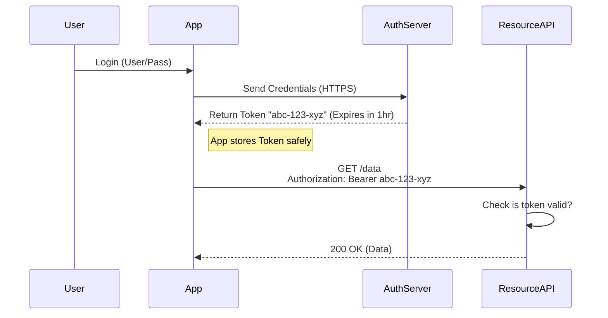

# Bearer Token Authentication - Complete Guide

> **Level:** Intermediate  
> **Time to Master:** 2-3 weeks  
> **Interview Focus:** Common in mid-level and senior roles

---

# 2. Bearer Token Authentication

## 1️⃣ ELI5 (Explain Like I’m 5)
Imagine you go to an arcade. You give the cashier $20 (Authentication), and they give you a bag of gold tokens. Now, to play a game, you just drop a token in the machine. The game machine doesn't care who you are or check your ID usage. It just checks: **"Do you have a valid token?"**
Crucially, if you drop your bag of tokens and someone else picks it up, **they can play your games**. The machine respects the *Bearer* of the token, not necessarily the owner.

## 2️⃣ REAL-LIFE ANALOGY
**The Cashier's Check / Cash:**
- A check made out to "Cash" or a $20 bill.
- Whoever holds it (bears it) can spend it.
- The bank/store doesn't check ID; the value is in the paper itself.

## 3️⃣ WHY THIS EXISTS
**Ideally:** We don't want to send the username and password on every request (like Basic Auth) because that's risky.
**The Fix:** We send credentials *once* to get a temporary key (Token). We use that key for the next hour.
**The Benefit:** If the token is stolen, it expires soon. If the password is stolen, it's permanent.

## 4️⃣ CORE CONCEPTS
- **Bearer:** "Give access to the bearer of this token."
- **Header:** `Authorization: Bearer <token-string>`
- **Decoupling:** Authentication (Login) is separated from Authorization (Access).
- **Format Agnostic:** The token can be a UUID (Opaque) or a JSON object (JWT). "Bearer" is just the *transport mechanism*.

## 5️⃣ VISUAL DIAGRAMS

**Token Exchange Flow:**


## 6️⃣ SIMPLE EXAMPLE (BEGINNER)

**Raw HTTP Request:**
```http
GET /my-profile HTTP/1.1
Host: api.todo-app.com
Authorization: Bearer 9812-7812-adba-1232
```

## 7️⃣ DEEP DIVE (ADVANCED)

### Token Granularity
Unlike Basic Auth (which is total access), Tokens can have **Scopes** (permissions). A token might be valid *only* for "Reading Emails" but not "Deleting Emails".

### Stateless vs Stateful
- **Opaque Tokens:** Random strings (UUID). The server *must* check a database to see who implies. (Stateful).
- **Self-Contained (JWT):** The token contains the data. Server just verifies the signature. (Stateless).
*Note: Bearer Auth supports BOTH.*

### Revocation
- **Opaque:** Easy. Just delete the UUID from the database (Redis).
- **JWT:** Hard. Requires a deny-list (blacklist) or short expiry times.

## 8️⃣ SPRING & JAVA IMPLEMENTATION

### 8.1 Opaque Token Implementation with Redis

**Token Entity:**
```java
@Data
@AllArgsConstructor
@NoArgsConstructor
public class OpaqueToken {
    private String tokenValue;
    private String username;
    private Set<String> scopes;
    private LocalDateTime issuedAt;
    private LocalDateTime expiresAt;
    private String clientId;
    private Map<String, Object> additionalInfo;
    
    public boolean isExpired() {
        return LocalDateTime.now().isAfter(expiresAt);
    }
    
    public long getSecondsUntilExpiration() {
        return ChronoUnit.SECONDS.between(LocalDateTime.now(), expiresAt);
    }
}
```

**Token Repository (Redis):**
```java
@Repository
@Slf4j
public class TokenRepository {
    
    private final RedisTemplate<String, OpaqueToken> redisTemplate;
    private static final String TOKEN_PREFIX = "token:";
    private static final String USER_TOKENS_PREFIX = "user:tokens:";
    
    public TokenRepository(RedisTemplate<String, OpaqueToken> redisTemplate) {
        this.redisTemplate = redisTemplate;
    }
    
    public void save(OpaqueToken token) {
        String key = TOKEN_PREFIX + token.getTokenValue();
        long ttl = token.getSecondsUntilExpiration();
        
        redisTemplate.opsForValue().set(key, token, ttl, TimeUnit.SECONDS);
        
        // Track user's active tokens
        String userKey = USER_TOKENS_PREFIX + token.getUsername();
        redisTemplate.opsForSet().add(userKey, token.getTokenValue());
        redisTemplate.expire(userKey, ttl, TimeUnit.SECONDS);
        
        log.debug("Saved token for user: {}, expires in: {} seconds", 
            token.getUsername(), ttl);
    }
    
    public Optional<OpaqueToken> findByTokenValue(String tokenValue) {
        String key = TOKEN_PREFIX + tokenValue;
        OpaqueToken token = redisTemplate.opsForValue().get(key);
        
        if (token != null && token.isExpired()) {
            delete(tokenValue);
            return Optional.empty();
        }
        
        return Optional.ofNullable(token);
    }
    
    public void delete(String tokenValue) {
        String key = TOKEN_PREFIX + tokenValue;
        OpaqueToken token = redisTemplate.opsForValue().get(key);
        
        if (token != null) {
            redisTemplate.delete(key);
            
            // Remove from user's token set
            String userKey = USER_TOKENS_PREFIX + token.getUsername();
            redisTemplate.opsForSet().remove(userKey, tokenValue);
            
            log.debug("Deleted token for user: {}", token.getUsername());
        }
    }
    
    public Set<String> findTokensByUsername(String username) {
        String userKey = USER_TOKENS_PREFIX + username;
        return redisTemplate.opsForSet().members(userKey);
    }
    
    public void deleteAllUserTokens(String username) {
        Set<String> tokens = findTokensByUsername(username);
        if (tokens != null) {
            tokens.forEach(this::delete);
        }
        log.info("Deleted all tokens for user: {}", username);
    }
}
```

**Token Service:**
```java
@Service
@Slf4j
public class TokenService {
    
    private final TokenRepository tokenRepository;
    private final UserRepository userRepository;
    
    @Value("${app.security.token.expiration:3600}") // 1 hour default
    private long tokenExpirationSeconds;
    
    @Value("${app.security.refresh-token.expiration:604800}") // 7 days default
    private long refreshTokenExpirationSeconds;
    
    public TokenService(TokenRepository tokenRepository, UserRepository userRepository) {
        this.tokenRepository = tokenRepository;
        this.userRepository = userRepository;
    }
    
    /**
     * Generate a new access token
     */
    public OpaqueToken generateAccessToken(String username, Set<String> scopes) {
        String tokenValue = UUID.randomUUID().toString() + "-" + 
                           System.currentTimeMillis();
        
        LocalDateTime now = LocalDateTime.now();
        
        OpaqueToken token = new OpaqueToken();
        token.setTokenValue(tokenValue);
        token.setUsername(username);
        token.setScopes(scopes != null ? scopes : Set.of("read"));
        token.setIssuedAt(now);
        token.setExpiresAt(now.plusSeconds(tokenExpirationSeconds));
        token.setClientId("default-client");
        token.setAdditionalInfo(new HashMap<>());
        
        tokenRepository.save(token);
        
        log.info("Generated access token for user: {}, expires at: {}", 
            username, token.getExpiresAt());
        
        return token;
    }
    
    /**
     * Generate a refresh token (longer expiration)
     */
    public OpaqueToken generateRefreshToken(String username) {
        String tokenValue = "refresh_" + UUID.randomUUID().toString();
        
        LocalDateTime now = LocalDateTime.now();
        
        OpaqueToken token = new OpaqueToken();
        token.setTokenValue(tokenValue);
        token.setUsername(username);
        token.setScopes(Set.of("refresh"));
        token.setIssuedAt(now);
        token.setExpiresAt(now.plusSeconds(refreshTokenExpirationSeconds));
        token.setClientId("default-client");
        token.setAdditionalInfo(Map.of("type", "refresh"));
        
        tokenRepository.save(token);
        
        log.info("Generated refresh token for user: {}", username);
        
        return token;
    }
    
    /**
     * Validate and retrieve token
     */
    public Optional<OpaqueToken> validateToken(String tokenValue) {
        return tokenRepository.findByTokenValue(tokenValue);
    }
    
    /**
     * Revoke a specific token
     */
    public void revokeToken(String tokenValue) {
        tokenRepository.delete(tokenValue);
        log.info("Revoked token: {}", tokenValue);
    }
    
    /**
     * Revoke all tokens for a user (logout from all devices)
     */
    public void revokeAllUserTokens(String username) {
        tokenRepository.deleteAllUserTokens(username);
        log.info("Revoked all tokens for user: {}", username);
    }
    
    /**
     * Refresh access token using refresh token
     */
    public OpaqueToken refreshAccessToken(String refreshTokenValue) {
        Optional<OpaqueToken> refreshToken = tokenRepository.findByTokenValue(refreshTokenValue);
        
        if (refreshToken.isEmpty()) {
            throw new InvalidTokenException("Invalid refresh token");
        }
        
        if (!refreshToken.get().getScopes().contains("refresh")) {
            throw new InvalidTokenException("Not a refresh token");
        }
        
        // Generate new access token
        return generateAccessToken(
            refreshToken.get().getUsername(),
            Set.of("read", "write")
        );
    }
}
```

### 8.2 Authentication Filter

**Bearer Token Authentication Filter:**
```java
@Component
@Slf4j
public class BearerTokenAuthenticationFilter extends OncePerRequestFilter {
    
    private final TokenService tokenService;
    private final UserDetailsService userDetailsService;
    
    public BearerTokenAuthenticationFilter(
            TokenService tokenService,
            UserDetailsService userDetailsService) {
        this.tokenService = tokenService;
        this.userDetailsService = userDetailsService;
    }
    
    @Override
    protected void doFilterInternal(
            HttpServletRequest request,
            HttpServletResponse response,
            FilterChain filterChain) throws ServletException, IOException {
        
        try {
            String token = extractTokenFromRequest(request);
            
            if (token != null) {
                authenticateWithToken(token);
            }
        } catch (Exception e) {
            log.error("Cannot set user authentication: {}", e.getMessage());
        }
        
        filterChain.doFilter(request, response);
    }
    
    private String extractTokenFromRequest(HttpServletRequest request) {
        String bearerToken = request.getHeader("Authorization");
        
        if (bearerToken != null && bearerToken.startsWith("Bearer ")) {
            return bearerToken.substring(7);
        }
        
        return null;
    }
    
    private void authenticateWithToken(String token) {
        Optional<OpaqueToken> opaqueToken = tokenService.validateToken(token);
        
        if (opaqueToken.isPresent()) {
            OpaqueToken validToken = opaqueToken.get();
            
            UserDetails userDetails = userDetailsService.loadUserByUsername(
                validToken.getUsername());
            
            // Create authentication with scopes
            List<GrantedAuthority> authorities = new ArrayList<>(userDetails.getAuthorities());
            
            // Add scope-based authorities
            validToken.getScopes().forEach(scope -> 
                authorities.add(new SimpleGrantedAuthority("SCOPE_" + scope)));
            
            UsernamePasswordAuthenticationToken authentication =
                new UsernamePasswordAuthenticationToken(
                    userDetails,
                    null,
                    authorities
                );
            
            authentication.setDetails(validToken);
            SecurityContextHolder.getContext().setAuthentication(authentication);
            
            log.debug("Authenticated user: {} with scopes: {}", 
                validToken.getUsername(), validToken.getScopes());
        }
    }
}
```

### 8.3 Security Configuration

```java
@Configuration
@EnableWebSecurity
@EnableMethodSecurity
@Slf4j
public class BearerTokenSecurityConfig {
    
    private final BearerTokenAuthenticationFilter bearerTokenAuthenticationFilter;
    private final AuthenticationEntryPoint authenticationEntryPoint;
    
    public BearerTokenSecurityConfig(
            BearerTokenAuthenticationFilter bearerTokenAuthenticationFilter,
            AuthenticationEntryPoint authenticationEntryPoint) {
        this.bearerTokenAuthenticationFilter = bearerTokenAuthenticationFilter;
        this.authenticationEntryPoint = authenticationEntryPoint;
    }
    
    @Bean
    public SecurityFilterChain filterChain(HttpSecurity http) throws Exception {
        http
            .csrf(csrf -> csrf.disable()) // Stateless API
            
            .authorizeHttpRequests(auth -> auth
                .requestMatchers("/api/auth/**", "/api/public/**").permitAll()
                .requestMatchers("/api/admin/**").hasRole("ADMIN")
                .anyRequest().authenticated()
            )
            
            .sessionManagement(session -> session
                .sessionCreationPolicy(SessionCreationPolicy.STATELESS)
            )
            
            .exceptionHandling(ex -> ex
                .authenticationEntryPoint(authenticationEntryPoint)
            )
            
            // Add Bearer Token filter before UsernamePasswordAuthenticationFilter
            .addFilterBefore(bearerTokenAuthenticationFilter,
                UsernamePasswordAuthenticationFilter.class);
        
        return http.build();
    }
}
```

### 8.4 Authentication Controller

```java
@RestController
@RequestMapping("/api/auth")
@Slf4j
public class AuthenticationController {
    
    private final AuthenticationManager authenticationManager;
    private final TokenService tokenService;
    private final PasswordEncoder passwordEncoder;
    
    public AuthenticationController(
            AuthenticationManager authenticationManager,
            TokenService tokenService,
            PasswordEncoder passwordEncoder) {
        this.authenticationManager = authenticationManager;
        this.tokenService = tokenService;
        this.passwordEncoder = passwordEncoder;
    }
    
    @PostMapping("/login")
    public ResponseEntity<TokenResponse> login(@RequestBody LoginRequest request) {
        try {
            Authentication authentication = authenticationManager.authenticate(
                new UsernamePasswordAuthenticationToken(
                    request.getUsername(),
                    request.getPassword()
                )
            );
            
            SecurityContextHolder.getContext().setAuthentication(authentication);
            
            UserDetails userDetails = (UserDetails) authentication.getPrincipal();
            
            // Extract roles as scopes
            Set<String> scopes = userDetails.getAuthorities().stream()
                .map(GrantedAuthority::getAuthority)
                .map(auth -> auth.replace("ROLE_", "").toLowerCase())
                .collect(Collectors.toSet());
            
            scopes.addAll(Set.of("read", "write"));
            
            OpaqueToken accessToken = tokenService.generateAccessToken(
                userDetails.getUsername(), scopes);
            
            OpaqueToken refreshToken = tokenService.generateRefreshToken(
                userDetails.getUsername());
            
            log.info("User {} logged in successfully", request.getUsername());
            
            return ResponseEntity.ok(new TokenResponse(
                accessToken.getTokenValue(),
                refreshToken.getTokenValue(),
                "Bearer",
                accessToken.getSecondsUntilExpiration()
            ));
            
        } catch (AuthenticationException e) {
            log.warn("Login failed for user: {}", request.getUsername());
            return ResponseEntity.status(HttpStatus.UNAUTHORIZED)
                .body(null);
        }
    }
    
    @PostMapping("/refresh")
    public ResponseEntity<TokenResponse> refresh(@RequestBody RefreshRequest request) {
        try {
            OpaqueToken newAccessToken = tokenService.refreshAccessToken(
                request.getRefreshToken());
            
            return ResponseEntity.ok(new TokenResponse(
                newAccessToken.getTokenValue(),
                request.getRefreshToken(), // Same refresh token
                "Bearer",
                newAccessToken.getSecondsUntilExpiration()
            ));
            
        } catch (InvalidTokenException e) {
            log.warn("Invalid refresh token");
            return ResponseEntity.status(HttpStatus.UNAUTHORIZED).body(null);
        }
    }
    
    @PostMapping("/logout")
    public ResponseEntity<Void> logout(
            @RequestHeader("Authorization") String authHeader) {
        
        String token = authHeader.substring(7); // Remove "Bearer "
        tokenService.revokeToken(token);
        
        SecurityContextHolder.clearContext();
        
        log.info("User logged out");
        return ResponseEntity.noContent().build();
    }
    
    @PostMapping("/logout-all")
    public ResponseEntity<Void> logoutAll(Authentication authentication) {
        String username = authentication.getName();
        tokenService.revokeAllUserTokens(username);
        
        SecurityContextHolder.clearContext();
        
        log.info("User {} logged out from all devices", username);
        return ResponseEntity.noContent().build();
    }
    
    @GetMapping("/introspect")
    public ResponseEntity<TokenIntrospectionResponse> introspect(
            @RequestParam String token) {
        
        Optional<OpaqueToken> opaqueToken = tokenService.validateToken(token);
        
        if (opaqueToken.isEmpty()) {
            return ResponseEntity.ok(new TokenIntrospectionResponse(false));
        }
        
        OpaqueToken validToken = opaqueToken.get();
        
        return ResponseEntity.ok(new TokenIntrospectionResponse(
            true,
            validToken.getUsername(),
            validToken.getScopes(),
            validToken.getExpiresAt().toEpochSecond(ZoneOffset.UTC),
            validToken.getIssuedAt().toEpochSecond(ZoneOffset.UTC),
            validToken.getClientId()
        ));
    }
}

// DTOs
@Data
@AllArgsConstructor
@NoArgsConstructor
class LoginRequest {
    private String username;
    private String password;
}

@Data
@AllArgsConstructor
@NoArgsConstructor
class RefreshRequest {
    private String refreshToken;
}

@Data
@AllArgsConstructor
@NoArgsConstructor
class TokenResponse {
    private String accessToken;
    private String refreshToken;
    private String tokenType;
    private long expiresIn;
}

@Data
@AllArgsConstructor
@NoArgsConstructor
class TokenIntrospectionResponse {
    private boolean active;
    private String username;
    private Set<String> scopes;
    private long exp;
    private long iat;
    private String clientId;
    
    public TokenIntrospectionResponse(boolean active) {
        this.active = active;
    }
}

class InvalidTokenException extends RuntimeException {
    public InvalidTokenException(String message) {
        super(message);
    }
}
```

### 8.5 Redis Configuration

```java
@Configuration
@EnableCaching
public class RedisConfig {
    
    @Bean
    public RedisTemplate<String, OpaqueToken> redisTemplate(
            RedisConnectionFactory connectionFactory) {
        
        RedisTemplate<String, OpaqueToken> template = new RedisTemplate<>();
        template.setConnectionFactory(connectionFactory);
        
        // Use Jackson for JSON serialization
        Jackson2JsonRedisSerializer<OpaqueToken> serializer =
            new Jackson2JsonRedisSerializer<>(OpaqueToken.class);
        
        ObjectMapper objectMapper = new ObjectMapper();
        objectMapper.registerModule(new JavaTimeModule());
        objectMapper.disable(SerializationFeature.WRITE_DATES_AS_TIMESTAMPS);
        serializer.setObjectMapper(objectMapper);
        
        template.setKeySerializer(new StringRedisSerializer());
        template.setValueSerializer(serializer);
        template.setHashKeySerializer(new StringRedisSerializer());
        template.setHashValueSerializer(serializer);
        
        template.afterPropertiesSet();
        return template;
    }
}
```

### 8.6 Scope-Based Authorization

**Method Security with Scopes:**
```java
@RestController
@RequestMapping("/api/documents")
@Slf4j
public class DocumentController {
    
    @GetMapping
    @PreAuthorize("hasAuthority('SCOPE_read')")
    public ResponseEntity<List<String>> getDocuments() {
        return ResponseEntity.ok(List.of("doc1.pdf", "doc2.pdf"));
    }
    
    @PostMapping
    @PreAuthorize("hasAuthority('SCOPE_write')")
    public ResponseEntity<String> createDocument(@RequestBody String content) {
        log.info("Creating document");
        return ResponseEntity.status(HttpStatus.CREATED)
            .body("Document created");
    }
    
    @DeleteMapping("/{id}")
    @PreAuthorize("hasAuthority('SCOPE_delete') or hasRole('ADMIN')")
    public ResponseEntity<Void> deleteDocument(@PathVariable String id) {
        log.info("Deleting document: {}", id);
        return ResponseEntity.noContent().build();
    }
}
```

## 9️⃣ HANDS-ON LAB (NO COST)

### Lab 1: Complete Token Lifecycle

**Goal:** Implement and test the full token authentication flow.

**Step 1: Setup Project**
Use the complete code from Section 8 (Token Entity, Repository, Service, Filter, Controllers).

**Step 2: Test Login Flow**
```bash
# 1. Login and get tokens
curl -X POST http://localhost:8080/api/auth/login \
  -H "Content-Type: application/json" \
  -d '{"username":"user","password":"user123"}'

# Response:
# {
#   "accessToken": "abc-123-xyz-456",
#   "refreshToken": "refresh_def-789-uvw-012",
#   "tokenType": "Bearer",
#   "expiresIn": 3600
# }

# Save the access token
export ACCESS_TOKEN="abc-123-xyz-456"
export REFRESH_TOKEN="refresh_def-789-uvw-012"
```

**Step 3: Use Access Token**
```bash
# Access protected endpoint
curl -H "Authorization: Bearer $ACCESS_TOKEN" \
  http://localhost:8080/api/user/profile

# Test scope-based access
curl -H "Authorization: Bearer $ACCESS_TOKEN" \
  http://localhost:8080/api/documents

# Test without token (should fail)
curl http://localhost:8080/api/user/profile
```

**Step 4: Token Introspection**
```bash
# Check token validity
curl "http://localhost:8080/api/auth/introspect?token=$ACCESS_TOKEN"

# Response:
# {
#   "active": true,
#   "username": "user",
#   "scopes": ["read", "write", "user"],
#   "exp": 1735545600,
#   "iat": 1735542000,
#   "clientId": "default-client"
# }
```

**Step 5: Token Refresh**
```bash
# When access token expires, use refresh token
curl -X POST http://localhost:8080/api/auth/refresh \
  -H "Content-Type: application/json" \
  -d "{\"refreshToken\":\"$REFRESH_TOKEN\"}"

# Get new access token
export NEW_ACCESS_TOKEN="new-token-value"
```

**Step 6: Logout**
```bash
# Single device logout
curl -X POST http://localhost:8080/api/auth/logout \
  -H "Authorization: Bearer $ACCESS_TOKEN"

# Logout from all devices
curl -X POST http://localhost:8080/api/auth/logout-all \
  -H "Authorization: Bearer $ACCESS_TOKEN"
```

---

### Lab 2: Multi-Device Session Management

**Goal:** Manage tokens across multiple devices.

**Scenario:** User logs in from Phone, Laptop, and Tablet.

```bash
# Device 1: Phone
PHONE_TOKEN=$(curl -X POST http://localhost:8080/api/auth/login \
  -H "Content-Type: application/json" \
  -d '{"username":"user","password":"user123"}' \
  | jq -r '.accessToken')

# Device 2: Laptop  
LAPTOP_TOKEN=$(curl -X POST http://localhost:8080/api/auth/login \
  -H "Content-Type: application/json" \
  -d '{"username":"user","password":"user123"}' \
  | jq -r '.accessToken')

# Device 3: Tablet
TABLET_TOKEN=$(curl -X POST http://localhost:8080/api/auth/login \
  -H "Content-Type: application/json" \
  -d '{"username":"user","password":"user123"}' \
  | jq -r '.accessToken')

# Verify all tokens work
curl -H "Authorization: Bearer $PHONE_TOKEN" \
  http://localhost:8080/api/user/profile

curl -H "Authorization: Bearer $LAPTOP_TOKEN" \
  http://localhost:8080/api/user/profile

curl -H "Authorization: Bearer $TABLET_TOKEN" \
  http://localhost:8080/api/user/profile

# Check active sessions in Redis
docker exec -it security-redis redis-cli KEYS "user:tokens:user"
docker exec -it security-redis redis-cli SMEMBERS "user:tokens:user"

# Logout from all devices
curl -X POST http://localhost:8080/api/auth/logout-all \
  -H "Authorization: Bearer $PHONE_TOKEN"

# Verify all tokens are now invalid
curl -H "Authorization: Bearer $LAPTOP_TOKEN" \
  http://localhost:8080/api/user/profile
# Should return 401
```

---

### Lab 3: Token Security Testing

**Goal:** Test security vulnerabilities and protections.

**Test 1: Token Replay Attack**
```bash
# Get a token
TOKEN=$(curl -X POST http://localhost:8080/api/auth/login \
  -H "Content-Type: application/json" \
  -d '{"username":"user","password":"user123"}' \
  | jq -r '.accessToken')

# Use it multiple times (should work - tokens are reusable until expiry)
for i in {1..5}; do
  curl -H "Authorization: Bearer $TOKEN" \
    http://localhost:8080/api/user/profile
done

# Logout
curl -X POST http://localhost:8080/api/auth/logout \
  -H "Authorization: Bearer $TOKEN"

# Try to reuse after logout (should fail)
curl -H "Authorization: Bearer $TOKEN" \
  http://localhost:8080/api/user/profile
```

**Test 2: Token Tampering**
```bash
# Get a valid token
VALID_TOKEN="abc-123-xyz-456"

# Modify the token (simulate tampering)
TAMPERED_TOKEN="abc-123-xyz-HACKED"

# Try to use tampered token (should fail)
curl -H "Authorization: Bearer $TAMPERED_TOKEN" \
  http://localhost:8080/api/user/profile
```

**Test 3: Scope Escalation**
```bash
# Login as regular user
USER_TOKEN=$(curl -X POST http://localhost:8080/api/auth/login \
  -H "Content-Type: application/json" \
  -d '{"username":"user","password":"user123"}' \
  | jq -r '.accessToken')

# Try to access admin endpoint (should fail with 403)
curl -H "Authorization: Bearer $USER_TOKEN" \
  http://localhost:8080/api/admin/users

# Check token scopes
curl "http://localhost:8080/api/auth/introspect?token=$USER_TOKEN" \
  | jq '.scopes'
```

**Test 4: Token Expiration**
```bash
# Temporarily set token expiration to 10 seconds in application.yml
# app.security.token.expiration: 10

# Get token
TOKEN=$(curl -X POST http://localhost:8080/api/auth/login \
  -H "Content-Type: application/json" \
  -d '{"username":"user","password":"user123"}' \
  | jq -r '.accessToken')

# Use immediately (should work)
curl -H "Authorization: Bearer $TOKEN" \
  http://localhost:8080/api/user/profile

# Wait 15 seconds
sleep 15

# Try again (should fail - token expired)
curl -H "Authorization: Bearer $TOKEN" \
  http://localhost:8080/api/user/profile
```

---

### Lab 4: Performance Testing

**Goal:** Compare opaque vs JWT token performance.

**Benchmark Opaque Token Validation:**
```bash
# Login
TOKEN=$(curl -X POST http://localhost:8080/api/auth/login \
  -H "Content-Type: application/json" \
  -d '{"username":"user","password":"user123"}' \
  | jq -r '.accessToken')

# Benchmark with Apache Bench
ab -n 1000 -c 10 \
  -H "Authorization: Bearer $TOKEN" \
  http://localhost:8080/api/user/profile

# Note: Each request requires Redis lookup
# Typical: 500-1000 req/sec
```

**Monitor Redis Performance:**
```bash
# Connect to Redis
docker exec -it security-redis redis-cli

# Monitor commands in real-time
MONITOR

# In another terminal, make requests
curl -H "Authorization: Bearer $TOKEN" \
  http://localhost:8080/api/user/profile

# Check Redis stats
INFO stats
```

---

### Lab 5: Integration Testing

**Create Test Class:**
```java
@SpringBootTest(webEnvironment = SpringBootTest.WebEnvironment.RANDOM_PORT)
@AutoConfigureMockMvc
class BearerTokenIntegrationTest {
    
    @Autowired
    private MockMvc mockMvc;
    
    @Autowired
    private TokenService tokenService;
    
    @Autowired
    private ObjectMapper objectMapper;
    
    private String accessToken;
    private String refreshToken;
    
    @BeforeEach
    void setup() {
        // Generate tokens for testing
        OpaqueToken token = tokenService.generateAccessToken(
            "user", Set.of("read", "write"));
        accessToken = token.getTokenValue();
        
        OpaqueToken refresh = tokenService.generateRefreshToken("user");
        refreshToken = refresh.getTokenValue();
    }
    
    @Test
    void login_ShouldReturnTokens_WithValidCredentials() throws Exception {
        LoginRequest request = new LoginRequest("user", "user123");
        
        mockMvc.perform(post("/api/auth/login")
                .contentType(MediaType.APPLICATION_JSON)
                .content(objectMapper.writeValueAsString(request)))
            .andExpect(status().isOk())
            .andExpect(jsonPath("$.accessToken").exists())
            .andExpect(jsonPath("$.refreshToken").exists())
            .andExpect(jsonPath("$.tokenType").value("Bearer"))
            .andExpect(jsonPath("$.expiresIn").isNumber());
    }
    
    @Test
    void accessProtectedEndpoint_ShouldSucceed_WithValidToken() throws Exception {
        mockMvc.perform(get("/api/user/profile")
                .header("Authorization", "Bearer " + accessToken))
            .andExpect(status().isOk())
            .andExpect(jsonPath("$.username").value("user"));
    }
    
    @Test
    void accessProtectedEndpoint_ShouldFail_WithoutToken() throws Exception {
        mockMvc.perform(get("/api/user/profile"))
            .andExpect(status().isUnauthorized());
    }
    
    @Test
    void refreshToken_ShouldReturnNewAccessToken() throws Exception {
        RefreshRequest request = new RefreshRequest(refreshToken);
        
        mockMvc.perform(post("/api/auth/refresh")
                .contentType(MediaType.APPLICATION_JSON)
                .content(objectMapper.writeValueAsString(request)))
            .andExpect(status().isOk())
            .andExpect(jsonPath("$.accessToken").exists())
            .andExpect(jsonPath("$.accessToken").value(not(accessToken)));
    }
    
    @Test
    void logout_ShouldInvalidateToken() throws Exception {
        // Use token (should work)
        mockMvc.perform(get("/api/user/profile")
                .header("Authorization", "Bearer " + accessToken))
            .andExpect(status().isOk());
        
        // Logout
        mockMvc.perform(post("/api/auth/logout")
                .header("Authorization", "Bearer " + accessToken))
            .andExpect(status().isNoContent());
        
        // Try to use token again (should fail)
        mockMvc.perform(get("/api/user/profile")
                .header("Authorization", "Bearer " + accessToken))
            .andExpect(status().isUnauthorized());
    }
    
    @Test
    void scopeBasedAccess_ShouldEnforcePermissions() throws Exception {
        // Token with only 'read' scope
        OpaqueToken readOnlyToken = tokenService.generateAccessToken(
            "user", Set.of("read"));
        
        // GET should work
        mockMvc.perform(get("/api/documents")
                .header("Authorization", "Bearer " + readOnlyToken.getTokenValue()))
            .andExpect(status().isOk());
        
        // POST should fail (requires 'write' scope)
        mockMvc.perform(post("/api/documents")
                .header("Authorization", "Bearer " + readOnlyToken.getTokenValue())
                .contentType(MediaType.APPLICATION_JSON)
                .content("{}"))
            .andExpect(status().isForbidden());
    }
}
```

**Run Tests:**
```bash
./mvnw test -Dtest=BearerTokenIntegrationTest
```

---

### Troubleshooting

**Problem 1: "Token not found" even after login**
```bash
# Check if token was saved in Redis
docker exec -it security-redis redis-cli KEYS "token:*"

# Check token TTL
docker exec -it security-redis redis-cli TTL "token:YOUR_TOKEN_VALUE"

# Verify Redis connection in application
curl http://localhost:8080/actuator/health
```

**Problem 2: Token works but scopes not enforced**
```bash
# Check token scopes
curl "http://localhost:8080/api/auth/introspect?token=YOUR_TOKEN"

# Verify @EnableMethodSecurity is present in config
# Ensure @PreAuthorize uses correct syntax: hasAuthority('SCOPE_read')
```

**Problem 3: Refresh token not working**
```bash
# Verify refresh token exists
docker exec -it security-redis redis-cli GET "token:refresh_YOUR_TOKEN"

# Check if refresh token has 'refresh' scope
curl "http://localhost:8080/api/auth/introspect?token=refresh_YOUR_TOKEN" \
  | jq '.scopes'
```

## 🔟 INTERVIEW QUESTIONS

**Beginner:**
Q: What happens if I copy your Bearer token and use it on my computer?
A: It will work properly. The server treats the bearer as the legitimate user. This is why TLS and XSS protection are critical.

**Senior:**
Q: Comparison: Bearer Token vs Session Cookie?
A: Cookies can be HttpOnly (XSS safe) but suffer from CSRF. Bearer Tokens are CSRF safe (since JS must attach them) but vulnerable to XSS theft. Mobile apps prefer Tokens; Legacy Web Apps prefer Cookies.

**Architect:**
Q: How do you handle "Logout" with Bearer tokens?
A: You cannot "delete" a token from the client effectively (they could have copied it). You must either: 1. Use short expiry (15 min). 2. Maintain a blacklist (stateful). 3. Rotate the signing keys (nuclear option).

## 1️⃣1️⃣ WHEN TO USE / WHEN NOT TO USE

| Scenario | Decision | Reason |
| :--- | :--- | :--- |
| **Mobile Apps** | ✅ YES | Native apps handle header injection easily. |
| **SPA (React/Angular)** | ⚠️ CAUTION | Storing valid tokens in LocalStorage is an XSS risk. |
| **Server-to-Server** | ✅ YES | Standard for Microservices. |
| **Banking/High-Security** | ⚠️ WITH CAUTION | Often paired with Mutual TLS (mTLS) so "bearing" the token isn't enough; you must also own the certificate. |

## 1️⃣2️⃣ SECURITY ATTACKS & DEFENSE (THREAT MODELING)

**STRIDE Analysis for Bearer Tokens:**

*   **Spoofing:**
**STRIDE Analysis for Bearer Tokens:**

| Threat | Attack Vector | Impact | Mitigation |
| :--- | :--- | :--- | :--- |
| **Spoofing** | **Token Replay.** Attacker steals the Bearer token (XSS/Sniffing) and uses it. | Impersonation. The server cannot distinguish thief from user. | **Short-lived tokens** (15 min). Use **Sender-Constrained Tokens** (DPoP/mTLS) for high security. |
| **Tampering** | Attacker modifies the scopes inside the JWT. | Privilege Escalation. User grants themselves Admin rights. | **Digital Signatures** (HMAC/RSA). Server MUST verify signature before reading payload. |
| **Information Disclosure** | Token leaked in URL query params or Server Logs. | Account takeover. | **NEVER** use `access_token=` in URLs. Use Headers only. Mask logs. |
| **Elevation of Privilege** | User creates a token with `role: admin`. | Full System Compromise. | **Signature Validation.** Ensure secret keys are rotated and secure. |
*   **Bearer Auth**
    *   **Mechanism**: Possession = Access
    *   **Risk**: Theft is fatal (until expiry)
    *   **Variant**: Opaque (Reference) vs JWT (Value)
    *   **Key Feature**: Scopes & Expiry

---

### 🔟 ARCHITECT DECISION NOTES
> **Implementation**: **Bearer Authentication**
>
> **The Verdict**: **The Standard for Modern APIs.**
>
> **Reasoning**: It cleanly separates the *Identity Provider* (who issues the token) from the *Resource Server* (who consumes it). This is the foundation of OAuth2 and OIDC.
>
> **Trade-off**: You accept the "Bearer" risk (stolen token = stolen identity). For extremely high-security environments (finance, defense), you might implement **Sender-Constrained Tokens** (DPoP or mTLS), where the token is cryptographically bound to the client's connection, so stealing it is useless.

---


---

## 🎯 Next Steps

1. **Master:** Token introspection patterns
2. **Practice:** Implement refresh token rotation
3. **Test:** Load test token validation
4. **Move Forward:** Proceed to 03-OAuth2-Complete.md

---

**File:** 02-Bearer-Token-Complete.md  
**Last Updated:** December 30, 2025  
**Part of:** Complete Security Study Guide
