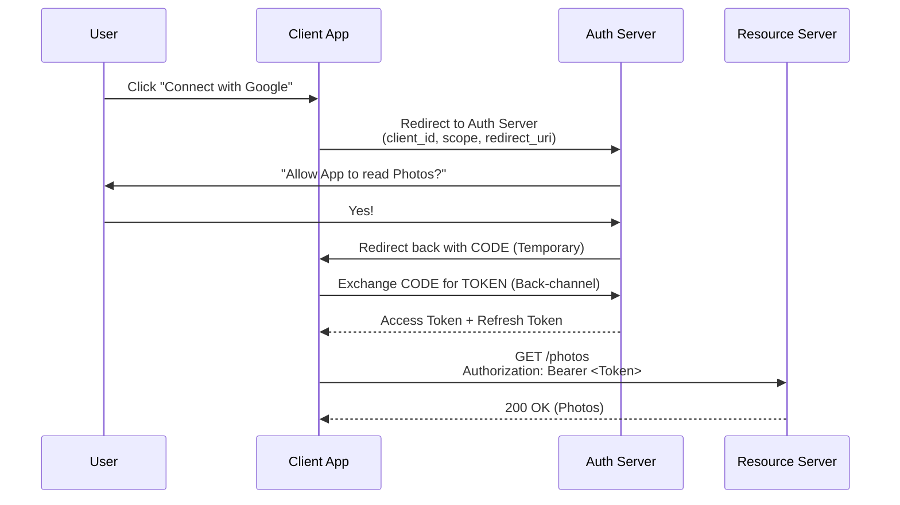
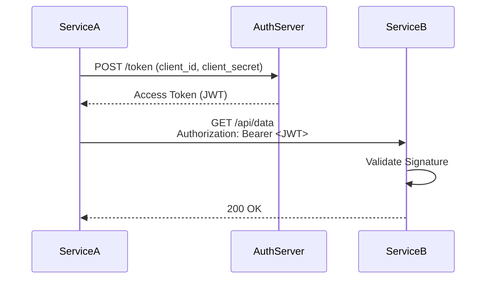

# OAuth 2.0 - Complete Guide

> **Level:** Intermediate to Advanced  
> **Time to Master:** 4-6 weeks  
> **Interview Focus:** Critical for senior roles and architects

---

# 3. OAuth 2.0 (Open Authorization)

## 1️⃣ ELI5 (Explain Like I’m 5)
**The Valet Key Analogy:**
You have a luxury car (Your Data). You drive to a hotel and give the keys to the Valet (The App).
You do **not** give the Valet your master key that opens the glovebox and trunk and allows selling the car.
You give them a **Valet Key** (Access Token).
This key has limits:
- Can drive the car (Scope: `drive`)
- Cannot open the trunk (Scope: `no-trunk`)
- Stops working after 30 minutes (Expiry)

OAuth 2.0 is the framework for creating these "Valet Keys" so apps can access your data without stealing your master password.

## 2️⃣ REAL-LIFE ANALOGY
**"Log in with Google":**
- You want to play a new game (Client).
- The game asks: "Can I see your name and email?" (Authorization Request).
- You are redirected to Google (Authorization Server).
- You sign in to Google (not the game!).
- You say "Yes" to the game.
- Google gives the game a token.
- The game uses the token to get your name. **The game never sees your Google password.**

## 3️⃣ WHY THIS EXISTS
**Ideally:** I want a printing service to print my Google Photos.
**Before OAuth:** I had to give the printing service my Google username and password. This is insanely dangerous (they could delete my emails!).
**The Fix:** OAuth lets me give the printer purely "Read-Only Access to Photos" and nothing else.

## 4️⃣ CORE CONCEPTS
- **Resource Owner:** YOU (The User).
- **Client:** The App (e.g., The Printing Service).
- **Authorization Server:** The Authority (e.g., Google/Okta).
- **Resource Server:** The API (e.g., Google Photos API).
- **Grant Types:** different ways to get the key (Auth Code, Client Creds, Refresh Token).

## 5️⃣ VISUAL DIAGRAMS

**Authorization Code Flow (The Gold Standard):**



## 6️⃣ SIMPLE EXAMPLE (BEGINNER)

**1. The Authorization Link (Frontend):**
```text
https://accounts.google.com/o/oauth2/auth?
  client_id=YOUR_APP_ID
  &redirect_uri=https://yourapp.com/callback
  &response_type=code
  &scope=email profile
```

**2. The Exchange (Backend):**
```http
POST /token
Host: oauth2.googleapis.com
Content-Type: application/x-www-form-urlencoded

code=AUTH_CODE_FROM_URL
&client_id=...
&client_secret=...
&redirect_uri=...
&grant_type=authorization_code
```
**Response:** `{ "access_token": "ya29...", "expires_in": 3600 }`

## 7️⃣ DEEP DIVE (ADVANCED)

### Opaque vs JWT Tokens (Architect Decision)
OAuth2 spec does **not** define the token format.
- **Opaque:** Random string. Client must call `/introspect` endpoint on Auth Server to validate. Good for immediate revocation.
- **JWT:** Structural token. Resource Server validates signature locally. Faster, scalable, but harder to revoke.

### Grant Types Breakdown
1.  **Authorization Code:** For Server-side apps. (Safest).
2.  **PKCE (Proof Key for Code Exchange):** For Mobile/SPA. Prevents code interception. **Mandatory for modern frontend apps.**
3.  **Client Credentials:** For Machine-to-Machine (Service A calling Service B). No User involved.
4.  **Implicit:** ❌ DEPRECATED. Do not use.

## 8️⃣ SPRING & JAVA IMPLEMENTATION

### 8.1 Spring Authorization Server Setup

**Dependencies (pom.xml):**
```xml
<dependencies>
    <!-- Spring Authorization Server -->
    <dependency>
        <groupId>org.springframework.boot</groupId>
        <artifactId>spring-boot-starter-oauth2-authorization-server</artifactId>
    </dependency>
    
    <!-- Spring Security -->
    <dependency>
        <groupId>org.springframework.boot</groupId>
        <artifactId>spring-boot-starter-security</artifactId>
    </dependency>
    
    <!-- Spring Web -->
    <dependency>
        <groupId>org.springframework.boot</groupId>
        <artifactId>spring-boot-starter-web</artifactId>
    </dependency>
    
    <!-- Spring Data JPA -->
    <dependency>
        <groupId>org.springframework.boot</groupId>
        <artifactId>spring-boot-starter-data-jpa</artifactId>
    </dependency>
    
    <!-- PostgreSQL -->
    <dependency>
        <groupId>org.postgresql</groupId>
        <artifactId>postgresql</artifactId>
    </dependency>
</dependencies>
```

**Authorization Server Configuration:**
```java
@Configuration
@Slf4j
public class AuthorizationServerConfig {
    
    /**
     * Configure OAuth2 Authorization Server
     */
    @Bean
    @Order(1)
    public SecurityFilterChain authorizationServerSecurityFilterChain(
            HttpSecurity http) throws Exception {
        
        OAuth2AuthorizationServerConfiguration.applyDefaultSecurity(http);
        
        http.getConfigurer(OAuth2AuthorizationServerConfigurer.class)
            .oidc(Customizer.withDefaults()); // Enable OpenID Connect 1.0
        
        http
            // Redirect to login page when not authenticated
            .exceptionHandling(exceptions -> exceptions
                .defaultAuthenticationEntryPointFor(
                    new LoginUrlAuthenticationEntryPoint("/login"),
                    new MediaTypeRequestMatcher(MediaType.TEXT_HTML)
                )
            )
            // Accept access tokens for User Info and/or Client Registration
            .oauth2ResourceServer(oauth2 -> oauth2
                .jwt(Customizer.withDefaults()));
        
        return http.build();
    }
    
    /**
     * Default security filter chain for login
     */
    @Bean
    @Order(2)
    public SecurityFilterChain defaultSecurityFilterChain(HttpSecurity http) 
            throws Exception {
        http
            .authorizeHttpRequests(authorize -> authorize
                .anyRequest().authenticated()
            )
            .formLogin(Customizer.withDefaults());
        
        return http.build();
    }
    
    /**
     * Register OAuth2 clients
     */
    @Bean
    public RegisteredClientRepository registeredClientRepository() {
        // Client 1: Authorization Code + PKCE (for SPAs)
        RegisteredClient spaClient = RegisteredClient.withId(UUID.randomUUID().toString())
            .clientId("spa-client")
            .clientSecret("{noop}") // No secret for public clients
            .clientAuthenticationMethod(ClientAuthenticationMethod.NONE)
            .authorizationGrantType(AuthorizationGrantType.AUTHORIZATION_CODE)
            .authorizationGrantType(AuthorizationGrantType.REFRESH_TOKEN)
            .redirectUri("http://localhost:3000/callback")
            .redirectUri("http://localhost:3000/silent-renew")
            .postLogoutRedirectUri("http://localhost:3000/")
            .scope(OidcScopes.OPENID)
            .scope(OidcScopes.PROFILE)
            .scope(OidcScopes.EMAIL)
            .scope("read")
            .scope("write")
            .clientSettings(ClientSettings.builder()
                .requireAuthorizationConsent(true)
                .requireProofKey(true) // Require PKCE
                .build())
            .tokenSettings(TokenSettings.builder()
                .accessTokenTimeToLive(Duration.ofMinutes(15))
                .refreshTokenTimeToLive(Duration.ofDays(7))
                .reuseRefreshTokens(false) // Rotate refresh tokens
                .build())
            .build();
        
        // Client 2: Client Credentials (for service-to-service)
        RegisteredClient serviceClient = RegisteredClient.withId(UUID.randomUUID().toString())
            .clientId("service-client")
            .clientSecret("{bcrypt}$2a$10$...") // BCrypt encoded secret
            .clientAuthenticationMethod(ClientAuthenticationMethod.CLIENT_SECRET_BASIC)
            .authorizationGrantType(AuthorizationGrantType.CLIENT_CREDENTIALS)
            .scope("service.read")
            .scope("service.write")
            .tokenSettings(TokenSettings.builder()
                .accessTokenTimeToLive(Duration.ofHours(1))
                .build())
            .build();
        
        // Client 3: Authorization Code (for traditional web apps)
        RegisteredClient webClient = RegisteredClient.withId(UUID.randomUUID().toString())
            .clientId("web-client")
            .clientSecret("{bcrypt}$2a$10$...")
            .clientAuthenticationMethod(ClientAuthenticationMethod.CLIENT_SECRET_BASIC)
            .authorizationGrantType(AuthorizationGrantType.AUTHORIZATION_CODE)
            .authorizationGrantType(AuthorizationGrantType.REFRESH_TOKEN)
            .redirectUri("http://localhost:8080/login/oauth2/code/web-client")
            .redirectUri("http://localhost:8080/authorized")
            .postLogoutRedirectUri("http://localhost:8080/")
            .scope(OidcScopes.OPENID)
            .scope(OidcScopes.PROFILE)
            .scope(OidcScopes.EMAIL)
            .scope("read")
            .scope("write")
            .clientSettings(ClientSettings.builder()
                .requireAuthorizationConsent(true)
                .build())
            .tokenSettings(TokenSettings.builder()
                .accessTokenTimeToLive(Duration.ofMinutes(30))
                .refreshTokenTimeToLive(Duration.ofDays(30))
                .build())
            .build();
        
        return new InMemoryRegisteredClientRepository(spaClient, serviceClient, webClient);
    }
    
    /**
     * JWK Source for signing tokens
     */
    @Bean
    public JWKSource<SecurityContext> jwkSource() {
        KeyPair keyPair = generateRsaKey();
        RSAPublicKey publicKey = (RSAPublicKey) keyPair.getPublic();
        RSAPrivateKey privateKey = (RSAPrivateKey) keyPair.getPrivate();
        
        RSAKey rsaKey = new RSAKey.Builder(publicKey)
            .privateKey(privateKey)
            .keyID(UUID.randomUUID().toString())
            .build();
        
        JWKSet jwkSet = new JWKSet(rsaKey);
        return new ImmutableJWKSet<>(jwkSet);
    }
    
    /**
     * Generate RSA key pair for JWT signing
     */
    private static KeyPair generateRsaKey() {
        KeyPair keyPair;
        try {
            KeyPairGenerator keyPairGenerator = KeyPairGenerator.getInstance("RSA");
            keyPairGenerator.initialize(2048);
            keyPair = keyPairGenerator.generateKeyPair();
        } catch (Exception ex) {
            throw new IllegalStateException(ex);
        }
        return keyPair;
    }
    
    /**
     * JWT decoder for validating tokens
     */
    @Bean
    public JwtDecoder jwtDecoder(JWKSource<SecurityContext> jwkSource) {
        return OAuth2AuthorizationServerConfiguration.jwtDecoder(jwkSource);
    }
    
    /**
     * Authorization Server settings
     */
    @Bean
    public AuthorizationServerSettings authorizationServerSettings() {
        return AuthorizationServerSettings.builder()
            .issuer("http://localhost:9000") // Authorization server URL
            .build();
    }
}
```

### 8.2 PKCE Implementation (For SPAs and Mobile Apps)

**PKCE Flow Explanation:**
```
1. Client generates random code_verifier (43-128 chars)
2. Client creates code_challenge = BASE64URL(SHA256(code_verifier))
3. Client sends code_challenge in authorization request
4. Server stores code_challenge
5. Client sends code_verifier in token exchange
6. Server verifies: SHA256(code_verifier) == stored code_challenge
```

**Frontend (React/JavaScript) - PKCE Generation:**
```javascript
// Generate random code verifier
function generateCodeVerifier() {
    const array = new Uint8Array(32);
    crypto.getRandomValues(array);
    return base64URLEncode(array);
}

// Generate code challenge from verifier
async function generateCodeChallenge(verifier) {
    const encoder = new TextEncoder();
    const data = encoder.encode(verifier);
    const hash = await crypto.subtle.digest('SHA-256', data);
    return base64URLEncode(new Uint8Array(hash));
}

// Base64 URL encoding
function base64URLEncode(buffer) {
    return btoa(String.fromCharCode(...buffer))
        .replace(/\+/g, '-')
        .replace(/\//g, '_')
        .replace(/=/g, '');
}

// Usage
const codeVerifier = generateCodeVerifier();
const codeChallenge = await generateCodeChallenge(codeVerifier);

// Store code_verifier in sessionStorage
sessionStorage.setItem('code_verifier', codeVerifier);

// Build authorization URL
const authUrl = `http://localhost:9000/oauth2/authorize?` +
    `response_type=code` +
    `&client_id=spa-client` +
    `&redirect_uri=http://localhost:3000/callback` +
    `&scope=openid profile email read write` +
    `&code_challenge=${codeChallenge}` +
    `&code_challenge_method=S256` +
    `&state=${generateRandomState()}`;

// Redirect to authorization server
window.location.href = authUrl;
```

**Backend Validation (Spring handles this automatically):**
```java
// Spring Authorization Server automatically validates PKCE
// when requireProofKey(true) is set in ClientSettings

// Custom PKCE validator (if needed)
@Component
public class CustomPkceValidator {
    
    public boolean validate(String codeVerifier, String codeChallenge) {
        try {
            MessageDigest digest = MessageDigest.getInstance("SHA-256");
            byte[] hash = digest.digest(codeVerifier.getBytes(StandardCharsets.UTF_8));
            String computedChallenge = Base64.getUrlEncoder()
                .withoutPadding()
                .encodeToString(hash);
            
            return computedChallenge.equals(codeChallenge);
        } catch (NoSuchAlgorithmException e) {
            return false;
        }
    }
}
```

### 8.3 Client Credentials Flow (Service-to-Service)

**Service A (Client) - Requesting Token:**
```java
@Service
@Slf4j
public class ServiceAClient {
    
    private final RestTemplate restTemplate;
    private final String tokenEndpoint = "http://localhost:9000/oauth2/token";
    private final String clientId = "service-client";
    private final String clientSecret = "service-secret";
    
    private String cachedToken;
    private Instant tokenExpiry;
    
    public ServiceAClient(RestTemplateBuilder builder) {
        this.restTemplate = builder.build();
    }
    
    /**
     * Get access token with caching
     */
    public String getAccessToken() {
        if (cachedToken != null && Instant.now().isBefore(tokenExpiry)) {
            return cachedToken;
        }
        
        return refreshToken();
    }
    
    private String refreshToken() {
        HttpHeaders headers = new HttpHeaders();
        headers.setContentType(MediaType.APPLICATION_FORM_URLENCODED);
        headers.setBasicAuth(clientId, clientSecret);
        
        MultiValueMap<String, String> body = new LinkedMultiValueMap<>();
        body.add("grant_type", "client_credentials");
        body.add("scope", "service.read service.write");
        
        HttpEntity<MultiValueMap<String, String>> request = 
            new HttpEntity<>(body, headers);
        
        try {
            ResponseEntity<TokenResponse> response = restTemplate.postForEntity(
                tokenEndpoint,
                request,
                TokenResponse.class
            );
            
            TokenResponse tokenResponse = response.getBody();
            this.cachedToken = tokenResponse.getAccessToken();
            this.tokenExpiry = Instant.now().plusSeconds(
                tokenResponse.getExpiresIn() - 60); // 60s buffer
            
            log.info("Obtained new access token, expires in {} seconds", 
                tokenResponse.getExpiresIn());
            
            return cachedToken;
            
        } catch (Exception e) {
            log.error("Failed to obtain access token", e);
            throw new RuntimeException("Token acquisition failed", e);
        }
    }
    
    /**
     * Call Service B with token
     */
    public String callServiceB(String endpoint) {
        String token = getAccessToken();
        
        HttpHeaders headers = new HttpHeaders();
        headers.setBearerAuth(token);
        
        HttpEntity<Void> request = new HttpEntity<>(headers);
        
        ResponseEntity<String> response = restTemplate.exchange(
            "http://service-b:8081" + endpoint,
            HttpMethod.GET,
            request,
            String.class
        );
        
        return response.getBody();
    }
}

@Data
class TokenResponse {
    @JsonProperty("access_token")
    private String accessToken;
    
    @JsonProperty("token_type")
    private String tokenType;
    
    @JsonProperty("expires_in")
    private long expiresIn;
    
    @JsonProperty("scope")
    private String scope;
}
```

**Service B (Resource Server) - Validating Token:**
```java
@Configuration
@EnableWebSecurity
public class ResourceServerConfig {
    
    @Bean
    public SecurityFilterChain filterChain(HttpSecurity http) throws Exception {
        http
            .authorizeHttpRequests(auth -> auth
                .requestMatchers("/api/public/**").permitAll()
                .requestMatchers("/api/service/**").hasAuthority("SCOPE_service.read")
                .anyRequest().authenticated()
            )
            .oauth2ResourceServer(oauth2 -> oauth2
                .jwt(jwt -> jwt
                    .jwtAuthenticationConverter(jwtAuthenticationConverter())
                )
            );
        
        return http.build();
    }
    
    @Bean
    public JwtDecoder jwtDecoder() {
        // Point to Authorization Server's JWK Set endpoint
        return NimbusJwtDecoder.withJwkSetUri(
            "http://localhost:9000/oauth2/jwks"
        ).build();
    }
    
    @Bean
    public JwtAuthenticationConverter jwtAuthenticationConverter() {
        JwtGrantedAuthoritiesConverter grantedAuthoritiesConverter = 
            new JwtGrantedAuthoritiesConverter();
        grantedAuthoritiesConverter.setAuthorityPrefix("SCOPE_");
        
        JwtAuthenticationConverter jwtAuthenticationConverter = 
            new JwtAuthenticationConverter();
        jwtAuthenticationConverter.setJwtGrantedAuthoritiesConverter(
            grantedAuthoritiesConverter);
        
        return jwtAuthenticationConverter;
    }
}
```

### 8.4 Custom Grant Type Implementation

**Device Code Flow (for IoT/TV devices):**
```java
@Component
public class DeviceCodeGrantAuthenticationProvider implements AuthenticationProvider {
    
    private final DeviceCodeService deviceCodeService;
    private final OAuth2TokenGenerator<?> tokenGenerator;
    
    @Override
    public Authentication authenticate(Authentication authentication) 
            throws AuthenticationException {
        
        DeviceCodeAuthenticationToken deviceCodeAuth = 
            (DeviceCodeAuthenticationToken) authentication;
        
        String deviceCode = deviceCodeAuth.getDeviceCode();
        
        // Validate device code
        DeviceCodeData data = deviceCodeService.validateDeviceCode(deviceCode);
        
        if (data == null || data.isExpired()) {
            throw new OAuth2AuthenticationException("invalid_grant");
        }
        
        if (!data.isUserApproved()) {
            throw new OAuth2AuthenticationException("authorization_pending");
        }
        
        // Generate tokens
        OAuth2AccessToken accessToken = generateAccessToken(data);
        OAuth2RefreshToken refreshToken = generateRefreshToken(data);
        
        return new OAuth2AccessTokenAuthenticationToken(
            data.getRegisteredClient(),
            data.getClientPrincipal(),
            accessToken,
            refreshToken
        );
    }
    
    @Override
    public boolean supports(Class<?> authentication) {
        return DeviceCodeAuthenticationToken.class.isAssignableFrom(authentication);
    }
}
```

### 8.5 Dynamic Client Registration

**Client Registration Endpoint:**
```java
@RestController
@RequestMapping("/oauth2/register")
@Slf4j
public class ClientRegistrationController {
    
    private final RegisteredClientRepository clientRepository;
    private final PasswordEncoder passwordEncoder;
    
    @PostMapping
    public ResponseEntity<ClientRegistrationResponse> registerClient(
            @RequestBody ClientRegistrationRequest request) {
        
        // Validate request
        validateRegistrationRequest(request);
        
        // Generate client credentials
        String clientId = "client_" + UUID.randomUUID().toString();
        String clientSecret = generateSecureSecret();
        
        // Create registered client
        RegisteredClient client = RegisteredClient.withId(UUID.randomUUID().toString())
            .clientId(clientId)
            .clientSecret(passwordEncoder.encode(clientSecret))
            .clientName(request.getClientName())
            .clientAuthenticationMethod(ClientAuthenticationMethod.CLIENT_SECRET_BASIC)
            .authorizationGrantType(AuthorizationGrantType.AUTHORIZATION_CODE)
            .authorizationGrantType(AuthorizationGrantType.REFRESH_TOKEN)
            .redirectUris(uris -> uris.addAll(request.getRedirectUris()))
            .scopes(scopes -> scopes.addAll(request.getScopes()))
            .clientSettings(ClientSettings.builder()
                .requireAuthorizationConsent(true)
                .requireProofKey(request.isRequirePkce())
                .build())
            .build();
        
        clientRepository.save(client);
        
        log.info("Registered new client: {}", clientId);
        
        return ResponseEntity.ok(new ClientRegistrationResponse(
            clientId,
            clientSecret, // Only returned once!
            request.getRedirectUris(),
            request.getScopes()
        ));
    }
    
    private String generateSecureSecret() {
        SecureRandom random = new SecureRandom();
        byte[] bytes = new byte[32];
        random.nextBytes(bytes);
        return Base64.getUrlEncoder().withoutPadding().encodeToString(bytes);
    }
}
```

## 9️⃣ HANDS-ON LAB (NO COST)

### Lab 1: Authorization Server Setup

**Goal:** Set up a complete OAuth 2.0 Authorization Server with Spring.

**Step 1: Create Project**
```bash
curl https://start.spring.io/starter.tgz \
  -d dependencies=oauth2-authorization-server,web,security,data-jpa,postgresql \
  -d type=maven-project \
  -d bootVersion=3.2.0 \
  -d baseDir=auth-server \
  | tar -xzvf -

cd auth-server
```

**Step 2: Configure Application**
```yaml
# application.yml
server:
  port: 9000

spring:
  datasource:
    url: jdbc:postgresql://localhost:5432/authdb
    username: postgres
    password: postgres
  
  jpa:
    hibernate:
      ddl-auto: update

logging:
  level:
    org.springframework.security: DEBUG
```

**Step 3: Add Configuration**
Use the complete `AuthorizationServerConfig` from Section 8.1.

**Step 4: Test Endpoints**
```bash
# Start the server
./mvnw spring-boot:run

# Check well-known configuration
curl http://localhost:9000/.well-known/oauth-authorization-server | jq

# Check JWKS endpoint
curl http://localhost:9000/oauth2/jwks | jq
```

**Expected Output:**
```json
{
  "issuer": "http://localhost:9000",
  "authorization_endpoint": "http://localhost:9000/oauth2/authorize",
  "token_endpoint": "http://localhost:9000/oauth2/token",
  "jwks_uri": "http://localhost:9000/oauth2/jwks",
  "response_types_supported": ["code"],
  "grant_types_supported": ["authorization_code", "client_credentials", "refresh_token"]
}
```

---

### Lab 2: PKCE Flow with React SPA

**Goal:** Implement complete PKCE flow with a React frontend.

**Step 1: Create React App**
```bash
npx create-react-app oauth-spa-client
cd oauth-spa-client
npm install
```

**Step 2: Create Auth Service**
```javascript
// src/services/authService.js
class AuthService {
    constructor() {
        this.authServerUrl = 'http://localhost:9000';
        this.clientId = 'spa-client';
        this.redirectUri = 'http://localhost:3000/callback';
    }

    // Generate code verifier
    generateCodeVerifier() {
        const array = new Uint8Array(32);
        crypto.getRandomValues(array);
        return this.base64URLEncode(array);
    }

    // Generate code challenge
    async generateCodeChallenge(verifier) {
        const encoder = new TextEncoder();
        const data = encoder.encode(verifier);
        const hash = await crypto.subtle.digest('SHA-256', data);
        return this.base64URLEncode(new Uint8Array(hash));
    }

    base64URLEncode(buffer) {
        return btoa(String.fromCharCode(...buffer))
            .replace(/\+/g, '-')
            .replace(/\//g, '_')
            .replace(/=/g, '');
    }

    generateState() {
        return this.base64URLEncode(crypto.getRandomValues(new Uint8Array(16)));
    }

    // Start login flow
    async login() {
        const codeVerifier = this.generateCodeVerifier();
        const codeChallenge = await this.generateCodeChallenge(codeVerifier);
        const state = this.generateState();

        // Store for later use
        sessionStorage.setItem('code_verifier', codeVerifier);
        sessionStorage.setItem('state', state);

        // Build authorization URL
        const params = new URLSearchParams({
            response_type: 'code',
            client_id: this.clientId,
            redirect_uri: this.redirectUri,
            scope: 'openid profile email read write',
            code_challenge: codeChallenge,
            code_challenge_method: 'S256',
            state: state
        });

        window.location.href = `${this.authServerUrl}/oauth2/authorize?${params}`;
    }

    // Handle callback
    async handleCallback() {
        const params = new URLSearchParams(window.location.search);
        const code = params.get('code');
        const state = params.get('state');
        const storedState = sessionStorage.getItem('state');

        // Verify state
        if (state !== storedState) {
            throw new Error('Invalid state parameter');
        }

        const codeVerifier = sessionStorage.getItem('code_verifier');

        // Exchange code for token
        const tokenResponse = await fetch(`${this.authServerUrl}/oauth2/token`, {
            method: 'POST',
            headers: {
                'Content-Type': 'application/x-www-form-urlencoded',
            },
            body: new URLSearchParams({
                grant_type: 'authorization_code',
                code: code,
                redirect_uri: this.redirectUri,
                client_id: this.clientId,
                code_verifier: codeVerifier
            })
        });

        const tokens = await tokenResponse.json();
        
        // Store tokens
        localStorage.setItem('access_token', tokens.access_token);
        localStorage.setItem('refresh_token', tokens.refresh_token);

        // Clean up
        sessionStorage.removeItem('code_verifier');
        sessionStorage.removeItem('state');

        return tokens;
    }

    // Get user info
    async getUserInfo() {
        const accessToken = localStorage.getItem('access_token');
        
        const response = await fetch(`${this.authServerUrl}/userinfo`, {
            headers: {
                'Authorization': `Bearer ${accessToken}`
            }
        });

        return await response.json();
    }
}

export default new AuthService();
```

**Step 3: Create Login Component**
```javascript
// src/components/Login.js
import React from 'react';
import authService from '../services/authService';

function Login() {
    const handleLogin = () => {
        authService.login();
    };

    return (
        <div>
            <h1>OAuth 2.0 PKCE Demo</h1>
            <button onClick={handleLogin}>Login with OAuth</button>
        </div>
    );
}

export default Login;
```

**Step 4: Create Callback Component**
```javascript
// src/components/Callback.js
import React, { useEffect, useState } from 'react';
import { useNavigate } from 'react-router-dom';
import authService from '../services/authService';

function Callback() {
    const [error, setError] = useState(null);
    const navigate = useNavigate();

    useEffect(() => {
        authService.handleCallback()
            .then(() => navigate('/dashboard'))
            .catch(err => setError(err.message));
    }, [navigate]);

    if (error) {
        return <div>Error: {error}</div>;
    }

    return <div>Processing login...</div>;
}

export default Callback;
```

**Step 5: Test the Flow**
```bash
# Start React app
npm start

# Click "Login with OAuth"
# You'll be redirected to Authorization Server
# After login, you're redirected back with tokens
```

---

### Lab 3: Client Credentials for Microservices

**Goal:** Implement service-to-service authentication.

**Step 1: Create Service A (Client)**
```java
@SpringBootApplication
public class ServiceAApplication {
    public static void main(String[] args) {
        SpringApplication.run(ServiceAApplication.class, args);
    }
}

// Use ServiceAClient from Section 8.3

@RestController
@RequestMapping("/api")
class ServiceAController {
    
    private final ServiceAClient serviceAClient;
    
    @GetMapping("/call-service-b")
    public String callServiceB() {
        return serviceAClient.callServiceB("/api/data");
    }
}
```

**Step 2: Create Service B (Resource Server)**
```java
@SpringBootApplication
public class ServiceBApplication {
    public static void main(String[] args) {
        SpringApplication.run(ServiceBApplication.class, args);
    }
}

// Use ResourceServerConfig from Section 8.3

@RestController
@RequestMapping("/api")
class ServiceBController {
    
    @GetMapping("/data")
    @PreAuthorize("hasAuthority('SCOPE_service.read')")
    public Map<String, String> getData(Authentication auth) {
        return Map.of(
            "message", "Data from Service B",
            "client", auth.getName(),
            "timestamp", Instant.now().toString()
        );
    }
}
```

**Step 3: Test Service-to-Service Call**
```bash
# Terminal 1: Start Authorization Server
cd auth-server && ./mvnw spring-boot:run

# Terminal 2: Start Service B (port 8081)
cd service-b && ./mvnw spring-boot:run

# Terminal 3: Start Service A (port 8080)
cd service-a && ./mvnw spring-boot:run

# Terminal 4: Test the call
curl http://localhost:8080/api/call-service-b

# Expected: Service A gets token, calls Service B, returns data
```

---

### Lab 4: Token Introspection & Validation

**Goal:** Implement token introspection for opaque tokens.

**Step 1: Add Introspection Endpoint**
```java
@RestController
@RequestMapping("/oauth2")
public class TokenIntrospectionController {
    
    private final OAuth2AuthorizationService authorizationService;
    
    @PostMapping("/introspect")
    public ResponseEntity<Map<String, Object>> introspect(
            @RequestParam("token") String token,
            Authentication clientAuth) {
        
        OAuth2Authorization authorization = 
            authorizationService.findByToken(token, OAuth2TokenType.ACCESS_TOKEN);
        
        if (authorization == null) {
            return ResponseEntity.ok(Map.of("active", false));
        }
        
        OAuth2Authorization.Token<OAuth2AccessToken> accessToken = 
            authorization.getAccessToken();
        
        if (accessToken.isExpired()) {
            return ResponseEntity.ok(Map.of("active", false));
        }
        
        return ResponseEntity.ok(Map.of(
            "active", true,
            "scope", String.join(" ", authorization.getAuthorizedScopes()),
            "client_id", authorization.getRegisteredClientId(),
            "username", authorization.getPrincipalName(),
            "exp", accessToken.getToken().getExpiresAt().getEpochSecond(),
            "iat", accessToken.getToken().getIssuedAt().getEpochSecond()
        ));
    }
}
```

**Step 2: Test Introspection**
```bash
# Get a token first
TOKEN=$(curl -X POST http://localhost:9000/oauth2/token \
  -u service-client:service-secret \
  -d "grant_type=client_credentials" \
  -d "scope=service.read" \
  | jq -r '.access_token')

# Introspect the token
curl -X POST http://localhost:9000/oauth2/introspect \
  -u service-client:service-secret \
  -d "token=$TOKEN" \
  | jq

# Expected output:
# {
#   "active": true,
#   "scope": "service.read",
#   "client_id": "service-client",
#   "exp": 1735545600,
#   "iat": 1735542000
# }
```

---

### Lab 5: Production Deployment with Docker

**Goal:** Deploy Authorization Server with Docker Compose.

**Step 1: Create Dockerfile**
```dockerfile
# Dockerfile
FROM eclipse-temurin:17-jre-alpine
WORKDIR /app
COPY target/*.jar app.jar
EXPOSE 9000
ENTRYPOINT ["java", "-jar", "app.jar"]
```

**Step 2: Create Docker Compose**
```yaml
# docker-compose.yml
version: '3.8'

services:
  postgres:
    image: postgres:15-alpine
    environment:
      POSTGRES_DB: authdb
      POSTGRES_USER: postgres
      POSTGRES_PASSWORD: postgres
    ports:
      - "5432:5432"
    volumes:
      - postgres_data:/var/lib/postgresql/data
    healthcheck:
      test: ["CMD-SHELL", "pg_isready -U postgres"]
      interval: 10s

  auth-server:
    build: .
    ports:
      - "9000:9000"
    environment:
      SPRING_DATASOURCE_URL: jdbc:postgresql://postgres:5432/authdb
      SPRING_DATASOURCE_USERNAME: postgres
      SPRING_DATASOURCE_PASSWORD: postgres
    depends_on:
      postgres:
        condition: service_healthy

  service-a:
    build: ../service-a
    ports:
      - "8080:8080"
    environment:
      AUTH_SERVER_URL: http://auth-server:9000
    depends_on:
      - auth-server

  service-b:
    build: ../service-b
    ports:
      - "8081:8081"
    environment:
      AUTH_SERVER_JWK_URI: http://auth-server:9000/oauth2/jwks
    depends_on:
      - auth-server

volumes:
  postgres_data:
```

**Step 3: Build and Deploy**
```bash
# Build the application
./mvnw clean package -DskipTests

# Start all services
docker-compose up -d

# Check logs
docker-compose logs -f auth-server

# Test the setup
curl http://localhost:9000/.well-known/oauth-authorization-server | jq
```

**Step 4: Load Testing**
```bash
# Install Apache Bench
brew install httpd

# Get a token
TOKEN=$(curl -X POST http://localhost:9000/oauth2/token \
  -u service-client:service-secret \
  -d "grant_type=client_credentials" \
  | jq -r '.access_token')

# Load test token validation
ab -n 10000 -c 100 \
  -H "Authorization: Bearer $TOKEN" \
  http://localhost:8081/api/data

# Check results
# Requests per second: ~5000-10000 (depending on hardware)
# Time per request: ~10-20ms
```

---

### Troubleshooting

**Problem 1: PKCE validation fails**
```bash
# Check code_verifier length (must be 43-128 characters)
echo -n "YOUR_CODE_VERIFIER" | wc -c

# Verify code_challenge generation
echo -n "YOUR_CODE_VERIFIER" | openssl dgst -sha256 -binary | base64 | tr '+/' '-_' | tr -d '='
```

**Problem 2: Client authentication fails**
```bash
# Verify client secret encoding
# In Spring, use BCryptPasswordEncoder
java -jar bcrypt-cli.jar encode "your-secret"

# Test with curl
curl -v -X POST http://localhost:9000/oauth2/token \
  -u "client-id:client-secret" \
  -d "grant_type=client_credentials"
```

**Problem 3: CORS errors in SPA**
```java
// Add CORS configuration to Authorization Server
@Bean
public CorsConfigurationSource corsConfigurationSource() {
    CorsConfiguration configuration = new CorsConfiguration();
    configuration.setAllowedOrigins(List.of("http://localhost:3000"));
    configuration.setAllowedMethods(List.of("GET", "POST"));
    configuration.setAllowedHeaders(List.of("*"));
    configuration.setAllowCredentials(true);
    
    UrlBasedCorsConfigurationSource source = new UrlBasedCorsConfigurationSource();
    source.registerCorsConfiguration("/**", configuration);
    return source;
}
```

## 🔟 INTERVIEW QUESTIONS

**Beginner:**
Q: Why do we need an Authorization Code? Why not return the Token immediately?
A: Sending the token in the browser URL (redirect) is unsafe—it stays in history/logs. The "Code" is a temporary one-time ticket exchanged securely server-to-server.

**Senior:**
Q: What is PKCE (Pixie)?
A: Proof Key for Code Exchange. It protects public clients (SPAs/Mobile) that cannot keep a `client_secret` safe. It ensures the app that started the flow is the same one finishing it.

**Architect:**
Q: Scenario: We have 50 microservices. Should they all validate tokens against the Auth Server?
A: No. That creates a bottleneck.
Option A) Use JWTs with local signature validation (Zero Trust).
Option B) Use an API Gateway to validate Opaque tokens once, then pass JWTs downstream.

## 1️⃣1️⃣ WHEN TO USE / WHEN NOT TO USE

| Scenario | Decision | Reason |
| :--- | :--- | :--- |
| **Internal Monolith** | ❌ NO | Overkill. Use Session/Cookies. |
| **3rd Party Access** | ✅ YES | The main use case (e.g., "Allow Jira to access Slack"). |
| **Modern Microservices** | ✅ YES | Client Credentials Flow for service-to-service. |
| **SPA / Mobile** | ✅ YES | Use Auth Code + PKCE. |

## 1️⃣2️⃣ SECURITY ATTACKS & DEFENSE (THREAT MODELING)


**Client Credentials Flow (Machine-to-Machine):**



## 1️⃣2️⃣ SECURITY ATTACKS & DEFENSE (THREAT MODELING)

**STRIDE Analysis for OAuth 2.0:**

| Threat | Attack Vector | Impact | Mitigation |
| :--- | :--- | :--- | :--- |
| **Spoofing** | **Open Redirect.** Attacker tricks Auth Server to redirect code to their site. | Auth Code theft. Attacker gets the user's session. | **Strict Redirect URI Whitelisting.** Exact match only (no wildcards). |
| **Tampering** | Man-in-the-Middle during exchange. | Code/Token substitution. | **TLS Everywhere.** Backend-to-Backend calls must use HTTPS. |
| **Repudiation** | "I didn't authorize that app." | User denies access. | **Consent Screens.** Force user to click "Allow". Audit log the consent. |
| **Information Disclosure** | **Leak via Referrer Header.** | Auth Code leaks to analytics tools. | Use `Referrer-Policy: no-referrer`. |
| **Elevation of Privilege** | **Scope Escalation.** App asks for `read`, gets `write`. | Excessive access. | Auth Server must ignore requested scopes if not pre-approved for that client. |

## 1️⃣3️⃣ MIND MAP

*   **OAuth 2.0**
    *   **Goal**: Delegation (Valet Key)
    *   **Roles**: Owner, Client, AuthServer, RS
    *   **Flows**: Auth Code (User), Client Creds (Machine)
    *   **Security**: PKCE, State, Redirect Allow-lists

---

### 🔟 ARCHITECT DECISION NOTES
> **Implementation**: **OAuth 2.0**
>
> **The Verdict**: **Mandatory for Federated Identity.**
>
> **Reasoning**: Do not build your own login forms or password hashing if you can avoid it. Using OAuth2 allows you to offload identity to Google, Microsoft, or a dedicated provider (Auth0/Keycloak).
>
> **Critial Decision**:
> *   **Public Clients (React/Mobile):** MUST use **PKCE**. Never trust the client with a secret.
> *   **Confidential Clients (Backend):** Use Client Secret or mTLS.
> *   **Token Format**: Use JWT for performance (internal), Opaque for high security (revocable).

---


---

## 🎯 Next Steps

1. **Build:** Complete Authorization Server
2. **Integrate:** Implement all grant types
3. **Secure:** Add PKCE for public clients
4. **Move Forward:** Proceed to 04-JWT-Complete.md

---

**File:** 03-OAuth2-Complete.md  
**Last Updated:** December 30, 2025  
**Part of:** Complete Security Study Guide
