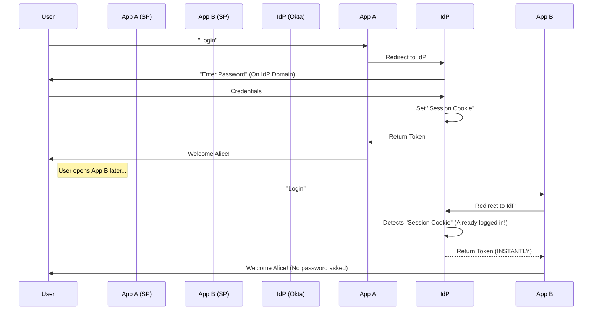

# Single Sign-On (SSO) - Complete Guide

> **Level:** Advanced  
> **Time to Master:** 4-6 weeks  
> **Interview Focus:** Critical for enterprise and architect roles

---

# 5. Single Sign-On (SSO)

## 1️⃣ ELI5 (Explain Like I’m 5)
**The All-Inclusive Wristband:**
Imagine a theme park. It has 50 rides.
**Without SSO:** You have to buy a ticket at the gate of *every single ride*. You carry 50 tickets.
**With SSO:** You buy one wristband at the main entrance. The guard at Ride #1 checks the wristband. The guard at Ride #45 checks the *same* wristband. You only paid (logged in) once.

## 2️⃣ REAL-LIFE ANALOGY
**Office Badge:**
- You swipe your badge to enter the building (Login).
- You use the same badge to open the elevator.
- You use the same badge to open the gym.
- You use the same badge to open the cafeteria.
- The system knows "This is Employee #502" everywhere.

## 3️⃣ WHY THIS EXISTS
**Ideally:** Users hate passwords. If we ask them to create a password for Slack, another for Jira, another for Email, they will set them all to "password123".
**The Fix:** Centralize the login. One strong password verifies you for *everything*.
**The Benefit:** Security + Convenience. If an employee leaves, you disable **one** account, and they lose access to everything instantly.

## 4️⃣ CORE CONCEPTS
- **IdP (Identity Provider):** The "Source of Truth" (Okta, Keycloak, Active Directory).
- **SP (Service Provider):** The App (Slack, Zoom, Your Spring App).
- **Federation:** Establishing trust between the SP and the IdP.
- **Protocols:**
    - **SAML:** (Legacy/Enterprise) XML-based. Heavy but powerful.
    - **OIDC (OpenID Connect):** (Modern) JSON-based layer on top of OAuth 2.0.

## 5️⃣ VISUAL DIAGRAMS

**OIDC Login Flow:**



## 6️⃣ SIMPLE EXAMPLE (BEGINNER)

**Standard Workflow:**
1.  User visits `yourapp.com`.
2.  App sees no session -> Redirects to `google.com/auth`.
3.  User signs in to Google.
4.  Google redirects back to `yourapp.com/callback?code=123`.
5.  App exchanges code for ID Token (JWT).
6.  App reads ID Token: "email: swiftie@gmail.com".
7.  App creates a local session for "swiftie@gmail.com".

## 7️⃣ DEEP DIVE (ADVANCED)

### SAML vs OIDC (The Architect's Choice)

| Feature | SAML (Security Assertion Markup Language) | OIDC (OpenID Connect) |
| :--- | :--- | :--- |
| **Format** | XML (Verbose) | JSON (Compact) |
| **Transport** | Browser Redirection (POST Binding) | REST/HTTP Friendly |
| **Usage** | Enterprise / Government / Legacy | Modern Web / Mobile / SPAs |
| **Complexity** | High (Signing XML is painful) | Low (Standard JWT libraries) |
| **Mobile** | Poor support | Native support (AppAuth) |

### SLO (Single Logout)
The hardest part of SSO is LOGOUT.
If I sign out of App A, should I generally be signed out of App B?
- **Front-Channel Logout:** Browser loads invisible iframes to kill cookies on IdP + App B. (Unreliable).
- **Back-Channel Logout:** IdP sends a POST request to App B server: "Kill Session for User X". (More reliable).

## 8️⃣ SPRING & JAVA IMPLEMENTATION

**Spring Boot 3 + OIDC:**

```java
// Spring Security defaults handle OIDC Discovery automatically!
// Just add this to application.yml

spring:
  security:
    oauth2:
      client:
        registration:
          okta:
            client-id: ...
            client-secret: ...
            scope: openid, profile, email
        provider:
          okta:
            issuer-uri: https://dev-123456.oktapreview.com
```

**What happens magically:**
Spring calls `<issuer-uri>/.well-known/openid-configuration`, finds the authorization endpoint, token endpoint, and keys URI, and configures everything.

## 9️⃣ HANDS-ON LAB (NO COST)

### Lab 1: Keycloak Docker Setup

**Goal:** Run a self-hosted IdP (Identity Provider) locally.

**Step 1: Docker Compose**
```yaml
version: '3.8'
services:
  keycloak:
    image: quay.io/keycloak/keycloak:23.0.0
    command: start-dev
    environment:
      KEYCLOAK_ADMIN: admin
      KEYCLOAK_ADMIN_PASSWORD: admin
    ports:
      - "8080:8080"
```

**Step 2: Initialize Realm**
1. Access `http://localhost:8080` (admin/admin)
2. Create Realm: `spring-realm`
3. Create Client: `spring-client`
   - Client authentication: `On`
   - Valid redirect URIs: `http://localhost:8081/login/oauth2/code/keycloak`
4. Create User: `user1` (set password to `password`)

**Step 3: Spring Boot Config**
```yaml
spring:
  security:
    oauth2:
      client:
        registration:
          keycloak:
            client-id: spring-client
            client-secret: <CLIENT_SECRET_FROM_KEYCLOAK>
            scope: openid,profile,email
            authorization-grant-type: authorization_code
            redirect-uri: "{baseUrl}/login/oauth2/code/{registrationId}"
        provider:
          keycloak:
            issuer-uri: http://localhost:8080/realms/spring-realm
```

---

### Lab 2: SAML Integration

**Goal:** Connect Spring Boot to a SAML IdP.

**Step 1: Add Dependency**
```xml
<dependency>
    <groupId>org.springframework.security</groupId>
    <artifactId>spring-security-saml2-service-provider</artifactId>
</dependency>
```

**Step 2: Configuration**
```yaml
spring:
  security:
    saml2:
      relyingparty:
        registration:
          okta:
            assertingparty:
              metadata-uri: https://dev-123456.oktapreview.com/app/exk123/sso/saml/metadata
            signing:
              credentials:
                - private-key-location: classpath:private.key
                  certificate-location: classpath:public.cer
```

**Step 3: Security Config**
```java
@Bean
public SecurityFilterChain filterChain(HttpSecurity http) throws Exception {
    http
        .authorizeHttpRequests(auth -> auth
            .anyRequest().authenticated()
        )
        .saml2Login(Customizer.withDefaults())
        .saml2Logout(Customizer.withDefaults());
    return http.build();
}
```

---

### Lab 3: Single Logout (SLO)

**Goal:** Implement Back-Channel Logout.

**Step 1: Enable Back-Channel Logout in Keycloak**
- In Client Settings:
  - Backchannel Logout URL: `http://localhost:8081/logout/connect/back-channel/keycloak`
  - Backchannel Logout Session Required: `On`

**Step 2: Spring Security Config**
```java
@Bean
public SecurityFilterChain filterChain(HttpSecurity http) throws Exception {
    http
        .oauth2Login(Customizer.withDefaults())
        .logout(logout -> logout
            .logoutSuccessUrl("/")
        )
        .oidcLogout(logout -> logout
            .backChannel(Customizer.withDefaults())
        );
    return http.build();
}
```

**Step 3: Verify**
1. Login to App A.
2. Login to App B (auto-login via SSO).
3. Logout from App A.
4. Refresh App B page -> Should remain logged in (session sync delay).
5. Wait 1 min or trigger Keycloak logout -> App B session killed.

---

### Lab 4: Multi-Tenant SSO

**Goal:** Support multiple organizations with different IdPs.

**Step 1: Dynamic Registration Repository**
```java
@Bean
public ClientRegistrationRepository clientRegistrationRepository() {
    return new InMemoryClientRegistrationRepository(
        // Client 1 (Tenant A)
        ClientRegistration.withRegistrationId("tenant-a")
            .clientId("client-a")
            .issuerUri("https://tenant-a.com")
            .build(),
        // Client 2 (Tenant B)
        ClientRegistration.withRegistrationId("tenant-b")
            .clientId("client-b")
            .issuerUri("https://tenant-b.com")
            .build()
    );
}
```

**Step 2: Tenant Resolver**
```java
@GetMapping("/login/{tenantId}")
public String login(@PathVariable String tenantId) {
    return "redirect:/oauth2/authorization/" + tenantId;
}
```

---

### Lab 5: Custom Login Flow

**Goal:** Brand the login experience while keeping SSO.

**Step 1: Custom Login Page**
```html
<!-- login.html -->
<div class="login-container">
    <h1>Welcome to Corp App</h1>
    <a href="/oauth2/authorization/keycloak" class="btn btn-keycloak">
        Login with Keycloak
    </a>
    <a href="/oauth2/authorization/google" class="btn btn-google">
        Login with Google
    </a>
</div>
```

**Step 2: Security Config**
```java
@Bean
public SecurityFilterChain filterChain(HttpSecurity http) throws Exception {
    http
        .authorizeHttpRequests(auth -> auth
            .requestMatchers("/login", "/css/**").permitAll()
            .anyRequest().authenticated()
        )
        .oauth2Login(oauth2 -> oauth2
            .loginPage("/login") // Custom page
        );
    return http.build();
}
```

## 🔟 INTERVIEW QUESTIONS

**Beginner:**
Q: What is the IdP?
A: Identity Provider. The centralized server that holds the user database and checks passwords (e.g., Google, Okta).

**Senior:**
Q: Difference between OAuth2 and OIDC?
A: OAuth2 is for **Authorization** (Accessing APIs). OIDC is for **Authentication** (Knowing who the user is). OIDC adds an "ID Token" to the standard OAuth flow.

**Architect:**
Q: Why is Single Logout (SLO) a nightmare?
A: Because distributed sessions are hard to synchronize. If the network fails during Back-Channel logout, a user might remain logged in to "App B" after logging out of "App A", creating a security risk on shared computers.

## 1️⃣1️⃣ WHEN TO USE / WHEN NOT TO USE

| Scenario | Decision | Reason |
| :--- | :--- | :--- |
| **Enterprise B2B** | ✅ YES | Companies demand SSO (SAML/OIDC) to manage employees. |
| **Consumer App** | ✅ YES | "Social Login" (FB/Google) increases conversion rates. |
| **Internal Tools** | ✅ YES | Centralized access control. |
| **The ONLY app** | ❌ NO | If you are building a standalone offline tool, simple DB auth is fine. |

## 1️⃣2️⃣ SECURITY ATTACKS & DEFENSE (THREAT MODELING)


## 1️⃣2️⃣ SECURITY ATTACKS & DEFENSE (THREAT MODELING)

**STRIDE Analysis for SSO:**

| Threat | Attack Vector | Impact | Mitigation |
| :--- | :--- | :--- | :--- |
| **Repudiation** | User claims "I didn't do that". | Lack of accountability. | **Centralized Audit Logging.** Correlate IdP Session ID with SP Access Logs. |
| **Tampering** | **XML Signature Wrapping** (SAML). Attacker moves the signed part of XML to a different location. | Auth Bypass. Attacker logs in as Admin. | Use modern, patched libraries (Spring Security SAML 2). **Never** write custom XML parsers. |
| **Information Disclosure** | **Token Leakage in Browser History.** OAuth fragments (`#access_token=...`) stay in history. | Account Takeover. | Use `response_mode=form_post` to send tokens via POST body, not URL. |
| **Denial of Service** | **Blowing up XML Parsing** (XXE). Sending 1GB XML file. | Server Crash. | Disable External Entity Resolution (XXE) in XML parsers. |

## 1️⃣3️⃣ MIND MAP

*   **SSO**
    *   **Architecture**: Central IdP, Many SPs
    *   **Protocols**: OIDC (Modern), SAML (Legacy)
    *   **Tokens**: ID Token (Who), Access Token (Access)
    *   **Benefit**: reduced attack surface (1 password)

---

### 🔟 ARCHITECT DECISION NOTES
> **Implementation**: **Single Sign-On (SSO)**
>
> **The Verdict**: **The only viable option for Enterprise.**
>
> **Reasoning**: In any company with >50 employees, managing individual logins is a security breach waiting to happen.
>
> **Strategy**:
> *   For Consumers: Support Google/Apple/Facebook login.
> *   For B2B: Support SAML/OIDC to let your customers bring their own Identity (BYOID).
> *   **Do not build an IdP.** Use SaaS (Auth0, Cognito, Okta) or Keycloak (Self-hosted). Building a secure IdP is harder than building your actual product.

---


---

## 🎯 Next Steps

1. **Integrate:** Connect with Auth0/Okta
2. **Implement:** SAML 2.0 if needed
3. **Handle:** Single Logout (SLO)
4. **Move Forward:** Proceed to advanced architecture files

---

**File:** 05-SSO-Complete.md  
**Last Updated:** December 30, 2025  
**Part of:** Complete Security Study Guide
