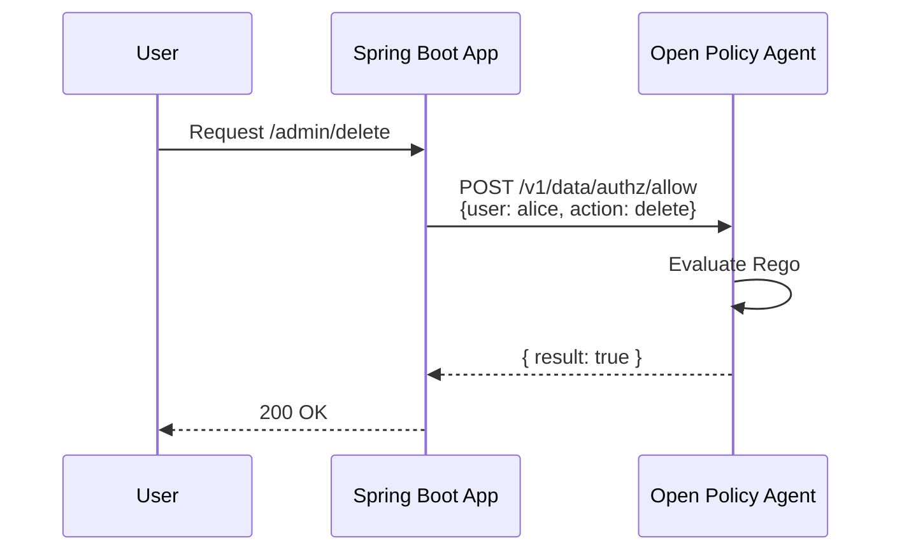
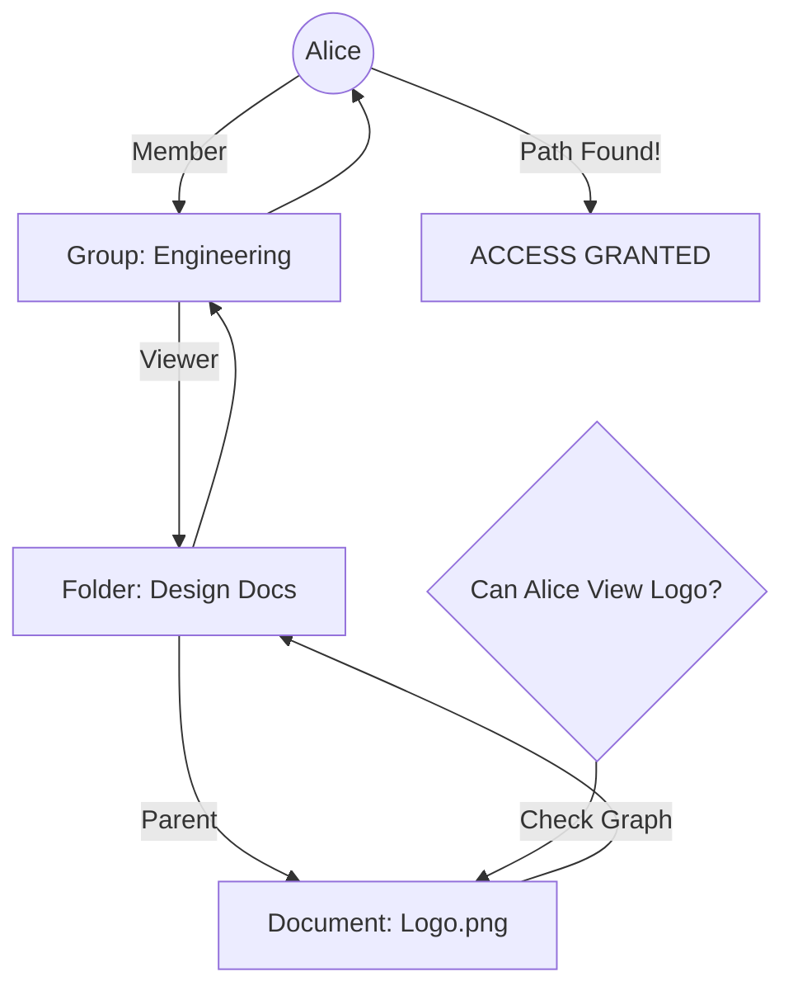

# 06. Authorization: RBAC, ABAC, OPA, & MAANG Architectures

> **Level:** Principal Engineer  
> **Time to Master:** 4-6 weeks  
> **Topic:** Permissions at Scale (Google Zanzibar, ReBAC)  
> **Frameworks:** OPA, Casbin, Oso, Ory Keto

---

## 📖 Table of Contents
1.  [ELI5: AuthN vs AuthZ](#1-eli5)
2.  [Real-Life Analogy](#2-analogy)
3.  [Why This Exists](#3-why)
4.  [Core Concepts (RBAC vs ABAC)](#4-concepts)
5.  [MAANG Case Study: Google Zanzibar (ReBAC)](#5-zanzibar)
6.  [Open Source Frameworks Comparison](#6-frameworks)
    *   [OPA (The Standard)](#opa)
    *   [Casbin (The Library)](#casbin)
    *   [Ory Keto (The Service)](#keto)
7.  [Deep Dive: Architecture Patterns](#7-patterns)
8.  [ReBAC in Practice: OpenFGA vs SpiceDB](#7-rebac-practice)
9.  [Visual Diagrams](#8-visuals)
10. [Spring Boot Implementation (RBAC & ReBAC)](#9-impl)
11. [Hands-On Lab](#10-lab)
12. [Interview Questions](#11-questions)
13. [When to Use What](#12-usage)
14. [Security Attacks (STRIDE)](#13-security)
15. [Architect Decision Notes](#14-architect-notes)

---

<a name="1-eli5"></a>
## 1️⃣ ELI5: AuthN vs AuthZ

-   **Authentication (AuthN):** "Who are you?"
    -   *Example:* Checking your passport at the airport entrance. The guard confirms you are indeed Alice.
    -   *Result:* "User is Alice."

-   **Authorization (AuthZ):** "What are you allowed to do?"
    -   *Example:* Examining your boarding pass at the gate. You are Alice, but **are you allowed** to board Flight 82 to Paris in First Class?
    -   *Result:* "Alice permitted to Board." or "Alice Access Denied."

**Key Takeaway:** You must be Authenticated *before* you can be Authorized.

---

<a name="2-analogy"></a>
## 2️⃣ Real-Life Analogy: The Hotel Key Card

1.  **Check-in (AuthN):** You show your ID to the front desk. They verified you are Mr. Smith.
2.  **Issuance:** They give you a generic plastic Key Card (a Token).
3.  **Access (AuthZ):**
    -   You tap the card on **Room 202**. Green Light. (You have permission).
    -   You tap the card on **Room 203**. Red Light. (Access Denied).
    -   You tap the card on the **Gym**. Green Light.

---

<a name="3-why"></a>
## 3️⃣ Why This Exists (The Problem)

**The Spaghetti Code Problem:**
In early applications, developers wrote:
```java
if (user.isAdmin() || (user.isManager() && document.isPublic()) || user.id == document.ownerId) {
    // allow edit
}
```
This logic was scattered across hundreds of controllers.
-   **Audit Nightmare:** "Show me everyone who can edit Document X." -> Impossible to answer.
-   **Maintenance Hell:** Changing a rule meant editing 50 files.

**The Solution:**
Centralized Authorization Models (RBAC/ABAC) and Policy Engines (OPA).

---

<a name="4-concepts"></a>
## 4️⃣ Core Concepts

### RBAC (Role-Based Access Control)
-   **Logic:** Users have **Roles**. Roles have **Permissions**.
-   **Example:** `User: Alice` -> `Role: Manager` -> `Permission: Approve_Expense`.
-   **Pros:** Simple, easy to understand.
-   **Cons:** Roles explosion (e.g., "Manager_US_East_Region_Sales").

### ABAC (Attribute-Based Access Control)
-   **Logic:** Grant access based on attributes of the User, Resource, and Environment.
-   **Formula:** `IF (User.Age > 18) AND (Resource.Type == "Alcohol") AND (Time < 10PM) THEN ALLOW`.
-   **Pros:** Extremely fine-grained and dynamic.
-   **Cons:** Complex to implement and audit.

### ReBAC (Relationship-Based Access Control)
-   **Logic:** Access based on graph relationships.
-   **Example:** "Allow if User is the *owner* of the Folder that *contains* the Document." (Google Drive style).
-   **Tech:** Google Zanzibar, Ory Keto, OpenFGA.

---

<a name="5-zanzibar"></a>
## 5️⃣ MAANG Case Study: Google Zanzibar (ReBAC)

**The Challenge:**
Google Drive has Billions of files. Users share files with Groups, permissions inherit from Folders. Checking "Can Alice view File X?" requires traversing a massive graph.
Standard SQL JOINs are too slow at this scale.

**The Solution (Zanzibar):**
A globally distributed, consistent authorization system.
1.  **Data Model (Tuples):**
    *   Everything is a Tuple: `(Object#Relation@Subject)`
    *   Example: `(Doc:Readme#owner@User:Alice)` -> Alice owns Readme.
    *   Example: `(Doc:Z#viewer@Group:Eng)` -> Engineering group can view Z.
    *   Example: `(Group:Eng#member@User:Bob)` -> Bob is in Eng.
2.  **The Check (Graph Traversal):**
    *   Question: "Can Bob view Doc:Z?"
    *   Zanzibar Logic: Bob is in Eng -> Eng can view Doc:Z -> **YES**.
3.  **Leopard Indexing:**
    *   Google pre-computes "flat" lists of users for fast lookups.

**Key Takeaway for Architects:**
When your permissions depend on "Relationships" (Folders, Teams, Projects), RBAC fails. You need ReBAC (Zanzibar).

---

<a name="6-frameworks"></a>
## 6️⃣ Open Source Frameworks Comparison

| Framework | Type | Best For | Pros | Cons |
| :--- | :--- | :--- | :--- | :--- |
| **OPA (Open Policy Agent)** | General Purpose Engine | K8s, Microservices, API Gateways | Industry Standard. Decoupled. Powerful (Rego). | High learning curve (Rego language). |
| **Casbin** | Library (Embedded) | Monoliths, Java/Go Simplicity | Fast (In-memory). Supports RBAC/ABAC. Code-first. | Hard to sync policies across multiple services. |
| **Ory Keto / OpenFGA** | Service (Remote) | ReBAC, Google Drive Clones | Handles Graph Permissions (Zanzibar). | Running another complex service. |
| **Spring Security** | Framework | Standard Java Apps | Native. Easy to start (@PreAuthorize). | Hard to manage complex rules. |

<a name="opa"></a>
### A. OPA (The Standard)
*   **Decoupled Sidecar:** Your app asks OPA "Allowed?", OPA replies "Yes/No".
*   **Language:** Rego.
*   **Example:**
    ```rego
    allow {
        input.method == "GET"
        input.user.role == "admin"
    }
    ```

<a name="casbin"></a>
### B. Casbin (The Library)
*   **Embedded:** Runs inside your Java process.
*   **Model:** PERM (Policy, Effect, Request, Matchers).
*   **Example:** `p, alice, data1, read` (CSV Policy).

<a name="keto"></a>
### C. Ory Keto (The Service)
*   **Zanzibar:** Stores relationship tuples.
*   **API:** REST/gRPC. `check(subject: alice, relation: view, object: doc1)`.

---

<a name="7-rebac-practice"></a>
## 7️⃣ ReBAC in Practice: OpenFGA vs SpiceDB code

**The Scenario:** A Google Drive Clone.
*   **Hierarchy:** `Root Folder` -> `Sub Folder` -> `File.txt`
*   **Rule:** If you can view the **Folder**, you can view the **File**.

### A. OpenFGA (Concept: Tuples + recursive expansion)
OpenFGA uses a DSL to define valid relations.

**The Model (.dsl):**
```dsl
model
  schema 1.1

type user

type folder
  relations
    define viewer: [user] or viewer from parent
    define parent: [folder]

type file
  relations
    define parent: [folder]
    define viewer: [user] or viewer from parent
```

**The Data (Tuples):**
1.  `(folder:root#viewer@user:alice)` -> Alice views Root.
2.  `(folder:sub#parent@folder:root)` -> Sub is child of Root.
3.  `(file:txt#parent@folder:sub)` -> File is child of Sub.

**The Check:**
`check(user:alice, relation:viewer, object:file:txt)`
*   OpenFGA Graph Walk:
    *   Is Alice viewer of `file:txt`? No.
    *   Check `parent` (Sub-Folder). Is Alice viewer of `folder:sub`?
        *   Check `parent` (Root-Folder). Is Alice viewer of `folder:root`? **YES**.
*   **Result:** Allowed.

---

### B. SpiceDB (Concept: Computed Permissions)
SpiceDB (AuthZed) uses a Schema Language called SchemaDSL.

**The Schema:**
```zaml
definition user {}

definition folder {
    relation viewer: user
    relation parent: folder

    // "Computed" permission
    permission view = viewer + parent->view
}

definition file {
    relation parent: folder
    relation viewer: user

    // Permission inherits from parent's 'view' permission
    permission view = viewer + parent->view
}
```

**The Data:**
1.  `folder:root#viewer@user:alice`
2.  `folder:sub#parent@folder:root`
3.  `file:txt#parent@folder:sub`

**The Check:**
`zanzibar.check(subject: "user:alice", resource: "file:txt", permission: "view")` -> **Allowed**.


### C. Spring Boot Integration (Java SDKs)

**1. OpenFGA (Spring Bean)**
Dependency: `dev.openfga:openfga-sdk`

```java
@Configuration
public class OpenFgaConfig {
    @Bean
    public OpenFgaClient openFgaClient() {
        // Configure connecting to local docker or cloud
        ClientConfiguration config = new ClientConfiguration()
            .apiUrl("http://localhost:8080") 
            .storeId("01H0..."); 
        return new OpenFgaClient(config);
    }
}

@Service
public class FgaPermissionService {
    @Autowired private OpenFgaClient fgaClient;

    public boolean canView(String user, String docId) {
        var request = new ClientCheckRequest()
            .user("user:" + user)
            .relation("viewer")
            .object("file:" + docId);
            
        try {
            var response = fgaClient.check(request).get();
            return response.getAllowed();
        } catch (Exception e) {
            return false;
        }
    }
}
```

**2. SpiceDB (Spring Bean)**
Dependency: `com.authzed.api:authzed`

```java
@Configuration
public class SpiceDbConfig {
    @Bean
    public v1.PermissionsServiceGrpc.PermissionsServiceBlockingStub spiceDbClient() {
        ManagedChannel channel = ManagedChannelBuilder
            .forTarget("localhost:50051")
            .usePlaintext()
            .build();
        return v1.PermissionsServiceGrpc.newBlockingStub(channel);
    }
}

@Service
public class SpiceDbService {
    @Autowired 
    private v1.PermissionsServiceGrpc.PermissionsServiceBlockingStub client;

    public boolean canView(String user, String docId) {
        var request = CheckPermissionRequest.newBuilder()
            .setResource(ObjectReference.newBuilder()
                .setObjectType("file")
                .setObjectId(docId).build())
            .setPermission("view")
            .setSubject(SubjectReference.newBuilder()
                .setObject(ObjectReference.newBuilder()
                    .setObjectType("user")
                    .setObjectId(user).build()).build())
            .build();

        CheckPermissionResponse response = client.checkPermission(request);
        return response.getPermissionship() == CheckPermissionResponse.Permissionship.PERMISSIONSHIP_HAS_PERMISSION;
    }
}
```

---

<a name="8-patterns"></a>
## 8️⃣ Deep Dive: Architecture Patterns

### Pattern 1: Embedded (Library)
*   **How:** Spring Security or Casbin jar inside the app.
*   **Pros:** Microsecond latency. Simple.
*   **Cons:** Policy updates require App Redeploy (unless DB backed).

### Pattern 2: Sidecar (OPA)
*   **How:** OPA runs as a container next to your App Pod (localhost).
*   **Pros:** Fast (localhost). Decoupled policy updates (Push new Rego without redeploying app).
*   **Cons:** Ops complexity (Managing OPA containers).

### Pattern 3: Centralized Service (Google Zanzibar)
*   **How:** `AuthZ Service` controls everything.
*   **Pros:** Global consistency. One place to audit.
*   **Cons:** Single Point of Failure. Latency (Network call per request).

---

<a name="8-visuals"></a>
<a name="8-visuals"></a>
## 9️⃣ Visual Diagrams

### RBAC vs OPA Flow (Decoupled)



### Google Zanzibar (Tuple Flow)



---

<a name="9-impl"></a>
## 🔟 Spring Boot Implementation (RBAC & ReBAC)

### 1. Standard RBAC (@PreAuthorize)
```java
@Service
public class PayrollService {
    @PreAuthorize("hasRole('HR_MANAGER')")
    public void runPayroll() { ... }
}
```

### 2. Custom ReBAC (Graph Check)
Simulating Zanzibar with Recursive SQL.

```java
@Service("rebac")
public class RebacService {
    
    @Autowired
    private RelationRepository repo; // Stores tuples (sub, rel, obj)

    public boolean check(String user, String relation, String object) {
        // Base case: Direct tuple exists?
        if (repo.existsAndRelation(user, relation, object)) return true;
        
        // Recursive: Is user a member of any Group that has access?
        List<String> userGroups = repo.findGroupsForUser(user);
        for (String group : userGroups) {
             if (check(group, relation, object)) return true;
        }
        
        return false;
    }
}
```

**Controller Usage:**
```java
@PreAuthorize("@rebac.check(authentication.name, 'view', #docId)")
public Document getDoc(@PathVariable String docId) { ... }
```

---

<a name="10-lab"></a>
## 1️⃣1️⃣ Hands-On Lab: Implement a Custom ABAC Permission Evaluator

**Goal:** Create an endpoint that only allows access if the User's "Department" matches the Document's "Department".

**Step 1: Create Custom PermissionEvaluator**
```java
@Component
public class CustomPermissionEvaluator implements PermissionEvaluator {
    @Override
    public boolean hasPermission(Authentication auth, Object targetDomainObject, Object permission) {
        Document doc = (Document) targetDomainObject;
        String userDept = ((CustomUserDetails) auth.getPrincipal()).getDept();
        
        // ABAC Logic
        return doc.getDepartment().equals(userDept);
    }

    @Override
    public boolean hasPermission(Authentication auth, Serializable targetId, String targetType, Object permission) {
        return false; 
    }
}
```

**Step 2: Use it**
```java
@PreAuthorize("hasPermission(#doc, 'read')")
public void readDoc(Document doc) { ... }
```

---

<a name="11-questions"></a>
## 1️⃣2️⃣ Interview Questions

### Principal Engineer
**Q: When should you transition from RBAC (Roles) to ReBAC (Relationships)?**
**A:** When "Roles" start becoming specific to data.
*   RBAC: "Managers can Approve." (Good).
*   Bad RBAC: "Manager_Project_Alpha_Viewer". (Bad).
*   Switch to ReBAC when you need: "Managers of Project X can view Project X". The permission depends on the *relationship* between the User and the Project.

**Q: Explain the "New Enemy" problem in Authorization.**
**A:** Caching permissions is dangerous. If I fire Alice (Revoke Access), and your App has cached "Alice = Admin" for 1 hour, Alice stays Admin.
*   **Solution:** Centralized AuthZ (Zanzibar) optimizes for consistent real-time checks (using "Zookies" consistency tokens) rather than loose caching.

---

<a name="12-usage"></a>
## 1️⃣3️⃣ When to Use What

| Pattern | Complexity | Use Case | Example |
| :--- | :--- | :--- | :--- |
| **Simple Roles (RBAC)** | Low | SaaS Tiers | "Admins delete, Users read." |
| **ABAC** | High | Conditional Rules | "Access if time < 5PM" |
| **ReBAC (Zanzibar)** | Very High | User-Created Content | Google Drive, GitHub, Socials |
| **OPA** | High | Microservices Glue | K8s Admission Control |

---

<a name="13-security"></a>
## 1️⃣4️⃣ Threats & Defense (STRIDE)

| Threat | Attack | Mitigation |
| :--- | :--- | :--- |
| **Tampering** | **IDOR.** Changing ID in URL to another user's ID. | **Always** check ownership: `if (resource.owner != currentUser) throw Forbidden`. |
| **Elevation** | **Role Tampering.** Sending `role: ADMIN` in JSON body. | **Mass Assignment Protection.** Never bind API DTOs directly to User Entities. |
| **Disclosure** | **Verbose Errors.** "Access Denied: You need Permission X". | **Generic Errors.** Return `403` or `404`. Don't leak resource existence. |

---

<a name="14-architect-notes"></a>
## 1️⃣5️⃣ Architect Decision Notes

> **Decision:** **Start with RBAC, Evolve to ABAC/ReBAC.**
>
> 1.  **Do not over-engineer:** Start with standard Spring Security RBAC. It covers 90% of use cases.
> 2.  **Decoupling:** If you have polyglot microservices (Java, Node, Go), move policy to **OPA**. Do not write auth logic 3 times in 3 languages.
> 3.  **Scale:** If you are building a social network or file sharing app, read the **Google Zanzibar** paper. Don't try to implement graph permissions with simple SQL joins; you will hit performance walls.

---
