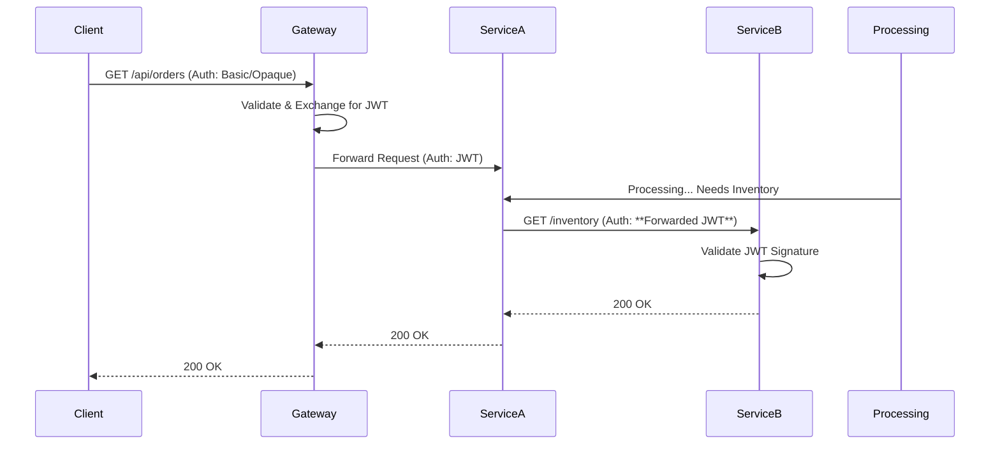

# 07. Microservices Security: API Gateway & Zero Trust

> **Level:** Architect  
> **Time to Master:** 4-6 weeks  
> **Prerequisites:** OAuth2, JWT, Spring Cloud Gateway

---

## 📖 Table of Contents
1.  [ELI5: The Castle vs The City](#1-eli5-the-castle-vs-the-city)
2.  [Real-Life Analogy](#2-real-life-analogy)
3.  [Why This Exists](#3-why-this-exists)
4.  [Core Concepts](#4-core-concepts)
5.  [Visual Diagrams](#5-visual-diagrams)
6.  [Pattern 1: The API Gateway (Edge Security)](#6-pattern-1-the-api-gateway)
7.  [Pattern 2: Token Propagation](#7-pattern-2-token-propagation)
8.  [Pattern 3: Zero Trust (mTLS)](#8-pattern-3-zero-trust)
9.  [Spring Boot Implementation](#9-spring-boot-implementation)
10. [Hands-On Lab](#10-hands-on-lab)
11. [Interview Questions](#11-interview-questions)
12. [Threat Modeling](#12-threat-modeling)
13. [Architect Decision Notes](#13-architect-decision-notes)

---

<a name="1-eli5-the-castle-vs-the-city"></a>
## 1️⃣ ELI5: The Castle vs The City

-   **The Monolith (Castle):** Huge thick walls. One main gate. Once you are inside (logged in), you can run anywhere. The kitchen, the armory, the bedroom - it's all open because "you are inside".
-   **Microservices (The City):** Many separate buildings (Bank, Post Office, Grocery).
    -   Just because you entered the *City* doesn't mean you can walk into the *Bank Vault*.
    -   Every building has its own security guard.
    -   This is **Zero Trust**.

---

<a name="2-real-life-analogy"></a>
## 2️⃣ Real-Life Analogy: The Wristband & The VIP Area

1.  **API Gateway:** The Festival Entrance. They check your ticket and give you a Wristband (JWT).
2.  **Microservices:** The different Stages and Food Trucks.
3.  **Token Propagation:** You show your Wristband to buy food.
4.  **Zero Trust:** Even if you have a wristband, the "Backstage Area" (Admin Service) checks a special holographic mark. If your wristband is regular, **Access Denied**. You are "in", but not "authorized".

---

<a name="3-why-this-exists"></a>
## 3️⃣ Why This Exists (The Problem)

**The "Soft Center" Problem:**
In old networks, we had a Firewall. Inside the firewall, everything trusted everything.
-   If a hacker compromised the "Printer Service", they could talk to the "Database" freely because there was no checking inside.
-   **Zero Trust (Never Trust, Always Verify):** We assume the network is hostile. Service A must prove identity to Service B, even if they are on the same server.

---

<a name="4-core-concepts"></a>
## 4️⃣ Core Concepts

-   **API Gateway:** The single entry point. Handles `SSL Termination`, `Rate Limiting`, `Authentication` (Exchange Opaque Token -> JWT).
-   **BFF (Backend for Frontend):** Specialized Gateways for Mobile vs Web.
-   **Token Relay:** Passing the JWT headers from Service A -> Service B -> Service C.
-   **mTLS (Mutual TLS):** Cryptographic proof of machine identity. "I am Service A" (not just "I have User A's token").

---

<a name="5-visual-diagrams"></a>
## 5️⃣ Visual Diagrams

### The "Token Relay" Pattern



---

<a name="6-pattern-1-the-api-gateway"></a>
## 6️⃣ Pattern 1: The API Gateway (Edge Security)

**Role:** The Bouncer.
**Security Tasks:**
1.  **Attack Surface Reduction:** Don't expose microservices to the internet. Expose ONLY the Gateway.
2.  **Protocol Translation:** HTTP/JSON (Public) -> gRPC/Protobuf (Internal).
3.  **Auth Offloading:** Validate the Opaque Token here. Pass a lightweight JWT downstream.

**Example (Spring Cloud Gateway):**
```yaml
spring:
  cloud:
    gateway:
      routes:
        - id: order-service
          uri: lb://ORDER-SERVICE
          predicates:
            - Path=/orders/**
          filters:
            - TokenRelay= # Magic filter to pass OAuth2 token
```

---

<a name="7-pattern-2-token-propagation"></a>
## 7️⃣ Pattern 2: Token Propagation (The "On-Behalf-Of" Flow)

When Service A calls Service B, it shouldn't call as "Service A". It should call "On Behalf Of User Alice".
To do this, we must **copy the JWT from the incoming request** and **paste it into the outgoing request**.

**Spring Implementation (RestTemplate Interceptor):**

```java
public class HeaderPropagationInterceptor implements ClientHttpRequestInterceptor {
    @Override
    public ClientHttpResponse intercept(HttpRequest request, byte[] body, 
                                      ClientHttpRequestExecution execution) {
        
        // 1. Get Token from current SecurityContext or Incoming Request
        Authentication auth = SecurityContextHolder.getContext().getAuthentication();
        if (auth instanceof JwtAuthenticationToken jwtToken) {
             String tokenValue = jwtToken.getToken().getTokenValue();
             
             // 2. Add to Outgoing Request
             request.getHeaders().setBearerAuth(tokenValue);
        }
        
        return execution.execute(request, body);
    }
}
```

---

<a name="8-pattern-3-zero-trust"></a>
## 8️⃣ Pattern 3: Zero Trust (mTLS & Service Mesh)

**The Concept:**
Just because you have a JWT doesn't mean you are the right *machine*.
What if a rogue laptop plugs into the data center network and sends valid JWTs?
**Solution:** Mutual TLS.

-   **Standard TLS:** Client verifies Server (Green Lock).
-   **Mutual TLS:** Server *also* verifies Client Certificate.

**How to implement?**
Don't do it in Java. It's too hard to manage certificates.
Use a **Service Mesh** (Istio / Linkerd).
-   The "Sidecar Proxy" handles mTLS. Your Java app just speaks HTTP to localhost.

---

<a name="9-spring-boot-implementation"></a>
## 9️⃣ Implementation: Service-to-Service Client Credentials

Sometimes Service A acts as *itself*, not on behalf of a user (e.g., Nightly Batch Job).

**Configuration:**
```java
@Bean
public OAuth2AuthorizedClientManager authorizedClientManager(
        ClientRegistrationRepository clientRegistrationRepository,
        OAuth2AuthorizedClientService clientService) {
    
    // ... Boilerplate setup to handle "grant_type=client_credentials"
    // automatically fetches new token when old one expires.
}
```

**Usage (WebClient):**
```java
@Bean
WebClient webClient(OAuth2AuthorizedClientManager manager) {
    ServletOAuth2AuthorizedClientExchangeFilterFunction oauth2 = 
      new ServletOAuth2AuthorizedClientExchangeFilterFunction(manager);
    
    oauth2.setDefaultClientRegistrationId("my-service-client");
    
    return WebClient.builder()
      .apply(oauth2.oauth2Configuration())
      .build();
}
```

---

<a name="10-hands-on-lab"></a>
## 🔟 Hands-On Lab: The Gateway Guard

**Scenario:** Create a Gateway that blocks traffic if the JWT lacks a specific scope.

**Step 1: Setup Spring Cloud Gateway**
Dependencies: `spring-cloud-starter-gateway`, `spring-boot-starter-oauth2-resource-server`.

**Step 2: Config SecurityWebFilterChain**
```java
@Bean
public SecurityWebFilterChain springSecurityFilterChain(ServerHttpSecurity http) {
    http
        .authorizeExchange(exchanges -> exchanges
            .pathMatchers("/admin/**").hasAuthority("SCOPE_admin")
            .anyExchange().authenticated()
        )
        .oauth2ResourceServer(ServerHttpSecurity.OAuth2ResourceServerSpec::jwt);
    return http.build();
}
```
**Step 3: Test**
-   Call with User Token -> 200 OK.
-   Call with Admin Token (Scope `admin`) -> 200 OK.
-   Call `/admin` with User Token -> **403 Forbidden** (Blocked at Gateway, never reached the microservice).

---

<a name="11-interview-questions"></a>
## 1️⃣1️⃣ Interview Questions

### Senior Engineer
**Q: How do you handle authentication in a microservices architecture?**
**A:** Use the "Token Relay" pattern. Terminate User Sessions (Cookies/Opaque) at the API Gateway. The Gateway exchanges them for signed JWTs. These JWTs are passed downstream to all microservices. Each service validates the JWT signature locally (Stateless).

### Architect
**Q: What is the "Confused Deputy" problem in microservices?**
**A:** It happens when Service A allows Service B to ask for data, and Service B tricks Service A into asking for data it shouldn't have.
**Mitigation:** Token binding, Audience checks (`aud` claim), and Zero Trust network policies (Service A can *only* talk to Service B, not DB directly).

---

<a name="12-threat-modeling"></a>
## 1️⃣2️⃣ Threats & Defense (STRIDE)

| Threat | Attack | Mitigation |
| :--- | :--- | :--- |
| **Spoofing** | **Rogue Service.** Attacker spins up a fake "Billing Service" in the cluster to capture payments. | **mTLS (Mutual TLS).** Only services with valid certificates signed by the internal CA can communicate. |
| **Information Disclosure** | **Logs.** Developers log the full Request Header in Splunk/ELK. `Authorization: Bearer ...` | **Masking.** Configure Logback/Log4j to mask the `Authorization` header completely. |
| **Denial of Service** | **Chain Reaction.** Service A calls B, B calls C. C is slow. All threads on A and B block. | **Circuit Breakers (Resilience4j).** Fail fast. Don't let auth checks hang the entire mesh. |

---

<a name="13-architect-decision-notes"></a>
## 1️⃣3️⃣ Architect Decision Notes

> **Decision:** **API Gateway + Token Relay Pattern**
>
> 1.  **Do not** make every microservice handle OAuth2 redirects or login forms. That belongs in the Frontend or Gateway.
> 2.  **Performance:** Validate the heaviest parts of auth (DB lookups for opaque tokens) at the Gateway. Inside the mesh, trust the cryptography (JWT signature).
> 3.  **Zero Trust:** Start with "Network Policies" (K8s). Only allow traffic needed. Move to mTLS (Istio) only when you have the ops maturity to manage it.
> 4.  **Fan-out:** Be careful of "Fan-out" requests. One user click = 50 internal service calls. If you propagate the token, ensure the token's `aud` (audience) claim allows this usage.

---
