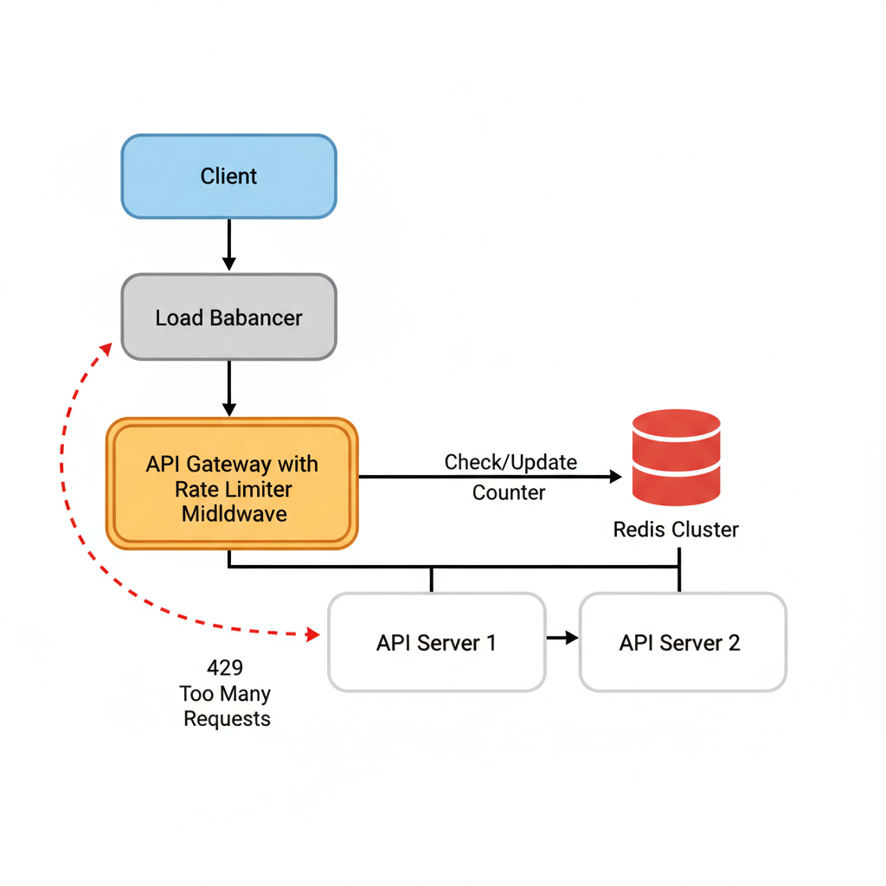
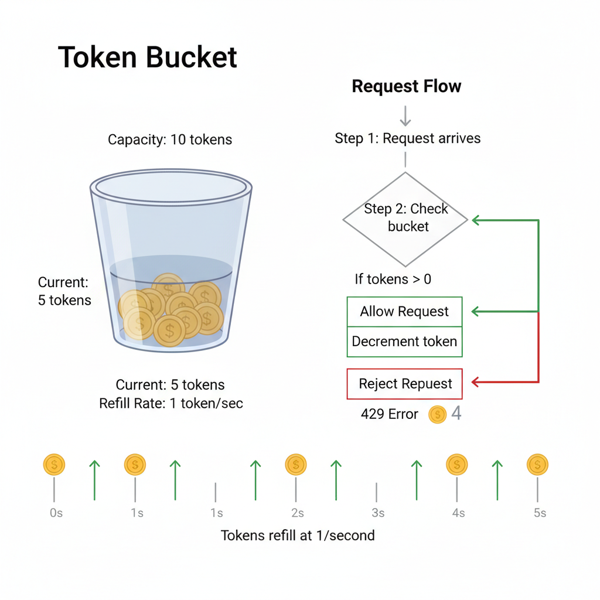

# 02. Design a Rate Limiter

**Difficulty:** Medium
**Focus:** Algorithms, Distributed Counting, Race Conditions.

---

## 🎯 Real-World Analogy

**Think of a rate limiter like a coffee shop punch card:**
- You get a card with 10 stamps
- Each coffee purchase uses 1 stamp
- Card refills every hour (you get 10 new stamps)
- If you try to buy an 11th coffee in the same hour? Sorry, come back later!

**Another analogy - Highway Toll Booth:**
- Only 10 cars can pass per minute
- 11th car gets a red light: "Too many requests, try again in 30 seconds"

**Why do we need this?**
- **Prevent abuse:** Stop malicious users from overwhelming your API
- **Fair usage:** Ensure all users get their share of resources
- **Cost control:** Limit expensive operations (e.g., AI API calls cost money per request)
- **Stability:** Prevent cascading failures when traffic spikes

---

## 1. Requirements (0-5 Minutes)

**Candidate:** "I'll clarify the goals."

**Functional Requirements:**
1.  **Limit:** Allow a user to perform X requests per time window (e.g., 10 req/sec).
2.  **Scope:** Limit by User ID, IP Address, or API Key.
3.  **Feedback:** If blocked, return a clear error (HTTP 429).

**Non-Functional Requirements:**
1.  **Low Latency:** The rate limiter should add minimal delay (< 20ms) to the request.
2.  **Accuracy:** It should be reasonably accurate (doesn't need to be atomic, but close).
3.  **Distributed:** It must work across a cluster of API servers.

---

## 2. Back-of-the-Envelope Estimation (5-10 Minutes)

**Assumptions:**
*   **Traffic:** 1 Million active users.
*   **Scale:** Handling 100k requests/second at peak.

**Data Size:**
*   We need to store counters for active users.
*   If 1M users are active in a window, and each entry takes ~100 bytes (User ID + Counter + Timestamp).
*   Memory: 1M * 100 bytes = **100 MB**.
*   *Conclusion:* We can easily fit this in memory. **Redis** is the perfect choice.

---

## 3. API Design (10-15 Minutes)

This is usually a **Middleware** or an **API Gateway** component, not a user-facing API. However, we can define the configuration API.

**Config Rules:**
```json
[
  {
    "role": "user",
    "limit": 10,
    "window_sec": 60
  },
  {
    "role": "admin",
    "limit": 100,
    "window_sec": 60
  }
]
```

**Response Headers:**
*   `X-Ratelimit-Limit`: 10
*   `X-Ratelimit-Remaining`: 9
*   `X-Ratelimit-Retry-After`: 5 (seconds)

---

## 4. High-Level Design (15-20 Minutes)

**System Architecture:**



**Components:**
1.  **Client:** Sends request.
2.  **Load Balancer:** Forwards to API Gateway.
3.  **Rate Limiter Middleware:**
    *   Extracts User ID / IP.
    *   Talks to **Redis** to check/update counters.
    *   If Allowed -> Pass to API Server.
    *   If Blocked -> Return HTTP 429.

**Why Redis?**
*   It's in-memory (fast).
*   It supports atomic operations (`INCR`, `Lua Scripts`).
*   It supports TTL (Time To Live) to auto-expire old counters.

---

## 5. Deep Dive: Algorithms (20-35 Minutes)
*This is the core of the interview. Compare the options.*

### 🤔 The Core Question

**How do we track "10 requests per minute" for millions of users?**

Let's explore 3 approaches, from simple to sophisticated:

---

### ❌ Option A: Fixed Window Counter (Simple but Flawed)

**📚 ELI5:** Imagine a classroom where students can ask 10 questions per hour.
- Hour 1 (10:00-11:00): Count questions
- Hour 2 (11:00-12:00): Reset counter to 0, count again

**How it works:**
```
Time Window: 10:00:00 - 10:00:59 (1 minute)
User makes request at 10:00:30 → Counter: 1
User makes request at 10:00:45 → Counter: 2
...
User makes request at 10:00:58 → Counter: 10 ✅ Allowed
User makes request at 10:00:59 → Counter: 11 ❌ BLOCKED

At 10:01:00 → Counter resets to 0
```

**🚨 The Fatal Flaw - "Burst at the Boundary":**

```
Limit: 10 requests per minute

10:00:50 → User makes 10 requests (counter: 10) ✅
10:01:01 → Counter resets! User makes 10 more requests ✅

Result: 20 requests in 11 seconds! 🔥
```

**Visual Timeline:**
```
|--- Minute 1 (10:00-10:01) ---|--- Minute 2 (10:01-10:02) ---|
                    ^^^^^^^^^^^ ^^^^^^^^^^^
                    10 requests | 10 requests
                    (11 seconds total = 20 requests!)
```

**Why this is bad:** A malicious user can exploit this to send 2x the allowed traffic!

---

### ⚠️ Option B: Sliding Window Log (Accurate but Expensive)

**📚 ELI5:** Keep a detailed diary of every single request with exact timestamps.

**How it works:**
```
Redis Sorted Set (ZSET):
user_123: [
  {timestamp: 10:00:15, request_id: 1},
  {timestamp: 10:00:22, request_id: 2},
  {timestamp: 10:00:45, request_id: 3},
  ...
]

New request at 10:01:30:
1. Remove all timestamps older than 1 minute (before 10:00:30)
2. Count remaining timestamps
3. If count < 10 → Allow, add new timestamp
4. If count >= 10 → Block
```

**✅ Pros:** Perfectly accurate! No boundary problem.

**❌ Cons:** 
- **Memory explosion:** If a user makes 1000 requests, we store 1000 timestamps
- **Expensive:** Each request requires scanning and cleaning old timestamps
- **Example:** 1M users × 100 requests each = 100M timestamps in memory!

---

### ✅ Option C: Token Bucket (The Winner!) 🏆

**🎯 Analogy:** Imagine a bucket that holds coffee tokens



**📚 ELI5 - The Coffee Shop Token System:**

1. **Bucket Capacity:** Holds maximum 10 tokens
2. **Refill Rate:** Every second, add 1 token (or 10 tokens per minute)
3. **Making a Request:** 
   - Check bucket: "Do I have at least 1 token?"
   - Yes? Take 1 token, process request ✅
   - No? Reject request ❌

**🎬 Visual Simulation:**

**Scenario:** Capacity=5, Refill=1/sec

**Time 00:00** - Bucket Full
```
[🪙 🪙 🪙 🪙 🪙] (5 tokens)
User Request 1 → Take 1 → [🪙 🪙 🪙 🪙 _] (4 left) ✅ Allowed
User Request 2 → Take 1 → [🪙 🪙 🪙 _ _] (3 left) ✅ Allowed
```

**Time 00:00 (Instant Burst)**
```
User Request 3 → Take 1 → [🪙 🪙 _ _ _] (2 left) ✅ Allowed
User Request 4 → Take 1 → [🪙 _ _ _ _] (1 left) ✅ Allowed
User Request 5 → Take 1 → [_ _ _ _ _] (0 left) ✅ Allowed
User Request 6 → Take 1 → ❌ BLOCKED (Empty!)
```

**Time 00:01 (1 sec later)**
```
Refill +1 token
[_ _ _ _ _] → [🪙 _ _ _ _] (1 token)
User Request 7 → Take 1 → [_ _ _ _ _] (0 left) ✅ Allowed
```

**Time 00:05 (User went for coffee)**
```
Refill +1/sec for 4 seconds
[_ _ _ _ _] → [🪙 🪙 🪙 🪙 🪙] (Full again!)
```

### 💻 Production Implementation: Redis Lua Script

**Why Lua?**
- **Atomicity:** Redis guarantees the script runs start-to-finish without interruption.
- **Performance:** Reduces network round-trips (1 request instead of GET + logic + SET).

```lua
-- rate_limiter.lua
-- KEYS[1]: The unique key (e.g., "rate_limit:user:123")
-- ARGV[1]: Refill rate (tokens per second)
-- ARGV[2]: Bucket capacity
-- ARGV[3]: Current timestamp (unix epoch)
-- ARGV[4]: Tokens requested (usually 1)

local key = KEYS[1]
local rate = tonumber(ARGV[1])
local capacity = tonumber(ARGV[2])
local now = tonumber(ARGV[3])
local requested = tonumber(ARGV[4])

-- Get current bucket state
local bucket_info = redis.call("hmget", key, "tokens", "last_refill")
local tokens = tonumber(bucket_info[1])
local last_refill = tonumber(bucket_info[2])

-- Initialize if missing
if not tokens then
    tokens = capacity
    last_refill = now
end

-- Refill tokens based on time passed
local delta = math.max(0, now - last_refill)
local filled_tokens = math.min(capacity, tokens + (delta * rate))

-- Check if enough tokens
local allowed = false
if filled_tokens >= requested then
    allowed = true
    filled_tokens = filled_tokens - requested
end

-- Update Redis (with TTL to auto-cleanup)
redis.call("hmset", key, "tokens", filled_tokens, "last_refill", now)
redis.call("expire", key, 60) -- Expire after 60s of inactivity

return allowed
```

**Python Wrapper:**
```python
def allow_request(user_id):
    script = """...lua code above..."""
    allowed = redis.eval(
        script, 
        1,                      # num keys
        f"rate_limit:{user_id}", # key
        1,                      # rate (1 token/sec)
        10,                     # capacity
        time.time(),            # now
        1                       # requested
    )
    return bool(allowed)
```

### ☕ Java Implementation

```java
import redis.clients.jedis.Jedis;
import java.util.Collections;

public class TokenBucketRateLimiter {
    private final Jedis redis;
    private final String luaScript;
    
    public TokenBucketRateLimiter(Jedis redis) {
        this.redis = redis;
        
        // Same Lua script as above
        this.luaScript = 
            "local key = KEYS[1]\n" +
            "local rate = tonumber(ARGV[1])\n" +
            "local capacity = tonumber(ARGV[2])\n" +
            "local now = tonumber(ARGV[3])\n" +
            "local requested = tonumber(ARGV[4])\n" +
            "\n" +
            "local bucket_info = redis.call('hmget', key, 'tokens', 'last_refill')\n" +
            "local tokens = tonumber(bucket_info[1])\n" +
            "local last_refill = tonumber(bucket_info[2])\n" +
            "\n" +
            "if not tokens then\n" +
            "    tokens = capacity\n" +
            "    last_refill = now\n" +
            "end\n" +
            "\n" +
            "local delta = math.max(0, now - last_refill)\n" +
            "local filled_tokens = math.min(capacity, tokens + (delta * rate))\n" +
            "\n" +
            "local allowed = false\n" +
            "if filled_tokens >= requested then\n" +
            "    allowed = true\n" +
            "    filled_tokens = filled_tokens - requested\n" +
            "end\n" +
            "\n" +
            "redis.call('hmset', key, 'tokens', filled_tokens, 'last_refill', now)\n" +
            "redis.call('expire', key, 60)\n" +
            "\n" +
            "return allowed and 1 or 0";
    }
    
    public boolean allowRequest(String userId) {
        return allowRequest(userId, 1.0, 10, 1);
    }
    
    public boolean allowRequest(String userId, double rate, int capacity, int requested) {
        String key = "rate_limit:" + userId;
        double now = System.currentTimeMillis() / 1000.0;
        
        Object result = redis.eval(
            luaScript,
            Collections.singletonList(key),
            java.util.Arrays.asList(
                String.valueOf(rate),
                String.valueOf(capacity),
                String.valueOf(now),
                String.valueOf(requested)
            )
        );
        
        return result != null && ((Long) result) == 1;
    }
}
```

**🎓 Why Token Bucket is Brilliant:**

1. **✅ Memory Efficient:** Only 2 numbers per user (tokens + last_refill_time)
   - 1M users × 16 bytes = 16 MB (vs 100+ MB for sliding window)

2. **✅ Allows Bursts:** If user hasn't made requests for a while, bucket fills up
   - User inactive for 1 minute → bucket has 10 tokens
   - Can make 10 rapid requests immediately (good UX!)

3. **✅ Smooth Traffic:** Refills gradually, preventing boundary exploitation

4. **✅ Fast:** Just 2 arithmetic operations (add tokens, subtract 1)

**🎓 Why Token Bucket is Brilliant:**

1. **✅ Memory Efficient:** Only 2 numbers per user (tokens + last_refill_time)
   - 1M users × 16 bytes = 16 MB (vs 100+ MB for sliding window)

2. **✅ Allows Bursts:** If user hasn't made requests for a while, bucket fills up
   - User inactive for 1 minute → bucket has 10 tokens
   - Can make 10 rapid requests immediately (good UX!)

3. **✅ Smooth Traffic:** Refills gradually, preventing boundary exploitation

4. **✅ Fast:** Just 2 arithmetic operations (add tokens, subtract 1)

**🆚 Comparison Table:**

| Feature | Fixed Window | Sliding Window Log | Token Bucket |
|---------|-------------|-------------------|-------------|
| **Accuracy** | ❌ Poor (burst problem) | ✅ Perfect | ✅ Good |
| **Memory** | ✅ Low (1 counter) | ❌ High (N timestamps) | ✅ Low (2 numbers) |
| **Speed** | ✅ Fast | ⚠️ Slow (scan old data) | ✅ Fast |
| **Allows Bursts** | ❌ No | ❌ No | ✅ Yes |
| **Used By** | Simple apps | - | **Twitter, Stripe, AWS** |

---

## 6. Deep Dive: Distributed Challenges (35-40 Minutes)

### 🏎️ Race Conditions

**The Problem:**
In a distributed system, multiple servers might try to update the same user's counter simultaneously.

**Scenario:**
- User has 1 token left.
- **Server A** reads: `tokens = 1`
- **Server B** reads: `tokens = 1` (at the exact same millisecond)
- **Server A** subtracts 1, writes `tokens = 0`, allows request ✅
- **Server B** subtracts 1, writes `tokens = 0`, allows request ✅

**Result:** User made 2 requests with only 1 token! ❌

**Solution 1: Redis Locks (Slow)**
```python
lock = redis.lock(f"lock:{user_id}")
if lock.acquire():
    # check and update tokens
    lock.release()
```
*Why it's bad:* Locks kill performance. We need < 20ms latency.

**Solution 2: Lua Scripts (Fast & Correct)**
As shown above, Lua scripts execute **atomically** in Redis.
- Redis is single-threaded.
- While the script runs, no other command runs.
- It's like a super-fast lock without the overhead.

### 🌍 Synchronization Issues

**Challenge:**
We have 100 API servers. Where do we store the counters?

**Approach A: Sticky Sessions (Local Memory)**
- Load Balancer always sends User A to Server 1.
- Server 1 keeps User A's counter in RAM (HashMap).

*   **Pros:** Super fast (nanoseconds).
*   **Cons:**
    *   **Scaling:** If Server 1 dies, User A's limit resets (free tokens!).
    *   **Hotspots:** If User A is a spammer, Server 1 gets overwhelmed while Server 2 is idle.

**Approach B: Centralized Redis (The Standard)**
- All 100 servers talk to one Redis Cluster.

*   **Pros:** Accurate, simple, resilient.
*   **Cons:** Network latency (add ~2-5ms per request).
*   **Fix:** Use Redis Pipelining or Geographically distributed Redis (Active-Active) for global apps.

**Approach C: Gossip Protocol (Advanced)**
- Each server keeps a local counter.
- Servers "gossip" (share) their counts with each other asynchronously.
- Used by **Cassandra** and **Amazon Dynamo**.

*   **Pros:** No central bottleneck.
*   **Cons:** **Eventual Consistency**.
    *   Server A thinks User has 5 requests.
    *   Server B thinks User has 3 requests.
    *   Total might be > Limit for a few seconds.
    *   *Is this okay?* Usually yes. Strict accuracy isn't always needed for rate limiting.

### 🛡️ Handling Redis Failures

**What if Redis goes down?**

1.  **Fail Open (Allow All):**
    - If Redis times out, let the request through.
    - *Reasoning:* Better to degrade functionality (allow spam) than to block legitimate users (outage).
    
2.  **Fail Closed (Block All):**
    - If Redis is down, reject everyone.
    - *Reasoning:* Protects the system from overload, but causes 100% downtime.

**Recommendation:** **Fail Open** for most consumer apps. **Fail Closed** for critical banking/security APIs.

---

## 7. Deep Dive: Rule Engine Architecture (40-42 Minutes)

**Problem:**
- Hardcoding rules (`if user == 'admin'`) is bad.
- We need a flexible system to change limits without redeploying code.

**Architecture:**
1.  **Config Service:** Stores rules in a database (e.g., "Gold Users: 100 req/min").
2.  **Cache:** Rate Limiter caches these rules in memory (updates every minute).
3.  **Logic:**
    - Request comes in.
    - Fetch user's tier (Gold/Silver).
    - Look up limit for that tier.
    - Apply Token Bucket.

**Example Rule JSON:**
```json
{
  "domain": "auth",
  "descriptors": [
    { "key": "user_id", "value": "123", "rate_limit": { "unit": "minute", "requests_per_unit": 5 } }
  ]
}
```

---

## 8. Deep Dive: Client-Side Throttling (42-44 Minutes)

**Why?**
- Even if the server blocks requests, the client might keep retrying (DDOSing you).
- We need to tell the client to "chill out".

**Strategies:**
1.  **Exponential Backoff:**
    - Retry 1: Wait 1s.
    - Retry 2: Wait 2s.
    - Retry 3: Wait 4s.
2.  **Jitter:**
    - Add randomness to prevent "Thundering Herd".
    - `Wait = 2^retry + random(0, 100ms)`
3.  **Respect `Retry-After` Header:**
    - If server says `Retry-After: 60`, client MUST wait 60s.

---

---

## 10. Real-World Engineering Case Studies (Deep Dive)

### 1. Stripe: Scaling Rate Limiting to Millions

**Source:** Stripe Engineering Blog - "Scaling your API with Rate Limiters"

**The Challenge:**
Stripe processes billions of dollars.
- **Requirement:** Prevent a single merchant's buggy script from taking down the API for everyone else.
- **Complexity:** Limits vary by user tier, API endpoint, and request type (read vs write).

**The Solution: The "Redis Sorted Set" Approach**

Stripe uses the **Sliding Window Log** algorithm (Option B above) but optimized for accuracy over memory.

**Architecture:**
1.  **Middleware:** Every request hits a custom Rate Limiter middleware.
2.  **Storage:** Redis Sorted Sets (ZSET).
    - Key: `user_id:api_type`
    - Score: Timestamp (Microseconds)
    - Value: Request ID
3.  **The "Cost" Logic:**
    - Not all requests are equal.
    - `GET /v1/charges` = 1 token.
    - `POST /v1/charges` (Complex fraud check) = 5 tokens.
    - Stripe deducts tokens based on **CPU cost**.

**Key Insight:**
For financial APIs, **Accuracy** > **Memory**. Stripe accepts the higher memory cost of Sliding Window Logs to ensure they never unfairly block a legitimate payment.

---

### 2. Cloudflare: Distributed Rate Limiting at the Edge

**Source:** Cloudflare Blog

**The Challenge:**
Cloudflare sits in front of millions of websites.
- **Scale:** 50 Million requests per second.
- **Latency:** Must be < 1ms overhead.
- **Distributed:** 200+ Data Centers globally.

**The Solution: "Sampled" Rate Limiting with Gossip**

**Architecture:**
1.  **Local Counters:** Each Edge Server (e.g., London Node 1) keeps a local counter in RAM.
2.  **The Problem:** If Limit=100 and you have 100 servers, a user could send 100 * 100 = 10,000 requests!
3.  **The Fix (Global Consensus):**
    - Servers don't talk to a central Redis (too slow).
    - They use a **Gossip Protocol** (like Memcached's `mcrouter`).
    - Server A tells Server B: "I saw 5 requests from User X".
    - Server B aggregates: "Okay, total is now 15".
4.  **Approximation:**
    - Cloudflare allows a small margin of error (e.g., allowing 105 requests instead of 100) in exchange for massive performance speed.

**Key Insight:**
At massive scale, **Eventual Consistency** is necessary. You cannot have a strictly consistent global counter without killing latency.

---

## 11. Failure Scenarios & Disaster Recovery

### Scenario 1: Redis Cluster Failure
**Impact:** Rate limiter becomes a bottleneck or allows all traffic (fail-open).
**Detection:**
- Redis connection timeouts/errors.
- Latency spikes in the middleware layer.
- Alert: `redis_connection_errors > 5%`.

**Mitigation:**
- **Fail-Open Strategy:** If Redis is down, allow requests to pass but log them for post-analysis. Better to risk overload than to block all legitimate users.
- **Local Cache Fallback:** Use a small in-memory cache (Guava/Caffeine) on the application server to store coarse-grained limits during Redis outages.
- **Multi-AZ Redis:** Use Redis replication with automatic failover (Sentinel or Cluster mode).

### Scenario 2: Lua Script Timeout
**Impact:** Atomic operations fail, leading to incorrect counting or request blocking.
**Detection:** `RedisCommandTimeoutException` in logs.

**Mitigation:**
- **Script Optimization:** Keep Lua scripts extremely lean.
- **Circuit Breaker:** Use Resilience4j to wrap the Redis call. If timeouts persist, trip the breaker and fail-open.

### Scenario 3: Thundering Herd (Post-Outage)
**Impact:** When the service recovers, all clients retry simultaneously, crashing the system again.
**Detection:** Massive spike in RPS immediately after recovery.

**Mitigation:**
- **Exponential Backoff + Jitter:** Clients must not retry at fixed intervals.
- **Retry-After Header:** Inform clients exactly when to retry.

---

## 12. Monitoring & Observability

### Golden Signals Dashboard

**1. Latency**
- **Target:** < 2ms for Redis check.
- **P99:** < 10ms.
- **Metric:** `rate_limiter_check_latency_seconds`.

**2. Traffic**
- **Metric:** `rate_limiter_allowed_total` vs `rate_limiter_rejected_total`.
- **Insight:** High rejection rates might indicate a DDoS attack or misconfigured limits for a specific tier.

**3. Errors**
- **Metric:** `rate_limiter_errors_total` (Redis down, script errors).
- **Target:** < 0.01%.

**4. Saturation**
- **Metric:** `redis_memory_usage`, `redis_cpu_utilization`.

### Alert Rules
```yaml
groups:
- name: RateLimiterAlerts
  rules:
  - alert: HighRejectionRate
    expr: rate(rate_limiter_rejected_total[5m]) / rate(rate_limiter_allowed_total[5m]) > 0.2
    for: 2m
    labels:
      severity: warning
    annotations:
      summary: "High rejection rate detected (over 20%)"
```

---

## 13. API Design & Versioning

### Internal/Admin API

**Update Limit Rule**
```http
PUT /api/v1/rules/{rule_id}
Content-Type: application/json

{
  "limit": 5000,
  "window": 60,
  "tier": "premium"
}
```

**Get Current Usage (Debug)**
```http
GET /api/v1/usage/{user_id}

Response:
{
  "user_id": "user_123",
  "current_tokens": 45,
  "last_refill_time": 1712345678,
  "limit": 100
}
```

### Response Headers (Standard)
- `X-RateLimit-Limit`: 100
- `X-RateLimit-Remaining`: 45
- `X-RateLimit-Reset`: 1712345700
- `Retry-After`: 120 (seconds)

---

## 14. Cost Analysis & Optimization

### Monthly Infrastructure Costs (at 1B checks/day)

**1. Redis (ElastiCache)**
- 3 nodes (m6g.large) = **$450/month**.
- Data Transfer = **$100/month**.

**2. Compute (Middleware/Sidecar)**
- If running as a sidecar in K8s, minimal extra cost (~$200 for extra CPU cycles).

**Total:** ~$750/month.

### Optimization Opportunities
- **Local Bloom Filters:** Use a Bloom filter on the app server to quickly identify "known good" users who rarely hit limits, skipping the Redis check.
- **Batching Increments:** Instead of 1 Redis call per request, batch increments locally and sync every 100ms (trade-off: accuracy).

---

## 15. Security & Compliance

### Security Measures
- **IP Whitelisting:** Allow internal services to bypass the rate limiter.
- **HMAC Signing:** Ensure the `user_id` passed in headers isn't spoofed (if not using JWT).
- **DDoS Protection:** Integrate with AWS Shield or Cloudflare to block volumetric attacks before they hit the Rate Limiter service.

### Compliance
- **GDPR:** Do not store PII in Redis. Use hashed `user_id` or `IP` as keys.
- **Data Retention:** Redis keys should have a TTL equal to the rate limit window + 10% buffer to ensure auto-cleanup.

---

## 16. Testing Strategies

### Unit Tests
- Test Token Bucket math: "If 10 tokens refill per sec, after 0.5s, are there 5 tokens?"
- Test Lua script edge cases (e.g., clock drift).

### Load Testing
- Simulate 100k concurrent users hitting the same Redis key.
- **Tool:** `locust` or `jmeter`.

### Chaos Engineering
- **Redis Partition:** Use `iptables` to drop traffic between App and Redis. Verify "Fail-Open" logic.
- **Latency Injection:** Inject 50ms delay into Redis calls. Verify that the app doesn't hang.

---

## 17. Migration & Rollout Strategies

### Rollout Plan
1. **Shadow Mode:** Run the rate limiter but don't block requests. Log "Would have blocked" events.
2. **Canary:** Enable blocking for 1% of users (Internal/Beta).
3. **Phased Rollout:** 10% -> 50% -> 100%.

### Rule Migration
- Use a versioned config file in S3.
- Middleware polls S3 every 1 minute for rule updates.

---

## 18. Performance Optimization

### Redis Lua Scripting
- **Why:** Avoids multiple round-trips.
- **Optimization:** Use `KEYS` and `ARGV` correctly to allow Redis Cluster to shard keys properly.

### Client-Side Rate Limiting
- Provide a client library that performs local "pre-checks" to reduce server load.

---

## 19. Capacity Planning

### Scaling Triggers
- **Redis Memory:** If memory > 70%, add more shards.
- **Redis CPU:** If CPU > 50% (due to Lua), scale horizontally.

### Throughput Projection
- 1B requests/day = ~11,500 RPS.
- Redis can handle ~100k RPS per shard. We are well within limits.

---

## 20. Interview Cheat Sheet

### Key Numbers
- **Latency:** < 1ms (Redis), < 5ms (Total).
- **Algorithm:** Token Bucket (Bursty), Leaky Bucket (Smooth).
- **Storage:** Redis (In-memory).

### Core Components
1. **Middleware/Interceptor:** Intercepts requests.
2. **Rule Engine:** Stores and fetches limits.
3. **Redis Store:** Global counters.

### Critical Trade-offs
- **Accuracy vs Latency:** Centralized Redis (Accurate, higher latency) vs Local/Gossip (Inaccurate, low latency).
- **Fail-Open vs Fail-Closed:** User experience vs System protection.

---

## 21. Wrap-up (Deep Dive)

**Summary:**
"I designed a distributed rate limiter using the **Token Bucket** algorithm for efficiency and burst handling.
1.  **Core Logic:** Implemented using **Redis Lua Scripts** to ensure atomicity and prevent race conditions.
2.  **Distributed Strategy:** I chose a centralized Redis cluster for strict consistency, but discussed how **Gossip Protocols** (like Cloudflare) could be used for lower latency at the cost of accuracy.
3.  **Configuration:** A flexible Rule Engine allows us to define limits by User Tier, IP, or API Endpoint dynamically.
4.  **Client Experience:** We use `Retry-After` headers and Jitter to prevent thundering herds.
5.  **Production Readiness:** Added comprehensive monitoring, fail-open mechanisms, and cost-optimized Redis sharding."

---
