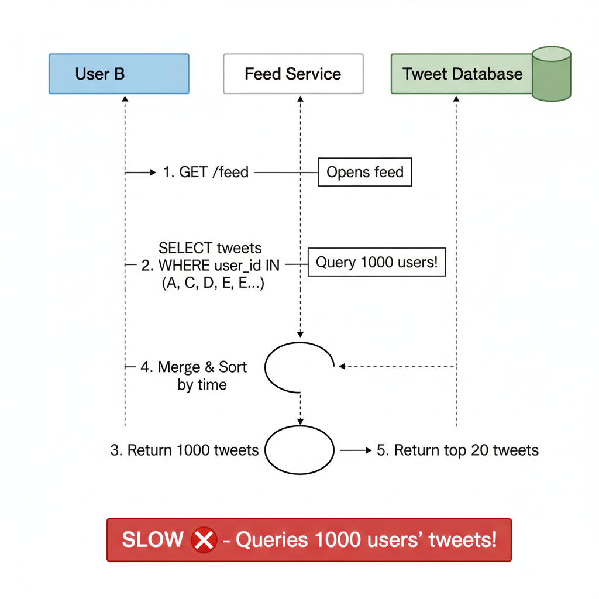
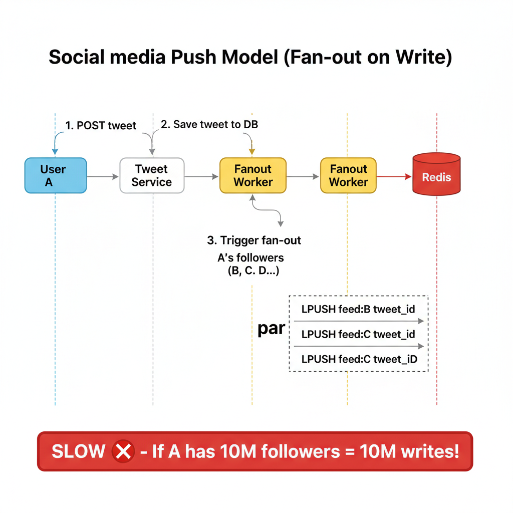
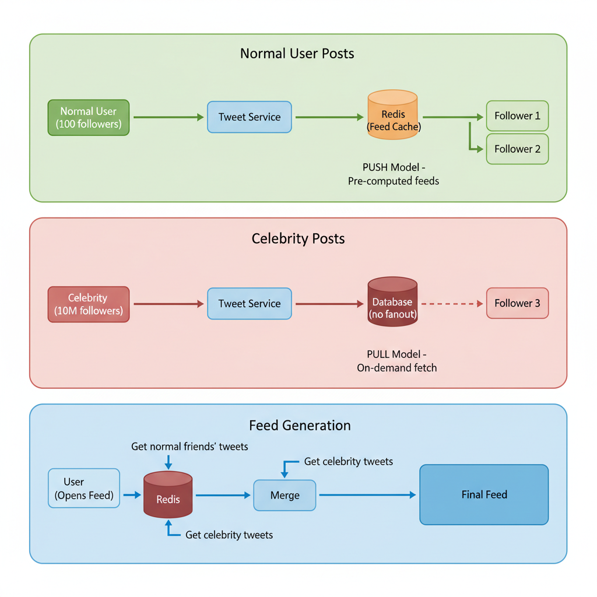

# 03. Design a Social Media Feed (Twitter/Instagram)

**Difficulty:** Hard
**Focus:** Fan-out patterns, Read vs Write Heavy, Hybrid Architecture.

---

## 🎯 Real-World Analogy

**Think of a social media feed like a newspaper delivery system:**

**Option 1 - Pull Model (You go to the newsstand):**
- Every morning, you walk to the newsstand
- You look through all the newspapers from publishers you like
- You collect articles, sort them by date, and read
- ❌ **Problem:** Takes time! What if you follow 1000 publishers?

**Option 2 - Push Model (Newspapers delivered to your door):**
- Publishers know you're a subscriber
- When they print a new edition, they deliver it to your doorstep
- You wake up, newspaper is already there! ✅
- ❌ **Problem:** What if you're Oprah and 10 million people subscribe to you? The publisher needs to deliver 10 million copies!

**Option 3 - Hybrid (Smart delivery):**
- Local newspapers (small publishers) → Delivered to your door
- National newspapers (NY Times, WSJ) → You pick them up at the newsstand
- ✅ **Best of both worlds!**

**Key Insight:** The challenge is balancing **fast reads** (users want instant feeds) vs **fast writes** (celebrities post once, millions see it).

---

## 1. Requirements (0-5 Minutes)

**Functional:**
1.  **Post:** User can post a tweet (text/image).
2.  **Follow:** User can follow others.
3.  **Feed:** User sees a timeline of tweets from people they follow, sorted by time (reverse chronological).

**Non-Functional:**
1.  **Latency:** Feed generation must be fast (< 200ms).
2.  **Availability:** Posting can be slightly delayed, but reading the feed must be always available (Eventual Consistency is okay).
3.  **Scale:** 100M DAU. Some users have millions of followers (Celebrities).

---

## 2. Estimations (5-10 Minutes)

*   **DAU:** 100 Million.
*   **Writes (Tweets):** Average 2 tweets/day/user = 200M tweets/day. ~2.3k QPS.
*   **Reads (Feeds):** Users check feed 10 times/day = 1B reads/day. ~11.5k QPS.
*   **Read:Write Ratio:** 5:1 (Actually much higher in reality, usually 100:1).
*   **Conclusion:** The system is **Read-Heavy**. We must optimize for fast reads.

---

## 3. Database Schema (10-15 Minutes)

**SQL vs NoSQL:**
*   **User Table:** SQL (Relational data).
*   **Tweet Table:** NoSQL (Cassandra/DynamoDB) or SQL (Sharded). We need massive write throughput and simple lookups by ID.
*   **Follow Table:** Graph DB (Neo4j) or SQL (`follower_id`, `followee_id`).

---

## 4. High-Level Design Options (15-30 Minutes)
*The core debate: Pull vs Push.*

### 📚 ELI5: The Core Problem

**Scenario:** You follow 500 people on Twitter. How does Twitter show you their latest tweets?

**Two fundamental approaches:**
1. **When you open the app** → Go find all tweets from 500 people (Pull)
2. **When someone tweets** → Add their tweet to all followers' feeds (Push)

Let's explore both:

---

### ❌ Approach A: Pull Model (Fan-out on Load)

**🎯 Analogy:** Going to a buffet and picking food yourself



**📝 Step-by-Step Example:**

```
You (Alice) follow: Bob, Carol, Dave, Eve (4 people)

You open Twitter:
1. System: "Let me find Alice's followings..."
   → Query: SELECT followings FROM users WHERE user_id = 'Alice'
   → Result: [Bob, Carol, Dave, Eve]

2. System: "Now get their recent tweets..."
   → Query: SELECT * FROM tweets WHERE user_id IN ('Bob', 'Carol', 'Dave', 'Eve')
            ORDER BY created_at DESC LIMIT 20
   
3. System: "Merge and sort by time..."
   Bob's tweet (10:05 AM)
   Eve's tweet (10:03 AM)
   Carol's tweet (10:01 AM)
   Dave's tweet (9:58 AM)
   ...

4. Show to Alice ✅
```

**✅ Pros:**
- **Simple:** Just query the database
- **Fast writes:** When Bob tweets, just INSERT into tweets table. Done in milliseconds!
- **No wasted work:** Only compute feeds for users who actually open the app

**❌ Cons - The Performance Nightmare:**

**Problem 1: Query Complexity**
```
If you follow 1,000 people:
- Query 1,000 user timelines
- Fetch ~20 tweets from each = 20,000 tweets
- Sort 20,000 tweets by timestamp
- Pick top 20

Time: 2-5 seconds! 😱
```

**Problem 2: Database Load**
```
100M users checking feed 10 times/day = 1 Billion queries/day
Each query scans 1,000 timelines
= 1 Trillion timeline scans per day!

Your database: 💥 (explodes)
```

**Real-World Example:**
- Early Twitter used this approach
- Result: "Fail Whale" (site crashed constantly)
- Feed load time: 3-10 seconds

---

### ⚠️ Approach B: Push Model (Fan-out on Write)

**🎯 Analogy:** Restaurant delivers food to your table



**📝 Step-by-Step Example:**

```
Bob tweets: "Hello World!"

System immediately:
1. Find Bob's followers:
   → Query: SELECT follower_id FROM follows WHERE followee_id = 'Bob'
   → Result: [Alice, Charlie, Diana, ...] (Bob has 100 followers)

2. For EACH follower, add tweet to their pre-built feed:
   → Redis: LPUSH feed:Alice [tweet_id_123]
   → Redis: LPUSH feed:Charlie [tweet_id_123]
   → Redis: LPUSH feed:Diana [tweet_id_123]
   → ... (100 writes)

3. Done! ✅

Later, Alice opens Twitter:
1. System: "Get Alice's pre-built feed"
   → Redis: LRANGE feed:Alice 0 19  (get top 20)
   → Result: [tweet_123, tweet_119, tweet_115, ...]
   
2. Fetch tweet details:
   → SELECT * FROM tweets WHERE id IN (123, 119, 115, ...)
   
3. Show to Alice in 50ms! ⚡
```

**✅ Pros:**
- **Blazing fast reads:** Feed is pre-computed! Just read from Redis
- **Simple for users:** O(1) lookup, no complex queries
- **Predictable latency:** Always fast, regardless of how many people you follow

**❌ Cons - The Celebrity Problem:**

**Problem: What happens when Cristiano Ronaldo tweets?**

```
Cristiano Ronaldo has 500 MILLION followers

He tweets: "Siuuu! ⚽"

System must:
1. Find 500M followers (query takes 10 seconds)
2. Write to 500M Redis lists:
   → LPUSH feed:user_1 [tweet_id]
   → LPUSH feed:user_2 [tweet_id]
   → ... (500 million writes!)
   
Time to complete: 30+ minutes! 😱
Redis: 💥 (overwhelmed)

Meanwhile:
- Ronaldo's tweet doesn't appear in feeds
- System is stuck processing
- Other users' tweets are delayed
```

**Real-World Impact:**
- Twitter tried pure push model in 2008
- When celebrities tweeted, system froze
- Regular users couldn't see ANY tweets for minutes

**🔥 The "Thundering Herd" Problem:**
```
Normal user tweets → 100 writes → ✅ Fine
Celebrity tweets → 10M writes → 💥 System crash

It's like:
- 1 person ordering pizza → ✅ Restaurant handles it
- 1 million people ordering pizza simultaneously → 💥 Restaurant burns down
```

---

## 5. Deep Dive: The Hybrid Approach (30-40 Minutes)
*The winning solution.*



**Strategy:**
1.  **Normal Users (Few followers):** Use **Push Model**.
    *   When I tweet, push to my 100 followers' feeds. Fast.
2.  **Celebrities (Millions of followers):** Use **Pull Model**.
    *   When Justin Bieber tweets, save to DB. Don't push.
    *   When I (a follower) open my feed:
        *   Fetch my pre-computed feed (from normal friends).
        *   Fetch recent tweets from celebrities I follow (Pull).
        *   Merge them in memory.

### 💻 Hybrid Fan-out Implementation

**Step 1: The Publisher Service**

```python
class TweetService:
    def post_tweet(self, user_id, content):
        # 1. Save Tweet to DB (Cassandra/DynamoDB)
        tweet = db.save_tweet(user_id, content)
        
        # 2. Check if user is a Celebrity
        if self.is_celebrity(user_id):
            # Celebrity: Do nothing (Pull model)
            # Followers will fetch this when they load feed
            pass
        else:
            # Normal User: Trigger Fan-out (Push model)
            kafka.produce("new_tweets", tweet)
            
    def is_celebrity(self, user_id):
        # Cache this check!
        follower_count = redis.get(f"followers:{user_id}")
        return follower_count > 50000  # Threshold
```

**Step 2: The Fan-out Worker (Consumer)**

```python
class FanOutWorker:
    def consume(self):
        for tweet in kafka.consume("new_tweets"):
            self.fan_out_to_followers(tweet)
            
    def fan_out_to_followers(self, tweet):
        # Get all followers
        followers = db.get_followers(tweet.user_id)
        
        # Push to each follower's feed in Redis
        pipeline = redis.pipeline()
        for follower_id in followers:
            # Add to head of list
            pipeline.lpush(f"feed:{follower_id}", tweet.id)
            # Trim to keep only 800 items
            pipeline.ltrim(f"feed:{follower_id}", 0, 800)
            
        pipeline.execute()
```

**Step 3: The Feed Retrieval Service (Reader)**

```python
class FeedService:
    def get_feed(self, user_id):
        # 1. Get Pre-computed Feed (Push)
        # Contains tweets from normal friends
        feed_ids = redis.lrange(f"feed:{user_id}", 0, 20)
        
        # 2. Get Celebrity Tweets (Pull)
        # Find celebrities I follow
        celebs = db.get_following_celebrities(user_id)
        
        celeb_tweets = []
        if celebs:
            # Fetch their recent tweets
            celeb_tweets = db.query("""
                SELECT id FROM tweets 
                WHERE user_id IN %s 
                AND created_at > NOW() - INTERVAL 24 HOUR
                ORDER BY created_at DESC LIMIT 20
            """, celebs)
            
        # 3. Merge and Sort
        # Merge sort algorithm (like merging 2 sorted lists)
        final_feed = merge_and_sort(feed_ids, celeb_tweets)
        
        # 4. Hydrate (Fetch full tweet content)
        return db.get_tweets_content(final_feed[:20])
```

### ☕ Java Implementation

```java
import redis.clients.jedis.Jedis;
import redis.clients.jedis.Pipeline;
import org.apache.kafka.clients.producer.*;
import java.util.*;
import java.util.stream.Collectors;

public class HybridFeedService {
    private final Jedis redis;
    private final KafkaProducer<String, String> kafkaProducer;
    private static final int CELEBRITY_THRESHOLD = 50000;
    
    // Step 1: Tweet Service
    public void postTweet(String userId, String content) {
        // 1. Save Tweet to DB
        Tweet tweet = database.saveTweet(userId, content);
        
        // 2. Check if user is a Celebrity
        if (isCelebrity(userId)) {
            // Celebrity: Do nothing (Pull model)
            // Followers will fetch this when they load feed
            return;
        } else {
            // Normal User: Trigger Fan-out (Push model)
            ProducerRecord<String, String> record = 
                new ProducerRecord<>("new_tweets", tweet.toJson());
            kafkaProducer.send(record);
        }
    }
    
    private boolean isCelebrity(String userId) {
        String followerCount = redis.get("followers:" + userId);
        return followerCount != null && 
               Integer.parseInt(followerCount) > CELEBRITY_THRESHOLD;
    }
    
    // Step 2: Fan-out Worker
    public void fanOutToFollowers(Tweet tweet) {
        // Get all followers
        List<String> followers = database.getFollowers(tweet.getUserId());
        
        // Push to each follower's feed in Redis (batched)
        Pipeline pipeline = redis.pipelined();
        
        for (String followerId : followers) {
            String feedKey = "feed:" + followerId;
            // Add to head of list
            pipeline.lpush(feedKey, String.valueOf(tweet.getId()));
            // Trim to keep only 800 items
            pipeline.ltrim(feedKey, 0, 800);
        }
        
        pipeline.sync();
    }
    
    // Step 3: Feed Retrieval Service
    public List<Tweet> getFeed(String userId) {
        // 1. Get Pre-computed Feed (Push) - tweets from normal friends
        List<String> feedIds = redis.lrange("feed:" + userId, 0, 20);
        
        // 2. Get Celebrity Tweets (Pull)
        List<String> celebs = database.getFollowingCelebrities(userId);
        List<Long> celebTweetIds = new ArrayList<>();
        
        if (!celebs.isEmpty()) {
            // Fetch their recent tweets
            celebTweetIds = database.query(
                "SELECT id FROM tweets " +
                "WHERE user_id IN (?) " +
                "AND created_at > NOW() - INTERVAL 24 HOUR " +
                "ORDER BY created_at DESC LIMIT 20",
                celebs
            );
        }
        
        // 3. Merge and Sort
        List<Long> allIds = mergeAndSort(
            feedIds.stream().map(Long::parseLong).collect(Collectors.toList()),
            celebTweetIds
        );
        
        // 4. Hydrate (Fetch full tweet content)
        return database.getTweetsContent(allIds.subList(0, Math.min(20, allIds.size())));
    }
    
    private List<Long> mergeAndSort(List<Long> feed1, List<Long> feed2) {
        List<Long> merged = new ArrayList<>(feed1);
        merged.addAll(feed2);
        
        // Sort by timestamp (assuming IDs are time-ordered)
        merged.sort(Collections.reverseOrder());
        
        return merged;
    }
}
```

---

## 6. Deep Dive: Ranking Algorithm (40-42 Minutes)

**The Problem:**
Chronological order is boring. If I follow 500 people, I miss the important stuff.
We want to show **"Relevant"** tweets first.

**The Algorithm: EdgeRank (Simplified)**

Score = **Affinity** × **Weight** × **Time Decay**

1.  **Affinity (User-User):** How close are you to the author?
    *   Do you DM often?
    *   Do you like their posts often?
    *   Are they family?
    *   *Score: 0.0 to 1.0*

2.  **Weight (Content Quality):** Is this tweet popular?
    *   Photo > Text
    *   Video > Photo
    *   100 Likes > 1 Like
    *   *Score: Based on interaction type*

3.  **Time Decay (Recency):** Old news is bad news.
    *   Score drops by 50% every 6 hours.
    *   `1 / (Time Since Posted + 2)^Gravity`

**Implementation:**

```python
def calculate_score(user, tweet):
    affinity = get_affinity_score(user.id, tweet.author_id)
    weight = get_content_weight(tweet)
    decay = get_time_decay(tweet.created_at)
    
    return affinity * weight * decay

def get_ranked_feed(user_id):
    # 1. Get raw feed (1000 items)
    raw_feed = get_feed_ids(user_id)
    
    # 2. Score each item (Parallel processing)
    scored_tweets = []
    for tweet in raw_feed:
        score = calculate_score(user_id, tweet)
        scored_tweets.append((tweet, score))
        
    # 3. Sort by Score
    scored_tweets.sort(key=lambda x: x[1], reverse=True)
    
    return scored_tweets[:20]
```

---

## 7. Deep Dive: Real-Time Updates (42-45 Minutes)

**Scenario:**
You are looking at your feed. Someone posts a new tweet.
How does it appear **instantly** without refreshing?

**Option A: Short Polling (Bad)**
- Client asks server every 5 seconds: "Any new tweets?"
- Server: "No", "No", "No", "Yes!"
- ❌ **Wasteful:** 99% of requests return nothing.

**Option B: Long Polling (Better)**
- Client asks: "Any new tweets?"
- Server **holds the connection open** until a tweet arrives (or timeout).
- Tweet arrives → Server responds → Client asks again immediately.
- ✅ **Good for:** Low frequency updates.

**Option C: Server-Sent Events (SSE) (Best for Feeds)**
- One-way persistent connection (Server → Client).
- Perfect for feeds (you don't need to send data back on this channel).
- Browser API: `EventSource`.

```javascript
// Client
const evtSource = new EventSource("/api/stream-feed");
evtSource.onmessage = function(event) {
    const newTweet = JSON.parse(event.data);
    prependToFeed(newTweet);
    showToast("New tweet arrived!");
}
```

**Option D: WebSockets (Overkill?)**
- Full duplex (Two-way).
- Great for Chat (Scenario 04).
- Overkill for Feed (mostly read-only).
- But often used if the app already has a Chat feature (reuse the connection).

---

## 8. Deep Dive: Feed Storage Optimization (45-47 Minutes)

**Problem:**
- Storing 1000 tweet IDs per user in Redis is expensive.
- 100M users * 1000 IDs * 8 bytes = 800 GB RAM.
- **Cost:** $$$$$

**Optimization 1: Hybrid Storage**
- Keep only **Top 200** in Redis (RAM).
- Keep the rest in **Cassandra** (Disk).
- When user scrolls down past 200, fetch from Disk.

**Optimization 2: Compression**
- Use **MessagePack** or **Protobuf** instead of JSON.
- Use **Delta Encoding** for timestamps.

---

## 9. Deep Dive: User Graph Database (47-50 Minutes)

**Problem:**
- `SELECT * FROM follows WHERE followee_id = ?` is slow in MySQL with billions of rows.
- "Friends of Friends" queries are impossible in SQL.

**Solution: Graph Database (Neo4j / TAO)**
- **Nodes:** Users.
- **Edges:** Follows.
- **Traversal:** Finding followers is just "walking the graph".
- **Facebook TAO:** A distributed graph cache optimized for reads.

---

---

## 11. Real-World Engineering Case Studies (Deep Dive)

### 1. Facebook News Feed: The "Multiverse" Architecture

**Source:** Facebook Engineering Blog - "Serving the News Feed"

**The Challenge:**
Facebook has 2 Billion+ daily users.
- **Scale:** Trillions of feed items generated per day.
- **Complexity:** A feed isn't just "friends' posts". It's Groups, Pages, Ads, "People You May Know", and "Suggested for You".
- **Latency:** Must load in < 200ms.

**The Solution: "Multiverse" (Aggregator-Leaf Architecture)**

Facebook uses a **Pull-based** architecture with massive distributed caching.

**Architecture:**
1.  **Leaf Nodes (The Storage):**
    - User data is sharded across thousands of "Leaf Nodes".
    - Each Leaf Node stores the recent actions (posts, likes) for a subset of users.
    - *Query:* "Get me the last 50 actions from User A, User B, User C..."
2.  **Aggregators (The Brain):**
    - When you load your feed, an **Aggregator** service is called.
    - It fans out queries to hundreds of Leaf Nodes in parallel.
    - "User X follows 500 people. They are located on Leaf Nodes 12, 45, 99..."
3.  **Ranking (The Filter):**
    - The Aggregator collects 5,000 raw candidates.
    - It passes them to the **Ranking Service** (ML Models).
    - The ranker scores them based on probability of engagement.
    - Top 20 items are returned to the user.

**Key Insight:**
For complex feeds (like FB), **Pull** is often better than Push because the "Feed" is not a static list—it's a dynamic query generated at read time based on complex ML ranking.

---

### 2. Instagram: Scaling with Cassandra

**Source:** Instagram Engineering Blog - "Sharding & IDs at Instagram"

**The Challenge:**
Instagram is write-heavy (photos/videos) and read-heavy (scrolling).
- **Requirement:** Infinite scroll without duplicates.
- **Problem:** How to paginate efficiently when new photos are being added constantly?

**The Solution: "Unbound" Feeds & Snowflake IDs**

**Architecture:**
1.  **Storage:** Instagram uses **PostgreSQL** (sharded) for metadata and **Cassandra** for feeds.
2.  **Pagination (Cursor-based):**
    - *Naive:* `OFFSET 10 LIMIT 10` (Slow, skips items if new posts arrive).
    - *Smart:* `WHERE id < last_seen_id LIMIT 10`.
    - This requires IDs to be **Time-Sortable**.
3.  **Snowflake IDs (PL/PGSQL):**
    - Instagram generates 64-bit IDs inside the database.
    - `41 bits`: Timestamp (ms).
    - `13 bits`: Shard ID.
    - `10 bits`: Sequence.
    - *Result:* IDs are naturally sorted by time. No need for a separate `created_at` index sort.

**Key Insight:**
**Key Insight:**
Using **Time-Sortable IDs** (like Snowflake) solves the pagination drift problem and makes "Get recent posts" queries extremely fast (just a range scan on the Primary Key).

---

## 11. Failure Scenarios & Disaster Recovery

### Scenario 1: Feed Cache (Redis) Eviction/Failure
**Impact:** Read latency spikes as the system falls back to "Pull" from the database for all users.
**Detection:**
- Redis `evicted_keys` spike.
- Database CPU utilization > 80%.
- P99 latency > 1s.

**Mitigation:**
- **Replication:** Use Redis Master-Slave with automatic failover.
- **Hydration Service:** A background worker that proactively repopulates the cache for active users if a cache node fails.
- **Degraded Mode:** Show a "Global Top Posts" feed instead of a personalized one if the personalized feed cannot be generated in < 500ms.

### Scenario 2: Celebrity Fan-out Bottleneck
**Impact:** A celebrity with 100M followers posts, and the "Push" model crashes the message queue or Redis.
**Detection:** Message queue lag > 10 minutes.

**Mitigation:**
- **Hybrid Model:** Automatically switch users with > 1M followers to "Pull" mode.
- **Sharded Fan-out:** Distribute the fan-out task across multiple workers and regions.

### Scenario 3: Database Hotspots
**Impact:** Specific shards (e.g., containing viral posts) become overwhelmed.
**Detection:** High IOPS and latency on specific DB shards.

**Mitigation:**
- **Read Replicas:** Scale read replicas for hot shards.
- **Application-Level Caching:** Cache the viral post content in a global CDN or local memory.

---

## 12. Monitoring & Observability

### Golden Signals Dashboard

**1. Latency**
- **Feed Load:** P95 < 200ms.
- **Post Creation:** P95 < 100ms.
- **Metric:** `feed_load_latency_ms`.

**2. Traffic**
- **Requests:** Feed reads/sec, Post writes/sec.
- **Metric:** `feed_requests_total`.

**3. Errors**
- **Metric:** `feed_generation_errors_total`.
- **Target:** < 0.1%.

**4. Saturation**
- **Metric:** Redis memory, Message Queue depth, DB connection pool.

### Alert Rules
```yaml
alerts:
  - alert: FeedLatencyHigh
    expr: histogram_quantile(0.95, sum(rate(feed_load_latency_ms_bucket[5m])) by (le)) > 500
    for: 2m
    labels:
      severity: critical
```

---

## 13. API Design & Versioning

### Feed API

**Get Feed**
```http
GET /api/v1/feed?limit=20&cursor=timestamp_id
Authorization: Bearer <token>

Response:
{
  "items": [...],
  "next_cursor": "1712345678_99",
  "has_more": true
}
```

**Create Post**
```http
POST /api/v1/posts
Content-Type: application/json

{
  "content": "Hello World!",
  "media_ids": ["uuid-1", "uuid-2"]
}
```

### Versioning
- **Header-based:** `Accept: application/vnd.social.v2+json`.
- **Backward Compatibility:** Ensure v1 clients can still see posts even if v2 adds new media types.

---

## 14. Cost Analysis & Optimization

### Monthly Infrastructure Costs (at 50M DAU)

**1. Storage (S3 for Media)**
- 1 PB of photos/videos = **$23,000/month**.

**2. Database (Cassandra/Postgres)**
- 50 nodes = **$15,000/month**.

**3. Cache (Redis)**
- 100 nodes (for feed storage) = **$20,000/month**.

**4. CDN (CloudFront)**
- Egress traffic = **$50,000/month**.

**Total:** ~$108,000/month.

### Optimization Opportunities
- **Tiered Storage:** Move posts older than 30 days to S3 Glacier.
- **Image Compression:** Use WebP/AVIF to reduce egress costs by 30%.
- **Edge Side Includes (ESI):** Cache parts of the feed at the CDN level.

---

## 15. Security & Compliance

### Security Measures
- **Content Moderation:** Use AI (AWS Rekognition) to flag NSFW content before it hits the feed.
- **Rate Limiting:** Prevent bots from scraping feeds or spamming posts.
- **Private Accounts:** Ensure the "Follow" check is enforced at the API layer, not just the UI.

### Compliance
- **GDPR "Right to be Forgotten":** When a user deletes their account, trigger an asynchronous job to purge their posts from all followers' feeds in Redis.
- **Data Residency:** Store EU users' data in EU regions.

---

## 16. Testing Strategies

### Unit Tests
- Test the "Hybrid" logic: "If user has 1.1M followers, is the 'Pull' flag set?"
- Test ranking algorithm weights.

### Integration Tests
- Post a message and verify it appears in a follower's feed within 2 seconds.

### Load Testing
- Simulate a "Celebrity Post" event: 1M followers' feeds being updated simultaneously.
- **Tool:** `Gatling` or `k6`.

---

## 17. Migration & Rollout Strategies

### Migration Plan (SQL to NoSQL)
1. **Dual Write:** Write new posts to both SQL and Cassandra.
2. **Backfill:** Use Spark/Flink to migrate historical data.
3. **Verification:** Compare read results from both systems.
4. **Cutover:** Switch reads to Cassandra.

### Rollout
- **Feature Flags:** Use LaunchDarkly to toggle the new Ranking Algorithm for 5% of users.

---

## 18. Performance Optimization

### Fan-out Optimization
- **Priority Queue:** Fan-out to active users first, then inactive users.
- **In-Memory Buffering:** Buffer feed updates and write to Redis in batches.

### Client-Side Optimization
- **Prefetching:** Fetch the next page of the feed when the user is 80% down the current page.
- **Optimistic UI:** Show the user's own post in their feed immediately before the server confirms.

---

## 19. Capacity Planning

### Scaling Triggers
- **Redis Cluster:** Scale out when memory utilization hits 75%.
- **Workers:** Scale the fan-out worker pool based on message queue depth.

### Throughput Projection
- 50M DAU × 10 feed refreshes/day = 500M reads/day (~6,000 RPS).
- 50M DAU × 1 post/day = 50M writes/day (~600 RPS).

---

## 20. Interview Cheat Sheet

### Key Numbers
- **Latency:** < 200ms (Read), < 2s (Fan-out).
- **Scale:** 50M+ DAU.
- **Storage:** Cassandra (Posts), Redis (Feeds), S3 (Media).

### Core Components
1. **Feed Service:** Aggregates and returns the feed.
2. **Fan-out Service:** Distributes posts to followers.
3. **Ranking Service:** ML-based scoring.
4. **Social Graph Service:** Manages follows.

### Critical Trade-offs
- **Push vs Pull:** Read latency vs Write complexity.
- **Consistency vs Availability:** Is it okay if a post takes 5 seconds to appear? (Yes, AP over CP).

---

## 21. Wrap-up (Deep Dive)

**Summary:**
"I designed a scalable Social Media Feed using a **Hybrid Architecture**:
1.  **Push (Fan-out on Write):** For normal users, ensuring blazing fast read latency.
2.  **Pull (Fan-out on Load):** For celebrities, preventing the 'Thundering Herd' problem.
3.  **Storage:** I used **Cassandra** for the tweet store (write throughput) and **Redis** for the feed cache.
4.  **Ranking:** I implemented a simplified **EdgeRank** algorithm to prioritize relevant content.
5.  **Real-World Context:** I drew inspiration from **Facebook's Aggregator** pattern for complex ranking and **Instagram's Snowflake IDs** for efficient pagination.
6.  **Production Readiness:** I addressed failure modes like Redis eviction and celebrity bottlenecks, and outlined a comprehensive monitoring and security strategy."

---
