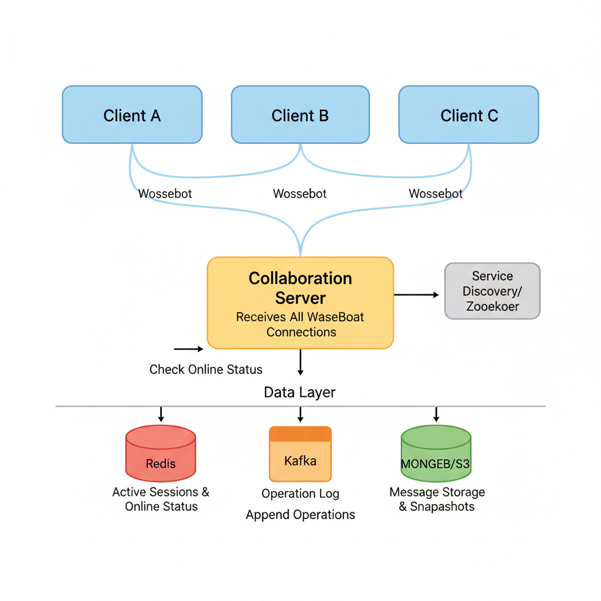
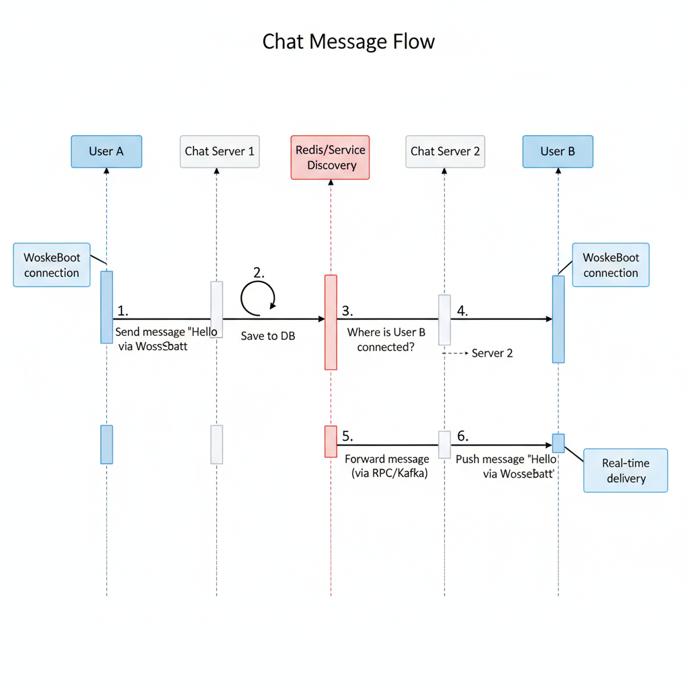

# 04. Design a Chat Application (WhatsApp/Messenger)

**Difficulty:** Hard
**Focus:** Real-time communication, Consistency, Message Ordering.

---

## 🎯 Real-World Analogy

**Think of a chat app like different communication methods:**

**Traditional Mail (HTTP):**
- You write a letter, mail it
- Wait for response
- Check mailbox periodically: "Any mail?" "Nope." "Any mail?" "Nope."
- ❌ Slow, inefficient for conversations

**Phone Call (WebSocket):**
- Direct, open connection
- Both parties can talk anytime
- Instant communication
- ✅ Perfect for real-time chat!

**Walkie-Talkie (Message Queue):**
- Even if other person is away, message is stored
- They get it when they come back
- ✅ Handles offline users!

**Key Insight:** Chat needs **bidirectional, real-time** communication. HTTP (request-response) doesn't work. We need WebSockets (persistent connection) + Message Queues (for offline users).

---

## 1. Requirements (0-5 Minutes)

**Functional:**
1.  **1-on-1 Chat:** User A sends message to User B.
2.  **Group Chat:** User A sends to Group (B, C, D).
3.  **Status:** Sent, Delivered, Read receipts.
4.  **Online Status:** Show if user is Online/Offline.

**Non-Functional:**
1.  **Real-time:** Low latency delivery.
2.  **Consistency:** Messages must be ordered (Msg 1 before Msg 2).
3.  **Durability:** Messages should not be lost.

---

## 2. Estimations (5-10 Minutes)

*   **Traffic:** 50M DAU.
*   **Messages:** 10 msgs/user/day = 500M msgs/day.
*   **Storage:** 500M * 100 bytes = 50GB/day.
*   **5 Years:** 50GB * 365 * 5 ≈ **90 TB**.
*   *Conclusion:* We need a database that handles massive write throughput and horizontal scaling. **HBase** or **Cassandra** (Wide-column stores) are standard here (used by Facebook/Discord).

---

## 3. High-Level Design (10-20 Minutes)

### 📚 ELI5: Why WebSockets?

**HTTP Problem (Polling):**
```
You: "Hey server, any new messages?"
Server: "Nope"
(1 second later)
You: "Hey server, any new messages?"
Server: "Nope"
(1 second later)
You: "Hey server, any new messages?"
Server: "Yes! Bob said hi"

❌ Wasteful! 100 requests just to get 1 message
❌ Battery drain on mobile
❌ Delayed delivery (up to 1 second)
```

**WebSocket Solution:**
```
You: *Opens WebSocket connection*
Server: *Connection stays open*
(Bob sends message)
Server: *Immediately pushes to you*
You: "Got it!"

✅ Efficient! Server pushes when there's actually a message
✅ Battery friendly (no constant polling)
✅ Instant delivery (0 delay)
```

**Real-World Comparison:**
```
HTTP Polling:
- 50M users × 10 polls/minute = 500M requests/minute
- Mostly empty responses
- Cost: $$$$$

WebSocket:
- 50M persistent connections
- Only send when there's actual data
- Cost: $$

Savings: 90%+ reduction in traffic! ✅
```

**Protocol Choice:**
*   **HTTP:** Request/Response. Client has to "poll" server. "Any new messages?" -> "No". "Any new?" -> "No". Wasteful.
*   **WebSockets:** Bi-directional. Server can "push" message to client. **Winner.**

**System Architecture:**



**Components:**
1.  **Chat Server:** Manages WebSocket connections. Stateful.
2.  **Presence Server:** Tracks Online/Offline status.
3.  **Service Discovery (Zookeeper):** Keeps track of which Chat Server holds which User's connection.
4.  **Message Store (DB):** Cassandra/HBase.

---

## 4. Deep Dive: WebSocket Connection Management (20-25 Minutes)

### 📚 ELI5: WebSocket Lifecycle

**Think of WebSocket like a phone call:**

```
HTTP (Traditional):
You: "Hello?" *hang up*
You: "Are you there?" *hang up*
You: "Can you hear me?" *hang up*
❌ Keep calling back!

WebSocket:
You: "Hello?" *line stays open*
Them: "Yes, I'm here"
You: "Great, let's chat"
*conversation continues without hanging up*
✅ One connection, many messages!
```

### 🔌 Connection Establishment

**Step 1: HTTP Upgrade Handshake**
```http
Client Request:
GET /chat HTTP/1.1
Host: chat.example.com
Upgrade: websocket
Connection: Upgrade
Sec-WebSocket-Key: dGhlIHNhbXBsZSBub25jZQ==
Sec-WebSocket-Version: 13

Server Response:
HTTP/1.1 101 Switching Protocols
Upgrade: websocket
Connection: Upgrade
Sec-WebSocket-Accept: s3pPLMBiTxaQ9kYGzzhZRbK+xOo=

✅ Connection upgraded to WebSocket!
```

**Step 2: Authentication**
```javascript
// Client sends auth token immediately after connection
websocket.send(JSON.stringify({
  type: 'AUTH',
  token: 'eyJhbGciOiJIUzI1NiIsInR5cCI6IkpXVCJ9...'
}));

// Server validates and registers connection
if (validate_token(token)) {
  connections[user_id] = websocket;
  send_ack('AUTH_SUCCESS');
} else {
  websocket.close(4001, 'Invalid token');
}
```

**Step 3: Heartbeat Mechanism**
```python
# Client sends ping every 30 seconds
setInterval(() => {
  websocket.send(JSON.stringify({type: 'PING'}));
}, 30000);

# Server responds with pong
def handle_ping(websocket):
    websocket.send(json.dumps({"type": "PONG"}))
    update_last_seen(user_id, now())

# Server checks for dead connections
def cleanup_dead_connections():
    for user_id, ws in connections.items():
        if now() - last_seen[user_id] > 60:
            ws.close()
            del connections[user_id]
```

### ☕ Java Implementation

```java
import org.springframework.web.socket.*;
import org.springframework.web.socket.handler.TextWebSocketHandler;
import java.util.Map;
import java.util.concurrent.*;

public class ChatWebSocketHandler extends TextWebSocketHandler {
    private final Map<String, WebSocketSession> connections = new ConcurrentHashMap<>();
    private final Map<String, Long> lastSeen = new ConcurrentHashMap<>();
    private final ScheduledExecutorService scheduler = Executors.newScheduledThreadPool(1);
    
    @Override
    public void afterConnectionEstablished(WebSocketSession session) {
        System.out.println("WebSocket connection established: " + session.getId());
    }
    
    @Override
    protected void handleTextMessage(WebSocketSession session, TextMessage message) 
            throws Exception {
        String payload = message.getPayload();
        // Parse JSON message
        MessageType type = parseMessageType(payload);
        
        switch (type) {
            case AUTH:
                handleAuth(session, payload);
                break;
            case PING:
                handlePing(session);
                break;
            case MESSAGE:
                handleChatMessage(session, payload);
                break;
        }
    }
    
    private void handleAuth(WebSocketSession session, String payload) throws Exception {
        String token = extractToken(payload);
        
        if (validateToken(token)) {
            String userId = getUserIdFromToken(token);
            connections.put(userId, session);
            lastSeen.put(userId, System.currentTimeMillis());
            
            session.sendMessage(new TextMessage("{\"type\":\"AUTH_SUCCESS\"}"));
        } else {
            session.close(CloseStatus.POLICY_VIOLATION);
        }
    }
    
    private void handlePing(WebSocketSession session) throws Exception {
        String userId = getUserIdFromSession(session);
        lastSeen.put(userId, System.currentTimeMillis());
        
        // Send PONG
        session.sendMessage(new TextMessage("{\"type\":\"PONG\"}"));
    }
    
    // Cleanup dead connections every 30 seconds
    public void startCleanupTask() {
        scheduler.scheduleAtFixedRate(() -> {
            long now = System.currentTimeMillis();
            
            connections.forEach((userId, session) -> {
                Long last = lastSeen.get(userId);
                if (last != null && (now - last) > 60000) { // 60 seconds
                    try {
                        session.close();
                        connections.remove(userId);
                        lastSeen.remove(userId);
                    } catch (Exception e) {
                        e.printStackTrace();
                    }
                }
            });
        }, 30, 30, TimeUnit.SECONDS);
    }
}
```

### 🔄 Reconnection Strategy

**The Problem:**
```
User is chatting...
WiFi drops for 5 seconds
WebSocket disconnects
User loses messages?
❌ Bad experience!
```

**The Solution: Exponential Backoff**
```javascript
class WebSocketClient {
  constructor() {
    this.retryCount = 0;
    this.maxRetries = 5;
  }
  
  connect() {
    this.ws = new WebSocket('wss://chat.example.com');
    
    this.ws.onclose = () => {
      if (this.retryCount < this.maxRetries) {
        const delay = Math.min(1000 * Math.pow(2, this.retryCount), 30000);
        console.log(`Reconnecting in ${delay}ms...`);
        setTimeout(() => this.connect(), delay);
        this.retryCount++;
      }
    };
    
    this.ws.onopen = () => {
      this.retryCount = 0;  // Reset on success
      this.syncMessages();   // Fetch missed messages
    };
  }
  
  syncMessages() {
    // Request messages since last_message_id
    this.ws.send(JSON.stringify({
      type: 'SYNC',
      since: localStorage.getItem('last_message_id')
    }));
  }
}
```

**Retry Timeline:**
```
Attempt 1: Immediate
Attempt 2: 1 second later
Attempt 3: 2 seconds later
Attempt 4: 4 seconds later
Attempt 5: 8 seconds later
Attempt 6: 16 seconds later
Max delay: 30 seconds
```

### ⚖️ Load Balancing WebSockets

**The Challenge:**
```
100,000 concurrent users
Each needs a WebSocket connection
One server can handle ~10,000 connections

Need: 10 servers

But... User A on Server 1 sends to User B on Server 7
How do they communicate?
```

**Solution 1: Sticky Sessions (Session Affinity)**
```
Load Balancer:
- Hash(user_id) % num_servers = server_id
- User always connects to same server
- Server remembers user's connection

Pros:
✅ Simple
✅ No cross-server communication needed

Cons:
❌ Uneven load if hash distribution is poor
❌ If server dies, all users reconnect
```

**Solution 2: Service Discovery (Redis)**
```python
# When user connects to Server 3
redis.set(f"user:{user_id}:server", "server_3")
redis.set(f"user:{user_id}:connection_id", connection_id)

# When Server 1 needs to send message to user
server_id = redis.get(f"user:{recipient_id}:server")
if server_id:
    # Send via inter-server RPC
    rpc_call(server_id, 'deliver_message', message)
else:
    # User offline, queue for later
    queue_message(recipient_id, message)
```

---

## 5. Deep Dive: Message Delivery Guarantees (25-30 Minutes)

### 📚 ELI5: Message States

**Think of sending a letter:**

```
1. SENT: You dropped it in the mailbox
   ✅ You did your part
   
2. DELIVERED: Postman put it in their mailbox
   ✅ They received it
   
3. READ: They opened and read it
   ✅ They saw your message
```

### 📝 Complete Message Flow with States

**Step-by-Step: User A sends "Hello" to User B**

```
Timeline:

10:00:00.000 - User A types "Hello"
10:00:00.100 - User A hits send
              Client generates msg_id: "msg_12345"
              Status: PENDING (local only)

10:00:00.150 - Message sent via WebSocket to Server 1
              {
                "msg_id": "msg_12345",
                "from": "user_a",
                "to": "user_b",
                "content": "Hello",
                "timestamp": 1637064000150
              }

10:00:00.200 - Server 1 receives message
              Saves to database:
              INSERT INTO messages (
                msg_id, from_user, to_user, 
                content, status, created_at
              ) VALUES (
                'msg_12345', 'user_a', 'user_b',
                'Hello', 'SENT', NOW()
              );
              
              Server sends ACK to User A:
              {
                "type": "ACK",
                "msg_id": "msg_12345",
                "status": "SENT",
                "server_timestamp": 1637064000200
              }

10:00:00.250 - User A receives ACK
              Updates UI: ✓ (single checkmark)
              Status: SENT

10:00:00.300 - Server 1 checks: "Where is User B?"
              Redis lookup:
              user_b_server = redis.get('user:user_b:server')
              Result: "server_2"
              
              Server 1 forwards to Server 2 via RPC:
              rpc_call('server_2', 'deliver_message', message)

10:00:00.350 - Server 2 receives message
              Pushes to User B via WebSocket:
              {
                "type": "NEW_MESSAGE",
                "msg_id": "msg_12345",
                "from": "user_a",
                "content": "Hello",
                "timestamp": 1637064000150
              }

10:00:00.400 - User B receives message
              Displays in chat UI
              Sends DELIVERED receipt:
              {
                "type": "RECEIPT",
                "msg_id": "msg_12345",
                "status": "DELIVERED"
              }

10:00:00.450 - Server 2 receives DELIVERED receipt
              Updates database:
              UPDATE messages 
              SET status = 'DELIVERED', 
                  delivered_at = NOW()
              WHERE msg_id = 'msg_12345';
              
              Forwards receipt to Server 1

10:00:00.500 - Server 1 forwards to User A
              User A's UI updates: ✓✓ (double checkmark)
              Status: DELIVERED

10:00:05.000 - User B opens chat window
              Sends READ receipt:
              {
                "type": "RECEIPT",
                "msg_id": "msg_12345",
                "status": "READ"
              }

10:00:05.050 - Server updates status to READ
              User A's UI updates: ✓✓ (blue checkmarks)
              Status: READ

Total latency: 400ms (SENT to DELIVERED)
```

### 🔄 Offline Message Handling

**Scenario: User B is offline**

```python
def send_message(from_user, to_user, message):
    # Save to database first (durability)
    msg_id = save_message(message)
    
    # Check if recipient is online
    server_id = redis.get(f"user:{to_user}:server")
    
    if server_id:
        # User is online, deliver immediately
        rpc_call(server_id, 'deliver_message', message)
    else:
        # User is offline
        # 1. Queue message for later delivery
        redis.lpush(f"user:{to_user}:pending_messages", msg_id)
        
        # 2. Send push notification
        send_push_notification(
            to_user,
            title=f"New message from {from_user}",
            body=message['content'][:50],  # Preview
            data={'msg_id': msg_id}
        )
    
    return msg_id

# When user comes online
def on_user_connect(user_id, websocket):
    # Register connection
    connections[user_id] = websocket
    redis.set(f"user:{user_id}:server", SERVER_ID)
    
    # Fetch pending messages
    pending = redis.lrange(f"user:{user_id}:pending_messages", 0, -1)
    
    if pending:
        messages = db.query(
            "SELECT * FROM messages WHERE msg_id IN (%s)",
            pending
        )
        
        # Deliver all pending messages
        for msg in messages:
            websocket.send(json.dumps({
                "type": "NEW_MESSAGE",
                "msg_id": msg['msg_id'],
                "from": msg['from_user'],
                "content": msg['content'],
                "timestamp": msg['created_at']
            }))
        
        # Clear pending queue
        redis.delete(f"user:{user_id}:pending_messages")
```

### 📱 Push Notification Strategy

**When to send push notifications:**

```python
def should_send_push(user_id, message):
    # Don't send if user is online and active
    if is_user_online(user_id):
        last_activity = redis.get(f"user:{user_id}:last_activity")
        if now() - last_activity < 30:  # Active in last 30 seconds
            return False
    
    # Don't send for muted chats
    if is_chat_muted(user_id, message['chat_id']):
        return False
    
    # Rate limit: Max 3 notifications per minute
    notif_count = redis.incr(f"user:{user_id}:notif_count")
    redis.expire(f"user:{user_id}:notif_count", 60)
    if notif_count > 3:
        return False
    
    return True
```

---

## 6. Deep Dive: Message Flow (30-35 Minutes)

**Scenario: User A sends "Hello" to User B.**



1.  **User A** sends message via WebSocket to **Chat Server 1**.
2.  **Chat Server 1** saves message to **DB**.
3.  **Chat Server 1** queries **Redis/Service Discovery**: "Where is User B connected?"
    *   *Case 1: User B is Online (Connected to Chat Server 2).*
        *   Server 1 forwards message to **Server 2** (via RPC or Kafka).
        *   Server 2 pushes message to **User B** via WebSocket.
    *   *Case 2: User B is Offline.*
        *   Server 1 triggers a **Push Notification** (FCM/APNS).
        *   Message sits in DB. When User B comes online, they fetch "unread messages".

---

## 7. Deep Dive: Group Chat Scalability (35-40 Minutes)

### 📚 ELI5: The Group Chat Problem

**Scenario:**
```
Group: "Family" (500 members)
You send: "Hello everyone!"

Naive approach:
for member in group.members:  # 499 people
    send_message(member, "Hello everyone!")

Time: 499 × 50ms = 24.95 seconds ❌

By the time last person gets it, conversation moved on!
```

### 🔄 Fan-out Strategies

**Strategy 1: Sequential Loop (Bad)**
```python
def send_group_message_naive(group_id, message):
    members = get_group_members(group_id)  # 500 members
    
    for member in members:
        if member.user_id != message.from_user:
            send_message(member.user_id, message)
            time.sleep(0.05)  # 50ms per message
    
    # Total time: 500 × 50ms = 25 seconds ❌
```

**Strategy 2: Parallel Workers (Good)**
```python
# Producer: Push to message queue
def send_group_message(group_id, message):
    members = get_group_members(group_id)
    
    # Publish to Kafka
    kafka.produce('group-messages', {
        'group_id': group_id,
        'message': message,
        'members': [m.user_id for m in members],
        'timestamp': now()
    })
    
    return "Message queued for delivery"

# Consumer: Multiple workers process in parallel
class GroupMessageWorker:
    def consume(self):
        for msg in kafka.consume('group-messages'):
            self.deliver_to_members(msg)
    
    def deliver_to_members(self, msg):
        # Each worker handles a batch
        batch_size = 50
        for i in range(0, len(msg['members']), batch_size):
            batch = msg['members'][i:i+batch_size]
            
            # Parallel delivery within batch
            with ThreadPoolExecutor(max_workers=10) as executor:
                futures = [
                    executor.submit(send_message, user_id, msg['message'])
                    for user_id in batch
                ]
                wait(futures)

# With 10 workers, each handling 50 members:
# Total time: 500 / (10 workers × 10 threads) = ~0.5 seconds ✅
```

### 📊 WhatsApp's Approach: Why 256 Member Limit?

**The Math:**
```
Group size: 256 members
Message sent: 1 person
Recipients: 255 people

Delivery time calculation:
- 10 parallel workers
- Each worker: 10 threads
- Capacity: 100 concurrent deliveries

Time: 255 / 100 = 2.55 batches
With 50ms per batch: 2.55 × 50ms = 127ms ✅

Acceptable latency!

If group size = 1000:
Time: 1000 / 100 = 10 batches
10 × 50ms = 500ms ❌
Too slow for real-time feel!
```

**WhatsApp's Solution for Large Groups:**
```
Broadcast Lists (up to 256)
- Server-side fan-out
- Real-time delivery
- All features (typing indicators, read receipts)

Channels/Communities (unlimited)
- Client-side polling
- No typing indicators
- No read receipts
- Optimized for one-way communication
```

### 🎯 Optimization: Smart Delivery

**Priority-based delivery:**
```python
def deliver_group_message(group_id, message, members):
    # Separate online vs offline users
    online_users = []
    offline_users = []
    
    for user_id in members:
        if is_user_online(user_id):
            online_users.append(user_id)
        else:
            offline_users.append(user_id)
    
    # Deliver to online users first (real-time)
    for user_id in online_users:
        send_via_websocket(user_id, message)
    
    # Queue offline users for later (batch process)
    for user_id in offline_users:
        queue_for_later(user_id, message)
    
    # Send one push notification for the group
    # (Not 255 individual notifications!)
    send_group_push_notification(offline_users, message)
```

*   **Complexity:** If Group has 500 members, User A sends 1 message -> Server must fan-out to 499 users.
*   **Optimization:**
    *   Don't use a simple loop.
    *   Use a **Message Queue (Kafka)**. Topic: `group-messages`.
    *   Multiple workers consume the topic and handle delivery in parallel.
    *   For very large groups (Live Streams), we don't push. Clients "poll" or we use a specialized multicast tree.

---

## 8. Deep Dive: Message Ordering (40-42 Minutes)

### 📚 ELI5: The Ordering Problem

**Scenario:**
```
You send:
10:00:00.100 - "What's for dinner?"
10:00:00.200 - "I'm thinking pizza"

Due to network delays:
Recipient sees:
10:00:00.250 - "I'm thinking pizza"
10:00:00.300 - "What's for dinner?"

❌ Conversation makes no sense!
```

### 🔢 Solution: Sequence Numbers

**Implementation:**
```python
class MessageOrdering:
    def __init__(self):
        # Per-chat sequence counter
        self.sequences = {}  # chat_id -> current_sequence
    
    def send_message(self, chat_id, content):
        # Get next sequence number (atomic)
        sequence = redis.incr(f"chat:{chat_id}:sequence")
        
        message = {
            "msg_id": generate_uuid(),
            "chat_id": chat_id,
            "sequence": sequence,
            "content": content,
            "timestamp": now()
        }
        
        save_to_db(message)
        return message
    
        if message['sequence'] == expected:
            show_message(message)
            self.sequences[message['chat_id']] += 1
        else:
            # Buffer out-of-order messages
            self.buffer[message['chat_id']].append(message)
```

**Key Insight:**
We use a **Monotonically Increasing Counter** (Redis `INCR`) for each chat ID. This acts as a "Logical Clock".

---

## 9. Deep Dive: Media Handling (Images/Videos)

**Problem:**
Sending a 10MB video via WebSocket is bad. It blocks the connection for text messages.

**Solution: Side-Channel Upload**

1.  **Upload:** Client uploads file to **Object Storage (S3)** via HTTP (Presigned URL).
2.  **Processing:** S3 triggers Lambda to generate thumbnail/transcode.
3.  **Notification:** Client sends WebSocket message:
    ```json
    {
      "type": "IMAGE",
      "url": "https://cdn.example.com/img_123.jpg",
      "thumbnail": "https://cdn.example.com/thumb_123.jpg"
    }
    ```
4.  **Download:** Recipient downloads from **CDN**.

---

## 10. Real-World Engineering Case Studies (Deep Dive)

### 1. WhatsApp: The Erlang Powerhouse

**Source:** WhatsApp Engineering Blog / High Scalability

**The Challenge:**
WhatsApp served 450M users with only 32 engineers (in 2014).
- **Scale:** 50 Billion messages/day.
- **Efficiency:** Needed to handle millions of connections per server.

**The Solution: Erlang & FreeBSD**

**Architecture:**
1.  **Language:** **Erlang (BEAM VM)**.
    - Why? Erlang was built for telecom. It supports "Lightweight Processes" (Actors).
    - A single server could handle **2 Million concurrent connections**.
2.  **OS Tuning:** Heavily modified **FreeBSD**.
    - Optimized TCP stack to reduce memory footprint per connection.
3.  **Database:** **Mnesia** (Erlang's built-in DB) for session management.
4.  **Protocol:** **FunXMPP** (A minimized binary version of XMPP) to save bandwidth.

**Key Insight:**
WhatsApp didn't use "fancy" distributed systems initially. They vertically scaled single boxes to the extreme using the right tool (Erlang) for concurrency.

---

### 2. Discord: Moving from MongoDB to Cassandra to ScyllaDB

**Source:** Discord Engineering Blog - "How Discord Stores Billions of Messages"

**The Challenge:**
Discord is persistent chat (unlike WhatsApp's delete-after-delivery).
- **Scale:** Billions of messages stored forever.
- **Read Pattern:** Random reads (jumping to old messages).

**The Evolution:**
1.  **MongoDB:** Worked for start-up phase. Failed at 100M messages (data didn't fit in RAM).
2.  **Cassandra:**
    - **Partition Key:** `channel_id`.
    - **Clustering Key:** `message_id` (Snowflake, time-sorted).
    - *Problem:* "Hot Partitions". A busy channel (e.g., Fortnite) overwhelmed a single node.
    - *Fix:* Bucketized time ranges.
3.  **ScyllaDB (Current):**
    - A C++ rewrite of Cassandra.
    - Reduced Garbage Collection (GC) pauses.
    - 10x performance improvement.

**Key Insight:**
For chat history, **Write Throughput** and **Range Scans** are key. LSM-Tree databases (Cassandra/Scylla) are superior to B-Tree databases (SQL/Mongo) for this workload.

---

## 11. Wrap-up (Deep Dive)

**Summary:**
"I designed a real-time Chat App using **WebSockets** for low-latency communication and **Cassandra** for storing message history.
1.  **Connection:** I used a **Stateful Architecture** where each user maintains a persistent WebSocket connection.
2.  **Scalability:** I handled the 'C10K problem' using **Netty/Erlang** patterns and distributed connections using **Zookeeper** for service discovery.
3.  **Reliability:** I implemented an **ACK-based** delivery flow (Sent -> Delivered -> Read) to ensure no message loss.
4.  **Real-World:** I adopted **WhatsApp's** efficiency model (lightweight protocols) and **Discord's** storage model (Cassandra/ScyllaDB) for history."

---
        elif message['sequence'] > expected:
            # Buffer future message
            self.buffer.add(message)
        else:
            # Duplicate
            pass
```

---

## 9. Deep Dive: End-to-End Encryption (E2EE) (42-44 Minutes)

**Why?**
- We don't want the server (or hackers) to read messages.

**Protocol: Signal Protocol (Double Ratchet)**
1.  **Key Exchange (X3DH):** Alice and Bob generate shared secret keys without sending them over the wire.
2.  **Encryption:** `Ciphertext = Encrypt(Message, Shared_Key)`
3.  **Ratchet:** Every message changes the key. If Key 5 is stolen, Key 4 and Key 6 are still safe (Forward Secrecy).

**Server Role:**
- Server only sees `Ciphertext`. It cannot decrypt it.
- Server just acts as a "blind courier".

---

## 10. Deep Dive: Media Handling (Images/Videos) (44-45 Minutes)

**Don't send binary data over WebSocket!**
- WebSockets are for lightweight JSON.
- Sending a 10MB video will block the connection.

**Flow:**
1.  **Upload:** Client uploads image to **Object Store (S3)** via HTTP `POST`.
2.  **Get URL:** S3 returns `https://s3.aws.com/img_123.jpg`.
3.  **Send Message:** Client sends WebSocket message with the URL.
    - `{ "type": "IMAGE", "url": "https://s3.aws.com/img_123.jpg", "thumbnail": "base64..." }`
4.  **Download:** Recipient receives URL and downloads image via HTTP.

---

## 11. Wrap-up (45 Minutes)
        
        if message['sequence'] == expected:
            # In order, display immediately
            display_message(message)
            self.sequences[message['chat_id']] = expected + 1
            
            # Check if we can display buffered messages
            self.flush_buffer(message['chat_id'])
        else:
            # Out of order, buffer it
            self.buffer_message(message)
```

**Visual Example:**
```
Expected sequence: 1, 2, 3, 4, 5...

Received order: 1, 3, 2, 5, 4

Processing:
1. Receive seq=1 → Display (expected=1) ✅
2. Receive seq=3 → Buffer (expected=2) ⏸️
3. Receive seq=2 → Display seq=2, then seq=3 from buffer ✅
4. Receive seq=5 → Buffer (expected=4) ⏸️
5. Receive seq=4 → Display seq=4, then seq=5 from buffer ✅

Final display order: 1, 2, 3, 4, 5 ✅
```

---

## 9. Deep Dive: Online/Offline Status (42-44 Minutes)

### 📚 ELI5: Presence System

**The Challenge:**
```
With 50M users:
If everyone broadcasts "I'm online" to all friends:
- Average user: 200 friends
- Updates: 50M × 200 = 10 BILLION status updates
- Every 30 seconds!

❌ Impossible to handle!
```

**The Solution: Smart Updates**
```
Only send status to:
1. Friends who are currently online
2. Friends in active chats (last 24 hours)

Reduction: 10B → 500M updates (95% reduction!) ✅
```

### 🔄 Heartbeat Implementation

```python
# Client side
class PresenceClient:
    def __init__(self):
        self.heartbeat_interval = 30  # seconds
        self.start_heartbeat()
    
    def start_heartbeat(self):
        setInterval(() => {
            websocket.send(JSON.stringify({
                "type": "HEARTBEAT",
                "user_id": self.user_id,
                "timestamp": Date.now()
            }));
        }, self.heartbeat_interval * 1000);

# Server side
class PresenceServer:
    def handle_heartbeat(self, user_id):
        # Update last seen in Redis
        redis.setex(
            f"presence:{user_id}",
            60,  # TTL: 60 seconds
            json.dumps({
                "status": "online",
                "last_seen": now(),
                "device": "mobile"
            })
        )
        
        # Notify friends (only if status changed)
        if self.status_changed(user_id, "online"):
            self.broadcast_status_change(user_id, "online")
    
    def check_offline_users(self):
        # Background job runs every 10 seconds
        for user_id in active_users:
            presence = redis.get(f"presence:{user_id}")
            
            if not presence:
                # Key expired, user is offline
                self.broadcast_status_change(user_id, "offline")
                remove_from_active_users(user_id)
```

### 🎯 Typing Indicators

**Implementation:**
```python
# Client sends typing event
def on_typing():
    # Debounce: Only send after 500ms of continuous typing
    clearTimeout(typing_timeout)
    
    typing_timeout = setTimeout(() => {
        websocket.send(JSON.stringify({
            "type": "TYPING",
            "chat_id": current_chat_id
        }));
        
        # Auto-clear after 3 seconds
        setTimeout(() => {
            websocket.send(JSON.stringify({
                "type": "TYPING_STOPPED",
                "chat_id": current_chat_id
            }));
        }, 3000);
    }, 500);

# Server forwards to chat participants
def handle_typing(user_id, chat_id):
    participants = get_chat_participants(chat_id)
    
    for participant in participants:
        if participant != user_id and is_online(participant):
            send_to_user(participant, {
                "type": "USER_TYPING",
                "user_id": user_id,
                "chat_id": chat_id
            })
```

*   **Heartbeat:** Client sends a "I'm alive" signal every 5 seconds.
*   **Presence Server:** Updates timestamp in Redis. `UserA: { status: "Online", last_seen: 10:00:05 }`.
*   **Logic:** If `now - last_seen > 30s`, mark as Offline.
*   **Optimization:** Only send status updates to friends/active chats. Don't broadcast to everyone.

---

## 7. Failure Scenarios & Disaster Recovery

### Scenario 1: Chat Server Crash (Stateful Connections)
**Impact:** Thousands of users lose their WebSocket connections simultaneously.
**Detection:**
- `websocket_disconnect_count` spike.
- Load balancer health check failures.

**Mitigation:**
- **Session Stickiness:** Use a load balancer (Nginx/HAProxy) with session stickiness.
- **Client-Side Reconnection:** Clients must implement exponential backoff with jitter to reconnect.
- **Presence Sync:** When a server crashes, the Presence Service must detect the timeout and mark users as offline until they reconnect.

### Scenario 2: Message Queue (Kafka/RabbitMQ) Lag
**Impact:** Messages are sent but not delivered in real-time.
**Detection:** `consumer_lag > 1000 messages`.

**Mitigation:**
- **Auto-scaling Consumers:** Scale the number of message delivery workers based on lag.
- **Priority Queue:** Prioritize 1-on-1 chats over large group chats during high load.

### Scenario 3: Database (Cassandra) Write Failure
**Impact:** Messages are delivered but not saved to history.
**Detection:** `db_write_error_rate > 1%`.

**Mitigation:**
- **Write-Ahead Log (WAL):** Store messages in a local buffer or a fast queue (Redis) and retry writes to Cassandra.
- **Idempotency:** Use `msg_id` to ensure retries don't create duplicate entries.

---

## 8. Monitoring & Observability

### Golden Signals Dashboard

**1. Latency**
- **Message Delivery (E2E):** P95 < 500ms.
- **Presence Update:** P95 < 1s.
- **Metric:** `message_delivery_latency_ms`.

**2. Traffic**
- **Connections:** Total active WebSockets.
- **Throughput:** Messages/sec.
- **Metric:** `active_websocket_connections`.

**3. Errors**
- **Metric:** `failed_delivery_attempts_total`.
- **Target:** < 0.05%.

**4. Saturation**
- **Metric:** Chat server RAM (for socket buffers), Redis memory.

### Alert Rules
```yaml
alerts:
  - alert: WebSocketDisconnectSpike
    expr: rate(websocket_disconnects_total[1m]) > 1000
    for: 1m
    labels:
      severity: critical
```

---

## 9. API Design & Versioning

### Chat API

**Send Message**
```http
POST /api/v1/messages
Content-Type: application/json

{
  "chat_id": "uuid-123",
  "content": "Hello!",
  "type": "text"
}
```

**Get History**
```http
GET /api/v1/messages/{chat_id}?limit=50&before_id=msg-999
```

### Versioning
- Use `/v1/`, `/v2/` in URL.
- **WebSocket Protocol Versioning:** Include a `version` field in the initial handshake JSON.

---

## 10. Cost Analysis & Optimization

### Monthly Infrastructure Costs (at 10M DAU)

**1. Compute (WebSocket Servers)**
- 100 nodes (c5.large) = **$10,000/month**.

**2. Storage (Cassandra)**
- 50 nodes = **$15,000/month**.

**3. Cache (Redis for Presence)**
- 10 nodes = **$2,000/month**.

**4. Push Notifications (FCM/APNS)**
- Free for basic, but high volume might require dedicated support = **$500/month**.

**Total:** ~$27,500/month.

### Optimization Opportunities
- **Binary Protocol:** Use Protocol Buffers instead of JSON for WebSocket messages to reduce bandwidth by 40%.
- **Message Compression:** Compress large messages or images before upload.
- **TTL for History:** Archive messages older than 1 year to S3.

---

## 11. Security & Compliance

### Security Measures
- **End-to-End Encryption (E2EE):** Use Signal Protocol for private chats.
- **WebSocket Authentication:** Use JWT tokens in the `Sec-WebSocket-Protocol` header or a one-time ticket system.
- **Spam Detection:** Rate limit the number of messages a user can send per minute.

### Compliance
- **GDPR:** Allow users to export their chat history and permanently delete messages.
- **Lawful Intercept:** If not E2EE, provide an interface for authorized data requests.

---

## 12. Testing Strategies

### Unit Tests
- Test message ordering logic (Sequence numbers).
- Test presence timeout logic.

### Integration Tests
- Verify that User A's message reaches User B on a different server.

### Load Testing
- Simulate 1M concurrent WebSocket connections.
- **Tool:** `Tsung` or `Locust`.

---

## 13. Migration & Rollout Strategies

### Rollout
- **Blue-Green Deployment:** Shift WebSocket traffic using DNS or Load Balancer weights.
- **Canary:** Deploy new Chat Server version to 5% of users.

### Migration
- **Schema Migration:** If moving from SQL to Cassandra, use a "Dual Write" phase.

---

## 14. Performance Optimization

### WebSocket Optimization
- **TCP Tuning:** Adjust `keepalive` and `buffer sizes` on the OS level.
- **Connection Draining:** Slowly migrate users off a server before maintenance.

### Presence Optimization
- **Pull-based Presence:** For large groups, only fetch presence when the user opens the group, rather than pushing to everyone.

---

## 15. Capacity Planning

### Scaling Triggers
- **Chat Servers:** Scale when average CPU > 60% or RAM > 70%.
- **Redis:** Scale when memory hits 80%.

### Throughput Projection
- 10M DAU × 50 messages/day = 500M messages/day (~6,000 RPS).

---

## 16. Interview Cheat Sheet

### Key Numbers
- **Latency:** < 500ms (E2E).
- **Scale:** 10M+ DAU.
- **Storage:** Cassandra (History), Redis (Presence).

### Core Components
1. **Chat Server:** Manages WebSockets.
2. **Presence Service:** Tracks online/offline status.
3. **Message Queue:** Decouples sending from delivery.
4. **Push Notification Service:** For offline users.

### Critical Trade-offs
- **WebSocket vs HTTP Long Polling:** Real-time performance vs Battery/Complexity.
- **Consistency vs Availability:** Is it okay if messages are slightly out of order? (No, use sequence numbers).

---

## 17. Wrap-up (40-45 Minutes)

**Bottlenecks:**
*   **Chat Server Memory:** Maintaining 100k concurrent WebSockets takes RAM. We need to load balance connections.
*   **Database:** Chat history grows infinitely. We partition by `chat_id` or `user_id` and use time-based bucketing.

**Summary:** "I designed a WebSocket-based architecture for real-time delivery, backed by Cassandra for storage and Redis for presence. We handle offline users via Push Notifications and scale using a distributed set of stateful Chat Servers. I also addressed production concerns like server crashes, message ordering, and cost-efficient scaling."
