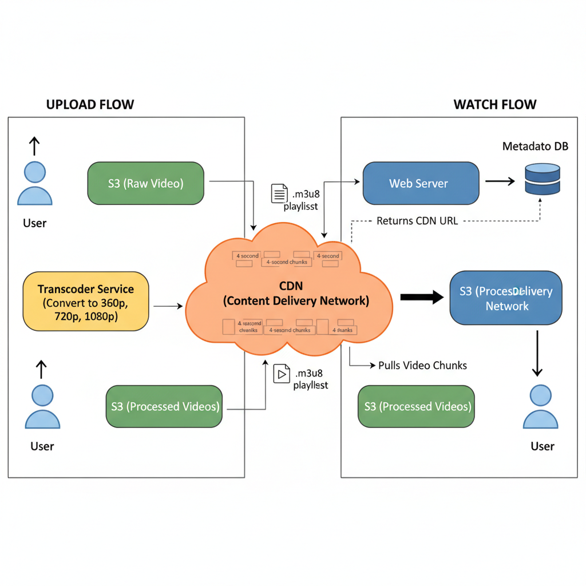

# 05. Design YouTube / Netflix

**Difficulty:** Hard
**Focus:** BLOB storage, CDN, Transcoding, Adaptive Streaming.

---

## 🎯 Real-World Analogy

**Think of video streaming like a highway delivery system:**

**Without CDN (Bad):**
- Everyone drives to ONE central warehouse in California
- Australian user: 15,000 km drive for a video! 🚗
- Traffic jam at the warehouse
- Slow, expensive
- ❌ Terrible user experience

**With CDN (Good):**
- Warehouses (edge servers) in every major city
- Australian user: Gets video from Sydney warehouse (50 km)
- Fast, cheap
- ✅ This is how Netflix works!

**Key Insight:** Videos are HUGE (500MB-5GB). Sending them across continents is slow and expensive. CDN puts copies near users.

---

## 1. Requirements (0-5 Minutes)

**Functional:**
1.  **Upload:** Users upload videos.
2.  **View:** Users watch videos.
3.  **Search:** Users search by title.

**Non-Functional:**
1.  **Reliability:** No buffering. High availability.
2.  **Latency:** Start playing quickly.
3.  **Scale:** Massive storage and bandwidth.

---

## 2. Estimations (5-10 Minutes)

### 📚 ELI5: Why These Numbers Matter

**The Storage Problem:**
```
1 million videos/day × 500MB each = 500,000 GB/day
= 500 TB/day
= 15 PB/month
= 180 PB/year

Cost: $180,000,000/year just for storage! 💰

That's why YouTube deletes videos with 0 views!
```

**The Bandwidth Problem:**
```
100M users watching videos simultaneously
Each streaming at 5 Mbps (1080p)
= 500,000,000 Mbps
= 500 Terabits per second!

Without CDN: All traffic goes to one datacenter 💥
With CDN: Distributed across 1000+ edge servers ✅
```

*   **DAU:** 100M.
*   **Storage:** 1M videos uploaded/day. Avg size 500MB.
    *   500MB * 1M = **500 PB / day**. (Huge! We need tiered storage).
*   **Bandwidth:** Read heavy. CDN is mandatory.

---

## 3. High-Level Design (10-20 Minutes)



**Components:**
1.  **Client:** Browser/Mobile App.
2.  **Web Server:** API for metadata (Title, Description).
3.  **Metadata DB:** SQL/NoSQL for user info, video comments.
4.  **Blob Storage (S3):** Stores the raw video files.
5.  **Transcoder (Worker):** Converts video to different formats.
6.  **CDN:** Caches video chunks near the user.

**Flow (Upload):**
1.  User uploads to **S3**.
2.  S3 triggers an event -> **Transcoder Service**.
3.  Transcoder converts video into resolutions (360p, 720p, 1080p) and formats (MP4, WebM).
4.  Transcoder saves processed files to S3.
5.  CDN pulls from S3.

**Flow (Watch):**
1.  User requests video.
2.  Server returns the **CDN URL**.
3.  Client streams from CDN.

---

## 4. Deep Dive: Adaptive Bitrate Streaming (20-30 Minutes)

### 📚 ELI5: Video Lego Blocks

**The Old Way (Progressive Download):**
- You download a single large file (e.g., `movie.mp4`).
- If your internet is slow → **Buffering...** ⏳
- If you're on mobile → Wastes data downloading 4K.

**The New Way (Adaptive Streaming - HLS/DASH):**
- We chop the video into tiny 4-second "Lego blocks" (chunks).
- We create multiple versions of each block:
  - 🧱 **Low Quality Block (360p)** - Small size
  - 🧱 **Medium Quality Block (720p)** - Medium size
  - 🧱 **High Quality Block (1080p)** - Large size

**The Magic:**
- Your player checks your internet speed every few seconds.
- Fast internet? Grab the **1080p** block.
- Internet slows down? Grab the next block in **360p**.
- **Result:** Video *never* stops. It just gets blurry for a bit, then sharp again.

### 📝 The Manifest File (.m3u8)

The "Menu" that tells the player what blocks are available.

```text
#EXTM3U
#EXT-X-STREAM-INF:BANDWIDTH=800000,RESOLUTION=640x360
360p/playlist.m3u8
#EXT-X-STREAM-INF:BANDWIDTH=1400000,RESOLUTION=842x480
480p/playlist.m3u8
#EXT-X-STREAM-INF:BANDWIDTH=2800000,RESOLUTION=1280x720
720p/playlist.m3u8
#EXT-X-STREAM-INF:BANDWIDTH=5000000,RESOLUTION=1920x1080
1080p/playlist.m3u8
```

**Inside `1080p/playlist.m3u8`:**
```text
#EXTM3U
#EXTINF:4.0,
segment_001.ts  <-- First 4 seconds
#EXTINF:4.0,
segment_002.ts  <-- Next 4 seconds
#EXTINF:4.0,
segment_003.ts
...
```

### 💻 Client-Side Logic (The Player)

```javascript
class VideoPlayer {
    constructor(manifestUrl) {
        this.manifest = fetchManifest(manifestUrl);
        this.buffer = [];
        this.currentQuality = '720p'; // Start middle
    }

    async play() {
        while (this.videoNotFinished) {
            // 1. Measure Bandwidth
            const bandwidth = this.measureNetworkSpeed(); // e.g., 5 Mbps
            
            // 2. Decide Quality
            const nextQuality = this.chooseQuality(bandwidth);
            
            if (nextQuality !== this.currentQuality) {
                console.log(`Switching from ${this.currentQuality} to ${nextQuality}`);
                this.currentQuality = nextQuality;
            }
            
            // 3. Download Next Chunk
            const chunkUrl = this.manifest.getChunkUrl(this.currentQuality, this.nextSequenceId);
            const videoData = await downloadChunk(chunkUrl);
            
            // 4. Append to Buffer
            this.buffer.push(videoData);
            this.nextSequenceId++;
            
            // 5. Sleep if buffer is full (don't waste data)
            if (this.buffer.length > 30) await sleep(1000);
        }
    }
    
    chooseQuality(bandwidth) {
        // Simple heuristic: Use 80% of available bandwidth
        const safeBandwidth = bandwidth * 0.8;
        
        if (safeBandwidth > 5000000) return '1080p';
        if (safeBandwidth > 2800000) return '720p';
        if (safeBandwidth > 1400000) return '480p';
        return '360p';
    }
}
```

---

## 5. Deep Dive: Video Processing Pipeline (30-35 Minutes)

**The Challenge:**
- User uploads a 10GB raw `.mov` file.
- We need to generate:
  - 4 Resolutions (360p, 480p, 720p, 1080p)
  - 2 Formats (MP4, WebM)
  - Thumbnails
  - Watermarks
- **Total:** ~10-15 tasks per video.
- **Scale:** 1000 uploads per minute.

**Solution: Directed Acyclic Graph (DAG)**

We model the processing as a graph of tasks.

```
          [Raw Video]
               |
        +------+------+
        |             |
    [Inspect]     [Thumbnail]
        |
    [Split into Chunks]
        |
   +----+----+----+
   |    |    |    |
[360p][480p][720p][1080p]  <-- Parallel Transcoding
   |    |    |    |
   +----+----+----+
        |
     [Merge]
        |
    [Upload to CDN]
```

### 💻 DAG Implementation (Python)

```python
# We use a task queue (Celery/Kafka) to distribute these tasks

class VideoProcessor:
    def process_upload(self, video_id, s3_path):
        # Step 1: Inspection
        metadata = self.inspect_video(s3_path)
        
        # Step 2: Define the DAG
        dag = DAG(video_id)
        
        # Split task
        split_task = dag.add_task("split", input=s3_path)
        
        # Transcode tasks (Fan-out)
        resolutions = ['360p', '480p', '720p', '1080p']
        transcode_tasks = []
        
        for res in resolutions:
            t = dag.add_task(
                f"transcode_{res}", 
                parent=split_task,
                args={'resolution': res}
            )
            transcode_tasks.append(t)
            
        # Merge task (Fan-in)
        merge_task = dag.add_task(
            "merge_manifest", 
            parents=transcode_tasks
        )
        
        # Step 3: Execute
        self.scheduler.run(dag)

class Worker:
    def execute_task(self, task):
        if task.type == 'transcode':
            # Use FFmpeg
            cmd = f"ffmpeg -i {task.input} -s {task.resolution} {task.output}"
            subprocess.run(cmd)
            
            # Upload chunk to S3
            s3.upload(task.output)
            
            # Notify coordinator
            self.notify_complete(task.id)
            
        return task.output

### ☕ Java Implementation

```java
import java.util.*;
import java.util.concurrent.*;

public class VideoProcessor {
    private final ExecutorService executor = Executors.newFixedThreadPool(10);
    
    static class Task {
        String type;
        String input;
        String output;
        String resolution;
        List<Task> dependencies = new ArrayList<>();
        
        public Task(String type, String input) {
            this.type = type;
            this.input = input;
        }
    }
    
    public void processUpload(String videoId, String s3Path) {
        // Step 1: Define the DAG
        Task splitTask = new Task("split", s3Path);
        
        // Step 2: Transcode tasks (Fan-out)
        String[] resolutions = {"360p", "480p", "720p", "1080p"};
        List<Task> transcodeTasks = new ArrayList<>();
        
        for (String res : resolutions) {
            Task transcodeTask = new Task("transcode", splitTask.output);
            transcodeTask.resolution = res;
            transcodeTask.dependencies.add(splitTask);
            transcodeTasks.add(transcodeTask);
        }
        
        // Step 3: Merge task (Fan-in)
        Task mergeTask = new Task("merge", null);
        mergeTask.dependencies.addAll(transcodeTasks);
        
        // Step 4: Execute DAG
        executeDag(Arrays.asList(splitTask), transcodeTasks, mergeTask);
    }
    
    private void executeDag(List<Task> splitTasks, List<Task> transcodeTasks, Task mergeTask) {
        try {
            // Execute split task
            for (Task task : splitTasks) {
                executeTask(task);
            }
            
            // Execute transcode tasks in parallel
            List<Future<String>> futures = new ArrayList<>();
            for (Task task : transcodeTasks) {
                futures.add(executor.submit(() -> executeTask(task)));
            }
            
            // Wait for all transcode tasks
            for (Future<String> future : futures) {
                future.get();
            }
            
            // Execute merge task
            executeTask(mergeTask);
            
        } catch (Exception e) {
            e.printStackTrace();
        }
    }
    
    private String executeTask(Task task) {
        if ("transcode".equals(task.type)) {
            // Use FFmpeg via ProcessBuilder
            String cmd = String.format(
                "ffmpeg -i %s -s %s %s",
                task.input, task.resolution, task.output
            );
            
            try {
                Process process = Runtime.getRuntime().exec(cmd);
                process.waitFor();
                
                // Upload to S3
                // s3Client.putObject(bucket, task.output, new File(task.output));
                
            } catch (Exception e) {
                e.printStackTrace();
            }
        }
        
        return task.output;
    }
}
```

**Why DAG?**
- **Parallelism:** We can run the 4 transcoding tasks on 4 different servers simultaneously.
- **Resilience:** If `transcode_720p` fails, we only retry that one task, not the whole video.
- **Flexibility:** Easy to add new steps (e.g., "Add Watermark") without rewriting everything.

---

## 6. Deep Dive: CDN Optimization (35-40 Minutes)

### 🌍 How Netflix Does It (Open Connect)

**Standard CDN:**
- You pay Akamai/Cloudfront.
- They have servers in data centers.
- User request: Home -> ISP -> Internet -> CDN Data Center.

**Netflix Open Connect (ISP Caching):**
- Netflix gives **physical hard drives (servers)** to ISPs (Comcast, AT&T, Verizon).
- These boxes sit **inside the ISP's building**.
- User request: Home -> ISP -> Netflix Box (Right there!).
- **Result:** Zero buffering, saves ISP money (less traffic on their backbone).

### 🧠 Intelligent Caching Strategy

We can't cache *everything* everywhere. Storage is limited.

**The "Long Tail" Distribution:**
- **Top 20% videos:** Generate 80% of views (Viral hits, New movies).
- **Bottom 80% videos:** Generate 20% of views (Old vlogs, obscure clips).

**Strategy:**
1.  **Popular Content:** Replicate to **ALL** Edge Servers (ISP boxes).
    - *When?* During off-peak hours (3 AM).
    - *Why?* So it's ready for prime time (8 PM).
    
2.  **Niche Content:** Store in **Regional Data Centers** only.
    - If a user requests it, fetch from Regional -> Edge (Cache Miss).
    
3.  **Cold Content:** Store in **S3 / Glacier** (Central).

### 🛡️ Presigned URLs (Secure Uploads)

**Problem:**
- Uploading 1GB video to your API server crashes it.
- API Server becomes a bottleneck.

**Solution:**
1. Client asks API: "I want to upload `my_cat.mp4`"
2. API talks to S3: "Give me a temporary key for this file"
3. S3 returns a **Presigned URL**.
4. API gives URL to Client.
5. Client uploads **DIRECTLY** to S3.

```python
# Server Side
def get_upload_url(filename):
    s3_client = boto3.client('s3')
    url = s3_client.generate_presigned_url(
        'put_object',
        Params={'Bucket': 'my-bucket', 'Key': filename},
        ExpiresIn=3600
    )
    return url

# Client Side
// Upload directly to Amazon, bypassing our server
fetch(presignedUrl, {
    method: 'PUT',
    body: videoFile
});
```

---

## 7. Deep Dive: Digital Rights Management (DRM) (40-42 Minutes)

**Problem:**
- How do we stop people from downloading movies and sharing them?

**Solution: Widevine (Google) / FairPlay (Apple)**
1.  **Encryption:** Video chunks are encrypted with AES-128.
2.  **License Server:**
    - Player requests a key.
    - Server checks subscription (Is user Premium?).
    - Server sends **Encrypted Key**.
3.  **Decryption:**
    - Browser's **CDM (Content Decryption Module)** decrypts the video inside a "Black Box" (Hardware Enclave).
    - Even the OS cannot see the raw frames.

---

## 8. Deep Dive: Recommendation System (42-45 Minutes)

**The Engine:**
- "Users who watched X also watched Y."

**Architecture:**
1.  **Data Collection:**
    - Explicit: Likes, Ratings.
    - Implicit: Watch time, Clicks, Pauses.
2.  **Offline Training (Spark):**
    - **Collaborative Filtering:** Matrix Factorization.
    - **Content-Based:** Genre, Actor, Director matches.
3.  **Online Serving:**
    - **Candidate Generation:** Quickly find 1000 potential videos.
    - **Ranking:** Use a Neural Network (Deep Learning) to sort them by "Probability of Watch".

---

---

## 10. Real-World Engineering Case Studies (Deep Dive)

### 1. Netflix: Open Connect (The ISP-Embedded CDN)

**Source:** Netflix Tech Blog - "Open Connect"

**The Challenge:**
Netflix consumes 15% of the world's total internet bandwidth.
- **Problem:** If all that traffic went through standard internet backbones (Level 3, Cogent), the internet would clog up.
- **Cost:** Paying Akamai/AWS for that bandwidth would bankrupt Netflix.

**The Solution: Open Connect Appliances (OCA)**

**Architecture:**
1.  **Custom Hardware:** Netflix builds its own storage servers (OCAs).
    - High density: 300TB+ per box.
    - Optimized for video streaming (FreeBSD + NGINX).
2.  **Embedded in ISPs:**
    - Netflix gives these boxes to ISPs (Comcast, AT&T, Jio) for **FREE**.
    - ISPs install them inside their own data centers (the "Last Mile").
3.  **Proactive Caching:**
    - Netflix knows what you will watch before you watch it.
    - **Off-Peak Updates:** Every night at 3 AM (when traffic is low), Netflix pushes the latest "Stranger Things" episodes to these boxes.
    - **Result:** When you hit play at 8 PM, the video doesn't travel across the ocean. It travels 5 miles from your ISP's local office.

**Key Insight:**
By building their own CDN and embedding it inside ISPs, Netflix eliminates "Middle Mile" latency and bandwidth costs.

---

### 2. YouTube: The "Long Tail" Challenge

**Source:** Google Research / YouTube Engineering

**The Challenge:**
Unlike Netflix (curated content), YouTube has billions of videos.
- **The "Long Tail":** 99% of videos get < 100 views.
- **Storage:** Storing petabytes of "junk" videos on expensive SSDs is impossible.
- **Transcoding:** 500 hours of video uploaded every minute.

**The Solution: Tiered Storage & Distributed Transcoding**

**Architecture:**
1.  **Tiered Storage:**
    - **Hot (Viral):** Stored on SSDs in Edge Caches (Google Global Cache).
    - **Warm:** Stored on HDDs in Regional Data Centers.
    - **Cold (0 views):** Stored on **Tape Drives** or high-density Cold Storage (Spinning disks that are turned off).
    - *Latency:* If you watch a 10-year-old video with 5 views, it might take 2 seconds to start (spinning up the disk).
2.  **Distributed Transcoding:**
    - YouTube breaks a video into small chunks.
    - These chunks are processed by thousands of idle Google servers (Borg/Kubernetes).
    - **Result:** A 4K video is transcoded in parallel in seconds.
3.  **QUIC Protocol:**
    - YouTube developed **QUIC** (UDP-based HTTP) to reduce buffering.
    - It eliminates the TCP Head-of-Line blocking problem.

**Key Insight:**
For User-Generated Content (UGC), **Tiered Storage** is critical to manage costs. You cannot treat a viral hit and a home video the same way.

---

## 11. Failure Scenarios & Disaster Recovery

### Scenario 1: Transcoding Worker Failure
**Impact:** Video upload is stuck in "Processing" state.
**Detection:**
- `transcoding_queue_lag` > 1 hour.
- Worker health checks fail.

**Mitigation:**
- **Idempotency:** Workers should use a "Lease" mechanism (e.g., Redis `SET NX`). If a worker dies, the lease expires, and another worker picks up the task.
- **Checkpointing:** For long videos, save progress every 5 minutes so a new worker doesn't start from scratch.

### Scenario 2: CDN Edge Cache Miss Storm
**Impact:** A new viral video causes a massive spike in origin server traffic.
**Detection:** `origin_bandwidth_usage` spike.

**Mitigation:**
- **Request Collapsing:** The CDN should only send one request to the origin for a specific file, even if 10,000 users are asking for it simultaneously.
- **Origin Shield:** Add a mid-tier cache layer between the edge and the origin.

### Scenario 3: DRM License Server Down
**Impact:** Users can download the video but cannot play it.
**Detection:** `drm_license_request_failure_rate > 5%`.

**Mitigation:**
- **License Caching:** Allow clients to cache licenses for a limited time (e.g., 24 hours).
- **Multi-Region Deployment:** Deploy license servers across multiple cloud regions.

---

## 12. Monitoring & Observability

### Golden Signals Dashboard

**1. Latency**
- **Time to First Frame (TTFF):** P95 < 2s.
- **Rebuffering Ratio:** < 1%.
- **Metric:** `video_playback_start_latency_ms`.

**2. Traffic**
- **Throughput:** Bits per second (Gbps/Tbps).
- **Metric:** `cdn_egress_bandwidth_bps`.

**3. Errors**
- **Metric:** `playback_error_rate`.
- **Target:** < 0.1%.

**4. Saturation**
- **Metric:** Transcoding cluster CPU, Origin server disk I/O.

### Alert Rules
```yaml
alerts:
  - alert: HighRebufferingRate
    expr: sum(rate(rebuffering_events_total[5m])) / sum(rate(playback_sessions_total[5m])) > 0.05
    for: 2m
    labels:
      severity: critical
```

---

## 13. API Design & Versioning

### Video API

**Upload Video (Initiate)**
```http
POST /api/v1/videos/upload
Content-Type: application/json

{
  "title": "My Vlog",
  "file_size": 104857600,
  "format": "mp4"
}

Response:
{
  "upload_url": "https://s3.amazon.com/bucket/path?signature=...",
  "video_id": "vid-123"
}
```

**Get Playback URL**
```http
GET /api/v1/videos/{video_id}/play
```

### Versioning
- Use `/v1/`, `/v2/` in URL.
- **Manifest Versioning:** Include versioning in the HLS `.m3u8` or DASH `.mpd` file paths.

---

## 14. Cost Analysis & Optimization

### Monthly Infrastructure Costs (at 1M active videos)

**1. Storage (S3)**
- 1 PB of video data = **$23,000/month**.

**2. Transcoding (EC2/Lambda)**
- Processing 10k hours of video = **$5,000/month**.

**3. Delivery (CDN)**
- 10 PB egress = **$100,000/month**.

**Total:** ~$128,000/month.

### Optimization Opportunities
- **Per-Title Encoding:** Use lower bitrates for simple videos (e.g., a person talking) and higher for complex ones (e.g., action movies).
- **Spot Instances:** Use AWS Spot instances for non-urgent transcoding tasks to save 70%.
- **P2P Delivery:** For live events, use P2P (WebRTC) to reduce CDN costs.

---

## 15. Security & Compliance

### Security Measures
- **Signed URLs:** Ensure only authorized users can access the CDN content.
- **Watermarking:** Embed user-specific forensic watermarks to track leakers.
- **Geo-Blocking:** Enforce licensing restrictions by blocking specific IP ranges.

### Compliance
- **COPPA:** Ensure child-directed content follows privacy regulations.
- **Accessibility:** Automatically generate captions (STT) for all uploaded videos.

---

## 16. Testing Strategies

### Unit Tests
- Test manifest generation logic (HLS/DASH).
- Test bitrate selection algorithm on the client side.

### Integration Tests
- Verify that a 4K upload correctly generates 1080p, 720p, and 360p versions.

### Load Testing
- Simulate 100k concurrent viewers for a "Live Premiere".
- **Tool:** `JMeter` with HLS plugin.

---

## 17. Migration & Rollout Strategies

### Rollout
- **Canary:** Roll out a new video codec (e.g., AV1) to 1% of supported devices.

### Migration
- **CDN Migration:** Use a multi-CDN strategy and shift traffic gradually using a Global Load Balancer (e.g., Route 53).

---

## 18. Performance Optimization

### Playback Optimization
- **Prefetching:** Fetch the next 3 segments of the video while the current one is playing.
- **Adaptive Switching:** Switch to a lower bitrate immediately if the network throughput drops below a threshold.

### Transcoding Optimization
- **Chunked Transcoding:** Split a 1-hour video into 1-minute chunks and process them in parallel across 60 workers.

---

## 19. Capacity Planning

### Scaling Triggers
- **Transcoding Cluster:** Scale based on queue depth.
- **Origin Servers:** Scale based on cache miss rate.

### Throughput Projection
- 1M concurrent viewers × 5 Mbps average = 5 Tbps total bandwidth.

---

## 20. Interview Cheat Sheet

### Key Numbers
- **Latency:** < 2s (TTFF).
- **Bandwidth:** 5 Mbps for 1080p, 25 Mbps for 4K.
- **Storage:** 1 hour of 1080p ≈ 1.5 GB.

### Core Components
1. **Transcoding Pipeline:** Converts raw video to multiple formats.
2. **CDN:** Distributes content globally.
3. **Manifest Service:** Generates HLS/DASH playlists.
4. **Recommendation Engine:** Suggests next videos.

### Critical Trade-offs
- **Latency vs Quality:** Low-latency streaming (CMAF) vs high-quality buffering.
- **Storage vs Compute:** Store all resolutions vs generate on-the-fly.

---

## 21. Wrap-up (Deep Dive)

**Summary:**
"I designed a global Video Streaming platform focusing on **Adaptive Bitrate Streaming (HLS/DASH)** to ensure smooth playback across varying network conditions.
1.  **Storage:** I utilized **S3** for raw storage and a **DAG-based Transcoding Pipeline** to generate multiple resolutions in parallel.
2.  **Delivery:** I leveraged a **CDN** strategy inspired by **Netflix Open Connect**, pushing popular content to the edge (ISP level) for minimal latency.
3.  **Optimization:** I discussed **Tiered Storage** (like YouTube) to handle the 'Long Tail' of content cost-effectively and **Presigned URLs** to offload upload traffic from our API servers.
4.  **Production Readiness:** I addressed failure modes like transcoding worker crashes and CDN cache storms, and outlined a robust monitoring and security framework."

---
