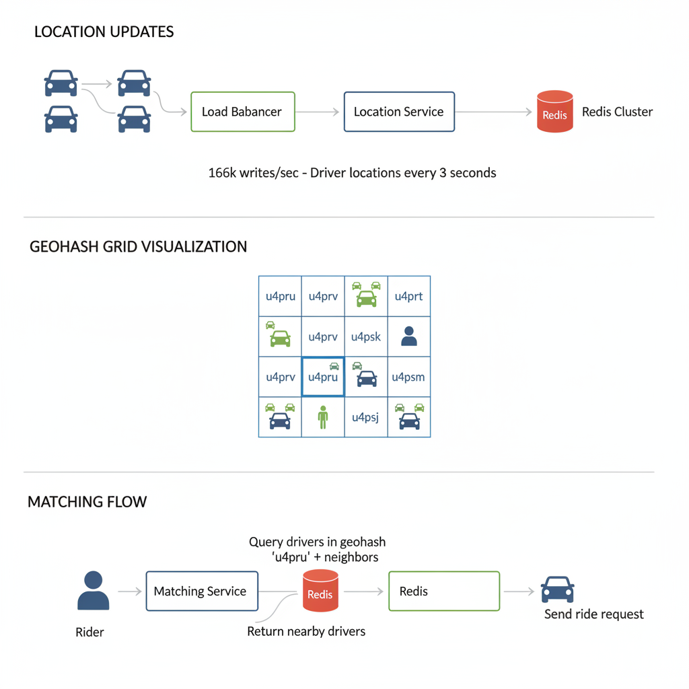

# 06. Design a Ride-Hailing Service (Uber/Lyft)

**Difficulty:** Hard
**Focus:** Geospatial Indexing, Real-time Matching, Consistency.

---

## 🎯 Real-World Analogy

**Think of Geohash like a postal code system:**

**Without Geohash (Naive Approach):**
- "Find me the nearest pizza place"
- Check distance to ALL 10,000 pizza places in the city
- Calculate: sqrt((lat1-lat2)² + (lon1-lon2)²) × 10,000 times
- Takes 5 seconds 😱
- ❌ Too slow for real-time!

**With Geohash (Smart Approach):**
- Your location: "9q8yy" (San Francisco, specific block)
- Pizza places in "9q8yy": 3 places
- Check only those 3!
- Takes 10 milliseconds ⚡
- ✅ Perfect for real-time!

**Key Insight:** Instead of checking ALL drivers in the city, Geohash lets us check only drivers in nearby "blocks". It's like organizing the world into a grid system.

---

## 1. Requirements (0-5 Minutes)

**Functional:**
1.  **Rider:** Request a ride. See driver location.
2.  **Driver:** Accept a ride. Update location.
3.  **System:** Match Rider with nearest Driver. Calculate ETA.

**Non-Functional:**
1.  **Real-time:** Location updates must be fast.
2.  **Consistency:** A driver cannot be assigned to two riders.
3.  **Availability:** High.

---

## 2. Estimations (5-10 Minutes)

### 📚 ELI5: Why These Numbers Matter

**The Location Update Problem:**
```
Imagine 500,000 drivers all moving around a city.
Each driver's phone sends their GPS location every 3 seconds.

That's:
500,000 drivers ÷ 3 seconds = 166,666 updates PER SECOND!

If each update takes 10ms to process:
166,666 × 10ms = 1,666 seconds = 28 MINUTES of work... every second!

❌ One server can't handle this!
```

**The Search Problem:**
```
Rider opens app: "Find me a ride"
System needs to:
1. Find drivers within 2km
2. Check if they're available
3. Calculate ETA
4. Send request

All in under 1 second! ⚡
```

*   **Drivers:** 500k active.
*   **Updates:** Every 3 seconds.
*   **QPS (Writes):** 500k / 3 ≈ **166k writes/sec**. (Very High).
*   **QPS (Reads):** Riders checking map.
*   **Conclusion:** We need a database that can handle massive writes AND fast geospatial queries. Traditional SQL won't work!

---

## 3. High-Level Design (10-15 Minutes)

### 📚 ELI5: The System Components

**Think of Uber like a restaurant kitchen:**

**Location Service (The GPS Tracker):**
- Like a waiter constantly updating the order board
- "Driver 123 is now at Main St & 5th Ave"
- Handles 166,000 updates per second!
- Uses Redis (super-fast in-memory database)

**Matching Service (The Dispatcher):**
- Like the head chef assigning orders to cooks
- "Rider at location X needs a driver"
- "Find the 5 nearest available drivers"
- "Send request to closest one"

**Trip Service (The Order Manager):**
- Tracks the journey from start to finish
- States: Requested → Matched → Driver Arriving → In Progress → Completed
- Stores in permanent database (PostgreSQL)

**Map Service (The Visual Display):**
- Shows rider where driver is
- Renders the map tiles
- Updates in real-time

**Components:**
1.  **Location Service:** Receives lat/long updates from drivers.
2.  **Map Service:** Renders map tiles.
3.  **Matching Service:** Finds nearest driver.
4.  **Trip Service:** Manages state (Requested -> Accepted -> In Progress -> Done).

---

## 4. Deep Dive: Geospatial Indexing (15-30 Minutes)
*The core problem: How to find "Drivers within 2km"?*



### 🤔 The Core Challenge

**Problem:** You're at Times Square, NYC. You need a ride. How does Uber find the nearest driver?

**Naive Approach (Checking Everyone):**
```
Your location: (40.7580° N, 73.9855° W)

For each of 500,000 drivers:
  Calculate distance = √[(lat₁-lat₂)² + (lon₁-lon₂)²]
  If distance < 2km, add to list

Time: 500,000 calculations × 0.1ms = 50 seconds ❌

By the time we find a driver, they've moved!
```

### ❌ Approach A: SQL Query (Doesn't Scale)

**The Idea:**
```sql
SELECT * FROM Drivers 
WHERE lat BETWEEN 40.748 AND 40.768
  AND lon BETWEEN -73.995 AND -73.975
  AND status = 'AVAILABLE'
ORDER BY distance
LIMIT 5;
```

**Why It Fails:**
```
1. Database needs to scan millions of rows
2. Even with indexes, it's slow (100-500ms)
3. 166,000 location updates per second overwhelm the DB
4. Calculating actual distance (Haversine formula) is expensive

Result: System crashes under load 💥
```

### ✅ Approach B: Geohash (The Winner)

### 📚 ELI5: What is Geohash?

**Imagine organizing the world like a filing system:**

**Step 1: Divide the World in Half**
```
┌─────────────────────────────┐
│                             │
│         NORTH (1)           │
│                             │
├─────────────────────────────┤
│                             │
│         SOUTH (0)           │
│                             │
└─────────────────────────────┘
```

**Step 2: Divide Each Half Again (East/West)**
```
NORTH:
┌──────────┬──────────┐
│ NW (10)  │ NE (11)  │
└──────────┴──────────┘

SOUTH:
┌──────────┬──────────┐
│ SW (00)  │ SE (01)  │
└──────────┴──────────┘
```

**Step 3: Keep Dividing**
```
New York is in:
- North (1)
- West (0)
- North (1)
- East (1)
- ...

Geohash: "dr5ru" (base32 encoding)
```

**The Magic:**
```
All locations in "dr5ru" are within ~5km of each other!

Driver A: "dr5ru7" (Times Square)
Driver B: "dr5ru2" (Penn Station)
Driver C: "9q8yy"  (San Francisco) ← Different prefix!

To find nearby drivers:
1. Get your geohash: "dr5ru"
2. Query: "Give me all drivers starting with 'dr5ru'"
3. Done! No distance calculation needed!
```

### 📝 Step-by-Step Geohash Example

**Let's encode Times Square (40.7580° N, 73.9855° W):**

```
Step 1: Latitude (40.7580°)
Range: -90 to 90
Midpoint: 0
40.7580 > 0 → NORTH (1)

New range: 0 to 90
Midpoint: 45
40.7580 < 45 → SOUTH of midpoint (0)

New range: 0 to 45
Midpoint: 22.5
40.7580 > 22.5 → NORTH (1)

... continue 15 times ...

Latitude bits: 101101110...
```

```
Step 2: Longitude (-73.9855° W)
Range: -180 to 180
Midpoint: 0
-73.9855 < 0 → WEST (0)

New range: -180 to 0
Midpoint: -90
-73.9855 > -90 → EAST of midpoint (1)

... continue 15 times ...

Longitude bits: 011100101...
```

```
Step 3: Interleave bits
Lon: 0 1 1 1 0 0 1 0 1...
Lat: 1 0 1 1 0 1 1 1 0...

Interleaved: 01 10 11 11 00 01 11 01 01...

Step 4: Convert to base32
01101 = 'd'
11100 = 'r'
01110 = '5'
10110 = 'r'
11010 = 'u'

Result: "dr5ru"
```

### 🎯 Geohash Precision Levels

| Geohash Length | Cell Size | Use Case |
|----------------|-----------|----------|
| 1 character | ±2,500 km | Country |
| 2 characters | ±630 km | Large region |
| 3 characters | ±78 km | City |
| 4 characters | ±20 km | District |
| **5 characters** | **±2.4 km** | **Neighborhood (Uber uses this!)** |
| 6 characters | ±610 m | Street |
| 7 characters | ±76 m | Building |
| 8 characters | ±19 m | House |

**Why 5 characters for Uber?**
```
5 characters = ~2.4 km cell

Perfect because:
✅ Most rides are within 2-3 km
✅ Not too many drivers per cell (manageable)
✅ Not too few cells to check (fast query)
```

### 💡 Real-World Example

**Scenario: You're at Times Square**

```
Your location: 40.7580° N, 73.9855° W
Your geohash: "dr5ru"

Nearby cells (8 neighbors):
  dr5rv  dr5ry  dr5rw
  dr5rt  dr5ru  dr5rx  ← You are here
  dr5rq  dr5rr  dr5rs

Query Redis:
GEORADIUS drivers -73.9855 40.7580 2 km

Redis internally:
1. Converts your location to geohash: "dr5ru"
2. Queries cells: dr5ru + 8 neighbors
3. Returns drivers in those cells
4. Filters by exact distance

Result: 12 drivers found in 5 milliseconds! ⚡
```

**Approach A: SQL Query**
*   `SELECT * FROM Drivers WHERE lat BETWEEN x1 AND x2 AND long BETWEEN y1 AND y2`.
*   *Problem:* Full table scan (or slow index). Doesn't scale to millions of updates.

**Approach B: Geohash (The Winner)**
*   **Concept:** Divide the world into a grid. Recursively divide squares into 4 smaller squares.
*   **String Representation:**
    *   World = ""
    *   Top-Left = "0", Top-Right = "1", etc.
    *   New York = "dr5ru".
*   **Property:** Drivers in the same square share the same prefix.
*   **Query:** To find drivers near me (in "dr5ru"), I just query for drivers with prefix "dr5ru" and its 8 neighbors ("dr5rt", "dr5rv"...).
*   **Implementation:**
    *   **Redis:** `GEOADD key long lat member`. Redis uses Geohashing internally.
    *   **Query:** `GEORADIUS key long lat 2 km`.

### 🔧 Redis Implementation

**Adding Driver Locations:**
```redis
# Add driver to Redis with geospatial index
GEOADD drivers -73.9855 40.7580 "driver_123"
GEOADD drivers -73.9912 40.7489 "driver_456"
GEOADD drivers -73.9776 40.7614 "driver_789"

# Redis internally stores as:
# driver_123 → geohash: "dr5ru7"
# driver_456 → geohash: "dr5ru2"
# driver_789 → geohash: "dr5rv1"
```

**Finding Nearby Drivers:**
```redis
# Find all drivers within 2km of Times Square
GEORADIUS drivers -73.9855 40.7580 2 km WITHDIST

Result:
1) "driver_123" distance: 0.05 km
2) "driver_789" distance: 0.42 km
3) "driver_456" distance: 1.12 km

# Time taken: ~5 milliseconds ⚡
```

**Updating Driver Location:**
```redis
# Driver moves, update location
GEOADD drivers -73.9800 40.7600 "driver_123"

# Redis automatically:
# 1. Recalculates geohash
# 2. Updates index
# 3. Ready for next query

# Time: <1 millisecond
```

### ☕ Java Implementation

```java
import redis.clients.jedis.Jedis;
import redis.clients.jedis.GeoCoordinate;
import redis.clients.jedis.args.GeoUnit;
import redis.clients.jedis.resps.GeoRadiusResponse;
import java.util.List;

public class RideHailingGeoService {
    private final Jedis redis;
    private static final String DRIVERS_KEY = "drivers";
    
    public RideHailingGeoService(Jedis redis) {
        this.redis = redis;
    }
    
    /**
     * Add or update driver location
     */
    public void updateDriverLocation(String driverId, double longitude, double latitude) {
        // GEOADD drivers longitude latitude driverId
        redis.geoadd(DRIVERS_KEY, longitude, latitude, driverId);
        
        System.out.println("Updated driver " + driverId + 
            " at (" + latitude + ", " + longitude + ")");
    }
    
    /**
     * Find nearby drivers within radius
     */
    public List<GeoRadiusResponse> findNearbyDrivers(
            double longitude, 
            double latitude, 
            double radiusKm) {
        
        // GEORADIUS drivers longitude latitude radius km WITHDIST
        List<GeoRadiusResponse> results = redis.georadius(
            DRIVERS_KEY,
            longitude,
            latitude,
            radiusKm,
            GeoUnit.KM
        );
        
        System.out.println("Found " + results.size() + " drivers within " + 
            radiusKm + " km");
        
        return results;
    }
    
    /**
     * Get distance between two drivers
     */
    public Double getDistance(String driver1, String driver2) {
        List<Double> distances = redis.geodist(
            DRIVERS_KEY,
            driver1,
            driver2,
            GeoUnit.KM
        );
        
        return distances.isEmpty() ? null : distances.get(0);
    }
    
    // Usage example
    public static void main(String[] args) {
        Jedis redis = new Jedis("localhost", 6379);
        RideHailingGeoService service = new RideHailingGeoService(redis);
        
        // Add drivers (longitude, latitude)
        service.updateDriverLocation("driver_123", -73.9855, 40.7580);
        service.updateDriverLocation("driver_456", -73.9912, 40.7489);
        service.updateDriverLocation("driver_789", -73.9776, 40.7614);
        
        // Find drivers near Times Square within 2km
        List<GeoRadiusResponse> nearby = service.findNearbyDrivers(
            -73.9855, // Times Square longitude
            40.7580,  // Times Square latitude
            2.0       // 2 km radius
        );
        
        // Print results with distances
        for (GeoRadiusResponse response : nearby) {
            System.out.println(response.getMemberByString() + 
                " - Distance: " + response.getDistance() + " km");
        }
        
        redis.close();
    }
}
```

---

## 5. Deep Dive: Location Updates (30-35 Minutes)

### 📚 ELI5: Why Not Save Everything?

**The Problem:**
```
500,000 drivers × 1 update every 3 seconds = 166,666 updates/sec

If we save every update to PostgreSQL:
- Each write takes ~10ms
- 166,666 × 10ms = 1,666 seconds of work per second!
- Database explodes 💥

Also, do we really need to know where a driver was at 10:32:47 AM?
No! We only care about their CURRENT location.
```

**The Solution: Two-Tier Storage**

```
┌─────────────────────────────────────┐
│   REDIS (In-Memory, Fast)           │
│   - Current driver locations        │
│   - Expires after 10 minutes        │
│   - 166k writes/sec ✅              │
│   - Query time: <5ms                │
└─────────────────────────────────────┘
          ↓ (Sample every 1 minute)
┌─────────────────────────────────────┐
│   PostgreSQL (Permanent, Slow)      │
│   - Trip start/end points           │
│   - Sampled path (every 1 min)      │
│   - For billing & analytics         │
│   - ~500 writes/sec ✅              │
└─────────────────────────────────────┘
```

### 📝 Step-by-Step: Location Update Flow

**Scenario: Driver moves from Point A to Point B**

```
Time: 10:00:00
Driver's phone GPS: (40.7580, -73.9855)

Step 1: Phone sends update
POST /api/v1/drivers/location
{
  "driver_id": "driver_123",
  "lat": 40.7580,
  "lon": -73.9855,
  "timestamp": 1637064000,
  "heading": 45,  // degrees
  "speed": 30     // km/h
}

Step 2: Load Balancer routes to Location Service

Step 3: Location Service updates Redis
GEOADD drivers -73.9855 40.7580 "driver_123"
SET driver:driver_123:status "AVAILABLE"
EXPIRE driver:driver_123:status 300  // 5 min TTL

Step 4: (Optional) Sample for permanent storage
IF (timestamp % 60 == 0):  // Every minute
  INSERT INTO driver_locations 
  (driver_id, lat, lon, timestamp)
  VALUES ('driver_123', 40.7580, -73.9855, 1637064000)

Step 5: Return success to driver
HTTP 200 OK

Total time: ~3 milliseconds ⚡
```

### 🔄 Redis Cluster Sharding

**Problem: One Redis instance can't handle 166k writes/sec**

**Solution: Shard by Geohash Prefix**

```
Redis Cluster (10 nodes):

Node 1: Geohashes starting with "dr5r" (NYC area)
Node 2: Geohashes starting with "9q8y" (SF area)
Node 3: Geohashes starting with "w21z" (LA area)
...

Driver in NYC ("dr5ru"):
→ Hash("dr5r") % 10 = 1
→ Route to Node 1

Driver in SF ("9q8yy"):
→ Hash("9q8y") % 10 = 2
→ Route to Node 2

Benefit:
✅ Load distributed across 10 nodes
✅ Each node handles ~16k writes/sec (manageable)
✅ Nearby drivers likely on same node (fast queries)
```

*   **Problem:** 166k writes/sec to DB is too much.
*   **Solution:** **Ephemeral Storage (Redis).**
    *   We don't need to save *every* location to the permanent DB. We only need the *current* location for matching.
    *   Driver sends location -> Load Balancer -> **Redis Cluster**.
    *   Trip History (Permanent DB) only saves start/end points and a sampled path (every 1 min).

---

## 6. Deep Dive: Matching Service (35-40 Minutes)

### 📚 ELI5: The Matching Problem

**Scenario:**
```
You're at Times Square.
You request a ride.

Nearby drivers:
- Driver A: 200m away, heading towards you
- Driver B: 300m away, stuck in traffic
- Driver C: 150m away, but just got another request

Which driver should get your request?
What if Driver A rejects?
What if two riders request at the same time?
```

### 📝 Step-by-Step: Complete Matching Flow

**Step 1: Rider Requests Ride**
```
Rider opens app at Times Square (40.7580, -73.9855)
Taps "Request Ride"

POST /api/v1/rides/request
{
  "rider_id": "rider_456",
  "pickup_lat": 40.7580,
  "pickup_lon": -73.9855,
  "destination_lat": 40.7489,
  "destination_lon": -73.9680,
  "ride_type": "UberX"
}
```

**Step 2: Create Ride Record**
```sql
INSERT INTO rides (
  ride_id, rider_id, pickup_location, 
  destination, status, created_at
) VALUES (
  'ride_789', 'rider_456', 
  POINT(40.7580, -73.9855),
  POINT(40.7489, -73.9680),
  'SEARCHING', NOW()
);

Status: SEARCHING
```

**Step 3: Query Redis for Nearby Drivers**
```redis
GEORADIUS drivers -73.9855 40.7580 2 km WITHDIST

Result:
1) "driver_123" - 0.2 km
2) "driver_456" - 0.3 km
3) "driver_789" - 0.5 km
4) "driver_101" - 1.2 km
5) "driver_202" - 1.8 km
```

**Step 4: Filter Available Drivers**
```python
available_drivers = []

for driver_id in nearby_drivers:
    # Check if driver is available
    status = redis.get(f"driver:{driver_id}:status")
    
    if status == "AVAILABLE":
        # Check if driver matches ride type
        driver_type = redis.get(f"driver:{driver_id}:type")
        
        if driver_type == "UberX":
            available_drivers.append(driver_id)

Result: ["driver_123", "driver_789", "driver_202"]
```

**Step 5: Sort by Best Match**
```python
# Calculate score for each driver
for driver in available_drivers:
    score = calculate_score(
        distance=driver.distance,
        rating=driver.rating,
        acceptance_rate=driver.acceptance_rate,
        heading=driver.heading  # Is driver moving towards pickup?
    )

Sorted:
1. driver_123 (score: 95) - Closest, 4.9★, heading towards you
2. driver_789 (score: 82) - Medium distance, 4.7★
3. driver_202 (score: 70) - Far, but 5.0★
```

**Step 6: Lock Driver (Critical!)**
```redis
# Try to lock driver_123
SET driver:driver_123:lock ride_789 NX EX 30

NX = Only set if not exists (atomic operation)
EX 30 = Expires in 30 seconds

If successful:
  → Driver is locked to this ride
  → No other ride can lock this driver
  
If failed:
  → Another ride just locked this driver
  → Try next driver (driver_789)
```

**Step 7: Send Request to Driver**
```
WebSocket message to driver_123:
{
  "type": "RIDE_REQUEST",
  "ride_id": "ride_789",
  "pickup": {
    "lat": 40.7580,
    "lon": -73.9855,
    "address": "Times Square, NYC"
  },
  "destination": {
    "lat": 40.7489,
    "lon": -73.9680,
    "address": "Penn Station, NYC"
  },
  "estimated_fare": "$12.50",
  "distance": "0.2 km",
  "expires_in": 15  // seconds
}

Driver's phone: 🔔 DING! New ride request!
```

**Step 8a: Driver Accepts**
```
Driver taps "Accept"

POST /api/v1/rides/ride_789/accept
{
  "driver_id": "driver_123"
}

Update database:
UPDATE rides 
SET status = 'ACCEPTED', 
    driver_id = 'driver_123',
    accepted_at = NOW()
WHERE ride_id = 'ride_789';

Update Redis:
SET driver:driver_123:status "BUSY"
DEL driver:driver_123:lock

Notify rider:
"Driver John is on the way! ETA: 3 minutes"
```

**Step 8b: Driver Rejects/Timeout**
```
Driver taps "Decline" OR 15 seconds pass

Unlock driver:
DEL driver:driver_123:lock

Try next driver:
SET driver:driver_789:lock ride_789 NX EX 30
Send request to driver_789...

If all drivers reject:
  → Expand search radius to 5 km
  → Try again
  → If still no match: "No drivers available"
```

### 🔒 The Double-Booking Problem

**Scenario: Two Riders Request Simultaneously**

```
Time: 10:00:00.000
Rider A requests ride → Finds driver_123
Rider B requests ride → Finds driver_123 (same driver!)

Without locking:
  Both rides send request to driver_123
  Driver accepts Rider A
  Rider B is stuck waiting
  ❌ Bad experience!

With Redis lock:
  10:00:00.001 - Ride A: SET driver:driver_123:lock ride_A NX
                → Success! Driver locked to Ride A
  
  10:00:00.002 - Ride B: SET driver:driver_123:lock ride_B NX
                → Failed! Driver already locked
                → Move to next driver (driver_456)
  
  ✅ No double-booking!
```

### ⏱️ Timeout Handling

**What if driver's phone is off?**

```
Timeline:
10:00:00 - Send request to driver_123
---

## 7. Deep Dive: ETA Calculation (40-42 Minutes)

**The Challenge:**
Calculating ETA isn't just `Distance / Speed`.
- **Traffic:** Rush hour vs 3 AM.
- **Road Conditions:** Construction, accidents.
- **Driver Behavior:** Some drive faster than others.

**The Solution: Graph Routing Engine (OSRM / Valhalla)**
1.  **Map Data:** OpenStreetMap (OSM) nodes and edges.
2.  **Edge Weights:**
    - Base weight: Length / Speed Limit.
    - Dynamic weight: Real-time traffic data (from other drivers).
3.  **Algorithm:**
    - **Contraction Hierarchies (CH):** Pre-computes shortcuts.
    - Instead of calculating every street from NY to LA, it uses "Highways" (shortcuts).
    - Query time: Milliseconds.

**Machine Learning Layer:**
- Uber uses "DeepETA" (Deep Learning).
- Inputs: Time of day, Weather, Historical traffic, Event data (Concert nearby?).
- Output: Predicted ETA with high accuracy.

---

## 8. Deep Dive: Surge Pricing (42-45 Minutes)

**The Goal:** Balance Supply (Drivers) and Demand (Riders).

**Mechanism:**
1.  **Grid System:** Divide city into small hexes (H3).
2.  **Real-time Metrics:**
    - `Open App` events (Demand).
    - `Available Drivers` (Supply).
3.  **Algorithm:**
    - If `Demand > Supply` in Hex A:
    - `Surge Multiplier = 1.0 + (Demand - Supply) * Factor`.
    - Price goes up → Riders wait (Demand ↓) → Drivers rush in (Supply ↑).
    - Equilibrium reached.

**Consistency:**
- Surge price must be calculated **globally** for a hex every 2-5 minutes.
- We use a **Stream Processing** pipeline (Kafka + Flink) to aggregate metrics in real-time.

---

## 9. Real-World Engineering Case Studies (Deep Dive)

### 1. Uber: Marketplace Architecture

**Source:** Uber Engineering Blog - "Fulfillment Platform"

**The Challenge:**
Uber's original monolithic architecture couldn't handle the complexity of new products (UberEats, Pool, Freight).
- **Problem:** "Double Dispatch" (Two services assigning the same driver).
- **Scale:** Millions of concurrent trips.

**The Solution: "DISCO" (Dispatching System)**

**Architecture:**
1.  **Ringpop (Consistent Hashing):**
    - Uber developed a library called **Ringpop**.
    - It creates a scalable, fault-tolerant application-layer sharding.
    - All requests for "San Francisco" are routed to the same server.
2.  **H3 (Hexagonal Indexing):**
    - Instead of Geohash (Rectangles), Uber invented **H3** (Hexagons).
    - *Why Hexagons?*
        - All neighbors are equidistant (unlike squares where diagonals are longer).
        - Better for radius queries and smoothing data.
3.  **Google S2:**
    - Used for storage sharding.

**Key Insight:**
Uber moved from a "Database-centric" locking model to an "Application-centric" sharding model (Ringpop) to handle state in memory for maximum performance.

---

### 2. Lyft: Geohashing & Availability

**Source:** Lyft Engineering Blog

**The Challenge:**
Lyft needs to show "Available Drivers" on the map instantly.
- **Problem:** Querying "Drivers within 5 miles" for every user opening the app is expensive.

**The Solution: Geohash Precision Sharding**

**Architecture:**
1.  **Geohash Level 6 (~1.2km):**
    - Lyft groups drivers into Level 6 Geohashes.
    - `dr5ru` contains list of driver IDs: `[D1, D2, D3]`.
2.  **Redis Pub/Sub:**
    - When a driver moves, they publish to channel `geohash:dr5ru`.
    - The Map Service subscribes to these channels.
3.  **Client-Side Smoothing:**
    - The app receives discrete updates (every 3s).
    - The car icon "animates" smoothly between points to create a fluid experience (Dead Reckoning).

**Key Insight:**
By pre-aggregating drivers into Geohash buckets, Lyft reduces the search problem from "Search the whole city" to "Look up one key in Redis".

---

## 10. Wrap-up (Deep Dive)

**Summary:**
"I designed a Ride-Hailing service focusing on **Real-time Geospatial Indexing** using **Geohash/Redis** for sub-millisecond driver discovery.
1.  **Matching:** I implemented a robust state machine with **Redis Locking** to prevent double-booking.
2.  **Scalability:** I used **Ephemeral Storage (Redis)** for high-frequency location updates and **PostgreSQL** for durable trip history.
3.  **Real-World:** I incorporated **Uber's H3 Hexagonal Indexing** for better spatial smoothing and **Lyft's Pub/Sub model** for real-time map updates."

---

Action:
1. DEL driver:driver_123:lock
2. SET driver:driver_123:status "OFFLINE"
3. Try next driver

Background job (every 5 minutes):
- Check all locks
- If lock expired but ride still SEARCHING:
  → Retry matching
```

1.  Rider requests ride.
2.  Matching Service queries Redis for drivers in radius.
3.  Service filters for "Available" drivers.
4.  Service sends request to Driver A.
5.  **Locking:** We must "lock" Driver A so they don't get another request.
6.  If Driver A rejects/timeouts, unlock and try Driver B.

### 🎯 Optimization: Predictive Matching

**Smart Positioning:**
```
Uber analyzes patterns:
- Friday 6 PM: High demand in Financial District
- Saturday 2 AM: High demand near bars

System sends suggestions to drivers:
"Move to Times Square for higher demand"

Benefit:
✅ Faster matching
✅ Less waiting for riders
✅ More rides for drivers
```

---

## 7. Deep Dive: ETA Calculation (40-42 Minutes)

**Problem:**
- "Driver is 5 mins away" -> Actually takes 15 mins.
- Users hate bad ETAs.

**How it works:**
1.  **Graph Routing Engine (OSRM / Valhalla):**
    - Calculates shortest path on road network.
    - `Distance / Speed Limit = Time`.
2.  **Real-Time Traffic Adjustment:**
    - We have GPS data from ALL drivers.
    - If 50 drivers on 5th Ave are moving at 5km/h (Speed Limit 50km/h), there is traffic!
    - **Machine Learning Model:** Predicts traffic based on Time of Day, Weather, and Live Data.

---

## 8. Deep Dive: Surge Pricing (42-44 Minutes)

**Goal:** Balance Supply (Drivers) and Demand (Riders).

**Algorithm:**
1.  **Divide city into Geohash zones.**
2.  **Calculate Ratio:** `R = Number of Requests / Number of Available Drivers`.
3.  **Apply Multiplier:**
    - If R > 1.5 → 1.2x Price
    - If R > 2.0 → 1.5x Price
    - If R > 5.0 → 3.0x Price
4.  **Update Map:** Show red zones to drivers to encourage them to move there.

---

## 9. Failure Scenarios & Disaster Recovery

### Scenario 1: Location Update Service Failure
**Impact:** Drivers appear "stale" on the map; matching fails because the system thinks drivers are elsewhere.
**Detection:**
- `location_update_lag` > 30s.
- Redis write errors.

**Mitigation:**
- **Local Cache:** If the central Redis is down, allow drivers to send updates to a local regional shard.
- **Extrapolation:** If a driver's location hasn't been updated for 10 seconds, use their last known velocity and heading to "guess" their current position (Dead Reckoning).

### Scenario 2: Matching Service "Double Booking"
**Impact:** Two riders are matched with the same driver simultaneously.
**Detection:** `duplicate_match_events_total > 0`.

**Mitigation:**
- **Distributed Locking:** Use Redis `SET NX` or Redlock to lock a driver ID for 10 seconds during the matching process.
- **Idempotency:** The driver's state machine must reject a second "Accept" request if they are already in an "En Route" state.

### Scenario 3: Payment Gateway Timeout
**Impact:** Rider finishes trip but payment isn't processed.
**Detection:** `payment_timeout_rate > 5%`.

**Mitigation:**
- **Async Payment:** Complete the trip in the UI and retry the payment in the background using a message queue.
- **Graceful Debt:** If payment fails, allow the rider to take their next trip but block them if the debt exceeds a threshold (e.g., $50).

---

## 10. Monitoring & Observability

### Golden Signals Dashboard

**1. Latency**
- **Match Time:** P95 < 5s.
- **Location Update (E2E):** P95 < 2s.
- **Metric:** `ride_matching_latency_seconds`.

**2. Traffic**
- **Throughput:** Location updates/sec, Ride requests/sec.
- **Metric:** `location_updates_per_second`.

**3. Errors**
- **Metric:** `match_failure_rate`.
- **Target:** < 1%.

**4. Saturation**
- **Metric:** Redis memory (Geohash storage), Matching worker CPU.

### Alert Rules
```yaml
alerts:
  - alert: HighMatchFailure
    expr: sum(rate(match_failures_total[5m])) / sum(rate(ride_requests_total[5m])) > 0.1
    for: 2m
    labels:
      severity: critical
```

---

## 11. API Design & Versioning

### Ride API

**Request Ride**
```http
POST /api/v1/rides/request
Content-Type: application/json

{
  "rider_id": "user-456",
  "pickup_location": {"lat": 40.7128, "lng": -74.0060},
  "destination": {"lat": 40.7306, "lng": -73.9352},
  "ride_type": "uber_x"
}

Response:
{
  "ride_id": "ride-789",
  "status": "searching",
  "estimated_fare": 25.50
}
```

**Update Driver Location**
```http
PATCH /api/v1/drivers/location
{
  "driver_id": "dr-111",
  "location": {"lat": 40.7129, "lng": -74.0061},
  "heading": 180
}
```

### Versioning
- Use `/v1/`, `/v2/` in URL.
- **Mobile App Versioning:** Force update for critical API changes using a `min_supported_version` check.

---

## 12. Cost Analysis & Optimization

### Monthly Infrastructure Costs (at 1M trips/day)

**1. Compute (API & Matching)**
- 200 nodes = **$20,000/month**.

**2. Storage (Postgres & Redis)**
- Redis Cluster (High IOPS) = **$10,000/month**.
- Postgres (Trip History) = **$5,000/month**.

**3. Maps & Routing (Google Maps API)**
- 1M trips × 5 routing calls/trip = 5M calls.
- Cost = **$35,000/month**.

**Total:** ~$70,000/month.

### Optimization Opportunities
- **OpenStreetMap (OSM):** Use self-hosted OSM servers (Oshinko/Valhalla) for routing to reduce Google Maps costs by 80%.
- **Geohash Precision:** Use shorter Geohashes (less precision) for idle drivers to reduce Redis memory usage.

---

## 13. Security & Compliance

### Security Measures
- **Driver Background Checks:** Integrate with Checkr API.
- **Real-time ID Check:** Use facial recognition (Amazon Rekognition) before a driver starts their shift.
- **Safety Features:** "Share Trip Status" with end-to-end encrypted location sharing.

### Compliance
- **Data Privacy:** Mask rider's phone number and exact pickup address in historical logs.
- **Insurance:** Automatically trigger insurance coverage (e.g., Metromile) when a trip starts.

---

## 14. Testing Strategies

### Unit Tests
- Test Geohash to coordinate conversion.
- Test Fare Calculation logic (Base + Distance + Time + Surge).

### Integration Tests
- Verify that a driver's "Available" status in Redis correctly triggers a match in the Matching Service.

### Load Testing
- Simulate "New Year's Eve" peak: 10x normal request volume.
- **Tool:** `Locust` with custom Geohash distribution.

---

## 15. Migration & Rollout Strategies

### Rollout
- **Geo-fenced Rollout:** Deploy new Matching Algorithm to only one city (e.g., Seattle) before global rollout.

### Migration
- **Zero-Downtime Redis Migration:** Use Redis `SYNC` to migrate location data to a new cluster without dropping driver connections.

---

## 16. Performance Optimization

### Location Update Optimization
- **Adaptive Frequency:** Send updates every 1s when "En Route", but every 5s when "Idle".
- **UDP for Updates:** Use UDP instead of TCP/WebSockets for raw location pings to reduce overhead.

### Matching Optimization
- **Batch Matching:** Instead of matching the first available driver, wait 5 seconds and match the *best* driver for a batch of riders (Global Optimization).

---

## 17. Capacity Planning

### Scaling Triggers
- **Redis CPU:** Scale out when Lua script execution time increases.
- **Matching Workers:** Scale based on the number of "Unmatched" riders in the queue.

### Throughput Projection
- 1M drivers × 1 update/3s = 333k updates/sec.
- Requires a Redis Cluster with at least 10 shards.

---

## 18. Interview Cheat Sheet

### Key Numbers
- **Latency:** < 5s (Match), < 2s (Location).
- **Update Frequency:** 3-5 seconds.
- **Precision:** Geohash Level 6 (~1.2km) or Level 7 (~150m).

### Core Components
1. **Location Service:** Tracks driver/rider coordinates.
2. **Matching Service:** Finds the best driver.
3. **Routing Service:** Calculates ETA and path.
4. **Payment Service:** Handles transactions.

### Critical Trade-offs
- **Consistency vs Latency:** Do we need the *absolute* closest driver (High Latency) or a *good enough* driver (Low Latency)?
- **Geohash vs Quadtree:** Simplicity vs Dynamic precision.

---

## 19. Wrap-up (45 Minutes)

**Summary:** "I used Redis with Geohashing for high-throughput location updates and fast spatial queries. The Matching Service handles the complex logic of locking drivers and finding the best match. I also addressed production challenges like location lag, surge pricing algorithms, and cost-efficient routing using open-source maps. The system is designed for high availability with regional failover and real-time monitoring of matching efficiency."

---
