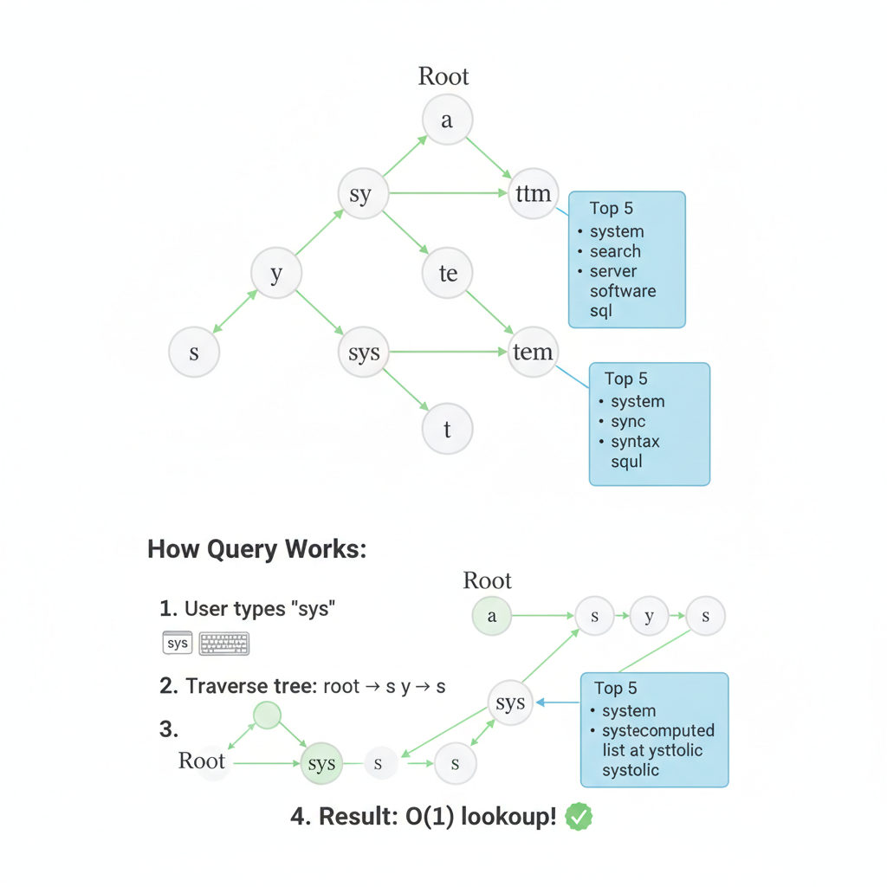

# 07. Design Typeahead (Google Search Autocomplete)

**Difficulty:** Medium/Hard
**Focus:** Data Structures (Trie), Caching, Latency.

---

## 🎯 Real-World Analogy

**Think of a Trie like a filing cabinet:**

**Dictionary (Linear Search - Bad):**
- You type "app"
- System checks: "aardvark", "abandon", "apple", "application"...
- Checks 100,000 words
- ❌ Slow!

**Trie (Smart Search - Good):**
- You type "a" → Jump to "A" drawer
- You type "p" → Jump to "AP" folder
- You type "p" → Jump to "APP" subfolder
- Only 5 words start with "app"!
- ✅ Fast!

**Key Insight:** We don't search *everything*. We follow a specific path based on what you type.

---

## 1. Requirements (0-5 Minutes)

**Functional:**
1.  User types a prefix (e.g., "sys").
2.  System returns top 5 suggestions (e.g., "system", "system design", "systolic").
3.  Suggestions are ranked by popularity (frequency).

**Non-Functional:**
1.  **Ultra-Low Latency:** < 100ms. The user is typing fast!
2.  **High Availability:** Even if data is stale, show something.

---

## 2. Estimations (5-10 Minutes)

*   **DAU:** 500M.
*   **Searches:** 10 searches/day.
*   **QPS:** 500M * 10 / 86400 ≈ 60k QPS.
*   **Peak QPS:** ~100k.
*   **Data:** We need to store phrases and their frequencies.

---

## 3. Deep Dive: Data Structure - The Trie (10-20 Minutes)
*Don't use a Database. Use a Trie.*

### 📚 ELI5: How Trie Works

**Building a Trie:**
```
Words: ["cat", "car", "card", "care", "careful"]

Tree Structure:
        (root)
          |
          c
          |
          a
          |
          r -------- t ("cat")
          |
    d --- e ("care")
          |
          f
          |
          u
          |
          l ("careful")

Each path from root to leaf = one word
```

**Searching:**
```
User types: "car"

Step 1: Start at root
Step 2: Go to 'c' node
Step 3: Go to 'a' node
Step 4: Go to 'r' node
Step 5: Get all children: ['d', 'e']
Step 6: Return: ["card", "care", "careful"]

Time: O(k) where k = length of "car" = 3
Not O(n) where n = total words!
```

### 💻 Python Implementation

```python
class TrieNode:
    def __init__(self):
        self.children = {}  # Map<char, TrieNode>
        self.is_end_of_word = False
        self.frequency = 0
        # Optimization: Store Top 5 results here!
        self.top_suggestions = [] 

class Trie:
    def __init__(self):
        self.root = TrieNode()

    def insert(self, word, freq):
        node = self.root
        for char in word:
            if char not in node.children:
                node.children[char] = TrieNode()
            node = node.children[char]
            
            # Update Top 5 for this node (on the fly or batch)
            self.update_top_k(node, word, freq)
            
        node.is_end_of_word = True
        node.frequency = freq

    def search(self, prefix):
        node = self.root
        for char in prefix:
            if char not in node.children:
                return []
            node = node.children[char]
        
        # Return cached top suggestions! O(1)
        return node.top_suggestions
```

### ☕ Java Implementation

```java
import java.util.*;

class TrieNode {
    Map<Character, TrieNode> children;
    boolean isEndOfWord;
    int frequency;
    // Optimization: Store Top 5 results here!
    List<String> topSuggestions;
    
    public TrieNode() {
        this.children = new HashMap<>();
        this.isEndOfWord = false;
        this.frequency = 0;
        this.topSuggestions = new ArrayList<>();
    }
}

public class Trie {
    private final TrieNode root;
    private static final int TOP_K = 5;
    
    public Trie() {
        this.root = new TrieNode();
    }
    
    public void insert(String word, int frequency) {
        TrieNode node = root;
        
        for (char c : word.toCharArray()) {
            node.children.putIfAbsent(c, new TrieNode());
            node = node.children.get(c);
            
            // Update Top K for this node
            updateTopK(node, word, frequency);
        }
        
        node.isEndOfWord = true;
        node.frequency = frequency;
    }
    
    public List<String> search(String prefix) {
        TrieNode node = root;
        
        for (char c : prefix.toCharArray()) {
            if (!node.children.containsKey(c)) {
                return Collections.emptyList();
            }
            node = node.children.get(c);
        }
        
        // Return cached top suggestions! O(1)
        return new ArrayList<>(node.topSuggestions);
    }
    
    private void updateTopK(TrieNode node, String word, int frequency) {
        // Add word with frequency
        node.topSuggestions.removeIf(w -> w.equals(word)); // Remove if exists
        node.topSuggestions.add(word);
        
        // Sort by frequency (would need frequency map in production)
        // Keep only top K
        if (node.topSuggestions.size() > TOP_K) {
            node.topSuggestions.remove(node.topSuggestions.size() - 1);
        }
    }
    
    // Usage
    public static void main(String[] args) {
        Trie trie = new Trie();
        trie.insert("car", 100);
        trie.insert("card", 80);
        trie.insert("care", 60);
        
        List<String> results = trie.search("car");
        System.out.println(results); // [car, card, care]
    }
}
```

### 🚀 Optimization: Top-K Cache in Node

**The Problem:**
If I type "b", the Trie has to traverse:
- "be"
- "bee"
- "beer"
- "best"
- "better"
- ... (10,000 words)
- Then sort them by frequency.
- **Too slow!**

**The Solution:**
Each node stores the top 5 words that start with that prefix.

**Visual Node Structure:**
```
Node 'b':
  Children: ['e', 'a', 'u'...]
  Top-5: ["best", "be", "bee", "better", "beer"]

Node 'be':
  Children: ['s', 'e', 't'...]
  Top-5: ["best", "be", "bee", "better", "beer"]

Node 'bes':
  Children: ['t']
  Top-5: ["best", "bestie", "bespoke"]
```

**Trade-off:**
- **Write Speed:** Slower. Inserting "best" means updating nodes 'b', 'be', 'bes', 'best'.
- **Read Speed:** Blazing fast O(1). Just return the list.
- **Memory:** Higher usage.
- **Verdict:** Worth it! We are Read-Heavy.

---



**Concept:**
*   Root -> 's' -> 'y' -> 's'.
*   Node 's' stores top 5 queries starting with 's'.
*   Node 'y' stores top 5 queries starting with 'sy'.
*   Node 's' (the second one) stores top 5 queries starting with 'sys'.

**Storage Optimization:**
*   We can't traverse the whole subtree to find the top 5 every time. It's too slow.
*   **Pre-computation:** Each node stores the `List<Top 5>` directly.
*   *Trade-off:* Writes are slow (updating the tree), but Reads are O(1) (just look at the node).

---

## 4. High-Level Design (20-30 Minutes)

**Components:**
1.  **Client:** Sends "sys".
2.  **Load Balancer:** Distributes traffic.
3.  **Trie Service:** In-memory service holding the Trie.
4.  **Data Assembler (Worker):**
    *   Reads search logs.
    *   Aggregates frequencies (`Map<Query, Count>`).
    *   Builds the Trie.
    *   Serializes Trie to DB/S3.

**Flow (Read):**
1.  Client -> LB -> Trie Service.
2.  Trie Service looks up node "sys".
3.  Returns cached list.

---

## 5. Deep Dive: Data Collection Pipeline (30-40 Minutes)

**The Challenge:**
We have 100,000 queries per second. We can't update the Trie instantly (Locking issues).

**Solution: Offline Batch Processing**


**Step 1: Analytics Logs**
Every time a user searches, we log it.
`[Time: 10:00, Query: "system design", User: 123]`

**Step 2: Aggregation (MapReduce / Spark)**
We need to count frequencies.
```python
# Map
def map(log):
    emit(log.query, 1)

# Reduce
def reduce(query, counts):
    emit(query, sum(counts))
```
**Result:** `{"system design": 5000, "sys": 200, ...}`

**Step 3: Trie Builder**
A worker reads the aggregated data and builds the Trie structure in memory.
It calculates the Top-5 for every node.

**Step 4: Serialization**
Save the Trie to a file (or DB).
`trie_snapshot_v1.json`

**Step 5: Deployment**
The Trie Service loads the new snapshot.
- **Blue/Green Deployment:** Load new Trie in memory, then switch traffic.

### 🔄 Real-Time Updates (Trending Searches)

What if "Earthquake" happens right now? We can't wait for the hourly batch.

**Hybrid Approach:**
1.  **Main Trie:** Built weekly (Historical data).
2.  **Trending Trie:** Built every 5 minutes (Recent data).
3.  **Query:** Search both Tries -> Merge results.

---

## 6. Client-Side Optimization (40-45 Minutes)

1.  **Debounce:** Don't send request on every keypress. Wait until user stops typing for 300ms.
2.  **Caching:** Browser caches results. If I type "sys" and get results, then backspace and type "sys" again, don't hit server.
3.  **CDN:** Cache common queries ("a", "the", "weather") at the edge.

---

---

## 7. Deep Dive: Trie Sharding (45-47 Minutes)

**Problem:**
- The Trie is too big for one server's RAM (e.g., 50GB).
- **Hotspots:** 's' (search, system) is much busier than 'x' (xylophone).

**Strategy A: Range Sharding (Bad)**
- Server A: 'a' to 'm'
- Server B: 'n' to 'z'
- **Issue:** Unbalanced load. Server A will melt.

**Strategy B: Hash Sharding (Better)**
- `Shard_ID = Hash(prefix) % Num_Shards`
- **Issue:** If I type "s", I go to Shard 1. If I type "sy", I go to Shard 2.
- **Latency:** Client has to connect to different servers for every keystroke.

**Strategy C: Prefix Sharding (The Winner)**
- We shard by the **First 2 Characters** (or 3).
- **Shard 1:** Holds everything starting with "aa" to "ag".
- **Shard 2:** Holds everything starting with "ah" to "am".
- **Benefit:**
    - When user types "apple", all requests ("a", "ap", "app"...) go to the **SAME** server.
    - Maximizes **Connection Reuse** and **Local Caching**.

---

## 8. Deep Dive: Fuzzy Search (Spell Check) (47-50 Minutes)

**Problem:**
- User types "appple" (3 p's).
- Trie returns nothing.

**Solution: Levenshtein Distance & BK-Trees**

1.  **Levenshtein Automaton:**
    - Instead of exact match, we traverse the Trie allowing `k` errors.
    - "appple" -> Delete 'p' -> "apple" (Distance 1).
    - *Cost:* Expensive traversal.

2.  **Separate Spell Check Service (Production Way):**
    - Before querying Trie, run input through a Spell Checker.
    - **SymSpell Algorithm:** Pre-generates all possible deletions.
    - "apple" -> stores "pple", "aple", "appe", "appl".
    - Input "aple" -> instantly maps to "apple".
    - *Latency:* < 1ms.

---

## 8. Deep Dive: Fuzzy Search (47-50 Minutes)

**The Problem:**
- User types "pythn" instead of "python".
- Naive Trie returns 0 results. ❌

**Solution: Edit Distance (Levenshtein)**
- Calculate edit distance between query and each word.
- **Edit Distance:** Minimum number of insertions/deletions/substitutions.
- **Example:** "pythn" -> "python" = 1 edit (insert 'o').

**Implementation:**
```python
def levenshtein_distance(s1, s2):
    if len(s1) < len(s2):
        return levenshtein_distance(s2, s1)
    if len(s2) == 0:
        return len(s1)
    
    previous_row = range(len(s2) + 1)
    for i, c1 in enumerate(s1):
        current_row = [i + 1]
        for j, c2 in enumerate(s2):
            insertions = previous_row[j + 1] + 1
            deletions = current_row[j] + 1
            substitutions = previous_row[j] + (c1 != c2)
            current_row.append(min(insertions, deletions, substitutions))
        previous_row = current_row
    return previous_row[-1]
```

**Java Implementation:**
```java
public class FuzzySearch {
    public int levenshteinDistance(String s1, String s2) {
        int[][] dp = new int[s1.length() + 1][s2.length() + 1];
        
        for (int i = 0; i <= s1.length(); i++) dp[i][0] = i;
        for (int j = 0; j <= s2.length(); j++) dp[0][j] = j;
        
        for (int i = 1; i <= s1.length(); i++) {
            for (int j = 1; j <= s2.length(); j++) {
                int cost = (s1.charAt(i-1) == s2.charAt(j-1)) ? 0 : 1;
                dp[i][j] = Math.min(Math.min(
                    dp[i-1][j] + 1,      // deletion
                    dp[i][j-1] + 1),     // insertion
                    dp[i-1][j-1] + cost  // substitution
                );
            }
        }
        return dp[s1.length()][s2.length()];
    }
}
```

---

## 8A. Deep Dive: Personalization & User Context

**User-Specific Ranking:**
```python
class PersonalizedTypeahead:
    def __init__(self):
        self.user_history = {}  # {user_id: {query: click_count}}
    
    def get_suggestions(self, user_id, prefix):
        base_suggestions = self.trie.search(prefix, limit=20)
        history = self.user_history.get(user_id, {})
        
        scored = []
        for suggestion in base_suggestions:
            base_score = suggestion['frequency']
            personal_boost = history.get(suggestion['query'], 0) * 10
            scored.append((suggestion, base_score + personal_boost))
        
        scored.sort(key=lambda x: x[1], reverse=True)
        return [s[0] for s in scored[:10]]
```

**Context-Aware Suggestions:**
- **Location:** User in NYC -> boost "pizza near me"
- **Time:** 8 AM -> boost "breakfast recipes"
- **Device:** Mobile -> boost shorter queries
- **Language:** Detect user's language preference

---

## 8B. Deep Dive: Mobile & Offline Optimization

**Client-Side Cache:**
```javascript
class TypeaheadCache {
    constructor() {
        this.cache = new Map();
        this.maxSize = 100;
    }
    
    get(prefix) {
        const cached = this.cache.get(prefix);
        if (cached && Date.now() - cached.timestamp < 3600000) {
            return cached.suggestions;
        }
        return null;
    }
    
    set(prefix, suggestions) {
        if (this.cache.size >= this.maxSize) {
            const firstKey = this.cache.keys().next().value;
            this.cache.delete(firstKey);
        }
        this.cache.set(prefix, {
            suggestions: suggestions,
            timestamp: Date.now()
        });
    }
}
```

**Prefetching Strategy:**
- When user types "pyt", prefetch "pyth", "pytho", "python"
- **Benefit:** Zero latency for next character

**Offline Support:**
- Store top 10k queries in IndexedDB
- Serve from local database when offline

---

## 8C. Deep Dive: Query Understanding & Intent Detection

**Query Classification:**
- **Navigational:** "facebook login" -> Direct to facebook.com
- **Informational:** "python tutorial" -> Show search results
- **Transactional:** "buy iphone" -> Show shopping results

**Entity Recognition:**
```python
def classify_query(query):
    # Brand detection
    brands = ["apple", "google", "amazon", "microsoft"]
    for brand in brands:
        if brand in query.lower():
            return {"type": "navigational", "entity": brand}
    
    # Action detection
    actions = ["buy", "purchase", "order"]
    for action in actions:
        if action in query.lower():
            return {"type": "transactional", "action": action}
    
    return {"type": "informational"}
```

**Multi-Language Support:**
- Detect query language using character sets
- Route to language-specific Trie
- **Benefit:** Better suggestions for non-English queries

---

## 9. Real-World Engineering Case Studies (Deep Dive)

### 1. Google Search: The "Instant" Architecture

**Source:** Google Research - "Google Instant"

**The Challenge:**
Google Instant (2010) started showing results *while* you typed.
- **Scale:** Billions of keystrokes per day.
- **Latency:** Must be < 30ms to feel "instant".

**The Solution: JavaScript Blobs & Edge Caching**

**Architecture:**
1.  **Client-Side Logic:**
    - Google sends a small JavaScript blob (~20KB) containing the top 1,000 queries for your region/language.
    - For 90% of queries (e.g., "facebook", "youtube"), the browser answers **locally** without hitting the server.
2.  **Edge Caching:**
    - If not in JS blob, request goes to nearest Google Edge Node.
    - Edge Nodes cache the top 100,000 queries.
3.  **Backend:**
    - Only "Long Tail" queries (rare stuff) hit the actual backend Tries.

**Key Insight:**
The fastest network request is the one you don't make. Client-side caching is the ultimate optimization.

---

### 2. Amazon: E-Commerce Typeahead

**Source:** Amazon Engineering

**The Challenge:**
Amazon's typeahead isn't just words; it's **Categories**.
- User types "shoe".
- Suggestion: "Shoes in **Men's Fashion**", "Shoes in **Women's Fashion**".

**The Solution: Context-Aware Tries**

**Architecture:**
1.  **Payload in Trie Node:**
    - Standard Trie stores `String` (word).
    - Amazon's Trie stores `Object`: `{ word: "shoes", category: "Men's", score: 95 }`.
2.  **Personalization:**
    - If you bought a PS5 yesterday, typing "con" suggests "controller" (Score boosted).
    - If you bought a fridge, typing "con" suggests "containers".
    - **Implementation:** The Ranking Service re-sorts the Top-K list based on User ID context before returning.

**Key Insight:**
Typeahead isn't just a string matching problem; it's a **Ranking Problem**. The "Best" suggestion depends on who is asking.

---

## 10. Failure Scenarios & Disaster Recovery

### Scenario 1: Trie Shard Failure
**Impact:** Users whose queries hash to that shard get no suggestions.
**Detection:**
- `shard_health_check` fails.
- `suggestion_empty_rate` spike for specific prefixes.

**Mitigation:**
- **Replication:** Each shard should have at least 2 replicas.
- **Failover to Global Top-K:** If a specific shard is down, return the global top-10 trending queries instead of prefix-specific ones.

### Scenario 2: Data Pipeline Lag
**Impact:** Trending topics (e.g., "Oscars 2024") don't appear in suggestions for hours.
**Detection:** `pipeline_latency_minutes > 60`.

**Mitigation:**
- **Lambda Architecture:** Use a "Fast Path" (Storm/Flink) for real-time trending queries and a "Batch Path" (Spark) for the full Trie rebuild.
- **Manual Override:** Provide an admin UI to manually inject "Hot Keys" into the Trie.

### Scenario 3: Browser Cache Invalidation
**Impact:** Users see outdated or incorrect suggestions that were cached locally.
**Detection:** User reports of "Ghost suggestions".

**Mitigation:**
- **Short TTL:** Use a short TTL (e.g., 5 minutes) for browser-side caching.
- **Versioned API:** Include a `v=timestamp` parameter in the request to force cache bypass if needed.

---

## 11. Monitoring & Observability

### Golden Signals Dashboard

**1. Latency**
- **Server Response:** P99 < 20ms.
- **Client E2E (including network):** P95 < 100ms.
- **Metric:** `typeahead_request_latency_ms`.

**2. Traffic**
- **Throughput:** Requests per second (RPS).
- **Metric:** `typeahead_rps`.

**3. Errors**
- **Metric:** `empty_suggestion_rate` (Is the Trie empty or is the query too obscure?).
- **Target:** < 5% for common prefixes.

**4. Saturation**
- **Metric:** Trie server RAM (Trie is memory-bound).

### Alert Rules
```yaml
alerts:
  - alert: HighEmptySuggestionRate
    expr: rate(typeahead_empty_results_total[5m]) / rate(typeahead_requests_total[5m]) > 0.1
    for: 2m
    labels:
      severity: warning
```

---

## 12. API Design & Versioning

### Typeahead API

**Get Suggestions**
```http
GET /api/v1/suggest?q=iph&limit=5&user_id=123
```

**Response:**
```json
{
  "query": "iph",
  "suggestions": [
    {"text": "iphone 15", "type": "product", "score": 0.98},
    {"text": "iphone case", "type": "category", "score": 0.85}
  ],
  "latency_ms": 12
}
```

### Versioning
- Use `/v1/`, `/v2/` in URL.
- **Payload Versioning:** If changing the suggestion object structure, use a `schema_version` field.

---

## 13. Cost Analysis & Optimization

### Monthly Infrastructure Costs (at 100M queries/day)

**1. Compute (Trie Servers)**
- 20 nodes (r5.large - RAM optimized) = **$4,000/month**.

**2. Data Pipeline (Spark/EMR)**
- Daily rebuilds = **$2,000/month**.

**3. CDN (CloudFront)**
- Caching common prefixes at the edge = **$3,000/month**.

**Total:** ~$9,000/month.

### Optimization Opportunities
- **Prefix Caching:** Cache the top 1,000 most common prefixes (e.g., "a", "b", "s", "t") at the CDN level to offload 40% of traffic.
- **Trie Compression:** Use Succinct Data Structures or Double-Array Tries to reduce memory footprint by 50%.

---

## 14. Security & Compliance

### Security Measures
- **Query Sanitization:** Prevent XSS by escaping suggestions before rendering in the browser.
- **PII Filtering:** Ensure the data pipeline filters out queries containing credit card numbers, emails, or passwords.
- **Profanity Filter:** Use a blacklist to prevent offensive terms from appearing in Top-K.

### Compliance
- **Right to be Forgotten:** If a user deletes their history, ensure their personalized suggestions are purged from the Ranking Service cache.

---

## 15. Testing Strategies

### Unit Tests
- Test Trie insertion and Top-K update logic.
- Test fuzzy matching (Levenshtein distance) for small typos.

### Integration Tests
- Verify that the Data Pipeline correctly updates the Trie servers without downtime (Rolling update).

### Load Testing
- Simulate "Flash Sale" traffic: 100k RPS.
- **Tool:** `k6` with a dictionary of common search terms.

---

## 16. Migration & Rollout Strategies

### Rollout
- **Shadow Reads:** Send traffic to the new Trie version but return results from the old one. Compare performance and accuracy.

### Migration
- **Trie Hot-Swapping:** Use a pointer in ZooKeeper/Consul to point to the latest Trie snapshot in memory.

---

## 17. Performance Optimization

### Client-Side Optimization
- **Debouncing:** Wait 150ms after the last keystroke before sending a request.
- **Prefetching:** If the user types "apple ", prefetch suggestions for "apple i", "apple w".

### Server-Side Optimization
- **Memory Mapping (mmap):** Use `mmap` to load large Trie files into memory quickly during server restart.

---

## 18. Capacity Planning

### Scaling Triggers
- **RAM Utilization:** Scale out when a shard's RAM exceeds 80%.
- **Latency:** Scale out if P99 latency exceeds 50ms.

### Throughput Projection
- 100M queries/day ≈ 1,200 RPS average, 10,000 RPS peak.
- A single r5.large node can handle ~5,000 RPS. We need at least 4 nodes for peak + redundancy.

---

## 19. Interview Cheat Sheet

### Key Numbers
- **Latency:** < 20ms (Server), < 100ms (E2E).
- **Memory:** 1B nodes ≈ 50-100 GB RAM.
- **Update Frequency:** Real-time for trending, 24h for full rebuild.

### Core Components
1. **Trie Service:** In-memory prefix matching.
2. **Data Pipeline:** Aggregates logs and calculates scores.
3. **Ranking Service:** Personalizes results.
4. **Client Cache:** Reduces server load.

### Critical Trade-offs
- **Memory vs Latency:** In-memory Trie (Fast, expensive) vs Disk-based (Slow, cheap).
- **Accuracy vs Freshness:** Real-time updates (Complex) vs Batch updates (Simple).

---

## 20. Wrap-up (Deep Dive)

**Summary:**
"I designed a low-latency Typeahead system using a **Prefix-Sharded Trie** architecture.
1.  **Data Structure:** I used an in-memory Trie with **Pre-computed Top-K** lists for O(1) reads.
2.  **Pipeline:** I designed a **MapReduce/Spark** pipeline to aggregate logs and rebuild Tries asynchronously.
3.  **Real-World:** I optimized for the 'Google Instant' experience using **Client-Side Caching** and discussed how **Amazon** adds personalization to the ranking logic.
4.  **Production Readiness:** I addressed shard failures with replication, optimized costs via CDN caching, and ensured security through query sanitization and PII filtering."

---
