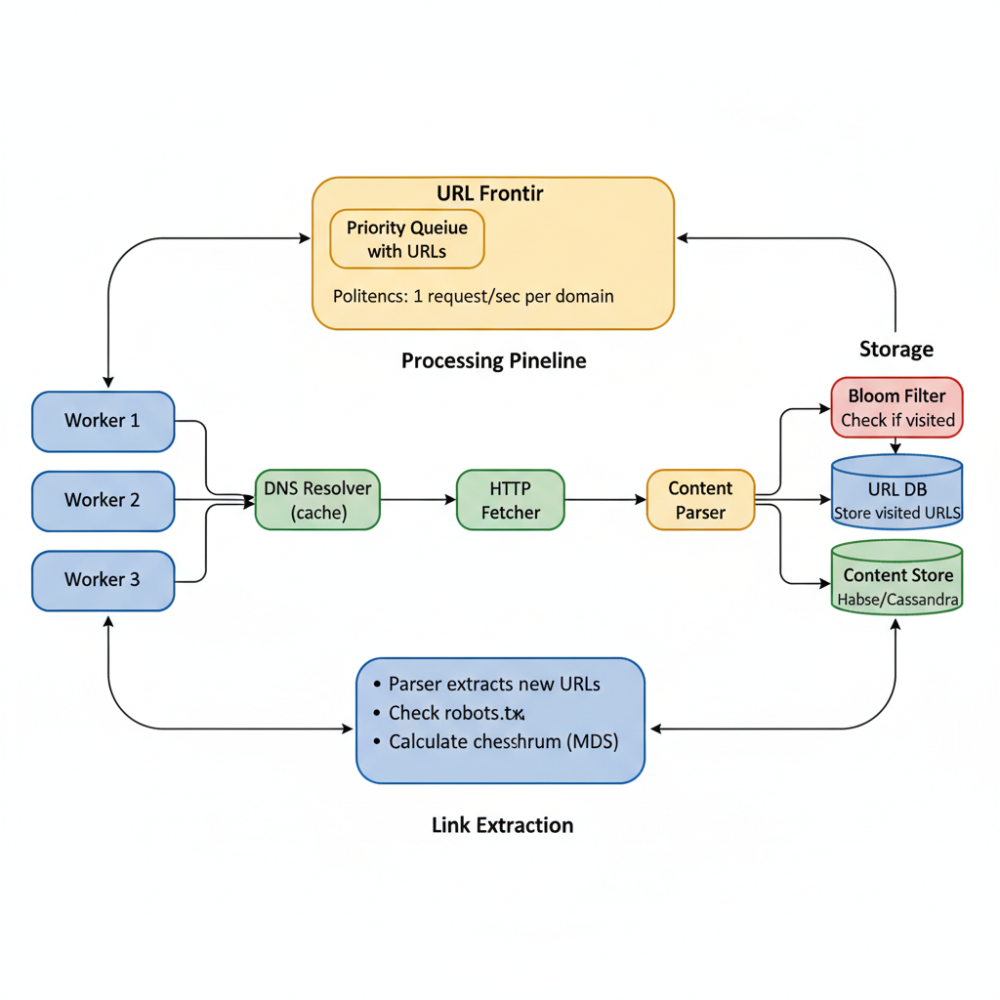

# 08. Design a Web Crawler (Google Bot)

**Difficulty:** Hard
**Focus:** Distributed Queues, Politeness, Deduplication.

---

## 🎯 Real-World Analogy

**Think of a web crawler like exploring a library:**

**Without Strategy (Bad):**
- Start at entrance
- Pick random book
- Read every page
- Follow every reference
- Get lost in infinite loops
- Never finish! ❌

**With Strategy (BFS - Good):**
- Start at entrance
- Visit all books on Floor 1
- Then all books on Floor 2
- Mark visited books (don't re-read)
- Respect library rules (politeness)
- ✅ Systematic and efficient!

**Key Insight:** The web is a graph. We need to traverse it systematically (BFS) without getting stuck or annoying the website owners.

---

## 1. Requirements (0-5 Minutes)

**Functional:**
1.  **Input:** A list of seed URLs (e.g., cnn.com, wikipedia.org).
2.  **Process:** Download page, extract links, add to queue.
3.  **Output:** Store content for indexing.

**Non-Functional:**
1.  **Scale:** Billions of pages.
2.  **Politeness:** Don't DDOS a website. Respect `robots.txt`.
3.  **Robustness:** Handle malformed HTML, infinite loops, and crashes.

---

## 1.1 The Rules of the Road (Robots.txt)

**What is it?**
A text file placed at `domain.com/robots.txt` that tells crawlers what they can and cannot do.

**Example:**
```text
User-agent: Googlebot
Disallow: /private/
Disallow: /admin/
Crawl-delay: 5
```

**Key Directives:**
- **User-agent:** Who does this rule apply to? (`*` for everyone).
- **Disallow:** Paths to skip.
- **Crawl-delay:** Wait X seconds between requests (Politeness).

**Ethical Crawling:**
- **Identify Yourself:** Send a `User-Agent` header with your contact info (e.g., `MyBot/1.0 (+http://mysite.com/bot)`).
- **Respect the Rules:** Always check `robots.txt` first.
- **Don't be Aggressive:** If `Crawl-delay` is missing, default to 1-2 seconds.

---

## 2. Estimations (5-10 Minutes)

*   **Pages:** 10 Billion.
*   **Time:** Crawl entire web in 30 days.
*   **Throughput:** 10B / (30 * 86400) ≈ **4,000 pages/sec**.
*   **Storage:** 10B * 500KB (avg size) = **5 PB**.

---

## 3. High-Level Design (10-20 Minutes)



**Components:**
1.  **URL Frontier:** The "Brain". Prioritized queue of URLs to crawl.
2.  **HTML Downloader:** Fetches the page.
3.  **DNS Resolver:** Caches IP addresses.
4.  **Content Parser:** Extracts links.
5.  **Duplicate Eliminator:** Checks if we've seen this content before.
6.  **Storage:** HBase/Cassandra (Content) + SQL (Metadata).

---

## 3.1 Deep Dive: Distributed Crawling Strategies

**How do we split the work among 1,000 workers?**

### Option A: Hash-Based Partitioning
- `Worker_ID = hash(URL) % N`
- **Pros:** Simple load balancing.
- **Cons:** **Politeness Nightmare.**
  - `cnn.com/page1` goes to Worker A.
  - `cnn.com/page2` goes to Worker B.
  - Both workers hit `cnn.com` at the same time. We violate politeness! ❌

### Option B: Domain-Based Partitioning (The Winner)
- `Worker_ID = hash(Domain) % N`
- All URLs from `cnn.com` go to Worker A.
- **Pros:** Worker A can enforce the "1 request per second" rule locally.
- **Cons:** **Hotspots.** If `cnn.com` has 1M pages and `blog.com` has 10, Worker A is busy while Worker B is idle.
- **Fix:** Use a **Sharded URL Frontier**. The Frontier (centralized or distributed) assigns "chunks" of a domain to workers dynamically.

---

## 3.2 Deep Dive: The DNS Bottleneck

**The Hidden Latency Killer:**
Before downloading a page, we must resolve `www.example.com` to `93.184.216.34`.

**Why is it slow?**
- DNS is synchronous (UDP).
- Latency: 10ms - 500ms.
- If we crawl 4,000 pages/sec, we need 4,000 DNS lookups/sec.
- Standard OS DNS resolvers block threads.

**Solution: Custom DNS Caching**
1.  **Cache aggressively:** Store IP mappings in Redis/Memcached.
2.  **Prefetch:** If we see a link to `cnn.com`, resolve the IP *before* the worker asks for it.
3.  **Batching:** Resolve multiple domains in parallel using a custom async DNS client (e.g., `c-ares`).

---

## 3.3 Handling Dynamic Content (JavaScript)

**The Problem:**
Modern sites (React/Angular) load content via JavaScript *after* the initial HTML load.
- `wget google.com` -> Returns empty `<body>` with `<script src="app.js">`.
- Our crawler sees nothing!

**Approaches:**

| Approach | Method | Pros | Cons |
| :--- | :--- | :--- | :--- |
| **Static Parsing** | Download HTML only | Fast, Cheap | Misses JS content |
| **Dynamic Rendering** | Headless Chrome (Puppeteer) | Sees everything | **100x Slower**, High CPU |

**Hybrid Strategy:**
1.  Try Static Parsing first.
2.  Check "Text-to-Code Ratio". If page looks empty (< 100 words), flag it.
3.  Send flagged pages to a specialized "Renderer Cluster" (Headless Chrome).
4.  This saves resources while capturing dynamic sites.

---

## 3.4 Deep Dive: The HTML Downloader

**The Workhorse:**
This component fetches bytes from the web. It sounds simple (`curl url`), but at scale, it's complex.

**Key Challenges & Solutions:**

1.  **Performance (Async I/O):**
    - **Bad:** Thread-per-request. 1000 threads = High context switch overhead.
    - **Good:** Event-driven (Python `asyncio`, Java `Netty`). 1 thread handles 1000 connections.

2.  **Robustness:**
    - **Redirect Loops:** `A -> B -> A`. Limit redirect chain to 5.
    - **Encoding Hell:** Web pages use random encodings (UTF-8, ISO-8859-1, Windows-1252). We must detect this (e.g., `chardet` library) or we get garbage text.
    - **Huge Files:** What if a URL points to a 10GB ISO file?
      - **Solution:** Check `Content-Length` header. Read only first 100KB (Head request).

3.  **Avoiding IP Bans (Proxy Rotation):**
    - If we hit a site too hard, we get 403 Forbidden.
    - **Solution:** Use a pool of Proxy Servers.
    - `Request -> Proxy Load Balancer -> [Proxy 1, Proxy 2, ...] -> Target Site`

---

## 3.5 Deep Dive: The Content Parser

**Goal:** Extract links and text.

**1. Link Extraction:**
- **Don't use Regex:** HTML is not a regular language. Regex breaks on nested tags.
- **Use DOM Parsers:** `lxml` (Python) or `Jsoup` (Java). They build a tree and handle broken HTML tags gracefully.

**2. URL Normalization (Canonicalization):**
We must convert raw links into a standard format to avoid duplicates.

| Raw Link | Normalized Link | Reason |
| :--- | :--- | :--- |
| `http://cnn.com` | `http://cnn.com/` | Add trailing slash |
| `http://cnn.com:80` | `http://cnn.com/` | Remove default port |
| `http://cnn.com/a/../b` | `http://cnn.com/b` | Resolve paths |
| `http://cnn.com/a#top` | `http://cnn.com/a` | Remove fragments |
| `HTTP://CNN.COM` | `http://cnn.com/` | Lowercase domain |

---

## 3.6 Deep Dive: Storage Architecture

**We need to store 5 PB of data.** SQL won't cut it.

**Choice: BigTable / HBase / Cassandra**
- **Why?**
  - **Scan Throughput:** We scan the whole DB to generate search indexes.
  - **Random Access:** We check "Have we crawled this URL?" 100k times/sec.
  - **Scalability:** Petabytes of data.

**Data Model (HBase Schema):**

**Table: `CrawlData`**
- **Row Key:** `ReverseHost + Hash(Path)`
  - Example: `com.cnn|/politics/election`
  - *Why Reverse Host?* It groups pages from the same domain together on disk. This makes compression efficient and allows "Scan all CNN pages" quickly.

**Column Families:**
1.  **`metadata`**:
    - `cid`: Content Hash (for deduplication)
    - `http_code`: 200, 404, 301
    - `last_crawled`: Timestamp
2.  **`content`**:
    - `html`: Compressed HTML (Gzip/Snappy)
    - `text`: Extracted text for indexing

---

## 4. Deep Dive: URL Frontier Architecture (20-30 Minutes)

*How to be polite and prioritized?*

### 🏗️ The "Front Queue / Back Queue" Architecture

We need to balance two conflicting goals:
1.  **Priority:** Crawl important pages first (PageRank).
2.  **Politeness:** Don't hit the same server too often.

**Visual Architecture:**

```
[Prioritizer]
     |
     v
[Front Queues] (Priority)
  Q1 (High)   Q2 (Med)   Q3 (Low)
     |           |          |
     +-----------+----------+
                 |
           [Queue Router]
                 |
     +-----------+----------+
     |           |          |
[Back Queues] (Politeness - One per Domain)
 Q_google    Q_cnn      Q_wiki
     |           |          |
  [Worker]    [Worker]   [Worker]
```

**How it works:**
1.  **Prioritizer:** Assigns a score (1-10) to a URL.
2.  **Front Queues:** Stores URLs based on priority.
3.  **Queue Router:** Moves URLs from Front to Back queues.
    - *Crucial Rule:* Only move a URL to `Q_cnn` if `Q_cnn` is empty.
4.  **Back Queues:** Each queue corresponds to a unique domain (e.g., `cnn.com`).
5.  **Heap:** Maintains the "Next Available Time" for each Back Queue.

### 💻 Python Implementation

```python
import time
import heapq

class URLFrontier:
    def __init__(self):
        # Back Queues: domain -> list of URLs
        self.back_queues = {} 
        # Heap: (next_crawl_time, domain)
        self.domain_heap = []
        # Delay between requests (politeness)
        self.min_delay = 1.0 

    def add_url(self, url, priority):
        domain = get_domain(url)
        if domain not in self.back_queues:
            self.back_queues[domain] = []
            # Add to heap with current time (ready now)
            heapq.heappush(self.domain_heap, (time.time(), domain))
            
        self.back_queues[domain].append(url)

    def get_next_url(self):
        while True:
            if not self.domain_heap:
                return None
                
            next_time, domain = self.domain_heap[0]
            
            if time.time() < next_time:
                # Wait until the polite time
                time.sleep(next_time - time.time())
                
            # Pop the domain
            heapq.heappop(self.domain_heap)
            
            # Get URL from that domain's queue
            if self.back_queues[domain]:
                url = self.back_queues[domain].pop(0)
                
                # Schedule next crawl for this domain
                next_crawl = time.time() + self.min_delay
                heapq.heappush(self.domain_heap, (next_crawl, domain))
                
                return url
            else:
                # Queue empty, cleanup
                del self.back_queues[domain]
```

**Why this is brilliant:**
- It ensures we **never** hit a domain faster than `min_delay`.
- It ensures we process domains in a round-robin fashion (fairness).
- It respects priority (by how we fill the back queues).

---

## 5. Deep Dive: Deduplication with Bloom Filters (30-40 Minutes)

### 📚 ELI5: The "Probabilistic Doorman"

**The Problem:**
- We have 10 Billion URLs.
- Storing them all in a Set (HashSet) takes too much RAM.
- 10B URLs × 100 bytes = 1 TB of RAM! ❌

**The Solution: Bloom Filter**
- A space-efficient probabilistic data structure.
- **Answers:** "Definitely No" or "Maybe Yes".
- **False Positives:** Possible (we might think we crawled a URL when we haven't).
- **False Negatives:** Impossible (if it says "No", we definitely haven't crawled it).

**Visual:**
Imagine a bit array of size 10 (all zeros):
`[0 0 0 0 0 0 0 0 0 0]`

1. Add "google.com":
   - Hash1("google.com") % 10 = 2
   - Hash2("google.com") % 10 = 5
   - Set bits 2 and 5 to 1.
   `[0 0 1 0 0 1 0 0 0 0]`

2. Check "yahoo.com":
   - Hash1("yahoo.com") % 10 = 2
   - Hash2("yahoo.com") % 10 = 8
   - Bit 2 is 1, but Bit 8 is 0.
   - **Result:** Definitely No! (Crawl it).

3. Check "google.com":
   - Bits 2 and 5 are both 1.
   - **Result:** Maybe Yes (Skip it).

### 💻 Python Implementation

```python
import mmh3  # MurmurHash3
from bitarray import bitarray

class BloomFilter:
    def __init__(self, size, hash_count):
        self.size = size
        self.hash_count = hash_count
        self.bit_array = bitarray(size)
        self.bit_array.setall(0)

    def add(self, string):
        for seed in range(self.hash_count):
            result = mmh3.hash(string, seed) % self.size
            self.bit_array[result] = 1

    def lookup(self, string):
        for seed in range(self.hash_count):
            result = mmh3.hash(string, seed) % self.size
            if self.bit_array[result] == 0:
                return False  # Definitely No
        return True  # Maybe Yes

# Usage
bf = BloomFilter(size=1000000, hash_count=7)
bf.add("https://google.com")

if not bf.lookup("https://yahoo.com"):
    crawl("https://yahoo.com")
```

### ☕ Java Implementation

```java
import java.util.BitSet;
import java.nio.charset.StandardCharsets;
import com.google.common.hash.Hashing;

public class BloomFilter {
    private final BitSet bitArray;
    private final int size;
    private final int hashCount;
    
    public BloomFilter(int size, int hashCount) {
        this.size = size;
        this.hashCount = hashCount;
        this.bitArray = new BitSet(size);
    }
    
    /**
     * Add a URL to the Bloom Filter
     */
    public void add(String url) {
        for (int seed = 0; seed < hashCount; seed++) {
            int hash = getHash(url, seed);
            bitArray.set(hash);
        }
    }
    
    /**
     * Check if URL might have been seen before
     * @return false = definitely not seen, true = maybe seen
     */
    public boolean lookup(String url) {
        for (int seed = 0; seed < hashCount; seed++) {
            int hash = getHash(url, seed);
            if (!bitArray.get(hash)) {
                return false; // Definitely No
            }
        }
        return true; // Maybe Yes
    }
    
    /**
     * Generate hash with seed for multiple hash functions
     */
    private int getHash(String url, int seed) {
        int hash = Hashing.murmur3_128(seed)
            .hashString(url, StandardCharsets.UTF_8)
            .asInt();
        
        return Math.abs(hash) % size;
    }
    
    /**
     * Get approximate number of elements added
     */
    public long approximateCount() {
        int bitsSet = bitArray.cardinality();
        return Math.round(-size * Math.log(1 - (double) bitsSet / size) / hashCount);
    }
    
    // Usage
    public static void main(String[] args) {
        BloomFilter bf = new BloomFilter(1000000, 7);
        
        bf.add("https://google.com");
        bf.add("https://facebook.com");
        
        // Check if we should crawl
        if (!bf.lookup("https://yahoo.com")) {
            System.out.println("Crawling https://yahoo.com");
            // crawl(url);
        }
        
        if (bf.lookup("https://google.com")) {
            System.out.println("Skipping https://google.com (already crawled)");
        }
    }
}
```

**Space Savings:**
- Bloom Filter for 10B URLs = ~10 GB RAM.
- HashSet for 10B URLs = ~1 TB RAM.
- **100x Savings!** ✅

### 🛡️ Robustness: Handling Traps

**Spider Traps:**
Websites that generate infinite dynamic URLs to trap crawlers.
- `calendar.php?year=2025`
- `calendar.php?year=2026`
- `calendar.php?year=2027` ...

**Solution:**
1.  **Max Depth:** Only crawl up to depth 20.
2.  **URL Length Limit:** Reject URLs > 100 chars.
3.  **Path Normalization:** Detect repeated segments (`/foo/bar/foo/bar/foo...`).

**Content Deduplication (SimHash):**
- Two pages might have different URLs but identical content (Mirrors).
- **SimHash:** A "Locality Sensitive Hash".
- If two pages differ by 1 word, their SimHashes differ by 1 bit.
- We calculate Hamming Distance between SimHashes. If distance < threshold, they are duplicates.

---

## 6. Deep Dive: Fault Tolerance (40-42 Minutes)

**What happens when things break?**

**1. Worker Failure:**
- A worker crashes while downloading `cnn.com`.
- **Problem:** The URL is lost (dropped from memory).
- **Solution:** **Acknowledgement Mechanism.**
  - Worker fetches URL -> Frontier marks it "In Progress" (Invisible).
  - Worker finishes -> Sends ACK -> Frontier deletes URL.
  - If no ACK in 60s -> Frontier makes URL visible again for another worker.

**2. Frontier Failure:**
- The Redis/Queue node holding the URL queue crashes.
- **Problem:** We lose millions of pending URLs.
- **Solution:** **Persistent Queues.**
  - Use Redis AOF (Append Only File) to persist state to disk.
  - Or use Kafka, which is durable by default.

**3. Consistent Hashing (Resharding):**
- If we add/remove downloader nodes, we use Consistent Hashing (Scenario 11) to redistribute the domain responsibility without stopping the system.

---

---

## 7. Deep Dive: Politeness & DNS Optimization (42-45 Minutes)

**The Problem:**
- **Politeness:** If we crawl `cnn.com` with 1000 threads, we DDOS them.
- **DNS:** Resolving `cnn.com` -> `1.2.3.4` takes 50ms. Doing this 10B times = 15 years of latency.

**Solution 1: Distributed Politeness (Queue Router)**
- We map `Hostname -> Queue`.
- `cnn.com` gets its own queue.
- A worker thread locks the `cnn.com` queue, takes a URL, crawls it, and **sleeps** for `Crawl-Delay` (e.g., 2s) before unlocking.
- This guarantees we never hit the same domain more than once every 2 seconds, even with 10,000 workers.

**Solution 2: Custom DNS Resolver**
- **Cache:** We cache DNS results in Redis/Memcached (TTL 1 hour).
- **Prefetch:** When we parse a page and see links to `nytimes.com`, we fire a DNS lookup **asynchronously** before we even queue the URL.
- **Batching:** We use `c-ares` (C library) to resolve 1000 domains in parallel, not blocking threads.

---

## 8. Real-World Engineering Case Studies (Deep Dive)

### 1. Googlebot: The Ultimate Crawler

**Source:** Google Search Central Blog

**The Challenge:**
Google must crawl the *entire* web (trillions of pages) and index fresh content (news) instantly.
- **Scale:** Exabytes of data.
- **Freshness:** Breaking news must appear in seconds.

**The Solution: Two-Tier Crawling Architecture**

**Architecture:**
1.  **Fresh Bot (Fast Lane):**
    - Crawls high-frequency sites (CNN, Twitter, Reddit).
    - Visits every few seconds.
    - Uses **PubSubHubbub** (WebSub) to get push notifications from publishers instead of polling.
2.  **Deep Bot (Slow Lane):**
    - Crawls the rest of the web (blogs, static sites).
    - Visits once a month.
    - Focuses on deep archival and link discovery.

**Rendering (The "Caffeine" Update):**
- Googlebot executes JavaScript (Headless Chromium).
- It uses a massive **Render Service** (WRS) that renders the page, takes a snapshot, and indexes the *rendered* DOM, not just the raw HTML.

**Key Insight:**
The web is split into "Fast" and "Slow" tiers. You cannot treat `cnn.com` and `my-personal-blog.com` with the same crawling strategy.

---

## 9. Failure Scenarios & Disaster Recovery

### Scenario 1: Crawler Node IP Banned
**Impact:** All crawling tasks from that node fail for specific domains.
**Detection:**
- `http_403_forbidden_rate` > 10%.
- `http_429_too_many_requests` > 10%.

**Mitigation:**
- **Proxy Rotation:** Use a pool of rotating residential proxies (e.g., Bright Data) to distribute requests.
- **Backoff Logic:** If a 429 is received, automatically increase the wait time for that domain in the URL Frontier.
- **User-Agent Spoofing:** Rotate User-Agent strings to mimic different browsers.

### Scenario 2: DNS Resolver Bottleneck
**Impact:** Crawler nodes spend 50% of their time waiting for DNS resolution.
**Detection:** `dns_lookup_latency_ms` > 500ms.

**Mitigation:**
- **Local DNS Cache:** Run a local DNS resolver (e.g., Unbound or BIND) on each crawler node.
- **Prefetching:** Resolve DNS for the next 1,000 URLs in the frontier in the background.

### Scenario 3: Storage (S3/HDFS) Write Failure
**Impact:** Crawled content is lost.
**Detection:** `content_storage_error_rate > 1%`.

**Mitigation:**
- **Local Buffer:** Store crawled HTML in a local SSD buffer and retry the upload to S3 asynchronously.
- **Dead Letter Queue:** If a page fails to save after 3 retries, move the URL back to the frontier with a "Failed" flag.

---

## 10. Monitoring & Observability

### Golden Signals Dashboard

**1. Latency**
- **Download Time:** P95 < 2s.
- **Parsing Time:** P95 < 500ms.
- **Metric:** `page_download_latency_ms`.

**2. Traffic**
- **Throughput:** Pages per second (PPS).
- **Metric:** `crawled_pages_total`.

**3. Errors**
- **Metric:** `http_error_distribution` (4xx, 5xx).
- **Target:** 5xx < 1%.

**4. Saturation**
- **Metric:** URL Frontier queue depth, Crawler node CPU/RAM.

### Alert Rules
```yaml
alerts:
  - alert: HighCrawlerErrorRate
    expr: rate(crawler_http_errors_total[5m]) / rate(crawler_requests_total[5m]) > 0.15
    for: 5m
    labels:
      severity: critical
```

---

## 11. API Design & Versioning

### Crawler Admin API

**Add Seed URLs**
```http
POST /api/v1/frontier/seeds
{
  "urls": ["https://example.com", "https://test.org"],
  "priority": 10
}
```

**Get Crawler Status**
```http
GET /api/v1/status
```

### Versioning
- Use `/v1/`, `/v2/` in URL.
- **Content Versioning:** Store the crawl timestamp in the metadata so the indexer knows which version of the page is most recent.

---

## 12. Cost Analysis & Optimization

### Monthly Infrastructure Costs (at 1B pages/month)

**1. Compute (Crawler Nodes)**
- 100 nodes (c5.xlarge) = **$15,000/month**.

**2. Storage (S3)**
- 1B pages × 100KB/page = 100 TB.
- Cost = **$2,300/month**.

**3. Bandwidth (Egress/Ingress)**
- Ingress is usually free in cloud, but proxy costs are high.
- Proxy Pool = **$5,000/month**.

**Total:** ~$22,300/month.

### Optimization Opportunities
- **Differential Crawling:** Only download the page if the `Last-Modified` or `ETag` header has changed.
- **Compression:** Store crawled HTML using Zstandard (zstd) to save 70% storage space.

---

## 13. Security & Compliance

### Security Measures
- **Sandboxing:** Run the HTML parser in a restricted container to prevent RCE from malicious HTML.
- **Robots.txt Compliance:** Strictly follow `robots.txt` to avoid legal issues and being labeled as a "Bad Bot".

### Compliance
- **Copyright:** Do not store full copies of copyrighted media (images/videos); only store text and metadata.
- **GDPR:** If a site owner requests removal, provide a "Right to be Forgotten" API to purge their domain from the index.

---

## 14. Testing Strategies

### Unit Tests
- Test HTML parser with malformed HTML.
- Test Bloom Filter false positive rate.

### Integration Tests
- Verify that the URL Frontier correctly enforces the "1 request per 5 seconds" rule for a test domain.

### Load Testing
- Simulate crawling 10,000 domains simultaneously.
- **Tool:** Custom script using `Go` routines to simulate high concurrency.

---

## 15. Migration & Rollout Strategies

### Rollout
- **Domain-based Rollout:** Deploy a new parsing engine to only `.gov` or `.edu` domains first.

### Migration
- **Frontier Migration:** If moving from Redis to Cassandra for the frontier, use a "Dual Queue" approach where new URLs go to Cassandra while Redis is drained.

---

## 16. Performance Optimization

### Network Optimization
- **HTTP/2 & HTTP/3:** Use modern protocols to multiplex requests and reduce handshake overhead.
- **Keep-Alive:** Reuse TCP connections for multiple requests to the same domain.

### Parsing Optimization
- **Streaming Parser:** Use a SAX-style parser instead of a DOM-style parser to reduce memory usage for large HTML files.

---

## 17. Capacity Planning

### Scaling Triggers
- **Frontier Depth:** If the queue grows faster than it's consumed, add more crawler nodes.
- **Storage:** Scale S3 buckets or HDFS nodes when 80% full.

### Throughput Projection
- 1B pages/month ≈ 400 pages/sec.
- One crawler node can handle ~10-20 pages/sec (depending on JS rendering). We need ~30-40 nodes.

---

## 18. Interview Cheat Sheet

### Key Numbers
- **Scale:** 1B+ URLs.
- **Storage:** 100KB per page (Average).
- **Politeness:** 1-5 seconds between requests.

### Core Components
1. **URL Frontier:** Manages the queue of URLs to crawl.
2. **HTML Downloader:** Fetches pages.
3. **Content Parser:** Extracts links and text.
4. **Deduplicator:** Prevents crawling the same content twice.

### Critical Trade-offs
- **Freshness vs Coverage:** Crawl the same pages often vs crawl new pages.
- **JS Rendering vs Speed:** Render everything (Slow, accurate) vs Raw HTML (Fast, misses content).

---

## 19. Wrap-up (Deep Dive)

**Summary:**
"I designed a scalable Web Crawler focusing on **Politeness** and **Deduplication**.
1.  **Architecture:** I used a **Distributed URL Frontier** with separate queues per domain to enforce politeness.
2.  **Efficiency:** I optimized DNS lookups with a custom caching layer and used **Bloom Filters** to save 90% RAM on deduplication.
3.  **Real-World:** I adopted **Google's Two-Tier** strategy (Fresh vs Deep) to balance freshness with coverage and discussed handling **JavaScript** via a rendering service.
4.  **Production Readiness:** I addressed IP banning with proxy rotation, optimized costs via differential crawling, and ensured security through sandboxed parsing."

---
