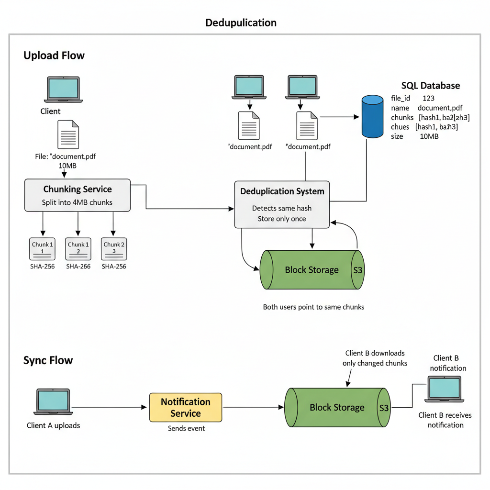

# 09. Design Google Drive / Dropbox

**Difficulty:** Hard
**Focus:** File Synchronization, Chunking, Consistency.

---

## 🎯 Real-World Analogy

**Think of file chunking like a pizza delivery:**

**Sending Whole Pizza (No Chunking - Bad):**
- 1 large pizza (100MB file)
- Delivery fails halfway
- Start over from beginning
- ❌ Frustrating!

**Sending Pizza Slices (Chunking - Good):**
- 8 slices (8 chunks of 12.5MB each)
- Slice 5 fails to deliver
- Just re-send slice 5
- ✅ Efficient!

**Key Insight:** Large files are hard to manage. Breaking them into small pieces (chunks) makes everything easier—uploading, syncing, and deduplicating.

---

## 1. Requirements (0-5 Minutes)

**Functional:**
1.  **Upload/Download:** Files.
2.  **Sync:** Automatic sync across devices.
3.  **History:** Version control.

**Non-Functional:**
1.  **Reliability:** Never lose data (ACID for metadata).
2.  **Bandwidth Efficiency:** Don't re-upload the whole file if only 1 byte changed.

---

## 2. Estimations (5-10 Minutes)

*   **Users:** 50M DAU.
*   **Storage:** 10GB free space.
*   **Total Storage:** Massive. We need S3 (Object Storage).

---

## 3. High-Level Design (10-20 Minutes)



**Components:**
1.  **Client:** Desktop/Mobile App. Smart logic (Chunking).
2.  **Block Server:** Handles raw file chunks. Writes to S3.
3.  **Metadata DB:** SQL DB. Stores file hierarchy (`/User/Photos/vacation.jpg`).
4.  **Synchronization Service:** Notifies clients of changes.

**Why separate Metadata and Blocks?**
*   Metadata is small, relational, and needs ACID (Moving a folder). -> **SQL**.
*   Blocks are large, immutable, and need cheap storage. -> **S3**.

---

## 4. Deep Dive: Chunking Strategies (20-30 Minutes)

### 📚 ELI5: How to cut the cake?

**Strategy A: Fixed-Size Chunking (Simple)**
- Cut the file into exact 4MB blocks.
- **Problem:** If I insert *one byte* at the beginning of the file:
  - Block 1 shifts → New Hash
  - Block 2 shifts → New Hash
  - ...
  - **All blocks change!** We have to re-upload the *entire* file. ❌

**Strategy B: Variable-Size Chunking (Rolling Hash / Rabin Fingerprint)**
- We look for a "pattern" in the data to decide where to cut.
- Example: "Cut whenever the last 5 bits are 00000".
- **Benefit:** If I insert a byte at the start:
  - Only the *first* chunk changes.
  - The boundary for the second chunk is found based on content, so it stays the same.
  - **Result:** We only re-upload 1 chunk. The rest are deduplicated. ✅

### 💻 Python Implementation (Fixed Chunking)

```python
import hashlib

class FileChunker:
    CHUNK_SIZE = 4 * 1024 * 1024  # 4MB

    def chunk_file(self, file_path):
        chunks = []
        with open(file_path, 'rb') as f:
            while True:
                data = f.read(self.CHUNK_SIZE)
                if not data:
                    break
                
                # Calculate Hash
                chunk_hash = hashlib.sha256(data).hexdigest()
                chunks.append({
                    "hash": chunk_hash,
                    "size": len(data),
                    "data": data  # In reality, stream this
                })
        return chunks
```

### ☕ Java Implementation

```java
import java.io.*;
import java.security.MessageDigest;
import java.util.*;

public class FileChunker {
    private static final int CHUNK_SIZE = 4 * 1024 * 1024; // 4MB
    
    static class Chunk {
        String hash;
        int size;
        byte[] data;
        
        public Chunk(String hash, int size, byte[] data) {
            this.hash = hash;
            this.size = size;
            this.data = data;
        }
    }
    
    public List<Chunk> chunkFile(String filePath) throws Exception {
        List<Chunk> chunks = new ArrayList<>();
        MessageDigest digest = MessageDigest.getInstance("SHA-256");
        
        try (FileInputStream fis = new FileInputStream(filePath)) {
            byte[] buffer = new byte[CHUNK_SIZE];
            int bytesRead;
            
            while ((bytesRead = fis.read(buffer)) != -1) {
                // Create chunk data (copy only actual bytes read)
                byte[] chunkData = Arrays.copyOf(buffer, bytesRead);
                
                // Calculate SHA-256 hash
                digest.reset();
                byte[] hashBytes = digest.digest(chunkData);
                String chunkHash = bytesToHex(hashBytes);
                
                chunks.add(new Chunk(chunkHash, bytesRead, chunkData));
            }
        }
        
        return chunks;
    }
    
    private String bytesToHex(byte[] bytes) {
        StringBuilder sb = new StringBuilder();
        for (byte b : bytes) {
            sb.append(String.format("%02x", b));
        }
        return sb.toString();
    }
    
    // Usage
    public static void main(String[] args) throws Exception {
        FileChunker chunker = new FileChunker();
        List<Chunk> chunks = chunker.chunkFile("/path/to/large/file.mp4");
        
        System.out.println("File split into " + chunks.size() + " chunks");
        for (int i = 0; i < chunks.size(); i++) {
            System.out.println("Chunk " + i + ": " + chunks.get(i).hash);
        }
    }
}
```

---

## 5. Deep Dive: Global Deduplication (30-35 Minutes)

**The Math:**
- We use **SHA-256**.
- **Collision Probability:** $1$ in $10^{77}$.
- It is more likely that a meteor hits your server than two different chunks having the same hash.
- **Safe to assume:** Same Hash = Same Content.

**The Protocol:**
1.  **Client:** "I want to upload `movie.mp4`. Here are the hashes of its 100 chunks: `[h1, h2, h3...]`"
2.  **Server:** Checks DB.
    - "I have `h1` (User B uploaded it)."
    - "I have `h2`."
    - "I don't have `h3`."
3.  **Server -> Client:** "Only send me `h3`. For the rest, I'll just create pointers."
4.  **Client:** Uploads 4MB (instead of 400MB). **99% Bandwidth Saving!**

### 💻 Dedupe Logic

```python
def upload_file(file_path, user_id):
    chunks = chunker.chunk_file(file_path)
    hashes = [c['hash'] for c in chunks]
    
    # Step 1: Check existence
    missing_hashes = api.check_hashes(hashes)
    
    # Step 2: Upload missing
    for chunk in chunks:
        if chunk['hash'] in missing_hashes:
            api.upload_chunk(chunk['data'])
            
    # Step 3: Create Metadata
    # File = List of Hash Pointers
    api.create_file_metadata(user_id, file_path, hashes)
```

---

## 6. Deep Dive: Delta Sync (Rsync Algorithm) (35-40 Minutes)

**Scenario:**
You have a 1GB file. You change **one letter**.
We don't want to re-upload 4MB (Fixed chunk) or calculate complex Rolling Hashes if we don't have to.

**The Rsync Algorithm (Simplified):**
1.  **Server** sends a list of checksums (weak rolling hash + strong MD5 hash) for each block of the *existing* file.
2.  **Client** runs a "sliding window" over the *new* file.
3.  Client compares the window's checksum with the Server's list.
4.  **Match Found:** Client says "Block X is same as Server Block Y".
5.  **No Match:** Client sends the literal bytes.

**Result:**
We only send the *exact* bytes that changed, plus a "recipe" to reconstruct the file.

---

## 7. Deep Dive: Synchronization (40-42 Minutes)

*   **Scenario:** User A adds a file on Laptop. How does Phone know?
*   **Long Polling:**
    *   Phone keeps a connection open to **Notification Service**.
    *   When Metadata DB updates, Notification Service pushes a message: "Change in Folder X".
    *   Phone wakes up, calls Metadata Service to get the new file list, and downloads the new chunks.

---

## 8. Deep Dive: Metadata Database Scaling (42-44 Minutes)

**Problem:**
- 50M users * 1000 files = 50 Billion rows.
- MySQL can't handle 50B rows in one table.

**Solution: Sharding**
- **Shard by `user_id`:** All files for User A are on Shard 1.
- **Pros:** Fast queries for "List all my files". Atomic transactions within a user's folder.
- **Cons:** Hot users (unlikely for file storage).

**Schema:**
- `files` table: `id`, `user_id`, `parent_id`, `name`, `is_folder`.
- `versions` table: `file_id`, `version_num`, `chunk_hashes` (JSON List).

---

## 9. Deep Dive: Conflict Resolution (44-45 Minutes)

**Scenario:**
- User A edits `doc.txt` (Version 1 -> 2).
- User B edits `doc.txt` (Version 1 -> 2) *offline*.
- User B comes online. **Conflict!**

**Strategy:**
1.  **Last Write Wins (LWW):** Bad. User A loses data.
2.  **Create Copy (Dropbox Style):**
    - Rename User B's file to `doc (User B's conflicted copy).txt`.
    - Both versions exist. User decides.
3.  **Operational Transformation (OT) / CRDT:**
    - Only for real-time collab (Google Docs).
    - For File Storage, **Create Copy** is the standard.

---

## 9A. Deep Dive: Encryption & Security

**Client-Side Encryption:**
- Files encrypted on client before upload.
- **Key Management:**
    - User's encryption key derived from password (PBKDF2).
    - Server never sees plaintext or encryption key.
    - **Benefit:** Zero-knowledge encryption (even if server is compromised, files are safe).

**Implementation:**
```python
import hashlib
from cryptography.fernet import Fernet

class SecureFileUploader:
    def derive_key(self, password, salt):
        # Derive encryption key from password
        key = hashlib.pbkdf2_hmac('sha256', password.encode(), salt, 100000)
        return base64.urlsafe_b64encode(key)
    
    def encrypt_chunk(self, chunk_data, encryption_key):
        f = Fernet(encryption_key)
        encrypted = f.encrypt(chunk_data)
        return encrypted
    
    def upload_encrypted_file(self, file_path, password):
        salt = os.urandom(16)
        key = self.derive_key(password, salt)
        
        chunks = self.chunk_file(file_path)
        for chunk in chunks:
            encrypted_chunk = self.encrypt_chunk(chunk['data'], key)
            self.upload_chunk(encrypted_chunk, chunk['hash'])
```

**Java Implementation:**
```java
import javax.crypto.Cipher;
import javax.crypto.SecretKey;
import javax.crypto.SecretKeyFactory;
import javax.crypto.spec.PBEKeySpec;
import javax.crypto.spec.SecretKeySpec;
import java.security.SecureRandom;

public class SecureFileUploader {
    private static final int ITERATIONS = 100000;
    private static final int KEY_LENGTH = 256;
    
    public SecretKey deriveKey(String password, byte[] salt) throws Exception {
        PBEKeySpec spec = new PBEKeySpec(
            password.toCharArray(), 
            salt, 
            ITERATIONS, 
            KEY_LENGTH
        );
        SecretKeyFactory factory = SecretKeyFactory.getInstance("PBKDF2WithHmacSHA256");
        byte[] keyBytes = factory.generateSecret(spec).getEncoded();
        return new SecretKeySpec(keyBytes, "AES");
    }
    
    public byte[] encryptChunk(byte[] chunkData, SecretKey key) throws Exception {
        Cipher cipher = Cipher.getInstance("AES/GCM/NoPadding");
        cipher.init(Cipher.ENCRYPT_MODE, key);
        return cipher.doFinal(chunkData);
    }
}
```

---

## 9B. Deep Dive: Access Control & File Sharing

**Sharing Scenarios:**
1.  **Public Link:** Anyone with link can view.
2.  **Private Share:** Specific users can view/edit.
3.  **Expiring Link:** Link expires after 7 days.

**Implementation Strategy:**
```sql
CREATE TABLE file_permissions (
    file_id INT,
    user_id INT,  -- NULL for public links
    permission ENUM('view', 'edit', 'owner'),
    share_token VARCHAR(64),  -- Random token for public links
    expires_at TIMESTAMP,
    created_at TIMESTAMP
);
```

**Access Check Logic:**
```python
def can_access_file(file_id, user_id, share_token=None):
    # Check 1: Is user the owner?
    if is_owner(file_id, user_id):
        return True
    
    # Check 2: Does user have explicit permission?
    perm = get_permission(file_id, user_id)
    if perm and perm.expires_at > now():
        return True
    
    # Check 3: Is share_token valid?
    if share_token:
        public_perm = get_permission_by_token(share_token)
        if public_perm and public_perm.expires_at > now():
            return True
    
    return False
```

**Revocation:**
- When owner revokes access, delete permission row.
- For public links, delete or set `expires_at = NOW()`.

---

## 9C. Deep Dive: Bandwidth Optimization

**Compression:**
- Compress chunks before upload (gzip, zstd).
- **Trade-off:** CPU time vs bandwidth savings.

**Adaptive Chunking:**
- Small files (<1MB): Upload whole file (avoid chunking overhead).
- Large files (>100MB): Use 8MB chunks.
- **Benefit:** Reduces metadata overhead for small files.

**Parallel Uploads:**
```python
import concurrent.futures

def parallel_upload(chunks, max_workers=5):
    with concurrent.futures.ThreadPoolExecutor(max_workers=max_workers) as executor:
        futures = {executor.submit(upload_chunk, chunk): chunk for chunk in chunks}
        for future in concurrent.futures.as_completed(futures):
            chunk = futures[future]
            try:
                result = future.result()
                print(f"Uploaded chunk {chunk['hash']}")
            except Exception as e:
                print(f"Failed to upload chunk {chunk['hash']}: {e}")
```

**Resume Uploads:**
- Client tracks uploaded chunks locally.
- If upload fails, resume from last successful chunk.
- **Implementation:** Store upload state in local SQLite DB.

---

## 10. Real-World Engineering Case Studies (Deep Dive)

### 1. Dropbox: Magic Pocket (Custom Storage Infrastructure)

**Source:** Dropbox Engineering Blog - "Magic Pocket"

**The Challenge:**
Dropbox was paying AWS $75M/year for S3 storage.
- **Problem:** S3 costs scale linearly with data. At exabyte scale, this becomes unsustainable.
- **Deduplication:** S3 doesn't deduplicate across users. If 1M users upload the same cat photo, S3 stores it 1M times.

**The Solution: Build Your Own Storage (Magic Pocket)**

**Architecture:**
1.  **Custom Hardware:**
    - Dropbox designed their own storage servers.
    - High-density: 90TB per server (using SMR drives).
    - Custom RAID configuration optimized for write-once, read-many workloads.
2.  **Global Deduplication:**
    - Every block is hashed (SHA-256).
    - If Block X exists anywhere in the system, new uploads just create a pointer.
    - **Result:** 1M copies of the same file = 1 physical copy + 1M metadata pointers.
3.  **Reed-Solomon Erasure Coding:**
    - Instead of 3x replication (300% overhead), Dropbox uses erasure coding.
    - Split data into 16 chunks, add 4 parity chunks.
    - Can lose any 4 chunks and still recover the file.
    - **Overhead:** 125% instead of 300%. **Massive savings!**

**Key Insight:**
At exabyte scale, building custom infrastructure is cheaper than cloud storage. Dropbox saved $75M/year by moving off S3.

---

### 2. Google Drive: The "Chunk Store" Architecture

**Source:** Google Research

**The Challenge:**
Google Drive supports real-time collaboration (Google Docs).
- **Problem:** How to sync edits from 10 users typing simultaneously without conflicts?

**The Solution: Operational Transformation (OT) + Chunk Store**

**Architecture:**
1.  **Chunk Store (Colossus):**
    - Google's distributed file system (successor to GFS).
    - Files are split into 8MB chunks.
    - Chunks are replicated across data centers (geo-redundancy).
2.  **Operational Transformation (OT):**
    - For Google Docs, edits are represented as operations: `Insert("hello", position=5)`.
    - The server transforms conflicting operations to ensure convergence.
    - Example:
        - User A: Insert "X" at position 5.
        - User B: Insert "Y" at position 5 (simultaneously).
        - Server transforms: User B's operation becomes Insert "Y" at position 6 (after User A's edit).
3.  **Revision History:**
    - Every edit creates a new "revision" (snapshot).
    - Revisions are stored as deltas (only the changes), not full copies.
    - Users can revert to any point in time.

**Key Insight:**
**Key Insight:**
For collaborative editing, **Operational Transformation** ensures consistency without locking. For file storage, **Chunking + Deduplication** minimizes storage costs.

---

## 11. Failure Scenarios & Disaster Recovery

### Scenario 1: Metadata Database Corruption
**Impact:** Files exist in S3 but the system doesn't know which chunks belong to which file.
**Detection:**
- `metadata_checksum_mismatch` alerts.
- Users report "File not found" despite successful upload.

**Mitigation:**
- **Point-in-Time Recovery (PITR):** Use RDS/Aurora with 35-day backup retention.
- **Secondary Index in S3:** Store a JSON manifest of chunks alongside the file in S3 as a backup of the metadata.

### Scenario 2: S3 Regional Outage
**Impact:** Users in a specific region cannot upload or download files.
**Detection:** `s3_request_failure_rate > 5%`.

**Mitigation:**
- **Cross-Region Replication (CRR):** Automatically replicate all chunks to a secondary region.
- **Global Load Balancer:** Use Route 53 to failover traffic to the healthy region.

### Scenario 3: Client-Side Sync Conflict
**Impact:** Two users edit the same file offline and sync simultaneously.
**Detection:** `sync_conflict_detected_total`.

**Mitigation:**
- **Last-Write-Wins (LWW):** Simple but data-loss prone.
- **Conflict Files:** Create a copy of the file (e.g., `file (User B's conflicted copy).txt`) and let the user resolve it manually.

---

## 12. Monitoring & Observability

### Golden Signals Dashboard

**1. Latency**
- **Upload Time (per MB):** P95 < 5s.
- **Metadata Query:** P99 < 50ms.
- **Metric:** `file_upload_latency_seconds`.

**2. Traffic**
- **Throughput:** GB/sec uploaded/downloaded.
- **Metric:** `storage_egress_bytes_total`.

**3. Errors**
- **Metric:** `chunk_upload_failure_rate`.
- **Target:** < 0.01%.

**4. Saturation**
- **Metric:** Metadata DB CPU, S3 request rate limits.

### Alert Rules
```yaml
alerts:
  - alert: HighSyncLatency
    expr: histogram_quantile(0.95, sum(rate(sync_latency_ms_bucket[5m])) by (le)) > 2000
    for: 5m
    labels:
      severity: warning
```

---

## 13. API Design & Versioning

### File API

**Upload Chunk**
```http
POST /api/v1/chunks
Content-Type: application/octet-stream
X-Chunk-Hash: sha256-abc...

Response:
{
  "status": "stored",
  "chunk_id": "uuid-123"
}
```

**Get File Metadata**
```http
GET /api/v1/files/{file_id}
```

### Versioning
- Use `/v1/`, `/v2/` in URL.
- **File Versioning:** Support `?version=3` to retrieve historical versions of a file.

---

## 14. Cost Analysis & Optimization

### Monthly Infrastructure Costs (at 100 PB storage)

**1. Storage (S3 Standard)**
- 100 PB = **$2,300,000/month**.

**2. Metadata DB (Aurora)**
- 10 TB metadata = **$5,000/month**.

**3. Data Transfer (Egress)**
- 1 PB egress = **$50,000/month**.

**Total:** ~$2.35M/month.

### Optimization Opportunities
- **Intelligent Tiering:** Move chunks not accessed for 30 days to S3 Infrequent Access (IA) to save 40%.
- **Erasure Coding:** Reduce storage overhead from 3x (300%) to 1.5x (150%) using custom block storage (like Dropbox Magic Pocket).

---

## 15. Security & Compliance

### Security Measures
- **Encryption at Rest:** Use AES-256 with AWS KMS.
- **Encryption in Transit:** TLS 1.3 for all API calls.
- **Client-Side Encryption:** Encrypt chunks on the device before upload so the server never sees raw data (Zero-Knowledge).

### Compliance
- **SOC2/HIPAA:** Ensure audit logs track every file access event.
- **Data Residency:** Use S3 Bucket Policies to ensure German users' data stays in the `eu-central-1` region.

---

## 16. Testing Strategies

### Unit Tests
- Test chunking algorithm (Rolling Hash).
- Test deduplication logic: "If I upload the same chunk twice, is it stored once?"

### Integration Tests
- Upload a 1GB file, delete local copy, download, and verify SHA-256 checksum.

### Load Testing
- Simulate 10,000 concurrent uploads.
- **Tool:** `k6` with binary payload support.

---

## 17. Migration & Rollout Strategies

### Rollout
- **Canary:** Enable the new "Delta Sync" algorithm for 1% of users.

### Migration
- **S3 to Custom Storage:** Use a "Shadow Write" approach where new files go to both S3 and the new system. Slowly migrate old files in the background.

---

## 18. Performance Optimization

### Upload Optimization
- **Parallel Uploads:** Upload 5 chunks of a file simultaneously.
- **Resumable Uploads:** Use S3 Multipart Upload to allow resuming after a network failure.

### Download Optimization
- **Edge Caching:** Cache popular public files in a CDN (CloudFront).
- **Predictive Prefetching:** If a user opens a folder, prefetch the first 1MB of the most recently modified files.

---

## 19. Capacity Planning

### Scaling Triggers
- **Metadata DB:** Shard the database by `user_id` when it exceeds 5TB.
- **Storage:** Monitor S3 bucket quotas and request rate limits (5,500 GETs/sec per prefix).

### Throughput Projection
- 10M users × 100MB upload/day = 1 PB/day ingress.

---

## 20. Interview Cheat Sheet

### Key Numbers
- **Chunk Size:** 4MB (Standard).
- **Deduplication Ratio:** ~30-50% for enterprise users.
- **Availability:** 99.99% (S3).

### Core Components
1. **Block Service:** Manages raw chunks in S3.
2. **Metadata Service:** Stores file hierarchy and chunk mapping.
3. **Notification Service:** Pushes sync events to devices.
4. **Sync Service:** Orchestrates the upload/download flow.

### Critical Trade-offs
- **Client-side vs Server-side Chunking:** Client CPU usage vs Server bandwidth.
- **Consistency vs Availability:** Can I see my file immediately on my phone after uploading from my laptop? (Strong consistency for metadata).

---

## 21. Wrap-up (Deep Dive)

**Summary:**
"I designed a scalable File Storage system separating **Metadata (SQL)** from **Block Storage (S3)** for efficiency.
1.  **Chunking:** I used client-side chunking with **SHA-256 hashing** to enable global deduplication and delta sync.
2.  **Sync:** I implemented a **Long Polling** notification service to push changes to all connected devices in real-time.
3.  **Real-World:** I discussed **Dropbox's Magic Pocket** (custom storage infrastructure with erasure coding) and **Google Drive's OT** for collaborative editing.
4.  **Production Readiness:** I addressed failure modes like metadata corruption, optimized costs via erasure coding, and ensured security through zero-knowledge encryption."

---
